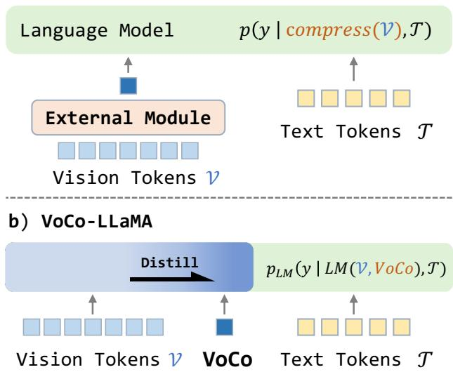

# VoCo-LLaMA：基于大型语言模型的视觉压缩研究

Xubing 叶1, 甘玉康2, 黄晓可3, 叶怡霄2*, 唐彦松1* 1清华大学深圳国际研究生院 2腾讯PCG ARC实验室 3加州大学圣克鲁斯分校 {yxb23@mails., tang.yansong@sz.tsinghua.edu.cn} {brucegan, yixiaoge}@tencent.com xhuanl92@ucsc.edu

# 摘要

视觉语言模型（VLMs）在各种多模态任务中取得了显著成功，但它们常常受到有限上下文窗口和处理高分辨率图像输入与视频的高计算成本的瓶颈。视觉压缩可以通过减少视觉词元数量来缓解这个问题。以往的方法通过外部模块压缩视觉词元，并强迫大型语言模型（LLMs）理解这些压缩后的词元，从而导致视觉信息的丢失。然而，LLMs 对视觉词元的理解范式未在压缩学习过程中得到充分利用。我们提出了 VoCo-LLaMA，这是首个使用 LLMs 进行视觉词元压缩的方法。通过在视觉指导调优阶段引入视觉压缩词元并利用注意力蒸馏，我们的方法将 LLMs 理解视觉词元的过程蒸馏到它们对 VoCo 词元的处理之中。VoCo-LLaMA 促进了有效的视觉压缩，提高了推理阶段的计算效率。具体来说，我们的方法能够实现 $5 7 6 \times$ 的压缩率，同时保持 $8 3 . 7 \%$ 的性能。此外，通过使用视频帧的时间序列压缩词元序列进行持续训练，VoCo-LLaMA 展现出理解时间相关性的能力，超越了以往在流行视频问答基准上的方法。我们的方法为释放 VLMs 上下文窗口的全部潜力提供了一种有前景的途径，使多模态应用更加可扩展。

# 1. 引言

视觉语言模型的出现导致了视觉理解方面的显著进展。特别是，高分辨率图像编码和更多视频帧的引入已被证明能够增强大视觉语言模型和大视频语言模型的能力。然而，大量的视觉词元占据了大型语言模型宝贵的上下文窗口的大部分，导致昂贵的计算成本。例如，在使用高分辨率图像输入的LLaVA-1.6中，单张分辨率为$672 \times 672$的图像被拆分为更小的块，每个块以$336 \times 336$的分辨率进行编码。这个过程产生了由2880个视觉词元组成的图像表示，占用了上下文长度的一半以上。随着输入图像数量的增加，文本的上下文窗口将进一步受到限制。相关研究探讨了将上下文长度扩展到百万级的有效性，以缓解这一问题，但这种方法需要昂贵的计算资源（例如，某研究需要超过$1000 \mathrm{ v}4$ TPUs）以及在数据和框架开发中的工程努力。

  
Figure 1. (a) Previous methods exploit external module, such as Q-Former [25] or average pooling [28], to "compress" vision tokens with substantial loss. (b) Illustration of VoCo-LLaMA, which empowers LLM to compress vision tokens and understand compressed tokens via intrinsic token distillation.

为了解决这个问题，之前的方法 [11, 13, 25, 28, 59, 60] 利用 Q-Former [25] 或 Re-sampler [1] 对编码的视觉词元进行“压缩”。如图 1 (a) 所示，这类方法使用外部模块压缩视觉词元，并迫使大型语言模型（LLM）理解这些压缩后的词元。考虑到 LLM 能够有效理解未压缩的视觉词元 [31]，它在自主进行词元压缩方面具有巨大潜力。因此，我们提出了 VoCo-LLaMA，这是我们所知的首个利用大型语言模型内在能力进行视觉压缩的方法。如图 1 (b) 所示，我们在视觉词元和文本词元之间引入视觉压缩（VoCo）词元。通过修改注意力机制，我们确保 VoCo 词元仅关注视觉词元，而文本词元仅关注 VoCo 词元。随后，我们通过 VoCo 词元在视觉和文本词元之间建立了独特的交互通路。这使得 LLM 能够自主地压缩和提炼解析后的视觉词元，特别是其上的变换器激活，形成紧凑的 VoCo 词元。在此基础上，我们进一步研究 VoCo-LLaMA 在处理视频输入上的有效性。每个视频的视觉词元总数可能相当庞大，远远超过大型语言模型（LLM）的上下文长度，使得同时利用 VoCo-LLaMA 压缩所有词元变得不切实际。为了解决这个问题，我们首先使用 VoCo-LLaMA 将每帧的视觉词元压缩成 voco 词元。这些 voco 词元随后被串联形成一个序列词元序列。VoCo-LLaMA 然后从这个序列中提取视觉信息和时间信息，以促进视频理解任务。通过这种有效设计，LLM 能够在相同上下文长度内处理更长的视频。在推理过程中，VoCo-LLaMA 通过采用两阶段前向过程来缓解 LLM 上下文长度有限的问题。第一阶段将每张图像的视觉词元压缩为一组减少的 VoCo 词元，而第二阶段则利用 VoCo 词元和文本词元完成任务。此外，处理涉及相同视觉输入的各种任务时，VoCo 词元可以被缓存和重用，从而提升计算效率并减少存储需求，相较于维护未压缩视觉词元的完整 KV-cache。各种基准测试的实验结果表明，VoCo-LLaMA 实现了 576 倍的压缩率，同时保持了原始性能的 $83.7\%$。此外，观察到推理计算成本的显著降低，包括缓存存储减少至 $99.8\%$、FLOPs 降低至 $94.8\%$ 和推理时间减少至 $69.6\%$。我们的核心贡献总结如下： • 我们提出了 VoCo-LLaMA，首个通过利用大型语言模型的内在能力来压缩视觉词元的方法，从而消除了对任何外部模块的需求。 • 我们将 VoCo-LLaMA 从图像输入扩展到视频输入，使得 LLM 在保持其视频理解能力的同时，处理约 200 倍的视频帧。 • 在图像和视频基准测试中进行的广泛实验展示了我们的方法的有效性，表明在词元压缩和推理效率方面相较于多种现有基线具有优越性能。

# 2. 相关工作

大型语言模型与文本压缩。近年来，大型语言模型（LLMs）引发了一场技术革命。随着训练数据和模型规模的不断扩大，模型 [6, 10, 20, 22, 41, 48, 49, 51] 展现出了卓越的理解和生成语言的能力。特别是如 LLaMA 系列 [10, 20, 48, 49] 的模型已成为众多研究工作的基础模型或主要组成部分。然而，LLMs 中有限的上下文窗口大小长期以来一直是广泛讨论的话题。文本压缩已被证明是一种有效的方法。长期以来的研究成果，包括 [12, 33, 44, 52, 57]，专注于在变换器中存储文本表示，以实现密集的信息表示。[2, 46] 证明了将长文本信息提炼为无提示的学生模型的有效性。在类似的脉络中，最近的研究 [9, 16, 40, 50] 探讨了在大型语言模型中压缩文本的潜在应用。相比于语言模型领域，视觉信息压缩的讨论相对较少。我们的工作开创性地利用 LLM 的学习能力压缩视觉信息，旨在填补 VLM 领域的这一空白。

视觉语言模型（VLMs）与视觉压缩。大型语言模型（LLMs）的成功激发了视觉语言模型（VLMs）的显著进展。通过将视觉编码器与LLMs集成，VLMs能够通过指令微调有效实现跨模态理解。以往的方法 [1, 3, 5, 11, 13, 25, 29, 30, 59, 60] 证明了这一训练范式在视觉理解中的成功。VLMs在图像上的成功应用也迅速扩展到视频领域 [19, 23, 26, 28, 32, 34, 37, 39, 47, 58]。通过输入更高分辨率的图像 [5, 29] 和更多的视频帧 [32, 47]，VLMs能够捕获丰富的视觉信息。然而，随着代表输入图像的视觉词元数量的增加，它们占用了语言模型有限上下文窗口的显著部分，甚至可能超出该范围。为了解决这一问题，以往的方法 [11, 13, 25, 59, 60] 主要使用Q-Former [25]，通过可学习查询将图像映射到语言嵌入空间中的固定长度词元，从而压缩视觉信息。最近的一种方法 [28] 运用具有可学习线性层的平均池化，通过多阶段训练策略压缩视觉特征。尽管这些方法在较低压缩倍数下表现尚可，但当压缩词元数量减少时，会导致有价值的视觉信息显著损失。VoCo-LLaMA将LLMs在理解视觉词元方面的经验提炼到对压缩词元的处理过程中，在视觉压缩过程中显著减少信息损失。

  
F effective compression of vision tokens into the transformer activations upon the compact VoCo tokens.

# 3. 方法

我们首先介绍 VoCo-LLaMA，这是一种能够通过注意力蒸馏将较长的视觉词元压缩为紧凑的 VoCo 词元的大型语言模型，从而实现高效的视觉信息表示。然后，我们在这些压缩词元上继续训练 VoCo-LLaMA，使我们的模型能够捕捉视频数据中的时间依赖性。原始的、不做修改的标准大型视觉语言模型（记作 $L M _ { o }$），以 LLaVA [30] 为例，如图 2 (a) 所示。在视觉指令微调过程中，$L M _ { o }$ 同时利用视觉词元 $\nu$ 和文本词元 $\tau$ 来预测输出 $y$，并学习分布 $p _ { L M _ { o } } ( y \mid \mathcal { V } , \mathcal { T } )$。对于图像压缩模型，我们的目标是使用一组紧凑的压缩词元 $\mathcal { C }$ 来高效表示视觉词元集 $\nu$。此外，我们旨在生成的输出与原始模型 $L M _ { o }$ 在相同图像和文本输入下的输出极为接近。在图像被编码为视觉词元 $\nu$ 的情况下，我们将图像压缩蒸馏过程公式化为学习一个压缩模型 $L M _ { c }$，该模型生成的输出 $y$ 依赖于压缩词元 $\mathcal { C }$ 和文本词元 $\tau$。这通过学习概率分布 $p _ { L M _ { c } } ( y \mid { \mathcal { C } } , { \mathcal { T } } )$ 来实现。$L M _ { c }$ 的优化目标是最小化损失函数：

$$
E _ { \mathcal { V } , \mathcal { T } } [ D _ { K L } ( p _ { L M _ { o } } ( y \mid \mathcal { V } , \mathcal { T } ) \parallel p _ { L M _ { c } } ( y \mid \mathcal { C } , \mathcal { T } ) ) ]
$$

在上述蒸馏目标下，如何进一步将视觉词元 $\nu$ 中的信息蒸馏到压缩词元 $\mathcal { C }$ 中是视觉压缩的关键。

# 3.1. 视觉压缩

给定一对图像和文本输入，我们遵循大多数视觉-语言模型（VLMs）的设计，将图像编码为一个视觉词元序列 $\mathcal { V } = \{ V _ { 1 } , \ldots , V _ { n } \}$，其中 $n$ 是来自视觉编码器的输出块的数量。类似地，文本输入被编码为一个文本词元序列 $\mathcal { T } = \{ T _ { 1 } , \ldots , T _ { m } \}$。

# 3.2. VoCo-LLaMA

如图 2 (b) 所示，VoCo-LLaMA 利用大语言模型压缩视觉词元为紧凑的视觉压缩（VoCo）词元，并通过这些 VoCo 词元学习理解图像。大语言模型的输入序列由视觉词元、特殊的 $V o C o$ 词元和文本词元串联而成，从而形成一个序列：

  
video domain: Enabling more frames input with a limited context length.

$$
( \mathcal V , V o C o , \mathcal T ) = ( V _ { 0 } , \dots , V _ { n } , V o C o , T _ { 0 } , \dots , T _ { m } )
$$

在训练阶段，我们采用了两阶段的注意力机制。最初，我们对文本词元施加了一项约束，明确防止它们关注原始视觉词元，并要求它们仅关注经过压缩和提炼的VoCo词元。随后，由于因果注意力机制，视觉词元会持续关注VoCo词元。这一设计确保文本词元仅捕获编码在VoCo词元中的提炼视觉信息，而不是直接与原始视觉词元交互，从而实现了从视觉词元到压缩词元的有效压缩。VoCo-LLaMA的压缩过程可以通过修改注意力掩码优雅地实现。具体而言，我们将文本词元与视觉词元之间的注意力权重设置为$F a l s e$，有效地使文本词元“隔离”于视觉词元。严格来说，设$\mathbf { M } \in \mathbb { R } ^ { ( m + n + 1 ) \times ( m + n + 1 ) }$表示注意力掩码，其中$M _ { i j } = T r u e$如果词元$i$关注词元$j$，否则$M _ { i j } = F a l s e$。我们将注意力掩码定义为：

$$
M _ { i j } = \left\{ { \begin{array} { l l } { T r u e , } & { { \mathrm { i f ~ } } i \in { \mathcal { T } } { \mathrm { ~ a n d ~ } } j \in V o C o , } \\ { F a l s e , } & { { \mathrm { i f ~ } } i \in { \mathcal { T } } { \mathrm { ~ a n d ~ } } j \in \mathcal { V } , } \\ { T r u e , } & { { \mathrm { o t h e r w i s e } } . } \end{array} } \right.
$$

在实践中，VoCo-LLaMA 可以有效地在标准的监督微调范式下进行训练，利用在视觉语言模型中现成的丰富的图像-文本数据。此外，VoCo 词元可以紧凑地表示为一组 Transformer 激活，这使得它们可以被缓存以提高推理效率，本节将在 3.3 中讨论。

  
Figure 4. Illustration of the two stage forward operation with KV cache for VoCo-LLaMA during inference. The first forward pass extract image into VoCo cache. The cached VoCo tokens can be utilized to handle different taksk that involve same image.

VoCo-LLaMA 使得大型语言模型能够学习视觉词元的压缩过程，$L M ( \nu , V o C o )$，同时学习理解压缩后的 VoCo 词元。我们定义目标学习分布如下：

$$
p _ { V o C o - L L a M A } = p _ { L M } ( y \mid L M ( \mathcal { V } , V o C o ) , \mathcal { T } )
$$

公式 (1) 中的优化目标可以定义为：

$$
E \nu , \tau [ D _ { K L } ( p _ { L M _ { o } } ( y \mid \mathcal { V } , \mathcal { T } ) \mid \mid p _ { V o C o - L L a M A } ]
$$

# 3.3. VoCo 缓存的重用

在推理过程中，VoCo-LLaMA通过将单次前向传播分为两个阶段来缓解有限上下文窗口大小的问题。如图4所示，第一次前向传播以[视觉词元，VoCo词元]作为输入，将视觉信息压缩为关于VoCo词元的Transformer激活。第二次前向传播以[文本词元]作为输入，并将VoCo激活加载为KV缓存。此外，来自第一次前向传播的VoCo词元可以在处理涉及相同图像/视频输入的各种任务时进行缓存和重用，从而提高计算效率并减少存储需求，相较于维持未压缩视觉词元的整个KV缓存。有关推理实现的更多细节，请参阅补充材料。

# 3.4. 时间建模

当给定一系列视频帧 $\begin{array} { r l } { V i d } & { { } = } \end{array}$ $\{ \gamma _ { 1 } , \ldots , \gamma _ { k } \}$ 和相应的文本输入时，整个视频的词元长度远超出LLM的上下文长度，如图3(a)所示。为了解决这个问题，VoCo-LLaMA将视频输入分割成更小的片段，并使用VoCo词元 $\{ V o C o _ { 1 } , \ldots , V o C o _ { k } \}$ 将这些片段输入到LLM中。如图3(b)所示，所有帧都被压缩成VoCo激活。具体来说，我们通过 $C a c h e ( V o C o _ { t } ) ~ = ~ L M ( \mathcal { V } _ { t } , V o C o _ { t } )$ 为视频片段词元 $\nu _ { t }$ 获取压缩表示 $C a c h e _ { t }$ 。这产生了一系列KV缓存，表示压缩的视频词元，记作 $\mathcal { F } = \{ C a c h e ( V o C o _ { 1 } ) , \dots , C a c h e ( V o C o _ { k } ) \}$ 。获得时间序列压缩缓存序列 $\mathcal { F }$ 后，我们使语言模型能够捕获和理解压缩视频词元之间的时间相关性。通过包括文本词元 $\tau$ ，VoCo-LLaMA学习分布 $p ( y \mid \mathcal { F } , \mathcal { T } )$ 。我们基于具备图像压缩能力的VoCo-LLaMA采用持续训练过程，使模型能够专注于时间建模，从而简化视频理解过程。

# 3.5. 实施细节

关于训练策略和数据，正如在第3.2节中提到的，VoCo-LLaMA只需在视觉指令调整阶段学习插入和压缩VoCo令牌。我们遵循一般的视觉语言模型（VLMs）[29, 30]，使用视觉编码器和线性投影器将图像输入编码为视觉令牌。我们采用预训练的CLIP-ViT-L [43]作为我们的视觉编码器。对于预训练的大型语言模型，我们使用Vicuna-7B [10]。在未引入VoCo令牌的情况下，我们首先使用LLaVA过滤的CC3M [45]数据集在视觉编码器和语言模型保持冻结的状态下对视觉编码器和语言模型进行对齐。在VoCo-LLaMA的指令调整阶段，结合多种图像理解任务对于学习可扩展的图像压缩模型至关重要。因此，我们使用[29]构建了受[28]启发的指令对。对于视频调整，我们进一步利用WebVid [4]和Video-ChatGPT [39]的问答对。此外，还采用了梯度检查点策略以减少训练过程中的计算成本。我们在多个常见压缩策略上进行了实验，采用相同的训练设置和数据进行比较。对于使用Q-Former的压缩策略，我们采用[25]中的架构，并将查询数量配置为1，从而得到一个单一的压缩令牌。对于使用平均池化的压缩策略，我们遵循[28]中单一内容令牌的设计。有关训练和推理实现的更多细节，请参见补充材料。

# 4. 实验

# 4.1. 数据集

在本研究中，我们对几个常见的视觉理解基准进行了视觉压缩实验。特别是，我们报告了在 GQA [21]、MMB (MMBench) [35]、MME [15]、POPE [27]、SEED-Bench [24]、$\mathbf { S } \mathbf { Q } \mathbf { A } ^ { I }$（ScienceQA 中的基于图像的设置）[36] 以及 $\mathsf { V Q A } ^ { v 2 }$（VQA V2）[17] 上的结果。通过观察模型在这些图像理解基准上在压缩前后（即使用初始视觉词元 / VoCo 词元）的表现，我们可以观察到视觉信息在视觉压缩过程中出现的损失效果。我们根据 [30] 中概述的细节来评估这些视觉理解基准的性能。至于视频领域，我们在多个视频问答基准上评估了零样本性能。MSVDQA [53] 是一个视频问答数据集，包含 1,970 个视频片段和 50,505 对问答，基于微软研究院的视频描述语料库 [7]。MSRVTT-QA [53] 是一个大规模视频问答数据集，包含 10,000 个视频和 243,000 对问答对，涉及复杂场景，基于 MSR-VTT 数据集 [54]。ActivityNet-QA [56] 是一个完全注释的视频问答数据集，包含 58,000 对问答，源自 ActivityNet 数据集中 5,800 个复杂的网络视频 [18]。

# 4.2. 视觉压缩配置

在视觉压缩的主要实验中，我们展示了将图像的所有视觉词元压缩为一个单一的VoCo词元的结果。为了严格量化VoCo-LLaMA在压缩过程中的性能损失，我们设计了两种对比训练设置：上界模型，代表最佳压缩性能。视觉压缩模型的理想情况是获得与上界模型相同的视觉理解能力；下界模型，代表最差压缩性能。初始化模型的训练通过以与VoCo-LLaMA相似的方式集成VoCo词元，而不修改注意力掩码策略。在推理过程中，我们采用标准因果注意力掩码。这种设置有效控制了由于引入额外特殊词元引起的性能波动。相比之下，随机压缩模型则在与初始化模型相同的设置下训练。在推理过程中，我们将文本词元的可见性限制为仅VoCo词元，隔离视觉信息。该设置代表了没有视觉压缩训练的场景，为评估提供了基线。基于性能边界模型，压缩保留率可以随后计算为(VoCo-LLaMA的结果 − 下界)/(上界 − 下界)。将576个视觉词元（来自$( 3 3 6 / 1 4 ) ^ { 2 } = 5 7 6 $）压缩为一个。我们进一步报告了第3.5节中提到的压缩性能。

<table><tr><td>Method</td><td>Token</td><td>GQA</td><td>MMB</td><td>MME</td><td>POPE</td><td>SEED</td><td>SQAI</td><td>VQAv2</td><td>Avg.</td></tr><tr><td>Upper Bound</td><td>576</td><td>61.1 100%</td><td>64.0 100%</td><td>1487.2 100%</td><td>85.0 100%</td><td>57.9 100%</td><td>66.5 100%</td><td>77.7 100%</td><td>- 100%</td></tr><tr><td>VoCo-LLaMA</td><td>1</td><td>57.0 82.5%</td><td>58.8 87.5%</td><td>1323.3 81.2%</td><td>81.4 88.4%</td><td>53.7 80.0%</td><td>65.4 81.0%</td><td>72.3 85.2%</td><td>- 83.7%</td></tr><tr><td>Avg. Pool [28] + Linear</td><td>1</td><td>52.9 65.0%</td><td>55.5 79.6%</td><td>1210.3 68.1%</td><td>79.1 81.0%</td><td>50.3 63.8%</td><td>62.2 25.8%</td><td>65.0 65.2%</td><td>- 64.1%</td></tr><tr><td>Q-Former [25]</td><td>1</td><td>51.1 57.3%</td><td>51.7 70.5%</td><td>1079.7 53.2%</td><td>77.3 75.2%</td><td>47.2 49.0%</td><td>62.7 34.5%</td><td>63.4 60.8%</td><td>- 57.2%</td></tr><tr><td>Lower Bound</td><td>1</td><td>37.7 0%</td><td>22.3 0%</td><td>617.3 0%</td><td>53.9 0%</td><td>36.9 0%</td><td>60.7 0%</td><td>41.2 0%</td><td>- 0%</td></tr></table>

Table 2. Effect of VoCo tokens count on widely used benchmarks. The number of VoCo tokens increases from 1 to 128. Green and red represent the Upper and Lower Bound, respectively.   

<table><tr><td>Token</td><td>MMB</td><td>GQA</td><td>VQAv2</td><td>SEED</td><td>Avg.</td></tr><tr><td>576</td><td>64.0</td><td>61.1</td><td>77.7</td><td>57.9</td><td>100%</td></tr><tr><td>128</td><td>61.0</td><td>59.8</td><td>76.9</td><td>59.1</td><td>97.7%</td></tr><tr><td>64</td><td>60.5</td><td>60.4</td><td>75.4</td><td>56.3</td><td>93.7%</td></tr><tr><td>32</td><td>59.4</td><td>60.2</td><td>75.3</td><td>56.2</td><td>92.6%</td></tr><tr><td>16</td><td>58.6</td><td>59.4</td><td>75.4</td><td>56.2</td><td>91.3%</td></tr><tr><td>8</td><td>58.7</td><td>59.2</td><td>75.3</td><td>56.3</td><td>91.3%</td></tr><tr><td>4</td><td>60.4</td><td>58.4</td><td>74.5</td><td>56.0</td><td>90.4%</td></tr><tr><td>2</td><td>60.1</td><td>57.7</td><td>73.5</td><td>55.0</td><td>87.8%</td></tr><tr><td>1</td><td>58.8</td><td>57.0</td><td>72.3</td><td>53.7</td><td>83.8%</td></tr><tr><td>1</td><td>22.3</td><td>37.7</td><td>41.2</td><td>36.9</td><td>0%</td></tr></table>

# 4.3. 结果

视觉压缩。表1展示了VoCoLLaMA在视觉压缩上的结果。为了探讨我们方法的最大潜力，我们报告了最高可实现的压缩比，该比率将视觉词元压缩为一个单一的VoCo词元。我们在多个常见视觉理解基准上报告了我们的压缩模型的结果，以及基于第4.2节中介绍的上下界模型定义的压缩保留率。可以观察到，我们的方法在很大程度上保留了原始视觉信息，即使在极高的压缩比$5 7 6 \times$下。具体而言，我们在七个广泛使用的基准测试中实现了$8 3 . 7 \%$的平均压缩保留率。特别是在MMBench、POPE和$\mathsf{V Q A}^{v 2}$上，我们的方法在压缩过程中保留了超过$8 5 \%$的性能。结果表明，VoCo-LLaMA能够有效地压缩视觉词元。此外，我们的方法在所有基准测试中持续超越随机压缩的性能下界模型。这表明VoCo-LLaMA的优势，例如显著减少的上下文长度和提高的计算效率，超过了压缩所造成的性能损失。

Table 3. Comparison with previous compression methods which compress image into single token. $N$ means the number of "content" tokens in LLaMA-VID or the VoCo tokens in our method. The input resolution is set to 224 for fair comparison.   

<table><tr><td>Method</td><td>N</td><td>GQA</td><td>POPE</td><td>SQAI</td><td>VQAT</td></tr><tr><td rowspan="3">LLaMA-VID [28]</td><td>16</td><td>58.2</td><td>83.1</td><td>67.4</td><td>50.8</td></tr><tr><td>4</td><td>56.2</td><td>83.5</td><td>68.7</td><td>49.1</td></tr><tr><td>1</td><td>55.5</td><td>83.1</td><td>68.8</td><td>49.0</td></tr><tr><td>VoCo-LLaMA</td><td>1</td><td>58.3</td><td>85.0</td><td>69.5</td><td>52.7</td></tr></table>

Table 4. Compression performance with adjusted VoCo token numbers during inference on model trained with fixed numbers.   

<table><tr><td>Method</td><td>Token</td><td>MMB</td><td>GQA</td><td>VQAv2</td><td>SEED</td></tr><tr><td></td><td>32</td><td>59.4</td><td>60.2</td><td>75.3</td><td>56.2</td></tr><tr><td>VoCo-LLaMA</td><td>16</td><td>58.3</td><td>58.9</td><td>74.9</td><td>55.8</td></tr><tr><td></td><td>4</td><td>59.7</td><td>58.0</td><td>73.5</td><td>55.2</td></tr><tr><td></td><td>1</td><td>57.9</td><td>56.1</td><td>71.2</td><td>53.0</td></tr></table>

我们还将我们的方法与之前的常见基于学习的方法（即 Q-Former 和平均池化）进行了比较，以实现视觉 token 压缩。我们的方法在所有基准上显著超越了之前的方法。具体而言，我们观察到平均压缩保留率提高了 $19.6\%$，超过了平均池化压缩策略。相比之下，尽管 Q-Former 在使用 32 个查询捕捉视觉特征方面表现出色，但当查询数量减少到个位数时，其性能显著下降。这证明了我们的 VoCo-LLaMA，利用了来自语言模型的知识蒸馏，保持了比平均池化或基于查询的压缩更有价值的视觉信息。

<table><tr><td rowspan="2">Method</td><td rowspan="2">Token</td><td colspan="3">RefCOCO</td><td colspan="3">RefCOCO+</td><td colspan="2">RefCOCOg</td><td rowspan="2">GRIT refexp</td><td rowspan="2">Avg.</td></tr><tr><td>val</td><td>test A</td><td>test B</td><td>val</td><td>test A</td><td>test B</td><td>val (U)</td><td>test (U)</td></tr><tr><td>Upper Bound</td><td>256</td><td>87.01</td><td>90.61</td><td>80.24</td><td>81.60</td><td>87.36</td><td>72.12</td><td>82.27</td><td>82.19</td><td>69.34</td><td>100%</td></tr><tr><td>VoCo-LLaMA</td><td>8 1</td><td>85.17 83.29</td><td>88.92 86.89</td><td>79.21 77.87</td><td>80.02 77.62</td><td>85.13 83.02</td><td>70.22 67.74</td><td>80.36 78.32</td><td>80.64 78.06</td><td>68.59 67.69</td><td>90.7% 79.9%</td></tr><tr><td>Lower Bound</td><td>1</td><td>68.34</td><td>72.96</td><td>68.03</td><td>62.58</td><td>64.77</td><td>50.65</td><td>62.30</td><td>62.99</td><td>60.50</td><td>0%</td></tr></table>

<table><tr><td rowspan="2">Method</td><td rowspan="2">Token</td><td colspan="3">RefCOCO</td><td colspan="3">RefCOCO+</td><td colspan="2">RefCOCOg</td><td rowspan="2">Avg.</td></tr><tr><td>val</td><td>test A</td><td>test B</td><td>val</td><td>test A</td><td>test B</td><td>val (U)</td><td>test (U)</td></tr><tr><td>Upper Bound</td><td>| 256</td><td>75.61</td><td>44.26</td><td>104.83</td><td>56.42</td><td>40.98</td><td>68.25 |</td><td>62.71</td><td>65.58</td><td>100%</td></tr><tr><td rowspan="2">VoCo-LLaMA</td><td>8</td><td>73.87</td><td>43.13</td><td>102.71</td><td>55.34</td><td>39.91</td><td>67.00</td><td>61.59</td><td>64.45</td><td>91.3%</td></tr><tr><td></td><td>71.92</td><td>41.81</td><td>94.50</td><td>53.98</td><td>38.96</td><td>65.35</td><td>60.46</td><td>663.17</td><td>81.6%</td></tr><tr><td>Lower Bound</td><td>| 1</td><td>56.73</td><td>31.82</td><td>78.09</td><td>43.71</td><td>30.26</td><td>52.22</td><td>50.49</td><td>53.22</td><td>0%</td></tr></table>

表格压缩性能在REGask.Avg.中意味着真实压缩保留的范围。

VoCo 词元数量。我们评估了 VoCo 词元数量对视觉压缩性能的影响。表 2 说明了随着 VoCo 词元数量变化，压缩性能保留的趋势，其中绿色和红色线条分别代表压缩性能的上限和下限。我们采用与主要实验相同的训练设置和数据。可以观察到，随着 VoCo 词元数量的增加，模型的整体压缩性能呈上升趋势。在少于 10 个词元的范围内，增加词元数量显著提升了压缩性能。最终，当进行 $1 2 8 ~ \mathrm { V o C o }$ 词元时，模型达到了 $9 7 . 7 \%$ 的平均压缩性能保留率，这表明在压缩到超过 100 个词元时，压缩所导致的性能损失几乎可以忽略不计。有趣的是，我们观察到在使用 $1 2 8 { \mathrm { ~ V o C o } }$ 词元进行训练时，SEEDBench 的结果超过了性能上限模型。压缩方法。我们将我们的方法与 LLaMA-VID 在视觉压缩方面进行比较，尤其评估其利用上下文和内容词元的完整模型。为了公正比较，VoCo-LLaMA 在完全相同的设置下进行训练，并在本实验中应用相同的视觉编码器 EVA-G [14]。如表 3 所示，我们的方法在使用单一内容压缩词元时优于先前的方法，甚至在 LLaMA-VID 使用多个上下文词元时也超过了其性能。具体而言，我们在 GQA 和 $\mathbf { V Q A } ^ { T }$ 基准上分别观察到 2.8 和 3.7 的提升。VoCo 数量的适应性。为了评估模型对不同压缩词元数量的适应能力，我们用固定数量的词元训练模型，并用不同数量的词元评估其性能。如表 4 所示，我们通过在训练期间固定 VoCo 词元数量 (32) 并在推理期间变化词元数量进行了实验。我们的方法在压缩词元数量增加的情况下表现更佳，无需针对弹性压缩词元进行专门训练。

细粒度任务的结果。我们分析了在我们的方案中，经过高倍压缩后的视觉词元损失的细粒度视觉信息的程度。在这里，我们将我们的方法应用于 [8]，该模型是一个结构清晰的多模态大语言模型，训练于细粒度任务数据，如REG、REC和PointQA。如表5和表6所示，将视觉词元压缩至$1 ~ \mathrm { V o C o }$词元时，我们的方法在REC和REG任务上分别保持了令人印象深刻的平均压缩保留率$7 9 . 9 \%$和$8 1 . 6 \%$。此外，随着VoCo词元数量增加到8，我们观察到平均压缩保留率显著提高。我们发现，VoCo-LLaMA在细粒度任务上达到了与其他基准相似的压缩保留率，主要是因为下界模型在细粒度任务上造成了更多的信息损失。有关其他细粒度基准的更多信息，请参阅补充材料，包括VisWiz、OCRBench等。

推理效率。在第3.3节讨论的场景下，我们探讨了图像缓存时的推理效率。由于我们模型的设计，压缩图像的表示（即，基于VoCo词元的变换器激活）可以以KV缓存的形式存储并反复利用。我们对推理过程中CUDA时间、FLOPs和KV缓存存储大小进行了比较分析，并将我们的方法与基线方法和完全缓存方法进行了对比。正如其名称所示，基线方法不采用任何缓存策略，直接对图像进行编码和推理。相对而言，完全缓存方法将所有视觉词元的未压缩变换器激活作为KV缓存进行存储。更具体地说，我们遵循了[42]的方法，存储每个变换器层的键和值。如表7所示，我们在一台单一的NVIDIA A100上，对相同长度的文本提示和单图像输入进行了推理效率分析。与不采用缓存策略的基线模型相比，VoCoLLaMA在CUDA时间上实现了 $6 9 . 6 \%$ 的显著减少，在FLOPs上减少了 $9 4 . 8 \%$。相对完全缓存策略，我们的方法节省了 $9 9 . 8 \%$ 的缓存存储，同时实现了更低的CUDA时间和FLOPs，展示了我们方法带来的推理效率提升。有关推理效率的进一步讨论和细节，请参见补充材料。表7. VoCo-LLaMA的效率分析，包括缓存存储内存、CUDA时间和FLOPs。$\Delta$ 表示减少比率。

<table><tr><td>Method</td><td>Token</td><td>KV Cache Length</td><td>Storage Memory (MB)</td><td>∆</td><td>CUDA Time (ms) ↓</td><td>∆</td><td>FLOPs (T) ↓</td><td>∆</td></tr><tr><td>Baseline</td><td>576</td><td></td><td>-</td><td></td><td>440.5</td><td>-</td><td>9.6</td><td>-</td></tr><tr><td>ul l Caching</td><td>576</td><td>576</td><td>302.4</td><td>.</td><td>154.9</td><td>64.8%</td><td>1.2</td><td>87.5%</td></tr><tr><td>VoCo-LLaMA</td><td>1</td><td>1</td><td>0.525</td><td>99.8%</td><td>134.0</td><td>69.6%</td><td>0.5</td><td>94.8%</td></tr></table>

<table><tr><td rowspan="2">Method</td><td rowspan="2">Visual Encoder</td><td rowspan="2">LLM</td><td rowspan="2">Res.</td><td rowspan="2">Image Token</td><td colspan="2">MSVD-QA Score</td><td colspan="2">MSRVTT-QA</td><td rowspan="2">ActivityNet-QA</td><td rowspan="2">Score</td></tr><tr><td>Acc</td><td>Acc</td><td>Score</td><td>Acc</td></tr><tr><td colspan="10">Methods w/o Vision Compression</td></tr><tr><td>FrozenBiLM [55]</td><td>CLIP-L</td><td>DeVERTa-V2</td><td>224</td><td>256</td><td>32.3</td><td>-</td><td>16.8</td><td>-</td><td>24.7</td><td>-</td></tr><tr><td>Video-LLaMA [58]</td><td>EVA-G</td><td>Vicuna-7B</td><td>224</td><td>256</td><td>5.6</td><td>2.5</td><td>29</td><td>1.8</td><td>12.4</td><td>1.1</td></tr><tr><td>VideoChat [26</td><td></td><td>Vicuna-7B</td><td>224</td><td></td><td>566.3</td><td>2.8</td><td>45.0</td><td>2.5</td><td>26.5</td><td>2.2</td></tr><tr><td>Video-ChatGPT [39]</td><td>CLIP-L</td><td>Vicuna-7B</td><td>224</td><td>256</td><td>64.9</td><td>3.3</td><td>49.3</td><td>2.8</td><td>35.2</td><td>2.7</td></tr><tr><td>BT-ADapter [34]</td><td>CLIP-L</td><td>Vicuna-7B</td><td>-</td><td>-</td><td>67.5</td><td>3.7</td><td>57.0</td><td>3.2</td><td>45.7</td><td>3.2</td></tr><tr><td>Vista-LLaMA [38] Chat-UniVi [23]</td><td>EVA-G CLIP-L</td><td>Viiuna-7B Vicuna-7B</td><td>224</td><td>256</td><td>65.3</td><td>3.6</td><td>60.5</td><td>3.3</td><td>48.3</td><td>3.3</td></tr><tr><td></td><td></td><td></td><td>224</td><td>256</td><td>69.3</td><td>3.7</td><td>55.0</td><td>3.1</td><td>46.1</td><td>3.3</td></tr><tr><td colspan="10">Methods w/ Vision Compression</td></tr><tr><td>LLaMA-VID [28]</td><td>EVA-G</td><td>Vicuna-7B</td><td>224</td><td>2</td><td>69.7</td><td>3.7</td><td>57.7</td><td>3.2</td><td>47.4</td><td>3.3</td></tr><tr><td rowspan="4">VoCo-LLaMA</td><td rowspan="4">CLIP-L</td><td rowspan="4">Vicuna-7B</td><td>224</td><td>2</td><td>72.3</td><td>3.9</td><td>61.1</td><td>3.5</td><td>47.9</td><td>3.4</td></tr><tr><td>336</td><td>2</td><td>72.6</td><td>3.9</td><td>61.2</td><td>3.5</td><td>47.9</td><td>3.4</td></tr><tr><td>224</td><td>8</td><td>73.4</td><td>3.9</td><td>62.0</td><td>3.5</td><td>48.5</td><td>3.4</td></tr><tr><td>336</td><td>8</td><td>73.5</td><td>3.9</td><td>62.3</td><td>3.5</td><td>48.6</td><td>3.4</td></tr></table>

T . 视频理解。我们进一步评估了 VoCo-LLaMA 在三个广泛使用的视频理解基准上的性能，分别报告输入图像分辨率为 224 和 336 的结果。首先，我们讨论利用视觉压缩的视频理解方法。为确保公平比较，我们采用与之前方法 [28] 相同的压缩比，将每个视频帧压缩为 $2 \mathrm { V o C o }$ 词元进行训练和推理。我们的方法在所有三个基准测试中一致优于先前的视频压缩方法。具体而言，在 MSVD-QA 和 MSRVTT-QA 数据集上，VoCo-LLaMA 分别实现了 $7 2 . 3 \%$ 和 $6 1 . 1 \%$ 的准确率，相比于之前的最佳方法，分别有 $3 . 7 \%$ 和 $5 . 9 \%$ 的绝对提升。此外，我们的方法分别达到了 3.9 和 3.5 的最高分。与不采用视觉压缩的视频理解方法相比，我们的方法仅用 2 个 VoCo 词元表示每个视频帧，显示出对每帧使用 256 个或更多视觉词元的方法具有强大的竞争力。为了进一步探索 VoCo-LLaMA 的潜力，我们选择将视频帧压缩为在0量级范围内展现最佳压缩性能的 VoCo 词元数量（即 8 个词元）。值得注意的是，随着词元数量的增加，我们的方法有效利用了额外的视觉信息。我们还分析了视觉压缩带来的性能损失，并在其他视频 QA 基准上进行了评估，详细信息见补充材料。

# 5. 结论

在本文中，我们提出了VoCo-LLaMA，这是首次利用大型语言模型（LLMs）压缩视觉信息的方法。通过将LLMs对视觉词元的理解提炼为紧凑表示，我们的方法能够将数百个视觉词元压缩为一个VoCo词元，同时最小化信息损失。VoCo-LLaMA显著减少了缓存存储并提高了推理阶段的效率。此外，我们的方法在视频数据的时序理解学习中表现出良好的性能，并且能够持续训练。总之，我们的方法为充分利用视觉语言模型（VLMs）有限的上下文窗口提供了有希望的解决方案，使其在多模态应用中更加高效。

# References

[1] Jean-Baptiste Alayrac, Jeff Donahue, Pauline Luc, Antoine Miech, Iain Barr, Yana Hasson, Karel Lenc, Arthur Mensch, Katie Millican, and et al. Flamingo: a visual language model for few-shot learning, 2022. 2   
[2] Amanda Askell, Yuntao Bai, Anna Chen, Dawn Drain, Deep Ganguli, Tom Henighan, Andy Jones, Nicholas Joseph, Benjamin Mann, and et al. A general language assistant as a laboratory for alignment. ArXiv, abs/2112.00861, 2021. 2   
[3] Jinze Bai, Shuai Bai, Shusheng Yang, Shijie Wang, Sinan Tan, Peng Wang, Junyang Lin, Chang Zhou, and Jingren Zhou. Qwen-vl: A versatile vision-language model for understanding, localization, text reading, and beyond. arXiv preprint arXiv:2308.12966, 2023. 1, 2   
[4] Max Bain, Arsha Nagrani, Gül Varol, and Andrew Zisserman. Frozen in time: A joint video and image encoder for end-to-end retrieval. In IEEE International Conference on Computer Vision, 2021. 5   
[5] Rohan Bavishi, Erich Elsen, Curtis Hawthorne, Maxwell Nye, Augustus Odena, Arushi Somani, and Sanak Tarlar. Introducing our multimodal models, 2023. 1, 2   
[6] Tom B. Brown, Benjamin Mann, Nick Ryder, Melanie Subbiah, Jared Kaplan, Prafulla Dhariwal, Arvind Neelakantan, Pranav Shyam, Girish Sastry, Amanda Askell, and et al. Language models are few-shot learners, 2020. 2   
[7] David L Chen and William B Dolan. Collecting highly parallel data for paraphrase evaluation. In Proceedings of the 49th Annual Meeting of the Association for Computational Linguistics: Human Language Technologies-Volume 1, pages 190200. Association for Computational Linguistics, 2011. 5   
[8] Keqin Chen, Zhao Zhang, Weili Zeng, Richong Zhang, Feng Zhu, and Rui Zhao. Shikra: Unleashing multimodal llm's referential dialogue magic, 2023. 7   
[9] Alexis Chevalier, Alexander Wettig, Anirudh Ajith, and Danqi Chen. Adapting language models to compress contexts. In Proceedings of the 2023 Conference on Empirical Methods in Natural Language Processing, pages 38293846, Singapore, 2023. Association for Computational Linguistics. 2   
10] Wei-Lin Chiang, Zhuohan Li, Zi Lin, Ying Sheng, Zhanghao Wu, Hao Zhang, Lianmin Zheng, Siyuan Zhuang, Yonghao Zhuang, Joseph E. Gonzalez, Ion Stoica, and Eric P. Xing. Vicuna: An open-source chatbot impressing gpt-4 with $9 0 \% *$ chatgpt quality, 2023. 2, 5   
11] Wenliang Dai, Junnan Li, Dongxu Li, Anthony Meng Huat Tiong, Junqi Zhao, Weisheng Wang, Boyang Li, Pascale Fung, and Steven Hoi. Instructblip: Towards generalpurpose vision-language models with instruction tuning, 2023. 2, 3   
[12] Zihang Dai, Zhilin Yang, Yiming Yang, Jaime Carbonell, Quoc Le, and Ruslan Salakhutdinov. Transformer-XL: Attentive language models beyond a fixed-length context. In Proceedings of the 57th Annual Meeting of the Association for Computational Linguistics, pages 29782988, Florence, Italy, 2019. Association for Computational Linguistics. 2   
[13] Zhengxiao Du, Yujie Qian, Xiao Liu, Ming Ding, Jiezhong Qiu, Zhilin Yang, and Jie Tang. Glm: General language model pretraining with autoregressive blank infilling. In Proceedings of the 6Oth Annual Meeting of the Association for Computational Linguistics (Volume 1: Long Papers), pages 320335, 2022. 1, 2, 3   
[14] Yuxin Fang, Wen Wang, Binhui Xie, Quan Sun, Ledell Wu, Xinggang Wang, Tiejun Huang, Xinlong Wang, and Yue Cao. Eva: Exploring the limits of masked visual representation learning at scale. arXiv preprint arXiv:2211.07636, 2022. 7   
[15] Chaoyou Fu, Peixian Chen, Yunhang Shen, Yulei Qin, Mengdan Zhang, Xu Lin, Jinrui Yang, Xiawu Zheng, Ke Li, Xing Sun, Yunsheng Wu, and Rongrong Ji. Mme: A comprehensive evaluation benchmark for multimodal large language models. arXiv preprint arXiv:2306.13394, 2023. 5   
[16] Tao Ge, Hu Jing, Lei Wang, Xun Wang, Si-Qing Chen, and Furu Wei. In-context autoencoder for context compression in a large language model. In The Twelfth International Conference on Learning Representations, 2024. 2   
[17] Yash Goyal, Tejas Khot, Douglas Summers-Stay, Dhruv Batra, and Devi Parikh. Making the V in VQA matter: Elevating the role of image understanding in Visual Question Answering. In Conference on Computer Vision and Pattern Recognition (CVPR), 2017. 5   
[18] Tanmay Gupta and Aniruddha Kembhavi. Visual programming: Compositional visual reasoning without training. ArXiv, abs/2211.11559, 2022. 5   
[19] Bin Huang, Xin Wang, Hong Chen, Zihan Song, and Wenwu Zhu. Vtimellm: Empower llm to grasp video moments, 2023. 2   
[20] Wei Huang, Xudong Ma, Haotong Qin, Xingyu Zheng, Chengtao Lv, Hong Chen, Jie Luo, Xiaojuan Qi, Xianglong Liu, and Michele Magno. How good are low-bit quantized llama3 models? an empirical study, 2024. 2   
[21] Drew A Hudson and Christopher D Manning. Gqa: A new dataset for real-world visual reasoning and compositional question answering. Conference on Computer Vision and Pattern Recognition (CVPR), 2019. 5   
[22] Albert Q. Jiang, Alexandre Sablayrolles, Arthur Mensch, Chris Bamford, Devendra Singh Chaplot, Diego de las Casas, Florian Bressand, Gianna Lengyel, Guillaume Lample, Lucile Saulnier, and et al. Mistral 7b, 2023. 2   
[23] Peng Jin, Ryuichi Takanobu, Wancai Zhang, Xiaochun Cao, and Li Yuan. Chat-univi: Unified visual representation empowers large language models with image and video understanding, 2024. 2, 8   
[24] Bohao Li, Rui Wang, Guangzhi Wang, Yuying Ge, Yixiao Ge, and Ying Shan. Seed-bench: Benchmarking multimodal llms with generative comprehension. arXiv preprint arXiv:2307.16125, 2023. 5   
[25] Junnan Li, Dongxu Li, Silvio Savarese, and Steven Hoi. BLIP-2: bootstrapping language-image pre-training with frozen image encoders and large language models. In ICML, 2023. 1, 2, 3, 5, 6   
[26] Kunchang Li, Yinan He, Yi Wang, Yizhuo Li, Wenhai Wang, Ping Luo, Yali Wang, Limin Wang, and Yu Qiao. Videochat: Chat-centric video understanding. arXiv preprint arXiv:2305.06355, 2023. 2, 8   
[27] Yifan Li, Yifan Du, Kun Zhou, Jinpeng Wang, Wayne Xin Zhao, and Ji-Rong Wen. Evaluating object hallucination in large vision-language models. In The 2023 Conference on Empirical Methods in Natural Language Processing, 2023. 5   
[28] Yanwei Li, Chengyao Wang, and Jiaya Jia. Llama-vid: An image is worth 2 tokens in large language models. arXiv preprint arXiv:2311.17043, 2023. 1, 2, 3, 5, 6, 8   
[29] Haotian Liu, Chunyuan Li, Yuheng Li, and Yong Jae Lee. Improved baselines with visual instruction tuning, 2023. 1, 2,5   
[30] Haotian Liu, Chunyuan Li, Qingyang Wu, and Yong Jae Lee. Visual instruction tuning. In NeurIPS, 2023. 1, 2, 3, 5   
[31] Haotian Liu, Chunyuan Li, Qingyang Wu, and Yong Jae Lee. Visual instruction tuning. Advances in neural information processing systems, 36, 2024. 2   
[32] Hao Liu, Wilson Yan, Matei Zaharia, and Pieter Abbeel. World model on million-length video and language with ringattention. arXiv preprint, 2024. 1, 2   
[33] Peter J. Liu, Mohammad Saleh, Etienne Pot, Ben Goodrich, Ryan Sepassi, Lukasz Kaiser, and Noam Shazeer. Generating wikipedia by summarizing long sequences, 2018. 2   
[34] Ruyang Liu, Chen Li, Yixiao Ge, Ying Shan, Thomas H Li, and Ge Li. One for all: Video conversation is feasible without video instruction tuning. arXiv preprint arXiv:2309.15785, 2023. 2, 8   
[35] Yuan Liu, Haodong Duan, Yuanhan Zhang, Bo Li, Songyang Zhang, Wangbo Zhao, Yike Yuan, Jiaqi Wang, Conghui He, Ziwei Liu, Kai Chen, and Dahua Lin. Mmbench: Is your multi-modal model an all-around player? arXiv:2307.06281, 2023. 5   
[36] Pan Lu, Swaroop Mishra, Tony Xia, Liang Qiu, Kai-Wei Chang, Song-Chun Zhu, Oyvind Tafjord, Peter Clark, and Ashwin Kalyan. Learn to explain: Multimodal reasoning via thought chains for science question answering. In The 36th Conference on Neural Information Processing Systems (NeurIPS), 2022. 5   
[37] Ruipu Luo, Ziwang Zhao, Min Yang, Junwei Dong, Da Li, Pengcheng Lu, Tao Wang, Linmei Hu, Minghui Qiu, and Zhongyu Wei. Valley: Video assistant with large language model enhanced ability, 2023. 2   
[38] Fan Ma, Xiaojie Jin, Heng Wang, Yuchen Xian, Jiashi Feng, and Yi Yang. Vista-lama: Reliable video narrator via equal distance to visual tokens, 2023. 8   
[39] Muhammad Maaz, Hanoona Rasheed, Salman Khan, and Fahad Shahbaz Khan. Video-chatgpt: Towards detailed video understanding via large vision and language models. arXiv:2306.05424, 2023. 2, 5, 8   
[40] Jesse Mu, Xiang Lisa Li, and Noah Goodman. Learning to compress prompts with gist tokens, 2024. 2   
[41] OpenAI. Gpt-4 technical report. arXiv:2303.08774, 2023. 2   
[42] Reiner Pope, Sholto Douglas, Aakanksha Chowdhery, Jacob Devlin, James Bradbury, Anselm Levskaya, Jonathan Heek, Kefan Xiao, Shivani Agrawal, and Jeff Dean. Efficiently scaling transformer inference, 2022. 8   
[43] Alec Radford, Jong Wook Kim, Chris Hallacy, A. Ramesh, Gabriel Goh, Sandhini Agarwal, Girish Sastry, Amanda Askell, Pamela Mishkin, Jack Clark, Gretchen Krueger, and Ilya Sutskever. Learning transferable visual models from natural language supervision. In ICML, 2021. 5   
[44] Jack W. Rae, Anna Potapenko, Siddhant M. Jayakumar, and Timothy P. Lillicrap. Compressive transformers for longrange sequence modelling. ArXiv, abs/1911.05507, 2019. 2   
[45] Piyush Sharma, Nan Ding, Sebastian Goodman, and Radu Soricut. Conceptual captions: A cleaned, hypernymed, image alt-text dataset for automatic image captioning. In Proceedings of ACL, 2018. 5   
[46] Charles Burton Snell, Dan Klein, and Ruiqi Zhong. Learning by distilling context. ArXiv, abs/2209.15189, 2022. 2   
[47] Gemini Team, Machel Reid, Nikolay Savinov, Denis Teplyashin, Dmitry, Lepikhin, Timothy Lillicrap, Jean baptiste Alayrac, Radu Soricut, Angeliki Lazaridou, Orhan Firat, Julian Schrittwieser, Ioannis Antonoglou, Rohan Anil, Sebastian Borgeaud, Andrew Dai, Katie Millican, Ethan Dyer, Mia Glaese, and et al. Gemini 1.5: Unlocking multimodal understanding across millions of tokens of context, 2024. 1, 2   
[48] Hugo Touvron, Thibaut Lavril, Gautier Izacard, Xavier Martinet, Marie-Anne Lachaux, Timothée Lacroix, Baptiste Rozière, Naman Goyal, Eric Hambro, Faisal Azhar, Aurelien Rodriguez, Armand Joulin, Edouard Grave, and Guillaume Lample. Llama: Open and efficient foundation language models, 2023. 2   
[49] Hugo Touvron, Louis Martin, Kevin Stone, Peter Albert, Amjad Almahairi, Yasmine Babaei, Nikolay Bashlykov, Soumya Batra, Prajjwal Bhargava, Shruti Bhosale, Dan Bikel, Lukas Blecher, Cristian Canton Ferrer, Moya Chen, Guillem Cucurull, and et al. Llama 2: Open foundation and fine-tuned chat models, 2023. 2   
[50] David Wingate, Mohammad Shoeybi, and Taylor Sorensen. Prompt compression and contrastive conditioning for controllability and toxicity reduction in language models, 2022. 2   
[51] BigScience Workshop, :, Teven Le Scao, Angela Fan, Christopher Akiki, Ellie Pavlick, Suzana Ili, Daniel Hesslow, and et al. Bloom: A 176b-parameter open-access multilingual language model, 2023.2   
[52] Yuhuai Wu, Markus N. Rabe, DeLesley Hutchins, and Christian Szegedy. Memorizing transformers, 2022. 2   
[53] Dejing Xu, Zhou Zhao, Jun Xiao, Fei Wu, Hanwang Zhang, Xiangnan He, and Yueting Zhuang. Video question answering via gradually refined attention over appearance and motion. In ACM Multimedia, 2017. 5   
[54] Jun Xu, Tao Mei, Ting Yao, and Yong Rui. Msr-vtt: A large video description dataset for bridging video and language. In Proceedings of the IEEE conference on computer vision and pattern recognition, pages 52885296, 2016. 5   
[55] Antoine Yang, Antoine Miech, Josef Sivic, Ivan Laptev, and Cordelia Schmid. Zero-shot video question answering via frozen bidirectional language models. In NeurIPS, 2022. 8   
[56] Zhou Yu, Dejing Xu, Jun Yu, Ting Yu, Zhou Zhao, Yueting Zhuang, and Dacheng Tao. Activitynet-qa: A dataset for understanding complex web videos via question answering. In AAAI, pages 91279134, 2019. 5   
[57] Hang Zhang, Yeyun Gong, Yelong Shen, Weisheng Li, Jiancheng Lv, Nan Duan, and Weizhu Chen. Poolingformer: Long document modeling with pooling attention. In International Conference on Machine Learning, 2021. 2   
[58] Hang Zhang, Xin Li, and Lidong Bing. Video-llama: An instruction-tuned audio-visual language model for video understanding. arXiv preprint arXiv:2306.02858, 2023. 2, 8   
[59] Pan Zhang, Xiaoyi Dong, Bin Wang, Yuhang Cao, Chao Xu, Linke Ouyang, Zhiyuan Zhao, Shuangrui Ding, Songyang Zhang, Haodong Duan, Wenwei Zhang, Hang Yan, Xinyue Zhang, Wei Li, Jingwen Li, Kai Chen, Conghui He, Xingcheng Zhang, Yu Qiao, Dahua Lin, and Jiaqi Wang. Internlm-xcomposer: A vision-language large model for advanced text-image comprehension and composition. arXiv preprint arXiv:2309.15112, 2023. 1, 2, 3   
[60] Deyao Zhu, Jun Chen, Xiaoqian Shen, Xiang Li, and Mohamed Elhoseiny. Minigpt-4: Enhancing vision-language understanding with advanced large language models. arXiv preprint arXiv:2304.10592, 2023. 1, 2, 3