# 通过世界模型掌握多样化领域

丹尼贾尔·哈夫纳，尤尔吉斯·帕苏科尼斯，吉米·巴，蒂莫西·利利克拉普

# 摘要

开发一种能够学习解决广泛应用任务的通用算法一直是人工智能领域的基本挑战。尽管当前的强化学习算法可以轻松应用于与其开发目的相似的任务，但将其配置为新应用领域仍需大量的人力专业知识和实验。我们提出了DreamerV3，这是一种在超过150个多样化任务中，以单一配置超越专业方法的通用算法。Dreamer学习环境模型，通过想象未来场景来改进其行为。基于归一化、平衡和变换的鲁棒性技术使得跨领域的稳定学习成为可能。Dreamer作为首个算法，能够在Minecraft中从零开始收集钻石，而无需人类数据或课程。这一成就被视为人工智能领域中的重大挑战，需要在开放世界中从像素和稀疏奖励中探索远见策略。我们的工作使得在没有广泛实验的情况下解决复杂控制问题成为可能，从而使强化学习的应用更加广泛。

  

Figure 1: Benchmark summary. a, Using fixed hyperparameters across all domains, Dreamer outperforms tuned expert algorithms across a wide range of benchmarks and data budgets. Dreamer also substantially outperforms a high-quality implementation of the widely applicable PPO algorithm. b, Applied out of the box, Dreamer learns to obtain diamonds in the popular video game Minecraft from scratch given sparse rewards, a long-standing challenge in artificial intelligence for which previous approaches required human data or domain-specific heuristics.

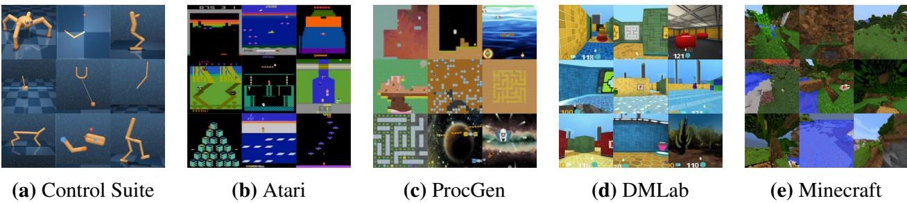  

Figure 2: Diverse visual domains used in the experiments. Dreamer succeeds across these domains, ranging from robot locomotion and manipulation tasks over Atari games, procedurally generated ProcGen levels, and DMLab tasks, that require spatial and temporal reasoning, to the complex and infinite world of Minecraft. We also evaluate Dreamer on non-visual domains.

# 引言

强化学习使计算机能够通过交互解决任务，例如在围棋和Dota游戏中超越人类。它也是提升大型语言模型的重要组成部分，这一提升超出了其预训练数据所展示的范围。虽然$\mathrm{PPO}^5$已成为强化学习领域的标准算法，但为了实现更高的性能，常常需要采用更专业化的算法。这些专业化算法旨在应对各个应用领域所带来的独特挑战，例如连续控制、离散动作解析、图像输入、空间环境和棋类游戏等。然而，将强化学习算法应用于足够新的任务——例如从视频游戏转向机器人任务——需要对算法的超参数进行大量调整，涉及相当的努力、专业知识和计算资源。这种脆弱性在将强化学习应用于新问题时形成了瓶颈，同时也限制了强化学习在计算成本高昂的模型或调整不可行的任务中的适用性。创建一个无需重新配置即可学习掌握新领域的通用算法，一直是人工智能的中心挑战，这将使强化学习能够广泛应用于各种实际应用。我们提出了Dreamer，这是一种通用算法，在多个领域中表现超过专业专家算法，同时使用固定的超参数，使强化学习能够轻松应对新问题。该算法基于学习一个世界模型的概念，该模型能够评估潜在动作的结果，一个评判神经网络评估每个结果的价值，而一个执行神经网络选择行动以达到最佳结果。尽管直观上具有吸引力，但稳健地学习和利用世界模型以实现强大的任务性能一直是一个未解决的问题。Dreamer通过一系列基于规范化、平衡和变换的稳健性技术解决了这一挑战。我们观察到，在图2总结的领域中超过150个任务的稳健学习，以及在模型规模和训练预算上的稳健性，提供了一种可预测的方式来提高性能。值得注意的是，较大的模型规模不仅获得更高的分数，还需要更少的交互来解决任务。为了推动强化学习的边界，我们考虑了一款流行的视频游戏Minecraft，这在近年来成为了研究的焦点，已经举行了国际比赛，旨在开发自主学习在Minecraft中收集钻石的算法。解决这个问题而不依赖于人类数据已被广泛认为是人工智能的一个重大挑战，因为游戏中存在稀疏的奖励、探索困难、时间跨度长以及程序化的多样性等障碍。由于这些困难，以往的方法求助于使用人类专家数据和特定领域的课程。作为开箱即用的应用，Dreamer是第一个在Minecraft中从零开始收集钻石的算法。

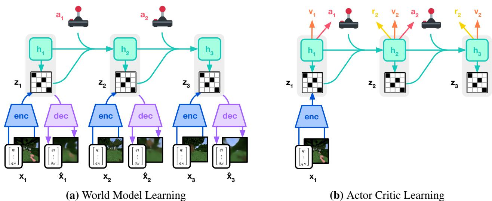  

Figure 3: Training process of Dreamer. The world model encodes sensory inputs into discrete representations $z _ { t }$ that are predicted by a sequence model with recurrent state $h _ { t }$ given actions $a _ { t }$ . The inputs are reconstructed to shape the representations. The actor and critic predict actions $a _ { t }$ and values $v _ { t }$ and learn from trajectories of abstract representations predicted by the world model.

# 学习算法

我们提出了Dreamer算法的第三代。该算法由三个神经网络组成：世界模型预测潜在动作的结果，评估器判断每个结果的价值，而行动者选择动作以达到最有价值的结果。这些组件在智能体与环境交互的过程中从重放的经验中并行训练。为了在不同领域中取得成功，这三个组件需要适应不同的信号幅度，并在其目标中稳健地平衡各项指标。这是一个具有挑战性的任务，因为我们不仅针对同一领域内的相似任务，还旨在通过固定的超参数在多样化领域中进行学习。本节介绍了世界模型、评估器和行动者，以及它们的稳健损失函数，以及用于稳健预测未知量级的工具。

# 世界模型学习

世界模型通过自编码学习感官输入的紧凑表示，并通过预测未来表示和潜在行为的奖励来实现规划。我们将世界模型实现为递归状态空间模型 $( \mathrm { R S S M } ) ^ { 2 4 }$，如图3所示。首先，编码器将感官输入 $x _ { t }$ 映射为随机表示 $z _ { t }$。然后，具有递归状态 $h _ { t }$ 的序列模型根据过去的动作 $a _ { t - 1 }$ 预测这些表示的序列。 $h _ { t }$ 和 $z _ { t }$ 的连接形成了模型状态，从中我们预测奖励 $r _ { t }$ 和情节继续标志 $c _ { t } \in \{ 0 , 1 \}$，并重构输入以确保信息丰富的表示：

  

Figure 4: Multi-step video predictions of a DMLab maze (top) and a quadrupedal robot (bottom). Given 5 context images and the full action sequence, the model predicts 45 frames into the future without access to intermediate images. The world model learns an understanding of the underlying structure of each environment.

序列模型：$\begin{array}{c} { \scriptstyle h _ { t } = f _ { \phi } ( h _ { t - 1 } , z _ { t - 1 } , a _ { t - 1 } ) } \\ { { \scriptstyle z _ { t } \sim q _ { \phi } ( z _ { t } \mid h _ { t } , x _ { t } ) } } \\ { { \scriptstyle \hat { z } _ { t } \sim p _ { \phi } ( \hat { z } _ { t } \mid h _ { t } ) } } \\ { { \scriptstyle \hat { r } _ { t } \sim p _ { \phi } ( \hat { r } _ { t } \mid h _ { t } , z _ { t } ) } } \\ { { \scriptstyle \hat { c } _ { t } \sim p _ { \phi } ( \hat { c } _ { t } \mid h _ { t } , z _ { t } ) } } \\ { { \scriptstyle \hat { x } _ { t } \sim p _ { \phi } ( \hat { x } _ { t } \mid h _ { t } , z _ { t } ) } } \end{array} $ RSSM 编码器：动力学预测器：奖励预测器：持续预测器：解码器：

图4可视化了世界的长期视频预测。编码器和解码器使用卷积神经网络（CNN）处理图像输入，使用多层感知机（MLP）处理向量输入。动力学、奖励和继续预测器也采用多层感知机。表示形式是从一个softmax分布的向量中采样的，我们通过采样步骤采用直通梯度。给定一组序列批次的输入 $x _ { 1 : T }$ ，动作 $a _ { 1 : T }$ ，奖励 $r _ { 1 : T }$ 和继续标志 $c _ { 1 : T }$ ，世界模型参数 $\phi$ 通过端到端优化，以最小化预测损失 $\mathcal { L } _ { \mathrm { p r e d } }$ 、动力学损失 $\mathcal { L } _ { \mathrm { d y n } }$ 和表示损失 $\mathcal { L } _ { \mathrm { r e p } }$ ，对应的损失权重为 $\beta _ { \mathrm { p r e d } } = 1$ 、$\beta _ { \mathrm { d y n } } = 1$ 和 $\beta _ { \mathrm { r e p } } = 0 . 1$ ：

$$
\begin{array} { r } { \mathcal { L } ( \phi ) \doteq \mathrm { E } _ { q _ { \phi } } \Big [ \sum _ { t = 1 } ^ { T } ( \beta _ { \mathrm { p r e d } } \mathcal { L } _ { \mathrm { p r e d } } ( \phi ) + \beta _ { \mathrm { d y n } } \mathcal { L } _ { \mathrm { d y n } } ( \phi ) + \beta _ { \mathrm { r e p } } \mathcal { L } _ { \mathrm { r e p } } ( \phi ) ) \Big ] . } \end{array}
$$

预测损失通过后续描述的对数平方损失训练解码器和奖励预测器，而通过逻辑回归训练连续性预测器。动态损失训练序列模型，通过最小化预测器 $p _ { \phi } ( z _ { t } \mid h _ { t } )$ 和下一个随机表示 $q _ { \phi } ( z _ { t } \mid h _ { t } , x _ { t } )$ 之间的KL散度来预测下一个表示。表示损失则训练表示变得更可预测，使我们能够在想象训练期间使用因式分解的动态预测器进行快速采样。这两种损失在停止梯度算子 $\operatorname { s g } ( \cdot )$ 和损失规模上有所不同。为了避免动态预测过于简单而无法包含足够的输入信息的退化解，我们通过将动态和表示损失裁剪到低于1 nat（约1.44位）的值来采用自由位26。这使得在它们已经很好地最小化时失效，从而将学习重心集中在预测损失上：

$$
\begin{array} { r l } & { \mathcal { L } _ { \mathrm { p r e d } } ( \phi ) \doteq - \ln p _ { \phi } ( x _ { t } \mid z _ { t } , h _ { t } ) - \ln p _ { \phi } ( r _ { t } \mid z _ { t } , h _ { t } ) - \ln p _ { \phi } ( c _ { t } \mid z _ { t } , h _ { t } ) } \\ & { \mathcal { L } _ { \mathrm { d y n } } ( \phi ) \doteq \operatorname* { m a x } \bigl ( 1 , \mathrm { K L } \bigl [ \operatorname* { s g } ( q _ { \phi } ( z _ { t } \mid h _ { t } , x _ { t } ) ) \bigr \| \bigr . \qquad \left. p _ { \phi } ( z _ { t } \mid h _ { t } ) \right] \bigr ) } \\ & { \mathcal { L } _ { \mathrm { r e p } } ( \phi ) \doteq \operatorname* { m a x } \bigl ( 1 , \mathrm { K L } \bigl [ \mathstrut \quad \left. q _ { \phi } ( z _ { t } \mid h _ { t } , x _ { t } ) \bigr \rvert \bigr ] \mathstrut \right. \qquad \left. \operatorname { s g } ( p _ { \phi } ( z _ { t } \mid h _ { t } ) ) \right] \bigr ) } \end{array}
$$

之前的世界模型需要根据环境的视觉复杂性对表征损失进行不同的缩放。复杂的三维环境包含不必要的细节，这促使使用更强的正则化器来简化表征并使其更具可预测性。在具有静态背景且个别像素可能对任务起重要作用的游戏中，需要一个较弱的正则化器以提取细微的细节。我们发现，将自由位与一个较小的表征损失相结合解决了这一难题，使得在不同领域中可以使用固定的超参数。此外，我们使用后面描述的对数双曲函数转换向量观测，以防止大输入和大重建梯度，从而进一步稳定与表征损失之间的权衡。在早期实验中，我们偶尔观察到KL损失的尖峰，这与深度变分自编码器的报告一致。为了防止这种情况，我们将编码器和动态预测器的分类分布参数化为$1\%$均匀分布和$99\%$神经网络输出的混合，使它们不可能变得确定性，从而确保KL损失的良好表现。有关模型的更多细节和超参数信息包含在补充材料中。

# 评论家学习

演员和评论家神经网络仅从世界模型预测的表示的抽象轨迹中学习行为。为了与环境交互，我们通过从演员网络进行采样来选择动作，而不进行前视规划。演员和评论家在模型状态 $s_{t} \doteq \{ h_{t}, z_{t} \}$ 上运行，因此受益于递归世界模型学习的马尔可夫表示 $\begin{array}{r} R_{t} \doteq \sum _{\tau = 0}^{\infty} \gamma^{\tau} r_{t + \tau} \end{array}$，对于每个模型状态，其折扣因子 $\gamma = 0.997$。为了考虑超出预测视野 $T = 16$ 的奖励，评论家学习近似当前演员行为下每个状态的回报分布。

$$
{ \mathrm { A c t o r : } } \qquad a _ { t } \sim \pi _ { \theta } ( a _ { t } \mid s _ { t } ) \qquad { \mathrm { C r i t i c : } } \qquad v _ { \psi } ( R _ { t } \mid s _ { t } )
$$

从回放输入的表示开始，世界模型和智能体生成一系列想象的模型状态 $s _ { 1 : T }$、动作 $a _ { 1 : T }$、奖励 $r _ { 1 : T }$ 和继续标志 $c _ { 1 : T }$。由于评论者预测的是一个分布，我们将其预测值 $v _ { t } \doteq \mathrm { E } \bigl [ v _ { \psi } ( \cdot \mid s _ { t } ) \bigr ]$ 视为该分布的期望。为了估计考虑到预测地平线之外奖励的回报，我们计算引导的 $\lambda$-回报 29，这融合了预测的奖励和价值。评论者通过最大似然损失学习预测回报估计 $R _ { t } ^ { \lambda }$ 的分布：

$$
\begin{array} { r } { \mathcal { L } ( \psi ) \dot { = } - \sum _ { t = 1 } ^ { T } \ln p _ { \psi } ( R _ { t } ^ { \lambda } \mid s _ { t } ) \qquad R _ { t } ^ { \lambda } \doteq r _ { t } + \gamma c _ { t } \Big ( ( 1 - \lambda ) v _ { t } + \lambda R _ { t + 1 } ^ { \lambda } \Big ) \qquad R _ { T } ^ { \lambda } \doteq ( 0 , T ) \lVert \dot { \phi } \rVert _ { \infty } , } \end{array}
$$

虽然简单的选择是将评论者参数化为正态分布，但回报分布可能具有多个模式，并且在不同环境中变化幅度可达几个数量级。为了在这些条件下稳定和加速学习，我们将评论者参数化为具有指数间隔的分类分布，解耦梯度的规模与预测目标，如后文所述。为了改善在奖励难以预测的环境中的价值预测，我们将评论者损失应用于损失尺度为 $\beta _ { \mathrm { v a l } } = 1$ 的想象轨迹和损失尺度为 $\beta _ { \mathrm { r e p v a l } } = 0 . 3$ 的从重放缓冲区采样的轨迹。评论者重放损失在想象推演的起始状态使用想象回报 $R _ { t } ^ { \lambda }$，作为重放轨迹的在线价值标注，然后计算重放奖励的 $\lambda$ -回报。由于评论者回归的目标依赖于其自身的预测，我们通过正则化评论者，使其预测自己参数的指数移动平均的输出，从而稳定学习。这与之前在强化学习中使用的目标网络相似，但允许我们使用当前评论者网络计算回报。我们进一步注意到，在训练开始时随机初始化的奖励预测器和评论者网络可能导致大幅度的预测奖励，这会延迟学习的开始。因此，我们将奖励预测器和评论者的输出权重矩阵初始化为零，这缓解了这一问题并加速了早期学习。

# 智能体学习

演员学习选择能够最大化回报的行动，同时通过熵正则化进行探索。然而，这种正则化器的正确规模依赖于环境中奖励的规模和频率。理想情况下，当奖励稀疏时，我们希望智能体进行更多探索；而当奖励密集或相近时，则希望其进行更多利用。同时，探索的数量不应受到环境中奖励的任意缩放的影响。这需要在保留奖励频率信息的同时规范化回报尺度。为了在不同领域使用固定的熵尺度 $\eta = 3 \times 10^{ - 4 }$，我们将回报规范化，使其大致处于区间 $[ 0 , 1 ]$ 内。实际上，从回报中减去一个偏移量并不会改变演员的梯度，因此除以范围 $S$ 就足够了。此外，为了避免在稀疏奖励下放大函数近似的噪声，我们仅缩小大的回报幅度，而不影响小于阈值 $L = 1$ 的小回报。我们对离散和连续动作使用 Reinforce 估计器，得到替代理损失函数：

$$
\begin{array} { r } { \mathcal { L } ( \boldsymbol { \theta } ) \dot { = } - \sum _ { t = 1 } ^ { T } \mathrm { s g } \Big ( \big ( R _ { t } ^ { \lambda } - v _ { \psi } ( s _ { t } ) \big ) / \operatorname* { m a x } ( 1 , S ) \Big ) \log \pi _ { \theta } ( a _ { t } \mid s _ { t } ) + \eta \mathrm { H } \left[ \pi _ { \theta } ( a _ { t } \mid s _ { t } ) \right] , } \end{array}
$$

回报分布可能是多峰的，并且包含异常值，特别是在随机环境中，某些回合的可实现回报高于其他回合。通过最小和最大观察到的回报进行归一化，将会使回报过度缩放，可能导致次优收敛。为了对这些异常值保持鲁棒性，我们计算回报批次中第 $5^{\mathrm{th}}$ 到第 $95^{\mathrm{th}}$ 回报百分位的范围，并使用指数移动平均来平滑估计：

$$
S \doteq \mathrm { E M A } \big ( \mathrm { P e r } ( R _ { t } ^ { \lambda } , 9 5 ) - \mathrm { P e r } ( R _ { t } ^ { \lambda } , 5 ) , 0 . 9 9 \big )
$$

以往的研究通常对优势进行归一化，而不是对回报，这在一定程度上强调了在奖励可及性不确定的情况下最大化回报而忽视熵的影响。当奖励稀疏时，优势的拉大可能会放大噪声，超过熵正则化的作用，从而阻碍探索。通过标准差归一化奖励或回报在稀疏奖励下可能失效，因为它们的标准差接近于零，无论奖励多少，都会大量放大回报。约束优化在不同状态下平均目标设定固定的熵，虽然这种方法稳健，但在稀疏奖励下探索速度较慢，并且在密集奖励下收敛较低。我们在不同领域未能找到这些方法的稳定超参数。回报归一化加上分母限制克服了这些挑战，使得在稀疏奖励下能够快速探索，并在多样化领域中收敛到高性能。

# 鲁棒预测

重建输入以及预测奖励和回报可能是一项挑战，因为这些量在不同领域的尺度可能会有所不同。使用平方损失预测大目标可能导致发散，而绝对损失和赫伯损失则会导致学习停滞。另一方面，基于运行统计量对目标进行归一化会给优化过程引入非平稳性。我们建议使用对数平方误差作为解决这一困境的简单方案。为此，神经网络 $f ( x , \theta )$ 通过输入 $x$ 和参数 $\theta$ 学习预测其目标 $y$ 的变换版本。为了读取网络的预测 $\hat { y }$，我们应用逆变换：

$$
{ \mathcal { L } } ( \theta ) \doteq { \frac { 1 } { 2 } } { \bigl ( } f ( x , \theta ) - \operatorname { s y m l o g } ( y ) { \bigr ) } ^ { 2 } \qquad { \hat { y } } \doteq \operatorname { s y m e x p } \bigl ( f ( x , \theta ) { \bigr ) }
$$

使用对数作为变换将无法预测取负值的目标。因此，我们选择一个来自双对称对数族的函数，称之为 symlog，将 symexp 函数作为其逆函数。

$$
\operatorname { s y m l o g } ( x ) \doteq \operatorname { s i g n } ( x ) \ln \left( \left| x \right| + 1 \right) \qquad \operatorname { s y m e x p } ( x ) \doteq \operatorname { s i g n } ( x ) { \bigl ( } \exp ( \left| x \right| ) - 1 { \bigr ) }
$$

symlog 函数压缩了大正值和大负值的大小。与对数函数不同，symlog 函数在原点周围是对称的，同时保留了输入的符号。这使得优化过程能够在需要时迅速将网络预测值调整到大值。symlog 函数在原点附近近似于恒等函数，因此不会影响已经足够小的目标的学习。对于潜在的随机目标，如奖励或收益，我们引入了 symexp twohot 损失。在这里，网络输出对指数间隔箱 $b _ { i } \in B$ 的 softmax 分布的 logits。预测值是通过加权平均箱位置并根据其预测概率进行加权的。重要的是，网络可以输出任何落在区间中的连续值，因为加权平均可以落在不同的桶之间：

$$
\begin{array} { r } { \hat { y } \doteq \mathrm { s o f t m a x } ( f ( x ) ) ^ { T } B \qquad B \doteq \mathrm { s y m e x p } ( \bigl [ - 2 0 \quad \ldots \quad + 2 0 \bigr ] ) } \end{array}
$$

该网络是在两个热编码目标上进行训练的，这是一种对连续值的单热编码的推广。一个标量的两个热编码是一个具有 $| B |$ 个条目的向量，其中所有条目均为0，只有与编码标量最近的两个桶的索引 $k$ 和 $k + 1$ 处的条目不为0。这两个条目的和为1，且离编码连续数值更近的桶权重更高。然后，网络被训练以最小化带有软目标的分类的类别交叉熵损失。注意，损失仅依赖于分配给桶的概率，而不依赖于与桶位置相关的连续值，从而将梯度的大小与目标的大小解耦。

$$
\mathcal { L } ( \boldsymbol { \theta } ) \doteq - \operatorname { t w o h o t } ( \boldsymbol { y } ) ^ { T } \log \operatorname { s o f t m a x } ( \boldsymbol { f } ( \boldsymbol { x } , \boldsymbol { \theta } ) )
$$

根据这些原则，Dreamer 使用 symlog 函数对向量观测进行转换，既用于编码器输入，也用于解码器目标，并采用 synexp twohot 损失函数来训练奖励预测器和评论家。我们发现这些技术能够在许多不同领域中实现稳健且快速的学习。对于评论家的学习，之前提出了一种替代的非对称变换，我们发现该方法在不同领域的平均效果较差。与其他方法不同，symlog 变换避免了截断大目标，避免了由于归一化引入的非平稳性，或在检测到新的极端值时调整网络权重。

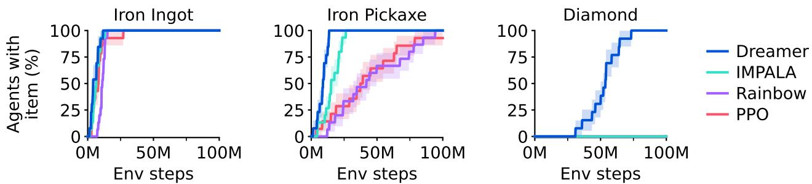  

Figure 5: Fraction of trained agents that discover each of the three latest items in the Minecraft Diamond task. Although previous algorithms progress up to the iron pickaxe, Dreamer is the only compared algorithm that manages to discover a diamond, and does so reliably.

# 结果

我们在8个领域中评估Dreamer的通用性——涉及超过150个任务——使用固定的超参数。我们设计实验以将Dreamer与文献中最好的方法进行比较，这些方法通常是专门为当前基准设计和调优的。我们还与高质量的$\mathrm{P P O}^{5}$实现进行了比较，这是一种以其鲁棒性著称的标准强化学习算法。我们使用固定的超参数运行PPO，这些参数经过选择以最大化各个领域的性能，并重现了PPO在ProcGen 37上的强劲已发布结果。为了推动强化学习的边界，我们将Dreamer应用于具有挑战性的视频游戏Minecraft，并与之前的强大算法进行比较。最后，我们分析Dreamer各个组成部分的重要性以及其对不同模型大小和计算预算的鲁棒性。所有Dreamer智能体均在单个Nvidia A100 GPU上训练，使其可在许多研究实验室中复现。可在项目网站上获得一个公开的Dreamer实现，复现所有结果。基准测试 我们在包括连续和离散动作、视觉和低维输入、密集和稀疏奖励、不同奖励尺度、2D和3D世界以及程序生成的8个领域中进行了广泛的实证研究。图1总结了基准结果，显示Dreamer在各种领域中超越了广泛的以前的专家算法。关键是，Dreamer在所有领域中都显著超越了PPO。

• Atari 该基准包含57款Atari 2600游戏，预算为2亿帧，提出了多样化的挑战。我们使用粘性动作模拟器设置。Dreamer在仅使用少量计算资源的情况下超越了强大的MuZero算法。Dreamer还超越了广泛使用的专家算法Rainbow和$\mathrm { I Q N ^ { 4 1 }}$。 • ProcGen 该基准包含16款随机生成关卡和视觉干扰的游戏，以测试智能体的鲁棒性和泛化能力。在5000万帧的预算内，Dreamer匹配了调优过的专家算法$\mathrm { P P G } ^ { 3 7 }$，并超越了Rainbow。我们的PPO智能体使用固定的超参数，匹配了高度调优的官方PPO实现的已发布得分。 • DMLab 该套件包含30个任务，提供测试空间和时间推理的3D环境。在1亿帧内，Dreamer超过了可扩展的IMPALA和$\mathrm { R } 2 \mathrm { D } 2 +$智能体在10亿环境步数下的表现，数据效率提升超过$100 \%$。我们注意到，这些基线并不是为了数据效率而设计，但作为之前可在大规模下实现的性能的有价值比较点。

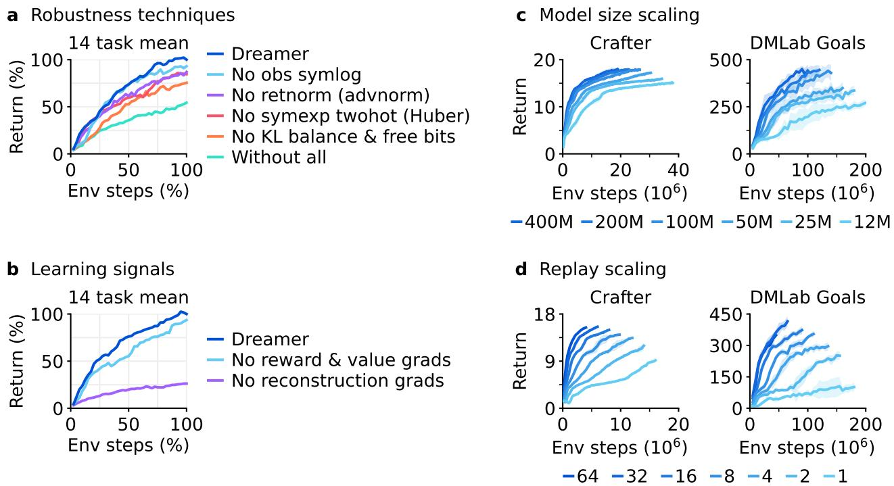  

Figure 6: Ablations and robust scaling of Dreamer. a, All individual robustness techniques contribute to the performance of Dreamer on average, although each individual technique may only affect some tasks. Training curves of individual tasks are included in the supplementary material. b, The performance of Dreamer predominantly rests on the unsupervised reconstruction loss of its world model, unlike most prior algorithms that rely predominantly on reward and value prediction gradients 7,5,8. . c, The performance of Dreamer increases monotonically with larger model sizes, ranging from 12M to 400M parameters. Notably, larger models not only increase task performance but also require less environment interaction. d, Higher replay ratios predictably increase the performance of Dreamer. Together with model size, this allows practitioners to improve task performance and data-efficiency by employing more computational resources.

• Atari100k该数据效率基准包含26个Atari游戏，预算仅为400K帧，相当于2小时的游戏时间。EfficientZero通过结合在线树搜索、优先回放和超参数调度，保持最先进水平，但也提前重置关卡以增加数据多样性，使得比较变得困难。在没有这种复杂性的情况下，Dreamer在最优秀的剩余方法中表现优异，包括基于变换器的IRIS和TWM智能体、无模型的SPR和SimPLe。 • Proprio Control该基准包含18个连续动作的控制任务，自我感觉向量输入，预算为500K环境步骤。任务范围从经典控制到运动和机器人操作任务，具有稠密和稀疏的奖励。Dreamer在该基准上设立了新的最先进水平，超越了D4PG、DMPO和MPO。 • Visual Control该基准由20个连续控制任务组成，智能体仅接收高维图像作为输入，预算为1M环境步骤。Dreamer在该基准上建立了新的最先进水平，超越了专门针对视觉环境并利用数据增强的$\mathrm { D r Q - v } 2$和CURL。 • BSuite该基准包含23个环境，总共有468个配置，专门设计用于测试信用分配、对奖励规模和随机性的鲁棒性、记忆、泛化和探索。Dreamer在该基准上设立了新的最先进水平，超越了Boot DQN和其他方法。Dreamer在规模鲁棒性类别上尤其优于之前的算法。 Minecraft在热门游戏Minecraft中收集钻石一直是一个长期挑战，游戏中的无尽3D世界使这一挑战更加复杂。剧集持续到玩家死亡或最多36000步，相当于30分钟，在此期间，玩家需要通过搜索资源和制作工具，发现从稀疏奖励中获取的12项物品的序列。经验丰富的人类玩家需要约20分钟才能获得钻石。我们遵循先前工作的方块破坏设置，因为提供的动作空间使得随机策略难以长时间保持按键。由于在这一复杂领域的训练时间，广泛的调优对Minecraft来说将是困难的。因此，我们应用Dreamer的默认超参数。正如图1和图5所示，Dreamer是第一个从零开始在Minecraft中收集钻石的算法，而不需要像$\mathrm { V P T } ^ { 2 0 }$或自适应课程那样使用人类数据。我们在Minecraft上训练的所有Dreamer智能体都在100M环境步骤内发现了钻石。虽然一些强大的基线进展到高级物品（如铁镐），但没有一个发现钻石。 消融研究在图6中，我们对不同的14个任务进行鲁棒性技术和学习信号的消融实验，以理解它们的重要性。单个任务的训练曲线包含在补充材料中。我们观察到所有鲁棒性技术对性能都有贡献，最显著的是世界模型的KL目标，其次是回报归一化和用于奖励及价值预测的symexp两重回归。一般而言，我们发现每个单独的技术在一组任务上至关重要，但可能不会影响其他任务的性能。为了研究世界模型的效果，我们对Dreamer的学习信号进行了消融，停止任务特定的奖励和值预测梯度或任务无关的重建梯度以塑造其表征。与之前常常仅依赖任务特定学习信号的强化学习算法不同，Dreamer主要依赖其世界模型的无监督目标。这个发现可能为未来利用无监督数据进行预训练的算法变体提供了机会。 扩展属性为了调查Dreamer是否能够鲁棒扩展，我们训练了6种模型大小，参数范围从12M到400M，以及Crafter和DMLab任务上的不同回放比例。回放比例影响智能体执行的梯度更新次数。图6显示了在比较的模型大小和回放比例下，固定超参数的鲁棒学习。此外，增加模型大小直接转化为更高的任务性能和更低的数据需求。增加梯度步骤的数量进一步减少了学习成功行为所需的交互次数。结果表明，Dreamer在不同模型大小和回放比例下都能鲁棒学习，其性能提供了一种可预测的方式，以根据计算资源提高性能。

# 相关工作

开发通用算法一直是强化学习研究的目标之一。$\mathrm{PPO}^{5}$ 是最广泛使用的算法之一，相对稳健，但需要大量的经验，且通常性能低于专业替代方案。$\mathrm{SAC}^{32}$ 是连续控制的热门选择，利用经验重放提高数据效率，但实际上需要调优，尤其是其熵尺度，对于高维输入面临挑战。MuZero8 通过价值预测模型进行规划，已应用于棋类游戏和 Atari，但作者没有发布实现，且该算法包含多个复杂组件，难以重现。Gato52 将一个大型模型适应于多个任务的专家示范，但仅在有专家数据时适用。相比之下，Dreamer 能够在固定超参数下掌握多种环境，无需专家数据，且其实现是开源的。

Minecraft 是近期研究的重点。通过 MALMO53，微软发布了该成功游戏的免费版本供研究使用。MineRL 18 提供了多个竞争环境，我们以此为实验基础。MineRL 竞赛支持智能体探索并学习有意义的技能，利用多样的人类数据集。Voyager 通过 API 调用语言模型在技术树上获取物品，达到与 Dreamer 类似的深度，但运行在专为游戏设计的 MineFlayer 机器人脚本层之上，并提供高级动作。$\mathrm { V P T } ^ { 20 }$ 通过行为克隆训练一个智能体玩 Minecraft，基于承包商收集的键盘和鼠标动作的专家数据，并使用强化学习进行微调，以获取钻石，使用 720 个 GPU 持续运行 9 天。相比之下，Dreamer 使用 MineRL 竞赛的动作空间，利用 1 个 GPU 在 9 天内自主学习从稀疏奖励中收集钻石，无需人类数据。

# 结论

我们提出了第三代Dreamer算法，这是一种通用强化学习算法，能够以固定的超参数掌握广泛的领域。Dreamer不仅在150多个任务中表现优异，还能够在不同的数据和计算预算下稳健学习，推动强化学习朝向更广泛的实际应用。Dreamer作为首个能够在Minecraft中从零开始收集钻石的算法，标志着人工智能领域的重要里程碑。作为一款基于学习世界模型的高性能算法，Dreamer为未来的研究方向铺平了道路，包括从互联网视频中教导智能体世界知识，以及在多个领域学习单一世界模型，允许人工智能智能体不断积累更加广泛的知识和能力。 致谢：感谢Mohammad Norouzi、Jessy Lin、Abbas Abdolmaleki、John Schulman、Adam Kosiorek和Oleh Rybkin的深刻讨论。感谢Bobak Shahriari、Denis Yarats、Karl Cobbe和Hubert Soyer分享基线算法的训练曲线。感谢Daniel Furrer、Andrew Chen和Dakshesh Garambha对Google Cloud基础设施的支持。

# References

1. David Silver, Aja Huang, Chris J Maddison, Arthur Guez, Laurent Sifre, George Van Den Driessche, Julian Schrittwieser, Ioannis Antonoglou, Veda Panneershelvam, Marc Lanctot, et al. Mastering the game of go with deep neural networks and tree search. nature, 529(7587):   
484, 2016.   
2. OpenAI. OpenAI Five. https://blog.openai.com/openai-five/, 2018.   
3. Long Ouyang, Jeffrey Wu, Xu Jiang, Diogo Almeida, Carroll Wainwright, Pamela Mishkin, Chong Zhang, Sandhini Agarwal, Katarina Slama, Alex Ray, et al. Training language models to follow instructions with human feedback. Advances in neural information processing systems,   
35:2773027744, 2022.   
4. Hung Le, Yue Wang, Akhilesh Deepak Gotmare, Silvio Savarese, and Steven Chu Hong Hoi. Coderl: Mastering code generation through pretrained models and deep reinforcement learning. Advances in Neural Information Processing Systems, 35:2131421328, 2022.   
5. John Schulman, Filip Wolski, Prafulla Dhariwal, Alec Radford, and Oleg Klimov. Proximal policy optimization algorithms. arXiv preprint arXiv:1707.06347, 2017.   
6Timothy P Lillicrap, Jonathan J Hunt, Alexander Pritzel, Nicolas Heess, Tom Erez, Yuval Tassa, David Silver, and Daan Wierstra. Continuous control with deep reinforcement learning. arXiv preprint arXiv:1509.02971, 2015.   
7. Volodymyr Mnih, Koray Kavukcuoglu, David Silver, Andrei A Rusu, Joel Veness, Marc G Bellemare, Alex Graves, Martin Riedmiller, Andreas K Fidjeland, Georg Ostrovski, et al. Human-level control through deep reinforcement learning. Nature, 518(7540):529, 2015.   
8. Julian Schrittwieser, Ioannis Antonoglou, Thomas Hubert, Karen Simonyan, Laurent Sifre, ae atari, go, chess and shogi by planning with a learned model. arXiv preprint arXiv:1911.08265,   
2019.   
9. Max Jaderberg, Volodymyr Mnih, Wojciech Marian Czarnecki, Tom Schaul, Joel Z Leibo, David Silver, and Koray Kavukcuoglu. Reinforcement learning with unsupervised auxiliary tasks. arXiv preprint arXiv:1611.05397, 2016.   
10. Ankesh Anand, Evan Racah, Sherjil Ozair, Yoshua Bengio, Marc-Alexandre Côté, and R Devon Hjelm. Unsupervised state representation learning in atari. Advances in neural information processing systems, 32, 2019.   
11 Danny Driess, Ingmar Schubert, Pete Florence, Yunzhu Li, and Marc Toussaint. Reinforcement learning with neural radiance fields. arXiv preprint arXiv:2206.01634, 2022.   
12. David Silver, Julian Schrittwieser, Karen Simonyan, Ioannis Antonoglou, Aja Huang, Arthur Guez, Thomas Hubert, Lucas Baker, Matthew Lai, Adrian Bolton, et al. Mastering the game of go without human knowledge. Nature, 550(7676):354, 2017.   
13. Marcin Andrychowicz, Anton Raichuk, Piotr Stanczyk, Manu Orsini, Sertan Girgin, Raphael Marinier, Léonard Hussenot, Matthieu Geist, Olivier Pietquin, Marcin Michalski, et al. What matters in on-policy reinforcement learning? a large-scale empirical study. arXiv preprint arXiv:2006.05990, 2020.   
14. Richard S Sutton. Dyna, an integrated architecture for learning, planning, and reacting. ACM SIGART Bulletin, 2(4):160163, 1991.   
15. Chelsea Finn and Sergey Levine. Deep visual foresight for planning robot motion. In 2017 IEEE International Conference on Robotics and Automation (ICRA), pages 27862793. IEEE, 2017.   
16. David Ha and Jürgen Schmidhuber. World models. arXiv preprint arXiv:1803.10122, 2018.   
17. Lukasz Kaiser, Mohammad Babaeizadeh, Piotr Milos, Blazej Osinski, Roy H Campbell, Konrad Czechowski, Dumitru Erhan, Chelsea Finn, Piotr Kozakowski, Sergey Levine, et al. Modelbased reinforcement learning for atari. arXiv preprint arXiv:1903.00374, 2019.   
18. William H Guss, Cayden Codel, Katja Hofmann, Brandon Houghton, Noboru Kuno, Stephanie Milani, Sharada Mohanty, Diego Perez Liebana, Ruslan Salakhutdinov, Nicholay Topin, et al. The minerl competition on sample efficient reinforcement learning using human priors. arXiv e-prints, pages arXiv1904, 2019.   
19. Ingmar Kanitscheider, Joost Huizinga, David Farhi, William Hebgen Guss, Brandon Houghton, Raul Sampedro, Peter Zhokhov, Bowen Baker, Adrien Ecoffet, Jie Tang, et al. Multi-task curriculum learning in a complex, visual, hard-exploration domain: Minecraft. arXiv preprint arXiv:2106.14876, 2021.   
20. Bowen Baker, Ilge Akkaya, Peter Zhokhov, Joost Huizinga, Jie Tang, Adrien Ecoffet, Brandon unlabeled online videos. arXiv preprint arXiv:2206.11795, 2022.   
21. Danijar Hafner, Timothy Lillicrap, Jimmy Ba, and Mohammad Norouzi. Dream to control: Learning behaviors by latent imagination. arXiv preprint arXiv:1912.01603, 2019.   
22. Danijar Hafner, Timothy Lillicrap, Mohammad Norouzi, and Jimmy Ba. Mastering atari with discrete world models. arXiv preprint arXiv:2010.02193, 2020.   
23. Diederik P Kingma and Max Welling. Auto-encoding variational bayes. arXiv preprint arXiv:1312.6114, 2013.   
24. Danijar Hafner, Timothy Lillicrap, Ian Fischer, Ruben Villegas, David Ha, Honglak Lee, and James Davidson. Learning latent dynamics for planning from pixels. arXiv preprint arXiv:1811.04551, 2018.   
2. Yoshua Bengio, Nicholas Léonard, and Aaron Courville. Estimating or propagating gradients through stochastic neurons for conditional computation. arXiv preprint arXiv:1308.3432, 2013.   
26. Durk P Kingma, Tim Salimans, Rafal Jozefowicz, Xi Chen, Ilya Sutskever, and Max Welling. Improved variational inference with inverse autoregressive flow. Advances in neural information processing systems, 29, 2016.   
27. Rewon Child. Very deep vaes generalize autoregressive models and can outperform them on images. arXiv preprint arXiv:2011.10650, 2020.   
28. Marc G Bellemare, Will Dabney, and Rémi Munos. A distributional perspective on reinforcement learning. In International Conference on Machine Learning, pages 449458. PMLR, 2017.   
Richard S Sutton and Andrew G Barto. Reinforcement learning: An introduction. MIT press, 2018.   
30. Ronald J Williams and Jing Peng. Function optimization using connectionist reinforcement learning algorithms. Connection Science, 3(3):241268, 1991.   
31. Ronald J Williams. Simple statistical gradient-following algorithms for connectionist reinforcement learning. Machine learning, 8(3-4):229256, 1992.   
32. Tuomas Haarnoja, Aurick Zhou, Pieter Abbeel, and Sergey Levine. Soft actor-critic: Offpolicy maximum entropy deep reinforcement learning with a stochastic actor. arXiv preprint arXiv:1801.01290, 2018.   
33. Abbas Abdolmaleki, Jost Tobias Springenberg, Yuval Tassa, Remi Munos, Nicolas Heess, and Martin Riedmiller. Maximum a posteriori policy optimisation. arXiv preprint arXiv:1806.06920, 2018.   
34. J Beau W Webber. A bi-symmetric log transformation for wide-range data. Measurement Science and Technology, 24(2):027001, 2012.   
35. Steven Kapturowski, Georg Ostrovski, John Quan, Remi Munos, and Will Dabney. Recurrent experience replay in distributed reinforcement learning. In International conference on learning representations, 2018.   
36. Matteo Hessel, Hubert Soyer, Lasse Espeholt, Wojciech Czarnecki, Simon Schmitt, and Hado van Hasselt. Multi-task deep reinforcement learning with popart. In Proceedings of the AAAI Conference on Artificial Intelligence, volume 33, pages 37963803, 2019.   
37. Karl W Cobbe, Jacob Hilton, Oleg Klimov, and John Schulman. Phasic policy gradient. In International Conference on Machine Learning, pages 20202027. PMLR, 2021.   
Marc GBellemare, Yavar Naddaf, Joel Veness, and Michael Bowling.The arcade lar environment: An evaluation platform for general agents. Journal of Artificial Intelligence Research, 47:253279, 2013.   
39. Marlos C Machado, Marc G Bellemare, Erik Talvitie, Joel Veness, Matthew Hausknecht, and Michael Bowling. Revisiting the arcade learning environment: Evaluation protocols and open problems for general agents. Journal of Artificial Intelligence Research, 61:523562, 2018.   
40. Matteo Hessel, Joseph Modayil, Hado Van Hasselt, Tom Schaul, Georg Ostrovski, Will Dabney, Dan Horgan, Bilal Piot, Mohammad Azar, and David Silver. Rainbow: Combining improvements in deep reinforcement learning. In Thirty-Second AAAI Conference on Artificial Intelligence, 2018.   
41. Will Dabney, Georg Ostrovski, David Silver, and Rémi Munos. Implicit quantile networks for distributional reinforcement learning. In International conference on machine learning, pages 10961105. PMLR, 2018.   
42. Karl Cobbe, Chris Hesse, Jacob Hilton, and John Schulman. Leveraging procedural generation arIn Ittial cer 20482056. PMLR, 2020.   
43. Charles Beattie, Joel Z Leibo, Denis Teplyashin, Tom Ward, Marcus Wainwright, Heinrich Küttler, Andrew Lefrancq, Simon Green, Víctor Valdés, Amir Sadik, et al. Deepmind lab. arXiv preprint arXiv:1612.03801, 2016.   
44. Weirui Ye, Shaohuai Liu, Thanard Kurutach, Pieter Abbeel, and Yang Gao. Mastering atari games with limited data. Advances in Neural Information Processing Systems, 34:2547625488, 2021.   
4. Vincent Micheli, Eloi Alonso, and François Fleuret. Transformers are sample efficient world models. arXiv preprint arXiv:2209.00588, 2022.   
46. Yuval Tassa, Yotam Doron, Alistair Muldal, Tom Erez, Yazhe Li, Diego de Las Casas, David Budden, Abbas Abdolmaleki, Josh Merel, Andrew Lefrancq, et al. Deepmind control suite. arXiv preprint arXiv:1801.00690, 2018.   
47. Denis Yarats, Rob Fergus, Alessandro Lazaric, and Lerrel Pinto. Mastering visual continuous control: Improved data-augmented reinforcement learning. arXiv preprint arXiv:2107.09645, 2021.   
48. Ian Osband, Yotam Doron, Matteo Hessel, John Aslanides, Eren Sezener, Andre Saraiva, Katrina McKinney, Tor Lattimore, Csaba Szepesvari, Satinder Singh, et al. Behaviour suite for reinforcement learning. arXiv preprint arXiv:1908.03568, 2019.   
49. Olivia Dizon-Paradis, Stephen Wormald, Daniel Capecci, Avanti Bhandarkar, and Damon Woodard. Investigating the practicality of existing reinforcement learning algorithms: A performance comparison. Authorea Preprints, 2023.   
50. Danijar Hafner. Benchmarking the spectrum of agent capabilities. arXiv preprint arXiv:2109.06780, 2021.   
51. Denis Yarats, Amy Zhang, Ilya Kostrikov, Brandon Amos, Joelle Pineau, and Rob Fergus. Improving sample efficiency in model-free reinforcement learning from images. arXiv preprint arXiv:1910.01741, 2019.   
52. Scott Reed, Konrad Zolna, Emilio Parisotto, Sergio Gomez Colmenarejo, Alexander Novikov, Gabriel Barth-Maron, Mai Gimenez, Yury Sulsky, Jackie Kay, Jost Tobias Springenberg, et al. A generalist agent. arXiv preprint arXiv:2205.06175, 2022.   
53. Matthew Johnson, Katja Hofmann, Tim Hutton, and David Bignell. The malmo platform for artificial intelligence experimentation. In IJCAI, pages 42464247. Citeseer, 2016.   
54. Guanzhi Wang, Yuqi Xie, Yunfan Jiang, Ajay Mandlekar, Chaowei Xiao, Yuke Zhu, Linxi Fan, and Anima Anandkumar. Voyager: An open-ended embodied agent with large language models. arXiv preprint arXiv:2305.16291, 2023.   
55. Shengyi Huang, Rousslan Fernand Julien Dossa, Antonin Raffin, Anssi Kanervisto, and Weixun Wang. The 37 implementation details of proximal policy optimization. The ICLR Blog Track 2023, 2022.   
56. Matt Hoffman, Bobak Shahriari, John Aslanides, Gabriel Barth-Maron, Feryal Behbahani, Tamara Norman, Abbas Abdolmaleki, Albin Cassirer, Fan Yang, Kate Baumli, et al. Acme: A research framework for distributed reinforcement learning. arXiv preprint arXiv:2006.00979, 2020.   
57. Simon Schmitt, Matteo Hessel, and Karen Simonyan. Off-policy actor-critic with shared experience replay. In International Conference on Machine Learning, pages 85458554. PMLR, 2020.   
58. Tom Schaul, John Quan, Ioannis Antonoglou, and David Silver. Prioritized experience replay. arXiv preprint arXiv:1511.05952, 2015.   
59. Andy Brock, Soham De, Samuel L Smith, and Karen Simonyan. High-performance large-scale image recognition without normalization. In International Conference on Machine Learning, pages 10591071. PMLR, 2021.   
6 Liu Ziyin, Zhikang T Wang, and Masahito Ueda. Laprop: Separating momentum and adaptivity in adam. arXiv preprint arXiv:2002.04839, 2020.   
61. Diederik P Kingma and Jimmy Ba. Adam: A method for stochastic optimization. arXiv preprint arXiv:1412.6980, 2014.   
62. Audrunas Gruslys, Will Dabney, Mohammad Gheshlaghi Azar, Bilal Piot, Marc Bellemare, and Remi Munos. The reactor: A fast and sample-efficient actor-critic agent for reinforcement learning. arXiv preprint arXiv:1704.04651, 2017.   
63. Kyunghyun Cho, Bart Van Merriënboer, Caglar Gulcehre, Dzmitry Bahdanau, Fethi Bougares, Holger Schwenk, and Yoshua Bengio. Learning phrase representations using rnn encoderdecoder for statistical machine translation. arXiv preprint arXiv:1406.1078, 2014.   
64. Matthijs Van Keirsbilck, Alexander Keller, and Xiaodong Yang. Rethinking full connectivity in recurrent neural networks. arXiv preprint arXiv:1905.12340, 2019.   
65. Marlos C Machado, Marc G Bellemare, Erik Talvitie, Joel Veness, Matthew Hausknecht, and Michael Bowling. Revisiting the arcade learning environment: Evaluation protocols and open problems for general agents. Journal of Artificial Intelligence Research, 61:523562, 2018.   
66. Lasse Espeholt, Hubert Soyer, Remi Munos, Karen Simonyan, Volodymir Mnih, Tom Ward, Yotam Doron, Vlad Firoiu, Tim Harley, Iain Dunning, et al. Impala: Scalable distributed deep-rl with importance weighted actor-learner architectures. arXiv preprint arXiv:1802.01561, 2018.

# Methods

# Baselines

We employ the Proximal Policy Optimization (PPO) algorithm5, which has become a standard choice in the field, to compare Dreamer under fixed hyperparameters across all benchmarks. There are a large number of PPO implementations available publicly and they are known to substantially vary in task performance55. To ensure a comparison that is representative of the highest performance PPO can achieve under fixed hyperparameters across domains, we choose the high-quality PPO implementation available in the Acme framework56 and select its hyperparameters in Table 1 folowin ecomendations,and additionally tune t eoch batc ize o be large enou for complex environments 42, its learning rate, and its entropy scale. We match the discount factor to Dreamer because it works well across domains and is a common choice in the literature 35,8 We choose the IMPALA network architecture that we have found performed better than alternatives 42 and set the minibatch size to the largest possible for one A100 GPU. We verify the performance of our PPO implementation and hyperparameters on the ProcGen benchmark, where a highly tuned PPO implementation has been reported by the PPO authors37. We find that our implementation matches or slightly outperforms this performance reference.

Table 1: PPO hyperparameters used across all benchmarks.   

<table><tr><td>Parameter</td><td>Value</td></tr><tr><td>Observation normalization Reward normalization Reward clipping (stddev.) Epoch batch Number of epochs Minibatch size Minibatch length Policy trust region Value trust region Advantage normalization Entropy penalty scale Discount factor GAE lambda Learning rate Gradient clipping Adam epsilon</td><td>Yes Yes 10 64 × 256 3 8 256 0.2 No Yes 0.01 0.997 0.95 3 × 10−4 0.5 10-5</td></tr></table>

For Minecraft, we additionally tune and run the IMPALA and Rainbow algorithms because not successful end-to-end learning from scratch has been reported in the literature18. We use the Acme implementations 56 of these algorithms, use the same IMPALA network we used for PPO, and tuned the learning rate and entropy regularizers. For all other benchmarks, we compare to tuned expert algorithms reported in the literature as referenced in the results section.

# Implementation

Experience replay We implement Dreamer using a uniform replay buffer with an online queue 57. Specifically, each minibatch is formed first from non-overlapping online trajectories and then filled up with uniformly sampled trajectories from the replay buffer. We store latent states into the replay buffer during data collection to initialize the world model on replayed trajectories, and write the fresh latent states of the training rollout back into the buffer. While prioritized replay58 is used by some of the expert algorithms we compare to and we found it to also improve the performance of Dreamer, we opt for uniform replay in our experiments for ease of implementation.

We parameterize the amount of training via the replay ratio. This is the fraction of time steps trained on per time step collected from the environment, without action repeat. Dividing the replay ratio by the time steps in a minibatch and by action repeat yields the ratio of gradient steps to env steps. For example, a replay ratio of 32 on Atari with action repeat of 4 and batch shape $1 6 \times 6 4$ corresponds to 1 gradient step every 128 env steps, or $1 . 5 \mathbf { M }$ gradient steps over 200M env steps.

Optimizer We employ Adaptive Gradient Clipping $( \mathrm { A G C } ) ^ { 5 9 }$ , which clips per-tensor gradients if they exceed $3 0 \%$ of the L2 norm of the weight matrix they correspond to, with its default $\epsilon = 1 0 ^ { - 3 }$ AGC decouples the clipping threshold from the loss scales, allowing to change loss functions or loss scales without adjusting the clipping threshold. We apply the clipped gradients using the LaProp optimizer60 with $\epsilon = 1 0 ^ { - 2 0 }$ and its default parameters $\beta _ { 1 } = 0 . 9$ and $\beta _ { 2 } = 0 . 9 9$ LaProp normalizes gradients by RMSProp and then smoothes them by momentum, instead of computing both momentum and normalizer on raw gradients as Adam does 61. This simple change allows for a smaller epsilon and avoids occasional instabilities that we observed under Adam.

Distributions The encoder, dynamics predictor, and actor distributions are mixtures of $9 9 \%$ the predicted softmax output and $1 \%$ of a uniform distribution 62 to prevent zero probabilities and infinite log probabilities. The rewards and critic neural networks output a softmax distribution over exponentially spaced bins $b \in B$ and are trained towards twohot encoded targets:

$$
\operatorname { t w o h o t } ( x ) _ { i } \doteq \left\{ { \begin{array} { l l } { \displaystyle | b _ { k + 1 } - x | / \left| b _ { k + 1 } - b _ { k } \right| } & { { \mathrm { i f ~ } } i = k } \\ { \displaystyle | b _ { k } } & { - x | / \left| b _ { k + 1 } - b _ { k } \right| } & { { \mathrm { i f ~ } } i = k + 1 } \\ { 0 } & { \mathrm { e l s e } } \end{array} } \right. \qquad k \doteq \sum _ { j = 1 } ^ { | B | } \delta ( b _ { j } < x )
$$

The output weights of twohot distributions are initialized to zero to ensure that the agent does not hallucinate rewards and values at initialization. For computing the expected prediction of the softmax distribution under bins that span many orders of magnitude, the summation order matters and positive and negative bins should be summed up separately, from small to large bins, and then added. Refer to the source code for an implementation.

Networks Images are encoded using stride 2 convolutions to resolution $6 \times 6$ or $4 \times 4$ and then flattened and are decoded using transposed stride 2 convolutions, with sigmoid activation on the output. Vector inputs are symlog transformed and then encoded and decoded using 3-layer MLPs. The actor and critic neural networks are also 3-layer MLPs and the reward and continue predictors are 1-layer MLPs. The sequence model is a $\mathbf { G R U } ^ { 6 3 }$ with block-diagonal recurrent weights 64 of 8 blocks to allow for a large number of memory units without quadratic increase in parameters and FLOPs. The input to the GRU at each time step is a linear embedding of the sampled latent $z _ { t }$ , of the action $a _ { t }$ , and of the recurrent state to allow mixing between blocks.

# Benchmarks

Protocols Summarized in Table 2, we follow the standard evaluation protocols for the benchmarks where established. Atari38 uses 57 tasks with sticky actions 65. The random and human reference scores used to normalize scores vary across the literature and we chose the most common reference values, replicated in Table 6. DMLab43 uses 30 tasks 66 and we use the fixed action space 36,35. We evaluate at 100M steps because running for 10B as in some prior work was infeasible. Because existing published baselines perform poorly at 100M steps, we compare to their performance at 1B steps instead, giving them a $1 0 \times$ data advantage. ProcGen uses the hard difficulty setting and the unlimited level set4. Prior work compares at different step budgets42,37 and we compare at 50M steps due to computational cost, as there is no action repeat. For Minecraft Diamond purely from sparse rewards, we establish the evaluation protocol to report the episode return measured at 100M env steps, corresponding to about 100 days of in-game time. Atari $1 0 0 \mathrm { k } ^ { 1 7 }$ includes 26 tasks with a budget of 400K env steps, 100K after action repeat. Prior work has used various environment settings, summarized in Table 10, and we chose the environments as originally introduced. Visual Control46,21 spans 20 tasks with an action repeat of 2. Proprioceptive Control follows the same protocol but we exclude the two quadruped tasks because of baseline availability in prior work47.

Table 2: Benchmark overview. All agents were trained on a single Nvidia A100 GPU each.   

<table><tr><td>Benchmark</td><td>Tasks</td><td>Env Steps</td><td>Action Repeat</td><td>Env Instances</td><td>Replay Ratio</td><td>GPU Days</td><td>Model Size</td></tr><tr><td>Minecraft</td><td>1</td><td>100M</td><td>1</td><td>64</td><td>32</td><td>8.9</td><td>200M</td></tr><tr><td>DMLab</td><td>30</td><td>100M</td><td>4</td><td>16</td><td>32</td><td>2.9</td><td>200M</td></tr><tr><td>ProcGen</td><td>16</td><td>50M</td><td>1</td><td>16</td><td>64</td><td>16.1</td><td>200M</td></tr><tr><td>Atari</td><td>57</td><td>200M</td><td>4</td><td>16</td><td>32</td><td>7.7</td><td>200M</td></tr><tr><td>Atari100K</td><td>26</td><td>400K</td><td>4</td><td>1</td><td>128</td><td>0.1</td><td>200M</td></tr><tr><td>BSuite</td><td>23</td><td></td><td>1</td><td>1</td><td>1024</td><td>0.5</td><td>200M</td></tr><tr><td>Proprio Control</td><td>18</td><td>500K</td><td>2</td><td>16</td><td>512</td><td>0.3</td><td>12M</td></tr><tr><td>Visual Control</td><td>20</td><td>1M</td><td>2</td><td>16</td><td>512</td><td>0.1</td><td>12M</td></tr></table>

Environment instances In earlier experiments, we observed that the performance of both Dreamer and PPO is robust to the number of environment instances. Based on the CPU resources available on our training machines, we use 16 environment instance by default. For BSuite, the benchmark requires using a single environment instance. We also use a single environment instance for Atari100K because the benchmark has a budget of 400K env steps whereas the maximum episode length in Atari is in principle 432K env steps. For Minecraft, we use 64 environments using remote CPU workers to speed up experiments because the environment is slower to step.

Seeds and error bars We run 5 seeds for each Dreamer and PPO per benchmark, with the exception of 1 seed for ProcGen due to computational constraints, 10 seeds for BSuite as required by the benchmark, and 10 seeds for Minecraft to reliably report the fraction of runs that achieve diamonds. All curves show the mean over seeds with one standard deviation shaded.

Computational choices All Dreamer and PPO agents in this paper were trained on a single Nvidia A100 GPU each. Dreamer uses the 200M model size by default. On the two control suitse, Dreamer the same performance using the substantially faster 12M model, making it more accessible to researchers. The replay ratio control the trade-off between computational cost and data efficiency as analyzed in Figure 6 and is chosen to fit the step budget of each benchmark.

# Model sizes

To accommodate different computational budgets and analyze robustness to different model sizes, we define a range of models ranging from 12M to 400M parameters shown in Table 3. The sizes are parameterized by the model dimension, which approximately increases in multiples of 1.5, alternating between powers of two and power of two scaled by 1.5. This yields tensor shapes that are multiples of 8 as required for hardware efficiency. Sizes of different network components derive from the model dimension. The MLPs have the model dimension as the number of hidden units. The sequence model has 8 times the number of recurrent units, split into 8 blocks of the same size as the MLPs. The convolutional encoder and decoder layers closest to the data use $1 6 \times$ fewer channels than the model dimension. Each latent also uses $1 6 \times$ fewer codes than the model dimension. The number of hidden layers and number of latents is fixed across model sizes. All hyperparamters, including the learning rate and batch size, are fixed across model sizes.

<table><tr><td>Parameters</td><td>12M</td><td>25M</td><td>50M</td><td>100M</td><td>200M</td><td>400M</td></tr><tr><td>Hidden size (d)</td><td>256</td><td>384</td><td>512</td><td>768</td><td>1024</td><td>1536</td></tr><tr><td>Recurrent units (8d)</td><td>1024</td><td>3072</td><td>4096</td><td>6144</td><td>8192</td><td>12288</td></tr><tr><td>Base CNN channels (d/16)</td><td>16</td><td>24</td><td>32</td><td>48</td><td>64</td><td>96</td></tr><tr><td>Codes per latent (d/16)</td><td>16</td><td>24</td><td>32</td><td>48</td><td>64</td><td>96</td></tr></table>

Table 3: Dreamer model sizes. The number of MLP hidden units defines the model dimension, from which recurrent units, convolutional channels, and number of codes per latent are derived. The number of layers and latents is constant across model sizes.

# Previous Dreamer generations

We present the third generation of the Dreamer line of work. Where the distinction is useful, we refer to this algorithm as DreamerV3. The DreamerV1 algorithm21 was limited to continuous control, the DreamerV2 algorithm22 surpassed human performance on Atari, and the DreamerV3 algorithm enables out-of-the-box learning across diverse benchmarks.

We summarize the changes that DreamerV3 introduces as follows:

Robustness techniques: Observation symlog, KL balance and free bits, $1 \%$ unimix for all categor. icals, percentile return normalization, symexp twohot loss for the reward head and critic.   
Network architecture: Block GRU, RMSNorm normalization, SiLu activation.   
Optimizer: Adaptive gradient clipping (AGC), LaProp (RMSProp followed by momentum).   
Rep bufLar paciy qu stor n dtateta.

# Hyperparameters

<table><tr><td rowspan=1 colspan=2>Name</td><td rowspan=1 colspan=4>Symbol</td><td rowspan=1 colspan=1>Value</td></tr><tr><td rowspan=1 colspan=7>General</td></tr><tr><td rowspan=1 colspan=2>Replay capacityBatch sizeBatch lengthActivationLearning rateGradient clippingOptimizer</td><td rowspan=1 colspan=4>BT−</td><td rowspan=1 colspan=1>5 × 1061664RMSNorm + SiLU4 × 10-5AGC(0.3)LaProp( = 10−20)</td></tr><tr><td rowspan=1 colspan=7>World Model</td></tr><tr><td rowspan=1 colspan=2>Reconstruction loss scaleDynamics loss scaleRepresentation loss scaleLatent unimixFree nats</td><td rowspan=1 colspan=4>βpredβdynBrp</td><td rowspan=1 colspan=1>110.11%1</td></tr><tr><td rowspan=1 colspan=7>Actor Critic</td></tr><tr><td rowspan=12 colspan=2>Imagination horizonDiscount horizonReturn lambdaCritic loss scaleCritic replay loss scaleCritic EMA regularizerCritic EMA decayActor loss scaleActor entropy regularizerActor unimixActor RetNorm scaleActor RetNorm limitActor RetNorm decay</td><td rowspan=1 colspan=4>H</td><td rowspan=1 colspan=1>15</td></tr><tr><td rowspan=1 colspan=4>1/(1− γ)</td><td rowspan=2 colspan=1>3330.95</td></tr><tr><td rowspan=1 colspan=4>λ</td></tr><tr><td rowspan=1 colspan=4>βval</td><td rowspan=9 colspan=1>10.310.9813 × 10-41%Per(R, 95) − Per(R, 5)10.99</td></tr><tr><td rowspan=1 colspan=4>βrepval</td></tr><tr><td rowspan=2 colspan=4>—</td></tr><tr><td rowspan=1 colspan=3></td></tr><tr><td rowspan=1 colspan=4>βpol</td><td rowspan=1 colspan=1></td></tr><tr><td rowspan=2 colspan=4>η—</td></tr><tr><td rowspan=1 colspan=1></td><td rowspan=1 colspan=2></td><td rowspan=1 colspan=1></td></tr><tr><td rowspan=1 colspan=4>S</td></tr><tr><td rowspan=1 colspan=4>L</td></tr></table>

Table 4: Dreamer hyperparameters. The same values are used across all benchmarks, including proprioceptive and visual inputs, continuous and discrete actions, and 2D and 3D domains. We do not use any hyperparameter annealing, prioritized replay, weight decay, or dropout.

# Minecraft

Game description With 100M monthly active users, Minecraft is one of the most popular video games worldwide. Minecraft features a procedurally generated 3D world of different biomes, including plains, forests, jungles, mountains, deserts, taiga, snowy tundra, ice spikes, swamps, savannahs, badlands, beaches, stone shores, rivers, and oceans. The world consists of 1 meter sized blocks that the player and break and place. There are about 30 different creatures that the player can interact with or fight. From gathered resources, the player can use over 350 recipes to craft new items and progress through the technology tree, all while ensuring safety and food supply to survive. There are many conceivable tasks in Minecraft and as a first step, the research community has focused on the salient task of obtaining a diamonds, a rare item found deep underground and requires progressing through the technology tree.

Learning environment We built the Minecraft Diamond environment on top of MineRL to define a flat categorical action space and fix issues we discovered with the original environments via human play testing. For example, when breaking diamond ore, the item sometimes jumps into the inventory and sometimes needs to be collected from the ground. The original environment terminates episodes when breaking diamond ore so that many successful episodes end before collecting the item and thus without the reward. We remove this early termination condition and end episodes when the player dies or after 36000 steps, corresponding to 30 minutes at the control frequency of $2 0 \mathrm { H z }$ Another issue is that the jump action has to be held for longer than one control step to trigger a jump, which we solve by keeping the key pressed in the background for $2 0 0 \mathrm { m s }$ We built the environment on top of MineRL $\mathrm { v 0 . 4 . 4 ^ { 1 8 } }$ , which offers abstract crafting actions. The Minecraft version is 1.11.2.

Observations and rewards The agent observes a $6 4 \times 6 4 \times 3$ first-person image, an inventory count vector for the over 400 items, a vector of maximum inventory counts since episode begin to tell the agent which milestones it has achieved, a one-hot vector indicating the equipped item, and scalar inputs for the health, hunger, and breath levels. We follow the sparse reward structure of the MineRL competition environment18 that rewards 12 milestones leading up to the diamond, for obtaining the items log, plank, stick, crafting table, wooden pickaxe, cobblestone, stone pickaxe, iron ore, furnace, iron ingot, iron pickaxe, and diamond. The reward for each item is only given once per episode, and the agent has to learn to collect certain items multiple times to achieve the next milestone. To make the return easy to interpret, we give a reward of $+ 1$ for each milestone instead of scaling rewards based on how valuable each item is. Additionally, we give $- 0 . 0 1$ for each lost heart and $+ 0 . 0 1$ for each restored heart, but did not investigate whether this is helpful.

# Supplementary material

# Minecraft video predictions

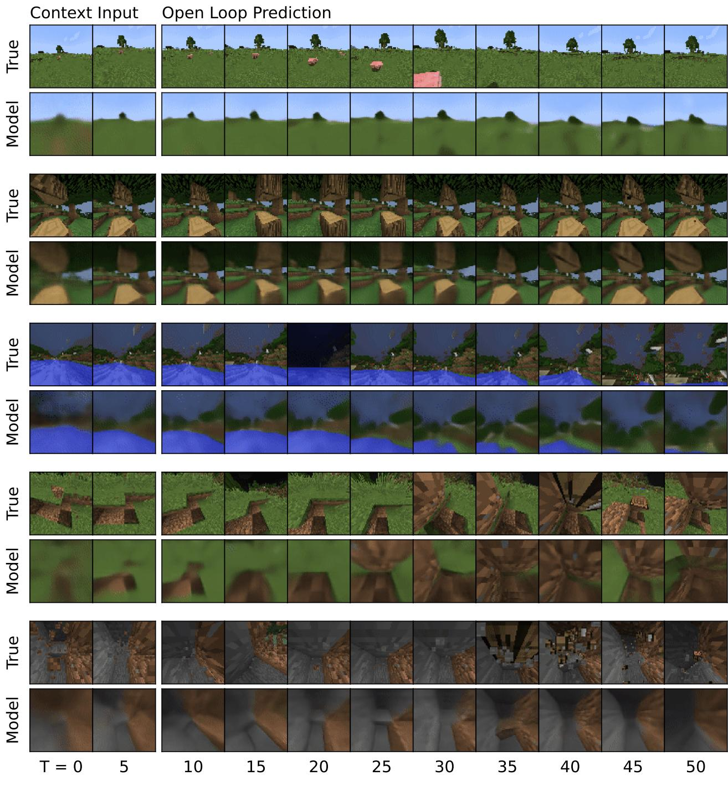  
Figure 7: Multi-step predictions on Minecraft. The world model receives the first 5 frames as context input and the predicts 45 steps into the future given the action sequence and without access to intermediate images.

# Minecraft additional results

Table 5: Minecraft Diamond scores at 100M environment steps.   

<table><tr><td>Method</td><td>Return</td></tr><tr><td>Dreamer</td><td>9.1</td></tr><tr><td>IMPALA</td><td>7.1</td></tr><tr><td>Rainbow</td><td>6.3</td></tr><tr><td>PPO</td><td>5.1</td></tr></table>

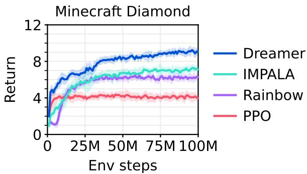  
Figure 8: Minecraft learning curves.

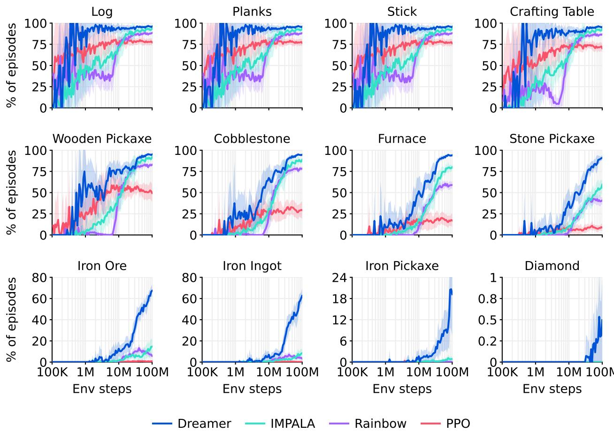  
Figure 9: Item success rates as a percentage of episodes. Dreamer obtains items at substantially higher rates than the baselines and continues to improve until the 100M step budget. At the budget, Dreamer obtains diamonds in $0 . 4 \%$ of episodes, leaving a challenge for future research. This metric differs from Figure 5, which shows that over the course of training, $100 \%$ of Dreamer agents obtain one or more diamonds regardless of episode boundaries, compared to $0 \%$ of the baseline agents.

# Atari learning curves

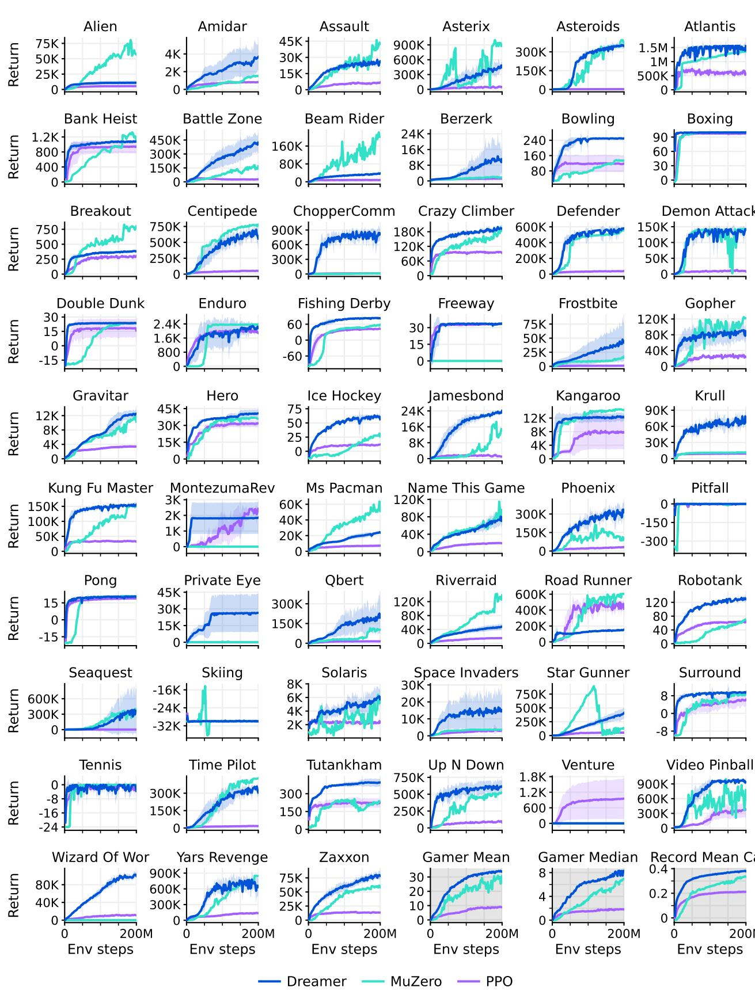  
Figure 10: Atari learning curves.

# Atari scores

Table 6: Atari scores.   

<table><tr><td>Task</td><td>Random</td><td>Gamer</td><td>Record</td><td>PPO</td><td>MuZero</td><td>Dreamer</td></tr><tr><td>Environment steps</td><td></td><td></td><td></td><td>200M</td><td>200M</td><td>200M</td></tr><tr><td></td><td></td><td>7128</td><td>251916</td><td>5476</td><td>56835</td><td>10977</td></tr><tr><td>Alien Amidar</td><td>228 </td><td>72</td><td> 104159</td><td>7</td><td>1517</td><td> 6122</td></tr><tr><td>Asssault</td><td></td><td>8503</td><td>8647</td><td>673</td><td></td><td> 60100</td></tr><tr><td></td><td></td><td></td><td> 1000</td><td></td><td>42742</td><td></td></tr><tr><td> Asterix</td><td></td><td></td><td></td><td> 190</td><td>79375</td><td> 6</td></tr><tr><td>ASsteroids</td><td></td><td> 7389</td><td> 10506650</td><td>22479</td><td>74146</td><td>8684</td></tr><tr><td>Atlantis</td><td>128</td><td> 9028</td><td>1004840</td><td> 39721</td><td> 1353617</td><td> 15322</td></tr><tr><td> Bank Heist</td><td>14</td><td> 753</td><td>2058</td><td>946</td><td> 1077</td><td> 1083</td></tr><tr><td>a Bat Zone</td><td>236</td><td>3788</td><td>0100</td><td>816</td><td>167412</td><td>9653</td></tr><tr><td>Bea Rider</td><td>364</td><td> 1926</td><td>999</td><td>7</td><td> 1154</td><td>7073</td></tr><tr><td>D Berzerk</td><td>124</td><td>630</td><td> 1057940</td><td> 186</td><td>1698</td><td> 557</td></tr><tr><td>T Bowling</td><td></td><td>161</td><td>300</td><td> 118</td><td>3</td><td>5</td></tr><tr><td> Boxing</td><td></td><td>12</td><td> 00</td><td>98</td><td> 100</td><td>10 00</td></tr><tr><td> Breakout</td><td></td><td>30</td><td>86</td><td>99</td><td> 9</td><td>38</td></tr><tr><td> Centipede</td><td></td><td>12017</td><td>13019</td><td>1833</td><td>774421</td><td>455</td></tr><tr><td>Chopper Command</td><td>811</td><td>738</td><td>99999</td><td> 1267</td><td>8945</td><td> 02698</td></tr><tr><td> CLlimber</td><td>1078</td><td>35829</td><td>219900</td><td>3176</td><td>18439</td><td>1993204</td></tr><tr><td>T Defender</td><td>8</td><td> 18689</td><td> 010500</td><td>270</td><td> 492</td><td>7987 5</td></tr><tr><td>Memon Aattaca</td><td>152</td><td>1971</td><td> 156345</td><td>8229</td><td> 142509</td><td> 12109</td></tr><tr><td>oubule unk</td><td>-19</td><td>-16</td><td>22</td><td>16</td><td>2233</td><td>24</td></tr><tr><td>Enduro</td><td></td><td>860</td><td>9500</td><td>1887</td><td>236</td><td>2166</td></tr><tr><td>ih Derby</td><td></td><td>-3</td><td>71</td><td>43</td><td>58</td><td>8</td></tr><tr><td> Freeway</td><td></td><td>30</td><td>38</td><td>33</td><td>0</td><td>34</td></tr><tr><td> Frostbite</td><td></td><td>4335</td><td>454830</td><td>1123</td><td>17087</td><td>41888</td></tr><tr><td>D ophere</td><td></td><td>2412</td><td>5040</td><td>24792</td><td>12025</td><td></td></tr><tr><td> Gravitar</td><td></td><td>351</td><td>162850</td><td>3436</td><td>10301</td><td>0</td></tr><tr><td>Hero</td><td>1173 1027</td><td>0826</td><td> 1000</td><td> 1967</td><td></td><td> 12570</td></tr><tr><td>Ice Hockey</td><td>-11</td><td>1</td><td>36</td><td>12</td><td>6063 26</td><td> 0677</td></tr><tr><td>Jamesbond</td><td></td><td>303</td><td>455</td><td>1 019</td><td>14872</td><td>57</td></tr><tr><td>Kangaroo</td><td>39</td><td> 35</td><td>1424600</td><td> 769</td><td> 14380</td><td>24010</td></tr><tr><td>Krull</td><td></td><td> 266</td><td>1 104100</td><td></td><td></td><td> 2229</td></tr><tr><td>Kung Fu Master</td><td>198</td><td> 2736</td><td> 1000</td><td>9193</td><td>11476</td><td>985</td></tr><tr><td></td><td>258</td><td>4753</td><td></td><td>235</td><td> 1448936</td><td> 154893</td></tr><tr><td>Montezuma Revenge</td><td>0</td><td></td><td>1 29200</td><td>68</td><td>0</td><td>1852</td></tr><tr><td>Ms Pacman Name This Game</td><td>307</td><td>5</td><td>10090</td><td>7041</td><td> 310</td><td> 079</td></tr><tr><td></td><td>2292</td><td>049</td><td>5220</td><td> 11941</td><td> 531</td><td> 7809</td></tr><tr><td>D Phoenix</td><td>7611</td><td> 243</td><td> 0140</td><td>31412</td><td> 10593</td><td>31606</td></tr><tr><td> Pitfall</td><td>229</td><td> 4</td><td>14000</td><td>-2</td><td></td><td>0</td></tr><tr><td>T Pongt</td><td>-21</td><td>15</td><td>21</td><td>19</td><td>21</td><td>20</td></tr><tr><td> Privte Eye</td><td>25</td><td>69571</td><td>101800</td><td>73</td><td> 00</td><td>26432</td></tr><tr><td>Qbert</td><td>1164</td><td>155</td><td>4000</td><td>14554</td><td>102129</td><td>201084</td></tr><tr><td> Riverraid</td><td>138</td><td>11</td><td> 1000</td><td> 4860</td><td>1 198</td><td>48080</td></tr><tr><td>Road Runner</td><td></td><td>784</td><td>C238100</td><td>3995</td><td> 4083</td><td> 150402</td></tr><tr><td> Robotank</td><td></td><td>12</td><td>76</td><td>63</td><td>70</td><td>1</td></tr><tr><td> Seaquest</td><td>$10</td><td>42055</td><td>999999</td><td>1927</td><td>39976</td><td>356584</td></tr><tr><td>T Skiin</td><td>17098</td><td>437</td><td>&quot;-3272</td><td>2926</td><td>-3000</td><td> 9965</td></tr><tr><td> Solari</td><td>236</td><td>2327</td><td>111420</td><td>36</td><td> 860</td><td> 851</td></tr><tr><td>Space Invaders</td><td>148</td><td>1669</td><td>1535</td><td>49</td><td> 3639</td><td> 1005</td></tr><tr><td> Sar Gunner</td><td>664</td><td> 10250</td><td> 7400</td><td> 53439</td><td>27417</td><td> 48961</td></tr><tr><td> Surround</td><td>-10</td><td>8</td><td>6</td><td>6</td><td>9</td><td></td></tr><tr><td> Tennis</td><td>-24</td><td></td><td>21</td><td>−1</td><td></td><td>-3</td></tr><tr><td> Time Pilot</td><td>5 </td><td>5229</td><td>65300</td><td>17250</td><td>427209</td><td>314947</td></tr><tr><td> Tuankham</td><td>11</td><td>168</td><td> 5384</td><td> 25</td><td>235 522962</td><td>395 614065</td></tr><tr><td>Up N Down Venture</td><td>533 0</td><td>193 18</td><td>2840 900</td><td>83743 953</td></table>

# ProcGen learning curves

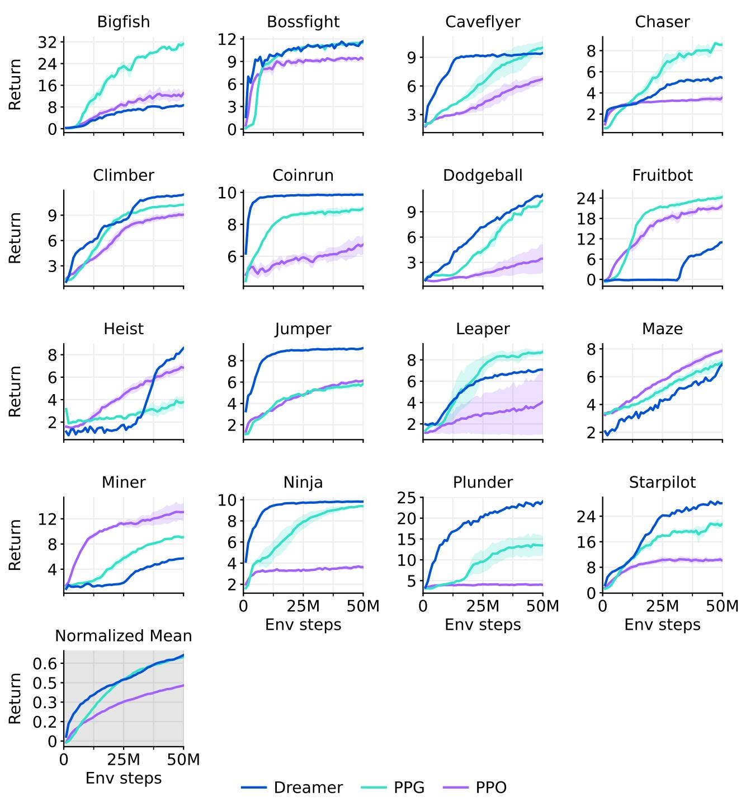  
Figure 11: ProcGen learning curves.

# ProcGen scores

Table 7: ProcGen scores. The PPO implementation we use throughout our paper under fixed hyperparameters performs on par or better than the original PPO, which its authors describe as highly tuned with near optimal hyperparameters 37.   

<table><tr><td>Task</td><td>Original PPO</td><td>PPO</td><td>PPG</td><td>Dreamer</td></tr><tr><td>Environment steps</td><td>50M</td><td>50M</td><td>50M</td><td>50M</td></tr><tr><td>Bigfish</td><td>10.92</td><td>12.72</td><td>31.26</td><td>8.62</td></tr><tr><td>Bossfight</td><td>10.47</td><td>9.36</td><td>11.46</td><td>11.61</td></tr><tr><td>Caveflyer</td><td>6.03</td><td>6.71</td><td>10.02</td><td>9.42</td></tr><tr><td>Chaser</td><td>4.48</td><td>3.54</td><td>8.57</td><td>5.49</td></tr><tr><td>Climber</td><td>7.59</td><td>9.04</td><td>10.24</td><td>11.43</td></tr><tr><td>Coinrun</td><td>7.93</td><td>6.71</td><td>8.98</td><td>9.86</td></tr><tr><td>Dodgeball</td><td>4.80</td><td>3.44</td><td>10.31</td><td>10.93</td></tr><tr><td>Fruitbot</td><td>20.28</td><td>21.69</td><td>24.32</td><td>11.04</td></tr><tr><td>Heist</td><td>2.25</td><td>6.87</td><td>3.77</td><td>8.51</td></tr><tr><td>Jumper</td><td>5.09</td><td>6.13</td><td>5.84</td><td>9.17</td></tr><tr><td>Leaper</td><td>5.90</td><td>4.07</td><td>8.76</td><td>7.05</td></tr><tr><td>Maze</td><td>4.97</td><td>7.86</td><td>7.06</td><td>6.85</td></tr><tr><td>Miner</td><td>7.56</td><td>12.97</td><td>9.08</td><td>5.71</td></tr><tr><td>Ninja</td><td>6.16</td><td>3.62</td><td>9.38</td><td>9.82</td></tr><tr><td>Plunder</td><td>11.16</td><td>3.99</td><td>13.44</td><td>23.81</td></tr><tr><td>Starpilot</td><td>17.00</td><td>10.13</td><td>21.57</td><td>28.00</td></tr><tr><td>Normalized mean</td><td>41.16</td><td>42.80</td><td>64.89</td><td>66.01</td></tr></table>

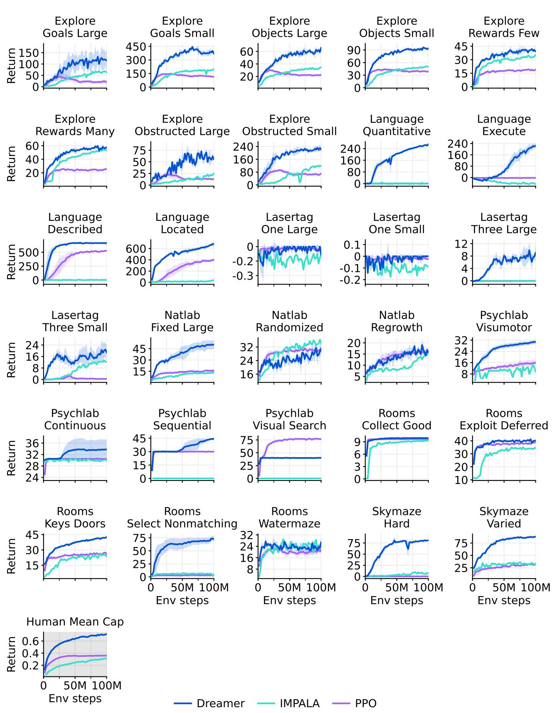  
DMLab learning curves   
Figure 12: DMLab learning curves.

# DMLab scores

Table 8: DMLab scores at 100M environment steps and larger budgets. The IMPALA agent corresponds to "IMPALA (deep)" presented by Kapturowski et al.35 who made the learning curves available.   

<table><tr><td>Task</td><td>R2D2+</td><td>IMPALA</td><td>IMPALA</td><td>IMPALA</td><td>PPO</td><td>Dreamer</td></tr><tr><td>Environment steps</td><td>10B</td><td>10B</td><td>1B</td><td>100M</td><td>100M</td><td>100M</td></tr><tr><td>Explore Goal Locations Large</td><td>174.7</td><td>316.0</td><td>137.8</td><td>64.2</td><td>21.2</td><td>116.7</td></tr><tr><td>Explore Goal Locations Small</td><td>460.7</td><td>482.0</td><td>302.8</td><td>196.1</td><td>115.1</td><td>372.8</td></tr><tr><td>Explore Object Locations Large</td><td>60.6</td><td>91.0</td><td>55.1</td><td>34.3</td><td>22.5</td><td>63.9</td></tr><tr><td>Explore Object Locations Small</td><td>83.7</td><td>100.4</td><td>75.9</td><td>50.6</td><td>38.9</td><td>93.5</td></tr><tr><td>Explore Object Rewards Few</td><td>80.7</td><td>92.6</td><td>46.9</td><td>34.6</td><td>19.0</td><td>40.0</td></tr><tr><td>Explore Object Rewards Many</td><td>75.8</td><td>89.4</td><td>68.5</td><td>53.3</td><td>25.5</td><td>58.1</td></tr><tr><td>Explore Obstructed Goals Large</td><td>95.5</td><td>102.0</td><td>57.9</td><td>23.7</td><td>12.9</td><td>52.8</td></tr><tr><td>Explore Obstructed Goals Small</td><td>311.9</td><td>372.0</td><td>214.9</td><td>118.0</td><td>70.4</td><td>224.6</td></tr><tr><td>Language Answer Quantitative Question</td><td>344.4</td><td>362.0</td><td>304.7</td><td>1.0</td><td>0.3</td><td>266.0</td></tr><tr><td>Language Execute Random Task</td><td>497.4</td><td>465.4</td><td>140.8</td><td>44.4</td><td>-2.5</td><td>223.7</td></tr><tr><td>Language Select Described Object</td><td>617.6</td><td>664.0</td><td>618.4</td><td>0.2</td><td>526.9</td><td>665.5</td></tr><tr><td>Language Select Located Object</td><td>772.8</td><td>731.4</td><td>413.0</td><td>38.2</td><td>397.5</td><td>679.5</td></tr><tr><td>Lasertag One Opponent Large</td><td>0.0</td><td>0.0</td><td>0.0</td><td>-0.1</td><td>0.0</td><td>-0.1</td></tr><tr><td>Lasertag One Opponent Small</td><td>31.8</td><td>0.0</td><td>0.0</td><td>-0.1</td><td>0.0</td><td>0.0</td></tr><tr><td>Lasertag Three Opponents Large</td><td>28.6</td><td>32.2</td><td>10.4</td><td>-0.1</td><td>0.0</td><td>9.0</td></tr><tr><td>Lasertag Three Opponents Small</td><td>49.0</td><td>57.2</td><td>37.1</td><td>12.1</td><td>0.4</td><td>18.8</td></tr><tr><td>Natlab Fixed Large Map</td><td>60.6</td><td>63.4</td><td>53.8</td><td>13.0</td><td>15.8</td><td>50.5</td></tr><tr><td>Natlab Varying Map Randomized</td><td>42.4</td><td>47.0</td><td>40.5</td><td>35.3</td><td>29.6</td><td>31.2</td></tr><tr><td>Natlab Varying Map Regrowth Psychlab Arbitrary Visuomotor Mapping</td><td>24.6</td><td>34.0 38.4</td><td>25.5</td><td>15.3</td><td>16.3</td><td>16.7</td></tr><tr><td>Psychlab Continuous Recognition</td><td>33.1</td><td></td><td>16.5</td><td>11.9</td><td>16.0</td><td>30.7</td></tr><tr><td></td><td>30.0</td><td>28.6</td><td>30.0</td><td>30.1</td><td>30.5</td><td>33.8</td></tr><tr><td>Psychlab Sequential Comparison</td><td>30.0</td><td>29.6</td><td>0.0</td><td>0.0</td><td>30.0</td><td>44.3</td></tr><tr><td>Psychlab Visual Search Rooms Collect Good Objects Test</td><td>79.9</td><td>80.0</td><td>0.0</td><td>0.0</td><td>76.6</td><td>40.1</td></tr><tr><td>Rooms Exploit Deferred Effects Test</td><td>9.9</td><td>10.0</td><td>9.9</td><td>9.3</td><td>9.7</td><td>9.9</td></tr><tr><td></td><td>38.1</td><td>62.2</td><td>37.6</td><td>34.5</td><td>39.0</td><td>40.4</td></tr><tr><td>Rooms Keys Doors Puzzle</td><td>46.2</td><td>54.6</td><td>36.9</td><td>24.2</td><td>26.0</td><td>42.4</td></tr><tr><td>Rooms Select Nonmatching Object</td><td>63.6</td><td>39.0</td><td>63.2</td><td>4.0</td><td>2.7</td><td>73.1</td></tr><tr><td>Rooms Watermaze</td><td>49.0</td><td>47.0</td><td>50.1</td><td>23.6</td><td>21.2</td><td>26.1</td></tr><tr><td>Skymaze Irreversible Path Hard Skymaze Irreversible Path Varied</td><td>76.0</td><td>80.0 100.0</td><td>46.4</td><td>7.7</td><td>0.0</td><td>80.9</td></tr><tr><td></td><td>76.0</td><td></td><td>69.8</td><td>32.7</td><td>31.3</td><td>87.7</td></tr><tr><td>Human mean capped (%)</td><td>85.4</td><td>85.1</td><td>66.3</td><td>31.0</td><td>35.9</td><td>71.4</td></tr></table>

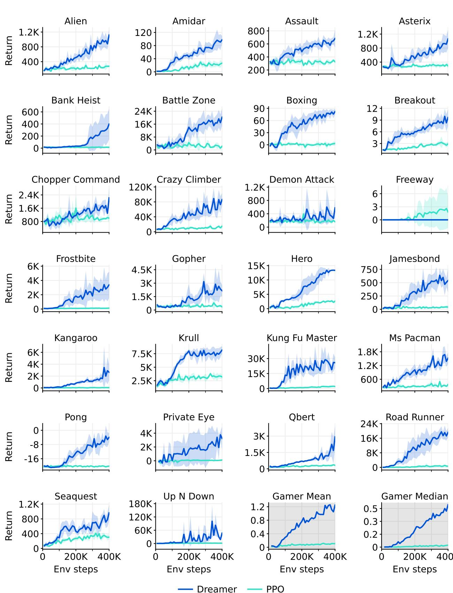  
Atari100k learning curves   
Figure 13: Atari100k learning curves.

Atari100k scores   

<table><tr><td>Task</td><td>Random Human</td><td></td><td>PPO</td><td>SimPLe</td><td>SPR</td><td>TWM</td><td>IRIS</td><td>Dreamer</td></tr><tr><td>Environment steps</td><td></td><td></td><td>400K</td><td>400K</td><td>400K</td><td>400K</td><td>400K</td><td>400K</td></tr><tr><td>Alien</td><td>228</td><td>7128</td><td>276</td><td>617</td><td>842</td><td>675</td><td>420</td><td>1118</td></tr><tr><td>Amidar</td><td>6</td><td>1720</td><td>26</td><td>74</td><td>180</td><td>122</td><td>143</td><td>97</td></tr><tr><td>Assault</td><td>222</td><td>74</td><td>327</td><td>527</td><td>56</td><td>683</td><td>1524</td><td>683</td></tr><tr><td>Asterix</td><td>210</td><td>8503</td><td>292</td><td>1128</td><td>962</td><td>117</td><td>854</td><td>1062</td></tr><tr><td>Bank Heist</td><td>14</td><td>753</td><td>14</td><td>34</td><td>345</td><td>467</td><td>53</td><td>398</td></tr><tr><td>Battle Zone</td><td>2360</td><td>37188</td><td>2233</td><td>4031</td><td>14834</td><td>5068</td><td>13074</td><td>2300</td></tr><tr><td>Boxing</td><td>0</td><td>12</td><td>3</td><td>8</td><td>36</td><td>78</td><td>70</td><td>82</td></tr><tr><td>Breakout</td><td>2</td><td>30</td><td></td><td>16</td><td>20</td><td>20</td><td>84</td><td>10</td></tr><tr><td>Chopper Command</td><td>811</td><td>7388</td><td>1005</td><td>979</td><td>946</td><td>1697</td><td>1565</td><td>2222</td></tr><tr><td>Crazy Climber</td><td>10780</td><td>35829</td><td>14675</td><td>62584</td><td>36700</td><td>71820</td><td>59324</td><td>86225</td></tr><tr><td>Demon Attack</td><td>152</td><td> 1971</td><td>1600</td><td>208</td><td>518</td><td>350</td><td>2034</td><td>577</td></tr><tr><td>Freeway</td><td>0</td><td>30</td><td>2</td><td>17</td><td>19</td><td>24</td><td>31</td><td>0</td></tr><tr><td> Frostbite</td><td>65</td><td>4335</td><td>127</td><td>237</td><td>1171</td><td>1476</td><td>259</td><td>3377</td></tr><tr><td>GGopher</td><td>258</td><td>2412</td><td>368</td><td>597</td><td>661</td><td>1675</td><td>2236</td><td>2160</td></tr><tr><td>Hero</td><td>1027</td><td>30826</td><td>2596</td><td>2657</td><td> 5859</td><td>7254</td><td>7037</td><td>11354</td></tr><tr><td>Jamesbond</td><td>29</td><td>303</td><td>41</td><td>100</td><td>366</td><td>362</td><td>463</td><td>540</td></tr><tr><td>Kangaroo</td><td>52</td><td>035</td><td>55</td><td>51</td><td>3617</td><td>1240</td><td>838</td><td>2643</td></tr><tr><td>Krull</td><td>11598</td><td>266</td><td>3222</td><td>2205</td><td>3682</td><td>6349</td><td>616</td><td>8171</td></tr><tr><td>Kung Fu Master</td><td>258</td><td>22736</td><td>2090</td><td>14862</td><td>4783</td><td>24555</td><td>21760</td><td>2500</td></tr><tr><td>Ms Pacman</td><td>307</td><td>6952</td><td>366</td><td>1480</td><td>1318</td><td>158</td><td>999</td><td>1521</td></tr><tr><td>Pong</td><td>-21</td><td>15</td><td>-20</td><td>13</td><td>-5</td><td>119</td><td>15</td><td>-4</td></tr><tr><td>Private Eye</td><td>25</td><td>69571</td><td>100</td><td>35</td><td>86</td><td>87</td><td>100</td><td>3238</td></tr><tr><td>bert</td><td>164</td><td>13455</td><td>317</td><td>1289</td><td>866</td><td>3331</td><td>746</td><td>2921</td></tr><tr><td>Road Runner</td><td>12</td><td>7845</td><td>602</td><td>5641</td><td>1213</td><td>9109</td><td>9615</td><td>19230</td></tr><tr><td>Seaquest</td><td>68</td><td>42055</td><td>305</td><td>683</td><td>58</td><td>744</td><td>661</td><td>962</td></tr><tr><td>Up N Down</td><td>533</td><td>1693</td><td>1502</td><td>3350</td><td>10859</td><td>15982</td><td>3546</td><td>46910</td></tr><tr><td>Gamer mean (%)</td><td>0</td><td>100</td><td>11</td><td>33</td><td>62</td><td>96</td><td>105</td><td>125</td></tr><tr><td>Gamer median (%)</td><td>0</td><td> 100</td><td>2</td><td>13</td><td>40</td><td>51</td><td>29</td><td>49</td></tr></table>

Table 9: Atari $1 0 0 \mathrm { k }$ scores at 400K environment steps, corresponding to $1 0 0 \mathrm { k }$ agent steps.   

<table><tr><td>Setting</td><td>SimPLe</td><td>EffMuZero</td><td>SPR</td><td>IRIS</td><td>TWM</td><td>Dreamer</td></tr><tr><td rowspan="3">Gamer score (%) Gamer median (%) GPU days</td><td>33</td><td>190</td><td>62</td><td>105</td><td>96</td><td>125</td></tr><tr><td>13</td><td>109</td><td>40</td><td>29</td><td>51</td><td>49</td></tr><tr><td>5.0</td><td>0.6</td><td>0.1</td><td>3.5</td><td>0.4</td><td>0.1</td></tr><tr><td>Online planning</td><td></td><td>X</td><td></td><td></td><td></td><td></td></tr><tr><td>Data augmentation Non-uniform replay</td><td></td><td></td><td>2</td><td></td><td></td><td></td></tr><tr><td></td><td></td><td>X</td><td></td><td></td><td>X</td><td></td></tr><tr><td>Separate hparams</td><td></td><td></td><td></td><td>X</td><td></td><td></td></tr><tr><td>Increased resolution Uses life information</td><td></td><td></td><td></td><td></td><td></td><td></td></tr><tr><td></td><td></td><td></td><td></td><td></td><td>X</td><td></td></tr><tr><td>Uses early resets</td><td></td><td>2</td><td></td><td>x</td><td></td><td></td></tr><tr><td>Separate eval episodes</td><td>X</td><td></td><td></td><td>X</td><td>X</td><td></td></tr></table>

Table 10: Evaluation protocols for the Atari $1 0 0 \mathrm { k }$ benchmark. Computational resources are converted to A100 GPU days. EffcientMuZero44 achieves the highest scores but changed the environment configuration from the standard17. IRIS uses a separate hyperparameter for its exploration strength on Freeway.

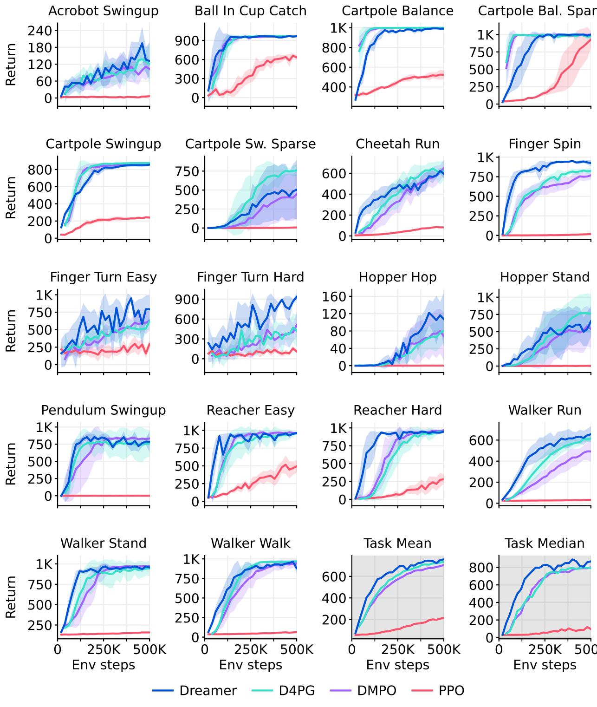  
Proprioceptive control learning curves   
Figure 14: DeepMind Control Suite learning curves under proprioceptive inputs.

# Proprioceptive control scores

Table 11: DeepMind Control Suite scores under proprioceptive inputs.   

<table><tr><td>Task</td><td>PPO</td><td>DDPG</td><td>DMPO</td><td>D4PG</td><td>Dreamer</td></tr><tr><td>Environment steps</td><td>500K</td><td>500K</td><td>500K</td><td>500K</td><td>500K</td></tr><tr><td>Acrobot Swingup</td><td>6</td><td>100</td><td>103</td><td>124</td><td>134</td></tr><tr><td>Ball In Cup Catch</td><td>632</td><td>917</td><td>968</td><td>968</td><td>962</td></tr><tr><td>Cartpole Balance</td><td>523</td><td>997</td><td>999</td><td>999</td><td>990</td></tr><tr><td>Cartpole Balance Sparse</td><td>930</td><td>992</td><td>999</td><td>974</td><td>990</td></tr><tr><td>Cartpole Swingup</td><td>240</td><td>864</td><td>860</td><td>875</td><td>852</td></tr><tr><td>Cartpole Swingup Sparse</td><td>7</td><td>703</td><td>438</td><td>752</td><td>491</td></tr><tr><td>Cheetah Run</td><td>82</td><td>596</td><td>650</td><td>624</td><td>614</td></tr><tr><td>Finger Spin</td><td>18</td><td>775</td><td>769</td><td>823</td><td>931</td></tr><tr><td>Finger Turn Easy</td><td>281</td><td>499</td><td>620</td><td>612</td><td>793</td></tr><tr><td>Finger Turn Hard</td><td>106</td><td>313</td><td>495</td><td>421</td><td>889</td></tr><tr><td>Hopper Hop</td><td>0</td><td>36</td><td>68</td><td>80</td><td>113</td></tr><tr><td>Hopper Stand</td><td>3</td><td>484</td><td>549</td><td>762</td><td>576</td></tr><tr><td>Pendulum Swingup</td><td>1</td><td>767</td><td>834</td><td>759</td><td>788</td></tr><tr><td>Reacher Easy</td><td>494</td><td>934</td><td>961</td><td>960</td><td>954</td></tr><tr><td>Reacher Hard</td><td>288</td><td>949</td><td>968</td><td>937</td><td>938</td></tr><tr><td>Walker Run</td><td>31</td><td>561</td><td>493</td><td>616</td><td>649</td></tr><tr><td>Walker Stand</td><td>159</td><td>965</td><td>975</td><td>947</td><td>964</td></tr><tr><td>Walker Walk</td><td>64</td><td>952</td><td>942</td><td>969</td><td>936</td></tr><tr><td>Task mean</td><td>94</td><td>771</td><td>801</td><td>792</td><td>871</td></tr><tr><td>Task median</td><td>215</td><td>689</td><td>705</td><td>733</td><td>754</td></tr></table>

# Visual control learning curves

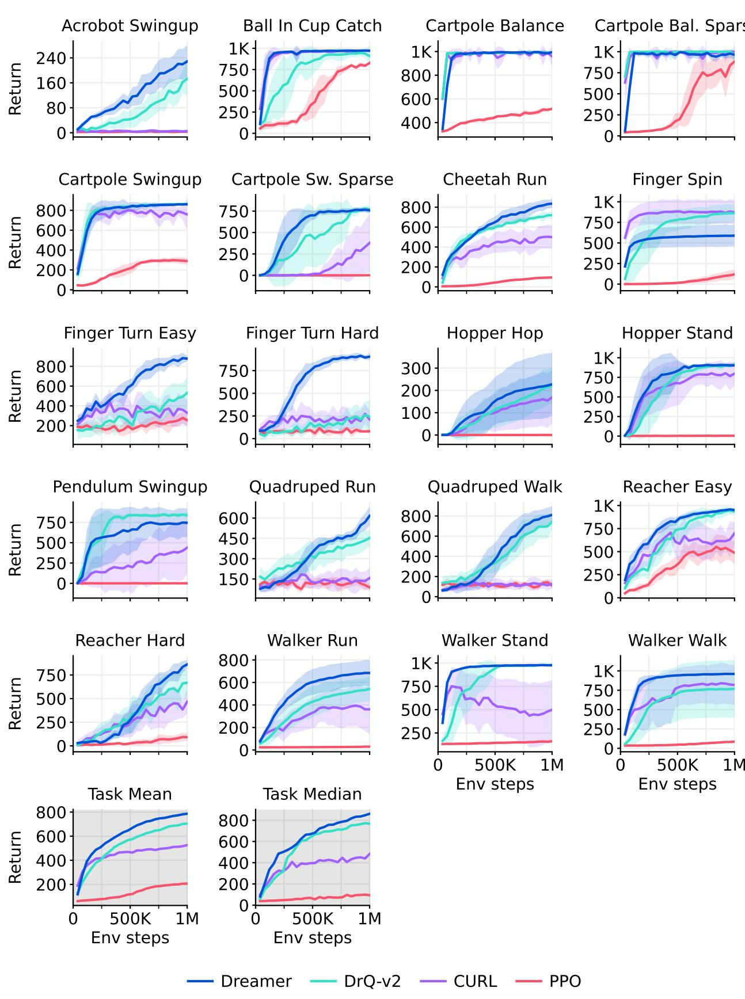  
Figure 15: DeepMind Control Suite learning curves under visual inputs.

# Visual control scores

Table 12: DeepMind Control Suite scores under visual inputs.   

<table><tr><td>Task</td><td>PPO</td><td>SAC</td><td>CURL</td><td>DrQ-v2</td><td>Dreamer</td></tr><tr><td>Environment steps</td><td>1M</td><td>1M</td><td>1M</td><td>1M</td><td>1M</td></tr><tr><td>Acrobot Swingup</td><td>3</td><td>4</td><td>4</td><td>166</td><td>229</td></tr><tr><td>Ball In Cup Catch</td><td>829</td><td>176</td><td>970</td><td>928</td><td>972</td></tr><tr><td>Cartpole Balance</td><td>516</td><td>937</td><td>980</td><td>992</td><td>993</td></tr><tr><td>Cartpole Balance Sparse</td><td>881</td><td>956</td><td>999</td><td>987</td><td>964</td></tr><tr><td>Cartpole Swingup</td><td>290</td><td>706</td><td>771</td><td>863</td><td>861</td></tr><tr><td>Cartpole Swingup Sparse</td><td>1</td><td>149</td><td>373</td><td>773</td><td>759</td></tr><tr><td>Cheetah Run</td><td>95</td><td>20</td><td>502</td><td>716</td><td>836</td></tr><tr><td>Finger Spin</td><td>118</td><td>291</td><td>880</td><td>862</td><td>589</td></tr><tr><td>Finger Turn Easy</td><td>253</td><td>200</td><td>340</td><td>525</td><td>878</td></tr><tr><td>Finger Turn Hard</td><td>79</td><td>94</td><td>231</td><td>247</td><td>904</td></tr><tr><td>Hopper Hop</td><td>0</td><td>0</td><td>164</td><td>221</td><td>227</td></tr><tr><td>Hopper Stand</td><td>4</td><td>5</td><td>777</td><td>903</td><td>903</td></tr><tr><td>Pendulum Swingup</td><td>1</td><td>592</td><td>413</td><td>843</td><td>744</td></tr><tr><td>Quadruped Run</td><td>88</td><td>54</td><td>149</td><td>450</td><td>617</td></tr><tr><td>Quadruped Walk</td><td>112</td><td>49</td><td>121</td><td>726</td><td>811</td></tr><tr><td>Reacher Easy</td><td>487</td><td>67</td><td>689</td><td>944</td><td>951</td></tr><tr><td>Reacher Hard</td><td>94</td><td>7</td><td>472</td><td>670</td><td>862</td></tr><tr><td>Walker Run</td><td>30</td><td>27</td><td>360</td><td>539</td><td>684</td></tr><tr><td>Walker Stand</td><td>161</td><td>143</td><td>486</td><td>978</td><td>976</td></tr><tr><td>Walker Walk</td><td>87</td><td>40</td><td>822</td><td>768</td><td>961</td></tr><tr><td rowspan="2">Task mean Task median</td><td>94</td><td>81</td><td>479</td><td>770</td><td>861</td></tr><tr><td>206</td><td>226</td><td>525</td><td>705</td><td>786</td></tr></table>

# BSuite performance spectrum

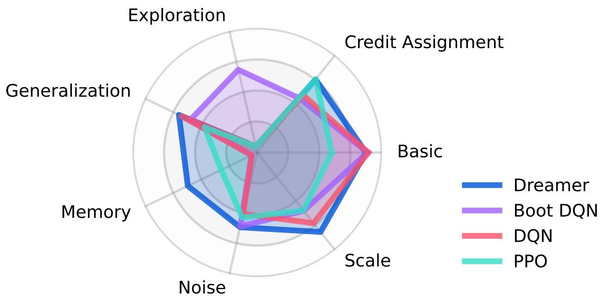  
Figure 16: BSuite scores visualized by category48. Dreamer exceeds previous methods in the categories scale and memory. The scale category measure robustness to reward scales.

BSuite scores   
Table 13: BSuite scores for each task averaged over environment configurations, as well as aggregated performance by category and over all tasks.   

<table><tr><td>Task</td><td>Random</td><td>PPO</td><td>AC-RNN</td><td>DQN</td><td>Boot DQN</td><td>Dreamer</td></tr><tr><td>Bandit</td><td>0.00</td><td>0.38</td><td>1.00</td><td>0.93</td><td>0.98</td><td>0.96</td></tr><tr><td>Bandit Noise</td><td>0.00</td><td>0.61</td><td>0.63</td><td>0.71</td><td>0.80</td><td>0.75</td></tr><tr><td>Bandit Scale</td><td>0.00</td><td>0.39</td><td>0.60</td><td>0.74</td><td>0.83</td><td>0.78</td></tr><tr><td>Cartpole</td><td>0.04</td><td>0.84</td><td>0.40</td><td>0.85</td><td>0.69</td><td>0.93</td></tr><tr><td>Cartpole Noise</td><td>0.04</td><td>0.77</td><td>0.20</td><td>0.82</td><td>0.69</td><td>0.93</td></tr><tr><td>Cartpole Scale</td><td>0.04</td><td>0.83</td><td>0.12</td><td>0.72</td><td>0.65</td><td>0.92</td></tr><tr><td>Cartpole Swingup</td><td>0.00</td><td>0.00</td><td>0.00</td><td>0.00</td><td>0.15</td><td>0.03</td></tr><tr><td>Catch</td><td>0.00</td><td>0.91</td><td>0.87</td><td>0.92</td><td>0.99</td><td>0.96</td></tr><tr><td>Catch Noise</td><td>0.00</td><td>0.54</td><td>0.27</td><td>0.58</td><td>0.68</td><td>0.53</td></tr><tr><td>Catch Scale</td><td>0.00</td><td>0.90</td><td>0.17</td><td>0.85</td><td>0.65</td><td>0.94</td></tr><tr><td>Deep Sea</td><td>0.00</td><td>0.00</td><td>0.00</td><td>0.00</td><td>1.00</td><td>0.00</td></tr><tr><td>Deep Sea Stochastic</td><td>0.00</td><td>0.00</td><td>0.00</td><td>0.00</td><td>0.90</td><td>0.00</td></tr><tr><td>Discounting Chain</td><td>0.20</td><td>0.24</td><td>0.39</td><td>0.25</td><td>0.22</td><td>0.40</td></tr><tr><td>Memory Len</td><td>0.00</td><td>0.17</td><td>0.70</td><td>0.04</td><td>0.04</td><td>0.65</td></tr><tr><td>Memory Size</td><td>0.00</td><td>0.47</td><td>0.29</td><td>0.00</td><td>0.00</td><td>0.59</td></tr><tr><td>Mnist</td><td>0.05</td><td>0.77</td><td>0.56</td><td>0.85</td><td>0.85</td><td>0.61</td></tr><tr><td>Mnist Noise</td><td>0.05</td><td>0.41</td><td>0.22</td><td>0.38</td><td>0.34</td><td>0.34</td></tr><tr><td>Mnist Scale</td><td>0.05</td><td>0.76</td><td>0.09</td><td>0.49</td><td>0.31</td><td>0.55</td></tr><tr><td>Mountain Car</td><td>0.10</td><td>0.10</td><td>0.10</td><td>0.93</td><td>0.93</td><td>0.92</td></tr><tr><td>Mountain Car Noise</td><td>0.10</td><td>0.10</td><td>0.10</td><td>0.89</td><td>0.82</td><td>0.87</td></tr><tr><td>Mountain Car Scale</td><td>0.10</td><td>0.10</td><td>0.10</td><td>0.85</td><td>0.56</td><td>0.90</td></tr><tr><td>Umbrella Distract</td><td>0.00</td><td>1.00</td><td>0.09</td><td>0.30</td><td>0.26</td><td>0.74</td></tr><tr><td>Umbrella Length</td><td>0.00</td><td>0.87</td><td>0.43</td><td>0.39</td><td>0.39</td><td>0.78</td></tr><tr><td>Basic</td><td>0.04</td><td>0.60</td><td>0.58</td><td>0.90</td><td>0.89</td><td>0.88</td></tr><tr><td>Credit assignment</td><td>0.03</td><td>0.76</td><td>0.37</td><td>0.59</td><td>0.56</td><td>0.75</td></tr><tr><td>Exploration</td><td>0.00</td><td>0.00</td><td>0.00</td><td>0.00</td><td>0.68</td><td>0.01</td></tr><tr><td>Generalization</td><td>0.06</td><td>0.47</td><td>0.19</td><td>0.68</td><td>0.60</td><td>0.70</td></tr><tr><td>Memory</td><td>0.00</td><td>0.32</td><td>0.49</td><td>0.02</td><td>0.02</td><td>0.62</td></tr><tr><td>Noise</td><td>0.02</td><td>0.54</td><td>0.24</td><td>0.51</td><td>0.61</td><td>0.62</td></tr><tr><td>Scale</td><td>0.04</td><td>0.60</td><td>0.22</td><td>0.73</td><td>0.60</td><td>0.82</td></tr><tr><td>Task mean (%)</td><td>3</td><td>49</td><td>32</td><td>54</td><td>60</td><td>66</td></tr><tr><td>Category mean (%)</td><td>3</td><td>47</td><td>30</td><td>49</td><td>57</td><td>63</td></tr></table>

# Robustness ablations

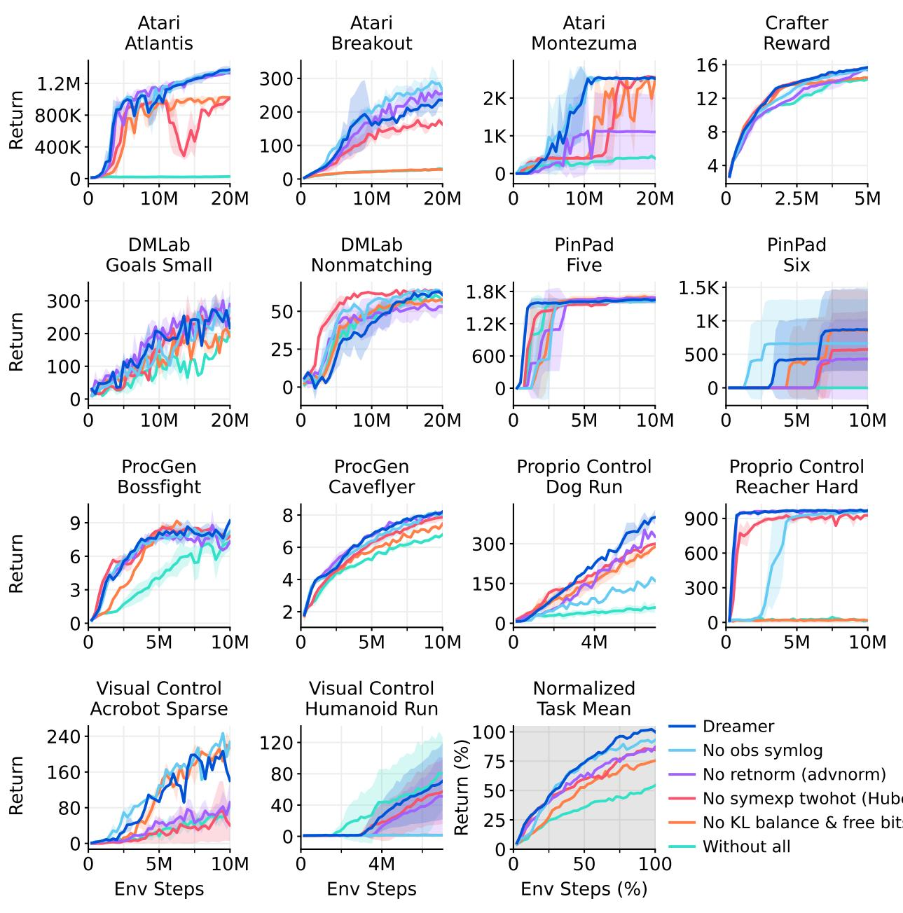  
Figure 17: Individual learning curves for the robustness ablation experiment. All robustness techniques contribute to the overall performance of Dreamer, although each individual technique may only improve the performance on a subset of the tasks.

# Learning signal ablations

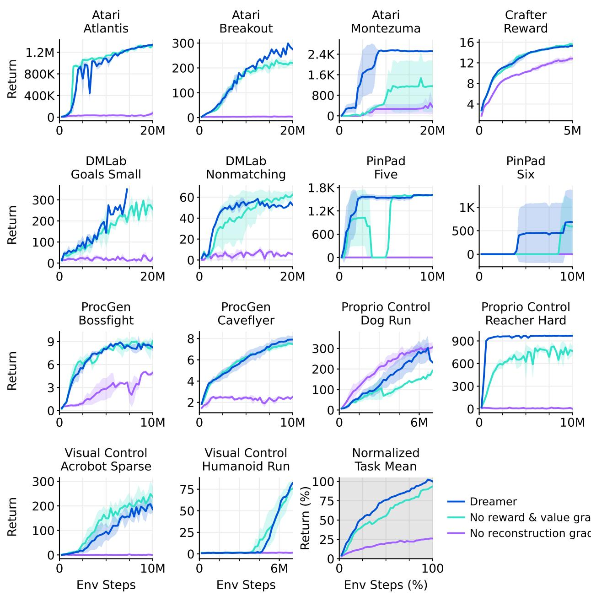  
Figure 18: Individual learning curves for the learning signal ablation experiment. Dreamer relies predominantly on the undersupervised reconstruction objective of its world model and additional reward and value gradients further improve performance on a subset of tasks.