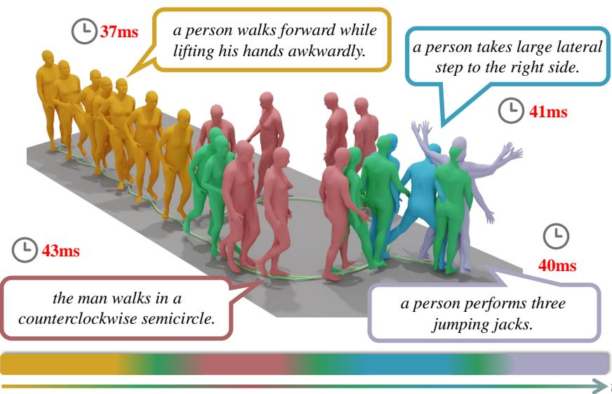
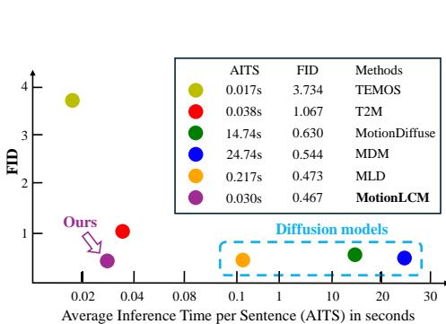
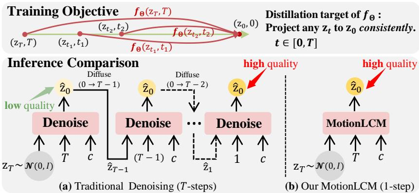
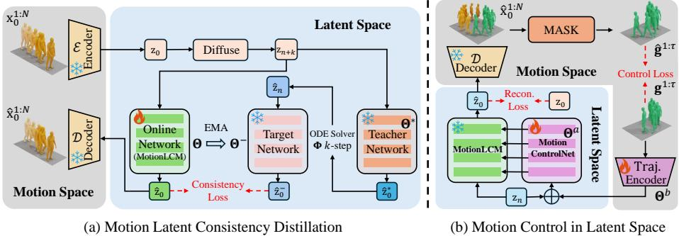
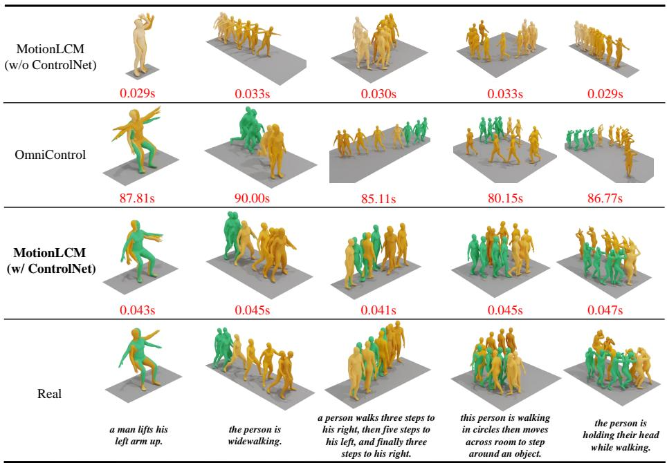
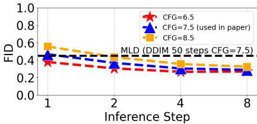
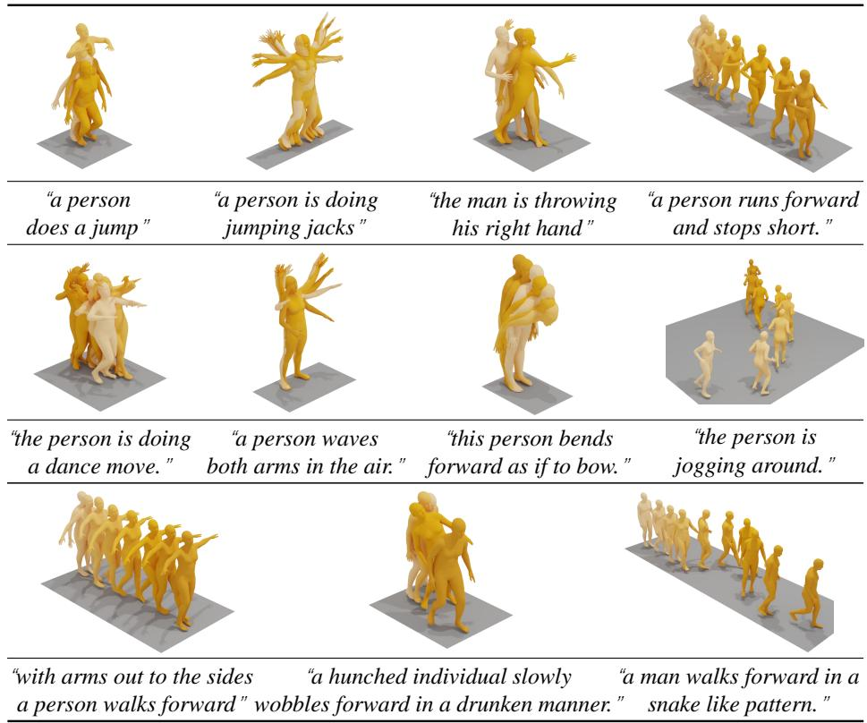
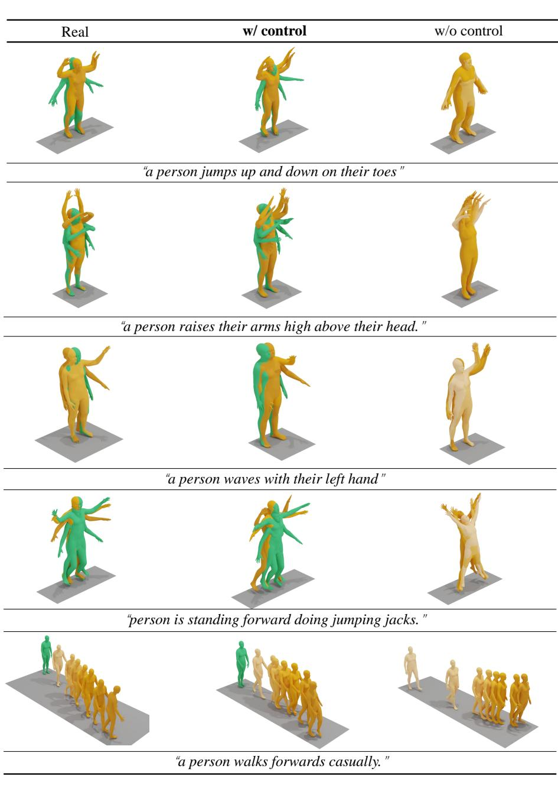

# MotionLCM：基于潜在一致性模型的实时可控运动生成

Wenxun Dai $^{1, 2} \oplus$ - Ling-Hao $\mathrm { C h e n ^{2 \star} } \oplus$，Jingbo Wang $\mathfrak { I P }_{ \mathbb { \oplus } }$ - Jinpeng Liu $^{1, 2} \oplus$ Bo Dai $^{3}$ Yansong Tang $^{1, 2} \oplus$ $\bot$ 深圳市普适数据赋能关键实验室，清华大学深圳国际研究生院 2 清华大学 3 上海人工智能实验室 {wxdai2001, thu.lhchen, wangjingbo1219, liu.jinpeng.55}@gmail.com {doubledaibo, tangyansong15}@gmail.com 项目页面: https://dai-wenxun.github.io/MotionLCM-page

  
Fig. 1: We propose MotionLCM, a real-time controllable motion latent consistency model. Our model uses the last few frames of the previous motion as temporal control signals to autoregressively generate the next motion in real-time under different text prompts. Green blocks denote the junctions. The numbers in red are the inference time.

摘要。本研究介绍了MotionLCM，将可控运动生成扩展到实时水平。现有的文本条件运动生成中的时空控制方法存在显著的运行时效率问题。为了解决这一问题，我们首先提出了运动潜在一致性模型（MotionLCM）用于运动生成，建立在运动潜在扩散模型的基础上。通过采用一步（或少步）推理，我们进一步提升了运动潜在扩散模型在运动生成中的运行时效率。为了确保有效的可控性，我们在MotionLCM的潜在空间中集成了运动ControlNet，并允许在标准运动空间中使用显式控制信号（即初始运动）为训练过程提供进一步的监督。通过采用这些技术，我们的方法能够实时生成带有文本和控制信号的人类运动。实验结果表明，MotionLCM在保持实时运行效率的同时，表现出卓越的生成和控制能力。 关键词：文本到运动 $\cdot$ 实时控制 · 一致性模型

# 1 引言

文本到运动生成（T2M）因其在多个应用中的重要作用而受到越来越多的关注。之前的尝试主要集中在生成对抗网络（GANs）、变分自编码器（VAEs）和扩散模型上，通过成对的文本-运动数据，取得了令人印象深刻的生成结果。现有的方法主要以扩散模型作为基础生成模型，因为它们在运动分布建模方面具有强大的能力。然而，这些扩散方法在推理过程中不可避免地需要大量的采样步骤进行运动合成，即便采用了一些采样加速方法。具体而言，MDM和MLD分别需要约24秒和约0.2秒生成高质量的运动序列。这种低效率阻碍了在各种实时场景中生成高质量运动的应用。

  
Fig.2: Comparison of the inference time costs on HumanML3D [17]. We compare the AITS and FID metrics with five SOTA methods. The closer the model is to the origin the better. Diffusion-based models are indicated by the blue dashed box. Our MotionLCM achieves real-time inference speed while ensuring high-quality motion generation.

除了语言描述本身作为粗略控制信号外，另一个研究方向集中在带有时空约束的运动生成控制上[29, 56, 73]。尽管这些尝试在 T2M 任务中表现出令人印象深刻的控制能力，但在实时应用中仍然存在显著的差距。例如，OmniControl [73] 的推理时间相对较长，每个序列约为 81 秒。因此，在生成质量和效率之间进行权衡是一个具有挑战性的问题。因此，本文的研究目标是实时可控运动生成问题。最近，一种一致性模型的概念[44, 62] 被引入到图像生成中，通过使图像合成在最少的采样步骤（例如 4 步 vs. 50 步）的情况下实现高效和高保真，取得了显著进展。这些特性与我们加速运动生成而不妥协生成质量的目标完美契合。因此，我们提出了 MotionLCM（运动潜在一致性模型），该模型基于运动潜在扩散模型 MLD [9]，旨在解决扩散采样中的低效率问题。据我们所知，我们首次将一致性蒸馏引入运动生成领域，并通过潜在一致性蒸馏[44] 将运动生成加速至实时水平。

在MotionLCM中，我们面临如何在潜在空间中使用时空信号（即初始动作）控制动作的挑战。先前的方法[56, 73]在基础运动空间中建模人类动作，并能够在去噪过程中直接操控动作。然而，对于基于潜在扩散的MotionLCM，将控制信号输入潜在空间并非易事。这是因为潜在空间缺乏明确的运动语义，无法被控制信号直接操控。受到可控图像生成领域[82]的显著成功启发，我们引入了一个运动ControlNet，以控制潜在空间中的动作生成。然而，简单的运动ControlNet不足以为控制信号提供监督。主要原因在于运动空间缺乏明确的监督。因此，在训练阶段，我们通过冻结的变分自编码器（VAE）[30]解码器将预测的潜在向量解码回基础运动空间，以便为生成的动作提供明确的控制监督。得益于MotionLCM强大的单步推理能力，相较于MLD [9]，MotionLCM生成的潜在向量可以显著促进在潜在空间以及运动空间进行控制监督，以训练运动ControlNet。通过我们的关键设计，所提出的MotionLCM成功实现了可控动作生成中的生成质量与效率之间的平衡。在详细讲解之前，我们总结了我们的核心贡献如下：我们通过对运动潜在扩散模型进行一致性蒸馏，提出了运动潜在一致性模型（MotionLCM），将可控运动生成扩展至实时水平。在我们实现实时运动生成的基础上，我们引入了运动ControlNet，使高质量的可控运动生成成为可能。大量实验结果表明，MotionLCM在生成质量、控制能力和实时效率之间实现了良好的平衡。

# 2 相关工作

根据输入，生成人体运动可以分为三种主要方式：（1）无任何条件的运动合成 [54,65,77,84]；（2）具有一些给定的多模态条件，如动作标签 [6, 12, 19, 31, 48, 75]、文本描述 [15, 7, 911, 1315, 17, 18, 24, 27, 29, 3739, 43, 4951, 56, 64, 65, 6870, 72,78,81,83,85,86]、音频或音乐 [3235,59,66]；（3）具有用户定义的轨迹 [22,23,29,36,56, 58,68,71, 73]。为了生成多样化、自然且高质量的人体运动，许多生成模型得到了探索 [2,38, 49,79,80]。近期，基于扩散的方法显著提升了运动生成的性能和多样性 [8,9,11,16,65,76,83]，并实现了稳定的训练。具体而言，MotionDiffuse [83] 是首个基于文本的运动扩散模型，提供了关于身体部位的细粒度指令，并实现了带时间变化文本提示的任意长度运动合成。MDM [65] 引入了一种操作于原始运动数据的运动扩散模型，能够实现高质量的生成和通用的条件设置，为新的运动生成任务提供了良好的基线。基于MDM [65]，OmniControl [73] 通过将分析空间引导和现实性引导结合到扩散模型中，整合了跨不同关节的灵活时空控制信号，确保生成的运动与输入控制信号紧密符合。与我们工作最相关的是MLD [9]，它引入了一种基于运动潜变量的扩散模型，以提高生成质量并降低计算资源需求。其关键思想是在运动嵌入上训练一个变分自编码器（VAE）[30]，然后在学习的潜变量空间中实现潜变量扩散 [55]。然而，这些扩散方式在推理期间不可避免地需要大量采样步骤进行运动合成，即使有一些采样加速方法 [61]。因此，我们提出了MotionLCM，它不仅保证高质量的可控运动生成，还实现了实时的运行效率。

在本节中，我们首先在3.1节简要介绍关于潜在一致性模型的基础知识。然后，在3.2节中，我们描述如何进行运动生成的潜在一致性蒸馏，接着在3.3节中介绍我们在潜在空间中实现运动控制的方法。整体流程如图4所示。

# 3.1 前提条件

一致性模型 (CM) [62] 提出了一种高效生成模型，旨在实现高效的一步或少步生成。给定一个概率流常微分方程 (即 PF-ODE)，它可以平滑地将数据转换为噪声，CM 的目标是学习一个函数 $f ( \cdot , \cdot )$，该函数将 ODE 轨迹上的任何点映射到其原始分布（即 PF-ODE 的解）。一致性函数正式定义为 $f : ( \mathbf { x } _ { t } , t ) \longmapsto \mathbf { x } _ { \epsilon }$，其中 $t \in [ \epsilon , T ]$，$T > 0$ 是一个固定常数，$\epsilon$ 是一个小的正数，以避免数值不稳定。根据 [62]，一致性函数应满足自一致性属性：

$$
\begin{array} { r } { \pmb { f } ( \mathbf { x } _ { t } , t ) = \pmb { f } ( \mathbf { x } _ { t ^ { \prime } } , t ^ { \prime } ) , \forall t , t ^ { \prime } \in [ \epsilon , T ] . } \end{array}
$$

  
Fig. 3: The training objective of consistency distillation is to learn a consistency function $f _ { \Theta }$ , initialized with the parameters of a pre-trained diffusion model (e.g., MLD [9]). This function $f _ { \Theta }$ should projects any points (i.e., $\mathbf { z } _ { t }$ ) on the ODE trajectory to its solution $( i . e . , \mathbf { z } _ { 0 } )$ . Once the pre-trained model [9] is distilled, unlike the traditional denoising model [65, 83] that requires considerable sampling steps, our MotionLCM can generate high-quality motion sequences with one-step sampling and further improve the generation quality through multi-step inference.

如公式（1）所示，自一致性属性表明在同一PF-ODE轨迹上的任意对$\left( \mathbf { x } _ { t } , t \right)$，模型的输出应该是一致的。参数化一致性模型$f _ { \Theta }$的目标是通过在公式（1）中强制执行自一致性属性，从数据中学习一致性函数。为了确保$f _ { \Theta } ( \mathbf { x } , \epsilon ) = \mathbf { x }$，一致性模型$f _ { \Theta }$的参数化形式为，其中$c _ { \mathrm { s k i p } } ( t )$和$\boldsymbol { c } _ { \mathrm { o u t } } ( t )$是可微函数，且满足$c _ { \mathrm { s k i p } } ( \epsilon ) = 1$和$c _ { \mathrm { o u t } } ( \epsilon ) = 0$，$F _ { \Theta } ( \cdot , \cdot )$是一个深度神经网络，用于学习自一致性。从预训练扩散模型中提取知识训练的CM称为一致性蒸馏。一致性损失定义如下，其中$d ( \cdot , \cdot )$是用于测量两个样本之间距离的选定度量函数。$f _ { \Theta } ( \cdot , \cdot )$和$f _ { \Theta ^ { - } } ( \cdot , \cdot )$根据文献[62]被称为“在线网络”和“目标网络”。此外，$\Theta ^ { - }$是通过对$\Theta$参数进行指数滑动平均（EMA）更新的。在公式（3）中，$\hat { \mathbf { x } } _ { t _ { n } } ^ { \Phi }$是从$\mathbf { x } _ { t _ { n + 1 } }$得到的对$\mathbf { x } _ { t _ { n } }$的一步估计，公式为，其中$\Phi$是应用于PF-ODE的一步ODE求解器。

$$
f _ { \Theta } ( \mathbf x , t ) = c _ { \mathrm { s k i p } } ( t ) \mathbf x + c _ { \mathrm { o u t } } ( t ) F _ { \Theta } ( \mathbf x , t ) ,
$$

$$
\begin{array} { r } { \mathcal { L } ( \boldsymbol { \Theta } , \boldsymbol { \Theta } ^ { - } ; \boldsymbol { \Phi } ) = \mathbb { E } \left[ d \left( \boldsymbol { f } _ { \boldsymbol { \Theta } } ( \mathbf { x } _ { t _ { n + 1 } } , t _ { n + 1 } ) , \boldsymbol { f } _ { \boldsymbol { \Theta } ^ { - } } ( \hat { \mathbf { x } } _ { t _ { n } } ^ { \boldsymbol { \Phi } } , t _ { n } ) \right) \right] , } \end{array}
$$

$$
\begin{array} { r } { \hat { \mathbf { x } } _ { t _ { n } } ^ { \Phi } \gets \mathbf { x } _ { t _ { n + 1 } } + ( t _ { n } - t _ { n + 1 } ) \Phi ( \mathbf { x } _ { t _ { n + 1 } } , t _ { n + 1 } , \emptyset ) , } \end{array}
$$

  
Fig. 4: The overview of MotionLCM. (a) Motion Latent Consistency Distillation (Sec. 3.2). Given a raw motion sequence $\mathbf { x } _ { 0 } ^ { 1 : N }$ , a pre-trained VAE [30] encoder first compresses it into the latent space, then a forward diffusion operation is performed to add $n { \mathrel { + { k } } }$ steps of noise. Then, the noisy ${ \mathbf z } _ { n + k }$ is fed into the online network and teacher network to predict the clean latent. The target network takes the $k$ -step estimation results of the teacher output to predict the clean latent. To learn self-consistency, a loss is applied to enforce the output of the online network and target network to be consistent. (b) Motion Control in Latent Space (Sec. 3.3). With the powerful MotionLCM trained in the first stage, we incorporate a motion ControlNet into the MotionLCM to achieve controllable motion generation. Furthermore, we leverage the decoded motion to explicitly supervise the spatial-temporal control signals (i.e., initial poses $\mathbf { g } ^ { 1 : \tau }$ ).

潜在一致性模型（LCM）[44]学习潜在空间中的自一致性特性 $D _ { \mathbf { z } } = \{ ( \mathbf { z } , \mathbf { c } ) | \mathbf { z } = { \mathcal { E } } ( \mathbf { x } ) , ( \mathbf { x } , \mathbf { c } ) \in D \}$ ，其中 $D$ 表示数据集，$\mathbf { c }$ 是给定条件，$\varepsilon$ 是预训练编码器。与使用数值连续 PF-ODE 求解器 [28] 的 CMs [62] 相比，LCMs [44] 采用离散时间调度 [41, 42, 61] 以适应稳定扩散 [55]。LCMs [44] 并不是确保相邻时间步 $t _ { n + 1 } \to t _ { n }$ 之间的一致性，而是设计成确保当前时间步与 $k$ 步之外的一致性，即 $t _ { n + k } \to t _ { n }$ ，从而显著减少收敛时间成本。由于无分类器引导（CFG） [21] 在合成高质量文本对齐图像中发挥了至关重要的作用，LCMs 将 CFG 集成到蒸馏中，如下所示，其中 $w$ 表示 CFG 比例，从 $[ w _ { \mathrm { m i n } } , w _ { \mathrm { m a x } } ]$ 均匀采样，$k$ 是跳跃间隔。为了高效执行上述 $k$ 步引导蒸馏，LCMs 将一致性函数扩展为 $f : ( \mathbf { z } _ { t } , t , w , \mathbf { c } ) \longmapsto \mathbf { z } _ { 0 }$ ，这也是我们 MotionLCM 采用的形式。

$$
\hat { \mathbf { z } } _ { t _ { n } } ^ { \Phi , w } \gets \mathbf { z } _ { t _ { n + k } } + ( 1 + w ) \Phi ( \mathbf { z } _ { t _ { n + k } } , t _ { n + k } , t _ { n } , \mathbf { c } ) - w \Phi ( \mathbf { z } _ { t _ { n + k } } , t _ { n + k } , t _ { n } , \emptyset ) ,
$$

# 3.2 MotionLCM: 动作潜在一致性模型

运动压缩到潜在空间。受到[44, 62]的启发，我们提出了MotionLCM（运动潜在一致性模型），以解决运动扩散模型[65, 83]中的低效率问题，释放LCM在运动生成任务中的潜力。与MLD [9]类似，我们的MotionLCM在运动潜在空间中采用一致性模型。我们选择MLD [9]作为基础扩散模型进行蒸馏。我们的目标是实现少步（2~4步）甚至一步推理，而不影响运动质量。在MLD中，首先训练一个自编码器$( \mathcal { E } , \mathcal { D } )$，将高维运动压缩为低维潜在向量$\mathbf { z } = { \mathcal { E } } ( \mathbf { x } )$，然后解码重建运动为$\hat { \mathbf { x } } = \mathcal { D } ( \mathbf { z } )$。在运动潜在空间中训练扩散模型与在原始运动序列（即运动空间）上训练的常规扩散模型相比，大大减少了计算资源，并加快了推理过程。因此，我们有效地利用运动潜在空间进行一致性蒸馏。运动潜在一致性蒸馏。我们运动潜在蒸馏的概述如图4(a)所示。一个序列${ \bf x } _ { 0 } ^ { 1 : N } = \{ \mathbf { x } ^ { i } \} _ { i = 1 } ^ { N }$是一个人类姿势的序列，其中$N$是帧的数量。我们遵循[17]使用冗余运动表示进行实验，这在之前的工作中得到了广泛应用[9, 65, 83]。如图4(a)所示，给定一个原始运动序列$\mathbf { x } _ { 0 } ^ { 1 : N }$，其对应的潜在空间为${ \bf z } _ { 0 } = \mathcal { E } ( { \bf x } _ { 0 } )$。然后，进行$n + k$步的正向扩散操作，以在$\mathbf { z } _ { 0 }$上添加噪声，其中$k$是节省的间隔，如第3.1节所述。嘈杂的${ \mathbf z } _ { n + k }$被输入到冻结的教师网络和可训练的在线网络，以预测干净的$\hat { \mathbf { z } } _ { 0 } ^ { \ast }$和$\hat { \mathbf { z } } _ { 0 }$。目标网络使用由$k$步ODE求解器$\Phi$（如DDIM [61]）获得的更清晰的$\hat { \mathbf { z } } _ { n }$来预测$\hat { \mathbf { z } } _ { 0 } ^ { - }$。由于无分类器引导（CFG）[21]对扩散模型中的条件对齐至关重要，我们将CFG整合到蒸馏中，其中$\mathbf { c }$是文本条件，$w$表示引导比例。为了确保在方程(1)中定义的自一致性属性，潜在一致性蒸馏损失$\mathcal { L } _ { \mathrm { L C D } }$设计如下，其中$d ( \cdot , \cdot )$是距离测量函数，例如L2损失或Huber损失[25]。如第3.1节所讨论，目标网络$\Theta ^ { - }$与可训练的在线网络$\Theta$的参数的指数移动平均（EMA）进行更新。这里我们将教师网络$\Theta ^ { * }$定义为预训练的运动潜在扩散模型，即MLD [9]。根据[44]，在线网络和目标网络用教师网络的参数初始化。在推理阶段，如图5所示，我们的MotionLCM能够通过一步采样生成高质量的运动，并与其他运动扩散模型[9, 65]相比，达到最快的运行时间（每个运动序列约30毫秒）。

$$
\hat { \mathbf { z } } _ { n } \gets \mathbf { z } _ { n + k } + ( 1 + w ) \Phi ( \mathbf { z } _ { n + k } , t _ { n + k } , t _ { n } , \mathbf { c } ) - w \Phi ( \mathbf { z } _ { n + k } , t _ { n + k } , t _ { n } , \emptyset ) ,
$$

$$
\mathcal { L } _ { \mathrm { L C D } } ( \boldsymbol { \Theta } , \boldsymbol { \Theta } ^ { - } ) = \mathbb { E } \left[ d \left( f _ { \boldsymbol { \Theta } } ( \mathbf { z } _ { n + k } , t _ { n + k } , w , \mathbf { c } ) , \boldsymbol { f } _ { \boldsymbol { \Theta } ^ { - } } ( \hat { \mathbf { z } } _ { n } , t _ { n } , w , \mathbf { c } ) \right) \right] ,
$$

# 3.3 潜在空间中的可控运动生成

在解决运动潜在扩散模型中的低效率问题之后，我们深入探讨了实时运动控制的另一个方向。受到ControlNet在可控图像生成中取得的巨大成功的启发，我们在MotionLCM的潜在空间中引入了运动ControlNet $\Theta ^ { a }$，并用MotionLCM的可训练副本初始化运动ControlNet。具体而言，运动ControlNet中的每一层都附加了一个零初始化的线性层，以消除初始训练步骤中的随机噪声。为了实现自回归运动生成范式，如图1所示，我们将运动控制任务定义为在给定初始$\tau$姿态和文本描述的情况下生成运动。如图4(b)所示，初始$\tau$姿态由$K$个控制关节的轨迹定义，$\mathbf { g } ^ { 1 : \tau } = \{ \mathbf { g } ^ { i } \} _ { i = 1 } ^ { \tau }$，其中$\mathbf { g } ^ { i } \in \mathbb { R } ^ { K \times 3 }$表示每个控制关节的全局绝对位置。在我们的运动控制流程中，我们设计了一个由堆叠Transformer层组成的轨迹编码器$\Theta ^ { b }$来编码轨迹信号。我们在轨迹序列开始之前附加一个全局标记（即[CLS]）作为编码器的输出特征，这个特征被加入到带噪声的$\mathbf { z } _ { n }$中，并输入到可训练的运动ControlNet $\Theta ^ { a }$中。在运动ControlNet的指导下，MotionLCM通过一致性函数$f _ { \Theta ^ { s } }$预测去噪后的$\hat { \mathbf { z } } _ { 0 }$，其中$\Theta ^ { s }$是$\Theta ^ { a }$、$\Theta ^ { b }$和$\Theta$的组合。以下的重建损失$\mathcal { L } _ { \mathrm { r e c o n } }$优化运动ControlNet $\Theta ^ { a }$和轨迹编码器$\Theta ^ { b }$，其中$\mathbf { c } ^ { * }$包含来自轨迹编码器和运动ControlNet的文本条件和控制指导。然而，在训练过程中，潜在空间中的唯一重建监督是不够的。我们认为这是因为可控运动生成需要更详细的约束，而仅通过潜在空间中的重建损失无法有效提供。与如OmniControl这类直接在运动空间中扩散并允许对控制信号进行显式监督的先前方法不同，在潜在空间中有效监督控制信号并非易事。因此，我们利用冻结的变分自动编码器（VAE）解码器$\mathcal { D }$将潜在的$\hat { \mathbf { z } } _ { 0 }$解码到运动空间，获得预测的运动$\hat { \mathbf { x } } _ { 0 }$，从而引入控制损失${ \mathcal { L } } _ { \mathrm { c o n t r o l } }$，如下所示，其中$R ( \cdot )$将关节局部位置转换为全局绝对位置，$m _ { i j } \in \{ 0 , 1 \}$是在帧$_ i$上关节$j$的二进制关节掩膜。然后，我们用整体目标优化运动ControlNet $\Theta ^ { a }$和轨迹编码器$\Theta ^ { b }$，其中$\lambda$是平衡两种损失的权重。这种设计使得在原始运动空间中的显式控制信号进一步为生成过程提供监督。大量实验表明，引入的监督有助于提高运动控制性能，相关内容将在下一节中介绍。

$$
\mathcal { L } _ { \mathrm { r e c o n } } ( \Theta ^ { a } , \Theta ^ { b } ) = \mathbb { E } \left[ d \left( f _ { \Theta ^ { s } } \left( \mathbf { z } _ { n } , t _ { n } , w , \mathbf { c } ^ { * } \right) , \mathbf { z } _ { 0 } \right) \right] ,
$$

$$
\mathcal { L } _ { \mathrm { c o n t r o l } } ( \Theta ^ { a } , \Theta ^ { b } ) = \mathbb { E } \left[ \frac { \sum _ { i } \sum _ { j } m _ { i j } | | R ( \hat { \mathbf { x } } _ { 0 } ) _ { i j } - R ( \mathbf { x } _ { 0 } ) _ { i j } | | _ { 2 } ^ { 2 } } { \sum _ { i } \sum _ { j } m _ { i j } } \right] ,
$$

$$
\begin{array} { r } { \Theta ^ { a } , \Theta ^ { b } = \underset { \Theta ^ { a } , \Theta ^ { b } } { \arg \operatorname* { m i n } } ( \mathcal { L } _ { \mathrm { r e c o n } } + \lambda \mathcal { L } _ { \mathrm { c o n t r o l } } ) , } \end{array}
$$

# 4 实验

在本节中，我们首先在 4.1 节中介绍实验设置的详细信息。随后，我们在 4.2 节和 4.3 节中提供定量和定性比较，以评估我们提出的 MotionLCM 框架的有效性。最后，我们在 4.4 节中对 MotionLCM 进行全面的消融研究。

# 4.1 实验设置

数据集。我们在流行的 HumanML3D [17] 数据集上进行了实验，该数据集包含 14,616 个独特的人类动作序列和 44,970 个文本描述。为了与之前的方法 [9, 17, 49, 65, 83] 进行公平比较，我们采用了冗余的动作表示，包括根速度、根高度、局部关节位置、速度、根空间中的旋转以及脚接触的二进制标签。

评估指标。我们扩展了之前工作的评估指标 [9, 17, 73]。 (1) 时间成本：我们遵循 [9] 报告每句平均推理时间（AITS）以评估模型的推理效率。 (2) 动作质量：采用弗雷歇距离（FID）作为主要指标来评估生成动作与真实动作之间的特征分布。使用的特征提取器来自 [17]。 (3) 动作多样性：多模态性（MModality）衡量相同文本条件下的生成多样性，而多样性通过特征计算方差 [17]。 (4) 条件匹配：根据 [17] 计算动作检索精度（R-Precision），以报告文本-动作的顶级 1/2/3 匹配准确率，多模态距离（MM Dist）计算动作与文本之间的平均距离。 (5) 控制误差：轨迹误差（Traj. err.）量化未成功轨迹的比例，该比例由任何控制关节位置误差超过预设阈值来表征。位置误差（Loc. err.）表示未成功的关节。平均误差（Avg. err.）表示控制关节的平均位置误差。

实施细节。我们的基线运动扩散模型基于 MLD [9]。我们重现了 MLD，并实现了更高的性能。除非另行说明，所有实验均在此模型上进行。对于 MotionLCM，我们采用 AdamW [40] 优化器进行 96K 次迭代，使用余弦衰减学习率调度器，并进行 1K 次线性预热。批次大小为 256，学习率为 2e-4。我们将训练引导尺度范围设置为 $[ w _ { \mathrm { m i n } } , w _ { \mathrm { m a x } } ] = [ 5 , 1 5 ]$，测试引导尺度设置为 7.5，默认采用 EMA 率 $\mu = 0 . 9 5$。我们使用 DDIM [61] 求解器，跳过间隔 $k = 2 0$，并选择 Huber [25] 损失作为距离度量函数 $d$。对于运动 ControlNet，我们使用 AdamW [40] 优化器进行 192K 次迭代，并进行 1K 次线性预热。批次大小和学习率分别设置为 128 和 1e-4。学习率调度器与第一阶段相同。作为训练目标，我们将 $d$ 设为 L2 损失，默认将控制损失权重 $\lambda$ 设置为 1.0。我们将控制比率 $\tau$ 设置为 0.25，控制关节数量设为 $K = 6$（即臀部、左脚、右脚、头部、左腕和右腕），训练和测试均如此。我们使用 PyTorch [47] 实现模型，训练在 NVIDIA RTX 4090 GPU 上进行，测试在 Tesla V100 GPU 上进行。

Table 1: Comparison of text-conditional motion synthesis on HumanML3D [17] dataset. We compute suggested metrics following [17]. We repeat the evaluation 20 times for each metric and report the average with a $9 5 \%$ confidence interval. " indicates that the closer to the real data, the better. Bold and underline indicate the best and the second best result. “\*" denotes the reproduced version of MLD [9]. The MotionLCM in one-step inference $\mathbf { ( 3 0 m s ) }$ surpasses all state-of-the-art models.   

<table><tr><td rowspan="2">Methods</td><td rowspan="2">AITS ↓</td><td colspan="3">R-Precision ↑</td><td rowspan="2">FID ↓</td><td rowspan="2">MM Dist ↓</td><td rowspan="2"></td><td rowspan="2">Diversity → MModality ↑</td></tr><tr><td>Top 1</td><td>Top 2</td><td>Top 3</td></tr><tr><td>Real</td><td>-</td><td>0.511±.003</td><td>0.703±.003</td><td>0.797±.002</td><td>0.002±.000</td><td>2.974±.008</td><td>9.503±.065</td><td>-</td></tr><tr><td>Seq2Seq [37]</td><td>-</td><td>0.180±.002</td><td>0.300±.002</td><td>0.396±.002</td><td>11.75±.035</td><td>5.529±.007</td><td>6.223±.061</td><td>-</td></tr><tr><td>JL2P [2]</td><td></td><td>0.246±.002</td><td>0.387±.002</td><td>0.486±.002</td><td>11.02±.046</td><td>5.296±.008</td><td>7.676±.058</td><td>-</td></tr><tr><td>T2G [5]</td><td></td><td>0.165±.001</td><td>0.267±.002</td><td>0.345±.002</td><td>7.664±.030</td><td>6.030±.008</td><td>6.409±.071</td><td></td></tr><tr><td>Hier [14]</td><td></td><td>0.301±.002</td><td>0.425±.002</td><td>0.552±.004</td><td>6.532±.024</td><td>5.012±.018</td><td>8.332±.042</td><td></td></tr><tr><td>TEMOS [49]</td><td>0.017</td><td>0.424±.002</td><td>0.612±.002</td><td>0.722±.002</td><td>3.734±.028</td><td>3.703±.008</td><td>8.973±.071</td><td>0.368±.018</td></tr><tr><td>T2M [17]</td><td>0.038</td><td>0.457±.002</td><td>0.639±.003</td><td>0.740±.003</td><td>1.067±.002</td><td>3.340±.008</td><td>9.188±.002</td><td>2.090±.083</td></tr><tr><td>MDM [65]</td><td>24.74</td><td>0.320±.005</td><td>0.498±.004</td><td>0.611±.007</td><td>0.544±.044</td><td>5.566±.027</td><td>9.559±.086</td><td>2.799±.072</td></tr><tr><td>MotionDiffuse [83]</td><td>14.74</td><td>0.491±.001</td><td>0.681±.001</td><td>0.782±.001</td><td>0.630±.001</td><td>3.113±.001</td><td>9.410±.049</td><td>1.553±.042</td></tr><tr><td>MLD [9]</td><td>0.217</td><td>0.481±.003</td><td>0.673±.003</td><td>0.772±.002</td><td>0.473±.013</td><td>3.196±.010</td><td>9.724±.082</td><td>2.413±.079</td></tr><tr><td>MLD* [9]</td><td>0.225</td><td>0.504±.002</td><td>0.698±.003</td><td>0.796±.002</td><td>0.450±.011</td><td>3.052±.009</td><td>9.634±.064</td><td>2.267±.082</td></tr><tr><td>MotionLCM (1-step)</td><td>0.030</td><td>0.502±.003</td><td>0.701±.002</td><td>0.803±.002</td><td>0.467±.012</td><td>3.022±.009</td><td>9.631±.066</td><td>2.172±.082</td></tr><tr><td>MotionLCM (2-step)</td><td>0.035</td><td>0.505±.003</td><td>0.705±.002</td><td>0.805±.002</td><td>0.368±.011</td><td>2.986±.008</td><td>9.640±.052</td><td>2.187±.094</td></tr><tr><td>MotionLCM (4-step)</td><td>0.043</td><td>0.502±.003</td><td>0.698±.002</td><td>0.798±.002</td><td>0.304±.012</td><td>3.012±.007</td><td>9.607±.066</td><td>2.259±.092</td></tr></table>

# 4.2 文本到动作的比较

在以下部分，我们首先评估我们的MotionLCM在文本到动作（T2M）任务上的表现。我们在HumanML3D [17]上与一些T2M基线方法进行比较，使用建议的度量标准 [17] 并在20次运行的$9 5 \%$置信区间下进行评估。由于MotionLCM基于MLD，我们主要关注与MLD的性能比较。为了评估时间效率，我们比较每句平均推理时间（AITS），与TEMOS [49]、T2M [17]、MDM [65]、MotionDiffuse [83]和MLD [9]的结果进行对比。结果来源于MLD [9]。确定性方法 [2, 5, 14, 37] 无法从单一输入文本中生成多样的结果，因此我们将其MModality指标留空。定量结果如表1所示，我们的MotionLCM在推理期间平均每个动作序列的运行时间效率约为30毫秒，表现令人印象深刻。这一性能超过了之前的基于扩散的方法 [9, 65, 83]，甚至比MLD [9]的表现高出一个数量级。此外，尽管仅采用了一步推理，但我们的MotionLCM能够接近甚至超越MLD [9]（DDIM [61] 50步）的性能。通过两步推理，我们达到了最佳的R-Precision和MM Dist指标，而将采样步骤增加到四步则会得到最佳的FID。上述结果展示了潜在一致性蒸馏的有效性。在定性结果方面，如图5所示，MotionLCM不仅加速了动作生成至实时速度，还提供了高质量的输出，与文本描述高度一致。

# 4.3 可控运动生成的比较

如表2所示，我们将MotionLCM与OmniControl [73]和MLD [9]进行了比较。我们观察到，与MotionLCM相比，OmniControl在多关节控制方面表现不佳，生成质量和控制性能均逊色。为了验证我们MotionLCM生成的隐变量在训练运动ControlNet中的有效性，我们进行了两组实验：“LC”和“MC”，分别表示在隐空间和运动空间中引入控制监督。在相同的实验设置下，可以观察到MotionLCM保持了更高的保真度，并且在运动控制性能上显著优于MLD [9]。这表明，MotionLCM生成的隐变量在训练运动ControlNet时比MLD [9]更为有效。在推理速度方面，MotionLCM（1步）相比OmniControl [73]快 $\mathbf { 1 9 2 9 } $ 倍，较MLD [9]快 $\mathbf { 1 3 } $ 倍。在定性结果方面，如图6所示，OmniControl未能控制第二个示例中的初始姿态，也未能生成与第三个案例中的文本一致的运动。然而，我们的MotionLCM不仅能够控制初始姿态，还能生成与文本描述匹配的运动。

  
Fig. 5: Qualitative comparison of the state-of-the-art methods in the text-to-motion task. With only one-step inference, MotionLCM achieves the fastest motion generation while producing high-quality movements that closely match the textual descriptions.

# 4.4 消融研究

训练 MotionLCM 的超参数影响。我们对 MotionLCM 的训练超参数进行了全面分析，包括训练指导尺度范围 $[ w _ { \mathrm { m i n } } , w _ { \mathrm { m a x } } ]$、EMA 率 $\mu$、跳过间隔 $k$ 和损失类型。我们根据一阶推理的评估结果在表 3 中进行了总结。我们发现，在训练过程中使用动态训练指导尺度（例如，$w \in \left[ 5 , 1 5 \right]$）相较于使用静态训练指导尺度（例如，$w = 7 . 5$）能提高模型性能。此外，过大的训练指导尺度范围也会对模型性能产生负面影响（例如，$w \in \left[ 2 , 1 8 \right]$）。关于 EMA 率 $\mu$，我们观察到，$\mu$ 的值越大，模型的性能越好。这表明，保持目标网络 $\Theta ^ { - }$ 的更新速率较慢有助于提高潜在一致性蒸馏的性能。当跳过间隔 $k$ 持续增加时，蒸馏模型的性能逐渐提高，但较大的 $k$ 值（例如，$k = 5 0$）可能导致性能降低。至于损失类型，Huber 损失 [25] 显著优于 L2 损失，显示出其更强的鲁棒性。

Table 2: Comparison of motion control on HumanML3D [17] dataset. Bold indicates the best result. Our MotionLCM outperforms OmniControl [73] and MLD [9] regarding generation quality, control performance, and inference speed. "LC" and "MC" refer to the control supervision introduced in the latent space and motion space.   

<table><tr><td>Methods</td><td>AITS↓</td><td>FID ↓</td><td>R-Precision ↑ Top 3</td><td>Diversity →</td><td>Traj. err. ↓ (50cm)</td><td>Loc. err. ↓ (50cm)</td><td>Avg. err. ↓</td></tr><tr><td>Real</td><td>-</td><td>0.002</td><td>0.797</td><td>9.503</td><td>0.0000</td><td>0.0000</td><td>0.0000</td></tr><tr><td>OmniControl [73]</td><td>81.00</td><td>2.328</td><td>0.557</td><td>8.867</td><td>0.3362</td><td>0.0322</td><td>0.0977</td></tr><tr><td>MLD [9] (LC)</td><td>0.552</td><td>0.469</td><td>0.723</td><td>9.476</td><td>0.4230</td><td>0.0653</td><td>0.1690</td></tr><tr><td>MotionLCM (1-step, LC)</td><td>0.042</td><td>0.319</td><td>0.752</td><td>9.424</td><td>0.2986</td><td>0.0344</td><td>0.1410</td></tr><tr><td>MotionLCM (2-step, LC)</td><td>0.047</td><td>0.315</td><td>0.770</td><td>9.427</td><td>0.2840</td><td>0.0328</td><td>0.1365</td></tr><tr><td>MotionLCM (4-step, LC)</td><td>0.063</td><td>0.328</td><td>0.745</td><td>9.441</td><td>0.2973</td><td>0.0339</td><td>0.1398</td></tr><tr><td>MLD [9] (LC&amp;MC)</td><td>0.552</td><td>0.555</td><td>0.754</td><td>9.373</td><td>0.2722</td><td>0.0215</td><td>0.1265</td></tr><tr><td>MotionLCM (1-step, LC&amp;MC)</td><td>0.042</td><td>0.419</td><td>0.756</td><td>9.390</td><td>0.1988</td><td>0.0147</td><td>0.1127</td></tr><tr><td>MotionLCM (2-step, LC&amp;MC)</td><td>0.047</td><td>0.397</td><td>0.759</td><td>9.469</td><td>0.1960</td><td>0.0143</td><td>0.1092</td></tr><tr><td>MotionLCM (4-step, LC&amp;MC)</td><td>0.063</td><td>0.444</td><td>0.753</td><td>9.355</td><td>0.2089</td><td>0.0172</td><td>0.1140</td></tr></table>

Table 3: Ablation study on different training guidance scale ranges $[ w _ { \mathrm { m i n } } , w _ { \mathrm { m a x } } ]$ , EMA rates $\mu$ , skipping intervals $k$ and types of loss. We use metrics in Tab. 1 and adopt a one-step inference setting with the testing CFG scale of 7.5 for fair comparison.   

<table><tr><td>Methods</td><td>R-Precision ↑ Top 1</td><td>FID ↓</td><td>MM Dist ↓</td><td></td><td>Diversity → MModality ↑</td></tr><tr><td>Real</td><td>0.511±.003</td><td>0.002±.000</td><td>2.974±.008</td><td>9.503±.065</td><td>-</td></tr><tr><td>MotionLCM (w  [5, 15])</td><td>0.502±.003</td><td>0.467±.012</td><td>3.022±.009</td><td>9.631±.066</td><td>2.172±.082</td></tr><tr><td>MotionLCM (w  [2, 18])</td><td>0.497±.003</td><td>0.481±.009</td><td>3.030±.010</td><td>9.644±.073</td><td>2.226±.091</td></tr><tr><td>MotionLCM (w = 7.5)</td><td>0.486±.002</td><td>0.479±.009</td><td>3.094±.009</td><td>9.610±.072</td><td>2.320±.097</td></tr><tr><td>MotionLCM (µ = 0.95)</td><td>0.502±.003</td><td>0.467±.012</td><td>3.022±.009</td><td>9.631±.066</td><td>2.172±.082</td></tr><tr><td>MotionLCM (µ = 0.50)</td><td>0.498±.003</td><td>0.478±.009</td><td>3.022±.010</td><td>9.655±.071</td><td>2.188±.087</td></tr><tr><td>MotionLCM (µ = 0)</td><td>0.499±.003</td><td>0.505±.008</td><td>3.018±.009</td><td>9.706±.070</td><td>2.123±.085</td></tr><tr><td>MotionLCM (k = 50)</td><td>0.488±.003</td><td>0.547±.011</td><td>3.096±.010</td><td>9.511±.074</td><td>2.324±.091</td></tr><tr><td>MotionLCM (k = 20)</td><td>0.502±.003</td><td>0.467±.012</td><td>3.022±.009</td><td>9.631±.066</td><td>2.172±.082</td></tr><tr><td>MotionLCM (k = 10)</td><td>0.497±.003</td><td>0.449±.009</td><td>3.017±.010</td><td>9.693±.075</td><td>2.133±.086</td></tr><tr><td>MotionLCM (k = 5)</td><td>0.488±.003</td><td>0.438±.009</td><td>3.044±.009</td><td>9.647±.074</td><td>2.147±.083</td></tr><tr><td>MotionLCM (k = 1)</td><td>0.442±.002</td><td>0.635±.011</td><td>3.255±.008</td><td>9.384±.080</td><td>2.146±.075</td></tr><tr><td>MotionLCM (w/ Huber)</td><td>0.502±.003</td><td>0.467±.012</td><td>3.022±.009</td><td>9.631±.066</td><td>2.172±.082</td></tr><tr><td>MotionLCM (w/ L2)</td><td>0.486±.002</td><td>0.622±.010</td><td>3.114±.009</td><td>9.573±.069</td><td>2.218±.086</td></tr></table>

  
Fig. 6: Qualitative comparison of the state-of-the-art methods in the motion control task. We provide the visualized motion results and real references from five prompts. Compared to OmniControl [73], MotionLCM with ControlNet not only generates the initial poses that accurately follow the given multi-joint trajectories (i.e., the green poses in real references) but also produces motions that closely align with the texts.

控制损失权重 $\lambda$ 的影响。为了验证不同控制损失权重 $\lambda$ 对 MotionLCM 控制性能的影响，我们在表 4 中报告了实验结果。我们还包括了不使用 ControlNet 的 MotionLCM 实验（即仅使用文本到动作）以便进行比较。我们发现引入动作 ControlNet 后（即 $\lambda = 0$），控制相关指标（例如位置误差）显著改善。此外，通过引入控制损失（即 $\lambda > 0$），控制性能可以进一步提升。增加权重 $\lambda$ 提升了控制性能，但导致生成质量下降，这通过更高的 FID 分数反映出来。为平衡这两个方面，我们将 $\lambda = 1$ 作为训练动作 ControlNet 的默认设置。不同控制比率 $\tau$ 和控制关节数量 $K$ 的影响。在表 5 中，我们展示了所有模型的结果，测试控制比率设为 0.25，并保持训练和测试中的控制关节数量 $K$ 相等。我们发现固定训练控制比率的模型（即 $\tau = 0.25$）比动态比率（例如 $\tau \in [0.1, 0.5]$）表现更好，并且我们的模型在引入额外冗余控制信号（如全身关节，$K = 22$）时保持良好的性能。

Table 4: Ablation study on different control loss weights $\lambda$ . We present the results of (1, 2, 4)-step inference. We add the MotionLCM without ControlNet for comparison.   

<table><tr><td>Methods</td><td>FID ↓</td><td>R-Precision ↑ Top 3</td><td>Diversity → Traj. err. ↓</td><td>(50cm)</td><td>(50cm)</td><td>Loc. err. ↓ Avg. err. ↓</td></tr><tr><td>Real</td><td>0.002</td><td>0.797</td><td>9.503</td><td>0.0000</td><td>0.0000</td><td>0.0000</td></tr><tr><td>MotionLCM (1-step, w/o control)</td><td>0.467</td><td>0.803</td><td>9.631</td><td>0.7605</td><td>0.2302</td><td>0.3493</td></tr><tr><td>MotionLCM (2-step, w/o control)</td><td>0.368</td><td>0.805</td><td>9.640</td><td>0.7646</td><td>0.2214</td><td>0.3386</td></tr><tr><td>MotionLCM (4-step, w/o control)</td><td>0.304</td><td>0.798</td><td>9.607</td><td>0.7739</td><td>0.2207</td><td>0.3359</td></tr><tr><td>MotionLCM (1-step, λ = 0)</td><td>0.319</td><td>0.752</td><td>9.424</td><td>0.2986</td><td>0.0344</td><td>0.1410</td></tr><tr><td>MotionLCM (2-step, λ = 0)</td><td>0.315</td><td>0.770</td><td>9.427</td><td>0.2840</td><td>0.0328</td><td>0.1365</td></tr><tr><td>MotionLCM (4-step, λ = 0)</td><td>0.328</td><td>0.745</td><td>9.441</td><td>0.2973</td><td>0.0339</td><td>0.1398</td></tr><tr><td>MotionLCM (1-step, λ = 0.1)</td><td>0.344</td><td>0.753</td><td>9.386</td><td>0.2711</td><td>0.0275</td><td>0.1310</td></tr><tr><td>MotionLCM (2-step, λ = 0.1)</td><td>0.324</td><td>0.759</td><td>9.428</td><td>0.2631</td><td>0.0256</td><td>0.1268</td></tr><tr><td>MotionLCM (4-step, λ = 0.1)</td><td>0.357</td><td>0.743</td><td>9.415</td><td>0.2713</td><td>0.0268</td><td>0.1309</td></tr><tr><td>MotionLCM (1-step, λ = 1.0)</td><td>0.419</td><td>0.756</td><td>9.390</td><td>0.1988</td><td>0.0147</td><td>0.1127</td></tr><tr><td>MotionLCM (2-step, λ = 1.0)</td><td>0.397</td><td>0.759</td><td>9.469</td><td>0.1960</td><td>0.0143</td><td>0.1092</td></tr><tr><td>MotionLCM (4-step, λ = 1.0)</td><td>0.444</td><td>0.753</td><td>9.355</td><td>0.2089</td><td>0.0172</td><td>0.1140</td></tr><tr><td>MotionLCM (1-step, λ = 10.0)</td><td>0.636</td><td>0.744</td><td>9.479</td><td>0.1465</td><td>0.0097</td><td>0.0967</td></tr><tr><td>MotionLCM (2-step, λ = 10.0)</td><td>0.551</td><td>0.757</td><td>9.569</td><td>0.1590</td><td>0.0107</td><td>0.0987</td></tr><tr><td>MotionLCM (4-step, λ = 10.0)</td><td>0.568</td><td>0.742</td><td>9.486</td><td>0.1723</td><td>0.0132</td><td>0.1045</td></tr></table>

Table 5: Ablation study on different control ratios $\tau$ and number of control joints $K$ We report the results of (1, 2, 4)-step inference. "\* is the default training setting.   

<table><tr><td>Methods</td><td></td><td>FID ↓</td><td>Top 3</td><td>R-Precision ↑ Diversity → Traj. err. ↓</td><td>(50cm)</td><td>(50cm)</td><td>Loc. err. ↓ Avg. err. ↓</td></tr><tr><td>Real</td><td></td><td>0.002</td><td>0.797</td><td>9.503</td><td>0.0000</td><td>0.0000</td><td>0.0000</td></tr><tr><td>MotionLCM*</td><td>(1-step, τ = 0.25, K = 6)</td><td>0.419</td><td>0.756</td><td>9.390</td><td>0.1988</td><td>0.0147</td><td>0.1127</td></tr><tr><td>MotionLCM*</td><td>(2-step, τ = 0.25, K = 6)</td><td>0.397</td><td>0.759</td><td>9.469</td><td>0.1960</td><td>0.0143</td><td>0.1092</td></tr><tr><td>MotionLCM*</td><td> (4-step, τ = 0.25, K = 6)</td><td>0.444</td><td>0.753</td><td>9.355</td><td>0.2089</td><td>0.0172</td><td>0.1140</td></tr><tr><td></td><td>MotionLCM (1-step, τ  [0.1, 0.25])</td><td>0.456</td><td>0.757</td><td>9.477</td><td>0.2821</td><td>0.0234</td><td>0.1214</td></tr><tr><td></td><td>MotionLCM (2-step, τ  [0.1, 0.25])</td><td>0.409</td><td>0.769</td><td>9.592</td><td>0.2707</td><td>0.0230</td><td>0.1179</td></tr><tr><td></td><td>MotionLCM (4-step, τ  [0.1, 0.25])</td><td>0.457</td><td>0.757</td><td>9.540</td><td>0.2928</td><td>0.0256</td><td>0.1228</td></tr><tr><td></td><td>MotionLCM (1-step, τ  [0.1, 0.5])</td><td>0.448</td><td>0.763</td><td>9.538</td><td>0.2390</td><td>0.0182</td><td>0.1182</td></tr><tr><td></td><td>MotionLCM (2-step, τ  [0.1, 0.5])</td><td>0.413</td><td>0.768</td><td>9.517</td><td>0.2349</td><td>0.0180</td><td>0.1153</td></tr><tr><td></td><td>MotionLCM (4-step, τ  [0.1, 0.5])</td><td>0.446</td><td>0.753</td><td>9.498</td><td>0.2517</td><td>0.0199</td><td>0.1196</td></tr><tr><td>MotionLCM (1-step, K = 12)</td><td></td><td>0.412</td><td>0.753</td><td>9.412</td><td>0.2072</td><td>0.0110</td><td>0.1029</td></tr><tr><td>MotionLCM (2-step, K = 12)</td><td></td><td>0.410</td><td>0.758</td><td>9.509</td><td>0.1979</td><td>0.0108</td><td>0.1000</td></tr><tr><td>MotionLCM (4-step, K = 12)</td><td></td><td>0.442</td><td>0.755</td><td>9.380</td><td>0.2169</td><td>0.0132</td><td>0.1048</td></tr><tr><td></td><td>MotionLCM (1-step, K = 22(whole-body))</td><td>0.436</td><td>0.748</td><td>9.379</td><td>0.2143</td><td>0.0083</td><td>0.0914</td></tr><tr><td></td><td>MotionLCM (2-step, K = 22(whole-body))</td><td>0.413</td><td>0.758</td><td>9.492</td><td>0.2061</td><td>0.0082</td><td>0.0881</td></tr><tr><td></td><td>MotionLCM (4-step, K = 22(whole-body))</td><td>0.461</td><td>0.745</td><td>9.459</td><td>0.2173</td><td>0.0097</td><td>0.0918</td></tr></table>

# 5 结论

本工作提出了一种高效的可控运动生成框架，MotionLCM。通过引入潜在一致性蒸馏，MotionLCM 在运行效率与生成质量之间实现了良好的平衡。此外，借助于潜在空间中的运动 ControlNet 操作，我们的方法在给定条件下获得了出色的控制能力。大量实验结果证明了所提方法的有效性。由于 MLD 的变分自编码器（VAE）缺乏明确的时间建模，MotionLCM 无法实现良好的时间解释。因此，我们未来的工作将致力于开发一种更具可解释性的压缩架构，以实现高效的运动控制。

# 致谢

本研究得到了深圳全景数据赋能重点实验室的资助，资助编号为 ZDSYS20220527171406015，以及 CCF-腾讯犀牛鸟开放研究基金的支持。本项目还得到了上海人工智能实验室的支持。作者团队感谢谢怡鸣、窦志阳和陆顺林在技术讨论和建议方面的帮助。

# References

1. Ahn, H., Ha, T., Choi, Y., Yoo, H., Oh, S.: Text2action: Generative adversarial synthesis from language to action. In: ICRA. pp. 59155920 (2018)   
2. Ahuja, C., Morency, L.P.: Language2pose: Natural language grounded pose forecasting. In: 3DV. pp. 719728 (2019)   
3. Athanasiou, N., Petrovich, M., Black, M.J., Varol, G.: Teach: Temporal action composition for 3d humans. In: 3DV. pp. 414423 (2022)   
4. Barquero, G., Escalera, S., Palmero, C.: Seamless human motion composition with blended positional encodings. In: CVPR. pp. 457469 (2024)   
5. Bhattacharya, U., Rewkowski, N., Banerjee, A., Guhan, P., Bera, A., Manocha, D.: Text2gestures: A transformer-based network for generating emotive body gestures for virtual agents. In: VR. pp. 110 (2021)   
6. Cervantes, P., Sekikawa, Y., Sato, I., Shinoda, K.: Implicit neural representations for variable length human motion generation. In: ECCV. pp. 356372 (2022)   
7. Chen, L.H., Lu, S., Zeng, A., Zhang, H., Wang, B., Zhang, R., Zhang, L.: Motionllm: Understanding human behaviors from human motions and videos. arXiv preprint arXiv:2405.20340 (2024) 8. Chen, L.H., Zhang, J., Li, Y., Pang, Y., Xia, X., Liu, T.: Humanmac: Masked motion completion for human motion prediction. In: ICCV. pp. 95449555 (2023)   
9. Chen, X., Jiang, B., Liu, W., Huang, Z., Fu, B., Chen, T., Yu, G.: Executing your commands via motion diffusion in latent space. In: CVPR. pp. 1800018010 (2023)   
10. Cong, P., Dou, Z.W., Ren, Y., Yin, W., Cheng, K., Sun, Y., Long, X., Zhu, X., Ma, Y.: Laserhuman: Language-guided scene-aware human motion generation in free environment. arXiv preprint arXiv:2403.13307 (2024)   
11. Dabral, R., Mughal, M.H., Golyanik, V., Theobalt, C.: Mofusion: A framework for denoising-diffusion-based motion synthesis. In: CVPR. pp. 97609770 (2023)   
12. Dou, Z., Chen, X., Fan, Q., Komura, T., Wang, W.: C. ase: Learning conditional adversarial skill embeddings for physics-based characters. In: SIGGRAPH Asia. pp. 111 (2023)   
13. Fan, K., Tang, J., Cao, W., Yi, R., Li, M., Gong, J., Zhang, J., Wang, Y., Wang, C., Ma, L.: Freemotion: A unified framework for number-free text-to-motion synthesis. arXiv preprint arXiv:2405.15763 (2024)   
14. Ghosh, A., Cheema, N., Oguz, C., Theobalt, C., Slusallek, P.: Synthesis of compositional animations from textual descriptions. In: ICCV. pp. 13961406 (2021)   
15. Guo, C., Mu, Y., Javed, M.G., Wang, S., Cheng, L.: Momask: Generative masked modeling of 3d human motions. In: CVPR. pp. 19001910 (2024)   
16. Guo, C., Mu, Y., Zuo, X., Dai, P., Yan, Y., Lu, J., Cheng, L.: Generative human motion stylization in latent space. arXiv preprint arXiv:2401.13505 (2024)   
17. Guo, C., Zou, S., Zuo, X., Wang, S., Ji, W., Li, X., Cheng, L.: Generating diverse and natural 3d human motions from text. In: CVPR. pp. 51525161 (2022)   
18. Guo, C., Zuo, X., Wang, S., Cheng, L.: Tm2t: Stochastic and tokenized modeling for the reciprocal generation of 3d human motions and texts. In: ECCV. pp. 580 597 (2022)   
19. Guo, C., Zuo, X., Wang, S., Zou, S., Sun, Q., Deng, A., Gong, M., Cheng, L.: Action2motion: Conditioned generation of 3d human motions. In: ACMMM. pp. 20212029 (2020)   
Ho J. Jain A. beel . D iff balcels.NeurP . 68406851 (2020)   
21. Ho, J., Salimans, T.: Classifier-free diffusion guidance. arXiv preprint arXiv:2207.12598 (2022)   
22. Holden, D., Komura, T., Saito, J.: Phase-functioned neural networks for character control. TOG 36(4), 113 (2017)   
23. Holden, D., Saito, J., Komura, T.: A deep learning framework for character motion synthesis and editing. TOG 35(4), 111 (2016)   
24. Huang, Y., Yang, H., Luo, C., Wang, Y., Xu, S., Zhang, Z., Zhang, M., Peng, J.: Stablemofusion: Towards robust and efficient diffusion-based motion generation framework. arXiv preprint arXiv:2405.05691 (2024)   
25. Huber, P.J.: Robust estimation of a location parameter. The Annals of Mathematical Statistics 35(1), 73101 (1964)   
26. Ji, Y., Xu, F., Yang, Y., Shen, F., Shen, H.T., Zheng, W.S.: A large-scale rgb-d database for arbitrary-view human action recognition. In: ACMMM. pp. 15101518 (2018)   
27. Jiang, B., Chen, X., Liu, W., Yu, J., Yu, G., Chen, T.: Motiongpt: Human motion as a foreign language. NeurIPS (2024)   
28Karras, T., Aittala, M., Aila, T., Laine, S.: Elucidating the design space of diffusionbased generative models. NeurIPS pp. 2656526577 (2022)   
29. Karunratanakul, K., Preechakul, K., Suwajanakorn, S., Tang, S.: Guided motion diffusion for controllable human motion synthesis. In: CVPR. pp. 21512162 (2023)   
30. Kingma, D.P., Welling, M.: Auto-encoding variational bayes. arXiv preprint arXiv:1312.6114 (2013)   
31. Lee, T., Moon, G., Lee, K.M.: Multiact: Long-term 3d human motion generation from multiple action labels. In: AAAI. pp. 12311239 (2023)   
32. Li, B., Zhao, Y., Zhelun, S., Sheng, L.: Danceformer: Music conditioned 3d dance generation with parametric motion transformer. In: AAAI. pp. 12721279 (2022)   
33. Li, R., Zhang, Y., Zhang, Y., Zhang, H., Guo, J., Zhang, Y., Liu, Y., Li, X.: Lodge: A coarse to fine diffusion network for long dance generation guided by the characteristic dance primitives. In: CVPR. pp. 15241534 (2024)   
34. Li, R., Zhao, J., Zhang, Y., Su, M., Ren, Z., Zhang, H., Tang, Y., Li, X.: Finedance: A fine-grained choreography dataset for 3d full body dance generation. In: ICCV. pp. 1023410243 (2023)   
35. Li, R., Yang, S., Ross, D.A., Kanazawa, A.: Ai choreographer: Music conditioned 3d dance generation with aist++. In: ICCV. pp. 1340113412 (2021)   
36. Li, T., Qiao, C., Ren, G., Yin, K., Ha, S.: Aamdm: Accelerated auto-regressive motion diffusion model. In: CVPR. pp. 18131823 (2024)   
37. Lin, A.S., Wu, L., Corona, R., Tai, K., Huang, Q., Mooney, R.J.: Generating animated videos of human activities from natural language descriptions. Learning 1(2018), 1 (2018)   
38. Lin, X., Amer, M.R.: Human motion modeling using dvgans. arXiv preprint arXiv:1804.10652 (2018)   
39. Liu, J., Dai, W., Wang, C., Cheng, Y., Tang, Y., Tong, X.: Plan, posture and go: Towards open-world text-to-motion generation. arXiv preprint arXiv:2312.14828 (2023)   
40. Loshchilov, I., Hutter, F.: Decoupled weight decay regularization. arXiv preprint arXiv:1711.05101 (2017)   
4Lu, C., Zhou, Y., Bao, F., Chen, J., Li, C., Zhu, J.: Dpm-solver: A fast ode solver for diffusion probabilistic model sampling in around 10 steps. NeurIPS pp. 57755787 (2022)   
42. Lu, C., Zhou, Y., Bao, F., Chen, J., Li, C., Zhu, J.: Dpm-solver++: Fast solver for guided sampling of diffusion probabilistic models. arXiv preprint arXiv:2211.01095 (2022)   
43. Lu, S., Chen, L.H., Zeng, A., Lin, J., Zhang, R., Zhang, L., Shum, H.Y.: Humantomato: Text-aligned whole-body motion generation. arXiv preprint arXiv:2310.12978 (2023)   
44. Luo, S., Tan, Y., Huang, L., Li, J., Zhao, H.: Latent consistency models: Synthesizing high-resolution images with few-step inference. arXiv preprint arXiv:2310.04378 (2023)   
45. Mahmood, N., Ghorbani, N., Troje, N.F., Pons-Moll, G., Black, M.J.: Amass: Archive of motion capture as surface shapes. In: ICCV. pp. 54425451 (2019)   
46. Nichol, A.Q., Dhariwal, P.: Improved denoising diffusion probabilistic models. In: ICML. pp. 81628171 (2021)   
47. Paszke, A., Gross, S., Massa, F., Lerer, A., Bradbury, J., Chanan, G., Killeen, T., Lin, Z., Gimelshein, N., Antiga, L., et al.: Pytorch: An imperative style, highperformance deep learning library. NeurIPS (2019)   
48. Petrovich, M., Black, M.J., Varol, G.: Action-conditioned 3d human motion synthesis with transformer vae. In: ICCV. pp. 1098510995 (2021)   
49. Petrovich, M., Black, M.J., Varol, G.: Temos: Generating diverse human motions from textual descriptions. In: ECCV. pp. 480497 (2022)   
50. Petrovich, M., Black, M.J., Varol, G.: Tmr: Text-to-motion retrieval using contrastive 3d human motion synthesis. In: ICCV. pp. 94889497 (2023)   
5Petrovich, M. Liany, O., Iqbal, U., Black, M.J., Varol, G., Bin Peng, X. Rempe, D.: Multi-track timeline control for text-driven 3d human motion generation. In: CVPRW. pp. 19111921 (2024)   
5 Plappert, M., Mandery, C., Asfour, T.: The kit motion-language dataset. Big data 4(4), 236252 (2016)   
53. Punnakkal, A.R., Chandrasekaran, A., Athanasiou, N., Quiros-Ramirez, A., Black, M.J.: Babel: Bodies, action and behavior with english labels. In: CVPR. pp. 722 731 (2021)   
54. Raab, S., Leibovitch, I., Li, P., Aberman, K., Sorkine-Hornung, O., Cohen-Or, D.: Modi: Unconditional motion synthesis from diverse data. In: CVPR. pp. 13873 13883 (2023)   
55. Rombach, R., Blattmann, A., Lorenz, D., Esser, P., Ommer, B.: High-resolution image synthesis with latent diffusion models. In: CVPR. pp. 1068410695 (2022)   
56. Shafir, Y., Tevet, G., Kapon, R., Bermano, A.H.: Human motion diffusion as a generative prior. In: ICLR (2024)   
57. Shahroudy, A., Liu, J., Ng, T.T., Wang, G.: Ntu rgb+ d: A large scale dataset for 3d human activity analysis. In: CVPR. pp. 10101019 (2016)   
58. Shi, Y., Wang, J., Jiang, X., Dai, B.: Controllable motion diffusion model. arXiv preprint arXiv:2306.00416 (2023)   
59. Siyao, L., Yu, W., Gu, T., Lin, C., Wang, Q., Qian, C., Loy, C.C., Liu, Z.: Bailando: 3d dance generation by actor-critic gpt with choreographic memory. In: CVPR. pp. 1105011059 (2022)   
60. Sohl-Dickstein, J., Weiss, E., Maheswaranathan, N., Ganguli, S.: Deep unsupervised learning using nonequilibrium thermodynamics. In: ICML. pp. 22562265 (2015)   
61. Song, J., Meng, C., Ermon, S.: Denoising difusion implicit models. In: ICLR (2021)   
62. Song, Y., Dhariwal, P., Chen, M., Sutskever, I.: Consistency models. In: ICML (2023)   
63.Tang, Y., Liu, J., Liu, A., Yang, B., Dai, W., Rao, Y., Lu, J., Zhou, J., Li, X.: Fl A civiy ta  a n. InCVPR. . 2210622117 (2023)   
64. Tevet, G., Gordon, B., Hertz, A., Bermano, A.H., Cohen-Or, D.: Motionclip: Exposing human motion generation to clip space. In: ECCV. pp. 358374 (2022)   
65. Tevet, G., Raab, S., Gordon, B., Shafir, Y., Cohen-Or, D., Bermano, A.H.: Human motion diffusion model. In: ICLR (2022)   
66Tseng, J., Castellon, R., Liu, K.: Edge: Editable dance generation from music. In: CVPR. pp. 448458 (2023)   
Vasan A. hazeer, N. Prar, N. Uzrei, J. Joes, L.Goe, A.. K L., Polosukhin, I.: Attention is all you need. NeurIPS (2017)   
68. Wan, W., Dou, Z., Komura, T., Wang, W., Jayaraman, D., Liu, L.: Tlcontrol: Trajectory and language control for human motion synthesis. arXiv preprint arXiv:2311.17135 (2023)   
Y   , W., Huang, S.: Move as you say interact as you can: Language-guided human motion generation with scene affordance. In: CVPR. pp. 433444 (2024)   
7 Wang, Z., Chen, Y., Liu, T., Zhu, Y., Liang, W., Huang, S.: Humanise: Languageconditioned human motion generation in 3d scenes. NeurIPS pp. 1495914971 (2022)   
71. Wang, Z., Wang, J., Lin, D., Dai, B.: Intercontrol: Generate human motion interactions by controlling every joint. arXiv preprint arXiv:2311.15864 (2023)   
7 Xiao, Z., Wang, T. Wang, J., Cao, J., Zhag, W. Dai, B., Lin, D., Pa J.: Unified human-scene interaction via prompted chain-of-contacts. In: ICLR (2024)   
73.Xie, Y., Jampani, V., Zhong, L., Sun, D., Jiang, H.: Omnicontrol: Control any joint at any time for human motion generation. In: ICLR (2024)   
v X.Y. Ji X. . Xu CY. Y. F. X., et al.: Inter-x: Towards versatile human-human interaction analysis. In: CVPR. pp. 2226022271 (2024)   
75. Xu, L., Song, Z., Wang, D., Su, J., Fang, Z., Ding, C., Gan, W., Yan, Y., Jin, X., Yang, X., et al.: Actformer: A gan-based transformer towards general actionconditioned 3d human motion generation. In: ICCV. pp. 22282238 (2023)   
76. Xu, L., Zhou, Y., Yan, Y., Jin, X., Zhu, W., Rao, F., Yang, X., Zeng, W.: Regennet: Towards human action-reaction synthesis. In: CVPR. pp. 17591769 (2024)   
7Yan, S., Li, Z., Xiong, Y., Yan, H., Lin, D.: Convolutional sequence generatin for skeleton-based action synthesis. In: ICCV. pp. 43944402 (2019)   
78. Yuan, Y., Song, J., Iqbal, U., Vahdat, A., Kautz, J.: Physdiff: Physics-guided human motion diffusion model. In: ICCV. pp. 1601016021 (2023)   
79. Zhang, B., Cheng, Y., Wang, C., Zhang, T., Yang, J., Tang, Y., Zhao, F., Chen, D., Guo, B.: Rodinhd: High-fidelity 3d avatar generation with diffusion models. arXiv preprint arXiv:2407.06938 (2024)   
80. Zhang, B., Cheng, Y., Yang, J., Wang, C., Zhao, F., Tang, Y., Chen, D., Guo, B.: Gaussiancube: Structuring gaussian splatting using optimal transport for 3d generative modeling. arXiv preprint arXiv:2403.19655 (2024)   
81. Zhang, J., Zhang, Y., Cun, X., Zhang, Y., Zhao, H., Lu, H., Shen, X., Shan, Y.: Generating human motion from textual descriptions with discrete representations. In: CVPR. pp. 1473014740 (2023)   
82. Zhang, L., Rao, A., Agrawala, M.: Adding conditional control to text-to-image diffusion models. In: ICCV. pp. 38363847 (2023)   
83. Zhang, M., Cai, Z., Pan, L., Hong, F., Guo, X., Yang, L., Liu, Z.: Motiondiffuse: Text-driven human motion generation with diffusion model. arXiv preprint arXiv:2208.15001 (2022)   
84. Zhao, R., Su, H., Ji, Q.: Bayesian adversarial human motion synthesis. In: CVPR. pp. 62256234 (2020)   
85. Zhong, L., Xie, Y., Jampani, V., Sun, D., Jiang, H.: Smoodi: Stylized motion diffusion model. arXiv preprint arXiv:2407.12783 (2024)   
86. Zhou, W., Dou, Z., Cao, Z., Liao, Z., Wang, J., Wang, W., Liu, Y., Komura, T., Wang, W., Liu, L.: Emdm: Efficient motion diffusion model for fast, high-quality motion generation. arXiv preprint arXiv:2312.02256 (2023)

# MotionLCM: Real-time Controllable Motion Generation via Latent Consistency Model

Supplementary Material

In this supplementary material, we provide additional details and experiments not included in the main paper due to limitations in space.

Appendix A: Additional experiments.   
Appendix B: Supplementary quantitative results.   
Appendix C: Details of the evaluation metrics.

# A Additional Experiments

# A.1 Comparison to other ODE Solvers

To validate the effectiveness of latent consistency distillation, we compare three ODE solvers (DDIM [61], DPM [41], DPM $^ { + + }$ [42]). The quantitative results shown in Tab. 6 demonstrate that our MotionLCM notably outperforms baseline methods. Moreover, unlike DDIM [61], DPM [41], and DPM $^ { + + }$ [42], requiring more peak memory per sampling step when using CFG [21], MotionLCM only requires one forward pass, saving both time and memory costs.

Table 6: Quantitative results with the testing CFG scale $w = 7 . 5$ MotionLCM notably outperforms baseline methods [41, 42,61] on HumanML3D [17] dataset, demonstrating the effectiveness of latent consistency distillation. Bold indicates the best result.   

<table><tr><td rowspan="2">Methods</td><td colspan="3">R-Precision (Top 3) ↑</td><td colspan="3">FID ↓</td></tr><tr><td>1-Step</td><td>2-Step</td><td>4-Step</td><td>1-Step</td><td>2-Step</td><td>4-Step</td></tr><tr><td>DDIM [61]</td><td>0.651±.003</td><td>0.691±.002</td><td>0.765±.003</td><td>4.022±.043</td><td>2.802±.038</td><td>0.966±.018</td></tr><tr><td>DPM [41]</td><td>0.651±.003</td><td>0.691±.002</td><td>0.777±.003</td><td>4.022±.043</td><td>2.798±.038</td><td>0.727±.015</td></tr><tr><td>DPM++ [42]</td><td>0.651±.003</td><td>0.691±.002</td><td>0.777±.003</td><td>4.022±.043</td><td>2.798±.038</td><td>0.684±.015</td></tr><tr><td>MotionLCM</td><td>0.803±.002</td><td>0.805±.002</td><td>0.798±.002</td><td>0.467±.012</td><td>0.368±.011</td><td>0.304±.012</td></tr></table>

# A.2 Impact of different testing CFGs

As shown in Fig. 7, we provide an extensive ablation study on the testing CFG [21]. It can be observed that, under different testing CFGs, increasing the number of inference steps continuously improves the performance. However, further increasing the inference steps results in comparable performance but significantly increases the time cost.

  
Fig. 7: Comparison of testing CFGs

# B More Qualitative Results

In this section, we provide more qualitative results of our MotionLCM. Fig. 8 presents more generation results on the text-to-motion task. Fig. 9 displays additional visualization results on the motion control task. All videos shown in the figures can be found in the supplementary video (i.e., supp.mp4).

  
Fig. 8: More qualitative results of MotionLCM on the text-to-motion task.

# C Metric Definitions

Time cost: To assess the inference efficiency of models, we follow [9] to report the Average Inference Time per Sentence (AITS) measured in seconds. We calculate AITS on the test set of HumanML3D [17] by setting the batch size to 1 and excluding the time cost for model and dataset loading parts.

Motion quality: Frechet Inception Distance (FID) measures the distributional difference between the generated and real motions, calculated using the feature extractor associated with a specific dataset, e.g., HumanML3D [17].

  
Fig. 9: More qualitative results of MotionLCM on the motion control task.

Motion diversity: Following [18,19], we report Diversity and MultiModality to evaluate the generated motion diversity. Diversity measures the variance of the generated motions across the whole set. Specifically, two subsets of the same size

$S _ { d }$ are randomly sampled from all generated motions with their extracted motion feature vectors $\{ \mathbf { v } _ { 1 } , . . . , \mathbf { v } _ { S _ { d } } \}$ and $\{ \mathbf { v } _ { 1 } ^ { ' } , . . . , \mathbf { v } _ { S _ { d } } ^ { ' } \}$ . Diversity is defined as follows,

$$
\mathrm { D i v e r s i t y } = \frac { 1 } { S _ { d } } \sum _ { i = 1 } ^ { S _ { d } } | | \mathbf { v } _ { i } - \mathbf { v } _ { i } ^ { ' } | | _ { 2 } .
$$

Different from Diversity, MultiModality (MModality) measures how much the generated motions diversify within each textual description. Specifically, a set of textual descriptions with size $C$ is randomly sampled from all descriptions. Then we randomly sample two subsets with the same size $I$ from all generated motions conditioned by the $c$ -th textual description, with extracted feature vectors $\{ \mathbf { v } _ { c , 1 } , . . . , \mathbf { v } _ { c , I } \}$ and $\{ \mathbf { v } _ { c , 1 } ^ { ' } , . . . , \mathbf { v } _ { c , I } ^ { ' } \}$ . MModality is formalized as follows,

$$
\mathrm { M M o d a l i t y } = \frac { 1 } { C \times I } \sum _ { c = 1 } ^ { C } \sum _ { i = 1 } ^ { I } | | \mathbf { v } _ { c , i } - \mathbf { v } _ { c , i } ^ { ' } | | _ { 2 } .
$$

Condition matching: [17] provides motion/text feature extractors to generate geometrically closed features for matched text-motion pairs and vice versa. Under this feature space, evaluating motion-retrieval precision (R-Precision) involves mixing the generated motion with 31 mismatched motions and then calculating the text-motion Top-1/2/3 matching accuracy. Multimodal Distance (MM Dist) calculates the mean distance between the generated motions and texts.

Control error: Following [73], we report Trajectory error, Location error, and Average error to assess the motion control performance. Trajectory error (Traj. err.) is defined as the proportion of unsuccessful trajectories, i.e., if a control joint in the generated motion exceeds a certain distance threshold from the corresponding joint in the given control trajectory, it is considered a failed trajectory. Similar to the Trajectory error, Location error (Loc. err.) is defined as the ratio of unsuccessful joints. In our experiments, we adopt 50cm as the distance threshold to calculate the Trajectory error and Location error. Average error (Avg. err.) denotes the mean distance between the control joint positions in the generated motion and those in the given control trajectory.