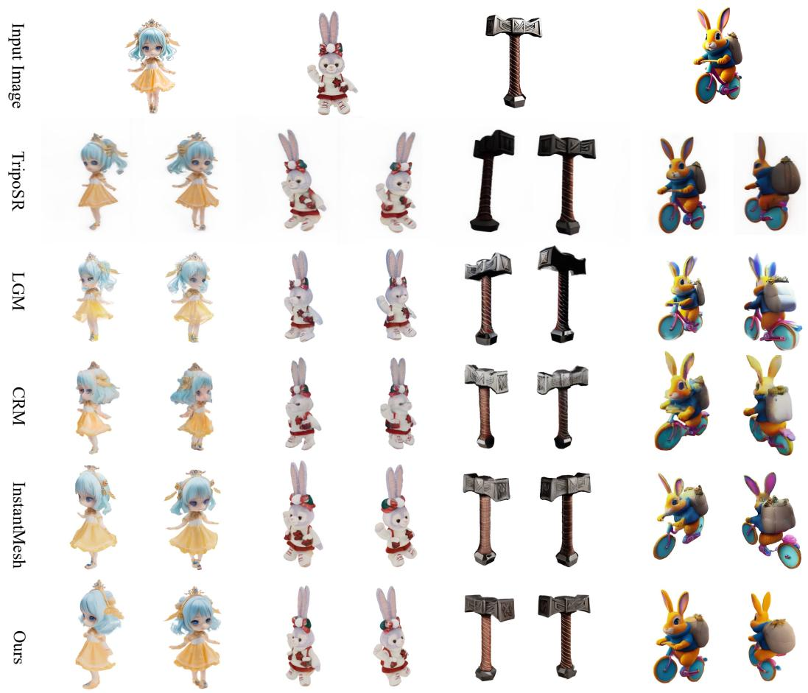

# 1. Bibliographic Information

## 1.1. Title
GeoLRM: Geometry-Aware Large Reconstruction Model for High-Quality 3D Gaussian Generation. The title clearly states the paper's central contribution: a new model named `GeoLRM` for generating high-quality 3D models represented as 3D Gaussians. Key features highlighted are its "Geometry-Aware" nature and its classification as a "Large Reconstruction Model."

## 1.2. Authors
The authors are Chubin Zhang, Hongliang Song, Yi Wei, Yu Chen, Jiwen Lu, and Yansong Tang. Their affiliations include Tsinghua University (Tsinghua Shenzhen International Graduate School and Department of Automation) and Alibaba Group. This collaboration between a top academic institution and a major tech company suggests a strong blend of theoretical research and practical application focus, particularly in areas like computer graphics, computer vision, and large-scale model development. Jiwen Lu and Yansong Tang are well-known researchers in computer vision and deep learning.

## 1.3. Journal/Conference
The paper was published on arXiv as a preprint. ArXiv is a widely used open-access repository for scientific papers, often used by researchers to share their work before or during the formal peer-review process for a conference or journal. The specific conference or journal it was submitted to is not mentioned, but given the topic and timing, it would be a strong candidate for top-tier computer vision conferences like CVPR, ICCV, ECCV, or ICLR.

## 1.4. Publication Year
The first version was submitted to arXiv on June 21, 2024.

## 1.5. Abstract
The abstract introduces the **Geometry-Aware Large Reconstruction Model (GeoLRM)**, a method for generating high-quality 3D assets. The model can produce assets with 512,000 Gaussians from 21 input images, using only 11 GB of GPU memory. The authors identify two key limitations in prior work: neglecting the sparsity of 3D structures and failing to use explicit geometric relationships between 3D and 2D. GeoLRM addresses this with a novel **3D-aware transformer** that directly processes 3D points and uses **deformable cross-attention** to integrate image features. The methodology is a two-stage pipeline: a lightweight proposal network first generates sparse 3D anchor points, and then a reconstruction transformer refines these points to produce detailed geometry and texture. The paper claims significant outperformance over existing models, especially with dense input views, and demonstrates its practical use in 3D generation tasks.

## 1.6. Original Source Link
- **Original Source Link:** https://arxiv.org/abs/2406.15333
- **PDF Link:** https://arxiv.org/pdf/2406.15333v2.pdf
- **Publication Status:** This is a preprint available on arXiv and has not yet been formally published in a peer-reviewed venue at the time of this analysis.

# 2. Executive Summary

## 2.1. Background & Motivation
The core problem the paper addresses is the efficient and high-quality generation of 3D assets from a set of 2D images, a task known as Multi-View 3D Reconstruction. While traditional methods are slow and optimization-based, recent feed-forward **Large Reconstruction Models (LRMs)** have accelerated this process. However, existing LRMs face two major challenges:

1.  **Inefficient Representation:** Many models use dense representations like **triplanes**, which allocate memory and computation to empty space. The paper highlights that visible surfaces in typical 3D objects occupy only about 5% of the total volume, making dense representations wasteful. Other methods using **pixel-aligned Gaussians** are too dependent on input views and struggle to reconstruct unseen areas.
2.  **Ineffective Feature Fusion:** Previous models often ignore the explicit geometric projection relationship between 3D space and 2D images. They typically use dense attention mechanisms where every 3D query attends to all image features, which is computationally expensive and inefficient. This limitation prevents them from effectively leveraging a larger number of input views to improve quality.

    The paper's innovative idea is to design a **geometry-aware** model that directly tackles these issues. Instead of dense representations, `GeoLRM` operates on a **sparse set of 3D anchor points**. It then uses **deformable cross-attention**, which leverages the known camera poses to project these 3D points onto the 2D images and focus attention only on relevant local features. This geometry-aware attention mechanism is far more efficient and allows the model to scale to a much larger number of input views, leading to higher-quality reconstructions.

## 2.2. Main Contributions / Findings
The paper presents the following primary contributions:

1.  **A Two-Stage Sparse Pipeline:** `GeoLRM` introduces a coarse-to-fine pipeline that respects the sparse nature of 3D objects. A lightweight proposal network first identifies occupied regions in 3D space, generating a sparse set of `3D anchor points`. This avoids the massive computational cost of processing the entire 3D volume.
2.  **Geometry-Aware Deformable Attention:** The model fully exploits the camera projection geometry. By using `deformable cross-attention`, 3D tokens are projected onto the 2D feature maps, and attention is sampled from local neighborhoods. This drastically reduces the complexity of the attention mechanism from being dense to sparse, enabling the use of many more input views.
3.  **Scalability to Dense Inputs:** A key finding is that `GeoLRM`'s performance improves as the number of input views increases (up to 21 images tested). This is a significant advantage over previous LRM-based methods, whose performance often stagnates or degrades with more views. This makes `GeoLRM` suitable for integrating with multi-view synthesis or video generation models.

    The main conclusion is that by explicitly incorporating 3D geometric principles into the transformer architecture, it is possible to create a Large Reconstruction Model that is not only more efficient but also scales effectively to produce higher-fidelity 3D assets from denser image sets.

# 3. Prerequisite Knowledge & Related Work

## 3.1. Foundational Concepts

### 3.1.1. 3D Gaussian Splatting
**3D Gaussian Splatting** is a novel 3D scene representation technique that has gained prominence for its ability to render high-quality images in real-time. Instead of representing a scene with a continuous field (like NeRF) or a discrete mesh, it uses a collection of 3D Gaussians. Each Gaussian is a point in 3D space with several properties:
*   **Position (`x, y, z`):** The center of the Gaussian.
*   **Covariance Matrix (represented by Scale and Rotation):** Defines the shape and orientation of the Gaussian ellipsoid. A 3D scale vector and a rotation quaternion are typically used.
*   **Color (RGB):** The color of the Gaussian.
*   **Opacity ($\alpha$):** How transparent or opaque the Gaussian is.

    To render an image from a specific viewpoint, these 3D Gaussians are "splatted" (projected) onto the 2D image plane, creating 2D Gaussians. These 2D splats are then blended together in depth order to form the final pixel colors. This process is highly parallelizable on GPUs, enabling very fast rendering.

### 3.1.2. Transformer Architecture
A **Transformer** is a deep learning model architecture that relies on the **self-attention mechanism**. It was originally proposed for natural language processing tasks but is now widely used in computer vision. Unlike recurrent neural networks (RNNs) that process data sequentially, transformers process entire sequences of data (tokens) at once. The key component is the `self-attention` layer, which allows the model to weigh the importance of different tokens in the input sequence when producing a representation for each token.

### 3.1.3. Deformable Attention
**Deformable Attention** is an efficient attention mechanism, notably used in models like `Deformable DETR`. In standard attention, a query attends to all key positions in a feature map. This is computationally expensive, especially for high-resolution images. Deformable attention improves this by having the query attend to only a small, fixed number of key sampling points around a reference point. Crucially, the locations of these sampling points are not fixed but are learned by the network. The model predicts offsets from the reference point, allowing it to "deform" the sampling grid and focus on the most informative regions. In `GeoLRM`, this is adapted to a 3D-to-2D context: a 3D anchor point is projected onto the 2D image plane (the reference point), and the model learns to sample features from locations around this projection, correcting for geometric inaccuracies.

## 3.2. Previous Works

### 3.2.1. Optimization-based 3D Reconstruction
*   **Structure-from-Motion (SfM) and Multi-View Stereo (MVS):** These are traditional computer vision techniques. `SfM` estimates the 3D structure of a scene and camera poses from a set of images. `MVS` then uses these poses to reconstruct a dense 3D model (e.g., a point cloud or mesh). These methods are foundational but can be slow and less robust for complex scenes or textures.
*   **Neural Radiance Fields (NeRF):** `NeRF` represents a 3D scene as a continuous function (a small MLP) that maps a 3D coordinate and a viewing direction to a color and density. This representation can capture photorealistic details but requires a lengthy per-scene optimization process and is slow to render. `3D Gaussian Splatting` was introduced as a faster alternative.

### 3.2.2. Large Reconstruction Models (LRMs)
LRMs are a new paradigm of feed-forward models trained on large 3D datasets to perform reconstruction in a single pass, eliminating the need for per-scene optimization.
*   **LRM (The Original):** This pioneering work by Hong et al. used a transformer to map 2D image features to an implicit 3D representation called a **triplane**. A triplane represents a 3D volume using three orthogonal 2D feature planes. While effective, it is a dense representation.
*   **InstantMesh / CRM:** These models also use feed-forward transformers but output different representations. `InstantMesh` reconstructs a 3D mesh, while `CRM` uses a convolutional architecture. Both often rely on triplanes or similar dense structures internally, sharing the same limitations of inefficiency and difficulty in scaling with more input views.
*   **LGM / GRM:** These models generate 3D Gaussians. `LGM` uses a U-Net architecture, and `GRM` translates image pixels directly to a set of **pixel-aligned** 3D Gaussians. This pixel-aligned approach tightly couples the 3D representation to the input views, making it hard to reconstruct areas not visible in the input images.

### 3.2.3. 3D Generation
This area focuses on creating 3D content, often from text prompts or single images.
*   **Score Distillation Sampling (SDS):** Popularized by `DreamFusion`, this technique uses a pre-trained 2D text-to-image diffusion model to "guide" the optimization of a 3D representation (like NeRF or 3D Gaussians). It does not require 3D data but can suffer from issues like the "multi-head Janus problem" (e.g., a face appearing on both the front and back of a head).
*   **3D-Aware Diffusion Models:** Models like `Zero-1-to-3` and `SV3D` are fine-tuned on large datasets of 3D objects to generate novel, consistent views of an object from a single input image. `GeoLRM` leverages these models by taking their generated multi-view images as input for high-quality 3D reconstruction.

## 3.3. Technological Evolution
The field has evolved from slow, per-scene optimization methods (SfM, NeRF) to fast, feed-forward models (LRMs) trained on large-scale data. Within LRMs, the evolution is moving from dense, inefficient representations (triplanes) towards more explicit and sparse ones (3D Gaussians). The way 2D features are integrated is also evolving, from dense attention mechanisms to more structured and efficient approaches.

`GeoLRM` fits into this timeline as a next-generation LRM. It combines the speed of feed-forward models with the explicit, high-quality representation of 3D Gaussians. Its key innovation lies in moving away from both dense triplanes and view-dependent pixel-aligned Gaussians by proposing a sparse, geometry-aware transformer that can effectively leverage dense multi-view inputs.

## 3.4. Differentiation Analysis
Compared to previous LRMs, `GeoLRM` is differentiated in two main ways:
1.  **Representation:** Instead of triplanes or pixel-aligned Gaussians, `GeoLRM` uses a sparse set of **3D anchor points** that represent occupied space. This is more memory-efficient and scalable than triplanes and less view-dependent than pixel-aligned Gaussians.
2.  **Attention Mechanism:** Instead of dense cross-attention between 3D queries and all 2D image features, `GeoLRM` uses **deformable cross-attention guided by camera geometry**. This projects 3D points to 2D feature maps and samples features locally, making the process computationally efficient and allowing it to benefit from more input views. This is a significant departure from methods like `LRM` and `InstantMesh`, whose performance does not scale well with more views.

    The overall pipeline of `GeoLRM` is shown in the figure below.

    ![Figure 2: Pipeline of the proposed GeoLRM, a geometry-powered method for efficient image to 3D reconstruction. The process begins with the transformation of dense tokens into an occupancy grid via a Proposal Transformer, which captures spatial occupancy from hierarchical image features extracted using a combination of a convolutional layer and DINOv2 \[38\]. Sparse tokens representing occupied voxels are further processed through a Reconstruction Transformer that employs self-attention and deformable cross-attention mechanisms to refine geometry and retrieve texture details with 3D to 2D projection. Finally, the refined 3D tokens are converted into 3D Gaussians for real-time rendering.](images/2.jpg)
    *该图像是图示，展示了GeoLRM的工作流程。图中的流程包括使用Proposal Transformer将密集token转化为占用网格，并通过重建Transformer对几何形状进行精炼，最终生成3D高斯体。整体流程利用了自注意力和可变形交叉注意力机制。*

# 4. Methodology

## 4.1. Principles
The core principle of `GeoLRM` is to build a 3D reconstruction model that is **aware of the underlying geometry** of multi-view imaging and the **inherent sparsity** of 3D objects. It achieves this through a two-stage, coarse-to-fine process.
1.  **Sparsity:** The model first prunes the vast, empty 3D space by using a lightweight `Proposal Network` to predict a coarse occupancy grid. This ensures that subsequent, more computationally intensive steps only focus on regions that actually contain the object.
2.  **Geometry Awareness:** The model then uses a `Reconstruction Transformer` that explicitly leverages camera projection information. Instead of naively correlating 3D and 2D features, it uses `deformable cross-attention` to project 3D anchor points onto the 2D images and intelligently sample features from relevant locations. This makes feature lifting from 2D to 3D highly efficient and robust.

## 4.2. Core Methodology In-depth (Layer by Layer)
The `GeoLRM` pipeline takes a set of $N$ images $\{I^i\}_{i=1}^N$ with their corresponding camera intrinsics $\{K^i\}_{i=1}^N$ and extrinsics $\{T^i\}_{i=1}^N$ as input.

### 4.2.1. Hierarchical Image Encoder
The model first extracts both high-level semantic features and low-level detail features from each input image. This hierarchical approach provides a richer set of information for the subsequent reconstruction steps.

*   **High-Level Features:** For each input image $I^v$, a pre-trained `DINOv2` model is used as a vision foundation model to extract high-level semantic features. `DINOv2` is known for its strong understanding of 3D geometry from single images.
    \$
    \mathcal{F}_H^v = \mathrm{DINOv2}(I^v)
    \$
    Here, $\mathcal{F}_H^v$ is the high-level feature map for view $v$.

*   **Low-Level Features:** To capture fine-grained details like textures and precise geometric cues, low-level features are also created. These are formed by combining two sources of information:
    1.  **Plücker Ray Embeddings:** For each pixel, its corresponding camera ray is encoded using Plücker coordinates. A ray is defined by its origin $\mathbf{o}$ and direction $\mathbf{d}$. Its Plücker coordinate is a 6D vector $\mathbf{r} = (\mathbf{d}, \mathbf{o} \times \mathbf{d})$. This explicitly encodes the camera geometry for each pixel. These embeddings are denoted as $R^v$.
    2.  **RGB Values:** The raw pixel colors $I^v$ are used directly.
        The ray embeddings and RGB values are concatenated and passed through a convolutional layer to produce the low-level feature map $\mathcal{F}_L^v$.
    \$
    \mathcal{F}_L^v = \mathrm{Conv}(\mathrm{Concat}(I^v, R^v))
    \$

Both $\mathcal{F}_H^v$ and $\mathcal{F}_L^v$ are provided to the transformers for feature fusion.

### 4.2.2. Two-Stage Transformer Pipeline

#### Stage 1: Proposal Network
The goal of this stage is to efficiently identify which parts of the 3D space are occupied by the object.
1.  **Dense Initial Anchors:** The process starts with a low-resolution dense grid of anchor points (e.g., $16^3 = 4096$ points) covering the entire normalized 3D space. Each anchor point is initialized with a learnable feature vector.
2.  **Proposal Transformer:** These anchor point features are fed as tokens into a `Geometry-aware Transformer` (a smaller version with 6 layers). This transformer uses self-attention and deformable cross-attention (explained below) to aggregate information from the hierarchical image features ($\mathcal{F}_H^v, \mathcal{F}_L^v$).
3.  **Occupancy Prediction:** The output features from the transformer are upsampled via a linear layer to a high-resolution grid (e.g., $128^3$). This grid represents the probability of occupancy for each voxel. A combination of binary cross-entropy and scene-class affinity loss is used for supervision.

#### Stage 2: Reconstruction Transformer
This stage takes the sparse set of occupied voxels identified in Stage 1 and refines their geometry and appearance.
1.  **Sparse Anchor Points:** Only the voxels predicted as "occupied" from the proposal network are used as `3D anchor points` for this stage. This dramatically reduces the number of tokens the transformer needs to process (e.g., from $128^3$ down to a maximum of 16k). Each anchor point is again initialized with a learnable feature vector.
2.  **Reconstruction Transformer:** These sparse anchor features are processed by a deeper `Geometry-aware Transformer` (16 layers). This transformer has the same architecture as the proposal transformer but is responsible for producing detailed features for the final 3D Gaussians.

    The architecture of each block in the **Geometry-aware Transformer** is as follows:

*   **Self-Attention with 3D RoPE:** The transformer first applies self-attention among the 3D anchor point tokens. To inject positional information, the paper extends **Rotary Positional Embedding (RoPE)** to 3D. The feature vector of each token is split into three parts, and 1D RoPE is applied to each part using its x, y, and z coordinates, respectively. This allows the attention mechanism to be aware of the relative spatial positions of the anchor points.
    \$
    \mathcal{F}_A^{self} = \mathcal{F}_A^{in} + \mathrm{SelfAttn}(\mathrm{RMSNorm}(\mathcal{F}_A^{in}))
    \$

*   **Deformable Cross-Attention:** This is the key mechanism for lifting 2D image features into the 3D representation. For each 3D anchor point feature $f_i$ at spatial coordinate $\mathbf{x}_i$, it attends to the multi-view image feature maps $\{\mathcal{F}^v\}_{v=1}^V$.
    1.  The 3D point $\mathbf{x}_i$ is projected onto each 2D feature map $\mathcal{F}^v$ using the known camera parameters, yielding a reference point $\mathbf{p}_{iv}$.
    2.  Instead of attending to all pixels, the network predicts $K$ small 2D offsets $\Delta\mathbf{p}_{ivk}$ and attention weights $A_k$ from the query feature $f_i$.
    3.  Features are sampled from the feature map at the deformed locations $\mathbf{p}_{iv} + \Delta\mathbf{p}_{ivk}$ using bilinear interpolation.
    4.  The final feature is a weighted sum of these sampled features, also weighted by a per-view importance weight $w_v$. The formula is:
        \$
    \operatorname{DeformAttn}(f_i, \mathbf{x}_i, \{\mathcal{F}^v\}_{v=1}^V) = \sum_{v=1}^V w_v \left[ \sum_{k=1}^K A_k \mathcal{F}^v \langle \mathbf{p}_{iv} + \Delta\mathbf{p}_{ivk} \rangle \right]
    \$
    where $\langle \cdot \rangle$ denotes the interpolation. This allows the model to correct for small geometric errors in the anchor point positions and to weigh views based on their quality or relevance. The full block operation is:
    \$
    \mathcal{F}_A^{cross} = \mathcal{F}_A^{self} + \mathrm{DeformCrossAttn}(\mathrm{RMSNorm}(\mathcal{F}_A^{self}), \{(\mathcal{F}_H^v, \mathcal{F}_L^v)\}_{v=1}^V)
    \$

*   **Feed-Forward Network (FFN):** Finally, the features are passed through a standard FFN layer. The block uses `RMSNorm` for normalization and `SiLU` for activation, which improves training stability.
    \$
    \mathcal{F}_A^{out} = \mathcal{F}_A^{cross} + \mathrm{FFN}(\mathrm{RMSNorm}(\mathcal{F}_A^{cross}))
    \$

### 4.2.3. Post-processing and Rendering
The output tokens from the reconstruction transformer are decoded into 3D Gaussians. Each output token $\mathbf{f}_i$ (corresponding to one anchor point) is passed through a small MLP to predict the parameters for multiple (32 in the paper) 3D Gaussians. For each Gaussian $G_{ij}$, the MLP predicts:
*   **Offset ($\mathbf{o}_{ij}$):** A 3D offset relative to the anchor point's position.
*   **Color ($\mathbf{c}_{ij}$):** An RGB color.
*   **Scale ($\mathbf{s}_{ij}$):** A 3D scale vector.
*   **Rotation ($\mathbf{q}_{ij}$):** A 4D quaternion for rotation.
*   **Opacity ($\alpha_{ij}$):** A scalar opacity value.

    To ensure training stability, the predicted raw outputs for offset, scale, and opacity are passed through `Sigmoid` activation functions to constrain their ranges:
$$
\begin{aligned}
& o_{ij} = \mathrm{Sigmoid}(o'_{ij}) \cdot o_{\max}, \\
& s_{ij} = \mathrm{Sigmoid}(s'_{ij}) \cdot s_{\max}, \\
& \alpha_{ij} = \mathrm{Sigmoid}(\alpha'_{ij}),
\end{aligned}
$$
where $o'_{\max}$ and $s'_{\max}$ are predefined maximum values. The final collection of all Gaussians is then rendered into images using the standard 3D Gaussian Splatting rasterizer.

## 4.3. Training Objectives
The model is trained in two stages.

1.  **Proposal Network Training:** This is supervised as a binary classification task on the high-resolution ($128^3$) occupancy grid. Since most voxels are empty (a highly imbalanced problem), the loss combines **binary cross-entropy loss** and **scene-class affinity loss**.

2.  **Reconstruction Network Training:** The full model is trained with a composite loss function that supervises the rendered images, alpha masks, and depth maps against ground truth data from $T$ target camera views. The total loss $\mathcal{L}$ is:
    \$
    \mathcal{L} = \sum_{t=1}^T \left( \mathcal{L}_{\mathrm{img}}(\hat{I}_t, I_t) + \mathcal{L}_{\mathrm{mask}}(\hat{M}_t, M_t) + 0.2 \mathcal{L}_{\mathrm{depth}}(\hat{D}_t, D_t, I_t) \right)
    \$
    The individual loss components are:
    *   **Image Loss:** A combination of L2 loss and LPIPS perceptual loss.
        \$
        \mathcal{L}_{\mathrm{img}}(\hat{I}_t, I_t) = ||\hat{I}_t - I_t||_2 + 2\mathcal{L}_{\mathrm{LPIPS}}(\hat{I}_t, I_t)
        \$
    *   **Mask Loss:** Simple L2 loss on the rendered alpha mask.
        \$
        \mathcal{L}_{\mathrm{mask}}(\hat{M}_t, M_t) = ||\hat{M}_t - M_t||_2
        \$
    *   **Depth Loss:** A scale-invariant depth loss that is weighted by the image gradients $\Delta I_t$. This encourages smoother geometry, especially in textureless regions.
        \$
        \mathcal{L}_{\mathrm{depth}}(\hat{D}_t, D_t, I_t) = \frac{1}{|\hat{D}_t|} \left| \left| \exp(-\Delta I_t) \odot \log(1 + |\hat{D}_t - D_t|) \right| \right|_1
        \$
        where $\odot$ is element-wise multiplication.

# 5. Experimental Setup

## 5.1. Datasets
*   **G-buffer Objaverse (GObjaverse):** This is the primary training dataset. It is derived from the large-scale `Objaverse` dataset of 3D models. `GObjaverse` provides high-quality renderings for ~280,000 objects, including RGB, depth, normal, and albedo images. For each object, 38 views are rendered from two orbital paths and top/bottom viewpoints, ensuring comprehensive coverage. The objects are normalized to fit within a $[-0.5, 0.5]^3$ cube.
*   **Google Scanned Objects (GSO):** This dataset is used for evaluation. It contains high-quality 3D scans of real-world household items. The paper uses a random subset of 100 objects, rendered in the same manner as `GObjaverse`.
*   **OmniObject3D:** This is another evaluation dataset, containing diverse real-world objects. Again, a random subset of 100 objects is used for evaluation.

## 5.2. Evaluation Metrics
The paper evaluates both the visual quality of rendered images and the geometric accuracy of the reconstructed 3D models.

### 5.2.1. 2D Visual Quality Metrics
*   **PSNR (Peak Signal-to-Noise Ratio):**
    1.  **Conceptual Definition:** PSNR measures the quality of a reconstructed image by comparing it to a ground-truth image. It quantifies the ratio between the maximum possible power of a signal (the pixel values) and the power of the corrupting noise that affects its fidelity. **A higher PSNR value indicates better reconstruction quality.**
    2.  **Mathematical Formula:**
        \$
        \mathrm{PSNR} = 20 \cdot \log_{10}(\mathrm{MAX}_I) - 10 \cdot \log_{10}(\mathrm{MSE})
        \$
    3.  **Symbol Explanation:**
        *   $\mathrm{MAX}_I$: The maximum possible pixel value of the image (e.g., 255 for 8-bit grayscale images).
        *   $\mathrm{MSE}$: The Mean Squared Error between the ground-truth image $I$ and the predicted image $\hat{I}$, calculated as `\frac{1}{mn}\sum_{i=0}^{m-1}\sum_{j=0}^{n-1}[I(i,j) - \hat{I}(i,j)]^2`.

*   **SSIM (Structural Similarity Index Measure):**
    1.  **Conceptual Definition:** SSIM is a perceptual metric that measures image quality based on the degradation of structural information. It is considered closer to human perception than PSNR because it evaluates changes in luminance, contrast, and structure. **Values range from -1 to 1, with 1 indicating a perfect match.**
    2.  **Mathematical Formula:**
        \$
        \mathrm{SSIM}(x, y) = \frac{(2\mu_x\mu_y + c_1)(2\sigma_{xy} + c_2)}{(\mu_x^2 + \mu_y^2 + c_1)(\sigma_x^2 + \sigma_y^2 + c_2)}
        \$
    3.  **Symbol Explanation:**
        *   `x, y`: The two image windows being compared.
        *   $\mu_x, \mu_y$: The average pixel values of $x$ and $y$.
        *   $\sigma_x^2, \sigma_y^2$: The variances of $x$ and $y$.
        *   $\sigma_{xy}$: The covariance of $x$ and $y$.
        *   $c_1, c_2$: Small constants to stabilize the division.

*   **LPIPS (Learned Perceptual Image Patch Similarity):**
    1.  **Conceptual Definition:** LPIPS measures the perceptual similarity between two images. It computes the distance between deep features extracted from the images using a pre-trained neural network (e.g., VGG or AlexNet). It has been shown to correlate well with human judgments of image similarity. **A lower LPIPS score indicates that the two images are more perceptually similar.**
    2.  **Mathematical Formula:**
        \$
        d(x, x_0) = \sum_l \frac{1}{H_l W_l} \sum_{h,w} \| w_l \odot (\hat{y}_{hw}^l - \hat{y}_{0hw}^l) \|_2^2
        \$
    3.  **Symbol Explanation:**
        *   $d(x, x_0)$: The LPIPS distance between images $x$ and $x_0$.
        *   $\hat{y}^l, \hat{y}_0^l$: The deep features extracted from layer $l$ of the network for each image, normalized channel-wise.
        *   $w_l$: A learned channel-wise weight vector for layer $l$.
        *   $H_l, W_l$: The height and width of the feature map at layer $l$.

### 5.2.2. 3D Geometric Accuracy Metrics
*   **CD (Chamfer Distance):**
    1.  **Conceptual Definition:** Chamfer Distance measures the dissimilarity between two point clouds. It calculates the average distance from each point in one set to its nearest neighbor in the other set. **A lower CD value indicates a better geometric match.**
    2.  **Mathematical Formula:**
        \$
        d_{CD}(S_1, S_2) = \frac{1}{|S_1|} \sum_{x \in S_1} \min_{y \in S_2} \|x - y\|_2^2 + \frac{1}{|S_2|} \sum_{y \in S_2} \min_{x \in S_1} \|x - y\|_2^2
        \$
    3.  **Symbol Explanation:**
        *   $S_1, S_2$: The two point clouds being compared.
        *   `x, y`: Points in the respective point clouds.

*   **F-Score:**
    1.  **Conceptual Definition:** F-Score is another metric for evaluating point cloud similarity. It is the harmonic mean of precision and recall, where precision is the percentage of reconstructed points that are close (within a threshold $\tau$) to the ground truth, and recall is the percentage of ground truth points that have a close reconstructed point. **A higher F-Score indicates better accuracy.**
    2.  **Mathematical Formula:**
        \$
        \text{F-Score} = \frac{2 \cdot \text{Precision} \cdot \text{Recall}}{\text{Precision} + \text{Recall}}
        \$
    3.  **Symbol Explanation:**
        *   $\text{Precision} = \frac{1}{|P|} \sum_{p \in P} [ \min_{g \in G} \|p-g\| < \tau ]$
        *   $\text{Recall} = \frac{1}{|G|} \sum_{g \in G} [ \min_{p \in P} \|g-p\| < \tau ]$
        *   `P, G`: The predicted and ground-truth point clouds.
        *   $\tau$: A distance threshold (set to 0.2 in the paper).

## 5.3. Baselines
The paper compares `GeoLRM` with several state-of-the-art LRM-based methods:
*   **LGM ([Large Multi-view Gaussian Model](https://arxiv.org/abs/2402.05054)):** A U-Net based model for generating 3D Gaussians.
*   **CRM ([Convolutional Reconstruction Model](https://arxiv.org/abs/2403.05034)):** A model using a convolutional architecture to produce a textured mesh.
*   **InstantMesh:** A transformer-based model that reconstructs a 3D mesh from sparse views, often relying on triplanes.

    The paper excludes comparisons with proprietary models and single-image methods like `OpenLRM` and `TripoSR` to ensure a fair comparison on the multi-view reconstruction task.

# 6. Results & Analysis

## 6.1. Core Results Analysis
The core findings of the experiments demonstrate that `GeoLRM` sets a new state-of-the-art in multi-view 3D reconstruction, particularly when scaling to denser input views.

### 6.1.1. Comparison with Baselines on GSO and OmniObject3D
The following are the results from Table 1 of the original paper, showing performance on the Google Scanned Objects (GSO) dataset with 6 input views:

<table>
<thead>
<tr>
<th>Method</th>
<th>PSNR ↑</th>
<th>SSIM ↑</th>
<th>LPIPS ↓</th>
<th>CD ↓</th>
<th>FS ↑</th>
<th>Inf. Time (s)</th>
<th>Memory (GB)</th>
</tr>
</thead>
<tbody>
<tr>
<td>LGM</td>
<td>20.76</td>
<td>0.832</td>
<td>0.227</td>
<td>0.295</td>
<td>0.703</td>
<td>0.07</td>
<td>7.23</td>
</tr>
<tr>
<td>CRM</td>
<td>22.78</td>
<td>0.843</td>
<td>0.190</td>
<td>0.213</td>
<td>0.831</td>
<td>0.30</td>
<td>5.93</td>
</tr>
<tr>
<td>InstantMesh</td>
<td><u>23.19</u></td>
<td><u>0.856</u></td>
<td><b>0.166</b></td>
<td><u>0.186</u></td>
<td><u>0.854</u></td>
<td>0.78</td>
<td>23.12</td>
</tr>
<tr>
<td>Ours</td>
<td><b>23.57</b></td>
<td><b>0.872</b></td>
<td><u>0.167</u></td>
<td><b>0.167</b></td>
<td><b>0.892</b></td>
<td>0.67</td>
<td>4.92</td>
</tr>
</tbody>
</table>

The following are the results from Table 2 of the original paper, showing performance on the OmniObject3D dataset:

<table>
<thead>
<tr>
<th rowspan="2">Method</th>
<th colspan="2">PSNR ↑</th>
<th rowspan="2">SSIM ↑</th>
<th rowspan="2">LPIPS ↓</th>
<th rowspan="2">CD ↓</th>
<th rowspan="2">FS ↑</th>
</tr>
<tr>
<th colspan="2"></th>
</tr>
</thead>
<tbody>
<tr>
<td>LGM</td>
<td colspan="2">21.94</td>
<td>0.824</td>
<td>0.203</td>
<td>0.256</td>
<td>0.787</td>
</tr>
<tr>
<td>CRM</td>
<td colspan="2">23.12</td>
<td>0.855</td>
<td>0.175</td>
<td>0.204</td>
<td>0.810</td>
</tr>
<tr>
<td>InstantMesh</td>
<td colspan="2"><u>23.86</u></td>
<td>0.860</td>
<td><u>0.139</u></td>
<td><u>0.178</u></td>
<td><u>0.834</u></td>
</tr>
<tr>
<td>Ours</td>
<td colspan="2"><b>24.74</b></td>
<td><b>0.883</b></td>
<td><b>0.134</b></td>
<td><b>0.156</b></td>
<td><b>0.863</b></td>
</tr>
</tbody>
</table>

**Analysis:**
*   `GeoLRM` achieves the best performance on almost all metrics (PSNR, SSIM, CD, F-Score) on both datasets. This demonstrates superior visual quality and geometric accuracy.
*   `InstantMesh` has a slightly better LPIPS on GSO, which the authors attribute to the inherent smoothing effect of its mesh-based representation. However, `GeoLRM`'s superior CD and F-Score highlight its strength in capturing precise geometry, a direct benefit of its geometry-aware design.
*   Notably, `GeoLRM` is highly efficient, requiring only **4.92 GB** of GPU memory for inference, significantly less than `InstantMesh` (**23.12 GB**). This efficiency is a direct result of its sparse pipeline and geometry-aware attention.

### 6.1.2. Scalability with Dense Input Views
This is a key experiment highlighting the main advantage of `GeoLRM`. The following results are from Table 3 of the original paper:

<table>
<thead>
<tr>
<th rowspan="2">Num Input</th>
<th colspan="2">PSNR</th>
<th colspan="2">SSIM</th>
<th colspan="2">Inf. Time (s)</th>
<th colspan="2">Memory (GB)</th>
</tr>
<tr>
<th>InstantMesh</th>
<th>Ours</th>
<th>InstantMesh</th>
<th>Ours</th>
<th>InstantMesh</th>
<th>Ours</th>
<th>InstantMesh</th>
<th>Ours</th>
</tr>
</thead>
<tbody>
<tr>
<td>4</td>
<td>22.87</td>
<td>22.84</td>
<td>0.832</td>
<td>0.851</td>
<td>0.68</td>
<td>0.51</td>
<td>22.09</td>
<td>4.30</td>
</tr>
<tr>
<td>8</td>
<td>23.22</td>
<td><b>23.82</b></td>
<td>0.861</td>
<td><b>0.883</b></td>
<td>0.87</td>
<td>0.84</td>
<td>24.35</td>
<td>5.50</td>
</tr>
<tr>
<td>12</td>
<td>23.05</td>
<td><b>24.43</b></td>
<td>0.843</td>
<td><b>0.892</b></td>
<td>1.07</td>
<td>1.16</td>
<td>24.62</td>
<td>6.96</td>
</tr>
<tr>
<td>16</td>
<td>23.15</td>
<td><b>24.79</b></td>
<td>0.861</td>
<td><b>0.903</b></td>
<td>1.30</td>
<td>1.51</td>
<td>26.69</td>
<td>8.23</td>
</tr>
<tr>
<td>20</td>
<td>23.25</td>
<td><b>25.13</b></td>
<td>0.895</td>
<td><b>0.905</b></td>
<td>1.62</td>
<td>1.84</td>
<td>28.73</td>
<td>9.43</td>
</tr>
</tbody>
</table>

**Analysis:**
*   **GeoLRM shows consistent and significant improvement as the number of input views increases.** Its PSNR steadily rises from 22.84 (4 views) to 25.13 (20 views).
*   In stark contrast, **InstantMesh's performance stagnates and even degrades** (e.g., PSNR drops from 8 to 12 views). The authors suggest this is because its low-resolution triplane representation becomes a bottleneck, and its dense attention mechanism cannot effectively process the large volume of image tokens.
*   `GeoLRM`'s memory usage scales gracefully, increasing from 4.3 GB to only 9.43 GB with 20 views, whereas `InstantMesh`'s memory grows more steeply and starts from a much higher baseline. This validates the efficiency of the proposed geometry-aware deformable attention.

    The qualitative comparisons in the paper further support these findings. Figure 3 shows `GeoLRM` producing much finer details and textures compared to baselines. Figure 4 demonstrates that `GeoLRM` successfully reconstructs high-quality assets from the 21 views generated by `SV3D`, while `InstantMesh` fails to produce a satisfactory result from the same inputs.

    
    *该图像是一个示意图，展示了不同图像-3D方法的定性比较。上方是输入图像，下面则是应用了多个方法生成的3D模型，分别为TriposR、LGM、CRM、InstantMesh和我们的模型，显示了各个方法在3D重建上的效果差异。*

## 6.2. Ablation Studies / Parameter Analysis
The ablation studies in Table 4 and 5 systematically validate the key design choices of `GeoLRM`.

The following are the results from Table 4 of the original paper:

<table>
<thead>
<tr>
<th>Method</th>
<th>PSNR ↑</th>
<th>SSIM ↑</th>
<th>LPIPS ↓</th>
</tr>
</thead>
<tbody>
<tr>
<td>W/o Plücker rays</td>
<td>20.64</td>
<td>0.826</td>
<td>0.244</td>
</tr>
<tr>
<td>W/o low-level features</td>
<td>20.29</td>
<td>0.817</td>
<td>0.246</td>
</tr>
<tr>
<td>W/o high-level features</td>
<td>15.85</td>
<td>0.798</td>
<td>0.289</td>
</tr>
<tr>
<td>W/o 3D RoPE</td>
<td>20.52</td>
<td>0.827</td>
<td>0.224</td>
</tr>
<tr>
<td>Fixed # input views</td>
<td><u>20.97</u></td>
<td><u>0.839</u></td>
<td>0.220</td>
</tr>
<tr>
<td>Full model</td>
<td>20.73</td>
<td>0.831</td>
<td><b>0.216</b></td>
</tr>
</tbody>
</table>

<table>
<thead>
<tr>
<th rowspan="2"></th>
<th colspan="2">4 Inputs</th>
<th colspan="2">8 Inputs</th>
<th colspan="2">12 Inputs</th>
</tr>
<tr>
<th>PSNR ↑</th>
<th>SSIM ↑</th>
<th>PSNR ↑</th>
<th>SSIM ↑</th>
<th>PSNR ↑</th>
<th>SSIM ↑</th>
</tr>
</thead>
<tbody>
<tr>
<td>Fixed # input views</td>
<td>19.72</td>
<td>0.822</td>
<td>20.85</td>
<td>0.833</td>
<td>21.43</td>
<td>0.838</td>
</tr>
<tr>
<td>Full model</td>
<td><b>19.94</b></td>
<td><b>0.835</b></td>
<td><b>21.16</b></td>
<td><b>0.840</b></td>
<td><b>22.04</b></td>
<td><b>0.853</b></td>
</tr>
</tbody>
</table>

**Analysis:**
*   **Hierarchical Image Encoder:** Removing high-level features (`DINOv2`) causes a catastrophic drop in performance (PSNR from 20.73 to 15.85), confirming their importance for semantic understanding. Removing low-level features (Plücker rays, RGB) also hurts performance, leading to a loss of texture detail, as seen in Figure 5.
*   **3D RoPE:** Removing the 3D Rotary Positional Embedding leads to a noticeable drop in performance, confirming its necessity for the self-attention layers to understand the spatial arrangement of the 3D anchor points.
*   **Dynamic Input:** Training with a fixed number of input views (6) gives slightly better PSNR/SSIM when testing with exactly 6 views. However, the "Full model," trained with a dynamic number of views (1-7), shows much better generalization when tested with varying numbers of inputs (4, 8, 12), demonstrating its superior robustness and flexibility.
*   **Deformable Attention:** As shown in Table 5, using deformable attention with learnable offsets is crucial. Using `0 sampling points` (i.e., just projecting and sampling at a single point without deformation) yields very poor results (PSNR 19.52). Increasing the number of sampling points from 4 to 8 brings a significant performance boost. The authors chose 8 points as a good trade-off between performance and computational cost.

# 7. Conclusion & Reflections

## 7.1. Conclusion Summary
The paper successfully introduces **GeoLRM**, a geometry-aware large reconstruction model that significantly advances the state of the art in multi-view 3D generation. By pioneering a two-stage, sparse pipeline and a novel geometry-aware transformer with deformable cross-attention, `GeoLRM` overcomes the key limitations of previous LRMs. Its main contributions are threefold: it leverages 3D sparsity for efficiency, explicitly uses camera geometry for effective feature fusion, and demonstrates unprecedented scalability to dense input views. The experimental results confirm that `GeoLRM` not only outperforms existing models in reconstruction quality and geometric accuracy but also does so with remarkable efficiency. The model's ability to improve with more input data makes it a powerful and practical tool for high-quality 3D content creation.

## 7.2. Limitations & Future Work
The authors candidly acknowledge one main limitation:
*   **Non-End-to-End Pipeline:** The two-stage process (proposal then reconstruction) is not fully end-to-end. This can lead to error accumulation, where inaccuracies in the initial proposal stage negatively impact the final reconstruction. The current reliance on a separate proposal network is a necessary evil to manage the computational cost of processing the entire 3D space.

    For future work, the authors propose focusing on developing a **seamless, end-to-end solution**. This would involve integrating the proposal and reconstruction stages, which could reduce error propagation, optimize processing time, and enhance the model's overall robustness for a wider range of applications, including real-time scenarios.

## 7.3. Personal Insights & Critique
`GeoLRM` presents a very compelling and well-executed idea. The paper is a strong example of how incorporating classical geometric principles into modern deep learning architectures can lead to significant breakthroughs.

**Inspirations and Strengths:**
*   **First-Principles Thinking:** The core idea of using deformable attention guided by camera projections is brilliant. It directly addresses the computational bottleneck of dense attention and is a much more principled way to perform 2D-to-3D feature lifting than what previous LRMs have done.
*   **Scalability as a Key Feature:** The focus on scalability with more views is a crucial contribution. As multi-view image/video generation models (like `SV3D`) improve, the ability to effectively consume their output will become a defining feature of top-tier reconstruction models. `GeoLRM` is well-positioned for this future.
*   **Efficiency:** The impressive performance achieved with such low memory usage makes the model highly practical and accessible to a wider range of users who may not have access to top-of-the-line GPUs.

**Potential Issues and Areas for Improvement:**
*   **Dependence on Accurate Poses:** The method's geometry-aware nature heavily relies on accurate camera pose information. While this is standard for multi-view reconstruction, its performance might degrade significantly if poses are noisy or inaccurate. An interesting extension would be to make the model robust to pose errors or even jointly refine poses, as explored in some NeRF variants.
*   **Generalization to Complex Scenes:** The model was trained and evaluated on single-object datasets (`Objaverse`, `GSO`). Its ability to handle large, complex scenes with multiple objects, occlusions, and diverse backgrounds remains to be seen. The sparse proposal network might struggle to capture intricate, non-contiguous structures in such scenarios.
*   **The "End-to-End" Challenge:** The limitation identified by the authors is indeed significant. An end-to-end model could potentially learn a more optimal joint representation for both occupancy and final appearance. This might be achievable with techniques like sparse convolutional networks or octree-based structures that can hierarchically represent sparse 3D data efficiently within a single network.

    Overall, `GeoLRM` is a landmark paper in the field of large reconstruction models. Its elegant fusion of transformer architecture with fundamental geometric insights provides a clear and powerful path forward for creating high-fidelity 3D assets efficiently.