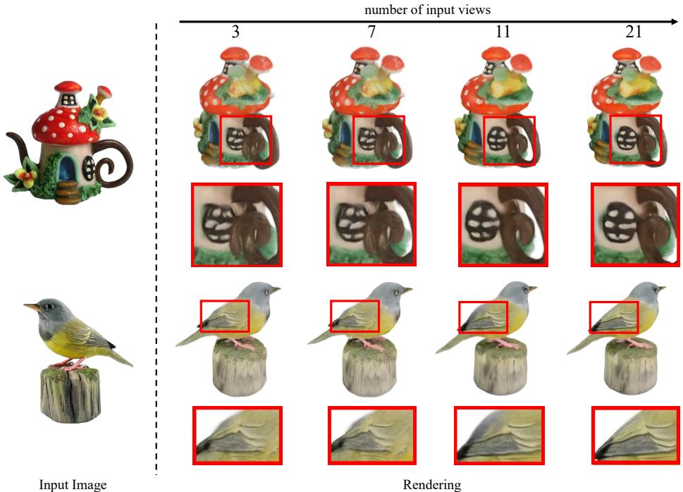
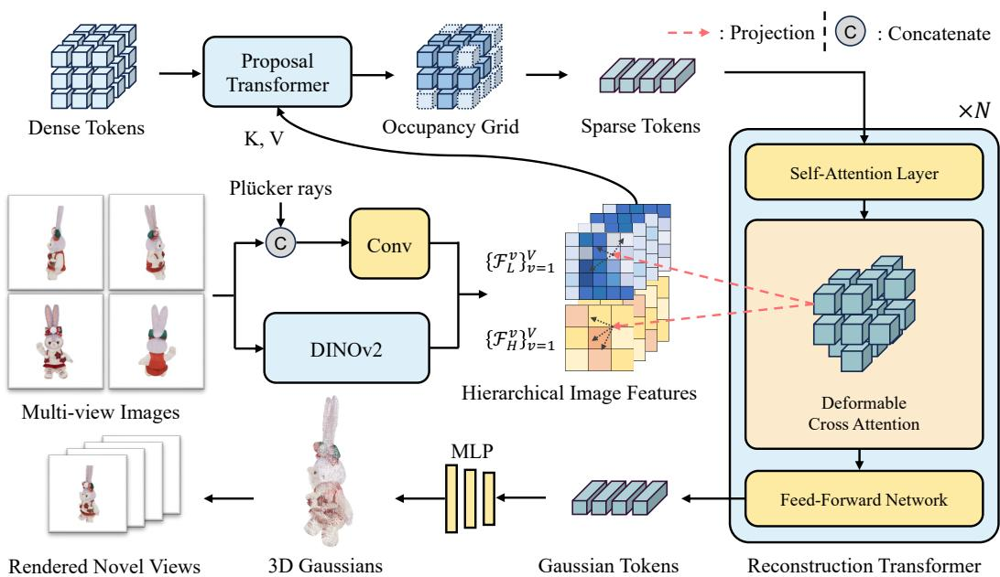
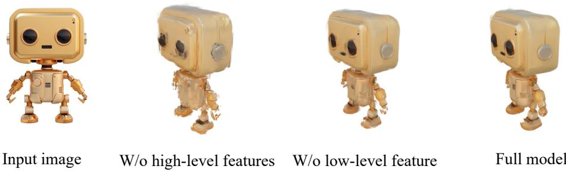
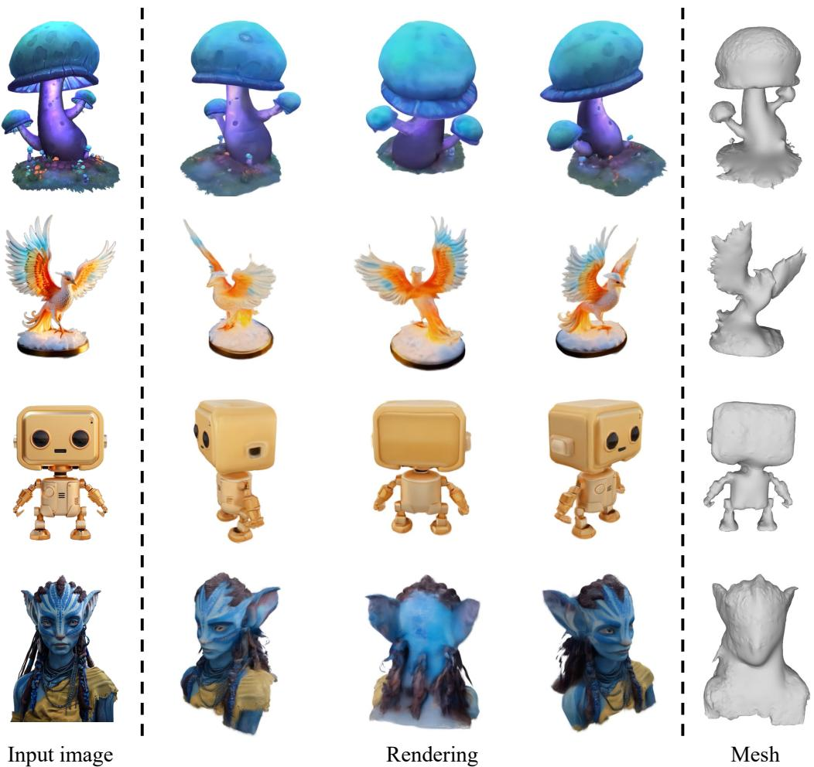
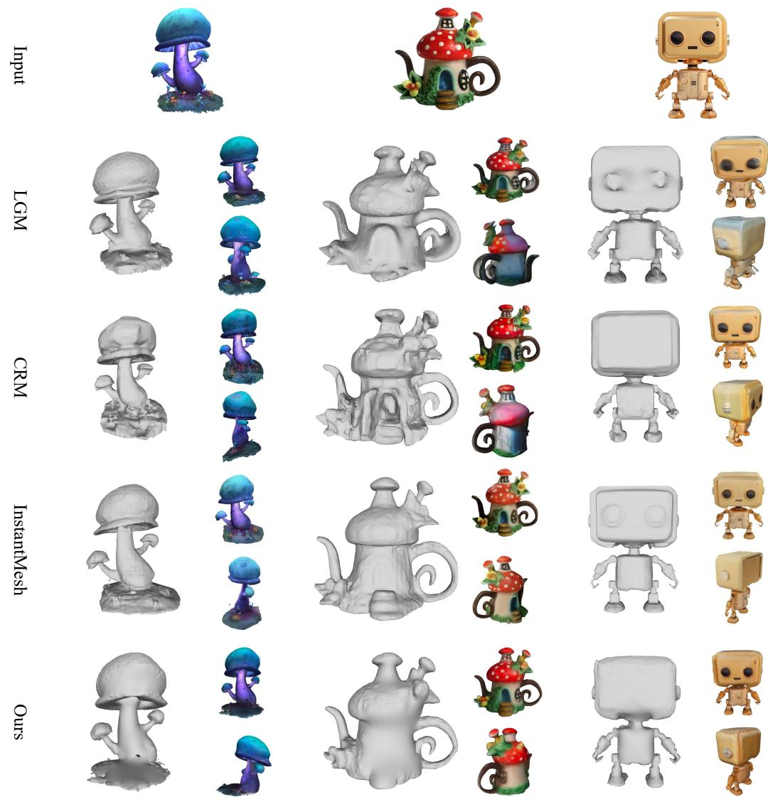

# GeoLRM：几何感知的大规模重建模型用于高质量 3D 高斯生成

张楚斌1,3 宋洪亮3 魏毅2 陈宇3 陆吉文2 唐彦松1, ‡ 1 清华大学深圳国际研究生院 2 清华大学自动化系 3 阿里巴巴集团 {zcb24, y-wei19}@mails.tsinghua.edu.cn, {hongliang.shl, chenyu.cheny}@alibaba-inc.com, lujiwen@tsinghua.edu.cn, tang.yansong@sz.tsinghua.edu.cn. ‡ 通讯作者

# 摘要

在本研究中，我们介绍了几何感知大重建模型（GeoLRM），该方法能够仅使用 11 GB 的 GPU 内存，以 512k 个高斯分布和 21 张输入图像预测高质量的资产。之前的工作忽视了 3D 结构的内在稀疏性，并未利用 3D 图像与 2D 图像之间的明确几何关系。这限制了这些方法的低分辨率表示，使得难以扩展到更密集的视图以提高质量。GeoLRM 通过集成一种新颖的 3D 感知变换器结构来解决这些问题，该结构直接处理 3D 点，并使用可变形的交叉注意机制有效地将图像特征整合到 3D 表示中。我们通过一个两阶段的管道实现这一解决方案：首先，轻量级提案网络从已定位的输入图像生成一组稀疏的 3D 锚点；随后，专用的重建变换器细化几何形状并检索纹理细节。大量实验结果表明，GeoLRM 在现有模型中表现显著优越，特别适合处理密集视图输入。我们还展示了模型在 3D 生成任务中的实际应用，展示其多样性及在真实世界应用中更广泛采用的潜力。项目页面：https://linshan-bin.github.io/GeoLRM/.

# 1 引言

在机器人技术到虚拟现实等领域，3D资产的质量和多样性可以显著影响用户体验和系统效率。历史上，这些资产的创建一直是一个劳动密集型的过程，需求专业艺术家和开发者的技能。尽管近年来在2D图像生成技术上取得了突破性的进展，例如扩散模型，这些模型迭代地优化图像，但它们在3D资产创建中的应用仍然面临挑战。将扩散模型直接应用于3D生成的效果并不理想，主要原因在于缺乏大规模和高质量的数据。DreamFusion通过从预训练的图像扩散模型中提取图像分布的得分，创新性地优化了3D表示。然而，这种方法缺乏3D特定知识的深度整合，例如几何一致性和空间连贯性，从而导致多头问题和不一致的3D结构等重大问题。此外，这些方法需要进行广泛的逐场景优化，严重限制了它们的实际应用。

  

Figure 1: Image to 3D using GeoLRM. Initially, a 3D-aware diffusion model, specifically SV3D [60], transforms an input image into multiple views. Subsequently, these views are processed by our GeoLRM to generate detailed 3D assets. Unlike other LRM-based approaches, GeoLRM notably improves as the number of input views increases.

全面的3D数据集Objaverse[12, 11]的引入为该领域带来了显著的进展。利用该数据集，研究人员已经微调了2D扩散模型，以生成与3D结构一致的图像[28, 47, 48]。此外，近期的创新[74, 64, 54, 72, 65]将这些具备3D感知的模型与大型重建模型（LRMs）[18]结合，实现了快速而准确的3D图像生成。这些方法通常采用大型变换器或UNet模型，将稀疏视图图像在一次前向步骤中转换为3D表示。虽然它们在速度和维持3D一致性方面表现出色，但面临两个主要限制。首先，之前的工作利用三平面[18, 72, 64]来表示3D模型，在缺乏实际内容的区域浪费了大量特征，并在渲染过程中涉及密集计算。这违反了$3D$的稀疏特性，因为我们的分析表明，Objaverse数据集中3D模型的可见部分仅占整体空间体积的大约$5\%$。尽管基于高斯的方法[54, 74, 65]可能使用像素对齐的高斯来提高效率，但这种表示无法恢复未见区域，因此在很大程度上依赖于输入图像。其次，以往的工作往往忽视了3D和2D图像之间的明确几何关系，导致处理效果不佳。三平面或像素对齐的高斯标记并不对应于3D中的特定空间，因此无法利用3D点与图像之间的投影关系。换句话说，这些方法在3D查询和图像键之间进行稠密注意力计算。这导致这些方法倾向于用稀疏视图输入重建3D，但无法在更密集的输入下取得更好的性能。为了解决这些挑战，我们提出了几何感知大型重建模型（GeoLRM）用于3D高斯生成。我们的方法集中于一个3D感知重建变换器，摒弃了传统的三平面或像素对齐高斯表示，转而直接在3D空间内进行交互。然而，直接在整个3D空间生成3D高斯需要巨大的内存开销。为此，我们首先提出一个专门的提议网络，从输入图像中预测占用网格。只有被占用的体素会进一步处理以生成3D高斯特征。所提议的变换器用可变形交叉注意力[86]替代了稠密交叉注意力。通过将输入的3D标记投影到相应的图像平面，这些标记仅专注于最相关的特征，从而大大提高了有效性。我们在由[41]渲染的Objaverse数据集上训练了GeoLRM，并在Google扫描物体[13]上进行了测试。通过将几何原理集成，我们的模型不仅在输入数量相同的情况下优于现有方法，还使得处理更密集的图像输入成为可能。值得注意的是，该模型能够高效处理多达21张图像（如有必要可处理更多），与从更少图像生成的模型相比，生成了更优质的3D模型。利用这一能力，我们将GeoLRM与SV3D[60]集成，用于高质量的3D模型生成。总之，我们的贡献如下：我们提出了一种双阶段管道，利用3D数据的稀疏特性，产生适用于高分辨率扩展的稀疏3DGS标记表示。我们充分利用3D点与2D图像之间的投影关系，显著降低了LRMs中注意力机制的空间复杂度，从而使得更密集的图像输入配置成为可能。根据我们所知，GeoLRM是第一个使用LRM处理密集输入的方法，可能为将视频生成模型整合进3D AIGC应用铺平道路。

# 2 相关工作

# 2.1 基于优化的三维重建

基于多视图图像的3D重建在计算机视觉领域已研究数十年。传统方法如结构从运动（SfM）和多视图立体（MVS）提供了基本的重建和校准，但缺乏鲁棒性和表现力。近期的进展利用基于学习的方法来提升性能。在这些方法中，NeRF以其捕捉高频细节的能力脱颖而出。后续的研究进一步提升了其性能和速度。尽管NeRF取得了重大进展，但在渲染过程中需要查询大量点使得其实时应用变得困难。3D高斯通过明确用3D高斯表示场景，并利用高效的光栅化管道来解决这一问题。这些方法涉及每个场景的优化过程，并需要稠密的多视图图像以实现良好的重建。

# 2.2 大规模重建模型

不同于基于优化的三维重建方法，大型重建模型能够以前馈方式重建三维形状。作为该领域的先锋工作，LRM展示了变换器主干网络能够有效利用大规模数据集的力量，并在多视角监督下将图像词元转化为隐式三维三平面。除此之外，Instant3D通过稀疏视图输入改善了重建质量。它采用了两阶段的范式，首先使用扩散模型生成四个视图，然后从生成的多视图图像中回归NeRF。InstantMesh利用网格表示来重建三维物体，采用一个可微的等值面提取模块，而不是使用NeRF。然而，许多工作选择将三维高斯作为输出。GRM提出了一种变换器网络，将像素转换为像素对齐的三维高斯集合，而LGM则使用非对称的UNet来预测和融合三维高斯。与这些方法相比，我们的GeoLRM通过交叉视角注意机制将多视角特征投影到三维空间，明确探索几何知识。

# 2.3 3D生成

早期的3D生成方法 [6, 7, 15, 35, 51, 73, 37] 利用3D GAN生成3D感知内容。虽然一些方法 [32, 32, 85, 30, 10, 49, 80] 用3D扩散模型替代3D GAN以实现高质量生成，但它们的泛化能力受限于训练数据的不足。最近，在DreamFusion [40] 中提出的评分蒸馏采样（SDS）不需要3D数据，并能够利用2D文本到图像扩散模型 [4, 43, 42] 的强大能力。具体来说，它优化一个随机初始化的3D模型，并使用预训练的扩散模型对渲染图像进行扩散。作为后续工作 [63, 9, 26, 61, 55, 76, 27, 78, 25, 23, 41]，许多方法被提出以加速优化过程或提高3D生成质量。与基于SDS的方法不同，Zero-1-to-3 [28] 在大规模合成数据集上微调2D扩散模型，以改变给定图像的摄像机视角。类似于Zero-1-to-3，许多其他工作 [47, 60, 48, 75, 29, 67, 31, 69] 旨在合成多视角一致的图像。我们的方法能够基于这些合成的多视角图像重建3D内容。

  

Figure 2: Pipeline of the proposed GeoLRM, a geometry-powered method for efficient image to 3D reconstruction. The process begins with the transformation of dense tokens into an occupancy grid via a Proposal Transformer, which captures spatial occupancy from hierarchical image features extracted using a combination of a convolutional layer and DINOv2 [38]. Sparse tokens representing occupied voxels are further processed through a Reconstruction Transformer that employs self-attention and deformable cross-attention mechanisms to refine geometry and retrieve texture details with 3D to 2D projection. Finally, the refined 3D tokens are converted into 3D Gaussians for real-time rendering.

# 3 方法论

# 3.1 概述

将$\{ I ^ { i } \} _ { i = 1 } ^ { N }$、$\{ K ^ { i } \} _ { i = 1 } ^ { N }$和外部$\{ T ^ { i } \} _ { i = 1 } ^ { N }$图像转换为层次化图像特征，并通过提议变换器预测占用网格。该网格内的每个占用体素被视为一个3D锚点。这些3D锚点随后由重建变换器处理，细化其几何形状并提取纹理细节。提议变换器和重建变换器共享相同的模型架构，相关内容在第3.2节中进一步讨论。重建变换器的输出通过一个浅层多层感知机解码为高斯特征以用于渲染。损失函数在第3.3节中描述。

# 3.2 模型架构

我们的模型架构采用了层次化图像编码器以提取高层和低层图像特征图，并结合几何感知变换器将二维特征提升为三维表示。层次化图像编码器 我们的方法整合了高层和低层特征以提升模型性能。对于高层特征，我们利用 DINOv2 [38]，该方法在单图像三维任务中表现突出 [1]。为了捕获低层特征，我们结合 Plücker 光线嵌入和 RGB 值。Plücker 编码为 $\mathbf { r } = ( \mathbf { d } , \mathbf { 0 } \times \mathbf { d } )$，其中 $\mathbf { d }$ 代表光线的方向，$o$ 是其起点 [50, 75]。这些嵌入记作 $R ^ { v }$，对应每个图像 $I ^ { v }$，并与图像的 RGB 值进行连接。然后，这些组合数据通过卷积层进行整合。编码过程简洁地由以下方程描述：

$$
\begin{array} { r l } & { \mathcal { F } _ { H } ^ { v } = \mathrm { D I N O v 2 } ( I ^ { v } ) , } \\ & { \mathcal { F } _ { L } ^ { v } = \mathrm { C o n v } ( \mathrm { C o n c a t } ( I ^ { v } , R ^ { v } ) ) , } \end{array}
$$

其中 $\mathcal{F}_{H}^{v}$ 和 $\mathcal{F}_{L}^{v}$ 分别表示图像 $I^{v}$ 的高层和低层特征图。

几何感知变换器旨在高效地将图像特征提升到三维。提议变换器和重建变换器都是这种架构的实例。之前的方法使用三平面或像素对齐高斯来表示三维内容。然而，这些数据结构使得利用投影关系变得困难，导致密集计算。相反，我们使用三维锚点，这些锚点作为其周围点的代理，显著减少了我们需要处理的点的数量。如图2所示，每个变换器块包含一个自注意力层，一个可变形交叉注意力层和一个前馈网络（FFN）。该模型将 $N$ 个锚点特征 ${ \mathcal { F } } _ { A } =$ $\{ f _ { i } \} _ { i = 1 } ^ { N }$ 作为输入标记。每个标记 $\mathbf { \boldsymbol { f } } _ { i }$ 是共享的可学习特征。对于自注意力层，一个关键问题是如何将位置信息注入稀疏的三维标记。我们将旋转位置嵌入（RoPE）扩展到三维条件下，以实现相对位置嵌入。对于在绝对位置 $_ { m }$ 和 $\mathbf { \nabla } _ { \mathbf { \pmb { n } } }$ 处的查询 $q _ { m }$ 和键 $k _ { n }$，我们确保嵌入值的内积仅反映相对位置信息 $m - n$。一种直接但有前景的方法是将特征拆分为三部分，并分别对每部分应用 RoPE [52]，使用 x、y 和 $\mathbf { Z }$ 位置。

由于我们能够在三维空间中定位每个锚点，将二维特征提升到三维的一种可能方法是将其投影到具有已知位姿的特征图上，并对相应特征进行平均。然而，这种方法假设锚点位置准确、所有图像均等贡献，并且输入图像之间具有良好的三维对应关系，这在实际应用中通常不切实际，尤其是在三维生成任务中。为了解决这些问题，我们采用可变形注意力机制 [86, 24, 66] 来实现图像特征的稳健融合。给定一个三维锚点特征 $\mathbf { \boldsymbol { f } } _ { i }$、其空间坐标 $\mathbf { \Delta } _ { \mathbf { \mathcal { X } } _ { i } }$ 和多个特征图 $\{ \mathcal { F } ^ { v } \} _ { v = 1 } ^ { V }$ ，可变形注意力机制被公式化为：

$$
\operatorname { D e f o r m A t t n } ( f _ { i } , \pmb { x } _ { i } , \{ \mathcal { F } ^ { v } \} _ { v = 1 } ^ { V } ) = \sum _ { v = 1 } ^ { V } w _ { v } [ \sum _ { k = 1 } ^ { K } A _ { k } \mathcal { F } ^ { v } \langle \pmb { p } _ { i v } + \Delta \pmb { p } _ { i v k } \rangle ] ,
$$

其中 $k$ 表示采样的关键点索引，$K$ 是采样关键点的总数。$\pmb{p}_{iv}$ 是在特征图 $\mathcal{F}^{v}$ 上的投影二维坐标，$\Delta p_{ivk}$ 是采样偏移量。$\langle \cdot \rangle$ 表示插值操作。$A_{k}$ 是从 $\mathbf{\boldsymbol{f}}_{i}$ 预测的注意力权重。$w_{v}$ 是从其加权特征导出的每视图权重。值得注意的是，$\Delta p_{ivk}$ 的预测使得网络能够校正锚点的几何误差和输入图像的不一致性；而 $w_{v}$ 使得每张图像具有不同的重要性级别。为了进一步增强模型的表征能力，该机制扩展到多头和多尺度条件下。给定输入标记 $\mathcal{F}_{A}^{in}$，变换器模块通过一系列复杂的变换增强这些标记，具体描述如下：

$$
\begin{array} { r l } & { \mathcal { F } _ { A } ^ { s e l f } = \mathcal { F } _ { A } ^ { i n } + \mathrm { S e l f A t t n } ( \mathrm { R M S N o r m } ( \mathcal { F } _ { A } ^ { i n } ) ) , } \\ & { \mathcal { F } _ { A } ^ { c r o s s } = \mathcal { F } _ { A } ^ { s e l f } + \mathrm { D e f o r m C r o s s A t t n } ( \mathrm { R M S N o r m } ( \mathcal { F } _ { A } ^ { s e l f } ) , \{ ( \mathcal { F } _ { H } ^ { v } , \mathcal { F } _ { L } ^ { v } ) \} _ { v = 1 } ^ { V } ) , } \\ & { \mathcal { F } _ { A } ^ { o u t } = \mathcal { F } _ { A } ^ { c r o s s } + \mathrm { F F N } ( \mathrm { R M S N o r m } ( \mathcal { F } _ { A } ^ { c r o s s } ) ) . } \end{array}
$$

此设计在原始变换器架构上引入了几个改进。通过采用RMSNorm进行归一化和SiLU作为激活函数，我们实现了更稳定的训练动态和更好的性能。

后处理提案网络采用低分辨率密集网格 $( 1 6 ^ { 3 } )$ 作为锚点。输出通过线性层上采样到高分辨率网格 $( 1 2 8 ^ { 3 } )$。该网格表示相应区域的占用概率 $( [ - 0 . 5 , 0 . 5 ] ^ { 3 } )$。重建变换器将占用体素作为锚点。每个输出词元 $\pmb { f } _ { i }$ 被解码为多个 3D 高斯 {Gij}j=1，使用多层感知机实现。3D 高斯 $G _ { i j }$ 由相对于锚点的偏移 $\mathbf { \ } _ { o _ { i j } }$、3 通道 RGB $\boldsymbol { c } _ { i j }$、3 通道缩放 $\mathbf { \boldsymbol { s } } _ { i j }$、4 通道旋转四元数 $\sigma _ { i j }$ 和 1 通道不透明度 $\alpha _ { i j }$ 参数化。我们采用激活函数限制偏移、缩放和不透明度的范围，以提高训练稳定性，类似于 [54]：

$$
\begin{array} { r l } & { o _ { i j } = \mathrm { S i g m o i d } ( o _ { i j } ^ { \prime } ) \cdot o _ { \operatorname* { m a x } } , } \\ & { s _ { i j } = \mathrm { S i g m o i d } ( s _ { i j } ^ { \prime } ) \cdot s _ { \operatorname* { m a x } } , } \\ & { \alpha _ { i j } = \mathrm { S i g m o i d } ( \alpha _ { i j } ^ { \prime } ) , } \end{array}
$$

其中 $O _ { \mathrm { max } } , s _ { \mathrm { max } }$ 是预定义的偏移量和缩放的最大值。给定目标相机视图 $\{ c _ { t } \} _ { t = 1 } ^ { T }$，3D 高斯可以进一步渲染为图像 $\{ \hat { I } _ { t } \} _ { t = 1 } ^ { T }$、 alpha 蒙版 $\{ \hat { M } _ { t } \} _ { t = 1 } ^ { T }$ 和深度图 $\{ \hat { D } _ { t } \} _ { t = 1 } ^ { T }$，通过高斯溅射 [21]。

# 3.3 训练目标

我们为模型采用了两阶段训练机制。在第一阶段，我们使用3D占用真值来训练提案变换器。该阶段面临的挑战是它涉及一个高度不平衡的二元分类任务；只有大约 $5\%$ 的体素是占用的。为了应对这种不平衡，我们结合了二元交叉熵损失和场景类别亲和损失，如文献[5]中所提议的，以监督训练过程。有关真值数据的生成，请参见A.1。在第二阶段，我们使用相应的真值对渲染的 $T$ 张图像、Alpha掩模和深度图进行监督：

$$
\begin{array} { r l } & { \mathcal { L } = \displaystyle \sum _ { t = 1 } ^ { T } \left( \mathcal { L } _ { \mathrm { i m g } } ( \hat { I } _ { t } , I _ { t } ) + \mathcal { L } _ { \mathrm { m a s k } } ( \hat { M } _ { t } , M _ { t } ) + 0 . 2 \mathcal { L } _ { \mathrm { d e p t h } } ( \hat { D } _ { t } , D _ { t } , I _ { t } ) \right) , } \\ & { \mathcal { L } _ { \mathrm { i m g } } ( \hat { I } _ { t } , I _ { t } ) = | | \hat { I } _ { t } - I _ { t } | | _ { 2 } + 2 \mathcal { L } _ { \mathrm { L P I P S } } ( \hat { I } _ { t } , I _ { t } ) , } \\ & { \mathcal { L } _ { \mathrm { m a s k } } ( \hat { M } _ { t } , M _ { t } ) = | | \hat { M } _ { t } - M _ { t } | | _ { 2 } , } \\ & { \mathcal { L } _ { \mathrm { d e p t h } } ( \hat { D } _ { t } , D _ { t } , I _ { t } ) = \displaystyle \frac { 1 } { | \hat { D } _ { t } | } \left| \left| \exp ( - \Delta I _ { t } ) \odot \log ( 1 + | \hat { D } _ { t } - D _ { t } | ) \right| \right| _ { 1 } , } \end{array}
$$

其中 $\mathcal { L } _ { \mathrm { L P I P S } }$ 是感知图像块相似性损失 [84]，$| \hat { D } _ { t } |$ 是 $| \hat { D } _ { t } |$ 中像素的总数，$\Delta I _ { t }$ 是当前 RGB 图像的梯度，$\odot$ 是逐元素相乘操作。如 [57] 中所示，施加对数惩罚并利用图像梯度加权每个像素的深度误差会导致更平滑的几何表示。

# 4 实验

# 4.1 数据集

G-buffer Objaverse (GObjaverse) [41]：用于训练。GObjaverse源自原始的Objaverse [12]数据集，包括高质量的反照率、RGB、深度和法线图像。这些图像通过结合光栅化和路径追踪的混合技术生成。该数据集包含约280,000个经过归一化的3D模型，缩放以适应立方体空间 $[ - 0 . 5 , 0 . 5 ] ^ { 3 }$。GObjaverse采用多样的相机设置：两个轨道路径，每个模型产出36个视角。其中包括24个在 $5 ^ { \circ }$ 到 $30 ^ { \circ }$ 的高程视角（每隔 $15 ^ { \circ }$ 旋转增量）和12个接近水平的高程视角，从 $- 5 ^ { \circ }$ 到 $5 ^ { \circ }$（步进为 $30 ^ { \circ }$ 旋转）。还包括顶部和底部视角以实现全面的空间覆盖。Google扫描物体 (GSO) [13]：用于评估，该数据集与GObjaverse的渲染方式类似。随机选择100个对象以简化评估过程。OmniObject3D [70]：也用于评估，该数据集与GObjaverse保持一致的渲染方式。随机选择100个对象以提高评估效率。

# 4.2 实现细节

我们的模型包含3.3亿个参数，这些参数分布在两个不同的图像编码器和两个变换器之间。第一个编码器采用6层提议变换器处理几何信息，而第二个编码器则侧重于重要的纹理信息，使用16层重建变换器。在训练过程中，我们将变换器输入的最大词元数保持在4k，并随机从可能的38个视图中选择8个进行监督。从这8个视图中，我们随机选择1到7个视图作为输入，以预测剩余的视图。这种视图选择的灵活性不仅测试了我们方法的稳健性，还模拟了现实世界中可能无法始终获得完整数据的场景。输入和渲染的分辨率均保持在448x448像素。在测试和推理阶段，我们使用$5 1 2 \mathrm { x } 5 1 2$的分辨率，以与现有方法保持一致。此外，在测试过程中，输入词元数量扩展至$1 6 \mathrm { k }$，展示了其可扩展性而无需微调。有关我们模型架构和训练过程的详细信息，请参见A.3节。

Table 1: Quantitative results on Google Scanned Objects (GSO) [13], where we used six views for inputs and four for evaluation. Inference time and memory usage acount only for the reconstruction process. Bold and underline denote the highest and second-highest scores, respectively.   

<table><tr><td>Method</td><td>|PSNR ↑ |</td><td>SSIM↑|</td><td>| LPIPS ↓ |</td><td>|CD ↓|</td><td></td><td></td><td>FS ↑ | Inf. Time (s) | Memory (GB)</td></tr><tr><td>LGM</td><td>20.76</td><td>0.832</td><td>0.227</td><td>0.295</td><td>0.703</td><td>0.07</td><td>7.23</td></tr><tr><td>CRM</td><td>22.78</td><td>0.843</td><td>0.190</td><td>0.213</td><td>0.831</td><td>0.30</td><td>5.93</td></tr><tr><td>InstantMesh</td><td>23.19</td><td>0.856</td><td>0.166</td><td>0.186</td><td>0.854</td><td>0.78</td><td>23.12</td></tr><tr><td>Ours</td><td>23.57</td><td>0.872</td><td>0.167</td><td>0.167</td><td>0.892</td><td>0.67</td><td>4.92</td></tr></table>

Table 2: Quantitative results on OmniObject3D [70]. Bold and underline denote the highest and second-highest scores, respectively.   

<table><tr><td rowspan=1 colspan=1>Method</td><td rowspan=1 colspan=2>PSNR ↑ |</td><td rowspan=1 colspan=2>| SSIM ↑ |LPIPS ↓ | CD ↓ | FS ↑</td><td rowspan=1 colspan=2>CD ↓ | FS ↑</td></tr><tr><td rowspan=4 colspan=1>LGMCRMInstantMeshOurs</td><td rowspan=1 colspan=2>21.94</td><td rowspan=1 colspan=1>0.824</td><td rowspan=1 colspan=1>0.203</td><td rowspan=1 colspan=1>0.256</td><td rowspan=1 colspan=1>|0.787</td></tr><tr><td rowspan=3 colspan=2>23.1223.8624.74</td><td rowspan=1 colspan=1>0.855</td><td rowspan=1 colspan=1>0.175</td><td rowspan=1 colspan=1>0.204</td><td rowspan=1 colspan=1>0.810</td></tr><tr><td rowspan=1 colspan=1>23.86</td><td rowspan=1 colspan=1>0.860</td><td rowspan=1 colspan=1>0.139</td><td rowspan=1 colspan=1>0.178</td><td rowspan=1 colspan=1>0.834</td></tr><tr><td rowspan=1 colspan=1>0.883</td><td rowspan=1 colspan=1>0.134</td><td rowspan=1 colspan=1>0.156</td><td rowspan=1 colspan=1>0.863</td></tr></table>

# 4.3 定量结果

我们通过分析GSO和OmniObject3D数据集中的二维视觉和三维几何方面，评估了稀疏视图输入下重建资产的质量。通过将渲染视图与真实标注图像进行比较，使用PSNR、SSIM和LPIPS等指标评估视觉质量。几何精度通过将我们的模型与真实标注坐标系对齐，并使用Chamfer距离和F-Score（阈值为0.2）测量差异，点样本总计16,000个来自真实标注表面。我们的方法与已有基准进行定量比较，包括LGM、CRM和InstantMesh。由于缺乏其测试集，我们避免与专有方法的比较。同样，我们排除了与OpenLRM和TripoSR的比较，因为这些方法是针对单幅图像输入而设计的，与我们的比较不具公平性。我们的方法在所研究的五个指标中的四个上达到了最先进的性能。尽管InstantMesh在GSO数据集上的LPIPS略高，这归因于其基于网格的平滑能力，但我们的方法展现出优越的几何精度，得益于对三维到二维关系的明确建模。在表3中列出的另一项实验中，我们观察到一个显著的趋势：我们的模型性能随着输入视图的增加而持续提升，同时保持低计算成本。这表明了良好的可扩展性，这是实际应用中的一个关键特性。而InstantMesh的性能并未遵循这一模式。具体而言，当输入视图增加到12时，InstantMesh的性能出现了下降。这种衰退可能由两个主要因素导致。首先，低分辨率的三平面可能达到了最大容量以表示细节。其次，模型在处理大量图像词元时，容易过度平滑细节。我们的方法策略性地解决了这些问题。我们采用了一种可扩展的三维词元序列，能够动态调整以满足分辨率要求。此外，我们的模型具备可变形注意力机制，能够智能聚焦于最相关的信息，防止重要细节的丢失。

Table 3: Quantitative results on Google Scanned Objects (GSO) with different numbers of input views. We keep the same four views for testing while changing the number of input views. Bold denotes the highest score.   

<table><tr><td rowspan="2">Num Input</td><td colspan="2">PSNR</td><td colspan="2">SSIM</td><td colspan="2">Inf. Time (s)</td><td colspan="2">Memory (GB)</td></tr><tr><td>InstantMesh</td><td>Ours</td><td>InstantMesh</td><td>Ours</td><td>InstantMesh</td><td>Ours</td><td>InstantMesh</td><td>Ours</td></tr><tr><td>4</td><td>22.87</td><td>22.84</td><td>0.832</td><td>0.851</td><td>0.68</td><td>0.51</td><td>22.09</td><td>4.30</td></tr><tr><td>8</td><td>23.22</td><td>23.82</td><td>0.861</td><td>0.883</td><td>0.87</td><td>0.84</td><td>24.35</td><td>5.50</td></tr><tr><td>12</td><td>23.05</td><td>24.43</td><td>0.843</td><td>0.892</td><td>1.07</td><td>1.16</td><td>24.62</td><td>6.96</td></tr><tr><td>16</td><td>23.15</td><td>24.79</td><td>0.861</td><td>0.903</td><td>1.30</td><td>1.51</td><td>26.69</td><td>8.23</td></tr><tr><td>20</td><td>23.25</td><td>25.13</td><td>0.895</td><td>0.905</td><td>1.62</td><td>1.84</td><td>28.73</td><td>9.43</td></tr></table>

  

Figure 3: Qualitative comparisons of different image-3D methods. Better viewed when zoomed in.

# 4.4 定性结果

我们进行了定性分析，将我们的方法与多个基于LRM的基线进行比较，包括TripoSR [17]、LGM [54]、CRM [64]和InstantMesh [72]，保持其原始设置，以确保最佳性能。在我们的方法中，我们利用SV3D [60]技术生成了21个多视图图像，显著增强了生成的3D高斯的分辨率和纹理细节，如图3所示。此外，如图4所示，使用InstantMesh重建这些图像并未产生令人满意的结果，证实了我们的定量研究结果。这展示了我们的方法在处理更复杂的3D重建方面的优越能力。

  

Figure 4: Qualitative comparison concerning scalability in input views.

# 4.5 消融研究

在这一部分，我们提供了方法关键设计的消融研究，如表4所示。由于计算资源有限，消融研究采用了较小的重建模型（12层）和较低的分辨率（224x224）。

Table 4: Ablation study of some key designs. Models are tested on the GSO dataset [13]. Upper: 6 input views and 4 testing views. Lower: different input views. Bold and underline denote the highest and second-highest scores, respectively.   

<table><tr><td>Method</td><td>PSNR ↑</td><td>SSIM ↑</td><td>LPIPS ↓</td></tr><tr><td>W/o Plücker rays</td><td>20.64</td><td>0.826</td><td>0.244</td></tr><tr><td>W/o low-level features</td><td>20.29</td><td>0.817</td><td>0.246</td></tr><tr><td>W/o high-level features</td><td>15.85</td><td>0.798</td><td>0.289</td></tr><tr><td>W/o 3D RoPE</td><td>20.52</td><td>0.827</td><td>0.224</td></tr><tr><td>Fixed # input views</td><td>20.97</td><td>0.839</td><td>0.220</td></tr><tr><td>Full model</td><td>20.73</td><td>0.831</td><td>0.216</td></tr></table>

<table><tr><td></td><td colspan="2">4 Inputs</td><td colspan="2">8 Inputs</td><td colspan="2">12 Inputs</td></tr><tr><td>Method</td><td>PSNR ↑</td><td>SSIM ↑</td><td>PSNR ↑</td><td>SSIM↑</td><td>PSNR ↑</td><td>SSIM↑</td></tr><tr><td rowspan="2">Fixed # input views Full model</td><td>19.72</td><td>0.822</td><td>20.85</td><td>0.833</td><td>21.43</td><td>0.838</td></tr><tr><td>19.94</td><td>0.835</td><td>21.16</td><td>0.840</td><td>22.04</td><td>0.853</td></tr></table>

  

Figure 5: Effects of excluding high-level and low-level features in the image encoder.

层次图像编码器 我们的消融研究强调了层次图像特征在重建任务中的关键作用，这需要高层次的语义信息（例如，物体的身份和排列）以及低层次的纹理信息（例如，表面图案和颜色）。如图所示，高层特征的引入增强了模型的稳定性，而低层特征则导致纹理细节的损失。这种双重需求凸显了模型对全面特征集进行准确图像重建的依赖。我们还针对低层编码器中的普吕克射线嵌入进行了消融研究。这些坐标有助于模型学习摄像机方向，从而提升性能。 3D RoPE 在基于变换器的架构中，位置嵌入对于准确解释序列数据的位置至关重要。一个关键的问题出现了：在重建变换器中，使用可变形的交叉注意力将2D特征提升到3D时，位置嵌入是否仍然必要？我们的消融研究确认了其必要性。值得注意的是，3D RoPE显著提升了模型处理更长序列的能力。例如，当序列长度从 $4 \mathrm { k \Omega }$ 增加到16k元素时，配备3D RoPE的模型相较于缺少3D RoPE的模型，PSNR提升了0.4，而后者仅提升0.2。这个观察结果与1D RoPE一致。 动态输入 消融研究显示，当训练和测试阶段一致时，与固定的6输入视图设置相比，使用我们的动态输入视图策略时性能有所下降。尽管如此，动态输入策略提升了模型在不同输入配置下的泛化能力。这种适应性对于处理更复杂的场景至关重要，符合我们的主要目标。 可变形注意力 如表5所示，消融结果表明，增加可变形注意力中的采样点数量通常会提升性能。考虑到计算成本与性能提升之间的权衡，我们发现在使用8个采样点时达到了最佳平衡。

Table 5: Ablation study of deformable attention. '0 sampling points' means directly using the projected points without any deformation. Bold and underline denote the highest and second-highest scores, respectively.   

<table><tr><td>Method</td><td>PSNR ↑</td><td>SSIM↑|</td><td>LPIPS ↓</td></tr><tr><td>0 sampling points</td><td>19.52</td><td>0.802</td><td>0.265</td></tr><tr><td>4 sampling points</td><td>20.21</td><td>0.819</td><td>0.238</td></tr><tr><td>8 sampling points</td><td>20.73</td><td>0.839</td><td>0.220</td></tr><tr><td>16 sampling points</td><td>20.80</td><td>0.846</td><td>0.219</td></tr></table>

# 5 结论

在本文中，我们提出了GeoLRM，一种具有几何感知的大规模重建模型，旨在提高3D生成的效率和质量。我们的方法通过有效利用3D结构的固有稀疏性，并明确整合3D与2D图像之间的几何关系，与以往的方法有所区别。GeoLRM框架采用一种3D感知的变换器架构，通过复杂的粗到细方法预测3D高斯分布。最初，提议网络估计粗糙占用网格，这些网格作为后续细化的基础3D锚点。第二阶段利用可变形的交叉注意机制来增强3D结构，整合详细的纹理信息。大量实验验证了GeoLRM能够处理更高分辨率并容纳更密集的图像输入，在细节和准确性上超过现有模型。这一创新显示了在现实世界应用中的重大潜力，尤其是在密集视图输入能够提升输出质量和用户体验的领域。GeoLRM处理多达21幅图像的能力高效，凸显其可扩展性和适应性，为与先进的视频生成技术的整合开辟了新途径。

# 6 限制

尽管GeoLRM在重建质量上表现出色，但其采用了一个两阶段的过程， inherently并非端到端。这种分阶段处理可能导致误差的积累。由于在整个3D空间中处理高斯点的计算密集性，目前对提议网络的依赖是不可或缺的。这一必要性引入了潜在的低效和约束，可能妨碍实时应用。未来的研究将集中于开发一个无缝整合这些阶段的端到端解决方案，以减少误差传播并优化处理时间。通过解决这些局限性，我们旨在增强模型的稳健性和在更广泛的3D生成任务中的适用性。

# 致谢

本研究部分得到北京市自然科学基金（资助号：L247009）和中国科学技术协会青年优秀科技人才培养项目（资助号：2024QNRC003）的支持。

# References

[1] Mohamed El Banani, Amit Raj, Kevis-Kokitsi Maninis, Abhishek Kar, Yuanzhen Li, Michael Rubinstein, Deqing Sun, Leonidas Guibas, Justin Johnson, and Varun Jampani. Probing the 3d awareness of visual foundation models. arXiv preprint arXiv:2404.08636, 2024.   
[2] Jonathan T Barron, Ben Mildenhall, Matthew Tancik, Peter Hedman, Ricardo Martin-Brualla, and Pratul P aieulal ra liaseal di l. I 58555864, 2021.   
[3] Jonathan T Barron, Ben Mildenhall, Dor Verbin, Pratul P Srinivasan, and Peter Hedman. Mip-nerf 360: Unbounded anti-aliased neural radiance fields. In CVPR, pages 54705479, 2022.   
[4] Jonathan T Barron, Ben Mildenhall, Dor Verbin, Pratul P Srinivasan, and Peter Hedman. Zip-nerf: Anti-aliased grid-based neural radiance fields. In ICCV, pages 1969719705, 2023.   
[5] Anh-Quan Cao and Raoul De Charette. Monoscene: Monocular 3d semantic scene completion. In CVPR, pages 39914001, 2022. [6] Eric R Chan, Connor Z Lin, Matthew A Chan, Koki Nagano, Boxiao Pan, Shalini De Mello, Orazio Gallo, Leonidas J Guibas, Jonathan Tremblay, Sameh Khamis, et al. Efficient geometry-aware 3d generative adversarial networks. In CVPR, pages 1612316133, 2022.   
[7ricR Chan, Marco Monteiro, Petr Kellnhoer, Jajun Wu, and Gordon Wetzstein. pi-gan: Peridic implicit generative adversarial networks for 3d-aware image synthesis. In CVPR, pages 57995809, 2021.   
[8] Anpei Chen, Zexiang Xu, Andreas Geiger, Jingyi Yu, and Hao Su. Tensorf: Tensorial radiance fields. In ECCV, pages 333350. Springer, 2022.   
[9] Rui Chen, Yongwei Chen, Ningxin Jiao, and Kui Jia. Fantasia3d: Disentangling geometry and appearance for high-quality text-to-3d content creation. In ICCV, pages 2224622256, 2023.   
[10] Gene Chou, Yuval Bahat, and Felix Heide. Diffusion-sdf: Conditional generative modeling of signed distance functions. In ICCV, pages 22622272, 2023.   
[11] Matt Deitke, Ruoshi Liu, Matthew Wallingford, Huong Ngo, Oscar Michel, Aditya Kusupati, Alan Fan, Cn aort Vikrole Samitza Gade Oe $1 0 \mathrm { m } +$ 3d objects. NeurIPS, 36, 2024.   
[12] Matt Deitke, Dustin Schwenk, Jordi Salvador, Luca Weihs, Oscar Michel, Eli VanderBilt, Ludwig Schmidt, Kiana Ehsani, Aniruddha Kembhavi, and Ali Farhadi. Objaverse: A universe of annotated 3d objects. In CVPR, pages 1314213153, 2023.   
[13] Laura Downs, Anthony Francis, Nate Koenig, Brandon Kinman, Ryan Hickman, Krista Reymann, Thomas B McHugh, and Vincent Vanhoucke. Google scanned objects: A high-quality dataset of 3d scanned household items. In ICRA, pages 25532560. IEEE, 2022.   
[14] Stefan Elfwing, Eiji Uchibe, and Kenji Doya. Sigmoid-weighted linear units for neural network function approximation in reinforcement learning. Neural networks, 107:311, 2018.   
[15] Jun Gao, Tianchang Shen, Zian Wang, Wenzheng Chen, Kangxue Yin, Daiqing Li, Or Litany, Zan Gojcic, a Sanja Fidler.Get3d: A generative model of high quality 3d textured shapes learned from iages. NeurIPS, 35:3184131854, 2022.   
[16] Michael Goesele, Brian Curless, and Steven M Seitz. Multi-view stereo revisited. In CVPR, volume 2, pages 24022409. IEEE, 2006.   
[17] Zexin He and Tengfei Wang. Openlrm: Open-source large reconstruction models. https: //github. com/3DTopia/OpenLRM, 2023.   
[18] Yicong Hong, Kai Zhang, Jiuxiang Gu, Sai Bi, Yang Zhou, Difan Liu, Feng Liu, Kalyan Sunkavalli, Trung Bui, and Hao Tan. Lrm: Large reconstruction model for single image to 3d. In ICLR, 2023.   
[19] Yuanhui Huang, Wenzhao Zheng, Borui Zhang, Jie Zhou, and Jiwen Lu. Selfocc: Self-supervised vision-based 3d occupancy prediction. arXiv preprint arXiv:2311.12754, 2023.   
[20] Heewoo Jun and Alex Nichol. Shap-e: Generating conditional 3d implicit functions. arXiv preprint arXiv:2305.02463, 2023.   
[21] Bernhard Kerbl, Georgios Kopanas, Thomas Leimkühler, and George Drettakis. 3d gaussian splatting for real-time radiance field rendering. T0G, 42(4):114, 2023.   
[22] Jiahao Li, Hao Tan, Kai Zhang, Zexiang Xu, Fujun Luan, Yinghao Xu, Yicong Hong, Kalyan Sunkavalli, Greg Shakhnarovich, and Sai Bi. Instant3d: Fast text-to-3d with sparse-view generation and large reconstruction model. In ICLR, 2023.   
[3] Weiyu Li, Rui Chen, Xuelin Chen, and Ping Tan. weedreamer: Aligning geometric priors in 2d difusion for consistent text-to-3d. In CVPR, 2024.   
[24] Zhiqi Li, Wenhai Wang, Hongyang Li, Enze Xie, Chonghao Sima, Tong Lu, Yu Qiao, and Jifeng Dai. Beorme: Learnng birds-eye-iwrepreentation rom multicameamage  spatiotemporal transformers. In ECCV, pages 118. Springer, 2022.   
[25] Yixun Liang, Xin Yang, Jiantao Lin, Haodong Li, Xiaogang Xu, and Yingcong Chen. Luciddreamer: Towards high-fidelity text-to-3d generation via interval score matching. In CvPR, 2024.   
[26] Chen-Hsuan Lin, Jun Gao, Luming Tang, Towaki Takikawa, Xiaohui Zeng, Xun Huang, Karsten Kreis, Sanja Fidler, Ming-Yu Liu, and Tsung-Yi Lin. Magic3d: High-resolution text-to-3d content creation. In CVPR, pages 300309, 2023.   
[27] Fangfu Liu, Diankun Wu, Yi Wei, Yongming Rao, and Yueqi Duan. Sherpa3d: Boosting high-fidelity text-to-3d generation via coarse 3d prior. In CVPR, 2024.   
[28] Ruoshi Liu, Rundi Wu, Basile Van Hoorick, Pavel Tokmakov, Sergey Zakharov, and Carl Vondrick. Zero-1-to-3: Zero-shot one image to 3d object. In ICCV, pages 92989309, 2023.   
[29] Yuan Liu, Cheng Lin, Zijo Zeg, Xioi Long, Line Liu, Taku Kura, and Weig Wng. Syncdreamer: Generating multiview-consistent images from a single-view image. In ICLR, 2024.   
[30] Zhen Liu, Yao Feng, Michael J Black, Derek Nowrouzezahrai, Liam Paul, and Weiyang Liu. Meshdiffusion: Score-based generative 3d mesh modeling. In ICLR, 2023.   
[31] Xiaoxiao Long, Yuan-Chen Guo, Cheng Lin, Yuan Liu, Zhiyang Dou, Lingjie Liu, Yuexin Ma, Song-Hai Zhang, Marc Habermann, Christian Theobalt, et al. Wonder3d: Single image to 3d using cross-domain diffusion. arXiv preprint arXiv:2310.15008, 2023.   
[32] Luke Melas-Kyriazi, Christian Rupprecht, and Andrea Vedaldi. Pc2: Projection-conditioned point cloud diffusion for single-image 3d reconstruction. In CVPR, pages 1292312932, 2023.   
[33] Ben Mildenhall, Pratul P Srinivasan, Matthew Tancik, Jonathan T Barron, Ravi Ramamoorthi, and Ren Ng. Nerf: Representing scenes as neural radiance fields for view synthesis. Communications of the ACM, 65(1):99106, 2021.   
[34] Thomas Müller, Alex Evans, Christoph Schied, and Alexander Keller. Instant neural graphics primitives with a multiresolution hash encoding. T0G, 41(4):102:1102:15, July 2022.   
[35] Thu Nguyen-Phuoc, Chuan Li, Lucas Theis, Christian Richardt, and Yong-Liang Yang. Hologan: Unsupervised learning of 3d representations from natural images. In ICCV, pages 75887597, 2019.   
[36] Alex Nichol, Heewoo Jun, Prafulla Dhariwal, Pamela Mishkin, and Mark Chen. Point-e: A system for generating 3d point clouds from complex prompts. arXiv preprint arXiv:2212.08751, 2022.   
[37] Michael Niemeyer and Andreas Geiger. Giraffe: Representing scenes as compositional generative neural feature fields. In CVPR, pages 1145311464, 2021.   
[38] Maxime Oquab, Timothée Darcet, Theo Moutakanni, Huy V. Vo, Marc Szafraniec, Vasil Khalidov, Pierre Fernandez, Daniel Haziza, Francisco Massa, Alaaeldin El-Nouby, Russell Howes, Po-Yao Huang, Hu Xu, Vasu Sharma, Shang-Wen Li, Wojciech Galuba, Mike Rabbat, Mido Assran, Nicolas Ballas, Gabriel Synnaeve, Ishan Misra, Herve Jegou, Julien Mairal, Patrick Labatut, Armand Joulin, and Piotr Bojanowski. Dinov2: Learning robust visual features without supervision, 2023.   
[39] Mingjie Pan, Jiaming Liu, Renrui Zhang, Peixiang Huang, Xiaoqi Li, Li Liu, and Shanghang Zhang. Renderocc: Vision-centric 3d occupancy prediction with 2d rendering supervision. arXiv preprint arXiv:2309.09502, 2023.   
[40] Ben Poole, Ajay Jain, Jonathan T Barron, and Ben Mildenhall. Dreamfusion: Text-to-3dusing 2d diffusion. In ICLR, 2022.   
[41] Lingteng Qiu, Guanying Chen, Xiaodong Gu, Qi zuo, Mutian Xu, Yushuang Wu, Weihao Yuan, Zilong Dong, Liefeng Bo, and Xiaoguang Han. Richdreamer: A generalizable normal-depth diffusion model for detail richness in text-to-3d. arXiv preprint arXiv:2311.16918, 2023.   
[42] Aditya Ramesh, Mikhail Pavlov, Gabriel Goh, Scott Gray, Chelsea Voss, Alec Radford, Mark Chen, and Ilya Sutskever. Zero-shot text-to-image generation. In IML, pages 88218831. Pmlr, 2021.   
[43] Robin Rombach, Andreas Blattmann, Dominik Lorenz, Patrick Esser, and Björn Ommer. High-resolution image synthesis with latent diffusion models. In CVPR, pages 1068410695, 2022.   
[44] Chitwan Saharia, William Chan, Saurabh Saxena, Lala Li, Jay Whang, Emily L Denton, Kamyar Ghasemipour, Raphael Gontijo Lopes, Burcu Karagol Ayan, Tim Salimans, et al. Photorealistic text-toimage diffusion models with deep language understanding. NeurIPS, 35:3647936494, 2022.   
[45] Johannes L Schonberger and Jan-Michael Frahm. Structure-from-motion revisited. In CVPR, pages 41044113, 2016.   
[46] Steven M Seitz, Brian Curless, James Diebel, Daniel Scharstein, and Richard Szeliski. A comparison and evaluation of multi-view stereo reconstruction algorithms. In CVPR, volume 1, pages 519528. IEEE, 2006.   
[47] Ruoxi Shi, Hansheng Chen, Zhuoyang Zhang, Minghua Liu, Chao Xu, Xinyue Wei, Linghao Chen, Chong Zeng, and Hao Su. Zero $1 2 3 + +$ a sngle image to consistent multi-view diffusion base model. arXiv preprint arXiv:2310.15110, 2023.   
[48] Yichun Shi, Peng Wang, Jianglong Ye, Long Mai, Kejie Li, and Xiao Yang. Mvdream: Multi-view diffusion for 3d generation. In ICLR, 2023.   
[49] Jaehyeok Shim, Changwoo Kang, and Kyungdon Joo. Diffusion-based signed distance fields for 3d shape generation. In CVPR, pages 2088720897, 2023.   
[50] Vincent Sitzmann, Semon Rezchikov, Bill Freeman, Josh Tenenbaum, and Fredo Durand. Light field networks: Neural scene representations with single-evaluation rendering. NeurIPS, 34:1931319325, 2021.   
[51] Ivan Skorokhodov, Sergey Tulyakov, Yiqun Wang, and Peter Wonka. Epigraf: Rethinking training of 3d gans. NeurIPS, 35:2448724501, 2022.   
[52] Jianlin Su, Murtadha Ahmed, Yu Lu, Shengfeng Pan, Wen Bo, and Yunfeng Liu. Roformer: Enhanced transformer with rotary position embedding. Neurocomputing, 568:127063, 2024.   
[53] Cheng Sun, Min Sun, and Hwann-Tzong Chen. Direct voxel grid optimization: Super-fast convergence for radiance fields reconstruction. 2022 ieee. In CVPR, pages 54495459, 2021.   
[54] Jiaxiang Tang, Zhaoxi Chen, Xiaokang Chen, Tengfei Wang, Gang Zeng, and Ziwei Liu. Lgm: Large multi-view gaussian model for high-resolution 3d content creation. arXiv preprint arXiv:2402.05054, 2024.   
[55] Jiaxiang Tang, Jiawei Ren, Hang Zhou, Ziwei Liu, and Gang Zeng. Dreamgaussian: Generative gaussian splatting for efficient 3d content creation. In ICLR, 2024.   
[56] Dmitry Tochilkin, David Pankratz, Zexiang Liu, Zixuan Huang, Adam Letts, Yangguang Li, Ding Liang, Christian Laforte, Varun Jampani, and Yan-Pei Cao. Triposr: Fast 3d object reconstruction from a single image. arXiv preprint arXiv:2403.02151, 2024.   
[57] Matias Turkulainen, Xuqian Ren, Iaroslav Melekhov, Otto Seiskari, Esa Rahtu, and Juho Kannala. Dnsplatter: Depth and normal priors for gaussian splatting and meshing. arXiv preprint arXiv:2403.17822, 2024.   
[8] Shimon Ullman. The interpretation of structure from motion. Proceedings f the Royal Society ofLondon. Series B. Biological Sciences, 203(1153):405426, 1979.   
[59] Ashish Vaswani, Noam Shazeer, Niki Parmar, Jakob Uszkoreit, Llion Jones, Aidan N Gomez, Lukasz Kaiser, and Illia Polosukhin. Attention is all you need. NeurIPS, 30, 2017.   
[60] Vikram Voleti, Chun-Han Yao, Mark Boss, Adam Letts, David Pankratz, Dmitry Tochilkin, Christian Laforte, Robin Rombach, and Varun Jampani. Sv3d: Novel multi-view synthesis and 3d generation from a single image using latent video diffusion. arXiv preprint arXiv:2403.12008, 2024.   
[61] Haochen Wang, Xiaodan Du, Jiahao Li, Raymond A Yeh, and Greg Shakhnarovich. Score jacobian chaining: Lifting pretrained 2d diffusion models for 3d generation. In CVPR, pages 1261912629, 2023.   
[62] Peng Wang, Hao Tan, Sai Bi, Yinghao Xu, Fujun Luan, Kalyan Sunkavalli, Wenping Wang, Zexiang Xu, and Kai Zhang. f-lrm: Pose-free large reconstruction model for joint pose and shape prediction. In CLR, 2023.   
[63] Zhengyi Wang, Cheng Lu, Yikai Wang, Fan Bao, Chongxuan Li, Hang Su, and Jun Zhu. Prolificdreamer: High-fidelity and diverse text-to-3d generation with variational score distillation. NeurIPS, 36, 2024.   
[64] Zhengyi Wang, Yikai Wang, Yifei Chen, Chendong Xiang, Shuo Chen, Dajiang Yu, Chongxuan Li, Hang Su, and Jun Zhu. Crm: Single image to 3d textured mesh with convolutional reconstruction model. arXiv preprint arXiv:2403.05034, 2024.   
[65] Xinyue Wei, Kai Zhang, Sai Bi, Hao Tan, Fujun Luan, Valentin Deschaintre, Kalyan Sunkavalli, Hao Su, and Zexiang Xu. Meshlrm: Large reconstruction model for high-quality mesh. arXiv preprint arXiv:2404.12385, 2024.   
[66] Yi Wei, Linqing Zhao, Wenzhao Zheng, Zheng Zhu, Jie Zhou, and Jiwen Lu. Surroundocc: Multi-camera 3d occupancy prediction for autonomous driving. In ICCV, pages 2172921740, 2023.   
[67] Haohan Weng, Tianyu Yang, Jianan Wang, Yu Li, Tong Zhang, CL Chen, and Lei Zhang. Consistent123: Improve consistency for one image to 3d object synthesis. In ICLR, 2024.   
[68] Matthew J Westoby, James Brasington, Niel F Glasser, Michael J Hambrey, and Jennifer M Reynolds. 'structure-from-motion'photogrammetry: A low-cost, effective tool for geoscience applications. Geomorphology, 179:300314, 2012.   
[69] Sangmin Woo, Byeongjun Park, Hyojun Go, Jin-Young Kim, and Changick Kim. Harmonyview: Harmonizing consistency and diversity in one-image-to-3d. In CVPR, 2024.   
[70] Tong Wu, Jiarui Zhang, Xiao Fu, Yuxin Wang, Jiawei Ren, Liang Pan, Wayne Wu, Lei Yang, Jiaqi Wang, Ci c Labul jeat ali pet and generation. In CVPR, pages 803814, 2023.   
[71] Dejia Xu, Ye Yuan, Morteza Mardani, Sifei Liu, Jiamig Song, Zhangyang Wang, and Arash Vahdat. Agg: Amortized generative 3d gaussians for single image to 3d. arXiv preprint arXiv:2401.04099, 2024.   
[72] Jiale Xu, Weihao Cheng, Yiming Gao, Xintao Wang, Shenghua Gao, and Ying Shan. Instantmesh: Efficient 3d mesh generation from a single image with sparse-view large reconstruction models. arXiv preprint arXiv:2404.07191, 2024.   
[ Yinghao Xu, Sida Peng, Ceyuan Yang, Yujun Shen, and Bolei Zhou. 3d-aware image yntheis via learig structural and textural representations. In CVPR, pages 1843018439, 2022.   
[74] Yinghao Xu, Zifan Shi, Wang Yifan, Hansheng Chen, Ceyuan Yang, Sida Peng, Yujun Shen, and Gordon We L  sruci oe n uci i preprint arXiv:2403.14621, 2024.   
[75] Yinghao Xu, Hao Tan, Fujun Luan, Sai Bi, Peng Wang, Jiahao Li, Zifan Shi, Kalyan Sunkavalli, Gordon Ween, Zexig Xu l.Dm3 Denosmui- fsn s 3d lare etuci el In ICLR, 2023.   
[76] Taoran Yi, Jiemin Fang, Guanjun Wu, Lingxi Xie, Xiaopeng Zhang, Wenyu Liu, Qi Tian, and Xinggang Wang. Gaussiandreamer: Fast generation from text to 3d gaussian splatting with point cloud priors. In CVPR, 2024.   
[77] Alex Yu, Sara Fridovich-Keil, Matthew Tancik, Qinhong Chen, Benjamin Recht, and Angjoo Kanazawa. Plenoxels: Radiance fields without neural networks. arXiv preprint arXiv:2112.05131, 2(3):6, 2021.   
[78] Xin Yu, Yuan-Chen Guo, Yangguang Li, Ding Liang, Song-Hai Zhang, and Xiaojuan Qi. Text-to-3d with classifier score distillation. In ICLR, 2024.   
[79] Biao Zhang and Rico Sennrich. Root mean square layer normalization. NeurIPS, 32, 2019.   
[80] Biao Zhang, Jiapeng Tang, Matthias Niessner, and Peter Wonka. 3dshape2vecset: A 3d shape representation for neural fields and generative diffusion models. T0G, 42(4):116, 2023.   
[81] Chubin Zhang, Juncheng Yan, Yi Wei, Jiaxin Li, Li Liu, Yansong Tang, Yueqi Duan, and Jiwen Lu. Occnerf: Self-supervised multi-camera occupancy prediction with neural radiance fields. arXiv preprint arXiv:2312.09243, 2023.   
[82] Kai Zhang, Sai Bi, Hao Tan, Yuanbo Xiangli, Nanxuan Zhao, Kalyan Sunkavalli, and Zexiang Xu. Gs-lrm: Large reconstruction model for 3d gaussian splatting. arXiv preprint arXiv:2404.19702, 2024.   
[83] Kai Zhang, Gernot Riegler, Noah Snavely, and Vladlen Koltun. Nerf++: Analyzing and improving neural radiance fields. arXiv preprint arXiv:2010.07492, 2020.   
[84] Richard Zhang, Phillip Isola, Alexei A Efros, Eli Shechtman, and Oliver Wang. The unreasonable effectiveness of deep features as a perceptual metric. In CVPR, pages 586595, 2018.   
[85] Linqi Zhou, Yilun Du, and Jiajun Wu. 3d shape generation and completion through point-voxel difusion. In ICV, pages 58265835, 2021.   
[86] Xizhou Zhu, Weijie Su, Lewei Lu, Bin Li, Xiaogang Wang, and Jifeng Dai. Deformable detr: Deformable transformers for end-to-end object detection. In ICLR, 2020.

# A Appendix

# A.1 Occupancy Ground Truth

Previous studies [39, 81, 19] have investigated the task of vision-centric occupancy prediction. However, these approaches often exhibit significant performance discrepancies when compared to 3D methods. To bridge this gap, we leverage depth maps from the GObjaverse dataset to generate accurate 3D occupancy ground truths. This process begins by transforming each pixel in the depth map, represented as $\mathbf { p ^ { i } } = [ u , v , 1 ] ^ { T }$ , into a point in world coordinates. This transformation uses both the intrinsic matrix $K$ and the extrinsic parameters $T$ , consisting of a rotation matrix $R$ and a translation vector $\mathbf { t }$ , as shown in the equation:

$$
\mathbf { p ^ { w } } = R ( d \cdot K ^ { - 1 } \mathbf { p ^ { i } } ) + \mathbf { t } ,
$$

where $d$ denotes the depth at pixel $\mathbf { p ^ { i } }$ Subsequently, these world coordinates are voxelized to pinpoint occupied voxel centres:

$$
V = \left\{ \left\lfloor { \frac { P } { \epsilon } } \right\rceil \right\} \cdot \epsilon ,
$$

where $P$ includes all points in three-dimensional space, $V$ represents the voxel centers, and the voxel size $\epsilon$ is set at $1 / 1 2 8$ The voxelization helps in reducing redundancy by removing duplicate entries.

  
Figure A: Image-to-3D generation with mesh extraction results.

# A.2 Mesh Extraction from 3D Gaussians

We adopt the mesh extraction pipeline from [54] to derive high-quality mesh representations from 3D Gaussians. Figure A illustrates the mesh generation results of our method, while Figure B compares our generated mesh with other techniques. The results demonstrate the effectiveness of our approach, despite some loss of detail during conversion.

  
Figure B: Comparison of the generated meshes.

# A.3 More Implementation Details

We illustrate the details of network architecture and training procedure in Table A. We train both the proposal transformer and the reconstruction transformer for 12 epochs on GObjaverse [41], which takes 0.5 and 2 days respectively on 32 A100 40G. For the proposal transformer, we use a batch size of 2 per GPU and apply mixed-precision training with BF16 data type. For the reconstruction transformer, we use a batch size of 1 per GPU and keep the full precision. We note that the second stage is particularly sensitive to the data type and would fail if using mixed-precision.

Table A: Implementation details.   

<table><tr><td rowspan=1 colspan=1>Proposal Transformer</td><td rowspan=1 colspan=1>Image encoder# layers# attention head# deformed pointsImage feature dimension3D feature dimensionMax sequence length</td><td rowspan=1 colspan=1>DINOv2 (ViT-B/14) + Conv61683843844096</td></tr><tr><td rowspan=1 colspan=1>Reconstruction Transformer</td><td rowspan=1 colspan=1>Image encoder# layers# attention head# deformed pointsImage feature dimension3D feature dimensionMax sequence length# Gaussians per token</td><td rowspan=1 colspan=1>DINOv2 (ViT-B/14) + Conv16168384768409632</td></tr><tr><td rowspan=1 colspan=1>Training details</td><td rowspan=1 colspan=1>EpochLearning rateLearning rate schedulerOptimizer(Beta1, Beta2)Weight decayWarm-upGradient accumulationGradient clip# GPU</td><td rowspan=1 colspan=1>121e-4CosineAdamW(0.9, 0.95)0.0515008432</td></tr></table>

# A.4 Social Impact

3D AIGC is transforming sectors by automating realistic 3D model creation. In entertainment, it streamlines film and game production, reducing costs and enhancing experiences. Education benefits from immersive VR simulations for deeper learning. Architecture sees rapid design visualization and urban planning improvements. Challenges include job displacement and ethical concerns over content authenticity. Addressing these requires legal and policy measures, such as clear copyright laws and standards to protect intellectual property. Developing advanced content moderation tools can detect false content, and enhancing AI security can prevent misuse. By focusing on these solutions, we can mitigate negative impacts and maximize the positive contributions of 3D AIGC to society.