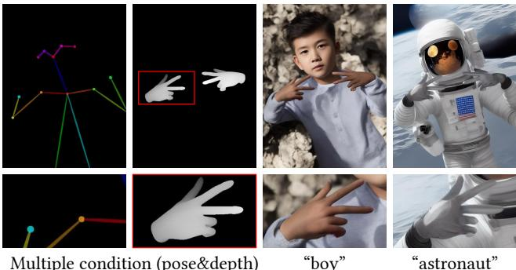
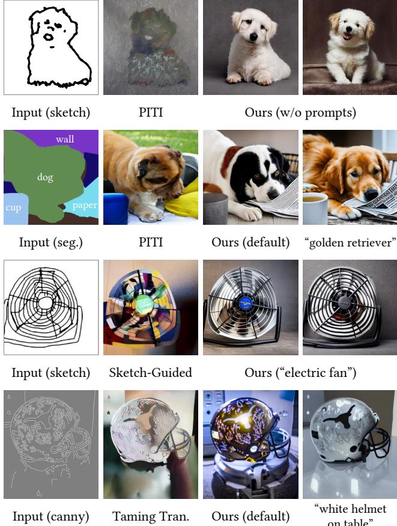

# 1. Bibliographic Information

## 1.1. Title
Adding Conditional Control to Text-to-Image Diffusion Models

The title clearly states the paper's core contribution: introducing a method to add conditional inputs to existing text-to-image diffusion models, enabling more precise control over the image generation process.

## 1.2. Authors
- Lvmin Zhang, Anyi Rao, and Maneesh Agrawala.
- All authors are affiliated with Stanford University. Their research backgrounds are in computer graphics, computer vision, and human-computer interaction. Maneesh Agrawala is a well-known professor in this field, which lends significant credibility to the work.

## 1.3. Journal/Conference
The paper was published as a preprint on arXiv. While arXiv is not a peer-reviewed venue, this paper was later accepted to the prestigious **IEEE/CVF International Conference on Computer Vision (ICCV) 2023**. ICCV is one of the top-tier conferences in computer vision, indicating the high quality, novelty, and impact of this research.

## 1.4. Publication Year
The initial preprint was submitted on February 10, 2023.

## 1.5. Abstract
The abstract introduces `ControlNet`, a neural network architecture designed to add spatial conditioning controls (like edges, depth maps, or human poses) to large, pre-trained text-to-image diffusion models. The key idea is to lock the original large model to preserve its powerful, pre-trained capabilities and then train a parallel "copy" of its encoding layers. This trainable copy learns to integrate the conditional inputs. The connection between the original and the trainable copy is made using "zero convolutions"—convolution layers initialized with zero weights and biases. This ensures that the fine-tuning process starts without introducing any disruptive noise, protecting the integrity of the original model. The authors demonstrate that `ControlNet` is effective with various conditions, works with small or large datasets, and can be used with or without text prompts. The results suggest `ControlNet` can significantly broaden the applications of diffusion models by enabling precise control.

## 1.6. Original Source Link
- **Original Source Link:** https://arxiv.org/abs/2302.05543
- **PDF Link:** https://arxiv.org/pdf/2302.05543v3.pdf
- **Publication Status:** This is a preprint version. The work was subsequently published at ICCV 2023.

  ---

# 2. Executive Summary

## 2.1. Background & Motivation
- **Core Problem:** Large-scale text-to-image diffusion models like Stable Diffusion can generate stunningly realistic and creative images from text prompts. However, they offer limited control over the **spatial composition** of the output. It is very difficult to specify a precise layout, object pose, or shape using text alone. Users often have to resort to tedious trial-and-error with prompts to get a desired result.

- **Importance and Challenges:** Providing more explicit, spatial control is crucial for making these models practical tools for artists, designers, and engineers. Previous methods for adding such control often involved training models from scratch or fine-tuning the entire large model. Training from scratch is computationally prohibitive, while full fine-tuning on smaller, task-specific datasets (e.g., a dataset of depth maps) risks **catastrophic forgetting**, where the model loses its powerful general knowledge learned from billions of images, and **overfitting**, where it performs well only on the small new dataset.

- **Innovative Idea:** The paper's key insight is to **avoid altering the original pre-trained model**. Instead of fine-tuning the massive model directly, `ControlNet` proposes a parallel architecture. It creates a trainable **copy** of the model's encoder blocks and uses special "zero convolution" layers to connect this copy back to the original, locked model. This approach allows the model to learn new conditional controls while fully preserving the robust, production-ready foundation of the original diffusion model.

## 2.2. Main Contributions / Findings
1.  **Proposal of `ControlNet` Architecture:** The primary contribution is the `ControlNet` architecture itself. It's an end-to-end network that efficiently adds spatial conditional control to large pre-trained diffusion models. The architecture is designed to be a general-purpose solution applicable to many types of conditions.

2.  **Introduction of "Zero Convolution":** The paper introduces the concept of "zero convolution" as a key mechanism. These are 1x1 convolution layers with weights and biases initialized to zero. This simple yet effective technique ensures that at the beginning of training, the `ControlNet` adds no information (i.e., no noise) to the original model's features, allowing for stable and progressive learning without disrupting the pre-trained weights.

3.  **Demonstration of Versatility and Robustness:** The authors show that `ControlNet` can be successfully applied to a wide range of spatial conditions, including Canny edges, Hough lines, human poses (OpenPose), semantic segmentation maps, depth maps, and even hand-drawn scribbles.

4.  **Efficiency and Scalability:** The paper demonstrates that `ControlNet` is computationally efficient. By locking the original model's weights, it reduces the memory and time required for training compared to full fine-tuning. Furthermore, it is robust to dataset size, achieving good results even with small datasets (<50k images) and scaling well to larger ones (>1m images). This makes learning new controls far more accessible.

    ---

# 3. Prerequisite Knowledge & Related Work

## 3.1. Foundational Concepts
### 3.1.1. Diffusion Models
Diffusion models are a class of generative models that learn to create data (like images) by reversing a noise-adding process. The core idea works in two stages:
*   **Forward Process (Noise Addition):** Start with a clean image $z_0$. Gradually add a small amount of Gaussian noise at each step $t$. After a large number of steps $T$, the image becomes indistinguishable from pure noise. This process is a fixed, non-learned Markov chain.
*   **Reverse Process (Denoising):** The goal of the model is to learn the reverse process. A neural network is trained to predict the noise that was added at each step $t$. By iteratively subtracting this predicted noise from a noisy image, the model can start from pure random noise and generate a clean image.

### 3.1.2. Latent Diffusion Models (LDM)
Diffusion models that operate directly on high-resolution images (pixel space) are computationally very expensive. **Latent Diffusion Models (LDMs)**, such as Stable Diffusion, solve this by performing the diffusion process in a lower-dimensional **latent space**.
1.  An **encoder** (typically part of a Variational Autoencoder, or VAE) first compresses a high-resolution image into a smaller latent representation.
2.  The diffusion and denoising process happens entirely in this compact latent space.
3.  A **decoder** (from the VAE) then converts the final denoised latent representation back into a full-resolution image.
    This makes the process much faster and more memory-efficient.

### 3.1.3. U-Net Architecture
The denoising network in most diffusion models uses a **U-Net** architecture. A U-Net consists of an encoder (down-sampling path) that captures context and a decoder (up-sampling path) that enables precise localization. A key feature is the use of **skip connections**, which connect layers from the encoder directly to corresponding layers in the decoder. These connections allow the decoder to reuse low-level feature information from the encoder, which is crucial for reconstructing fine details in the final image.

### 3.1.4. Classifier-Free Guidance (CFG)
Classifier-Free Guidance is a technique used to improve the quality of generated images and their alignment with a given condition (like a text prompt). Instead of training a separate classifier to guide the diffusion, CFG works by training the diffusion model with and without the condition. During inference, the model makes two predictions for the noise:
*   **Conditional Prediction ($\epsilon_c$):** The noise prediction given the condition (e.g., text prompt).
*   **Unconditional Prediction ($\epsilon_{uc}$):** The noise prediction without any condition.

    The final noise prediction is an extrapolation away from the unconditional prediction and towards the conditional one:
\$
\epsilon_{\text{prd}} = \epsilon_{uc} + \beta_{\text{cfg}} (\epsilon_c - \epsilon_{uc})
\$
Here, $\beta_{\text{cfg}}$ is the guidance scale, a user-controlled parameter. A higher value forces the output to adhere more strictly to the prompt.

## 3.2. Previous Works
The paper categorizes related work into three areas: finetuning strategies, controlling diffusion models, and image-to-image translation.

### 3.2.1. Finetuning Neural Networks
Directly finetuning a large model can lead to catastrophic forgetting. Several techniques have been developed to mitigate this:
*   **HyperNetworks [25]:** A small neural network generates the weights for a larger network. In the context of Stable Diffusion, a HyperNetwork can be trained to modify the style of the output without changing the base model's weights.
*   **Adapters [30, 14]:** Small, new neural network modules are inserted between the layers of a pre-trained model. Only the adapter modules are trained, leaving the original model's weights frozen. This is parameter-efficient and avoids forgetting. T2I-Adapter [56], a concurrent work, uses a similar idea to ControlNet but with a different architecture.
*   **Low-Rank Adaptation (LoRA) [31]:** This method assumes that the change in weights during finetuning has a low "intrinsic rank." Instead of learning the full change in a weight matrix $\Delta W$, LoRA approximates it as the product of two much smaller, low-rank matrices, $\Delta W = BA$. Only $B$ and $A$ are trained, dramatically reducing the number of trainable parameters.

### 3.2.2. Controlling Image Diffusion Models
Besides text prompts, researchers have explored other ways to control diffusion models:
*   **Text-based Editing:** Methods like `Prompt-to-Prompt` [27] allow editing generated images by modifying the cross-attention maps corresponding to words in the prompt.
*   **Personalization:** `Textual Inversion` [21] and `DreamBooth` [75] learn to represent new concepts or subjects from a few example images, allowing users to insert them into generated scenes.
*   **Mask-based Control:** `Make-A-Scene` [20] and `SpaText` [6] use segmentation masks to control the layout and content of generated images. `GLIGEN` [48] adds new trainable layers to the attention mechanism to handle grounding instructions.

### 3.2.3. Image-to-Image Translation
This field focuses on learning a mapping from an input image in one domain to an output image in another (e.g., sketch-to-photo).
*   **Conditional GANs (cGANs):** Models like `pix2pix` [34] use a Generative Adversarial Network framework where the generator is conditioned on an input image.
*   **Conditional Diffusion Models:** `Palette` [77] is a diffusion model trained from scratch for image-to-image tasks. `PITI` [89] uses a pre-training approach for conditional diffusion but requires more complex training.

## 3.3. Technological Evolution
The evolution leading to `ControlNet` can be seen as a progression from general, text-only generation towards fine-grained, multimodal control.
1.  **Early Generative Models (GANs):** Showed promise but were often hard to train and control.
2.  **Text-to-Image Diffusion Models (DALL-E, Imagen, Stable Diffusion):** Achieved unprecedented quality and semantic understanding through large-scale training on text-image pairs. However, control was limited to text prompts.
3.  **Parameter-Efficient Finetuning (Adapters, LoRA):** Provided a path to customize large models without the prohibitive cost and risk of full finetuning. These methods paved the way for adding new capabilities.
4.  **Specialized Control Mechanisms:** Researchers began exploring how to inject spatial information (masks, layouts) into the generation process, often by modifying attention layers or training separate conditioning networks.

    `ControlNet` fits into this timeline by providing a **general, robust, and efficient architectural solution** for adding *any* form of spatial condition. It cleverly combines the idea of parameter-efficient finetuning (by freezing the base model) with a novel architectural design (the trainable copy and zero convolutions) that is specifically suited for diffusion models.

## 3.4. Differentiation Analysis
Compared to the related works, `ControlNet` has several key differentiators:

*   **vs. Full Finetuning / Training from Scratch:** `ControlNet` is far more efficient. By locking the billion-parameter base model, it avoids catastrophic forgetting and drastically reduces computational requirements.
*   **vs. LoRA / HyperNetworks:** While LoRA and HyperNetworks are also parameter-efficient, they modify the *behavior* of existing layers (by changing weights). `ControlNet`, in contrast, adds an explicit, parallel stream of computation that is purpose-built to process the conditional input. This structural separation may be more robust for handling complex spatial conditions.
*   **vs. T2I-Adapter [56] (Concurrent Work):** T2I-Adapter also freezes the base model and trains a separate, smaller network to provide conditioning signals. However, T2I-Adapter uses a much smaller, shallower network that feeds features into multiple points of the U-Net decoder. `ControlNet` instead creates a full, deep **copy** of the U-Net's encoder, reusing the powerful pre-trained architecture as a backbone to process the condition. The authors argue this makes `ControlNet` a stronger and more capable encoder for the conditional input.
*   **vs. PITI / Other Image-to-Image Models:** Many previous image-to-image models were trained from scratch or required complex multi-stage training. `ControlNet` leverages the power of a massive, pre-existing text-to-image model, which gives it a significant head start in terms of image quality and semantic understanding.

    The **zero convolution** is the most unique technical innovation. While other methods carefully initialize new layers, the zero-initialization strategy is an elegant and extreme approach that guarantees the training process starts stably and the conditional control is learned progressively.

---

# 4. Methodology

## 4.1. Principles
The core principle of `ControlNet` is to **augment** a large pre-trained diffusion model with new conditional controls without compromising its original, powerful capabilities. This is achieved by creating a **trainable copy** of the diffusion model's encoding blocks. The original blocks remain locked (frozen), preserving the knowledge from their large-scale pre-training. The trainable copy learns to process the new spatial condition (e.g., an edge map). The outputs of both the locked block and the trainable block are then combined and fed into the next part of the diffusion model.

The key to making this work is the **"zero convolution"**. This is a simple 1x1 convolution layer whose weights and biases are initialized to zero. By using zero convolutions to connect the trainable copy to the locked model, the framework ensures that at the very beginning of training, the trainable copy has **no effect** on the output. The model behaves exactly like the original pre-trained model. As training progresses, the weights of the zero convolutions are learned and gradually become non-zero, allowing the conditional information to flow into the model in a controlled and stable manner. This prevents the initial random weights of a new module from adding destructive noise to the finely-tuned features of the large model.

## 4.2. Core Methodology In-depth (Layer by Layer)
Let's break down the architecture and data flow step-by-step.

### 4.2.1. The ControlNet Block Structure
First, consider a standard neural network block in a pre-trained model, like a ResNet block or a Transformer block within Stable Diffusion's U-Net. This block, which we can denote as $\mathcal{F}$, takes a feature map $\mathbf{x}$ as input and produces an output feature map $\mathbf{y}$.

\$
\mathbf{y} = \mathcal{F}(\mathbf{x}; \Theta)
\$

Here, $\Theta$ represents the parameters of the block, which are pre-trained and now frozen.

To add `ControlNet`, the following architectural change is made, as illustrated in Figure 2 of the paper:

*该图像是示意图，展示了在神经网络块中加入ControlNet的过程。在（a）中，原始神经网络块将特征图$x$作为输入，输出特征图$y$。在（b）中，锁定的神经网络块与一个可训练的副本通过零卷积连接，输入特征图$x$和条件向量$c$共同影响输出特征图$y_c$。这里的零卷积指的是权重和偏置均初始化为零的$1 \times 1$卷积。*

1.  **Lock and Copy:** The original block with parameters $\Theta$ is locked (its weights are not updated during training). A trainable copy of this block is created with its own set of parameters $\Theta_c$, which are initialized from the pre-trained weights $\Theta$.

2.  **Zero Convolution Connections:** The trainable copy is connected to the main data stream using two **zero convolution layers**, which are 1x1 convolutions with weights and biases initialized to zero. Let's call them $\mathcal{Z}(\cdot; \Theta_{z1})$ and $\mathcal{Z}(\cdot; \Theta_{z2})$.

3.  **Data Flow:** The complete flow through this augmented block is as follows:
    a. An external conditioning vector $\mathbf{c}$ (e.g., features from a pose skeleton) is first processed by a zero convolution: $\mathcal{Z}(\mathbf{c}; \Theta_{z1})$.
    b. The result is added to the input feature map $\mathbf{x}$ of the block.
    c. This combined feature map is fed into the trainable copy: $\mathcal{F}(\mathbf{x} + \mathcal{Z}(\mathbf{c}; \Theta_{z1}); \Theta_c)$.
    d. The output of the trainable copy is then passed through the second zero convolution: $\mathcal{Z}(\mathcal{F}(\dots); \Theta_{z2})$.
    e. Finally, this result is added to the output of the original, locked block.

The final output of the `ControlNet` block, $\mathbf{y}_c$, is given by the formula from the paper:

\$
\mathbf{y}_c = \mathcal{F}(\mathbf{x}; \Theta) + \mathcal{Z}(\mathcal{F}(\mathbf{x} + \mathcal{Z}(\mathbf{c}; \Theta_{z1}); \Theta_c); \Theta_{z2})
\$

*   **Symbols Explained:**
    *   $\mathbf{y}_c$: The final output of the block with `ControlNet`.
    *   $\mathbf{x}$: The input feature map to the block.
    *   $\mathbf{c}$: The external conditioning vector.
    *   $\mathcal{F}(\cdot; \Theta)$: The original, locked neural network block with parameters $\Theta$.
    *   $\mathcal{F}(\cdot; \Theta_c)$: The trainable copy of the block with parameters $\Theta_c$.
    *   $\mathcal{Z}(\cdot; \Theta_{z1})$: The first zero convolution layer with parameters $\Theta_{z1}$.
    *   $\mathcal{Z}(\cdot; \Theta_{z2})$: The second zero convolution layer with parameters $\Theta_{z2}$.

**Initial Training Step Analysis:**
At the first training step, since $\Theta_{z1}$ and $\Theta_{z2}$ are all zeros, both $\mathcal{Z}(\cdot)$ terms evaluate to zero. The formula simplifies to:
\$
\mathbf{y}_c = \mathcal{F}(\mathbf{x}; \Theta) + \mathbf{0} = \mathbf{y}
\$
This shows that `ControlNet` initially has no impact, which is crucial for training stability. The gradients will flow back through the zero convolutions, gradually updating their weights and the weights of the trainable copy $\Theta_c$, allowing the control signal to be learned progressively.

### 4.2.2. Integrating ControlNet with Stable Diffusion
The paper applies this `ControlNet` structure to the Stable Diffusion model. Stable Diffusion uses a U-Net for its denoising network. `ControlNet` is specifically applied to the **encoder** and **middle block** of this U-Net.

The structure is shown in Figure 3 from the paper:

*该图像是一个示意图，展示了Stable Diffusion的U-net架构与ControlNet的连接，左侧为Stable Diffusion的结构，右侧则展示了ControlNet如何集成条件控制。图中通过灰色锁住的块表示Stable Diffusion的固定结构，蓝色块为可训练部分，而白色的零卷积层则用于构建ControlNet，确保无有害噪声影响微调。*

1.  **Architecture:** The entire Stable Diffusion U-Net is locked. A `ControlNet` is created, which consists of trainable copies of all 12 encoder blocks and the 1 middle block of the U-Net. This `ControlNet` essentially forms a parallel, trainable encoder.

2.  **Input Conditioning:** The input condition (e.g., a 512x512 Canny edge map, $c_i$) is first processed by a small, separate neural network $\mathcal{E}$ to encode it into a feature map $c_f$ that matches the dimensions of the U-Net's initial feature space (64x64). This network $\mathcal{E}$ consists of four convolution layers and is trained along with the rest of `ControlNet`.
    \$
    c_f = \mathcal{E}(c_i)
    \$

3.  **Connecting ControlNet to U-Net:** The outputs from each of the 13 blocks of the `ControlNet` are fed into the corresponding blocks of the Stable Diffusion U-Net. Specifically, the output of each `ControlNet` block is added to the input of the corresponding **skip-connection** on the decoder side of the U-Net, and the output of the middle `ControlNet` block is added to the input of the U-Net's middle block.

### 4.2.3. Training Objective
The training process uses the standard objective function for diffusion models. The goal is to train the network $\epsilon_{\theta}$ (which now includes the `ControlNet` parameters) to predict the noise $\epsilon$ that was added to an image $z_0$ to create a noisy version $z_t$.

The learning objective $\mathcal{L}$ is:
\$
\mathcal{L} = \mathbb{E}_{z_0, t, c_t, c_f, \epsilon \sim \mathcal{N}(0, 1)} \left[ \| \epsilon - \epsilon_{\theta}(z_t, t, c_t, c_f) \|_2^2 \right]
\$

*   **Symbols Explained:**
    *   $z_0$: The original clean image (in latent space).
    *   $t$: The current timestep in the diffusion process.
    *   $c_t$: The text prompt condition (e.g., from CLIP).
    *   $c_f$: The task-specific spatial condition from `ControlNet` (e.g., encoded edge map).
    *   $\epsilon$: The ground-truth Gaussian noise added to the image.
    *   $z_t$: The noisy image at timestep $t$.
    *   $\epsilon_{\theta}(\dots)$: The neural network (SD + ControlNet) that predicts the noise.
    *   $\mathbb{E}[\dots]$: The expectation, meaning this is averaged over all training data, timesteps, and noise samples.
    *   $\|\cdot\|_2^2$: The squared L2 norm (Mean Squared Error), measuring the difference between the predicted noise and the actual noise.

        A key detail in the training strategy is **prompt dropout**: during training, 50% of the text prompts $c_t$ are randomly replaced with an empty string. This forces the `ControlNet` to learn to derive semantic meaning directly from the conditional input (e.g., recognizing that an edge map represents a "house") instead of relying solely on the text prompt.

### 4.2.4. Inference-time Control
The paper introduces two techniques for controlling the model during inference:

*   **Classifier-Free Guidance Resolution Weighting (CFG-RW):** The standard CFG can be too strong when a powerful `ControlNet` condition is present, especially without a text prompt. The paper's solution is to add the `ControlNet` condition only to the conditional prediction $\epsilon_c$ and then apply a weighting scheme to the outputs of the `ControlNet` blocks. The weight $w_i$ for the $i$-th block's output is inversely proportional to the block's resolution: $w_i = 64/h_i$, where $h_i$ is the height of the feature map. This reduces the influence of `ControlNet` at higher-resolution (earlier) blocks and strengthens it at lower-resolution (deeper) blocks, leading to more balanced results.

*   **Composing Multiple ControlNets:** To apply multiple conditions simultaneously (e.g., a pose skeleton and a depth map), one can run both corresponding `ControlNet` models in parallel and simply **add their output features** to the U-Net's skip connections. This simple summation works effectively without needing complex weighting or interpolation, as shown in Figure 6.

    
    *该图像是插图，展示了同时使用姿势和深度作为多个条件的应用。上方展示了不同状态下的姿势标记，结合深度信息，形成了丰富的图像生成效果。下方展示了在生成过程中使用这些条件生成的手势与角色图像。*

---

# 5. Experimental Setup

## 5.1. Datasets
The authors trained different `ControlNet` models for various types of conditional inputs. They used a variety of datasets, demonstrating the method's flexibility. The key conditions and associated data sources mentioned or implied are:

*   **Canny Edge [11], HED Soft Edge [91], User Scribbles:** These conditions are typically derived from natural images. For training, a large dataset of images is used. For each image, a corresponding edge map or scribble is generated on-the-fly using standard algorithms (like the Canny edge detector) or synthetic transformations.
*   **Human Pose (OpenPose [12]):** Trained on datasets with human pose annotations. A common approach is to use a large-scale dataset like COCO, extract poses using the OpenPose algorithm, and pair them with the original images.
*   **Semantic Segmentation (ADE20K [96]):** The ADE20K dataset provides images with dense, per-pixel semantic segmentation masks. The masks serve as the conditional input. The dataset contains ~20k images for training. An example data sample would be an image of a kitchen paired with a mask where pixels are colored according to their class (e.g., blue for 'cabinet', red for 'oven').
*   **Depth Map [69] and Normal Map [87]:** Datasets like DIODE [87] or those created by processing large image collections with monocular depth estimation models (e.g., MiDaS [69]) are used. Each image is paired with its corresponding estimated depth or surface normal map.
*   **M-LSD Lines [24]:** Trained on datasets where straight line segments are extracted from images using the M-LSD algorithm.

    The authors highlight that `ControlNet` is robust to dataset size, showing experiments with both small (<50k) and large (>1m) datasets. For the comparison with the industrial `SDv2-D2I` model, they trained a `ControlNet` on only 200k samples, a fraction of the data used for the original model.

## 5.2. Evaluation Metrics
The paper uses a combination of quantitative metrics and human evaluation to assess performance.

### 5.2.1. Frechet Inception Distance (FID)
*   **Conceptual Definition:** FID measures the similarity between the distribution of generated images and the distribution of real images. It is a widely used metric for evaluating the quality and realism of generative models. A lower FID score indicates that the generated images are more similar to real images in terms of their deep features, suggesting higher quality and diversity. It captures both fidelity (realism of individual images) and diversity (variety across the set).
*   **Mathematical Formula:**
    \$
    \text{FID}(x, g) = \left\| \mu_x - \mu_g \right\|_2^2 + \text{Tr}\left( \Sigma_x + \Sigma_g - 2(\Sigma_x \Sigma_g)^{1/2} \right)
    \$
*   **Symbol Explanation:**
    *   $x$ and $g$: Represent the sets of real and generated images, respectively.
    *   $\mu_x, \mu_g$: The mean of the feature activations from an InceptionV3 network for real and generated images.
    *   $\Sigma_x, \Sigma_g$: The covariance matrices of the feature activations for real and generated images.
    *   $\text{Tr}(\cdot)$: The trace of a matrix (sum of diagonal elements).

### 5.2.2. CLIP Score
*   **Conceptual Definition:** CLIP score measures the semantic similarity between a generated image and a given text prompt. It uses the pre-trained CLIP model, which can embed both images and text into a shared space. A higher CLIP score means the content of the generated image is more consistent with the meaning of the text prompt.
*   **Mathematical Formula:**
    \$
    \text{CLIP Score} = 100 \times \cos(E_I, E_T)
    \$
*   **Symbol Explanation:**
    *   $E_I$: The image embedding vector produced by the CLIP image encoder.
    *   $E_T$: The text embedding vector produced by the CLIP text encoder.
    *   $\cos(\cdot, \cdot)$: The cosine similarity between the two vectors. A value closer to 1 indicates higher similarity.

### 5.2.3. CLIP Aesthetic Score
*   **Conceptual Definition:** This metric predicts how aesthetically pleasing an image is to a human observer. It's based on a linear model trained on top of CLIP image embeddings, where the training data consists of images with human-rated aesthetic scores from the LAION dataset. A higher score suggests a more visually appealing image.
*   The paper does not provide a formula, but it is typically a linear projection of the CLIP embedding:
    \$
    \text{Aesthetic Score} = \mathbf{w}^T E_I + b
    \$
*   **Symbol Explanation:**
    *   $E_I$: The CLIP embedding of the image.
    *   $\mathbf{w}, b$: The learned weight vector and bias of the linear prediction model.

### 5.2.4. Intersection over Union (IoU)
*   **Conceptual Definition:** Also known as the Jaccard index, IoU is used here to measure **condition fidelity** for the semantic segmentation task. The authors generate an image from a segmentation mask, then run a state-of-the-art segmentation model (`OneFormer`) on the generated image to produce a new mask. The IoU measures the overlap between the original input mask and this reconstructed mask. A higher IoU indicates that the generated image more faithfully respects the spatial layout specified by the input condition.
*   **Mathematical Formula:**
    \$
    \text{IoU}(A, B) = \frac{|A \cap B|}{|A \cup B|}
    \$
*   **Symbol Explanation:**
    *   $A$: The set of pixels belonging to a certain class in the ground-truth (input) segmentation mask.
    *   $B$: The set of pixels belonging to the same class in the predicted (reconstructed) segmentation mask.
    *   $|A \cap B|$: The area of intersection between the two sets.
    *   $|A \cup B|$: The area of union of the two sets.

### 5.2.5. Average User Ranking (AUR) / Average Human Ranking (AHR)
*   **Conceptual Definition:** This is a metric derived from a user study where human participants rank a set of images generated by different models. For each task, users are asked to rank the results from 1 (worst) to 5 (best) based on criteria like "image quality" and "fidelity to the condition." The average rank across all users and tasks provides a direct measure of human preference.

## 5.3. Baselines
The paper compares `ControlNet` to several representative baseline models:
*   **PITI [89]:** A pre-training based method for image-to-image translation using diffusion models. It's a strong baseline for conditional generation.
*   **Sketch-Guided Diffusion (SGD) [88]:** An optimization-based method that guides the diffusion process to match a given sketch without requiring model training.
*   **Taming Transformers [19]:** A VQ-GAN based model, representing an earlier but powerful transformer-based approach to conditional image synthesis.
*   **VQGAN [19] and LDM [72] (trained for segmentation):** These represent GAN- and diffusion-based models trained from scratch on the specific task (segmentation-to-image), to show the benefit of leveraging a large pre-trained model.
*   **`ControlNet-lite`:** An ablated version of `ControlNet` where the deep, copied encoder blocks are replaced by a single, lightweight convolution layer. This baseline tests the importance of the deep, pre-trained backbone in the trainable copy.
*   **Stable Diffusion v2 Depth-to-Image (SDv2-D2I) [83]:** An industrial-grade model from Stability AI, trained on a large cluster with millions of images. This serves as a benchmark for industrial-level performance.

    ---

# 6. Results & Analysis

## 6.1. Core Results Analysis
The experimental results strongly validate the effectiveness of `ControlNet` across multiple dimensions: qualitative quality, quantitative metrics, and human preference.

*   **Qualitative Results (Figure 1, 7, 9):** The generated images show that `ControlNet` can produce high-quality, detailed images that faithfully adhere to a wide variety of spatial conditions. Even without a text prompt (Figure 7), the model is able to interpret the semantics of the input condition (e.g., inferring a "lion" from an edge map) and generate plausible images, thanks to the prompt-dropout training strategy. Comparisons in Figure 9 show `ControlNet` producing sharper and more accurate results than baselines like PITI and Sketch-Guided Diffusion.

    
    *该图像是一个示意图，展示了使用 ControlNet 进行条件控制的能力。上排展示了输入的 Canny 边缘图及其生成的不同风格的鹿图像，底排则展示了不同人体姿势输入的对应图像结果，包括不同风格的厨师和雕像。*

*   **Quantitative Results (Tables 1, 2, 3):**
    *   In the user study (Table 1), `ControlNet` receives the highest average ranking for both **result quality (4.22)** and **condition fidelity (4.28)**, significantly outperforming PITI and Sketch-Guided Diffusion. This indicates a strong human preference for `ControlNet`'s outputs.
    *   For the segmentation task (Table 2), `ControlNet` achieves the highest **reconstruction IoU (0.35)**, demonstrating superior fidelity to the input segmentation map compared to all baselines, including those trained from scratch.
    *   In Table 3, `ControlNet` achieves the best (lowest) **FID score (15.27)** among the conditional models, indicating its generated images have the highest quality and diversity. Its **CLIP score (0.26)** and **Aesthetic score (6.31)** are on par with the original Stable Diffusion model, showing that adding control does not degrade the model's core capabilities.

*   **Comparison to Industrial Model:** The user study comparing `ControlNet` (trained on a single GPU) with the industrial-scale `SDv2-D2I` model resulted in a user accuracy of $0.52 \pm 0.17$ in distinguishing them. This near-chance performance (`0.50` would be pure guessing) is a powerful testament to `ControlNet`'s efficiency, showing it can achieve competitive, state-of-the-art results with a fraction of the computational resources.

## 6.2. Data Presentation (Tables)
The following are the results from Table 1 of the original paper:

| Method | Result Quality ↑ | Condition Fidelity ↑ |
| :--- | :--- | :--- |
| PITI [89](sketch) | 1.10 ± 0.05 | 1.02 ± 0.01 |
| Sketch-Guided [88] (β = 1.6) | 3.21 ± 0.62 | 2.31 ± 0.57 |
| Sketch-Guided [88] (β = 3.2) | 2.52 ± 0.44 | 3.28 ± 0.72 |
| ControlNet-lite | 3.93 ± 0.59 | 4.09 ± 0.46 |
| ControlNet | **4.22 ± 0.43** | **4.28 ± 0.45** |

The following are the results from Table 2 of the original paper:

| ADE20K (GT) | VQGAN [19] | LDM [72] | PITI [89] | ControlNet-lite | ControlNet |
| :--- | :--- | :--- | :--- | :--- | :--- |
| 0.58 ± 0.10 | 0.21 ± 0.15 | 0.31 ± 0.09 | 0.26 ± 0.16 | 0.32 ± 0.12 | **0.35 ± 0.14** |

The following are the results from Table 3 of the original paper:

| Method | FID ↓ | CLIP-score ↑ | CLIP-aes. ↑ |
| :--- | :--- | :--- | :--- |
| Stable Diffusion | 6.09 | 0.26 | 6.32 |
| VQGAN [19](seg.)* | 26.28 | 0.17 | 5.14 |
| LDM [72](seg.)* | 25.35 | 0.18 | 5.15 |
| PITI [89](seg.) | 19.74 | 0.20 | 5.77 |
| ControlNet-lite | 17.92 | 0.26 | 6.30 |
| ControlNet | **15.27** | **0.26** | **6.31** |

## 6.3. Ablation Studies / Parameter Analysis
The paper conducts crucial ablation studies to validate its two main design choices: the deep copied backbone and the zero convolutions.

*该图像是示意图，展示了不同提示条件下文本到图像扩散模型的生成效果。图中的三行分别展示了在无提示、提示冲突和完美提示的条件下生成的结果，左侧是输入条件与结构，右侧是对应生成图像。通过比较可以看出提示的重要性以及不同网络结构对生成质量的影响。*

*   **Importance of the Deep Backbone (ControlNet vs. ControlNet-lite):** Figure 8c shows the results for `ControlNet-lite`, where the deep, trainable copy of the encoder is replaced with a single shallow convolution layer. `ControlNet-lite` performs reasonably well with a perfect prompt but fails when the prompt is insufficient or absent. This demonstrates that the shallow network is not powerful enough to interpret the semantics of the conditional input on its own. In contrast, the full `ControlNet` (Figure 8a), with its deep backbone copied from Stable Diffusion, successfully generates a house even with no prompt. This confirms the hypothesis that reusing the pre-trained deep architecture as an encoder for the condition is critical for robust performance.

*   **Importance of Zero Convolutions:** In Figure 8b, the zero convolutions in `ControlNet` are replaced with standard convolution layers initialized with random Gaussian weights. The performance drops significantly, becoming comparable to `ControlNet-lite`. The authors argue that this is because the initial random noise from these layers damages the finely-tuned features of the pre-trained backbone in the trainable copy, effectively preventing it from leveraging its inherited knowledge. This result provides strong evidence for the necessity of the zero convolution strategy for stable and effective training.

*   **Sudden Convergence Phenomenon (Figure 4):** The paper notes that due to the zero convolutions, the model produces high-quality images from the very start of training, but it only "snaps" into following the condition after a certain number of training steps (e.g., ~6k steps). This is a unique and interesting behavior that further highlights the progressive nature of learning enabled by the zero-init strategy.

    
    *该图像是图示，展示了ControlNet在不同训练步长下生成的图像过程。图中标注了训练步数，如第6133步时，模型突然学会了跟随输入条件，并且在训练的全过程中始终保持高质量图像的生成。*

*   **Training Dataset Size (Figure 10):** The experiment shows that `ControlNet` is robust to the size of the training dataset. Even with only 1,000 images, it learns to generate a recognizable lion. Performance scales gracefully as the dataset size increases to 50k and 3m, with the generated image becoming more detailed and realistic. This demonstrates the data efficiency of the approach.

    
    *该图像是展示了不同数据集大小下对“Lion”这一文本提示生成图像的效果。左侧为草图，紧接着是1k、50k和3m数据集生成的图像，说明了数据集大小对图像质量的影响。*

---

# 7. Conclusion & Reflections

## 7.1. Conclusion Summary
The paper presents `ControlNet`, a novel and highly effective neural architecture for adding spatial conditional control to large pre-trained text-to-image diffusion models. By creating a trainable copy of the model's encoder and connecting it via zero-initialized convolution layers, `ControlNet` successfully learns to integrate diverse conditions (edges, poses, depth, etc.) while preserving the original model's powerful generative capabilities. The method is computationally efficient, robust to varying dataset sizes, and outperforms existing baselines in both quantitative metrics and human evaluations. `ControlNet` represents a significant step forward in making large generative models more controllable and practical for a wide range of creative applications.

## 7.2. Limitations & Future Work
The paper itself does not explicitly list limitations. However, based on the work, we can infer some potential areas for future research:

*   **Memory Footprint:** While more efficient than full fine-tuning, `ControlNet` still roughly doubles the number of parameters in the U-Net's encoder, increasing GPU memory requirements during training. Exploring more parameter-efficient versions of the trainable copy (e.g., using LoRA within the copy) could be a valuable direction.
*   **Condition Compatibility:** While the paper shows composition of multiple `ControlNets` by simple addition, it's possible that some combinations of conditions could be conflicting or require more sophisticated merging strategies to produce coherent results.
*   **Generalization to New Conditions:** Training a new `ControlNet` is required for each new type of condition. A future research direction could be to develop a more universal `ControlNet` that can handle different types of conditions without retraining, or adapt to a new condition with very few examples (few-shot learning).
*   **Video and 3D Control:** The current work focuses on 2D images. Extending the `ControlNet` concept to control video generation (temporal consistency) or 3D object generation would be a natural and impactful next step.

## 7.3. Personal Insights & Critique
`ControlNet` is a landmark paper in the field of controllable generative AI. Its impact is evident from its rapid and widespread adoption by the open-source community.

*   **Elegance in Simplicity:** The core ideas—locking the base model, creating a trainable copy, and using zero convolutions—are conceptually simple yet incredibly effective. The "zero convolution" is a particularly brilliant piece of engineering. It elegantly solves the problem of catastrophic interference during fine-tuning with a solution that is both trivial to implement and theoretically sound.

*   **Pragmatism and Accessibility:** The paper's focus on reusing existing "production-ready" models is highly pragmatic. It democratizes the ability to create powerful, controlled generative tools. By showing that `ControlNet` can achieve industrial-grade results on a single consumer GPU, the authors made this technology accessible to a much broader audience of researchers and developers, sparking a wave of innovation.

*   **Critique and Potential Issues:**
    *   The "sudden convergence phenomenon" is fascinating but not fully explained from a theoretical standpoint. A deeper analysis of the training dynamics and loss landscape could provide more insight into why this happens.
    *   The paper's claim that random initialization "destroys" the backbone in the trainable copy is supported by the ablation study, but the mechanism could be explored more deeply. Is it simply noise, or does it push the weights into a region of the parameter space from which recovery is difficult?
    *   The transferability to community-finetuned models (Figure 12) is a powerful feature. However, it relies on the finetuned models not having significantly altered the architecture of the base Stable Diffusion model. As community models become more diverse, compatibility could become a challenge.

*   **Inspiration and Transferability:** The `ControlNet` paradigm is highly generalizable. The core concept of a "locked backbone + trainable control module with zero-connections" could be applied to other domains beyond image generation. For instance, one could imagine using it to add emotional or stylistic control to large language models (LLMs) or to guide the generation of music or 3D models. It offers a powerful blueprint for adapting massive, pre-trained foundation models to new tasks without compromising their integrity.