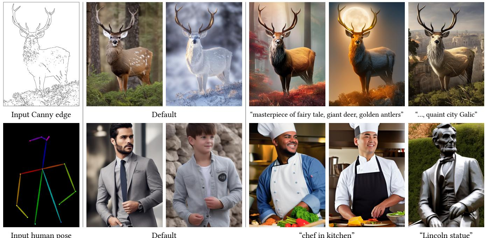
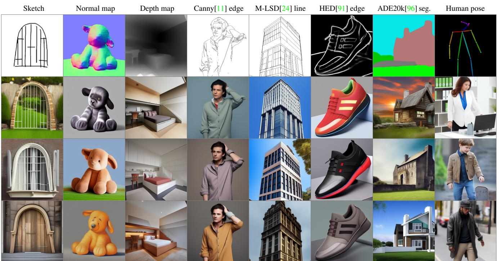
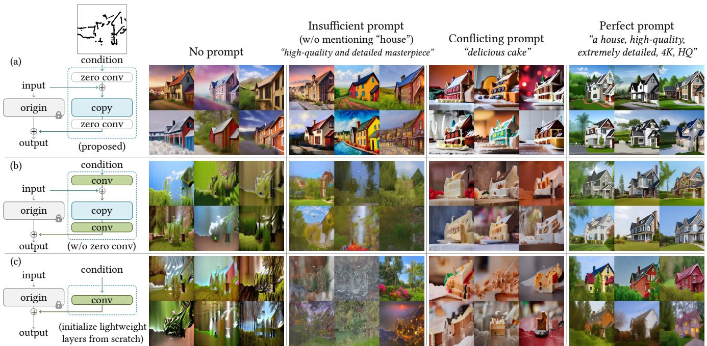
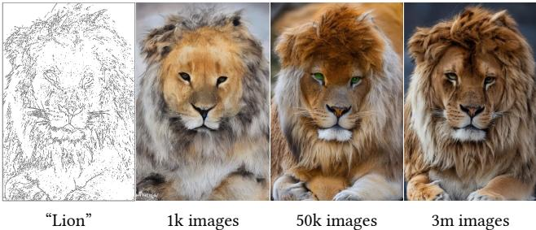

# 1. 论文基本信息

## 1.1. 标题
为文生图扩散模型添加条件控制 (Adding Conditional Control to Text-to-Image Diffusion Models)

## 1.2. 作者
Lvmin Zhang, Anyi Rao, and Maneesh Agrawala。三位作者均来自斯坦福大学 (Stanford University)。

## 1.3. 发表期刊/会议
本文最初于 2023 年 2 月作为预印本发表在 arXiv 上，后被计算机视觉领域的顶级会议 **ICCV (International Conference on Computer Vision) 2023** 接收。ICCV 是全球计算机视觉研究的旗舰会议之一，具有极高的学术声誉和影响力。

## 1.4. 发表年份
2023

## 1.5. 摘要
本文提出了一种名为 **ControlNet** 的神经网络架构，旨在为大型、预训练的文生图扩散模型添加空间条件控制。ControlNet 的核心思想是锁定（冻结）那些已经非常成熟的大型扩散模型（如 Stable Diffusion），并复用它们经过数十亿张图片预训练的、深层且鲁棒的编码层，以此作为学习各种条件控制的强大主干网络。该架构通过“零卷积”（权重和偏置均初始化为零的卷积层）进行连接，这些层在训练中参数从零开始逐步增长，确保在微调过程中不会有破坏性的噪声影响模型的原始能力。作者测试了多种条件控制，如边缘图、深度图、语义分割图、人体姿态等，并在 Stable Diffusion 上进行了实验，支持单一条件、多重条件，以及有或没有文本提示的生成。实验表明，ControlNet 的训练过程在小型（<50k）和大型（>1m）数据集上都非常稳健。大量的实验结果证明，ControlNet 能够极大地拓宽图像扩散模型的应用范围，实现更精准的控制。

## 1.6. 原文链接
*   **arXiv 链接:** https://arxiv.org/abs/2302.05543
*   **PDF 链接:** https://arxiv.org/pdf/2302.05543v3.pdf
*   **发布状态:** 本文已在 ICCV 2023 会议上正式发表。

    ---

# 2. 整体概括

## 2.1. 研究背景与动机
近年来，以 Stable Diffusion、DALL-E 2 和 Midjourney 为代表的文生图扩散模型取得了巨大成功，能够根据简单的文本描述生成质量惊人的图像。然而，这些模型存在一个普遍的局限性：**用户对生成图像的空间构图缺乏精准的控制能力**。仅通过文本提示，很难精确地描述复杂的物体布局、人物姿态、特定形状和形式。用户为了得到一张符合心中所想的图片，往往需要反复修改提示词，进行大量的“抽卡式”尝试。

因此，本文试图解决的核心问题是：**如何为这些强大的预训练文生图模型增加细粒度的、可直接指定的空间控制能力？**

现有研究面临的主要挑战（Gap）在于：
1.  **数据稀缺性：** 训练特定条件控制（如姿态-图像、深度-图像）所需的数据集规模通常远小于训练大型文生图模型所用的数据集（如 LAION-5B，拥有数十亿张图片）。例如，特定任务的数据集通常只有几十万张，规模相差数万倍。
2.  <strong>灾难性遗忘 (Catastrophic Forgetting):</strong> 如果直接用这些小规模的特定任务数据去微调 (fine-tuning) 一个巨大的预训练模型，很容易导致模型过拟合新数据，同时忘记其从海量数据中学到的通用知识和强大的生成能力，导致生成图像的质量急剧下降。

    为了克服这些挑战，本文提出的创新思路是：**与其修改原始模型，不如在旁边“嫁接”一个专门学习控制信号的模块，并保证这个嫁接过程是“无损”和“安全”的。** 这就是 ControlNet 的核心思想。它不触及原始模型的任何权重，而是创建一个可训练的副本，通过一种特殊的连接方式，让新学习到的控制能力平滑地注入到原始模型的生成过程中。

## 2.2. 核心贡献/主要发现
本文最主要的贡献是提出了 **ControlNet**，一个端到端的神经网络架构，其关键创新点和发现可以总结如下：

1.  **提出了一种新的模型控制架构：** ControlNet 通过**锁定预训练模型**并为其编码器创建一个**可训练副本**的方式，既保留了原始大模型强大的生成先验，又为学习新的条件控制提供了足够的模型容量。
2.  <strong>引入“零卷积” (Zero Convolutions) 连接机制：</strong> 这是实现稳定训练的关键。通过使用权重和偏置初始化为零的卷积层来连接原始模型和可训练副本，确保在训练初期，ControlNet 不会对原始模型的特征引入任何噪声或干扰。这使得训练过程非常稳定，并保护了预训练模型的骨干网络不受破坏。
3.  **实现了多样化和组合式的空间控制：** 论文成功将 ControlNet 应用于多种空间条件，包括 Canny 边缘、霍夫变换线段、用户涂鸦、人体关键点、语义分割图、法线图、深度图等，极大地增强了 Stable Diffusion 的可控性。此外，ControlNet 还支持将多个不同的条件（如姿态和深度）组合使用。
4.  **证明了训练的鲁棒性和高效性：** 实验表明，ControlNet 在不同规模的数据集上（从几千到上百万）都能成功训练，并且训练效率高。例如，仅用一台消费级显卡（RTX 3090Ti）和 20 万张图片训练的 ControlNet，其效果就能与使用大规模计算集群训练的工业级模型相媲美，证明了该方法的高效性和实用价值。

    ---

# 3. 预备知识与相关工作

## 3.1. 基础概念
为了更好地理解 ControlNet，我们需要先了解以下几个核心概念：

*   <strong>扩散模型 (Diffusion Models):</strong> 这是一类生成模型，其灵感来源于热力学中的扩散过程。它包含两个阶段：
    1.  <strong>前向过程（加噪）：</strong> 从一张真实的图片开始，在多个时间步（steps）中逐步地、少量地向图片添加高斯噪声，直到图片最终变成一张完全随机的噪声图。
    2.  <strong>反向过程（去噪）：</strong> 训练一个神经网络（通常是 U-Net 结构），让它学会在每一步中预测并移除上一步添加的噪声。当模型训练好后，我们就可以从一个纯粹的随机噪声图开始，利用这个网络逐步去噪，最终“创造”出一张全新的、符合训练数据分布的图片。

*   <strong>文生图模型 (Text-to-Image Models):</strong> 为了让扩散模型能根据我们的意愿生成图像，研究者们引入了文本作为引导。具体来说，就是将用户的文本提示（如 "a photo of an astronaut riding a horse"）通过一个预训练的文本编码器（如 CLIP）转换成数学向量，然后在去噪的每一步中，将这个文本向量作为额外信息输入给去噪网络，从而引导生成过程朝向文本描述的内容。

*   <strong>稳定扩散 (Stable Diffusion):</strong> 这是目前最流行的开源文生图模型之一。它的一个重要特点是它属于 <strong>潜在扩散模型 (Latent Diffusion Model, LDM)</strong>。与直接在像素级别（如 512x512）上进行加噪和去噪不同，LDM 首先使用一个编码器（Encoder）将高分辨率图像压缩到一个更小、更易于处理的<strong>潜在空间 (latent space)</strong>（如 64x64），然后在该空间内执行扩散过程。生成结束后，再用一个解码器（Decoder）将潜在空间中的图像恢复到原始像素空间。这样做大大降低了计算成本，加快了生成速度。其核心去噪网络是一个 **U-Net** 架构。

*   **U-Net:** 这是一种经典的图像分割网络架构，因其形状像字母 'U' 而得名。它包含一个<strong>编码器 (Encoder)</strong>，用于逐步下采样，提取图像的深层特征；一个<strong>解码器 (Decoder)</strong>，用于逐步上采样，将特征恢复到原始图像尺寸；以及<strong>跳跃连接 (Skip Connections)</strong>，用于将编码器中对应层级的浅层特征直接传递给解码器，帮助解码器更好地恢复图像细节。Stable Diffusion 的核心去噪网络就采用了这种结构。

*   <strong>微调 (Fine-tuning) 与 灾难性遗忘 (Catastrophic Forgetting):</strong> **微调** 是指在一个已经预训练好的大模型基础上，使用新的、特定任务的数据继续进行训练，以使模型适应新任务。**灾难性遗忘** 是微调过程中常见的问题，即模型在学习新知识的同时，会忘记它在预训练阶段学到的大量通用知识，导致其在原始任务上的性能严重下降。

## 3.2. 前人工作
ControlNet 的思想借鉴并改进了许多先前在模型微调和控制生成方面的工作。

*   <strong>高效微调方法 (Parameter-Efficient Fine-Tuning):</strong> 为了解决灾难性遗忘，研究社区提出了多种只训练少量参数的方法。
    *   **Adapter:** 在预训练模型的固定层之间插入一些小型的、可训练的“适配器”模块。
    *   **LoRA (Low-Rank Adaptation):** 假设模型权重的更新量是低秩的，因此只学习一个低秩矩阵来近似这个更新，而不是更新整个权重矩阵。
    *   **HyperNetwork:** 训练一个小型网络来生成主网络的部分权重。
    *   **Side-Tuning:** 训练一个独立的“侧网络”，其输出与冻结的主网络输出进行融合。

*   <strong>零初始化层 (Zero-Initialized Layers):</strong> 将新添加的神经网络层的权重初始化为零并非 ControlNet 首创。在 ProGAN、StyleGAN 等生成模型中，研究者就利用这个技巧来平滑地引入新的网络层级。其核心思想是，一个全零的层在初始时对网络没有影响，相当于一条“旁路”，使得网络可以从一个稳定的状态开始学习，而不会被随机初始化的新层所干扰。

*   **扩散模型的控制方法:**
    *   **基于优化的方法:** 如 Sketch-Guided Diffusion，通过在生成过程中迭代优化潜在变量，使其符合用户提供的草图。这类方法通常较慢。
    *   **编码条件的方法:** 如 Make-A-Scene，将语义分割图等条件编码成特殊的词元（token），与文本提示一起输入模型。
    *   **修改注意力层的方法:** 如 GLIGEN，在预训练模型的注意力层中加入新的可训练参数，以实现对物体位置的控制。
    *   **T2I-Adapter:** 这是与 ControlNet 同期发表的工作，思想非常相似。它也训练一个独立的、小型的适配器网络来提取条件信息，并将其特征注入到 Stable Diffusion 的 U-Net 中。主要区别在于，ControlNet 的“适配器”是复用原始模型结构（可训练副本），模型容量更大，理论上学习能力更强。

## 3.3. 技术演进
图像生成模型的控制技术经历了从无到有、从粗到精的演变：
1.  **早期 GANs:** 控制能力非常有限，通常只能控制全局风格或一些潜在属性。
2.  <strong>条件 GANs (cGANs):</strong> 如 pix2pix，实现了从一种图像域到另一种图像域的翻译（如线稿上色），但需要成对的数据，且模型通常需要从零开始为每个任务训练。
3.  **大规模文生图模型出现:** 提供了强大的文本控制能力，但空间控制依然是难题。
4.  **针对大模型的控制探索:** 早期方法主要是“训练-免费”的，即在推理时通过操纵注意力图或潜在空间进行引导，但效果和稳定性有限。
5.  **高效微调方法的兴起:** LoRA、Adapter 等方法被引入，实现了在不破坏原模型的前提下进行个性化定制（如 DreamBooth）或风格学习。
6.  **端到端条件控制:** ControlNet 和 T2I-Adapter 代表了当前最主流和最有效的方法，它们通过训练一个外部模块，以端到端的方式为大型预训练模型增加强大的空间条件控制，实现了性能、效率和灵活性之间的最佳平衡。

## 3.4. 差异化分析
与之前的相关工作相比，ControlNet 的核心差异化和创新点在于：

*   **模型容量与复用:** 与 LoRA 或 Adapter 插入小型模块不同，ControlNet **复制了整个编码器块**。这使得它的可训练部分参数量更大，具有更强的学习能力来理解和编码复杂的空间条件（如复杂的姿态或分割图），同时又通过复用预训练权重作为初始化，获得了良好的学习起点。
*   **训练稳定性:** **零卷积**是 ControlNet 的“神来之笔”。它在架构层面保证了训练初期的稳定性，彻底避免了新模块对原模型的潜在破坏。这使得 ControlNet 的训练过程比直接微调或一些其他注入方法更加鲁棒，甚至出现了独特的“突然收敛”现象。
*   **不锁定解码器:** ControlNet 只控制 U-Net 的编码器部分，其输出被添加到解码器的输入中。这意味着解码器仍然是完全“自由”的，可以充分利用原始模型的强大生成能力和从编码器接收到的控制信号来合成最终图像，实现了控制和质量的良好平衡。
*   **通用性和易用性:** 由于 ControlNet 不改变原始 Stable Diffusion 模型的权重，训练好的 ControlNet 模块可以像插件一样，灵活地加载到任何基于同一 Stable Diffusion 版本的微调模型上（例如，各种社区发布的动漫、写实风格模型），实现了控制能力的即插即用和广泛迁移。

    ---

# 4. 方法论
本部分将深入拆解 ControlNet 的技术原理。

## 4.1. 方法原理
ControlNet 的核心思想是**在不改变原始预训练扩散模型任何参数的前提下，为其“附加”一个能够理解空间条件的控制模块**。

这个过程可以类比为给一位经验丰富但只能听从口头指令的画家（预训练的 Stable Diffusion）配备一位助手（ControlNet）。这位助手能看懂草图、姿态图等视觉指令，然后将这些指令“翻译”成画家能理解的引导信号，在画家创作的每一笔中 subtly地影响他，最终画出既符合草图结构又保持画家高超画技的作品。

为了实现这个目标，ControlNet 的设计必须满足两个条件：
1.  **不能损害画家的原有能力：** 在助手刚开始学习时，他不能胡乱指挥，否则会毁掉整幅画。
2.  **助手必须足够聪明：** 助手需要有足够强大的学习能力，才能理解复杂的视觉指令。

    ControlNet 通过**零卷积**和**可训练副本**这两个关键设计，完美地解决了上述两个问题。

## 4.2. 核心方法详解 (逐层深入)

### 4.2.1. ControlNet 基础块结构
让我们从一个神经网络的基本单元——<strong>网络块 (network block)</strong> 开始。一个网络块（例如，一个残差块 ResNet block）可以看作一个函数 $\mathcal{F}$，它接收一个输入特征图 $\pmb{x}$，经过一系列计算后，输出一个新的特征图 $\pmb{y}$。

$$
\pmb { y } = \mathcal { F } ( \pmb { x } ; \Theta )
$$

其中 $\Theta$ 是这个块的参数。

为了给这个块加上 ControlNet，我们进行如下操作，如下图（原文 Figure 2）所示：

*该图像是示意图，展示了在神经网络块中加入ControlNet的过程。在（a）中，原始神经网络块将特征图$x$作为输入，输出特征图$y$。在（b）中，锁定的神经网络块与一个可训练的副本通过零卷积连接，输入特征图$x$和条件向量$c$共同影响输出特征图$y_c$。这里的零卷积指的是权重和偏置均初始化为零的$1 \times 1$卷积。*

1.  **锁定原始块：** 首先，我们将原始块的参数 $\Theta$ <strong>完全冻结 (lock/freeze)</strong>，在训练中不再更新。这保证了原始模型的知识和能力被完整保留。
2.  **创建可训练副本：** 接着，我们**复制**这个块，得到一个结构完全相同但参数可训练的副本。其参数表示为 $\Theta_c$。这个副本将作为学习条件控制的主力。
3.  **连接与注入：** 使用两个<strong>零卷积层 (zero convolution layers)</strong>，记为 $\mathcal{Z}(\cdot; \cdot)$，来连接原始块、可训练副本和外部条件。零卷积是一个 $1 \times 1$ 的卷积层，其权重和偏置在初始化时都设为 0。

    整个 ControlNet 块的完整计算流程如下：

$$
\pmb { y } _ { \mathrm { c } } = \mathscr { F } ( \pmb { x } ; \Theta ) + \mathscr { Z } ( \mathscr { F } ( \pmb { x } + \mathscr { Z } ( \pmb { c } ; \Theta _ { \mathrm { z1 } } ) ; \Theta _ { \mathrm { c } } ) ; \Theta _ { \mathrm { z2 } } )
$$

让我们一步步分解这个公式：
*   $\pmb{x}$: 来自 U-Net 主干网络前一层的输入特征图。
*   $\pmb{c}$: 外部输入的条件信息（如姿态图、边缘图等处理后的特征向量）。
*   $\mathcal{F}(\pmb{x}; \Theta)$: 原始的、被锁定的网络块的输出。
*   $\mathcal{Z}(\pmb{c}; \Theta_{z1})$: 第一个零卷积层，处理输入的条件向量 $\pmb{c}$。
*   $\pmb{x} + \mathcal{Z}(\pmb{c}; \Theta_{z1})$: 将处理后的条件信息加到可训练副本的输入上。
*   $\mathcal{F}(\dots; \Theta_c)$: 可训练副本，接收混合了条件信息的输入，并进行特征提取。
*   $\mathcal{Z}(\dots; \Theta_{z2})$: 第二个零卷积层，处理可训练副本的输出，得到最终的“控制信号”。
*   $\pmb{y}_c$: 最终的输出特征图，由**原始块的输出**和**可训练副本产生的控制信号**相加得到。

**零卷积的关键作用：**
在训练的第一步，由于零卷积的权重和偏置 $\Theta_{z1}, \Theta_{z2}$ 都是 0，所以：
*   $\mathcal{Z}(\pmb{c}; \Theta_{z1}) = \mathbf{0}$
*   $\mathcal{Z}(\dots; \Theta_{z2}) = \mathbf{0}$

    此时，公式 (2) 简化为：
$$
\pmb{y}_c = \mathcal{F}(\pmb{x}; \Theta) + \mathbf{0} = \mathcal{F}(\pmb{x}; \Theta) = \pmb{y}
$$
这意味着在训练开始时，ControlNet 模块的输出完全等同于原始模块的输出，对整个网络**没有任何影响**。这确保了训练的平稳启动。随着训练的进行，梯度会反向传播，零卷积的权重和偏置以及可训练副本的权重 $\Theta_c$ 会被逐渐更新，从 0 开始学习如何提取和注入控制信号。

### 4.2.2. 在 Stable Diffusion 中的应用
作者将上述 ControlNet 块结构应用到 Stable Diffusion 的 U-Net 架构中，如下图（原文 Figure 3）所示：

*该图像是一个示意图，展示了Stable Diffusion的U-net架构与ControlNet的连接，左侧为Stable Diffusion的结构，右侧则展示了ControlNet如何集成条件控制。图中通过灰色锁住的块表示Stable Diffusion的固定结构，蓝色块为可训练部分，而白色的零卷积层则用于构建ControlNet，确保无有害噪声影响微调。*

具体实现如下：
1.  **架构对接：** 对 Stable Diffusion U-Net 中的 <strong>12 个编码器块 (encoder blocks)</strong> 和 <strong>1 个中间块 (middle block)</strong> 分别创建一个可训练的副本，形成 ControlNet 的主体。
2.  **注入位置：** ControlNet 副本的输出，会通过加法被注入到 U-Net 解码器（decoder）中对应的 12 个跳跃连接（skip-connections）和 1 个中间块。这种设计非常巧妙，因为它没有直接修改 U-Net 编码器提取的特征，而是为解码器提供了额外的、带有空间信息的引导，让解码器在生成图像时同时参考来自编码器的内容/纹理信息和来自 ControlNet 的结构/布局信息。
3.  **条件预处理：** 输入的条件图像（如一张 512x512 的 Canny 边缘图 $c_i$）不能直接输入 ControlNet。它首先需要经过一个小型卷积网络 $\mathcal{E}(\cdot)$ 进行编码，将其转换为与 U-Net 潜在空间尺寸相匹配的特征图 $c_f$（如 64x64）。这个小型网络 $\mathcal{E}$ 会与 ControlNet 的其他部分一起进行端到端的训练。
    $$
    c _ { \mathrm { f } } = \mathcal { E } ( c _ { \mathrm { i } } )
    $$

### 4.2.3. 训练目标与技巧
ControlNet 的训练目标与标准的扩散模型完全相同，即预测每一步去噪过程中添加的噪声。其损失函数为：
$$
\mathcal { L } = \mathbb { E } _ { z _ { 0 } , t , c _ { t } , c _ { \mathrm { f } } , \epsilon \sim \mathcal { N } ( 0 , 1 ) } \Big [ \| \epsilon - \epsilon _ { \theta } \big ( z _ { t } , t , c _ { t } , c _ { \mathrm { f } } \big ) \big ) \| _ { 2 } ^ { 2 } \Big ]
$$
*   $z_0$: 原始的干净图像在潜在空间的表示。
*   $t$: 扩散过程中的时间步。
*   $c_t$: 文本提示的编码向量。
*   $c_f$: ControlNet 的条件图像的编码向量。
*   $\epsilon$: 在该时间步添加的真实高斯噪声。
*   $\epsilon_\theta$: 整个模型（Stable Diffusion + ControlNet）预测的噪声。
*   $\mathcal{L}$: 损失函数，即真实噪声和预测噪声之间的均方误差 (MSE)。

    在训练过程中，作者使用了一个重要的技巧：**以 50% 的概率将文本提示 $c_t$ 替换为空字符串**。这迫使 ControlNet 不能仅仅依赖文本提示，而是必须学会从输入的条件图像 $c_f$（如边缘图、姿态图）中独立地理解其语义内容。这极大地增强了 ControlNet 在无提示或提示不充分情况下的可控性。

### 4.2.4. 推理过程中的控制
在生成图像时，ControlNet 还提供了一些额外的控制手段：
*   <strong>多条件组合 (Composing multiple ControlNets):</strong> 如果想同时使用多个条件（例如，用姿态图控制人物姿势，用深度图控制场景布局），可以直接将多个对应 ControlNet 的输出控制信号相加，然后注入到 U-Net 中。这种组合方式简单而有效。
*   <strong>分类器无关引导分辨率加权 (Classifier-Free Guidance Resolution Weighting):</strong> 这是一个更精细的控制技巧，用于调整 ControlNet 条件的强度，尤其是在没有文本提示的情况下，可以避免生成结果过于极端。

    ---

# 5. 实验设置

## 5.1. 数据集
作者为了验证 ControlNet 的通用性，使用了多种不同类型的条件图像和相应的数据集进行训练。每种条件都训练了一个独立的 ControlNet 模型。
*   **Canny Edge:** 使用 Canny 边缘检测算法从真实图像中提取边缘图。
*   **M-LSD Lines:** 使用 M-LSD 算法提取图像中的直线段。
*   **HED Soft Edge:** 使用 HED 边缘检测网络提取更柔和、更自然的边缘图。
*   **User Sketches:** 将真实图像通过技术手段转换为类似人类手绘的草图。
*   **Openpose:** 使用 OpenPose 库提取人体姿态关键点（骨骼图）。
*   **ADE20K Segmentation:** 使用 ADE20K 数据集的语义分割图，该数据集包含大量带有像素级类别标注的场景图像。
*   **Depth Map:** 使用 MiDaS 模型从真实图像中估计深度图。
*   **Normal Map:** 从数据集中提取物体的表面法线图，用于表达物体的三维表面朝向。

    这些数据集的选择覆盖了从低级几何信息（边缘、线条）到高级语义信息（分割图、姿态）的各种条件，能全面地检验 ControlNet 的学习能力。

## 5.2. 评估指标
论文使用了多种定量和定性指标来评估 ControlNet 的性能。

*   <strong>Average User Ranking (AUR) / 平均用户排名:</strong>
    1.  **概念定义:** 这是一种主观评估指标，通过招募真人用户来对不同方法生成的结果进行打分或排名。通常，用户会根据“图像质量”和“与条件的符合程度”两个维度进行评价。分数越高，代表用户越偏爱该方法的结果。
    2.  **数学公式:** 该指标没有标准数学公式，通常是计算所有用户评分的平均值。
        $$
        \text{AUR} = \frac{1}{N} \sum_{i=1}^{N} \text{rank}_i
        $$
    3.  **符号解释:**
        *   $N$: 参与评估的总样本数。
        *   $\text{rank}_i$: 第 $i$ 个样本获得的用户排名或评分。

*   <strong>Intersection over Union (IoU) / 交并比:</strong>
    1.  **概念定义:** IoU 是评估语义分割任务中预测结果与真实标注数据 (Ground Truth) 之间重合度的标准指标。它的值域为 [0, 1]，值越大表示预测越准确。在本文中，作者用它来衡量生成图像的语义布局与输入的分割图条件的符合程度。
    2.  **数学公式:**
        $$
        \text{IoU}(A, B) = \frac{|A \cap B|}{|A \cup B|}
        $$
    3.  **符号解释:**
        *   $A$: 预测的分割掩码区域。
        *   $B$: 真实的分割掩码区域 (Ground Truth)。
        *   $|A \cap B|$: 预测区域与真实区域的交集面积。
        *   $|A \cup B|$: 预测区域与真实区域的并集面积。

*   <strong>Fréchet Inception Distance (FID) / 弗雷歇初始距离:</strong>
    1.  **概念定义:** FID 是衡量两组图像分布相似度的常用指标，被广泛用于评估生成模型的图像质量。它通过一个预训练的 Inception-v3 网络提取图像特征，然后计算两组图像特征分布的均值和协方差之间的弗雷歇距离。**FID 分数越低，表示生成图像的分布与真实图像的分布越相似，即生成图像的质量越高、多样性越好。**
    2.  **数学公式:**
        $$
        \text{FID}(x, g) = ||\mu_x - \mu_g||_2^2 + \text{Tr}(\Sigma_x + \Sigma_g - 2(\Sigma_x\Sigma_g)^{1/2})
        $$
    3.  **符号解释:**
        *   `x, g`: 分别代表真实图像分布和生成图像分布。
        *   $\mu_x, \mu_g$: 真实图像和生成图像在 Inception 特征空间中的特征向量均值。
        *   $\Sigma_x, \Sigma_g$: 真实图像和生成图像特征的协方差矩阵。
        *   $\text{Tr}(\cdot)$: 矩阵的迹（主对角线元素之和）。

*   **CLIP Score:**
    1.  **概念定义:** 该指标使用预训练的 CLIP 模型来衡量生成图像与输入文本提示之间的语义一致性。分数越高，表示图像内容与文本描述越匹配。
    2.  **数学公式:**
        $$
        \text{CLIP Score} = 100 \times \cos(\mathbf{E}_I, \mathbf{E}_T)
        $$
    3.  **符号解释:**
        *   $\mathbf{E}_I$: 生成图像经过 CLIP 图像编码器得到的特征向量。
        *   $\mathbf{E}_T$: 输入文本经过 CLIP 文本编码器得到的特征向量。
        *   $\cos(\cdot, \cdot)$: 余弦相似度。

## 5.3. 对比基线
论文将 ControlNet 与当时领域内具有代表性的条件生成模型进行了比较：
*   **PITI:** 一个基于预训练的图像到图像翻译扩散模型。
*   **Sketch-Guided Diffusion (SGD):** 一种通过优化潜在空间来实现草图引导的扩散模型。
*   **Taming Transformers:** 一个基于 Transformer 和 VQ-GAN 的图像合成模型。
*   **Stable Diffusion v2 Depth-to-Image (SDv2-D2I):** Stability AI 官方发布的、在超大规模数据和计算资源上训练的深度图到图像模型。这是一个非常强的工业级基线。

    ---

# 6. 实验结果与分析

## 6.1. 核心结果分析
论文通过大量的定性和定量实验，有力地证明了 ControlNet 的有效性和优越性。

### 6.1.1. 定性结果
下图（原文 Figure 1 和 Figure 7）展示了 ControlNet 在多种条件下的惊人效果。无论是简单的 Canny 边缘、复杂的姿态，还是包含丰富语义的分割图，ControlNet 都能生成与之高度一致且质量极高的图像。特别是在**无提示词**的情况下（Figure 7），模型依然能从条件图中“解读”出高级语义（如从边缘图识别出狮子，从姿态图识别出钢铁侠），这充分证明了其强大的学习能力。

*该图像是一个示意图，展示了使用 ControlNet 进行条件控制的能力。上排展示了输入的 Canny 边缘图及其生成的不同风格的鹿图像，底排则展示了不同人体姿势输入的对应图像结果，包括不同风格的厨师和雕像。*

*该图像是一个示意图，展示了多种条件控制下的文本到图像扩散模型的输出示例。每个图像对应不同的条件，如草图、法线图、深度图、边缘检测等。图中包括多个类别的实例，展示了ControlNet的多样化应用。*

与之前方法的比较（原文 Figure 9）也显示，ControlNet 生成的图像在细节清晰度、结构准确性和整体美感上都更胜一筹。

![Figure 9: Comparison to previous methods.We present the qualitative comparisons to PITI \[89\], Sketch-Guided Diffusion \[88\], and Taming Transformers \[19\].](images/9.jpg)
*该图像是图表，展示了与之前方法的比较，包含输入草图、分割以及其他条件下的生成结果。左侧是输入，随后依次是 PITI、我们的结果，以及一些具体描述，如“金毛猎犬”和“电风扇”。*

### 6.1.2. 定量结果
以下是原文 Table 1 的结果：

<table>
<thead>
<tr>
<th>Method</th>
<th>Result Quality ↑</th>
<th>Condition Fidelity ↑</th>
</tr>
</thead>
<tbody>
<tr>
<td>PITI [89](sketch)</td>
<td>1.10 ± 0.05</td>
<td>1.02 ± 0.01</td>
</tr>
<tr>
<td>Sketch-Guided [88] (β = 1.6)</td>
<td>3.21 ± 0.62</td>
<td>2.31 ± 0.57</td>
</tr>
<tr>
<td>Sketch-Guided [88] (β = 3.2)</td>
<td>2.52 ± 0.44</td>
<td>3.28 ± 0.72</td>
</tr>
<tr>
<td>ControlNet-lite</td>
<td>3.93 ± 0.59</td>
<td>4.09 ± 0.46</td>
</tr>
<tr>
<td>ControlNet</td>
<td>4.22 ± 0.43</td>
<td>4.28 ± 0.45</td>
</tr>
</tbody>
</table>

<strong>分析 (Table 1 - 用户研究):</strong> 在草图到图像生成的任务中，真人用户对不同方法的结果进行 1-5 分的排名（5分为最佳）。结果显示，**ControlNet 在“结果质量”和“条件符合度”两个维度上都获得了最高的平均分**，显著优于 PITI 和 Sketch-Guided Diffusion 等基线方法。

以下是原文 Table 2 和 Table 3 的结果，评估的是在 ADE20K 语义分割条件下的生成效果：
<strong>Table 2: 语义分割标签重建 IoU (↑)</strong>

<table>
<thead>
<tr>
<th>ADE20K (GT)</th>
<th>VQGAN [19]</th>
<th>LDM [72]</th>
<th>PITI [89]</th>
<th>ControlNet-lite</th>
<th>ControlNet</th>
</tr>
</thead>
<tbody>
<tr>
<td>0.58 ± 0.10</td>
<td>0.21 ± 0.15</td>
<td>0.31 ± 0.09</td>
<td>0.26 ± 0.16</td>
<td>0.32 ± 0.12</td>
<td><strong>0.35 ± 0.14</strong></td>
</tr>
</tbody>
</table>

**Table 3: 图像生成质量评估**

<table>
<thead>
<tr>
<th>Method</th>
<th>FID ↓</th>
<th>CLIP-score ↑</th>
<th>CLIP-aes. ↑</th>
</tr>
</thead>
<tbody>
<tr>
<td>Stable Diffusion</td>
<td>6.09</td>
<td>0.26</td>
<td>6.32</td>
</tr>
<tr>
<td>VQGAN [19](seg.)*</td>
<td>26.28</td>
<td>0.17</td>
<td>5.14</td>
</tr>
<tr>
<td>LDM [72](seg.)*</td>
<td>25.35</td>
<td>0.18</td>
<td>5.15</td>
</tr>
<tr>
<td>PITI [89](seg.)</td>
<td>19.74</td>
<td>0.20</td>
<td>5.77</td>
</tr>
<tr>
<td>ControlNet-lite</td>
<td>17.92</td>
<td>0.26</td>
<td>6.30</td>
</tr>
<tr>
<td>ControlNet</td>
<td><strong>15.27</strong></td>
<td><strong>0.26</strong></td>
<td><strong>6.31</strong></td>
</tr>
</tbody>
</table>

<strong>分析 (Table 2 &amp; 3 - 定量指标):</strong>
*   <strong>条件符合度 (IoU):</strong> Table 2 显示，ControlNet 生成的图像在经过分割模型处理后，得到的分割图与原始条件图的 IoU 最高，说明其对空间布局的遵循最为精确。
*   <strong>生成质量 (FID, CLIP):</strong> Table 3 显示，ControlNet 取得了**最低的 FID 分数**，表明其生成图像的真实性和多样性是所有条件生成方法中最好的。同时，它的 CLIP score 和美学分数（CLIP-aes.）也与没有条件约束的原始 Stable Diffusion 相当，这证明 ControlNet **在增加可控性的同时，没有牺牲原始模型的生成质量**。

### 6.1.3. 与工业级模型的对比
一个非常亮眼的实验结果是，作者用一台 NVIDIA RTX 3090Ti 显卡，在 20 万张图片上训练了 5 天得到的 ControlNet (for depth)，其生成结果在用户研究中被发现与 Stability AI 官方使用大规模集群、千万级数据训练的 SDv2-D2I 模型**几乎无法区分**（用户分辨准确率仅为 52%）。这充分说明了 ControlNet 架构的**数据效率和计算效率极高**。

## 6.2. 消融实验/参数分析
消融实验是验证模型设计中各个组件有效性的关键。

下图（原文 Figure 8）展示了关键的消融实验结果：

*该图像是示意图，展示了不同提示条件下文本到图像扩散模型的生成效果。图中的三行分别展示了在无提示、提示冲突和完美提示的条件下生成的结果，左侧是输入条件与结构，右侧是对应生成图像。通过比较可以看出提示的重要性以及不同网络结构对生成质量的影响。*

1.  <strong>(a) ControlNet (完整模型):</strong> 在所有四种提示设置（无提示、不充分提示、冲突提示、完美提示）下都表现出色，能够忠实地遵循输入的边缘图条件。
2.  <strong>(b) 替换零卷积 (w/o zero conv):</strong> 当把零卷积换成标准的高斯初始化卷积层后，模型性能急剧下降。在没有完美提示的情况下，模型几乎无法正确理解边缘图，生成了混乱的结果。这证明了**零卷积对于保护预训练主干网络、稳定训练过程至关重要**。
3.  <strong>(c) 轻量版 (ControlNet-lite):</strong> 这个版本将可训练副本替换为简单的单层卷积。结果显示，它在有完美提示时勉强可用，但在提示不充分或没有提示时完全失败。这证明了**复制整个编码器块所带来的强大模型容量是处理复杂条件和实现高级语义理解所必需的**。

    此外，对不同训练数据规模的实验（原文 Figure 10）表明，即使只有 1000 张训练图片，ControlNet 也能学到基本的控制能力；随着数据量增加到 50k 甚至 3m，生成结果的质量和细节也随之稳步提升，展示了其良好的<strong>可扩展性 (scalability)</strong>。

    
    *该图像是展示了不同数据集大小下对“Lion”这一文本提示生成图像的效果。左侧为草图，紧接着是1k、50k和3m数据集生成的图像，说明了数据集大小对图像质量的影响。*

---

# 7. 总结与思考

## 7.1. 结论总结
本文提出了 ControlNet，一种为大型预训练文生图模型添加空间条件控制的通用且高效的神经网络架构。其核心思想可以概括为：
*   通过**锁定原始模型权重**并创建**可训练副本**，在不损害模型原有强大生成能力的前提下，为学习新条件提供了充足的模型容量。
*   引入**零卷积**作为连接机制，巧妙地解决了训练初期的不稳定性问题，保证了新模块的“无害”接入和渐进式学习。

    大量的实验证明，ControlNet 能够在多种条件下（边缘、姿态、深度等）实现对 Stable Diffusion 的精确控制，并且在图像质量、条件符合度以及训练效率上均表现出色，甚至能以较低的成本达到工业级模型的水平。ControlNet 的开源极大地推动了 AI 绘画社区的发展，使其成为目前最主流、最受欢迎的图像生成控制工具之一。

## 7.2. 局限性与未来工作
尽管论文本身未明确列出局限性，但我们可以从其设计和实验中进行一些思考：
*   **任务特定性:** 当前的实现是为每一种条件类型（如姿态、深度、边缘）训练一个独立的 ControlNet 模型。这意味着如果想使用一种新的条件，就需要重新收集数据并训练一个新模型。一个可能的未来方向是研究能否训练一个**通用的 ControlNet**，让它能理解多种不同类型的条件输入。
*   **参数量:** 相比 LoRA 等更轻量级的微调方法，ControlNet（特别是完整版）引入的参数量相对较大（因为它复制了编码器）。虽然带来了性能优势，但在一些对模型大小极度敏感的部署场景下可能不是最优选择。
*   **条件组合的深入研究:** 论文展示了简单的多条件组合（直接相加），但并未深入探讨不同条件之间的权重分配、冲突解决等更复杂的问题。

    未来工作可以围绕以上几点展开，例如开发统一多模态条件的 ControlNet、探索更参数高效的结构、以及研究更智能的多条件融合策略。

## 7.3. 个人启发与批判
这篇论文给我带来了深刻的启发：

*   <strong>“附加而非修改”</strong>的哲学： 在面对日益庞大和强大的基础模型时，如何对其进行扩展和适配是一个核心问题。ControlNet “锁定-复制-零连接”的范式提供了一个非常优雅且实用的思路：**尊重并最大化利用预训练模型的知识，通过一个精心设计的、训练初期无影响的“旁路”结构来注入新能力**。这个思想可以广泛应用于其他大模型的适配任务中。
*   **简单技巧的巨大威力：** “零卷积”本身是一个非常简单的概念，但它在解决大模型微调稳定性这个复杂问题上起到了四两拨千斤的作用。这提醒我们，在设计复杂的深度学习系统时，有时一个简单而符合直觉的架构设计，其效果可能胜过复杂的算法优化。
*   **理论与实践的完美结合：** ControlNet 的成功不仅在于其效果惊艳，更在于它背后的设计理念清晰、合理，并通过扎实的消融实验证明了每一个设计点的必要性。这为我们提供了进行严谨学术研究的范本。

    从批判性角度看：
*   <strong>“突然收敛”</strong>现象的谜团： 论文观察到了一个有趣的“突然收敛”现象（训练在某个时刻突然学会遵循条件），但并未提供深入的解释。这背后可能涉及到复杂的损失景观动态变化。对这一现象的进一步研究，或许能为我们理解大模型的学习过程提供新的视角。
*   **与 T2I-Adapter 的比较：** 作为同期的相似工作，ControlNet 与 T2I-Adapter 的核心思想非常接近。ControlNet 的可训练副本容量更大，而 T2I-Adapter 更轻量。在实际应用中，两者之间的性能-效率权衡（trade-off）是一个值得深入探讨的问题。论文如果能加入与 T2I-Adapter 的直接对比，将更具说服力。

    总体而言，ControlNet 是一项里程碑式的工作，它不仅极大地提升了文生图模型的实用价值和创作潜力，也为如何有效、安全地扩展大型基础模型提供了宝贵的经验和范式。