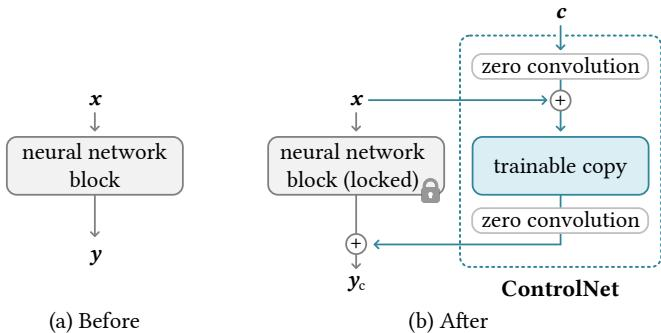
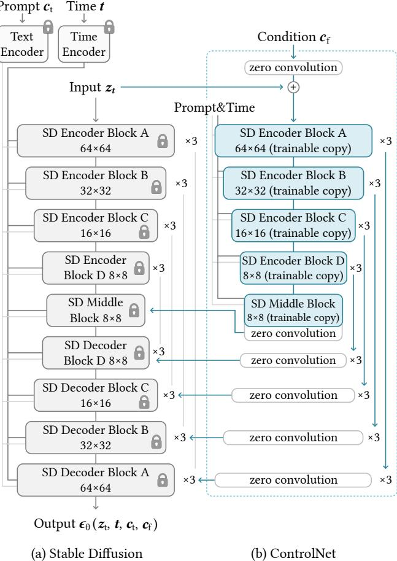
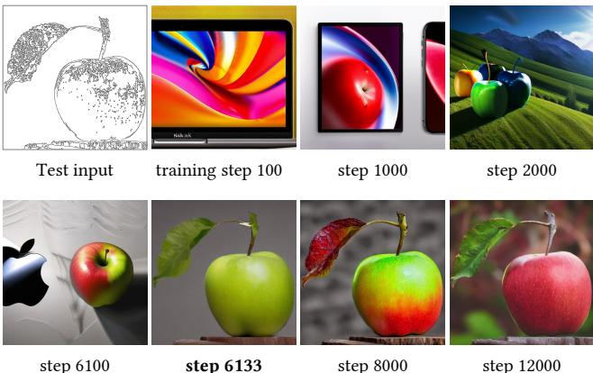
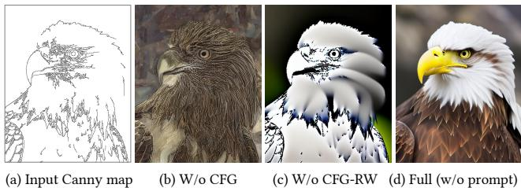
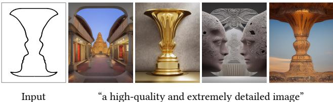
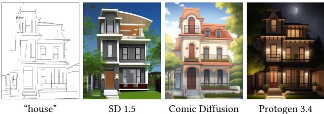

# 向文本到图像扩散模型添加条件控制

张Lvmin，饶Anyi，阿格拉瓦拉Maneesh 斯坦福大学 {lvmin, anyirao, maneesh}@cs.stanford.edu

  
ae

# 摘要

我们提出了 ControlNet，一种神经网络架构，用于向大型预训练文本到图像扩散模型添加空间条件控制。ControlNet 锁定了面向生产的大型扩散模型，并重用其通过数十亿图像预训练的深度和强健的编码层，作为学习多样条件控制的强大主干网络。该神经架构通过“零卷积”（零初始化卷积层）进行连接，逐步从零增长参数，并确保没有有害的噪声影响微调。我们在稳定扩散模型上测试了多种条件控制，例如边缘、深度、分割、人类姿态等，使用单一或多个条件，以及有无提示的情况。我们展示了 ControlNet 的训练在小型（< 5O k）和大型（> I m）数据集上都具有鲁棒性。广泛的结果表明，ControlNet 可能促进对图像扩散模型控制的更广泛应用。

# 1. 引言

许多人都经历过闪现的视觉灵感，希望将其捕捉为独特的图像。随着文本到图像扩散模型的出现，我们现在可以通过输入文本提示来创建视觉上令人惊艳的图像。然而，文本到图像模型在对图像的空间构图提供的控制上存在局限；单靠文本提示精确表达复杂的布局、姿势、形状和形式往往困难重重。生成与我们脑海中的意象准确匹配的图像通常需要多次试错循环，包括编辑提示、检查生成的图像，然后再重新编辑提示。我们是否可以通过让用户提供额外的图像来实现更精细的空间控制，以直接指定他们想要的图像构成？在计算机视觉和机器学习领域，这些额外的图像（如边缘图、人体姿态骨架、分割图、深度图、法线图等）通常被视为图像生成过程中的条件。图像到图像转换模型学习条件图像与目标图像之间的映射。研究社区也采取了一些措施，用空间掩码、图像编辑指令、通过微调实现个性化等方式来控制文本到图像模型。虽然一些问题（如生成图像变体、填充）可以通过约束去噪扩散过程或编辑注意力层激活等无训练技术来解决，但更广泛的问题，如深度到图像、姿态到图像等，则需要端到端学习和数据驱动的解决方案。以端到端的方式学习大型文本到图像扩散模型的条件控制是具有挑战性的。特定条件的训练数据量可能明显小于用于一般文本到图像训练的数据量。例如，各种具体问题（如对象形状/法线、人类姿态提取等）最大的数据集通常约为100K，约为用于训练稳定扩散的LAION-5B数据集的50,000分之一。直接微调或在有限数据上继续训练大型预训练模型可能导致过拟合和灾难性遗忘。研究人员已经表明，可以通过限制可训练参数的数量或秩来缓解这种遗忘。在我们的问题中，设计更深或更定制化的神经网络架构对于处理具有复杂形状和多样高层语义的真实条件图像可能是必要的。本文提出了ControlNet，一种端到端的神经网络架构，用于学习大型预训练文本到图像扩散模型（在我们的实现中为稳定扩散）的条件控制。ControlNet通过锁定其参数，保持了大型模型的质量和能力，同时制作了其编码层的可训练副本。该架构将大型预训练模型视为学习多样条件控制的强大主干。可训练副本与原始锁定模型通过零卷积层连接，权重初始化为零，以便在训练过程中逐渐增长。该架构确保在训练初期不会给大型扩散模型的深层特征添加有害噪声，并保护可训练副本中的大型预训练主干不受此类噪声的损害。我们的实验表明，ControlNet可以使用多种条件输入控制稳定扩散，包括Canny边缘、Hough直线、用户涂鸦、人类关键点、分割图、形状法线、深度等（见图1）。我们用单个条件图像进行测试，可以附带或不附带文本提示，展示了我们的方法如何支持多个条件的组合。此外，我们报告ControlNet在不同大小数据集上的训练是稳健且可扩展的，对于深度到图像条件等某些任务，在单个NVIDIA RTX 3090Ti GPU上训练ControlNet可以达到与在大型计算集群上训练的工业模型相媲美的结果。最后，我们进行消融研究，以调查模型各个组件的贡献，并通过用户研究将我们的模型与几个强大的条件图像生成基线进行比较。总之，（1）我们提出了ControlNet，这是一种可以通过高效微调将空间局部输入条件添加到预训练文本到图像扩散模型的神经网络架构；（2）我们提出了预训练的ControlNet，以Canny边缘、Hough直线、用户涂鸦、人类关键点、分割图、形状法线、深度和卡通线条图作为条件控制稳定扩散；（3）我们通过消融实验验证了该方法，与几个替代架构进行比较，并进行用户研究，重点关注不同任务中的多个先前基线。

# 2. 相关工作

# 2.1. 微调神经网络

微调神经网络的一种方式是直接用额外的训练数据继续训练。但这种方法可能导致过拟合、模式崩溃和灾难性遗忘。大量研究集中在开发避免这些问题的微调策略。超网络（HyperNetwork）是一种起源于自然语言处理（NLP）领域的方法，旨在训练一个小型递归神经网络以影响一个更大网络的权重。它已被应用于生成对抗网络（GAN）中的图像生成。Heathen 等人和 Kurumuz 实现了超网络用于稳定扩散（Stable Diffusion），以改变其输出图像的艺术风格。适配器方法在 NLP 中被广泛用于通过嵌入新的模块层将预训练的变换器模型定制到其他任务。在计算机视觉中，适配器用于增量学习和领域适应。这种技术常与 CLIP 一起使用，以将预训练的主干模型转移到不同的任务中。最近，适配器在视觉变换器和 ViT-Adapter 中取得了成功的结果。在与我们工作同时进行的研究中，T2IAdapter 将稳定扩散适应外部条件。增量学习通过冻结原始模型权重并使用学习到的权重掩码、剪枝或硬注意力添加少量新参数来规避遗忘。侧调（Side-Tuning）使用侧支模型通过线性融合冻结模型与添加网络的输出，并具有预定义的融合权重调度来学习额外功能。低秩适应（LoRA）通过使用低秩矩阵学习参数的偏移来防止灾难性遗忘，基于观察到许多过参数化模型位于低内在维度的子空间。控制网络（ControlNet）使用零初始化层连接网络块。关于神经网络的研究广泛讨论了网络权重的初始化和操控。例如，权重的高斯初始化比以零初始化风险更小。最近，Nichol 等人讨论了如何在扩散模型中调整卷积层的初始权重以改善训练，他们实现的“零模块”是将权重缩放至零的极端情况。Stability 的模型卡也提到在神经层中使用零权重。卷积权重的初始操控也在 ProGAN、StyleGAN 和 Noise2Noise 中讨论。

# 2.2. 图像扩散

图像扩散模型最早由SohlDickstein等人提出，并已被近期应用于图像生成。潜在扩散模型（LDM）在潜在图像空间中执行扩散步骤，从而降低计算成本。文本到图像扩散模型通过使用像CLIP这样的预训练语言模型将文本输入编码为潜在向量，达到了最先进的图像生成效果。Glide是一种支持图像生成和编辑的文本引导扩散模型。Disco Diffusion处理带有CLIP引导的文本提示。Stable Diffusion是潜在扩散的大规模实现。Imagen直接使用金字塔结构扩散像素，而不使用潜在图像。商业产品包括DALL-E2和Midjourney。

控制图像扩散模型可以实现个性化、定制化或特定任务的图像生成。图像扩散过程直接提供对颜色变化[53]和修补[67, 7]的某种控制。基于文本的控制方法专注于调整提示、操作CLIP特征以及修改交叉注意力[7, 10, 20, 27, 40, 41, 58, 64, 67]。MakeAScene [20] 将分割掩码编码为词元以控制图像生成。SpaText [6] 将分割掩码映射到定位的词嵌入。GLIGEN [48] 在扩散模型的注意力层中学习新的参数以进行基于实例的生成。文本反演[21]和DreamBooth [75]可以通过微调图像扩散模型，使用一小组用户提供的示例图像来个性化生成图像中的内容。基于提示的图像编辑[10, 33, 86]提供了操作图像的实用工具。Voynov等人[88]提出了一种优化方法，该方法使用草图拟合扩散过程。并行工作[8, 9, 32, 56]探讨了控制扩散模型的多种方式。

  

Figure 2: A neural block takes a feature map $x$ as input and outputs another feature map $y$ , as shown in (a). To add a ControlNet to such a block we lock the original block and create a trainable copy and connect them together using zero convolution layers, i.e., $1 \times 1$ convolution with both weight and bias initialized to zero. Here $c$ is a conditioning vector that we wish to add to the network, as shown in (b).

# 2.3. 图像到图像的转换

条件生成对抗网络和变换器可以学习不同图像领域之间的映射，例如，Taming Transformer是一种视觉变换器方法；Palette是从头训练的条件扩散模型；PITI是用于图像到图像翻译的基于预训练的条件扩散模型。操控预训练的GAN可以处理特定的图像到图像任务，例如，StyleGAN可以通过额外的编码器进行控制，更多应用在文献中进行了研究。

# 3. 方法

ControlNet 是一种神经网络架构，可以增强大型预训练文本到图像扩散模型，结合空间局部和任务特定的图像条件。我们首先在 3.1 节介绍 ControlNet 的基本结构，然后在 3.2 节描述如何将 ControlNet 应用于图像扩散模型 Stable Diffusion [72]。我们在 3.3 节详细阐述了我们的训练过程，并在 3.4 节中详细说明了推理过程中的几个额外考虑因素，例如组合多个 ControlNet。

# 3.1. ControlNet

ControlNet 将额外的条件注入到神经网络的各个模块中（见图 2）。在这里，我们使用“网络模块”一词来指代一组通常组合在一起以形成神经网络单一单元的神经层，例如，resnet 模块、conv-bn-relu 模块、多头注意力模块、transformer 模块等。设 $\mathcal { F } ( \cdot ; \Theta )$ 是这样一个经过训练的神经模块，其参数为 $\Theta$ ，它将输入特征图 $_ { \textbf { \em x } }$ 转换为另一个特征图 $\textbf { { y } }$，如下所示：

$$
\pmb { y } = \mathcal { F } ( \pmb { x } ; \Theta ) .
$$

在我们的设置中，${ \textbf { \em x } }$ 和 $\textbf { { y } }$ 通常是二维特征图，即 ${ \pmb x } \in \mathbb { R } ^ { h \times w \times c }$，其中 $\{ h , w , c \}$ 分别表示特征图的高度、宽度和通道数（图 2a）。为了在这样的预训练神经模块中添加 ControlNet，我们锁定（冻结）原始模块的参数 $\Theta$，并同时克隆该模块以生成一个可训练的副本，其参数为 $\Theta _ { \mathrm { c } }$（图 2b）。可训练的副本以外部条件向量 $^ c$ 作为输入。当该结构应用于像 Stable Diffusion 这样的大型模型时，锁定的参数保留了经过数十亿图像训练的生产就绪模型，而可训练的副本则重用这一大规模预训练模型，以建立一个深度、稳健且强大的主干网络，以处理多样化的输入条件。

可训练副本连接到具有零卷积层的锁定模型，记作 $\mathcal { Z } ( \cdot ; \cdot )$。具体来说，$\mathcal { Z } ( \cdot ; \cdot )$ 是一个 $1 \times 1$ 的卷积层，权重和偏置均初始化为零。为了构建 ControlNet，我们使用两个实例的零卷积层，参数分别为 $\Theta _ { \mathrm { z l } }$ 和 $\Theta _ { \mathbf { z } 2 }$。完整的 ControlNet 然后计算 $\textstyle { \mathbf { \psi } } _ { \mathbf { \psi } _ { \mathbf { \psi } } }$，这是 ControlNet 块的输出。在第一次训练步骤中，由于零卷积层的权重和偏置参数均初始化为零，因此方程 (2) 中的两个 $\mathcal { Z } ( \cdot ; \cdot )$ 项的值都为零，且

$$
\begin{array} { r } { \pmb { y } _ { \mathrm { c } } = \mathscr { F } ( \pmb { x } ; \Theta ) + \mathscr { Z } ( \mathscr { F } ( \pmb { x } + \mathscr { Z } ( \pmb { c } ; \Theta _ { \mathrm { z 1 } } ) ; \Theta _ { \mathrm { c } } ) ; \Theta _ { \mathrm { z 2 } } ) , } \end{array}
$$

$$
\mathbf { \psi } _ { y _ { \mathrm { c } } } = \mathbf { \psi } _ { y } .
$$

以这种方式，有害噪声无法影响可训练副本中神经网络层的隐藏状态，当训练开始时。此外，由于 $\mathcal{Z}(c; \Theta_{\mathrm{z1}}) = \mathbf{0}$，可训练副本也接收输入图像 $_{\textbf{\em x}}$，因此可训练副本功能齐全，并保留了大型预训练模型的能力，从而能够作为进一步学习的强大主干。零卷积通过消除随机噪声作为初始训练步骤中的梯度来保护这一主干。我们在补充材料中详细介绍了零卷积的梯度计算。

# 3.2. ControlNet用于文本到图像的扩散

我们以稳定扩散（Stable Diffusion）为例，展示 ControlNet 如何为大型 pretrained 扩散模型添加条件控制。稳定扩散本质上是一个带有编码器、中间模块和跳跃连接解码器的 U-Net。编码器和解码器各包含 12 个模块，整个模型共包含 25 个模块，其中包括中间模块。在这 25 个模块中，8 个模块为下采样或上采样卷积层，其余 17 个模块为主要模块，每个模块包含 4 个 ResNet 层和 2 个视觉变换器（Vision Transformers，ViTs）。每个 ViT 包含若干交叉注意力和自注意力机制。例如，在图 3a 中，“SD 编码器模块 A”包含 4 个 ResNet 层和 2 个 ViTs，而 $\cdot _ { \times 3 }$ 表示该模块重复三次。文本提示被编码为

  

Figure 3: Stable Diffusion's U-net architecture connected with a ControlNet on the encoder blocks and middle block. The locked, gray blocks show the structure of Stable Diffusion V1.5 (or V2.1, as they use the same U-net architecture). The trainable blue blocks and the white zero convolution layers are added to build a ControlNet.

CLIP文本编码器 [66]，扩散时间步通过使用位置编码的时间编码器进行编码。ControlNet结构应用于U-net的每个编码器级别（图3b）。特别地，我们使用ControlNet创建一个可训练的Stable Diffusion的12个编码块和1个中间块的副本。这12个编码块在4个分辨率下 $( 64 \times 64, 32 \times 32, 16 \times 16, 8 \times 8 )$ ，每个编码块复制3次。输出被添加到U-net的12个跳跃连接和1个中间块中。由于Stable Diffusion是典型的U-net结构，因此该ControlNet架构可能适用于其他模型。我们连接ControlNet的方式在计算上是高效的——由于锁定的副本参数被冻结，因此在原本锁定的编码器中不需要进行梯度计算以进行微调。这种方法加速了训练并节省了GPU内存。在一台单独的NVIDIA A100 PCIE 40GB上测试，使用ControlNet优化Stable Diffusion相比于不使用ControlNet优化Stable Diffusion，每次训练迭代仅需增加约$23 \%$的GPU内存和$34 \%$的时间。

图像扩散模型学习逐步去噪图像并生成来自训练领域的样本。去噪过程可以在像素空间或从训练数据编码的潜在空间中进行。稳定扩散使用潜在图像作为训练领域，因为在此空间中工作已经证明可以稳定训练过程。具体而言，稳定扩散使用类似于 VQ-GAN 的预处理方法，将 $512 \times 512$ 像素空间图像转换为更小的 $64 \times 64$ 潜在图像。为了将 ControlNet 添加到稳定扩散中，我们首先将每个输入条件图像（例如边缘、姿势、深度等）从输入大小 $512 \times 512$ 转换为与稳定扩散大小匹配的 $64 \times 64$ 特征空间向量。特别地，我们使用一个含有四个卷积层、$4 \times 4$ 卷积核和 $2 \times 2$ 步幅的小型网络 $\mathcal{E}(\cdot)$（激活函数为 ReLU，分别使用 16、32、64、128 个通道，初始化为高斯权重，并与完整模型联合训练）将图像空间条件 $c_{\mathrm{i}}$ 编码为特征空间条件向量 $c_{\mathrm{f}}$，如下所示：

$$
\begin{array} { r } { c _ { \mathrm { f } } = \mathcal { E } ( c _ { \mathrm { i } } ) . } \end{array}
$$

条件向量 $c _ { \mathrm { f } }$ 被传入 ControlNet。

# 3.3. 训练

给定输入图像 $z _ { \mathrm { 0 } }$，图像扩散算法逐步向图像添加噪声并生成带噪声的图像 ${ \boldsymbol { z } } _ { t }$，其中 $t$ 表示添加噪声的次数。给定一组条件，包括时间步 $\pmb { t }$、文本提示 $c _ { t }$ 以及任务特定条件 $c _ { \mathrm { f } }$，图像扩散算法学习网络 $\epsilon _ { \theta }$ 来预测添加到带噪声图像 ${ \boldsymbol { z } } _ { t }$ 的噪声，其中 $\mathcal { L }$ 是整个扩散模型的总体学习目标。该学习目标直接用于与 ControlNet 进行微调的扩散模型。

$$
\mathcal { L } = \mathbb { E } _ { z _ { 0 } , t , c _ { t } , c _ { \mathrm { f } } , \epsilon \sim \mathcal { N } ( 0 , 1 ) } \Big [ \| \epsilon - \epsilon _ { \theta } \big ( z _ { t } , t , c _ { t } , c _ { \mathrm { f } } \big ) \big ) \| _ { 2 } ^ { 2 } \Big ] ,
$$

在训练过程中，我们随机将 $50\%$ 的文本提示 $c_{t}$ 替换为空字符串。这种方法增强了 ControlNet 直接识别输入条件图像中的语义（例如，边缘、姿态、深度等）的能力，以替代提示。在训练过程中，由于零卷积不会给网络增加噪声，模型应该始终能够预测出高质量的图像。我们观察到，模型并不逐渐学习控制条件，而是在遵循输入条件图像时突然成功；通常在不到 10K 的优化步骤内。如图 4 所示，我们将其称为“突现收敛现象”。

# 3.4. 推断

我们可以通过多种方式进一步控制 ControlNet 的额外条件如何影响去噪扩散过程。

  

Figure 4: The sudden convergence phenomenon. Due to the zero convolutions, ControlNet always predicts high-quality images during the entire training. At a certain step in the training process (e.g., the 6133 steps marked in bold), the model suddenly learns to follow the input condition.

  

Figure 5: Effect of Classifier-Free Guidance (CFG) and the proposed CFG Resolution Weighting (CFG-RW).

  

Figure 6: Composition of multiple conditions. We present the application to use depth and pose simultaneously.

无分类器引导分辨率加权。稳定扩散依赖于一种称为无分类器引导（CFG）的技术来生成高质量图像。CFG 的公式为 $\epsilon _ { \mathrm { p r d } } = \epsilon _ { \mathrm { u c } } + \beta _ { \mathrm { c f g } } ( \epsilon _ { \mathrm { c } } - \epsilon _ { \mathrm { u c } } )$，其中 $\epsilon _ { \mathrm { p r d } }$，$\epsilon _ { \mathrm { u c } }$， $\epsilon _ { \mathrm { c } }$，$\beta _ { \mathrm { c f g } }$ 分别表示模型的最终输出、无条件输出、有条件输出和用户指定的权重。当通过 ControlNet 添加条件图像时，可以同时添加到 $\epsilon _ { \mathrm { u c } }$ 和 $\epsilon _ { \mathrm { c } }$，或仅添加到 $\epsilon _ { \mathrm { c } }$。在困难的情况下，例如没有给定提示时，将其同时添加到 $\epsilon _ { \mathrm { u c } }$ 和 $\epsilon _ { \mathrm { c } }$ 会完全去除 CFG 引导（图 5b）；仅使用 $\epsilon _ { \mathrm { c } }$ 会使引导非常强（图 5c）。我们的解决方案是首先将条件图像添加到 $\epsilon _ { \mathrm { c } }$，然后根据每个块的分辨率对稳定扩散和 ControlNet 之间的每个连接乘以权重 $w _ { i }$，其中 $w _ { i } = 6 4 / h _ { i }$，$h _ { i }$ 是第 $i ^ { \mathrm { { t h } } }$ 块的大小，例如 $h _ { 1 } = 8, h _ { 2 } = 1 6, \ldots, h _ { 1 3 } = 6 4$。通过降低 CFG 引导强度，我们可以获得图 5d 所示的结果，我们称之为 CFG 分辨率加权。

  
has to recognize semantic contents in the input condition images to generate images.

<table><tr><td>Method</td><td>Result Quality ↑</td><td>Condition Fidelity ↑</td></tr><tr><td>PITI [89](sketch)</td><td>1.10 ± 0.05</td><td>1.02 ± 0.01</td></tr><tr><td>Sketch-Guided [88] (β = 1.6)</td><td>3.21 ± 0.62</td><td>2.31 ± 0.57</td></tr><tr><td>Sketch-Guided [88] (β = 3.2)</td><td>2.52 ± 0.44</td><td>3.28 ± 0.72</td></tr><tr><td>ControlNet-lite</td><td>3.93 ± 0.59</td><td>4.09 ± 0.46</td></tr><tr><td>ControlNet</td><td>4.22 ± 0.43</td><td>4.28 ± 0.45</td></tr></table>

Table 1: Average User Ranking (AUR) of result quality and condition fidelity. We report the user preference ranking (1 to 5 indicates worst to best) of different methods.

组合多个 ControlNet。为了将多个条件图像（例如，Canny 边缘和姿态）应用于单个 Stable Diffusion 实例，我们可以直接将相应 ControlNet 的输出添加到 Stable Diffusion 模型中（图 6）。此类组合不需要额外的加权或线性插值。

# 4. 实验

我们使用稳定扩散实现了 ControlNets，以测试各种条件，包括 Canny 边缘 [11]、深度图 [69]、法线图 [87]、M-LSD 线 [24]、HED 柔边 [91]、ADE20K 分割 [96]、Openpose [12] 和用户草图。有关每种条件的示例以及详细的训练和推理参数，请参见补充材料。

# 4.1. 定性结果

图1展示了在多种提示设置下生成的图像。图7展示了在没有提示的情况下我们在各种条件下的结果，其中ControlNet能够在多样的输入条件图像中稳健地理解内容语义。

# 4.2. 消融研究

我们研究了 ControlNets 的替代结构，包括 (1) 用初始化为高斯权重的标准卷积层替换零卷积，和 (2) 用单个卷积层替换每个块的可训练副本，我们称之为 ControlNet-lite。有关这些消融结构的完整细节，请参见补充材料。我们提出了 4 种提示设置，以测试真实世界用户的可能行为： (1) 无提示； (2) 不足的提示，未能完全覆盖条件图像中的对象，例如本文的默认提示“高质量、详细且专业的图像”； (3) 相互矛盾的提示，改变条件图像的语义； (4) 完美提示，描述必要的内容语义，例如“一个漂亮的房子”。图 8a 显示 ControlNet 在所有 4 种设置中均表现成功。轻量级的 ControlNet-lite（图 8c）不足以解读条件图像，在不足提示和无提示条件下失败。当零卷积被替换时，ControlNet 的性能下降到与 ControlNet-lite 大致相同的水平，这表明在微调过程中可训练副本的预训练主干网络被破坏（图 8b）。

  
show a random batch of 6 samples without cherry-picking. Images are at $5 1 2 \times 5 1 2$ and best viewed when zoomed in. The green "conv" blocks on the left are standard convolution layers initialized with Gaussian weights.

Table 2: Evaluation of semantic segmentation label reconstruction (ADE20K) with Intersection over Union (IoU ↑).   

<table><tr><td>ADE20K (GT)</td><td>VQGAN [19]</td><td>LDM [72]</td><td>PITI [89]</td><td>ControlNet-lite</td><td>ControlNet</td></tr><tr><td>0.58 ± 0.10</td><td>0.21 ± 0.15</td><td>0.31 ± 0.09</td><td>0.26 ± 0.16</td><td>0.32 ± 0.12</td><td>0.35 ± 0.14</td></tr></table>

# 4.3. 定量评估

用户研究。我们选择了20个未见过的手绘草图，然后将每个草图分配给5种方法：PITI [89] 的草图模型，使用默认边缘引导比例（$\beta = 1.6$）的草图引导扩散（SGD）[88]，使用相对较高边缘引导比例（$\beta = 3.2$）的SGD [88]，上述 ControlNet-lite，以及 ControlNet。我们邀请了12名用户分别对这20组5个结果进行“显示图像质量”和“对草图的保真度”进行排名。通过这种方式，我们获得了100个结果质量的排名和100个条件保真度的排名。我们使用平均人类排名（AHR）作为偏好度量，用户对每个结果进行1到5的评分（评分越低表示越差）。平均排名见表1。与工业模型的比较。Stable Diffusion V2 Depth-to-Image (SDv2-D2I) [83] 在大型 NVIDIA A100 集群、数千小时的 GPU 时间和超过1200万训练图像的基础上进行了训练。我们为 SD V2 训练了一个 ControlNet，采用相同的深度条件，却仅使用200k训练样本、一个单一的 NVIDIA RTX 3090Ti 和5天的训练时间。我们使用每个 SDv2-D2I 和 ControlNet 生成的100幅图像来教12名用户区分这两种方法。此后，我们生成了200幅图像，并请用户判断每幅图像是由哪个模型生成的。用户的平均精度为 $0.52 \pm 0.17$，表明这两种方法产生的结果几乎不可区分。

Table 3: Evaluation for image generation conditioned by semantic segmentation. We report FID, CLIP text-image score, and CLIP aesthetic scores for our method and other baselines. We also report the performance of Stable Diffusion without segmentation conditions. Methods marked with are trained from scratch.   

<table><tr><td>Method</td><td>FID ↓</td><td>CLIP-score ↑</td><td>CLIP-aes. ↑</td></tr><tr><td>Stable Diffusion</td><td>6.09</td><td>0.26</td><td>6.32</td></tr><tr><td>VQGAN [19](seg.)*</td><td>26.28</td><td>0.17</td><td>5.14</td></tr><tr><td>LDM [72](seg.)*</td><td>25.35</td><td>0.18</td><td>5.15</td></tr><tr><td>PITI [89](seg.)</td><td>19.74</td><td>0.20</td><td>5.77</td></tr><tr><td>ControlNet-lite</td><td>17.92</td><td>0.26</td><td>6.30</td></tr><tr><td>ControlNet</td><td>15.27</td><td>0.26</td><td>6.31</td></tr></table>

条件重建和FID分数。我们使用ADE20K的测试集来评估条件可信度。最先进的分割方法OneFormer在真实标注数据集上取得了0.58的交并比（IoU）。我们使用不同的方法生成具有ADE20K分割的图像，然后应用One。

  

Figure 9: Comparison to previous methods.We present the qualitative comparisons to PITI [89], Sketch-Guided Diffusion [88], and Taming Transformers [19].

首先再次检测分割以计算重建的交并比（IoUs）（表 2）。此外，我们使用弗雷歇距离（FID）[28] 来测量不同分割条件方法下随机生成的 $512 \times 512$ 图像集的分布距离，以及文本-图像 CLIP 分数 [66] 和 CLIP 美学分数 [79]，详见表 3。有关详细设置，请参见补充材料。

# 4.4. 与之前方法的比较

图 9 展示了基线方法与我们的方案（Stable Diffusion $^ +$ ControlNet）之间的视觉比较。具体而言，我们展示了 PITI [89]、Sketch-Guided Diffusion [88] 和 Taming Transformers [19] 的结果。（请注意，PITI 的主干网络是 OpenAI GLIDE [57]，其视觉质量和性能存在差异。）我们观察到，ControlNet 能够稳健地处理多样的条件图像，并且能够实现清晰且锐利的结果。

# 4.5. 讨论

训练数据集规模的影响。我们在图10中展示了ControlNet训练的稳健性。训练在仅有1000张图像的情况下并没有崩溃，模型能够生成可识别的狮子。当提供更多数据时，学习是可扩展的。

  

Figure 10: The influence of different training dataset sizes. See also the supplementary material for extended examples.   

Figure 11: Interpreting contents. If the input is ambiguous and the user does not mention object contents in prompts, the results look like the model tries to interpret input shapes.

  

Figure 12: Transfer pretrained ControlNets to community models [16, 61] without training the neural networks again.

内容解读的能力。我们在图11中展示了ControlNet捕捉输入条件图像语义的能力。迁移到社区模型。由于ControlNet不会改变预训练稳定扩散（SD）模型的网络拓扑，因此可以直接应用于稳定扩散社区中的各种模型，例如Comic Diffusion [61]和Protogen 3.4 [16]，如图12所示。

# 5. 结论

ControlNet 是一种神经网络结构，旨在为大型预训练的文本到图像扩散模型学习条件控制。它重用源模型的大规模预训练层，以构建一个深度且强大的编码器，以学习特定条件。原始模型和可训练副本通过“零卷积”层相连，这些层在训练过程中消除有害噪声。大量实验验证了 ControlNet 能够有效控制 Stable Diffusion，无论是单一条件还是多个条件，且有无提示均可。对不同条件数据集的结果表明，ControlNet 结构可能适用于更广泛的条件，并促进相关应用的实现。

# 感谢致辞

本研究部分得到了斯坦福人本人工智能研究所和布朗媒体创新所的支持。

# References

[1] Sadia Afrin. Weight initialization in neural network, inspired by andrew ng, https://medium.com/@safrin1128/weightneaeok-spby-nde0066dc4a566, 2020. 3   
[2] Armen Aghajanyan, Sonal Gupta, and Luke Zettlemoyer. Inal i model fine-tuning. In Proceedings of the 59th Annual Meeting of the Association for Computational Linguistics and the 11th International Joint Conference on Natural Language Processing, pages 73197328, Online, Aug. 2021. Association for Computational Linguistics. 3   
[3] Yuval Alaluf, Or Patashnik, and Daniel Cohen-Or. Only a matter of style: Age transformation using a style-based regression model. ACM Transactions on Graphics (TOG), 40(4), 2021. 3   
[4] Yuval Alaluf, Omer Tov, Ron Mokady, Rinon Gal, and Amit Bermano. Hyperstyle: Stylegan inversion with hypernetworks for real image editing. In Proceedings of the IEEE/CVF Conference on Computer Vision and Pattern Recognition, pages 1851118521, 2022. 2   
[5] Alembics. Disco diffusion, https://github.com/alembics/discodiffusion, 2022. 3   
[6] Omri Avrahami, Thomas Hayes, Oran Gafni, Sonal Gupta, Yaniv Taigman, Devi Parikh, Dani Lischinski, Ohad Fried, and Xi Yin. Spatext: Spatio-textual representation for controllable image generation. arXiv preprint arXiv:2211.14305, 2022. 2, 3   
[7] Omri Avrahami, Dani Lischinski, and Ohad Fried. Blended diffusion for text-driven editing of natural images. In Proceedings of the IEEE/CVF Conference on Computer Vision and Pattern Recognition, pages 1820818218, 2022. 3   
[8] Omer Bar-Tal, Lior Yariv, Yaron Lipman, and Tali Dekel. Muliffu generation. arXiv preprint arXiv:2302.08113, 2023. 3   
[9] Dina Bashkirova, Jose Lezama, Kihyuk Sohn, Kate Saenko, and Irfan Essa. Masksketch: Unpaired structure-guided masked image generation. arXiv preprint arXiv:2302.05496, 2023.3   
10] Tim Brooks, Aleksander Holynski, and Alexei A Efros. Instructpix2pix: Learning to follow image editing instructions. arXiv preprint arXiv:2211.09800, 2022. 2, 3   
11] John Canny. A computational approach to edge detection. IEEE Transactions on Pattern Analysis and Machine Intelligence, (6):679698, 1986. 6   
12] Z. Cao, G. Hidalgo Martinez, T. Simon, S. Wei, and Y. A. Sheikh. Openpose: Realtime multi-person 2d pose estimation using part affinity fields. IEEE Transactions on Pattern Analysis and Machine Intelligence, 2019. 6   
[13] Hanting Chen, Yunhe Wang, Tianyu Guo, Chang Xu, Yiping Deng, Zhenhua Liu, Siwei Ma, Chunjing Xu, Chao Xu, and Wen Gao. Pre-trained image processing transformer. In Proceedings of the IEEE/CVF Conference on Computer Vision and Pattern Recognition, pages 1229912310, 2021. 3   
[14] Zhe Chen, Yuchen Duan, Wenhai Wang, Junjun He, Tong Lu, Jifeng Dai, and Yu Qiao. Vision transformer adapter for dense predictions. International Conference on Learning Representations, 2023. 2   
[15] Yunjey Choi, Minje Choi, Munyoung Kim, Jung-Woo Ha, Sunghun Kim, and Jaegul Choo. Stargan: Unified generative adversarial networks for multi-domain image-to-image translation. In Proceedings of the IEEE/CVF Conference on Computer Vision and Pattern Recognition, pages 87898797, 2018.3   
[16] darkstorm2150. Protogen x3.4 (photorealism) official release, https://civitai.com/models/3666/protogen-x34- photorealism-official-release, 2022. 8   
[17] Prafulla Dhariwal and Alexander Nichol. Diffusion models beat gans on image synthesis. Advances in Neural Information Processing Systems, 34:87808794, 2021. 3   
[18] Tan M. Dinh, Anh Tuan Tran, Rang Nguyen, and Binh-Son Hua. Hyperinverter: Improving stylegan inversion via hypernetwork. In Proceedings of the IEEE/CVF Conference on Computer Vision and Pattern Recognition, pages 11389 11398, 2022. 2   
[19] Patrick Esser, Robin Rombach, and Bjorn Ommer. Taming transformers for high-resolution image synthesis. In Proceedings of the IEEE/CVF Conference on Computer Vision and Pattern Recognition, pages 1287312883, 2021. 3, 5, 7, 8   
[20] Oran Gafni, Adam Polyak, Oron Ashual, Shelly Sheynin, Devi Parikh, and Yaniv Taigman. Make-a-scene: Scenebased text-to-image generation with human priors. In European Conference on Computer Vision (ECCV), pages 89106. Springer, 2022. 2, 3   
[21] Rinon Gal, Yuval Alaluf, Yuval Atzmon, Or Patashnik, Amit H Bermano, Gal Chechik, and Daniel Cohen-Or. An image is worth one word: Personalizing text-to-image generation using textual inversion. arXiv preprint arXiv:2208.01618, 2022. 2, 3   
[22] Rinon Gal, Or Patashnik, Haggai Maron, Amit H Bermano, Gal Chechik, and Daniel Cohen-Or. Stylegan-nada: Clipguided domain adaptation of image generators. ACM Transactions on Graphics (T0G), 41(4):113, 2022. 3   
[23] Peng Gao, Shijie Geng, Renrui Zhang, Teli Ma, Rongyao Fang, Yongfeng Zhang, Hongsheng Li, and Yu Qiao. Clipadapter: Better vision-language models with feature adapters. arXiv preprint arXiv:2110.04544, 2021. 2   
[24] Geonmo Gu, Byungsoo Ko, SeoungHyun Go, Sung-Hyun Lee, Jingeun Lee, and Minchul Shin. Towards light-weight and real-time line segment detection. In Proceedings of the AAAI Conference on Artificial Intelligence, 2022. 6   
[25] David Ha, Andrew M. Dai, and Quoc V. Le. Hypernetworks. In International Conference on Learning Representations, 2017.2   
[26] Heathen. Hypernetwork style training, a tiny guide, stablediffusion-webui, https://github.com/automatic1111/stablediffusion-webui/discussions/2670, 2022. 2   
[27] Amir Hertz, Ron Mokady, Jay Tenenbaum, Kfir Aberman, Yael Pritch, and Daniel Cohen-Or. Prompt-to-prompt image editing with cross attention control. arXiv preprint arXiv:2208.01626, 2022. 3   
[28] Martin Heusel, Hubert Ramsauer, Thomas Unterthiner, Bernhard Nessler, and Sepp Hochreiter. Gans trained by a two time-scale update rule converge to a local nash equilibrium. In I. Guyon, U. Von Luxburg, S. Bengio, H. Wallach, R. Fergus, S. Vishwanathan, and R. Garnett, editors, Advances in Neural Information Processing Systems, volume 30. Curran Associates, Inc., 2017. 8   
[29] Jonathan Ho and Tim Salimans. Classifier-free diffusion guidance, 2022. 5   
[30] Neil Houlsby, Andrei Giurgiu, Stanislaw Jastrzebski, Bruna Morrone, Quentin De Laroussilhe, Andrea Gesmundo, Mona Attariyan, and Sylvain Gelly. Parameter-efficient transfer learning for nlp. In International Conference on Machine Learning, pages 27902799, 2019. 2   
[31] Edward J Hu, Yelong Shen, Phillip Wallis, Zeyuan Allen-Zhu, Yuanzhi Li, Shean Wang, Lu Wang, and Weizhu Chen. Lora: Low-rank adaptation of large language models. arXiv preprint arXiv:2106.09685, 2021. 2   
[32] Lianghua Huang, Di Chen, Yu Liu, Shen Yujun, Deli Zhao, and Zhou Jingren. Composer: Creative and controllable image synthesis with composable conditions. 2023. 3   
[33] Nisha Huang, Fan Tang, Weiming Dong, Tong-Yee Lee, and Changsheng Xu. Region-aware diffusion for zero-shot textdriven image editing. arXiv preprint arXiv:2302.11797, 2023. 3   
[34] Phillip Isola, Jun-Yan Zhu, Tinghui Zhou, and Alexei A Efros. Image-to-image translation with conditional adversarial networks. In Proceedings of the IEEE Conference on Computer Vision and Pattern Recognition, pages 11251134, 2017. 1, 3   
[35] Jitesh Jain, Jiachen Li, MangTik Chiu, Ali Hassani, Nikita Orlov, and Humphrey Shi. OneFormer: One Transformer to Rule Universal Image Segmentation. 2023. 7   
[36] Tero Karras, Timo Aila, Samuli Laine, and Jaakko Lehtinen. Progressive growing of gans for improved quality, stability, and variation. International Conference on Learning Representations, 2018. 3   
[37] Tero Karras, Samuli Laine, and Timo Aila. A style-based generator architecture for generative adversarial networks. In Proceedings of the IEEE/CVF Conference on Computer Vision and Pattern Recognition, pages 44014410, 2019. 3   
[38] Tero Karras, Samuli Laine, and Timo Aila. A style-based generator architecture for generative adversarial networks. IEEE Transactions on Pattern Analysis, 2021. 3   
[39] Oren Katzir, Vicky Perepelook, Dani Lischinski, and Daniel Cohen-Or. Multi-level latent space structuring for generative control. arXiv preprint arXiv:2202.05910, 2022. 3   
[40] Bahjat Kawar, Shiran Zada, Oran Lang, Omer Tov, Huiwen Chang, Tali Dekel, Inbar Mosseri, and Michal Irani. Imagic: Text-based real image editing with diffusion models. arXiv nrenrint arXiv:2210 09276, 2022 3   
[41] Gwanghyun Kim, Taesung Kwon, and Jong Chul Ye. Diffusionclip: Text-guided diffusion models for robust image manipulation. In Proceedings of the IEEE/CVF Conference on Computer Vision and Pattern Recognition, pages 2426 2435, 2022. 3   
[42] Diederik Kingma, Tim Salimans, Ben Poole, and Jonathan Ho. Variational diffusion models. Advances in Neural Information Processing Systems, 34:2169621707, 2021. 3   
[43] Kurumuz. Novelai improvements on stable diffusion, https://blog.novelai.net/novelai-improvements-on-stablediffusion-e10d38db82ac, 2022. 2   
[] Yan Ln, Ys Beio, nd Gofy Hin. Deep learning. Nature, 521(7553):436444, May 2015. 3   
[45] Y. Lecun, L. Bottou, Y. Bengio, and P. Haffner. Gradientbased learning applied to document recognition. Proceedings of the IEEE, 86(11):22782324, 1998. 3   
[46] Jaakko Lehtinen, Jacob Munkberg, Jon Hasselgren, Samuli Laine, Tero Karras, Miika Aittala, and Timo Aila. Noise2noise: Learning image restoration without clean data. Proceedings of the 35th International Conference on Machine Learning, 2018. 3   
[47] Chunyuan Li, Heerad Farkhoor, Rosanne Liu, and Jason Yosinski. Measuring the intrinsic dimension of objective landscapes. International Conference on Learning Representations, 2018. 3   
[48] Yuheng Li, Haotian Liu, Qingyang Wu, Fangzhou Mu, Jianwei Yang, Jianfeng Gao, Chunyuan Li, and Yong Jae Lee. Gligen: Open-set grounded text-to-image generation. 2023. 3   
[49] Yanghao Li, Hanzi Mao, Ross Girshick, and Kaiming He. Exploring plain vision transformer backbones for object detection. arXiv preprint arXiv:2203.16527, 2022. 2   
[50] Yanghao Li, Saining Xie, Xinlei Chen, Piotr Dollar, Kaiming He, and Ross Girshick. Benchmarking detection transfer learning with vision transformers. arXiv preprint arXiv:2111.11429, 2021. 2   
[51] Arun Mallya, Dillon Davis, and Svetlana Lazebnik. PiggyacAapti g etrkulte asks by to mask weights. In European Conference on Computer Vision (ECCV), pages 6782, 2018. 2   
[52] Arun Mallya and Svetlana Lazebnik. Packnet: Adding multiple tasks to a single network by iterative pruning. In Proceedings of the IEEE/CVF Conference on Computer Vision and Pattern Recognition, pages 77657773, 2018. 2   
[53] Chenlin Meng, Yutong He, Yang Song, Jiaming Song, Jiajun Wu, Jun-Yan Zhu, and Stefano Ermon. Sdedit: Guided image synthesis and editing with stochastic differential equations. In International Conference on Learning Representations, 2021. 3   
[54] Midjourney. https://www.midjourney.com/, 2023. 1, 3   
[55] Ron Mokady, Omer Tov, Michal Yarom, Oran Lang, Inbar Mosseri, Tali Dekel, Daniel Cohen-Or, and Michal Irani. Selfdistilled stylegan: Towards generation from internet photos. In ACM SIGGRAPH 2022 Conference Proceedings, pages 19, 2022. 3   
[56] Chong Mou, Xintao Wang, Liangbin Xie, Jian Zhang, Zhongang Qi, Ying Shan, and Xiaohu Qie. T2i-adapter: Learning apt lbiex diffusion models. arXiv preprint arXiv:2302.08453, 2023. 2, 3   
[57] Alex Nichol, Prafulla Dhariwal, Aditya Ramesh, Pranav Shyam, Pamela Mishkin, Bob McGrew, Ilya Sutskever, and Mark Chen. GLIDE: towards photorealistic image generation and editing with text-guided diffusion models. CoRR, 2021. 8   
[58] Alex Nichol, Prafulla Dhariwal, Aditya Ramesh, Pranav Shyam, Pamela Mishkin, Bob McGrew, Ilya Sutskever, and Mark Chen. Glide: Towards photorealistic image generation and editing with text-guided diffusion models. 2022. 3   
[59] Alexander Quinn Nichol and Prafulla Dhariwal. Improved denoising diffusion probabilistic models. In International Conference on Machine Learning, pages 81628171. PMLR, 2021. 3   
[60] Yotam Nitzan, Kfir Aberman, Qiurui He, Orly Liba, Michal Yarom, Yossi Gandelsman, Inbar Mosseri, Yael Pritch, and Daniel Cohen-Or. Mystyle: A personalized generative prior. arXiv preprint arXiv:2203.17272, 2022. 3   
[61] ogkalu. Comic-diffusion v2, trained on 6 styles at once, https://huggingface.co/ogkalu/comic-diffusion, 2022. 8   
[62] OpenAI. Dall-e-2, https://openai.com/product/dall-e-2, 2023. 1, 3   
[63] Taesung Park, Ming-Yu Liu, Ting-Chun Wang, and Jun-Yan Zhu. Semantic image synthesis with spatially-adaptive normalization. In Proceedings of the IEEE/CVF Conference on Computer Vision and Pattern Recognition, pages 23372346, 2019. 3   
[64] Gaurav Parmar, Krishna Kumar Singh, Richard Zhang, Yijun L J u dnn ZhuZeo translation. arXiv preprint arXiv:2302.03027, 2023. 3   
[65] Or Patashnik, Zongze Wu, Eli Shechtman, Daniel Cohen-Or, and Dani Lischinski. Styleclip: Text-driven manipulation of stylegan imagery. In Proceedings of the IEEE/CVF International Conference on Computer Vision (ICCV), pages 20852094, October 2021. 3   
[66] Alec Radford, Jong Wook Kim, Chris Hallacy, Aditya Ramesh, Gabriel Goh, Sandhini Agarwal, Girish Sastry, Amanda Askell, Pamela Mishkin, Jack Clark, et al. Learning transferable visual models from natural language supervision. In International Conference on Machine Learning, pages 87488763. PMLR, 2021. 2, 3, 4, 8   
[67] Aditya Ramesh, Prafulla Dhariwal, Alex Nichol, Casey Chu, and Mark Chen. Hierarchical text-conditional image generation with clip latents. arXiv preprint arXiv:2204.06125, 2022. 3   
[68] Aditya Ramesh, Mikhail Pavlov, Gabriel Goh, Scott Gry, Chelsea Voss, Alec Radford, Mark Chen, and Ilya Sutskever. Zero-shot text-to-image generation. In International Conference on Machine Learning, pages 88218831. PMLR, 2021. 3   
[69] René Ranftl, Katrin Lasinger, David Hafner, Konrad Schindler, and Vladlen Koltun. Towards robust monocular depth estimation: Mixing datasets for zero-shot cross-dataset transfer. IEEE Transactions on Pattern Analysis and Machine Intelligence, 44(3):16231637, 2020. 6   
[70] Sylvestre-Alvise Rebuffi, Hakan Bilen, and Andrea Vedaldi. Efficient parametrization of multi-domain deep neural networks. In Proceedings of the IEEE/CVF Conference on Computer Vision and Pattern Recognition, pages 81198127, 2018. 2   
[71] Elad Richardson, Yuval Alaluf, Or Patashnik, Yotam Nitzan, Yaniv Azar, Stav Shapiro, and Daniel Cohen-Or. Encoding in style: a stylegan encoder for image-to-image translation. In Proceedings of the IEEE/CVF Conference on Computer Vision and Pattern Recognition, 2021. 3   
[72] Robin Rombach, Andreas Blattmann, Dominik Lorenz, Patrick Esser, and Björn Ommer. High-resolution image synthesis with latent diffusion models. In Proceedings of the IEEE/CVF Conference on Computer Vision and Pattern Recognition, pages 1068410695, 2022. 1, 2, 3, 4, 5, 7   
[73] Olaf Ronneberger, Philipp Fischer, and Thomas Brox. U-net: Convolutional networks for biomedical image segmentation. In Medical Image Computing and Computer-Assisted Intervention MICCAI International Conference, pages 234241, 2015.4   
[74] Amir Rosenfeld and John K Tsotsos. Incremental learning through deep adaptation. IEEE Transactions on Pattern Analysis and Machine Intelligence, 42(3):651663, 2018. 2   
[75] Nataniel Ruiz, Yuanzhen Li, Varun Jampani, Yael Pritch, Michael Rubinstein, and Kfir Aberman. Dreambooth: Fine tuning text-to-image diffusion models for subject-driven generation. arXiv preprint arXiv:2208.12242, 2022. 2, 3   
[76] David E. Rumelhart, Geoffrey E. Hinton, and Ronald J. Williams. Learning representations by back-propagating errors. Nature, 323(6088):533536, Oct. 1986. 3   
[77] Chitwan Saharia, William Chan, Huiwen Chang, Chris Lee, Jonathan Ho, Tim Salimans, David Fleet, and Mohammad Norouzi. Palette: Image-to-image diffusion models. In ACM SIGGRAPH 2022 Conference Proceedings, SIGGRAPH '22, New York, NY, USA, 2022. Association for Computing Machinery. 3   
[78] Chitwan Saharia, William Chan, Saurabh Saxena, Lala Li, Jay Whang, Emily Denton, Seyed Kamyar Seyed Ghasemipour, Burcu Karagol Ayan, S Sara Mahdavi, Rapha Gontijo Lopes, et al. Photorealistic text-to-image diffusion models with deep language understanding. arXiv preprint arXiv:2205.11487, 2022. 3   
[79] Christoph Schuhmann, Romain Beaumont, Richard Vencu, Cade W Gordon, Ross Wightman, Mehdi Cherti, Theo Coombes, Aarush Katta, Clayton Mullis, Mitchell Wortsman, Patrick Schramowski, Srivatsa R Kundurthy, Katherine Crowson, Ludwig Schmidt, Robert Kaczmarczyk, and Jenia Jitsev. LAION-5b: An open large-scale dataset for training next generation image-text models. In Thirty-sixth Conference on Neural Information Processing Systems Datasets and Benchmarks Track, 2022. 2, 8   
[80] Joan Serra, Didac Suris, Marius Miron, and Alexandros Karatzoglou. Overcoming catastrophic forgetting with hard attention to the task. In International Conference on Machine Learning, pages 45484557. PMLR, 2018. 2   
[81] Jascha Sohl-Dickstein, Eric Weiss, Niru Maheswaranathan, and Surya GanguliDeep unsupervised learning using nonequilibrium thermodynamics. In International Conference on Machine Learning, pages 22562265. PMLR, 2015. 3   
[82] Stability. Stable diffusion v1.5 model card, https://huggingface.co/runwayml/stable-diffusion-v1-5, 2022. 2, 3   
[83] Stability. Stable diffusion v2 model card, stable-diffusion2-depth, https://huggingface.co/stabilityai/stable-diffusion-2- depth, 2022. 3, 7   
[84] Asa Cooper Stickland and Iain Murray. Bert and pals: Projected attention layers for efficient adaptation in multi-task learning. In International Conference on Machine Learning, pages 59865995, 2019. 2   
[85] Yi-Lin Sung, Jaemin Cho, and Mohit Bansal. Vl-adapter: Parameerntransriosn-anda tasks. arXiv preprint arXiv:2112.06825, 2021. 2   
[86] Narek Tumanyan, Michal Geyer, Shai Bagon, and Tali Dekel. Plug-and-play diffusion features for text-driven image-toimage translation. arXiv preprint arXiv:2211.12572, 2022. 3   
[87] Igor Vasiljevic, Nick Kolkin, Shanyi Zhang, Ruotian Luo, Haochen Wang, Falcon Z Dai, Andrea F Daniele, Mohammadreza Mostajabi, Steven Basart, Matthew R Walter, et al. Diode: A dense indoor and outdoor depth dataset. arXiv preprint arXiv:1908.00463, 2019. 6   
[88] Andrey Voynov, Kfir Abernan, and Daniel Cohen-Or. Sketchguided text-to-image diffusion models. 2022. 3, 6, 7, 8   
[89] Tengfei Wang, Ting Zhang, Bo Zhang, Hao Ouyang, Dong Chen, Qifeng Chen, and Fang Wen. Pretraining is all you need for image-to-image translation. 2022. 3, 6, 7, 8   
[90] Ting-Chun Wang, Ming-Yu Liu, Jun-Yan Zhu, Andrew Tao, Jan Kautz, and Bryan Catanzaro. High-resolution image synthesis and semantic manipulation with conditional gans. In Proceedings of the IEEE/CVF Conference on Computer Vision and Pattern Recognition, pages 87988807, 2018. 3   
[91] Saining Xie and Zhuowen Tu. Holistically-nested edge detection. In Proceedings of the IEEE International Conference on Computer Vision (ICCV), pages 13951403, 2015. 6   
[92] Jeffrey O. Zhang, Alexander Sax, Amir Zamir, Leonidas J. Guibas, and Jitendra Malik. Side-tuning: Network adaptation via additive side networks. In European Conference on Computer Vision (ECCV), pages 698714. Springer, 2020. 2   
[93] Pan Zhang, Bo Zhang, Dong Chen, Lu Yuan, and Fang Wen. Cross-domain correspondence learning for exemplar-based image translation. In Proceedings of the IEEE/CVF Conference on Computer Vision and Pattern Recognition, pages 51435153, 2020. 3   
[94] Renrui Zhang, Rongyao Fang, Peng Gao, Wei Zhang, Kunchang Li, Jifeng Dai, Yu Qiao, and Hongsheng Li. TipapterTrainiree ip-adapterorbettvisin-angage modeling. arXiv preprint arXiv:2111.03930, 2021. 2   
[95] Jiawei Zhao, Florian Schäfer, and Anima Anandkumar. Zero initialization: Initializing residual networks with only zeros and ones. arXiv, 2021. 3   
[96] Bolei Zhou, Hang Zhao, Xavier Puig, Sanja Fidler, Adela Barriuso, and Antonio Torralba. Scene parsing through ade20k dataset. In Proceedings of the IEEE Conference on Computer Vision and Pattern Recognition, pages 633641, 2017. 6, 7   
[97] Xingran Zhou, Bo Zhang, Ting Zhang, Pan Zhang, Jianmin Bao, Dong Chen, Zhongfei Zhang, and Fang Wen. Cocosnet v2: Full-resolution correspondence learning for image translation. In Proceedings of the IEEE/CVF Conference on Computer Vision and Pattern Recognition, pages 11465 11475, 2021. 3   
[98] Jun-Yan Zhu, Taesung Park, Phillip Isola, and Alexei A Efros. Unpaired image-to-image translation using cycle-consistent adversarial networks. In Computer Vision (ICCV), 2017 IEEE International Conference on, 2017. 1, 3   
[99] Jun-Yan Zhu, Richard Zhang, Deepak Pathak, Trevor Darrell, Alexei A Efros, Oliver Wang, and Eli Shechtman. Toward multimodal image-to-image translation. Advances in Neural Information Processing Systems, 30, 2017. 3