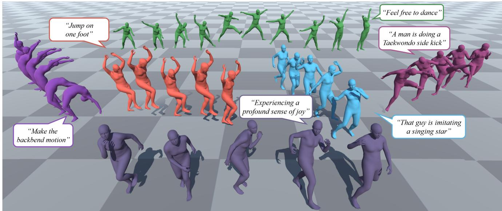
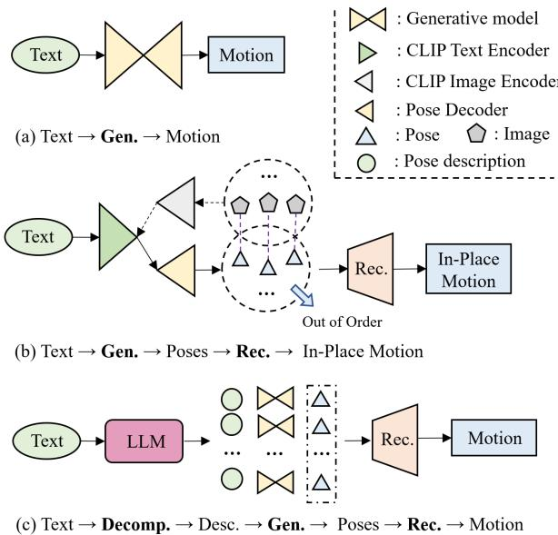
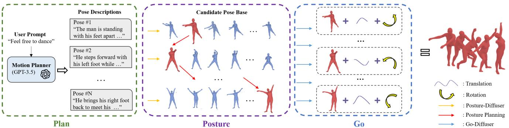
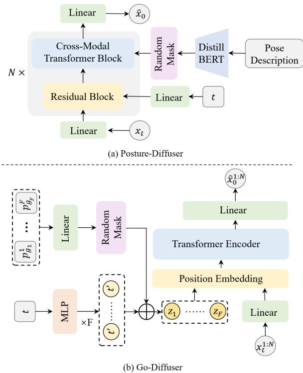
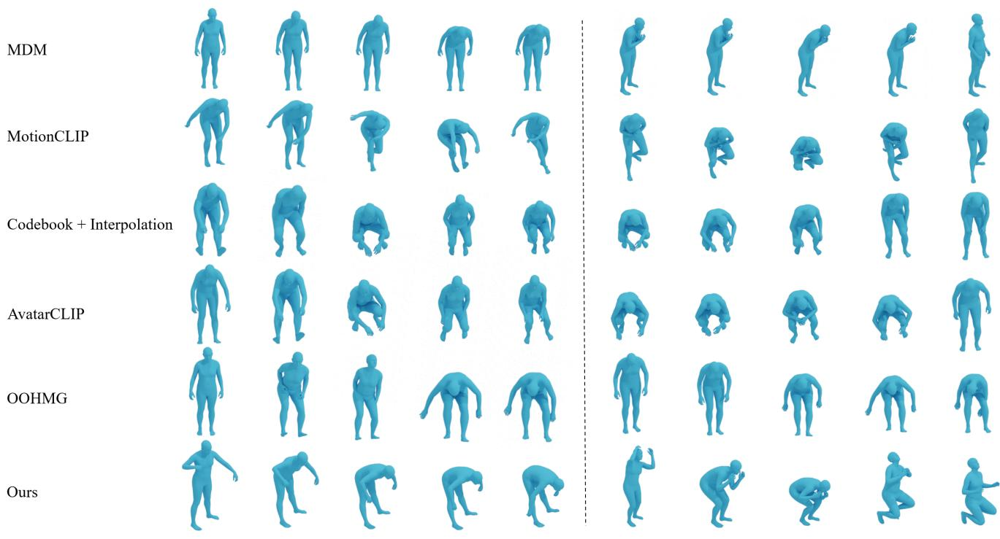
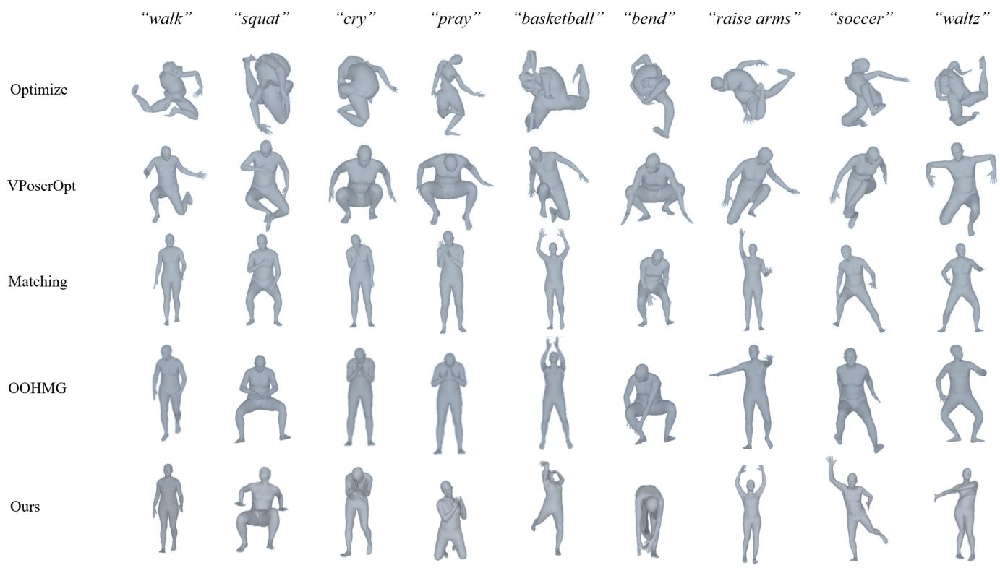
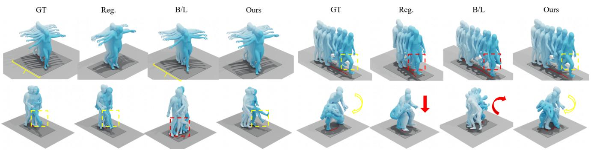
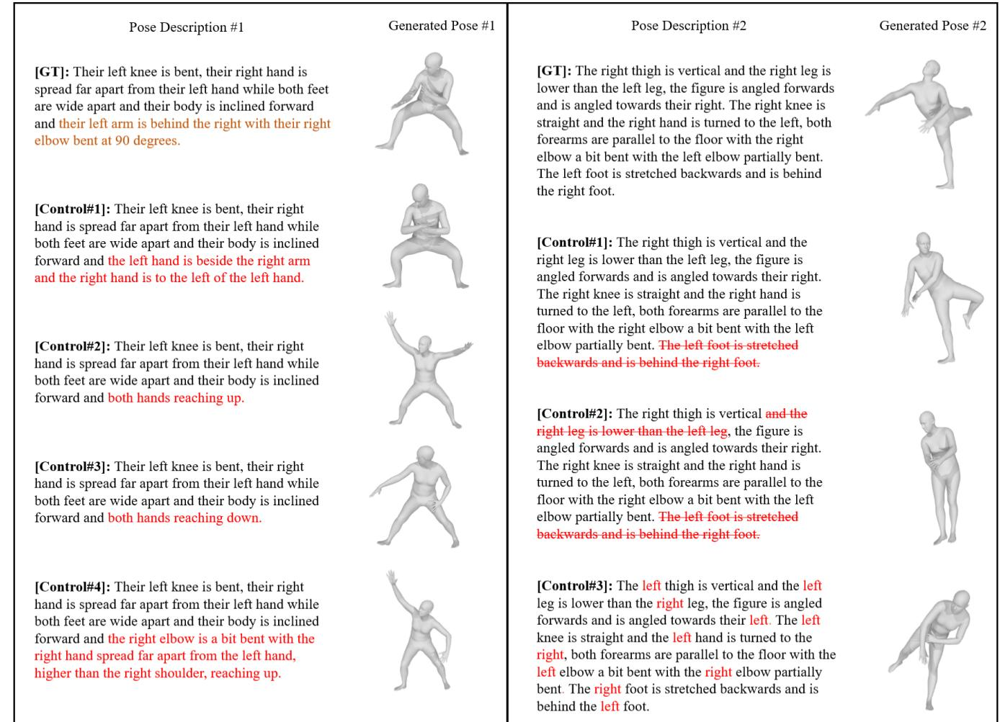

# Plan, Posture and Go: Towards Open-World Text-to-Motion Generation

Jinpeng Liu1\* Wenxun Dai1\* Chunyu Wang2\* Yiji Cheng1 Yansong Tang1\* Xin Tong2 1Shenzhen International Graudate School, Tsinghua University 2Microsoft Research Asia {liujp22@mails., daiwx23@mails., cyj22@mails., tang.yansong@sz.}tsinghua.edu.cn {chnuwa, xtong}@microsoft.com

  
such as "Jump on one foot" and "Experiencing a profound sense of joy".

# Abstract

Conventional text-to-motion generation methods are usually trained on limited text-motion pairs, making them hard to generalize to open-world scenarios. Some works use the CLIP model to align the motion space and the text space, aiming to enable motion generation from natural language motion descriptions. However, they are still constrained to generate limited and unrealistic in-place motions. To address these issues, we present a divide-and-conquer framework named PRO-Motion1, which consists of three modules as motion planner, posture-diffuser and go-diffuser. The motion planner instructs Large Language Models (LLMs) to generate a sequence of scripts describing the key postures in the target motion. Differing from natural languages, the scripts can describe all possible postures following very simple text templates. This significantly reduces the complexity of posture-diffuser, which transforms a script to a posture, paving the way for open-world generation. Finally, godiffuser, implemented as another diffusion model, estimates whole-body translations and rotations for all postures, resulting in realistic motions. Experimental results have shown the superiority of our method with other counterparts, and demonstrated its capability of generating diverse and realistic motions from complex open-world prompts such as 'Experiencing a profound sense of joy". The project page is available at https://moonsliu.github.io/Pro-Motion/.

# 1. Introduction

Text-to-motion generation has attracted rapidly increasing attention [1, 63, 85] due to its important roles in many applications such as virtual reality, video games, and the film industry. The prior models usually train GANs [1, 46], VAEs [5, 25, 62, 63] and Diffusion Models [12, 15, 76, 85, 94, 96, 97] from paired text-motion data and have achieved reasonable generation results when the text prompts are similar as those in the training set. Fig. 2 (a) illustrates this paradigm. However, they struggle to handle open-world text prompts beyond the existing datasets, which is a core challenge that has to be addressed. Otherwise, they can only generate limited toy-like" motions. Some recent work [34, 44, 84] propose to enhance their model's ability to handle natural language motion descriptions beyond the training data. To that end, they leverage the pre-trained vision-language model CLIP [68] to align the poses in the training motions with the motion descriptions, hoping to generate poses from natural languages. This is depicted in Fig. 2 (b). However, the text space of CLIP, which is learned on natural languages, is largely different from motion descriptions, making it ineffective to connect natural languages and motions. As a result, these methods are still constrained to generate motions from limited text prompts. Besides, due to the lack of temporal priors in CLIP, these methods have difficulty in generating motions with correct chronological order. As a result, they can only generate unrealistic in-place motions. In this paper, we present a divide-and-conquer framework named PRO-Motion, which consists of three steps as Plan, postuRe, and Go for open-world text-to-Motion generation, as shown in Fig. 2 (c). In the first "plan" stage, we introduce a motion planner that translates complex natural language motion descriptions into a sequence of posture scripts that describe body part relationships following a simple template, such as "The man is standing upright, his torso is vertical. His left foot is slightly above the ground. His arms are relaxed at his sides". This is realized by leveraging the motion commonsense in LLMs which is further enhanced by in-context demonstrations. It is important to understand that although the scripts are simple and limited to a small space, they are expressive to cover all possible postures due to their compositional nature. The motion planner bridges the gap between natural languages and pose descriptions and effectively addresses out-of-distribution problems. Benefiting from the merits above, during the second "posture" stage, we can train a generative model to achieve scriptto-posture generation only using a relatively small labeled dataset. We conjecture and demonstrate that the model has strong generalization capability and can cover extensive postures and scripts considering that a novel posture or script can be decomposed into multiple familiar body parts. In the implementation, we developed a diffusion-based model called posture-diffuser on a public dataset [17], which perceives the connection between structured pose descriptions and body parts leading to diverse and realistic postures. Then we further utilize a posture planning module to select key poses, taking into account the consistency of adjacent poses and the semantic alignment between text and poses. Furthermore, in the last "go" stage, we have observed that we can predict both translation and rotation by analyzing multiple consecutive body postures. For example, in a sequence where the initial pose depicts a standing pose followed by a left-foot step in the second pose and a right-foot step in the third pose, we can estimate forward translation. Additionally, learning interpolation between adjacent key poses is straightforward and requires only a small amount of motion data to capture such priors effectively. Accordingly, a transformer-based [87] go-diffuser module is designed to capture the inner connection between key poses. To verify the effectiveness of our proposed PRO-Motion, we conduct experiments on a variety of datasets. Both quantitative and qualitative results have shown the advantage of our method compared with the state-of-the-art approaches for open-world text-to-motion generation and demonstrated its capability of generating diverse and realistic motions from complex prompts such as "Jump on one foot" and 'Experiencing a profound sense of joy".

# 2. Related Work

Text-to-Motion Generation. Based on existing labeled motion capture datasets [25, 26, 39, 45, 52, 65, 66, 77, 83], existing works have explored various generative models for text-driven motion generation, such as GANs [1, 46], VAEs [5, 25, 62, 63, 84] and Diffusion Models [12, 15, 76, 85, 94, 96, 97]. However, these methods are constrained by the heavy reliance on limited text-motion paired datasets. To tackle this problem, some works [34, 44] try to leverage the current powerful large-scale pre-trained models, i.e., CLIP [68], to overcome the data limitation and achieve openvocabulary motion generation. AvatarCLIP [34] generates motions for given textual descriptions through online matching and optimization. Nevertheless, matching is unable to generate out-of-distribution candidate poses, which limits the ability to generate complex motions, and online optimization is time-consuming and unstable. OOHMG [44] uses CLIP image features to generate candidate poses and performs motion generation via mask learning. However, this method cannot capture the chronological order of actions due to the lack of temporal priors in CLIP, leading to inaccurate or even completely opposite motion. Our approach takes a different step to probe the powerful prior knowledge of human body pose and motion in LLMs to enhance text-motion alignment capability and enable open-world motion generation.

Keyframe-based Motion Generation. Given that motion can be viewed as a composition of a sequence of poses, keyframe-based motion generation has attracted lots of interest. Motion prediction involves generating unrestricted motion continuation when provided with one or more keyframes of animation as context. Early efforts [6, 13, 20, 23, 24, 38, 53, 60] employed RNNs to model human motion sequence, motivated by the powerful capability in capturing temporal dynamics. Besides RNNs, other network architectures like CNNs [47, 61] and GCNs [16] are proposed to enhance the modeling of temporal and movement relationships. The emergence of Transformers [4, 10] has further facilitated the modeling of long-range dependencies within a motion sequence. Close to our method is motion in-betweening, which is constrained by both past and future keyframes. Early methods include physicallybased approaches [55, 74, 90] that involve solving optimization problems, as well as statistical models [11, 54, 89]. More recently, some neural network-based methods such as RNNs [28, 82, 99], CNNs [30, 40, 102], and Transformers [18, 54, 67] have gained dominance in this field. Unlike motion in-betweening methods that explicitly provide translation and rotation, we achieve the prediction of translation and rotation, as well as pose interpolation, by having the model learn priors between adjacent key poses.

  
Figure 2. Comparison of different paradigms for text-to-motion generation. (a) Most existing models leverage the generative models [22, 33, 41] to construct the relationship between text and motion based on text-motion pairs. (b) Some methods render 3D poses to images and employ the image space of CLIP to align text with poses. Then they reconstruct the motion in the local dimension based on the poses. (c) Conversely, we decompose motion descriptions into structured pose descriptions. Then we generate poses based on corresponding pose descriptions. Finally, we reconstruct the motion in local and global dimensions. "Gen.", "Decomp.", "Desc.", "Rec." stand for "Generative model", "Decompose", "Pose Description" and "Reconstruction" respectively.

LLM aided Visual Content Generation. In recent years, large language models (LLMs) [8, 9, 57, 86, 95, 98] have attracted substantial interest in the field of natural language processing (NLP) and artificial general intelligence (AGI) owing to their remarkable proficiency in tasks such as language generation, reasoning, world knowledge, and incontext learning. [7, 27] combine large language models with diffusion-based generative models [33, 72] aimed at generating prompts for higher-quality image generation. [35, 43] leverage large language models to plan the generation of visual content and identify the pivotal actions, enabling complex dynamic video generation. Another line of works, including [42, 48, 78, 91, 93], have proposed to integrate visual APIs with language models to facilitate decision-making or planning based on visual information, which further connects vision and language models. Close to our method are works that utilize LLMs as a planner for embodied agents [2, 36, 37, 51, 79, 81, 92, 100] to generate executable plans in real-world environments. Unlike works focus on robots, we introduce LLMs to manipulate the generation of key poses of motion, enabling fine-granularity control.

# 3. Method

# 3.1. Preliminaries

Denoising Diffusion Probabilistic Models (DDPMs). DDPMs, as detailed in [33, 56, 80], involve two Markov chains: a forward chain that diffuses data to noise, and a reverse chain that transforms noise back to data. Formally, the diffusion forward process iteratively adds Gaussian noise to the original signal $x _ { 0 }$ to generate a sequence of noised samples, i.e., $\{ x _ { t } \} _ { t = 1 } ^ { T }$ , which can be formulated as follows:

$$
q ( x _ { t } | x _ { t - 1 } ) = N ( x _ { t } ; \sqrt { 1 - \beta _ { t } } x _ { t - 1 } , \beta _ { t } I ) ,
$$

where $q \big ( x _ { t } | x _ { t - 1 } \big )$ represents the conditional probability distribution of $x _ { t }$ conditioned by $x _ { t - 1 }$ and $\beta _ { t } \in ( 0 , 1 )$ denotes the level of noise at time step $t$ When $T$ is sufficiently large, we can assume that $x _ { T } \sim \mathcal { N } ( 0 , I )$ . For the conditional synthesis setting, the denoiser is designed to model the distribution $p ( x _ { 0 } | c )$ by sampling a random noise from the prior distribution $\mathcal { N } ( 0 , \mathrm { I } )$ , followed by the reversed diffusion process to convert it back to $x _ { 0 }$ . In our setting, we follow [69] and directly predict the original sample, i.e., $\hat { x } _ { 0 } = f _ { \theta } ( x _ { t } , t , c )$ with the simple objective [33]:

$$
\operatorname* { m i n } _ { \theta } \mathcal { L } = \mathbb { E } _ { x _ { 0 } , t , c } \left[ | | x _ { 0 } - f _ { \theta } ( x _ { t } , t , c ) | | _ { 2 } ^ { 2 } \right] .
$$

According to [33], at each time step $t$ , we predict the original sample $\hat { x } _ { 0 } ~ = ~ f _ { \theta } ( x _ { t } , t , c )$ and diffuses it back to $x _ { t - 1 }$ . The sampling from $p ( x _ { 0 } | c )$ is carried out iteratively, starting from $t = T$ , until $x _ { 0 }$ is obtained. To train our diffusion model $f _ { \theta }$ , we employ classifier-free guidance [32] by randomly setting $c = \emptyset$ for $10 \%$ of the samples. This allows $f _ { \theta }$ to learn both the conditioned and the unconditioned distributions, making $f _ { \theta } ( x _ { t } , t , \theta )$ approximate $p ( x _ { 0 } )$ . We use the coefficient $w$ to balance the trade-off between sample diversity and fidelity:

$$
f _ { \theta } ^ { w } ( x _ { t } , t , c ) = f _ { \theta } ( x _ { t } , t , \mathcal { O } ) + w \cdot ( f _ { \theta } ( x _ { t } , t , c ) - f _ { \theta } ( x _ { t } , t , \mathcal { O } ) ) .
$$

# 3.2. Motion Planner

As depicted in Fig. 3, when presented with a user prompt, such as "Feel free to dance", we exploit GPT-3.5 [57] to create a plan for describing key poses based on the prior knowledge about body parts that are involved in the motion. To ensure that GPT-3.5 generates descriptions for these key poses while maintaining consistency throughout the motion, we provide GPT-3.5 with a user prompt indicating the expected motion and a task description that guarantees the temporal consistency and control over various motion attributes like frames per second (FPS) and the number of frames. Beyond governing the overall motion, we have established five fundamental rules to guide GPT-3.5 in describing key poses: (1) Characterize the degree of bending of body parts, e.g., 'left elbow' using descriptors like 'completely bent', 'slightly bent', 'straight'. (2) Classify the relative distances between different body parts, e.g., two hands, as 'close', 'shoulder width apart', 'spread' or 'wide' apart. (3) Describe the relative positions of different body parts, e.g., 'left hip' and 'left knee', using terms like 'behind', 'below' or 'at the right of '. (4) Determine whether a body part is oriented 'vertical' or 'horizontal', e.g., 'right knee'. (5) Identify whether a body part is in contact with the ground, such as 'left knee' and 'right foot'. Furthermore, we offer GPT-3.5 some reference pose descriptions to guide its generation process. For more details about the prompt design, please refer to the supplementary materials.

# 3.3. Posture-Diffuser

In this section, we present our Posture-Diffuser module, which aims to generate key poses that align with the localized body part descriptions provided by the Motion Planner in Sec. 3.2. As shown in Fig. 4 (a), we utilize a denoising diffusion model, which is composed of a stack of $N$ identical layers. Each layer has two sub-blocks. The first is a residual block, which incorporates the time embedding generated by passing the sinusoidal time embedding through a twolayer feed-forward network. The second is a cross-modal transformer block, which integrates the conditioning signal, i.e., text, via a standard cross-attention mechanism [87]. The intermediate residual pose feature serves as the query vector, while the text embeddings extracted from the frozen DistillBERT [75] act as the key and value vectors. Furthermore, we randomly mask the text embeddings for classifier-free learning. This module enables us to generate key poses that align with the pose descriptions precisely. Due to the sampling diversity of DDPMs [33, 56, 69, 80], the Posture-Diffuser module can generate multiple plausible poses corresponding to each pose description, we introduce our Posture Planning module, which aims to select the most reasonable key poses from the candidate poses. We propose two objectives: (1) minimizing differences between poses in adjacent frames and (2) maximizing the similarity between poses and corresponding descriptions. To achieve the objectives, we design two encoders: a text encoder $\Phi$ composed of a single layer of bi-GRU [14], and a pose encoder $\Theta$ that uses the VPoser encoder [58]. Both the encoders produce the L2-normed embeddings for computing similarity. We employ the Viterbi algorithm [19] to search for the most reasonable pose path. Specifically, suppose we have a set of $F$ pose descriptions denoted as $\{ t _ { i } \} _ { i = 1 } ^ { F }$ , and for each pose description $t _ { i }$ , we have a collection of $L$ generated candidate poses represented as $\{ p _ { j } ^ { i } \} _ { j = 1 } ^ { K }$ transition probability matrix $A ^ { i }$ for the $i$ -th $( i > 1 )$ frame is for the first objective, where the selection of poses for adjacent frames should preferably consider pairs with higher similarity as follows:

$$
A _ { j k } ^ { i } = \frac { \exp { \left( \Theta { ( p _ { j } ^ { i - 1 } ) } ^ { T } \Theta ( p _ { k } ^ { i } ) \right) } } { \sum _ { l = 1 } ^ { L } \exp { \left( \Theta { ( p _ { j } ^ { i - 1 } ) } ^ { T } \Theta ( p _ { l } ^ { i } ) \right) } } .
$$

Similarly, the emission probability matrix $E ^ { i }$ for the $i$ -th $( i \geq 1 )$ )frame is to satisfy the second objective, where the selection of the current frame's key pose should preferably consider poses with a higher matching degree to the description as below:

$$
E _ { j } ^ { i } = \frac { \exp \Big ( \Phi ( t _ { i } ) ^ { T } \Theta ( p _ { j } ^ { i } ) \Big ) } { \sum _ { l = 1 } ^ { L } \exp \Big ( \Phi ( t _ { i } ) ^ { T } \Theta ( p _ { l } ^ { i } ) \Big ) } .
$$

The overall objective of the algorithm is to generate a pose path $G = \{ g _ { i } \} _ { i = 1 } ^ { F }$ that maximizes the joint probability:

$$
\underset { G } { \arg \operatorname* { m a x } } P ( G ) = \prod _ { i = 1 } ^ { F } P ( g _ { i } | g _ { i - 1 } ) = E _ { g _ { 1 } } ^ { 1 } \prod _ { i = 2 } ^ { F } E _ { g _ { i } } ^ { i } A _ { g _ { i - 1 } g _ { i } } ^ { i } .
$$

# 3.4. Go-Diffuser

To interpolate and predict global information such as translation and rotation for the key poses obtained in Sec. 3.3, we introduce our Go-Diffuser module in this section. Our module is based on a diffusion model, as illustrated in Fig. 4 (b). As transformer [87] structure has been proved efficient in the field of motion generation [6264, 85], we adopt it with the transformer encoder architecture in our implementation. The module is fed a noised motion sequence $\boldsymbol { x } _ { t } ^ { 1 : N }$ in a time step $t$ , as well as $t$ itself and the condition, i.e., key poses $\{ p _ { g _ { i } } ^ { i } \} _ { i = 1 } ^ { F }$ key poses and better capture global information, we treat them as discrete tokens rather than a unified feature. In practice, the key poses are projected and then randomly masked for classifier-ree learning. The noised iput $\boldsymbol { x } _ { t } ^ { 1 : N }$ is projected and integrates positional information. The transformer encoder output is projected back to the original motion dimension, yelding the predicted motion sequence $\hat { x } _ { 0 } ^ { 1 : N }$ This module enables us to interpolate the key poses smoothly and assign global properties to motions.

# 4. Experiments

# 4.1. Datasets

In our experiments, we utilize the pose data, motion data, and textual descriptions sourced from AMASS [52], PoseScript [17], Motion-X [45], and HumanML3D [26]. AMAss unifies various optical marker-based mocap datasets, offering over 40 hours of motion data without textual descriptions. PoseScript consists of static 3D human poses extracted from AMASS, together with fine-grained semantic human-written annotated descriptions (PoseScript-H) and automatically generated captions (PoseScript-A). HumanML3D is a widely used motion language dataset that provides captions for motion data sourced from AMASS. Motion-X is a large-scale 3D expressive whole-body motion dataset with detailed language descriptions. We select two subsets from Motion-X for conducting open-world textto-motion generation experiments. Specifically, we employ sentence transformers [70, 71] to compute the similarity between the text descriptions in IDEA-400 [45], a high-quality motion language subset within Motion-X, and the text descriptions in HumanML3D. We filter out pairs with similarity greater than a specified threshold $\alpha$ ,e.g., 0.45, yielding a motion language dataset comprising 368 text-motion pairs as our first test dataset. Moreover, we choose the kungfu subset of Motion $\mathbf { \nabla } \cdot \mathbf { X }$ as our second test dataset.

  
Figure 4. Illustration of our Dual-Diffusion model. (a) PostureDiffuser module is designed to predict the original pose conditioned by the pose description. The model consists of $N$ identical layers, with each layer featuring a residual block for incorporating time step information and a cross-modal transformer block for integrating the condition text. (b) $G o$ -Diffuser module serves the function of obtaining motion with translation and rotation from discrete key poses without global information. In this module, the key poses obtained from Sec. 3.3 are regarded as independent tokens. We perform attention operations [87] between these tokens and noised motion independently, which can significantly improve the perception ability between every condition pose and motion sequence.

Ta [  , CdeIntla [] Avaar [34] n H [] eeebuaryxt--o.

<table><tr><td rowspan="2"></td><td colspan="4">Text-motion</td><td rowspan="2">FID ↓</td><td rowspan="2">MultiModal Dist ↓</td><td rowspan="2">Smooth →</td></tr><tr><td>R@10 ↑</td><td>R@20 ↑</td><td>R@30 ↑</td><td>MedR ↓</td></tr><tr><td>&quot;test on ood368 subset&quot;</td><td></td><td></td><td></td><td></td><td></td><td></td><td></td></tr><tr><td>MDM [85]</td><td>17.81</td><td>34.06</td><td>48.75</td><td>31.20</td><td>3.500541</td><td>2.613644</td><td>0.000114</td></tr><tr><td>MotionCLIP [84]</td><td>16.25</td><td>35.62</td><td>52.81</td><td>28.90</td><td>2.227522</td><td>2.288905</td><td>0.000073</td></tr><tr><td>Codebook+Interpolation [34]</td><td>15.62</td><td>31.25</td><td>46.56</td><td>32.80</td><td>4.084785</td><td>2.516041</td><td>0.000146</td></tr><tr><td>AvatarCLIP [34]</td><td>15.31</td><td>31.56</td><td>47.19</td><td>32.60</td><td>4.181952</td><td>2.449695</td><td>0.000146</td></tr><tr><td>OOHMG [44]</td><td>15.62</td><td>34.06</td><td>48.75</td><td>29.80</td><td>3.982753</td><td>2.149275</td><td>0.000758</td></tr><tr><td>Ours</td><td>20.25</td><td>36.56</td><td>53.14</td><td>26.10</td><td>1.488678</td><td>1.534521</td><td>0.001312</td></tr><tr><td>&quot;test on kungfu subset&quot;</td><td></td><td></td><td></td><td></td><td></td><td></td><td></td></tr><tr><td>MDM [85]</td><td>12.50</td><td>29.69</td><td>42.19</td><td>37.50</td><td>12.060187</td><td>3.725436</td><td>0.000735</td></tr><tr><td>MotionCLIP [84]</td><td>15.62</td><td>29.69</td><td>46.88</td><td>32.50</td><td>17.414746</td><td>4.297871</td><td>0.000123</td></tr><tr><td>Codebook+Interpolation [34]</td><td>10.94</td><td>20.31</td><td>29.69</td><td>37.50</td><td>2.521690</td><td>2.764137</td><td>0.000138</td></tr><tr><td>AvatarCLIP [34]</td><td>15.62</td><td>31.25</td><td>46.88</td><td>32.50</td><td>1.966764</td><td>2.497678</td><td>0.000171</td></tr><tr><td>OOHMG [44]</td><td>14.06</td><td>32.81</td><td>48.44</td><td>32.50</td><td>4.904853</td><td>2.471666</td><td>0.000847</td></tr><tr><td>Ours</td><td>20.31</td><td>34.38</td><td>50.00</td><td>31.00</td><td>4.124218</td><td>2.374380</td><td>0.001559</td></tr></table>

# 4.2. Open-World Motion Generation

In this section, we first introduce the supervised learning baseline [84, 85], open-world baselines [34, 44, 84], and the evaluation metrics [26, 62]. Then we discuss the comparative experimental results with these baselines. MDM Baseline: MDM [85] employs a supervised learning approach utilizing the diffusion model. However, its performance often degenerates when applied to a new setting, i.e., open-vocabulary motion generation. We trained it on the SMPL-H [49, 59, 73] version data of AMASS with HumanML3D annotation. MotionCLIP Baseline: MotionCLIP [84] is a supervised open-vocabulary method which trained on AMAS data with BABEL [66] annotation. We use the pre-trained model provided by the authors and test the model's performance in the open-vocabulary setting. Codebook+Interpolation Baseline: In the pose generation stage, we utilize VPoserCodebook [59] as the pose generator and select the most similar pose in the pose generation stage. For the motion generation stage, we just use the interpolation method to generate the motion. AvatarCLIP Baseline: AvatarCLIP [34] is an optimizerbased method. It also includes a text-to-pose stage via matching and uses the matched poses to search the most related motion in the latent space of a motion VAE [41] trained on the AMASS dataset. Evaluation Metrics is adopted from [26, 62], which includes R precision, Frechet Inception Distance(FID), and MultiModal Distance. For quantitative evaluation, a motion feature extractor and a text feature extractor are trained using contrastive loss to produce geometrically close feature vectors for matched text-motion pairs. For more details about the above metrics as well as the design of the text and motion feature extractor, please refer to the supplementary materials. Consider R precision: for each generated motion, its groundtruth text description and randomly selected mismatched descriptions from the test dataset form a description pool, followed by calculating and ranking the Euclidean distances between the motion feature and the text feature of each description in the pool. Meanwhile, MultiModal distance is computed as the average Euclidean distance between the motion feature of each generated motion and the text feature of its corresponding description in the test dataset.

As shown in Fig. 5, for the motion description "bends over", the supervised-based method MDM [85] generated the reasonable motion sequence, which shows the process from upright to prone. While OOHMG /citeoohmg involves more leg movement, which is not accurate for the description. Other methods utilizing CLIP [68], such as MotionCLIP [84], Codebook+Interpolation [34], and AvatarCLIP [34] mistake the key pose sequence, their spine first curves to a certain degree, and then the degree of bending decreases. Due to the lack of temporal priors in CLIP, the generated pose sequence in the first stage does not follow the right order. Moreover, for the motion description "bury one's head and cry, and finally crouched down", methods such as MDM [85] based on the supervised learning paradigm often fail in similar cases and cannot generate un-seen motion. Due to the gap between motion description and image description, matching text and motion via the language space of CLIP is not effective. They struggle to deal with detailed and rotation. Mean global represents the performance of body joints and global translation.

  
Figure 5. Comparation of our methods with previous text-to-motion generation methods.

<table><tr><td rowspan="2">Methods</td><td colspan="4">Average Positional Error ↓</td><td colspan="4">Average Variance Error ↓</td></tr><tr><td>root joint</td><td>global traj.</td><td>mean local</td><td>mean global</td><td>root joint</td><td>global traj.</td><td>mean local</td><td>mean global</td></tr><tr><td>Regression</td><td>5.878673</td><td>5.53344</td><td>0.642252</td><td>5.919954</td><td>35.387340</td><td>35.386562</td><td>0.147606</td><td>35.483219</td></tr><tr><td>Baseline[62]</td><td>0.384152</td><td>0.373394</td><td>0.183978</td><td>0.469322</td><td>0.114308</td><td>0.113845</td><td>0.015207</td><td>0.126049</td></tr><tr><td>Ours</td><td>0.365327</td><td>0.354685</td><td>0.128763</td><td>0.418265</td><td>0.111131</td><td>0.110855</td><td>0.008708</td><td>0.118334</td></tr></table>

precise motion descriptions. In Tab. 1, quantitative metrics demonstrate the superiority of our model over other methods in terms of semantic consistency and motion rationality.

# 4.3. Ablation Study

Posture-Diffuser In comparison to the zero-shot openvocabulary text-to-pose generation methods [34, 44], we first utilize LLMs to translate the pose description into localized body part description, which is fed to our pose generator in Sec. 3.3 to generate pose precisely. As shown in Fig. 6, the Matching method demonstrates superior pose generation results compared to Optimize and VPoserOptimize, which suggests that directly using CLIP for matching is more effective than optimization through the complex pipeline. However, "Matching" fails to generate more precise poses for diverse texts, exhibiting a limitation in preserving textual information in the generated poses. For instance, in cases like "cry" and "pray", "Matching" generates identical poses for texts with distinct meanings. When generating poses that require more precise control over body parts, such as "dance the waltz" or "kick soccer", both OOHMG and "Matching" fail to achieve satisfactory results. In contrast, by employing LLMs to precisely describe the expected pose, we achieve accurate control over pose generation, enabling more effective open-world text-based pose synthesis.

Go-Diffuser. While this is the first effort at predicting spatial information of motion in a zero-shot local pose-driven manner to our best knowledge, we have developed appropriate baseline methods to evaluate the translation and rotation perception power. Based on our observation, the translation and rotation of the people could be estimated by analyzing the variations in body parts between adjacent poses. We treat the process of estimating global information from the key poses as a reconstruction task. Thus, we designed a simple MLP-based network to achieve this first. The transformer structure has been proven correct in the motion generation filed [62, 63], thus we design the baseline method by extracting pose sequence features as the condition to inject into the diffusion model. As shown in Fig. 7, from the four images in the top left corner, it can be observed that a simple MLP network is capable of predicting motion translation information to some extent. As indicated in the bottom-left image, extracting pose sequences as features using existing motion encoders may overlook the internal relationships within the pose sequences, thereby leading to confusing details. In the top right image, our method exhibits better fidelity in capturing fine details such as knee flexion. Moreover, the four images in the bottom right corner reveal that when dealing with similar adjacent poses, our model demonstrates a finer-grained perceptual capability, thus imparting appropriate motion trends to digital avatars. As shown in Tab. 2, our method achieved state-of-the-art results both on the average positional error and the average variance error of global trajectory, rotation and local pose joints.

  
Figure 6. Comparison of our method with previous text-to-pose generation methods.

# 5. Conclusion

In this paper, we introduce PRO-Motion, a model designed to tackle open-world text-to-motion generation tasks. It consists of three modules: motion planner, posture-diffuser, and go-diffuser. The motion planner instructs the large language models to generate a sequence of scripts describing the key postures in the target motion. The posture-diffuser transforms a script into a posture, paving the way for open-world generation. Finally, the go-diffuser, estimates whole-body translations and rotations for all postures, resulting in diverse and realistic motions. Experimental results have shown the superiority of our method compared to other counterparts.

# References

[1] Hyemin Ahn, Timothy Ha, Yunho Choi, Hwiyeon Yoo, and Songhwai Oh. Text2action: Generative adversarial synthesis from language to action. In ICRA, pages 59155920, 2018. 2   
[2] Michael Ahn, Anthony Brohan, Noah Brown, Yevgen Chebotar, Omar Cortes, Byron David, Chelsea Finn, Chuyuan Fu, Keerthana Gopalakrishnan, Karol Hausman, et al. Do as i can, not as i say: Grounding language in robotic affordances. arXiv preprint arXiv:2204.01691, 2022. 3   
[3] Chaitanya Ahuja and Louis-Philippe Morency. Language2pose: Natural language grounded pose forecasting. In 3DV, 2019. 16   
[4] Emre Aksan, Manuel Kaufmann, Peng Cao, and Otmar Hilliges. A spatio-temporal transformer for 3d human motion prediction. In 3DV, pages 565574, 2021. 3   
[5] Nikos Athanasiou, Mathis Petrovich, Michael J Black, and Gül Varol. Teach: Temporal action composition for 3d humans. In 3DV, pages 414423, 2022. 2   
[6] Emad Barsoum, John Kender, and Zicheng Liu. Hp-gan: Probabilistic 3d human motion prediction via gan. In CVPRW, pages 14181427, 2018. 3   
[7] Tim Brooks, Aleksander Holynski, and Alexei A Efros. Instructpix2pix: Learning to follow image editing instructions. In CVPR, pages 1839218402, 2023. 3   
[8] Tom Brown, Benjamin Mann, Nick Ryder, Melanie Subbiah, Jared D Kaplan, Prafulla Dhariwal, Arvind Neelakantan, Pranav Shyam, Girish Sastry, Amanda Askell, et al. Language models are few-shot learners. NIPS, pages 18771901, 2020. 3   
[9] Sébastien Bubeck, Varun Chandrasekaran, Ronen Eldan, Johannes Gehrke, Eric Horvitz, Ece Kamar, Peter Lee, Yin Tat Lee, Yuanzhi Li, Scott Lundberg, et al. Sparks of artificial general intelligence: Early experiments with gpt-4. arXiv preprint arXiv:2303.12712, 2023. 3   
10] Yujun Cai, Lin Huang, Yiwei Wang, Tat-Jen Cham, Jianfei Cai, Junsong Yuan, Jun Liu, Xu Yang, Yiheng Zhu, Xiaohui Shen, et al. Learning progressive joint propagation for human motion prediction. In ECCV, pages 226242, 2020. 3   
11] Jinxiang Chai and Jessica K Hodgins. Constraint-based motion optimization using a statistical dynamic model. In SIGGRAPH, pages 8es. 2007. 3   
12] Xin Chen, Biao Jiang, Wen Liu, Zilong Huang, Bin Fu, Tao Chen, and Gang Yu. Executing your commands via motion diffusion in latent space. In CVPR, pages 1800018010, 2023.2   
[13] Hsu-kuang Chiu, Ehsan Adeli, Borui Wang, De-An Huang, and Juan Carlos Niebles. Action-agnostic human pose forecasting. In WACV, pages 14231432, 2019. 3   
[14] Kyunghyun Cho, Bart Van Merriënboer, Caglar Gulcehre, Dzmitry Bahdanau, Fethi Bougares, Holger Schwenk, and Yoshua Bengio. Learning phrase representations using rnn encoder-decoder for statistical machine translation. arXiv preprint arXiv:1406.1078, 2014. 4   
[15] Rishabh Dabral, Muhammad Hamza Mughal, Vladislav Golyanik, and Christian Theobalt. Mofusion: A framework for denoising-diffusion-based motion synthesis. In CVPR, pages 97609770, 2023. 2   
[16] Lingwei Dang, Yongwei Nie, Chengjiang Long, Qing Zhang, and Guiqing Li. Msr-gcn: Multi-scale residual graph convolution networks for human motion prediction. In ICCV, pages 1146711476, 2021. 3   
[17] Ginger Delmas, Philippe Weinzaepfel, Thomas Lucas, Francesc Moreno-Noguer, and Grégory Rogez. Posescript: 3d human poses from natural language. In ECCV, pages 346362, 2022. 2, 5, 13, 14   
[18] Yinglin Duan, Tianyang Shi, Zhengxia Zou, Yenan Lin, Zhehui Qian, Bohan Zhang, and Yi Yuan. Single-shot motion completion with transformer. arXiv preprint arXiv:2103.00776, 2021. 3   
[19] G David Forney. The viterbi algorithm. IEEE, 61(3):268 278, 1973. 4   
[20] Katerina Fragkiadaki, Sergey Levine, Panna Felsen, and Jitendra Malik. Recurrent network models for human dynamics. In ICCV, pages 43464354, 2015. 3   
[21] Anindita Ghosh, Noshaba Cheema, Cennet Oguz, Christian Theobalt, and Philipp Slusallek. Synthesis of compositional animations from textual descriptions. In ICCV, 2021. 16   
[22] Ian Goodfellow, Jean Pouget-Abadie, Mehdi Mirza, Bing Xu, David Warde-Farley, Sherjil Ozair, Aaron Courville, and Yoshua Bengio. Generative adversarial networks. Communications of the ACM, 63(11):139144, 2020. 3   
[23] Anand Gopalakrishnan, Ankur Mali, Dan Kifer, Lee Giles, and Alexander G Ororbia. A neural temporal model for human motion prediction. In CVPR, pages 1211612125, 2019. 3   
[24] Liang-Yan Gui, Yu-Xiong Wang, Xiaodan Liang, and José MF Moura. Adversarial geometry-aware human motion prediction. In ECCV, pages 786803, 2018. 3   
[25] Chuan Guo, Xinxin Zuo, Sen Wang, Shihao Zou, Qingyao Sun, Annan Deng, Minglun Gong, and Li Cheng. Action2motion: Conditioned generation of 3d human motions. In ACM MM, pages 20212029, 2020. 2   
[26] Chuan Guo, Shihao Zou, Xinxin Zuo, Sen Wang, Wei Ji, Xingyu Li, and Li Cheng. Generating diverse and natural 3d human motions from text. In CVPR, pages 51525161, 2022. 2, 5, 6   
[27] Yaru Hao, Zewen Chi, Li Dong, and Furu Wei. Optimizing prompts for text-to-image generation. arXiv preprint arXiv:2212.09611, 2022. 3 [28] Félix G Harvey and Christopher Pal. Recurrent transition networks for character locomotion. In SIGGRAPH Asia, pages 14. 2018. 3 [29] Dan Hendrycks and Kevin Gimpel. Gaussian error linear units (gelus). arXiv preprint arXiv:1606.08415, 2016. 14 [30] Alejandro Hernandez, Jurgen Gall, and Francesc MorenoNoguer. Human motion prediction via spatio-temporal inpainting. In ICCV, pages 71347143, 2019. 3 [31] Martin Heusel, Hubert Ramsauer, Thomas Unterthiner, Bernhard Nessler, and Sepp Hochreiter. Gans trained by a two time-scale update rule converge to a local nash equilibrium. NeurIPS, 2017. 16 [32] Jonathan Ho and Tim Salimans. Classifier-free diffusion guidance. arXiv preprint arXiv:2207.12598, 2022. 3 [33] Jonathan Ho, Ajay Jain, and Pieter Abbeel. Denoising diffusion probabilistic models. NIPS, 33:68406851, 2020. 3, 4,   
14 [34] Fangzhou Hong, Mingyuan Zhang, Liang Pan, Zhongang Cai, Lei Yang, and Ziwei Liu. Avatarclip: Zero-shot textdriven generation and animation of 3d avatars. arXiv preprint arXiv:2205.08535, 2022. 2, 6, 7 [35] Susung Hong, Junyoung Seo, Sunghwan Hong, Heeseong Shin, and Seungryong Kim. Large language models are frame-level directors for zero-shot text-to-video generation. arXiv preprint arXiv:2305.14330, 2023. 3 [36] Chenguang Huang, Oier Mees, Andy Zeng, and Wolfram Burgard. Visual language maps for robot navigation. In ICRA, pages 1060810615, 2023. 3 [37] Wenlong Huang, Pieter Abbeel, Deepak Pathak, and Igor Mordatch. Language models as zero-shot planners: Extracting actionable knowledge for embodied agents. In ICML, pages 91189147, 2022. 3 [38] Ashesh Jain, Amir R Zamir, Silvio Savarese, and Ashutosh Saxena. Structural-rnn: Deep learning on spatio-temporal graphs. In CVPR, pages 53085317, 2016. 3 [39] Yanli Ji, Feixiang Xu, Yang Yang, Fumin Shen, Heng Tao Shen, and Wei-Shi Zheng. A large-scale rgb-d database for arbitrary-view human action recognition. In ACM MM, pages 15101518, 2018. 2 [40] Manuel Kaufmann, Emre Aksan, Jie Song, Fabrizio Pece, Remo Ziegler, and Otmar Hilliges. Convolutional autoencoders for human motion infilling. In 3DV, pages 918927,   
2020. 3 [41] Diederik P Kingma and Max Welling. Auto-encoding variational bayes. arXiv preprint arXiv:1312.6114, 2013. 3,   
6 [42] KunChang Li, Yinan He, Yi Wang, Yizhuo Li, Wenhai Wang, Ping Luo, Yali Wang, Limin Wang, and Yu Qiao. Videochat: Chat-centric video understanding. arXiv preprint arXiv:2305.06355, 2023. 3 [43] Han Lin, Abhay Zala, Jaemin Cho, and Mohit Bansal. Videodirectorgpt: Consistent multi-scene video generation via llm-guided planning. arXiv preprint arXiv:2309.15091,   
2023. 3 [44] Junfan Lin, Jianlong Chang, Lingbo Liu, Guanbin Li, Liang Lin, Qi Tian, and Chang-wen Chen. Being comes from not-being: Open-vocabulary text-to-motion generation with wordless training. In CVPR, pages 2322223231, 2023. 2, 6, 7   
[45] Jing Lin, Ailing Zeng, Shunlin Lu, Yuanhao Cai, Ruimao Zhang, Haoqian Wang, and Lei Zhang. Motion-x: A largescale 3d expressive whole-body human motion dataset. NeurIPS, 2023. 2, 5, 6, 14   
[46] Xiao Lin and Mohamed R Amer. Human motion modeling using dvgans. arXiv preprint arXiv:1804.10652, 2018. 2   
[47] Xiaoli Liu, Jianqin Yin, Jin Liu, Pengxiang Ding, Jun Liu, and Huaping Liu. Trajectorycnn: a new spatio-temporal feature learning network for human motion prediction. TCSVT, 31(6):21332146, 2020. 3   
[48] Zhaoyang Liu, Yinan He, Wenhai Wang, Weiyun Wang, Yi Wang, Shoufa Chen, Qinglong Zhang, Yang Yang, Qingyun Li, Jiashuo Yu, et al. Internchat: Solving vision-centric tasks by interacting with chatbots beyond language. arXiv preprint arXiv:2305.05662, 2023. 3   
[49] Matthew Loper, Naureen Mahmood, Javier Romero, Gerard Pons-Moll, and Michael J. Black. SMPL: A skinned multiperson linear model. SIGGRAPH Asia, 2015. 6, 13   
[50] Ilya Loshchilov and Frank Hutter. Decoupled weight decay regularization. arXiv preprint arXiv:1711.05101, 2017. 14   
[51] Yujie Lu, Weixi Feng, Wanrong Zhu, Wenda Xu, Xin Eric Wang, Miguel Eckstein, and William Yang Wang. Neurosymbolic procedural planning with commonsense prompting. arXiv preprint arXiv:2206.02928, 2022. 3   
[52] Naureen Mahmood, Nima Ghorbani, Nikolaus F Troje, Gerard Pons-Moll, and Michael J Black. Amass: Archive of motion capture as surface shapes. In ICCV, pages 5442 5451, 2019. 2, 5, 7   
[53] Julieta Martinez, Michael J Black, and Javier Romero. On human motion prediction using recurrent neural networks. In CVPR, pages 28912900, 2017. 3   
[54] Jianyuan Min, Yen-Lin Chen, and Jinxiang Chai. Interactive generation of human animation with deformable motion models. TOG, 29(1):112, 2009. 3   
[55] J Thomas Ngo and Joe Marks. Spacetime constraints revisited. In SIGGRAPH, pages 343350, 1993. 3   
[56] Alexander Quinn Nichol and Prafulla Dhariwal. Improved denoising diffusion probabilistic models. In ICML, pages 81628171, 2021. 3, 4   
[57] Long Ouyang, Jeffrey Wu, Xu Jiang, Diogo Almeida, Carroll Wainwright, Pamela Mishkin, Chong Zhang, Sandhini Agarwal, Katarina Slama, Alex Ray, et al. Training language models to follow instructions with human feedback. NIPS, pages 2773027744, 2022. 3, 4   
[58] Georgios Pavlakos, Vasileios Choutas, Nima Ghorbani, Timo Bolkart, Ahmed AA Osman, Dimitrios Tzionas, and Michael J Black. Expressive body capture: 3d hands, face, and body from a single image. In CVPR, pages 10975 10985, 2019. 4   
[59] Georgios Pavlakos, Vasileios Choutas, Nima Ghorbani, Timo Bolkart, Ahmed A. A. Osman, Dimitrios Tzionas, and Michael J. Black. Expressive body capture: 3d hands, face, and body from a single image. In CVPR, 2019. 6   
[60] Dario Pavllo, David Grangier, and Michael Auli. Quaternet: A quaternion-based recurrent model for human motion. arXiv nrenrint arXiv:1805 06485 20183   
[61] Dario Pavllo, Christoph Feichtenhofer, Michael Auli, and David Grangier. Modeling human motion with quaternionbased neural networks. IJCV, 128:855872, 2020. 3   
[62] Mathis Petrovich, Michael J Black, and Gül Varol. Actionconditioned 3d human motion synthesis with transformer vae. In ICCV, pages 1098510995, 2021. 2, 5, 6, 7, 8   
[63] Mathis Petrovich, Michael J Black, and Gül Varol. Temos: Generating diverse human motions from textual descriptions. In ECCV, pages 480497, 2022. 2, 8, 13, 16   
[64] Mathis Petrovich, Michael J. Black, and Gül Varol. TMR: Text-to-motion retrieval using contrastive 3D human motion synthesis. In ICCV, 2023. 5   
[65] Matthias Plappert, Christian Mandery, and Tamim Asfour. The kit motion-language dataset. Big data, 4(4):236252, 2016.2   
[66] Abhinanda R Punnakkal, Arjun Chandrasekaran, Nikos Athanasiou, Alejandra Quiros-Ramirez, and Michael J Black. Babel: Bodies, action and behavior with english labels. In CVPR, pages 722731, 2021. 2, 6   
[  , Yuy Zeg nd un Zhou nvia two-stage transformers. T0G, 41(6):116, 2022. 3   
[68] Alec Radford, Jong Wook Kim, Chris Hallacy, Aditya Ramesh, Gabriel Goh, Sandhini Agarwal, Girish Sastry, Amanda Askell, Pamela Mishkin, Jack Clark, et al. Learning transferable visual models from natural language supervision. In ICML, pages 87488763, 2021. 2, 6   
[69] Aditya Ramesh, Prafulla Dhariwal, Alex Nichol, Casey Chu, and Mark Chen. Hierarchical text-conditional image generation with clip latents. arXiv preprint arXiv:2204.06125, 2022. 3, 4   
[70] Nils Reimers and Iryna Gurevych. Sentence-bert: Sentence embeddings using siamese bert-networks. In Proceedings of the 2019 Conference on Empirical Methods in Natural Language Processing, 2019. 5, 14   
[71] Nils Reimers and Iryna Gurevych. Making monolingual sentence embeddings multilingual using knowledge distillation. In EMNLP, 2020. 5, 14   
[72] Robin Rombach, Andreas Blattmann, Dominik Lorenz, Patrick Esser, and Björn Ommer. High-resolution image synthesis with latent diffusion models. In CVPR, pages 1068410695, 2022. 3   
[73] Javier Romero, Dimitrios Tzionas, and Michael J. Black. Embodied hands: Modeling and capturing hands and bodies together. SIGGRAPH Asia, 36(6), 2017. 6, 13   
[74] Charles Rose, Brian Guenter, Bobby Bodenheimer, and Michael F Cohen. Efficient generation of motion transitions using spacetime constraints. In SIGGRAPH, pages 147154, 1996. 3   
[75] Victor Sanh, Lysandre Debut, Julien Chaumond, and Thomas Wolf. Distilbert, a distilled version of bert: smaller, faster, cheaper and lighter. arXiv preprint arXiv:1910.01108, 2019. 4   
[76] Yonatan Shafir, Guy Tevet, Roy Kapon, and Amit H Bermano. Human motion diffusion as a generative prior. arXiv preprint arXiv:2303.01418, 2023. 2   
[77] Amir Shahroudy, Jun Liu, Tian-Tsong Ng, and Gang Wang. Ntu rgb $^ +$ A la a atat  u iviy analvsis. In CVPR. pages 10101019. 2016. 2   
[78] Yongliang Shen, Kaitao Song, Xu Tan, Dongsheng Li, Weiming Lu, and Yueting Zhuang. Hugginggpt: Solving ai tasks with chatgpt and its friends in huggingface. arXiv preprint arXiv:2303.17580, 2023. 3   
[79] Ishika Singh, Valts Blukis, Arsalan Mousavian, Ankit Goyal, Danfei Xu, Jonathan Tremblay, Dieter Fox, Jesse Thomason, and Animesh Garg. Progprompt: Generating situated robot task plans using large language models. In ICRA, pages 1152311530, 2023. 3   
[80] Jascha Sohl-Dickstein, Eric Weiss, Niru Maheswaranathan, and Surya Ganguli. Deep unsupervised learning using nonequilibrium thermodynamics. In ICML, pages 2256 2265, 2015. 3, 4   
[81] Chan Hee Song, Jiaman Wu, Clayton Washington, Brian M Sadler, Wei-Lun Chao, and Yu Su. Llm-planner: Few-shot grounded planning for embodied agents with large language models. In ICCV, pages 29983009, 2023. 3   
[82] Xiangjun Tang, He Wang, Bo Hu, Xu Gong, Ruifan Yi, Qilong Kou, and Xiaogang Jin. Real-time controllable motion transition for characters. T0G, 41(4):110, 2022. 3   
[83] Yansong Tang, Jinpeng Liu, Aoyang Liu, Bin Yang, Wenxun Dai, Yongming Rao, Jiwen Lu, Jie Zhou, and Xiu Li. Flag3d: A 3d fitness activity dataset with language instruction. In CVPR, pages 2210622117, 2023. 2   
[84] Guy Tevet, Brian Gordon, Amir Hertz, Amit H Bermano, and Daniel Cohen-Or. Motionclip: Exposing human motion generation to clip space. In ECCV, pages 358374, 2022. 2, 6   
[85] Guy Tevet, Sigal Raab, Brian Gordon, Yonatan Shafir, Daniel Cohen-Or, and Amit H Bermano. Human motion diffusion model. arXiv preprint arXiv:2209.14916, 2022. 2, 5,6   
[86] Hugo Touvron, Thibaut Lavril, Gautier Izacard, Xavier Martinet, Marie-Anne Lachaux, Timothée Lacroix, Baptiste Rozière, Naman Goyal, Eric Hambro, Faisal Azhar, et al. Llama: Open and efficient foundation language models. arXiv preprint arXiv:2302.13971, 2023. 3   
[87] Ashish Vaswani, Noam Shazeer, Niki Parmar, Jakob Uszkoreit, Llion Jones, Aidan N Gomez, Lukasz Kaiser, and Illia Polosukhin. Attention is all you need. NIPS, 2017. 2, 4, 5   
[88] Nam Vo, Lu Jiang, Chen Sun, Kevin Murphy, Li-Jia Li, Li Fei-Fei, and James Hays. Composing text and image for image retrieval-an empirical odyssey. In CVPR, pages 64396448, 2019. 14   
[89] Jack M Wang, David J Fleet, and Aaron Hertzmann. Gaussian process dynamical models for human motion. TPAMI, 30(2):283298, 2007. 3   
[90] Andrew Witkin and Michael Kass. Spacetime constraints. SIGGRAPH, 22(4):159168, 1988. 3   
[91] Chenfei Wu, Shengming Yin, Weizhen Qi, Xiaodong Wang, Zecheng Tang, and Nan Duan. Visual chatgpt: Talking, drawing and editing with visual foundation models. arXiv preprint arXiv:2303.04671, 2023. 3   
[92] Zeqi Xiao, Tai Wang, Jingbo Wang, Jinkun Cao, Wenwei Zhang, Bo Dai, Dahua Lin, and Jiangmiao Pang. Unified human-scene interaction via prompted chain-of-contacts. arVi nranrint arVi.2200 07018, 20222   
[93] Zhengyuan Yang, Linjie Li, Jianfeng Wang, Kevin Lin, Ehsan Azarnasab, Faisal Ahmed, Zicheng Liu, Ce Liu, Michael Zeng, and Lijuan Wang. Mm-react: Prompting chatgpt for multimodal reasoning and action. arXiv preprint arXiv:2303.11381, 2023. 3   
[94] Ye Yuan, Jiaming Song, Umar Iqbal, Arash Vahdat, and Jan Kautz. Physdiff: Physics-guided human motion diffusion model. In ICCV, 2023. 2   
[95] Aohan Zeng, Xiao Liu, Zhengxiao Du, Zihan Wang, Hanyu Lai, Ming Ding, Zhuoyi Yang, Yifan Xu, Wendi Zheng, Xiao Xia, et al. Glm-130b: An open bilingual pre-trained model. arXiv preprint arXiv:2210.02414, 2022. 3   
[96] Mingyuan Zhang, Zhongang Cai, Liang Pan, Fangzhou Hong, Xinying Guo, Lei Yang, and Ziwei Liu. Motiondiffuse: Text-driven human motion generation with diffusion model. arXiv preprint arXiv:2208.15001, 2022. 2   
[97] Mingyuan Zhang, Xinying Guo, Liang Pan, Zhongang Cai, Fangzhou Hong, Huirong Li, Lei Yang, and Ziwei Liu. Remodiffuse: Retrieval-augmented motion diffusion model. arXiv preprint arXiv:2304.01116, 2023. 2   
[98] Susan Zhang, Stephen Roller, Naman Goyal, Mikel Artetxe, Moya Chen, Shuohui Chen, Christopher Dewan, Mona Diab, Xian Li, Xi Victoria Lin, et al. Opt: Open pre-trained transformer language models. arXiv preprint arXiv:2205.01068, 2022. 3   
[99] Xinyi Zhang and Michiel van de Panne. Data-driven autocompletion for keyframe animation. In SIGGRAPH, pages 111, 2018. 3   
[100] K Zheng, K Zhou, J Gu, Y Fan, J Wang, Z Li, X He, and XE Wang. Jarvis: a neuro-symbolic commonsense reasoning framework for conversational embodied agents. arXiv preprint arXiv:2208.13266, 2022. 3   
[101] Yi Zhou, Connelly Barnes, Jingwan Lu, Jimei Yang, and Hao Li. On the continuity of rotation representations in neural networks. In CVPR, 2019. 13   
[102] Yi Zhou, Jingwan Lu, Connelly Barnes, Jimei Yang, Sitao Xiang, et al. Generative tweening: Long-term inbetweening of 3d human motions. arXiv preprint arXiv:2005.08891, 2020.3

# Appendix

In this supplementary material, we provide additional details and experiments not included in the main paper due to limitations in space. •Appendix A: Qualitative results of precise control for motion generation in our formulation. Appendix B: Details of the motion representations. •Appendix C: Details of the prompt engineering and the entire system message template. •Appendix D: Details of our dual-diffusion models. •Appendix E: Details of the evaluation metrics. Note: Blue characters denote the main paper's reference.

# A. Precise Pose Control

As shown in Fig. 8, our Posture-Diffuser module can accurately generate poses from edited pose descriptions, which becomes particularly beneficial when users are not content with the key pose descriptions produced by the Motion Planner. In such cases, users have the option to manually edit the description of specific body parts to gain precise control over the generated poses. For example, in the Control $\# 1$ of Pose Description $\# 1$ , we replace the description of "their left arm is behind the right with their right elbow bent at 90 degrees." with "the left hand is beside the right arm and the right hand is to the left of the left hand". It's obvious the position of the hands changes correctly. As well, when we delete the description of "The left foot is stretched backwards and is behind the right foot" in the Control $\# 1$ of Pose Description $\# 2$ , the position of the left foot changes correctly. Furthermore, we could find that although the scripts are simple and limited to a small space, they are expressive to cover all possible postures due to their compositional nature.

# B. Motion Representations

Skinned Multi-Person Linear model (SMPL)[49][73] is a skinned vertex-based model that accurately represents various body shapes in natural human poses. It's widely utilized in the human motion generation field. So we adopted the SMPL-based human model as well. SMPL begins with an artist-created mesh with $\Nu = 6 8 9 0$ vertices and $\mathrm { K } = 2 3$ joints. The mesh has the same topology for men and women, spatially varying resolution, a clean quad structure, a segmentation into parts, initial blend weights, and a skeletal rig. We follow the SMPL-based representation of TEMOS [63] and construct the feature vector for SMPL data. Translation. It consists of two parts. The first part is the velocity of the root joint in the global coordinate system. The second part is the position of the root joint for the Z axis. The dimension of the translation is 3. Root Orientation. It contains one rotation, and we utilize the 6D continuous representation [101] to store it. So the dimension of the root orientation is $1 \ast 6 = 6$ . •Pose Body. The motion data is from the SMPL-H [49, 73] version of AMASS. Because we focus on the movement of the human body, we removed all rotations on the hands, resulting in 21 rotations). The same as root orientation, we utilize the 6D continuous representation [101]. So the dimension of the pose body is $2 1 ^ { * } 6 = 1 2 6$ . So the final dimension of the feature is $3 + 1 * 6 + 2 1 * 6 =$ 135. In our experiments, we remove all the motion sequences that are less than 64 frames, and the motion sequences longer than 64 frames are processed as 64 frames. The data sample will be in R64\*135.

# read motion 2 motion_parms $= \quad \left\{ \begin{array} { r l r l } \end{array} \right.$ 3 'trans': motion[:, :3], # controls the global body position 4 'root_orient': motion[:, 3 : $3 + 6 ]$ , # controls the global root orientation 5 'pose_body': motion[:, 9 $= \begin{array} { l l l l l } { { 9 } } & { { + } } & { { 2 1 } } & { { \star } } & { { 6 } } \end{array} ] ,$ # controls the body 6

When we perform the translation and rotation prediction, we only know the local attributes of the adjacent poses, but not their global location information. So we must normalize the pose position. Following [63], the translation of neighboring poses is subtracted and represented by the instantaneous velocity as the translation attribute of the current frame.

# extract the root gravity axis   
2 # for smpl it is the last coordinate   
3 root $=$ trans[..., 2]   
4 trajectory $=$ trans[..., [0, 1]]   
5   
6 # Comoute the difference of trajectory (for X and Y axis)   
7 vel_trajectory $=$ torch.diff(trajectory, dim $= - 2$   
$8 \# 0$ for the first one ${ } = > { }$ keep the dimentionality   
9 vel_trajectory $=$ torch.cat( $( \mathrm { ~ 0 ~ } \star$ vel_trajectory [..., [0], :], vel_trajectory), dim $_ { 1 = - 2 }$

# C. Prompt Design

Fig. 9 illustrates the complete prompt used by our Motion Planner in Sec. 3.2. We first define the overall objective and task requirements and then establish five fundamental rules of body parts including bending degree, relative distance, relative position, orientation, and ground contact. Additionally, we specify the body parts to which each rule applies. Through this rule-based approach, we can guide the LLM to generate precise key pose descriptions, achieving fine-grained control over poses. Next, we define the output format of the LLM and provide examples of pose descriptions for the LLM to reference. These examples are sourced from Posescript [17]. Finally, a user prompt of motion description is provided to instruct the LLM to generate the key pose descriptions. By harnessing the powerful LLM, the user prompts are no longer confined to specific formats but are open-world, allowing for expressions like "Jump on one foot" and "Experiencing a profound sense of joy".

# D. Detailed Implementations

Posture-diffuser. We employ an AdamW [50] optimizer for 1000 epochs with a batch size of 512 and a learning rate of 1e-4. The number of layers is $N = 3$ and the latent dim is set to 512. Following [33], we use the linear schedule, where $\beta _ { s t a r t } = 0 . 0 0 0 8 5$ and $\beta _ { e n d } = 0 . 0 1 2$ Our model is trained using poses with automatically generated captions (PoseScript-A [17]) and adopts the last checkpoint as our final model. For the two encoders used in Posture Planning module, we use the pretrained text-to-pose retrieval model from [17], which is trained on PoseScript-A using the Batch Based Classification loss [88]. Go-diffuser. We employ an AdamW [50] optimizer with a batch size of 64 and a learning rate of 1e-4. The latent dim is 512, the number of transformer layers is 8, and the number of heads is 4. We utilize GELU [29] as the activation function and the dropout is 0.1. The mask probability of the model's condition is O.1. We use the cosine schedule and the number of diffusion steps is 100.

# E. Evaluation details

We will detail our evaluation metrics on the Experiments part in this section. In open-world text-to-motion experiments, we employ sentence transformers [70, 71] to compute the similarity between the text descriptions in IDEA-400 [45], a high-quality motion language subset within Motion-X, and the text descriptions in HumanML3D. We filter out pairs with similarity greater than a specified threshold $\alpha$ , e.g., 0.45, yielding a motion language dataset comprising 368 text-motion pairs as our first test dataset.

<table><tr><td></td></tr><tr><td>Th as possible.Before you write each description, you must follow these instructions. These are primary rules: Rule 1. Characterize the degree of bending of body parts.</td></tr><tr><td>  &#x27;partially bent&#x27;, &#x27;slightly bent&#x27;, &#x27;straight&#x27;]. 1.2 You should select the body part form the list: [left knee, right knee, left elbow, right elbow].</td></tr><tr><td>Rule 2. Classify the relative distances between different body parts. o u    rar . 2.2 You must compare the distances between these body part pairs as much as possible:</td></tr><tr><td>(left elbow, right elbow), (left hand, right hand), (left knee, right knee), (left foot, right foot),</td></tr><tr><td></td></tr><tr><td>(eand let houler, (let hand riht houler (riht hand let hour) (riht hand rght houer),</td></tr><tr><td>(    ,</td></tr><tr><td>,</td></tr><tr><td>(left hand, left foot), (left hand, right foot), (right hand, left foot), (right hand, right foot)</td></tr><tr><td></td></tr><tr><td>Rule 3. Describe the relative positions of different body parts. 3.1 For he ront-back direction you should select thedeition wor rom the ist: [behind, n on of].</td></tr><tr><td>For the up-down direction, you should select the description word from the list: [&#x27;below&#x27;, &#x27;above&#x27;].</td></tr><tr><td>F  y u       3.2 You must compare the relative positioning between these body part pairs as much as possible:</td></tr><tr><td>, ,</td></tr><tr><td>(ran our, efot,ip,  ot,t ip, ewr neck, ri wr,</td></tr><tr><td> </td></tr><tr><td></td></tr><tr><td>Rule 4. Determine whether a body part is oriented &#x27;vertical&#x27; or &#x27;horizontal&#x27;.</td></tr><tr><td>4.1 You should select the description word from the list: [&#x27;vertical&#x27;, &#x27;horizontal&#x27;]. 4.2 You need to determine as much as possible whether the body limb formed by the following pairs</td></tr><tr><td>of body parts is &#x27;vertical&#x27; or &#x27;horizontal&#x27;:</td></tr><tr><td>(left hip, left knee), (right hip, right knee), (left knee, left ankle), (right knee, right ankle),</td></tr><tr><td>(lehoulder, t elbow), (riht houlde, right ebow), (le ebw, let wrist), (righ ebow, righ wrst),</td></tr><tr><td>(pelvis, left shoulder), (pelvis, right shoulder), (pelvis, neck)</td></tr><tr><td>Rule 5. Identify whether a body part is in contact with the ground.</td></tr><tr><td>5.1 You should select the description word from the list: [&#x27;on the ground&#x27;]. 5.2 You should select the body part form the list: [left knee, right knee, left foot, right foot].</td></tr><tr><td></td></tr><tr><td>You should write all the pose description together. The response should follow the format: {&quot;F1&quot;pose description&quot;,n&quot;F2&quot;pose desciption&quot;,n&quot;F3&quot;pose description&quot;,n&quot;F4&quot;:&quot;pose description&quot;,</td></tr><tr><td>&quot;F5&quot;pose description&quot;,\n&quot;F6&quot;:&quot;pose description&quot;,n&quot;F7&quot;:&quot;pose description&quot;,\n&quot;F8&quot;pose description}</td></tr><tr><td>Some sample pose descriptions are as follows: </td></tr><tr><td>ar,the let leg, the torso and the right thigh are straightened up while the right elbow is bent a bt. &quot; </td></tr><tr><td> </td></tr><tr><td>further than shoulder width apart from the other. &quot;</td></tr><tr><td></td></tr><tr><td></td></tr></table>

# calculate the similarity of motion descriptions and filter out pairs with similarity greater than a specified threshold 2import torch 3import torch.nn as nn 4import torch.nn.functional as F 5from transformers import AutoTokenizer, AutoModel , util 6 def mean_pooling(model_output, attention_mask): token_embeddings $=$ model_output[0] # First element of model_output contains all token embeddings input_mask_expanded $=$ attention_mask. unsqueeze(-1).expand(token_embeddings.size()) .float() 10 return torch.sum(token_embeddings $\star$ input_mask_expanded, 1) / torch.clamp( input_mask_expanded.sum(1), min $= 1 \in - 9$ 11 12 # calculate the features of descriptions 13class TextToSen(nn.Module): 14 def _init_(self, device): 15 super().__init_() 16 self.device $=$ device 17 self.tokenizer $=$ AutoTokenizer. from_pretrained('sentence-transformers/allmpnet-base-v2') 18 self.model $=$ AutoModel.from_pretrained(' sentence-transformers/all-mpnet-base-v2'). eval().to(self.device) 19 20 def forward(self, sentences): 21 encoded_input $=$ self.tokenizer(sentences, padding=True, truncation $\equiv$ True, return_tensors $= ^ { \prime }$ pt').to(self.device) 22 23 # Compute token embeddings 24 with torch.no_grad(): 25 model_output $=$ self.model( $\star \star$ encoded_input) 26 27 # Perform pooling 28 sentence_embeddings $=$ mean_pooling( model_output, encoded_input['attention_mask' ]) 29 30 # Normalize embeddings 31 sentence_embeddings $\begin{array} { r l } { \mathbf { \Psi } } & { { } = \mathbf { \Psi } \mathbf { \Psi } \mathbf { \Psi } \mathbf { \Psi } } \end{array}$ .normalize( sentence_embeddings, $\mathrm { p } { = } 2$ , dim $^ { 1 = 1 }$ 32 33 return sentence_embeddings 34 35# calculate the similarity 36similarity_score $=$ util.pytorch_cos_sim( embeddings1, embeddings2) 37 38if similarity_score $>$ threshold: 39 False tances between the motion and text embeddings, given one motion sequence and K text descriptions (1 ground-truth and $K - 1$ randomly selected mismatched descriptions).

R-Precision is determined by ranking the Euclidean dis Frechet Inception Distance (FID) measures the distributional difference between the generated and real motion by applying FID [31] to the extracted motion features derived from that text. Multimodal Distance (MM-Dist) is calculated as the average Euclidean distance between each text feature and the corresponding generated motion feature. In go-diffuser experiments, we utilize Average Position Error (APE) and Average Variance Error (AVE) to evaluate our methods [63]. We report the listed four metrics in Tab. 2. Global trajectory errors. Tak3 only the X and Y coordinates of the root joint. It is the red trajectory on the ground in the visualizations of Fig. 7. Mean local errors. Average the joint errors in the body's local coordinate system, Mean global errors. Average the joint errors in the global coordinate system. As in JL2P [3], Ghosh et al. [21] and TEMOS [63], the APE for a specific joint $\mathrm { j }$ is determined by computing the mean of the L2 distances between the generated and ground truth joint positions across the frames (F) and samples (N):

$$
A P E [ j ] = \frac { 1 } { N F } \sum _ { n \in N } \sum _ { f \in F } \left\| \boldsymbol { H } _ { f } \left[ j \right] - \hat { \boldsymbol { H } } _ { f } \left[ j \right] \right\| _ { 2 }
$$

As introduced in Ghosh et al [21] and TEMOS [63], the Average Variance Error (AVE), quantifies the distinction in variations. This metric is defined as the mean of the L2 distances between the generated and ground truth variances for the joint j.

$$
A V E [ j ] = { \frac { 1 } { N } } \sum _ { n \in N } \left\| \delta \left[ j \right] - \hat { \delta } \left[ j \right] \right\| _ { 2 }
$$

where, denotes the variance of the joint j.

$$
\delta \left[ j \right] = \frac { 1 } { F - 1 } \sum _ { f \in F } \left( H _ { f } \left[ j \right] - \tilde { H } _ { f } \left[ j \right] \right) ^ { 2 } \in R ^ { 3 }
$$