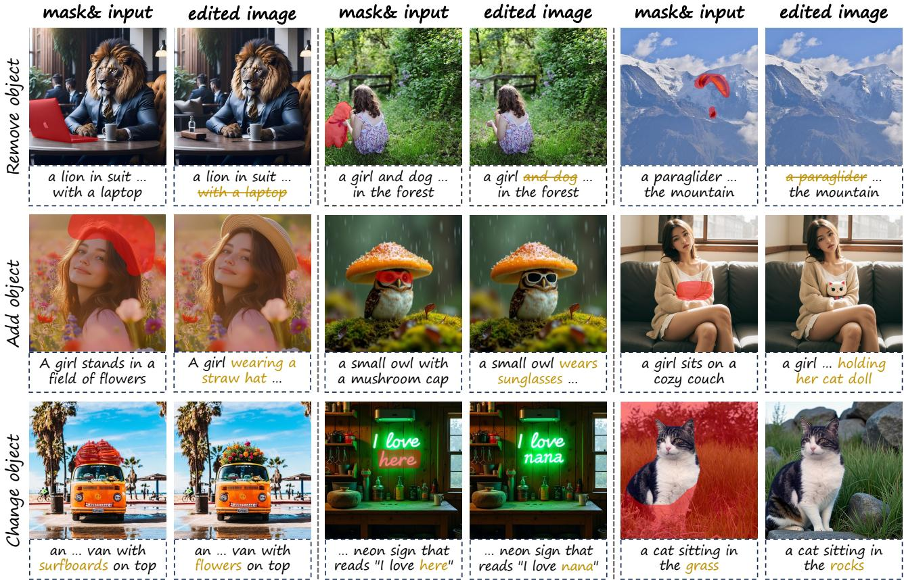
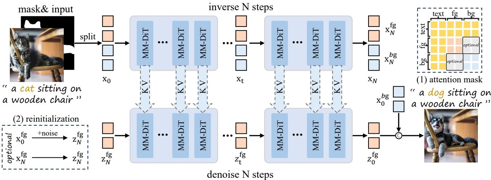
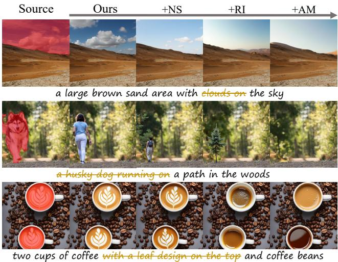

# 1. Bibliographic Information

## 1.1. Title
KV-Edit: Training-Free Image Editing for Precise Background Preservation

## 1.2. Authors
*   **Tianrui Zhu** (Shenzhen International Graduate School, Tsinghua University)
*   **Shiyi Zhang** (Shenzhen International Graduate School, Tsinghua University)
*   **Jiawei Shao** (Institute of Artificial Intelligence (TeleAI), China Telecom)
*   **Yansong Tang** (Shenzhen International Graduate School, Tsinghua University)

## 1.3. Journal/Conference
The paper was published on **arXiv** (Preprint). Based on the formatting and content, it appears to be a submission to a major computer vision conference (e.g., CVPR/ICCV), but currently, it is cited as an arXiv preprint.

## 1.4. Publication Year
2025 (Based on the provided metadata "Published at (UTC): 2025-02-24").

## 1.5. Abstract
This paper addresses the problem of **background consistency** in text-guided image editing. Existing methods often struggle to balance editing the target object (foreground) while keeping the rest of the image (background) unchanged. The authors propose **KV-Edit**, a method that requires **no model training**. It leverages the **Key-Value (KV) cache** mechanism within Diffusion Transformers (DiTs). By caching the "keys" and "values" of background tokens during the inversion process and reusing them during the generation (denoising) process, the method ensures the background remains mathematically identical to the original. The authors also optimize this for memory efficiency using an inversion-free technique ($O(1)$ space complexity) and introduce strategies for object removal. Experiments show it outperforms both training-free and training-based baselines in preserving backgrounds.

## 1.6. Original Source Link
*   **Link:** https://arxiv.org/abs/2502.17363
*   **PDF:** https://arxiv.org/pdf/2502.17363v3.pdf
*   **Status:** Preprint.

# 2. Executive Summary

## 2.1. Background & Motivation
**Core Problem:** In image editing (e.g., changing a dog into a cat in a photo), a major challenge is ensuring that the pixels not involved in the edit (the background) remain exactly the same.
**Importance:** For professional editing workflows, unintended changes to the background (e.g., lighting shifts, texture changes in the sky or walls) are unacceptable.
**Existing Gaps:**
1.  **Training-free methods** (like Prompt-to-Prompt) try to modify internal model attention but often fail to guarantee perfect consistency. They rely on heuristics that are hard to tune.
2.  **Training-based methods** (inpainting models) require expensive retraining and can degrade image quality or fail to follow text instructions precisely.
3.  **Inversion-Denoising Trade-off:** The standard process involves "inverting" an image to noise and then "denoising" it back. This process is lossy; the reconstructed background often differs slightly from the original due to accumulated mathematical errors.

    **Innovation:** The paper proposes adapting **KV Cache**—a technique famous in Large Language Models (LLMs) for speeding up text generation—to image generation models (specifically Diffusion Transformers). Instead of regenerating the background, the model simply "remembers" the background's mathematical representation (Keys and Values) from the original image and reuses it.

## 2.2. Main Contributions / Findings
1.  **KV-Edit Method:** A novel, training-free editing pipeline that uses KV cache in DiT architectures to strictly preserve background tokens.
2.  **Enhancement Strategies:** Introduction of **Mask-Guided Inversion** and **Reinitialization** to handle difficult cases like object removal, where "ghosts" of the original object tend to linger.
3.  **Memory Optimization:** An adaptation of the method to "Inversion-Free" editing, reducing the memory complexity of storing KV caches from linear $O(N)$ (storing for all timesteps) to constant $O(1)$, making it feasible for consumer hardware.
4.  **Superior Performance:** Quantitative and qualitative experiments on PIE-Bench demonstrate that KV-Edit achieves state-of-the-art background preservation (measured by PSNR and LPIPS) while maintaining high image quality, surpassing even training-based models like FLUX-Fill.

    The following figure (Figure 1 from the original paper) showcases the capability of KV-Edit to perform removal, addition, and alteration tasks while keeping the background identical:

    
    *该图像是编辑前后的对比示例，包括去除、添加和更改图像中的对象。每个实例展示了如何利用KV-Edit方法有效地处理图像，保持背景一致性，并生成新的内容，以融入用户提供的区域。左侧为输入图像和掩模，右侧为编辑后的图像。*

# 3. Prerequisite Knowledge & Related Work

## 3.1. Foundational Concepts

To understand this paper, a novice needs to grasp four key concepts:

1.  **Diffusion Transformers (DiT):**
    *   **Concept:** Traditional diffusion models used a **UNet** architecture (based on convolution). Newer models (like Stable Diffusion 3 or FLUX) use **Transformers** (based on Attention).
    *   **How it works:** The image is chopped into small squares called "patches" or "tokens." These tokens interact with each other to denoise the image. Because it uses Transformers, it has explicit **Query (Q), Key (K), and Value (V)** components in its attention layers.

2.  **Self-Attention & KV Cache:**
    *   **Self-Attention:** A mechanism where each token calculates how much it should "pay attention" to other tokens.
    *   **Formula:** $\text{Attention}(Q, K, V) = \text{softmax}(\frac{QK^T}{\sqrt{d}})V$.
    *   **KV Cache:** In text generation (like ChatGPT), the text generated so far doesn't change. To save time, the model saves the $K$ and $V$ matrices of past tokens so it doesn't have to recompute them for every new word.
    *   **In this paper:** The authors use this to save the $K$ and $V$ of the *background* of the image so the model doesn't have to "re-imagine" the background; it just looks up the saved values.

3.  **Inversion & Denoising:**
    *   **Denoising (Generation):** Starting from random noise and turning it into an image ($z_N \to z_0$).
    *   **Inversion:** The reverse process. Taking a real image and mathematically working backward to find the specific noise pattern that would generate it ($x_0 \to x_N$).
    *   **Editing:** Invert the real image to get its noise $\to$ Change the text prompt $\to$ Denoise starting from that noise. Ideally, this reconstructs the image with changes.

4.  **Flow Matching / Rectified Flow:**
    *   **Concept:** A newer, more efficient alternative to standard Diffusion. Instead of a random walk, it learns a "straight line" path (velocity field) between noise and data.
    *   **ODE (Ordinary Differential Equation):** The mathematical rule describing this path. The paper builds on **FLUX**, a model using Rectified Flow.

## 3.2. Previous Works
*   **Inversion-Denoising Paradigm:** Methods like **SDEdit** and **Prompt-to-Prompt (P2P)**. P2P modifies cross-attention maps to maintain structure but struggles with pixel-perfect background consistency.
*   **Attention Injection:** Methods like **Plug-and-Play (PnP)** inject features from the source image generation into the target generation.
*   **Training-Based Inpainting:** Methods like **BrushNet** or **FLUX-Fill** are trained specifically to fill in holes in images. They are effective but resource-heavy and can hallucinate content.

## 3.3. Technological Evolution
1.  **UNet Era:** Early editing used UNets (e.g., Stable Diffusion 1.5). Attention control was harder because convolutions mix information locally.
2.  **DiT Era:** The shift to Transformers (e.g., FLUX, Sora) makes "tokens" distinct entities. This allows for cleaner separation of foreground and background, which this paper exploits.
3.  **KV-Edit:** Represents the application of LLM optimization techniques (KV Cache) to Vision generation for the purpose of control, not just speed.

## 3.4. Differentiation Analysis
*   **Vs. Attention Control (P2P/MasaCtrl):** These modify *weights* or *maps*. KV-Edit modifies the *data* (K and V vectors) directly, ensuring the background is mathematically copied, not just "imitated."
*   **Vs. Inpainting:** KV-Edit is training-free. It works on the pre-trained model immediately.
*   **Vs. Standard Inversion:** Standard inversion suffers from error accumulation (the reconstructed image is slightly blurry or different). KV-Edit bypasses this by caching the exact values needed for the background.

# 4. Methodology

## 4.1. Principles
The core intuition is simple: If we want the background to remain unchanged, we should not let the model regenerate it. Instead, we should record exactly what the model "thought" about the background tokens during the inversion process (the **Keys** and **Values**) and force the model to reuse these thoughts during the generation of the new image. This essentially "freezes" the background in the attention mechanism.

## 4.2. Core Methodology In-depth

The method consists of two main stages: **Inversion with KV Cache** and **Denoising with KV Retrieval**.

The following figure (Figure 2 from the original paper) illustrates the overall pipeline:

*该图像是KV-Edit方法的示意图，展示了通过分割输入和重初始化过程进行图像编辑的步骤，以及如何维护背景一致性。图中包含的公式为 $O(1)$ 的空间复杂度优化方法，并演示了注意力掩码的应用。*

### 4.2.1. Mathematical Foundation (ODE)
The paper relies on the Ordinary Differential Equation (ODE) formulation of diffusion/flow models.
The probability flow is described as:
$$
d \mathbf { x } _ { t } = \left( f ( \mathbf { x } _ { t } , t ) - \frac { 1 } { 2 } g ^ { 2 } ( t ) \nabla _ { \mathbf { x } _ { t } } \log p ( \mathbf { x } _ { t } ) \right) d t , t \in [ 0 , 1 ]
$$
*   **$\mathbf{x}_t$**: The image state at time $t$ (where $t=0$ is image, $t=1$ is noise).
*   **$\nabla \log p$**: The score function (predicted by the model).

    For **Rectified Flow** (used in FLUX), this simplifies to a straight path determined by a velocity field $\mathbf{v}_\theta$:
$$
d \mathbf { x } _ { t } = \mathbf { v } _ { \theta } ( \mathbf { x } , t ) d t
$$
This allows moving between data and noise using discrete steps (e.g., Euler method):
$$
\mathbf { x } _ { t _ { i } } = \mathbf { x } _ { t _ { i - 1 } } + ( t _ { i } - t _ { i - 1 } ) \pmb { v } _ { \theta } ( C , \mathbf { x } _ { t _ { i } } , t _ { i } )
$$
where $C$ is the text condition.

### 4.2.2. Attention Decoupling
In a DiT, the self-attention layer for image tokens is the critical component. The standard attention is:
$$
\operatorname { Attn } ( \mathbf { Q } , \mathbf { K } , \mathbf { V } ) = \mathcal { S } ( \frac { \mathbf { Q } \mathbf { K } ^ { T } } { \sqrt { d } } ) \mathbf { V }
$$
where $\mathcal{S}$ is Softmax.

The authors propose **decoupling** the attention based on a user-provided mask. Let `bg` be background tokens and `fg` be foreground tokens.
When generating the new image (foreground), we only want to update the foreground, but it must "look at" the original background to blend in.
Therefore, the attention for the new foreground is computed as:

$$
\operatorname { Att } ( \mathbf { Q } ^ { f g } , ( \mathbf { K } ^ { f g } , \mathbf { K } ^ { b g } ) , ( \mathbf { V } ^ { f g } , \mathbf { V } ^ { b g } ) ) = \mathcal { S } ( \frac { \mathbf { Q } ^ { f g } \mathbf { K } ^ { T } } { \sqrt { d } } ) \mathbf { V }
$$

*   **$\mathbf{Q}^{fg}$**: The Queries derived from the *new* foreground tokens being generated.
*   **$(\mathbf{K}^{fg}, \mathbf{K}^{bg})$**: The concatenation of new foreground Keys and *cached* background Keys.
*   **$(\mathbf{V}^{fg}, \mathbf{V}^{bg})$**: The concatenation of new foreground Values and *cached* background Values.
*   **Result**: The output updates only the foreground tokens, but using context from the entire image.

### 4.2.3. Step 1: Inversion with KV Cache (Algorithm 1)
In this step, the original image $\mathbf{x}_{t_0}$ is inverted to noise $\mathbf{x}_{t_N}$.
Crucially, at every timestep $t_i$ and every transformer layer $l_j$, the method saves the Keys ($K$) and Values ($V$) corresponding to the background pixels.

**Algorithm Logic:**
1.  Input: Image $\mathbf{x}_{t_i}$, current timestep $t_i$, mask (0 for background, 1 for foreground).
2.  Pass $\mathbf{x}_{t_i}$ through the layer linear projections to get `Q, K, V`.
3.  **Extract & Cache**: Identify background indices using $1 - mask > 0$.
    $$
    K _ { i j } ^ { b g } , V _ { i j } ^ { b g } = K [ 1 - m a s k > 0 ] , V [ 1 - m a s k > 0 ]
    $$
    Append these to Cache $C$.
4.  Compute standard attention update for the inversion step.
5.  Predict velocity $v_\theta$ and move to next timestep $t_{i+1}$.

### 4.2.4. Step 2: Denoising with KV Retrieval (Algorithm 2)
In this step, the model starts from noise $\mathbf{z}_{t_N}$ (usually the inverted noise) and generates the edited image $\mathbf{z}_{t_0}$ based on a modified prompt.

**Algorithm Logic:**
1.  Input: Current foreground latent $\mathbf{z}_{t_i}^{fg}$, Cache $C$.
2.  Compute $Q^{fg}, K^{fg}, V^{fg}$ from the current noisy foreground.
3.  **Retrieve**: Get the cached background keys/values for this specific timestep and layer:
    $$
    K _ { i j } ^ { b g } , V _ { i j } ^ { b g } = C _ { K } [ i , j ] , C _ { V } [ i , j ]
    $$
4.  **Concatenate**: Combine cached background KV with current foreground KV.
    $$
    \bar { K , V } = \mathrm { C o n c a t } ( K _ { i j } ^ { b g } , K ^ { f g } ) , \mathrm { C o n c a t } ( V _ { i j } ^ { b g } , V ^ { f g } )
    $$
5.  **Compute Attention**: Use $\mathbf{Q}^{fg}$ against the concatenated $\bar{K}, \bar{V}$.
    $$
    \mathbf { z } _ { t _ { i } } ^ { f g } = \mathbf { z } _ { t _ { i } } ^ { f g } + \mathrm { A t t n } ( \mathbf { Q } ^ { f g } , \bar { K } , \bar { V } )
    $$
6.  The background part of the image $\mathbf{z}^{bg}$ is simply the original background $\mathbf{x}^{bg}$ carried over; it is not re-computed. The final image is a composite of $\mathbf{z}_{t_0}^{fg}$ and $\mathbf{x}_{t_0}^{bg}$.

### 4.2.5. Enhancement Strategies (For Object Removal)
Simply reusing background KV isn't enough when removing an object, because the "foreground" noise still contains information about the old object.

1.  **Reinitialization (Noise Injection):**
    Instead of starting denoising from the exact inverted noise $\mathbf{z}_{t_N}$, the authors mix in random Gaussian noise:
    $$
    \mathbf { z } _ { t _ { N } } ^ { \prime } = \mathrm { n o i s e } \cdot t _ { N } + \mathbf { z } _ { t _ { N } } \cdot ( 1 - t _ { N } )
    $$
    This disrupts the structure of the original object, helping the model "forget" it.

2.  **Mask-Guided Inversion:**
    During the *inversion* step, the attention mask is applied to prevent the background tokens from attending to the foreground object tokens. This ensures the cached background KV pairs are "pure" and don't contain leaked information about the object to be removed.

### 4.2.6. Memory-Efficient Optimization (Inversion-Free)
The standard method stores KV pairs for *all* $N$ timesteps ($O(N)$ memory). This is heavy (e.g., 75GB for 768px image).
The authors propose an **Inversion-Free** variant ($O(1)$ memory).

**Principle:** Instead of running the full inversion first and then full denoising, they perform one step of inversion and immediately one step of denoising.
1.  Compute inversion vector for step $t_i$. Cache KV temporarily.
2.  Compute denoising vector for step $t_i$ using the cached KV.
3.  Discard the KV cache.
4.  Calculate the net update vector (difference between denoising and inversion vectors) and apply it to the image.

    This dramatically reduces memory usage (e.g., from 75.6GB to 3.5GB) but may introduce slight artifacts compared to the full inversion method.

# 5. Experimental Setup

## 5.1. Datasets
*   **Name:** **PIE-Bench** (Pre-trained Image Editing Benchmark).
*   **Scale:** 620 images with corresponding masks and text prompts.
*   **Tasks:** Semantic editing tasks such as Object Addition, Object Removal, and Object Change. (Style transfer tasks were excluded to focus on background preservation).
*   **Why chosen:** It provides a standardized set of source images, target prompts, and masks, allowing for fair quantitative comparison of editing vs. preservation.

## 5.2. Evaluation Metrics

1.  **HPSv2 (Human Preference Score v2):**
    *   **Concept:** A metric trained to predict human preference for generated images, focusing on visual quality and prompt adherence.
    *   **Formula:** Not explicitly provided in paper, but generally $S = \text{Model}(Image, Text)$.
    *   **Meaning:** Higher is better (better quality/alignment).

2.  **Aesthetic Score (AS):**
    *   **Concept:** Evaluates the artistic and visual appeal of an image using a CLIP-based predictor (LAION-5B).
    *   **Meaning:** Higher is better.

3.  **PSNR (Peak Signal-to-Noise Ratio):**
    *   **Concept:** Measures the pixel-level similarity between the background of the original image and the edited image.
    *   **Formula:** `PSNR = 10 \cdot \log_{10} \left( \frac{MAX_I^2}{MSE} \right)`
    *   **Symbols:** $MAX_I$ is the maximum possible pixel value (e.g., 255), `MSE` is Mean Squared Error.
    *   **Meaning:** Higher is better (less noise/difference).

4.  **LPIPS (Learned Perceptual Image Patch Similarity):**
    *   **Concept:** Measures how "perceptually" similar two images are, using deep features rather than raw pixels.
    *   **Formula:** Weighted distance between feature maps of a pre-trained network (like VGG/AlexNet).
    *   **Meaning:** Lower is better (more similar).

5.  **MSE (Mean Squared Error):**
    *   **Concept:** Average squared difference between pixel values of the original and edited backgrounds.
    *   **Formula:** $MSE = \frac{1}{n} \sum_{i=1}^{n} (Y_i - \hat{Y}_i)^2$
    *   **Meaning:** Lower is better (closer to zero difference).

6.  **CLIP Similarity:**
    *   **Concept:** Measures semantic alignment between the edited image and the target text prompt.
    *   **Formula:** Cosine similarity between CLIP image embedding and CLIP text embedding.
    *   **Meaning:** Higher is better (image matches text).

## 5.3. Baselines
The authors compared against 6 methods:
1.  **P2P (Prompt-to-Prompt):** Classic attention control method.
2.  **MasaCtrl:** Replaces self-attention with mutual self-attention.
3.  **RF-Inversion:** Standard inversion for Rectified Flow.
4.  **RF-Edit:** Optimization-based editing for Rectified Flow.
5.  **BrushEdit:** Training-based inpainting (DDIM based).
6.  **FLUX-Fill:** Official training-based inpainting model for FLUX.

    These represent the state-of-the-art in both "tuning-free" (P2P, RF-Edit) and "heavy training" (FLUX-Fill) approaches.

# 6. Results & Analysis

## 6.1. Core Results Analysis
The experimental results overwhelmingly demonstrate that **KV-Edit** solves the background consistency problem. While other methods trade off background quality for editing flexibility, KV-Edit achieves near-perfect background scores (PSNR, MSE) because it mathematically enforces the background values.

**Key Findings:**
*   **Background Preservation:** KV-Edit achieves a PSNR of **35.87**, significantly higher than the next best (FLUX-Fill at 32.53) and far superior to standard inversion methods (P2P at 17.86).
*   **Image Quality:** Despite restricting the background, the overall image quality (HPS, Aesthetic Score) remains competitive, ranking just below RF-Inversion but with much better consistency.
*   **Comparison to Training-Based:** Surprisingly, KV-Edit outperforms FLUX-Fill (a model trained specifically for this) in preservation metrics. This suggests that training-free constraints can be more precise than learned behaviors.

## 6.2. Data Presentation (Tables)

The following are the results from **Table 1** of the original paper, comparing performance on PIE-Bench:

<table>
<thead>
<tr>
<th rowspan="2">Method</th>
<th colspan="2">Image Quality</th>
<th colspan="3">Masked Region Preservation</th>
<th colspan="2">Text Align</th>
</tr>
<tr>
<th>HPS×10² ↑</th>
<th>AS ↑</th>
<th>PSNR ↑</th>
<th>LPIPS×10³ ↓</th>
<th>MSE×10⁴ ↓</th>
<th>CLIP Sim ↑</th>
<th>IR×10 ↑</th>
</tr>
</thead>
<tbody>
<tr>
<td>VAE*</td>
<td>24.93</td>
<td>6.37</td>
<td>37.65</td>
<td>7.93</td>
<td>3.86</td>
<td>19.69</td>
<td>-3.65</td>
</tr>
<tr>
<td>P2P [16]</td>
<td>25.40</td>
<td>6.27</td>
<td>17.86</td>
<td>208.43</td>
<td>219.22</td>
<td>22.24</td>
<td>0.017</td>
</tr>
<tr>
<td>MasaCtrl [9]</td>
<td>23.46</td>
<td>5.91</td>
<td>22.20</td>
<td>105.74</td>
<td>86.15</td>
<td>20.83</td>
<td>-1.66</td>
</tr>
<tr>
<td>RF Inv. [44]</td>
<td>27.99</td>
<td>6.74</td>
<td>20.20</td>
<td>179.73</td>
<td>139.85</td>
<td>21.71</td>
<td>4.34</td>
</tr>
<tr>
<td>RF Edit [53]</td>
<td>27.60</td>
<td>6.56</td>
<td>24.44</td>
<td>113.20</td>
<td>56.26</td>
<td>22.08</td>
<td>5.18</td>
</tr>
<tr>
<td>BrushEdit [26]</td>
<td>25.81</td>
<td>6.17</td>
<td>32.16</td>
<td>17.22</td>
<td>8.46</td>
<td>22.44</td>
<td>3.33</td>
</tr>
<tr>
<td>FLUX Fill [1]</td>
<td>25.76</td>
<td>6.31</td>
<td>32.53</td>
<td>25.59</td>
<td>8.55</td>
<td>22.40</td>
<td>5.71</td>
</tr>
<tr>
<td>**Ours**</td>
<td>27.21</td>
<td>6.49</td>
<td>**35.87**</td>
<td>**9.92**</td>
<td>**4.69**</td>
<td>22.39</td>
<td>5.63</td>
</tr>
<tr>
<td>+NS+RI</td>
<td>**28.05**</td>
<td>6.40</td>
<td>33.30</td>
<td>14.80</td>
<td>7.45</td>
<td>**23.62**</td>
<td>**9.15**</td>
</tr>
</tbody>
</table>

*Note: VAE* represents the theoretical upper limit (reconstruction by the autoencoder without any diffusion process). KV-Edit ("Ours") comes very close to this limit.*

## 6.3. Ablation Studies
The authors investigated the impact of the **Reinitialization (RI)** and **Attention Mask (AM)** strategies, particularly for the object removal task (which is harder than simple editing).

The following are the results from **Table 2** of the original paper:

<table>
<thead>
<tr>
<th rowspan="2">Method</th>
<th colspan="2">Image Quality</th>
<th colspan="2">Text Align</th>
</tr>
<tr>
<th>HPS ×10² ↑</th>
<th>AS ↑</th>
<th>CLIP Sim ↑</th>
<th>IR×10 *</th>
</tr>
</thead>
<tbody>
<tr>
<td>KV Edit (ours)</td>
<td>26.76</td>
<td>6.49</td>
<td>25.50</td>
<td>6.87</td>
</tr>
<tr>
<td>+NS</td>
<td>26.93</td>
<td>6.37</td>
<td>25.05</td>
<td>3.17</td>
</tr>
<tr>
<td>+NS+AM</td>
<td>26.72</td>
<td>6.35</td>
<td>25.00</td>
<td>2.55</td>
</tr>
<tr>
<td>+NS+RI</td>
<td>26.73</td>
<td>6.34</td>
<td>24.82</td>
<td>0.22</td>
</tr>
<tr>
<td>+NS+AM+RI</td>
<td>26.51</td>
<td>6.28</td>
<td>24.90</td>
<td>0.90</td>
</tr>
</tbody>
</table>

**Analysis:**
*   Adding "No Skip" (NS) and "Reinitialization" (RI) slightly drops pure background metrics (seen in Table 1) but significantly improves text alignment (IR score improves from 5.63 to 9.15 in Table 1).
*   In Table 2 (removal focus), lower IR scores for the source prompt (meaning the object is effectively *gone*) are better. The base KV-Edit has a high IR (6.87), meaning the object lingers. Adding RI drops this to 0.22, showing that reinitialization is critical for effective object removal.

    The following figure (Figure 7 from the original paper) visualizes this effect, where adding strategies progressively cleans up the removal:

    
    *该图像是图表，展示了不同策略对物体移除任务的影响。左侧为源图像，右侧为结合多种策略后改进的结果，显示出逐步增强的去除效果。*

## 6.4. User Study
A user study with over 20 participants confirmed the quantitative metrics. KV-Edit was preferred over competitors, winning **94.8%** of the time against RF-Inversion in background preservation and **85.1%** overall.

# 7. Conclusion & Reflections

## 7.1. Conclusion Summary
This paper introduces **KV-Edit**, a powerful training-free method for text-guided image editing. By exploiting the architectural properties of Diffusion Transformers (DiTs), specifically the KV cache mechanism, the authors successfully decouple background preservation from foreground generation. The method ensures mathematically precise background consistency while allowing for flexible editing of user-specified regions. The inclusion of memory optimization ($O(1)$) and specific strategies for object removal makes it a robust and practical tool.

## 7.2. Limitations & Future Work
*   **Foreground Details:** The paper notes that while the background is perfect, preserving *details* within the edited foreground (e.g., keeping the texture of a shirt while changing its color) is challenging. The reinitialization strategy helps remove old content but can also wipe out desirable details.
*   **Large Mask Bias:** For very large masks, the generated content might ignore the small remaining background context. The authors propose an "Attention Scale" fix in the appendix but acknowledge it as a limitation.
*   **Future Directions:**
    *   Using **trainable tokens** to capture appearance details for better texture preservation.
    *   Extending the method to **Video Editing** (where temporal consistency is basically "background consistency" across time).
    *   Applying to **Inpainting** tasks more broadly.

## 7.3. Personal Insights & Critique
*   **Simplicity is King:** The elegance of this paper lies in reusing a mechanism designed for *speed* (KV Cache) for *control*. It turns a computational optimization into a semantic feature. This is a brilliant insight.
*   **The "Inversion-Free" Trade-off:** While the $O(1)$ memory optimization is impressive, the authors admit it introduces artifacts. For high-end production, the full inversion method is likely still necessary, limiting its use on lower-end consumer GPUs unless further optimized.
*   **The End of Tuning?** This method eliminates much of the hyperparameter tuning required by methods like P2P or PnP. This "plug-and-play" reliability is exactly what the field needs to move from research demos to actual product features.
*   **Transferability:** This technique is strictly for DiTs. As the field moves away from UNets to DiTs (FLUX, Sora, SD3), this method becomes increasingly relevant, whereas older UNet-based editing methods may become obsolete.