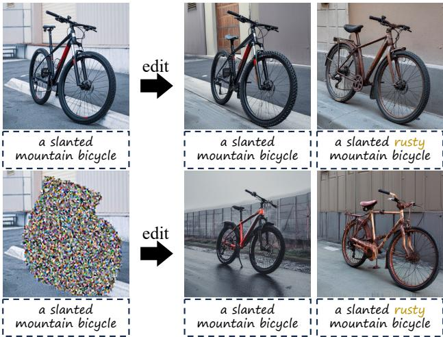
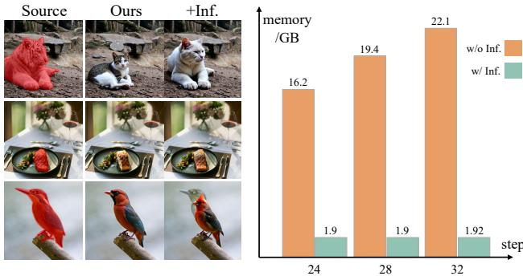
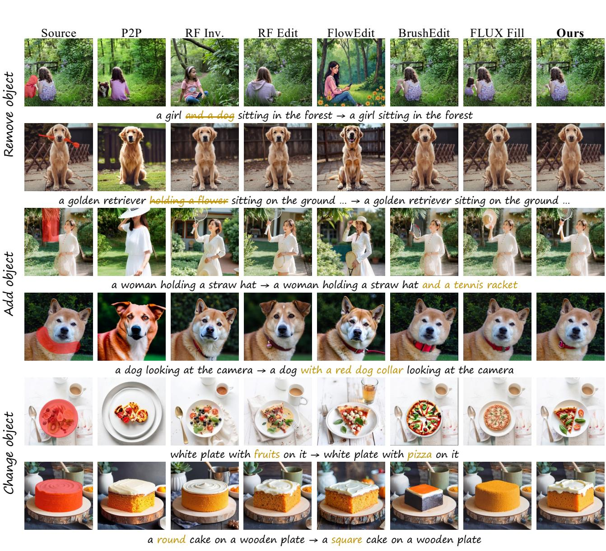

# 1. 论文基本信息

## 1.1. 标题
KV-Edit: Training-Free Image Editing for Precise Background Preservation  
（KV-Edit：用于精确背景保留的免训练图像编辑方法）

## 1.2. 作者
Tianrui Zhu\*, Shiyi Zhang\*, Jiawei Shao, Yansong Tang\*  
(* 为通讯作者或共同一作，具体贡献见原文注脚)

**隶属机构：**
*   清华大学深圳国际研究生院 (Shenzhen International Graduate School, Tsinghua University)
*   中国电信人工智能研究院 (TeleAI)

## 1.3. 发表期刊/会议
**发表平台：** arXiv (预印本)  
<strong>发布时间 (UTC)：</strong> 2025-02-24

## 1.4. 摘要核心解读
背景一致性（Background Consistency）是图像编辑任务中的巨大挑战。现有方法往往在“保持原图相似度”和“生成符合目标提示词的内容”之间面临权衡。本文提出了 **KV-Edit**，这是一种针对基于 DiT（Diffusion Transformer）架构生成模型的免训练（Training-Free）编辑方法。

**核心思想：** 利用 DiT 中的 KV Cache（键值缓存）机制。在反演（Inversion）过程中，背景区域的 Token（词元）对应的键（Key）和值（Value）被缓存下来，而不是在生成过程中重新计算。
**主要效果：**
1.  **精确保留背景：** 背景 Token 直接复用，无需再生，消除了复杂机制或昂贵的训练需求。
2.  **无缝融合：** 生成的新内容（前景）能与保留的背景在用户指定区域内完美融合。
3.  **效率优化：** 进一步探索了“免反演”（Inversion-Free）方法，将 KV Cache 的空间复杂度优化至 $O(1)$。
    **结论：** 实验表明，KV-Edit 在背景保留和图像质量方面显著优于现有方法，甚至超过了部分基于训练的方法。

## 1.5. 原文链接
*   **arXiv 页面:** [https://arxiv.org/abs/2502.17363](https://arxiv.org/abs/2502.17363)
*   **PDF 下载:** [https://arxiv.org/pdf/2502.17363v3.pdf](https://arxiv.org/pdf/2502.17363v3.pdf)

    ---

# 2. 整体概括

## 2.1. 研究背景与动机
*   **技术演进：** 文生图（Text-to-Image, T2I）模型正经历从 U-Net 架构向 **DiT (Diffusion Transformer)** 架构的转变（如 Sora, Flux），以及从传统扩散模型向 <strong>Flow Matching (如 Rectified Flow)</strong> 的转变。这些新架构带来了更高的生成质量和扩展性。
*   **现有痛点：** 图像编辑的核心在于“改该改的，留该留的”。
    *   <strong>反演-去噪范式 (Inversion-Denoising):</strong> 现有的免训练方法（如 Prompt-to-Prompt）虽然能生成相似图像，但难以保证背景像素级的严格一致性。误差累积、条件变化都会导致背景发生细微但恼人的改变。
    *   <strong>训练基方法 (Training-based):</strong> 如 Inpainting 模型，虽然效果好但训练成本高昂。
*   **创新切入点：** 既然 DiT 架构天然由 Token 组成，且使用自注意力机制（Self-Attention），能否借鉴大语言模型（LLM）中的 **KV Cache** 技术，直接“冻结”背景的特征，只计算前景？

## 2.2. 核心贡献
1.  **KV-Edit 方法：** 提出了一种全新的免训练编辑框架。通过在 DiT 中实现 KV Cache，确保编辑过程中背景区域的 Key 和 Value 对完全不变，从而实现背景的完美一致性。
2.  **增强策略：** 针对物体移除（Object Removal）这一高难度任务，提出了 <strong>掩码引导反演 (Mask-guided Inversion)</strong> 和 <strong>重初始化 (Reinitialization)</strong> 策略，有效解决了原有物体残留信息的干扰。
3.  **内存优化：** 将 KV-Edit 应用于免反演（Inversion-Free）流程，仅需保存一步的 KV，将显存占用的时间复杂度从 $O(N)$ 降低到 $O(1)$，使其更适合在个人电脑上运行。
4.  **性能验证：** 在 PIE-Bench 上进行了广泛实验，证明该方法在背景保留指标上大幅领先，且图像质量与直接生成相当。

    ---

# 3. 预备知识与相关工作

## 3.1. 基础概念

*   **DiT (Diffusion Transformer):**
    传统的扩散模型（如 Stable Diffusion）使用 U-Net（卷积神经网络）作为主干。DiT 则使用 Transformer 架构，将图像切分为一个个 Patch（小块），转化为 <strong>Token (词元)</strong> 进行处理。这使得对图像特定区域（即特定 Token 集合）的精确控制变得更加容易。

*   <strong>Rectified Flow (整流流模型):</strong>
    一种比传统扩散模型更高效的生成模型。它构建了一条从噪声分布到真实图像分布的“直线”概率流。其生成过程可以用常微分方程（ODE）描述：
    $$ d \mathbf { x } _ { t } = \mathbf { v } _ { \theta } ( \mathbf { x } , t ) d t $$
    其中 $\mathbf { v } _ { \theta }$ 是模型预测的速度场。相比 DDIM，它通常需要更少的步数。

*   <strong>KV Cache (键值缓存):</strong>
    在 Transformer 的注意力机制（Attention）中，输入被映射为 Query ($Q$), Key ($K$), Value ($V$)。
    *   **常规作用：** 在 LLM 文本生成中，为了加速，之前的 Token 计算出的 $K$ 和 $V$ 会被缓存下来，避免重复计算。
    *   **本文作用：** 作者创造性地将其用于**内容保持**。背景的 $K$ 和 $V$ 代表了背景的特征信息。缓存并复用它们，就等于强制模型“看到”并复原原始背景。

## 3.2. 前人工作与差异化

*   <strong>基于注意力的编辑 (Attention Modification):</strong>
    *   *代表作：* Prompt-to-Prompt (P2P), Plug-and-Play (PnP)。
    *   *原理：* 通过在去噪过程中注入原图的注意力图（Attention Map）或特征。
    *   *局限：* 只能达到“相似”，无法做到“一致”。因为 U-Net 的卷积操作会混合空间信息，难以完全解耦背景和前景。
*   <strong>基于反演的优化 (Better Inversion):</strong>
    *   *代表作：* Null-text Inversion, RF-Solver。
    *   *原理：* 优化反演过程，减少重建误差。
    *   *局限：* 误差只能减少无法消除。
*   <strong>本文差异 (KV-Edit):</strong>
    本文不再试图“修补”注意力图或减少误差，而是利用 DiT 的特性，直接**复用**背景的 `K, V` 数据。这是一种确定性的操作，从原理上保证了背景 Token 不会发生变化。

---

# 4. 方法论

## 4.1. 方法原理：重新思考反演-去噪范式

作者首先分析了为什么传统方法无法保持背景一致。
在 Rectified Flow 中，反演（Inversion, 图 -> 噪）和去噪（Denoising, 噪 -> 图）互为逆过程。理想情况下 $\mathbf{z}_{t_0}$（生成图）应等于 $\mathbf{x}_{t_0}$（原图）。
但在编辑时，条件 $C$ 改变了（例如提示词从“猫”变成“狗”），且前景噪声 $\mathbf{z}^{fg}$ 也可能改变。
根据 ODE 的离散化公式：
$$
\mathbf { z } _ { t _ { i - 1 } } ^ { b g } = \mathbf { z } _ { t _ { i } } ^ { b g } + ( t _ { i - 1 } - t _ { i } ) \pmb { v } _ { \theta } ( C , \mathbf { z } _ { t _ { i } } ^ { f g } , \mathbf { z } _ { t _ { i } } ^ { b g } , t _ { i } )
$$
可以看到，背景的去噪路径 $\mathbf { z } ^ { b g }$ 会受到前景 $\mathbf { z } ^ { f g }$ 和新文本条件 $C$ 的影响。这就是为什么仅仅改变前景提示词，背景也会跟着变的原因（称为 Attention Leakage 或 Global Context Influence）。

下图（原文 Figure 3）展示了即使没有编辑，仅仅是反演再重建，也会产生累积误差：

*该图像是一个图表，展示了反演重建过程中的重建误差（MSE）变化。纵轴表示重建误差的值（以 `10` 倍的 MSE 为单位），横轴则表示反演步骤。图中包含四个不同时间步的图像，分别为原始图像（Source Image）和经过 28、24、15 步的中间图像。重建误差在反演过程中逐渐降低，最终趋近于 0.07，表明反演效果逐步改善。*

下图（原文 Figure 4）展示了前景内容和条件变化如何导致背景漂移：

*该图像是示意图，展示了使用 KV-Edit 技术对山地自行车进行编辑的过程。左侧展示原始图像和编辑后的结果，右侧则展示了对背景保持一致性的影响，体现了前景内容和条件变化对最终结果的影响。*

## 4.2. 核心方法详解：注意力解耦与 KV Cache

为了解决上述问题，KV-Edit 利用 DiT 的注意力机制将前景和背景彻底解耦。

### 4.2.1. 注意力解耦公式
在 DiT 的自注意力层中，作者修改了计算方式。对于图像模态的自注意力，公式如下：

$$
\operatorname { A t t } ( \mathbf { Q } ^ { f g } , ( \mathbf { K } ^ { f g } , \mathbf { K } ^ { b g } ) , ( \mathbf { V } ^ { f g } , \mathbf { V } ^ { b g } ) ) = \mathcal { S } ( \frac { \mathbf { Q } ^ { f g } \mathbf { K } ^ { T } } { \sqrt { d } } ) \mathbf { V }
$$

*   $\mathbf{Q}^{fg}$: 仅包含**前景** Token 的查询向量。
*   $(\mathbf{K}^{fg}, \mathbf{K}^{bg})$: 将前景和背景的键向量**拼接**。
*   $(\mathbf{V}^{fg}, \mathbf{V}^{bg})$: 将前景和背景的值向量**拼接**。
*   $\mathcal{S}$: Softmax 操作。

    **原理解析：** 这个公式的核心在于，**我们只计算前景区域的更新**（输出只有前景维度），但是在计算过程中，前景 Token 可以“看见”并参考背景的 Token（通过 $K^{bg}$ 和 $V^{bg}$）。这确保了生成的前景能与背景无缝融合，同时背景本身不被重新计算，因此保持不变。

### 4.2.2. 完整流程 (Algorithm 1 & 2)

KV-Edit 包含两个阶段：带有 KV 缓存的反演，以及读取 KV 缓存的去噪。

下图（原文 Figure 2）展示了 KV-Edit 的完整流程图：

<strong>阶段一：反演并缓存 (Inversion with KV Cache)</strong>
我们对原图进行反演，在每一步、每一层，将背景区域的 $K$ 和 $V$ 存入缓存 $C$。

*   **输入：** 原图 $x$，掩码 `mask`（前景为 1，背景为 0）。
*   <strong>关键步骤 (Algorithm 1):</strong>
    1.  计算全图的 `Q, K, V`。
    2.  提取背景部分的 `K, V`:
        $$ K_{ij}^{bg}, V_{ij}^{bg} = K[1-mask > 0], V[1-mask > 0] $$
    3.  存入缓存：$C \gets \mathrm{Append}(K_{ij}^{bg}, V_{ij}^{bg})$。
    4.  更新 $x$ 继续反演。

<strong>阶段二：去噪并编辑 (Denoising with KV Retrieval)</strong>
我们生成新的前景，同时强制使用缓存的背景信息。

*   **输入：** 前景噪声 $z^{fg}$，缓存 $C$。
*   <strong>关键步骤 (Algorithm 2):</strong>
    1.  仅计算前景的 $Q^{fg}, K^{fg}, V^{fg}$。
    2.  从缓存取出对应的背景 `K, V`:
        $$ K_{ij}^{bg}, V_{ij}^{bg} = C_K[i, j], C_V[i, j] $$
    3.  拼接得到完整的 `K, V`:
        $$ \bar{K} = \mathrm{Concat}(K_{ij}^{bg}, K^{fg}), \quad \bar{V} = \mathrm{Concat}(V_{ij}^{bg}, V^{fg}) $$
    4.  执行注意力计算（使用 4.2.1 中的公式），更新前景 $z^{fg}$。
    5.  最终图像 = 生成的前景 + 原始背景。

## 4.3. 增强策略 (针对物体移除任务)

在“移除物体”任务中，仅仅使用掩码往往不够，因为原物体的信息会残留在噪声中，导致模型倾向于重建原物体（“鬼影”现象）。作者提出了两个策略：

1.  <strong>掩码引导反演 (Mask-Guided Inversion):</strong>
    在反演阶段计算注意力时，就使用掩码屏蔽掉前景对背景的影响。这样背景的 `K, V` 就不会包含待移除物体的信息。

2.  <strong>重初始化 (Reinitialization, RI):</strong>
    在反演结束后，不直接使用反演得到的噪声 $\mathbf{z}_{t_N}$ 作为起点，而是将其与纯高斯噪声混合：
    $$ \mathbf { z } _ { t _ { N } } ^ { \prime } = \mathrm { noise } \cdot t _ { N } + \mathbf { z } _ { t _ { N } } \cdot ( 1 - t _ { N } ) $$
    这步操作主动破坏了噪声中残留的原物体结构信息，迫使模型更依赖文本提示词生成新内容（或填充背景）。

下图（原文 Figure 7）展示了这些策略如何帮助逐步清除残留物体：

*该图像是图表，展示了不同策略对物体移除任务的影响。左侧为源图像，右侧为结合多种策略后改进的结果，显示出逐步增强的去除效果。*

## 4.4. 内存优化：免反演 KV-Edit (Inversion-Free)

传统的反演需要存储所有时间步（例如 24 步）的 `K, V`，显存消耗巨大（$O(N)$）。
作者借鉴了 FlowEdit 的思想，提出了免反演版本：
*   **原理：** 不再一次性反演到底。而是在每个时间步 $t_i$，临时计算出一步反演的 `K, V`，立即用于当前的去噪步骤，用完即弃。
*   **优势：** 空间复杂度降为 $O(1)$，与时间步数无关。
*   **代价：** 可能会引入少量伪影（Artifacts）。

    下图（原文 Figure 5）展示了免反演方法的内存优势及效果对比：

    
    *该图像是一个示意图，左侧展示了KV-Edit的效果对比，包括源图像、我们的方法和带补充信息的方法，右侧则展示了编辑过程中的内存消耗变化，具体数据为24、28和32步时的消耗情况。通过不使用反演，显著优化了空间复杂度至 $O(1)$。*

---

# 5. 实验设置

## 5.1. 数据集
*   **数据集:** **PIE-Bench** (700张图片，本文使用了非风格迁移类的 620 张)。
*   **内容:** 包含对应的源图像、目标图像、编辑指令（Prompt）、物体掩码（Mask）。
*   **任务类型:** 物体移除 (Removal)、物体添加 (Addition)、物体更改 (Change)。

## 5.2. 评估指标
为了全面评估编辑效果，使用了以下三类指标：

1.  <strong>图像质量 (Image Quality):</strong>
    *   **HPSv2 (Human Preference Score v2):** 预测人类对生成图像的偏好程度。
    *   **Aesthetic Score (AS):** 评估图像的美学质量。

2.  <strong>背景保留 (Masked Region Preservation):</strong>
    *   **PSNR (Peak Signal-to-Noise Ratio):** 峰值信噪比。衡量背景区域像素级的保真度。公式如下：
        $$ \mathrm{PSNR} = 10 \cdot \log_{10} \left( \frac{\mathrm{MAX}_I^2}{\mathrm{MSE}} \right) $$
        其中 $\mathrm{MAX}_I$ 是像素最大值，$\mathrm{MSE}$ 是均方误差。
    *   **LPIPS (Learned Perceptual Image Patch Similarity):** 学习感知图像块相似度。比 PSNR 更符合人类视觉感知。值越低越好。
    *   **MSE (Mean Squared Error):** 均方误差。计算背景像素值的差异。
        $$ \mathrm{MSE} = \frac{1}{mn} \sum_{i=0}^{m-1} \sum_{j=0}^{n-1} [I(i, j) - K(i, j)]^2 $$

3.  <strong>文本对齐 (Text Alignment):</strong>
    *   **CLIP Score:** 计算生成图像与目标文本提示词在 CLIP 特征空间中的余弦相似度。
    *   **Image Reward:** 基于人类反馈强化的奖励模型，用于评估图文一致性。

## 5.3. 对比基线
*   <strong>免训练方法 (Training-Free):</strong> P2P (Prompt-to-Prompt), MasaCtrl, RF-Edit, RF-Inversion。
*   <strong>基于训练的方法 (Training-Based):</strong> BrushEdit (基于 SD), FLUX-Fill (基于 Flux 的 Inpainting 模型)。

    ---

# 6. 实验结果与分析

## 6.1. 核心结果分析

定量实验结果如下表所示（原文 Table 1）：

<table>
<thead>
<tr>
<th rowspan="2">Method</th>
<th colspan="2">Image Quality</th>
<th colspan="3">Masked Region Preservation</th>
<th colspan="2">Text Align</th>
</tr>
<tr>
<th>HPS×10² ↑</th>
<th>AS ↑</th>
<th>PSNR ↑</th>
<th>LPIPS×10³ ↓</th>
<th>MSE×10⁴ ↓</th>
<th>CLIP Sim ↑</th>
<th>IR×10 ↑</th>
</tr>
</thead>
<tbody>
<tr>
<td>VAE* (重建上限)</td>
<td>24.93</td>
<td>6.37</td>
<td>37.65</td>
<td>7.93</td>
<td>3.86</td>
<td>19.69</td>
<td>-3.65</td>
</tr>
<tr>
<td>P2P [16]</td>
<td>25.40</td>
<td>6.27</td>
<td>17.86</td>
<td>208.43</td>
<td>219.22</td>
<td>22.24</td>
<td>0.017</td>
</tr>
<tr>
<td>MasaCtrl [9]</td>
<td>23.46</td>
<td>5.91</td>
<td>22.20</td>
<td>105.74</td>
<td>86.15</td>
<td>20.83</td>
<td>-1.66</td>
</tr>
<tr>
<td>RF Inv. [44]</td>
<td>27.99</td>
<td>**6.74**</td>
<td>20.20</td>
<td>179.73</td>
<td>139.85</td>
<td>21.71</td>
<td>4.34</td>
</tr>
<tr>
<td>RF Edit [53]</td>
<td>27.60</td>
<td>6.56</td>
<td>24.44</td>
<td>113.20</td>
<td>56.26</td>
<td>22.08</td>
<td>5.18</td>
</tr>
<tr>
<td>BrushEdit [26]</td>
<td>25.81</td>
<td>6.17</td>
<td>32.16</td>
<td>17.22</td>
<td>8.46</td>
<td>22.44</td>
<td>3.33</td>
</tr>
<tr>
<td>FLUX Fill [1]</td>
<td>25.76</td>
<td>6.31</td>
<td>32.53</td>
<td>25.59</td>
<td>8.55</td>
<td>22.40</td>
<td>5.71</td>
</tr>
<tr>
<td>**Ours**</td>
<td>27.21</td>
<td>6.49</td>
<td>**35.87**</td>
<td>**9.92**</td>
<td>**4.69**</td>
<td>22.39</td>
<td>5.63</td>
</tr>
<tr>
<td>**+NS+RI**</td>
<td>**28.05**</td>
<td>6.40</td>
<td><u>33.30</u></td>
<td><u>14.80</u></td>
<td><u>7.45</u></td>
<td>**23.62**</td>
<td>**9.15**</td>
</tr>
</tbody>
</table>

**分析：**
1.  <strong>背景保留 (Preservation):</strong> KV-Edit 在 PSNR, LPIPS, MSE 上**碾压**了所有基线方法。PSNR 达到 35.87，非常接近 VAE 直接重建的上限 (37.65)，这证明了 KV Cache 策略的有效性。即便是专门训练的 Inpainting 模型（Flux Fill, BrushEdit）在背景一致性上也输给了 KV-Edit。
2.  **图像质量与对齐:** 加入 **NS (No-Skip)** 和 **RI (Reinitialization)** 策略后，本文方法在 HPS 和 Image Reward (IR) 上也取得了最高分，说明在保证背景不变的同时，编辑效果（如物体移除）也非常成功。

## 6.2. 定性对比分析
下图（原文 Figure 6）展示了直观的编辑效果对比：

*该图像是图表，展示了KV-Edit方法在各类图像编辑任务中相较于不同编辑方法的效果。图中显示了源图像与不同方法处理后的结果，包括去除、添加或更改对象的比较，突出KV-Edit在背景一致性和图像质量上的优越性。*

*   <strong>Removal 任务 (第一行):</strong> 目标是移除车手。RF-Edit 等方法虽然去掉了人，但背景变成了奇怪的模糊图像。Flux-Fill 产生了某种幻觉（生成了奇怪的物体）。KV-Edit (+RI) 干净地移除了物体并填补了合理的背景。
*   <strong>Addition 任务 (第二行):</strong> 目标是给狗加个墨镜。RF-Inversion 完全改变了狗的品种和背景。KV-Edit 精确地加上了墨镜，背景纹丝不动。

## 6.3. 消融实验与内存分析
*   **策略消融:** 表 2 (Table 2) 和图 11 (Figure D) 显示，对于颜色更改和物体移除，使用重初始化 (RI) 能显著提升文本对齐度（CLIP Sim 从 25.50 优化至 24.82，越低越好因为这里是与原图 Prompt 的相似度，移除后应降低）。
*   **内存消耗:** 表 A (Table A, Appendix) 显示，在 768x768 分辨率下，标准 KV-Edit 需要 65.8G 显存（因为存了所有步），而免反演版本仅需 3.5G，极大地降低了硬件门槛。

    ---

# 7. 总结与思考

## 7.1. 结论总结
KV-Edit 成功将 LLM 领域的 KV Cache 技术迁移到了视觉生成领域，解决了一个长期存在的痛点：**如何在不重新训练模型的情况下，实现像素级的背景保留编辑。**
其核心优势在于：
1.  **确定性：** 通过物理缓存背景特征，而非通过损失函数引导，从根本上保证了一致性。
2.  **解耦性：** 利用 DiT 的注意力机制，实现了前景生成的自由度与背景保留的刚性约束之间的完美平衡。
3.  **通用性：** 适用于任何基于 DiT 的模型（如 Flux, Sora 等），无需微调。

## 7.2. 局限性与未来工作
作者在附录中坦诚了局限性：
1.  **前景细节丢失：** 在修改物体属性（如衣服颜色）时，可能会丢失原物体的纹理细节（如衣服的褶皱）。这是因为反演-去噪范式倾向于重构整体结构而非微小纹理。
2.  **免反演的伪影：** 内存优化版本 ($O(1)$) 在某些情况下会引入噪点或伪影。
3.  **大面积 Mask 的偏差：** 当 Mask 很大时，模型可能忽略背景的上下文信息，导致生成内容不连贯（为此作者提出了 Attention Scale 补救，见附录）。

## 7.3. 个人启发与批判
*   **跨界融合的价值：** 这篇论文是 NLP 技术（KV Cache）反哺 CV 领域的典型案例。它提示我们，DiT 架构的普及使得处理图像和处理文本的方法论可以高度互通。
*   **对 Inpainting 的降维打击：** 传统 Inpainting 需要专门训练模型来学习“填补空缺”。KV-Edit 证明了，只要有强大的预训练生成模型，通过合理的注意力控制，完全可以零样本（Zero-shot）实现高质量 Inpainting。
*   **思考：** 虽然 KV Cache 保证了背景 `K, V` 不变，但前景生成的 Query $Q$ 与背景 $K$ 交互时，注意力权重（Attention Weights）是由模型自动计算的。如果模型判断前景与背景“不搭”，可能会强行生成突兀的边缘。如何进一步优化边缘融合（Blending）可能是后续值得研究的方向。