# OpenVLA：一个开源的视觉-语言-动作模型

Moo Jin $\mathbf { K } \mathbf { i m } ^ { * , 1 }$ Karl Pertsch\*, 1,2 Siddharth Karamcheti\*,1,3 Ted Xiao4 Ashwin Balakrishna3 Suraj Nair3 Rafael Rafailov1 Ethan Foster1 Grace Lam Pannag Sanketi4 Quan Vuong5, Thomas Kollar3 Benjamin Burchfiel3 Russ Tedrake3,6 Dorsa Sadigh Sergey Levine2 Percy Liang1 Chelsea Finn1

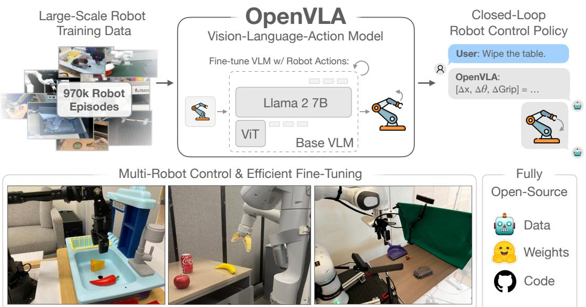  

Figure 1: We present OpenVLA, a 7B-parameter open-source vision-language-action model (VLA), trained on 970k robot episodes from the Open X-Embodiment dataset [1]. OpenVLA sets a new state of the art for ras olat po. It po mul o u eo adapted to new robot domains via parameter-efficient fine-tuning. The OpenVLA checkpoints and PyTorch training pipeline are fully open-source and models can be downloaded and fine-tuned from HuggingFace.

摘要：基于互联网规模的视觉语言数据和多样化机器人演示预训练的大型策略，有可能改变我们教机器人新技能的方式：我们可以微调这些视觉-语言-动作（VLA）模型，以获取适用于视觉运动控制的稳健且可泛化的策略，而无需从头开始训练新行为。然而，VLA在机器人领域的广泛应用面临挑战，主要有两个原因：1）现有的VLA大多是封闭的，公众无法访问；2）以往的研究未能探索有效微调VLA以应对新任务的方法，这是推广的关键组成部分。为了解决这些挑战，我们推出了OpenVLA，一个拥有70亿参数的开源VLA，训练基于97万条真实世界机器人演示的多样化数据集。OpenVLA以Llama 2语言模型为基础，结合视觉编码器，融合了来自DINOv2和SigLIP的预训练特征。得益于数据多样性和新模型组件，OpenVLA在通用操作上表现出色，在29个任务和多种机器人平台上，其绝对任务成功率超越了闭源模型RT-2-X（550亿参数）高达16.5%，且参数数量减少了7倍。我们进一步展示了OpenVLA在新环境下进行有效微调的能力，特别是在涉及多个物体和强语言基础的多任务环境中表现出优秀的泛化能力，并以20.4%超越了如Diffusion Policy等强大的从头模仿学习方法。我们还探讨了计算效率；作为单独贡献，我们展示了OpenVLA可以通过现代低秩适应方法在消费级GPU上进行微调，并通过量化高效服务，而不影响下游成功率。最后，我们发布了模型检查点、微调笔记本以及我们的PyTorch代码库，内置支持在Open X-Embodiment数据集上大规模训练VLA。

# 1 引言

针对机器人操作的学习策略的一个关键弱点是其无法超越训练数据进行泛化：虽然现有为个别技能或语言指令训练的策略能够将行为推断到新的初始条件，例如物体位置或光照 [2, 3]，但它们在场景干扰物或新颖物体面前缺乏鲁棒性 [4, 5]，并且在执行未见过的任务指令时面临困难 [6, 7]。然而，除了机器人技术，现有的如 CLIP [8]、SigLIP [9] 和 Llama 2 [10] 等视觉和语言基础模型则能够实现这些类型的泛化甚至更多，这源于它们在互联网规模的预训练数据集中捕获的先验知识。尽管为机器人技术再现这种规模的预训练仍然是一个开放性挑战——即使是最大的机器人操作数据集 [1, 11] 也仅有 10 万到 100 万个实例，这种不平衡暗示了一个机会：利用现有的视觉和语言基础模型作为训练机器人策略的核心构建模块，从而使其能够泛化到超出训练数据的物体、场景和任务。

为了实现这一目标，现有研究探索了将预训练的语言模型和视觉-语言模型集成用于机器人表示学习[1214]，以及作为模块化系统中任务规划与执行的组成部分[15, 16]。最近，它们被直接用于学习视觉-语言-动作模型（VLA；1, 7, 17, 18）以进行控制。VLA直接实例化了使用预训练的视觉和语言基础模型用于机器人控制，直接微调视觉条件语言模型（VLM），如PaLI[19, 20]，以生成机器人控制动作。通过基于在互联网规模数据上训练的强大基础模型，像RT-2[7]这样的VLA展现了令人印象深刻的鲁棒性表现，以及对新物体和任务的泛化能力，树立了通用机器人策略的新标准。然而，有两个关键原因阻碍了现有VLA的广泛使用：1）当前模型[1, 7, 17, 18]是封闭的，对模型架构、训练过程和数据混合的可见性有限；2）现有工作未提供将VLA部署和适应于新机器人、环境和任务的最佳实践——特别是在商用硬件上（例如，消费级GPU）。我们认为，为了为未来的研究和开发奠定丰富的基础，机器人技术需要开放源代码的通用VLA，支持有效的微调和适应，类似于现有的开放源代码语言模型生态系统[2124]。

为此，我们引入了OpenVLA，一个具有70亿参数的开源视觉语言模型（VLA），它为通用机器人操作策略建立了新的最先进水平。OpenVLA由一个经过预训练的视觉条件语言模型主干网络组成，该网络在多个粒度上捕捉视觉特征，并在来自Open-X Embodiment [1] 数据集的970k机器人操作轨迹的大规模多样化数据集上进行了微调——该数据集涵盖了广泛的机器人形态、任务和场景。作为数据多样性增加和新模型组件的产物，OpenVLA在WidowX和Google Robot形态上，在29个评估任务中的绝对成功率比之前的最先进VLA，55亿参数的RT-2-X模型 [1, 7] 提高了16.5%。我们还研究了VLA的高效微调策略，这是之前工作未探讨的新贡献，跨越了7个多样的操作任务，涵盖了从物体拾取和放置到清洁桌面的行为。我们发现，微调后的OpenVLA策略明显优于微调后的预训练策略，如Octo [5]。与使用扩散策略进行从零开始的模仿学习 [3] 相比，微调后的OpenVLA在多任务设置中涉及将语言基础置于行为的任务上显示出显著的改进。基于这些结果，我们首次展示了利用低秩适应 [LoRA; 26] 和模型量化 [27] 的计算高效微调方法的有效性，从而使OpenVLA模型能够在消费者级GPU上进行适应，而不需大型服务器节点而不影响性能。作为最后的贡献，我们开源了所有模型、部署和微调笔记本，以及用于大规模训练VLA的OpenVLA代码库，希望这些资源能够促进未来的研究，探索和适应机器人领域的VLA。

# 2 相关工作

视觉条件语言模型 视觉条件语言模型（VLMs）是基于互联网规模的数据进行训练的，能够根据输入图像和语言提示生成自然语言，这些模型已被广泛应用于视觉问答[2831]和物体定位[32, 33]等多种应用场景。推动近期VLMs发展的一个关键进展是模型架构，这些架构将预训练的视觉编码器[8, 9, 25]与预训练的语言模型[10, 23, 34, 36]结合起来，直接基于计算机视觉和自然语言建模的进展，构建强大的多模态模型。虽然早期工作探索了多种视觉与语言特征之间交叉关注的架构[37-41]，但新的开源VLMs[20, 42-44]已趋向于一种更简单的“块作为词元”的方法，其中来自预训练视觉变换器的块特征被视为词元，然后投影到语言模型的输入空间。这种简化使得现有工具能够轻松地被重新用于大规模训练语言模型以进行VLM训练。我们在工作中采用这些工具来扩大VLA训练的规模，特别使用Karamcheti等人[44]提供的VLM作为我们的预训练主干，因为它们是基于多分辨率视觉特征进行训练的，将来自DINOv2[25]的低级空间信息与来自SigLIP[9]的高级语义融合，以帮助视觉泛化。

通用机器人策略 最近的一个趋势是致力于在大型多样化机器人数据集上训练多任务“通用”机器人策略。这些数据集涵盖了许多不同的机器人形态。值得注意的是，Octo训练了一种通用策略，可以即插即用地控制多个机器人，并允许灵活地对新机器人配置进行微调。这些方法与OpenVLA之间的一个关键区别在于模型架构。像Octo这样的先前工作通常会将预训练的组件（例如语言嵌入或视觉编码器）与从零初始化的附加模型组件组合，在策略训练过程中学习“拼接”它们。与这些工作不同，OpenVLA采用了更端到端的方法，通过将VLM视为语言模型词汇中的词元，直接微调VLM以生成机器人动作。我们的实验评估表明，这种简单而可扩展的流程显著提高了性能和泛化能力，超过了先前的通用策略。

视觉-语言-动作模型 有多个研究探索了将视觉语言模型（VLM）应用于机器人领域，例如用于视觉状态表示[12, 13]、目标检测[67]、高层次规划[16]，以及提供反馈信号[6871]。其他研究则将VLM直接整合到端到端的视觉运动操控策略中[14, 15]，但在策略架构中加入了显著的结构，或需要校准相机，这限制了其适用性。近期的一些研究探讨了与我们类似的方法，并直接微调大型预训练的VLM以预测机器人动作[1, 7, 17, 18, 7274]。此类模型通常被称为视觉-语言-动作模型（VLA），因为它们将机器人控制动作直接融合到VLM主干中。这带来了三个主要好处：（1）在大规模的互联网视觉-语言数据集上对预训练的视觉和语言组件进行对齐；（2）使用通用架构而非专门为机器人控制定制的架构，使我们能够利用现代VLM训练背后的可扩展基础设施[7577]，并在最小的代码修改下扩展到训练十亿参数的策略；（3）提供了一条直接路径，使机器人能够从VLM的快速发展中受益。现有的VLA研究要么专注于单一机器人或模拟设置中的训练和评估[7274, 78]，因此缺乏普适性，要么是封闭的，不支持对新的机器人设置进行有效的微调[1, 7, 17, 18]。与之最相关的是，RT-2-X [1]在Open X-Embodiment数据集上训练了一种参数为55B的VLA策略，并展示了最先进的通用操控策略性能。然而，我们的工作在多个重要方面与RT-2-X有所不同：（1）通过将强大的开放VLM主干与更丰富的机器人预训练数据集相结合，OpenVLA在我们的实验中优于RT-2-X，同时规模小一个数量级；（2）我们彻底研究了将OpenVLA模型微调到新的目标设置的过程，而RT-2-X没有探讨微调设置；（3）我们首次展示了现代参数高效微调和量化方法对VLA的有效性；（4）OpenVLA是第一个开源的通用VLA，从而支持未来对于VLA训练、数据混合、目标和推理的研究。

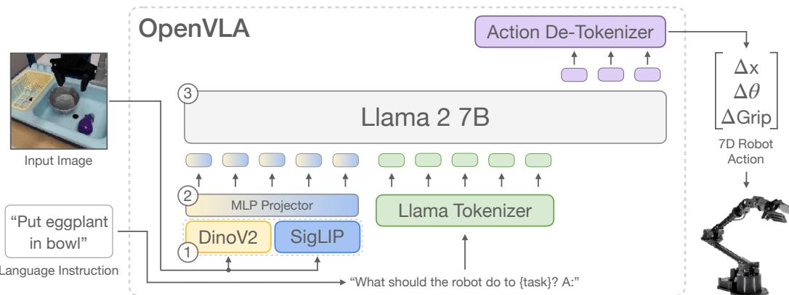  

Figure 2: OpenVLA model architecture. Given an image observation and a language instruction, the model predicts 7-dimensional robot control actions. The architecture consists of three key components:(1 a vision ener that concatenates Dino V2 [25] and SigLIP [79] features, () a projector that maps visual featuresto the language embeding space, and (3) the LLM backbone, a Llama 2 7B-parameter large language model [10].

# 3 OpenVLA 模型

我们介绍了OpenVLA模型，这是一个拥有70亿参数的视觉-语言-行动模型（VLA），基于来自Open X-Embodiment数据集的97万机器人示范进行训练。围绕开发VLA模型的最佳实践存在许多尚未深入探讨的问题，例如，用于训练的最佳模型主干、数据集和超参数是什么。下面，我们详细介绍了开发OpenVLA的方法，并总结了我们的关键经验教训。具体而言，我们首先简要概述现代VLM（视觉语言模型），它们构成了OpenVLA的主干（第3.1节）；然后描述我们的基本训练配方和数据集（第3.2节和第3.3节）；讨论关键设计决策（第3.4节）；并提供用于训练和推理的基础设施的详细信息（第3.5节）。

# 3.1 前言：视觉-语言模型

最新的视觉语言模型（VLM）架构主要由三个部分组成（见图2）：（1）一个视觉编码器，将图像输入映射为多个“图像块嵌入”；（2）一个投影器，将视觉编码器的输出嵌入映射到语言模型的输入空间；（3）一个大型语言模型（LLM）主干。在VLM训练过程中，该模型通过对配对或交错的视觉和语言数据进行端到端训练，并以下一个文本标记预测为目标，数据来源于各种互联网资源。在本研究中，我们基于Prismatic-7B VLM构建。Prismatic遵循上述相同标准架构，具有600M参数的视觉编码器、一个小型的2层多层感知器投影器，以及一个7B参数的Llama 2语言模型主干。值得注意的是，Prismatic使用了一个两部分的视觉编码器，由预训练的SigLIP和DinoV2模型组成。输入的图像块分别通过两个编码器，并将生成的特征向量按通道连接。与更常用的视觉编码器（如CLIP-或仅使用SigLIP的编码器）相比，添加DinoV2特征被证明有助于改善空间推理，这对于机器人控制尤其有帮助。SigLIP、DinoV2和Llama 2未发布其训练数据的详细信息，这些数据可能分别包含来自互联网的图像-文本、仅图像和仅文本数据的数万亿个标记。Prismatic VLM在这些组件之上进行了微调，使用了LLaVA 1.5数据混合，其中包含来自开源数据集的大约1M图像-文本和仅文本数据样本。

# 3.2 OpenVLA 训练过程

为了训练 OpenVLA，我们微调了一个预训练的 Prismatic-7B VLM 主干网络，以进行机器人动作预测（见图 2）。我们将动作预测问题表述为一个“视觉-语言”任务，其中输入观察图像和自然语言任务指令被映射到一串预测的机器人动作 [7]。为了使 VLM 的语言模型主干能够预测机器人动作，我们通过将连续机器人动作映射到语言模型的分词器使用的离散词元，来表示输出空间中的动作。遵循 Brohan 等人 [7] 的方法，我们将机器人动作的每个维度分别离散化为 256 个箱子之一。对于每个动作维度，我们设置箱宽，以均匀划分训练数据中动作的 $1 ^ { \mathrm { s t } }$ 和 $9 9 ^ { \mathrm { t h } }$ 分位数之间的区间。使用分位数而不是 Brohan 等人 [7] 使用的最小-最大边界，使我们能够忽略数据中的离群动作，否则这些离群动作可能会大幅扩展离散化区间，从而降低我们动作离散化的有效粒度。

使用这种离散化，我们获得了 $N$ 维机器人动作的 $N$ 个离散整数 $\in [ 0 \ldots 2 5 5 ]$。不幸的是，OpenVLA 语言主干网络使用的分词器 Llama [10] 仅为在微调期间新引入的词元保留了 100 个“特殊词元”，这对于我们动作离散化的 256 个词元来说太少了。因此，我们再次选择简化，遵循 Brohan 等人 [7] 的方法，简单地用我们动作词元覆盖 Llama 分词器词汇表中使用最少的 256 个词元（这对应于最后 256 个词元）。一旦动作被处理成一系列词元，OpenVLA 将以标准的下一个词元预测目标进行训练，仅评估预测动作词元的交叉熵损失。我们在第 3.4 节中讨论实施此训练过程的关键设计决策。接下来，我们描述用于 OpenVLA 训练的机器人数据集。

# 3.3 训练数据

构建 OpenVLA 训练数据集的目标是捕捉大量的机器人形态、场景和任务的多样性。这使得最终模型能够直接控制各种机器人，并且能够有效地微调到新的机器人配置。我们利用 Open X-Embodiment 数据集 [1] (OpenX) 作为基础来策划我们的训练数据集。在撰写时，完整的 OpenX 数据集包含超过 70 个独立的机器人数据集，并且包含超过 200 万条机器人轨迹，这些数据经过大规模社区努力整合成一个连贯且易于使用的数据格式。为了使在这些数据上的训练变得可行，我们对原始数据集进行了多步数据筛选。该筛选的目标是确保 (1) 所有训练数据集之间有一致的输入和输出空间，以及 (2) 在最终训练混合中均衡混合形态、任务和场景。为了解决 (1)，我们遵循 [1, 5] 的规定，将训练数据集限制为仅包含至少有一个第三人称相机的操作数据集，并使用单臂末端执行器控制。对于 (2)，我们利用 Octo [5] 的数据混合权重，对所有通过第一轮筛选的数据集进行处理。Octo 通过启发式方法降低或移除多样性较低的数据集的权重，并提高任务和场景多样性较大的数据集的权重；有关详细信息，请参见 Octo 模型团队等 [5]。我们还尝试将一些自 Octo 发布以来添加到 OpenX 数据集的额外数据集纳入我们的训练混合中，包括 DROID 数据集 [11]，尽管其混合权重保持在 10%。实际上，我们发现 DROID 上的动作词元准确率在训练期间一直较低，这表明未来可能需要更大的混合权重或模型来适应其多样性。为了不影响最终模型的质量，我们在训练的最后三分之一中将 DROID 从数据混合中移除。我们在附录 A 中提供了所使用的数据集和混合权重的完整概览。

# 3.4 OpenVLA 设计决策

在开发 OpenVLA 模型时，我们在开始最终模型训练之前，先在较小规模的实验中探讨了各种设计决策。具体而言，我们在 BridgeData V2 [6] 上训练和评估了 OpenVLA 模型，作为我们的初步实验，而不是在完整的 OpenX 混合数据上进行训练，以提高迭代速度和降低计算成本。我们在下面总结了这些探索中的关键经验。

VLM 主干网络。最初，我们实验了多个 VLM 主干网络。除了 Prismatic [4] 外，我们还测试了 IDEFICS-1 [84] 和 LLaVA [85] 的微调用于机器人动作预测。我们发现，LLaVA 和 IDEFICS-1 在仅有一个物体的场景任务中表现相当，但在涉及多个物体且需要策略操作正确物体（即语言指令中指定的物体）的任务中，LLaVA 展现出更强的语言基础能力。具体来说，LLaVA 在 BridgeData V2 sink 环境中的五个语言基础任务的绝对成功率上相较于 IDEFICS-1 提高了 $3 5 \%$。微调后的 Prismatic VLM 策略进一步提升了性能，相比于 LLaVA 策略，在简单的单物体任务和多物体的语言基础任务中，绝对成功率提高了大约 $10 \%$。我们将此性能差异归因于融合的 SigLIP-DinoV2 主干网络所带来的空间推理能力提升（见第 3.1 节）。除了性能提升，Prismatic 还提供了一个模块化且易于使用的代码库，因此我们最终选择它作为 OpenVLA 模型的主干。图像分辨率。输入图像的分辨率对 VLA 训练的计算需求有显著影响，因为更高分辨率的图像会导致更多的图像补丁词元，从而使上下文长度呈二次方增长，这也会增加训练计算量。我们比较了 $2 2 4 \times 2 2 4 \mathrm { p x }$ 和 $3 8 4 \times 3 8 4 \mathrm { p x }$ 的 VLA，但在评估中没有发现性能差异，而后者的训练时间是前者的 3 倍。因此，我们选择 $2 2 4 \times 2 2 4 \mathrm { p x }$ 作为最终的 OpenVLA 模型分辨率。注意，在许多 VLM 基准测试中，增加分辨率确实提高了性能 [44, 86, 87]，但我们尚未在 VLA 上看到这种趋势。微调视觉编码器。之前的 VLM 研究发现，在 VLM 训练过程中冻结视觉编码器通常会导致更高的性能 [44]。直观上，冻结的视觉编码器可能更好地保留来自互联网规模预训练的稳健特征。然而，我们发现，在 VLA 训练过程中微调视觉编码器对良好的 VLA 性能至关重要。我们推测，预训练的视觉主干可能没有捕捉到足够的有关场景重要部分的细致空间细节，从而难以实现精确的机器人控制。训练轮数。典型的 LLM 或 VLM 训练运行通常只能完成一到两轮对其训练数据集的训练。相较之下，我们发现在 VLA 训练中重要的是显著增加训练数据集的迭代次数，实机器人性能会持续提高，直到训练动作 token 的准确率超过 $9 5 \%$。我们的最终训练运行完成了 27 轮对其训练数据集的训练。学习率。我们对 VLA 训练的学习率进行了多个数量级的探索，最终使用固定学习率 2e-5（与 VLM 预训练时使用的学习率相同 [44]）取得了最佳结果。我们没有发现学习率预热能带来好处。

# 3.5 训练和推理的基础设施

最终的 OpenVLA 模型在 64 个 A100 GPU 集群上训练了 14 天，总计 21,500 个 A100 小时，使用的批处理大小为 2048。在推理过程中，OpenVLA 在 bfloat16 精度下加载时需要 15GB 的 GPU 内存（即无量化），并在一台 NVIDIA RTX 4090 GPU 上以大约 6Hz 的速度运行（未进行编译、推测解码或其他推理加速技巧）。我们可以通过量化进一步减少 OpenVLA 在推理过程中的内存占用，同时不影响现实世界机器人任务的性能，如第 5.4 节所示。我们在图 6 中报告了各种消费者级和服务器级 GPU 上的推理速度。为了方便起见，我们实现了一个远程 VLA 推理服务器，以允许实时远程流式传输动作预测到机器人，从而消除了对强大本地计算设备的需求来控制机器人。我们将此远程推理解决方案作为开源代码发布的一部分（第 4 节）。

# 4 OpenVLA 代码库

随着我们的模型发布，我们还提供了 OpenVLA 代码库，这是一个用于训练 VLA 模型的模块化 PyTorch 代码库（见 https://openvla.github.io）。它可以从在单个 GPU 上微调 VLA 扩展到在多节点 GPU 集群上训练十亿参数的 VLA，并支持现代的大型变换器模型训练技术，如自动混合精度（AMP，PyTorch [75]）、FlashAttention [76] 和完全分片数据并行（FSDP，Zhao 等 [77]）。OpenVLA 代码库开箱即用地全面支持在 Open X 数据集上的训练，集成了 HuggingFace 的 [21] AutoMode1 类，并支持 LoRA 微调 [26] 和量化模型推理 [27, 88]。

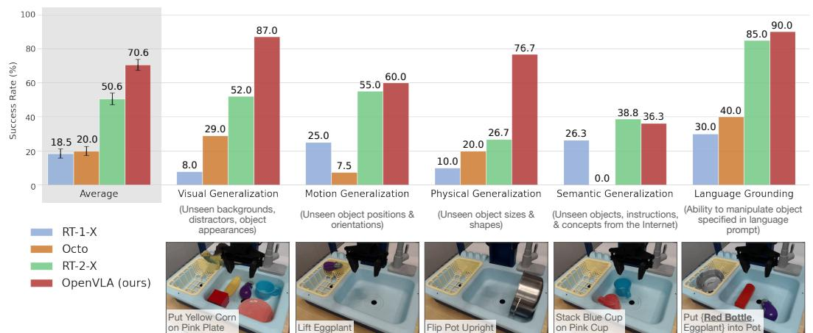  

Figure 3: BridgeData V2 WidowX robot evaluation tasks and results. We evaluate OpenVLA and prior stateothernelis obot polic cpensivsuitaskcoverievealxeneln as well as tasks that specifically assess language conditioning ability. OpenVLA achieves highest overall perormance and even outperforms closed-source model RT-2-X in a categories except for semantic generalization. Average success rates $\pm$ StdErr are computed across 170 total rollouts per approach. See Table 4 for detailed results.

# 5 实验

我们实验评估的目标是测试 OpenVLA 作为强大的多机器人控制策略的能力，以及作为新机器人任务微调的良好初始化。具体而言，我们旨在回答以下问题：1. 在多个机器人和各种类型的泛化评估中，OpenVLA 与之前的通用机器人策略相比如何？2. OpenVLA 能否有效地在新的机器人设置和任务上进行微调，并且与最先进的数据高效模仿学习方法相比如何？3. 我们是否可以使用参数高效微调和量化来减少 OpenVLA 模型的训练和推理计算需求，使其更具可及性？性能与计算需求之间的权衡是什么？

# 5.1 在多机器人平台上的直接评估

机器人设置与任务。我们在两种机器人形态上评估 OpenVLA 的“开箱即用”性能：BridgeData V2 评估中的 WidowX 机器人 [6]（见图 1，左）和 RT-1 和 RT-2 评估中的移动操控机器人 [2, 7]（“谷歌机器人”；见图 1，中）。这两个平台在先前的研究中广泛用于评估通用机器人策略 [1, 2, 5, 7]。我们在每个环境中定义了一套全面的评估任务，涵盖多个泛化维度，如视觉（未见背景、干扰物体、物体的颜色/外观）；运动（未见物体位置/朝向）；物理（未见物体大小/形状）；以及语义（未见目标物体、指令和来自互联网的概念）泛化。我们还评估了在多个物体场景中的语言条件能力，测试策略是否能够操控用户提示中指定的正确目标物体。有关在 BridgeData V2 和谷歌机器人评估中的示例任务图像，请参见图 3 底部行和图 4。总体来说，我们在 BridgeData V2 实验中对每种方法进行了 170 次推演（17 个任务，每个任务 10 次试验），在谷歌机器人实验中进行了 60 次推演（12 个任务，每个任务 5 次试验）。所有任务的详细分解及其与训练数据的不同之处请见附录 B。本节及后续部分的所有评估均作为 A/B 评估进行，使用相同的任务和相同的初始机器人和物体状态集，以确保公平比较。比较。我们将 OpenVLA 的性能与三种先前的通用操控策略进行比较：RT-1-X [1]、RT-2-X [1] 和 Octo [5]。RT-1-X（3500 万参数）和 Octo（9300 万参数）是从头开始在 OpenX 数据集子集上训练的转换器策略；Octo 是开源操控策略中最先进的模型。RT-2-X（550 亿参数）是一个先进的、闭源的 VLA，利用互联网预训练的视觉和语言主干网络。结果总结在图 3 的 BridgeData V2 评估和图 4 的谷歌机器人评估中（每个任务的详细信息见附录，表 4 和表 6）。我们发现 RT-1-X 和 Octo 在测试的任务上表现不佳，常常未能操控正确的物体，特别是在有干扰物体时，有时甚至导致机器人无目的地摇晃手臂。请注意，我们的评估测试的泛化程度甚至大大超过了先前工作的评估，以挑战网络预训练的 VLA 模型。因此，未进行互联网预训练的模型性能较低是预期的。RT-2-X 显然优于 RT-1-X 和 Octo，展示了大规模预训练 VLM 在机器人领域的优势。

值得注意的是，OpenVLA在Google机器人评估中的表现与RT2-X相当，并且在BridgeData V2评估中明显优于RT-2-X，尽管其规模小一个数量级（7B参数对比55B参数）。定性分析表明，RT-2-X和OpenVLA都展现出比其他测试模型更强的鲁棒性，例如在存在干扰物体时能够接近正确的目标物体，正确地将机器人的末端执行器朝向目标物体的方向，甚至能够从错误中恢复，比如不牢固地抓取物体（详细的定性推演示例请参见 https://openvla.github.io）。在语义泛化任务上，RT-2-X的表现更高，如图3所示，这是可以预期的，因为它使用了更大规模的互联网预训练数据，并与机器人动作数据和互联网预训练数据共同微调，以更好地保留预训练知识，而OpenVLA则仅在机器人数据上进行微调。然而，OpenVLA在BridgeData V2和Google机器人评估中的所有其他任务类别中表现相当或更好。性能差异可以归因于多种因素的综合作用：我们为OpenVLA策划了一个更大的训练数据集，其中包含970k轨迹（而RT-2-X为350k）；我们对训练数据集进行了更仔细的清理，例如在Bridge数据集中排除了所有零动作（详细讨论见附录C）；而OpenVLA使用了一个融合的视觉编码器，结合了预训练的语义和空间特征。关于这些组件的消融分析请参见附录D。

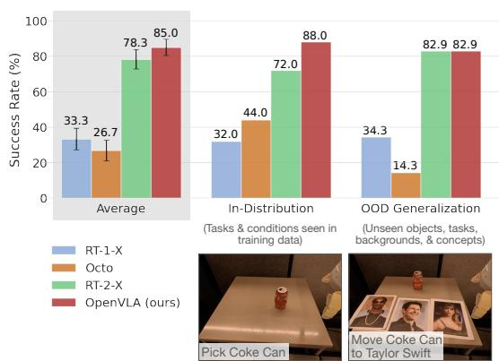  

Figure 4: Google robot evaluation results. We evaluate generalist robot policies on in-distribution and out-ofdistribution (OOD) tasks on the mobile manipulator used in RT-1 and RT-2 evaluations [2, 7]. We find that OpenVLA and RT-2-X attain comparable performance and significantly outperform RT-1-X and Octo overall. Average success rates $\pm$ StdErr are computed across 60 total rollouts per approach. See Table 6 for detailed results.

# 5.2 针对新机器人配置的数据高效适应

虽然之前的研究主要集中在直接评估“开箱即用”的视觉语言模型（VLA）上，但将VLA模型有效微调到新任务和机器人设置的工作尚未被充分探索，然而这对于其广泛应用至关重要。在这一部分，我们研究了OpenVLA快速适应新的真实机器人设置的能力。（有关仿真中的微调实验，请参见附录E。）

机器人设置与任务。我们对OpenVLA模型进行了一项简单的微调实验：对所有模型参数进行全面微调，使用包含10150个目标任务演示的小型数据集（参见图5；我们在5.3节探讨参数高效的微调方法）。我们在两种设置下测试OpenVLA：Franka-Tabletop，一个固定的、安装在桌上的Franka Emika Panda 7自由度机器人臂；以及Franka-DROID，最近发布的DROID数据集中Franka机器人臂的设置，安装在可移动的升降桌上。这两种设置分别使用$5 \mathrm { H z }$和$15 \ \mathrm { H z }$的非阻塞控制器。我们选择Franka机器人臂作为微调实验的目标实现，因为它们在机器人学习社区中被广泛使用，因此很可能是OpenVLA微调的“目标”。我们在不同的控制频率设置下进行测试，以考察OpenVLA在各种用例中的适用性。

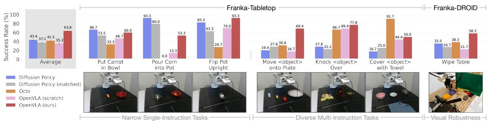  

Figure 5: Adapting to new robot setups. We evaluate the state-of-the-art Diffusion Policy trained from scratch on seven Franka Emika Panda tasks (10150 demonstrations each), as well as generalist robot policies Octo and OpenVLA fine-tuned on the same data. Diffusion Policy exhibits strong performance on narrow singe-instruction tasks, while Octo and OpenVLA perform betteron diverse ne-tuning tasks involving multiple instructions and distractor objects. Overall, OpenVLA achieves highest aggregate performance across both usthaiul o  skve $\pm$ StdErr are computed across 129 rollouts per approach (99 for Franka-Tabletop tasks and 30 for Franka-DROID tasks). See Table 7 for detailed results.

比较。我们将我们的工作与Diffusion Policy [3]进行比较，后者是一种最先进的数据高效模仿学习方法，从零开始训练。我们还将Diffusion Policy (matched)进行比较，这是一种符合OpenVLA输入和输出规格的Diffusion Policy版本。此外，我们评估了在目标数据集上微调的Octo [5]，因为它目前是支持微调的最佳通用策略（RT-2-X的微调不支持通过其推理API进行）。我们还在同一目标数据集上微调OpenVLA，得到的策略称为OpenVLA。最后，作为消融实验，我们比较OpenVLA (scratch)，在该实验中，我们直接在目标机器人设置上微调基础的Prismatic VLM，而不是微调OpenX预训练的OpenVLA模型，以评估大规模机器人预训练的益处。我们在图5中展示了结果（每个任务的详细结果见附录表7）。我们发现，Diffusion Policy的两个版本在“将胡萝卜放入碗中”和“将玉米倒入锅中”等较窄的单指令任务上与通用策略Octo和OpenVLA具有竞争力或超越表现，但预训练的通用策略在涉及多个对象且需要语言条件的更多样化微调任务中表现更佳。OpenX的预训练为Octo和OpenVLA使模型更好地适应这些语言引导重要的更加多样化的任务；我们在OpenVLA (scratch)的较低表现中看到了这一证据。总体而言，我们发现OpenVLA实现了最高的平均性能。值得注意的是，大多数先前的工作仅在较窄的单指令或多样化的多指令任务中取得强劲表现，导致成功率差异较大。OpenVLA是唯一一个在所有测试任务中实现至少50%的成功率的方法，这表明它可以成为模仿学习任务的强有力默认选项，特别是在涉及多样化语言指令的情况下。对于较窄但高度灵巧的任务，Diffusion Policy仍然显示出更平滑和更精准的轨迹；在Diffusion Policy中实施的动作分块和时间平滑可能会帮助OpenVLA达到相同的灵活性，并可能是未来工作的一个有前景的方向（详见第6节对当前局限性的讨论）。

# 5.3 参数效率微调

前一部分中OpenVLA的全量微调运行使用了8个A100 GPU，每个任务耗时5到15小时（具体取决于数据集的大小），以实现高性能。虽然这比VLA预训练所需的计算资源要少得多，但在本节中，我们将探索更具计算效率和参数效率的微调方法，并调查它们的有效性。具体而言，我们比较以下几种微调方法：全量微调在微调过程中更新所有权重，如第5.2节所述；仅最后一层微调则仅微调OpenVLA的变压器主干的最后一层和词元嵌入矩阵；冻结视觉则冻结视觉编码器，但微调所有其他权重；夹心微调解冻视觉编码器、词元嵌入矩阵和最后一层；而LoRA则使用Hu等人提出的流行低秩适应技术，应用于模型的所有线性层，并采用多个秩值$r$。

Table 1: Parameter-efficient fine-tuning evaluation. LoRA finetuning achieves the best performance-compute trade-off, matching full fine-tuning performance while training only $1 . 4 \%$ of the model parameters. Mean success $\pm$ StdErr computed across 33 rollouts per approach on select Franka-Tabletop tasks (see Table 8 for details). \*: Sharded across 2 GPUs with FSDP [77].   

<table><tr><td>Strategy</td><td>Success Rate</td><td>Train Params (× 106)</td><td>VRAM (batch 16)</td></tr><tr><td>Full FT</td><td>69.7 ± 7.2 %</td><td>7,188.1</td><td>163.3 GB*</td></tr><tr><td>Last layer only</td><td>30.3 ± 6.1 %</td><td>465.1</td><td>51.4 GB</td></tr><tr><td>Frozen vision</td><td>47.0 ± 6.9 %</td><td>6,760.4</td><td>156.2 GB*</td></tr><tr><td>Sandwich</td><td>62.1 ± 7.9 %</td><td>914.2</td><td>64.0 GB</td></tr><tr><td>LoRA, rank=32</td><td>68.2 ± 7.5%</td><td>97.6</td><td>59.7 GB</td></tr><tr><td>rank=64</td><td>68.2 ± 7.8%</td><td>195.2</td><td>60.5 GB</td></tr></table>

我们在表1中报告了多个Franka-Tabletop任务的微调成功率，以及训练参数数量和GPU内存需求。我们发现，仅微调网络的最后一层或冻结视觉编码器会导致性能不佳，这表明进一步将视觉特征适应于目标场景是至关重要的。相比之下，“夹心微调”由于微调视觉编码器，取得了更好的性能，并且由于不微调完整的LLM主干网络，消耗的GPU内存更少。最后，LoRA在性能和训练内存消耗之间实现了最佳折衷，超越了“夹心微调”的表现，同时仅微调$1.4\%$的参数，达到了完整微调的性能。我们发现LoRA秩对策略性能的影响微乎其微，因此建议使用默认秩$r=32$。使用LoRA，我们可以在单个A100 GPU上在10-15小时内对OpenVLA进行新任务的微调—相较于完整微调，计算量减少了8倍。

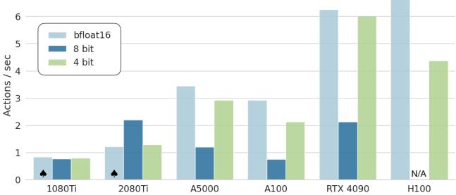  
5.4 Memory-Efficient Inference via Quantization   

Figure 6: OpenVLA inference speed for various GPUs. Both bfloat16 and int4 quantization achieve high throughput, especially on GPUs with Ada Lovelace architecture (RTX 4090, H100). Further speed-ups are possible with modern LLM inference frameworks like TensorRT-LLM [89]. $\spadesuit$ : Model sharded across two GPUs to fit.

Table 2: Performance with quantized inference. 4-bit quantization matches the performance of bfloat16 inference (our default approach) while reducing the GPU memory footprint by more than half. Mean success $\pm$ StdErr computed across 8 representative BridgeData V2 tasks [6] and 80 rollouts per approach (see Table 5 for details).   

<table><tr><td>Precision</td><td>Bridge Success</td><td>VRAM</td></tr><tr><td>bfloat16</td><td>71.3 ± 4.8%</td><td>16.8 GB</td></tr><tr><td>int8</td><td>58.1 ± 5.1%</td><td>10.2 GB</td></tr><tr><td>int4</td><td>71.9 ± 4.7%</td><td>7.0 GB</td></tr></table>

OpenVLA是一个拥有70亿参数的模型，在推理时的内存消耗超过了先前的开源通用策略，例如Octo，其参数量少于100M。我们遵循大型语言模型（LLM）服务的最佳实践，以bfloat16精度保存和加载OpenVLA进行推理（这是我们的默认方法），这将内存占用降低了一半，使我们能在仅具有16GB GPU内存的情况下运行OpenVLA。在本节中，我们测试是否可以进一步减少策略推理所需的内存，并扩大VLA策略的可及性，采用为LLM服务开发的现代量化技术。这些方法以较低的精度加载网络权重，从而在降低内存需求的同时可能会牺牲推理速度和准确性。具体而言，我们对OpenVLA模型在8个代表性的BridgeData V2任务上进行了8位和4位精度的服务测试。我们在表2中报告了内存占用和推理性能；在图6中报告了在各种消费级和服务器级GPU上的可达控制频率。我们观察到，在大多数GPU上，8位量化使得推理变慢，原因在于增加的量化操作带来的开销。4位推理则实现了更高的吞吐量，因为减少的GPU内存传输弥补了量化开销。由于推理速度的降低，我们发现8位量化显著降低了性能：在我们用于评估的A5000 GPU上，模型只能以1.2Hz的频率运行，这与在BridgeData V2任务中使用的5Hz非阻塞控制器相比，显著改变了系统动态。值得注意的是，4位量化的性能与bfloat16半精度推理相似，但所需的GPU内存不到一半。4位量化模型在A5000上可达到3Hz，从而更接近数据收集期间的系统动态。

# 6 讨论与局限性

在本工作中，我们提出了OpenVLA，这是一个最先进的开源视觉-语言-行动模型，能够开箱即用地实现跨体现机器人控制的强大性能。我们还展示了OpenVLA可以通过参数高效的微调技术轻松适应新的机器人设置。当前的OpenVLA模型存在几个限制。首先，它目前仅支持单图像观察。实际上，真实世界中的机器人设置是异构的，可能具有广泛的感官输入[5]。扩展OpenVLA以支持多图像和本体输入以及观察历史是未来研究的重要方向。探索预训练在交错图像和文本数据上的视觉语言模型（VLM）可能会推动这种灵活输入的VLA微调。其次，提高OpenVLA的推理吞吐量对实现高频控制设置下的VLA控制（如ALOHA[90]，运行频率为$5 0 \mathrm { H z }$）至关重要。这也将使我们能够在比本研究更灵活的双手操作任务上测试VLA。探索行动分块或其他推理时优化技术（如推测解码[91]）提供了潜在的解决方案。此外，还有进一步提高性能的空间。尽管OpenVLA在性能上优于之前的通用策略，但在测试任务中的可靠性仍然不高，通常成功率达到${ < 9 0 \% }$。最后，由于计算限制，许多VLA设计问题仍然未深入探讨：基础VLM的大小对VLA性能有什么影响？在机器人行动预测数据和互联网规模的视觉-语言数据上共同训练是否会显著提高VLA性能？哪些视觉特征最适合VLA模型？我们希望OpenVLA模型和代码库的发布能够使社区共同研究这些问题。

# 致谢

我们感谢丰田研究院提供的资金和计算资源，使得本研究得以进行。我们还感谢斯坦福基础模型研究中心提供的额外计算资源，以及谷歌DeepMind为我们的评估提供的RT-2-X API的alpha访问权限。我们也感谢大众汽车、物理智能、ONR资助的N00014-22-1-2621和N00014-22-1-2293，以及国家科学基金会通过IIS-2246811的支持，还有DARPA ANSR的支持。

# References

A. Irpan, A. Khazatsky, A. Rai, A. Singh, A. Brohan, A. Raffin, A. Wahid, B. Burgess-Limerick, B. Kim, B. Schölkopf, B. Ichter, C. Lu, C. Xu, C. Finn, C. Xu, C. Chi, C. Huang, C. Chan, C. Pan, C. Fu, C. Devin, D. Driess, D. Pathak, D. Shah, D. Büchler, D. Kalashnikov, D. Sadigh, E. Johns, F. Ceola, F. Xia, F. Stulp, G. Zhou, G. S. Sukhatme, G. Salhotra, G. Yan, G. Schiavi, H. Su, H.S. Fang, H. Shi, H. B. Amor, H. I. Christensen, H. Furuta, H. Walke, H. Fang, I. Mordatch, I. Radosavovic, I. Leal, J. Liang, J. Kim, J. Schneider, J. Hsu, J. Bohg, J. Bingham, J. J. Wu J.u J.u J. an J.O J. J.T J. J. J. J.S J. Han, K. Rao, K. Pertsch, K. Hausman, K. Go, K. Gopalakrishnan, K. Goldberg, K. Byrne, Osu K.Kaazuka,K.Zhag K.MajK.Rana K. riivaan, L.Chen L, L. Tan, L. Ott, L. Lee, M. Tomizuka, M. Du, M. Ahn, M. Zhang, M. Ding, M. K. Srirama, M. Sharma, M. J. Kim, N. Kanazawa, N. Hansen, N. Heess, N. J. Joshi, N. Suenderhauf, N. D. Palo, N. M. M. Shafiullah, O. Mees, O. Kroemer, P. R. Sanketi, P. Wohlhart, P. Xu, P. Sermanet, P. Sundaresan, Q. Vuong, R. Rafailov, R. Tian, R. Doshi, R. Martín-Martín, R. Mendonca, R. Shah, R. Hoque, R. Julian, S. Bustamante, S. Kirmani, S. Levine, S. Moore, S. Bahl, S. Dass, S. Song, S. Xu, S. Haldar, S. Adebola, S. Guist, S. Nasiriany, S. Schaal, S. Welker, S. Tian, S. Dasari, S. Belkhale, T. Osa, T. Harada, T. Matsushima, T. Xiao, T. Yu, T.Ding, T. Davchev, T. Z. Zhao, T. Armstrong, T. Darrel, V. Jain, V. Vanhoucke, W. Zhan, W. Zhou, W. Burgard, X. Chen, X. Wang, X. Zhu, X. Li, Y. Lu, Y. Chebotar, Y. Zhou, Y. Zhu, .XuY.Wa, Y.Bisk, Y.Cho, Y. Lee, .Cui Y.hua Wu Y. TaY.Zhu Y.Li, Y.I, Y. Matsuo, Z. Xu, and Z. J. Cui. Open X-Embodiment: Robotic learning datasets and RT-X models. https://arxiv.org/abs/2310.08864,2023.   
[2] A. Brohan, N. Brown, J. Carbajal, Y. Chebotar, J. Dabis, C. Finn, K. Gopalakrishnan, K. Hausman, A. Herzog, J. Hsu, J. Ibarz, B. Ichter, A. Irpan, T. Jackson, S. Jesmonth, N. Joshi, R. Julian, D. Kalashnikov, Y. Kuang, I. Leal, K.-H. Lee, S. Levine, Y. Lu, U. Malla, D. Manjunath, I. Mordatch, O. Nachum, C. Parada, J. Peralta, E. Perez, K. Pertsch, J. Quiambao, K. Rao, M. Ryoo, G. Salazar, P. Sanketi, K. Sayed, J. Singh, S. Sontakke, A. Stone, C. Tan, H. Tran, V.Vau, S. Vega, Q.Vu, F. Xia T. Xio, P. Xu,S. XuT. Yu, an B. Ztvic.R-1: Robotics transformer for real-world control at scale. In arXiv preprint arXiv:2212.06817, 2022.   
[3] C. Chi, S. Feng, Y. Du, Z. Xu, E. Cousineau, B. Burchfiel, and S. Song. Diffusion policy: Visuomotor policy learning via action diffusion. In Proceedings of Robotics: Science and Systems (RSS), 2023.   
[ . Xi, L. Le, T. Xio,  C. Fi De e lz a for visual robotic manipulation. arXiv preprint arXiv:2307.03659, 2023.   
[5] Octo Model Team, D. Ghosh, H. Walke, K. Pertsch, K. Black, O. Mees, S. Dasari, J. Hejna, C. Xu, J. Luo, T. Kreiman, Y. Tan, D. Sadigh, C. Finn, and S. Levine. Octo: An open-source generalist robot policy. https://octo-models. github.io, 2023.   
[6] H. Walke, K. Black, A. Lee, M. J. Kim, M. Du, C. Zheng, T. Zhao, P. Hansen-Estruch, Q. Vuong, A. He, V. Myers, K. Fang, C. Finn, and S. Levine. Bridgedata v2: A dataset for robot learning at scale, 2023.   
[7] A. Brohan, N. Brown, J. Carbajal, Y. Chebotar, X. Chen, K. Choromanski, T. Ding, D. Driess, A. Dubey, C. Finn, P. Florence, C. Fu, M. G. Arenas, K. Gopalakrishnan, K. Han, K. Hausman, A. Herzog, J. Hsu, B. Ichter, A. Irpan, N. Joshi, R. Julian, D. Kalashnikov, Y. Kuang, I. Leal, L. Lee, T.-W. E. Lee, S. Levine, Y. Lu, H. Michalewski, I. Mordatch, K. Pertsch, K. Rao, K. Reymann, M. Ryoo, G. Salazar, P. Sanketi, P. Sermanet, J. Singh, A. Singh, R. Soricut, H. Tran, V. Vanhoucke, Q.Vuong, A. Wahid, S. Welker, P. Wohhart, J. Wu, F. Xia, T. Xiao, P. Xu, S. Xu, T. Yu, and B. Zitkovich. Rt-2: Vision-language-action models transfer web knowledge to robotic control. In arXiv preprint arXiv:2307.15818, 2023. [8] A. Radford, J. W. Kim, C. Hallacy, A. Ramesh, G. Goh, S. Agarwal, G. Sastry, A. Askell, P. Mishkin, J. Clark, G. Krueger, and I. Sutskever. Learning transferable visual models from natural language supervision. In International Conference on Machine Learning (ICML), volume 139, pages 87488763, 2021.   
[9] X. Zhai, B. Mustafa, A. Kolesnikov, and L. Beyer. Sigmoid loss for language image pretraining. In International Conference on Computer Vision (ICCV), 2023.   
[10] H. Touvron, L. Martin, K. Stone, P. Albert, A. Almahairi, Y. Babaei, N. Bashlykov, S. Batra, P. Bhargava, S. Bhosale, et al. Llama 2: Open foundation and fine-tuned chat models. arXiv preprint arXiv:2307.09288, 2023.   
[1 A. Khazatsky, K. Pertsch, S. Nair, A. Balakrishna, S. Dasari, S. Karamcheti, S. Nasiriay, M. K. Srirama, L. Y. Chen, K. Ellis, P. D. Fagan, J. Hejna, M. Itkina, M. Lepert, Y. J. Ma, P. T. Miller, J. Wu, S. Belkhale, S. Dass, H. Ha, A. Jain, A. Lee, Y. Lee, M. Memmel, S. Park, I. Radosavovic, K. Wang, A. Zhan, K. Black, C. Chi, K. B. Hatch, S. Lin, J. Lu, J. Mercat, A. Rehman, P. R. Sanketi, A. Sharma, C. Simpson, Q. Vuong, H. R. Walke, B. Wulfe, T. Xiao, J.H.Ya A.Yavay T.Z.Z C.i R. Baia M.G.asD.Ce, Q.Ce T., J. Drake, E. P. Foster, J. Gao, D. A. Herrera, M. Heo, K. Hsu, J. Hu, D. Jackson, C. Le, Y. Li, K. Lin, R. Lin, Z. Ma, A. Maddukuri, S. Mirchandani, D. Morton, T. Nguyen, A. O'Neill, R. Scalise, D. Seale, V. Son, S. Tian, E. Tran, A. E. Wang, Y. Wu, A. Xie, J. Yang, P. Yin, Y. Zhang, O. Bastani, G. Berseth, J. Bohg, K. Goldberg, A. Gupta, A. Gupta, D. Jayaraman, J. J. Lim, J. Malik, R. Martí-Martn, S. Ramamoorthy, D. Sadig, S. Song, J. Wu, M. C. Yip, Y. Zhu, T. Kollar, S. Levine, and C. Finn. Droid: A large-scale in-the-wild robot manipulation dataset. 2024.   
[12] S. Nair, A. Rajeswaran, V. Kumar, C. Finn, and A. Gupta. R3m: A universal visual representation for robot manipulation. In CoRL, 2022.   
[] S. Karaci, . Nair, A. S.Chen, T. Kollar, C. Fin, D. Sadigh, and P. Ling. Lanedriven representation learning for robotics. ArXiv, abs/2302.12766, 2023. URL https : //api.semanticscholar.org/CorpusID:257205716.   
[14] M. Shridhar, L. Manuelli, and D. Fox. Cliport: What and where pathways for robotic manipulation. In Conference on robot learning, pages 894906. PMLR, 2022.   
[15] A. Stone, T. Xiao, Y. Lu, K. Gopalakrishnan, K.-H. Lee, Q. Vuong, P. Wohlhart, B. Zitkovich, F Xia, C. Fin, alOpen-world object manipulation usig re-trainedvison-lane models. arXiv preprint arXiv:2303.00905, 2023.   
[16] D. Driess, F. Xia, M. S. Sajjadi, C. Lynch, A. Chowdhery, B. Ichter, A. Wahid, J. Tompson, Q. Vuong, T. Yu, et al. Palm-e: An embodied multimodal language model. arXiv prerint arXiv:2303.03378, 2023.   
[17] A. S. et al. Introducing rfm-1: Giving robots human-like reasoning capabilities, 2024. URL https://covariant.ai/insights/ introducing-rfm-1-giving-robots-human-like-reasoning-capabilities/.   
[18] Wayve. Lingo-2: Driving with natural language. 2024. URL https : / /wayve . ai/thinking/ lingo-2-driving-with-language/.   
[19] X. Chen, X. Wang, S. Changpinyo, A. J. Piergiovanni, P. Padlewski, D. M. Salz, S. Goodman, A. Grycner, B. Mustafa, L. Beyer, A. Kolesnikov, J. Puigcerver, N. Ding, K. Rong, H. Akbari, G. Mishra, L. Xue, A. V. Thapliyal, J. Bradbury, W. Kuo, M. Seyedhosseini, C. Jia, B. K. Ayan, C. Riquelme, A. Steiner, A. Angelova, X. Zhai, N. Houlsby, and R. Soricut. Pali: A jointly-scaled multilingual language-image model. ArXiv, abs/2209.06794, 2022. URL https://api.semanticscholar.org/CorpusID:252222320.   
[20] X. Chen, X. Wang, L. Beyer, A. Kolesnikov, J. Wu, P. Voigtlaender, B. Mustafa, S. Goodman, I. M.Aau, P. Padki D.M. Salz, X. Xi DVas, F. Pavic, K.R, T. Yu D. Keysers, X.Q.Zhai, andR. Soricut. PaLI-3 visin langage odels: malerastr, stronger. arXiv preprint arXiv:2310.09199, 2023.   
[21] T. Wolf, L. Debut, V. Sanh, J. Chaumond, C. Delangue, A. Moi, P. Cistac, T. Rault, R. Louf, M. Funtowicz, J. Davison, S. Shleifer, and . Transformers: State-of-the-art natural language processing. In Proceedings of the 6th International Conference on Learning Representations, 2020. URL https://arxiv.org/abs/1910.03771.   
[22] H. Touvron, T. Lavril, G. Izacard, X. Martinet, M.-A. Lachaux, T. Lacroix, B. Rozière, N. Goyal, E. Hambro, F. Azhar, et al. Llama: Open and efficient foundation language models. arXiv preprint arXiv:2302.13971, 2023.   
[23] A. Q. Jiang, A. Sablayrolles, A. Mensch, C. Bamford, D. S. Chaplot, D. d. 1. Casas, F. Bressand, G. Lengyel, G. Lample, L. Saulnier, et al. Mistral 7b. arXiv preprint arXiv:2310.06825, 2023.   
[24] G. Team, T. Mesnard, C. Hardin, R. Dadashi, S. Bhupatiraju, S. Pathak, L. Sifre, M. Rivière, M. S. Kale, J. Love, et al. Gemma: Open models based on gemini research and technology. arXiv preprint arXiv:2403.08295, 2024.   
[25] M. Oquab, T. Darcet, T. Moutakanni, H. Vo, M. Szafraniec, V. Khalidov, P. Fernandez, D. Haziza, F. Massa, A. El-Nouby, et al. Dinov2: Learning robust visual features without supervision. arXiv preprint arXiv:2304.07193, 2023.   
[26] E. J. Hu, Y. Shen, P. Wallis, Z. Allen-Zhu, Y. Li, S. Wang, L. Wang, and W. Chen. Lora: Low-rank adaptation of large language models. arXiv preprint arXiv:2106.09685, 2021.   
[27] T. Dettmers, A. Pagnoni, A. Holtzman, and L. Zettlemoyer. Qlora: Efficient finetuning of quantized llms. Advances in Neural Information Processing Systems, 36, 2024.   
[28] Y. Goyal, T. Khot, D. Summers-Stay, D. Batra, and D. Parikh. Making the V in VQA matter: Elevating the role of image understanding in visual question answering. In Computer Vision and Pattern Recognition (CVPR), 2017.   
[29] D. A. Hudson and C. D. Manning. GQA: A new dataset for real-world visual reasoning and compositional question answering. In Computer Vision and Pattern Recognition (CVPR), 2019.   
[30] A. Singh, V. Natarajan, M. Shah, Y. Jiang, X. Chen, D. Batra, D. Parikh, and M. Rohrbach. Towards VQA models that can read. In Computer Vision and Pattern Recognition (CVPR), 2019.   
[31] J. P. Bigham, C. Jayant, H. Ji, G. Little, A. Miller, R. C. Miller, R. Miller, A. Tatarowicz, B. White, S. White, and T. Yeh. VizWiz: nearly real-time answers to visual questions. In User Interface Software and Technology (UIST), pages 333342, 2010.   
[32] S. Kazemzadeh, V. Ordonez, M. Matten, and T. Berg. ReferItGame: Referring to objects in photographs of natural scenes. In Empirical Methods in Natural Language Processing (EMNLP), pages 787798, 2014.   
[3] L. Yu, P. Poirson, S. Yang, A. C. Berg, and T. L. Berg.Modelig conext in referrig expressions. In European Conference on Computer Vision (ECCV), 2016.   
[34] T. Mesnard, C. Hardin, R. Dadashi, S. Bhupatiraju, S. Pathak, L. Sifre, M. Rivière, M. S. Kale, J. Love, P. Tafti, L. Hussenot, P. G. Sessa, A. Chowdhery, A. Roberts, A. Barua, A. Botev, A. Castro-Ros, A. Slone, A. Héliou, A. Tacchetti, A. Bulanova, A. Paterson, B. Tsai, B. Shahriari, C. L. Lan, C. A. Choquette-Choo, C. Crepy, D. Cer, D. Ippolito, D. Reid, E. Buchatskaya, E. Ni, E. Noland, G. Yan, G. Tucker, G.-C. Muraru, G. Rozhdestvenskiy, H. Michalewski, I. Tenney, I. Grishchenko, J. Austin, J. Keeling, J. Labanowski, J.-B. Lespiau, J. Stanway, J. Brennan, J. Chen, J. Ferret, J. Chiu, J. Mao-Jones, K. Lee, K. Yu, K. Millican, L. L. Sjoesund, L. Lee, L. Dixon, M. Reid, M. Mikula, M. Wirth, M. Sharman, N. Chinaev, N. Thain, O. Bachem, O. Chang, O. Wahltinez, P. Bailey, P. Michel, P. Yotov, R. Chaabouni, R. Comanescu, R. Jana, R. Anil, R. McIlroy, R. Liu, R. Mullins, S. L. Smith, S. Borgeaud, S.Girgin, S. Douglas, S. Pandya, S. Shakeri, S. De, T. Klimenko, T. Hennigan, V. Feinber, W. Stokowiec, Y. hui Chen, Z. Ahmed, Z. Gong, T. Warkentin, L. Peran, M. Giang, C. Farabet, O. Vinyals, J. Dean, K. Kavukcuoglu, D. Hassabis, Z. Ghahramani, D. Eck, J. Barral, F. Pereira, E. Collins, A. Joulin, N. Fiedel, E. Senter, A. Andreev, and K. Kenealy. Gemma: Open models based on gemini research and technology. arXiv preprint arXiv:2403.08295, 2024.   
[5] Y. Li, S. Bubeck, R. Eldan, A. D. Giorno, S. Gunaser, and Y. T. Lee. Textboks are all you need ii: phi-1.5 technical report. arXiv preprint arXiv:2309.05463, 2023.   
[36] J. Bai, S. Bai, Y. Chu, Z. Cui, K. Dang, X. Deng, Y. Fan, W. Ge, Y. Han, F. Huang, et al. Qwen technical report. arXiv preprint arXiv:2309.16609, 2023.   
[37] J. Li, D.Li, C. Xiong, and S. C. H. Hoi. BLIP: Bootstrappig language-image pre-training for unified vision-language understanding and generation. In International Conference on Machine Learning (ICML), 2022.   
J.  ..H.HP with frozen image encoders and large language models. In International Conference on Machine Learning (ICML), 2023.   
[39] W. Dai, J. Li, D. Li, A. M. H. Tiong, J. Zhao, W. Wang, B. A. Li, P. Fung, and S. C. H. Hoi. InstructBLIP: Towards general-purpose vision-language models with instruction tuning. arXiv preprint arXiv:2305.06500, 2023.   
[40] H. H. Tan and M. Bansal. LXMERT: Learning cross-modality encoder representations from transformers. In Empirical Methods in Natural Language Processing (EMNLP), 2019.   
[41] H. Laurençon, L. Saulnier, L. Tronchon, S. Bekman, A. Singh, A. Lozhkov, T. Wang, S. Karamcheti, A. M. Rush, D. Kiela, M. Cord, and V. Sanh. OBELICS: An open web-scale filtered dataset of interleaved image-text documents. In Neural Information Processing Systems Track on Datasets and Benchmarks (NeurIPS Datasets and Benchmarks), 2023.   
[42] H. Liu, C. Li, Q. Wu, and Y. J. Lee. Visual instruction tuning. In Advances in Neural Information Processing Systems (NeurIPS), 2023.   
[43] H. Liu, C. Li, Y. Li, and Y. J. Lee. Improved baselines with visual instruction tuning. arXiv preprint arXiv:2310.03744, 2023.   
[44] S. Karamcheti, S. Nair, A. Balakrishna, P. Liang, T. Kollar, and D. Sadigh. Prismatic vlms: Investigating the design space of visually-conditioned language models. arXiv preprint arXiv:2402.07865, 2024.   
[45] D. Kalashnikov, A. Irpan, P. Pastor, J. Ibarz, A. Herzog, E. Jang, D. Quillen, E. Holly, M. Kalakrishnan, V. Vanhoucke, et al. QT-Opt: Scalable deep reinforcement learning for vision-based robotic manipulation. arXiv preprint arXiv: 1806.10293, 2018.   
[46] D. Kalashnkov, J. Varley, Y. Chebotar, B. Swanson, R. Jonschkowski, C. Finn, S. Levine, and K. Hausman. Mt-opt: Continuous multi-task robotic reinforcement learning at scale. arXiv, 2021.   
[47] F. Ebert, Y. Yang, K. Schmeckpeper, B. Bucher, G. Georgakis, K. Danilidis, C. Finn, and S. Levine. Bridge data: Boosting generalization of robotic skills with cross-domain datasets. arXiv preprint arXiv:2109.13396, 2021.   
[48] K. Ehsani, T. Gupta, R. Hendrix, J. Salvador, L. Weihs, K.-H. Zeng, K. P. Singh, Y. Kim, W. Han, A. Herrasti, et al. Imitating shortest paths in simulation enables effective navigation and manipulation in the real world. arXiv preprint arXiv:2312.02976, 2023.   
[49] H. Bharadhwaj, J. Vakil, M. Sharma, A. Gupta, S. Tulsiani, and V. Kumar. Roboagent: Generalization and efficiency in robot manipulation via semantic augmentations and action chunking. arXiv preprint arXiv:2309.01918, 2023.   
[50] L. Pinto and A. Gupta. Supersizing self-supervision: Learning to grasp from 50k tries and 700 robot hours. In 2016 IEEE international conference on robotics and automation (ICRA), pages 34063413. IEEE, 2016.   
[] A. Mandlekar, Y. Zhu, A. Garg, J. Booher, M. Spero, A. Tung, J. Gao, J. Emmns, A. Gupa, E. Orbay, et al. Roboturk: A crowdsourcing platform for robotic skill learning through imitation. In Conference on Robot Learning, pages 879893. PMLR, 2018.   
[] A.Gupta, A. Mural, D. P. Gandhi, and L. Pnt.Robot learning in homes: Improvg generalization and reducing dataset bias. Advances inneural information processing systems, 31, 2018.   
[53] S. Dasari, F. Ebert, S. Tian, S. Nair, B. Bucher, K. Schmeckpeper, S. Singh, S. Levine, and C. Finn. Robonet: Large-scale multi-robot learning. CoRL, 2019.   
[54] S. Cabi, S. G. Colmenarejo, A. Novikov, K. Konyushkova, S. Reed, R. Jeong, K. Zolna, Y. Aytar, D. Budden, M. Vecerik, O. Sushkov, D. Barker, J. Scholz, M. Denil, N. de Freitas, and Z. Wang. Scaling data-driven robotics with reward sketching and batch reinforcement learning. RSS, 2019.   
[55] E. Jang, A. Irpan, M. Khansari, D. Kappler, F. Ebert, C. Lynch, S. Levine, and C. Finn. Bc-z: Zero-shot task generalization with robotic imitation learning. In Conference on Robot Learning, pages 9911002. PMLR, 2022.   
[56] H.-S. Fang, H. Fang, Z. Tang, J. Liu, C. Wang, J. Wang, H. Zhu, and C. Lu. Rh20t: A comprehensive robotic dataset for learning diverse skills in one-shot. Towards Generalist Robots: Learning Paradigms for Scalable Skill Acquisition@ CoRL2023, 3:5, 2023.   
[57] C. Devin, A. Gupta, T. Darrell, P. Abbeel, and S. Levine. Learning modular neural network policies for multi-task and multi-robot transfer. In Proceedings of IEEE International Conference on Robotics and Automation, 2017.   
[58] E. S. Hu, K. Huang, O. Rybkin, and D. Jayaraman. Know thyself: Transferable visual control policies through robot-awareness. In International Conference on Learning Representations, 2022.   
[59] J. H. Yang, D. Sadigh, and C. Finn. Polybot: Training one policy across robots while embracing variability. In 7th Annual Conference on Robot Learning, 2023. URL https: //openreview.net/forum?id $\cdot$ HEIRj511cS.   
[60] S. Reed, K. Zolna, E. Parisotto, S. G. Colmenarejo, A. Novikov, G. Barth-maron, M. Giménz, Y. Sulsky, J. Kay, J. T. Springenberg, T. Eccles, J. Bruce, A. Razavi, A. Edwards, N. Heess, Y. Chen, R. Hadsell, O. Vinyals, M. Bordbar, and N. de Freitas. A generalist agent. Transactions on Machine Learning Research, 2022. ISSN 2835-8856.   
[61] G. Salhotra, I.-C. A. Liu, and G. Sukhatme. Bridging action space mismatch in learning from demonstrations. arXiv preprint arXiv:2304.03833, 2023.   
[62] I. Radosavovic, B. Shi, L. Fu, K. Goldberg, T. Darrell, and J. Malik. Robot learning with sensorimotor pre-training. In Conference on Robot Learning, 2023.   
[63] D. Shah, A. Sridhar, A. Bhorkar, N. Hirose, and S. Levine. Gnm: A general navigation model to drive any robot. In 2023 IEEE International Conference on Robotics and Automation (ICRA), pages 72267233. IEEE, 2023.   
[64] K. Bousmalis, G. Vezzani, D. Rao, C. Devin, A. X. Lee, M. Bauza, T. Davchev, Y. Zhou, A. Gupta, A. Raju, et al. Robocat: A self-improving foundation agent for robotic manipulation. arXiv preprint arXiv:2306.11706, 2023.   
[65] D. Shah, A. Sridhar, N. Dashora, K. Stachowicz, K. Black, N. Hirose, and S. Levine. ViNT: A foundation model for visual navigation. In 7th Annual Conference on Robot Learning, 2023. URL https://arxiv.org/abs/2306.14846.   
[66] J. Yang, C. Glossop, A. Bhorkar, D. Shah, Q. Vuong, C. Finn, D. Sadigh, and S. Levine. Pushing the limits of cross-embodiment learning for manipulation and navigation. arXiv preprint arXiv:2402.19432, 2024.   
[67] S. Y. Gadre, M. Wortsman, G. Ilharco, L. Schmidt, and S. Song. Cows on pasture: Baselines and benchmarks for language-driven zero-shot object navigation. In Proceedings of the IEEE/CVF Conference on Computer Vision and Pattern Recognition, pages 2317123181, 2023.   
[68] Y. Du, K. Konyushkova, M. Denil, A. Raju, J. Landon, F. Hill, N. de Freitas, and S. Cabi. Vision-language models as success detectors. arXiv preprint arXiv:2303.07280, 2023.   
[69] Y. J. Ma, V. Kumar, A. Zhang, O. Bastani, and D. Jayaraman. Liv: Language-image representations and rewards for robotic control. In International Conference on Machine Learning, pages 2330123320. PMLR, 2023.   
[70] X.Zhang, Y. Ding, S. Amiri, H. Yang, A. Kaminski, C. Esselink, and S. Zhang. Grounding classical task planners via vision-language models. arXiv preprint arXiv:2304.08587, 2023.   
[71] S. Sontakke, J. Zhang, S. Arnold, K. Pertsch, E. B1yk, D. Sadigh, C. Finn, and L. Iti. Roboclip: One demonstration is enough to learn robot policies. Advances in Neural Information Processing Systems, 36, 2024.   
[72] J. Huang, S. Yong, X. Ma, X. Linghu, P. Li, Y. Wang, Q. Li, S.-C. Zhu, B. Jia, and S. Huang. An embodied generalist agent in 3d world. In Proceedings of the International Conference on Machine Learning (ICML), 2024.   
[73] X. Li, M. Liu, H. Zhang, C. Yu, J. Xu, H. Wu, C. Cheang, Y. Jing, W. Zhang, H. Liu, et al. Vision-language foundation models as effective robot imitators. arXiv preprint arXiv:2311.01378, 2023.   
[74] H. Zhen, X. Qiu, P. Chen, J. Yang, X. Yan, Y. Du, Y. Hong, and C. Gan. 3d-vla: 3d visionlanguage-action generative world model. arXiv preprint arXiv:2403.09631, 2024.   
[75] PyTorch. Automatic mixed precision. URL https://pytorch.org/docs/stable/amp. html.   
[76] T. Dao. Flashattention-2: Faster attention with better parallelism and work partitioning. arXiv preprint arXiv:2307.08691, 2023.   
[77] Y. Zhao, A. Gu, R. Varma, L. Luo, C.-C. Huang, M. Xu, L. Wright, H. Shojanazeri, M. Ott, S. Shleifer, et al. Pytorch fsdp: experiences on scaling fully sharded data parallel. arXiv preprint arXiv:2304.11277, 2023.   
[78] N. Dorka, C. Huang, T. Welschehold, and W. Burgard. What matters in employing vision lanuage model fortokenizingactions in robot control? In Firt Workshop on Vision-Lane Models for Navigation and Manipulation at ICRA 2024.   
[79] X. Zhai, B. Mustafa, A. Kolesnikov, and L. Beyer. Sigmoid loss for language image pretraining. In Proceedings of the IEEE/CVF International Conference on Computer Vision, pages 1197511986, 2023.   
[80] A. Radford, J. W. Kim, C. Hallacy, A. Ramesh, G. Goh, S. Agarwal, G. Sastry, A. Askell, P. Mishkin, J. Clark, et al. Learning transferable visual models from natural language supervision. In International conference on machine learning, pages 87488763. PMLR, 2021.   
[81] P. Sharma, N. Ding, S. Goodman, and R. Soricut. Conceptual captions: A cleaned, hypernymed, image alt-text dataset for automatic image captioning. In Proceedings of the 56th Annual Meeting of the Association for Computational Linguistics (Volume 1: Long Papers), pages 25562565, 2018.   
[82] C. Schuhmann, R. Vencu, R. Beaumont, R. Kaczmarczyk, C. Mullis, A. Katta, T. Coombes, J. Jitsev, and A. Komatsuzaki. Laion-400m: Open dataset of clip-filtered 400 million image-text pairs. arXiv preprint arXiv:2111.02114, 2021.   
[83] O. Sidorov, R. Hu, M. Rohrbach, and A. Singh. Textcaps: a dataset for image captioning with reading comprehension. In Computer VisionECCV 2020: 16th European Conference, Glasgow, UK, August 2328, 2020, Proceedings, Part II 16, pages 742758. Springer, 2020.   
[84] H. Face. Introducing idefics: An open reproduction of state-of-the-art visual langage model. Hugging Face Blog, 2024.   
[85] H. Liu, C. Li, Q. Wu, and Y. J. Lee. Visual instruction tuning. Advances in neural information processing systems, 36, 2024.   
Z. J.. S. B.P .h .u, F. Weers, et al. Mm1: Methods, analysis & insights from multimodal llm pre-training. arXiv preprint arXiv:2403.09611, 2024.   
[87] J. Lin, H. Yin, W. Ping, Y. Lu, P. Molchanov, A. Tao, H. Mao, J. Kautz, M. Shoeybi, and S. Han. Vila: On pre-training for visual language models. arXiv preprint arXiv:2312.07533, 2023.   
[88] T. Dettmers, M. Lewis, Y. Belkada, and L. Zettlemoyer. Gpt3. int8 (): 8-bit matrix multiplication for transformers at scale. Advances in Neural Information Processing Systems, 35: 3031830332, 2022.   
[89] NVIDIA. Tensorrt-llm. URL https://github.com/NVIDIA/TensorRT-LLM.   
[90] T. Z. Zhao, V. Kumar, S. Levine, and C. Finn. Learning fine-grained bimanual manipulation with low-cost hardware. arXiv preprint arXiv:2304.13705, 2023.   
[91] Y. Leviathan, M. Kalman, and Y. Matias. Fast inference from transformers via speculative decoding. In International Conference on Machine Learning, pages 1927419286. PMLR, 2023.   
[92] A. Brohan, N. Brown, J. Carbajal, Y. Chebotar, J. Dabis, C. Finn, K. Gopalakrishnan, K. Hausman, A. Herzog, J. Hsu, et al. Rt-1: Robotics transformer for real-world control at scale. arXiv preprint arXiv:2212.06817, 2022.   
[93] E. Rosete-Beas, O. Mees, G. Kalweit, J. Boedecker, and W. Burgard. Latent plans for task agnostic offline reinforcement learning. In Proceedings of the 6th Conference on Robot Learning (CoRL), 2022.   
[94] O. Mees, J. Borja-Diaz, and W. Burgard. Grounding language with visual affordances over unstructured data. In Proceedings of the IEEE International Conference on Robotics and Automation (ICRA), London, UK, 2023.   
[95] S. Dass, J. Yapeter, J. Zhang, J. Zhang, K. Pertsch, S. Nikolaidis, and J. J. Lim. CLVR jaco play dataset, 2023. URL https://github.com/clvrai/clvr_jaco_play_dataset.   
[96] J. Luo, C. Xu, X. Geng, G. Feng, K. Fang, L. Tan, S. Schaal, and S. Levine. Multi-stage cable routing through hierarchical imitation learning. arXiv preprint arXiv:2307.08927, 2023.   
[97] A. Mandlekar, Y. Zhu, A. Garg, J. Booher, M. Spero, A. Tung, J. Gao, J. Emmons, A. Gupta, E. Orbay, S. Savarese, and L. Fei-Fei. RoboTurk: A crowdsourcing platform for robotic skill learning through imitation. CoRR, abs/1811.02790, 2018. URL http: //arxiv. org/abs/ 1811.02790.   
[98] Y. Zhu, A. Joshi, P. Stone, and Y. Zhu. Viola: Imitation learning for vision-based manipulation with object proposal priors, 2023.   
[99] L. Y. Chen, S. Adebola, and K. Goldberg. Berkeley UR5 demonstration dataset. https: //sites.google.com/view/berkeley-ur5/home.   
[100] G. Zhou, V. Dean, M. K. Srirama, A. Rajeswaran, J. Pari, K. Hatch, A. Jain, T. Yu, P. Abbeel, L. Pinto, C. Finn, and A. Gupta. Train offline, test online: A real robot learning benchmark, 2023.   
[101] C. Lynch, A. Wahid, J. Tompson, T. Ding, J. Betker, R. Baruch, T. Armstrong, and P. Florence. Interactive language: Talking to robots in real time. IEEE Robotics and Automation Letters, 2023.   
[102] S. Belkhale, Y. Cui, and D. Sadigh. Hydra: Hybrid robot actions for imitation learning. arxiv, 2023.   
[103] Y. Zhu, P. Stone, and Y. Zhu. Bottom-up skill discovery from unsegmented demonstrations for long-horizon robot manipulation. IEEE Robotics and Automation Letters, 7(2):41264133, 2022.   
[104] Z. J. Cui, Y. Wang, N. M. M. Shafiullah, and L. Pinto. From play to policy: Conditional behavior generation from uncurated robot data. arXiv preprint arXiv:2210.10047, 2022.   
[105] M. Heo, Y. Lee, D. Lee, and J. J. Lim. Furniturebench: Reproducible real-world benchmark for long-horizon complex manipulation. In Robotics: Science and Systems, 2023.   
[106] G. Yan, K. Wu, and X. Wang. ucsd kitchens Dataset. August 2023.   
[107] S. Nasiriany, T. Gao, A. Mandlekar, and Y. Zhu. Learning and retrieval from prior data for skill-based imitation learning. In Conference on Robot Learning (CoRL), 2022.   
[108] H. Liu, S. Nasiriany, L. Zhang, Z. Bao, and Y. Zhu. Robot learning on the job: Human-inthe-loop autonomy and learning during deployment. In Robotics: Science and Systems (RSS), 2023.   
[109] G. Quere, A. Hagengruber, M. Iskandar, S. Bustamante, D. Leidner, F. Stulp, and J. Vogel. Shared Control Templates for Assistive Robotics. In 2020 IEEE International Conference on Robotics and Automation (ICRA), page 7, Paris, France, 2020.   
[110] S. Saxena, M. Sharma, and O. Kroemer. Multi-resolution sensing for real-time control with vision-language models. In 7th Annual Conference on Robot Learning, 2023. URL https://openreview.net/forum?id=WuBv9-IGDUA.   
[111] R. Shah, R. Martín-Martín, and Y. Zhu. MUTEX: Learning unified policies from multimodal task specifications. In 7th Annual Conference on Robot Learning, 2023. URL https: //openreview.net/forum?id=PwqiqaaEzJ.   
[112] X. Zhu, R. Tian, C. Xu, M. Ding, W. Zhan, and M. Tomizuka. Fanuc manipulation: A dataset for learning-based manipulation with fanuc mate 200id robot. 2023.   
[113] R. Mendonca, S. Bahl, and D. Pathak. Structured world models from human videos. CoRL, 2023.   
[114] J. Luo, C. Xu, F. Liu, L. Tan, Z. Lin, J. Wu, P. Abbeel, and S. Levine. Fmb: a functional manipulation benchmark for generalizable robotic learning. arXiv preprint arXiv:2401.08553, 2024.   
[115] N. M. M. Shafullah, A. Rai, H. Etukuru, Y. Liu, I. Misra, S. Chintala, and L. Pinto. On bringing robots home, 2023.   
[116] B. Liu, Y. Zhu, C. Gao, Y. Feng, Q. Liu, Y. Zhu, and P. Stone. Libero: Benchmarking knowledge transfer for lifelong robot learning. Advances in Neural Information Processing Systems, 36, 2024.   
[17] V. Sanh, L. Debut, J. Chaumond, and T. Wolf. Distilbert, a distilled version of bert: smaller, faster, cheaper and lighter. arXiv preprint arXiv:1910.01108, 2019.

# A Data Mixture Details

We list our used data mixture in Table 3. The mixture mostly follows [5], with a few additional datasets.

<table><tr><td colspan="2">OpenVLA Training Dataset Mixture</td></tr><tr><td>Fractal [92]</td><td>12.7%</td></tr><tr><td>Kuka [45]</td><td>12.7%</td></tr><tr><td>Bridge[6, 47]</td><td>13.3%</td></tr><tr><td>Taco Play [93, 94]</td><td>3.0%</td></tr><tr><td>Jaco Play [95]</td><td>0.4%</td></tr><tr><td>Berkeley Cable Routing [96]</td><td>0.2%</td></tr><tr><td>Roboturk [97]</td><td>2.3%</td></tr><tr><td>Viola [98]</td><td>0.9%</td></tr><tr><td>Berkeley Autolab UR5 [99]</td><td>1.2%</td></tr><tr><td>Toto [100]</td><td>2.0%</td></tr><tr><td>Language Table [101]</td><td>4.4%</td></tr><tr><td>Stanford Hydra Dataset [102]</td><td>4.4%</td></tr><tr><td>Austin Buds Dataset [103]</td><td>0.2%</td></tr><tr><td>NYU Franka Play Dataset [104]</td><td>0.8%</td></tr><tr><td>Furniture Bench Dataset [105]</td><td>2.4%</td></tr><tr><td>UCSD Kitchen Dataset [106]</td><td>&lt;0.1%</td></tr><tr><td>Austin Sailor Dataset [107]</td><td>2.2%</td></tr><tr><td>Austin Sirius Dataset [108]</td><td>1.7%</td></tr><tr><td>DLR EDAN Shared Control [109]</td><td>&lt;0.1%</td></tr><tr><td>IAMLab CMU Pickup Insert [110]</td><td>0.9%</td></tr><tr><td>UTAustin Mutex [111]</td><td>2.2%</td></tr><tr><td>Berkeley Fanuc Manipulation [112]</td><td>0.7%</td></tr><tr><td>CMU Stretch [113]</td><td>0.2%</td></tr><tr><td>BC-Z [55]</td><td>7.5%</td></tr><tr><td>FMB Dataset [114]</td><td>7.1%</td></tr><tr><td>DobbE [115]</td><td>1.4%</td></tr><tr><td>DROID [11]</td><td>10.0%</td></tr></table>

Table 3: OpenVLA training data mixture using datasets from the Open X-Embodiment dataset [1], following [5] with a few additions.

# B Evaluation Tasks and Detailed Results

In this section, we provide more details on the BridgeData V2 WidowX and Google robot evaluations discussed in Section 5.1, as well as the Franka-Tabletop and Franka-DROID fine-tuning evaluations discussed in Section 5.2.

# B.1 BridgeData V2 WidowX Evaluation Details

Here we focus specifically on BridgeData V2 evaluations discussed in Section 5.1.

# B.1.1 BridgeData V2 Evaluation Tasks

As described in Section 5.1, we evaluate each generalist robot manipulation policy on 17 tasks with 10 trials each. In this section, we provide details on the task categories and individual tasks.

In total, we evaluate on 5 visual generalization tasks, 2 motion generalization tasks, 3 physical generalization tasks, 4 semantic generalization tasks, and 3 language grounding tasks. Note that all tasks we evaluate on introduce some form of distribution shift since we are unable to procure the exact objects used in the original dataset (other distribution shifts naturally arise as we reproduce a real-world test environment originally constructed at a different location; see Appendix B.1.2 for a detailed discussion on such distribution shifts). All 17 tasks are depicted in Fig. 7. Each rollout is

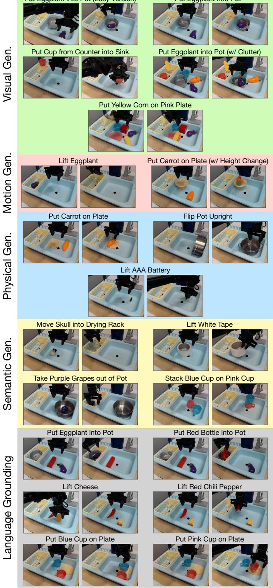  
Figure 7: BridgeData V2 WidowX robot evaluation tasks. We evaluate every generalist robot policy on 4 types out-of-distribution (OoD) generalization tasks:visual, motion, physical, and semantic (as defined in Secn 5.1. Every pair mages hows the start state and a example ed state ater the robot completes the task. We also rigorously assess language rounding in the 3 tasks shown in the bottom 3 rows, by changing the prompt while fxing the initial state and testing whether the policy can approach the correct target object.

marked as a failure (0) or success (1). In some more difficult tasks, we record partial successes (0.5);   
we describe the conditions for partial credit in the task descriptions below.

Below we describe each of the 17 tasks, in the order shown in Fig. 7:

1. Put Eggplant into Pot (Easy Version): The robot's goal is to pick up the eggplant and drop it into the pot. This is a visual generalization task because we use a handcrafted paper pot that has a different appearance than the pot used in the original BridgeData V2 training dataset (since we are unable to procure the original pot). Unlike all 16 other tasks, for this particular task we initialize the robot's end-effector directly above the eggplant before rolling out the policy; hence, we call this the "Easy Version" of the "Put Eggplant into Pot" task.

2. Put Eggplant into Pot: This is the same task as described above, except that the robot's end-effector is not initialized directly above the eggplant. Instead, we initialize it in a position that is fixed across all rollouts, which means that the robot must horizontally reach for the eggplant first before manipulating it. (Note: The same applies to all other tasks described below.) This is a visual generalization task for the same reason as above.

3. Put Cup from Counter into Sink: The robot's goal is to pick up the pink cup from either the kitchen countertop or drying rack and place it into the sink on the right. This is a visual generalization task because we use a pink cup rather than a blue cup (a blue cup is used in the original BridgeData V2 dataset, but we find that none of the methods we evaluate is able to manipulate it reliably  most likely because the color of the cup blends in with the color of the sink).

4. Put Eggplant into Pot (w/ Clutter): This is the same task as the "Put Eggplant into Pot" task, except that it is more difficult due to the presence of several distractor objects. It is a visual generalization task for the same reason discussed in the normal "Put Eggplant into Pot" task, and even more so given unseen distractors in the scene. Partial credit (0.5 out of 1) is rewarded when the robot moves towards the correct target object.

5.Put Yellow Corn on Pink Plate: The robot's goal is to pick up the yellow corn and place it on the pink plate. This is a visual generalization task due to the presence of unseen distractor objects in the scene, such as a green dinosaur on the countertop in the back section of the sink. Partial credit (0.5 out of 1) is rewarded when the robot moves towards the correct target object.

6. Lift Eggplant: The robot's goal is to grasp and lift the eggplant into the air. This is a motion generalization task because the eggplant is initialized in unseen positions and/or orientations, and the robot is forced to move beyond its training distribution of positions and/or orientations and often perform long-range reaching in order to complete the task. (Note: Long-range reaching is not demonstrated in this environment in the original BridgeData V2 demonstrations; see Appendix B.1.2 for details.) We find that this task, though seemingly simple, is deceptively challenging for many policies. Partial credit (0.5 out of 1) is rewarded when the robot makes contact with the eggplant.

7. Put Carrot on Plate (w/ Height Change): The robot's goal is to pick up the carrot and place it on the yellow plate. This is a motion generalization task because the plate is elevated from its usual position at the bottom of the sink, and the robot must adjust its trajectory to correctly place the carrot on the elevated platform (without knocking down the plate in the process). Partial credit (0.5 out of 1) is rewarded when the robot grasps the carrot and touches the plate with it.

8. Put Carrot on Plate: This is the same task as above, except that the plate is at its normal position (at the bottom of the sink or drying rack). We consider this a physical generalization task because the carrot has a different size and shape than the one used in the original BridgeData V2 dataset, which is shorter and narrower. (Note that the previous version of this task listed above would also technically be a physical generalization task since it involves the same carrot, but we list it under the "motion generalization" category since that is the focus there.)

9Flip Pot Upright: The robot's goal is to manipulate the pot such that it is oriented upright in the sink at the end of the episode. This is a physical generalization task because this pot has a different size and shape than the one used in the original BridgeData V2 training demonstrations (the pot we use is wider and shorter).

10. Lift AAA Battery: The robot's goal is simply to grasp the AAA battery and lift it up into the air. This is considered a physical generalization task because the battery is much smaller and thinner than target objects seen in the BridgeData V2 training demonstrations in this environment; see Appendix B.1.2 for details. (Note that this target object does not exist in the original BridgeData V2 demonstrations in this environment, so this is also an instance of "semantic generalization", but we classify it solely as "physical generalization" since that is the main focus here).

11. Move Skull into Drying Rack: The robot's goal is to grasp the skull windup toy and drop it into the yellow drying rack in the left part of the sink. This is a semantic generalization task since the skull is an unseen target object (does not appear in the BridgeData V2 training demonstrations).

12. Lift White Tape: The robot's goal is to grasp and lift the white roll of tape into the air. This is a semantic generalization task since the white tape roll is an unseen target object (does not appear in the BridgeData V2 training demonstrations). (Note that this task may also be considered as "physical generalization" because of its shape being different than the objects seen in the training demonstrations in this environment; most policies struggle to grasp objects with this ring structure, and they often move the robot's end-effector directly into the center region.)

1.Take Purple Grapes out of Pot: The robot's goal is to grasp the purple grapes lying inside the steel pot and remove it from the pot (by lifting it out and/or dropping it anywhere outside the pot). This is a semantic generalization task because it is an unseen language instruction; the robot has never seen this task in the original BridgeData V2 training dataset.

14.Stack Blue Cup on Pink Cup: The robot's goal is to grasp the blue cup and place it securely on top of the pink cup. This is a semantic generalization task because it is an unseen language instruction; the robot has never seen this task in this environment in the original BridgeData V2 training dataset. Partial credit (0.5 out of 1) is rewarded when the robot grasps the blue cup and touches the pink cup with the blue cup.

15. Put {Eggplant, Red Bottle} into Pot: This is a language grounding task. The robot's goal is to put the specified target object into the pot. Both the eggplant and red bottle are present in the scene. We conduct paired evaluations: for the same initial state, we prompt the policy to target the eggplant in one episode, and then the red bottle in the next episode. We test each method 5 times with the eggplant and 5 times with the red bottle, using the same set of 5 initial states for both target objects. Partial credit (0.5 out of 1) is rewarded when the robot moves towards the correct target object.

16. Lift {Cheese, Red Chili Pepper}: This is a language grounding task. The robot's goal is to grasp and lift the specified target object. We conduct paired evaluations as described in the task above. Partial credit (0.5 out of 1) is rewarded when the robot moves towards the correct target object.

17. Put {Blue Cup, Pink Cup} on Plate: This is a language grounding task. The robot's goal is to grasp the specified target object and place it onto the plate. We conduct paired evaluations as described in other language grounding tasks. Partial credit (0.5 out of 1) is rewarded when the robot moves towards the correct target object.

# B.1.2 Comparing Evaluation Tasks to Original BridgeData V2 Training Data

We conduct our evaluations in a sink environment used in the original BridgeData V2 dataset [6]. We reproduce the environment to match the original environment in the BridgeData V2 dataset with rough approximations for the robot's location relative to the sink, as well as the camera's placement relative to the scene. Given the lack of precise measurements of these positions in the original dataset, we are unable to reproduce the exact environment setup, and natural distribution shifts arise due to slightly different robot, sink, and camera placements. In addition, since we evaluate robot policies in a different location than where the training demonstrations were collected from, other natural distribution shifts arise. For example, the lighting conditions and background (e.g., visible areas behind the sink) are inevitably different than what was seen in the training dataset. Furthermore, we are unable to procure the exact set of objects used in the original BridgeData V2 dataset, so there are distribution shifts between the objects used at train time and those used at test time.

Despite all these challenges, we find that certain generalist policies, such as OpenVLA and RT-2-X, can still generalize and perform various tasks fairly reliably "out-of-the-box". Other generalist policies, such as RT-1-X and Octo, can also complete some tasks, though they struggle when tested with more difficult generalization tasks in our BridgeData V2 evaluation suite.

The original BridgeData V2 dataset includes demonstrations of the following seven tasks in this specific sink environment: "Flip Pot Upright", "Put Carrot on Plate", "Put Cup from Counter (or Drying Rack) into Sink", "Put Eggplant into Pot", "Put Knife on Cutting Board", "Put Spoon in Pot" and "Turn Lever Vertical to Front". See Fig. 8 for samples images of all these tasks from the original dataset. Note that all training demonstrations collected in this environment are initialized such that the robot's end-effector is positioned directly above the target object in the beginning of the episode. (However, this is not the case across all environments in the BridgeData V2 dataset; in some other environments, the robot is initialized farther away from the target object, so it must horizontally reach for the object first before manipulating it.)

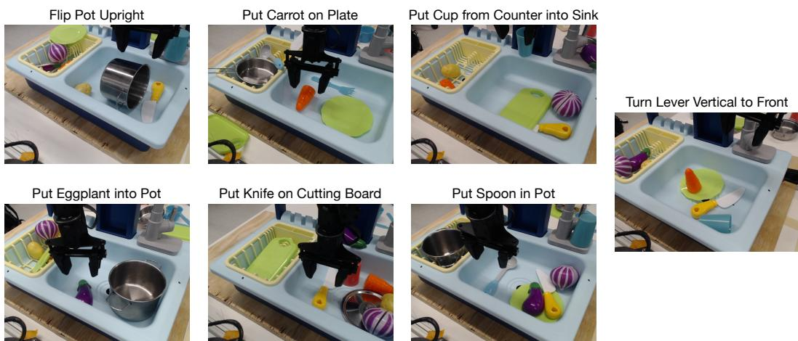  
Figure 8: Original BridgeData V2 sink environment tasks. Images from sample demonstrations in the sink environment from the original BridgeData V2 dataset reveal that all demonstrations in this environment were inalize suchthat the robot' end-effector was positmediateybovehetarge bject.Not that thee iniial states are different from the initial states weuse in ur BridgeDatV2 evaluation tasks hown F. In our evaluations, we always initialize the robot' endefector to a fixed ocation above he sink, rathr than positoning it directly above the target object (except for one task: "Put Eggplant into Pot (Easy Version)".

In our BridgeData V2 evaluation suite, only one task  "Put Eggplant into Pot (Easy Version")  is initialized with the robot's end-effector hovering directly over the target object; in all 16 other tasks, the end-effector is initialized at a fixed location above the sink such that the robot must horizontally reach towards the object. This initial condition, in combination with the distribution shifts we introduce in the various types of OOD generalization in our evaluation suite, challenges the generalist policies and requires a high degree of robustness in order to complete the tasks successfully. Hence, the success rates for policies like RT-1-X and Octo are lower than what is reported in prior works. However, we find that other policies such as RT-2-X and OpenVLA still achieve relatively strong performance despite all these distribution shifts and challenges.

# B.1.3 Detailed BridgeData V2 Evaluation Results

See Table 4 for the full BridgeData V2 WidowX evaluation results. The number of successes for each method, out of 10 trials, is listed for each of 17 tasks. OpenVLA achieves strongest performance in the majority of the tasks and has the highest aggregate success rate among the generalist policies. RT-2-X also shows good performance, outperforming RT-1-X and Octo, though it does not perform as well as OpenVLA. RT-1-X and Octo generally experience difficulty in these generalization tasks.

Table 4: Detailed BridgeData V2 WidowX evaluation results. We report performance on the full evaluation suite of 17 tasks (discussed in Section 5.1), including visual/motion/physical/semantic generalization tasks and lae roudi tasks.Note that partal sucs score 0.5)is pssibl or soe tasks; sApend B.1.1 for details. We find that OpenVLA performs best in most tasks and achieves highest performance overall, folowed by RT--X.On theother handRT-1-Xand Octorugglein theevaluatins, only etting 02 sues in several tasks. See Fig. 7 for illustrations of all tasks.   

<table><tr><td rowspan="2">Category</td><td rowspan="2">Task</td><td rowspan="2"># Trials</td><td rowspan="2">RT-1-X # Successes</td><td rowspan="2">Octo # Successes</td><td rowspan="2">RT-2-X # Successes</td><td rowspan="2">OpenVLA (ours) # Successes</td></tr><tr><td></td></tr><tr><td>Visual gen</td><td>Put Eggplant into Pot (Easy Version)</td><td>10</td><td>1</td><td>5</td><td>7</td><td>10</td></tr><tr><td>Visual gen</td><td>Put Eggplant into Pot</td><td>10</td><td>0</td><td>1</td><td>5</td><td>10</td></tr><tr><td>Visual gen</td><td>Put Cup from Counter into Sink</td><td>10</td><td>1</td><td>1</td><td>0</td><td>7</td></tr><tr><td>Visual gen</td><td>Put Eggplant into Pot (w/ Clutter)</td><td>10</td><td>1</td><td>3.5</td><td>6</td><td>7.5</td></tr><tr><td>Visual gen</td><td>Put Yellow Corn on Pink Plate</td><td>10</td><td>1</td><td>4</td><td>8</td><td>9</td></tr><tr><td>Motion gen</td><td>Lift Eggplant</td><td>10</td><td>3</td><td>0.5</td><td>6.5</td><td>7.5</td></tr><tr><td>Motion gen</td><td>Put Carrot on Plate (w/ Height Change)</td><td>10</td><td>2</td><td>1</td><td>4.5</td><td>4.5</td></tr><tr><td>Physical gen</td><td>Put Carrot on Plate</td><td>10</td><td>1</td><td>0</td><td>1</td><td>8</td></tr><tr><td>Physical gen</td><td>Flip Pot Upright</td><td>10</td><td>2</td><td>6</td><td>5</td><td>8</td></tr><tr><td>Physical gen</td><td>Lift AAA Battery</td><td>10</td><td>0</td><td>0</td><td>2</td><td>7</td></tr><tr><td>Semantic gen</td><td>Move Skull into Drying Rack</td><td>10</td><td>1</td><td>0</td><td>5</td><td>5</td></tr><tr><td>Semantic gen Semantic gen</td><td>Lift White Tape</td><td>10</td><td>3</td><td>0 0</td><td>0</td><td>1</td></tr><tr><td></td><td>Take Purple Grapes out of Pot</td><td>10</td><td>6 0.5</td><td>0</td><td>5</td><td>4</td></tr><tr><td>Semantic gen</td><td>Stack Blue Cup on Pink Cup</td><td>10</td><td>2.5</td><td>4</td><td>5.5 8.5</td><td>4.5</td></tr><tr><td>Language grounding Language grounding</td><td>Put {Eggplant, Red Bottle} into Pot</td><td>10 10</td><td>1.5</td><td>2.5</td><td>8.5</td><td>7.5</td></tr><tr><td>Language grounding</td><td>Lift {Cheese, Red Chili Pepper}</td><td>10</td><td>5</td><td>5.5</td><td>8.5</td><td>10 9.5</td></tr><tr><td></td><td>Put {Blue Cup, Pink Cup} on Plate</td><td>Mean Success Rate</td><td>18.5±2.7%</td><td>20.0±2.6%</td><td>50.6±3.5%</td><td>70.6±3.2%</td></tr></table>

Additionally, in Table 5, we provide the full evaluation results for the quantized inference experiments that were summarized in Table 2. For these evaluations, we test policies on 8 representative BridgeData V2 tasks spanning all task categories in the full evaluation suite.

Tableull quantized inference results.Here we present the detailversionheresults shown Tabe   

<table><tr><td>Category</td><td>Task</td><td># Trials</td><td>bfloat16 # Successes</td><td>int8 # Successes</td><td>int4 # Successes</td></tr><tr><td>Visual gen</td><td>Put Eggplant into Pot (Easy Version)</td><td>10</td><td>9</td><td>7</td><td>9</td></tr><tr><td>Visual gen</td><td>Put Eggplant into Pot</td><td>10</td><td>7</td><td>7</td><td>7</td></tr><tr><td>Visual gen</td><td>Put Cup from Counter into Sink</td><td>10</td><td>5</td><td>3</td><td>7</td></tr><tr><td>Motion gen</td><td>Lift Eggplant</td><td>10</td><td>6</td><td>4</td><td>7.5</td></tr><tr><td>Physical gen</td><td>Put Carrot on Plate</td><td>10</td><td>6</td><td>5</td><td>7</td></tr><tr><td>Physical gen</td><td>Lift AAA Battery</td><td>10</td><td>7</td><td>5</td><td>3</td></tr><tr><td>Semantic gen</td><td>Take Purple Grapes out of Pot</td><td>10</td><td>8</td><td>8</td><td>9</td></tr><tr><td>Language grounding</td><td>Put {Eggplant, Red Bottle} into Pot</td><td>10</td><td>9</td><td>7.5</td><td>8</td></tr><tr><td colspan="2"></td><td>Mean Success Rate</td><td>71.3 ± 4.8%</td><td>58.1 ± 5.1%</td><td>71.9 ± 4.7%</td></tr></table>

# B.2 Google Robot Evaluation Details

In this section, we provide more details on the Google robot evaluations introduced in Section 5.1.

# B.2.1 Google Robot Evaluation Tasks

On the Google robot, we evaluate each generalist robot policy on 12 tasks with 5 rollouts each, for a total of 60 rollouts. The first five tasks test on in-distribution conditions, and the last seven tasks test on more difficult out-of-distribution (OOD) conditions. All tasks are depicted in Fig. 9. Each rollout is marked as a failure (0) or success (1).

We describe the 12 tasks below:

1. Pick Coke Can (in-distribution): The robot is positioned in front of a platform with a can of Coke on top of it. The robot's goal is to grasp and lift the Coke can.

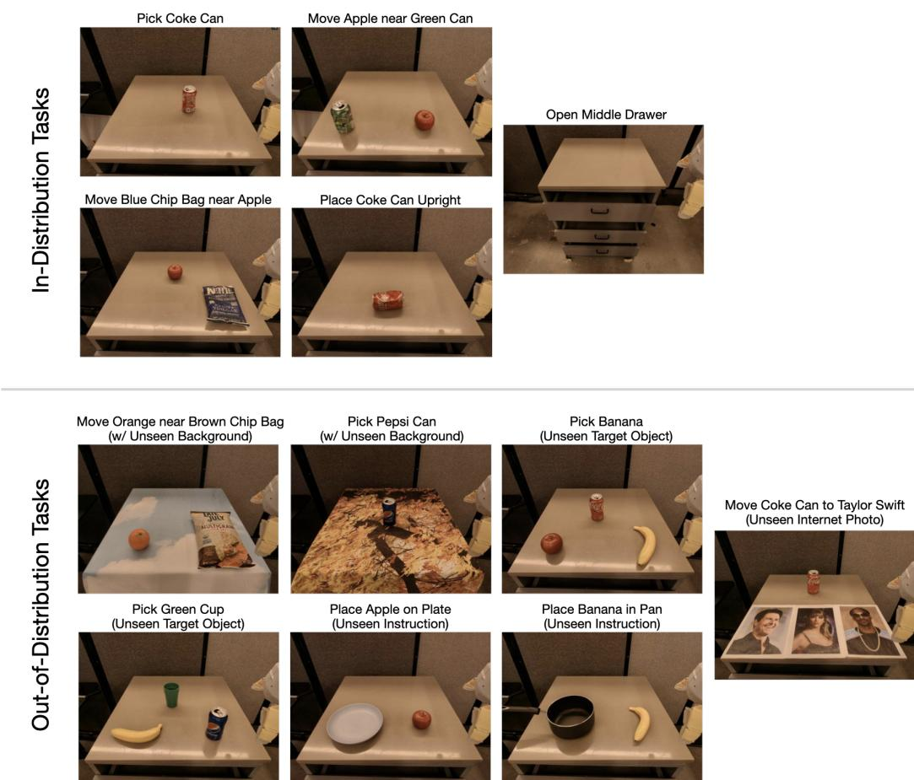  
Figure 9: Google robot evaluation tasks. We evaluate every generalist robot policy on in-distribution tasks and out-of-distribution (OOD) generalization tasks.OOD tasks involve unseen backgrounds, target objects, intutions/objec relations, n semantconcepts . photos rom he Interet that do ot appe ro action data).

2.Move Apple near Green Can (in-distribution): The robot is positioned in front of a platform with an apple and a green soda can on top of it. The robot's goal is to grasp the apple and move it next to the green can.

3.Move Blue Chip Bag near Apple (in-distribution): The robot is positioned in front of a platform with a blue bag of chips and an apple on top of it. The robot's goal is to grasp the blue bag of chips and move it close to the apple.

4.Place Coke Can Upright (in-distribution): The robot is positioned in front of a platform with a can of Coke on top of it, and the can is oriented horizontally on its side. The robot's goal is to grasp the Coke can and orient it to be in a vertical position.

5. Open Middle Drawer (in-distribution): The robot is positioned in front of a set of three drawers. The robot's goal is to grasp the middle drawer handle and pull the drawer open.

6.Move Orange near Brown Chip Bag (OOD): The robot is positioned in front of a platform with a brown bag of chips and an orange on top of it. A tablecloth with blue sky and white cloud patterns covers the platform underneath the objects. The robot's goal is to grasp the orange and bring it next to the bag of chips. This task is OOD because the orange is an unseen object relative to the training dataset, and the tablecloth is an unseen background.7

7. Pick Pepsi Can (OOD): The robot is positioned in front of a platform with a can of Pepsi on top of it. A tablecloth with bright yellow/brown patterns covers the platform underneath the can. The robot's goal is to grasp and lift the can. This task is OOD because the Pepsi can is an unseen object, and the tablecloth is an unseen background.

8. Pick Banana (OOD): The robot is positioned in front of a platform with an apple, a can of Coke, and a banana. The robot's goal is to grasp and lift the banana. This task is OOD because the banana is an unseen target object.

9Pick Green Cup (OOD): The robot is positioned in front of a platform with a banana, a can of Pepsi, and a green cup. The robot's goal is to grasp and lift the green cup. This task is OOD because all objects in the scene are unseen in the training data.

10. Place Apple on Plate (OOD): The robot is positioned in front of a platform with a plate and an apple. The robot's goal is to grasp the apple and move it onto the plate. This task is OOD because it is a novel instruction describing an unseen object relation: training demonstrations only cover moving the apple near the plate, rather than placing it on top of the plate.

11. Place Banana in Pan (OOD): The robot is positioned in front of a platform with a pan and a banana. The robot's goal is to grasp the banana and move it into the pan. This task is OOD because the banana is an unseen target object, and it is a novel instruction describing an unseen object relation, as explained in the previous task.

12. Move Coke Can to Taylor Swift (OOD): The robot is positioned in front of a platform with a can of Coke and photos of three different celebrities, including Taylor Swift. The robot's goal is to grasp the can and move it to the photo of Taylor Swift. This task is OOD because the photos of the celebrities are unseen in the robot interaction data.

# B.2.2 Detailed Google Robot Evaluation Results

Table 6: Detailed Google robot evaluation results. We report full evaluation results for Googlerobot evaluations discussed in Section 5.1. Each generalist policy is evaluated with 60 rollouts across 12 tasks, covering both riution nd utditriutin )tes conditns. In the bott ow, we reprtmean sc ate ± StdErr for each policy. OpenVLA and RT-2-X both significantly outperform RT-1-X and Octo overal (we bold the mean success rate or both due to overlapping error bars.See Fig for illustrations of all tsks.   

<table><tr><td>Category</td><td>Task</td><td># Trials</td><td>RT-1-X # Successes</td><td>Octo # Successes</td><td>RT-2-X # Successes</td><td>OpenVLA (ours) # Successes</td></tr><tr><td>In-distribution</td><td>Pick Coke Can</td><td>5</td><td>5</td><td>1</td><td>5</td><td>5</td></tr><tr><td>In-distribution</td><td>Move Apple near Green Can</td><td>5</td><td>3</td><td>3</td><td>3</td><td>5</td></tr><tr><td>In-distribution</td><td>Move Blue Chip Bag near Apple</td><td>5</td><td>0</td><td>3</td><td>4</td><td>5</td></tr><tr><td>In-distribution</td><td>Place Coke Can Upright</td><td>5</td><td>0</td><td>0</td><td>4</td><td>4</td></tr><tr><td>In-distribution</td><td>Open Middle Drawer</td><td>5</td><td>0</td><td>4</td><td>2</td><td>3</td></tr><tr><td>OOD</td><td>Move Orange near Brown Chip Bag</td><td>5</td><td>1</td><td>2</td><td>5</td><td>5</td></tr><tr><td>OOD</td><td>Pick Pepsi Can</td><td>5</td><td>3</td><td>0</td><td>5</td><td>4</td></tr><tr><td>OOD</td><td>Pick Banana</td><td>5</td><td>5</td><td>3</td><td>5</td><td>5</td></tr><tr><td>OOD</td><td>Pick Green Cup</td><td>5</td><td>1</td><td>0</td><td>5</td><td>5</td></tr><tr><td>OOD</td><td>Place Apple on Plate</td><td>5</td><td>0</td><td>0</td><td>4</td><td>4</td></tr><tr><td>OOD</td><td>Place Banana in Pan</td><td>5</td><td>0</td><td>0</td><td>2</td><td>4</td></tr><tr><td>OOD</td><td>Move Coke Can near Taylor Swift</td><td>5</td><td>2</td><td>0</td><td>3</td><td>2</td></tr><tr><td colspan="2"></td><td>Mean Success Rate</td><td>33.3±6.1%</td><td>26.7±5.8%</td><td>78.3±5.4%</td><td>85.0±4.6%</td></tr></table>

Full results for the Google robot evaluations are shown in Table 6. Overall, we find that RT-1-X and Octo experience difficulty on the evaluation tasks; they are often unable to achieve a single success out of five trials in several tasks. On the other hand, RT-2-X and OpenVLA demonstrate strong performance, completing every task at least two times out of five trials; these two VLA policies perform comparably with each other on this particular evaluation suite.

# B.3 Data-Efficient Adaptation Experiment Details

In this section, we provide more details on the data-efficient adaptation experiments discussed in Section 5.2, where we investigate the effectiveness of fine-tuned OpenVLA policies on new robot setups such as Franka-Tabletop and Franka-DROID.

# B.3.1 Franka-Tabletop and Franka-DROID Tasks

We collect 10150 demonstrations of each of seven tasks. The first six tasks correspond to a robot setup which we denote as "Franka-Tabletop" (Franka Emika Panda robot mounted on top of a table), and the final task corresponds to a robot setup which we call "Franka-DROID".

In the Franka-Tabletop setup, the first three of six tasks correspond to single-instruction tasks and are narrow, while the last three tasks correspond to multi-instruction tasks in which multiple objects are present in the scene and the robot must manipulate the correct one depending on the language instruction.

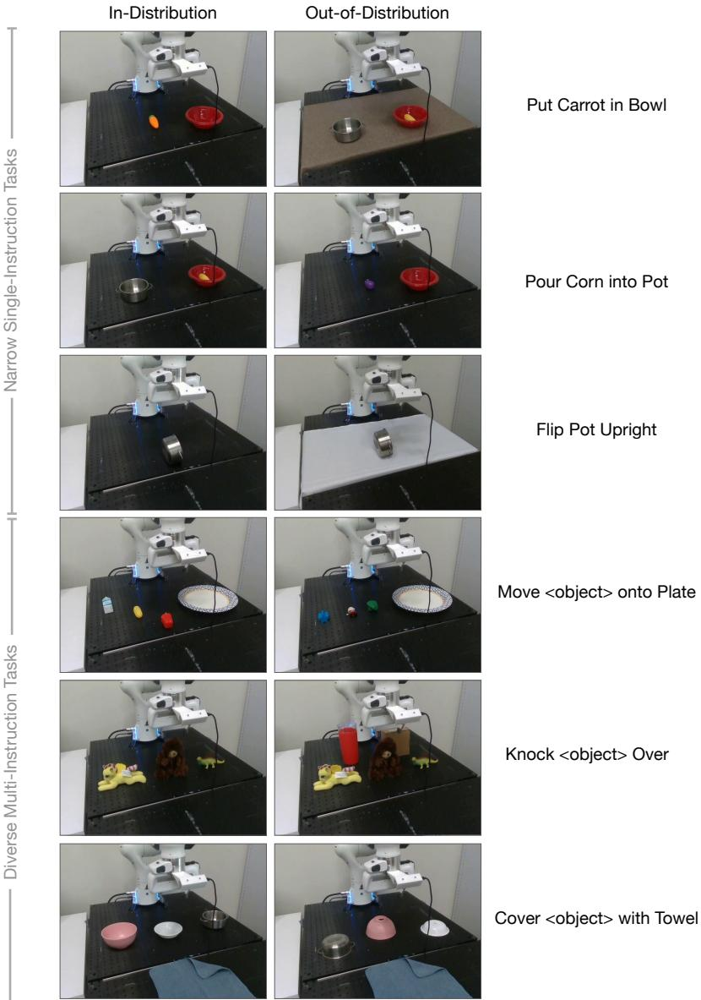  
Figure 10: Franka-Tabletop fine-tuning tasks.Franka-Tabletop tasks used in the data-effcient adaptation eperiments in Section 5. and described in detail in Fig.10 are depicted above.The first three of six tasks, so the to tree ows,yvolvea glesttn, whi the asthree tasks  theott e rows involve multipleobjects and instructions (the instructions speciy the target object or targe location). The rst colu shows sample initl states matching the trainig data distribution, while the second clum showut-distribui ()initl states . nsebackroun, targe bject, distractors anje positns/orientations). Every polic  Section .s evaluated with 1012 rollouts on -distribution tasks and 56 rollouts on OOD tasks.

Below we describe each of the six Franka-Tabletop tasks shown in Fig. 10:

1. Put Carrot in Bowl (single-instruction): The robot's goal is to grasp the carrot and place it into the bowl. We collect 50 demonstrations of this task for the training dataset, randomly placing the carrot and the bowl at different locations on the table in every episode. The carrot is always initialized on the left side of the bowl. During evaluation, each trial is recorded as a success (1) or failure (0); there is no partial credit.

2. Pour Corn into Pot (single-instruction): The robot's goal is to grasp the red bowl, move towards the steel pot, and pour the contents (a yellow corn) into the pot. We collect 50 demonstrations of this task for the training dataset, randomly placing the bowl and the pot at different locations on the table in every episode. The bowl is always initialized on the right side of the pot. During evaluation, each trial is recorded as a success (1) or failure (0); there is no partial credit.

3. Flip Pot Upright (single-instruction): The robot's goal is to grasp the steel pot (which is initially oriented vertically), rotate it to be in the upright position, and place it back onto the table. We collect only 10 demonstrations of this task for the training dataset, randomly placing the steel pot at various locations within a small section of the table. During evaluation, each trial is recorded as a success (1), failure (0), or partial success (0.5). Partial successes include grasping the pot but not orienting it upright, or knocking it over to the upright position but not carefully guiding it. The robot must release the pot at the end of the episode for full credit.

4. Move <object> onto Plate (multi-instruction): The robot's goal is to grasp one out of three objects (depending on the target specified in the language instruction) and place it on the plate on the right side of the table. We collect 150 demonstrations of this task for the training dataset, randomly placing different combinations of three objects on the table and selecting one as the target. The plate is always initialized on the right side of the table. During evaluation, each trial is recorded as a success (1), failure (0), or partial success (0.5). Partial success is recorded when the first object that the robot makes contact with is the correct target object (i.e., the object specified in the language instruction), but the robot does not complete the task.

5. Knock <object> Over (multi-instruction): The robot's goal is to approach one out of three objects (depending on the target specified in the language instruction) and push it until it falls over. We collect 70 demonstrations of this task for the training dataset, randomly placing different combinations of three objects on the table and selecting one as the target. During evaluation, each trial is recorded as a success (1), failure (0), or partial success (0.5). Partial success is recorded when the first object that the robot makes contact with is the correct target object (i.e., the object specified in the language instruction), but the robot does not complete the task.

6. Cover <object> with Towel (multi-instruction): The robot's goal is to grasp the blue towel and place it on one out of three objects (depending on the target specified in the language instruction). We collect 45 demonstrations of this task for the training dataset, randomly placing different combinations of three objects on the table. During evaluation, each trial is recorded as a success (1), failure (0), or partial success (0.5). Partial success is recorded when the first object that the robot touches with the towel is the correct target object (i.e., the object specified in the language instruction), but the robot does not complete the task (e.g., it drops the towel onto the table instead of on top of the target object). Full credit is given when any part of the towel is resting over the top surface of the target object, i.e., the object does not need to be fully covered.

For every Franka-Tabletop task, we evaluate each method with 1012 in-distribution trials and 56 OOD generalization trials. The in-distribution and OOD test conditions are depicted in Fig. 10 (second column).

We describe the OOD test conditions for each of the six tasks below:

1. Put Carrot in Bowl (OOD): An eggplant (unseen object) replaces the carrot.   
2.Pour Corn into Pot (OOD): An unseen brown tablecloth covers the tabletop.   
3.Flip Pot Upright (OOD): An unseen white tablecloth covers the tabletop   
4.Move <object> onto Plate (OOD): A set of three unseen objects are placed on the table.   
5. Knock <object> Over (OOD): Two unseen distractor objects (red plastic cup and brown box) are positioned behind the set of three seen objects.   
6. Cover <object> with Towel (OOD): The three objects on the table are placed upside-down and at unseen positions.

Finally, in the Franka-DROID environment, we experiment with one task and variants of it: Wipe Table (see Fig. 11). In this task, the robot's goal is to grab the brush and sweep all three small brown eo  hs a the positions of all the objects.

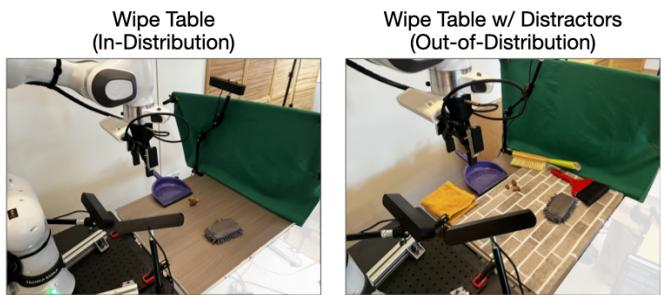  
Figure 11: Franka-DROID fine-tuning task. The "Wipe Table" task shown here is the final task used in the data-efficient adaptation experiments in Section 5..The left image shows the initial conditions for an iisutn tTehhow usutn lhics sacto pre  the bTuy pe e sk h o us a he ru nee  re the dustpan.

At test time, we evaluate on in-distribution conditions matching the training data (Fig. 11, left), as well as out-of-distribution (OOD) conditions in which distractor objects are also present in the scene on the table (Fig. 11, right). Since there are various possible outcomes for each trial, we define a scoring rubric as follows: The maximum score for each trial is 2 points. The policy receives the full 2 points if the robot sweeps all three objects into the dustpan. It receives 1 point for successfully sweeping one or two objects into the dustpan. Otherwise, it receives 0 points. We evaluate each policy with 18 in-distribution trials and 12 00D trials, so each policy receives an aggregate score out of 60 points.

# B.3.2 Detailed Franka-Tabletop and Franka-DROID Evaluation Results

Full evaluation results for both Franka-Tabletop and Franka-DROID evaluations are shown in Table 7. We evaluate the methods discussed in Section 5.2. We find that Diffusion Policy demonstrates strong performance on the single-instruction Franka-Tabletop tasks (e.g., "Put Carrot in Bowl" and "Pour Corn in Pot"), outperforming other methods. However, OpenVLA and Octo achieve higher performance in the more diverse multi-instruction tasks ("Move <object> onto Plate", "Knock <object> Over", and "Cover <object> with Towel"). In the Franka-DROID environment, OpenVLA obtains best results. Overall, we find that OpenVLA achieves the highest average performance across both tasks.

Additionally, in Table 8, we show the detailed version of the parameter-efficient fine-tuning experiment results summarized in Table 1. In these experiments, we use a representative subset of two FrankaTabletop tasks, with both in-distribution and OOD variants: one narrow single-instruction task ("Put Carrot in Bowl") and one diverse multi-instruction task ("Move <object> onto Plate"). We use the same number of training demonstrations used in Section 5.2 (50 and 150, respectively), which is delineated in Appendix B.3.1.

Table7: Detailed data-efficient adaptation experiment results. Here we present the full breakdownof results summarized in Fig. 5. We report the performance of Diffusion Policy trained from scratch on new robot tasks, as well as generalist policies fne-tuned on the same dataEach policy is tested against both in-distribution and out-of-distribution (O0D) generalization conditions (see Fig.10 for Franka-Tabletop tasks and Fig11 fr Franka-DRoD tasks). We find that no single policy performs best on al tasks: Diffusion Policy achieves high success rates on single-instruction tasks, while OpenVLA and Octo performs well on diverse multi-instruction tasks. In terms of aggregate performance, however, OpenVLA obtains the highest average success rate across both environments.   

<table><tr><td colspan="2"></td><td># trials</td><td>Diffusion Policy</td><td>Diffusion Policy (matched)</td><td>Octo</td><td>OpenVLA (scratch)</td><td>OpenVLA (ours)</td></tr><tr><td rowspan="10">Franka-Tabletop (5Hz)</td><td>&quot;Put Carrot in Bowl&quot; (in-distribution)</td><td>10</td><td>90.0%</td><td>80.0%</td><td>40.0%</td><td>70.0%</td><td>70.0%</td></tr><tr><td>&quot;Put Carrot in Bowl&quot; (OOD)</td><td>5</td><td>20.0%</td><td>0.0%</td><td>20.0%</td><td>0.0%</td><td>40.0%</td></tr><tr><td>&quot;Pour Corn into Pot&quot; (in-distribution)</td><td>10</td><td>100.0%</td><td>90.0%</td><td>0.0%</td><td>10.0%</td><td>50.0%</td></tr><tr><td>&quot;Pour Corn into Pot&quot; (OOD)</td><td>5</td><td>80.0%</td><td>60.0%</td><td>0.0%</td><td>20.0%</td><td>60.0%</td></tr><tr><td>&quot;Flip Pot Upright&quot; (in-distribution)</td><td>10</td><td>100.0%</td><td>85.0%</td><td>40.0%</td><td>85.0%</td><td>100.0%</td></tr><tr><td>&quot;Flip Pot Upright&quot; (OOD)</td><td>5</td><td>50.0%</td><td>20.0%</td><td>0.0%</td><td>40.0%</td><td>80.0%</td></tr><tr><td>&quot;Move &lt;object&gt; onto Plate&quot; (in-distribution)</td><td>12</td><td>25.0%</td><td>25.0%</td><td>41.7%</td><td>8.3%</td><td>75.0%</td></tr><tr><td>&quot;Move &lt;object&gt; onto Plate&quot; (OOD)</td><td>6</td><td>8.3%</td><td>33.3%</td><td>8.3%</td><td>33.3%</td><td>58.3%</td></tr><tr><td>&quot;Knock &lt;object&gt; Over&quot; (in-distribution) &quot;Knock &lt;object&gt; Over&quot; (OOD</td><td>12 6</td><td>33.3% 16.7%</td><td>25.0% 16.7%</td><td>83.3% 33.3%</td><td>75.0% 58.3%</td><td>75.0%</td></tr><tr><td>&quot;Cover &lt;object&gt; with Towel&quot; (in-distribution)</td><td>12</td><td>16.7%</td><td>20.8%</td><td>91.7%</td><td>41.7%</td><td>83.3% 50.0%</td></tr><tr><td></td><td>&quot;Cover &lt;object&gt; with Towel&quot; (OOD)</td><td>6</td><td>16.7%</td><td>33.3%</td><td>91.7%</td><td>50.0%</td><td>50.0%</td></tr><tr><td></td><td>Average</td><td></td><td>48.5±4.9%</td><td>43.4±4.7%</td><td>43.4±4.4%</td><td>43.4±4.6%</td><td>67.2±4.0%</td></tr><tr><td rowspan="2">Franka-DROID (15Hz)</td><td>&quot;Wipe Table&quot; (in-distribution)</td><td>18</td><td>50.0%</td><td>27.8%</td><td>52.8%</td><td>25.0%</td><td>55.6%</td></tr><tr><td>Wipe Table&quot; + Distractors (OOD</td><td>12</td><td>12.5%</td><td>25.0%</td><td>16.7%</td><td>16.7%</td><td>62.5%</td></tr><tr><td rowspan="2"></td><td>Average</td><td></td><td>35.0±8.0%</td><td>26.7±7.5%</td><td>38.3±8.5%</td><td>21.7±6.6%</td><td></td></tr><tr><td></td><td></td><td></td><td></td><td></td><td></td><td>58.3±7.2%</td></tr></table>

Table 8: Detailed parameter-efficient fine-tuning experiment results. Here we present the detailed task performance results summarized in Table 1.   

<table><tr><td></td><td></td><td># trials</td><td>Full FT</td><td>Last layer only</td><td>Frozen vision</td><td>Sandwich</td><td>LoRA, r=32</td><td>LoRA, r=64</td></tr><tr><td rowspan="4">Franka-Tabletop (5Hz)</td><td>&quot;Put Carrot in Bowl&quot; (in-distribution)</td><td>10</td><td>90.0</td><td>40.0</td><td>40.0</td><td>90.0</td><td>60.0</td><td>90.0</td></tr><tr><td>&quot;Put Carrot in Bowl&quot; (OOD)</td><td>5</td><td>40.0</td><td>0.0</td><td>40.0</td><td>0.0</td><td>60.00</td><td>40.0</td></tr><tr><td>&quot;Move &lt;object&gt; onto Plate&quot; (in-distribution</td><td>12</td><td>79.2</td><td>33.3</td><td>50.0</td><td>75.0</td><td>75.0</td><td>62.5</td></tr><tr><td>&quot;Move &lt;object&gt; onto Plate&quot; (OOD)</td><td>6</td><td>41.7</td><td>33.3</td><td>58.3</td><td>41.7</td><td>75.0</td><td>66.7</td></tr><tr><td>Average</td><td></td><td></td><td>69.7±7.2%</td><td>30.3±6.1%</td><td>47.0±6.9%</td><td>62.1±7.9%</td><td>68.2±7.5%</td><td>68.2±7.8%</td></tr></table>

# C RT-2-X vs. OpenVLA in BridgeData V2 Evaluations

In this section, we provide additional details on RT-2-X vs. OpenVLA comparisons in BridgeData V2 evaluations discussed in Section 5.1. As discussed previously, OpenVLA is pretrained on a larger subset of OpenX data than RT-2-X and uses a fused SigLIP-DinoV2 vision backbone rather than a single visual encoder. However, in addition to these factors, we believe that OpenVLA's significant improvement upon RT-2-X specifically in BridgeData V2 evaluations (as shown in Fig. 3) also stems from more careful preprocessing of the Bridge dataset.

During the development of the OpenVLA model, we discovered that the original version of the BridgeData V2 dataset contained many transitions with all-zero (no-op) actions. For instance, in every demonstration, an all-zero action was recorded as the ground-truth action in the first timestep. Consequently, training a highly expressive VLA model on the original dataset without any data preprocessing led to a policy that frequently predicted all-zero actions and froze during evaluations. Therefore, we simply filtered out the first transition in every demonstration when training the OpenVLA model, and this was sufficient for mitigating the freezing behavior in most cases.

However, the RT-2-X model was trained without such data preprocessing, so it often suffers the aforementioned freezing behavior if deployed out of the box without modifying the model querying procedure  which severely deteriorates rollout performance. Since this is a proprietary model that is infeasible for us to re-train (e.g., with our preprocessed version of the BridgeData V2 dataset), we mitigated this issue by simply querying the second-most-likely action from the model, since the first-most-likely action was often all zeros while the second-most-likely action was not. (Note that this is the same workaround that was applied by the developers of the RT-2-X model for BridgeData V2 evaluations reported in the Open X-Embodiment experiments [1].) This workaround led to much stronger RT-2-X performance on BridgeData V2 evaluations  though we believe that it is still suboptimal compared to re-training the model on the preprocessed version of the dataset.

We also tried to dynamically query RT-2-X, i.e., by first sampling the first-most-likely action and then sampling the second-most-likely action if the first one was all zeros. However, we empirically found that dynamic querying led to worse performance than simply querying the second-most-likely action at all times. We hypothesize that this is due to a change in the robot's dynamics that arises from dynamic querying: pausing in the middle of a trajectory to re-query the model leads to slight interruptions in the robot's movement due to non-neglible latency in the querying pipeline, and this leads to subtle performance degradation. Therefore, we report the performance of RT-2-X when always querying the second-most-likely action, as done in the Open X-Embodiment project [1].

# D Additional Experiments and Ablations

In this section, we conduct several additional experiments to analyze the effects of individual components of the OpenVLA model architecture and training scheme, as well as provide quantitative evidence for claims made in earlier sections of this work. We aim to answer the following questions:

1.How important is OpenX training and how does it impact OpenVLA's performance (Appendix D.1)? 2.What effect does using a fused SigLIP-DinoV2 vision encoder have on OpenVLA's performance, compared to using a SigLIP-only vision encoder (Appendix D.2)? 3. Is it better to fine-tune or freeze the vision encoder in OpenVLA (Appendix D.3)? 4.How do the quantized inference results discussed in Section 5.3 change when policy performance is disentangled from model inference speed (Appendix D.4)?

We discuss the experimental setup and results addressing each of the above questions sequentially in the following sections.

# D.1 OpenX Training Data Ablation Experiments

As discussed in Section 3.3, OpenVLA is trained on a large dataset of robot embodiments, scenes, and tasks from the Open X-Embodiment dataset [1] (OpenX). In this section, we ablate the OpenX mixture and train a VLA policy solely on one robot dataset, to assess the impact of OpenX training on policy performance. Note that we have already observed the negative effect of ablating OpenX training in the fine-tuning regime, as discussed in Section 5.2 (see OpenVLA (Scratch)), but we discuss additional experiments on another robot embodiment in this section to provide more supporting evidence.

Experimental setup and tasks. We compare the original OpenVLA model with OpenVLA-Bridge, which is produced by taking the same pretrained VLM as OpenVLA (Prismatic VLM [44]) and fine-tuning it solely on BridgeData V2 [6] rather than the entire OpenX training mixture discussed in Appendix A. We evaluate OpenVLA and OpenVLA-Bridge on a subset of 8 representative tasks from the BridgeData V2 WidowX robot evaluation suite discussed in Appendix B.1.1. The tasks are listed in Table 9.

Results. Results for the OpenX training mixture ablation are shown in Table 9. By comparing OpenVLA with OpenVLA-Bridge, we see that performance drops drastically (reduction of 30 percent in absolute success rate), which demonstrates the importance of OpenX pretraining on final policy performance. Although the language grounding performance is not impacted, we observe performance reduction across all generalization categories. This result suggests that the large diversity of scenes, objects, and tasks in the OpenX training mixture is essential for unlocking improved generalization capabilities in the OpenVLA model.

# D.2 Dual vs. Single Vision Encoder Experiments

The OpenVLA model architecture consists of a fused vision backbone that combines the SigLIP [9] and DinoV2 [25] encoders. In this section, we ablate the DinoV2 component to assess the importance of using a dual vision encoder.

Experimental setup and tasks. We instantiate a model, OpenVLA-Bridge-SigLIP, which is a version of OpenVLA that is trained only on BridgeData V2 and consists of only the SigLIP encoder as the vision backbone. We compare this model with the OpenVLA-Bridge model discussed in the previous section (Appendix D.1), which shares the same model architecture as the original OpenVLA model and is only trained on Bridge robot data. Therefore, the only difference between OpenVLA-Bridge-SigLIP and OpenVLA-Bridge is that the former omits the DinoV2 encoder in the vision backbone. We evaluate these models on the same subset of 8 Bridge tasks described in the previous section.

Table 9: BridgeData V2 WidowX ablation experiment results. We evaluate various methods on a subset of 8 representative tasks to assess the importance of different components of the OpenVLA model architecture and training scheme. OpenVLA-Bridge is a version of OpenVLA without OpenX training (it is trained only on BridgeData V2), and OpenVLA-Bridge-SigLIP additionally ablates the fused vision backbone by removing the DinoV2 encoder (its vision backbone only consists of the SigLIP encoder). We observe that both OpenX training and the fused vision encoder mprove policy performance, though the former has a much greatereffect than the latter.   

<table><tr><td>Category</td><td>Task</td><td># Trials</td><td>OpenVLA # Successes</td><td>OpenVLA-Bridge # Successes</td><td>OpenVLA-Bridge-SigLIP # Successes</td></tr><tr><td>Visual gen</td><td>Put Eggplant into Pot (Easy Version)</td><td>10</td><td>10</td><td>8</td><td>8</td></tr><tr><td>Visual gen</td><td>Put Eggplant into Pot</td><td>10</td><td>10</td><td>2</td><td>3</td></tr><tr><td>Visual gen</td><td>Put Cup from Counter into Sink</td><td>10</td><td>7</td><td>4</td><td>2</td></tr><tr><td>Motion gen</td><td>Lift Eggplant</td><td>10</td><td>7.5</td><td>5.5</td><td>6.5</td></tr><tr><td>Physical gen</td><td>Put Carrot on Plate</td><td>10</td><td>8</td><td>4</td><td>1</td></tr><tr><td>Physical gen</td><td>Lift AAA Battery</td><td>10</td><td>7</td><td>2</td><td>2</td></tr><tr><td>Semantic gen</td><td>Take Purple Grapes out of Pot</td><td>10</td><td>4</td><td>3</td><td>3</td></tr><tr><td>Language grounding</td><td>Put {Eggplant, Red Bottle} into Pot</td><td>10</td><td>7.5</td><td>8</td><td>7</td></tr><tr><td></td><td></td><td>Mean Success Rate</td><td>76.3 ± 4.8%</td><td>45.6 ± 5.6%</td><td>40.6 ± 5.5%</td></tr></table>

Results. Results for the dual vision encoder ablation are shown in Table 9. The drop in performance from OpenVLA-Bridge to OpenVLA-Bridge-SigLIP implies that additionally including the DinoV2 encoder in the vision backbone improves policy performance. However, the 5 percent reduction in performance here is not as significant as the 30 percent drop in performance observed from ablating OpenX training. The low-level spatial features represented in DinoV2 appear to aid generalization in only some cases.

# D.3 Fine-Tuned vs. Frozen Vision Encoder Experiments

As discussed in Section 3.4, prior work on VLMs observed higher performance from freezing the vision encoder than fine-tuning its parameters [4]. However, when training OpenVLA, we fine-tuned all 7B parameters in the model, including the SigLIP-DinoV2 vision backbone, as we discovered early on during development that fine-tuning the vision encoder led to higher-performing VLAs — a finding which held across various pretrained VLMs and model architectures. We discuss details of such findings below.

Experimental setup and tasks. In this section, we report the performance of two VLA policies produced by fine-tuning two different pretrained models from the Prismatic VLMs [44] repository on BridgeData V2. The two pretrained models are named SigLIP ViT-SO 224px and LLaVa v1.5 7B (Reproduction); see Karamcheti et al. [44] for details on their architectures and training mixtures. We evaluate both policies on various Bridge tasks shown in Table 10. Note that the evaluation configurations here differ from previously discussed Bridge evaluations, so the results are not directly comparable to results in other similar experiments.

Results. Results for the fine-tuned vs. frozen vision encoder experiments are shown in Table 10. We find that for both VLAs tested, fine-tuning the vision encoder leads to significantly higher success rates across various tasks. Qualitatively, in some cases, deploying the frozen vision encoder policies leads to unstable robot behaviors that are clearly suboptimal. Consequently, we decided early on during development to not conduct further experimentation with frozen vision encoders.

# D.4 Additional Quantized Inference Experiments: Disentangling Policy Performance and Model Inference Speed

In Section 5.3, we evaluated OpenVLA with different levels of precision at inference time: half precision (bfloat16), 8-bit quantization, and 4-bit quantization. 8-bit quantization led to lower BridgeData V2 performance relative to the other two approaches, and we hypothesized that the reduction in performance was caused by lower model inference speed from the operations used in 8-bit quantization. In this section, we conduct experiments to assess the veracity of this claim.

Specifically, we evaluate OpenVLA again with the three different levels of precision listed above, but now with blocking control. In other words, each action is fully executed on the robot before the next one is predicted by the policy and executed by the controller. This scheme controls system dynamics across methods with varying amounts of latency and thus allows us to test the quality of a policy's action predictions, independent of its prediction speed. Effectively, the precision levels that have higher throughput  bfloat16 and 4-bit quantization  are forced to run slower to match the dynamics observed when deploying OpenVLA with 8-bit precision. Therefore, we expect OpenVLA's performance with 8-bit precision to match the performance of bfloat16 and 4-bit precision under blocking control.

oz  c  a ("Fi-Tuned") vs.freezing the vision encoder ("Frozen Vision") in two VLA policies built on top of two different pretrained VLMs from the Prismatic VLMs [44] repository. BridgeData V2 WidowX tasks shown here are performed in the same sink environment used or other Bride experiments n this work (however, the l environment confgurations here diffe, as these evaluations were conducted at an earlier stage in the project). We find that fne-tuning the vision encoder is crucial to obtain good policy perormance.Certain frozenvision encoder evaluations were discontinued due to very poor (near-zero) performance and unstable robot behaviors. Among the evaluations where both frozen vision and fine-tuned approaches are tested, fne-tuning thevision encoder leads to $8 0 . 0 \%$ average success versus $4 6 . 7 \%$ average success from leaving it frozen.   

<table><tr><td rowspan="2">Task</td><td rowspan="2"># Trials</td><td colspan="2">SigLIP ViT-SO 224px</td><td colspan="2">LLaVa v1.5 7B (Reproduction)</td></tr><tr><td>Frozen Vision # Successes</td><td>Fine-Tuned # Successes</td><td>Frozen Vision # Successes</td><td>Fine-Tuned # Successes</td></tr><tr><td>Put Eggplant into Pot</td><td>10</td><td>7</td><td>10</td><td>5</td><td>9</td></tr><tr><td>Put Corn on Plate</td><td>10</td><td>10</td><td>9</td><td>0</td><td>9</td></tr><tr><td></td><td>Mean Success Rate</td><td>85</td><td>95</td><td>25</td><td>90</td></tr><tr><td>Put { Eggplant, Red Bottle } into Pot</td><td>4</td><td>2</td><td>4</td><td>−</td><td>3</td></tr><tr><td>Put { Blue Cup, Pink Cup } on Plate</td><td>4</td><td>0</td><td>0</td><td></td><td>0</td></tr><tr><td>Lift { Cheese, Red Chili Pepper }</td><td>4</td><td>0</td><td>3</td><td></td><td>2</td></tr><tr><td>Put { Strawberry, Lime } into Pot</td><td>4</td><td>1</td><td>0</td><td></td><td>3</td></tr><tr><td>Move { Sushi, Grapes }</td><td>4</td><td>3</td><td>4</td><td></td><td>3</td></tr><tr><td></td><td>Mean Success Rate</td><td>30</td><td>55</td><td></td><td>55</td></tr></table>

Experimental setup and tasks. We report the performance of OpenVLA with blocking control and quantized inference on the same subset of 8 BridgeData V2 tasks used in Appendix D.1 and Appendix D.2.

Results. Quantized inference experiment results with blocking control are shown in Table 11. Unlike in Table 2, where 8-bit quantization led to the worst rollout performance due to low inference speed, here we observe that 8-bit quantization performs comparably to bfloat16 precision and 4-bit quantization given that we evaluate with blocking control to remove the influence of varying inference speeds on task performance. This confirms our hypothesis about the effect of inference speed on 8-bit quantization performance in previous experiments (when using non-blocking control). We also see no substantial performance degradation when using the lowest precision, 4-bit, as also observed in Section 5.3.

Table 11: Quantized inference experiment results with blocking control. We report the success rate and standard error of OpenVLA on various BridgeData V2 WidowX tasks with bfloat16 precision (the default aprach), 8-bit qantization (int8), and 4-bit quantization (int4) at inerence time Allaverage ucess ates have overlapping error bars, which suggests that all methods perform comparably.   

<table><tr><td>Category</td><td>Task</td><td># Trials</td><td>bfloat16 # Successes</td><td>int8 # Successes</td><td>int4 # Successes</td></tr><tr><td>Visual gen</td><td>Put Eggplant into Pot (Easy Version)</td><td>10</td><td>10</td><td>10</td><td>10</td></tr><tr><td>Visual gen</td><td>Put Eggplant into Pot</td><td>10</td><td>9</td><td>10</td><td>10</td></tr><tr><td>Visual gen</td><td>Put Cup from Counter into Sink</td><td>10</td><td>5</td><td>5</td><td>3</td></tr><tr><td>Motion gen</td><td>Lift Eggplant</td><td>10</td><td>8</td><td>7</td><td>7.5</td></tr><tr><td>Physical gen</td><td>Put Carrot on Plate</td><td>10</td><td>10</td><td>10</td><td>10</td></tr><tr><td>Physical gen</td><td>Lift AAA Battery</td><td>10</td><td>3</td><td>6</td><td>4</td></tr><tr><td>Semantic gen</td><td>Take Purple Grapes out of Pot</td><td>10</td><td>2</td><td>2</td><td>2</td></tr><tr><td>Language grounding</td><td>Put {Eggplant, Red Bottle} into Pot</td><td>10</td><td>9</td><td>9.5</td><td>8.5</td></tr><tr><td colspan="2"></td><td>Mean Success Rate</td><td>70.0 ± 5.1%</td><td>74.4 ± 4.9%</td><td>68.8 ± 5.2%</td></tr></table>

# E LIBERO Simulation Experiments

Our previous discussions in Section 5.2 and Section 5.3 focused on adapting OpenVLA to novel real-world robot setups and tasks. This section explores adapting OpenVLA to simulated robot setups and tasks, specifically utilizing the LIBERO benchmark [116]. Our experimentation in simulation offers two key advantages:

1. Demonstration of versatility: We show that OpenVLA, despite having been pretrained exclusively on real-world robot data, can effectively adapt to simulated domains, overcoming potential disparities between real-world and simulated environments and dynamics.   
2.Enhanced accessibility and reproducibility: Integration of OpenVLA into a publicly available simulation platform makes our model more accessible to other researchers, especially those who may not have access to robotic hardware. Additionally, simulated experiments are more easily reproduced than their real-world counterparts.

We discuss the experimental setup in Appendix E.1 and the results in Appendix E.2. We release the materials required to reproduce the experiments along with the OpenVLA codebase.

# E.1 LIBERO Simulation Experimental Setup

Simulation setup and tasks. The LIBERO benchmark [116] consists of four task suites designed for studying lifelong learning in robotic manipulation, and the original paper therefore investigates both forward and backward transfer to a variety of tasks. In our experiments, we focus solely on supervised fine-tuning on the target task suite, measuring the performance of various policies trained via behavioral cloning on successful demonstrations of the tasks.

We perform experiments with the following four task suites, which each contain 10 tasks with 50 human-teleoperated demonstrations each:

•LIBERO-Spatial consists of the same set of objects but different layouts, and tests the model's understanding of spatial relationships.   
•LIBERO-Object consists of the same scene layouts but different objects, and tests the model's understanding of object types.   
•LIBERO-Goal consists of the same objects and layouts but different task goals, and tests the model's knowledge of different task-oriented behaviors.   
• LIBERO-Long (also called LIBERO-10) consists of long-horizon tasks with diverse objects, layouts, and tasks.

We make the following modifications to each of the training datasets above:

1. To accommodate methods requiring higher-resolution images (such as $2 5 6 \times 2 5 6 \mathrm { p x }$ or $2 2 4 \times 2 2 4 \mathrm { p x } )$ , we regenerate all demonstrations at an increased resolution of $2 5 6 \times 2 5 6 \mathrm { p x }$ Originally, the dataset provided by the benchmark consists of $1 2 8 \times 1 2 8 \mathrm { p x }$ images. We find that simply upscaling these images to $2 5 6 \times 2 5 6 \mathrm { p x }$ results in poor image quality. Therefore, we choose to begin with higher-resolution images, which can be downscaled as necessary, ensuring higher image quality across various resolution requirements. These higher-resolution images were obtained by stepping through the simulation environments with the actions stored in the provided human-collected demonstrations and saving the images rendered by the simulator.

2.We filter out all "no-op" actions from the dataset, i.e., actions that have near-zero magnitude in the translation and rotation components and do not change the state of the robot's gripper We find that this simple data cleaning step is crucial for highly expressive single-step policies such as OpenVLA, which otherwise learn to imitate these no-op actions and consequently freeze indefinitely at certain states during evaluation.

3. We rotate all third-person images at both train and test time by 180 degrees because we observe that the LIBERO environments return images that are upside down on our hardware.

4.Since we train policies via imitation learning, which expects demonstrations to be successful, we replay all demonstrations in the corresponding simulation environments and filter out the demonstrations that fail to complete the task (as determined by the environments' success criteria). As a result, we remove 68 of 500 LIBERO-Spatial demonstrations, 46 of 500 LIBERO-Object demonstrations, 72 of 500 LIBERO-Goal demonstrations, and 121 of 500 LIBERO-Long demonstratinos.

5. For all methods in our comparisons, we only utilize the static third-person camera images; we do not use the wrist camera images that are additionally provided in the original datasets. This is for sake of having fair comparisons, as OpenVLA's visual inputs only consist of third-person camera images.

Comparisons. The methods that we compare include Diffusion Policy8 [3] trained from scratch, Octo [5] fine-tuned on the target dataset, and OpenVLA fine-tuned on the target dataset via LoRA $( r = 3 2 )$ ) as described in Section 5.3. Each policy is trained independently on each of the task suites above (rather than training a single policy on all four suites combined). All policies are trained with the same set of demonstrations, so all methods benefit from the data cleaning steps described above.

Evaluation details. To ensure lower variance in the experimental results, all methods are evaluated across 500 trials for each task suite, and the reported performance is the average success rate over three random seeds (resulting in 1500 total trials per statistic). Although we modify the training datasets, as described earlier, we do not change the test environments but rather use the same initial environment configurations provided by the original LIBERO benchmark.

# E.2 LIBERO Simulation Experimental Results

We present the LIBERO experimental results in Table 12. Importantly, we observe that OpenVLA can be effectively adapted to tasks in the LIBERO simulation environments, as it obtains highest average success rate and rank among the tested methods. However, we find that the overall margin between OpenVLA and the other methods are tighter here than in the real-world fine-tuning experiments discussed in Section 5.2. We attribute this to the fact that OpenVLA was pretrained with purely real-world robot data and no simulation data, which suggests that fine-tuning the model on simulated robot tasks may not be as effective as fine-tuning it on real-world tasks due to the domain gap between simulated and real-world environments and dynamics. We see evidence for this notion in the results obtained by Octo  another policy pretrained on large amounts of real-world robot data  which also only achieves a small boost in overall performance relative to a simple, strong baseline such as Diffusion Policy trained from scratch. We expect increased gains in performance for the pretrained and fine-tuned methods if simulation data is added to the pretraining data mixture.

Table 12: LIBERO simulation benchmark results. We report the success rate (SR) and standard error of each method for the four task suites in the LIBERO benchmark, averaged over three random seeds with 500 trials eac. In adition, we show the ranking of each method within each task suite, where a rank of 1 indicates the strongest method in the suite and a rank of 3indicates the weakest method. The average ranking is portan to not inc or which method ma bemos sitabl to uses default or  variety tasks;it se inativethan heveraucs rate whic otoralizebydividualas suidifficltyOveal, we find that fine-tuned OpenVLA achieves highest average success rate and rank, followed by fine-tuned Octo and then Diffusion Policy trained from scratch.   

<table><tr><td rowspan="2"></td><td colspan="2">LIBERO-Spatial</td><td colspan="2">LIBERO-Object</td><td colspan="2">LIBERO-Goal</td><td colspan="2">LIBERO-Long</td><td colspan="2">Average</td></tr><tr><td>SR (↑)</td><td>Rank (↓)</td><td>SR (↑)</td><td>Rank (↓)</td><td>SR (↑)</td><td>Rank (↓)</td><td>SR (↑)</td><td>Rank (↓)</td><td>SR (↑)</td><td>Rank (↓)</td></tr><tr><td>Diffusion Policy from scratch</td><td>78.3 ± 1.1%</td><td>3</td><td>92.5 ± 0.7%</td><td>1</td><td>68.3 ± 1.2%</td><td>3</td><td>50.5 ± 1.3%</td><td>3</td><td>72.4 ± 0.7%</td><td>2.5</td></tr><tr><td>Octo fine-tuned</td><td>78.9 ± 1.0%</td><td>2</td><td>85.7 ± 0.9%</td><td>3</td><td>84.6 ± 0.9%</td><td>1</td><td>51.1 ± 1.3%</td><td>2</td><td>75.1 ± 0.6%</td><td>2</td></tr><tr><td>OpenVLA fine-tuned (ours)</td><td>84.7 ± 0.9%</td><td>1</td><td>88.4 ± 0.8%</td><td>2</td><td>79.2 ± 1.0%</td><td>2</td><td>53.7 ± 1.3%</td><td>1</td><td>76.5 ± 0.6%</td><td>1.5</td></tr></table>