# 扩散策略：通过动作扩散进行视觉运动策略学习

程 $\mathtt { c h i } ^ { * 1 }$ , 甄嘉 ${ \pmb { \chi } } _ { \pmb { \mu } ^ { * 1 } }$ , 冯思源² , 埃里克·库西诺² , 易伦 ${ \mathsf { D } } { \mathsf { u } } ^ { 3 }$ , 本杰明·伯奇菲尔德² 拉斯·特德雷克 2,3 , 宋书然 1,4

# 摘要 p pi al i s。ft 方法的平均改进为 $4 6 . 9 \%$。扩散策略学习动作分布评分的梯度。代码、数据和训练细节可在 diffusion-policy.cs.columbia.edu 获取。

# 关键词

模仿学习，视觉运动策略，操作

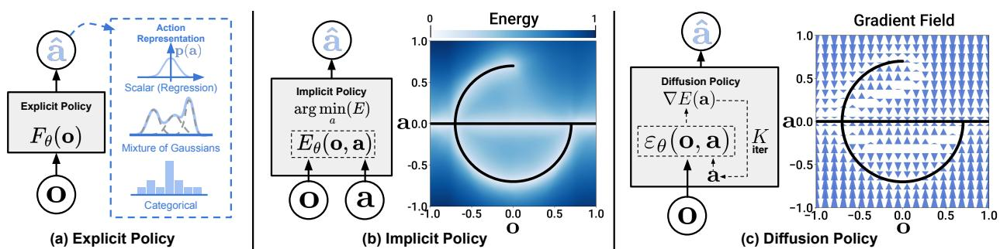  
D policy toaccurately modelmultimodal actindistributions, and accommodates high-dimensional action sequences.

# 1 引言

从示范中学习策略，最简单的形式可以归纳为学习将观测映射到动作的监督回归任务。然而，在实际应用中，预测机器人动作的独特性质——例如多模态分布的存在、序列相关性以及高精度的要求——使得这一任务与其他监督学习问题有着明显的区别和挑战。先前的研究尝试通过探索不同的动作表示来应对这一挑战（图1 a），使用混合高斯分布 Mandlekar 等（2021）、量化动作的分类表示 Shafiullah 等（2022），或通过将策略表示（图1 b）从显式转换为隐式，以更好地捕捉多模态分布 Florence 等（2021）；Wu 等（2020）。在本文中，我们希望通过引入一种新的机器人视觉运动策略来解决这个挑战，该策略通过“在机器人动作空间上进行条件去噪扩散过程” Ho 等（2020）生成行为，即扩散策略。在该公式中，策略不是直接输出动作，而是推断在视觉观察条件下的动作得分梯度，针对 $K$ 次去噪迭代（图1 c）。这种形式使得机器人策略能够继承扩散模型的几个关键特性，从而显著提高性能。 • 表达多模态动作分布。通过学习动作得分函数的梯度 Song 和 Ermon（2019）并在该梯度场上进行随机Langevin动态采样，扩散策略可以表达任意可归一化分布 Neal 等（2011），其中包括多模态动作分布，这对策略学习来说是一个众所周知的挑战。 • 高维输出空间。正如其令人印象深刻的图像生成结果所示，扩散模型在高维输出空间上表现出优异的可扩展性。这一特性使得策略能够联合推断未来一系列动作，而不仅仅是单步动作，这对鼓励时间动作一致性和避免短视规划至关重要。 • 稳定训练。训练基于能量的策略通常需要负采样来估计一个不可处理的归一化常数，这被认为会导致训练不稳定 Du 等（2020）；Florence 等（2021）。扩散策略通过学习能量函数的梯度来绕过这一要求，从而在保持分布表达能力的同时实现稳定训练。我们的主要贡献是将上述优点带入机器人领域，并在复杂的真实机器人操作任务中验证其有效性。为了成功利用扩散模型进行视觉运动策略学习，我们提出以下技术贡献，以提升扩散策略的性能并充分发挥其在物理机器人上的潜力： • 闭环动作序列。我们将策略预测高维动作序列的能力与递归控制相结合，以实现稳健执行。这种设计允许策略在闭环方式中不断重新规划其动作，同时保持时间动作一致性，实现长时间规划与反应能力之间的平衡。 • 视觉条件。我们引入了一种视觉条件的扩散策略，其中视觉观察被视为条件，而不是联合数据分布的一部分。在此公式中，策略在去噪迭代中仅提取一次视觉表示，这大大减少了计算量并实现实时动作推断。 • 时间序列扩散变换器。我们提出了一种基于变换器的扩散网络，最小化典型CNN模型的过度平滑效应，并在需要高频率动作变化和速度控制的任务上取得了最先进的性能。我们系统地评估了扩散策略在来自四个不同基准的15个任务上的表现 Florence 等（2021）；Gupta 等（2019）；Mandlekar 等（2021）；Shafiullah 等（2022），基于行为克隆的公式。评估包括模拟和真实环境，从2DoF到6DoF的动作，单任务和多任务基准，以及完全和欠驱动系统，涵盖刚体和流体物体，使用由单个和多个用户收集的示范数据。实证上，我们发现所有基准测试的性能均一致提升，平均改进为 $4 6 . 9 \%$，为扩散策略的有效性提供了有力证据。我们还提供了详细分析，仔细检查所提算法的特性及关键设计决策的影响。这项工作是会议论文 Chi 等（2023）的扩展版本。我们从以下三个方面扩展了本论文的内容： • 包含关于扩散策略与控制理论之间联系的新讨论部分。见第4.5节。 • 包含关于替代网络架构设计和不同预训练及微调范式的附加消融研究，见第5.4节。 • 扩展了现实世界实验结果，包括三个双手操作任务，如搅拌器、垫子展开和衬衫折叠，见第7节。代码、数据和训练细节可公开获取，以便重复我们的结果 diffusion-policy.cs.columbia.edu。

# 2 扩散策略公式化

我们将视觉运动机器人策略表述为去噪扩散概率模型（DDPMs）Ho等（2020）。重要的是，扩散策略能够表达复杂的多模态动作分布，并具有稳定的训练行为，所需的任务特定超参数调优很少。以下各节将更详细地描述DDPMs，并解释如何将其调整以表示视觉运动策略。

# 2.1 去噪扩散概率模型

DDPM是一类生成模型，其中输出生成被建模为去噪过程，通常称为随机Langevin动力学。以从高斯噪声中采样得到的$\mathbf { x } ^ { K }$开始，DDPM进行$K$次去噪迭代，以生成一系列噪声逐渐减少的中间状态$\mathbf { x } ^ { k } , \mathbf { x } ^ { k - 1 } . . . \mathbf { x } ^ { 0 }$，直到形成所需的无噪声输出$\mathbf { x } ^ { 0 }$。该过程遵循的方程中，$\varepsilon _ { \theta }$是具有参数$\theta$的噪声预测网络，将通过学习进行优化，而$\bar { \mathcal { N } } ( 0 , \sigma ^ { 2 } I )$是在每次迭代中添加的高斯噪声。

$$
\mathbf { x } ^ { k - 1 } = \alpha ( \mathbf { x } ^ { k } - \gamma \varepsilon _ { \theta } ( \mathbf { x } ^ { k } , k ) + \mathcal { N } \big ( 0 , \sigma ^ { 2 } I \big ) ) ,
$$

上述方程 1 也可以被解释为一次带噪声的梯度下降步骤：

$$
\mathbf { x } ^ { \prime } = \mathbf { x } - \gamma \nabla E ( \mathbf { x } ) ,
$$

噪声预测网络 $\varepsilon _ { \boldsymbol { \theta } } ( \mathbf { x } , k )$ 有效地预测了梯度场 $\nabla E ( \mathbf { x } )$，$\gamma$ 是学习率。选择 $\alpha , \gamma , \sigma$ 作为迭代步骤 $k$ 的函数，也称为噪声调度，可以被解释为梯度下降过程中的学习率调度。研究表明，微小小于 1 的 $\alpha$ 能提高稳定性（Ho 等，2020）。关于噪声调度的细节将在第 3.3 节中讨论。

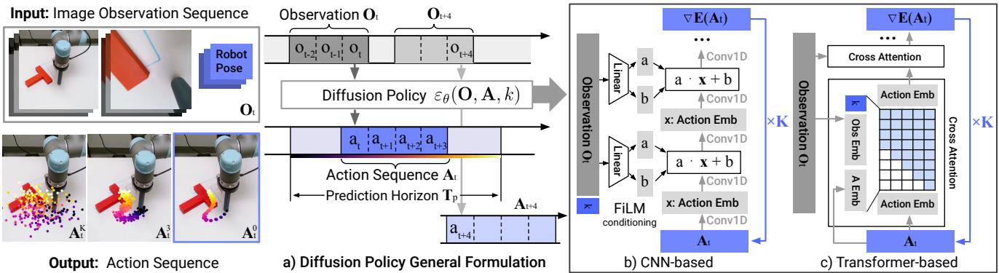  
Figure 2. Diffusion Policy Overview a) General formulation. At time step $t$ , the policy takes the latest $T _ { o }$ steps of observation data $O _ { t }$ as input and outputs $T _ { a }$ steps of actions $A _ { t }$ . b) In the CNN-based Diffusion Policy, FiLM (Feature-wise Linear Modulation) Per l.8conditioning f he servation fe $O _ { t }$ isapplied to every convolution layer, channel-wise. Starting from $\mathbf { A } _ { t } ^ { K }$ drawn from Gaussian noise, the output of noise-prediction network $\varepsilon _ { \theta }$ is subtracted, repeating $K$ times to get ${ \bf A } _ { t } ^ { 0 }$ , the denoised a $\mathbf { O } _ { t }$ is passed itself and previous action embeddings (causal attention) using the attention mask illustrated.

# 2.2 DDPM 训练

训练过程首先从数据集中随机抽取未修改的例子 $\mathbf { x } ^ { 0 }$。对于每个样本，我们随机选择一个去噪迭代 $k$，然后为迭代 $k$ 采样一个合适方差的随机噪声 $\varepsilon ^ { k }$。噪声预测网络被要求根据添加了噪声的数据样本预测噪声。

$$
\mathcal { L } = M S E ( \varepsilon ^ { k } , \varepsilon _ { \theta } ( \mathbf { x } ^ { 0 } + \varepsilon ^ { k } , k ) )
$$

正如Ho等人（2020）所示，最小化公式3中的损失函数也最小化了数据分布$p ( \mathbf { x } ^ { 0 } )$与从DDPM中抽取的样本分布$q ( \mathbf { x } ^ { 0 } )$之间的变分下界的KL散度，这一过程使用了公式1。

# 2.3 用于视觉运动策略学习的扩散方法

虽然扩散模型（DDPMs）通常用于图像生成（$\mathbf { \bar { x } }$ 是一张图像），但我们使用 DDPM 来学习机器人视觉运动策略。这需要在公式中进行两个主要修改：1. 将输出 $\mathbf { X }$ 更改为表示机器人动作。2. 使去噪过程以输入观察 $\mathbf { O } _ { t }$ 为条件。以下段落将讨论每个修改，图 2 显示了一个概述。

闭环动作序列预测：有效的动作 formulation 应该在长时间规划中促进时间一致性和平滑性，同时能够迅速对意外观察做出反应。为实现这一目标，我们承诺在重新规划之前对扩散模型生成的动作序列预测进行固定时间的使用。具体而言，在时间步 $t$，策略以最新的 $T _ { o }$ 步观察数据 $\mathbf { O } _ { t }$ 作为输入，并预测 $T _ { p }$ 步动作，其中 $T _ { a }$ 步动作在机器人上执行而不重新规划。在此，我们将 $T _ { o }$ 定义为观察时间范围，$T _ { p }$ 定义为动作预测范围，$T _ { a }$ 定义为动作执行范围。这促进了时间动作一致性，同时保持响应能力。关于 $T _ { a }$ 的影响的更多细节将在第 4.3 节讨论。我们的 formulation 还允许采用递归时间范围控制 Mayne 和 Michalska (1988) 来进一步提高动作的平滑性，通过使用先前的动作序列预测来热启动下一个推理设置。视觉观察条件：我们使用 DDPM 来近似条件分布 $p ( \mathbf { A } _ { t } | \mathbf { O } _ { t } )$，而不是 Janner 等人 (2022a) 中用于规划的联合分布 $p ( \mathbf { A } _ { t } , \mathbf { O } _ { t } )$。该 formulation 允许模型基于观察预测动作，而无需推断未来状态的成本，从而加快扩散过程，提高生成动作的准确性。为了捕捉条件分布 $p ( \mathbf { A } _ { t } | \mathbf { O } _ { t } )$，我们将 $\mathrm { E q ~ 1 }$ 修改为：

$$
\mathbf { A } _ { t } ^ { k - 1 } = \alpha ( \mathbf { A } _ { t } ^ { k } - \gamma \varepsilon _ { \theta } ( \mathbf { O } _ { t } , \mathbf { A } _ { t } ^ { k } , k ) + \mathcal { N } \big ( 0 , \sigma ^ { 2 } I \big ) )
$$

训练损失从 $\operatorname { E q }$ 修改为：

$$
\mathcal { L } = M S E ( \boldsymbol { \varepsilon } ^ { k } , \boldsymbol { \varepsilon } _ { \theta } ( \mathbf { O } _ { t } , \mathbf { A } _ { t } ^ { 0 } + \boldsymbol { \varepsilon } ^ { k } , k ) )
$$

将观测特征 $\mathbf { O } _ { t }$ 从去噪过程的输出中排除，显著提高了推理速度，并更好地适应实时控制。这也使得视觉编码器的端到端训练变得可行。关于视觉编码器的详细信息在第 3.2 节中描述。

# 3 个关键设计决策

在本节中，我们描述了扩散策略的关键设计决策以及其具体实现的 $\varepsilon _ { \theta }$ 的神经网络架构。

# 3.1 网络架构选项

第一次设计决策是选择 $\varepsilon _ { \theta }$ 的神经网络架构。在本工作中，我们研究了两种常见的网络架构类型，卷积神经网络（CNN）Ronneberger et al. (2015) 和转换器（Transformers）Vaswani et al. (2017)，并比较它们的性能和训练特性。需要注意的是，噪声预测网络 $\varepsilon _ { \theta }$ 的选择与视觉编码器无关，该部分将在第 3.2 节中描述。 基于 CNN 的扩散策略，我们采用了 Janner et al. (2022b) 的 1D 时序 CNN 并进行了少量修改：首先，我们仅通过将动作生成过程基于观察特征 $\mathbf { O } _ { t }$ 进行条件建模，利用特征级线性调制（FiLM）Perez et al. (2018) 并结合去噪迭代 $k$ 来建模条件分布 $p ( \mathbf { A } _ { t } | \mathbf { O } _ { t } )$，如图 2 (b) 所示。其次，我们只预测动作轨迹，而不是拼接的观察-动作轨迹。第三，由于与我们利用逐步预测视野的框架不兼容，我们去除了基于修复的目标状态条件。然而，使用相同的 FiLM 条件方法对观察进行目标条件建模仍然是可行的。在实际应用中，我们发现基于 CNN 的主干网络在大多数任务上开箱即用，几乎无需调优超参数。然而，当期望的动作序列在时间上快速而剧烈变化时（如速度命令动作空间），其性能较差，这可能是由于时序卷积的归纳偏置偏向于低频信号 Tancik et al. (2020)。

时间序列扩散变换器 为了减少 CNN 模型中的过平滑效应 Tancik 等（2020），我们引入了一种新颖的基于变换器的 DDPM，该模型采用了来自 minGPT 的变换器架构 Shafiullah 等（2022）用于动作预测。携带噪声的动作 $A _ { t } ^ { k }$ 被作为输入令牌传入变换器解码器块，扩散迭代 $k$ 的正弦嵌入作为第一个令牌预先添加。观察值 $\mathbf { O } _ { t }$ 通过共享的 MLP 转换成观察嵌入序列，然后作为输入特征传入变换器解码器堆栈。每个解码器堆栈的对应输出令牌预测“梯度” $\begin{array} { r } { \varepsilon _ { \theta } ( \mathbf { O _ { t } } , \mathbf { A _ { t } } ^ { k } , k ) } \end{array}$。在我们的状态基础实验中，大多数性能最佳的策略都通过变换器主干实现，特别是在任务复杂度和动作变化速率较高时。然而，我们发现变换器对超参数的敏感性更强。变换器训练的困难 Liu 等（2020）并非 Diffusion Policy 所独有，并且可能在未来通过改进的变换器训练技术或增加数据规模而得以解决。建议。一般来说，我们建议在新任务的初步尝试中从基于 CNN 的扩散策略实现开始。如果由于任务复杂性或高频率动作变化导致性能较低，便可以使用时间序列扩散变换器形式以潜在提升性能，但需付出额外调优的代价。

# 3.2 可视化编码器

视觉编码器将原始图像序列映射为潜在嵌入 $O _ { t }$，并与扩散策略端到端地进行训练。不同的摄像头视角使用独立的编码器，每个时间步的图像独立编码，然后连接形成 $O _ { t }$。我们使用标准的 ResNet-18（不进行预训练）作为编码器，进行了以下修改：1) 用空间软最大池化替换全局平均池化，以保持空间信息 Mandlekar 等（2021）。2) 用组归一化替换批归一化 Wu 和 He（2018），以确保训练的稳定性。这在归一化层与指数移动平均 He 等（2020）（在 DDPM 中常用）结合使用时尤为重要。

# 3.3 噪声调度

噪声调度由 $\sigma, \alpha, \gamma$ 以及作为 $k$ 的函数的加性高斯噪声 $\varepsilon^{k}$ 定义，已被 Ho 等人 (2020) 和 Nichol 与 Dhariwal (2021) 积极研究。基础噪声调度控制扩散策略捕捉动作信号高频和低频特征的程度。在我们的控制任务中，我们经验发现，iDDPM 中提出的平方余弦调度在我们的任务中效果最好。

# 3.4 加速实时控制的推理

我们将扩散过程作为机器人的策略；因此，快速的推理速度对于闭环实时控制至关重要。Song等人（2021）提出的去噪扩散隐式模型（DDIM）方法在训练和推理中解耦去噪迭代次数，从而允许算法在推理中使用更少的迭代来加快过程。在我们的实际实验中，使用100次训练迭代和10次推理迭代的DDIM可以在Nvidia 3080 GPU上实现0.1秒的推理延迟。

# 扩散政策的四个引人入胜的特性

在本节中，我们提供了一些关于扩散策略的见解和直觉，以及其相较于其他形式策略表示的优势。

# 4.1 模型多模态动作分布

在人类演示中的多模态分布建模挑战在行为克隆文献中得到了广泛讨论（Florence et al.，2021；Shafiullah et al.，2022；Mandlekar et al.，2021）。扩散策略能够自然且精确地表达多模态分布是其关键优势之一。直观上，扩散策略中行动生成的多模态性源于两个方面：一个是潜在的随机采样过程，另一个是随机初始化。在随机朗之万动力学中，初始样本 $\mathbf { A } _ { t } ^ { K }$ 在每次采样过程开始时从标准高斯分布中抽取，这有助于指定最终行动预测 ${ \bf A } _ { t } ^ { 0 }$ 的不同可能收敛盆地。随后，该行动通过在多个迭代中添加高斯扰动进行进一步的随机优化，使得个别行动样本能够在不同的多模态行动盆地之间收敛和移动。图3显示了扩散策略在进行平面推送任务（Push T，后面介绍）时的多模态行为示例，而该场景并没有明确的演示。

# 4.2 与位置控制的协同作用

我们发现，采用位置控制的扩散策略在效果上始终优于采用速度控制的扩散策略，如图4所示。这一令人惊讶的结果与大多数近期的行为克隆工作形成对比，这些工作通常依赖于速度控制 Mandlekar et al. (2021); Shafiullah et al. (2022); Zhang et al. (2018); Florence et al. (2019); Mandlekar et al. (2020b,a)。我们推测，这一差异主要有两个原因：首先，位置控制模式下的动作多模态性比速度控制下更为明显。由于扩散策略更好地表达了动作多模态性，因此我们推测它在本质上受到这一缺点的影响较小。此外，位置控制所遭受的复合误差影响较少，因此更适合于动作序列预测（将在后续部分讨论）。因此，扩散策略不仅受位置控制主要缺点的影响较小，而且更能够利用位置控制的优势。

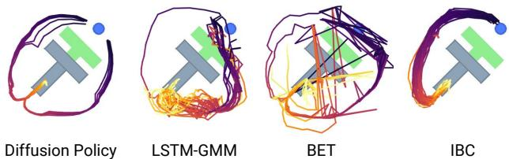  
Figure 3. Multimodal behavior. At the given state, the end-effector (blue) can either go left or right to push the block. Diffusion Policy learns both modes and commits to only one mode within each rollout. In contrast, both LSTM-GMM Mandlekar et al. (2021) and IBC Florence et al. (2021) are biased toward one mode, while BET Shafiullah et al. (2022) fails to commit to a single mode due to its lack of temporal action consistency. Actions generated by rolling out 40 steps for the best-performing checkpoint.

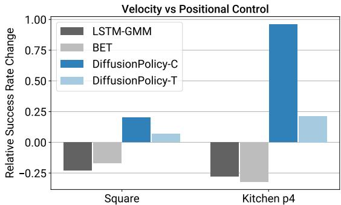  
Figure 4. Velocity v.s. Position Control. The performance difference when switching from velocity to position control. While both BCRNN and BET performance decrease, Diffusion Policy is able to leverage the advantage of position and improve its performance.

# 4.3 行动序列预测的好处

序列预测通常在大多数策略学习方法中被避免，这是因为在高维输出空间中有效采样的困难。例如，IBC在高维动作空间中存在非光滑能量景观时，难以有效采样。同样，BCRNN和BET在确定动作分布中存在的模式数量时也会面临困难（这是进行GMM或$\mathbf { k }$ -均值步骤所需的）。相比之下，DDPM在输出维度上表现良好，并且在许多图像生成应用中不会牺牲模型的表达能力。利用这一能力，扩散策略以高维动作序列的形式表示动作，自然解决了以下问题： • 动作的一致性：以图3为例。为了将T形块从底部推入目标，策略可以从左侧或右侧绕过T形块。然而，假设序列中的每个动作被预测为独立的多模态分布（如BCRNN和BET所做的）。在这种情况下，连续动作可能来自不同的模式，导致动作抖动，在两个有效轨迹之间交替。 • 对闲置动作的鲁棒性：闲置动作发生在演示暂停时，导致一连串相同的位置动作或接近零的速度动作。这在远程操作中很常见，有时在如液体倒入等任务中是必需的。然而，单步策略很容易对这种暂停行为过拟合。例如，BC-RNN和IBC在现实世界实验中经常在闲置动作未被明确从训练中移除时陷入困境。

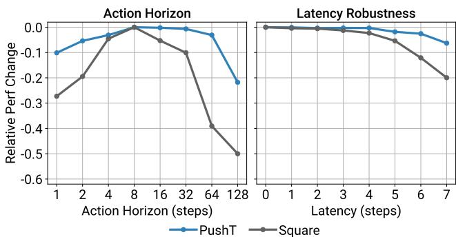  
Figure 5. Diffusion Policy Ablation Study. Change (difference) in success rate relative to the maximum for each task is shown on the Y-axis. Left: trade-off between temporal consistency and responsiveness when selecting the action horizon. Right: Diffusion Policy with position control is robust against latency. Latency is defined as the number of steps between the last frame of observations to the first action that can be executed.

# 4.4 训练稳定性

尽管理论上，IBC 应该具备类似于扩散策略的优势。然而，由于 IBC 的固有训练不稳定性，实际中要获得可靠且高性能的结果具有挑战性（Ta et al.，2022）。图 6 显示了训练过程中训练误差的波动和不稳定的评估性能，这使得超参数调优变得至关重要，同时也增加了检查点选择的难度。因此，Florence et al.（2021）对每个检查点进行了评估，并报告了最佳检查点的结果。在现实世界的环境中，这一工作流程需要在硬件上评估多个策略以选定最终策略。在这里，我们讨论为什么扩散策略的训练显得明显更加稳定。隐式策略使用基于能量的模型（EBM）表示动作分布：

$$
p _ { \theta } ( \mathbf { a } | \mathbf { o } ) = \frac { e ^ { - E _ { \theta } ( \mathbf { o } , \mathbf { a } ) } } { Z ( \mathbf { o } , \theta ) }
$$

其中 $Z ( \mathbf { 0 } , \theta )$ 是一个不可解的归一化常数（相对于 a）。为了训练用于隐式策略的能量基模型（EBM），采用了一种类似于 InfoNCE 的损失函数，该损失函数相当于 $\operatorname { E q }$ 的负对数似然，这里使用静态标号 ss $\cdot$ 来估计不可解的归一化常数 $Z ( \mathbf { 0 } , \theta )$。在实践中，负采样的误差已知会导致 EBM 的训练不稳定性 Du 等（2020）；Ta 等（2022）。

$$
\mathcal { L } _ { i n f o N C E } = - \log ( \frac { e ^ { - E _ { \theta } ( \mathbf { 0 } , \mathbf { a } ) } } { e ^ { - E _ { \theta } ( \mathbf { 0 } , \mathbf { a } ) } + \sum _ { j = 1 } ^ { N _ { n e g } } e ^ { - E _ { \theta } ( \mathbf { 0 } , \widetilde { \mathbf { a } } ^ { j } ) } } )
$$

扩散策略和DDPMs完全避免了估计 $Z ( \mathbf { a } , \theta )$ 的问题，通过对公式6中相同动作分布的评分函数进行建模，如Song和Ermon（2019）所述：

$$
\nabla _ { \mathbf { a } } \log p ( \mathbf { a } | \mathbf { o } ) = - \nabla _ { \mathbf { a } } E _ { \theta } ( \mathbf { a } , \mathbf { 0 } ) - \underbrace { \nabla _ { \mathbf { a } } \log Z ( \mathbf { 0 } , \theta ) } _ { = 0 } \approx - \varepsilon _ { \theta } ( \mathbf { a } , \mathbf { 0 } )
$$

噪声预测网络 $\varepsilon _ { \boldsymbol { \theta } } ( \mathbf { a } , \mathbf { 0 } )$ 近似于分数函数的负值 $\nabla _ { \mathbf { a } } \log p ( \mathbf { a } | \mathbf { o } )$（Liu et al.，2022），该函数与归一化常数 $Z ( \mathbf { 0 } , \theta )$ 无关。因此，扩散策略的推理（公式 4）和训练（公式 5）过程均不涉及评估 $Z ( \mathbf { 0 } , \theta )$，从而使扩散策略训练更加稳定。

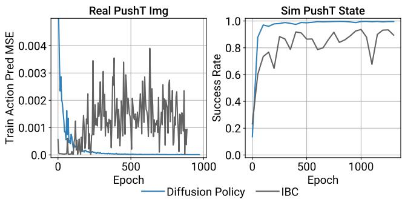  
Figure 6. Training Stability. Left: IBC fails to infer training actions with increasing accuracy despite smoothly decreasing training loss for energy function. Right: IBC's evaluation success rate oscillates, making checkpoint selection difficult (evaluated using policy rollouts in simulation).

# 4.5 控制理论的联系

扩散策略在任务非常简单时具有简单的极限行为；这使我们能够借助控制理论进行一些严格的理解。考虑我们希望控制的线性动态系统，采用标准状态空间形式：

$$
\begin{array} { r } { \mathbf { s } _ { t + 1 } = \mathbf { A } \mathbf { s } _ { t } + \mathbf { B } \mathbf { a } _ { t } + \mathbf { w } _ { t } , \qquad \mathbf { w } _ { t } \sim \mathcal { N } ( 0 , \Sigma _ { w } ) . } \end{array}
$$

现在设想我们从线性反馈策略获得演示（推演轨迹）：$\mathbf { a } _ { t } = - \mathbf { K } \mathbf { s } _ { t }$。这一策略可以通过解决线性最优控制问题如线性二次调节器获得。模仿这一策略并不需要扩散的建模能力，但作为一个合理性检查，我们可以看到扩散策略能够有效地执行这一任务。特别地，当预测范围为一个时间步时，$T _ { p } = 1$，可以看出，最优去噪器的最小化形式为，其中$\sigma _ { k }$是去噪迭代$k$的方差。此外，在推理时，DDIM采样将收敛到全局最小值，即$\mathbf { a } = - \mathbf { K } \mathbf { s }$。

$$
\mathcal { L } = M S E ( \boldsymbol { \varepsilon } ^ { k } , \boldsymbol { \varepsilon } _ { \theta } ( \mathbf { s } _ { t } , - \mathbf { K } \mathbf { s } _ { t } + \boldsymbol { \varepsilon } ^ { k } , k ) )
$$

$$
\varepsilon _ { \theta } ( \mathbf { s } , \mathbf { a } , k ) = \frac { 1 } { \sigma _ { k } } [ \mathbf { a } + \mathbf { K } \mathbf { s } ] ,
$$

轨迹预测 $( T _ { p } > 1 )$ 自然得出。为了预测 $\mathbf { a } _ { t + t ^ { \prime } }$ 作为 $\mathbf { s } _ { t }$ 的函数，最佳去噪器将产生 $\mathbf { a } _ { t + t ^ { \prime } } = - \mathbf { K } ( \mathbf { A } - \mathbf { B } \mathbf { K } ) ^ { t ^ { \prime } } \mathbf { s } _ { t }$；所有涉及 $\mathbf { w } _ { t }$ 的项在期望中为零。这表明，为了完美克隆依赖于状态的行为，学习者必须隐式学习一个（任务相关的）动力学模型 Subramanian 和 Mahajan (2019)；Zhang 等 (2020)。请注意，如果植物或策略是非线性的，则预测未来动作可能变得显著更具挑战性，并再次涉及多模态预测。

# 5 评估

我们系统地评估了扩散策略在来自四个基准（Florence et al. 2021；Gupta et al. 2019；Mandlekar et al. 2021；Shafiullah et al. 2022）的15个任务上的表现。这个评估套件包括了模拟和真实环境、单任务和多任务基准、完全驱动和欠驱动系统，以及刚性和流体物体。我们发现扩散策略在所有测试的基准上均始终优于之前的最先进水平，平均成功率提高了$46.9\%$。在接下来的部分中，我们将提供每个任务的概述、我们在该任务上的评估方法，以及我们的主要收获。

# 5.1 仿真环境与数据集

Robomimic Mandlekar 等人（2021）是一个大规模的机器人操控基准，旨在研究模仿学习和离线强化学习。该基准包含5个任务，每个任务都有熟练人类（PH）遥控示范数据集，并且4个任务有混合熟练/非熟练人类（MH）示范数据集（共9个变体）。对于每个变体，我们报告基于状态和图像的观测结果。每个任务的属性在表3中进行了总结。Push-T 任务改编自 IBC Florence 等人（2021），要求将一个T形块（灰色）推到一个固定目标（红色），并使用一个圆形末端执行器（蓝色）。通过随机初始条件为T形块和末端执行器增加变异。该任务需要利用复杂且接触丰富的物体动态，使用点接触来精确推送T形块。共有两个变体：一个使用RGB图像观测，另一个使用从T形块真实位姿获取的9个二维关键点，同时具有末端执行器位置的本体感知。多模态块推送任务改编自BET Shafiullah 等人（2022），该任务测试策略建模多模态动作分布的能力，通过将两个块推入两个方框中，顺序不限。示范数据由一个访问真实状态信息的脚本化神谕生成。该神谕随机选择一个初始块进行推送，并将其移动到随机选择的方框。然后，将剩余的块推入剩余的方框。该任务包含长时间跨度的多模态性，无法通过单一函数从观测映射到动作进行建模。

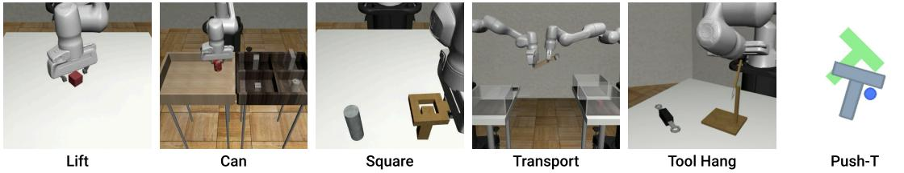

在各方面表现达到最先进水平。

<table><tr><td rowspan="2"></td><td colspan="2">Lift</td><td colspan="2">Can</td><td colspan="2">Square</td><td colspan="2">Transport</td><td rowspan="2">ToolHang</td><td rowspan="2">Push-T ph</td></tr><tr><td>ph</td><td>mh</td><td>ph</td><td>mh</td><td>ph mh</td><td>ph</td><td>mh</td><td>ph</td></tr><tr><td>LSTM-GMM</td><td>1.00/0.96</td><td>1.00/0.93</td><td>1.00/0.91</td><td>1.00/0.81</td><td>0.95/0.73</td><td>3 0.86/0.59</td><td>0.76/0.47</td><td>0.62/0.20</td><td>0.67/0.31</td><td>0.67/0.61</td></tr><tr><td></td><td>IBC 0.79/0.41</td><td>0.15/0.02</td><td>0.00/0.00</td><td>0.01/0.01</td><td>0.00/0.00</td><td>0.00/0.00</td><td>0.00/0.00</td><td>0.00/0.00</td><td>0.00/0.00</td><td>0.90/0.84</td></tr><tr><td>BET</td><td>1.00/0.96</td><td>1.00/0.99</td><td>1.00/0.89</td><td>1.00/0.90</td><td>0.76/0.52</td><td>0.68/0.43</td><td>0.38/0.14</td><td>0.21/0.06</td><td>0.58/0.20</td><td>0.79/0.70</td></tr><tr><td>DiffusionPolicy-C</td><td>1.00/0.98</td><td>1.00/0.97</td><td>1.00/0.96</td><td>1.00/0.96</td><td>1.00/0.93</td><td>0.97/0.82</td><td>0.94/0.82</td><td>0.68/0.46</td><td>0.50/0.30</td><td>0.95/0.91</td></tr><tr><td>DiffusionPolicy-T</td><td>1.00/1.00</td><td>1.00/1.00</td><td>1.00/1.00</td><td>1.00/0.94</td><td>1.00/0.89</td><td>0.95/0.81</td><td>1.00/0.84</td><td>0.62/0.35</td><td>1.00/0.87</td><td>0.95/0.79</td></tr></table>

<table><tr><td rowspan="2"></td><td colspan="2">Lift</td><td colspan="2">Can</td><td colspan="2">Square</td><td colspan="2">Transport</td><td rowspan="2">ToolHang ph</td><td rowspan="2">Push-T ph</td></tr><tr><td>ph</td><td>mh</td><td>ph</td><td>mh</td><td>ph</td><td>mh</td><td>ph</td><td>mh</td></tr><tr><td>LSTM-GMM</td><td>1.00/0.96</td><td>1.00/0.95</td><td>1.00/0.88</td><td>0.98/0.90</td><td>0.82/0.59 0.64/0.38</td><td></td><td></td><td>0.88/0.62 0.44/0.24</td><td>0.68/0.49</td><td>0.69/0.54</td></tr><tr><td>IBC</td><td>0.94/0.73</td><td>0.39/0.05</td><td>0.08/0.01</td><td>0.00/0.00</td><td>0.03/0.00</td><td>0.00/0.00</td><td>0.00/0.00</td><td>0.00/0.00</td><td>0.00/0.00</td><td>0.75/0.64</td></tr><tr><td>DiffusionPolicy-C</td><td>1.00/1.00</td><td>1.00/1.00</td><td>1.00/0.97</td><td>1.00/0.96</td><td>0.98/0.92</td><td>0.98/0.84</td><td>1.00/0.93</td><td>0.89/0.69</td><td>0.95/0.73</td><td>0.91/0.84</td></tr><tr><td>DiffusionPolicy-T</td><td>1.00/1.00</td><td>1.00/0.99</td><td>1.00/0.98</td><td>1.00/0.98</td><td>1.00/0.90</td><td>0.94/0.80</td><td>0.98/0.81</td><td>0.73/0.50</td><td>0.76/0.47</td><td>0.78/0.66</td></tr></table>

在复杂任务如运输和工具悬挂方面，o显示出持续的性能提升。

<table><tr><td>Task</td><td colspan="7"># Rob # Obj ActD #PH #MH Steps Img? HiPrec</td></tr><tr><td></td><td colspan="7">Simulation Benchmark</td></tr><tr><td>Lift</td><td>1</td><td>1</td><td>7</td><td>200 300</td><td>400</td><td>Yes</td><td>No</td></tr><tr><td>Can</td><td>1</td><td>1</td><td>7</td><td>200 300</td><td>400</td><td>Yes</td><td>No</td></tr><tr><td>Square</td><td>1</td><td>1</td><td>7</td><td>200 300</td><td>400</td><td>Yes</td><td>Yes</td></tr><tr><td>Transport</td><td>2</td><td>3</td><td>14</td><td>200 300</td><td>700</td><td>Yes</td><td>No</td></tr><tr><td>ToolHang</td><td>1</td><td>2</td><td>7</td><td>200 0</td><td>700</td><td>Yes</td><td>Yes</td></tr><tr><td>Push-T</td><td>1</td><td>1</td><td>2</td><td>200 0</td><td>300</td><td>Yes</td><td>Yes</td></tr><tr><td>BlockPush</td><td>1</td><td>2</td><td>2</td><td>0</td><td>0 350</td><td>No</td><td>No</td></tr><tr><td>Kitchen</td><td>1</td><td>7</td><td>9</td><td>656</td><td>0 280</td><td>No</td><td>No</td></tr><tr><td colspan="8">Realworld Benchmark</td></tr><tr><td>Push-T</td><td>1</td><td>1</td><td>2</td><td>136</td><td>0</td><td>600 Yes</td><td>Yes</td></tr><tr><td>6DoF Pour</td><td>1</td><td>liquid</td><td>6</td><td>90 0</td><td>600</td><td>Yes</td><td>No</td></tr><tr><td>Peri Spread</td><td>1</td><td>liquid</td><td>6</td><td>90</td><td>0 600</td><td>Yes</td><td>No</td></tr><tr><td>Mug Flip</td><td>1</td><td>1</td><td>7</td><td>250</td><td>0 600</td><td>Yes</td><td>No</td></tr></table>

Table 3. Tasks Summary. # Rob: number of robots, #Obj: number of objects, ActD: action dimension, PH: proficient-human demonstration, MH: multi-human demonstration, Steps: max number of rollout steps, HiPrec: whether the task has a high precision requirement. BlockPush uses 1000 episodes of scripted demonstrations.

Franka 厨房是评估 $\mathrm{IL}$ 和离线强化学习方法学习多个长时间任务能力的热门环境。该环境在 Gupta 等人（2019）的《Relay Policy Learning》中提出，包含 7 个可交互对象，并提供了一个由 566 个示范组成的人类示范数据集，每个示范完成 4 个任务，顺序任意。目标是尽可能多地执行示范中的任务，无论顺序如何，展示短期和长期的多模态特性。

# 5.2 评估方法论

我们展示了每个基线方法在所有可能来源的基准中的最佳表现，结果来自我们重现的结果（LSTM-GMM）或论文中报告的原始数字（BET, IBC）。我们报告的是在3个训练种子和50个环境初始化中，最后10个检查点（每50个epoch保存一次）的平均结果*（总共约1500个实验）。大多数任务的指标是成功率，除了Push-T任务，它使用目标区域覆盖率。此外，我们还报告了平均值。

_block_push_kitchen_ BlockPush Kitchen p1 p2 p1 p2 p3 p4 LSTM-GMM 0.03 0.01 1.00 0.90 0.74 0.34 IBC 0.01 0.00 0.99 0.87 0.61 0.24 BET 0.96 0.71 0.99 0.93 0.71 0.44 DiffusionPolicy-C 0.36 0.11 1.00 1.00 1.00 0.99 DiffusionPolicy-T 0.99 0.94 | 1.00 0.99 0.99 0.96 为了与Mandlekar等（2021）和Florence等（2021）各自原始论文的评估方法保持一致，最佳表现的检查点被应用于robomimic和Push$\mathrm { T }$任务。所有基于状态的任务训练了4500个周期，基于图像的任务训练了3000个周期。每种方法都采用其最佳表现的动作空间进行评估：Diffusion Policy采用位置控制，基线方法采用速度控制（动作空间的影响将在第5.3节中详细讨论）。这些仿真基准的结果汇总在表1和表2中。

# 5.3 主要发现

扩散策略在我们的仿真基准研究中，在所有任务和变种（带状态和视觉观察）上均优于其他方法，平均提升为 $4 6 . 9 \%$。以下段落总结了关键要点。扩散策略能够表达短期多模态性。我们将短期动作多模态性定义为实现相同直接目标的多种方式，这是在人类演示数据中普遍存在的现象 Mandlekar 等（2021）。在图 3 中，我们展示了 Push-T 任务中这种短期多模态性的案例研究。扩散策略学习到从左侧或右侧以相等的概率接近接触点，而 LSTM-GMM Mandlekar 等（2021）和 IBC Florence 等（2021）表现出向一侧的偏见，BET Shafiullah 等（2022）则无法坚定选择一种模式。扩散策略能够表达长期多模态性。长期多模态性是以不一致的顺序完成不同的子目标。例如，在 Block Push 任务中推动特定积木的顺序或在厨房任务中与 7 个可能物体互动的顺序是任意的。我们发现扩散策略能够很好地应对这种多模态性；在这两个任务上，其表现明显优于基线：在 Block Push 的 p2 指标上提升 $32 \%$，在厨房的 p4 指标上提升 $213 \%$。扩散策略能够更好地利用位置控制。我们的消融研究（图 4）显示，将位置控制选为扩散策略的动作空间明显优于速度控制。然而，我们评估的基线方法在速度控制下表现最佳（这一点在文献中也有所体现，大部分现有工作报告使用速度控制动作空间 Mandlekar 等（2021）；Shafiullah 等（2022）；Zhang 等（2018）；Florence 等（2019）；Mandlekar 等（2020b,a））。动作时间范围的权衡。如第 4.3 节所讨论，动作时间范围大于 1 有助于策略预测一致的动作并弥补演示的空闲部分，但时间范围过长则由于反应时间慢而降低性能。我们的实验确认了这种权衡（图 5 左）并发现 8 步的动作时间范围对大多数测试任务是最优的。对延迟的鲁棒性。扩散策略采用递进式位置控制预测未来一系列动作。这种设计帮助解决由图像处理、策略推理和网络延迟引起的延迟差距。我们的消融研究显示即使在模拟延迟下，扩散策略也能够在延迟高达 4 步的情况下保持最佳性能（图 5）。我们还发现，相较于位置控制，速度控制对延迟的影响更大，这可能与误差累积效应有关。扩散策略训练稳定。我们发现扩散策略的最佳超参数在任务间大多保持一致。相比之下，IBC Florence 等（2021）则容易出现训练不稳定。这一特性在第 4.4 节中进行了讨论。

# 5.4 消融研究

我们探讨了在模拟 robomimic 方形任务中替代视觉编码器设计决策。具体来说，我们评估了三种不同的架构：ResNet-18、ResNet-34（He 等，2016）和 ViT-B/16（Dosovitskiy 等，2020）。对于每种架构，我们评估了三种不同的训练策略：从头开始端到端训练、使用冻结的预训练视觉编码器，以及微调预训练的视觉编码器（相对于策略网络学习率下降 $10 \mathrm{x}$）。我们使用 ImageNet-21k（Ridnik 等，2021）进行 ResNet 的预训练，并为 ViT-B/16 使用 CLIP（Radford 等，2021）进行预训练。关于方形任务与精通人类（PH）数据集的定量比较见表 5。我们发现，从头开始训练 ViT 是具有挑战性的（成功率仅为 $22\%$），这可能是由于数据量有限。我们还发现使用冻结的预训练视觉编码器进行训练的性能较差，这表明扩散策略偏好于不同于流行预训练方法所提供的视觉表征。然而，我们发现用较小的学习率（相对于扩散策略网络小 $10 \mathrm{x}$）微调预训练的视觉编码器整体表现最佳。这对于 CLIP 训练的 ViT-B/16 尤其明显，后者在仅 50 个训练周期内达到了 $98\%$ 的成功率。总体而言，尽管不同架构之间理论容量存在显著差距，但它们的性能差异并不大。我们预期在复杂任务上，它们的性能差距会更加明显。

Table 5. Vision Encoder Comparison All models are trained on the robomimic square (ph) task using CNN-based diffusion policy. Each model is trained for 500 epochs and evaluated every 50 epochs under 50 different environment initial conditions.   

<table><tr><td>Archicture &amp; Prertain Datset</td><td>From Scatch</td><td colspan="2">Pretrained frozen finetuning</td></tr><tr><td>Resnet18 (in21)</td><td>0.94</td><td>0.92</td></tr><tr><td>Resnet34 (in21)</td><td>0.92</td><td>0.58</td></tr><tr><td></td><td>0.40</td><td>0.94</td></tr><tr><td>ViT-base (clip)</td><td>0.22 0.70</td><td>0.98</td></tr></table>

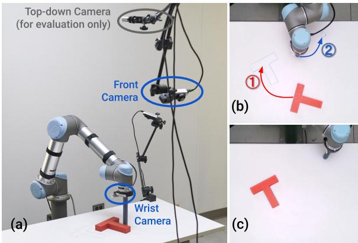

<table><tr><td></td><td>Human Demo</td><td>IBC pos vel</td><td>|LSTM-GMM| pos</td><td>vel</td><td>Diffusion Policy T-E2E ImgNet R3M E2E</td></tr><tr><td>IoU</td><td>0.84</td><td>|0.14 0.19|</td><td>|0.24 0.25</td><td>0.53</td><td>0.24 0.66 0.80</td></tr><tr><td>Succ%</td><td>1.00</td><td>0.00 0.00</td><td>|0.20 0.10</td><td>0.65</td><td>0.15 0.80 0.95</td></tr><tr><td>Dur.</td><td>20.3</td><td>56.3 41.6</td><td>|47.3 51.7</td><td>57.5</td><td>55.8 31.7 22.9</td></tr></table>

Table 6. Realworld Push-T Experiment. a) Hardware setup. b) Illustration of the task. The robot needs to $\textcircled{1}$ precisely push the T-shaped block into the target region, and $\textcircled{2}$ move the end-effector to the end-zone. c) The ground truth end state used to calculate loU metrics used in this table. Table: Success is defined by the end-state loU greater than the minimum loU in the demonstration dataset. Average episode duration presented in seconds. T-E2E stands for end-to-end trained Transformer-based Diffusion Policy

# 6 真实世界评估

我们在两个硬件配置下对 Diffusion Policy 在四个任务上的实际表现进行了评估，训练数据来自每个配置的不同示范者。在实际的 Push-T 任务中，我们进行了消融实验，考察了 Diffusion Policy 在两种架构选项和三种视觉编码器选项上的表现；我们还与两种基线方法进行了基准测试，这两种方法分别使用位置控制和速度控制的动作空间。在所有任务中，采用 CNN 主干网络和端到端训练的视觉编码器的 Diffusion Policy 变体表现最佳。有关任务设置和参数的更多详细信息，请参见补充材料。

# 6.1 真实世界推送任务

真实世界的 Push-T 任务相比于模拟版本要困难得多，原因有三个修改：1. 真实世界的 Push-T 任务是多阶段的。它要求机器人先 $\textcircled{1}$ 将 T 形块推入目标区域，然后 $\textcircled{2}$ 将末端执行器移动到指定的结束区域以避免遮挡。2. 策略需要进行微调，以确保在前往结束区域之前，$\mathrm{T}$ 完全位于目标区域内，从而产生额外的短期多模态性。3. IoU 评估指标在最后一步进行测量，而不是在所有步骤中取最大值。我们通过人类示范数据集中的最小 IoU 指标对成功率进行阈值限制。我们的 UR5 实验设置如 $\mathrm{F i g \_}$ 所示。扩散策略以 $10 : \mathrm{Hz}$ 的频率预测机器人命令，这些命令随后线性插值到 $125 : \mathrm{Hz}$ 以供机器人执行。

结果分析。扩散策略的成功率接近人类水平，为95%，平均交并比（IoU）为0.8相较于0.84，而最佳表现的IBC和LSTM-GMM变体的成功率分别为0%和20%。图7定性地展示了每种方法在相同初始条件下的行为。我们观察到，在阶段之间过渡期间表现不佳是基线方法最常见的失败案例，这主要是因为该部分存在高度的多模态性和模糊的决策边界。在20次评估中，LSTM-GMM在8次评估中卡在T区块附近（第3行），而IBC在20次评估中有6次过早离开T区块（第4行）。由于任务要求，我们没有按照常规做法移除训练数据中的闲置动作，这也导致LSTM和IBC在小动作上过拟合并在此任务中陷入困境。结果通过补充材料中的视频得到了更好的体现。端到端与预训练视觉编码器 我们测试了采用预训练视觉编码器的扩散策略（ImageNet Deng等，2009年和R3M Nair等，2022年），如表6所示。使用R3M的扩散策略成功率为80%，但预测的动作不稳定，更容易陷入困境，相较于端到端训练的版本。而使用ImageNet的扩散策略表现不佳，动作突兀，性能较差。我们发现，端到端训练仍然是将视觉观察有效纳入扩散策略的最佳方法，我们表现最好的模型都是经过端到端训练的。

针对扰动的鲁棒性 在与表6中实验不同的额外场景中评估了扩散策略对视觉和物理扰动的鲁棒性。如图8所示，施加了三种类型的扰动。1) 前摄像头被挥动的手挡住3秒（左列），尽管扩散策略表现出一些抖动，但依然保持在正确的轨道上，并将T块推入位置。2) 当扩散策略正在对T块的位置进行微调时，我们移动了T块。扩散策略立即重新规划，从相反方向进行推送，消除了扰动的影响。3) 在第一阶段完成后，当机器人前往终点区域时，我们移动了T块。扩散策略立即改变路线，将T块调整回目标位置，然后继续前往终点。这项实验表明，扩散策略可能能够在面对未见观察时合成新行为。

# 6.2 杯子翻转任务

杯子翻转任务旨在测试扩散策略在接近硬件运动极限时处理复杂三维旋转的能力。目标是将随机放置的杯子重新调整为 $\textcircled{1}$ 嘴边朝下，$\textcircled{2}$ 手柄指向左侧，如图 9 所示。根据杯子的初始姿态，演示者可能直接将杯子放置在所需的方向，或者可能通过额外推动手柄来旋转杯子。因此，演示数据集具有高度的多模态性：抓握与推动、不同类型的抓握（正手与反手）或局部抓握调整（围绕杯子的主轴旋转），这些对于基线方法的捕捉特别具有挑战性。

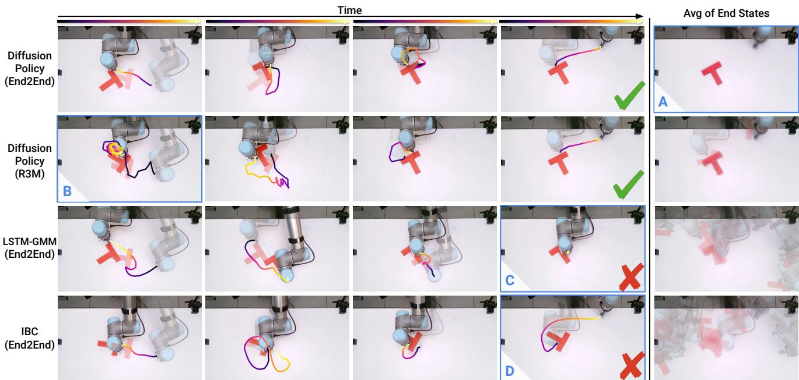  
urosolocba the T block, blocking the eval camera view. D: IBC prematurely ends the pushing stage.

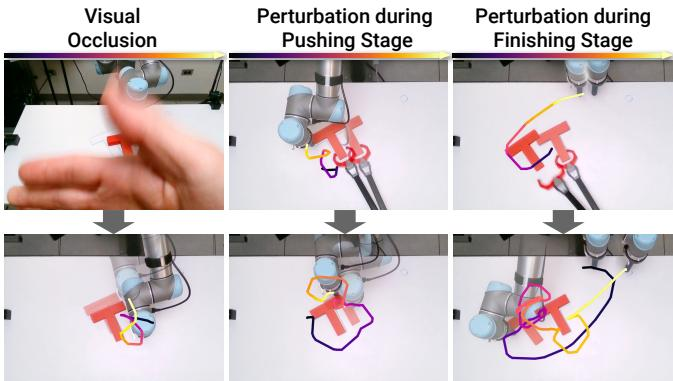  
Figure 8. Robustness Test for Diffusion Policy. Left: A waving hand in front of the camera for 3 seconds causes slight jitter, but the predicted actions still function as expected. Middle: Diffusion Policy immediately corrects shifted block position to the goal state during the pushing stage. Right: Policy immediately aborts heading to the end zone, returning the block to goal state upon detecting block shift. This novel behavior was never demonstrated. Please check the videos in the supplementary material.

结果分析。扩散策略能够以$90\%$的成功率完成这一任务，试验次数为20次。捕捉的行为丰富性通过视频得到了最佳展示。尽管从未演示过，但该策略也能够在必要时对把手进行多次推动以实现对齐或重新抓取掉落的杯子。为了进行对比，我们还训练了一个使用相同数据子集的LSTM-GMM策略。在20个符合分布的初始条件下，LSTM-GMM策略从未能正确对齐杯子，且在所有试验中均未能成功抓取。

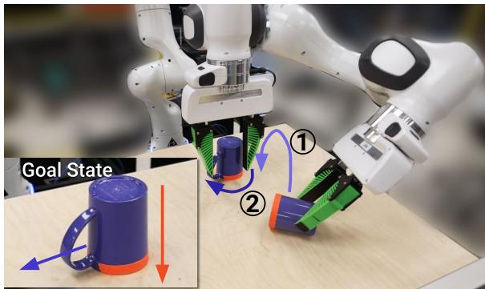  
Figure 9. 6DoF Mug Flipping Task. The robot needs to $\textcircled{1}$ Pickup a randomly placed mug and place it lip down (marked orange). $\textcircled{2}$ Rotate the mug such that its handle is pointing left.

<table><tr><td></td><td>Human</td><td>LSTM-GMM</td><td>Diffusion Policy</td></tr><tr><td>Succ %</td><td>1.0</td><td>0.0</td><td>0.9</td></tr></table>

# 6.3 酱汁倒入和涂抹

酱料倒入和涂抹任务旨在测试扩散策略在处理非刚性物体、6自由度动作空间和实际环境中的周期性动作的能力。我们的Franka Panda设置和任务如图10所示。6自由度倒入任务的目标是将一勺满酱料倒在比萨饼面团的中心，性能通过倒入的酱料掩模与比萨饼面团中心的名义圆（图10中的绿色圆圈所示）之间的交并比(IoU)进行测量。周期性涂抹任务的目标是将酱料涂抹在比萨饼面团上，性能通过酱料覆盖率进行测量。评估期间的变化来自于面团和酱料碗的随机位置。成功率通过与最低人类性能的阈值进行计算。结果最好通过补充视频进行查看。两个任务都使用相同的Push-T超参数进行训练，并在第一次尝试时取得了成功的策略。

<table><tr><td rowspan="2"></td><td colspan="2">Pour</td><td colspan="2">Spread</td></tr><tr><td>IoU</td><td>Succ</td><td>Coverage</td><td>Succ %</td></tr><tr><td>Human</td><td>0.79</td><td>1.00</td><td>0.79</td><td>1.00</td></tr><tr><td>LSTM-GMM</td><td>0.06</td><td>0.00</td><td>0.27</td><td>0.00</td></tr><tr><td>Diffusion Policy</td><td>0.74</td><td>0.79</td><td>0.77</td><td>1.00</td></tr></table>

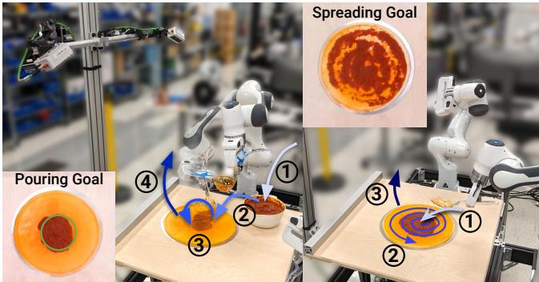  
Figure 10. Realworld Sauce Manipulation. [Left] 6DoF pouring Task. The robot needs to $\textcircled{1}$ dip the ladle to scoop sauce from the bowl, $\textcircled{2}$ approach the center of the pizza dough, $\textcircled{3}$ pour sauce, and $\textcircled{4}$ lift the ladle to finish the task. [Right] Periodic spreading Task The robot needs to $\textcircled{1}$ approach the center of the sauce with a grasped spoon, $\textcircled{2}$ spread the sauce to cover pizza in a spiral pattern, and $\textcircled{3}$ lift the spoon to finish the task.

倒酱任务要求机器人在一段时间内保持静止，以便填满盛汤器中的粘稠番茄酱。由此产生的 idle 动作被认为对于行为克隆算法而言是具有挑战性的，因此通常会被避免或过滤掉。在倒酱过程中，细微的调整是必要的，以确保覆盖范围并达到期望的形状。演示的酱料涂抹策略受到人类厨师技术的启发，这不仅需要一个长时间周期的循环模式以最大化覆盖，还需要短时间反馈以实现均匀分布（因为所用的番茄酱通常会以不可预测的大小成团滴落）。已知周期性运动难以学习，因此通常通过专门的动作表示进行处理（Yang et al. 2022）。两个任务都要求策略通过抬起盛汤器/勺子来实现自我终止。 结果分析。扩散策略在两个任务上均达到了接近人类的表现，倒酱的覆盖率为 0.74 versus 0.79，涂抹的覆盖率为 0.77 versus 0.79。扩散策略对外部扰动反应良好，例如在倒酱和涂抹过程中用手移动比萨面团。结果可以通过补充材料中的视频更好地理解。LSTM-GMM 在倒酱和涂抹任务上表现不佳。在 20 次倒酱试验中，有 15 次未能在成功舀取酱料后抬起盛汤器。当成功抬起盛汤器时，酱料则偏离了中心。LSTM-GMM 在所有试验中都未能实现自我终止。我们怀疑 LSTM-GMM 的隐藏状态未能捕捉足够长的历史，以区分任务中的盛汤和抬起阶段。在酱料涂抹方面，LSTM-GMM 在开始后总是立即抬起勺子，并且在所有 20 次实验中均未能与酱料接触。

# 7 个真实世界的双手任务

除了单臂设置，我们进一步在多个具有挑战性的双臂任务上演示了扩散策略。为了支持双臂任务，大部分精力花费在扩展我们的机器人系统以支持多臂远程操作和控制。扩散策略在这些任务中可以开箱即用，无需超参数调整。

# 7.1 观察空间和动作空间

本体感知观察空间扩展为包括两个末端执行器的姿态和两个夹爪的夹爪宽度。我们还扩展观察空间，以包含这些量的实际值和期望值。图像观察空间由两个场景摄像头和两个腕部摄像头组成，每个手臂各配备一个。动作空间扩展为包括两个末端执行器的期望姿态和两个夹爪的期望夹爪宽度。

# 7.2 遥操作

对于这些协调的双手任务，我们发现同时使用两个 SpaceMouse 对演示者来说相当有挑战性。因此，我们实现了两种新的遥操作模式：使用配备两个手柄的 Meta Quest Pro VR 设备，或使用两个 Haption Virtuose 6D HF TAO 设备进行带触觉的控制，采用双向位置耦合，如 Siciliano 等人（2008）触觉部分简要描述的那样。这个耦合是在一个 Haption 设备和一个 Franka Panda 臂之间进行的。关于控制器本身的更多细节可以在 D.1 节中找到。以下是每个任务和策略性能的更多细节。

# 7.3 双手蛋打器

双手鸡蛋搅拌器任务在图11中进行了说明和描述，使用了 $\mathrm { O X O } ^ { \mathrm { T M } } \mathrm { E g g }$ 搅拌器和 Room Essentials™ 塑料碗。我们选择这个任务来展示触觉反馈在遥操作双手操作中的重要性，即使是在诸如协调工具使用等日常生活任务中。在没有触觉反馈的情况下，专家在10次试验中无法成功完成一次演示。5次失败是由于机器人将手摇把手拉离鸡蛋搅拌器；3次失败是由于机器人失去对手摇把手的抓握；2次失败是由于机器人触发了扭矩限制。相比之下，使用触觉反馈的情况下，同一操作员可以轻松完成10次演示中的10次。使用触觉反馈使得演示的速度更快，质量更高。结果分析：扩散策略在20次试验中以 $5 5 \%$ 的成功率完成了该任务，训练使用了210次演示。主要失败模式为鸡蛋搅拌器的初始定位超出范围，或错过手摇把手或失去对其的抓握。所有推演的初始和最终状态在图18和19中进行了可视化。

# 7.4 双手垫子展开

图 12 展示并描述了垫子展开任务，使用的是 XXL Dog Buddy™ 狗垫。该任务采用 VR 系统进行遥控，因为执行该任务并不需要丰富的触觉反馈。我们将此技能教学为双手灵活，意味着它可以根据初始条件向左或向右展开。

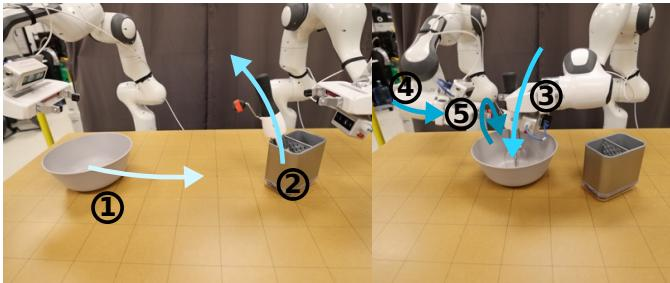

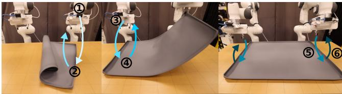  
Figure 11. Bimanual Egg Beater Manipulation. The robot needs to $\textcircled{1}$ push the bowl into position (only if too close to the left arm), $\textcircled{2}$ approach and pick up the egg beater with the right arm, $\textcircled{3}$ place the egg beater in the bowl, $\textcircled{4}$ approach and grasp the egg beater crank handle, and $\textcircled{5}$ turn the crank handle 3 or more times.   
Figure 12. Bimanual Mat Unrolling. The robot needs to $\textcircled{1}$ pick up one side of the mat (if needed), using the left or right arm, $\textcircled{2}$ lift and unroll the mat (if needed), $\textcircled{3}$ ensure that both sides of the mat are grasped, $\textcircled{4}$ lift the mat, $\textcircled{5}$ place the mat oriented with the table, mostly centered, and $\textcircled{6}$ release the mat

结果分析。扩散策略在20次试验中能够以$75\%$的成功率完成该任务，训练过程中使用了162个演示。主要的失败模式是初次抓取垫子时漏抓，导致该策略难以自我纠正，从而陷入重复相同行为的状态。所有推演的初始状态和最终状态分别在图16和图17中进行了可视化。

# 7.5 双手叠衬衫。

衬衫折叠任务在图13中使用短袖T恤进行了描述和示例。由于该任务不需要丰富的反馈来完成，因此也采用虚拟现实设置进行了远程操作。由于运动学和工作空间的限制，这个任务显著较长，可能需要多达九个离散步骤。最后几个步骤要求两个夹持器非常接近。因此，我们的中层控制器在碰撞避免方面的明确处理对远程操作和策略推演都特别重要。结果分析。扩散策略能够以 $75\%$ 的成功率完成此任务，经过20次试验，训练使用了284次演示。主要失败模式为初始折叠时抓取失败（袖子和颜色），以及策略在最后无法停止调整衬衫。所有推演的初始和最终状态在图20和21中进行了可视化。

# 8 相关工作

在不需要明确编程行为的情况下创建具有能力的机器人，一直以来都是该领域的一个长期挑战 Atkeson 和 Schaal (1997); Argall 等 (2009); Ravichandar 等 (2020)。尽管在概念上简单，行为克隆在一系列实际机器人任务中显示出了令人惊讶的潜力，包括操作 Zhang 等 (2018); Florence 等 (2019); Mandlekar 等 (2020b,a); Zeng 等 (2021); Rahmatizadeh 等 (2018); Avigal 等 (2022) 和自动驾驶 Pomerleau (1988); Bojarski 等 (2016)。当前的行为克隆方法可根据策略的结构分为两类。

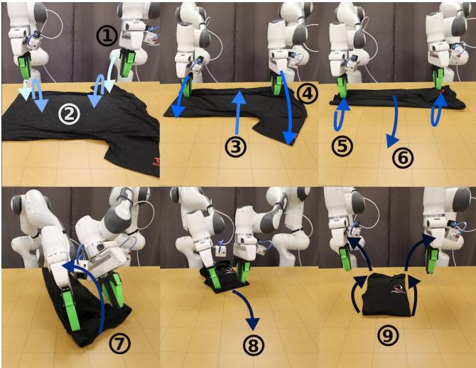  
Figure 13. Bimanual Shirt Folding. The robot needs to $\textcircled{1}$ approach and grasp the closest sleeve with both arms, $\textcircled{2}$ fold the sleeve and release, $\textcircled{3}$ drag the shirt closer (if needed), $\textcircled{4}$ approach and grasp the other sleeve with both arms, $\textcircled{5}$ fold the sleeve and release, $\textcircled{6}$ drag the shirt to a orientation for folding, $\textcircled{7}$ grasp and fold the shirt in half by its collar, $\textcircled{8}$ drag the shirt to the center, and $\textcircled{9}$ smooth out the shirt and move the arms away.

显式策略。显式策略的最简单形式是将世界状态或观察直接映射到动作（Pomerleau，1988；Zhang等，2018；Florence等，2019；Ross等，2011；Toyer等，2020；Rahmatizadeh等，2018；Bojarski等，2016）。它们可以通过直接回归损失进行监督，并且在一次前向传播中具有高效的推理时间。不幸的是，这种类型的策略不适合建模多模态示范行为，且在高精度任务中表现不佳（Florence等，2021）。一种流行的方法是通过对动作空间进行离散化，将回归任务转换为分类，从而在保持直接动作映射的简单性的同时建模多模态动作分布（Zeng等，2021；Wu等，2020；Avigal等，2022）。然而，所需的 bin 数量随着维度的增加而呈指数级增长，以近似连续动作空间。另一种方法是结合类别分布和高斯分布，通过使用混合密度网络（MDN）来表示连续多模态分布（Bishop，1994；Mandlekar等，2021）或通过带偏移预测的聚类实现（Shafiullah等，2022；Sharma等，2018）。然而，这些模型在超参数调优时往往敏感，容易出现模式崩溃，并且在表达高精度行为时仍然受到限制（Florence等，2021）。隐式策略。隐式策略（Florence等，2021；Jarrett等，2020）通过使用基于能量的模型（EBM）（LeCun等，2006；Du和Mordatch，2019；Dai等，2019；Grathwohl等，2020；Du等，2020）定义对动作的分布。在该设置中，每个动作都会被分配一个能量值，动作预测对应于寻找最小能量动作的优化问题。由于不同的动作可能被分配低能量，隐式策略自然地表示多模态分布。然而，现有的隐式策略（Florence等，2021）在训练时不稳定，因为在计算基础的Info-NCE损失时需要抽取负样本。扩散模型。扩散模型是一种概率生成模型，能够将随机采样的噪声迭代地精细化为来自潜在分布的样本。它们也可以从概念上理解为学习隐式动作评分的梯度场，然后在推理过程中优化该梯度。扩散模型（Sohl-Dickstein等，2015；Ho等，2020）最近已被应用于解决各种控制任务（Janner等，2022a；Urain等，2022；Ajay等，2022）。特别是，Janner等（2022a）和Huang等（2023）探索了扩散模型如何在规划的背景下使用，并推断出可以在给定环境中执行的一系列动作。在强化学习的背景下，Wang等（2022）使用扩散模型进行策略表示和基于状态的观察的正则化。相比之下，在本研究中，我们探讨了扩散模型如何有效地应用于行为克隆的背景下，以实现有效的视觉-运动控制策略。为了构建有效的视觉-运动控制策略，我们提议结合DDPM预测高维动作序列的能力与闭环控制，以及一种新的动作扩散的变换器架构和将视觉输入整合进动作扩散模型的方法。Wang等（2023）探索了如何利用从专家演示中学习的扩散模型增强经典显式策略，而不直接利用扩散模型作为策略表示。与我们同步，Pearce等（2023），Reuss等（2023）和Hansen-Estruch等（2023）也对模拟环境中的基于扩散的策略进行了补充分析。他们更关注有效的采样策略，利用无分类器指导进行目标条件作用，以及在强化学习中的应用，而我们则专注于有效的动作空间，我们的实证发现大体上在模拟环境中达成了一致。此外，我们的大规模真实世界实验提供了强有力的证据，表明了后退预估方案的重要性、速度和位置控制之间的谨慎选择，以及实时推理和物理机器人系统的其他关键设计决策所需的优化。

# 9 限制与未来工作

尽管我们已经在模拟和现实系统中展示了扩散策略的有效性，但仍存在未来工作可以改进的局限性。首先，我们的实现继承了行为克隆的局限性，例如在演示数据不足的情况下表现不佳。扩散策略可以应用于其他范式，如强化学习 Wang et al. (2023)；Hansen-Estruch et al. (2023)，以利用次优和负面数据。其次，与 LSTM-GMM 等更简单的方法相比，扩散策略具有更高的计算成本和推理延迟。我们的动作序列预测方法在一定程度上缓解了这一问题，但可能不足以应对需要高频率控制的任务。未来的工作可以利用扩散模型加速方法的最新进展，减少所需的推理步骤，例如新的噪声调度 Chen (2023)、推理求解器 Karras et al. (2022) 和一致性模型 Song et al. (2023)。

# 10 结论

在本研究中，我们评估了基于扩散的策略在机器人行为中的可行性。通过对15个任务在模拟和现实环境中的全面评估，我们证明了基于扩散的视运动策略在稳定性和易训练性方面始终优于现有方法。我们的结果还凸显了几个关键设计因素，包括递归视野动作预测、末端执行器位置控制和高效的视觉条件，这些对于充分释放基于扩散的策略的潜力至关重要。尽管许多因素会影响行为克隆策略的最终质量，包括演示的质量和数量、机器人的物理能力、策略架构和使用的预训练模式，但我们的实验结果强烈表明，策略结构在行为克隆过程中构成了显著的性能瓶颈。我们希望这项工作能够推动该领域对基于扩散的策略的进一步探索，并强调在考虑行为克隆过程时，除了用于策略训练的数据外，还需关注所有方面的重要性。

# 11 感谢致辞

我们要感谢 Naveen Kuppuswamy、Hongkai Dai、Aykut Önol、Terry Suh、Tao Pang、Huy Ha、Samir Gadre、Kevin Zakka 和 Brandon Amos 给予的深思熟虑的讨论。我们感谢 Jarod Wilson 提供的 3D 打印支持，以及 Huy Ha 在摄影和灯光方面的建议。我们感谢 Xiang Li 在 GitHub 上发现我们评估代码中的错误。

# 资金来源

本研究得到了丰田研究院、国家科学基金会 CMMI-2037101 及 NSF IIS-2132519 的支持。我们感谢谷歌提供的 UR5 机器人硬件。本文所包含的观点和结论仅代表作者本人，并不应被解读为赞助方的官方政策，无论是明示还是暗示。

# References

Ajay A, Du Y, Gupta A, Tenenbaum J, Jaakkola T and Agrawal P (2022) Is conditional generative modeling all you need for decision-making? arXiv preprint arXiv:2211.15657 .   
Argall BD, Chernova S, Veloso M and Browning B (2009) A survey of robot learning from demonstration. Robotics and autonomous systems 57(5): 469483.   
Atkeson CG and Schaal S (1997) Robot learning from demonstration. In: ICML, volume 97. pp. 1220.   
Avigal Y, Berscheid L, Asfour T, Kröger T and Goldberg K (2022) Speedfolding: Learning efficient bimanual folding of garments. In:2022 IEEE/RSJ International Conference on Intelligent Robots and Systems (IROS). IEEE, pp. 18.   
Bishop CM (1994) Mixture density networks. Aston University.   
Bojarski M, Del Testa D, Dworakowski D, Firner B, Flepp B, Goyal P, Jackel LD, Monfort M, Muller U, Zhang J et al. (2016) End to end learning for self-driving cars. arXiv preprint arXiv:1604.07316 .   
Chen T (2023) On the importance of noise scheduling for diffusion models. arXiv preprint arXiv:2301.10972   
Chi C, Feng S, Du Y, Xu Z, Cousineau E, Burchfiel B and Song S (2023) Diffusion policy: Visuomotor policy learning via action diffusion. In: Proceedings of Robotics: Science and Systems (RSS).   
Dai B, Liu Z, Dai H, He N, Gretton A, Song L and Schuurmans D (2019) Exponential family estimation via adversarial dynamics embedding. Advances in Neural Information Processing Systems 32.   
Deng J, Dong W, Socher R, Li LJ, Li K and Fei-Fei L (2009) Imagenet: A large-scale hierarchical image database. In: 2009 IEEE conference on computer vision and pattern recognition. Ieee, pp. 248255.   
Dosovitskiy A, Beyer L, Kolesnikov A, Weissenborn D, Zhai X, Unterthiner T, Dehghani M, Minderer M, Heigold G, Gelly S et al. (2020) An image is worth 16x16 words: Transformers for image recognition at scale. arXiv preprint arXiv:2010.11929 .   
Du Y, Li S, Tenenbaum J and Mordatch I (2020) Improved contrastive divergence training of energy based models. arXiv preprint arXiv:2012.01316 .   
Du Y and Mordatch I (2019) Implicit generation and generalization in energy-based models. arXiv preprint arXiv:1903.08689 .   
Florence P, Lynch C, Zeng A, Ramirez OA, Wahid A, Downs L, Wong A, Lee J, Mordatch I and Tompson J (2021) Implicit behavioral cloning. In: 5th Annual Conference on Robot Learning.   
Florence P, Manuelli L and Tedrake R (2019) Self-supervised correspondence in visuomotor policy learning. IEEE Robotics and Automation Letters 5(2): 492499.   
Grathwohl W, Wang KC, Jacobsen JH, Duvenaud D and Zemel R (2020) Learning the stein discrepancy for training and evaluating energy-based models without sampling. In: International Conference on Machine Learning.   
Gupta A, Kumar V, Lynch C, Levine S and Hausman K (2019) Relay policy learning: Solving long-horizon tasks via imitation and reinforcement learning. arXiv preprint arXiv:1910.11956 .   
Hansen-Estruch P, Kostrikov I, Janner M, Kuba JG and Levine S (2023) Idql: Implicit q-learning as an actor-critic method with diffusion policies. arXiv preprint arXiv:2304.10573 .   
He K, Fan H, Wu Y, Xie S and Girshick R (2020) Momentum contrast for unsupervised visual representation learning. In: Proceedings of the IEEE/CVF conference on computer vision and pattern recognition. pp. 97299738.   
He K, Zhang X, Ren S and Sun J (2016) Deep residual learning for image recognition. In: Proceedings of the IEEE conference on computer vision and pattern recognition. p. 770778.   
Ho J, Jain A and Abbeel P (2020) Denoising diffusion probabilistic models. arXiv preprint arXiv:2006.11239 .   
Huang S, Wang Z, Li P, Jia B, Liu T, Zhu Y, Liang W and Zhu SC ( Difsi-bastiotzatin, an p in 3d scenes. arXiv preprint arXiv:2301.06015 .   
Janner M, Du Y, Tenenbaum J and Levine S (2022a) Planning with diffusion for flexible behavior synthesis. In: International Conference on Machine Learning.   
Janner M, Du Y, Tenenbaum J and Levine S (2022b) Planning with diffusion for flexible behavior synthesis. In: Chaudhuri K, Jegelka S, Song L, Szepesvari C, Niu G and Sabato S (eds.) Proceedings of the 39th International Conference on Machine Learning, Proceedings of Machine Learning Research. PMLR.   
Jarrett D, Bica I and van der Schaar M (2020) Strictly batch iatio leag by -bauo . Advances in Neural Information Processing Systems 33: 7354 7365.   
Karras T, Aittala M, Aila T and Laine S (2022) Elucidating the design space of diffusion-based generative models. arXiv preprint arXiv:2206.00364 .   
Khatib O (1987) A unified approach for motion and force control of robot manipulators: The operational space formulation. IEEE Journal on Robotics and Automation 3(1): 4353. DOI:10. 1109/JRA.1987.1087068. Conference Name: IEEE Journal on Robotics and Automation.   
LeCun Y, Chopra S, Hadsell R, Huang FJ and et al (2006) A tutorial on energy-based learning. In: Predicting Structured Data. MIT Press.   
Liu L, Liu X, Gao J, Chen W and Han J (2020) Understanding the difficulty of training transformers. arXiv preprint arXiv:2004.08249 .   
Liu N, Li S, Du Y, Torralba A and Tenenbaum JB (2022) Compositional visual generation with composable diffusion models. arXiv preprint arXiv:2206.01714 .   
Mandlekar A, Ramos F, Boots B, Savarese S, Fei-Fei L, Garg A and Fox D (2020a) Iris: Implicit reinforcement without interaction at scale for learning control from offline robot manipulation data. In: 2020 IEEE International Conference on Robotics and Automation (ICRA). IEEE.   
Mandlekar A, Xu D, Martín-Martín R, Savarese S and Fei-Fei L (2020b) Learning to generalize across long-horizon tasks from human demonstrations. arXiv preprint arXiv:2003.06085.   
Mandlekar A, Xu D, Wong J, Nasiriany S, Wang C, Kulkarni R, Fei-Fei L, Savarese S, Zhu Y and Martín-Martín R (2021) What matters in learning from offine human demonstrations for robot manipulation. In: 5th Annual Conference on Robot Learning.   
Mayne DQ and Michalska H (1988) Receding horizon control of nonlinear systems. In: Proceedings of the 27th IEEE Conference on Decision and Control. IEEE, pp. 464465.   
Nair S, Rajeswaran A, Kumar V, Finn C and Gupta A (2022) R3m: A universal visual representation for robot manipulation. In: 6th Annual Conference on Robot Learning.   
Neal RM et al. (2011) Mcmc using hamiltonian dynamics. Handbook of markov chain monte carlo   
Nichol AQ and Dhariwal P (2021) Improved denoising diffusion probabilistic models. In: International Conference on Machine Learning. PMLR, pp. 81628171.   
Pearce T, Rashid T, Kanervisto A, Bignell D, Sun M, Georgescu R, Macua SV, Tan SZ, Momennejad I, Hofmann K et al. (2023) Imitating human behaviour with diffusion models. arXiv preprint arXiv:2301.10677 .   
Perez E, Strub F, De Vries H, Dumoulin V and Courville A (2018) Film: Visual reasoning with a general conditioning layer. In: Proceedings of the AAAI Conference on Artificial Intelligence.   
Pomerleau DA (1988) Alvinn: An autonomous land vehicle in a neural network. Advances in neural information processing systems 1.   
Radford A, Kim JW, Hallacy C, Ramesh A, Goh G, Agarwal S, y ske i  ar 0 transferable isual models from natural language supervision. In: International conference on machine learning. PMLR, pp. 87488763.   
Rahmatizadeh R, Abolghasemi P, Bölöni L and Levine S (2018) Vision-based multi-task manipulation for inexpensive robots using end-to-end learning from demonstration. In: 2018 IEEE international conference on robotics and automation (ICRA). IEEE, pp. 37583765.   
Ravichandar H, Polydoros AS, Chernova S and Billard A (2020) Recent advances in robot learning from demonstration. Annual review of control, robotics, and autonomous systems 3: 297 330.   
Reuss M, Li M, Jia X and Lioutikov R (2023) Goal-conditioned imitation learning using score-based diffusion policies. In: Proceedings of Robotics: Science and Systems (RSS).   
Ridnik T, Ben-Baruch E, Noy A and Zelnik-Manor L (2021) Imagenet-21k pretraining for the masses.   
Ronneberger O, Fischer P and Brox T (2015) U-net: Convolutional networks for biomedical image segmentation. In: Medical Image Computing and Computer-Assisted InterventionMICCAI 2015: 18th International Conference, Munich, Germany, October 5-9, 2015, Procedings, Part II 18. Spriger, pp. 234241.   
Ross S, Gordon G and Bagnell D (2011) A reduction of imitation learning and structured prediction to no-regret online learning. In: Proceedings of the fourteenth international conference on artificial intelligence and statistics. JMLR Workshop and Conference Proceedings, pp. 627635.   
Shafiullah NMM, Cui ZJ, Altanzaya A and Pinto L (2022) Behavior transformers: Cloning $\$ 123$ modes with one stone. In: Oh AH, Agarwal A, Belgrave D and Cho K (eds.) Advances in Neural Information Processing Systems.   
Sharma P, Mohan L, Pinto L and Gupta A (2018) Multiple interactions made easy (mime): Large scale demonstrations data for imitation. In: Conference on robot learning. PMLR.   
Siciliano B, Khatib O and Kröger T (2008) Springer handbook of robotics, volume 200. Springer.   
Sohl-Dickstein J, Weiss E, Maheswaranathan $_ \mathrm { N }$ and Ganguli S (2015) Deep unsupervised learning using nonequilibrium thermodynamics. In: International Conference on Machine Learning.   
Song J, Meng C and Ermon S (2021) Denoising diffusion implicit models. In: International Conferenceon Learning Representations.   
Song Y, Dhariwal P, Chen M and Sutskever I (2023) Consistency models. arXiv preprint arXiv:2303.01469   
Song Y and Ermon S (2019) Generative modeling by estimating gradients of the data distribution. Advances in neural information processing systems 32.   
Subramanian J and Mahajan A (2019) Approximate information state for partially observed systems. In: 2019 IEEE 58th Conference on Decision and Control (CDC). IEEE, pp. 1629 1636.   
Ta DN, Cousineau E, Zhao H and Feng S (2022) Conditional energy-based models for implicit policies: The gap between theory and practice. arXiv preprint arXiv:2207.05824 .   
Tancik M, Srinivasan P, Mildenhall B, Fridovich-Keil S, Raghavan N, Singhal U, Ramamoorthi R, Barron J and $\mathrm { N g ~ R ~ }$ (2020) Fourier features let networks learn high frequency functions in low dimensional domains. Advances in Neural Information Processing Systems 33: 75377547.   
Toyer S, Shah R, Critch A and Russell S (2020) The magical benchmark for robust imitation. Advances in Neural Information Processing Systems 33: 1828418295.   
Urain J, Funk N, Chalvatzaki G and Peters J (2022) Se (3)- difse Lear ct nion motion optimization through diffusion. arXiv preprint arXiv:2209.03855 .   
Vaswani A, Shazeer N, Parmar N, Uszkoreit J, Jones L, Gomez AN, Kaiser $\mathbf { \delta E }$ and Polosukhin I (2017) Attention is all you need. Advances in neural information processing systems 30.   
Wang Z, Hunt J and Zhou M (2022) Diffusion policies as an expressive policy class for offine reinforcement learning. arXiv preprint arXiv:2208.06193 .   
Wang Z, Hunt JJ and Zhou M (2023) Diffusion policies as an expressive policy class for offline reinforcement learning. In: The Eleventh International Conference on Learning Representations. URL https://openreview.net/ forum?id $\cdot$ AHvFDPi-FA.   
Welling M and Teh YW (2011) Bayesian learning via stochastic gradient langevin dynamics. In: Proceedings of the 28th international conference on machine learning (ICML-11). pp. 681688.   
Wu J, Sun X, Zeng A, Song S, Lee J, Rusinkiewicz S and Funkhouser T (2020) Spatial action maps for mobile manipulation. In: Proceedings of Robotics: Science and Systems (RSS).   
Wu Y and He K (2018) Group normalization. In: Proceedings of the European conference on computer vision (ECCV). pp. 319.   
Yang J, Zhang J, Settle C, Rai A, Antonova R and Bohg J (2022) Learning periodic tasks from human demonstrations. In: 2022 International Conference on Robotics and Automation (ICRA). IEEE, pp. 86588665.   
Zeng A, Florence P, Tompson J, Welker S, Chien J, Attarian M, Armstrong T, Krasin I, Duong D, Sindhwani V et al. (2021) Transporter networks: Rearranging the visual world for robotic manipulation. In: Conference on Robot Learning. PMLR, pp. 726747.   
Zhang A, McAllister RT, Calandra R, Gal $\mathrm { Y }$ and Levine S (2020) Learning invariant representations for reinforcement learning without reconstruction. In: International Conference on Learning Representations.   
Zhang T, McCarthy Z, Jow O, Lee D, Chen X, Goldberg K and Abbeel P (2018) Deep imitation learning for complex manipulation tasks from virtual reality teleoperation. In: 2018 IEEE International Conference on Robotics and Automation (ICRA). IEEE, pp. 56285635.

Zhou Y, Barnes C, Lu J, Yang J and Li H (2019) On the continuity of rotation representations in neural networks. In: Proceedings of the IEEE/CVF Conference on Computer Vision and Pattern Recognition. pp. 57455753.

# A Diffusion Policy Implementation Details

# A.1 Normalization

Properly normalizing action data is critical to achieve best performance for Diffusion Policy. Scaling the min and max of each action dimension independently to $[ - 1 , 1 ]$ works well for most tasks. Since DDPMs clip prediction to $[ - 1 , 1 ]$ at each iteration to ensure stability, the common zero-mean unit-variance normalization will cause some region of the action space to be inaccessible. When the data variance is small (e.g., near constant value), shift the data to zero-mean without scaling to prevent numerical issues. We leave action dimensions corresponding to rotation representations (e.g. Quaternion) unchanged.

# A.2 Rotation Representation

For all environments with velocity control action space, we followed the standard practice Mandlekar et al. (2021) to use 3D axis-angle representation for the rotation component of action. Since velocity action commands are usually close to 0, the singularity and discontinuity of the axis-angle representation don't usually cause problems. We used the 6D rotation representation proposed in Zhou et al. (2019) for all environments (real-world and simulation) with positional control action space.

# A.3 Image Augmentation

Following Mandlekar et al. (2021), we employed random crop augmentation during training. The crop size for each task is indicated in Tab. 7. During inference, we take a static center crop with the same size.

# A.4 Hyperparameters

Hyerparameters used for Diffusion Policy on both simulation and realworld benchmarks are shown in Tab. 7 and Tab. 8. Since the Block Push task uses a Markovian scripted oracle policy to generate demonstration data, we found its optimal hyper parameter for observation and action horizon to be very different from other tasks with human teleop demostrations.

We found that the optimal hyperparameters for CNNbased Diffusion Policy are consistent across tasks. In contrast, transformer-based Diffusion Policy's optimal attention dropout rate and weight decay varies greatly across different tasks. During tuning, we found increasing the number of parameters in CNN-based Diffusion Policy always improves performance, therefore the optimal model size is limited by the available compute and memory capacity. On the other hand, increasing model size for transformer-based Diffusion Policy (in particular number of layers) hurts performance sometimes. For CNN-based Diffusion Policy, We found using FiLM conditioning to pass-in observations is better than impainting on all tasks except Push-T. Performance reported for DiffusionPolicy-C on Push-T in Tab. 1 used impaiting instead of FiLM.

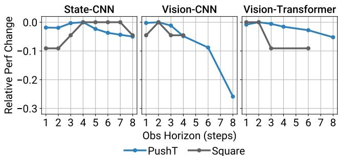  
Figure 14. Observation Horizon Ablation Study. State-based Diffusion Policy is not sensitive to observation horizon. Vision-based Diffusion Policy prefers low but $> 1$ observation horizon, with 2 being a good compromise for most tasks.

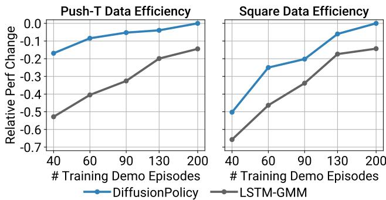  
Figure 15. Data Efficiency Ablation Study. Diffusion Policy outperforms LSTM-GMM Mandlekar et al. (2021) at every training dataset size.

On simulation benchmarks, we used the iDDPM algorithm Nichol and Dhariwal (2021) with the same 100 denoising diffusion iterations for both training and inference. We used DDIM Song et al. (2021) on realworld benchmarks to reduce the inference denoising iterations to 16 therefore reducing inference latency.

We used batch size of 256 for all state-based experiments and 64 for all image-based experiments. For learning-rate scheduling, we used cosine schedule with linear warmup. CNN-based Diffusion Policy is warmed up for 500 steps while Transformer-based Diffusion Policy is warmed up for 1000 steps.

# A.5 Data Efficiency

We found Diffusion Policy to outperform LSTM-GMM Mandlekar et al. (2021) at every training dataset size, as shown in Fig. 15.

# B Additional Ablation Results

# B.1 Observation Horizon

We found state-based Diffusion Policy to be insensitive to observation horizon, as shown in Fig. 14. However, vision-based Diffusion Policy, in particular the variant with CNN backbone, see performance decrease with increasing observation horizon. In practice, we found an observation horizon of 2 is good for most of the tasks for both state and image observations.

horizon Tp: action prediction horizon ImgRes: environment observation resolution (Camera views $\times \textsf { W } \times \mathsf { H } )$ CropRes: random crop i inference diffusion iterations (enabled by DDIM Song et al. (2021))   

<table><tr><td>H-Param</td><td>Ctrl</td><td>To</td><td>Ta</td><td>Tp</td><td>ImgRes</td><td>CropRes</td><td>#D-Params</td><td>#V-Params</td><td>Lr</td><td>WDecay</td><td>D-Iters Train</td><td>D-Iters Eval</td></tr><tr><td>Lift</td><td>Pos</td><td>2</td><td>8</td><td>16</td><td>2x84x84</td><td>2x76x76</td><td>256</td><td>22</td><td>1e-4</td><td>1e-6</td><td>100</td><td>100</td></tr><tr><td>Can</td><td>Pos</td><td></td><td>8</td><td>16</td><td>2x84x84</td><td>2x76x76</td><td>256</td><td>22</td><td>1e-4</td><td>1e-6</td><td>100</td><td>100</td></tr><tr><td>Square</td><td>Pos</td><td>2</td><td>8</td><td>16</td><td>2x84x84</td><td>2x76x76</td><td>256</td><td>22</td><td>1e-4</td><td>1e-6</td><td>100</td><td>100</td></tr><tr><td>Transport</td><td>Pos</td><td>2</td><td>8</td><td>16</td><td>4x84x85</td><td>4x76x76</td><td>264</td><td>45</td><td>1e-4</td><td>1e-6</td><td>100</td><td>100</td></tr><tr><td>ToolHang</td><td>Pos</td><td>2</td><td>8</td><td>16</td><td>2x240x240</td><td>2x216x216</td><td>256</td><td>22</td><td>1e-4</td><td>1e-6</td><td>100</td><td>100</td></tr><tr><td>Push-T</td><td>Pos</td><td>2</td><td>8</td><td>16</td><td>1x96x96</td><td>1x84x84</td><td>256</td><td>22</td><td>1e-4</td><td>1e-6</td><td>100</td><td>100</td></tr><tr><td>Block Push</td><td>Pos</td><td>3</td><td>1</td><td>12 N/A</td><td></td><td>N/A</td><td>256</td><td>0</td><td>1e-4</td><td>1e-6</td><td>100</td><td>100</td></tr><tr><td>Kitchen</td><td>Pos</td><td>2</td><td>8</td><td>16 N/A</td><td></td><td>N/A</td><td>256</td><td>0</td><td>1e-4</td><td>1e-6</td><td>100</td><td>100</td></tr><tr><td>Real Push-T</td><td>Pos</td><td>2</td><td>6</td><td>16</td><td></td><td>2x320x240 2x288x216 67</td><td></td><td>22</td><td>1e-4 1e-6</td><td></td><td>100</td><td>16</td></tr><tr><td>Real Pour</td><td>Pos</td><td>2</td><td>8</td><td>16</td><td></td><td>2x320x240 2x288x216 67</td><td></td><td>22</td><td>1e-4 1e-6</td><td></td><td>100</td><td>16</td></tr><tr><td>Real Spread</td><td>Pos</td><td>2</td><td>8</td><td>16</td><td></td><td>2x320x240 2x288x216 67</td><td></td><td>22</td><td>1e-4 1e-6</td><td></td><td>100</td><td>16</td></tr><tr><td>Real Mug Flip</td><td>Pos</td><td>2</td><td>8</td><td>16</td><td></td><td>2x320x240 2x288x216 67</td><td></td><td>22</td><td>1e-4 1e-6</td><td></td><td>100</td><td>16</td></tr></table>

<table><tr><td>H-Param</td><td>|Ctrl To Ta Tp #D-params #V-params #Layers Emb Dim Attn Drp Lr</td><td></td><td></td><td></td><td></td><td></td><td></td><td></td><td></td><td></td><td>WDecay D-Iters Train D-Iters Eval</td><td></td></tr><tr><td>Lift</td><td>|Pos 2</td><td></td><td>8</td><td>10 9</td><td></td><td>22</td><td>8</td><td>256 256</td><td>0.3</td><td>1e-4 1e-3</td><td>100</td><td>100</td></tr><tr><td>Can</td><td>Pos 2</td><td></td><td>8</td><td>10 9</td><td></td><td></td><td></td><td>0.3</td><td></td><td>1e-4 1e-3</td><td>100</td><td>100</td></tr><tr><td>Square</td><td>Pos 2</td><td></td><td>8</td><td>10 9</td><td></td><td></td><td>256</td><td>0.3</td><td></td><td>1e-4 1e-3</td><td>100</td><td>100</td></tr><tr><td>Transport</td><td>Pos 2</td><td></td><td>8</td><td>10 9</td><td></td><td></td><td>256</td><td>0.3</td><td></td><td>1e-4 1e-3</td><td>100</td><td>100</td></tr><tr><td>ToolHang</td><td>Pos 2</td><td></td><td>8</td><td>10 9</td><td></td><td></td><td>256</td><td>0.3</td><td></td><td>1e-4 1e-3</td><td>100</td><td>100</td></tr><tr><td>Push-T</td><td>Pos</td><td>2</td><td>8</td><td>16 9</td><td></td><td></td><td>256</td><td>0.01</td><td></td><td>1e-4 1e-1</td><td>100</td><td>100</td></tr><tr><td>Block Push</td><td>Vel</td><td>3</td><td>1</td><td>5 9</td><td></td><td></td><td>256 768</td><td>0.3</td><td></td><td>1e-4 1e-3</td><td>100</td><td>100</td></tr><tr><td>Kitchen</td><td>Pos </td><td></td><td>8</td><td>16 80</td><td></td><td></td><td></td><td>0.1</td><td></td><td>1e-4 1e-3</td><td>100</td><td>100</td></tr><tr><td>Real Push-T |</td><td> Pos</td><td>2</td><td>6</td><td>16 80</td><td></td><td>22</td><td></td><td>0.3</td><td></td><td>1e-4 1e-3</td><td>100</td><td>16</td></tr></table>

ili iterations D-Iters Eval: number of inference diffusion iterations (enabled by DDIM Song et al. (2021))

# B.2 Performance Improvement Calculation

For each task i (column) reported in Tab. 1, Tab. 2 and Tab. 4 (mh results ignored), we find the maximum performance for baseline methods max baseline and the maximum performance for Diffusion Policy variant (CNN vs Transformer) max_ours. For each task, the performance improvement is calculated as improvement $=$ average improvement is calculated as avg _improvement $=$ $\begin{array} { r } { \frac { 1 } { N } \sum _ { N } ^ { i } } \end{array}$ $\prime e m e n t _ { i } = 0 . 4 6 8 5 8 \approx 4 6 . 9 \%$ .

# C Realworld Task Details

# C.1 Push-T

C.1.1 Demonstrations 136 demonstrations are collected and used for training. The initial condition is varied by randomly pushing or tossing the T block onto the table. Prior to this data collection session, the operator has performed this task for many hours and should be considered proficient at this task.

C.1.2 Evaluation We used a fixed training time of 12 hours for each method, and selected the last checkpoint for each, with the exception of IBC, where the checkpoint with minimum training set action prediction MSE error due to IBC's training stability issue. The difficulty of training and checkpoint selection for IBC is demonstrated in main text Fig. 7. Each method is evaluated for 20 episodes, all starting from the same set of initial conditions. To ensure the consistency of initial conditions, we carefully adjusted the pose of the T block and the robot according to overlayed images from the top-down camera. Each evaluation episode is terminated by either keeping the end-effector within the end-zone for more than 0.5 second, or by reaching the 60 sec time limit. The IoU metric is directly computed in the top-down camera pixel space.

# C.2 Sauce Pouring and Spreading

C.2.1 Demonstrations 50 demonstrations are collected, and $90 \%$ are used for training for each task. For pouring, initial locations of the pizza dough and sauce bowl are varied. After each demonstration, sauce is poured back into the bowl, and the dough is wiped clean. For spreading, location of the pizza dough as well as the poured sauce shape are varied. For resetting, we manually gather sauce towards the center of the dough, and wipe the remaining dough clean. The rotational components for tele-op commands are discarded during spreading and sauce transferring to avoid accidentally scooping or spilling sauce.

C.2.2 Evaluation Both Diffusion Policy and LSTM-GMM are trained for 1000 epochs. The last checkpoint is used for evaluation.

Each method is evaluated from the same set of random initial conditions, where positions of the pizza dough and sauce bowl are varied. We use a similar protocol as in Push$\mathbf { T }$ to set up initial conditions. We do not try to match initial shape of poured sauce for spreading. Instead, we make sure the amount of sauce is fixed during all experiments.

The evaluation episodes are terminated by moving the spoon upward (away form the dough) for 0.5 seconds, or when the operator deems the policy's behavior is unsafe.

The coverage metric is computed by first projecting the RGB image from both the left and right cameras onto the table space through homography, then computing the coverage in each projected image. The maximum coverage between the left and right cameras is reported.

# D Realworld Setup Details

D.0.1 UR5 robot station Experiments for the Push-T task are performed on the UR5 robot station.

The UR5 robot accepts end-effector space positional command at $1 2 5 \mathrm { H z }$ , which is linearly interpolated from the $1 0 \mathrm { H z }$ command from either human demonstration or the policy. The interpolation controller limits the end-effector velocity to be below $0 . 4 3 ~ \mathrm { \ m / s }$ and its position to be within the region 1cm above the table for safety reason. Position-controlled policies directly predicts the desired endeffector pose, while velocity-controlled policies predicts the difference the current positional setpoint and the previous setpoint.

The UR5 robot station has 5 realsense D415 depth camera recording $7 2 0 \mathrm { p }$ RGB videos at 30fps. Only 2 of the cameras are used for policy observation, which are down-sampled to $3 2 0 \mathrm { x } 2 4 0$ at 10fps.

During demonstration, the operator teleoperates the robot via a 3dconnexion SpaceMouse at $1 0 \mathrm { H z }$ .

# D.1 Franka Robot Station

Experiments for Sauce Pouring and Spreading, Bimanual Egg Beater, Bimanual Mat Unrolling, and Bimanual Shirt Folding tasks are performed on the Franka robot station.

For the non-haptic control, a custom mid-level controller is implemented to generate desired joint positions from desired end effector poses from the learned policies. At each time step, we solve a differential kinematics problem (formulated as a Quadratic Program) to compute the desired joint velocity to track the desired end effector velocity. The resulting joint velocity is Euler integrated into joint position, which is tracked by a joint-level controller on the robot. This formulation allows us to impose constraints such as collision avoidance for the two arms and the table, safety region for end effector and joint limits. It also enables regulating redundant DoF in the null space of the end effector commands. This mid-level controller is particularly valuable for safeguarding the learned policy during hardware deployment.

For haptic teleoperation control, another custom mid-level controller is implemented, but formulated as a pure torquecontroller. The controller is formulated using Operational Space Control Khatib (1987) as a Quadratic Program operating at $2 0 0 ~ \mathrm { H z }$ ,where position, velocity, and torque limits are added as constraints, and the primary spatial objective and secondary null-space posture objectives are

j90086.pki pp180088,.pri A MAAZ posed as costs. This, coupled with a good model of the Franka Panda arm, including reflected rotor inertias, allows us to perform good tracking with pure spatial feedback, and even better tracking with feedforward spatial acceleration. Collision avoidance has not yet been enabled for this control mode.

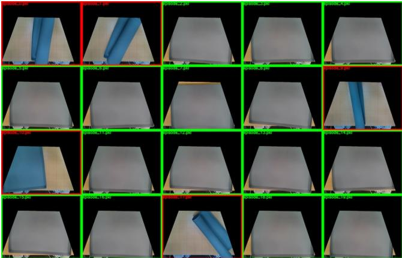  
Figure 1.Initial states for Mat Unrolling   
Figure 17. Final states for Mat Unrolling

Note that for inference, we use the non-haptic control. Future work intends to simplify this control strategy and only use a single controller for our given objectives.

The operator uses a SpaceMouse or VR controller input device(s) to control the robot's end effector(s), and the grippers are controlled by a trigger button on the respective device. Tele-op and learned policies run at $1 0 \mathrm { H z }$ , and the mid-level controller runs around 1kHz. Desired end effector pose commands are interpolated by the mid-level controller. This station has 2 realsense D415 RGBD camera streaming VGA RGB images at 30fps, which are downsampled to $3 2 0 \mathrm { x } 2 4 0$ at 10fps as input to the learned policies.

# D.2 Initial and Final States of Bimanual Tasks

The following figures show the initial and final state of four bimanual tasks. Green and red boxes indicate successful and failed rollouts respectively. Since mat and shirt are very flat objects, we used a homographic projection to better visualize the initial and final states.

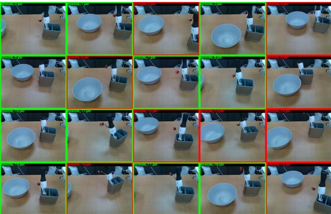

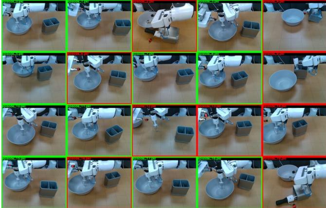  
Figure 18. Initial states for Egg Beater

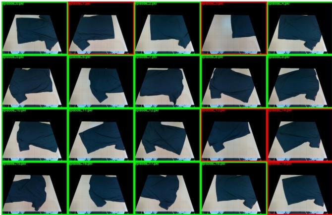  
Figure 19. Final states for Egg Beater

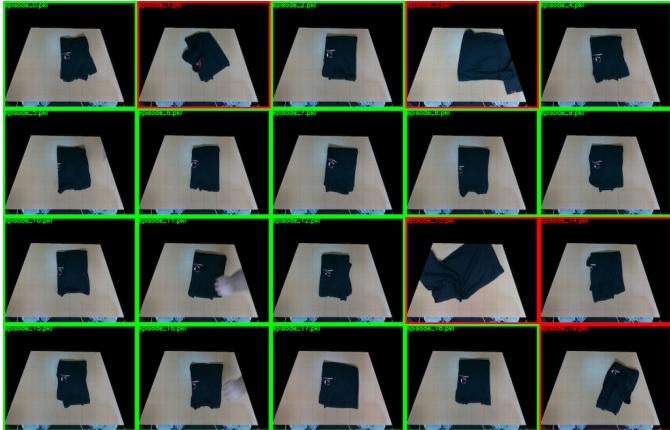  
Figure 20.Initial states for Shirt Folding   
Figure 2. Final states for Shirt Folding