Article

# Immersive Phobia Therapy through Adaptive Virtual Reality and Biofeedback

Alin Moldoveanu ${ \bf 1 } _ { \mathbb { D } }$ , Oana Mitrut $^ { 1 , * }$ , Nicolae Jinga 1, Ctlin Petrescu ${ \bf 1 } _ { \mathbb { D } }$ , Florica Moldoveanu Victor Asavei ${ \bf 1 } _ { \textcircled { \lfloor p \rfloor } }$ , Ana Magdalena Anghel 1 and Livia Petrescu ${ \mathfrak { 2 } } _ { \oplus }$ Academic Editor: João Marcelo Teixeira Received: 26 July 2023 Revised: 11 September 2023 Accepted: 14 September 2023 Published: 16 September 2023 1 Faculty of Automatic Control and Computers, University POLITEHNICA of Bucharest, 060042 Bucharest, Romania; alin.moldoveanu@upb.ro (A.M.); nicolae.jinga@stud.acs.upb.ro (N.J.); catalin.petrescu@upb.ro (C.P.); florica.moldoveanu@upb.ro (F.M.); victor.asavei@upb.ro (V.A.); ana.anghel@upb.ro (A.M.A.)   
2 Faculty of Biology, University of Bucharest, 010014 Bucharest, Romania; livia.petrescu@bio.unibuc.ro   
\* Correspondence: oana.balan@upb.ro

Abstract: Phobias are a type of anxiety disorder characterized by severe fear of objects and situations. In recent years, virtual reality exposure therapy has emerged as a safer and more convenient method of treating phobias, with the same rate of success as classical therapy, the in vivo exposure to stimuli. Following extensive research concerning the available technologies and after studying the state of the art in the field, we developed the PhoVR (Phobia therapy through Virtual Reality) system during a 2-year long project that involved the participation of a technical university, a biology faculty, and an industry partner specialized in designing 3D applications. Our final prototype incorporates scenarios for acrophobia, claustrophobia, and fear of public speaking therapy, in which the user is required to perform gamified tasks and navigate virtual reality environments with biophysical data acquisition (electrodermal activity and heart rate), automatic anxiety level classification, biofeedback integrated into the scenes' elements, the dynamic adaptation of the virtual environments, and relaxation techniques made available at any moment. The control panel is an application dedicated to psychotherapists for managing patients' profiles and therapy sessions. The feedback obtained in a qualitative survey with subjects and psychotherapists who evaluated the prototype validated the system and provided suggestions for refinement. Keywords: phobia; exposure therapy; virtual reality; biophysical data; emotion classification; automatic adaptation; biofeedback

# 1. Introduction

The PhoVR system, a tool for immersive phobia therapy through adaptive virtual reality and biofeedback, was developed with the purpose of treating various phobias and anxieties with the help of virtual reality, by gradually controlling patients' exposure in highly realistic 3D environments. During the therapy sessions, patients can access a 3D world, which they will be able to visualize through virtual reality (VR) glasses and navigate using controllers. The 3D environments contain complex scenes with terrain, vegetation, buildings, and other elements that allow for the simulation of real scenarios from nature or the urban environment. The 3D environment is able to adapt automatically or be adjusted by the therapist, in real time. One component of adaptation is changing the difficulty of the 3D environment, namely the degree of exposure to phobia stimuli. This involves changing the 3D scene or the position of some elements in the scene. Another component of the adaptation of the 3D environment includes the introduction of some support elements for the patient (music, video, texts, favorite objects, or scenes) with the purpose of relaxation or prerecorded audio containing relaxation and self-control techniques. During the sessions, biophysical data are acquired from patients (heart rate and electrodermal activity), which are presented in VR in an intuitive way, providing biofeedback regarding the current emotional state. The proposed solution includes quests and games that challenge the patient to explore the virtual environment and confront their fears. A quest contains a list of tasks that must be completed. Games are a form of gamified quests, which have a funny, attractive side and use techniques taken from the field of video games to increase patient engagement.

# 2. Phobia Statistics and Therapy Methods

Nowadays, 1.1 billion people suffer from various mental health disorders, and although they can be treated or prevented, most people do not have access to effective care [1]. Anxiety disorders, such as fear of public speaking, specific phobias, PTSD, generalized anxiety disorder, and OCD, affect 275 million people and rank sixth in global disability [2]. People suffering from anxiety disorders experience fear and avoidance of objects and situations that pose little or no danger at all. The prevalence per country ranges from $2 . 5 \%$ to $6 . 5 \%$ , higher in the US, Canada, and northern Europe [2]. Mental conditions are more prevalent in women. They are affected especially by depression, anxiety, eating disorders, and bipolar disorders. The social isolation caused by the COVID-19 pandemic, the fear of infection, or the fear of illness or death of a dear one led to an increase of $2 5 \%$ in the incidence of depression and anxiety disorders, especially among young people and women [3]. Moreover, the outbreak of monkeypox in May 2022, declared a Global Public Health Emergency by the World Health Organization, led to an increase in activity on social networks concerning recommendations and measures, as well as sharing information about the disease [4]. The Marburg virus threatened epidemiologists in 2022 due to its high global spread and potential for a new pandemic. In order to prevent this undesirable situation, social media may increase awareness concerning the disease and the associated risks [5]. Approximately $1 3 \%$ of the global population suffers from various phobias, such as social anxiety disorder and agoraphobia, and specific phobias like fear of heights, flying, spiders, snakes, claustrophobia, etc. [6]. Social phobias (fear of writing or eating before someone, meeting people of higher authority, using a telephone, or speaking before a large crowd) affect people of all ages, but they usually emerge in adolescence. Later in life, $4 5 \%$ of individuals with social phobias develop agoraphobia and anxiety attacks, while $1 7 \%$ develop depression. The majority of them turn to medication, even substance abuse with illegal drugs (nearly $1 7 \%$ )or alcohol (nearly $1 9 \%$ [7]. Approximately $1 5 { - } 2 0 \%$ of the world's population experiences specific phobias at least once in their lifetime [7]. Acrophobia (fear of heights) with an incidence rate of $7 . 5 \%$ , claustrophobia (fear of narrow or enclosed spaces), aerophobia (fear of flying), and ophidiophobia (fear of snakes) are the most prevalent. Specific phobias begin during childhood and can persist during the lifetime. If treated, they have only a $2 0 \%$ recovery rate.

The most popular methods for treating anxiety disorders include medicines (pills) and cognitive behavioral therapy (CBT) in the presence of a therapist, which enables the patient to see the traumatic experience in a different way, through thought and behavior control [8]. Exposure therapy has response rates of $8 0 { - } 9 0 \%$ . It is classified into in vivo, in sensu (in imagination), and in virtuo exposure. In virtuo exposure, where the therapy is conducted using a computer-generated virtual environment, is preferred by patients as they are aware that they are confronted only with a simulation [9]. Virtual reality exposure therapy (VRET) has a strong real-life impact and good stability of results in time, equal to those obtained in CBT therapies, and there is no difference in the dropout rate between VR and in vivo exposure. However, virtual exposure sometimes induces motion sickness, due to a mismatch of information between the simulated movement of the body and other senses. The first study on the use of VR in acrophobia therapy dates back to the 1990s and belongs to Rothbaum [10].

# 2.1. Commercial Virtual Reality Exposure Therapy Systems

Various VRET systems have been developed and made available on the market as commercial products for treating a wide range of disorders: C2Care [11] (phobias, OCD, PTSD, addictions (alcohol, cigarettes, gambling, etc.), and eating disorders), Amelia [12] (phobias, eating disorders), Virtual Reality Medical Center (VRMC) [13] (PTSD), Virtually Better [14] (phobias, addictions), and XRHealth [15]. These systems allow for therapist orchestration. In C2Care, therapists can increase or decrease some stimuli like the crowd intensity, how other people look, people's feelings, and settings, or directly talk to patients as an interlocutor inside the environment. In XRHealth, therapists can control and monitor patients' live VR sessions and perform any necessary adjustments in real time. Amelia allows for personalized interventions with greater control. XRHealth facilitates individualized therapy, as therapists can develop a personalized plan of care, consistently updated based on patients' progress. C2Care, XRHealth, and Amelia have an administrative panel with screen feedback of what the patient sees in VR and a data management portal.

# 2.2. Virtual Reality Exposure Therapy Systems Developed in the Academic Context

The AcTiVity system [16], which was tested with 42 participants not affected by acrophobia, is used to assess how the user's avatar influences their sense of presence, immersion, and motion sickness. The subjects were divided into two groups—with and without an avatar representation of their body. The results indicated a higher presence in the group in which the participants tested the system with an avatar representation of their bodies because distances could be estimated based on their body height, and the method could be used for subjects who had acrophobic tendencies. In the acrophobia experiment presented by Coelho et al. [17], 15 subjects were gradually exposed to heights (in both virtual and real-world environments), from the first to the eighth floor of a building, for a period of 3 weeks, constantly assisted by a psychologist, who provided guidance and encouragement. The evaluation of the data showed that, after the therapy, both groups reached identical results, with differences regarding only the length of each session. In this aspect, virtual reality sessions were shorter than real-world sessions by $5 0 \%$ . Emmelkamp et al. [18] used a low-budget virtual reality exposure system for acrophobia therapy and an in vivo treatment. In total, 29 subjects participating in the experiment had to rate their anxiety level on a scale from 1 to 10. When the therapist decided that the patient's anxiety level was sufficiently low, they adjusted the difficulty of exposure. The results showed a reduction in both anxiety and avoidance levels of the patients, concluding that virtual reality exposure therapy is at least as effective as in vivo exposure. A mountain and a city environment were presented in [19]. For that study, 10 subjects underwent real-world exposure for two months and another 10 subjects participated in virtual reality exposure therapy sessions for the same amount of time. The results showed that their anxiety levels significantly reduced from $6 4 \%$ to $4 0 \%$ in the case of the second group. ZeroPhobia [20] consists of six animated modules with explanatory voiceover and a virtual therapist; mobile VR games; and 360-degree videos, controlled by gaze direction. In total, 66 subjects tested the system, and the main conclusion drawn from the experiment was that the optimal duration of a VR session should be around $2 5 ~ \mathrm { m i n } ,$ as increased exposure time necessarily increases therapy efficiency. In the experiment presented in [21], 10 subjects (5 with acrophobia and 5 in the control group) were exposed to a 3D virtual model of a city. They had to pass through a walkway between two buildings on the fifth floor and experience the view from the roof of a sevenstory building. The research showed a positive correlation between anxious behavior (an increase of at least 15 beats per minute in heart rate compared with baseline measurements) and the reported fear level. A hilly landscape with a metal structure in the middle, containing four platforms situated at different heights above ground, was simulated in a CAVE (cave automatic virtual environment) device [22]. The results of an experiment with 99 subjects showed that projection on the floor and walls increased immersion and anxiety, although it did not affect the sense of presence. Six acrophobic users underwent three e-virtual reality remote sessions (view from the balcony of an office), followed by three in vivo exposure sessions in the presence of a therapist [23]. The data analysis revealed that there was no difference between subjectively perceived anxiety rates (assessed by means of specific questionnaires) and physiological responses (heart rate measurements) under both conditions (virtual and in vivo). The VR simulator presented in [24] is not dedicated to therapy but to companies that want to see if their employees suffer from acrophobia. The virtual environment displays a moving platform and a virtual ladder placed on the top of a pole, at $1 1 \mathrm { m }$ above ground. The scene is enriched with buildings, moving cars, sky, and moving clouds, which increase presence. People suffering from glossophobia are more nervous than their non-phobic peers when speaking in an empty seminar room and in front of a virtual audience with neutral behavior, as suggested by the experiment presented in [25]. On the other hand, a hostile attitude from the audience generates powerful emotions in the speakers, both confident speakers and glossophobic [26]. The DIVE [27] virtual environment has been used for creating two scenarios: one in which the audience is friendly and the other with a hostile audience. After analyzing the data from physiological measurements and speaking performance, it was found that co-presence is associated with the attitude of the avatars from the virtual audience. In the game presented in [28], the player can modify the settings of the audience who can interact with the speaker through laughter, comments, encouragement, or clapping. The virtual reality therapy group comprising eight subjects achieved significant improvements after the 5-week therapy, whereas the performance of the control group remained the same. An increase in anxiety was observed at the beginning of the $1 0 { - } 2 0 \mathrm { m i n }$ long session and a considerable decrease was noted in the middle of exposure. Some 360-degree virtual environments were used in [29], depicting three training scenarios: an empty classroom, a classroom with a small audience, and a classroom with a large audience. The results obtained from an experiment with 35 subjects showed that anxiety levels decreased, especially for subjects who recorded high baseline anxiety levels. Young software engineers were required to give a speech on one of several controversial subjects in front of a virtual audience in another study [30]. The psychotherapist had the possibility to orchestrate the scenario and manipulate the audience's reactions. The authors reached the conclusion that consistent therapy is effective in reducing anxiety levels. The AwareMe system [31] incorporates a module that monitors voice factors: pitch, filler words, and number of spoken words. A wristband offers visual and haptic feedback during presentations. In a large experiment, the data from 66 subjects were recorded (self-reported anxiety, heart rate, heart rate variability, and saliva cortisol secretions) in three different settings: a real audience in a real-world lecture hall, a full lecture hall in VR, and an empty lecture hall in VR with disturbing sounds. The results showed similar stress patterns under both real-world and VR conditions, and no significant differences between male and female participants. An evaluation of the PubVR system as a therapy tool for fear of public speaking [32] focused on patients' perception and experience concerning live-controlled avatar interactions compared with standard prerecorded animations. Notably, 24 healthy subjects were divided into two groups: The experimental group received voice and upper-body movement input from the orchestrator using a motion-tracking camera, while the control group received predefined animations and prerecorded statements. The results from the qualitative analysis indicated that the participants from the experimental group felt more comfortable when they received a spontaneous answer and when they could initiate a dialogue with follow-up questions during the therapy session. Other observations showed that subjects tend to pause their presentation when there is no direct interaction, causing a break in presence.

# 3. The PhoVR System

# 3.1. VR and Biophysical Acquisition Devices

The PhoVR system uses affordable, consumer-level VR playback and biophysical acquisition devices readily available on the market. The system was developed to be used with both all-in-one equipment such as the Oculus Quest series [33] and head-mounted display (HMD) equipment that requires external processing from a VR-compatible laptop or desktop. In particular, we used the HTC Vive [34] and Valve Index [35] HMDs, which are also recommended, but there is the possibility of using other models available on the market. For simplicity in use and configuration, and due to the substantially reduced costs, using only all-in-one equipment, such as Oculus Quest 2, is desirable, but its processing power is much lower than desktop solutions. For this reason, the use of a dedicated HMD is still recommended in order to enhance graphic quality and an optimal video flow. To evaluate the degree of perceived anxiety, biometric data were collected throughout the VR session. We recorded electrodermal activity (EDA) and heart rate variability (HRV) using a portable device. After a detailed analysis of the available equipment on the market, BITalino [36] was chosen due to its ease of use, increased ergonomics, and reduced cost.

# 3.2. Description of the Virtual Environments

# 3.2.1. Tutorial Scene

The tutorial scene is an essential scene for any new user. It describes how to move around the scene, what controller buttons are used and for what purpose, what types of tasks exist, and how they are structured. During a game level, it is necessary to complete some tasks. A task is defined as an action that the user has to perform. There are four types of tasks:

Checkpoint—the type of task in which the user moves to a marker point. Upon successful completion of the task, a confirmation sound is heard. Photo—in this task, the user has to take a picture of an object or animal. Depending on the scene, the object or animal can differ. In one scene, the object is a statue, in another a seagull, etc. When the user reaches the area around the target object, the screen will partially change its appearance, and the object will have an outline. If the angle between the direction of the camera and the location of the object is not small enough, the outline will be yellow. The user has to look at the object to change the outline color to green. The picture can be taken by pressing the controller's Trigger button. • Collection—the type of task in which the user collects three or more objects of the same type. The collectibles are blue particles. To collect them, the player needs to move toward the particles in VR so that a collision occurs between them and the player's body (Figure 1). Pickup—in this task, the user has to pick up various objects from the scene. Depending on the scene played, the objects or animals differ: in one scene the object is a candle, in another scene a bottle, etc. To put an item in the inventory, the user points their right hand at the item and presses the controller's Grip button. If the hand is pointed correctly, the controller will vibrate, and a semi-transparent circle will be visible at the base of the object (Figure 2). Throughout the scene, at random moments, a panel with the question "How easy was it to control your feelings?" appears. By averaging the responses received at different points in the scene, the evolution of the user's emotional state over time is analyzed. The collected data are also used to make a connection between the degree of anxiety subjectively perceived by the user and the degree of anxiety computed using the recorded biometric data.

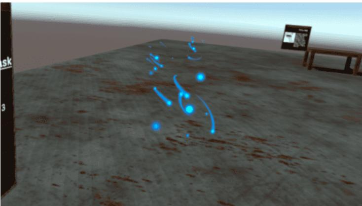  
Figure 1. Collection task.

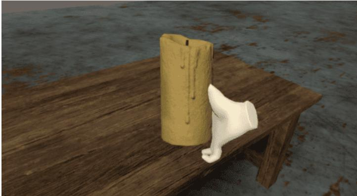  
Figure 2. Pickup task.

After completing a task, the marking for the next task becomes visible. A task sequence is a series of tasks that must be completed in a specific order. In a sequence, there cannot be two active tasks at the same time. The end of a sequence is marked by displaying a form with the following three questions (Figure 3): How easy was the task sequence? • How easy was it to control your feelings? How enjoyable was the task sequence?

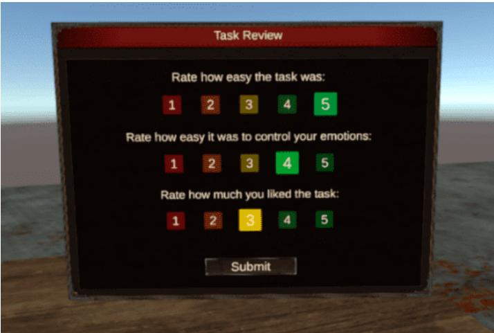  
Figure 3. Form with assessment questions.

The tutorial scene is a simple scene with four tables. The user is initially in the center of the scene and can find images and instructions on the panels placed in the 3D space. On eac table, there is a different object that will be used in a task. The user will have to go through a sequence of tasks consisting of a checkpoint, two photo tasks, a collection task, and two pickup tasks. The controller buttons have the following functions: Joystick—by moving the sticks up and down or right and left, the player can move around the scene; Joystick press—opens the Main Menu where various aspects of the application such as graphic quality, sound volume, movement speed, active scene, etc., can be modified; • A—rotates the user to the left; • B—rotates the user to the right; • Trigger—used for selecting or confirming actions (menu/ quests); Grip—used in the task of picking up an object.

# 3.2.2. Virtual Environments for Acrophobia Therapy

For acrophobia therapy, two natural environments and two urban environments were developed. The first natural environment is a mountain scenario. The user is asked to travel on a route consisting of two sequences: a free walk in a large, open-space area and a ride by cable car. For free walk, the user has several options: Walking on a metal platform (Figure 4); • Walking on the edge of the main ridge; Descent route, along the river.

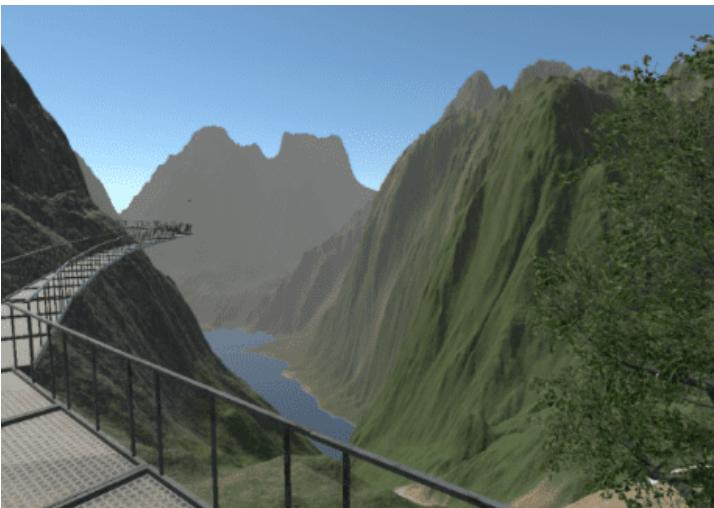  
Figure 4. Metal platform.

The paths are marked using a special texture so that the player will not get lost in the scene. The tracks can be observed from a distance. Another way to track a route is to track active task markers. The cable car route (Figure 5) can be traveled up or down. The distance covered by the cable car is divided into 10 roughly equal segments. Each section is marked by a pole, next to which the cable car will stop. When the cable car stops, the user is notified that there are several tasks to accomplish and questions to answer. This scene was constantly refined for performance reasons. The application that ran directly on Oculus Quest had a low number of frames per second, and when moving the headset, the image became jerky and blurry. For this reason, after a detailed analysis of the elements in the scene, the level was completely modified. The first change was removing a large number of trees. One of the most expensive elements in the scene is trees. Their number was drastically reduced, and 3D models were replaced by models optimized for mobile phone systems. The second complex element in the scene is the terrain. Its dimensions were reduced, and the terrain was finally converted to a 3D model to lower the number of rendering operations.

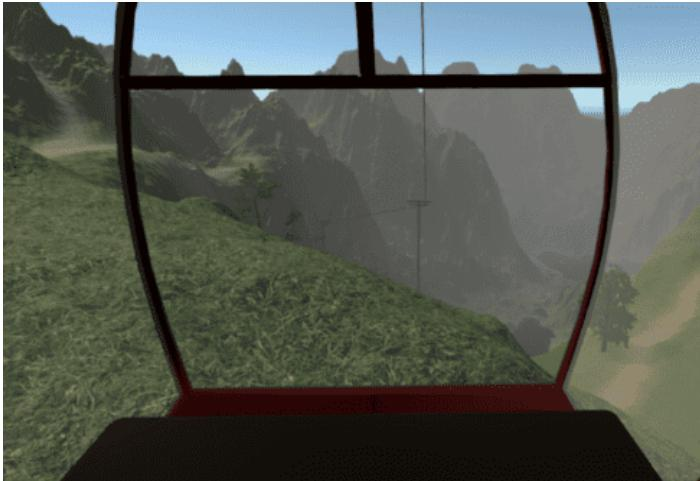  
Figure 5. Cable car.

The second nature scene is a narrower, restricted area through which the user can move freely. It is composed of two steep cliffs and a metal bridge (Figure 6). The tasks are performed on the edge of the cliffs and the bridge, forcing the user to jump from one cliff to another. Various factors were used for a special atmosphere, such as low lighting, flocks of crows, or dense fog (Figure 7).

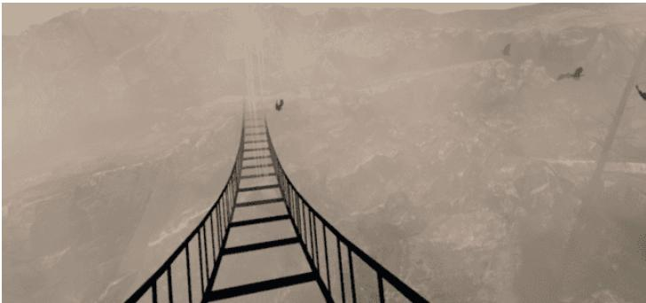  
Figure 6. Metal bridge.

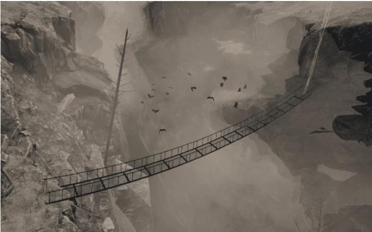  
Figure 7. Metal bridge covered in fog.

The urban scene for acrophobia therapy is populated with a large number of buildings. The user initially finds themselves on the terrace of a building and must reach the highest level, the roof (Figure 8). Of all the buildings present in the scene, the player can only walk on two buildings: the building in which they are at the start of the scene and the adjacent building. The two buildings are divided into three levels of height. Elevators are used to change the height level.

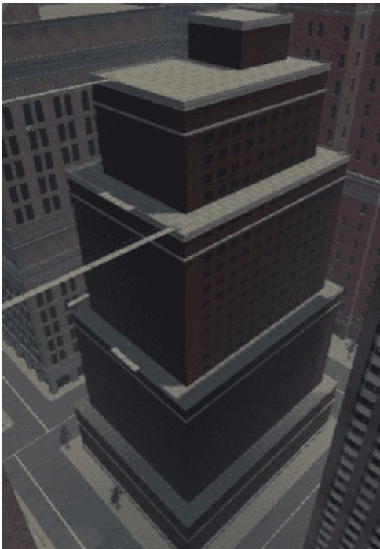  
Figure 8. Initial building.

• Level 1—the player will walk on the terrace, at a height of $6 6 \mathrm m$ equivalent to the 17th floor; • Level 2—height of $1 0 8 \mathrm { m } ,$ equivalent to the 28th floor;   
− Level 3—the last level is the roof of the building, located at a height of $1 3 1 \mathrm { m } ,$ equivalent to the 35th floor. On each level of the building, the user has a number of tasks to complete. The locations of these tasks were chosen so that the user is guided to the most efficient path, both for testing their anxiety level and considering the session's duration. Moving to the next level of the building or moving onto the next building is achieved by interacting with certain components of the scene. To change the levels of the building, there is a metal platform that serves as an elevator, with buttons for going up or down. If the difference in floors between the two levels is too large, the platform will stop halfway. At this stationary point, the user will have to complete a task to move on. The movement between the two buildings is carried out on two bridges. One bridge is located between the second levels of the buildings, and the next is located between the third levels. The bridge is constructed of thin metal bars, and the floor is composed of gratings through which the subject can see the ground (Figure 9). The first task in the scene is a checkpoint. The user has to move toward the active marker and, at the end of the task, is able to see where the next task is located. In the second task, the player must collect three objects. They are placed on a metal platform attached to the edge of the terrace. The platform is composed of metal bars and a grid on which the user can move. The objects to be collected are positioned on the edge of the platform, as close to the grating as possible, to force the user to look down. After collecting the three objects, the marking of the third task is activated. The player is required to take a picture of a seagull that sits on a metal bar (Figure 10) To get close enough to the seagull, in the special photo-taking area, the player will have to climb on another metal platform.

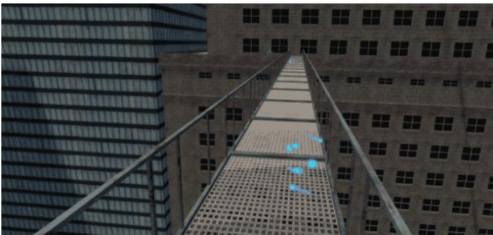  
Figure 9. Metal bridge between the buildings.

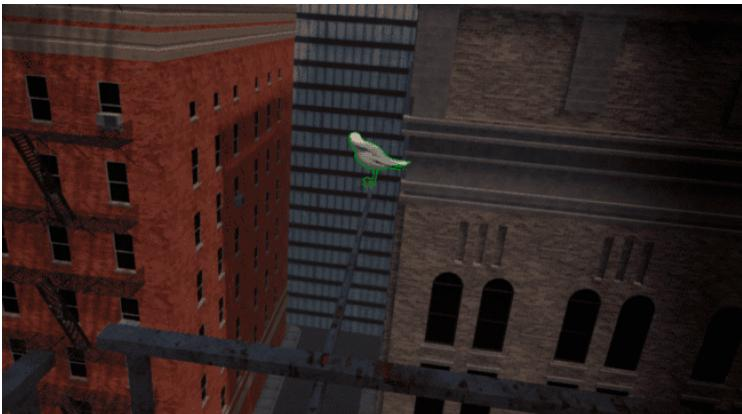  
Figure 10. Seagull on a metal bar.

A full run of the scene takes about $1 0 \mathrm { m i n }$ . Depending on the patient's speed, skill and anxiety, the run time can increase. The second urban scene is similar to the first one, but the buildings are different. The scenario is divided into three areas populated with elements that cause a higher level of anxiety by using transparent materials, which allow the player to perceive the height at which they are more easily. The user starts the new scenario from the first floor of a building and has to use a platform to climb 40 floors to the roof of the building. The elevator willstop at two different points, equivalent to the 18th and 33rd floors, where there are two photo tasks. The second area is composed of platforms with thin metal bars and a grid floor. To create the illusion of greater height, the bridges were tilted at different angles (Figure 11).

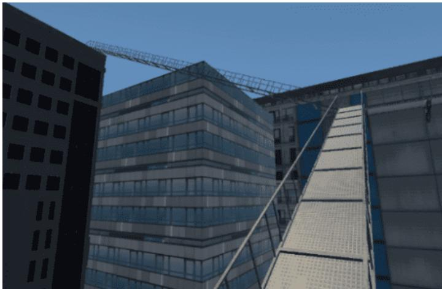  
Figure 11. Tilted bridge.

The third area also has metal platforms attached to the edge of the roof. To arrive at this last location, it is necessary to go down in an elevator and cross a bridge. The scenes have elements that can be configured according to the patient's fear level. For example, the bridges can be modified: The grating can be replaced with a metal panel through which the user can no longer see what is below or it can be replaced with glass. The metal side bars can be completely removed or replaced with thicker bars or walls of various heights. Similar modifications can be performed in the case of the elevator or the platforms attached to the edge of the terraces. This scene was also modified for performance reasons. The trees and buildings were replaced with 3D models with a lower number of vertices to achieve a higher frame rate when the application runs directly on the headset. Originally, the buildings had 12 million vertices. The buildings were replaced with 3D models that had between 400,000 and 1,200,000 vertices, but when running the application, the result was not much different in terms of resolution. Finally, the two buildings that the player has to walk on were specially designed to fulfill the requirements of the task, reaching 180,000190,000 vertices. The rest of the buildings were replaced with models that have 84 vertices. The final scene ran at a frame rate of 20 frames per second. To achieve better performance, many settings were applied, the most important of which were occlusion culling and light maps. Occlusion culling is a process of avoiding computation for rendering objects completely hidden by other objects. Light maps are maps that store precalculated scene lighting information. All these data cannot be modified at runtime. By excluding lights in the scene that can change their position in real time, the performance of the entire scene is enhanced, making it easier to deploy to mobile systems.

# 3.2.3. Virtual Environments for Claustrophobia Therapy

For claustrophobia therapy, we designed three exposure scenarios: a tunnel, a labyrinth of rooms, and a cave. The tunnel scene takes the user through a dimly lit tunnel (Figure 12). It is a shorter scene but with a faster change in environmental parameters. These parameters change as the user progresses through the scene: the width of the tunnel gradually decreases, the ceiling level becomes lower, the lighting is weaker, and the obstacles are narrower.

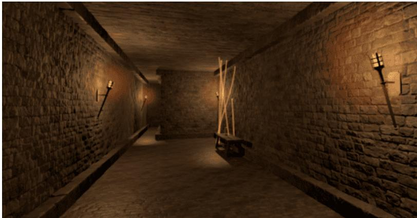  
Figure 12. Tunnel scene.

The initially designed scene was simple. The user had to walk in a straight line and activate the tasks in sequence. Since the impact was not strong enough, various obstacles were added to the route. These obstacles consist of supplementary walls to limit the user's moving space. Throughout the scene, there is one sequence of 10 tasks. In the photo task, the user has to take a picture of a statue. In the pickup task, the user is asked to collect candles. A scene with a labyrinth of rooms (Figure 13) was designed in order to have a new exposure scenario with a higher level of difficulty. The atmosphere and the visual elements are similar to those in the tunnel. The difference lies in the way the scene is structured. The user starts the scenario in a large room. They must follow the tasks that will take them through rooms of different sizes. Although the area of the rooms gradually decreases, the widths and lengths of the rooms vary randomly.

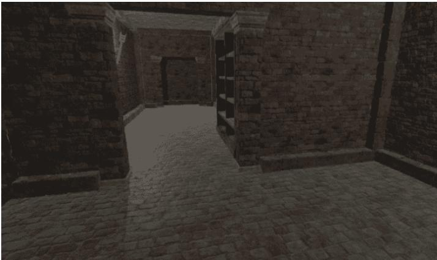  
Figure 13. Labyrinth of rooms.

Of the eight existing interconnected rooms, the last three rooms are the narrowest. At the end of the scene, the user is confined in a small room that can accommodate only one person. The cave scenario (Figure 14) contains four scenes: three scenes in different areas of a cave and one scene in an open, relaxing space. By progressing from one scene to another, the player can notice an increase in the game's difficulty level. Initially, the height of the cave is three times the height of the player, but it gradually decreases, reaching a unity ratio. In this way, the intensity of the patient's emotions increases as the distance between the ceiling and the floor of the cave decreases.

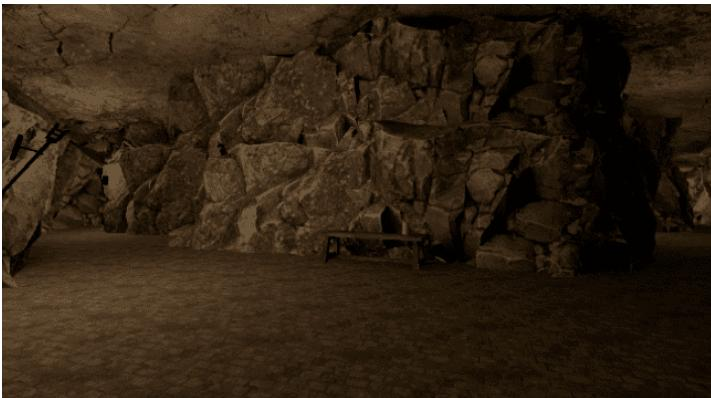  
Figure 14. Cave.

The player starts at the right end of the cave and is on a mission to find the portal to the next level. The portal is randomly placed at one end of the cave. The portal is represented in the scene by a wooden cabin. The player has to open the door and enter the cabin. To advance to the next level, it is necessary to stand for 15 seconds in the cabin with the door closed. Along the route, the player can collect crystals of various colors: blue, red, or white. To encourage the exploration of the entire scene, some of the crystals were placed in harderto-reach places, such as behind clusters of stalactites and stalagmites that the player needs to sneak through. The number of objects collected is used to calculate a final game score. Animals (bats) and specific objects (skeletons or burning barrels) were added to the scene. If the player approaches a group of bats, it will trigger them to move. They will fly and land on the ceiling again, at a relatively short distance from their original position.

# 3.2.4. Virtual Environment for Fear of Public Speaking Therapy

In the environment for glossophobia therapy, the user is placed in a virtual room and has to give a short presentation. The user or the therapist is able to configure the scene, run it, and receive in-session analysis and post-session analysis. Three room types and five presets for room crowding and audience distribution are provided. The user and the psychotherapist can visualize statistics about the performance in real time. The environment for treating fear of public speaking contains the following features: √ A module for setting up the scene (Figure 15); A module for running the scene; • Immersing the user within the previously chosen and configured scene; • Speaking freely or presenting a topic within the VR application; Monitoring immersion factors; Real-time calculation of the degree of attention of each person in the virtual audience; Numerical display and color indicators of the attention degree of each person in the virtual audience; Animations corresponding to the calculated degree of attention. In-session analysis; Post-session analysis.

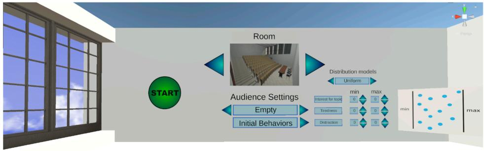  
Figure 15. Module for setting up the scene.

The scene setup allows the user/psychotherapist to select the following aspects: type of room, audience settings, distribution of the audience, and initial behavior of the audience (Figure 15). By pressing the Initial Behaviors button, the submenu for configuring the initial behavior of the audience will be opened, setting the factors and distribution type. The three personality factors are "Interest in the topic", "Tiredness", and "Distraction". The distribution is either uniform (with minimum and maximum parameters) or Gaussian (minimum, maximum, and sigma parameters—or distribution height). There are three types of rooms: • Small room (interview room)—maximum 4 seats; • Medium-sized room (lecture hall)—maximum 27 seats; Large room (amphitheater)—maximum 124 seats (Figure 16). There are five predefined settings for populating the rooms. The percentages represent how many seats are occupied by the generated audience. • Empty room $( 0 \% )$ ; • Small audience size $( 2 5 \% )$ ; • Average audience size $( 5 0 \% )$ • Large audience size $( 7 5 \% )$ ; Full room $( 1 0 0 \% )$ .

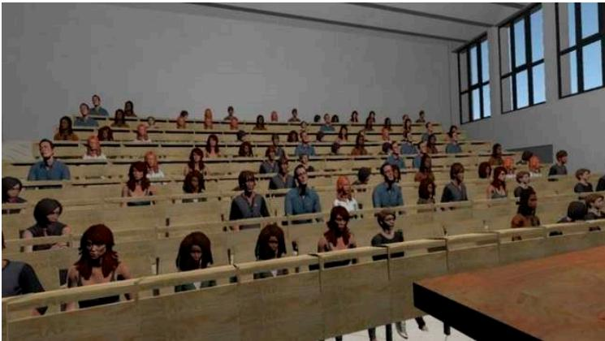  
Figure 16. Amphitheater.

A session requires the following steps: Placing the user within a chosen and previously configured scene;   
Speaking freely or presenting a topic within the VR exposure scenario (Figure 17);

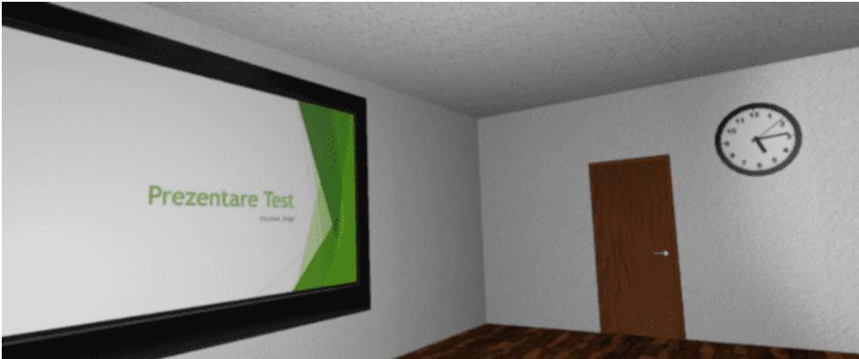  
Figure 17. Presentation scene.

During the presentation, the system monitors the factors that contribute to the audience's interest, calculates the degree of attention (cumulative score) for each virtual person, displays this degree numerically and through color indicators, and performs animations of the virtual audience corresponding to their degree of attention. There are two types of monitoring factors. The audience factors presented previously (Interest in the topic, Tiredness, and Distraction), which can be configured initially, and user factors. The user factors, which are detailed below, directly influence audience factors. The first group of user factors comprises spatiality factors: • Position relative to the audience—calculated by measuring the distance between the presenter and each person in the audience; • Hand movement—the total length of the hands' movement trajectories over a defined time interval (for example, the last 10 s); • Gaze Direction—the direction the presenter is looking at affects the audience factors based on how far each person in the audience is from the center of the presenter's field of view. This applies only to the people in the audience who are located within the angle of attention. The angle of attention is centered in the presenter's gaze direction in the virtual environment and has a preset aperture (for example, 60 degrees). The attention factor is calculated according to the angle between the direction of the presenter's gaze and the direction of the person in the audience (the segment connecting the presenter's position to the person's position) (Figure 18).

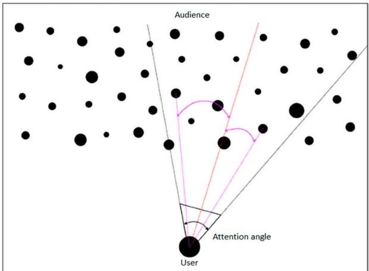  
Figure 18. Attention angle.

The second group of user factors encompasses voice factors: Voice volume—during the session, the decibel level recorded by the microphone is measured, and depending on a chosen parameter, the presenter has to adjust the voice volume so that everyone in the audience can hear what the presenter is saying. In addition, the presenter's score will be adversely affected if there are too large or too frequent fluctuations in the voice volume.   
Speech rate—the number of words the presenter speaks is measured throughout the session and averaged to show the number of words per minute. This is calculated based on the number of words generated using the speech-to-text algorithm (conversion performed using Microsoft Azure Services [37]).   
Pauses between words—during the session, the duration of time when the presenter is not speaking, i.e., no sound is recorded by the microphone, is measured. The degrees of fluency and monotony are calculated based on various empirical rules. The feedback presented to the user in real time, based on the attention score calculated for each person in the audience and using the factors presented above, is visualized through the following features: • Various animations attributed to the people in the audience; Numerical values and color codes (optionally displayed and can be activated by pressing a button on the controller). Other results, such as the duration of the session, the current average attention score, the result of the speech-to-text algorithm, etc., can be displayed informatively. The user is shown statistics in real time about their performance. Statistics such as general audience interest level, heart rate, voice volume, and rhythm are displayed behind the classroom (or any room selected) for the presenter to visualize while facing the audience. Data are provided as numerical values (relevant to each of the factors) as well as with a brief explanation and color to indicate the level the user is currently at—green, yellow, or red (Figure 19). Post-session analysis consists of information about the presenter's performance during the session: C Plots for evaluating all the factors mentioned during the session; Comparative data with previous sessions in which the user participated (history/ evolution).

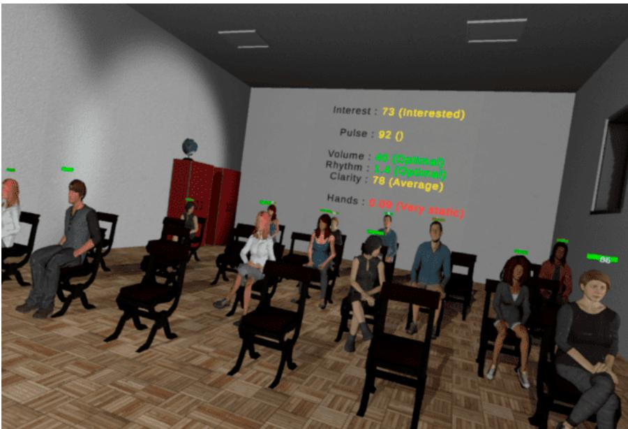  
Figure 19. Performance statistics in real time.

3.3. Technologies and Performance Evaluation For developing the virtual environments, we used the following technologies: • Unity 3D [38]—a graphics engine with support for virtual reality; SteamVR plugin [39]—an extension for Unity 3D; • Adobe Fuse [40]—used for building the 3D models of the audience;   
√ Adobe Mixamo [41]—an application used for adding animations to 3D models. With Adobe Mixamo, we rendered the various states of people in the audience, such as "Interested" or "Not interested"; Microsoft Azure Speech to Text [42]—an application for analyzing the voice recorded with the microphone to generate text. The text is consequently analyzed to obtain statistics regarding speech rate and pauses between words. The performance of the virtual environments was tested by recording the scene's update and processing time at the frame level. To guarantee performance stability, the processing time should not fall below a value of 33 milliseconds per frame, which corresponds to a frequency of 30 frames per second. For acrophobia and claustrophobia therapy, the 3D environments were designed to run on the Oculus Quest 2 all-in-one HMD system. Performance tests were carried out on the Oculus Quest 2 all-in-one HMD system with the following configuration: • Processor—Qualcomm Snapdragon XR2 7 nm; • Memory—6 GB—DDR5; • Video card—Adreno $6 5 0 \times 7 \mathrm { n m }$ • Storage—256 GB; • Display refresh rate— $- 7 2 \mathrm { H z } , 9 0 \mathrm { H z } , 1 2 0 \mathrm { H z } ;$ √ Resolution— $1 8 3 2 \times 1 9 2 0$ (per eye). The virtual environment can also run on a laptop/desktop personal computer using an HMD VR device. The VR desktop system on which the performance tests were performed has the following configuration: • Processor—Ryzen $7 3 , 7 0 0 \times 3 . 6 \mathrm { G H z } ;$ • Memory—32 GB—DDR4 3200 MHz; Video card: 1060 GTX—6 GB. The performance results are presented in Table 1.

Table 1. Performance results.   

<table><tr><td rowspan="2">Scene</td><td colspan="4">Test Performance (fps)</td></tr><tr><td colspan="2">Oculus Quest 2</td><td colspan="2">Desktop System</td></tr><tr><td></td><td>Minimum Value</td><td>Average Value</td><td>Minimum Value</td><td>Average Value</td></tr><tr><td>Main menu</td><td>60</td><td>72</td><td>74</td><td>119</td></tr><tr><td>Tutorial scene</td><td>55</td><td>60</td><td>71</td><td>120</td></tr><tr><td>Acrophobia—natural environment</td><td>30</td><td>35</td><td>60</td><td>86</td></tr><tr><td>Acrophobia—urban environment</td><td>35</td><td>40</td><td>68</td><td>90</td></tr><tr><td>Claustrophobia—tunnel</td><td>57</td><td>60</td><td>74</td><td>114</td></tr><tr><td>Claustrophobia—cave</td><td>58</td><td>60</td><td>70</td><td>105</td></tr><tr><td>Interview scenario</td><td>-</td><td>-</td><td>87</td><td>115</td></tr><tr><td>Classroom scenario</td><td></td><td></td><td>98</td><td>117</td></tr><tr><td>Amphitheater scenario</td><td></td><td></td><td>64</td><td>91</td></tr></table>

As can be seen from the table above, the minimum and average performance values are adequate for the safe running of the VR environments, without generating a state of dizziness in the patients caused by a too-low visual information update rate. Microsoft Azure Speech to Text (or Speech Recognition) enables the real-time transcription of audio sources into text. The service is trained using Microsoft's proprietary data and is offered as a cloud service, running on Microsoft's servers. Azure Speech to Text was integrated into the application for fear of public speaking therapy. The words that the user speaks during the application are processed with this platform. A request is made to the server (in the cloud) to obtain the text based on the audio stream generated by the user when speaking. The processing occurs in real time, and the obtained result is a text that is later processed to gather statistics such as speech rate, speech clarity, etc. Azure Speech to Text has several languages available, and the one chosen for the purpose of our application is English. The performance of Azure Speech to Text is very good, achieving more than $9 8 \%$ accuracy in the detection of spoken words. The duration of the requests to the server is a maximum of one second, and the duration of the text analysis until receiving the final result is also a maximum of one second. In conclusion, Azure Speech to Text performs well, and according to the tests carried out, it keeps up with the pace of the phrases and sentences spoken by the user within the application to provide results in real time.

# 3.4. Biofeedback Integrated in the Virtual Environment

During therapy sessions, visual biofeedback is offered directly to the patient on the HMD, as well as to the therapist via the control panel. In addition, for natural environments, a visual biofeedback module directly integrated into the properties of the environment was developed. Various properties of the environment can be modified. Thus, depending on the HR and EDA parameters, the color of the ambient light, the predominant color of the sky, and the density of clouds in the sky and their color change. In the left image in Figure 20, the sky is clear, and there are no clouds, indicating that the user is relaxed. In the middle, the darker sky and the clouds signal that the user tends to become anxious, while in the image from the right, the user is very anxious, and this emotional state is visualized with the purple sky and clouds. The model based on modifications of the surroundings ensures immersion and may encourage the patient to maintain an emotional state corresponding to a reduced level of anxiety.

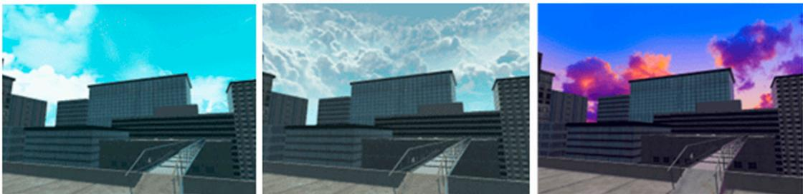  
Figure 20. Biofeedback integrated into the scene's elements.

# 3.5. Signaling Difficult Moments

Difficult moments for the patient can be identified with a high degree of confidence. One of the initial strategies for signaling difficult moments and user support was using a virtual therapist to assist the patient with recommendations. This approach had encouraging preliminary experimental results [43]. Following in-depth analysis and feedback from the therapists involved in the project, it was decided to adjust this functionality in the implementation, in the form of an animated virtual companion that can accompany the user permanently in the virtual environments and can also be hidden on demand or displayed automatically when needed. This approach was considered to have many more advantages, by both the development team and therapists, for the following reasons:

For people with severe forms of phobia, the intervention of a real therapist is preferred, because they have the knowledge to adequately intervene in case of an excessive response from the patient and orchestrate the exposure therapy according to the patient's emotional state. The virtual companion is effective, both for patients with severe phobias (treated in the clinic) and for users with mild phobias (treated autonomously at home). It provides simple, general advice (it reminds of generic or therapist-selected relaxation methods) and proposes the presentation of supporting elements when this may be necessary for the user. • The virtual companion will have a beneficial psychological effect, removing the sense of isolation felt by some users in virtual environments, distracting from the phobic stimulus if necessary, and encouraging the user in difficult moments or congratulating them on achievements. The virtual companion is an extremely attractive concept for young users, who are familiar with this kind of companion from video games. In Figure 21, we present two virtual companions—an eagle and a fox.

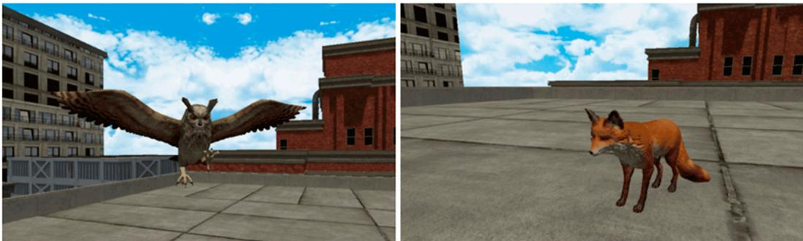  
Figure 21. Virtual companions.

When the system detects a critical moment, the user is alerted and has the possibility to open the menu with support elements for relaxation (Figure 22). Within this menu, the user finds a series of relaxing songs and 360 images or videos. Also, the AI biometric information monitoring system can automatically open the support panel or even terminate the session when the biometric information values exceed the critical threshold for a period of time.

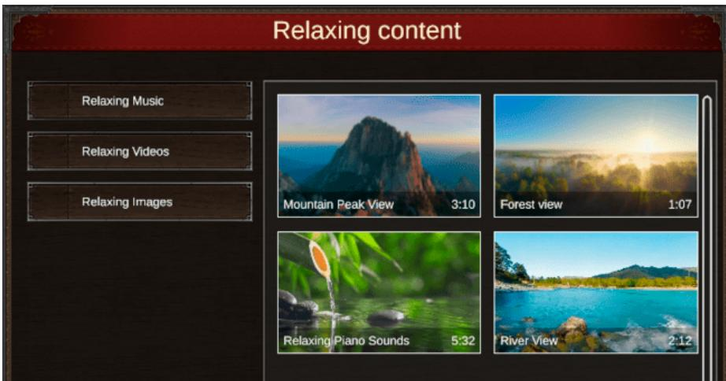  
Figure 22. Menu with support elements for relaxation.

# 3.6. Dynamic Adaptation of the Virtual Environment

The dynamic adaptation of the 3D environment allows for gradual exposure to fearinducing elements. This adaptation can be automatically initiated by the system (based on automatic performance evaluations and the identification of difficult moments) as well as by the therapist or patient. Acrophobia scenes have elements that can be configured according to the patient's fear level. For example, bridges can be modified: The grating the user walks on can be replaced with a metal panel so the user can no longer see what is below, or it can be replaced with glass. The metal sidebars can be completely removed or replaced with thicker bars or walls of various heights. Similar modifications can be made for the elevator or the platforms attached to the edge of the terraces. In the case of claustrophobic scenes, the dynamic adaptation consists of automatically changing the degree of illumination of the scene. At the end of a scene, based on the feedback provided by the patient and the analysis of biometric information, a new scene with an appropriate level of difficulty is recommended.

# 3.7. The Control Panel

The control panel is a separate application of the PhoVR system, used for patient management and therapy session control. The purpose of the application is to provide an easy-to-use interface for the staff of psychological offices to interface with the PhoVR system. It was developed with the Electron.js platform using HTML5 technologies. During the development, we approached object-relational mapping [44], relational databases that manage data integrity [45], and the Scrum software due to the team's high level of cohesion and communication with end users [46]. The control panel offers a series of essential functionalities such as the following features: Administration by using a therapist account; • Patient management; Patient profile configuration (including clinical profile); Recording therapy sessions and saving them in the cloud; Displaying patients' therapy history (Figure 23); Visualization of the results of therapy sessions with the possibility to add comments/notes/scores/information about their progress (Figure 24); Visualization of patient progress (easy-to-interpret graphs); Monitoring patients' therapy sessions through live screen-casting from the VR device and visualization of biometric data in real time (Figures 25 and 26); Session recordings' playback (Figure 27).

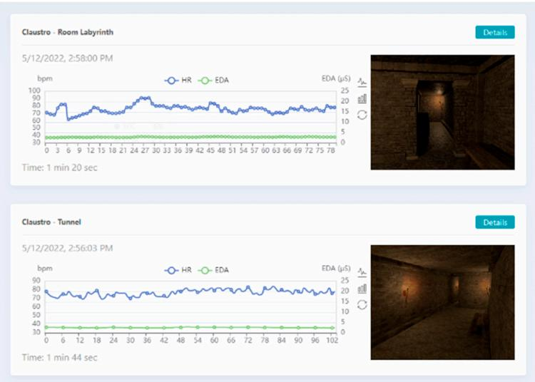  
Figure 23. Session history.

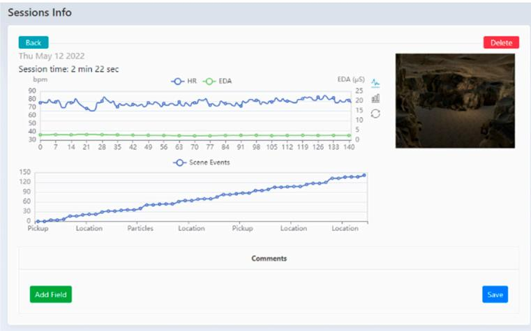  
Figure 24. Detailed view of a session.

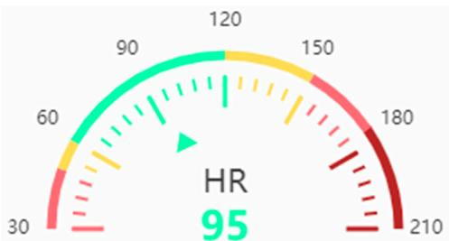  
Figure 25. Graphic representation of heart rate data.

The therapist has access to the list of patients using the PhoVR system. They are added through the patient management page within the control panel. For each patient, the therapist can define and edit a clinical profile sheet. The clinical profile does not have a predefined structure and is based on a series of simple entries with a title/description that can be added/edited later in the editing interface. Thus, the system offers therapists the flexibility to structure and generate the medical profile of each patient in the way they want or need.

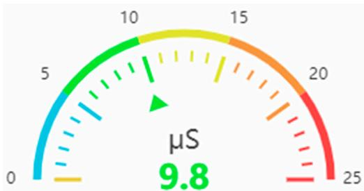  
Figure 26. Graphic representation of electrodermal activity data.

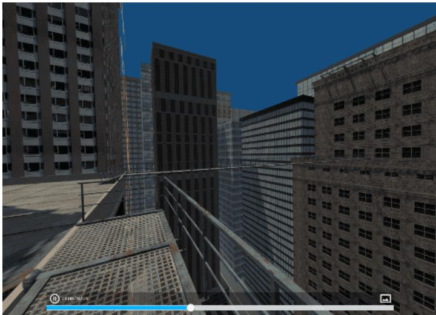  
Figure 27. Session playback.

For monitoring the therapy sessions, the control panel has the following functionalities: • The possibility to watch in real time what the patient sees in VR; • Visualization of biometric data and statistics; Watching the execution of tasks for each session level; The possibility of recording special sessions only with biometric data monitoring without using the virtual environments (videos/images the therapist selects that can be viewed by the patient on the HMD). Therapy sessions are recorded by saving the information and actions performed by each individual patient. Sessions' playback is carried out using a desktop application similar to the one on the HMD device. Thus, the saved information is used to reconstruct the scene and the actions performed by the patient in the corresponding session. For quick access and easy control of the visualization, the possibility of scroling/positioning at different moments of time in the recordings using a time control bar was implemented. To validate the technical capabilities, all the functionalities offered by the control panel were tested, including the following features: Administration by using a therapist account, which was tested by generating a therapist account and through authentication;   
Patient management through the possibility of adding and deleting patients;   
Patient profile configuration (including clinical profile) through the possibility of modifying the personal and clinical data of a patient;   
Proper communication with the PhoVR hardware devices by checking the WebSocket connection with the two systems (Oculus Quest 2 and HMD connected to PC) (Figure 28);   
Monitoring patient therapy sessions (real-time communication) using a live view from the VR device and biometric data visualization in real time (Figure 29); • Recording therapy sessions and saving their data in the cloud, visualizing a patient's session history; • Viewing a therapy session with the possibility of adding comments/grades/scores/ information about its progress;   
C Displaying recordings of the therapy sessions.

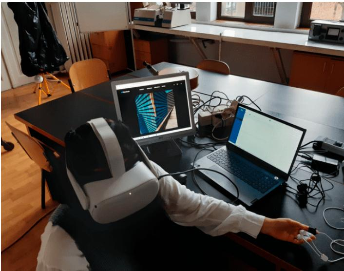  
Figure 28. HMD connected to a laptop computer.

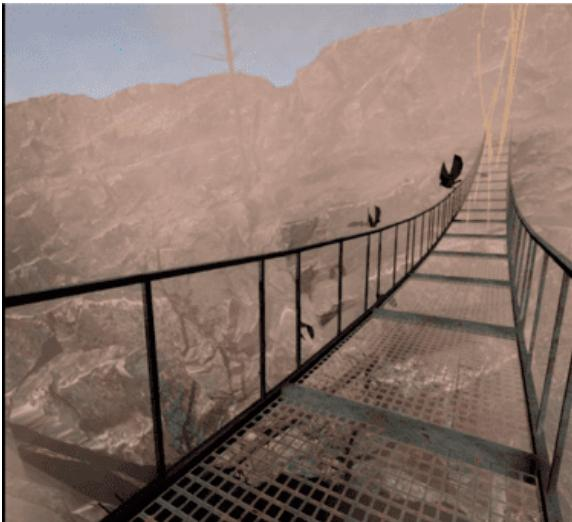  
Figure 29. Monitoring patient therapy sessions—live view from the VR device.

# 4. Testing the PhoVR System

For testing the system using human subjects, we first considered obtaining an ethics approval that would protect the rights and safety of the research participants. As the tests were carried out within the Faculty of Biology of the University of Bucharest (partner in the project), the application for obtaining the ethics approval and the consent form were submitted to the University of Bucharest Ethics Committee. Both psychotherapists and subjects with different degrees of anxiety participated in the tests. The purpose of the testing procedures was to evaluate the system's functionality in terms of the following aspects: • To evaluate the scenarios' level of realism and their therapeutic efficiency; − To ealuate the facilities provided to the psychotherapists or patent and therapy session management; To obtain suggestions and comments for future system improvement. All tests were carried out under realistic conditions, with users undergoing only brief training, followed by using the prototype fully autonomously, similar to real operating situations. During the tests, indicators related to the performance of the users (the degree of mastery of phobic reactions, the quality of public presentations, etc.) were collected automatically. Also, feedback was systematically collected from users, post-use, regarding the efficiency, usability, attractiveness, and ergonomics of the system prototype. The therapeutic effectiveness of the system will be evaluated in a quantitative study of patients' progress over a long period of therapy.

# 4.1. The Testing Procedure

In order to validate the VR system for acrophobia and claustrophobia therapy, seven psychotherapists agreed to participate in the test sessions. The tests were carried out in the Anthropology and Ethology Laboratory of the University of Bucharest, Faculty of Biology. Each psychotherapist who tested the PhoVR system passed training during which the system's functionalities and modules were explained, including the following features: • The control panel for patient and therapy session management; The presentation of the VR equipment and a training session on how to install and use it; The presentation of the biometric data acquisition device and a training session on how to use it A brief presentation of the testing scenarios; The testing procedure with psychotherapy specialists consisted of three main stages: testing the VR system for acrophobia and claustrophobia therapy; testing the public speaking training system; and system evaluations.

At first, each psychotherapist tested the system as a patient, in order to evaluate the therapy scenarios and learn how to interact with the system (Figure 30). For this, the project implementation team provided assistance throughout the testing period. In a later stage, also under the guidance of the project implementation team, the psychotherapists used the system with 19 subjects with different degrees of anxiety (4 male, average ag ${ \bf e } = 2 0 . 2 5$ $( + / - 0 . 9 6 )$ ; 15 female, average age $= 1 9 . 8 6$ $\left( + / - 0 . 9 5 \right) )$ not diagnosed with acrophobia or claustrophobia. The exclusion criteria for recruiting the participants were (1) disorders that can mimic or exacerbate anxiety symptoms, such as thyroid disorders, epilepsy, or traumatic brain injury, and (2) individuals who are currently taking substances or medications that could influence anxiety symptoms (e.g., alcohol, benzodiazepines, antidepressants, or antipsychotics).

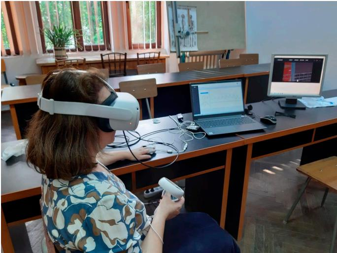  
Figure 30. Psychotherapist testing the system.

Each subject who tested the PhoVR system passed through the following steps: • Filling in the STAI questionnaire; • The presentation of the VR equipment; • The presentation of the biometric data acquisition device; • A short training session on how to navigate through the scenes and perform the required tasks; A brief presentation of the testing scenarios. The procedure for testing the system functionalities consisted of three main stages: • A test of the VR system for acrophobia and claustrophobia therapy; A test of the public speaking therapy system; System evaluations by filling in the evaluation questionnaire. The public speaking testing session involved the participation of four subjects and was conducted under the supervision of a specialized therapist (Figure 31). The protocol consisted of giving a presentation on a topic familiar to the participants (e.g., the anatomy of the spine). The presentation file was provided to the subjects one day before the testing session to allow them to prepare.

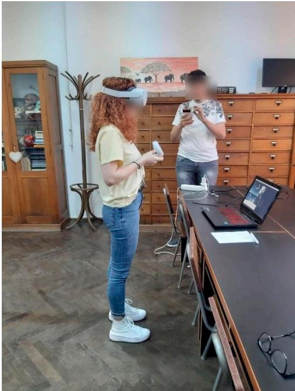  
Figure 31. Public speaking testing session.

Before the start of the session, the supervising psychologist previewed the three vilable (as, hithete, nintevidiffent c settings. Upon their suggestion, a classroom with an average level of seat occupancy $( 5 0 \% )$ was chosen as a common scenario. Each participant passed through the exposure session twice, with a 10-minute break between presentations. The average duration of a presentation was 5 min. Upon the suggestion of the psychologists and with their support, in order to identify the baseline degree of anxiety with which the study participants should begin the therapy session, The State—Trait Anxiety Inventory (STAI), a standardized and validated initial anxiety test, was applied to the subjects. The State—Trait Anxiety Inventory (STAI) is an instrument to assess anxiety as a state and as a trait in terms of the presence of anxiety symptoms, the severity of these symptoms at the time, predispositions, and the tendency toward anxiety. State anxiety refers to subjective feelings, as well as the state and the way the person feels; it is a state at a specific moment. Measuring trait anxiety shows how the person feels in general, revealing general aspects and traits that are relatively stable over time [47]. Initially, STAI was developed for research purposes to assess anxiety in adults from e-cnal tn  u  tol o et chiatry, surgery, and medical clinics) [48]. STAI comprises 40 items, 20 for each subscale (state and trait), scored on a 4-point Likert scale: 1—not at all, 2—somewhat, 3—moderately, and 4—very much [49]. The anxiety rating is calculated considering the raw scores and the percentile corresponding to each scale, by referring to the average. Scores above the mean are considered high scores and indicate the presence of state anxiety (S-Anxiety) and trait anxiety (TAnxiety). Scores below the mean are low scores, indicating no anxiety. An additional assessment of the virtual environments' ability to reproduce stressful conditions caused by exposure to phobic stimuli was carried out by analyzing the biophysical signal recordings from the test sessions. The evaluation was performed by comparing the values of the tonic component of the electrodermal activity signal (EDA-T) and the heart rate (HR) during the training sessions (considered free of phobic stimuli) and four virtual environments: city and bridge (acrophobia) as well as tunnel and labyrinth (claustrophobia). Within each test session, the average values of the EDA-T and HR signals were calculated using a sliding window with a width of $1 0 \mathrm s$ and a displacement step of $5 \thinspace s$ . Since during the sessions, it was found that the PPG signal used to determine the HR was strongly affected by the movements of the subjects, sessions were chosen based on the quality of the PPG signals. The criterion for validating a session was the presence of a PPG signal amplitude greater than a threshold value at least $9 0 \%$ of the time. The threshold value was determined by visually inspecting the PPG signal and the heart rate extracted from it and observing the minimum amplitude for which the HR calculation algorithm correctly identified the interval between two pulses. After analyzing the quality of the PPG signal, 66 of the 76 recorded sessions were selected. A one-way ANOVA was conducted to compare the EDA-T and HR values as dependent variables and environment type as the independent variable.

The results obtained for the EDA-T signal were MTraining $= 8 . 9 7$ $( \pm 6 . 2 3 )$ $\mu \mathrm { S } ;$ MCity $= 8 . 5 3$ $( \pm 6 . 8 6 ) \mu S ;$ MBridge $= 1 1 . 5 2$ $( \pm 6 . 7 6 )$ $\mu \mathrm { S } ;$ MTunnel $= 1 1 . 7 0 \ ( \pm 6 . 7 7 ) \ \mu S ;$ and MLabyrinth $= 8 . 1 0$ $( \pm 2 . 8 9 $ ) $\mu  { S }$ Unifactorial analysis revealed a significant difference between these values $\operatorname { F } ( 5 . 1 8 7 1 ) = 1 6 . 7 2 , p < 0 . 0 0 1$ .Post hoc Bonferroni-corrected tests were used to compare all pairs of virtual environments. The significant mean differences (MDs) were recorded between training and bridge $( \mathrm { M D } = - 2 . 5 5 \mu \mathrm { S } , p < 0 . 0 0 1 )$ , training and tunnel $( \mathrm { M D } = - 2 . 7 2 \mu \mathrm { S } , p < 0 . 0 0 1 )$ , as well as between city and bridge $( \mathrm { M D } = - 2 . 9 9 \mu \mathrm { S } , p < 0 . 0 0 1 )$ , city and tunnel $( \mathrm { M D } = - 3 . 1 7 \mu \mathrm { S } , p < 0 . 0 0 1 )$ , bridge and labyrinth $( \mathrm { M D } = + 3 . 4 2 \ \mu S ,$ $p = 0 . 0 0 2 ,$ and tunnel and labyrinth $( \mathrm { M D } = + 3 . 6 0 ~ \mu S ,$ $p < 0 . 0 0 1$ .

The results obtained for the HR signal were MTraining $= 8 3 . 5 2 $ $( \pm 1 0 . 5 6 )$ bpm; MCity $= 8 5 . 3 9$ $( \pm 9 . 7 8 )$ bpm; MBridge $= 8 2 . 7 3 $ $( \pm 9 . 7 7 )$ bpm; MTunnel $= 8 2 . 9 0 $ $( \pm 1 0 . 3 8 )$ bpm; and MLabyrinth $= 8 3 . 7 8 $ $( \pm 5 . 3 6 )$ bpm. Unifactorial analysis revealed a significant difference between these values $\operatorname { F } ( 5 . 1 8 7 1 ) = 4 . 8 1$ , $p < 0 . 0 0 1$ . Post hoc Bonferronicorrected tests were used to compare all pairs of virtual environments. The significant mean differences (MDs) were recorded between training and city $( \mathrm { M D } = - 1 . 8 7 \mathrm { p b m } ,$ mboxemphp $= 0 . 0 1 9 ,$ , as well as between city and bridge $( \mathrm { M D } = + 2 . 6 6$ pbm, $p = 0 . 0 1 7 $ and city and tunnel $( \mathrm { M D } = + 2 . 4 9 \mathrm { p b m } , p = 0 . 0 0 2 )$ . Three out of the four virtual environments (city, bridge, and tunnel) were found to have a significant potential to induce stress, as confirmed by the high levels of EDA-T and HR. It is noteworthy that none of the subjects was diagnosed with acrophobia or claustrophobia, which led to a lower response to the phobic stimuli present in the virtual environments.

# 4.2. Results

After applying the STAI questionnaire, we observed that most of the subjects, 16 out of the 19 participants, had high scores on the S-Anxiety scale (anxiety as a state). According to the interpretation instructions, increased scores on the S-Anxiety scale indicate a possible reaction in the case of exposure to situations considered dangerous from a physical point of view and to psychological stress, but it may decrease as a result of a therapeutic intervention. State anxiety is a "transient" anxiety, and it can be triggered and induced in an experiment or in everyday situations. Also, high scores were recorded in most subjects (16 out of the 19 participants) on the T-Anxiety scale (anxiety as a trait). This scale measures the stability of anxiety, that is, anxiety as a trait. High scores on this scale require a more complex evaluation because they can indicate depression. Comparing the scores of S-Anxiety (anxiety as a state) and T-Anxiety (anxiety as a trait), we obtained the following results: Most subjects (16 people) had both anxiety as a trait and anxiety as a state;   
One subject with a high score (58) on the T-Anxiety scale (anxiety as a trait) had an average score (40) on the S-Anxiety scale (anxiety as a state), which can be interpreted as good self-control;   
One subject with an average score on the T-Anxiety scale (38) had a high score (50) on the S-Anxiety scale, which indicates that some situations can have a strong emotional impact on this individual;   
One subject had average scores on both scales, which indicates a balance in terms of anxiety. Basd on these results, the psychotherapists selected the optimal virtual therapy scenario for each individual and performed one virtual therapy test session. At the end of the tests, the psychologists filled in a questionnaire that aimed to evaluate the level of realism of the therapy scenarios and their therapeutic efficiency, the facilities offered for patient and therapy session management, and they provided suggestions and comments to improve the system. None of the seven psychotherapists had ever used VR technology before in their therapy sessions. Six of them were inspired as a result of the experiment and expressed their desire to integrate VR technology occasionally in their current practice. Four out of the seven psychotherapists claimed that the control panel offers the functionalities necessary for patient and exposure session management, and three of them indicated that additional functionalities are necessary. All seven psychotherapists concluded that the biophysical data acquisition system is useful for monitoring the evolution of patients' emotional states. Achieving a high degree of realism is currently possible by generating the scenarios on a computer equipped with a powerful graphic card; however, the cost of the system would increase significantly. As a result, this option can be taken into consideration if the system is purchased by a clinical center that will later make it available to several psychotherapists. In the case of the session management module, the following additional functionalities identified by psychotherapists were mentioned: Comments from each session should be made available in a more centralized way at the end of the patient file; An analysis of the patient's progress; A preconfiguration module for psychologists with different levels depending on the progress of the patient; o Advanced search; Accessing past appointments. Four out of seven psychotherapists stated that the VR device and the biophysical data acquisition device do not affect the therapy process, while three psychotherapists indicated that they hinder the therapy procedure for certain patients. Five psychotherapists claimed that the exposure scenarios are a little artificial, but they are an accurate depiction of the real environment and adequate for therapy purposes. One psychotherapist indicated that the phobic stimuli are capable of triggering emotions just for patients suffering from severe phobias, and another psychotherapist stated that the phobic stimuli in VR are completely inefficient. One psychotherapist indicated that the PhoVR system is highly effective for phobia therapy, and another psychotherapist stated that it can be of real help, but improvements are needed. Five other psychotherapists considered the system useful for certain patients suffering from certain phobic pathologies. The psychotherapists identified the following weaknesses in the system: • More phobias could be addressed; • Familiarization with the system may take some time; • The difficulty of performing certain movements; The feeling of dizziness caused by the VR equipment. Various suggestions for improvement were made, including the following recommendations: • Addressing multiple phobias; • Working on the feeling of realism; • Greater freedom of movement with the left hand, perhaps with the body as well; • A longer virtual environment with more dispersed tasks; • Using real images from a natural environment; • Improvement from a visual qualitative point of view. As regards the modality of conducting the therapy scenarios, the psychologists requested to have control during the whole course of the therapy. Suggestions for further development involve exploiting other types of phobias as wellas increasing the number and types of scenarios. Both automatically collected performance indicators and post-use feedback validated the concept and utility of the system and indicated very high degrees of attractiveness, usability, and ergonomics, as presented above. Testing the PhoVR system for acrophobia and claustrophobia therapy is of interest to psychotherapists. In current practice, psychotherapists use imaging techniques because realrepresents an extremely useful alternative for increasing the efficiency of the therapy. In its current form, where the level of realism is limited by the technical possibilities of the autonomous VR equipment, PhoVR can be used for patients with more severe phobias, where even a less realistic phobic stimulus is able to trigger a significant phobic reaction. The majority of psychotherapists indicated that using the PhoVR system within a center that would provide access to its services is a more feasible option. The reason given was that the number of patients with phobias such as acrophobia and claustrophobia who come to the office for therapy is relatively small and thus does not justify the system's purchase. If the evolution of the virtual reality equipment market leads to a decrease in their price (possibly with an increase in performance), the purchase option for individual offices becomes feasible. Regarding the modality of conducting therapy scenarios, the psychologists requested the transfer of control over the course of the scenario from the automatic version to the psychotherapist-orchestrated psychotherapy. Social phobias, including the fear of speaking in public, send the patients more frequently to therapy because they involve situations that cannot be avoided in everyday life. After the tests, both the participants and psychotherapists provided positive feedback regarding the realism of the public speaking scenarios and the effectiveness of the therapy sessions. Also, on this occasion, the feasibility of using the PhoVR system in practice was analyzed both at the level of psychological offices and for individual therapy in the case of people with occupations that frequently require holding public lectures. As a general conclusion, the system has a high potential, given the fact that the psychotherapists showed interest in conducting therapy sessions and using it in practice.

# 5. Conclusions

PhoVR is a virtual reality exposure therapy system that contains realistic and immersive environments for acrophobia therapy (four scenarios), claustrophobia therapy (three scenarios), and glossophobia therapy (scenes configurable in terms of room size, audience size, and personality factors) with quests enriched with gamification elements. Integrated hardware ensures biophysical data acquisition (electrodermal activity and heart rate), and a proprietary algorithm classifies the physiological data in order to determine the level of anxiety and identify difficult moments for the patient. The system offers support in difficult moments through visual biofeedback, dynamic adaptation of the 3D environment, and a virtual companion. PhoVR features a control panel dedicated to therapists for managing patients and therapy sessions, automatic data collection, and advanced analysis tools. All components are integrated into a functional prototype that was used for evaluation and validation with phobic subjects and psychotherapists. The feedback from therapists and test subjects is very positive regarding the current concept and realization. The prototype includes all the functions mentioned above and has a high degree of ergonomics, very closely fulfilling the requirements of a final commercial product.

Following the tests performed with various subjects and the feedback collected from psychologists, new development opportunities were identified in order to expand the therapy offered by the PhoVR system. Agoraphobia and aerophobia have been identified as other types of phobias that can be targeted using PhoVR. One of the most important elements highlighted by the therapists is the usefulness of customizing the virtual environment. In this sense, as objectives for further development, the partners in this project will investigate the possibility of generating virtual environments specific to certain phobias, based on the descriptions of the therapist or patient. Analyzing patient performance and tracking their progress over time is one of the most important features offered by the PhoVR system. Currently, the control panel provides a visual analysis of the sessions, but this support can be improved with multiple plots and comparative analyses. For more versatility, we will investigate the possibility of configuring the patient's dashboard with statistics widgets and specific analyses that can be configured by psychotherapists. The scenes developed within the PhoVR project can be further optimized from the perspective of real-time playback performance. Within the project, only overall scene optimizations were carried out, but while running the scene, there may be moments that reduce the performance due to local complexity. Thus, a detailed analysis of the complexity of the scenes in each local task point will be considered in future research. If the local performance does not correspond to the established standards, solutions will be identified and local changes will be applied to solve them. Considering the desire to market the PhoVR system to individual users with mild-to-moderate phobias, the aim is to reduce the purchase cost of the system together with its accessories. One of the substantial costs of acquisition is the biometric data measurement hardware. Thus, the possibility of integrating some commercial devices (e.g., fitness trackers) will be investigated.

PhoVR is dedicated to the treatment of various psychological disorders, similar to the commercial systems described in [1115]. It also provides relaxation techniques, similar to those offered in C2Care [11], Amelia [12], and Virtually Better [14]. PhoVR features patient live monitoring, therapist orchestration, environment customization, and personalized interventions in real time, similar to C2Care [11], XRHealth [15], and Amelia [12]. However, in the case of PhoVR, the therapist does not have the possibility of embodying a person from the audience and talking to the patient as an interlocutor inside the environment, as is the case in C2Care [11]. This is an idea we will consider addressing in a future version of our system. PhoVR allows for the development of an individualized plan of care, constantly updated based on the patient's progress, similar to XRHealth [15]. The administrative panel is a common feature of PhoVR, C2Care [11], XRHealth [15], and Amelia [12]. The virtual companion from PhoVR is also encountered in the XRHealth system [15], where Luna, the virtual companion, is used for pain management and alleviation. The original aspects of PhoVR are gamified tasks, the tutorial scene, emotional assessment throughout the sessions, the biophysical data acquisition module, and the biofeedback integrated into the scene's elements. One limitation of the system is controller-based locomotion, which gives a feeling of security or control as the user holds something in their hand. Moreover, controller-based navigation increases motion sickness and reduces the sense of presence perceived. Another limitation is the fact that, in the case of fear of public speaking therapy, audience members can only change their behavior, but they cannot interact directly with the speaker, e.g., ask questions, initiate a dialogue, or respond to the questions asked by the speaker. In addition, the scenarios in the virtual environments are less varied and more predictable than in the real world. Thus, a wider range of scenarios and quests is needed. A library of preorchestrated scenes with randomized elements to keep the reused content unpredictable may provide a solution, especially for home-based therapy, where a virtual therapist can monitor the progress remotely. In this article, we delved into the technical aspects of the VR system and tested the system with volunteer subjects and psychotherapists to ensure its efficiency. The effectiveness of the system in therapy will be quantitatively evaluated by testing it on a large number of patients (people suffering from phobias and a control group), using various therapists with different backgrounds, in order to reduce the influence of their individual experiences. The study will be extended over a longer period of time because therapy is a gradual process that requires time. The outcome of this evaluation will be the focus of another article. Author Contributions: Conceptualization, A.M. and L.P.; methodology, L.P. and C.P.; software, V.A.; validation, N.J., A.M.A. and O.M.; formal analysis, C.P.; investigation, N.J.; resources, A.M.; data curation, C.P.; writing—original draft preparation, O.M.; writing—review and editing, O.M.; visualization, L.P.; supervision, F.M.; project administration, A.M.; funding acquisition, A.M. All authors have read and agreed to the published version of the manuscript. Funding: This work was supported by project TRAVEE (Virtual Therapist with Augmented Feedback for NemooRovey ho  n he Miny Rerh, onn Dgn, CCCDI-UEFISCDI, project number PN-III-P2-2.1-PTE-2021-0634, within PNCDI III. Institutional Review Board Statement: The study was conducted in accordance with the Declaration of Helsinki and approved by the Institutional Review Board (or Ethics Committee) of the University of Bucharest (protocol code number 28/18.06.2021) for studies involving humans. Informed Consent Statement: Informed consent was obtained from all subjects involved in the study. Conflicts of Interest: The authors declare no conflict of interest.

# References

1. UNNewsGloalerspeciveHutorAvailabnline:htts/esn.or/e/ory/022/06/112 acc 15 July 2023). 2. WorlHealtatioentaDisordevailablnlht/ho.ieoomcthet/etal disorders (accessed on 15 July 2023). 3. Heal int/publications/i/item/WHO-2019-nCoV-Sci_Brief-Mental_health-2022.1 (accessed on 15 July 2023). 4. Thao2a0o Tweets, and open research questions. Infect. Dis. Rep. 2022, 14, 855883. [CrossRef] 5. [CrossRef] [PubMed] 6. L obishoiaroZvailablenlhteryeico/is-hobs7 (accessed on 15 July 2023). 7. surprising-facts-about-our-biggest-fears/ (accessed on 15 July 2023). 8. 2021, 19, 184189. [CrossRef] [PubMed] 9. l 10. H   o rlraeeour heee ahoim 99515, 62 osRe [M] 11. C2Care. Available online: https:/ /www.c2.care/en/ (accessed on 15 July 2023). 12. Amelia. Available online: https:/ / ameliavirtualcare.com (accessed on 15 July 2023). 13. Virtual Reality Medical Center. Available online: https:/ /vrphobia.com/ (accessed on 15 July 2023).   
14.Virtually Better. Available online: https:/ /www.virtuallybetter.com/ (accessed on 15 July 2023). 15. XRHealth. Available online: https:/ /www.xr.health/ (accessed on 15 July 2023). 16. UK, 1011 November 2015. 17. CM.C l PsychNology J. 2008, 6, 203. 18. M.. AM. M. A.. uiaB.0 19. 162167. [CrossRef] 20. Ge [PubMed] 21. Los Angeles, CA, USA, 2022 September 2016; pp. 149155. 22. VH 23. Telecare 2016, 22, 215220. [CrossRef] [PubMed] 24. l Germany, 1822 March 2018. 25. . Cyberpsychol. Behav. 2006, 9, 627633. [CrossRef] [PubMed]   
81, 372378. [PubMed] 27. DIVE. Available online: https:/ /www.ri.se/sv?refdom $\equiv$ sics.se (accessed on 9 September 2023).   
Real. Multimed. Publ. Prof. 1998, 3, 318320. [CrossRef] 29. Stupar-Rutenfrans, S.; Ketelaars, L.E.H.; van Gisbergen, M.S. Beat the fear of public speaking: Mobile $3 6 0 ^ { \circ }$ video virtual reality [CrossRef] [PubMed] 30. ..   .R. engineers using virtual reality exposure therapy. Commun. Comput. Inf. Sci. 2017, 191202. [CrossRef] 31. H the 2016 HI Conference Extende Abstract on Human Factors inComputing Sstems, San Jose, CA, USA, 712Ma 2016; ACM: New York, NY, USA. 32. , Xi'an, China, 1013 June 2019. 33. Oculus Quest 2. Available online: https:/ /www.oculus.com/experiences/quest/ (accessed on 15 July 2023). 34. HTC Vive. Available online: https:/ /www.vive.com/us/ (accessed on 15 July 2023). 35. Valve Index. Available online: https:/ /www.valvesoftware.com/ro/index (accessed on 15 July 2023).   
3BTalino.Available online:https://www.pluxbiosignals.com/collections/bitalino (accesse on15 July203). 37. Microsoft Azure. Available online: https:/ /azure.microsoft.com/ (accessed on 15 July 2023). 38. Unity 3D. Available online: https:/ /unity.com/ (accessed on 15 July 2023). 39. Sui./o/lu (accessed on 15 July 2023). 40. Adobe Fuse. Available online: https:/ /www.adobe.com/wam/fuse.html (accessed on 15 July 2023). 41. Adobe Mixamo. Available online: https:/ /www.mixamo.com/#/ (accessed on 15 July 2023). 42. text (accessed on 15 July 2023). 43. o — l C Augmented Reality, Copenhagen, Denmark, 1924 July 2020; pp. 1225. 44. International Conference on Control Systems and Computer Science (CS), Bucharest, Romania, 2628 May 2021. 45. s e 2022), Denarau Island, Fiji, 810 December 2022; Publisher Springer Nature: Singapore, 2022; pp. 275288. 46. Ae I.ICa R.S.NeeM.La I.C.TC.BC.A.ve comparative analysis. UPB Sci. Bull. 2022, 83, 3. 47. JA depression scale-anxiety (HADS-A). Arthritis Care Res. 2011, 63, 467472. [CrossRef] 48. G GRJH.C.LS C.e lateralization of EEG during a stressful movie. Psychophysiology 1989, 26, 311320. [CrossRef] [PubMed] 49. A Ivey (orapte or leuls. Rv.CanViean.9 17403.