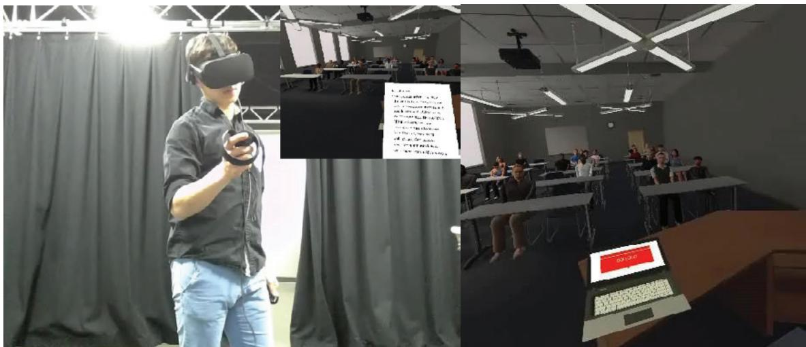
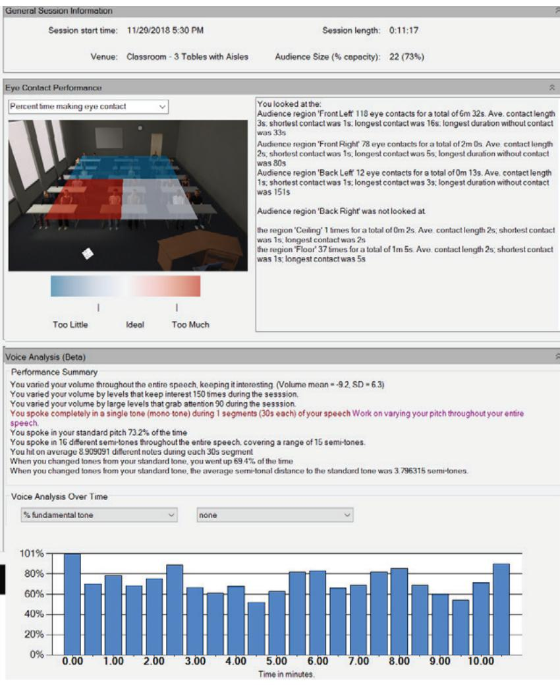

# Incorporating Virtual Reality Training in an Introductory Public Speaking Course

Kevin Kryston , Henry Goble , and Allison Eden 0 Keywords: instructional communication, virtual reality, publicspeaking, basic course, speech training, communication pedagogy Abstract: This study presents the results of two studies using a virtual reality(VR) public-speaking training simulation as an instructional aid in a basiccommunication courseResults from the first study suggest that VR practice was associated with higher subsequent speech delivery grades in the course compared to no practice. However, VR practice did not reduce public speaking anxiety (PSA). In a follow-up study, VR practice was compared with other forms of lab-based practice including in front of a mirror and a recorded video session. All forms of lab practice (VR, mirror, or video) were associated with higher speech grades than no practice, but there were no differences between lab-practice conditions in terms of outcomes. Results are discussed in terms of adopting and using virtual public-speaking simulations in large undergraduate public-speaking courses. Public speaking is the cornerstone of most communication departments across the country. Improving communication competence is a primary function of basic communication courses in higher education (Cohen, 1994; Morreale et al., 2016), and, in most cases, this means improving public speaking skills. Often, courses rely on techniques such as behavioral training, public speaking demonstrations and practice, and performance feedback to improve communication competence and decrease public speaking anxiety (PSA; Robinson, 1997). Yet, basic courses often cover these skills in large courses with multiple sections running at one time (Morreale et al. 2016). These structural forces shaping the basic course may lead to potential difficulties in providing meaningful practice and feedback opportunities for students to improve their skills, due to overcrowding in classes, lack of standardized feedback between teaching instructors, or intra-section differences in class makeup and audience responses.

  
FIGURE 1 Screenshot of Participant Giving Speech and the Virtual Environment.

One way to efficiently incorporate controlled practice sessions into the basic course may be by using virtual audiences to provide life-like and synchronous feedback to presenters as they practice. Several commercial products that simulate public speaking experiences are now available on the market. These virtual systems feature audiences made up of digital avatars that can respond to eye gaze, head movement, and vocalics with positive or negative reactions (Figure 1). Communication scholars have begun to investigate the utility of these systems for training public speaking and communication skills avset al. 2020;Frisby e al. 2020; LeFebvre et al. 2020;Vallade et al. 2020). However, the extent to which these systems improve student performance when incorporated into a basic public speaking course is not yet clear. Therefore, our central research question is to what extent VR public speaking can simulate, complement, or enhance effective speech practice in a basic communication course? In the following paper, we discuss basic communication course format and public speaking skill training, move on to a review of existing literature on VR for public speaking, and finally introduce two studies incorporating VR public speaking training into a basic communication course with a public speaking component.

# Effective Training for Public Speaking

Public speaking is historically the core of the communication discipline (Cohen, 1994). Over $6 0 \%$ of basic courses in communication teach public speaking, and public speaking is emphasized by $1 0 0 \%$ of 2-year schools and $8 8 . 6 \%$ of 4-year schools in basic communication courses (Morreale et al., 2016). According to the National Communication Association guide to becoming a competent speaker (Morreale et al., 2007), to become an effective public speaker, one must meet or exceed standards of basic competence across the following eight areas: (1) choosing a topic appropriately, (2) communicating a thesis/specific purpose, (3) providing appropriate supporting material, () using an effective organizational pattern, (usiganguag appropriately, () using vocal variety in rate, pitch, and intensity, (7) using approte pronunciation, grammar, and articulation, and (8) using physical (nonverbal) behaviors that support the verbal message. These eight competencies were derived from over 100 years of public speaking training, and similar training models have been adopted in public speaking courses around the world (e.g., the English-Speaking Union, 2019; Nishikawa-Van Eester, 2009). In general, the field of communication trains a variety of skills to enhance and improve these public speaking competencies in our core classes, such as practicing eye contact, nonverbal behavior, gestures, vocalics, delivery, speech writing, and recognizing feedback from audiences (Haynes, 1990). This type of skills-based training appears to positively influence presentation skills in both self-assessments and the assessments of skilled others (such as Toastmasters club members; Seibold et al., 1993).

Perhaps one of the best training mechanisms of the basic course is simply that it requires students to practice public speaking. In an empirical study, Pearson et al. (2006) showed that students' preparation and practice of speeches prior to delivery resulted in better assessments. Additionally, the amount (Menzel & Carrell, 1994) and type of practice prior to the presentation have been identifed as important influences on public speaking competence (Farris et al., 2013; Pearson et al., 2008; Smith & Frymier, 2006). The importance of practice can be seen in the most-used textbook of public speaking courses: Stephen Lucass The Art of Public Speaking (2015). This text emphasizes that practice is the most essential component in training competent speakers. Reflecting the importance of practice, in most basic courses, students are required to deliver between one to 10 speeches, with an average class requiring three per semester (Morreale et al., 2016). Targeted feedback also plays an important role in developing solid public-speaking skills One way that the basic course helps students to become better public speakers is through providing structured rubrics with clear expectations about rhetorical, verbal, and nonverbal components of their speeches (e.g. Schreiber et al. 2012). Bo0k (1985) argues that immediate (that is, directly following the spech) feedback can allow for audience reactions and inform the speaker of their strong performance areas and areas of improvement. One way to incorporate immediate feedback in a public speaking course is by recording students' speeches and require that they watch the recordings. In a meta-analysis of studies examining the role of recorded feedback in public speaking courses, Bourhis and Allen (1998) report that recording feedback improves skill acquisition, speech content, better recall of the speech, and more favorable course attitudes.

Additionally, the great majority of communication pedagogy in public speaking addresses the need to overcome and combat PSA and/or communication apprehension (CA), both of which negatively impact student's confidence and ability to speak publicly (Allen & Bourhis, 1996; Allen et al., 1989; Bodie, 2010; McCroskey, 1982; Robinson, 1997). CA is a broad term referring to an individual's fear of anxiety associated with either real or anticipated communication with another person or persons (McCroskey, 1982). Notably, practice is one of the most effective techniques to reduce communication apprehension (Allen et al., 1989; Bodie, 2010). More closely related to PSA, fear of negative evaluation (FNE; Watson & Friend, 1969) is specific to apprehension about other's evaluations, distress over possible negative evaluations, and an expectation that one would be evaluated negatively. FNE and CA are closely related and may be underlying causes of people's fear of public speaking. In sum, practice, feedback, and anxiety reduction are the three most important concerns in training effective public speaking. Additionally, idiomatic variables such as grade point average, previous public speaking experience (Pearson & Child, 2008; Rubin et al., 1990), and biological sex (Pearson et al., 2008) all influence student grades on public speaking assignments. Yet, given the inflexibility of these traits, in the current paper, we focus on the role of virtual reality platforms in providing (a) increased and systematic practice opportunities, (b) relevant feedback for speaker improvement, and (c) reduction in CA and FNE.

# Virtual Reality and Public Speaking

VR allows students a unique opportunity to rehearse speeches in virtual environments that emulate future public speaking situations. In these environments, audiences can be simulated with 360-degree vi (areordinctual student  lvecasm; eVallad al 0)rusig sotwaha generates a virtual audience (animated humanlike avatars in digitally created classrooms; e.g. Davis et al 2020). Since people are urged to respond to nonhuman entities (e.g., television, computers, avatars) similarly to human entities during real-world interactions (see Computers as Social Actors paradigm; Reeves & Nass, 1996), practice in VR in front of a 360-video or virtual audience should simulate practicing in face-to-face settings.

Supporting this assertion, speaking in front of a virtual audience can induce anxiety for high speech apprehensive speakers (Kothgassner et al., 2016; Vanni et al., 2013), indicating that virtual presentations functionally emulate real-world speaking experiences. Similarly, Pertaub et al. (2002) and Slater et al. (2006) examined the subjective and psychophysiological effects on the speaker; phobic participants showed higher anxiety and elevated heart rate before a virtual audience. This effect was particularly strong for participants with high FNE. Given the ability of VR to induce a realistic sensation of speaking in front of a crowd, early research in VR focused on its efficacy as a tool to desensitize highly reactive spekers vi exposure therapy . Harris et al. 200; Pertaub et al00;Vanniet al 01.Overall, results suggest that VR can reduce PSA when combined with exposure therapy (Vanni et al., 2013). However, the extent to which VR practice can mitigate anxiety in a classroom setting is still unknown; some research found VR practice decreased anxiety (LeFebvre et al., 2020), and other research showed VR practice increased speech anxiety (Davis et al., 2020).

Other work has examined VR as a public-speaking pedagogical aid via in-platform feedback. For example, Chollet et al. (2015) used a virtual environment to test the effect of visual, verbal, or audience nonverbal feedback on speaker performance and found that interactive and responsive nonverbal feedback conditions were the most engaging for speakers, and speakers practicing with the interactive audience were most likely to desire to repeat the experience. Many VR public-speaking programs passively collect behaviors like eye gaze, haptics, and vocalics, and provide feedback to speakers based on these metrics, which have been correlated with speaker performance (e.g., Batrinca et al., 2013). Thus, feedback provided by VR software could be a tool for assisting students in becoming more competent speakers (Morreale et al., 2007), specifically by calling attention to vocal variety (i.e., competency six), articulation (i.e., competency seven), and eye contact (i.e., competency eight). Incorporating VR into large public speaking classes has become a topic of interest for communication scholars due to the ease of deployment and relatively decreased costs of implementing these platforms. Along with ease ofimplementation for scholars, VR programs as a tool for practicing speeches have led to positive emotional experiences (Vallade et al., 2020), enhanced public speaking self-efficacy perceptions (Frisby et al. 2020), and reduced speech anxiety in imagined interactions (LeFebvre et al., 2020) for students. Yet, few studies have examined speech grades as a dependent variable, and those which have (e Dav ue  aVRru -

Thu, our overall researc question isDostudents who practice in frontoa virtualaudiencedemonstrate higher public speaking competence than those who do not, and what potential mechanisms might explain this competence? We examined this question using a public speaking simulation featuring an immersive virtual audience (Virtual Orator; Blom, 2018) as a speech practice aid across two semesters of the same basic communication course at a large Midwestern university. In the first study, we compared grades from students who had participated in the VR practice session with those who had not participated and examined the association of these grades with initial PSA and FNE. For participants in the VR condition, we further explored feedback from the software, task interest and enjoyment, and sense of presence in the virtual environment as potential moderators or mediators for VR practice effcacy to identify directions for future research. We also controlled for prior experience with VR technology. In the second study, we compared VR practice with a video-recorded condition (Bourhis & Allen, 1998) and a condition in which participants watched themselves speaking in a mirror, which is a traditional method of speech practice to induce self-awareness (Dermody & Sutherland, 2019). In the second study, we added task difficulty and demand perceptions as well as task anxiety measures to the lab condition along with other variables measured in Study 1.

# Study 1

# Method

Participants. Students $n = 2 0 4$ $4 5 \%$ female; $M _ { a g e } = 1 9 . 5 2$ $S D _ { a g e } = 1 . 3 7 $ were recruited from a large introductory communication class, but only participants ( $n = 1 4 0 { \mathrm { , } }$ who agreed to all course grades being use for this research wereretained for analysis. Students receive course credit for theirinvolvement i the study and could complete an alternative assignment as needed. All recruitment, data collection, and analysis procedures were approved by the university Institutional Review Board. Procedure. We used a quasi-experimental method to minimally disrupt an existing class. Two weeks before the first speech of the semester, participants completed a survey that measured their PSA, interest in VR, experience with VR, and demographic information. After completing the initial survey, but before delivering their final speech, 80 participants opted to practice their speech in VR. Upon arriving in the lab, participants were provided with a consent form detailing lab procedures and data collection. Experimenters gave a brief description of the experimental procedure. The students then practiced their speech in the VR. Afterward, participants completed measures on simulation sickness, interest in the practice session, spatial presence, PSA, and FNE. Additionally, participants received feedback from the virtual program (see Figure ). Participants could look at the feedback for as long as they wanted. No more than 3 weeks after practicing their speech in the VR, students gave the same speech they had practiced for their recitation section, which is a smaller (1020-person) subsection of a larger class. Grades were assessed by trained graduate teaching assistants and compiled at the end of the semester.

  
FIGURE 2 Sample of Virtual Orator Feedback Screen.

Software. The VirtualOrator (Blom, 2018) software package was used for the training sessions. All participants participated in the same small classroom scenario for their presentation. The audience was set to be friendly and were equally distributed in terms of gender and race. Participants were given 12 minutes to practice. VirtualOrator records speaker performance in VR through the computer's internal webcam with an insert featuring the speaker's field of vision in VR and collects various data related to verbal and nonverbal performance such as the speech pitch and volume, as well as gaze distribution around the room. Hardware. Lab rooms included an Alienware 15R4 laptop computer and HTC VIVE headset (with accompanying software). The virtual environment was run through SteamVR (Valve, 019). Participants u theIVE cntrol tochange the slides or their presentation and notes (pplicable) by cicking the directional arrow buttons (see Figure 1).

# Measures

Personal report of public speaking anxiety. A 34-item personal report of public speaking anxiety (PRPSA; McCroskey, 1970) was collected after recruitment (T1: $n = 1 3 2$ $\mathtt { d } = . 9 0$ $M = 3 . 2 8$ $S D = 0 . 5 3 ,$ and again after participants gave the speech in VR (T2: $n = 5 3 ^ { 1 }$ $\mathtt { a } = . 9 2$ $M = 3 . 2 6$ $S D = 0 . 6 3 { \mathrm { , } }$ . Higher scores indicate more public speaking anxiety. The fear of negative evaluation scale. The fear of negative evaluation scale (FNES; Leary, 1983) contains such as education and was measured both after recruitment (T1: $n = 1 3 2$ , $\mathtt { d } = . 9 0$ $M = 3 . 2 1$ , $S D = 0 . 7 6 )$ and after giving the speech in VR (T2: $n = 5 4 ^ { 1 }$ , $\mathtt { a } = . 9 2$ , $M = 3 . 2 3$ , $S D = 0 . 7 9$ . Higher scores indicate greater fear of negative evaluation. VR feedback. Feedback included the amount of time that speakers looked at various quadrants of the virtual classroom, the number of monotone segments, and percent speaking in the same pitch, range, and volume of speech. See Table 1 for descriptive information.

<table><tr><td rowspan=1 colspan=6>TABLE 1Study 1 Descriptive statistics for VR performance measures</td></tr><tr><td rowspan=1 colspan=1></td><td rowspan=1 colspan=1>n</td><td rowspan=1 colspan=1>Min.</td><td rowspan=1 colspan=1>Max.</td><td rowspan=1 colspan=1>M</td><td rowspan=1 colspan=1>SD</td></tr><tr><td rowspan=1 colspan=1>Time looking front left</td><td rowspan=1 colspan=1>67</td><td rowspan=1 colspan=1>0</td><td rowspan=1 colspan=1>551.32</td><td rowspan=1 colspan=1>78.1672</td><td rowspan=1 colspan=1>118.7878</td></tr><tr><td rowspan=1 colspan=1>Time looking front right</td><td rowspan=1 colspan=1>67</td><td rowspan=1 colspan=1>0.54</td><td rowspan=1 colspan=1>531.95</td><td rowspan=1 colspan=1>113.5474</td><td rowspan=1 colspan=1>106.6375</td></tr><tr><td rowspan=1 colspan=1>Time looking back left</td><td rowspan=1 colspan=1>67</td><td rowspan=1 colspan=1>0</td><td rowspan=1 colspan=1>11.91</td><td rowspan=1 colspan=1>13.9608</td><td rowspan=1 colspan=1>18.58946</td></tr><tr><td rowspan=1 colspan=1>Time looking back right</td><td rowspan=1 colspan=1>67</td><td rowspan=1 colspan=1>0</td><td rowspan=1 colspan=1>107.56</td><td rowspan=1 colspan=1>16.7944</td><td rowspan=1 colspan=1>24.35308</td></tr><tr><td rowspan=1 colspan=1>Number of monotone segments</td><td rowspan=1 colspan=1>47</td><td rowspan=1 colspan=1>0</td><td rowspan=1 colspan=1>5</td><td rowspan=1 colspan=1>1.0426</td><td rowspan=1 colspan=1>1.28465</td></tr><tr><td rowspan=1 colspan=1>Ave. % on fundamental tone</td><td rowspan=1 colspan=1>47</td><td rowspan=1 colspan=1>0.45</td><td rowspan=1 colspan=1>0.94</td><td rowspan=1 colspan=1>.666</td><td rowspan=1 colspan=1>.1113</td></tr><tr><td rowspan=1 colspan=1>Number of notes hit</td><td rowspan=1 colspan=1>47</td><td rowspan=1 colspan=1>9</td><td rowspan=1 colspan=1>21</td><td rowspan=1 colspan=1>13.3191</td><td rowspan=1 colspan=1>3.00801</td></tr><tr><td rowspan=1 colspan=1>Tonal Range</td><td rowspan=1 colspan=1>47</td><td rowspan=1 colspan=1>8</td><td rowspan=1 colspan=1>20</td><td rowspan=1 colspan=1>13.4255</td><td rowspan=1 colspan=1>3.01262</td></tr><tr><td rowspan=1 colspan=1>Ave. % notes per segment</td><td rowspan=1 colspan=1>47</td><td rowspan=1 colspan=1>3.33</td><td rowspan=1 colspan=1>14.03</td><td rowspan=1 colspan=1>8.0345</td><td rowspan=1 colspan=1>2.21843</td></tr><tr><td rowspan=1 colspan=1>% lower notes</td><td rowspan=1 colspan=1>47</td><td rowspan=1 colspan=1>.13</td><td rowspan=1 colspan=1>.92</td><td rowspan=1 colspan=1>.4193</td><td rowspan=1 colspan=1>.18526</td></tr><tr><td rowspan=1 colspan=1>Ave. semitonal distance F = 0</td><td rowspan=1 colspan=1>47</td><td rowspan=1 colspan=1>2.25</td><td rowspan=1 colspan=1>7.59</td><td rowspan=1 colspan=1>4.2084</td><td rowspan=1 colspan=1>1.12561</td></tr><tr><td rowspan=1 colspan=1>Decibel Mean</td><td rowspan=1 colspan=1>47</td><td rowspan=1 colspan=1>-21.13</td><td rowspan=1 colspan=1>-3.48</td><td rowspan=1 colspan=1>-8.4342</td><td rowspan=1 colspan=1>2.93311</td></tr><tr><td rowspan=1 colspan=1>Decibel SD</td><td rowspan=1 colspan=1>47</td><td rowspan=1 colspan=1>3.88</td><td rowspan=1 colspan=1>9.11</td><td rowspan=1 colspan=1>6.4495</td><td rowspan=1 colspan=1>1.30352</td></tr></table>

. Speech grades. The speech used as the dependent variable in this study was the final speech of the semester, which was a 5-minute special occasion speech (e.g., toast, eulogy, commemoration; $n = 1 4 0$ $\mathrm { M a x } = 1 1 0$ $ { \mathrm { M i n } } = 7 4$ $M _ { s c o r e } = 1 0 0 . 3 7$ , $S D _ { s c o r e } = 7 . 1 8$ ).2 Speeches were graded by nine trained graduate instructors. Scores were based on two major elements: the quality of a written outline, which included speech content and references, and quality of performance, assessed on various traits including volume and rate of speech, eye contact, posture, and gestures. Because practice and feedback have been shown to influence both content and delivery aspects of performance (Pearson et al., 2006; Seibold et al. 1993), we included both scores in our analysis.

# Additional Measures

VR experience. VR Experience (Hartmann et al., 2010) measured experience with virtual environments using five items measured on a one to five scale $n = 1 3 2$ $M = 2 . 9 0$ , $S D = 0 . 7 9$ Higher scores indicate more experience. Task evaluation. We used subscales of the Intrinsic Motivation Inventory (IMI; Deci et al., 1994), including interest/enjoyment $\mathbf { \check { a } } = . 8 2$ , five items, $M = 6 . 4 5$ , $S D = 1 . 2 3 ,$ ,value/usefulness $\mathsf { a } = . 9 4$ six items, $M = 6 . 5 1$ , $S D = 1 . 4 2 { \it \Omega }$ and effort/importance $\mathrm { \Phi } ( \mathrm { a } = . 8 0$ , six items, $M = 5 . 5 0$ , $S D = 1 . 2 0 { \it \Psi }$ ), measured on eight-point scales. Spatial presence. We used the short form of the spatial presence experience scale (SPES; Hartmann et al., 2016) which features four items that assess how realistic and immersive the virtual environment is, with values ranging from one to seven ( $\mathrm { \Phi } [ \mathrm { a } = . 8 8$ $M = 5 . 2 8$ $S D = 1 . 0 8 { \mathrm { \Omega } }$ .

# Results

First, correlations between all variables were examined (Table 2 and Table 3). There were no significant correlations between age, gender,3 and speech grades. However, given past research showing gender effects on speech grades, we retained gender for analyses.

<table><tr><td rowspan=1 colspan=5>TABLE 2Study 1 Correlation Between Outcomes and Potential Control Variables</td></tr><tr><td rowspan=1 colspan=1></td><td rowspan=1 colspan=1>Age</td><td rowspan=1 colspan=1>Gender</td><td rowspan=1 colspan=1>Anxiety</td><td rowspan=1 colspan=1>FNE</td></tr><tr><td rowspan=1 colspan=1>Age</td><td rowspan=1 colspan=1>--</td><td rowspan=1 colspan=1></td><td rowspan=1 colspan=1></td><td rowspan=1 colspan=1></td></tr><tr><td rowspan=1 colspan=1>Gender</td><td rowspan=1 colspan=1>-.05</td><td rowspan=1 colspan=1>--</td><td rowspan=1 colspan=1></td><td rowspan=1 colspan=1></td></tr><tr><td rowspan=1 colspan=1>Anxiety</td><td rowspan=1 colspan=1>-.05</td><td rowspan=1 colspan=1>.14</td><td rowspan=1 colspan=1>--</td><td rowspan=1 colspan=1></td></tr><tr><td rowspan=1 colspan=1>FNE</td><td rowspan=1 colspan=1>-.05</td><td rowspan=1 colspan=1>.15</td><td rowspan=1 colspan=1>.59**</td><td rowspan=1 colspan=1></td></tr><tr><td rowspan=1 colspan=1>Speech grades</td><td rowspan=1 colspan=1>.07</td><td rowspan=1 colspan=1>.13</td><td rowspan=1 colspan=1>-.13</td><td rowspan=1 colspan=1>.06</td></tr></table>

$^ { * * } p < . 0 5 , ^ { * } p < . 0 1$ $^ { * * } p < . 0 5 , ^ { * } p < . 0 1$ . Note: Superscripts denote $n _ { c o r s }$ with speech grades. A: $n = 4 5$ , B: $n = 3 0$ , C: $n = 8 1$ , D: $n = 5 4 .$ .

<table><tr><td rowspan=1 colspan=16>TABLE 3Study 1 Correlations Between Performance Variables</td></tr><tr><td rowspan=1 colspan=1></td><td rowspan=1 colspan=1></td><td rowspan=1 colspan=1></td><td rowspan=1 colspan=1>1</td><td rowspan=1 colspan=1>2</td><td rowspan=1 colspan=1>3</td><td rowspan=1 colspan=1>4</td><td rowspan=1 colspan=1>5</td><td rowspan=1 colspan=1>6</td><td rowspan=1 colspan=1>7</td><td rowspan=1 colspan=1>8</td><td rowspan=1 colspan=1>9</td><td rowspan=1 colspan=1>10</td><td rowspan=1 colspan=1>11</td><td rowspan=1 colspan=1>12</td><td rowspan=1 colspan=1>13</td></tr><tr><td rowspan=1 colspan=1></td><td rowspan=1 colspan=1>1</td><td rowspan=1 colspan=1>Sp. grades</td><td rowspan=1 colspan=1>--</td><td rowspan=1 colspan=1></td><td rowspan=1 colspan=1></td><td rowspan=1 colspan=1></td><td rowspan=1 colspan=1></td><td rowspan=1 colspan=1></td><td rowspan=1 colspan=1></td><td rowspan=1 colspan=1></td><td rowspan=1 colspan=1></td><td rowspan=1 colspan=1></td><td rowspan=1 colspan=1></td><td rowspan=1 colspan=1></td><td rowspan=1 colspan=1></td></tr><tr><td rowspan=4 colspan=1>Visual(n =67)</td><td rowspan=1 colspan=1>2</td><td rowspan=1 colspan=1>Front left</td><td rowspan=1 colspan=1>.20</td><td rowspan=1 colspan=1>--</td><td rowspan=1 colspan=1></td><td rowspan=1 colspan=1></td><td rowspan=1 colspan=1></td><td rowspan=1 colspan=1></td><td rowspan=1 colspan=1></td><td rowspan=1 colspan=1></td><td rowspan=1 colspan=1></td><td rowspan=1 colspan=1></td><td rowspan=1 colspan=1></td><td rowspan=1 colspan=1></td><td rowspan=1 colspan=1></td></tr><tr><td rowspan=1 colspan=1>3</td><td rowspan=1 colspan=1>Front right</td><td rowspan=1 colspan=1>.00</td><td rowspan=1 colspan=1>-.09</td><td rowspan=1 colspan=1>--</td><td rowspan=1 colspan=1></td><td rowspan=1 colspan=1></td><td rowspan=1 colspan=1></td><td rowspan=1 colspan=1></td><td rowspan=1 colspan=1></td><td rowspan=1 colspan=1></td><td rowspan=1 colspan=1></td><td rowspan=1 colspan=1></td><td rowspan=1 colspan=1></td><td rowspan=1 colspan=1></td></tr><tr><td rowspan=1 colspan=1>4</td><td rowspan=1 colspan=1>Back lefta</td><td rowspan=1 colspan=1>-.08</td><td rowspan=1 colspan=1>.51**</td><td rowspan=1 colspan=1>.01</td><td rowspan=1 colspan=1>--</td><td rowspan=1 colspan=1></td><td rowspan=1 colspan=1></td><td rowspan=1 colspan=1></td><td rowspan=1 colspan=1></td><td rowspan=1 colspan=1></td><td rowspan=1 colspan=1></td><td rowspan=1 colspan=1></td><td rowspan=1 colspan=1></td><td rowspan=1 colspan=1></td></tr><tr><td rowspan=1 colspan=1>5</td><td rowspan=1 colspan=1>Back right</td><td rowspan=1 colspan=1>-.34*</td><td rowspan=1 colspan=1>-.14</td><td rowspan=1 colspan=1>.39**</td><td rowspan=1 colspan=1>.40**</td><td rowspan=1 colspan=1>--</td><td rowspan=1 colspan=1></td><td rowspan=1 colspan=1></td><td rowspan=1 colspan=1></td><td rowspan=1 colspan=1></td><td rowspan=1 colspan=1></td><td rowspan=1 colspan=1></td><td rowspan=1 colspan=1></td><td rowspan=1 colspan=1></td></tr><tr><td rowspan=4 colspan=1>Verbal(n = 47)</td><td rowspan=1 colspan=1>6</td><td rowspan=1 colspan=1># mono. seg.8</td><td rowspan=1 colspan=1>.03</td><td rowspan=1 colspan=1>.17</td><td rowspan=1 colspan=1>-.27</td><td rowspan=1 colspan=1>.24</td><td rowspan=1 colspan=1>-.08</td><td rowspan=1 colspan=1>--</td><td rowspan=1 colspan=1></td><td rowspan=1 colspan=1></td><td rowspan=1 colspan=1></td><td rowspan=1 colspan=1></td><td rowspan=1 colspan=1></td><td rowspan=1 colspan=1></td><td rowspan=1 colspan=1></td></tr><tr><td rowspan=1 colspan=1>7</td><td rowspan=1 colspan=1>% fund. tone8</td><td rowspan=1 colspan=1>-.38*</td><td rowspan=1 colspan=1>-.04</td><td rowspan=1 colspan=1>-.22</td><td rowspan=1 colspan=1>.12</td><td rowspan=1 colspan=1>-.07</td><td rowspan=1 colspan=1>.55**</td><td rowspan=1 colspan=1>--</td><td rowspan=1 colspan=1></td><td rowspan=1 colspan=1></td><td rowspan=1 colspan=1></td><td rowspan=1 colspan=1></td><td rowspan=1 colspan=1></td><td rowspan=1 colspan=1></td></tr><tr><td rowspan=1 colspan=1>8</td><td rowspan=1 colspan=1>dB MB</td><td rowspan=1 colspan=1>.26</td><td rowspan=1 colspan=1>.18</td><td rowspan=1 colspan=1>.23</td><td rowspan=1 colspan=1>-.07</td><td rowspan=1 colspan=1>-.03</td><td rowspan=1 colspan=1>-.22</td><td rowspan=1 colspan=1>-.37*</td><td rowspan=1 colspan=1>--</td><td rowspan=1 colspan=1></td><td rowspan=1 colspan=1></td><td rowspan=1 colspan=1></td><td rowspan=1 colspan=1></td><td rowspan=1 colspan=1></td></tr><tr><td rowspan=1 colspan=1>9</td><td rowspan=1 colspan=1>dB SD</td><td rowspan=1 colspan=1>.06</td><td rowspan=1 colspan=1>.12</td><td rowspan=1 colspan=1>.35*</td><td rowspan=1 colspan=1>.08</td><td rowspan=1 colspan=1>.16</td><td rowspan=1 colspan=1>-.39**</td><td rowspan=1 colspan=1>-.45**</td><td rowspan=1 colspan=1>.05</td><td rowspan=1 colspan=1>--</td><td rowspan=1 colspan=1></td><td rowspan=1 colspan=1></td><td rowspan=1 colspan=1></td><td rowspan=1 colspan=1></td></tr><tr><td rowspan=5 colspan=1>Scales(n = 110)</td><td rowspan=1 colspan=1>10</td><td rowspan=1 colspan=1>IMI Int/Enjc</td><td rowspan=1 colspan=1>.02</td><td rowspan=1 colspan=1>.01</td><td rowspan=1 colspan=1>.13</td><td rowspan=1 colspan=1>.00</td><td rowspan=1 colspan=1>.31*</td><td rowspan=1 colspan=1>.16</td><td rowspan=1 colspan=1>-.11</td><td rowspan=1 colspan=1>.08</td><td rowspan=1 colspan=1>-.08</td><td rowspan=1 colspan=1>--</td><td rowspan=1 colspan=1></td><td rowspan=1 colspan=1></td><td rowspan=1 colspan=1></td></tr><tr><td rowspan=1 colspan=1>11</td><td rowspan=1 colspan=1>IMI Val/Use</td><td rowspan=1 colspan=1>.07</td><td rowspan=1 colspan=1>.01</td><td rowspan=1 colspan=1>.24</td><td rowspan=1 colspan=1>.04</td><td rowspan=1 colspan=1>.31*</td><td rowspan=1 colspan=1>.28</td><td rowspan=1 colspan=1>-.07</td><td rowspan=1 colspan=1>-.05</td><td rowspan=1 colspan=1>.08</td><td rowspan=1 colspan=1>.74**</td><td rowspan=1 colspan=1>--</td><td rowspan=1 colspan=1></td><td rowspan=1 colspan=1></td></tr><tr><td rowspan=1 colspan=1>12</td><td rowspan=1 colspan=1>IMI Eff/Impc</td><td rowspan=1 colspan=1>.11</td><td rowspan=1 colspan=1>-.03</td><td rowspan=1 colspan=1>.12</td><td rowspan=1 colspan=1>-.03</td><td rowspan=1 colspan=1>.27*</td><td rowspan=1 colspan=1>.02</td><td rowspan=1 colspan=1>-.28</td><td rowspan=1 colspan=1>.16</td><td rowspan=1 colspan=1>.17</td><td rowspan=1 colspan=1>.59**</td><td rowspan=1 colspan=1>.66**</td><td rowspan=1 colspan=1>--</td><td rowspan=1 colspan=1></td></tr><tr><td rowspan=1 colspan=1>13</td><td rowspan=1 colspan=1>PRPSA T2D</td><td rowspan=1 colspan=1>-.32*</td><td rowspan=1 colspan=1>.28</td><td rowspan=1 colspan=1>.12</td><td rowspan=1 colspan=1>.16</td><td rowspan=1 colspan=1>.12</td><td rowspan=1 colspan=1>-.21</td><td rowspan=1 colspan=1>-.17</td><td rowspan=1 colspan=1>-.05</td><td rowspan=1 colspan=1>.43*</td><td rowspan=1 colspan=1>-.15</td><td rowspan=1 colspan=1>.05</td><td rowspan=1 colspan=1>-.04</td><td rowspan=1 colspan=1>--</td></tr><tr><td rowspan=1 colspan=1>14</td><td rowspan=1 colspan=1>FNES T2D</td><td rowspan=1 colspan=1>-.07</td><td rowspan=1 colspan=1>.13</td><td rowspan=1 colspan=1>-.11</td><td rowspan=1 colspan=1>.05</td><td rowspan=1 colspan=1>.09</td><td rowspan=1 colspan=1>-.10</td><td rowspan=1 colspan=1>-.22</td><td rowspan=1 colspan=1>.02</td><td rowspan=1 colspan=1>.22</td><td rowspan=1 colspan=1>.09</td><td rowspan=1 colspan=1>.12</td><td rowspan=1 colspan=1>-.04</td><td rowspan=1 colspan=1>.69**</td></tr></table>

Next, a series of $\mathrm { t }$ -tests were run to examine if participants participating in the VR experiment differed from those who did not participate in terms of initial PRPSA, FNES, or VR experience. None of these variables significantly differed between conditions (all $t < 1 . 0 0$ ; all $p > . 0 5 )$ . The $9 5 \%$ confidence intervals for all participants in both groups overlapped, and an equivalence test showed no significant differences between groups at $\Delta = . 3 0$ (Cohen's $d$ and $\Delta = . 1 6$ (see Table 4).

<table><tr><td rowspan=1 colspan=8>TABLE 4Study 1 Descriptive Statistics at Time 1 by Group and Equivalence Tests by Condition</td></tr><tr><td rowspan=1 colspan=1></td><td rowspan=1 colspan=2>VR(n =72)</td><td rowspan=1 colspan=1>No VR (n = 60)</td><td rowspan=1 colspan=1>No VR (n = 60)</td><td rowspan=1 colspan=1></td><td rowspan=1 colspan=1></td><td rowspan=1 colspan=1></td></tr><tr><td rowspan=1 colspan=1></td><td rowspan=1 colspan=1>M</td><td rowspan=1 colspan=1>SD</td><td rowspan=1 colspan=1>M</td><td rowspan=1 colspan=1>SD</td><td rowspan=1 colspan=1>t</td><td rowspan=1 colspan=1>df</td><td rowspan=1 colspan=1>p</td></tr><tr><td rowspan=1 colspan=1>PRPSA T1</td><td rowspan=1 colspan=1>3.27</td><td rowspan=1 colspan=1>.54</td><td rowspan=1 colspan=1>3.29</td><td rowspan=1 colspan=1>.53</td><td rowspan=1 colspan=1>0.19</td><td rowspan=1 colspan=1>174</td><td rowspan=1 colspan=1>.001</td></tr><tr><td rowspan=1 colspan=1>FNES T1</td><td rowspan=1 colspan=1>3.19</td><td rowspan=1 colspan=1>.75</td><td rowspan=1 colspan=1>3.25</td><td rowspan=1 colspan=1>.79</td><td rowspan=1 colspan=1>0.41</td><td rowspan=1 colspan=1>174</td><td rowspan=1 colspan=1>.002</td></tr><tr><td rowspan=1 colspan=1>VR Experience T1</td><td rowspan=1 colspan=1>2.89</td><td rowspan=1 colspan=1>.72</td><td rowspan=1 colspan=1>2.91</td><td rowspan=1 colspan=1>.87</td><td rowspan=1 colspan=1>-0.01</td><td rowspan=1 colspan=1>174</td><td rowspan=1 colspan=1>.001</td></tr></table>

ue reported for tests at Cohen's ${ \mathsf { d } } = . 3 0$ Significant results indicate overlapping confidence intervals.

To examine our central research question, we used a hierarchical regression with scores on the final speech of the semester entered as our outcome variable (Table 5). All regression coefficients reported are standardized. Demographics were entered at step 1, PRPSA, FNE, and previous experience in VR were entered in step 2, and condition (VR yes or no) were added at step 3. At step 1, neither age nor gender had a significant effect on final scores. At step 2, variance in scores on the third and final speech was predicted by PRPSA, such that students with higher public speaking anxiety had lower scores on the speech, $\beta = - . 2 5$ $t = - 2 . 4 0$ , $\mathbf { \nabla } p = . 0 2$ ;however, the overall model was not significant. In the final model, PRPSA remained a significant negative predictor of performance, $\beta = - . 2 5$ $t = - 2 . 4 1$ , $p = . 0 2$ , but practicing in VR was a significant positive predictor of final speech grades, $\beta = . 2 0 7$ $t = 2 . 4 0 , p = . 0 2$ The overall model was significant, $F \left( 6 , 1 3 0 \right) = 2 . 6 2$ , $p = . 0 2$ .Results can be found in Table 5. NoteVR Particpation eflects whether student practiced ther speech in VR (practicd $= 1$ , did not practice $= 0$ .   

<table><tr><td rowspan=1 colspan=9>TABLE 5Study 1 Hierarchical Regression Predicting Final Speech Grades</td></tr><tr><td rowspan=1 colspan=1></td><td rowspan=1 colspan=1>β</td><td rowspan=1 colspan=1>SE</td><td rowspan=1 colspan=1>t</td><td rowspan=1 colspan=1>p</td><td rowspan=1 colspan=1></td><td rowspan=1 colspan=1></td><td rowspan=1 colspan=1></td><td rowspan=1 colspan=1></td></tr><tr><td rowspan=1 colspan=1>Step 1</td><td rowspan=1 colspan=1></td><td rowspan=1 colspan=1></td><td rowspan=1 colspan=1></td><td rowspan=1 colspan=1></td><td rowspan=1 colspan=1>F</td><td rowspan=1 colspan=1>df</td><td rowspan=1 colspan=1>p</td><td rowspan=1 colspan=1>adj R²</td></tr><tr><td rowspan=1 colspan=1>Age</td><td rowspan=1 colspan=1>.08</td><td rowspan=1 colspan=1>.49</td><td rowspan=1 colspan=1>.87</td><td rowspan=1 colspan=1>.38</td><td rowspan=1 colspan=1>1.62</td><td rowspan=1 colspan=1>2,128</td><td rowspan=1 colspan=1>.20</td><td rowspan=1 colspan=1>.01</td></tr><tr><td rowspan=1 colspan=1>Gender</td><td rowspan=1 colspan=1>.14</td><td rowspan=1 colspan=1>1.27</td><td rowspan=1 colspan=1>1.63</td><td rowspan=1 colspan=1>.11</td><td rowspan=1 colspan=1></td><td rowspan=1 colspan=1></td><td rowspan=1 colspan=1></td><td rowspan=1 colspan=1></td></tr><tr><td rowspan=1 colspan=1>Step 2</td><td rowspan=1 colspan=1></td><td rowspan=1 colspan=1></td><td rowspan=1 colspan=1></td><td rowspan=1 colspan=1></td><td rowspan=1 colspan=1>F</td><td rowspan=1 colspan=1>df</td><td rowspan=1 colspan=1>p</td><td rowspan=1 colspan=1>adj R²2</td></tr><tr><td rowspan=1 colspan=1>Age</td><td rowspan=1 colspan=1>.07</td><td rowspan=1 colspan=1>.48</td><td rowspan=1 colspan=1>.83</td><td rowspan=1 colspan=1>.41</td><td rowspan=1 colspan=1>1.87</td><td rowspan=1 colspan=1>5,125</td><td rowspan=1 colspan=1>.10</td><td rowspan=1 colspan=1>.03</td></tr><tr><td rowspan=1 colspan=1>Gender</td><td rowspan=1 colspan=1>.16</td><td rowspan=1 colspan=1>1.31</td><td rowspan=1 colspan=1>1.79</td><td rowspan=1 colspan=1>.08</td><td rowspan=1 colspan=1></td><td rowspan=1 colspan=1></td><td rowspan=1 colspan=1></td><td rowspan=1 colspan=1></td></tr><tr><td rowspan=1 colspan=1>PRPSA T1</td><td rowspan=1 colspan=1>-.25</td><td rowspan=1 colspan=1>1.47</td><td rowspan=1 colspan=1>-2.40</td><td rowspan=1 colspan=1>.02</td><td rowspan=1 colspan=1></td><td rowspan=1 colspan=1></td><td rowspan=1 colspan=1></td><td rowspan=1 colspan=1></td></tr><tr><td rowspan=1 colspan=1>FNES T1</td><td rowspan=1 colspan=1>.18</td><td rowspan=1 colspan=1>1.02</td><td rowspan=1 colspan=1>1.69</td><td rowspan=1 colspan=1>.09</td><td rowspan=1 colspan=1></td><td rowspan=1 colspan=1></td><td rowspan=1 colspan=1></td><td rowspan=1 colspan=1></td></tr><tr><td rowspan=1 colspan=1>VR Exp</td><td rowspan=1 colspan=1>.04</td><td rowspan=1 colspan=1>.81</td><td rowspan=1 colspan=1>.43</td><td rowspan=1 colspan=1>.67</td><td rowspan=1 colspan=1></td><td rowspan=1 colspan=1></td><td rowspan=1 colspan=1></td><td rowspan=1 colspan=1></td></tr><tr><td rowspan=1 colspan=1>Step 3</td><td rowspan=1 colspan=1></td><td rowspan=1 colspan=1></td><td rowspan=1 colspan=1></td><td rowspan=1 colspan=1></td><td rowspan=1 colspan=1>F</td><td rowspan=1 colspan=1>df</td><td rowspan=1 colspan=1>p</td><td rowspan=1 colspan=1>adj R²2</td></tr><tr><td rowspan=1 colspan=1>Age</td><td rowspan=1 colspan=1>.08</td><td rowspan=1 colspan=1>.47</td><td rowspan=1 colspan=1>.92</td><td rowspan=1 colspan=1>.36</td><td rowspan=1 colspan=1>2.62</td><td rowspan=1 colspan=1>6,124</td><td rowspan=1 colspan=1>.02</td><td rowspan=1 colspan=1>.07</td></tr><tr><td rowspan=1 colspan=1>Gender</td><td rowspan=1 colspan=1>2.19</td><td rowspan=1 colspan=1>1.29</td><td rowspan=1 colspan=1>1.70</td><td rowspan=1 colspan=1>.09</td><td rowspan=1 colspan=1></td><td rowspan=1 colspan=1></td><td rowspan=1 colspan=1></td><td rowspan=1 colspan=1></td></tr><tr><td rowspan=1 colspan=1>PRPSA T1</td><td rowspan=1 colspan=1>-.25</td><td rowspan=1 colspan=1>1.44</td><td rowspan=1 colspan=1>-2.40</td><td rowspan=1 colspan=1>.02</td><td rowspan=1 colspan=1></td><td rowspan=1 colspan=1></td><td rowspan=1 colspan=1></td><td rowspan=1 colspan=1></td></tr><tr><td rowspan=1 colspan=1>FNES T1</td><td rowspan=1 colspan=1>.19</td><td rowspan=1 colspan=1>1.01</td><td rowspan=1 colspan=1>1.85</td><td rowspan=1 colspan=1>.07</td><td rowspan=1 colspan=1></td><td rowspan=1 colspan=1></td><td rowspan=1 colspan=1></td><td rowspan=1 colspan=1></td></tr><tr><td rowspan=1 colspan=1>VR Exp</td><td rowspan=1 colspan=1>.04</td><td rowspan=1 colspan=1>.8</td><td rowspan=1 colspan=1>.46</td><td rowspan=1 colspan=1>.65</td><td rowspan=1 colspan=1></td><td rowspan=1 colspan=1></td><td rowspan=1 colspan=1></td><td rowspan=1 colspan=1></td></tr><tr><td rowspan=1 colspan=1>VR Participation</td><td rowspan=1 colspan=1>.21</td><td rowspan=1 colspan=1>1.24</td><td rowspan=1 colspan=1>2.44</td><td rowspan=1 colspan=1>.02</td><td rowspan=1 colspan=1></td><td rowspan=1 colspan=1></td><td rowspan=1 colspan=1></td><td rowspan=1 colspan=1></td></tr></table>

To determine the effect of the VR training on public speaking anxiety, we examined correlations between speech anxiety, fear of negative evaluation, and the VR experience scales including spatial presence, intrinsic enjoyment, value, and effort. No significant relationships emerged, except for a strong positive correlation between speech anxiety and fear of negative evaluation $( r = . 6 5 , p < . 0 0 1 )$ . Finally, to examine the role of program feedback on spe performanc, hierarchical regression was run with the program's feedback variables predicting scores on the final speech. Age and gender were 2 $( F ( 1 5 , 2 6 ) = 2 . 0 8$ $p = . 1 1 )$ , and only one VR feedback parameter, time spent looking at the back-right quadrant $( \beta = - . 9 5 $ $S E = . 1 1 , \ p = . 0 2 )$ , significantly predicted speech performance.

# Discussion

Study 1 found that VR training positively predicted speech scores, controlling for participation scores. However, we did not find a significant effect of VR practice or feedback on either PSA or FNE, as past research might suggest, nor did we find significant relationships between scores on task interest, presence, or feedback on final grades. Finally, given the design of the study, we could not rule out a selection effect in our participants. For example, motivation or underlying academic ability could predict both lab attendance and speech scores. Therefore, we attempted to replicate the findings from Study 1 in a subsequent study. To address the self-selection issue, in Study 2, we randomly assigned students to practice in VR, in a video condition, or in front of a mirror to compare practice methods. We also included self-awareness and self-efficacy as wel as task difficulty and task demand, which have all been proposed—but not tested—as possible mechanisms for VR speech improvement (e.g., Davis et al 2020; Frisby et al. 2020). We retained spatial presence and intrinsic motivation, as well as FNE and VR experience, from Study 1.

# Study 2

# Method

Participants. We recruited students $\overset { \cdot } { n } = 3 7 1$ enrolled at T1, $n = 2 3 4$ who provided consent to release their grade, $5 1 . 3 \%$ female, $M _ { a g e } = 2 0 . 2 3$ $\mathrm { S } D _ { a g e } = 1 . 2 0 \AA$ from the same introductory communication course in a different semester. None of the students included in Study 2 were participants in Study 1. All retention and compensation procedures were identical to Study 1 and approved by the same institutional review board.

# Procedure

In Study 2, participants were randomly assigned to practice their speech in one of three conditions after arriving at the lab. They either practiced in the same VR condition as Study 1, in a video condition,or in front of a mirror. An Alienware 15R4 laptop computer was used in the video condition, which recorded the student practicing their speech. Participants saw themselves on-screen as they presented but were not required to watch the recording afterward. For the mirror condition, a 5-foot easel mirror was used (following Dermody & Sutherland, 2019). While we recorded grades from those who did not attend the speech lab, only those who came into the lab completed the self-report measures described below.

# Measures

Fear of negative evaluation (Leary, 1983; $n = 2 3 4$ , $\alpha = . 8 4$ $M = 3 5 . 8 6$ $S D = 8 . 3 9 $ ) and VR experience (Hartmann et al., 2010; $n = 2 3 4$ $\alpha = . 8 6$ $M = 2 . 8 4$ , $S D = 0 . 9 1$ )were retained from Study 1, as were the Intrinsic Motivation Inventory subscales for interest/enjoyment ( $\mathrm { . } n = 1 8 0$ $\alpha = . 8 2$ $M = 6 . 1 1$ , $S D = 1 . 6 6 )$ , value/usefulness $\mathrm { \Delta } n = 1 8 0$ $\alpha = . 9 6$ $M = 6 . 9 7$ , $S D = 1 . 8 4 { \cdot }$ and effort/importance ( $[ n = 1 8 0$ $\alpha = . 8 1$ , $M = 5 . 7 6$ $S D = 1 . 6 4$ ;Deci et al., 1994) which were collected after lab practice at T2, albeit on a nine-point scale in Study 2. The spatial presence experience scale (SPES, Hartmann et al., 2016; $n = 1 1 4$ , $\alpha = . 9 0$ $M = 4 . 7 9$ , $S D = 1 . 2 3 )$ was collected for the VR group only. Speech grades were collected similarly to in Study 1 $\overset { \cdot } { n }$ $= 3 7 1$ , $M = 9 3 . 0 2$ , $S D = 1 9 . 9 1 $ ). We did not examine feedback from the VR environment in Study 2. New measures for Study 2 are discussed below. Personal report of public speech anxiety. In Study 2, we used an 18-item version of the PRPSA at T1 (Mörtberg et al, 2018; $n = 2 4 2$ $\alpha = . 9 3$ $M = 4 8 . 7 6$ $S D = 1 4 . 4 6 $ to combat participant fatigue.

State-trait anxiety inventory. A six-item version of the state-trait anxiety inventory (STAI; Spielberger et al., 1983) validated by Tluczek et al. (2009) was used at both T1 ( $n = 2 3 7$ $\alpha = . 8 7$ $M = 5 1 . 3 6$ $S D$ $= 1 3 . 4 4 )$ and T2 $n = 2 5 3$ , $\alpha = . 8 2$ $M = 4 0 . 6 3$ , $S D = 1 2 . 0 9 _ { . }$ . The scale measures the extent to which participants fee calm, content, relaxed, tense (reverse), upset (reverse), and worrid (reverse) on  le from 1 (not at all) to 4 (very much). The scale is scored by taking the sum ofall items (after reverse codes are corrected), multiplying by 20 and dividing by 6. High scores indicate less anxiety. Rosenberg self-esteem scale. Participants completed the 10-item Rosenberg self-esteem (RSE) scale (Rosenberg, 1965) at T1, which measures trait sel-esteem on a scale from 1 (strongly agree) to 4 (strongly disagree). The RSE is scored by taking the sum of the items (after reverse codes are corrected; $n = 2 3 4$ , $\alpha = . 9 0$ , $M = 3 5 . 4 4$ , $S D = 5 . 4 7 _ { . }$ . Self-consciousness scale. Scheier and Carver's (2013) revised self-consciousness scale (SCS-R; $n = 2 3 6 .$ . $\alpha = . 8 4 , M = 2 . 6 3$ $S D = 0 . 4 5$ ) was administered at T1 only. The scale contains 21 items that ask participants toindicate the extent to which they fe nervous, anxious, and/or sel-aware in various social and private situations. Items were measured on a scale that ranges from 1 (not like me at all) to 4 ( $^ a$ lot like me). The scale was the mean of all items, and high scores indicate greater self-consciousness. Personal Report of Confidence as a Speaker. A modified version of the somatic scale from the Personal Report of Confidence as a Speaker (MRPCS; Pertaub et al., 2001) scale was measured for the participants in the VR condition at T2 $\dot { \boldsymbol { n } } = 2 5 9$ $\alpha = . 8 7$ $M = 1 . 5 0$ $S D = 0 . 5 2 $ The scale features eight items (e.g. I felt discomfort in my stomach) measured on a scale from 1 (not at all to 4 (very much). High scores indicate more fear while speaking.

NASA task load index. The NASA task load index (NASA-TLX; Hart & Staveland, 1988) was measured during T2 only. The scale contains 10 items that were adapted to ask how demanding various elements of an experience was and participants respond on a scale from 1 (very low) to 7 (very high). The scale was averaged across 10 items, and higher scores indicate more task load. We repeated the scale twice to assess the task load of the speech delivery experience (i.e., their experience in the lab; $n = 1 8 0$ $\alpha = . 7 1$ , $M = 3 . 3 9$ , $S D = 1 . 0 0 $ )and then again to assess the task load of practicing the content of their speech (i.e., their level of comfort remembering their speech and the topic; $n = 1 8 0$ , $\alpha = . 7 3$ , $M = 3 . 3 3$ , $S D = 1 . 0 2 { \it \Omega }$ . Cognitive demand. We adapted Bowman et al.'s (2018) cognitive demand subscale ( $\mathrm { \Delta } n = 3 0$ , $\alpha = . 8 5$ $M =$ 3.92, $S D = 1 . 0 8 \mathrm { \Omega }$ to assess the extent to which the act of practicing the speech in the lab required mental attention and intense thought (e.g., Practicing my speech made me draw on all my mental resources) on a scale from 1 (strongly disagree) to 7 (strongly agree). The scale is the average of seven items and high scores indicate that practicing the speech required more cognitive resources.

# Results

Correlations for l measures are reported in Table 6 and Table 7. Just as in Study 1, neither gender nor age were correlated with speech grades, however, were retained for analysis. To assess the role of lab practice conditions in speech grades, we conducted a one-way ANOVA (VR vs. video vs. mirror vs. no lab) with post-hoc Bonferroni to see if there were differences in speech grades across conditions. The ANOVA was significant, $F ( 3 , 3 6 7 ) = 2 . 9 6 ,$ . $p = . 0 3$ $\eta ^ { 2 } = . 0 2 $ s those in the VR $n = 1 1 5$ $M = 9 5 . 2 4$ , $S D =$ 16.91), mirror $[ n = 1 0 1$ , $M = 9 5 . 3 9$ , $S D = 1 2 . 1 0 ,$ , and video ${ \dot { n } } = 4 5$ , $M = 9 4 . 8 0$ , $S D = 1 3 . 6 3 ,$ conditions scored higher than those who did not attend the lab $n = 2 6 1$ , $M = 5 0 . 2 4$ , $S D = 6 . 4 3 { \it \Psi }$ , but pairwise differences between VR, mirror, and video practice conditions were not significant.

<table><tr><td rowspan=1 colspan=6>TABLE 6Study 2 Correlations Between Speech Grades and Potential Controls</td></tr><tr><td rowspan=1 colspan=1></td><td rowspan=1 colspan=1>Speech Grade</td><td rowspan=1 colspan=1>Age</td><td rowspan=1 colspan=1>Gender</td><td rowspan=1 colspan=1>PRPSA</td><td rowspan=1 colspan=1>STAI</td></tr><tr><td rowspan=1 colspan=1>Age</td><td rowspan=1 colspan=1>-.01</td><td rowspan=1 colspan=1>--</td><td rowspan=1 colspan=1></td><td rowspan=1 colspan=1></td><td rowspan=1 colspan=1></td></tr><tr><td rowspan=1 colspan=1>Gender</td><td rowspan=1 colspan=1>.01</td><td rowspan=1 colspan=1>-.04</td><td rowspan=1 colspan=1>--</td><td rowspan=1 colspan=1></td><td rowspan=1 colspan=1></td></tr><tr><td rowspan=1 colspan=1>PRPSA</td><td rowspan=1 colspan=1>.02</td><td rowspan=1 colspan=1>.00</td><td rowspan=1 colspan=1>.19**</td><td rowspan=1 colspan=1>--</td><td rowspan=1 colspan=1></td></tr><tr><td rowspan=1 colspan=1>STAI</td><td rowspan=1 colspan=1>.08</td><td rowspan=1 colspan=1>-.01</td><td rowspan=1 colspan=1>.23**</td><td rowspan=1 colspan=1>.82**</td><td rowspan=1 colspan=1>--</td></tr><tr><td rowspan=1 colspan=1>SCR</td><td rowspan=1 colspan=1>-.02</td><td rowspan=1 colspan=1>-.05</td><td rowspan=1 colspan=1>.18**</td><td rowspan=1 colspan=1>.39**</td><td rowspan=1 colspan=1>.37**</td></tr></table>

\*p <.05,\*\*p <.01 ${ \mathsf { S T A l } } =$ State-Trait Anxiety Inventory; $M { \sf R P C S } =$ Personal Report of Confidence as a Speaker; $\left| \mathsf { M } \right| =$ Intrinsic Motivation Inventory

<table><tr><td rowspan=1 colspan=11>TABLE 7Study 2 Correlations Between Performance Variables</td></tr><tr><td rowspan=1 colspan=1></td><td rowspan=1 colspan=1>Speechrades</td><td rowspan=1 colspan=1>SPRES</td><td rowspan=1 colspan=1>STAIT2</td><td rowspan=1 colspan=1>MRPCS</td><td rowspan=1 colspan=1>Sat.</td><td rowspan=1 colspan=1>NASATLXDem.</td><td rowspan=1 colspan=1>NASATLXReh.</td><td rowspan=1 colspan=1>Demand</td><td rowspan=1 colspan=1>IMI Int/Enj</td><td rowspan=1 colspan=1>IMI Val/Use</td></tr><tr><td rowspan=1 colspan=1>SPRES</td><td rowspan=1 colspan=1>-.08</td><td rowspan=1 colspan=1>--</td><td rowspan=1 colspan=1></td><td rowspan=1 colspan=1></td><td rowspan=1 colspan=1></td><td rowspan=1 colspan=1></td><td rowspan=1 colspan=1></td><td rowspan=1 colspan=1></td><td rowspan=1 colspan=1></td><td rowspan=1 colspan=1></td></tr><tr><td rowspan=1 colspan=1>STAI6 T2</td><td rowspan=1 colspan=1>.17**</td><td rowspan=1 colspan=1>-.11</td><td rowspan=1 colspan=1>--</td><td rowspan=1 colspan=1></td><td rowspan=1 colspan=1></td><td rowspan=1 colspan=1></td><td rowspan=1 colspan=1></td><td rowspan=1 colspan=1></td><td rowspan=1 colspan=1></td><td rowspan=1 colspan=1></td></tr><tr><td rowspan=1 colspan=1>MRPCS</td><td rowspan=1 colspan=1>.13*</td><td rowspan=1 colspan=1>-.04</td><td rowspan=1 colspan=1>.74**</td><td rowspan=1 colspan=1>--</td><td rowspan=1 colspan=1></td><td rowspan=1 colspan=1></td><td rowspan=1 colspan=1></td><td rowspan=1 colspan=1></td><td rowspan=1 colspan=1></td><td rowspan=1 colspan=1></td></tr><tr><td rowspan=1 colspan=1>Sat.</td><td rowspan=1 colspan=1>-.01</td><td rowspan=1 colspan=1>.14</td><td rowspan=1 colspan=1>-.34**</td><td rowspan=1 colspan=1>-.23**</td><td rowspan=1 colspan=1>--</td><td rowspan=1 colspan=1></td><td rowspan=1 colspan=1></td><td rowspan=1 colspan=1></td><td rowspan=1 colspan=1></td><td rowspan=1 colspan=1></td></tr><tr><td rowspan=1 colspan=1>NASA TLX Dem.</td><td rowspan=1 colspan=1>.17*</td><td rowspan=1 colspan=1>.06</td><td rowspan=1 colspan=1>.41**</td><td rowspan=1 colspan=1>.41**</td><td rowspan=1 colspan=1>-.36**</td><td rowspan=1 colspan=1>--</td><td rowspan=1 colspan=1></td><td rowspan=1 colspan=1></td><td rowspan=1 colspan=1></td><td rowspan=1 colspan=1></td></tr><tr><td rowspan=1 colspan=1>NASA TLX Reh.</td><td rowspan=1 colspan=1>.07</td><td rowspan=1 colspan=1>-.01</td><td rowspan=1 colspan=1>.44**</td><td rowspan=1 colspan=1>.37**</td><td rowspan=1 colspan=1>-.33**</td><td rowspan=1 colspan=1>.74**</td><td rowspan=1 colspan=1>--</td><td rowspan=1 colspan=1></td><td rowspan=1 colspan=1></td><td rowspan=1 colspan=1></td></tr><tr><td rowspan=1 colspan=1>Demand</td><td rowspan=1 colspan=1>.08</td><td rowspan=1 colspan=1>.17</td><td rowspan=1 colspan=1>.33**</td><td rowspan=1 colspan=1>.32**</td><td rowspan=1 colspan=1>-.22**</td><td rowspan=1 colspan=1>.65**</td><td rowspan=1 colspan=1>.63**</td><td rowspan=1 colspan=1>--</td><td rowspan=1 colspan=1></td><td rowspan=1 colspan=1></td></tr><tr><td rowspan=1 colspan=1>IMI Int/Enj</td><td rowspan=1 colspan=1>-.06</td><td rowspan=1 colspan=1>.43**</td><td rowspan=1 colspan=1>-.17*</td><td rowspan=1 colspan=1>-.07</td><td rowspan=1 colspan=1>.28**</td><td rowspan=1 colspan=1>-.09</td><td rowspan=1 colspan=1>-.07</td><td rowspan=1 colspan=1>.11</td><td rowspan=1 colspan=1>--</td><td rowspan=1 colspan=1></td></tr><tr><td rowspan=1 colspan=1>IMI Val/Use</td><td rowspan=1 colspan=1>.01</td><td rowspan=1 colspan=1>.43**</td><td rowspan=1 colspan=1>-.13</td><td rowspan=1 colspan=1>-.15*</td><td rowspan=1 colspan=1>.23**</td><td rowspan=1 colspan=1>-.06</td><td rowspan=1 colspan=1>-.06</td><td rowspan=1 colspan=1>.18*</td><td rowspan=1 colspan=1>.69**</td><td rowspan=1 colspan=1>--</td></tr><tr><td rowspan=1 colspan=1>IME Eff/mp</td><td rowspan=1 colspan=1>-.08</td><td rowspan=1 colspan=1>.28*</td><td rowspan=1 colspan=1>.10</td><td rowspan=1 colspan=1>.08</td><td rowspan=1 colspan=1>.29**</td><td rowspan=1 colspan=1>.06</td><td rowspan=1 colspan=1>.05</td><td rowspan=1 colspan=1>.22**</td><td rowspan=1 colspan=1>.64**</td><td rowspan=1 colspan=1>.52**</td></tr></table>

We also examined correlations between potential mediators of VR practice and speech grades. STAI-6, MRPCS, and the demand subscale of the NASA-TLX were significantly correlated with speech grades. Next, a one-way MANOVA was conducted to see if there were significant differences in post-test measures (STAI-6, MRPCS, satisfaction, NASA-TLX, IMI) by lab condition (VR vs. mirror vs. video). Significant differences between conditions were observed for NASA-TLX delivery scores, $F ( 2 , 1 7 7 ) =$ $7 . 7 5 , p = . 0 0 1$ $\eta ^ { 2 } = . 1 5$ , and NASA-TLX rehearsal scores, $F ( 2 , 7 8 ) = 4 . 2 9 , \ L _ { P } = . 0 2 , \eta ^ { 2 } = . 0$ Those in the VR condition $\mathrm { ~ \ : ~ } n = 7 9$ , $M = 3 . 6 8$ , $S D = 0 . 9 4 _ { , }$ perceived that speech delivery was more demanding than those in the mirror $n = 6 8$ $M = 3 . 2 7$ , $S D = 1 . 0 3 { \mathrm { ~ } }$ and video conditions $\mathbf { \bar { \rho } } _ { n } = 3 3$ , $M = 2 . 9 4$ $S D = 0 . 8 8 \mathrm { \Omega }$ . Those in the VR condition $\mathbf { \chi } _ { M } = 3 . 5 2$ , $S D = 0 . 9 7 $ ) also found rehearsal to be more difficult than those in the video condition $M = 2 . 9 1$ , $S D = 1 . 0 2 $ ). No other significant differences were observed. Last, we repeated the regression predicting speech scores from Study 1 among those who attended the lab $\dot { \boldsymbol { n } } = 2 3 2$ with complete data). Age and gender were entered at step 1, and self-esteem, speech experience, PRPSA, STAI-T1, self-consciousness, FNES, and VR experience were entered at step 2. At step 1, the model was not significant, $F ( 2 , 2 2 9 ) = . 0 1$ , $ { p }  { = } . 9 8$ At step 2, the model was also not significant, $F ( 1 0 ,$ $2 2 1 ) = . 7 3$ , $ { p } = . 6 9$ , and there were no significant predictors of speech grades (see Table 8).

<table><tr><td rowspan=1 colspan=10>TABLE 8Study 2 Hierarchical Regression Predicting Speech Scores of Lab Attendees</td></tr><tr><td rowspan=1 colspan=1></td><td rowspan=1 colspan=1></td><td rowspan=1 colspan=1>β</td><td rowspan=1 colspan=1>SE</td><td rowspan=1 colspan=1>t</td><td rowspan=1 colspan=1>p</td><td rowspan=1 colspan=1></td><td rowspan=1 colspan=1></td><td rowspan=1 colspan=1></td><td rowspan=1 colspan=1></td></tr><tr><td rowspan=1 colspan=1>Step 1</td><td rowspan=1 colspan=1></td><td rowspan=1 colspan=1></td><td rowspan=1 colspan=1></td><td rowspan=1 colspan=1></td><td rowspan=1 colspan=1></td><td rowspan=1 colspan=1>F</td><td rowspan=1 colspan=1>df</td><td rowspan=1 colspan=1>p</td><td rowspan=1 colspan=1>Adj. R²</td></tr><tr><td rowspan=1 colspan=1></td><td rowspan=1 colspan=1>Age</td><td rowspan=1 colspan=1>-.01</td><td rowspan=1 colspan=1>.83</td><td rowspan=1 colspan=1>-.16</td><td rowspan=1 colspan=1>.88</td><td rowspan=1 colspan=1>.01</td><td rowspan=1 colspan=1>2,229</td><td rowspan=1 colspan=1>.98</td><td rowspan=1 colspan=1>.00</td></tr><tr><td rowspan=1 colspan=1></td><td rowspan=1 colspan=1>Gender</td><td rowspan=1 colspan=1>.00</td><td rowspan=1 colspan=1>1.94</td><td rowspan=1 colspan=1>.06</td><td rowspan=1 colspan=1>.95</td><td rowspan=1 colspan=1></td><td rowspan=1 colspan=1></td><td rowspan=1 colspan=1></td><td rowspan=1 colspan=1></td></tr><tr><td rowspan=1 colspan=1>Step 2</td><td rowspan=1 colspan=1></td><td rowspan=1 colspan=1></td><td rowspan=1 colspan=1></td><td rowspan=1 colspan=1></td><td rowspan=1 colspan=1></td><td rowspan=1 colspan=1>F</td><td rowspan=1 colspan=1>df</td><td rowspan=1 colspan=1>p</td><td rowspan=1 colspan=1>Adj. R²</td></tr><tr><td rowspan=1 colspan=1></td><td rowspan=1 colspan=1>Age</td><td rowspan=1 colspan=1>.00</td><td rowspan=1 colspan=1>.84</td><td rowspan=1 colspan=1>-.06</td><td rowspan=1 colspan=1>.95</td><td rowspan=1 colspan=1>.72</td><td rowspan=1 colspan=1>10, 221</td><td rowspan=1 colspan=1>.69</td><td rowspan=1 colspan=1>.00</td></tr><tr><td rowspan=1 colspan=1></td><td rowspan=1 colspan=1>Gender</td><td rowspan=1 colspan=1>-.04</td><td rowspan=1 colspan=1>2.12</td><td rowspan=1 colspan=1>-.61</td><td rowspan=1 colspan=1>.54</td><td rowspan=1 colspan=1></td><td rowspan=1 colspan=1></td><td rowspan=1 colspan=1></td><td rowspan=1 colspan=1></td></tr><tr><td rowspan=1 colspan=1></td><td rowspan=1 colspan=1>Formal exp.</td><td rowspan=1 colspan=1>.02</td><td rowspan=1 colspan=1>1.41</td><td rowspan=1 colspan=1>.32</td><td rowspan=1 colspan=1>.75</td><td rowspan=1 colspan=1></td><td rowspan=1 colspan=1></td><td rowspan=1 colspan=1></td><td rowspan=1 colspan=1></td></tr><tr><td rowspan=1 colspan=1></td><td rowspan=1 colspan=1>Informal exp.</td><td rowspan=1 colspan=1>-.04</td><td rowspan=1 colspan=1>.89</td><td rowspan=1 colspan=1>-.61</td><td rowspan=1 colspan=1>.54</td><td rowspan=1 colspan=1></td><td rowspan=1 colspan=1></td><td rowspan=1 colspan=1></td><td rowspan=1 colspan=1></td></tr><tr><td rowspan=1 colspan=1></td><td rowspan=1 colspan=1>PRPSA</td><td rowspan=1 colspan=1>-.13</td><td rowspan=1 colspan=1>.15</td><td rowspan=1 colspan=1>-1.01</td><td rowspan=1 colspan=1>.31</td><td rowspan=1 colspan=1></td><td rowspan=1 colspan=1></td><td rowspan=1 colspan=1></td><td rowspan=1 colspan=1></td></tr><tr><td rowspan=1 colspan=1></td><td rowspan=1 colspan=1>STAIT1</td><td rowspan=1 colspan=1>.20</td><td rowspan=1 colspan=1>.14</td><td rowspan=1 colspan=1>1.61</td><td rowspan=1 colspan=1>.11</td><td rowspan=1 colspan=1></td><td rowspan=1 colspan=1></td><td rowspan=1 colspan=1></td><td rowspan=1 colspan=1></td></tr><tr><td rowspan=1 colspan=1></td><td rowspan=1 colspan=1>SCS-R</td><td rowspan=1 colspan=1>-.07</td><td rowspan=1 colspan=1>2.75</td><td rowspan=1 colspan=1>-.90</td><td rowspan=1 colspan=1>.37</td><td rowspan=1 colspan=1></td><td rowspan=1 colspan=1></td><td rowspan=1 colspan=1></td><td rowspan=1 colspan=1></td></tr><tr><td rowspan=1 colspan=1></td><td rowspan=1 colspan=1>FNES</td><td rowspan=1 colspan=1>.06</td><td rowspan=1 colspan=1>.19</td><td rowspan=1 colspan=1>.74</td><td rowspan=1 colspan=1>.46</td><td rowspan=1 colspan=1></td><td rowspan=1 colspan=1></td><td rowspan=1 colspan=1></td><td rowspan=1 colspan=1></td></tr><tr><td rowspan=1 colspan=1></td><td rowspan=1 colspan=1>Self-esteem</td><td rowspan=1 colspan=1>-.02</td><td rowspan=1 colspan=1>.20</td><td rowspan=1 colspan=1>-.30</td><td rowspan=1 colspan=1>.76</td><td rowspan=1 colspan=1></td><td rowspan=1 colspan=1></td><td rowspan=1 colspan=1></td><td rowspan=1 colspan=1></td></tr><tr><td rowspan=1 colspan=1></td><td rowspan=1 colspan=1>VR Exp.</td><td rowspan=1 colspan=1>-.12</td><td rowspan=1 colspan=1>1.17</td><td rowspan=1 colspan=1>-1.70</td><td rowspan=1 colspan=1>.09</td><td rowspan=1 colspan=1></td><td rowspan=1 colspan=1></td><td rowspan=1 colspan=1></td><td rowspan=1 colspan=1></td></tr></table>

$N = 2 3 2$

# Discussion

In this paper, we presented results from two studies implementing a VR public speaking simulation in a basic communication course. Results from Study 1 support a modest relationship between VR practice and final speech scores, suggesting that virtual reality public speaking experiences may be a useful addition to the basic speaking course. However, we found null effects for feedback performance and measures of the immersive experience in the VR on speech performance. Therefore, Study 2 attempted to uncover mechanisms that may explain the lab practice efect, and more rigorously compared different types of technology-assisted public speaking practice to examine the role of the virtual audience on speech grades. In Study 2, we again observed a lab-practice effect, such that students who went to the lab performed better on their speech than those who did not attend a lab practice session. However, in line with Davis et al. (2020), there was no special utility of VR in improving speech grades when compared to other methods such as watching oneself in a mirror or using a video recording. We did find that participants perceived that delivering and rehearsing their speech was more demanding in VR compared to other modes of practice, which may support CASA-based arguments about the role of digital others in simulating real-world public speaking. However, similar effects were not found for anxiety, self-awareness, FNE, or sense of presence.

In line with Vallade et al. (2020), we found that students were excited about the study and eager to participate in the experience in part due to the novelty of VR. Therefore, as a component of an existing course, virtual platforms may be an attractive way to entice students to practice, which is a key factor in improving speech performance. The importance of practice should be no surprise to public speaking instructors (e.g., Lucas, 2015), and replicates findings from various studies (e.g. Farris et al. 2013; Pearson et al., 2006; Pearson et al. 2008; Smith & Frymier, 2006). However, as Menzel and Carrell (1994) and others mentioned above suggest, the amount and type of practice matter. It may be that the increased novelty coupled with the increased demand of VR practice could eventually, over time, improve public speaking scores more so than other interventions; however, evidence for this hypothesis is not supported by these results. Yet, our results come with several limitations. First, similarly to Frisby et al. (2020), many students reported difficulties viewing their slides or notes in the virtual classroom for various reasons (e.g. small font size on their typed document, no eyeglasses in the VR headset, etc.), which may have hampered the effectiveness of the virtual audience practice session or increased the scores on demand that we observed. Relatedly, we encountered several technical issues while running participants. For example, some participants did not have their voices captured or did not receive scores on their performance. These types of technical issues can hamper the effectiveness of innovation in the classroom. As a final note regarding our software, although the audience in the virtual reality simulator appeared interested and enthusiastic toward speakers, we did not retain second-by-second control over the virtual audience. Future work should employ more sensitive measures of audience assessment for speakers using this type of software. Second, we had low compliance in attending to feedback. Very few students paid attention to the virtual (Book, 1985; Bourhis & Allen, 1998), we would suggest future iterations of this project examine the rol of tailored feedback delivered by a trained public speaking instructor. Alternately, participants may be offered an opportunity to examine their automated feedback scores with a third party capable of interpreting the feedback. In our case, we relied on the virtual audience to provide similar feedback; however, in contrast to Chollet et al. (2015), the passively presented feedback and audience were of limited use in the classroom. Third, while the video and mirror conditions served as comparisons between the analog and digital effects of being able to see onese while practicing a speech, the video condition did not reflect the same visual representation of the participant as the mirror condition. For example, the video only allowed participants to see themselves from the chest up, whereas the mirror reflected one's body from head to toe. Future research should ensure that the video and mirror capture the same amount of a participant's body for better control between the two conditions, and to better parse out why this type of practice versus the virtual practice all seem to have similar effects. Finally, as we note in our discussion of Study 1, speech grades may have been influenced by student motivation or non-lab practice (e.g., prior speeches). These confounds are common among speech lab assessments for student populations (e.g., Davis et al. 2020; Frisby et al., 2020), and are difficult to avoid when operating a laboratory study in a classroom; however, we note that they may limit the generalizability of our findings. These limitations aside, we would note that students generally enjoyed the VR sessions, found value in them, and found them potentially useful as practice tools. This is in line with the findings on the technology acceptance model of VR in the classroom by Vallade et al. (2020), suggesting that there could be great utility in incorporating this technology for public speaking training. However, we have not yet seen widespread adoption of VR public speaking simulators in the basic communication course, perhaps due to the equivalent results found with cheaper and more accessible hardware. There are many reasons for the lack of VR adoption, some technological (e.g., the cost of the hardware, excessivelag, and pixilation o previous versions oVR simulations) and others relatedto alackointerest or experience on the part of the instructor or students. Yet, technological improvements may make VR systems increasingly accessible for a minor investment. Meanwhile, instructor training and hiring costs are increasing and the ability to spend hours with students giving personalized feedback may be limited. Thus, VR systems may offer a combination of realistic practice and personalized feedback that could be advantageous for the basic communication course and augmenting instructors' feedback. The goal of this study was to illustrate the utility of including VR practice in a large introductory communication course. Overall, our research finds some limited benefits of implementing VR as a pedagogical tool to improve public speaking skills. Contrary to our expectations, we did not find a major improvement in public speaking speech scores from a single VR practice session, and instead found that practicing in front of a mirror or while recording themselves may provide equal benefits as the immersive virtual environment. Also, none of the potential mechanisms we examined based on past literature were conclusively linked to subsequent speech grades. However, our study had some drawbacks due to being quasi-experimentally situated within an existing basic speech course, which limits our ability to generalize from these results. Therefore, we urge researchers in this area to take our results as a starting point, rather than an ending point, for including VR in the public speaking classroom.

# References

Allen, M., & Bourhis, J. (1996). The relationship of communication apprehension to communication behavior: A meta-analysis. Communication Quarterly, 44, 214226. https://doi.org/10.1080/ 01463379609370011   
Allen, M., Hunter, J. E., & Donohue, W. A. (1989). Meta-analysis of self-report data on the effectiveness of public speaking anxiety treatment techniques. Communication Education, 38, 5476. https://doi. org/10.1080/03634528909378740   
Batrinca, L., Stratou, G., Shapiro, A., Morency, L. P., & Scherer, S. (2013, August). Cicero-towards a multimodal virtual audience platform for public speaking training. In International Workshop on Intelligent Virtual Agents, 116128. Springer, Berlin, Heidelberg. https://doi.org/10.1007/978-3-642- 40415-3_10   
Blom K. J. (2018). Virtual Orator [Computer Software]. publicspeaking.tech.   
Bodie, G. D. (2010). A racing heart, rattling knees, and ruminative thoughts: Defining, explaining, and treating public speaking anxiety. Communication Education, 59, 70-105. https://doi. org/10.1080/03634520903443849   
Book, C. L. (1985). Providing feedback: The research on effective oral and writen feedback strategies. Communication Studies, 36(12), 1423. https://doi.org/10.1080/10510978509363195   
Bourhis, J. & Allen, M.(1998). The role of videotaped feedback in the instruction of public speaking: A quantitative synthesis of published empirical research. Communication Research Reports, 15(3), 256261. https://doi.org/10.1080/08824099809362121   
Bowman, N. D., Wasserman, J. & Banks, J. (2018). Development of the video game demand scale. In N. D. Bowman (Ed.), Video games: A medium that demands our attention. Routledge.   
Chollet, M., Wörtwein, T. Morency, L. P. Shapiro, A., & Scherer, S. (2015, September). Exploring feedback strategies to improve public speaking: An interactive virtual audience framework. In Proceedings of the 2015 ACM International Joint Conference on Pervasive and Ubiquitous Computing (pp. 11431154). ACM. https://doi.org/10.1145/2750858.2806060   
Cohen, S. S. (1994). Speaking freely. Foreign Affairs, 73, 194197. https://doi.org/10.2307/20046818   
Curtis, K., Jones, G. J. & Campbell, N. (2015, November). Effects of good speaking techniques on audience engagement. In Proceedings of the 2015 ACM on International Conference on Multimodal Interaction (pp. 3542). ACM. https://doi.org/10.1145/2818346.2820766   
Davis A. LinvilD.L.Hoges L. F.Da Costa A. F. &Lee A.2.Virtu reali ver aceae practice: A study into situational apprehension and performance. Communication Education, 69(1), 70-84. https://doi.org/10.1080/03634523.2019.1684535   
Deci E. L. Eghrari, H. Patrick, B. C., & Leone, D. R. (1994). Facilitating internalization: The seldetermination theory perspective. Journal of Personality, 62, 119142. https://doi.org/10.1111/ j.1467-6494.1994.tb00797.x   
Dermody, F., Sutherland, A. (Feb. 2019). Practising public speaking: User responses to using a mirror versus a multimodal positive computing system. In Proceedings of the 14th International Joint Conference on Computer Vision, Imaging and Computer Graphics Theory and Applications, Prague, Czech Republic. http://dx.doi.org/10.5220/0007694101950201   
English-Speaking Union. (2019). English-speaking Union—Resources. www.esu.org/resources/   
Farris, K. L., Houser, M. L., & Wotipka, C. D. (2013). Assessing student public speaking competence in the hybrid basic communication course. Basic Communication Course Annual, 25, 10. http:// ecommons.udayton.edu/bcca/vol25/iss1/10   
Frisy, B.N. Kauan R.Vallade, J. I. Frey, T. K. &Martin, J. 020 Usivirtual reality r rehearsals: Assessing student perceptions as foundational to instructor technology adoption decisions. Basic Communication Course Annual, 32, 59-78. https://ecommons.udayton.edu/bcca/vol32/ iss1/6   
Harris, S. R., Kemmerling, R. L., & North, M. M. (2002). Bri virtual reality therapy for public spekng anxiety. Cyberpsychology & Behavior, 5(6), 543550. https://doi.org/10.1089/109493102321018187   
Hart, S. G., & Staveland, L. E. (1988). Development of NASA-TLX (task load index): Results of empirical and theoretical research. Advances in Psychology, Vol. 52 (pp. 139183). North Holland. https://doi. org/10.1016/S0166-4115(08)62386-9   
Hartmann, T. Toz, E., & Brandon, M. (2010). Just a game? Unjustified virtual violence produces guilt in empathetic players. Media Psychology, 13, 339363. https://doi.org/10.1080/15213269.2010.524912   
Hartmann, T. Wirth, W., Schramm, H. Klimmt, C., Vorderer, P. Gysbers, A., Böcking, S., Ravaja, N., Laari, J., Saari, T. Gouveia, F. R., & Sacau, A. M. (2016). The spatial presence experience scale (SPES). Journal of Media Psychology, 28. https://doi.org/10.1027/1864-1105/a000137   
Haynes, W. L. (1990). Beyond writing: A case for a speech-based basic course in a vid-oral world. Basic Communication Course Annual, 2. http://ecommons.udayton.edu/bcca/vol2/iss1/10   
Kothgassner, O. D., Felnhofer, A., Hlavacs, H., Beutl, L., Palme, R., Kryspin-Exner, I., & Glenk, L. M. (2016). Salivary cortisol and cardiovascular reactivity to a public speakingtask in avirtual and real-life environment. Computers in Human Behavior, 62, 124135. https://doi.org/10.1016/j.chb.2016.03.081   
chology Bulletin, 9(3), 371375. https://doi.org/10.1177/0146167283093007   
LeFebvre, L. E, Lefebvre, L. & Allen, M. (2020). "Imagine al the people" Imagined interactions in vitual reality when public speaking. Imagination, Cognition and Personality: Consciousness in Theory, Research, and Clinical Practice. Advanced online publication. https://doi.org/10.1177/02762366 20938310   
Lucas, S. E. (2015). The art of public speaking (11th ed.). McGraw-Hill.   
McCroskey, J. C. (1970). Measures of communication-bound anxiety. Speech Monographs, 37, 269277. https://doi.org/10.1080/03637757009375677   
McCroskey, J. C. (1982). Oral communication apprehension: A reconceptualization. Annals of the International Communication Association, 6, 136170. https://doi.org/10.1080/23808985.1982.11678497   
Menzel, K. E., & Carrel, L. J. (1994). The relationship between preparation and performance in public speaking. Communication Education, 43, 1726. https://doi.org/10.1080/03634529409378958   
Morreale, S. P, Moore, M. Surges-Tatum, D., & Webster, L. (2007). The competent speaker speech evaluation form: Washington, DC: National Communication and Association.   
Morreale, S. P. Myers, S. A., Backlund, P. M. & Simonds, C. J. (2016). Study IX of the basic communication course at two- and four-year US Colleges and Universities: A re-examination of our discipline's "front porch." Communication Education, 65, 338355. https://doi.org/10.1080/03634523.2015. 1073339   
Mrer, E. JasFöark,M. Pt, A. HeOreon, T. (018. syertis of the Personal Report of Public Speaking Anxiety (PRPSA) in a sample of university students inwede.Inteatial JurnalCognitiveThery,11,3htts://oiorg00/ s41811-018-0022-0   
Nishikawa-Van Eester, M. (2009). Teaching public speaking in Japanese junior high school. In Teple University Japan Colloquium in Applied Linguistics (pp. 17).   
Pearson, J. . Carmon, A. F. Child, J. T. & Semlak, J. L. (2008). Why the range in grades? An attempt to explain the variance in students' public speaking grades. Communication Quarterly, 56, 392406. https://doi.org/10.1080/01463370802448188   
Pearon, J.C. &Child, J. T. (008). The influenceof biological sex, previus experience, and preparation time on classroom public speaking grades. Basic Communication Course Annual, 2008. http:// ecommons.udayton.edu/bcca/vol20/iss1/9   
Pearson, J. C., Child, J. T. & Kahl Jr., D. H. (2006). Preparation meeting opportunity: How do college students prepare for public speeches?. Communication Quarterly, 54, 351366. https://doi. org/10.1080/01463370600878321   
Pertaub, D. P. Slater, M. & Barker, C. (2001). An experiment on fear of public speaking in virtual realiy. Studies in Health Technology and Informatics, 372378. https://pubmed.ncbi.nlm.nih.gov/11317771/   
Pertaub, D. P., Slater, M. & Barker, C. (2002). An experiment on public speaking anxiety in response to three different types of virtual audience. Presence: Teleoperators & Virtual Environments, 11, 6878. https://doi.org/10.1162/105474602317343668   
Reeves, B., & Nass, C. I. (1996). The media equation: How people treat computers, television, and new media like real people and places. Cambridge University Press.   
Robinson, T. E. (1997). Communication apprehension and the basic public speaking course: A national survey of in-class treatment techniques. Communication Education, 46, 188197. https://doi. org/10.1080/03634529709379090   
Rosenberg, M. (1965). Rosenberg self-esteem scale (RSE). Acceptance and commitment therapy. Measures package, 61(52), 18.   
Rubin, R. B. Graham, E. E. & Mignerey J. T. (1990). A longitudinal study of college studentscommuication competence. Communication Education, 39, 114. https://doi.org/10.1080/03634529009378783   
Scheier, M. F., & Carver, C. S. (2013). Self-consciousness scale—(SCS-R). Measurement Instrument Database for the Social Science. www.midss.ie   
Schreiber, L. M., Paul, G. D., & Shibley, L. R. (2012). The development and test of the public speaking competence rubric. Communication Education, 61, 205233. https://doi.org/10.1080/03634523.2012 .670709   
Seibold, D. R., Kudsi, S, & Rude, M. (1993). Does communication training make a difference?: Evidence for the effectiveness of a presentation skills program. Journal of Applied Communication Research, 21(2), 111-131. https://doi.org/10.1080/00909889309365361   
Slater, M., Pertaub, D. P., Barker, C., & Clark, D. M. (2006). An experimental study on fear of public speaking using a virtual environment. Cyberpsychology & Behavior, 9(5), 627633. https://doi. org/10.1089/cpb.2006.9.627   
Smith, T. E. & Frymier, A. B. (2006). Get 'real: Does practicing speeches before an audience improve performance?. Communication Quarterly, 54, 111125. https://doi.org/10.1080/01463370500270538   
Spielberger, C. D., Gorsuch, R. L., Lushene, R. Vagg, P. R., & Jacobs, G. A. (1983). Manual for the StateTrait Anxiety Inventory (Form Y). Consulting Psychologists Press.   
Tluk, A. Henriques, J. B., &Brown, R. L. (2009). Support for the reliabiliy and validiy ofa si-item state anxiety scale derived from the State-Trait Anxiety Inventory. Journal of Nursing Measurement, 17(1), 19. https://doi.org/10.1891/1061-3749.17.1.19   
Vallde, J. I. Kaufmann, R. Frisby, B.N. & Martin, J. (2020) Technology acceptance mode: Invetigating students' intentions toward adoption of $3 6 0 ^ { \circ }$ videos for public speaking rehearsals. Communication Education. Advanced online publication. https://doi.org/10.1080/03634523.2020.1791351   
Valve. (2019). Steam VR [Computer software]. https://store.steampowered.com/steamvr   
Vanni, F. Conversano, C., Del Debbio, A., Landi, P. Carlini, M. Fanciullacci, C. Bergamasco M., Di Fiorino A., & Dell'Osso, L. (2013). A survey on virtual environment applications to fear of public speaking. European Review for Medical and Pharmacological Sciences, 17, 15611568. https://www. europeanreview.org/wp/wp-content/uploads/1561-1568.pdf   
Watson, D., & Friend, R. (1969). Measurement of social-evaluative anxiety. Journal of consulting and clinical psychology, 33(4), 448. https://psycnet.apa.org/doi/10.1037/h0027806   
Weber, R. & Popova, L. (2012). Testing equivalence in communication research: Theory and application. Communication Methods and Measures, 6(3), 190213. https://doi.org/10.1080/19312458.2012. 703834