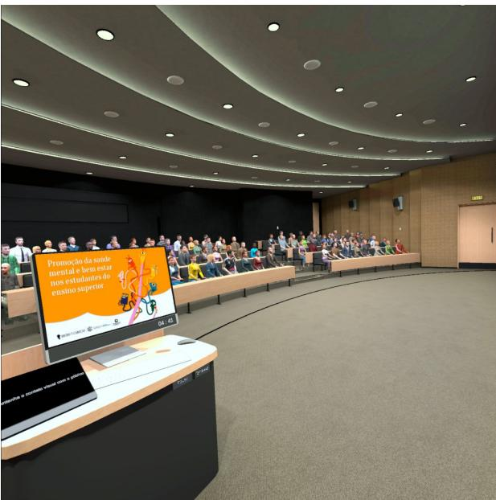
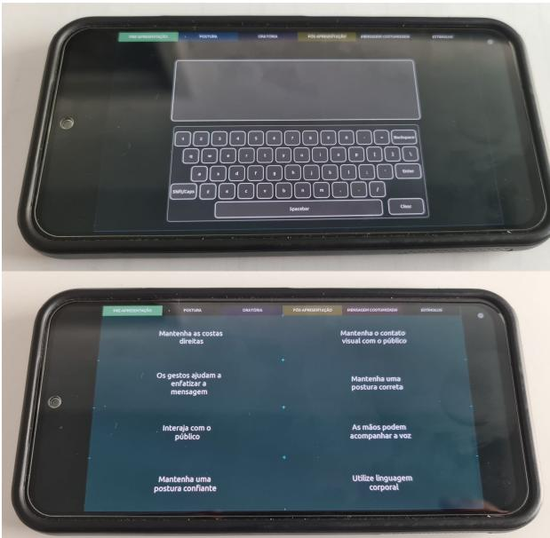

# 1. Bibliographic Information

## 1.1. Title
Interactive Virtual Reality Public Speaking Training Simulator to Empower Confident Communicators

## 1.2. Authors
The authors of this paper are João Donga, Paulo Veloso Gomes, António Marques, and Javier Pereira. Their affiliations suggest a multidisciplinary background, indicating research contributions from different institutions:
*   João Donga, Paulo Veloso Gomes, António Marques are associated with LabRP, Center for Rehabilitation Research, School of Media Arts and Design, Polytechnic of Porto, Porto, Portugal.
*   Paulo Veloso Gomes is also associated with LabRP, Center for Rehabilitation Research, School of Health, Polytechnic of Porto, Porto, Portugal.
*   Javier Pereira is affiliated with CITIC Research Center, University of A Coruña, A Coruña, Spain.
    The corresponding author is João Donga (jpd@esmad.ipp.pt).

## 1.3. Journal/Conference
The paper was published with the DOI: https://doi.org/10.17979/spudc.000024.39. While the specific journal or conference name is not explicitly stated in the provided text, the DOI format suggests it is part of a conference proceeding or a specialized publication related to university research, possibly from the University of A Coruña (spudc). Given the subject matter, it likely pertains to human-computer interaction, virtual reality, rehabilitation, or educational technology fields.

## 1.4. Publication Year
2023

## 1.5. Abstract
This paper introduces a virtual reality (VR) public speaking simulator designed to help individuals overcome anxiety and improve their public speaking skills. Recognizing public speaking as a vital skill often hindered by lack of confidence, the simulator provides an immersive platform for practice. It features distinct operational modes: an `Autonomous mode` for independent practice and an `interactive real-time intervention` mode, which can be guided by physiological biofeedback or a therapist. The primary goal is to leverage VR's immersive nature to boost users' confidence, enhance their articulation and persuasion skills, and improve their ability to connect with diverse audiences.

## 1.6. Original Source Link
The original source link provided is `/files/papers/693d6580fab55b0207482a82/paper.pdf`. Based on the context, this appears to be a link to the PDF file of the paper, indicating it is officially published.

# 2. Executive Summary

## 2.1. Background & Motivation
The core problem the paper addresses is `glossophobia`, which is the fear of public speaking. This fear is widespread, often ranking among the most common anxieties, and can significantly impede personal, academic, and professional success. Public speaking is highlighted as a fundamental skill for communication, leadership, and influencing others, yet many individuals struggle with confidence and anxiety when facing an audience. Traditional methods for addressing glossophobia, such as practice, cognitive-behavioral therapy (CBT), relaxation techniques, and public speaking courses, have proven effective. However, these methods may lack the immersive and controlled environment that could accelerate learning and desensitization. The paper's entry point and innovative idea lie in leveraging `virtual reality (VR)` technology to provide a safe, controlled, and immersive environment for public speaking practice and glossophobia treatment. This approach aims to bridge the gap between theoretical knowledge and practical application in a low-stakes setting.

## 2.2. Main Contributions / Findings
The paper's primary contribution is the development of an `interactive immersive virtual reality system` specifically designed for public speaking training and glossophobia treatment. Key findings and contributions include:
*   **A VR Public Speaking Simulator:** The creation of a virtual environment replicating a conference auditorium where users can practice public speaking in a simulated setting.
*   **Multiple Operational Modes:** The simulator offers three distinct modes:
    *   `Autonomous mode`: For independent user practice.
    *   `Controlled Mode`: Allows a therapist to monitor and intervene, adjusting environmental factors and providing real-time feedback or suggestions.
    *   `Real-time biofeedback mode`: A planned future enhancement that will integrate physiological data with an AI algorithm to adapt the environment dynamically to the user's emotional state.
*   **Configurable Parameters:** The system allows customization of various parameters, such as presentation duration, noise level, and audience size, enabling tailored training experiences.
*   **Support for Cognitive-Behavioral Therapy (CBT):** The system is designed to facilitate CBT principles by providing repeated exposure in a controlled environment, helping individuals challenge irrational beliefs associated with public speaking anxiety.
*   **Enhancement of Communication Skills:** The simulator aims to boost users' confidence, improve articulation and persuasion skills, and foster better connection with audiences.
*   **Portability and Personalized Training:** The VR system's nature allows for personalized individual training sessions, which can be conducted independently or under therapist guidance, offering flexibility and accessibility.

    The main conclusion is that the developed VR environment effectively allows users to practice public speaking and receive real-time feedback on their performance. Therapists can use it to monitor user data, change environmental conditions, and provide stimuli to help users adapt their attitudes. The future integration of real-time biofeedback will further enhance its adaptive behavior based on physiological data, making the system more responsive to user emotions.

# 3. Prerequisite Knowledge & Related Work

## 3.1. Foundational Concepts
To understand this paper, a beginner should be familiar with the following foundational concepts:

*   **Public Speaking:** The act of delivering a speech or presentation to a live audience. It involves conveying a message, informing, persuading, or entertaining. It's a fundamental skill in various personal and professional contexts.
*   **Glossophobia:** Derived from Greek words "glossa" (tongue or language) and "phobos" (fear), it specifically refers to the `fear of public speaking` or speaking in front of an audience. It is a form of `social anxiety disorder` that can manifest as mild nervousness to severe panic.
*   **Virtual Reality (VR):** A simulated experience that can be similar to or completely different from the real world. VR typically involves `head-mounted displays (HMDs)` that provide a visual and auditory immersive experience, making users feel present in the virtual environment. In the context of this paper, VR provides a safe and controlled simulation of a public speaking scenario.
*   **Cognitive-Behavioral Therapy (CBT):** A widely used psychotherapeutic approach that helps individuals identify and change problematic thought patterns (cognitions) and behaviors. For glossophobia, CBT might involve `exposure therapy`, where individuals are gradually exposed to the feared situation (public speaking) in a controlled manner to reduce anxiety.
*   **Biofeedback:** A technique used to gain control over involuntary bodily functions (like heart rate, muscle tension, or skin temperature) by providing real-time information about these functions. For example, a device might show a user their heart rate, and they learn to consciously lower it through relaxation techniques. In the context of this paper, `physiological biofeedback` would involve monitoring a user's bodily responses (e.g., heart rate, skin conductance) during public speaking practice in VR and using this data to inform interventions or adapt the virtual environment.
*   **Artificial Intelligence (AI) Algorithm:** A set of rules and computations designed to perform specific tasks, often involving learning from data, problem-solving, and decision-making. In this paper, an AI algorithm is envisioned for the `real-time biofeedback mode` to interpret user emotions from physiological data and adapt the VR environment accordingly.
*   **Immersion:** In VR, immersion refers to the feeling of being present within a simulated environment. High immersion makes the user feel more truly "there," which is crucial for the effectiveness of VR therapy or training.
*   **Real-time Intervention:** The ability to provide feedback, guidance, or modify an experience instantaneously as it is happening. In the context of the simulator, this means a therapist or the system itself can react and provide support to the user during their virtual presentation.

## 3.2. Previous Works
The paper references several prior studies that lay the groundwork for understanding public speaking anxiety and the potential of VR in addressing it.

*   **Lillis (2005):** This work highlights public speaking as a fundamental skill in human communication, emphasizing its historical significance. This foundational understanding underpins the importance of developing tools to enhance this skill.
*   **Ningsih et al. (2023) and OECD and Organization (2017):** These papers underscore the universal importance of public speaking across professional and personal contexts, reinforcing the broad applicability and necessity of solutions like the VR simulator.
*   **Ambit and Pandayan (2020):** This study points out the high prevalence of `glossophobia`, often ranking above even the fear of death. This statistic provides strong motivation for developing effective interventions.
*   **Dansieh et al. (2021):** Explores glossophobia in ESL students, illustrating how cultural or linguistic factors can interact with and potentially exacerbate public speaking anxiety.
*   **Bodie (2010), Nahliah and Rahman (2018):** These works delve into the multifaceted origins and contributing factors of glossophobia, such as fear of judgment, performance anxiety, traumatic experiences, lack of preparation, and general social anxiety. Understanding these causes informs the design of a VR system that can address these specific anxieties. For instance, the VR simulator allows for practice (`Lack of Preparation`) and provides a safe space to fail without real judgment (`Fear of Judgment`).
*   **Ortiz et al. (2022):** Emphasizes that `practice` and repeated exposure are effective in desensitizing individuals to the fear of public speaking. The VR simulator directly implements this principle by providing an environment for unlimited practice.
*   **Anderson et al. (2005):** This is a crucial reference, as it discusses `Cognitive-Behavioral Therapy (CBT) for public-speaking anxiety using virtual reality for exposure`. This paper provides a direct precedent for the current work, demonstrating the efficacy of VR in conjunction with CBT. This prior work likely validated the core concept that VR can serve as an effective platform for `exposure therapy`, where individuals gradually confront their fears in a simulated environment to reduce their anxiety response. The current paper builds upon this by focusing on interactivity and therapist integration.
*   **Lindner et al. (2021):** Further supports the use of `virtual reality exposure therapy for public speaking anxiety in routine care`. This suggests that VR interventions are moving from research into practical clinical applications, lending credibility and relevance to the current simulator's development.

    While the original paper does not include complex formulas from these prior works, the key takeaway from the related work is that VR is a validated tool for exposure therapy in public speaking anxiety. The current paper aims to enhance this by adding interactive modes and biofeedback.

## 3.3. Technological Evolution
The use of virtual reality for therapeutic and training purposes has evolved significantly over the past decades. Early VR systems were often expensive, cumbersome, and lacked the fidelity needed for truly immersive experiences. However, advancements in `graphics processing units (GPUs)`, `head-mounted display (HMD)` technology, and `real-time rendering` have made VR more accessible and realistic.

Initially, VR applications for phobias focused on simple exposure, such as virtual heights or enclosed spaces. Over time, the sophistication of these environments increased, allowing for more complex social simulations. The integration of `biofeedback` with VR, as proposed in this paper's future work, represents a significant step forward. It moves beyond passive exposure to an adaptive system that can respond to a user's real-time physiological state, tailoring the therapeutic experience. Similarly, the ability for a therapist to `intervene in real-time` within the VR session enhances the clinical utility, moving from a purely self-help tool to a therapist-guided intervention.

This paper's work fits within this technological timeline as a contemporary application that leverages modern VR capabilities to create a more dynamic, personalized, and clinically integrated public speaking training solution. It builds on the proven concept of VR exposure therapy by introducing advanced interactive features and a pathway to AI-driven adaptive experiences.

## 3.4. Differentiation Analysis
Compared to the main methods in related work, the core differences and innovations of this paper's approach are:

*   **Integration of Multiple Interaction Modes:** While previous works (e.g., Anderson et al., Lindner et al.) have explored VR for exposure therapy, this paper explicitly designs for distinct `Autonomous mode` (self-practice) and `Controlled Mode` (therapist-guided intervention). This offers greater flexibility and addresses both self-directed learning and clinical supervision needs.
*   **Real-time Therapist Intervention:** The `Controlled Mode` is a key differentiator, allowing therapists to `vary factors to reduce or increase the level of stress`, send `predefined or personalized messages`, and offer `suggestions to improve performance` in real-time. This active, dynamic intervention by a human expert during the VR session goes beyond typical passive VR exposure setups.
*   **Future Biofeedback Integration with AI:** The planned `real-time biofeedback mode` is a significant innovative step. By combining physiological data (e.g., heart rate, galvanic skin response) with an `AI algorithm` to `recognize user emotions` and `adapt the environment` (e.g., audience reactions, noise levels) dynamically, the system aims to provide a highly personalized and adaptive therapeutic experience. This level of responsiveness is generally not present in standard VR exposure therapies.
*   **Focus on Articulation and Persuasion Skills:** Beyond just reducing anxiety, the simulator explicitly aims to `boost users confidence, enhance their articulation, persuasion skills and foster their ability to connect with diverse audiences`. This broader focus on overall communication skill development, rather than solely anxiety reduction, is a notable aspect.
*   **Configurable Parameters for Scenario Customization:** The ability to `choose several parameters such as: duration of the presentation, noise level, number of audience present` allows for highly customizable training scenarios, catering to individual needs and progressive exposure levels, which might be more granular than some existing systems.

    In essence, while the concept of using VR for public speaking anxiety is not entirely new, this paper proposes an advanced, interactive system that prioritizes therapist integration and a future vision of AI-driven biofeedback, pushing the boundaries of personalized and adaptive VR-based communication training.

# 4. Methodology

## 4.1. Principles
The core idea behind the developed system is to create an immersive and interactive `virtual reality (VR)` environment that simulates public speaking scenarios. This environment acts as a safe space for users to practice their public speaking skills and to confront their `glossophobia` (fear of public speaking) without the real-world consequences of failure. The theoretical basis stems from `Cognitive-Behavioral Therapy (CBT)` principles, particularly `exposure therapy`, which suggests that gradual and repeated exposure to a feared stimulus in a controlled setting can reduce anxiety over time.

The intuition is that by placing individuals in a highly realistic virtual auditorium with an audience, they can experience the physiological and psychological sensations of public speaking. The VR environment's interactivity, especially through therapist intervention or future biofeedback, allows for dynamic adjustment of stress levels, enabling users to build resilience and confidence progressively. The goal is to facilitate a transfer of learned skills and reduced anxiety from the virtual world to real-world public speaking situations.

## 4.2. Core Methodology In-depth (Layer by Layer)
The VR system is designed as a comprehensive solution for public speaking training and CBT, replicating a conference auditorium. It operates in distinct modes to cater to different user needs and intervention strategies.

### 4.2.1. System Environment
The fundamental component of the system is a `simulated conference auditorium` within the VR environment. This auditorium serves as the primary setting where the user practices public speaking. The visual representation aims for realism to maximize immersion and the feeling of presence.

The following figure (Figure 1 from the original paper) shows the conference auditorium:

*该图像是一个会议听众席的插图，展示了一个现代化的演讲厅。演讲厅内有弧形的座位和一个讲台，灯光设计优雅，为演讲和公众沟通提供了良好的环境。*

Figure 1: Conference auditorium

### 4.2.2. Operational Modes
The system offers two primary operational modes, with a third mode planned for future development:

#### 4.2.2.1. Autonomous Mode
*   **Principle:** This mode is designed for `independent use` by the user, allowing for self-directed practice without real-time external intervention.
*   **Functionality:** Users can initiate a public speaking session in the virtual auditorium and practice their presentation at their own pace. This mode emphasizes repeated exposure and self-assessment.
*   **Parameters:** Users can select various parameters to customize their practice session. These parameters influence the environmental conditions and the perceived difficulty of the public speaking scenario.
    *   `duration of the presentation`: Allows users to set the length of their practice speech.
    *   `noise level`: Simulates different audience environments, from quiet attention to distracting background noise.
    *   `number of audience present`: Adjusts the size of the virtual audience, allowing for gradual exposure from a small group to a large crowd.

        The following figure (Figure 2 from the original paper) illustrates the parameter selection interface:

        
        *该图像是一个虚拟现实公共演讲模拟器的场景，显示了一个观众席和讲台。讲台上展示了一些演讲相关的信息，观众们集中注意力，营造出真实的演讲氛围。*

Figure 2: Parameters

#### 4.2.2.2. Controlled Mode (Therapist-Monitored)
*   **Principle:** This mode is designed for use under the `monitoring and intervention of a therapist`. It integrates a human expert into the VR training process, allowing for personalized guidance and real-time adjustment of the therapeutic environment.
*   **Functionality:** While the user is immersed in the VR environment and delivering their presentation, a therapist (or trainer) outside the VR system has access to a `Therapist Module`. This module allows the therapist to observe the user's progress and actively modify the virtual environment to either increase or decrease the stress level.
*   **Therapist Interventions:** The therapist can:
    *   `Vary factors to reduce or increase the level of stress`: This could involve adjusting the `noise level`, changing the `audience's attentiveness` (e.g., making them appear bored or highly engaged), or introducing other environmental distractions, similar to the parameters available in autonomous mode but controlled externally.
    *   `Send predefined or personalized messages, in real-time`: The therapist can communicate directly with the user within the VR environment. This might involve sending encouraging words, reminding the user of coping strategies (e.g., deep breathing), or providing specific instructions.
    *   `Send suggestions to improve their performance`: The therapist can offer constructive feedback or tips on articulation, posture, eye contact, or content delivery as the presentation unfolds.

        The following figure (Figure 3 from the original paper) shows the Therapist Module interface:

        
        *该图像是插图，展示了一个手机界面，包含两个部分：上半部分为虚拟键盘，下半部分列出了公共演讲的建议，包括“保持自信姿势”、“与听众进行眼神交流”和“使用肢体语言”等。此界面旨在为用户提供有效的演讲技巧，以增强其公众演说能力。*

Figure 3: Therapist Module

#### 4.2.2.3. Real-time Biofeedback Mode (Future Work)
*   **Principle:** This is a planned future enhancement that aims to automate and personalize the therapeutic intervention further by incorporating `physiological biofeedback` and `Artificial Intelligence (AI) algorithms`.
*   **Functionality:** In this mode, the system will collect `biodata` (e.g., heart rate, skin conductance, respiratory rate) from the user in real-time during their presentation. An `AI algorithm` will then analyze this data to `recognize the type and intensity of user emotions` (e.g., increasing anxiety, nervousness).
*   **Adaptive Environment:** Based on the AI's emotional recognition, the system will `adapt the variables` of the virtual environment autonomously. For example, if the user's anxiety levels spike, the AI might subtly reduce audience distractions or make the audience appear more receptive to help calm the user. Conversely, if the user is too comfortable, the AI might introduce mild stressors to challenge them further. The goal is to `optimize the experience` by dynamically adjusting the environment to match the user's emotional state and therapeutic needs.
*   **Combination with Therapist Intervention:** This mode is envisioned to work in conjunction with therapist monitoring and intervention, providing an additional layer of intelligent, automated adaptation.

### 4.2.3. System Architecture and Data Flow
While not explicitly detailed with a diagram, the description implies a client-server or local application architecture:
*   **Client (User's VR Headset):** Renders the virtual auditorium environment and receives user inputs (e.g., speech, movements). It also captures physiological data if biofeedback sensors are integrated.
*   **Server/Application (Therapist Module):** Runs the `Therapist Module` for the `Controlled Mode`, allowing the therapist to send commands and messages to the VR client. In the future `Real-time Biofeedback Mode`, this component would also host the `AI algorithm` for processing biodata and dynamically adjusting the VR environment parameters.
*   **Data Flow:**
    1.  User speech and actions within VR are perceived by the virtual audience.
    2.  In `Controlled Mode`, the therapist observes the user's performance (potentially via a screen displaying the user's VR view) and interacts via the `Therapist Module`.
    3.  In `Real-time Biofeedback Mode` (future), physiological data is streamed from sensors attached to the user to the `AI algorithm`.
    4.  The `AI algorithm` processes this data to infer emotional states.
    5.  Based on AI analysis or therapist input, commands are sent to the VR client to modify environmental parameters (e.g., audience behavior, noise levels).

        This layered approach ensures flexibility, scalability, and the potential for increasingly sophisticated and personalized therapeutic interventions for public speaking anxiety.

# 5. Experimental Setup
The paper provides a conceptual outline of the VR simulator's design and functionality rather than a detailed experimental setup with empirical results. Therefore, specific details about datasets, evaluation metrics, and baselines in the traditional sense of a research study are not present. However, we can infer some aspects based on the description of the system and its intended use.

## 5.1. Datasets
The paper does not mention the use of any specific datasets for training or evaluating the system in terms of machine learning or data-driven models, as the current implementation focuses on the VR environment and interaction modes.

*   **Implicit "Dataset" (User Experience Data):** While not explicitly a dataset, the system's ongoing use would generate `user interaction data` (e.g., chosen parameters, presentation duration, therapist interventions) and potentially `physiological biodata` (in the future biofeedback mode). This data would implicitly serve as the "dataset" for `monitoring user progress` and for `training future AI algorithms` to recognize emotions and adapt the environment.
*   **Example Data Sample:** Since the system simulates public speaking, a "data sample" would ideally be a user's `speech delivery` within the virtual environment. For instance, a user might deliver a 5-minute presentation on "The Importance of Sustainable Energy." The "data" collected would be aspects of this performance, such as speaking pace, volume, pauses, and the virtual audience's perceived reaction.

    The choice of using real-time user interaction and physiological data (future) is effective for validating the method's performance because it directly measures the system's impact on the user's public speaking anxiety and skill development in a dynamic, personalized manner.

## 5.2. Evaluation Metrics
The paper does not explicitly define quantitative evaluation metrics for a formal experiment. However, based on the stated goals of the simulator, potential evaluation metrics, if a study were to be conducted, would likely include:

*   **Anxiety Levels (Self-Reported):**
    *   **Conceptual Definition:** Measures the user's subjective experience of anxiety before, during, and after public speaking tasks. This is often gauged using questionnaires or Likert scales. The goal is to see a reduction in self-reported anxiety after training.
    *   **Mathematical Formula (Example: Public Speaking Anxiety Scale (PSAS) Score):** While a universal PSAS formula does not exist, a typical approach involves summing responses to a series of items. For example, if a PSAS questionnaire has $N$ items, each rated on a 5-point Likert scale (1=Not at all, 5=Very much), the score might be:
        \$
        \text{PSAS Score} = \sum_{i=1}^{N} R_i
        \$
    *   **Symbol Explanation:**
        *   $N$: Total number of items in the Public Speaking Anxiety Scale questionnaire.
        *   $R_i$: Rating given by the user for the $i$-th item on the scale.

*   **Physiological Arousal (Objective Measures):**
    *   **Conceptual Definition:** Measures involuntary bodily responses indicative of stress or anxiety, such as heart rate, skin conductance (galvanic skin response), or respiratory rate. These provide objective data that correlates with anxiety levels.
    *   **Mathematical Formula (Example: Heart Rate Variability (HRV)):** HRV measures the variation in the time interval between heartbeats. Reduced HRV often indicates increased stress. A common metric is the `Root Mean Square of Successive Differences (RMSSD)`.
        \$
        \text{RMSSD} = \sqrt{\frac{1}{N-1} \sum_{i=1}^{N-1} (RR_{i+1} - RR_i)^2}
        \$
    *   **Symbol Explanation:**
        *   $N$: Total number of normal-to-normal (NN) heartbeats.
        *   $RR_i$: The $i$-th RR interval (time between two consecutive R-waves in an electrocardiogram) in milliseconds.

*   **Confidence Levels (Self-Reported):**
    *   **Conceptual Definition:** Measures the user's subjective belief in their ability to perform public speaking effectively. This aims to quantify the "boost users confidence" objective.
    *   **Mathematical Formula (Example: Self-Efficacy Scale Score):** Similar to anxiety scales, a self-efficacy scale might sum responses to items.
        \$
        \text{Self-Efficacy Score} = \sum_{j=1}^{M} S_j
        \$
    *   **Symbol Explanation:**
        *   $M$: Total number of items in the Self-Efficacy Scale questionnaire.
        *   $S_j$: Rating given by the user for the $j$-th item on the scale.

*   **Public Speaking Performance (Expert-Rated or Automated):**
    *   **Conceptual Definition:** Assesses the quality of the user's presentation, including aspects like articulation, vocal variety, body language, eye contact, and content delivery. This can be evaluated by human experts or, in more advanced systems, by automated AI analysis.
    *   **Mathematical Formula (Example: Composite Performance Score):** If evaluated by experts, a composite score could be the average of ratings across several criteria.
        \$
        \text{Performance Score} = \frac{1}{K} \sum_{k=1}^{K} C_k
        \$
    *   **Symbol Explanation:**
        *   $K$: Total number of performance criteria (e.g., articulation, body language, content).
        *   $C_k$: Score given by the expert for the $k$-th criterion.

## 5.3. Baselines
Since this paper describes the design and initial implementation of a novel VR system, it does not present a comparison against specific baseline models or existing solutions in the traditional experimental sense. However, if a future empirical study were to validate this system, relevant baselines could include:

*   **No Intervention (Control Group):** A group of individuals with glossophobia who receive no specific public speaking training or therapy. This would establish the natural progression or stagnation of anxiety and skills.
*   **Traditional Public Speaking Courses/Workshops:** Comparison against conventional public speaking training methods (e.g., Toastmasters, college courses) to assess the VR system's efficacy relative to established educational approaches.
*   **Standard Cognitive-Behavioral Therapy (CBT):** A group receiving CBT for public speaking anxiety in a non-VR setting (e.g., therapist-led group therapy, individual counseling without VR). This would help determine if the VR component adds significant value.
*   **Existing VR Exposure Therapy Systems (Without Real-time Intervention/Biofeedback):** Comparison with simpler VR public speaking simulators that offer only static environments or limited interactivity, to highlight the benefits of the `Controlled Mode` and the proposed `Real-time Biofeedback Mode`.

    These baselines would be representative because they cover the spectrum from no intervention to traditional and existing technological interventions, allowing for a comprehensive evaluation of the proposed VR simulator's added value.

# 6. Results & Analysis
The paper describes the design and conceptual functionality of the interactive VR public speaking training simulator. It outlines the system's components, operational modes, and intended features. However, it does **not present any empirical experimental results, quantitative data, tables, or graphs** from user studies or evaluations. The sections "Results & Analysis" and "Experimental Setup" are notably absent in the provided paper content.

Therefore, this section will summarize the stated capabilities and expected outcomes based on the paper's description of the system.

## 6.1. Core Results Analysis
The paper concludes by highlighting the immediate and future capabilities of the developed VR environment. The effectiveness of the proposed method is primarily validated by its design features and the theoretical backing of VR-based exposure therapy.

*   **Effectiveness of Practice and Real-time Feedback:** The system's design allows users to `practice public speaking` in a simulated environment and, in the `Controlled Mode`, `check the result of their performance` through therapist feedback. This immediate feedback loop is crucial for skill development and anxiety reduction.
*   **Therapist's Role in Adaptation:** The `Therapist Module` is a key component, enabling therapists to `track and monitor the values obtained in real time` (e.g., user's progress, anxiety indicators if observed) and `change the environment conditions` to send different stimuli. This dynamic intervention allows for tailoring the difficulty and specific challenges to the user's needs, helping them `adapt their attitudes to new situations`. This capability suggests an advantage over static VR environments.
*   **Future Adaptive Behavior via Biofeedback:** The most significant future validation point is the `real-time biofeedback mode`. This mode is designed to enable the VR environment to have `adaptive behavior according to the biodata collected during the presentation`. This implies that the system will autonomously adjust its parameters (e.g., audience reactions) based on the user's physiological responses, offering a highly personalized and responsive therapeutic experience.
*   **Portability and Personalized Training:** The inherent portability of VR systems facilitates `personalized individual training` sessions. The flexibility to conduct sessions `accompanied by a therapist who may or may not influence the virtual environment` indicates a versatile tool that can adapt to different therapeutic approaches and user preferences.

    In summary, while no empirical results are presented, the paper strongly asserts that the proposed interactive and adaptive VR system provides a robust platform for public speaking training and glossophobia treatment, offering significant advantages through therapist integration and future biofeedback capabilities. The "results" are currently the system's functional design and its potential to achieve the stated goals.

## 6.2. Data Presentation (Tables)
As stated above, the paper does not contain any tables presenting experimental results.

## 6.3. Ablation Studies / Parameter Analysis
The paper does not include any ablation studies or parameter analysis, as it focuses on the system's design and conceptual description rather than empirical evaluation.

# 7. Conclusion & Reflections

## 7.1. Conclusion Summary
The paper successfully outlines the design and conceptual framework for an `Interactive Virtual Reality Public Speaking Training Simulator` aimed at empowering confident communicators and addressing `glossophobia`. The developed system offers an immersive virtual auditorium environment for practice. Its key innovation lies in its distinct operational modes: an `Autonomous mode` for self-directed practice and a `Controlled Mode` that allows real-time monitoring and intervention by a therapist. Furthermore, the paper highlights a significant future direction involving a `Real-time Biofeedback Mode`, where an AI algorithm would analyze physiological data to dynamically adapt the virtual environment based on the user's emotional state. The system's design emphasizes the ability to customize practice scenarios through various parameters and its potential to boost confidence, enhance articulation and persuasion skills, and foster better audience connection.

## 7.2. Limitations & Future Work
The authors explicitly acknowledge that the `real-time biofeedback mode` is `Future Work`. This indicates that the full potential of the system, particularly its adaptive capabilities based on user emotions, has not yet been implemented or tested.

Specific future work mentioned includes:
*   **Implementation of Real-time Biofeedback Mode:** This involves integrating `real-time biodata` collection with an `AI algorithm` to `recognize user emotions` and `adapt variables` in the VR environment. This is crucial for optimizing the user experience autonomously.
*   **Development of Other Scenarios:** The authors suggest expanding beyond the conference auditorium to include diverse public speaking contexts, such as `meetings, social events, and interviews`. This would broaden the applicability and realism of the training.

    Implicit limitations, though not explicitly stated as such, include:
*   **Lack of Empirical Validation:** As a design paper, it currently lacks user studies or experimental data to quantitatively prove its effectiveness in reducing anxiety or improving public speaking skills.
*   **Hardware Requirements:** VR systems typically require specific hardware (VR headsets, potentially biofeedback sensors), which might limit accessibility for some users.
*   **Simulator Sickness:** Some individuals experience `simulator sickness` (nausea, dizziness) in VR, which could impact the user experience and effectiveness. The paper does not address this.

## 7.3. Personal Insights & Critique
This paper presents a compelling and well-conceived approach to leveraging VR for a common and impactful problem: glossophobia. The conceptual design of an interactive VR public speaking simulator, particularly the inclusion of `real-time therapist intervention` and the planned `biofeedback-driven adaptation`, is highly innovative and addresses key limitations of traditional and simpler VR exposure therapies.

One major strength is the `Controlled Mode`. The ability for a human therapist to dynamically adjust environmental stressors and provide real-time, personalized guidance is a powerful addition. This human-in-the-loop approach combines the immersive power of VR with the nuanced expertise of a therapist, potentially leading to more effective and empathetic interventions than purely automated systems.

The vision for the `Real-time Biofeedback Mode` is particularly inspiring. If successfully implemented, an AI-driven system that can sense a user's rising anxiety and subtly adjust the virtual audience to be more supportive, or conversely, introduce gentle challenges when confidence grows, would represent a significant leap in personalized therapeutic technology. This method could potentially be transferred to other anxiety-inducing performance scenarios, such as musical performance, sports competitions, or high-stakes interviews.

However, a critical area for improvement and future focus would be the **empirical validation** of the system. While the design is sound, the paper currently lacks data demonstrating its efficacy. Future research should include:
1.  **User Studies:** Conducting studies with individuals suffering from glossophobia, comparing the VR system against control groups, traditional therapies, and simpler VR solutions.
2.  **Quantitative Metrics:** Measuring changes in self-reported anxiety scales, physiological markers (heart rate, skin conductance), and objective public speaking performance evaluations.
3.  **Usability and Acceptability:** Assessing user satisfaction, comfort, and the prevalence of simulator sickness.

    Another potential issue is the **precision and accuracy of the AI emotion recognition** in the future biofeedback mode. Inferring complex human emotions from physiological biodata alone can be challenging and prone to errors. Over-reliance on inaccurate emotion detection could lead to inappropriate environmental adaptations, potentially hindering rather than helping the user. The authors might consider multimodal input (e.g., voice analysis, facial expression tracking) to improve the robustness of emotion recognition.

In conclusion, this paper lays excellent groundwork for an advanced VR public speaking training simulator. Its emphasis on interactivity and adaptive environments makes it a promising tool. The next crucial step will be to rigorously test and refine these functionalities through comprehensive empirical studies to confirm its real-world impact.