# One-step Diffusion with Distribution Matching Distillation

Tianwei Yin1 Michaël Gharbi2 Richard Zhang2 Eli Shechtman2 Frédo Durand1 William T. Freeman1 Taesung Park2 1Massachusetts Institute of Technology 2Adobe Research https://tianweiy.github.io/dmd/

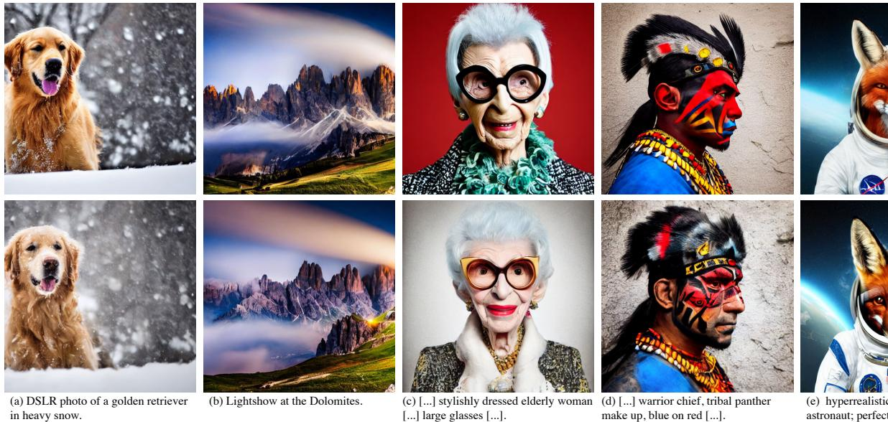  
F     a  [ -

# Abstract

Diffusion models generate high-quality images but require dozens of forward passes. We introduce Distribution Matching Distillation (DMD), a procedure to transform a diffusion model into a one-step image generator with minimal impact on image quality. We enforce the one-step image generator match the diffusion model at distribution level, by minimizing an approximate KL divergence whose gradient can be expressed as the difference between 2 score functions, one of the target distribution and the other of the synthetic distribution being produced by our one-step generator. The score functions are parameterized as two diffusion models trained separately on each distribution. Combined with a simple regression loss matching the large-scale structure of the multi-step diffusion outputs, our method outperforms all published few-step diffusion approaches, reaching 2.62 FID on ImageNet $6 4 \times 6 4$ and 11.49 FID on zero-shot COCO-30k, comparable to Stable Diffusion but orders of magnitude faster. Utilizing FP16 inference, our model can generate images at 20 FPS on modern hardware.

# 1. Introduction

Diffusion models [21, 61, 63, 64, 71, 74] have revolutionized image generation, achieving unprecedented levels of realism and diversity with a stable training procedure. In contrast to GANs [15] and VAEs [34], however, their sampling is a slow, iterative process that transforms a Gaussian noise sample into an intricate image by progressive denoising [21, 74]. This typically requires tens to hundreds of costly neural network evaluations, limiting interactivity in using the generation pipeline as a creative tool. To accelerate sampling speed, previous methods [42, 43, 47, 48, 51, 65, 75, 91, 92] distill the noise image mapping, discovered by the original multi-step diffusion sampling, into a single-pass student network. However, fitting such a high-dimensional, complex mapping is certainly a demanding task. A challenge is the expensive cost of running the full denoising trajectory, just to realize one loss computation of the student model. Recent methods mitigate this by progressively increasing the sampling distance of the student, without running the full denoising sequence of the original diffusion [3, 16, 42, 43, 51, 65, 75]. However, the performance of distilled models still lags behind the original multi-step diffusion model.

In contrast, rather than enforcing correspondences between noise and diffusion-generated images, we simply enforce that the student generations look indistinguishable from the original diffusion model. At high level, our goal shares motivation with other distribution-matching generative models, such as GMMN [39] or GANs [15]. Still, despite their impressive success in creating realistic images [27, 30], scaling up the model on the general text-toimage data has been challenging [26, 62, 88]. In this work, we bypass the issue by starting with a diffusion model that is already trained on large-scale text-to-image data. Concretely, we finetune the pretrained diffusion model to learn not only the data distribution, but also the fake distribution that is being produced by our distilled generator. Since diffusion models are known to approximate the score functions on diffused distributions [23, 73], we can interpret the denoised diffusion outputs as gradient directions for making an image "more realistic", or if the diffusion model is learned on the fake images, "more fake". Finally, the gradient update rule for the generator is concocted as the difference of the two, nudging the synthetic images toward higher realism and lower fakeness. Previous work [80], in a method called Variational Score Distillation, shows that modeling the real and fake distributions with a pretrained diffusion model is also effective for test-time optimization of 3D objects. Our insight is that a similar approach can instead train an entire generative model. Furthermore, we find that pre-computing a modest number of the multi-step diffusion sampling outcomes and enforcing a simple regression loss with respect to our one-step generation serves as an effective regularizer in the presence of the distribution matching loss. Moreover, the regression loss ensures our one-step generator aligns with the teacher model (see Figure 6), demonstrating potential for real-time design previews. Our method draws upon inspiration and insights from VSD [80], GANs [15], and pix2pix [24], showing that by (1) modeling real and fake distributions with diffusion models and (2) using a simple regression loss to match the multi-step diffusion outputs, we can train a one-step generative model with high fidelity.

We evaluate models trained with our Distribution Matching Distillation procedure (DMD) across various tasks, including image generation on CIFAR-10 [36] and ImageNet $6 4 \times 6 4$ [8], and zero-shot text-to-image generation on MS COCO $5 1 2 \times 5 1 2$ [40]. On all benchmarks, our one-step generator significantly outperforms all published few-steps diffusion methods, such as Progressive Distillation [51, 65], Rectified Flow [42, 43], and Consistency Models [48, 75]. On ImageNet, DMD reaches FIDs of 2.62, an improvement of $2 . 4 \times$ over Consistency Model [75]. Employing the identical denoiser architecture as Stable Diffusion [63], DMD achieves a competitive FID of 11.49 on MS-COCO 2014- $3 0 \mathrm { k }$ Our quantitative and qualitative evaluations show that the images generated by our model closely resemble the quality of those generated by the costly Stable Diffusion model. Importantly, our approach maintains this level of image fidelity while achieving a $1 0 0 \times$ reduction in neural network evaluations. This efficiency allows DMD to generate $5 1 2 \times 5 1 2$ images at a rate of 20 FPS when utilizing FP16 inference, opening up a wide range of possibilities for interactive applications.

# 2. Related Work

Diffusion Model Diffusion models [2, 21, 71, 74] have emerged as a powerful generative modeling framework, achieving unparalleled success in diverse domains such as image generation [61, 63, 64], audio synthesis [6, 35], and video generation [11, 22, 70]. These models operate by progressively transforming noise into coherent structures through a reverse diffusion process [72, 74]. Despite state-of-the-art results, the inherently iterative procedure of diffusion models entails a high and often prohibitive computational cost for real-time applications. Our work builds upon leading diffusion models [31, 63] and introduces a simple distillation pipeline that reduces the multi-step generative process to a single forward pass. Our method is universally applicable to any diffusion model with deterministic sampling [31, 72, 74].

Diffusion Acceleration Accelerating the inference process of diffusion models has been a key focus in the field, leading to the development of two types of approaches. The first type advances fast diffusion samplers [31, 41, 45, 46, 91], which can dramatically reduce the number of sampling steps required by pre-trained diffusion models—from a thousand down to merely 20-50. However, a further reduction in steps often results in a catastrophic decrease in performance. Alternatively, diffusion distillation has emerged as a promising avenue for further boosting speed [3, 16, 42, 47, 51, 65, 75, 83, 92]. They frame diffusion distillation as knowledge distillation [19], where a student model is trained to distill the multi-step outputs of the original diffusion model into a single step. Luhman et al. [47] and DSNO [93] proposed a simple approach of pre-computing the denoising trajectories and training the student model with a regression loss in pixel space. However, a significant challenge is the expensive cost of running the full denoising trajectory for each realization of the loss function. To address this issue, Progressive

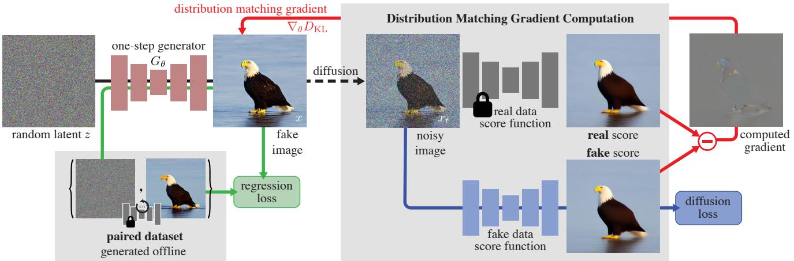  
Figure 2. Method overview. We train one-step generator $G _ { \theta }$ to map random noise $z$ into a realistic image. To match the multi-step distribution matching gradient $\nabla _ { \boldsymbol { \theta } } \overline { { \boldsymbol { D } _ { K L } } }$ to the fake image to enhance realism. We inject a random amount of noise to the fake image and the one-step generator.

Distillation (PD) [51, 65] train a series of student models that halve the number of sampling steps of the previous model. InstaFlow [42, 43] progressively learn straighter flows on which the one step prediction maintains accuracy over a larger distance. Consistency Distillation (CD) [75], TRACT [3], and BOOT [16] train a student model to match its own output at a different timestep on the ODE flow, which in turn is enforced to match its own output at yet another timestep. In contrast, our method shows that the simple approach of Luhman et al. and DSNO to pre-compute the diffusion outputs is sufficient, once we introduce distribution matching as the training objective.

Distribution Matching Recently, a few classes of generative models have shown success in scaling up to complex datasets by recovering samples that are corrupted by a predefined mechanism, such as noise injection [21, 61, 64] or token masking [5, 60, 87]. On the other hand, there exist generative methods that do not rely on sample reconstruction as the training objective. Instead, they match the synthetic and target samples at a distribution level, such as GMMD [10, 39] or GANs [15]. Among them, GANs have shown unprecedented quality in realism [4, 26 28, 30, 67], particularly when the GAN loss can be combined with task-specific, auxiliary regression losses to mitigate training instability, ranging from paired image translation [24, 54, 79, 90] to unpaired image editing [37, 55, 95]. Still, GANs are a less popular choice for text-guided synthesis, as careful architectural design is needed to ensure training stability at large scale [26].

Lately, several works [1, 12, 82, 86] drew connections between score-based models and distribution matching. In particular, ProlificDreamer [80] introduced Variational Score Distillation (VSD), which leverages a pretrained textto-image diffusion model as a distribution matching loss. Since VSD can utilize a large pretrained model for unpaired settings [17, 58], it showed impressive results at particlebased optimization for text-conditioned 3D synthesis. Our method refines and extends VSD for training a deep generative neural network for distilling diffusion models. Furthermore, motivated by the success of GANs in image translation, we complement the stability of training with a regression loss. As a result, our method successfully attains high realism on a complex dataset like LAION [69]. Our method is different from recent works that combine GANs with diffusion [68, 81, 83, 84], as our formulation is not grounded in GANs. Our method shares motivation with concurrent works [50, 85] that leverage the VSD objective to train a generator, but differs in that we specialize the method for diffusion distillation by introducing regression loss and showing state-of-the-art results for text-to-image tasks.

# 3. Distribution Matching Distillation

Our goal is to distill a given pretrained diffusion denoiser, the base model, $\mu _ { \mathrm { b a s e } }$ , into a fast "one-step" image generator, $G _ { \theta }$ , that produces high-quality images without the costly iterative sampling procedure (Sec. 3.1). While we wish to produce samples from the same distribution, we do not necessarily seek to reproduce the exact mapping.

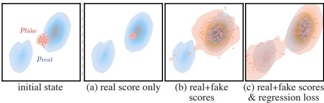  
Figure 3. Optimizing various objectives starting from the same configuration (left) leads to different outcomes. (a) Maximizing the real score only, the fake samples all collapse to the closest mode of the real distribution. (b) With our distribution matching objective but not regression loss, the generated fake data covers more of the real distribution, but only recovers the closest mode, missing the second mode entirely. (c) Our full objective, with the regression loss, recovers both modes of the target distribution.

By analogy with GANs, we denote the outputs of the distilled model as fake, as opposed to the real images from the training distribution. We illustrate our approach in Figure 2. We train the fast generator by minimizing the sum of two losses: a distribution matching objective (Sec. 3.2), whose gradient update can be expressed as the difference of two score functions, and a regression loss (Sec. 3.3) that encourages the generator to match the large scale structure of the base model's output on a fixed dataset of noise-image pairs. Crucially, we use two diffusion denoisers to model the score functions of the real and fake distributions, respectively, perturbed with Gaussian noise of various magnitudes. Finally, in Section 3.4, we show how to adapt our training procedure with classifier-free guidance.

# 3.1. Pretrained base model and One-step generator

Our distillation procedure assumes a pretrained diffusion model $\mu _ { \mathrm { b a s e } }$ is given. Diffusion models are trained to reverse a Gaussian diffusion process that progressively adds noise to a sample from a real data distribution $x _ { 0 } \sim p _ { \mathrm { r e a l } }$ turning it into white noise $x _ { T } ~ \sim ~ \mathcal { N } ( 0 , \mathbf { I } )$ over $T$ time steps [21, 71, 74]; we use $T = 1 0 0 0$ .We denote the diffusion model as $\mu _ { \mathrm { b a s e } } ( x _ { t } , t )$ . Starting from a Gaussian sample $x _ { T }$ , the model iteratively denoises a running noisy estimate $x _ { t }$ , conditioned on the timestep $t \in \{ 0 , 1 , . . . , T - 1 \}$ (or noise level), to produce a sample of the target data distribution. Diffusion models typically require 10 to 100s steps to produce realistic images. Our derivation uses the meanprediction form of diffusion for simplicity [31] but works identically with $\epsilon$ -prediction [21, 63] with a change of variable [33] (see Appendix H). Our implementation uses pretrained models from EDM [31] and Stable Diffusion [63]. One-step generator. Our one-step generator $G _ { \theta }$ has the architecture of the base diffusion denoiser but without timeconditioning. We initialize its parameters $\theta$ with the base model, i.e., $G _ { \theta } ( z ) = \mu _ { \mathrm { b a s e } } ( z , T - 1 ) , \forall z$ , before training.

# 3.2. Distribution Matching Loss

Ideally, we would like our fast generator to produce samples that are indistinguishable from real images. Inspired by the ProlificDreamer [80], we minimize the KullbackLeibler (KL) divergence between the real and fake image distributions, $p _ { \mathrm { r e a l } }$ and $p _ { \mathrm { f a k e } }$ , respectively:

$$
\begin{array} { r l } & { D _ { K L } \left( p _ { \mathrm { f a k e } } \parallel p _ { \mathrm { r e a l } } \right) = \underset { x \sim p _ { \mathrm { f a k e } } } { \mathbb { E } } \left( \log \left( \frac { p _ { \mathrm { f a k e } } ( x ) } { p _ { \mathrm { r e a l } } ( x ) } \right) \right) } \\ & { \qquad = \underset { z \sim \mathcal { N } ( 0 ; \mathbf { I } ) } { \mathbb { E } } - \left( \log \mathbf { \delta } p _ { \mathrm { r e a l } } ( x ) - \log \mathbf { \delta } p _ { \mathrm { f a k e } } ( x ) \right) . } \\ & { \qquad \quad x = G _ { \theta } ( z ) } \end{array}
$$

Computing the probability densities to estimate this loss is generally intractable, but we only need the gradient with respect to $\theta$ to train our generator by gradient descent. Gradient update using approximate scores. Taking the gradient of Eq. (1) with respect to the generator parameters:

$$
\nabla _ { \theta } D _ { K L } = \operatorname* { l } _ { z \sim \mathcal { N } ( 0 ; \mathbf { I } ) } \Big [ - \big ( s _ { \mathrm { r e a l } } ( x ) - s _ { \mathrm { f a k e } } ( x ) \big ) \frac { d G } { d \theta } \Big ] ,
$$

where $s _ { \mathrm { r e a l } } ( x ) = \nabla _ { x } \mathrm { l o g } \ p _ { \mathrm { r e a l } } ( x )$ , $s _ { \mathrm { f a k e } } ( x ) = \nabla _ { x } \log p _ { \mathrm { f a k e } } ( x )$ are the scores of the respective distributions. Intuitively, $s _ { \mathrm { r e a l } }$ moves $x$ toward the modes of $p _ { \mathrm { r e a l } }$ , and $- s _ { \mathrm { f a k e } }$ spreads them apart, as shown in Figure 3(a, b). Computing this gradient is still challenging for two reasons: first, the scores diverge for samples with low probability — in particular $p _ { \mathrm { r e a l } }$ vanishes for fake samples, and second, our intended tool for estimating score, namely the diffusion models, only provide scores of the diffused distribution. Score-SDE [73, 74] provides an answer to these two issues. By perturbing the data distribution with random Gaussian noise of varying standard deviations, we create a family of "blurred" distributions that are fully-supported over the ambient space, and therefore overlap, so that the gradient in Eq. (2) is well-defined (Figure 4). Score-SDE then shows that a trained diffusion model approximates the score function of the diffused distribution. Accordingly, our strategy is to use a pair of diffusion denoisers to model the scores of the real and fake distributions after Gaussian diffusion. With slight abuse of notation, we define these as $s _ { \mathrm { r e a l } } ( x _ { t } , t )$ and $s _ { \mathrm { f a k e } } ( x _ { t } , t )$ , respectively. Diffused sample $x _ { t } \sim q ( x _ { t } | x )$ is obtained by adding noise to generator output $x = G _ { \theta } ( z )$ at diffusion time step $t$ :

$$
q _ { t } ( x _ { t } | x ) \sim \mathcal { N } ( \alpha _ { t } x ; \sigma _ { t } ^ { 2 } \mathbf { I } ) ,
$$

where $\alpha _ { t }$ and $\sigma _ { t }$ are from the diffusion noise schedule. Real score. The real distribution is fixed, corresponding to the training images of the base diffusion model, so we model its score using a fixed copy of the pretrained diffusion model $\mu _ { \mathrm { b a s e } } ( x , t )$ .The score given a diffusion model is given by Song et al. [74]:

$$
s _ { \mathrm { r e a l } } ( x _ { t } , t ) = - \frac { x _ { t } - \alpha _ { t } \mu _ { \mathrm { b a s e } } ( x _ { t } , t ) } { \sigma _ { t } ^ { 2 } } .
$$

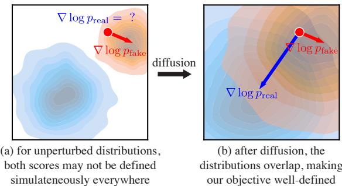  
Figure 4. Without perturbation, the real/fake distributions may not overlap (a). Real samples only get a valid gradient from the real score, and fake samples from the fake score. After diffusion (b), our distribution matching objective is well-defined everywhere.

Dynamically-learned fake score. We derive the fake score function, in the same manner as the real score case:

$$
s _ { \mathrm { f a k e } } ( x _ { t } , t ) = - \frac { x _ { t } - \alpha _ { t } \mu _ { \mathrm { f a k e } } ^ { \phi } ( x _ { t } , t ) } { \sigma _ { t } ^ { 2 } } .
$$

However, as the distribution of our generated samples changes throughout training, we dynamically adjust the fake diffusion model $\mu _ { \mathrm { f a k e } } ^ { \phi }$ to track these changes. We initialize the fake diffusion model from the pretrained diffusion model $\mu _ { \mathrm { b a s e } }$ , updating parameters $\phi$ during training, by minimizing a standard denoising objective [21, 77]:

$$
\mathcal { L } _ { \mathrm { d e n o i s e } } ^ { \phi } = | | \mu _ { \mathrm { f a k e } } ^ { \phi } ( x _ { t } , t ) - x _ { 0 } | | _ { 2 } ^ { 2 } ,
$$

where $\mathcal { L } _ { \mathrm { d e n o i s e } } ^ { \phi }$ is weighted according to the diffusion timestep $t$ , using the same weighting strategy employed during the training of the base diffusion model [31, 63]. Distribution matching gradient update. Our final approximate distribution matching gradient is obtained by replacing the exact score in Eq. (2) with those defined by the two diffusion models on the perturbed samples $x _ { t }$ and taking the expectation over the diffusion time steps:

$$
\nabla _ { \theta } D _ { K L } \simeq \operatorname * { \mathbb { \Gamma } } _ { z , t , x , x _ { t } } \left[ w _ { t } \alpha _ { t } \left( s _ { \mathrm { f a k e } } ( x _ { t } , t ) - s _ { \mathrm { r e a l } } ( x _ { t } , t ) \right) \frac { d G } { d \theta } \right] ,
$$

where $z \sim \mathcal { N } ( 0 ; \mathbf { I } ) , x = G _ { \theta } ( z ) , t \sim \mathcal { U } ( T _ { \operatorname* { m i n } } , T _ { \operatorname* { m a x } } ) ,$ and $x _ { t } \sim q _ { t } ( x _ { t } | x )$ . We include the derivations in Appendix F. Here, $w _ { t }$ is a time-dependent scalar weight we add to improve the training dynamics. We design the weighting factor to normalize the gradient's magnitude across different noise levels. Specifically, we compute the mean absolute error across spatial and channel dimensions between the denoised image and the input, setting where $S$ is the number of spatial locations and $C$ is the number of channels. In Sec. 4.2, we show that this weighting outperforms previous designs [58, 80]. We set $T _ { \mathrm { m i n } } =$ $0 . 0 2 T$ and $T _ { \mathrm { m a x } } = 0 . 9 8 T$ , following DreamFusion [58].

$$
\begin{array} { r } { w _ { t } = \frac { \sigma _ { t } ^ { 2 } } { \alpha _ { t } } \frac { C S } { \lvert \lvert \mu _ { \mathrm { b a s e } } ( x _ { t } , t ) - x \rvert \rvert _ { 1 } } , } \end{array}
$$

# 3.3. Regression loss and final objective

The distribution matching objective introduced in the previous section is well-defined for $t \gg 0$ , i.e., when the generated samples are corrupted with a large amount of noise. However, for a small amount of noise, $s _ { \mathrm { r e a l } } ( x _ { t } , t )$ often becomes unreliable, as $p _ { \mathrm { r e a l } } ( x _ { t } , t )$ goes to zero. Furthermore, as the score $\nabla _ { \boldsymbol { x } } \log ( p )$ is invariant to scaling of probability density function $p$ , the optimization is susceptible to mode collapse/dropping, where the fake distribution assigns higher overall density to a subset of the modes. To avoid this, we use an additional regression loss to ensure all modes are preserved; see Figure 3(b), (c).

This loss measures the pointwise distance between the generator and base diffusion model outputs, given the same input noise. Concretely, we build a paired dataset $\mathcal { D } = \{ \boldsymbol { z } , \boldsymbol { y } \}$ of random Gaussian noise images $z$ and the corresponding outputs $y$ , obtained by sampling the pretrained diffusion model $\mu _ { \mathrm { b a s e } }$ using a deterministic ODE solver [31, 41, 72]. In our CIFAR-10 and ImageNet experiments, we utilize the Heun solver from EDM [31], with 18 steps for CIFAR-10 and 256 steps for ImageNet. For the LAION experiments, we use the PNDM [41] solver with 50 sampling steps. We find that even a small number of noise— image pairs, generated using less than $1 \%$ of the training compute, in the case of CIFAR10, for example, acts as an effective regularizer. Our regression loss is given by:

$$
\mathcal { L } _ { \mathrm { r e g } } = \underset { ( z , y ) \sim \mathcal { D } } { \mathbb { E } } \ell ( G _ { \theta } ( z ) , y ) .
$$

We use Learned Perceptual Image Patch Similarity (LPIPS) [89] as the distance function $\ell$ ,following InstaFlow [43] and Consistency Models [75].

Fimal objetive Neworck $\dot { \mu } _ { \mathrm { f a k e } } ^ { \phi }$ ned iith $\mathcal { L } _ { \mathrm { d e n o i s e } } ^ { \phi }$ $\nabla _ { \boldsymbol { \theta } } D _ { K L }$ $G _ { \theta }$ the final objective is $D _ { K L } + \lambda _ { \mathrm { r e g } } \mathcal { L } _ { \mathrm { r e g } }$ , using $\lambda _ { \mathrm { r e g } } = 0 . 2 5$ unless otherwise specified. The gradient $\nabla _ { \boldsymbol { \theta } } D _ { K L }$ is computed in Eq. (7), and gradient $\nabla _ { \boldsymbol { \theta } } \mathcal { L } _ { \mathrm { r e g } }$ is computed from Eq. (9) with automatic differentiation. We apply the two losses to distinct data streams: unpaired fake samples for the distribution matching gradient and paired examples described in Section 3.3 for the regression loss. Algorithm 1 outlines the final training procedure. Additional details are provided in Appendix B.

# 3.4. Distillation with classifier-free guidance

Classifier-Free Guidance [20] is widely used to improve the image quality of text-to-image diffusion models. Our approach also applies to diffusion models that use classifierfree guidance. We first generate the corresponding noiseoutput pairs by sampling from the guided model to construct the paired dataset needed for regression loss $\mathcal { L } _ { \mathrm { r e g } }$ . When computing the distribution matching gradient $\nabla _ { \boldsymbol { \theta } } D _ { K L }$ , we substitute the real score with that derived from the mean

# Algorithm 1: DMD Training procedure

Input: Pretrained real diffusion model $\mu _ { \mathrm { r e a l } }$ , paired dataset   
$\mathcal { D } = \{ z _ { \mathrm { r e f } } , y _ { \mathrm { r e f } } \}$

Output: Trained generator $G$ .   
1 // Initialize generator and fake score estimators   
from pretrained model   
2 $G \gets$ coWeights $( \mu _ { \mathrm { r e a l } } )$ , µfake coWeights $_ { ( \mu _ { \mathrm { r e a l } } ) }$   
3 while train do   
4 // Generate images   
5 Sample batch $z \sim \mathcal { N } ( 0 , \mathbf { I } ) ^ { B }$ and $( z _ { \mathrm { r e f } } , y _ { \mathrm { r e f } } ) \sim \mathcal { D }$   
6 $x  G ( z )$ , $x _ { \mathrm { r e f } }  G ( z _ { \mathrm { r e f } } )$   
7 $x =$ concat $( x , x _ { \mathrm { r e f } } )$ if dataset is LAION else $_ x$   
8   
9 // Update generator   
10 $\mathcal { L } _ { \mathrm { K L } } \gets$ distributionMatchingLoss( $\mu _ { \mathrm { r e a l } }$ , µfake, x) // Eq 7   
11 $\mathcal { L } _ { \mathrm { r e g } }  \mathrm { L P I P S } ( x _ { \mathrm { r e f } } , y _ { \mathrm { r e f } } ) / / \textrm { \texttt { E q } } 9$   
12 $\mathcal { L } _ { G }  \mathcal { L } _ { \mathrm { K L } } + \lambda _ { \mathrm { r e g } } \mathcal { L } _ { \mathrm { r e g } }$   
13 G ← update $\left( G , \mathcal { L } _ { G } \right)$   
14   
15 // Update fake score estimation model   
16 Sample time step $t \sim \mathcal { U } ( 0 , 1 )$   
17 $x _ { t } \gets$ forwardDiffusion $( \operatorname { s t o p g r a d } ( x ) , t )$   
18 Ldenoise denoisingLoss( $\mu _ { \mathrm { f a k e } } ( x _ { t } , t )$ , stopgrad(x)) / / Eq 6   
19 $\mu _ { \mathrm { f a k e } } $ update( $\mu _ { \mathrm { f a k e } }$ , ${ \mathcal { L } } _ { \mathrm { d e n o i s e } }$   
20 end while prediction of the guided model. Meanwhile, we do not modify the formulation for the fake score. We train our one-step generator with a fixed guidance scale.

# 4. Experiments

We assess the capabilities of our approach using several benchmarks, including class-conditional generation on CIFAR-10 [36] and ImageNet [8]. We use the Fréchet Inception Distance (FID) [18] to measure image quality and CLIP Score [59] to evaluate text-to-image alignment. First, we perform a direct comparison on ImageNet (Sec. 4.1), where our distribution matching distillation substantially outperforms competing distillation methods with identical base diffusion models. Second, we perform detailed ablation studies verifying the effectiveness of our proposed modules (Sec. 4.2). Third, we train a text-to-image model on the LAION-Aesthetic- $^ { 6 . 2 5 + }$ dataset [69] with a classifier-free guidance scale of 3 (Sec. 4.3). In this phase, we distill Stable Diffusion v1.5, and we show that our distilled model achieves FID comparable to the original model, while offering a $3 0 \times$ speed-up. Finally, we train another text-to-image model on LAION-Aesthetic- $^ { 6 + }$ , utilizing a higher guidance value of 8 (Sec. 4.3). This model is tailored to enhance visual quality rather than optimize the FID metric. Quantitative and qualitative analysis confirm that models trained with our distribution matching distillation procedure can produce high-quality images rivaling Stable Diffusion. We describe additional training and evaluation details in the appendix.

# 4.1. Class-conditional Image Generation

We train our model on class-conditional ImageNet $6 4 \times 6 4$ and benchmark its performance with competing methods. Results are shown in Table 1. Our model surpasses established GANs like BigGAN-deep [4] and recent diffusion distillation methods, including the Consistency Model [75] and TRACT [3]. Our method remarkably bridges the fidelity gap, achieving a near-identical FID score (within 0.3) compared to the original diffusion model, while also attaining a 512-fold increase in speed. On CIFAR-10, our classconditional model reaches a competitive FID of 2.66. We include the CIFAR-10 results in the appendix.

Table 1. Sample quality comparison on ImageNet- $6 4 \times 6 4$ Baseline numbers are derived from Song et al. [75]. The upper section of the table highlights popular diffusion and GAN approaches [4, 9]. The middle section includes a list of competing diffusion distillation methods. The last row shows the performance of our teacher model, EDM† [31].   

<table><tr><td>Method</td><td># Fwd Pass (↓)</td><td>FID (↓)</td></tr><tr><td>BigGAN-deep [4] ADM [9]</td><td>1 250</td><td>4.06 2.07</td></tr><tr><td>Progressive Distillation [65]</td><td>1</td><td>15.39</td></tr><tr><td>DFNO [92]</td><td>1</td><td>7.83</td></tr><tr><td>BOOT [16]</td><td>1</td><td>16.30</td></tr><tr><td>TRACT [3]</td><td>1</td><td>7.43</td></tr><tr><td>Meng et al. [51]</td><td>1</td><td>7.54</td></tr><tr><td>Diff-Instruct [50]</td><td>1</td><td>5.57</td></tr><tr><td>Consistency Model [75]</td><td>1</td><td>6.20</td></tr><tr><td>DMD (Ours)</td><td>1</td><td>2.62</td></tr><tr><td>EDM (Teacher) [31]</td><td>512</td><td>2.32</td></tr></table>

# 4.2. Ablation Studies

We first compare our method with two baselines: one omitting the distribution matching objective and the other missing the regression loss in our framework. Table 2 (left) summarizes the results. In the absence of distribution matching loss, our baseline model produces images that lack realism and structural integrity, as illustrated in the top section of Figure 5. Likewise, omitting the regression loss leads to training instability and a propensity for mode collapse, resulting in a reduced diversity of the generated images. This issue is illustrated in the bottom section of Figure 5. Table 2 (right) demonstrates the advantage of our proposed sample weighting strategy (Section 3.2). We compare with $\sigma _ { t } / \alpha _ { t }$ and $\sigma _ { t } ^ { 3 } / \alpha _ { t }$ , two popular weighting schemes utilized by DreamFusion [58] and ProlificDreamer [80]. Our weighting strategy achieves a healthy 0.9 FID improvement as it normalizes the gradient magnitudes across noise levels and stabilizes the optimization.

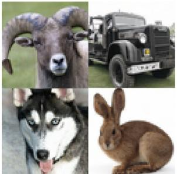  
DMD (ours)

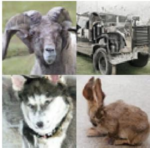  
without distribution matching

(a) Qualitative comparison between our model (left) and the baseline model excluding the distribution matching objective (right). The baseline model generates images with compromised realism and structural integrity. Images are generated from the same random seed.

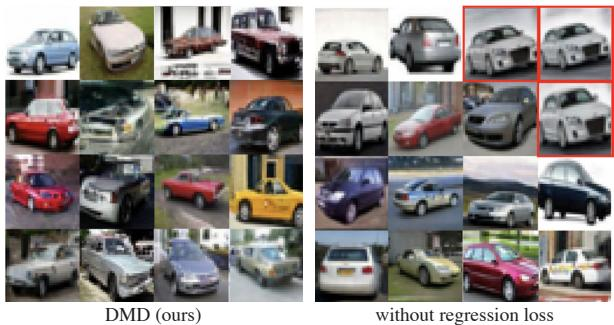

(b) Qualitative comparison between our model (left) and the baseline model omitting the regression loss (right). The baseline model tends to exhibit mode collapse and a lack of diversity, as evidenced by the predominant appearance of the grey car (highlighted with a red square). Images are generated from the same random seed.

Figure 5. Ablation studies of our training loss, including the distribution matching objective (top) and the regression loss (bottom).   

<table><tr><td>Training loss</td><td></td><td></td><td>CIFAR ImageNet Sample weighting CIFAR</td></tr><tr><td>w/o Dist. Matching</td><td>3.82</td><td>9.21</td><td>σt/αt [58]</td></tr><tr><td>w/o Regress. Loss</td><td>5.58</td><td>5.61</td><td>3.60 σ/αt [58, 80] 3.71</td></tr><tr><td>DMD (Ours)</td><td>2.66</td><td>2.62</td><td>Eq. 8 (Ours) 2.66</td></tr></table>

Table 2. Ablation study. (left) We ablate elements of our training loss. We show the FID results on CIFAR-10 and ImageNet$6 4 \times 6 4$ (right) We compare different sample weighting strategies for the distribution matching loss.

# 4.3. Text-to-Image Generation

We use zero-shot MS COCO to evaluate our model's performance for text-to-image generation. We train a text-toimage model by distilling Stable Diffusion v1.5 [63] on the LAION-Aesthetics- $^ { 6 . 2 5 + }$ [69]. We use a guidance scale of 3, which yields the best FID for the base Stable Diffusion model. The training takes around 36 hours on a cluster of 72 A100 GPUs. Table 3 compares our model to state-ofthe-art approaches. Our method showcases superior performance over StyleGAN-T [67], surpasses all other diffusion acceleration methods, including advanced diffusion solvers [46, 91], and diffusion distillation techniques such as Latent Consistency Models [48, 49], UFOGen [84], and InstaFlow [43]. We substantially close the gap between distilled and base models, reaching within 2.7 FID from Stable Diffusion v1.5, while running approximately $3 0 \times$ faster. With FP16 inference, our model generates images at 20 frames per second, enabling interactive applications.

Table 3. Sample quality comparison on zero-shot text-toimage generation on MS COCO-30k. Baseline numbers are derived from GigaGAN [26]. The dashed line indicates that the result is unavailable. †Results are evaluated by us using the released models. LCM-LoRA is trained with a guidance scale of 7.5. We use a guidance scale of 3 for all the other methods. Latency is measured with a batch size of 1.   

<table><tr><td>Family</td><td>Method</td><td colspan="3">Resolution (↑) Latency (↓) FID (↓)</td></tr><tr><td rowspan="9">Original, unaccelerated</td><td>DALL·E [60]</td><td>256</td><td></td><td>27.5</td></tr><tr><td>DALL·E 2 [61]</td><td>256</td><td>-</td><td>10.39</td></tr><tr><td>Parti-750M [87]</td><td>256</td><td>-</td><td>10.71</td></tr><tr><td>Parti-3B [87]</td><td>256</td><td>6.4s</td><td>8.10</td></tr><tr><td>Make-A-Scene [13]</td><td>256</td><td>25.0s</td><td>11.84</td></tr><tr><td>GLIDE [52]</td><td>256</td><td>15.0s</td><td>12.24</td></tr><tr><td>LDM [63]</td><td>256</td><td>3.7s</td><td>12.63</td></tr><tr><td>Imagen [64]</td><td>256</td><td>9.1s</td><td>7.27</td></tr><tr><td>eDiff-I [2]</td><td>256</td><td>32.0s</td><td>6.95</td></tr><tr><td rowspan="3">GANs</td><td>LAFITE [94]</td><td>256</td><td>0.02s</td><td>26.94</td></tr><tr><td>StyleGAN-T [67]</td><td>512</td><td>0.10s</td><td>13.90</td></tr><tr><td>GigaGAN [26]</td><td>512</td><td>0.13s</td><td>9.09</td></tr><tr><td rowspan="6">Accelerated diffusion</td><td>DPM++ (4 step) [46]†</td><td>512</td><td>0.26s</td><td>22.36</td></tr><tr><td>UniPC (4 step) [91]†</td><td>512</td><td>0.26s</td><td>19.57</td></tr><tr><td>LCM-LoRA (4 step)[49]†</td><td>512</td><td>0.19s</td><td>23.62</td></tr><tr><td>InstaFlow-0.9B [43]</td><td>512</td><td>0.09s</td><td>13.10</td></tr><tr><td>UFOGen [84]</td><td>512</td><td>0.09s</td><td>12.78</td></tr><tr><td>DMD (Ours)</td><td>512</td><td>0.09s</td><td>11.49</td></tr><tr><td>Teacher</td><td>SDv1.5† [63]</td><td>512</td><td>2.59s</td><td>8.78</td></tr></table>

High guidance-scale diffusion distillation. For text-toimage generation, diffusion models typically operate with a high guidance scale to enhance image quality [57, 63]. To evaluate our distillation method in this high guidancescale regime, we trained an additional text-to-image model. This model distills SD v1.5 using a guidance scale of 8 on the LAION-Aesthetics- $^ { 6 + }$ dataset [69]. Table 4 benchmarks our approach against various diffusion acceleration methods [46, 49, 91]. Similar to the low guidance model, our one-step generator significantly outperforms competing methods, even when they utilize a four-step sampling process. Qualitative comparisons with competing approaches and the base diffusion model are shown in Figure 6.

# 5. Limitations

While our results are promising, a slight quality discrepancy persists between our one-step model and finer discretizations of the diffusion sampling path, such as those with 100 or 1000 neural network evaluations. Additionally, our framework fine-tunes the weights of both the fake score function and the generator, leading to significant memory usage during training. Techniques such as LORA offer potential solutions for addressing this issue.

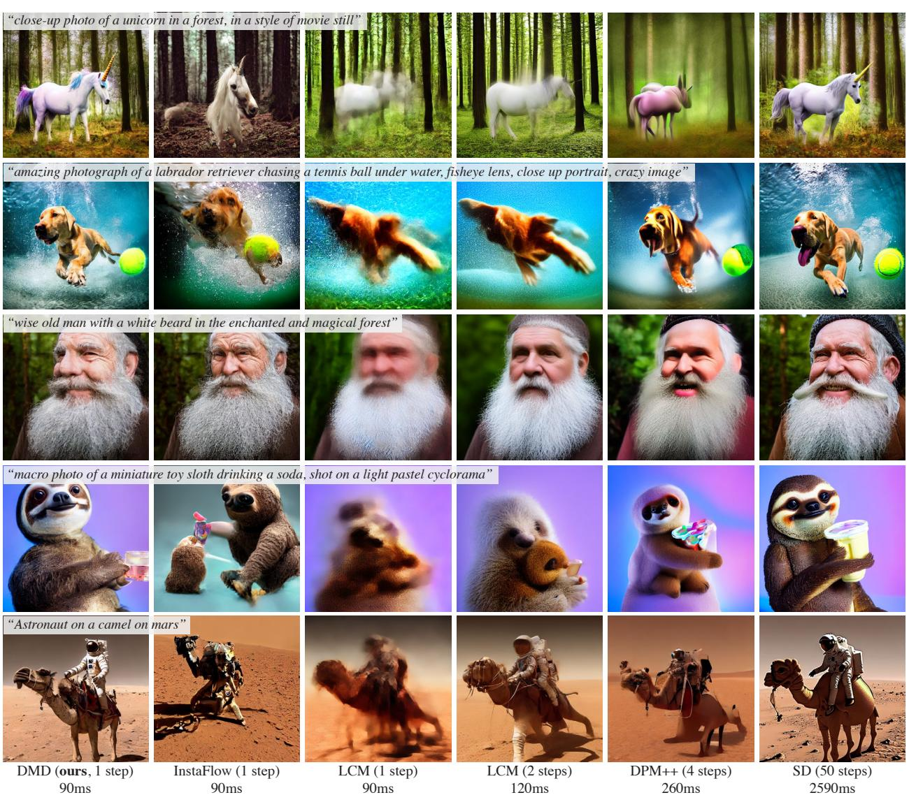  
.

Table 4. FID/CLIP-Score comparison on MS COCO-30K. †Results are evaluated by us. LCM-LoRA is trained with a guidance scale of 7.5. We use a guidance scale of 8 for all the other methods. Latency is measured with a batch size of 1.   

<table><tr><td colspan="3">Method Latency (↓) FID (↓) CLIP-Score (↑)</td></tr><tr><td>DPM++ (4 step)[46]†</td><td>0.26s 22.44</td><td>0.309</td></tr><tr><td>UniPC (4 step)[91]†</td><td>0.26s 23.30</td><td>0.308</td></tr><tr><td>LCM-LoRA (1 step) [49]†</td><td>0.09s 77.90</td><td>0.238</td></tr><tr><td>LCM-LoRA (2 step) [49]†</td><td>0.12s 24.28</td><td>0.294</td></tr><tr><td>LCM-LoRA (4 step) [49]†</td><td>0.19s 23.62</td><td>0.297</td></tr><tr><td>DMD (Ours)</td><td>0.09s 14.93</td><td>0.320</td></tr><tr><td>SDv1.5† (Teacher) [63]</td><td>2.59s 13.45</td><td>0.322</td></tr></table>

# Acknowledgements

This work was started while TY was an intern at Adobe Research. We are grateful for insightful discussions with Yilun Xu, Guangxuan Xiao, and Minguk Kang. This work is supported, in part by NSF grants 2105819, 1955864, and 2019786 (IAIFI), by the Singapore DSTA under DST00OECI20300823 (New Representations for Vision), as well as by funding from GIST and Amazon.

# References

[1] Siddarth Asokan, Nishanth Shetty, Aadithya Srikanth, and Chandra Sekhar Seelamantula. Gans settle scores! arXiv preprint arXiv:2306.01654, 2023. 3   
[2] Yogesh Balaji, Seungjun Nah, Xun Huang, Arash Vahdat, Jiaming Song, Karsten Kreis, Miika Aittala, Timo Aila, Samuli Laine, Bryan Catanzaro, et al. ediffi: Text-to-image diffusion models with an ensemble of expert denoisers. arXiv preprint arXiv:2211.01324, 2022. 2, 7   
[3] David Berthelot, Arnaud Autef, Jierui Lin, Dian Ang Yap, Shuangfei Zhai, Siyuan Hu, Daniel Zheng, Walter Talbot, and Eric Gu. Tract: Denoising diffusion models with transitive closure time-distillation. arXiv preprint arXiv:2303.04248, 2023. 2, 3, 6, 14   
[4] Andrew Brock, Jeff Donahue, and Karen Simonyan. Large scale gan training for high fidelity natural image synthesis. In ICLR, 2019. 3, 6, 14   
[5] Huiwen Chang, Han Zhang, Jarred Barber, AJ Maschinot, Jose Lezama, Lu Jiang, Ming-Hsuan Yang, Kevin Murphy, William T Freeman, Michael Rubinstein, et al. Muse: Textto-image generation via masked generative transformers. In ICML, 2023. 3   
[6] Nanxin Chen, Yu Zhang, Heiga Zen, Ron J Weiss, Mohammad Norouzi, and William Chan. Wavegrad: Estimating gradients for waveform generation. In ICLR, 2021. 2   
[7] Tianqi Chen, Bing Xu, Chiyuan Zhang, and Carlos Guestrin. Training deep nets with sublinear memory cost. arXiv preprint arXiv:1604.06174, 2016. 13   
[8] Jia Deng, Wei Dong, Richard Socher, Li-Jia Li, Kai Li, and Li Fei-Fei. Imagenet: A large-scale hierarchical image database. In CVPR, 2009. 2, 6   
[9] Prafulla Dhariwal and Alexander Nichol. Diffusion models beat gans on image synthesis. In NeurIPS, 2021. 6   
[10] Gintare Karolina Dziugaite, Daniel M Roy, and Zoubin Ghahramani. Training generative neural networks via maximum mean discrepancy optimization. In UAI, 2015. 3   
[11] Patrick Esser, Johnathan Chiu, Parmida Atighehchian, Jonathan Granskog, and Anastasis Germanidis. Structure and content-guided video synthesis with diffusion models. In CVPR, 2023. 2   
[12] Jean-Yves Franceschi, Mike Gartrell, Ludovic Dos Santos, Thibaut Issenhuth, Emmanuel de Bézenac, Mickaël Chen, and Alain Rakotomamonjy. Unifying gans and score-based diffusion as generative particle models. In NeurIPS, 2023. 3   
[13] Oran Gafni, Adam Polyak, Oron Ashual, Shelly Sheynin, Devi Parikh, and Yaniv Taigman. Make-a-scene: Scenebased text-to-image generation with human priors. In ECCV, 2022. 7   
[14] Xinyu Gong, Shiyu Chang, Yifan Jiang, and Zhangyang Wang. Autogan: Neural architecture search for generative adversarial networks. In ICCV, 2019. 14   
[15] Ian Goodfellow, Jean Pouget-Abadie, Mehdi Mirza, Bing Xu, David Warde-Farley, Sherjil Ozair, Aaron Courville, and Yoshua Bengio. Generative Adversarial Nets. In NIPS, 2014. 1, 2, 3   
[16] Jiatao Gu, Shuangfei Zhai, Yizhe Zhang, Lingjie Liu, and Joshua M Susskind. Boot: Data-free distillation of denoising diffusion models with bootstrapping. In ICML 2023 Workshop on Structured Probabilistic Inference & Generative Modeling, 2023. 2, 3, 6 [17] Amir Hertz, Kfir Aberman, and Daniel Cohen-Or. Delta denoising score. In ICCV, 2023. 3 [18] Martin Heusel, Hubert Ramsauer, Thomas Unterthiner, Bernhard Nessler, and Sepp Hochreiter. Gans trained by a two time-scale update rule converge to a local nash equilibrium. In NeurIPS, 2017. 6 [19] Geoffrey Hinton, Oriol Vinyals, and Jeff Dean. Distilling the knowledge in a neural network. In NeurIPS 2014 Deep Learning Workshop, 2015. 2 [20] Jonathan Ho and Tim Salimans. Classifier-free diffusion guidance. In arXiv preprint arXiv:2207.12598, 2022. 5 [21] Jonathan Ho, Ajay Jain, and Pieter Abbeel. Denoising diffusion probabilistic models. In NeurIPS, 2020. 1, 2, 3, 4,   
5 [22] Jonathan Ho, William Chan, Chitwan Saharia, Jy Whang, Ruiqi Gao, Alexey Gritsenko, Diederik P Kingma, Ben Poole, Mohammad Norouzi, David J Fleet, et al. Imagen video: High definition video generation with diffusion models. arXiv preprint arXiv:2210.02303, 2022. 2 [23] Aapo Hyvärinen and Peter Dayan. Estimation of nonnormalized statistical models by score matching. JMLR,   
2005.2 [24] Phillip Isola, Jun-Yan Zhu, Tinghui Zhou, and Alexei A Efros. Image-to-image translation with conditional adversarial networks. In CVPR, 2017. 2, 3 [25] Yifan Jiang, Shiyu Chang, and Zhangyang Wang. Transgan: Two pure transformers can make one strong gan, and that can scale up. In NeurIPS, 2021. 14 [26] Minguk Kang, Jun-Yan Zhu, Richard Zhang, Jaesik Park, Eli Shechtman, Sylvain Paris, and Taesung Park. Scaling up gans for text-to-image synthesis. In CVPR, 2023. 2, 3, 7, 13 [27] Tero Karras, Timo Aila, Samuli Laine, and Jaakko Lehtinen. Progressive growing of gans for improved quality, stability, and variation. In ICLR, 2018. 2 [28] Tero Karras, Samuli Laine, and Timo Aila. A style-based generator architecture for generative adversarial networks. In CVPR, 2019. 3 [29] Tero Karras, Miika Aittala, Janne Hellsten, Samuli Laine, Jaakko Lehtinen, and Timo Aila. Training generative adversarial networks with limited data. In NeurIPS, 2020. 14 [30] Tero Karras, Samuli Laine, Miika Aittala, Janne Hellsten, Jaakko Lehtinen, and Timo Aila. Analyzing and improving the image quality of stylegan. In CVPR, 2020. 2, 3, 14 [31] Tero Karras, Miika Aittala, Timo Aila, and Samuli Laine. Elucidating the design space of diffusion-based generative models. In NeurIPS, 2022. 2, 4, 5, 6, 12, 14 [32] Sergey Kastryulin, Jamil Zakirov, Denis Prokopenko, and Dmitry V. Dylov. Pytorch image quality: Metrics for image quality assessment, 2022. 12, 13 [33] Diederik Kingma, Tim Salimans, Ben Poole, and Jonathan Ho. Variational diffusion models. In NeurIPS, 2021. 4 [34] Diederik P Kingma and Max Welling. Auto-encoding variational baves, In ICIR 2014 1   
[35] Zhiteng Kong, We1 Ping, J1aj1 Huang, Kexin Zhao, and Bryan Catanzaro. Diffwave: A versatile diffusion model for audio synthesis. In ICLR, 2021. 2   
[36] Alex Krizhevsky et al. Learning multiple layers of features from tiny images. 2009. 2, 6   
[37] Hsin-Ying Lee, Hung-Yu Tseng, Qi Mao, Jia-Bin Huang, Yu-Ding Lu, Maneesh Singh, and Ming-Hsuan Yang. Drit++: Diverse image-to-image translation via disentangled representations. IJCV, 2020. 3   
[38] Kwonjoon Lee, Huiwen Chang, Lu Jiang, Han Zhang, Zhuowen Tu, and Ce Liu. Vitgan: Training gans with vision transformers. In ICLR, 2022. 14   
[39] Yujia Li, Kevin Swersky, and Rich Zemel. Generative moment matching networks. In ICML, 2015. 2, 3   
[40] Tsung-Yi Lin, Michael Maire, Serge Belongie, James Hays, Pietro Perona, Deva Ramanan, Piotr Dollár, and C Lawrence Zitnick. Microsoft coco: Common objects in context. In ECCV, 2014. 2   
[41] Luping Liu, Yi Ren, Zhijie Lin, and Zhou Zhao. Pseudo numerical methods for diffusion models on manifolds. In ICLR, 2022. 2, 5, 13   
[42] Xingchao Liu, Chengyue Gong, and Qiang Liu. Flow straight and fast: Learning to generate and transfer data with rectified flow. In ICLR, 2023. 1, 2, 3, 14   
[43] Xingchao Liu, Xiwen Zhang, Jianzhu Ma, Jian Peng, and Qiang Liu. Instaflow: One step is enough for high-quality diffusion-based text-to-image generation. arXiv prent arXiv:2309.06380, 2023. 1, 2, 3, 5, 7   
[44] Ilya Loshchilov and Frank Hutter. Decoupled weight decay regularization. In ICLR, 2019. 12, 13   
[45] Cheng Lu, Yuhao Zhou, Fan Bao, Jianfei Chen, Chongxuan Li, and Jun Zhu. Dpm-solver: A fast ode solver for diffusion probabilistic model sampling in around 10 steps. In NeurIPS, 2022. 2, 14   
[46] Cheng Lu, Yuhao Zhou, Fan Bao, Jianfei Chen, Chongxuan Li, and Jun Zhu. Dpm-solver $^ { + + }$ : Fast solver for guided sampling of diffusion probabilistic models. In arXiv preprint arXiv:2211.01095, 2022. 2, 7, 8, 13, 14   
[47] Eric Luhman and Troy Luhman. Knowledge distillation in iterative generative models for improved sampling speed. arXiv preprint arXiv:2101.02388, 2021. 1, 2, 14   
[48] Simian Luo, Yiqin Tan, Longbo Huang, Jian Li, and Hang Zhao. Latent consistency models: Synthesizing highresolution images with few-step inference. arXiv preprint arXiv:2310.04378, 2023. 1, 2, 7, 13   
[49] Simian Luo, Yiqin Tan, Suraj Patil, Daniel Gu, Patrick von Platen, Apolinário Passos, Longbo Huang, Jian Li, and Hang Zhao. Lcm-lora: A universal stable-diffusion acceleration module. arXiv preprint arXiv:2310.04378, 2023. 7, 8, 13   
[50] Weijian Luo, Tianyang Hu, Shifeng Zhang, Jiacheng Sun, Zhenguo Li, and Zhihua Zhang. Diff-instruct: A universal approach for transferring knowledge from pre-trained diffusion models. arXiv preprint arXiv:2305.18455, 2023. 3, 6, 14   
[51] Chenlin Meng, Robin Rombach, Ruiqi Gao, Diederik Kingma, Stefano Ermon, Jonathan Ho, and Tim Salimans. On distillation of guided diffusion models. In CVPR, 2023. 1 2 3 6 14   
[52] Alex Nichol, Prafulla Dhariwal, Aditya Ramesh, Pranav Shyam, Pamela Mishkin, Bob McGrew, Ilya Sutskever, and Mark Chen. Glide: Towards photorealistic image generation and editing with text-guided diffusion models. In ICML, 2022. 7   
[53] Ollin. Tiny autoencoder for stable diffusion. ht tps : / / github.com/madebyollin/taesd,2023. 13   
[54] Taesung Park, Ming-Yu Liu, Ting-Chun Wang, and Jun-Yan Zhu. Semantic image synthesis with spatially-adaptive normalization. In CVPR, 2019. 3   
[55] Taesung Park, Jun-Yan Zhu, Oliver Wang, Jingwan Lu, Eli Shechtman, Alexei Efros, and Richard Zhang. Swapping autoencoder for deep image manipulation. In NeurIPS, 2020. 3   
[56] Gaurav Parmar, Richard Zhang, and Jun-Yan Zhu. On aliased resizing and surprising subtleties in gan evaluation. In CVPR, 2022. 14   
[57] Dustin Podell, Zion English, Kyle Lacey, Andreas Blattmann, Tim Dockhorn, Jonas Müller, Joe Penna, and Robin Rombach. Sdxl: Improving latent diffusion models for high-resolution image synthesis. arXiv preprint arXiv:2307.01952, 2023. 7   
[58] Ben Poole, Ajay Jain, Jonathan T Barron, and Ben Mildenhall. Dreamfusion: Text-to-3d using 2d diffusion. In ICLR, 2023. 3, 5, 6, 7   
[59] Alec Radford, Jong Wook Kim, Chris Hallacy, Aditya Ramesh, Gabriel Goh, Sandhini Agarwal, Girish Sastry, Amanda Askell, Pamela Mishkin, Jack Clark, et al. Learning transferable visual models from natural language supervision. In ICML, 2021. 6   
[60] Aditya Ramesh, Mikhail Pavlov, Gabriel Goh, Scott Gray, Chelsea Voss, Alec Radford, Mark Chen, and Ilya Sutskever. Zero-shot text-to-image generation. In ICML, 2021. 3, 7   
[61] Aditya Ramesh, Prafulla Dhariwal, Alex Nichol, Casey Chu, and Mark Chen. Hierarchical text-conditional image generation with clip latents. arXiv preprint arXiv:2204.06125, 2022. 1, 2, 3, 7   
[62] Scott Reed, Zeynep Akata, Xinchen Yan, Lajanugen Logeswaran, Bernt Schiele, and Honglak Lee. Generative adversarial text to image synthesis. In ICML, 2016. 2   
[63] Robin Rombach, Andreas Blattmann, Dominik Lorenz, Patrick Esser, and Björn Ommer. High-resolution image synthesis with latent diffusion models. In CVPR, 2022. 1, 2, 4, 5, 7, 8, 13   
[64] Chitwan Saharia, William Chan, Saurabh Saxena, Lala Li, Jay Whang, Emily L Denton, Kamyar Ghasemipour, Raphael Gontijo Lopes, Burcu Karagol Ayan, Tim Salimans, et al. Photorealistic text-to-image diffusion models with deep language understanding. In NeurIPS, 2022. 1, 2, 3, 7   
[65] Tim Salimans and Jonathan Ho. Progressive distillation for fast sampling of diffusion models. In ICLR, 2022. 1, 2, 3, 6, 14   
[66] Axel Sauer, Katja Schwarz, and Andreas Geiger. Styleganxl: Scaling stylegan to large diverse datasets. In SIGGRAPH, 2022. 14   
[67] Axel Sauer, Tero Karras, Samuli Laine, Andreas Geiger, and Timo Aila. Stylegan-t: Unlocking the power of gans for fast large-scale text-to-image svnthesis. ICML. 2023. 3. 7   
[68] Axel Sauer, Dominik Lorenz, Andreas Blattmann, and Robin Rombach. Adversarial diffusion distillation. arXiv preprint arXiv:2311.17042, 2023. 3   
[69] Christoph Schuhmann, Romain Beaumont, Richard Vencu, Cade Gordon, Ross Wightman, Mehdi Cherti, Theo Coombes, Aarush Katta, Clayton Mullis, Mitchell Wortsman, etl. Laion-An open largescale dataset for traii next generation image-text models. In NeurIPS, 2022. 3, 6, 7, 13   
[70] Uriel Singer, Adam Polyak, Thomas Hayes, Xi Yin, Jie An, Songyang Zhang, Qiyuan Hu, Harry Yang, Oron Ashual, Oran Gafni, et al. Make-a-video: Text-to-video generation without text-video data. arXiv preprint arXiv:2209.14792, 2022. 2   
[71] Jascha Sohl-Dickstein, Eric Weiss, Niru Maheswaranathan, and Surya Ganguli. Deep unsupervised learning using nonequilibrium thermodynamics. In ICML, 2015. 1, 2, 4   
[72] Jiaming Song, Chenlin Meng, and Stefano Ermon. Denoising diffusion implicit models. In ICLR, 2021. 2, 5, 14   
[73] Yang Song and Stefano Ermon. Generative modeling by estimating gradients of the data distribution. In NeurIPS, 2019. 2, 4   
[74] Yang Song, Jascha Sohl-Dickstein, Diederik P Kingma, Abhishek Kumar, Stefano Ermon, and Ben Poole. Score-based generative modeling through stochastic differential equations. In ICLR, 2021. 1, 2, 4   
[75] Yang Song, Prafulla Dhariwal, Mark Chen, and Ilya Sutskever. Consistency models. In ICML, 2023. 1, 2, 3, 5, 6, 12, 13, 14   
[76] Yuan Tian, Qin Wang, Zhiwu Huang, Wen Li, Dengxin Dai, Minghao Yang, Jun Wang, and Olga Fink. Off-policy reinforcement learning for efficient and effective gan architecture search. In ECCV, 2020. 14   
[77] Pascal Vincent. A connection between score matching and denoising autoencoders. Neural Computation, 2011. 5   
[78] Patrick von Platen, Suraj Patil, Anton Lozhkov, Pedro Cuenca, Nathan Lambert, Kashif Rasul, Mishig Davaadorj, and Thomas Wolf. Diffusers: State-of-the-art diffusion models. https://github.com/huggingface/ diffusers, 2022. 13   
[79] Ting-Chun Wang, Ming-Yu Liu, Jun-Yan Zhu, Andrew Tao, Jan Kautz, and Bryan Catanzaro. High-resolution image synthesis and semantic manipulation with conditional gans. In CVPR, 2018. 3   
[80] Zhengyi Wang, Cheng Lu, Yikai Wang, Fan Bao, Chongxuan Li, Hang Su, and Jun Zhu. Prolificdreamer: High-fidelity and diverse text-to-3d generation with variational score distillation. arXiv preprint arXiv:2305.16213, 2023. 2, 3, 4, 5, 6,   
[81] Zhendong Wang, Huangjie Zheng, Pengcheng He, Weizhu Chen, and Mingyuan Zhou. Diffusion-gan: Training gans with diffusion. In ICLR, 2023. 3, 14   
[82] Romann M Weber. The score-difference flow for implicit generative modeling. arXiv preprint arXiv:2304.12906, 2023. 3   
[83] Zhisheng Xiao, Karsten Kreis, and Arash Vahdat. Tackling the generative learning trilemma with denoising diffusion gans. In ICLR, 2022. 2, 3, 14   
[84] Yanwu Xu, Yang Zhao, Zhisheng Xiao, and Tingbo Hou. Ufogen: You forward once large scale text-to-image generation via diffusion gans. arXiv preprint arXiv:2311.09257, 2023. 3, 7   
[85] Senmao Ye and Fei Liu. Score mismatching for generative modeling. arXiv preprint arXiv:2309.11043, 2023. 3, 14   
[86] Mingxuan Yi, Zhanxing Zhu, and Song Liu. Monoflow: Rethinking divergence gans via the perspective of wasserstein gradient flows. In ICML, 2023. 3   
[87] Jiahui Yu, Yuanzhong Xu, Jing Yu Koh, Thang Luong, Gunjan Baid, Zirui Wang, Vijay Vasudevan, Alexander Ku, Yinfei Yang, Burcu Karagol Ayan, et al. Scaling autoregressive models for content-rich text-to-image generation. arXiv preprint arXiv:2206.10789, 2(3):5, 2022. 3, 7   
[88] Han Zhang, Tao Xu, Hongsheng Li, Shaoting Zhang, Xiaogang Wang, Xiaolei Huang, and Dimitris N Metaxas. Stackgan++: Realistic image synthesis with stacked generative adversarial networks. TPAMI, 2018. 2   
[89] Richard Zhang, Phillip Isola, Alexei A Efros, Eli Shechtman, and Oliver Wang. The unreasonable effectiveness of deep features as a perceptual metric. In CVPR, 2018. 3, 5, 14   
[90] Shengyu Zhao, Jonathan Cui, Yilun Sheng, Yue Dong, Xiao Liang, Eric I Chang, and Yan Xu. Large scale image completion via co-modulated generative adversarial networks. In ICLR, 2021. 3   
[91] Wenliang Zhao, Lujia Bai, Yongming Rao, Jie Zhou, and Jiwen Lu. Unipc: A unified predictor-corrector framework for fast sampling of diffusion models. arXiv preprint arXiv:2302.04867, 2023. 1, 2, 7, 8, 13   
[92] Hongkai Zheng, Weili Nie, Arash Vahdat, Kamyar Azizzadenesheli, and Anima Anandkumar. Fast sampling of diffusion models via operator learning. In ICML, 2023. 1, 2, 6, 14   
[93] Hongkai Zheng, Weili Nie, Arash Vahdat, Kamyar Azizzadenesheli, and Anima Anandkumar. Fast sampling of diffusion models via operator learning. In ICML, 2023. 2   
[94] Yufan Zhou, Ruiyi Zhang, Changyou Chen, Chunyuan Li, Chris Tensmeyer, Tong Yu, Jiuxiang Gu, Jinhui Xu, and Tong Sun.Towards language-ree training for text-to-mage generation. In CVPR, 2022. 7   
[95] Jun-Yan Zhu, Taesung Park, Phillip Isola, and Alexei A Efros. Unpaired image-to-image translation using cycleconsistent adversarial networks. In ICCV, 2017. 3

# Algorithm 2: distributionMatchingLoss # mu_real, mu_fake: denoising networks for real and fake distribution   
# x: fake sample generated by our one-step generator   
# min_dm_step, max_dm_step: timestep intervals for computing distribution matching loss   
# bs: batch size # random timesteps timestep $=$ randint(min_dm_step, max_dm_step, [bs]) noise $=$ randn_like(x)

# Diffuse generated sample by injecting noise # e.g. noise_x = x + noise \* sigma_t (EDM) noisy_x $=$ forward_diffusion(x, noise, timestep) $\#$ denoise using real and fake denoiser   
with_grad_disabled(): pred_fake_image $=$ mu_fake(noisy_x, timestep) pred_real_image $=$ mu_real(noisy_x, timestep)   
# The weighting_factor diverges slightly from our   
# paper's equation, adapting to accomodate the mean   
# prediction scheme we use here.   
weighting_factor $=$ abs(x - pred_real_image).mean( dim $=$ [1, 2, 3], keepdim=True)   
grad $=$ (pred_fake_image - pred_real_image) / weighting_factor # the loss that would enforce above grad loss $= \phantom { - } 0 . 5 \phantom { - } \star$ mse_loss(x, stopgrad(x - grad))

# Algorithm 3: denoisingLoss # pred_fake_image: denoised output by mu_fake on x_t # x: fake sample generated by our one-step generator # weight: weighting strategy(SNR+1/0.5^2 for EDM, SNR for SDvl.5) loss $=$ mean(weight $\star$ (pred_fake_image - x)\*\*2)

# Appendix

# A. Qualitative Speed Comparison

In the accompanying video material, we present a qualitative speed comparison between our one-step generator and the original stable diffusion model. Our one-step generator achieves comparable image quality with the Stable Diffusion model while being around $3 0 \times$ faster.

# B. Implementation Details

For a comprehensive understanding, we include the implementation specifics for constructing the KL loss for the generator $G$ in Algorithm 2 and training the fake score estimator parameterized by $\mu _ { \mathrm { f a k e } }$ in Algorithm 3.

# B.1. CIFAR-10

We distill our one-step generator from EDM [31] pretrained models, specifically utilizing "edm-cifar10-32x32- cond-vp" for class-conditional training and "edm-cifar10- $3 2 \mathrm { x } 3 2 $ -uncond-vp" for unconditional training. We use $\sigma _ { \mathrm { m i n } } = 0 . 0 0 2$ and $\sigma _ { \mathrm { m a x } } = 8 0$ and discretize the noise schedules into $1 0 0 0 { \mathrm { ~ b i n s } }$ . To create our distillation dataset, we generate 100,000 noise-image pairs for class-conditional training and 500,000 for unconditional training. This process utilizes the deterministic Heun sampler (with $S _ { \mathrm { c h u r n } } =$ 0) over 18 steps [31]. For the training phase, we use the AdamW optimizer [44], setting the learning rate at 5e-5, weight decay to 0.01, and beta parameters to (0.9, 0.999). We use a learning rate warmup of 500 steps. The model training is conducted across 7 GPUs, achieving a total batch size of 392. Concurrently, we sample an equivalent number of noise-image pairs from the distillation dataset to calculate the regression loss. Following Song et al. [75], we incorporate the LPIPS loss using a VGG backbone from the PIQ library [32]. Prior to input into the LPIPS network, images are upscaled to a resolution of $2 2 4 \times 2 2 4$ using bilinear upsampling. The regression loss is weighted at 0.25 $( \lambda _ { \mathrm { { r e g } } } = 0 . 2 5 )$ for class-conditional training and at 0.5 $( \lambda _ { \mathrm { { r e g } } } ~ = ~ 0 . 5 )$ for unconditional training. The weights for the distribution matching loss and fake score denoising loss are both set to 1. We train the model for 300,000 iterations and use a gradient clipping with a L2 norm of 10. The dropout is disabled for all networks following consistency model [75].

# B.2. ImageNet ${ \bf \delta } \mathbf { \delta } \mathbf { \delta } \mathbf { \delta } \mathbf { \delta } \mathbf { 6 4 }$

We distill our one-step generator from EDM [31] pretrained models, specifically utilizing "edm-imagenet-64x64-condadm" for class-conditional training. We use a $\sigma _ { \mathrm { m i n } } = 0 . 0 0 2$ and $\sigma _ { \mathrm { m a x } } = 8 0$ and discretize the noise schedules into 1000 bins. Initially, we prepare a distillation dataset by generating 25,000 noise-image pairs using the deterministic Heun sampler (with $S _ { \mathrm { c h u r n } } = 0 $ )over 256 steps [31]. For the training phase, we use the AdamW optimizer [44], setting the learning rate at 2e-6, weight decay to 0.01, and beta parameters to (0.9, 0.999). We use a learning rate warmup of 500 steps. The model training is conducted across 7 GPUs, achieving a total batch size of 336. Concurrently, we sample an equivalent number of noise-image pairs from the distillation dataset to calculate the regression loss. Following Song et al. [75], we incorporate the LPIPS loss using a VGG backbone from the PIQ library [32]. Prior to input into the LPIPS network, images are upscaled to a resolution of $2 2 4 \times 2 2 4$ using bilinear upsampling. The regression loss is weighted at 0.25 $( \lambda _ { \mathrm { r e g } } = 0 . 2 5 )$ , and the weights for the distribution matching loss and fake score denoising loss are both set to 1. We train the models for 350,000 iterations. We use mixed-precision training and a gradient clipping with a L2 norm of 10. The dropout is disabled for all networks following consistency model [75].

# B.3. LAION-Aesthetic $\mathbf { 6 . 2 5 + }$

We distill our one-step generator from Stable Diffusion v1.5 [63]. We use the LAION-Aesthetic $6 . 2 5 +$ [69] dataset, which contains around 3 million images. Initially, we prepare a distillation dataset by generating 500,000 noiseimage pairs using the deterministic PNMS sampler [41] over 50 steps with a guidance scale of 3. Each pair corresponds to one of the first 500,000 prompts of LAIONAesthetic $6 . 2 5 +$ For the training phase, we use the AdamW optimizer [44], setting the learning rate at 1e-5, weight decay to 0.01, and beta parameters to (0.9, 0.999). We use a learning rate warmup of 500 steps. The model training is conducted across 72 GPUs, achieving a total batch size of 2304. Simultaneously, noise-image pairs from the distillation dataset are sampled to compute the regression loss, with a total batch size of 1152. Given the memory-intensive nature of decoding generated latents into images using the VAE for regression loss computation, we opt for a smaller VAE network [53] for decoding. Following Song et al. [75], we incorporate the LPIPS loss using a VGG backbone from the PIQ library [32]. The regression loss is weighted at 0.25 $\lambda _ { \mathrm { { r e g } } } ~ = ~ 0 . 2 5 )$ , and the weights for the distribution matching loss and fake score denoising loss are both set to 1. We train the model for 20,000 iterations. To optimize GPU memory usage, we implement gradient checkpointing [7] and mixed-precision training. We also apply a gradient clipping with a L2 norm of 10.

# B.4. LAION-Aesthetic $\mathbf { 6 + }$

We distill our one-step generator from Stable Diffusion v1.5 [63]. We use the LAION-Aesthetic $^ { 6 + }$ [69] dataset, comprising approximately 12 million images. To prepare the distillation dataset, we generate 12,000,000 noise-image pairs using the deterministic PNMS sampler [41] over 50 steps with a guidance scale of 8. Each pair corresponds to a prompt from the LAION-Aesthetic $^ { 6 + }$ dataset. For training, we utilize the AdamW optimizer [44], setting the learning rate at 1e-5, weight decay to 0.01, and beta parameters to (0.9, 0.999). We use a learning rate warmup of 500 steps. To optimize GPU memory usage, we implement gradient checkpointing [7] and mixed-precision training. We also apply a gradient clipping with a L2 norm of 10. The training takes two weeks on approximately 80 A100 GPUs. During this period, we made adjustments to the distillation dataset size, the regression loss weight, the type of VAE decoder, and the maximum timestep for the distribution matching loss computation. A comprehensive training log is provided in Table 5. We note that this training schedule, constrained by time and computational resources, may not be the most efficient or optimal.

<table><tr><td>Version #Reg. Pair</td><td>Reg. Weight</td><td></td><td>Max DM Step</td><td>VAE-Type</td><td>DM BS</td><td>Reg. BS</td><td>Cumulative Iter.</td><td>FID</td></tr><tr><td>V1</td><td>2.5M</td><td>0.1</td><td>980</td><td>Small</td><td>32</td><td>16</td><td>5400</td><td>23.88</td></tr><tr><td>V2</td><td>2.5M</td><td>0.5</td><td>980</td><td>Small</td><td>32</td><td>16</td><td>8600</td><td>18.21</td></tr><tr><td>V3</td><td>2.5M</td><td>1</td><td>980</td><td>Small</td><td>32</td><td>16</td><td>21100</td><td>16.10</td></tr><tr><td>V4</td><td>4M</td><td>1</td><td>980</td><td>Small</td><td>32</td><td>16</td><td>56300</td><td>16.86</td></tr><tr><td>V5</td><td>6M</td><td>1</td><td>980</td><td>Small</td><td>32</td><td>16</td><td>60100</td><td>16.94</td></tr><tr><td>V6</td><td>9M</td><td>1</td><td>980</td><td>Small</td><td>32</td><td>16</td><td>68000</td><td>16.76</td></tr><tr><td>V7</td><td>12M</td><td>1</td><td>980</td><td>Small</td><td>32</td><td>16</td><td>74000</td><td>16.80</td></tr><tr><td>V8</td><td>12M</td><td>1</td><td>500</td><td>Small</td><td>32</td><td>16</td><td>80000</td><td>15.61</td></tr><tr><td>V9</td><td>12M</td><td>1</td><td>500</td><td>Large</td><td>16</td><td>4</td><td>127000</td><td>15.33</td></tr><tr><td>V10</td><td>12M</td><td>0.75</td><td>500</td><td>Large</td><td>16</td><td>4</td><td>149500</td><td>15.51</td></tr><tr><td>V11</td><td>12M</td><td>0.5</td><td>500</td><td>Large</td><td>16</td><td>4</td><td>162500</td><td>15.05</td></tr><tr><td>V12</td><td>12M</td><td>0.25</td><td>500</td><td>Large</td><td>16</td><td>4</td><td>165000</td><td>14.93</td></tr></table>

Table 5. Training Logs for the LAION-Aesthetic $^ { 6 + }$ Dataset: 'Max DM step' denotes the highest timestep for noise injection in computing the distribution matching loss. "VAE-Type small" corresponds to the Tiny VAE decoder [53], while "VAE-Type large" indicates the standard VAE decoder used in SDv1.5. "DM BS" denotes the batch size used for the distribution matching loss while "Reg. BS" represents the batch size used for the regression loss.

# C. Baseline Details

# C.1. w/o Distribution Matching Baseline

This baseline adheres to the training settings outlined in Sections B.1 and B.2, with the distribution matching loss omitted.

# C.2. w/o Regression Loss Baseline

Following the training protocols from Sections B.1 and B.2, this baseline excludes the regression loss. To prevent training divergence, the learning rate is adjusted to 1e-5.

# C.3. Text-to-Image Baselines

We benchmark our approach against a variety of models, including the base diffusion model [63], fast diffusion solvers [46, 91], and few-step diffusion distillation baselines [48, 49]. Stable Diffusion We employ the StableDiffusion v1.5 model available on huggingface3, generating images with the PNMS sampler [41] over 50 steps. Fast Diffusion Solvers We use the UniPC [91] and DPMSolver $^ { + + }$ [46] implementations from the diffusers library [78], with all hyperparameters set to default values. LCM-LoRA We use the LCM-LoRA SDv1.5 checkpoints hosted on Hugging Face4. As the model is pre-trained with guidance, we do not apply classifier-free guidance during inference.

# D. Evaluation Details

For zero-shot evaluation on COCO, we employ the evaluation code from GigaGAN $[ 2 6 ]$ .Specifically, we generate 30,000 images using random prompts from the MSCOCO2014 validation set. We downsample the generated images from $5 1 2 \times 5 1 2$ to $2 5 6 \times 2 5 6$ using the PIL.Lanczos resizer. These images are then compared with 40,504 real images from the same validation set to calculate the FID metric using the clean-fid [56] library. Additionally, we employ the OpenCLIP-G backbone to compute the CLIP score. For ImageNet and CIFAR-10, we generate 50,000 images for each and calculate their FID using the EDM's evaluation code $[ 3 1 ] ^ { 6 }$ .

# E. CIFAR-10 Experiments

Following the setup outlined in Section B.1, we train our models on CIFAR-10 and conduct comparisons with other competing approaches. Table 6 summarizes the results.

Table 6. Sample quality comparison on CIFAR-10. Baseline numbers are derived from Song et al. [75]. †Methods that use classconditioning.   

<table><tr><td>Family</td><td>Method</td><td># Fwd Pass (↓)</td><td>FID ()</td></tr><tr><td rowspan="10">GAN</td><td>BigGAN† [4]</td><td>1</td><td>14.7</td></tr><tr><td>Diffusion GAN [83]</td><td>1</td><td>14.6</td></tr><tr><td>Diffusion StyleGAN [81]</td><td>1</td><td>3.19</td></tr><tr><td>AutoGAN [14]</td><td>1</td><td>12.4</td></tr><tr><td>E2GAN [76]</td><td>1</td><td>11.3</td></tr><tr><td>ViTGAN [38]</td><td>1</td><td>6.66</td></tr><tr><td>TransGAN [25]</td><td>1</td><td>9.26</td></tr><tr><td>StylegGAN2 [30]</td><td>1</td><td>6.96</td></tr><tr><td>StyleGAN2-ADA† [29]</td><td>1</td><td>2.42</td></tr><tr><td>StyleGAN-XL† [66]</td><td>1</td><td>1.85</td></tr><tr><td rowspan="5">Diffusion + Samplers</td><td>DDIM [72]</td><td>10</td><td>8.23</td></tr><tr><td>DPM-solver-2 [45]</td><td>10</td><td>5.94</td></tr><tr><td>DPM-solver-fast [45]</td><td>10</td><td>4.70</td></tr><tr><td>3-DEIS [92]</td><td>10</td><td>4.17</td></tr><tr><td>DPM-solver++ [46]</td><td>10</td><td>2.91</td></tr><tr><td rowspan="10">Diffusion + Distillation</td><td>Knowledge Distillation [47]</td><td>1</td><td>9.36</td></tr><tr><td>DFNO [92]</td><td>1</td><td>3.78</td></tr><tr><td>1-Rectified Flow (+distill) [42]</td><td>1</td><td>6.18</td></tr><tr><td>2-Rectified Flow (+distill) [42]</td><td>1</td><td>4.85</td></tr><tr><td>3-Rectified Flow (+distill) [42]</td><td>1</td><td>5.21</td></tr><tr><td>Progressive Distillation [65]</td><td>1</td><td>8.34</td></tr><tr><td>Meng et al. [51]†</td><td>1</td><td>5.98</td></tr><tr><td>Diff-Instruct [50]†</td><td>1</td><td>4.19</td></tr><tr><td>Score Mismatching [85]</td><td>1</td><td>8.10</td></tr><tr><td>TRACT [3]</td><td>1 1</td><td>3.78</td></tr><tr><td>DMD (Ours)</td><td>Consistency Model [75]</td><td></td><td>3.55</td></tr><tr><td></td><td></td><td>1</td><td>3.77</td></tr><tr><td></td><td>DMD-conditional (Ours)†</td><td>1</td><td>2.66</td></tr><tr><td>Diffusion</td><td>EDM† (Teacher) [31]</td><td>35</td><td>1.84</td></tr></table>

# F. Derivation for Distribution Matching Gradient

We present the derivation for Equation 7 as follows:

$$
\begin{array} { r l } & { \nabla _ { \theta } D _ { K L } \simeq \underset { z , t , x , x \ t } { \mathbb { E } } \left[ w _ { t } \big ( s _ { \mathrm { f a k e } } ( x _ { t } , t ) - s _ { \mathrm { r e a l } } ( x _ { t } , t ) \big ) \frac { \partial x _ { t } } { \partial \theta } \right] } \\ & { \quad \quad \quad = \underset { z , t , x , x \ t } { \mathbb { E } } \left[ w _ { t } \big ( s _ { \mathrm { f a k e } } ( x _ { t } , t ) - s _ { \mathrm { r e a l } } ( x _ { t } , t ) \big ) \frac { \partial x _ { t } } { \partial G _ { \theta } ( z ) } \frac { \partial G _ { \theta } ( z ) } { \partial \theta } \right] } \\ & { \quad \quad \quad = \underset { z , t , x , x \ t } { \mathbb { E } } \left[ w _ { t } \big ( s _ { \mathrm { f a k e } } ( x _ { t } , t ) - s _ { \mathrm { r e a l } } ( x _ { t } , t ) \big ) \frac { \partial x _ { t } } { \partial x } \frac { \partial G _ { \theta } ( z ) } { \partial \theta } \right] } \\ & { \quad \quad \quad = \underset { z , t , x , x \ t } { \mathbb { E } } \left[ w _ { t } \alpha _ { t } \big ( s _ { \mathrm { f a k e } } ( x _ { t } , t ) - s _ { \mathrm { r e a l } } ( x _ { t } , t ) \big ) \frac { d G } { d \theta } \right] } \end{array}
$$

# G. Prompts for Figure 1

We use the following prompts for Figure 1. From left to right: •A DSLR photo of a golden retriever in heavy snow. •A Lightshow at the Dolomities. • A professional portrait of a stylishly dressed elderly woman wearing very large glasses in the style of Iris Apfel, with highly detailed features. •Medium shot side profile portrait photo of a warrior chief, sharp facial features, with tribal panther makeup in blue on red, looking away, serious but clear eyes, $5 0 \mathrm { m m }$ portrait, photography, hard rim lighting photography. •A hyperrealistic photo of a fox astronaut; perfect face, artstation.

# H. Equivalence of Noise and Data Prediction

The noise prediction model $\boldsymbol { \epsilon } ( x _ { t } , t )$ and data prediction model $\mu ( x _ { t } , t )$ could be converted to each other according to the following rule [31]

$$
\mu ( x _ { t } , t ) = \frac { x _ { t } - \sigma _ { t } \epsilon ( x _ { t } , t ) } { \alpha _ { t } } , \quad \epsilon ( x _ { t } , t ) = \frac { x _ { t } - \alpha _ { t } \mu ( x _ { t } , t ) } { \sigma _ { t } } .
$$

# I. Further Analysis of the Regression Loss

DMD utilizes a regression loss to stabilize training and mitigate mode collapse (Sec. 3.3). In our paper, we mainly adopt the LPIPS [89] distance function, as it has been commonly adopted in prior works. For further analysis, we experiment with a standard L2 distance to train our distilled model on the CIFAR-10 dataset. The model trained using L2 loss achieves an FID score of 2.78, compared to 2.66 with LPIPS, demonstrating the robustness of our method to different loss functions.

# J. More Qualitative Results

We provide additional qualitative results on ImageNet (Fig. 7), LAION (Fig. 8, 9, 10, 11), and CIFAR10 (Fig. 12, 13).

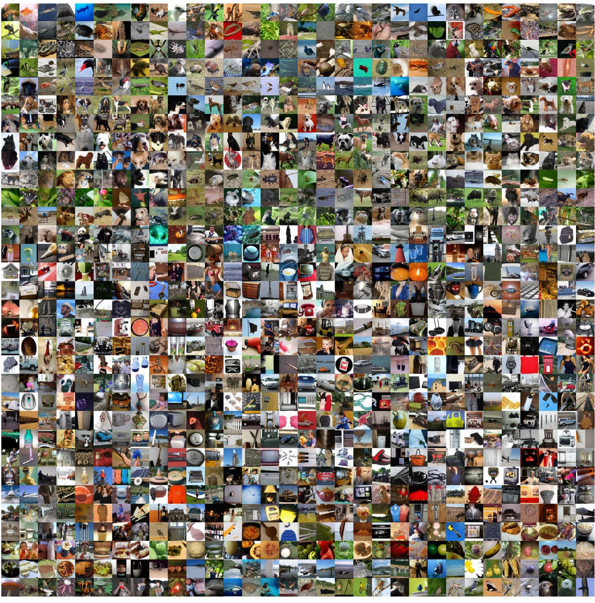  
Figure 7. One-step samples from our class-conditional model on ImageNet $\mathrm { F I D } { = } 2 . 6 2$

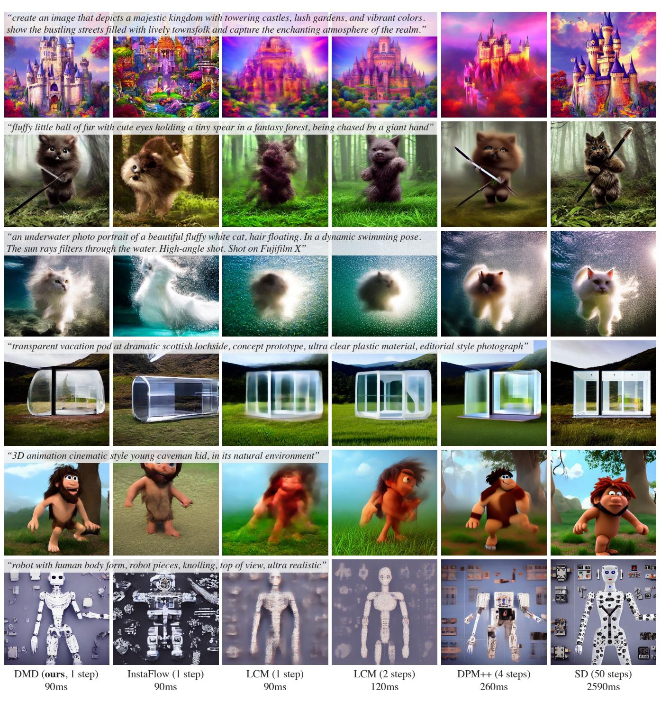  
.

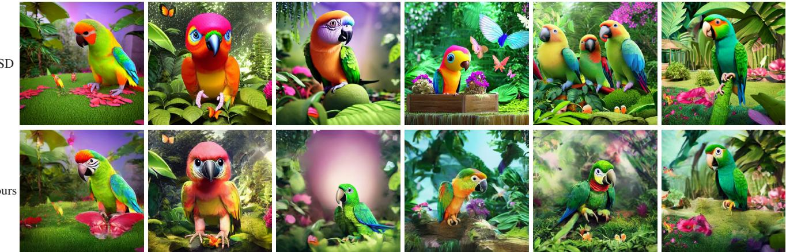

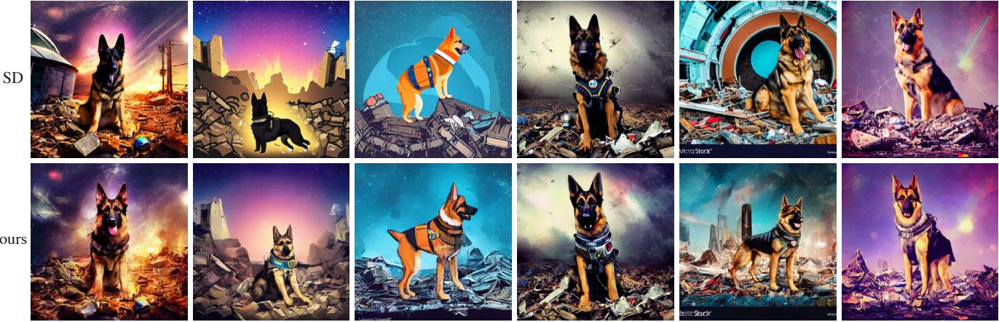  
"a dog of the german shepherd breed, wearing a space suit, in a post-pocalyptic world, among debris, rubble, dramatic colors, cinematic lighting, vivid colors, sparkling colors, full colors/vector"

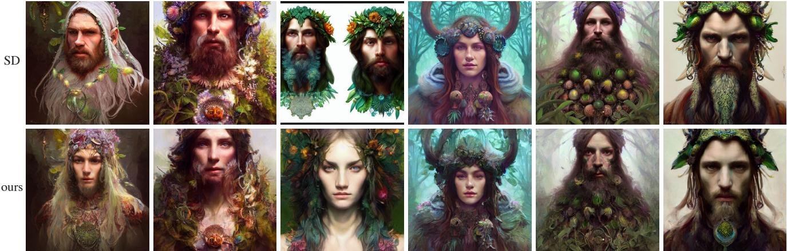  
"druid portrait by mandy jurgens and warhol, ernst haeckel, james jean, artstation"   
speed $3 0 \times$ faster.

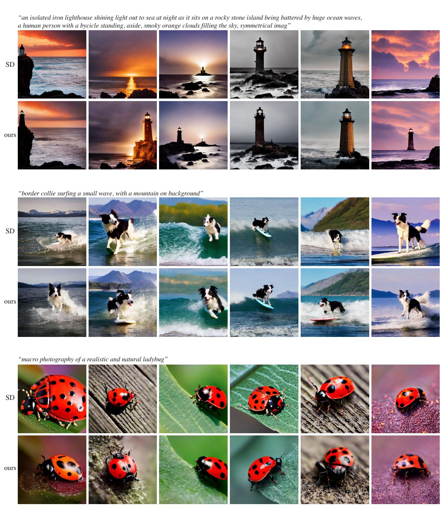  
speed $3 0 \times$ faster.

  
water droplets, bright volumetric lighting,Nikon 200mm lens, 1/8000 sec shutter speed"

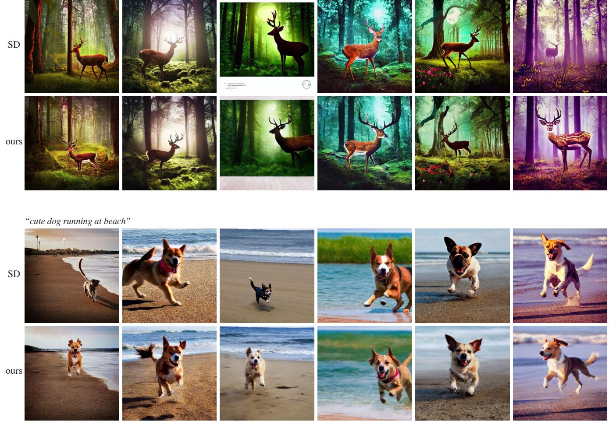  

speed $3 0 \times$ faster.

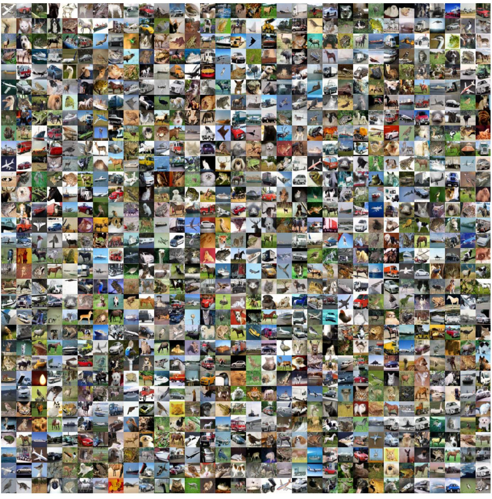  
Figure 12. One-step samples from our class-conditional model on CIFAR-10 $\mathrm { F I D } { = } 2 . 6 6 )$ .

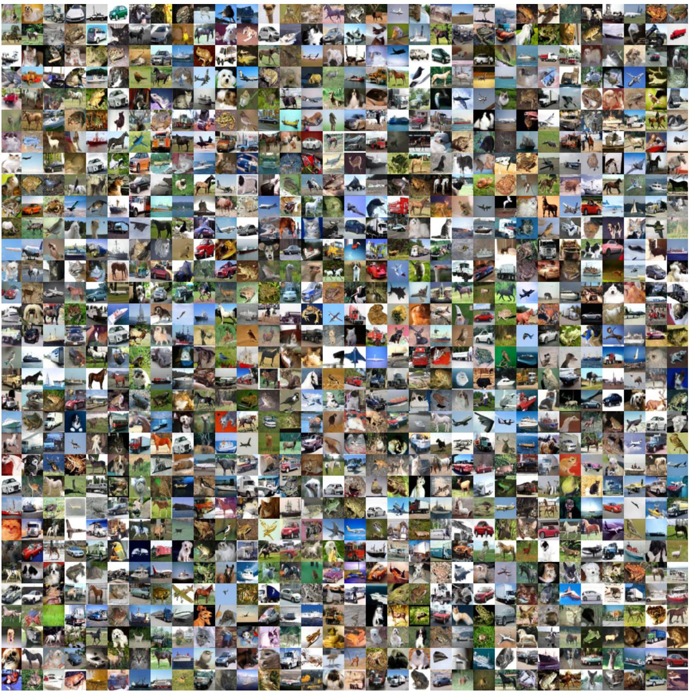  
Figure 13. One-step samples from our unconditional model on CIFAR-10 $\mathrm { F I D } { = } 3 . 7 7 $ .