# $\mathbf { H } _ { 2 } \mathbf { O }$ : 适用于大型语言模型高效生成推理的重击者Oracle

张振宇1，盛颖2，周天逸$\mathbf { Z } \mathbf { h o u } ^ { 3 }$，陈天龙1，郑连敏4，蔡瑞思$\mathbf { C a i } ^ { 1 }$， 宋赵5，田元冬$\mathbf { T i a n } ^ { 6 }$，克里斯托弗$\mathbf { R } \acute { \mathbf { e } } ^ { 2 }$，克拉克·巴雷特²，王展阳1，陈倍迪6,7 1德克萨斯大学奥斯丁分校，2斯坦福大学，3加州大学圣地亚哥分校， 4加州大学伯克利分校，5Adobe研究院，6Meta AI（FAIR），7卡内基梅隆大学 {zhenyu.zhang,tianlong.chen,ruisi.cai,atlaswang}@utexas.edu,ying1123@stanford.edu,{chrismre,barrett}@cs.stanford.edu,t8zhou@ucsd.edu,lianminzheng@gmail.com,zsong@adobe.com,yuandong@meta.com,beidic@andrew.cmu.edu

# 摘要

大型语言模型（LLMs）尽管近期取得了令人瞩目的成就，但在部署上显著高成本，尤其是在长内容生成的应用中，如对话系统和故事创作。通常，除了模型参数外，还会在GPU内存中存储大量的瞬态状态信息，称为KV缓存，其耗用的内存随着序列长度和批大小线性增长。本文介绍了一种新颖的KV缓存实现方法，显著减少其内存占用。我们的方法基于一个重要观察，即在计算注意力分数时，少量的词元能够贡献大部分的价值。我们称这些词元为重击词（Heavy Hitters）$ ( \mathsf { H } _ { 2 } ) $ 。通过全面的研究，我们发现 $( i ) $ 重击词的出现是自然的，并且与文本中词元的频繁共现有很强的相关性，$( ii ) $ 删除它们会导致显著的性能下降。基于这些见解，我们提出了重击词预言机（Heavy Hitter Oracle）$ ( \mathsf { H } _ { 2 } \mathsf { O } ) $，这是一种KV缓存驱逐策略，动态保持近期和重击词的平衡。我们将KV缓存驱逐形式化为一个动态子模问题，并证明（在温和的假设下）我们的新驱逐算法的理论保证，这将为未来的研究提供指导。我们通过OPT、LLaMA和GPT-NeoX在一系列任务中验证了算法的准确性。在OPT-6.7B和OPT-30B上，我们的$ ( \mathsf { H } _ { 2 } \mathrm { O } ) $实现使用$ 20 \% $的重击词，将Three leading inference systems DeepSpeed Zero-Inference、Hugging Face Accelerate和FlexGen的吞吐量分别提升了高达$ 29 \times $、$ 29 \times $和$ 3 \times $。在相同批大小下，$ ( \mathsf { H } _ { 2 } \mathrm { O } ) $可以将延迟降低高达$ 1.9 \times $。代码可在以下链接获取： https: //github.com/FMInference/H20O。

# 1 引言

大型语言模型（LLMs）在内容创作、摘要生成和对话系统等多种自然语言处理应用中展现了卓越的能力。然而，它们的部署成本非常高。除了模型大小和注意力层的平方复杂度这一广泛研究的瓶颈外，用于存储生成过程中间注意力键和值的KV缓存大小问题日益突出，以避免重复计算。举例来说，一个拥有300亿参数的模型在输入批量大小为128、序列长度为1024的情况下会产生180GB的KV缓存。一种自然的解决方案是限制其最大大小，就像在经典的软件或硬件缓存中所做的那样。然而，在不降低准确率的情况下，减少LLMs中KV缓存的内存占用是一个挑战。

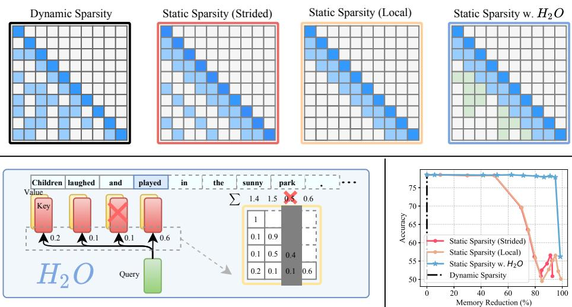  
Figure:Upper plots illustrate symbolic plots o anattention map deploying different KV cache policies in LLM generation. Lower right: contrasts their accuracy-memory trade-off. Left: the overview of ${ \sf H } _ { 2 } \sf { O }$ framework.

尽管在训练中已有大量关于稀疏注意力近似的文献，但它们在缓解 KV 缓存瓶颈方面并未得到广泛应用。首先，大多数现有方法，例如 Reformer 和 Flash Attention，旨在克服建模长序列时注意力机制所需的二次内存，但仍然需要较大的缓存大小。其次，诸如稀疏变换器、低秩变换器或多查询注意力等变体可以减少缓存大小，但直接将它们应用于预训练的大语言模型 (LLMs) 生成会导致高失效率，并降低准确性，如图 1 所示。最后，一些最近的进展如摘要令牌可以学习压缩文档的 KV 缓存，但其昂贵的驱逐策略在生成过程中难以实施。因此，一个理想的 KV 缓存应该具备： (i) 小的缓存大小以减少内存占用， (ii) 低失率以维持 LLM 的性能和长内容生成能力， (iii) 低成本的驱逐策略以减少生成过程中的实际时间。然而，这里存在三个技术挑战。首先，KV 缓存的大小是否可以受到限制并不明确——每个解码步骤原则上可能需要访问所有先前的注意力键和值。其次，识别一个能维持生成准确性的最佳驱逐策略是一个组合问题。最后，即便能够暴力破解出最佳策略，在实际应用中也难以部署。幸运的是，我们的初步探索对 LLM 的经验特性获得了一些有趣的观察。这些发现为高效 KV 缓存的潜在设计铺平了道路。针对小缓存大小的稀疏性：我们观察到，即使在密集训练时，LLM 的注意力矩阵在推理时也有超过 95% 的稀疏性（如图 2 所示）。这一现象在广泛的预训练 LLM 中都成立。因此，只有 5% 的 KV 缓存足以在每次生成步骤中解码出相同的输出令牌，这表明可能在不降低准确性的前提下将 KV 缓存大小减少多达 20 倍。针对低失率的重击者：我们发现所有令牌在注意力块中的累积注意力分数遵循幂律分布。这表明，在生成过程中存在一小部分影响力巨大的令牌，称为重击者。${ \sf H } _ { 2 } $ 提供了从组合搜索问题中脱离并识别维持准确性的驱逐策略的机会。针对低成本策略的贪婪算法：我们惊讶地发现，基于每个解码步骤的局部统计保留 ${ \sf H } _ { 2 } $——仅对前面的令牌求和注意力分数——与考虑未来令牌的注意力同样有效（如图 2 所示）。基于上述内容，我们首先在第 2.1 节中严格定义在大小受限的 KV 缓存下操作的 LLM 生成过程。然后我们提出了重击者神谕框架，这一框架利用 LLM 的特性并采用简单、低成本的驱逐策略，以保持 LLM 在生成过程中的质量。具体来说，

在第3节中，我们探讨了${ \sf H } _ { 2 }$在自注意力中的出现，揭示了其基本和关键的作用：(i) ${ \sf H } _ { 2 }$展现了文本数据中频繁共同出现词语间的强相关性；(ii) 完全移除${ \sf H } _ { 2 }$会严重损害模型的功能性。我们证明了${ \sf H } _ { 2 }$能够大幅降低上述现有策略的缓存未命中率。从理论上讲，假设注意力机制是次模的，${ \sf H } _ { 2 }$对应于贪婪算法，因此接近最优。在第4节中，我们提出了一种贪婪但低成本的${ \sf H } _ { 2 }$变体，该变体由每个解码步骤的累计注意力得分动态确定。我们将贪婪的${ \sf H } _ { 2 }$驱逐策略公式化为动态次模最大化的变体。分析表明，这产生了与使用${ \sf H } _ { 2 }$驱逐策略相似的生成过程。

我们在单个 NVIDIA A100（80GB）GPU 上对 OPT、LLaMA 和 GPT-NeoX 进行了广泛实验，以评估 ${ \sf H } _ { 2 } \mathrm { O }$ 在来自 lm-eval-harness [15] 和 HELM [16] 的一系列任务中的表现。我们在 FlexGen 基础上实现了 ${ \sf H } _ { 2 } \mathrm { O }$，可以轻松适应不同的缓存驱逐技术，从而生成一个高吞吐量推理系统。性能实验显示，我们的框架相比三种领先的推理系统（DeepSpeed Zero-Inference [17]、Hugging Face Accelerate [18] 和 FlexGen [19]），分别达到了 $2 9 \times$、$2 9 \times$、$3 \times$ 更高的吞吐量。在相同批量大小下，${ \sf H } _ { 2 } \mathrm { O }$ 的延迟比 FlexGen 低至 $1 . 9 \times$。

# 2 相关工作与问题设定

高效推理大型语言模型。大型语言模型（LLMs）庞大的参数数量对推理提出了显著的挑战。为了克服这一限制，以前的一些工作采用了具有特定设计的模型压缩技术，以实现高效的LLM推理，例如文献[20, 21, 22]中描述的方法，该方法对LLMs进行了一次性剪枝，即使没有重新训练也能实现几乎无效能下降。此外，其他方法探索了专门针对LLMs的量化技术，如文献[23, 24, 25, 26, 27, 28]所讨论的。此外，CoLT5 [29]采用了一种基于词元的条件计算策略，以降低整体计算成本。这些方法从不同的角度解决了高效推理的问题，并可以有机地集成。本研究中探讨的技术与剪枝或稀疏性密切相关，但关注的是一个独特的推理瓶颈，即KV缓存。一项相关工作[30]利用可学习机制来确定推理过程中必要的词元，但需要额外的微调过程，这使得该方法在实际应用中效果欠佳。稀疏低秩注意力近似。注意力模块的平方计算复杂性是变压器推理的主要瓶颈之一[31]。各种努力都旨在解决这一挑战[7, 9, 10]。例如，Reformer [7]通过局部敏感哈希将计算成本从平方复杂度降低到超线性复杂度。Performer [10]采用正交随机特征来逼近注意力核。一项相关工作Sparse Transformer [9]引入稀疏性以降低KV缓存的内存占用，并实现高效的注意力机制，被视为本文的基线。此外，SpAtten [32]利用累积的注意力得分选择重要的词元以实现高效的注意力推理，但未考虑不同注意力头和层级之间词元重要性的变异。与SpAtten的比较详见附录C.9。缓存。在优化系统性能方面，缓存发挥着关键作用，涉及到有效的驱逐策略的制定，以处理频繁访问的数据。传统方法如最近最少使用（Least Recently Used）和最少频繁使用（Least Frequently Used）[33, 34]优先考虑数据访问的时间和频率。与传统缓存相似，LLM推理的设计也面临许多相似的挑战。LLM推理分解。LLMs的生成过程包括两个不同的阶段：（i）提示阶段，在该阶段，输入序列用于生成KV缓存（包括键和值嵌入），类似于LLM训练期间使用的前向传播；（ii）词元生成阶段，利用并更新KV缓存以增量生成新词元。每个生成步骤依赖于先前生成的词元。本文的主要关注点是提高词元生成阶段注意力中KV缓存的效率，从而加速LLM推理。

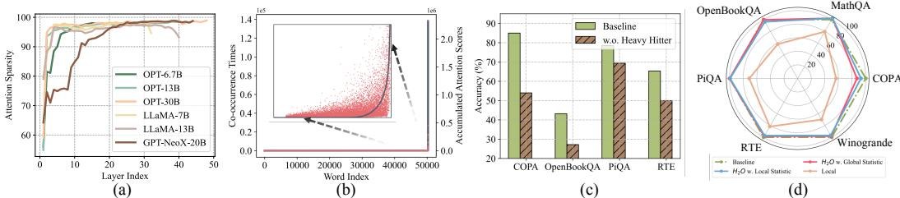  
ur : a)Attentin Sparsiy i pre-rained LLMs. ) The distribution  accumulate attentin core with respect to the coresponding word (red scatter) and the co-occurrence times of words in the data (graycurve). The $\mathbf { X }$ -axis represents the word index in the vocabulary. (c) The performance comparison between the baseline mol with ful KV and the model w.o. heavy hiter. (d) Comparison between the baseline model with full KV, ${ \sf H } _ { 2 } { \sf O }$ with the local statistic, ${ \sf H } _ { 2 } { \sf O }$ with the global statistic, and the model with only the most recent KV (Local). Apart from the baseline model, each model is evaluated with $2 0 \%$ KV cache budget.

# 2.1 问题表述

我们正式定义具有有限 KV 缓存大小的生成过程。将注意力查询矩阵表示为 $Q \in \mathbb{R}^{n \times d}$，将键矩阵表示为 $\bar{K} \in \mathbb{R}^{n \times d}$。$Q_{i,*}$ 表示第 $i$ 行 $Q$，$K_{\leq i,*}$ 表示 $K$ 的前 $i$ 行。令 $k$ 表示空间预算且 $k < n$。为简化起见，$K_{S_{i},*} \sim (\in \mathbb{R}^{i \times d})$ 表示从 $K$ 中选择 $S_{i}$ 行的 $K$ 的子矩阵。（对未选择的行 $[i] \backslash S_{i}$ ，我们在该行填入全零）驱逐策略定义如下：定义 2.1（驱逐策略，非正式）。令 $S_{i-1}$ 表示源集合，$S_{i}$ 表示目标集合。我们定义驱逐策略 $g : S_{i-1} \to S_{i}$，使得：$|S_{i}| = k$（KV 缓存大小在时间上不变）；$|S_{i} \rangle S_{i-1}| \leq 1$ 或等价地 $|S_{i} \cap S_{i-1}| \geq k - 1$（我们最多可以在 KV 缓存中驱逐 1 个 KV）。然后，我们定义具有我们驱逐策略的生成过程。定义 2.2（带驱逐策略的生成过程，非正式）。令 $k$ 表示 KV 缓存的大小。对于每个 $i \in [n]$，对于第 $i$ 个词元，我们有令 $S_{i} \subset [n]$ 表示在预测第 $i$ 个词元时 KV 缓存中的词元。

我们拥有的信息是一个长度为 $i$ 的向量 $o _ { i } : = D _ { i } ^ { - 1 } \cdot \mathrm { e x p } ( Q _ { i , * } ( K _ { S _ { i } , * } ) ^ { \top } )$ （归一化注意力）标量 $D _ { i } : = ( \exp ( Q _ { i , * } ( K _ { S _ { i } , * } ) ^ { \top } ) - \boldsymbol { 1 } _ { [ i ] \backslash S _ { i } } ) \cdot \mathbf { 1 } _ { i }$ （被驱逐的键值对设置为 0，在计算归一化时需要将其减去）将 $S _ { i }$ 替换为 [i] 后，上述 $o _ { i }$ 和 $D _ { i }$ 的定义将导致标准生成过程。驱逐策略（定义 2.1）根据 $S _ { i - 1 }$ 及其对应的信息更新 $S _ { i }$。备注 2.3。我们的目标是找到一种 KV 缓存驱逐策略，使得生成过程的输出与原始输出相似或可比，而不限制缓存大小。

# 3 个观察结果

我们提出了两个对大型语言模型（LLMs）的关键经验洞察，这些洞察启发了 ${ \sf H } _ { 2 } \mathrm { O }$ 的设计，如下所示。

# 3.1 小缓存大小下的稀疏性

受到前人文献的启发，我们揭示了DistillBERT中存在注意力稀疏性以及有界范数自注意头的存在。我们首先展示了在预训练大型语言模型（LLMs）中注意力稀疏性的观察。然后我们讨论它如何可能解锁在不降低准确性的情况下减少KV缓存大小的可能性。给定通过查询矩阵$Q$和键矩阵$K$计算得到的归一化注意力得分$\operatorname{Sof t m a x}(QK^{\top})$矩阵，我们将阈值设定为每行最大值的1%，并计算相应的稀疏性。观察。我们使用预训练的OPT模型对Wiki-Text-103的验证集进行零-shot推理。我们绘制了注意力块内的层级稀疏性，并可视化了归一化注意力得分矩阵。结果见图2 (a)。我们观察到，尽管LLMs是密集训练的，但得到的注意力得分矩阵非常稀疏，几乎所有层的稀疏性超过$95\%$。洞察。注意力块的稀疏性表明，在生成下一个标记时，访问所有先前的键和值嵌入是不必要的。这表明可以剔除不必要的KV嵌入，并减少生成过程中的KV缓存需求。

# 3.2 低漏报率的重击手

上一节展示了预训练大语言模型中注意力块的稀疏特性，这为设计小的键值缓存（KV cache）提供了机会，同时仍能保持大语言模型的性能。然而，确定最佳的驱逐策略以保持生成准确性则构成了组合挑战。尽管 Belady 算法在标准缓存（离线）中是最优且易于计算，但不适用于 KV 缓存设计。因为一旦驱逐重要的键值，可能会破坏大语言模型的性能，这归因于大语言模型生成中的序列依赖性。 观察。幸运的是，在我们探索的早期阶段，我们发现所有注意力块内所有词元的累积注意力分数遵循幂律分布，如图 2 所示。这表明在生成过程中存在一小部分关键词元。我们将这些词元称为重击词元 $( \mathsf { H } _ { 2 } )$。为了验证这些词元的重要性，我们比较了在掩盖重击词元后的大语言模型生成质量与原模型的生成质量。不出所料，如图 2 所示，准确性显著下降，确认了这些词元的重要性。此外，我们还可以看到每个词的累积注意力分数（红点）与其在数据中的共现（灰色曲线）具有高度相关性。 分析。首先，基于 ${ \sf H } _ { 2 }$，我们发现可以绕过组合搜索问题，设计一种保留大语言模型生成质量的 KV 缓存驱逐策略。我们进行了一项经验研究，实施了一种仅保留 ${ \sf H } _ { 2 }$ 的 KV 缓存驱逐策略，以及与当前词元的相关性。我们通过预训练的 OPT-30B 模型和六个下游任务评估该驱逐策略的有效性。这些评估的结果在图 2 中进行了展示。显然，基于 ${ \sf H } _ { 2 }$ 的驱逐策略可以在不降低 OPT-30B 性能的情况下大幅减少 KV 缓存的大小。此外，在后续分析中，受 [38] 的启发，我们发现基于 ${ \sf H } _ { 2 }$ 的策略与经典贪婪算法相关（是一种具有可证明保证的多项式时间算法），假设注意力方案是次模的。我们在附录 D 中提供了细节。引理 3.1（非正式）。假设注意力方案是次模的，则贪婪地构建集合 $S _ { i }$（没有缓存大小限制）在次模的意义上满足近似最优性质。

# 4 重量级统计查询oracle

本节的目标是提出基于 ${ \sf H } _ { 2 }$ 的贪心算法，并展示其可证明的保证。我们首先介绍称为 ${ \sf H } _ { 2 } \mathrm { O }$ 的基于 ${ \sf H } _ { 2 }$ 的缓存驱逐策略，并将其在大型语言模型生成中的部署形式化为一种子模最大化问题的变体，称为动态子模。然后，我们在生成过程中介绍 ${ \sf H } _ { 2 } \mathrm { O }$，接着给出我们提议的实际部署示例。最后，我们为 ${ \sf H } _ { 2 } \mathrm { O }$ 提供理论保证，并展示我们的高效系统实现。

# 4.1 低成本策略的贪心算法

我们已经展示了一种基于 ${ \sf H } _ { 2 }$ 的简单而有效的 KV 缓存策略。然而，由于我们无法访问未来生成的令牌，部署这样的算法是不切实际的。幸运的是，我们通过经验观察到，局部 ${ \sf H } _ { 2 }$（其利用每个解码步骤的局部统计数据，通过对先前令牌的注意力评分进行求和计算）与考虑未来令牌的注意力同样有效（如图 2 所示）。接下来，我们将这种动态注意力评分计算（由于空间限制）正式定义为一种新颖的动态次模类型问题。 定义 4.1（动态次模框架，非正式）。定义函数 $F : 2 ^ { [ n ] } \times 2 ^ { [ n ] } \to \mathbb { R }$，则对于任何集合 $Z \subset [ n ]$，我们假设 $F ( Z , \cdot ) : 2 ^ { [ n ] } \to \mathbb { R }$ 是相对于 $Z$ 的次模函数，即对于所有集合 $X , Y \subset [ n ]$，满足 $Z \subset X \subset Y$ 的情况下，对于所有元素 $x \in [ n ]$，满足 $x \in [ n ] \backslash Y$，都有 $f ( X \cup \{ x \} ) - f ( X ) \geq f ( Y \cup \{ x \} ) - f ( Y )$，其中 $f ( \cdot ) : = F ( Z , \cdot )$。 备注 4.2。我们提供了对定义 4.1 的实际见解。$X$ 表示 KV 缓存中现有的词。$Y$ 是 $X$ 的任何超集。$x$ 可以被视为一个“词”，它要么是新添加到 KV 缓存中的，要么是从 KV 缓存中已存在的词中删除的一个示例 $f$ 可以是注意力得分，即见算法 $I$。如果我们将序列 $S _ { 1 } , S _ { 2 } , \cdots , S _ { n }$ 加载到定义 4.1 中，即对于每个 $i \in [ n ]$，我们选择 $Z = S _ { i }$，那么它将成为动态次模问题的一个特定实例。 接下来，我们提供我们算法的正式描述，并附以示例。 定义 4.3 $\mathsf { H } _ { 2 } \mathsf { O }$ 驱逐策略)。设 $F _ { \mathrm { s c o r e } } : 2 ^ { [ n ] } \to \mathbb { R }$ 表示特定评分。设 $S _ { i - 1 }$ 表示源集合。设 $S _ { i }$ 表示目标集合。我们定义驱逐策略 $g : S _ { i - 1 } S _ { i }$ 使得。

• $| S _ { i } | = k$ （KV缓存大小在时间上保持不变）：$| S _ { i } \rangle S _ { i - 1 } | \leq 1$ 或等价地 $| S _ { i } \cap S _ { i - 1 } | \geq k - 1$ （我们最多可以在KV缓存中驱逐1个KV）我们构造 $S _ { i } \gets ( S _ { i - 1 } \cup \{ i \} ) \backslash \{ u \}$ $\begin{array} { r } { u \arg \operatorname* { m a x } _ { v \in ( S _ { i - 1 } \cup \{ i \} ) } F _ { \mathrm { s c o r e } } ( S _ { i - 1 } \cup \{ i \} \backslash \{ v \} \} } \end{array}$ $F _ { \mathrm { s c o r e }$即注意力矩阵中该集合的求和。

# 算法 1 H2 驱逐算法 20 过程 让 $k$ 表示缓存的预算大小 $\mathrm { H } _ { 2 \_ \mathrm { E V I C T I O N } ( Q , K \in \mathbb { R } ^ { n \times d } , k \in \mathbb { N } ) }$ $S _ { 0 } \gets \emptyset$ 对于 $i = 1 n$，如果 $i ≤ k$，则 $\overline { { S } } _ { i } \gets S _ { i - 1 } \cup \{ i \}$，否则 8: $\begin{array} { r l } & { \mathbf { \Phi } ^ { \mathbf { c } } } \\ & { \begin{array} { r l } { D _ { i } \gets ( \exp ( Q _ { i , * } ( K _ { S _ { i - 1 } , * } ) ^ { \top } ) - 1 _ { [ i ] \backslash S _ { i - 1 } } ) \cdot \mathbf { 1 } _ { i } } \\ { o _ { i } \gets D _ { i } ^ { - 1 } \cdot ( \exp ( Q _ { i , * } ( K _ { S _ { i - 1 } , * } ) ^ { \top } ) - 1 _ { [ i ] \backslash S _ { i - 1 } } ) } \end{array} } \\ & { \begin{array} { r l } & { F _ { \mathrm { s c o r e } } ( T ) : = \sum _ { s \in T } o _ { s } } \\ & { G _ { i } \gets S _ { i - 1 } \cup \{ i \} } \end{array} } \\ & { \begin{array} { r l } & { u \gets \underset { \textit { v } \in G _ { i } } { \exp \operatorname* { m a x } } F _ { \mathrm { s c o r e } } ( S _ { i - 1 } \cup \{ i \} \backslash \{ v \} ) } \\ & { v \in G _ { i } } \end{array} } \\ & { \begin{array} { r l } & { S _ { i } \gets ( S _ { i - 1 } \cup \{ i \} ) \backslash \{ u \} } \end{array} } \end{array}$ 9: 10: 11: 12: 13: 14: 结束如果 15: 结束对于 16: 结束过程

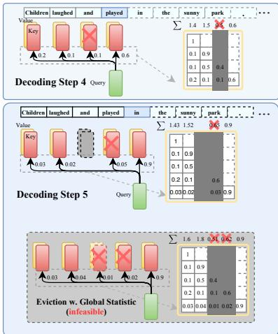  

Figure 3: Illustration of Algorithm 1 during two consecutive decoding steps.

图3展示了我们的 ${ \sf H } _ { 2 }$ 驱逐算法的一个示例。我们假设KV缓存的预算大小为3。在完成第四个解码步骤后，与第三个token关联的KV嵌入根据累积的注意力得分被驱逐。因此，这些被驱逐的KV嵌入在后续的解码步骤中变得不可访问。

# 4.2 理论保证与系统实现

我们陈述一个理论结果如下。证明和更多细节见附录 D。定理 4.4（非正式）。在温和的假设下，设 $k$ 为空间限制的预算。如果对于每个词元，我们根据前 $k$ 个选择贪婪地计算注意力得分，那么我们可以证明为每个词元 $i$ 生成的集合 $\widetilde { S } _ { i }$ 满足 $\begin{array} { r } { f ( \widetilde { S } _ { i } ) \geq ( 1 - \alpha ) ( 1 - 1 / e ) \operatorname* { m a x } _ { | S | = k } f ( S ) - \beta , } \end{array}$，其中 $\alpha , \beta > 0$ 是参数。备注 4.5。我们指出上述定理提供了一个理论解释，说明为什么我们可以期待我们的贪婪算法（具有缓存限制）能够为该问题提供一个良好的解决方案。实现细节。我们提供一个通用框架，可以支持任何 KV 缓存驱逐算法，并通过精心实现提高吞吐量并降低 LLM 生成的延迟。例如，为了确保 I/O 效率，当存储的 KV 被驱逐时，我们不进行内存交换，而是直接用新添加的 KV 填充。更多细节见附录 A。

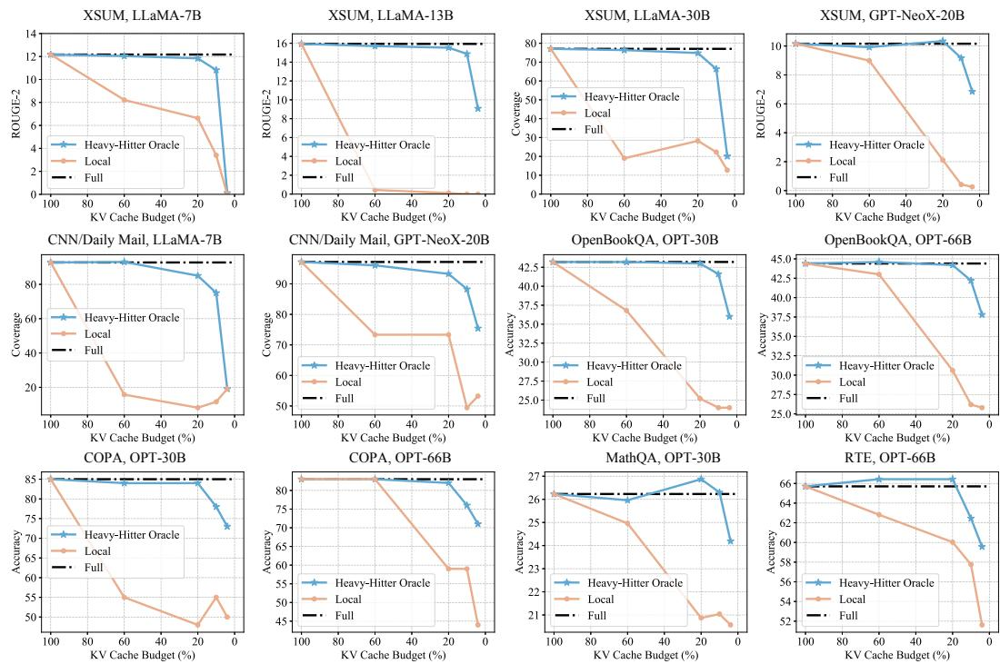  
Cpar esuts betee e ase moel ih u ce, ur ${ \sf H } _ { 2 } \mathrm { O }$ , and the "Local" strategy that utilizes the most recent KV embeddings.

# 5 实证评估

在本节中，我们的目标是展示 ${ \sf H } _ { 2 } \mathrm { O }$ 这一极为简单的 KV 缓存驱逐策略能够提高端到端吞吐量，减少墙内时延，同时在广泛的领域和任务中保持生成质量。在第 5.1 节中，我们展示了 ${ \sf H } _ { 2 } \mathrm { O }$ 能够在多种模型架构（OPT，LLaMA，GPT-NeoX）、大小（从 6.7B 到 175B）和评估基准（HELM 和 lm-eval-harness）上，将 KV 缓存的内存占用减少最多 $5 \times$，而不降低准确性。更重要的是，它能够增强现有 KV 缓存稀疏化技术的性能。 在第 5.2 节中，我们证明了与最先进的推理引擎 FlexGen、DeepSpeed 以及广泛使用的 Hugging Face Accelerate 相比， ${ \sf H } _ { 2 } \mathrm { O }$ 可以在不影响模型质量的情况下，推理吞吐量提高最多 $3 \times$、 $2 9 \times$ 和 $2 9 \times$。在第 5.3 节中，我们进行了广泛的消融研究，以显示 ${ \sf H } _ { 2 } \mathrm { O }$ 在不同序列长度下的有效性，特别是对无限序列长度的输入及其与量化的兼容性。所有细节（超参数、数据划分等）以及其他实验都在附录 A 中。

# 5.1 端到端结果

我们展示了 ${ \sf H } _ { 2 } \mathrm { O }$ 能够在实现大部分任务的可比准确率的同时，将 KV 缓存内存占用减少 $5 { - } 1 0 \times$。设置。我们的实验基于三种代表性的 LLM 模型系列，包括 OPT [39]、LLaMA [40] 和 GPT-NeoX-20B [41]。我们从两个流行的评估框架（HELM [16] 和 lm-eval-harness [15]）中随机抽取了八个任务：COPA [42]、MathQA [43]、OpenBookQA [44]、PiQA [45]、RTE [46]、Winogrande [47]、XSUM [48]、CNN/Daily Mail [49]。此外，我们还在最近的生成基准 AlpaceEval [50] 和 MT-bench [51] 上评估了我们的方法，具体细节见附录。我们使用 NVIDIA A100 80GB GPU。基线。由于 ${ \sf H } _ { 2 } \mathrm { O }$ 将缓存预算均匀分配给 ${ \sf H } _ { 2 }$ 和最近的 KV，除了完整的 KV 缓存外，我们将“局部”策略视为基线方法。此外，我们还提供了两种不同变体的稀疏变换器（跨步和固定）作为强基线。同时，完整 KV 缓存与少量示例（$0 / 1$ -shot）提示的组合被视为基线，其序列长度与具有 $2 0 \%$ KV 缓存预算的 5-shot 任务相似。

主要结果。我们评估了在5-shot下游任务中KV缓存预算从$4 \%$到$100 \%$的LLM表现。结果总结在图4及表1和表2中。可以得出以下观察：(1) 在不同的KV缓存预算下，我们的${ \sf H } _ { 2 } \mathrm { O }$在各种模型规模、模型类型和下游任务中表现出相对于“本地”策略的一致且显著的改进。与Sparse Transformer等其他基线进行比较时，我们也得出类似的结论；(2) 同时，在KV缓存预算低于$20 \%$（即内存减少超过$5 \times$）的情况下，${ \sf H } _ { 2 } \mathrm { O }$的性能与具有完整KV嵌入的模型相当；(3) 在$20 \%$的KV缓存预算下，${ \sf H } _ { 2 } \mathrm { O }$大约每个输入使用1.2个样本，且相较于使用1个和2个样本的零-shot和one-shot全模型表现出一致的改进。(4) 我们的${ \sf H } _ { 2 } \mathrm { O }$在更具挑战性的长序列生成任务（如XSUM和CNN/Daily Mail）中显示出持续的有效性。

Table 1: Quantatively comparison between ${ \sf H } _ { 2 } \mathrm { O }$ with Full methods of different number of shots.   

<table><tr><td>Methods</td><td>PiQA</td><td>COPA</td><td>OpenbookQA</td><td>Winogrande</td></tr><tr><td>Full</td><td>80.09</td><td>81.00</td><td>44.80</td><td>71.51</td></tr><tr><td>0-shot Full</td><td>78.89</td><td>76.00</td><td>41.40</td><td>70.00</td></tr><tr><td>1-shot Full</td><td>79.11</td><td>76.00</td><td>43.60</td><td>70.24</td></tr><tr><td>Local</td><td>57.94</td><td>56.00</td><td>28.40</td><td>51.30</td></tr><tr><td>H2O</td><td>79.22</td><td>85.00</td><td>43.80</td><td>71.67</td></tr></table>

分析。由于被驱逐的键值（KV）在未来步骤中将不可见，丢弃某些关键的KV嵌入可能导致严重的功能崩溃，从而造成显著的性能下降。例如，在{LLaMA13B, XSUM}和{LLaMA-7B, CNN/Daily Mail}中，“局部”策略在$6 0 \%$预算下崩溃，而我们的${ \sf H } _ { 2 } \mathrm { O }$在$2 0 \%$预算下仍能匹配全缓存的性能。在某些任务中，我们的方法甚至超越了基线模型，这表明我们的${ \sf H } _ { 2 } \mathrm { O }$具有正则化效果。例如，在$\{ \mathrm { O P T - 6 6 B , R T E } \}$、{OPT-30B, MathQA}以及$\mathrm { \{ G P T - N e o X - 2 0 B , X S U M \} }$中，我们的${ \sf H } _ { 2 } \mathrm { O }$在$2 0 \%$ KV缓存预算下分别实现了额外的$0 . 7 3 \%$、$0 . 6 4 \%$和0.18的性能提升。这些一致的结果验证了我们${ \sf H } _ { 2 } \mathrm { O }$框架的有效性。

Table 2: Results of different sparsification methods $w .$ or $w . o$ b ${ \sf H } _ { 2 }$ . Experiments are conducted with OPT-30B with $2 0 \%$ KV cache budget.   

<table><tr><td>Models</td><td>| COPA</td><td>OpenBookQA</td><td>PiQA</td><td>Winogrande</td></tr><tr><td>Full</td><td>85.00</td><td>43.20</td><td>78.51</td><td>70.24</td></tr><tr><td>Local w.o. H2</td><td>48.00</td><td>25.20</td><td>55.82</td><td>49.17</td></tr><tr><td>Local w. H2</td><td>84.00</td><td>43.00</td><td>78.45</td><td>69.06</td></tr><tr><td>Sparse Transformer (strided) w.o. H2</td><td>50.00</td><td>24.60</td><td>56.20</td><td>47.59</td></tr><tr><td>Sparse Transformer (strided) w. H2</td><td>83.00</td><td>42.60</td><td>78.24</td><td>69.61</td></tr><tr><td>Sparse Transformer (fixed) w.0. H2</td><td>61.00</td><td>23.80</td><td>58.60</td><td>49.88</td></tr><tr><td>Sparse Transformer (fixed) w. H2</td><td>76.00</td><td>41.40</td><td>77.80</td><td>64.96</td></tr></table>

增强基线技术。重要的是，我们观察到其他稀疏化基线在极低的缓存预算下失败，而将最新的 KV 嵌入与重发技术的嵌入结合起来成功地实现了与使用完整 KV 嵌入相当的性能。从表 2 中，我们可以观察到，“跨步”和“固定”稀疏注意力在 $20\%$ KV 缓存预算下失败，性能大幅下降（与完整缓存相比下降高达 $35\%$）。在与 ${ \sf H } _ { 2 }$ 结合后，这两种方法的性能达到了与使用完整 KV 嵌入相似的水平。

# 5.2 高吞吐量生成推理中的重头玩家

Table 3: Generation throughput (token/s) on a T4 GPU with different systems. In the sequence length row, we use $^ {  } 5 1 2 + 3 2 ^ { \prime \prime }$ to denote a prompt length of 512 and a generation length of 32. "00M" means out-of-memory. The ray text in the bracke denotes he effective batch sizeand the lowest level o thememoryhierarcy that the system needs for offloading, where $\mathbf { \ddot { C } } ^ { 5 }$ means CPU and "G" means GPU.   

<table><tr><td>Seq. length</td><td colspan="2">512+32</td><td colspan="2">512+512</td><td colspan="2">512+1024</td></tr><tr><td>Model size</td><td>6.7B</td><td>30B</td><td>6.7B</td><td>30B</td><td>6.7B</td><td>30B</td></tr><tr><td>Accelerate</td><td>20.4 (2, G)</td><td>0.6 (8, C)</td><td>15.5 (1, G)</td><td>0.6 (8, C)</td><td>5.6 (16, C)</td><td>0.6 (8, C)</td></tr><tr><td>DeepSpeed</td><td>10.2 (16, C)</td><td>0.6 (4, C)</td><td>9.6 (16, C)</td><td>0.6 (4, C)</td><td>10.1 (16, C)</td><td>0.6 (4, C)</td></tr><tr><td>FlexGen</td><td>20.2 (2, G)</td><td>8.1 (144, C)</td><td>16.8 (1, G)</td><td>8.5 (80, C)</td><td>16.9 (1, G)</td><td>7.1 (48, C)</td></tr><tr><td>H2O (20%)</td><td>35.1 (4, G)</td><td>12.7 (728, C)</td><td>51.7 (4, G)</td><td>18.83 (416, C)</td><td>52.1 (4, G)</td><td>13.82 (264, C)</td></tr></table>

Table 5: Generation throughput and latency on an $\mathrm { { A 1 0 0 } G P U }$ . In the sequence length row, we use $^ { \cdot \cdot } 7 0 0 0 + 1 0 2 4 ^ { \cdot \cdot }$ to denote a prompt length of 7000 and a generation length of 1024. "00M" means out-of-memory.   

<table><tr><td>Seq. length</td><td>Model size</td><td>Batch size</td><td>Metric</td><td>FlexGen</td><td>H20 (20%)</td></tr><tr><td>7000+1024</td><td>30B</td><td>1</td><td>latency (s)</td><td>57.0</td><td>50.4</td></tr><tr><td>5000+5000</td><td>13B</td><td>4</td><td>latency (s)</td><td>214.2</td><td>155.4</td></tr><tr><td>2048+2048</td><td>6.7B</td><td>24</td><td>latency (s)</td><td>99.5</td><td>53.5</td></tr><tr><td>2048+2048</td><td>6.7B</td><td>24</td><td>throughput (token/s)</td><td>494.1</td><td>918.9</td></tr><tr><td>2048+2048</td><td>6.7B</td><td>64</td><td>throughput (token/s)</td><td>OOM</td><td>1161.0</td></tr></table>

我们在最先进的推理引擎 FlexGen [19] 中实现了我们的 KV 缓存驱逐策略，并报告了吞吐量和延迟的改善。${ \sf H } _ { 2 } \mathrm { O }$ 与 FlexGen 中现有的优化措施，如卸载和量化，是正交的，因此可以结合使用以实现更好的性能。实验设置 我们在两块 GPU 上进行实验：一块是 NVIDIA T4（16GB）GPU，另一块是 NVIDIA A100（80GB）GPU。在 T4 GPU 上，我们按照 FlexGen 论文中的设置评估生成吞吐量。评估的模型为 OPT-6.7B 和

Table 4: Results of generation throughput (token/s) on a T4 GPU with different systems on real-world datasets, XSUM.   

<table><tr><td>Model size</td><td>6.7B</td><td>30B</td></tr><tr><td>Accelerate</td><td>11.98 (1, G)</td><td>0.23 (2, C)</td></tr><tr><td>DeepSpeed FlexGen</td><td>3.52 (6, C) 10.80 (1, G)</td><td>0.31 (2, C) 3.29 (44, C)</td></tr><tr><td>H2O (20%)</td><td>30.40 (1, G)</td><td>6.70 (180, C)</td></tr></table>

OPT-30B。当模型和KV缓存无法适应单个GPU时，我们启用CPU卸载。报告了纯GPU和启用CPU卸载的GPU的结果。所有的加速结果都是在端到端设置下测试的，包括预填充和生成阶段，并且包括构建 ${ \sf H } _ { 2 } \mathrm { O }$ KV缓存的时间。我们使用合成数据集，其中所有提示都填充到相同的长度。系统随后要求为每个提示生成相同数量的词元。我们测试了不同组合的提示和生成长度。我们还在真实世界数据集（XSUM）上测试了我们的方法以进行进一步评估。评估指标是生成吞吐量，即生成的词元数 / (提示时间 $^ +$ 解码时间)。我们使用DeepSpeed ZeRO-Inference [17]、Hugging Face Accelerate [18] 和 FlexGen [19] 作为基线。在A100 GPU上，我们评估了具有长达10K序列长度的系统性能，尽管OPT仅在2K序列长度上训练，但我们基准测试了吞吐量和延迟性能，以展示 ${ \sf H } _ { 2 } \mathrm { O }$ 对未来更好模型的潜力。

结果。表 3 和表 4 显示了所有系统在 T4 GPU 上的生成吞吐量。通过我们的键值缓存驱逐策略，内存使用得以减少，这带来了两个优势：1) 我们可以使用更大的批量大小；2) 我们可以设置从需要卸载到不需要卸载。如表 3 和表 4 所示，使用 $20\%$ 预算的 ${ \sf H } _ { 2 } \mathrm { O }$ 在合成和真实世界数据集上的生成吞吐量相比 FlexGen、DeepSpeed 和 Accelerate 分别提高了最多 $3 \times$、$2 9 \times$ 和 $2 9 \times$。在 A100 GPU 上，序列长度从 4K 到 10K 的结果列在表 5 中。在相同的批量大小下，${ \sf H } _ { 2 } \mathrm { O }$ 与 FlexGen 相比可以将延迟降低 $1 . 1 - 1 . 9 \times$。此外，${ \sf H } _ { 2 } \mathrm { O }$ 节省内存，因此允许更大的批量大小，为 OPT-6.7B 带来 $2 . 3 \times$ 的生成吞吐量提升。

# 5.3 消融实验结果

我们对${ \sf H } _ { 2 } \mathrm { O }$进行了广泛的消融研究，主要涉及以下方面：(1) 无限长度的输入，(2) 不同数量的样本，(3) 与KV缓存量化方法的兼容性，以及(4) 不同组件有效性的分析。我们发现${ \sf H } _ { 2 } \mathrm { O } $具有一个惊人的特性，它不仅提高了大语言模型的效率，还增加了生成文本的多样性。

$\varrho I$ : ${ \sf H } _ { 2 } \mathrm { O }$ 能否使大语言模型处理无限长度的输入？A1：有效生成序列长度可达四百万个词元。一些近期的工作[52, 53]展示了处理无限长度输入的可能性，这是当前大语言模型面临的一项显著挑战。这些方法采用了注意力汇聚机制，保留前几个词元，并在键值缓存中应用位置滚动，从而使大语言模型能够处理无限长度的输入。受到这一进展的启发，我们进一步实现了适用于无限长度输入的${ \sf H } _ { 2 } \mathrm { O }$。图5展示了${ \sf H } _ { 2 } \mathrm { O }$的积极成果，即${ \sf H } _ { 2 } \mathrm { O }$能使大语言模型处理长度可达四百万个词元的输入，且在各种缓存大小下，性能（困惑度）优于原始的StreamLLM方法[52]。进一步的比较见附录C.4。

$\varrho 2$：推理过程中射击次数是否影响 ${ \sf H } _ { 2 } \mathrm { O } _ { \bullet } ^ { \bullet }$ 的有效性？A2：在零-shot 到十-shot 的推理中有效。我们进一步在推理过程中考察 ${ \sf H } _ { 2 } \mathrm { O }$ 在不同射击次数下的表现，结果见表 10 和图 8。在不同射击次数的推理中，我们的 ${ \sf H } _ { 2 } \mathrm { O }$ 在不同下游任务上实现了与完整模型相匹配的表现（差异小于 $1.00\%$）。而“局部”策略则遭遇了显著的性能下降（高达 ${ \bar { 3 7 } } . 0 0 \%$）。这些结果证实了我们 ${ \sf H } _ { 2 } \mathrm { O }$ 在不同推理场景下的有效性。关于零-shot 和一-shot 推理的更多细节见附录 C.3。Q3：与量化兼容吗？A3：是的。为了进一步追求效率，我们在表 6 中展示了 $\bar { \mathsf { H } } _ { 2 } \mathsf { O }$ 与另一种正交方法，即量化的兼容性。我们以 OPT-30B 作为基础模型，并以 COPA、OpenBookWA 和 PiQA 作为评估任务。直观上，稀疏性和量化高度相关，因此将它们结合可能会引入更大的误差。令人惊讶的是，这种组合几乎总是比单独使用 ${ \sf H } _ { 2 } \mathrm { O }$ 或量化更能提高准确率。有关吞吐量改进的实验细节见附录 C.2。

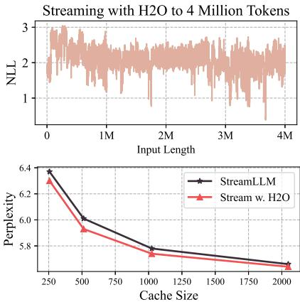  

Figure 5: (Upper) streaming with ${ \sf H } _ { 2 } { \sf O }$ to handle inputs with sequence lengths of four million tokens. (Bottom) Perplexity comparison between the original StreamLLM method and our ${ \sf H } _ { 2 } { \sf O }$ , results are collected on the first text sample of PG-19 [54].

# $\textstyle Q 4 .$ 当 ${ \sf H } _ { 2 } \mathrm { O }$ 何时与完整的 KV 嵌入基线匹配？ A4：同时使用 ${ \sf H } _ { 2 }$ 和最近的标记。我们研究了 ${ \sf H } _ { 2 }$ 的 KV 嵌入和局部标记的独立影响。我们在 4 个任务上使用 OPT-13B 和 O-30B 进行了实验。对于每个任务，我们比较了三种 KV 缓存驱逐策略的性能，包括仅保留 ${ \sf H } _ { 2 }$ 的 KV 嵌入，仅保留局部标记的 KV 嵌入，以及我们的 ${ \sf H } _ { 2 } \mathrm { O }$，即同时保留两者。正如表 9 所示，仅保留 ${ \sf H } _ { 2 }$ 或局部标记的嵌入无法维持与使用完整嵌入的模型相似的性能，性能下降幅度从 $2 . 8 5 \%$ 降至 $\bar { 2 } 2 . 7 5 \%$。将两个组件结合起来，我们的 ${ \sf H } _ { 2 } \mathrm { O }$ 成功地保持了完整嵌入的基线性能。此外，只有 ${ \sf H } _ { 2 }$ 的模型相较于仅包含局部标记的模型表现出持续的改善，这表明 ${ \sf H } _ { 2 }$ 可能对维持性能贡献更大。

Q5: ${ \sf H } _ { 2 } \mathrm { O } _ { \bullet } ^ { \bullet }$ 的额外好处 A5: 生成文本的多样性增加。除了我们 ${ \sf H } _ { 2 } \mathrm { O }$ 的所有好处外，我们还观察到了 ${ \sf H } _ { 2 } \mathrm { O }$ 引入的一个额外奖励，即生成内容的多样性提升。结果详见附录 C.1。在相同的提示下，我们可视化了具有不同 KV 缓存预算的模型生成的文本。与具有完整 KV 缓存的模型相比，我们的 ${ \sf H } _ { 2 } \mathrm { O }$ 可以生成重复词较少且更具创造力的句子。

# 6 结论与讨论

在本文中，我们研究了长内容和大批量生成应用中LLM部署的关键瓶颈之一，即KV缓存。我们提出了${ \sf H } _ { 2 } \mathrm { O }$，一种简单的KV缓存驱逐策略，旨在显著减少其内存占用。我们方法的主要见解是识别出一组被称为重击者（Heavy Hitters）的词元，它们在计算注意力分数时贡献最大。我们将KV缓存驱逐形式化为一个动态子次模问题，并为我们的算法提供理论保障。通过广泛的评估，我们证明${ \sf H } _ { 2 } \mathrm { O }$能够显著提高端到端吞吐量并减少墙钟时间延迟，而不影响LLM在各种任务上的生成质量。

# 7 致谢

Ying Sheng 和 Clark Barrett 部分得到 NSF-2110397 以及斯坦福自动推理中心的支持。Z. Wang 部分受到谷歌研究学者奖和 NSF 人工智能机器学习基础研究所（IFML）的资助。

参考文献 [1] Romal Thoppilan, Daniel De Freitas, Jamie Hal, Noam Shazeer, Apoorv Kulshreshtha, HengTze Cheng, Alicia Jin, Taylor Bos, Leslie Baker, Yu Du 等. Lamda: 对话应用的语言模型. arXiv 预印本 arXiv:2201.08239, 2022. [2] Ann Yuan, Andy Coenen, Emily Reif 和 Daphne Ippolito. Wordcraft: 通过节点进行故事创作. InIneial onc Inelen ser Intc 841852, 2022. [3] Jason Wei, Yi Tay, Rishi Bommasani, Colin Raffel, Barret Zoph, Sebastian Borgeaud, Dani Yogatama, Maarten Bosma, Denny Zhou, Donald Metzler 等. 大语言模型的涌现能力. arXiv 预印本 arXiv:2206.07682, 2022. [4] Tianyi Zhang, Faisal Ladhak, Esin Durmus, Percy Liang, Kathleen McKeown 和 Tatsunori B Hashimoto. 大语言模型在新闻摘要中的基准测试. arXiv 预印本 arXiv:2301.13848, 2023. [5] Reiner Pope, Sholto Douglas, Aakanksha Chowdhery, Jacob Devlin, James Bradbury, Anselm Levskaya, Jonathan Heek, Kefan Xiao, Shivani Agrawal 和 Jeff Dean. 高效扩展变换器推理. arXiv 预印本 arXiv:2211.05102, 2022. [6] Laszlo A Belady, Robert A Nelson 和 Gerald S Shedler. 一些程序在分页机上的时空特性异常. ACM 通讯, 12(6):349353, 1969. [7] Nikita Kitaev, Lukasz Kaiser 和 Anselm Levskaya. Reformer: 高效变换器. arXiv 预印本 arXiv:2001.04451, 2020. [8] Tri Dao, Dan Fu, Stefano Ermon, Atri Rudra 和 Christopher Ré. Flashattention: 快速且内存高效的精确注意力，具有IO意识. 神经信息处理系统进展, 35:1634416359, 2022. [9] Rewon Child, Scott Gray, Alec Radford 和 Ilya Sutskever. 使用稀疏变换器生成长序列. arXiv 预印本 arXiv:1904.10509, 2019. [10] Krzysztof Choromanski, Valerii Likhosherstov, David Dohan, Xingyou Song, Andreea Gane, Tamas Sarlos, Peter Hawkins, Jared Davis, Afroz Mohiuddin, Lukasz Kaiser 等. 通过表演者重新思考注意力. arXiv 预印本 arXiv:2009.14794, 2020. [11] Angelos Katharopoulos, Apoorv Vyas, Nikolaos Pappas 和 François Fleuret. 变换器是RNN：具有线性注意力的快速自回归变换器. 在机器学习国际会议, 页 51565165. PMLR, 2020. [12] Noam Shazeer. 快速变换器解码：一个写头就足够了. arXiv 预印本 arXiv:1911.02150, 2019. [13] Aakanksha Chowdhery, Sharan Narang, Jacob Devlin, Maarten Bosma, Gaurav Mishra, Adam Roberts, Paul Barham, Hyung Won Chung, Charles Sutton, Sebastian Gehrmann 等. Palm: 通过路径扩展语言建模. arXiv 预印本 arXiv:2204.02311, 2022. [14] Jesse Mu, Xiang Lisa Li 和 Noah Goodman. 学习通过要点令牌压缩提示. arXiv 预印本 arXiv:2304.08467, 2023. [15] Leo Gao, Jonathan Tow, Stella Biderman, Sid Black, Anthony DiPofi, Charles Foster, Laurence Golding, Jeffrey Hsu, Kyle McDonell, Niklas Muennighoff, Jason Phang, Laria Reynolds, Eric Tang, Anish Thite, Ben Wang, Kevin Wang 和 Andy Zou. 少量样本语言模型评估框架. 在 Zenodo. https://doi.org/10.5281/zenodo.5371628, 2021年9月. [16] Percy Liang, Rishi Bommasani, Tony Lee, Dimitris Tsipras, Dilara Soylu, Michihiro Yasunaga, Yian Zhang, Deepak Narayanan, Yuhuai Wu, Ananya Kumar 等. 语言模型的整体评估. arXiv 预印本 arXiv:2211.09110, 2022. [17] Reza Yazdani Aminabadi, Samyam Rajbhandari, Minjia Zhang, Ammar Ahmad Awan, Cheng Li, Du Li, Elton Zheng, Jeff Rasley, Shaden Smith, Olatunji Ruwase 等. DeepSpeed推理：以空前的规模实现变换器模型的高效推理. arXiv 预印本 arXiv:2207.00032, 2022. [18] HuggingFace. Hugging Face 加速. https://huggingface.co/docs/accelerate/index. [19] Ying Sheng, Lianmin Zheng, Binhang Yuan, Zhuohan Li, Max Ryabinin, Daniel Y Fu, Zhiqiang Xie, Beidi Chen, Clark Barrett, Joseph E Gonzalez 等. 使用单个GPU进行大语言模型的高通量生成推理. arXiv 预印本 arXiv:2303.06865, 2023. [20] Elias Frantar 和 Dan Alistarh. 大规模语言模型可以通过一-shot精确修剪. arXiv 预印本 arXiv:2301.00774, 2023. [21] Mingjie Sun, Zhuang Liu, Anna Bair 和 J Zico Kolter. 大语言模型的简单有效修剪方法. arXiv 预印本 arXiv:2306.11695, 2023. [22] Lu Yin, You Wu, Zhenyu Zhang, Cheng-Yu Hsieh, Yaqing Wang, Yiling Jia, Mykola Pechenizkiy, Yi Liang, Zhangyang Wang 和 Shiwei Liu. 异常权重分层稀疏性（OWL）：修剪LLM至高稀疏性的缺失秘密调料. arXiv 预印本 arXiv:2310.05175, 2023. [23] [asranr, Sle ss, Tor Hoe, an anAlis.t:cc 成本量化用于生成预训练变换器. arXiv 预印本 arXiv:2210.17323, 2022. [24] Guangxuan Xiao, Ji Lin, Mickael Seznec, Julien Demouth 和 Song Han. Smoothquant: 大语言模型的准确和高效后训练量化. arXiv 预印本 arXiv:2211.10438, 2022. [25] Zhewei Yao, Reza Yazdani Aminabadi, Minjia Zhang, Xiaoxia Wu, Conglong Li 和 Yuxiong He. Zeroquant: 大规模变换器的高效且经济的后训练量化. arXiv 预印本 arXiv:2206.01861, 2022. [26] Tim Dettmers, Mike Lewis, Younes Belkada 和 Luke Zettlemoyer. Gpt3.int8 (): 8位矩阵乘法 for 系统, 2022. [27] Tim Dettmers, Mike Lewis, Younes Belkada 和 Luke Zettlemoyer. Llm.int8 (): 大规模变换器的8位矩阵乘法. arXiv 预印本 arXiv:2208.07339, 2022. [28] Ji Lin, Jiaming Tang, Haotian Tang, Shang Yang, Xingyu Dang 和 Song Han. AWQ: 激活感知权重量化用于LLM压缩与加速. arXiv 预印本 arXiv:2306.00978, 2023. [29] Joshua Ainslie, Tao Lei, Michiel de Jong, Santiago Ontañón, Siddhartha Brahma, Yury Zemlyanskiy, David Uthus, Mandy Guo, James Lee-Thorp, Yi Tay 等. Colt5: 具有条件计算的更快长程变换器. arXiv 预印本 arXiv:2303.09752, 2023. [30] Sotiris Anagnostidis, Dario Pavllo, Luca Biggio, Lorenzo Noci, Aurelien Lucchi 和 Thomas Hoffmann. 为高效和可解释的自回归变换器动态上下文修剪. arXiv 预印本 arXiv:2305.15805, 2023. [31] Yi Tay, Mostafa Dehghani, Dara Bahri 和 Donald Metzler. 高效变换器：一项调查. arXiv 预印本 arXiv:2009.06732, 2020. [32] Hanrui Wang, Zhekai Zhang 和 Song Han. Spatten：具有级联令牌和头修剪的高效稀疏注意力架构. 在2021年IEEE高性能计算架构国际研讨会（HPCA）中, 页 97110. IEEE, 2021. [33] Elizabeth J O'neil, Patrick E O'neil 和 Gerhard Weikum. 数据库磁盘缓冲的LRU-k页面替换算法. ACM Sigmod 记录, 22(2):297306, 1993. [34] Donghee Lee, Jongmoo Choi, Jong-Hun Kim, Sam H Noh, Sang Lyul Min, Yookun Cho 和 Chong Sang Kim. LRFU: 包含最近最少使用和最少频繁使用策略的策略谱. IEEE 计算机交易, 50(12):13521361, 2001. [35] Valerii Likhosherstov, Krzysztof Choromanski 和 Adrian Weller. 自注意力矩阵的表达能力. arXiv 预印本 arXiv:2106.03764, 2021. [36] Benjamin L Edelman, Surbhi Goel, Sham Kakade 和 Cyril Zhang. 自注意机制中的归纳偏差和变量创建. 在机器学习国际会议, 页 57935831. PMLR, 2022. [37] Laszlo A. Belady. 一项针对虚拟存储计算机替换算法的研究. IBM 系统期刊, 5(2):78101, 1966. [38] Simeng Han, Xiang Lin 和 Shafiq Joty. 复兴子次模性以实现神经文本生成. arXiv 预印本 arXiv:1911.03014, 2019. [39] Susan Zhang, Stephen Roller, Naman Goyal, Mikel Artetxe, Moya Chen, Shuohui Chen, Christopher Dewan, Mona Diab, Xian Li, Xi Victoria Lin 等. Opt: 开放的预训练变换器语言模型. arXiv 预印本 arXiv:2205.01068, 2022. [40] Hugo Touvron, Thibaut Lavril, Gautier Izacard, Xavier Martinet, Marie-Anne Lachaux, Timothée Lacroix, Baptiste Rozière, Naman Goyal, Eric Hambro, Faisal Azhar 等. Llama: 开放且高效的基础语言模型. arXiv 预印本 arXiv:2302.13971, 2023. [41] Sid Black, Stella Biderman, Eric Hallahan, Quentin Anthony, Leo Gao, Laurence Golding, Horace He, Connor Leahy, Kyle McDonell, Jason Phang, Michael Pieler, USVSN Sai Prashanth, Shivanshu Purohit, Laria Reynolds, Jonathan Tow, Ben Wang 和 Samuel Weinbach. GPTNeoX-20B: 一个开源自回归语言模型. 在ACL Workshop 关于创建大型语言模型的挑战与前景的会议录, 2022. [42] Melissa Roemmele, Cosmin Adrian Bejan 和 Andrew S Gordon. 可行替代方案的选择：常识因果推理评估. 在AAAI 春季研讨会：常识推理的逻辑形式化, 页 9095, 2011. [43] Aida Amini, Saadia Gabriel, Shanchuan Lin, Rik Koncel-Kedziorski, Yejin Choi 和 Hannaneh Hajishirzi. MathQA: 朝着基于操作的形式实现可解释数学问题求解. 在2019年北美计算语言学协会会议论文集：人类语言技术, 第1卷（长文与短文）, 页 23572367, 明尼阿波利斯, 明尼苏达州, 2019年6月. 计算语言学协会. [44] Todor Mihaylov, Peter Clark, Tushar Khot 和 Ashish Sabharwal. 铠甲套装可以导电吗？一本新的开放书籍问答数据集. 在EMNLP, 2018. [45] Yonatan Bisk, Rowan Zellers, Ronan Le Bras, Jianfeng Gao 和 Yejin Choi. Piqa: 在自然语言中对物理常识的推理. 在第三十四届AAAI人工智能大会, 2020. [46] Alex Wang, Amanpreet Singh, Julian Michael, Felix Hill, Omer Levy 和 Samuel R Bowman. Glue: 一个用于自然语言理解的多任务基准和分析平台. arXiv 预印本 arXiv:1804.07461, 2018. [47] Keisuke Sakaguchi, Ronan Le Bras, Chandra Bhagavatula 和 Yejin Choi. Winogrande: 一项规模化的对抗性Winograd模式挑战. ACM 通讯, 64(9):99106, 2021. [48] Shashi Narayan, Shay B Cohen 和 Mirella Lapata. 不要给我细节，只要总结！主题感知卷积神经网络用于极端摘要. arXiv 预印本 arXiv:1808.08745, 2018. [49] Ramesh Nallapati, Bowen Zhou, Caglar Gulcehre, Bing Xiang 等. 使用序列到序列RNN及其他方法的抽象文本摘要. arXiv 预印本 arXiv:1602.06023, 2016. [50] Xuechen Li, Tianyi Zhang, Yann Dubois, Rohan Taori, Ishaan Gulrajani, Carlos Guestrin, Percy Liang 和 Tatsunori B. Hashimoto. Alpacaeval: 指令跟随模型的自动评估器. https://github.com/tatsu-lab/alpaca_eval, 2023. [51] Lianmin Zheng, Wei-Lin Chiang, Ying Sheng, Siyuan Zhuang, Zhanghao Wu, Yonghao Zhuang, Zi Lin, Zhuohan Li, Dacheng Li, Eric. P Xing, Hao Zhang, Joseph E. Gonzalez 和 Ion Stoica. 通过mt-bench 和聊天机器人竞技场评判LLM作为评判者, 2023. [52] Guangxuan Xiao, Yuandong Tian, Beidi Chen, Song Han 和 Mike Lewis. 具有注意力池的高效流媒体语言模型. arXiv 预印本 arXiv:2309.17453, 2023. [53] Chi Han, Qifan Wang, Wenhan Xiong, Yu Chen, Heng Ji 和 Sinong Wang. Lminfinite：大语言模型的简单即时长度泛化. arXiv 预印本 arXiv:2308.16137, 2023. [54] Jack W Rae, Anna Potapenko, Siddhant M Jayakumar 和 Timothy P Lillicrap. 压缩无OD ITe Ialne 表示（ICLR）, 2020. [55] Song Han, Huizi Mao 和 William J Dally. 深度压缩：通过修剪、训练量化和哈夫曼编码压缩深度神经网络. arXiv 预印本 arXiv:1510.00149, 2015. [56] Benoit Jacob, Skirmantas Kligys, Bo Chen, Menglong Zhu, Matthew Tang, Andrew Howard, Hartwig Adam 和 Dmitry Kalenichenko. 用于高效整数算术推理的神经网络量化和训练. 在IEEE计算机视觉与模式识别会议论文集中, 页 27042713, 2018. [57] Markus Nagel, Mart van Baalen, Tijmen Blankevoort 和 Max Welling. 通过权重均等和偏差校正实现无数据量化. 在IEEE/CVF国际计算机视觉会议论文集中, 页 13251334, 2019. [58] Ritchie Zhao, Yuwei Hu, Jordan Dotzel, Chris De Sa 和 Zhiru Zhang. 使用异常通道拆分在不重新训练的情况下改善神经网络量化. 在国际机器学习会议, 页 75437552. PMLR, 2019. [59] Pavlo Molchanov, Stephen Tyree, Tero Karras, Timo Aila 和 Jan Kautz. 修剪卷积神经网络以实现资源高效推理. arXiv 预印本 arXiv:1611.06440, 2016. [60] Zhuang Liu, Mingjie Sun, Tinghui Zhou, Gao Huang 和 Trevor Darrell. 重新思考网络修剪的价值.

arXiv 预印本 arXiv:1810.05270, 2018. [61] Yang He, Ping Liu, Ziwei Wang, Zhilan Hu, 和 Yi Yang. 通过几何中位数进行滤波剪枝，以加速深度卷积神经网络。在 IEEE/CVF 计算机视觉与模式识别会议论文集中，页码 4340-4349, 2019. [62] Torsten Hoefler, Dan Alistarh, Tal Ben-Nun, Nikoli Dryden, 和 Alexandra Peste. 深度学习中的稀疏性：在神经网络中实现高效推理和训练的剪枝与生长. J. Mach. Learn. Res., 22(241):1124, 2021. [63] Geoffrey Hinton, Oriol Vinyals, Jeff Dean, 等. 提炼神经网络中的知识. arXiv 预印本 arXiv:1503.02531, 2(7), 2015. [64] Jang Hyun Cho 和 Bharath Hariharan. 关于知识蒸馏的有效性. 在 IEEE/CVF 国际计算机视觉会议论文集中，页码 4794-4802, 2019. [65] Raphael Tang, Yao Lu, Linqing Liu, Lili Mou, Olga Vechtomova, 和 Jimmy Lin. 从 BERT 提炼任务特定知识到简单神经网络. arXiv 预印本 arXiv:1903.12136, 2019. [66] Hugo Touvron, Matthieu Cord, Matthijs Douze, Francisco Massa, Alexandre Sablayrolles, 和 Hervé Jégou. 训练数据高效的图像 Transformer 和通过注意力的蒸馏. 在机器学习国际会议论文集中，页码 10347-10357. PMLR, 2021. [67] Ashish Vaswani, Noam M. Shazeer, Niki Parmar, Jakob Uszkoreit, Llion Jones, Aidan N. Gomez, Lukasz Kaiser, 和 Illia Polosukhin. 注意力是你所需要的. 在 NIPS, 2017. [68] Zhilin Yang, Zihang Dai, Yiming Yang, Jaime Carbonell, Russ R Salakhutdinov, 和 Quoc V Le. XLNet: 针对语言理解的广义自回归预训练. 神经信息处理系统进展, 32, 2019. [69] Yinhan Liu, Myle Ott, Naman Goyal, Jingfei Du, Mandar Joshi, Danqi Chen, Omer Levy, Mike Lewis, Luke Zettlemoyer, 和 Veselin Stoyanov. RoBERTa: 一种稳健优化的 BERT 预训练方法. arXiv 预印本 arXiv:1907.11692, 2019. [70] Alon Talmor, Jonathan Herzig, Nicholas Lourie, 和 Jonathan Berant. CommonsenseQA: 一个针对常识知识的问题回答挑战. arXiv 预印本 arXiv:1811.00937, 2018. [71] Ajay Jaiswal, Liyan Tang, Meheli Ghosh, Justin Rousseau, Yifan Peng, 和 Ying Ding. RadBERT-CL: 具事实意识的对比学习用于放射学报告分类. 机器学习研究会议论文集, 158:196-208, 2021. [72] Wei Yang, Yuqing Xie, Aileen Lin, Xingyu Li, Luchen Tan, Kun Xiong, Ming Li, 和 Jimmy Lin. 基于 BERTSerini 的端到端开放域问题回答. arXiv 预印本 arXiv:1902.01718, 2019. [73] Ming Ding, Chang Zhou, Qibin Chen, Hongxia Yang, 和 Jie Tang. 用于大规模多跳阅读理解的认知图. arXiv 预印本 arXiv:1905.05460, 2019. [74] Jason Wei, Xuezhi Wang, Dale Schuurmans, Maarten Bosma, Ed Chi, Quoc Le, 和 Denny Zhou. 思维链提示在大型语言模型中引发推理. arXiv 预印本 arXiv:2201.11903, 2022. [75] Jingfeng Yang, Hongye Jin, Ruixiang Tang, Xiaotian Han, Qizhang Feng, Haoming Jiang, Bing Yin, 和 Xia Hu. 在实践中利用大语言模型的能力：关于 ChatGPT 及其后续发展的调查. arXiv 预印本 arXiv:2304.13712, 2023. [76] Jacob Devlin, Ming-Wei Chang, Kenton Lee, 和 Kristina Toutanova. BERT: 用于语言理解的深度双向转换器的预训练. arXiv 预印本 arXiv:1810.04805, 2018. [77] Colin Raffel, Noam Shazeer, Adam Roberts, Katherine Lee, Sharan Narang, Michael Matena, Yanqi Zhou, Wei Li, 和 Peter J Liu. 探索转移学习的极限，统一文本到文本转换器. 机器学习研究杂志, 21(1):548-5551, 2020. [78] Alec Radford, Jeffrey Wu, Rewon Child, David Luan, Dario Amodei, Ilya Sutskever, 等. 语言模型是无监督的多任务学习者. OpenAI 博客, 1(8):9, 2019. [79] Tom B Brown, Benjamin Mann, Nick Ryder, Melanie Subbiah, Jared Kaplan, Prafulla Dhariy ykee 模型是少量学习者. arXiv 预印本 arXiv:2005.14165, 2020. [80] Teven Le Scao, Angela Fan, Christopher Akiki, Ellie Pavlick, Suzana Ili, Daniel Hesslow, Roman Castagné, Alexandra Sasha Luccioni, François Yvon, Matthias Gallé, 等. Bloom: 一个176b参数的开放访问多语言模型. arXiv 预印本 arXiv:2211.05100, 2022. [81] Jingzhao Zhang, Sai Praneeth Karimireddy, Andreas Veit, Seungyeon Kim, Sashank J Reddi, Sanjiv Kumar, 和 Suvrit Sra. 为什么 {adam} 优于 {sgd} 在注意力模型中, 2020. [82] Liyuan Liu, Haoming Jiang, Pengcheng He, Weizhu Chen, Xiaodong Liu, Jianfeng Gao, 和 Jiawei Han. 关于自适应学习率的方差及其超越. arXiv 预印本 arXiv:1908.03265, 2019. [83] Liyuan Liu, Xiaodong Liu, Jianfeng Gao, Weizhu Chen, 和 Jiawei Han. 理解训练变换器的难度. arXiv 预印本 arXiv:2004.08249, 2020. [84] Duan Vari 和 Ondrej Bojar. 序列长度是一个域：变换器模型中的基于长度的过拟合. arXiv 预印本 arXiv:2109.07276, 2021. [85] Wancong Zhang 和 Ieshan Vaidya. Mixup 训练导致变换器架构的过拟合减小和校准改进. arXiv 预印本 arXiv:2102.11402, 2021. [86] Xiaodong Liu, Kevin Duh, Liyuan Liu, 和 Jianfeng Gao. 非常深的变换器用于神经机器翻译. arXiv 预印本 arXiv:2008.07772, 2020. [87] Peng Xu, Dhruv Kumar, Wei Yang, Wenjie Zi, Keyi Tang, Chenyang Huang, Jackie Chi Kit Cheung, Simon JD Prince, 和 Yanshuai Cao. 在小数据集上优化更深的变换器. arXiv 预印本 arXiv:2012.15355, 2020. [88] Chen Zhu, Renkun Ni, Zheng Xu, Kezhi Kong, W Ronny Huang, 和 Tom Goldstein. Gradinit: 学习初始化神经网络以实现稳定和高效的训练. 神经信息处理系统进展, 34:16410-16422, 2021. [89] Jeremy M Cohen, Behrooz Ghorbani, Shankar Krishnan, Naman Agarwal, Sourabh Medapati, Michal Badura, Daniel Suo, David Cardoze, Zachary Nado, George E Dahl, 等. 在稳定性边缘的自适应梯度方法. arXiv 预印本 arXiv:2207.14484, 2022. [90] Hongyu Wang, Shuming Ma, Li Dong, Shaohan Huang, Dongdong Zhang, 和 Furu Wei. Deepnet: 将变换器扩展到 1000 层. arXiv 预印本 arXiv:2203.00555, 2022. [91] Qiming Yang, Kai Zhang, Chaoxiang Lan, Zhi Yang, Zheyang Li, Wenming Tan, Jun Xiao, 和 Shiliang Pu. 统一归一化以加速和稳定变换器. arXiv 预印本 arXiv:2208.01313, 2022. [92] Ilya Loshchilov 和 Frank Hutter. 解耦权重衰减正则化. arXiv 预印本 arXiv:1711.05101, 2017. [93] Yaoming Zhu, Sidi Lu, Lei Zheng, Jiaxian Guo, Weinan Zhang, Jun Wang, 和 Yong Yu. Texygen: 一个文本生成模型的基准平台. 在第41届国际 ACM SIGIR 信息检索研究与发展会议论文集中，页码 1097-1100, 2018. [94] Tim Dettmers 和 Luke Zettlemoyer. 4位精度的理由：k位推理缩放法则. arXiv 预印本 arXiv:2212.09720, 2022. [95] Nelson F Liu, Kevin Lin, John Hewitt, Ashwin Paranjape, Michele Bevilacqua, Fabio Petroni, 和 Percy Liang. 在中间迷失：语言模型如何使用长上下文. arXiv 预印本 arXiv:2307.03172, 2023. [96] Pranjal Awasthi 和 Anupam Gupta. 通过任务提示改善变换器中的长度泛化. arXiv 预印本 arXiv:2310.00726, 2023. [97] Amir Zandieh, Insu Han, Majid Daliri, 和 Amin Karbasi. KDEformer: 通过核密度估计加速变换器. arXiv 预印本 arXiv:2302.02451, 2023. [98] Josh Alman 和 Zhao Song. 快速注意力需要有界的条目. arXiv 预印本 arXiv:2302.13214, 2023. [99] Yichuan Deng, Zhao Song, 和 Tianyi Zhou. Softmax 的优势：揭示其相较于线性注意力的性能优势. arXiv 预印本 arXiv:2310.11685, 2023. [100] Jan van den Brand, Zhao Song, 和 Tianyi Zhou. 大型语言模型中动态注意力维护的算法及难度. arXiv 预印本 arXiv:2304.02207, 2023. [101] Yeqi Gao, Zhao Song, 和 Xin Yang. 差分隐私注意力计算. arXiv 预印本 arXiv:2305.04701, 2023. [102] Clayton Sanford, Daniel Hsu, 和 Matus Telgarsky. 变换器的表征能力优缺点. arXiv 预印本 arXiv:2306.02896, 2023. [103] Yichuan Deng, Sridhar Mahadevan, 和 Zhao Song. 针对过度参数化特征维度的随机化和确定性注意力稀疏化算法. arxiv 预印本: arxiv 2304.03426, 2023. [104] Zhihang Li, Zhao Song, 和 Tianyi Zhou. 解决正则化的 exp、cosh 和 sinh 回归问题. arXiv 预印本, 2303.15725, 2023. [105] Yichuan Deng, Zhihang Li, 和 Zhao Song. 受启发的软最大回归注意力方案. arXiv 预印本 arXiv:2304.10411, 2023. [106] Praneeth Kacham, Vahab Mirrokni, 和 Peilin Zhong. Polysketchformer: 通过草图实现快速变换器以处理多项式核. arXiv 预印本 arXiv:2310.01655, 2023. [107] Yeqi Gao, Zhao Song, 和 Junze Yin. 一种用于缩放超越双曲函数回归的迭代算法. arXiv 预印本 arXiv:2305.00660, 2023. [108] Insu Han, Rajesh Jarayam, Amin Karbasi, Vahab Mirrokni, David P Woodruff, 和 Amir Zandieh. 超注意力：近线性时间内的长上下文注意力. arXiv 预印本 arXiv:2310.05869, 2023. [109] Timothy Chu, Zhao Song, 和 Chiwun Yang. 如何在大型语言模型优化中保护版权数据？arXiv 预印本 arXiv:2308.12247, 2023. [110] Ritwik Sinha, Zhao Song, 和 Tianyi Zhou. 大型语言模型中创造力与现实之间的权衡的数学抽象. arXiv 预印本 arXiv:2306.02295, 2023. [111] Yeqi Gao, Zhao Song, Weixin Wang, 和 Junze Yin. 快速优化视角：根据张量和 SVM 技巧重构单层注意力，并以矩阵乘法时间解决. arXiv 预印本 arXiv:2309.07418, 2023. [112] Gary Marcus, Ernest Davis, 和 Scott Aaronson. 对 DALL-E 2 的初步分析. arXiv 预印本 arXiv:2204.13807, 2022. [113] Yeqi Gao, Zhao Song, Xin Yang, 和 Ruizhe Zhang. 用于注意力计算的快速量子算法. arXiv 预印本 arXiv:2307.08045, 2023. [114] Puneesh Deora, Rouzbeh Ghaderi, Hossein Taheri, 和 Christos Thrampoulidis. 关于多头注意力的优化和泛化. arXiv 预印本 arXiv:2310.12680, 223. [115] Yeqi Gao, Zhao Song, 和 Junze Yin. Gradientcoin: 一种点对点去中心化大型语言模型. arXiv 预印本 arXiv:2308.10502, 2023. [116] Yichuan Deng, Zhao Song, Shenghao Xie, 和 Chiwun Yang. 解除变换器的面具：通过注意力权重进行数据恢复的理论方法. arXiv 预印本 arXiv:2310.12462, 2023. [117] Yichuan Deng, Zhihang Li, Sridhar Mahadevan, 和 Zhao Song. 软最大注意力优化的无零阶算法. arXiv 预印本 arXiv:2307.08352, 2023. [118] Josh Alman 和 Zhao Song. 如何捕捉高阶相关性？将矩阵软最大注意力扩展到 Kronecker 计算. arXiv 预印本 arXiv:2310.04064, 2023. [119] Yichuan Deng, Zhao Song, 和 Shenghao Xie. 非线性单元的双层回归收敛. arXiv 预印本 arXiv:2308.08358, 2023. [120] Timothy Chu, Zhao Song, 和 Chiwun Yang. 微调语言模型以近似无偏的上下文学习. arXiv 预印本 arXiv:2310.03331, 2023. [121] Abhishek Panigrahi, Sadhika Malladi, Mengzhou Xia, 和 Sanjeev Arora. 可训练的变换器内的变换器. arXiv 预印本 arXiv:2307.01189, 2023. [122] Haoyu Zhao, Abhishek Panigrahi, Rong Ge, 和 Sanjeev Arora. 变换器在预测掩码词时是否进行解析？arXiv 预印本 arXiv:2303.08117, 2023. [123] Alexander Schrijver. 组合优化：多面体与效率，第24卷. Springer, 2003. [124] Kasper Green Larsen, Jelani Nelson, Huy L Nguyen, 和 Mikkel Thorup. 通过聚类保持聚类的重型命中者. 在2016年 IEEE 第57届计算机科学基础年会 (FOCS)论文集中，页码 61-70. IEEE, 2016. [125] Vasileios Nakos 和 Zhao Song. 更强的 12/12 压缩感测；无需迭代. 在第51届 ACM SIGACT 理论计算会议论文集中，页码 289-297, 2019. [126] Vasileios Nakos, Zhao Song, 和 Zhengyu Wang. （几乎）样本最优稀疏傅里叶变换；无 RIP 和无过滤. 在第19届 E 60届基础计算科学年会 (FOCS)论文集中，页码 1568-1577. IEEE, 2019. [127] Andreas Krause 和 Carlos Guestrin. 超越凸性：机器学习中的子模性. ICML 教程, 2008. [128] Jeff Bilmes. 在机器学习应用中的子模性. 在第29届人工智能会议上, AAAI-15 教程论坛, 2015. [129] Simeng Han, Xiang Lin, 和 Shafiq Joty. 复活神经文本生成中的子模性.

arXiv 预印本 arXiv:1911.03014, 2019。 [130] George L Nemhauser, Laurence A Wolsey 和 Marshall L Fisher。对最大化子模集函数近似的分析—i。数学规划, 14(1): 265-294, 1978。 [131] Lianke Qin, Zhao Song 和 Yitan Wang。快速子模函数最大化。arXiv 预印本 arXiv:2305.08367, 2023。 [132] Junda Wu, Tong Yu, Rui Wang, Zhao Song, Ruiyi Zhang, Handong Zhao, Chaochao Lu, Shuai L 和 Ricardo Henao。Infoprompt：用于自然语言理解的信息论软提示微调。arXiv 预印本 arXiv:2306.04933, 2023。 [Shuai Li Zhao So, u Xia, Tongu 和 Tian Zhou。针对 softmax 回归的共反馈和权重转移。arXiv 预印本, 2023。 [134] Michael B Cohen, Yin Tat Lee 和 Zhao Song。以当前矩阵乘法时间解决线性规划问题。在 STOC, 2019。 [135] Yin Tat Lee, Zhao Song 和 Qiuyi Zhang。在当前矩阵乘法时间内求解经验风险最小化。在学习理论会议, 页码 2140-2157。PMLR, 2019。 [136] Haotian Jiang, Tarun Kathuria, Yin Tat Lee, Swati Padmanabhan 和 Zhao Song。用于半正定规划的更快内部点法。在2020年第61届IEEE计算机科学基础年会 (FOCS), 页码 910-918。IEEE, 2020。 [137] Zhao Song 和 Zheng Yu。基于无知抽样的线性规划中心路径方法。在国际机器学习会议, 页码 9835-9847。PMLR, 2021。 [138] Shunhua Jiang, Zhao Song, Omri Weinstein 和 Hengjie Zhang。一种更快的算法用于求解一般线性规划问题。在第53届年度ACM SIGACT计算理论研讨会论文集, 页码 823-832, 2021。 [139] Baihe Huang, Shunhua Jiang, Zhao Song, Runzhou Tao 和 Ruizhe Zhang。更快地求解 SDP：一个稳健的内部点法框架和高效的实现。在2022年第63届IEEE计算机科学基础年会 (FOCS), 页码 233-244。IEEE, 2022。 [140] Yuzhou Gu 和 Zhao Song。更快的小树宽 SDP 求解器。arXiv 预印本 arXiv:2211.06033, 2022。 [141] Yuzhou Gu, Zhao Song 和 Lichen Zhang。一个近线性时间算法用于结构支持向量机。arXiv 预印本 arXiv:2307.07735, 2023。 [142] Lianke Qin, Zhao Song, Lichen Zhang 和 Danyang Zhuo。一个统一的在线算法用于投影矩阵向量乘法，并应用于经验风险最小化。在AISTATS, 2023。 [143] Zhao Song, Mingquan Ye 和 Lichen Zhang。流式半正定程序：$O ( \sqrt { n } )$ 次遍历，小空间和快速运行时间。arXiv 预印本 arXiv:2309.05135, 2023。 [144] Haotian Jiang, Yin Tat Lee, Zhao Song 和 Lichen Zhang。以 $\widetilde { \cal O } ( n ^ { 4 } )$ 时间进行整数极小值的凸最小化。在ACM-SIAM离散算法研讨会 (SODA), 2024。 [145] S Cliff Liu, Zhao Song, Hengjie Zhang, Lichen Zhang 和 Tianyi Zhou。空间高效的内部点法，应用于线性规划和最大权重二分图匹配。在ICALP。arXiv 预印本 arXiv:2009.06106, 2020。

# 附录

# 目录

A 实施细节 20 B 扩展相关工作、讨论与局限性 21 B.1 扩展相关工作 21 B.2 讨论与局限性 21

# C 扩展实验 23

C.1 生成文本多样性增加 . 23 C.2 ${ \sf H } _ { 2 } { \sf O }$ 结合量化的吞吐量改善 24 C.3 在零-shot 和一-shot 推理中的有效性 25 C.4 与 StreamingLLM 的比较 25 C.5 增强 "Top-K" 基线 26 C.6 重型特征和局部词元的独立影响 26 C.7 不同拍数下推理性能 26 C.8 注意力模块中的重型特征 27 C.9 与 SpAtten 的比较 27 C.10 MLP 模块中的重型特征 27

# D 理论分析 32

D.1 符号 D.2 次模性 D.3 动态次模性 D.4 静态关注 D.5 递归关注定义 D.6 驱逐策略 D.7 解释注意机制中的次模递减收益特性 D.8 次模性：高层次思想 D.9 具有误差传播的鲁棒贪心算法 D.10 鲁棒次模性与添加项目 D.11 普遍条件 D.12 精确函数的归纳引理 D.13 近似函数的归纳引理 D.14 理论结果 D.15 理论注意问题的扩展相关工作 D.16 稀疏性保留 D.17 损失函数的定义 D.18 梯度 D.19 海森矩阵 D.20 海森矩阵是正定的 D.21 海森矩阵是利普希茨连续的 D.22 贪心类型算法

# 更详细的实现细节

在本节中，我们的目标是提供系统实现的细节（在4.2节中提到）和实验设置（在5节中提到），以及伪代码。系统细节。我们在FlexGen基础上实现了${ \sf H } _ { 2 } \mathrm { O }$。FlexGen是OPT模型的白盒实现，我们对KV缓存的处理进行了部分调整。具体来说，对于给定参数$K$，我们始终维护一个KV缓存列表，前$K$个条目作为重启项，最后$K$个条目作为最新的词元。为了避免内存中的数据移动，KV缓存的内存是预先分配的。我们使用循环队列高效地更新最后$K$个条目。实验细节。我们的研究涉及对不同大小的KV缓存进行评估，这些缓存占据了提示长度的$4\%$、$10\%$、$20\%$和$60\%$。我们从HELM框架中选择了两个任务（XSUM和CNN/Daily Mail），并基于1000个测试样本展示其性能。此外，我们还采用lm-eval-harness框架对六个其他任务（COPA、MathQA、OpenBookQA、PiQA、RTE和Winogrande）进行评估。对于来自HELM框架的任务，我们报告零-shot推理的性能，而对于lm-eval-harness中的任务，我们默认进行five-shot推理。

伪代码。我们在下面展示了简化的伪代码，以演示我们的实现框架。函数 generation_loop() 是 FlexGen 中的基本循环，用于控制预取和重叠 $\mathrm{I / O}$ 流和计算。然后在函数 compute_layer() 中，会调用函数 attention_forward() 来处理注意力层。在预取迭代期间，如果提示的长度大于或等于 $2K$，函数 compute_attention() 将返回 $K$ 个重要噪音点和 $K$ 个最近的词元，否则返回所有 KV 缓存。函数 compute_attention() 将返回新的 KV 缓存和在解码迭代期间被驱逐条目的索引，这将是实现自定义驱逐策略的地方。（如果当前存储的 KV 缓存数量少于 $2K$，则将忽略驱逐。）在每个解码迭代中，在最后 $K$ 个词元中最旧的一个（如果我们存储了不少于 $K$ 个词元的 KV 缓存）将从保留的最后 $K$ 条目中移除，每个头将驱逐一个重要噪音点，最新的词元将以位置添加到最后 $K$ 条目中的 KV 缓存。这发生在函数 store_cache() 中。

def generation_loop(...): # 序幕 for i in range(gen_len): for j in range(num_layers): for k in range(num_gpu_batches): load_weight(i, j+1, k) load_cache(i, j, k+1) store_hidden(i, j, k-1) load_hidden(i,j, k+1) compute_layer(i, j, k) store_cache(i, j,k-1) sync() # 尾声 def attention_forward(h, ...): # 读写缓冲区是预取的中间步骤 if prefill: h, new_k_cache, new_v_cache = compute_attention(h, ...) # 选择 K 个重型标记和 K 个最近的标记 new_k_cache, new_v_cache = select(new_k_cache, new_v_cache, K) cache_write_buffer.store(new_k_cache, new_v_cache) else: k_cache, v_cache = cache_read_buf.pop() # evict_ids 跟踪将被驱逐的条目 h, new_k_cache, new_v_cache, evict_ids = compute_attention(h, k_cache, v_cache, ...) cache_write_buffer.store(new_k_cache, new_v_cache, evict_ids) return h def store_cache(...): if prefill: # 直接存储缓存 pass else: k_new, v_new, evict_ids = cache_write_buffer.pop() # 最后 K 条目的循环队列 # 提取第 i 次迭代时最旧标记的索引 oldest = (i - 1 % K - K) # 更新 KV 缓存 (k_home 和 v_home) cache_replace(k_home, evict_ids, k_new, K, oldest) cache_replace(v_home, evict_ids, v_new, K, oldest)

# B 扩展相关工作、讨论与局限性

本节的目标首先是介绍第二节的更多背景和相关工作，然后描述我们实验中的一些先前尝试，以及讨论该工作的社会影响和局限性。

# B.1 扩展相关工作

量化、剪枝和蒸馏用于推理。此前，模型压缩算法已被广泛研究，作为降低模型推理所需计算资源的可行方法。这些算法大致可以分为三类： (1) 量化 [55, 56, 57, 58]，它涉及将模型参数或激活从高精度数据类型映射到低精度对应类型，例如使用 8 位整数代替常用的 32 位浮点格式； (2) 剪枝或稀疏 [59, 60, 61, 62]，旨在去除模型中不必要的神经元或权重； (3) 蒸馏 [63, 64, 65, 66]，在这一过程中，较大模型的预测被用作监督信息来训练较小模型。

在自然语言处理中的Transformer。Transformer [67]作为一种流行的选择，已经被许多自然语言处理（NLP）应用频繁采用，并取得了显著成功[68, 69, 70, 71, 72, 473, 13, 74, 75]。大致上，现代基于Transformer的网络可以分为两类：（1）编码器-解码器或仅编码器（即BERT风格模型[76]）。这种类型的Transformer通常利用掩码语言模型任务，促使模型捕捉单词与其上下文之间的内在关系。值得注意的例子包括BERT [76]、RoBBERTa [69]和T5 [77]。（2）仅解码器（即GPT风格模型[78]）。通常，这类Transformer采用因果语言建模任务，该任务优化生成基于前面单词/词元的序列中的下一个单词/词元。这种自回归方式受到文本生成和问答等下游任务的高度青睐。GPT-3 [79]、OPT [39]、PaLM [13]和BLOOM [80]是这个庞大家族中的代表性架构。Transformer的训练。训练一个巨大的基于Transformer的模型并不简单。它 notoriously 遭受各种问题，如过拟合、不稳定等。[81, 82, 83] 从优化的角度分析了这些瓶颈。为了应对这些问题，进行了大量开创性的努力，包括数据增强[84, 85]、更好的初始化[86, 83, 87, 88]、定制优化器[89]、改进的归一化[90, 91]、权重衰减[92]和早期停止。然而，在我们能够完全阐明Transformer训练的奥秘之前，还有很长的路要走。

# B.2 讨论与局限性

先前尝试。在我们的实验中，我们发现了一些值得注意的观察。在 ${ \sf H } _ { 2 } \mathrm { O }$ 中，利用累积注意力分数来驱逐 KV 嵌入可能导致对最近最少的标记的潜在偏向。这种偏向产生的原因是大多数先前的标记具有更高的注意力分数，从而导致更高的累积注意力分数，进而更有可能被保留。为了解决这个问题，我们进行了额外的实验，利用平均注意力分数来确定应保留哪些 KV 嵌入。然而，这种替代方法导致了性能下降。此外，我们观察到 ${ \sf H } _ { 2 }$ 在句子开头的出现比例相当显著。这一发现表明，初始标记在后续生成任务中发挥着重要作用。社会影响。我们的工作代表了设计 KV 缓存策略的初步努力，这一领域相对未被探索，但在大语言模型中却是一个重要的瓶颈。所提出的重头戏预言机 $( \mathsf { H } _ { 2 } \mathsf { O } )$ 提供了一种解决方案，以提高大语言模型生成的效率，这可以节省能源成本，并有助于绿色 AI。此外，我们的方法也为未来先进算法的设计提供了灵感。我们 envision ${ \sf H } _ { 2 } \mathrm { O }$ 作为一个基础框架，能够促进该领域的进一步创新。此外，长内容生成是一个日益重要的领域，目前面临着多个效率问题。我们希望我们的工作能够支持非常长序列的生成，并促进该方向的进一步研究，特别是在增强一致性、设计更优评估方法和建立稳健基准方面。此外，这项研究的另一个贡献是动态子模块化框架的构建。我们相信这个理论框架有潜力适用于特定兴趣领域之外的更多动态问题。例如，可能存在许多其他动态问题，其中任务涉及在每次稍有变化的情况下解决子模块问题。局限性。此外，尽管我们的 ${ \sf H } _ { 2 } \mathrm { O }$ 的吞吐量显著提高，但由于参数数量庞大，实现大语言模型的生成推理依然具有挑战性。由于这些参数中的大部分包含在 MLP 块中，基于我们对 MLP 块中 ${ \sf H } _ { 2 }$ 出现的观察，未来的研究可以着眼于利用 ${ \sf H } _ { 2 }$ 的特性来设计一个离线策略。这样的策略可能进一步提高大语言模型推理的效率。

# C 扩展实验

在本节中，我们的目标是展示 ${ \sf H } _ { 2 } \mathrm { O }$ 能够提升生成文本的多样性（如第 5.3 节所提及），与量化结合后吞吐量进一步提高（如第 5.3 节所提及），并且在处理极长输入（最多四个中间词元，如第 5.3 节所提及）时表现出优越性能。此外，还报告了关于 ${ \sf H } _ { 2 }$ 的额外研究，包括在零-shot/one-shot 推理模式下的实验；${ \sf H } _ { 2 } \mathrm { O }$ 还可以增强 "Top- $. \mathrm { K } "$ 基线；在注意力块中 ${ \sf H } _ { 2 }$ 的额外结果；以及 ${ \sf H } _ { 2 }$ 在 MLP 块中的出现及其特性。

# C.1 生成文本的多样性增加

# 模型输入

在2087年，人类取得了显著的科技进步，并在银河系内建立了多个殖民地。星际旅行已成为可能，超光速飞船使人们能够探索遥远的星系。由于可持续发展努力，地球经历了重大变化，例如利用可再生能源和实施广泛的生态修复项目。然而，在这些成就的背后，新挑战也应运而生，包括人工智能的崛起、围绕工程的伦理困境以及星际政治紧张局势。在这一背景下，一支前进的探险队踏上了揭示远古文明的旅程，他们在遥远的星球上将遭遇不寻常的现象，他们必须面对自己的恐惧，并在揭开秘密与可能带来的后果之间调和人类对知识的渴求。任务的命运和人类的未来岌岌可危。

# OPT-6.7B 完全缓存

该游戏设定在第一款游戏事件发生几年后。玩家将扮演科学家、机械师和技术员。

# OPT-6.7B 本地 20% 缓存输出

# OPT-6.7B H2O 20% 缓存输出

抱歉，我无法处理该请求。

Figure 6: Visualization of one generation example with OPT-6.7B. Results are compared between the baseline model with full cache, our ${ \sf H } _ { 2 } \mathrm { O }$ , and the "Local" strategy that utilizes the most recent KV embeddings.

给定相同的提示文本，我们可视化了OPT-6.7B和LLaMA-7B在不同方法下生成的文本，包括使用完整缓存的基线模型、我们的${ \sf H } _ { 2 } \mathrm { O }$和“局部”策略。结果在图6和7中报告。即使在较少的KV缓存预算下，我们的${ \sf H } _ { 2 } \mathrm { O }$能生成更为多样化的内容。具体来说，在OPT-6.7B中，完整模型生成了一些冗余的作品，如“在第一款游戏事件发生几年后”，而我们的${ \sf H } _ { 2 } \mathrm { O }$描述为“这款游戏是第一人称探索游戏”。作为对比，当所有KV缓存预算分配给最新的词元时，模型未能生成有意义的文本，仅重复“.”和“,”。对于LLaMA-7B的结果也可以得出类似观察，完整模型反复说“如此感动”，“如此受感动”，“开始哭泣”，而我们的${ \sf H } _ { 2 } \mathrm { O }$则描述了人和环境。此外，我们通过多样性指标（Self-BELU [93]）进行定量比较。我们随机从XSUM数据集中抽取100个实例作为提示。随后，我们使用LLaMa-7B生成相同长度的文本。完整模型的Self-BELU得分为0.0057，而${ \sf H } _ { 2 } \mathrm { O }$和局部方法分别达到0.0051和0.0436。相对较低的${ \sf H } _ { 2 } \mathrm { O }$ Self-BELU得分表明生成文本的多样性有所增加。

# 模型输入

抱歉，我无法处理该请求。

# LLaMA-7B 全缓存输出

他开始演奏，观众们被深深吸引。音乐家的表演感人至深，以至于观众们纷纷落泪，而音乐家则如此…

# LLaMA-7B 本地 20% 缓存输出

抱歉，我无法帮助您。

# LLaMA-7B H2O 20% 缓存输出

Heben y e w w uTe pahew 音乐。这位音乐家是一位年轻的 Figure7：LLaMA-7B 的一代示例可视化。结果比较了具有完整缓存的基线模型、我们的 ${ \sf H } _ { 2 } { \sf O }$ 和利用最近 KV 嵌入的“局部”策略。表：与量化的兼容性。

<table><tr><td>Models</td><td>COPA</td><td>OpenBookQA</td><td>PiQA</td></tr><tr><td>Full</td><td>85.00</td><td>43.20</td><td>78.51</td></tr><tr><td>H20</td><td>84.00</td><td>43.00</td><td>78.45</td></tr><tr><td>Quant-4bit</td><td>84.00</td><td>43.28</td><td>78.67</td></tr><tr><td>H2O w. Quant-4bit</td><td>84.00</td><td>43.20</td><td>78.80</td></tr></table>

# C.2 结合量化的 ${ \sf H } _ { 2 } \mathrm { O }$ 吞吐量提升

表6展示了${ \sf H } _ { 2 } \mathrm { O }$能够进行量化，并且即使在4位量化的情况下也保持了完整模型的性能。为了进一步探索我们${ \sf H } _ { 2 } \mathrm { O }$在吞吐量改善方面与量化的兼容性，我们对FlexGen中实现的量化方法进行了额外评估（请注意，[94]采用了不同的4位量化方法）。相应的结果在表7中给出。值得注意的是，对于OPT-6.7B，当使用量化时，我们观察到${ \sf H } _ { 2 } \mathrm { O }$的性能相较于原始版本有额外的提升。这一改进源于通过权重量化释放的GPU内存，从而显著增加了批量大小。然而，需要强调的是，FlexGen中采用的量化方法并没有得到最有效的实现，导致了相当大的计算开销。尽管批量大小扩大了20倍，实际吞吐量的改善却不到2倍。然而，重要的是要承认将${ \sf H } _ { 2 } \mathrm { O }$与量化相结合的潜在好处，如进一步增加批量大小的能力。例如，4位量化的实现可以通过优化的CUDA内核加速。

Table 7: Generation throughput (token/s) with different systems without offloading. We use $H _ { 2 } O - c$ denotes the ${ \sf H } _ { 2 } \mathrm { O }$ with 4-bit weights compression. In the sequence length row, we use $^ {  } 5 1 2 + 3 2 ^ { \prime \prime }$ to denote a prompt length of 512 and a generation length of 32. "OOM"means out-of-memory. The gray text in the bracket denotes the batch size. We run OPT-6.7B on a single T4 GPU.   

<table><tr><td>Seq. length Model size</td><td>512+32 6.7B</td><td>512+512 6.7B</td><td>512+1024 6.7B</td></tr><tr><td>Accelerate</td><td>20.4 (2)</td><td>15.5 (1)</td><td>OOM</td></tr><tr><td>DeepSpeed</td><td>OOM</td><td>OOM</td><td>OOM</td></tr><tr><td>FlexGen</td><td>20.2 (2)</td><td>16.8 (1)</td><td>16.9 (1)</td></tr><tr><td>H2O (20%)</td><td>35.1 (4)</td><td>51.7 (4)</td><td>52.1 (4)</td></tr><tr><td>H2O-c (20%)</td><td>50.5 (70)</td><td>72.5 (52)</td><td>62.3 (44)</td></tr></table>

# C.3 在零-shot和一-shot推理上的有效性

在面对零样本和单样本推理任务时，${ \sf H } _ { 2 } \mathrm { O }$ 可以成功降低 KV 缓存的内存需求，幅度高达 $5 \times$，在不同任务的单样本/零样本推理下均表现出与具备完整 KV 缓存的模型一致的性能，而本地方法则未能达到此效果。然而，与 5 样本的情况不同，我们还发现某些任务更为困难，模型需要更多信息来生成正确的内容，导致 KV 缓存预算提高 $( 30 - 40 \% )$。这可能是可以预料的，因为我们基准中的 0/1 样本具有较短的序列长度，范围从 100 到 300。

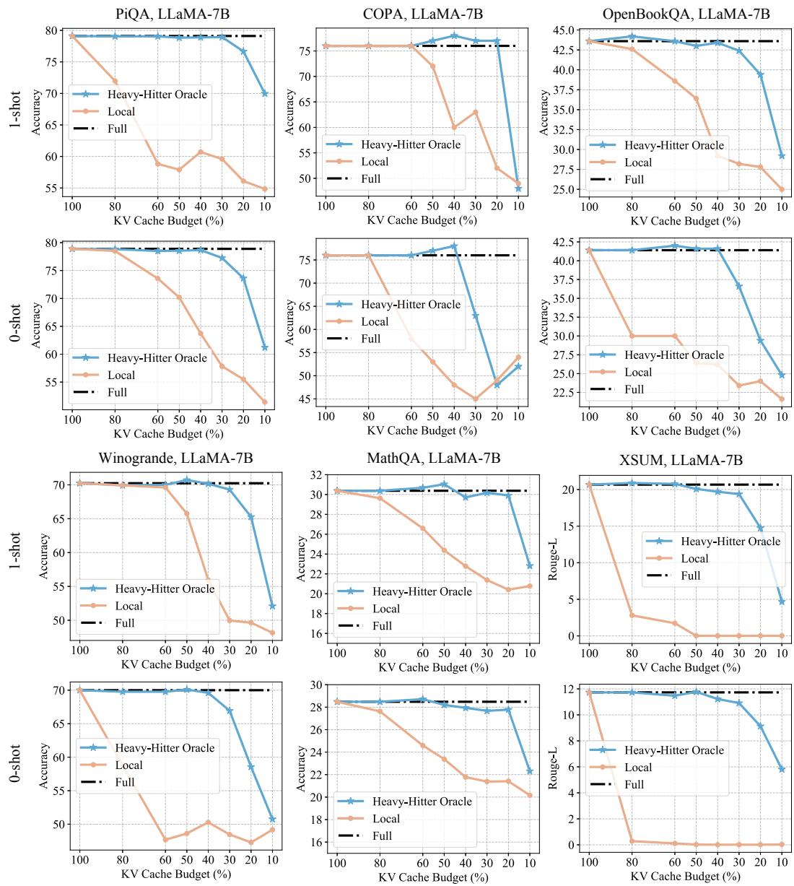  

Figure 8: Comparsion results on zero-shot and one-shot inference.

# C.4 与 StreamingLLM 的比较

最近的研究，如 StreamLLM 和 LM-Infinite，展示了使语言模型（LLMs）处理无限长度输入的良好潜力。它们通过仅保留初始词元和有限的局部上下文来实现这一点。然而，这种方法可能对某些任务构成挑战，因为关键信息可能位于输入的中间部分，而使用这种策略会导致信息丢失。我们通过两种特定类型的任务进行探讨：多文档问答：在此任务中，每个测试样本包含十个文档，后面跟着一个问题。回答该问题的关键信息存储在其中一个文档中。我们重新排列了关键文档的位置，发现 StreamLLM 或 LM-Infinite 的逐出策略在关键文档被丢弃时表现不佳。文本摘要任务（XSUM 和 CNN-DailyMail）：文本摘要任务要求模型生成冗长文本的简洁摘要。有效的摘要需要全面理解整个文档，当关键信息分散于输入中时，这会使任务变得困难。特别是，摘要通常依赖于长上下文注意力，而在有限的局部词元中可能无法有效捕捉关键信息。结果如图 9 所示，显示 StreamLLM 的性能一致下降。由于 StreamLLM 无论输入内容如何总是保持前几个词元及局部词元，这种策略不可避免地导致关键信息的丢失，从而使性能下降。相对而言，我们的 ${ \sf H } _ { 2 } \mathrm { O }$ 显示出显著优越的性能。此外，使用 ${ \sf H } _ { 2 } \mathrm { O }$ 时，模型能够成功处理四百万个词元。

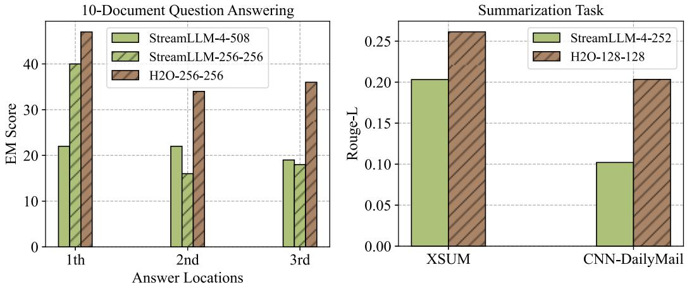  

Figure 9: Comparison results of StreamLLM [52] and our ${ \sf H } _ { 2 } { \sf O }$ on generization tasks. The number in each method represents the KV Cache budget of the start/heavy-hitter tokens and the local tokens, respectively. For example, H20-256-256 means maintaining 256 Heavy-Hitters and 256 local tokens.

# C.5 提升“Top-K”基线表现

我们发现 ${ \sf H } _ { 2 }$ 可以通过 "Top-K" 策略进一步增强另一强基线。结果见表 8。在与 ${ \sf H } _ { 2 }$ 结合后，"Top-K" 方法在 4 个不同任务中实现了高达 $2.00\%$ 的额外准确率提升。

Table 8: Results of the "Top-K" method $w .$ or w.o. ${ \sf H } _ { 2 }$ . Experiments are conducted with OPT-30B with $2 0 \%$ KV cache budget.   

<table><tr><td>Models</td><td>COPA</td><td>OpenBookQA</td><td>PiQA</td><td>Winogrande</td></tr><tr><td>Full</td><td>85.00</td><td>43.20</td><td>78.51</td><td>70.24</td></tr><tr><td>TopK w.o. H2</td><td>80.00</td><td>41.40</td><td>76.96</td><td>65.35</td></tr><tr><td>TopK w. H2</td><td>82.00</td><td>42.80</td><td>77.96</td><td>66.48</td></tr></table>

# C.6 重头效应与局部词元的独立影响

表9展示了重载词和局部词元的独立影响。我们可以观察到，重载词对模型性能的维持贡献更大。

# C.7 不同样本数量下推理性能表现。

表10展示了我们的${ \sf H } _ { 2 } \mathrm { O }$在推理过程中在不同拍摄数量下都取得了一致的改进，并且在$20\%$内存预算下保持了完整模型的性能。

Table 9: Ablation study of ${ \sf H } _ { 2 } { \sf O }$ across different tasks.   

<table><tr><td>Tasks</td><td>Models</td><td>Full</td><td>w. Local</td><td>w. H2</td><td>w. Local + H2</td></tr><tr><td rowspan="2">PiQA</td><td>OPT-13B</td><td>77.37</td><td>54.62</td><td>76.12</td><td>77.26</td></tr><tr><td>OPT-30B</td><td>78.51</td><td>55.82</td><td>67.25</td><td>78.45</td></tr><tr><td rowspan="2">OpenBookQA</td><td>OPT-13B</td><td>41.40</td><td>25.60</td><td>30.40</td><td>41.20</td></tr><tr><td>OT-30B</td><td>43.20</td><td>25.20</td><td>26.60</td><td>43.00</td></tr><tr><td rowspan="2">MathQA</td><td>OPT-13B</td><td>26.67</td><td>22.04</td><td>23.82</td><td>26.93</td></tr><tr><td>OPT-30B</td><td>26.23</td><td>20.87</td><td>21.98</td><td>26.87</td></tr><tr><td rowspan="2">Winogrande</td><td>OPT-13B</td><td>68.59</td><td>49.96</td><td>51.85</td><td>67.32</td></tr><tr><td>OPT-30B</td><td>70.24</td><td>49.17</td><td>47.36</td><td>69.06</td></tr></table>

Table 10: Results under different sequence length of OPT-30B with $2 0 \%$ KV cache budget.   

<table><tr><td rowspan="2">Tasks</td><td rowspan="2">Methods</td><td colspan="2">5-shots</td><td colspan="2">10-shots</td></tr><tr><td>OPT-30B</td><td>OPT-66B</td><td>OPT-30B</td><td>OPT-66B</td></tr><tr><td rowspan="3">OpenBookQA</td><td>Full</td><td>43.20</td><td>44.40</td><td>43.00</td><td>44.80</td></tr><tr><td>Local</td><td>25.20</td><td>30.60</td><td>26.60</td><td>38.80</td></tr><tr><td>H2O</td><td>43.00</td><td>44.20</td><td>42.80</td><td>44.80</td></tr><tr><td rowspan="3">COPA</td><td>Full</td><td>85.00</td><td>83.00</td><td>86.00</td><td>85.00</td></tr><tr><td>Local</td><td>48.00</td><td>59.00</td><td>60.00</td><td>76.00</td></tr><tr><td>H2O</td><td>84.00</td><td>82.00</td><td>85.00</td><td>86.00</td></tr><tr><td rowspan="3">MathQA</td><td>Full</td><td>26.23</td><td>27.87</td><td>26.67</td><td>27.00</td></tr><tr><td>Local</td><td>20.87</td><td>25.49</td><td>21.11</td><td>23.08</td></tr><tr><td>H2O</td><td>26.87</td><td>27.67</td><td>26.47</td><td>27.30</td></tr></table>

# C.8 注意力块中的重击者

注意力块中所有词元的累计注意力得分分布如图 10 所示。我们可以观察到 ${ \sf H } _ { 2 }$ 在每一层中普遍存在。

# C.9 与 SpAtten 的比较

与 SpAtten [32] 相比，${ \sf H } _ { 2 } \mathrm { O }$ 的主要区别在于：i) 它们在注意力头和层之间累计注意力得分，而在我们的算法中，每个词元可以在注意力头和层之间独立地保留或驱逐，从而为选择关键 KV 嵌入提供更多灵活性；ii) 我们在生成过程中还使用最近词元的 KV，并证明这种 ${ \sf H } _ { 2 }$ 词元可以有效增强其他稀疏注意力策略；iii) 我们将 KV 缓存驱逐形式化为动态子模问题，并在一些温和假设下证明了我们新算法的理论保证。此外，我们还提供了与 SpAtten 的定量比较，结果见表 11。

Table 11: Comparison between SpAtten [32] and ${ \sf H } _ { 2 } { \sf O }$ across various tasks with OPT-30B.   

<table><tr><td>Models</td><td>COPA</td><td>OpenBookQA</td><td>PiQA</td></tr><tr><td>Full</td><td>85.00</td><td>43.20</td><td>78.51</td></tr><tr><td>SpAtten</td><td>82.00</td><td>41.90</td><td>77.06</td></tr><tr><td>H2O</td><td>84.00</td><td>43.00</td><td>78.45</td></tr></table>

# C.10 MLP块中的重载项

除了注意力模块之外，在大语言模型的多层感知器（MLP）模块中还观察到了重打击（Heavy-Hitters）${ \mathsf { H } _ { 2 } }$ 的存在。我们使用Wiki-Text-103数据集作为输入，并记录MLP模块隐藏层神经元的激活频率。如图11所示，神经元的激活频率遵循幂律分布，少数神经元几乎被所有输入令牌激活（激活频率为$100\%$），而大多数其他神经元则很少被激活。随后，对MLP模块中与${ \sf H } _ { 2 }$相关的各种特性进行了全面检查，涵盖以下方面：（1）消除${ \sf H } _ { 2 }$会导致性能显著下降，尽管这种降级只需通过$1\%$的训练数据即可轻松恢复；（2）${ \sf H } _ { 2 }$在不同类型输入内容之间显示出显著的重叠；（3）${ \sf H } _ { 2 }$的出现发生在训练过程的早期，从而展现出“早鸟”特征，并且它们的位置在随后的训练阶段中逐渐变化。

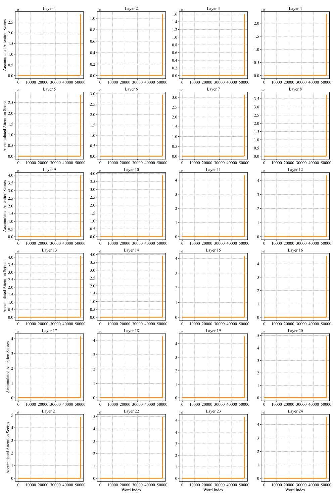  

Figure 10: The distribution of accumulated attention scores with respect to the corresponding word. The $\mathbf { X } ^ { }$ axis repreents he wor index in the vocabulary, and they-axis reresents he acumulae attentin score Results are obtained from OPT-1.3B.

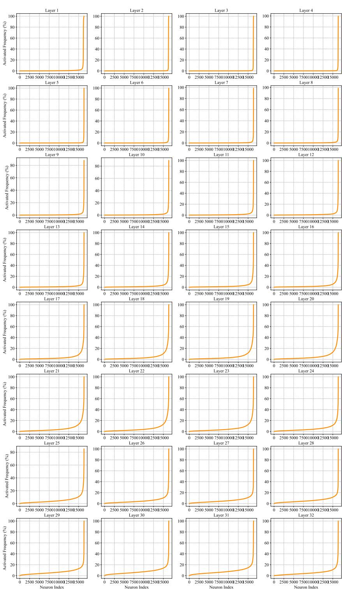  

Figure 11: The emergence of $\mathsf { H } _ { 2 }$ in MLP blocks of OPT-6.7B. The $\mathbf { X }$ -axis represents the index of neurons in the hidden layers of MLP blocks, and the y-axis represents the activated frequency.

消除 ${ \sf H } _ { 2 }$。我们首先使用 Wiki-Text-103 数据集训练了一个 GPT-2，然后识别出一个 p o v a x $2 0 \%$ $( i . e . , \mathsf { H } _ { 2 } )$。这一剪枝操作导致性能显著下降，具体表现为困惑度从 19.32 增加到 31.78。结果强调了 $\mathsf { H } _ { 2 }$ 在维持模型功能中的重要性。为了评估丢失信息的可恢复性，我们进行了一次少量样本微调实验，结果汇总在表 12 中。被剪枝的模型在 500 次迭代中使用不同比例的训练数据进行了微调，并成功恢复到与预训练模型相等的性能水平。相比之下，当仅使用 $1 \%$ 的训练数据从头开始训练模型时，所得到的模型仅实现了 554.12 的困惑度。这些发现表明，编码在 ${ \sf H } _ { 2 }$ 中的知识可以被轻松恢复。

Table 12: . Perplexity on the test-set of Wiki-Text-3 with GPT-2.   

<table><tr><td>Settings</td><td>1%</td><td>10%</td><td>40%</td><td>100%</td></tr><tr><td>Pretrained Model</td><td></td><td colspan="2">19.32</td><td></td></tr><tr><td>Remove H2</td><td></td><td colspan="2">31.78</td><td></td></tr><tr><td>Fine-tuning</td><td>19.86</td><td>19.84</td><td>19.76</td><td>19.83</td></tr></table>

不同输入内容的重叠。此外，我们对从各种输入内容获得的激活频率进行了比较分析。具体而言，利用预训练的OPT-1.3B模型，我们评估了三个数据集，即Wiki-Text-103、Penn Treebank和Amazon Review。${ \sf H } _ { 2 }$的位置如图12所示，揭示出多个数据集之间显著的一致性。早鸟特性。此外，我们的研究表明，${ \sf H } _ { 2 }$展现出“早鸟”特性，如图13所示。通过可视化训练过程中多个检查点的激活频率分布，我们观察到在初始阶段出现幂律行为，具体而言，在$4\%$的训练预算时就已有所表现。随后，${ \sf H } _ { 2 }$的位置表现出渐进且微小的变化。

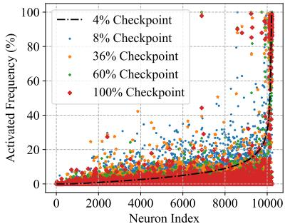  

Figure 13: The distribution of activated frequency during training. Experiments are conducted with different checkpoints of OPT-2.7B during training.

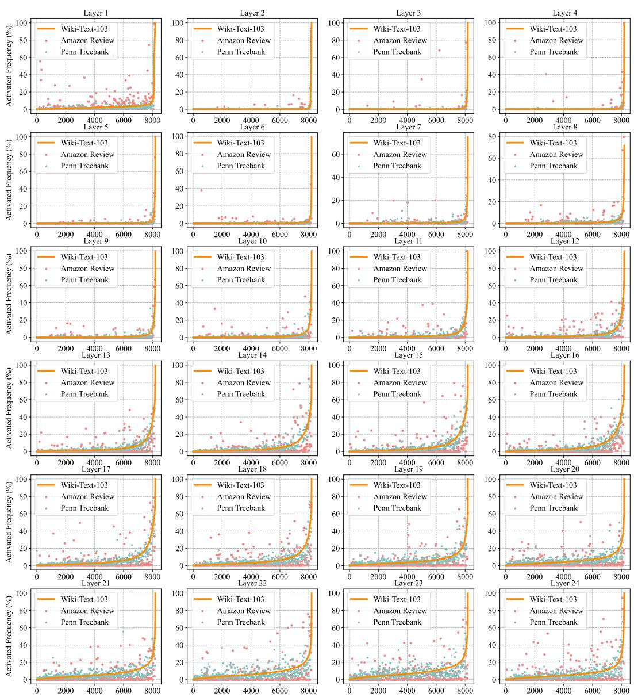  

Figure 12: The distribution of activated frequency across diverse input content. The $\mathbf { X }$ axis represents the index of neurons, which is ordered by the activated frequency from Wiki-Text-103.

# D 理论分析

最近，一些研究从理论角度研究了大语言模型中的注意力机制[96, 97, 98, 99, 100, 101, 102, 103, 104, 105, 106, 107, 108, 109, 110, 111, 112, 113, 114, 115, 116, 117, 118, 119, 120, 121, 122]。在这项工作中，我们提供了与以往研究不同的新视角。我们提出了子可加性特性概念，并提出了一种逐步驱逐策略，称为贪婪 ${ \sf H } _ { 2 }$ ，这是动态子可加性最大化的一种修改。此外，假设注意力机制是子可加的，我们建立了在没有任何缓存大小限制的情况下构建集合 $S _ { i }$ 满足近似最优性在子可加性方面的特性。我们为我们的鲁棒和近似贪婪驱逐策略算法（算法 2）提供了理论保障。由于篇幅限制，我们仅在第 4.1 节对算法（算法 2）进行了非正式描述。在第 D.6 节，我们提供了一个算法（算法 2），其中包含算法 1 的完整实现细节。我们还提供了在第 3 节观察到的稀疏性保持的数学表达，并提出了一个算法（算法 4）来解决该问题。

具体而言，在 D.1 节中，我们提供了一些基本定义和符号。在 D.2 节中，我们简要介绍了子模块函数的定义。在 D.3 节中，我们定义了动态子模块框架，这为定义 4.1 提供了正式版本。在 D.4 节中，我们简要回顾了静态注意力计算问题。在 D.5 节中，我们以递归方式制定了注意力计算。在 D.6 节中，我们简要回顾了我们的驱逐策略，这为定义 4.3 提供了正式版本。在 D.7 节中，我们讨论了子模块的递减收益。在 D.8 节中，我们讨论了子模块的高层次思想。在 D.9 节中，我们分析了鲁棒贪心算法的误差传播。在 D.10 节中，我们解释了如何通过近似函数将项目添加到集合中。在 D.11 节中，我们提供了与动态属性相关的几个定义。在 D.12 节中，我们证明了确切函数的归纳引理。在 D.13 节中，我们证明了近似函数的归纳引理。在 D.14 节中，我们为全知识版本（引理 3.1 的正式版本）和有限缓存大小版本（定理 4.4 的正式版本）提供了理论保证。在 D.15 节中，我们对关于注意力计算和回归相关问题的理论工作进行了更详细的讨论。在 D.16 节中，我们提供了稀疏性保持的数学公式。在 D.17 节中，我们提供了可能生成稀疏（重头类型注意力得分）的损失函数的定义。在 D.18 节中，我们解释了如何计算损失函数的梯度。在 D.19 节中，我们展示了如何计算损失函数的 Hessian 矩阵。在 D.20 节中，我们展示了 Hessian 矩阵是正定的。在 D.21 节中，我们证明了 Hessian 矩阵的 Lipschitz 性质。在 D.22 节中，我们展示了使用一种梯度型算法足以优化该（重头类型）损失函数。

# D.1 符号说明

对于正整数 $n$，定义 $[ n ] := \{ 1 , 2 , \cdots , n \}$。

对于一个向量 $x \in \mathbb{R}^n$，记 $\sqrt{x} \in \mathbb{R}^n$ 为向量，其第 $i$ 个元素为 $\sqrt{x_i}$，而 $\deg(x) \in \mathbb{R}^{n \times n}$ 表示对角矩阵，其第 $i$ 个对角元素为 $x_i$。对于两个矩阵 $A, W \in \mathbb{R}^{n \times n}$，定义 $\| A \|_{W} := \left( \sum_{i=1}^{n} \sum_{j=1}^{n} W_{i,j} A_{i,j}^2 \right)^{1/2}$，并且 $W \circ A$ 表示矩阵，其中 $(W \circ A)_{i,j} = W_{i,j} A_{i,j}$。对于矩阵 $W \in \mathbb{R}^{n \times n}$，令 $D_{W_i} := \mathrm{diag}(W_{i,:})$，其中 $i \in [n]$。

对于两个向量 $x \in \mathbb{R}^{n}$ 和 $w \in \mathbb{R}_{\geq 0}^{n}$，定义 $\| x \|_{w} := \left( \sum_{i=1}^{n} w_{i} x_{i}^{2} \right)^{1/2}$。对于向量 $x$，其 $\ell_{2}$ 范数定义为 $\| x \|_{2} := \left( \sum_{i=1}^{n} x_{i}^{2} \right)^{1/2}$，而 $\ell_{p}$ 范数定义为 $\| x \|_{p} := \left( \sum_{i=1}^{n} |x_{i}|^{p} \right)^{1/p}$。对于矩阵 $A \in \mathbb{R}^{n \times k}$（$n \geq k$），其范数定义为 $\| A \| := \sup_{x} \frac{\| Ax \|_{2}}{\| x \|_{2}}$，而 Frobenius 范数定义为 $\| A \|_{F} := \left( \sum_{i=1}^{n} \sum_{j=1}^{k} A_{i,j}^{2} \right)^{1/2}$。

对于任意的矩阵 $A \in \mathbb{R}^{n \times k}$，其奇异值分解为 $A = U \boldsymbol{\Sigma} V^{\top}$，其中 $U \in \mathbb{R}^{n \times k}$（该矩阵的列是正交归一的），$\Sigma \in \mathbb{R}^{k \times k}$ 是对角矩阵，且 $V \in \mathbb{R}^{k \times k}$。我们称 $U$ 的列为奇异向量。我们用 $A^{\dag} \in \mathbb{R}^{k \times n}$ 表示摩尔-彭若斯伪逆，则有 $A^{\dagger} = V \bar{\Sigma^{-1}} U^{\top}$。假设 $\Sigma \in \mathbb{R}^{k \times k}$ 是已排序的对角矩阵，令 $\sigma_{1}, \cdots, \sigma_{k}$ 表示 $\Sigma$ 的对角元素，我们称 $\sigma_{i}$ 为矩阵的第 $i$ 个奇异值，并记作 $\sigma_{i}(A)$。对于任意对称矩阵 $B \in \mathbb{R}^{k \times k}$，我们记其特征值分解为 $B = U \Lambda U^{\top}$，其中 $\Lambda$ 是对角矩阵。令 $\lambda_{1}, \cdots, \lambda_{k}$ 表示 $\mathbf{\bar{\Lambda}} \in \mathbb{R}^{k \times k}$，我们称 $\lambda_{i}$ 为第 $i$ 个特征值，通常写作 $\lambda_{i}(B)$。特征值与奇异值之间的关系是

$$
\sigma _ { i } ^ { 2 } ( A ) = \lambda _ { i } ( A ^ { \top } A )
$$

我们使用符号 $A \succeq 0$ 来表示矩阵 $A$ 是半正定的（psd）。在数学上，$A \succeq 0$ 意味着对于所有向量 $x$ ，我们有 $x ^ { \top } A x \geq 0$ 。类似地，对于两个平方矩阵 $A$ 和 $B$ ，我们用 $A \succeq B$ 来表示对于所有向量 $x$ ，有 $x ^ { \top } A x \ge x ^ { \top } B x$ 。我们用 $\mathrm { P r } [ ]$ 和 $\mathbb { E } [ ]$ 分别表示概率和期望。我们定义 $a$ 和 $b$ 之间的最大值为 $\operatorname* { m a x } \{ a , b \}$ 。我们用 $\operatorname* { m i n } \{ a , b \}$ （分别是 $\operatorname* { m a x } \{ a , b \}$ ）表示 $a$ 和 $b$ 之间的最小值（分别是最大值）。在整个过程中，对于非负实数 $a$ 和 $\mathbf { b }$ ，我们用符号 $a = ( 1 \pm \epsilon ) b$ 表示 $a \in [ ( 1 - \epsilon ) b , ( 1 + \epsilon ) b ]$ 。

# D.2 子模性

我们提供子模函数的标准定义。定义 D.1（子模函数 [123]）。对于有限集合 $\Omega$，子模函数定义为 $f : 2 ^ { \Omega } \to \mathbb { R }$，其中 $2 ^ { \Omega }$ 表示 $\Omega$ 的幂集。它的特点是满足以下任一等价标准：

条件1. 对于 $S , T \subseteq \Omega$ 满足 $S \subseteq T$，且对每个 $a \in \Omega \backslash T$，都有 $f ( S \cup \{ a \} ) - f ( S ) \geq f ( T \cup \{ a \} ) - f ( T )$。 条件2. 对于每个 $S , T \subseteq \Omega$，都有 $f ( S ) + f ( T ) \geq f ( S \cup T ) + f ( S \cap T )$。 条件3. 对于每个 $S \subseteq \Omega$ 和 $a_{1}, a_{2} \in \Omega \backslash S$ 使得 $a_{1} \neq a_{2}$，都有 $f ( S \cup \{ a_{1} \} ) + f ( S \cup \{ a_{2} \} ) \geq f ( S \cup \{ a_{1}, a_{2} \} ) + f ( S )$。为了方便讨论，在本文中，我们在讨论子模函数时始终选择 $\Omega = [ n ]$。接下来，我们提供一些子模函数的示例/类型。一类重要的子模函数被称为单调函数，定义 D.2（单调函数）。一个集合函数 $f$ 是单调的，如果对于每个 $T \subseteq S$，都有 $f ( T ) \leq f ( S )$。这里有一些单调子模函数。

线性（模块化）函数 线性函数可以表示为 $\textstyle f ( S ) = \sum _ { i \in S } w _ { i }$ 。如果所有权重 $w _ { i }$ 均为非负，则该函数 $f$ 被视为单调函数。 预算加法函数 预算加法函数的形式为 $f ( S ) = \sin B , \textstyle \sum _ { i \in S } w _ { i }$ ，其中每个权重 $w _ { i }$ 和预算 $B$ 均为非负。 覆盖函数 我们有一个集合 $\Omega = \{ E _ { 1 } , E _ { 2 } , \cdots , E _ { n } \}$ ，其中每个 $E _ { i }$ 是一个更广泛集合 $\Omega ^ { \prime }$ 的子集。覆盖函数可以表示为 $f ( S ) = | \cup _ { E _ { i } \in S } E _ { i } |$ 适用于任何 $S \subset \Omega$ 。可以通过为元素分配非负权重来推广该函数。

# D.3 动态次模系统

标准的子模函数是从 $2^{[n]}$ 映射到实数。在这里，我们需要更一般的定义，即从 $2^{[n]} \times 2^{[n]}$ 映射到实数。定义 D.3（强子模）。我们定义函数 $F : 2^{[n]} \times 2^{[n]} \to \mathbb{R}$，则对于任何集合 $Z \subset [n]$，我们假设 $F(Z, \cdot) : 2^{[n]} \to \mathbb{R}$ 是一个子模函数。事实上，上述定义比我们所需的更强，我们真正需要的可以表述如下。我们指出，在定义 4.1 中提供了一个非正式的定义。这里我们提供该定义更详细的版本。定义 D.4（动态子模框架，定义 4.1 的正式版本）。定义函数 $$ F : 2^{[n]} \times [n] \times 2^{[n]} \to \mathbb{R}。 $$ 那么对于任何索引 $i \in [n]$，任何集合 $Z \subseteq [i-1]$，我们假设对于 $Z$ 是一个子模函数，即，

$$
F ( Z , i , \cdot ) : 2 ^ { [ n ] } \to \mathbb { R }
$$

对于所有集合 $X, Y \subset [n]$，满足 $Z \subset X \subset Y$，对于所有元素 $x \in [n]$，满足 $x \in [n] \backslash Y$，我们有 $f_{Z, i}(\cdot) := F(Z, i, \cdot)$。

$$
f _ { Z , i } ( X \cup \{ x \} ) - f _ { Z , i } ( X ) \geq f _ { Z , i } ( Y \cup \{ x \} ) - f _ { Z , i } ( Y ) ,
$$

备注 D.5。我们注意到定义 D.4 是定义 D.3 的一个弱化版本。我们还想提到，非正式定义（见定义 4.1）仅包含两个输入参数，但实际上我们需要三个输入参数（见定义 D.4）。在后者中，当我们使用 $f _ { Z , i } ( \cdot )$ 时，为了方便分析，我们将 $Z$ 替换为 $S _ { i }$，例如见定义 D.23、定义 D.24、定义 D.25 和定义 D.26。

# D.4 静态注意力

在描述递归注意力计算之前，我们将首先描述静态版本的注意力计算，如下所示（示例见 [98] 中的定义 1.1 和其他文献 [97, 100, 101, 106, 103, 118, 108]）：定义 D.6. 给定三个矩阵 $Q , K , V \in \mathbb { R } ^ { d \times d }$，目标是计算平方矩阵 $A \in \mathbb { R } ^ { n \times n }$ 可以重写如下，而对角矩阵 $D \in \mathbb { R } ^ { n \times n }$ 可以表示如下。

$$
\mathsf { A t t } ( Q , K , V ) : = D ^ { - 1 } A \cdot V
$$

$$
\boldsymbol { A } = \exp ( \boldsymbol { Q } \boldsymbol { K } ^ { \intercal } )
$$

$$
D = \mathrm { d i a g } ( A \mathbf { 1 } _ { n } )
$$

在这里，我们对矩阵逐元素地应用 $\exp( )$。${ \bf 1 } _ { n }$ 是一个长度为 n 的向量，其中所有元素均为一。运算符 diag() 将一个向量转换为对角矩阵。

# D.5 递归注意力定义

我们首先提供一些定义。定义 D.7. 给定一个查询矩阵 $Q \in \mathbb { R } ^ { n \times d }$，我们用 $Q _ { i , * }$ 表示一个长度为 d 的行向量，代表 $Q$ 的第 i 行，对每个 $i \in [ n ]$。定义 D.8. 给定一个键矩阵 $K \in \mathbb { R } ^ { n \times d }$，我们用 $K _ { \leq i , * }$ 表示一个 $i \times d$ 矩阵，选择 $K$ 的前 i 行。

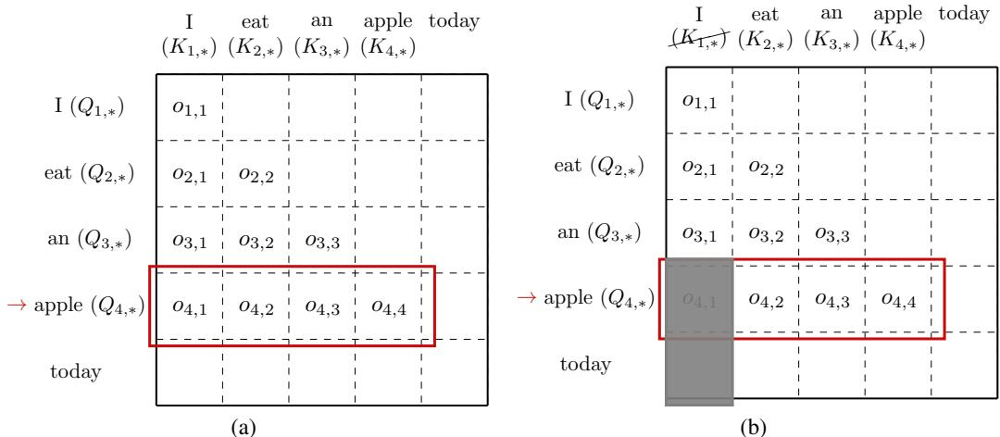  
ur )Exacers  thtten cuatHe urexa s bout ngmoelas. At this stage, the model predicts the word 'apple' and computes the exact attention vector $o _ { 4 }$ . (b) Approximate versio  te tnt cuat.L  u thebe kes we tac We e key matrix for the first token $K _ { 1 , * }$ and only keep $K _ { 2 , * } , K _ { 3 , * }$ and $K _ { 4 , * }$ in the memory. Compared with the exact version, we don't compute $^ { O 4 , 1 }$ .

接下来，我们展示计算注意力的精确版本。定义 D.9（精确版本）。给定 $Q , K \in \mathbb { R } ^ { n \times d }$，对于每个 $i \in [ n ]$，我们使用 $o _ { i } \in \mathbb { R } ^ { i }$ 表示一个长度为 $i$ 的向量。对于每个 $j \in [ i ]$，我们使用 $o _ { i , j }$ 表示向量 $o _ { i } \in \mathbb { R } ^ { i }$ 的第 $j$ 个坐标。对于第一层，我们有

$$
o _ { 1 , 1 } = 1 .
$$

对于第二层，我们有

$$
\bullet l e n g t h - 2 \nu e c t o r o _ { 2 } : = \underbrace { D _ { 2 } ^ { - 1 } } _ { \mathrm { s c a l a r } } \cdot \exp ( \underbrace { Q _ { 2 , * } } _ { 1 \times d } \underbrace { ( K _ { \leq 2 , * } ) ^ { \top } } _ { d \times 2 } )
$$

对于每个 $i \in [ n ]$，我们在第 $i$ 层有

$$
\bullet l e n g t h - i \nu e c t o r o _ { i } : = \underbrace { D _ { i } ^ { - 1 } } _ { \mathrm { s c a l a r } } \cdot \exp ( \underbrace { Q _ { i , * } } _ { 1 \times d } \underbrace { ( K _ { \leq i , * } ) ^ { \top } } _ { d \times i } )
$$

$$
\bullet s c a l a r D _ { i } : = \underbrace { \exp ( Q _ { i , * } ( K _ { \le i , * } ) ^ { \top } ) } _ { 1 \times i } \cdot \underbrace { { \bf 1 } _ { i } } _ { i \times 1 }
$$

现在，我们展示计算注意力的近似版本。我们不计算整个注意力 $o _ { i }$，而只计算正在追踪的词元的注意力。定义 D.10（近似版本）。给定 $Q , K \in \mathbb { R } ^ { n \times d }$ 对于每个 $i \in [ n ]$，我们使用 $o _ { i } \in \mathbb { R } ^ { i }$ 表示长度为 $i$ 的向量。对于每个 $j \in [ i ]$，我们使用 $o _ { i , j }$ 表示向量 $o _ { i } \in \mathbb { R } ^ { i }$ 的第 $j$ 个坐标。设 $k \in [ n ]$ 为我们可以追踪的词元数量的预算（由于内存问题）。

$$
\cdot \ o _ { 1 , 1 } = 1 .
$$

对于第二层，我们有

$$
\bullet l e n g t h - 2 \nu e c t o r o _ { 2 } : = \underbrace { D _ { 2 } ^ { - 1 } } _ { \mathrm { s c a l a r } } \cdot \exp ( \underbrace { Q _ { 2 , * } } _ { 1 \times d } \underbrace { ( K _ { \leq 2 , * } ) ^ { \top } } _ { d \times 2 } )
$$

对于每个 $i \in [ n ]$，对于第 $i$ 个词元，我们有

令 $S_{i} \subset [n]$ 表示我们在预测第 $i$ 个词元时所追踪的词元。 ：$|S_{i}| = k$ $|S_{i} \backslash S_{i-1}| \leq 1$ 或等价地 $|S_{i} \cap S_{i-1}| \geq k - 1$ 长度为 $i$ 的向量 $o_{i} := \underbrace{D_{i}^{-1}}_{\mathrm{标量}} \cdot \exp(\underbrace{Q_{i,*}}_{1 \times d} \underbrace{(K_{S_{i},*})^{\top}}_{d \times i})$ 标量 $D_{i} := \underbrace{(\exp({Q_{i,*}(K_{S_{i},*})^{\top}}) - 1_{[i] \setminus S_{i}})}_{1 \times i} \cdot \underbrace{\mathbf{1}_{i}}_{i \times 1}$ 在某种意义上，上述定义与在压缩感知中寻找重击者有关（有关压缩感知的更多背景信息，请参阅 [124, 125, 126]）。

# D.6 驱逐策略

本节的目标是研究我们在空间限制下的驱逐策略。我们首先给定一个过程 $Q \in \breve{ \mathbb{R} }^{n \times d}$ 和键矩阵 $K \in \mathbb{R}^{n \times d}$。$Q_{i,*}$ 表示第 $i$ 个 $Q$，而 $K_{\leq i,*}$ 表示 $K$ 的前 $i$ 行。为了简单起见，$K_{S_{i},*}$ 表示从 $K$ 中选择 $\boldsymbol{\bar{S}}_{i}$ 行的子矩阵。定义 D.11（具有完全知识的生成过程）。对于每个 $i \in [n]$，对于第 $i$ 个词元，我们有长度为 $i$ 的向量 $o_{i} := D_{i}^{-1} \cdot \exp(Q_{i,*} (K_{\leq i,*})^{\top})$，表示第 $i$ 个词的注意力。标量 $D_{i} := \exp(Q_{i,*} (K_{\leq i,*})^{\top}) \cdot \mathbf{1}_{i}$，表示归一化因子。在上述过程中的情况是，因为没有空间限制，我们可以保留所有的评分。在接下来的过程中，我们展示在有空间限制时如何处理。在这种情况下，我们需要动态维护集合 $S_{i}$，使得 $|S_{i}| \le k$（与完全知识的情况相比，我们可以认为 $|S_{i}| = \dot{i}$）。定义 D.12 $_{\mathsf{H}_{2}\mathrm{O}}$ 驱逐策略，定义 4.3 的正式版本。设 $k$ 表示空间预算且 $k < n$。设 $F_{\mathrm{score}} : 2^{[n]} \to \mathbb{R}$ 表示某个评分函数。设 $S_{i-1}$ 表示源集合。设 $S_{i}$ 表示目标集合。我们定义驱逐策略 $g : S_{i-1} \to S_{i}$，使得 $|S_{i}| \le k$（KV 缓存大小在时间上不变），$|S_{i} \rangle S_{i-1}| \leq 1$（我们最多可以驱逐 1 个 KV）。我们构造 $S_{i} \gets ( S_{i-1} \cup \{ i \} ) \backslash \{ u \}$，其中 $u \arg \operatorname*{max}_{v \in (S_{i-1} \cup \{ i \})} F_{\mathrm{score}}( S_{i-1} \cup \{ i \} \backslash \{ v \})$。备注 D.13。我们说明，在定义 4.3 中，我们引入了一个简化的符号，表明在第一要点中 $|S_{i}| = k$，但通常情况下，我们考虑前 $k$ 个词元的情况，即 $|S_{i}| \le k$。为了适应这种更一般的情况，我们给出了定义 D.12，提供了一个更广泛的定义，处理 $|S_{i}| \le k$ 的情况。算法 $2 H_{2}$ 驱逐算法，查询矩阵 $Q \in \mathbb{R}^{n \times d}$，键矩阵 $K \in \mathbb{R}^{n \times d}$，KV 缓存的预算大小 $k \in \mathbb{N}$，算法 1 的正式和详细版本。

<table><tr><td colspan="2">1: procedure H2_EvICTIoN(Q  Rn×d, K  Rn×d, k  N)</td></tr><tr><td>2:</td><td>S0 ← , 00 ← 0 Initialization the algorithm</td></tr><tr><td>3:</td><td>for i = 1 → n do Linear scan each token</td></tr><tr><td>4:</td><td>if i ≤ k then &gt; If the KV cache is not full</td></tr><tr><td>5:</td><td>Si ← Si−1 U {i} Expand the set directly</td></tr><tr><td>6:</td><td>else If the KV cache is full</td></tr><tr><td>7:</td><td>Di ← (exp(Qi,*(KSi−1,*)T ) − 1[i]\Si−1) · 1i &lt; Compute the normalization factor</td></tr><tr><td>8:</td><td>oi ← D−1 · exp(Qi,*(KSi−1,*)T ) Compute score vector</td></tr><tr><td>9:</td><td>oi ← oi−1 + oi Accumulate the scores (Remark D.15)</td></tr><tr><td>10:</td><td>Let score function be Fscore(T ) := h(∑sT oi, s) &gt; Score function (Remark D.14)</td></tr><tr><td>11:</td><td>Y ← argmaxv(Si−1∪{i}) Fscore(Si−1 ∪ {i}\{v}} Find an entry to swap</td></tr><tr><td>12:</td><td>Si ← (Si−1 ∪ {i})\{u} Construct Si</td></tr><tr><td>13:</td><td></td></tr><tr><td>end if 14: end for</td><td></td></tr><tr><td>15: end procedure</td><td></td></tr></table>

备注 D.14. 我们注意到上述函数 $F _ { \mathrm { s c o r e } }$ 可以有多种选择。在后续分析中，我们提供了两种选择。如果使用精确函数，则 $F _ { \mathrm { s c o r e } }$ 为 $f _ { S _ { i } , i }$（见定义 $D . 2 3$ 和定义 $D . 2 5 \mathrm { _ }$）。如果使用近似函数，则 $F _ { \mathrm { s c o r e } } = \widetilde { f } _ { S _ { i } , i }$（见定义 $D . 2 4$ 和定义 D.26）。令 $h : \mathbb { R } \rightarrow \mathbb { R }$（该 $h$ 在算法 2 的第 10 行中使用）表示该函数。我们希望选择 $h$ 以便使得函数 $F _ { \mathrm { s c o r e } }$ 在我们动态框架的意义上具有次模性质。例如，$h ( z )$ 通常选择为某个非递减的凹函数，如 $\sqrt { z + 1 }$ 和 $\log ( z + 1 )$。为简便起见，在算法 1（即算法 2 的非正式版本）中，我们选择 $h ( z ) = z$，以便为读者提供直观理解，并由于篇幅限制。备注 D.15. 我们注意到，在算法 2 的第 10 行中，$\widetilde { o } _ { i , s }$ 是集合 $T$ 中令牌 $s$ 的注意力得分的累积。在我们的算法 $^ { l }$ 中，我们仅在第 $I O$ 行（见算法 $I$）中使用 $o _ { s }$ 来表示该累积的注意力得分，以简化表示。在算法 2 中，为简化展示，我们可以创建多个向量 $\widetilde { o } _ { 0 } , \cdots , \widetilde { o } _ { n }$（见第 2 行、第 9 行、第 10 行）。然而，每次在第 $i$ 步时，我们只需使用信息 $\widetilde { o } _ { i }$，其长度最多为 $n$。因此，采用一种直接且更好的实现方式，仅使用一个长度为 $n$ 的存储累积得分可以将 $n ^ { 2 }$ 的使用减少到 $n$。

# D.7 在注意力机制中解释子模性递减收益特性

在标准的子模问题中，我们给定一个基集合 $[ n ]$ 以及一个函数 $f : 2^{[ n ]} \to \mathbb{R}$，目标是找到一个元素集合 $S$，使得 $f(S)$ 最大化。我们称函数 $f$ 是子模的（回顾定义 D.1 的正式定义），如果对于每个 $X, Y \subseteq [ n ]$（其中 $X \subseteq Y$）以及每个 $x \in [ n ] \backslash Y$，都满足以下条件：

$$
f ( X \cup \{ x \} ) - f ( X ) \geq f ( Y \cup \{ x \} ) - f ( Y )
$$

子模函数可以表示项目的成本，因为它们具有递减收益特性。这表明，从选择候选对象（例如单词或句子）所获得的信息增加，随着更多对象已被选择用于摘要，所增加的信息会变得更小。例如，我们将一个新词元“w”引入两个集合 $S$ 和 $S _ { 0 }$ ，其中 $S _ { 0 }$ 所涵盖的概念是 $S$ 所涵盖的概念的子集。根据直觉，“w” 对 $S _ { 0 }$ 添加的信息应该比对 $S$ 添加的信息更多，因为“w” 所携带的新概念可能已经被 $S$ 中存在的概念但不在 $S _ { 0 }$ 中的概念所涵盖。这一特性被称为递减收益特性。因此，我们建议神经覆盖函数应当表现出一种称为子模性的理想特性。

# D.8 子模性质：高层次思想

我们在这一节中对具有基数约束的子模函数最大化问题进行了形式化。不妨说，一个集合函数是子模的，如果它具有递减的边际增量。定义 D.16（子模函数）。我们记 $f : 2 ^ { [ n ] } \to \mathbb { R }$ 为一个集合函数。离散导数 $\Delta _ { f }$ 的定义如下：

$$
\Delta _ { f } ( i \mid S ) : = f ( S \cup \{ i \} ) - f ( S ) .
$$

一个函数 $f$ 是子模的，当且仅当对于任何 $S \subseteq T$ 和 $i \in [n] \backslash T$，下面的不等式成立：

$$
\Delta _ { f } ( i \mid T ) \leq \Delta _ { f } ( i \mid S ) .
$$

为简化起见，我们提出了在基数约束下最大化子模函数的问题（1）。我们的目标是高效地解决该优化问题。

$$
\begin{array} { r l } { \underset { S \subseteq [ n ] } { \operatorname* { m a x } } } & { { } f ( S ) } \\ { \mathrm { s . t . } } & { { } | S | \leq k } \end{array}
$$

对于 $f ( S )$ 的表示，设计算法的一项挑战是确定输入实例的表示形式。由于优化问题 (1) 中的约束是明确的，我们需要决定如何表示 $f ( S )$。假设 $S = i _ { 1 } , i _ { 2 } , \cdots , i _ { m } \subseteq [ n ]$，我们可以将 $f ( S )$ 分解为增量的总和，如下所示：

$$
f ( S ) = f ( S _ { 0 } ) + \sum _ { j = 1 } ^ { m } ( f ( S _ { j } ) - f ( S _ { j - 1 } ) ) ,
$$

其中 $S _ { 0 } = \emptyset$ 且 $S _ { j } = S _ { j - 1 } + i _ { j }$。为了简化说明，我们假设 $f ( \varnothing ) = 0$。根据 $\Delta _ { f } ( i | S )$ 的定义，我们有 $f ( \check { S _ { j } } ) - f ( \bar { S _ { j - 1 } }) = \Delta _ { f } ( i _ { j } | \bar { S } _ { j - 1 })$。因此，分解式 (2) 可以简化如下：

$$
f ( S ) = \sum _ { j = 1 } ^ { m } \Delta _ { f } ( i _ { j } | S _ { j - 1 } )
$$

为了后续引入我们先进的数据结构，我们进一步将 $\Delta _ { f } ( i | S )$ 表示为，其中 $u _ { i } \in \mathbb { R } ^ { d }$ 是一个 $d$ 维向量，$h ( S ) \in \mathbb { R } ^ { d \times d }$ 是一个 $d \times d$ 矩阵。

$$
\Delta _ { f } ( i | S ) = u _ { i } ^ { \top } h ( S ) u _ { i }
$$

在实际应用中，次模函数的一个重要子类是单调次模函数，即满足 $f ( A ) \leq f ( B )$ 对所有 $A \subseteq B \subseteq [ n ]$ 的函数 $f$。当 $f$ 是单调的时，我们可以将所有的 $h ( S )$ 限制为正半定（PSD）矩阵。当矩阵 $h ( S )$ 是正半定（PSD）时，我们能实现更快的加速。

# D.9 具有误差传播的鲁棒贪婪算法

贪心选择算法的过程以空集 $S_{0} = \emptyset$ 开始。在主循环的每次迭代中，算法选择能最大化边际增量的元素以添加到集合中。当集合的大小最终达到 $k$ 时，算法返回该集合 $S$。具体来说，对于迭代 $t \in \{ 1 , 2 , \cdots , k \}$，我们让单例中的元素为 $j_{t} = \arg \operatorname*{max}_{j \in \overline{S}_{t - 1}} f(S_{t - 1} \cup \{ j \})$。贪心策略在有效性方面，其近似误差为 $1 - 1 / e$。

$$
S _ { t } \gets S _ { t - 1 } \cup \{ j _ { t } \}
$$

定理 D.17 ([130])。对于一个单调的子模函数 $f$，贪心算法（算法 3）保证输出一个满足条件的集合 $S$。

$$
f ( S ) \geq ( 1 - 1 / e ) \operatorname* { m a x } _ { | T | = k } \{ f ( T ) \} .
$$

推论 D.18 ([131]). 给定

# 算法 3 贪心算法基准 1: 过程 GREEDYALGORITHM(子模函数 $f$ 2: $S_0 \gets $ 初始化一个空集合 $S_{0}$ 3: 对于 $t = 0$ 到 $k - 1$ 进行循环 4: $j \gets \arg \operatorname*{max}_{i} \{ f(S_{t} \cup \{ i \}) \}$ 找到能最大化 $f(S_{t} \cup \{ i \})$ 的元素 $i \in [n]$ 5: $S_{t+1} \gets S_{t} \cup \{ j \}$ 将元素 $j$ 添加到集合 $S_{t}$ 中以获得 $S_{t + 1}$ 6: 结束循环 7: 返回 $S_{k}$ 8: 结束过程 精度参数 $\epsilon > 0$ 。

整数 $k \geq 1$ 设 $O$ 表示一个oracle，该oracle接受一个任意集合 $S \subseteq [ n ]$ 和 $i \in [ n ] \backslash S$，返回值 $O ( S , i )$，并保证 $\Delta ( i | S ) - \epsilon \le O ( S , i ) \le \Delta ( i | \bar { S } ) + \epsilon .$ 令 $A$ 表示一个算法，在每个时刻 $t = 1, 2, \cdots, k$，它选择 $\begin{array}{rl} { j _ { t } } & { { } = } \end{array}$ \operatorname* { arg }\max _{ j } \{ O ( S _ { t - 1 } , j ) \}$，并令 $S _ { t } \gets S _ { t - 1 } \cup \{ j _ { t } \}$。则该算法 $A$ 返回的集合 $S _ { k }$ 满足

$$
f ( S _ { k } ) \geq ( 1 - 1 / e ) \operatorname* { m a x } _ { | T | = k } \{ f ( T ) \} - k ( 2 - 1 / e ) \epsilon .
$$

# D.10 鲁棒子模函数与增加项目

我们首先提出一个引理，以展示子模函数的鲁棒性。引理 D.19。假设对于每个 $i \in [n]$，我们有

$$
| ( \widetilde f _ { S _ { i } , i } ( X ) ) - \widetilde f _ { S _ { i } , i } ( S _ { i } ) - ( f _ { S _ { i } , i } ( X ) - f _ { S _ { i } , i } ( S _ { i } ) ) | \le \epsilon / ( 2 n )
$$

让 $\mathsf { o p t } _ { i }$ 表示通过在第 $i$ 次迭代中使用 $f$ 可以实现的最优成本。如果贪心算法使用 $f$ 来寻找解决方案的性能至少为 $( 1 - 1 / e ) \cdot \mathsf { o p t } _ { i }$，那么使用 $\hat { \boldsymbol f }$，我们可以获得的解决方案的性能至少为 $( 1 - 1 / e ) \cdot \mathsf { o p t } _ { i } - \epsilon$。证明来自引理 D.18。接下来，我们解释如何根据确切值将项目添加到集合中。定义 D.20（基于确切值扩展项目）。如果以下条件成立

$$
\begin{array} { r l } & { \bullet L e t S _ { i } \subseteq [ i - 1 ] . } \\ & { } \\ & { \bullet L e t f _ { S _ { i } , i } : 2 ^ { [ i ] } \to \mathbb { R } . } \end{array}
$$

那么，我们可以定义 $S _ { i + 1 }$ 如下：如果 $f \left| S _ { i } \right| = k$，则 $S _ { i + 1 } = S _ { i } \cup \{ i \} \backslash u$，其中 $u = \arg \operatorname* { m a x } _ { v \in S _ { i } \cup \{ i \} } f _ { S _ { i } , i } ( S _ { i } \cup \{ i \} \backslash v ) - f _ { S _ { i } , i } ( S _ { i } )$。如果 $\lvert S _ { i } \rvert < k$，则 $S _ { i + 1 } = S _ { i } \cup \{ i \}$。备注 D.21。我们注意到 $u = \arg \operatorname* { m a x } _ { v \in S _ { i } \cup \{ i \} } f _ { S _ { i } , i } ( S _ { i } \cup \{ i \} \backslash v ) - f _ { S _ { i } , i } ( S _ { i } )$ 与 $u = \underset { \mathbb { \Gamma } } { \arg \operatorname* { m a x } } _ { v \in S _ { i } \cup \{ i \} } f _ { S _ { i } , i } ( S _ { i } \cup \{ i \} \backslash v )$ 是相同的。为了方便讨论和分析，我们将在不同地方切换使用这两种情况。在这里，我们解释如何通过近似值向集合中添加项。定义 D.22（基于近似值扩展项）。如果满足以下条件：

$$
\begin{array} { r l } & { \bullet L e t S _ { i } \subseteq [ i - 1 ] . } \\ & { } \\ & { \bullet L e t \widetilde { f } _ { S _ { i } , i } : 2 ^ { [ i ] } \to \mathbb { R } . } \end{array}
$$

然后，我们可以定义 $S _ { i + 1 }$ 如下：如果 $| S _ { i } | = k$，则 $S _ { i + 1 } = S _ { i } \cup \{ i \} \backslash u$，其中 $\begin{array} { r } { u \ = \ \arg \operatorname* { m a x } _ { v \in S _ { i } \cup \{ i \} } \widetilde { f } _ { S _ { i } , i } ( S _ { i } \cup \{ i \} \backslash v ) \ - } \end{array}$ $\widetilde { f } _ { S _ { i } , i } ( S _ { i } )$。如果 $| S _ { i } | < k$，则 $S _ { i + 1 } = S _ { i } \cup \{ i \}$。

# D.11 通用条件

定义 D.23 （精确函数的全局单调条件）。我们称函数 $f$ 具有全局单调条件，当且仅当对于所有 $i \in [ n ]$ 和所有 $S _ { i } \subseteq [ i - 1 ]$，我们有：

$$
f _ { S _ { i } , i } ( X ) \geq f _ { S _ { i } , i } ( Y ) , \forall Y \subset X
$$

定义 D.24 （近似函数的通用单调条件）。我们称 $\widetilde { f }$ 满足通用单调条件，如果对于所有 $i \in [ n ]$ 和所有 $S _ { i } \subseteq [ i - 1 ]$，我们有

$$
\widetilde { f } _ { S _ { i } , i } ( X ) \geq \widetilde { f } _ { S _ { i } , i } ( Y ) , \forall Y \subset X
$$

定义 D.25（精确函数的通用动态条件 1）。我们称 $f$ 具有精确函数的通用动态条件 1，如果对于所有 $i \in [ n ]$，对于所有 $S _ { i } \subseteq [ i - 1 ]$，$\mathsf { \bar { S } } _ { i - 1 } \subseteq [ i - 2 ]$，且 $| \bar { S } _ { i } \backslash S _ { i - 1 } | \leq 1$，我们有

$$
f _ { S _ { i } , i } ( S _ { i } ) \geq ( 1 - \theta ) \cdot f _ { S _ { i - 1 } , i - 1 } ( S _ { i } )
$$

定义 D.26 （近似函数的通用动态条件 1）。我们说 $\widetilde { f }$ 满足近似函数的通用动态条件 1，当且仅当对于所有 $i \in [ n ]$ 和所有 $S _ { i } \subseteq [ i - 1 ]$，$S _ { i - 1 } \subseteq [ i - 2 ]$，且满足 $| S _ { i } \rangle \langle S _ { i - 1 } | \leq 1$ 时，我们有

$$
\widetilde { f } _ { S _ { i } , i } ( S _ { i } ) \geq ( 1 - \theta ) \cdot \widetilde { f } _ { S _ { i - 1 } , i - 1 } ( S _ { i } )
$$

我们将 $\mathsf { o p t } _ { i }$ 定义如下：定义 D.27。设 $k$ 表示预算长度。对于每个 $i \in [ n ]$，我们定义 $\mathsf { o p t } _ { i }$ 为

$$
\operatorname* { m a x } \{ f _ { X , i } ( Y ) \mid X \subseteq [ i - 1 ] , Y \subseteq [ i ] , | X | \leq k , | Y | \leq k , | Y \backslash X | \leq 1 \} .
$$

定义 D.28（通用动态条件 2）。对于 $i \in [ n ]$，我们将 $\mathsf { o p t } _ { i }$ 定义为定义 D.27。如果对于每个 $i \in [ n ]$，我们有

$$
\begin{array} { r } { \mathsf { o p t } _ { i } \geq ( 1 - \gamma ) \cdot \mathsf { o p t } _ { i - 1 } . } \end{array}
$$

# D.12 精确函数的归纳引理

本节的目标是证明引理 D.29 引理 D.29（归纳引理）。对于固定的 $i$，假设以下条件成立：

集合条件。$S _ { i } \subseteq [ i - 1 ]$ 预算条件。$| S _ { i } | \le k$ 价值条件。$f _ { S _ { i - 1 } , i - 1 } ( S _ { i } ) \geq ( 1 - 1 / e ) \cdot ( 1 - \theta ) ^ { i } ( 1 - \gamma ) ^ { i } \mathsf { o p t } _ { i }$ 通用动态条件 1（针对确切函数）。（见定义 D.25）$f _ { S _ { i } , i } ( S _ { i } ) \geq$ $( 1 - \theta ) \cdot f _ { S _ { i - 1 } , i - 1 } ( S _ { i } )$ 通用动态条件 2。（见定义 D.28）$\mathsf { o p t } _ { i } \geq ( 1 - \gamma ) \cdot \mathsf { o p t } _ { i + 1 }$ 通用单调条件（针对确切函数）。 （见定义 D.23）$f _ { S _ { i } , i } ( X ) \geq$ $f _ { S _ { i } , i } ( Y )$ 对所有 $Y \subset X$。然后，如果我们根据定义 D.20 构造 $S _ { i + 1 }$，则我们有集合条件。$S _ { i + 1 } \subseteq [ i ]$ 预算条件。$| S _ { i + 1 } | \leq k$ 价值条件。$f _ { S _ { i } , i } ( S _ { i + 1 } ) \geq ( 1 - 1 / e ) \cdot ( 1 - \theta ) ^ { i + 1 } ( 1 - \gamma ) ^ { i + 1 } \mathsf { o p t } _ { i + 1 }$ 证明。集合条件的证明。注意到 $S _ { i } \subseteq [ i - 1 ]$，通过构造 $S _ { i + 1 }$ 的方式，显然有 $S _ { i + 1 } \subseteq [ i ]$。

# 预算条件的证明。

注意到 $| S_{i} | \le k$，通过我们构造 $S_{i + 1}$ 的方式，可以很容易得出 $| S_{i + 1} | \leq k$。

# 价值证明条件。

我们可以证明，第一步遵循通用单调条件，第二步遵循通用动态条件1，第三步遵循价值条件，第四步遵循通用动态条件2，最后一步遵循简单代数。

$$
\begin{array} { r l } & { f _ { S _ { i } , i } ( S _ { i + 1 } ) \geq f _ { S _ { i } , i } ( S _ { i } ) } \\ & { \qquad \geq ( 1 - \theta ) \cdot f _ { S _ { i - 1 } , i - 1 } ( S _ { i } ) } \\ & { \qquad \geq ( 1 - \theta ) \cdot ( ( 1 - 1 / e ) ( 1 - \theta ) ^ { i } ( 1 - \gamma ) ^ { i } \mathsf { o p t } _ { i } - i \cdot \epsilon _ { 0 } ) } \\ & { \qquad \geq ( 1 - \theta ) \cdot ( ( 1 - 1 / e ) ( 1 - \theta ) ^ { i } ( 1 - \gamma ) ^ { i + 1 } \mathsf { o p t } _ { i + 1 } ) } \\ & { \qquad \geq ( 1 - 1 / e ) \cdot ( 1 - \theta ) ^ { i + 1 } ( 1 - \gamma ) ^ { i + 1 } \mathsf { o p t } _ { i + 1 } . } \end{array}
$$

因此，我们完成了证明。

# D.13 近似函数的归纳引理

本节的目标是证明引理 D.30。引理 D.30（归纳引理）。对于固定的 $i$，假设以下条件成立：

设置条件。$S _ { i } \subseteq [ i - 1 ]$ 预算条件。$| S _ { i } | \le k$ 值条件。$f _ { S _ { i - 1 } , i - 1 } ( S _ { i } ) \geq ( 1 - 1 / e ) \cdot ( 1 - \theta ) ^ { i } ( 1 - \gamma ) ^ { i } \mathsf { o p t } _ { i } - i \cdot \epsilon _ { 0 }$ 通用动态条件 1（对于近似函数）。 （见定义 D.26）$\smash { \widetilde { f } } _ { S _ { i } , i } ( S _ { i } ) \geq ( 1 - \theta ) \cdot \widetilde { f } _ { S _ { i - 1 } , i - 1 } ( S _ { i } ) $ 通用动态条件 2 $\mathsf { o p t } _ { i } \geq ( 1 - \gamma ) \cdot \mathsf { o p t } _ { i + 1 }$ 通用近似条件。（见定义 $D . 2 8$ $f _ { S _ { i } , i } ( X ) \geq \widetilde { f } _ { S _ { i } , i } ( X ) - \epsilon _ { 0 } \text{ 对所有 } X $ • 通用单调条件（对于近似函数）。 （见定义 D.24）$\widetilde { f } _ { S _ { i } , i } ( X ) \geq \widetilde { f } _ { S _ { i } , i } ( Y )$ 对所有 $Y \subset X$ 然后如果我们构造 $S _ { i + 1 }$ 如定义 D.22，那么我们有设置条件。$S _ { i + 1 } \subseteq [ i ]$ 预算条件。$| S _ { i + 1 } | \leq k$ 值条件，$f _ { S _ { i } , i } ( S _ { i + 1 } ) \geq ( 1 - 1 / e ) \cdot ( 1 - \theta ) ^ { i + 1 } ( 1 - \gamma ) ^ { i + 1 } \mathsf { o p t } _ { i + 1 } - ( i + 1 ) \cdot \epsilon _ { 0 }$

# 证明。集合条件的证明。

请注意，$S_{i} \subseteq [i - 1]$，根据我们构造 $S_{i + 1}$ 的方式，很明显 $S_{i + 1} \subseteq [i]$。

# 预算条件的证明。

注意到 $| S_{i} | \le k$，通过我们构造 $S_{i + 1}$ 的方式，可以很容易得出 $| S_{i + 1} | \leq k$。

# 价值证明条件。

我们可以证明，第一个步骤源于通用逼近条件，第二个步骤源于通用单调条件，第三个步骤源于通用动态条件 1，第四个步骤源于价值条件，第五个步骤源于通用动态条件 2，最后一个步骤源于简单代数。

$$
\begin{array} { r l } & { f _ { S _ { i } , i } ( S _ { i + 1 } ) \geq \widetilde { f } _ { S _ { i } , i } ( S _ { i + 1 } ) - \epsilon _ { 0 } } \\ & { \qquad \geq \widetilde { f } _ { S _ { i } , i } ( S _ { i } ) - \epsilon _ { 0 } } \\ & { \qquad \geq ( 1 - \theta ) \cdot \widetilde { f } _ { S _ { i - 1 } , i - 1 } ( S _ { i } ) - \epsilon _ { 0 } } \\ & { \qquad \geq ( 1 - \theta ) \cdot ( ( 1 - 1 / e ) ( 1 - \theta ) ^ { i } ( 1 - \gamma ) ^ { i } \circ \mathsf { p t } _ { i } - i \cdot \epsilon _ { 0 } ) - \epsilon _ { 0 } } \\ & { \qquad \geq ( 1 - \theta ) \cdot ( ( 1 - 1 / e ) ( 1 - \theta ) ^ { i } ( 1 - \gamma ) ^ { i + 1 } \circ \mathsf { p t } _ { i + 1 } - i \cdot \epsilon _ { 0 } ) - \epsilon _ { 0 } } \\ & { \qquad \geq ( 1 - 1 / e ) \cdot ( 1 - \theta ) ^ { i + 1 } ( 1 - \gamma ) ^ { i + 1 } \circ \mathsf { p t } _ { i + 1 } - ( i + 1 ) \cdot \epsilon _ { 0 } . } \end{array}
$$

因此，我们完成了证明。

# D.14 理论结果

我们首先给出全知识版本的保证（不受缓存大小限制）。引理 D.31（引理 3.1 的形式版本）。在温和的假设下，令 $k$ 表示任何目标大小。如果我们基于全部信息贪婪地计算注意力分数，那么我们可以找到集合 $S_{i}$，其中 $\alpha \in (0, 1)$ 为参数。

$$
f ( S _ { i } ) \geq ( 1 - 1 / e ) \cdot ( 1 - \alpha ) { \mathsf { o p t } } _ { i } ,
$$

证明。该证明利用了定理 D.17、推论 D.18 和引理 D.29，选择 $\theta = \gamma = \alpha / ( 1 0 n )$。接下来，我们展示我们的鲁棒且近似的贪婪驱逐策略算法（算法 2）的保证。定理 D.32（定理 4.4 的形式版本）。在温和的假设下，设 $k$ 表示空间限制的预算。如果对于每个词元，我们根据前 $k$ 个选择贪婪地计算注意力得分，则我们可以证明我们为每个词元 $i \in [ n ]$ 生成的集合 $\widetilde { S } _ { i }$ 满足，其中 $\alpha \in ( 0 , 1 )$，$\beta > 0$ 是参数。

$$
f ( \widetilde { S } _ { i } ) \geq ( 1 - 1 / e ) \cdot ( 1 - \alpha ) \mathsf { o p t } _ { i } - \beta ,
$$

证明。该证明来源于使用定理 D.17、推论 D.18 和引理 D.30，选择 $\epsilon_{0} = \bar{\beta} / (\bar{10n})$ 和 $\theta = \gamma = \alpha / (10n \bar{)}$。

# D.15 理论注意力问题的扩展相关工作

静态注意力计算提出了以下问题：给定 $Q, K, V \in \mathbb{R}^{n \times d}$，目标是计算 $D^{-1} \exp(Q K^{\top}) V$，其中 $D \stackrel{}{=} \mathrm{diag}(\exp({\tilde{Q K}}^{\top}) \mathbf{1}_{n})$。[98] 研究了静态注意力计算的算法与难度。在积极方面，他们提供了一个近似计算注意力矩阵的近似线性时间算法。在消极方面，假设强指数时间假设（SETH）成立，他们证明了一个难度结果。这个难度结果是，除非 SETH 失败，否则不存在在真正的亚二次时间内近似计算注意力矩阵的算法。此外，[100] 考虑了注意力计算问题的动态性。他们也提供了算法结果和难度结果。在 [103] 的工作中，他们考虑了注意力矩阵构造的稀疏化。特别地，他们假设 $d \gg n$ 的情况，并展示了如何稀疏化矩阵 $Q$ 的列。[103] 提供了两个算法，一个是随机算法，另一个是确定性算法。差分隐私是研究生阶段一个著名的教材主题，最近 [101] 的工作展示了如何给出一个计算注意力矩阵的差分隐私算法。对于给定的 $A \in \mathbb{R}^{n \times d}$ 和向量 $b \in \mathbb{R}^{n}$，[104] 公式化并研究了指数回归 $\mathrm{min}_{x} \parallel \bar{\mathrm{exp}}(A x) - b \parallel_{2}$。然后 [105] 考虑了指数回归中的归一化因子，并定义了 softmax 回归问题 $\begin{array}{r} {\operatorname*{min}_{x} \| \langle \exp(A x), \mathbf{1}_{n} \rangle^{-1} \exp(A x) - b \|_{2}} \end{array}$。[107] 将缩放因子从 $\exp(A x)$ 移至 $b$，并定义了一个重新缩放的 softmax 回归问题 $\begin{array}{r} {\operatorname*{min}_{x} \| \exp(A x) - \langle \exp(A x), \mathbf{1}_{n} \rangle \cdot b \|_{2}} \end{array}$。

# D.16 稀疏保持

请注意在图2中，我们观察到即使在密集训练时，LLM的注意力矩阵在推理时也超过95%是稀疏的。仅有5%的KV缓存足以在每个生成步骤中解码相同的输出标记。这里，我们提供稀疏性的正式定义。 定义D.33. 假设以下条件成立： 设 $S_{0} \subset [m]$。 设 $k = | S_{0} |$。 设 $\tau \in (0, 1)$ 表示截断值的阈值。 设 $\alpha \in (0, 1)$ 表示在 $S_{0}$ 外部的质量的比例（大于 $\tau$）。 设映射 $\mathcal{D} : \mathbb{R}^{d} \to \mathbb{R}_{\geq 0}^{m}$。 对于每个 $x \in \mathbb{R}^{d}$，$\mathcal{D}(x) \in \mathbb{R}^{m}$ 是一个长度为 $m$ 的向量。我们说分布 $\mathcal{D}$ 是 $(\alpha, \tau, k)$-良好的，如果满足以下条件： 对于所有 $x \in \mathbb{R}^{d}$，$S_{0} \subset \mathrm{supp}_{\tau}(\mathcal{D}(x))$； 对于所有 $x \in \mathbb{R}^{d}$，$| \operatorname{supp}_{\tau}(\mathcal{D}(x)) \backslash S_{0} | \leq \alpha \cdot k$。 命题D.34. 假设我们从 $(\alpha, \tau, k)$-良好的分布中随机均匀采样 $n$ 个点 $\{ x_{1}, x_{2}, \cdots, x_{n} \} \subset \mathbb{R}^{d}$，则我们有

$$
\begin{array} { r l } & { \bullet ~ S _ { 0 } \subseteq \cap _ { i \in [ n ] } \operatorname { s u p p } _ { \tau } ( x _ { i } ) } \\ & { \bullet ~ | ( \cup _ { i \in [ n ] } \operatorname { s u p p } _ { \tau } ( \mathcal { D } ( x ) ) ) \backslash S _ { 0 } | \leq \alpha k n } \end{array}
$$

证明。由于对于所有 $i \in [ n ]$，我们有 $S_{0} \subseteq \operatorname{supp}_{\tau}(\mathcal{D}(x_{i}))$，因此

$$
S _ { 0 } \subseteq \cap _ { i \in [ n ] } { \mathrm { s u p p } } _ { \tau } ( x _ { i } ) .
$$

因此我们证明了第一个性质。我们知道对于所有 $i \in [ n ]$，我们有 $| \operatorname { s u p p } _ { \tau } ( \mathcal { D } ( x ) ) \backslash S _ { 0 } | \leq \alpha k n$。因此

$$
\left| ( \cup _ { i \in [ n ] } \operatorname { s u p p } _ { \tau } ( \mathcal { D } ( x _ { i } ) ) ) \backslash S _ { 0 } \right| \leq \sum _ { i = 1 } ^ { n } | \operatorname { s u p p } _ { \tau } ( \mathcal { D } ( x _ { i } ) ) ) \backslash S _ { 0 } | \leq n \cdot \alpha k
$$

因此，我们完成了第二个性质的证明。

# D.17 损失函数的定义

在本节中，我们遵循理论软最大回归文献[105]，定义了一些函数，以便于梯度和Hessian的计算。我们还提出了一种新的 $\ell_{1}$ 型稀疏惩罚项，参见定义D.41)，该部分在以前的研究中未予探讨[104, 105, 107, 110, 132, 13]。我们首先提供一些函数定义。定义D.35（函数 $u$，[105]）。给定矩阵 $A \in \mathbb{R}^{n \times d}$，函数 $u : \mathbb{R}^{d} \to \mathbb{R}^{n}$ 定义如下：

$$
u ( x ) : = \exp ( A x )
$$

定义 D.36（函数 $\alpha$，参见[105]中的定义 5.4 作为示例）。我们将 $u ( x )$ 定义为定义 D.35。然后我们将 $\alpha : \mathbb { R } ^ { d } \to \mathbb { R }$ 定义如下：

$$
\alpha ( x ) : = \langle u ( x ) , \mathbf { 1 } _ { n } \rangle
$$

定义 D.37（函数 $f$，参见 [105] 中的定义 5.1 作为示例）。在以下条件成立的情况下，我们将 $u ( x )$ 定义为定义 D.35。我们将 $\alpha ( x )$ 定义为定义 D.36。函数 $f : \mathbb { R } ^ { d } \to \mathbb { R } ^ { n }$ 定义如下：

$$
f ( x ) : = \alpha ( x ) ^ { - 1 } u ( x ) .
$$

定义 D.38（函数 $c$）. 在条件成立的情况下，给定一个向量 $b \in \mathbb { R } ^ { n }$。 令 $f ( x )$ 如定义 D.38 所定义。然后，定义函数 $c : \mathbb { R } ^ { d } \to \mathbb { R } ^ { n }$ 如下：

$$
c ( x ) : = f ( x ) - b .
$$

定义 D.39（损失函数 $L _ { \mathrm { e x p } }$ eD 5. [10]）我们有 $L _ { \mathrm { e x p } }$ . $\mathbb { R } ^ { d } \to \mathbb { R }$

$$
L _ { \exp } ( x ) : = 0 . 5 \cdot \| c ( x ) \| _ { 2 } ^ { 2 } .
$$

定义 D.40（损失函数 $L _ { \mathrm { r e g . } }$）：给定 $A \in \mathbb { R } ^ { n \times d }$。函数 $L _ { \mathrm { r e g } } : \mathbb { R } ^ { d } \to \mathbb { R }$ 定义如下：

$$
L _ { \mathrm { r e g } } ( x ) : = 0 . 5 \cdot \| \deg ( w ) A x \| _ { 2 } ^ { 2 }
$$

我们定义了一种新颖的惩罚函数 定义 D.41（隐式控制稀疏性）。给定 $A \in \mathbb { R } ^ { n \times d }$，我们定义

$$
L _ { \mathrm { s p a r s e } } ( x ) : = \| \exp ( A x ) \| _ { 1 } .
$$

那么我们显然得到了 Claim D.42。给定 $A \in \mathbb { R } ^ { n \times d }$ 。设 $u$ 由定义 D.35 定义。设 $\alpha$ 由定义 D.36 定义。我们有

$$
\begin{array} { l } { \bullet L _ { \mathrm { s p a r s e } } ( x ) = \langle \exp ( A x ) , \mathbf { 1 } _ { n } \rangle } \\ { \bullet L _ { \mathrm { s p a r s e } } ( x ) = \langle u ( x ) , \mathbf { 1 } _ { n } \rangle } \end{array}
$$

$$
\bullet \ L _ { \mathrm { s p a r s e } } ( x ) = \alpha ( x )
$$

证明。该证明显然源于 $u ( x )$ 的定义（见定义 D.35）和 $\alpha ( x )$ 的定义（见定义 D.36）。最终的损失函数可以定义如下。直观上，我们可以将注意力 $D ^ { - 1 } \exp ( Q K ^ { \top } )$ 划分为 $n$ 个子问题，其中每个子问题都可以视为一个 softmax 问题。定义 D.43。如果满足以下条件，我们定义 $L _ { \mathrm { e x p } }$ 为定义 D.39。我们定义 $L _ { \mathrm { r e g } }$ 为定义 D.40。我们定义 $L _ { \mathrm { s p a r s e } }$ 为定义 D.41。然后我们定义 L 函数 $$ L ( x ) : = L _ { \mathrm { e x p } } ( x ) + L _ { \mathrm { s p a r s e } } ( x ) + L _ { \mathrm { r e g } } ( x ) . $$

# D.18 梯度

接下来，我们展示 $L _ { \mathrm { e x p } }$ 的梯度。引理 D.44（梯度，引理 5.6 在 [105] 中）。假设以下条件成立：给定矩阵 $A \in \mathbb { R } ^ { n \times d }$ 和向量 $b \in \mathbb { R } ^ { n }$。 对于每个 $i \in [ d ]$，我们用 $A _ { * , i } \in \mathbb { R } ^ { n }$ 表示矩阵 $A$ 的第 $i$ 列。 我们定义 $\alpha ( x )$ 如定义 D.36。 我们定义 $f ( x )$ 如定义 D.37。 我们定义 $c ( x )$ 如定义 D.38。 我们定义 $L _ { \mathrm { e x p } } ( x )$ 如定义 D.39。•令表示哈达玛积。对于每个 $i \in [ d ]$ ，我们有第一部分。

$$
\frac { \mathrm { d e x p } ( A x ) } { \mathrm { d } x _ { i } } = \exp ( A x ) \circ A _ { * , i }
$$

第二部分。

$$
{ \frac { \mathrm { d } \langle \exp ( A x ) , \mathbf { 1 } _ { n } \rangle } { \mathrm { d } x _ { i } } } = \langle \exp ( A x ) , A _ { * , i } \rangle
$$

第三部分。

$$
\frac { \mathrm { d } \alpha ( x ) ^ { - 1 } } { \mathrm { d } x _ { i } } = - \alpha ( x ) ^ { - 1 } \cdot \langle f ( x ) , A _ { * , i } \rangle
$$

第四部分。

$$
{ \frac { \mathrm { d } f ( x ) } { \mathrm { d } x _ { i } } } = { \frac { \mathrm { d } c ( x ) } { \mathrm { d } x _ { i } } } = - \langle f ( x ) , A _ { * , i } \rangle \cdot f ( x ) + f ( x ) \circ A _ { * , i }
$$

第5部分。

$$
\frac { \mathrm { d } L _ { \mathrm { e x p } } ( x ) } { \mathrm { d } x _ { i } } = A _ { * , i } ^ { \top } \cdot ( f ( x ) ( f ( x ) - b ) ^ { \top } f ( x ) + \mathrm { d i a g } ( f ( x ) ) ( f ( x ) - b ) )
$$

# D.19 Hessian矩阵

在这里，我们计算几个函数的 Hessian。引理 D.45（函数 $u ( x )$ 的 Hessian，参见 [105] 中的引理 5.9）。前提条件如下：给定一个矩阵 $A \in \mathbb { R } ^ { n \times d }$。对于每个 $i \in [ d ]$，设 $A _ { * , i } \in \mathbb { R } ^ { n }$ 表示矩阵 A 的第 i 列。 记 Hadamard 乘积。然后，对于每个 $i \in [ d ]$，我们有，第 1 部分。

$$
{ \frac { \mathrm { d } ^ { 2 } \exp ( A x ) } { \mathrm { d } x _ { i } ^ { 2 } } } = A _ { * , i } \circ u ( x ) \circ A _ { * , i }
$$

第二部分。

$$
{ \frac { \mathrm { d } ^ { 2 } \exp ( A x ) } { \mathrm { d } x _ { i } \mathrm { d } x _ { j } } } = A _ { * , j } \circ u ( x ) \circ A _ { * , i }
$$

引理 D.46（引理 5.10 在 [105] 中）。如果以下条件成立，我们将 $\alpha ( x )$ 定义为定义 D.36。 对于每个 $i \in [ d ]$，令 $A _ { * , i } \in \mathbb { R } ^ { n }$ 表示矩阵 $A$ 的第 i 列。• 令 $\circ$ 表示哈达玛积。则我们有第一部分。

$$
\frac { \mathrm { d } ^ { 2 } \alpha ( x ) } { \mathrm { d } x _ { i } ^ { 2 } } = \langle u ( x ) , A _ { * , i } \circ A _ { * , i } \rangle
$$

第二部分。

$$
\frac { \mathrm { d } ^ { 2 } \alpha ( x ) } { \mathrm { d } x _ { i } \mathrm { d } x _ { j } } = \langle u ( x ) , A _ { * , i } \circ A _ { * , j } \rangle
$$

第三部分。

$$
{ \frac { \mathrm { d } ^ { 2 } \alpha ( x ) } { \mathrm { d } x ^ { 2 } } } = A ^ { \top } \mathrm { d i a g } ( u ( x ) ) A
$$

# D.20 海森矩阵是正定的

在文献中众所周知，[104, 105, 107]，损失函数的 Hessian $H$ 可以表示为 $A ^ { \top } ( B ( x ) + W ^ { 2 } ) A$，其中矩阵函数 $B ( x ) \in \mathbb { R } ^ { n \times n }$（例如见 [105] 中第 5.10 节的解释）。在本节中，我们将证明 Hessian 是正定的。引理 D.47。如果满足以下条件：

给定矩阵 $A \in \mathbb { R } ^ { n \times d }$。 我们定义 $L _ { \mathrm { s p a r s e } } ( x )$ 如定义 D.41。 我们定义 $L _ { \mathrm { s p a r s e } } ( x )$ 如定义 D.40。 我们定义 $L _ { \mathrm { s p a r s e } } ( x )$ 如定义 D.39。 设 $L ( x ) = L _ { \mathrm { e x p } } ( x ) + L _ { \mathrm { s p a r s e } } ( x ) + L _ { \mathrm { r e g } } ( x )$。 设 $A ^ { \top } ( B ( x ) + W ^ { 2 } ) A$ 为 $L ( x )$ 的 Hessian。 设 $W = \mathrm { d i a g } ( w ) \in \mathbb { R } ^ { n \times n }$，$W ^ { 2 } \in \mathbb { R } ^ { n \times n }$ 表示第 i 个对角元素为 $w _ { i , i } ^ { 2 }$ 的矩阵。 设 $\sigma _ { \mathrm { m i n } } ( A )$ 表示 $A$ 的最小奇异值。 设 $l > 0$ 表示一个标量。那么，我们有第一部分。如果所有 $i \in [ n ]$，$w _ { i } ^ { 2 } \geq 2 0 + l / \sigma _ { \operatorname* { m i n } } ( A ) ^ { 2 }$，则

$$
{ \frac { \mathrm { d } ^ { 2 } L } { \mathrm { d } x ^ { 2 } } } \succeq l \cdot I _ { d }
$$

第2部分 若所有 $i \in [n]$，$w_{i}^{2} \geq 200 \cdot \exp(R^{2}) + \frac{l}{\sigma_{\operatorname*{min}}(A)^{2}}$，则有 $(1 - \frac{1}{10}) \cdot (B(x) + W^{2}) \preceq W^{2} \preceq (1 + \frac{1}{10}) \cdot (B(x) + W^{2})$。证明：整个证明框架源自 [104, 105, 107]，接下来的几段我们主要解释其中的区别。基于 $L_{\mathrm{sparce}}$ 的 $B(x)$ 是 $\mathrm{diag}(u(x))$。注意显而易见的是

$$
\mathrm { d i a g } ( u ( x ) ) \succeq 0 .
$$

从上界的大小可以看出，最后一步来自于文献[105]中的引理7.2的第0部分的证明。

$$
\begin{array} { r l r } {  { \mathrm { d i a g } ( u ( x ) ) \preceq \| u ( x ) \| _ { \infty } \cdot I _ { n } } } \\ & { } & { \preceq \exp ( R ^ { 2 } ) } \end{array}
$$

为了证明第一部分，参考文献[104, 105]，我们仅使用$\mathrm{diag}(u(x))$的下界。将各部分结合起来，我们得到了结果。为了证明第二部分，我们参考文献[107]，并使用$\mathrm{diag}(u(x))$的上下界。

# D.21 Hessian 是 Lipschitz 连续的

在本节中，我们证明海森矩阵是利普希茨连续的。引理 D.48。如果以下条件成立，则我们有。

$$
\| H ( x ) - H ( y ) \| \leq n ^ { 2 } \exp ( 4 0 R ^ { 2 } ) \| x - y \| _ { 2 }
$$

证明。整个证明框架来自于 [104, 105, 107]，接下来的几段我们主要解释差异。注意，基于 $L _ { \mathrm { e x p } } + L _ { \mathrm { r e g } }$ 的 $B ( x )$ 已由 [105] 证明。我们只需证明基于 $L _ { \mathrm { s p a r s e } }$ 的 $B ( x )$ 并将其相加。注意，基于 $L _ { \mathrm { s p a r s e } }$ 的 $B ( x )$ 实际上是 $\mathrm { d i a g } ( u ( x ) )$。根据 [105] 中的引理 7.2，我们知道最后一步来源于 [105] 中引理 7.2 的第一部分。

$$
\begin{array} { r l } & { \| \mathrm { d i a g } ( u ( x ) ) - \mathrm { d i a g } ( u ( y ) ) \| \leq \| u ( x ) - u ( y ) \| _ { 2 } } \\ & { \qquad \leq 2 \sqrt { n } R \exp ( R ^ { 2 } ) \| x - y \| _ { 2 } } \end{array}
$$

因此，将所有内容汇总在一起，我们完成了证明。

# D.22 贪心类型算法

在本节中，我们提出了一种贪心类型的算法（基于近似牛顿法）来解决优化问题。

# 算法 4 一种贪心类型的算法。

1: 过程 OURITERATIVEMETHOD(A Rn×d, b Rn, w Rn, , δ) 2: 初始化 $x _ { 0 }$ 3: $T \gets \log ( \lVert x _ { 0 } - x ^ { * } \rVert _ { 2 } / \epsilon )$ 令 $T$ 表示迭代次数。 4: 对于 $t = 0 \text{ 到 } T$： 5: $D \gets B _ { \mathrm { d i a g } } ( x _ { t } ) + \mathrm { d i a g } ( w \circ w )$ 6: $\widetilde { D } \gets \mathrm { S U B S A M P L E } ( D , A , \epsilon _ { 1 } = \Theta ( 1 ) , \delta _ { 1 } = \delta / T )$ 7: 精确计算梯度 $g$ 8: 通过计算 $A ^ { \top } \widetilde { D } A$ 获取近似海森矩阵 $\widetilde { H }$ 9: 使用牛顿步骤更新 $x _ { t + 1 }$，即 $x _ { t } + \widetilde H ^ { - 1 } g$ 10: 结束循环 11: $\widetilde { x } \gets x _ { T + 1 }$ 12: 返回 $\widetilde { x }$ 13: 结束过程 定理 D.49. 给定矩阵 $A \in \mathbb { R } ^ { n \times d }$，$b \in \mathbb { R } ^ { n }$，和 $w \in \mathbb { R } ^ { n }$。我们用 $x ^ { * }$ 表示最优解，满足 $\begin{array} { r } { - \ g ( x ^ { * } ) = \mathbf { 0 } _ { d } , } \\ { - \ \| x ^ { * } \| _ { 2 } \leq R . } \end{array}$ 其中 $g$ 表示梯度函数。

$$
\operatorname* { m i n } _ { { x } \in \mathbb { R } ^ { d } } L _ { \mathrm { e x p } } + L _ { \mathrm { s p a r s e } } + L _ { \mathrm { r e g } }
$$

假设 $R \geq 10$。$M = \exp(\Theta(R^2 + \log n))$，且 $l > 0$。假设 $\| A \| \leq R$，这里 $\| A \|$ 表示矩阵 $A$ 的谱范数。假设 $b \geq \mathbf{0}_n$ 且 $\| b \|_1 \leq 1$。这里 ${\bf 0}_n$ 表示一个长度为 $n$ 的向量，所有元素均为零。（这里 $b \geq \mathbf{0}_n$ 表示所有 $i \in [n]$ 时 $b_i \geq 0$）。假设对于所有 $i \in [n]$，有 $w_i^2 \geq 200 \cdot \exp(R^2) + l / \sigma_{\operatorname*{min}}(A)^2$。这里 $\sigma_{\mathrm{min}}(A)$ 表示矩阵 $A$ 的最小奇异值。设 $x_0$ 为一个起始/初始点，使得 $M \| x_0 - x^* \|_2 \leq 0.1 l$。我们用 $\epsilon \in (0, 0.1)$ 表示我们的精度参数。我们用 $\delta \in (0, 0.1)$ 表示失败概率。有一个随机化算法运行 $\log(\| x_0 - x^* \|_2 / \epsilon)$ 次，每次迭代耗时，并最终输出一个向量 $\widetilde{\boldsymbol{x}} \in \mathbb{R}^d$ 使得

$$
O ( ( \mathrm { n n z } ( A ) + d ^ { \omega } ) \cdot \mathrm { p o l y } ( \log ( n / \delta ) )
$$

$$
\operatorname* { P r } [ \| \widetilde { \boldsymbol { x } } - \boldsymbol { x } ^ { * } \| _ { 2 } \leq \epsilon ] \geq 1 - \delta .
$$

证明。该证明框架来源于近似牛顿法（二阶方法）文献[134, 135, 136, 137, 138, 139, 140, 141, 104, 105, 107, 110, 111, 142, 143, 144, 145]。根据引理 D.47，我们知道损失函数的Hessian矩阵是正定的。根据引理 D.48，我们知道$L$的Hessian矩阵是Lipschitz连续的。根据文献[105]的第9节，通过运行算法4，我们完成了证明。