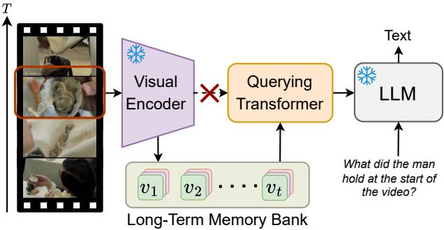
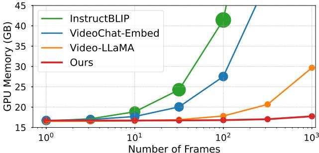
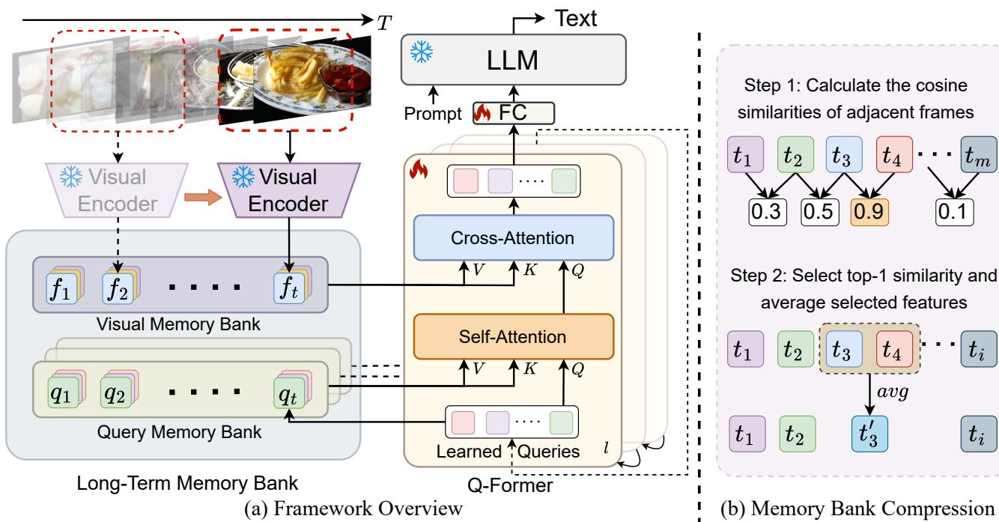
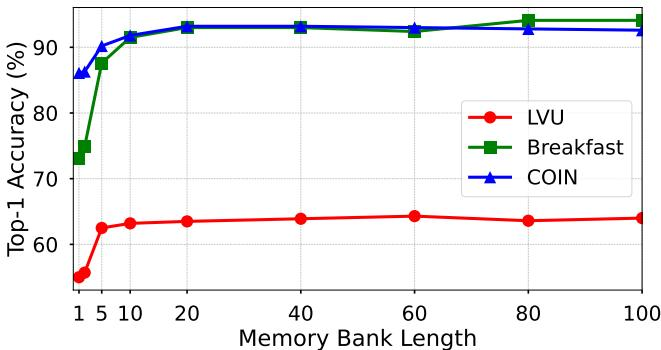
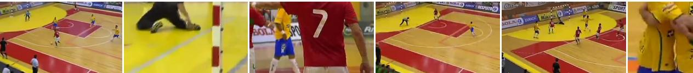
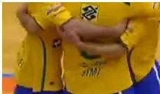
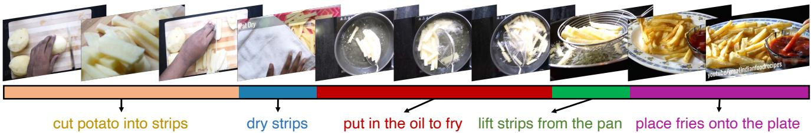
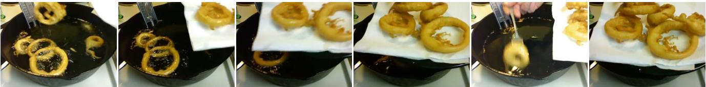

# MA-LMM：增强记忆的大规模多模态模型用于长期视频理解

博 $\mathrm { H e ^ { 1 , 2 * } }$ Hengduo Li2 Young Kyun Jang2 Menglin Jia2 Xuefei Cao2 Ashish Shah2 Abhinav Shrivastava1 Ser-Nam Lim3 1马里兰大学，大学公园 2Meta 3中佛罗里达大学 https://boheumd.github.io/MA-LMM/

# 摘要

随着大语言模型（LLMs）的成功，将视觉模型集成到LLMs中以构建视觉-语言基础模型最近引起了更多关注。然而，现有的基于LLM的大型多模态模型（如Video-LLaMA、VideoChat）在短视频理解方面只能处理有限数量的帧。本研究主要集中于设计一种高效且有效的长视频理解模型。我们提出以在线方式处理视频，并将过去的视频信息存储在内存库中，而不是像大多数现有工作那样尝试同时处理更多帧。这使得我们的模型能够参考历史视频内容进行长期分析，而不超过LLMs的上下文长度限制或GPU内存限制。我们的内存库可以无缝集成到当前的多模态LLMs中，以即插即用的方式进行应用。我们在多个视频理解任务上进行广泛实验，如长视频理解、视频问答和视频字幕生成，我们的模型在多个数据集上实现了最先进的性能。

  
Figure 1. (a) We propose the long-term memory bank to autoregressively store and accumulate past video information, different from previous methods directly feeding the visual encoder's outputs into the querying transformer. (b) GPU memory and token number v.s. video frame length of multimodal methods and MA-LMM during inference. Circle sizes represent the number of text tokens.

# 1. 引言

大型语言模型（LLMs）在自然语言处理领域获得了显著的关注。通过在大规模文本数据上进行预训练，LLMs（如 GPT [14]，LLaMA [5, 6]）展现了在统一框架下执行生成和判别任务的卓越能力。最近，越来越多的研究开始关注将 LLMs 应用于多模态任务。通过将 LLMs 与视觉编码器结合，它们能够以图像和视频作为输入，并在各种视觉理解任务中展现出令人惊叹的能力，例如图像描述、问答 $[7 - 13]$、分类、检测和分割 [1420]。

为了处理视频输入，一些之前的大型多模态模型直接将每帧的拼接查询嵌入沿时间轴输入到大型语言模型（LLMs）。然而，LLMs固有的上下文长度限制和GPU内存消耗限制了可以处理的视频帧数。例如，LLaMA的上下文长度限制为2048，而大型多模态模型如LLaVA和BLIP-2分别每幅图像输入256和32个词元。因此，当视频时长较长时（例如电影和电视剧），这种设计并不实用且不可行。为了解决这些问题，一个简单的解决方案是沿时间轴应用平均池化，如VideoChatGPT所示，但这会导致性能下降，因为它缺乏显式的时间建模。另一种方法是增加一个视频建模组件来捕捉时间动态，如Video-LLaMA所示，它采用额外的视频查询变压器（Q-Former）来获取视频级表示。然而，这种设计增加了模型的复杂性，提高了训练参数，并不适合在线视频分析。

考虑到这些，我们提出了一种记忆增强的大型多模态模型（MA-LMM），旨在实现高效且有效的长期视频建模。MA-LMM采用与现有大型多模态模型相似的结构，包括一个视觉编码器用于提取视觉特征，一个查询变换器用于对齐视觉和文本嵌入空间，以及一个大型语言模型。如图1(a)所示，与直接将视觉编码器输出馈送给查询变换器不同，我们选择了一种在线处理方法，按顺序处理视频帧并将视频特征存储在提出的长期记忆库中。这种按顺序处理视频帧并利用记忆库的策略显著减少了长视频序列的GPU内存占用。同时，它有效解决了LLMs在图1(b)中所展示的上下文长度限制带来的约束。我们的设计为大型多模态模型提供了长期视频理解的解决方案，相较于以往方法（如[7, 9, 12, 13, 21]）在消耗大量GPU内存和需要大量输入文本词元方面具有显著优势。我们方法的核心贡献在于引入了一个长期记忆库，用于捕捉和聚合历史视频信息。具体而言，记忆库以自回归方式聚合过去的视频特征，可以在后续的视频序列处理过程中进行引用。此外，我们的记忆库设计与Q-Former兼容，在长期时间建模的注意力操作中作为键和值。因此，它可以以现成的方式无缝集成到现有的大型多模态模型中，以实现长期视频建模能力。为了进一步提高效率，我们提出了一种记忆库压缩方法，使记忆库的长度相对于输入视频长度保持恒定。通过选择和平均最相似的相邻帧特征，它能够保留所有的时间信息，同时显著减少长视频中的时间冗余。我们的主要贡献总结如下： • 我们引入了一种新的长期记忆库设计，以增强现有的大型多模态模型，使其具备长期视频建模能力。 • 我们的模型显著降低了GPU内存使用，并通过在线处理视频序列来解决LLMs的上下文长度限制。 • 我们的方法在各种下游视频任务上取得了新的最先进性能，包括长期视频理解、视频问答和视频字幕生成。

# 2. 相关工作

图像-语言模型。受强大语言模型成功的启发，最近的图像-语言模型倾向于将预训练语言模型与图像编码器相结合，以支持多模态推理能力。Flamingo 提出了连接强大的预训练视觉模型和语言模型，并在少量样本学习任务中实现最先进的性能。BLIP-2 引入了一种轻量级查询变换器，以弥合冻结预训练图像编码器与冻结大型语言模型之间的模态差距。尽管可训练参数显著较少，但在各种多模态任务上表现良好。LLaVA 采用简单线性层将图像特征投影到文本嵌入空间，并有效微调大型语言模型以实现更好的性能。在 BLIP-2 的基础上，MiniGPT-4 收集了大规模高质量的图像-文本对数据集，并实现了更好的语言生成能力。VisionLLM 利用大型语言模型的推理和解析能力，在多个细粒度对象层级和粗粒度推理任务中表现出色。

视频语言模型。先前的图像语言模型，如Flamingo和BLIP-2，也支持视频输入。它们仅仅将时空特征展平为一维序列，然后输入到语言模型中进行视频处理。然而，这些方法无法有效捕捉视频的时间动态。基于这一动机，Video-LLaMA通过增加额外的视频查询变换器来增强BLIP-2结构，以明确建模时间关系。类似地，基于LLaVA的Video-ChatGPT通过在空间和时间维度上对帧级特征进行平均池化，生成视频级表示。VideoChat利用感知模型生成动作和物体注释，然后将其转发给大语言模型进行进一步推理。尽管取得了一定进展，这些模型主要针对短视频。受到Token Merging的启发，我们提出将这一理念扩展到视频数据，特别是在时间轴上。此扩展旨在缓解处理长视频输入时带来的大量token数量和计算成本的挑战。一些并行工作也探讨了将相似token合并用于视频输入的类似策略。有关更详细的讨论，请参阅补充材料。长期视频模型。长期视频理解方法侧重于捕捉持续超过30秒的长视频中的远程模式。为了缓解处理长视频的计算需求，一种普遍的方法是使用预提取的特征，避开了对主干架构的联合训练需求。或者，一些研究旨在设计稀疏视频采样方法，通过仅保留显著的视频内容来减少输入帧的数量。其他工作，如Vis4mer和S5，利用S4的流线型变换解码器结构，使得可以实现具有线性计算复杂度的远程时间建模。受内存库设计的启发，我们提出将长期内存库与大型多模态模型集成，以实现高效且有效的长期时间建模能力。

  
memory bank compression technique, which is applied to maintain the length of the memory bank constant.

# 3. 方法

我们介绍了 MA-LMM，这是一种用于长期视频理解的记忆增强大规模多模态模型。不同于大多数视频理解方法同时处理更多帧，我们提出通过自回归的方式在线处理视频帧，这一方法受到 MeMViT 中的长期记忆设计在线处理方式的启发。图 2(a) 说明了我们的 MA-LMM 框架的总体概览。参考大型多模态模型的类似做法，整体模型架构可以分为三个部分：（1）使用冻结视觉编码器进行视觉特征提取（第 3.1 节），（2）使用可训练查询变换器（Q-Former）进行长期时间建模，以对齐视觉和文本嵌入空间（第 3.2 节），以及（3）使用冻结的大型语言模型进行文本解码（第 3.3 节）。

# 3.1. 视觉特征提取

该设计汲取了人类处理长期视觉信息的认知过程的灵感。人类不是同时处理大范围的信号，而是以顺序的方式处理，将当前的视觉输入与过去的记忆相关联以进行理解，并选择性地保留显著信息以供后续参考 [41]。同样，我们的MA-LMM以顺序方式处理视频帧，动态地将新帧输入与存储在长期记忆库中的历史数据关联，确保仅保留区分性信息以备后用。这种选择性保留促进了一种更可持续和高效的视频理解方法，进一步使模型能够自动支持在线视频推理任务。形式上，给定一个长度为$T$的视频帧序列，我们将每个视频帧传入预训练的视觉编码器，并获得视觉特征$V = [ v _ { 1 } , v _ { 2 } , . . , v _ { T } ] , v _ { t } \in \mathbb { R } ^ { P \times C }$，其中$P$是每帧的补丁数量，$C$是提取的帧特征的通道维度。然后，我们通过位置嵌入层$( P E )$将时间排序信息注入帧级特征中。

$$
f _ { t } = v _ { t } + P E ( t ) , f _ { t } \in \mathbb { R } ^ { P \times C } .
$$

# 3.2. 长期时间建模

为了将视觉嵌入对齐到文本嵌入空间，我们使用与BLIP-2中的查询变换器（Q-Former）相同的架构[7, 9]。 Q-Former输入学习到的查询 $z \in \mathbb { R } ^ { N \times C }$ 以捕捉视频的时间信息，其中 $N$ 是学习到的查询数量，$C$ 是通道维度。在我们的实验中，Q-Former为每帧图像输出32个词元，比LLaVA [8]生成的256个词元更高效。每个Q-Former块由两个注意力子模块组成：（1）交叉注意力层，与从冻结视觉编码器提取的原始视觉嵌入进行交互；（2）自注意力层，建模输入查询之间的交互。与BLIP-2中仅关注当前帧嵌入的原始Q-Former不同，我们设计了一个长期记忆库，包括视觉记忆库和查询记忆库，以积累过去的视频信息，并增强输入到交叉和自注意力层的有效长期视频理解。视觉记忆库。视觉记忆库存储从冻结的视觉编码器提取的每帧的原始视觉特征。具体而言，对于当前时间步 $t$ ，视觉记忆库包含过去视觉特征的串联列表 $F _ { t } = \mathsf { C o n c a t } [ f _ { 1 } , f _ { 2 } , . . , f _ { t } ] , F _ { t } \in \mathbb { R } ^ { t P \times C }$ 给定输入查询 $z _ { t }$ ，视觉记忆库充当键和值：

$$
Q = z _ { t } W _ { Q } , K = F _ { t } W _ { K } , V = F _ { t } W _ { V } .
$$

然后我们应用交叉注意力操作：

$$
O = A t t n ( Q , K , V ) = \mathrm { S o f t m a x } \left( \frac { Q K ^ { T } } { \sqrt { C } } \right) V .
$$

通过这种方式，它可以通过缓存的视觉记忆库显式地关注过去的视觉信息，具有长期上下文。由于Q-Former中的所有跨注意力层都关注相同的视觉特征，因此在所有Q-Former块之间只有一个共享的视觉记忆库。查询记忆库。与存储原始和静态视觉特征的固定视觉记忆库不同，查询记忆库积累每个时间步的输入查询，表示为 $Z _ { t } = \mathrm { C o n c a t } [ z _ { 1 } , z _ { 2 } , . . , z _ { t } ] , Z _ { t } \in \mathbb { R } ^ { t N \times C }$，因此它维持了模型对每一帧的理解和处理的记忆，直到当前时间步。查询记忆库还作为键和值的作用：

$$
Q = z _ { t } W _ { Q } , K = Z _ { t } W _ { K } , V = Z _ { t } W _ { V } .
$$

类似于公式2。然后我们应用与公式3相同的注意力操作。在每个时间步，$z _ { t }$ 包含了当前时间步 $t$ 之前每个视频学习到的重要信息。与静态视觉记忆库不同，输入查询 $z _ { t }$ 在模型训练过程中通过级联的Q-Former模块不断演变，捕捉不同层次的抽象视频概念和模式。因此，每个自注意力层都有一个独特的查询记忆库，其中包含的输入查询在训练过程中不断更新。记忆库压缩。鉴于我们的模型直接在记忆库中存储过去的视频信息，GPU内存和计算成本随着过去视频帧数量的增加而线性增加。这对于长视频尤其具有挑战性，因此必须进一步将记忆库压缩至更小的尺寸。一种管理时间序列的传统方法是使用先进先出队列。在这里，当记忆库达到预定义限制时，会移除最早时间步的特征，这个策略在MeMViT [41]中被采用。然而，它会导致在添加新帧和移除旧特征以维持记忆库容量时，更早的历史信息的丢失。或者，MeMViT使用可学习的池化算子来压缩存储在记忆库中的特征的时空大小，尽管这会引入额外的可训练参数。受[24, 5052]等工作的启发，我们提出了一种新的记忆库压缩（MBC）技术，以利用视频中固有的时间冗余。我们提出的方法通过利用相邻特征之间的相似性来聚合和压缩视频信息，从而保留早期的历史信息。这种方法有效地压缩了记忆库中的重复信息，同时保留了判别特征。值得注意的是，一些并行工作[2527]也同样采用了令牌合并策略来减少视频冗余。与MeMViT [41]在每次迭代中应用特征压缩相同，我们的方法在每个自回归步骤中应用压缩算法，前提是当前记忆库的长度超过预定义的阈值 $M$。形式上，给定包含列表 $[ f _ { 1 } , f _ { 2 } , . . , f _ { M } ] , f _ { t } \in \mathbb { R } ^ { P \times C }$ 的视觉记忆库，当新帧特征 $f _ { M + 1 }$ 进入时，我们需要通过减少长度1来压缩记忆库。在每个空间位置 $i$，我们首先计算所有时间相邻令牌之间的余弦相似度。

$$
s _ { t } ^ { i } = \cos ( f _ { t } ^ { i } , f _ { t + 1 } ^ { i } ) , t \in [ 1 , M ] , i \in [ 1 , P ] .
$$

然后我们选择时间上最高的相似性，这可以解释为最具时间冗余的特征：

$$
k = \mathrm { a r g m a x } _ { t } ( s _ { t } ^ { i } ) .
$$

接下来，我们简单地对所有空间位置上所选的词元特征进行平均，从而将内存库的长度减少1：

$$
\hat { f } _ { k } ^ { i } = ( f _ { k } ^ { i } + f _ { k + 1 } ^ { i } ) / 2 .
$$

通过这种方式，我们仍然可以保留最具辨别性的特征，同时保持时间顺序不变，如图 2(b) 所示。相同的程序也用于压缩查询内存库。

# 3.3. 文本解码

由于我们以自回归的方式处理视频帧，最终时间步的 Q-Former 输出包含了所有历史信息，然后将其输入到 LLM。因此，我们可以将输入文本词元的数量显著减少，从 $N * T$ 降至 $N$，解决当前 LLM 的上下文长度限制，并大大减轻 GPU 内存的需求。在训练过程中，给定一个包含视频和文本对的标注数据集，我们的模型使用标准的交叉熵损失进行监督，如下所示：

$$
\mathcal { L } = - \frac { 1 } { S } \sum _ { i = 1 } ^ { S } \log P ( w _ { i } | w _ { < i } , V ) .
$$

其中 $V$ 代表输入视频，$w_{i}$ 是第 $i$ 个真实文本词元。在训练过程中，我们更新 Q-Former 的参数，同时保持视觉编码器和语言模型的权重不变。

# 4. 实验

# 4.1. 任务与数据集

为了验证所提出的MA-LMM的有效性，我们主要关注长期视频理解任务。我们还将评估扩展到标准视频理解任务（例如，视频问答、视频字幕生成），以进一步与现有的多模态方法进行比较。

长期视频理解。我们在三个广泛使用的长期视频数据集上进行实验，包括 LVU [32]、Breakfast [56] 和 COIN [57]。我们报告 top1 分类准确率作为评估指标。LVU 数据集包含约 3 万个从约 3 千部电影中提取的视频，每个视频的时长为 1 到 3 分钟。鉴于当前的大型多模态模型通常执行文本生成而缺乏回归能力，我们将实验限制在七个分类任务上：关系、说话风格、场景、导演、类型、编剧和上映年份。Breakfast [56] 数据集包括与早餐准备相关的视频，共包括 1712 个视频，平均时长约 2.7 分钟。COIN [57] 是一个用于综合指导视频分析的大规模数据集，包含来自 YouTube 的 11827 个指导视频，涵盖与日常生活相关的 12 个领域中的 180 种不同任务。视频的平均时长为 2.36 分钟。视频问答。我们在三个开放式视频问答数据集上进行评估，包括 MSRVTT-QA [62]、MSVD-QA [62] 和 ActivityNetQA [63]。ActivityNet-QA 包含平均时长为 2 分钟的长视频，而 MSRVTT-QA 和 MSVD-QA 则由时长为 10-15 秒的短视频组成。视频字幕生成。我们报告三个人气数据集上使用 METEOR [64] 和 CIDEr [65] 指标的视频字幕生成结果：MSRVTT [66]、MSVD [67] 和 Youcook2 [68]。在线动作预测。我们进一步通过在 EpicKitchens-100 [69] 数据集上进行实验来评估模型的在线预测能力，该数据集包含 700 个烹饪活动的长视频，总时长为 100 小时。它包括 97 种动词、300 种名词和 3807 种动作类型。根据 [70] 中的相同实验设置，我们报告验证数据集上的 top-5 精度和召回率结果。

# 4.2. 实施细节

对于视觉编码器，我们采用来自 EVA-CLIP 的预训练图像编码器 ViT-G/14 [71]，它可以进一步更换为其他基于 CLIP 的视频编码器。我们使用来自 InstructBLIP 的预训练 Q-Former 权重，并采用 Vicuna-7B [73] 作为大语言模型。所有实验均在 4 个 A100 GPU 上进行。关于训练和评估的更多细节在补充材料中进行了描述。

# 4.3. 主要结果

长期视频理解。我们在表1中比较了MA-LMM与之前的最先进（SOTA）方法在LVU基准上的表现[32]。值得注意的是，MA-LMM在内容理解和元数据预测任务中均优于现有的长期视频模型（S5 [36]、ViS4mer [35]、VideoBERT [55]和Object Transformer [32]）。这导致大多数任务的显著改善，相比于S5 [36]模型，平均top-1准确率提升了$3.8\%$。与之前视频基础模型同时处理所有视频帧并为每个类别预测概率不同，我们的MA-LMM在线处理视频帧，并直接输出每个类别类型的文本标签。我们还在具有长期视频活动分类挑战的Breakfast [56]和COIN [57]数据集上评估了MA-LMM。我们在表2中展示了结果。我们的方法在top-1准确率指标上分别比之前的最佳方法S5[36]提高了$2.3\%$和$2.4\%$。这一结果进一步证明了我们方法在长期视频理解能力上的优势。视频问答。为了与现有的多模态视频理解方法进行比较，我们在表3中进行开放式视频问答数据集的实验，以展示我们模型的泛化能力。鉴于这些大多是短视频，预计我们的内存库效果会较差。有趣的是，我们观察到我们的MA-LMM在MSRVTT和MSVD数据集上达到了新的最先进性能，而在ActivityNet数据集上却未能超越VideoCoCa的表现。在后者中，这并不令人惊讶，因为VideoCoCa [81]采用大型视频-文本数据集进行预训练（例如，HowTo100M [84]和VideoCC3M [85]），而我们的MA-LMM仅使用在图像-文本数据集上预训练的模型权重。

Table 1. Comparison with state-of-the-art methods on the LVU [32] dataset. Bold and underline represent the top-1 and top-2 results.   

<table><tr><td rowspan="2">Model</td><td colspan="3">Content</td><td colspan="4">Metadata</td><td rowspan="2">Avg</td></tr><tr><td>Relation</td><td>Speak</td><td>Scene</td><td>Director</td><td>Genre</td><td>Writer</td><td>Year</td></tr><tr><td>Obj_T4mer [32]</td><td>54.8</td><td>33.2</td><td>52.9</td><td>47.7</td><td>52.7</td><td>36.3</td><td>37.8</td><td>45.0</td></tr><tr><td>Performer [53]</td><td>50.0</td><td>38.8</td><td>60.5</td><td>58.9</td><td>49.5</td><td>48.2</td><td>41.3</td><td>49.6</td></tr><tr><td>Orthoformer [54]</td><td>50.0</td><td>38.3</td><td>66.3</td><td>55.1</td><td>55.8</td><td>47.0</td><td>43.4</td><td>50.8</td></tr><tr><td>VideoBERT [55]</td><td>52.8</td><td>37.9</td><td>54.9</td><td>47.3</td><td>51.9</td><td>38.5</td><td>36.1</td><td>45.6</td></tr><tr><td>LST [35]</td><td>52.5</td><td>37.3</td><td>62.8</td><td>56.1</td><td>52.7</td><td>42.3</td><td>39.2</td><td>49.0</td></tr><tr><td>VIS4mer [35]</td><td>57.1</td><td>40.8</td><td>67.4</td><td>62.6</td><td>54.7</td><td>48.8</td><td>44.8</td><td>53.7</td></tr><tr><td>S5 [36]</td><td>67.1</td><td>42.1</td><td>73.5</td><td>67.3</td><td>65.4</td><td>51.3</td><td>48.0</td><td>59.2</td></tr><tr><td>Ours</td><td>58.2</td><td>44.8</td><td>80.3</td><td>74.6</td><td>61.0</td><td>70.4</td><td>51.9</td><td>63.0</td></tr></table>

Table 2. Comparison on the Breakfast [56] and COIN [57] datasets. The top-1 accuracy is reported here.   

<table><tr><td>Model</td><td>Breakfast</td><td>COIN</td></tr><tr><td>TSN [58]</td><td>-</td><td>73.4</td></tr><tr><td>VideoGraph [59]</td><td>69.5</td><td>-</td></tr><tr><td>Timeception [31]</td><td>71.3</td><td>-</td></tr><tr><td>GHRM [60]</td><td>75.5</td><td>-</td></tr><tr><td>D-Sprv. [61]</td><td>89.9</td><td>90.0</td></tr><tr><td>ViS4mer [35]</td><td>88.2</td><td>88.4</td></tr><tr><td>S5 [36]</td><td>90.7</td><td>90.8</td></tr><tr><td>Ours</td><td>93.0</td><td>93.2</td></tr></table>

Table 3. Comparison with state-of-the-art methods on the video question answering task. Top-1 accuracy is reported.   

<table><tr><td>Model</td><td>MSRVTT</td><td>MSVD</td><td>ActivityNet</td></tr><tr><td>JustAsk [74]</td><td>41.8</td><td>47.5</td><td>38.9</td></tr><tr><td>FrozenBiLM [75]</td><td>47.0</td><td>54.8</td><td>43.2</td></tr><tr><td>SINGULARITY [76]</td><td>43.5</td><td></td><td>44.1</td></tr><tr><td>VIOLETv2 [77]</td><td>44.5</td><td>54.7</td><td></td></tr><tr><td>GiT [78]</td><td>43.2</td><td>56.8</td><td></td></tr><tr><td>mPLUG-2 [79]</td><td>48.0</td><td>58.1</td><td>−</td></tr><tr><td>UMT-L [80]</td><td>47.1</td><td>55.2</td><td>47.9</td></tr><tr><td>VideoCoCa [81]</td><td>46.3</td><td>56.9</td><td>56.1</td></tr><tr><td>Video-LLaMA [12]</td><td>46.5</td><td>58.3</td><td>45.5</td></tr><tr><td>Ours</td><td>48.5</td><td>60.6</td><td>49.8</td></tr></table>

值得注意的是，我们的MA-LMM在所有三个数据集上显著优于近期基于LLM的模型Video-LLaMA [12]。Video-LLaMA将冻结的图像Q-Former中所有查询嵌入连接起来，并从零开始训练一个额外的视频Q-Former以建模时间依赖性，这对长视频输入来说消耗了过多的GPU内存，不具备可行性。相较之下，我们的MA-LMM只对预训练的图像Q-Former进行微调，而不引入额外的视频Q-Former，但凭借长期记忆库能够有效捕捉时间关系。这一结果有力地证明了我们设计在通用视频问答任务中的优越性，显示出即使在记忆库中捕捉到的几个画面和查询也能产生显著的积极效果。视频描述。为了进一步评估我们MA-LMM在生成自由格式文本方面的能力，我们在标准视频描述数据集上进行了实验，包括MSRVTT [66]、MSVD [67]和YouCook2 [68]，见表4。尽管这些数据集仅包含短时间的视频，且我们的模型最初仅在图像-文本数据集对上进行了预训练，但我们的MA-LMM在所有指标上表现出色。与当前领先方法相比，它始终排名前两名。值得注意的是，我们的结果在这些数据集上也超越了近期的Video-LLaMA [12]，突显了我们的模型在视频描述和问答任务中所带来的显著改进。

Table 4. Comparison with state-of-the-art methods on the video captioning task. METEOR (M) and CIDEr (C) results are reported.   

<table><tr><td rowspan=2 colspan=1>Model</td><td rowspan=1 colspan=1>MSRVTT</td><td rowspan=1 colspan=1>MSVD</td><td rowspan=1 colspan=1>YouCook2</td></tr><tr><td rowspan=1 colspan=1>M   C</td><td rowspan=1 colspan=1>M    C</td><td rowspan=1 colspan=1>M    C</td></tr><tr><td rowspan=1 colspan=1>UniVL [82]</td><td rowspan=1 colspan=1>28.2 49.9</td><td rowspan=1 colspan=1>29.3  52.8</td><td rowspan=1 colspan=1>   127.0</td></tr><tr><td rowspan=1 colspan=1>SwinBERT [83]</td><td rowspan=1 colspan=1>29.9 53.8</td><td rowspan=1 colspan=1>41.3 120.6</td><td rowspan=1 colspan=1>15.6 109.0</td></tr><tr><td rowspan=1 colspan=1>GIT [78]</td><td rowspan=3 colspan=1>32.9 73.934.9 80.3   73.2</td><td rowspan=3 colspan=1>51.1 180.248.4 165.8     </td><td rowspan=3 colspan=1>17.3 129.8        128.0</td></tr><tr><td rowspan=1 colspan=1>mPLUG-2 [79]</td></tr><tr><td rowspan=1 colspan=1>VideoCoca [81]</td></tr><tr><td rowspan=1 colspan=1>Video-LLaMA</td><td rowspan=1 colspan=1>32.9 71.6</td><td rowspan=1 colspan=1>49.8 175.3</td><td rowspan=1 colspan=1>16.5 123.7</td></tr><tr><td rowspan=1 colspan=1>Ours</td><td rowspan=1 colspan=1>33.4 74.6</td><td rowspan=1 colspan=1>51.0 179.1</td><td rowspan=1 colspan=1>17.6 131.2</td></tr></table>

Table 5. Action anticipation results on EpicKitchens-100.   

<table><tr><td rowspan="2">Model</td><td colspan="3">Accuracy@Top-5</td><td colspan="3">Recall@Top-5</td></tr><tr><td>Verb</td><td>Noun</td><td>Act.</td><td>Verb</td><td>Noun</td><td>Act.</td></tr><tr><td>Video-LLaMA</td><td>73.9</td><td>47.5</td><td>29.7</td><td>26.3</td><td>27.3</td><td>11.7</td></tr><tr><td>Ours</td><td>74.5</td><td>50.7</td><td>32.7</td><td>25.9</td><td>29.9</td><td>12.2</td></tr></table>

在线动作预测。由于我们的模型自然支持在线视频理解任务，我们在EpicKitchens100 [69] 数据集上将MA-LMM与Video-LLaMA进行比较，以调查在线动作预测能力。在表5中，我们的MA-LMM在top-5准确率和召回率指标上均优于Video-LLaMA，取得了更准确的结果。这突显了我们模型在在线方式下预测动作的优越能力，展示了其在需要实时分析能力的应用中的有效性。

Table 6. Contribution of visual and query memory banks.   

<table><tr><td>Visual</td><td>Query</td><td>LVU</td><td>Breakfast</td><td>COIN</td></tr><tr><td>X</td><td>X</td><td>48.3</td><td>74.6</td><td>72.3</td></tr><tr><td>✓</td><td>X</td><td>61.5</td><td>91.8</td><td>92.4</td></tr><tr><td>X</td><td>✓</td><td>58.0</td><td>81.4</td><td>88.5</td></tr><tr><td>✓</td><td>✓</td><td>63.0</td><td>93.0</td><td>93.2</td></tr></table>

Table 7. Contribution of the long-term memory bank (MB) under off-the-shelf evaluation without training.   

<table><tr><td>MB</td><td>MSRVTT</td><td>MSVD</td><td>ActivityNet</td><td>LVU</td></tr><tr><td>X</td><td>19.5</td><td>38.8</td><td>29.9</td><td>23.6</td></tr><tr><td>✓</td><td>20.3</td><td>40.0</td><td>37.2</td><td>32.8</td></tr></table>

# 4.4. 消融研究

各组件的贡献。为了进一步探究视觉记忆库和查询记忆库的贡献，我们在表6中进行了消融实验。最初，我们观察到在没有任何记忆库模块的情况下，所有三个数据集的性能明显下降，这主要是由于缺乏时间上下文。引入任一记忆库后，性能均显著提升，确认了它们在增强模型理解时间序列能力方面的作用。我们还发现视觉记忆库的表现优于查询记忆库。我们推测，视觉记忆库中显式存储历史原始视频特征的方法比通过输入学习的查询隐式捕捉视频信息的查询记忆库更有效。而且这两个记忆库是相互补充的。当将两个记忆库结合时，我们的方法可以在LVU、Breakfast和COIN上分别提升最终性能$1 4 . 7 \%$、$1 8 . 4 \%$和$2 0 . 9 \%$。

长期时间建模消融实验。我们在表8中比较了不同的时间建模方法。在我们的设置中，Q-Former每帧输出32个文本词元。最简单的时间特征集成方法是连接或平均帧级特征。然而，这些方法的性能较差。值得注意的是，与其他变体相比，连接需要显著更多的文本词元和计算成本，同时也导致更高的GPU内存消耗，因为它们需要同时处理所有视频帧。此外，我们使用ToMe [24]进行实验，将每帧的文本词元数量从32减少到2。然而，如果没有我们的自回归策略，仍然需要为100帧输入使用200个文本词元。该表的第二部分展示了不同内存库压缩方法的性能。先进先出（FIFO）技术通过删除最旧的特征来保持内存库长度不变，而内存库压缩（MBC）策略通过合并时间上相邻且相似度最高的特征，有效地减少了冗余信息，同时保持时间顺序不变。通过这种理论上保留所有历史信息的设计，MBC在三个数据集上的准确率分别超过FIFO $1.7\%$、$4.5\%$和$2.8\%$。这一实验结果验证了我们在建模长期时间信息方面的优越效率和有效性。

Table 8. Ablation of different temporal modeling methods.   

<table><tr><td>Method</td><td>#Frame</td><td>#Token</td><td>GPU</td><td>LVU</td><td>Breakfast</td><td>COIN</td></tr><tr><td>Concat</td><td>60</td><td>1920</td><td>49.2</td><td>62.6</td><td>90.4</td><td>93.0</td></tr><tr><td>Avg Pool</td><td>100</td><td>32</td><td>21.2</td><td>57.6</td><td>80.6</td><td>87.6</td></tr><tr><td>ToMe</td><td>100</td><td>200</td><td>22.2</td><td>61.5</td><td>91.3</td><td>91.5</td></tr><tr><td>FIFO</td><td>100</td><td>32</td><td>19.1</td><td>61.3</td><td>88.5</td><td>90.4</td></tr><tr><td>MBC</td><td>100</td><td>32</td><td>19.1</td><td>63.0</td><td>93.0</td><td>93.2</td></tr></table>

Table 9. The comparison of using different LLMs.   

<table><tr><td>LLM</td><td>MSRVTT</td><td>MSVD</td><td>ActivityNet</td><td>LVU</td></tr><tr><td>FlanT5-XL</td><td>46.5</td><td>57.6</td><td>48.2</td><td>62.0</td></tr><tr><td>Vicuna-7B</td><td>48.5</td><td>60.6</td><td>49.8</td><td>63.0</td></tr></table>

  
Figure 3. Impact of different memory bank lengths.

现成的评估。MA-LMM的一个关键优势在于，我们的长期记忆库可以以现成的方式插入到现有的大型多模态模型中，从而赋予它们有效的时间建模能力，而无需重新训练。如表7所示，MA-LMM在将长期记忆库与基线方法[9]结合时，能够持续提升最终性能。特别是在ActivityNet和LVU等长期视频数据集上，MA-LMM的结果可以分别提高$7.3\%$和$9.2\%$。这突显了在现成设置下，长期记忆库在时间建模中的稳健性。不同的语言模型架构。我们的MA-LMM

1. 视频中的人们在地面上做什么？ 2. 视频中7号球员的颜色是什么？ 3. 视频中有多少名守门员？ 4. 为什么黄色队伍在庆祝？

# Video-LLaMA 玩足球 蓝色 1 胜利

# 我们踢足球 红色 2 球门

视频问答任务（ActivityNet-QA）

问：最后5秒发生了什么？ Video-LLaMA：一杯水被倒入一个玻璃杯中 我们的：鸡蛋被倒入碗中 问：接下来的5秒会发生什么？ Video-LLaMA：一个人在桌子上放着一个橙子的304不锈钢锅中做饭 我们的：鸡蛋将被煮熟 问：这个视频的食谱是什么？ Video-LLaMA：这个视频展示了在玻璃碗中准备鸡蛋 我们的：炒鸡蛋 (b) 在线即用设置结合自定义问题可以利用不同的语言模型架构，包括但不限于编码器-解码器模型和仅解码器模型。我们实验了两种流行的模型 FlanT5-XL [86] 和 Vicuna-7B [73]，并在表9中展示了结果，Vicuna-7B在这些视频任务上稍微优于 FlanT5-XL。

Figure 4. Visualization results on the video question answering task and the online off-the-shelf setting.

  
Figure 5. Visualization of the compressed visual memory bank.

内存库长度消融实验。在图3中，我们进行实验以评估不同内存库长度的影响。在输入100帧视频时，top-1准确率随着特征库长度的增加而先升高。这一上升可以归因于内存库增强的存储能力，它能够保留更多的历史数据，因此提升最终性能。然而，我们观察到当内存库长度在10到20帧之间时，性能开始趋于饱和。这支持了我们的假设：长视频中存在普遍的时间冗余，我们可以显著减少帧长度而不牺牲性能。

# 4.5. 可视化

在图4中，我们提供了MA-LMM和Video-LLaMA [12]之间的全面视觉比较。在视频问答任务中，MA-LMM表现出更强的记忆和识别能力。具体来说，它能够准确记住历史信息并识别细粒度的信息，例如第7号男士的颜色，并精确统计视频中出现的守门人数。借助自回归设计，我们的模型支持直接的在线推理。这一能力在我们使用自定义问题进行的现成评估实验中得到了进一步体现。MA-LMM能够正确预测视频的下一个步骤（“蛋会被煮”）并预测正确的食谱（“炒蛋”）。更多的可视化示例见补充材料。图5展示了压缩后的视觉记忆库的可视化。我们将记忆库长度设定为5以进行此说明。压缩的视觉记忆库似乎将视觉内容相似的连续帧分组。例如，在所展示的视频中，视频帧有效地分为五个簇，每个簇捕捉到一个独特但语义一致的活动，这与时间分割的效果相似。

# 5. 结论

在本文中，我们提出了一种长期记忆库，旨在增强当前的大型多模态模型，使其能够有效地建模长期视频序列。我们的方法顺序处理视频帧并将历史数据存储在记忆库中，从而解决了大型语言模型（LLMs）在上下文长度和长视频输入带来的GPU内存限制。我们的长期记忆库是一个即插即用模块，可以方便地集成到现有的大型多模态模型中，具有现成的特性。对各种任务的实验表明了我们方法的优越优势。我们相信，我们的MA-LMM为未来在长期视频理解领域的研究提供了有价值的见解。致谢。该项目部分获得了NSF CAREER奖（#2238769）对AS的资助。

# References

[1] Alec Radford, Karthik Narasimhan, Tim Salimans, Ilya Sutskever, et al. Improving language understanding by generative pre-training. OpenAI, 2018. 1, 2   
[2] Alec Radford, Jeffrey Wu, Rewon Child, David Luan, Dario Amodei, Ilya Sutskever, et al. Language models are unsupervised multitask learners. OpenAI blog, 1(8):9, 2019.   
[3] Tom Brown, Benjamin Mann, Nick Ryder, Melanie Subbiah, Jared D Kaplan, Prafulla Dhariwal, Arvind Neelakantan, Pranav Shyam, Girish Sastry, Amanda Askell et al. Language models are few-shot learners. Advances in neural information processing systems, 33:18771901, 2020.   
[4] OpenAI. Chatgpt. https://openai.com/blog/chatgpt, 2023. 1   
[5] Hugo Touvron, Thibaut Lavril, Gautier Izacard, Xavier Martinet, Marie-Anne Lachaux, Timothée Lacroix, Baptiste Rozière, Naman Goyal, Eric Hambro, Faisal Azhar, et al. Llama: Open and effcient foundation language models. arXiv preprint arXiv:2302.13971, 2023. 1   
[6] Hugo Touvron, Louis Martin, Kevin Stone, Peter Albert, Amjad Almahairi, Yasmine Babaei, Nikolay Bashlykov, Soumya Batra, Prajjwal Bhargava, Shruti Bhosale, et al. Llama 2: Open foundation and fine-tuned chat models. arXiv preprint arXiv:2307.09288, 2023. 1, 2   
[7] Junnan Li, Dongxu Li, Silvio Savarese, and Steven Hoi. Blip2Bootstrapping language-image pre-training with frozen image encoders and large language models. arXiv preprint arXiv:2301.12597, 2023. 1, 2, 3, 4   
[8] Haotian Liu, Chunyuan Li, Qingyang Wu, and Yong Jae Lee. Visual instruction tuning. arXiv preprint arXiv:2304.08485, 2023. 1, 2, 4, 14   
[9] Wenliang Dai, Junnan Li, Dongxu Li, Anthony Meng Huat Tiong, Junqi Zhao, Weisheng Wang, Boyang Li, Pascale Fung, and Steven Hoi. Instructblip: Towards general-purpose visionlanguage models with instruction tuning, 2023. 1, 2, 3, 4, 5, 7, 14   
10] Deyao Zhu, Jun Chen, Xiaoqian Shen, Xiang Li, and Mohamed Elhoseiny. Minigpt-4: Enhancing vision-language understanding with advanced large language models. arXiv preprint arXiv:2304.10592, 2023. 2   
11] Qinghao Ye, Haiyang Xu, Guohai Xu, Jiabo Ye, Ming Yan, Yiyang Zhou, Junyang Wang, Anwen Hu, Pengcheng Shi, Yaya Shi, et al. mplug-owl: Modularization empowers lage lluage mouts wu muiuouany. at pep arXiv:2304.14178, 2023.   
[12] Hang Zhang, Xin Li, and Lidong Bing. Video-llama: An instruction-tuned audio-visual language model for video understanding. arXiv preprint arXiv:2306.02858, 2023. 2, 3, 6, 8, 13, 14   
[13] Kunchang Li, Yinan He, Yi Wang, Yizhuo Li, Wenhai Wang, Ping Luo, Yali Wang, Limin Wang, and Yu Qiao. Videochat: Chat-centric video understanding. arXiv preprint arXiv:2305.06355, 2023. 1, 2   
[14] Guo Chen, Yin-Dong Zheng, Jiahao Wang, Jilan Xu, Yifei Huang, Junting Pan, Yi Wang, Yali Wang, Yu Qiao, Tong Lu, et al. Videollm: Modeling video sequence with large language models. arXiv preprint arXiv:2305.13292, 2023. 1   
[15] Wenhai Wang, Zhe Chen, Xiaokang Chen, Jiannan Wu, Xizhou Zhu, Gang Zeng, Ping Luo, Tong Lu, Jie Zhou, Yu Qiao, et al. Visionllm: Large language model is also an open-ended decoder for vision-centric tasks. arXiv preprint arXiv:2305.11175, 2023. 2   
[16] Jun Chen, Deyao Zhu, Xiaoqian Shen, Xiang Li, Zechu Liu, Pengchuan Zhang, Raghuraman Krishnamoorthi, Vikas Chandra, Yunyang Xiong, and Mohamed Elhoseiny. Minigpt-v2: Large language model as a unified interface for vision-language multi-task learning. arXiv preprint arXiv:2310.09478, 2023.   
[17] Junke Wang, Dongdong Chen, Zuxuan Wu, Chong Luo, LuZhou, Yucheg Zhao,Yujia Xi, Ce Liu, Yu-Gang Jiang, and Lu Yuan. Omnivl: One foundation model for imagelanguage and video-language tasks. In NeurIPS, 2022.   
[18] Junke Wang, Xitong Yang, Hengduo Li, Li Liu, Zuxuan Wu, and Yu-Gang Jiang. Efficient video transformers with spatialtemporal token selection. In ECCV, 2022.   
[19] Junke Wang, Dongdong Chen, Zuxuan Wu, Chong Luo, Xiyang Dai, Lu Yuan, and Yu-Gang Jiang. Omnitracker: Unifying object tracking by tracking-with-detection. arXiv preprint arXiv:2303.12079, 2023.   
[20] Junke Wang, Dongdong Chen, Chong Luo, Bo He, Lu Yuan, Zuxuan Wu, and Yu-Gang Jiang. Omnivid: A generative framework for universal video understanding. In CVPR, 2024. 1   
[21] Muhammad Maaz, Hanoona Rasheed, Salman Khan, and Fahad Shahbaz Khan. Video-chatgpt: Towards detailed video understanding via large vision and language models. arXiv preprint arXiv:2306.05424, 2023. 1, 2   
[22] Jean-Baptiste Alayrac, Jeff Donahue, Pauline Luc, Antoine Miech, Iain Barr, Yana Hasson, Karel Lenc, Arthur Mensch, Katherine Millican, Malcolm Reynolds, et al. Flamingo: a visual language model for few-shot learning. Advances in Neural Information Processing Systems, 35:2371623736, 2022. 2   
[23] Edward J Hu, Yelong Shen, Phillip Wallis, Zeyuan Allen-Zhu, Yuanzhi Li, Shean Wang, Lu Wang, and Weizhu Chen. Lora: Low-rank adaptation of large language models. arXiv preprint arXiv:2106.09685, 2021. 2   
[24] Daniel Bolya, Cheng-Yang Fu, Xiaoliang Dai, Peizhao Zhang, Christoph Feichtenhofer, and Judy Hoffman. Token merging: Your vit but faster. arXiv preprint arXiv:2210.09461, 2022. 2. 4. 7. 13   
[25] Shuhuai Ren, Sishuo Chen, Shicheng Li, Xu Sun, and Lu Hou. Testa: Temporal-spatial token aggregation for long-form video-language understanding. EMNLP, 2023. 2, 4, 13, 14   
[26] Enxin Song, Wenhao Chai, Guanhong Wang, Yucheng Zhang, Haoyang Zhou, Feiyang Wu, Xun Guo, Tian Ye, Yan Lu, Jenq-Neng Hwang, et al. Moviechat: From dense token to sparse memory for long video understanding. CVPR, 2024. 13, 14   
[27] Peng Jin, Ryuichi Takanobu, Caiwan Zhang, Xiaochun Cao, and Li Yuan. Chat-univi: Unified visual representation empowers large language models with image and video understanding. CVPR, 2024. 2, 4, 13, 14   
[28] Jeffrey Donahue, Lisa Anne Hendricks, Sergio Guadarrama, Marcus Rohrbach, Subhashini Venugopalan, Kate Saenko, and Trevor Darrell. Long-term recurrent convolutional networks for visual recognition and description. In Proceedings of the IEEE conference on computer vision and pattern recognition, pages 26252634, 2015. 3   
[29] Joe Yue-Hei Ng, Matthew Hausknecht, Sudheendra Vijayanarasimhan, Oriol Vinyals, Rajat Monga, and George Toderici. Beyond short snippets: Deep networks for video classification. In Proceedings of the IEEE conference on computer vision and pattern recognition, pages 46944702, 2015.   
[30] Rohit Girdhar, Deva Ramanan, Abhinav Gupta, Josef Sivic, and Bryan Russell. Actionvlad: Learning spatio-temporal aggregation for action classification. In Proceedings of the IEEE conference on computer vision and pattern recognition, pages 971980, 2017.   
[31] Noureldien Hussein, Efstratios Gavves, and Arnold WM Smeulders. Timeception for complex action recognition. In Proceedings of the IEEE/CVF Conference on Computer Vision and Pattern Recognition, pages 254263, 2019. 3, 6   
[32] Chao-Yuan Wu and Philipp Krahenbuhl. Towards long-form video understanding. In Proceedings of the IEEE/CVF Conference on Computer Vision and Pattern Recognition, pages 18841894, 2021. 3, 5, 6, 13   
[33] Bruno Korbar, Du Tran, and Lorenzo Torresani. Scsampler: Sampling salient clips from video for efficient action recognition. In Proceedings of the IEEE/CVF International Conference on Computer Vision, pages 62326242, 2019. 3   
[34] Zuxuan Wu, Caiming Xiong, Chih-Yao Ma, Richard Socher, and Larry S Davis. Adaframe: Adaptive frame selection for fast video recognition. In Proceedings of the IEEE/CVF Conference on Computer Vision and Pattern Recognition, pages 12781287, 2019. 3   
[35] Md Mohaiminul Islam and Gedas Bertasius. Long movie clip classification with state-space video models. In European Conference on Computer Vision, pages 87104. Springer, 2022. 3, 5, 6, 14   
[36] Jue Wang, Wentao Zhu, Pichao Wang, Xiang Yu, Linda Liu, Mohamed Omar, and Raffay Hamid. Selective structured state-spaces for long-form video understanding. In Proceedings of the IEEE/CVF Conference on Computer Vision and Pattern Recognition, pages 63876397, 2023. 3, 5, 6, 14   
[37] Albert Gu, Karan Goel, and Christopher Ré. Efficiently modeling long sequences with structured state spaces. arXiv preprint arXiv:2111.00396, 2021. 3   
[38] Yihong Chen, Yue Cao, Han Hu, and Liwei Wang. Memory enhanced global-local aggregation for video object detection. In Proceedings of the IEEE/CVF conference on computer vision and pattern recognition, pages 1033710346, 2020. 3, 14   
[39] Sangho Lee, Jinyoung Sung, Youngjae Yu, and Gunhee Kim. A memory network approach for story-based temporal summarization of 360 videos. In Proceedings of the IEEE conference on computer vision and pattern recognition, pages 14101419, 2018. 14   
[40] Sangmin Lee, Hak Gu Kim, Dae Hwi Choi, Hyung-Il Kim, and Yong Man Ro. Video prediction recalling long-term motion context via memory alignment learning. In Proceedings of the IEEE/CVF Conference on Computer Vision and Pattern Recognition, pages 30543063, 2021.   
[41] Chao-Yuan Wu, Yanghao Li, Karttikeya Mangalam, Haoqi Fan, Bo Xiong, Jitendra Malik, and Christoph Feichtenhofer. Memvit: Memory-augmented multiscale vision transformer for efficient long-term video recognition. In Proceedings of the IEEE/CVF Conference on Computer Vision and Pattern Recognition, pages 1358713597, 2022. 3, 4, 14   
[42] Christoph Feichtenhofer, Axel Pinz, and Andrew Zisserman. Convolutional two-stream network fusion for video action recognition. In Proceedings of the IEEE conference on computer vision and pattern recognition, pages 19331941, 2016. 3   
[43] Christoph Feichtenhofer, Haoqi Fan, Jitendra Malik, and Kaiming He. Slowfast networks for video recognition. In Proceedings of the IEEE/CVF international conference on computer vision, pages 62026211, 2019.   
[44] Bo He, Xitong Yang, Zuxuan Wu, Hao Chen, Ser-Nam Lim, and Abhinav Shrivastava. Gta: Global temporal attention for video action understanding. British Machine Vision Conference (BMVC), 2021.   
[45] Bo He, Xitong Yang, Le Kang, Zhiyu Cheng, Xin Zhou, and Abhinav Shrivastava. Asm-loc: action-aware segment modeling for weakly-supervised temporal action localization. In Proceedings of the IEEE/CVF Conference on Computer Vision and Pattern Recognition, pages 1392513935, 2022.   
[46] Bo He, Jun Wang, Jielin Qiu, Trung Bui, Abhinav Shrivastava, and Zhaowen Wang. Align and attend: Multimodal summarization with dual contrastive losses. In Proceedings of the IEEE/CVF Conference on Computer Vision and Pattern Recognition, pages 1486714878, 2023.   
[47] Gedas Bertasius, Heng Wang, and Lorenzo Torresani. Is space-time attention all you need for video understanding? In ICML, volume 2, page 4, 2021. 14   
[48] Haoqi Fan, Bo Xiong, Karttikeya Mangalam, Yanghao Li, Zhicheng Yan, Jitendra Malik, and Christoph Feichtenhofer. Multiscale vision transformers. In Proceedings of the IEEE/CVF international conference on computer vision, pages 68246835, 2021.   
[49] Zhan Tong, Yibing Song, Jue Wang, and Limin Wang. Videomae: Masked autoencoders are data-efficient learners for self-supervised video pre-training. Advances in neural information processing systems, 35:1007810093, 2022. 3   
[50] Lingchen Meng, Hengduo Li, Bor-Chun Chen, Shiyi Lan, Zuxuan Wu, Yu-Gang Jiang, and Ser-Nam Lim. Adavit: Adaptive vision transformers for efficient image recognition. In Proceedings of the IEEE/CVF Conference on Computer Vision and Pattern Recognition, pages 1230912318, 2022. 4   
[51] Hongxu Yin, Arash Vahdat, Jose M Alvarez, Arun Mallya, Jan Kautz, and Pavlo Molchanov. A-vit: Adaptive tokens for efficient vision transformer. In Proceedings of the IEEE/CVF Conference on Computer Vision and Pattern Recognition, pages 1080910818, 2022.   
[52] Yongming Rao, Wenliang Zhao, Benlin Liu, Jiwen Lu, Jie Zhou, and Cho-Jui Hsieh. Dynamicvit: Efficient vision transformers with dynamic token sparsification. Advances in neural information processing systems, 34:1393713949, 2021. 4   
[53] Krzysztof Choromanski, Valerii Likhosherstov, David Dohan, Xingyou Song, Andreea Gane, Tamas Sarlos, Peter Hawkins, Jared Davis, Afroz Mohiuddin, Lukasz Kaiser, e al. Rethinking attention with performers. arXiv preprint arXiv:2009.14794, 2020. 6   
[54] Mandela Patrick, Dylan Campbell, Yuki Asano, Ishan Misra, Florian Metze, Christoph Feichtenhofer, Andrea Vedaldi, and Joao F Henriques. Keeping your eye on the ball: Trajectory attention invideo transformers. Advances in neural information processing systems, 34:1249312506, 2021. 6   
[55] Chen Sun, Austin Myers, Carl Vondrick, Kevin Murphy, and Cordelia Schmid. Videobert: A joint model for video and language representation learning. In Proceedings of the IEEE/CVF international conference on computer vision, pages 74647473, 2019. 5, 6   
[56] Hilde Kuehne, Ali Arslan, and Thomas Serre. The language of actions: Recovering the syntax and semantics of goal-directed human activities. In Proceedings of the IEEE conference on computer vision and pattern recognition, pages 780787, 2014. 5, 6, 13, 14   
[57] Yansong Tang, Dajun Ding, Yongming Rao, Yu Zheng, Danyang Zhang, Lili Zhao, Jiwen Lu, and Jie Zhou. Coin: A large-scale dataset for comprehensive instructional video analysis. In Proceedings of the IEEE/CVF Conference on Computer Vision and Pattern Recognition, pages 12071216, 2019. 5, 6, 13, 14   
[58] Limin Wang, Yuanjun Xiong, Zhe Wang, Yu Qiao, Dahua Lin, Xiaoou Tang, and Luc Van Gool. Temporal segment networks for action recognition in videos. IEEE transactions on pattern analysis and machine intelligence, 41(11):27402755, 2018. 6   
[59] Noureldien Hussein, Efstratios Gavves, and Arnold WM Smeulders. Videograph: Recognizing minutes-long human activities in videos. arXiv preprint arXiv:1905.05143, 2019. 6   
[60] Jiaming Zhou, Kun-Yu Lin, Haoxin Li, and Wei-Shi Zheng. Graph-based high-order relation modeling for long-term action recognition. In Proceedings of the IEEE/CVF Conference on Computer Vision and Pattern Recognition, pages 8984 8993, 2021. 6   
[61] Xudong Lin, Fabio Petroni, Gedas Bertasius, Marcus Rohrbach, Shih-Fu Chang, and Lorenzo Torresani. Learning to recognize procedural activities with distant supervision. In Proceedings of the IEEE/CVF Conference on Computer Vision and Pattern Recognition, pages 1385313863, 2022. 6 [62] Dejing Xu, Zhou Zhao, Jun Xiao, Fei Wu, Hanwang Zhang, Xiangnan He, and Yueting Zhuang. Video question answering via gradually refined attention over appearance and motion. In Proceedings of the 25th ACM international conference on Multimedia, pages 16451653, 2017. 5, 14 [63] Zhou Yu, Dejing Xu, Jun Yu, Ting Yu, Zhou Zhao, Yueting Zhuang, and Dacheng Tao. Activitynet-qa: A dataset for understanding complex web videos via question answering. In Proceedings of the AAAI Conference on Artificial Intelligence, volume 33, pages 91279134, 2019. 5, 14 [64] Satanjeev Banerjee and Alon Lavie. Meteor: An automatic metric for mt evaluation with improved correlation with human judgments. In Proceedings of the acl workshop on intrinsic and extrinsic evaluation measures for machine translation and/or summarization, pages 6572, 2005. 5 [65] Ramakrishna Vedantam, C Lawrence Zitnick, and Devi Parikh. Cider: Consensus-based image description evaluation. In Proceedings of the IEEE conference on computer vision and pattern recognition, pages 45664575, 2015. 5 [66] Jun Xu, Tao Mei, Ting Yao, and Yong Rui. Msr-vtt: A large video description dataset for bridging video and language. In Proceedings of the IEEE conference on computer vision and pattern recognition, pages 52885296, 2016. 5, 6, 14 [67] David L Chen and William B Dolan. Collecting highly parallel data for paraphrase evaluation. In Proceedings of the   
49th Annual Meeting of the Association for Computational Linguistics: Human Language Technologies-Volume 1, pages   
190200. Association for Computational Linguistics, 2011. 5,   
6, 14 [68] Luowei Zhou, Chenliang Xu, and Jason Corso. Towards automatic learning of procedures from web instructional videos. In Proceedings of the AAAI Conference on Artificial Intelligence, volume 32, 2018. 5, 6, 14 [69] Dima Damen, Hazel Doughty, Giovanni Maria Farinella, Sanja Fidler, Antonino Furnari, Evangelos Kazakos, Davide Moltisanti, Jonathan Munro, Toby Perrett, Will Price, et al. The epic-kitchens dataset: Collection, challenges and baselines. IEEE Transactions on Pattern Analysis and Machine Intelligence, 43(11):41254141, 2020. 5, 6 [70] Zeyun Zhong, David Schneider, Michael Voit, Rainer Stiefelhagen, and Jürgen Beyerer. Anticipative feature fusion transformer for multi-modal action anticipation. In Proceedings of the IEEE/CVF Winter Conference on Applications of Computer Vision, pages 60686077, 2023. 5 [71] Alexey Dosovitskiy, Lucas Beyer, Alexander Kolesnikov, Dirk Weissenborn, Xiaohua Zhai, Thomas Unterthiner, Mostafa Dehghani, Matthias Minderer, Georg Heigold, Sylvain Gelly, et al. An image is worth 16x16 words: Transformers for image recognition at scale. arXiv preprint arXiv:2010.11929, 2020. 5 [72] Yuxin Fang, Wen Wang, Binhui Xie, Quan Sun, Ledell Wu, Xinggang Wang, Tiejun Huang, Xinlong Wang, and Yue Cao. Eva: Exploring the limits of masked visual representation learning at scale. In Proceedings of the IEEE/CVF Conference on Computer Vision and Pattern Recognition, pages 19358-   
19369, 2023. 5 [73] Wei-Lin Chiang, Zhuohan Li, Zi Lin, Ying Sheng, Zhanghao Wu, Hao Zhang, Lianmin Zheng, Siyuan Zhuang, Yonghao Zhuang, Joseph E. Gonzalez, Ion Stoica, and Eric P. Xing. Vicuna: An open-source chatbot impressing gpt-4 with $9 0 \% *$ chatgpt quality, March 2023. 5, 8 [74] Antoine Yang, Antoine Miech, Josef Sivic, Ivan Laptev, and Cordelia Schmid. Just ask: Learning to answer questions from millions of narrated videos. In Proceedings of the IEEE/CVF international conference on computer vision, pages 1686   
1697, 2021. 6 [75] Antoine Yang, Antoine Miech, Josef Sivic, Ivan Laptev, and Cordelia Schmid. Zero-shot video question answering via frozen bidirectional language models. Advances in Neural Information Processing Systems, 35:124141, 2022. 6 [76] Jie Lei, Tamara L Berg, and Mohit Bansal. Revealing single frame bias for video-and-language learning. arXiv preprint arXiv:2206.03428, 2022. 6 [77] Tsu-Jui Fu, Linjie Li, Zhe Gan, Kevin Lin, William Yang Wang, Lijuan Wang, and Zicheng Liu. An empirical study of end-to-end video-language transformers with masked visual modeling. In Proceedings of the IEEE/CVF Conference on Computer Vision and Pattern Recognition, pages 22898   
22909, 2023. 6 [78] Jianfeng Wang, Zhengyuan Yang, Xiaowei Hu, Linjie Li, Kevin Lin, Zhe Gan, Zicheng Liu, Ce Liu, and Lijuan Wang. Git: A generative image-to-text transformer for vision and language. arXiv preprint arXiv:2205.14100, 2022. 6 [79] Haiyang Xu, Qinghao Ye, Ming Yan, Yaya Shi, Jiabo Ye, Yuanhong Xu, Chenliang Li, Bin Bi, Qi Qian, Wei Wang, et al. mplug-2: A modularized multi-modal foundation model across text, image and video. arXiv preprint arXiv:2302.00402, 2023. 6 [80] Kunchang Li, Yali Wang, Yizhuo Li, Yi Wang, Yinan He, Limin Wang, and Yu Qiao. Unmasked teacher: Towards training-efficient video foundation models, 2023. 6 [81] Shen Yan, Tao Zhu, Zirui Wang, Yuan Cao, Mi Zhang, Soham Ghosh, Yonghui Wu, and Jiahui Yu. Video-text modeling with zero-shot transfer from contrastive captioners.arXiv prerint arXiv:2212.04979, 2022. 6 [82] Huaishao Luo, Lei Ji, Botian Shi, Haoyang Huang, Nan Duan, Tianrui Li, Jason Li, Taroon Bharti, and Ming Zhou. Univl: A unified video and language pre-training model for multimodal understanding and generation. arXiv preprint arXiv:2002.06353, 2020. 6 [83] Kevin Lin, Linjie Li, Chung-Ching Lin, Faisal Ahmed, Zhe Gan, Zicheng Liu, Yumao Lu, and Lijuan Wang. Swinbert: End-to-end transormers with sparse attention or video captioning. In Proceedings of the IEEE/CVF Conference on Computer Vision and Pattern Recognition, pages 1794917958,   
2022.6 [84] Antoine Miech, Dimitri Zhukov, Jean-Baptiste Alayrac, Makarand Tapaswi, Ivan Laptev, and Josef Sivic. Howto $1 0 0 \mathrm { m }$ Learning a text-video embedding by watching hundred million narrated video clips. In Proceedings of the IEEE/CVF international conference on computer vision, pages 2630   
2640, 2019. 6 [85] Arsha Nagrani, Paul Hongsuck Seo, Bryan Seybold, Anja Hauth, Santiago Manen, Chen Sun, and Cordelia Schmid. Learning audio-video modalities from image captions. In European Conference on Computer Vision, pages 407426. Springer, 2022. 6   
[86] Hyung Won Chung, Le Hou, Shayne Longpre, Barret Zoph, Yi Tay, William Fedus, Yunxuan Li, Xuezhi Wang, Mostafa Dehghani, Siddhartha Brahma, et al. Scaling instructionfinetuned language models. arXiv preprint arXiv:2210.11416, 2022. 8   
[87] Chao- Yuan Wu, Christoph Feichtenhofer, Haoqi Fan, Kaiming He, Philipp Krahenbuhl, and Ross Girshick. Long-term feature banks for detailed video understanding. In Proceedings of the IEEE/CVF conference on computer vision and pattern recognition, pages 284293, 2019. 14   
[88] Dong Gong, Lingqiao Liu, Vuong Le, Budhaditya Saha, Moussa Reda Mansour, Svetha Venkatesh, and Anton van den Hengel. Memorizing normality to detect anomaly: Memoryaugmented deep autoencoder for unsupervised anomaly detection. In Proceedings of the IEEE/CVF international conference on computer vision, pages 17051714, 2019. 14   
[89] Dongxu Li, Junnan Li, Hung Le, Guangsen Wang, Silvio Savarese, and Steven C.H. Hoi. LAVIS: A one-stop library for language-vision intelligence. In Proceedings of the 61st Annual Meeting of the Association for Computational Linguistics (Volume 3: System Demonstrations), pages 3141, Toronto, Canada, July 2023. Association for Computational Linguistics. 14

# Appendix

We present additional ablation experiments in Section A and further qualitative results for the video captioning task in Section B. Next, in Section C, we discuss the relations to concurrent works [2527] in details. And in Sec. D, we show more dataset-specific implementation details and hyper-parameter settings. Finally, we address some limitations and outline directions for future research in Section E.

# A. Additional Experiments

Memory bank compression at different spatial levels. In Table 10, we show comparison results of compressing the memory bank at different spatial levels (frame-level vs. token-level) on the LVU [32], Breakfast [56] and COIN [57] datasets. For the frame-level compression, we calculate the cosine similarity between adjacent frame features and average the frame-level features with the highest similarity. For the token-level compression, the cosine similarity is calculated between tokens at the same spatial location across the entire temporal axis, given that each frame-level feature contains multiple tokens at different spatial locations. The results indicate that token-level compression consistently surpasses frame-level compression in performance. Particularly, on the Breakfast dataset, the token-level surpasses the frame-level by $6 . 5 \%$ in top-1 accuracy. This superiority can be attributed to the importance of recognizing the object type of breakfast in videos. And token-level compression can help preserve much more fine-grained spatial information and details.

Inference time v.s. video frame lengths. In Figure 6, the inference time of MA-LMM increases linearly with respect to the frame lengths, due to its auto-regressive design of processing video frames sequentially. In contrast, directly concatenating frame-level features takes much longer time and higher GPU memory consumption, since it needs to process all video frames simultaneously.

# B. More Qualitative Results

Our model's enhanced capabilities in video captioning are further showcased through additional visualization results in Figure 7. Here, our MA-LMM significantly outperforms Video-LLaMA [12] in generating detailed and accurate sentence descriptions. For instance, in the first video, our model precisely describes the action as "remove the onion rings and place them on the paper towel," capturing the entire action steps, while Video-LLaMA's description lacks this completeness, notably missing the crucial action of removing the onion rings. In the second video example, our model distinguishes itself by accurately identifying subtle details such as specific ingredients: chili powder, salt, and garlic powder, which Video-LLaMA overlooks. This highlights the enhanced capability of our MA-LMM in recognizing and describing fine-grained details.

Table 10. Memory bank compression at different spatial levels.   

<table><tr><td>Spatial Level</td><td>LVU</td><td>Breakfast</td><td>COIN</td></tr><tr><td>Frame-level</td><td>61.8</td><td>86.5</td><td>91.1</td></tr><tr><td>Token-level</td><td>63.0</td><td>93.0</td><td>93.2</td></tr></table>

  
Figure 6. Inference time vs. input frame length.

# C. Relations to Concurrent Works

In this section, we compare and discuss the relations between our MA-LMM with the concurrent works including TESTA [25], MovieChat [26] and Chat-UniVi [27]. All of these methods focus on utilizing the idea of token merging [24] to reduce video redundancies.

Temporal Modeling. Temporal modeling across these methodologies falls into three categories. Chat-UniVi [27] directly feed visual tokens into large language models (LLMs) without explicit temporal modeling, utilizing LLMs' inherent sequence processing for video understanding. In contrast, TESTA [25] and MovieChat [26] employ global selfattention; TESTA captures interactions along spatial and temporal dimensions, whereas MovieChat processes long videos in segments, compresses these into short-term memories, then concatenates and models global temporal interactions using a video Q-Former. Differently, our MA-LMM adopts causal self-attention, restricting each frame's feature access to prior video information only. Such a design naturally endows our MA-LMM with the capability to support online video applications in robotics, AR/VR, and video streaming.

Token Merging Application. Building on the token merging [24] strategy, four methodologies have adopted and modified this approach to reduce video data redundancy. Each uses the core concept of merging similar tokens but differs in implementation. TESTA [25] utilizes a cascaded module for spatial and temporal aggregation, progressively shortening video length and decreasing tokens per frame. In contrast, Chat-UniVi's [27] modules operate in parallel, merging tokens across both dimensions before LLM reasoning. MovieChat [26] employs a selective strategy to merge similar adjacent frames, reducing the number of video

Ground-Truth: remove the onions and place on paper towel   
Video-LLaMA: fy the onin rings  l Ours: remove the onion rings from the oil and place them on a paper towel

  
Figure 7. Visualization results on the video captioning task.

Video-LLaMA: coat the chicken wings with the sauce Ours: add chili powder salt garlic powder onion powder and paprika to the chicken and mix

frames. Similarly, our MA-LMM conducts token merging along the temporal dimension to condense video length but at a more fine-grained spatial level. It independently compresses visual and query tokens across different spatial areas, enhancing performance as evidenced in Table 10.

Based Model. Both TESTA [25] and Moviechat [26] are built upon the video-based multimodal model. TESTA integrates TimeSFormer [47] as its video encoder, facilitating long-range video modeling. Meanwhile, MovieChat adopts the Video-LLaMA [12] framework, combining an image QFormer with a video Q-Former to effectively manage longterm temporal relationships. On the contrary, another group involves adapting image-based multimodal models for video understanding. Chat-UniVi [27] leverages the LLaVA [8] architecture, feeding concatenated visual tokens along the temporal axis into LLMs. Our MA-LMM builds on InstructBLIP [9] as a plug-and-play module that significantly boosts long-term temporal modeling. Demonstrated in Table 7, our memory bank module greatly excels over InstructBLIP under the off-the-shelf setting without video-specific pre-training or introducing additional parameters.

Memory Bank Design. The integration of memory banks to enhance long-term video understanding has been thoroughly explored [38, 39, 41, 87, 88]. Building on these studies, MovieChat [26] and our MA-LMM both employ memory bank designs. MovieChat primarily uses memory banks to consolidate raw and static visual features. In contrast, our MA-LMM innovates with an additional query memory bank that captures dynamic memory, reflecting the evolving understanding of past video frames. The effectiveness of our query memory bank is evidenced in Table 6.

# D. Experiment Details

We build our MA-LMM on top of InstructBlip [9], following the codebase [89]. We show the details of hyperparameters in the following table for different tasks and datasets. For all the experiments, we use a cosine learning rate decay. Table 11 shows the hyper-parameters for the long-term video understanding task. For the LVU dataset, we follow the same practice in [35, 36], we sample 100 frames of 1 fps for each video clip. For the Breakfast [56] and COIN [57], we uniformly sample 100 frames from the whole video. Table 12 shows the hyper-parameters on the MSRVTT-QA [62], MSVD-QA [62], and ActivityNetQA [63] datasets for the video question answering task while Table 13 presents the hyperparameters on the MSRVTT [66], MSVD [67], YouCook2 [68] datasets for video captioning.

# E. Limitation and Future Work

Since our model takes in video frames in an online manner, leading to reduced GPU memory usage, but at the cost of increased video processing time. This trade-off becomes particularly noticeable with extremely long videos, where processing times can become significantly prolonged. To mitigate this issue, we suggest a hierarchical method to process extremely long-term video sequences. This strategy involves dividing extensive videos into smaller segments and then processing each segment sequentially in an autoregressive fashion as we present in the main paper. Then we can employ additional video modeling techniques to model inter-segment relationships. This method aims to strike a balance between memory efficiency and processing speed, making it a practical solution for long-term video understanding.

For the future work, there are several potential aspects to further enhance the model's capabilities. First, replacing the existing image-based visual encoder with a video or clip-based encoder can naturally enhance the model's ability to capture short-term video dynamics. This provides a better representation of the video's temporal dynamics. Second, the model's overall performance in understanding videos can substantially benefit from the pre-training stage on large-scale video-text datasets. This approach is a common practice in existing research and has proven effective in enhancing generalization capabilities. Finally, the flexibility inherent in our model's architecture allows for the incorporation of a more advanced LLM as the language decoder. This integration offers a clear opportunity for boosting the final performance, making our model more effective in interpreting and responding to complex video content.

Table 11. Hyperparameters of different datasets on the long-term video understanding task.   

<table><tr><td>Dataset</td><td>LVU</td><td>Breakfast</td><td>COIN</td></tr><tr><td>LLM</td><td></td><td>Vicuna-7B</td><td></td></tr><tr><td>Epochs</td><td></td><td>20</td><td></td></tr><tr><td>Learning rate</td><td></td><td>1e-4</td><td></td></tr><tr><td>Batch size</td><td></td><td>64</td><td></td></tr><tr><td>AdamW β</td><td></td><td>(0.9, 0.999)</td><td></td></tr><tr><td>Weight decay</td><td></td><td>0.05</td><td></td></tr><tr><td>Image resolution</td><td></td><td>224</td><td></td></tr><tr><td>Beam size</td><td></td><td>5</td><td></td></tr><tr><td>Frame length</td><td></td><td>100</td><td></td></tr><tr><td>Memory bank length</td><td></td><td>20</td><td>What is the</td></tr><tr><td rowspan="3">Prompt</td><td>What is the {task} of the</td><td>What type of breakfast</td><td>activity in</td></tr><tr><td>movie?&quot;</td><td></td><td>the video?&quot;</td></tr><tr><td></td><td>is shown in the video?&quot;</td><td></td></tr></table>

Table 12. Hyperparameters of different datasets on the video question answering task.   

<table><tr><td>Dataset</td><td>MSRVTT MSVD</td><td>ActivityNet</td></tr><tr><td>LLM</td><td>Vicuna-7B</td><td></td></tr><tr><td>Epochs</td><td>5</td><td></td></tr><tr><td>Learning rate</td><td>1e-4</td><td></td></tr><tr><td>Batch size</td><td>128</td><td></td></tr><tr><td>AdamW β</td><td>(0.9, 0.999)</td><td></td></tr><tr><td>Weight decay</td><td>0.05</td><td></td></tr><tr><td>Image resolution</td><td>224</td><td></td></tr><tr><td>Beam size</td><td>5</td><td></td></tr><tr><td>Frame length</td><td>20</td><td></td></tr><tr><td>Memory bank length</td><td>10</td><td></td></tr><tr><td>Prompt</td><td>&quot;Question: {} Short Answer:&quot;</td><td></td></tr></table>

Table 13. Hyperparameters of different datasets on the video captioning task.   

<table><tr><td>Dataset</td><td>MSRVTT MSVD</td><td>YouCook2</td></tr><tr><td>LLM</td><td>Vicuna-7B</td><td></td></tr><tr><td>Epochs</td><td>10</td><td></td></tr><tr><td>Learning rate</td><td>1e-5 1e-5</td><td>1e-4</td></tr><tr><td>Batch size</td><td>128</td><td></td></tr><tr><td>AdamW β</td><td>(0.9, 0.999)</td><td></td></tr><tr><td>Weight decay</td><td>0.05</td><td></td></tr><tr><td>Beam size</td><td>5</td><td></td></tr><tr><td>Image resolution</td><td>224</td><td></td></tr><tr><td>Frame length</td><td>80</td><td></td></tr><tr><td>Memory bank length</td><td>40</td><td></td></tr><tr><td>Prompt</td><td>&quot;what does the video describe?&quot;</td><td></td></tr></table>