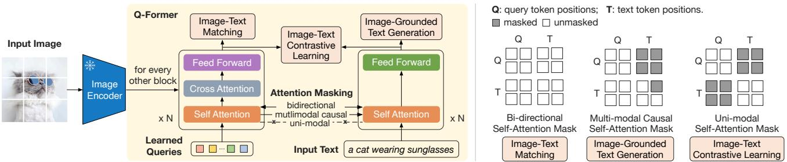
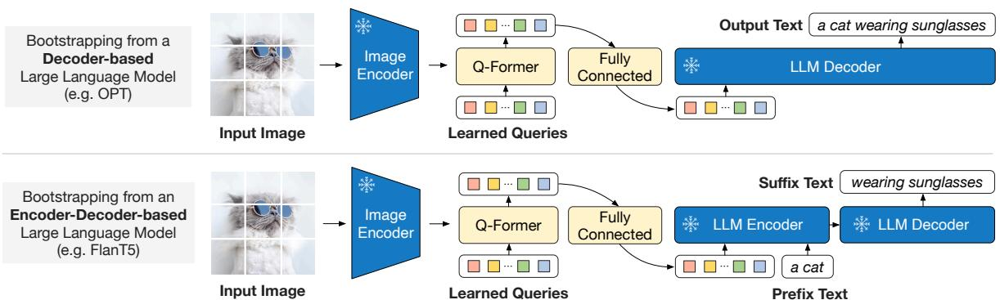
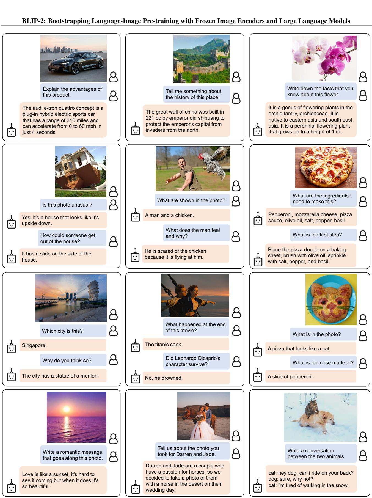

# 1. 论文基本信息

## 1.1. 标题
BLIP-2: Bootstrapping Language-Image Pre-training with Frozen Image Encoders and Large Language Models
-   **中文翻译：** BLIP-2：利用冻结的图像编码器和大型语言模型进行引导式语言-图像预训练
-   **核心主题分析：** 论文标题直接点明了其核心技术：<strong>引导式预训练 (Bootstrapping Pre-training)</strong>。具体而言，它利用现成的、<strong>冻结的 (frozen)</strong> 视觉和语言大模型，来构建一个高效的视觉语言模型。`BLIP-2` 是对前作 `BLIP` 的延续和重大改进。

## 1.2. 作者
-   **作者列表：** Junnan Li, Dongxu Li, Silvio Savarese, Steven Hoi
-   **隶属机构：** Salesforce Research (Salesforce 研究院)
-   **背景简介：** 该研究团队在视觉语言预训练领域有深厚的积累。第一作者 Junnan Li 也是前代模型 `BLIP` 和后续模型 `InstructBLIP` 的核心作者，这表明该工作是在一个持续的研究路线图上进行的。

## 1.3. 发表期刊/会议
-   **发表位置：** 预印本发表于 arXiv，后被 **ICML 2023** (International Conference on Machine Learning) 接收。
-   **声誉与影响力：** ICML 是机器学习领域的顶级国际会议之一，与 NeurIPS、ICLR 并列，具有极高的学术声誉和影响力。被该会议接收意味着论文的研究质量、创新性和影响力得到了学术界的广泛认可。

## 1.4. 发表年份
-   <strong>预印本 (arXiv)：</strong> 2023年1月30日
-   **正式发表：** 2023年

## 1.5. 摘要
论文摘要概括了研究的核心内容：
-   **动机：** 当前的视觉语言预训练 (VLP) 方法由于需要对大规模模型进行端到端训练，其计算成本变得越来越高昂。
-   **核心方法：** 提出了一种名为 `BLIP-2` 的通用且高效的预训练策略。该策略的核心是利用现成的（off-the-shelf）**冻结的**预训练图像编码器和**冻结的**大型语言模型 (LLMs)。为了弥合两种模态之间的差距 (modality gap)，`BLIP-2` 引入了一个轻量级的<strong>查询转换器 (Querying Transformer, Q-Former)</strong>。`Q-Former` 通过一个**两阶段**的预训练过程进行学习。
    -   **第一阶段：** 从冻结的图像编码器中引导**视觉-语言表示学习**。
    -   **第二阶段：** 从冻结的语言模型中引导**视觉到语言的生成学习**。
-   **主要结果：** `BLIP-2` 在多种视觉语言任务上达到了最先进的 (state-of-the-art) 性能，同时其可训练参数量远少于现有方法。例如，在零样本 VQAv2 任务上，`BLIP-2` 的性能比 Flamingo-80B 高出 8.7%，而可训练参数仅为后者的 1/54。
-   **关键结论：** `BLIP-2` 不仅性能优越且计算高效，还展现出了遵循自然语言指令进行零样本图像到文本生成的新兴能力。

## 1.6. 原文链接
-   <strong>官方链接 (arXiv):</strong> https://arxiv.org/abs/2301.12597
-   **PDF 链接:** https://arxiv.org/pdf/2301.12597
-   **发布状态:** 已作为会议论文在 ICML 2023 正式发表。

    ---

# 2. 整体概括

## 2.1. 研究背景与动机
-   **核心问题：** 近年来，视觉语言预训练 (VLP) 模型（如 `CLIP`, `BLIP`, `Flamingo`）的规模越来越大，性能也越来越强。然而，这些模型大多采用<strong>端到端 (end-to-end)</strong> 的训练方式，即同时更新视觉和语言两个部分的参数。随着模型规模的增长，这种方式的**计算成本变得极其高昂**，阻碍了研究的快速迭代和广泛应用。
-   **重要性与挑战：** 视觉和语言领域各自已经发展出非常强大的预训练模型，如用于视觉的 `ViT` 和用于语言的 `GPT`、`T5` 等<strong>大型语言模型 (LLMs)</strong>。一个自然而然的想法是，能否直接利用这些现成的强大模型来构建视觉语言模型，从而避免从零开始的昂贵训练？
    -   <strong>挑战 (Gap):</strong> 主要挑战在于<strong>模态鸿沟 (modality gap)</strong>。图像编码器输出的是视觉特征，而 LLMs 的输入是文本特征 (词元嵌入)。这两种特征在不同的空间中，无法直接对齐。特别是，由于 LLMs 在其预训练过程中从未见过图像，**冻结 LLM 的参数会使得视觉与语言的对齐变得异常困难**。如果对齐方法不当，LLM 可能会忘记其原有的语言能力，即<strong>灾难性遗忘 (catastrophic forgetting)</strong>。
-   **切入点/创新思路：** `BLIP-2` 的核心思路是<strong>“冻结大模型，只训练小模块”</strong>。它选择冻结昂贵的图像编码器和 LLM，只训练一个轻量级的中间模块 `Q-Former` 来充当两种模态之间的“桥梁”。这不仅极大地降低了训练成本，还有效地避免了对 LLM 的灾难性遗忘。为了让这个“桥梁”能有效工作，`BLIP-2` 设计了一个巧妙的两阶段预训练策略，先让 `Q-Former` 学会“看懂”图像并提取与文本相关的信息，再让它学会将这些视觉信息“翻译”成 LLM 能理解的“语言”。

## 2.2. 核心贡献/主要发现
1.  <strong>提出了一种通用且高效的 VLP 框架 (BLIP-2)：</strong> 该框架能有效地利用任意现成的冻结图像编码器和冻结 LLMs，实现了极高的参数效率和计算效率。
2.  <strong>设计了轻量级的查询转换器 (Q-Former)：</strong> `Q-Former` 作为一个可训练的模块，充当了冻结的视觉和语言模型之间的信息瓶颈。它通过一小组可学习的<strong>查询向量 (learnable queries)</strong> 从图像中提取关键信息，有效连接了两种模态。
3.  **开创性的两阶段预训练策略：**
    -   <strong>第一阶段 (表示学习)：</strong> 通过对比学习、图文匹配和图像描述生成任务，强制 `Q-Former` 学习提取与文本最相关的视觉表示。
    -   <strong>第二阶段 (生成学习)：</strong> 将 `Q-Former` 的输出作为“软提示”喂给冻结的 LLM，训练 `Q-Former` 使其输出的视觉表示能被 LLM 所“理解”并用于生成文本。
4.  **实现了最先进的性能：** 尽管可训练参数极少，`BLIP-2` 在多个主流视觉语言任务（如零样本 VQA、图像描述、图文检索）上超越了之前更大、更昂贵的模型。
5.  **涌现出指令遵循能力：** 受益于强大的 LLMs (如 `FlanT5`)，`BLIP-2` 能够在零样本的设定下，根据用户的自然语言指令完成复杂的图像理解和生成任务（如视觉对话、视觉推理），展示了通往多模态对话智能体的潜力。

    ---

# 3. 预备知识与相关工作

## 3.1. 基础概念

### 3.1.1. 视觉语言预训练 (Vision-Language Pre-training, VLP)
VLP 是一种在海量图文对数据上训练模型的技术，旨在让模型同时理解视觉和语言内容，并学习它们之间的对应关系。经过预训练后，模型可以被微调 (fine-tuning) 以适应各种下游任务，如图像描述（看到图片生成文字）、视觉问答（VQA，根据图片回答问题）、图文检索（用文字搜图片或反之）等。

### 3.1.2. 大型语言模型 (Large Language Models, LLMs)
LLMs 是指在天文数字级别的文本数据上训练出来的、参数量巨大的语言模型，例如 `GPT` 系列、`OPT`、`T5` 等。它们的特点是具备强大的自然语言理解和生成能力，并且在<strong>零样本 (zero-shot)</strong> 或<strong>少样本 (few-shot)</strong> 场景下表现出色，即无需或只需少量示例就能完成新任务。

### 3.1.3. 视觉转换器 (Vision Transformer, ViT)
`ViT` 是一种将 Transformer 架构成功应用于计算机视觉领域的模型。它的核心思想是将一张图像分割成若干个小图块 (patches)，将这些图块线性展平后，作为序列输入到 Transformer 编码器中进行处理。`ViT` 证明了 Transformer 在处理图像数据上同样强大。

### 3.1.4. Transformer 与注意力机制 (Attention Mechanism)
Transformer 是目前深度学习领域最主流的架构之一，其核心是<strong>自注意力机制 (self-attention)</strong> 和<strong>交叉注意力机制 (cross-attention)</strong>。

**注意力机制**的核心思想是计算查询 (Query, Q) 与一系列键 (Key, K) 之间的相似度，然后根据这些相似度（权重）来加权聚合对应的值 (Value, V)。其计算公式如下，这是理解 `BLIP-2` 中 `Q-Former` 工作原理的基础：
$$
\mathrm{Attention}(Q, K, V) = \mathrm{softmax}\left(\frac{QK^T}{\sqrt{d_k}}\right)V
$$
**符号解释:**
-   $Q$: <strong>查询 (Query)</strong> 矩阵，代表当前需要关注信息的信号。
-   $K$: <strong>键 (Key)</strong> 矩阵，代表可供查询的信息条目。
-   $V$: <strong>值 (Value)</strong> 矩阵，代表与键关联的信息内容。
-   $d_k$: 键向量的维度。除以 $\sqrt{d_k}$ 是为了进行缩放，防止点积结果过大导致 `softmax` 函数梯度消失。
-   $\mathrm{softmax}$: 将相似度分数归一化为 0 到 1 之间的权重。

-   <strong>自注意力 (Self-Attention):</strong> `Q, K, V` 均来自同一个输入序列。它能让序列中的每个元素关注序列内的所有其他元素，从而捕捉内部依赖关系。
-   <strong>交叉注意力 (Cross-Attention):</strong> $Q$ 来自一个输入序列，而 `K, V` 来自另一个输入序列。它用于融合两个不同序列的信息，例如在 `BLIP-2` 中，`Q-Former` 的查询向量 ($Q$) 与图像特征 (`K, V`) 之间就是通过交叉注意力进行交互的。

## 3.2. 前人工作
`BLIP-2` 的研究建立在两类 VLP 工作的基础之上：

### 3.2.1. 端到端视觉语言预训练 (End-to-end VLP)
这类方法在预训练期间会更新模型的所有参数，包括图像编码器和语言模型。
-   **代表模型：** `BLIP` (本文作者的前作), `SimVLM`, `OFA`, `BEIT-3`。
-   **优点：** 模型各部分可以深度融合，潜力上限高。
-   **缺点：** 随着模型规模扩大，训练成本极高，且不易利用那些已经预训练好的、更强大的第三方模型 (如 `GPT-4`)。

### 3.2.2. 模块化视觉语言预训练 (Modular VLP)
这类方法旨在通过冻结部分组件来降低训练成本，与 `BLIP-2` 的思路更接近。
-   **冻结图像编码器：** 如 `LiT`，它在使用 `CLIP` 进行预训练时冻结了图像编码器，只训练文本编码器。
-   **冻结语言模型：** 这是更为主流的方向，旨在利用 LLMs 强大的语言能力。
    -   **`Frozen` (2021):** 微调一个图像编码器，使其输出的视觉特征可以直接作为 LLM 的<strong>软提示 (soft prompts)</strong>。
    -   **`Flamingo` (2022):** 这是一个里程碑式的工作。它在冻结的 LLM 中插入了新的、可训练的<strong>交叉注意力层 (cross-attention layers)</strong>，让视觉特征可以在 LLM 的每一层注入。`Flamingo` 取得了强大的少样本学习能力，但缺点是需要修改 LLM 的内部结构，并且训练了海量的图文数据。

## 3.3. 技术演进
VLP 技术演进的脉络可以看作是从 <strong>“为多模态任务专门设计和训练模型”</strong> 逐步走向 <strong>“利用并适配强大的单模态预训练模型”</strong>。`BLIP-2` 正是这一趋势下的代表作，它探索了如何以最低的成本、最少的改动来“即插即用”地组合现有的最佳视觉和语言模型。

## 3.4. 差异化分析
`BLIP-2` 与最相关的 `Flamingo` 相比，核心区别与创新点在于：
1.  **非侵入式设计：** `Flamingo` 需要向 LLM 内部插入新的交叉注意力层，**修改了 LLM 的架构**。而 `BLIP-2` **完全不改变** LLM 的内部结构，只是将 `Q-Former` 提取的视觉信息作为前缀（软提示）输入给 LLM。这使得 `BLIP-2` 更加灵活，可以适配任何黑盒的 LLM。
2.  <strong>信息瓶颈 (`Q-Former`)：</strong> `BLIP-2` 引入 `Q-Former` 作为视觉和语言之间的<strong>信息瓶颈 (information bottleneck)</strong>。`Q-Former` 使用固定的、少量的查询向量来“压缩”庞大的视觉信息，只提取对语言模型有用的部分。这减轻了 LLM 学习图文对齐的负担。
3.  **两阶段预训练：** 这是 `BLIP-2` 最关键的创新。`Flamingo` 等方法主要依赖单一的<strong>语言模型损失 (language modeling loss)</strong> 来同时完成视觉特征提取和图文对齐。`BLIP-2` 将这个困难的任务分解为两个更简单的阶段：
    -   **阶段一**专注于让 `Q-Former` 学习<strong>“什么视觉信息是重要的”</strong>。
    -   **阶段二**专注于让 `Q-Former` 学习<strong>“如何将这些重要信息表达为 LLM 能理解的格式”</strong>。
        这种分解使得训练过程更稳定、高效，并且效果更好。

---

# 4. 方法论

`BLIP-2` 的核心是轻量级的<strong>查询转换器 (Querying Transformer, Q-Former)</strong> 以及为其设计的**两阶段预训练策略**。下面对其进行详细拆解。

下图（原文 Figure 1）展示了 BLIP-2 的整体框架和两个预训练阶段。

*该图像是示意图，展示了 BLIP-2 框架中的两个关键阶段：视觉-语言表征学习和视觉-语言生成学习。左侧展示了通过冻结的图像编码器进行的表征学习，右侧则为利用大型语言模型进行的生成学习。此外，Q-Former 作为查询变换器，连接了这两个学习阶段。*

## 4.1. 核心方法详解：Q-Former 模型架构
`Q-Former` 是连接冻结图像编码器和冻结 LLM 的桥梁。它的设计目标是提取与文本最相关的、固定数量的视觉特征。

下图（原文 Figure 2）详细展示了 `Q-Former` 的内部结构和其在第一阶段预训练中的作用。

*该图像是示意图，展示了BLIP-2中的Q-Former结构及其工作机制。图中说明了输入图像通过图像编码器后，与输入文本进行图像-文本匹配、图像-文本对比学习，并介绍了不同的自注意力掩码，如双向、多模态因果，以及单模态自注意力掩码。该结构有助于理解模型如何处理图像与文本之间的关系。*

其结构特点如下：
-   **两个共享权重的子模块：**
    1.  <strong>图像转换器 (Image Transformer):</strong> 与冻结的图像编码器交互，用于提取视觉特征。
    2.  <strong>文本转换器 (Text Transformer):</strong> 既可以作为文本编码器（用于理解），也可以作为文本解码器（用于生成）。
        这两个子模块共享底层的自注意力层，从而实现了参数高效。
-   <strong>可学习的查询向量 (Learnable Queries):</strong>
    -   `Q-Former` 的一个关键设计是引入了一组**可学习的查询向量**（论文中使用了 32 个）。这些查询向量是**模型参数**，与输入图像无关，作为输入被送入图像转换器。
    -   这些查询通过**交叉注意力层**与从冻结图像编码器（如 ViT）中提取的图像块特征进行交互，从而“查询”并概括出图像的关键信息。
    -   查询之间也通过**自注意力层**进行交互，以整合全局信息。
-   **信息瓶颈：**
    -   无论输入图像分辨率多高、图像编码器输出的特征维度多大（例如 ViT-L/14 输出 257x1024），`Q-Former` 最终输出的都是固定数量（32 个）的特征向量。这构成了一个**信息瓶颈**，迫使查询向量必须学习提取最精华、最与语言相关的视觉信息。
-   **初始化：**
    -   `Q-Former` 的主体（自注意力和前馈网络）使用预训练好的 `BERT-base` 的权重进行初始化，而新添加的交叉注意力层则随机初始化。总参数量约为 188M。

## 4.2. 核心方法详解：第一阶段 - 引导式视觉-语言表示学习
**目标：** 在连接 LLM 之前，先让 `Q-Former` 具备从图像中提取高质量、面向语言的视觉表示的能力。在此阶段，`Q-Former` 与一个冻结的图像编码器相连，并使用图文对数据进行训练。

为了实现这一目标，`BLIP-2` 同时优化三个相互关联的预训练目标，这三个目标共享模型参数，但使用不同的注意力掩码来控制查询和文本之间的信息流（见 Figure 2 右侧）。

### 4.2.1. 图文对比学习 (Image-Text Contrastive Learning, ITC)
-   **目标：** 对齐图像表示和文本表示，使得匹配的图文对在表示空间中距离更近，不匹配的更远。
-   **流程：**
    1.  `Q-Former` 的输出查询表示 $Z$（一个包含32个向量的集合）被视为图像的表示。
    2.  文本 $t$ 通过 `Q-Former` 的文本转换器编码，得到文本表示（`[CLS]` 词元的输出）。
    3.  计算每个查询向量与文本表示的相似度，并**选取最高的相似度**作为该图文对的相似度得分。
    4.  使用对比损失函数（如 InfoNCE），拉近正样本对（匹配的图文）的相似度，推开负样本对（不匹配的图文）的相似度。
-   <strong>注意力掩码 (`Unimodal self-attention mask`)：</strong> 在此任务中，查询和文本在自注意力层中**不能相互看到**，以确保它们是基于各自的单模态信息进行编码，防止信息泄露。

### 4.2.2. 图文匹配 (Image-Text Matching, ITM)
-   **目标：** 学习更细粒度的图文对齐关系。这是一个二分类任务，模型需要判断一个图文对是匹配的（正例）还是不匹配的（负例）。
-   **流程：**
    1.  与 ITC 不同，ITM 允许查询和文本信息进行早期融合。
    2.  将 `Q-Former` 的每个输出查询向量输入一个两类线性分类器，得到一个匹配分数。
    3.  将所有查询向量得到的匹配分数取平均，作为最终的图文匹配得分。
-   <strong>注意力掩码 (`Bi-directional self-attention mask`)：</strong> 在此任务中，查询和文本在自注意力层中**可以相互看到**，使得输出的查询向量能够同时编码图像和文本的融合信息。

### 4.2.3. 图像引导的文本生成 (Image-grounded Text Generation, ITG)
-   **目标：** 强制 `Q-Former` 的查询向量**必须**包含生成相应文本所需的全部视觉信息。
-   **流程：**
    1.  模型被要求在给定图像（通过 `Q-Former` 编码）的条件下，自回归地生成配对的文本。
    2.  由于冻结的图像编码器和文本词元之间没有直接连接，所有生成文本所需的视觉信息都必须先被 `Q-Former` 的查询向量捕获，然后通过自注意力层传递给文本词元。
-   <strong>注意力掩码 (`Multimodal causal self-attention mask`)：</strong> 查询之间可以相互关注，但不能关注文本。每个文本词元可以关注所有的查询向量以及它前面的所有文本词元。这是一种标准的用于序列生成的因果掩码。

<strong>通过这三个目标的联合优化，`Q-Former` 被训练成一个强大的视觉信息提取器，其输出的表示 $Z$ 既与文本在宏观上对齐 (ITC)，又包含了细粒度的对应关系 (ITM)，并且信息量足以重建原始文本 (ITG)。</strong>

## 4.3. 核心方法详解：第二阶段 - 引导式视觉到语言生成学习
**目标：** 将第一阶段训练好的 `Q-Former` 与一个冻结的 LLM 连接起来，并教会 LLM 如何“理解”`Q-Former` 输出的视觉表示。

下图（原文 Figure 3）展示了如何将 `Q-Former` 与不同类型的 LLM 连接。

*该图像是示意图，展示了BLIP-2模型的两种引导预训练策略，包括基于解码器的和编码-解码器的语言模型。图中分别说明了如何从图像编码器生成输出文本和前缀、后缀文本的过程。*

-   **流程：**
    1.  将第一阶段得到的 `Q-Former` (及其附带的冻结图像编码器) 的参数冻结。
    2.  `Q-Former` 对输入图像进行处理，输出 32 个查询向量 $Z$。
    3.  一个简单的<strong>全连接层 (Fully-Connected Layer, FC)</strong> 将这些查询向量 $Z$ 线性投影到与 LLM 的词嵌入向量相同的维度。
    4.  这些投影后的视觉向量作为<strong>软视觉提示 (soft visual prompts)</strong>，被<strong>前置 (prepended)</strong> 到输入给 LLM 的文本词元嵌入序列之前。
    5.  然后，根据 LLM 的类型使用相应的生成损失进行训练。在此阶段，**只训练 `Q-Former` 和这个 FC 层**，而 LLM 和图像编码器始终保持冻结。

-   **针对不同 LLM 的训练目标：**
    -   <strong>解码器-仅 (Decoder-only) LLMs (如 OPT, GPT)：</strong> 使用标准的<strong>语言建模损失 (language modeling loss)</strong>。模型在给定视觉提示的条件下，预测并生成完整的文本。
    -   <strong>编码器-解码器 (Encoder-Decoder) LLMs (如 T5, FlanT5)：</strong> 使用<strong>前缀语言建模损失 (prefix language modeling loss)</strong>。将原始文本分为前缀和后缀。视觉提示和前缀文本一起输入到 LLM 的编码器，解码器则负责生成后缀文本。

        通过这个阶段的训练，`Q-Former` 学会了将其提取的视觉信息“翻译”成 LLM 能够理解的“语言”（即软提示），从而有效地将 LLM 的强大生成能力迁移到多模态领域，同时避免了灾难性遗忘。

---

# 5. 实验设置

## 5.1. 数据集
-   **预训练数据集：** `BLIP-2` 使用了与前作 `BLIP` 相同的混合数据集，总共包含 1.29 亿张图片。来源包括：
    -   **人工标注数据集：** `COCO`, `Visual Genome`
    -   **网络图文对数据集：** `Conceptual Captions (CC3M, CC12M)`, `SBU Captions`, 以及从 `LAION-400M` 中筛选出的 1.15 亿张图片。
-   **数据处理：** 作者使用了 `CapFilt` 方法来提升网络数据的质量。具体来说，他们用一个预训练好的 `BLIP_large` 模型为每张网络图片生成 10 个候选标题，然后用一个 `CLIP` 模型对这些生成标题和原始标题进行打分，保留分数最高的两个作为训练数据。
-   **下游任务数据集：**
    -   <strong>视觉问答 (VQA):</strong> `VQAv2`, `OK-VQA`, `GQA`
    -   <strong>图像描述 (Image Captioning):</strong> `COCO Caption`, `NoCaps` (用于评估零样本泛化能力)
    -   <strong>图文检索 (Image-Text Retrieval):</strong> `Flickr30K`, `COCO`

## 5.2. 评估指标

### 5.2.1. VQA-v2 Accuracy
-   **概念定义:** 这是 `VQAv2` 数据集专用的评估指标，用于衡量模型生成的答案与人类标注答案的一致性。由于一个问题可能存在多个正确答案，且不同答案的重要性不同，该指标采用了一种“软”准确率计算方式。对于模型生成的每个答案，会统计有多少个人类标注者也给出了相同的答案，并据此计算一个分数。
-   **数学公式:**
    $$
    \text{VQA-Acc}(\text{ans}) = \min\left(\frac{\text{人类标注中答案 'ans' 的出现次数}}{3}, 1\right)
    $$
-   **符号解释:**
    -   `ans`: 模型生成的答案。
    -   `人类标注中答案 'ans' 的出现次数`: 在为该问题收集的 10 个标注答案中，与模型答案完全匹配的答案数量。
    -   $min(..., 1)$: 分数最高为 1，即至少有 3 个人类标注者同意该答案。

### 5.2.2. CIDEr (Consensus-based Image Description Evaluation)
-   **概念定义:** 用于评估图像描述质量的指标，它衡量模型生成的句子与一组参考句子（由人类标注）之间的“共识”程度。`CIDEr` 认为，一个好的描述应该包含在多个参考描述中都频繁出现的 n-grams (词组)。它通过计算 TF-IDF 权重来赋予不同 n-grams 不同的重要性。
-   **数学公式:**
    $$
    \text{CIDEr}_n(c_i, S_i) = \frac{1}{m} \sum_{j=1}^{m} \frac{g^n(c_i) \cdot g^n(s_{ij})}{\|g^n(c_i)\| \|g^n(s_{ij})\|}
    $$
-   **符号解释:**
    -   $c_i$: 模型生成的第 $i$ 个描述。
    -   $S_i = \{s_{i1}, ..., s_{im}\}$: 第 $i$ 张图片的 $m$ 个参考描述集合。
    -   $g^n(\cdot)$: 一个向量化函数，表示句子中所有 n-grams (从 1 到 N) 的 TF-IDF 权重向量。
    -   $\cdot$: 向量点积，用于计算余弦相似度。

### 5.2.3. SPICE (Semantic Propositional Image Caption Evaluation)
-   **概念定义:** `SPICE` 是一个更侧重于语义的图像描述评估指标。它将生成描述和参考描述都解析成<strong>场景图 (Scene Graph)</strong>，场景图由物体、属性和关系组成。然后，`SPICE` 计算两个场景图之间命题（propositions）的 F1 分数。它能更好地评估描述是否准确地描绘了图像中的核心语义内容。

### 5.2.4. Recall@K (R@K)
-   **概念定义:** 用于图文检索任务的指标。**Image-to-Text Retrieval (TR@K)** 表示，对于一个图像查询，在前 K 个检索出的文本结果中包含正确文本的概率。**Text-to-Image Retrieval (IR@K)** 表示，对于一个文本查询，在前 K 个检索出的图像结果中包含正确图像的概率。
-   **数学公式:**
    $$
    \text{R@K} = \frac{1}{|Q|} \sum_{q \in Q} \mathbb{I}(\text{rank}(gt_q) \le K)
    $$
-   **符号解释:**
    -   $Q$: 查询集合。
    -   $gt_q$: 查询 $q$ 对应的正确答案 (ground-truth)。
    -   $\text{rank}(gt_q)$: 正确答案在模型排序列表中的排名。
    -   $\mathbb{I}(\cdot)$: 指示函数，当条件为真时为 1，否则为 0。

## 5.3. 对比基线
`BLIP-2` 与当时最先进的一系列视觉语言模型进行了比较，这些基线具有代表性：
-   **`Flamingo`:** 最直接的竞争对手，同样采用冻结 LLM 的策略，但架构和训练方式不同。
-   **`BLIP`, `ALBEF`, `SimVLM`, `OFA`, `BEIT-3`:** 代表了不同架构和训练目标的端到端 VLP 模型，它们通常需要更多的可训练参数和计算资源。
-   **`CLIP`, `ALIGN`, `FILIP`:** 主要用于图文检索任务的对比学习模型。

    ---

# 6. 实验结果与分析

## 6.1. 核心结果分析

### 6.1.1. 综合性能概览
以下是原文 Table 1 的结果，展示了 `BLIP-2` 在多个零样本任务上与 SOTA 模型的对比。

<table>
<thead>
<tr>
<th rowspan="2">Models</th>
<th rowspan="2">#Trainable Params</th>
<th rowspan="2">Open- sourced?</th>
<th>Visual Question Answering</th>
<th colspan="2">Image Captioning</th>
<th colspan="2">Image-Text Retrieval</th>
</tr>
<tr>
<th>VQAv2 (test-dev) VQA acc.</th>
<th>NoCaps (val) CIDEr</th>
<th>SPICE</th>
<th>Flickr (test) TR@1</th>
<th>IR@1</th>
</tr>
</thead>
<tbody>
<tr>
<td>BLIP (Li et al., 2022)</td>
<td>583M</td>
<td>✓</td>
<td>-</td>
<td>113.2</td>
<td>14.8</td>
<td>96.7</td>
<td>86.7</td>
</tr>
<tr>
<td>SimVLM (Wang et al., 2021b)</td>
<td>1.4B</td>
<td>X</td>
<td>-</td>
<td>112.2</td>
<td>-</td>
<td>-</td>
<td>-</td>
</tr>
<tr>
<td>BEIT-3 (Wang et al., 2022b)</td>
<td>1.9B</td>
<td>X</td>
<td>-</td>
<td>-</td>
<td>-</td>
<td>94.9</td>
<td>81.5</td>
</tr>
<tr>
<td>Flamingo (Alayrac et al., 2022)</td>
<td>10.2B</td>
<td>X</td>
<td>56.3</td>
<td>-</td>
<td>-</td>
<td>-</td>
<td>-</td>
</tr>
<tr>
<td><strong>BLIP-2</strong></td>
<td><strong>188M</strong></td>
<td><strong>✓</strong></td>
<td><strong>65.0</strong></td>
<td><strong>121.6</strong></td>
<td><strong>15.8</strong></td>
<td><strong>97.6</strong></td>
<td><strong>89.7</strong></td>
</tr>
</tbody>
</table>

**分析：**
-   **参数效率：** `BLIP-2` 的可训练参数仅为 188M，远低于其他模型（`BLIP` 583M，`Flamingo` 10.2B）。
-   **性能优势：** 尽管参数量少，`BLIP-2` 在所有列出的任务上都取得了最先进的性能。尤其是在零样本 VQA 任务上，它以 65.0% 的准确率大幅超越了拥有 80B 总参数的 `Flamingo` (56.3%)。

### 6.1.2. 零样本视觉问答 (Zero-shot VQA)
以下是原文 Table 2 的结果，详细对比了不同配置的 `BLIP-2` 在零样本 VQA 任务上的表现。

<table>
<thead>
<tr>
<th>Models</th>
<th>#Trainable Params</th>
<th>#Total Params</th>
<th>VQAv2 val</th>
<th>test-dev</th>
<th>OK-VQA test</th>
<th>GQA test-dev</th>
</tr>
</thead>
<tbody>
<tr>
<td>VL-T5no-vqa</td>
<td>224M</td>
<td>269M</td>
<td>13.5</td>
<td>-</td>
<td>5.8</td>
<td>6.3</td>
</tr>
<tr>
<td>Frozen (Tsimpoukelli et al., 2021)</td>
<td>40M</td>
<td>7.1B</td>
<td>29.6</td>
<td>-</td>
<td>5.9</td>
<td>-</td>
</tr>
<tr>
<td>Flamingo3B (Alayrac et al., 2022)</td>
<td>1.4B</td>
<td>3.2B</td>
<td>-</td>
<td>49.2</td>
<td>41.2</td>
<td>-</td>
</tr>
<tr>
<td>Flamingo80B (Alayrac et al., 2022)</td>
<td>10.2B</td>
<td>80B</td>
<td>-</td>
<td>56.3</td>
<td>50.6</td>
<td>-</td>
</tr>
<tr>
<td><strong>BLIP-2 ViT-L OPT2.7B</strong></td>
<td><strong>104M</strong></td>
<td><strong>3.1B</strong></td>
<td>50.1</td>
<td>49.7</td>
<td>30.2</td>
<td>33.9</td>
</tr>
<tr>
<td><strong>BLIP-2 ViT-g OPT6.7B</strong></td>
<td><strong>108M</strong></td>
<td><strong>7.8B</strong></td>
<td>54.3</td>
<td>52.6</td>
<td>36.4</td>
<td>36.4</td>
</tr>
<tr>
<td><strong>BLIP-2 ViT-L FlanT5xL</strong></td>
<td><strong>103M</strong></td>
<td><strong>3.4B</strong></td>
<td>62.6</td>
<td>62.3</td>
<td>39.4</td>
<td>44.4</td>
</tr>
<tr>
<td><strong>BLIP-2 ViT-g FlanT5xxL</strong></td>
<td><strong>108M</strong></td>
<td><strong>12.1B</strong></td>
<td><strong>65.2</strong></td>
<td><strong>65.0</strong></td>
<td>45.9</td>
<td><strong>44.7</strong></td>
</tr>
</tbody>
</table>

**分析：**
1.  <strong>超越 <code>Flamingo</code>：</strong> `BLIP-2` (ViT-g FlanT5xxL) 在 VQAv2 test-dev 上的准确率达到 65.0%，比 `Flamingo80B` (56.3%) 高出 8.7%，而可训练参数少了 54 倍。这证明了 `BLIP-2` 架构和两阶段训练策略的卓越效率。
2.  **可扩展性验证：** 表格数据清晰地显示了 `BLIP-2` 的一个重要特性：**性能随着基础模型的增强而提升**。
    -   **更强的图像编码器：** 使用 `ViT-g` 的版本始终优于使用 `ViT-L` 的版本。
    -   **更强的 LLM：** 在同一 LLM 家族中，`OPT6.7B` 优于 `OPT2.7B`。更重要的是，经过指令微调的 `FlanT5` 系列显著优于未经指令微调的 `OPT` 系列。
        这验证了 `BLIP-2` 是一个通用的框架，可以方便地“即插即用”更先进的单模态模型来获得性能提升。

### 6.1.3. 指令驱动的零样本图文生成
`BLIP-2` 能够利用 LLM 的指令遵循能力，在零样本条件下执行各种复杂的图文生成任务。如下图（原文 Figure 4）所示，用户可以通过提供不同的文本提示（指令）来控制生成的内容。

**分析：**
-   **多样化能力：** 图中展示了模型能够进行视觉对话（“What's the story of this image?”）、视觉常识推理（“What's funny about this image?”）、甚至个性化的内容创作（“Could you write a poem about this image?”）。
-   **核心机制：** 这是通过将图像的软视觉提示与用户的指令文本拼接在一起，共同作为 LLM 的输入实现的。LLM 在理解了视觉内容的基础上，遵循文本指令进行生成。这展示了 `BLIP-2` 作为多模态对话智能体基础的巨大潜力。

## 6.2. 消融实验/参数分析

### 6.2.1. 视觉-语言表示学习阶段的必要性
为了验证第一阶段预训练（表示学习）的重要性，作者进行了一项消融实验：直接跳过第一阶段，仅使用第二阶段的生成式学习来训练 `Q-Former`。结果如下图（原文 Figure 5）所示。

**分析：**
-   **结果显著下降：** 无论使用 `OPT` 还是 `FlanT5`，**去掉表示学习阶段后，模型在零样本 VQA 任务上的性能都出现了大幅度暴跌**。
-   **灾难性遗忘：** 对于 `OPT` 模型，性能甚至随着训练的进行而持续下降，这表明模型发生了**灾难性遗忘**。在没有第一阶段预对齐的情况下，LLM 难以理解 `Q-Former` 随机初始化的输出，单一的生成式目标不足以弥合巨大的模态鸿沟。
-   **结论：** **第一阶段的表示学习是 `BLIP-2` 成功的关键**。它有效地将视觉信息预处理成与语言相关的、易于 LLM “消化”的格式，极大地减轻了第二阶段生成学习的负担，从而实现了高效且高质量的模态对齐。

### 6.2.2. 图像引导文本生成 (ITG) 损失的作用
在图文检索任务的微调中，作者探究了 ITG 损失的贡献。

以下是原文 Table 6 的结果：

<table>
<thead>
<tr>
<th>COCO finetuning objectives</th>
<th>Image → Text R@1</th>
<th>Text → Image R@1</th>
</tr>
</thead>
<tbody>
<tr>
<td>ITC + ITM</td>
<td>84.5</td>
<td>67.2</td>
</tr>
<tr>
<td><strong>ITC + ITM + ITG</strong></td>
<td><strong>85.4</strong></td>
<td><strong>68.3</strong></td>
</tr>
</tbody>
</table>

**分析：**
-   图文检索任务主要依赖于 ITC（对比）和 ITM（匹配）损失。然而，实验结果表明，<strong>额外加入 ITG（生成）损失后，检索性能在两个方向上都得到了提升</strong>。
-   **直觉解释：** 这支持了作者的设计初衷。ITG 损失迫使 `Q-Former` 的查询向量必须捕获到足以重建文本的丰富视觉细节。这反过来又提升了表示的质量，从而有利于需要细粒度对齐的检索任务。

    ---

# 7. 总结与思考

## 7.1. 结论总结
`BLIP-2` 提出了一种新颖、高效且通用的视觉语言预训练框架，其核心贡献和结论可以总结如下：
1.  **成功利用冻结模型：** `BLIP-2` 成功地证明了在**冻结**强大的预训练图像编码器和大型语言模型 (LLMs) 的前提下，仅通过训练一个轻量级的 `Q-Former` 模块，就能实现最先进的性能。
2.  **高效的参数与计算：** 该方法极大地降低了视觉语言预训练的成本，使得在有限的计算资源下也能构建强大的多模态模型。其可训练参数量远少于之前的 SOTA 模型。
3.  **创新的两阶段训练策略：** 将困难的模态对齐任务分解为**表示学习**和**生成学习**两个阶段，是该方法成功的关键。这个策略有效解决了在冻结 LLM 时常见的模态鸿沟和灾难性遗忘问题。
4.  **强大的泛化与新兴能力：** `BLIP-2` 不仅在传统的 VQA、图像描述和检索任务上表现出色，还借助 LLM 展现了遵循自然语言指令进行零样本复杂推理和生成的能力，为构建多模态对话 AI 铺平了道路。

## 7.2. 局限性与未来工作
论文作者诚实地指出了模型的局限性，并展望了未来的研究方向：
-   <strong>缺乏上下文学习能力 (In-context Learning)：</strong> 实验发现，向 `BLIP-2` 提供少样本示例（即在提示中加入几个图文问答对）并不能提升其 VQA 性能。作者认为这归因于预训练数据只包含单个图文对，模型没有学过如何处理序列中多个图文对之间的关联。`Flamingo` 之所以具备这种能力，是因为它使用了包含交错图文的私有数据集。未来的工作是构建类似的公开数据集。
-   **继承 LLM 的风险：** 由于 `BLIP-2` 使用了冻结的 LLM，它也继承了 LLM 固有的风险，例如可能生成带有偏见、攻击性或不准确的内​​容，以及泄露隐私信息的风险。
-   **知识的局限性：** 模型的知识受限于其所使用的 LLM。例如，对于需要外部知识或最新信息的图像（如 Figure 7 中展示的），模型可能会给出过时或错误的答案。

## 7.3. 个人启发与批判
-   **启发：**
    1.  <strong>“解耦”</strong>与“分治”的思想： `BLIP-2` 最具启发性的一点是将一个复杂问题（跨模态对齐）分解为两个更简单、更明确的子问题（表示提取和格式转换）。这种“分而治之”的策略在工程和研究中都极具价值，它让训练过程更稳定、可控且高效。
    2.  <strong>“小模块适配大模型”</strong>的范式： `BLIP-2` 是“参数高效微调”(Parameter-Efficient Fine-Tuning, PEFT) 思想在多模态领域的成功典范。它展示了未来构建复杂 AI 系统的一种可能路径：不再是训练一个庞大的端到端模型，而是通过训练轻量级的“适配器”模块，巧妙地组合和利用现有的、最强大的基础模型。
    3.  **信息瓶颈的重要性：** `Q-Former` 作为信息瓶颈的设计非常巧妙。它迫使模型学会“抓重点”，从海量视觉信号中提炼出对特定任务（这里是语言生成）最重要的信息。这种压缩和提炼是实现高效模态转换的关键。

-   **批判与思考：**
    1.  **查询向量的局限性：** `Q-Former` 使用固定数量（32个）的查询向量来概括图像。这对于一般场景可能足够，但对于需要极高细节、包含大量物体的复杂场景，这种固定长度的表示可能会成为性能瓶颈，无法捕捉所有必要信息。
    2.  **视觉定位能力的缺失：** `Q-Former` 输出的是一组全局的视觉特征，它本身并不直接提供物体级别的空间定位信息。虽然 ITM 任务能促进细粒度对齐，但模型可能仍然难以精确回答“图片左上角的东西是什么颜色？”这类需要精确定位的问题。后续工作（如 `InstructBLIP`）通过引入视觉提示（visual prompting）在一定程度上解决了这个问题。
    3.  **两阶段训练的复杂性：** 虽然比端到端训练高效，但两阶段的流程仍然比单一阶段的方法要复杂一些。如何进一步简化训练过程，甚至实现端到端的、但同样高效的模态对齐，仍然是一个值得探索的方向。