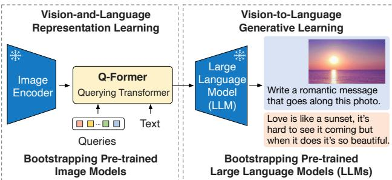
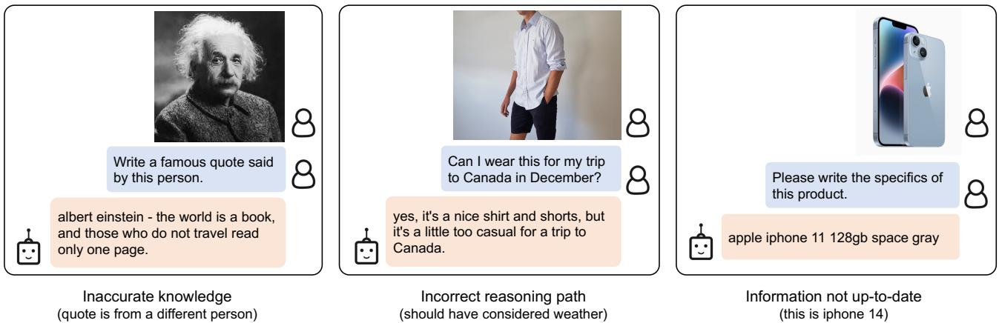
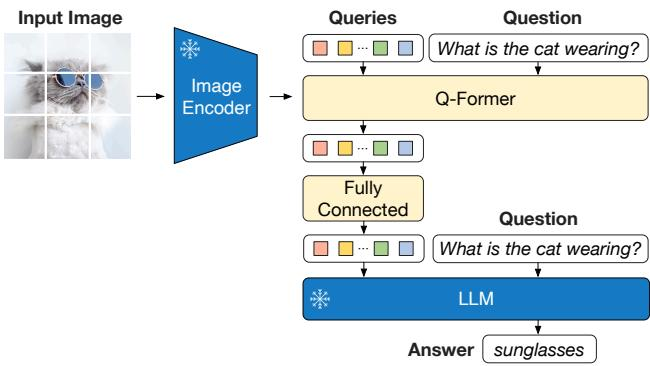

# BLIP-2: 基于固定图像编码器和大语言模型的语言-图像预训练启动

Junnan Li、Dongxu Li、Silvio Savarese、Steven Hoi，Salesforce Research [项目链接](https://github.com/salesforce/LAVIS/tree/main/projects/blip2)

# 摘要

由于大规模模型的端到端训练，视觉与语言的预训练成本变得越来越高昂。本文提出了BLIP-2，这是一种通用且高效的预训练策略，它通过现成的冻结预训练图像编码器和冻结的大型语言模型来引导视觉语言的预训练。BLIP-2通过轻量级的查询变换器弥补了模态之间的差距，该变换器分两个阶段进行预训练。第一阶段从冻结的图像编码器引导视觉语言表示学习。第二阶段从冻结的语言模型引导视觉到语言的生成学习。尽管与现有方法相比，BLIP-2的可训练参数显著更少，但在各种视觉语言任务上的表现达到了最先进水平。例如，我们的模型在零样本VQAv2任务上超过Flamingo80B，提升幅度达到$8.7\%$，且可训练参数少了$54 \mathrm{x}$。我们还展示了该模型在零样本图像到文本生成中的新兴能力，能够遵循自然语言指令。

  
Figure 1. Overview of BLIP-2's framework. We pre-train a lightweight Querying Transformer following a two-stage strategy to bridge the modality gap. The first stage bootstraps visionlanguage representation learning from a frozen image encoder. The second stage bootstraps vision-to-language generative learning from a frozen LLM, which enables zero-shot instructed image-totext generation (see Figure 4 for more examples).

通过自助抽样法从现成的预训练视觉模型和语言模型中引导的计算高效的视觉-语言预训练方法。预训练视觉模型提供高质量的视觉表征。预训练语言模型，特别是大语言模型（LLMs），提供强大的语言生成和零样本迁移能力。为了降低计算成本并应对灾难性遗忘的问题，单模态预训练模型在预训练过程中保持冻结。

# 1. 引言

视觉-语言预训练（VLP）研究在过去几年中快速发展，已经开发出越来越大规模的预训练模型，持续推动各种下游任务的最先进水平（Radford等，2021；Li等，2021；2022；Wang等，2022a；Alayrac等，2022；Wang等，2022b）。然而，大多数最先进的视觉-语言模型在预训练期间计算成本高，因为使用了大规模模型和数据集的端到端训练。视觉-语言研究位于视觉与语言的交叉点，因此自然期待视觉-语言模型能够从视觉和自然语言社区现成的单模态模型中获益。本文提出了一种通用的方法，以便利用预训练的单模态模型进行 VLP，关键在于促进跨模态对齐。然而，由于大型语言模型（LLMs）在其单模态预训练期间未见过图像，冻结它们使得视觉-语言对齐变得特别具有挑战性。在这方面，现有方法（如 Frozen (Tsimpoukelli等，2021)，Flamingo (Alayrac等，2022)）依赖于图像到文本生成损失，而我们证明这种方法不足以弥补模态间的差距。为了实现与冻结的单模态模型有效的视觉-语言对齐，我们提出了一种查询变换器（QFormer），并采用一种新的两阶段预训练策略进行预训练。如图1所示，Q-Former 是一种轻量级变换器，采用一组可学习的查询向量从冻结的图像编码器中提取视觉特征。它充当冻结的图像编码器与冻结的 LLM 之间的信息瓶颈，将最有用的视觉特征提供给 LLM 以输出所需的文本。在第一个预训练阶段，我们执行视觉-语言表示学习，迫使 Q-Former 学习与文本最相关的视觉表示。在第二个预训练阶段，我们通过将 Q-Former 的输出与冻结的 LLM 相连接，执行视觉到语言的生成学习，并训练 Q-Former 使其输出的视觉表示能够被 LLM 理解。我们将我们的 VLP 框架命名为 BLIP-2：基于冻结单模态模型的语言-图像预训练。BLIP-2 的关键优势包括：BLIP-2 有效利用冻结预训练的图像模型和语言模型。我们使用在两个阶段（表示学习阶段和生成学习阶段）中预训练的 Q-Former 来弥补模态差距。BLIP-2 在包括视觉问答、图像描述和图像-文本检索等各种视觉-语言任务上实现了最先进的性能。• 由 LLM （如 OPT（Zhang等，2022），FlanT5（Chung等，2022））驱动，BLIP-2 能够根据自然语言指令提示进行零样本图像到文本生成，从而启用诸如视觉知识推理、视觉对话等新兴能力（有关示例，请参见图4）。• 由于使用了冻结的单模态模型和轻量级的 Q-Former，BLIP-2 在计算效率上优于现有的最先进方法。例如，BLIP-2 在零样本 VQAv2 上比 Flamingo（Alayrac 等，2022）提高了 $8.7 \%$ 的性能，同时使用了少 $54 \times$ 的可训练参数。此外，我们的结果表明，BLIP-2 是一种通用的方法，可以利用更先进的单模态模型以获得更好的 VLP 性能。

# 2. 相关工作

# 2.1. 端到端视觉-语言预训练

视觉-语言预训练旨在学习多模态基础模型，以提高在各种视觉和语言任务上的性能。根据下游任务，已提出不同的模型架构，包括双编码器架构（Radford et al., 2021；Jia et al., 2021）、融合编码器架构（Tan & Bansal, 2019；Li et al., 2021）、编码器-解码器架构（Cho et al., 2021；Wang et al., 2021b；Chen et al., 2022b），以及最近的统一变换器架构（Li et al., 2022；Wang et al., 2022b）。多年来也提出了各种预训练目标，并逐渐收敛到一些经过时间检验的目标：图像-文本对比学习（Radford et al., 2021；Yao et al., 2022；Li et al., 2021；2022）、图像-文本匹配（Li et al., 2021；2022；Wang et al., 2021a）和（掩码）语言建模（Li et al., 2021；2022；Yu et al., 2022；Wang et al., 2022b）。大多数视觉语言处理（VLP）方法使用大规模的图像-文本对数据集进行端到端的预训练。随着模型规模的不断增长，预训练可能会产生极高的计算成本。此外，端到端预训练模型难以灵活利用现成的单模态预训练模型，如大语言模型（LLMs）（Brown et al., 2020；Zhang et al., 2022；Chung et al., 2022）。

# 2.2. 模块化视觉-语言预训练

与我们的研究更为相似的方法是利用现成的预训练模型，并在视觉语言预训练（VLP）过程中保持它们不变。一些方法冻结图像编码器，包括早期的工作，该工作采用冻结的目标检测器提取视觉特征（Chen et al., 2020; Li et al., 2020; Zhang et al., 2021），以及最近的 LiT（Zhai et al., 2022），该方法使用冻结的预训练图像编码器进行 CLIP（Radford et al., 2021）预训练。一些方法冻结语言模型，以便在视觉到语言生成任务中利用大型语言模型（LLMs）的知识（Tsimpoukelli et al., 2021; Alayrac et al., 2022; Chen et al., 2022a; Mañas et al., 2023; Tiong et al., 2022; Guo et al., 2022）。使用冻结的 LLM 面临的主要挑战是将视觉特征对齐到文本空间。为此，Frozen（Tsimpoukelli et al., 2021）微调一个图像编码器，其输出直接作为 LLM 的软提示。Flamingo（Alayrac et al., 2022）向 LLM 中插入新的跨注意力层以注入视觉特征，并在数十亿的图像-文本对上预训练新层。这两种方法采用语言建模损失，语言模型生成以图像为条件的文本。与现有方法不同，BLIP-2 能够有效且高效地利用冻结图像编码器和冻结的 LLM，应用于各种视觉语言任务，从而以更低的计算成本实现更强的性能。

# 3. 方法

我们提出了 BLIP-2，一种新的视觉-语言预训练方法，该方法以冻结的预训练单模态模型为基础。为了弥合模态差距，我们提出了一种查询变换器（Q-Former），该模型分为两个阶段进行预训练：（1）视觉-语言表示学习阶段，使用冻结的图像编码器；（2）视觉到语言的生成学习阶段，使用冻结的语言模型（LLM）。本节首先介绍 Q-Former 的模型架构，然后阐述这两个阶段的预训练过程。

# 3.1. 模型架构

我们提出 Q-Former 作为可训练模块，以弥合冻结图像编码器与冻结大语言模型之间的差距。它从图像编码器中提取固定数量的输出特征，与输入图像分辨率无关。如图 2 所示，Q-Former 由两个共享相同自注意力层的 Transformer 子模块组成：（1）与冻结图像编码器交互以提取视觉特征的图像 Transformer；（2）既可以作为文本编码器又可以作为文本解码器的文本 Transformer。我们创建一组可学习的查询嵌入作为图像 Transformer 的输入。查询通过自注意力层相互交互，并通过跨注意力层（插入在每个 Transformer 块之间）与冻结的图像特征进行交互。查询还可以通过相同的自注意力层与文本互动。根据预训练任务，我们应用不同的自注意力掩码来控制查询与文本的交互。我们使用$\mathbf { B E R T _ { b a s e }$（Devlin et al., 2019）的预训练权重初始化 Q-Former，而跨注意力层则随机初始化。总的来说，Q-Former 共有 1.88 亿个参数。请注意，查询被视为模型参数。

  
text. (Right) The self-attention masking strategy for each objective to control query-text interaction.

在我们的实验中，我们使用 32 个查询，每个查询的维度为 768（与 Q-Former 的隐藏维度相同）。我们用 $Z$ 表示输出查询表示。$Z$ 的大小 $( 3 2 \times 7 6 8 )$ 远小于冻结图像特征的大小（例如，ViT-L/14 的大小为 $2 5 7 \times 1 0 2 4$）。这种瓶颈架构与我们的预训练目标相结合，迫使查询提取与文本最相关的视觉信息。

# 3.2. 基于预训练图像编码器的自助视觉-语言表征学习

在表示学习阶段，我们将 Q-Former 与一个冻结的图像编码器连接，并使用图像-文本对进行预训练。我们的目标是训练 Q-Former，使查询能够学习提取与文本最相关的视觉表示。受到 BLIP (Li et al., 2022) 的启发，我们联合优化三个共享相同输入格式和模型参数的预训练目标。每个目标在查询和文本之间采用不同的注意力掩码策略，以控制它们的交互（见图 2）。图像-文本对比学习 (ITC) 学习对齐图像表示和文本表示，以最大化它们的互信息。实现这一点的方法是对比正例对的图像-文本相似度与负例对的相似度。我们将来自图像变换器的输出查询表示 $Z$ 与来自文本变换器的文本表示 $t$ 对齐，其中 $t$ 是 [CLS] 令牌的输出嵌入。由于 $Z$ 包含多个输出嵌入（每个查询一个），我们首先计算每个查询输出与 $t$ 之间的成对相似度，然后选择最高的一个作为图像-文本相似度。为了避免信息泄露，我们采用单模态自注意力掩码，查询和文本不允许相互查看。由于使用了冻结的图像编码器，相比于端到端的方法，我们每个 GPU 可以适配更多样本。因此，我们使用批内负样本，而不是 BLIP 中的动量队列。图像引导文本生成 (ITG) 损失训练 Q-Former 在给定输入图像的条件下生成文本。由于 Q-Former 的架构不允许冻结图像编码器与文本令牌之间直接交互，因此生成文本所需的信息必须首先由查询提取，然后通过自注意力层传递给文本令牌。因此，查询被迫提取捕捉关于文本的所有信息的视觉特征。我们采用多模态因果自注意力掩码来控制查询与文本之间的交互，类似于 UniLM (Dong et al., 2019) 中使用的掩码。查询可以相互关注，但不能关注文本令牌。每个文本令牌可以关注所有查询及其之前的文本令牌。我们还将 [CLS] 令牌替换为新的 [DEC] 令牌，作为第一个文本令牌以指示解码任务。图像-文本匹配 (ITM) 旨在学习图像和文本表示之间的细粒度对齐。它是一个二分类任务，模型需预测图像-文本对是正例（匹配）还是负例（不匹配）。我们使用双向自注意力掩码，使所有查询和文本可以相互关注。输出查询嵌入 $Z$ 因此捕捉多模态信息。我们将每个输出查询嵌入输入到一个二分类线性分类器中以获得 logits，并将所有查询的 logits 进行平均作为输出匹配得分。我们采用 Li et al. (2021; 2022) 的硬负样本挖掘策略来创建信息性负例对。

  
. BaL oBa F fully-nece ye daptsrom he utpu dmension the Q-Former the pudimension the hose LLM.

# 3.3. 从冻结的大语言模型中进行引导的视觉到语言生成学习

在生成预训练阶段，我们将 $\mathrm { Q } \mathrm { - }$ Former（带有冻结的图像编码器）连接到一个冻结的 LLM，以利用 LLM 的生成语言能力。如图 3 所示，我们使用一个全连接（FC）层将输出查询嵌入 $Z$ 线性投影到与 LLM 的文本嵌入相同的维度。投影后的查询嵌入被预置在输入的文本嵌入之前。它们作为软视觉提示，条件化 LLM 基于 Q-Former 提取的视觉表征。由于 Q-Former 已经经过预训练以提取具有语言信息的视觉表征，它有效地充当信息瓶颈，将最有用的信息传递给 LLM，同时去除无关的视觉信息。这减轻了 LLM 学习视觉-语言对齐的负担，从而减轻了灾难性遗忘问题。我们对两种类型的 LLM 进行了实验：基于解码器的 LLM 和基于编码器-解码器的 LLM。对于基于解码器的 LLM，我们使用语言建模损失进行预训练，其中冻结的 LLM 负责生成条件于 Q-Former 提取的视觉表征的文本。对于基于编码器-解码器的 LLM，我们使用前缀语言建模损失进行预训练，我们将文本分为两部分。前缀文本与视觉表征连接作为 LLM 编码器的输入。后缀文本用作 LLM 解码器的生成目标。

# 3.4. 模型预训练

预训练数据。我们使用与 BLIP 相同的预训练数据集，共计 1.29 亿张图像，包括 COCO（Lin 等，2014）、Visual Genome（Krishna 等，2017）、CC3M（Sharma 等，2018）、CC12M（Changpinyo 等，2021）、SBU（Ordonez 等，2011）以及来自 LAION400M 数据集（Schuhmann 等，2021）的 1.15 亿张图像。我们采用 CapFilt 方法（Li 等，2022）为网络图像创建合成标题。具体来说，我们使用 $\mathrm { B L I P _ { l a r g e } }$ 标题生成模型生成 10 个标题，并根据 CLIP ViT-L/14 模型生成的图像-文本相似度对合成标题和原始网络标题进行排序。我们为每张图像保留前两个标题作为训练数据，并在每个预训练步骤中随机抽取一个。预训练图像编码器和大语言模型。对于冻结的图像编码器，我们探索了两种最先进的预训练视觉变换器模型：（1）来自 CLIP 的 ViT-L/14（Radford 等，2021）和（2）来自 EVA-CLIP 的 ViT-g/14（Fang 等，2022）。我们去掉 ViT 的最后一层，并使用倒数第二层的输出特征，这样可以稍微提高性能。对于冻结的语言模型，我们探索了无监督训练的 OPT 模型系列（Zhang 等，2022）用于解码器基础的大语言模型，以及经过指令训练的 FlanT5 模型系列（Chung 等，2022）用于编码器-解码器基础的大语言模型。

预训练设置。我们在第一阶段预训练 $250k$ 步，在第二阶段预训练 80k 步。第一阶段使用 ViT-L/ViT-$\mathbf{g}$ 的批量大小为 2320/1680，第二阶段使用 OPT/FlanT5 的批量大小为 1920/1520。在预训练期间，我们将冻结的 ViT 和 LLM 的参数转换为 FP16，除了 FlanT5 使用 BFloat16。与使用 32 位模型相比，我们未发现性能下降。由于使用了冻结模型，我们的预训练在计算上比现有的大规模 VLP 方法更为友好。例如，使用单台 16-A100(40G) 机器，我们最大的模型 ViT $\mathrm{g}$ 和 FlanT5-XXL 在第一阶段需要不到 6 天，第二阶段需要不到 3 天。所有模型均使用相同的预训练超参数。我们使用 AdamW（Loshchilov & Hutter, 2017）优化器，$\beta_{1} = 0.9$，$\beta_{2} = 0.98$，权重衰减为 0.05。我们使用余弦学习率衰减，峰值学习率为 1e-4，线性预热为 $2k$ 步。第二阶段的最小学习率为 5e-5。我们使用大小为 $224 \times 224$ 的图像，采用随机缩放裁剪和水平翻转进行增强。

  
Figure 4. Selected examples of instructed zero-shot image-to-text generation using a BLIP-2 model w/ ViT $\mathbf { g }$ and $\mathrm { F l a n T } 5 _ { \mathrm { X X L } }$ , where it personalized image-to-text generation, etc.

<table><tr><td rowspan="2">Models</td><td rowspan="2">#Trainable Params</td><td rowspan="2">Open- sourced?</td><td rowspan="2">Visual Question Answering VQAv2 (test-dev) VQA acc.</td><td colspan="2">Image Captioning NoCaps (val)</td><td colspan="2">Image-Text Retrieval Flickr (test)</td></tr><tr><td>CIDEr</td><td>SPICE</td><td>TR@1</td><td>IR@1</td></tr><tr><td>BLIP (Li et al., 2022)</td><td>583M</td><td>✓</td><td>-</td><td>113.2</td><td>14.8</td><td>96.7</td><td>86.7</td></tr><tr><td>SimVLM (Wang et al., 2021b)</td><td>1.4B</td><td>X</td><td>-</td><td>112.2</td><td>-</td><td></td><td></td></tr><tr><td>BEIT-3 (Wang et al., 2022b)</td><td>1.9B</td><td>X</td><td>-</td><td></td><td>-</td><td>94.9</td><td>81.5</td></tr><tr><td>Flamingo (Alayrac et al., 2022)</td><td>10.2B</td><td>X</td><td>56.3</td><td></td><td>-</td><td>-</td><td>-</td></tr><tr><td>BLIP-2</td><td>188M</td><td>✓</td><td>65.0</td><td>121.6</td><td>15.8</td><td>97.6</td><td>89.7</td></tr></table>

<table><tr><td>Models</td><td>#Trainable Params</td><td>#Total Params</td><td>VQAv2 val</td><td>test-dev</td><td>OK-VQA test</td><td>GQA test-dev</td></tr><tr><td>VL-T5no-vqa</td><td>224M</td><td>269M</td><td>13.5</td><td>-</td><td>5.8</td><td>6.3</td></tr><tr><td>FewVLM (Jin et al., 2022)</td><td>740M</td><td>785M</td><td>47.7</td><td>-</td><td>16.5</td><td>29.3</td></tr><tr><td>Frozen (Tsimpoukelli et al., 2021)</td><td>40M</td><td>7.1B</td><td>29.6</td><td>-</td><td>5.9</td><td>-</td></tr><tr><td>VLKD (Dai et al., 2022)</td><td>406M</td><td>832M</td><td>42.6</td><td>44.5</td><td>13.3</td><td>-</td></tr><tr><td>Flamingo3B (Alayrac et al., 2022)</td><td>1.4B</td><td>3.2B</td><td>-</td><td>49.2</td><td>41.2</td><td>-</td></tr><tr><td>Flamingo9B (Alayrac et al., 2022)</td><td>1.8B</td><td>9.3B</td><td>-</td><td>51.8</td><td>44.7</td><td></td></tr><tr><td>Flamingo80B (Alayrac et al., 2022)</td><td>10.2B</td><td>80B</td><td>-</td><td>56.3</td><td>50.6</td><td>-</td></tr><tr><td>BLIP-2 ViT-L OPT2.7B</td><td>104M</td><td>3.1B</td><td>50.1</td><td>49.7</td><td>30.2</td><td>33.9</td></tr><tr><td>BLIP-2 ViT-g OPT2.7B</td><td>107M</td><td>3.8B</td><td>53.5</td><td>52.3</td><td>31.7</td><td>34.6</td></tr><tr><td>BLIP-2 ViT-g OPT6.7B</td><td>108M</td><td>7.8B</td><td>54.3</td><td>52.6</td><td>36.4</td><td>36.4</td></tr><tr><td>BLIP-2 ViT-L FlanT5xL</td><td>103M</td><td>3.4B</td><td>62.6</td><td>62.3</td><td>39.4</td><td>44.4</td></tr><tr><td>BLIP-2 ViT-g FlanT5xL</td><td>107M</td><td>4.1B</td><td>63.1</td><td>63.0</td><td>40.7</td><td>44.2</td></tr><tr><td>BLIP-2 ViT-g FlanT5xxL</td><td>108M</td><td>12.1B</td><td>65.2</td><td>65.0</td><td>45.9</td><td>44.7</td></tr></table>

表格比较在零基础视觉任务中的状态-听觉效应

# 4. 实验

表1概述了BLIP-2在各种零-shot视觉-语言任务中的表现。与之前最先进的模型相比，BLIP-2在视觉-语言预训练过程中实现了更好的性能，同时所需的可训练参数数量显著减少。

# 4.1. 指导性零-shot 图像到文本生成

BLIP-2有效地使大语言模型能够理解图像，同时保留其跟随文本提示的能力，这使得我们可以通过指令控制图像到文本的生成。我们只需将文本提示作为输入附加在视觉提示之后。图4展示了广泛的零样本图像到文本能力示例，包括视觉知识推理、视觉常识推理、视觉对话、个性化图像到文本生成等。零样本视觉问答。我们对零样本视觉问答任务进行了定量评估。对于OPT模型，我们使用提示“问题：$\{ \}$ 答案：”。对于FlanT5模型，我们使用提示“问题：$\{ \}$ 简短回答：”。在生成过程中，我们使用束搜索，束宽为5。我们还将长度惩罚设置为$^ { - 1 }$，以鼓励与人类标注更一致的短答案。如表2所示，BLIP-2在VQAv2（Goyal等，2017）和GQA（Hudson & Manning，2019）数据集上取得了最先进的结果。尽管可训练参数少了$5 4 \mathrm { x }$，它在VQAv2上比Flamingo80B高出$8 . 7 \%$。在OK-VQA（Marino等，2019）数据集上，BLIP-2位居Flamingo80B之后。我们假设这是因为OK-VQA更侧重于开放世界知识而非视觉理解，而Flamingo80B的70B Chinchilla（Hoffmann等，2022）语言模型拥有比11B FlanT $5 _ { \mathrm { X X L } }$更多的知识。我们从表2中获得了一个有希望的观察：更强的图像编码器或更强的大语言模型都会导致更好的性能。这个观察得到了几个事实的支持：(1) ViT $\mathbf { g }$在OPT和FlanT5中都优于ViT-L。(2) 在同一大语言模型系列中，较大的模型优于较小的模型。(3) FlanT5，一个经过指令调整的大语言模型，在视觉问答上优于无监督训练的OPT。这一观察验证了BLIP-2作为一种通用的视觉-语言预训练方法，可以有效利用视觉和自然语言社区的快速进展。

# 视觉-语言表征学习的效果。

第一阶段的表示学习预训练 QFormer，以学习与文本相关的视觉特征，从而减轻大型语言模型在学习视觉-语言对齐时的负担。如果没有表示学习阶段，微调过程中会出现 Q 熵损失。C: CIDEr，S: SPICE，$\mathrm { B } @ 4$ BLEU $@ 4$ 。

<table><tr><td rowspan="3">Models</td><td rowspan="3">#Trainable Params</td><td colspan="7">NoCaps Zero-shot (validation set)</td><td rowspan="2" colspan="2">COCO Fine-tuned</td></tr><tr><td colspan="2">in-domain</td><td colspan="2">near-domain</td><td colspan="2">out-domain</td><td colspan="2">Karpathy test</td></tr><tr><td>C</td><td>S</td><td>C</td><td>S</td><td>C</td><td>S</td><td>overall C</td><td>S</td><td>B@4</td><td>C</td></tr><tr><td>OSCAR (Li et al., 2020)</td><td>345M</td><td>-</td><td>-</td><td>-</td><td>-</td><td>-</td><td>-</td><td>80.9</td><td>11.3</td><td>37.4</td><td>127.8</td></tr><tr><td>VinVL (Zhang et al., 2021)</td><td>345M</td><td>103.1</td><td>14.2</td><td>96.1</td><td>13.8</td><td>88.3</td><td>12.1</td><td>95.5</td><td>13.5</td><td>38.2</td><td>129.3</td></tr><tr><td>BLIP (Li et al., 2022)</td><td>446M</td><td>114.9</td><td>15.2</td><td>112.1</td><td>14.9</td><td>115.3</td><td>14.4</td><td>113.2</td><td>14.8</td><td>40.4</td><td>136.7</td></tr><tr><td>OFA (Wang et al., 2022a)</td><td>930M</td><td>-</td><td>-</td><td>-</td><td>-</td><td>-</td><td>-</td><td>-</td><td>-</td><td>43.9</td><td>145.3</td></tr><tr><td>Flamingo (Alayrac et al., 2022)</td><td>10.6B</td><td>-</td><td>-</td><td>-</td><td>-</td><td>-</td><td>-</td><td>-</td><td>-</td><td>-</td><td>138.1</td></tr><tr><td>SimVLM (Wang et al., 2021b)</td><td>~1.4B</td><td>113.7</td><td>-</td><td>110.9</td><td>-</td><td>115.2</td><td>-</td><td>112.2</td><td>-</td><td>40.6</td><td>143.3</td></tr><tr><td>BLIP-2 ViT-g OPT2.7B</td><td>1.1B</td><td>123.0</td><td>15.8</td><td>117.8</td><td>15.4</td><td>123.4</td><td>15.1</td><td>119.7</td><td>15.4</td><td>43.7</td><td>145.8</td></tr><tr><td>BLIP-2 ViT-g OPT6.7B</td><td>1.1B</td><td>123.7</td><td>15.8</td><td>119.2</td><td>15.3</td><td>124.4</td><td>14.8</td><td>121.0</td><td>15.3</td><td>43.5</td><td>145.2</td></tr><tr><td>BLIP-2 ViT-g FlanT5xL</td><td>1.1B</td><td>123.7</td><td>16.3</td><td>120.2</td><td>15.9</td><td>124.8</td><td>15.1</td><td>121.6</td><td>15.8</td><td>42.4</td><td>144.5</td></tr></table>

  
Figure 5. Effect of vision-language representation learning on vision-to-language generative learning. Without representation learning, the Q-Former fails the bridge the modality gap, leading to significantly lower performance on zero-shot VQA.

前者仅依赖于视觉到语言的生成学习来弥合模态差距，这与Flamingo中的Perceiver Resampler类似。图5展示了表征学习对生成学习的影响。没有表征学习时，两种类型的大语言模型在零-shot视觉问答中的性能显著降低。特别是，OPT遭受了灾难性遗忘，随着训练的进行，其性能急剧下降。

# 4.2. 图像标注

我们对 BLIP-2 模型进行微调，以完成图像描述任务，该任务要求模型为图像的视觉内容生成文本描述。我们使用提示“a photo of”作为 LLM 的初始输入，并训练模型以语言建模损失生成标题。在微调过程中，我们保持 LLM 参数不变，同时更新 Q-Former 的参数以及图像编码器的参数。我们对 ViT $\mathbf { g }$ 和各种 LLM 进行了实验。详细的超参数可以在附录中找到。我们在 COCO 数据集上进行微调，并在 COCO 测试集和零-shot 转移到 NoCaps（Agrawal et al., 2019）验证集上进行评估。结果如表 3 所示。BLIP-2 在 NoCaps 上取得了最先进的表现，相较于现有方法有显著改善，展现了对域外图像的强泛化能力。

Table 4. Comparison with state-of-the-art models fine-tuned for visual question answering.   

<table><tr><td>Models</td><td>#Trainable Params</td><td colspan="2">VQAv2</td></tr><tr><td></td><td></td><td>test-dev</td><td>test-std</td></tr><tr><td>Open-ended generation models</td><td></td><td></td><td></td></tr><tr><td>ALBEF (Li et al., 2021)</td><td>314M</td><td>75.84</td><td>76.04</td></tr><tr><td>BLIP (Li et al., 2022)</td><td>385M</td><td>78.25</td><td>78.32</td></tr><tr><td>OFA (Wang et al., 2022a)</td><td>930M</td><td>82.00</td><td>82.00</td></tr><tr><td>Flamingo80B (Alayrac et al., 2022)</td><td>10.6B</td><td>82.00</td><td>82.10</td></tr><tr><td>BLIP-2 ViT-g FlanT5xL</td><td>1.2B</td><td>81.55</td><td>81.66</td></tr><tr><td>BLIP-2 ViT-g OPT2.7B BLIP-2 ViT-g OPT6.7B</td><td>1.2B 1.2B</td><td>81.59</td><td>81.74</td></tr><tr><td></td><td></td><td>82.19</td><td>82.30</td></tr><tr><td colspan="2">Closed-ended classification models</td><td></td><td></td></tr><tr><td>VinVL</td><td>345M</td><td>76.52</td><td>76.60</td></tr><tr><td>SimVLM (Wang et al., 2021b)</td><td>∼1.4B</td><td>80.03</td><td>80.34</td></tr><tr><td>CoCa (Yu et al., 2022)</td><td>2.1B</td><td>82.30</td><td>82.30</td></tr><tr><td>BEIT-3 (Wang et al., 2022b)</td><td>1.9B</td><td>84.19</td><td>84.03</td></tr></table>

# 4.3. 视觉问答

给定带注释的视觉问答数据，我们微调 Q-Former 和图像编码器的参数，同时保持 LLM 不变。我们使用开放式答案生成损失进行微调，其中 LLM 接收 Q-Former 的输出和问题作为输入，并被要求生成答案。为了提取与问题更相关的图像特征，我们还将 Q-Former 以问题为条件。具体来说，问题词元作为输入提供给 Q-Former，并通过自注意力层与查询进行交互，这可以引导 Q-Former 的交叉注意力层关注更具信息量的图像区域。我们的 VQA 数据集遵循 BLIP 的设置，包括 VQAv2 的训练和验证划分，以及来自 Visual Genome 的训练样本。表 4 展示了 BLIP-2 在开放式生成模型中的最先进结果。

<table><tr><td rowspan="3">Model</td><td rowspan="3">#Trainable Params</td><td colspan="6">Flickr30K Zero-shot (1K test set)</td><td colspan="6">COCO Fine-tuned (5K test set)</td></tr><tr><td colspan="2">Image → Text</td><td colspan="3">Text → Image</td><td colspan="3">Image → Text</td><td colspan="3">Text → Image</td></tr><tr><td>R@1 R@5 R@10</td><td></td><td></td><td>R@1 R@5 R@10</td><td></td><td></td><td>R@1 R@5 R@10</td><td></td><td></td><td>R@1 R@5</td><td>R@10</td></tr><tr><td>Dual-encoder models</td><td></td><td></td><td></td><td></td><td></td><td></td><td></td><td></td><td></td><td></td><td></td><td></td></tr><tr><td>CLIP (Radford et al., 2021)</td><td>428M</td><td>88.0</td><td>98.7</td><td>99.4</td><td>68.7</td><td>90.6 95.2</td><td></td><td></td><td></td><td></td><td></td><td>-</td></tr><tr><td>ALIGN (Jia et al., 2021)</td><td>820M</td><td>88.6</td><td>98.7</td><td>99.7</td><td>75.7 93.8</td><td>96.8</td><td>77.0</td><td>93.5</td><td>96.9</td><td>59.9</td><td>83.3</td><td>89.8</td></tr><tr><td>FILIP (Yao et al., 2022)</td><td>417M</td><td>89.8</td><td>99.2</td><td>99.8</td><td>75.0</td><td>93.4 96.3</td><td>78.9</td><td>94.4</td><td>97.4</td><td>61.2</td><td>84.3</td><td>90.6</td></tr><tr><td>Florence (Yuan et al., 2021)</td><td>893M</td><td>90.9</td><td>99.1</td><td>-</td><td>76.7</td><td>93.6 -</td><td>81.8</td><td>95.2</td><td>-</td><td>63.2</td><td>85.7</td><td>-</td></tr><tr><td>BEIT-3(Wang et al., 2022b)</td><td>1.9B</td><td>94.9</td><td>99.9</td><td>100.0</td><td>81.5</td><td>95.6 97.8</td><td>84.8</td><td>96.5</td><td>98.3</td><td>67.2</td><td>87.7</td><td>92.8</td></tr><tr><td>Fusion-encoder models</td><td></td><td></td><td></td><td></td><td></td><td></td><td></td><td></td><td></td><td></td><td></td><td></td></tr><tr><td>UNITER (Chen et al., 2020)</td><td>303M</td><td>83.6</td><td>95.7</td><td>97.7</td><td>68.7</td><td>89.2 93.9</td><td>65.7</td><td>88.6</td><td>93.8</td><td>52.9</td><td>79.9</td><td>88.0</td></tr><tr><td>OSCAR (Li et al., 2020)</td><td>345M</td><td>-</td><td>-</td><td>-</td><td>-</td><td>-</td><td>70.0</td><td>91.1</td><td>95.5</td><td>54.0</td><td>80.8</td><td>88.5</td></tr><tr><td>VinVL (Zhang et al., 2021)</td><td>345M</td><td></td><td>-</td><td>-</td><td>-</td><td>-</td><td>75.4</td><td>92.9</td><td>96.2</td><td>58.8</td><td>83.5</td><td>90.3</td></tr><tr><td colspan="2">Dual encoder + Fusion encoder reranking</td><td></td><td></td><td></td><td></td><td></td><td></td><td></td><td></td><td></td><td></td><td></td></tr><tr><td>ALBEF (Li et al., 2021)</td><td>233M</td><td>94.1</td><td>99.5</td><td>99.7</td><td>82.8</td><td>96.3 98.1</td><td>77.6</td><td>94.3</td><td>97.2</td><td>60.7</td><td>84.3</td><td>90.5</td></tr><tr><td>BLIP (Li et al., 2022)</td><td>446M</td><td>96.7</td><td>100.0</td><td>100.0</td><td>86.7</td><td>97.3 98.7</td><td>82.4</td><td>95.4</td><td>97.9</td><td>65.1</td><td>86.3</td><td>91.8</td></tr><tr><td>BLIP-2  ViT-L</td><td>474M</td><td>96.9</td><td>100.0</td><td>100.0</td><td>88.6</td><td>97.6 98.9</td><td>83.5</td><td>96.0</td><td>98.0</td><td>66.3</td><td>86.5</td><td>91.8</td></tr><tr><td>BLIP-2 ViT-g</td><td>1.2B</td><td>97.6</td><td>100.0</td><td>100.0</td><td>89.7</td><td>98.1 98.9</td><td>85.4</td><td>97.0</td><td>98.5</td><td>68.3</td><td>87.7</td><td>92.6</td></tr></table>

T /ti:/ [计] 表, 终端, 测试, 磁道, 树, 真, 太, 万亿 [医] 温度, 胸的, 胸廓的, 眼球内压, 眼压, 垓, 千京, 兆兆 Definition: n. the 20th letter of the Roman alphabet

<table><tr><td>COCO finetuning objectives</td><td>Image R@1</td><td>→ Text R@5</td><td>Text → Image R@1</td><td>R@5</td></tr><tr><td>ITC + ITM</td><td>84.5</td><td>96.2</td><td>67.2</td><td>87.1</td></tr><tr><td>ITC + ITM + ITG</td><td>85.4</td><td>97.0</td><td>68.3</td><td>87.7</td></tr></table>

Table 6. The image-grounded text generation (ITG) loss improves image-text retrieval performance by enforcing the queries to extract language-relevant visual features.

# 4.4. 图像-文本检索

由于图像-文本检索不涉及语言生成，我们直接对第一阶段预训练模型进行微调，而不使用大语言模型。具体来说，我们在 COCO 数据集上微调图像编码器和 Q-Former，使用与预训练相同的目标（即 ITC、ITM 和 ITG）。然后，我们在 COCO 和 Flickr30K（Plummer 等，2015）数据集上评估模型在图像到文本检索和文本到图像检索的表现。在推理过程中，我们遵循 Li 等（2021；2022）的做法，首先基于图像文本特征相似性选择 $k = 1, 2, 8$ 个候选项，然后根据成对 ITM 分数进行重新排名。我们尝试了 ViT-L 和 ViT $\mathbf { g }$ 作为图像编码器。详细的超参数可以在附录中找到。结果如表 5 所示。BLIP-2 在零样本图像-文本检索上达到最先进的性能，相较于现有方法有显著提升。ITC 和 ITM 损失对于图像-文本检索至关重要，因为它们直接学习图像-文本相似性。在表 6 中，我们展示了 ITG（图像引导的文本生成）损失对图像-文本检索也是有益的。该结果支持我们在设计表示学习目标时的直觉：ITG 损失强制查询提取与文本最相关的视觉特征，从而改善视觉-语言对齐。

# 5. 局限性

最近的语言模型可以在给定少数示例的情况下进行上下文学习。然而，我们使用BLIP-2进行的实验并未观察到在提供上下文视觉问答（VQA）示例时，LLM的VQA性能有所提升。我们将这一缺乏上下文学习能力的原因归因于我们的预训练数据集，该数据集中每个样本只包含一对图像-文本。LLM无法从中学习单个序列中多个图像-文本对之间的关联。Flamingo论文中也报告了相同的观察结果，该论文使用了一个闭源的交错图像与文本数据集（M3W），每个序列包含多个图像-文本对。我们计划在未来的工作中创建一个类似的数据集。BLIP-2的图像到文本生成可能会因多种原因导致不理想的结果，包括来自LLM的不准确知识、激活了错误的推理路径或对新图像内容未能更新信息（见图7）。此外，由于使用了冻结模型，BLIP-2继承了LLM的一些风险，例如输出攻击性语言、传播社会偏见或泄露私人信息。修复方法包括使用指令引导模型的生成或在去除有害内容的过滤数据集上进行训练。

# 6. 结论

我们提出了BLIP-2，这是一种通用且计算高效的视觉-语言预训练方法，利用了冷冻的预训练图像编码器和大语言模型（LLMs）。BLIP-2在各种视觉-语言任务上达到了最先进的性能，同时在预训练期间仅有少量的可训练参数。BLIP-2还展示了在零-shot指导图像生成文本方面的新兴能力。我们认为BLIP-2是构建多模态对话AI智能体的重要一步。

# References

Agrawal, H., Anderson, P., Desai, K., Wang, Y., Chen, X., Jain, R., Johnson, M., Batra, D., Parikh, D., and Lee, S. nocaps: novel object captioning at scale. In ICCV, pp. 89478956, 2019.

Alayrac, J., Donahue, J., Luc, P., Miech, A., Barr, I., Hasson, Y., Lenc, K., Mensch, A., Millican, K., Reynolds, M., Ring, R., Rutherford, E., Cabi, S., Han, T., Gong, Z., Samangooei, S., Monteiro, M., Menick, J., Borgeaud, S., Brock, A., Nematzadeh, A., Sharifzadeh, S., Binkowski, M., Barreira, R., Vinyals, O., Zisserman, A., and Simonyan, K. Flamingo: a visual language model for fewshot learning. arXiv preprint arXiv:2204.14198, 2022.

Brown, T. B., Mann, B., Ryder, N., Subbiah, M., Kaplan, J., Dhariwal, P., Neelakantan, A., Shyam, P., Sastry, G., Askell, A., Agarwal, S., Herbert-Voss, A., Krueger, G., Henighan, T., Child, R., Ramesh, A., Ziegler, D. M., Wu, J., Winter, C., Hesse, C., Chen, M., Sigler, E., Litwin, M., Gray, S., Chess, B., Clark, J., Berner, C., McCandlish, S., Radford, A., Sutskever, I., and Amodei, D. Language models are few-shot learners. In Larochelle, H., Ranzato, M., Hadsell, R., Balcan, M., and Lin, H. (eds.), NeurIPS, 2020.

Changpinyo, S., Sharma, P., Ding, N., and Soricut, R. Conceptual 12M: Pushing web-scale image-text pre-training to recognize long-tail visual concepts. In CVPR, 2021.

Chen, J., Guo, H., Yi, K., Li, B., and Elhoseiny, M. Visualgpt: Data-efficient adaptation of pretrained language models for image captioning. In CVPR, pp. 1800918019, 2022a.

Chen, X., Wang, X., Changpinyo, S., Piergiovanni, A. J., Padlewski, P., Salz, D., Goodman, S., Grycner, A., Mustafa, B., Beyer, L., Kolesnikov, A., Puigcerver, J., Ding, N., Rong, K., Akbari, H., Mishra, G., Xue, L., Thapliyal, A., Bradbury, J., Kuo, W., Seyedhosseini, M., Jia, C., Ayan, B. K., Riquelme, C., Steiner, A., Angelova, A., Zhai, X., Houlsby, N., and Soricut, R. Pali: A jointly-scaled multilingual language-image model. arXiv preprint arXiv:2209.06794, 2022b.

Chen, Y., Li, L., Yu, L., Kholy, A. E., Ahmed, F., Gan, Z., Cheng, Y., and Liu, J. UNITER: universal image-text representation learning. In ECCV, volume 12375, pp. 104120, 2020.

Cho, J., Lei, J., Tan, H., and Bansal, M. Unifying visionand-language tasks via text generation. arXiv preprint arXiv:2102.02779, 2021.

Chung, H. W., Hou, L., Longpre, S., Zoph, B., Tay, Y., Fedus, W., Li, E., Wang, X., Dehghani, M., Brahma, S.,

Webson, A., Gu, S. S., Dai, Z., Suzgun, M., Chen, X., Chowdhery, A., Narang, S., Mishra, G., Yu, A., Zhao, V. Y., Huang, Y., Dai, A. M., Yu, H., Petrov, S., Chi, E. H., Dean, J., Devlin, J., Roberts, A., Zhou, D., Le, Q. V., and Wei, J. Scaling instruction-finetuned language models. arXiv preprint arXiv:2210.11416, 2022.

Dai, W., Hou, L., Shang, L., Jiang, X., Liu, Q., and Fung, P. Enabling multimodal generation on CLIP via visionlanguage knowledge distillation. In Muresan, S., Nakov, P., and Villavicencio, A. (eds.), ACL Findings, pp. 2383 2395, 2022.

Devlin, J., Chang, M., Lee, K., and Toutanova, K. BERT: pre-training of deep bidirectional transformers for language understanding. In Burstein, J., Doran, C., and Solorio, T. (eds.), NAACL, pp. 41714186, 2019.

Dong, L., Yang, N., Wang, W., Wei, F., Liu, X., Wang, Y., Gao, J., Zhou, M., and Hon, H. Unified language model pre-training for natural language understanding and generation. In Wallach, H. M., Larochelle, H., Beygelzimer, A., d'Alché-Buc, F., Fox, E. B., and Garnett, R. (eds.), NeurIPS, pp. 1304213054, 2019.

Fang, Y., Wang, W., Xie, B., Sun, Q., Wu, L., Wang, X., Huang, T., Wang, X., and Cao, Y. Eva: Exploring the limits of masked visual representation learning at scale. arXiv preprint arXiv:2211.07636, 2022.

Goyal, Y., Khot, T., Summers-Stay, D., Batra, D., and Parikh, D. Making the V in VQA matter: Elevating the role of image understanding in visual question answering. In CVPR, pp. 63256334, 2017.

Guo, J., Li, J., Li, D., Tiong, A. M. H., Li, B., Tao, D., and Hoi, S. C. H. From images to textual prompts: Zero-shot VQA with frozen large language models. In CVPR, 2022.

Hoffmann, J., Borgeaud, S., Mensch, A., Buchatskaya, E., Cai, T., Rutherford, E., Casas, D. d. L., Hendricks, L. A., Welbl, J., Clark, A., Hennigan, T., Noland, E., Millican, K., Driessche, G. v. d., Damoc, B., Guy, A., Osindero, S., Simonyan, K., Elsen, E., Rae, J. W., Vinyals, O., and Sifre, L. Training compute-optimal large language models. arXiv preprint arXiv:2203.15556, 2022.

Hudson, D. A. and Manning, C. D. GQA: A new dataset for real-world visual reasoning and compositional question answering. In CVPR, pp. 67006709, 2019.

Jia, C., Yang, Y., Xia, Y., Chen, Y.-T., Parekh, Z., Pham, H., Le, Q. V., Sung, Y., Li, Z., and Duerig, T. Scaling up visual and vision-language representation learning with noisy text supervision. arXiv preprint arXiv:2102.05918, 2021.

Jin, W., Cheng, Y., Shen, Y., Chen, W., and Ren, X. A good prompt is worth millions of parameters: Low-resource prompt-based learning for vision-language models. In Muresan, S., Nakov, P., and Villavicencio, A. (eds.), ACL, pp. 27632775, 2022.

Krishna, R., Zhu, Y., Groth, O., Johnson, J., Hata, K., Kravitz, J., Chen, S., Kalantidis, Y., Li, L., Shamma, D. A., Bernstein, M. S., and Fei-Fei, L. Visual genome: Connecting language and vision using crowdsourced dense image annotations. IJCV, 123(1):3273, 2017.

Li, J., Selvaraju, R. R., Gotmare, A. D., Joty, S., Xiong, C., and Hoi, S. Align before fuse: Vision and language representation learning with momentum distillation. In NeurIPS, 2021.

Li, J., Li, D., Xiong, C., and Hoi, S. C. H. BLIP: bootstrapping language-image pre-training for unified visionlanguage understanding and generation. In ICML, pp. 1288812900, 2022.

Li, X., Yin, X., Li, C., Zhang, P., Hu, X., Zhang, L., Wang, L., Hu, H., Dong, L., Wei, F., Choi, Y., and Gao, J. Oscar: Object-semantics aligned pre-training for vision-language tasks. In ECCV, pp. 121137, 2020.

Lin, T., Maire, M., Belongie, S. J., Hays, J., Perona, P., Ramanan, D., Dollár, P., and Zitnick, C. L. Microsoft COCO: common objects in context. In Fleet, D. J., Pajdla, T., Schiele, B., and Tuytelaars, T. (eds.), ECCV, volume 8693, pp. 740755, 2014.

Loshchilov, I. and Hutter, F. Decoupled weight decay regularization. arXiv preprint arXiv:1711.05101, 2017.

Mañas, O., Rodríguez, P., Ahmadi, S., Nematzadeh, A., Goyal, Y., and Agrawal, A. MAPL: parameter-efficient adaptation of unimodal pre-trained models for visionlanguage few-shot prompting. In EACL, 2023.

Marino, K., Rastegari, M., Farhadi, A., and Mottaghi, R. Okvqa: A visual question answering benchmark requiring external knowledge. In CVPR, 2019.

Ordonez, V., Kulkarni, G., and Berg, T. L. Im2text: Describing images using 1 million captioned photographs. In Shawe-Taylor, J., Zemel, R. S., Bartlett, P. L., Pereira, F. C. N., and Weinberger, K. Q. (eds.), NIPS, pp. 11431151, 2011.

Plummer, B. A., Wang, L., Cervantes, C. M., Caicedo, J. C., Hockenmaier, J., and Lazebnik, S. Flickr30k entities: Collecting region-to-phrase correspondences for richer image-to-sentence models. In ICCV, pp. 26412649, 2015.

Radford, A., Kim, J. W., Hallacy, C., Ramesh, A., Goh, G., Agarwal, S., Sastry, G., Askell, A., Mishkin, P., Clark, J., et al. Learning transferable visual models from natural language supervision. arXiv preprint arXiv:2103.00020, 2021.

Schuhmann, C., Vencu, R., Beaumont, R., Kaczmarczyk, R., Mullis, C., Katta, A., Coombes, T., Jitsev, J., and Komatsuzaki, A. Laion-400m: Open dataset of clipfiltered 400 million image-text pairs. arXiv preprint arXiv:2111.02114, 2021.

Sharma, P., Ding, N., Goodman, S., and Soricut, R. Conceptual captions: A cleaned, hypernymed, image alt-text dataset for automatic image captioning. In Gurevych, I. and Miyao, Y. (eds.), ACL, pp. 25562565, 2018.

Tan, H. and Bansal, M. LXMERT: learning cross-modality encoder representations from transformers. In Inui, K., Jiang, J., Ng, V., and Wan, X. (eds.), EMNLP, pp. 5099 5110, 2019.

Tiong, A. M. H., Li, J., Li, B., Savarese, S., and Hoi, S. C. H. Plug-and-play VQA: zero-shot VQA by conjoining large pretrained models with zero training. In EMNLP Findings, 2022.

Tsimpoukelli, M., Menick, J., Cabi, S., Eslami, S. M. A., Vinyals, O., and Hill, F. Multimodal few-shot learning with frozen language models. In Ranzato, M., Beygelzimer, A., Dauphin, Y. N., Liang, P., and Vaughan, J. W. (eds.), NeurIPS, pp. 200212, 2021.

Wang, P., Yang, A., Men, R., Lin, J., Bai, S., Li, Z., Ma, J., Zhou, C., Zhou, J., and Yang, H. OFA: unifying architectures, tasks, and modalities through a simple sequence-tosequence learning framework. In Chaudhuri, K., Jegelka, S., Song, L., Szepesvári, C., Niu, G., and Sabato, S. (eds.), ICML, pp. 2331823340, 2022a.

Wang, W., Bao, H., Dong, L., and Wei, F. Vlmo: Unified vision-language pre-training with mixture-of-modalityexperts. arXiv preprint arXiv:2111.02358, 2021a.

Wang, W., Bao, H., Dong, L., Bjorck, J., Peng, Z., Liu, Q., Aggarwal, K., Mohammed, O. K., Singhal, S., Som, S., and Wei, F. Image as a foreign language: Beit pretraining for all vision and vision-language tasks. arXiv preprint arXiv:2208.10442, 2022b.

Wang, Z., Yu, J., Yu, A. W., Dai, Z., Tsvetkov, Y., and Cao, Y. Simvlm: Simple visual language model pretraining with weak supervision. arXiv preprint arXiv:2108.10904, 2021b.

Yao, L., Huang, R., Hou, L., Lu, G., Niu, M., Xu, H., Liang, X., Li, Z., Jiang, X., and Xu, C. FILIP: fine-grained interactive language-image pre-training. In ICLR, 2022.

Yu, J., Wang, Z., Vasudevan, V., Yeung, L., Seyedhosseini, M., and Wu, Y. Coca: Contrastive captioners are imagetext foundation models. arXiv preprint arXiv:2205.01917, 2022.

Yuan, L., Chen, D., Chen, Y., Codella, N., Dai, X., Gao, J., Hu, H., Huang, X., Li, B., Li, C., Liu, C., Liu, M., Liu, Z., Lu, Y., Shi, Y., Wang, L., Wang, J., Xiao, B., Xiao, Z., Yang, J., Zeng, M., Zhou, L., and Zhang, P. Florence: A new foundation model for computer vision. arXiv preprint arXiv:2111.11432, 2021.

Zhai, X., Wang, X., Mustafa, B., Steiner, A., Keysers, D., Kolesnikov, A., and Beyer, L. Lit: Zero-shot transfer with locked-image text tuning. In CVPR, pp. 1810218112, 2022.

Zhang, P., Li, X., Hu, X., Yang, J., Zhang, L., Wang, L., Choi, Y., and Gao, J. Vinvl: Making visual representations matter in vision-language models. arXiv preprint arXiv:2101.00529, 2021.

Zhang, S., Roller, S., Goyal, N., Artetxe, M., Chen, M., Chen, S., Dewan, C., Diab, M. T., Li, X., Lin, X. V., Mihaylov, T., Ott, M., Shleifer, S., Shuster, K., Simig, D., Koura, P. S., Sridhar, A., Wang, T., and Zettlemoyer, L. OPT: open pre-trained transformer language models. arXiv preprint arXiv:2205.01068, 2022.

<table><tr><td>LLM</td><td>FlanT5xL</td><td>OPT2.7B OPT6.7B</td></tr><tr><td>Fine-tuning epochs</td><td>5</td><td></td></tr><tr><td>Warmup steps</td><td>1000</td><td></td></tr><tr><td>Learning rate</td><td>1e-5</td><td></td></tr><tr><td>Batch size</td><td>256</td><td></td></tr><tr><td>AdamW β</td><td>(0.9,0.999)</td><td></td></tr><tr><td>Weight decay</td><td>0.05</td><td></td></tr><tr><td>Drop path</td><td>0</td><td></td></tr><tr><td>Image resolution</td><td>364</td><td></td></tr><tr><td>Prompt</td><td>&quot;a photo of</td><td></td></tr><tr><td>Inference beam size</td><td>5 1</td><td></td></tr><tr><td>Layer-wise learning rate decay for ViT</td><td></td><td>0.95</td></tr></table>

Table 7. Hyperparameters for fine-tuning BLIP-2 with ViT $\mathbf { g }$ on COCO captioning.   

<table><tr><td>LLM</td><td>FlanT5xL OPT2.7B</td><td>OPT6.7B</td></tr><tr><td>Fine-tuning epochs</td><td>5</td><td></td></tr><tr><td>Warmup steps</td><td>1000</td><td></td></tr><tr><td>Learning rate</td><td>1e-5</td><td></td></tr><tr><td>Batch size</td><td>128</td><td></td></tr><tr><td>AdamW β</td><td>(0.9,0.999)</td><td></td></tr><tr><td>Weight decay</td><td>0.05</td><td></td></tr><tr><td>Drop path</td><td>0</td><td></td></tr><tr><td>Image resolution</td><td>490</td><td></td></tr><tr><td>Prompt</td><td>Question:{} Answer:&quot;</td><td></td></tr><tr><td>Inference beam size</td><td>5</td><td></td></tr><tr><td>Layer-wise learning rate decay for ViT</td><td>0.95 0.95</td><td>0.9</td></tr></table>

Table 8. Hyperparameters for fine-tuning BLIP-2 with ViT-g on VQA.   

<table><tr><td>Image Encoder</td><td>ViT-L/14</td><td>ViT-g/14</td></tr><tr><td>Fine-tuning epochs</td><td rowspan="3">5 1000</td></tr><tr><td>Warmup steps</td></tr><tr><td>5e-6 1e-5</td></tr><tr><td>Learning rate Batch size</td><td>224</td></tr><tr><td>AdamW β</td><td>(0.9,0.98) (0.9,0.999)</td></tr><tr><td>Weight decay</td><td>0.05</td></tr><tr><td>Drop path</td><td>0</td></tr><tr><td>Image resolution Layer-wise learning rate decay for ViT</td><td>364 0.95</td></tr></table>

Table 9. Hyperparameters for fine-tuning BLIP-2 on COCO image-text retrieval.

  
Fur 6.ncorre output examples or instruct zero-hot image-o-text generation usin BLIP-2 model w/i $\mathbf { g }$ and FlanT5xxL

  
Figure 7. Model architecture for VQA finetuning, where the LLM receives Q-Former's output and the question as input, then predicts answers. We also provide the question as a condition to Q-Former, such that the extracted image features are more relevant to the question.