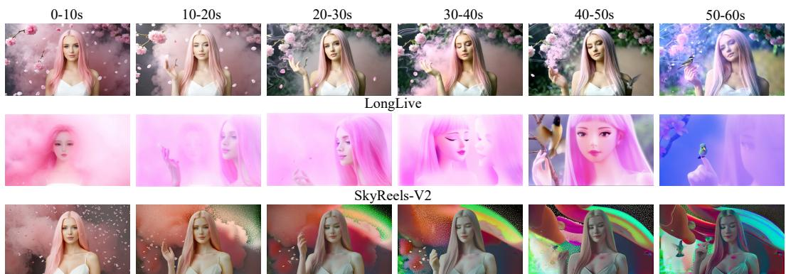
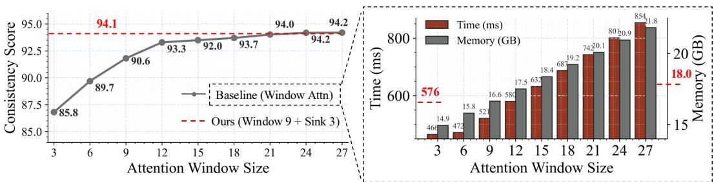

# 1. Bibliographic Information

## 1.1. Title
LongLive: Real-time Interactive Long Video Generation

The title clearly states the paper's focus: a framework named `LongLive` designed for generating long videos. It highlights two key characteristics: **real-time** performance, suggesting high efficiency, and **interactive** capabilities, implying users can influence the generation process as it happens.

## 1.2. Authors
Shuai Yang, Wei Huang, Ruihang Chu, Yicheng Xiao, Yuyang Zhao, Xianbang Wang, Muyang Li, Enze Xie, Yingcong Chen, Yao Lu, Song Han, and Yukang Chen.

The authors are affiliated with several prominent institutions in AI research: NVIDIA, MIT (Massachusetts Institute of Technology), HKUST(GZ) (The Hong Kong University of Science and Technology, Guangzhou), HKU (The University of Hong Kong), and THU (Tsinghua University). This collaboration between a leading industry research lab (NVIDIA) and top academic universities suggests a strong blend of practical engineering and theoretical rigor.

## 1.3. Journal/Conference
The paper was submitted to arXiv on September 26, 2025. This indicates it is a preprint and has not yet undergone formal peer review for an official conference or journal publication. Given the topic and the affiliations, it is likely intended for submission to a top-tier computer vision or machine learning conference such as CVPR, ICCV, NeurIPS, or ICLR.

## 1.4. Publication Year
2025 (based on the arXiv submission date).

## 1.5. Abstract
The paper introduces `LongLive`, a framework for generating long videos interactively and in real time. The authors identify key challenges in long video generation: diffusion-based models are high-quality but slow, while autoregressive (AR) models are faster but suffer from quality degradation over long sequences and memory issues during training. Furthermore, enabling real-time user interaction (e.g., changing prompts mid-generation) introduces complexities in maintaining visual consistency.

To solve these problems, `LongLive` uses a causal, frame-level autoregressive design with three core innovations:
1.  **`KV-recache`**: A mechanism that refreshes the model's memory (KV cache) with new prompts during generation, allowing for smooth and coherent transitions that adhere to user input.
2.  **`Streaming Long Tuning`**: A training strategy that enables the model to be trained on long video sequences, aligning the training process with the long-video inference task (`train-long-test-long`) to prevent quality decay.
3.  **`Short Window Attention` with `Frame Sink`**: An efficiency technique that restricts the model's attention to recent frames while anchoring it to the initial frames, preserving long-range consistency while significantly speeding up generation.

    The paper reports that `LongLive` can fine-tune a 1.3B parameter model in just 32 GPU-days, generate video at 20.7 frames per second (FPS) on an NVIDIA H100 GPU, support videos up to 240 seconds long, and perform well on the VBench benchmark. The model also supports INT8 quantization for further efficiency gains with minimal quality loss.

## 1.6. Original Source Link
-   **Original Source Link:** `https://arxiv.org/abs/2509.22622`
-   **PDF Link:** `https://arxiv.org/pdf/2509.22622v2.pdf`
-   **Publication Status:** This is a preprint available on arXiv. It has not yet been peer-reviewed or accepted for publication.

    ---

# 2. Executive Summary

## 2.1. Background & Motivation
The field of AI video generation has made remarkable progress, but creating **long**, **high-quality**, and **controllable** videos remains a major challenge. The core problems that `LongLive` aims to solve are:

1.  **The Efficiency-Quality Trade-off:**
    *   **Diffusion Models** (like Sora) produce stunningly realistic short clips but are extremely slow. Their underlying `bidirectional attention` mechanism requires processing the entire sequence at each step, preventing optimizations like KV caching and making real-time or long-form generation computationally prohibitive.
    *   **Autoregressive (AR) Models**, which generate frame-by-frame like a language model writes word-by-word, are much faster due to their `causal attention` structure and support for KV caching. However, they typically suffer from a **`train-short-test-long` problem**: models trained on short clips experience accumulating errors and quality degradation when asked to generate long videos.

2.  **The Challenge of Interactivity:**
    *   Static, one-shot generation (providing a single long prompt) is inflexible. Users often want to guide the narrative dynamically by providing new instructions *during* the generation process.
    *   Implementing this "streaming prompt" capability is difficult. If the model's memory (KV cache) is discarded when a new prompt arrives, the video will have an abrupt, jarring transition. If the memory is kept, the model may ignore the new prompt because its state is saturated with information from the old one.

        **`LongLive`'s Entry Point:** The paper's innovative idea is to build upon the efficient AR framework and systematically solve its key weaknesses. Instead of inventing a new architecture from scratch, it proposes a set of targeted techniques to enable real-time, interactive, and consistent long video generation.

## 2.2. Main Contributions / Findings
The paper presents three primary contributions, which collectively form the `LongLive` framework:

1.  **`KV-recache` for Seamless Interactivity:** This is a novel mechanism to resolve the prompt-switching dilemma. When a user provides a new prompt, `KV-recache` recomputes the model's KV cache using the already-generated frames and the new prompt's embedding. This "refreshes" the model's semantic understanding to follow the new instruction while preserving the visual context of the past, ensuring a smooth and coherent transition.

2.  **`Streaming Long Tuning` for Long-Horizon Consistency:** This training strategy bridges the `train-short-test-long` gap. Instead of training on isolated short clips, the model learns by continuously extending a video sequence in a rolling fashion, conditioning on its own previously generated (and imperfect) frames. This aligns the training process with the inference-time rollout, teaching the model to handle error accumulation and maintain quality over long durations without causing memory overloads.

3.  **`Frame Sink` and `Short Window Attention` for Real-Time Efficiency:** To achieve high FPS, `LongLive` uses `short window attention`, where each new frame only attends to a small number of recent frames. To prevent this from destroying long-range consistency (e.g., making a character's appearance change), it incorporates a `frame sink`, where the very first frames of the video are permanently kept in the attention window. These "sink" frames act as global anchors, maintaining scene and subject identity throughout the video.

**Key Findings:**
*   `LongLive` can generate high-quality videos up to 240 seconds long on a single H100 GPU.
*   It achieves a real-time inference speed of **20.7 FPS**, significantly outperforming previous models.
*   The combination of its core techniques leads to state-of-the-art results on the `VBench-Long` benchmark.
*   The framework successfully enables interactive generation, where video smoothly and accurately follows a sequence of changing prompts.

    ---

# 3. Prerequisite Knowledge & Related Work

## 3.1. Foundational Concepts

### 3.1.1. Video Generation Paradigms
-   **Diffusion Models:** These are generative models that learn to create data by reversing a noise-adding process. They start with random noise and iteratively "denoise" it, guided by a text prompt, until a clean video frame emerges. While known for producing high-quality and diverse outputs, this iterative process is computationally intensive and slow.
-   **Autoregressive (AR) Models:** These models generate data sequentially, one unit at a time. For video, this means generating frame $t$ based on the previously generated frames $1, 2, ..., t-1$. This is analogous to how large language models (LLMs) like GPT generate text word-by-word. AR models are inherently fast for generation because they only need one forward pass per unit.

### 3.1.2. Transformer Architecture and Attention
The Transformer is the dominant architecture in modern AI, used in both language and vision. Its core component is the **attention mechanism**.

-   **Self-Attention:** This mechanism allows a model to weigh the importance of different parts of an input sequence when producing an output. For each element in the sequence, it computes three vectors: a **Query (Q)**, a **Key (K)**, and a **Value (V)**. The Query represents the current element's "question" about other elements. The Keys from all other elements represent their "labels" or identifiers. The Values represent the actual content of the elements. The attention score is calculated by matching the Query with all Keys, and the output is a weighted sum of all Values.

    The standard scaled dot-product attention formula is:
\$
\mathrm{Attention}(Q, K, V) = \mathrm{softmax}\left(\frac{QK^T}{\sqrt{d_k}}\right)V
\$
-   **Symbol Explanation:**
    -   $Q$: The matrix of query vectors.
    -   $K$: The matrix of key vectors.
    -   $V$: The matrix of value vectors.
    -   $d_k$: The dimension of the key vectors. The scaling factor $\sqrt{d_k}$ stabilizes gradients during training.
    -   `softmax`: A function that converts a vector of scores into a probability distribution, ensuring the weights on the values sum to 1.

-   **Causal vs. Bidirectional Attention:**
    -   **Bidirectional Attention:** Each element can attend to all other elements in the sequence, both past and future. This is powerful for understanding context (like in BERT) but is slow for generation because the full sequence must be known. Diffusion models for video often use this.
    -   **Causal Attention:** Each element can only attend to past elements (and itself). This is essential for AR models, as future frames have not yet been generated. This structure is what allows for efficient generation.

### 3.1.3. KV Cache
The `KV Cache` is a critical optimization for AR models using causal attention. When generating the token (or frame) at step $t$, the model needs to compute attention over all previous tokens `1` to `t-1`. Without caching, the Key and Value vectors for all previous tokens would be recomputed at every single step. The `KV Cache` stores the K and V vectors for all previously generated tokens, so at step $t$, the model only needs to compute the Q, K, and V for the current token and reuse the cached K and V from the past. This turns a computation that is quadratic in sequence length at each step into one that is linear, drastically speeding up inference.

### 3.1.4. Attention Sink
Introduced in the context of LLMs (StreamingLLM), the `attention sink` phenomenon observes that even with causal attention, the very first few tokens in a sequence tend to receive a large amount of attention from all subsequent tokens. The `LongLive` paper leverages this by proposing a `frame sink`: purposely keeping the first few frames in the attention window, even when using a sliding window for efficiency. These sink frames act as global anchors, helping the model maintain long-range consistency (e.g., character identity, background) that would otherwise be lost.

## 3.2. Previous Works
The paper positions `LongLive` relative to three main categories of video generation models:

1.  **Diffusion Models:**
    *   Works like **Sora (OpenAI, 2024)** and **Wan2.1 (Wan et al., 2025)** are highlighted for their ability to produce high-quality videos. However, their reliance on `bidirectional attention` makes them very slow for inference, as they cannot use a `KV cache`. For instance, the paper notes that generating a 60-second video with a diffusion-based model can take up to 50 minutes on an H100 GPU.

2.  **Diffusion-Forcing and Hybrid AR Models:**
    *   This is an intermediate paradigm that tries to combine the quality of diffusion with the efficiency of AR models.
    *   **SkyReels-V2 (Chen et al., 2025a)** is a representative model. It uses a hybrid approach but is still noted as being slow (0.49 FPS).
    *   **Self-Forcing (Huang et al., 2025)** is a key related work that attempts to bridge the `train-test gap` in AR video diffusion by simulating inference conditions (using a KV cache and conditioning on model outputs) during training. However, it still trains on short rollouts, and the `LongLive` paper argues this is insufficient for true long-video consistency.

3.  **Causal AR Models:**
    *   These models are the most direct predecessors to `LongLive`.
    *   **CausVid (Yin et al., 2025)** reformulates video diffusion as a causal AR process, enabling faster generation.
    *   **MAGI-1 (Teng et al., 2025)** scales up AR video generation but has a clunky mechanism for interactive prompt switching, requiring manual adjustment of KV-cache windows, which is impractical.

## 3.3. Technological Evolution
The field has evolved from a focus on pure quality to a search for a balance between quality, efficiency, and controllability.
1.  **Early Stage (Quality-focused):** Diffusion models demonstrated that high-fidelity video generation was possible, but at great computational cost.
2.  **Middle Stage (Efficiency-focused):** AR models emerged as a faster alternative, but they struggled with consistency over long durations, creating a `train-short-test-long` problem.
3.  **Current Stage (Holistic Approach):** Researchers are now trying to create models that are high-quality, efficient, and interactive. `LongLive` fits squarely in this stage by taking the efficient AR paradigm and proposing concrete solutions to its major drawbacks (long-term degradation and poor interactivity).

## 3.4. Differentiation Analysis
`LongLive`'s innovations distinguish it from prior work in several key ways:
*   **vs. Diffusion Models:** `LongLive` is orders of magnitude faster (20.7 FPS vs. <1 FPS) due to its causal AR design and is inherently interactive.
*   **vs. Self-Forcing:** While `Self-Forcing` introduces the idea of aligning training with inference, `LongLive` takes it a step further with `streaming long tuning`, which explicitly trains on generating *long* sequences in a continuous rollout, better preparing the model for long-horizon tasks.
*   **vs. MAGI-1:** `LongLive`'s `KV-recache` provides an elegant, automated, and principled solution for interactive prompt switching, whereas `MAGI-1` requires manual, ad-hoc adjustments.
*   **vs. Other AR Models:** The combination of `short window attention` with a `frame sink` is a novel contribution in the video domain. The paper finds that the `frame sink` is only effective *after* the model has been trained on long rollouts via `streaming long tuning`, a key insight that previous works may have missed.

    ---

# 4. Methodology
The core methodology of `LongLive` consists of three synergistic components designed to enable real-time, interactive, and consistent long video generation within a causal autoregressive framework.

The overall workflow is depicted in Figure 1, where a user can input a series of prompts over time, and `LongLive` generates a continuous video that adapts to these changes in real time.

*该图像是LongLive的工作流程示意图，展示用户依次输入提示，LongLive实时生成对应视频的过程。示例展示Iron Man在战斗场景中的动态表现，支持最长可达240秒的视频生成。*

The internal framework, shown in Figure 2, illustrates how these components work together.

![Figure 2: The framework of LoNGLIVE. (Left) LoNGLIVE processes sequential user prompts and generates a corresponding long video using eficient short window attention and frame sink. Compared to the normal attention window of 5s, our short window only uses half the size, with the help of frame sink, which maintains the long-range consistency. (Right) To maintain consistency when the prompt switches, LoNGLIVE employs a KV-recache technique that updates cached key-value states by combining previous videos with new prompt embeddings through cross-attention layers.](images/2.jpg)
*该图像是LoNGLIVE框架的示意图，展示了如何处理用户的顺序提示以生成对应的长视频。左侧通过短窗口注意机制和帧汇聚进行视频生成，右侧示意KV重缓存技术以维持提示切换的一致性。*

## 4.1. KV Recache for Interactive Prompt Switching
The first major contribution, `KV Recache`, addresses the challenge of changing prompts during video generation.

### 4.1.1. The Problem with Existing Strategies
In a standard AR model with a `KV cache`, a prompt switch presents a dilemma:
*   **Discard Cache:** If you discard the entire `KV cache` at the switch point, the model loses all context from the previously generated frames. This allows it to adhere to the new prompt but results in an abrupt visual jump, breaking temporal continuity (Figure 3a).
*   **Retain Cache:** If you keep the `KV cache`, the visual transition is smooth. However, the cache is filled with information conditioned on the *old* prompt. This "prompt inertia" causes the model to either ignore the new prompt or adapt to it very slowly (Figure 3b).

### 4.1.2. The `KV Recache` Solution
`KV Recache` offers a "best of both worlds" solution. At the boundary of a prompt switch, the mechanism performs the following steps:
1.  It takes the sequence of video frames that have already been generated.
2.  It pairs this visual context with the embedding of the **new prompt**.
3.  It performs a forward pass through the model's cross-attention and self-attention layers with this new pairing to **recompute and rebuild** the entire `KV cache`.

    This process effectively "erases" the semantic residue of the old prompt from the cache while preserving the visual and motion cues from the recent video history. The newly refreshed cache contains the visual state of the ongoing video but is now semantically aligned with the new prompt, enabling a transition that is both smooth and adherent (Figure 3c).

The following figure from the paper provides a clear qualitative comparison of these strategies.

*该图像是图表，展示了不同 KV-cache 策略下的提示切换效果。图 (a) 显示在没有 KV-cache 下，新的提示切换效果突兀且视觉不一致；图 (b) 表示使用 KV-cache 时平滑过渡，但新提示未被遵循；图 (c) 展示了 KV re-cache，提供了视觉一致性和平滑过渡的新提示遵循。*

### 4.1.3. Training-Inference Alignment for `KV Recache`
To ensure the model learns how to handle this operation, `KV-recache` is integrated into the training loop. During training on a sequence with a prompt switch, the model performs the recache operation once at the switch point. The teacher model, which provides supervision, is also given the new prompt. This ensures the student model is supervised under the exact post-switch conditions it will encounter during interactive inference, eliminating any train-inference mismatch.

## 4.2. Streaming Long Tuning for Long-Horizon Consistency
The second key component, `Streaming Long Tuning`, is designed to solve the `train-short-test-long` problem where AR models degrade over long sequences.

### 4.2.1. The Problem with Naive Training
*   **`Train-Short-Test-Long`:** Models are typically trained on short clips (e.g., 5 seconds) due to memory constraints. When asked to generate long videos at inference, they must condition on their own, often imperfect, outputs. Errors accumulate, leading to content drift and a breakdown in quality.
*   **`Naive Long Tuning`:** Simply trying to train on a very long video sequence in one go is not feasible. It leads to out-of-memory (OOM) errors and is computationally wasteful. Furthermore, the "teacher" model used for supervision (often a larger, pre-trained model) is itself only reliable for short clips, so its guidance over a long sequence would be flawed.

### 4.2.2. The `Streaming Long Tuning` Solution
`Streaming Long Tuning` provides an efficient and effective way to train on long sequences, as illustrated in Figure 4 and detailed in Algorithm 1. The process works as follows:

1.  **Initialization:** The model starts by generating a short video clip (e.g., 5 seconds) from scratch.
2.  **Local Supervision:** A loss (e.g., from a teacher model via Distribution Matching Distillation or DMD) is computed and backpropagated for this short clip only.
3.  **Rolling Extension:** In the next iteration, the model uses the `KV cache` from the previous step to generate the *next* 5-second clip, extending the video.
4.  **Continuous Local Supervision:** The loss is again computed only for the newly generated 5-second clip. The previously generated frames are treated as a constant context (gradients are detached), so memory usage does not grow with the video length.
5.  **Repeat:** This process of extending and supervising locally is repeated until a target maximum length (e.g., 60 seconds) is reached, at which point the process restarts with a new data sample.

    This strategy perfectly mirrors the inference-time rollout, exposing the model to long, self-generated, and progressively noisy contexts during training. This alignment mitigates error accumulation and significantly improves long-video fidelity and consistency.

    
    *该图像是图表，展示了流式长调优的过程。分为三部分： (a) 短调优仅监督5秒片段，可能导致长视频质量损失；(b) 天真的长调优对长序列的单纯扩展导致错误的教师监督；(c) 流式长调优通过重复历史KV缓存生成下一个5秒片段并监督，有效训练长序列。*

The procedure is formalized in Algorithm 1 from the paper's appendix.

<table>
<tr><td><b>Algorithm 1</b> Streaming Long Tuning</td></tr>
<tr><td>

        <b>Require:</b> Causal video generator Gθ, Prompt set P 
        <b>Require:</b> Video length lvideo, Per clip length lclip 
        1: <b>while</b> not converged <b>do</b> 
        2: &nbsp;&nbsp;&nbsp;&nbsp;Initialize KV cache C ← [] 
        3: &nbsp;&nbsp;&nbsp;&nbsp;Initialize current video length l ← 0 
        4: &nbsp;&nbsp;&nbsp;&nbsp;Sample (p, pnext) ∼ P 
        5: &nbsp;&nbsp;&nbsp;&nbsp;Sample switch index s ∈ {1, 2, . . . , [lvideo/lclip] − 1} 
        6: &nbsp;&nbsp;&nbsp;&nbsp;s ← s · lclip 
        7: &nbsp;&nbsp;&nbsp;&nbsp;<b>if</b> l ≥ lvideo <b>then</b> 
        8: &nbsp;&nbsp;&nbsp;&nbsp;&nbsp;&nbsp;&nbsp;&nbsp;C ← []; l ← 0 
        9: &nbsp;&nbsp;&nbsp;&nbsp;&nbsp;&nbsp;&nbsp;&nbsp;Resample (p, pnext) and s 
        10: &nbsp;&nbsp;&nbsp;&nbsp;<b>end if</b> 
        11: &nbsp;&nbsp;&nbsp;&nbsp;pactive ← {p, if l < s; pnext, otherwise} 
        12: &nbsp;&nbsp;&nbsp;&nbsp;<b>if</b> l = s <b>then</b> 
        13: &nbsp;&nbsp;&nbsp;&nbsp;&nbsp;&nbsp;&nbsp;&nbsp;C ← recache(Gθ, v, C, pactive) 
        14: &nbsp;&nbsp;&nbsp;&nbsp;<b>end if</b> 
        15: &nbsp;&nbsp;&nbsp;&nbsp;x ← generate_next_clip(Gθ, C, pactive) 
        16: &nbsp;&nbsp;&nbsp;&nbsp;L ← DMD_LOSS(Gθ, x, pactive) 
        17: &nbsp;&nbsp;&nbsp;&nbsp;L.backward() 
        18: &nbsp;&nbsp;&nbsp;&nbsp;update generator parameter θ 
        19: &nbsp;&nbsp;&nbsp;&nbsp;l ← l + lclip 
        <b>end while</b>
    </td></tr>
</table>

## 4.3. Efficient Long Inference with `Short Window Attention` and `Frame Sink`
The final piece of the methodology focuses on achieving real-time inference speeds.

### 4.3.1. The Problem with Full Causal Attention
Even with a `KV cache`, the cost of attention grows with the sequence length because the Query from the current token must be compared against the Keys of all past tokens. For very long videos, this can still be a bottleneck.

### 4.3.2. The Combined Solution
`LongLive` uses two complementary techniques to address this:
1.  **`Short-window Attention`:** Instead of attending to the entire history of frames, the model's attention is restricted to a small, fixed-size local window of the most recent frames. This makes the computational complexity constant with respect to the total video length, dramatically improving speed and reducing memory usage. However, used alone, this can severely damage long-range temporal consistency, as the model quickly "forgets" distant but important context.

2.  **`Frame Sink`:** To counteract the negative effects of a short attention window, `LongLive` introduces a `frame sink`. The very first "chunk" of frames in the video is designated as sink tokens. These tokens are permanently retained in the `KV cache` and are made available to the attention mechanism at every step, regardless of the sliding window. These sink frames act as global anchors, providing persistent context about the scene, subject identity, and overall style.

    As shown in Figure 5, a short window alone degrades quality (middle row), but adding a `frame sink` restores long-range consistency while retaining the efficiency benefits of the short window (bottom row).

    
    *该图像是一个示意图，展示了在20秒生成视频中，长窗口注意力（窗口21）、短窗口注意力（窗口12）以及短窗口+帧汇（窗口9+帧汇3）的比较。短窗口提升了效率，但削弱了长程一致性；添加帧汇则恢复了一致性，同时保持效率提升。*

Crucially, these efficiency mechanisms are active **during `streaming long tuning`**. This means the model learns from the start to generate coherent long videos while relying on a small local window and a global frame sink. The paper notes that this training alignment is what makes the `frame sink` effective, a key finding that differentiates it from prior work where sinks were found to be insufficient.

---

# 5. Experimental Setup

## 5.1. Datasets

### 5.1.1. Training Data
`LongLive` does not use any new, external video datasets for training. Instead, it employs a fine-tuning approach on a pre-trained model.
*   **Base Model:** The experiments start with `Wan2.1-T2V-1.3B`, a model pre-trained to generate 5-second video clips.
*   **Prompt Data for Interactivity:** To train the interactive prompt-switching capability, the authors created a synthetic dataset of paired prompts. They started with prompts from the `VidProM` dataset and used a large language model, `Qwen2-72B-Instruct`, to generate a plausible "next scene" prompt for each original prompt. This creates pairs of $(prompt1, prompt2)$ that simulate a user changing their mind or continuing a story.

    An example of the template used to instruct the LLM is provided in Appendix E:
> You are a video-prompt generation specialist. Your task:
> *   Receive an ORIGINAL\_PROMPT for the first part of a continuous shot.
> *   Write one stand-alone English paragraph (80-100 words) that shows the next moment of the same shot.
> *   **Add exactly one new action/object for the existing main subject.**
> *   Keep setting, subject, mood, style, camera scale, and camera movement or angle exactly as in the ORIGINAL_PROMPT.
> *   ... (other constraints)

This approach allows for scalable and controlled creation of training data for interactive scenarios without requiring manually annotated video datasets.

### 5.1.2. Evaluation Data
*   **Short Video:** The standard prompt suite from **`VBench`** (Huang et al., 2024a) is used to evaluate 5-second video generation.
*   **Long Video:** The official prompt set from **`VBench-Long`** (Huang et al., 2024b) is used to evaluate 30-second single-prompt videos.
*   **Interactive Long Video:** Since no standard benchmark exists for this task, the authors curated a custom validation set of **160 interactive 60-second videos**, where each video is generated from six successive 10-second prompts.

## 5.2. Evaluation Metrics

### 5.2.1. Throughput (FPS)
-   **Conceptual Definition:** Frames Per Second measures the raw speed of the generation process. It quantifies how many video frames the model can produce in one second on a given hardware platform. A higher FPS is critical for real-time applications.
-   **Mathematical Formula:**
    \$
    \text{FPS} = \frac{\text{Total Generated Frames}}{\text{Total Generation Time (in seconds)}}
    \$
-   **Symbol Explanation:**
    -   `Total Generated Frames`: The total number of frames in the output video.
    -   `Total Generation Time`: The wall-clock time taken to generate the entire video.

### 5.2.2. VBench and VBench-Long Scores
-   **Conceptual Definition:** `VBench` is a comprehensive benchmark suite for evaluating video generation models across multiple dimensions. It uses a collection of pre-trained vision models to assess different aspects of the generated videos automatically. The metrics are grouped into broader categories like `Total Score`, `Quality Score`, and `Semantic Score`. Specific dimensions include:
    -   `Subject Consistency`: Whether the main subject maintains a consistent appearance.
    -   `Background Consistency`: Whether the background remains stable and consistent.
    -   `Motion Smoothness`: The quality and naturalness of the motion.
    -   `Aesthetic Quality`: The overall visual appeal of the video.
    -   `Imaging Quality`: Technical aspects like clarity and absence of artifacts.
-   **Mathematical Formula:** `VBench` does not have a single formula but is a suite of different metrics, each with its own scoring model. The final scores are typically normalized and aggregated.

### 5.2.3. CLIP Score
-   **Conceptual Definition:** The CLIP score measures the semantic alignment between a text prompt and a generated image or video. It leverages the CLIP (Contrastive Language-Image Pre-training) model, which learns a shared embedding space for text and images. A high CLIP score indicates that the content of the video closely matches the description in the prompt.
-   **Mathematical Formula:**
    \$
    \text{CLIP Score}(T, V) = 100 \times \cos(\text{Emb}_T(T), \text{Emb}_V(V))
    \$
-   **Symbol Explanation:**
    -   $T$: The input text prompt.
    -   $V$: The generated video (or frames from it).
    -   $\text{Emb}_T$: The text encoder of the CLIP model.
    -   $\text{Emb}_V$: The vision encoder of the CLIP model.
    -   $\cos(\cdot, \cdot)$: The cosine similarity function, which measures the angle between two vectors in the embedding space. A value closer to 1 means better alignment. The score is often scaled by 100.

## 5.3. Baselines
The paper compares `LongLive` against a range of representative open-source video generation models, categorized by their architecture:
*   **Diffusion Models:**
    *   `Wan2.1`: The base model that `LongLive` is fine-tuned from, serving as a powerful quality baseline.
    *   `LTX-Video`: Another recent diffusion-based model.
*   **Autoregressive and Hybrid Models:**
    *   `SkyReels-V2`: A diffusion-forcing model known for long video generation.
    *   `Self-Forcing`: A direct predecessor using an AR approach with a focus on bridging the train-test gap.
    *   `MAGI-1`: A large-scale AR model.
    *   `CausVid`, `NOVA`, `Pyramid Flow`: Other recent AR or flow-matching models.
*   **Image-to-Video (I2V) Model:**
    *   `FramePack`: An I2V model that extends an initial frame into a video. For a fair comparison in a text-to-video setting, an initial frame is first generated from the text prompt.

        These baselines provide a comprehensive comparison across different architectural paradigms, highlighting the trade-offs between speed, quality, and consistency.

---

# 6. Results & Analysis

## 6.1. Core Results Analysis

### 6.1.1. Short Video Generation (5 seconds)
The results in Table 1 show `LongLive`'s performance on standard short-video generation.
*   **Key Finding:** `LongLive` achieves a `Total Score` of **84.87** on VBench, which is competitive with the top-performing models, including its own base model `Wan2.1` (84.26) and `Self Forcing` (84.31). This demonstrates that the fine-tuning process for long video and interactivity did not compromise its core short-clip generation quality.
*   **Efficiency:** Most importantly, `LongLive` is by far the fastest model, achieving **20.7 FPS**. This is significantly faster than the base diffusion model `Wan2.1` (0.78 FPS) and even faster than other efficient AR models like `Self Forcing` (17.0 FPS), thanks to the `short-window attention` and `frame sink` optimizations.

### 6.1.2. Long Video Generation (30 seconds)
Table 3 evaluates single-prompt long-video generation on `VBench-Long`.
*   **Key Finding:** `LongLive` achieves the highest `Total Score` (**83.52**) among all compared models, outperforming specialized long-video models like `FramePack` (81.95) and `Self-Forcing` (81.59). This directly validates the effectiveness of the `streaming long tuning` strategy in maintaining quality and consistency over longer durations.
*   **Efficiency:** Once again, `LongLive` maintains its speed advantage with **20.7 FPS**, while competitors are significantly slower (e.g., `FramePack` at 0.92 FPS).

### 6.1.3. Interactive Long Video Generation (60 seconds)
Table 2 and Figure 6 analyze the most challenging task: a 60-second video with six sequential 10-second prompts.
*   **Quantitative Results (Table 2):** `LongLive` achieves the highest `Quality Score` (84.38) and demonstrates consistently high `CLIP Scores` across all six segments of the video. In contrast, the CLIP scores of competing models like `Self-Forcing` show more variability, suggesting `LongLive` is better at maintaining both quality and prompt adherence throughout the interactive session.
*   **Qualitative Results (Figure 6):** This figure visually compares `LongLive` with `SkyReels-V2` and `Self-Forcing`. The video generated by `LongLive` shows strong prompt compliance, smooth transitions between different actions, and high long-range consistency (the character and scene remain stable). In contrast, `SkyReels-V2` shows weaker consistency, and `Self-Forcing` exhibits quality degradation as the video gets longer.

    
    *该图像是一个示意图，展示了不同时间段（0-60秒）下，使用 LongLive 和 SkyReels-V2 生成的视频帧效果。上方为 LongLive 生成的帧，下方为 SkyReels-V2，展示了生成内容的动态变化和视觉风格。*

## 6.2. Data Presentation (Tables)
The following are the results from Table 1 of the original paper:

<table>
<thead>
<tr>
<th rowspan="2">Model</th>
<th rowspan="2">#Params</th>
<th rowspan="2">Resolution</th>
<th rowspan="2">Throughput (FPS) ↑</th>
<th colspan="3">Evaluation scores ↑</th>
</tr>
<tr>
<th>Total</th>
<th>Quality</th>
<th>Semantic</th>
</tr>
</thead>
<tbody>
<tr>
<td colspan="7"><b>Diffusion models</b></td>
</tr>
<tr>
<td>LTX-Video (HaCohen et al., 2025)</td>
<td>1.9B</td>
<td>768×512</td>
<td>8.98</td>
<td>80.00</td>
<td>82.30</td>
<td>70.79</td>
</tr>
<tr>
<td>Wan2.1 (Wan et al., 2025)</td>
<td>1.3B</td>
<td>832×480</td>
<td>0.78</td>
<td>84.26</td>
<td>85.30</td>
<td>80.09</td>
</tr>
<tr>
<td colspan="7"><b>Autoregressive models</b></td>
</tr>
<tr>
<td>SkyReels-V2 (Chen et al., 2025a)</td>
<td>1.3B</td>
<td>960×540</td>
<td>0.49</td>
<td>82.67</td>
<td>84.70</td>
<td>74.53</td>
</tr>
<tr>
<td>MAGI-1 (Teng et al., 2025)</td>
<td>4.5B</td>
<td>832×480</td>
<td>0.19</td>
<td>79.18</td>
<td>82.04</td>
<td>67.74</td>
</tr>
<tr>
<td>CausVid (Yin et al., 2025)</td>
<td>1.3B</td>
<td>832×480</td>
<td>17.0</td>
<td>81.20</td>
<td>84.05</td>
<td>69.80</td>
</tr>
<tr>
<td>NOVA (Deng et al., 2025)</td>
<td>0.6B</td>
<td>768×480</td>
<td>0.88</td>
<td>80.12</td>
<td>80.39</td>
<td>79.05</td>
</tr>
<tr>
<td>Pyramid Flow (Jin et al., 2025)</td>
<td>2B</td>
<td>640×384</td>
<td>6.7</td>
<td>81.72</td>
<td>84.74</td>
<td>69.62</td>
</tr>
<tr>
<td>Self Forcing, chunk-wise (Huang et al., 2025)</td>
<td>1.3B</td>
<td>832×480</td>
<td>17.0</td>
<td>84.31</td>
<td>85.07</td>
<td>81.28</td>
</tr>
<tr>
<td>Self Forcing, frame-wise (Huang et al., 2025)</td>
<td>1.3B</td>
<td>832×480</td>
<td>8.9</td>
<td>84.26</td>
<td>85.25</td>
<td>80.30</td>
</tr>
<tr>
<td><b>LongLive</b></td>
<td><b>1.3B</b></td>
<td><b>832×480</b></td>
<td><b>20.7</b></td>
<td><b>84.87</b></td>
<td><b>86.97</b></td>
<td><b>76.47</b></td>
</tr>
</tbody>
</table>

The following are the results from Table 2 of the original paper:

<table>
<thead>
<tr>
<th rowspan="2">Method</th>
<th rowspan="2">Quality Score ↑</th>
<th colspan="6">CLIP Score ↑</th>
</tr>
<tr>
<th>0-10 s</th>
<th>10-20 s</th>
<th>20-30 s</th>
<th>30-40 s</th>
<th>40-50 s</th>
<th>50-60 s</th>
</tr>
</thead>
<tbody>
<tr>
<td>SkyReels-V2 (Chen et al., 2025a)</td>
<td>80.49</td>
<td>20.96</td>
<td>22.51</td>
<td>25.78</td>
<td>18.45</td>
<td>19.57</td>
<td>19.61</td>
</tr>
<tr>
<td>Self-Forcing (Huang et al., 2025)</td>
<td>82.46</td>
<td>28.46</td>
<td>24.89</td>
<td>23.53</td>
<td>22.96</td>
<td>23.07</td>
<td>23.19</td>
</tr>
<tr>
<td><b>LongLive</b></td>
<td><b>84.38</b></td>
<td><b>28.85</b></td>
<td><b>25.68</b></td>
<td><b>24.64</b></td>
<td><b>24.23</b></td>
<td><b>24.32</b></td>
<td><b>24.32</b></td>
</tr>
</tbody>
</table>

The following are the results from Table 3 of the original paper:

| Model | Total Score ↑ | Quality Score ↑ | Semantic Score ↑ | Throughput (FPS) ↑ |
| :--- | :--- | :--- | :--- | :--- |
| SkyReels-V2 | 75.29 | 80.77 | 53.37 | 0.49 |
| FramePack | 81.95 | 83.61 | 75.32 | 0.92 |
| Self-Forcing | 81.59 | 83.82 | 72.70 | 17.0 |
| **LongLive** | **83.52** | **85.44** | **75.82** | **20.7** |

## 6.3. Ablation Studies / Parameter Analysis

### 6.3.1. Ablation on `KV Recache`
Table 4 analyzes the impact of different KV caching strategies at prompt switches.
*   **No KV cache:** Clearing the cache results in high prompt adherence (`CLIP Score` = 28.95) but low visual consistency (`Subject Consistency` = 89.59). The video "jumps."
*   **KV cache:** Retaining the cache gives high consistency (`Subject Consistency` = 93.69) but the model fails to follow the new prompt, resulting in a very low `CLIP Score` (25.92).
*   **KV recache (ours):** `LongLive`'s proposed method achieves the best of both worlds: high consistency (`Subject Consistency` = 94.04) and strong prompt adherence (`CLIP Score` = 27.87).

    The following are the results from Table 4 of the original paper:

    | Method | Background Consistency ↑ | Subject Consistency ↑ | CLIP Score ↑ |
    | :--- | :--- | :--- | :--- |
    | No KV cache | 92.75 | 89.59 | 28.95 |
    | KV cache | 94.77 | 93.69 | 25.92 |
    | **KV recache** | **94.81** | **94.04** | **27.87** |

### 6.3.2. Ablation on `Short-Window Attention` and `Frame Sink`
Figure 7 explores the trade-off between attention window size, consistency, and efficiency.
*   **Key Finding:** As the attention window size increases, consistency improves but at the cost of higher latency and memory usage. The crucial result is the $9+3$ configuration: a short local window of 9 latent frames combined with a 3-latent-frame `frame sink`. This setup achieves a consistency score nearly identical to a much larger 21-frame window while maintaining the low computational cost of a 12-frame window. This validates that the `frame sink` effectively mitigates the quality drop from using a short attention window.

    
    *该图像是图表，展示了短窗口大小和帧 sink 对一致性得分及时间和内存消耗的影响。结果表明，较小的窗口降低了一致性，而启用帧 sink 则缓解了这一下降。横坐标为注意力窗口大小，纵坐标为一致性得分及时间（毫秒）和内存（GB）。*

### 6.3.3. Analysis of LoRA Tuning and Quantization
The appendix provides further analysis on implementation choices.
*   **LoRA Tuning (Table A):** An ablation on the rank of the LoRA adapters shows that a rank of 256 offers the best trade-off, achieving performance close to full model fine-tuning while only training 27% of the parameters. This makes the `streaming long tuning` process much more efficient.
*   **INT8 Quantization (Table B):** Post-training quantization to INT8 reduces the model size from 2.7 GB to 1.4 GB and improves throughput, with only a marginal drop in the VBench `Total Score` (84.87 to 84.31). This demonstrates `LongLive`'s suitability for deployment in resource-constrained environments.

    ---

# 7. Conclusion & Reflections

## 7.1. Conclusion Summary
The paper successfully introduces `LongLive`, a novel framework that significantly advances the state of the art in long video generation by making it **real-time**, **interactive**, and **consistent**. By building on an efficient autoregressive architecture, the authors systematically address its core weaknesses through three key contributions:
1.  **`KV-recache`** enables smooth and prompt-adherent transitions during interactive sessions.
2.  **`Streaming Long Tuning`** bridges the train-test gap, allowing the model to maintain high quality over long durations.
3.  **`Short Window Attention` with a `Frame Sink`** provides a major boost in inference speed without sacrificing long-range consistency.

    Experimental results compellingly demonstrate that `LongLive` outperforms existing models in both speed and quality for long and interactive video generation tasks, achieving 20.7 FPS while supporting videos up to four minutes long on a single high-end GPU.

## 7.2. Limitations & Future Work
The authors provide a candid analysis of the model's limitations in Appendix M.
*   **Bounded by the Base Model:** `LongLive` is a fine-tuning scheme, not a new model trained from scratch. Its ultimate quality ceiling is therefore limited by the capabilities of the base model it starts with (`Wan2.1`). The fine-tuning process can teach the model to be more consistent over time and more interactive, but it cannot fundamentally fix systematic flaws (e.g., difficulty with certain concepts, inherent biases) of the base model.
*   **Self-Supervised Nature:** The training relies on a self-supervised distillation process (from a teacher model) and synthetically generated prompts. While this is data-efficient, it means the model's improvements are primarily in adaptation and stabilization, not in generating quality that surpasses the teacher on a per-clip basis.

    **Future Work:** The authors suggest that incorporating curated, high-quality supervised video data could be a path to break through the quality ceiling imposed by the base model and the self-supervised training paradigm.

## 7.3. Personal Insights & Critique
`LongLive` is an excellent example of pragmatic and impactful research that focuses on solving real-world usability problems.

**Inspirations:**
*   **Systematic Problem Solving:** The paper's strength lies in its clear diagnosis of the key bottlenecks in a promising technology (AR video generation) and the development of targeted, elegant solutions for each. This "fix-the-weakest-link" approach is highly effective.
*   **Importance of Training-Inference Alignment:** The success of `streaming long tuning` and the discovery that `frame sink` only works well with it highlights a critical principle in machine learning: the closer the training conditions are to the testing conditions, the better the model will perform.
*   **Elegance of `KV-recache`:** The `KV-recache` mechanism is a simple yet powerful idea for managing state in interactive generative models. This concept could be readily transferred to other domains, such as interactive story generation with LLMs or real-time music composition.

**Critique and Potential Issues:**
*   **Definition of "Interactivity":** The interactivity in `LongLive` is currently limited to discrete, sequential text prompts. This is a major step forward, but it is not the same as continuous, fine-grained control (e.g., controlling a character's movement with a joystick). Future work could explore more dynamic forms of interaction.
*   **Hardware Dependency:** The impressive "real-time" claim of 20.7 FPS is achieved on an NVIDIA H100, one of the most powerful and expensive GPUs available. The accessibility of such performance for average users or researchers remains a significant barrier.
*   **Evaluation of Interactivity:** Evaluating interactive systems is notoriously difficult. While the authors created a custom dataset and used CLIP scores, these metrics may not fully capture the nuances of a good interactive experience. The user study mentioned provides stronger evidence, but a more standardized benchmark for this task would be beneficial for the field.
*   **Bias from Prompt Generator:** The use of an LLM to generate training prompts is clever and scalable, but it also means any biases, stylistic quirks, or limitations of the LLM (`Qwen2-72B-Instruct`) could be baked into `LongLive`'s understanding of "plausible" scene transitions.