# LongLive：实时交互式长视频生成

杨帅¹³ 黄伟¹⁴ 朱瑞航⁵ 肖逸成⁵ 赵宇阳¹ 王显邦² 李慕阳² 谢恩泽¹ 陈英聪³ 陆尧¹ 韩松¹² 陈宇康¹ ¹ NVIDIA ² 麻省理工学院 ³ 香港科技大学（广州） ⁴ 香港大学 ⁵ 清华大学

# 摘要

我们提出了LoNGLIVE，这是一个用于实时和交互式长视频生成的帧级自回归（AR）框架。长视频生成在效率和质量上面临挑战。扩散模型和扩散强迫模型能够生成高质量视频，但由于双向注意力的影响，效率较低。因果注意力自回归模型支持键值缓存（KV caching）以实现更快的推理，但由于长视频训练时的内存挑战，在长视频上往往质量下降。此外，除了基于静态提示的生成，交互能力（如流式提示输入）对动态内容创作至关重要，使用户能够实时引导叙事。这一交互需求显著增加了复杂性，尤其是在确保提示切换期间的视觉一致性和语义连贯性方面。为了解决这些挑战，LoNGLIVE采用了因果的帧级自回归设计，集成了键值重新缓存机制，以便通过新的提示刷新缓存状态，实现平滑且一致的切换；流式长调优以支持长视频训练并对齐训练和推理（train-longtest-long）；以及短窗口注意力与帧级注意力汇流相结合（简称“帧汇”），在快速生成的同时保持长距离一致性。凭借这些关键设计，LoNGLIVE对一个13亿参数的短剪辑模型进行了微调，使其能够在仅32个GPU天内生成分钟长的视频。在推理时，LoNGLIVE在单个NVIDIA H100上保持$20.7 \ \mathrm{FPS}$，在短视频和长视频的VBench上均表现出色。LoNGLIVE支持在单个H100 GPU上生成最长240秒的视频。LoNGLIVE进一步支持INT8量化推理，质量损失仅为边际级别。代码、模型和演示页面可在 https://github.com/NVlabs/LongLive 获取。

  

Figure 1: The workflow of LoNGLIVE. LoNGLIVE accepts sequential user prompts and generates corresponding videos in real time, enabling user-guided long video generation. The 60-second sequence shown is an example, LoNGLIVE supports up to 240-second videos in a single H100 GPU.

# 1 引言

长视频生成对于推动创意、教育和电影应用至关重要。它使得连贯的故事叙述、更丰富的场景发展以及比短片更复杂的时间动态成为可能。然而，基于静态提示的生成在流程开始后限制了适应性。用户在单个步骤中很难构思出高度详细的长篇提示。除了简单地生成长视频之外，在生成过程中能够进行互动，例如在运行时实时输入提示，开启了适应性内容创作的新可能性。这种交互范式使用户能够引导叙事、调整视觉风格或即时引入新元素。因此，交互使长视频生成变得可控。

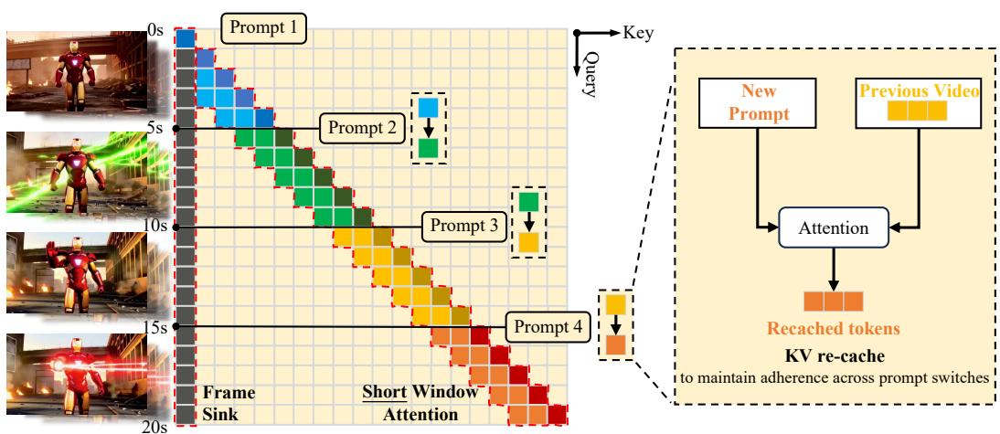  

Figure 2: The framework of LoNGLIVE. (Left) LoNGLIVE processes sequential user prompts and generates a corresponding long video using eficient short window attention and frame sink. Compared to the normal attention window of 5s, our short window only uses half the size, with the help of frame sink, which maintains the long-range consistency. (Right) To maintain consistency when the prompt switches, LoNGLIVE employs a KV-recache technique that updates cached key-value states by combining previous videos with new prompt embeddings through cross-attention layers.

互动长视频生成在质量和效率方面面临困难。从质量的角度来看，切换用户提示时保持平滑、一致和连贯的过渡是困难的。即使是视觉风格、动作连续性或场景布局的细微不匹配也会破坏叙事流，降低视频的整体真实感。从效率的角度来看，随着视频长度的增加，计算和内存需求迅速增加。例如，使用Wan-2.1（Wan等，2025）模型生成一段180秒的视频需要处理超过一百万个词元，这在计算上是不可行的。此外，在互动环境中，用户等待时间过长会严重降低整体用户体验。

现有的视频生成方法在长视频生成方面存在局限性。在基于扩散的视频生成模型（Wan et al., 2025；Kong et al., 2024；Yang et al., 2025；Wei et al., 2025；OpenAI, 2024；Kuaishou, 2024）和扩散强制模型（Chen et al., 2024a；2025a；Zhang & Agrawala, 2025）中，尽管它们能够生成高质量的短片段，但其对双向注意力的依赖使得推理效率低下。双向注意力阻止了 KV（键值）缓存技术的应用，导致冗余计算和长视频的高延迟。例如，SkyReels-V2（Chen et al., 2025a）在 H100 GPU 上生成 60 秒视频大约需要 50 分钟。对于具有因果注意力的 AR 模型，它们可以利用缓存的 KV 状态加速推理，但在生成长视频时，通常会表现出质量下降的情况。由于在长视频上直接训练的成本高，现有的 AR 模型（Huang et al., 2025；Teng et al., 2025）通常采用短训练-长测试策略。因此，随着视频长度的增加，质量逐渐下降。在涉及提示切换的交互设置中，误差累积和时间一致性的丧失进一步导致视觉伪影和不一致性。本文提出了 LoNGLIVE，一个实时交互的长视频生成框架，如图 1 所示。LoNGLIVE 是一种因果注意力、帧级 AR 视频生成模型，使其能够继承 KV 缓存机制以实现高效推理。我们的关键设计是 KV 重新缓存，如图 2 所示，通过结合新的提示嵌入更新缓存状态。该技术确保在交互设置中提示切换时的顺畅性和提示遵循性。此外，为了实现高效微调，我们提出了一种流式长调优策略，保持训练和推理之间的一致性（短训练-长测试-长推理），以解决长视频 AR 生成中常见的质量下降问题。为了高效推理，我们引入了短窗口注意力结合帧级注意力接收点（称为帧接收点），显著加速推理的同时保留性能。

在我们的实验中，LoNGLIvE在交互式长视频生成中提供了高效性和强大质量。在训练效率方面，我们对一个13亿参数的模型进行了微调，仅用32个GPU天便生成高质量的一分钟视频。对长视频的训练至关重要：它不仅提高了长时间跨度的保真度，还使得高效推理策略成为可能，这显著加速了解码。在推理效率方面，LoNGLIVE在单个NVIDIA H100上维持了$20.7 \ \mathrm{FPS}$，支持实时交互，并在吞吐量上优于最先进的方法。在质量方面，我们的框架在短视频和长视频设置中均取得了强大的VBench得分。LonGLivE扩展到生成长达240秒的视频，在单个H100 GPU上，同时保持高视觉保真度和时间一致性，能够有效处理长视频生成且几乎没有降级。此外，我们还在LoNGLIVE中实现了INT8量化推理，只有轻微的质量损失，具体见附录G。

# 2 相关工作

我们在这里介绍核心相关工作，并在附录D中提供详细的扩展讨论。越来越多的研究（Chen等，2024a；Song等，2025；Mao等，2025；Yuan等，2025；Zhang & Agrawala，2025；Gao等，2025；Henschel等，2025；Gao等，2025）将扩散建模与自回归（AR）预测相结合，这是一种介于纯粹扩散方法和纯粹自回归方法之间的中介范式。SkyReels-V2（Chen等，2025a）将扩散强制与电影结构规划器和多模态控制相结合。最近的研究（Yin等，2025；Huang等，2025；Gu等，2025；Teng等，2025）推动了基于因果自回归的长视频生成模型的发展。StreamDiT（Kodaira等，2025）训练了一个具有窗口注意力的扩散模型，但在长流中可能存在漂移或细节丢失的问题。最近，Self-forcing（Huang等，2025）通过在训练期间模拟推理条件，使用KV缓存生成，并基于模型输出进行条件设置，解决了自回归视频扩散中的训练测试差距。MAGI-1（Teng等，2025）通过分块预测将自回归视频生成扩展到大型模型和数据集，但其提示切换需要对不同步骤的KV缓存窗口进行手动调整。

# 3 方法

# 3.1 KV 重新缓存

因果自回归模型自然支持交互式提示切换，但这种能力是有限的。在切换时丢弃所有前一个 KV 缓存可以增强对新提示的遵循，但这会引入突然而显著的视觉变化和时间不连续性，如图 3 (a) 所示。相反，保留整个 KV 缓存通常会阻碍模型遵循新提示，或者在延迟后适应新提示，因为缓存中充满了来自先前提示的信息，如图 3 (b) 所示。基于这一观察，我们首先诊断为什么提示切换对流视频生成器来说很困难。在 DiT（Peebles & Xie, 2023）架构中，交叉注意力和自注意力层交替进行。在生成过程中，大量来自之前提示的信息通过交叉注意力层不断被注入，并通过自注意力向前传播，因此这个提示信号被写入到运行中的 KV 缓存中。因此，当提示切换时，模型在缓存中仍保留着旧提示的残余语义。在某些情况下，这导致对新提示的一致遵循受到影响。为了解决这个问题，我们引入了 KV 重缓存。在提示切换边界处，我们使用已经生成的帧和新的提示重新计算 KV 缓存，有效清除来自前一个提示的残余信息，同时保留保证时间连续性的运动和视觉线索。具体而言，在第一个切换后的帧，我们将生成的视频前缀编码为视觉上下文，并将其与下一个提示配对以重建缓存；随后步骤正常进行，利用这个刷新后的缓存。通过这种方式，缓存保留了正在进行的视频的视觉状态，但提示语义现在清晰地对应于活动提示，从而实现了更好的语义对齐，而没有视觉不连续性。

# 提示1

身穿笔挺西装的雄心勃勃的年轻男子双臂交叉，面带微笑，身后是一座繁忙的现代办公室。

# 提示2

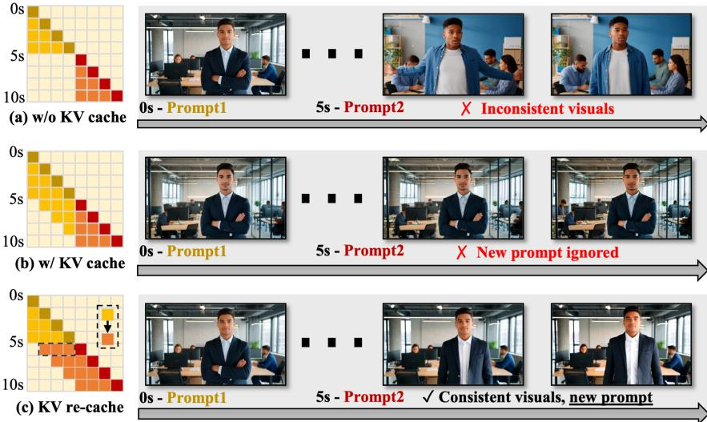  

Figure 3: Prompt switching under different KV-cache strategies. (a) w/o KV cache: New prompt takes effect, but transitions are abrupt and visuals are inconsistent. (b) w/ KV cache: Smooth continuity, but the new prompt is not followed (lag or ignore). (c) KV re-cache: Smooth, visually consistent transitions with full new-prompt compliance.

他放松了交叉的手臂，专注度增强，准备向团队发表讲话；背景是同一个办公室，镜头为中景，静止。为了确保训练与推理的一致性，我们将重缓存操作整合到训练循环中（图4）。当训练迭代中包含提示切换时，我们 (i) 执行一次重缓存，(ii) 使用更新后的缓存继续推演，以及 (iii) 在蒸馏中，将新提示输入教师模型，因此学生模型在推理时将受到与切换后条件完全一致的监督。这种训练方案进一步消除了训练与推理之间的不匹配。因此，经过重缓存训练的模型在推理时表现出强大的时间平滑性和快速的语义收敛性，如图3(c)所示。在效率方面，每个训练样本仅调用一次重缓存。因此，增加的成本是最小的；对于一段10秒的视频，只进行了一次切换，重缓存引入的额外时间成本大约为$6 \%$，与不使用重缓存相比。此外，尽管训练中对每个长序列只包含一个提示切换，但该机制在推理时也能很好地推广。模型支持多个提示切换的交互式推理，通过在每个边界执行一次重缓存步骤。给定$n + 1$个提示和$n$个切换点，生成器以因果方式推演，在每个切换点应用KV重缓存，并继续生成与活动提示语义一致的帧，同时保持平滑的过渡。此过程的详细说明见附录算法2。

# 3.2 流式长时微调

LongLive 构建在因果帧级 AR 视频生成器的基础上。这些模型仅在短片段上进行训练。推理时，它们通过一个固定长度的上下文窗口进行滚动，反复将模型自身的输出反馈给模型，从而生成长视频。随着推演的继续，小的预测误差会累积，窗口内的上下文逐渐变得嘈杂，因此模型依赖于一个退化的自生成历史。由于在训练中缺乏这样的长范围自生成上下文，这种短训练-长测试的模式导致内容漂移，并在长时间范围内破坏一致性。为了解决这个不匹配问题，我们提出了一种长训练-长测试的策略。在训练过程中，模型通过依赖自身的不完美预测来合成长序列，并在整个推演过程中施加监督。这使模型在训练过程中接触到既定的、自生成的、逐渐退化的帧，从而使训练与推理对齐，减少误差累积，从而提高逼真性和一致性。自监督(Huang et al., 2025) 方法能够避免收集大量长视频数据集。它不需要真实的视频数据：一个预训练的教师提供合成监督，引导学生匹配教师的输出分布。然而，该方法面临两个实际挑战。首先，教师通常仅在短片段上进行训练，因此无法可靠地端到端监督整个长序列。其次，天真的展开和反向传播长序列容易触发内存溢出 (OOM) 问题，并且计算上浪费。

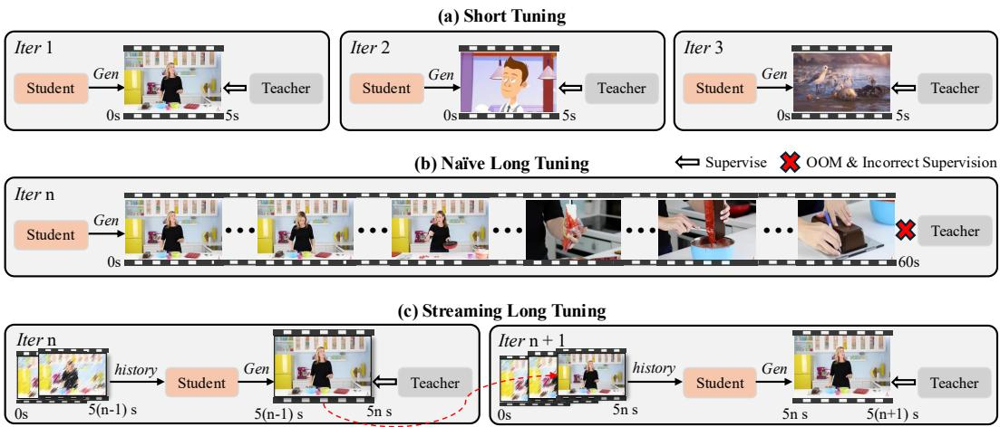  

Figure 4: The streaming long tuning pipeline. (a) Short tuning: only 5s clips are supervised, like Self-Forcing (Huang et al., 2025), leading to quality loss on long videos. (b) Naive long tuning: naively scaling to long sequences causes incorrect teacher supervision and ÓoM. (c) Streaming long tuning: our approach trains on long sequences by reusing the historical KV cache each iteration to generate the next 5s clip, then supervising it with the teacher.

为了解决这两个挑战，我们引入了一种流式长时间调优程序（图4），该程序在学习长视频的同时保持内存和监督的局部性及可靠性。在第一次迭代中，生成器从头开始抽取一个短视频片段（例如，5秒），并对这个短片段应用DMD（Yin等，2024b；a）。在随后的迭代中，生成器扩展前一次迭代的短片段，并基于之前存储的KV缓存生成下一个短片段，我们再次仅对新生成的片段应用DMD。我们重复这个滚动扩展，直到视频达到预设的最大长度，然后提取新的一批并重新开始。这个调度过程反映了推理时的推演，因此减少了训练和测试之间的不一致性。在每次迭代中，教师为当前短片段提供可靠的监督（在其擅长的领域），而每个片段的监督集合为整个序列提供全局指导。在实际操作中，我们将已经生成的帧分离，以使其作为一个常量因果上下文。梯度仅对当前生成的片段进行计算。因此，内存使用限制在片段持续时间内，避免了OOM。该过程的详细说明见附录算法1。我们的研究显示，在长视频上进行调优不仅对长视频生成的性能至关重要，而且是高效长推理策略的先决条件。这些策略包括窗口注意力和帧汇聚，显著提高了推理速度。

# 3.3 高效的长推理

短窗口注意力 在长视频生成中，密集因果注意力的计算成本随序列长度的增加呈平方增长，这使得在长视频上进行简单推理变得不可行。基于视频生成中的时间局部性现象：相邻帧对预测下一帧的贡献更大（Gu et al., 2025；Zhang & Agrawala, 2025），我们在推理和实时调优过程中采用局部窗口注意力。将注意力限制在固定的时间窗口内既可以减少计算量，也可以降低内存占用。注意力复杂度与窗口大小成正比，而不是与不断增长的序列长度成正比，并且每层所需的KV缓存与窗口而非整个视频的总长度成正比。然而，窗口大小引入了质量与效率之间的权衡。我们使用不同的注意力窗口设置生成了20秒的视频，如图5的第一行和第二行所示。更大的窗口保留了更多的时间上下文，产生了更强的长距离一致性，但会导致更高的延迟和内存占用。缩小窗口能够提高效率，但以一致性为代价，因为遥远但关键的线索会从感受野中消失。

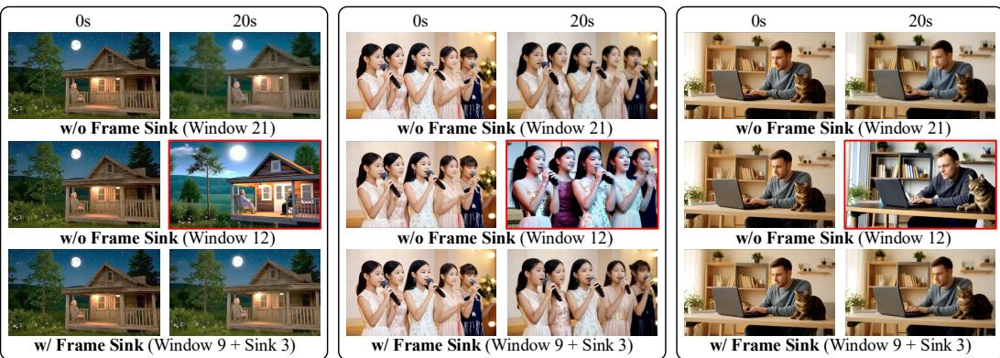  

Figure 5: Comparison in a 20-second generated video of long window attention (Window 21 latent frames), short-window attention (Window 12), and short-window $^ +$ frame-sink (Window $9 + \operatorname { S i n k } 3$ ). Shorter windows boost efficiency but weaken long-range consistency; adding a frame-sink restores consistency while keeping the efficiency gains.

帧接收器 之前的研究报告指出，仅使用注意力接收器的标记并不能防止视频模型中的长波动崩溃（Huang等，2025）。相比之下，我们通过经验发现，一旦通过流式长调优解决长波动崩溃，注意力接收器便变得有效。作为持久的全局锚点，注意力接收器显著改善了长距离时间一致性，从而减轻了短窗口注意力下的质量效率权衡。如图5第三行所示，在短窗口下添加帧接收器大大提升了长距离一致性，同时保持了低成本。具体而言，我们将视频的第一帧块固定为全局接收器标记；这些标记永久保留在KV缓存中，并与每个注意力块的键值连接，使它们即使在局部窗口注意力下也能够全局访问。KV缓存的其余部分使用短滚动窗口，并正常逐出。在实验中，具有帧接收器的短窗口在保留高长视频质量的同时，减少了单个H100 GPU的端到端计算时间$28\%$和峰值内存$17\%$。

训练与推理之间的一致性 我们将短窗口注意力和帧汇聚集成流式微调，以对齐训练与测试行为并提高效率。设局部注意力窗口为 $W$ 帧，教师模型的监督片段长度为 $T$ 帧。在每个训练步骤中，我们保留（i）前一个上下文的最后 $W$ 帧的 KV 缓存（不带梯度）和（ii）当前监督片段的完整 $T$ 帧 KV 缓存（带梯度）。我们还维护 $S$ 个汇聚标记（前两帧），这些标记永远不会被驱逐，并且被连接到每一层的 KV，以便它们保持全局可关注性。因此，每一步的驻留 KV 大小为 $O ( \dot { W } { + } \dot { T } { + } S )$，并不会随着视频总长度的增加而增长，从而避免在非常长的推理过程中出现内存不足问题。汇聚标记稳定了身份和场景语义，使我们能够以推理时使用的相同缩短窗口进行训练。对于 KV 重新缓存，我们仅从最近生成的 $W$ 帧重建缓存，这样可以刷新语义，同时保持局部连续性并节省重新缓存的成本。

# 4 实验

实现我们在 Wan2.1-T2V-1.3B 上构建 LoNGLIVE（Wan et al., 2025），该模型以 16 FPS 的速度生成 5 秒的剪辑，分辨率为 $8 3 2 \times 4 8 0$。我们首先使用自强（Huang et al., 2025）DMD 流水线将预训练模型适配为几步因果注意力模型，基于 VidProM（Wang & Yang, 2024）数据，同时启用我们的短窗口注意力和帧沉淀（我们将来自第一个帧块的所有词元作为沉淀词元）。然后，我们在包含单个提示切换的 60 秒序列上执行流式长调优。为了构建此切换提示数据集，我们提示 Qwen2-72B-Instruct（Yang et al., 2024a）生成基于每个原始 VidProM 提示的后续提示。在训练期间，每次迭代通过生成下一个 5 秒的视频剪辑来继续模型自身的推演，直到达到最大长度 60 秒；每个批次恰好包含一个提示切换，切换时间从 5 秒到 55 秒均匀采样。当发生切换时，我们应用 KV-recache。在流式长调优期间，我们还保持相同的短窗口注意力和帧沉淀设置。该训练过程在 $6 4 ~ \mathrm { H 1 0 0 }$ GPUs 上大约需要 12 小时。值得注意的是，LoNGLIVE 支持任何能够进行自回归推演并具备 KV 缓存的模型。我们在线性注意力自回归模型 SANA-Video（Chen et al., 2025b）上实现了 LoNGLIVE，进一步加速了长视频的生成。

Table 1: Comparison with relevant baselines. We compare LONGLIVE with representative opensource video generation models of similar parameter sizes and resolutions. Evaluation scores are calculated on the standard prompt suite of VBench (Huang et al., 2024a). FPS - a single H100 GPU.   

<table><tr><td rowspan="2">Model</td><td rowspan="2"></td><td rowspan="2">#Params Resolution</td><td rowspan="2">Throughput (FPS) ↑</td><td colspan="3">Evaluation scores ↑</td></tr><tr><td>Total</td><td>Quality</td><td>Semantic</td></tr><tr><td colspan="7">Diffusion models</td></tr><tr><td>LTX-Video (HaCohen et al., 2025)</td><td>1.9B</td><td>768×512</td><td>8.98</td><td>80.00</td><td>82.30</td><td>70.79</td></tr><tr><td>Wan2.1 (Wan et al., 2025)</td><td>1.3B</td><td>832×480</td><td>0.78</td><td>84.26</td><td>85.30</td><td>80.09</td></tr><tr><td colspan="7">Autoregressive models</td></tr><tr><td>SkyReels-V2 (Chen et al., 2025a)</td><td>1.3B</td><td>960×540</td><td>0.49</td><td>82.67</td><td>84.70</td><td>74.53</td></tr><tr><td>MAGI-1 (Teng et al., 2025)</td><td>4.5B</td><td>832×480</td><td>0.19</td><td>79.18</td><td>82.04</td><td>67.74</td></tr><tr><td>CausVid (Yin et al., 2025)</td><td>1.3B</td><td>832×480</td><td>17.0</td><td>81.20</td><td>84.05</td><td>69.80</td></tr><tr><td>NOVA (Deng et al., 2025)</td><td>0.6B</td><td>768×480</td><td>0.88</td><td>80.12</td><td>80.39</td><td>79.05</td></tr><tr><td>Pyramid Flow (Jin et al., 2025)</td><td>2B</td><td>640×384</td><td>6.7</td><td>81.72</td><td>84.74</td><td>69.62</td></tr><tr><td>Self Forcing, chunk-wise (Huang et al., 2025)</td><td>1.3B</td><td>832×480</td><td>17.0</td><td>84.31</td><td>85.07</td><td>81.28</td></tr><tr><td>Self Forcing, frame-wise (Huang et al., 2025)</td><td>1.3B</td><td>832×480</td><td>8.9</td><td>84.26</td><td>85.25</td><td>80.30</td></tr><tr><td>LongLive</td><td>1.3B</td><td>832×480</td><td>20.7</td><td>84.87</td><td>86.97</td><td>76.47</td></tr></table>

Table 2: Interactive long video evaluation: Quality scores are reported on the whole 60s sequence. CLIP scores are reported on 10s video segments with the same semantics ( $\uparrow$ higher is better).   

<table><tr><td rowspan="2">Method</td><td rowspan="2">Quality Score ↑</td><td colspan="6">CLIP Score ↑</td></tr><tr><td>0-10 s</td><td>10-20 s</td><td>20-30 s</td><td>30-40 s</td><td>40-50 s</td><td>50-60 s</td></tr><tr><td>SkyReels-V2 (Chen et al., 2025a)</td><td>80.49</td><td>20.96</td><td>22.51</td><td>25.78</td><td>18.45</td><td>19.57</td><td>19.61</td></tr><tr><td>Self-Forcing (Huang et al., 2025)</td><td>82.46</td><td>28.46</td><td>24.89</td><td>23.53</td><td>22.96</td><td>23.07</td><td>23.19</td></tr><tr><td>LongLivE</td><td>84.38</td><td>28.85</td><td>25.68</td><td>24.64</td><td>24.23</td><td>24.32</td><td>24.32</td></tr></table>

# 4.1 短视频生成

我们首先使用 LoNGLIVE 的官方提示在 VBench 上评估其短视频生成，并将其与相关的开放源视频生成模型进行比较，这些模型规模相似，包括 LTXVideo（HaCohen 等，2025）、Wan2.1（Wan 等，2025）、SkyReels-V2（Chen 等，2025a）、MAGI1（Teng 等，2025）、CausVid（Yin 等，2025）、NOVA（Deng 等，2025）、Pyramid Flow（Jin 等，2025）和 Self-forcing（Huang 等，2025）。所有分数均使用与 VBench 相同的数值系统进行归一化。在 5 秒长的片段中，LONGLIVE 在总分上与最强基线相匹配，展现了优异的质量和稳定性，如表 1 所示。得益于短窗口注意力设计，LONGLIVE 也是所有方法中速度最快的，实时推理达到 20.7 FPS。这表明 LoNGLIVE 并未降低短片生成能力。

# 4.2 长视频生成

我们使用LoNGLIvE的单提示长视频生成，在VBench-Long（Huang et al., 2024b）上进行评估，使用其官方提示集。对于每个提示，我们生成一个30秒的视频，并根据VBench-Long官方脚本将其拆分成剪辑。我们与三个具有代表性的开源模型进行比较：SkyReels-V2（Chen et al., 2025a）、FramePack（Zhang & Agrawala, 2025）和Self-Forcing（Huang et al., 2025）。由于FramePack是一个图像到视频（I2V）模型，我们首先从相同的文本提示合成一个初始帧，然后将其输入给FramePack；其他文本到视频（T2V）模型则直接从提示生成。我们在表3中报告了用于长时间跨度质量和一致性的标准VBench-Long指标。LoNGLIvE取得了最先进的性能，同时速度最快。

  
Self Forcing

0-10秒：特写镜头中的宁静模特，身穿白色长裙，身边飘落着樱花花瓣和柔和的粉色烟雾。 10-20秒：她缓缓抬起手，指尖轻触花瓣/柔和的粉色烟雾。 0秒，轻柔的微风轻拂她的面庞。 30-40秒：她在保持同样优雅姿势的同时，轻轻闭上眼睛。 40-50秒：她的手指轻轻触碰着细腻的粉色烟雾，一只小鸟飞翔而来。 5eo pe nbic

Figure 6: Qualitative comparison for interactive long video generation. LoNGLIVE exhibits strong prompt compliance, smooth transitions, and high long-range consistency while sustaining high throughput. Compared to ours, SkyReels-V2 shows weaker long-range consistency, and SelfForcing faces quality degradation on longer videos.

Table 3: Single-prompt 30s long video evaluation on VBench-Long.   

Table 4: Ablation study on KV recache. KV recache achieves the best consistency score and CLIP score.   

<table><tr><td>Model</td><td>Total Score ↑</td><td>Quality Score ↑</td><td>Semantic Score ↑</td><td>Throughput (FPS) ↑</td></tr><tr><td>SkyReels-V2</td><td>75.29</td><td>80.77</td><td>53.37</td><td>0.49</td></tr><tr><td>FramePack</td><td>81.95</td><td>83.61</td><td>75.32</td><td>0.92</td></tr><tr><td>Self-Forcing</td><td>81.59</td><td>83.82</td><td>72.70</td><td>17.0</td></tr><tr><td>LongLivE</td><td>83.52</td><td>85.44</td><td>75.82</td><td>20.7</td></tr></table>

<table><tr><td>Method</td><td>Background Consistency ↑</td><td>Subject Consistency ↑</td><td>CLIP Score ↑</td></tr><tr><td>No KV cache</td><td>92.75</td><td>89.59</td><td>28.95</td></tr><tr><td>KV cache</td><td>94.77</td><td>93.69</td><td>25.92</td></tr><tr><td>KV recache</td><td>94.81</td><td>94.04</td><td>27.87</td></tr></table>

# 4.3 互动长视频生成

对于具有多个提示切换的交互式长视频，目前少数现有方法支持真实流式生成。我们为两个代表性基线实现了这一设置：SkyReels-V2 和 Self-Forcing。然后，我们将我们的方法与它们进行对比。因为标准的 VBench 协议不直接适用，我们创建了一组定制的 160 个交互式 60 秒视频，每个视频包含六个连续的 10 秒提示作为验证集。为了评估长时间段的质量，我们在支持定制提示视频的 VBench-Long 维度上评估我们的 60 秒交互式视频，包括主题一致性、背景一致性、运动平滑性、美学质量和成像质量。为了评估语义遵循，我们在提示边界对每个视频进行分段，并使用 CLIP（Radford et al.，2021）的得分计算每个片段的语义得分。定性和定量结果分别显示在图 6 和表 2 中。LONGLIVE 展现出强大的提示遵循性、平滑的过渡和高长距离一致性，同时维持高吞吐量。相比之下，Self-Forcing 在较长时间段上表现下降，而 SkyReels-v2 体现出较弱的一致性。在速度方面，LONGLIVE 的速度超过了 SkyReels-v2 的 $4 1 \times$，并且比 Self-Forcing 稍快，即使在 KV 再缓存的情况下，这得益于我们短窗口注意力设计。有关交互式长视频生成的更多定性比较，请参见我们的项目页面。最后，参与者对整体质量、运动质量、指令遵循和视觉质量进行评分的用户研究（即图 1（右））进一步支持了我们方法的有效性。

  

Figure 7: Ablation study on short window size and frame sink. Smaller windows reduce consistency, while enabling frame sink mitigates the drop.

# 4.4 KV 重新缓存

在表4中，我们在一个10秒的视频设置中对提示切换下的KV缓存策略进行消融实验，该实验在第5秒处进行了单次切换。我们比较了以下几种情况：(i) 无KV缓存：在切换时清空整个缓存；(ii) KV缓存：保持整个缓存不变；以及 (iii) KV重新缓存（我们的方案）：通过重新计算与前面帧和新提示条件相关的键值状态来刷新缓存。我们评估了视觉一致性，包括VBench背景一致性和主体一致性，并通过CLIP模型测量语义得分。清空缓存会破坏长距离一致性，导致视觉的突然变化。保留缓存可以维持连续性，但会引发提示惯性：模型坚持于先前的提示，从而在切换提示时获得较低的语义得分。我们的KV重新缓存在保持连续性的同时恢复了对切换提示的符合性。有关KV重新缓存的更多定性比较，请参见图3、附录图D和演示页面。

# 4.5 短窗口注意力与帧汇聚

在图7中，我们在10秒生成设置下分析了短窗口注意力和帧汇聚。我们将局部注意力窗口从3个到27个潜在帧进行变化，并额外评估一个包含9个局部潜在帧和3个汇聚潜在帧（有效窗口大小为12）的配置。长距离一致性使用VBench-Long（Huang et al., 2024b）进行测量（背景一致性和主体一致性）。随着注意力窗口的增大，一致性得到了提升，并在24帧窗口附近趋于饱和，显示出明显的质量—效率权衡：较大的窗口保留更多的时间上下文，但增加了延迟和内存，而较小的窗口则成本较低，但一致性较差。我们的帧汇聚机制通过在不关注完整历史的情况下恢复长距离上下文，减轻了这种权衡：$9 { \mathrm { - l o c a l } } + 3$ -汇聚设置在保持短窗口的速度和内存占用的同时，达到了接近21帧窗口的一致性。

# 5 结论

在本研究中，我们介绍了LoNGLIVE，一个用于实时和交互式长视频生成的帧级增强现实框架。为了在交互环境中随提示切换保持视觉平滑性和语义一致性，我们提出了一种KV缓存技术。我们提出了一种流式长调优策略，能够直接在长视频上进行训练，从而确保高质量输出。我们进一步引入了短窗口注意力和帧汇聚，以加速长视频生成，同时保持视觉一致性。实验结果表明，LoNGLIVE可以在仅32个GPU天内高效微调模型以生成长视频增强现实。此外，在长视频上进行调优不仅对长视频生成至关重要，而且是高效推理（例如，使用帧注意力汇聚的窗口注意力）的前提，从而大幅提高推理速度。在推理过程中，它在单个NVIDIA H100 GPU上达到了20.7 FPS的推理速度，并支持高达240秒的视频生成，同时保持高保真度和时间一致性。使用INT8量化，LoNGLIVE的体积从2.7 GB压缩至$1.4 \mathrm{GB}$，且性能下降很小。LoNGLIVE还支持INT8量化推理，仅造成轻微的质量损失。我们在附录中提供了进一步的结果、分析、实施细节和定性展示。

# REFERENCES

Boyuan Chen, Diego Marti Monso, Yilun Du, Max Simchowitz, Russ Tedrake, and Vincent Sitzmann. Diffusion forcing: Next-token prediction meets full-sequence diffusion. In NeurIPS, 2024a.

Guibin Chen, Dixuan Lin, Jiangping Yang, Chunze Lin, Junchen Zhu, Mingyuan Fan, Hao Zhang, Sheng Chen, Zheng Chen, Chengcheng Ma, Weiming Xiong, Wei Wang, Nuo Pang, Kang Kang, Zhiheng Xu, Yuzhe Jin, Yupeng Liang, Yubing Song, Peng Zhao, Boyuan Xu, Di Qiu, Debang Li, Zhengcong Fei, Yang Li, and Yahui Zhou. Skyreels-v2: Infinite-length film generative model. CoRR, abs/2504.13074, 2025a.

Junsong Chen, Yuyang Zhao, Jincheng Yu, Ruihang Chu, Junyu Chen, Shuai Yang, Xianbang Wang, Yicheng Pan, Daquan Zhou, Huan Ling, Haozhe Liu, Hongwei Yi, Hao Zhang, Muyang Li, Yukang Chen, Han Cai, Sanja Fidler, Ping Luo, Song Han, and Enze Xie. Sana-video: Efficient video generation with block linear diffusion transformer, 2025b. URL https://arxiv.org/abs/2509. 24695.

Xinyuan Chen, Yaohui Wang, Lingjun Zhang, Shaobin Zhuang, Xin Ma, Jiashuo Yu, Yali Wang, Dahua Lin, Yu Qiao, and Ziwei Liu. SEINE: short-to-long video diffusion model for generative transition and prediction. In ICLR, 2024b.

Yukang Chen, Shengju Qian, Haotian Tang, Xin Lai, Zhijian Liu, Song Han, and Jiaya Jia. Longlora: Efficient fine-tuning of long-context large language models. In ICLR, 2024c.

Karan Dalal, Daniel Koceja, Jiarui Xu, Yue Zhao, Shihao Han, Ka Chun Cheung, Jan Kautz, Yejin Choi, Yu Sun, and Xiaolong Wang. One-minute video generation with test-time training. In CVPR, pp. 1770217711, 2025.

Haoge Deng, Ting Pan, Haiwen Diao, Zhengxiong Luo, Yufeng Cui, Huchuan Lu, Shiguang Shan, Yonggang Qi, and Xinlong Wang. Autoregressive video generation without vector quantization. In ICLR, 2025.

Ruili Feng, Han Zhang, Zhantao Yang, Jie Xiao, Zhilei Shu, Zhiheng Liu, Andy Zheng, Yukun Huang, Yu Liu, and Hongyang Zhang. The matrix: Infinite-horizon world generation with realtime moving control. CoRR, abs/2412.03568, 2024.

Jianxiong Gao, Zhaoxi Chen, Xian Liu, Jianfeng Feng, Chenyang Si, Yanwei Fu, Yu Qiao, and Ziwei Liu. Longvie: Multimodal-guided controllable ultra-long video generation. CoRR, abs/2508.03694, 2025.

Yuchao Gu, Weijia Mao, and Mike Zheng Shou. Long-context autoregressive video modeling with next-frame prediction. CoRR, abs/2503.19325, 2025.

Yuwei Guo, Ceyuan Yang, Ziyan Yang, Zhibei Ma, Zhijie Lin, Zhenheng Yang, Dahua Lin, and Lu Jiang. Long context tuning for video generation. CoRR, abs/2503.10589, 2025.

Yoav HaCohen, Nisan Chiprut, Benny Brazowski, Daniel Shalem, Dudu Moshe, Eitan Richardson, Eran Levin, Guy Shiran, Nir Zabari, Ori Gordon, Poriya Panet, Sapir Weissbuch, Victor Kulikov, Yaki Bitterman, Zeev Melumian, and Ofir Bibi. Ltx-video: Realtime video latent diffusion. CoRR, abs/2501.00103, 2025.

Yingqing He, Tianyu Yang, Yong Zhang, Ying Shan, and Qifeng Chen. Latent video diffusion models for high-fidelity long video generation. CoRR, abs/2211.13221, 2022.

Roberto Henschel, Levon Khachatryan, Hayk Poghosyan, Daniil Hayrapetyan, Vahram Tadevosyan, Zhangyang Wang, Shant Navasardyan, and Humphrey Shi. Streamingt2v: Consistent, dynamic, and extendable long video generation from text. In CVPR, pp. 25682577, 2025.

Xun Huang, Zhengqi Li, Guande He, Mingyuan Zhou, and Eli Shechtman. Self forcing: Bridging the train-test gap in autoregressive video diffusion. CoRR, abs/2506.08009, 2025.

Ziqi Huang, Yinan He, Jiashuo Yu, Fan Zhang, Chenyang Si, Yuming Jiang, Yuanhan Zhang, Tianxing Wu, Qingyang Jin, Nattapol Chanpaisit, Yaohui Wang, Xinyuan Chen, Limin Wang, Dahua Lin, Yu Qiao, and Ziwei Liu. VBench: Comprehensive benchmark suite for video generative models. In CVPR, 2024a.

Ziqi Huang, Fan Zhang, Xiaojie Xu, Yinan He, Jiashuo Yu, Ziyue Dong, Qianli Ma, Nattapol Chanpaisit, Chenyang Si, Yuming Jiang, Yaohui Wang, Xinyuan Chen, Ying-Cong Chen, Limin Wang, Dahua Lin, Yu Qiao, and Ziwei Liu. Vbench $^ { + + }$ :Comprehensive and versatile benchmark suite for video generative models. CoRR, abs/2411.13503, 2024b.

Yang Jin, Zhicheng Sun, Ningyuan Li, Kun Xu, Hao Jiang, Nan Zhuang, Quzhe Huang, Yang Song, Yadong Mu, and Zhouchen Lin. Pyramidal flow matching for efficient video generative modeling. In ICLR, 2025.

Akio Kodaira, Tingbo Hou, Ji Hou, Masayoshi Tomizuka, and Yue Zhao. Streamdit: Real-time streaming text-to-video generation. CoRR, abs/2507.03745, 2025.

Weijie Kong, Qi Tian, Zijian Zhang, Rox Min, Zuozhuo Dai, Jin Zhou, Jiangfeng Xiong, Xin Li, Bo Wu, Jianwei Zhang, Kathrina Wu, Qin Lin, Junkun Yuan, Yanxin Long, Aladdin Wang, Andong Wang, Changlin Li, Duojun Huang, Fang Yang, Hao Tan, Hongmei Wang, Jacob Song, Jiawang Bai, Jianbing Wu, Jinbao Xue, Joey Wang, Kai Wang, Mengyang Liu, Pengyu Li, Shuai Li, Weiyan Wang, Wenqing Yu, Xinchi Deng, Yang Li, Yi Chen, Yutao Cui, Yuanbo Peng, Zhentao Yu, Zhiyu He, Zhiyong Xu, Zixiang Zhou, Zunnan Xu, Yangyu Tao, Qinglin Lu, Songtao Liu, Daquan Zhou, Hongfa Wang, Yong Yang, Di Wang, Yuhong Liu, Jie Jiang, and Caesar Zhong. Hunyuanvideo: A systematic framework for large video generative models. CoRR, abs/2412.03603, 2024.

Kuaishou. Kling ai: Next-generation ai creative studio, 2024.

Muyang $\mathrm { L i ^ { * } }$ , Yujun Lin\*, Zhekai Zhang\*, Tianle Cai, Xiuyu Li, Junxian Guo, Enze Xie, Chenlin Meng, Jun-Yan Zhu, and Song Han. Svdquant: Absorbing outliers by low-rank components for 4-bit diffusion models. In The Thirteenth International Conference on Learning Representations, 2025.

Yu Lu and Yi Yang. Freelong $^ { + + }$ : Training-free long video generation via multi-band spectralfusion. CoRR, abs/2507.00162, 2025.

Yu Lu, Yuanzhi Liang, Linchao Zhu, and Yi Yang. Freelong: Training-free long video generation with spectralblend temporal attention. In NeurIPS, 2024.

Xiaofeng Mao, Shaoheng Lin, Zhen Li, Chuanhao Li, Wenshuo Peng, Tong He, Jiangmiao Pang, Mingmin Chi, Yu Qiao, and Kaipeng Zhang. Yume: An interactive world generation model. CoRR, abs/2507.17744, 2025.

OpenAI. Sora: Creating video from text, 2024.

OpenAI. Introducing GPT-5, aug 2025. Accessed: 2025-09-21.

William Peebles and Saining Xie. Scalable diffusion models with transformers. In ICCV, pp. 4172 4182, 2023.

Haonan Qiu, Menghan Xia, Yong Zhang, Yingqing He, Xintao Wang, Ying Shan, and Ziwei Liu. Freenoise: Tuning-free longer video diffusion via noise rescheduling. In ICLR, 2024.

Alec Radford, Jong Wook Kim, Chris Hallacy, Aditya Ramesh, Gabriel Goh, Sandhini Agarwal, Girish Sastry, Amanda Askell, Pamela Mishkin, Jack Clark, Gretchen Krueger, and Ilya Sutskever. Learning transferable visual models from natural language supervision. In ICML, volume 139, pp. 87488763, 2021.

Kiwhan Song, Boyuan Chen, Max Simchowitz, Yilun Du, Russ Tedrake, and Vincent Sitzmann. History-guided video diffusion. CoRR, abs/2502.06764, 2025.

Hansi Teng, Hongyu Jia, Lei Sun, Lingzhi Li, Maolin Li, Mingqiu Tang, Shuai Han, Tianning Zhang, W. Q. Zhang, Weifeng Luo, Xiaoyang Kang, Yuchen Sun, Yue Cao, Yunpeng Huang, Yutong Lin, Yuxin Fang, Zewei Tao, Zheng Zhang, Zhongshu Wang, Zixun Liu, Dai Shi, Guoli Su, Hanwen Sun, Hong Pan, Jie Wang, Jiexin Sheng, Min Cui, Min Hu, Ming Yan, Shucheng Yin, Siran Zhang, Tingting Liu, Xianping Yin, Xiaoyu Yang, Xin Song, Xuan Hu, Yankai Zhang, and Yuqiao Li. MAGI-1: autoregressive video generation at scale. CoRR, abs/2505.13211, 2025.

Ruben Villegas, Mohammad Babaeizadeh, Pieter-Jan Kindermans, Hernan Moraldo, Han Zhang, Mohammad Taghi Saffar, Santiago Castro, Julius Kunze, and Dumitru Erhan. Phenaki: Variable length video generation from open domain textual descriptions. In ICLR, 2023.

Team Wan, Ang Wang, Baole Ai, Bin Wen, Chaojie Mao, Chen-Wei Xie, Di Chen, Feiwu Yu, Haiming Zhao, Jianxiao Yang, et al. Wan: Open and advanced large-scale video generative models. arXiv preprint arXiv:2503.20314, 2025.

Wenhao Wang and Yi Yang. Vidprom: A million-scale real prompt-gallery dataset for text-to-video diffusion models. 2024.

Yaohui Wang, Xinyuan Chen, Xin Ma, Shangchen Zhou, Ziqi Huang, Yi Wang, Ceyuan Yang, Yinan He, Jiashuo Yu, Peiqing Yang, Yuwei Guo, Tianxing Wu, Chenyang Si, Yuming Jiang, Cunjian Chen, Chen Change Loy, Bo Dai, Dahua Lin, Yu Qiao, and Ziwei Liu. Lavie: High-quality video generation with cascaded latent diffusion models. Int. J. Comput. Vis., 133(5):30593078, 2025.

Cong Wei, Bo Sun, Haoyu Ma, Ji Hou, Felix Juefei-Xu, Zecheng He, Xiaoliang Dai, Luxin Zhang, Kunpeng Li, Tingbo Hou, Animesh Sinha, Peter Vajda, and Wenhu Chen. Mocha: Towards movie-grade talking character synthesis. CoRR, abs/2503.23307, 2025.

An Yang, Jinze Bai, et al. Qwen2 technical report. arXiv, 2024a.

Shuai Yang, Yukang Chen, Luozhou Wang, Shu Liu, and Yingcong Chen. Denoising diffusion step-aware models. arXiv preprint arXiv:2310.03337, 2023.

Shuai Yang, Yuying Ge, Yang Li, Yukang Chen, Yixiao Ge, Ying Shan, and Yingcong Chen. Seed-story: Multimodal long story generation with large language model. arXiv preprint arXiv:2407.08683, 2024b.

Yi Yang, Yueting Zhuang, and Yunhe Pan. Multiple knowledge representation for big data artificial intelligence: framework, applications, and case studies. Frontiers of Information Technology & Electronic Engineering, 22(12):15511558, 2021.

Zhuoyi Yang, Jiayan Teng, Wendi Zheng, Ming Ding, Shiyu Huang, Jiazheng Xu, Yuanming Yang, Wenyi Hong, Xiaohan Zhang, Guanyu Feng, Da Yin, Yuxuan Zhang, Weihan Wang, Yean Cheng, Bin Xu, Xiaotao Gu, Yuxiao Dong, and Jie Tang. Cogvideox: Text-to-video diffusion models with an expert transformer. In ICLR, 2025.

Shengming Yin, Chenfei Wu, Huan Yang, Jianfeng Wang, Xiaodong Wang, Minheng Ni, Zhengyuan Yang, Linjie Li, Shuguang Liu, Fan Yang, Jianlong Fu, Ming Gong, Lijuan Wang, Zicheng Liu, Houqiang Li, and Nan Duan. NUWA-XL: diffusion over diffusion for extremely long video generation. In Anna Rogers, Jordan L. Boyd-Graber, and Naoaki Okazaki (eds.), ACL, pp. 1309 1320, 2023.

Tianwei Yin, Michaël Gharbi, Taesung Park, Richard Zhang, Eli Shechtman, Frédo Durand, and William T. Freeman. Improved distribution matching distillation for fast image synthesis. In NeurIPS, volume 37, 2024a.

Tianwei Yin, Michaël Gharbi, Richard Zhang, Eli Shechtman, Frédo Durand, William T. Freeman, and Taesung Park. One-step diffusion with distribution matching distillation. In CVPR, pp. 6613 6623, 2024b.

Tianwei Yin, Qiang Zhang, Richard Zhang, William T Freeman, Fredo Durand, Eli Shechtman, and Xun Huang. From slow bidirectional to fast autoregressive video diffusion models. In CVPR, 2025.

Hangjie Yuan, Weihua Chen, Jun Cen, Hu Yu, Jingyun Liang, Shuning Chang, Zhihui Lin, Tao Feng, Pengwei Liu, Jiazheng Xing, Hao Luo, Jiasheng Tang, Fan Wang, and Yi Yang. Lumos-1: On autoregressive video generation from a unified model perspective. CoRR, abs/2507.08801, 2025.

Lvmin Zhang and Maneesh Agrawala. Packing input frame context in next-frame prediction models for video generation. CoRR, abs/2504.12626, 2025.

Yifan Zhang, Chunli Peng, Boyang Wang, Puyi Wang, Qingcheng Zhu, Fei Kang, Biao Jiang, Zedong Gao, Eric Li, Yang Liu, and Yahui Zhou. Matrix-game: Interactive world foundation model. CoRR, abs/2506.18701, 2025.

Min Zhao, Guande He, Yixiao Chen, Hongzhou Zhu, Chongxuan Li, and Jun Zhu. Riflex: A free lunch for length extrapolation in video diffusion transformers. CoRR, abs/2502.15894, 2025.

Deyu Zhou, Quan Sun, Yuang Peng, Kun Yan, Runpei Dong, Duomin Wang, Zheng Ge, Nan Duan, Xiangyu Zhang, Lionel M. Ni, and Heung-Yeung Shum. Taming teacher forcing for masked autoregressive video generation, 2025. URL https://arxiv.org/abs/2501.12389.

# APPENDIX

# A ETHicS StATEmENT

This study uses a self-supervised, efficient fine-tuning procedure and does not introduce any additional external video datasets for training. All text prompts leveraged in self-supervised training, generated from Qwen2-72B-Instruct (Yang et al., 2024a), are clean, safe, and for academic research purposes only.

# B REPRODUCIBILITY STATEMENT

To facilitate reproducibility, we will open-source this project, including both training and inference code as well as model weights. In addition, we provide the full training procedure and implementation details in Section 4 and Section F.

# C Use of Large Language Models

During manuscript preparation, we used large language models—GPT-5 (OpenAI, 2025)—strictly for language polishing of paragraphs and sentences (grammar, flow, and tone). These tools were not used to generate ideas, design experiments, or determine conclusions. All technical content, methodology, and interpretations were written, verified, and approved by the authors. To reduce risks of factual drift or citation errors, we required human review of every model-edited sentence and cross-checked all references against primary sources. The authors take full responsibility for the accuracy and integrity of the manuscript.

# D GENERAL RELATED WOrk

# D.1 Diffusion-Based Long Video Generation

Recent advances in diffusion models (Villegas et al., 2023; He et al., 2022; Chen et al., 2024b; Wang et al., 2025; Guo et al., 2025; Dalal et al., 2025) have explored long video generation. Phenaki (Villegas et al., 2023) compresses video into discrete tokens, enabling variable-length generation from open-domain text. NUWA-XL (Yin et al., 2023) extends diffusion to extremely long sequences via a coarse-to-fine "diffusion over diffusion" framework, generating global keyframes and filling intermediate frames in parallel. LVDM (He et al., 2022) leverages a compact 3D latent space with hierarchical generation. LaVie (Wang et al., 2025) proposes a cascaded pipeline, with joint finetuning, rotary position encoding, and temporal attention. SEINE (Chen et al., 2024b) employs smooth shot transitions using a stochastic masking-based diffusion model. LCT (Guo et al., 2025) expanded pre-trained short-video models to scene-level contexts for multi-shot coherence, via largescale fine-tuning. Other approaches (Dalal et al., 2025) use a test-time training technique to generate minute-long videos. Although these models can generate long-duration videos, they often incur heavy computational costs, motivating more efficient and real-time solutions.

Several recent works extend the generation length of diffusion models in a training-free manner. RIFLEx (Zhao et al., 2025) conducts video length extrapolation by adjusting the intrinsic frequency of position embeddings, mitigating temporal repetition and motion slowdown. FreeNoise (Qiu et al., 2024) uses a noise rescheduling strategy and window-based temporal attention. FreeLong (Lu et al., 2024) blends temporal frequency components at inference. FreeLong- $^ { + + }$ (Lu & Yang, 2025) introduces multi-band spectral fusion to capture and fuse multi-frequency temporal information. In these training-free settings, models achieve at most a $4 { - } 8 \times$ extension in length (up to 40 seconds), which remains inadequate for long-form scenarios.

# D.2 Autoregressive Long Video GeneratioN

A growing number of works (Chen et al., 2024a; Song et al., 2025; Mao et al., 2025; Yuan et al., 2025; Zhang & Agrawala, 2025; Gao et al., 2025; Henschel et al., 2025; Gao et al., 2025) integrate diffusion modeling with AR prediction, an intermediate paradigm between purely diffusion-based approaches and purely AR approaches. Diffusion-forcing (Chen et al., 2024a) formalizes this hybrid paradigm by injecting noise into future tokens and training the model to denoise them, combining diffusion quality with AR efficiency. StreamingT2V (Henschel et al., 2025) extends this idea with short and long-term memory modules for coherent text-to-video generation. Pyramidal-flow (Jin et al., 2025) proposes a multi-scale flow matching design to reduce computation. History-guided video diffusion (Song et al., 2025) further incorporates flexible-length historical context to improve temporal consistency over extended rollouts. SkyReels-V2 (Chen et al., 2025a) couples diffusion forcing with a film-structure planner and multimodal controls. FramePack (Zhang & Agrawala, 2025) compresses input frames into a fixed-size context to address memory and efficiency bottlenecks. Lumos-1 (Yuan et al., 2025) employs large language models (LLMs) style architectures, integrating spatiotemporal modeling under the diffusion-forcing framework. Most recently, LongVie (Gao et al., 2025) introduces multimodal-guided control, unified noise initialization, and degradation-aware training. Recent efforts (Yin et al., 2025; Huang et al., 2025; Gu et al., 2025; Teng et al., 2025; Zhou et al., 2025; Deng et al., 2025) have advanced causal AR-based models for long video generation. CausVid (Yin et al., 2025) reformulates bidirectional video diffusion into a causal AR process, using distribution matching distillation to compress multi-step denoising into a few steps. FAR (Gu et al., 2025) further enhances AR generation by combining a high-resolution short-term context with a compressed long-term context via flexible positional encoding. MAGI1 (Teng et al., 2025) scales AR video generation to large models and datasets through chunk-wise prediction. Most recently, Self-forcing (Huang et al., 2025) addresses the traintest gap in AR video diffusion by simulating inference conditions during training, rolling out generation with KV cache, and conditioning on model outputs. Despite the promise of purely AR for long video generation, achieving real-time efficiency and maintaining high quality simultaneously remains an open challenge.

<table><tr><td>Algorithm 1 Streaming Long Tuning</td></tr><tr><td>Require: Causal video generator Gθ, Prompt set P Require: Video length lvideo, Per clip length lclip</td></tr><tr><td>1: while not converged do 2: Initialize KV cache C ← []</td></tr><tr><td>3: Initialize current video length l ← 0</td></tr><tr><td>4: Sample (p, pnext) ∼ P 5: Sample switch index s</td></tr><tr><td>s  {1, 2, . . . , [lvideo/lclip] − 1}</td></tr><tr><td>6: s ← s ·lclip</td></tr><tr><td>7: if l ≥ lvideo then</td></tr><tr><td>8: C ←[; l←0</td></tr><tr><td>9: Resample (p, pnext) and s</td></tr><tr><td>10: end if</td></tr><tr><td>∫p, if l &lt;s 11: pactive ←</td></tr><tr><td>(pnext, otherwise</td></tr><tr><td>12: if l = s then 13: C ← recache(Gθ, v, C, pactive)</td></tr><tr><td>14: end if</td></tr><tr><td>15: x ← generate_next_clip(Gθ, C, Pactive</td></tr><tr><td>16: L ← DMD_LOSs(Gθ, x, Pactive)</td></tr><tr><td>17: L.backward()</td></tr><tr><td></td></tr><tr><td>18: update generator parameter θ</td></tr><tr><td>19: l ← l + lclip end while</td></tr></table>

<table><tr><td>Algorithm 2 Interactive Inference</td></tr><tr><td>Require: Causal video generator Gθ Require: Prompt sequence P = [p0, . . . , pn] switch-index sequence S = [s1, . . . , sn]</td></tr><tr><td>Require: Number of video frames N, diffusior</td></tr><tr><td>steps per frame T 1: Initialize model output x ← ]</td></tr><tr><td>2: Initialize KV cache C ← []</td></tr><tr><td>3: pactive ← P. pop (0) 4: for i = 1, . . . , N do</td></tr><tr><td>5: if i  S then</td></tr><tr><td>6: pactive ← P. pop(0)</td></tr><tr><td>7: C ← recache(Gθ, x, C, pactive)</td></tr><tr><td>8: end if</td></tr><tr><td>9: Initialize xiT ∼ N (0, I) 10:</td></tr><tr><td>for j = T , . . . , 1 do 11: Set xi ← Gθ(xij; tj, C, pactive)</td></tr><tr><td>12: if j = 1 then</td></tr><tr><td>x.append(x0)</td></tr><tr><td>13:</td></tr><tr><td>14: C ← GKV (x1, 0, C, pactive)</td></tr><tr><td>15: else</td></tr><tr><td>16: Sample € ~ N (0, I)</td></tr><tr><td>17: Set xtj−1 ← Ψ(x0, , tj−1)</td></tr><tr><td></td></tr><tr><td>18: end if</td></tr><tr><td>19: end for</td></tr><tr><td></td></tr><tr><td>20: end for 21: return x</td></tr></table>

Recent works have begun exploring interactive video generation, where users can directly influence generation in real time through text or keyboard prompts. The Matrix (Feng et al., 2024) demonstrates infinite-horizon world generation with first- and third-person control, using a shifted window denoising process. Yume (Mao et al., 2025) builds an interactive world generation pipeline capable of constructing explorable environments from a single image, video, or text, allowing responsive user navigation. Matrix-Game (Zhang et al., 2025) employs large-scale pretraining and actionlabeled finetuning to produce controllable, high-fidelity video conditioned on reference frames, motion context, and user actions. While effective, these methods are specifically tailored for interactive video generation in video game environments, such as Minecraft and GTA. MAGI-1 (Teng et al., 2025) supports general interaction, but its prompt switching requires manual adjustment of KVcache windows at different steps, which complicates practical use.

# E Training PRomPt GEneRation

LonGLIvE does not require video data since we adopt a self-training method. It relies only on a set of prompts to teach the model with interaction ability (Yang et al., 2024b; 2021; 2023). To efficiently produce appropriate, reasonable, and safe interactive prompts, we employ the Qwen2- 72B-Instruct (Yang et al., 2024a) LLM. Given a source prompt from VidP roM (Wang & Yang, 2024), we instruct Qwen2-72B-Instruct to synthesize the next scene under several constraints. The instruction template is shown below.

You are a video-prompt generation specialist. Your task   
• Receive an ORIGINAL_PROMPT for the first part of a continuous shot. • Write one stand-alone English paragraph (80{100 words) that shows the next moment of the same shot.   
: $\star \star$ Add exactly one new action/object for the existing main subject.\*\* • Keep setting, subject, mood, style, camera scale, and camera movement or angle exactly as in the ORIGINAL_PROMPT.   
• Elements may vanish only if naturally obscured by the new action. • Do \*\*not\*\* use phrases like \*still, as before, continues\* that reveal you read the prior text.   
• Use clear mid-level English; avoid rare or literary words.   
• End the paragraph with $\star \star$ the same camera keywords that appear at the end of the ORIGINAL_PROMPT\*\*, separated by single spaces, no brackets. : $\star \star$ Output format MUST be exactly one line, wrapped between <OuTPUT> and </OUTPUT>. $\star \star$   
Do $\star \star \mathrm { N O T } \star \star$ add explanations, greetings, headings, numbering, markdown, or extra lines.   
• Anything written outside the two tags will be ignored.

# F Training Details

# F.1 IMPLEMENTATION

We first adapt the pretrained Wan2 . 1-T2V-1 . 3B into a chunk-wise autoregressive (AR) causalattention model. First, we conduct an ODE initialization as the same as self-forcing. Then we train the model with DMD, but switch to short-window attention with frame-sink tokens: the chunk size is 3 latent frames, the local attention window is 9 frames, and the first chunk (3 latent frames) serves as the sink. After this initialization, we perform streaming long-tuning strictly following Algorithm 1: at each iteration, we roll out a 5 s clip and supervise the student using $\mathtt { W a n 2 . 1 - T 2 V - 1 4 B }$ as the teacher. Optimization uses AdamW for both actor and critic with learning rates ${ \mathrm { l r } } = 1 . 0 \times 1 0 ^ { - 5 }$ (actor) and $\mathrm { { l r } _ { c r i t i c } = 2 . 0 \times 1 0 ^ { - 6 } }$ we set $\beta _ { 1 } = 0 . 0$ $\beta _ { 2 } = 0 . 9 9 9$ for the actor and $\beta _ { 1 , \mathrm { c r i t i c } } = 0 . 0$ . $\beta _ { 2 , \mathrm { c r i t i c } } = 0 . 9 9 9$ for the critic. Training is conducted on 64 GPUs with one sample per GPU (global batch $\mathrm { s i z e } = 6 4$ ). We apply EMA to the actor with decay 0.99, starting at step 200. The maximum sequence length is set to the target inference horizon; both $6 0 \mathrm { s }$ and $2 4 0 \mathrm { s }$ work well in practice. For the 60 s setting, we train for 3,000 iterations.

# F.2 LORA TUNING

Motivated by LongLora (Chen et al., 2024c), we assume that improving the quality of long context does not require a full model fine-tuning. We therefore adopt LoRA tuning throughout the streaming long tuning procedure. Interestingly, we find that effective long-range generation demands relatively high adapter ranks; in our setup, the resulting adapters require 256 ranks, making roughly $27 \%$ of the model's parameters trainable. Even so, LoRA substantially reduces the training footprint, cutting the parameter/optimizer state to about $27 \%$ of that required by full fine-tuning (i.e., $73 \%$ savings).

Table A: LoRA budget vs. performance on VBench-Long. A moderate budget approaches fullmodel quality with far fewer trainable parameters.   

<table><tr><td>LoRA rank</td><td>32</td><td>64</td><td>128</td><td>256</td><td>512</td><td>Full Model</td></tr><tr><td>Trainable Parameters</td><td>44 M</td><td>87 M</td><td>175 M</td><td>350 M</td><td>700 M</td><td>1.3 B</td></tr><tr><td>Total Score</td><td>81.08</td><td>82.68</td><td>82.98</td><td>83.12</td><td>83.04</td><td>83.52</td></tr></table>

Table B: INT8-Quantized results on VBench. FPS is measured on a single NVIDIA 5090 GPU.   

<table><tr><td>Precision</td><td>Model Size</td><td>Throughput (FPS)</td><td>Total</td><td>Quality</td><td>Semantic</td></tr><tr><td>INT8</td><td>1.4 GB</td><td>16.4</td><td>84.31</td><td>86.20</td><td>76.74</td></tr><tr><td>BF16</td><td>2.7 GB</td><td>12.6</td><td>84.87</td><td>86.97</td><td>76.47</td></tr></table>

We ablate LoRA tuning in Table A. We measure the 30s long-video quality by VBench-long. Scaling the LoRA budget improves quality until a saturation point, with the rank 256 configuration achieving the best while still training far fewer parameters than full fine-tuning.

# G QUANTIZATION

We quantize LoNGLIVE to INT8 via post-training quantization $\mathrm { L i ^ { * } }$ et al., 2025). As shown in Table B, this reduces LoNGLivE's model size by $1 . 9 \times$ and improves throughput by $1 . 3 \times$ ,with minimal degradation on VBench (Table B).

# H Interactive Long Video SHowcases

We present interactive 60s videos generated with six sequential prompts in Figure A and Figure B.   
See our Demo Page for more examples.

# I Long Video Showcases

We present single-prompt 60 s videos in Figure C. See our Demo Page for more examples.

# J KV RE-CaCHINg COMPARISON

We present qualitative results from the ablation study of KV re-caching in Figure D. See our Demo Page for more examples. No KV cache: New-prompt adherence but abrupt transitions and visual discontinuity. KV cache: Smooth visuals but new-prompt non-adherence (delayed or ignored). KV recache: Visual consistency and new-prompt adherence.

# K UltrA-Long Video AblitieS

LoNGLIvE can train and test on ultra-long sequences. We conduct an experiment on a 240-second sequence, and it generates this ultra-long video smoothly and consistently. See our Demo Page for ultra-long examples.

# L User Study Details

We conducted a user study to evaluate video quality across 48 questions spanning four dimensions: Overall (overall preference considering all factors), Motion Quality (smoothness/naturalness of

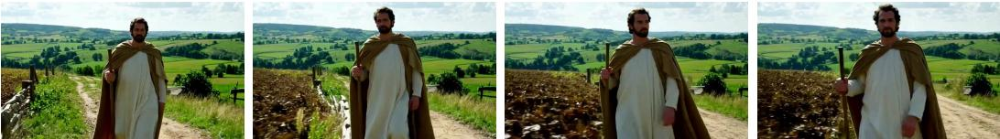

0s-10s: Medium shot, static: Apostle Paul walks a dusty Roman-era path, tunic and cloak, staff in hand; determined, wise. Rolling hills and farmland in the background.

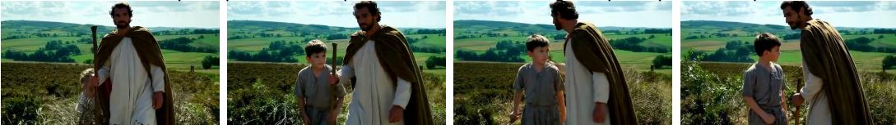  
20s-30s: A threadbare gray-clad boy peeks from a bush; Paul glances over and continues.

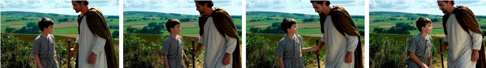

30s-40s: Paul stops as the boy steps out, approaching hesitantly. Paul offers a warm smile and nod.

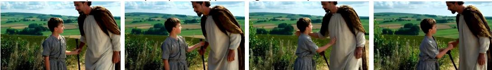

40s-50s: The boy touches the hem of Paul's robe; Paul rests a gentle hand on his shoulder.

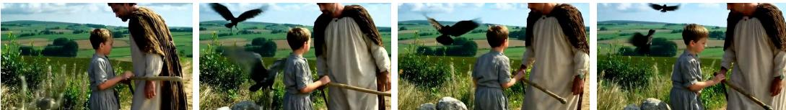  
50s:They walk side by side; a few crows swee across the sky above the quiet countryside.

Figure A: Interactive 60s videos with sequential prompts. See our Demo Page for more examples motion; absence of jitter or discontinuity), Instruction Following (faithfulness to the given instruction/prompt), and Visual Quality (clarity, level of detail, and overall aesthetic quality). For each question, participants were shown a pair of videos together with the corresponding prompt and asked to choose Model A, Model B, or Same (no perceptible difference). The survey was distributed to 30 participants; we received 26 valid responses, yielding 1,248 total judgments $( 2 6 \times 4 8 )$ . Participants were instructed to watch both videos carefully and replay if needed before making a choice.

# M LIMITATION ANALYSIS

LoNGLIvE is an efficient fine-tuning scheme built on top of a pretrained base model, so its ultimate performance is bounded by the capacity and quality of that base model. In particular, we adopt a self-supervised fine-tuning strategy without additional curated real-video data. While this improves efficiency and scalability, it also limits the method's ability to correct systematic errors or biases inherited from the base model. Consequently, the quality of any short segment (e.g., per 10-s clip) is unlikely to consistently exceed that of the base model, even if long-horizon consistency or instruction adherence improves. Therefore, our gains are primarily in adaptation and stabilization rather than absolute ceiling quality. Future work could incorporate supervised data to avoid the quality bound.

Os-10s: Casino Texas Hold'em: late-30s man with short dark hair and light stubble in a navy blazer/charcoal tee grips his hole cards, jaw tight. Chips crowd the felt, dealer deals, slot machines glow. Wide medium close-up on his strained focus.

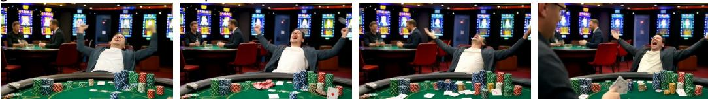

10s-20s: Same setup: he flicks his cards to the felt and leans back, arms spread in triumph. Camera locks on the celebration.

20s-30s: He flips the winning hand; a nearby patron claps as applause rises. Camera centers on his reaction.

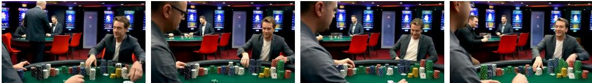

s-40s: He sits upright and methodically stacks his chips, neat, deliberate movements.

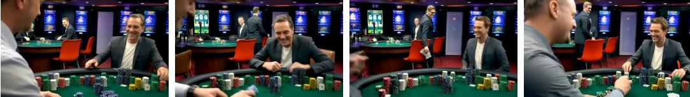

40s-50s: He surveys the stacks and breaks into a proud, self-assured smile.

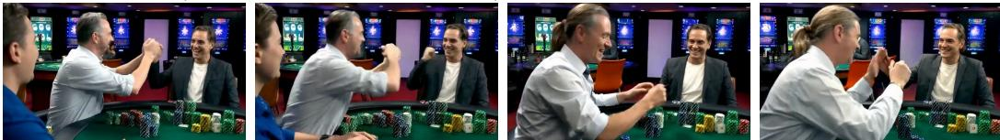

50s-60s: He high-fives a patron; laughter and cheers ripple around the table. Same framing.

Figure B: Interactive 60s videos with sequential prompts. See our Demo Page for more examples.

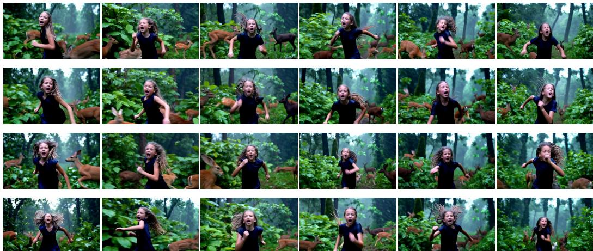

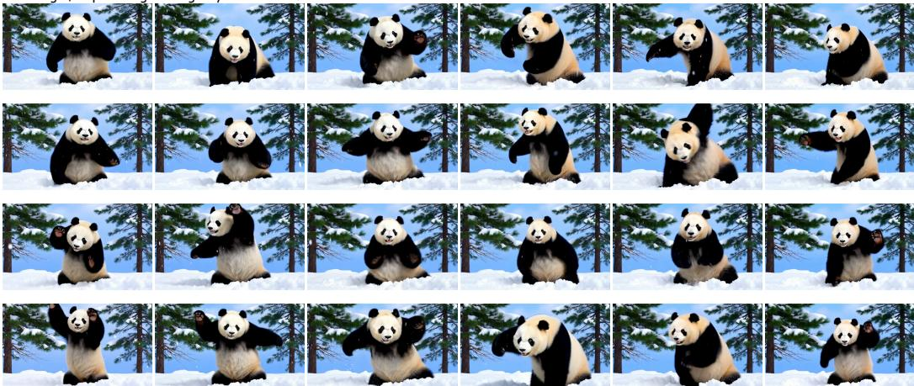  
a low angle, emphasizing the urgency and chaos of the moment.   
nnstna nd n peaceful snowy environment surrounding it.

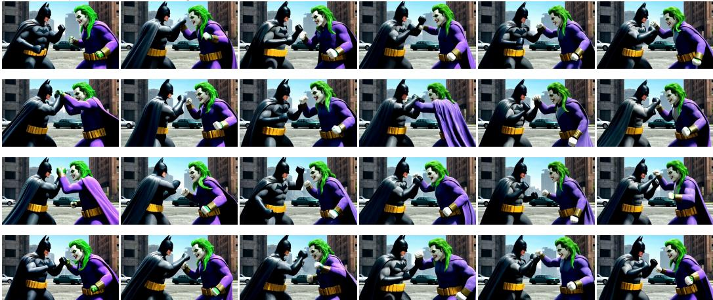  
expressions and body language   
Figure C: Single-prompt 60 s videos. See our Demo Page for more examples.

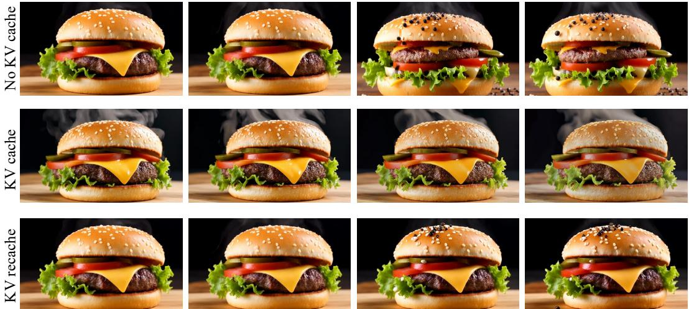  
0s-5s: a steaming burger—seared patty (crisp edges, pink center), melted cheddar, lettuce, tomato, pickles, special sauce—on a lightly charred sesame bun. 5s-10s: fresh pepper sprinkles onto a hot patty under melted cheddar with lettuce, tomato, pickles, special sauce on a charred sesame bun.

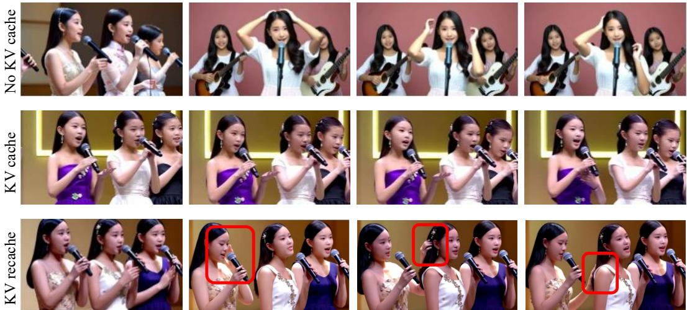  
5s-10s: One girl reaches up to adjust hair...

sYougand beuulrls ning..

Figure D: We present qualitative results from the ablation study of KV re-caching. See our Demo Page for more examples. No KV cache: New-prompt adherence but abrupt transitions and visual discontinuity. KV cache: Smooth visuals but new-prompt non-adherence (delayed or ignored). KV recache: Visual consistency and new-prompt adherence.