# 从慢速双向到快速自回归视频扩散模型

天维·尹1\* 强·张2\* 理查德·张2 威廉·T·弗里曼1 弗雷多·杜兰1 埃利·谢赫特马2 黄迅2 1麻省理工学院 2Adobe https://causvid.github.io/

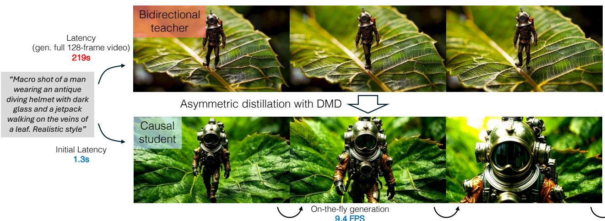  
at approximately 9.4 FPS, facilitating interactive workflows for video content creation.

# 摘要

当前的视频扩散模型在生成质量上表现出色，但由于双向注意力依赖性，难以应用于交互式场景。生成单个帧需要模型处理整个序列，包括未来帧。我们通过将预训练的双向扩散变换器调整为能够动态生成帧的自回归变换器来解决这一限制。为了进一步降低延迟，我们将分布匹配蒸馏（DMD）扩展到视频，将50步的扩散模型蒸馏成一个4步的生成器。为了实现稳定和高质量的蒸馏，我们提出了一种基于教师的常微分方程（ODE）轨迹的学生初始化方案，以及一种不对称蒸馏策略，该策略用双向教师监督因果学生模型。这种方法有效缓解了自回归生成中的错误积累，尽管模型是在短剪辑上训练的，但仍能够实现长时持续的视频合成。我们的模型在VBench-Long基准测试上取得了84.27的总分，超越了所有先前的视频生成模型。得益于键值缓存（KV caching），我们的模型在单GPU上实现了每秒9.4帧的高质量视频快速生成。我们的方案还支持视频到视频的流式翻译、图像到视频和动态提示，以零-shot方式实现。我们发布了代码和预训练模型。

# 1. 引言

扩散模型的出现彻底改变了我们从文本生成视频的方式[3, 5, 24, 28, 61, 96, 109]。许多最先进的视频扩散模型依赖于扩散变换器（Diffusion Transformer, DiT）架构[2, 60]，该架构通常在所有视频帧之间采用双向注意力机制。尽管其质量令人印象深刻，但双向注意力机制的复杂性依然存在。

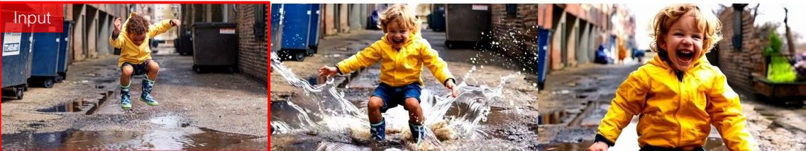  
"A little boy jumping in the air over a puddle of water."

  
A photorealistic video of a yellow sports car driving down a road, with trees in the background."

# 动态提示 时序依赖性意味着生成单个帧需要处理整个视频。这带来了较长的延迟，阻止了模型在交互式和流媒体应用中的应用，因为在这些应用中，模型需要根据可能随时间变化的用户输入持续生成帧。当前帧的生成依赖于尚不可用的未来条件输入。当前的视频扩散模型在速度上也受到限制。计算和内存开销随着帧数的增加而呈平方增长，这与推理过程中大量的去噪步骤结合，使得生成长视频变得极其缓慢和昂贵。

  
"A woman is walking on the street, towards the camera"   
"[] She adjusts the collar of her trench coat and tilts her fedora [...] She pulls out a notebook, making a quick note[...] street lamps that create pools of yellow light"   
"[….] in an off-shoulder white dress [.…] She pauses to adjust her sunglasses[...] and then snaps a quick photo with her phone[…] "   
a video to build extended narratives with evolving actions and environments.

自回归模型为解决这些限制提供了一种有前景的方案，但在误差累积和计算效率方面面临挑战。自回归视频模型不是同时生成所有帧，而是顺序生成帧。用户可以在生成第一帧后立即开始观看视频，而无需等待整个视频完成。这降低了延迟，消除了对视频时长的限制，并为交互控制打开了可能性。然而，自回归模型容易出现误差累积：每一帧的生成都依赖于可能存在缺陷的前几帧，导致预测误差随着时间的推移而放大和恶化。此外，尽管延迟有所减少，但现有的自回归视频模型仍远未能够以交互帧率生成逼真的视频。

在本文中，我们介绍了 CausVid，这是一种旨在快速和交互式因果视频生成的模型。我们设计了一种自回归扩散变换器架构，使视频帧之间具有因果依赖关系。与流行的仅解码器大语言模型（LLMs）类似，我们的模型通过在每次迭代中利用所有输入帧的监督，实现了样本效率的训练，并通过键值（KV）缓存实现高效的自回归推理。为了进一步提高生成速度，我们将分布匹配蒸馏（DMD）这种最初设计用于图像扩散模型的几步蒸馏方法，适配到视频数据上。我们提出了一种不对称蒸馏策略，而不是简单地将自回归扩散模型蒸馏为几步学生模型，在这个策略中，我们将经过预训练的教师扩散模型中的知识（采用双向注意力机制）蒸馏到我们的因果学生模型中。我们展示了这种不对称蒸馏方法显著减少了自回归推理过程中的误差积累。这使我们能够支持自回归生成比训练时观察到的更长的视频。全面的实验表明，我们的模型在视频质量上与最先进的双向扩散模型相当，同时提供了更高的交互性和速度。据我们所知，这是第一种在质量上与双向扩散模型竞争的自回归视频生成方法（附录图 3 和图 4）。此外，我们展示了我们方法在图像到视频生成、视频到视频翻译和动态提示等任务中的多功能性，这些任务都可以以极低的延迟实现（图 2）。

# 2. 相关工作

自回归视频生成。由于视频数据固有的时间顺序，将视频生成建模为自回归过程直观上是吸引人的。早期研究使用回归损失或GAN损失来监督帧预测任务。受到大语言模型成功的启发，一些工作选择将视频帧标记为离散标记，并应用自回归变换器逐一生成标记。然而，这种方法的计算开销较大，因为每帧通常由数千个标记组成。最近，扩散模型作为视频生成的一种有前景的方法开始出现。虽然大多数视频扩散模型具有双向依赖性，自回归视频生成也使用扩散模型进行了探索。一些工作训练视频扩散模型在给定上下文帧的情况下去噪新帧。其他工作将模型训练为在不同帧可能具有不同噪声水平的情况下去噪整个视频。因此，它们支持自回归采样作为当前帧比前一帧更嘈杂的特例。许多工作探索了将预训练的文本到图像或文本到视频扩散模型调整为以上下文帧为条件，从而实现自回归视频生成。我们的方法与这一系列工作密切相关，区别在于我们通过扩散蒸馏引入了一种新型适应方法，显著提高了效率，并使自回归方法在视频生成中具有竞争力。长视频生成。生成长且可变长度的视频仍然是一项具有挑战性的任务。一些工作同时生成多个重叠的片段，使用在固定和有限长度片段上预训练的视频扩散模型，同时采用各种技术确保时间一致性。另一种方法是层次生成长视频，首先生成稀疏关键帧，然后在它们之间插值。与训练生成固定长度视频的全视频扩散模型不同，自回归模型本质上适合生成各种长度的视频，尽管在生成长序列时可能会遭遇错误累积。我们发现，使用双向教师的分布匹配目标在减少错误累积方面意外地有效，从而实现高效且高质量的长视频生成。

扩散蒸馏。扩散模型通常需要多次去噪步骤才能生成高质量的样本，这在计算上可能非常昂贵。蒸馏技术通过模拟教师扩散模型的行为来训练学生模型，以更少的步骤生成样本。Luhman等人训练一种单步骤学生网络，以近似从DDIM教师模型获得的噪声-图像映射。渐进蒸馏训练一系列学生模型，在每个阶段将步骤数量减少一半。一致性蒸馏训练学生将ODE轨迹上的任何点映射到其起源。校正流在从教师获得的噪声-图像对的线性插值路径上训练学生模型。对抗损失也被使用，有时与其他方法结合，以提高学生输出的质量。DMD优化一个近似的逆KL散度，其梯度可以表示为在数据和生成器输出分布上训练的两个评分函数的差异。与轨迹保留方法不同，DMD在分布级别提供监督，并提供允许教师和学生扩散模型在架构上不同的独特优势。我们的方法基于DMD的有效性和灵活性，通过从双向教师扩散模型中蒸馏来训练自回归生成器。最近，研究人员开始将蒸馏方法应用于视频扩散模型，例如渐进蒸馏。

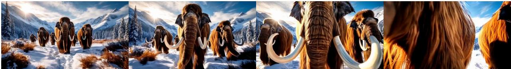  
o the wind as they walk [.]"

  
damotnhot  paplane orhi int swanThe pont ose bees  au  d head, wings unfolding and expanding [...]"

  
e a temperature warms."

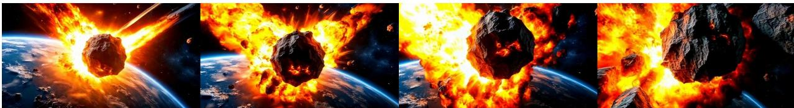  
illustrating the power and destruction of such an event."

  
er gorgeous and soft and sun-kissed, with golden backlight and dreamy bokeh and lens flares [..]"

  
w vast grassy hills lie in the distant background […]"

  
okantmansinwit frindly jckantens n hostharacter welomitrick treater e entrance, tilt shift photography."

数量级加速。请访问我们的网站以获取更多可视化内容。

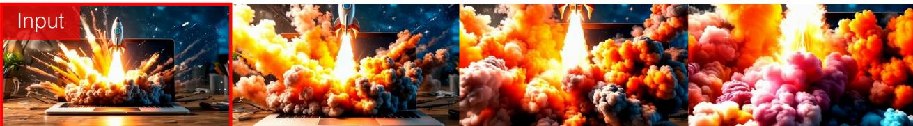  
c

  
Young woman watching virtual reality in VR glasses in her living room."

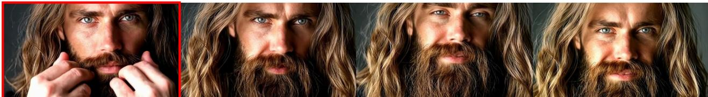  
close up portrait of young bearded guy with long beard."

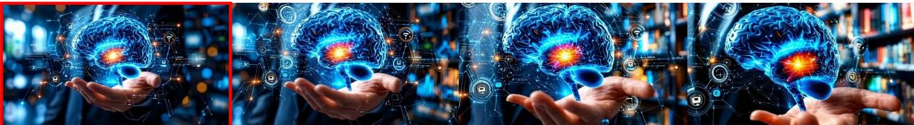  
.

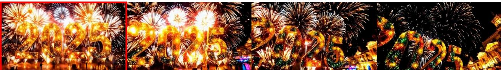

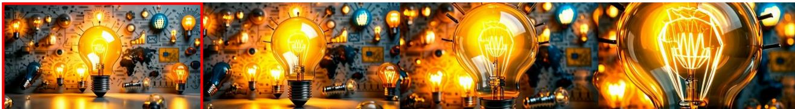  

输出。请访问我们的网站以获取更多可视化信息。蒸馏 [43]，一致性蒸馏 [39, 56, 84, 85]，以及对抗蒸馏 [56, 105]。大多数方法专注于蒸馏旨在生成短视频（少于 2 秒）的模型。此外，它们关注于将非因果教师蒸馏为同样是非因果的学生。而我们的方法则是将非因果教师蒸馏为因果学生，从而实现流媒体视频生成。我们的生成器在 10 秒的视频上进行训练，并能够通过滑动窗口推理生成无限长的视频。还有另一条研究线索专注于通过系统级优化（例如缓存和并行性）提高视频扩散模型的效率 [45, 103, 108, 112]。然而，它们通常应用于标准的多步骤扩散模型，并可以与我们的蒸馏方法结合，进一步提高吞吐量和延迟。

# 3. 背景

本节提供了视频扩散模型的背景信息（第3.1节）和分布匹配蒸馏的概述（第3.2节），本方法基于这两个部分。

# 3.1. 视频扩散模型

扩散模型通过逐步去噪从数据分布 $p ( x _ { 0 } )$ 中生成样本，这些样本最初是从高斯分布 $p ( x _ { T } )$ 中抽取的。它们的训练目标是去噪通过向数据分布中样本 $x _ { 0 }$ 添加随机噪声 $\epsilon$ 而创建的样本，其中 $\alpha _ { t } , \sigma _ { T } > 0$ 是标量，它们共同根据特定的噪声调度 [30, 34, 75] 在步骤 $t$ 定义信噪比。具有参数 $\theta$ 的去噪器通常被训练以预测噪声 [23]。

$$
\begin{array} { r } { x _ { t } = \alpha _ { t } x _ { 0 } + \sigma _ { t } \epsilon , \epsilon \sim { \mathcal N } ( 0 , I ) , } \end{array}
$$

$$
\begin{array} { r } { \mathcal { L } ( \theta ) = \mathbb { E } _ { t , x _ { 0 } , \epsilon } \left. \epsilon _ { \theta } ( x _ { t } , t ) - \epsilon \right. _ { 2 } ^ { 2 } . } \end{array}
$$

替代预测目标包括干净图像 $x _ { 0 }$ [30, 69] 或 $x _ { 0 }$ 和 $\epsilon$ 的加权组合，这被称为 v-prediction [69]。所有预测方案在本质上都与得分函数相关，该函数表示分布的对数概率的梯度 [34, 75]：

$$
s _ { \theta } ( x _ { t } , t ) = \nabla _ { x _ { t } } \log p ( x _ { t } ) = - \frac { \epsilon _ { \theta } ( x _ { t } , t ) } { \sigma _ { t } } .
$$

在以下章节中，我们通过使用得分函数 $s _ { \theta }$ 简化我们的表述，作为扩散模型的一般表示，同时注意到它可以通过重参数化从任何预测方案的预训练模型中导出。在推理时，我们从完全的高斯噪声 $x _ { T }$ 开始，并逐步应用扩散模型生成一系列越来越清晰的样本。根据预测的噪声 $\epsilon _ { \theta } ( x _ { t } , t )$，有许多可能的采样方法 [30, 51, 73, 101] 用于从当前样本 $x _ { t }$ 计算下一个时间步的样本 $x _ { t - 1 }$。扩散模型可以在原始数据 [23, 27, 30] 或通过变分自编码器 (VAE) [31, 60, 66, 96, 109] 获得的低维潜在空间上进行训练。后者通常被称为潜在扩散模型 (LDMs)，并已成为建模高维数据（如视频） [4, 25, 96, 109, 111] 的标准方法。自编码器通常会压缩视频的空间和时间维度，使得扩散模型更易于学习。视频扩散模型中的去噪网络可以通过不同的神经网络架构实例化，例如 UNet [10, 24, 67, 111] 或 Transformers [5, 25, 80, 96]。

# 3.2. 分布匹配蒸馏

分布匹配蒸馏是一种将缓慢的多步骤教师扩散模型蒸馏为高效的少步骤学生模型的技术。其核心思想是在随机采样的时间步骤 $t$ 上，最小化平滑数据分布 $p _ { \mathrm { d a t a } } ( x _ { t } )$ 和学生生成器输出分布 $p _ { \mathrm { g e n } } ( x _ { t } )$ 之间的反向KL散度。反向KL散度的梯度可以近似为两个评分函数之间的差异：

$$
\begin{array} { r l r } {  { \nabla _ { \phi } \mathcal { L } _ { \mathrm { D M D } } \triangleq \mathbb { E } _ { t } ( \nabla _ { \phi } \mathrm { K L } ( p _ { \mathrm { g e n } , t } \Vert p _ { \mathrm { d a t a } , t } ) ) } } \\ & { } & { \approx - \mathbb { E } _ { t } ( \int ( s _ { \mathrm { d a t a } } ( \Psi ( G _ { \phi } ( \epsilon ) , t ) , t ) \ d t ) \ d t ) } \\ & { } & { \qquad - s _ { \mathrm { g e n } , \xi } ( \Psi ( G _ { \phi } ( \epsilon ) , t ) , t ) ) \frac { d G _ { \phi } ( \epsilon ) } { d \phi } d \epsilon ) , } \end{array}
$$

其中 $\Psi$ 表示在公式 1 中定义的前向扩散过程，$\epsilon$ 是随机高斯噪声，$G _ { \phi }$ 是由参数 $\phi$ 定义的生成器，$s _ { \mathrm { d a t a } }$ 和 $s _ { \mathrm { g e n } , \xi }$ 分别表示在数据和生成器输出分布上训练的评分函数，采用去噪损失（公式 2）。在训练过程中，DMD [100] 从一个预训练的扩散模型初始化这两个评分函数。数据分布的评分函数被冻结，而生成器分布的评分函数则使用生成器的输出进行在线训练。同时，生成器接收梯度以使其输出与数据分布对齐（公式 4）。DMD2 [99] 将该框架从单步生成扩展到多步生成，通过将纯随机噪声输入 $\epsilon$ 替换为部分去噪的中间图像 $x _ { t }$。

# 4. 方法

我们的方法引入了一种自回归扩散变换器，使得顺序视频生成成为可能（第4.1节）。我们在图6中展示了我们的训练过程，该过程使用了非对称蒸馏（第4.2节）和常微分方程初始化（第4.3节），以实现高生成质量和稳定收敛。我们通过键值缓存机制实现了高效的流式推理（第4.4节）。

# 4.1. 自回归架构

我们首先使用 3D VAE 将视频压缩到潜在空间。VAE 编码器独立处理每一段视频帧，将其压缩为较短的潜在帧段。然后，解码器从每个潜在段重建原始视频帧。我们的因果扩散变换器在这个潜在空间中操作，顺序生成潜在帧。我们设计了一种区块因果注意机制，灵感来自于将自回归模型与扩散相结合的先前工作。 在每个段内，我们在潜在帧之间应用双向自注意，以捕捉局部时间依赖性并保持一致性。为了强制因果性，我们在段之间应用因果注意。这防止了当前段中的帧关注未来段中的帧。我们自回归扩散变换器的架构的视觉示意图如图 5 所示。我们的设计保持与完全因果注意相同的延迟，因为 VAE 解码器仍然需要至少一个潜在帧块来生成像素。我们正式定义注意力掩码 $M$ 为

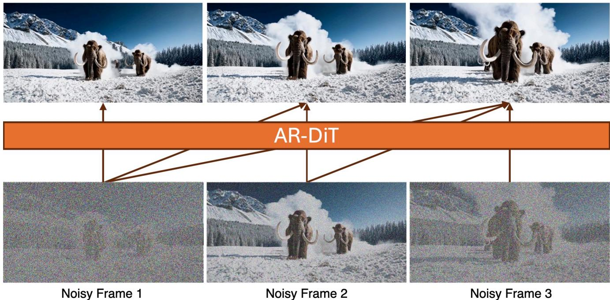  
and previous frames, but not the future.

$$
M _ { i , j } = \left\{ { \begin{array} { l l } { 1 , } & { { \mathrm { i f ~ } } \left\lfloor { \frac { j } { k } } \right\rfloor \le \left\lfloor { \frac { i } { k } } \right\rfloor , } \\ { 0 , } & { { \mathrm { o t h e r w i s e } } . } \end{array} } \right.
$$

在这里，$i$ 和 $j$ 是序列中帧的索引，$k$ 是块大小，$\lfloor \cdot \rfloor$ 表示下取整函数。我们的扩散模型 $G _ { \phi } 扩展了 DiT 架构 [60] 以实现自回归视频生成。我们向自注意力层引入了块状因果注意力掩码（如图 6 所示），同时保留核心结构，从而使我们能够利用预训练的双向权重加速收敛。

# 4.2. 双向因果生成器蒸馏

通过从因果模型进行蒸馏，一种简单的方法来训练少步因果生成器。

# 算法 1 非对称蒸馏与动态模式分解

要求：少步去噪时间步 $\mathcal { T } = \{ 0 , t _ { 1 } , t _ { 2 } , \ldots , t _ { Q } \}$，视频长度 $N$，块大小 $k$，预训练的双向教师模型 $s \mathrm { d a t a }$，数据集 $\mathcal { D }$。 1: 使用ODE回归初始化学生模型 $G _ { \phi }$（第4.3节） 2: 使用 $S _ { \mathrm { { d a t a } } }$ 初始化生成器输出的评分函数 $s _ { \mathrm { g e n } , \xi }$ 3: 当训练进行时 4: 从数据集中采样一段视频并将帧划分为 $L = \lceil N / k \rceil$ 块，$\{ x _ { 0 } ^ { i } \} _ { i = 1 } ^ { L } \sim \mathcal { D }$。 5: 逐块采样时间步 $\{ t ^ { i } \} _ { i = 1 } ^ { L } \sim \mathrm { U n i f o r m } ( \mathcal { T } )$ 6: 添加噪声：$x _ { t ^ { i } } ^ { i } = \alpha _ { t ^ { i } } x _ { 0 } ^ { i } + \sigma _ { t ^ { i } } \epsilon ^ { \dot { i } }$，$\epsilon ^ { i } \sim \mathcal { N } ( 0 , I )$ 7: 使用学生模型（块状因果掩码）预测干净帧：$\hat { x } _ { 0 } = G _ { \phi } \Big ( \{ x _ { t ^ { i } } ^ { i } \} , \{ t ^ { i } \} \Big )$ 8: 采样一个单一时间步 $\dot { t } \sim \mathrm { U n i f o r m } ( 0 , T )$ 9: 对预测添加噪声：$\hat { x } _ { t } = \alpha _ { t } \hat { x } _ { 0 } + \sigma _ { t } \epsilon , \epsilon \sim \mathcal { N } ( 0 , I )$ 10: 使用 DMD 损失更新学生模型 $G _ { \phi }$，${ \mathcal { L } } _ { \mathrm { D M D } } \triangleright$ 第4条 11: 训练生成器的评分函数 $s _ { \mathrm { g e n } , \xi }$。 12: 采样新噪声 $\epsilon ^ { \prime } \sim \mathcal { N } ( 0 , I )$ 13: 生成有噪声的 $\hat { x } _ { t }$：$\hat { x } _ { t } = \alpha _ { t } \hat { x } _ { 0 } + \sigma _ { t } \epsilon ^ { \prime }$ 14: 计算去噪损失并更新 $s _ { \mathrm { g e n } , \xi }$。第2条 15: 结束。当教师模型训练时。这涉及通过结合上述因果注意机制来调整预训练的双向 DiT 模型，并使用去噪损失（第2条）进行微调。在训练过程中，模型输入为一系列 $N$ 个有噪声的视频帧，分为 $L$ 块 $\{ x _ { t } ^ { i } \} _ { i = 1 } ^ { L }$，其中 $i \in \{ 1 , 2 , . . . , L \}$ 表示块索引。每块 $\boldsymbol { x } _ { t } ^ { i }$ 具有各自的噪声时间步 $t ^ { i } \sim [ 0 , 9 9 9 ]$，遵循扩散强制 [8]。在推理过程中，模型依次对每块进行去噪，条件为先前生成的干净块帧。虽然从微调的自回归扩散教师中提取的知识在理论上看起来有前景，但我们的初步实验表明，这种简单的方法会产生次优结果。由于因果扩散模型通常不及其双向对应物，因此从较弱的因果教师训练学生模型固有地限制了学生的能力。此外，错误累积等问题会从教师传播到学生。为克服因果教师的局限性，我们提出一种非对称蒸馏方法：遵循最先进的视频模型 [5, 61]，我们在教师模型中采用双向注意，而将学生模型限制为因果注意（图6底部）。算法1详细介绍了我们的训练过程。

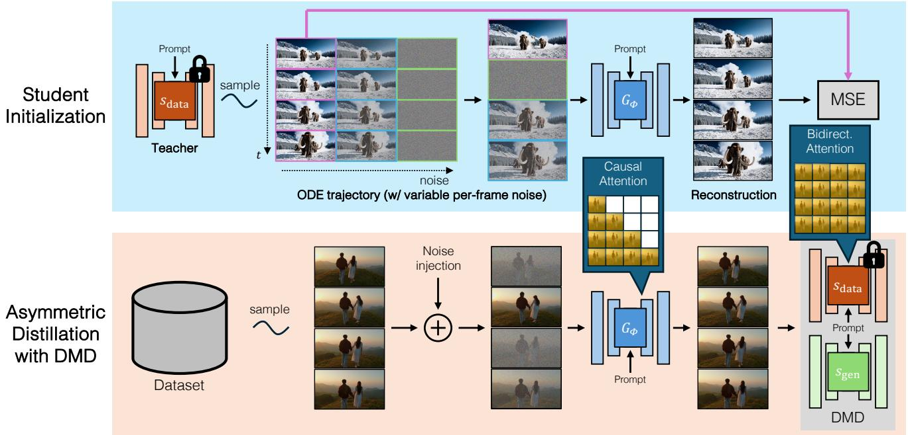  
Figure 6.Our method distill a many-step, bidirectional videodiffusion model $s \mathrm { d a t a }$ into a 4-step, causal generator $G _ { \phi }$ The training

# 4.3. 学生初始化

直接使用DMD损失训练因果学生模型可能会因架构差异而不稳定。为了解决这个问题，我们提出了一种高效的初始化策略以稳定训练（图6顶部）。我们创建了一个由双向教师模型生成的常微分方程（ODE）解对的小数据集：从标准高斯分布$\mathcal { L } ( 0 , I )$中随机采样一系列噪声输入$\{ x _ { T } ^ { i } \} _ { i = 1 } ^ { L }$：• 使用预训练的双向教师模型，通过常微分方程（ODE）求解器[73]模拟反向扩散过程，以获得对应的ODE轨迹$\{ x _ { t } ^ { i } \} _ { i = 1 } ^ { L }$，其中$t$从$T$到$0$，涵盖所有推理时间步。根据ODE轨迹，我们选择与学生生成器中使用的$t$值相匹配的子集。然后，学生模型在此数据集上使用回归损失进行训练：

$$
\begin{array} { r } { \mathcal { L } _ { \mathrm { i n i t } } = \mathbb { E } _ { \boldsymbol { x } , t ^ { i } } | | G _ { \phi } ( \{ x _ { t ^ { i } } ^ { i } \} _ { i = 1 } ^ { N } , \{ t ^ { i } \} _ { i = 1 } ^ { N } ) - \{ x _ { 0 } ^ { i } \} _ { i = 1 } ^ { N } | | ^ { 2 } , } \end{array}
$$

少步生成器 $G_{ \phi }$ 是从教师模型初始化的。我们的常微分方程（ODE）初始化计算效率高，仅需在相对较少的常微分方程解对上进行少量训练迭代。

# 4.4. 利用 KV 缓存实现高效推理

在推理过程中，我们使用具有键值缓存的自回归扩散变换器顺序生成视频帧，以提高计算效率[6]。我们在算法2中展示了详细的推理过程。值得注意的是，由于我们采用了键值缓存，推理时不再需要分块因果注意。这使我们能够利用快速的双向注意实现[12]。

# 5. 实验

模型。我们的教师模型是一个双向 DiT，架构与 CogVideoX 相似。该模型是在由 3D VAE 生成的潜在空间上进行训练的，3D VAE 将 16 幅视频帧编码为一个包含 5 幅潜在帧的潜在块。该模型是在 10 秒的视频上进行训练的。

# 算法 2 带 KV 缓存的推理过程

需要：去噪时间步 $\{ t _ { 0 } = 0 , t _ { 1 } , \ldots , t _ { Q } \}$ ，视频长度 $N$ ，块大小 $k$ ，少步自回归视频生成器 $G _ { \phi }$ 1：将帧划分为 $L = \lceil N / k \rceil$ 个块 2：初始化KV缓存 $\mathbf C \gets \emptyset$ 3：对于 $i = 1$ 到 $L$ 4：初始化当前块：$x _ { t _ { Q } } ^ { i } \sim \mathcal { N } ( 0 , I )$ 5：在时间步上进行迭代去噪： 6：对于 $j = Q$ 到 1 7：生成输出：$\hat { x } _ { t _ { j } } ^ { i } = G _ { \phi } ( x _ { t _ { j } } ^ { i } , t _ { j } )$ 使用缓存 C 8：更新块：$x _ { t _ { j - 1 } } ^ { i } = \alpha _ { t _ { j - 1 } } \hat { x } _ { t _ { j } } ^ { i } + \sigma _ { t _ { j - 1 } } \epsilon ^ { \prime }$ 9：结束循环 10：更新KV缓存： 11：通过前向传播计算KV对 $G _ { \phi } ( x _ { 0 } ^ { i } , 0 )$ 12：将新的KV对附加到缓存 C 13：结束循环 14：返回 $\{ x _ { 0 } ^ { i } \} _ { i = 1 } ^ { L }$ ，分辨率为 $3 5 2 \times 6 4 0$ 和 $1 2 \mathrm { F P S }$ 。我们的学生模型与教师具有相同的架构，区别在于它采用了因果注意力，其中每个token只能注意同一块及前面的块中的其他token。每个块包含5个潜在帧。在推理期间，它一次生成一个块，使用4个去噪步骤，推理时间步均匀抽样为 [999, 748, 502, 247]。我们在训练期间使用 FlexAttention [20] 进行高效的注意力计算。

训练。我们使用混合的图像和视频数据集对我们的因果学生模型进行蒸馏，遵循CogVideoX [96]。图像和视频根据安全性和美学评分进行筛选 [71]。所有视频都调整为训练分辨率 $( 3 5 2 \times 6 4 0 )$，并使用来自内部数据集的约40万单镜头视频，该数据集我们拥有全部版权。在训练过程中，我们首先生成1000个常微分方程（ODE）对（第4.3节），并使用AdamW [50]优化器对学生模型进行3000次迭代训练，学习率为$5 \times 1 0 ^ { - 6 }$。之后，我们使用不对称DMD损失（第4.2节）与AdamW优化器和学习率$2 \times 1 0 ^ { - 6 }$进行6000次迭代训练。我们使用的引导比例为3.5，并采用DMD2 [99]中的两时间尺度更新规则，比例为5。整个训练过程在64个H100 GPU上进行，耗时约2天。评估。我们的方法在VBench [26]上进行评估，这是一个用于视频生成的基准，具有16个指标，旨在系统地评估运动质量和语义对齐。对于我们的主要结果，我们使用MovieGen [61]的前128个提示生成视频，并在VBench竞赛的评估套件中从三个主要方面评估模型性能。关于使用VBench所有提示的综合评估详见附录。推断时间是在H100 GPU上测量的。

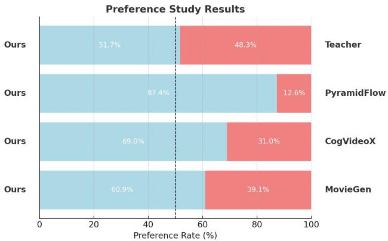  
Figure 7. User study comparing our distilled causal video generator with its teacher model and existing video diffusion models. Our model demonstrates superior video quality (scores $> 5 0 \%$ , while achieving a significant reduction in latency by multiple orders of magnitude.

# 5.1. 文本到视频生成

我们评估了我们的方法生成短视频（5到10秒）的能力，并与最先进的方法进行了比较：CogVideoX、OpenSORA、Pyramid Flow 和 MovieGen。如表1所示，我们的方法在所有三个关键指标（时间质量、帧质量和文本对齐）上均优于所有基线。我们的模型在时间质量评分上达到了94.7，表明运动一致性和动态质量优越。此外，我们的方法在帧质量和文本对齐方面也有显著改善，分别得分64.4和30.1。在补充材料中，我们展示了我们的方法在VBench-Long排行榜上的表现，总得分为84.27，在所有官方评估的视频生成模型中排名第一。我们还通过人类偏好研究进一步评估了我们模型的表现。我们从MovieGenBench数据集中选择了前29个提示，并使用Prolific平台收集独立评估者的评分。对于每对比较的模型和每个提示，我们从不同评估者那里收集了3个评分，每对模型的总评分为87个。评估者根据生成视频的视觉质量和与输入提示的语义对齐选择两个生成视频中更好的一个。具体问题和界面如附录图11所示。为了可重复性，我们对所有视频使用固定的随机种子为零。如图7所示，我们的模型在持续超越基线方法，如MovieGen、CogVideoX和Pyramid Flow。值得注意的是，我们的蒸馏模型在保持性能与双向教师相当的同时，推理速度快了几个数量级，验证了我们方法的有效性。我们还将我们的方法与设计用于长视频生成的先前工作进行了比较：Gen-L-Video、FreeNoise、StreamingT2V、FIFO-Diffusion 和 Pyramid Flow。我们使用滑动窗口推理策略，将前一个10秒段的最终帧作为生成下一个段的上下文。相同的策略也应用于使用Pyramid Flow生成长视频。表2显示，我们的方法在时间质量和逐帧质量方面均优于所有基线，并在文本对齐上具有竞争力。它还成功防止了错误的累积。如图8所示，我们的方法在时间上保持了图像质量，而大多数自回归基线则遭遇了质量下降。表3比较了我们的方法与竞争性方法和我们的双向教师扩散模型的效率。我们的方法在延迟上减少了$1 6 0 \times$，在吞吐量上提高了$1 6 \times$，与同等规模的CogVideoX相比。

Table 1. Evaluation of text-to-short-video generation. Each method is evaluated at its closest supported length to 10 seconds.   

<table><tr><td>Method</td><td>Length (s)</td><td>Temporal Quality</td><td>Frame Quality</td><td>Text Alignment</td></tr><tr><td>CogVideoX-5B</td><td>6</td><td>89.9</td><td>59.8</td><td>29.1</td></tr><tr><td>OpenSORA</td><td>8</td><td>88.4</td><td>52.0</td><td>28.4</td></tr><tr><td>Pyramid Flow</td><td>10</td><td>89.6</td><td>55.9</td><td>27.1</td></tr><tr><td>MovieGen</td><td>10</td><td>91.5</td><td>61.1</td><td>28.8</td></tr><tr><td>CausVid (Ours)</td><td>10</td><td>94.7</td><td>64.4</td><td>30.1</td></tr></table>

Table 2. Evaluation of text-to-long-video generation. All methods produce videos approximately 30s in length.   

<table><tr><td>Method</td><td>Temporal Quality</td><td>Frame Quality</td><td>Text Alignment</td></tr><tr><td>Gen-L-Video</td><td>86.7</td><td>52.3</td><td>28.7</td></tr><tr><td>FreeNoise</td><td>86.2</td><td>54.8</td><td>28.7</td></tr><tr><td>StreamingT2V</td><td>89.2</td><td>46.1</td><td>27.2</td></tr><tr><td>FIFO-Diffusion</td><td>93.1</td><td>57.9</td><td>29.9</td></tr><tr><td>Pyramid Flow</td><td>89.0</td><td>48.3</td><td>24.4</td></tr><tr><td>CausVid (Ours)</td><td>94.9</td><td>63.4</td><td>28.9</td></tr></table>

Table 3. Latency and throughput comparison across different methods for generating 10-second, 120-frame videos at a resolution of $6 4 0 \times 3 5 2$ . The total time includes processing by the text encoder, diffusion model, and VAE decoder. Lower latency (↓) and higher throughput $( \uparrow )$ are preferred.   

<table><tr><td>Method</td><td>Latency (s)</td><td>Throughput (FPS)</td></tr><tr><td>CogVideoX-5B</td><td>208.6</td><td>0.6</td></tr><tr><td>Pyramid Flow</td><td>6.7</td><td>2.5</td></tr><tr><td>Bidirectional Teacher</td><td>219.2</td><td>0.6</td></tr><tr><td>CausVid (Ours)</td><td>1.3</td><td>9.4</td></tr></table>

# 5.2. 消融研究

首先，我们展示了将双向DiT直接微调为因果模型的结果，而不使用少步蒸馏。我们对模型施加因果注意力掩码，并采用第4.2节中描述的自回归训练方法进行微调。如表4所示，多步因果模型的性能显著低于原始双向模型。我们观察到因果基线存在误差积累，导致生成质量随着时间的推移迅速退化（图8中的橙色部分）。

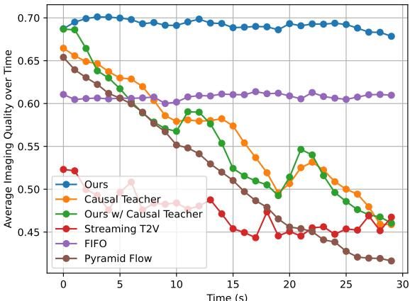  
Figure 8. Imaging quality scores of generated videos over 30 seconds. Our distilled model and FIFO-Diffusion are the most effective at maintaining imaging quality over time. The sudden increase of score for the causal teacher around 20s is due to a switch of the sliding window, resulting in a temporary improvement in quality.

我们对我们的蒸馏框架进行了消融研究，考察了学生初始化方案和教师模型的选择。表4显示，给定相同的ODE初始化方案（如第4.3节所述），双向教师模型的表现优于因果教师模型，并且远远超过初始的ODE拟合模型（我们将教师标记为None）。如图8所示，因果扩散教师遭遇了显著的误差累积（橙色），而这些误差被转移到了学生模型（绿色）。相比之下，我们发现使用不对称DMD损失和双向教师训练的因果学生模型（蓝色）表现明显优于多步骤因果扩散模型，突显了蒸馏在实现快速且高质量视频生成中的重要性。在相同的双向教师下，我们展示了通过拟合ODE对初始化学生模型可以进一步提升性能。虽然我们的学生模型在逐帧质量上优于双向教师，但在时间抖动和输出多样性方面表现较差。

# 5.3. 应用程序

除了文本到视频生成，我们的方法还支持广泛的其他应用。我们在下文中展示了定量结果，定性样本见图 2。我们在补充材料中提供了额外的视频结果。流媒体视频到视频翻译。我们在流媒体视频到视频翻译任务上评估我们的方法，该任务旨在编辑可以具有无限帧的流媒体视频输入。受 SDEdit [58] 的启发，我们将与时间步 $t _ { 1 }$ 对应的噪声注入到每个输入视频块中，然后根据文本在一步中进行去噪。我们将我们的方法与 StreamV2V [41] 进行比较，这是一种基于图像扩散模型的最先进方法。从 StreamV2V 的用户研究中使用的 67 个视频与提示对（最初来自 DAVIS [62] 数据集），我们选择了所有包含至少 16 帧的 60 个视频。为了实现公平比较，我们对任何方法都不应用特定概念的微调。表 5 显示我们的方法优于 StreamV2V，得益于我们模型中的视频先验，展现了更好的时间一致性。

Table 4. Ablation studies. All models generate videos of 10s. The top half presents results of fine-tuning the bidirectional DiT into causal models without few-step distillation. The bottom half compares different design choices in our distillation framework. The last row is our final configuration.   

<table><tr><td colspan="2">Many-step models</td><td>Causal Generator?</td><td>Pass</td><td># Fwd Temporal Quality</td><td>Frame Quality</td><td>Text Alignment</td></tr><tr><td colspan="2">Bidirectional</td><td>×</td><td>100</td><td>94.6</td><td>62.7</td><td>29.6</td></tr><tr><td colspan="2">Causal</td><td></td><td>100</td><td>92.4</td><td>60.1</td><td>28.5</td></tr><tr><td colspan="2">Few-step models ODE Init. Teacher</td><td></td><td></td><td></td><td></td><td></td></tr><tr><td>×</td><td>Bidirectional</td><td></td><td>4</td><td>93.4</td><td>60.6</td><td>29.4</td></tr><tr><td>✓</td><td>None</td><td>:</td><td>4</td><td>92.9</td><td>48.1</td><td>25.3</td></tr><tr><td>✓</td><td>Causal</td><td>✓</td><td>4</td><td>91.9</td><td>61.7</td><td>28.2</td></tr><tr><td>✓</td><td>Bidirectional</td><td>✓</td><td>4</td><td>94.7</td><td>64.4</td><td>30.1</td></tr></table>

Table 5. Evaluation of streaming video-to-video translation.   

<table><tr><td>Method</td><td>Temporal Quality</td><td>Frame Quality</td><td>Text Alignment</td></tr><tr><td>StreamV2V</td><td>92.5</td><td>59.3</td><td>26.9</td></tr><tr><td>CausVid (Ours)</td><td>93.2</td><td>61.7</td><td>27.7</td></tr></table>

图像到视频生成 我们的模型可以在没有额外训练的情况下执行文本条件的图像到视频生成。给定文本提示和初始图像，我们复制图像以创建第一段帧。然后，模型通过自回归的方式生成后续帧以扩展视频。尽管这一方法简单，我们仍然取得了引人注目的效果。我们在 VBench-I2V 基准上与 CogVideoX [96] 和 Pyramid Flow [28] 进行了评估，这些是能够生成 6-10 秒视频的主要基线。正如表 6 所示，我们的方法在动态质量上相较于现有方法取得了显著改善。我们相信，利用一小组图像到视频数据进行指令微调可以进一步提升模型的性能。

# 5.4. 超长视频生成

我们的模型在时长超过10分钟的视频上表现出色。如图9所示，一段14分钟的示例视频显示出轻微的过度曝光，但整体质量仍然很高。

Table 6. Evaluation of image-to-video generation. CogVideoX generates 6s video while the other methods generate 10s video.   

<table><tr><td>Method</td><td>Temporal Quality</td><td>Frame Quality</td><td>Text Alignment</td></tr><tr><td>CogVideoX-5B</td><td>87.0</td><td>64.9</td><td>28.9</td></tr><tr><td>Pyramid Flow</td><td>88.4</td><td>60.3</td><td>27.6</td></tr><tr><td>CausVid (Ours)</td><td>92.0</td><td>65.0</td><td>28.9</td></tr></table>

# 6. 讨论

尽管我们的方法能够生成长达30秒的高质量视频，但我们仍观察到在生成极长视频时会出现质量下降。开发更有效的策略以解决误差积累仍然是未来的工作。此外，尽管与之前的方法相比，延迟显著降低了几个数量级，但仍受到当前变分自编码器设计的限制，这要求在产生任何输出像素之前生成五帧隐含帧。采用更高效的逐帧变分自编码器可能进一步将延迟降低一个数量级，显著提高模型的响应能力。最后，尽管我们的方法使用动态模式分解目标生成高质量样本，但产出的多样性降低。这一局限性是基于反向KL分布匹配方法的特征。未来的工作可以探索替代目标，如EM蒸馏和得分隐式匹配，这可能更好地保留输出的多样性。尽管我们当前的实现仅限于以约10帧每秒生成视频，但标准工程优化（包括模型编译、量化和并行化）可能使实时性能成为可能。我们相信我们的工作标志着视频生成的重要进展，并为机器人学习、游戏渲染、流媒体视频编辑等需要实时和长时间视频生成的应用打开了新的可能性。致谢 本研究部分得到亚马逊科学中心、韩国科学技术院、Adobe、谷歌、广达电脑的支持，此外还得到美国空军研究实验室和美国空军人工智能加速器的资助，合作协议号为FA8750-19-2-1000。文中所表达的观点和结论为作者个人观点，并不一定代表美国空军或美国政府的官方政策或赞同。尽管本文中存在版权声明，但美国政府有权为官方目的复制和分发重印件。

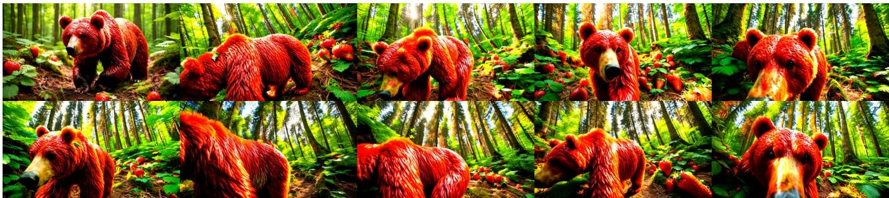

# References

[1] Eloi Alonso, Adam Jelley, Vincent Micheli, Anssi Kanervisto, Amos Storkey, Tim Pearce, and François Fleuret. Diffusion for world modeling: Visual details matter in atari. In NeurIPS, 2024. 3 [2] Fan Bao, Chongxuan Li, Yue Cao, and Jun Zhu. All are worth words: a vit backbone for score-based diffusion models. In NeurIPS 2022 Workshop on Score-Based Methods,   
2022. 1 [3] Andreas Blattmann, Tim Dockhorn, Sumith Kulal, Daniel Mendelevitch, Maciej Kilian, Dominik Lorenz, Yam Levi, Zion English, Vikram Voleti, Adam Letts, et al. Stable video diffusion: Scaling latent video diffusion models to large datasets. arXiv preprint arXiv:2311.15127, 2023. 1 [4] Andreas Blattmann, Robin Rombach, Huan Ling, Tim Dockhorn, Seung Wook Kim, Sanja Fidler, and Karsten Kreis. Align your latents: High-resolution video synthesis with latent diffusion models. In CVPR, 2023. 6 [5] Tim Brooks, Bill Peebles, Connor Holmes, Will DePue, Yufei Guo, Li Jing, David Schnurr, Joe Taylor, Troy Luhman, Eric Luhman, Clarence Ng, Ricky Wang, and Aditya Ramesh. Video generation models as world simulators.   
2024. 1, 3, 6, 8 [6] Tom B Brown, Benjamin Mann, Nick Ryder, Melanie Subbiah, Jared Kaplan, Prafulla Dhariwal, Arvind Neelakantan, Pranav Shyam, Girish Sastry, Amanda Askell, et al. Language models are few-shot learners. In NeurIPS, 2020. 2,   
3,8 [7] Haoxuan Che, Xuanhua He, Quande Liu, Cheng Jin, and Hao Chen. Gamegen-x: Interactive open-world game video generation. arXiv preprint arXiv:2411.00769, 2024. 2, 11 [8] Boyuan Chen, Diego Marti Monso, Yilun Du, Max Simchowitz, Russ Tedrake, and Vincent Sitzmann. Diffusion forcing: Next-token prediction meets full-sequence diffusion. arXiv preprint arXiv:2407.01392, 2024. 3, 7, 10 [9] Feng Chen, Zhen Yang, Bohan Zhuang, and Qi Wu. Streaming video diffusion: Online video editing with diffusion models. arXiv preprint arXiv:2405.19726, 2024. 11   
10] Haoxin Chen, Menghan Xia, Yingqing He, Yong Zhang, Xiaodong Cun, Shaoshu Yang, Jinbo Xing, Yaofang Liu, Qifeng Chen, Xintao Wang, et al. Videocrafter1: Open diffusion models for high-quality video generation. arXiv preprint arXiv:2310.19512, 2023. 6   
[11] Xinyuan Chen, Yaohui Wang, Lingjun Zhang, Shaobin Zhuang, Xin Ma, Jiashuo Yu, Yali Wang, Dahua Lin, Yu Qiao, and Ziwei Liu. Seine: Short-to-long video diffusion model for generative transition and prediction. In ICLR, 2023.3   
[12] Tri Dao, Dan Fu, Stefano Ermon, Atri Rudra, and Christopher Ré. Flashattention: Fast and memory-efficient exact attention with io-awareness. In NeurIPS, 2022. 8   
[13] Alejandro Escontrela, Ademi Adeniji, Wilson Yan, Ajay Jain, Xue Bin Peng, Ken Goldberg, Youngwoon Lee, Danijar Hafner, and Pieter Abbeel. Video prediction models as rewards for reinforcement learning. NeurIPS, 2024. 11   
[14] Patrick Esser, Sumith Kulal, Andreas Blattmann, Rahim Entezari, Jonas Müller, Harry Saini, Yam Levi, Dominik Lorenz, Axel Sauer, Frederic Boesel, et al. Scaling rectified flow transformers for high-resolution image synthesis. In ICML, 2024. 3   
[15] Jean-Yves Franceschi, Mike Gartrell, Ludovic Dos Santos, Thibaut Issenhuth, Emmanuel de Bézenac, Mickaël Chen, and Alain Rakotomamonjy. Unifying gans and score-based diffusion as generative particle models. In NeurIPS, 2023. 3   
[16] Kaifeng Gao, Jiaxin Shi, Hanwang Zhang, Chunping Wang, and Jun Xiao. Vid-gpt: Introducing gpt-style autoregressive generation in video diffusion models. arXiv preprint arXiv:2406.10981, 2024. 3   
[17] Songwei Ge, Thomas Hayes, Harry Yang, Xi Yin, Guan Pang, David Jacobs, Jia-Bin Huang, and Devi Parikh. Long video generation with time-agnostic vqgan and timesensitive transformer. In ECCV, 2022. 3   
[18] Ian Goodfellow, Jean Pouget-Abadie, Mehdi Mirza, Bing Xu, David Warde-Farley, Sherjil Ozair, Aaron Courville, and Yoshua Bengio. Generative adversarial networks. Communications of the ACM, 2020. 3   
[19] Zekun Hao, Xun Huang, and Serge Belongie. Controllable video generation with sparse trajectories. In CVPR, 2018. 3   
[20] Horace He, Driss Guessous, Yanbo Liang, and Joy Dong. Flexattention: The flexibility of pytorch with the performance of flashattention. PyTorch Blog, 2024. 9   
[21] Jonathan Heek, Emiel Hoogeboom, and Tim Salimans. Multistep consistency models. arXiv preprint arXiv:2403.06807, 2024. 3   
[∠∠] Roberto Henscnel, Levon Knacnatryan, DaniI Hayrapetyan, Hayk Poghosyan, Vahram Tadevosyan, Zhangyang Wang, Shant Navasardyan, and Humphrey Shi. Streamingt2v: Consistent, dynamic, and extendable long video generation from text. arXiv preprint arXiv:2403.14773, 2024. 3, 10   
[23] Jonathan Ho, Ajay Jain, and Pieter Abbeel. Denoising diffusion probabilistic models. In NeurIPS, 2020. 3, 6   
[24] Jonathan Ho, Tim Salimans, Alexey Gritsenko, William Chan, Mohammad Norouzi, and David J Fleet. Video diffusion models. In NeurIPS, 2022. 1, 6   
[25] Wenyi Hong, Ming Ding, Wendi Zheng, Xinghan Liu, and Jie Tang. Cogvideo: Large-scale pretraining for text-tovideo generation via transformers. In ICLR, 2023. 6   
[26] Ziqi Huang, Yinan He, Jiashuo Yu, Fan Zhang, Chenyang Si, Yumig Jiang, Yuanhan Zhang, Tianxing Wu, Qingyang Jin, Nattapol Chanpaisit, et al. Vbench: Comprehensive benchmark suite for video generative models. In CVPR, 2024. 9, 16   
[27] Allan Jabri, David Fleet, and Ting Chen. Scalable adaptive computation for iterative generation. In ICML, 2023. 6   
[28] Yang Jin, Zhicheng Sun, Ningyuan Li, Kun Xu, Hao Jiang, Nan Zhuang, Quzhe Huang, Yang Song, Yadong Mu, and Zhouchen Lin. Pyramidal flow matching for efficient video generative modeling. arXiv preprint arXiv:2410.05954, 2024. 1, 2, 3, 9, 10, 11   
[29] Minguk Kang, Richard Zhang, Connelly Barnes, Sylvain Paris, Suha Kwak, Jaesik Park, Eli Shechtman, Jun-Yan Zhu, and Taesung Park. Distilling diffusion models into conditional gans. In ECCV, 2024. 3   
[30] Tero Karras, Miika Aittala, Timo Aila, and Samuli Laine. Elucidating the design space of diffusion-based generative models. In NeurIPS, 2022. 6   
[31] Tero Karras, Miika Aittala, Jaakko Lehtinen, Janne Hellsten, Timo Aila, and Samuli Laine. Analyzing and improving the training dynamics of diffusion models. In CVPR, 2024.6   
[32] Dongjun Kim, Chieh-Hsin Lai, Wei-Hsiang Liao, Naoki Murata, Yuhta Takida, Toshimitsu Uesaka, Yutong He, Yuki Mitsufuji, and Stefano Ermon. Consistency trajectory models: Learning probability flow ode trajectory of diffusion. In ICLR, 2024. 3   
[33] Jihwan Kim, Junoh Kang, Jinyoung Choi, and Bohyung Han. Fifo-diffusion: Generating infinite videos from text without training. arXiv preprint arXiv:2405.11473, 2024. 3, 10   
[34] Diederik Kingma, Tim Salimans, Ben Poole, and Jonathan Ho. Variational diffusion models. In NeurIPS, 2021. 6   
[35] Akio Kodaira, Chenfeng Xu, Toshiki Hazama, Takanori Yoshimoto, Kohei Ohno, Shogo Mitsuhori, Soichi Sugano, Hanying Cho, Zhijian Liu, and Kurt Keutzer. Streamdiffusion: A pipeline-level solution for real-time interactive generation. arXiv preprint arXiv:2312.12491, 2023. 3   
[36] Dan Kondratyuk, Lijun Yu, Xiuye Gu, José Lezama, Jonathan Huang, Grant Schindler, Rachel Hornung, Vighnesh Birodkar, Jimmy Yan, Ming-Chang Chiu, et al. Videopoet: A large language model for zero-shot video generation. 2024. 2, 3   
[37] Alex X Lee, Richard Zhang, Frederik Ebert, Pieter Abbeel, Chelsea Finn, and Sergey Levine. Stochastic adversarial video prediction. arXiv preprint arXiv:1804.01523, 2018. 3   
[38] Sangyun Lee, Gayoung Lee, Hyunsu Kim, Junho Kim, and Youngjung Uh. Diffusion models with grouped latents for interpretable latent space. In ICML Workshop, 2023. 7   
[39] Jiachen Li, Weixi Feng, Tsu-Jui Fu, Xinyi Wang, Sugato Basu, Wenhu Chen, and William Yang Wang. T2v-turbo: Breaking the quality bottleneck of video consistency model with mixed reward feedback. In NeurIPS, 2024. 5   
[40] Tianhong Li, Yonglong Tian, He Li, Mingyang Deng, and Kaiming He. Autoregressive image generation without vector quantization. In NeurIPS, 2024. 7   
[41] Feng Liang, Akio Kodaira, Chenfeng Xu, Masayoshi Tomizuka, Kurt Keutzer, and Diana Marculescu. Looking backward: Streaming video-to-video translation with feature banks. arXiv preprint arXiv:2405.15757, 2024. 3, 11   
[42] Jian Liang, Chenfei Wu, Xiaowei Hu, Zhe Gan, Jianfeng Wang, Lijuan Wang, Zicheng Liu, Yuejian Fang, and Nan Duan. Nuwa-infinity: Autoregressive over autoregressive generation for infinite visual synthesis. In NeurIPS, 2022. 3   
[43] Shanchuan Lin and Xiao Yang. Animatediff-lightning: Cross-model diffusion distillation. arXiv preprint arXiv:2403.12706, 2024. 5   
[44] Shanchuan Lin, Anran Wang, and Xiao Yang. Sdxllightning: Progressive adversarial diffusion distillation. arXiv, 2024. 3   
[45] Haozhe Liu, Wentian Zhang, Jinheng Xie, Francesco Faccio, Mengmeng Xu, Tao Xiang, Mike Zheng Shou, JuanManuel Perez-Rua, and Jürgen Schmidhuber. Faster diffusion via temporal attention decomposition. arXiv e-prints, pages arXiv2404, 2024. 6   
[46] Xingchao Liu, Chengyue Gong, and Qiang Liu. Flow straight and fast: Learning to generate and transfer data with rectified flow. In ICLR, 2023. 3   
[47] Xingchao Liu, Xiwen Zhang, Jianzhu Ma, Jian Peng, and Qiang Liu. Instaflow: One step is enough for high-quality diffusion-based text-to-image generation. In ICLR, 2024. 3   
[48] Ziwei Liu, Raymond A Yeh, Xiaoou Tang, Yiming Liu, and Aseem Agarwala. Video frame synthesis using deep voxel flow. In CVPR, 2017. 3   
[49] Zhijun Liu, Shuai Wang, Sho Inoue, Qibing Bai, and Haizhou Li. Autoregressive diffusion transformer for textto-speech synthesis. arXiv preprint arXiv:2406.05551, 2024. 7   
[50] Ilya Loshchilov and Frank Hutter. Decoupled weight decay regularization. In ICLR, 2019. 9   
[51] Cheng Lu, Yuhao Zhou, Fan Bao, Jianfei Chen, Chongxuan Li, and Jun Zhu. Dpm-solver: A fast ode solver for diffusion probabilistic model sampling in around 10 steps. In NeurIPS, 2022. 6   
[52] Eric Luhman and Troy Luhman. Knowledge distillation in iterative generative models for improved sampling speed. arXiv preprint arXiv:2101.02388, 2021. 3 [53] Simian Luo, Yiqin Tan, Longbo Huang, Jian Li, and Hang Zhao. Latent consistency models: Synthesizing highresolution images with few-step inference. arXiv preprint arXiv:2310.04378, 2023. 3 [54] Weijian Luo, Tianyang Hu, Shifeng Zhang, Jiacheng Sun, Zhenguo Li, and Zhihua Zhang. Diff-instruct: A universal approach for transferring knowledge from pre-trained diffusion models. In NeurIPS, 2023. 3 [55] Weijian Luo, Zemin Huang, Zhengyang Geng, J Zico Kolter, and Guo-jun Qi. One-step diffusion distillation through score implicit matching. arXiv preprint arXiv:2410.16794, 2024. 11 [56] Xiaofeng Mao, Zhengkai Jiang, Fu-Yun Wang, Wenbing Zhu, Jiangning Zhang, Hao Chen, Mingmin Chi, and Yabiao Wang. Osv: One step is enough for high-quality image to video generation. arXiv preprint arXiv:2409.11367,   
2024.5 [57] Michael Mathieu, Camille Couprie, and Yann LeCun. Deep multi-scale video prediction beyond mean square error. In ICLR, 2016. 3 [58] Chenlin Meng, Yutong He, Yang Song, Jiaming Song, Jiajun Wu, Jun-Yan Zhu, and Stefano Ermon. Sdedit: Guided image synthesis and editing with stochastic differential equations. In ICLR, 2021. 11 [59] Chenlin Meng, Robin Rombach, Ruiqi Gao, Diederik Kingma, Stefano Ermon, Jonathan Ho, and Tim Salimans. On distillation of guided diffusion models. In CVPR, 2023.   
3 [60] William Peebles and Saining Xie. Scalable diffusion models with transformers. In ICCV, 2023. 1, 6, 7, 8 [61] Adam Polyak, Amit Zohar, Andrew Brown, Andros Tjandra, Animesh Sinha, Ann Lee, Apoorv Vyas, Bowen Shi, Chih-Yao Ma, Ching-Yao Chuang, et al. Movie gen: A cast of media foundation models. arXiv preprint arXiv:2410.13720, 2024. 1, 3, 8, 9 [62] Jordi Pont-Tuset, Federico Perazzi, Sergi Caelles, Pablo Arbeláez, Alex Sorkine-Hornung, and Luc Van Gool. The   
2017 davis challenge on video object segmentation. arXiv preprint arXiv:1704.00675, 2017. 11 [63] Haonan Qiu, Menghan Xia, Yong Zhang, Yingqing He, Xintao Wang, Ying Shan, and Ziwei Liu. Freenoise: Tuning-free longer video diffusion via noise rescheduling. In ICLR, 2024. 3, 10 [64] Alec Radford, Jeffrey Wu, Rewon Child, David Luan, Dario Amodei, Ilya Sutskever, et al. Language models are unsupervised multitask learners. OpenAI blog, 2019. 3 [65] Yuxi Ren, Xin Xia, Yanzuo Lu, Jiacheng Zhang, Jie Wu, Pan Xie, Xing Wang, and Xuefeng Xiao. Hyper-sd: Trajectory segmented consistency model for efficient image synthesis. 2024. 3 [66] Robin Rombach, Andreas Blattmann, Dominik Lorenz, Patrick Esser, and Björn Ommer. High-resolution image synthesis with latent diffusion models. In CVPR, 2022. 6 [67] Olaf Ronneberger, Philipp Fischer, and Thomas Brox. Unet: Convolutional networks for biomedical image segmentation. In MICCAI, 2015. 6   
[68] David Ruhe, Jonathan Heek, Tim Salimans, and Emiel Hoogeboom. Rolling diffusion models. In ICML, 2024. 3   
[69] Tim Salimans and Jonathan Ho. Progressive distillation for fast sampling of diffusion models. In ICLR, 2022. 3, 6   
[70] Axel Sauer, Dominik Lorenz, Andreas Blattmann, and Robin Rombach. Adversarial diffusion distillation. In ECCV, 2024. 3   
[71] Christoph Schuhmann, Romain Beaumont, Richard Vencu, Cade Gordon, Ross Wightman, Mehdi Cherti, Theo Coombes, Aarush Katta, Clayton Mullis, Mitchell Wortsman, et al. Laion-5b: An open large-scale dataset for training next generation image-text models. In NeurIPS, 2022. 9   
[72] Jascha Sohl-Dickstein, Eric Weiss, Niru Maheswaranathan, and Surya Ganguli. Deep unsupervised learning using nonequilibrium thermodynamics. In ICML, 2015. 6   
[73] Jiaming Song, Chenlin Meng, and Stefano Ermon. Denoising diffusion implicit models. In ICLR, 2021. 3, 6, 8   
[74] Yang Song and Prafulla Dhariwal. Improved techniques for training consistency models. In ICLR, 2024. 3   
[75] Yang Song, Jascha Sohl-Dickstein, Diederik P Kingma, Abhishek Kumar, Stefano Ermon, and Ben Poole. Scorebased generative modeling through stochastic differential equations. In ICLR, 2021. 6   
[76] Yang Song, Prafulla Dhariwal, Mark Chen, and Ilya Sutskever. Consistency models. In ICML, 2023. 3   
[77] Zhenxiong Tan, Xingyi Yang, Songhua Liu, and Xinchao Wang. Video-infinity: Distributed long video generation. arXiv preprint arXiv:2406.16260, 2024. 3   
[78] Sergey Tulyakov, Ming-Yu Liu, Xiaodong Yang, and Jan Kautz. Mocogan: Decomposing motion and content for video generation. In CVPR, pages 15261535, 2018. 3   
[79] Dani Valevski, Yaniv Leviathan, Moab Arar, and Shlomi Fruchter. Diffusion models are real-time game engines. arXiv preprint arXiv:2408.14837, 2024. 3, 11   
[80] Ashish Vaswani, Noam Shazeer, Niki Parmar, Jakob Uszkoreit, Llion Jones, Aidan N Gomez, Lukasz Kaiser, and Illia Polosukhin. Attention is all you need. In NeurIPS, 2017. 6   
[81] Carl Vondrick and Antonio Torralba. Generating the future with adversarial transformers. In CVPR, 2017. 3   
[82] Fu-Yun Wang, Wenshuo Chen, Guanglu Song, Han-Jia Ye, Yu Liu, and Hongsheng Li. Gen-1-video: Multi-text to long video generation via temporal co-denoising. arXiv preprint arXiv:2305.18264, 2023. 3, 10   
[83] Fu-Yun Wang, Zhaoyang Huang, Qiang Ma, Xudong Lu, Bianwei Kang, Yijin Li, Yu Liu, and Hongsheng Li. Zola: Zero-shot creative long animation generation with short video model. In ECCV, 2024. 3   
[84] Fu-Yun Wang, Zhaoyang Huang, Xiaoyu Shi, Weikang Bian, Guanglu Song, Yu Liu, and Hongsheng Li. Animatelcm: Accelerating the animation of personalized diffusion models and adapters with decoupled consistency learning. arXiv preprint arXiv:2402.00769, 2024. 5   
[85] Xiang Wang, Shiwei Zhang, Han Zhang, Yu Liu, Yingya Zhang, Changxin Gao, and Nong Sang. Videolcm: Video latent consistency model. arXiv preprint arXiv:2312.09109, 2023. 5   
[86] Yuqing Wang, Tianwei Xiong, Daquan Zhou, Zhijie Lin, Yang Zhao, Bingyi Kang, Jiashi Feng, and Xihui Liu. Loong: Generating minute-level long videos with autoregressive language models. arXiv preprint arXiv:2410.02757, 2024. 3   
[87] Zhengyi Wang, Cheng Lu, Yikai Wang, Fan Bao, Chongxuan Li, Hang Su, and Jun Zhu. Prolificdreamer: Highfidelity and diverse text-to-3d generation with variational score distillation. In NeurIPS, 2023. 3   
[88] Wenming Weng, Ruoyu Feng, Yanhui Wang, Qi Dai, Chunyu Wang, Dacheng Yin, Zhiyuan Zhao, Kai Qiu, Jianmin Bao, Yuhui Yuan, et al. Art-v: Auto-regressive text-tovideo generation with diffusion models. In CVPRW, 2024. 3   
[89] Hongtao Wu, Ya Jing, Chilam Cheang, Guangzeng Chen, Jiafeng Xu, Xinghang Li, Minghuan Liu, Hang Li, and Tao Kog Unhi l iiv - for visual robot manipulation. In ICLR, 2024. 11   
[90] Yecheng Wu, Zhuoyang Zhang, Junyu Chen, Haotian Tang, Dacheng Li, Yunhao Fang, Ligeng Zhu, Enze Xie, Hongxu Yin, Li Yi, et al. Vila-u: a unified foundation model integrating visual understanding and generation. arXiv preprint arXiv:2409.04429, 2024. 3   
[91] Desai Xie, Zhan Xu, Yicong Hong, Hao Tan, Difan Liu, Feng Liu, Arie Kaufman, and Yang Zhou. Progressive autoregressive video diffusion models. arXiv preprint arXiv:2410.08151, 2024. 3   
[92] Sirui Xie, Zhisheng Xiao, Diederik P Kingma, Tingbo Hou, Ying Nian Wu, Kevin Patrick Murphy, Tim Salimans, Ben Poole, and Ruiqi Gao. Em distillation for one-step diffusion models. arXiv preprint arXiv:2405.16852, 2024. 11   
[93] Zhening Xing, Gereon Fox, Yanhong Zeng, Xingang Pan, Mohamed Elgharib, Christian Theobalt, and Kai Chen. Live2diff: Live stream translation via uni-directional attention in video diffusion models. arXiv preprint arXiv:2407.08701, 2024. 3   
[94] Yanwu Xu, Yang Zhao, Zhisheng Xiao, and Tingbo Hou. Ufogen: You forward once large scale text-to-image generation via diffusion gans. In CVPR, 2024. 3   
[95] Wilson Yan, Yunzhi Zhang, Pieter Abbeel, and Aravind Srinivas. Videogpt: Video generation using vq-vae and transformers. arXiv preprint arXiv:2104.10157, 2021. 3   
[96] Zhuoyi Yang, Jiayan Teng, Wendi Zheng, Ming Ding, Shiyu Huang, Jiazheng Xu, Yuanming Yang, Wenyi Hong, Xiaohan Zhang, Guanyu Feng, et al. Cogvideox: Text-tovideo diffusion models with an expert transformer. arXiv preprint arXiv:2408.06072, 2024. 1, 3, 6, 8, 9, 10, 11   
[97] Mingxuan Yi, Zhanxing Zhu, and Song Liu. Monoflow: Rethinking divergence gans via the perspective of wasserstein gradient flows. In ICML, 2023. 3   
[98] Shengming Yin, Chenfei Wu, Huan Yang, Jianfeng Wang, Xiaodong Wang, Minheng Ni, Zhengyuan Yang, Linjie Li, Shuguang Liu, Fan Yang, et al. Nuwa-xl: Diffusion over diffusion for extremely long video generation. In ACL, [99] Tianwei Yin, Michaël Gharbi, Taesung Park, Richard Zhang, Eli Shechtman, Fredo Durand, and William T Freeman. Improved distribution matching distillation for fast image synthesis. In NeurIPS, 2024. 3, 6, 9   
[100] Tianwei Yin, Michaël Gharbi, Richard Zhang, Eli Shechtman, Frédo Durand, William T Freeman, and Taesung Park. One-step diffusion with distribution matching distillation. In CVPR, 2024. 3, 6   
[101] Qinsheng Zhang and Yongxin Chen. Fast sampling of diffusion models with exponential integrator. In ICLR, 2023. 6   
[102] Qinsheng Zhang, Jiaming Song, Xun Huang, Yongxin Chen, and Ming-Yu Liu. Diffcollage: Parallel generation of large content with diffusion models. In CVPR. IEEE, 2023. 3   
[103] Wentian Zhang, Haozhe Liu, Jinheng Xie, Francesco Faccio, Mike Zheng Shou, and Jürgen Schmidhuber. Crossattention makes inference cumbersome in text-to-image diffusion models. arXiv preprint arXiv:2404.02747, 2024. 6   
[104] Zhicheng Zhang, Junyao Hu, Wentao Cheng, Danda Paudel, and Jufeng Yang. Extdm: Distribution extrapolation diffusion model for video prediction. In CVPR, 2024. 3   
[105] Zhixing Zhang, Yanyu Li, Yushu Wu, Yanwu Xu, Anil Kag, Ivan Skorokhodov, Willi Menapace, Aliaksandr Siarohin, Junli Cao, Dimitris Metaxas, et al. Sf-v: Single forward video generation model. arXiv preprint arXiv:2406.04324, 2024. 5   
[106] Zhixing Zhang, Bichen Wu, Xiaoyan Wang, Yaqiao Luo, Luxin Zhang, Yinan Zhao, Peter Vajda, Dimitris Metaxas, and Licheng Yu. Avid: Any-length video inpainting with diffusion model. In CVPR, 2024. 3   
[107] Canyu Zhao, Mingyu Liu, Wen Wang, Jianlong Yuan, Hao Chen, Bo Zhang, and Chunhua Shen. Moviedreamer: Hierarchical generation for coherent long visual sequence. arXiv preprint arXiv:2407.16655, 2024. 3   
[108] Xuanlei Zhao, Xiaolong Jin, Kai Wang, and Yang You. Real-time video generation with pyramid attention broadcast. arXiv preprint arXiv:2408.12588, 2024. 6   
[109] Zangwei Zheng, Xiangyu Peng, Tianji Yang, Chenhui Shen, Shenggui Li, Hongxin Liu, Yukun Zhou, Tianyi Li, and Yang You. Open-sora: Democratizing efficient video production for all, 2024. 1, 3, 6, 9   
[110] Chunting Zhou, Lili Yu, Arun Babu, Kushal Tirumala, Michihiro Yasunaga, Leonid Shamis, Jacob Kahn, Xuezhe Ma, Luke Zettlemoyer, and Omer Levy. Transfusion: Predict the next token and diffuse images with one multi-modal model. arXiv preprint arXiv:2408.11039, 2024. 7   
[111] Daquan Zhou, Weimin Wang, Hanshu Yan, Weiwei Lv, Yizhe Zhu, and Jiashi Feng. Magicvideo: Efficient video generation with latent diffusion models. arXiv preprint arXiv:2211.11018, 2022. 6   
[112] Chang Zou, Xuyang Liu, Ting Liu, Siteng Huang, and Linfeng Zhang. Accelerating diffusion transformers with token-wise feature caching. arXiv preprint arXiv:2410 05317 2024 6

# From Slow Bidirectional to Fast Autoregressive Video Diffusion Models

Supplementary Material

# A. VBench-Long Leaderboard Results

We evaluate CausVid on the VBench-Long dataset using all 946 prompts across 16 standardized metrics. We refer readers to the VBench paper [26] for a detailed description of the metrics. As shown in Tab. 7, our method achieves state-of-the-art performance with the highest total score of 84.27. The radar plot in Fig. 10 visualizes our method's comprehensive performance advantages. Our method is significantly ahead in several key metrics including dynamic degree, aesthetic quality, imaging quality, object class, multiple objects, and human action. More details can be found on the official benchmark website (ht tps : / / huggingface.co/spaces/Vchitect/vBench_ Leaderboard).

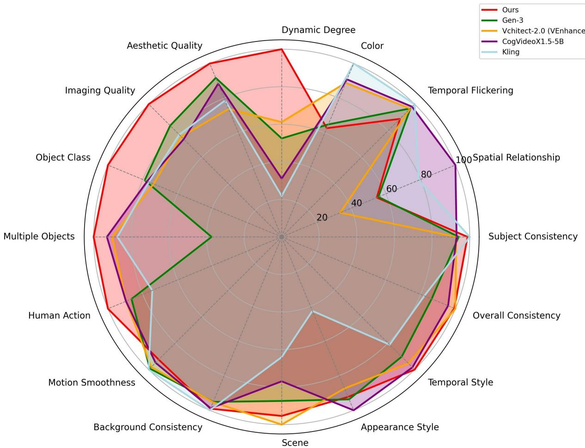  
dimensions.

<table><tr><td>Method</td><td></td><td>Quality Score</td><td></td><td>Subject Con</td><td></td><td>98.57</td><td></td><td>98.98</td><td>Dynamic Degree 63.89</td><td>thetic Quality Imaging Quality 65.35</td><td>Object Class 86.61</td><td>Multiple Objects 68.84</td><td></td><td>Human Action 87.04</td><td></td><td></td><td></td><td></td><td></td><td></td></tr><tr><td>Vchitect Jimeng</td><td>82.24</td><td>83.29 83.54</td><td>77.06 76.69</td><td>96.83 97.25</td><td>96.66 98.39</td><td>99.03</td><td></td><td></td><td></td><td></td><td></td><td></td><td></td><td>97.20</td><td></td><td></td><td>56.57</td><td>23.73</td><td>24.7 25.01</td><td>27.10 27.57</td></tr><tr><td>CogVideoX Vidu</td><td>81.67</td><td>82.75</td><td>77.04</td><td>96.23</td><td>96.52</td><td></td><td></td><td>98.09 9.71 96.92</td><td>38.43 70.97</td><td>68.80 61.98 60.87</td><td>67.09 6.22 62.90</td><td>89.62 85.23 88.43</td><td>69.08 61.6055 62.11</td><td>90.10</td><td>89.05 82.81</td><td>77.45 66.35 66.18</td><td>44.94 53.20 46.07</td><td>22.27 24.91 21.54</td><td>25.38</td><td>27.59</td></tr><tr><td>Kling</td><td>8.99</td><td>83.85 83.39</td><td>74.04 75.68</td><td>94.63 98.33</td><td>96.55 97.60</td><td></td><td></td><td></td><td></td><td>61.21</td><td></td><td>87.24</td><td></td><td></td><td>87.24 </td><td>73.03</td><td>50.86</td><td>19.62</td><td>23.79 24.17</td><td>26.47 26.42</td></tr><tr><td>CogVideoX1.5-5B Gen-3</td><td>82.17 82.32</td><td>82.78 84.11</td><td>79.76 75.17</td><td>96.87 97.10</td><td>97.35 96.62</td><td></td><td></td><td>98.31 99.23</td><td>N6G 60.14</td><td>62.79 63.34</td><td></td><td>87.47</td><td>69.65 53.64</td><td>96.40</td><td>87.55 80.90</td><td>80.25 65.09</td><td>5.91 </td><td>24.89</td><td>25.19</td><td>27.30 26.69</td></tr><tr><td>CausVid (Ours)</td><td>84.27</td><td>85.65</td><td>78.75</td><td>97.53</td><td>97.19</td><td></td><td>96.24</td><td>98.055</td><td>92.69</td><td>64.15</td><td>G. </td><td>$7.81 </td><td>72.15</td><td>99.80</td><td>80.17</td><td>64.65</td><td>56.58</td><td>24.27 24.31</td><td>25.33 24.71</td><td>27.51</td></tr></table>

TaFu  e-L eT le .

Which video is more aesthetic and faithfully follow the prompt shown above? (26 models remaining).

Label

with beautiful photography, depth of field.

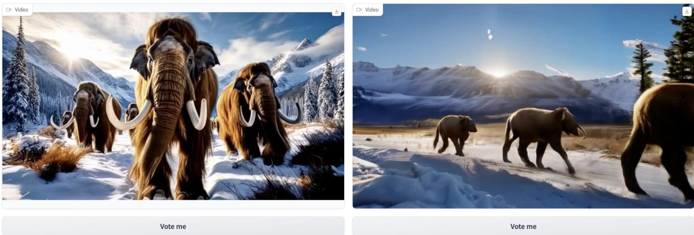  
left/right arrangement.