# 1. Bibliographic Information

## 1.1. Title
The central topic of the paper is "SAM 3D: 3Dfy Anything in Images".

## 1.2. Authors
The paper lists a large team of authors: Xingyu Chen, Fu-Jen Chu, Pierre Gleize, Kevin J Liang, Alexander Sax, Hao Tang, Weiyao Wang, Michelle Guo, Thibaut Hardin, Xiang Li, Aoan Lin, Jiawei Lu, Ziqi Ma, Anushka Sagar, Bowen Song, Xiaodong Wang, Jianing Yang, Bowen Zhang, Piotr Dollár, Georgia Gkioxari, Matt Feiszli, and Jitendra Malik.
The affiliations indicate that the team is from Meta Superintelligence Labs. Specific roles are also noted: `*` Core Contributor (Alphabetical, Equal Contribution), `°` Intern, `†` Project Lead, and `§` Equal Contribution.

## 1.3. Journal/Conference
The paper is published as a preprint on arXiv. The abstract mentions "Published at (UTC): 2025-11-20T18:31:46.000Z", indicating it's a future publication. Given the Meta affiliation and the nature of the research, it is likely intended for a top-tier computer vision conference (e.g., CVPR, ICCV, NeurIPS) or as a major release from Meta AI. These venues are highly reputable and influential in the field of artificial intelligence and computer vision.

## 1.4. Publication Year
2025.

## 1.5. Abstract
The paper introduces `SAM 3D`, a generative model designed for visually grounded 3D object reconstruction. From a single input image, it can predict an object's geometry, texture, and its layout within a scene. `SAM 3D` is particularly effective in natural images, which often feature occlusion, clutter, and rely heavily on contextual visual cues. The core methodology involves a novel human- and model-in-the-loop (`MITL`) pipeline for annotating 3D data (shape, texture, pose) at an unprecedented scale. This data is then utilized within a modern, multi-stage training framework that combines synthetic pretraining with real-world alignment, effectively overcoming the `3D "data barrier"`. The model demonstrates significant performance improvements over existing methods, achieving a win rate of at least `5:1` in human preference tests on real-world objects and scenes. The authors commit to releasing their code, model weights, an online demo, and a new challenging benchmark for `in-the-wild` 3D object reconstruction.

## 1.6. Original Source Link
https://arxiv.org/abs/2511.16624
PDF Link: https://arxiv.org/pdf/2511.16624v1.pdf
Publication Status: Preprint.

# 2. Executive Summary

## 2.1. Background & Motivation

### 2.1.1. Core Problem and Importance
The core problem `SAM 3D` aims to solve is the accurate and comprehensive `3D reconstruction` of objects from a single 2D image, especially in `natural, unconstrained environments`. This includes predicting not just the visible `2.5D surface` but the full `3D geometry`, `texture`, and `scene layout` (position, orientation, and scale relative to the camera).

This problem is crucial in the current field for several reasons:
*   **Real-world Applicability:** Traditional `3D reconstruction` methods often rely on `multi-view geometry` (requiring multiple images or video) or operate on isolated, synthetically rendered objects. However, real-world applications in areas like `robotics`, `augmented reality (AR)/virtual reality (VR)`, `gaming`, and `film` frequently encounter objects in complex scenes with `occlusion`, `clutter`, and `variable lighting`, from which only a single image might be available.
*   **Human Perception vs. Machine Vision:** Humans are remarkably adept at perceiving depth and shape from a single image, leveraging `pictorial cues` (shading, texture) and `recognition` (familiarity with objects). Machine vision has historically struggled to replicate this human capability, particularly for diverse `in-the-wild` objects.
*   **Data Scarcity for 3D:** A fundamental challenge for training robust `3D reconstruction` models is the severe lack of large-scale datasets comprising natural images paired with high-quality `3D ground truth` (true geometry, texture, and pose). Unlike `2D image data` (text, images, video) which is abundant, `3D data` is expensive and difficult to acquire, creating a "data barrier." Existing `3D datasets` are often synthetic, isolated, or limited to specific domains (e.g., indoor scenes, furniture).

### 2.1.2. Challenges and Gaps in Prior Research
Prior research often falls short in several areas:
*   **Domain Gap:** Models trained on `synthetic data` or `isolated objects` (e.g., `ShapeNet`, `Objaverse`) struggle to generalize to the complexity, clutter, and occlusion present in `natural scenes`.
*   **Annotation Difficulty:** Obtaining `3D ground truth` for `natural images` is exceptionally challenging. Generalist human annotators cannot easily create `3D models`, and even skilled `3D artists` find it time-consuming.
*   **Lack of Generalization:** Many existing methods are either category-specific or confined to controlled environments, lacking the `generalization` capability needed to reconstruct "anything" in diverse, `in-the-wild` images.
*   **Benchmarks:** There has been a lack of comprehensive benchmarks for evaluating `3D reconstruction` in `real-world, in-the-wild` scenarios that accurately reflect human perception.

### 2.1.3. Paper's Entry Point and Innovative Idea
The paper's innovative entry point is to bridge the `3D data gap` and enable `in-the-wild 3D reconstruction` by:
1.  **Leveraging Human Recognition and Selection:** Instead of asking humans to *create* 3D models, `SAM 3D`'s data engine asks them to *select and align* the best 3D model from a set of computationally generated candidates, and route truly hard cases to expert `3D artists`. This `human-in-the-loop` approach scales annotation.
2.  **Model-in-the-Loop Feedback:** The `MITL` pipeline uses the improving `SAM 3D` model itself to generate better candidates for human selection, creating a `virtuous cycle` that continuously boosts data quality and model performance.
3.  **LLM-Inspired Multi-Stage Training:** Adapting successful `large language model (LLM)` training paradigms, `SAM 3D` employs a multi-stage approach: `synthetic pretraining` for foundational skills, `semi-synthetic mid-training` for robustness to `occlusion` and `layout estimation`, and `real-world post-training` (including `supervised finetuning (SFT)` and `direct preference optimization (DPO)`) for domain alignment and human preference. This strategy effectively transfers knowledge from abundant synthetic data to scarce real-world data.

## 2.2. Main Contributions / Findings

The primary contributions of `SAM 3D` are:

*   **A New Foundation Model for 3D (`SAM 3D`):** Introducing a novel generative neural network that can predict full `3D shape`, `texture`, and `pose` (rotation, translation, scale) for *any object* from a *single image*, even in complex natural scenes. The authors commit to releasing the code, model weights, and an online demo to foster further research and applications.
*   **Scalable Human- and Model-in-the-Loop (`MITL`) Data Pipeline:** Development of an innovative `MITL` pipeline for annotating `visually grounded 3D reconstruction data` at unprecedented scale. This pipeline addresses the `3D data barrier` by combining automated candidate generation with human selection and alignment, and expert artist intervention for hard cases.
*   **Modern Multi-Stage Training Framework:** Pioneering a `LLM-style multi-stage training recipe` for `3D reconstruction`. This framework progresses from `synthetic pretraining` (building foundational shape/texture understanding) to `mid-training` (imparting skills like occlusion robustness) and `real-world post-training` (aligning to natural images and human preferences through `SFT` and `DPO`), effectively bridging the `domain gap` between synthetic and real data.
*   **New Challenging Benchmark (`SA-3DAO`):** Release of a novel evaluation benchmark, `SA-3DAO` (SAM 3D Artist Objects), consisting of 1,000 artist-created `3D meshes` paired with natural images. This benchmark provides a rigorous testbed for `in-the-wild 3D object reconstruction`, representing an expert human upper bound.

    The key findings and results are:

*   **Significant Performance Gains:** `SAM 3D` achieves substantial improvements over existing `state-of-the-art (SOTA)` methods, evidenced by quantitative metrics on both synthetic (`ISO3D`) and real-world (`SA-3DAO`, `ADT`) datasets.
*   **Strong Human Preference:** The model achieves at least a `5:1` win rate in human preference tests on `real-world objects and scenes`, indicating superior perceptual quality.
*   **Robustness in Natural Images:** `SAM 3D` demonstrates strong `generalization` and `robustness` in challenging natural images with `heavy occlusion` and `clutter`, a significant advancement over models trained primarily on isolated objects.
*   **Data Flywheel Effectiveness:** The `MITL` data engine and iterative `post-training` lead to steady improvements in model performance, highlighting the effectiveness of the `virtuous cycle` of data collection and model refinement.
*   **Efficiency through Distillation:** The model can achieve sub-second inference speeds for `shape` and `layout` through a `distillation` stage, making it suitable for real-time applications.

# 3. Prerequisite Knowledge & Related Work

## 3.1. Foundational Concepts

To understand `SAM 3D`, a grasp of several fundamental concepts in computer vision and deep learning is essential:

*   **3D Reconstruction:** The process of capturing the shape and appearance of real objects or scenes in three dimensions. This typically involves inferring `geometry` (the 3D shape), `texture` (the visual surface properties like color and patterns), and `pose` (the object's position and orientation in space).
    *   **2.5D Surface:** Refers to depth maps or point clouds that represent the visible surfaces of objects from a specific viewpoint, without necessarily inferring occluded or unseen parts.
    *   **Full 3D Shape:** Refers to a complete 3D representation, including both visible and occluded parts, allowing rendering from arbitrary viewpoints.
*   **Generative Models:** A class of artificial intelligence models that can learn the patterns and structures of input data and then generate new, similar data. Examples include `Generative Adversarial Networks (GANs)`, `Variational Autoencoders (VAEs)`, and `Diffusion Models`. `SAM 3D` is a `generative model` as it creates `3D shapes`, `textures`, and `layouts`.
*   **Latent Space:** In machine learning, a `latent space` (or `embedding space`) is a lower-dimensional representation of input data. Generative models often learn to operate in this compressed, meaningful `latent space` to synthesize new data more efficiently and effectively.
*   **Flow Matching:** A type of `generative model` that learns to transform a simple noise distribution into a complex data distribution by defining a continuous-time `flow` or `vector field`. The model learns to predict the "velocity" at which data points move along this flow from noise to data. This contrasts with discrete-step `diffusion models` but shares the goal of generating samples. `Rectified Flow Matching` (Liu et al., 2022) specifically aims to learn straight-line paths in the `latent space`, simplifying the learning process.
*   **Transformers:** A neural network architecture introduced in "Attention Is All You Need" (Vaswani et al., 2017), which relies heavily on `self-attention mechanisms` to weigh the importance of different parts of the input sequence. `Transformers` have become `state-of-the-art` in natural language processing and are increasingly used in computer vision.
    *   **Mixture-of-Transformers (MoT):** An extension of the `Transformer` architecture that allows for specialized processing of different modalities (e.g., shape, layout) while enabling cross-modal interaction through shared `self-attention layers`. This architecture helps in combining different types of information effectively.
*   **Variational Autoencoders (VAEs):** A type of `generative model` that learns a compressed `latent representation` of input data. A `VAE` consists of two parts: an `encoder` that maps input data to a `latent distribution` (typically Gaussian), and a `decoder` that reconstructs data from samples drawn from this `latent distribution`. They are used for learning structured `latent spaces` and generating new data.
*   **DINOv2:** A `self-supervised vision transformer` (Oquab et al., 2023) that learns robust visual features without requiring explicit `label annotations`. It's used as an `encoder` in `SAM 3D` to extract rich visual features from images. `Self-supervised learning` enables models to learn from massive amounts of unlabelled data, creating powerful general-purpose feature extractors.
*   **Direct Preference Optimization (DPO):** A technique for aligning `generative models` with human preferences (Rafailov et al., 2023). Instead of training a separate `reward model` (as in `Reinforcement Learning from Human Feedback (RLHF)`), `DPO` directly optimizes the `generative model`'s likelihood of preferred outputs over dispreferred ones, using human feedback on pairs of generations. This simplifies the alignment process.
*   **Large Language Model (LLM) Training Paradigms:** The paper draws inspiration from how `LLMs` are trained. `LLM` training typically involves:
    *   **Pretraining:** Training on a massive, diverse dataset (e.g., internet text) to learn general linguistic patterns.
    *   **Finetuning (Supervised Fine-Tuning - SFT):** Further training on a smaller, high-quality, task-specific dataset to adapt the model for specific tasks or behaviors.
    *   **Alignment (e.g., RLHF, DPO):** Adjusting the model's behavior to align with human values and preferences, often using human feedback.
    *   **Multi-stage Training:** A sequence of these steps, often with different datasets or objectives at each stage, to progressively build capabilities.
*   **Transfer Learning:** A machine learning technique where a model trained on one task (e.g., synthetic 3D data) is re-purposed for a second related task (e.g., real-world 3D data). This is crucial when the target task has limited data.
*   **Human-in-the-Loop (HITL) & Model-in-the-Loop (MITL):**
    *   `HITL`: A process where humans intervene in the machine learning workflow, providing feedback or making decisions to improve model performance or data quality.
    *   `MITL`: An extension where the machine learning model itself assists in the data creation or annotation process, often by generating candidates that humans then review or refine. This creates a `virtuous cycle` where the model improves the data, and the improved data then trains a better model.
*   **Ground Truth:** The verified, accurate data used for training or evaluating a model. In `3D reconstruction`, this means the true `3D geometry`, `texture`, and `pose` of an object in a scene.

## 3.2. Previous Works

The paper references several foundational and recent works that `SAM 3D` builds upon or differentiates from:

*   **Multi-View Geometry:** Historically, `3D reconstruction` in computer vision has relied heavily on `multi-view geometry`, which uses principles of triangulation from multiple images to infer 3D structure. Key works include:
    *   **Binocular Stereopsis** (Wheatstone, 1838): Early work on depth perception from two eyes.
    *   **Structure-from-Motion (SfM)** (Hartley and Zisserman, 2003; Szeliski, 2022; Tomasi and Kanade, 1992): Reconstructing 3D structure and camera motion from a sequence of 2D images.
    *   **SLAM (Simultaneous Localization and Mapping)** (Smith et al., 1990; Castellanos et al., 1999): Building a map of an environment while simultaneously tracking the agent's location within it.
    *   *Differentiation:* `SAM 3D` explicitly moves beyond `multi-view geometry` by focusing on `single-image 3D reconstruction`, which is much harder due to information loss.

*   **Single-Image 3D Reconstruction and Pictorial Cues:** Psychologists and artists have long understood that humans perceive depth from single images using "pictorial cues" (Koenderink et al., 1992). This concept has inspired computer vision research:
    *   **Roberts (1963):** Pioneering work showing that if an image pattern was recognized as a known object, its 3D shape and pose could be recovered. This highlights the importance of `recognition` for `3D reconstruction`.
    *   **Modern approaches:** (Debevec et al., 2023; Cashman and Fitzgibbon, 2012; Kar et al., 2015; Gkioxari et al., 2019; Xiang et al., 2025) which leverage recognition for 3D.
    *   *Differentiation:* While `SAM 3D` builds on this idea, it extends it to `in-the-wild` objects and complex scenes, where prior works often focused on isolated objects or specific categories.

*   **Generative Models for 3D:** Recent works have shown strong progress in `single-image 3D reconstruction` using `generative models`:
    *   **Latent flow matching architectures** (Xiang et al., 2025): `SAM 3D` explicitly builds upon these `state-of-the-art` two-stage models, adapting them to handle `multi-object scenes` and `layout prediction`.
    *   **Other generative 3D methods** (Yang et al., 2024b; Wu et al., 2024; Wu et al., 2025; Ye et al., 2025; Huang et al., 2025; Li et al., 2025): These works often focus on isolated objects or generation quality, while `SAM 3D` emphasizes `real-world alignment` and `scene understanding`.
    *   *Differentiation:* `SAM 3D`'s key difference is its robust performance on `natural images` with `occlusion` and `clutter`, achieved through its unique data engine and multi-stage training.

*   **Layout Estimation:** A body of work exists for estimating object poses, often for specific scenarios like robotic manipulation or indoor scenes (Labbé et al., 2022; Wen et al., 2024; Shi et al., 2025; Geng et al., 2025; Huang et al., 2025).
    *   *Differentiation:* `SAM 3D` estimates `pose` for a broader range of object types across diverse scenes, jointly with `shape` and `texture`, rather than being restricted to tabletop environments or specific object categories.

*   **Data Generation and Alignment Paradigms (LLM influence):** The paper heavily draws from training strategies developed for `LLMs` and other large `generative models`:
    *   **Synthetic Data for Pretraining:** (Dosovitskiy et al., 2015) using synthetic scenes.
    *   **Multi-stage Training:** (Minaee et al., 2025; Mo et al., 2025) in `LLMs`.
    *   **Data-efficient Alignment:** (Hernandez et al., 2021) showing strong `pretraining` makes `alignment` more data efficient.
    *   **Iterative Preference-based Alignment:** `RLHF` (Ouyang et al., 2022) and `online DPO` (Tang et al., 2024; Rafailov et al., 2023).
    *   **Self-training methods:** (Gulcehre et al., 2023; Anthony et al., 2017; Dong et al., 2023; Yuan et al., 2023) where the model generates high-quality demonstrations.
    *   **Curriculum Learning/Staged Data Mixing:** (Bengio et al., 2009; Grattafiori et al., 2024; OLMo et al., 2025; Li et al., 2023b; Abdin et al., 2024).
    *   *Differentiation:* `SAM 3D` adapts these `LLM paradigms` to the `3D domain`, which has significantly different data characteristics and challenges. Its `MITL` pipeline for `3D data` collection is a novel application of `self-training` and `preference alignment` specifically for `3D`.

## 3.3. Technological Evolution

The field of `3D reconstruction` has undergone significant evolution:

1.  **Early Geometric Methods (1980s-2000s):** Focused on principles of `multi-view geometry`, such as `stereopsis`, `SfM`, and `SLAM`. These methods were robust for structured environments or with sufficient camera motion but struggled with textureless surfaces, occlusions, and single-image input. They were primarily model-driven.

2.  **Learning-based Approaches (2010s-Present):** With the rise of deep learning, models began to directly learn `3D representations` (voxels, point clouds, meshes, implicit functions) from 2D inputs.
    *   **Direct 3D Supervision:** Early deep learning methods often predicted `voxels` (Girdhar et al., 2016; Wu et al., 2017; Xie et al., 2019), `point clouds` (Fan et al., 2017; Mescheder et al., 2019), or `meshes` (Wang et al., 2018; Gkioxari et al., 2019) from single images, but were typically trained and evaluated on `synthetic datasets` like `ShapeNet` (Chang et al., 2015) or `Pix3D` (Sun et al., 2018), often for isolated objects.
    *   **Implicit Representations:** The introduction of `Neural Radiance Fields (NeRFs)` (Mildenhall et al., 2020) and `Signed Distance Functions (SDFs)` (Sitzmann et al., 2019) revolutionized `3D representation`, allowing for highly detailed and view-consistent reconstructions, though often requiring multiple views.

3.  **Generative 3D Models (Recent Years):** The focus has shifted towards `generative models` that can synthesize diverse and high-quality `3D assets` from various inputs (text, image, latent codes). This includes `diffusion models` and `flow-matching models` applied to `3D`. `SAM 3D` fits squarely into this era.

4.  **Scaling and Alignment (Current Frontier):** The latest trend, heavily influenced by `LLMs`, involves scaling models, using `multi-stage training`, and aligning them with `human preferences` and `real-world data`. This addresses the `domain gap` and `data scarcity` issues more effectively.

    `SAM 3D`'s work is at the forefront of this evolution, applying `LLM-inspired scaling and alignment strategies` to the `3D domain` to achieve `in-the-wild 3D reconstruction` from single images.

## 3.4. Differentiation Analysis

Compared to the main methods in related work, `SAM 3D` offers several core differences and innovations:

*   **Handling Natural Images with Clutter and Occlusion:**
    *   **Prior Work:** Many `single-image 3D reconstruction` methods (e.g., `Trellis` (Xiang et al., 2025), `Hunyuan3D` (Yang et al., 2024b), `Direct3D-S2` (Wu et al., 2025), `Hi3DGen` (Ye et al., 2025)) primarily focus on `isolated objects` or `synthetic environments`. They often struggle when objects are distant, heavily occluded, or part of cluttered natural scenes.
    *   **SAM 3D's Innovation:** `SAM 3D` explicitly excels in `natural images` by incorporating `full image context` and leveraging `recognition cues`. Its `mid-training` and `post-training` stages are designed to make it robust to `occlusion` and `clutter`, a significant departure from isolated object reconstruction.

*   **Breaking the 3D Data Barrier with `MITL`:**
    *   **Prior Work:** `3D datasets` are notoriously difficult to acquire at scale, leading to `synthetic datasets` (e.g., `ShapeNet`, `Objaverse`) that often have a `domain gap` with real-world data. `Real-world 3D datasets` are scarce, small, and often limited to specific domains (e.g., indoors).
    *   **SAM 3D's Innovation:** The `human- and model-in-the-loop (MITL)` data pipeline is `SAM 3D`'s most crucial innovation. Instead of laboriously *creating* 3D models, human annotators *select and align* from a diverse pool of model-generated candidates. The model then learns from these selections, improving its generation capabilities, which in turn leads to better candidates for human review – a `virtuous cycle`. This is a scalable solution to the `3D data bottleneck`.

*   **LLM-Inspired Multi-Stage Training Framework for 3D:**
    *   **Prior Work:** While multi-stage training (pretraining, finetuning) is common, `SAM 3D` explicitly adapts the sophisticated `LLM-style training recipe` (pretraining on massive synthetic data, mid-training for general skills, and `post-training` with `SFT` and `DPO` for real-world alignment and human preferences) to the `3D domain`.
    *   **SAM 3D's Innovation:** This framework systematically bridges the `orders-of-magnitude data gap` between `3D` and other modalities, preparing the model with rich priors from synthetic data and then aligning it to real-world nuances and human perception. This contrasts with simpler transfer learning approaches.

*   **Comprehensive `Geometry`, `Texture`, and `Layout` Prediction:**
    *   **Prior Work:** Many methods specialize in either `shape` or `texture`, or only predict `2.5D surfaces`. `Layout estimation` is often a separate task, or limited to constrained scenarios.
    *   **SAM 3D's Innovation:** `SAM 3D` jointly predicts `full 3D geometry`, `texture`, and `layout` (rotation, translation, scale) from a single image, enabling coherent `multi-object scene reconstruction`. This holistic approach is crucial for `real-world 3D perception`.

*   **Evaluation on New `In-the-Wild` Benchmark (`SA-3DAO`):**
    *   **Prior Work:** Evaluations often rely on `synthetic benchmarks` or `constrained real-world datasets`.
    *   **SAM 3D's Innovation:** The introduction of `SA-3DAO`, a benchmark with `artist-created 3D ground truth` from diverse `natural images`, provides a much-needed, challenging evaluation for `in-the-wild 3D reconstruction`.

        In essence, `SAM 3D` differentiates itself by tackling the `3D reconstruction` problem in its full `real-world complexity`, not just isolated components, through a highly scalable data-driven and training-paradigm-driven approach.

# 4. Methodology

## 4.1. Principles

The core idea behind `SAM 3D` is to enable `visually grounded 3D object reconstruction` (predicting geometry, texture, and layout) from a `single natural image`. The theoretical basis and intuition behind this approach are rooted in several key principles:

1.  **Human Perception as Inspiration:** Humans can infer 3D shape and depth from a single 2D image, leveraging `pictorial cues` (shading, texture, perspective) and `recognition` (familiarity with objects and their typical 3D forms). `SAM 3D` aims to mimic this by using `recognition cues` from the `full image context` and learning strong priors for `3D shapes` and `textures`.
2.  **Generative Modeling for Ambiguity:** Reconstructing 3D from a single 2D image is an `ill-posed problem` because much 3D information is lost in the 2D projection (e.g., the backside of an object is occluded). `Generative models` are ideal for this as they can learn `plausible 3D representations` that are consistent with the visible 2D cues, effectively "hallucinating" the occluded parts based on learned priors. `Flow matching` is chosen as the generative mechanism for its efficiency and stability.
3.  **Overcoming the 3D Data Barrier:** The scarcity of `natural images` paired with `3D ground truth` is a major impediment. The principle here is that while *creating* 3D models is hard, *selecting and aligning* existing 3D models (or model-generated candidates) to an image is much easier for humans. This `human-in-the-loop (HITL)` strategy, combined with the model's ability to generate better candidates (`model-in-the-loop (MITL)`), creates a `virtuous cycle` for scalable data annotation.
4.  **Multi-Stage Progressive Learning:** Drawing inspiration from `Large Language Models (LLMs)`, the model is trained progressively. This principle suggests that building foundational skills (like basic shape understanding from abundant `synthetic data`) before specializing for `real-world complexity` (like handling `occlusion`, `clutter`, and `human preferences`) is an efficient and effective training strategy. This allows the model to learn a rich vocabulary for shape and texture in a controlled environment and then adapt to the nuances of natural imagery.
5.  **Joint Prediction of Modalities:** Instead of separate models for `geometry`, `texture`, and `layout`, `SAM 3D` aims for `joint prediction`. The intuition is that these modalities are inherently interconnected (e.g., an object's shape influences its possible poses and texture distribution), and predicting them together can lead to more coherent and realistic `3D reconstructions`. The `Mixture-of-Transformers (MoT)` architecture facilitates this joint learning and cross-modal interaction.

## 4.2. Core Methodology In-depth (Layer by Layer)

`SAM 3D` is a generative model for visually grounded 3D object reconstruction, predicting geometry, texture, and layout from a single image. It consists of a `two-stage latent flow matching architecture` and a `multi-stage training framework` powered by a `human- and model-in-the-loop (MITL)` data engine.

### 4.2.1. Problem Formulation

The act of taking a photograph projects a 3D object onto a 2D image. `SAM 3D` aims to invert this mapping. Given an input image $I$ and a mask $M$ defining the object of interest, the goal is to reconstruct the object's shape $S$, texture $T$, and its pose parameters (rotation $R$, translation $t$, and scale $s$) in camera coordinates. Since this 3D-to-2D mapping is inherently lossy, `SAM 3D` models this reconstruction as a conditional distribution $p(S, T, R, t, s | I, M)$. The objective is to train a generative model $q(S, T, R, t, s | I, M)$ that approximates this true distribution $p$ as closely as possible.

### 4.2.2. Architecture

`SAM 3D` builds upon existing `state-of-the-art` two-stage latent flow matching architectures (e.g., Xiang et al., 2025). The process is divided into two main stages: first, jointly predicting object pose and coarse shape, and then refining the shapes and synthesizing textures by integrating pictorial cues. A key distinction from prior work is `SAM 3D`'s ability to predict object layout and create coherent multi-object scenes, not just isolated objects.

The overall architecture is illustrated in Figure 2.

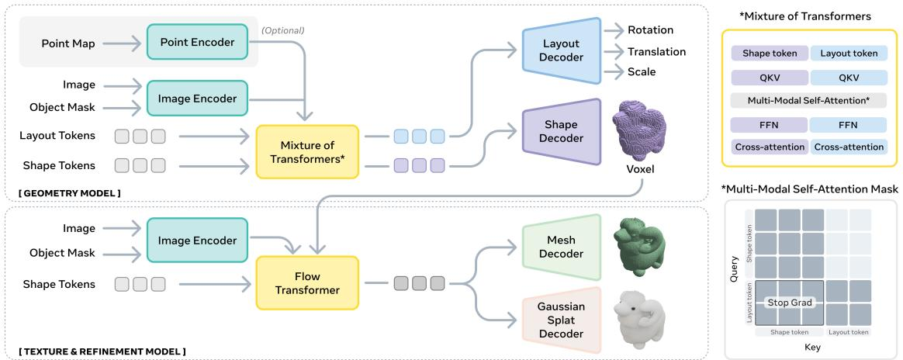
*Figure 2 from the original paper, showing the overall architecture of SAM 3D.*

#### 4.2.2.1. Input Encoding

Input images are processed by `DINOv2` (Oquab et al., 2023) to extract robust visual features, which serve as `conditioning tokens` for the model. Two sets of image-mask pairs are used to provide comprehensive context:
*   **Cropped object:** The image $I$ cropped by the mask $M$, along with its corresponding binary mask. This provides a focused, high-resolution view of the object itself.
*   **Full image:** The full image $I$ and its full image binary mask. This provides `global scene context` and `recognition cues` that are absent in the cropped view, crucial for understanding the object's environment and relationships to other elements.

    Additionally, the model supports conditioning on an optional `coarse scene point map` $P$. This `point map` can be obtained from hardware sensors (e.g., `LiDAR` on an `iPhone`) or estimated using `monocular depth estimation` techniques (Yang et al., 2024a; Wang et al., 2025a). This allows `SAM 3D` to integrate external depth information, enhancing its capabilities in specific pipelines.

#### 4.2.2.2. Geometry Model

The `Geometry Model` is responsible for jointly predicting the coarse shape and layout of the object. It models the conditional distribution $p(O, R, t, s | I, M)$, where:
*   $O \in \mathbb{R}^{64^3}$ is the `coarse shape` represented as `voxels`.
*   $R \in \mathbb{R}^6$ represents the `6D rotation` (Zhou et al., 2019). This is an alternative to quaternions, offering a smoother optimization landscape.
*   $t \in \mathbb{R}^3$ is the `translation` vector in camera coordinates.
*   $s \in \mathbb{R}^3$ is the `scale` vector, allowing for non-uniform scaling along axes.

    The `Geometry Model` employs a 1.2 billion parameter `flow transformer` with a `Mixture-of-Transformers (MoT)` architecture (Liang et al., 2025a; Deng et al., 2025).
*   **MoT Architecture (Section C.1):** The `MoT` design allows for independent training of certain modalities while maintaining performance on others. It consists of two transformers: one specifically for `shape tokens` and another whose parameters are shared for the `layout parameters` `(R, t, s)`. This architecture uses a structured attention mask (as shown in Figure 2, upper right) to manage interactions:
    *   **Input Projection:** Shape and layout parameters are mapped into a shared feature space of dimension 1024.
    *   **Tokens:** This results in 4096 tokens for shape and 1 token for `(R, t, s)` as input to the `MoT`.
    *   **Attention Mask:** The mask dictates which tokens can attend to which other tokens. For instance, `layout tokens` might attend to `shape tokens` to ensure consistency, but `shape tokens` might have limited attention to `layout tokens` during certain stages if only shape is being refined. This allows flexibility, such as fine-tuning only `shape` or `layout`.
    *   **Cross-Modal Interaction:** Despite potential independent training, `MoT` still facilitates information sharing through joint `self-attention layers`, which is critical for `self-consistency` (e.g., rotation is only meaningful when anchored to the predicted shape).

#### 4.2.2.3. Texture & Refinement Model

Following the `Geometry Model`, the `Texture & Refinement Model` learns the conditional distribution $p(S, T | I, M, O)$. This model takes the coarse shape $O$ predicted by the `Geometry Model` as input to refine details and synthesize textures.
*   **Active Voxels:** It first extracts "active voxels" from the coarse shape $O$. These are the voxels that are predicted to be part of the object.
*   **Sparse Latent Flow Transformer:** A 600 million parameter `sparse latent flow transformer` (Xiang et al., 2025; Peebles and Xie, 2023) then refines the geometric details within these active voxels and synthesizes the object's texture. The "sparse" nature implies it focuses computation on relevant regions.

#### 4.2.2.4. 3D Decoders

The latent representations generated by the `Texture & Refinement Model` can be decoded into different `3D representations`:
*   **Mesh Decoder ($\mathcal{D}_m$):** Converts the latent representation into a `mesh` (a collection of vertices and faces).
*   **3D Gaussian Splats Decoder ($\mathcal{D}_g$):** Converts the latent representation into `3D Gaussian splats`, which are soft, point-like primitives that can represent surfaces and volumes.

    These two decoders are separately trained but share the same `VAE encoder`, implying they map to and from a common `structured latent space` (Xiang et al., 2025). Section C.6 details further improvements to these decoders, particularly the `Depth-VAE`.

### 4.2.3. Training SAM 3D

`SAM 3D` employs a modern, multi-stage training framework, adapting the playbook from `LLMs`, `robotics`, and other `large generative models` to break the `3D data barrier`. The training progresses from synthetic pretraining to natural post-training, building capabilities progressively.
The training stages are summarized in Table 1 from the main paper, with additional hyperparameters in Section C.7 (Table 5 for Geometry model, Table 6 for Texture & Refinement model).

The following are the results from Table 1 of the original paper:

<table><thead><tr><th>Training stage</th><th>Modalities</th><th>Datasets</th><th>Condition input</th></tr></thead><tbody><tr><td colspan="4">Stage 1 Geometry model</td></tr><tr><td>Pre-training</td><td>S, R</td><td>Iso-3DO</td><td>object-centric crop</td></tr><tr><td>Mid-training</td><td>S, R</td><td>RP-3DO†</td><td>full image</td></tr><tr><td></td><td>S, R, t, s</td><td>ProcThor, RP-3DO‡</td><td>full image, pointmap*</td></tr><tr><td>SFT Alignment</td><td>S, R, t, s S</td><td>MITL, Art-3DO MITL preference</td><td>full image, pointmap* full image, pointmap*</td></tr><tr><td colspan="4">Stage 2 Texture &amp; Refinement model</td></tr><tr><td>Pre-training</td><td>T</td><td>Iso-3DO-500K</td><td>object-centric crop</td></tr><tr><td>Mid-training</td><td>T</td><td>RP-3DO§</td><td>full image</td></tr><tr><td>SFT</td><td>T</td><td>MITL</td><td>full image</td></tr><tr><td>Alignment</td><td>T</td><td>MITL preference</td><td>full image</td></tr></tbody></table>

The training approach follows a flow:
*   **Step 1: Pretraining:** Builds foundational capabilities like `shape generation` into a base model.
*   **Step 1.5: Mid-Training:** (Sometimes called continued pretraining) Imparts general skills such as `occlusion robustness`, `mask-following`, and using `visual cues`.
*   **Step 2: Post-Training:** Adapts the model to `real-world images` and aligns it to `human preferences`. This step uses `supervised finetuning (SFT)` and `direct preference optimization (DPO)`. This alignment step is iterative, forming a `virtuous cycle` (Figure 10b), where data collected from the current model is used to improve it, and the improved model is then used to collect more and better data.

#### 4.2.3.1. Pre & Mid-Training: Building a Base Model

These stages leverage large-scale datasets to learn strong priors for `shape` and `texture`, and skills like `mask-following`, `occlusion handling`, and `pose estimation`. This drastically reduces the need for expensive `real-world samples` in `post-training`. Models are trained using `rectified conditional flow matching` (Liu et al., 2022) to generate multiple `3D modalities`.

*   **Pretraining: Single Isolated 3D Assets (Iso-3DO)**
    *   This initial phase trains the model to reconstruct accurate `3D shapes` and `textures` from `renders of isolated synthetic objects`. This follows successful recipes from (Xiang et al., 2025; Yang et al., 2024b; Wu et al., 2024).
    *   **Data:** `Iso-3DO` dataset, consisting of 2.7 million object meshes from `Objaverse-XL` (Deitke et al., 2023) and licensed datasets. Each mesh is rendered from 24 viewpoints, producing a high-resolution image of a single centered object.
    *   **Purpose:** The model learns a rich vocabulary for object `shape` and `texture`, preparing it for `real-world reconstruction`.
    *   **Training:** 2.5 trillion training tokens for the `Geometry Model`. The `Texture & Refinement Model` is pretrained on `Iso-3DO-500K` (a partition of `Iso-3DO` with high aesthetics) for 1.1 trillion tokens (Table 6). `Lighting augmentation` is used (Section B.3, C.5).

*   **Mid-Training: Semi-Synthetic Capabilities (RP-3DO)**
    *   This stage builds foundational skills necessary for handling objects in `real-world images`: `mask-following` (reconstructing a target object defined by a mask), `occlusion robustness` (incentivized by artificial occluders), and `layout estimation` (producing translation and scale).
    *   **Data Construction (Render-and-Paste):** Textured meshes are rendered and pasted into natural images using `alpha compositing`. This creates semi-synthetic data with accurate `3D ground truth`. This dataset is called `RP-3DO` and contains 61 million samples with 2.8 million unique meshes.
        *   **RP-3DO Variants (Section B.2):**
            *   **Flying Occlusions (FO) (Section B.2.1):** Inserts randomly oriented synthetic objects without pose information, resulting in `pose-unaware` but `semantically loose` composites. This builds `invariance to occlusion` and `size variations`.
            *   **Object Swap - Random (OS-R) (Section B.2.2):** Replaces an object in a natural image with a randomly selected synthetic mesh, determining scale and translation from masks and pointmaps, but with random rotation. This provides `depth-aware` but not fully aligned insertions, enhancing robustness to location/scale variations.
            *   **Object Swap - Annotated (OS-A) (Section B.2.3):** Performs in-place replacement using human-annotated `ground-truth scale`, `translation`, and `rotation` from `MITL-3DO`. This enables `Texture & Refinement` training that preserves pixel-aligned correspondence.
    *   **Training:** 2.7 trillion training tokens for the `Geometry Model`. The `Texture & Refinement Model` trains on `RP-3DO (FO and OS-A)` for 1 trillion tokens, incorporating `full-image conditioning` and `image data augmentation` (mask augmentation, blur augmentation) to handle noise and small objects (Section C.5).
    *   **Outcome:** After mid-training, the model has seen all input and output modalities for visually grounded 3D reconstruction, but mostly from (semi-)synthetic data.

#### 4.2.3.2. Post-Training: Real-World Alignment

This crucial stage aims to:
1.  Close the `domain gap` between (semi-)synthetic data and `natural images`.
2.  Align the model with `human preferences` for `shape quality`.

    This is achieved iteratively, forming a `data flywheel` (Figure 4).

*   **Post-Training: Collection Step (Human- and Model-in-the-Loop)**
    The core challenge is `3D ground truth` annotation. Instead of creation, humans are asked to *choose* the best mesh among options and *align* its pose. This process converts preferences into training data. The `MITL` pipeline ensures that as the model improves, it generates higher-quality candidates, further boosting data quality. In total, almost 1 million images are annotated with $\sim3.14$ million untextured meshes and $\sim100\mathrm{K}$ textured meshes.
    The process is broken down into subtasks (Figure 5):

    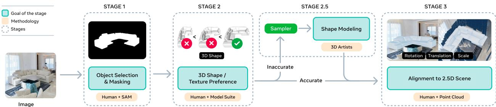
    *Figure 5 from the original paper, illustrating the human- and model-in-the-loop (MITL) annotation pipeline.*

    *   **Stage 1: Choosing target objects `(I, M)` (Section A.1):**
        *   **Image Sources:** Diverse real-world datasets (SA-1B, MetaCLIP, SA-VI, Ego4D, Ego-Exo4D, AEA, AEO, Nymeia, Food Recognition, BDD100k) are used to ensure generalization. Images are filtered for quality.
        *   **Object Selection:** `Visual-language models` generate object-level annotations, which are then verified/refined by human annotators using `SAM` (Kirillov et al., 2023) for segmentation. Low-quality masks are discarded.
        *   **Taxonomy & Sampling:** A `3D-oriented taxonomy` (merging LVIS categories) balances object distribution. A `curriculum-inspired sampling strategy` progresses from simple rigid objects to complex, deformable ones to expand coverage, especially for `long-tail categories`.
        *   **Texture MITL-3DO:** Separately collected texture dataset from SA-1B, with additional `high-aesthetics samples` to seed quality (Section A.1).

    *   **Stage 2: Object model ranking and selection `(S, T)` (Section A.2):**
        *   Human annotators select the best matching `3D shape` and `texture` candidates from a set of options and rate their quality. Examples meeting a predefined quality threshold $\alpha$ become training samples; those below are negative examples for `preference alignment`.
        *   **3D Shape Model Suite:** A diverse set of models generate candidates:
            *   **Retrieval:** Nearest 3D object from a shape library (pretraining data) based on image- and text-based similarity (CLIP embeddings).
            *   **Text-to-3D generation:** Generates meshes from textual descriptions, useful for cluttered/occluded images.
            *   **Image-to-3D generation:** Uses various `image-to-3D` methods, including `SAM 3D` checkpoints, generating point clouds or meshes.
        *   **3D Texture Model Suite:** Uses `image-to-3D models`, `multi-view texture generation models`, and `SAM 3D` checkpoints, all conditioned on `SAM 3D Geometry Model` shapes.
        *   **Selection Procedure (Figure 13, Section A.2):** Annotators make a series of pairwise comparisons from $N=8$ candidates (e.g., "Left is better", "Right is better", "Equal Quality"). The non-selected option is replaced by a new candidate. The order is randomized to prevent bias. This is a form of `best-of-N search` (Ouyang et al., 2022).

            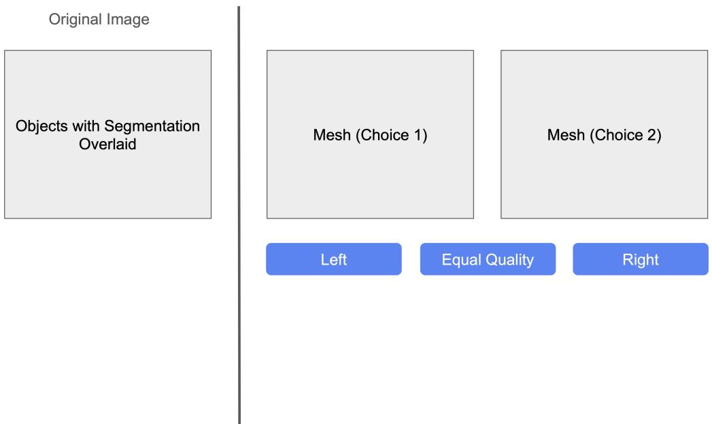
            *Figure 13 from the original paper, showing the Stage 2 user interface for selecting between two 3D model candidates.*

    *   **Stage 2.5: Hard example triage (Artists) (Art-3DO) (Section A.3):**
        *   When the `MITL` suite fails to produce acceptable meshes, these "hardest cases" are routed to `professional 3D artists` for direct annotation. This provides `ground truth` in areas where the model is weakest, seeding new "islands" of data. This set is called `Art-3DO`.

    *   **Stage 3: Aligning objects to 2.5D scene `(R, t, s)` (Section A.4):**
        *   For each `Stage 2 shape`, annotators label its `pose` by manipulating its `translation`, `rotation`, and `scale` relative to a `point cloud` (pre-computed by a depth estimator from the input image).
        *   **Annotation Tool (Figure 14):** A specialized UI allows annotators to manipulate meshes using keyboard/mouse for rotation, translation, and scaling, ensuring accurate placement and orientation.

            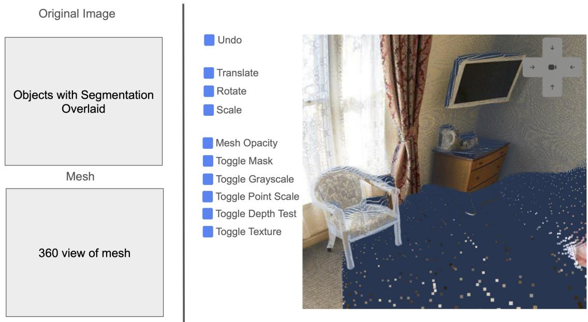
            *Figure 14 from the original paper, showing the Stage 3 user interface for aligning a 3D mesh to a 2.5D point cloud.*

*   **Post-Training: Model Improvement Step**
    This step uses the collected training samples $D^+ = (I, M, S, T, R, t, s)$ and preference data $D^+/D^-$ to update the base model. Data from all previous collection steps is aggregated, keeping only samples above a quality threshold $\alpha_k$, which can increase over time. The final post-training iteration uses 0.5 trillion training tokens.

    *   **Supervised Fine-Tuning (SFT):** The model, initially trained on synthetic data, is fine-tuned on the aligned meshes from `Stage 3`. This begins with `noisier non-expert labels` (MITL-3DO), followed by the smaller, high-quality set from `3D artists` (Art-3DO). `Art-3DO` enhances quality by aligning outputs with artists' aesthetic preferences, suppressing common failures (e.g., `floaters`, `bottomless meshes`, `missing symmetry`).

    *   **Preference Optimization (DPO):** After `SFT`, `direct preference optimization (DPO)` (Rafailov et al., 2023) is used to align the model with human preferences, which are sensitive to properties like `symmetry` and `closure`. This uses $D^+/D^-$ pairs from `Stage 2` of the data engine, effective at eliminating undesirable model outputs.

    *   **Distillation:** To enable sub-second `shape` and `layout` inference from the `Geometry Model`, a `distillation` stage reduces the `number of function evaluations (NFE)` from 25 to 4. This adapts the `diffusion shortcut formulation` from Frans et al. (2024), initializing from trained checkpoints and finetuning with a `shortcut objective`.

        The core alignment algorithm is described in `Algorithm 1` (Section A.6.1).
The following are the results from Algorithm 1 of the original paper:
```
Require: Base model $\pi _ { 0 }$ , quality threshold curriculum $\alpha _ { k }$ , ensemble size $N$   
Ensure: Aligned model $\pi _ { K }$   
1: $\boldsymbol { \mathit { 1 } } \boldsymbol { \mathit { 1 } }$ Let $d = ( I , M , S , T , R , t , s )$ denote a demonstration (i.e., a training sample)   
2: for $k = 1$ to $K$ do   
3: // Collection Step: Generate demonstrations via expert policy   
4: Initialize $\mathcal { C } _ { k }  \emptyset$ The dataset collected during iteration $k$   
5: for $( I , M ) \sim p ( \mathbf { I } , \mathbf { M } )$ do   
6: $\tilde { \pi } _ { k } \gets \mathrm { A mplif y } ( \pi _ { k - 1 } )$ > Amplify current policy via model ensemble and best-of- $N$ search   
7: SSample $\{ d _ { i } \} _ { i = 1 } ^ { N } \sim \tilde { \pi } _ { k } ( I , M )$ Generate $N$ candidate demonstrations from expert policy   
8: $d ^ { * } , r \gets \mathrm { H umanRank } ( \{ d _ { i } \} _ { i = 1 } ^ { N } )$ Humans select best candidate via pairwise comparisons   
9: R ← {di : i = arg max} Store rejected candidates for preference learning   
10: C ← Ck ∪ {(d\*, r, R)} Collect chosen demonstration with rating and rejections   
11: end for   
12: $\boldsymbol { \mathit { 1 } } \boldsymbol { \mathit { 1 } }$ Update Step: Train on aggregated high-quality demonstrations and preferences   
13: $\begin{array} { r l } & { \overset {  } { \mathcal { C } }  \{ ( d ^ { + } , \mathcal { R } ) : ( d ^ { + } , r , \mathcal { R } ) \in \bigcup _ { i = 1 } ^ { k } \mathcal { C } _ { i } , r \geq \alpha _ { k } \} } \\ & { \mathcal { D }  \{ ( d ^ { + } , d ^ { - } ) : ( d ^ { + } , \mathcal { R } ) \in \mathcal { C } , d ^ { - } \in \mathcal { R } \} } \\ & { \pi _ { k } ^ { \mathrm { S F T } }  \arg \operatorname* { m i n } _ { \pi } \mathbb { E } _ { ( d ^ { + } , d ^ { - } ) \sim \mathcal { D } } [ \mathcal { L } _ { \mathrm { C F M } } ( \pi ; d ^ { + } ) ] } \\ & { \pi _ { k }  \arg \operatorname* { m i n } _ { \pi } \mathbb { E } _ { ( d ^ { + } , d ^ { - } ) \sim \mathcal { D } } [ \mathcal { L } _ { \mathrm { D P O } } ( \pi , \pi _ { k } ^ { \mathrm { S F T } } ; d ^ { + } , d ^ { - } } \end{array}$ Aggregate and filter by quality   
14:   
16: Align with preferences

17: end for

18: return $\pi _ { K }$
```
*Algorithm 1: Core Alignment Algorithm for SAM 3D*

This algorithm describes the iterative process of data collection and model improvement:
*   **Collection Step:** The current best model $\pi_{k-1}$ is "amplified" (e.g., via ensembling and `best-of-N search`) to create an expert policy $\tilde{\pi}_k$. From this expert policy, $N$ candidate demonstrations $\{d_i\}_{i=1}^N$ are generated for a given image $I$ and mask $M$. Human annotators then rank these candidates to select the best one $d^*$ and assign a quality rating $r$. Rejected candidates $\mathcal{R}$ are also stored. This creates a dataset $\mathcal{C}_k$ for the current iteration.
*   **Update Step:**
    *   **Aggregation and Filtering:** All collected demonstrations from previous iterations are aggregated, and only those $d^+$ with a quality rating $r$ above the current quality threshold $\alpha_k$ are kept. Pairs of preferred ($d^+$) and less preferred ($d^-$) examples are formed for `DPO`.
    *   **Supervised Fine-Tuning (SFT):** The model $\pi_k^{\mathrm{SFT}}$ is trained by minimizing the `Conditional Flow Matching (CFM)` loss $\mathcal{L}_{\mathrm{CFM}}$ on the aggregated preferred demonstrations $d^+$.
    *   **Direct Preference Optimization (DPO):** The model $\pi_k$ is further aligned by minimizing the `DPO` loss $\mathcal{L}_{\mathrm{DPO}}$ using the preferred ($d^+$) and dispreferred ($d^-$) pairs, with $\pi_k^{\mathrm{SFT}}$ serving as a reference.

        This process iterates $K$ times, with the quality threshold $\alpha_k$ potentially increasing over time.

### 4.2.4. Training Objectives

#### 4.2.4.1. Conditional Rectified Flow Matching ($\mathcal{L}_{\mathrm{CFM}}$)

The base `Geometry Model` (and similarly `Texture & Refinement`) is trained to jointly generate multiple `3D modalities` using `rectified conditional flow matching` (Liu et al., 2022).
Given an input image $I$ and mask $M$, the `Geometry Model` optimizes the following multi-modal flow matching objective:

$$
\mathcal { L } _ { \mathrm { C F M } } = \sum _ { m \in \mathcal { M } } \lambda _ { m } \ : \mathbb { E } \left[ \| \mathbf { v } ^ { m } - \mathbf { v } _ { \theta } ^ { m } ( \mathbf { x } _ { \tau } ^ { m } , c , \tau ) \| ^ { 2 } \right]
$$

Where:
*   $\mathcal { M } = \{ S , R , t , s \}$ denotes the set of prediction modalities: `shape` ($S$), `rotation` ($R$), `translation` ($t$), and `scale` ($s$).
*   $\lambda _ { m }$ is a per-modality weighting coefficient, controlling the relative importance of each modality's loss.
*   $\mathbb { E } [\cdot]$ represents the expectation over the data distribution.
*   $\mathbf { v } ^ { m }$ is the target velocity field for modality $m$.
*   $\mathbf { v } _ { \theta } ^ { m } ( \mathbf { x } _ { \tau } ^ { m } , c , \tau )$ is the learned velocity field for modality $m$, parameterized by $\theta$. This is the output of the neural network.
*   $\mathbf { x } _ { \tau } ^ { m }$ is the partially noised state for modality $m$ at time $\tau \in [0, 1]$.
*   $c = ( I , M )$ represents the `conditioning modalities`: the input image $I$ and mask $M$.

    During training, the model aims to learn to generate `clean states` $\{ \mathbf { x } _ { 1 } ^ { m } \} _ { m \in \mathcal { M } } \sim p ( \mathcal { M } | c )$. These `clean states` are the `ground-truth 3D annotations` for each modality.
The target probability path at time $\tau \in [ 0 , 1 ]$ is a linear interpolation: $\mathbf { x } _ { \tau } ^ { m } = \tau \mathbf { x } _ { 1 } ^ { m } + ( 1 - \tau ) \mathbf { x } _ { 0 } ^ { m }$.
*   $\mathbf { x } _ { 1 } ^ { m }$ is the target `clean state` (ground truth).
*   $\mathbf { x } _ { 0 } ^ { m } \sim \mathcal { N } ( 0 , \mathbf { I } )$ is the initial `noise state`, sampled from a standard normal distribution.
    The target velocity field is then the gradient of this linear interpolation: $\mathbf { v } ^ { m } = \dot { \mathbf { x } } _ { \tau } ^ { m } = ( \mathbf { x } _ { 1 } ^ { m } - \mathbf { x } _ { 0 } ^ { m } )$. The model is trained to predict this target velocity field.

#### 4.2.4.2. Preference Alignment Objective ($\mathcal{L}_{\mathrm{DPO}}$)

For `preference alignment` in `post-training`, `SAM 3D` adapts `Diffusion-DPO` (Wallace et al., 2024) to `flow matching`. Given the same input image and mask $c$, a pair of 3D outputs $(x_0^w, x_0^l)$ is sampled based on human preference, where $x_0^w$ is the preferred option and $x_0^l$ is the less preferred. The training objective is:

$$
\begin{array} { r l } { \mathcal { L } _ { \mathrm { D P O } } = - \mathbb { E } \qquad I } & { \sim \mathcal { Z } , \qquad \big [ \log \sigma \big ( - \beta T w ( \tau ) \cdot \Delta \big ) \big ] } \\ { ( x _ { 0 } ^ { w } , x _ { 0 } ^ { l } ) } & { \sim \ \mathcal { X } _ { I } ^ { 2 } } \\ { \tau } & { \sim \ \mathcal { U } ( 0 , T ) } \\ { x _ { \tau } ^ { w } } & { \sim \ { q } ( x _ { \tau } ^ { w } \mid x _ { 0 } ^ { w } ) } \\ { x _ _ { \tau } ^ { l } } & { \sim \ { q } ( x _ _ { \tau } ^ { l } \mid x _ _ { 0 } ^ { l } ) } \end{array}
$$

$$
\begin{array} { r l } { \mathrm { w h e r e } } & { \Delta = \| \mathbf { v } ^ { w } - \mathbf { v } _ { \theta } ( x _ { \tau } ^ { w } , c , \tau ) \| _ { 2 } ^ { 2 } - \| \mathbf { v } ^ { w } - \mathbf { v } _ { \mathrm { r e f } } ( x _ { \tau } ^ { w } , c , \tau ) \| _ { 2 } ^ { 2 } } \\ & { \qquad - \left( \| \mathbf { v } ^ { l } - \mathbf { v } _ { \theta } ( x _ { \tau } ^ { l } , c , \tau ) \| _ { 2 } ^ { 2 } - \| \mathbf { v } ^ { l } - \mathbf { v } _ { \mathrm { r e f } } ( x _ { \tau } ^ { l } , c , \tau ) \| _ { 2 } ^ { 2 } \right) } \end{array}
$$

Where:
*   $\mathcal { L } _ { \mathrm { D P O } }$ is the Direct Preference Optimization loss.
*   $\mathbb { E } [\cdot]$ denotes the expectation.
*   $I \sim \mathcal{Z}$ indicates sampling an image $I$ from a distribution $\mathcal{Z}$.
*   $\sigma(\cdot)$ is the sigmoid function.
*   $\beta$ is a hyperparameter that controls the strength of the `DPO` penalty.
*   $T$ is the maximum time step (e.g., $T=1$).
*   $w(\tau)$ is a weighting function dependent on the time step $\tau$.
*   $\Delta$ is the key term representing the difference in `flow matching` errors between the preferred and less preferred samples, relative to a reference model.
*   $(x_0^w, x_0^l) \sim \mathcal{X}_I^2$ means sampling a preferred-dispreferred pair of clean states.
*   $\tau \sim \mathcal{U}(0, T)$ means sampling a time step $\tau$ uniformly between 0 and $T$.
*   $x_\tau^w \sim q(x_\tau^w | x_0^w)$ and $x_\tau^l \sim q(x_\tau^l | x_0^l)$ are the noised states for the preferred and less preferred samples, respectively.
*   $\mathbf{v}^w$ and $\mathbf{v}^l$ are the target `flow-matching velocities` for $x_\tau^w$ and $x_\tau^l$, respectively, derived from the clean states and noise.
*   $\mathbf{v}_\theta(x_\tau, c, \tau)$ is the learned velocity field from the current model being optimized.
*   $\mathbf{v}_{\mathrm{ref}}(x_\tau, c, \tau)$ is the velocity field from a frozen `reference model` (e.g., the `SFT` model before `DPO`), which provides a baseline error.

    The `DPO` loss aims to increase the likelihood of preferred outputs ($x_0^w$) and decrease the likelihood of less preferred outputs ($x_0^l$) by adjusting the model's velocity field predictions. It does this by comparing the squared error of the current model's prediction $(\mathbf{v}_\theta)$ against the reference model's prediction $(\mathbf{v}_{\mathrm{ref}})$ for both preferred and less preferred samples.

#### 4.2.4.3. Model Distillation Objective: Shortcut Models

To achieve faster inference by reducing the `Number of Function Evaluations (NFE)`, `SAM 3D` uses `flow matching distillation`. This adapts the `diffusion shortcut formulation` from Frans et al. (2024). The objective for training `shortcut models` is:

$$
\begin{array} { r l r l r l } { \dot { \boldsymbol { z } } _ { S } ( \theta ) = \mathbb { E } _ { \boldsymbol { x } _ { 0 } \sim N ( 0 , I ) } , \Big [ } & { } & { \underbrace { \| \mathbf { v } - \mathbf { v } _ { \theta } ( \boldsymbol { x } _ { \tau } , c , \tau , d = 0 ) \| ^ { 2 } } _ { \mathrm { Flow-Matching } } } & { } & { + } & { } & { \underbrace { \| \mathbf { v } _ { \mathrm { c o n s i s t e n c y } } - \mathbf { v } _ { \theta } ( \boldsymbol { x } _ { \tau } , c , \tau , 2 d ) \| } _ { \mathrm { Self-Consistency } } \Big ] } \end{array}
$$

Where:
*   $\dot { \boldsymbol { z } } _ { S } ( \theta )$ represents the objective function for the `shortcut model` parameterized by $\theta$.
*   $\mathbb { E } _ { \boldsymbol { x } _ { 0 } \sim N ( 0 , I ) }$ indicates the expectation over noise samples $\boldsymbol { x } _ { 0 }$ drawn from a standard normal distribution.
*   The first term, $\underbrace { \| \mathbf { v } - \mathbf { v } _ { \theta } ( \boldsymbol { x } _ { \tau } , c , \tau , d = 0 ) \| ^ { 2 } } _ { \mathrm { Flow-Matching } }$, is the standard `Flow-Matching` loss.
    *   $\mathbf{v}$ is the target velocity field (from $\mathbf{x}_1 - \mathbf{x}_0$).
    *   $\mathbf { v } _ { \theta } ( \boldsymbol { x } _ { \tau } , c , \tau , d = 0 )$ is the model's predicted velocity field when the step size $d=0$ (meaning standard flow matching).
*   The second term, $\underbrace { \| \mathbf { v } _ { \mathrm { c o n s i s t e n c y } } - \mathbf { v } _ { \theta } ( \boldsymbol { x } _ { \tau } , c , \tau , 2 d ) \| } _ { \mathrm { Self-Consistency } }$, is the `Self-Consistency` loss for distillation.
    *   $\mathbf { v } _ { \mathrm { c o n s i s t e n c y } }$ is the `consistency target` velocity, derived from a two-step trajectory using the teacher model (explained below).
    *   $\mathbf { v } _ { \theta } ( \boldsymbol { x } _ { \tau } , c , \tau , 2 d )$ is the model's predicted velocity field for a larger step size `2d`.

        Other parameters:
*   $\boldsymbol { x } _ { 0 } \sim \mathcal { N } ( 0 , I )$: a Gaussian noise sample.
*   $\boldsymbol { x } _ { 1 } \sim p ( x )$: a real data sample from the data distribution.
*   $\boldsymbol { x } _ { \tau }$: an interpolated sample between $\boldsymbol { x } _ { 0 }$ and $\boldsymbol { x } _ { 1 }$ at time step $\tau$.
*   $\tau$: the diffusion time (or noise level).
*   $d$: the step size, specifying how large a step the `shortcut model` should predict. $d=0$ is standard flow-matching, $d>0$ is for consistency training.
*   $c$: conditioning tokens.
*   $p(\tau, d)$: the joint sampling distribution over diffusion times and step sizes during training.
*   $\mathbf { v } _ { \theta } ( \boldsymbol { x } _ { \tau } , c , \tau , d )$: the `shortcut model` parameterized by $\theta$, taking current sample $\boldsymbol { x } _ { \tau }$, conditioning $c$, time $\tau$, and desired step size $d$ as input.

    The `consistency target` $\mathbf{v}_{\mathrm{consistency}}$ is computed as shown in `Algorithm 2`:
The following are the results from Algorithm 2 of the original paper:
$$
Require: Current state $x _ { \tau }$ , conditioning $c$ , step size $d$ , CFG weight $w _ { \mathrm { C F G } }$ , teacher model $\mathbf { v } _ { \theta }$   
Ensure: Consistency target Vconsistency   
1: $\boldsymbol { \mathit { 1 } } \boldsymbol { \mathit { 1 } }$ First shortcut step with CFG guidance   
2: $\mathbf { v } _ { \tau }  \mathbf { v } _ { \theta } ( x _ { \tau } , \emptyset , \tau , d ) + w _ { \mathrm { C F G } } ( \mathbf { v } _ { \theta } ( x _ { \tau } , c , \tau , d ) - \mathbf { v } _ { \theta } ( x _ _ { \tau } , \emptyset , \tau , d ) )$ $\triangleright$ Apply CFG to get guided velocity   
3: $\tilde { x } _ { \tau + d }  x _ _ { \tau } + d \cdot \mathbf { v } _ { \tau }$ Take first step of size $d$   
4: $\boldsymbol { \mathit { 1 } } \boldsymbol { \mathit { 1 } }$ Second shortcut step with CFG guidance   
5: $\begin{array} { r } { \mathbf { v } _ { \tau + d }  \mathbf { v } _ { \theta } ( \tilde { x } _ { \tau + d } , \mathcal { D } , \tau + d , d ) + w _ { \mathrm { C F G } } \big ( \mathbf { v } _ { \theta } ( \tilde { x } _ { \tau + d } , c , \tau + d , d ) - \mathbf { v } _ { \theta } ( \tilde { x } _ { \tau + d } , \mathcal { D } , \tau + d , d ) \big ) \enspace \triangleright } \end{array}$ Apply CFG at new state   
6: $\tilde { x } _ { \tau + 2 d } \gets \tilde { x } _ { \tau + d } + d \cdot \mathbf { v } _ { \tau + d }$ Take second step of size $d$   
7  Compute consistency target from two-step trajectory   
8: Vconsistency $\begin{array} { r } {  \mathrm { s t o p g r a d } \Big ( \frac { \tilde { x } _ { \tau + 2 d } - x _ { \tau } } { 2 d } \Big ) } \end{array}$ Average velocity over combined `2 d` step   
9: return Vconsistency
$$
*Algorithm 2: Computing the Consistency Target for Shortcut Models*

This algorithm details how $\mathbf{v}_{\mathrm{consistency}}$ is derived:
*   `x_tau`: The current state of the noisy sample.
*   $c$: Conditioning tokens.
*   $d$: Step size.
*   `w_CFG`: Classifier-Free Guidance (CFG) weight. `CFG` (Ho & Salimans, 2022) enhances sample quality by combining predictions from a conditional model and an unconditional model.
*   `v_theta`: The teacher model (a pre-trained, non-distilled model).
*   The algorithm performs two `shortcut steps` of size $d$ using the teacher model (with `CFG guidance`) to propagate $x_\tau$ to $\tilde{x}_{\tau+2d}$.
*   `Vconsistency`: This target is calculated as the average velocity over the combined `2d` step, $\mathrm{stopgrad} \Big( \frac { \tilde { x } _ { \tau + 2 d } - x _ { \tau } } { 2 d } \Big )$. `stopgrad` ensures that gradients do not flow back into the teacher model during this calculation.

    This `distillation` process allows the student model to learn to take larger, more efficient steps, enabling faster inference while maintaining quality.

### 4.2.5. Texture & Refinement Training Details (Section C.5)

The `Texture & Refinement Model` follows a multi-stage training paradigm analogous to the `Geometry Model`.
*   **VAE Training:**
    *   A `de-lighted rendering` approach is used to create `latent SLAT features`, minimizing artifacts like reflections and shadows by using ambient lighting. This curates cleaner `ground truth data` for texture maps.
    *   A uniform lighting strength is selected based on similarities between `SAM 3D` predictions and original images using `RP-3DO (FO)`.
*   **Pretraining:**
    *   The model is pretrained on `Iso-3DO-500K` (high aesthetics `Iso-3DO` data) to learn plausible, high-quality textures.
    *   `Random lighting augmentation` is applied during rendering to encourage the model to predict `de-lighted textures` without baking in strong directional shading. This improves `human preference rate` (Figure 17).
*   **Mid-training:**
    *   Training on `RP-3DO (FO and OS-A)`.
    *   `Full-image conditioning` is provided to help predict textures, especially for occluded objects.
    *   `Image data augmentation` (`Mask augmentation` to handle noise in masks, `Blur augmentation` for motion blur and small objects) is introduced.
*   **Supervised Fine-tuning (SFT):**
    *   Trained on `MITL-3DO texture annotations`, including `high-aesthetics samples`. Scaling this data significantly improves `human preference rate` (14.2% for 2x data).
*   **Preference Optimization:**
    *   A final `DPO` stage aligns the model with human preferences collected from the `texture data engine`. This further amplifies gains.

### 4.2.6. Texture & Refinement VAE (Depth-VAE) (Section C.6)

Improvements are made to the `SLAT VAE` design (Xiang et al., 2025) used in the `Texture & Refinement Model`. The original design projected features to all voxels, even non-visible ones, reducing sharpness.
*   **Depth-VAE:** Features are `back-projected` only to voxels visible from each image, leveraging depth information. This significantly improves perceptual quality.
*   **KL Regularization:** The Kullback-Leibler (`KL`) regularization term is normalized by the `active voxel count` to prevent large objects from dominating the loss.
*   **Decoder Fine-tuning:** The decoder is fine-tuned to reduce the number of `decoded Gaussians` for faster inference.

#### 4.2.6.1. Depth-VAE: Depth-Aware Feature Aggregation (Section C.6.1)

This algorithm integrates depth information into patch-level features:
1.  **Feature Sampling:** Given a feature map $\mathbf{F} \in \mathbb{R}^{B \times C \times H \times W}$ (Batch, Channels, Height, Width) and normalized 2D coordinates $\mathbf{U} \in [-1, 1]^{B \times N \times 2}$ (Batch, Number of points, 2D coordinates), feature vectors $\mathbf{f}_i$ are extracted from the `DINO-V2` map $\mathbf{F}$ using `differentiable bilinear interpolation` (`GridSample`).
2.  **Occlusion Handling (Depth Filtering):** A temporary `depth buffer` is constructed. Coordinates $\mathbf{U}$ are mapped to a discrete grid $(P_x, P_y)$, and the minimum predicted depth $\hat{d}$ at each location forms a `surface depth map` $\mathbf{D}_{\mathrm{surf}}$.
    $$
    \mathbf { D } _ { \mathrm { s u r f } } ( x , y ) = \operatorname* { m i n } _ { i : ( x _ { i } , y _ { i } ) = ( x , y ) } \hat { d } _ { i }
    $$
    Where:
    *   $\mathbf { D } _ { \mathrm { s u r f } } ( x , y )$ is the minimum depth at grid coordinates `(x,y)`.
    *   $\hat{d}_i$ is the predicted depth for point $i$.
    *   The `min` operator ensures that only the closest point's depth is stored for each pixel.
        This map is then resampled at the original coordinates $\mathbf{U}$ to get $\mathbf{d}_{\mathrm{ref}}$. If ground-truth depth is available, it replaces $\mathbf{D}_{\mathrm{surf}}$.
3.  **Visibility Masking:** A binary mask $\mathbf{M}$ identifies visible points. A point $i$ is visible if its depth $\hat{d}_i$ is within a tolerance $\tau$ of the reference surface $\mathbf{d}_{\mathrm{ref}, i}$.
    $$
    \mathbf { M } _ { i } = \mathbb { I } \left[ \mathbf { d } _ { \mathrm { { r e f } } , i } > \hat { d } _ { i } - \tau \right]
    $$
    Where:
    *   $\mathbf { M } _ { i }$ is the binary mask value for point $i$.
    *   $\mathbb { I }[\cdot]$ is the indicator function, which is 1 if the condition is true, and 0 otherwise.
    *   $\mathbf { d } _ { \mathrm { ref } , i }$ is the reference surface depth for point $i$.
    *   $\hat { d } _ { i }$ is the predicted depth for point $i$.
    *   $\tau$ is a small tolerance value.
        This mask is normalized across the batch dimension (or views) to obtain weights $\tilde{\textbf{M}}$.
4.  **Weighted Aggregation:** The final `depth-aware representation` $\mathbf{F}_{\mathrm{depth}}$ is the weighted sum of visible patch features:
    $$
    \mathbf { F } _ { \mathrm { d e p t h } } = \sum _ { b } \tilde { \mathbf { M } } _ { b } \odot \mathbf { f } _ { b }
    $$
    Where:
    *   $\mathbf { F } _ { \mathrm { d e p t h } }$ is the final depth-aware feature.
    *   $\sum _ { b }$ denotes summation over the batch dimension (or views).
    *   $\tilde { \mathbf { M } } _ { b }$ is the normalized visibility mask for batch item $b$.
    *   $\odot$ is the element-wise (Hadamard) product.
    *   $\mathbf { f } _ { b }$ is the feature vector for batch item $b$.

        This process ensures that only features from truly visible regions are aggregated, leading to sharper and more accurate texture reconstructions.

### 4.2.7. Training Hyperparameters (Section C.7)

The paper provides detailed training hyperparameters for both `Geometry Model` and `Texture & Refinement Model`.

The following are the results from Table 5 of the original paper:

<table><thead><tr><th>Training stage</th><th>Datasets</th><th>Condition input</th><th>Learning rate</th><th>Modality weights</th><th># Meshes</th><th># Images</th><th># Samples</th><th># Tokens</th></tr></thead><tbody><tr><td>Pre-training</td><td>Iso-3DO</td><td>object-centric crop</td><td>10−4</td><td>S=1.0, R=0.1</td><td>2.7M</td><td>64.8M</td><td>64.8M</td><td>2.5T</td></tr><tr><td>Mid-training</td><td>RP-3DO (FO)</td><td>full image</td><td>10−4</td><td>S=1.0, R=0.1</td><td>2.87M</td><td>11.17M</td><td>55.1M</td><td>2.4T</td></tr><tr><td></td><td>RP-3DO (OS-R), ProcThor</td><td>full image, pointmap</td><td>10−4</td><td>S=1.0, R=0.1, t=1.0, s=0.1</td><td>2.38M</td><td>1.20M</td><td>5.95M</td><td>0.3T</td></tr><tr><td>SFT</td><td>MITL, Art-3DO</td><td>full image, pointmap</td><td>10−5</td><td>S=1.0, R=0.1, t=1.0, s=0.1</td><td>0.6M</td><td>0.5M</td><td>0.6M</td><td>0.9T</td></tr><tr><td>Alignment</td><td>MITL preference</td><td>full image, pointmap</td><td>2.5 × 10−6</td><td>S=1.0</td><td>88K</td><td>31K</td><td>44K</td><td>-</td></tr></tbody></table>

*Table 5: Geometry Model Training Hyperparameters*

The following are the results from Table 6 of the original paper:

<table><thead><tr><th>Training stage</th><th>Datasets</th><th>Condition input</th><th>Learning rate</th><th>EMA</th><th># Meshes</th><th># Images</th><th># Samples</th><th># Tokens</th></tr></thead><tbody><tr><td>Pre-training</td><td>Trellis500K</td><td>object-centric crop</td><td>10−4</td><td>0.9999</td><td>350K</td><td>9M</td><td>10M</td><td>1.1T</td></tr><tr><td>Mid-training</td><td>RP-3DO (FO,OS-A)</td><td>full image</td><td>10-4</td><td>0.9999</td><td>800K</td><td>2.4M</td><td>2.4M</td><td>1T</td></tr><tr><td>SFT</td><td>MITL</td><td>full image</td><td>10-5</td><td>0.999</td><td>∼100K</td><td>100K</td><td>100K</td><td>115B</td></tr><tr><td>Alignment</td><td>MITL preference</td><td>full image</td><td>10-6</td><td>0.99</td><td>146K</td><td>73K</td><td>73K</td><td>-</td></tr></tbody></table>

*Table 6: Texture & Refinement Model Training Hyperparameters*

**General Parameters:**
*   `Batch Size`: 6 per GPU for `Geometry Model`, 4 per GPU for `Texture & Refinement Model`.
*   `Optimizer`: `AdamW` (without weight decay).
*   `EMA`: Exponential Moving Average weights are used for the `Texture & Refinement Model`.

**Geometry Model Specifics:**
*   **Pretraining:** 512 A100 GPUs for 200 epochs.
*   **Mid-training:** FO on 320 A100 GPUs (50 epochs), then 128 A100 GPUs (additional 50 epochs). OS-R on 256 A100 GPUs (12 epochs).
*   **SFT:** 128 H200 GPUs for 100 epochs, with the quality threshold $\alpha_k$ increasing to keep 500K samples.
*   **DPO:** 128 A100 GPUs for 1 epoch.

**Texture & Refinement Model Specifics:**
*   **Pretraining:** 256 A100 GPUs for 245 epochs.
*   **Mid-training:** 256 A100 GPUs for 80 epochs.
*   **SFT:** 192 A100 GPUs for 89 epochs.
*   **DPO:** 128 A100 GPUs for 2 epochs.

# 5. Experimental Setup

## 5.1. Datasets

`SAM 3D`'s evaluation uses a combination of existing and newly introduced datasets to comprehensively assess its capabilities in `real-world scenarios`. Traditional benchmarks often fall short by relying on synthetic, isolated objects, or constrained indoor environments.

*   **SAM 3D Artist Objects (SA-3DAO):**
    *   **Source & Characteristics:** This is a *new benchmark* introduced by the authors. It consists of `1,000 untextured 3D objects` created by `professional 3D artists`. These objects are precisely aligned to selected `natural images` spanning diverse indoor and outdoor environments (parks, ski resorts, markets, parades). It covers a wide spectrum of object types, from large structures (ski lifts, escalators) to everyday items (clothing) and rare cultural objects (tribal masks).
    *   **Purpose:** `SA-3DAO` aims to capture the diversity and complexity of real-world `3D perception` and provides a `high-fidelity ground truth` created by experts, serving as an upper bound for `visually grounded 3D reconstruction`.
    *   **Data Sample Example:** The paper does not provide an explicit image of a `SA-3DAO` data sample, but Figure 6 shows qualitative examples of `SAM 3D`'s reconstructions compared to `artist-created ground truth meshes`. This implies the input is a natural image, and the ground truth is a `3D mesh`.
*   **ISO3D:**
    *   **Source & Characteristics:** From `3D Arena` (Ebert, 2025). This dataset consists of `101 in-the-wild synthetic images` (images that look real but are synthetically generated) *without 3D ground truth*.
    *   **Purpose:** Used for `quantitatively evaluating shape and texture` based on `perceptual similarity` between the generated shape and the input image, as it lacks geometric ground truth.
*   **Aria Digital Twin (ADT):**
    *   **Source & Characteristics:** (Pan et al., 2023). This dataset is for `layout evaluation` and focuses on `egocentric 3D machine perception`. It contains `video frames` with highly accurate `pointmaps`.
    *   **Purpose:** Used for `quantitative evaluation of object layout` (translation and scale) and comparison with baselines that often rely on accurate depth information.
*   **Human Preference Set:** This is a curated set used for `human preference evaluation` across various scenarios. It is composed of images from:
    *   **SA-1B** (Kirillov et al., 2023): `1,000 image and object mask pairs` uniformly sampled, covering diverse object categories. Assesses `generalization ability`.
    *   **MetaCLIP** (Xu et al., 2024): `1,000 samples` with `median or heavily occluded object masks`. Evaluates `performance in reconstructing occluded objects`.
    *   **LVIS** (Gupta et al., 2019): `1,000 images` densely sampled with `10 to 30 objects per scene`. Evaluates `transferability to out-of-domain data` and ability to capture `physical properties within dense scene layouts`.
    *   **Aria Digital Twin (ADT)** (Pan et al., 2023): A smaller set of `40 video frames` with around `30 objects per scene`. Used to compare against baselines trained on scenes with highly accurate `pointmaps`.
    *   **Purpose:** These sets enable `direct human judgment` to capture aspects of `3D perception` crucial for embodied and `real-world applications` that go beyond numerical metrics.

        The datasets are chosen to validate the method's performance across diverse conditions:
*   `SA-3DAO` provides expert-level `3D ground truth` for `in-the-wild` objects, directly testing `SAM 3D`'s core capability.
*   `ISO3D` tests `perceptual quality` when `geometric ground truth` is unavailable.
*   `ADT` specifically tests `layout prediction` in environments with rich depth information.
*   The `Human Preference Set` with `SA-1B`, `MetaCLIP`, and `LVIS` evaluates `generalization`, `occlusion handling`, and `dense scene understanding` through direct human feedback, crucial for real-world user experience.

## 5.2. Evaluation Metrics

The paper uses a comprehensive suite of metrics to evaluate `SAM 3D`'s performance, covering `shape quality`, `perceptual similarity`, and `3D layout accuracy`.

### 5.2.1. Shape Metrics Definitions (on SA-3DAO)

For `shape evaluation` on `SA-3DAO`, generated meshes are first normalized to $[-1, 1]$ and then aligned with `ground truth` using `Iterative Closest Point (ICP)`. `1M points` are uniformly sampled from both meshes.

1.  **F-score @ 0.01 (↑):**
    *   **Conceptual Definition:** Measures the correspondence accuracy between two point clouds. It combines precision and recall into a single score, reflecting how well the reconstructed shape's points match the ground truth and how completely the ground truth shape is covered by the reconstruction, within a specified distance threshold. A higher score indicates better accuracy and completeness.
    *   **Mathematical Formula:**
        Let $P_1$ be the set of points from the reconstructed mesh and $P_2$ be the set of points from the ground truth mesh.
        `Precision` is the fraction of points in $P_1$ that are within distance $d$ of any point in $P_2$.
        `Recall` is the fraction of points in $P_2$ that are within distance $d$ of any point in $P_1$.
        \$
        \mathrm{F1} = 2 \times \frac{\mathrm{Precision} \times \mathrm{Recall}}{\mathrm{Precision} + \mathrm{Recall}}
        \$
    *   **Symbol Explanation:**
        *   `Precision`: Fraction of reconstructed points close to ground truth.
        *   `Recall`: Fraction of ground truth points covered by reconstruction.
        *   $d = 0.01$: The distance threshold for considering points "matching".
        *   $\mathrm{F1}$: The harmonic mean of precision and recall.
        *   `↑`: Indicates that a higher value is better.

2.  **Voxel-IoU (↑):**
    *   **Conceptual Definition:** Measures the volumetric overlap between the reconstructed and ground-truth shapes. It's sensitive to gross errors in volume, silhouette, and topology, providing a coarse agreement score. A higher value indicates better volumetric agreement.
    *   **Mathematical Formula:**
        Let $V_1$ be the set of occupied voxels for the reconstructed mesh and $V_2$ for the ground truth mesh, after voxelization.
        \$
        \mathrm{IoU} = \frac{|V_1 \cap V_2|}{|V_1 \cup V_2|}
        \$
    *   **Symbol Explanation:**
        *   $V_1$: Set of occupied voxels for the reconstructed shape.
        *   $V_2$: Set of occupied voxels for the ground truth shape.
        *   $|V_1 \cap V_2|$: Number of voxels common to both shapes (intersection).
        *   $|V_1 \cup V_2|$: Number of voxels in either shape (union).
        *   `Voxelization`: Converting point clouds to a grid of $64^3$ binary voxels (occupied/empty).
        *   `IoU`: Intersection over Union.
        *   `↑`: Indicates that a higher value is better.

3.  **Chamfer Distance (CD) (↓):**
    *   **Conceptual Definition:** Measures the average bidirectional distance between two point clouds. It highlights fine-grained geometric deviations and penalizes missing or distorted regions. A lower value indicates better geometric similarity.
    *   **Mathematical Formula:**
        Let $P_1$ be the set of points from the reconstructed mesh and $P_2$ be the set of points from the ground truth mesh.
        \$
        \mathrm{CD}(P_1, P_2) = \frac{1}{|P_1|} \sum_{x \in P_1} \min_{y \in P_2} \|x - y\|_2^2 + \frac{1}{|P_2|} \sum_{y \in P_2} \min_{x \in P_1} \|y - x\|_2^2
        \$
    *   **Symbol Explanation:**
        *   $|P_1|$, $|P_2|$: Number of points in each point cloud.
        *   $x \in P_1$, $y \in P_2$: Individual points in the clouds.
        *   $\min_{y \in P_2} \|x - y\|_2^2$: Squared Euclidean distance from point $x$ to its nearest neighbor in $P_2$.
        *   The formula sums these distances in both directions (from $P_1$ to $P_2$ and $P_2$ to $P_1$) and averages them.
        *   `↓`: Indicates that a lower value is better.

4.  **Earth Mover's Distance (EMD) (↓):**
    *   **Conceptual Definition:** Quantifies the minimal cost to transform one point distribution into another. It's more stringent than `Chamfer Distance`, capturing global structural differences and enforcing a bijective (one-to-one) correspondence between points. A lower value indicates greater structural similarity.
    *   **Mathematical Formula:**
        Let $P_1$ and $P_2$ be two point clouds of equal size $|P_1| = |P_2| = N$. Let $\phi: P_1 \to P_2$ be a bijection.
        \$
        \mathrm{EMD}(P_1, P_2) = \min_{\phi: P_1 \to P_2} \sum_{x \in P_1} \|x - \phi(x)\|_2
        \$
    *   **Symbol Explanation:**
        *   $P_1, P_2$: Two point clouds.
        *   $\phi$: A bijection (one-to-one mapping) from points in $P_1$ to points in $P_2$.
        *   $\min$: The minimization is over all possible bijections.
        *   $\|x - \phi(x)\|_2$: Euclidean distance between a point $x$ in $P_1$ and its mapped counterpart in $P_2$.
        *   `↓`: Indicates that a lower value is better.

### 5.2.2. Perceptual Similarity Metrics (on ISO3D)

For `ISO3D`, which lacks `3D geometric ground truth`, `perceptual similarity` to the input image is measured. `8,192 surface points` are uniformly sampled to form a point cloud for each generated mesh.

1.  **ULIP (↑):**
    *   **Conceptual Definition:** Measures cross-modal similarity between `3D point cloud features` and `2D image features` using the `ULIP` model (Xue et al., 2023). `ULIP` (Unified Language-Image Pretraining) learns a joint embedding space for 3D point clouds, images, and text. A higher score indicates better perceptual alignment between the generated 3D shape and the input image.
    *   **Mathematical Formula:** (As `ULIP` is a complex model, the formula for its similarity score is part of its internal architecture and not typically expressed as a simple equation in evaluation. It involves computing dot products or cosine similarity between learned high-dimensional embeddings.)
    *   **Symbol Explanation:** `ULIP` score represents the similarity in the `ULIP` model's embedding space.
        *   `↑`: Indicates that a higher value is better.

2.  **Uni3D (↑):**
    *   **Conceptual Definition:** Measures cross-modal similarity between `3D point cloud features` and `2D image features` using the `Uni3D` model (Zhou et al., 2023). `Uni3D` aims to explore 3D representations at scale. Similar to `ULIP`, a higher score implies better perceptual consistency.
    *   **Mathematical Formula:** (Similar to `ULIP`, the score is derived from the model's internal embedding space.)
    *   **Symbol Explanation:** `Uni3D` score represents the similarity in the `Uni3D` model's embedding space.
        *   `↑`: Indicates that a higher value is better.

### 5.2.3. Layout Metrics Definitions (on SA-3DAO and ADT)

These metrics evaluate `single-object pose` accuracy, comparing predicted and `ground-truth 6D poses`.

1.  **3D IoU (↑):**
    *   **Conceptual Definition:** Measures the volumetric overlap between the predicted and `ground-truth 3D axis-aligned bounding boxes` of the objects. It indicates how well the model predicts the overall spatial extent and position of an object. Values range from 0 (no overlap) to 1 (perfect overlap).
    *   **Mathematical Formula:**
        Let $B_p$ be the predicted 3D bounding box and $B_{gt}$ be the ground-truth 3D bounding box.
        \$
        \mathrm{3D\_IoU} = \frac{\mathrm{Volume}(B_p \cap B_{gt})}{\mathrm{Volume}(B_p \cup B_{gt})}
        \$
    *   **Symbol Explanation:**
        *   $B_p$: Predicted 3D axis-aligned bounding box.
        *   $B_{gt}$: Ground-truth 3D axis-aligned bounding box.
        *   $\mathrm{Volume}(\cdot)$: Volume of a bounding box.
        *   $\cap$: Intersection operation.
        *   $\cup$: Union operation.
        *   `↑`: Indicates that a higher value is better.

2.  **ICP-Rot. (↓):**
    *   **Conceptual Definition:** Measures the residual `rotation error` (in degrees) after `Iterative Closest Point (ICP)` alignment. It quantifies how accurately the predicted orientation matches the `ground-truth orientation`, considering potential ambiguities due to object symmetry.
    *   **Mathematical Formula:**
        Given predicted rotation $R_{\mathrm{pred}}$ and ground-truth rotation $R_{\mathrm{gt}}$. Meshes are first posed using $R_{\mathrm{pred}}$ and $R_{\mathrm{gt}}$. `ICP` then finds an optimal alignment rotation $R_{\mathrm{ICP}}$ between the posed meshes.
        The angle of the rotation matrix $R_{\mathrm{error}} = R_{\mathrm{ICP}} \times R_{\mathrm{pred}} \times R_{\mathrm{gt}}^{-1}$ (or a similar construction representing the remaining rotation discrepancy).
    *   **Symbol Explanation:**
        *   $R_{\mathrm{pred}}$: Predicted rotation matrix.
        *   $R_{\mathrm{gt}}$: Ground-truth rotation matrix.
        *   $R_{\mathrm{ICP}}$: Optimal rotation found by `ICP` to align the posed meshes.
        *   `ICP-Rot`: The angle of the residual rotation, typically in degrees.
        *   `↓`: Indicates that a lower value is better.

3.  **ADD-S (Average Distance with Symmetry) (↓):**
    *   **Conceptual Definition:** Measures the average distance between points of the predicted and `ground-truth posed objects`, taking into account `object symmetry`. It is normalized by the object's diameter, making it scale-invariant. Lower values indicate better `pose accuracy`.
    *   **Mathematical Formula:**
        \$
        \mathrm{ADD} ( \mathcal { A } , \mathcal { B } ) = \frac { 1 } { | \mathcal { A } | } \sum _ { \mathbf { x } \in \mathcal { A } } \displaystyle \operatorname* { m i n } _ { \mathbf { y } \in \mathcal { B } } \| \mathbf { x } - \mathbf { y } \| _ { 2 }
        \$
        \$
        \mathrm { ADD } \mathrm { - S } = \frac { \mathrm { ADD } ( \mathcal { M } , \mathcal { M } _ { \mathrm { g t } } ) + \mathrm { ADD } ( \mathcal { M } _ { \mathrm { g t } } , \mathcal { M } ) } { 2d }
        \$
    *   **Symbol Explanation:**
        *   $\mathcal { A }$, $\mathcal { B }$: Generic point clouds.
        *   $| \mathcal { A } |$: Number of points in point cloud $\mathcal { A }$.
        *   $\mathbf { x } \in \mathcal { A }$, $\mathbf { y } \in \mathcal { B }$: Individual points.
        *   $\min_{\mathbf{y} \in \mathcal{B}} \|\mathbf{x} - \mathbf{y}\|_2$: Minimum Euclidean distance from point $\mathbf{x}$ to any point in $\mathcal{B}$.
        *   $\mathrm{ADD}(\mathcal{A}, \mathcal{B})$: Average distance from points in $\mathcal{A}$ to their closest points in $\mathcal{B}$.
        *   $\mathcal{M}$: Predicted point cloud for the posed shape.
        *   $\mathcal{M}_{\mathrm{gt}}$: Ground-truth point cloud for the posed shape.
        *   $d = \mathrm{max}_{\mathbf{x}, \mathbf{y} \in \mathcal{M}_{\mathrm{gt}}} \|\mathbf{x} - \mathbf{y}\|_2$: The diameter of the ground-truth point cloud.
        *   The formula averages the `ADD` scores in both directions and normalizes by twice the diameter.
        *   `↓`: Indicates that a lower value is better.

4.  **ADD-S @ 0.1 (↑):**
    *   **Conceptual Definition:** A binary metric indicating whether the `ADD-S` distance for a given sample is less than 10% of the object's diameter. It provides a quick, interpretable measure of `pose accuracy` that is robust to scale variations. A higher percentage of samples meeting this threshold is better.
    *   **Mathematical Formula:** For each sample, it's 1 if $\mathrm{ADD-S} < 0.1$, and 0 otherwise. The metric reported is typically the average (percentage) of samples meeting this condition.
    *   **Symbol Explanation:**
        *   `ADD-S`: As defined above.
        *   `0.1`: The threshold (10% of object diameter).
        *   `↑`: Indicates that a higher value is better.

### 5.2.4. Human Preference Evaluation Setup

*   **Setup:** Conducted through structured pairwise comparisons. For each image and masked object, annotators are shown two reconstructions (model "A" vs. "B") and asked to select the more accurate one. The chosen reconstruction then competes against a third model's output, and so on, until all candidates are compared.
*   **Fairness:** The order of comparisons is randomized, and model identities are anonymized to prevent bias.

## 5.3. Baselines

`SAM 3D` is compared against various `state-of-the-art` methods for `3D shape`, `texture`, and `layout generation`, representing different approaches to `single-image 3D reconstruction`.

*   **For 3D Shape and Texture (Single Object Generation):**
    *   **Trellis:** (Xiang et al., 2025) A two-stage latent `flow matching` architecture for `isolated object` reconstruction. `SAM 3D` builds upon this.
    *   **Hunyuan3D-2.1** (Hunyuan3D et al., 2025) & **Hunyuan3D-2.0** (Tencent Hunyuan3D Team, 2025): Models for `high-fidelity 3D asset generation` from images, often focusing on quality `PBR materials`.
    *   **Direct3D-S2:** (Wu et al., 2025) A model for `Gigascale 3D generation` using `spatial sparse attention`.
    *   **TripoSG:** (Li et al., 2025) A model for `high-fidelity 3D shape synthesis` using large-scale `rectified flow models`.
    *   **Hi3DGen:** (Ye et al., 2025) A method for `high-fidelity 3D geometry generation` from images via `normal bridging`.

*   **For 3D Scene Reconstruction (Layout):**
    *   **Pipeline Approaches (Object Pose Estimation):** These methods often combine a `3D shape` generation model with a separate `pose estimation` model.
        *   **Trellis + Megapose:** (Labbé et al., 2022) `Trellis` for shape, combined with `Megapose` for `novel object pose estimation`.
        *   **HY3D-2.0 + Megapose:** `Hunyuan3D-2.0` for shape, combined with `Megapose`.
        *   **HY3D-2.0 + FoundationPose:** (Wen et al., 2024) `Hunyuan3D-2.0` for shape, combined with `FoundationPose` for `unified 6D pose estimation`.
        *   **HY3D-2.1 + FoundationPose:** `Hunyuan3D-2.1` for shape, combined with `FoundationPose`.
        *   **SAM 3D + FoundationPose:** `SAM 3D`'s shapes used with `FoundationPose` to isolate the contribution of `SAM 3D`'s layout prediction versus a dedicated `pose estimator`.
    *   **Joint Generative Models (Scene Generation):**
        *   **MIDI:** (Huang et al., 2025) `Multi-instance diffusion` for `single image to 3D scene generation`.
    *   **Unitex:** (Liang et al., 2025b) A model for `high-fidelity generative texturing` for `3D shapes`, used in texture-only comparisons, where `SAM 3D`'s shapes are given as input.

        These baselines are representative because they cover a range of `state-of-the-art` `3D reconstruction` techniques, including different `generative model` types, `two-stage pipelines`, and specialized `pose estimators`. They allow for both holistic comparisons and isolation of `SAM 3D`'s unique contributions in `shape`, `texture`, and `layout`.

# 6. Results & Analysis

## 6.1. Core Results Analysis

The experimental results demonstrate `SAM 3D`'s significant advantages over existing `state-of-the-art` methods, particularly in handling `real-world objects` and `scenes`.

### 6.1.1. 3D Shape and Texture Quality

`SAM 3D` shows superior performance in both `quantitative metrics` and `human preference studies`.

The following are the results from Table 2 of the original paper:

<table><thead><tr><th rowspan="2">Model</th><th colspan="4">SA-3DAO</th><th colspan="2">ISO3D Eval Set</th></tr><tr><th>F1@0.01 (↑)</th><th>vIoU (↑)</th><th>Chamfer (↓)</th><th>EMD (↓)</th><th>ULIP (↑)</th><th>Uni3D (↑)</th></tr></thead><tbody><tr><td>Trellis</td><td>0.1475</td><td>0.1392</td><td>0.0902</td><td>0.2131</td><td>0.1473</td><td>0.3698</td></tr><tr><td>HY3D-2.1</td><td>0.1399</td><td>0.1266</td><td>0.1126</td><td>0.2432</td><td>0.1293</td><td>0.3546</td></tr><tr><td>HY3D-2.0</td><td>0.1574</td><td>0.1504</td><td>0.0866</td><td>0.2049</td><td>0.1484</td><td>0.3662</td></tr><tr><td>Direct3D-S2</td><td>0.1513</td><td>0.1465</td><td>0.0962</td><td>0.2160</td><td>0.1405</td><td>0.3653</td></tr><tr><td>TripoSG</td><td>0.1533</td><td>0.1445</td><td>0.0844</td><td>0.2057</td><td>0.1529</td><td>0.3687</td></tr><tr><td>Hi3DGen</td><td>0.1629</td><td>0.1531</td><td>0.0937</td><td>0.2134</td><td>0.1419</td><td>0.3594</td></tr><tr><td>SAM 3D</td><td>0.2344</td><td>0.2311</td><td>0.0400</td><td>0.1211</td><td>0.1488</td><td>0.3707</td></tr></tbody></table>

*Table 2: Shape quantitative comparison on SA-3DAO and ISO3D. SA-3DAO shows metrics that measure accuracy against GT geometry; ISO3D (Ebert, 2025) has no geometric GT and so perceptual similarities are shown.*

**Analysis of Table 2:**
*   **SA-3DAO Performance:** On the challenging `SA-3DAO` benchmark (where `ground truth geometry` is available), `SAM 3D` significantly outperforms all baselines across all metrics.
    *   `F1@0.01`: `SAM 3D` achieves `0.2344`, which is substantially higher than the next best (`Hi3DGen` at `0.1629`). This indicates better `correspondence accuracy` and `completeness`.
    *   `vIoU`: `SAM 3D` scores `0.2311`, almost 50% higher than `Hi3DGen` (`0.1531`), signifying much better `volumetric overlap`.
    *   `Chamfer Distance` and `EMD`: `SAM 3D`'s `0.0400` `Chamfer` and `0.1211` `EMD` are drastically lower (better) than competitors. For example, `Chamfer` is more than halved compared to `HY3D-2.0` (`0.0866`). This highlights superior `fine-grained geometric detail` and `global structural consistency`.
*   **ISO3D Performance:** On `ISO3D` (perceptual similarity), `SAM 3D` performs competitively, matching or slightly exceeding the best baselines. While `TripoSG` has a slightly higher `ULIP`, `SAM 3D` leads in `Uni3D`. This suggests that `SAM 3D`'s shapes are perceptually plausible, even if its primary strength lies in `geometric accuracy` on `real-world data`.
*   **Overall:** The strong performance on `SA-3DAO` validates `SAM 3D`'s ability to reconstruct accurate `3D shapes` from `real-world inputs`, a domain where other models struggle. Qualitative examples in Figure 6 further support this, showing strong `generalization` even under `heavy occlusion`.

    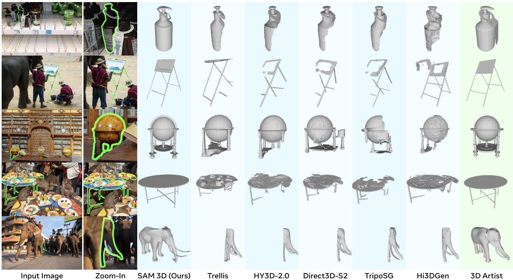
    *Figure 6 from the original paper, showing qualitative comparison on the artist-generated SA-3DAO benchmark.*

    **Human Preference for Shape and Texture:**
The paper emphasizes human preference tests as a critical evaluation.

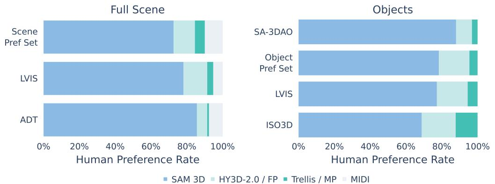
*Figure 8 from the original paper, showing human preference win rates for SAM 3D over competitors on scene and object reconstruction.*

**Analysis of Figure 8:**
*   `SAM 3D` achieves an impressive `5:1 head-to-head win rate` in human preference studies on `real images` for object reconstruction (Object Pref column). This indicates that humans consistently perceive `SAM 3D`'s outputs as more accurate and visually appealing compared to other methods.
*   Figure 9 (below) specifically compares `texture quality`.

    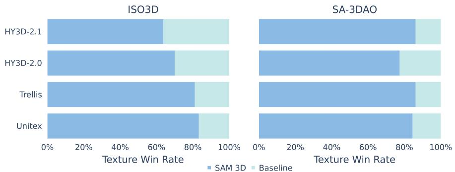
    *Figure 9 from the original paper, showing texture comparisons where SAM 3D's shapes are used for all methods.*

    Even when provided with `SAM 3D`'s improved shapes, human annotators significantly prefer `SAM 3D`'s `texture generations` over others. This indicates that `SAM 3D`'s texture module is also `state-of-the-art`.

### 6.1.2. 3D Scene Reconstruction (Layout)

`SAM 3D` also demonstrates superior performance in `scene reconstruction`, particularly `object layout`.
The following are the results from Table 3 of the original paper:

<table><thead><tr><th rowspan="2">Generation</th><th rowspan="2">Model</th><th colspan="4">SA-3DAO</th><th colspan="4">Aria Digital Twin</th></tr><tr><th>3D IOU (↑)</th><th>ICP-Rot. (↓)</th><th>ADD-S (↓)</th><th>ADD-S @ 0.1 (↑)</th><th>3D IoU (↑)</th><th>ICP-Rot. (↓)</th><th>ADD-S (↓)</th><th>ADD-S @ 0.1 (↑)</th></tr></thead><tbody><tr><td>Pipeline</td><td>Trellis + Megapose</td><td>0.2449</td><td>39.3866</td><td>0.5391</td><td>0.2831</td><td>0.2531</td><td>33.6114</td><td>0.4358</td><td>0.1971</td></tr><tr><td>Pipeline</td><td>HY3D-2.0 + Megapose</td><td>0.2518</td><td>33.8307</td><td>0.7146</td><td>0.3647</td><td>0.3794</td><td>29.0066</td><td>0.1457</td><td>0.4211</td></tr><tr><td>Pipeline</td><td>HY3D-2.0 + FoundationPose</td><td>0.2937</td><td>32.9444</td><td>0.3705</td><td>0.5396</td><td>0.3864</td><td>25.1435</td><td>0.1026</td><td>0.5992</td></tr><tr><td>Pipeline</td><td>HY3D-2.1 + FoundationPose</td><td>0.2395</td><td>39.8357</td><td>0.4186</td><td>0.4177</td><td>0.2795</td><td>33.1197</td><td>0.2135</td><td>0.4129</td></tr><tr><td>Pipeline</td><td>SAM 3D + FoundationPose</td><td>0.2837</td><td>32.9168</td><td>0.3848</td><td>0.5079</td><td>0.3661</td><td>18.9102</td><td>0.0930</td><td>0.6495</td></tr><tr><td>Joint</td><td>MIDI</td><td>-</td><td>-</td><td>-</td><td>-</td><td>0.0336</td><td>44.2353</td><td>2.5278</td><td>0.0175</td></tr><tr><td>Joint</td><td>SAM 3D</td><td>0.4254</td><td>20.7667</td><td>0.2661</td><td>0.7232</td><td>0.4970</td><td>15.2515</td><td>0.0765</td><td>0.7673</td></tr></tbody></table>

*Table 3: 3D layout quantitative comparison to competing layout prediction methods on SA-3DAO and Aria Digital Twin.*

**Analysis of Table 3:**
*   **Human Preference:** In preference tests across three evaluation sets, users prefer `scene reconstructions` from `SAM 3D` by `6:1` over prior `SOTA` (Figure 8, Scene Pref column). This indicates superior overall scene quality.
*   **Quantitative Layout Metrics:** `SAM 3D` (Joint) consistently and significantly outperforms both `pipeline approaches` (which combine a shape model with a separate `pose estimator` like `Megapose` or `FoundationPose`) and other `joint generative models` (`MIDI`).
    *   **SA-3DAO:**
        *   `3D IoU`: `SAM 3D` achieves `0.4254`, significantly higher than the best pipeline (`HY3D-2.0 + FoundationPose` at `0.2937`).
        *   `ICP-Rot.`: `SAM 3D`'s `20.7667` is much lower (better) than any pipeline approach.
        *   `ADD-S` and `ADD-S@0.1`: `SAM 3D`'s `0.2661` `ADD-S` and `0.7232` `ADD-S@0.1` are also superior, demonstrating better `pose accuracy`.
    *   **Aria Digital Twin (ADT):** Similar trends are observed on `ADT`, which has highly accurate `pointmaps`. `SAM 3D` achieves `0.4970` `3D IoU`, `15.2515` `ICP-Rot.`, `0.0765` `ADD-S`, and `0.7673` `ADD-S@0.1`, which are substantially better than all baselines.
*   **Joint Prediction vs. Pipeline:** The stark improvement demonstrates the advantage of `SAM 3D`'s `joint generation` of `shape` and `layout`, as opposed to pipeline approaches that separate these tasks. This confirms that `SAM 3D` introduces a new `real-world capability`.
*   **Robustness:** The strong results confirm `SAM 3D`'s robust handling of both `RGB-only inputs` (e.g., `SA-3DAO`, `LVIS`, `Pref Set`) and `provided pointmaps` (e.g., `ADT`).
*   **Potential for Further Improvement:** The paper notes that a `sample-then-optimize` approach (like `render-and-compare`) using `SAM 3D` meshes can further improve performance (Section E.3), showing flexibility.

## 6.2. Ablation Studies / Parameter Analysis

The paper includes various ablation studies to validate the effectiveness of `SAM 3D`'s components and training stages.

### 6.2.1. Post-training Iterations Steadily Improve Performance

*   **Figure 10a (Elo Scaling):** Shows a near-linear scaling of `shape Elo ratings` as the `data engine` runs longer (more iterations/checkpoints). The `Elo rating` increases from a baseline (`Pre-train`) to over 1700 after $v6$. This demonstrates the effectiveness of the `iterative data flywheel`.

    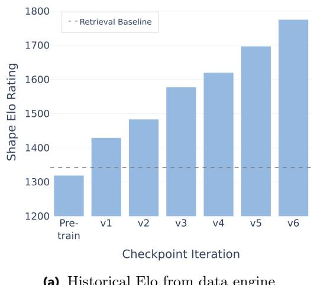
    *Figure 10a from the original paper, showing model Elo scaling over post-training iterations.*

*   **Figure 10b (Impact of Expanding Training Data):** Demonstrates that `post-trained (SFT)` models using expanded training data (from `MITL-3DO`) show consistent improvements, although with decreasing marginal impact over time. The cumulative linear effect results from combining more `data engine iterations` with scaling up `pretraining`, `mid-training`, and adding new `post-training` stages.

    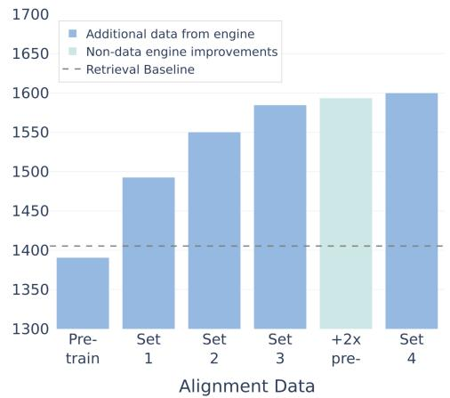
    *Figure 10b from the original paper, showing the impact of expanding training data on human preference win rate.*

### 6.2.2. Multi-Stage Training Improves Performance

The following are the results from Table 4 of the original paper:

<table><thead><tr><th rowspan="2">Training Stage</th><th colspan="4">SA-3DAO</th><th>Preference set</th></tr><tr><th>F1 @ 0.01 (↑)</th><th>vIoU (↑)</th><th>Chamfer (↓)</th><th>EMD (↓)</th><th>Texture WR (↑)</th></tr></thead><tbody><tr><td>Pre-training (Iso-3DO)</td><td>0.1349</td><td>0.1202</td><td>0.1036</td><td>0.2396</td><td>-</td></tr><tr><td>+ Mid-training (RP-3DO)</td><td>0.1705</td><td>0.1683</td><td>0.0760</td><td>0.1821</td><td>60.7</td></tr><tr><td>+ SFT (MITL-3DO)</td><td>0.2027</td><td>0.2025</td><td>0.0578</td><td>0.1510</td><td>66.9</td></tr><tr><td>+ DPO (MITL-3DO)</td><td>0.2156</td><td>0.2156</td><td>0.0498</td><td>0.1367</td><td>66.4</td></tr><tr><td>+ SFT (Art-3DO)</td><td>0.2331</td><td>0.2337</td><td>0.0445</td><td>0.1257</td><td>-</td></tr><tr><td>+ DPO (Art-3DO)</td><td>0.2344</td><td>0.2311</td><td>0.0400</td><td>0.1211</td><td>-</td></tr></tbody></table>

*Table 4: Ablation study showing cumulative impact of training stages.*

**Analysis of Table 4:**
*   This table clearly shows `near-monotonic improvements` in `3D shape metrics` on `SA-3DAO` as each training stage is progressively added, validating the multi-stage approach.
    *   `Pre-training (Iso-3DO)` establishes a baseline.
    *   `+ Mid-training (RP-3DO)` provides a significant boost, improving `F1@0.01` from `0.1349` to `0.1705` and reducing `Chamfer Distance` from `0.1036` to `0.0760`. `Texture WR` (Win Rate) also becomes `60.7%`.
    *   `+ SFT (MITL-3DO)` further enhances performance, with `F1@0.01` reaching `0.2027` and `Chamfer` `0.0578`.
    *   `+ DPO (MITL-3DO)` leads to another substantial improvement, achieving `0.2156` `F1@0.01` and `0.0498` `Chamfer`.
    *   `+ SFT (Art-3DO)`, using expert-annotated data, pushes `F1@0.01` to `0.2331` and `Chamfer` to `0.0445`.
    *   `+ DPO (Art-3DO)` brings the final model to its peak performance, with `F1@0.01` at `0.2344` and `Chamfer` at `0.0400`.
*   This cumulative improvement demonstrates the critical role of each stage, from synthetic priors to real-world alignment and human preference optimization.

### 6.2.3. Intermediate Training Stage Knockout (Section E.1)

The following are the results from Table 7 of the original paper:

<table><thead><tr><th rowspan="2">Model</th><th rowspan="2">Training Setup</th><th colspan="4">SA-3DAO</th></tr><tr><th>F1 @ 0.01 (↑)</th><th>vIoU (↑)</th><th>Chamfer (↓)</th><th>EMD ()</th></tr></thead><tbody><tr><td>SAM 3D</td><td>Full</td><td>0.2344</td><td>0.2311</td><td>0.0400</td><td>0.1211</td></tr><tr><td></td><td>w/o training on MITL-3DO</td><td>0.2211</td><td>0.2220</td><td>0.0486</td><td>0.1338</td></tr><tr><td></td><td>w/o training on Art-3DO</td><td>0.2027</td><td>0.2025</td><td>0.0578</td><td>0.1510</td></tr><tr><td></td><td>w/o DPO on MITL-3DO</td><td>0.2156</td><td>0.2156</td><td>0.0498</td><td>0.1367</td></tr></tbody></table>

*Table 7: Training stage knockout. The impact of training on MITL and 3D artist-generated data.*

**Analysis of Table 7:**
*   This table shows the individual importance of different `real-world data stages`.
*   Removing `MITL-3DO` training (`w/o training on MITL-3DO`) causes a notable drop in `F1@0.01` from `0.2344` to `0.2211` and an increase in `Chamfer` from `0.0400` to `0.0486`.
*   Removing `Art-3DO` training has an even more significant impact, bringing `F1@0.01` down to `0.2027` and `Chamfer` up to `0.0578`. This highlights the crucial role of expert-curated `Art-3DO` data for quality.
*   Removing `DPO on MITL-3DO` also degrades performance, showing the importance of `preference alignment`.
*   This confirms that each real-world data stage contributes uniquely and significantly to the final model's performance.

### 6.2.4. Texture Evaluations (Section E.2)

The following are the results from Table 8 of the original paper:

<table><thead><tr><th rowspan="2">Model</th><th colspan="4">SAM 3D WR over baselines, SAM 3D shape</th></tr><tr><th>iso3d</th><th>Preference Set</th><th>SA-3DAO</th><th>LVIS</th></tr></thead><tbody><tr><td>Trellis</td><td>81.1</td><td>87.0</td><td>86.2</td><td>89.1</td></tr><tr><td>Hunyuan3D-2.1</td><td>63.8</td><td>87.0</td><td>86.2</td><td>89.1</td></tr><tr><td>Hunyuan3D-2.0</td><td>70.1</td><td>77.5</td><td>77.4</td><td>85.7</td></tr><tr><td>Unitex</td><td>83.3</td><td>84.7</td><td>84.5</td><td>88.3</td></tr></tbody></table>

*Table 8: 3D texture preference results comparing SAM 3D to competing image-to-3D methods.*

**Analysis of Table 8:**
*   This table specifically evaluates `texture quality` by providing `SAM 3D`'s shapes to all methods, thus isolating the `texture module`'s performance. The values represent `SAM 3D`'s `human preference win rate` over the baseline.
*   `SAM 3D` achieves high `win rates` (above `63%` and often above `80%`) over all baselines across different datasets (`ISO3D`, `Preference Set`, `SA-3DAO`, `LVIS`).
*   This indicates that `SAM 3D`'s `texture module` is also superior, especially given the challenging conditions of `occlusion` and `clutter` present in these datasets, which other works struggle with.

**Ablations for Texture Training (Figure 17):**

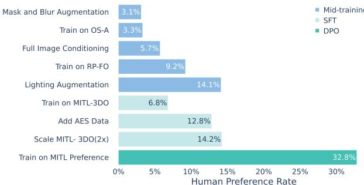
*Figure 17 from the original paper, showing ablations for the Texture & Refinement model, grouped by training stage. Percentages denote human preference rate for each ablation, over the model without the ablation.*

**Analysis of Figure 17:**
*   **Augmentation:** `Lighting augmentation` is the most critical, confirming the importance of `de-lighted textures`. `Mask` and `Blur augmentations` also help, especially for specific challenging cases.
*   **RP-3DO Data:** Critical for adapting the model to the real world, showing substantial `preference rate` increases.
*   **Post-training Data:** Essential for significant gains.
    *   `MITL-3DO`: Scaling `MITL-3DO texture annotations` by `2x` improves human preference by `14.2%`.
    *   `Aesthetics (AES)`: Sourcing specific `high-aesthetics samples` further improves `preference rate`.
    *   `DPO`: Amplifies gains from `SFT`, aligning outputs with human preferences.

### 6.2.5. Layout Test-Time Optimization (Section E.3)

The following are the results from Table 9 of the original paper:

<table><thead><tr><th>Model</th><th>3D IoU (↑)</th><th>ICP-Rot. (↓)</th><th>ADD-S (↓)</th><th>ADD-S @ 0.1 (↑)</th><th>2D IoU (↑)</th></tr></thead><tbody><tr><td>SAM 3D</td><td>0.4837</td><td>14.4702</td><td>0.08265</td><td>0.7545</td><td>0.5143</td></tr><tr><td>SAM 3D (post-optim)</td><td>0.5258</td><td>14.1460</td><td>0.07932</td><td>0.7617</td><td>0.6487</td></tr></tbody></table>

*Table 9: Test-time optimization for layout on Aria Digital Twin (ADT).*

**Analysis of Table 9:**
*   This table explores the impact of `test-time optimization` (a `render-and-compare` approach) on `SAM 3D`'s `layout prediction`.
*   Applying `post-optimization` significantly improves `layout metrics` on `ADT`.
    *   `3D IoU` increases from `0.4837` to `0.5258`.
    *   `ICP-Rot.` decreases from `14.4702` to `14.1460`.
    *   `ADD-S` drops from `0.08265` to `0.07932`.
    *   `ADD-S@0.1` slightly increases from `0.7545` to `0.7617`.
    *   `2D IoU` (mask overlap) sees a large increase from `0.5143` to `0.6487`.
*   This demonstrates that `SAM 3D`'s initial `pose estimations` can serve as excellent `proposals` for further `refinement` via `render-and-compare` techniques, achieving even better `pose accuracy`.

### 6.2.6. Rotation Representation (Section E.4)

The following are the results from Table 10 of the original paper:

<table><thead><tr><th>Representation</th><th>Chamfer (↓)</th><th>ICP-Rot. (↓)</th></tr></thead><tbody><tr><td>Quaternion</td><td>0.0061</td><td>17.9585</td></tr><tr><td>6D Rotation</td><td>0.0074</td><td>15.5399</td></tr><tr><td>Normalized 6D Rotation</td><td>0.0049</td><td>14.5946</td></tr></tbody></table>

*Table 10: Ablation on different rotation representations.*

**Analysis of Table 10:**
*   This study compares different `rotation representations` on a held-out `Objaverse test split`.
*   Switching from `Quaternion` (`0.0061` `Chamfer`, `17.9585` `ICP-Rot.`) to `6D Rotation` (`0.0074` `Chamfer`, `15.5399` `ICP-Rot.`) reduces `oriented rotation error` (`ICP-Rot.`), despite a slight increase in `Chamfer Distance`. This confirms the `6D formulation` provides a smoother `optimization landscape` for `generative modeling`.
*   Further `normalizing` the `6D rotation vectors` (`Normalized 6D Rotation`) yields additional improvements, with `Chamfer` at `0.0049` and `ICP-Rot.` at `14.5946`, demonstrating its superiority.

### 6.2.7. Pointmap Minimally Affects Shape (Section E.5)

*   In a `head-to-head preference test` for `shape` on `LVIS`, `SAM 3D` conditioned on `pointmaps` and the version *without* `pointmaps` were each selected `48%` of the time.
*   This suggests that while `pointmaps` can be integrated, they minimally affect `shape performance`. The model is robust even with `RGB-only inputs`, leveraging its learned priors and visual cues. This is important for scenarios where `depth information` is unavailable.

### 6.2.8. Texture & Refinement Depth-VAE Comparison (Section E.6)

The following are the results from Table 11 of the original paper:

<table><thead><tr><th>Method</th><th>PSNR (↑)</th><th>SSIM (↑)</th><th>LPIPS (↓)</th></tr></thead><tbody><tr><td>Non-Depth VAE</td><td>30.65</td><td>0.9470</td><td>0.04776</td></tr><tr><td>Depth-VAE</td><td>30.87</td><td>0.9500</td><td>0.04579</td></tr><tr><td>Depth-VAE + scaling</td><td>31.60</td><td>0.9547</td><td>0.04093</td></tr></tbody></table>

*Table 11: Depth-VAE ablations.*

**Analysis of Table 11:**
*   This table shows the effectiveness of improvements to the `VAE` in the `Texture & Refinement Model` (Section C.6).
*   Switching from a `Non-Depth VAE` (`30.65` `PSNR`, `0.9470` `SSIM`, `0.04776` `LPIPS`) to a `Depth-VAE` (`30.87` `PSNR`, `0.9500` `SSIM`, `0.04579` `LPIPS`) significantly improves `perceptual quality` across `PSNR`, `SSIM`, and `LPIPS` metrics. This validates the `depth-aware feature aggregation`.
*   Further `scaling` the training data (`Depth-VAE + scaling`) leads to even better performance (`31.60` `PSNR`, `0.9547` `SSIM`, `0.04093` `LPIPS`), highlighting the benefit of more data.

### 6.2.9. Data Engine: Increasing Best-of-N Search with Reward Models (Section E.7)

The following are the results from Table 12 of the original paper:

<table><thead><tr><th rowspan="2"></th><th colspan="2">Tail Holdout</th><th colspan="2">Epic Kitchens</th><th colspan="2">SA-3DAO</th></tr><tr><th>Chamfer ↓</th><th>F1↑</th><th>Chamfer ↓</th><th>F1↑</th><th>Chamfer ↓</th><th>F1↑</th></tr></thead><tbody><tr><td>SFT with N = 2</td><td>0.0059</td><td>0.39</td><td>0.0094</td><td>0.30</td><td>0.0083</td><td>0.26</td></tr><tr><td>SFT with N = 50 recovery</td><td>0.0053</td><td>0.41</td><td>0.0090</td><td>0.32</td><td>0.0081</td><td>0.26</td></tr></tbody></table>

*Table 12: Performance on challenging inputs after scaling best-of-N search.*

**Analysis of Table 12:**
*   This ablation demonstrates the value of increasing the `ensemble size (N)` in the `best-of-N search` (Section A.7) using `reward models` to recover data from challenging inputs.
*   By scaling from $N=2$ to $N=50$ to recover originally discarded samples, the yield of successful annotations improved from `0%` to `86.8%`.
*   Finetuning on this `recovered data` ($SFT with N = 50 recovery$) leads to improvements in `Chamfer` and `F1` on various challenging sets (`Tail Holdout`, `Epic Kitchens`, `SA-3DAO`). For instance, `Chamfer` on `Tail Holdout` decreases from `0.0059` to `0.0053`, and `F1` increases from `0.39` to `0.41`.
*   This validates that `amplifying the expert policy` in the `data engine` by increasing $N$ helps improve model robustness in challenging categories.

### 6.2.10. Model Distillation Results (Section E.8)

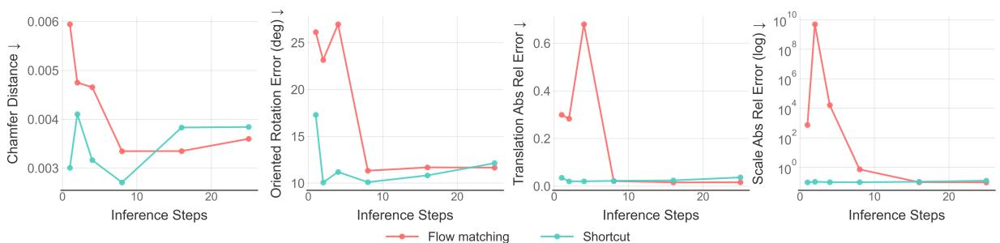
*Figure 19 from the original paper, showing the performance of shortcut models versus flow matching for the Geometry model.*

**Analysis of Figure 19:**
*   This figure illustrates the performance of `SAM 3D` with and without `distillation` (using `shortcut models`) for the `Geometry Model`, plotted against the `number of flow matching steps`.
*   **Inference Speed:** `1-step` and `4-step` `shortcut models` achieve `38x` and `10x` inference speed improvement, respectively, compared to `25 steps` with `flow matching`.
*   **Quality Preservation:** `Flow matching distillation` enables the model to perform significantly better during `early iterations`, nearly on par with `25 steps` performance.
*   **CFG Integration:** In `flow matching mode`, `CFG` is applied during the first half of steps, leading to `NFE` being `1.5x` the number of steps. In contrast, `shortcut mode` achieves `NFE` equal to the number of steps because `CFG` is distilled directly into the model.
*   `Figure 22` (in the appendix) further shows that `shortcut model distillation` improves `texture quality` when using fewer steps for both `Geometry` and `Texture & Refinement` models. This confirms the effectiveness of `distillation` for `real-time applications`.

    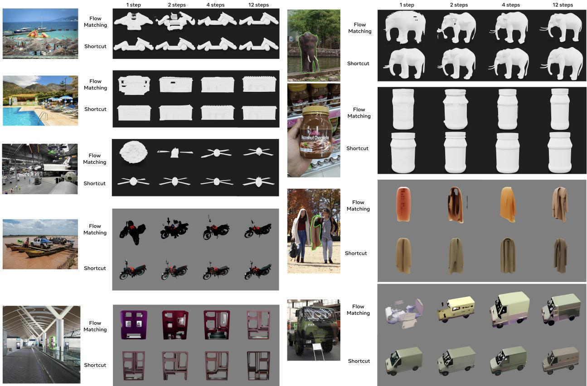
    *Figure 22 from the original paper, showing model output comparison for flow matching and shortcut mode with varying inference steps, for both untextured mesh and textured Gaussian splat rendering.*

# 7. Conclusion & Reflections

## 7.1. Conclusion Summary

The paper introduces `SAM 3D`, a groundbreaking `foundation model` for the comprehensive `3D reconstruction` of objects from `single natural images`. It excels at predicting `full 3D shape`, `texture`, and `layout` (pose) even in challenging `in-the-wild` conditions marked by `occlusion` and `clutter`. This robust performance is attributed to a novel `human- and model-in-the-loop (MITL)` data pipeline, which creates `visually grounded 3D reconstruction data` at an unprecedented scale, effectively breaking the `3D data barrier`. Furthermore, `SAM 3D` employs a sophisticated, `LLM-inspired multi-stage training framework` that leverages `synthetic pretraining` for foundational knowledge and `real-world alignment` via `supervised finetuning (SFT)` and `direct preference optimization (DPO)` for fine-tuning to natural images and human preferences.

Experimental results demonstrate `SAM 3D`'s `state-of-the-art` capabilities, achieving significant gains over prior work, including at least a `5:1 win rate` in `human preference tests`. The introduction of the `SA-3DAO` benchmark, featuring `artist-created 3D ground truth` from diverse natural images, provides a robust platform for evaluating `in-the-wild 3D object reconstruction`. The commitment to open-sourcing the code, model weights, and an online demo underscores its potential to stimulate further advancements in `3D vision` and unlock new applications across various domains, including `robotics`, `AR/VR`, `gaming`, and `film`.

## 7.2. Limitations & Future Work

The authors acknowledge several limitations of `SAM 3D` and suggest future research directions:

*   **Resolution Limits:** The current `Geometry Model` uses a coarse shape resolution of $O \in \mathbb{R}^{64^3}$ voxels, with up to 32 `Gaussian splats` per occupied voxel. While sufficient for many objects, this resolution can lead to noticeable distortions or loss of detail for complex shapes or parts (e.g., human hands or faces), due to the visual system's acuity to such features.
    *   **Future Work:** Increase output resolution through `architectural changes`, `super-resolution models`, `parts-based generation`, or switching to `implicit 3D representations`.
*   **Object Layout Reasoning:** `SAM 3D` predicts objects one at a time and is not explicitly trained to reason about `physical interactions` such as `contact`, `physical stability`, `interpenetration`, or `co-alignment` (e.g., objects on the same ground plane).
    *   **Future Work:** Incorporate `multi-object prediction` combined with appropriate `losses` to allow `joint reasoning` about multiple objects in a scene.
*   **Texture and Rotational Symmetry:** `SAM 3D`'s `texture predictions` are made without explicit knowledge of the predicted object's `pose`. For objects with `rotational symmetry`, this can occasionally lead to textures that effectively rotate the object to an incorrect orientation (e.g., a bottle label might be on the wrong side if the bottle is rotated, even if the shape is correct).
    *   **Future Work:** Integrate `pose awareness` into the `texture prediction` module to ensure consistency with object orientation, especially for symmetric objects.

## 7.3. Personal Insights & Critique

`SAM 3D` represents a significant leap forward in `single-image 3D reconstruction`, particularly for its ability to generalize to `in-the-wild natural images`. The paper's most impactful contribution, in my opinion, is the `human- and model-in-the-loop (MITL)` data engine. The `3D data scarcity` problem has been a persistent bottleneck, and `SAM 3D`'s approach to scalable annotation – turning complex 3D creation into a more manageable human selection and alignment task, then bootstrapping this process with an improving model – is truly innovative. This strategy, inspired by `LLM` training paradigms, demonstrates a powerful blueprint for tackling `data scarcity` in other challenging modalities.

The rigorous `multi-stage training framework`, from `synthetic pretraining` to `real-world alignment` via `SFT` and `DPO`, is a testament to the effectiveness of progressive skill acquisition in large models. It highlights that even with abundant synthetic data, careful alignment with real-world complexities and human judgment is indispensable for practical utility.

**Potential Issues/Areas for Improvement:**

*   **Computational Cost of Data Engine:** While the `MITL` pipeline makes data collection scalable, the initial "cold start" problem (leveraging existing models and `3D artists`) and the continuous process of generating $N$ candidates for human review likely require substantial computational resources. The paper mentions "orders of magnitude data gap," implying the scale of generation is enormous. An analysis of the energy consumption or computational footprint of the `data engine` itself would be valuable.
*   **Subjectivity in Human Preference:** Although `human preference tests` are crucial for real-world relevance, human judgment can be subjective and vary. While the paper mentions rubrics and iterative refinement, the inherent variability in human perception might introduce noise, especially for subtle differences in 3D quality or realism. The inter-annotator agreement rate (mentioned as $<75%$ in Section E.7) suggests this is a known challenge.
*   **Generalization to Truly Novel Object Categories:** While `SAM 3D` leverages recognition and contextual cues, its ability to reconstruct objects from *entirely novel categories* (not seen in any form in pre-training or `MITL` data) remains an open question. The reliance on `recognition` implies that some level of familiarity or part-based understanding is still necessary.
*   **Interpretability of `6D Rotation`:** While the `6D rotation` representation offers a smoother optimization landscape, it is less intuitive for humans to interpret compared to `quaternions` or `Euler angles`. For certain downstream applications that require human understanding or manipulation of `pose`, a conversion layer might be necessary.

**Transferability and Broader Impact:**

The methodologies presented in `SAM 3D` have profound implications beyond `3D reconstruction`:
*   **Data Annotation for Other Complex Modalities:** The `MITL` framework could be adapted to accelerate data collection for other domains where `ground truth` is hard to obtain, such as `dense semantic segmentation`, `video understanding`, or `multi-modal alignment`.
*   **Foundation Models for Physical World Understanding:** `SAM 3D` pushes towards a `foundation model` for `3D`, analogous to `LLMs` for language or `SAM` for 2D segmentation. Such models are crucial for `robotics` (enabling robots to understand and interact with their physical environment) and `AR/VR` (creating realistic digital twins and immersive experiences).
*   **Iterative Model Improvement Paradigms:** The paper reinforces the power of `iterative data-centric AI`, where the model itself becomes a tool for improving its own training data. This `virtuous cycle` is a powerful paradigm for continuous learning and adaptation in highly dynamic or data-scarce environments.

    Overall, `SAM 3D` is a landmark paper that addresses fundamental challenges in `3D vision` through clever data engineering and sophisticated training strategies, laying groundwork for truly `general-purpose 3D perception`.