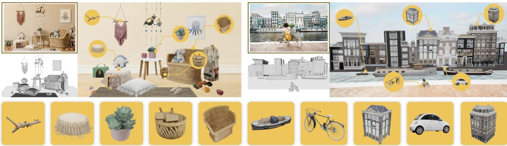
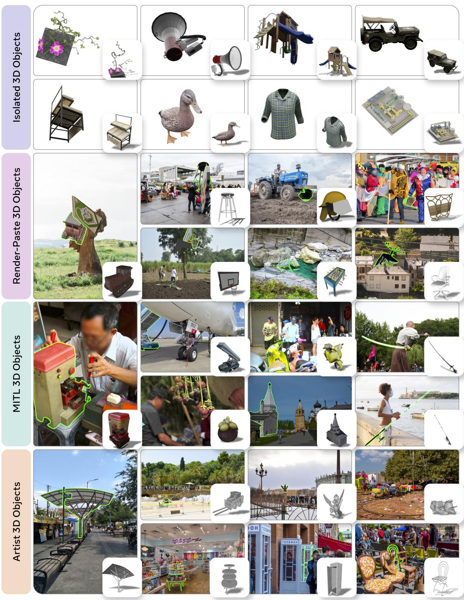
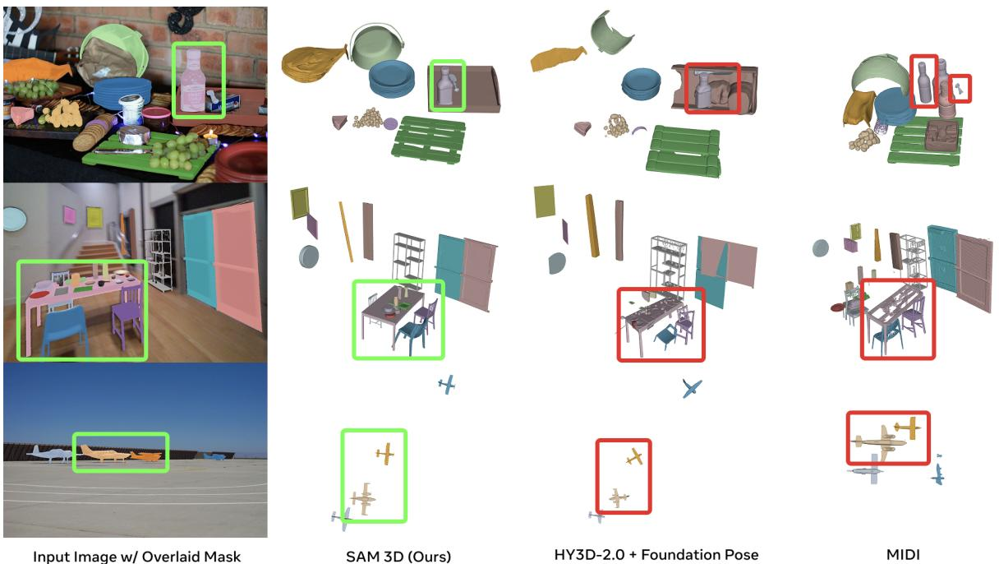
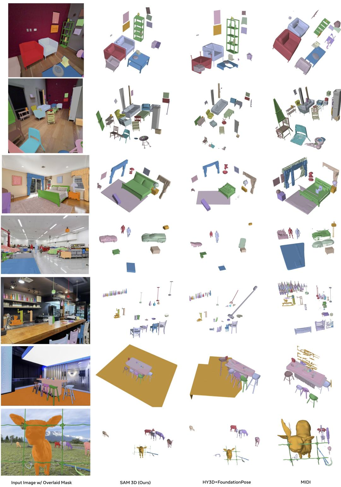

# 1. 论文基本信息

## 1.1. 标题
SAM 3D: 3Dfy Anything in Images

## 1.2. 作者
Xingyu Chen, Fu-Jen Chu, Pierre Gleize, Kevin J Liang, Alexander Sax, Hao Tang, Weiyao Wang, Michelle Guo, Thibaut Hardin, Xiang Li, Aoan Lin, Jiawei Lu, Ziqi Ma, Anushka Sagar, Bowen Song, Xiaodong Wang, Jianing Yang, Bowen Zhang, Piotr Dollár, Georgia Gkioxari, Matt Feiszli, Jitendra Malik 等。

作者团队来自 Meta Superintelligence Labs，其中部分作者是核心贡献者或项目负责人，部分为实习生。

## 1.3. 发表期刊/会议
该论文以预印本（arXiv）形式发布。由于发布时间点为 2025-11-20，表明这是一个前瞻性的研究成果，尚未正式发表在期刊或会议上，但通常这类工作会提交给顶级的计算机视觉或机器学习会议（如 CVPR, ICCV, NeurIPS 等）。

## 1.4. 发表年份
2025

## 1.5. 摘要
本文介绍了 SAM 3D，一个用于视觉基础（visually grounded）3D 对象重建的生成模型，能够从单张图像中预测物体的几何形状（geometry）、纹理（texture）和布局（layout）。SAM 3D 在自然图像中表现出色，尤其是在存在遮挡（occlusion）和场景杂乱（scene clutter）的情况下，通过上下文的视觉识别线索发挥了更大的作用。实现这一目标的关键在于一个结合了人工（human-in-the-loop）和模型（model-in-the-loop）的流水线，用于标注对象形状、纹理和姿态（pose），从而以前所未有的规模提供了视觉基础的 3D 重建数据。研究团队利用这些数据，通过一个现代化的多阶段训练框架进行学习，该框架结合了合成预训练（synthetic pretraining）和真实世界对齐（real-world alignment），打破了 3D 数据瓶颈（"data barrier"）。相比近期工作，SAM 3D 取得了显著的性能提升，在真实世界物体和场景的人类偏好测试中，胜率至少达到 5:1。研究团队将发布代码、模型权重、在线演示，以及一个新的针对野外 3D 对象重建的挑战性基准测试。

## 1.6. 原文链接
https://arxiv.org/abs/2511.16624
PDF 链接: https://arxiv.org/pdf/2511.16624v1.pdf
发布状态: 预印本（Preprint）

# 2. 整体概括

## 2.1. 研究背景与动机

### 2.1.1. 核心问题与挑战
从单张图像中重建 3D 对象一直是计算机视觉领域的一个核心挑战。传统的 3D 重建方法主要依赖多视图几何（multi-view geometry），即从多张不同视角的图像中提取 3D 信息。然而，人类可以仅凭一张图像感知深度和形状，这得益于对图像中“图片线索”（pictorial cues）的利用，例如阴影、纹理模式，以及最重要的——对“熟悉物体”（familiar object）的识别。一旦识别出物体，其 3D 形状和姿态（pose）就能被恢复。

将这种人类能力赋予机器面临着一个根本性挑战：缺乏大规模的、配对有 3D 真值（ground truth）的自然图像数据集。现有的 3D 数据集（如 ShapeNet、Objaverse-XL）大多由孤立的合成对象组成，缺乏真实世界的复杂性，如遮挡、杂乱场景、远距离或不完整的物体。这导致在这些数据集上训练的模型在自然场景中表现不佳。通用的数据标注员（generalist human annotators）也难以直接生成高精度的 3D 形状模型。

### 2.1.2. 创新思路与切入点
SAM 3D 的创新点在于打破了 3D “数据瓶颈”（data barrier），并从根本上改变了 3D 重建的范式。其核心思路是：
1.  **利用识别促进 3D 重建：** 借鉴人类视觉感知的“熟悉物体”线索，模型通过学习大规模的物体形状和纹理词汇，能够识别并重建物体。
2.  **构建大规模真实世界 3D 数据：** 通过一个独特的人工（human-in-the-loop）和模型（model-in-the-loop, MITL）数据标注流水线，将 3D 对象形状、纹理和姿态的标注任务从“生成”转变为“选择和对齐”。具体而言，人工标注员从模型生成的多个 3D 候选模型中选择最佳匹配，并对其姿态进行对齐。
3.  **多阶段训练框架：** 采用类似大型语言模型（LLM）的多阶段训练策略，包括合成预训练（synthetic pretraining）、半合成中间训练（mid-training）和真实世界对齐（real-world alignment，即后训练），逐步提升模型的通用性和在真实场景中的表现。

## 2.2. 核心贡献/主要发现

SAM 3D 的主要贡献总结如下：
*   **提出了 SAM 3D 模型：** 一个新的 3D 基础模型（foundation model），能够从单张图像中预测对象的完整 3D 形状（shape）、纹理（texture）和布局（layout）。通过发布代码、模型权重和在线演示，旨在推动 3D 重建领域及其下游应用（如机器人、AR/VR、游戏、电影、交互媒体）的发展。
*   **构建了 MITL 数据流水线：** 创建了一个人机协作的流水线，用于标注形状、纹理和姿态数据，以空前的规模提供了视觉基础的 3D 重建数据。该流水线通过迭代循环不断提高标注质量和模型性能。
*   **采用了 LLM 风格的多阶段训练框架：** 利用上述数据，通过结合合成预训练和真实世界对齐的创新框架，克服了 3D 数据与文本、图像或视频等领域之间的数据量级差距。
*   **发布了新的挑战性基准 SA-3DAO：** 提出了一个名为 SAM 3D Artist Objects (SA-3DAO) 的新基准数据集，包含 1000 个由 3D 艺术家创建的真实世界物体及其 3D 形状对。这个基准填补了野外 3D 物体重建评估的空白，旨在加速后续研究。
*   **取得了显著的 SOTA 性能：** 实验结果表明，SAM 3D 在人类偏好测试中，在真实世界物体和场景上，相对于现有技术取得了显著的性能提升，胜率至少达到 5:1。

# 3. 预备知识与相关工作

## 3.1. 基础概念

*   <strong>3D 对象重建 (3D Object Reconstruction):</strong> 从 2D 图像或视频中推断并构建 3D 模型的任务。它旨在恢复物体的几何形状（如网格、点云、体素）、表面纹理和在场景中的空间位置。
*   <strong>视觉基础 (Visually Grounded):</strong> 指模型不仅进行 3D 重建，还能将其与原始 2D 图像中的视觉信息紧密关联，确保重建结果与图像内容一致。
*   <strong>几何形状 (Geometry):</strong> 指物体在三维空间中的实际形态和结构，例如使用网格（meshes）、点云（point clouds）或体素（voxels）表示。
*   <strong>纹理 (Texture):</strong> 指物体表面的视觉细节，如颜色、图案、光泽等，使物体看起来更真实。
*   <strong>布局 (Layout):</strong> 指物体在场景中的三维空间位置（translation）、方向（rotation）和大小（scale）。
*   <strong>遮挡 (Occlusion):</strong> 指物体的一部分被另一个物体或场景元素所遮挡，导致在图像中不可见。这给 3D 重建带来了挑战，因为模型需要推断被遮挡部分。
*   <strong>场景杂乱 (Scene Clutter):</strong> 指图像中包含大量不相关或重叠的物体，使得目标物体的识别和重建更加困难。
*   <strong>人机协作循环 (Human-in-the-Loop, HITL):</strong> 一种系统设计范式，将人类智能集成到机器学习模型的训练或操作过程中，利用人类的判断力来处理模型难以解决的问题或生成高质量的标注数据。
*   <strong>模型协作循环 (Model-in-the-Loop, MITL):</strong> 与 HITL 类似，但强调模型在数据生成或改进过程中的参与。通常指模型生成初步结果，人类进行修正或选择，然后修正后的数据又用于改进模型，形成一个良性循环（virtuous cycle）。
*   <strong>生成模型 (Generative Model):</strong> 一类机器学习模型，能够学习数据分布并生成新的、与训练数据相似的样本。在 3D 重建中，指能生成新的 3D 形状和纹理。
*   <strong>基础模型 (Foundation Model):</strong> 指在大规模数据上预训练、具有广泛能力，并可以适应多种下游任务的大型模型（例如 GPT-3, SAM）。
*   **Rectified Flow Matching (CFM):** 一种生成模型训练技术，通过学习一个从噪声分布到数据分布的“直线”路径（flow），来直接预测轨迹上的速度场（velocity field），从而实现高效的样本生成和去噪。它简化了扩散模型（diffusion models）中的复杂路径，提高了训练和推理效率。
*   <strong>直接偏好优化 (Direct Preference Optimization, DPO):</strong> 一种强化学习范式，用于从人类偏好数据中训练奖励模型（reward model）或直接优化生成模型。它通过比较人类更喜欢的和不喜欢的样本对，直接调整模型，使其生成更符合人类偏好的内容，而无需显式训练一个奖励模型。
*   **DINOv2 (Self-supervised Vision Transformer):** Meta AI 发布的一个自监督视觉 Transformer 模型，能够从大量未标注图像中学习强大的视觉特征表示。这些特征通常用于图像分类、分割、目标检测等下游任务，并且在图像特征提取方面表现出色。
*   **Mixture-of-Transformers (MoT):** 一种 Transformer 架构变体，结合了多个 Transformer 专家（expert），并使用门控机制（gating mechanism）来选择性地激活部分专家，从而处理多模态数据或特定任务，提高效率和灵活性。
*   <strong>VAE 解码器 (VAE Decoders):</strong> 变分自编码器（Variational Autoencoder, VAE）中的一个组件，负责将学到的潜在空间（latent space）表示解码回原始数据空间（例如，从潜在向量生成图像或 3D 形状）。
*   <strong>监督微调 (Supervised Fine-Tuning, SFT):</strong> 在大规模预训练模型的基础上，使用带有标注（ground truth）的特定任务数据进行进一步训练的过程，以使模型适应特定任务并提高其在该任务上的性能。

## 3.2. 前人工作

*   **传统 3D 重建方法：**
    *   <strong>多视图几何 (Multi-view Geometry):</strong> 如双目立体视觉（binocular stereopsis）、运动恢复结构（structure-from-motion, SfM）、同步定位与建图（SLAM）。这些方法依赖于从多个视角获取的图像来三角测量 3D 结构。
    *   **基于分析或合成的方法：** 通过轮廓（silhouettes）进行重建，或通过体渲染（volume rendering）使用隐式表示（implicit representations，如 NeRF）或显式表示（explicit ones，如体素）。
*   **单视图 3D 重建深度学习方法：**
    *   **预测表示：** 预测体素（voxels）、点云（point clouds）或网格（meshes），或优化隐式表示（如符号距离函数 SDFs）。这些方法通常在合成的、孤立的物体基准数据集（如 ShapeNet, Pix3D, Objaverse）上进行评估。
    *   **基于 VAE 潜在表示：** 利用 VAE 的潜在空间进行 3D 形状的生成和重建。
    *   <strong>近期工作（如 Xiang et al., 2025; Yang et al., 2024b）：</strong> 在单视图重建上取得了显著进展，但这些模型主要训练于孤立物体，在自然场景（有遮挡和杂乱）下表现不佳。
*   <strong>姿态估计 (Layout Estimation)：</strong>
    *   **物体姿态估计：** 许多工作专注于从单张图像估计物体姿态（Labbé et al., 2022; Wen et al., 2024），但通常限于特定场景（如桌面机器人、街道、室内），且物体位于支撑表面上。
*   **3D 数据集：**
    *   **合成数据集：** ShapeNet, Objaverse-XL 等主要包含孤立的合成 3D 对象，缺乏真实世界的图像配对。
    *   **真实世界数据集：** 现有真实世界数据集规模较小，且多限于室内环境（如 Replica, Matterport3D），偏重家具类别，泛化能力受限。
*   <strong>后训练 (Post-training) 和多阶段预训练 (Multi-stage Pretraining)：</strong>
    *   **后训练：** 从最初的监督微调（SFT）发展到利用强预训练模型进行数据高效对齐（如 RLHF, DPO）。自训练方法（self-training）利用模型本身生成高质量样本。
    *   **多阶段预训练：** 现代预训练模型常采用多阶段训练，例如课程学习（curriculum learning）或注入能力（capability injection），通过逐步引入不同质量或类型的数据来提升模型性能。SAM 3D 借鉴了 LLM 领域的这些成功经验。

## 3.3. 差异化分析

SAM 3D 与现有工作的核心区别和创新点在于：

1.  **数据瓶颈的突破：** 现有工作最大的挑战是缺乏大规模、高质量的真实世界 3D 真值数据。SAM 3D 通过其独特的 `human-in-the-loop` 和 `model-in-the-loop (MITL)` 数据流水线，将 3D 标注任务从耗时耗力的人工生成转变为模型生成候选、人类选择和对齐，从而实现了空前规模的真实世界 3D 数据集构建。
2.  <strong>“野外”</strong>场景的鲁棒性： 多数单视图 3D 重建模型在孤立物体或简单场景中表现良好，但在自然图像中（有遮挡、杂乱）则力不从心。SAM 3D 的训练数据和多阶段训练策略专门解决了这个问题，使其在“野外”（in-the-wild）场景下具有强大的鲁棒性。
3.  **预测完整 3D 属性：** SAM 3D 不仅预测粗略的 3D 形状，还能够同时预测精细的几何细节、纹理和物体在场景中的精确布局（位置、旋转、尺度），这使得其重建结果可以从任意视角重新渲染，具有更高的实用价值。
4.  **多阶段训练范式：** 借鉴 LLM 领域最先进的多阶段训练（预训练、中间训练、后训练对齐），将合成数据、半合成数据和真实世界数据巧妙结合，有效弥补了不同领域数据量和复杂度的差距，实现了从基础能力到真实世界泛化的平滑过渡。
5.  **新的评估基准：** 针对真实世界 3D 重建的评估空白，SAM 3D 引入了 `SA-3DAO` 基准，包含由专业 3D 艺术家从真实图像创建的高质量 3D 真值，为未来研究提供了更具挑战性和代表性的评估平台。

# 4. 方法论

SAM 3D 的核心思想是建立一个能够从单张图像重建 3D 物体的生成模型，其方法论主要围绕两个方面：一是其两阶段模型架构，二是其创新的多阶段训练框架和数据引擎。

## 4.1. 方法原理

SAM 3D 的目标是学习一个条件分布 $p(S, T, R, t, s | I, M)$，它表示在给定输入图像 $I$ 和对象掩码 $M$ 的情况下，预测对象的形状 $S$、纹理 $T$ 以及在相机坐标系下的旋转 $R$、平移 $t$ 和尺度 $s$ 的概率。模型通过训练一个生成模型 $q(S, T, R, t, s | I, M)$ 来近似这个真实分布。

模型架构采用两阶段方法：
1.  <strong>几何模型 (Geometry Model)：</strong> 首先预测对象的粗糙形状和布局（姿态），重点关注物体的整体结构。
2.  <strong>纹理与精炼模型 (Texture &amp; Refinement Model)：</strong> 在几何模型预测的粗糙形状基础上，添加更高分辨率的几何细节并合成纹理。

    训练流程借鉴了大型语言模型（LLM）的成功经验，采用多阶段策略：
1.  <strong>预训练 (Pre-training)：</strong> 在大规模合成数据上学习基础的形状生成能力。
2.  <strong>中间训练 (Mid-training)：</strong> 使用半合成数据，提升模型处理真实世界挑战（如遮挡、掩码跟随）的能力。
3.  <strong>后训练 (Post-training)：</strong> 使用真实世界数据进行对齐，弥合合成与真实数据之间的领域鸿沟，并优化人类偏好。

## 4.2. 核心方法详解

### 4.2.1. 模型架构

SAM 3D 建立在最先进的两阶段潜在流匹配（latent flow matching）架构基础之上。

#### 4.2.1.1. 输入编码 (Input encoding)
模型使用 `DINOv2` 编码器从两对图像中提取特征，生成四组条件 tokens：
*   <strong>裁剪对象 (Cropped object)：</strong> 对由掩码 $M$ 裁剪出的图像 $I$ 及其对应的裁剪二值掩码进行编码，提供对象聚焦的、高分辨率的视图。
*   <strong>完整图像 (Full image)：</strong> 对完整图像 $I$ 及其完整图像二值掩码进行编码，提供全局场景上下文和在裁剪视图中缺失的识别线索。

    此外，模型可选地支持以粗糙场景点图（coarse scene point map）$P$ 为条件输入，该点图可通过硬件传感器（如 iPhone 上的 `LiDAR`）或单目深度估计（monocular depth estimation）获得，使 SAM 3D 能够与其他流水线集成。

#### 4.2.1.2. 几何模型 (Geometry Model)
几何模型首先联合预测对象的姿态和粗糙形状。它预测条件分布 $p(O, R, t, s | I, M)$，其中 $O \in \mathbb{R}^{64^3}$ 是粗糙形状（以体素表示），$R \in \mathbb{R}^6$ 是 6D 旋转表示（Zhou et al., 2019），$t \in \mathbb{R}^3$ 是平移，$s \in \mathbb{R}^3$ 是尺度。

*   **架构：** 该模型采用一个 1.2B 参数的流 Transformer（flow transformer），具有 `Mixture-of-Transformers (MoT)` 架构。
*   **输入表示：** 形状 $O$ 以 $64^3$ 体素的潜在空间表示，进一步编码为 $16^3 \times 8$ 的表示。布局参数 `(R, t, s)` 直接在参数空间中去噪。形状和布局参数被映射到一个共享的 1024 维特征空间。
*   **tokens：** 形状对应 4096 个 tokens，而 `(R, t, s)` 对应 1 个 token。
*   **MoT 结构：** 包含两个 Transformer，一个专门处理形状 tokens，另一个的参数在处理布局参数 `(R, t, s)` 时共享。这种设计允许独立训练特定模态（如仅形状或仅布局），同时通过联合自注意力层实现跨模态信息共享，确保旋转等与形状的一致性。

#### 4.2.1.3. 纹理与精炼模型 (Texture & Refinement Model)
纹理与精炼模型学习条件分布 $p(S, T | I, M, O)$。
*   **流程：** 首先从几何模型预测的粗糙形状 $O$ 中提取激活的体素。然后，一个 600M 参数的稀疏潜在流 Transformer（sparse latent flow transformer）精炼几何细节并合成对象纹理。

#### 4.2.1.4. 3D 解码器 (3D Decoders)
纹理与精炼模型生成的潜在表示可以通过一对 VAE 解码器 $\mathcal{D}_m$ 和 $\mathcal{D}_g$ 解码为网格（mesh）或 3D Gaussian splats。这些独立训练的解码器共享同一个 VAE 编码器，从而共享相同的结构化潜在空间。

<strong>Depth-VAE (深度感知特征聚合):</strong>
为了改进纹理与精炼模型中的 VAE 解码器，特别是在处理遮挡和提高重建清晰度方面，模型引入了深度感知特征聚合。
*   **原理:** 传统的 VAE 会将特征反投影到所有体素，包括被遮挡的。`Depth-VAE` 仅将特征反投影到从当前图像可见的体素，利用深度信息。
*   **数学公式:**
    *   <strong>表面深度图 $\mathbf{D}_{\mathrm{surf}}(x, y)$ 的构建:</strong>
        $$
        \mathbf{D}_{\mathrm{surf}}(x, y) = \operatorname*{min}_{i:(x_i, y_i) = (x, y)} \hat{d}_i
        $$
        其中，$\hat{d}_i$ 是在坐标 $(x_i, y_i)$ 处的预测深度。该公式表示，对于离散网格上的每个点 `(x, y)`，其表面深度取所有投影到该点上的点的最小预测深度。
    *   **可见性掩码 $\mathbf{M}_i$ 的计算:**
        $$
        \mathbf{M}_i = \mathbb{I} \left[ \mathbf{d}_{\mathrm{ref}, i} > \hat{d}_i - \tau \right]
        $$
        其中，$\mathbb{I}[\cdot]$ 是指示函数（如果条件为真则为 1，否则为 0），$\mathbf{d}_{\mathrm{ref}, i}$ 是在点 $i$ 处的参考表面深度，$\hat{d}_i$ 是点 $i$ 处的预测深度，$\tau$ 是一个容忍度。该公式定义了一个点是否可见：如果其预测深度 $\hat{d}_i$ 在参考表面深度 $\mathbf{d}_{\mathrm{ref}, i}$ 的容忍度 $\tau$ 范围内，则认为该点可见。
    *   **最终深度感知表示 $\mathbf{F}_{\mathrm{depth}}$ 的加权聚合:**
        $$
        \mathbf{F}_{\mathrm{depth}} = \sum_b \tilde{\mathbf{M}}_b \odot \mathbf{f}_b
        $$
        其中，$\tilde{\mathbf{M}}_b$ 是经过批次维度（或视图）归一化的可见性掩码，$\mathbf{f}_b$ 是从 `DINO-V2` 特征图 $\mathbf{F}$ 中提取的特征向量。该公式表示最终的深度感知表示是通过对可见点特征进行加权求和得到的。
*   **训练改进:** 训练时，通过活动体素计数（active voxel count）归一化 `Kullback-Leibler (KL)` 正则化项，以防止大对象主导训练损失。

### 4.2.2. 多阶段训练框架

SAM 3D 采用多阶段训练策略，借鉴了 LLM 的经验，从合成预训练（synthetic pretraining）逐步过渡到真实世界对齐（real-world alignment）。

<strong>Step 1: 预训练 (Pre-training)</strong>
*   **目标：** 建立基础能力，如形状生成。
*   **数据：** `Iso-3DO` 数据集，包含 2.7 百万个来自 Objaverse-XL 和许可数据集的 3D 网格，每个网格从 24 个视角渲染，生成孤立的、居中的对象图像（共 64.8M 样本）。
*   **训练：** 训练模型重建孤立合成对象的准确 3D 形状和纹理。

<strong>Step 1.5: 中间训练 (Mid-Training)</strong>
*   **目标：** 注入通用技能，如遮挡鲁棒性（occlusion robustness）、掩码跟随（mask-following）和姿态估计（pose estimation）。
*   **数据：** `RP-3DO` (Render-Paste 3D Objects) 半合成数据集，通过将渲染的 3D 模型粘贴到自然图像中创建。
    *   **Flying Occlusions (FO):** 插入随机方向的合成对象，以训练模型对遮挡和尺寸变化的鲁棒性。
    *   **Object Swap - Random (OS-R):** 根据掩码和点图确定对象尺度和位置，使用随机旋转和对象替换自然图像中的对象。引入深度排序提供有意义的视觉线索。
    *   **Object Swap - Annotated (OS-A):** 使用人工标注提供的真值尺度、平移和旋转，将渲染对象替换到真实图像中，确保像素对齐。
*   **训练：** 模型学习在复杂场景中识别和重建目标对象，处理遮挡，并估计布局。

<strong>Step 2: 后训练 (Post-Training): 真实世界对齐</strong>
*   **目标：** 弥合合成数据与自然图像之间的领域鸿沟，并与人类对形状质量的偏好对齐。
*   **核心机制：** `Model-in-the-Loop (MITL)` 数据引擎，形成一个数据飞轮（data flywheel）。

#### 4.2.2.1. MITL 数据引擎：数据收集步骤

数据收集的核心挑战是大多数人无法直接创建 3D 网格。MITL 数据引擎将任务转换为选择和验证。
*   **流程：**
    1.  <strong>选择目标对象 (Stage 1: Choosing target objects `(I, M)`)：</strong> 从多样化的真实世界数据集（如 `SA-1B`, `MetaCLIP`, `Ego4D` 等）中选择图像 $I$ 和对象掩码 $M$。利用 3D 导向的分类法平衡对象分布，并结合预先存在的标注和人工标注员来获取掩码。
    2.  <strong>对象模型排名和选择 (Stage 2: Object model ranking and selection `(S, T)`)：</strong>
        *   **候选生成：** 模型（包括 SAM 3D 检查点、检索模型、文本到 3D 生成模型等）生成 $N$ 个 3D 形状和纹理候选。
        *   **人工选择：** 标注员通过一系列成对比较（pairwise comparisons）选择与输入图像和掩码最匹配的最佳候选。
        *   **质量评级：** 标注员根据预定义的质量标准 $\alpha$ 评分。高于 $\alpha$ 的样本用于训练，低于 $\alpha$ 的样本成为偏好对齐的负例。
    3.  <strong>困难案例处理 (Stage 2.5: Hard example triage (Artists))：</strong> 当模型无法生成合理形状时，将这些困难案例路由给专业 3D 艺术家进行直接标注，形成 `Art-3DO` 数据集，以解决模型在特定数据分布上的盲点。
    4.  <strong>对齐对象到 2.5D 场景 (Stage 3: Aligning objects to 2.5D scene `(R, t, s)`)：</strong> 对于选定的形状，标注员通过操纵 3D 对象的平移、旋转和尺度，将其与场景中的点云（point cloud）对齐。

*   **数据 API 抽象：** 数据收集过程可视为一个 API，它接收当前最佳模型 $q(S, T, R, t, s \mid I, M)$，并返回训练样本 $D^+ = (I, M, S, T, R, t, s)$、质量评级 $r \in [0, 1]$，以及一组不被偏好的候选 $D^- = (I, M, S', T', R', t', s') \rangle$，这些候选均劣于训练样本。

#### 4.2.2.2. 模型改进步骤

模型改进步骤利用收集到的训练样本和偏好结果来更新基础模型，通过多阶段的微调（finetuning）和偏好对齐。

*   <strong>监督微调 (Supervised Fine-Tuning, SFT)：</strong>
    *   **初始阶段：** 模型首先在 `MITL-3DO` 中相对噪声较大的非专家标注数据上进行微调。
    *   **后续阶段：** 接着在由 3D 艺术家创建的较小但高质量的 `Art-3DO` 数据集上进行微调。`Art-3DO` 数据通过与艺术家的审美偏好对齐，帮助模型抑制常见的失败模式（如漂浮物体、无底网格、对称性缺失）。
    *   **目标函数：** 监督微调使用条件流匹配（conditional flow matching）目标。

*   <strong>偏好优化 (Preference optimization, DPO)：</strong>
    *   **目标：** 在微调之后，模型能够鲁棒地生成形状和布局，但人类对对称性、闭合性等属性敏感，这些难以通过通用目标函数捕获。因此，在 SFT 之后进行 DPO，使用数据引擎第 2 阶段的 $D^+/D^-$ 对。
    *   **数学公式：**
        监督微调（SFT）和预训练阶段的目标函数是条件流匹配（conditional flow matching）：
        $$
        \mathcal{L}_{\mathrm{CFM}} = \sum_{m \in \mathcal{M}} \lambda_m \ : \mathbb{E} \left[ \| \mathbf{v}^m - \mathbf{v}_{\theta}^m (\mathbf{x}_{\tau}^m, c, \tau) \|^2 \right]
        $$
        其中：
        *   $\mathcal{M} = \{S, R, t, s\}$ 表示预测的模态集合（形状、旋转、平移、尺度）。
        *   $\lambda_m$ 是每种模态的加权系数。
        *   $\mathbb{E}[\cdot]$ 表示期望值。
        *   $\mathbf{v}^m$ 是模态 $m$ 的目标速度场，由 $\mathbf{x}_{1}^m - \mathbf{x}_{0}^m$ 定义，其中 $\mathbf{x}_{1}^m$ 是目标状态（真值），$\mathbf{x}_{0}^m \sim \mathcal{N}(0, \mathbf{I})$ 是初始噪声状态。
        *   $\mathbf{v}_{\theta}^m (\mathbf{x}_{\tau}^m, c, \tau)$ 是模型学习到的速度场，用于在部分噪声状态 $\mathbf{x}_{\tau}^m$ 下，给定条件 $c=(I,M)$ 和时间 $\tau$ 时预测模态 $m$ 的速度。
        *   $\mathbf{x}_{\tau}^m = \tau \mathbf{x}_{1}^m + (1 - \tau) \mathbf{x}_{0}^m$ 是在时间 $\tau \in [0, 1]$ 时的线性插值状态。

            偏好对齐（DPO）的目标函数：
        $$
        \begin{array}{rl}
        \mathcal{L}_{\mathrm{DPO}} = - \mathbb{E} & \qquad I \sim \mathcal{Z}, \qquad \big[ \log \sigma \big( - \beta T w(\tau) \cdot \Delta \big) \big] \\
        (x_0^w, x_0^l) & \sim \ \mathcal{X}_I^2 \\
        \tau & \sim \ \mathcal{U}(0, T) \\
        x_{\tau}^w & \sim \ {q}(x_{\tau}^w \mid x_0^w) \\
        x_{\tau}^l & \sim \ {q}(x_{\tau}^l \mid x_0^l)
        \end{array}
        $$
        其中：
        *   $I \sim \mathcal{Z}$ 表示从图像分布中采样图像 $I$。
        *   $(x_0^w, x_0^l) \sim \mathcal{X}_I^2$ 表示从给定图像 $I$ 的偏好数据中采样一对 3D 输出，其中 $x_0^w$ 是被偏好的选项（“preferred option”），$x_0^l$ 是不被偏好的选项（“less preferred option”）。
        *   $\tau \sim \mathcal{U}(0, T)$ 表示从均匀分布中采样时间步长 $\tau$。
        *   $x_{\tau}^w \sim q(x_{\tau}^w \mid x_0^w)$ 和 $x_{\tau}^l \sim q(x_{\tau}^l \mid x_0^l)$ 表示从后向扩散过程采样出的中间状态。
        *   $\sigma(\cdot)$ 是 Sigmoid 函数。
        *   $\beta$ 是一个标量超参数。
        *   $T$ 是总时间步长。
        *   $w(\tau)$ 是一个权重函数。
        *   $\Delta$ 是一个关键的差值项，定义为：
            $$
            \begin{array}{rl}
            \mathrm{where} & \Delta = \| \mathbf{v}^w - \mathbf{v}_{\theta} (x_{\tau}^w, c, \tau) \|_2^2 - \| \mathbf{v}^w - \mathbf{v}_{\mathrm{ref}} (x_{\tau}^w, c, \tau) \|_2^2 \\
            & \qquad - \left( \| \mathbf{v}^l - \mathbf{v}_{\theta} (x_{\tau}^l, c, \tau) \|_2^2 - \| \mathbf{v}^l - \mathbf{v}_{\mathrm{ref}} (x_{\tau}^l, c, \tau) \|_2^2 \right)
            \end{array}
            $$
            这里：
            *   $\mathbf{v}^w$ 和 $\mathbf{v}^l$ 分别是对于 $x_0^w$ 和 $x_0^l$ 的目标流匹配速度。
            *   $\mathbf{v}_{\theta}$ 是当前学习到的速度场。
            *   $\mathbf{v}_{\mathrm{ref}}$ 是冻结的参考速度场（通常是之前 SFT 模型的版本）。
            *   $\|\cdot\|_2^2$ 表示 L2 范数的平方。
                $\Delta$ 项衡量了当前模型 $\mathbf{v}_{\theta}$ 在生成偏好样本 $x_0^w$ 上的表现优于参考模型 $\mathbf{v}_{\mathrm{ref}}$ 的程度，以及在生成非偏好样本 $x_0^l$ 上的表现劣于参考模型 $\mathbf{v}_{\mathrm{ref}}$ 的程度。通过最大化 $\mathcal{L}_{\mathrm{DPO}}$，模型被驱动去增加生成 $x_0^w$ 的可能性并减少生成 $x_0^l$ 的可能性。

*   <strong>蒸馏 (Distillation)：</strong>
    *   **目标：** 减少推理所需的函数评估次数（NFE），以加速模型推理时间，使其适用于在线 3D 感知应用（如机器人）。
    *   **方法：** 采用 shortcut formulation。该方法通过在全训练检查点上进行微调，将 CFG（Classifier-Free Guidance）强度蒸馏到模型中，使得模型在更少的推理步数下也能保持高质量。
    *   **数学公式：**
        蒸馏目标函数：
        $$
        \dot{\boldsymbol{z}}_S (\theta) = \mathbb{E}_{\boldsymbol{x}_0 \sim N(0, I)}, \Big[ \underbrace{\| \mathbf{v} - \mathbf{v}_{\theta} (\boldsymbol{x}_{\tau}, c, \tau, d = 0) \|^2}_{\mathrm{Flow-Matching}} + \underbrace{\| \mathbf{v}_{\mathrm{consistency}} - \mathbf{v}_{\theta} (\boldsymbol{x}_{\tau}, c, \tau, 2d) \|}_{\mathrm{Self-Consistency}} \Big]
        $$
        其中：
        *   $\boldsymbol{x}_0 \sim N(0, I)$：从标准正态分布中采样的 Gaussian 噪声。
        *   $\boldsymbol{x}_1 \sim p(\boldsymbol{x})$：从数据分布中采样的真实数据样本。
        *   $\boldsymbol{x}_{\tau}$：在时间步长 $\tau$ 时 $\boldsymbol{x}_0$ 和 $\boldsymbol{x}_1$ 之间的插值样本。
        *   $\tau$：扩散时间（或噪声水平），模型在该时间预测局部速度或更新步长。
        *   $d$：指定 shortcut 模型应预测的步长大小。$d=0$ 对应流匹配， $d>0$ 对应一致性训练。
        *   $c$：条件 tokens。
        *   $p(\tau, d)$：训练期间扩散时间和步长大小的联合采样分布。
        *   $\mathbf{v}_{\theta}(\boldsymbol{x}_{\tau}, c, \tau, d)$：由 $\theta$ 参数化的 shortcut 模型，以当前样本 $\boldsymbol{x}_{\tau}$、条件 $c$、时间 $\tau$ 和所需步长 $d$ 作为输入。
        *   $\mathbf{v}_{\mathrm{consistency}}$：自一致性目标，通过组合两个步长为 $d$ 的步骤来构建，作为单个 `2d` 步长的参考。
            这个目标结合了流匹配损失和自一致性损失，旨在训练模型在更少的步骤内达到与多步流匹配相似的性能。

### 4.2.3. 数据引擎的迭代循环

整个数据引擎（包括收集和改进步骤）形成了一个良性循环：模型生成候选 -> 人工标注员选择和对齐 -> 收集高质量训练数据和偏好数据 -> 模型在这些数据上进行改进 -> 改进后的模型生成更好的候选 -> 进一步提高标注效率和质量。

### 4.2.4. 最佳-N 搜索与奖励模型 (Best-of-N Search with Reward Models)

为了提高数据引擎的效率，特别是在处理困难样本时，模型探索了使用学习到的奖励模型（reward models）来辅助 `best-of-N` 搜索。
*   **挑战：** 简单的 `best-of-N` 搜索在 $N$ 很大时，人工标注员选择效率会降低，且易受“选择超载”（choice overload）影响。
*   **解决方案：** 使用奖励模型进行初筛。首先生成 50 个具有不同初始噪声的候选，然后使用奖励模型进行锦标赛式排名（tournament-style ranking），选出最佳候选。这个最佳候选再提交给人工标注员进行排名和验证。
*   <strong>数学公式 (奖励模型数据恢复流水线 - 未给出具体公式，但示意图 Figure 16 描述了流程):</strong>
    流程示意图 Figure 16 展示了奖励模型如何增加 `best-of-N` 搜索中的 $N$ 值。它包括：
    1.  <strong>生成 50 个种子 (Generate 50 seeds):</strong> 从模型中生成 50 个不同的 3D 候选。
    2.  <strong>VLM 锦标赛排名 (VLM Tournament Ranking):</strong> 使用视觉语言模型（VLM）作为奖励模型，对这 50 个候选进行两两比较和排名，选出表现最佳的候选。
    3.  <strong>VLM 评分 (VLM Score):</strong> 对最佳候选进行 VLM 评分。
    4.  <strong>重新注释 (Re-annotate):</strong> 标注员根据 VLM 评分和初始生成进行重新注释。
    5.  <strong>SFT (Supervised Fine-Tuning) 模型 (SFT Model):</strong> 最终获得的 SFT 模型。
        通过这个流水线，可以从最初失败的样本中恢复出 86.8% 的有效标注。

# 5. 实验设置

## 5.1. 数据集

SAM 3D 的训练和评估使用了多种数据集，涵盖了合成、半合成和真实世界数据，以全面提升模型的鲁棒性和泛化能力。

### 5.1.1. 训练数据集

*   **Iso-3DO (Isolated 3D Objects):**
    *   **来源与特点：** 用于预训练，包含 2.7 百万个来自 Objaverse-XL 和许可数据集的 3D 网格。每个网格从 24 个视角渲染，生成孤立的、居中的对象图像。这些数据具有高分辨率，用于学习基础形状和纹理。
    *   **规模：** 2.7 百万个网格，64.8 百万个样本。
*   **RP-3DO (Render-Paste 3D Objects):**
    *   **来源与特点：** 半合成数据集，用于中间训练，通过将渲染的 3D 模型粘贴到自然图像中创建。分为三种变体：
        *   **Flying Occlusions (FO):** 插入随机方向的合成对象。用于增强模型对遮挡和尺寸变化的鲁棒性。包含 55.1 百万个样本，2.87 百万个独特网格，11.17 百万个独特图像。
        *   **Object Swap - Random (OS-R):** 替换自然图像中的对象，根据掩码和点图确定尺度和位置，但使用随机旋转和对象。提供深度排序，具有中等语义相关性。包含 5.95 百万个样本，2.38 百万个独特网格，1.20 百万个独特图像。
        *   **Object Swap - Annotated (OS-A):** 使用人工标注提供的真值尺度、平移和旋转，将渲染对象替换到真实图像中，确保像素对齐和语义匹配。提供 0.4 百万训练样本。
*   **ProcThor:**
    *   **来源与特点：** 虚拟环境中的数据集，用于中间训练，提供丰富的物体和场景多样性。
*   **MITL-3DO (Model-in-the-Loop 3D Objects):**
    *   **来源与特点：** 通过 SAM 3D 的 MITL 数据引擎收集的真实世界数据，包含形状、纹理和姿态标注。标注员从模型生成的多个候选模型中选择最佳匹配并对齐。
    *   **规模：** 总计近 100 万张图像，约 314 万个未纹理网格，约 10 万个纹理网格，以及超过 7 百万个成对偏好数据。
*   **Art-3DO (Artist-created 3D Objects):**
    *   **来源与特点：** 由专业 3D 艺术家为模型难以处理的“硬案例”（hard cases）直接创建的高质量 3D 网格。用于监督微调，提升模型对艺术家审美偏好的对齐。
    *   **规模：** 数量较少，但质量极高。

### 5.1.2. 评估数据集

*   **SA-3DAO (SAM 3D Artist Objects):**
    *   **来源与特点：** SAM 3D 提出的新基准，包含 1000 个未纹理的 3D 对象，这些对象由专业 3D 艺术家从真实世界图像中创建并精确对齐。图像涵盖室内外环境，物体种类多样，从教堂、滑雪缆车到动物、日常用品和稀有文物。
    *   **目标：** 旨在捕捉真实世界 3D 感知的多样性和复杂性，作为评估 3D 对象重建模型的综合测试平台。
*   **ISO3D (Ebert, 2025):**
    *   **来源与特点：** 包含 101 张“野外”合成图像，但没有 3D 几何真值。
    *   **目标：** 用于定量评估形状和纹理的感知相似性。
*   **Aria Digital Twin (ADT) (Pan et al., 2023):**
    *   **来源与特点：** 针对第一人称 3D 机器感知的数据集，包含高度精确的点图。
    *   **目标：** 用于评估布局估计能力。
*   <strong>人类偏好测试集 (Human Preference Set):</strong>
    *   **来源与特点：** 包含四种类型：
        *   **SA-1B (Kirillov et al., 2023):** 均匀采样 1000 对图像-对象掩码，涵盖广泛的对象类别，评估模型泛化能力。
        *   **MetaCLIP (Xu et al., 2024):** 选取 1000 个中度或重度遮挡的对象掩码样本，评估模型在遮挡场景下的性能。
        *   **LVIS (Gupta et al., 2019):** 密集采样 1000 张图像，每张包含 10-30 个对象，评估模型向域外数据迁移的能力及在密集场景中的物理属性捕捉能力。
        *   **Aria Digital Twin (Pan et al., 2023):** 采样 40 帧视频，每帧约 30 个对象，用于与基线模型在具有高精度点图的场景下进行比较。

## 5.2. 评估指标

### 5.2.1. 形状指标 (Shape Metrics)
在 SA-3DAO 上评估形状时，首先将艺术家创建的真值网格和生成的网格独立归一化到 $[-1, 1]$ 范围。然后对每对网格应用 `ICP` 对齐，并从两个网格中均匀采样 1M 个点，报告以下四个互补指标：

*   **F-score @ 0.01 (F1@0.01):**
    *   **概念定义:** 衡量重建点云与真值点云之间对应关系的准确性。它计算两个点云之间的精确度（Precision）和召回率（Recall），并取其调和平均数（F1 分数）。F1@0.01 特指在距离阈值 0.01 内的对应关系。该指标评估了重建结果与真值在多大程度上相互覆盖。
    *   **数学公式:**
        F1 Score 的一般公式为：
        $$
        \mathrm{F1} = 2 \cdot \frac{\mathrm{Precision} \cdot \mathrm{Recall}}{\mathrm{Precision} + \mathrm{Recall}}
        $$
        其中，`Precision` 和 `Recall` 定义为：
        $$
        \mathrm{Precision} = \frac{\mathrm{TP}}{\mathrm{TP} + \mathrm{FP}}
        $$
        $$
        \mathrm{Recall} = \frac{\mathrm{TP}}{\mathrm{TP} + \mathrm{FN}}
        $$
        在点云比较中，当点之间的距离小于给定阈值（例如 0.01）时，点被认为是匹配的。
    *   **符号解释:**
        *   $\mathrm{TP}$ (True Positives): 正确匹配的点对数量。
        *   $\mathrm{FP}$ (False Positives): 错误匹配的点对数量。
        *   $\mathrm{FN}$ (False Negatives): 未匹配到的点对数量。
        *   `Precision`：重建点云中距离真值点云很近的点的比例。
        *   `Recall`：真值点云中距离重建点云很近的点的比例。
        *   `F1`：精确度和召回率的调和平均数。
        *   `@ 0.01`：表示距离阈值为 0.01。
*   **Voxel-IoU (Voxel Intersection-over-Union):**
    *   **概念定义:** 衡量重建形状和真值形状在体素空间中的重叠程度。它将两个点云体素化到 $64^3$ 分辨率，然后计算占用体素的交并比。该指标对体积、轮廓和拓扑结构上的粗略误差敏感。
    *   **数学公式:**
        假设 $V_{\mathrm{pred}}$ 是预测形状的占用体素集合，$V_{\mathrm{gt}}$ 是真值形状的占用体素集合。
        $$
        \mathrm{Voxel-IoU} = \frac{|V_{\mathrm{pred}} \cap V_{\mathrm{gt}}|}{|V_{\mathrm{pred}} \cup V_{\mathrm{gt}}|}
        $$
    *   **符号解释:**
        *   $|V_{\mathrm{pred}} \cap V_{\mathrm{gt}}|$：预测和真值形状共同占用的体素数量（交集）。
        *   $|V_{\mathrm{pred}} \cup V_{\mathrm{gt}}|$：预测和真值形状总共占用的体素数量（并集）。
*   **Chamfer Distance (CD):**
    *   **概念定义:** 衡量两个点云之间双向最近邻距离的平均值。它计算从第一个点云中的每个点到第二个点云中最近点的距离，然后反向计算，并将所有这些距离求和（或平均）。该指标突出显示精细的几何偏差，并惩罚缺失或扭曲的区域。
    *   **数学公式:**
        假设 $P_1 = \{p_{1,i}\}_{i=1}^{N_1}$ 和 $P_2 = \{p_{2,j}\}_{j=1}^{N_2}$ 是两个点云。
        $$
        \mathrm{CD}(P_1, P_2) = \frac{1}{N_1} \sum_{p \in P_1} \min_{q \in P_2} \|p - q\|_2^2 + \frac{1}{N_2} \sum_{q \in P_2} \min_{p \in P_1} \|q - p\|_2^2
        $$
    *   **符号解释:**
        *   $P_1, P_2$：两个点云。
        *   $N_1, N_2$：点云 $P_1, P_2$ 中的点数。
        *   $p \in P_1, q \in P_2$：点云中的任意点。
        *   $\min_{q \in P_2} \|p - q\|_2^2$：从点 $p$ 到点云 $P_2$ 中最近点的欧氏距离平方。
        *   该公式计算了从 $P_1$ 到 $P_2$ 和从 $P_2$ 到 $P_1$ 的平均最小距离平方和。
*   **Earth Mover's Distance (EMD):**
    *   **概念定义:** 量化将一个点分布转换为匹配另一个点分布所需的最小成本。EMD 比 CD 更严格，它捕捉全局结构差异，并强制点分布之间的双射对应关系。可以直观地理解为将“泥土”从一个分布移动到另一个分布所需的“工作量”。
    *   **数学公式:**
        假设 $P_1 = \{p_{1,i}\}_{i=1}^{N}$ 和 $P_2 = \{p_{2,j}\}_{j=1}^{N}$ 是两个点云（通常假设点数相等，或通过采样/插值处理）。EMD 的计算需要找到一个最优的运输计划 $\phi: P_1 \to P_2$，使得成本最小。
        $$
        \mathrm{EMD}(P_1, P_2) = \min_{\phi: P_1 \to P_2} \sum_{p \in P_1} \|p - \phi(p)\|_2
        $$
        实际上，EMD 是一个线性规划问题，通常通过匈牙利算法（Hungarian algorithm）或其近似算法求解。
    *   **符号解释:**
        *   $P_1, P_2$：两个点云。
        *   $p \in P_1$：点云 $P_1$ 中的一个点。
        *   $\phi(p)$：点 $p$ 在最优运输计划中对应的 $P_2$ 中的点。
        *   $\|\cdot\|_2$：欧氏距离。

<strong>感知相似性指标 (Perceptual Similarity Metrics) (用于 ISO3D 数据集):</strong>
由于 ISO3D 没有 3D 几何真值，模型使用感知相似性指标来衡量生成形状与输入图像之间的相似度。
*   **ULIP (Xue et al., 2023):**
    *   **概念定义:** 一个跨模态学习模型，能够计算 3D 点云特征和图像特征之间的相似度。高分表示 3D 形状与 2D 图像在语义和视觉上更一致。
    *   **数学公式:** （ULIP 是一种基于深度学习的嵌入方法，没有简单的单一数学公式来表示其相似度计算，它依赖于其预训练的嵌入空间。通常通过计算嵌入向量的余弦相似度来衡量。）
        $$
        \mathrm{Similarity}(\mathbf{f}_{\mathrm{pointcloud}}, \mathbf{f}_{\mathrm{image}}) = \frac{\mathbf{f}_{\mathrm{pointcloud}} \cdot \mathbf{f}_{\mathrm{image}}}{\|\mathbf{f}_{\mathrm{pointcloud}}\| \|\mathbf{f}_{\mathrm{image}}\|}
        $$
    *   **符号解释:**
        *   $\mathbf{f}_{\mathrm{pointcloud}}$：由 ULIP 模型从 3D 点云中提取的特征向量。
        *   $\mathbf{f}_{\mathrm{image}}$：由 ULIP 模型从 2D 图像中提取的特征向量。
*   **Uni3D (Zhou et al., 2023):**
    *   **概念定义:** 另一个统一的 3D 表示学习框架，同样可以用于衡量 3D 形状和图像之间的感知相似性。
    *   **数学公式:** （与 ULIP 类似，Uni3D 也是基于深度学习的嵌入模型，其相似度计算也是通过嵌入向量的余弦相似度。）
        $$
        \mathrm{Similarity}(\mathbf{f}_{\mathrm{pointcloud}}, \mathbf{f}_{\mathrm{image}}) = \frac{\mathbf{f}_{\mathrm{pointcloud}} \cdot \mathbf{f}_{\mathrm{image}}}{\|\mathbf{f}_{\mathrm{pointcloud}}\| \|\mathbf{f}_{\mathrm{image}}\|}
        $$
    *   **符号解释:**
        *   $\mathbf{f}_{\mathrm{pointcloud}}$：由 Uni3D 模型从 3D 点云中提取的特征向量。
        *   $\mathbf{f}_{\mathrm{image}}$：由 Uni3D 模型从 2D 图像中提取的特征向量。

### 5.2.2. 布局指标 (Layout Metrics)
评估对象姿态和布局时，采用标准 6D 姿态估计指标。

*   **3D IoU (3D Intersection-over-Union):**
    *   **概念定义:** 衡量预测的 3D 轴对齐边界框与真值边界框之间的重叠程度。值介于 0（无重叠）到 1（完美重叠）之间。
    *   **数学公式:**
        假设 $B_{\mathrm{pred}}$ 是预测的 3D 边界框，$B_{\mathrm{gt}}$ 是真值 3D 边界框。
        $$
        \mathrm{3D-IoU} = \frac{\mathrm{Volume}(B_{\mathrm{pred}} \cap B_{\mathrm{gt}})}{\mathrm{Volume}(B_{\mathrm{pred}} \cup B_{\mathrm{gt}})}
        $$
    *   **符号解释:**
        *   $\mathrm{Volume}(B_{\mathrm{pred}} \cap B_{\mathrm{gt}})$：预测和真值边界框交集的体积。
        *   $\mathrm{Volume}(B_{\mathrm{pred}} \cup B_{\mathrm{gt}})$：预测和真值边界框并集的体积。
*   **ICP-Rot (ICP Rotation Error):**
    *   **概念定义:** 在应用 `ICP` (Iterative Closest Point) 对齐后的残余旋转误差（以度为单位）。给定预测旋转 $R_{\mathrm{pred}}$ 和真值旋转 $R_{\mathrm{gt}}$，首先对网格进行姿态变换，然后 `ICP` 找到最佳对齐 $R_{\mathrm{ICP}}$，`ICP-Rot` 是此旋转的角度（以度为单位）。
    *   **数学公式:**
        假设 $R_{\mathrm{pred}}$ 是预测的旋转矩阵，$R_{\mathrm{gt}}$ 是真值旋转矩阵。
        $$
        \mathrm{ICP-Rot} = \frac{180}{\pi} \arccos\left(\frac{\mathrm{trace}(R_{\mathrm{ICP}}^{-1} R_{\mathrm{pred}} R_{\mathrm{gt}}^{-1})}{2}\right)
        $$
        （注意：原始论文仅提及“`ICP` finds optimal alignment $R_{\mathrm{ICP}}$”，这里给出的公式是衡量两个旋转矩阵差异的一种常见方式，具体实现可能略有不同。）
    *   **符号解释:**
        *   $R_{\mathrm{pred}}$：预测的旋转矩阵。
        *   $R_{\mathrm{gt}}$：真值旋转矩阵。
        *   $R_{\mathrm{ICP}}$：`ICP` 算法找到的最佳对齐旋转矩阵。
        *   $\mathrm{trace}(\cdot)$：矩阵的迹。
        *   $\arccos(\cdot)$：反余弦函数。
*   **ADD-S (Average Distance with Symmetry):**
    *   **概念定义:** 预测姿态和真值姿态的 3D 对象之间的平均距离，经过对称化处理并归一化。它衡量预测的 3D 对象点云与真值点云之间的平均最小距离。对称化公式平均了从预测到真值和从真值到预测的双向距离。
    *   **数学公式:**
        $$
        \mathrm{ADD}(\mathcal{A}, \mathcal{B}) = \frac{1}{|\mathcal{A}|} \sum_{\mathbf{x} \in \mathcal{A}} \min_{\mathbf{y} \in \mathcal{B}} \|\mathbf{x} - \mathbf{y}\|_2
        $$
        $$
        \mathrm{ADD-S} = \frac{\mathrm{ADD}(\mathcal{M}, \mathcal{M}_{\mathrm{gt}}) + \mathrm{ADD}(\mathcal{M}_{\mathrm{gt}}, \mathcal{M})}{2d}
        $$
    *   **符号解释:**
        *   $\mathcal{A}, \mathcal{B}$：两个点云。
        *   $|\mathcal{A}|$：点云 $\mathcal{A}$ 中的点数。
        *   $\mathbf{x} \in \mathcal{A}$：点云 $\mathcal{A}$ 中的点。
        *   $\mathbf{y} \in \mathcal{B}$：点云 $\mathcal{B}$ 中的点。
        *   $\min_{\mathbf{y} \in \mathcal{B}} \|\mathbf{x} - \mathbf{y}\|_2$：点 $\mathbf{x}$ 到点云 $\mathcal{B}$ 中最近点的欧氏距离。
        *   $\mathcal{M}$：预测形状的姿态点云。
        *   $\mathcal{M}_{\mathrm{gt}}$：真值形状的姿态点云。
        *   $d = \max_{\mathbf{x}, \mathbf{y} \in \mathcal{M}_{\mathrm{gt}}} \|\mathbf{x} - \mathbf{y}\|_2$：真值点云的直径。
*   **ADD-S @ 0.1:**
    *   **概念定义:** 一个二值指标，表示每个样本的 `ADD-S` 距离是否小于对象直径的 10%。如果小于，则为 1，否则为 0。

## 5.3. 对比基线

SAM 3D 将其方法与以下最先进（SOTA）方法进行了比较：

*   **Trellis (Xiang et al., 2025):** 一种用于 3D 生成的结构化 3D 潜在空间模型，通常在孤立对象上表现出色。
*   **Hunyuan3D-2.1 (Hunyuan3D et al., 2025):** 一个基于扩散模型的图像到 3D 高保真生成模型，具有生产级别的 `PBR` 材质。
*   **Hunyuan3D-2.0 (Tencent Hunyuan3D Team, 2025):** Hunyuan3D 系列的早期版本，也用于高分辨率纹理 3D 资产生成。
*   **Direct3D-S2 (Wu et al., 2025):** 基于稀疏注意力（sparse attention）的 3D 生成模型。
*   **TripoSG (Li et al., 2025):** 一种使用大型整流流模型进行高保真 3D 形状合成的模型。
*   **Hi3DGen (Ye et al., 2025):** 通过法线桥接（normal bridging）从图像生成高保真 3D 几何的模型。
*   **Megapose (Labbé et al., 2022):** 一种基于渲染和比较（render & compare）的新颖对象姿态估计方法，常用于机器人领域。在评估中与 Trellis 或 HY3D-2.0 结合使用。
*   **FoundationPose (Wen et al., 2024):** 一种统一的 6D 姿态估计和新颖对象跟踪方法。在评估中与 HY3D-2.0 或 HY3D-2.1 结合使用。
*   **MIDI (Huang et al., 2025):** 一种用于单图像到 3D 场景生成的实例扩散模型。
*   **Unitex (Liang et al., 2025b):** 一种给定配对图像和形状输入后进行纹理预测的模型。

    **注意：** 对于布局评估，基线模型通常采用“流水线”（Pipeline）方法，即将 3D 形状生成和姿态估计分开处理，例如“Trellis + Megapose”。SAM 3D 则提供了联合（Joint）生成形状和布局的能力。

# 6. 实验结果与分析

SAM 3D 的实验结果通过定量指标和大规模人类偏好测试来评估，展示了其在 3D 形状、纹理和场景重建方面的显著优势。

## 6.1. 核心结果分析

### 6.1.1. 3D 形状和纹理
*   **人类偏好测试：** 在真实图像上，SAM 3D 在人类偏好研究中取得了 5:1 的领先胜率（见 Figure 8）。
*   **定量评估：** Table 2 显示了形状质量的定量评估结果。SAM 3D 在孤立对象图像（ISO3D）上的性能匹配或超越了先前的 SOTA，并且在挑战性的真实世界输入（SA-3DAO）上显著优于所有基线。例如，在 SA-3DAO 上，SAM 3D 的 F1@0.01、vIoU 等指标远超其他模型，而 Chamfer 距离和 EMD 显著降低，表明其重建的几何形状更准确。
*   **定性示例：** Figure 6 展示了模型在重度遮挡下强大的泛化能力。
*   **纹理质量：** Figure 9 比较了 SAM 3D 纹理与其他纹理模型。在给定 SAM 3D 形状的情况下（SAM 3D 改进的形状甚至有利于其他方法），标注员显著偏好 SAM 3D 的纹理。

    以下是原文 Table 2 的结果：

    <table><tr><td></td><td colspan="4">SA-3DAO</td><td colspan="2">ISO3D Eval Set</td></tr><tr><td>Model</td><td>F1@0.01 (↑)</td><td>vIoU (↑)</td><td>Chamfer (↓)</td><td>EMD (↓)</td><td>ULIP (↑)</td><td>Uni3D (↑)</td></tr><tr><td>Trellis</td><td>0.1475</td><td>0.1392</td><td>0.0902</td><td>0.2131</td><td>0.1473</td><td>0.3698</td></tr><tr><td>HY3D-2.1</td><td>0.1399</td><td>0.1266</td><td>0.1126</td><td>0.2432</td><td>0.1293</td><td>0.3546</td></tr><tr><td>HY3D-2.0</td><td>0.1574</td><td>0.1504</td><td>0.0866</td><td>0.2049</td><td>0.1484</td><td>0.3662</td></tr><tr><td>Direct3D-S2</td><td>0.1513</td><td>0.1465</td><td>0.0962</td><td>0.2160</td><td>0.1405</td><td>0.3653</td></tr><tr><td>TripoSG</td><td>0.1533</td><td>0.1445</td><td>0.0844</td><td>0.2057</td><td>0.1529</td><td>0.3687</td></tr><tr><td>Hi3DGen</td><td>0.1629</td><td>0.1531</td><td>0.0937</td><td>0.2134</td><td>0.1419</td><td>0.3594</td></tr><tr><td>SAM 3D</td><td>0.2344</td><td>0.2311</td><td>0.0400</td><td>0.1211</td><td>0.1488</td><td>0.3707</td></tr></table>

**Table 2：形状定量比较**。SA-3DAO 显示了衡量几何准确性的指标；ISO3D (Ebert, 2025) 没有几何真值，因此显示了 3D 和输入图像之间的感知相似度指标（ULIP (Xue et al., 2023) 和 Uni3D (Zhou et al., 2023)）。TripoSG 使用明显更高的网格分辨率，这在感知指标中得到了回报。

### 6.1.2. 3D 场景重建
*   **人类偏好测试：** 在三个评估集上，用户对 SAM 3D 的场景重建偏好率达到 6:1，远超现有 SOTA（Figure 8）。Figure 7 和 Figure 20 展示了定性比较。
*   **定量评估：** Table 3 显示了对象布局的定量指标。在真实世界数据（如 SA-3DAO 和 ADT）上，SAM 3D 取得了显著提升，即使当流水线方法使用 SAM 3D 网格时，这种提升依然存在。SAM 3D 引入了联合生成形状和布局的新能力，并且通过“先采样后优化”（sample-then-optimize）的方法可以进一步提升性能。这些结果表明 SAM 3D 能够鲁棒地处理仅 RGB 输入和提供的点图输入。

    以下是原文 Table 3 的结果：

    <table><tr><td colspan="3"></td><td colspan="4">SA-3DAO</td><td colspan="4">Aria Digital Twin</td></tr><tr><td>Generation</td><td>Model</td><td></td><td>3D IOU (↑)</td><td>ICP-Rot. (↓)</td><td>ADD-S (↓)</td><td>ADD-S @ 0.1 (↑)</td><td>3D IoU (↑)</td><td>ICP-Rot. (↓)</td><td>ADD-S (↓)</td><td>ADD-S @ 0.1 (↑)</td></tr><tr><td>Pipeline</td><td>Trellis + Megapose</td><td></td><td>0.2449</td><td>39.3866</td><td>0.5391</td><td>0.2831</td><td>0.2531</td><td>33.6114</td><td>0.4358</td><td>0.1971</td></tr><tr><td>Pipeline</td><td>HY3D-2.0 + Megapose</td><td></td><td>0.2518</td><td>33.8307</td><td>0.7146</td><td>0.3647</td><td>0.3794</td><td>29.0066</td><td>0.1457</td><td>0.4211</td></tr><tr><td>Pipeline</td><td></td><td>HY3D-2.0 + FoundationPose</td><td>0.2937</td><td>32.9444</td><td>0.3705</td><td>0.5396</td><td>0.3864</td><td>25.1435</td><td>0.1026</td><td>0.5992</td></tr><tr><td>ipeline Pipeline</td><td>HY3D-2.1 + FoundationPose</td><td></td><td>0.2395</td><td>39.8357</td><td>0.4186</td><td>0.4177</td><td>0.2795</td><td>33.1197</td><td>0.2135</td><td>0.4129</td></tr><tr><td></td><td>SAM 3D + FoundationPose</td><td></td><td>0.2837</td><td>32.9168</td><td>0.3848</td><td>0.5079</td><td>0.3661</td><td>18.9102</td><td>0.0930</td><td>0.6495</td></tr><tr><td>Joint</td><td>MIDI</td><td></td><td>-</td><td>-</td><td>-</td><td>-</td><td>0.0336</td><td>44.2353</td><td>2.5278</td><td>0.0175</td></tr><tr><td>Joint</td><td>SAM 3D</td><td></td><td>0.4254</td><td>20.7667</td><td>0.2661</td><td>0.7232</td><td>0.4970</td><td>15.2515</td><td>0.0765</td><td>0.7673</td></tr></table>

**Table 3：3D 布局定量比较**。与 SA-3DAO 和 Aria Digital Twin (Pan et al., 2023) 上竞争性布局预测方法的比较。SAM 3D 显著优于机器人领域使用的流水线方法 (Labbé et al., 2022; Wen et al., 2024) 和联合生成模型 (MIDI (Huang et al., 2025))。大多数 SA-3DAO 场景只包含一个对象，因此不显示需要多对象对齐的 MIDI 结果。指标衡量边界框重叠、旋转误差和 Chamfer 距离（按对象直径归一化）。

## 6.2. 消融实验/参数分析

### 6.2.1. 后训练迭代对性能的提升
*   **数据引擎的迭代改进：** 数据引擎运行时间越长，性能稳步提升，Elo 评分呈现近线性增长（Figure 10a）。这表明数据引擎的迭代、预训练和中间训练的扩展以及新的后训练阶段的加入，共同带来了性能的累积性提升。
*   **MITL-3DO 数据的贡献：** Figure 10b 显示，仅迭代 MITL-3DO 数据就能带来持续改进，但边际效益递减。

### 6.2.2. 多阶段训练对性能的贡献
*   **形状改进：** Table 4 展示了随着每个训练阶段的增加，3D 形状性能几乎单调递增，验证了多阶段训练方法的有效性。
*   **纹理改进：** Appendix Figure 17 显示了类似的纹理结果。
*   **每个真实世界数据阶段的贡献：** Appendix Table 7 展示了 MITL-3DO、Art-3DO 数据和 DPO 阶段对模型性能的贡献，移除任何一个阶段都会导致性能显著下降。

    以下是原文 Table 4 的结果：

    <table><tr><td></td><td colspan="4">SA-3DAO</td><td>Preference set</td></tr><tr><td>Training Stage</td><td>F1 @ 0.01 (↑)</td><td>vIoU (↑)</td><td>Chamfer (↓)</td><td>EMD (↓)</td><td>Texture WR (↑)</td></tr><tr><td>Pre-training (Iso-3DO)</td><td>0.1349</td><td>0.1202</td><td>0.1036</td><td>0.2396</td><td>-</td></tr><tr><td>+ Mid-training (RP-3DO)</td><td>0.1705</td><td>0.1683</td><td>0.0760</td><td>0.1821</td><td>60.7</td></tr><tr><td>+ SFT (MITL-3DO)</td><td>0.2027</td><td>0.2025</td><td>0.0578</td><td>0.1510</td><td>66.9</td></tr><tr><td>+ DPO (MITL-3DO)</td><td>0.2156</td><td>0.2156</td><td>0.0498</td><td>0.1367</td><td>66.4</td></tr><tr><td>+ SFT (Art-3DO)</td><td>0.2331</td><td>0.2337</td><td>0.0445</td><td>0.1257</td><td>-</td></tr><tr><td>+ DPO (Art-3DO)</td><td>0.2344</td><td>0.2311</td><td>0.0400</td><td>0.1211</td><td></td></tr></table>

**Table 4：多阶段训练中的累积性能提升**。本表总结了每个训练阶段对 SAM 3D 在 SA-3DAO 和人类偏好测试集上的性能影响。每行结果反映了在上一行基础上增加一个训练阶段后的累积性能。

### 6.2.3. 其他消融实验

*   <strong>中间训练阶段剔除 (Intermediate Training Stage Knockout):</strong>
    以下是原文 Table 7 的结果：

    <table><tr><td rowspan="2">Model</td><td rowspan="2">Training Setup</td><td colspan="4">SA-3DAO</td></tr><tr><td>F1 @ 0.01 (↑)</td><td>vIoU (↑)</td><td>Chamfer (↓)</td><td>EMD ()</td></tr><tr><td>SAM 3D</td><td>Full</td><td>0.2344</td><td>0.2311</td><td>0.0400</td><td>0.1211</td></tr><tr><td></td><td>w/o training on MITL-3DO</td><td>0.2211</td><td>0.2220</td><td>0.0486</td><td>0.1338</td></tr><tr><td></td><td>w/o training on Art-3DO</td><td>0.2027</td><td>0.2025</td><td>0.0578</td><td>0.1510</td></tr><tr><td></td><td>w/o DPO on MITL-3DO</td><td>0.2156</td><td>0.2156</td><td>0.0498</td><td>0.1367</td></tr></table>

    **Table 7：训练阶段剔除**。训练 MITL 和 3D 艺术家生成数据的影响。剔除任何一个真实世界数据阶段都会导致形状性能显著下降。
*   <strong>纹理评估 (Texture Evaluations):</strong>
    *   **与 SOTA 比较：** Table 8 显示，SAM 3D 在整体图像到 3D 任务以及纹理估计方面都优于现有方法，这得益于其在处理遮挡和杂乱场景方面的优势。
    *   **纹理训练消融：** Figure 18 展示了纹理与精炼模型的消融实验，结果表明光照增强、RP-3DO 数据、后训练数据（特别是 SFT 和 DPO）以及特定数据类型（如高美学样本 AES）对纹理质量至关重要。
        以下是原文 Table 8 的结果：

        <table><tr><td rowspan="2">Model</td><td colspan="4">SAM 3D WR over baselines, SAM 3D shape</td></tr><tr><td>iso3d</td><td>Preference Set</td><td>SA-3DAO</td><td>LVIS</td></tr><tr><td>Trellis</td><td>81.1</td><td>87.0</td><td>86.2</td><td>89.1</td></tr><tr><td>Hunyuan3D-2.1</td><td>63.8</td><td>87.0</td><td>86.2</td><td>89.1</td></tr><tr><td>Hunyuan3D-2.0</td><td>70.1</td><td>77.5</td><td>77.4</td><td>85.7</td></tr><tr><td>Unitex</td><td>83.3</td><td>84.7</td><td>84.5</td><td>88.3</td></tr></table>

    **Table 8：3D 纹理**。比较 SAM 3D 与 ISO3D (Ebert, 2025)、Preference Set 和 SA-3DAO 上竞争性图像到 3D 方法的偏好结果。我们与最近的 Trellis (Xiang et al., 2025)、Hunyuan3D-2.1 (Hunyuan3D et al., 2025) 和 Unitex (Liang et al., 2025b) 进行了比较，使用相同的 SAM 3D 形状。人类偏好率表示 SAM 3D 相对于每个基线方法的偏好。
*   <strong>布局测试时优化 (Layout Test-Time Optimization):</strong>
    *   SAM 3D 的姿态估计可以作为 `render-and-compare` 优化的提案。Table 9 显示，通过后优化过程，可以在 ADT 数据集上进一步提高布局指标，特别是 2D IoU 显著提升。
        以下是原文 Table 9 的结果：

        <table><tr><td>Model</td><td>3D IoU (↑)</td><td>ICP-Rot. (↓)</td><td>ADD-S (↓)</td><td>ADD-S @ 0.1 (↑)</td><td>2D IoU (↑)</td></tr><tr><td>SAM 3D</td><td>0.4837</td><td>14.4702</td><td>0.08265</td><td>0.7545</td><td>0.5143</td></tr><tr><td>SAM 3D (post-optim)</td><td>0.5258</td><td>14.1460</td><td>0.07932</td><td>0.7617</td><td>0.6487</td></tr></table>

    **Table 9：布局测试时优化**。在 Aria Digital Twin (Pan et al., 2023) 上布局测试时优化 (post-optimization) 的定量比较。
*   <strong>旋转表示 (Rotation Representation):</strong>
    *   在 Table 10 中，比较了四元数（Quaternion）和 6D 连续旋转参数化（6D Rotation）对几何模型性能的影响。结果表明，6D 旋转表示能显著降低旋转误差，且归一化的 6D 旋转向量进一步提升了性能。
        以下是原文 Table 10 的结果：

        <table><tr><td>Representation</td><td>Chamfer (↓)</td><td>ICP-Rot. (↓)</td></tr><tr><td>Quaternion</td><td>0.0061</td><td>17.9585</td></tr><tr><td>6D Rotation</td><td>0.0074</td><td>15.5399</td></tr><tr><td>Normalized 6D Rotation</td><td>0.0049</td><td>14.5946</td></tr></table>

    **Table 10：旋转表示消融**。我们比较了四元数和 6D 连续旋转参数化。报告了 Chamfer 距离和 ICP 旋转误差。
*   <strong>点图的影响 (Pointmap Impact):</strong>
    *   点图对形状性能影响很小：在 LVIS 上的形状偏好测试中，使用点图和不使用点图的 SAM 3D 版本各被选择 48% 的时间，表明形状质量与点图的提供无关。
*   <strong>纹理与精炼 Depth-VAE 比较 (Texture &amp; Refinement Depth-VAE Comparison):</strong>
    *   Table 11 显示，Depth-VAE 显著提升了重建的感知质量，而数据扩展进一步提升了性能。
        以下是原文 Table 11 的结果：

        <table><tr><td>Method</td><td>PSNR (↑)</td><td>SSIM (↑)</td><td>LPIPS (↓)</td></tr><tr><td>Non-Depth VAE</td><td>30.65</td><td>0.9470</td><td>0.04776</td></tr><tr><td>Depth-VAE</td><td>30.87</td><td>0.9500</td><td>0.04579</td></tr><tr><td>Depth-VAE + scaling</td><td>31.60</td><td>0.9547</td><td>0.04093</td></tr></table>

    **Table 11：Depth-VAE 消融**。Texture & Refinement 模型中使用的 LAT VAE 的深度特征修改的有效性。结果在整个 GSO 数据集上评估。
*   <strong>数据引擎：最佳-N 搜索与奖励模型 (Data Engine: Increasing Best-of-N Search with Reward Models):</strong>
    *   通过使用奖励模型进行 `best-of-N` 搜索，可以提高对困难数据的恢复率。例如，将 $N$ 从 2 增加到 50，成功率从 0% 提高到 86.8%。这有助于模型“推向长尾”（push into the tail）数据分布，尤其在食品等挑战性类别中，成功率提高了 9 倍。
        以下是原文 Table 12 的结果：

        <table><tr><td></td><td colspan="2">Tail Holdout</td><td colspan="2">Epic Kitchens</td><td colspan="2">SA-3DAO</td></tr><tr><td></td><td>Chamfer ↓</td><td>F1↑</td><td>Chamfer ↓</td><td>F1↑</td><td>Chamfer ↓ F1↑</td></tr><tr><td>SFT with N = 2</td><td>0.0059</td><td>0.39</td><td>0.0094</td><td>0.30</td><td>0.0083</td></tr><tr><td>SFT with N = 50 recovery</td><td>0.0053</td><td>0.41</td><td>0.0090</td><td>0.32</td><td>0.26 0.0081 0.26</td></tr></table>

    **Table 12：奖励模型数据恢复对困难输入的改进**。使用奖励模型最佳-N 流水线恢复数据进行微调，可以提高模型在各种挑战性输入（如艺术家评估集、尾部保留集以及 EpicKitchens (Damen et al., 2020)）上的性能。

## 6.3. 数据呈现

### 6.3.1. 图像示例

Figure 1 展示了 SAM 3D 在真实世界中的重建效果，左侧为原始图像，右侧为 SAM 3D 重建的 3D 几何、纹理和布局。

*该图像是示意图，展示了SAM 3D模型的生成效果，包括多个实物和对应的3D重建元素。左侧为实际场景和物体，右侧为模型生成的3D形状和纹理。通过这种方式，SAM 3D在真实世界中实现物体的视觉重建，突出具有挑战性的场景和物体。*
**Figure 1：SAM 3D 重建示例**。uA 3cve gagt cable maiviualju ytey Bual for each object.

Figure 3 展示了用于 SAM 3D 训练的不同类型 3D 数据集示例，包括孤立对象、渲染粘贴对象、MITL 对象和艺术家创作对象。

*该图像是一个示意图，展示了不同类型的3D对象，包括孤立的3D对象（如椅子、鸭子等）、渲染粘贴的3D对象（如交通工具、场景装饰）、MITL（人机联动）3D对象以及艺术家创作的3D对象。每一类对象以缩略图形式排列，便于比较和分析，旨在展示SAM 3D模型在3D重建任务中的多样性和适应性。*
**Figure 3：3D 对象数据类型**。earje ne ru mewhe right. Samples are divided into four rows, based on type. Art-3DO meshes are untextured, while the rest may be textured or not, depending on the underlying asset (Iso-3DO, RP-3DO) or if the mesh was annotated or texture (MITL-3DO).

Figure 6 展示了 SAM 3D 与其他模型在单形状重建上的定性比较，突出显示了 SAM 3D 在复杂场景中的泛化能力。

*该图像是比较不同3D重建模型性能的示意图，包括输入图像、放大图和多个模型（如SAM 3D、HY3D-2.0等）生成的3D形状。明显可以看出，SAM 3D在真实场景中的表现优于其他模型，展示了更高的细节与结构还原能力。*
**Figure 6：单形状重建定性比较**。Fli 20 Huyuan3D-2.1 (Huyn3D et al. 2025) Direct3D-S2 (Wu etal. 2025)and Hi3DGen Ye etal 2025n the artit-generated SA-3DAO for single shape reconstruction; we provide the 3Dartist-createdground truth mesh as reference.

Figure 7 展示了 SAM 3D 与其他模型在场景重建上的定性比较。

*该图像是示意图，展示了 SAM 3D 模型的输入图像及其对应的3D重建结果。左侧展示了原始图像及标记区域，右侧展示了 SAM 3D、HY3D-2.0+ Foundation Pose 和 MIDI 模型生成的3D物体。每个模型的输出均包含不同的物体和布局信息，突出显示了重建的细节与准确性。*
**Figure 7：多对象场景重建定性比较**。Fualtiv pon sucins. tions versus alternatives (Wen et al., 2024; Huang et al., 2025).

Figure 8 展示了 SAM 3D 在人类偏好测试中相对于其他方法的胜率。

*该图像是一个展示不同方法在真实场景和物体偏好测试中人类偏好率的条形图。图中显示了 SAM 3D、HYD3-D.2/FP、Trellis/MP 和 MIDI 等方法的比较，提供了对比各方法在全场景和物体上表现的可视化数据。*
**Figure 8：人类偏好测试结果**。Objects comparisons are done on textured meshes. SAM 3D is significantly preferred over others on all fronts.

Figure 9 展示了 SAM 3D 与其他方法在纹理生成上的定性比较，在给定相同几何形状的情况下，SAM 3D 纹理质量更高。

*该图像是一个条形图，展示了 SAM 3D 在不同数据集 ISO3D 和 SA-3DAO 上的纹理胜率表现。图中左侧为 ISO3D，右侧为 SA-3DAO，显示 SAM 3D 相对于基线方法的优势。*
**Figure 9：纹理生成定性比较**。Fex p al hae u e y u from SAM 3D and only perform texture generations for all methods. SAM 3D significantly outperforms others.

Figure 19 展示了几何模型快捷方式与流匹配在不同推理步数下的性能比较。

*该图像是一个示意图，展示了不同推理步骤下，流匹配（红色）和快捷方式（蓝色）在多个指标上的表现。左至右分别为Chamfer距离、方向旋转误差、平移绝对相对误差及尺度绝对相对误差，所有指标均显示出推理步骤对模型性能的影响。随着推理步骤增加，Chamfer距离和其他误差均呈现下降趋势，表明模型在推理过程中的优化效果。*
**Figure 19：模型蒸馏**。Modelditillation. Geomery model shortcut versus fowmatching.Flow matching distillatio enables the model to perform significantly better during the early iterations, nearly on par with 25 steps performance.

Figure 21 展示了不同推理步数下快捷方式模式的输出示例。

*该图像是多组三维重建结果的对比图，展示了不同方法对自然场景中物体的三维重建效果。左侧为输入图像和覆盖遮罩，右侧依次为SAM 3D、HY3D+FoundationPose和MIDI的重建效果。通过这些结果，可以更直观地对比各算法在复杂环境中的表现。*
**Figure 21：快捷方式模式输出示例**。l methods.

Figure 22 展示了在不同步数和快捷方式模式下，几何模型和纹理与精炼模型的输出可视化。

*该图像是一个示意图，展示了在不同步骤下（1步、2步、4步、12步）通过流匹配（Flow Matching）和快捷方式（Shortcut）复原3D物体的过程。包含的物体包括各种日常物品，如动物、家具和交通工具，展示了SAM 3D模型在物体重建上的性能。*
**Figure 22：流匹配与快捷方式模式下的 3D 重建**。liih and shortut mode.Theblack bacrod displays the meh render without texture whilthe ey bacrd shows the rendering of the Gaussian splattings.

# 7. 总结与思考

## 7.1. 结论总结

SAM 3D 是一项在单图像 3D 对象重建领域的开创性工作。通过引入一个创新的人工（human-in-the-loop）和模型（model-in-the-loop, MITL）数据引擎，并结合多阶段训练框架（包括合成预训练、半合成中间训练和真实世界对齐），该模型成功打破了 3D 数据稀缺的瓶颈。SAM 3D 能够从自然图像中准确预测对象的几何形状、纹理和空间布局，即便在复杂的遮挡和杂乱场景中也表现出卓越的鲁棒性。在定量指标和大规模人类偏好测试中，SAM 3D 均显著超越了现有最先进模型。此外，研究团队还发布了一个名为 SA-3DAO 的全新挑战性基准数据集，推动了野外 3D 对象重建的研究。通过开源代码、模型权重和在线演示，SAM 3D 有望成为 3D 感知领域的一个基础模型，并在机器人、AR/VR、游戏和媒体等广泛应用中开启新的可能性。

## 7.2. 局限性与未来工作

论文作者指出了 SAM 3D 的以下局限性：
*   **分辨率限制：** 目前几何模型使用 $64^3$ 的粗糙体素分辨率，每个体素最多 32 个 splats。这对于大多数物体是足够的，但对于复杂形状或人类感知特别敏感的区域（如手、脸），可能导致细节丢失或失真。未来的工作可以考虑通过架构改进（如增加输出分辨率）、超分辨率模型、基于部件的生成（parts-based generation）或转向隐式 3D 表示来解决。
*   **对象布局推理：** SAM 3D 目前是逐个对象进行预测，未受过训练来推理物理交互（physical interactions），例如接触、物理稳定性、相互穿透（interpenetration）或共对齐（co-alignment，如在同一地面平面上）。未来的多对象预测结合适当的损失函数可以实现对场景中多个对象的联合推理。
*   **纹理与姿态的解耦：** SAM 3D 的纹理预测是在不知道预测对象姿态的情况下进行的。因此，对于具有旋转对称性的物体，模型有时会预测出导致物体方向不正确的纹理。

## 7.3. 个人启发与批判

SAM 3D 的工作提供了几个重要的启发：
*   **数据优先的方法论：** 这篇论文再次强调了数据在深度学习时代的重要性。当数据是瓶颈时，构建创新的数据收集和标注流水线（如 `MITL` 范式）可以有效推动领域发展，这比单纯地优化模型架构更为根本。从“生成”到“选择和对齐”的标注任务转变，是克服 3D 数据难题的巧妙之举。
*   **跨领域方法迁移：** 将大型语言模型（LLM）中成功的多阶段训练、偏好对齐（如 `DPO`）和自训练（self-training）策略引入 3D 视觉领域，展现了跨领域知识迁移的巨大潜力。这表明在其他数据稀缺或标注困难的领域，也可以借鉴类似思路。
*   <strong>“基础模型”</strong>的潜力： SAM 3D 的设计目标是成为 3D 领域的基础模型，这预示着未来 3D 感知可能出现类似 `CLIP` 或 `SAM` 在 2D 领域那样广泛应用和强大的泛化能力，从而极大降低 3D 内容创作和 3D 感知应用的门槛。
*   **对真实世界复杂性的关注：** 模型从一开始就将野外场景中的遮挡和杂乱作为核心挑战来解决，并通过专门设计的半合成数据（`RP-3DO`）和真实世界对齐数据来训练，这使其在实际应用中具有更强的可用性。

    批判性思考：
*   **标注成本与规模：** 尽管 `MITL` 降低了 3D 标注的难度，但其规模（近 100 万张图像，314 万个网格）仍然耗时耗力。尤其是在“困难案例”中，仍需专业 3D 艺术家介入，这部分的成本和扩展性仍是挑战。如何进一步自动化或降低人类参与的门槛是值得探索的方向。
*   **模型复杂性与可解释性：** 模型采用了两阶段的潜在流匹配架构和 `Mixture-of-Transformers`，并结合了复杂的训练流程。这种高度集成的复杂系统虽然性能强大，但也可能带来可解释性上的挑战，理解不同组件如何协同工作以及模型失败的具体原因可能变得更加困难。
*   **推理效率与资源需求：** 蒸馏技术旨在降低推理 `NFE`，但 `1.2B` 参数的几何模型和 `600M` 参数的纹理精炼模型仍然是大型模型，在资源受限设备上部署可能仍有挑战。

    总的来说，SAM 3D 的工作是 3D 视觉领域的一个里程碑，它为单图像 3D 重建树立了新的标杆，并为未来在更复杂、更真实世界场景下的 3D 感知研究奠定了坚实的基础。