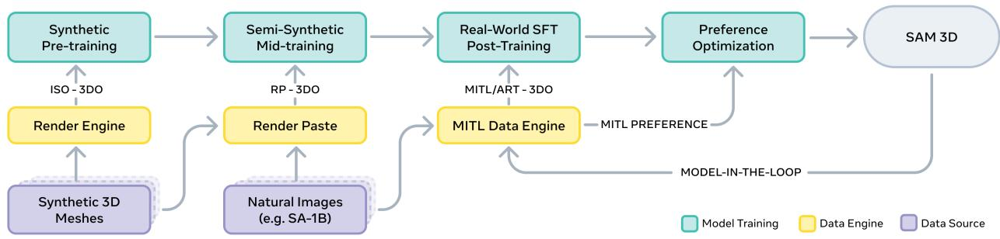
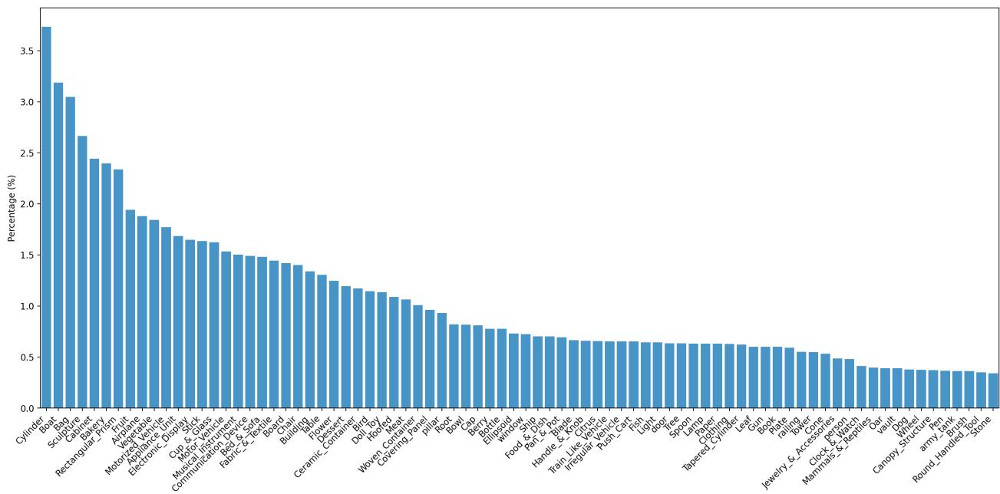
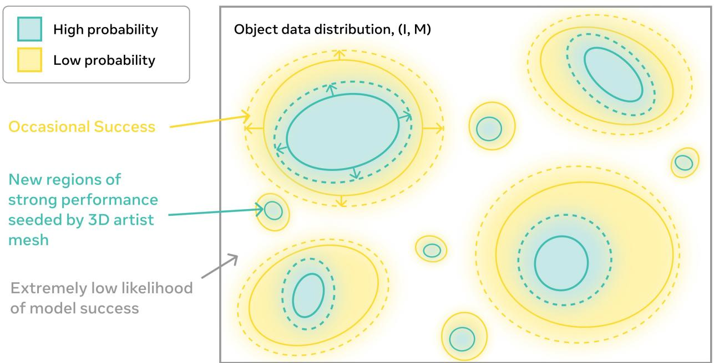
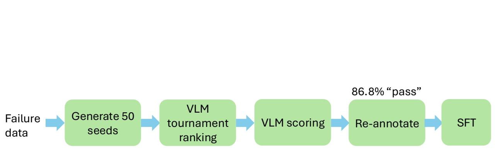
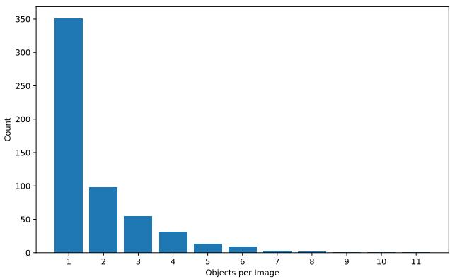
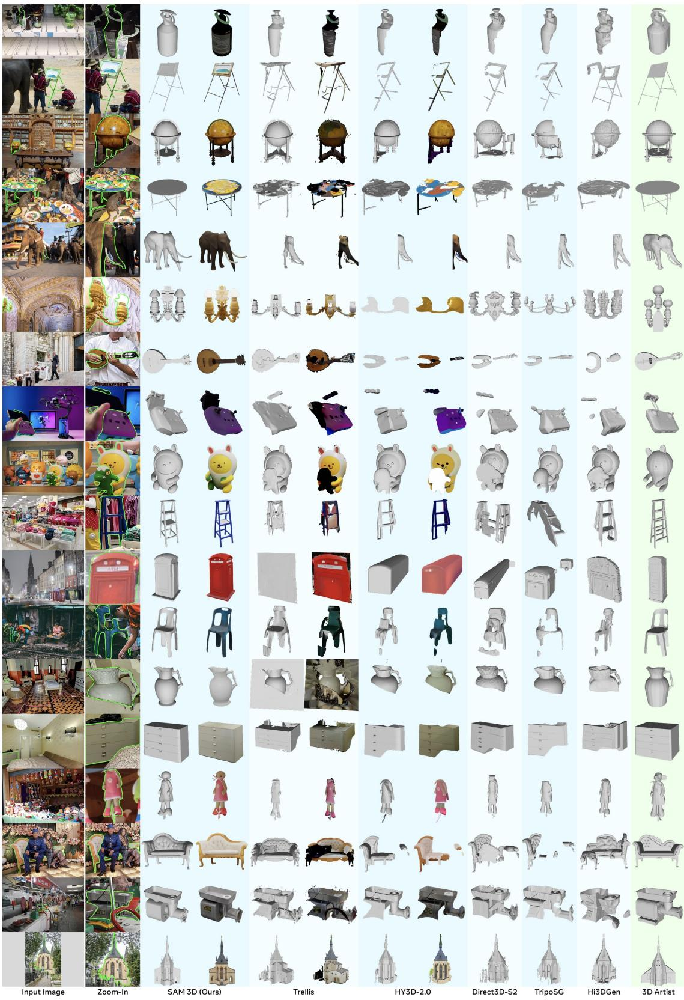

# SAM 3D：将图像中的任何物体进行三维化

SAM 3D团队，Xingyu Chen\*，Fu-Jen Chu，Pierre Gleize，Kevin J Liang，Alexander $\mathtt { s a x } ^ { * }$，Hao Tang\*，Weiyao Wang，Michelle Guo，Thibaut Hardin，Xiang $\mathbf { L i } ^ { \circ }$，Aoan Lin，Jiawei Lu，Ziqi ${ \mathsf { M } } { \mathsf { a } } ^ { \circ }$，Anushka Sagar，Bowen Song，Xiaodong Wang，Jianing Yang，Bowen Zhang，Piotr Dollár，Georgia Gkioxari，Matt Feiszli，Jitendra Malik Meta 超级智能实验室$^ *$核心贡献者（按字母顺序，平等贡献），实习生，$^ \dagger$项目负责人，$\ S$平等贡献。我们提出了SAM 3D，一个视觉基础的3D物体重建生成模型，从单张图像预测几何形状、纹理和布局。SAM 3D在自然图像中的表现出色，那里遮挡和场景杂乱现象普遍，背景中的视觉识别线索起着更大的作用。我们通过一个人和模型互动的流程来注释物体形状、纹理和姿态，以提供前所未有规模的视觉基础3D重建数据。我们在一个现代的多阶段训练框架中从这些数据中学习，将合成预训练与实际对齐相结合，突破了3D“数据壁垒”。在人工偏好测试中，我们在真实物体和场景上取得了显著的提升，胜率至少为$5 : 1$。我们将发布我们的代码和模型权重、在线演示，并推出一个新的具有挑战性的基准，用于野外3D物体重建。演示： https://www.aidemos.meta.com/segment-anything/editor/convert-image-to-3d 代码： https://github.com/facebookresearch/sam-3d-objects 网站： https://ai.meta.com/sam3d ∞ Meta

  
uA 3cve  gagt cable  maiviualju ytey Bual for each object.

# 1 引言

在本文中（见图1），我们提出了SAM 3D， 一个用于从单幅图像进行3D重建的生成神经网络。该模型能够重建任何物体的3D形状和纹理，以及其相对于摄像机的布局，即使在复杂场景中存在显著的杂乱和遮挡。由于重建的是完整的3D形状，而不仅仅是可见的2.5D表面，因此可以从任何期望的视角重新渲染该对象。

计算机视觉传统上关注于多视角几何作为提供三维形状的主要信号。然而，心理学家（以及之前的艺术家）早已知道人类可以从单幅图像中感知深度和形状。例如，Koenderink 等（1992 年）通过展示人类能够在物体图像上的探测点估计表面法线，从而优雅地证明了这一点，这些法线可以结合成一个完整的表面。在心理学教材中，这些单图像线索被称为“绘画线索”，包括阴影和纹理模式等信息，同时也包括识别——“熟悉物体”线索。在计算机视觉领域，这一研究方向可以追溯到 Roberts（1963 年），他展示了一旦图像模式被识别为已知物体，其三维形状和姿态就可以被恢复。核心洞察在于识别使得三维重建成为可能，这一思想后来在不同的技术实例中重新显现（Debevec 等，2023；Cashman 和 Fitzgibbon，2012；Kar 等，2015；Gkioxari 等，2019；Xiang 等，2025）。值得注意的是，这允许对新颖对象进行泛化，因为即使特定对象未曾见过，它也由之前见过的部分组成。学习此类模型的一项基本挑战是缺乏大量与三维真值配对的自然图像的数据集。近期研究（Yang 等，2024b；Xiang 等，2025）展示了从单幅图像中进行强重建的能力。然而，这些模型是在孤立物体上训练的，面对自然场景中可能远离或严重遮挡的物体时，它们的表现较差。为了将这类图像添加到训练集中，我们需要找到一种方法，将这些图像中的特定物体与三维形状模型关联，同时承认一般人类标注者往往难以做到这一点（与标记“猫”或划定其边界不同）。两项洞察使这一切成为可能： • 我们可以创建合成场景，在这些场景中将三维物体模型渲染并粘贴到图像中（灵感来源于 Dosovitskiy 等，2015）。 • 虽然人类不能轻易生成物体的三维形状模型，但他们可以从一组提供的选择中选择出可能最合适的三维模型，并将其姿态与图像对齐（或声明没有合适选择）。我们设计了一个训练管道和数据引擎，通过改编现代多阶段训练流程，使其适应由大语言模型开创的技术（Minaee 等，2025；Mo 等，2025）。与近期工作一样，我们首先在大量渲染的合成物体集合上进行训练。这是监督预训练：我们的模型学习丰富的物体形状和纹理词汇，为实际世界重建做准备。接下来是中期训练，使用将渲染模型粘贴到自然图像中产生的半合成数据。最后，后期训练将模型适应真实图像，借助一种新颖的模型在环内（MITL）管道和人类三维艺术家的帮助，使其与人类偏好对齐。我们发现合成预训练经过充分的自然图像后期训练具有良好的泛化能力。我们的后期训练数据由 MITL 数据管道获得，对在自然图像中取得良好表现起着关键作用。一般人类标注者无法生成三维形状真值，因此我们的标注者从计算和检索模块的输出中选择并将三维模型与图像中的物体对齐，这些模块会生成多个初步的三维形状提案。人类标注者从这些提案中进行选择，或者将其路由到人类艺术家处理一小部分难度较大的实例。经过审核的标注结果反馈到模型训练中，改进后的模型再次融入数据引擎，以进一步提升标注质量。这个良性循环持续改善三维标注的质量、标注率和模型表现。由于缺乏真实世界物体形状和布局的三维重建先前基准，我们提出了一个新的评估集，包含 $1000$ 对图像和三维模型：SAM 3D 艺术家对象（SA-3DAO）。我们基准中的物体涵盖教堂、滑雪缆车和大型结构到动物、日常家居物品以及稀有物品，并与它们自然出现的真实世界图像配对。专业三维艺术家从输入图像创建三维形状，代表了一种专业人类的最佳限值，适用于视觉基础的三维重建。我们希望提供这样一个评估基准能促进后续真实世界三维重建模型的研究迭代。我们总结了以下贡献： • 我们推出了 SAM 3D，一个全新的三维基础模型，能够从单幅图像中预测物体的形状、纹理和姿态。通过发布代码、模型权重和演示，我们希望能激发三维重建及其下游应用的进一步进展。 • 我们建立了一条用于标注形状、纹理和姿态数据的 MITL 管道，提供前所未有规模的视觉基础三维重建数据。

  
Fur SAM3Darchitecure op) SAM 3D rst predics carse hape and layout with the Geomey mode (rht) themixturransorme iteturapltwstrem prc atharheul self-attention layer. (bottom) The voxels predicted by the Geometry model are passed to the Texture $\&$ Refinement model, which adds higher resolution detail and textures.

我们通过 LLM 风格的预训练和后训练，在一个新颖的 3D 重建框架中利用这些数据，结合合成预训练和真实世界对齐，以克服 3D 与文本、图像或视频等领域之间数量级的数据差距。我们发布了一个具有挑战性的基准测试，用于真实世界的 3D 物体重建，称为 SA-3DAO。实验结果表明，SAM 3D 在指标和大规模人类偏好方面有显著的提升。

# 2 SAM 3D模型

# 2.1 问题表述

拍照的行为将一个三维物体映射到一组二维像素，这些像素由图像 $I$ 中的掩码 $M$ 指定。我们寻求反转这一映射。设物体具有形状 $S$、纹理 $T$，以及在摄像机坐标系中的旋转、平移和缩放 $( R , t , s )$。由于三维到二维的映射是有损的，我们将重建问题建模为条件分布 $p ( S , T , R , t , s | I , M )$。我们的目标是训练一个生成模型 $q ( S , T , R , t , s | I , M )$，使其尽可能接近 $p$ 的分布。

# 2.2 架构

我们基于最近的最先进的两阶段潜在流匹配架构（Xiang et al., 2025）进行研究。SAM 3D 首先联合预测物体姿态和粗略形状，然后通过整合图像线索来细化形状（见图 2）。与 Xiang et al.（2025）重建孤立物体不同，SAM 3D 预测物体布局，创建连贯的多物体场景。 输入编码。我们使用 DINOv2（Oquab et al., 2023）作为编码器，从两对图像中提取特征，生成四组条件词元： - 裁剪物体：我们通过掩模 $M$ 对裁剪图像 $I$ 及其相应的裁剪二进制掩模进行编码，提供对物体的聚焦、高分辨率视图。 - 全图像：我们对全图像 $I$ 及其全图像二进制掩模进行编码，提供全局场景上下文和裁剪视图中缺失的识别线索。 可选地，该模型支持基于通过硬件传感器（例如，iPhone上的 LiDAR）获得的粗略场景点图 $P$，或单目深度估计（Yang et al., 2024a；Wang et al., 2025a）进行条件设置，从而使 SAM 3D 能够与其他管道集成。

  
earje ne ru mewhe right. Samples are divided into four rows, based on type. Art-3DO meshes are untextured, while the rest may be textured or not, depending on the underlying asset (Iso-3DO, RP-3DO) or if the mesh was annotated or texture (MITL-3DO).

  
FapaWepla eetally eel complex data and modalities.

该几何模型生成条件分布 $p ( O , R , t , s | I , M )$，其中 $O \in \mathbb { R } ^ { 6 4 ^ { 3 } }$ 为粗略形状，$R \in \mathbb { R } ^ { 6 }$ 为6D旋转（Zhou et al., 2019），$t \in \mathbb { R } ^ { 3 }$ 为平移，$s \in \mathbb { R } ^ { 3 }$ 为尺度。在输入图像和掩码编码的条件下，我们采用一种1.2B参数的流变换器，使用混合变换器（MoT）架构（Liang et al., 2025a；Deng et al., 2025），通过图2中的注意力掩码对几何 $O$ 和布局 $( R , t , s )$ 进行建模。详细信息见C.1节。纹理与细化模型学习条件分布 $p ( S , T | I , M , O )$。我们首先从几何模型预测的粗略形状 $O$ 中提取活跃体素。一个600M参数的稀疏潜在流变换器（Xiang et al. 2025；Peebles 和 Xie, 2023）细化几何细节并合成对象纹理。3D解码器。纹理与细化模型中的潜在表示可以通过一对VAE解码器 $\mathcal { D } _ { m }$，$\mathcal { D } _ { g }$ 解码为网格或3D高斯点云。这些单独训练的解码器共享相同的VAE编码器，因此共享相同的结构化潜在空间（Xiang et al., 2025）。我们还在C.6节中详细介绍了几项改进。

# 3 训练 SAM 3D

SAM 3D 打破了 3D 数据壁垒，采用了一种从合成预训练到自然后训练的流程，借鉴了大语言模型、机器人技术和其他大规模生成模型的经验。我们通过在预训练和中训练中堆叠不同的训练策略来构建能力，然后通过后训练数据反馈轮来将模型与真实数据和人类偏好行为对齐。SAM 3D 采用以下方法： 步骤 1：预训练。此阶段将形状生成等基础能力构建到基础模型中。 步骤 1.5：中训练。有时称为持续预训练，中训练赋予一般技能，如遮挡鲁棒性、掩膜跟踪和使用视觉线索。 步骤 2：后训练。后训练引导目标行为，例如将模型从合成数据适应到现实世界数据或遵循人类审美偏好。 我们收集训练样本 $( I , M ) ( S , T , R , t , s )$ 和人类偏好数据，并将其用于监督微调（SFT）和直接偏好优化（DPO）（Rafailov et al., 2023）。此对齐过程（步骤 2）可以重复，首先使用当前模型收集数据，然后利用新数据改进模型。这创造了一个良性循环，人类提供监督。图 10b 显示，随着数据引擎的运行时间延长，模型性能稳步提升；数据集生成作为这种对齐的副产品出现。以下章节详细介绍了 SAM 3D 中使用的训练目标和数据来源。我们重点关注几何模型；纹理和精细化的训练方式相似（详细信息见 C.5 节）。训练超参数在 C.7 节中列出。

<table><tr><td>Training stage</td><td>Modalities</td><td>Datasets</td><td>Condition input</td></tr><tr><td colspan="4">Stage 1 Geometry model</td></tr><tr><td>Pre-training</td><td>S, R</td><td>Iso-3DO</td><td>object-centric crop</td></tr><tr><td>Mid-training</td><td>S, R</td><td>RP-3DO†</td><td>full image</td></tr><tr><td></td><td>S, R, t, s</td><td>ProcThor, RP-3DO‡</td><td>full image, pointmap*</td></tr><tr><td>SFT Alignment</td><td>S, R, t, s S</td><td>MITL, Art-3DO MITL preference</td><td>full image, pointmap* full image, pointmap*</td></tr><tr><td colspan="4">Stage 2 Texture &amp; Refinement model</td></tr><tr><td>Pre-training</td><td>T</td><td>Iso-3DO-500K</td><td>object-centric crop</td></tr><tr><td>Mid-training</td><td>T</td><td>RP-3DO§</td><td>full image</td></tr><tr><td>SFT</td><td>T</td><td>MITL</td><td>full image</td></tr><tr><td>Alignment</td><td>T</td><td>MITL preference</td><td>full image</td></tr></table>

TabSA3Dtraiags.飞行聚焦（FO）来自RP-3DO。物体交换 - 随机选择（S-R）来自RP-3DO。$\ S$ 物体交换 - 标注（OS-A）来自RP-3DO。*可选。有关详细信息，请参见B.2节。

# 3.1 预训练与中期训练：构建基础模型

训练始于合成预训练和中期训练，利用可用的大规模数据集学习形状和纹理的强先验，以及诸如跟随遮罩、处理遮挡和姿态估计等技能。它们在后期训练中以极大地减少了真实世界示例的需求（Hernandez 等，2021），这通常会产生获取成本。在预训练和中期训练中，模型通过递归条件流匹配（Liu 等，2022）进行训练，以生成多种 3D 模态（见 C.2 节）。

# 3.1.1 预训练：单一孤立的 3D 资产

Prerainin训练模型以重构来自渲染的精确3D形状和纹理，隔离合成对象，遵循(Xiang et al., 2025; Yang et al., 2024b; Wu et al., 2024)中的成功方案。具体来说，我们收集了一组图像$I$、形状$S$和纹理$T$的三元组，使用来自Objaverse-XL (Deitke et al., 2023)和许可数据集的270万对象网格，从24个视角进行渲染，每个视角生成一个单个中心对象的高分辨率图像；更多细节见B.1节。我们将该数据集称为Iso-3DO，并训练25万亿个训练词元。

# 3.1.2 中期训练：半合成能力

接下来，中期训练建立了基础技能，使模型能够处理真实世界图像中的物体： • 蒙版跟踪：我们训练模型重建目标物体，该目标物体由输入图像上的二进制蒙版定义。 • 遮挡鲁棒性：我们数据集中的人工遮挡物激励模型学习形状补全。 • 布局估计：我们训练模型在归一化相机坐标中生成平移和缩放。 我们通过将纹理网格渲染为自然图像并使用透明合成来构建数据。这个“渲染-粘贴”数据集包含两组：一组是遮挡对，另一组是我们在相似位置和比例下用合成物体替换真实物体，从而创建具有物理合理性的数据和准确的3D真实标注数据。我们称这些数据为 $R P$ $\mathcal { B } D O$；它包含6100万样本和280万个独特网格；图3显示了示例。有关更多细节，请参见B.2节。在中期训练后（27万亿训练token），模型现在已使用所有输入和输出模态进行了视觉基础的3D重建训练。然而，使用的所有数据均为（半）合成数据；为了缩小领域差距并充分利用真实世界线索，我们需要真实图像。

  
subtasks:anotators frst choosetarget objects (Stage 1); rank and select 3D model candidates (Stage ); then pose these models within a $2 . 5 \mathrm { { D } }$ scene (Stage 3). Stages 2 and 3 use model-in-the-loop.

# 3.2 后训练阶段：现实世界对齐

在后训练阶段，我们有两个目标。第一个目标是缩小（半）合成数据和自然图像之间的领域差距。第二个目标是与人类对形状质量的偏好对齐。我们通过使用收集的数据对模型进行适应；然后通过对这些收集的数据进行多阶段后训练来调整模型。之后我们会重复这个过程。

# 3.2.1 后训练：收集步骤

收集3D视觉定位数据的核心挑战在于大多数人无法直接创建网格；这需要熟练的3D艺术家，即使如此，他们也可能需要数小时。这与在SAM（Kirillov et al., 2023）中收集的分割掩膜有所不同。然而，给定选项后，大多数人能够选择哪个网格最准确地反映图像中的对象。这一事实构成了我们为SAM 3D收集数据的基础。我们将偏好转换为训练数据，具体如下：从我们的后训练模型中抽样，要求标注者选择最佳候选，并根据我们定义和更新的标准给出整体质量评分。如果质量达到（不断变化的）标准，该候选将成为训练样本。不幸的是，在第一轮迭代中，我们的初始模型产生的高质量候选很少。这是因为在第一次收集步骤之前，几乎不存在关于3D视觉定位的真实世界数据。我们通过利用一系列现有的学习和检索模型来解决这个冷启动问题，以生成候选。在早期阶段，我们主要依赖集成模型，但随着训练的进展，我们最佳模型的表现占主导，最终生成约$80\%$的SAM 3D标注数据。我们的标注流程从真实世界图像中收集3D对象形状$S$、纹理$T$、方向$R$、3D位置$t$和尺度$s$。我们通过将过程分解为子任务并利用每个子任务中现有的适当模型和人工标注者来简化流程（见图5）：识别目标对象、3D模型排名和选择，以及在3D场景中摆放这些模型（相对于点图）。我们在下面概述数据引擎的每个阶段，并在A部分提供详细信息。总的来说，我们对近100万幅图像进行了标注，得到了约314万个无纹理网格和约10万的纹理网格——这是与自然图像配对的3D数据前所未有的规模。阶段1：选择目标对象$(I, M)$。此阶段的目标是识别一组大且多样化的图像$I$和对象掩膜$M$，以提升至3D。为了确保跨对象和场景的泛化，我们从多个多样化的真实世界数据集中抽样图像，并利用3D导向的分类体系来平衡对象分布。为了获得对象分割掩膜，我们结合使用现有的注释（Kirillov et al., 2023）和人工标注者选择感兴趣的对象。阶段2：对象模型排名和选择$(S, T)$。此阶段的目标是收集图像为基础的3D形状$S$和纹理$T$。如上所述，人工标注者选择与输入图像和掩膜最匹配的形状和纹理候选。标注者对示例进行评分$r$，并拒绝那些未达到预定义质量阈值的示例，即$r < \alpha$。不良候选还会成为偏好对齐的负例。我们的数据引擎通过让标注者在来自集成模型的$N = 8$个候选之间选择，以最大化成功标注的概率$r > \alpha$；这是一种使用人类的最佳$N$搜索形式（Ouyang et al., 2022）。最佳候选的预期质量随着$N$的增加而提升，我们通过先使用模型进行过滤，然后使用人类进行过滤来进一步增加$N$（Anthony et al., 2017）；我们在A.7部分展示结果。

  
Fli 20 Huyuan3D-2.1 (Huyn3D et al. 2025) Direct3D-S2 (Wu etal. 2025)and Hi3DGen Ye etal 2025n the artit-generated SA-3DAO for single shape reconstruction; we provide the 3Dartist-createdground truth mesh as reference.

阶段0.5：难样本分配（艺术家）。当模型生成合理的对象形状时，我们的非专业注释员无法修正网格，导致数据缺失，尤其是在模型最需要的地方。我们将这些最难处理的案例的一小部分交给专业的3D艺术家进行直接标注，我们将这一集合称为Art-3DO。阶段3：将对象与2.5D场景对齐 $( R , t , s )$。前面的阶段为对象生成了3D形状，但未能确定其在场景中的布局。对于每个阶段2的形状，注释员通过操作3D对象的平移、旋转和缩放，相对于点云标注对象姿态。我们发现点云提供了足够的结构，使得形状的放置和方向保持一致。总体而言，我们可以将数据收集视为一种API，它使用当前最佳模型 $q ( S , T , R , t , s \mid I , M )$ ，并返回（i）训练样本 $D ^ { + } = ( I , M , S , T , R , t , s )$ ，（ii）质量评分 $r \in [ 0 , 1 ]$ ，以及（iii）一组不太理想的候选样本 $D ^ { - } = \left( I , M , S ^ { \prime } , T ^ { \prime } , R ^ { \prime } , t ^ { \prime } , s ^ { \prime } \right) \rangle$ ，它们均劣于训练样本。

# 3.2.2 训练后：模型改进步骤

SAM 3D 中的模型改进步骤利用这些训练样本和偏好结果，通过多个微调和偏好对齐阶段来更新基础模型。在每次后训练迭代中，我们汇总所有先前采集步骤的数据；仅保留 $D ^ { + }$ 高于某个质量阈值 $\alpha$ 的样本。随着训练的进行，$\alpha$ 可以逐渐提高，类似于交叉熵优化方法（de Boer 等，2005）。我们的最终后训练迭代使用了 0.5 万亿个训练词元。监督微调（T）。当后训练开始时，基础模型仅接触过合成数据。由于合成数据与现实世界数据之间存在较大的领域差距，我们首先在第 3 阶段对齐的网格上进行微调。

  
Fualtiv pon sucins. tions versus alternatives (Wen et al., 2024; Huang et al., 2025).

我们首先使用噪声较大的非专家标签（MITL-3DO）进行SFT，接着使用来自3D艺术家的更小且高质量的数据集（Art-3DO）。高质量的Art-3DO数据通过与艺术家的审美偏好对齐来提升模型质量。我们发现这有助于抑制常见的失败情况，例如漂浮物、无底网格和缺失的对称性。偏好优化（对齐）。微调后，模型能够稳健地产生多样物体和真实世界图像的形状和布局。然而，人类对对称性、封闭性等属性非常敏感，这些属性用一般目标（如流动匹配）难以捕捉。因此，我们在SFT后进行直接偏好优化（DPO）阶段（Rafailov et al., 2023），使用来自我们数据引擎的第2阶段的$D + / D ^ { - }$对。我们发现这些非策略数据在消除不良模型输出方面效果显著，即使在Art-3DO上进行了SFT后。DPO训练细节见C.3节。蒸馏。最后，为了使几何模型能在亚秒级别生成形状和布局，我们进行一个简短的蒸馏阶段，以减少推理过程中所需的函数评估次数（NFE）从$2 5 4$。我们将Frans等人（2024）的方法适应于我们的设置，并在C.4节中描述细节。

# 4 实验

数据集。为了全面评估模型在现实场景下的能力，我们精心构建了一个新的基准 SA-3DAO，包含了由自然图像生成的 1K 个 3D 艺术家创作的网格。我们还包括了来自 3D Arena 的 IS03D（Ebert, 2025），用于定量评估形状和纹理，以及 Aria Digital Twin (ADT)（Pan et al., 2023）用于布局评估。我们进一步对两个精心策划的数据集进行了人类偏好评估，涵盖场景级和对象级重建。Pref 集使用来自 MetaCLIP（Xu et al., 2024）和 SA-1B（Kiriov et al., 2023）的真实世界图像，以及基于 LVIS（Gupta et al., 2019）的一组数据集。有关评估集的详细信息，请参见 D 节。设置。我们使用一个几何模型进行实验，该模型经过训练以依赖点图进行条件判断。对于点图不可用的数据集，我们使用 Wang 等人（2025a）的方法进行估计。我们发现形状和纹理质量不依赖于模型是否经过点图条件训练（见 E.5 节），但布局（表 3 中的平移/尺度评估需要真实深度/点图）则依赖于此。

<table><tr><td></td><td colspan="4">SA-3DAO</td><td colspan="2">ISO3D Eval Set</td></tr><tr><td>Model</td><td>F1@0.01 (↑)</td><td>vIoU (↑)</td><td>Chamfer (↓)</td><td>EMD (↓)</td><td>ULIP (↑)</td><td>Uni3D (↑)</td></tr><tr><td>Trellis</td><td>0.1475</td><td>0.1392</td><td>0.0902</td><td>0.2131</td><td>0.1473</td><td>0.3698</td></tr><tr><td>HY3D-2.1</td><td>0.1399</td><td>0.1266</td><td>0.1126</td><td>0.2432</td><td>0.1293</td><td>0.3546</td></tr><tr><td>HY3D-2.0</td><td>0.1574</td><td>0.1504</td><td>0.0866</td><td>0.2049</td><td>0.1484</td><td>0.3662</td></tr><tr><td>Direct3D-S2</td><td>0.1513</td><td>0.1465</td><td>0.0962</td><td>0.2160</td><td>0.1405</td><td>0.3653</td></tr><tr><td>TripoSG</td><td>0.1533</td><td>0.1445</td><td>0.0844</td><td>0.2057</td><td>0.1529</td><td>0.3687</td></tr><tr><td>Hi3DGen</td><td>0.1629</td><td>0.1531</td><td>0.0937</td><td>0.2134</td><td>0.1419</td><td>0.3594</td></tr><tr><td>SAM 3D</td><td>0.2344</td><td>0.2311</td><td>0.0400</td><td>0.1211</td><td>0.1488</td><td>0.3707</td></tr></table>

Tabhap qantiativeriocpetinag--3mthoincdiTe Xin，HY3D-2。（Huan3D et al 2025）HY3D-2。（Tea 2025）Direc3D-S2（Wu et al 025 TripG（Li etl，Hi3DGen（Ye et al., 2025）。SA-3DAO 显示了与 GT 几何相对的准确性度量；ISO3D（Ebert，2025）没有几何 GT，因此我们展示了 3D 图像与输入图像之间的感知相似性（ULIP（Xue 等，202）和 Uni3Zhou l 023TripG 使用了明显更高的网格分辨率，这在感知度量中得到了肯定。

  
Objects comparisons are done on textured meshes. SAM 3D is significantly preferred over others on all fronts.

参考文献。

# 4.1 与最先进技术的比较

3D 形状和纹理。我们通过将 SAM 3D 与先前的最先进方法进行比较，评估单一物体生成。在人类偏好研究中，SAM 3D 在真实图像上实现了 5 : 1 的面对面胜率（见图 8）。表 2 提供了形状质量的定量评估，其中 SAM 3D 在孤立物体图像（isO3D）上与之前的最先进性能相匹配或超过，并在具有挑战性的真实世界输入（SA-3DAO）上显著优于所有基线。图 6 中的定性实例进一步说明了该模型在严重遮挡下的强泛化能力。在图 9 中，我们比较了 SAM 3D 的纹理与其他纹理模型，给定 SAM 3D 的形状（SAM 3D 改进的形状实际上对其他方法在本次评估中是有益的）。评注员显著偏好 SAM 3D 的纹理（细节见 E.2 节）。

场景重建。在三个评估集上的偏好测试中，用户更倾向于选择 SAM 3D 的场景重建，比例为 $6 : 1$，优于先前的最先进方法（见图8）。附录中的图7和图20展示了定性比较，而表3则展示了物体布局的定量指标。在实际数据集如 SA-3DAO 和 ADT 上，改进效果显著，即使在管道方法使用 SAM 3D 网格时这一效果仍然存在。SAM 3D 引入了一种新的现实世界能力，能够联合生成形状和布局（ADD-S $\textcircled { \Omega } 0 . 1 2 \% \to 7 7 \%$），此外，基于样本后优化的方法，类似于渲染与比较的方法（Labbé等，2022；Wen，2024），可以进一步提升性能（见E.3节）。布局和场景重建的强劲结果表明，SAM 3D 能够稳健地处理仅 RGB 输入（例如，SA-3DAO，LVIS，Pref Set）。

<table><tr><td colspan="3"></td><td colspan="4">SA-3DAO</td><td colspan="4">Aria Digital Twin</td></tr><tr><td>Generation</td><td>Model</td><td></td><td>3D IOU (↑)</td><td>ICP-Rot. (↓)</td><td>ADD-S (↓)</td><td>ADD-S @ 0.1 (↑)</td><td>3D IoU (↑)</td><td>ICP-Rot. (↓)</td><td>ADD-S (↓)</td><td>ADD-S @ 0.1 (↑)</td></tr><tr><td>Pipeline</td><td>Trellis + Megapose</td><td></td><td>0.2449</td><td>39.3866</td><td>0.5391</td><td>0.2831</td><td>0.2531</td><td>33.6114</td><td>0.4358</td><td>0.1971</td></tr><tr><td>Pipeline</td><td>HY3D-2.0 + Megapose</td><td></td><td>0.2518</td><td>33.8307</td><td>0.7146</td><td>0.3647</td><td>0.3794</td><td>29.0066</td><td>0.1457</td><td>0.4211</td></tr><tr><td>Pipeline</td><td></td><td>HY3D-2.0 + FoundationPose</td><td>0.2937</td><td>32.9444</td><td>0.3705</td><td>0.5396</td><td>0.3864</td><td>25.1435</td><td>0.1026</td><td>0.5992</td></tr><tr><td>ipeline Pipeline</td><td>HY3D-2.1 + FoundationPose</td><td></td><td>0.2395</td><td>39.8357</td><td>0.4186</td><td>0.4177</td><td>0.2795</td><td>33.1197</td><td>0.2135</td><td>0.4129</td></tr><tr><td></td><td>SAM 3D + FoundationPose</td><td></td><td>0.2837</td><td>32.9168</td><td>0.3848</td><td>0.5079</td><td>0.3661</td><td>18.9102</td><td>0.0930</td><td>0.6495</td></tr><tr><td>Joint</td><td>MIDI</td><td></td><td>-</td><td>-</td><td>-</td><td>-</td><td>0.0336</td><td>44.2353</td><td>2.5278</td><td>0.0175</td></tr><tr><td>Joint</td><td>SAM 3D</td><td></td><td>0.4254</td><td>20.7667</td><td>0.2661</td><td>0.7232</td><td>0.4970</td><td>15.2515</td><td>0.0765</td><td>0.7673</td></tr></table>

表33D对比了SA-3DAO和Aria Digital Twn（Pan al, 2023）中竞争布局预测方法的布局定量比较。AM 3D显著优于在机器人中使用的两种管线方法（Labbl, 2; Wen 2024）和联合生成模型（MIDI (Huang et al. 2025）。大多数SA-3DAO场景仅包含一个物体，因此未显示需要多对象的MI结果。性能衡量标准包括重叠度、旋转误差以及通过物体直径归一化的类似于切边的距离。

  
Fex   p  al hae u e y u from SAM 3D and only perform texture generations for all methods. SAM 3D significantly outperforms others.

如提供的点图（例如，ADT）。

# 4.2 分析研究

后训练迭代稳步提升性能。我们观察到随着数据引擎运行时间的延长，性能稳步提升，历史比较中显示出近线性的 Elo 规模，这一点在数据引擎的第二阶段（图 10a）中得到了体现。我们发现同时扩展所有阶段非常重要。累积的线性效应源于更多的数据引擎迭代，同时扩大预训练和中期训练，并添加新的后训练阶段。图 10b 显示，仅迭代 MITL-3DO 数据就会带来持续改进，但边际影响逐渐降低。多阶段训练提升性能。通过多阶段训练，SAM 3D 的现实世界性能得以显现。表 4 显示，随着每个训练阶段的加入，三维形状改善近乎单调，验证了通向最终模型（最后一行）的这一方法。在附录中，图 17 显示了纹理的类似结果，表 7 则通过去掉 MITL-3DO、Art-3DO 数据或 DPO 阶段，展示了每个独立现实世界数据阶段的贡献。其他消融实验。有关旋转表示（E.4 节）、DPO（C.3 节）、蒸馏（C.4 节）、点图（E.5 节）以及数据引擎中最佳的 $N$ 扩展（A.7 节）的其他消融实验，请参见附录。

# 相关工作

3D重建一直是计算机视觉中的一个长期挑战。经典方法包括双目立体视觉（Wheatstone, 1838）、运动结构法（Hartley和Zisserman, 2003；Szeliski, 2022；Scharstein和Szeliski, 2002；Torresani等, 2008；Tomasi和Kanade, 1992），以及SLAM（Smith等, 1990；Castellanos等, 199）。其他策略通过分析（例如，轮廓（Esteban和Schmitt, 2004））或通过体积渲染进行合成（Kajya和Von Herzen, 1984），使用隐式表示（Mildenhall等, 2020）或显式表示（Sitzma等, 2019；Liu等, 2020）。监督深度学习方法预测体素（Xie等, 2019；Wang等, 2021）、点云（Van Hoorick等, 2022）或网格（Worchel等，2；Wen等, 2019），或者优化隐式表示（Liu等, 2024），例如有符号距离函数（SDFs），通常输出高质量结果但需要多个视图进行推理。相较之下，我们关注在测试时单个RGB图像这一更严格的设置。

<table><tr><td></td><td colspan="4">SA-3DAO</td><td>Preference set</td></tr><tr><td>Training Stage</td><td>F1 @ 0.01 (↑)</td><td>vIoU (↑)</td><td>Chamfer (↓)</td><td>EMD (↓)</td><td>Texture WR (↑)</td></tr><tr><td>Pre-training (Iso-3DO)</td><td>0.1349</td><td>0.1202</td><td>0.1036</td><td>0.2396</td><td>-</td></tr><tr><td>+ Mid-training (RP-3DO)</td><td>0.1705</td><td>0.1683</td><td>0.0760</td><td>0.1821</td><td>60.7</td></tr><tr><td>+ SFT (MITL-3DO)</td><td>0.2027</td><td>0.2025</td><td>0.0578</td><td>0.1510</td><td>66.9</td></tr><tr><td>+ DPO (MITL-3DO)</td><td>0.2156</td><td>0.2156</td><td>0.0498</td><td>0.1367</td><td>66.4</td></tr><tr><td>+ SFT (Art-3DO)</td><td>0.2331</td><td>0.2337</td><td>0.0445</td><td>0.1257</td><td>-</td></tr><tr><td>+ DPO (Art-3DO)</td><td>0.2344</td><td>0.2311</td><td>0.0400</td><td>0.1211</td><td></td></tr></table>

  

Fh con0: prtMoel 我们在扩展和添加不同阶段时，(a) 理论上考虑改进 (b) 使用扩展的训练数据进行后训练 (SFT)。

  
oetween each row and the row above it.   
(b) Impact of expanding training data

单视图三维重建难度显著更大。大量研究通过直接的三维监督训练模型，预测网格（Xu et al., 2019；Kulkarni et al., 2022）、体素（Girdhar et al., 2016；Wu et al., 2017）、点云（Fan et al., 2017；Mescheder et al., 2019）或与CAD对齐的几何形状（Wang et al., 2018；Gal et al., 2019），将VAE（Kingma 和 Welling, 2013）潜在表示作为基础。然而，这些方法的评估通常局限于形状网（ShapeNet）（Chang et al., 2015）、Pix3D（Sun et al., 2018）或Objaverse（Deitke et al., 2023）等简化的合成单对象基准。布局估计。大量工作从单张图像中估计物体姿态，针对物体形状（Labbé et al., 2022；Wen et al., 2024；Shi et al., 2025；Geng et al., 2025；Huang et al., 2025）或检测（Brazile et al., 2023），但通常仅限于桌面机器人、街道和室内环境等有支撑表面的场景。相对而言，我们的方法能够在多种场景中为广泛类型的物体估计姿态。三维数据集。获取三维注释具有挑战性：这类模态本身复杂且需要掌握的专业工具难度较高。根据经验，从参考图像建模三维网格可能需要经验丰富的艺术家数小时（见D节）。现有的三维数据集（例如ShapeNet（Chang et al., 2015）、Objaverse-XL（Deitke et al., 2023））主要由单个合成物体组成；在没有配对的真实世界图像的情况下，模型仅能从渲染视图中学习。在真实世界领域，现有数据集规模较小且主要集中在室内环境（Reizenstein et al., 2021；Khanna et al., 2024；Fu et al., 2021；Szot et al., 2021；Pan et al., 2023）。在如此有限的数据上训练的模型难以泛化。

后训练。在后训练最初阶段，仅包含单一的有监督微调阶段（Girshick等，2013；Wei等，2021），而强大的预训练（Brown等，2020）使得智能体变得更具数据效率（Herandez，2021），使得像基于偏好的迭代对齐（RLHF，Ouyang等，2022）和在线DPO（Tang等，2024；Rafailov等，2023）成为可能。当后训练需要提供强有力的引导时，自我训练方法提供了更密集的监督，通过利用模型本身生成越来越高质量的示范，而不是仅依赖偏好信号（Gulcehre等，2023；Anthony等，2017；Dong等，2023；Yuan等，2023）。SAM 3D利用自我训练弥合合成与真实领域之间的差距，并突破3D感知的数据壁垒；与RAFT（Dong等，2023）最为相似，同时也结合了偏好调优。 多阶段预训练。现代预训练日益采用多阶段训练。早期关于课程学习的研究（Bengio等，200）为预训练中的分阶段数据混合奠定了基础，较高质量的数据通常在后期出现（Grattafiori等，2024；OLMo等，2025）。Li等（2023b）；Abdin等（2022）表明，混合合成/网络课程可以在较小规模下实现优秀的性能。越来越多地，额外的中期训练阶段被用于能力注入，例如上下文扩展（Grattafiori等，2024）或编码（Rozière等，2024），近期的研究发现中期训练显著提升后训练的有效性（Lambert，2025；Wang等，2025b）。SAM 3D引入了合成预训练和可推广的中期训练以适应3D。

# 6 结论

我们推出了SAM 3D：一个新的基础模型，用于从自然图像中全面重建物体的3D形状、纹理和布局。得益于创新的数据引擎和现代化的训练方案，SAM 3D在复杂场景图像上的鲁棒性代表了3D领域的重大变革，并向真实世界的3D感知迈出了重要一步。随着模型的发布，我们期待SAM 3D能够为机器人技术、增强现实/虚拟现实、游戏、电影和互动媒体等多个应用领域解锁新的能力。

# 致谢

我们感谢以下个人对本工作的贡献：

我们感谢在SAM Playground Engineering方面做出贡献的：Robbie Adkins, Rene de la Fuente, Facundo Figueroa, Alex He, Dex Honsa, Alex Lende, Jonny Li, Peter Park, Don Pinkus, Roman Radle, Phillip Thomas 和 Meng Wang。我们感谢我们优秀的跨职能团队（XFN）给予的领导和支持：Kris Kitani, Vivian Lee, Sasha Mits, George Orlin, Nikhila Ravi 和 Andrew Westbury。感谢Helen Klein, Mallika Malhotra 和 Azita Shokrpour 在法律、隐私和完整性方面的支持。我们感谢Michelle Chan, Kei Koyama, William Ngan 和 Yael Yungster 在整个项目中的设计支持。感谢Arpit Kalla 在模型效率方面的工作。我们感谢Faye Ma 和 Kehan Lyu 在数据工程支持和工具方面的帮助，以及Emmanuel Hernandez 和 Robert Kuo 在管道开发方面的支持。感谢Nan Yang 在以自我为中心的视频数据工作方面的支持。感谢我们的两位实习生Cem Gokmen 和 Jasmine Shone 在3D方面的工作，感谢Lea Wilken 对手稿的反馈。感谢我们出色的数据运营团队：Paris Baptiste, Karen Bergan, Kai Brown, Ida Cheng, Khadijat Durojaiye, Patrick Edwards, Daniella Factor, Eva Galper, Leonna Jones, Zayida Suber, Tatum Turner, Joseph Walker 和 Claudette Ward。

参考文献 Mara Abdin 等人。Phi3 技术报告：在您的手机上本地部署的高能力语言模型，2024年。https://arxiv.org/abs/2404.14219。 Thomas Anthony, Zheng Tian, 和 David Barber。用深度学习和树搜索进行快速和缓慢的思考。载于第31届国际神经信息处理系统会议论文集，NIPS'17，页5366-5376，美国纽约，2017年。Curran Associates Inc. ISBN 9781510860964。 Yoshua Bengio, Jérôme Louradour, Ronn Collobert, 和 Jason Weston。课程学习。载于第26届国际机器学习年会论文集，ICML'09，页41-48，美国纽约，2009年。计算机协会。ISBN 9781605585161。doi: 10.1145/1553374.1553380。https://doi.org/10.1145/1553374.1553380。 Lukas Bossard, Matthieu Guillaumin, 和 Luc Van Gool。Food-101：使用随机森林挖掘判别组件。载于2014年欧洲计算机视觉会议（ECCV）。 Garic Brazil, hiKur, Julitrau Nikhila, Ravi Just Jonson, 和 Georg Gkioxarni。3D对象在野外检测的基准和模型。载于2023年IEEE/CVF计算机视觉与模式识别会议论文集，页13154-13164。 Tom Brown, Benjamin Man, Nick Ryder, Melanie Subbiah, Jared D Kaplan, Prafulla Dhariwal, Arvind Nelakantan, Pranav Shyam, Girish Sastry, Amanda Askel 等人。语言模型是少量示例学习者。神经信息处理系统进展，33：1877-1901，2020年。 Thomas J Cashman 和 Andrew W Fitzgibbon。海豚的形状是什么？从2D图像构建3D可变形模型。IEEE模式分析与机器智能汇刊，35(1):232-244，2012年。 Jose A Castellanos, José MM Montiel, José Neira, 和 Juan D Tarós。SPmap：一个用于同时定位和地图构建的概率框架。IEEE机器人与自动化汇刊，1999年。 Angel X Chang, Thomas Funkhouser, Leonidas Guibas, Pat Hanrahan, Qixing Huang, Zimo Li, Silvio Savarese, Manolis Savva, Shuran Song, Hao Su 等人。ShapeNet：一个信息丰富的3D模型库。arXiv 预印本 arXiv:1512.03012，2015年。 Dima Damen, Hazel Doughty, Giovani Maria Farinella, Sanja Fidler, Antonino Furnari, Evangelos Kazakos, Davide Moltisani, Jonathan Muro, Toby Perrett, Will Price 等人。Epic Kitchens 数据集：集合、挑战和基线。IEEE模式分析与机器智能汇刊，43(11)：4125-4141，2020年。 PrTrB Dir.r ShiMano 和 Reuve.Ruual。操作研究年鉴，134(1)：1967，2005年1月。ISSN 0254-5330。doi: 10.1007/s10479-005-5724-z。 Paul E Debevec, Camillo J Taylor, 和 Jitendra Malik。从照片建模和渲染建筑：一种混合几何和基于图像的方法。载于《开创性图形论文：突破界限》，第2卷，2023年。 Matt Deitke, Ruoshi Liu, Matthew Wallingford, Huong Ngo, Oscar Michel, Aditya Kusupati, Alan Fan, Christian Laforte, Vikram Voleti, Samir Yitzhak Gadre 等人。Objaverse-xl：一个拥有 1000 万+ 3D 对象的宇宙。神经信息处理系统进展，36：35799-35813，2023年。 Yu Deng, Yuja Zhu, Jiah hen, Yuan Wang, Yifei i, Hoian Li, Juan Li, Jnsheg Zhang, Wni Lu, Yuzheng Zhang 等人。统一的多模态预训练中的新兴特性。arXiv 预印本 arXiv:2505.14683，2025年。 Kristin Diehl 和 Cait Poynor。巨大的期望？产品组合大小、期望和满意度。市场研究杂志，47(2)：312-322，2010年。doi: 10.1509/jmkr.47.2.312。https://doi.org/10.1509/jmkr.47.2.312。 Hanze Dong, Wei Xiong, Deepanshu Goyal, Yihan Zhang, Winnie Chow, Rui Pan, Shizhe Diao, Jipeng Zhang, KaShun SHUM, 和 Tong Zhang。RAFT：基于奖励排序的微调用于生成基础模型的对齐。机器学习研究论文，2023年。ISSN 2835-8856。https://openreview.net/forum?id= m7p507zblY。 Aeitsy, hiliscery h Hu C HaasVdi Golkov, 以及 Danil Cremers 和 Thomas Brox。FlowNet：利用卷积网络学习光流。载于2015年IEEE国际计算机视觉大会论文集，页2758-2766。 Dylan Ebert 3D Arena：一个用于生成 3D 评估的开放平台。arXiv 预印本 arXiv:2506 18787，2025年。 Carlos Hernández Esteban 和 Franci Schmitt。面向对象的模型中的三维立体融合与图像理解，2004年。 Haoqiang Fan, Hao Su, 和 Leonidas J Guibas。用于从单图像重建3D对象的点集生成网络。载于CVPR，2017年。 Kevin Frans, Dani Hafr, Siri Levie, 和 Pbee Oeehor。arXiv:2410.12557, 2024。 Huan Fu, Bowen Cai, Lin Gao, Ling-Xiao Zhang, Jiaming Wang, Cao Li, Qixun Zeng, Chengyue Sun, Rongei Jia, Binqang Zhao 等人。3D-Front：具有布局和语义的3D家具房间。载于IEEE/CVF国际计算机视觉大会论文集，页10933-10942，2021年。 Zheng Geng, Nan Wang, Shaocong Xu, Chongjie Ye, Bohan Li, Zhaoxi Chen, Sida Peng, 和 Hao Zhao。一个视图，多个世界：单图像到3D对象与生成域随机化相结合，以进行一口气的6D姿态估计。arXiv 预印本 arXiv:2509.07978，2025年。 Rohi Girdhar, David Fouhey, Mikel Rodriguez, 和 Abhinav Gupta。学习可预测和生成的对象向量表示。载于ECCV，2016年。 Ross B. Girshick, Jef Donahue, Trevor Darrell 和 Jitendra Malik。为了准确的物体检测和语义分割，特征层次结构。CoRR，abs/1311.2524，2013年。http://arxiv.org/abs/1311.2524。 Georgia Gkioxar, Jitendra Malik, 和 Justi Johnson。网格 R-CNN。载于2019年IEEE/CVF国际计算机视觉会议论文集，页9785-9795。 Aaron Grattafiori 等人。LLaMA 3：模型群，2024年。https://arxiv.org/abs/2407.21783。 Kris Grauman 等人。EgoExo4D：理解熟练的人类活动从第一和第三人称视角。arXiv 预印本 arXiv:2401.10889，2024年。 Caglar Gulcehre, Tom Le Paine, Srivatsan Srinivasan, Ksenia Konyushkova, Lotte Weerts, Abhishek Sharma, Aditya Siddhant, Alex Ahern, Miaosen Wang, Chenje Gu, Wolfgang Macherey, Arnaud Doucet, Orhan Firat, 和 Nando de Freitas。强化自我训练（REST）用于语言建模，2023年。https://arxiv.org/abs/2308.08998。 Agrim Gupta, Piotr Dollár, 和 Ross Girshick。LVIS：一个用于大词汇实例分割的数据集。载于2019年IEEE/CVF计算机视觉与模式识别会议论文集，页5356-5364。 Richard Hartley 和 Andrew Zisserman。计算机视觉中的多视图几何，2003年。 Danny Hernandez, Jared Kaplan, Tom Henighan, 和 Sam McCandlish。转移的规模法则。arXiv 预印本 arXiv:2102.01293，2021年。 Zehuan Huang, Yuan-Chen Guo, Xingqiao An, Yunhan Yang, Yangguang Li, Zi-Xin Zou, Ding Liang, Xihui Liu, Yan-Pei Cao, 和 Lu Sheng。Midi：用于单图像到3D场景生成的多实例扩散。载于计算机视觉与模式识别会议论文集，页23646-23657，2025年。 Hunyuan3D 团队, Shuhui Yang, Mingxin Yang, Yifei Feng, Xin Huang, Sheng Zhang, Zebin He, Di Luo, Haolin Liu, Yunfei Zhao 等人。Hunyuan3D 2.1：从图像到高保真3D资产，具有生产就绪的PBR材质。arXiv 预印本 arXiv:2506.15442，2025年。 James T Kajiya 和 Brian P Von Herzen。光线追踪体积密度。SIGGRAPH，1984年。 Ai Kar Suha, Tulsi J Carand 和 Jitendra Malik。类特殊对象从单图像恢复。载于2015年IEEE计算机视觉与模式识别会议论文集，页1966-1974。 Mukul Khanna, Yongsen Mao, Hanxiao Jiang, Sanjay Haresh, Brennan Shacklett, Dhruv Batra, Alexander Clegg, Eric Undersander, Angel X Chang, 和 Manolis Savva。Habitat合成场景数据集（HSSD-200）：分析3D场景的规模和真实感在物体目标导航中的权衡。载于2024年IEEE/CVF计算机视觉与模式识别会议论文集，页16384-16393。 Diederik P Kingma 和 Max Welling。自编码变分贝叶斯。arXiv 预印本 arXiv:1312.6114，2013年。 Alexander Kirillov, Eric Mintun, Nikhila Ravi, Hanzi Mao, Chloe Rolland, Laura Gustafson, Tete Xiao, Spencer Whitehead, Alexander Berg, Wan-en Lo 等人。Segment Anything。载于2023年IEEE/CVF国际计算机视觉会议论文集，页4015-4026。 Jan J Koenderink, Andrea J Van Doorn, 和 Astrid ML Kappers。图像中的表面感知。感知心理物理学，52(5)：487-496，1992年。 Nile Kulkarni, Just Jonn, 和 Dav Fouhey。重建背后的原因：引导的可逆超分解3D场景重建。载于ECCV, 2022年。

YanLabb、ucasMau、ArsaMuvineph、yre SanBic、Joaanmbay、Jstr、Mathie Aubry、Dieter Fox 和 Josef Sivic。Megapose：新物体的姿态估计，virender & copre。arXiv 预印本 arXiv:2212.06870，2022年。 Nathan Lambert。来自人类反馈的强化学习。在线，2025年。https://rlhfbook.com。 Nathan Lambert、Valentina Pyatkin、Jacob Morison、LJ Miranda、Bill Yuchen Lin、Khyathi Chandu、Nouha Dziri、Sachin Kumar、Tom Zick、Yejin Choi、Noah A. Smith 和 Hannaneh Hajishirzi。Rewardbench：用于语言建模的奖励模型评估，2024年。https://arxiv.org/abs/2403.13787。 Yanguang Li、Zi-Xin Zou、Zexiang Liu、Dehu Wang、Yuan Liang、Zhipeng Yu、Xingchao Liu、Yuan-Chen Guo、Ding Lian Wan Ouyang 等人。Trip：使用大规模整流流模型进行高保真3D形状合成。arXiv 预印本 arXiv:2502.06608，2025年。 Yanghao Li、Haoqi Fan、Rohit Girdhar 和 Alexander Kirillov。视频中的任意分割。arXiv 预印本 arXiv:2305.06500，2023年。 Yua Li、Sbasti Bubeck、Ronen Eldan、Alie Del Gioro、Suriy Guakr 和 Yin Tat Lee。教科书你需要的 II：phi-1.5 技术报告，2023年。https://arxiv.org/abs/2309.05463。 Weixin Liang、LILI YU、Liang Luo、Srini Iyer、Ning Dong、Chunting Zhou、Gargi Ghosh、Mike Lewis、Wen tau Yih、Luke Zettlemoyer 和 Xi Victoria Lin。混合变换器：一种稀疏且可扩展的多模态基础模型架构。机器学习研究汇刊，2025年。ISSN 2835-8856。https://openreview.net/forum?id=Nu6N69i8SB。 YLiaun Luo、Xi Che、Rui hen、Honn Weiy Jau 和 ng Tan。高保真生成纹理化3D形状。arXiv 预印本 arXiv:2505.23253，2025年。 Line Liu、Jatao Gu、Kyaw Zaw Lin、Tat-Seng Chua 和 Christian Theobalt。神经稀疏体素场。NeurIPS，2020年。 Minghua Liu、Ruoxi Shi、Linghao Chen、Zhuoyang Zhang、Chao Xu、Xinyue Wei、Hansheng Chen、Chong Zeng、Jiayuan Gu 和 Hao Su。One-2-3-45++：快速单图像到3D对象的一致多视图生成与3D扩散。在IEEE/CVF计算机视觉与模式识别会议论文集中，第10072-10083页，2024年。

Xinhao Liu, Chengyue Gong, 和 Qiang Liu. 流动简单而快速：学习生成和传输具有校正流的数据. arXiv 预印本 arXiv:2209.03003, 2022. Zhaoyang Lv, Nicholas Charron, Pierre Moulon, Alexander Gamino, Cheng Peng, Chris Sweeney, Edward Miller, Hun Tan, Je Meisr, Jng Don, 等. 日常活动数据. arXiv 预印本 arXiv:240.3349, 2024. Lin Ma, Yuting Ye, Fangzhou Hong, Vladimir Guzov, Yifeng Jiang, Rowan Postyen, Luis Pesquira, Alexander Gamino, Vijay Baiyya, Hyo Jin Kim, Kevin Bailey, David Soriano Fosas, C. Karen Liu, Ziwei Liu, Jakob Engel, Renz De Nardi, 和 Richard Newcombe. Nymeria: 一个大型多模态自我中心日常运动数据集. 在第18届欧洲计算机视觉会议 (ECCV), 2024. https://arxiv.org/abs/2406.09905. Nikolaus Mayer, Eddy, Philip Hauser, Philip Fischer, Daniel Remers, Alexey Dosovitski, 和 Thomas Brox. 论文. 在IEEE计算机视觉与模式识别会议，页码4040-4048, 2016. Lars Mescheder, Michael Oechsle, Michael Niemeyer, Sebastian Nowozin, 和 Andreas Geiger. 占用网络：在函数空间中学习3D重建. 在CVPR, 2019. Ben Mildenhall, Pratul P. Srinivasan, Matthew Tancik, Jonathan T. Barron, Ravi Ramamorthi, 和 Ren Ng. NeRF：将场景表示为神经辐射场以进行视图合成. 在ECCV, 2020. Shervin Minaee, Tomas Mikolov, Narjes Nikzad, Meysam Chenaghlu, Richard Socher, Xavier Amatriain, 和 Jianfeng Gao. 大语言模型：综述, 2025. https://arxiv.org/abs/2402.06196. Kaixiang Mo, Yuxin Bi, Weiwei Weng, Zhiqiang Zhou, Shuan Lu, Haibo Zhang, 和 Anxing Zn. 大语言模型的中期调整：综述, 2025. https://arxiv.org/abs/2510.06826. NIA, Johan Bjorck, Ferand Castaa, iki Cherniaev, Xingya, Ruyu Ding, Linxi "Ji Fan, Yu Fa, Dieter Fox, Fengyuan Hu, Spencer Huang, Jel Jang, Zhenyu Jiang, Jan Kautz, Kaushil Kundalia, Lawrence Lao, Zhiqi Li, Zongyu Lin, Kevin Lin, Guilin Liu, Edith Llontop, Loic Magne, Ajay Mandlekar, Avnish Narayan, Soroush Nasiriany, Scott Reed, You Liang Tan, Guanzhi Wang, Zu Wang, Jing Wang, Qi Wang, Jiannan Xiang, Yuqi Xie, Yinzhen Xu, Zhenja Xu, Seonghyeon Ye, Zhiding Yu, Ao Zhang, Hao Zhang, Yizhou Zhao, Ruijie Zheng, 和 Yuke Zhu. Gr00t n1：一个通用人形机器人的开放基础模型. arXiv 预印本 arXiv:2503.14734, 2025. Tea OLMo, Pete Walsh, Luca Soldain, Dirk Groenveld, Kyle Lo, Shane Arora, Akshita Bhagia, Yulin Gu, Shen Huang, Matt Jordan, Nathan Lambert, Dustin Schwenk, Oyvind Tafjord, Taira Anderson, David Atkinson, Faeze Brahman, Christopher Clark, Pradeep Dasigi, Nouha Dziri, Allyson Ettinger, Michal Guerquin, David Heineman, Hamish Ivison, Pang Wei Koh, Jiacheng Liu, Saumya Malik, William Merril, Lester James V. Miranda, Jacob Morrison, Tyler Murray, Crystal Nam, Jke Poznanski, Valentina Pyatkin, Aman Rangapur, Michael Schmitz, Sam Skjonsberg, David Wadden, Christopher Wilhelm, Michael Wilson, Luke Zettlemoyer, Ali Farhadi, Noah A. Smith, 和 Hannaneh Hajishirzi. 2 olmo 2 疯狂, 2025. https://arxiv.org/abs/2501.00656. Abby O'Neil 等. 开放式X-体现：机器人学习数据集和实时模型. 在2024年IEEE国际机器人与自动化会议 (ICRA), 页码6892-6903. IEEE, 2024. Maxime Oquab, Timothée Darcet, Théo Moutakanni, Huy Vo, Marc Szafraniec, Vasil Khalidov, Pierre Fernandez, Daniel Haziza, Francisco Massa, Alaaeldin El-Nouby, 等. Dinov2：无监督学习鲁棒视觉特征. arXiv 预印本 arXiv:2304.07193, 2023. Long Ouyang, Jef Wu, Xu Jiang, Diogo Almeida, Carrol L. Wainwright, Pamela Mishkin, Chong Zhang, Sandhini Agarwal, Katarina Slama, Alex Ray, John Schulman, Jacob Hilton, Fraser Kelton, Luke Miller, Maddie Simens, Amanda Askel, Peter Welinder, Paul Christiano, Jan Leike, 和 Ryan Lowe. 训练语言模型以通过人类反馈遵循指令. arXiv 预印本 arXiv:2203.02155, 2022. Xiaqing Pan, Nicholas Charron, Yongqian Yang, Scott Peters, Thomas Whelan, Chen Kong, Omkar Parkhi, Richard Newcombe, 和 Yuheng Carl Ren. Aria数字双胞胎：一个针对自我中心3D机器感知的新基准数据集. 在IEEE/CVF国际计算机视觉会议论文集，页码20133-20143, 2023. William Peebles 和 Saining Xie. 可扩展的扩散模型与变换器. 在IEEE/CVF国际计算机视觉会议论文集, 页码4195-4205, 2023. Rafael Rafailov, Archit Sharma, Eric Mitchell, Christopher Manning, Stefano Ermon, 和 Chelsea Finn. 直接前处理. 系统, 36:5372-853741, 2023. Jeremy Reizenstein, Roman Shapovalov, Philipp Henzler, Luca Sbordone, Patrick Labatut, 和 David Novotny. 在IEEE/CVF国际计算机视觉会议论文集, 页码10901-10911, 2021. Xuanci Ren, Jiahu Huang, Xiaoui Zeng, Ken Museth, Sanja Fidler, 和 Francs Williams. Xcube：基于稀疏体素层级的规模化3D生成建模. 在IEEE/CVF计算机视觉与模式识别会议论文集, 页码4209-4219, 2024. Lawrenc Roberts. 机器学习. 麻省理工学院, 1963. Bapt Roze, Jonas Geri, abi Gloeck, Sten Sooa, Itai Gat, Xiai Ele Tan, Yossi Adi, Jing Lu, Romain Sauvestre, Tal Remez, Jérémy Rapin, Artyom Kozhevnikov, Ivan Evtimov, Joanna Bitton, Manish Bhatt, Cristian Canton Ferrer, Aaron Grattafiori, Wenhan Xiong, Alexandre Défossez, Jade Copet, Faisal Azhar, Hugo Touvron, Louis Martin, Nicolas Usunier, Thomas Scialom, 和 Gabriel Synnaeve. 代码驼鹿：开放基础代码模型, 2024. https://arxiv.org/abs/2308.12950. Dan Larson, Richard Szeskin, 等. IJCV, 2002. Wub Shi, Shayan Gai, Feipeng Da, 和 Zeyu ai. Sampose: 可泛化模型的单视图提示估计. IEEE机器人与自动化快报, 2025. Vinct Szan, Justus Thies, Feli Heide, Matthias Nieer, Gordon Wetzstein, 和 Michael Zolhoer. Deepoxel：学习持续的3D特征嵌入. 在CVPR, 2019. Randall Smith, Matthew Self, 和 Peter Cheeseman. 估计机器人中的不确定空间关系. 在自主机器人车辆, 1990. Julian Straub, Daniel DeTone, Tianwei Shen, 和 Yang, Chris Sweeney, 和 Richard Newcombe. Em3d：评估3D自我中心基础模型进展的基准. arXiv 预印本 arXiv:2406.10224, 2024. https://arxiv.org/abs/2406.10224. Xingyuan Sun, Jiajun Wu, Xiuming Zhang, Zhoutong Zhang, Chengkai Zhang, Tianfan Wu, Joshua B. Tenenbaum, 和 William T. Freeman. Pix3d：单图像3D形状建模的数据集和方法. 在IEEE计算机视觉与模式识别会议论文集, 页码2974-2983, 2018. Richard Szeliski. 计算机视觉：算法与应用. Springer Nature, 2022. Andrew Szot, Alexander Clegg, Eric Undersander, Erik Wijmans, Yili Zhao, John Turner, Noah Maestre, Mustafa Mukdam, Devendra Sin Chaplot, Oleksandr Maksymets, Habitat. 训练家居助理重新探索他们的栖息地. 在神经信息处理系统进展, 34:251-266, 2021. Yunhao Tang, Daniel Zhaohan Guo, Zeyu Zheng, Daniele Calandrielo, Yuan Cao, Eugene Tarassov, Rémi Munos, Bernardo Vila Pires, Michal Valko, Yong Cheng, 和 Will Dabney. 理解在线与离线对齐算法之间的性能差距. arXiv 预印本 arXiv:2405.08448, 2024. Tenent Hunyuan3D团队. Hunyuan3d 0.0. 扩展高分辨率纹理3D资产的扩散模型, 2025.

Carlo Tomasi 和 Takeo Kanade. 从正交图像流中提取形状与运动：分解法. IJCV, 1992. Lorenz Torresani, Aaron Hertzmann 和 Chris Bregler. 僵硬结构运动恢复：利用层次先验估计形状与运动. PAMI, 2008. Bsan Horik, urvTenuar auDesrkSSennarVikRevl 使用 4D 神经场. 在 CVPR, 2022. Brm Walla, Mei Dng, Raf Rafailov, Linqi Zhou, Aaron Lou, Senthi rushwalkam, StefaErmon, Cii Xiong, Shafiq Joty 和 Nikhil Naik. 使用直接偏好优化的扩散模型对齐. 在 CVPR, 2024. Dan Wang, Xinrui Cui, Xun Chen, Zhengxia Zou, Tianyang Shi, Septimu Salcudean, Z Jane Wang 和 Rabab Ward. 利用变换器的多视角 3D 重建. 在 ICCV, 2021. Nanyang Wang, Yinda Zhang, Zhuwen Li, Yanwei Fu, Wei Liu 和 Yu-Gang Jiang. Pixel2Mesh: 从单个 RGB 图像生成 3D 网格模型. 在 ECCV, 2018. Ruicheng Wang, Sicheng Xu, Cassie Dai, Jianfeng Xiang, Yu Deng, Xin Tong 和 Jiolng Yang. Moge: 解锁 amocur tio e-ae w tialrai upevisn. 在计算机视觉与模式识别会议论文集, 页5261-5271, 2025a. Zen Wng, Fan Zhou, Xuefeng Li 和 Pengei Lu. Octothinke: 中等规模的激励重现强化缩放, 2025b. https://arxiv.org/abs/2506.20512. Jason Wei, Maarten Bosma, Vincent Y. Zhao, Kelvin Guu, Adams Wei Yu, Brian Lester, Nan Du, Andrew M. Dai 和 Quoc V. Le. 微调的语言模型是零-shot 学习者. CoRR, abs/2109.01652, 2021. https://arxiv.org/abs/2109.01652. Bowen Wen, Wei Yang, Jan Kautz 和 Stan Birchfeld. Foundationpose: 统一的 6D 物体姿态估计与跟踪. 在 IEEE/CVF 计算机视觉与模式识别会议程序, 页17868-17879, 2024. Chao Wen, Yinda Zhang, Zhuwen Li 和 Yanwei Fu. Pixel2Mesh++: 通过变形的多视角 3D 网格生成. 在 ICCV, 2019. Charles Wheatstone. 视觉生理学的贡献—第一部分. 关于双眼视觉的一些显著且前所未见的现象. 伦敦皇家学会哲学交易, 1838. Markus Worchel, Rodrigo Diaz, Weiwen Hu, Oliver Schreer, Ingo Feldmann 和 Peter Eisert. 结合神经延迟着色的多视角网格重建. 在 CVPR, 2022. Jiajun Wu, Yifan Wang, Tianfan Xue, Xingyuan Sun, Bill Freeman 和 Josh Tenenbaum. MarrNet: 通过 2.5D 草图进行 3D 形状重建. NeurIPS, 2017. S WuYun FiZaYi Ze Jiu, hiTorr XuaandoaDa 图像到 3D 生成通过 3D 潜在扩散变换器. 神经信息处理系统进展, 37:121859-121881, 2024. Shu WuYun, Fiu Zhani Z Yn YajeBao, Jac anSu Zhu, PhlTo Xu Cao 和 Yao Yao. Direct3d-s2: 利用空间稀疏注意机制简化来自巨规模 3D 生成. arXiv 预印本 arXiv:2505.17412, 2025. Jianfeg Xiang, Zelong Lv, Sicheng Xu, Yu Deng, Ruicheng Wang, Bowen Zhang, Dong Chen, Xin Tong 和 Jiaolong Yang. 结构化 3D 潜变量用于可扩展和多功能的 3D 生成. 在计算机视觉与模式识别会议论文集, 页21469-21480, 2025. Yu Xiang, Tanner Schmi, Venkatraman Narayanan 和 Dieter Fox. Pse: 用于杂乱场景中物体姿态估计的卷积神经网络. 在机器人：科学与系统 (RSS), 2018. Haozhe Xie, Hongxun Yao, Xiaoshuai Sun, Shangchen Zhou 和 Shengping Zhang. Pix2vox: 从单视角和多视角图像进行上下文感知 3D 重建. 在 ICCV, 2019. Hu Xu, Nikhila Goyal, Mitche Wortsman, Gabrielharco, Ozan Sener, Anirddha Kembhavi, Ali Farhadian, Rohi Girdhar. Metaclip: 如何高效制作 clip. arXiv 预印本 arXiv:2404.07143, 2024. Qiangeng Xu, Weiyue Wang, Duygu Ceylan, Radomir Mech 和 Ulrich Neumann. DISN: 用于高质量单视图 3D 重建的深度隐式表面网络. NeurIPS, 2019. Le Xue, Mingei Gao, Chen Xing, Roberto Martn-Mart, Jiajun Wu, Caig Xiong, Ran Xu, Juan Carlos Niebles 和 S SUlLeareretainge mnpoi cou n. 在 IEEE/CVF 计算机视觉与模式识别会议, 页11791-11889, 2023. L Yang Bingyi Kang, Zilog Huag, Xiaogan Xu, Jiashi Feng 和 Henghua Zhao. Dept anything: 激活大规模无标签数据的能力. 在 IEEE/CVF 计算机视觉与模式识别会议, 页10371-10381, 2024a. Xiangui Yang, Huiwen Shi, Bowen Zhang, Fan Yang, Jiacheng Wang, Hongxu Zhao, Xinhai Liu, Xinzhou Wang, Qinxiang Lin, Jiaao Yu 等. Hunyuan3d 1.0: 统一的文本到 3D 和图像到 3D 生成框架. arXiv 预印本 arXiv:2411.02293, 2024b. Chonge Ye, Yushuang Wu, Ziteng Lu, Jiahao Chang, Xiaoyang Guo, Jiaqig Zhou, Hao Zhao 和 Xiaoguang Han. Hi3dge: 基于法线桥接的图像高保真 3D 几何生成. arXiv 预印本 arXiv:2503.22236 3:2, 2025. Fiser Yu, Haofeng Chen, Xin Wang, Wei Xian, Yingyig Chen, Fangen Liu, Vashisht Madavan 和 Trevor Darrel. Bdd100k: 一个具有可扩展注释工具的多样化驾驶视频数据库. 在 IEEE 计算机视觉与模式识别会议 (CVPR), 2020. Zheg Yuan, Hongyi Yuan, Chengpeng Li, Guantin Dong, Keming Lu, Chuanqi Tan, Chang Zhou 和 Jingren Zhou. 使用大语言模型分析形状保持算法, 03hts/arxiv: 2308.01825. Bio Zhang, Jiapen Tang, Matthias Nieser 和 Peter Wonka. 3dshape2vecet: 3D 形状表示用于领域和生成扩散模型. ACM 图形学会会刊 (TOG), 42(4):116, 2023. Juns Zhou, Jinshe Wang, Baor Ma, Yu-Shen Liu, Tieju Huag 和 Xing Wang. Uni3dExpl: 大规模的 3D 表示. arXiv 预印本 arXiv:2310.06773, 2023. Yi Zhou, Connely Barnes, Jingwan Lu, Jimei Yang 和 Hao Li. 关于神经网络中旋转表示的连续性. 在 IEEE/CVF 计算机视觉与模式识别会议, 页5745-5753, 2019.

# 附录

# 大纲

附录提供了主要论文的额外背景信息；包含有关方法和在SAM 3D中的实现的额外细节，以及消融实验。附录的结构如下： (i) 数据引擎细节：对第3.2.1节中数据收集步骤所用数据的更详细描述。 (ii) 预训练和中期训练数据：我们如何收集和过滤用于预训练和中期训练几何和纹理与优化模型的数据。 (iii) 训练细节：关于MoT和变分自编码器的架构细节。用于每个阶段目标的定义。几何和纹理与优化模型的详细信息。 (iv) 评估：介绍新SA-3DAO基准的详细信息，以及偏好测试和定量指标的评估协议。 (v) 额外实验和定性示例：提供对模型性能的额外分析和见解。 (vi) 限制：对常见失效模式的分析，以及未来工作的展望。

# 数据标注引擎详细信息

# A.1 第一阶段：图像与物体候选来源

图像来源。为了促进在多样化现实场景中的泛化能力，我们通过从多个数据集中获取图像来扩大我们的领域覆盖。这些数据集包括大规模的网络图像（SA-1B (Kirillov et al., 2023)、MetaCLIP (Xu et al., 2024)）、捕捉日常环境的视频数据（SA-VI (Li et al., 2023a)）、自视角视频数据集（Ego4D (Grauman et al., 2022)、Ego-Exo4D (Grauman et al., 2024)、AEA (Lvt et al., 2024)、AEO (Straub et al., 2024)、Nymeia (Ma et al., 2024)，以及特定领域的集合，如食物（食品识别 (Bossard et al., 2014)）和驾驶场景（BDD100k (Yu et al., 2020)）。我们首先过滤掉分辨率低、模糊严重、对比度低或明显伪影的图像，以确保高质量的视觉输入，这些图像能够代表现实场景。接下来，我们采用视觉-语言模型进行物体识别，为每幅图像生成物体级别的注释。然后，包含仅有无信息背景（例如，地面、天空、海洋）而没有显著三维物体的图像将从数据集中移除。对于每个物体描述，我们采用参考分割模型来视觉定位物体，随后由人工注释者对物体掩膜进行验证或修正。我们会舍弃低质量的掩膜、覆盖多个物体的掩膜或无法捕捉到清晰物体部分的部分掩膜。这确保每个保留的掩膜对应于一个具有足够精度的可清晰索引的单一物体实例。物体选择除了由注释者手动选择和标记的物体外，我们还通过从现有数据集中抽样的分割掩膜来补充我们的物体掩膜输入。除了节省注释时间，这一策略还使我们对输入掩膜的分布有了更多的控制，因为分布会根据每个注释者的基础重新调整。为了确保类别的广泛覆盖，我们采取了两种互补的抽样策略。首先，我们通过仔细合并和修改LVIS (Gupta et al., 2019) 的1200个物体类别构建了一种面向3D的分类法，强调3D几何的表现。例如，不同的犬种因其相似的三维结构而被归为一组，而不论颜色、纹理或大小。其次，我们结合人工注释者的输入来识别可能超出分类法或仅用文本难以描述的其他显著物体。

  
T ou categories, which includes a long tail.

我们保持对象类别标签，并持续监测通过数据引擎传递的对象分布。为了平衡吞吐量和效率，我们采用了一种受课程启发的采样策略，从简单几何形状逐步过渡到更复杂的形状。具体来说，我们首先从简单形状的刚性物体（例如，球体、圆柱体）开始，过渡到结构相对复杂的物体（例如，工具、建筑），最终包括非刚性和高度可变形的物体（例如，动物、人类、衣物）。采样分布会自适应地调整，以反映不断变化的数据集组成，特别强调逐步扩大长尾对象类别的覆盖率。通过这一策略，我们能够从360,000张图像中获取850,000个独特的对象实例，注释涵盖了广泛的对象类别。纹理MITL-3DO。MITL-3DO纹理数据集与形状和布局的数据集是分开的，但以类似的方式进行收集。图像来源于SA-1B（Kirillov等，2023），我们还附加采样了一组高美学的示例数据集，包括最小遮挡和高亮度、对比度、色彩丰富度、清晰度及美学评分的物体，以给模型提供更高质量的纹理注释。我们发现高美学数据集进一步提高了人类偏好率（见图17中的"AES"偏好胜率）。

# A.2 阶段 2：3D 模型内循环套件

3D形状模型套件。3D形状生成超出了普通人工标注者的能力，即使对于经过培训的专业人员来说，这也是一个耗时的过程（参见第D.1节）。因此，为了在我们的标注流程中扩展形状生成，我们将任务转变为验证任务。我们通过采用多样化的3D模型为每个对象生成形状预测，要求标注者在$N$个选项中选择并评分最佳选项。我们的注释中3D形状的来源包括以下几类：检索：从形状对象库（预训练数据）中检索与之最接近的3D对象，使用图像和文本的相似性。在文本相似性方面，我们比较视觉对象描述；在图像相似性方面，我们计算CLIP嵌入之间的距离。虽然这种检索方法几乎可以保证不会提供精确的3D重建，但它可以提供高质量的网格与语义匹配，特别是在模型生成的3D形状完全失败时。•文本到3D生成：一种文本到3D的生成方法根据文本描述生成3D对象网格。当由于杂乱或遮挡而导致图像条件化变得困难时，该方法可能会很有帮助，但人类识别仍然可以识别对象。

  
FurStaeU ske.oator cn ny oo betweotions; hy c drey i the e textures.

• 图像到3D生成：图像到3D方法，包括我们自己的SAM 3D检查点，根据输入图像生成点云或网格形式的3D物体。当成功时，这往往会产生超出语义匹配并更好地尊重图像中物体物理外观的例子。然而，对遮挡或杂乱的鲁棒性不足可能会对结果产生负面影响。3D纹理模型套件。对于纹理生成，我们利用图像到3D模型、多视角纹理生成模型以及我们自己的SAM 3D检查点。所有的纹理候选者都是使用SAM 3D几何模型生成的形状生成的，确保纹理模型在重度遮挡的情况下也有最佳成功机会。阶段2 选择程序。注释者通过一系列成对比较选择最佳的$N$个候选者（见图12）。对于每个物体，注释者最初会呈现两个候选者进行比较，并要求从三个选项中选择：“左边更好”、“右边更好”或“质量相等”。由于选项是3D的，我们默认会在转盘上自动旋转物体，但注释者可以自由旋转物体或缩放相机。做出选择后，未选的选项将被新的候选者替换；如果选择“质量相等”，则随机选择保留哪个候选者。选择程序将持续，直到所有候选者展示完毕。我们随机化候选者呈现给注释者的顺序，以防止因顺序造成的偏差影响选择过程。确定最佳候选者后，注释者会根据预定义的质量标准$\alpha$对网格进行评分。满足标准的例子将成为进入阶段3对齐的候选者，而低于标准的例子将成为偏好对齐的负例，或者被视为阶段2.5手动网格生成的候选者。

# A.3 阶段 2.5：3D 艺术家网格细节

当3D模型循环套件未能为特定样本生成可接受的网格时，上述基于偏好的标注方法无法提供改进该模型所需的数据。为了克服这种数据分布盲点，我们与一组3D艺术家合作，为这些难处理的网格构建模型。鉴于专业3D艺术家的高成本，我们寻求通过确保发送给3D艺术家的每个对象都代表一个无法仅靠数据引擎解决的真正失败案例来最大化他们的价值。为了最大化这项投资的价值，我们开发了一个改进的标注框架，将失败案例分类为常见类型，例如复杂几何形状、遮挡、透明度和小物体尺寸。我们在这些类别中进行均衡采样。此外，我们在图像、3D潜变量和对象语义上应用聚类技术，以消除候选样本的重复，确保每组仅需一到几个代表性样本即可有效覆盖数据采样。

  
Fiur 3Stage 3Usketc.The UI supports annotators n direcy placing the objec in the 2.5D poinou.

有关由3D艺术家创建的网格数据收集过程的更多细节，请参见D.1节，该节采用了艺术家相似的网格创建过程，但对输入进行了更有针对性的策划。

# A.4 第3阶段：3D 网格对齐

我们通过将先前阶段的网格与源自输入图像的场景点云对齐，收集物体姿态标注。为了使这一过程对通用标注员更具可访问性，我们设计并实现了一个注释工具，允许标注员操作3D网格以与由市售深度估计器预计算的2.5D点云对齐。标注员可以使用键盘或鼠标旋转、平移和缩放网格，从而使网格准确锚定在2.5D点云上。我们还提供了额外的功能，包括（a）网格可见性切换，(b) 目标指示器切换，(c) 点云大小调整，(d) 控制可见性切换，(e) 撤销，(f) 相机视图重置和预定义视角，以及 (g) 网格IOU指示器，如图13所示。

# A.5 标注统计

阶段 1：标注者平均花费 10 秒对单个有趣对象进行分割。我们利用 SAM（Kirillov 等，2023）作为辅助分割的工具。阶段 2：标注者平均花费 80 秒从 6-10 个不同来源的候选网格中选择最佳候选形状/纹理。阶段 3：标注者平均花费 150 秒将匹配的 3D 形状锚定并定向到 2.5D 点云。需求：基础模型 $\pi _ { 0 }$，质量阈值课程 $\alpha _ { k }$，集成大小 $N$。

确保：对齐模型 $\pi_{K}$ 1: $\boldsymbol{\mathit{1}} \boldsymbol{\mathit{1}}$ 令 $d = ( I , M , S , T , R , t , s )$ 表示一个演示（即训练样本） 2: 对于 $k = 1$ 到 $K$ 进行 3: // 收集步骤：通过专家策略生成演示 4: 初始化 $\mathcal{C}_{k} \emptyset$ 迭代 $k$ 中收集的数据集 5: 对于 $( I , M ) \sim p ( \mathbf{I} , \mathbf{M} )$ 进行 6: $\tilde{\pi}_{k} \gets \mathrm{A m p l i f y} ( \pi_{k - 1} )$ > 通过模型集成和最佳 $N$ 搜索放大当前策略 7: 从 $\tilde{\pi}_{k} ( I , M )$ 生成 $N$ 个候选演示 $\{ d_{i} \}_{i = 1}^{N} \sim \tilde{\pi}_{k} ( I , M )$ 8: $d^{*} , r \gets \mathrm{H u m a n R a n k} ( \{ d_{i} \}_{i = 1}^{N} )$ 人类通过成对比较选择最佳候选 9: R ← {di : i = \arg \max} 存储被拒绝的候选用于偏好学习 10: C ← Ck ∪ {(d\*, r, R)} 收集选定的演示及其评级和被拒绝的候选 11: 结束 12: $\boldsymbol{\mathit{1}} \boldsymbol{\mathit{1}}$ 更新步骤：基于汇总的高质量演示和偏好进行训练 13: $\begin{array} { r l } & { \overset { } { \mathcal{C} } \{ ( d^{+} , \mathcal{R} ) : ( d^{+} , r , \mathcal{R} ) \in \bigcup_{i = 1}^{k} \mathcal{C}_{i} , r \geq \alpha_{k} \} } \\ & { \mathcal{D} \{ ( d^{+} , d^{-} ) : ( d^{+} , \mathcal{R} ) \in \mathcal{C} , d^{-} \in \mathcal{R} \} } \\ & { \pi_{k}^{\mathrm{S F T}} \arg \operatorname*{min}_{\pi} \mathbb{E}_{( d^{+} , d^{-} ) \sim \mathcal{D}} [ \mathcal{L}_{\mathrm{C F M}} ( \pi ; d^{+} ) ] } \\ & { \pi_{k} \arg \operatorname*{min}_{\pi} \mathbb{E}_{( d^{+} , d^{-} ) \sim \mathcal{D}} [ \mathcal{L}_{\mathrm{D P O}} ( \pi , \pi_{k}^{\mathrm{S F T}} ; d^{+} , d^{-} ) ] } \end{array}$ 通过质量进行聚合和筛选 14: 16: 与偏好对齐 17: 结束 18: 返回 $\pi_{K}$ • 在项目（包括开发）生命周期内，我们的 MITL 数据引擎生成 314 万个可训练形状、123 万个布局数据样本、10 万个可训练纹理以及超过 700 万个成对偏好。

# A.6 核心对齐算法

# A.6.1 基本算法

算法 1 显示了核心对齐算法，适用于所有纹理标注和大多数形状标注（MITL-3DO）。在每个收集步骤中，我们从当前模型生成一组预测，并要求标注者对这些预测进行排名和验证。通用标注者只能在模型输出之间选择并接受/拒绝；他们不能进行编辑。我们通过集成多个模型并将多个模型与人类偏好结合成专家标注者，在每次迭代中最大化成功标注的概率。对齐的学习效率，或称“数据飞轮的速度”，受两个因素的控制：放大因子：每次迭代中当前模型与专家标注之间的性能差距大小；逐步效率：新模型在多大程度上接近前一次迭代中的专家。前者对新策略在每次迭代中的性能施加了上限，而后者描述了我们在多大程度上接近该上限，类似于专家迭代（Anthony等，2017）。

# A.6.2 训练直觉

我们的后期雨算法旨在使模型能够满足所有可能现实世界对象的偏好。我们数据引擎中的核心算法通过让人类从一组候选生成样本中选择可行样本来生成样本。具有挑战性的输入往往导致没有可行的候选生成样本，因此不会被人类选中。然而，在任何当前时刻，我们的模型通常在数据分布的某些部分表现良好，但在其他部分则表现不佳，如下图所示：

  
lT l the real-wor struio  a anmasksDurai, themodl begins by doig we  n h u on these easy examples eal, and then push the model t prove perormancen less commobjects (yelow in t ai he oby uWhihepl aT h r seding" new regions of the dat distribution, which may have takenus longer to reach through MITL veriatn alone.

SAM 3D 中数据引擎的直觉是，这些绿色区域的可靠良好性能对应于训练数据的高密度部分（O'Neill 等，2024；NVIDIA 等，2025），而 SAM 3D 的目标是希望能够从这些可靠良好的生成岛屿向分布的边缘推展，该边缘在上面的卡通中由黄色和白色背景标记。分布中的黄色部分对模型来说具有挑战性，但又足够接近蓝色岛屿，以便我们能够生成令人满意的标注，但这需要人类查看许多样本。这可能会形成一个“困境”，即为了使模型变得优秀，它必须已经能够生成良好的结果，至少在某些情况下是如此。对于那些挑战极大的样本，其成功概率极低（白色区域），模型没有希望，因此我们要求人类 3D 艺术家（第 A.3 节）在数据分布的这一部分提供监督，以便播种新的岛屿。

# A.7 通过搜索增加放大因子

# A.7.1 基于奖励模型的最佳 $N$ 搜索

然而，从定性上看，我们观察到，当我们用大量种子重新访问一些（黄色）输入时，我们的模型有时仍然可以生成一些好的结果（例如，生成食物的成功网格可能需要大约 $\sim 50$ 个种子，如表 12 所示）。这表明，在最佳的 $N$ 拒绝采样中增加 $N$ 有可能让我们获得对具有挑战性的输入的标注，否则这些标注很难获取。这样做将使我们能够快速“推入尾部”，提高算法 1 中对齐算法的收敛速度。然而，增加 $N$ 的主要障碍在于，到某个时候，供人类比较的选择太多。这将线性增加偏好数据收集的标注时间，并且由于选择超载，选择本身变得更加嘈杂和随机（Diehl 和 Poynor，2010）。

  
Figure 15 Reward model datarecovery pipeline. The diagram shows how we use reward mdoels to increase $N$ in best-of- $N$ euuaW oP implicit reward as reward models.

为了应对这一挑战，我们探索了使用学习到的奖励模型进行初步筛选，从而减少候选项数量，供人类进行选择。图15展示了一个进行奖励排序最佳 $N$ 搜索的流程，以提高在具有挑战性输入上的标注成功率。我们首先进行50代不同初始噪声的生成，使用奖励模型进行锦标赛式排序，然后将获胜候选项传递给人工标注者进行排序和验证（如阶段 2 所示）。我们发现这种方法确实有助于恢复一些原本难以处理的数据。例如，通过将最佳 $N$ 从 $N=2$ 扩展到 $N=50$ 来恢复原本被丢弃的样本，将成功率从 $0\%$（因为这些最初是失败的）提高到 $86.8\%$。特别是，我们观察到来自具有挑战性类别的成功标注比例显著增加。食品类别的成功标注比例从原始标注分布的 $4\%$ 提高了 $9$ 倍，达到 $36\%$。我们在E.7节中展示了实验结果模型性能，以及使用VLMs而非DPO隐式奖励模型的消融实验。

# A.8 与自我训练方法的关系

SAM 3D中的数据引擎可以被视为一种在线对齐算法，类似于RLHF（Ouyang等，2022）或相关的自我训练方法。在这种解释下，生成模型$q$被视为一种策略，而数据收集步骤则是策略评估；通过与环境（注释员）的互动收集演示样本${}^{\mathcal{D}^+}$和偏好${\cal D}^{+}/{\cal D}^{-}$。模型改进步骤简单地使用微调和DPO更新当前策略。这样的重新框架帮助澄清与现有工作的关系。与我们的数据引擎最相似的学习算法是专家迭代（ExIt）（Anthony等，2017）。与ExIt一样，每次迭代都以当前策略开始，我们利用额外信息放大为专家策略，并使用该专家策略生成模仿学习的监督。与ExIt纯粹使用模仿学习不同，我们使用人类作为验证者选择训练样本，并利用额外的偏好信号作为奖励信号（第3.2节）。然而，在可用监督类型和放大步骤上也存在显著差异。我们的专家策略放大步骤使用模型集成，而不仅仅是带有价值函数的树搜索，并且在更新步骤中利用偏好来更好地与任务对齐。算法1使用奖励排名，类似于RAFT（Dong等，2023）和RFT（Yuan等，2023），尽管SAM 3D中的对齐算法添加了明确的专家策略/集成并利用偏好监督。

# B 预训练和中期训练数据详细信息

# B.1 Iso-3DO 数据过滤

对于用于预训练的Iso-3DO数据，3D网格的质量可能存在很大差异，并且并非所有样本都表现出高保真几何形状。这些示例最终可能对模型预训练造成不良影响，即使在大规模情况下也是如此。过滤数据的一种方法是使用美学评分过滤器，如Xiang等人（2025）所采用的，主要强调视觉和纹理吸引力。我们为纹理与细化模型采用了类似的过滤过程。然而，这还不足以捕捉必要的几何质量。因此，我们在形状上制定了一种基于规则的过滤策略，以策划几何模型的预训练数据，移除具有以下特征的数据：过于简单的几何形状，特征为极小体积（例如，近于退化的点状结构）或最小法向方向变化（例如，平坦的片状表面）；结构异常值，包括包含空间异常值的网格：偏离主要三维结构的孤立点或碎片。

# B.2 渲染与粘贴数据管道

我们将 Render-Paste 方法定义如下：给定一张自然图像和由其掩膜分割定义的对象实例，我们用来自相同合成源的合成 3D 对象替换图像中的对象，这些合成源在 Iso-3DO 中使用。3D 对象的大小和位置是通过 2D 对象掩膜和由单幅图像深度估计器生成的点图结合确定的，后者还指导对象的可见性和遮挡，以在最终渲染中获得自然外观。由于首先从合成 3D 对象开始，所得数据（我们称之为 $R P$ $\mathcal { B } D O$ ）在 3D 真值精度和像素对齐方面优于我们训练管道中的后续数据源，而后者在数据标注过程中必须尝试从部分 2D 信息重建 3D。在接下来的章节中，我们介绍了三种 Render-Paste 变体，它们在两个维度上有所不同：姿态信息和语义相关性。 节 B.2.1：飞行遮挡（FO）插入随机朝向的合成对象而不使用姿态信息，导致姿态无关但语义松散的组合。 节 B.2.2：随机对象交换（os-R）根据掩膜和点图确定对象的尺度和位移，同时使用随机旋转和对象。除了简单替换，深度排序的引入为对象大小和空间位置提供了有意义的视觉线索，从而产生姿态相关但未完全对齐的插入，其语义相关性高于飞行遮挡设置。 节 B.2.3：带注释的对象交换（os-A）使用标注者提供的真值尺度、位移和旋转替换原始对象，产生完全姿态对齐和语义匹配的渲染效果。

# B.2.1 飞行遮挡（FO）

该数据集的目的是构建对常见于现实场景中的遮挡和尺寸变化的无关性，并使模型能够利用完整的图像上下文，而不仅仅是以物体为中心的裁剪。我们构建了一个包含混合合成3D对象的自然图像数据集。受到Flying Chairs（Dosovitskiy等，2015）和FlyingThings3D（Mayer等，2016）的启发，我们将第一个变体命名为Flying Occlusions，反映了其自由插入合成对象的特性。

每个训练样本由一幅自然图像和两个渲染的三维物体合成而成。为了生成每个训练样本，我们随机选择一个物体与一个遮挡物体进行配对。给定所选物体的掩码 $M _ { \mathrm { o b j } }$ 和随机遮挡物体的掩码 $M _ { \mathrm { o c c l u d e r } }$，这两个掩码分别对应各自物体的完整掩码，透明掩码定义为 $M _ { \mathrm { v i s } } = M _ { \mathrm { o b j } } \odot ( 1 - M _ { \mathrm { o c c l u d e r } } )$，其中 $\odot$ 表示逐元素（Hadamard）乘积。为了确保合理的遮挡程度，我们要求满足 $0 . 1 \leq | M _ { \mathrm { v i s } } | / | M _ { \mathrm { o b j } } | \leq 0 . 9$。此外，通过要求 $| M _ { \mathrm { v i s } } | / | I | \ge 0 . 2 \%$ 来过滤出可见性不足的样本，其中 $| I |$ 是图像中像素的总数。在这里，$| M |$ 表示 $M$ 中所有元素的总和（即如果 $M$ 是一个二进制掩码，值为1的总像素数）。最后，为了防止模型总是预测被遮挡的物体，在三分之一的样本中，我们将所选网格视为遮挡体。在这些情况下，所选网格的掩码是完整的。总共，我们有 55.1M 的样本，其中包含 2.87M 个独特的网格和 11.17M 个独特的图像。

# B.2.2 对象交换 - 随机 (OS-R)

为了增强对物体位置和尺度变化的鲁棒性，我们提出了对象交换随机（OS-R），这是一种深度感知的渲染粘贴策略，旨在将自然图像中的物体替换为随机选择的合成网格。给定自然图像 $I$、掩模 $M$ 和随机物体网格 $S$，我们合成一个新的训练元组 $( I ^ { \prime } , M _ { \mathrm { v i s } } , S , R , t , s )$。我们首先预测 2.5D 场景点图并识别目标物体的 3D 重心和边界框。通过修复将原始物体移除后，我们在计算出的重心 $t$ 处插入一个随机合成网格 $S$，并施加随机的 3D 旋转 $R$。网格的尺度 $s$ 是通过将网格拟合到原始物体的 3D 边界框来确定的。我们通过进行 z-buffer 检查来完成这一过程，并重新渲染新图像 $I ^ { \prime }$。我们将新网格渲染到修复后的图像中，仅使未被现有场景几何体遮挡的像素可见，从而形成可见掩模 $M _ { \mathrm { v i s } }$。我们过滤可见性不足的样本（$< 20 \%$ 可见性），并通过使用 $M _ { \mathrm { v i s } }$ 投影新网格的未被遮挡的表面点来更新点图 $P$。

为了确保数据集提供足够的视觉线索以估计翻译和尺度，我们使用启发式方法仅替换部分被遮挡或从底部支撑的物体，这分别提供深度顺序和T型交汇线索。我们通过尝试找到遮挡边界来验证这些线索：我们在面具边界的两侧采样点，如果外部像素显著比内部像素更靠近摄像机，我们就认为这一部分边界被遮挡。如果样本满足以下两种条件之一，则予以保留：（1）物理支撑，即背景在物体底部的$10\%$范围内更靠近摄像机（表明其 resting 在某个表面上），或（2）部分遮挡，即前景元素遮挡至少$10\%$的总物体轮廓。该过程生成了5.95M个训练样本，其中包含2.38M个独特网格和1.20M个独特图像。

# B.2.3 对象交换 - 注释版 (OS-A)

除了物体交换随机变体，我们构建了一个互补的渲染和粘贴设置，称为物体交换标注（OS-A），该设置在真实图像中就地替换为渲染的人工标注对象。构建该数据集的动机在于能够进行纹理与细化训练，忠实地保留渲染网格与图像中目标对象的视觉外观之间的像素对齐对应关系。该方法紧密遵循 $O S$ $R$ 流程，主要区别在于使用了 MITL-3DO 中的人工标注数据。具体来说，每个训练样本是使用来自经过筛选的 MITL-3DO 子集的图像生成的，其中初始对象掩码、选定网格 $S$、对象放置（平移 $t$、旋转 $R$ 和缩放 $s$）以及目标姿态均来自 MITL-3DO 数据集中提供的人工标注。每个对象的选定网格是由注释员选择的，与图像中对象的外观最匹配的可用网格。在渲染过程中，使用的光照条件与训练数据准备中的条件精心匹配，确保数据集中的亮度和外观一致。我们使用了 MITL-3DO 形状偏好标注的一个子集，从该渲染粘贴过程中获得了 40 万个训练样本。

# B.3 纹理数据的光照

对于 Iso-3DO 和 RP-3DO (FO)，我们随机化输入图像上的光照（即方向和强度），并在渲染用于计算目标潜变量的视图时使用环境光照。从定性上看，这种数据处理使得模型能够预测“去光照”纹理，而不会将输入渲染中的强方向性阴影或高光烘焙进去。我们通过偏好测试验证了这一点（见图 17 中的“Lighting Aug”偏好率）。

# 模型训练的详细信息

以下部分概述了几何模型和纹理与细化模型的详细信息，包括架构、训练目标和训练超参数。

# C.1 几何模型的架构细节

我们采用潜在流匹配模型。在形状方面，它对粗糙的 $1 6 ^ { 3 } \times 8$ 表示的潜在空间中的 $6 4 ^ { 3}$ 体素进行去噪，遵循了 Xiang 等人（2025）的研究。在布局方面，我们直接在参数空间 $( R , t , s )$ 中进行去噪，因为它们的维度较小。此外，我们引入了特定模态的输入和输出投影层，将形状和布局参数映射到共享的 1024 维特征空间中，然后再将其投影回各自的参数空间。这使得形状的总输入为 4096 个词元，布局的输入则为 1 个词元，输入到混合变换器（Mixture of Transformers, MoT）中。MoT 架构包含两个变换器：一个专门针对形状词元，另一个则共享参数用于布局参数 $( R , t , s )$，如图 2 所示。MoT 的设计允许在保持其他模态性能的同时独立训练某些模态（例如，仅微调形状或布局），得益于图中所示的结构化注意力掩码。这在训练仅包含单一模态标签的数据集（例如，仅形状）时尤其有用，同时也能在冻结形状能力下，仅微调布局。与此同时，MoT 在前向传递过程中仍允许信息共享，通过交叉模态交互的联合自注意力层。这个共享上下文对于自一致性至关重要：特别是，当旋转锚定在预测的形状上时，才是有意义的。

# C.2 预训练与SFT目标：条件修正流匹配

该模型被训练以联合生成多种 3D 模态，使用的是经过校正的条件流匹配（Liu et al., 2022）。给定输入图像 $I$ 和掩码 $M$，几何模型优化以下多模态流匹配目标：

$$
\mathcal { L } _ { \mathrm { C F M } } = \sum _ { m \in \mathcal { M } } \lambda _ { m } \ : \mathbb { E } \left[ \| \mathbf { v } ^ { m } - \mathbf { v } _ { \theta } ^ { m } ( \mathbf { x } _ { \tau } ^ { m } , c , \tau ) \| ^ { 2 } \right]
$$

其中 $\mathcal { M } = \{ S , R , t , s \}$ 表示预测模态集（形状、旋转、平移、缩放），$c = ( I , M )$ 包含条件模态（图像、掩膜），而 $\mathbf { v } _ { \theta } ^ { m }$ 是在部分噪声状态下，对于模态 $m$ 的学习到的速度场，$\mathbf { x } _ { \tau } ^ { m }$。

我们希望学习生成干净状态 $\{ \mathbf { x } _ { 1 } ^ { m } \} _ { m \in \mathcal { M } } \sim p ( \mathcal { M } | c )$，在训练期间，这些是每种模态的真实三维标注。然后，在时间 $\tau \in [ 0 , 1 ]$ 的目标概率路径是目标状态 $\mathbf { x } _ { 1 } ^ { m }$ 和初始噪声状态 $\mathbf { x } _ { 0 } ^ { m } \sim \mathcal { N } ( 0 , \mathbf { I } )$ 之间的线性插值 $\mathbf { x } _ { \tau } ^ { m } = \tau \mathbf { x } _ { 1 } ^ { m } + ( 1 - \tau ) \mathbf { x } _ { 0 } ^ { m }$。因此，目标速度场是这种线性插值的梯度 $\mathbf { v } ^ { m } = \dot { \mathbf { x } } _ { \tau } ^ { m } = ( \mathbf { x } _ { 1 } ^ { m } - \mathbf { x } _ { 0 } ^ { m } )$。$\lambda _ { m }$ 则是每种模态的加权系数。纹理与细化模型利用 SLAT 特征优化类似的流匹配目标。我们使用 AdamW（不带权重衰减）训练这两个模型，训练超参数如采样和学习率调度、EMA 权重详见 C.7 节。

# C.3 偏好对齐目标：DPO

在第3.2.2节的偏好对齐中，我们遵循Diffusion-DPO（Wallace等，2024）并进行流匹配的调整如下：给定相同的输入图像和掩码 $c$ ，我们根据人类的偏好采样一对3D输出 $( x _ { 0 } ^ { w } , x _ { 0 } ^ { l } )$ ，其中 $x _ { 0 } ^ { w }$ 是首选选项，$x _ { 0 } ^ { l }$ 是次选项。我们的训练目标是：

$$
\begin{array} { r l } { \mathcal { L } _ { \mathrm { D P O } } = - \mathbb { E } \qquad I } & { \sim \mathcal { Z } , \qquad \big [ \log \sigma \big ( - \beta T w ( \tau ) \cdot \Delta \big ) \big ] } \\ { ( x _ { 0 } ^ { w } , x _ { 0 } ^ { l } ) } & { \sim \ \mathcal { X } _ { I } ^ { 2 } } \\ { \tau } & { \sim \ \mathcal { U } ( 0 , T ) } \\ { x _ { \tau } ^ { w } } & { \sim \ { q } ( x _ { \tau } ^ { w } \mid x _ { 0 } ^ { w } ) } \\ { x _ { \tau } ^ { l } } & { \sim \ { q } ( x _ { \tau } ^ { l } \mid x _ { 0 } ^ { l } ) } \end{array}
$$

$$
\begin{array} { r l } { \mathrm { w h e r e } } & { \Delta = \| \mathbf { v } ^ { w } - \mathbf { v } _ { \theta } ( x _ { \tau } ^ { w } , c , \tau ) \| _ { 2 } ^ { 2 } - \| \mathbf { v } ^ { w } - \mathbf { v } _ { \mathrm { r e f } } ( x _ { \tau } ^ { w } , c , \tau ) \| _ { 2 } ^ { 2 } } \\ & { \qquad - \left( \| \mathbf { v } ^ { l } - \mathbf { v } _ { \theta } ( x _ { \tau } ^ { l } , c , \tau ) \| _ { 2 } ^ { 2 } - \| \mathbf { v } ^ { l } - \mathbf { v } _ { \mathrm { r e f } } ( x _ { \tau } ^ { l } , c , \tau ) \| _ { 2 } ^ { 2 } \right) } \end{array}
$$

其中 $\mathbf { v } ^ { w }$ 和 $\mathbf { v } ^ { l }$ 是针对 $\boldsymbol { x } _ { \tau } ^ { w }$ 和 $x _ { \tau } ^ { l }$ 的目标流匹配速度，$\mathbf { v } _ { \theta }$ 和 $\mathbf { v } _ { \mathrm { r e f } }$ 分别是学习到的和固定的参考速度场。实现细节。我们在几何模型中对形状预测应用 DPO，并在纹理与细化模型中进行预测。我们使用在第2阶段收集的偏好数据，其中我们移除了来自非-SAM 3D 生成的负样本（例如基于检索的方法或多视图扩散纹理生成），因为它们超出了 SAM 3D 的分布。

# C.4 模型蒸馏目标：捷径模型

对于需要在线 3D 感知能力的应用（例如机器人技术），模型推断时间是一个重要的考虑因素。在扩散和流匹配模型中，提高推断速度的最直接方法是减少函数评估次数（NFE）。然而，单纯减少步数可能会显著降低性能。因此，我们采用流匹配蒸馏技术，减少推断步骤，同时将对质量的影响降到最低。具体而言，我们采用 Frans 等人（2024）提出的扩散快捷公式，这种方法相比于之前的一致性蒸馏方法具有几个优点：（1）简单，避免了多阶段训练和不稳定性；（2）模式支持两种模式，允许无缝切换回原始流匹配推断，从而使单个模型可以同时满足两种用途。与原始公式不同，我们不是从零开始训练快捷模型，而是从完全训练好的检查点初始化，并进一步使用快捷目标进行微调。

$$
\begin{array} { r l r l r l } { \dot { \boldsymbol { z } } _ { S } ( \theta ) = \mathbb { E } _ { \boldsymbol { x } _ { 0 } \sim N ( 0 , I ) } , \Big [ } & { } & { \underbrace { \| \mathbf { v } - \mathbf { v } _ { \theta } ( \boldsymbol { x } _ { \tau } , c , \tau , d = 0 ) \| ^ { 2 } } _ { \mathrm { F l o w - M a t c h i n g } } } & { } & { + } & { } & { \underbrace { \| \mathbf { v } _ { \mathrm { c o n s i s t e n c y } } - \mathbf { v } _ { \theta } ( \boldsymbol { x } _ { \tau } , c , \tau , 2 d ) \| } _ { \mathrm { S e l f - C o n s i s t e n c y } } \Big ] } \end{array}
$$

其中： • $x _ { 0 } \sim \mathcal { N } ( 0 , I )$ : 从标准正态分布中采样的高斯噪声样本。 • $x _ { 1 } \sim p ( x )$ : 来自数据分布的真实数据样本。 • $x _ { \tau }$ : 在时间步 $\tau$ 之间，$x _ { 0 }$ 和 $x _ { 1 }$ 的插值样本。（在论文前面通过扩散/流匹配路径定义。） • $\tau$ : 扩散时间（或噪声水平），模型在此时预测局部速度或更新步骤。 • $d$ : 指定快捷模型应预测的步长大小的步幅；$d = 0$ 对应于流匹配，$d > 0$ 对应于一致性训练。 • $c$ : 条件标记。 • $p ( \tau , d )$ : 训练过程中使用的扩散时间和步幅的联合采样分布。 • $\mathbf { v } _ { \theta } ( x _ { \tau } , c , \tau , d )$ : 由 $\theta$ 参数化的快捷模型，以当前样本 $x _ { \tau }$、条件 $c$、时间 $\tau$ 和期望步幅 $d$ 为输入。 需求：当前状态 $x _ { \tau }$，条件 $c$，步幅 $d$，CFG 权重 $w _ { \mathrm { C F G } }$，教师模型 $\mathbf { v } _ { \theta }$。

确保：一致性目标 Vconsistency 1: $\boldsymbol { \mathit { 1 } } \boldsymbol { \mathit { 1 } }$ 第一步捷径步骤，使用 CFG 指导 2: $\mathbf { v } _ { \tau } \mathbf { v } _ { \theta } ( x _ { \tau } , \emptyset , \tau , d ) + w _ { \mathrm { C F G } } ( \mathbf { v } _ { \theta } ( x _ { \tau } , c , \tau , d ) - \mathbf { v } _ { \theta } ( x _ { \tau } , \emptyset , \tau , d ) )$ $\triangleright$ 应用 CFG 以获得指导速度 3: $\tilde { x } _ { \tau + d } x _ { \tau } + d \cdot \mathbf { v } _ { \tau }$ 进行大小为 $d$ 的第一步 4: $\boldsymbol { \mathit { 1 } } \boldsymbol { \mathit { 1 } }$ 第二步捷径步骤，使用 CFG 指导 5: $\begin{array} { r } { \mathbf { v } _ { \tau + d } \mathbf { v } _ { \theta } ( \tilde { x } _ { \tau + d } , \mathcal { D } , \tau + d , d ) + w _ { \mathrm { C F G } } \big ( \mathbf { v } _ { \theta } ( \tilde { x } _ { \tau + d } , c , \tau + d , d ) - \mathbf { v } _ { \theta } ( \tilde { x } _ { \tau + d } , \mathcal { D } , \tau + d , d ) \big ) \enspace \triangleright } \end{array}$ 在新状态下应用 CFG 6: $\tilde { x } _ { \tau + 2 d } \gets \tilde { x } _ { \tau + d } + d \cdot \mathbf { v } _ { \tau + d }$ 进行大小为 $d$ 的第二步 7: 从两步轨迹计算一致性目标 8: Vconsistency $\begin{array} { r } { \mathrm { s t o p g r a d } \Big ( \frac { \tilde { x } _ { \tau + 2 d } - x _ { \tau } } { 2 d } \Big ) } \end{array}$ 在组合的 $2 d$ 步长上平均速度 9: 返回 Vconsistency 作为用于流匹配目标的一阶经验瞬时速度（对应于 $d = 0$）。• vconsistency：自我一致性目标，由两个大小为 $d$ 的步骤组合而成，形成大小为 $2 d$ 的单次跳跃的参考。我们还通过在第一阶段使用固定的 CFG 强度 $w _ { \mathrm { C F G } } = 2$ 和在第二阶段使用 CFG 强度 $w _ { \mathrm { C F G } } = 1$ 将 CFG 提炼为捷径模式。最终模型经过大约 4K 次迭代的微调，使用与 Frans et al. (2024) 相同的目标：75% 流匹配和 25% 捷径。当禁用捷径模式时，模型的行为与原始流匹配模型完全相同。我们通过将其最终线性层的权重和偏置设置为零来初始化步长嵌入器，因为与其他已经训练的参数不同，这些是在蒸馏阶段引入的新参数。图 18 展示了定量结果，图 21 展示了示例。

# C.5 纹理与细化训练细节

我们按照与几何模型（在第 3 节中描述）类似的多阶段训练范式来训练纹理与细化模型。下面提供纹理训练阶段的实施细节。VAE 训练。学习图像到纹理贴图的逆问题需要训练数据之间有良好的对齐。然而，在之前的工作中（Xiang et al., 2025），网格渲染会产生诸如反射和阴影的伪影；对象底部极其暗淡的情况就是一个常见的例子。为了准备一组更干净的真实标注数据，我们使用环境光照生成“去光渲染”的潜在 SLAT，以最小化这些伪影。我们使用它来处理所有阶段的数据。我们选择统一的光照强度，基于使用 RP-3DO (FO) 计算 SAM 3D 预测与原始图像之间的相似性。预训练。我们首先对模型进行 Iso-3DO-500K 的预训练，这是一个具有高美学的 Iso-3DO 数据的划分。对这类数据进行训练使模型能够预测出许多 3D 资产生成模型特有的可信且高质量的纹理。为了确保纹理模型在真实世界中具有鲁棒性，我们通过以下方法进行进一步训练。在 Iso-3DO 中的预训练数据方面，我们从 3D 网格中渲染条件图像。我们引入了一种随机光照增强，其中对每个视图，在渲染引擎中应用随机光照设置。我们希望模型能够在生成纹理时学习去除光照效果。中期训练。在中期训练中，我们在 RP-3DO (FO 和 OS-A) 上进行训练。正是在这一阶段，我们额外为模型提供全图条件，因为我们相信上下文线索可以帮助模型预测可信的纹理，特别是在对象被严重遮挡时。我们展示了在 RP-3DO (FO) 上训练的效果，以及将 RP-3DO (OS-A) 训练数据进一步添加到这一阶段的效果，见图 17。我们还为 RP-3DO (FO) 引入了图像数据增强：掩膜增强和模糊增强。掩膜增强随机侵蚀或稀释输入掩膜。这是为了处理推理时掩膜中的噪声（例如，模型的分割预测）。模糊增强在图像上应用下采样操作，随后是上采样操作。这对于处理运动模糊和图像中的小物体特别重要。这些增强方法在第 E.2 节中进行了仔细研究。监督微调(SFT)。在 SFT 阶段，模型在 MITL-3DO 纹理注释上进行训练，其中包括第 A 节中描述的“美学”样本。我们展示了将 MITL-3DO 纹理注释缩放 $2 \mathrm { x }$ 的效果，见图 17，这提高了人为偏好率 $1 4 . 2 \%$ 。偏好优化。与几何模型一样，我们运行最后的 DPO 阶段，以将模型与从纹理数据引擎收集的人类偏好对齐。DPO 对纹理性能的影响在表 4 和图 17 中都有所展示。我们遵循了方程 (4) 中描述的相同训练目标。

# C.6 纹理与精炼变分自编码器

我们对Xiang等人（2025）提出的原始SLAT VAE设计进行了改进，该设计将特征反向投影到所有体素，包括当前图像下不可见（即被遮挡）的体素。这一原始设计选择导致重建图像的清晰度降低。为了解决这个问题，我们仅将特征反向投影到每个图像可见的体素，利用该特定视角的深度信息。我们将这种VAE变种称为深度VAE。在训练过程中，我们通过活动体素计数对Kullback-Leibler（KL）正则化项进行归一化，以防止大物体主导训练损失。我们还对解码器进行了微调，以满足下游需求，例如减少解码高斯数量以加快推理速度。

# C.6.1 深度变分自编码器：深度感知特征聚合

为了将深度信息集成到补丁级特征中，我们提出了一种深度引导投影算法。给定特征图 $\mathbf { F } \in \mathbb { R } ^ { B \times C \times H \times W }$ 和归一化的 D 坐标 $\mathbf { U } \in [ - 1 , 1 ] ^ { B \times N \times 2 }$，我们根据可见性对特征进行采样和聚合，通过深度缓存处理遮挡。特征采样。对于每个坐标 $\mathbf { u } _ { i } \in \mathbf { U }$，我们使用可微分的双线性插值从 DINO-V2 映射 $\mathbf { F }$ 中提取相应的特征向量 $\mathbf { f } _ { i }$（记作 GridSample）。遮挡处理（深度过滤）。为了识别可见点，我们构建一个临时深度缓存。我们将坐标 $\mathbf { U }$ 映射到离散网格 $( P _ { x } , P _ { y } )$，并保留每个位置的最小预测深度 $\hat { d }$，以形成表面深度图 $\mathbf { D } _ { \mathrm { s u r f } }$。

$$
\mathbf { D } _ { \mathrm { s u r f } } ( x , y ) = \operatorname* { m i n } _ { i : ( x _ { i } , y _ { i } ) = ( x , y ) } \hat { d } _ { i } .
$$

我们然后在原始坐标 $\mathbf { U }$ 处重新采样该地图，以获得参考表面深度 $\mathbf { d } _ { \mathrm { r e f } }$。注意，如果可用真实深度，则使用其代替 $\mathbf { D } _ { \mathrm { s u r f } }$。可见性掩模。我们计算一个二进制掩模 $\mathbf { M }$ 以丢弃被遮挡的点。如果一个点的深度 $\hat { d } _ { i }$ 在参考表面 ${ \bf d } _ { \mathrm { r e f } , i }$ 的容差 $\tau$ 内，则该点被视为可见。

$$
\mathbf { M } _ { i } = \mathbb { I } \left[ \mathbf { d } _ { \mathrm { { r e f } } , i } > \hat { d } _ { i } - \tau \right] .
$$

我们在批次维度（或视角）上对该掩码进行归一化，以获得权重 $\tilde { \textbf { M } }$ - 加权聚合。最终的深度感知表示是可见图块特征的加权和：

$$
\mathbf { F } _ { \mathrm { d e p t h } } = \sum _ { b } \tilde { \mathbf { M } } _ { b } \odot \mathbf { f } _ { b } .
$$

主要论文附带额外的超参数细节。

<table><tr><td>Training stage</td><td>Datasets</td><td>Condition input</td><td>Learning rate</td><td>Modality weights</td><td># Meshes</td><td># Images</td><td># Samples</td><td># Tokens</td></tr><tr><td>Pre-training</td><td>Iso-3DO</td><td>object-centric crop</td><td>10−4</td><td>S=1.0, R=0.1</td><td>2.7M</td><td>64.8M</td><td>64.8M</td><td>2.5T</td></tr><tr><td>Mid-training</td><td>RP-3DO (FO)</td><td>full image</td><td>10−4</td><td>S=1.0, R=0.1</td><td>2.87M</td><td>11.17M</td><td>55.1M</td><td>2.4T</td></tr><tr><td></td><td>RP-3DO (OS-R), ProcThor</td><td>full image, pointmap</td><td>10−4</td><td>S=1.0, R=0.1, t=1.0, s=0.1</td><td>2.38M</td><td>1.20M</td><td>5.95M</td><td>0.3T</td></tr><tr><td>SFT</td><td>MITL-3DO, Art-3DO</td><td>full image, pointmap</td><td>10−5</td><td>S=1.0, R=0.1, t=1.0, s=0.1</td><td>0.6M</td><td>0.5M</td><td>0.6M</td><td>0.9T</td></tr><tr><td>Alignment</td><td>MITL preference</td><td>full image, pointmap</td><td>2.5 × 10−6</td><td>S=1.0</td><td>88K</td><td>31K</td><td>44K</td><td>-</td></tr></table>

<table><tr><td>Training stage</td><td>Datasets</td><td>Condition input</td><td>Learning rate</td><td>EMA</td><td># Meshes</td><td># Images</td><td># Samples</td><td># Tokens</td></tr><tr><td>Pre-training</td><td>Trellis500K</td><td>object-centric crop</td><td>10−4</td><td>0.9999</td><td>350K</td><td>9M</td><td>10M</td><td>1.1T</td></tr><tr><td>Mid-training</td><td>RP-3DO (FO,OS-A)</td><td>full image</td><td>10-4</td><td>0.9999</td><td>800K</td><td>2.4M</td><td>2.4M</td><td>1T</td></tr><tr><td>SFT</td><td>MITL</td><td>full image</td><td>10-5</td><td>0.999</td><td>∼100K</td><td>100K</td><td>100K</td><td>115B</td></tr><tr><td>Alignment</td><td>MITL preference</td><td>full image</td><td>10-6</td><td>0.99</td><td>146K</td><td>73K</td><td>73K</td><td>-</td></tr></table>

表1来自主论文，包含额外的超参数细节。

# C.7 训练超参数

我们在表5中详细总结了几何模型的训练参数，在表6中总结了纹理与精细化模型的训练参数。几何模型的所有训练阶段每个GPU使用批量大小为6，训练轮次遍历网格。预训练在512个A100 GPU上进行200个轮次。FO的中间训练使用320个A100 GPU进行50个轮次，随后在128个A100 GPU上进行进一步的FO中间训练，再进行50个轮次，接着在256个A100 GPU上进行OS-R中间训练，历时12个轮次。SFT在128个H200 GPU上进行100个轮次，训练数据来自我们的数据引擎，随着数据的可用性而进行。由于这些数据带来了模型的改进（从而也提升了数据引擎所生成数据的质量），我们提高了保持样本在SFT训练集中的质量阈值$\alpha _ { k }$；最终的运行使用质量截断$\alpha _ { K }$，保留500K样本。DPO在128个A100 GPU上进行1个轮次。对于纹理与精细化模型，我们在256个A100上进行245个轮次的预训练，批量大小为4，随后在256个A100上进行80个轮次的中间训练，批量大小为4。对于SFT，我们使用192个A100进行89个轮次，批量大小为4。最后，DPO在128个A100上进行2个轮次，批量大小为3。

# D 评价

当前针对视觉基础的 3D 物体重建的评估基准未能充分捕捉现实世界的复杂性。许多基准依赖于合成数据集（Deitke et al, 2023; Chang et al., 2015），这些数据集中的单个物体以孤立的形式呈现，背景为白色。这导致与现实世界评估条件及丰富的图像变异之间存在较大的视觉差距。向真实数据转变的努力主要集中在室内环境（Khanna et al., 2024; Sun et al, 2018; Pan et al, 2023），但这些基准严重偏向于家具类别，如椅子和桌子，限制了模型在实际应用中必须处理的物体多样性。因此，基于这些数据集的评估无法反映自然环境中的挑战，在这些环境中，物体会被遮挡，场景杂乱，规模各异，光照条件使外观复杂，且领域远远超出了室内或合成场景的范围。

# D.1 SA-3DAO：用于现实世界3D物体重建的新基准

我们引入了SAM 3D艺术家对象（SA-3DAO），这是一个新的基准，旨在捕捉现实世界3D感知的多样性和复杂性。SA-3DAO包含1,000个无纹理的3D对象，这些对象基于选择的自然图像创建，并经过精心对齐，这些图像捕捉了包括公园、滑雪胜地、集市、游行等室内和室外环境的场景。该基准覆盖了广泛的对象类型：对象的范围从大型、结构化的实体，如滑雪缆车和自动扶梯，到日常物品，如服装，以及诸如部落面具等罕见且具有文化特异性的对象。至关重要的是，3D真值具有高保真度，由专业的3D艺术家创建，他们的任务是为输入图像中所描绘的对象生成准确的3D形状。这种视觉多样性、真实世界背景和专业制作的3D真值相结合，使得SA-3DAO成为评估3D对象重建模型的全面测试平台。

  
distribution.

收集细节。我们任务专业的3D艺术家从单幅图像中恢复目标物体的形状，这与我们模型的目标相呼应，即逆转摄影变换（如第2.1节所述）。换句话说，3D艺术家必须创建一个完整的3D网格，准确对齐图像中物体的可视像素。即使在理想的条件下，这也需要面对仅有部分信息的挑战，因为物体的背面通常不可见，但SA-3DAO中的许多物体还具有自然的挤压，尺寸较小并与图像中的深度和比例呈现出挑战。为了填补这些信息空白，艺术家依赖于识别和上下文，利用常识先验、物理可行性和对称性假设（在适当时）来完成网格。此任务所施加的要求与艺术家更为熟悉的正常3D资产创作过程不同，而高效的标注需要学习一种不同的工作模式。在适应任务后，每个物体网格的完成时间可能会有很大差异，对于几何形状简单的明显物体最长可达5分钟，而对于更具挑战性的案例则超过5小时；我们数据集中中位数网格有4751个顶点。许多图像提供了来自3D艺术家的多个对象网格；我们在图16中展示了频率分布。

# D.2 人类偏好集

我们进一步扩展了评估套件，以支持更严格和针对特定领域的评估。尽管 SA-3DAO 提供了一种通用且标准化的进展测量方法，但我们还希望捕捉到 3D 感知至关重要的设置中的挑战，如机器人操作和自我中心视觉。为此，我们设计了一套人类偏好集，包含来自这些感兴趣领域的图像。该集合通过直接的人类判断进行评估，提供超越数值指标的见解，捕捉在具身和实际应用中重要的 3D 感知方面。我们设计了四个人体偏好测试数据集，以全面评估模型在不同场景下的能力。SA-1B（Kirillov et al., 2023）：我们均匀抽取了 1,000 个图像和物体掩码对，涵盖了各种物体类别。该集合旨在评估模型在不同物体分布下的泛化能力，特别强调长尾类别。•MetacLIP（Xu et al., 2024）：我们选择了 1,000 个样本，其中物体掩码处于中位数或严重遮挡。这一集合评估模型在重建被遮挡物体方面的表现，这是杂乱场景中常见的挑战。•LVs（Gupta et al., 2019）：我们密集抽取了 1,000 张图像，每个场景中包含 10 到 30 个物体，旨在评估模型对域外数据的迁移能力，并展示其在密集场景布局中捕捉物理属性的能力。•Aria Digital Twin（Pan et al., 2023）：我们抽取了一组较小的 40 个视频帧，每个场景约有 30 个物体。该数据集旨在与在具有高度准确点图的场景上进行训练的基准进行比较。设置。人类偏好评估通过一系列结构化的成对比较进行。对于每幅图像和一个被掩盖的物体，注释者首先呈现两种重建（模型 “A” 与 “B”），并要求选择与图像中物体最匹配的重建。选择的重建随后与第三个模型的输出（模型 “C”）进行比较，这一过程会持续迭代，直到所有候选模型都被比较。通过这一系列二元决策，最准确的重建被识别为该图像的偏好。为了确保公平性和无偏性，比较的顺序是随机化的，并且模型的身份是匿名的。

# D.3 评估指标

# D.3.1 形状度量定义

在 SA-3DAO 上进行形状评估时，我们首先将艺术家创建的真实标注网格和生成的网格分别归一化到范围 $[ - 1 , 1 ]$。然后，在计算指标之前，我们对每对网格应用 ICP 对齐。我们从两个网格中均匀采样 100 万个点，并报告四个互补指标，以捕捉几何保真度的不同方面：F-score $\textcircled { \infty } 0 . 0 1$：在 0.01 阈值下，衡量重建点与真实标注点之间的一致性准确性。我们计算两个点云之间的精确度和召回率，并报告其调和均值。F1 评估与真实标注接近的点有多少，以及重建如何完全覆盖目标形状。• Voxel-loU：提供粗略的体积一致性得分，对体积、轮廓和拓扑中的重大错误敏感。我们将两个点云体素化为 $64^3$ 分辨率，并计算占用体素的交并比。Chamfer 距离 (CD)：测量重建点集与真实标注点集之间的双向最近邻距离，突显细微的几何偏差并惩罚缺失或扭曲区域。 EarthMover 距离 (EMD)：量化将一个点分布转移到匹配另一个点分布所需的最小成本。EMD 比 CD 更为严格，捕捉全局结构差异，并强制分布之间的双射对应。这些指标共同提供了重建保真度的全面视角，从局部准确性到全局形状一致性。此外，为了评估 ISO3D 数据集（Ebert, 2025）上的形状质量—该数据集由 101 张无 3D 真实标注的合成野外图像组成—我们使用 ULIP (Xue 等, 2023) 和 Uni3D (Zhou 等, 2023) 测量生成形状与输入图像之间的感知相似性。对于每个生成的网格，我们均匀采样 8192 个表面点形成点云表示，并计算点云特征与图像特征之间的跨模态相似性。

# D.3.2 布局指标定义

为评估单目标姿态并与现有方法进行比较，我们采用标准的6D姿态估计指标，并定义以下ICP旋转误差。3D IoU：衡量预测边界框与真实边界框之间的3D轴对齐边界框的重叠程度，使用交并比进行计算。值的范围从0（无重叠）到1（完全重叠）。ICP-Rot：ICP旋转误差是在ICP对齐后剩余的旋转误差（以度为单位）。给定预测旋转 $R _ { \mathrm { p r e d } }$ 和真实旋转 $R _ { \mathrm { g t } }$，首先对网格进行姿态设置，然后ICP寻找最优对齐 $R _ { \mathrm { I C P } }$，icp-Rot是此旋转的角度（以度为单位）。ADD-S（平均对称距离）：ADD-S（Xiang et al., 2018）是预测与真实姿态物体之间最小点对点距离的对称化平均值，按物体直径归一化：

$$
\begin{array} { l } { \displaystyle \mathrm { A D D } ( \mathcal { A } , \mathcal { B } ) = \frac { 1 } { | \mathcal { A } | } \sum _ { \mathbf { x } \in \mathcal { A } } \displaystyle \operatorname* { m i n } _ { \mathbf { y } \in \mathcal { B } } \| \mathbf { x } - \mathbf { y } \| _ { 2 } } \\ { \displaystyle \mathrm { A D D } \mathrm { - S } = \frac { \mathrm { A D D } ( \mathcal { M } , \mathcal { M } _ { \mathrm { g t } } ) + \mathrm { A D D } ( \mathcal { M } _ { \mathrm { g t } } , \mathcal { M } ) } { 2 d } } \end{array}
$$

其中 $\mathcal { M }$ 和 ${ \mathcal { M } } _ { \mathrm { g t } }$ 是所给形状的预测点云和真实标注点云，而 $d = \mathrm { m a x } _ { \mathbf { x } , \mathbf { y } \in \mathcal { M } _ { \mathrm { g t } } } \| \mathbf { x } - \mathbf { y } \| _ { 2 }$ 是真实标注点云的直径。对称形式计算在两个方向上平均距离：从预测到真实标注和从真实标注到预测。较低的值表示更好的姿态精度。原始的 ADD-S 准则定义（Xiang et al., 2018）旨在使用真实标注的 CAD 模型进行 6DoF 姿态估计。在这种情况下，当预测形状与真实形状相同时，ADD-S 的非对称和对称版本是相同的。在 SAM 3D 中，我们联合估计形状和姿态，因此将该指标推广为对称版本。ADD-S @$0.1$：每个样本的二进制值，指示 ADD-S 距离是否小于物体直径的 $10\%$。

# E 额外消融实验

# E.1 中间训练阶段淘汰赛

主文中的表格显示了不同阶段的累积效应，而表格则展示了实际数据作为中间阶段的影响。省略任何一个阶段都会导致形状性能显著下降。

<table><tr><td rowspan="2">Model</td><td rowspan="2">Training Setup</td><td colspan="4">SA-3DAO</td></tr><tr><td>F1 @ 0.01 (↑)</td><td>vIoU (↑)</td><td>Chamfer (↓)</td><td>EMD ()</td></tr><tr><td>SAM 3D</td><td>Full</td><td>0.2344</td><td>0.2311</td><td>0.0400</td><td>0.1211</td></tr><tr><td></td><td>w/o training on MITL-3DO</td><td>0.2211</td><td>0.2220</td><td>0.0486</td><td>0.1338</td></tr><tr><td></td><td>w/o training on Art-3DO</td><td>0.2027</td><td>0.2025</td><td>0.0578</td><td>0.1510</td></tr><tr><td></td><td>w/o DPO on MITL-3DO</td><td>0.2156</td><td>0.2156</td><td>0.0498</td><td>0.1367</td></tr></table>

表7 训练阶段的淘汰。训练对MITL和3D艺术家生成数据的影响。

# E.2 纹理评估

与最先进技术的比较。我们在表8中从整体层面（结合几何和纹理预测）比较了SAM 3D和现有方法。我们与预测高斯或纹理网格的现有图像到3D方法进行比较，包括Trellis（Xiang等，2025年）和Hunyuan3D-2.1（Hunyuan3D等，2025年）。我们还通过将SAM 3D几何作为输入提供给上述基线的纹理模块，进行仅纹理的比较，此外还加入了Unitex（Liang等，2025b），这是一个在给定配对的图像和形状输入时进行纹理预测的模型。我们报告了SAM 3D在多个数据集（ISO3D（Ebert，2025年）、Preference Set、SA-3DAO和LVIS（Gupta等，2019年））上相对于每个基线方法的用户偏好。结果表明，SAM 3D在整体图像到3D任务及纹理估计方面优于现有方法，这是因为所评估的数据集通常包含遮挡和杂乱，这是以往作品面临的挑战。

<table><tr><td rowspan="2">Model</td><td colspan="4">SAM 3D WR over baselines, SAM 3D shape</td></tr><tr><td>iso3d</td><td>Preference Set</td><td>SA-3DAO</td><td>LVIS</td></tr><tr><td>Trellis</td><td>81.1</td><td>87.0</td><td>86.2</td><td>89.1</td></tr><tr><td>Hunyuan3D-2.1</td><td>63.8</td><td>87.0</td><td>86.2</td><td>89.1</td></tr><tr><td>Hunyuan3D-2.0</td><td>70.1</td><td>77.5</td><td>77.4</td><td>85.7</td></tr><tr><td>Unitex</td><td>83.3</td><td>84.7</td><td>84.5</td><td>88.3</td></tr></table>

表8 3D纹理。对比SAM 3D与ISO3D（Ebert，2025）、Preference Set和SA-3DAO上竞争的图像到3D方法的偏好结果。我们与近期的Trellis（Xiang等，2025）、Hunyuan3D-2.1（Hunyuan3D等，2025）和Unitex（Liang等，2025b）进行比较，形状与SAM 3D相同。人类偏好率表示对SAM 3D优于每个基线方法的偏好。

  
Figure 17 Ablations for the Texture & Refinement model, grouped by training stage. Percentages denote human preference rate for each ablation, over the model without the ablation.

纹理训练的消融研究。我们对纹理与细化模型（图17）的设计选择进行了全面研究，利用评注者在优先集上的偏好。我们将每个组件与没有变化的替代模型进行了基准测试。我们在此指出几个主题：•数据增强非常重要，光照增强是其中最关键的。这是可以预期的，因为掩膜和模糊增强主要集中在特定的难例（掩膜质量差和低分辨率输入），因此它们的效果在整体评估中会被稀释。•RP-3DO数据至关重要，并帮助模型适应真实世界。 训练后的数据至关重要，且显著提升来自于此。这证明了我们的数据引擎的有效性，而DPO进一步放大了收益。此外，获取特定类型的数据（AES）及扩展数据规模均显示出显著的改善。

# E.3 布局测试时间优化

Render-and-compare 是一种长期以来被广泛采用的姿态估计方法（Labbé 等，202; Wen 等，2024）：根据最近预测的姿态迭代地渲染物体的形状，直接与输入像素进行比较，然后相应地调整姿态预测。这种基于启发式的搜索方法能够获得相当准确的结果，即使在初始姿态样本较弱的情况下（来自基础模型的“提议”）。相比之下，SAM 3D 以前馈方式操作，直接扩散物体姿态（旋转、平移和缩放），其条件是图像特征和（可选的）场景点图。值得注意的是，在这个过程中我们没有包含任何像素级的损失目标。然而，SAM 3D 的姿态估计可以非常自然地作为 Render-and-compare 优化的提议。我们在表 9 中包含了显示这一后优化过程影响的实验，证明我们能够在 ADT 上获得姿态指标的进一步提升（Pan 等，2023）。

<table><tr><td>Model</td><td>3D IoU (↑)</td><td>ICP-Rot. (↓)</td><td>ADD-S (↓)</td><td>ADD-S @ 0.1 (↑)</td><td>2D IoU (↑)</td></tr><tr><td>SAM 3D</td><td>0.4837</td><td>14.4702</td><td>0.08265</td><td>0.7545</td><td>0.5143</td></tr><tr><td>SAM 3D (post-optim)</td><td>0.5258</td><td>14.1460</td><td>0.07932</td><td>0.7617</td><td>0.6487</td></tr></table>

Tet-imetzation 射线量化比较布局优化 (数字双胞胎) (Pan et al., 2023)。具体而言，我们通过将布局应用于生成的对象，渲染并比较掩模和像素，优化来自 SAM 3D 的布局提案，并反向传播梯度以优化布局。我们最后应用自动提案检查步骤，只有当优化后的布局的掩模 IoU 超过初始布局时，才能接受该布局。如表 9 所示，在 1027 个 ADT 实例中，有 554 个优化样本被接受，3D 布局度量和 2D 掩模 IoU 度量均大幅提高，证明了布局测试时优化的有效性。

# E.4 旋转表示

我们比较了不同的旋转表示，同时保持所有其他架构和训练设置相同。每个模型在预训练数据集上进行训练，并在保留的Objaverse测试集上的216个样本中进行评估。如表10所示，从四元数表示转换到6D连续旋转参数化（Zhou et al., 2019）显著减少了定向旋转误差，确认了6D形式提供了一个更平滑的优化空间，更适合生成建模。此外，在训练数据集上使用统计数据对6D旋转向量进行归一化，进一步改善了训练光流匹配模型的效果。

<table><tr><td>Representation</td><td>Chamfer (↓)</td><td>ICP-Rot. (↓)</td></tr><tr><td>Quaternion</td><td>0.0061</td><td>17.9585</td></tr><tr><td>6D Rotation</td><td>0.0074</td><td>15.5399</td></tr><tr><td>Normalized 6D Rotation</td><td>0.0049</td><td>14.5946</td></tr></table>

表3显示了WiFi定位和ICP旋转误差。

# E.5 点图对形状的影响最小

SAM 3D 可以基于从传感器测量得到的 2.5D 点图（参见第 2.2 节）进行条件处理，或基于从图像自身推导出的现成单目深度估计进行条件处理，而后者是本研究中主要使用的方法。这一点尤其值得注意，因为这也意味着当前模型可以持续受益于未来深度估计方法的改进。我们观察到，点图对形状性能的影响很小：在 LVIS 上进行的形状优先级比较测试中，条件于点图的 SAM 3D 版本和不使用点图的版本各自被选择的频率约为 $4 8 \%$。

# E.6 纹理与细化深度-VAE 比较

表11展示了在纹理与细化模型中对变分自编码器（VAE）所做改进的结果；详见C.6节。我们发现，深度特征显著提升了重建的感知质量，同时扩大训练数据也进一步提高了重建性能。我们还注意到，这一提升主要源于非深度VAE在表现不佳的困难场景。

<table><tr><td>Method</td><td>PSNR (↑)</td><td>SSIM (↑)</td><td>LPIPS (↓)</td></tr><tr><td>Non-Depth VAE</td><td>30.65</td><td>0.9470</td><td>0.04776</td></tr><tr><td>Depth-VAE</td><td>30.87</td><td>0.9500</td><td>0.04579</td></tr><tr><td>Depth-VAE + scaling</td><td>31.60</td><td>0.9547</td><td>0.04093</td></tr></table>

表 1 深度变分自编码器的消融实验。深度特征调制在纹理与细化模型中使用的 LAT VAE 的有效性。结果在整个 GSO 数据集上进行评估。E.7 数据引擎：通过奖励模型提高最佳 N 次搜索 输入包括 Dstand 分数，推演结果与 Epiitches 等人 (2020) 和 SA-3DAO 相关。

<table><tr><td></td><td colspan="2">Tail Holdout</td><td colspan="2">Epic Kitchens</td><td colspan="2">SA-3DAO</td></tr><tr><td></td><td>Chamfer ↓</td><td>F1↑</td><td>Chamfer ↓</td><td>F1↑</td><td>Chamfer ↓ F1↑</td></tr><tr><td>SFT with N = 2</td><td>0.0059</td><td>0.39</td><td>0.0094</td><td>0.30</td><td>0.0083</td></tr><tr><td>SFT with N = 50 recovery</td><td>0.0053</td><td>0.41</td><td>0.0090</td><td>0.32</td><td>0.26 0.0081 0.26</td></tr></table>

在使用基于奖励模型的最优$N$管道恢复的数据上进行微调，可以提高模型在多种具有挑战性的输入上的表现，例如艺术家评估集、尾部保留集以及EpicKitchens（Damen等，2020所示，见表1）。这表明，通过增加最优$N$搜索中的$N$值，进一步强化专家策略算法，可以提高模型在具有挑战性类别中的鲁棒性，并且提示改进测试时搜索可以加快数据引擎的对齐收敛速度。

  
Fiur 18 Modelditillation. Geomery model shortcut versus fowmatching.Flow matching distillatio enables the model to perform significantly better during the early iterations, nearly on par with 25 steps performance.

我们发现视觉语言模型（VLMs）以及来自我们DPO阶段的隐式奖励模型（Lambert et al., 2024）在我们的案例中表现相似。在我们的测试中，VLM作为奖励模型与人类评分者偏好的二元选择一致率为$68.9\%$，DPO一致率约为$65\%$，而两位人工标注者的一致率低于$75\%$。大约$80\%$的恢复数据来自DPO作为奖励模型。

# E.8 模型蒸馏结果

图18展示了SAM 3D在有无蒸馏情况下的性能表现，绘制了几何模型的流匹配步骤数量与性能的关系。具体而言，使用1步和4步方法分别实现了$3 8 \times$和$1 0 \times$的推理速度提升，而与25步的流匹配（带CFG）相比。在流匹配模式下，CFG在前半部分步骤中应用，导致总的NFE是步骤数量的1.5倍。相对而言，快捷模式的NFE等于步骤数量，因为CFG直接蒸馏到模型中。对于纹理与精炼模型，我们选择在最终发布时不应用蒸馏，因为最终模型在少量步骤下的表现已经足够好。这是因为整体几何形状主要由几何模型的体素输出决定，增加步骤数量并不会显著改变几何形状。然而，如图21所示，我们展示了启用快捷模式时几何模型和纹理与精炼模型在不同推理步骤数量下的模型输出可视化，快捷模式蒸馏在使用较少步骤时改善了纹理质量。

# F 限制条件

我们的模型解析度受限于所使用的架构超参数。几何模型使用了 $O \in \mathbb { R } ^ { 6 4 ^ { 3 } }$ 的粗糙形状解析度；我们训练了多个 3D 高斯点云解码器，每个占用体素最多可支持 32 个点云。这对许多类型的物体来说是足够的，但对于更复杂的形状或人类视觉特别敏感的部分，这种解析度限制可能导致明显的失真或细节缺失。举例来说，在整个人体的一部分中，我们选择的解析度所能分配给手或脸的体素/点云数量不可避免地受到整体身体规模的限制，且由于人类视觉系统对这些特征的敏锐度，这可能导致这些身体部位出现可察觉的伪影。相对来说，当仅关注单一的手或头部时，较高的相对解析度使得 SAM 3D 能够显著更好地重建这些部分。对于这些类型的物体和其他物体而言，SAM 3D 的自然下一步将是通过架构变更、超分辨率模型、基于部件的生成或切换到隐式 3D 表示来提高输出解析度。物体布局是另一个可以改进的领域。SAM 3D 逐个预测物体，并没有经过训练以推理物理交互，例如接触、物理稳定性、相互穿透或同一平面对齐（例如在同一地面平面上）。结合适当损失的多物体预测将允许对场景中的多个物体进行联合推理。此外，SAM 3D 的纹理预测是在不知道预测物体姿态的情况下进行的。因此，对于具有旋转对称性的物体，它偶尔会预测出使物体旋转到不正确方向的纹理。

  
uA texture, we show the untextured mesh (left) and textured mesh (right) separately.

  
l methods.

  
liih and shortut mode.Theblack bacrod displays the meh render without texture whilthe ey bacrd shows the rendering of the Gaussian splattings.