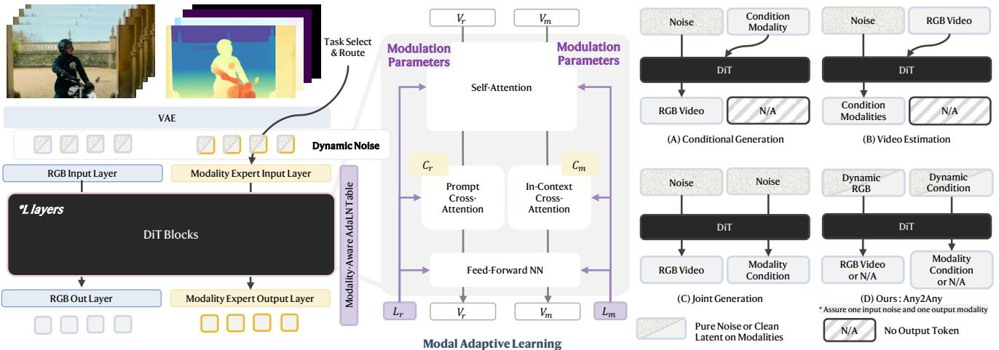
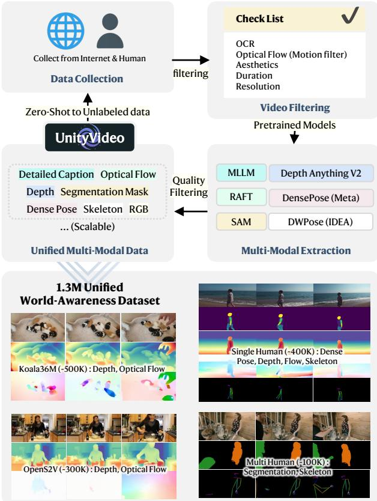
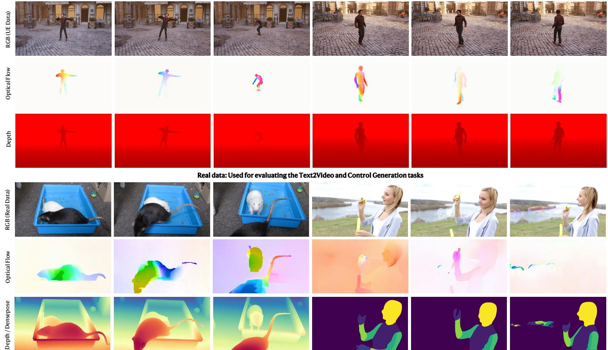
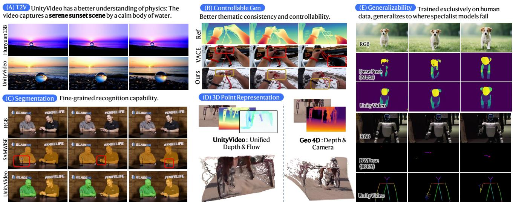
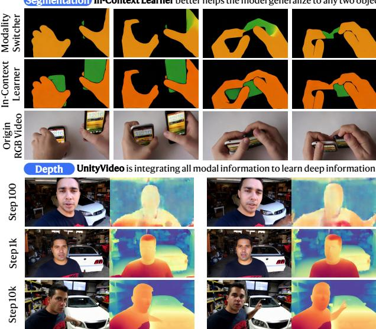

# 1. 论文基本信息

## 1.1. 标题
**UnityVideo: Unified Multi-Modal Multi-Task Learning for Enhancing World-Aware Video Generation**
(UnityVideo：用于增强世界感知视频生成的统一多模态多任务学习)

论文标题直接点明了其核心技术和目标：
*   `UnityVideo`：为模型命名，强调其“统一性”。
*   `Unified Multi-Modal Multi-Task Learning`：指明了核心方法论，即在一个框架内，同时处理多种**模态**（如深度图、骨骼动画等）和多种**任务**（如视频生成、模态预测等）。
*   `Enhancing World-Aware Video Generation`：揭示了最终目标，即通过这种统一学习的方式，让生成的视频更符合物理世界规律，提升模型的“世界感知”能力。

## 1.2. 作者
Jiehui Huang¹, Yuechen Zhang², Xu He³, Yuan Gao⁴, Zhi Cen⁴, Bin Xia², Yan Zhou⁴, Xin Tao⁴, Pengfei Wan⁴, Jiaya Jia¹

*   **隶属机构：** 作者来自多个顶尖学术机构和业界团队，包括香港科技大学 (HKUST)、香港中文大学 (CUHK)、清华大学 (Tsinghua University)，以及快手科技的 Kling 团队 (Kling Team, Kuaishou Technology)。这种产学研结合的团队通常意味着研究既有学术深度，又有大规模工业应用的实践背景。特别是快手 Kling 团队，在视频生成领域有很强的技术积累。
*   **研究背景：** 许多作者（如贾佳亚教授团队）在计算机视觉，特别是视频理解与生成领域，都有深厚的研究背景和卓著的成果。

## 1.3. 发表期刊/会议
论文的发表日期为 2025 年，从参考文献格式（如 CVPR, ICCV, NeurIPS）和内容来看，这是一篇计划或已经投稿到计算机视觉或人工智能领域顶级会议的预印本 (preprint) 论文。这些会议如 CVPR (计算机视觉与模式识别会议)、ICCV (国际计算机视觉会议)、NeurIPS (神经信息处理系统大会) 等，都是该领域最具影响力的学术会议，代表了最高水平的研究。

## 1.4. 发表年份
2025 (根据论文中的参考文献和发布时间推断)

## 1.5. 摘要
近期的视频生成模型虽然展现出强大的合成能力，但受限于**单一模态**的条件输入，这限制了它们对世界的整体理解。这种局限源于**跨模态交互不足**以及**模态多样性有限**，难以全面表征世界知识。为了解决这些问题，我们引入了 `UnityVideo`，一个用于世界感知视频生成的统一框架。该框架能够**联合学习**多种模态（分割掩码、人体骨骼、DensePose、光流和深度图）和多种训练范式。我们的方法包含两个核心组件：(1) <strong>动态加噪 (dynamic noising)</strong>，用于统一异构的训练范式；(2) 带有<strong>上下文学习器 (in-context learner)</strong> 的<strong>模态切换器 (modality switcher)</strong>，通过模块化参数和上下文学习实现统一处理。我们贡献了一个包含 130 万样本的大规模统一数据集。通过联合优化，`UnityVideo` 加速了收敛速度，并显著增强了对未见数据的<strong>零样本泛化 (zero-shot generalization)</strong> 能力。我们证明 `UnityVideo` 在视频质量、一致性以及与物理世界约束的对齐方面均取得了优越表现。

## 1.6. 原文链接
*   **Arxiv 链接:** https://arxiv.org/abs/2512.07831
*   **PDF 链接:** https://arxiv.org/pdf/2512.07831v1.pdf
*   **发布状态:** 预印本 (Preprint)。

# 2. 整体概括

## 2.1. 研究背景与动机
*   **核心问题：** 当前的视频生成模型虽然能生成视觉上逼真的视频，但它们对物理世界的理解是肤浅的。这就像一个只会模仿句子结构的语言模型，却不理解句子的真正含义。模型倾向于“拟合数据分布”，而不是真正“理解物理规律”，导致生成的视频在物理一致性（如物体碰撞、光影折射）和逻辑连贯性上常常出错。

*   **重要性与挑战：**
    1.  <strong>世界模型 (World Models) 的需求：</strong> 生成式 AI 的终极目标之一是构建能够模拟和预测物理世界的“世界模型”。要实现这一点，模型必须超越像素层面的模仿，理解物体、运动、空间几何等深层物理属性。
    2.  **单一模态的局限：** 现有模型大多仅依赖 RGB 视频进行训练，这就像只给学生看文字描述，却不给他们看图表、公式或实验视频。RGB 视频本身包含了所有信息，但模型从中直接学习物理规律非常困难。
    3.  <strong>现有工作的空白 (Gap)：</strong> 尽管有工作尝试引入单一辅助模态（如深度图或光流），但这些研究通常是“单向”的（用辅助模态控制生成）或“双向”但模态有限。<strong>缺乏一个能够统一多种互补模态（几何、运动、结构等）和多种训练任务（生成、预测、联合建模）的通用框架</strong>，系统性地研究这些模态和任务之间的协同作用。

*   **切入点/创新思路：**
    `UnityVideo` 的核心思路借鉴了<strong>大语言模型 (LLM)</strong> 的成功经验。LLM 通过在统一框架内处理自然语言、代码、数学公式等多种文本“子模态”，实现了强大的泛化和推理能力。`UnityVideo` 将这一思想迁移到视频领域：**将深度图、光流、骨骼、分割掩码等视为视频的“子模态”**，并在一个模型中对它们进行**统一的多任务学习**。其核心假设是，这些模态提供了关于物理世界的互补信息，共同训练可以促进知识迁移，从而让模型建立更深刻的世界感知能力。

## 2.2. 核心贡献/主要发现
1.  **提出了 `UnityVideo` 框架：** 这是一个新颖的**统一多模态多任务**视频生成框架。它能在一个模型内处理 RGB 视频和五种辅助模态（分割、骨骼、DensePose、光流、深度），并支持三种训练任务（条件生成、模态估计、联合生成）。
    *   为了实现这个统一框架，论文设计了两个关键组件：
        *   <strong>动态加噪 (Dynamic Noising):</strong> 一种巧妙的训练策略，通过在训练时随机选择对哪种模态（RGB 或辅助模态）加噪，从而在单个训练周期内实现不同任务的优化。
        *   <strong>模态切换器 (Modality Switcher) 与上下文学习器 (In-Context Learner):</strong> 前者通过可学习的参数区分不同模态，后者则利用文本提示（如“生成深度图”）来增强模型的模态感知和泛化能力。

2.  **构建并开源了大规模数据集：**
    *   **OpenUni Dataset:** 一个包含 130 万个视频-模态对的大规模数据集，为统一多模态视频研究提供了宝贵的资源。
    *   **UniBench Benchmark:** 一个高质量的评测基准，包含使用虚幻引擎 (Unreal Engine) 生成的、具有精确真值 (Ground Truth) 的样本，用于公平、准确地评估模型的性能。

3.  **关键发现：**
    *   <strong>协同增益 (Synergy):</strong> 联合训练多种模态和任务比单一训练**效果更好**、**收敛更快**。不同模态之间存在互补关系，例如，深度信息有助于几何理解，光流有助于运动理解，它们的联合学习能促进模型建立更全面的世界表征。
    *   **增强的零样本泛化能力：** `UnityVideo` 在未见过的任务和数据上表现出色。例如，在仅用“两个人”的分割数据训练后，模型能泛化到“两个物体”的分割任务，这得益于其 `In-Context Learner` 对任务语义的理解。
    *   **更优的视频质量和物理一致性：** 实验证明，`UnityVideo` 生成的视频在视觉质量、时序连贯性以及对物理规律（如折射）的遵循上，均优于现有的先进模型。

# 3. 预备知识与相关工作

## 3.1. 基础概念
### 3.1.1. 扩散模型 (Diffusion Models) 与流匹配 (Flow Matching)
*   <strong>扩散模型 (Diffusion Models):</strong> 是一类强大的生成模型。其核心思想分为两个过程：
    1.  <strong>前向过程 (Forward Process):</strong> 对一张真实的图像（或视频帧）逐步、多次地添加少量高斯噪声，直到它完全变成纯噪声。这个过程是固定的，不需要学习。
    2.  <strong>反向过程 (Reverse Process):</strong> 训练一个神经网络（通常是 U-Net 或 Transformer 架构），让它学习如何从纯噪声开始，一步步地“去噪”，最终恢复出原始的清晰图像。生成新图像时，只需从一个随机噪声开始，利用训练好的网络进行反向去噪即可。

*   <strong>流匹配 (Flow Matching, FM):</strong> 是对扩散模型的一种改进或替代。传统的扩散模型需要模拟一个离散的、多步的去噪过程，而流匹配旨在学习一个从噪声分布到数据分布的**连续映射**。它通过定义一个向量场（速度场），直接描述了数据点从噪声状态到真实状态的“流动路径”。其优点是训练更稳定、高效，且在采样时可以一步完成（或用更少的步数），生成速度更快。`UnityVideo` 的训练目标就建立在流匹配框架之上。

### 3.1.2. DiT (Diffusion Transformer)
**DiT (Diffusion Transformer)** 是一种将 **Transformer** 架构应用于扩散模型的思想。传统的扩散模型多使用 **U-Net** 作为去噪网络。而 DiT 则证明了 Transformer 这种在自然语言处理领域大放异彩的架构，同样可以在视觉生成任务中取得优异甚至更好的性能。
*   **工作方式：** DiT 将图像（或视频）切分成小块（Patches），并将这些 `patches` 视为 `token`（类似于语言模型中的单词）。然后，通过 Transformer 的自注意力机制 (self-attention) 来建模这些 `patches` 之间的全局关系，从而实现去噪。`UnityVideo` 使用一个 100 亿参数的 DiT 作为其主干网络 (backbone)。

### 3.1.3. 辅助模态 (Auxiliary Modalities)
除了标准的 RGB 视频，本文还利用了多种辅助视觉模态，它们各自揭示了物理世界的不同方面：
*   <strong>深度图 (Depth Maps):</strong> 灰度图，每个像素的亮度表示该点离摄像机的远近。它提供了场景的 **三维几何结构** 信息。
*   <strong>光流 (Optical Flow):</strong> 描述了连续两帧之间像素的运动矢量。它捕捉了场景中的 **动态信息和运动模式**。
*   <strong>分割掩码 (Segmentation Masks):</strong> 将图像中的不同物体或区域用不同颜色标记出来。它提供了 **物体边界和类别** 信息。
*   <strong>人体骨骼 (Human Skeletons):</strong> 用关键点和连线表示人体的姿态和运动。它提供了 **精细的人体动作** 信息。
*   **DensePose:** 比骨骼更密集的姿态表示，它将人体表面映射到一个 2D 模板上，提供了 **详细的身体部位和表面形态** 信息。

## 3.2. 前人工作
*   <strong>视频生成 (Video Generation):</strong> 近年来，以 Sora、Kling 为代表的大规模视频生成模型取得了巨大成功，它们通过扩大模型和数据规模，展现了惊人的物理世界模拟能力。但这些模型大多仍以 RGB 视频为中心。
*   <strong>可控视频生成 (Controllable Video Generation):</strong> 一些工作尝试利用单一的辅助模态（如深度、骨骼、分割图）作为条件来控制视频生成，例如 `VACE`、`Full-DiT`。这种方式是“单向”的，即 `辅助模态 -> RGB`。
*   <strong>视频重建/估计 (Video Reconstruction/Estimation):</strong> 另一些工作则反向进行，即从 RGB 视频中预测出辅助模态，例如 `DepthCrafter` 从视频预测深度。这种方式是 `RGB -> 辅助模态`。
*   <strong>双向/联合建模 (Bidirectional/Joint Modeling):</strong> 近期有少数工作，如 `Aether`、`GeoVideo`，开始探索 RGB 和辅助模态（主要是几何信息）之间的双向交互和联合生成，并报告了运动和几何理解能力的提升。但它们通常局限于少数几种模态，且没有系统性地统一多种任务。

## 3.3. 技术演进
视频生成领域的技术演进可以概括为：
1.  **从图像到视频：** 早期的视频生成模型可以看作是图像生成模型的延伸，关注生成短片段、低分辨率的视频。
2.  **提升连贯性与质量：** 随着模型架构（如 3D CNN, Transformer）的进步，模型开始能够生成更长、更高质量且时序更连贯的视频。
3.  **大规模预训练：** 类似大语言模型的发展路径，Sora 等模型通过在海量视频数据上进行大规模训练，实现了能力的涌现，能够生成高度逼真且符合物理常识的视频。
4.  **走向多模态与世界模型：** 当前的前沿趋势是，不再仅仅满足于生成逼真的像素，而是追求让模型真正理解视频内容背后的物理世界。`UnityVideo` 正是这一趋势的代表，它认为**融合多种结构化的视觉模态是实现世界模型的关键一步**。

## 3.4. 差异化分析
与相关工作相比，`UnityVideo` 的核心创新在于其 <strong>“统一性”</strong> 和 <strong>“通用性”</strong>：
*   **模态更广：** 不局限于几何（深度）或运动（光流），而是整合了多达五种覆盖几何、运动、结构、语义的互补模态。
*   **任务更全：** 以前的模型通常只做一个任务（如条件生成 $A->B$ 或联合生成 `(A, B)`），`UnityVideo` 则通过动态任务路由，将**条件生成**、**模态估计**和**联合生成**这三种异构任务统一在一个框架内，实现了任务间的知识共享和协同增益。
*   **强调泛化：** 通过 `In-Context Learner` 等设计，`UnityVideo` 不仅追求在训练数据上表现好，更强调模型在未见过的数据和任务组合上的零样本泛化能力，这是迈向通用世界模型的关键。

# 4. 方法论
`UnityVideo` 的核心是将多种视频模态和多种训练任务整合到一个单一的扩散 Transformer (`DiT`) 框架中。其方法论主要围绕两个问题展开：**如何统一不同的任务？** 以及 **如何统一不同的模态？**

*该图像是示意图，展示了UnityVideo框架的多模态视频生成结构。图中展示了动态噪声、模态切换器、以及不同的生成策略，包括条件生成、视频估计和联合生成等方法。主要结构使用了自注意力机制和上下文交叉注意力，通过这些设计来增强世界意识的视频生成能力。*

上图（原文 Figure 3）是 `UnityVideo` 的整体框架图。左侧展示了如何通过动态任务路由来统一三种不同的训练任务；中间展示了通过 `Modality-Adaptive Switcher` 和 `In-Context Learner` 来统一多种模态；右侧则详细描绘了三种任务的具体加噪方式。

## 4.1. 方法原理
`UnityVideo` 的方法原理根植于一个核心直觉：<strong>物理世界的不同方面（几何、运动、语义）虽然表现形式不同，但内在是关联和互补的</strong>。通过在一个统一的模型中共同学习这些不同方面（模态），并执行相关的任务（生成、估计），可以让模型在它们之间建立联系，从而形成一个更全面、更深刻的世界表征。这比单独学习每个方面要高效得多，也能带来更好的泛化能力。

## 4.2. 核心方法详解 (逐层深入)
### 4.2.1. 统一多任务 (Unifying Multiple Tasks)
传统模型通常是为特定任务设计的，例如一个模型只做可控生成，另一个只做深度估计。`UnityVideo` 旨在打破这种壁垒，让一个模型同时学会三个任务。它基于<strong>流匹配 (Flow Matching)</strong> 框架实现这一点。

**1. 三种训练任务：**
*   <strong>条件生成 (Conditional Generation):</strong> 从辅助模态 $V_m$（如深度图）和文本 $C$ 生成 RGB 视频 $V_r$。这对应于 `可控视频生成` 任务。模型学习 $u(V_r | V_m, C)$。
*   <strong>模态估计 (Modality Estimation):</strong> 从 RGB 视频 $V_r$ 估计辅助模态 $V_m$。这对应于 `深度/光流估计` 等任务。模型学习 $u(V_m | V_r)$。
*   <strong>联合生成 (Joint Generation):</strong> 从文本 $C$ 和纯噪声同时生成 RGB 视频 $V_r$ 和辅助模态 $V_m$。这对应于 `多模态联合建模`。模型学习 $u(V_r, V_m | C)$。

<strong>2. 动态任务路由 (Dynamic Task Routing):</strong>
这是实现多任务统一的关键。在每次训练迭代中，模型不是固定执行一个任务，而是根据预设的概率 $p_{cond}$, $p_{est}$, $p_{joint}$ 随机选择一个任务。
*   如果选择了**条件生成**，则只对 RGB 视频 $V_r$ 的 `token` 添加噪声，而辅助模态 $V_m$ 的 `token` 保持清晰（即时间步 $t=0$）。
*   如果选择了**模态估计**，则相反，只对辅助模态 $V_m$ 的 `token` 添加噪声，而 RGB 视频 $V_r$ 保持清晰。
*   如果选择了**联合生成**，则对 $V_r$ 和 $V_m$ 的 `token` 都独立添加噪声。

    这种动态切换的方式，使得模型在一次训练中就能接收到来自三个不同任务的梯度，从而避免了分阶段训练可能导致的“灾难性遗忘”问题，促进了任务间的知识迁移。

<strong>3. 训练目标 (Training Objective):</strong>
论文使用条件流匹配 (Conditional Flow Matching) 作为其损失函数。对于时间步 $t \in [0, 1]$，带噪的数据点由干净数据 $x_0$ 和纯噪声 $x_1 \sim \mathcal{N}(0, I)$ 线性插值得到：$x_t = (1-t)x_0 + tx_1$。模型 $u_\theta$ 的目标是预测从 $x_0$ 到 $x_1$ 的速度场 $v = x_1 - x_0$。

根据动态选择的任务，具体的损失函数如下：
*   **条件生成损失 $\mathcal{L}_{cond}$:**
    $$
    \mathcal{L}_{\mathrm{cond}}(\theta; t) = \mathbb{E}\left[\Vert u_{\theta}(r_t, [m_0, c_{\mathrm{txt}}], t) - v_r \Vert^2\right]
    $$
    *   **解释：** 模型 $u_\theta$ 接收带噪的 RGB 隐变量 $r_t$、干净的模态隐变量 $m_0$ 和文本条件 $c_{txt}$，目标是预测出 RGB 视频的速度场 $v_r = r_1 - r_0$。

*   **模态估计损失 $\mathcal{L}_{est}$:**
    $$
    \mathcal{L}_{\mathrm{est}}(\theta; t) = \mathbb{E}\left[\Vert u_{\theta}(m_t, r_0, t) - v_m \Vert^2\right]
    $$
    *   **解释：** 模型 $u_\theta$ 接收带噪的模态隐变量 $m_t$ 和干净的 RGB 隐变量 $r_0$，目标是预测出辅助模态的速度场 $v_m = m_1 - m_0$。

*   **联合生成损失 $\mathcal{L}_{joint}$:**
    $$
    \mathcal{L}_{\mathrm{joint}}(\theta; t) = \mathbb{E}\left[\Vert u_{\theta}([r_t, m_t], c_{\mathrm{txt}}, t) - [v_r, v_m] \Vert^2\right]
    $$
    *   **解释：** 模型 $u_\theta$ 接收拼接在一起的带噪 RGB 隐变量 $r_t$ 和带噪模态隐变量 $m_t$，以及文本条件 $c_{txt}$，目标是同时预测出 RGB 和辅助模态的速度场 $[v_r, v_m]$。

### 4.2.2. 统一多模态 (Unifying Multiple Modalities)
当多种模态（深度、光流等）共享同一个 Transformer 模型时，必须有机制让模型知道当前处理的是哪种模态，并进行相应的处理。`UnityVideo` 提出了两个互补的设计。

<strong>1. 上下文学习器 (In-Context Learner):</strong>
这是一个轻量级但非常巧妙的设计，它在**语义层面**让模型感知模态。
*   **核心思想：** 除了描述视频内容的文本提示 $C_r$（如 "a man is running"），再引入一个描述**模态类型**的文本提示 $C_m$（如 "depth map", "human skeleton"）。
*   **实现方式：** 在模型的 Transformer 块中，RGB 视频的 `token` $V_r$ 与内容提示 $C_r$ 进行交叉注意力计算；而辅助模态的 `token` $V_m$ 与模态类型提示 $C_m$ 进行交叉注意力计算。
    $$
    V_r' = \mathrm{CrossAttn}(V_r, C_r)
    $$
    $$
    V_m' = \mathrm{CrossAttn}(V_m, C_m)
    $$
*   **优势：** 这种方式利用了 LLM 的上下文学习能力。模型不再是死记硬背某种模态的模式，而是学会了将模态信号与其语义描述（如“分割”）联系起来。这带来了惊人的泛化能力，例如，模型在见过“分割两个人”的例子后，可以理解“分割两个物体”的指令，因为它学会了“分割”这个概念，而不是仅仅记住了“人”。

<strong>2. 模态自适应切换器 (Modality-Adaptive Switcher):</strong>
这是一个在**架构层面**区分不同模态的机制。
*   **核心思想：** 为每一种模态（共 $k$ 种）分配一个可学习的嵌入向量 $L_m \in \{L_1, L_2, ..., L_k\}$。这个嵌入向量就像一个“身份证”，代表了该模态的独有特性。
*   **实现方式：** `UnityVideo` 的 DiT 块使用了 `AdaLN-Zero` (Adaptive Layer Normalization) 技术。`AdaLN` 会根据时间步 $t$ 的嵌入 $t_{emb}$ 生成用于归一化的缩放 $\gamma$、位移 $\beta$ 和门控 $\alpha$ 参数。`UnityVideo` 对其进行了扩展，让这些参数同时依赖于模态嵌入 $L_m$。
    $$
    \gamma_m, \beta_m, \alpha_m = \mathrm{MLP}(L_m + t_{emb})
    $$
*   **优势：** 这种方式将模态信息直接注入到模型的每一层计算中，实现了对特征的精细化、模态化调制。在推理时，用户只需选择相应的模态嵌入 $L_m$，就可以“即插即用”地控制模型使用哪种模态，实现了高度的灵活性。

### 4.2.3. 训练策略 (Training Strategy)
<strong>1. 课程学习 (Curriculum Learning):</strong>
为了解决从零开始联合训练所有模态收敛慢、效果差的问题，论文采用了两阶段的课程学习策略。
*   **阶段一：** 先在单人、场景相对简单的数据上，只训练<strong>像素对齐 (pixel-aligned)</strong> 的模态（光流、深度、DensePose）。这些模态与 RGB 帧有直接的像素对应关系，易于学习空间对应性，为模型打下坚实的基础。
*   **阶段二：** 引入所有五种模态，包括<strong>像素不对齐 (pixel-unaligned)</strong> 的模态（分割、骨骼），并在更多样化（如多人、通用场景）的数据集上进行训练。

**2. OpenUni 数据集：**
为了支撑上述训练，作者构建了一个大规模多模态数据集 `OpenUni`，包含 130 万个视频片段，涵盖五种模态。数据来源广泛，并经过精心处理和标注。

# 5. 实验设置

## 5.1. 数据集
*   <strong>训练数据集 (OpenUni):</strong> 包含 130 万个视频片段，涵盖五种模态：光流、深度、DensePose、骨骼和分割。数据来源包括：
    *   370,358 个单人视频片段。
    *   97,468 个双人视频片段。
    *   489,445 个来自 Koala36M 数据集的片段。
    *   343,558 个来自 OpenS2V 数据集的片段。

        
        *该图像是示意图，展示了UnityVideo框架在数据收集、视频过滤和多模态提取过程中的各个步骤。图中提供了一个包含130万对统一多模态数据的数据集，旨在增强视频生成的世界感知能力。*

    上图（原文 Figure 4）展示了 `OpenUni` 数据集的多样性，包含多种场景和对应的五种模态标注。

*   <strong>评测数据集 (VBench &amp; UniBench):</strong>
    *   **VBench:** 一个公开的、全面的视频生成模型评测基准，用于评估视频的视觉质量、时间连贯性、美学等。
    *   <strong>UniBench (本文构建):</strong> 一个专为统一视频任务设计的评测基准，包含两部分：
        1.  **用于视频估计任务:** 200 个从<strong>虚幻引擎 (Unreal Engine, UE)</strong> 中渲染的高质量样本，它们拥有**像素级别精确的深度和光流真值**，这对于定量评估至关重要。
        2.  **用于生成任务:** 200 个从真实世界视频中精心挑选的样本，覆盖多种模态，用于评估可控生成和分割等任务。

            
            *该图像是一个示意图，展示了多模态视频生成模型的不同输入数据，包括 RGB 图像、光流和深度图。各个部分显示了用于评估 Text2Video 和 Control Generation 任务的真实数据，有助于理解 UnityVideo 的方法与效果。*

    上图（原文 Appendix Figure 3）展示了 `UniBench` 的构成，左侧是用于评估估计任务的 UE 合成数据，右侧是用于评估生成任务的真实世界数据。

## 5.2. 评估指标
### 5.2.1. 视频质量指标 (来自 VBench)
*   <strong>主体一致性 (Subject Consistency):</strong>
    *   **概念定义:** 衡量视频中主要对象在不同帧之间外观和身份是否保持一致。分数越高，表示主体越稳定，没有发生扭曲或“变脸”。
    *   **数学公式:** 通常基于跨帧特征相似度计算，例如使用 DINO 等自监督模型的特征，计算视频第一帧和后续帧中主体区域的余弦相似度。公式可表示为：$\frac{1}{N-1} \sum_{i=2}^{N} \text{sim}(\text{crop}(f_1), \text{crop}(f_i))$。
    *   **符号解释:** $N$ 是总帧数，$f_i$ 是第 $i$ 帧，$\text{crop}(\cdot)$ 表示裁剪出主体区域，$\text{sim}(\cdot, \cdot)$ 是特征相似度函数。

*   <strong>背景一致性 (Background Consistency):</strong>
    *   **概念定义:** 衡量视频中静态背景部分是否保持稳定，没有不合理的抖动或闪烁。
    *   **数学公式:** 与主体一致性类似，但计算的是背景区域的特征相似度。

*   <strong>美学质量 (Aesthetic Quality):</strong>
    *   **概念定义:** 评估生成的视频在构图、色彩、光影等方面是否具有美感。
    *   **数学公式:** 通常使用一个在美学评分数据集上预训练的评分模型 $M_{aes}$ 来直接对视频帧打分，然后取平均值：$\frac{1}{N} \sum_{i=1}^{N} M_{aes}(f_i)$。
    *   **符号解释:** $N$ 是总帧数，$f_i$ 是第 $i$ 帧，$M_{aes}$ 是美学评分模型。

*   <strong>时间闪烁 (Temporal Flickering):</strong>
    *   **概念定义:** 量化连续帧之间像素级别的亮度或颜色突变程度。分数越高表示闪烁越少，视频越平滑。
    *   **数学公式:** 计算连续帧 $f_i, f_{i+1}$ 之间的亮度差异的平均值：`\frac{1}{H \times W \times (N-1)} \sum_{i=1}^{N-1} \sum_{p} |L(p, f_i) - L(p, f_{i+1})|`，其中 $L$ 是像素亮度。

*   <strong>运动平滑度 (Motion Smoothness):</strong>
    *   **概念定义:** 评估视频中物体的运动轨迹是否流畅，没有卡顿或瞬移。
    *   **数学公式:** 通常基于光流计算。计算光流场 $F_i$ 的散度或梯度的平滑度。一个简单的度量可以是光流梯度范数的倒数。

### 5.2.2. 深度估计指标
*   <strong>绝对相对误差 (Absolute Relative Error, AbsRel):</strong>
    *   **概念定义:** 预测深度与真实深度之间差异的相对大小，是评估深度估计精度的核心指标。值越低越好。
    *   **数学公式:**
        $$
        \text{AbsRel} = \frac{1}{|P|} \sum_{p \in P} \frac{|d_p - d_p^*|}{d_p^*}
        $$
    *   **符号解释:** $P$ 是所有像素的集合，$d_p$ 是像素 $p$ 的预测深度，$d_p^*$ 是像素 $p$ 的真实深度。

*   **阈值准确率 ($\delta < 1.25$):**
    *   **概念定义:** 预测准确的像素比例。如果一个像素的预测深度与真实深度的比值（或其倒数）小于 1.25，则认为该像素预测准确。值越高越好。
    *   **数学公式:**
        $$
        \% \text{ of pixels s.t. } \max\left(\frac{d_p}{d_p^*}, \frac{d_p^*}{d_p}\right) < 1.25
        $$
    *   **符号解释:** 符号含义同上。

### 5.2.3. 视频分割指标
*   <strong>平均交并比 (mean Intersection-over-Union, mIoU):</strong>
    *   **概念定义:** 用于语义分割。对每个类别，计算预测掩码与真实掩码的交集与并集的面积之比 (IoU)，然后对所有类别求平均。值越高越好。
    *   **数学公式:**
        $$
        \text{mIoU} = \frac{1}{C} \sum_{c=1}^{C} \frac{\text{TP}_c}{\text{TP}_c + \text{FP}_c + \text{FN}_c}
        $$
    *   **符号解释:** $C$ 是类别总数，$\text{TP}_c, \text{FP}_c, \text{FN}_c$ 分别是类别 $c$ 的真阳性、假阳性、假阴性像素数量。

*   <strong>平均精度均值 (mean Average Precision, mAP):</strong>
    *   **概念定义:** 用于实例分割。它衡量模型检测并正确分割出每个物体实例的能力。它是在不同 IoU 阈值下计算的平均精度的均值。值越高越好。
    *   **数学公式:** mAP 的计算较为复杂，它涉及到在不同置信度阈值下绘制精确率-召回率曲线 (Precision-Recall Curve)，并计算曲线下的面积 (AP)，最后对所有类别求平均。

## 5.3. 对比基线
论文将 `UnityVideo` 与三类顶尖模型进行了比较：
1.  <strong>文本到视频生成 (Text-to-Video):</strong>
    *   **商业模型:** Kling-1.6。
    *   **开源模型:** OpenSora, Hunyuan-13B, Wan-2.1-13B。
    *   **联合生成模型:** Aether (能联合生成视频和深度)。
2.  <strong>可控视频生成 (Controllable Generation):</strong> VACE, Full-DiT。
3.  <strong>视频估计/分割 (Video Estimation/Segmentation):</strong>
    *   **深度估计:** DepthCrafter, Geo4D, Aether。
    *   **视频分割:** SAMWISE, SeC。

        选择这些基线非常有代表性，覆盖了当前视频生成和理解的各个主流方向，能够全面地检验 `UnityVideo` 的统一能力。

# 6. 实验结果与分析

## 6.1. 核心结果分析
核心实验结果清晰地表明，`UnityVideo` 作为一个统一框架，其性能在多个任务上都达到了最先进的 (state-of-the-art) 水平，甚至超越了专门为单一任务设计的模型。

### 6.1.1. 多任务性能对比 (Table 1)
以下是原文 Table 1 的结果，它在一张表中汇总了 `UnityVideo` 在视频生成、视频分割和深度估计三大类任务上的表现，并与各类专业模型进行对比。

<table>
<thead>
<tr>
<th rowspan="2">Tasks</th>
<th rowspan="2">Models</th>
<th colspan="4">Video Generation - VBench & UniBench Dataset</th>
<th colspan="4">Video Estimation - UniBench Dataset</th>
</tr>
<tr>
<th colspan="4">VBench</th>
<th colspan="2">Segmentation</th>
<th colspan="2">Depth</th>
</tr>
<tr>
<th></th>
<th></th>
<th>Background Consistency</th>
<th>Aesthetic Quality</th>
<th>Overall Consistency</th>
<th>Dynamic Degree</th>
<th>mIoU ↑</th>
<th>mAP↑</th>
<th>Abs Rel ↓</th>
<th>δ &lt; 1.25 ↑</th>
</tr>
</thead>
<tbody>
<tr>
<td rowspan="5">Text2Video</td>
<td>Kling1.6</td>
<td>95.33</td>
<td>60.48</td>
<td>21.76</td>
<td>47.05</td>
<td></td>
<td></td>
<td></td>
<td></td>
</tr>
<tr>
<td>OpenSora2</td>
<td>96.51</td>
<td>61.51</td>
<td>19.87</td>
<td>34.48</td>
<td>-</td>
<td></td>
<td></td>
<td></td>
</tr>
<tr>
<td>HunyuanVideo-13B</td>
<td>96.28</td>
<td>53.45</td>
<td>22.61</td>
<td>41.18</td>
<td></td>
<td>-</td>
<td>-</td>
<td>-</td>
</tr>
<tr>
<td>Wan2.1-14B</td>
<td>96.78</td>
<td>63.66</td>
<td>21.53</td>
<td>34.31</td>
<td></td>
<td>-</td>
<td></td>
<td></td>
</tr>
<tr>
<td>Aether</td>
<td>95.28</td>
<td>48.25</td>
<td>20.26</td>
<td>37.32</td>
<td></td>
<td>-</td>
<td>0.025</td>
<td>97.95</td>
</tr>
<tr>
<td rowspan="2">Controllable Generation</td>
<td>full-dit</td>
<td>95.58</td>
<td>54.82</td>
<td>20.12</td>
<td>49.50</td>
<td>-</td>
<td>-</td>
<td>-</td>
<td></td>
</tr>
<tr>
<td>VACE</td>
<td>93.61</td>
<td>51.24</td>
<td>17.52</td>
<td>61.32</td>
<td>-</td>
<td>-</td>
<td>-</td>
<td>-</td>
</tr>
<tr>
<td rowspan="2">Depth Video Reconstruction</td>
<td>depth-crafter</td>
<td></td>
<td>-</td>
<td>-</td>
<td>-</td>
<td>-</td>
<td>-</td>
<td>0.065</td>
<td>96.94</td>
</tr>
<tr>
<td>Geo4D</td>
<td>-</td>
<td></td>
<td></td>
<td>-</td>
<td>-</td>
<td>-</td>
<td>0.053</td>
<td>97.94</td>
</tr>
<tr>
<td rowspan="2">Video Segmentation</td>
<td>SAMWISE</td>
<td></td>
<td>-</td>
<td></td>
<td>-</td>
<td>62.21</td>
<td>20.12</td>
<td>-</td>
<td>-</td>
</tr>
<tr>
<td>SeC</td>
<td>-</td>
<td>-</td>
<td>-</td>
<td>-</td>
<td>65.52</td>
<td>22.23</td>
<td></td>
<td></td>
</tr>
<tr>
<td rowspan="2">Unified ControGen, T2V, and Estimation</td>
<td>UnityVideo (ControlGen)</td>
<td>96.04</td>
<td>54.63</td>
<td>21.86</td>
<td>64.42</td>
<td></td>
<td></td>
<td></td>
<td></td>
</tr>
<tr>
<td>UnityVideo (Unified)</td>
<td><b>97.44</b></td>
<td><b>64.12</b></td>
<td><b>23.57</b></td>
<td>47.76</td>
<td><b>68.82</b></td>
<td><b>23.25</b></td>
<td><b>0.022</b></td>
<td><b>98.98</b></td>
</tr>
</tbody>
</table>

**分析：**
*   <strong>文本到视频生成 (T2V):</strong> `UnityVideo`（表中最后一行，进行联合生成）在背景一致性、美学质量和整体一致性上均取得了最高分，超越了包括 Kling、OpenSora 在内的顶尖模型。这证明联合多模态学习确实能提升基础视频生成的质量。
*   <strong>可控生成 (Controllable Generation):</strong> `UnityVideo` 的可控生成模式（倒数第二行）在动态范围 (`Dynamic Degree`) 上表现突出，同时在一致性上优于其他可控生成模型 `full-dit` 和 `VACE`。
*   <strong>视频估计 (Video Estimation):</strong>
    *   <strong>分割 (Segmentation):</strong> `UnityVideo` 在 `mIoU` 和 `mAP` 指标上均超过了专门的视频分割模型 `SAMWISE` 和 `SeC`。
    *   <strong>深度 (Depth):</strong> `UnityVideo` 在 `AbsRel`（越低越好）和 $δ < 1.25$（越高越好）两个指标上都取得了最佳成绩，优于 `Aether`、`DepthCrafter` 等专业深度估计模型。
*   **结论：** 这个表格极具说服力地证明了 `UnityVideo` 的“统一”能力并非以牺牲性能为代价，而是在几乎所有任务上都实现了性能的提升。这强有力地支持了论文的核心论点：**多任务、多模态的联合学习能够带来协同增益**。

### 6.1.2. 定性结果分析

*该图像是一个示意图，展示了UnityVideo在视频生成中的多模态能力，包括物理理解、可控性和细粒度分割能力等。通过联合学习不同模态，UnityVideo提供了更好的视频质量和一致性，尤其在训练仅基于人类数据的情况下，能在专业模型失效的区域进行有效泛化。*

上图（原文 Figure 5）从定性上展示了 `UnityVideo` 的优势：
*   <strong>(A) 物理理解:</strong> 在生成“玻璃杯中的吸管”时，`UnityVideo` 正确地模拟了光线穿过水和玻璃时发生的**折射现象**，而其他模型生成的吸管是笔直的。这体现了其更强的世界感知能力。
*   <strong>(B) 可控性:</strong> 在深度图控制下，`UnityVideo` 不仅能忠实地遵循深度引导生成运动，而且背景稳定、主体清晰。相比之下，其他方法可能出现背景闪烁或主体被背景污染的问题。
*   <strong>(C, D, E) 模态理解:</strong> 在估计深度、分割等任务时，`UnityVideo` 能够生成更精细的边缘、更准确的 3D 点云，并能泛化到未见过的动物姿态估计，克服了专业模型可能存在的过拟合问题。

## 6.2. 消融实验/参数分析
消融实验旨在验证模型中各个设计组件的有效性。

### 6.2.1. 不同模态的影响 (Table 2)
以下是原文 Table 2 的结果，探究了单一模态（光流或深度）与多模态联合训练对视频生成的影响。

| | Subject Consistency | Background Consistency | Imaging Quality | Overall Consistency |
| :--- | :--- | :--- | :--- | :--- |
| Baseline | 96.51 | 96.06 | 64.99 | 23.17 |
| Only Flow | 97.82 | 97.14 | 67.34 | 23.70 |
| Only Depth | 98.13 | 97.29 | 69.09 | 23.48 |
| Ours-Flow | 97.97 (+1.46) | 97.19 (+1.13) | 69.36 (+4.37) | 23.74 (+0.57) |
| Ours-Depth | 98.01 (+1.50) | 97.24 (+1.18) | 69.18 (+4.19) | 23.75 (+0.58) |

**分析：**
*   **单一模态有效:** 仅加入光流 (`Only Flow`) 或深度 (`Only Depth`) 训练，相比基线 (`Baseline`)，所有指标都有提升。
*   **多模态更优:** `Ours-Flow` 和 `Ours-Depth` 代表在统一多模态框架下训练的模型。与对应的单一模态训练相比，它们在各项指标上仍有提升，尤其是在 `Imaging Quality`（图像质量）上提升显著。这表明**不同模态之间存在互补关系**，一起训练能带来 $1+1>2$ 的效果。

### 6.2.2. 多任务训练的影响 (Table 3)
以下是原文 Table 3 的结果，比较了单一任务训练与多任务统一训练的效果。

| | Subject Consistency | Background Consistency | Temporal Flickering | Motion Smoothness |
| :--- | :--- | :--- | :--- | :--- |
| Baseline | 96.51 | 96.06 | 98.73 | 99.30 |
| Only ControlGen | 96.53 | 95.58 | 98.45 | 99.28 |
| Only JointGen | 98.01 | 97.24 | 99.10 | 99.44 |
| Ours-ControlGen | 96.53 (+0.02) | 96.08 (+0.02) | 98.79 (+0.06) | 99.38 (+0.08) |
| Ours-JointGen | 97.94 (+1.43) | 97.18 (+0.63) | 99.13 (+0.40) | 99.48 (+0.18) |

**分析：**
*   仅在可控生成任务 (`Only ControlGen`) 上训练，性能甚至会比基线有所下降（背景一致性、时间闪烁等指标变差）。这可能是因为模型过于关注控制信号而忽略了视频本身的质量。
*   但是，在统一多任务框架下 (`Ours-ControlGen`)，性能得到了恢复甚至超越了基线。这说明<strong>其他任务（如联合生成）的训练对可控生成任务起到了正则化和质量提升的作用</strong>。这再次验证了多任务学习的协同效应。

### 6.2.3. 架构设计的影响 (Table 4)
以下是原文 Table 4 的结果，验证了 `In-Context Learner` 和 `Modality Switcher` 两个核心组件的有效性。

| | Subject Consistency | Background Consistency | Temporal Flickering | Motion Smoothness |
| :--- | :--- | :--- | :--- | :--- |
| Baseline | 96.51 | 96.06 | 98.73 | 99.30 |
| w/ In-Context Learner | 97.92 | 97.08 | 99.04 | 99.42 |
| w/ Modality Switcher | 97.94 | 97.18 | 99.13 | 99.48 |
| Ours | **98.31** | **97.54** | **99.35** | **99.54** |

**分析：**
*   单独加入 `In-Context Learner` 或 `Modality Switcher` 都能显著提升所有指标。
*   将两者结合 (`Ours`)，性能得到进一步提升，达到了最佳效果。这证明了这两个组件是**互补的**，分别从语义和架构层面解决了多模态统一的问题，共同促进了模型的学习。

    
    *该图像是一个示意图，展示了In-Context Learner在语义分割中的应用，能够将分割推广到未见物体。同时，UnityVideo整合了所有模态信息，以学习深度信息。图中包含了不同步骤的深度信息示例，展示了如何随着训练进展而提升对深度信息的理解。*

上图（原文 Figure 7）直观展示了 `In-Context Learner` 的作用。通过文本提示“分割两个物体”，模型成功泛化，而没有该组件的模型则失败了。这生动地说明了 `In-Context Learner` 带来的语义理解和零样本泛化能力。

# 7. 总结与思考

## 7.1. 结论总结
`UnityVideo` 提出并实现了一个**统一的多模态、多任务学习框架**，用于提升视频生成模型的世界感知能力。通过将 RGB 视频与五种辅助模态（深度、光流、分割、骨骼、DensePose）在单一的 DiT 模型中进行联合训练，并巧妙地设计了**动态任务路由**、**上下文学习器**和**模态切换器**等机制，`UnityVideo` 实现了以下关键贡献：
1.  **性能卓越：** 在文本到视频生成、可控生成、深度估计和视频分割等多个任务上均达到了最先进的水平，超越了许多专门领域的模型。
2.  **协同增益：** 证明了多模态、多任务的联合学习能够加速模型收敛，并带来显著的性能协同增益。
3.  **泛化性强：** 模型展现出强大的零样本泛化能力，能够应用于训练分布之外的物体和场景。
4.  **资源贡献：** 发布了大规模的多模态数据集 `OpenUni` 和高质量的评测基准 `UniBench`，为后续研究铺平了道路。

    `UnityVideo` 的工作为构建更强大的“世界模型”提供了一个清晰且有效的路径：即通过统一和融合多样化的信息来源，让模型从“模仿像素”走向“理解世界”。

## 7.2. 局限性与未来工作
*   **VAE 伪影问题:** 当前模型使用的 VAE（变分自编码器）在将视频压缩到隐空间和重建时，偶尔会引入一些视觉伪影 (artifacts)。这可以通过使用更先进的 VAE 架构或对其进行微调来改进。
*   **模型规模与模态扩展:** 作者指出，将模型的主干网络扩展到更大规模，并融合更多的视觉模态（如音频、热成像等），可能会进一步增强模型的涌现能力和世界理解水平。

## 7.3. 个人启发与批判
*   **启发：**
    1.  <strong>“统一”</strong>是通向通用人工智能的强大范式。 `UnityVideo` 的成功再次印证了 `GPT` 系列模型所展示的道理：将多源、多任务的数据在一个大规模模型中进行统一学习，是实现能力涌现和强大泛化的关键。这种思想可以广泛应用于机器人、自动驾驶等需要整合多传感器信息的领域。
    2.  <strong>“世界模型”</strong>不应局限于单一模态。 物理世界本身就是多模态的。要让 AI 理解世界，就必须让它接触和学习世界的多种表现形式。`UnityVideo` 将深度、光流等结构化信息视为与 RGB 同等重要的“子模态”，而非简单的“辅助条件”，这一视角转换是其成功的关键。
    3.  **轻量级设计的巨大潜力。** `In-Context Learner` 是一个非常优雅的设计，它通过引入简单的文本提示，就极大地增强了模型的零样本泛化能力。这提醒我们，在追求模型规模的同时，巧妙的架构设计和训练策略同样至关重要。

*   **批判与思考：**
    1.  **数据标注的成本与依赖：** `UnityVideo` 的成功建立在 `OpenUni` 这个大规模、高质量的多模态数据集上。然而，获取这些辅助模态的标注（特别是对于真实世界视频）是昂贵的，依赖于多个预训练的“专家模型”。这些专家模型本身的误差会传递到 `UnityVideo` 的训练中。未来的一个研究方向可能是如何从无标注或弱标注的数据中学习这些多模态表征。
    2.  **物理一致性的评估：** 尽管论文通过一些定性例子（如折射）展示了物理理解的提升，但对物理一致性的评估仍主要依赖于主观判断或间接的视频质量指标。如何设计更系统、更定量的物理世界模拟评测基准，将是推动该领域发展的关键。
    3.  **任务间的权重问题：** 论文中提到，动态任务路由的概率是根据任务难度反向设置的 ($p_{cond} < p_{est} < p_{joint}$)。这是一个经验性的设定。这些任务概率如何动态调整，或者是否存在一个最优的权重组合，是一个值得深入探索的问题。不同任务之间的关系可能并非总是互利共赢，也可能存在竞争或“跷跷板效应”，如何平衡它们是一个挑战。