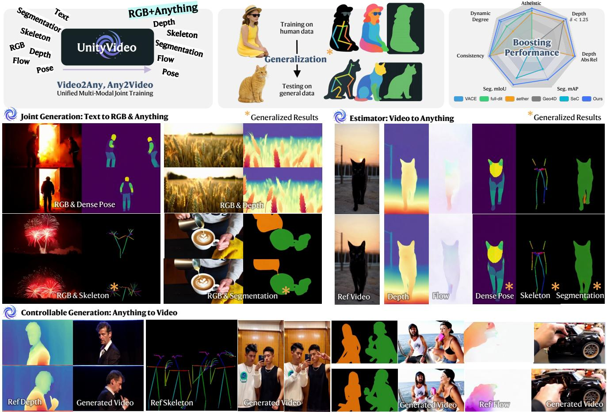
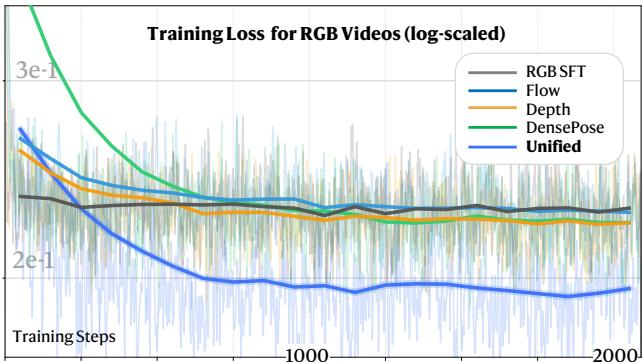
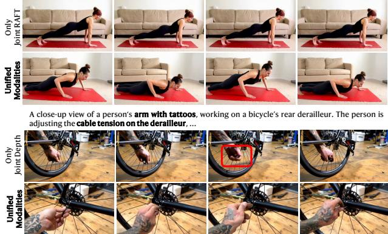
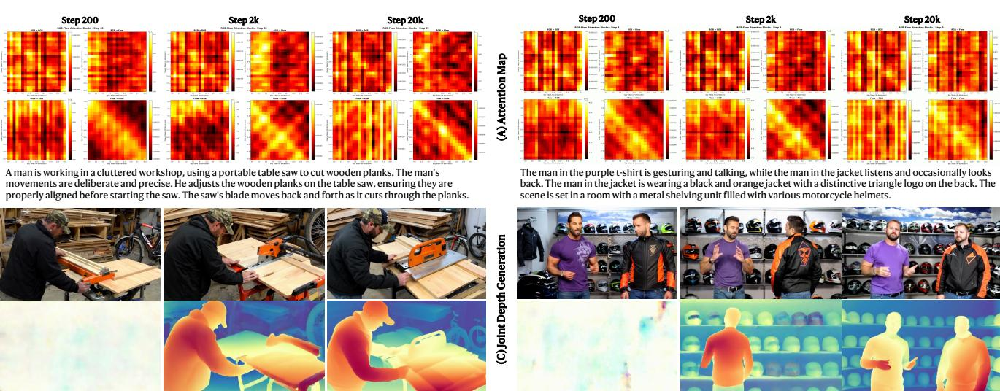
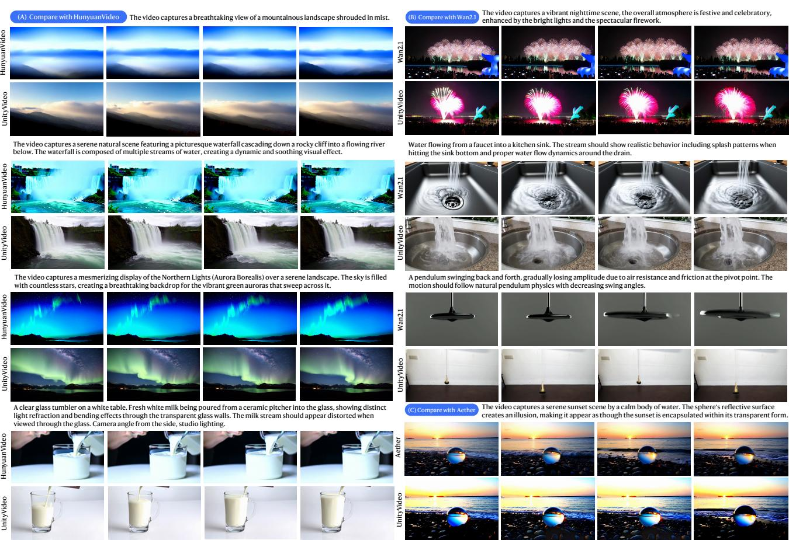
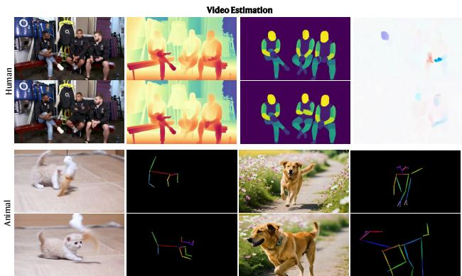
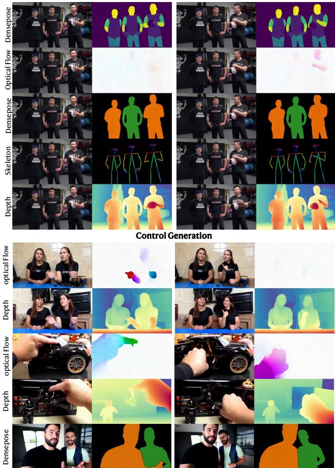

# UnityVideo：统一的多模态多任务学习以增强世界感知的视频生成

黄杰辉1, † 张悦晨2, 何旭3, 高源4, 曾志4, 夏斌2, 周岩4, 陶鑫4, 王鹏飞4, 贾佳亚1 1香港科技大学 2中文大学 3清华大学 4快手科技Kling团队 项目： https://jackailab.github.io/Projects/UnityVideo

# 摘要

最近的视频生成模型展示了令人印象深刻的合成能力，但仍然受到单一模态条件的限制，约束其整体世界理解。这源于跨模态交互不足和有限的模态多样性，导致无法全面表示世界知识。为了解决这些限制，我们提出了UnityVideo，一个统一的世界感知视频生成框架，能够跨多种模态（分割掩膜、人类骨架、DensePose、光流和深度图）和训练范式进行联合学习。我们的方法包含两个核心组件：（1）动态加噪声以统一异构训练范式，以及（2）一个模态切换器，配备上下文学习器，通过模块参数和上下文学习实现统一处理。我们贡献了一个包含130万个样本的大规模统一数据集。通过联合优化，UnityVideo加速了收敛，并显著增强了对未见数据的零样本泛化能力。我们展示了UnityVideo在视频质量、一致性以及与物理世界约束的对齐方面的优越表现。代码和数据可在以下链接找到：https://github.com/dvlab-research/UnityVideo

# 1. 引言

大型语言模型（LLMs）通过在单一训练范式中统一自然语言、代码和数学表达等多样化的文本模块，实现了强大的泛化和推理能力。这种互补文本子模块的整合提高了任务表现并支持涌现推理。同样，近期的视频基础模型随着规模和参数的增加，展现出有希望的世界建模能力。然而，视觉扩展主要集中在RGB视频，类似于仅在纯文本上训练语言模型。这一差距引发了一个问题：是否通过统一视觉子模块（如深度、光流、分割、骨架和DensePose）能够增强模型对物理世界的理解，正如统一文本学习对LLMs所做到的那样。近期研究表明，视频生成可以受益于单一辅助输入，例如深度图、光流、骨架和分割掩模。许多方法采用单向交互：条件RGB生成于辅助模态以实现可控合成，或通过逆向估计从RGB预测这些模态。少数近期框架探索双向交互，并通过跨模态的共享表征报告了运动和几何理解的提高。尽管取得了一定进展，统一训练范式对跨模态交互和世界认知的影响仍不明确。多模态和多任务的联合训练能否改善推理、加速收敛并产生涌现感知？单模态学习限制了模型推断物理动态的能力，促使其进行分布拟合而非推理。在实践中，不同模态提供互补线索：实例分割区分类别，DensePose区分身体部位，骨架编码精细运动。这在图2中得到了展示，跨多样化模态的互补信息联合学习有助于视频生成的收敛，进一步为更全面的世界建模和改进的零样本泛化提供了路径。基于这些观察，提出了UnityVideo。UnityVideo是一个统一的多模态视频生成、估计和联合建模框架。UnityVideo整合了多种模态和训练范式，以加速收敛、增强零样本泛化，并促进跨任务和模态的相互提升。该框架引入了一种轻量级模态自适应学习器，将异质模态信号映射到共享特征空间，使得在推理时能插拔式选择输入。为了进一步提高泛化能力，我们设计了一种上下文内学习器，利用内部上下文线索实现无外部检测器的文本驱动视频物体分割。我们还制定了一种动态噪声调度策略，在单一训练周期内切换不同的训练目标，包括联合生成、视频估计和可控生成，以鼓励跨任务协同。

  
Figure 2. Training on unified modalities benefits video generation. Unified multi-modal and multi-task joint training achieves the lowest final loss on RGB video generation, outperforming single-modality joint training and RGB finetuning baseline.

我们策划了 OpenUni，这是一个大规模的数据集，包含 130 万个多模态视频样本，以实现这种统一的训练范式，并构建了高质量的基准 UniBench。UniBench 包含 3 万个合成视频和一部分训练数据，其中真实深度和光流是在虚幻引擎中渲染的。这些资源为公平和全面的评估提供了坚实的基础。如图 1 所示，UnityVideo 是一个通用模型，既可以执行视频生成，也可以进行估计，并且可以在零样本条件下泛化到训练数据中未提供的新对象。大量的定量和定性结果表明，我们的模型在多个下游任务中优于现有方法。我们的主要贡献总结如下：•我们提出了 UnityVideo，这是一种新颖的统一框架，用于整合多种视频任务和模态，能够实现相互知识传递、更好的收敛性以及相较于单任务基准的性能提升。我们引入了一种模态自适应切换器、一种上下文学习者以及一种动态噪声调度策略，它们共同实现了在多样化目标上的高效联合训练，并具备扩展到更大数据集的能力。•我们构建并发布了 OpenUni，这是一个包含 130 万对多模态视频的数据集，以及 UniBench，这是一个包含 3 万个样本的基准，旨在为统一视频模型的公平评估提供支持。

# 2. 相关工作

# 2.1. 视频生成

大规模视频生成推动了世界建模和物理推理 [7, 27, 39, 44, 49, 52]，提高了模型捕捉物理动态的能力 [2, 8, 15, 24, 49]。近期研究整合了深度、相机姿态和光流等额外视觉信号，以联合建模视频 [1, 5, 40]。出现了两个主要方向：（i）将多种模态编码到共享的隐空间中，并利用流匹配共同预测视频和辅助模态，从而实现互利增益 [5, 53]；（ii）基于多模态输入进行生成条件化，允许同时满足多个控制信号，并提高视觉质量 [16, 18]。尽管取得了良好结果，大多数研究要么孤立地研究单一架构，要么集中于单一模态，限制了跨任务的协同效应。相比之下，我们在单一框架中统一了多任务学习，并分析这种统一如何增强世界感知和泛化能力。

# 2.2. 视频重建

视频包含丰富的世界知识，经典视觉方法直接从RGB中估计深度、相机姿态和光流[21, 40]。最近基于扩散的方案在没有外部模块的情况下学习条件与视频之间的双向映射，揭示了流匹配框架中的内在双向能力[13, 17, 37]。代表性系统如Aether [40]、GeoVideo [1]和4DNex [9]将视频与几何模态结合，而EgoTwin [53]则将骨架与视频关联。双向交互也出现在视频与音频[44]以及视频与文本[7, 54]之间，例如用于音频和视频的UniVerse-1 [44]，以及用于文本和视频的UniVid或Omni-Video。然而，先前的工作并未完全统一多样的模态或系统地研究它们的协同作用，并且很少激活上下文能力以实现强大的零-shot泛化。我们的方法通过跨模态和任务的联合训练，解决了这些差距，产生了一个统一模型，具有更强的零-shot性能和更清晰的跨模态耦合洞察。

# 3. 方法

UnityVideo 在一个统一的扩散变换器中整合了视频生成和多模态理解。如图 3 所示，该模型通过共享的 DiT 主干网络 $u ( \cdot )$ 处理 RGB 视频 $V _ { r }$、文本条件 $C$ 和辅助模态 $V _ { m }$。在训练过程中，我们动态采样任务类型并应用相应的噪声调度（第 3.1 节）。为了在这一统一架构中处理多种模态，我们引入了上下文学习器和模态自适应切换器（第 3.2 节）。通过渐进式课程训练（第 3.3 节），模型实现了所有任务和模态的同时收敛。

# 3.1. 统一多个任务

传统的视频生成模型通常用于特定任务的孤立训练，限制了它们利用跨任务知识的能力。我们扩展了流匹配框架 [25]，以支持在单一架构内的三种互补训练范式。UnityVideo 同时处理三个目标：从辅助模态生成 RGB 视频 $( u ( V _ { r } | V _ { m } , C ) )$，从 RGB 视频估计辅助模态 $( u ( V _ { m } | V _ { r } ) )$，以及从噪声联合生成这两者 $( u ( V _ { r } , V _ { m } | C ) )$。$V _ { r }$ 和 $V _ { m }$ 词元在宽度维度上连接，并通过自注意力模块进行交互。沿用 [18, 38]，我们在 DiT 主干网络的自注意力中融入 3D RoPE，以有效区分跨模态时空位置。

动态任务路由。为了使这三种范式能够并行优化，我们在训练过程中引入了概率性任务选择。在每次迭代中，我们以概率 $p _ { \mathrm { c o n d } }$、$p _ { \mathrm { e s t } }$ 和 $p _ { \mathrm { j o i n t } }$ 采样出一种任务类型（其中 $p _ { \mathrm { c o n d } } + p _ { \mathrm { e s t } } + p _ { \mathrm { j o i n t } } = 1$），这决定了在时间步 $t$ 应用于 RGB 和模态词元的噪声调度。对于条件生成，如图 3 右侧所示，RGB 词元在噪声 $\left( t \sim \left[ 0 , 1 \right] \right)$ 中逐渐去噪，而模态词元保持干净 $( t = 0 )$。对于模态估计，RGB 词元保持干净，而模态词元添加噪声。对于联合生成，两种词元类型都独立地被噪声破坏。我们将任务概率分配为与其学习难度成反比：$p _ { \mathrm { c o n d } } < p _ { \mathrm { e s t } } < p _ { \mathrm { j o i n t } }$。这项策略防止了序列阶段训练中常见的灾难性遗忘，允许模型并行学习这三种分布。

# 3.2. 统一多模态

跨不同模态的联合训练可以显著提升单个任务的性能，如图2所示。然而，处理具有共享参数的多样化模态需要明确的机制来区分它们。我们引入了两个互补的设计：一个用于语义级模态感知的上下文学习器和一个用于架构级调制的模态自适应开关。

上下文学习者。为了利用模型固有的上下文推理能力，我们注入描述模态类型的特定文本提示 $C _ { m }$（例如，“深度图”，“人体骨架”），而非视频内容。这一设计与描述内容的字幕 $C _ { r }$ 根本不同。给定连接的 RGB 词元 $V _ { r }$ 和模态词元 $V _ { m }$，我们分别执行双分支交叉注意机制：$V _ { r } ^ { \prime } = \operatorname { C r o s s A t t n } ( V _ { r } , C _ { r } )$ 用于具有内容字幕的 RGB 特征，以及 $V _ { m } ^ { \prime } = \mathrm { C r o s s A t t n } ( V _ { m } , C _ { m } )$ 用于具有类型描述的模态特征，然后对它们进行重新组合以便于后续处理。这种轻量机制引入的计算开销微乎其微，同时实现了组合泛化。例如，使用短语“两个主体”进行训练使得模型能够在分割任务中推广至“两个物体”，因为模型学习阐释模态层面的语义，而非记忆内容特定的模式。具体分析详见实验部分。

  
tokens (left), and modality unification via the proposed Modality-Aware AdaLN Table (center).Specifically, $L _ { r }$ and $L _ { m }$ denote the respectively. $C _ { r }$ and $C _ { m }$ represent the prompt condition for RGB video content and in-context modaliy learning prompt, while $V _ { r }$ and $V _ { m }$ correspond to the token sequences from the RGB and auxiliary modalities, respectively.

模态自适应切换器。尽管基于文本的区分提供了语义感知，但随着模态数量的增加，这种方法可能变得不足。因此，我们引入了一个可学习的嵌入列表 $\mathbf { L } _ { m } = \left\{ L _ { 1 } , L _ { 2 } , \ldots , L _ { k } \right\}$，用于 $k$ 种模态，从而实现显式的架构级调制。在每个 DiT 模块内，AdaLN-Zero [31] 根据时间步嵌入生成 RGB 特征的调制参数（缩放 $\gamma$，偏移 $\beta$，门控 $\alpha$）。我们通过学习特定于模态的参数扩展了这一机制：$\gamma _ { m } , \beta _ { m } , \alpha _ { m } = \mathbf { M L P } ( L _ { m } + t _ { \mathrm { e m b } } )$，其中 $L _ { m } \in P _ { m }$ 是模态嵌入，$t _ { \mathrm { e m b } }$ 是时间步嵌入。该设计实现了推理过程中即插即用的模态选择。为了进一步减少模态混淆并稳定输出，我们将模态专家输入-输出层初始化为每种模态的专用编码和预测头。更多细节请见附录 A。

# 3.3. 训练策略

多模态的课程学习。从头联合训练所有模态的简单方法会导致收敛速度慢和性能不佳。我们根据模态的空间对齐特性将其分为两组。像素对齐模态（光流、深度、DensePose）允许与RGB帧进行直接的像素对像素对应，而像素不对齐模态（分割、骨架）则需要额外的视觉渲染步骤。我们采用了一个两阶段的课程策略：第一阶段仅在精心挑选的单人数据上训练像素对齐模态，为空间对应学习奠定坚实基础。第二阶段则结合所有模态和多样的场景数据集，涵盖人本中心和一般场景。这种渐进式策略使得模型能够理解所有五种模态，同时支持对未见模态组合的稳健零样本推理。

  
Figure 4. OpenUni dataset. OpenUni contains 1.3M pairs of unified multimodal data, designed to enrich video modalities with more comprehensive world perception.

OpenUni 数据集。我们的训练数据包括 $1 . 3 \ \mathrm { m i l }$ 的狮子视频片段，覆盖五种模态：光流、深度、密集姿态、骨骼和分割。如图 4 所示，我们从多个来源收集现实世界的视频，并使用预训练模型提取模态注释。数据集包含 370,358 个单人片段、97,468 个双人片段、489,445 个来自 Koala36M [47] 的片段，以及 343,558 个来自 OpenS2V [60] 的片段，总计 $1 . 3 { \bf M }$ 个样本用于训练。为防止对特定数据集或模态发生过拟合，我们将每个批次分为四个平衡组，确保在所有模态和来源中均匀采样。有关训练数据的更多细节，请参见附录 C。

# 3.4. 训练目标

遵循条件流匹配 [25]，我们的框架采用了一种动态训练策略，通过选择性地在不同模态之间添加噪声，自适应切换三种模式。模式特定的损失为：

$$
\begin{array} { r l } & { \mathcal { L } _ { \mathrm { c o n d } } ( \theta ; t ) = \mathbb { E } \left[ \Vert u _ { \theta } ( r _ { t } , [ m _ { 0 } , c _ { \mathrm { t x t } } ] , t ) - v _ { r } \Vert ^ { 2 } \right] , } \\ & { \quad \mathcal { L } _ { \mathrm { e s t } } ( \theta ; t ) = \mathbb { E } \left[ \Vert u _ { \theta } ( m _ { t } , r _ { 0 } , t ) - v _ { m } \Vert ^ { 2 } \right] , } \\ & { \mathcal { L } _ { \mathrm { j o i n t } } ( \theta ; t ) = \mathbb { E } \left[ \Vert u _ { \theta } ( [ r _ { t } , m _ { t } ] , c _ { \mathrm { t x t } } , t ) - [ v _ { r } , v _ { m } ] \Vert ^ { 2 } \right] , } \end{array}
$$

其中 $r _ { t } = ( 1 - t ) r _ { 0 } + t r _ { 1 }$ 和 $m _ { t } = ( 1 - t ) m _ { 0 } + t m _ { 1 }$ 表示在时间步 $t \in [ 0 , 1 ]$ 的插值潜变量，$r$ 和 $m$ 分别代表 RGB 视频和辅助模态（例如光流、深度）。速度场定义为 $v _ { r } = r _ { 1 } - r _ { 0 }$ 和 $v _ { m } = m _ { 1 } - m _ { 0 }$，其中 $r _ { 0 }, m _ { 0 }$ 是从真实数据编码的干净潜变量，$r _ { 1 }, m _ { 1 } \sim \mathcal { N } ( 0 , I )$ 是独立的高斯噪声。文本条件 $c _ { \mathrm { t x t } }$ 由预训练的文本编码器获得。方程（1）实现了从辅助模态条件生成 RGB 视频，方程（2）从 RGB 视频执行模态估计，方程（3）从文本联合生成两种模态。在训练过程中，批次中的每个样本随机分配到三种模式之一，使所有任务能够在单个优化步骤中贡献梯度。这个统一的公式化允许在单一架构中无缝进行多任务学习。

# 4. 实验

在本节中，我们首先在第4.1节提供实施细节，随后在第4.2节给出主要结果。我们对模态估计和视频生成任务进行了广泛的基准测试，将UnityVideo与最先进的方法进行了比较。结果表明，UnityVideo在所有设置中展现出强大的统一能力。随后，第4.3节展示了消融研究，以验证我们设计选择的有效性。最后，我们分析了UnityVideo的收敛行为和零样本泛化能力，并进行了用户研究。在附录B中，还提供了对UnityVideo的零样本泛化及其关于视频模态推理能力的进一步分析。

# 4.1. 实验设置

训练细节。我们使用内部的 DiT 主干网络，其参数量为 10B，作为核心架构。训练分为两个阶段。在第一阶段，模型在一个包含 50 万个视频剪辑的人本中心数据集上训练 16K 步。第二阶段，我们扩大训练规模至一个包含 130 万个视频剪辑的大型数据集，增加训练 40K 步。模型的批量大小为 32，学习率为 $5 \times 10^{-5}$。在推理过程中，我们使用 50 个 DDIM 采样步骤，CFG 比例为 7.5。

基准测试。由于我们的框架引入了一种新颖的统一视频生成与估计范式，因此不存在可以直接比较的模型。因此，我们在三个相关类别中进行评估：（1）视频生成：我们与文本到视频模型进行比较，包括商业模型Keling-1.6，以及开源模型OpenSora [33]、Hunyuan-13B [19]和Wan-2.1-13B [43]。对于可控生成，我们包含VACE [16]和Full-DiT [18]。我们还考虑能够共同生成视频和深度的模型，如Aether [40]。（2）视频估计：我们与基于扩散的深度估计模型进行评估，包括DepthCrafter [13]、Geo4D [17]和Aether [40]。附录中提供了额外结果。（3）视频分割：我们与支持基于提示的对象分割的两个最新分割模型进行比较，即SAMWISE [11]和SeC [61]。为了确保公平比较，所有评估均在公共VBench [14]数据集和我们新构建的UniBench数据集上进行，UniBench专门针对统一视频任务设计。UniBench包括200个高质量样本，这些样本从虚幻引擎（UE）中获取，以进行准确的视频估计评估 [57]，以及200个由真实世界视频手动策划的样本，涵盖多种模态，用于可控生成和分割评估 [18]。更多细节请参见附录C。评估指标。为了全面评估我们模型的性能，我们在三个指标类别上对其进行评估。（1）视频质量。我们使用多种感知和一致性基础的指标 [14] 来测量视觉和时间质量，包括主题一致性、背景一致性、美学质量、成像质量、时间闪烁、运动平滑度和动态程度。这些指标共同评估生成视频的空间保真度、美学吸引力和时间一致性。（2）深度估计。对于基于视频的深度预测的定量评估 [13]，我们报告绝对相对误差（AbsRel）和预测深度在真实值1.25倍内的百分比 $( \delta ~ < ~ 1 . 2 5 )$。（3）视频分割。为了评估分割准确性 [61, 62]，我们采用实例和语义分割任务的标准指标，即平均精度均值（mAP）和平均交并比（mIoU）。我们的方法在所有指标上均表现出优越或竞争的性能。

<table><tr><td rowspan="2"></td><td rowspan="2"></td><td colspan="4">Video Generation - VBench &amp; UniBench Dataset</td><td colspan="4">Video Estimation - UniBench Dataset</td></tr><tr><td colspan="4">VBench</td><td colspan="2">Segmentation</td><td colspan="2">Depth</td></tr><tr><td>Tasks</td><td>Models</td><td>Background Consistency</td><td>Aesthetic Quality</td><td>Overall Consistency</td><td>Dynamic Degree</td><td>mIoU ↑</td><td>mAP↑</td><td>Abs Rel ↓</td><td>δ &lt; 1.25 ↑</td></tr><tr><td rowspan="5">Text2Video</td><td>Kling1.6</td><td>95.33</td><td>60.48</td><td>21.76</td><td>47.05</td><td></td><td></td><td></td><td></td></tr><tr><td>OpenSora2</td><td>96.51</td><td>61.51</td><td>19.87</td><td>34.48</td><td>-</td><td></td><td></td><td></td></tr><tr><td>HunyuanVideo-13B</td><td>96.28</td><td>53.45</td><td>22.61</td><td>41.18</td><td></td><td>-</td><td>-</td><td>-</td></tr><tr><td>Wan2.1-14B</td><td>96.78</td><td>63.66</td><td>21.53</td><td>34.31</td><td></td><td>-</td><td></td><td></td></tr><tr><td>Aether</td><td>95.28</td><td>48.25</td><td>20.26</td><td>37.32</td><td></td><td>-</td><td>0.025</td><td>97.95</td></tr><tr><td>Controllable</td><td>full-dit</td><td>95.58</td><td>54.82</td><td>20.12</td><td>49.50</td><td>-</td><td>-</td><td>-</td><td></td></tr><tr><td>Generation</td><td>VACE</td><td>93.61</td><td>51.24</td><td>17.52</td><td>61.32</td><td>-</td><td>-</td><td>-</td><td>- -</td></tr><tr><td>Depth Video</td><td>depth-crafter</td><td></td><td>-</td><td>-</td><td>-</td><td>-</td><td>-</td><td>0.065</td><td>96.94</td></tr><tr><td>Reconstruction</td><td>Geo4D</td><td>- -</td><td></td><td></td><td>-</td><td>-</td><td>-</td><td>0.053</td><td>97.94</td></tr><tr><td>Video</td><td>SAMWISE</td><td></td><td>-</td><td></td><td>-</td><td>62.21</td><td>20.12</td><td>-</td><td>-</td></tr><tr><td>Segmentation</td><td>SeC</td><td>- -</td><td>-</td><td>-</td><td>-</td><td>65.52</td><td>22.23</td><td></td><td></td></tr><tr><td>Unified ControGen,</td><td>UnityVideo</td><td>96.04</td><td>54.63</td><td>21.86</td><td>64.42</td><td></td><td></td><td></td><td></td></tr><tr><td>T2V, and Estimation</td><td>UnityVideo</td><td>97.44</td><td>64.12</td><td>23.57</td><td>47.76</td><td>68.82</td><td>23.25</td><td>0.022</td><td>98.98</td></tr></table>

# 4.2. 主要结果

本节验证了UnityVideo相较于单任务方法的优越性能。我们对UnityVideo在文本到视频生成、可控生成和模态估计任务上进行了全面评估，展示了生成质量的提高和世界感知能力的增强。 定量比较。如表1所示，UnityVideo在所有任务中均表现出竞争力的结果，展现了强大的总体性能。在文本到视频生成方面，我们报告了深度-RGB联合生成的结果。我们的模型在所有指标上均取得了最佳结果。我们将此归因于跨多个模态的联合训练，这使得模型能够进行协同优化，增强其世界感知能力，从而提升视频质量。与以往的可控生成方法相比，UnityVideo在背景一致性、整体一致性和动态程度方面表现出色，同时保持了竞争的审美质量。这表明我们的模型更好地理解和利用控制条件，并受益于多任务联合训练，使模型能够超越单纯跟随控制信号的能力。此外，通过与多模态数据的联合训练，UnityVideo在视频分割和深度估计任务上优于Geo4D、Aether和SeC等单模态模型。这些结果证实了统一训练框架增强了模型对复杂视觉场景的感知和推理能力。 定性比较。如图2(A)所示，与先进的文本到视频模型相比，UnityVideo展现了更强的世界感知能力。我们的模型对物理原理的遵从度更高，更准确地反映了折射这一物理现象。此外，如图2(B)所示，相较于先进的可控生成方法，UnityVideo不仅更忠实地遵循深度引导，而且保持了整体视频质量。相比之下，其他方法常常出现显著的背景闪烁，主体区域有时会受到周围背景的扭曲影响。在模态估计任务中，如图2(C)和(D)所示，UnityVideo生成了更精细的边缘细节、更宽的视野和准确的三维点云，这得益于多模态的互补特性。同样，在其他模态估计任务中（图2(E)），我们的模型展现了强大的推理能力，在未见数据上实现准确估计，克服了其他专业模型中观察到的过拟合问题[12, 58]。总体而言，这些定性结果证实了跨多个任务和模态的联合训练相比于单任务或单模态方法带来了显著的改进。这个统一框架在增强模型对物理世界的感知和推理能力方面证明了其有效性。更多视觉结果见附录D。

  
adherence to control conditions, and a more detailed understanding of auxiliary modalities.

Table 2. Ablation study comparing single-modality and multimodal training. Only: single modality; Ours: multiple modalities.   

<table><tr><td></td><td>Subject Consistency</td><td>Background Consistency</td><td>Imaging Quality</td><td>Overall Consistency</td></tr><tr><td>Baseline</td><td>96.51</td><td>96.06</td><td>64.99</td><td>23.17</td></tr><tr><td>Only Flow</td><td>97.82</td><td>97.14</td><td>67.34</td><td>23.70</td></tr><tr><td>Only Depth</td><td>98.13</td><td>97.29</td><td>69.09</td><td>23.48</td></tr><tr><td>Ours-Flow</td><td>97.97 (+1.46)</td><td>97.19 (+1.13)</td><td>69.36 (+4.37)</td><td>23.74 (+0.57)</td></tr><tr><td>Ours-Depth</td><td>98.01 (+1.50)</td><td>97.24 (+1.18)</td><td>69.18 (+4.19)</td><td>23.75 (+0.58)</td></tr></table>

# 4.3. 消融研究

我们的消融研究关注两个核心问题：（a）跨多个模态和任务的统一训练是否能够促进模态之间的相互利益，这些利益在什么方面体现？（b）我们提议的架构设计是否有效？上下文学习器和模态切换器在模型中发挥什么作用？以下实验针对这些问题进行探讨。 不同模态的影响。为了定量评估统一多模态训练对视频生成的影响，我们比较了深度和光流这两种常用模态，如表2所示。结果表明，与基线相比，联合训练在所有指标上始终提高了性能。此外，采用多模态的统一训练带来了额外收益，特别是在图像质量和整体一致性方面。这表明，统一多样模态不仅在训练期间提供了互补的监督，还促进了模态之间的相互增强。 多任务训练的影响。为了进一步量化我们统一框架中不同训练任务之间的相互利益，我们分别对以深度模态为指导的联合生成和可控生成任务进行模型训练。结果总结在表3中。我们发现，仅在ControlGen任务上训练会导致与基线相比性能下降。然而，统一的多任务训练恢复并甚至超越了这一性能，在所有指标上均取得了改善。同样，与仅在联合生成上进行训练相比，统一训练在主体一致性和背景一致性方面仅有轻微下降，而整体性能仍然优于基线，证明了多任务交互的有效性。

Table 3. Ablation study on single-task versus unified multi-task training. Only: single-task; Ours: unified multi-task.   

<table><tr><td></td><td>Subject Consistency</td><td>Background Consistency</td><td>Temporal Flickering</td><td>Motion Smoothness</td></tr><tr><td>Baseline</td><td>96.51</td><td>96.06</td><td>98.73</td><td>99.30</td></tr><tr><td>Only ControlGen</td><td>96.53</td><td>95.58</td><td>98.45</td><td>99.28</td></tr><tr><td>Only JointGen</td><td>98.01</td><td>97.24</td><td>99.10</td><td>99.44</td></tr><tr><td>Ours-ControlGen</td><td>96.53 (+0.02)</td><td>96.08 (+0.02)</td><td>98.79 (+0.06)</td><td>99.38 (+0.08)</td></tr><tr><td>Ours-JointGen</td><td>97.94 (+1.43)</td><td>97.18 (+0.63)</td><td>99.13 (+0.40)</td><td>99.48 (+0.18)</td></tr></table>

架构设计的影响。我们研究了两种架构策略——上下文学习者和模态切换器——对模型性能的影响。为了确保评估的一致性，我们在推理过程中进行基于深度引导的文本到视频生成。表4和图6中显示的结果表明，每种策略通过多模态融合有效提升了性能。此外，结合这两种策略会带来额外显著的提升，确认了它们在促进统一多模态学习中的互补作用。

Table 4. Ablation study on architectural designs.   

<table><tr><td></td><td>Subject Consistency</td><td>Background Consistency</td><td>Temporal Flickering</td><td>Motion Smoothness</td></tr><tr><td>Baseline</td><td>96.51</td><td>96.06</td><td>98.73</td><td>99.30</td></tr><tr><td>w/ In-Context Learner</td><td>97.92</td><td>97.08</td><td>99.04</td><td>99.42</td></tr><tr><td>w/ Modality Switcher</td><td>97.94</td><td>97.18</td><td>99.13</td><td>99.48</td></tr><tr><td>Ours</td><td>98.31</td><td>97.54</td><td>99.35</td><td>99.54</td></tr></table>

Table 5. World perception evaluation comparing UnityVideo with state-of-the-art models.   

<table><tr><td rowspan="2"></td><td colspan="3">User Study Score (%)</td><td colspan="2">Automatic Score</td></tr><tr><td>Physical Quality</td><td>Semantic Quality</td><td>Overall Preference</td><td>Subject Consistency</td><td>Motion Smoothness</td></tr><tr><td>Kling1.6</td><td>10.15</td><td>21.25</td><td>20.20</td><td>83.47</td><td>98.08</td></tr><tr><td>HunyuanVideo</td><td>24.15</td><td>26.10</td><td>20.35</td><td>97.53</td><td>98.35</td></tr><tr><td>Wan2.1</td><td>27.20</td><td>22.40</td><td>27.65</td><td>97.73</td><td>98.30</td></tr><tr><td>Ours</td><td>38.50</td><td>30.25</td><td>31.80</td><td>98.01</td><td>99.33</td></tr></table>

  
A woman is performing a series of push-ups on a red mat in aliving room…   
Figure 6. Unlike single-modality training, unified multimodal learning provides complementary supervision that strengthens both motion understanding and geometric perception.

# 4.4. 模型分析

如图7所示，所提出的上下文学习器有效地将固定的二人分割任务推广到未见过的双对象场景。相比之下，仅使用模态切换器无法实现这样的推广。此外，在统一训练过程中，随着模型逐渐学习附加模态（例如深度），我们观察到在RGB视频中的运动理解有所改善，文本响应更为准确，这证明了不同模态在整个训练过程中的互补作用。用户研究。我们采用标准的胜率协议进行用户研究，以评估我们的模型对物理世界的理解。问卷包含12个随机选择的视频，这些视频是使用WISA-80K提示生成的，以随机顺序呈现。每个样本至少由三位注释者评估（i）物理质量，（ii）语义质量（PF），以及（iii）整体质量。对于自动评估，我们采用两个VBench指标：动态性和美学。总共收集到70份完整的回复，结果总结在表5中。研究表明，我们的方法在人工评估和自动指标中均达到了最佳性能。

  
Figure 7. The In-Context Learner generalizes segmentation to unseen objects, while unified training enhances depth and semantic understanding in RGB video.

# 5. 限制与未来工作

虽然UnityVideo在统一视觉建模方面取得了显著进展，但未来工作仍有多个方向。目前的变分自编码器(VAE)偶尔会引入重构伪影，这可以通过微调或改进自编码器架构来解决。此外，扩展到更大主干网络并结合更多视觉模态可能进一步提升新兴世界理解能力。尽管存在这些局限性，UnityVideo为统一多模态视频理解奠定了坚实基础，并代表了朝向跨多样视觉表示的全面世界模型迈出的重要一步。

# 6. 结论

我们提出了 UnityVideo，这是一个统一框架，能够在单个扩散变换器中建模多种视觉模态和任务。通过利用模态自适应学习，UnityVideo 实现了 RGB 视频与辅助模态（深度、光流、分割、骨骼和 DensePose）之间的双向学习，促进了两者任务的相互增强。我们的实验在多种基准测试中显示出最先进的性能，并具有强大的零样本泛化能力，能够适应未见过的模态组合。为支持这一研究，我们贡献了 OpenUni，一个包含 130 万个同步样本的大型多模态数据集，以及 UniBench，一个具有真实标注的高质量评估基准。UnityVideo 为统一多模态建模铺平了道路，是通向下一代世界模型的重要一步。

# References

[1] Yunpeng Bai, Shaoheng Fang, Chaohui Yu, Fan Wang, and Qixing Huang. Geovideo: Introducing geometric regularization into video generation model. In NeurIPS, 2025. 2, 3   
[2] Hritik Bansal, Clark Peng, Yonatan Bitton, Roman Goldenberg, Aditya Grover, and Kai-Wei Chang. Videophy-2: A challenging action-centric physical commonsense evaluation in video generation. arXiv preprint arXiv:2503.06800, 2025. 3   
[3] Tim Brooks, Bill Peebles, Connor Holmes, Will DePue, Yufei Guo, Li Jing, David Schnurr, Joe Taylor, Troy Luhman, Eric Luhman, et al. Video generation models as world simulators. OpenAI Blog, 1(8):1, 2024. 2   
[4] Yuanhao Cai, He Zhang, Xi Chen, Jinbo Xing, Yiwei Hu, Yuqian Zhou, Kai Zhang, Zhifei Zhang, Soo Ye Kim, Tianyu Wang, et al. Omnivcus: Feedforward subject-driven video customization with multimodal control conditions. arXiv preprint arXiv:2506.23361, 2025. 2   
[5] Hila Chefer, Uriel Singer, Amit Zohar, Yuval Kirstain, Adam Polyak, Yaniv Taigman, Lior Wolf, and Shelly Sheynin. Videom: Joint appearance-motion representations  ehanced motion generation in video models. arXiv preprint arXiv:2502.02492, 2025. 2, 3   
[6] Junyi Chen, Haoyi Zhu, Xianglong He, Yifan Wang, Jianjun Zhou, Wenzheng Chang, Yang Zhou, Zizun Li, Zhoujie Fu, Jiangmiao Pang, et al. Deepverse: 4d autoregressive video generation as a world model. arXiv preprint arXiv:2506.01103, 2025. 2   
[7] Lin Chen, Xilin Wei, Jinsong Li, Xiaoyi Dong, Pan Zhang, Yuhang Zang, Zehui Chen, Haodong Duan, Zhenyu Tang, Li Yuan, et al. Sharegpt4video: Improving video understanding and generation with better captions. NeurIPS, 37:19472 19495, 2024. 3   
[8] Yunuo Chen, Junli Cao, Anil Kag, Vidit Goel, Sergei Korolev, Chenfanfu Jiang, Sergey Tulyakov, and Jian Ren. Towards physical understanding in video generation: A 3d point regularization approach. arXiv preprint arXiv:2502.03639, 2025. 3   
[9] Zhaoxi Chen, Tianqi Liu, Long Zhuo, Jiawei Ren, Zeng Tao, He Zhu, Fangzhou Hong, Liang Pan, and Ziwei Liu. 4dnex: Feed-forward 4d generative modeling made easy. arXiv preprint arXiv:2508.13154, 2025. 3   
10] Gheorghe Comanici, Eric Bieber, Mike Schaekermann, Ice Pasupat, Noveen Sachdeva, Inderjit Dhillon, Marcel Blistein, Ori Ram, Dan Zhang, Evan Rosen, et al. Gemini 2.5: Pushing the frontier with advanced reasoning, multimodality, long context, and next generation agentic capabilities. arXiv preprint arXiv:2507.06261, 2025. 2   
11] Claudia Cuttano, Gabriele Trivigno, Gabriele Rosi, Carlo Masone, and Giuseppe Averta. Samwise: Infusing wisdom in sam2 for text-driven video segmentation. In CVPR, pages 33953405, 2025. 5   
12] Riza Alp Güler, Natalia Neverova, and Iasonas Kokkinos. Densepose: Dense human pose estimation in the wild. In CVPR, pages 72977306, 2018. 2, 6   
13] Wenbo Hu, Xiangjun Gao, Xiaoyu Li, Sijie Zhao, Xiaodong Cun, Yong Zhang, Long Quan, and Ying Shan. Depthcrafter: Generating consistent long depth sequences for open-world videos. In CVPR, pages 20052015, 2025. 2, 3, 5, 6   
[14] Ziqi Huang, Yinan He, Jiashuo Yu, Fan Zhang, Chenyang Si, Yuming Jiang, Yuanhan Zhang, Tianxing Wu, Qingyang Jin, Nattapol Chanpaisit, et al. Vbench: Comprehensive benchmark suite for video generative models. In CVPR, pages 2180721818, 2024. 5, 8   
[15] Sihui Ji, Xi Chen, Xin Tao, Pengfei Wan, and Hengshuang Zhao. Physmaster: Mastering physical representation for video generation via reinforcement learning. arXiv preprint arXiv:2510.13809, 2025. 3   
[16] Zeyinzi Jiang, Zhen Han, Chaojie Mao, Jingfeng Zhang, Yulin Pan, and Yu Liu. Vace: All-in-one video creation and editing. ICCV, 2025. 2, 3, 5   
[17] Zeren Jiang, Chuanxia Zheng, Iro Laina, Diane Larlus, and Andrea Vedaldi. Geo4d: Leveraging video generators for geometric 4d scene reconstruction. arXiv preprint arXiv:2504.07961, 2025. 2, 3, 5   
[18] Xuan Ju, Weicai Ye, Quande Liu, Qiulin Wang, Xintao Wang, Pengfei Wan, Di Zhang, Kun Gai, and Qiang Xu. Fulldit: Multi-task video generative foundation model with full attention. ICCV, 2025. 2, 3, 5   
[19] Weijie Kong, Qi Tian, Zijian Zhang, Rox Min, Zuozhuo Dai, Jin Zhou, Jiangfeng Xiong, Xin Li, Bo Wu, Jianwei Zhang, et al. Hunyuanvideo: A systematic framework for large video generative models. arXiv preprint arXiv:2412.03603, 2024. 2,5   
[20] Irena Koprinska and Sergio Carrato. Temporal video segmentation: A survey. Signal processing: Image communication, 16(5):477500, 2001. 2   
[21] Akshay Krishnan, Xinchen Yan, Vincent Casser, and Abhijit Kundu. Orchid: Image latent diffusion for joint appearance and geometry generation. ICCV, 2025. 3   
[22] Dawei Li, Bohan Jiang, Liangjie Huang, Alimohammad Beigi, Chengshuai Zhao, Zhen Tan, Amrita Bhattacharjee, Yuxuan Jiang, Canyu Chen, Tianhao Wu, et al. From generation to judgment: Opportunities and challenges of llm-as-ajudge. In EMNLP, pages 27572791, 2025. 2   
[23] Xuanyi Li, Daquan Zhou, Chenxu Zhang, Shaodong Wei, Qibin Hou, and Ming-Ming Cheng. Sora generates videos with stunning geometrical consistency. arXiv preprint arXiv:2402.17403, 2024. 2   
[24] Minghui Lin, Xiang Wang, Yishan Wang, Shu Wang, Fengqi Dai, Pengxiang Ding, Cunxiang Wang, Zhengrong Zuo, Nong Sang, Siteng Huang, et al. Exploring the evolution of physics cognition in video generation: A survey. arXiv preprint arXiv:2503.21765, 2025. 3   
[25] Yaron Lipman, Ricky TQ Chen, Heli Ben-Hamu, Maximilian Nickel, and Matt Le. Flow matching for generative modeling. ICLR, 2023. 3, 5   
[26] Aixin Liu, Bei Feng, Bing Xue, Bingxuan Wang, Bochao Wu, Chengda Lu, Chenggang Zhao, Chengqi Deng, Chenyu Zhang, Chong Ruan, et al. Deepseek-v3 technical report. arXiv preprint arXiv:2412.19437, 2024. 2   
[27] Kai Liu, Wei Li, Lai Chen, Shengqiong Wu, Yanhao Zheng, Jiayi Ji, Fan Zhou, Rongxin Jiang, Jiebo Luo, Hao Fei, et al. Javisait: Joint auaio-viaeo airrusion transiormer witn nierarchical spatio-temporal prior synchronization. arXiv preprint arXiv:2503.23377, 2025. 3   
[28] Shilong Liu, Zhaoyang Zeng, Tianhe Ren, Feng Li, Hao Zhang, Jie Yang, Qing Jiang, Chunyuan Li, Jianwei Yang, Hang Su, et al. Grounding dino: Marrying dino with grounded pre-training for open-set object detection. In ECCV, pages 3855. Springer, 2024. 2   
[29] Chris Lu, Cong Lu, Robert Tjarko Lange, Jakob Foerster, Jeff Clune, and David Ha. The ai scientist: Towards fully automated open-ended scientific discovery. arXiv preprint arXiv:2408.06292, 2024. 2   
[30] Romero Morais, Vuong Le, Truyen Tran, Budhaditya Saha, Moussa Mansour, and Svetha Venkatesh. Learning regularity in skeleton trajectories for anomaly detection in videos. In CVPR, pages 1199612004, 2019. 2   
[31] William Peebles and Saining Xie. Scalable diffusion models with transformers. In ICCV, pages 41954205, 2023. 4   
[32] Bohao Peng, Jian Wang, Yuechen Zhang, Wenbo Li, MingChang Yang, and Jiaya Jia. Controlnext: Powerful and efficient control for image and video generation. arXiv preprint arXiv:2408.06070, 2024. 2   
[33] Xiangyu Peng, Zangwei Zheng, Chenhui Shen, Tom Young, Xinying Guo, Binluo Wang, Hang Xu, Hongxin Liu, Mingyan Jiang, Wenjun Li, et al. Open-sora 2.0: Training a commercial-level video generation model in $2 0 0 \mathrm { k }$ arXiv preprint arXiv:2503.09642, 2025. 5   
[34] Artsiom Sanakoyeu, Vasil Khalidov, Maureen S McCarthy, Andrea Vedaldi, and Natalia Neverova. Transferring dense pose to proximal animal classes. In CVPR, pages 5233 5242, 2020. 2   
[35] Samuel Schmidgall, Yusheng Su, Ze Wang, Ximeng Sun, Jialian Wu, Xiaodong Yu, Jiang Liu, Michael Moor, Zicheng Liu, and Emad Barsoum. Agent laboratory: Using llm agents as research assistants. arXiv preprint arXiv:2501.04227, 2025.2   
[36] Yukun Su, Guosheng Lin, Jinhui Zhu, and Qingyao Wu. Human interaction learning on 3d skeleton point clouds for video violence recognition. In ECCV, pages 7490. Springer, 2020.2   
[37] Yang-Tian Sun, Xin Yu, Zehuan Huang, Yi-Hua Huang, Yuan-Chen Guo, Ziyi Yang, Yan-Pei Cao, and Xiaojuan Qi. Unigeo:Taming video diffusion for unified consistent geometry estimation. arXiv preprint arXiv:2505.24521, 2025. 3   
[38] Zhenxiong Tan, Songhua Liu, Xingyi Yang, Qiaochu Xue, and Xinchao Wang. Ominicontrol: Minimal and universal control for diffusion transformer. In ICCV, pages 14940 14950, 2025. 3   
[39] Zhiyu Tan, Hao Yang, Luozheng Qin, Jia Gong, Mengping Yang, and Hao Li. Omni-video: Democratizing unified video understanding and generation. arXiv preprint arXiv:2507.06119, 2025. 3   
[40] Aether Team, Haoyi Zhu, Yifan Wang, Jianjun Zhou, Wenzheng Chang, Yang Zhou, Zizun Li, Junyi Chen, Chunhua Shen, Jiangmiao Pang, et al. Aether: Geometric-aware unified world modeling. arXiv preprint arXiv:2503.18945, 2025 2.2   
[41] Kimi Team, Yifan Bai, Yiping Bao, Guanduo Chen, Jiahao Chen, Ningxin Chen, Ruijue Chen, Yanru Chen, Yuankun Chen, Yutian Chen, et al. Kimi k2: Open agentic intelligence. arXiv preprint arXiv:2507.20534, 2025. 2   
[42] Yi-Hsuan Tsai, Ming-Hsuan Yang, and Michael J Black. Video segmentation via object flow. In CVPR, pages 3899 3908, 2016. 2   
[43] Team Wan, Ang Wang, Baole Ai, Bin Wen, Chaojie Mao, Chen-Wei Xie, Di Chen, Feiwu Yu, Haiming Zhao, Jianxiao Yang, et al. Wan: Open and advanced large-scale video generative models. arXiv preprint arXiv:2503.20314, 2025. 2, 5   
[44] Duomin Wang, Wei Zuo, Aojie Li, Ling-Hao Chen, Xinyao L Deyu Zhou,Zixin in, Xil ai Daxi Jiang, andGa YUn of experts. arXiv preprint arXiv:2509.06155, 2025. 3   
[45] Jianyuan Wang, Minghao Chen, Nikita Karaev, Andrea Vedaldi, Christian Rupprecht, and David Novotny. Vggt: Visual geometry grounded transformer. In CVPR, pages 5294 5306, 2025.2   
[46] Jing Wang, Ao Ma, Ke Cao, Jun Zheng, Zhanjie Zhang, Jiasong Feng, Shanyuan Liu, Yuhang Ma, Bo Cheng, Dawei Leng, et al. Wisa: World simulator assistant for physics-aware text-to-video generation. arXiv preprint arXiv:2503.08153, 2025. 8   
[47] Qiuheng Wang, Yukai Shi, Jiarong Ou, Rui Chen, Ke Lin, Jiahao Wang, Boyuan Jiang, Haotian Yang, Mingwu Zheng, Xin Tao, et al. Koala-36m: A large-scale video dataset improving consistency between fine-grained conditions and video content. In CVPR, pages 84288437, 2025. 5   
[48] Zhouxia Wang, Ziyang Yuan, Xintao Wang, Yaowei Li, Tianshui Chen, Menghan Xia, Ping Luo, and Ying Shan. Motionctrl: A unified and flexible motion controller for video generation. In SIGGRAPH, pages 111, 2024. 2   
[49] Thaddäus Wiedemer, Yuxuan Li, Paul Vicol, Shixiang Shane Gu, Nick Matarese, Kevin Swersky, Been Kim, Priyank Jaini, and Robert Geirhos. Video models are zero-shot learners and reasoners. arXiv preprint arXiv:2509.20328, 2025. 2, 3   
[50] Chenyuan Wu, Pengfei Zheng, Ruiran Yan, Shitao Xiao, Xin Luo, Yueze Wang, Wanli Li, Xiyan Jiang, Yexin Liu, Junjie Zhou, et al. Omnigen2: Exploration to advanced multimodal generation. arXiv preprint arXiv:2506.18871, 2025. 8   
[51] Shengqiong Wu, Weicai Ye, Jiahao Wang, Quande Liu, Xintao Wang, Pengfei Wan, Di Zhang, Kun Gai, Shuicheng Yan, Hao Fei, et al. Any2caption: Interpreting any condition to caption for controllable video generation. arXiv preprint arXiv:2503.24379, 2025. 2   
[52] Jinheng Xie, Weijia Mao, Zechen Bai, David Junhao Zhang, Weihao Wang, Kevin Qinghong Lin, Yuchao Gu, Zhijie Chen, Zhenheng Yang, and Mike Zheng Shou. Show-o: One single transformer to unify multimodal understanding and generation. ICLR, 2025. 3   
[53] Jingqiao Xiu, Fangzhou Hong, Yicong Li, Mengze Li, Wentao Wang, Sirui Han, Liang Pan, and Ziwei Liu. Egotwin: Dreaming body and view in first person. arXiv preprint arXiv:2508.13013. 2025. 2. 3 [54] Wilson Yan, Yunzhi Zhang, Pieter Abbeel, and Aravind Srinivas. Videogpt: Video generation using vq-vae and transformers. arXiv preprint arXiv:2104.10157, 2021. 3 [55] Yichao Yan, Jingwei Xu, Bingbing Ni, Wendong Zhang, and Xiaokang Yang. Skeleton-aided articulated motion generation. In ACMMM, pages 199207, 2017. 2 [56] An Yang, Anfeng Li, Baosong Yang, Beichen Zhang, Binyuan Hui, Bo Zheng, Bowen Yu, Chang Gao, Chengen Huang, Chenxu Lv, et al. Qwen3 technical report. arXiv preprint arXiv:2505.09388, 2025. 2 [57] Lihe Yang, Bingyi Kang, Zilong Huang, Xiaogang Xu, Jiashi Feng, and Hengshuang Zhao. Depth anything: Unleashing the power of large-scale unlabeled data. In Proceedings of the IEEE/CVF conference on computer vision and pattern recognition, pages 1037110381, 2024. 5 [58] Zhendong Yang, Ailing Zeng, Chun Yuan, and Yu Li. Effective whole-body pose estimation with two-stages distillation. In ICCV, pages 42104220, 2023. 6 [59] Guy Yariv, Yuval Kirstain, Amit Zohar, Shelly Sheynin, Yaniv Taigman, Yossi Adi, Sagie Benaim, and Adam Polyak. Through-the-mask: Mask-based motion trajectories for image-to-video generation. In CVPR, pages 18198   
18208, 2025. 2 [60] Shenghai Yuan, Xianyi He, Yufan Deng, Yang Ye, Jinfa Huang, Bin Lin, Jiebo Luo, and Li Yuan. Opens2v-nexus: A detailed benchmark and million-scale dataset for subjectto-video generation. arXiv preprint arXiv:2505.20292, 2025.   
5 [61] Zhixiong Zhang, Shuangrui Ding, Xiaoyi Dong, Songxin He, Jianfan Lin, Junsong Tang, Yuhang Zang, Yuhang Cao, Dahua Lin, and Jiaqi Wang. Sec: Advancing complex video object segmentation via progressive concept construction. arXiv preprint arXiv:2507.15852, 2025. 5, 6 [62] Xueyan Zou, Jianwei Yang, Hao Zhang, Feng Li, Linjie Li, Jianfeng Wang, Lijuan Wang, Jianfeng Gao, and Yong Jae Lee. Segment everything everywhere all at once. NeurIPS,   
36:1976919782, 2023. 2, 6

# UnityVideo: Unified Multi-Modal Multi-Task Learning for Enhancing World-Aware Video Generation

# Appendix

The appendix contains the following sections:

More Analysis of Model Design •More Experiments and Analysis Details of OpenUni and UniBench More Visuals and Applications

# A. More Analysis of Model Design

# A.1. Modal Interaction Analysis

To further investigate the cross-modal interactions within our unified framework, we visualize the evolution of selfattention maps throughout the training process. We partition the attention map into four distinct regions based on modality interactions: self-modality regions comprising (RGB, RGB) and (Flow, Flow), and cross-modality regions consisting of (RGB, Flow) and (Flow, RGB), where Flow represents various auxiliary modality features. As illustrated in Figure 1, our analysis reveals three key findings. First, as joint training progresses, the interaction between RGB and auxiliary modalities becomes progressively more pronounced (A), indicating deepening cross-modal feature exchange. Second, the visualization results demonstrate that the model learns increasingly rich geometric representations with improved text-following capabilities (B), validating the effectiveness of our unified training paradigm in enhancing both visual understanding and conditional generation quality. This empirical evidence confirms that our unified framework not only enables technical integration of multiple modalities but also facilitates meaningful featurelevel interactions that contribute to improved world modeling capabilities.

# A.2. Modality-Specific Output Layers

While our modality switcher and in-context learner effectively differentiate between modalities, we observed occasional modality confusion as the number of modalities scales. For instance, when instructed to generate segmentation masks, the model infrequently produces skeleton outputs instead. This confusion stems from all modalities sharing a common output layer, which can conflate distinct modality-specific features at the final projection stage.

To address this limitation, we introduce modalityspecific output layers (adaptive layer) while maintaining a unified input layer (share layer) for cross-modal information sharing. Each modality receives its own dedicated output projection layer, initialized independently, while the input processing remains shared to preserve inter-modal knowledge transfer. This architectural refinement ensures clear modality boundaries during generation without sacrificing the benefits of unified representation learning.

Table 1. Comparison of different layer strategies.   

<table><tr><td></td><td>Subject Consistency</td><td>Background Consistency</td><td>Temporal Flickering</td><td>Motion Smoothness</td><td>Averaged</td></tr><tr><td>Baseline</td><td>96.51</td><td>96.06</td><td>98.73</td><td>99.30</td><td>97.650</td></tr><tr><td>Share Layer</td><td>98.31</td><td>97.54</td><td>99.35</td><td>99.54</td><td>98.685</td></tr><tr><td>Adaptive Layer</td><td>98.26</td><td>97.49</td><td>999.44</td><td>99.61</td><td>98.700</td></tr></table>

Table 2. Comparison with standalone T2V. Joint generation achieves better performance, with unified modality showing further improvements.   

<table><tr><td></td><td>Subject Consistency</td><td>Background Consistency</td><td>Imaging Quality</td><td>Overall Consistency</td><td>Averaged</td></tr><tr><td>Baseline T2V</td><td>96.51</td><td>96.06</td><td>64.99</td><td>23.17</td><td>70.1825</td></tr><tr><td></td><td>96.51</td><td>97.23</td><td>66.52</td><td>23.44</td><td>70.9250</td></tr><tr><td colspan="6">Depth Modality</td></tr><tr><td>JointGen (Depth)</td><td>98.13 (+1.62)</td><td>97.29 (+0.06)</td><td>69.09 (+2.57)</td><td>23.48 (+0.04)</td><td>71.998 (+1.073)</td></tr><tr><td>JointGen (Unified)</td><td>98.01 (+1.50)</td><td>97.24 (+0.01)</td><td>69.18 (+2.66)</td><td>23.75 (+0.31)</td><td>72.045 (+1.120)</td></tr><tr><td colspan="6">Optical Flow Modality</td></tr><tr><td>JointGen (Optical Flow)</td><td>97.82 (+1.31)</td><td>97.14 (-0.09)</td><td>67.34 (+0.82)</td><td>23.70 (+0.26)</td><td>71.500 (+0.575)</td></tr><tr><td>JointGen (Unified)</td><td>97.97 (+1.46)</td><td>97.19 (-0.04)</td><td>69.36 (+2.84)</td><td>23.74 (+0.30)</td><td>72.065 (+1.140)</td></tr><tr><td colspan="6">Densepose Modality</td></tr><tr><td>JointGen (Densepose)</td><td>98.08 (+1.57)</td><td>97.38 (+0.15)</td><td>67.05 (+0.53)</td><td>23.49 (+0.05)</td><td>71.500 (+0.575)</td></tr><tr><td>JointGen (Unified)</td><td>98.03 (+1.52)</td><td>97.30 (+0.07)</td><td>70.20 (+3.68)</td><td>23.53 (+0.09)</td><td>72.265 (+1.340)</td></tr></table>

As shown in Table 1, this lightweight design effectively eliminates modality confusion during scaled training while maintaining comparable performance across metrics. The modality-specific output layers provide improved flexibility and achieve balanced performance across diverse evaluation criteria, validating this architectural choice for scalable multi-modal generation.

# B. More Experiments and Analysis

# B.1. Compare with T2V

While results in main paper demonstrates promising gains from joint generation over the baseline, we further investigate whether joint generation provides advantages over standard supervised fine-tuning (SFT) for text-to-video generation. We conduct extensive ablation studies across different modalities, training models with identical data and steps to ensure fair comparison of their text-to-video capabilities.

  
improve, reflecting more coherent cross-modal integration.

As shown in Table 2, all modality configurations with joint generation achieve significant improvements over both the baseline and T2V-only training. Each auxiliary modality contributes distinct supervisory signals that enhance the model's visual understanding, confirming the complementary nature of different modalities. Moreover, unified multimodal training outperforms single-modality joint training by achieving better balance across evaluation dimensions, with substantial gains in overall performance (Averaged column). These results validate that diverse modality supervision collectively strengthens video generation through mutual reinforcement rather than simply additive improvements.

# B.2. Scalability with Increasing Modalities

To demonstrate UnityVideo's ability to continuously improve with expanded modality training, we evaluate performance scaling on both joint generation and controllable generation tasks. As shown in Table 3, UnityVideo achieves consistent performance gains across all metrics as the number of modalities increases. Specifically, we compare models trained with three modalities (depth, optical flow, and DensePose) against those trained with five modalities (additionally incorporating skeleton and segmentation).

The results reveal monotonic improvements across all evaluation criteria, confirming that our framework effectively leverages additional modality supervision without suffering from negative interference. This strong scalability suggests that UnityVideo's architecture can accommodate further expansion in both model parameters and modality diversity, potentially enabling emergent world perception capabilities as the framework scales. The consistent gains validate our unified training paradigm as a promising foundation for developing increasingly comprehensive video world models through continued modality integration.

Table 3. Analysis of the benefits brought by extended modal training for joint generation and control generation.   

<table><tr><td></td><td>Subject Consistency</td><td>Background Consistency</td><td>Temporal Flickering</td><td>Motion Smoothness</td></tr><tr><td>Baseline</td><td>96.51</td><td>96.06</td><td>98.73</td><td>99.30</td></tr><tr><td colspan="5">Joint Generation</td></tr><tr><td>Depth</td><td>96.53</td><td>95.58</td><td>98.45</td><td>99.28</td></tr><tr><td>Three Modalities</td><td>98.01</td><td>97.24</td><td>99.10</td><td>99.44</td></tr><tr><td>Five Modalities</td><td>98.31</td><td>97.54</td><td>99.35</td><td>99.54</td></tr><tr><td colspan="5">Control Generation</td></tr><tr><td>Depth</td><td>97.78</td><td>96.79</td><td>98.80</td><td>99.30</td></tr><tr><td>Three Modalities</td><td>97.83</td><td>96.86</td><td>98.87</td><td>99.33</td></tr><tr><td>Five Modalities</td><td>97.87</td><td>97.32</td><td>99.57</td><td>99.39</td></tr></table>

# B.3. The influence of different modalities

As shown in main paper, incorporating additional modalities yields further improvements for the JointGeneration task compared with training on a single modality. To examine whether this benefit also extends to ControlGeneration, we conduct the ablation study summarized in Table 4. Here, Only denotes models trained on ControlGeneration using a single modality, while Ours refers to models trained jointly with three modalities. All training data and iteration budgets are kept strictly identical to ensure a fair comparison.

The results show that unified multimodal training consistently outperforms single-modality training on the ControlGeneration task. These findings demonstrate that UnityVideo effectively strengthens positive cross-modal interactions across tasks, enabling each modality to benefit from the shared training paradigm."

  
l compared with current state-of-the-art video generation models.

Table 4. The gain of joint modal training compared with single modal on ControlGeneration tasks.   

<table><tr><td></td><td>Subject Consistency</td><td>Background Consistency</td><td>Temporal Flickering</td><td>Motion Smoothness</td><td>Averaged</td></tr><tr><td>Baseline</td><td>96.51</td><td>96.06</td><td>98.73</td><td>99.30</td><td>97.65</td></tr><tr><td colspan="6">Depth Modality</td></tr><tr><td>ControlGen</td><td>97.78</td><td>96.79</td><td>98.80</td><td>99.30</td><td>98.1675</td></tr><tr><td>(Depth)</td><td>(+1.27)</td><td>(+0.73)</td><td>(+0.07)</td><td>(+0.00)</td><td>(+0.5175)</td></tr><tr><td>Unified</td><td>97.83</td><td>96.86</td><td>98.87</td><td>99.33</td><td>98.2225</td></tr><tr><td>(Depth)</td><td>(+1.32)</td><td>(+0.80)</td><td>(+0.14)</td><td>(+0.03)</td><td>(+0.5725)</td></tr><tr><td colspan="6">Optical Flow Modality</td></tr><tr><td>ControlGen</td><td>97.40</td><td>96.59</td><td>98.67</td><td>99.23</td><td>97.9725</td></tr><tr><td>(Optical Flow)</td><td>(+0.89)</td><td>(+0.53)</td><td>(-0.06)</td><td>(-0.07)</td><td>(+0.3225)</td></tr><tr><td>ControlGen (Unified)</td><td>97.47</td><td>96.72</td><td>98.83 (+0.10)</td><td>99.32</td><td>98.0850</td></tr><tr><td></td><td>(+0.96)</td><td>(+0.66)</td><td></td><td>(+0.02)</td><td>(+0.4350)</td></tr><tr><td colspan="6">Densepose Modality</td></tr><tr><td>ControlGen</td><td>97.01</td><td>96.47</td><td>98.58</td><td>99.10</td><td>97.790</td></tr><tr><td>(Densepose)</td><td>(+0.50)</td><td>(+0.41)</td><td>(-0.15)</td><td>(+0.20)</td><td>(+0.5050)</td></tr><tr><td>ControlGen</td><td>97.58</td><td>96.79</td><td>98.90</td><td>99.35</td><td>98.1550</td></tr><tr><td>(Unified)</td><td>(+1.07)</td><td>(+0.73)</td><td>(+0.17)</td><td>(+0.05)</td><td>(+0.5050)</td></tr></table>

# B.4. World perception comparison

To further assess our model's world understanding capabilities, we conduct comprehensive evaluations using physicsfocused prompts that test fundamental physical principles. As shown in Figure 2, we evaluate models on scenarios involving refraction, collision dynamics, and other physical phenomena that require accurate world modeling.

Our results demonstrate that UnityVideo exhibits superior understanding of physical laws compared to baseline methods. The model accurately captures light refraction through transparent media, realistic collision responses between objects, and physically plausible motion trajectories. These improvements stem from the complementary supervision provided by auxiliary modalities—depth enhances spatial reasoning, optical flow captures motion dynamics, and segmentation clarifies object boundaries—collectively enabling more accurate physical world modeling. This enhanced physical reasoning capability further validates the effectiveness of our unified multimodal training paradigm in developing world-aware video generation models.

# C. Details of OpenUni and UniBench

# C.1. OpenUni

The OpenUni dataset leverages diverse data sources and comprehensive modality extraction to create a large-scale multimodal training corpus. We employ multiple pretrained models to extract modality-specific features and implement rigorous filtering pipelines to ensure data quality and usability.

  
UE Data : Used for evaluating video estimation tasks   
and (ii) diverse real-world videos with rich multimodal annotations for assessing video generation quality.

Our data curation process follows strict quality criteria. We first filter source videos based on temporal, aesthetic, and resolution constraints: minimum duration of 5 seconds, aesthetic score exceeding 80/100, and spatial resolution above 512 pixels. Videos containing embedded text or subtitles are removed using OCR-based detection to prevent contamination of visual modalities. For each retained video, we extract corresponding modality annotations using specialized models—depth from Depth Anything V2, optical flow from RAFT, segmentation from SAM, skeleton from DWPose, and DensePose from Meta's implementation. Automated quality metrics further filter low-quality modality extractions, ensuring reliable ground-truth annotations across all modalities.

Through this systematic pipeline, we obtain approximately 1.3M high-quality multimodal video pairs, each containing synchronized annotations across five modalities. This comprehensive dataset enables effective unified training while maintaining consistency and quality across diverse visual representations.

# C.2. UniBench

To address the absence of standardized evaluation benchmarks for unified multimodal video tasks, we construct UniBench with two distinct evaluation categories tailored to different task requirements. For video estimation tasks requiring ground-truth annotations, we generate synthetic data using Unreal Engine to obtain pixel-accurate depth maps and optical flow. As shown in Figure 3, for controllable generation and text-to-video tasks requiring diverse modality conditions, we curate high-quality samples from our test split.

Specifically, we create 200 synthetic video sequences with precise ground-truth depth and optical flow using Unreal Engine's rendering pipeline. These sequences feature significant camera and object motion to comprehensively evaluate depth estimation capabilities under challenging conditions. For generation tasks, we select 200 high-quality samples from the test subset, each containing complete annotations across all five modalities. This dual-track evaluation strategy enables rigorous assessment of both reconstruction accuracy and generation quality within our unified framework.

# D. More Visuals and Applications

Figure 4 and 5 showcases UnityVideo's extensive generalization capabilities across three core tasks: controllable generation, video estimation, and joint generation. The model accepts arbitrary modality inputs for precise controllable generation while supporting flexible modality estimation for diverse subjects and scenarios.

Our framework demonstrates remarkable zero-shot generalization beyond its training distribution. While trained primarily on single-person data, UnityVideo successfully generalizes to multi-person scenarios for all modality estimations. Similarly, skeleton estimation capabilities trained on human subjects transfer effectively to animal motion capture without additional fine-tuning. The model also exhibits robust cross-domain transfer, accurately estimating depth and segmentation for out-of-distribution objects and scenes. These diverse examples collectively demonstrate that UnityVideo's unified training paradigm not only achieves technical integration across modalities but also develops genuine world understanding that enables flexible generalization to novel contexts and subjects.

  
Figure 4. Representative outputs of UnityVideo on Video Estimation. The model consistently produces coherent RGB videos and aligned modalities—including densepose, optical flow, skeleton, and depth—demonstrating reliable cross-modal generation and estimation across diverse scenarios from human activities to animal motion.

  
Figure 5. Representative outputs of UnityVideo on Text2Video and Control Generation. The model consistently produces coherent RGB videos and aligned modalities—including segmentation, densepose, optical flow, skeleton, and depth—demonstrating reliable cross-modal generation and estimation across various indoor and outdoor scenes with multiple subjects.