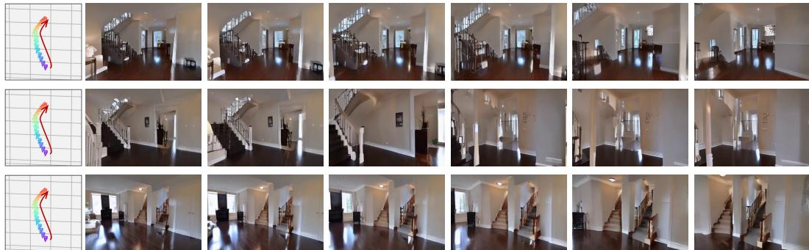
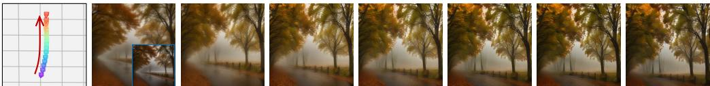

# 1. 论文基本信息

## 1.1. 标题
CameraCtrl: Enabling Camera Control for Text-to-Video Generation (CameraCtrl: 实现文本到视频生成中的相机控制)

## 1.2. 作者
Hao He, Yinghao Xu, Yuwei Guo, Gordon Wetzstein, Bo Dai, Hongsheng Li, Ceyuan Yang。
作者来自香港中文大学 (The Chinese University of Hong Kong)、上海人工智能实验室 (Shanghai Artificial Intelligence Laboratory) 和斯坦福大学 (Stanford University)。

## 1.3. 发表期刊/会议
该论文以预印本形式发布在 arXiv (https://arxiv.org/abs/2404.02101)。
发布时间 (UTC): 2024-04-02T16:52:41.000Z。

## 1.4. 摘要
可控性 (Controllability) 在视频生成中扮演着关键角色，使用户能够更精确地创建和编辑内容。然而，现有模型缺乏对相机姿态 (camera pose) 的控制，而相机姿态是表达更深层次叙事细微差别的电影语言。为了解决这个问题，本文引入了 `CameraCtrl`，它能为视频扩散模型 (video diffusion models) 实现精确的相机姿态控制。本文的方法探索了有效的相机轨迹参数化 (camera trajectory parameterization) 以及一个即插即用 (plug-and-play) 的相机姿态控制模块，该模块在视频扩散模型之上进行训练，而不触及基础模型的其他模块。此外，本文对各种训练数据集的影响进行了全面研究，结果表明，具有多样相机分布和与基础模型外观相似的视频确实能增强可控性和泛化能力 (generalization)。实验结果证明了 `CameraCtrl` 在使用不同视频生成模型时实现精确相机控制的有效性，标志着在从文本和相机姿态输入实现动态和定制化视频叙事方面迈出了重要一步。

## 1.5. 原文链接
原文链接: https://arxiv.org/abs/2404.02101
PDF 链接: https://arxiv.org/pdf/2404.02101v2.pdf

# 2. 整体概括

## 2.1. 研究背景与动机

*   **论文试图解决的核心问题是什么？**
    当前视频生成模型在内容和物体运动方面已取得显著进展，但普遍缺乏对相机姿态的精确控制。相机姿态是电影语言的重要组成部分，能够表达更深层次的叙事和情感，但现有模型无法根据用户需求灵活调整或模拟摄像机视角。

*   <strong>为什么这个问题在当前领域是重要的？现有研究存在哪些具体的挑战或空白 (Gap)？</strong>
    1.  **叙事和创意表达：** 相机运动（如推、拉、摇、移）是电影制作中强调情感、突出人物关系和引导观众注意力的关键手段。缺乏相机控制限制了生成视频的叙事能力和创意表达空间。
    2.  **实际应用价值：** 在虚拟现实 (VR)、增强现实 (AR) 和游戏开发等领域，精确控制摄像机视角对于创建沉浸式和互动体验至关重要。
    3.  **现有方法的局限性：**
        *   `AnimateDiff` 虽然引入了 `MotionLoRA` 模块支持一些特定相机运动，但难以泛化到用户自定义的相机轨迹。
        *   `MotionCtrl` 尝试通过相机参数的数值来控制视频扩散模型，但它仅依赖数值，缺乏相机姿态的几何线索，导致控制不够精确，且泛化能力受限，需要微调基础模型的部分参数。

*   **这篇论文的切入点或创新思路是什么？**
    本文的切入点是提出一个即插即用 (plug-and-play) 的相机控制模块 `CameraCtrl`，它通过探索有效的相机轨迹参数化（即采用 `Plücker Embeddings` 普吕克嵌入作为相机姿态表示）和将该模块无缝集成到现有视频扩散模型中（不修改基础模型），从而实现对视频生成过程的精确相机姿态控制。此外，论文还深入研究了训练数据的选择，以确保模型在可控性和泛化能力之间达到最佳平衡。

## 2.2. 核心贡献/主要发现

*   **论文最主要的贡献是什么？**
    1.  <strong>提出了 <code>CameraCtrl</code>：</strong> 一个能够为视频扩散模型提供灵活、精确相机视角控制的方法。
    2.  **设计了即插即用的相机控制模块：** 该模块可以适应各种视频生成模型，并产生视觉上吸引人的相机控制效果，且不改变基础模型的权重。
    3.  **进行了全面的数据集分析：** 论文对用于训练相机控制模块的数据集进行了深入分析，为未来该方向的研究提供了有价值的指导。

*   **论文得出了哪些关键的结论或发现？这些发现解决了什么具体问题？**
    1.  `Plücker Embeddings` 作为相机姿态表示优于传统的数值参数，因为它为每个像素提供了更丰富的几何解释，有助于模型更精确地理解和控制相机运动。
    2.  将相机特征注入 `U-Net` (U-Net) 的 `Temporal Attention` (时间注意力) 层是有效的，因为相机运动本质上是时序的。
    3.  训练数据集的选择至关重要：具有多样化相机分布且与基础模型训练数据外观相似（例如 `RealEstate10K`）的视频，能够显著提升 `CameraCtrl` 的可控性和泛化能力。
    4.  `CameraCtrl` 能与不同的文本到视频 (T2V) 和图像到视频 (I2V) 模型以及其他视觉控制器 (如 `SparseCtrl`) 协同工作，展示了其广泛的适用性。

# 3. 预备知识与相关工作

## 3.1. 基础概念

*   <strong>扩散模型 (Diffusion Models)：</strong>
    一种生成模型，通过逐步向数据中添加噪声来学习数据的分布，然后学习逆向去噪过程来生成新的数据。在视频生成中，扩散模型通常用于从噪声中逐步生成视频帧或其潜在表示。
*   <strong>视频扩散模型 (Video Diffusion Models)：</strong>
    在图像扩散模型的基础上扩展，处理时间维度数据，能够生成具有时间连续性的视频。它们通常通过在 `U-Net` 架构中引入 `Temporal Attention` (时间注意力) 层来捕获视频帧之间的时间关系。
*   <strong>可控性 (Controllability)：</strong>
    指用户能够通过输入信号（如文本、图像、结构信息或本文中的相机姿态）来精确引导和修改生成内容的能力。在视频生成中，可控性意味着用户可以指定生成视频的特定属性，例如内容、风格、物体运动或摄像机运动。
*   <strong>相机姿态 (Camera Pose)：</strong>
    描述相机在三维空间中的位置和方向。它由两组参数构成：
    *   <strong>内参 (Intrinsic Parameters)：</strong> 描述相机光学特性和图像传感器几何结构，例如焦距 (focal length)、主点 (principal point) 坐标等，通常用一个 $3 \times 3$ 的矩阵 $\mathbf{K}$ 表示。
    *   <strong>外参 (Extrinsic Parameters)：</strong> 描述相机相对于世界坐标系的位置和方向，包括旋转矩阵 (rotation matrix) $\mathbf{R}$ 和平移向量 (translation vector) $\mathbf{t}$，通常用一个 $3 \times 4$ 的矩阵 $\mathbf{E} = [\mathbf{R} | \mathbf{t}]$ 表示。
*   <strong>普吕克嵌入 (Plücker Embeddings)：</strong>
    一种用于表示三维空间中直线的数学工具，在计算机视觉中可以用来表示从相机中心出发穿过图像像素的射线。它由一个六维向量组成，包含了射线的方向和其与原点的叉积，因此具有丰富的几何信息。
*   <strong>U-Net 架构 (U-Net Architecture)：</strong>
    一种深度学习网络架构，因其形状像字母“U”而得名。它通常由一个编码器 (encoder) 路径（用于特征下采样）和一个解码器 (decoder) 路径（用于特征上采样并恢复空间分辨率）组成，编码器和解码器之间通过跳跃连接 (skip connections) 传递特征，以保留细节信息。在扩散模型中，`U-Net` 通常用于预测噪声。
*   <strong>时间注意力 (Temporal Attention) 与空间注意力 (Spatial Attention)：</strong>
    *   **时间注意力：** 关注视频中不同帧之间的时间关系。在视频生成模型中，它帮助模型保持时间一致性，确保物体和场景在不同帧之间平滑过渡。
    *   **空间注意力：** 关注单个帧内不同空间位置之间的关系，帮助模型捕获图像中的局部和全局特征。
*   <strong>即插即用 (Plug-and-Play)：</strong>
    指一个模块或组件可以轻松地集成到现有系统中，而无需对现有系统进行大规模修改或重新训练。在本文中，`CameraCtrl` 作为一个即插即用模块，可以在不触及视频扩散模型原有权重的情况下，为其添加相机控制能力。
*   <strong>结构光束法 (Structure-from-Motion, SfM) / `COLMAP`：</strong>
    `SfM` 是一种计算机视觉技术，用于从一系列二维图像中自动重建三维场景结构和相机姿态。`COLMAP` 是一个常用的 `SfM` 和多视图立体 (Multi-View Stereo, MVS) 管道，可以从视频帧中估计出相机的内参和外参序列。

## 3.2. 前人工作

本文作者回顾了视频生成和可控视频生成领域的一些关键研究：

*   <strong>视频生成 (Video Generation)：</strong>
    *   **从头训练的视频生成器：** 如 `Video Diffusion Model (VDM)` (Ho et al., 2022b)，它将 2D 图像扩散架构扩展到视频数据，并从头开始在图像和视频上共同训练模型。`Lumiere` (Bar-Tal et al., 2024) 通过直接生成全帧率视频来增强时间一致性。
    *   **基于预训练图像生成器：** 许多工作利用像 `Stable Diffusion` (Rombach et al., 2022) 这样的强大 `T2I` (文本到图像) 模型。它们通过在预训练的 2D 层之间插入时间层并对大型视频数据集进行微调来扩展 2D 架构。例如：
        *   `Align-Your-Latents` (Blattmann et al., 2023b) 通过对齐独立采样的噪声图，将 `T2I` 模型高效转换为视频生成器。
        *   `Stable Video Diffusion (SVD)` (Blattmann et al., 2023a) 是 `Align-Your-Latents` 的扩展，具有更精细的训练步骤和数据整理。
        *   `AnimateDiff` (Guo et al., 2023b) 利用可插拔的运动模块，在个性化图像主干 (backbones) 上实现高质量动画创建。
    *   其他重要工作包括使用可扩展的 `transformer` (变换器) 主干 (如 `W.A.L.T.`, `Sora`) 和结合离散 `token` (词元) 与语言模型进行视频生成。

*   <strong>可控视频生成 (Controllable Video Generation)：</strong>
    *   **结构控制信号：** 为了增强指导，一些工作采用深度图 (depth maps)、骨架序列 (skeleton sequences) 等结构信号来精确控制生成视频中的场景/人物运动。例如：
        *   `SparseCtrl` (Guo et al., 2023a) 利用稀疏帧控制整体视频生成，支持 `RGB` 图像、草图 (sketch maps) 或深度图作为控制信号。
        *   `ControlNet` (Zhang et al., 2023a) 和 `T2I-Adapter` (Mou et al., 2023) 是图像生成领域中引入额外结构控制信号的代表性工作，它们通过独立的编码器处理控制信号并将其注入到 `U-Net` 中。
    *   **相机控制的早期尝试：**
        *   `AnimateDiff` 通过 `LoRA` (低秩适应) 微调获得特定相机运动类型的模型权重，但其灵活性有限，仅支持八种基本相机运动。
        *   `Direct-a-Video` (Yang et al., 2024a) 提出使用相机嵌入器控制生成视频的相机姿态，但仅限于平移左等三种基本参数。
        *   `MotionCtrl` (Wang et al., 2023) 接受更多相机参数作为输入，以控制相机视角。然而，它仅依赖相机参数的数值，限制了控制精度，并且需要微调视频扩散模型的部分参数，这会影响其在不同视频领域间的泛化能力。

## 3.3. 技术演进

视频生成技术从最初的从头训练扩散模型，演进到利用强大的预训练文本到图像模型进行微调，显著提升了生成质量和效率。在此基础上，研究人员开始探索如何增加生成视频的可控性，最初是通过文本和图像输入，随后扩展到更精细的结构信号如深度、骨架或草图。相机控制是可控性研究的一个重要分支，因为它直接影响视频的叙事和沉浸感。早期的相机控制方法如 `AnimateDiff` 和 `MotionCtrl` 虽有尝试，但仍存在控制不精确、泛化能力差或依赖数值参数而非几何线索的局限性。`CameraCtrl` 正是在这一技术演进背景下，旨在通过更合理的相机姿态表示和即插即用模块设计，弥补现有相机控制方法的不足。

## 3.4. 差异化分析

`CameraCtrl` 与相关工作的主要区别和创新点体现在以下几个方面：

*   **相机姿态表示：**
    *   **`CameraCtrl`：** 采用 `Plücker Embeddings` (普吕克嵌入) 作为相机姿态的表示。这种表示方式为图像中的每个像素提供了三维几何解释，相比于单纯的数值参数，它能更完整、更具几何意义地描述相机姿态信息。这有助于模型更好地理解相机运动与视觉内容之间的关系。
    *   **`MotionCtrl`：** 依赖于相机参数的数值。这种方式虽然能提供相机信息，但缺乏几何语境，使得模型难以精确地将这些数值与图像像素的变化关联起来，导致控制精度受限。
    *   **`AnimateDiff`：** 采用 `MotionLoRA` 模块来生成预设的八种基本相机运动，而非用户自定义的精确轨迹，且其实现方式更多是“风格”层面的控制，而非精确的几何控制。

*   **模块设计与泛化能力：**
    *   **`CameraCtrl`：** 设计为即插即用 (plug-and-play) 模块，它在视频扩散模型之上进行训练，而不修改基础模型的其他模块。这种设计使得 `CameraCtrl` 能够轻松适应不同的视频生成模型（如 `AnimateDiff`, `SVD`）和个性化风格，避免了训练过程中出现外观信息泄露的问题，从而增强了其泛化能力。
    *   **`MotionCtrl`：** 需要微调基础视频扩散模型的部分参数，这可能限制其在不同视频领域间的泛化能力，因为它与特定基础模型的耦合度更高。

*   **训练数据策略：**
    *   **`CameraCtrl`：** 进行了全面的数据集研究，发现选择具有多样化相机分布且与基础模型外观相似的数据集 (`RealEstate10K`) 对于提升可控性和泛化能力至关重要。这强调了数据分布匹配的重要性。
    *   **其他方法：** 较少强调训练数据集对相机控制模块泛化能力的影响。

*   **注入机制：**
    *   **`CameraCtrl`：** 将相机特征注入到 `U-Net` 的 `Temporal Attention` (时间注意力) 层，这与相机轨迹的时序性和全局性变化特性相吻合，有助于保持时间一致性。

        综上所述，`CameraCtrl` 的创新在于结合了更具几何意义的相机姿态表示、灵活的即插即用模块设计，并通过对训练数据的深入研究，实现了对视频扩散模型更精确、更通用且更少侵入性的相机姿态控制。

# 4. 方法论

本文旨在为视频扩散模型引入精确的相机控制能力，并为此解决了三个关键问题：1) 如何有效表示相机条件以反映三维空间中的几何运动？2) 如何将相机条件无缝注入现有视频生成器而不损害帧质量和时间一致性？3) 应该使用哪种类型的训练数据来确保模型正确训练？

## 4.1. 方法原理

`CameraCtrl` 的核心思想是设计一个即插即用的相机控制模块，该模块能够从描述相机轨迹的 `Plücker Embeddings` (普吕克嵌入) 中提取特征，并将这些特征有效地注入到现有视频扩散模型（如 `AnimateDiff` 或 `SVD`）的 `U-Net` 架构中，尤其是其 `Temporal Attention` (时间注意力) 层，以实现对生成视频相机姿态的精确控制。同时，通过精心选择训练数据集（侧重于具有多样化相机分布且外观与基础模型训练数据相似的数据），确保了模块的泛化能力和控制精度。

## 4.2. 核心方法详解

### 4.2.1. 视频生成预备知识 (Preliminaries of Video Generation)

本文首先简要回顾了视频扩散模型和可控视频生成的一般框架。

*   <strong>视频扩散模型 (Video Diffusion Models)：</strong>
    现代 `T2V` (文本到视频) 扩散模型通常利用预训练的 `T2I` (文本到图像) 扩散模型，并在其上训练一些时间块。这些模型通常遵循图像生成中的原始扩散公式。具体来说，给定一个由 $N$ 帧图像（或其潜在特征）组成的序列 $z_0^{1:N}$，模型会逐步向其添加噪声 $\epsilon$ 直到其变为正态分布。在去噪阶段，一个神经网络 $\hat{\epsilon}_\theta$ 被训练来预测在时间步 $t$ 添加的噪声。训练目标是最小化预测噪声与真实噪声之间的均方误差 (MSE)。
    其目标函数定义如下：
    $$
    \mathcal { L } ( \theta ) = \mathbb { E } _ { z _ { 0 } ^ { 1 : N } , \epsilon , c _ { t } , t } [ | | \epsilon - \hat { \epsilon } _ { \theta } ( z _ { t } ^ { 1 : N } , c _ { t } , t ) | | _ { 2 } ^ { 2 } ]
    $$
    其中：
    *   $z_0^{1:N}$ 表示原始的 $N$ 帧图像序列或其潜在特征。
    *   $\epsilon$ 表示添加到图像序列中的真实噪声。
    *   $c_t$ 表示在时间步 $t$ 对应的条件信号嵌入（例如文本提示的嵌入）。
    *   $t$ 表示当前的扩散时间步。
    *   $\hat{\epsilon}_\theta$ 是神经网络模型，参数为 $\theta$，用于预测给定噪声输入 $z_t^{1:N}$、条件 $c_t$ 和时间步 $t$ 下的噪声。
    *   $|| \cdot ||_2^2$ 表示 L2 范数的平方，即均方误差。

*   <strong>可控视频生成 (Controllable Video Generation)：</strong>
    为了增强可控性，一些方法引入了额外的结构控制信号 $s_t$（例如深度图、`Canny` 边缘图）到生成过程中。这些控制信号首先通过一个额外的编码器 $\Phi_s$ 进行处理，然后注入到生成器中。
    此时，训练目标函数变为：
    $$
    \mathcal { L } ( \theta ) = \mathbb { E } _ { z _ { 0 } ^ { 1 : N } , \epsilon , c _ { t } , s _ { t } , t } [ \| \epsilon - \hat { \epsilon } _ { \theta } ( z _ { t } ^ { 1 : N } , c _ { t } , \Phi _ { s } ( s _ _ { t } ) , t ) \| _ { 2 } ^ { 2 } ]
    $$
    其中：
    *   $s_t$ 表示在时间步 $t$ 对应的额外结构控制信号。
    *   $\Phi_s$ 是一个额外的编码器，用于处理结构控制信号 $s_t$ 并生成其特征表示。
    *   $\Phi_s(s_t)$ 表示经过编码器处理后的结构控制信号特征。
        本文的 `CameraCtrl` 遵循此目标函数，将相机姿态作为 $s_t$，并将所提出的相机编码器 $\Phi_c$ 作为 $\Phi_s$ 来训练。

### 4.2.2. 相机姿态表示 (Camera Pose Representation)

在深入相机控制模块的架构和训练之前，本文首先研究了何种相机表示能够精确反映三维空间中的相机运动。

*   **传统相机表示的局限性：**
    通常，相机姿态由内参 $\mathbf{\bar{K}} \in \mathbb{R}^{3 \times 3}$ 和外参 $\mathbf{\dot{E}} = [\mathbf{\dot{R}} ; \mathbf{t}] \in \mathbb{R}^{3 \times 4}$ 组成，其中 $\mathbf{R} \in \mathbb{R}^{3 \times 3}$ 是旋转部分，$\mathbf{t} \in \mathbb{R}^{3 \times 1}$ 是平移部分。
    直接将这些原始相机参数的数值输入生成器存在几个问题：
    1.  **数值不匹配：** 旋转矩阵 $\mathbf{R}$ 受到正交性约束，而平移向量 $\mathbf{t}$ 的大小通常不受约束，这可能导致相机控制模型的学习过程出现不匹配。
    2.  **缺乏像素关联性：** 直接使用原始相机参数，模型难以将这些数值与图像像素建立精确关联，从而限制了对视觉细节的精确控制。

*   <strong>采用普吕克嵌入 (Plücker Embeddings)：</strong>
    为了解决这些问题，本文选择 `Plücker Embeddings` (Sitzmann et al., 2021) 作为相机姿态表示。`Plücker Embeddings` 能够为视频帧中的每个像素提供几何解释，从而提供更具信息量的相机姿态描述。
    具体来说，对于图像坐标空间中的每个像素 `(u, v)`，其 `Plücker Embedding` $\mathbf{p}_{u,v}$ 定义为：
    $$
    \mathbf { p } _ { u , v } = ( \mathbf { o } \times \mathbf { d } _ { u , v } , \mathbf { d } _ { u , v } ) \in \mathbb { R } ^ { 6 }
    $$
    其中：
    *   $\mathbf{o} \in \mathbb{R}^3$ 是世界坐标系中的相机中心。
    *   $\mathbf{d}_{u,v} \in \mathbb{R}^3$ 是从相机中心指向像素 `(u, v)` 在世界坐标系中的方向向量。
    *   $\times$ 表示向量叉积。
        方向向量 $\mathbf{d}_{u,v}$ 的计算方式为：
    $$
    { \bf d } _ { u , v } = { \bf R } { \bf K } ^ { - 1 } [ u , v , 1 ] ^ { T } + { \bf t }
    $$
    其中：
    *   $\mathbf{R}$ 是相机的旋转矩阵。
    *   $\mathbf{K}$ 是相机的内参矩阵。
    *   $[u, v, 1]^T$ 是像素 `(u, v)` 在齐次坐标下的表示。
    *   $\mathbf{t}$ 是相机的平移向量。
        方向向量 $\mathbf{d}_{u,v}$ 随后会进行归一化，以确保其具有单位长度。
    对于视频序列中的第 $i$ 帧，其 `Plücker Embedding` 可以表示为 $\mathbf{P}_i \in \mathbb{R}^{6 \times h \times w}$，其中 $h$ 和 $w$ 是帧的高度和宽度。整个视频的相机轨迹则表示为一个 `Plücker Embedding` 序列 $\mathbf{P} \in \mathbb{R}^{n \times 6 \times h \times w}$，其中 $n$ 是视频帧的总数。

*   **`Plücker Embeddings` 的优势：**
    *   **几何解释：** `Plücker Embeddings` 提供了每个像素的几何解释，比纯数值的相机矩阵更具信息量，有助于基础视频生成器更好地理解相机姿态信息。
    *   **时间一致性：** 这种表示方式能更好地利用基础视频生成器的时间一致性能力，生成具有特定相机轨迹的视频片段。
    *   **数值范围统一：** `Plücker Embedding` 中各项的数值范围更统一，有利于数据驱动模型的学习过程。

        下图 (原文 Figure 6) 展示了不同相机表示的对比：

        ![Figure 6: Different camera representation. The left subfigure row shows the camera represented using the intrinsic `K _ { i }` and the extrinsic matrices `E _ { i }` (composed of rotation matrix `R _ { i }` and the translation vector `t _ { i }` ). The middle subfigure give the camera representation of converting the rotation matrix `R _ { i }` into Euler angles $\\alpha _ { i } , \\beta _ { i } , \\gamma _ { i }$ . Plücker embedding are given in the right subfigure, the intrinsic and extrinsic matrices are converted into the Plücker embeddings to form a pixel-wise spatial embedding. While the left and middle camera representations are not a pixel-wise camera representations naturally.](images/6.jpg)
        *该图像是示意图，展示了不同的相机表示方法。左侧子图展示了利用内部矩阵 $K_i$ 和外部矩阵 $E_i$（由旋转矩阵 $R_i$ 和位移向量 $t_i$ 组成）的相机表示。中间子图则展示了将旋转矩阵 $R_i$ 转换为欧拉角 $\alpha_i, \beta_i, \gamma_i$ 的相机表示。右侧子图给出了普吕克嵌入，将内部和外部矩阵转换为像素级的空间嵌入。*
        *原文 Figure 6: Different camera representation. The left subfigure row shows the camera represented using the intrinsic `K _ { i }` and the extrinsic matrices `E _ { i }` (composed of rotation matrix `R _ { i }` and the translation vector `t _ { i }` ). The middle subfigure give the camera representation of converting the rotation matrix `R _ { i }` into Euler angles $\\alpha _ { i } , \\beta _ { i } , \\gamma _ { i }$ . Plücker embedding are given in the right subfigure, the intrinsic and extrinsic matrices are converted into the Plücker embeddings to form a pixel-wise spatial embedding. While the left and middle camera representations are not a pixel-wise camera representations naturally.*

### 4.2.3. 将相机可控性引入视频生成器 (Camera Controllability into Video Generators)

由于相机轨迹被参数化为 `Plücker Embedding` 序列，它本质上是一个像素级的空间射线图，因此本文遵循 `ControlNet` (Zhang et al., 2023a) 和 `T2I-Adaptor` (Mou et al., 2023) 等文献的方法，首先使用一个编码器模型来提取 `Plücker Embedding` 序列的特征，然后将这些相机特征融合到视频生成器中。

*   <strong>相机编码器 (Camera Encoder)：</strong>
    *   **输入设计：** 本文的相机编码器 $\Phi_c$ **只接受 `Plücker Embedding` 作为输入**，并输出多尺度特征，如上图 (原文 Figure 2(a)) 所示。这种设计是基于经验分析：如果像 `ControlNet` 那样同时输入图像特征和 `Plücker Embedding`，模型容易从训练数据中泄露外观信息，导致对训练数据固有的外观偏差产生依赖，从而限制了相机姿态控制在不同领域间的泛化能力。
    *   **架构：** 基于 `T2I-Adaptor` 的编码器，但为视频设计。它在每个卷积块后引入了一个 `Temporal Attention` (时间注意力) 模块，以捕获视频剪辑中相机姿态之间的时间关系。
    *   **详细架构：** 参见附录 D.1。相机编码器由一个像素下采样层 (`pixel unshuffle layer`)、一个卷积层和四个编码器尺度组成。它接收输入 $\mathbf{P} \in \mathbb{R}^{b \times n \times 6 \times h \times w}$ (其中 `b, n, h, w` 分别表示批次大小、视频帧数、视频剪辑的高度和宽度)，并输出多尺度相机特征。每个编码器尺度由一个下采样 `ResNet` 块（除了第一个尺度）和一个 `ResNet` 块组成，每个块后接一个 `Temporal Attention` (时间注意力) 块。
    *   `Temporal Attention` (时间注意力) 块的结构如下：
        $$
        \begin{array} { r l } & { \zeta \gets x + \mathrm { P o sE m b } ( x ) } \\ & { \zeta _ { 1 } \gets \mathrm { LayerNorm } ( \zeta ) } \\ & { \zeta _ { 2 } \gets \mathrm { MultiHeadSelfAttention } ( \zeta _ { 1 } ) + \zeta } \\ & { \zeta _ { 3 } \gets \mathrm { LayerNorm } ( \zeta _ { 2 } ) } \\ & { x \gets \mathrm { MLP } ( \zeta _ { 3 } ) + \zeta _ { 2 } } \end{array}
        $$
        其中：
        *   $x$ 是输入特征。
        *   $\mathrm{PosEmb}(x)$ 是时间位置嵌入 (temporal positional embedding)，用于编码帧的相对或绝对时间位置。
        *   $\zeta$ 是输入特征与位置嵌入的和。
        *   $\mathrm{LayerNorm}(\cdot)$ 是层归一化操作。
        *   $\mathrm{MultiHeadSelfAttention}(\cdot)$ 是多头自注意力机制。
        *   $\mathrm{MLP}(\cdot)$ 是多层感知机。
        *   残差连接 ($+ x$ 或 $+ ζ$) 用于帮助梯度流动。

*   <strong>相机融合 (Camera Fusion)：</strong>
    获得多尺度相机特征后，本文旨在将这些特征无缝集成到视频扩散模型的 `U-Net` 架构中。
    *   **注入点选择：** 将相机特征注入 `U-Net` 的 `Temporal Attention` (时间注意力) 块。这一决策源于 `Temporal Attention` 层捕获时间关系的能力，这与相机轨迹固有的序列性和因果性质相符。而空间注意力层则侧重于单个帧。
    *   **融合过程：** 如下图 (原文 Figure 2(b)) 所示：
        1.  图像潜在特征 $z_t$ 和相机姿态特征 $c_t$ 通过像素级加法直接组合。
        2.  然后，集成后的特征通过一个可学习的线性层。
        3.  该线性层的输出直接输入到每个 `Temporal Attention` 模块的第一个 `Temporal Attention` 层。

            下图 (原文 Figure 2) 展示了 `CameraCtrl` 的框架：

            ![Figure 2: Framework of CameraCtrl. (a) Given a pre-trained video diffusion model (e.g. AnimateDiff (Guo et al., 2023b)) and SVD (Blattmann et al., 2023a), CameraCtr1 trains a camera encoder on it, which takes the Plücker embeding as input and outputs multi-scale camera representations. These features are then integrated into the temporal attention layers of the U-Net at their respective scales to control the video generation process. (b) Details of the camera injection process. The camera features `c _ { t }` and the latent features `z _ { t }` are first combined through the element-wise addition. A learnable linear layer is adopted to further fuse two representations which are then fed into the first temporal attention layer of each temporal block.](images/2.jpg)
            *该图像是示意图，展示了CameraCtrl的框架。图(a)中显示了一个预训练的视频扩散模型及其上训练的相机编码器，该编码器处理Plücker嵌入并生成多尺度相机表示，这些表示被整合到U-Net的时间注意力层中以控制视频生成过程。图(b)详细描述了相机特征$c_t$和潜在特征$z_t$的注入过程，通过元素级相加后，融合到一个线性层中，最终输入到每个时间块的首个时间注意力层。*
            *原文 Figure 2: Framework of CameraCtrl. (a) Given a pre-trained video diffusion model (e.g. AnimateDiff (Guo et al., 2023b)) and SVD (Blattmann et al., 2023a), CameraCtr1 trains a camera encoder on it, which takes the Plücker embeding as input and outputs multi-scale camera representations. These features are then integrated into the temporal attention layers of the U-Net at their respective scales to control the video generation process. (b) Details of the camera injection process. The camera features `c _ { t }` and the latent features `z _ { t }` are first combined through the element-wise addition. A learnable linear layer is adopted to further fuse two representations which are then fed into the first temporal attention layer of each temporal block.*

### 4.2.4. 数据驱动的相机分布学习 (Learning Camera Distribution in Data-Driven Manner)

训练上述相机编码器和融合线性层通常需要大量带有相机姿态标注的视频。相机轨迹可以通过 `Structure-from-Motion (SfM)` (结构光束法) 方法（如 `COLMAP` (Schönberger & Frahm, 2016)）从真实视频中获取，也可以从渲染引擎（如 `Blender`）收集带有真实相机姿态的视频。

*   <strong>数据集选择 (Dataset Selection)：</strong>
    本文的目标是选择一个外观与基础视频扩散模型训练数据（如 `WebVid10M` (Bain et al., 2021)）尽可能匹配，并且具有尽可能广泛的相机姿态分布的数据集。
    *   **候选数据集：** `Objaverse` (Deitke et al., 2023)、`MVImageNet` (Yu et al., 2023) 和 `RealEstate10K` (Zhou et al., 2018)。
    *   **分析与选择：**
        *   `Objaverse`：计算机生成图像 (CGI)，相机分布多样，但与真实世界数据集存在明显外观差异，可能导致模型过度依赖训练数据的外观偏差，泛化能力受限。
        *   `MVImageNet`：真实世界数据集，具有复杂的个体相机轨迹，但相机参数分布不广，多数轨迹仅限于水平旋转，缺乏多样性。
        *   `RealEstate10K`：真实世界数据集，包含室内外场景和物体，每个相机轨迹都复杂且不同轨迹间存在显著多样性。
    *   **最终选择：** `RealEstate10K`。因为它在外观上与基础模型训练数据相似，且在相机轨迹的复杂性和多样性之间取得了最佳平衡。虽然 `ACID` (Liu et al., 2021) 和 `MannequinChallenge` (Li et al., 2019) 也有类似特征，但数据量远小于 `RealEstate10K`，且联合训练未带来提升。

*   <strong>测量相机可控性 (Measuring Camera Controllability)：</strong>
    为了监控相机编码器的训练过程，本文设计了两个指标来量化输入相机条件与生成视频相机轨迹之间的误差。
    1.  **提取相机姿态：** 使用 `COLMAP` (Schönberger & Frahm, 2016) 从生成视频中提取相机姿态序列，得到旋转矩阵 $\mathbf{R}_{gen} \in \mathbb{R}^{n \times 3 \times 3}$ 和平移向量 $\mathbf{T}_{gen} \in \mathbb{R}^{n \times 3 \times 1}$。
    2.  **误差指标：** 旋转角度和平移尺度是不同的数学量，因此分别测量：
        *   <strong>旋转误差 (RotErr)：</strong>
            由真实旋转矩阵 $\mathbf{R}_{gt}$ 和生成旋转矩阵 $\mathbf{R}_{gen}$ 比较得出。
            $$
            \mathrm { R o t E r r } = \sum _ { i = 1 } ^ { n } \operatorname { arccos } \frac { t r ( \mathbf { R } _ { g e n } ^ { i } \mathbf { R } _ { g t } ^ { i \mathrm { T } } ) - 1 } { 2 }
            $$
            其中：
            *   $n$ 表示视频剪辑中的总帧数。
            *   $\mathbf{R}_{gen}^i$ 是生成视频第 $i$ 帧的相机旋转矩阵。
            *   $\mathbf{R}_{gt}^i$ 是真实（地面真值）第 $i$ 帧的相机旋转矩阵。
            *   $\mathbf{R}_{gt}^{i \mathrm{T}}$ 是真实旋转矩阵的转置。
            *   $tr(\cdot)$ 表示矩阵的迹（对角线元素之和）。
            *   $\operatorname{arccos}(\cdot)$ 是反余弦函数，输出角度。该公式计算了两个旋转矩阵之间的角度距离。
        *   <strong>平移误差 (TransErr)：</strong>
            通过计算真实平移向量 $\mathbf{T}_{gt}$ 和生成平移向量 $\mathbf{T}_{gen}$ 之间的 L2 距离之和。
            $$
            \mathrm { T r a n s E r r } = \sum _ { j = 1 } ^ { n } \Vert \mathbf { T } _ { g t } ^ { i } - \mathbf { T } _ { g e n } ^ { i } \Vert _ { 2 } ^ { 2 }
            $$
            其中：
            *   $n$ 表示视频剪辑中的总帧数。
            *   $\mathbf{T}_{gt}^i$ 是真实（地面真值）第 $i$ 帧的相机平移向量。
            *   $\mathbf{T}_{gen}^i$ 是生成视频第 $i$ 帧的相机平移向量。
            *   $||\cdot||_2^2$ 表示 L2 范数的平方。
    *   **`COLMAP` 的稳定性与尺度问题：** 鉴于 `COLMAP` 在短视频中提取相机姿态可能不稳定且存在尺度不变性，本文进行了一些后处理。具体地，首先通过设置第一帧的齐次外参矩阵为 $4 \times 4$ 单位矩阵来计算相对姿态。然后，根据真实相机轨迹，对 `COLMAP` 结果的尺度进行归一化，通过计算前两帧的平移差距来获得重尺度因子，并用该因子归一化其他生成的相机姿态，以减轻尺度问题。

# 5. 实验设置

## 5.1. 数据集

*   **训练数据集：**
    *   <strong>`RealEstate10K` (Zhou et al., 2018)：</strong> 选作核心训练数据集，包含约 `65K` 个视频剪辑。该数据集包含多样化的室内和室外场景，且相机轨迹复杂多样，其外观分布与主流视频生成模型的训练数据（如 `WebVid10M`）相似。
    *   <strong>`Objaverse` (Deitke et al., 2023)：</strong> 作为消融实验的对比数据集，具有最广泛的相机姿态分布，但外观与 `WebVid10M` 显著不同。
    *   <strong>`MVImageNet` (Yu et al., 2023)：</strong> 作为消融实验的对比数据集，真实世界数据，但相机轨迹主要限于水平旋转，多样性不足。
    *   <strong>`ACID` (Liu et al., 2021) 和 `MannequinChallenge` (Li et al., 2019)：</strong> 与 `RealEstate10K` 类似但数据量较小，在消融实验中用于测试联合训练的效果。

        下图 (原文 Figure 5) 展示了不同数据集的样本：

        
        *原文 Figure 5: Samples of different datasets. Rows 1 to row 3 are samples from the Objaverse dataset, which has random camera poses for each rendered image. Rows 4 to row 6 show the samples from the MVImageNet dataset. Samples of the RealEstate10K dataset are presented from rows 7 to row 9.*

*   **评估数据集：**
    *   <strong>`WebVid10M` (Bain et al., 2021)：</strong> 用于评估 `FVD` (Fréchet 视频距离)、`CLIPSIM` (CLIP相似度)、`FC` (帧一致性) 和 `ODD` (物体动态程度) 等视频外观质量和动态性指标，从中随机采样 1,000 个视频作为参考。
    *   **`RealEstate10K` 测试集：** 用于评估 `RotErr` (旋转误差) 和 `TransErr` (平移误差)，从中随机选择 1,000 个视频及对应相机姿态。

## 5.2. 评估指标

本文使用了一系列指标来评估生成视频的质量和相机控制的准确性。

*   <strong>Fréchet 视频距离 (Fréchet Video Distance, FVD)：</strong>
    1.  **概念定义：** `FVD` 是评估视频生成模型质量的常用指标，它衡量生成视频与真实视频分布之间的相似度。值越低表示生成视频的分布越接近真实视频，即视觉质量和真实感越好。
    2.  **数学公式：**
        $$
        \text{FVD} = ||\mu_1 - \mu_2||^2 + \text{Tr}(\Sigma_1 + \Sigma_2 - 2(\Sigma_1 \Sigma_2)^{1/2})
        $$
    3.  **符号解释：**
        *   $\mu_1$ 和 $\Sigma_1$ 分别是真实视频特征嵌入的均值向量和协方差矩阵。
        *   $\mu_2$ 和 $\Sigma_2$ 分别是生成视频特征嵌入的均值向量和协方差矩阵。
        *   $||\cdot||^2$ 表示 L2 范数的平方。
        *   $\text{Tr}(\cdot)$ 表示矩阵的迹。
        *   $(\cdot)^{1/2}$ 表示矩阵的平方根。
            `FVD` 通常通过预训练的视频分类器（如 `I3D` (Inflated 3D ConvNet)）提取视频特征，然后计算这些特征在低维空间中的高斯分布距离。

*   <strong>CLIP 相似度 (CLIPSIM)：</strong>
    1.  **概念定义：** `CLIPSIM` 衡量生成视频与其对应的文本提示之间的语义一致性。它利用 `CLIP` (Contrastive Language-Image Pre-training) 模型提取的视频和文本嵌入向量，计算它们之间的余弦相似度。值越高表示视频内容与文本描述越匹配。
    2.  **数学公式：**
        $$
        \text{CLIPSIM} = \frac{\mathbf{e}_v \cdot \mathbf{e}_t}{||\mathbf{e}_v|| \cdot ||\mathbf{e}_t||}
        $$
    3.  **符号解释：**
        *   $\mathbf{e}_v$ 是生成视频通过 `CLIP` 编码器得到的嵌入向量。
        *   $\mathbf{e}_t$ 是文本提示通过 `CLIP` 编码器得到的嵌入向量。
        *   $\cdot$ 表示向量点积。
        *   $||\cdot||$ 表示向量的 L2 范数（模长）。

*   <strong>帧一致性 (Frame Consistency, FC)：</strong>
    1.  **概念定义：** `FC` 衡量生成视频中相邻帧之间的时间连贯性。高 `FC` 值表示视频帧之间过渡平滑，没有剧烈跳变或不一致。本文提到使用 `FC` 衡量视频外观质量，且值越高越好。
    2.  **数学公式：**
        `FC` 的具体计算方法在论文正文中未直接给出，但通常它反向衡量相邻帧之间的感知距离（例如 `LPIPS`），或者直接计算某种帧间相似度。如果采用 `LPIPS` (Learned Perceptual Image Patch Similarity) 作为感知距离，那么为了使其“越高越好”，公式可能为 $1/\text{LPIPS}$ 或 $1-\text{normalized LPIPS}$。
        若以 LPIPS 为基础：
        $$
        \text{FC} = 1 - \frac{1}{N-1} \sum_{i=1}^{N-1} \text{LPIPS}(\text{frame}_i, \text{frame}_{i+1})
        $$
    3.  **符号解释：**
        *   $N$ 是视频的帧数。
        *   $\text{frame}_i$ 表示视频的第 $i$ 帧。
        *   $\text{LPIPS}(\cdot, \cdot)$ 是一种基于深度学习的感知距离度量，值越小表示两张图像越相似。

*   <strong>物体动态程度 (Object Dynamic Degree, ODD)：</strong>
    1.  **概念定义：** `ODD` 衡量生成视频中物体运动的程度。它旨在评估模型是否能生成具有合理物体动态的视频，而不是静态背景或缺乏内部运动的视频。本文的 `ODD` 受到 `VBENCH` (Huang et al., 2023) 的 `Dynamic Degree` (动态程度) 指标启发，值越高表示物体运动越显著。
    2.  **数学公式：**
        根据附录 D.4 的描述，`ODD` 的计算过程如下：
        *   首先，使用 `Grounded-SAM-2` (Ren et al., 2024) 分割出视频中的主要物体。
        *   然后，使用 `RAFT` (Teed & Deng, 2020) 估计视频的光流，并只保留属于主要物体的光流。
        *   接着，基于这些光流来判断视频是否为“非静态”。
        *   最后，`ODD` 被计算为非静态视频的比例。
            $$
        \text{ODD} = \frac{\text{非静态视频的数量}}{\text{总视频数量}} \times 100\%
        $$
    3.  **符号解释：**
        *   “非静态视频”是指其中主要物体存在显著运动的视频。

*   <strong>旋转误差 (RotErr) 和平移误差 (TransErr)：</strong>
    这两个指标用于量化相机控制的准确性，已在方法论部分详细说明。值越低表示相机控制越精确。

*   <strong>用户偏好率 (User Preference Rate)：</strong>
    1.  **概念定义：** 通过用户研究 (user study) 评估不同模型生成视频的相机控制质量。用户观看不同模型生成的视频，并选择与条件相机轨迹最一致的视频。此指标直接反映了人类对相机控制效果的主观感受。值越高表示用户越偏爱该模型的控制效果。
    2.  **数学公式：** 论文中未给出数学公式，但通常计算为选择某个模型生成视频的用户比例。
        $$
        \text{User Preference Rate} = \frac{\text{选择特定模型视频的用户数量}}{\text{参与评估的总用户数量}} \times 100\%
        $$
    3.  **符号解释：** 无特定符号，直接使用百分比表示。

## 5.3. 对比基线

本文将 `CameraCtrl` 与以下几种方法进行比较：

*   <strong>`AnimateDiff` (Guo et al., 2023b)：</strong>
    一个知名的 `T2V` 模型，通过 `MotionLoRA` 模块实现了对八种基本相机运动（如平移、倾斜、缩放）的控制。尽管它能生成高质量的视频，但其相机控制能力较为有限，难以泛化到用户自定义的复杂相机轨迹。本文中，`AnimateDiff` 的 `MotionLoRA` 版本作为 `CameraCtrl` 在 `T2V` 设置下的基线，特别是在相机控制能力方面。

*   <strong>`MotionCtrl` (Wang et al., 2023)：</strong>
    一个旨在提供更灵活相机控制的视频扩散模型。它通过将相机参数的数值作为条件输入。然而，其主要缺点是仅依赖数值而非几何线索，导致控制精度不足，并且需要微调基础视频扩散模型的部分参数，这会影响其在不同视频领域（domain）间的泛化能力。本文将 `MotionCtrl` 作为 `T2V` 和 `I2V` (图像到视频) 设置下 `CameraCtrl` 的主要竞争基线。

*   <strong>`SVD` (Stable Video Diffusion) (Blattmann et al., 2023a)：</strong>
    一个强大的 `I2V` 模型，作为 `CameraCtrl` 在 `I2V` 设置下的基础模型，同时也是评估 `CameraCtrl` 在 `I2V` 场景下性能的基线。

# 6. 实验结果与分析

## 6.1. 核心结果分析

### 6.1.1. 定量比较

下表 (原文 Table 1) 展示了 `CameraCtrl` 与其他方法在 `T2V` 和 `I2V` 设置下的定量比较结果。

<table>
<thead>
<tr>
<th>Method</th>
<th>FVD ↓</th>
<th>CLIPSIM ↑</th>
<th>FC↑</th>
<th>ODD ↑</th>
<th>TransErr↓</th>
<th>RotErr↓</th>
<th>User Preference Rate ↑ (%)</th>
</tr>
</thead>
<tbody>
<tr>
<td>AnimateDiff</td>
<td>1022.4</td>
<td>0.298</td>
<td>0.930</td>
<td>56.4</td>
<td>Incapable</td>
<td>Incapable</td>
<td>19.4</td>
</tr>
<tr>
<td>MotionCtrlVC</td>
<td>1123.2</td>
<td>0.286</td>
<td>0.922</td>
<td>42.3</td>
<td>1402</td>
<td>1.58</td>
<td>37.0</td>
</tr>
<tr>
<td>CameraCtrlAD</td>
<td>1088.9</td>
<td>0.301</td>
<td>0.941</td>
<td>49.8</td>
<td>12.98</td>
<td>1.29</td>
<td>43.6</td>
</tr>
<tr>
<td>SVD</td>
<td>371.2</td>
<td>0.312</td>
<td>0.957</td>
<td>47.5</td>
<td>Incapable</td>
<td>Incapable</td>
<td>Incapable</td>
</tr>
<tr>
<td>MotionCtrlSVD</td>
<td>386.2</td>
<td>0.303</td>
<td>0.953</td>
<td>41.8</td>
<td>10.21</td>
<td>1.41</td>
<td>26.9</td>
</tr>
<tr>
<td>CameraCtrlSVD</td>
<td>360.3</td>
<td>0.298</td>
<td>0.960</td>
<td>46.5</td>
<td>9.02</td>
<td>1.18</td>
<td>73.1</td>
</tr>
</tbody>
</table>

*原文 Table 1: Quantitative comparisons. MotionCtrlVC and MotionCtrlSVD represent MotionCtrl with VideoCrafter (Chen et al., 2023a) and SVD (Blattmann et al., 2023a) as base model, respectively. Correspondingly, CameraCtrlAD and CameraCtrlSVD denote base models of AnimateDiff and SVD with CameraCtrl respectively.*

**分析：**
*   <strong>相机控制精度 (`TransErr`, `RotErr`, `User Preference Rate`)：</strong>
    *   `AnimateDiff` (使用 `MotionLoRA`) 由于仅支持八种基本相机运动，无法计算 `TransErr` 和 `RotErr`，但其用户偏好率最低 (19.4%)，表明其相机控制能力有限。
    *   `CameraCtrl` 在两种设置下（基于 `AnimateDiff` 的 `CameraCtrl_AD` 和基于 `SVD` 的 `CameraCtrl_SVD`）均显著优于 `MotionCtrl` (`MotionCtrl_VC` 和 `MotionCtrl_SVD`)。`CameraCtrl_AD` 的 `TransErr` 为 12.98，`RotErr` 为 1.29，用户偏好率达 43.6%。`CameraCtrl_SVD` 的 `TransErr` 为 9.02，`RotErr` 为 1.18，用户偏好率高达 73.1%。这强有力地证明了 `CameraCtrl` 在实现精确相机控制方面的优越性。
*   <strong>视觉质量和动态性 (`FVD`, `CLIPSIM`, `FC`, `ODD`)：</strong>
    *   `CameraCtrl` 在保持或提升视觉质量和物体动态性方面表现良好。与基线模型（`AnimateDiff` 和 `SVD`）相比，`CameraCtrl` 的这些指标通常更好或具有可比性。例如，`CameraCtrl_SVD` 的 `FVD` (360.3) 甚至低于基线 `SVD` (371.2)，`FC` (0.960) 也更高，这表明 `CameraCtrl` 不仅能精确控制相机，还能维持甚至提升生成视频的整体质量和时间一致性。`CLIPSIM` 略有下降（0.298 vs 0.312），但仍在可接受范围内。
    *   `MotionCtrl` 在 `FVD` 和 `ODD` 方面通常略低于对应的 `CameraCtrl` 版本，表明其在相机控制的同时，对视频生成质量的负面影响更大。

### 6.1.2. 定性比较

下图 (原文 Figure 3) 展示了 `CameraCtrl` 与 `MotionCtrl` 在 `T2V` 和 `I2V` 设置下的定性比较。

*原文 Figure 3: Qualitative comparisons between CameraCtrl and MotionCtrl. The first two rows are in the T2V setting, representing MotionCtrl with VideoCrafter and CameraCt r1 with AnimateDiffV3 as base model, respectively. The last two rows are MotionCtrl and CameraCt r1 with SVD as base model taking the image as a condition signal. Condition images are the first images of each row.*

**分析：**
*   **相机运动与场景运动的分离：** 在 `T2V` 设置下（前两行），`MotionCtrl` 无法有效区分相机运动和场景物体运动，导致生成视频中出现场景整体旋转而非相机移动。相比之下，`CameraCtrl` 能够准确识别并遵循相机轨迹条件，保持场景内容的稳定性。
*   **对微小相机运动的敏感性：** `MotionCtrl` 对微小的相机运动不敏感。例如，在第三行所示的轨迹中，包含前进和微小左移，`MotionCtrl` 的结果仅显示前进运动，忽略了左移。而 `CameraCtrl` 的结果（第四行）能够精确捕捉并表现出前进和左移两种相机运动。
*   **整体控制精度：** `CameraCtrl` 产生的视频在相机轨迹上与给定条件高度一致，视觉效果更平滑自然，而 `MotionCtrl` 的结果在相机运动的准确性和流畅性上有所欠缺。

## 6.2. 数据呈现 (表格)

### 6.2.1. 相机表示、条件注入和数据集效应的消融研究

下表 (原文 Table 2) 展示了 `CameraCtrl` 在相机表示、条件注入方式和训练数据集选择方面的消融研究结果。

<table>
<thead>
<tr>
<th colspan="3">Representation type FVD↓TransErr↓RotErr↓</th>
</tr>
</thead>
<tbody>
<tr>
<td>Raw Values</td>
<td>230.1</td>
<td>13.88</td>
<td>1.51</td>
</tr>
<tr>
<td>Euler angles</td>
<td>221.2</td>
<td>13.71</td>
<td>1.43</td>
</tr>
<tr>
<td>Direction + Origin</td>
<td>232.3</td>
<td>13.21</td>
<td>1.57</td>
</tr>
<tr>
<td>Plücker embedding</td>
<td>222.1</td>
<td>12.98</td>
<td>1.29</td>
</tr>
<tr>
<td colspan="3">(a) How to represent camera parameters.</td>
</tr>
<tr>
<td>Attention</td>
<td>FVD↓TransErr↓RotErr↓</td>
<td></td>
<td></td>
</tr>
<tr>
<td>Spatial Self</td>
<td>241.2</td>
<td>14.72</td>
<td>1.42</td>
</tr>
<tr>
<td>Spatial Cross</td>
<td>237.5</td>
<td>14.31</td>
<td>1.51</td>
</tr>
<tr>
<td>Spatial Self + Cross</td>
<td>240.1</td>
<td>14.52</td>
<td>1.60</td>
</tr>
<tr>
<td>Temporal</td>
<td>222.1</td>
<td>12.98</td>
<td>1.29</td>
</tr>
<tr>
<td colspan="3">(c) Where to inject camera representations.</td>
</tr>
</tbody>
</table>

<table>
<thead>
<tr>
<th colspan="4">Encoder architecture typeFVD↓TransErr ↓RotErr ↓</th>
</tr>
</thead>
<tbody>
<tr>
<td>ControlNet</td>
<td>295.8</td>
<td>13.51</td>
<td>1.42</td>
</tr>
<tr>
<td>ControlNet + Temporal</td>
<td>283.4</td>
<td>13.13</td>
<td>1.33</td>
</tr>
<tr>
<td>T2I Adaptor</td>
<td>223.4</td>
<td>13.27</td>
<td>1.38</td>
</tr>
<tr>
<td>T2I Adaptor + Temporal</td>
<td>222.1</td>
<td>12.98</td>
<td>1.29</td>
</tr>
<tr>
<td colspan="4">(b) Camera encoder architecture.</td>
</tr>
<tr>
<td colspan="4">Datasets FVD↓TransErr ↓RotErr↓</td>
</tr>
<tr>
<td>Objaverse</td>
<td>1435.4</td>
<td>Incapable</td>
<td>Incapable</td>
<td></td>
</tr>
<tr>
<td>MVImageNet</td>
<td>1143.5</td>
<td>113.87</td>
<td>1.52</td>
<td></td>
</tr>
<tr>
<td>RealEstate10K + ACID</td>
<td>1102.4</td>
<td>13.48</td>
<td>1.41</td>
<td></td>
</tr>
<tr>
<td>RealEatate10K</td>
<td>1088.9</td>
<td>12.99</td>
<td>1.39</td>
<td></td>
</tr>
</tbody>
</table>

*原文 Table 2: Ablation study on camera representation, condition injection and effect of various datasets.*

### 6.2.2. 相机编码器 $\Phi_c$ 的输出特征形状

下表 (原文 Table 3) 展示了相机编码器 $\Phi_c$ 各层（编码器尺度）的输出特征形状。

<table>
<thead>
<tr>
<td>input</td>
<td>b× n×6×h× w</td>
</tr>
</thead>
<tbody>
<tr>
<td>Pixel unshuffle</td>
<td>n 20010 3102|03∞8 ×</td>
</tr>
<tr>
<td>3× 3 conv layer</td>
<td>× 1 ×</td>
</tr>
<tr>
<td>Encoder scale 1</td>
<td>n1</td>
</tr>
<tr>
<td>Encoder scale 2</td>
<td>b × n× c2 </td>
</tr>
<tr>
<td>Encoder scale 3</td>
<td> 3</td>
</tr>
<tr>
<td>Encoder scale 4</td>
<td> ×</td>
</tr>
</tbody>
</table>

*原文 Table 3: Output feature shapes of each layer (encoder scale) of camera encoder. And $c =$ $6 \times 8 \times 8 = 3 8 4$ `c _ { 1 } , c _ { 2 } , c _ { 3 } , c _ { 4 }` are equal to the channels numbers of the corresponding U-Net output feature with the same resolution. For examble, with a stable video 1.5 model, `c _ { 1 } , c _ { 2 } , c _ { 3 } , c _ { 4 }` equal to 320, 640, 1280, 1280.*

### 6.2.3. 相机特征注入位置的额外消融研究

下表 (原文 Table 4) 展示了将相机特征注入 `U-Net` 编码器和解码器中的消融研究结果。

<table>
<thead>
<tr>
<th>Injection Place</th>
<th>FVD↓</th>
<th>TransErr↓</th>
<th>RotErr↓</th>
</tr>
</thead>
<tbody>
<tr>
<td>U-Net Encoder</td>
<td>210.9</td>
<td>13.91</td>
<td>1.51</td>
</tr>
<tr>
<td>U-Net Encoder + Decoder</td>
<td>222.1</td>
<td>12.98</td>
<td>1.29</td>
</tr>
</tbody>
</table>

*原文 Table 4: Ablation study of the camera feature injection place.*

### 6.2.4. RealEstate10K 测试集上的 `TransErr` 和 `RotErr` 下限

下表 (原文 Table 5) 展示了 `RealEstate10K` 测试集上 `TransErr` 和 `RotErr` 的理论下限。

<table>
<thead>
<tr>
<th></th>
<th>TransErr↓</th>
<th>RotErr↓</th>
</tr>
</thead>
<tbody>
<tr>
<td>Lower Bounds</td>
<td>6.93</td>
<td>1.02</td>
</tr>
</tbody>
</table>

*原文 Table 5: Lower bound of TransErr and RotErr on RealEstate10K test set.*

## 6.3. 消融实验/参数分析

### 6.3.1. `Plücker Embeddings` 精确表示相机

**研究内容：** 比较不同相机表示方法（原始数值、欧拉角、方向+原点、`Plücker Embeddings`）对相机控制效果的影响。
<strong>结果 (原文 Table 2a)：</strong>
*   `Plücker Embeddings` 在 `TransErr` (12.98) 和 `RotErr` (1.29) 上均取得最佳表现。
*   原始数值 (`Raw Values`) 和欧拉角 (`Euler angles`) 的 `TransErr` 和 `RotErr` 均高于 `Plücker Embeddings`。
*   方向+原点 (`Direction + Origin`) 表现也较差。

    **分析：** 结果表明，`Plücker Embeddings` 由于其为每个像素提供了几何解释，能够最精确地表示相机运动。原始数值和欧拉角表示可能导致数值不匹配，学习效率低下。方向+原点表示虽然提供相机原点信息，但重复的相机原点参数引入冗余，可能阻碍模型对相机运动的理解。

下图 (原文 Figure 7) 展示了使用不同相机表示的定性比较。

*原文 Figure 7: Qualitative comparison of using different camera representations. The first row shows the result using the raw camera matrix values as camera representation. Result of the second row adopts the ray directions and camera origin as camera representation. The last row exhibits the result taking the Plücker embedding as the camera representation. All the results use the same camera trajectory and the text prompt.*
**定性分析：** 当使用原始相机矩阵值时，模型会忽略轨迹中的细微转向。混合表示会在末尾出现突兀的转向。而 `Plücker Embeddings` 生成的视频更平滑，转向自然无缝，进一步验证了其有效性。

### 6.3.2. 作为输入的噪声潜在特征限制泛化

**研究内容：** 比较不同相机编码器架构（`ControlNet`、`ControlNet + Temporal`、`T2I Adaptor`、`T2I Adaptor + Temporal`）对泛化能力和控制效果的影响。
<strong>结果 (原文 Table 2b)：</strong>
*   基于 `ControlNet` 的模型（无论是否包含 `Temporal`）`FVD` 较高（295.8, 283.4），表明外观质量不佳。
*   基于 `T2I Adaptor` 的模型 `FVD` 显著降低（223.4, 222.1），且 `TransErr` 和 `RotErr` 也更低。
*   在 `T2I Adaptor` 基础上增加 `Temporal Attention` (`T2I Adaptor + Temporal`) 取得了最佳的 `TransErr` (12.98) 和 `RotErr` (1.29)。

    **分析：** 采用 `T2I Adaptor` 风格的编码器（仅以 `Plücker Embedding` 为输入）避免了从图像潜在特征中泄露外观信息，从而提高了泛化能力和控制精度。在编码器中引入 `Temporal Attention` 模块进一步增强了模型捕获相机姿态时间关系的能力，从而提升了控制效果。

### 6.3.3. 将相机条件注入 `Temporal Attention`

**研究内容：** 探索将提取的相机特征注入 `U-Net` 中不同类型的注意力层（空间自注意力、空间交叉注意力、两者结合、时间注意力）的效果。
<strong>结果 (原文 Table 2c)：</strong>
*   将相机特征注入 `Temporal Attention` 层取得了最佳的 `TransErr` (12.98) 和 `RotErr` (1.29)。
*   注入空间注意力层（`Spatial Self`、`Spatial Cross` 或两者结合）的效果均不如注入 `Temporal Attention` 层。

    **分析：** 相机运动通常会导致跨帧的全局视角变化，这种动态特性与 `Temporal Attention` 层捕获时间关系的能力高度契合。因此，将相机姿态与 `U-Net` 的时间块结合，能够更好地处理和反映相机运动带来的视频内容变化。

<strong>额外消融研究 (原文 Table 4)：</strong>
*   **研究内容：** 比较仅将相机特征注入 `U-Net` 编码器与同时注入编码器和解码器对控制效果的影响。
*   **结果：** 注入编码器和解码器 (`U-Net Encoder + Decoder`) 的 `TransErr` (12.98) 和 `RotErr` (1.29) 均优于仅注入编码器 (`U-Net Encoder`) (TransErr 13.91, RotErr 1.51)。
*   **分析：** 这表明将相机特征在 `U-Net` 的更深层级进行传播，有助于模型更有效地利用相机信息，类似于文本嵌入在 `U-Net` 中的处理方式，增强了相机控制的准确性。

### 6.3.4. 具有相似外观分布和多样化相机的视频有助于可控性

**研究内容：** 使用不同数据集（`Objaverse`、`MVImageNet`、`RealEstate10K + ACID`、`RealEstate10K`）训练 `CameraCtrl`，并评估其控制效果。
<strong>结果 (原文 Table 2d)：</strong>
*   `Objaverse` 的 `FVD` 极高 (1435.4)，且无法计算 `TransErr` 和 `RotErr` (表示 `COLMAP` 难以提取有效相机姿态)。
*   `MVImageNet` 的 `FVD` 也较高 (1143.5)，`TransErr` (113.87) 远高于 `RealEstate10K`。
*   `RealEstate10K` 取得了最佳的 `FVD` (1088.9)，`TransErr` (12.99) 和 `RotErr` (1.39)。
*   将 `RealEstate10K` 与 `ACID` 联合训练并未带来性能提升。

**分析：**
*   `Objaverse` 结果不佳的原因在于其外观与基础模型训练数据 (`WebVid10M`) 存在显著分布差距，导致模型无法有效区分相机姿态和外观信息，进而影响 `COLMAP` 的姿态估计。
*   `MVImageNet` 虽然是真实世界数据，但其相机轨迹多样性不足（主要为水平旋转），使得模型无法学习到复杂的相机控制。
*   `RealEstate10K` 在外观相似性和相机轨迹多样性之间取得了最佳平衡，因此表现最优。
*   联合 `RealEstate10K` 和 `ACID` 未带来提升，这表明当前相机控制精度瓶颈可能在于相机姿态分布的复杂性，需要更大、更复杂的相机分布数据集。

## 6.4. `CameraCtrl` 的应用

`CameraCtrl` 的设计使其具有广泛的应用场景和良好的兼容性。

*   **应用于不同的视频生成器：**
    由于 `CameraCtrl` 的相机控制模型仅使用 `Plücker Embeddings` 作为输入，使其独立于训练数据集的外观。本文在 `T2V` 和 `I2V` 设置下，将 `CameraCtrl` 应用于不同的基础模型和个性化模型：
    *   **基础 `AnimateDiff` 模型：** 用于生成自然场景视频。
    *   **个性化 `T2V` 生成器：** 如集成 `RealisticVision` (civitai) 生成赛博朋克城市风格视频，集成 `ToonYou` (BradCatt) 生成卡通人物视频。
    *   <strong>`SVD` (Stable Video Diffusion)：</strong> 在 `I2V` 设置下实现相机控制。

        下图 (原文 Figure 4) 展示了 `CameraCtrl` 的应用。

        
        *原文 Figure 4: Applications of CameraCtrl. The first row represents a video generated by the base AnimateDiff. The Following two rows showcase the results of two personalized T2V generators, RealisticVision and ToonYou. The fourth row expresses the video generated by CameraCtrl integrated with another video control method, SparseCtrl (Guo et al., 2023a). The video of the last row is produced by a I2V generator, SVD, taking the first image of last row as a condition.*

    这些结果（见原文 Figure 4，以及附录中的 Figure 11-16）表明，`CameraCtrl` 在各种视频生成类型中都能有效地控制相机轨迹，展示了其广泛的适用性。

*   **与其它视频控制方法集成：**
    `CameraCtrl` 的即插即用特性也允许其与其他视频生成控制技术协同工作。例如，本文将其与 `SparseCtrl` (Guo et al., 2023a) 集成，`SparseCtrl` 通过操纵稀疏帧来控制视频的整体生成（基于 `RGB` 图像、草图或深度图）。
    下图 (原文 Figure 17) 展示了与 `SparseCtrl` 集成的结果。

    
    *原文 Figure 17: Integrating CameraCtr1 with other video generation control methods. Row one to row three express the results by integrating the CameraCt r1 with RGB encoder of SparseCtrl (Guo et al., 2023a), and row four to row six, shows videos produced with the sketch encoder of SparseCtrl. The condition RGB images and sketch maps are shown in the bottom right corners of the second images for each row. Note that, the camera trajectory of the last row is zoom-in.*

    集成结果（见原文 Figure 4 最底行和 Figure 17）表明，生成的视频在场景和物体上与参考帧高度一致，同时相机运动也与提供的相机轨迹高度对齐。这进一步证明了 `CameraCtrl` 的泛化能力和对应用场景的增强。

*   <strong>灵活性 (原文 Figure 18-19)：</strong>
    *   **不同相机运动强度：** 通过调整相邻相机姿态平移向量之间的间隔，可以控制相机运动的整体强度，实现更剧烈或更平缓的相机运动（见原文 Figure 18）。
    *   **通过调整内参控制相机运动：** `Plücker Embeddings` 的计算需要内参。通过修改相机内参（如主点 `(cx, cy)` 实现相机平移，或焦距 `(fx, fy)` 实现变焦），可以控制相机运动（见原文 Figure 19）。

# 7. 总结与思考

## 7.1. 结论总结

本文提出了 `CameraCtrl`，一种为视频扩散模型提供灵活、精确相机视角控制的方法。其核心创新在于：
1.  **采用 `Plücker Embeddings` 作为相机姿态表示：** 这种表示方式提供了丰富的像素级几何解释，显著优于传统数值参数，使得模型能够更精确地理解和控制相机运动。
2.  **设计即插即用的相机控制模块：** 该模块在视频扩散模型之上训练，且不触及基础模型，确保了其在各种 `T2V` 和 `I2V` 模型以及个性化生成器中的良好泛化性和适应性。
3.  **强调数据集选择的重要性：** 通过全面研究，发现具有多样相机分布和与基础模型训练数据外观相似的视频（如 `RealEstate10K`）对于提升可控性和泛化能力至关重要。
    实验结果和消融研究证实了 `CameraCtrl` 在相机控制精度、视频生成质量和与其他控制方法的兼容性方面的有效性。

## 7.2. 局限性与未来工作

*   **局限性：**
    *   **大范围旋转的限制：** 论文在附录中指出，当相机轨迹包含大范围旋转（例如垂直或水平旋转 100-150 度）时，`CameraCtrl` 无法完全生成所需的旋转角度（见原文 Figure 20）。生成的视频通常只能达到约 90 度的旋转。
    *   **训练数据分布的限制：** 导致上述大范围旋转失败的主要原因归结于训练数据集 (`RealEstate10K`) 中缺乏足够多样和大幅度的旋转轨迹。
    *   **对 `COLMAP` 评估的依赖：** `TransErr` 和 `RotErr` 的计算依赖于 `COLMAP` 提取生成视频的相机姿态，而 `COLMAP` 在短视频中可能不够稳定，且存在尺度不变性问题，尽管论文已采取后处理措施来缓解。
    *   **道德风险：** 论文提及 `CameraCtrl` 提升了视频生成技术，但也带来了隐私和生成误导性内容的道德风险，需要伦理监督和更先进的深伪检测技术。

*   **未来工作：**
    *   **构建更丰富的数据集：** 为进一步提高相机轨迹性能，需要开发或收集具有更大、更复杂相机姿态分布的数据集，同时保持与目标领域视觉外观的相似性。
    *   **增强对复杂运动的泛化：** 探索新的模型架构或训练策略，使模型能够更好地泛化到训练数据中未见过的极端或复杂相机运动。
    *   **解决 `COLMAP` 局限性：** 探索更鲁棒或替代性的评估方法，以减少对 `COLMAP` 稳定性和尺度不变性的依赖，从而更准确地衡量相机控制精度。

## 7.3. 个人启发与批判

*   **个人启发：**
    1.  **几何表示的重要性：** 论文强调了 `Plücker Embeddings` 这种富含几何信息表示的优势。这启发我们在处理空间或物理相关任务时，应优先考虑能够直接编码几何属性的数据表示，而非仅仅依赖原始数值或间接编码，因为这能显著提高模型对复杂概念的理解和控制精度。
    2.  **模块化即插即用设计：** `CameraCtrl` 的 `plug-and-play` 设计理念非常值得借鉴。它展示了如何在不修改或重新训练大型基础模型的情况下，通过添加轻量级模块来扩展其功能，这对于降低计算成本、提高研究效率和促进技术生态发展具有重要意义。
    3.  **训练数据策略：** 数据集选择的消融实验结果（外观相似性与相机分布多样性的平衡）提供了宝贵的经验。它提醒我们，在训练用于特定控制任务的模块时，不仅要考虑控制信号的丰富性，还要考虑其与基础模型训练数据在外观上的兼容性，以避免“领域鸿沟”带来的泛化问题。
    4.  **时间注意力层的有效性：** 将相机特征注入 `Temporal Attention` 层，顺应了相机运动的时序特性，这一设计选择对于确保视频的时间连贯性和运动的流畅性至关重要。

*   **批判与潜在问题：**
    1.  **大范围旋转的根本原因：** 尽管论文将大范围旋转的失败归因于训练数据集的局限性，但这可能也暗示了当前模型架构或 `Plücker Embeddings` 本身在处理极端变换时存在潜在的表达瓶颈。未来研究可以探索如何通过更强大的特征提取网络或改进 `Plücker Embeddings` 的编码方式来克服这一问题。
    2.  **`ODD` 指标的粒度：** `ODD` (物体动态程度) 的定义是基于“非静态视频的比例”，这是一种二元判断。虽然它能衡量物体是否存在运动，但无法量化运动的强度、复杂性或真实感。未来可以引入更精细的指标来评估物体运动的质量。
    3.  **`COLMAP` 评估的可靠性：** 论文承认 `COLMAP` 在短视频中提取姿态可能不稳定，且存在尺度问题。虽然进行了后处理，但这种依赖外部工具且存在已知局限性的评估方式，可能会引入评估误差，从而影响 `RotErr` 和 `TransErr` 的绝对可靠性。开发一种内生的、基于生成视频内容本身进行相机姿态估计的更鲁棒评估方法，可能会更有价值。
    4.  <strong>“外观相似性”</strong>的定义和量化： 论文强调训练数据与基础模型训练数据“外观相似”的重要性，但如何量化和确保这种相似性？目前主要通过经验选择。未来可以探索更客观的指标或方法来衡量数据集之间的外观分布距离，以更科学地指导数据集选择。
    5.  **道德风险的应对：** 论文在伦理声明中提到了潜在的滥用风险，但仅停留在提出问题。作为一个资深研究助理，应进一步思考技术层面如何减轻这些风险，例如在模型中内置水印、增加可追溯性，或者开发专门用于检测此类生成视频的工具。