# CameraCtrL：为视频扩散模型启用相机控制

郝赫 Yinghao 许宇威 1,2 郭宇韦 1,2 戴博 2 李宏胜 1 † 杨策源 2† 1 香港中文大学 2 上海人工智能实验室 3 斯坦福大学

# 摘要

可控性在视频生成中起着至关重要的作用，因为它允许用户更精确地创建和编辑内容。然而，现有模型缺乏相机姿态的控制，而相机姿态作为一种电影语言能够表达更深层次的叙事细微差别。为了解决这个问题，我们引入了CameraCt r1，使视频扩散模型能够实现精确的相机姿态控制。我们的方法探索了有效的相机轨迹参数化，以及一个可以即插即用的相机姿态控制模块，该模块在现有视频扩散模型之上进行训练，其他基础模型模块保持不变。此外，进行了关于不同训练数据集效果的全面研究，结果表明，具有多样化相机分布且外观与基础模型相似的视频确实增强了可控性和泛化能力。实验结果证明CameraCt r1在实现不同视频生成模型的精确相机控制方面的有效性，标志着在从文本和相机姿态输入中追求动态和定制化视频叙事方面迈出了重要一步。项目网站为：https://hehaol3.github.io/projects-CameraCtrl/.

# 1 引言

最近，扩散模型显著提升了从文本或其他输入生成视频的能力（Blattmann等，2023b；Xing等，2023；Wu等，2023；Ho等，2022a；Guo等，2023b），对数字内容设计工作流程产生了变革性的影响。在实际视频生成应用中，可控性扮演着至关重要的角色，使得根据用户需求更好地进行定制成为可能。这提升了生成视频的质量、真实感和可用性。尽管文本和图像输入常用于实现可控性，但它们可能对视觉内容和物体运动缺乏精确控制。为此，一些方法被提出，利用光流等控制信号（Yin等，2023；Chen等，2023b；Shi等，2024），姿势骨架（Ma等，2023；Ruiz等，2023）及其他多模态信号（Wang等，2024；Ruan等，2023），使得引导视频生成的控制更加精确。

然而，现有模型在视频生成中缺乏对相机视点进行精确调整或模拟的控制能力。在视频生成过程中控制相机视点的能力在许多应用中至关重要，比如虚拟现实、增强现实和游戏开发。此外，熟练管理相机移动能够使创作者强调情感、突出角色关系并引导观众的注意力，在电影和广告行业中具有重要价值。最近的研究尝试引入视频生成中的相机控制。例如，AnimateDiff（Guo等，2023b）在其运动模块之上结合了MotionLoRA模块，实现了某些特定类型的相机移动。然而，它在将用户定制的相机轨迹进行泛化时面临困难。MotionCtrl（Wang等，2023）通过将视频扩散模型条件化于一系列相机位姿参数，提供了更灵活的相机控制，但它仅依赖于相机参数的数值，而缺乏相机位姿的几何线索，这不足以确保精确的相机控制。此外，MotionCtrl缺乏在其他个性化视频生成模型中泛化相机控制的能力。

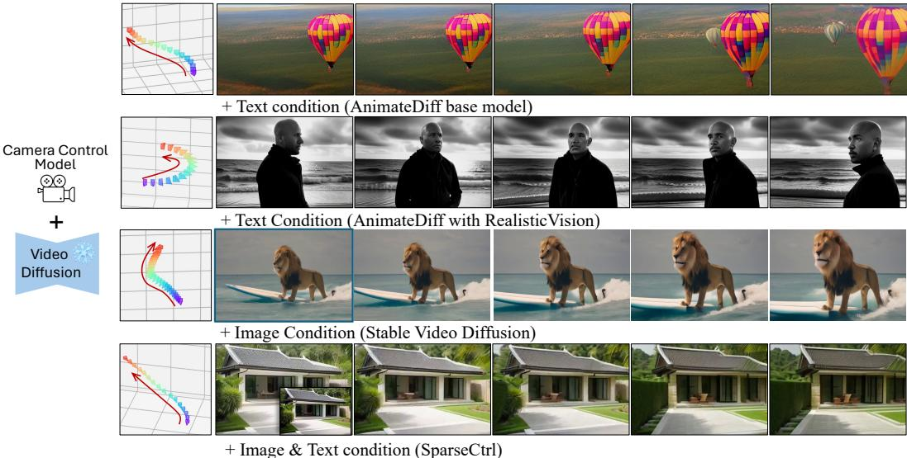  

Figure 1: Illustration of CameraCtrl. It can control the camera trajectory for both general T2V (Guo et al., 2023b) and personalized T2V generation (civitai), shown in the first two rows. Besides, illustrated in the third row, it can be used with I2V diffusion models, like Stable Video Diffusion (Blattmann et al., 2023a). The condition image is the first image of row 3. CameraCtr1 can also collaborate with other visual controllers, such as the RGB encoder from SparseCtrl (Guo et al., 2023a) to generate videos condition on image and text conditions and manage camera movements.

因此，我们引入了CameraCtrl1，这是一个精确的即插即用相机姿态控制模块，能够控制视频生成中的相机视角。考虑到将相机控制模块无缝集成到现有的视频扩散模型中是具有挑战性的，我们研究了如何有效表示和注入相机姿态。具体而言，我们采用Plücker嵌入（Sitzmann等，2021）作为相机姿态调节的主要形式。这个选择归因于它们对视频帧中每个像素的几何解释的编码，提供了全面的相机姿态信息描述。为了确保我们在训练后CameraCtrl的适用性和泛化能力，我们引入了一个只接受Plücker嵌入作为输入的相机控制模块，因此对训练数据集的外观保持无关。为了评估相机控制模型的有效训练策略，我们进行了全面研究，调查各种类型训练数据的影响，从光真实到合成数据。实验结果表明，具有与原始基础模型相似外观和多样化相机姿态分布的数据（例如，RealEstate10K（Zhou等，2018））在泛化性和可控性之间达到了最佳平衡。我们首先在AnimateDiff之上实现了CameraCtrl1，使得在各类个性化文本到视频（T2V）模型中能够精确控制相机（见图1，第12行）。我们还将CameraCtrl1与Stable Video Diffusion（Blattmann等，2023a）集成，以在图像到视频（I2V）设置中实现相机控制，如图1第三行所示。此外，如图1的最后一行所示，CameraCtrl1也能够与其他即插即用模块兼容，例如SparseCtrl（Guo等，2023a），以在文本和结构信息（例如图像）的条件下控制视频视角。总之，我们的主要贡献有三方面： • 我们介绍了CameraCtrl，赋予视频扩散模型灵活而精确的相机视角控制能力。 • 即插即用的相机控制模块可以适应各种视频生成模型，产生视觉上引人注目的相机控制效果。 • 我们提供了对训练相机控制模块的数据集的全面分析。我们希望这对未来在该方向的研究有所帮助。

# 2 相关工作

视频生成。得益于训练过程的稳定性和成熟的开源社区，最近的视频生成尝试主要利用扩散模型（Ho 等，2020；Song 等，2020；Peebles & Xie，2023b）。许多近期的视频扩散模型是 T2V 模型（Karras 等，2023；Ruan 等，2023；Zhang 等，2023b；He 等，2022；Chen 等，2023a；Hong 等，2022；Yang 等，2024b）。一些方法试图将指导信号从文本转换为图像，专注于 I2V 设置（Chen 等，2023b；d；Esser 等，2023）。作为一种开创性的方法，视频扩散模型（Ho 等，2022b）扩展了二维图像扩散架构以适应视频数据，并从头一起训练图像和视频模型。为了利用强大的预训练图像生成器，例如稳定扩散（Rombach 等，2022），后续工作通过在预训练的二维层之间交错时间层来扩展二维架构，并在大型视频数据集上微调新模型（Bain 等，2021）。其中，Align-YourLatents（Blattmann 等，2023b）通过对齐独立采样的噪声图高效地将文本到图像（T2I）模型转变为视频生成器。稳定视频扩散（SVD）（Blattmann 等，2023a）通过更复杂的训练步骤和数据整理扩展了 Align-Your-Latents。AnimateDiff（Guo 等，2023b）利用可插拔的运动模块，在个性化图像主干上实现高质量动画创建（Ruiz 等，2023）。为了增强时间一致性，Lumiere（Bar-Tal 等，2024）替换了常用的时间超分辨率模块，直接生成高帧率视频。其他重要尝试包括利用可扩展的变换器主干（Ma 等，2024），在时空压缩潜空间中操作，例如 W.A.L.T.（Gupta 等，2023）和 Sora（Brooks 等，2024），以及使用离散词元与语言模型进行视频生成（Kondratyuk 等，2023）。有关全面的调查，请参见（Po 等，2023）。

可控视频生成。仅依赖文本或图像条件的模糊性往往导致视频扩散模型的控制能力较弱。为提供增强的指导，一些研究采用其他信号，例如深度/骨架序列，以精确控制生成视频中的场景/人类运动（Guo 等, 2023a；Chen 等, 2023c；Zhang 等, 2023c；Khachatryan 等, 2023；Hu 等, 2023；Xu 等, 2023）。另一种方法（Guo 等, 2023a）利用草图图像作为控制信号，促成了高视频质量或准确的时间关系建模。相比之下，我们的工作关注于视频生成过程中的相机控制。AnimateDiff 采用高效的 LoRA（Hu 等, 2021）微调，以获得针对不同相机运动类型的模型权重。Direct-a-Video（Yang 等, 2024a）提出了一种相机嵌入器来控制生成视频的相机姿态，但仅限制于三个相机参数，限制了其对相机控制能力的发挥，主要局限于基本类型，例如向左平移。MotionCtrl（Wang 等, 2023）则输入更多相机参数以控制相机视点。然而，单纯依赖相机参数的数值限制了相机控制的准确性，且对视频扩散模型部分参数进行微调的必要性可能阻碍其在不同视频领域的泛化能力。在本研究中，我们旨在精确控制视频生成过程中的相机姿态，并期望相应的模型能够应用于各种视频生成模型。

# 3 摄像头控制

引入精确的相机控制到现有的视频生成方法中是具有挑战性的，但在实现期望结果方面具有重要价值。为此，我们通过考虑三个关键问题来解决这个问题：（1）我们如何有效地表示相机条件，以反映3D空间中的几何运动？（2）我们如何无缝地将相机条件注入现有视频生成器，而不损害帧质量和时间一致性？（3）应使用哪种类型的训练数据以确保模型的正确训练？本节安排如下：第3.1节简要讨论视频生成模型的背景；第3.2节介绍CameraCt r1中使用的相机表示；第3.3节呈现将相机表示注入视频扩散模型的相机模型 $\Phi _ { c }$。第3.4节讨论数据选择过程。

# 3.1 视频生成的初步研究

视频扩散模型。近年来，T2V扩散模型取得了显著进展。一些方法（Singer et al., 2022; Ho et al., 2022b）从头开始训练视频生成器，而其他方法（Guo et al., 2023b; Blattmann et al., 2023b）则利用强大的T2I扩散模型作为预训练模型，并在其基础上训练一些时间块。此外，一些方法使用图像和视频联合训练视频生成器（Yang et al., 2024b）。尽管采用了不同的训练方案，这些模型通常遵循用于图像生成的原始公式。具体而言，将一系列$N$张图像（或其潜在特征）$z _ { 0 } ^ { 1 : N }$逐步添加噪声$\epsilon$，直至在T个步骤后达到正态分布。给定$t$步骤的噪声输入，神经网络$\hat { \epsilon } _ { \theta }$被训练来预测所添加的噪声。在训练过程中，该网络试图最小化其预测与真实噪声尺度之间的均方误差（MSE）；训练目标函数的公式如下：

$$
\mathcal { L } ( \theta ) = \mathbb { E } _ { z _ { 0 } ^ { 1 : N } , \epsilon , c _ { t } , t } [ | | \epsilon - \hat { \epsilon } _ { \theta } ( z _ { t } ^ { 1 : N } , c _ { t } , t ) | | _ { 2 } ^ { 2 } ] ,
$$

其中 $c_{t}$ 代表相应条件信号的嵌入，例如文本提示。可控视频生成。除了文本条件外，增强可控性的进一步进展已经出现。通过将额外的结构控制信号 $s_{t}$（例如深度图和Canny图）融入过程，可以增强图像和视频生成的可控性。通常，这些控制信号首先输入一个额外的编码器 $\Phi_{s}$，然后通过各种操作注入生成器中（Zhang 等，$2023 \mathrm{a}$；Mou 等，2023；Ye 等，2023）。因此，训练该编码器的目标可以定义如下：

$$
\mathcal { L } ( \theta ) = \mathbb { E } _ { z _ { 0 } ^ { 1 : N } , \epsilon , c _ { t } , s _ { t } , t } [ \| \epsilon - \hat { \epsilon } _ { \theta } ( z _ { t } ^ { 1 : N } , c _ { t } , \Phi _ { s } ( s _ { t } ) , t ) \| _ { 2 } ^ { 2 } ] .
$$

在本工作中，我们将相机姿态作为视频扩散模型的一个额外控制信号，并严格遵循公式 (2) 的目标来训练我们的相机编码器 $\Phi _ { c }$。

# 3.2 相机位姿表示

在深入探讨相机控制模块的体系结构和训练之前，我们首先研究哪种相机表示能够精确反映相机在三维空间中的移动。相机表示。通常，相机位姿指的是内参和外参，分别表示为 $\mathbf { \bar { K } } \in \mathbb { R } ^ { 3 \times 3 }$ 和 $\mathbf { \dot { E } } = [ \mathbf { \dot { R } } ; \mathbf { t } ] \in \mathbb { R } ^ { 3 \times 4 }$，其中 $\mathbf { R } \in \mathbb { R } ^ { 3 \times 3 }$ 表示外参的旋转部分，$\mathbf { t } \in \mathbb { R } ^ { 3 \times 1 }$ 是平移部分。

为了在相机姿态上对视频生成器进行条件约束，一种简单的选择是将相机参数的原始值输入到生成器中。然而，这种选择可能无法准确控制相机，原因有多个：(1) 尽管旋转矩阵 $\mathbf { R }$ 受到正交性的约束，但平移向量 $t$ 通常在大小上没有约束，导致相机控制模型的学习过程存在不匹配。(2) 直接使用原始相机参数使得模型难以将这些值与图像像素关联，从而限制了对视觉细节的精确控制。因此，我们选择 Plücker 嵌入（Sitzmann 等人，2021）作为相机姿态的表示。具体而言，对于图像坐标空间中的每个像素 $( u , v )$ ，其 Plücker 嵌入为 $\mathbf { p } _ { u , v } = ( \mathbf { o } \times \mathbf { d } _ { u , v } , \mathbf { d } _ { u , v } ) \in \mathbb { R } ^ { 6 }$，其中 $\mathbf { o } \in \mathbb { R } ^ { 3 }$ 是世界坐标系中的相机中心，而 $\mathbf { d } _ { u , v } \in \mathbb { R } ^ { 3 }$ 是指向像素 $( u , v )$ 的方向向量，计算方式为：

$$
{ \bf d } _ { u , v } = { \bf R } { \bf K } ^ { - 1 } [ u , v , 1 ] ^ { T } + { \bf t } .
$$

然后，对其进行归一化以确保其单位长度。在视频序列中的第 $i$ 帧，其 Plücker 嵌入可以表示为 $\mathbf { P } _ { i } \in \mathbb { R } ^ { 6 \times h \times w }$，其中 $h$ 和 $w$ 分别是帧的高度和宽度。

请注意，公式（3）表示相机投影的逆过程，该过程通过矩阵 $\mathbf { E }$ 和 $\mathbf { K }$ 将一个点从三维世界坐标空间映射到像素坐标系统。因此，与外部和内部矩阵的数值相比，Plücker 嵌入为视频帧的每个像素提供了更多的几何解释，从而能为基础视频生成器提供更具信息量的相机位姿信息描述。因此，它能够更好地利用基础视频生成器的时间一致性能力，生成具有特定相机轨迹的视频片段。此外，Plücker 嵌入中每个项目的值范围更加均匀，这对基于数据驱动模型的学习过程是有益的。不同相机表示的示例见图 6，其中相机矩阵和欧拉角都是数值，而 Plücker 嵌入是像素级的空间嵌入。在获得第 $i$ 帧的相机位姿的 Plücker 嵌入 $\mathbf { P } _ { i }$ 后，我们将视频的整个相机轨迹表示为 Plücker 嵌入序列 $\mathbf { P } \in \mathbb { R } ^ { n \times 6 \times h \times w }$，其中 $n$ 表示视频片段中的总帧数。

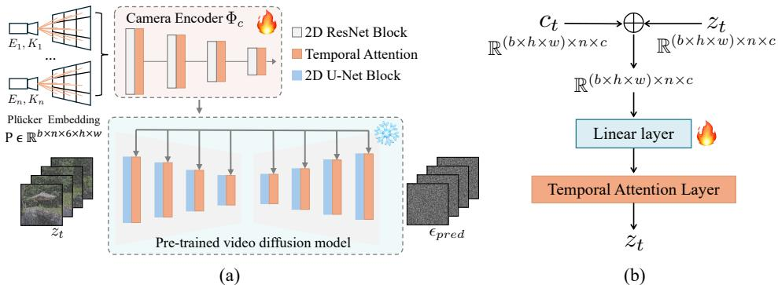  

Figure 2: Framework of CameraCtrl. (a) Given a pre-trained video diffusion model (e.g. AnimateDiff (Guo et al., 2023b)) and SVD (Blattmann et al., 2023a), CameraCtr1 trains a camera encoder on it, which takes the Plücker embeding as input and outputs multi-scale camera representations. These features are then integrated into the temporal attention layers of the U-Net at their respective scales to control the video generation process. (b) Details of the camera injection process. The camera features $c _ { t }$ and the latent features $z _ { t }$ are first combined through the element-wise addition. A learnable linear layer is adopted to further fuse two representations which are then fed into the first temporal attention layer of each temporal block.

# 3.3 相机可控性在视频生成中的应用

由于相机轨迹通过像素级空间光线图以 Plücker 嵌入序列进行参数化，我们遵循文献 (Zhang et al., 2023a; Mou et al., 2023) 的做法，首先使用编码器模型提取 Plücker 嵌入序列的特征，然后将相机特征融合到视频生成器中。

相机编码器。给定一个特定的相机编码器，我们可以将 Plücker 嵌入序列以及相应的图像特征作为其输入，类似于 ControlNet（Zhang et al., 2023a）。或者，我们也可以仅将相机特征输入到相机编码器，正如 T2IAdaptor（Mou et al., 2023）所做的那样。通过经验分析，我们观察到第一种方法由于使用了输入图像的潜在表示，往往会泄漏来自训练数据集的外观信息。这导致模型依赖于训练数据固有的外观偏差，从而限制了其在多个领域中进行相机姿态控制的能力。因此，如图 2(a) 所示，我们的相机编码器 $\Phi _ { c }$ 仅采用 Plücker 嵌入作为输入，并提供多尺度特征。基于在 T2I-Adaptor 中使用的编码器，我们引入了一种专门为视频设计的相机编码器。该相机编码器在每个卷积块之后包含一个时间注意力模块，使其能够捕捉视频片段中相机姿态之间的时间关系。相机编码器的详细架构见附录 D.1。

摄像头融合。在获取多尺度摄像头特征后，我们旨在将这些特征无缝集成到视频扩散模型的 U-Net 架构中。因此，我们进一步研究 U-Net 中的不同层，以确定应使用哪一层来融入摄像头信息。回想一下，U-Net 模型包含空间和时间注意机制。我们将摄像头特征注入到时间注意块中。这一决定源于时间注意层捕捉时间关系的能力，与摄像头轨迹的固有顺序和因果特性相一致，而空间注意层则始终关注单个帧。该摄像头特征融合过程如图 2(b) 所示。图像潜在特征 $z _ { t }$ 和摄像头姿态特征 $c _ { t }$ 通过逐像素加法直接结合。然后，集成特征通过一个线性层，该层的输出直接输入到每个时间注意模块的固定第一个时间注意层。

# 3.4 通过数据驱动方式学习相机分布

训练上述相机编码器和融合线性层在视频生成器上通常需要大量带有相机姿态注释的视频。可以通过结构光束法（SfM）获取相机轨迹，例如，使用 COLMAP（Schönberger & Frahm, 2016）处理真实视频，而其他人则可以从渲染引擎（如 Blender）收集带有真实相机姿态的视频。 因此，我们研究了各种训练数据对相机控制生成器的影响。数据集选择。我们旨在选择一个外观与基础视频扩散模型的训练数据紧密匹配且具有尽可能广泛的相机姿态分布的数据集。我们选择了三个数据集作为候选：Objaverse（Deitke et al., 2023）、MVImageNet（Yu et al., 2023）和 RealEstate10K（Zhou et al., 2018）。这三个数据集的样本可以在图5中找到。

事实上，像 Objaverse (Deitke 等，2023) 这样的计算机生成图像数据集展现了多样的相机分布，因为我们可以在渲染过程中控制相机参数。然而，这些数据集在外观上与真实世界数据集（如 WebVid10M (Bain 等，2021)，用于训练基础视频扩散模型）相比，往往存在分布差距。在处理真实世界数据集（如 MVImageNet 和 RealEstate10K）时，相机参数的分布通常并不十分广泛。在这种情况下，需要在单个相机轨迹的复杂性和多个相机轨迹之间的多样性之间找到平衡。前者确保模型在每次训练过程中能够学习控制复杂轨迹，而后者则确保模型不会过拟合于某些固定模式。实际上，虽然 MVImageNet 中的相机轨迹复杂性可能略高于 RealEstate10K，但 MVImageNet 的轨迹通常仅限于水平旋转。相比之下，RealEstate10K 展示了各种相机轨迹。考虑到我们的目标是将模型应用于广泛的自定义轨迹，我们最终选择了 RealEstate10K 作为我们的训练数据集。此外，还有一些其他数据集具有类似于 RealEstate10K 的特征，如 ACID (Liu 等，2021) 和 MannequinChallenge (Li 等，2019)，但它们的数据量远小于 RealEstate10K。我们尝试将它们与 RealEstate10K 结合，共同训练 CameraCt rl 模型，但发现没有任何好处。

测量相机可控性。为了监控我们相机编码器的训练过程，我们设计了两个指标来通过量化输入相机条件与生成视频的相机轨迹之间的误差来衡量相机控制质量。具体而言，我们利用 COLMAP (Schönberger & Frahm, 2016) 提取生成视频的相机位姿序列，得到相机轨迹的旋转矩阵 $\mathbf{R}_{gen} \in \mathbb{R}^{n \times 3 \times 3}$ 和平移向量 $\mathbf{T}_{gen} \in \mathbb{R}^{n \times 3 \times 1}$。此外，由于旋转角度和平移尺度是两个不同的数学量，我们分别测量角度误差和平移误差，并将其称为 RotErr 和 TransErr。根据 (Belousov) 的方法，RotErr 通过比较真实的旋转矩阵 $\mathbf{R}_{gt}$ 和 $\mathbf{R}_{gen}$ 进行计算，其公式为，$\mathbf{R}_{gt}^{i}$ 和 $\mathbf{R}_{gen}^{i}$ 是第 $i$ 帧的真实平移向量 $\mathbf{T}_{gt}$ 和生成的平移向量 $\mathbf{T}_{gen}$ 之间的 $L_2$ 距离。关于 RotErr 和 TransErr 的更多讨论见附录 D.5。

$$
\mathrm { R o t E r r } = \sum _ { i = 1 } ^ { n } \operatorname { a r c c o s } \frac { t r ( \mathbf { R } _ { g e n } ^ { i } \mathbf { R } _ { g t } ^ { i \mathrm { T } } ) ) - 1 } { 2 } ,
$$

$$
\mathrm { T r a n s E r r } = \sum _ { j = 1 } ^ { n } \Vert \mathbf { T } _ { g t } ^ { i } - \mathbf { T } _ { g e n } ^ { i } \Vert _ { 2 } ^ { 2 } ,
$$

# 4 实验

在本节中，我们将CameraCtr1与其他方法进行评估，并展示其在不同视频生成设置中的应用。第4.1节介绍实施细节。第4.2节将CameraCtr1与基线方法AnimateDiff（Guo等，2023b）和MotionCtrl（Wang等，2023）进行比较。第4.3节展示CameraCtr1的全面消融研究。第4.4节表达CameraCtr1的各种应用。

# 4.1 实现细节

基础视频扩散模型。在T2V设置中，AnimateDiff V3（Guo等，2023b）作为基础模型。AnimateDiff可以与各种T2I LoRA或不同类型的基础模型进行集成。此功能帮助我们评估CameraCt r1的泛化能力。在I2V设置中实现CameraCt r1时，SVD（Blattmann等，2023a）为基础模型。

Table 1: Quantitative comparisons. MotionCtrlvC and MotionCtrlsyD represent MotionCtrl with VideoCrafter (Chen et al., 2023a) and SVD (Blattmann et al., 2023a) as base model, respectively. Correspondingly, CameraCtrlAD and CameraCtrlsvD denote base models of AnimateDiff and SVD with CameraCtrl respectively.   

<table><tr><td>Method</td><td>FVD ↓</td><td>CLIPSIM ↑</td><td>FC↑</td><td>ODD ↑</td><td>TransErr↓</td><td>RotErr↓</td><td>User Preference Rate ↑ (%)</td></tr><tr><td>AnimateDiff</td><td>1022.4</td><td>0.298</td><td>0.930</td><td>56.4</td><td>Incapable</td><td>Incapable</td><td>19.4</td></tr><tr><td>MotionCtrlvc</td><td>1123.2</td><td>0.286</td><td>0.922</td><td>42.3</td><td>1402</td><td>1.58</td><td>37.0</td></tr><tr><td>CameraCtrlAD</td><td>1088.9</td><td>0.301</td><td>0.941</td><td>49.8</td><td>12.98</td><td>1.29</td><td>43.6</td></tr><tr><td>SVD</td><td>371.2</td><td>0.312</td><td>0.957</td><td>47.5</td><td>Incapable</td><td>Incapable</td><td>Incapable</td></tr><tr><td>MotionCtrlSVD</td><td>386.2</td><td>0.303</td><td>0.953</td><td>41.8</td><td>10.21</td><td>1.41</td><td>26.9</td></tr><tr><td>CameraCtrlsvD</td><td>360.3</td><td>0.298</td><td>0.960</td><td>46.5</td><td>9.02</td><td>1.18</td><td>73.1</td></tr></table>

训练。我们使用 AdamW 优化器以常数学习率 $1 \times 10^{-4}$（T2V）或 $3 \times 10^{-5}$（I2V）训练我们的模型。如第 3.4 节所述，我们选择 RealEstate10K 作为数据集，包含大约 $65K$ 个视频片段用于训练。相机编码器和用于相机特征注入的线性层一起以批量大小 32 训练 $50K$ 步。更多细节见附录 D.2。

评估指标。为了确保我们的相机模型不会对原始视频扩散模型的外观质量产生负面影响，我们利用Fréchet视频距离（FVD）（Unterthiner等，2018；2019）、CLIPSIM（Radford等，2021）和帧一致性（FC）（Huang等，2023）来评估视频的外观质量。此外，基于VBench中的动态度量（Huang等，2023），我们提出了一种对象动态度量（ODD），细节见附录D.4，以评估对象运动的程度。此外，相机控制的质量使用第3.4节中引入的RotErr和TransErr指标进行评估。对于FVD、CLIPSim、FC和ODD的参考视频和（或）文本说明，我们随机从WebVid10M数据集中抽取了1,000个视频。对于RotErr和TransErr，我们随机选择了1,000个视频及其对应的相机姿态，来自RealEstate10K测试集。

# 4.2 与其他方法的比较

定量比较。为了证明 CameraCt r1 的有效性，我们将其与两种替代方法进行比较：AnimateDiff 和 MotionLoRA（Guo et al., 2023b），以及 MotionCtrl（Wang et al., 2023）。需要注意的是，AnimateDiff 仅支持八种基本摄像机运动，而我们没有这些摄像机运动的真实轨迹数据。因此，我们无法计算 AnimateDiff 的 Rot Err 和 TransErr。相反，我们进行了一项用户研究（详细信息见附录 E）以评估不同模型之间用户对摄像机控制能力的偏好。此外，我们在 T2V 和 I2V 设置中将 CameraCt r1 与 MotionCtrl 进行了比较。定量结果如表 1 所示。中间块的结果为 T2V 设置的结果，而 I2V 设置的结果显示在底部块中。与 AnimateDiff 和 MotionLoRA 以及 MotionCtrl 相比，显然我们的方案在摄像机控制精度（TransErr、RotErr 和用户偏好）方面优于它们。TransErr 和 Rot Err 的下界在附录 F.3 中列出。此外，与基础模型（AnimateDiff 和 SVD）相比，CameraCt r1 没有牺牲生成视频的视觉质量和动态程度，这通过 FVD、CLIPSIM、FC 和 ODD 的更好或可比指标得到了证明。定性比较。我们还在图 3 中提供了 CameraCtrl 和 MotionCtrl 在 T2V 和 I2V 设置下的定性比较。从前两行的比较中，我们发现 MotionCtrl 无法跟随摄像机条件，它显示场景旋转，而不是摄像机运动。相反，CameraCt r1 能够将摄像机运动与场景运动区分开，严格遵循摄像机轨迹条件。此外，MotionCtrl 对小的摄像机运动不敏感。如第三行所示，MotionCtrl 的结果仅显示向前的摄像机运动，忽略了条件轨迹中的小向左运动。相比之下，最后一行的 CameraCt r1 结果准确跟随了向前和向左的摄像机运动。更多定性比较结果见附录 G。

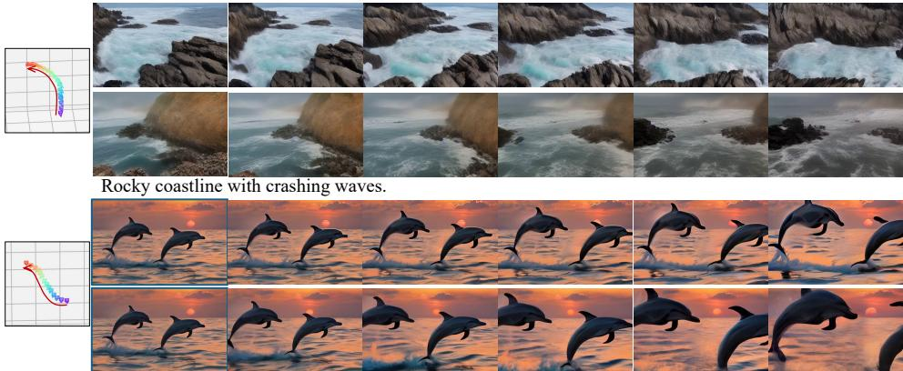  

Figure 3: Qualitative comparisons between CameraCtrl and MotionCtrl. The first two rows are in the T2V setting, representing MotionCtrl with VideoCrafter and CameraCt r1 with AnimateDiffV3 as base model, respectively. The last two rows are MotionCtrl and CameraCt r1 with SVD as base model taking the image as a condition signal. Condition images are the first images of each row.

# 4.3 消融实验

我们将相机控制问题分解为三个挑战：第3.2节关于相机表示的选择，第3.3节关于相机控制模型的架构，以及第3.4节关于相机控制模型的学习过程。在本节中，我们综合评估了对每个设计选择的影响，使用FVD、TransErr和RotErr作为主要指标。本节中的所有CameraCtr1模型均采用AnimateDiffV3模型实现。除非另有说明，我们使用与第4.2节相同的RealEstate10K数据集中1,000个视频片段。

Plücker 嵌入精确地表示了相机。Plücker 嵌入自然地作为一个空间的、逐像素的映射，不同位置具有不同的值。作为替代方案，我们可以直接使用内参矩阵 K 和外参矩阵 $\mathbf{E}$ 的数值，或者将 $\mathbf{E}$ 的旋转矩阵转换为欧拉角。然后将这些数值在空间上重复，以形成具有相同内容的逐像素映射。另一种方法是将光线方向（在像素之间变化）与重复的相机原点（在空间位置之间恒定）结合成一个空间像素映射。实验结果如表 2a 所示，使用 Plücker 嵌入作为相机表示产生了最佳的相机控制结果。这源于 Plücker 嵌入能够为每个像素提供几何解释。相比之下，仅依赖数值可能导致数值不匹配，从而 adversely 影响相机模型的学习效率。对于使用光线方向和相机原点的表示，尽管可以提供准确的相机原点信息，但重复的相机原点参数增加了冗余，可能导致特征错位，阻碍模型对相机运动的理解。

噪声潜变量作为输入限制了泛化能力。在对相机编码器的架构进行消融实验时，我们区分了ControlNet (Zhang et al., 2023a)，其输入是图像特征与Plücker嵌入序列的总和，以及仅采用Plücker嵌入序列作为输入的T2I-Adaptor。这一区别至关重要，因为在SparseCtrl (Guo et al., 2023a)中提到的噪声潜变量的使用与外观泄漏相关，有效限制了不同领域之间相机控制质量的泛化能力。此外，为了增强相邻帧之间的相机一致性，我们还考虑在每个编码器中添加时间注意力模块。因此，在选择相机编码器的架构时，我们的实验涵盖了四种配置：ControlNet、T2I-Adaptor及其增强的时间注意力变体。消融结果见表2b。以ControlNet作为相机编码器时，外观质量次优，如前两行的FVD指标所示。对于采用T2I-Adaptor的模型，可以观察到额外的时间注意力模块的模型展现出更好的相机控制能力。因此，我们选择了带有时间注意力模块的T2I-Adaptor编码器作为我们的相机编码器。将相机条件注入时间注意力。接下来，我们研究提取的相机特征应插入预训练U-Net架构中的哪个位置。为此，我们进行了四个实验，分别将特征插入U-Net的空间自注意力、空间交叉注意力、空间自注意力与交叉注意力两者，以及时间注意力层。结果见表2c，表明将相机特征插入时间注意力层能够产生更好的结果。这一改进可以归因于相机运动通常会引发帧之间的全局视角变化。将相机姿态与U-Net的时间块集成与这种动态特性相呼应。

<table><tr><td colspan="3">Representation type FVD↓TransErr↓RotErr↓</td></tr><tr><td>Raw Values</td><td>230.1 13.88</td><td>1.51</td></tr><tr><td>Euler angles</td><td>221.2 13.71</td><td>1.43</td></tr><tr><td>Direction + Origin</td><td>232.3 13.21</td><td>1.57</td></tr><tr><td>Plücker embedding</td><td>222.1 12.98</td><td>1.29</td></tr><tr><td colspan="3">(a) How to represent camera parameters.</td></tr><tr><td>Attention</td><td>FVD↓TransErr↓RotErr↓</td><td></td></tr><tr><td>Spatial Self</td><td>241.2 14.72</td><td>1.42</td></tr><tr><td>Spatial Cross</td><td>237.5 14.31</td><td>1.51</td></tr><tr><td>Spatial Self + Cross 240.1</td><td></td><td>14.52 1.60</td></tr><tr><td>Temporal</td><td>222.1</td><td>12.98 1.29</td></tr></table>

(c) 相机表征的注入位置。

Table 2: Ablation study on camera representation, condition injection and effect of various datasets.   

<table><tr><td colspan="4">Encoder architecture typeFVD↓TransErr ↓RotErr ↓</td></tr><tr><td>ControlNet</td><td>295.8</td><td>13.51</td><td>1.42</td></tr><tr><td>ControlNet + Temporal</td><td>283.4</td><td>13.13</td><td>1.33</td></tr><tr><td>T2I Adaptor</td><td>223.4</td><td>13.27</td><td>1.38</td></tr><tr><td>T2I Adaptor + Temporal</td><td>222.1</td><td>12.98</td><td>1.29</td></tr><tr><td colspan="4">(b) Camera encoder architecture.</td></tr><tr><td colspan="4">Datasets FVD↓TransErr ↓RotErr↓</td></tr><tr><td>Objaverse 1435.4</td><td>Incapable</td><td></td><td>Incapable</td></tr><tr><td>MVImageNet</td><td>1143.5</td><td>113.87</td><td>1.52</td></tr><tr><td>RealEstate10K + ACID 1102.4</td><td></td><td>13.48</td><td>1.41</td></tr><tr><td>RealEatate10K</td><td>1088.9</td><td>12.99</td><td>1.39</td></tr></table>

(d) 数据集的影响。

具有相似外观分布和多样化相机的高清视频有助于可控性。为了检验我们关于数据集选择的论点，如第3.4节所述，我们使用不同的数据集训练CameraCt r1。Objaverse（Deitke等，2023）数据集具有最广泛的相机位姿分布，但与WebVid10M存在显著不同的外观。对于真实世界数据集，与MVImageNet相比，RealEstate10K具有更丰富的相机轨迹。我们使用多样的数据源评估这些模型，包括WebVid10M用于FVD，以及MannequinChallenge（Li等，2019）的相机轨迹用于TransErr和RotErr。结果如表2d所示，与RealEstate10K相比，MVImageNet的FVD得分和相机错误显著更高。对于Objaverse，COLMAP在提取足够数量的相机位姿以生成有意义的TransErr和RotErr指标方面面临挑战。造成这一结果的一个可能原因是数据集外观的差异可能阻碍模型有效区分相机位姿和外观，从而使COLMAP难以估计相机位姿。我们还将CameraCt r1与RealEstate10K和类似数据集ACID共同训练，但在相机控制能力方面并没有改善。该结果表明，为了进一步提升CameraCt r1，需要一个具有更大相机分布的数据集。

# 4.4 Cameractrl 的应用

将 CameraCtr1 应用到不同的视频生成器。如第 3.3 节所述，我们的相机控制模型仅使用 Plücker 嵌入作为输入，使其独立于训练数据集的外观。此外，如第 3.4 节提到的，我们选择一个与基本视频生成器训练数据的外观高度相似的数据集。得益于这些设计选择，CameraCtr1 可以专注于学习与相机控制相关的信息。这使其能够在各种视频生成器中进行应用。我们在图 4、第 H.1 附录和第 H.2 附录中进行了说明。在 T2V 设置中，我们基于 AnimateDiff 实现了 CameraCtr1。第一行显示的结果采用了展示自然场景的普通 AnimateDiff 模型。第二行和第三行展示了由嵌入其他个性化图像生成器（Realistic Vision（civitai）和 ToonYou（BradCatt））的 AnimateDiff 生成的结果。第二行代表了一种不同于典型现实的视频风格，描绘了一个赛博朋克城市的建筑。第三行展示了一个卡通角色的视频。此外，我们还基于 SVD 实现了 CameraCtr1，并在 I2V 设置中抽样生成一个视频，显示在最后一行。在这些不同的视频生成类型中，CameraCtr1 始终有效控制相机轨迹，展示了其广泛的适用性和在通过动态相机轨迹控制增强视频叙事方面的有效性。

将 CameraCtr1 与其他视频控制方法整合。得益于我们方法的即插即用特性，它不仅可以在不同基础视频生成器的生成过程中使用，还可以与其他视频生成控制技术结合使用以生成视频。例如，我们利用 SparseCtrl（Guo 等，2023a），这是一种通过操控少量稀疏帧来控制整体视频生成的最新方法。该控制可以基于 RGB 图像、草图图或深度信息。在这里，我们采用了 SparseCtrl 的 RGB 编码器和草图编码器，结果分别显示在图 1 的最后一行和图 4 的第四行中，分别使用 SparseCtrl 的 RGB 和草图编码器。正如这两个视频所示，这种方法在生成视频中的场景与参考帧中的对象之间具有很高的一致性。此外，很明显，生成视频的相机运动与提供的相机轨迹高度对齐。CameraCtr1 与 SparseCtrl 的成功集成进一步证明了 CameraCtr1 的泛化能力并增强了其应用场景。更多该部分的视觉结果可以在附录 H.3 中找到。

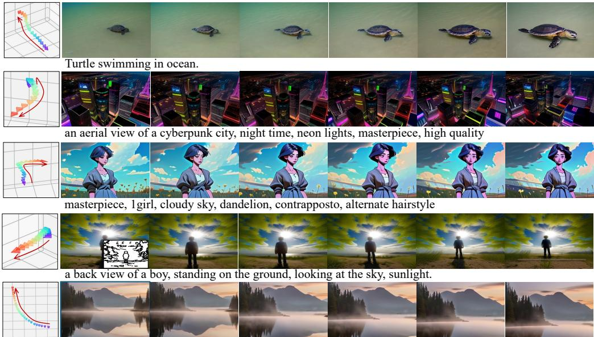  

Figure 4: Applications of CameraCtrl. The first row represents a video generated by the base AnimateDiff. The Following two rows showcase the results of two personalized T2V generators, RealisticVision and ToonYou. The fourth row expresses the video generated by CameraCtrl integrated with another video control method, SparseCtrl (Guo et al., 2023a). The video of the last row is produced by a I2V generator, SVD, taking the first image of last row as a condition.

# 5 讨论

在本研究中，我们提出了CameraCtr1，这是一种解决现有模型在视频生成中精确相机控制局限性的方法。通过学习一个即插即用的相机控制模块，CameraCtr1能够对相机视点进行准确控制。我们采用Plücker嵌入作为相机参数的主要表示形式，通过编码几何解释提供对相机位姿信息的全面描述。通过对训练数据的综合研究，我们发现，使用与基模型外观相似且相机位姿分布多样的数据集，如RealEstate10K，能够在泛化能力和可控性之间达到最佳平衡。实验结果表明CameraCtr1的有效性。伦理声明。CameraCtr1通过提供对相机视点的精确控制，增强了视频生成技术，显著提高了许多应用的真实性和交互性。相反，CameraCtr1可能引发一些伦理问题，特别是在隐私领域和潜在误导内容的生成方面。迫切需要伦理监督和更先进的深度伪造检测器，以管理这些风险并确保CameraCtr1的正确使用。可重复性声明。我们在主文本的第4.1节和附录D.2中提供了我们训练方法的详细实施。我们还在附录D.1中提供了相机编码器的模型架构。

# 6 致谢

本项目部分由中国国家重点研发计划项目2022zD0161100资助，以及由NSFC-RGC项目N_CUHK498/24资助。李洪生为InnoHK下CPII的主要研究人员（PI）。

# REFERENCES

Sherwin Bahmani, Ivan Skorokhodov, Aliaksandr Siarohin, Willi Menapace, Guocheng Qian, Michael Vasilkovsky, Hsin-Ying Lee, Chaoyang Wang, Jiaxu Zou, Andrea Tagliasacchi, et al. Vd3d: Taming large video diffusion transformers for 3d camera control. arXiv preprint arXiv:2407.12781, 2024.

Max Bain, Arsha Nagrani, Gül Varol, and Andrew Zisserman. Frozen in time: A joint video and image encoder for end-to-end retrieval. In Proceedings of the IEEE/CVF International Conference on Computer Vision, pp. 17281738, 2021.

Omer Bar-Tal, Hila Chefer, Omer Tov, Charles Herrmann, Roni Paiss, Shiran Zada, Ariel Ephrat, Junhwa Hur, Yuanzhen Li, Tomer Michaeli, et al. Lumiere: A space-time diffusion model for video generation. arXiv preprint arXiv:2401.12945, 2024.

Boris Belousov. So3 roration distance. http://www.boris-belousov.net/2016/12/ 01/quat-dist/.

Andreas Blattmann, Tim Dockhorn, Sumith Kulal, Daniel Mendelevitch, Maciej Kilian, Dominik Lorenz, Yam Levi, Zion English, Vikram Voleti, Adam Letts, et al. Stable video diffusion: Scaling latent video diffusion models to large datasets. arXiv preprint arXiv:2311.15127, 2023a.

Andreas Blattmann, Robin Rombach, Huan Ling, Tim Dockhorn, Seung Wook Kim, Sanja Fidler, and Karsten Kreis. Align your latents: High-resolution video synthesis with latent diffusion models. In Proceedings of the IEEE/CVF Conference on Computer Vision and Pattern Recognition, pp. 2256322575, 2023b.

BradCatt. Toonyou. https://civitai.com/models/30240/toonyou.

Tim Brooks, Bill Peebles, Connor Holmes, Will DePue, Yufei Guo, Li Jing, David Schnurr, Joe Taylor, Troy Luhman, Eric Luhman, Clarence Ng, Ricky Wang, and Aditya Ramesh. Video generation models as world simulators. https://openai.com/index/videogeneration-models-as-world-simulators/, 2024. URL https : / /openai. com/research/ video-generation-models-as-world-simulators.

Haoxin Chen, Menghan Xia, Yingqing He, Yong Zhang, Xiaodong Cun, Shaoshu Yang, Jinbo Xing, Yaofang Liu, Qifeng Chen, Xintao Wang, Chao Weng, and Ying Shan. Videocrafter1: Open diffusion models for high-quality video generation, 2023a.

Tsai-Shien Chen, Chieh Hubert Lin, Hung-Yu Tseng, Tsung-Yi Lin, and Ming-Hsuan Yang. Motionconditioned diffusion model for controllable video synthesis. arXiv preprint arXiv:2304.14404, 2023b.

Weifeng Chen, Jie Wu, Pan Xie, Hefeng Wu, Jiashi Li, Xin Xia, Xuefeng Xiao, and Liang Lin. Control-a-video: Controllable text-to-video generation with diffusion models. arXiv preprint arXiv:2305.13840, 2023c.

Xinyuan Chen, Yaohui Wang, Lingjun Zhang, Shaobin Zhuang, Xin Ma, Jiashuo Yu, Yali Wang, Dahua Lin, Yu Qiao, and Ziwei Liu. Seine: Short-to-long video diffusion model for generative transition and prediction. In The Twelfth International Conference on Learning Representations, 2023d.

Soon Yau Cheong, Duygu Ceylan, Armin Mustafa, Andrew Gilbert, and Chun-Hao Paul Huang. Boosting camera motion control for video diffusion transformers. arXiv preprint arXiv:2410.10802, 2024.

SG 161222 civitai. Realistic vision. https://civitai.com/models/4201/ realistic-vision-v60-bl.

Matt Deitke, Dustin Schwenk, Jordi Salvador, Luca Weihs, Oscar Michel, Eli VanderBilt, Ludwig Schmidt, Kiana Ehsani, Aniruddha Kembhavi, and Ali Farhadi. Objaverse: A universe of annotated 3d objects. In Proceedings of the IEEE/CVF Conference on Computer Vision and Pattern Recognition, pp. 1314213153, 2023.

Patrick Esser, Johnathan Chiu, Parmida Atighehchian, Jonathan Granskog, and Anastasis Germanidis Structure and content-guided video synthesis with diffusion models. In Proceedings of the IEEE/CVF International Conference on Computer Vision, pp. 73467356, 2023.

Yuwei Guo, Ceyuan Yang, Anyi Rao, Maneesh Agrawala, Dahua Lin, and Bo Dai. Sparsectrl: Adding sparse controls to text-to-video diffusion models. arXiv preprint arXiv:2311.16933, 2023a.

Yuwei Guo, Ceyuan Yang, Anyi Rao, Yaohui Wang, Yu Qiao, Dahua Lin, and Bo Dai. Animatediff: Animate your personalized text-to-image diffusion models without specific tuning. arXiv preprint arXiv:2307.04725, 2023b.

Agrim Gupta, Lijun Yu, Kihyuk Sohn, Xiuye Gu, Meera Hahn, Li Fei-Fei, Irfan Essa, Lu Jiang, and José Lezama. Photorealistic video generation with diffusion models. arXiv preprint arXiv:2312.06662, 2023.

Yingqing He, Tianyu Yang, Yong Zhang, Ying Shan, and Qifeng Chen. Latent video diffusion models for high-fidelity video generation with arbitrary lengths. arXiv preprint arXiv:2211.13221, 2022.

Jonathan Ho and Tim Salimans. Classifier-free diffusion guidance. arXiv preprint arXiv:2207.12598, 2022.

Jonathan Ho, Ajay Jain, and Pieter Abbeel. Denoising diffusion probabilistic models. Advances in Neural Information Processing Systems, 33:68406851, 2020.

Jonathan Ho, William Chan, Chitwan Saharia, Jay Whang, Ruiqi Gao, Alexey Gritsenko, Diederik P Kingma, Ben Poole, Mohammad Norouzi, David J Fleet, et al. Imagen video: High definition video generation with diffusion models. arXiv preprint arXiv:2210.02303, 2022a.

Jonathan Ho, Tim Salimans, Alexey Gritsenko, William Chan, Mohammad Norouzi, and David J Fleet. Video diffusion models. arXiv:2204.03458, 2022b.

Wenyi Hong, Ming Ding, Wendi Zheng, Xinghan Liu, and Jie Tang. Cogvideo: Large-scale pretraining for text-to-video generation via transformers. arXiv preprint arXiv:2205.15868, 2022.

Eward J Hu, Yelong Shen, Philp Wallis, Zeyuan Allen-Zhu, Yuanzhi Li, Shean Wang, Lu Wang, and Weizhu Chen. Lora: Low-rank adaptation of large language models. arXiv preprint arXiv:2106.09685, 2021.

Li Hu, Xin Gao, Peng Zhang, Ke Sun, Bang Zhang, and Liefeng Bo. Animate anyone: Consistent and controllable image-to-video synthesis for character animation. arXiv preprint arXiv:2311.17117, 2023.

Ziqi Huang, Yinan He, Jiashuo Yu, Fan Zhang, Chenyang Si, Yuming Jiang, Yuanhan Zhang, Tianxing Wu, Qingyang Jin, Nattapol Chanpaisit, et al. Vbench: Comprehensive benchmark suite for video generative models. arXiv preprint arXiv:2311.17982, 2023.

Johanna Karras, Aleksander Holynski, Ting-Chun Wang, and Ira Kemelmacher-Shlizerman. Dreampose: Fashion video synthesis with stable diffusion. In Proceedings of the IEEE/CVF International Conference on Computer Vision, pp. 2268022690, 2023.

Tero Karras, Miika Aittala, Timo Aila, and Samuli Laine. Elucidating the design space of diffusionbased generative models. Advances in Neural Information Processing Systems, 35:2656526577, 2022.

Levon Khachatryan, Andranik Movsisyan, Vahram Tadevosyan, Roberto Henschel, Zhangyang Wang, Shant Navasardyan, and Humphrey Shi. Text2video-zero: Text-to-image diffusion models are zero-shot video generators. IEEE International Conference on Computer Vision (ICCV), 2023.

Dan Kondratyuk, Lijun Yu, Xiuye Gu, José Lezama, Jonathan Huang, Rachel Hornung, Hartwig Adam, Hassan Akbari, Yair Alon, Vighnesh Birodkar, et al. Videopoet: A large language model for zero-shot video generation. arXiv preprint arXiv:2312.14125, 2023.

Zhengfei Kuang, Shengqu Cai, Hao He, Yinghao Xu, Hongsheng Li, Leonidas Guibas, and Gordon Wetzstein. Collaborative video diffusion: Consistent multi-video generation with camera control. arXiv preprint arXiv:2405.17414, 2024.

Dongxu Li, Junnan Li, Hung Le, Guangsen Wang, Silvio Savarese, and Steven C.H. Hoi. LAVIS: A one-stop library for language-vision intelligence. In Proceedings of the 61st Annual Meeting of the Association for Computational Linguistics (Volume 3: System Demonstrations), pp. 31 41, Toronto, Canada, July 2023. Association for Computational Linguistics. URL ht tps : //aclanthology.org/2023.acl-demo.3.

Zhengqi Li, Tali Dekel, Forrester Cole, Richard Tucker, Noah Snavely, Ce Liu, and William T Freeman. Learning the depths of moving people by watching frozen people. In Proceedings of the IEEE/CVF conference on computer vision and pattern recognition, pp. 45214530, 2019.

Andrew Liu, Richard Tucker, Varun Jampani, Ameesh Makadia, Noah Snavely, and Angjoo Kanazawa. Infinite nature: Perpetual view generation of natural scenes from a single image. In Proceedings of the IEEE/CVF International Conference on Computer Vision, pp. 1445814467, 2021.

Xin Ma, Yaohui Wang, Gengyun Jia, Xinyuan Chen, Ziwei Liu, Yuan-Fang Li, Cunjian Chen, and Yu Qiao. Latte: Latent diffusion transformer for video generation. arXiv preprint arXiv:2401.03048, 2024.

Yue Ma, Yingqing He, Xiaodong Cun, Xintao Wang, Ying Shan, Xiu Li, and Qifeng Chen. Follow your pose: Pose-guided text-to-video generation using pose-free videos. arXiv preprint arXiv:2304.01186, 2023.

Willi Menapace, Aliaksandr Siarohin, Ivan Skorokhodov, Ekaterina Deyneka, Tsai-Shien Chen, Anil Kag, Yuwei Fang, Aleksei Stoliar, Elisa Ricci, Jian Ren, et al. Snap video: Scaled spatiotemporal transformers for text-to-video synthesis. In Proceedings of the IEEE/CVF Conference on Computer Vision and Pattern Recognition, pp. 70387048, 2024.

Chong Mou, Xintao Wang, Liangbin Xie, Yanze Wu, Jian Zhang, Zhongang Qi, Ying Shan, and Xiaohu Qie. T2i-adapter: Learning adapters to dig out more controllable ability for text-to-image diffusion models. arXiv preprint arXiv:2302.08453, 2023.

William Peebles and Saining Xie. Scalable diffusion models with transformers. In Proceedings of the IEEE/CVF International Conference on Computer Vision, pp. 41954205, 2023a.

William Peebles and Saining Xie. Scalable diffusion models with transformers. In Proceedings of the IEEE/CVF International Conference on Computer Vision, pp. 41954205, 2023b.

Ryan Po, Wang Yifan, and Vladislav Golyanik et al. Compositional 3d scene generation using locally conditioned diffusion. In ArXiv, 2023.

Dustin Podell, Zion English, Kyle Lacey, Andreas Blattmann, Tim Dockhorn, Jonas Müller, Joe Penna, and Robin Rombach. Sdxl: Improving latent diffusion models for high-resolution image synthesis. arXiv preprint arXiv:2307.01952, 2023.

Alec Radford, Jong Wook Kim, Chris Hallacy, Aditya Ramesh, Gabriel Goh, Sandhini Agarwal, Girish Sastry, Amanda Askell, Pamela Mishkin, Jack Clark, et al. Learning transferable visual models from natural language supervision. In International conference on machine learning, pp. 87488763. PMLR, 2021.

Tianhe Ren, Shilong Liu, Ailing Zeng, Jing Lin, Kunchang Li, He Cao, Jiayu Chen, Xinyu Huang, Yukang Chen, Feng Yan, Zhaoyang Zeng, Hao Zhang, Feng Li, Jie Yang, Hongyang Li, Qing Jiang, and Lei Zhang. Grounded sam: Assembling open-world models for diverse visual tasks, 2024.

Robin Rombach, Andreas Blattmann, Dominik Lorenz, Patrick Esser, and Björn Ommer. Highresolution image synthesis with latent diffusion models. In Proceedings of the IEEE/CVF conference on computer vision and pattern recognition, pp. 1068410695, 2022.

Ludan Ruan, Yiyang Ma, Huan Yang, Huiguo He, Bei Liu, Jianlong Fu, Nicholas Jing Yuan, Qin Jin, and Baining Guo. Mm-diffusion: Learning multi-modal diffusion models for joint audio and video generation. In Proceedings of the IEEE/CVF Conference on Computer Vision and Pattern Recognition, pp. 1021910228, 2023.

Nataniel Ruiz, Yuanzhen Li, Varun Jampani, Yael Pritch, Michael Rubinstein, and Kfir Aberman. Dreambooth: Fine tuning text-to-image diffusion models for subject-driven generation. In Proceedings of the IEEE/CVF Conference on Computer Vision and Pattern Recognition, pp. 2250022510, 2023.

Johannes Lutz Schönberger and Jan-Michael Frahm. Structure-from-motion revisited. In Conference on Computer Vision and Pattern Recognition (CVPR), 2016.

Xiaoyu Shi, Zhaoyang Huang, Fu-Yun Wang, Weikang Bian, Dasong Li, Yi Zhang, Manyuan Zhang, Ka Chun Cheung, Simon See, Hongwei Qin, et al. Motion-i2v: Consistent and controllable image-to-video generation with explicit motion modeling. arXiv preprint arXiv:2401.15977, 2024.

Uriel Singer, Adam Polyak, Thomas Hayes, Xi Yin, Jie An, Songyang Zhang, Qiyuan Hu, Harry Yang, Oron Ashual, Oran Gafni, et al. Make-a-video: Text-to-video generation without text-video data. arXiv preprint arXiv:2209.14792, 2022.

Vincent Sitzmann, Semon Rezchikov, Bill Freeman, Josh Tenenbaum, and Fredo Durand. Light field networks: Neural scene representations with single-evaluation rendering. Advances in Neural Information Processing Systems, 34:1931319325, 2021.

Jiaming Song, Chenlin Meng, and Stefano Ermon. Denoising diffusion implicit models. arXiv preprint arXiv:2010.02502, 2020.

Zachary Teed and Jia Deng. Raft: Recurrent all-pairs field transforms for optical flow. In Computer VisionECCV 2020: 16th European Conference, Glasgow, UK, August 2328, 2020, Proceedings, Part II 16, pp. 402419. Springer, 2020.

Thomas Unterthiner, Sjoerd Van Steenkiste, Karol Kurach, Raphael Marinier, Marcin Michalski, and Sylvain Gelly. Towards accurate generative models of video: A new metric & challenges. arXiv preprint arXiv:1812.01717, 2018.

Thomas Unterthiner, Sjoerd van Steenkiste, Karol Kurach, Raphaël Marinier, Marcin Michalski, and Sylvain Gelly. Fvd: A new metric for video generation. https://openreview.net/forum?id $\sqsupseteq$ rylgEULtdN, 2019.

Xiang Wang, Hangjie Yuan, Shiwei Zhang, Dayou Chen, Jiuniu Wang, Yingya Zhang, Yujun Shen, Deli Zhao, and Jingren Zhou. Videocomposer: Compositional video synthesis with motion controllability. Advances in Neural Information Processing Systems, 36, 2024.

Zhouxia Wang, Ziyang Yuan, Xintao Wang, Tianshui Chen, Menghan Xia, Ping Luo, and Ying Shan. Motionctrl: A unified and flexible motion controller for video generation. arXiv preprint arXiv:2312.03641, 2023.

Jay Zhangjie Wu, Yixiao Ge, Xintao Wang, Stan Weixian Lei, Yuchao Gu, Yufei Shi, Wynne Hsu, Ying Shan, Xiaohu Qie, and Mike Zheng Shou. Tune-a-video: One-shot tuning of image diffusion models for text-to-video generation. In Proceedings of the IEEE/CVF International Conference on Computer Vision, pp. 76237633, 2023.

Jinbo Xing, Menghan Xia, Yuxin Liu, Yuechen Zhang, Yong Zhang, Yingqing He, Hanyuan Liu, Haoxin Chen, Xiaodong Cun, Xintao Wang, et al. Make-your-video: Customized video generation using textual and structural guidance. arXiv preprint arXiv:2306.00943, 2023.

Dejia Xu, Yifan Jiang, Chen Huang, Liangchen Song, Thorsten Gernoth, Liangliang Cao, Zhangyang Wang, and Hao Tang. Cavia: Camera-controllable multi-view video diffusion with view-integrated attention. arXiv preprint arXiv:2410.10774, 2024a.

Dejia Xu, Weili Nie, Chao Liu, Sifei Liu, Jan Kautz, Zhangyang Wang, and Arash Vahdat. Camco: Camera-controllable 3d-consistent image-to-video generation. arXiv preprint arXiv:2406.02509, 2024b.

Zhongcong Xu, Jianfeng Zhang, Jun Hao Liew, Hanshu Yan, Jia-Wei Liu, Chenxu Zhang, Jiashi Feng, and Mike Zheng Shou. Magicanimate: Temporally consistent human image animation using diffusion model. arXiv preprint arXiv:2311.16498, 2023.

Shiyuan Yang, Liang Hou, Haibin Huang, Chongyang Ma, Pengfei Wan, Di Zhang, Xiaodong Chen, and Jing Liao. Direct-a-video: Customized video generation with user-directed camera movement and object motion. arXiv preprint arXiv:2402.03162, 2024a.

Zhuoyi Yang, Jiayan Teng, Wendi Zheng, Ming Ding, Shiyu Huang, Jiazheng Xu, Yuanming Yang, Wenyi Hong, Xiaohan Zhang, Guanyu Feng, et al. Cogvideox: Text-to-video diffusion models with an expert transformer. arXiv preprint arXiv:2408.06072, 2024b.

Hu Ye, Jun Zhang, Sibo Liu, Xiao Han, and Wei Yang. Ip-adapter: Text compatible image prompt adapter for text-to-image diffusion models. arXiv preprint arXiv:2308.06721, 2023.

Shengming Yin, Chenfei Wu, Jian Liang, Jie Shi, Houqiang Li, Gong Ming, and Nan Duan. Dragnuwa: Fine-grained control in video generation by integrating text, image, and trajectory. arXiv preprint arXiv:2308.08089, 2023.

Xianggang Yu, Mutian Xu, Yidan Zhang, Haolin Liu, Chongjie Ye, Yushuang Wu, Zizheng Yan, Chenming Zhu, Zhangyang Xiong, Tianyou Liang, et al. Mvimgnet: A large-scale dataset of multi-view images. In Proceedings of the IEEE/CVF Conference on Computer Vision and Pattern Recognition, pp. 91509161, 2023.

David Junhao Zhang, Roni Paiss, Shiran Zada, Nikhil Karnad, David E Jacobs, Yael Pritch, Inbar Mosseri, Mike Zheng Shou, Neal Wadhwa, and Nataniel Ruiz. Recapture: Generative video camera controls for user-provided videos using masked video fine-tuning. arXiv preprint arXiv:2411.05003, 2024.

Lvmin Zhang, Anyi Rao, and Maneesh Agrawala. Adding conditional control to text-to-image diffusion models. In Proceedings of the IEEE/CVF International Conference on Computer Vision, pp. 38363847, 2023a.

Shiwei Zhang, Jiayu Wang, Yingya Zhang, Kang Zhao, Hangjie Yuan, Zhiwu Qin, Xiang Wang, Deli Zhao, and Jingren Zhou. I2vgen-xl: High-quality image-to-video synthesis via cascaded diffusion models. arXiv preprint arXiv:2311.04145, 2023b.

Yabo Zhang, Yuxiang Wei, Dongsheng Jiang, Xiaopeng Zhang, Wangmeng Zuo, and Qi Tian. Controlvideo: Training-free controllable text-to-video generation. arXiv preprint arXiv:2305.13077, 2023c.

Zangwei Zheng, Xiangyu Peng, Tianji Yang, Chenhui Shen, Shenggui Li, Hongxin Liu, Yukun Zhou, Tianyi Li, and Yang You. Open-sora: Democratizing efficient video production for all, March 2024.URL https://github.com/hpcaitech/Open-Sora.

Tinghui Zhou, Richard Tucker, John Flynn, Graham Fyffe, and Noah Snavely. Stereo magnification: Learning view synthesis using multiplane images. arXiv preprint arXiv:1805.09817, 2018.

# A APPENDIX / SUPPLEMENTAL MATERIAL

This supplementary material provides discussion of CameraCt r1 and other methods, more discussions on data selection, implementation details, details of user study, additional ablation experiments, more qualitative comparisons, and more visualization results of CameraCt rl.

In all visual results, the first image in each row represents the camera trajectory of a video. Each small tetrahedron on this image represents the position and orientation of a camera for one video frame. Its vertex stands for the camera location, while the base represents the imaging plane of the camera. The red arrows indicate the movement of camera position but do not depict the camera rotation. The camera rotation can be observed through the orientation of the tetrahedrons. For a clearer understanding of the camera control effects, we highly recommend that readers watch the videos provided in our supplementary file.

The organization of this supplementary material is as follows: Appendix B gives some discussions between CameraCt r1 and concurrent works. Appendix C presents more discussions on the dataset selection process. Appendix D gives more implementation details. The details of the user study are shown in Appendix E. Appendix F depicts extra experiment results on the model architecture, camera representation, and the lower bound of the RotErr and TransErr. Then, we provide more qualitative comparisons between Came raCt r1 with AnimateDiff and MotionCtrl in Appendix G. After that, more visualization results are showcased in Appendix H. Finally, we provide some failure cases in Appendix I.

# B DISCuSSioN WITH CONcuRrENT CAMERA CONTROL WORKS

Recent works have explored camera control in video generation, addressing different aspects of the challenge. VD3D (Bahmani et al., 2024) integrates camera control into a DiT-based (Peebles & Xie, 2023a; Menapace et al., 2024) model with a novel camera representation module in spatiotemporal transformers. CamCo (Xu et al., 2024b) leverages epipolar constraints for 3D consistency in image-tovideo generation. CVD (Kuang et al., 2024) uses the camera control method and extends it to enable multi-view video generation with cross-view consistency. Recaprture (Zhang et al., 2024) enables video-to-video camera control, effectively modifying viewpoints in existing content. However, it's limited to simpler scenes and struggles with complex or dynamic environments. Cavia (Xu et al., 2024a) enhances multi-view generation through training on diverse datasets, improving crossview consistency. (Cheong et al., 2024) improves camera control accuracy using a classifier free guidance Ho & Salimans (2022) like mechanism in a DiT-based Zheng et al. (2024) model. Despite the numerous works addressing camera control in the video generation process, to our best knowledge, CameraCt rl is among the early methods to achieve acurate camera control in video generation models. It provides valuable insights and a solid foundation for future advancements in related fields, such as video generation, as well as 3D and 4D content generation.

# C More Discussions on Dataset Selection

When selecting the dataset for training our camera control model, we first choose three datasets as candidates, they are Objaverse (Deitke et al., 2023), MVImageNet (Yu et al., 2023), and RealEstate10K (Zhou et al., 2018).

For the Objaverse dataset, its images are rendered with software like Blender, enabling highly complex camera poses. However, as seen in row one to row three of Fig. 5, its content mainly focuses on objects against white backgrounds. In contrast, the training data for many video diffusion models, such as WebVid-10M (Bain et al., 2021), encompasses both objects and scenes against more intricate backgrounds. This notable difference in appearance can detract from the model's ability to concentrate solely on learning camera control. In our initial trial, We tried to train the CameraCt r1 with the Objaverse dataset, the resulting model can control the camera trajectory in the Objaverse-like video (single object with white background) well. In other domains, however, the camera control model cannot generalize well in controlling the camera viewpoints during the video generation process.

Table 3: Output feature shapes of each layer (encoder scale) of camera encoder. And $c =$ $6 \times 8 \times 8 = 3 8 4$ $c _ { 1 } , c _ { 2 } , c _ { 3 } , c _ { 4 }$ are equal to the channels numbers of the corresponding U-Net output feature with the same resolution. For examble, with a stable video 1.5 model, $c _ { 1 } , c _ { 2 } , c _ { 3 } , c _ { 4 }$ equal to 320, 640, 1280, 1280.   

<table><tr><td>input</td><td>b× n×6×h× w</td></tr><tr><td>Pixel unshuffle</td><td>n 20010 3102|03∞8 ×</td></tr><tr><td>3× 3 conv layer</td><td>× 1 ×</td></tr><tr><td>Encoder scale 1</td><td>n1</td></tr><tr><td>Encoder scale 2</td><td>b × n× c2 </td></tr><tr><td>Encoder scale 3</td><td> 3</td></tr><tr><td>Encoder scale 4</td><td> ×</td></tr></table>

For MVImageNet data, it has some backgrounds and complex individual camera trajectories. Nevertheless, as demonstrated in row four to row six of Fig. 5, most of the camera trajectories in the MVImageNet are horizontal rotations. Thus, its camera trajectories lack diversity, which could lead the model to converge to a fixed pattern.

Regarding RealEstate10K data, as shown in row seven to row nine of Fig. 5, it features both indoor and outdoor scenes and objects. Besides, each camera trajectory in RealEstate10K is complex and there exists a considerable variety among different camera trajectories. Therefore, we choose the RealEstate10K dataset to train our camera control model. There are other datasets that possess a similar camera trajectory with the RealEstate10K dataset, like the ACID (Liu et al., 2021) and MannequinChallenge data (Li et al., 2019), but with fewer data samples. We tried to train the Came raCt r1 using the RealEstate10K and the ACID but did not find an improvement in the camera control accuracy, as shown in Tab. 2d. This result indicates that the current bottleneck of the camera control accuracy may lie in the complexity of the camera pose distribution.

# D More ImpLementation Details

# D.1 CAMERA ENCODER $\Phi _ { c }$ ARCHITECTURE.

As stated in Sec. 3.3, we take a temporal attention-enhanced T2I Adaptor (Mou et al., 2023) encoder as our camera encoder $\Phi _ { c }$ to extract the camera features from Plücher embeddings. Generally, the camera encoder consists of a pixel unshuffle layer, a convolution layer, and 4 encoder scales. It takes in $\mathbf { P } \in \tilde { \mathbb { R } ^ { b \times n \times 6 \times h \times w } }$ where $b , n , h , w$ represent the batch size, number of frames in a video clip, the height and width of the video clip, respectively as input, and output multi-scale camera features. The output feature shapes of each layer are listed in Tab. 3.

Besides, each encoder scale is composed of one downsample ResNet block (Mou et al., 2023) (except for the encoder scale 1) and one ResNet block, each block is followed by one temporal attention block (Guo et al., 2023b). More specifically, the temporal attention block consists of a temporal self-attention layer, layer normalizations and position-wise MLP as follows:

$$
\begin{array} { r l } & { \zeta \gets x + \mathrm { P o s E m b } ( x ) } \\ & { \zeta _ { 1 } \gets \mathrm { L a y e r N o r m } ( \zeta ) } \\ & { \zeta _ { 2 } \gets \mathrm { M u l t i H e a d S e l f A t t e n t i o n } ( \zeta _ { 1 } ) + \zeta } \\ & { \zeta _ { 3 } \gets \mathrm { L a y e r N o r m } ( \zeta _ { 2 } ) } \\ & { x \gets \mathrm { M L P } ( \zeta _ { 3 } ) + \zeta _ { 2 } , } \end{array}
$$

where PosEmb is the temporal positional embedding.

# D.2 TRAINING.

We use the LAVIS (Li et al., 2023) to generate the text prompts for each video clip of the used dataset (Objaverse, MVImageNet, RealEstate10K, and AID). For the text-to-video (T2V) setting, we used AnimateDiffV3 as the base video generation model. To let the camera control model better focus on learning camera poses, similar to AnimateDiff (Guo et al., 2023b), we first train an image LoRA on the images of the RealEstate10K dataset. Then, based on the AnimateDiff model enhanced with LoRA, we train the camera control model. Note that, after the camera control model is trained, the image LoRA can be removed. For each training sample of the CameraCt r1, we sample 16 images from one video clip with the sample stride equal to 8, then resize their resolution to $2 5 6 \times$ 384. For the data augmentation, we use the random horizontal flip for both images and poses with a 50 percent probability. The Adam optimizer is adopted to train the models, with a constant learning rate $1 e ^ { - 4 }$ , $\beta _ { 1 } { = } 0 . 9$ , $\beta _ { 2 } { = } 0 . 9 9$ , weight decay equals 0.01. We use a linear beta noise schedule, where $\beta _ { s t a r t } = 0 . 0 0 0 8 5$ , $\beta _ { e n d } = 0 . 0 1 2$ , and $T = 1 0 0 0$ .We use 16 80G NVIDIA A100 GPUS to train the Came raCt r1 models with a batch size of 2 per GPUS for 50K steps, taking about 25 hours.

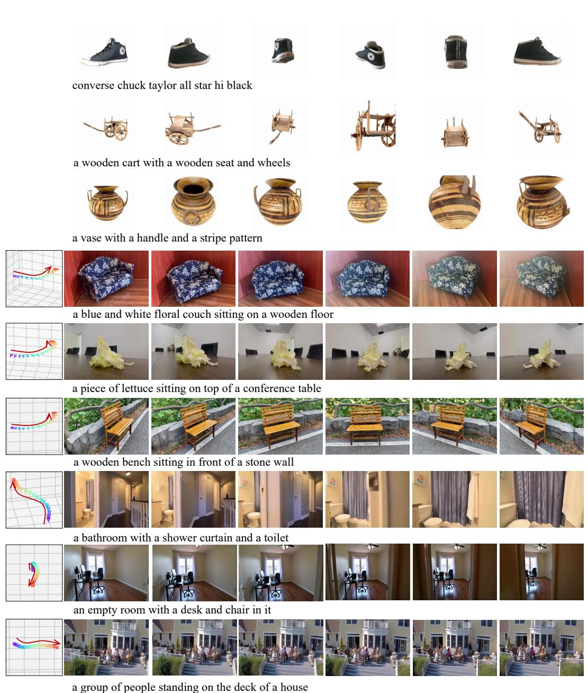  
Figure 5: Samples of different datasets. Rows 1 to row 3 are samples from the Objaverse dataset, which has random camera poses for each rendered image. Rows 4 to row 6 show the samples from the MVImageNet dataset. Samples of the RealEstate10K dataset are presented from rows 7 to row 9.

For the Image-to-Video (I2V) setting, we use the Stable Video Diffusion (SVD) as the base video generator. We directly train the camera encoder and the merge linear layer on top of the SVD. For each training sample, we sample 14 images for one video clip with the sample stride equal to 8, then resize their resolution to $3 2 0 \times 5 7 6$ Then Adam optimizer is utilized with a constant learning rate $3 e ^ { - 5 }$ , $\beta _ { 1 } { = } 0 . 9$ , $\beta _ { 2 } { = } 0 . 9 9$ , weight decay equals to 0.01. Following SVD, we used the EDM (Karras et al., 2022) noise scheduler and set all the hyper-parameters equal to SVD. We used 32 80G NVIDIA A100 GPUS to train the models with a batch size of 1 per GPUS for 50K steps, taking about 40 hours.

# D.3 INFERENCE.

By utilizing structure-from-motion methods such as COLMAP (Schönberger & Frahm, 2016), along with existing videos, we can extract the camera trajectory within a video. This extracted camera trajectory can then be fed into our camera control model to generate videos with similar camera movements. Additionally, we can also design custom camera trajectories to produce videos with desired camera movement. During the inference, we use different guidance scales for different domains' videos and adopt a constant denoise step 25 for all the videos.

# D.4 OBject Dynamic Distance (Odd) MetRiC

We first utilize the Grounded-SAM-2 (Ren et al., 2024) to segment the main object in a video. Then, following the dynamic degree in VBench, we use RAFT (Teed & Deng, 2020) to estimate the optical flow, and only keeping the estimated flows belongs to the main object. Then, following the dynamic degree metric, these optical flows are taken as the basis to determination whether the video is static. The final object dynamic degree score is calculated by measuring the proportion of nonstatic videos generated by the model.

# D.5 MOre DetailS of RotErR AND TrAnsERR

When using the COLMAP to extract the camera poses of generated videos, it is not very stable to generate the reliable camera pose sequence. Thus, when COLMAP fails, we have manually filtered these failed video clips and not added them in the calculation of Rot Err and TransErr. Besides, since the COLMAP is scale invariant, there may have some scale issues of the generated camera poses. These scale issues only have some impact on the calculation of TransErr, not the RotErr. To deal with with this scale issue, we have performed some postprocessings to the COLMAP results. Specifically, we first compute the relative poses of the ground truth and generated camera poses by setting the homogeneous extrinsic matrix of first frame as a $4 \times 4$ identity matrix. Then, normalizing the scale of the COLMAP results with the ground truth camera trajectory. Concretely, we calculate the translation gap between the first two frames for both the generated and ground truth camera poses to obtain a rescale factor. We then normalize other generated camera poses with this rescale factor to align the scales of the two camera trajectories. This normalization helps alleviate the scale problem in COLMAP results, making our evaluation metrics more convincing.

# E Details of User Study

The camera error TransErr and RotErr proposed in Sec. 3.4 need COLMAP to extract the camera poses of the generated videos. However, the COLMAP can not extract precise camera poses in short videos (16 frames in T2V, 14 frames in I2V) stably. To compare the camera control quality between CameraCt r1 with AnimateDiff and MotionCtrl from another perspective, we conduct some user studies. Specifically, since the AnimateDiff is only able to generate videos with eight base camera movements in the T2V setting, we sample these three methods with base camera movements and let the user watch the video to decide which video is more in line with the condition camera trajectory. Then calculating the approving rate for each method, the results are in the User Preference Rate column in Tab. 1's middle block. Besides, we employ some complex camera trajectories extracted from the test set of RealEstate10K to condition the MotionCtrl and CameraCt r1 in the T2V setting. The generated videos are sent to users to decide which one has a better camera trajectory alignment with the reference videos. The user preference rate for MotionCtrl and CameraCt rl are $2 7 . 6 \%$ and $7 2 . 4 \%$ , respectively.

Table 4: Ablation study of the camera feature injection place.   

<table><tr><td>Injection Place</td><td>FVD↓</td><td>TransErr↓</td><td>RotErr↓</td></tr><tr><td>U-Net Encoder</td><td>210.9</td><td>13.91</td><td>1.51</td></tr><tr><td>U-Net Encoder + Decoder</td><td>222.1</td><td>12.98</td><td>1.29</td></tr></table>

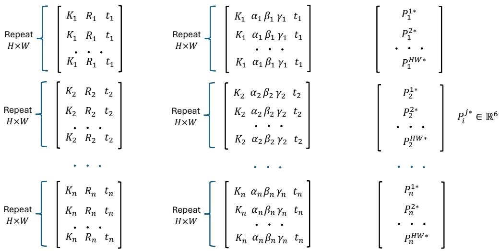  
Figure 6: Different camera representation. The left subfigure row shows the camera represented using the intrinsic $K _ { i }$ and the extrinsic matrices $E _ { i }$ (composed of rotation matrix $R _ { i }$ and the translation vector $t _ { i }$ ). The middle subfigure give the camera representation of converting the rotation matrix $R _ { i }$ into Euler angles $\alpha _ { i } , \beta _ { i } , \gamma _ { i }$ . Plücker embedding are given in the right subfigure, the intrinsic and extrinsic matrices are converted into the Plücker embeddings to form a pixel-wise spatial embedding. While the left and middle camera representations are not a pixel-wise camera representations naturally.

After that, in the I2V setting, we sample the MotionCtrl and CameraCt r1 with complex camera trajectories extracted from the RealEstate10K dataset. With these videos, another user study is conducted to let the user choose which video has the better camera trajectory condition performance. Results are shown in the User Preference Rate column of the bottom block of Tab. 1. These user study results further demonstrate the the superiority of CameraCt r1 in controlling the camera trajectory during the video generation process. We invite 50 users to conduct all the user studies. Considering the difference between the education levels of these users, we design the user studies as easily as possible to get more reliable results.

# F ExTRA ExpERIMENTS

# F.1 ExtrA ABLation StUdy

Injecting camera features into both encoder and decoder of U-Net. In the vanilla T2IAdaptor (Mou et al., 2023), the extracted control features are only fed into the encoder of U-Net. In this part, we explore whether injecting the camera features into both the U-Net encoder and decoder could result in performance improvements. The experiment results are shown in Tab. 4. The improvements of TransErr and Rot Err indicate that compared to only sending camera features to the U-Net encoder, injecting the camera features to both the encoder and decoder enhances camera control accuracy. This result could be attributed to the fact that similar to text embedding, Plücker embedding inherently lacks structural information. Such that, this integrating choice allows the U-Net model to leverage camera features more effectively. Therefore, we ultimately choose to feed the camera features to both the encoder and decoder of the U-Net.

  
There is a stair to the upper floors and tables and chairs

Figure 7: Qualitative comparison of using different camera representations. The first row shows the result using the raw camera matrix values as camera representation. Result of the second row adopts the ray directions and camera origin as camera representation. The last row exhibits the result taking the Plücker embedding as the camera representation. All the results use the same camera trajectory and the text prompt.

Table 5: Lower bound of TransErr and RotErr on RealEstate10K test set.   

<table><tr><td></td><td>TransErr↓</td><td>RotErr↓</td></tr><tr><td>Lower Bounds</td><td>6.93</td><td>1.02</td></tr></table>

# F.2 QUALITATIVE COMPARISON ON DIFFERENT CAMERA REPRESENTATION

Here, we provide the qualitative comparison using different camera representations, results are shown in Fig. 7. The provided camera trajectory primarily moves forward, with a rightward shift at the end. From the figure, it can be seen that when using the raw camera matrix values as camera representation, the model ignores the final rightward movement. With the hybrid camera pose representation, the model exhibits an abrupt shift in the last few frames to achieve the rightward movement. In contrast, using the Plücker embedding as the camera representation results in a smoother generated video, with the final rightward movement appearing natural and seamless. These results further demonstrate the effectiveness of using Plücker embedding as the camera representation.

# F.3 Lower Bound of TransErr And RotErr on RealEstate1Ok test set

Since the COLMAP is not 100 percent accuracy, we need to know the lower bounds of the TransErr and Rot Err metrics. With the sampled video clips (each has 16 frames) in the RealEstate10K test set, we run the COLMAP on these video clips to get the estimated camera poses. Using these camera poses and the ground truth camera poses, we calculate the TransErr and RotErr, results are shown in the Tab. 5

# G MORE QUALITATIVE COMPARISONS

In this section, we first provide more qualitative comparisons between CameraCt r1 with AnimateDiff using the base camera trajectories in the test-to-video (T2V) setting. Then, in the T2V setting, we also deliver more qualitative comparisons between CameraCtr1 and MotionCtrl with the complex camera trajectories extracted from the RealEstate10K test set. Finally, more qualitative comparisons between CameraCt r1 and MotionCtrl in the image-to-video (I2V) setting are given.

# G.1 QUALITATIVE COMPARISONS IN THE T2V SETTING

Comparisons between AnimateDiff and CameraCtr1. Results are shown in Fig. 8. In row 1, we find that the generated video of AnimateDiff shows the camera movement of pan up not the given camera movement pan down. In contrast, the video generated by CameraCt r1 in row 2 follows

A cute dog sitting on the green grass.

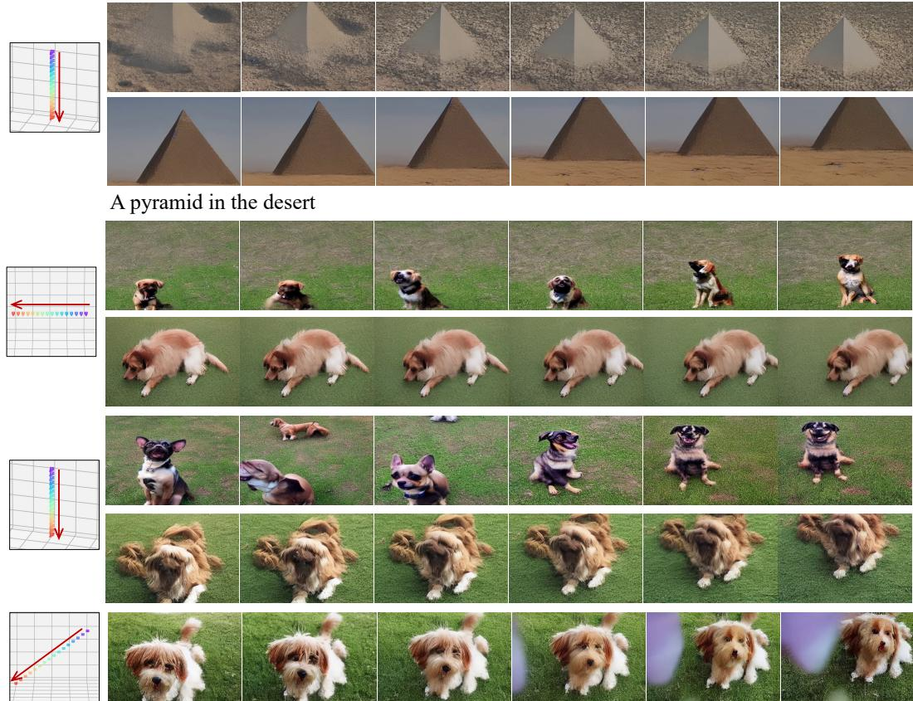  
Figure 8: Qualitative comparison between AnimateDiff and CameraCtr1.Results of rows 1, 3, and 5 are from AnimateDiff. Results of CameraCt r1 are shown in rows 2, 4, 6, 7. Rows 1 and 2 use the same camera trajectory, pan down. Camera trajectory pan left is adopted by rows 3 and 4. For rows 5 and 6, the camera trajectory pan down is utilized. The result of the last row is generated with the camera trajectory pan left down. Rows 1 and 2 condition on the same text prompt, while rows 3 to 7 condition on another text prompt.

the desired camera movement. Thus, we can conclude that in some situations, AnimateDiff cannot distinguish the object movement from the camera movement. Results of rows 3 and 5 exhibit that, though sometimes AnimateDiff can generate the videos with the desired camera movement, it cannot keep the object consistent during the whole video. By comparison, CameraCt rl can generate videos with consistent contents and strictly follows the condition camera trajectory, illustrated in rows 4 and 6. Besides, AnimateDiff only supports some simple camera trajectories. For other more complex camera trajectories, it does not support even a combination of two base camera trajectories, like the combination of pan left and pan down, while CameraCt rl can support this trajectory, shown in the last row of Fig. 8.

Comparisons between MotionCtrl and CameraCtr1. In Fig. 9, we provide more qualitative comparisons between the MotionCtrl and Came raCt r1 in the T2V setting. For the trajectories with translation or rotation to a small extent, like the left camera translation in the first trajectory (rows 1 and 2) and the left rotation at the beginning of the second trajectory (rows 3 and 4), MotionCtrl does not very sensitive to them. It only focuses on the main camera movement, the forward translation. By contrast, the generated videos of CameraCt r1 (rows 2 and 4) accurately obey these small camera trajectories. For the third (rows 5 and 6) and the fourth (rows 7 and 8) camera trajectories, they contain both camera rotation and translation. For the videos generated by MotionCtrl (rows 5 and 7), however, it focuses more on the camera rotation and ignores the camera translation. In contrast, CameraCt r1 can make a good balance between the camera rotation and translation and generate satisfactory videos, shown in rows 6 and 8 of Fig. 9.

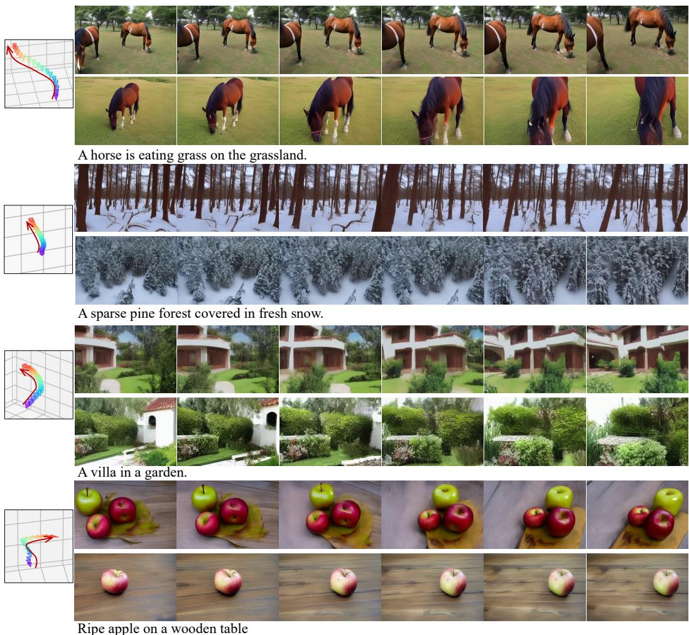  
Figure 9: Qualitative comparison between MotionCtrl and CameraCtr1 in T2V setting. Results of rows 1, 3, 5, and 7 are generated by MotionCtrl, while the results of CameraCt r1 are shown in rows 2, 4, 6, and 8. Every two adjacent rows use the same text prompt and camera trajectory.

# G.2 QUALITATIVE COMPARISONS IN THE I2V SETTING

Similar to the results of T2V, MotionCtrl still cannot handle the small camera movement well in the I2V setting.

In Fig. 10, for the results of the first two camera trajectories, compared to the results of our CameraCtr1 (rows 2 and 4), videos generated by MotionCtrl (rows 1 and 3) ignore the small camera rotation at the very beginning of the camera trajectories. For the third and the fourth camera trajectories, the camera movement extent of MotionCtrl results (rows 5 and 7) is rather less than that of the CameraCtrl results (rows 6 and 8). The results of CameraCtr1 can reveal the practical camera movement extent of the trajectories 3 and 4. We strongly recommend the readers to watch the provided videos in the supplementary file for a more direct understanding.

Note that, in the I2V setting, both MotionCtrl and CameraCt r1 are implemented on the save video diffusion model, SVD (Blattmann et al., 2023a), which excludes the influence stemming from the different base video generators. Thus, the better camera viewpoint controlling in the generated videos benefits from the better design choices of CameraCt rl.

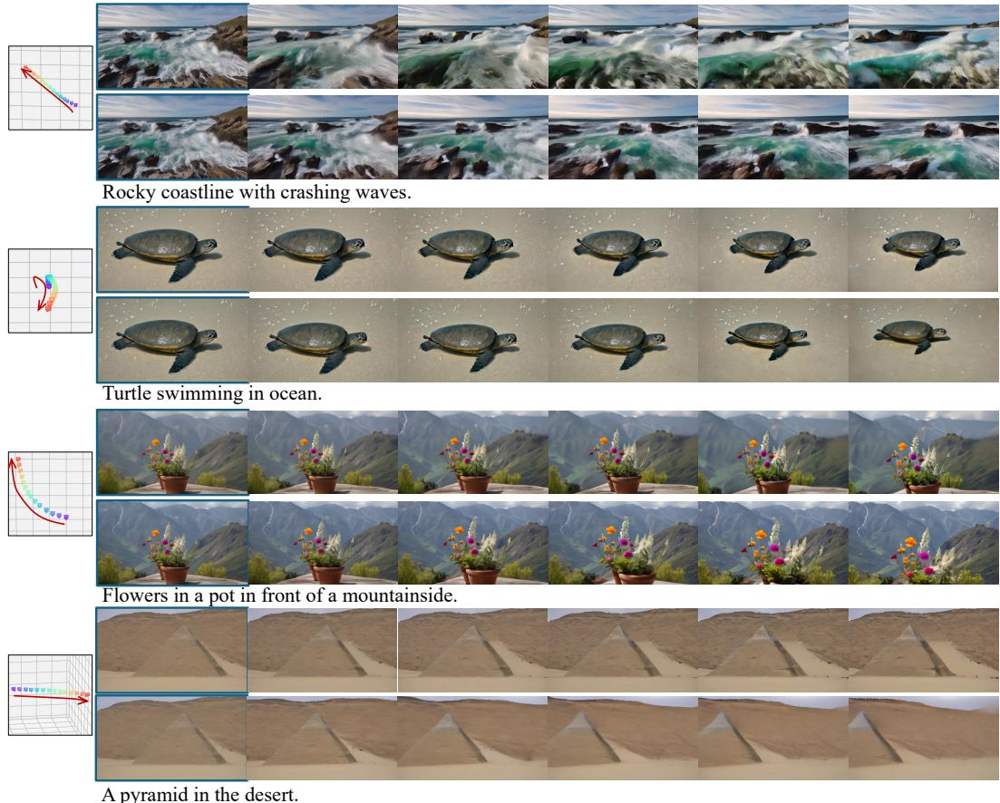  
Figure 10: Qualitative comparison between MotionCtrl and CameraCtr1 in I2V setting. The condition images are shown in the first images of each row. These images are generated with the SDXL (Podellet al., 2023) taking the text prompts located below of every two rows as input. Note that, both MotionCtrl and CameraCt r1 only condition on the conditioning images, not include the text prompts. The rows 1, 3, 5, and 7 are the results of MotionCtrl, while the results of CameraCt r1 are in rows 2, 4, 6, and 8. Every two adjacent rows are generated with the same condition image and the same camera trajectory.

# H MORE VISUALIZATION RESULTS

This section provides additional visualization results of CameraCt r1. Specifically, Appendix H.1 provides the various domain videos generated by integrating CameraCt r1 with AnimateDiff (Guo et al., 2023b) in T2V setting. In Appendix H.2, we exhibit the generated videos of CameraCt r1 in the I2V setting where the Stable Video Diffusion (SVD) (Blattmann et al., 2023a) is chosen as the base video generator. After that, video results of combining CameraCt r1 with another video control method, SparseCtrl (Guo et al., 2023a) is shown in Appendix H.3. Finally, Appendix H.4 shows the flexibility of CameraCt rl.

# I.1 VISUALIZATION RESULTS OF VARIOUS DOMAIN T2V VIDEOS

Visual results of RealEstate10K domain. First, with the aforementioned image LoRA model trained on RealEstate10K dataset, and using captions and camera trajectories from RealEstate10K, CameraCt r1 is capable of generating videos within the RealEstate10K domain. Results are shown in Fig. 11, the camera movement in generated videos closely follows the control camera poses, and the generated contents are also aligned with the text prompts.

Visual results of original T2V model domain. We choose the AnimateDiff V3 (Guo et al., 2023b) as our video generation base model, which is trained on the WebVid-10M dataset. Without the

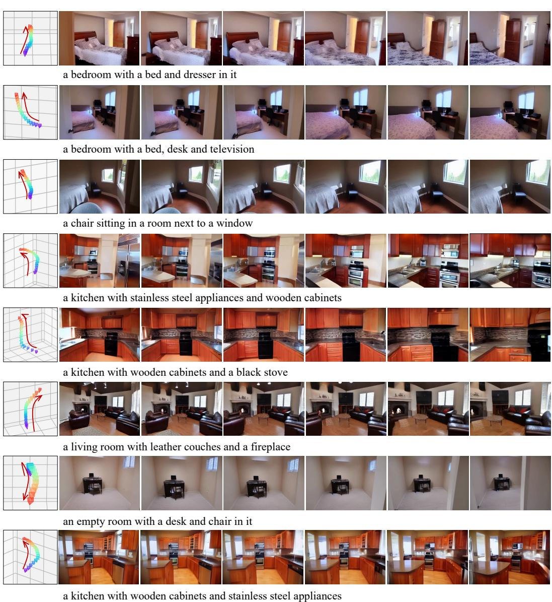  
Figure 11: RealEstate10K visual results. The video generation results of CameraCtr1. The control camera trajectories and captions are both from RealEstate10K test set.

RealEstate10K image LoRA, CameraCt r1 can be used to control the camera poses during the video generation of natural objects and scenes. As shown in Fig. 12, with the same text prompts, taking different camera trajectories as input, CameraCt r1 can generate almost the same scene, and closely follows the camera trajectories. Besides, Fig. 13 shows more visual results of natural objects and scenes.

Visual results of some personalized video domain. By replacing the image generator backbone of T2V model with some personalized generator, CameraCt r1 can be used to control the camera poses in the personalized videos. With the personalized generator RealisticVision (civitai), Fig. 14 showcases the results of some stylized objects and scenes, like some uncommon color schemes in the landscape and coastline. Besides, with another personalized generator ToonYou (BradCatt), CameraCt r1 can be used in the cartoon character video generation process. Some results are shown in Fig. 15. In both domains, the camera trajectories in the generated videos closely follow the control camera poses.

A horse is eating grass on the grassland.

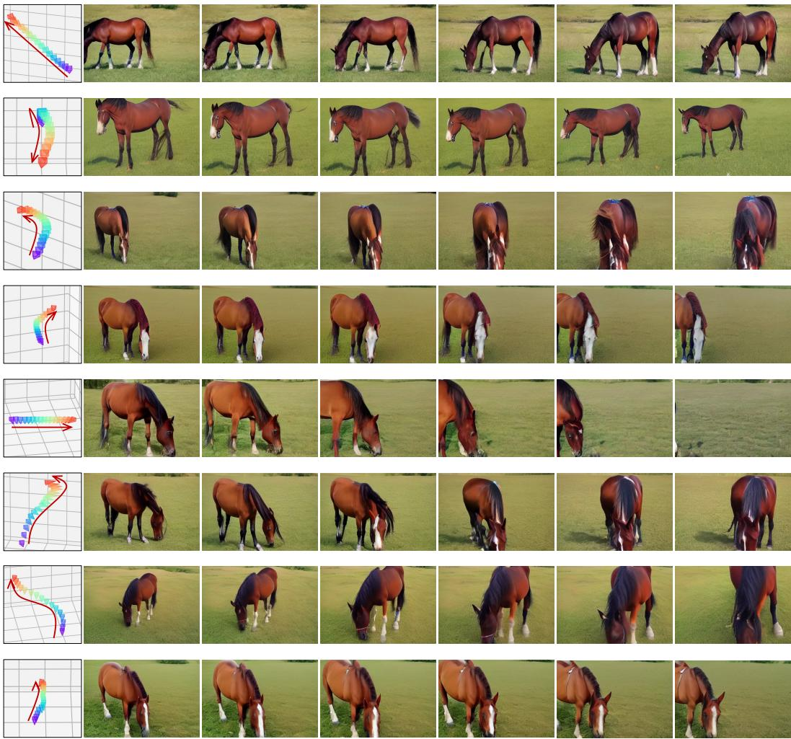  
Figure 12: Using CameraCtr1 on the same caption and different camera trajectories. The camera control results of CameraCt rl. Camera trajectories are from RealEstate10K test set, all videos utilize the same text prompts.

H.2 I2V VISUALIZATION RESULTS OF CAMERACTRL INTEGRATED WITH SVD

By taking the SVD as the base video generator to implement our CameraCt r1, we can sample videos with desired camera trajectories in the I2V setting. Fig. 16 shows some of them. The camera viewpoints of generated videos strictly follow the camera trajectory input, and video content also align with the condition images.

# H.3 INTEGRATING CAMERACTRL WITH OTHER VIDEO CONTROL METHOD

Fig. 17 gives some generated results by integrating the CameraCtr1 with another video control method SparseCtrl (Guo et al., 2023a). The content of the generated videos follows the input RGB image or sketch map closely, while the camera trajectories of the videos also effectively align with the conditioned camera trajectories.

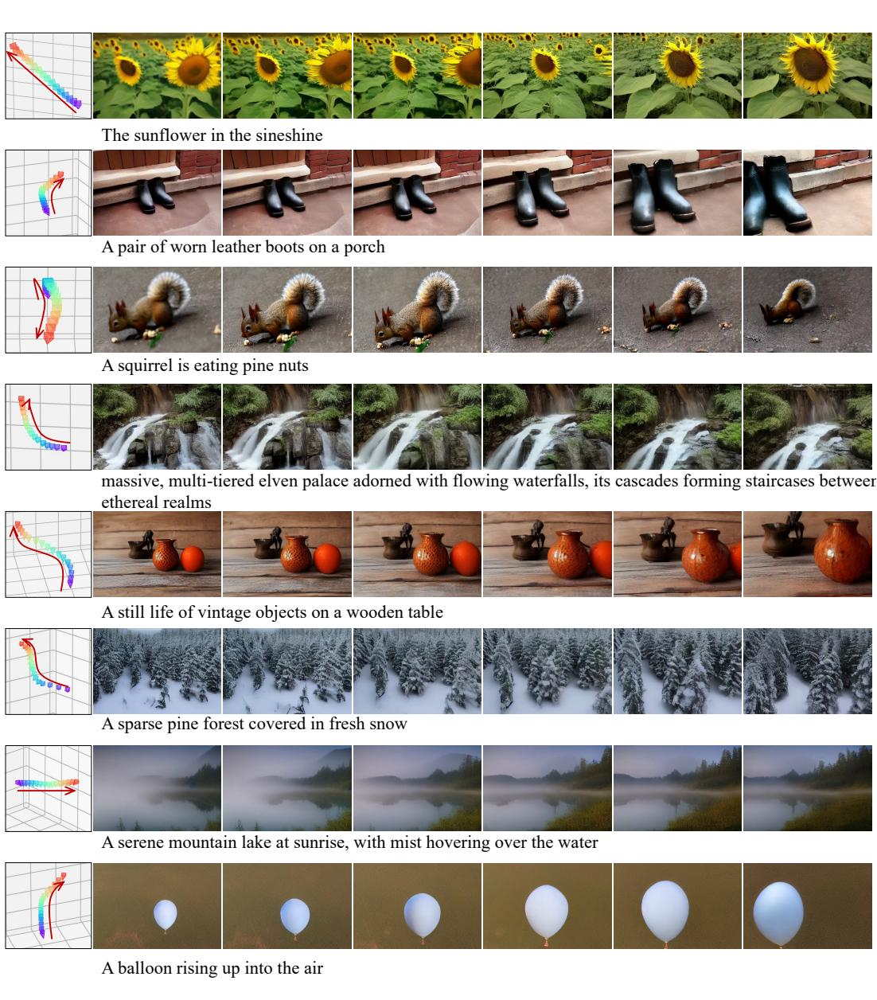  
Figure 13: Visual results of natural objects and scenes. The natural video generation results of CameraCtrl. CameraCt rl can be used to control the camera poses during the video generation process of natural objects and scenes.

# H.4 FLEXIBILITY OF CAMERACTRL

Different camera movement intensity. By adjusting the interval between the translation vectors of two adjacent camera poses, we can control the overall intensity of the camera movement. As shown in the Fig. 18, we can make the camera movement more intense or more gradual.

Controlling camera movement by adjusting intrinsic. Since the Plücker embedding requires internal parameters during the computation, we can achieve camera movement by modifying the camera's intrinsic parameters. As shown in the Fig. 19, by changing the position of the camera's principal point (cx, cy), we can achieve camera translation (as shown in the first three rows). By adjusting the focal length (fx, fy), we can achieve a zoom-in and zoom-out effect, as shown in the last two rows.

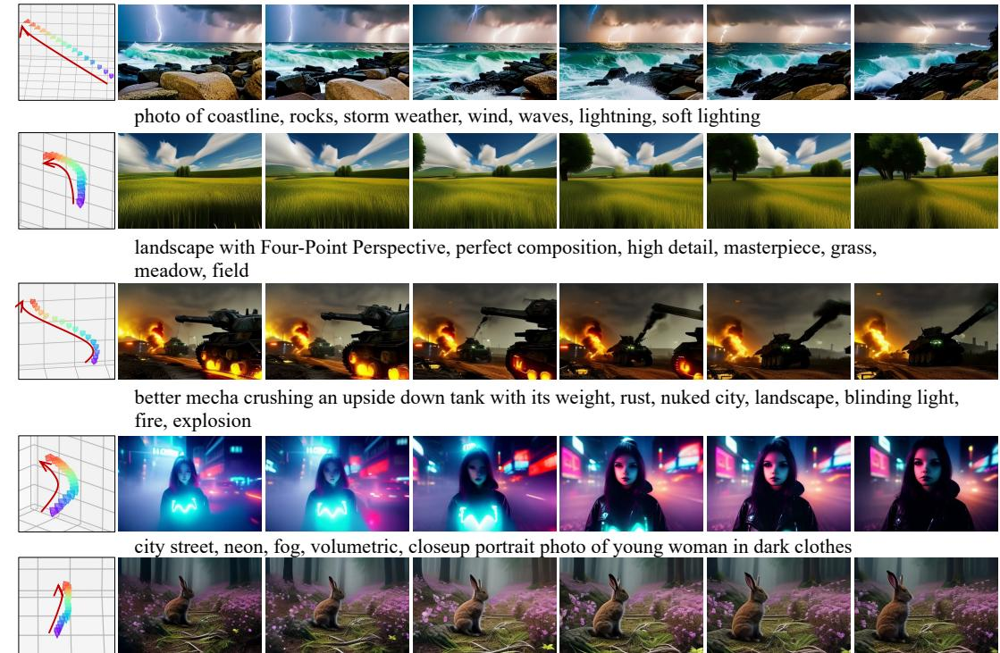  
close up photo of a rabbit, forest, haze, halation, bloom, dramatic atmosphere, centred   
Figure 14: Visual results of stylized objects and scenes. With the personalized generator RealisticVision (civitai), CameraCtr1 can be used in the video generation process of stylized videos.

# I FAILURE CASES

In Fig. 20, we provide some failure cases of CameraCt r1. The main problem for these cases is that when the rotation of the camera trajectory has a large extent, CameraCt r1 cannot properly generate videos with enough rotation. The first and second rows take the vertical uniform rotation 100 degrees as input, but the generated videos cannot rotate 100 degrees. The same problem is kept for rows 3 and 4, where we desire a horizontal uniform of 150 degrees. However, there is only about a 90-degree rotation of the generated videos. The main reason for this failure situation may lie in that the training dataset (RealEstate10K) does not contain enough camera trajectories with a large degree of rotation. Thus, to improve the camera trajectory performance further, a dataset possessing a similar visual appearance to RealEstate10K and a larger camera pose distribution is needed.

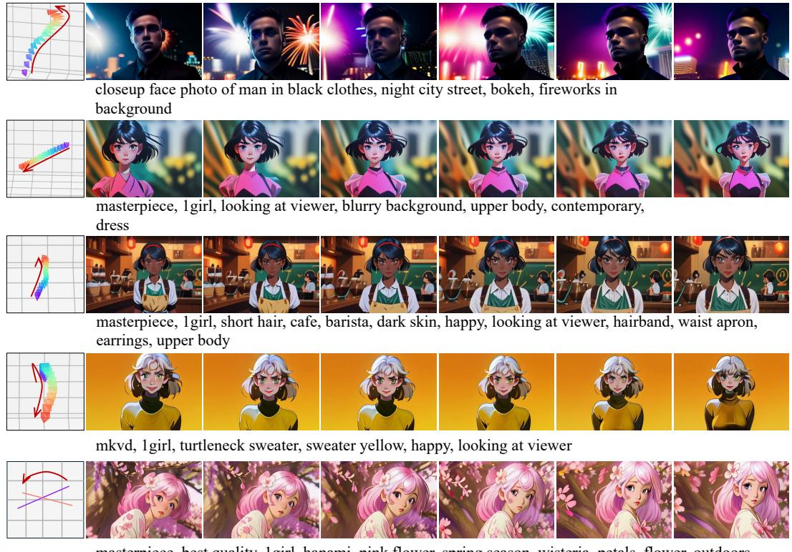  
Figure 15: Visual results of cartoon characters. With the personalized generator ToonYou (BradCatt), CameraCt r1 can be used in the video generation process of cartoon character videos.

masterpiece, best quality, 1girl, hanami, pink flower, spring season, wisteria, petals, flower, outdoors, falling petals, black eyes

Fireworks display illuminating the night sky.

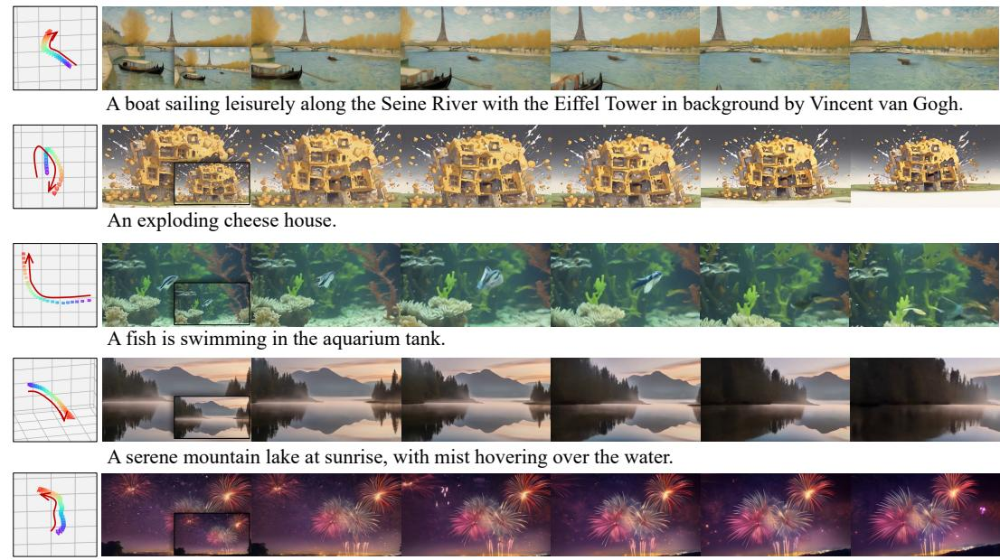  
Figure 16: Integrating CameraCtr1 with SVD in the I2V setting. The condition images are located in the right bottom corners of each rows first image. These images are generated by the text-to-image model SDXL with the text prompts down below each row as input. The condition signals of generated videos are only images, not include the text prompts.

professional photo, photo of autumn landscape, dramatic lighting, gloomy, cloudy weather

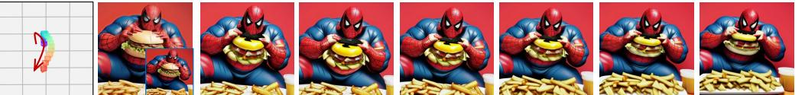  
fat spiderman eating a burger

BBBABA city street, neon, fog, volumetric, closeup portrait photo of young woman in dark clothes a back view of a boy, standing on the ground, looking at the sky, sunlight, masterpieces a back view of a boy, standing on the ground, looking at the sky, clouds, sunset, orange sky, beautiful sunlight, masterpieces

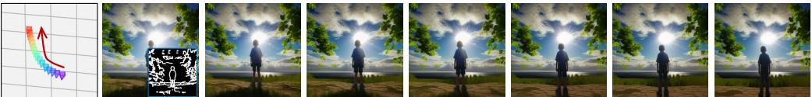

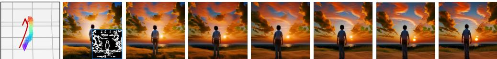

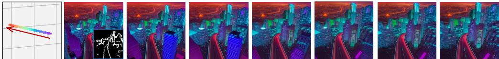  
an aeral view  a cyberpunk ciy, night time, neon lghts, masterpiece, high qalty   
Figure 17: Integrating CameraCtr1 with other video generation control methods. Row one to row three express the results by integrating the CameraCt r1 with RGB encoder of SparseCtrl (Guo et al., 2023a), and row four to row six, shows videos produced with the sketch encoder of SparseCtrl. The condition RGB images and sketch maps are shown in the bottom right corners of the second images for each row. Note that, the camera trajectory of the last row is zoom-in.

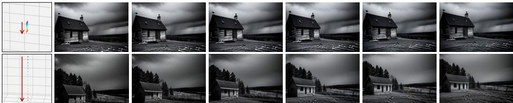

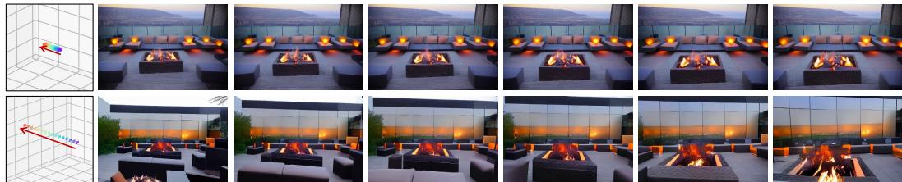  
an outdoor lounge area with a fire pit overlooking the city

Figure 18: Camera movement intensity. The first two rows taking the pan down camera trajectory as input, with the camera translation interval in the second row being four times that of the first row. The camera trajectory for the third and fourth rows are zoom in, with the camera translation interval in the fourth row being four times that of the third row.

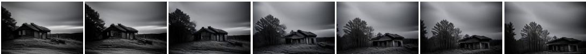

K

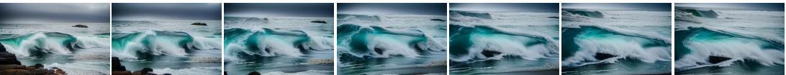

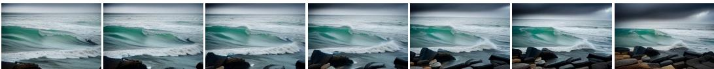

Figure 19: Controlling camera movement by adjusting intrinsic. The first three rows show the generated results using camera pan left, left up, right down, respectively. The last two rows take the zoom in, zoom out camera trajectories as the input. In each camera trajectory, all the camera poses have the same extrinsic matrix, the camera movement is implemented by adjusting the intrinsic parameters, cx and cy for the first three rows, fx and fy for the last two rows.

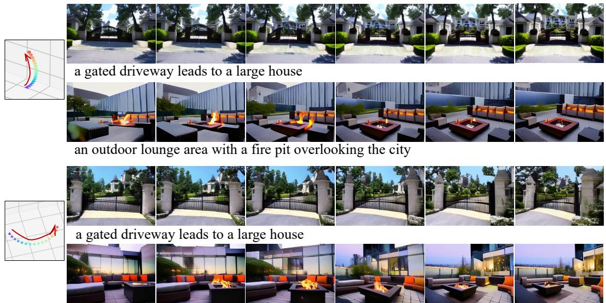  
an outdoor lounge area with a fire pit overlooking the city   
Figure 20: Failure cases. All results are generated with the CameraCt r1 implemented on AnimateDiffV3 in the T2V setting. The camera trajectory for rows 1 and 2 is the vertical uniform rotation of 100 degrees. The trajectory horizontal uniform rotation 150 degrees is used during the generation of rows 3 and 4.