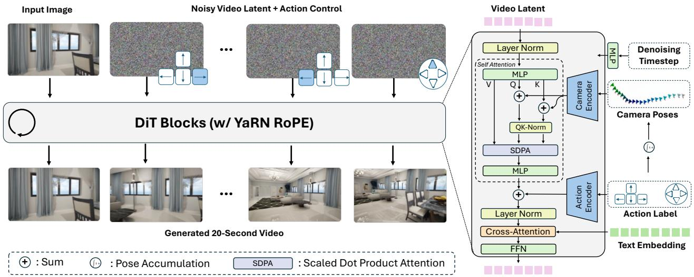
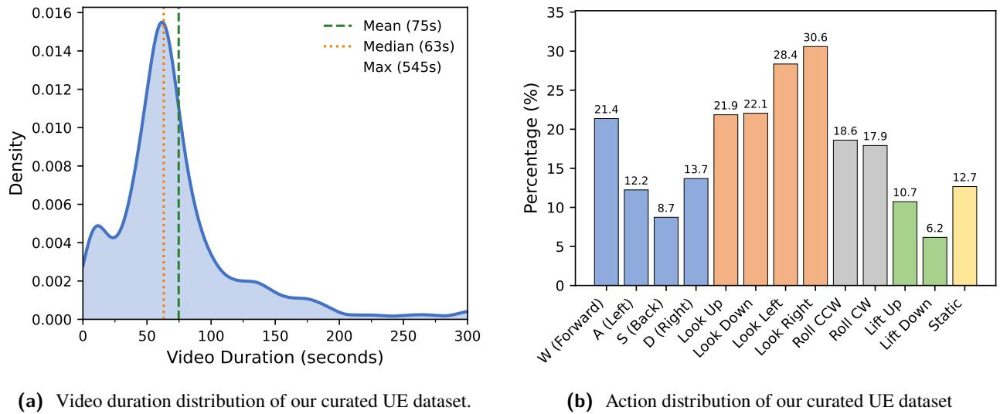
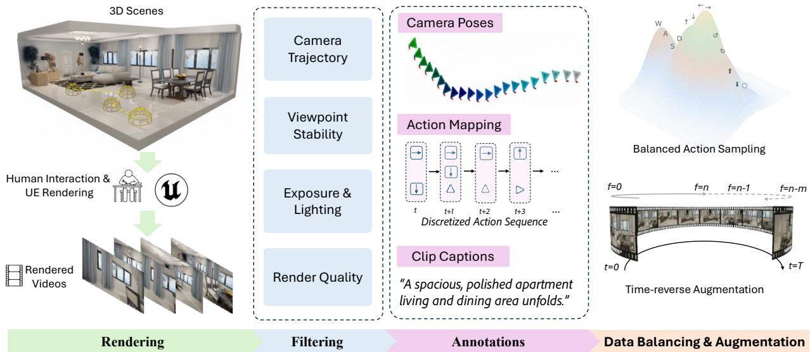
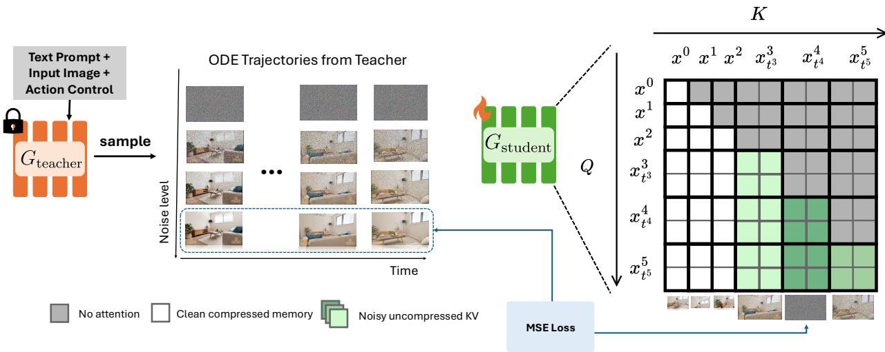
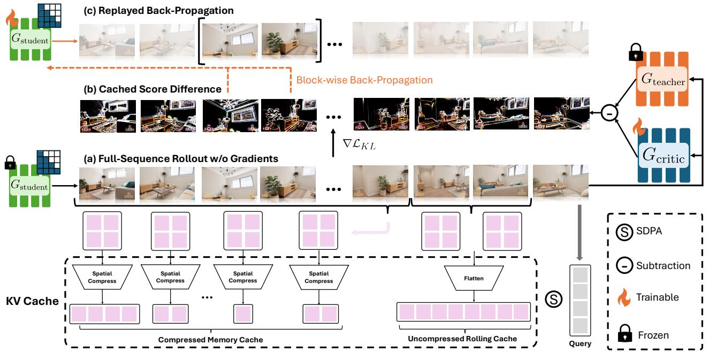
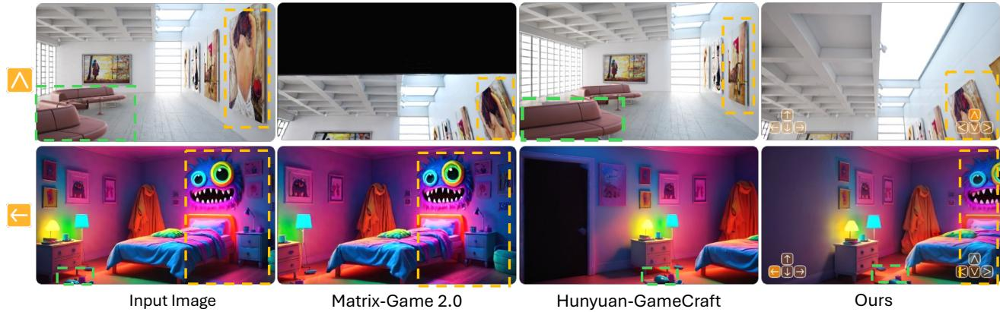
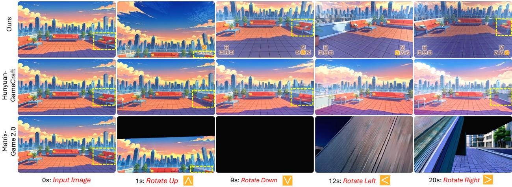
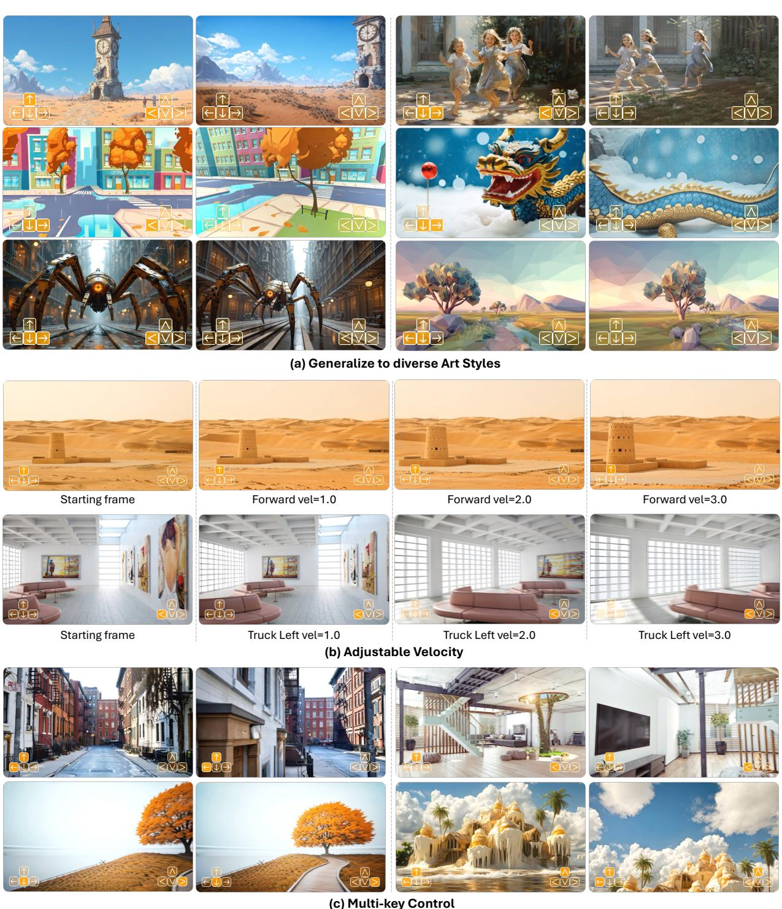
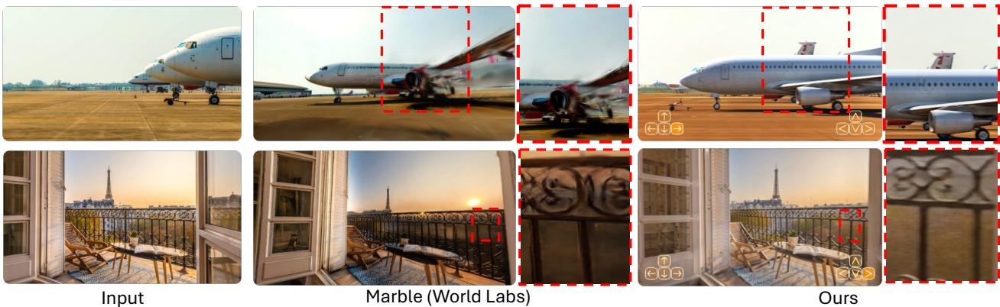

# 1. 论文基本信息

## 1.1. 标题
**RELIC: Interactive Video World Model with Long-Horizon Memory**

中文翻译：**RELIC：具备长时程记忆的交互式视频世界模型**

论文标题直接点明了研究的核心：构建一个名为 `RELIC` 的“世界模型”，其关键特性在于**交互性**（用户可以控制）、**视频生成**（以视频流的形式模拟世界）、以及**长时程记忆**（能够记住并利用很久以前的信息）。

## 1.2. 作者
Yicong Hong, Yiqun Mei, Chongjian Ge, Yiran Xu, Yang Zhou, Sai Bi, Yannick Hold-Geoffroy, Mike Roberts, Matthew Fisher, Eli Shechtman, Kalyan Sunkavalli, Feng Liu, Zhengqi Li, Hao Tan.

作者列表旁边的星号（\*）标注表明，前三位作者（Yicong Hong, Yiqun Mei, Chongjian Ge）贡献相同，并随机排序，同时他们也是项目的负责人（Project Lead）。这通常意味着他们是项目的主要构思者和执行者。从作者的过往研究和论文内容推断，他们隶属于顶尖的工业研究实验室，如 NVIDIA Research 或类似机构，这些机构在计算机图形学、AI 生成模型和大规模计算方面拥有深厚积累。

## 1.3. 发表期刊/会议
论文以预印本（Preprint）的形式发布在 `arXiv` 上。`arXiv` 是一个开放的学术论文存档平台，允许研究者在正式的同行评审前分享他们的最新研究成果。这篇论文的发表日期被标注为未来的 2025 年 12 月，这是一种较为少见但有趣的现象，可能意在强调其研究的前瞻性。

考虑到该研究领域的前沿性和影响力，这类工作通常会投递到计算机视觉和人工智能领域的顶级会议，如 **CVPR** (Conference on Computer Vision and Pattern Recognition)、**NeurIPS** (Neural Information Processing Systems) 或 **ICLR** (International Conference on Learning Representations)。

## 1.4. 发表年份
2025 (根据元数据)。

## 1.5. 摘要
这篇论文旨在解决构建真正**交互式世界模型**所面临的三大核心挑战：**实时的长时程流式生成**、**一致的空间记忆**和**精确的用户控制**。现有方法通常只能孤立地解决其中一个问题，因为同时满足三者极具挑战性（例如，长时记忆机制会严重影响实时性能）。

为应对这些挑战，论文提出了一个名为 `RELIC` 的统一框架。该模型仅需一张初始图像和一段文本描述，就能实时、记忆感知地对任意场景进行长时间探索。`RELIC` 的核心技术建立在近期的自回归视频扩散蒸馏技术之上。它通过一种高度压缩的历史潜在词元 (latent tokens) 来表示长时程记忆，这些词元被编码了**相对动作**和**绝对相机位姿**信息，并存储在 `KV` 缓存中。这种紧凑且具备相机位姿感知的记忆结构，能够在几乎不增加计算开销的情况下，支持隐式的三维一致性内容检索并保证长期连贯性。

此外，研究团队首先将一个双向的教师视频模型微调，使其能够生成超过原始 5 秒训练时长的序列。然后，通过一种新颖的、内存高效的<strong>自强制范式 (self-forcing paradigm)</strong>，将教师模型蒸馏为一个因果的学生生成器。该范式支持在长时程的教师模型输出和学生模型的自我推演 (self-rollouts) 上进行全上下文蒸馏。

最终实现的 `RELIC` 是一个拥有 140 亿参数的模型，在一个精心策划的虚幻引擎（Unreal Engine）渲染数据集上进行训练。它能以 **16 FPS** 的速度实时生成视频，并且在**动作跟随准确性**、**长时程流式生成稳定性**和**空间记忆检索鲁棒性**方面均优于先前的工作。这些能力使 `RELIC` 成为下一代交互式世界建模的坚实基础。

## 1.6. 原文链接
- **原文链接:** https://arxiv.org/abs/2512.04040
- **PDF 链接:** https://arxiv.org/pdf/2512.04040v1.pdf
- **发布状态:** 预印本 (Preprint)。

  ---

# 2. 整体概括

## 2.1. 研究背景与动机
当前人工智能领域的一个宏大目标是构建<strong>世界模型 (World Models)</strong>，即能够学习并模拟我们所处物理世界运行规律的 AI 系统。这种模型不仅能“看懂”世界，还能“预测”世界在不同行为下的变化，从而实现与环境的智能交互。视频生成模型，特别是可控的视频模型，被认为是实现这一目标的关键路径。

然而，构建一个**真正实用**的交互式世界模型面临着三大核心困境，它们相互制约，难以兼顾：
1.  <strong>实时长时程流式生成 (Real-time long-horizon streaming):</strong> 用户交互需要模型能即时响应（高帧率），并且能持续生成很长的视频序列，以支持不间断的探索。
2.  <strong>一致的空间记忆 (Consistent spatial memory):</strong> 当用户在虚拟世界中探索，转身回到之前看过的位置时，模型应该能生成与记忆中一致的场景，而不是一个全新的、不相关的场景。这要求模型具备强大的三维空间理解和长期记忆能力。
3.  <strong>精确的用户控制 (Precise user control):</strong> 模型必须能准确地响应用户的指令（如键盘、鼠标输入），例如“向左转”、“前进”，并生成符合该动作的视觉变化。

<strong>现有研究的空白 (Gap):</strong>
以往的研究往往只关注上述一到两个方面。例如，一些模型追求高质量的短视频生成，但无法长时间保持一致性；另一些模型引入了复杂的记忆机制来保证一致性，但其巨大的计算开logging 使得实时生成成为不可能。**在实时性、长期一致性和精确控制这三个目标之间找到一个平衡点，是该领域的一个核心挑战**。特别是，长时记忆通常意味着需要存储和处理大量的历史信息，这与实时推理所需的低延迟和低计算量形成了直接冲突。

**本文的切入点与创新思路:**
`RELIC` 的核心思路是**直面这一冲突**，设计一个在架构和训练范式上都能同时兼顾这三者的统一框架。其创新之处在于：
- **高效的记忆压缩:** 它不直接存储原始的视频帧或高维特征，而是将历史信息**高度压缩**成少量的潜在词元 (latent tokens)，并巧妙地将相机位姿信息编码进去。这使得记忆的存储和检索成本极低。
- **解耦的训练策略:** 它采用“教师-学生”蒸馏模式。先训练一个功能强大但缓慢的“教师”模型，该模型能在长达 20 秒的视频上学习一致性。然后，再训练一个轻快高效的“学生”模型来模仿教师的行为，并专门设计了一种<strong>内存高效的训练方法（Replayed Back-propagation）</strong>，解决了在长序列上训练的内存爆炸问题。

  通过这种方式，`RELIC` 试图在不牺牲实时性的前提下，将强大的长时程记忆能力赋予一个可交互的视频生成模型。

## 2.2. 核心贡献/主要发现
这篇论文的主要贡献可以概括为以下几点：

1.  **提出了 `RELIC` 统一框架:** 这是第一个声称能同时解决实时流式生成、长时程空间记忆和精确用户控制三大挑战的统一框架。
2.  **新颖的相机位姿感知记忆结构:** 提出了一种在 `KV` 缓存中存储压缩历史信息的方法。通过将**绝对相机位姿**编码到注意力机制的 `Query` 和 `Key` 中，模型可以在生成新帧时，隐式地、高效地从历史缓存中检索与当前视角最相关的内容，从而实现空间一致性。
3.  **长时程视频蒸馏与回放反向传播:**
    -   将教师模型的能力从 5 秒扩展到 20 秒，为学生模型提供了更高质量、更长程的监督信号。
    -   首创了<strong>回放反向传播 (Replayed Back-propagation)</strong> 机制，它以分块、累积梯度的方式，解决了在超长序列上进行模型蒸馏时的显存瓶颈问题，使得在 20 秒的学生自我推演 (rollout) 上进行训练成为可能。
4.  **高质量的合成数据集:** 构建了一个包含 1600 分钟、由虚幻引擎渲染的大规模视频数据集。该数据集提供了精确的 6-DoF 相机轨迹和动作标签，为训练可控的世界模型提供了高质量的数据基础。
5.  **卓越的性能表现:** 实验证明，`RELIC` 在 140 亿参数的规模下，不仅能达到 16 FPS 的实时生成速度，而且在动作跟随的准确性（更低的 RPE）和长期场景一致性方面，显著优于现有的最先进模型。

    ---

# 3. 预备知识与相关工作

## 3.1. 基础概念

- <strong>世界模型 (World Model):</strong> 这是一种特殊的生成模型，其目标是学习一个环境的内部表征或“心智模型”。它不仅能生成对环境的观察（如图像），还能预测在采取特定动作后环境会如何演变。这使得智能体 (agent) 可以在这个“虚拟世界”中进行规划和学习。

- <strong>视频扩散模型 (Video Diffusion Models):</strong> 这是当前最主流的高质量视频生成技术。其基本原理分为两步：
    1.  <strong>前向过程 (Forward Process):</strong> 对一个真实的视频数据，逐步、多次地添加少量高斯噪声，直到视频完全变成纯粹的随机噪声。
    2.  <strong>反向过程 (Reverse Process):</strong> 训练一个深度神经网络（通常是 `U-Net` 或 `Transformer` 结构），让它学会如何从充满噪声的视频中，一步步地“去噪”，最终还原出清晰的原始视频。在生成新视频时，模型从一个纯随机噪声开始，反复执行这个去噪过程，就能“创造”出一段全新的视频。

- <strong>自回归模型 (Autoregressive Model, AR):</strong> 这是一种序列生成模型，它按照时间顺序逐个生成序列中的元素。在生成第 $t$ 个元素时，模型会把前面已经生成的所有元素 $(1, 2, ..., t-1)$ 作为输入。在视频生成中，这意味着模型在生成下一帧时，会参考所有已经生成的历史帧。这种因果结构天然适合流式生成，但缺点是生成速度较慢，因为必须一帧一帧地串行计算。

- <strong>模型蒸馏 (Model Distillation):</strong> 这是一种模型压缩技术，旨在将一个大型、复杂但性能强大的“教师模型”的知识，迁移到一个小型、轻量且推理速度快的“学生模型”中。具体做法是，让学生模型去拟合教师模型的输出。在本文中，教师模型是一个强大的双向扩散模型，而学生模型是一个快速的自回归模型。通过蒸馏，学生模型学会了如何用更少的计算步骤生成与教师模型质量相当的视频。

- <strong>KV 缓存 (KV Cache):</strong> 这是 `Transformer` 架构在进行自回归生成时的一种关键优化技术。在 `Transformer` 的自注意力机制中，每个词元 (token) 都会计算出自己的 `Query (Q)`, `Key (K)`, 和 `Value (V)` 三个向量。当生成新词元时，它的 $Q$ 需要与**所有**历史词元的 $K$ 和 $V$ 进行计算。为了避免每次都重新计算历史词元的 $K$ 和 $V$，系统会将它们缓存起来，这就是 `KV` 缓存。这样，新词元只需计算自己的 `QKV`，并从缓存中读取历史 `KV` 即可。**这大大加速了生成过程，但也带来一个问题：序列越长，`KV` 缓存就越大，最终会成为内存瓶颈。** 本文的核心创新之一就是解决这个问题。

## 3.2. 前人工作
`RELIC` 的研究建立在视频生成和交互式世界模型的一系列前沿工作之上。

- **可交互视频模型:**
    -   **Genie / Genie-2 / Genie-3:** DeepMind 推出的一系列模型，能够从单张图片生成可玩的 2D 平台游戏世界，是世界模型领域的重要里程碑。
    -   **Matrix-Game 2.0 / Hunyuan-GameCraft:** 来自中国科技巨头的项目，它们利用 AAA 游戏（如《原神》）或《我的世界》等数据，训练出能够根据玩家动作输入生成高质量游戏画面的模型。这些模型在实时性和控制性上表现出色，但论文指出它们在长时程记忆方面存在不足。
    -   **Yume / Yan:** 其他类似的研究，同样致力于从图像或文本生成可交互的视频或 3D 世界，但通常在记忆、实时性或泛化能力上有所侧重和取舍。
    
        论文在引言中通过一个表格清晰地对比了 `RELIC` 与这些工作的差异：
    
        <table>
        <tr>
        <td></td>
        <td>The Matrix</td>
        <td>Genie-2</td>
        <td>GameCraft</td>
        <td>Yume</td>
        <td>Yan</td>
        <td>Matrix-Game 2.0</td>
        <td>Genie-3</td>
        <td><b>RELIC (ours)</b></td>
        </tr>
        <tr>
        <td>Data Source</td>
        <td>AAA Games</td>
        <td>Unknown</td>
        <td>AAA Games</td>
        <td>Sekai</td>
        <td>3D game</td>
        <td>Minecraft+UE+Sekai</td>
        <td>Unknown</td>
        <td><b>UE</b></td>
        </tr>
        <tr>
        <td>Action Space</td>
        <td>4T4R</td>
        <td>5T4R2E</td>
        <td>4T4R</td>
        <td>4T4R</td>
        <td>7T2R</td>
        <td>4T</td>
        <td>5T4R1E</td>
        <td><b>6T6R</b></td>
        </tr>
        <tr>
        <td>Resolution</td>
        <td>720×1280</td>
        <td>720×1280</td>
        <td>720×1280</td>
        <td>544×960</td>
        <td>1080×1920</td>
        <td>352×640</td>
        <td>704×1280</td>
        <td><b>480×832</b></td>
        </tr>
        <tr>
        <td>Speed</td>
        <td>8-16 FPS</td>
        <td>Unknown</td>
        <td>24 FPS</td>
        <td>16 FPS</td>
        <td>60 FPS</td>
        <td>25 FPS</td>
        <td>24 FPS</td>
        <td><b>16 FPS</b></td>
        </tr>
        <tr>
        <td>Duration</td>
        <td>Infinite</td>
        <td>10-20 sec</td>
        <td>1 min</td>
        <td>20 sec</td>
        <td>Infinite</td>
        <td>1 min</td>
        <td>1 min</td>
        <td><b>20 sec</b></td>
        </tr>
        <tr>
        <td>Generalization</td>
        <td></td>
        <td></td>
        <td></td>
        <td></td>
        <td></td>
        <td></td>
        <td></td>
        <td>✔</td>
        </tr>
        <tr>
        <td>Memory</td>
        <td>None</td>
        <td></td>
        <td></td>
        <td>None</td>
        <td>None</td>
        <td>None</td>
        <td></td>
        <td>✔</td>
        </tr>
        <tr>
        <td>Model Size</td>
        <td>2.7B</td>
        <td>Unknown</td>
        <td>13B</td>
        <td>14B</td>
        <td>Unknown</td>
        <td>1.3B</td>
        <td>Unknown</td>
        <td><b>14B</b></td>
        </tr>
        </table>
    
- **视频生成基础技术:**
    -   **Wukong-2.1:** 本文的基座模型，是一个强大的双向视频扩散模型。`RELIC` 在此基础上进行微调和蒸馏。
    -   <strong>自注意力机制 (Self-Attention):</strong> `Transformer` 的核心组件，也是 `RELIC` 记忆机制改造的对象。其计算公式为：
        $$
        \mathrm{Attention}(Q, K, V) = \mathrm{softmax}\left(\frac{QK^T}{\sqrt{d_k}}\right)V
        $$
        其中 $Q$ (Query), $K$ (Key), $V$ (Value) 是输入序列经过线性变换后得到的矩阵。这个公式的直观含义是：对于序列中的每一个元素（由 $Q$ 代表），计算它与序列中所有其他元素（由 $K$ 代表）的相似度，然后将这些相似度作为权重，对所有元素的表示（由 $V$ 代表）进行加权求和，从而得到该元素在当前上下文中的新表示。
    -   <strong>自回归扩散模型 (AR-Diffusion) / 流式扩散 (StreamDiffusion):</strong> 这些工作探索了如何将强大的扩散模型改造为自回归形式，以实现流式生成。`RELIC` 借鉴了这一思路，但通过更复杂的蒸馏和记忆机制来解决长时程一致性问题。

## 3.3. 技术演进
该领域的技术演进脉络大致如下：
1.  **静态图像生成:** 以 `GANs`, `VAEs`, `Diffusion Models` (如 `DALL-E`, `Midjourney`) 为代表，实现了高质量的单帧图像生成。
2.  **短视频生成:** 将图像生成技术扩展到时序领域，能够生成几秒钟的连贯短视频（如 `Sora`, `Lumiere`）。这些模型通常一次性生成整个视频，不具备交互性。
3.  **可控视频生成:** 引入文本、动作等条件输入，使用户可以对生成内容进行一定程度的控制。
4.  **交互式世界模型:** 这是当前的前沿方向。模型不再是一次性生成，而是像游戏引擎一样，可以根据用户的连续输入，**实时、流式地**生成后续画面。`RELIC` 正是这一阶段的代表性工作，它特别关注了在长时间交互中如何维持世界的“真实感”和“记忆”。

## 3.4. 差异化分析
相较于之前的工作，`RELIC` 的核心差异化在于其**系统性的设计和对核心矛盾的正面解决**：
- **目标不同:** 之前的模型往往是“单点优化”，或在实时性，或在生成质量，或在控制性上做文章。`RELIC` 则以**同时实现三大目标**为设计准则。
- **记忆机制不同:** 其他模型要么没有长期记忆（每次生成都只看最近几帧），要么使用循环状态（如 `RNN`）或显式的三维表示（如 `NeRF`）。`RELIC` 的方法更“轻量级”和“隐式”，它通过**改造 Transformer 的 KV 缓存**，将历史信息压缩并与相机位姿绑定，通过注意力机制自动检索。这种方法计算开销小，且与模型主体结构高度融合。
- **训练范式不同:** `RELIC` 的<strong>回放反向传播 (Replayed Back-propagation)</strong> 是一种新颖的训练技巧。它解决了在长序列上进行反向传播时显存爆炸的难题，使得模型可以在长达 20 秒的自我推演轨迹上进行端到端的优化。这使得学生模型能够学习到比以往方法更长程的时间依赖关系，从而提升了视频的稳定性和一致性。

  ---

# 4. 方法论
`RELIC` 的方法论设计精巧，环环相扣，旨在将一个强大的、但非实时的双向视频扩散模型（教师），高效地蒸馏成一个实时的、具有长时程记忆的自回归模型（学生）。

*该图像是示意图，展示了RELIC框架的工作流程。输入图像经过噪声处理后，通过DiT模块生成20秒的视频，涉及视频潜在特征的提取与处理，包括自注意力机制和跨注意力机制等结构。*

上图（原文 Figure 4）展示了 `RELIC` 框架的概览。它以 `Wukong-2.1` 为基础，通过动作条件化和长时程训练，构建出一个强大的教师模型，再通过创新的蒸馏框架，训练出学生模型。

## 4.1. 方法原理
`RELIC` 的核心思想是**分而治之**和**知识迁移**。
- **分而治之:** 将“生成高质量、长时程、一致的视频内容”这一复杂任务分解。首先，训练一个不计成本的**教师模型**，让它专门学习这个能力。然后，再训练一个**学生模型**，让它专注于如何**快速地**复现教师模型的能力。
- **知识迁移:** 迁移的知识不仅是“如何生成下一帧”，更重要的是“如何利用长时程记忆保持空间一致性”。`RELIC` 通过巧妙的记忆机制和训练策略，将这种高级知识从教师模型传递给学生模型。

## 4.2. 核心方法详解 (逐层深入)

### 4.2.1. 数据准备：为交互和记忆量身定制
高质量的数据是模型能力的基础。`RELIC` 的数据处理流程是其成功的重要一环。

1.  **数据采集:** 在 **350 个**高质量的虚幻引擎（UE）静态场景中，由人类操作员控制相机进行探索，录制了总长约 **1600 分钟**的 720p 视频，并同步记录了每一帧精确的 6-DoF（自由度）相机位姿，包括世界坐标系下的位置 $\mathbf{P}_t$ 和朝向（旋转矩阵）$R_t$。
    
    
    *该图像是图表，展示了我们的 curated UE 数据集中的视频时长分布和动作分布。左侧为视频时长的概率密度图，其中包含均值（75秒）、中位数（63秒）和最大值（545秒）；右侧显示了不同动作的百分比，最大值为30.6%。*
    
    上图（原文 Figure 2）展示了数据集的统计信息，视频时长分布广泛，动作类型也较为均衡，避免了真实世界视频中常见的“前冲”动作主导的问题。
    
2.  **动作标签生成:** 模型需要的是离散的“动作”指令，而不是连续的相机位姿。因此，论文设计算法将连续的位姿序列转换为逐帧的动作标签。
    -   **平移动作:** 首先计算相机自身坐标系下的位移。
        $$
        \Delta \mathbf{P}_t^c = R_t ( \mathbf{P}_{t+1} - \mathbf{P}_t )
        $$
        这里，$(\mathbf{P}_{t+1} - \mathbf{P}_t)$ 是相机在世界坐标系下的位移向量。左乘 $R_t$（世界到相机的旋转矩阵）后，就将其转换到了相机自身的坐标系下（即前/后、左/右、上/下）。这个向量 $\Delta \mathbf{P}_t^c$ 的三个分量就对应了平移的动作。
    -   **旋转动作:** 类似地，计算相邻两帧之间的相对旋转。
        $$
        \Delta R_t^c = R_{t+1} ( R_t )^T
        $$
        这里，$(R_t)^T$ 是从相机坐标系到世界坐标系的旋转。整个公式计算的是从 $t$ 时刻的相机朝向变换到 $t+1$ 时刻相机朝向所需要的旋转量。然后将这个旋转矩阵 $\Delta R_t^c$ 分解为<strong>偏航 (yaw)、俯仰 (pitch)、翻滚 (roll)</strong> 三个欧拉角，对应旋转动作。
3.  **记忆增强数据增广:** 为了让模型学会“回到原地”时能记起之前的场景，论文设计了一种<strong>回文式增广 (palindrome-style augmentation)</strong>。即随机选取视频的一段 $f_1:t*$，然后将其与它的时间倒放序列拼接起来，构造出“前进再后退”的样本，强制模型在训练中练习使用长时程记忆。
    
    
    *该图像是一个示意图，展示了RELIC框架在3D场景中的渲染与处理流程。图中展示了摄像机轨迹、动作映射以及时间反转增强等要素，旨在实现长久的交互式视频世界建模。*

### 4.2.2. 教师模型：一个更强大、看得更远的老师
`RELIC` 的教师模型基于 `Wukong-2.1`（一个 14B 参数的双向视频扩散模型），并对其进行了两项关键改造。

1.  <strong>扩展训练时长 (Long-Horizon Training):</strong> 原始的 `Wukong-2.1` 只能处理 5 秒的视频。为了让教师模型能理解更长范围内的时空一致性，作者将其训练上下文窗口扩展到了 **20 秒**。这通过扩展 `Transformer` 中的<strong>旋转位置编码 (Rotary Position Embeddings, RoPE)</strong> 来实现，使其能够处理更长的序列。
2.  <strong>双重动作条件注入 (Action Conditioning):</strong> 为了让模型能精确地跟随指令并利用空间信息，`RELIC` 将两种形式的控制信号注入模型：
    -   **相对动作 $\mathcal{A}$:** 代表用户输入的指令（如“向左平移”、“向上仰”）。它被编码后，直接加到 `Transformer` 块中自注意力层之后的特征上。这相当于一个**直接的运动指令**。
    -   <strong>绝对相机位姿 $(\mathbf{P}_t, R_t)$:</strong> 通过对相对动作进行积分累积得到。
        $$
        \mathbf{P}_t = \sum_{i=1}^{t} (R_i)^T \Delta \mathbf{P}_i^c, \quad R_t = \prod_{i=1}^{t} \Delta R_i^c
        $$
        - $\mathbf{P}_t$: 第 $t$ 帧的相机绝对位置。
        - $R_t$: 第 $t$ 帧的相机绝对朝向。
        - $\Delta \mathbf{P}_i^c$: 第 $i$ 帧的相对平移向量。
        - $\Delta R_i^c$: 第 $i$ 帧的相对旋转。
          这个绝对位姿被编码后，<strong>加到自注意力机制的 Query ($Q$) 和 Key ($K$) 投影上</strong>。这里的思想非常巧妙：$Q$ 和 $K$ 的点积决定了注意力权重，即当前词元应该“关注”哪些历史词元。将绝对位姿加入 $Q$ 和 $K$，相当于让注意力计算变成“位姿感知”的。当模型在生成一个位于特定位置 $(\mathbf{P}_t, R_t)$ 的画面时，它会自然地给予那些储存在 `KV` 缓存中、具有相似绝对位姿的历史词元更高的注意力权重，从而实现**基于位姿的内容检索**。

### 4.2.3. 学生模型与记忆压缩：一个学得快、记得牢的好学生
学生模型的目标是实时生成，因此它是一个<strong>自回归 (AR)</strong> 模型。它最大的挑战在于如何处理长序列带来的 `KV` 缓存爆炸问题。`RELIC` 的解决方案是**带压缩的 `KV` 缓存机制**。

*该图像是一个示意图，展示了RELIC框架中的教师和学生模型之间的关系。图中左侧的 $G_{teacher}$ 处理文本提示、输入图像和动作控制，生成ODE轨迹；右侧的 $G_{student}$ 则通过MSE Loss从压缩内存中检索信息。整体结构体现了模型在长时间序列生成中的设计思路。*

如上图（原文 Figure 5）左侧所示，当学生模型自回归地生成到第 $i$ 帧时，它的 `KV` 缓存被分为两部分：
- <strong>滚动窗口缓存 (Rolling-window cache):</strong> 存储最近 $w$ 帧（例如，最近 1-2 秒）的**完整、未压缩**的 `KV` 词元。这保证了对近期内容的精细依赖。
- <strong>压缩长时程记忆缓存 (Compressed long-horizon spatial memory cache):</strong> 存储从序列开始到第 `i-w` 帧的所有历史 `KV` 词元。这些词元在存入缓存前，会经过一个**空间下采样**，例如将特征图的分辨率降低 2 倍或 4 倍。这大大减少了词元的数量。
    -   论文采用了一个经验性的交错压缩策略（如 `[1x, 4x, 2x, 4x, ...]`），在保留部分高保真度信息的同时，大幅度降低了整体内存占用。这个策略平均能将 `KV` 缓存的大小和相关的注意力计算量减少约 **4 倍**。

### 4.2.4. 蒸馏框架：如何高效地教导学生
如何让学生模型学到教师模型在 20 秒长视频上的能力，同时又不耗尽所有计算资源？`RELIC` 设计了一套包含两个关键步骤的蒸馏框架。

1.  <strong>混合强制初始化 (Hybrid Forcing):</strong> 在训练初期，为了让学生模型快速收敛，采用了一种混合策略。对于一个训练序列，前一部分使用<strong>扩散强制 (diffusion forcing)</strong>，即给学生模型提供带噪声的真实视频作为历史上下文；后一部分使用<strong>自强制 (self-forcing)</strong>，即让学生模型使用它自己生成的输出作为历史上下文。这结合了两种方法的优点：前者提供了稳定的学习信号，后者则让模型学会如何从自己的错误中恢复。

2.  <strong>带回放反向传播的长视频蒸馏 (Long-Video Distillation with Replayed Back-propagation):</strong> 这是 `RELIC` 的核心技术创新之一。
    -   **挑战:** 在一个长达 20 秒的学生模型推演 (rollout) 过程中，如果为每一步都保留计算图以便进行反向传播，会消耗海量的 GPU 显存，导致训练无法进行。
    -   **解决方案：** `RELIC` 采用了一种“先计算，后回放”的策略，如下图（原文 Figure 6）所示。
    
        
        *该图像是示意图，展示了 RELIC 模型中不同组件的结构和交互，包括学生生成器、教师生成器及 KV 缓存的操作过程。图中包含了缓存得分差异和完整序列推理的执行步骤。*
    
    具体流程如下：
    a. <strong>前向推演 (无梯度):</strong> 首先，让学生生成器 $G_\theta$ 在**不记录计算图**（`stop-gradient`模式）的情况下，完整地生成一个 20 秒的视频序列 $\hat{\mathbf{x}}_{0:L}$。
    b. **计算损失信号:** 将生成的序列 $\hat{\mathbf{x}}_{0:L}$ 和真实数据序列分别输入教师模型和学生模型（作为评分模型），计算出它们之间的<strong>分数差异图 (score-difference map)</strong> $\Delta \hat{s}_{0:L}$。这个差异图代表了在每个时空位置上，学生生成的内容与教师期望的内容之间的差距，它将作为梯度信号。
    c. **分块回放与梯度累积:** 接下来，**逐块地“回放”** 生成过程。对于序列中的第 $l$ 块：
        -   重新执行学生生成器 $G_\theta$ 的前向计算来生成第 $l$ 块，但这次**开启计算图记录**。其历史上下文是之前已经生成好的（无梯度的）块。
        -   利用步骤 b 中预先计算好的该块的得分差异 $\Delta \hat{s}_l$，进行反向传播，计算出参数 $\theta$ 的梯度。
        -   **立即释放**第 $l$ 块的计算图，以节约显存。
        -   将计算出的梯度**累积**起来。
            d. **参数更新:** 在处理完所有块，累积了整个 20 秒序列的梯度之后，进行一次性的参数更新。
    
    通过这种方式，`RELIC` 巧妙地将一次巨大的反向传播任务，分解为一系列小的、内存可控的反向传播任务，同时仍然能捕捉到反映整个长视频分布的梯度信息。

---

# 5. 实验设置

## 5.1. 数据集
- **训练数据集:**
    -   **来源:** 一个专门为此研究构建的、包含 **350 个**高质量静态场景的<strong>虚幻引擎 (Unreal Engine, UE)</strong> 渲染数据集。
    -   **规模:** 总时长约 **1600 分钟**。
    -   **特点:** 数据集提供了多样化的室内外环境、精确的 6-DoF 相机轨迹和与之对应的动作标签。经过严格的人工筛选，剔除了不自然的相机运动、渲染瑕疵和光照问题，保证了数据质量。
- **测试数据集:**
    -   **来源:** 从 **Adobe Stock** 授权的 **220 张**图像。
    -   **特点:** 涵盖了现实主义场景和多样化的艺术风格，用于评估模型的泛化能力。每个模型在预设的动作脚本下进行测试，以保证公平比较。

## 5.2. 评估指标
论文使用了两类指标来评估模型的性能：视觉质量和动作准确性。

- <strong>视觉质量 (Visual Quality):</strong>
    - 使用了 `VBench` 评估套件中的几个维度，包括：
        1.  <strong>Image Quality (图像质量):</strong> 评估生成帧的清晰度、保真度等。
        2.  <strong>Aesthetic (美学分数):</strong> 评估画面的美感。
        3.  <strong>Average Score (平均分):</strong> 上述指标的综合得分。
- <strong>动作准确性 (Action Accuracy):</strong>
    - 使用<strong>相对位姿误差 (Relative Pose Error, RPE)</strong> 来衡量模型对动作指令的遵循程度。
        1.  <strong>概念定义 (Conceptual Definition):</strong> RPE 衡量的是在一段连续的时间窗口内，模型生成的相机轨迹与理想的“真值”轨迹之间的偏差。具体来说，它比较的是两段轨迹在每个时间步长上的“相对运动”是否一致。例如，如果指令是“向左转 5 度”，RPE 就衡量模型生成的画面是否真的“向左转了 5 度”。RPE 越低，说明模型的动作控制越精确。
        2.  <strong>数学公式 (Mathematical Formula):</strong> 对于长度为 $\Delta t$ 的时间窗口，在第 $i$ 帧的 RPE 计算如下：
            $$
            E_i = (\mathbf{T}_{\text{gt}, i}^{-1} \mathbf{T}_{\text{gt}, i+\Delta t})^{-1} (\mathbf{T}_{\text{est}, i}^{-1} \mathbf{T}_{\text{est}, i+\Delta t})
            $$
        3.  <strong>符号解释 (Symbol Explanation):</strong>
            -   $\mathbf{T} \in SE(3)$ 是一个 4x4 的齐次变换矩阵，代表了相机在世界坐标系中的位姿（包含旋转和平移）。
            -   $\mathbf{T}_{\text{gt}, i}$: 在第 $i$ 帧的<strong>真值 (Ground Truth)</strong> 相机位姿。
            -   $\mathbf{T}_{\text{est}, i}$: 在第 $i$ 帧的<strong>模型估计 (Estimated)</strong> 相机位姿。
            -   $\mathbf{T}_i^{-1} \mathbf{T}_{i+\Delta t}$: 这个运算计算的是从第 $i$ 帧到第 $i+\Delta t$ 帧的**相对位姿变换**。
            -   $E_i$: 最终得到的误差矩阵。通常会从中分离出平移部分和旋转部分来分别计算平移误差和旋转误差。

                在计算 RPE 之前，论文提到会先使用 `Sim(3) Umeyama` 算法对估计轨迹和真值轨迹进行对齐。这可以消除因初始坐标系不同或全局尺度不一致带来的误差，使得 RPE 更专注于衡量局部的、相对的运动准确性。

## 5.3. 对比基线
`RELIC` 主要与当时最先进的两个开源交互式视频生成模型进行了比较：
- **Matrix-Game-2.0:** 一个专注于《我的世界》等游戏场景的交互式世界模型。
- **Hunyuan-GameCraft:** 腾讯推出的模型，同样在游戏场景（如 AAA 游戏）的交互式生成方面表现出色。

  选择这两个模型作为基线是因为它们在技术路线和目标上与 `RELIC` 最为相似，是评估 `RELIC` 性能的有力参照。此外，论文还定性地与一个商业产品 **Marble** 进行了比较。

---

# 6. 实验结果与分析

## 6.1. 核心结果分析
实验结果有力地证明了 `RELIC` 在多个维度上的优越性。

以下是原文 Table 2 (在正文中描述，未编号) 的结果：

<table>
<thead>
<tr>
<th rowspan="2">Model</th>
<th colspan="3">Visual quality ↑</th>
<th colspan="2">Action accuracy (RPE ↓)</th>
</tr>
<tr>
<th>Average Score†</th>
<th>Image Quality</th>
<th>Aesthetic</th>
<th>Trans</th>
<th>Rot</th>
</tr>
</thead>
<tbody>
<tr>
<td>Matrix-Game-2.0 (He et al., 2025)</td>
<td>0.7447</td>
<td>0.6551</td>
<td>0.4931</td>
<td>0.1122</td>
<td>1.48</td>
</tr>
<tr>
<td>Hunyuan-GameCraft (Li et al., 2025a)</td>
<td>0.7885</td>
<td>0.6737</td>
<td>0.5874</td>
<td>0.1149</td>
<td>1.23</td>
</tr>
<tr>
<td><b>RELIC (ours)</b></td>
<td><b>0.8015</b></td>
<td>0.6665</td>
<td><b>0.5967</b></td>
<td><b>0.0906</b></td>
<td><b>1.00</b></td>
</tr>
</tbody>
</table>

- **定量分析:**
    -   **视觉质量:** `RELIC` 在综合平均分 (Average Score) 和美学分 (Aesthetic) 上均取得了最高分，表明其生成的视频质量是三者中最好的。
    -   **动作准确性:** 这是 `RELIC` 优势最显著的地方。在<strong>平移 (Trans) 和旋转 (Rot) 的相对位姿误差 (RPE) 上，`RELIC` 都取得了最低值</strong>。特别是旋转 RPE 仅为 1.00，远低于两个基线的 1.48 和 1.23。这表明 `RELIC` 能够最精确地响应用户的控制指令，生成的相机运动与预期最为一致。

- **定性分析:**
    -   <strong>动作准确性对比 (Action Accuracy):</strong>

        
        *该图像是对比图，展示了输入图像与四个不同方法生成的图像效果，包括Matrix-Game 2.0、Hunyuan-GameCraft和Ours。其中，Ours方法在记忆和空间一致性方面表现出色，展现了较强的图像生成能力。*

        上图（原文 Figure 8）直观地展示了 `RELIC` 在动作控制上的优势。当指令为“向上仰视 (Tilt Up)”时，`RELIC` 准确地生成了仰视效果，而 `Matrix-Game-2.0` 几乎没有变化，`Hunyuan-GameCraft` 则产生了不相关的漂移。当指令为“向左平移 (Truck Left)”时，`RELIC` 同样准确执行，而基线模型则出现了错误的行为（如变成了“向左转”）。
    -   <strong>长时程记忆对比 (Long-horizon Memory):</strong>

        
        *该图像是实验结果展示图，呈现了生成的场景在不同时间点（0s、1s、9s、12s、20s）下的变化，并比较了我们的模型、Hunyuan和Matrix 2.0的表现。图中标号对应了旋转动作的指示，说明了不同时间点的视图变化。*

        上图（原文 Figure 9）展示了在“向右转一圈回到原点”的场景中，不同模型的记忆能力。在视频的后半段（第 12 秒、20 秒），当视角回到之前经过的长凳附近时，**`RELIC` 能够稳定地重新生成与之前记忆一致的长凳**。相比之下，`Hunyuan-GameCraft` 和 `Matrix-Game-2.0` 则很快“忘记”了长凳的存在，生成了不一致的内容。这充分证明了 `RELIC` 记忆压缩和位姿感知检索机制的有效性。
    -   **泛化能力与多样性:**

        
        *该图像是多个示意图，展示了RELIC框架的不同功能，包括多样化艺术风格的泛化、可调速度和多键控制等。每个部分的图像展示了不同的场景及移动方式，便于理解其交互式世界建模的能力。*

        `RELIC` 不仅能处理真实风格的场景，还能泛化到各种艺术风格，如水彩、卡通等，并能根据用户输入调整探索速度，支持复杂的多键组合控制（原文 Figure 7）。
    -   **与商业产品对比:**

        
        *该图像是一个示意图，展现了RELIC模型与其他方法在场景生成方面的比较。上部展示了输入图像和Marble（World Labs）方法生成的结果，下部展示了RELIC生成的场景，强调其真实感和细节表现。*

        与商业模型 `Marble` 相比，`RELIC` 在生成清晰度上表现更优，避免了 `Marble` 结果中出现的模糊和伪影（如高斯漂浮物）。

## 6.2. 消融实验/参数分析
虽然论文没有设立一个独立的“消融研究”章节，但其方法论的介绍和对比实验中隐含了对关键组件有效性的验证：
- **记忆机制的有效性:** `RELIC` 与 `Matrix-Game-2.0` 等不具备显式长时记忆模型的对比（如 Figure 9），本身就是对 `RELIC` 记忆机制有效性的最好证明。
- **长时程训练的有效性:** 论文论证了仅在 5 秒视频上训练不足以学习长时程一致性，因此将教师模型扩展到 20 秒。最终 `RELIC` 优越的长期稳定性验证了这一设计的必要性。
- **混合强制策略的有效性:** 论文提到，相比于单独使用 `diffusion forcing` 或 `self-forcing`，混合使用能达到更快的收敛和更好的性能，这本身是一种经验性的参数分析结论。

  ---

# 7. 总结与思考

## 7.1. 结论总结
`RELIC` 成功地提出了一个统一且高效的框架，用于构建交互式的视频世界模型。它通过整合三大核心创新，为解决该领域的关键挑战提供了切实可行的方案：
1.  **高效的相机位姿感知记忆机制**，通过压缩 `KV` 缓存实现了低成本、高效率的长时程空间一致性。
2.  **新颖的长时程蒸馏范式**，特别是**回放反向传播**技术，解决了在超长序列上训练模型的内存瓶颈。
3.  **高质量的合成数据**，为模型学习精确控制和三维几何关系提供了坚实基础。

    实验结果表明，`RELIC` 不仅在生成质量和动作控制精度上超越了现有的最先进模型，更重要的是，它在**实时性、长时程记忆和精确控制**这三个相互矛盾的目标之间取得了前所未有的平衡，为构建更通用、更沉浸的 AI 虚拟世界和模拟器铺平了道路。

## 7.2. 局限性与未来工作
论文作者坦诚地指出了当前工作的局限性：
1.  **静态世界:** `RELIC` 生成的世界是完全静态的，场景中的物体无法移动或与用户交互。这是一个重大的局限，距离真正的“世界模拟器”还有很长的路要走。
2.  **序列长度的扩展性:** 虽然模型在 20 秒内表现良好，但要扩展到数分钟甚至更长的交互，其记忆和计算开销仍可能成为瓶颈。
3.  **推理延迟:** 尽管实现了 16 FPS，但这是在多步去噪（few-step denoising）下的结果。在资源受限的环境下，或者为了追求更高质量而增加去噪步数时，延迟会显著增加。

    未来的工作将致力于克服这些局限，例如引入物理规律、支持动态物体交互、并进一步优化推理效率。

## 7.3. 个人启发与批判
这篇论文给我带来了深刻的启发，同时也引发了一些批判性思考。

**个人启发:**
- **系统性思维的重要性:** `RELIC` 的成功不在于某一个单点技术的突破，而在于它对整个问题的系统性解构和巧妙的工程化解决方案。它清晰地识别出核心矛盾（记忆 vs. 实时性），并围绕这个矛盾设计了一整套环环相扣的机制（压缩缓存、长时程蒸馏、回放反向传播），这种解决问题的思路非常值得学习。
- <strong>“旧瓶装新酒”</strong>的智慧: `KV` 缓存是 `Transformer` 的标准组件，但 `RELIC` 团队没有把它看作一个固定的东西，而是创造性地对其进行改造，将其变成了实现长时程记忆的载体。这种在现有成熟技术上进行微创新以解决新问题的能力，是科研和工程中的一种高阶智慧。
- **数据驱动的极致:** 论文花费大量篇幅介绍其数据构建流程，这再次印证了在当前深度学习时代，“数据质量决定模型上限”的真理。为特定任务精心设计和策划数据集，其重要性不亚于模型架构的创新。

**批判性思考:**
- **泛化能力的隐忧:** 模型完全在干净、完美的 UE 合成数据上训练。尽管在 Adobe Stock 图像上表现不错，但当初始输入是来自真实世界、充满噪声、光照不佳的手机照片时，它的表现如何？从合成数据到真实世界的泛化能力（Sim2Real Gap）可能是一个潜在的弱点。
- **记忆压缩策略的粗糙度:** `RELIC` 使用了一个固定的、经验性的压缩调度表。这不免让人思考，是否存在更智能的策略？例如，模型是否可以**学会**在何时、对哪些内容进行多大程度的压缩？比如，对于场景中变化不大的背景可以高度压缩，而对于新出现的、信息量大的物体则保留更多细节。
- <strong>“世界模型”</strong>的定义: 严格来说，`RELIC` 更像一个“**世界探索模拟器**”而非一个完整的“世界模型”。它模拟了“看”和“动”，但没有模拟“物理交互”和“因果变化”。这是当前所有类似工作的通病，也是该领域未来需要跨越的最大鸿沟。但 `RELIC` 在“看”和“动”这个子问题上，无疑做到了一个新的高度。