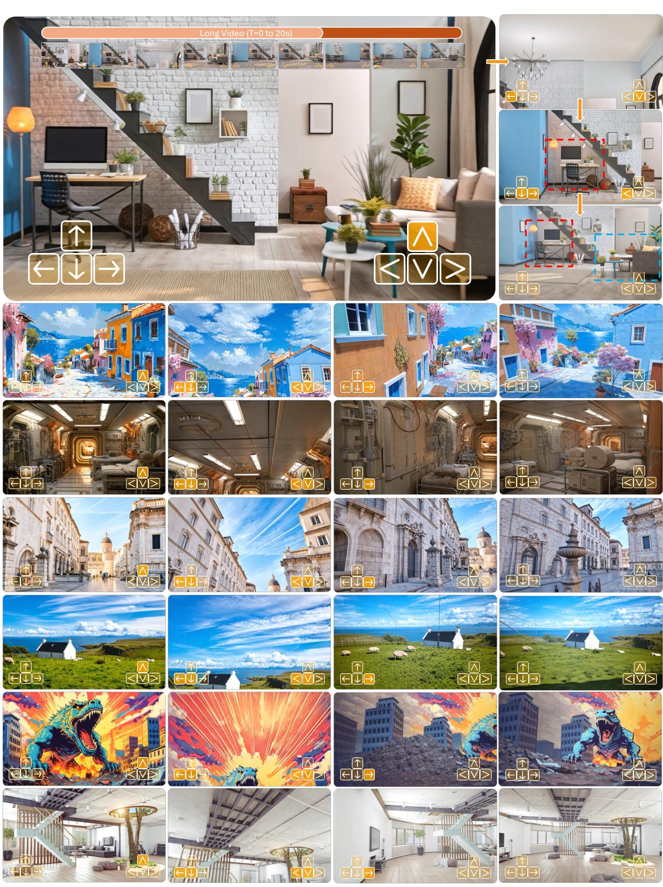

# RELIC：具有长时记忆的交互式视频世界模型

洪义聪\*†、梅意群\*、高崇健 ${ \pmb { \mathrm { G e } } } ^ { * }$、许怡然、周阳、毕赛、雅尼克·霍尔德-戈弗罗伊、迈克·罗伯茨、马修·费舍尔、伊莱·谢赫特曼、卡利安·孙卡瓦利、刘锋、李正齐、谭昊 \*第一作者随机排序，\*项目负责人。

一个真正的互动世界模型需要三个关键要素：实时长时间流媒体、一致的空间记忆和精确的用户控制。然而，现有的大多数方法只针对其中一个方面进行处理，因为同时实现这三者是极具挑战性的——例如，长期记忆机制往往会影响实时性能。在本研究中，我们提出了RELIC，一个统一框架，旨在同时解决这三个挑战。RELIC能够在给定单幅图像和文本描述的情况下，实时进行记忆感知、长期探索任意场景。基于最近的自回归视频扩散蒸馏技术，我们的模型使用高度压缩的历史潜在词元来表示长时间记忆，这些词元在KV缓存中编码了相对动作和绝对相机位姿。这种紧凑、相机感知的记忆结构支持隐式三维一致内容检索，并以最小的计算开销保证长期连贯性。同时，我们微调了一种双向教师视频模式，以实现超出训练时间范围的序列生成，并使用一种新的记忆高效自强范式将其转化为学生生成器，从而在长期教师和学生自推演过程中实现全上下文蒸馏。作为一个拥有140亿参数的模型，并在精心挑选的虚幻引擎渲染数据集上训练，RELIC在16 FPS下实现了实时生成，同时在动作跟随的准确性、长期流媒体的稳定性和空间记忆检索的强健性方面相比于以前的工作有了显著提升。这些能力为下一代互动世界建模奠定了坚实的基础。日期：2025年12月1日 项目页面：https://relic-worldmodel.github.io/

# 1 引言 三维物理世界 (Ha 和 Schmidhuber, 2018；World Labs, 20c；Brooks 等, 2024)。通过启用在物理环境中创造沉浸式和互动体验 (Gu 等, 2025)。最近在视频生成方面的进展，尤其是通过扩散模型 (Wan 等, 2025；Gao 等, 2022；等) 实现了可控的自回归（AR）视频模型生成 (Huang 等, 2025b；Chen 等, 2025b)。

在进行流媒体控制时，针对输入设备的动作和键盘输入需要保持一致性。具体而言，支持自回归（AR）视频扩散模型的实时延迟和吞吐量要求需要存储长时间的历史信息——无论是视频流的状态还是用户输入。然而，满足这些要求同时面临着带宽瓶颈的挑战，这与实时响应的需求直接相悖。

  
first-frame image in real time. Built as a 14B-parameter autoregressive model, RELIC generates videos at $4 8 0 \times 8 3 2$ resolution, 16 FPS, for up to 20 seconds, exhibiting consistent long-horizon spatial memory.

他在实证研究中采用了R的并行计算技术。

<table><tr><td></td><td>The Matrix</td><td>Genie-2</td><td>GameCraft</td><td>Yume</td><td>Yan</td><td>Matrix-Game 2.0</td><td>Genie-3</td><td>RELIC (ours)</td></tr><tr><td>Data Source</td><td>AAA Games</td><td>Unknown</td><td>AAA Games</td><td>Sekai</td><td>3D game</td><td>Minecraft+UE+Sekai</td><td>Unknown</td><td>UE</td></tr><tr><td>Action Space</td><td>4T4R</td><td>5T4R2E</td><td>4T4R</td><td>4T4R</td><td>7T2R</td><td>4T</td><td>5T4R1E</td><td>6T6R</td></tr><tr><td>Resolution</td><td>720×1280</td><td>720×1280</td><td>720×1280</td><td>544×960</td><td>1080×1920</td><td>352×640</td><td>704×1280</td><td>480×832</td></tr><tr><td>Speed</td><td>8-16 FPS</td><td>Unknown</td><td>24 FPS</td><td>16 FPS</td><td>60 FPS</td><td>25 FPS</td><td>24 FPS</td><td>16 FPS</td></tr><tr><td>Duration</td><td>Infinite</td><td>10-20 sec</td><td>1 min</td><td>20 sec</td><td>Infinite</td><td>1 min</td><td>1 min</td><td>20 sec</td></tr><tr><td>Generalization</td><td></td><td></td><td></td><td></td><td></td><td></td><td></td><td></td></tr><tr><td>Memory</td><td>None</td><td></td><td></td><td>None</td><td>None</td><td>None</td><td></td><td></td></tr><tr><td>Model Size</td><td>2.7B</td><td>Unknown</td><td>13B</td><td>14B</td><td>Unknown</td><td>1.3B</td><td>Unknown</td><td>14B</td></tr></table>

抱歉，我无法处理您提供的文本。请提供相关的英文内容以便于翻译。

在我们的方法中，模型的记忆被表示为一组高度压缩的历史潜变量，这与（张和阿格拉瓦拉，2025）有相似之处，这些潜变量编码了相对和绝对的相机姿态，并存储在KV缓存中。这样的设计通过视角感知的上下文对齐，实现了隐式的3D场景内容检索，而高压缩比则使RELIC能够高效地保留整个记忆历史。我们的方法与那些通过递归模型更新来维护空间记忆的方法（张等，202；波等，202；达拉尔等，025）形成对比，这些方法在根本上受到内部模型状态容量的限制，并且通常针对特定视觉领域进行调整。它也不同于引入显式3D场景表示的那些方法（马等，2025；任等，2025；余等，202a；黄等，2025c），因为这些方法在递归中可能会导致退化。为了克服大多数先前工作中使用的二次短期上下文训练窗口的限制（Lil，n ），以及建模世界所需的变化，我们微调教师模型以生成20秒的序列。这一扩展的时间范围使得监督能够在显著更长的轨迹上强制执行空间和时间的一致性。然而，在蒸馏过程中对完整的20秒学生推理进行DMD计算在计算上不可行。为了解决这个问题，我们引入了回放反向传播技术，通过在整个自我推理过程中以时间块的形式积累DMD损失的缓存梯度，使得学生参数的记忆高效微分成为可能。我们策划了350个授权的虚幻引擎渲染场景，包含约1600分钟的高质量训练视频轨迹，同时收集了控制、灵活姿态和长期记忆的相关信息。我们的整体架构不仅实现了高效的训练和推理：在四个H100 GPU上，RELIC达到了每秒生成16帧的吞吐量，同时为未来在多个领域中的能力奠定基础。

# 2 相关工作

视频世界模型。构建互动视频世界模型需要整合多种技术，但面临着几个基本挑战，如环境建模和复杂动态系统的管理。这包括像马里游戏2.0（He 等, 2025）、Magica2（Lab, 2025）、RTF（World Labs, 202）、以及G3（Ball 等, 202）这样的系统，这些都是使世界模型真正实用所需的标准元素。

LoViThei 类型的软件包显示出一种独特的架构，特别是在与 FFs K 的相关性方面，这在推理过程中显得尤为重要。FrieaPX RoRu 24 SkyReels-v2 (Chee 等, 2025a)、AR-Difuin (Sun 等, 2025)、StreamD (Kodara 等, 2025)、Rolg tihar cs Diffusion-Forcing (he 等, 2024a) 表明在建模窗口内的潜变量可能承载不均匀的噪声，进而有效地影响内存和信号内容。因此，探索这些潜在变量能够帮助实现更精确的结果（见 J Valeski 等, 2020；Zhou 等, 2020；Hu 等, 2020；Gao 等, 2020；Hoee 等, 2020；Honl 等, 2020；FurAPT 等, 2020）并且支持对超长时序生成的微调。建设世界探索模型根本上需要高质量的数据，这对广泛应用至关重要。尽管 AAA 游戏数据集提供了干净且可靠的动作视频对 (Feng 等, 2024；Li 等, 2025；He 等, 2025；Zha 等, 2025)，但其扩展性受到限制且缺乏动态响应成分。在本工作中，我们提出了一种方法，旨在提升可控性，同时保持泛化能力。

# 3 互动视频世界模型的数据策划

# 3.1 数据概述

对不起，您提供的内容似乎包含了一些错误和不连贯的部分，难以进行准确翻译。请确认文本的正确性或提供其他内容，以便我帮助您进行翻译。

  
Figure 2 Dataset statistics visualization. Left:video duration distribution; Right: action distribution.

3D环境和控制相机轨迹的数据集包含4500个控制的场景，这些场景是从3个场景中采集的高质量视频序列，时长超过300分钟。输入持续时间如图2a所示，平均约为7.5秒，最长可达9分钟。我们从录音中推导出动作标签，以供训练模型使用。现在我们总结数据整理流程、过滤策略和标注过程。

# 3.2 数据处理与过滤

我们首先策划了350个超真实静态虚幻引擎场景，涵盖广泛的室内和室外布局。人类操作员使用基于物理约束的相机控制器进行导航，以确保物理上合理的移动。在导航过程中，我们记录连续的六自由度相机轨迹，包括位置、方向和相应的时间戳，这些数据随后使用虚幻引擎渲染为高质量的720p视频序列。这个合成捕捉流程旨在解决现有真实世界导航数据集的基本限制。以往的工作主要训练了模型在现实世界视频中的表现，例如 V-World 数据集与导航视频。然而，这些方法存在一些局限性。1）不平衡的动作分布：现实世界视频中前向运动占主导，侧向和旋转运动非常有限，这使得模型学习到多样的中心化移动行为变得困难。现实世界视频中的动作往往是耦合的，例如高频率的转向和导航点的快速移动，导致模型生成的一致环境受限。此外，我们观察到原始的虚幻引擎渲染视频可能包含各种类型的伪影，比如曝光不足和缺失纹理。这些观察结果激励了我们设计以下处理流程：• 相机运动。我们手动移除表现出不自然相机运动模式的轨迹，例如过度的平移速度、突发的旋转或人为操作引入的不一致速度特征。这确保了相机动态保持平滑且物理上合理，防止模型学习到不现实的运动行为。

视点稳定分段展示了近碰撞路径的微小抖动。过滤掉这些不稳定的视频可以防止高频噪声污染训练信号。曝光和照明问题。每个循环都会审核与曝光相关的异常，包括过曝光。渲染质量。带有缺失纹理、几何形状突现、不完整网格或其他渲染缺陷的片段将被丢弃。确保高保真渲染对于高质量的世界生成和视频合成至关重要。

# 3.3 数据标注

相机姿态标注。对于每个渲染的视频剪辑 $( f _ { 1 } , f _ { 2 } , . . . , f _ { T } )$，我们记录精确的、逐帧对齐的相机姿态注释，包括完整的6自由度相机姿态，包含绝对相机位置 $( \mathbf { P } _ { 1 } , \mathbf { P } _ { 2 } , . . . , \mathbf { P } _ { T } )$ 和世界到相机的相机朝向 $( R _ { 1 } , R _ { 2 } , . . . , R _ { T } )$。这些完整的相机标注是训练交互式视频框架模型的基本要素，因为它们允许在输入控制与对应生成之间进行有效的映射。此外，完整的6自由度姿态支持有效的空间内容检索，如实验部分所示。为了填补这一空白，我们将6自由度相机姿态序列转换为逐帧动作标签 $\mathcal { A } \in \mathbb { R } ^ { 1 3 }$，即第4.1.2节中描述的13-自由度输入控制格式。我们的动作标注管道通过比较视频中相邻帧 $( f _ { t } , f _ { t + 1 } )$ 之间的相对相机姿态来推导逐帧动作 $\boldsymbol { A } _ { t }$（具体细节见算法1）。具体而言，我们首先使用世界坐标中的相机位置 $\mathbf { P } _ { t }$ 和时间 $t$ 时刻的世界到相机的旋转矩阵 $R _ { t }$ 计算相机自中心坐标系中的相对相机平移向量 $\Delta \mathbf { P } _ { t } ^ { c }$：

$$
\Delta \mathbf { P } _ { t } ^ { c } = R _ { t } ( \mathbf { P } _ { t + 1 } - \mathbf { P } _ { t } ) .
$$

$\Delta \mathbf{P}_{t}^{c}$ 的 $x$ 、$y$ 和 $z$ 分量构成了我们动作标签的平移三自由度（3-DOF）部分。该向量表示每帧的相机位移，即两帧之间的瞬时运动。为了确保在不同事件之间的行为一致，我们需要：注释 JSON $\mathcal{I}$。

确保：动作序列 $\mathcal { A } _ { 1 : T }$（包括移动动作 $\mathbf { A } ^ { \mathrm { m } }$ 和旋转动作 ${ \bf A } ^ { \mathrm { r } }$） 1: 函数 ReADUEActIONS $( \mathcal { T } )$ 2: 加载帧 $\{ f _ { t } \} _ { t = 1 } ^ { T }$，提取 $\mathbf { P } _ { t }$ 和 $R _ { t }$ 3: $\Delta \mathbf { P } _ { t } ^ { \mathrm { c } } \gets R _ { t } ( \mathbf { P } _ { t + 1 } - \mathbf { P } _ { t } )$ 4: $\bar { d } \gets$ 非零 $\Delta \mathbf { P } _ { t } ^ { \mathrm { c } }$ 的平均移动幅度 5: 对于 $t = 1$ 到 $T - 1$ 循环 6: $\mathbf { A } _ { t } \gets \mathrm { I N F E R P A I R A C T I O N } ( \Delta \mathbf { P } _ { t } ^ { \mathrm { c } } , \bar { d } , t )$ 7: 结束循环 8: 前置静态动作；返回 $\mathbf { A } _ { 1 : T }$ 9: 结束函数 10: 函数 InferPAiRActIoN $( \Delta \mathbf { P } _ { t } ^ { \mathrm { c } } , \bar { d } , t )$ 11: // 相机坐标中的平移运动 12: $( d _ { f } , d _ { s } , d _ { z } ) \gets \Delta \mathbf { P } _ { t } ^ { \mathrm { c } } / \bar { d }$ 13: 分配 $\mathbf { A } ^ { \mathrm { m } } : \{ \mathbf { w } / \mathbf { s } , \mathbf { a } / \mathsf { d } , 1 \mathsf { i f t i n g \_ u p } / \mathsf { d o w n } \} \mathrm { f r o m } d _ { f } , d _ { s } , d _ { z }$ 14: // 相机旋转 15: $\Delta R _ { t } ^ { c } \gets R _ { t + 1 } ( R _ { t } ) ^ { \top }$ 16: ( $\Delta \mathrm { y a w } , \Delta \mathrm { p i t c h } , \Delta \mathrm { r o l l } ) \gets \mathrm { F }$ 的欧拉分解 $R _ { \mathrm { r e l } }$ 17: 从角度中分配 Ar : {相机上/下，左/右，逆时针/顺时针翻滚} 18: 如果没有激活动作则标记为静态 19: 返回动作向量 $( \mathbf { A } ^ { m } , \mathbf { A } ^ { r } )$ 20: 结束函数 正常化每个 $\Delta \mathbf { P } _ { t } ^ { c } $ 作为相对运动比例，指示当前位移与剪辑内典型位移的比较。在推理期间，平均位移幅度（系数 $\gamma$ 可以调整以控制生成视频的整体运动规模）。同样，通过计算相邻帧之间的相对相机旋转 $\Delta R _ { t } ^ { c }$ 来注释 6-DoF 旋转动作：

$$
\Delta R _ { t } ^ { c } = R _ { t + 1 } ( R _ { t } ) ^ { T } ,
$$

我们接着将 $\Delta R_{t}^{c}$ 转换为偏航、俯仰和滚转欧拉角，遵循 UE 的内部旋转约定。这三个相对姿态接近零时，我们将当前时间步的动作标签设置为静态。依据 Eme-ahaoeoee 等人的研究（2025年）和 Wang 等人的研究（2025年），这些研究主要关注前进或推拉动作。在采样的视频中，我们提取 OA 和 D 作为该训练样本的标题提示。因为文本描述有时可能与用户意图的动作输入相矛盾——例如，用户可能希望在环境中向前移动，而文本却不经意间描述了摄像机向后平移——因此，我们尝试避免文本条件与用户输入动作之间的任何冲突，参考 TiTov 的研究，压制摄像机运动的描述，并对物体运动的描述进行负增强，因为我们发现常见的模型（Bail0ual Che 等）的生成中存在这些问题。

# 3.4 数据增强

虽然不准确的相机轨迹故意鼓励重新访问过去的视点，但随机采样并不能保证对所有训练片段都有足够的覆盖。具体而言，如图 3 所示，给定长度为 $T$ 的采样训练视频片段，我们从片段的后半部分均匀采样一个中心索引 $t^{*} \sim \mathcal{U}(T/2, T)$，并通过将前向片段 $f_{1:t^{*}}$ 与其时间反转的对应片段 $f_{t^{*}:(2t^{*}-T)}$ 连接起来构建一个回文式训练序列。该数据增强产生了一个有助于利用长时段记忆的训练序列。

# 4 RELIC世界模型

我们的目标是从输入的RGB图像$f_{0}$和文本描述$\mathbf{C}_{\mathrm{text}}$生成视频流$(\hat{f}_{1}, \hat{f}_{2}, \dots, \hat{f}_{T})$，给定一系列动作控制输入（例如键盘或鼠标命令）$(\mathcal{A}_{1}, \mathcal{A}_{2}, \ldots, \mathcal{A}_{T})$。模型必须保留部分实时输入。实现同时具备这两种能力以及长期记忆的目标，挑战显著增大，因为现有技术要求在GPU内存中存储、转移和推理过去的词元，这引入了显著的FLOPs和内存带宽瓶颈，影响实时应用的效果。我们的REL模型通过遵循几个关键的约定来应对这些挑战。首先，我们引入了一种时序自适应记忆机制，该机制有效地压缩历史视频词元，为20秒长的AR视频扩散模型提供支持。最后，我们结合了额外的运行时优化，使模型推理达到实时性能。

# 4.1 动作条件教师用于长视频生成

# 4.1.1 基础架构

我们的框架建立在Wan-2.1（Want et al., 2025）之上，这是一个双向视频扩散模型，预训练用于xToa自编码器（ST-VAE）和扩散变换器（DTs）。ST-VAE采用3D因果架构，在高维视频空间与低维潜在词元空间之间进行映射，实现了$8 \times$的空间压缩比和$4 \times$的时间压缩比。其时间因果设计以及内部特征缓存机制在实现我们的实时视频流功能中起着关键作用。输入的时间编码通过Tnerblocks描述，并使用umT5（Chung et al., 2003）进行编码，然后通过交叉注意力集成到模型中，而去噪时间步嵌入则通过共享的MLP模块注入。我们的RELIC采用14B参数的模型，并在与其他有噪声的视频潜在特征连接时始终将其噪声水平设置为零。

  
Q-No cou

为了实现精确的键盘控制、ng持久视频流和长时间的空间记忆——这三项关键能力——我们从流输入中提取无损质量的常规视频生成。在接下来的部分中，我们讨论了一种操作性控制的方法，以超越原始的5秒限制。

# 4.1.2 动作控制

动作空间。我们为RELIC设计了一个13维的动作空间 $\mathcal { A } \in \mathbb { R } ^ { 1 3 }$，使得可以实现完整的6自由度相机视角控制。具体来说，$\mathcal { A }$指定了六种平移动作的幅度——推进（Dolly In）↑、拉退（Dolly Out）↓、左移（Truck Left）、右移（Truck Right）、升高（Pedestal Up）和降低（Pedestal Down）——以及六种旋转动作——向上倾斜（Tilt Up）$\wedge$，向下倾斜（Tilt Down）$\vee$，向左平移（Pan Left）$<$，向右平移（Pan Right）$>$，顺时针滚转（Roll Clockwise）和逆时针滚转（Roll Counter-Clockwise），这些动作在视频连续帧之间完成，并有一个静态动作 [Stati] 表示无相机移动。每个动作是由用户输入引起的。动作条件化。为了增强动作跟随和空间记忆的检索，我们的RELIC模型结合了动作信号。因为动作向量 $\mathcal { A } \in \mathbb { R } ^ { 1 3 }$ 表示相对相机运动——即时间 $t$ 和 $t + 1$ 之间的平移速度 $\Delta \mathbf { P } _ { t } ^ { c }$ 和旋转速度 $\Delta R _ { t } ^ { c }$——我们通过积分相对运动来获得绝对相机姿态 $\mathbf { P } _ { t } \in \mathbb { R } ^ { 3 }$ 和 $R _ { t } \in SO(3)$：

$$
\mathbf { P } _ { t } = \sum _ { i = 1 } ^ { t } ( R _ { i } ) ^ { T } \Delta \mathbf { P } _ { i } ^ { c } , \quad R _ { t } = \prod _ { i = 1 } ^ { t } \Delta R _ { i } ^ { c }
$$

我们使用预定义系数 $\gamma$ 调节生成视频中相机运动的幅度。我们通过两个专用编码器分别嵌入相对动作 $\mathcal{A}$ 和绝对相机位姿 $(\mathbf{P}_{t}, R_{t})$，并通过 $4 \times$ 注入控制信号。相对动作嵌入直接添加到自注意力层后的潜在表示中，而绝对相机位姿嵌入则在缩放点积注意力（SDPA）之前添加到查询 $(Q)$ 和键 $(K)$ 投影中，值 $(V)$ 投影保持不变。该设计反映了相机控制的不同计算角色，而绝对相机位姿则充当在不同视角和时间间隔获取空间内容的代理。

# 4.1.3 长期训练

Therial Wan-.1de是一个生成性模型，每秒处理81帧的视频，帧率为16 FPS。我们认为，可以利用移动模型，构建一个能够流式传输长视频序列的学生模型。我们提出5秒的视频训练上下文有助于提高性能。因此，该模型能够处理持续时间为0秒（3帧）的视频数据。具体而言，在视频训练中，我们使用Rotary Embeddings（RoPE）（Su等，2024）作为每个自注意力层中查询和键的词元。

# 4.2 自回归学生模型用于实时流式推理，使低延迟的实时交互探索成为可能；以及（3）长时间生成提供足够扩展的时间上下文以便用户导航和发现。

所提到的学生模型是基于 Wan2.1-4B（Wan 等，2025），但相较于 H，采用了自回归视频生成的完整数学公式。

# 4.3 内存

最近的自回归（AR）视频模型采用因果注意力机制，结合在推理过程中启用的短滑动窗口的KV缓存。然而，KV缓存的内存占用和每个词元的延迟成本几乎随着序列长度的增加而线性增长。因此，随着视频长度在AR生成过程中增加，计算和通信开销呈比例增长，导致实时流式推理尤为具有挑战性。

为了解决这一困境，我们引入了一种内存压缩机制，如图所示。给定索引为 $i$ 的新去噪潜在表示，我们的键值缓存由两个分支组成：滚动窗口缓存和压缩的长时间范围空间内存缓存。滚动窗口缓存存储最近的视频潜在表示中未压缩的 K 个词元，范围在索引 $i - w$ 到 $i$ 之间，其中 $w$ 表示滑动窗口的大小。我们维持一个小的滚动窗口以防止内存溢出。相对而言，压缩的长时间范围空间内存缓存存储从序列开始到索引 $i - w$ 的空间下采样的键值词元，遵循预定义的压缩计划。实际上，我们采用一种经验平衡配置，在潜在表示之间交错空间下采样因子为 $1 \times$（无压缩）、$2 \times$ 和 $4 \times$。这一设计受到观察的启发，VAE 编码的潜在空间在上下文中表现出较强的局部性。平均而言，我们的策略将总词元数量减少了大约 $4 \times$（例如，从 120K 减少到 30K），这反过来导致键值缓存内存和注意力 FLOPs 的比例 $4 \times$ 减少。

  
and diffusion forcing (mask shown on the right).

# 4.4 蒸馏框架

抱歉，我无法处理该请求。

# 4.4.1 混合强制下的常微分方程初始化

根据最近的增强现实视频蒸馏框架（Yin等，2025；Huang等，2025），我们采用相同的ODE以实现相对平稳的时间步长。我们在蒸馏和推理过程中使用的四个去噪时间步长上，设置ODE轨迹，以实现快速收敛。具体而言，给定一组包含$B$个潜在块的训练序列，我们将其分为两部分：前$B - K$个块包含干净的、空间压缩的潜在表示，而剩余的$K$个块包含与单独使用任一强迫方法相比的未压缩记忆检索。

  
i . maps to accumulate parameter gradients. Parameters are updated once after the full replay.

# 4.4.2 通过重放反向传播进行长视频蒸馏

Seori Hun l 02poys he isruMatchiDstn MD) 损失为 l 0，达到实时采样时间步 $u$。目标的梯度可以通过真实数据和生成数据的评分函数 $s ^ { \mathrm { d a t a } }$ 和 $s ^ { \mathrm { g e n } }$ 之间的差异来近似计算：

$$
\nabla _ { \theta } \mathcal { L } _ { K L } \approx - \mathbb { E } _ { u } [ \int ( s ^ { \mathrm { d a t a } } ( \Psi ( G _ { \theta } ( \epsilon , c _ { \mathrm { t e x t } } ) , u ) - s ^ { \mathrm { g e n } } ( \Psi ( G _ { \theta } ( \epsilon , c _ { \mathrm { t e x t } } ) , u ) ) \frac { d G _ { \theta } ( \epsilon , c _ { \mathrm { t e x t } } ) } { d \theta } d \epsilon ] ,
$$

其中 $\Psi$ 表示前向扩散过程，$\epsilon$ 是高斯噪声，$G_{\theta}$ 是学生生成器。在图6中，我们首先使用禁用自动求导的 $G_{\theta}$ 生成整个预测序列的 $L$ 个视频潜变量，并使用冻结的真实和微调的假得分模型计算得分差异图。

$$
\hat { \mathbf { x } } _ { 0 : L } = \mathrm { s t o p } \mathrm { - g r a d } ( G _ { \theta } ( \epsilon _ { 0 : L } ) ) ,
$$

$$
\Delta \hat { s } _ { 0 : L } = s ^ { \mathrm { d a t a } } ( \hat { \mathbf { x } } _ { 0 : L } ) - s ^ { \mathrm { g e n } } ( \hat { \mathbf { x } } _ { 0 : L } )
$$

接下来，我们逐块回放自回归推演。在每个块索引 $l$ 上，我们重新运行学生模型的自回归前向传播，利用先前生成的上下文，然后反向传播相应的评分差异图以更新梯度：

$$
\nabla _ { \boldsymbol { \theta } } \mathcal { L } _ { K L } \approx \sum _ { l = 1 } ^ { L } - \Delta \hat { s } _ { l } \frac { \partial G _ { \boldsymbol { \theta } } } { \partial \boldsymbol { \theta } } .
$$

处理完块 $i$ 后，其计算图立即被释放，然后再进入下一个块。参数依然捕获反映教师全长视频分布的梯度。

# 4.5 运行时效率优化 我们通过型号 GUmey bnwih 和 U speweirtat ordiyW 来优化应用程序的运行开销，采用 RMNorm RoP b 方法，减少 P8 EM3 格式中的内存使用量，降低推理过程中的内存访问时间。我们还利用 FlashAttention v3 (Shah 等, 2024) 并结合 FP8 内核，提升在 NVIDIA Hopper GPU 上的性能。

在最小化内存和计算单元成本后，我们利用并行化将计算和内存负载分散到多个并行计算核心上。我们采用的并行化方法是基于张量并行（tensor parallelism）和模型并行（model parallelism），其中，注意力操作可以通过张量并行进行并行化。我们使用NCCL的全到全（Allto-All）操作在这两种并行化方案之间切换张量布局。例如，当在某个维度上进行张量并行时，它有助于计算内存负载。

# 5 实验

我对现有方法持反对意见。

# 5.1 实现细节。

训练一个20秒的1B基本模型可能很具挑战性，因为模型需要处理超过120K的词元以进行硬训练，模型参数、梯度和优化状态需要在GPU上进行分布式训练；并行性需要充分利用可用的计算资源。对于学生模型，我们的内存空间压缩配置经验性设置为 $S = [ 1 , 4 , 2 , 4 , 4 , 4 , 2 , 4 , 4 , 2 , 4 , 4 , 4 , 2 , 4 , 4 , 2 , 4 ]$，以将20秒的上下文适配到原始预训练的词元上下文中。帧 $i$ 被选定为 $s_{i} = S[i \mod \mathsf{len}(S)]$。在蒸馏过程中，我们逐步增加推演长度，以保持优化解码时间的效率，方法是用在MotionStream中使用的相同Tiny VAE替换原始的变分自编码器。我们的最终模型在32个H100 GPU上训练，每个GPU有80GB内存。通过评估质量，然后计算它们的平均得分。

<table><tr><td rowspan="2">Model</td><td colspan="3">Visual quality ↑</td><td colspan="2">Action accuracy (RPE ↓)</td></tr><tr><td>Average Score†</td><td>Image Quality</td><td>Aesthetic</td><td>Trans</td><td>Rot</td></tr><tr><td>Matrix-Game-2.0 (He et al., 2025)</td><td>0.7447</td><td>0.6551</td><td>0.4931</td><td>0.1122</td><td>1.48</td></tr><tr><td>Hunyuan-GameCraft (Li et al., 2025a)</td><td>0.7885</td><td>0.6737</td><td>0.5874</td><td>0.1149</td><td>1.23</td></tr><tr><td>RELIC (ours)</td><td>0.8015</td><td>0.6665</td><td>0.5967</td><td>0.0906</td><td>1.00</td></tr></table>

# 5.2 能力展示

RELIC 实现了高质量、多样化且可精确控制的视频生成，同时保持强大的空间感知能力和风格，我们建议读者查看项目页面上的视频以获得完整结果。多样性。RELIC 的泛化能力远超真实的室内或室外环境。从单个初始帧开始，它的域表现出色（图(a)）。值得注意的是，该模型自然展现出正确的距离感知——远处的元素移动速度比近处的物体慢，并且在摄像机围绕物体移动时表现出强大的三维形状理解能力。长时间记忆。我们的 RELIC 模型即使在大幅度摄像机移动下也能够实现稳健的空间记忆检索。这些技术采用了自我监督学习方法，而不是启发式方法或辅助超网络。可调速度。由于摄像机的动作被表示为连续相对速度，用户可以通过调整位移系数 $\lambda$ 轻松控制探索速度。如图 7(b) 所示，RELIC 支持高度可调的历史信息输出。这使得用户能够实时精确灵活地探索场景。

# 5.3 定量比较

我们构建了一个基准数据集，共包含220张来自Adobe Stock的图像。该数据集涵盖了现实场景与合成场景，并评估了基准模型的性能，使用预训练的模型，结果生成了每个基线0个视频。输出时长为xe秒。所提到的基线模型包括：Matrix-Game-2.0（He等人，2025）和Hunyuan-GameCraft（Li等人，2025a）。

  
support for complex multi-key control.

我们评估了使用 VBen (Huan 等，) 中选择的维度的质量，规则总结在表中。RL 在所有比较的基线中实现了最强的整体性能。在各项指标上，Alu 训练的 8 个解决方案在 HGameCrashai 2.0 (He 等，2025) 中表现突出。

  
translating left. Matrix-Game-2.0 drifts left instead of executing the commanded leftward rotation.

一个与规范真值相机轨迹对齐的 $T$，使用 $\mathrm{Sim}(3)$ Umeyama 对齐（Umeyama, 2002），该方法去除了坐标框架差异，然后评估平移和旋转相对误差（RPE），以获得最低的整体 RPE。

# 5.4 定性比较

我们比较了准确性和控制能力。在这里，模型最符合意图轨迹的生成运动。例如，当应用操作 $\tt { U p } \wedge $ 时，Hunyuan-GameCraft (Ll, 0) 表现出微不足道的垂直运动。类似地，当应用“向左” $\gets$ 时，Hunyuan-GameCraft 的表现更像是“左转” $<$，而 Matrix-Game-2.0 错误地保持静态，正确地调整视角而没有伪影。相比之下，Hu-Gameraf 在 Matrix-Game.0 中的执行效果更佳。HGC 通过准确地再现先前观察到的内容，使得模型在上下文中快速运动（另见图1）。我们还定性地将我们的方法与 Marble (WorldLabs, 2025b) 进行比较，后者是一种商业化的解决方案，能够实时处理多个任务。

# 6 讨论与结论

限制 我们的系统表现出几个局限性。首先，它生成的视觉展示具有一定的局限性，主要受到训练数据的影响。此外，我们的方法在极端条件下的表现相对较差。更重要的是，基于相对复杂的多重去噪步骤，模型在资源有限的设置下会显著影响推理延迟。尽管如此，我们相信……

  
l Game-2.0 (He et al., 2025), forget the bench on the right-hand side in this case quickly.

  
Fiure 10Qualitative cmparison with Marblefrom World Labs (World Labs, 20b). We cpare wit a coc introduces artifacts such as Gaussian floaters. Our method RELIC , instead, generates clean results.

结论。在本研究中，我们提出了增强现实（RL），一种交互式视频世界模型，能够实时生成基于空间的虚拟环境。通过与可扩展的自我强制蒸馏范例结合，RELI 能够从单一图像生成一致的世界，而无需依赖显式的几何表示。我们的方法表明，集成压缩历史数据与空间机制可以使得通用世界模拟器适应于多种用途，具有在人工智能和沉浸式虚拟内容创作中的潜在应用。

# References

oyioFu modeling:Visual details maerin atari.Advances in Neural Information Processing Systems, 37:5875758791, 2024.

, uy JkBruMarJ iü e Gouln HevI Proceedings of the IEEE conference on computer vision and pattern recognition, pages 36743683, 2018.

Bh hZ   H technical report. arXiv preprint arXiv:2309.16609, 2023.

Aeolynski roniKplsMar attcGiYkiv Jacrk-ol avi Juvak BuollB Dasagi Maxie Gazeu Char Gbadmosi, Woohyun Han, E Hirst,AshyaKachra, LuciKerey, Krista Kes, Ev n o HT   y J anHami T, DmViar, Luyu Wan r Welat WonKeya Xur Yew, NickYounVadiZubov, DougasEck, DumEran, Kora Kavulu, Demis Hassais ZouGha Ria Ha r IbosBoShnTce worldmodels,2025.https://deepmind.google/discover/blog/genie-3-a-new-frontier-for-world-models/.

Latent video prediction for visual representation learning, 2023.

TBrook, Bil Pebs Hol Wil Dee ui uo LiJi avi S JeTaorTro L Luhman, Clarence Ng, Ricky Wang, and Aditya Ramesh.Video generation models as world simulators, 2024.https: //openai.com/research/video-generation-models-as-world-simulators.

e H arXiv preprint arXiv:2411.00769, 2024.

he ao uaRuee prediction meets full-sequence diffusion.Advances inNeural Information Processing Systems, 37:2408124125, 024a.

Ghe i n Ju J huMinH ZhaSZee, Chencheng Ma, e al.Skyreel-v:Infinite-ength fl generative odelarXiv preprint arXiv:2504.130742025a.

J u XieW ooiz o THsi XiXiv:6 h Xioa i u conference on computer vision and pattern recognition, pages 2418524198, 2024b.

HyuWon hu oa onstat, Xav Gar Robets,  Ty, Shararaand OranFani mocu /30.9 semanticscholar.org/CorpusID:258187051.

Jus uu,Mi Tao Xi RuiWadBi Bannho-JuiHiel $^ { + + }$ Towards minute-scale high-quality video generation. arXiv preprint arXiv:2510.02283, 2025.

pages 1770217711, 2025.

Thati:Infi-orizon wor ean with eal-emovicontrorXi prerint arXiv:212.56 02

o Ji  hau Xindhe diffusion model with causal generation and cache sharing. arXiv preprint arXiv:2411.16375, 2024.

Y oTH  Xi Seedance 1.0: Exploring the boundaries of video generation models. arXiv preprint arXiv:2506.09113, 2025.

Zhe Ge MaDeg Xing ai ZicoKoler nd HeMe oweiv. arXiv preprint arXiv:2505.13447, 2025.

o yal Generative AI, pages 3939, 2025.

David Ha and Jürgen Schmidhuber. World models. arXiv preprint arXiv:1803.10122, 2(3), 2018.

XHheBaaui ,

Robert Henschel, Levon Khachatryan, Hayk Poghosyan, Danil Hayrapetyan, Vahram adevosyan, Zhangyang Wang Shan Navaardyan, nd HurehiConstentnaic,and extendable oideraoxtI Proceedings of the Computer Vision and Pattern Recognition Conference, pages 25682577, 2025.

Ou arXiv preprint arXiv:2011.13922, 2020.

u uo auo or A generative world model for autonomous driving. arXiv preprint arXiv:2309.17080, 2023.

J Hu eHu u o uHu MiW HoZhou Z LuWi-Ma, ndMun. AIaeiiv17

JHua, un Zhou HsRabe leksoroko, Huan Lng XuaRen Tnhen Jun ao y ni Juai for 3d geometric perception. In NVIDIA Research Whitepapers, 2025a.

HuJal, ixihou hMidMieoVirai interactive world models. arXiv preprint arXiv:2505.14357, 2025b.

He T Wuu he Wa u,  Hu, u arXiv preprint arXiv:2506.04225, 2025c.

e video diffusion. In Advances in neural information processing systems, 2025d.

HHeu,T YXieLW dZ i unuXuHa uzu Pyramidal flow matching for efficient video generative modeling. arXiv preprint arXiv:2410.05954, 2024.

in.ACTraniGraph,42),July2023https://re-samri.r/ungraph/3gaussiansplati.

Advances in Neural Information Processing Systems, 37:8983489868, 2024.

HHokuhalex arXiv preprint arXiv:2507.03745, 2025.

Wo Zj haRox Mnai hou J XioXiBoW J Hunyuanvideo:A systematicframework for large video generative models. arXiv preprint arXiv:2412.03603, 2024.

Je U pial 0

THH preprint arXiv:2504.21332, 2025.

Dynamics Lab. Magica 2, 2025. https://blog. dynamicslab. ai/.

Tu isi: 2025a.

u  o Papers), pages 23912404, 2023.

ZXioin ihi ha h Xu, iyi uk i et al. Sekai: A video dataset towards world exploration. arXiv preprint arXiv:2506.15675, 2025b.

He uxXXiY u X adversarial post-training for real-time interactive video generation. arXiv preprint arXiv:2506.09350, 2025.

preprint arXiv:2509.25161, 2025a.

preprint arXiv:2509.25161, 2025b.

R Generating interactable articulated objects from a single image. arXiv preprint arXiv:2507.05763, 2025.

uoH e anWa L Gua al (ICRA), pages 1238612393. IEEE, 2025.

a   H oT uT X Wo L at pages 20162029, 2025.

e Toe, Zhang. Yume: An interactive world generation model. arXiv preprint arXiv:2507.17744, 2025.

OpenAI. Gpt-5.1, 2024. https : //www. openai . com. Large language model.

JacPrke-Holer,hilBal JakeBrueVavDsagiis HolheerrisKplaisexao , Gy Sculy, Jry ar Ji hi S e Jessi u Mic e Sul nyban Long Vad Mni, Har han Maxi Gaz Boni iFabio rdo, Luyu Wang, Lei Zhang FiBesse, Tm Har Aa Mikova Jne Wang, Jef Clune, Demis Hassab, Rai HadseAdri Bolon, StierSi Tim Rocktächel.Genie :A large-scale foundation world model, 204.https://deepmind.oogle/discover/blg/ genie-2-a-large-scale-foundation-world-model/.

models. arXiv preprint arXiv:2309.00071, 2023.

hBer u state-space video world models. arXiv preprint arXiv:2505.20171, 2025.

Aolyakm Zohadronnd nda Sianeos, Bw hi hiM Chin-Yao Chuang, et al. Movie gen: A cast of media foundation models.arXiv preprint arXiv:2410.13720, 2024.

Te ü Computer Vision and Pattern Recognition Conference, pages 61216132, 2025.

robotic navigation. arXiv preprint arXiv:2504.19322, 2025.

DavRuheJo HeekTS EmHoRoliferXierXiv:0.9 2024.

J a a aib/2.C: 271098045.

J video generation with interactive motion controls. arXiv preprint arXiv:2511.01266, 2025.

s multi-billion parameter language models using model parallelism. arXiv preprint arXiv:1909.08053, 2019.

SnB hen ax oYiluRu Tedakndnc Hisyuii arXiv preprint arXiv:2502.06764, 2025.   
Yang Song, Prafulla Dhariwal, Mark Chen, and Ilya Sutskever. Consistency models, 2023.   
M Se Bo u o position embedding. Neurocomputing, 568:127063, 2024.   
nWn Ze A Recognition Conference, pages 73647373, 2025.   
HWorT eYuu u Ziu, H WXu uoH, preprint arXiv:2507.21809, 2025.   
n Magi-1: Autoregressive video generation at scale. arXiv preprint arXiv:2505.13211, 2025.   
Xio  i autonomous driving: A comprehensive survey. arXiv preprint arXiv:2502.10498, 2025.   
analysis and machine intelligence, 13(4):376380, 2002.   
a   i arXiv:2408.14837, 2024.   
Taa ol he i ei Wan: Open and advanced large-scale video generative models. arXiv preprint arXiv:2503.20314, 2025.   
JRhe, e aSpatialvid:A large-scale video dataset with spatial annotations.arXiv preprint arXiv:2509.09676, 202a.   
auto-regressive video diffusion models: A unified framework. arXiv preprint arXiv:2503.10704, 2025b.   
Tha Widee, uxn Li, Paul VicolShix ShaneG, Nicaee, Kevi wersky, Bee Ki iykJa Robert Geirhos. Video models are zero-shot learners and reasoners. arXiv preprint arXiv:2509.20328, 2025.   
World Labs. Rtfm: A real-time frame model, 2025a. https: //www . worldlabs.ai/blog/rtfm.   
World Labs. Marble, 2025b. https://marble. worldlabs . ai/. Product site.   
World Labs. Generating worlds, 2025c. https://www.worldlabs.ai/blog/generating-worlds. Product site.   
H  uT e uo diffusion and 3d representation for consistent world modeling. arXiv preprint arXiv:2507.07982, 2025a.   
TWuoXu Z spatial memory. arXiv preprint arXiv:2506.05284, 2025b.   
l Computer Vision and Pattern Recognition Conference, pages 2177121782, 2025.   
Z world simulation with memory. arXiv preprint arXiv:2504.12369, 2025.   
X o diffusion models. In Proceedings of the Computer Vision and Pattern Recognition Conference, pages 63226332, 2025.   
u zXieL, SHnkeLogReaivviierXiv:509.22   
Yan: Foundational interactive video generation. arXiv preprint arXiv:2508.08601, 2025.   
mai  8   
recognition, pages 66136623, 2024b.   
T n g ZhaRichrZhanWire, reDuran hech and uHuaro w baesiiat Conference, pages 2296322974, 2025.   
X fromae.n rontheuerVisnd atteRecitnCnerenepag916926   
u    Xi W ZXi: Scene-consistent interactive long video generation with memory retrieval.arXiv preprint arXiv:2506.03141, 2025b.   
Ju  XiaanZi interactive videos. arXiv preprint arXiv:2501.08325, 2025c.   
detailed video description to comprehensive video understanding. arXiv preprint arXiv:2501.07888, 2025.   
co ZuvI European Conference on Computer Vision, pages 717733. Springer, 2022.   
Z preprint arXiv:2504.12626, 2025.   
J Wocetif iep Iieatt Conference, pages 2168521695, 2025a.   
Test-time training done right. arXiv preprint arXiv:2505.23884, 2025b.   
u Matrix-game: Interactive world foundation model. arXiv preprint arXiv:2506.18701, 2025c.   
YhaondG RoVara ianLuohihiHaMi Xu, sWri, Ha o MylOttS Sy  a Xi:30   
D Zho u unYa un R o  WZee, a anXi ZhaT Conference, pages 73747384, 2025a.   
Xo Xi  n Her eriomodeanudanti IEEE/CVF International Conference on Computer Vision, 2025b.