# Diffusion Forcing: Next-token Prediction Meets Full-Sequence Diffusion

Boyuan Chen   
MIT CSAIL   
boyuanc@mit.edu Diego Marti Monso\* Technical University of Munich diego.marti@tum.de Yilun Du   
MIT CSAIL   
yilundu@mit.edu Max Simchowitz MIT CSAIL msimchow@mit.edu Russ Tedrake MIT CSAIL russt@mit.edu Vincent Sitzmann MIT CSAIL sitzmann@mit.edu

# Abstract

This paper presents Diffusion Forcing, a new training paradigm where a diffusion model is trained to denoise a set of tokens with independent per-token noise levels. We apply Diffusion Forcing to sequence generative modeling by training a causal next-token prediction model to generate one or several future tokens without fully diffusing past ones. Our approach is shown to combine the strengths of next-token prediction models, such as variable-length generation, with the strengths of full-sequence diffusion models, such as the ability to guide sampling to desirable trajectories. Our method offers a range of additional capabilities, such as (1) rolling-out sequences of continuous tokens, such as video, with lengths past the training horizon, where baselines diverge and (2) new sampling and guiding schemes that uniquely profit from Diffusion Forcing's variable-horizon and causal architecture, and which lead to marked performance gains in decision-making and planning tasks. In addition to its empirical success, our method is proven to optimize a variational lower bound on the likelihoods of all subsequences of tokens drawn from the true joint distribution. Project website: https : / /boyuan . space/ diffusion-forcing

# 1 Introduction

Probabilistic sequence modeling plays a crucial role in diverse machine learning applications including natural language processing [6, 48], video prediction [32, 70, 26] and decision making [3, 22]. Nexttoken prediction models in particular have a number of desirable properties. They enable the generation of sequences with varying length [33, 21, 38] (generating only a single token or an infinite" number of tokens via auto-regressive sampling), can be conditioned on varying amounts of history [21, 38], support efficient tree search[71, 23, 25], and can be used for online feedback control [22, 3]. Current next-token prediction models are trained via teacher forcing [65], where the model predicts the immediate next token based on a ground truth history of previous tokens. This results in two limitations: (1) there is no mechanism by which one can guide the sampling of a sequence to minimize a certain objective, and (2) current next-token models easily become unstable on continuous data. For example, when attempting to auto-regressively generate a video (as opposed to text [6] or vector-quantized latents [34]) past the training horizon, slight errors in frame-to-frame predictions accumulate and the model diverges.

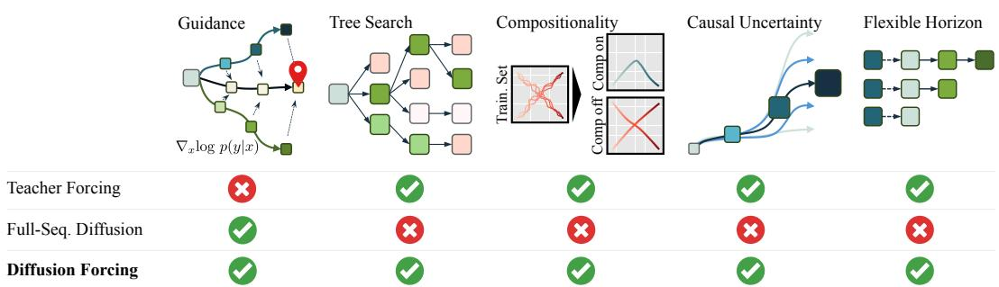  

Figure 1: Diffusion Forcing capabilities. Today, different applications such as language modeling [6], planning [37], or video generation [32, 70] rely on either auto-regressive next-token prediction or full-sequence diffusion, according to their respective unique capabilities. The proposed Diffusion Forcing is a novel sequence generative model that enjoys key strengths of both model types.

Full-sequence diffusion seemingly offers a solution. Commonly used in video generation and long-horizon planning, one directly models the joint distribution of a fixed number of tokens by diffusing their concatenation [32, 1], where the noise level is identical across all tokens. They offer diffusion guidance [31, 16] to guide sampling to a desirable sequence, invaluable in decisionmaking (planning) applications [37, 35]. They further excel at generating continuous signals such as video [32]. However, full-sequence diffusion is universally parameterized via non-causal, unmasked architectures. In addition to restricting sampling to full sequences, as opposed to variable length generation, we show that this limits the possibilities for both guidance and subsequence generation (Figure 1). Further, we demonstrate that a naive attempt at combining the best of both worlds by training a next-token prediction model for full-sequence diffusion leads to poor generations, intuitively because it does not model the fact that small uncertainty in an early token necessitates high uncertainty in a later one. In this paper, we introduce Diffusion Forcing (DF), a training and sampling paradigm where each token is associated with a random, independent noise level, and where tokens can be denoised according to arbitrary, independent, per-token schedules through a shared next-or-next-few-token prediction model. Our approach is motivated by the observation that noising tokens is a form of partial masking—zero noise means a token is unmasked, and complete noise fully masks out a token. Thus, DF forces the model to learn to "unmask" any collection of variably noised tokens (Figure 2). Simultaneously, by parameterizing predictions as a composition of next-token prediction models, our system can flexibly generate varying length sequences as well as compositionally generalize to new trajectories (Figure 1).

We implement DF for sequence generation as Causal Diffusion Forcing (CDF), in which future tokens depend on past ones via a causal architecture. We train the model to denoise all tokens of a sequence at once, with an independent noise level per token. During sampling, CDF gradually denoises a sequence of Gaussian noise frames into clean samples where different frames may have different noise levels at each denoising step. Like next-token prediction models, CDF can generate variable-length sequences; unlike next-token prediction, it does so stabily from the immediate next token to thousands of tokens in the future  even for continuous tokens. Moreover, ike full-sequence diffusion it acepts guidance towards high-reward generations. Synergistically leveraging causality, flexible horizon, and variable noise schedules, CDF enables a new capability, Monte Carlo Guidance (MCG), that dramatically improves the sampling of high-reward generations compared to non-causal full-sequence diffusion models. Fig. 1 overviews these capabilities.

In summary, our contributions are: (1) We propose Diffusion Forcing, a new probabilistic sequence model that has the flexibility of next-token prediction models while being able to perform longhorizon guidance like full-sequence diffusion models. (2) Taking advantage of Diffusion Forcing's unique capabilities, we introduce a novel decision-making framework that allows us to use Diffusion Forcing as simultaneously a policy ([10]) and as a planner ([37]). (3) We formally prove that, under appropriate conditions, optimizing our proposed training objective maximizes a lower bound on the likelihood of the joint distribution of all sub-sequences observed at training time. (4) We empirically evaluate CDF across diverse domains such as video generation, model-based planning, visual imitation learning, and time series prediction, and demonstrate CDF's unique capabilities, such as stabilizing long-rollout autoregressive video generation, composing sub-sequences of those observed at training time with user-determined memory horizon, Monte Carlo Guidance, and more.

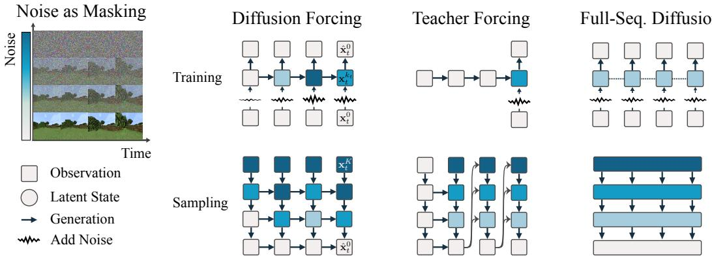  

Figure 2: Method Overview. Diffusion Forcing trains causal sequence neural networks (such as an RNN or a masked transformer) to denoise flexible-length sequences where each frame of the sequence can have a different noise level. In contrast, next-token prediction models, common in language modeling, are trained to predict a single next token from a ground-truth sequence (teacher forcing [65]), and full-sequence diffusion, common in video generation, train non-causal architectures to denoise all frames in a sequence at once with the same noise level. Diffusion Forcing thus interleaves the time axis of the sequence and the noise axis of diffusion, unifying strengths of both alternatives and enabling completely new capabilities (see Secs. 3.2,3.4).

# 2 Related Work and Preliminaries

We discuss related work and preliminaries for our core application, sequence generative modeling;   
see Appendix C for further literature review. Our method unifies two perspectives on sequence modeling: Bayesian filtering along the time axis, denoted by subscript $t$ , and diffusion along an "uncertainty" (or noise level) axis denoted by superscript $k$ . In the following, we denote observations as $\mathbf { x } \in \mathcal { X }$ and latent states as $\mathbf { z } \in { \mathcal { Z } }$ .

Bayesian Filtering. Given a Hidden Markov Model (HMM) defined by latent states $\mathbf { z } _ { t }$ and observations $\mathbf { x } _ { t }$ , a Bayes filter is a probabilistic method for estimating latent states recursively over time from incoming observations. A prior model $p ( \mathbf { z } _ { t + 1 } | \mathbf { z } _ { t } )$ infers a belief over the next state given only the current state, and an observation model infers a belief over the next observation given the current latent state $p ( \mathbf { x } _ { t } | \mathbf { z } _ { t } )$ . When a new observation is made, a posterior model $p ( \mathbf { z } _ { t + 1 } | \mathbf { z } _ { t } , \mathbf { x } _ { t + 1 } )$ provides an updated estimation of the next latent state $\mathbf { z } _ { t + 1 }$ . When trained end-to-end with neural networks [22, 23], latent states are not an estimate of any physical quantity, but a sufficiently expressive latent that summarizes past observations for predicting future observations $( \mathbf { x } _ { t ^ { \prime } } ) _ { t ^ { \prime } > t }$ in the sequence. Diffusion Models. Diffusion models [57, 29] have proven to be highly expressive and reliable generative models. We review their essentials here. Let $q ( \mathbf { x } )$ denote a data distribution of interest, and let $\mathbf { x } ^ { 0 } \equiv \mathbf { x } \sim q$ We consider a forward diffusion process that gradually adds Gaussian noise to a data point over a series of time steps. This process is modeled as a Markov chain, where the data at each step $k$ is noised incrementally:

$$
q ( \mathbf { x } ^ { k } | \mathbf { x } ^ { k - 1 } ) = \mathcal { N } ( \mathbf { x } ^ { k } ; \sqrt { 1 - \beta _ { k } } \mathbf { x } ^ { k - 1 } , \beta _ { k } \mathbf { I } )
$$

where $\mathcal { N }$ is the normal distribution and $\beta _ { k }$ is the variance of the noise added at each step controlled by a schedule $\{ \beta _ { k } \in ( 0 , 1 ) \} _ { k = 1 } ^ { K }$   
$\mathbf { x } ^ { K }$ Therevere proess  also  Marko hain andattepts  ereate he rigial datafro he noise with a parameterized model $p _ { \theta }$ :

$$
p _ { \theta } ( \mathbf { x } ^ { k - 1 } | \mathbf { x } ^ { k } ) = \mathcal { N } ( \mathbf { x } ^ { k - 1 } ; \pmb { \mu } ( \mathbf { x } ^ { k } , k ) , \gamma _ { k } \mathbf { I } ) ,
$$

where the mean $\pmb { \mu }$ is a model with a neural network, and where it is shown [30] that one can set the covariance to the identity scaled by a fixed constant $\gamma _ { k }$ depending on $k$ . Adopting the standard exposition, we reparametrize the mean $\pmb { \mu }$ in terms of noise prediction $\mathbf { \epsilon } \epsilon = ( \sqrt { 1 - \bar { \alpha } _ { t } } ) ^ { - 1 } \mathbf { x } _ { t } ^ { k _ { t } } - \sqrt { \bar { \alpha } _ { t } } \mu$ This leads [29] to the following least squares objective:

$$
\begin{array} { r } { \mathcal { L } ( \boldsymbol { \theta } ) = \mathbb { E } _ { k , \mathbf { x } ^ { 0 } , \epsilon } \left[ \| \boldsymbol { \epsilon } ^ { k } - \boldsymbol { \epsilon } _ { \boldsymbol { \theta } } ( \mathbf { x } ^ { k } , \boldsymbol { k } ) \| ^ { 2 } \right] , } \end{array}
$$

where $\mathbf { x } ^ { k } = \sqrt { \bar { \alpha _ { t } } } \mathbf { x } ^ { 0 } + \sqrt { 1 - \bar { \alpha _ { t } } } \epsilon ^ { k }$ and $\epsilon ^ { k } \sim \mathcal { N } ( 0 , \mathbf { I } )$ . One can then sample from this model via Langevin dynamics $\begin{array} { r } { \mathbf { x } ^ { k - 1 }  \frac { 1 } { \sqrt { \alpha _ { k } } } ( \mathbf { x } _ { t } ^ { k } - \frac { 1 - \alpha _ { k } } { \sqrt { 1 - \bar { \alpha } _ { k } } } \epsilon _ { \theta } ( \mathbf { x } _ { t } ^ { k } , k ) + \sigma _ { k } \mathbf { w } ) } \end{array}$

Guidance of Diffusion Models. Guidance [31, 16] allows biasing diffusion generation towards desirable predictions at sampling time. We focus on classifier guidance [16]: given a classifier $c ( y | \mathbf { x } ^ { k } )$ of some desired $y$ (e.g. class or success indicator), one modifies the Langevin sampling [30] gradient $\epsilon _ { \theta } ( \mathbf { x } ^ { k } , k )$ to be $\epsilon _ { \theta } ( \mathbf { x } ^ { k } , k ) - \sqrt { 1 - \bar { \alpha } _ { k } } \nabla _ { x ^ { k } } \log c ( y | \mathbf { x } ^ { k } )$ .This allows sampling from the joint distribution of $\mathbf { x }$ and class label $y$ without the need to train a conditional model. Other energies such as a least-squares objective comparing the model output to a desirable ground truth have been explored in applications such as decision making [16, 37].

Next-Token Prediction Models. Next-token prediction models are sequence models that predict the next frame $\mathbf { x } _ { t + 1 }$ given past frames $\mathbf { x } _ { 1 : t }$ . At training time, one feeds a neural network with $\mathbf { x } _ { 1 : t }$ and minimizes $| | \hat { \mathbf { x } } - \mathbf { x } | | ^ { 2 }$ for continuous data or a cross-entropy loss for discrete data [65]. At sampling time, one samples the next frame $\hat { \mathbf { x } } _ { t + 1 }$ following $p ( \mathbf { x } _ { t + 1 } | \mathbf { x } _ { 1 : t } )$ . If one treats $\hat { \mathbf { x } } _ { t + 1 }$ as $\mathbf { x } _ { t + 1 }$ , one can use the same model to predict $\mathbf { x } _ { t + 2 }$ and repeat until a full sequence is sampled. Unlike full-sequence diffusion models, next-token models do not accept multi-step guidance, as prior frames must be fully determined to sample future frames.

Diffusion Sequence Models. Diffusion has been widely used in sequence modeling. [44] use fullsequence diffusion models to achieve controllable text generation via guidance, such as generating text following specified parts of speech. [32] trains full-sequence diffusion models to synthesize short videos and uses a sliding window to roll out longer conditioned on previously generated frames. [37] uses full-sequence diffusion models as planners in offine reinforcement learning. This is achieved by training on a dataset of interaction trajectories with the environment and using classifier guidance at sampling time to sample trajectories with high rewards towards a chosen goal. [50] modifies auto-regressive models to denoise the next token conditioned on previous tokens. It trains with teacher forcing [65] and samples next-token auto-regressively for time series data. Most similar to our work is AR-Diffusion [66], which trains full-sequence text diffusion with a causal architecture with linearly dependent noise level along the time axis. We provide a detailed comparision between this approach and ours in Appendix C.

# 3 Method

# 3.1 Noising as partial masking

Recall that masking is the practice of occluding a subset of data, such as patches of an image [27] or timesteps in a sequence [15, 49], and training a model to recover unmasked portions. Without loss of generality, we can view any collection of tokens, sequential or not, as an ordered set indexed by $t$ Training next-token prediction with teacher forcing can then be interpreted as masking each token $\mathbf { x } _ { t }$ at time $t$ and making predictions from the past $\mathbf { x } _ { 1 : t - 1 }$ . Restricted to sequences, we refer to all these practices as masking along the time axis. We can also view ful-sequence forward diffusion, i.e., ly $\mathbf { x } _ { 1 : T } ^ { 0 } \equiv \mathbf { x } _ { 1 : T }$ masking along the noise axis. Indeed, after $K$ steps of noising, $\mathbf { x } _ { 1 : T } ^ { K }$ is (approximately) pure white noise without information about the original data.

We establish a unified view along both axes of masking (see Fig. 2). We denote $\mathbf { x } _ { 1 : T }$ for a sequence of tokens, where the subscript indicates the time axis. As above, $\mathbf { x } _ { t } ^ { k _ { t } }$ denotes $\mathbf { x } _ { t }$ at noise level $k _ { t }$ under the forward diffusion process (2.1); $\mathbf { x } _ { t } ^ { 0 } = \mathbf { x }$ is the unnoised token, and $\mathbf { x } _ { t } ^ { K }$ is white noise $\mathcal { N } ( 0 , \bf { I } )$ Thus, $( \mathbf { x } _ { t } ^ { k _ { t } } ) _ { 1 \leq t \leq T }$ denotes a sequence of noisy observations where each token has a different noise level $k _ { t }$ , which can be seen as the degree of partial masking applied to each token through noising.

# 3.2 Diffusion Forcing: different noise levels for different tokens

Diffusion Forcing (DF) is a framework for training and sampling arbitrary sequence lengths of noisy tokens $( \mathbf { x } _ { t } ^ { k _ { t } } ) _ { 1 \leq t \leq T }$ , where critically, the noise level $k _ { t }$ of each token can vary by time step. In this paper, we focus on time series data, and thus instantiate Diffusion Forcing with causal architectures (where $\mathbf { x } _ { t } ^ { k _ { t } }$ depends only on past noisy tokens), which we call Causal Diffusion Forcing (CDF). For simplicity, we focus on a minimal implementation with a vanilla Recurrent Neural Network (RNN) [11]. Potential transformer implementation of Diffusion Forcing is also possible but we defer its discussion to Appendix B.1.

<table><tr><td colspan="2">Algorithm 1 Diffusion Forcing Training</td><td>Algorithm 2 DF Sampling with Guidance</td></tr><tr><td colspan="2">1:loop</td><td>1: Input: Model θ, scheduling matrix K, initial latent</td></tr><tr><td>2:</td><td>Sample tajectory of observations (x1, ., XT ).</td><td>z0, guidance cost c(·).</td></tr><tr><td>3:</td><td>for t = 1, ..., T do</td><td>2: Initialize x1, . . . , XT ∼ N (0, σ2 I).</td></tr><tr><td>4:</td><td>Sample independent noise level k</td><td>3: for row m = M − 1, ..., 0 do</td></tr><tr><td>5:</td><td>{0, 1, .., K} xt = ForwardDiffuse(xt, kt)</td><td>for t = 1, . . . , T do ∼ pθ(Zt | zt−1, Xt, Km+1,t).</td></tr><tr><td>6:</td><td>−√¯αktxt Define  = $\fa</td><td>k ← Km,t, w ~ N (0, I). 1−αk (x ←</td></tr><tr><td>7:</td><td>√1− ¯αkt Update Zt ∼ pθ(zt|zt−1, xkt, kt).</td><td>θ (e, , x, k)) + √αk √1−¯αk σW</td></tr><tr><td>8:</td><td>Set t = θ(zt−1, xt, kt)</td><td>end for</td></tr><tr><td>9:</td><td>end for</td><td>9:</td></tr><tr><td>10:</td><td>L =MSELoss([1, .…, €n] , [1, .…, , n)</td><td>10: x1:H ←AddGuidance(xnew ,  log c(xnew )) 11:end for</td></tr><tr><td>11: 12:</td><td>Backprop with L and update θ</td><td>12: Return X1:T.</td></tr><tr><td></td><td>end loop</td><td></td></tr></table>

The RNN with weights $\theta$ maintains latents $\mathbf { z } _ { t }$ capturing the influence of past tokens, and these evolve via dynamics $\mathbf { z } _ { t } \sim p _ { \theta } ( \mathbf { z } _ { t } | \mathbf { z } _ { t - 1 } , \mathbf { x } _ { t } ^ { k _ { t } } , k _ { t } )$ with a recurrent layer. When an incoming noisy observation $\mathbf { x } _ { t } ^ { k _ { t } }$ $\mathbf { z } _ { t } \sim p _ { \theta } ( \mathbf { z } _ { t } | \mathbf { z } _ { t - 1 } , \mathbf { x } _ { t _ { . } } ^ { k _ { t } } , k _ { t } ) ^ { 2 }$ When $k _ { t } = 0$ , this is the posterior update in Bayes filtering; whereas when $k _ { t } = K$ (and $\mathbf { x } _ { t } ^ { K }$ is pure noise and thus uninformative), this is equivalent to modeling the "prior distribution" $p _ { \theta } ( \mathbf { z } _ { t } \mid \mathbf { z } _ { t - 1 } )$ in Bayes filtering. Given latent $\mathbf { z } _ { t }$ , an observation model $p _ { \theta } ( \mathbf { x } _ { t } ^ { \bar { 0 } } | \mathbf { z } _ { t } )$ predicts $\mathbf { x } _ { t }$ .

Training. The dynamics model $p _ { \theta } ( \mathbf { z } _ { t } | \mathbf { z } _ { t - 1 } , \mathbf { x } _ { t } ^ { k _ { t } } , k _ { t } )$ and the observation model $p _ { \theta } ( \mathbf { x } _ { t } ^ { 0 } | \mathbf { z } _ { t } )$ together form a RNN unit. Such unit has the same input-output behavior as a standard conditional diffusion model, using a conditioning variable $\mathbf { z } _ { t - 1 }$ and a noisy token $\mathbf { x } _ { t } ^ { k _ { t } }$ as input to predict the noise-free $\mathbf { x } _ { t } = \mathbf { x } _ { t } ^ { 0 }$ and thus, indirectly, the noise $\epsilon ^ { k _ { t } }$ via affine reparametrization [30]. We can thus directly train (Causal) Diffusion Forcing with the conventional diffusion training objective. We parameterize the aforementioned unit in terms of noise prediction $\epsilon _ { \theta } ( \mathbf { z } _ { t - 1 } , \mathbf { x } _ { t } ^ { k _ { t } } , k _ { t } )$ .We then find parameters $\theta$ by minimizing the loss where we sample $k _ { 1 : T }$ uniformly from $[ K ] ^ { T } , \mathbf { x } _ { 1 : T }$ from our training data, and $\epsilon _ { t } \sim \mathcal { N } ( 0 , \sigma _ { k _ { t } } ^ { 2 } I )$ in accordance with the forward diffusion process (see Algorithm 1 for pseudocode). Importantly, the loss (3.1) captures essential elements of Bayesian filtering and conditional diffusion. In Appendix D.1, we further re-derive common techniques in diffusion model training for Diffusion Forcing, which proves extremely useful for video prediction experiments. In Appendix B.2, we discuss the need of sampling $k _ { 1 : T }$ uniformly. Finally, we prove the validity of this objective stated informally in the following Theorem 3.1 in Appendix A.

$$
\underset { \substack { k _ { t } , \mathbf { x } _ { t } , \epsilon _ { t } } } { \mathbb { E } } \sum _ { \substack { k _ { t } \sim p _ { \theta } ( \mathbf { z } _ { t } | \mathbf { z } _ { t - 1 } , \mathbf { x } _ { t } ^ { k _ { t } } , k _ { t } ) } } ^ { T } \bigg [ \| \epsilon _ { t } - \epsilon _ { \theta } \big ( \mathbf { z } _ { t - 1 } , \mathbf { x } _ { t } ^ { k _ { t } } , k _ { t } \big ) \| ^ { 2 } \bigg ] ,
$$

Theorem 3.1 (Informal). The Diffusion Forcing training procedure (Algorithm 1) optimizes a reweighting of an Evidence Lower Bound (ELBO) on the expected log-likelihoods $\ln p _ { \pmb { \theta } } \big ( \big ( \mathbf { x } _ { t } ^ { k _ { t } } \big ) _ { 1 \leq t \leq T } \big )$ where the expectation is averaged over noise levels $k _ { 1 : T } \sim [ K ] ^ { T }$ and $\mathbf { x } _ { t } ^ { k _ { t } }$ noised according to the forward process. Moreover, under appropriate conditions, optimizing (3.1) also maximizes a lower bound on the likelihood for all sequences of noise levels, simultaneously. We remark that a special case of 'all sequences of noise levels' are those for which either $k _ { t } = 0$ or $k _ { t } = K$ ; thus, one can mask out any prior token and DF will learn to sample from the correct conditional distribution, modeling the distribution of all possible sub-sequences of the training set.

Sampling. Diffusion Forcing sampling is depicted in Algorithm 2 and is defined by prescribing a noise schedule on a 2D $M \times T$ grid $\check { \kappa } \in [ \check { K } ] ^ { M \times T }$ ; columns correspond to time step $t$ and rows indexed by $m$ determine noise-level. $\mathcal { K } _ { m , t }$ represents the desired noise level of the time-step $t$ token for row $m$ To generate a whole sequence of length $T$ , initialize the tokens $\mathbf { x } _ { 1 : T }$ to be white noise, corresponding to noise level $k = K$ . We iterate down the grid row-by-row, denoising leftto-right across columns to the noise levels prescribed by $\kappa$ . By the last row $m = 0$ , the tokens are clean, i.e. their noise level is ${ \cal K } _ { 0 , t } \equiv 0$ Appendix D.5 discusses corner cases of this scheme; the hyperparameters $\left( { \alpha _ { k } , \bar { \alpha } _ { k } , \sigma _ { k } } \right)$ are set to their standard values [30]. The matrix $\kappa$ specifies how fast each token gets denoised at every step of sequence diffusion. Since Diffusion Forcing is trained to denoise tokens of all sequences of noise levels, $\kappa$ can be designed to flexibly achieve different behaviors without re-training the model.

# 3.3 New Capabilities in Sequence Generation

We now explain the new capabilities this flexible sampling paradigm has to offer.

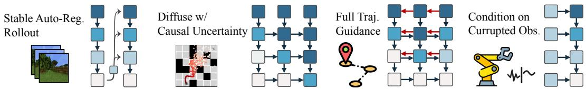

Stabilizing autoregressive generation. For high-dimensional, continuous sequences such as video, auto-regressive architectures are known to diverge, especially when sampling past the training horizon. In contrast, Diffusion Forcing can stably roll out long sequences even beyond the training sequence length by updating the latents using the previous latent associated with slightly "noisy tokens" for some small noise level $0 < k \ll K$ . Our experiments (Sec. 4.1) illustrates the resulting marked improvements in long-horizon generation capabilities; App. B.4 provides further intuition.

Keeping the future uncertain. Beginning from a sequence of white noise tokens $[ \mathbf { x } _ { 1 } ^ { K } , \mathbf { x } _ { 2 } ^ { K } , \mathbf { x } _ { 3 } ^ { K } ] ^ { \top }$ , $[ \mathbf { x } _ { 1 } ^ { 0 } , \mathbf { x } _ { 2 } ^ { K / 2 } , \mathbf { x } _ { 3 } ^ { K } ] ^ { \top }$ , then $[ \mathbf { x } _ { 1 } ^ { 0 } , \mathbf { x } _ { 2 } ^ { 0 } , \mathbf { x } _ { 3 } ^ { K / 2 } ] ^ { \top }$ $[ \mathbf { x } _ { 1 } ^ { 0 } , \mathbf { x } _ { 2 } ^ { 0 } , \mathbf { x } _ { 3 } ^ { 0 } ] ^ { \top }$ uncertainty, this "zig-zag" sampling scheme intuitively encodes the immediate future as more certain than the far future. Sec. 3.4 describes how this leads to more effective sequence guidance. Long-horizon Guidance. In Line 10 of Algorithm 2, one may add guidance to the partially diffused trajectory $\mathbf { x } _ { 1 : T }$ as in Sec. 2. Due to the dependency of future tokens on the past, guidance gradients from future tokens can propagate backwards in time. The unique advantage of Diffusion Forcing is that, because we can diffuse future tokens without fully diffusing the past, the gradient guides the sampling of past tokens, thereby achieving long-horizon guidance while respecting causality. We elaborate on implementation details in Appendix B.3. As we show in Section 4.2, planning in this manner significantly outperforms guided full-sequence diffusion models.

# 3.4 Diffusion Forcing for Flexible Sequential Decision Making

The capabilities offered by Diffusion Forcing motivate our novel framework for sequential decision making (SDM), with key applications to robotics and autonomous agents. Consider a Markov Decision Process defined by an environment with dynamics $p ( \mathbf { s } _ { t + 1 } | \mathbf { s } _ { t } , \mathbf { a } _ { t } )$ , observation $p ( \mathbf { o } _ { t } | \mathbf { s } _ { t } )$ and reward $p ( \mathbf { r } _ { t } | \mathbf { s } _ { t } , \mathbf { a } _ { t } )$ .The goal is to train a policy $\pi ( \mathbf { a } _ { t } | \mathbf { o } _ { 1 : t } )$ such that the expected cumulative reward of a trajectory $\mathbb { E } [ \sum _ { t = 1 } ^ { T } \mathbf { r } _ { t } ]$ is maximized. We assign tokens $\mathbf x _ { t } = \left[ \mathbf a _ { t } , \mathbf r _ { t } , \mathbf o _ { t + 1 } \right]$ A trajectory is a sequence $\mathbf { x } _ { 1 : T }$ , possibly of variable length; training is conducted as in Algorithm 1. At each step $t$ of execution, past (noise-free) tokens $\mathbf { x } _ { 1 : t - 1 }$ are summarized by a latent $\mathbf { z } _ { t - 1 }$ . Conditioned on this latent, we sample, via Algorithm 2, a plan $\hat { \mathbf { x } } _ { t : t + H }$ , with $\hat { \mathbf { x } } _ { t } = [ \hat { \mathbf { a } } _ { t } , \hat { \mathbf { r } } _ { t } , \hat { \mathbf { o } } _ { t + 1 } ] ^ { \top }$ containing predicted actions, rewards and observations. $H$ is a look-ahead window, analogous to future predictions in model predictive control [20]. After taking planned action $\hat { \mathbf { a } } _ { t }$ , the environment produces a reward $\mathbf { r } _ { t }$ and next observation $\mathbf { o } _ { t + 1 }$ , yielding next token $\mathbf { x } _ { t } = \left[ \hat { \mathbf { a } } _ { t } , \mathbf { r } _ { t } , \mathbf { o } _ { t + 1 } \right] ^ { \top }$ The latent is updated according to the posterior $p _ { \theta } ( \mathbf { z } _ { t } | \mathbf { z } _ { t - 1 } , \mathbf { x } _ { t } , 0 )$ . Our framework enables functionality as both policy and planner:

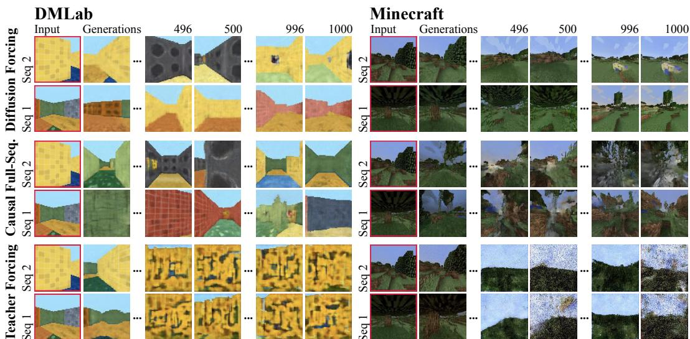  

Figure 3: Video Generation. Among tested methods, Diffusion Forcing generations are uniquely temporally consistent and do not diverge even when rolling out well past the training horizon. Please see the project website for video results.

Flexible planning horizon. Diffusion Forcing (a) can be deployed on tasks of variable horizon, because each new action is selected sequentially, and (b) its lookahead window $H$ can be shortened to lower latency (using Diffusion Forcing as a policy), or lengthened to perform long-horizon planning (via guidance described below), without re-training or modifications of the architecture. Note that (a) is not possible for full-sequence diffusion models like Diffuser [37] with full-trajectory generation horizons, whereas diffusion policies [10] need fixed, small lookahead sizes, precluding (b). Flexible reward guidance. As detailed in Appendix B.3, Diffusion Forcing can plan via guidance using ny r ar din place of $\log c )$ r timeme ste $\scriptstyle \sum _ { t = 1 } ^ { T } \mathbf { r } _ { t }$ $\sum _ { t ^ { \prime } = t } ^ { t + H } \bar { \mathbf { r } } _ { t }$ rewards indicating goal completion ${ \bf \bar { \theta } } - \| \mathbf { o } _ { T } - \mathbf { g } \| ^ { 2 }$ . Per-time step policies cannot take advantage of this latter, longer horizon guidance.

Monte Carlo Guidance (MCG), future uncertainty. Causal Diffusion Forcing allows us to influence the generation of a token $\mathbf { x } _ { t } ^ { k }$ by guidance on the whole distribution of future $\mathbf x _ { t + 1 : T }$ . Instead of drawing a single trajectory sample to calculate this guidance gradient, we can draw multiple samples of the future and average their guidance gradients. We call this Monte Carlo Guidance. In the spirit of so-called shooting methods like MPPI [64], $\mathbf { x } _ { t } ^ { k }$ is then guided by the expected reward over the distribution of allfuture outcomes instead of one particular outcome. The effect of MCG is enhanced when combined with sampling schedules that keep the noise level of future tokens high when denoising immediate next tokens (e.g. the zig-zag schedule described in Sec. 3.3), accounting for greater uncertainty farther into the future. Appendix B.5 further justifies the significance of MCG, and why Diffusion Forcing uniquely takes advantage of it.

# 4 Experiments

We extensively evaluate Diffusion Forcing's merits as a generative sequence model across diverse applications in video and time series prediction, planning, and imitation learning. Please find the dataset and reproducibility details in the Appendix, as well as video results on the project website.

# 4.1 Video Prediction: Consistent, Stable Sequence Generation and Infinite Rollout.

We train a convolutional RNN implementation of Causal Diffusion Forcing for video generative modeling on videos of Minecraft gameplay [69] and DMLab navigation [69]. At sampling time, we

Maze2d-medium-v1 Maze2d-large-v1 start end denoising steps denoising steps • to   
20 : o G Environment MPPI CQL IQL Diffuser\* Diffuser w/ diffused action Ours wo/ MCG Ours   
Maze2D U-Maze 33.2 5.7 47.4 113.9 ± 3.1 6.3 ± 2.1 110.1 ± 3.9 116.7 ± 2.0   
Maze2D Medium 10.2 5.0 34.9 121.5 ± 2.7 13.5±2.3 136.1 ± 10.2 149.4 ± 7.5   
Maze2D Large 5.1 12.5 58.6 123.0 ± 6.4 6.3 ±2.1 142.8 ± 5.6 159.0 ± 2.7   
Single-task Average 16.2 7.7 47.0 119.5 8.7 129.67 141.7   
Multi2D U-Maze 41.2 - 24.8 128.9 ± 1.8 32.8±1.7 107.7 ± 4.9 119.1 ± 4.0   
Multi2D Medium 15.4 12.1 127.2 ± 3.4 22.0±2.7 145.6 ± 6.5 152.3 ± 9.9   
Multi2D Large 8.0 13.9 132.1 ± 5.8 6.9 ±1.7 129.8 ± 1.5 167.1 ±2.7 Multi-task Average 21.5 - 16.9 129.4 20.6 127.7 146.2 perform auto-regressive rollout with stabilization proposed in Sec. 3.3. We consider two baselines, both leveraging the same exact RNN architecture: a next-frame diffusion baseline trained with teacher forcing [65] as well as a causal full-sequence diffusion model. Figure 3 displays qualitative results of roll-outs generated by Diffusion Forcing and baselines starting from unseen frames for both datasets. While Diffusion Forcing succeeds at stably rolling out even far beyond its training horizon (e.g. 1000 frames), teacher forcing and full-sequence diffusion baselines diverge quickly. Further, within the training horizon, we observe that full-sequence diffusion suffers from frame-to-frame discontinuity where video sequences jump dramatically, while Diffusion Forcing roll-outs show ego-motion through a consistent 3D environment. This highlights the ability of Diffusion Forcing to stabilize rollouts of high-dimensional sequences without compounding errors.

# 4.2 Diffusion Planning: MCG, Causal Uncertainty, Flexible Horizon Control.

Decision-making uniquely benefits from Diffusion Forcing's capabilities. We evaluate our proposed decision-making framework in a standard offline RL benchmark, D4RL [18]. Specifically, we benchmark Diffusion Forcing on a set of 2D maze environments with sparse reward. An agent is tasked with reaching a designated goal position starting from a random starting position. In Appendix E.5 we provide a detailed description of the environment. The benchmark provides a dataset of random walks through mazes (thus stochastic). We train one model per maze. We benchmark the proposed decision-making framework 3.4 with state-of-the-art offline RL methods and the recently introduced Diffuser [37], a diffusion planning framework. See Fig. 1 for qualitative and quantitative results: DF outperforms Diffuser and all baselines across all 6 environments. Benefit of Monte Carlo Guidance. The typical goal for an RL problem is to find actions that maximize the expected future rewards, which we achieve through MCG. Full-sequence diffusion models such as Diffuser do not support sampling to maximize expected reward, as we formally derive in Appendix B.5. To understand MCG's importance, we ablate it in Table 1. Removing MCG guidance degrades our performance, though Diffusion Forcing remains competitive even then.

  

Figure 4: In our real robot task, a robot arm is asked to swap the slots of two fruits using a third slot. Since the fruits are input in random slots at the beginning, one cannot determine the next steps from a single observation without knowledge of the initial placement of the fruits. As illustrated in (a) and (b), the upper observation is the same but the desired outcome illustrated below can vary—the task thus requires remembering the initial configuration. In addition, as shown in (c), the same model that generates actions also synthesizes realistic video from just a single frame.

Benefit of Modeling Causality. Unlike pure generative modeling, sequential decision-making takes actions and receives feedback. Due to compounding uncertainty, the immediate next actions are more important than those in the far future. Though Diffuser and subsequent models are trained to generate sequences of action-reward-state tuples $\left[ \mathbf { a } _ { t } , \mathbf { r } _ { t } , \mathbf { o } _ { t } \right]$ , directly executing the actions will lead to a trajectory that deviates significantly from the generated states. In other words, the generated states and actions are not causally consistent with each other. To address this shortcoming, Diffuser's implementation ignores the generated actions and instead relies on a hand-crafted PD controller to infer actions from generated states. In Table 1, we see that Diffuser's performance drops dramatically when directly executing generated actions. In contrast, Diffusion Forcing's raw action generations are self-consistent, outperforming even actions selected by combining Diffuser's state predictions with a handcrafted PD controller. Benefit of Flexible Horizon. Many RL tasks have a fixed horizon, requiring the planning horizon to shrink as an agent makes progress in the task. Diffusion Forcing accomplishes this by design, while full-sequence models like Diffuser perform poorly even with tweaks, as we explain in Appendix B.6.

# 4.3 Controllable Sequential Compositional Generation

We demonstrate that by only modifying the sampling scheme, we can flexibly compose sub-sequences of sequences observed at training time. We consider a dataset of trajectories on a 2D, square plane, where all trajectories start from one corner and end up in the opposite corner, forming a cross shape. As shown in Fig. 1, when no compositional behavior is desired, one can let DF keep full memory, replicating the cross-shaped distribution. When one desires compositionality, one can let the model generate shorter plans without memory using MPC, leading to the stitching of the cross's sub-trajectories, forming a V-shaped trajectory. Due to limited space, we defer the result to AppendixE.2.

# 4.4 Robotics: Long horizon imitation learning and robust visuomotor control

Finally, we illustrate that Diffusion Forcing (DF) opens up new opportunities in the visuomotor control of real-world robots. Imitation learning [10] is a popular technique in robotic manipulation where one learns an observation-to-action mapping from expert demonstrations. However, the lack of memory often prevents imitation learning from accomplishing long-horizon tasks. DF not only alleviates this shortcoming but also provides a way to make imitation learning robust. Imitation Learning with Memory. We collect a dataset of videos and actions by teleoperating with a Franka robot. In the chosen task, one needs to swap the position of an apple and an orange, using a third slot. See Fig. 4 for an illustration. The initial positions of the fruits are randomized such that there are two possible goal states. As illustrated in Fig. 4, when one fruit is in the third slot, the desired outcome cannot be inferred from the current observation—a policy must remember the initial configuration to determine which fruit to move. In contrast to common behavior cloning methods, DF naturally incorporates memory in its latent state. We found that DF achieves $8 0 \%$ success rate while diffusion policy [10], a state-of-the-art imitation learning algorithm without memory, fails. Robustness to missing or noisy observations. Because it incorporates principles from Bayes filtering, Diffusion Forcing can perform imitation learning while being robust to noisy or missing observations. We demonstrate this by adding visual distractions and even fully occluding the camera during execution. DF allows us to easily indicate these observations as "noisy" by using $k > 0$ ,in which case DF relies heavily on its prior model to predict actions. Consequently, the success rate is only lowered by $4 \%$ to $7 6 \%$ . In contrast, a next-frame diffusion model baseline attains a success rate of $\dot { 4 } 8 \%$ : it must treat perturbed observations as ground truth and suffers out-of-distribution error. Potential for pre-training with video. Finally, in parallel to generating actions, Fig. 4 illustrates that Diffusion Forcing is capable of generating a video of the robot performing the task given only an initial frame, unifying diffusion policy/imitation learning and video generative modeling and paving the way to pre-training on unlabeled video.

# 4.5 Time Series Forecasting: Diffusion Forcing is a Good General-purpose Sequence Model

In Appendix E, we show that DF is competitive with prior diffusion [50] and transformer-based [51] work on multivariate time series forecasting, following the experimental setup of [54].

# 5 Discussion

Limitations. Our current causal implementation is based on an RNN. Applications to higherresolution video or more complex distributions likely require large transformer models following instructions in Appendix B.1. We do not investigate the scaling behavior of Diffusion Forcing to internet-scale datasets and tasks. Conclusion. In this paper, we introduced Diffusion Forcing, a new training paradigm where a model is trained to denoise sets of tokens with independent, per-token noise levels. Applied to time series data, we show how a next-token prediction model trained with Diffusion Forcing combines the benefits of both next-token models and full-sequence diffusion models. We introduced new sampling and guidance schemes that lead to dramatic performance gains when applied to tasks in sequential decision making. Future work may investigate the application of Diffusion Forcing to domains other than time series generative modeling, and scale up Diffusion Forcing to larger datasets. Acknowledgements. This work was supported by the National Science Foundation under Grant No. 2211259, by the Singapore DSTA under DST000ECI20300823 (3D Self-Supervised Learning for Label-Efficient Vision), by the IntelligenceAdvanced Research Projects Activity (IARPA) viaDepartment o Interior/Interior Business Center (DOI/IBC) under 140D0423C0075, and by the Amazon Science Hub.

# References

[ A. Ajay, Y. Du, A. Gupt, J. Tenbaum, T. Jaakola, and P. Arawal. Is conditial eneativemoe all you need for decision-making? arXiv preprint arXiv:2211.15657, 2022.   
[2] A. Alexandrov, K. Benidis, M. Bohlke-Schneider, V. Flunkert, J. Gasthaus, T. Januschowski, D. C. Maddix, S. Rangapuram, D. Salinas, J. Schulz, L. Stella, A. C. Türkmen, and Y. Wang. Gluonts: Probabilistic and neural time series modeling in python. Journal of Machine Learning Research, 21(116):16, 2020.   
[3C. Berer, G. Brockman, B.Chan, V. Cheung, P. Debiak, C. Dennison, D. Farhi, Q. Fischer, S. Hashme, C. Hesse, R. Józefowicz, S. Gray, C. Olsson, J. Pachocki, M. Petrov, H. P. de Oliveira Pinto, J. Raiman, T.Salimans, J.Schlatter, J.Schnider, S. Sidor, I. Sutskever, J. Tan, F. Wolski, andS.Zhang. Dota  wih large scale deep reinforcement learning. CoRR, abs/1912.06680, 2019.   
[4 A. Blattan, T. Dockhor, S. Kulal, D.Mendlevitch, M.Kilian, D. Lorenz, Y. Levi, Z. English, V.Vole, A. Letts, V. Jampani, and R. Rombach. Stable video diffusion: Scaling latent video diffusion models to large datasets, 2023.   
[5 A. Block, A. Jadbabaie, D. Pfrommer, M. Simchowitz, and R. Tedrake. Provable guarantees for generative behavior cloning: Bridging low-level stability and high-level behavior. In Thirty-seventh Conference on Neural Information Processing Systems, 2023.   
[ T.B. Brown, B. Man, N. Ryer, M.Subbih, J. Kaplan, P. Dharial, A. Neelakantan, P. Shyam, G. Sasry, A. Askell, S. Agarwal, A. Herbert-Voss, G. Krueger, T. Henighan, R. Child, A. Ramesh, D. M. Ziegler, J. Wu, C. Winter, C. Hesse, M. Chen, E. Sigler, M. Litwin, S. Gray, B. Chess, J. Clark, C. Berner, S. McCandlish, A. Radford, I. Sutskever, and D. Amodei. Language models are few-shot learners. CoRR, abs/2005.14165, 2020.   
[7] S. H. Chan. Tutorial on diffusion models for imaging and vision. arXiv preprint arXiv:2403.18103, 2024.   
[8] M. Chen, A. Radford, R. Child, J. Wu, H. Jun, D. Luan, and I. Sutskever. Generative pretraining from pixels. In International conference on machine learning, pages 16911703. PMLR, 2020.   
[9] T. Chen. On the importance of noise scheduling for diffusion models, 2023.   
[0] C. Chi, Z. Xu, S. Feng, E. Cousineau, Y. Du, B. Burchfiel, R. Tedrake, and S. Song. Diffusion policy: Visuomotor policy learning via action diffusion, 2024.   
[11] K. Cho, B. van Merrienboer, Ç. Gülçehre, F. Bougares, H. Schwenk, and Y. Bengio. Learning phrase representations using RNN encoder-decoder for statistical machine translation. CoRR, abs/1406.1078, 2014.   
[2 J.Chug, K. Kaster, L. Dinh, K. Goel, A.C. Courville, and Y. Bengi.A recet atent varableel for sequential data. Advances in neural information processing systems, 28, 2015.   
[13] J. Cohen, E. Rosenfeld, and Z. Kolter. Certified adversarial robustness via randomized smoothing. In international conference on machine learning, pages 13101320. PMLR, 2019.   
[14] E. de Bézenac, S. S. Rangapuram, K. Benidis, M. Bohlke-Schneider, R. Kurle, L. Stella, H. Hasson, P. Gallinari, and T. Januschowski. Normalizing kalman filters for multivariate time series analysis. In Advances in Neural Information Processing Systems, volume 33, 2020.   
[1 J. Devln, M. Chang, K. Lee, and K. Toutanova. BERT: pre-trainn o deep bidirectonal transrmes for language understanding. CoRR, abs/1810.04805, 2018.   
[16] P. Dhariwal and A. Nichol. Diffusion models beat gans on image synthesis. CoRR, abs/2105.05233, 2021.   
[ C. Feichtenhoer, Y.Li, K. He,  al. Maske autcoders as spatiotemporal earners. Advances in nural information processing systems, 35:3594635958, 2022.   
[18 J. Fu, A. Kumar, O. Nachum, G. Tucker, and S. Levine. DRL: datasets for deep data-driven reinforcement learning. CoRR, abs/2004.07219, 2020.   
[9] S. Go, P. Zhou, M.-M.Cheng, and S. Yan. Masked diffusion tranormer is a strong image synthesizer. In Proceedings of the IEEE/CVF International Conference on Computer Vision, pages 2316423173, 2023.   
[20] C. E. Garcia, D. M. Prett, and M. Morari. Model predictive control: Theory and practice—a survey. Automatica, 25(3):335348, 1989.   
[1] F. Gers, J. Schmidhuber, and F. Cummins. Learning to forget: continual prediction with lstm. In 1999 Ninth International Conference on Artificial Neural Networks ICANN 99. (onf. Publ. No. 470), volume 2, pages 850855 vol.2, 1999.   
[2] D. Hafner, T. P. Lillicrap, J. Ba, and M. Norouzi. Dream to control: Learning behaviors by latent imagination. CoRR, abs/1912.01603, 2019.   
[D. H T. P.Lilicp, I.Fiser,R.Villeas, D. Ha, H. Lee, and J. Davi. Lear t for planning from pixels. CoRR, abs/1811.04551, 2018.   
[24] T. Hang, S. Gu, C. Li, J. Bao, D. Chen, H. Hu, X. Geng, and B. Guo. Efficient diffusion training via min-snr weighting strategy, 2024.   
[25] N. Hansen, X. Wang, and H. Su. Temporal difference learning for model predictive control, 2022.   
Hary, ..M  Wei,n W.Fe videos. In S. Koyejo, S. Mohamed, A. Agarwal, D. Belgrave, K. Cho, and A. Oh, editors, Advances in Neural Information Processing Systems, volume 35, pages 2795327965. Curran Associates, Inc., 2022.   
[27] K. He, X. Chen, S. Xie, Y. Li, P. Dollár, and R. Girshick. Masked autoencoders are scalable vision laners. In Proceding of the IEEE/CV conferenceon computer vision and patten recognition, pages 1600016009, 2022.   
[28] K. He, X. Zhang, S. Ren, and J. Sun. Deep residual learning for image recognition. CoRR, abs/1512.03385, 2015.   
[9]J. Ho, A. Jain, and P. Abbeel. Denoising diffusion probabilistic models. Advances in Neural Informatin Processing Systems (NeurIPS), 33:68406851, 2020.   
[30] J. Ho, A. Jain, and P. Abbeel. Denoising diffusion probabilistic models. CoRR, abs/2006.11239, 2020.   
[31] J. Ho and T. Salimans. Classifier-free diffusion guidance, 2022.   
[32] J. Ho, T. Salimans, A. Gritsenko, W. Chan, M. Norouzi, and D. J. Fleet. Video diffusion models, 2022.   
[33] S. Hochreiter and J. Schmidhuber. Long short-term memory. Neural Comput., 9(8):17351780, nov 1997.   
[34] A. Hu, L. Russell, H. Yeo, Z. Murez, G. Fedoseev, A. Kendall, J. Shotton, and G. Corrado. Gaia-1: A generative world model for autonomous driving. arXiv preprint arXiv:2309.17080, 2023. In  C and Pattern Recognition, pages 1675016761, 2023.   
[36] R. Hyndman, A. B. Koehler, J. K. Ord, and R. D. Snyder. Forecasting with Exponential Smoothing: The State Space Approach. Springer Science & Business Media, 2008.   
[7 M. Janer, Y. Du, J. B. Teebau, nd S. Levie. ang wih diffuin or fexile behavir neis. Proceedings of the International Conference on Machine Learning (ICML), 2022.   
[38] A. Katharopoulos, A. Vyas, N. Pappas, and F. Fleuret. Transformers are rnns: Fast autoregressive transformers with linear attention. CoRR, abs/2006.16236, 2020.   
[ L. e, J. Wag, T.Bhaare, B.Bots, an Srivasa.Graspg wit copsics Combat coe shift in model-free imitation learning for fine manipulation. In 2021 IEEE International Conference on Robotics and Automation (ICRA), pages 61856191. IEEE, 2021.   
[40] D. Kingma and R. Gao. Understanding diffusion objectives as the elbo with simple data augmentation. Advances in Neural Information Processing Systems, 36, 2024.   
[41] R. G. Krishnan, U. Shalit, and D. Sontag. Structured inference networks for nonlinear state space models. In AAAI, 2017.   
[42] G. Lai, W. Chang, Y. Yang, and H. Liu. Modeling long- and short-term temporal patterns with deep neural networks. CoRR, abs/1703.07015, 2017.   
. J. .x. .   . In Conference on robot learning, pages 143156. PMLR, 2017.   
[ X.L. Li, J.Ti, I.Gul .L n . B. Hashgeneration, 2022.   
[45] H. Lütkepohl. New Introduction to Multiple Time Series Analysis. Springer Science & Business Media, 2005.   
[ J. E. Mahend . L. W. So le ort pobably strius an Science, 22(10):10871096, 1976.   
[47] A. Nichol and P. Dhariwal. Improved denoising diffusion probabilistic models. CoRR, abs/2102.09672, 2021.   
[.P, .Ae, Q.yA.Abak, .r .Bi, H., X.C ., L. Derczynski, X. Du, M. Grella, K. Gv, X. He, H. Hou, P. Kazienko, J. Kocon, J. Kong, B. Koptyra, H.La J. Lin K.S.I. M FM A.Sai G. Sg, X. Ta J. W S.  Z. Q. Zhou, J. Zhu, and R.-J. Zhu. RWKV: Reinventing RNNs for the transformer era. In H. Bouamor, J. Pino, and K. Bali, editors, Findings of the Association for Computational Linguistics: EMNLP 2023, pages 1404814077, Singapore, Dec. 2023. Association for Computational Linguistics.   
[ C. Rafe N.Shaz A. Rober, K.Le, S. Nara, M. Mat, . Zho,W. Li, ad P. J.Liu.Exp the limits of transfer learning with a unified text-to-text transformer. CoRR, abs/1910.10683, 2019.   
[50] K. Rasul, C. Seward, I. Schuster, and R. Vollgraf. Autoregressive Denoising Diffusion Models for Multivariate Probabilistic Time Series Forecasting. In Proceedings of the 38th International Conference on Machine Learning, volume 139 of Proceedings of Machine Learning Research, 2021.   
[. Rasul, A.S. Shei, I. Schuster, U.M.Bera, andR. Volgra. Multivariae probablisicime e forecasting via conditioned normalizing flows. In International Conference on Learning Representations, 2021.   
[52] D. Ruhe, J. Heek, T. Salimans, and E. Hoogeboom. Rolling diffusion models. arXiv preprint arXiv:2402.09470, 2024.   
[3] T. Salimans and J. Ho. Progressive distillation for fast sampling of diffusion models. CoRR, abs/2202.00512, 2022.   
[54] D. Salinas, M. Bohlke-Schneider, L. Callot, R. Medico, J. Gasthaus, and R. Medico. High-dimensional multivariate forecasting with low-rank gaussian copula processes. In NeurIPS, 2019.   
[5 D.Salias, V.Flunkert, J. Gasthaus, and T. Januhowski. Deepar: Probabilistc forecastig with auoegressive recurrent networks. International Journal of Forecasting, 36(3):11811191, 2020.   
[ .Salinas, V. Flunker, J. Gasthaus, and T. Januhowski. Deepar: robabilistic forecasting with auoregressive recurrent networks. International Journal of Forecasting, 36(3):11811191, 2020.   
[ J. Sohl-Dickstein, E. Weiss, N. Maheswaranathan, an . Ganu. Deeunsupervd learng u nonequilibrium thermodynamics. In Proceedings of the International Conference on Machine Learning (ICML), 2015.   
[58] J. Song, C. Meng, and S. Ermon. Denoising diffusion implicit models. CoRR, abs/2010.02502, 2020.   
[59] B. Tang and D. S. Matteson. Probabilistic transformer for time series analysis. In A. Beygelzimer, Y. Dauphin, P. Liang, and J. W. Vaughan, editors, Advances in Neural Information Processing Systems, 2021.   
[0 H. Touvrn, P. Bojaowski, M.Caron, M.Cor A. E-Nouby, E.Grave, A. Joulin, G. Synve, J.Vrbek, and H. Jégou. Resmlp: Feedforward networks for image classification with data-efficient training. CoRR, abs/2105.03404, 2021.   
[A. Van den Oord, N. Kalchbrenner, L. Espeholt, O. Vinyals, A. Graves, et al. Conditional image generation with pixelcnn decoders. Advances in neural information processing systems, 29, 2016.   
[62] R. van der Weide. Go-garch: A multivariate generalized orthogonal garch model. Journal of Applied Econometrics, 17(5):549564, 2002.   
[3]C. Wei, K. Mangalam, P.-Y. Huan, Y. Li, H. Fan, H. Xu, H. Wang, C. Xie, A. Yuile, and C. Feichteor. Diffusion models as masked autoencoders. In Proceedings of the IEEE/CVF International Conference on Computer Vision, pages 1628416294, 2023.   
[64] G. Williams, A. Aldrich, and E. Theodorou. Model predictive path integral control using covariance variable importance sampling. arXiv preprint arXiv:1509.01149, 2015.   
[65] R. J. Williams and D. Zipser. A Learning Algorithm for Continually Running Fully Recurrent Neural Networks. Neural Computation, 1(2):270280, 06 1989.   
[ . Wu Z.Fan X.LiuY.Go .Shen, J. Jiao, H.T. Ze, J. Li, Z. Wei J.Guo, . nd W.. Ar-diffusion: Auto-regressive diffusion model for text generation, 2023.   
Wu Z.Fan X.Liu H.T. Ze . J. Jio, J.Li J.Guo .D W.he  .Ar-if: Auto-regressive diffusion model for text generation. Advances in Neural Information Processing Systems, 36:3995739974, 2023.   
[68] T. Yan, H. Zhang, T. Zhou, Y. Zhan, and Y. Xia. Scoregrad: Multivariate probabilistic time series forecasting with continuous energy-based generative models, 2021.   
[9] W. Yan, D. Hafner, S. James, and P. Abbeel. Temporally consistent transformers for video generation, 2023.   
[70] R. Yang, P. Srivastava, and S. Mandt. Diffusion probabilistic modeling for video generation. Entropy, 25(10):1469, 2023.   
.Yao D.Yu, JZao, Sa T.L.GriY.Cao an. ara.Tree o:Del problem solving with large language models, 2023.   
[72] H. Yu, N. Rao, and I. S. Dhillon. Temporal regularized matrix factorization. CoRR, abs/1509.08333, 2015.

# A Theoretical Justification

I ti c e roihel stathea i FrTei be summarized as follows: •We show that our training methods optimize a reweighting of the Evidence Lower Bound (ELBO) on the average log-likelihood of our data. We first establish this in full generality (Theorem A.1), and then specialize to the form of Gaussian diffusion (Corollary A.2). We show that the resulting terms decouple in such a fashion that, in the limit of a fully expressive latent and model, makes the reweighting terms immaterial. •We show that the expected likelihood over any distribution over sequences of noise levels can be lower bounded by a sum over nonnegative terms which, when reweighted, correspond to the terms optimized in the Diffusion Forcing training objective maximizes. Thus, for a fully expressive network that can drive all terms to their minimal value, Diffusion Forcing optimizes a valid surrogate of the likelihood of all sequences of noise levels simultaneously. We begin by stating an ELBO for general Markov forward processes $q ( \cdot )$ , and generative models $p _ { \theta } ( \cdot )$ , and then specialize to Gaussian diffusion, thereby recovering our loss. We denote our Markov forward process $q ( \cdot )$ as and a parameterized probability model

$$
q ( \mathbf { x } ^ { 1 : K } \mid \mathbf { x } ^ { 0 } ) = \prod _ { k = 1 } ^ { K } q ( \mathbf { x } ^ { k } \mid \mathbf { x } ^ { k - 1 } ) ,
$$

$$
p _ { \pmb { \theta } } \big ( \big ( ( \mathbf { x } _ { t } ^ { k } ) _ { 1 \leq k \leq K } , \mathbf { z } _ { t } \big ) _ { t \geq 1 } \big )
$$

We assume that $p _ { \theta }$ satisfies the Markov property that that is, the latent codes $\mathbf { z } _ { t - 1 }$ is a sufficient statistic for $\mathbf { x } ^ { k _ { t } }$ given the history. We say that $p _ { \theta }$ has deterministic latents if $p _ { \theta } ( \mathbf { z } _ { t } \mid \mathbf { z } _ { 1 : t - 1 } , ( \mathbf { x } _ { s } ^ { k _ { s } } ) _ { 1 \leq s < t } , \mathbf { x } _ { t } ^ { k _ { t } } )$ is a Dirac delta.

$$
p _ { \theta } ( \mathbf { z } _ { t } , \mathbf { x } _ { t } ^ { k _ { t } } \mid \mathbf { z } _ { 1 : t - 1 } , ( \mathbf { x } _ { s } ^ { k _ { s } } ) _ { 1 \leq s < t } ) = p _ { \theta } ( \mathbf { z } _ { t } , \mathbf { x } ^ { k _ { t } } \mid \mathbf { z } _ { t - 1 } )
$$

Remark 1. In order for $p _ { \theta }$ to have deterministic latents and correspond to a valid probability distribution, we need to view the latents $\mathbf { z } _ { t }$ not as individual variables, but as a collection of variables $\bar { \mathbf { z } } _ { t } ( k _ { 1 : t } )$ indexed by $t \in [ T ]$ a e $k _ { 1 : t } \in \{ 0 , 1 , \ldots , K \} ^ { t }$ In tis cae, siply setting $\mathbf { z } _ { t } ( k _ { 1 : t } ) = ( k _ { 1 : t } , ( \mathbf { x } _ { s } ^ { k _ { s } } ) _ { 1 \leq s \leq t }$ o therwise, tautologically produces deterministic latents. The reason for indexing $p _ { \pmb { \theta } } \big ( \mathbf { z } _ { t } \mid \big ( ( \mathbf { x } _ { s } ^ { k _ { s } } \big ) _ { 1 \leq s \leq t } , ( \mathbf { x } _ { s } ^ { k _ { s } ^ { \prime } } \big ) _ { 1 \leq s \leq t } \big )$ would be l lfined unless $\mathbf { z } _ { t } ( k _ { 1 : t } )$ $k _ { s } = k _ { s } ^ { \prime }$ with for  alt then arises because, $1 \leq s \leq t$ athus, $p _ { \pmb { \theta } }$ would not correspond to a joint probability measure. The exposition and theorem that follows allow $\mathbf { z } _ { t } ( k _ { 1 : t } )$ to be indexed on past noise levels $k _ { 1 : t }$ but suppresses dependence on $k _ { 1 : t }$ to avoid notational confusion.

# A.1 Main Results

We can now state our main theorem, which provides an evidence lower bound (ELBO) on the expected loglikelihood of partially-noised sequences $( \mathbf { x } _ { t } ^ { k _ { t } } ) _ { 1 \leq t \leq T }$ , under uniformly sampled levels $k _ { t }$ and $\mathbf { x } _ { t } ^ { k _ { t } }$ obtained by noising according to $q ( \cdot )$ $q ( \cdot )$ r $p _ { \theta }$ , but we will specialize to Gaussian diffusion in the following section. Theorem A.1. $F i x { \bf x } _ { 1 : T } ^ { 0 }$ .Define the expectation over the forward process with random noise level $k _ { 1 : T }$ as and the expectation over the latents under $p _ { \theta } ( \cdot )$ conditioned on $k _ { 1 : T } , ( \mathbf { x } _ { s } ^ { k _ { t } } ) _ { 1 \leq t \leq T }$ as

$$
\underline { { \mathbb { E } } } _ { \mathrm { r w a r d } } [ \cdot ] : = \mathbb { E } \underset { k _ { 1 } , \ldots , k _ { T } \underset { \sim } { \mathrm { u n i f } } [ K ] } { \mathbb { E } } \times \underset { s } { \mathbb { E } } { \mathbb { E } } _ { s } \sim q ( \mathbf { x } _ { s } ^ { k _ { s } } \mid \mathbf { x } _ { s } ^ { 0 } ) , 1 \leq s \leq T  ( \cdot ] ,
$$

$$
\underset { p , \mathbf { z } _ { 1 : T } } { \mathbb { E } } [ \cdot ] : = \underset { \mathbf { z } _ { s } \sim p ( \mathbf { z } _ { s } \mid \mathbf { z } _ { s - 1 } , \mathbf { x } _ { s } ^ { k _ { s } } ) , s \leq T } { \mathbb { E } } \Big [ \cdot \mid k _ { 1 : T } , ( \mathbf { x } _ { t } ^ { k _ { t } } ) _ { 1 \leq t \leq T } \Big ]
$$

Then, as long as pe satisfies the Markov property, where $C ( \mathbf { x } _ { 1 : T } ^ { 0 } )$ is a constant depending only on $\mathbf { x } _ { 1 : T } ^ { 0 }$ (the unnoised data). Moreover, if the latents are deterministic (i.e. $p _ { \pmb { \theta } } ( \mathbf { z } _ { t } \mid \mathbf { z } _ { t - 1 } , \mathbf { x } _ { t } ^ { k _ { t } } )$ $q ( \mathbf { x } _ { t } ^ { k _ { t } + 1 : T } \mid \mathbf { x } _ { t } ^ { k _ { t } } ) \equiv p _ { \theta } ( \mathbf { x } _ { t } ^ { k _ { t } + 1 : T } \mid \mathbf { x } _ { t } ^ { k _ { t } } , \mathbf { z } _ { t - 1 } )$

$$
\begin{array} { l } { { \displaystyle \mathop { \mathbb { E } } _ { \mathrm { o r s a r d } } ^ { \mathbb { E } } \| { \bf n } p _ { \theta } \big ( ( { \bf x } _ { t } ^ { k _ { t } } ) _ { 1 \le t \le T } \big ) \big \| \ge C ( { \bf x } _ { 1 : T } ^ { 0 } ) } } \\ { { \displaystyle + \mathop { \mathbb { E } } _ { \mathrm { f o r s a r d } } p _ { , { \bf z } _ { 1 : T } } \left[ \sum _ { t = 1 } ^ { T } \left( \frac { 1 } { K + 1 } \ln p _ { \theta } \big ( { \bf x } _ { t } ^ { 0 } \mid { \bf x } _ { t } ^ { 1 } , { \bf z } _ { t - 1 } \big ) + \sum _ { j = 2 } ^ { K } \frac { j } { K + 1 } \mathrm { D } _ { \mathbb { S } \mathbb { L } } \left( q \big ( { \bf x } _ { t } ^ { j - 1 } \mid { \bf x } _ { t } ^ { j } , { \bf x } _ { t } ^ { 0 } \big ) \big \| p _ { \theta } \big ( { \bf x } _ { t } ^ { j } \mid { \bf x } _ { t } ^ { j - 1 } , { \bf z } _ { t - 1 } \big ) \right) \right) \right] , } } \end{array}
$$

The proof o the above theorem is given in Appendix A.. Remarkably, it involves only two inequalities! The frst hol wi eualyndeeatentanhe hol n nval is exact: $q ( \mathbf { x } _ { t } ^ { k _ { t } + 1 : T } \mid \mathbf { x } _ { t } ^ { k _ { t } } ) \equiv p _ { \theta } ( \mathbf { x } _ { t } ^ { k _ { t } + 1 : T } \mid \mathbf { x } _ { t } ^ { k _ { t } } , \mathbf { z } _ { t - 1 } )$ T   B h in Theorem A.1 is a relatively strong surrogate objective for optimizing the likelihoods.

# A.1.1 Specializing to Gaussian diffusion

We now special Theorem A.1 to Gaussian diffusion. For now, we focus on the " $\mathbf { x }$ -prediction" formulation of diffusion, which is the one used in our implementation. The " $\epsilon$ -prediction" formalism, used throughout the theorem follows directly by apply standard likelihood and KL-divergence computations for the DDPM [29, 7] to Theorem A.1.

# Corollary A.2. Let

$$
q ( \mathbf { x } ^ { k + 1 } \mid \mathbf { x } _ { t } ^ { k } ) = \mathcal { N } ( \mathbf { x } ^ { k } ; \sqrt { 1 - \beta _ { k } } \mathbf { x } ^ { k - 1 } , \beta _ { k } \mathbf { I } ) ,
$$

and define $\alpha _ { k } ~ = ~ ( 1 - \beta _ { k } )$ $\begin{array} { r } { \bar { \alpha } _ { k } \ = \ \prod _ { j = 1 } ^ { k } \alpha _ { j } } \end{array}$ Suppose that we parametrize $\begin{array} { r l } { p _ { \pmb { \theta } } ( \mathbf { x } _ { t } ^ { j } } & { { } | ~ \mathbf { x } _ { t } ^ { j + 1 } , \mathbf { z } _ { t - 1 } ) ~ = } \end{array}$ $\mathcal { N } ( \mu _ { \pmb { \theta } } ( \mathbf { x } _ { t } ^ { j + 1 } , \mathbf { z } _ { t - 1 } , j ) , \sigma _ { j } ^ { 2 } )$ , where further,

$$
\iota _ { \theta } \big ( \mathbf { x } _ { t } ^ { j } , \mathbf { z } _ { t - 1 } , j \big ) = \frac { \big ( 1 - \bar { \alpha } _ { j - 1 } \big ) \sqrt { \alpha _ { j } } } { 1 - \bar { \alpha } _ { j } } \mathbf { x } _ { t } ^ { j } + \frac { \big ( 1 - \alpha _ { j } \big ) \sqrt { \bar { \alpha } _ { j - 1 } } } { 1 - \bar { \alpha } _ { j } } \hat { \mathbf { x } } _ { \theta } \big ( \mathbf { x } _ { t } ^ { j } , \mathbf { z } _ { t - 1 } , j \big ) , \quad \sigma _ { j } ^ { 2 } : = \frac { \big ( 1 - \alpha _ { j } \big ) \big ( 1 - \sqrt { \bar { \alpha } _ { j - 1 } } \big ) } { 1 - \bar { \alpha } _ { j } } .
$$

Then, as long as pe satisfies the Markov property, we obtained where above, e define $\begin{array} { r } { c _ { j } = \frac { ( 1 - \alpha _ { j } ) ^ { 2 } \bar { \alpha } _ { j - 1 } } { 2 \sigma ^ { 2 } ( 1 - \bar { \alpha } _ { j } ) ^ { 2 } } } \end{array}$

$$
\begin{array} { r } { \underset { \mathrm { r e w a r d } } { \mathbb { E } } \big [ \ln p _ { \theta } \big ( \big ( \mathbf { x } _ { t } ^ { k _ { t } } \big ) _ { 1 \le t \le T } \big ) \big ] + C ( \mathbf { x } _ { 1 : T } ^ { 0 } ) \ge \underset { \mathrm { f o r w a r d } } { \mathbb { E } } \underset { p , \mathbf { z } _ { 1 : T } } { \mathbb { E } } \left[ \displaystyle \sum _ { t = 1 } ^ { T } \frac { j } { K + 1 } \sum _ { j = 1 } ^ { K } c _ { j } \| \hat { \mathbf { x } } _ { \theta } ^ { 0 } ( \mathbf { x } _ { t } ^ { j } , \mathbf { z } _ { t - 1 } , j ) - \mathbf { x } _ { t } ^ { 0 } \| ^ { 2 } \right] } \\ { = \underset { \mathrm { f o r w a r d } } { \mathbb { E } } \underset { p , \mathbf { z } _ { 1 : T } } { \mathbb { E } } \left[ \displaystyle \sum _ { t = 1 } ^ { T } \mathbf { 1 } \big \{ k _ { t } \ge 1 \big \} \cdot k _ { t } c _ { k _ { t } } \| \big \hat { \mathbf { x } } _ { \theta } ^ { 0 } ( \mathbf { x } _ { t } ^ { k _ { t } } , \mathbf { z } _ { t - 1 } , k _ { t } ) - \mathbf { x } _ { t } ^ { 0 } \| ^ { 2 } \right] , } \end{array}
$$

Proof. The first inequality follows from the standard computations for the ' $\mathbf { \dot { x } }$ -prediction" formulation of Diffusion (see Section 2.7 of [7] and references therein). The second follows by replacing the sum over $j$ with an expectation over $k _ { t } \stackrel { \mathrm { u n i f } } { \sim } \{ 0 , 1 , \ldots , K \}$ . □ We make a couple of remarks: •As noted above, Corollary A.2 can also be stated for $\epsilon$ -prediction, or the so-called "v-prediction" formalism, as all are affinely related.   

•Define an idealized latent $\tilde { \mathbf { z } } _ { t - 1 }$ consisting of all past tokens $\left( \mathbf { x } _ { t } ^ { k _ { t } } \right)$ as well as of their noise levels $k _ { t }$ .This is a sufficient statistic for $\mathbf { z } _ { t - 1 }$ , and thus we can always view $\hat { \mathbf { x } } _ { \pmb { \theta } } ^ { 0 } ( \mathbf { x } _ { t } ^ { k _ { t } } , \mathbf { z } _ { t - 1 } , k _ { t } ) =$ $\hat { \mathbf { x } } _ { \pmb { \theta } } ^ { 0 } \big ( \mathbf { x } _ { t } ^ { k _ { t } } , \bar { \mathbf { z } } _ { t - 1 } , k _ { t } \big )$ , where $\mathbf { z } _ { t - 1 }$ is just compressing $\bar { \mathbf { z } } _ { t - 1 }$ When applying the expectation of $\mathbf { x } _ { 1 : T } \sim q$ to both sides of the bound in Corollary A.2, and taking an infimum over possible function approximator $\hat { \mathbf { x } } _ { \theta } ^ { 0 }$ ,we obtain

$$
\begin{array} { r l } & { \underset { p _ { \theta } } { \operatorname* { i n f } } \mathbb { E } \underset { q \mathrm { ~ f o r w a r d } } { \mathbb { E } } \underset { p , \mathbf { z } _ { 1 : T } } { \mathbb { E } } \lVert \hat { \mathbf { x } } _ { \theta } ^ { 0 } ( \mathbf { x } _ { t } ^ { k _ { t } } , \mathbf { z } _ { t - 1 } , k _ { t } ) - \mathbf { x } _ { t } ^ { 0 } \rVert ^ { 2 } = \underset { p _ { \theta } } { \operatorname* { i n f } } \mathbb { E } \underset { q \mathrm { ~ f o r w a r d } } { \mathbb { E } } \underset { p , \mathbf { z } _ { 1 : T } } { \mathbb { E } } \lVert \hat { \mathbf { x } } _ { \theta } ^ { 0 } ( \mathbf { x } _ { t } ^ { k _ { t } } , \bar { \mathbf { z } } _ { t - 1 } ) - \mathbf { x } _ { t } ^ { 0 } \rVert ^ { 2 } } \\ & { \qquad = \mathbf { V a r } _ { q } [ \mathbf { x } _ { t } ^ { 0 } \mid ( \mathbf { x } _ { s } ^ { k _ { s } } ) _ { 1 \leq s \leq t } , k _ { 1 } , \dots , k _ { t } ] . } \end{array}
$$

This leads to a striking finding: with expressive enough latents and $p _ { \theta }$ , we can view the maximization of each term in Corollary A.2 separately across time steps. The absence of this coupling means that the weighting terms are immaterial to the optimization, and thus can be ignored. •Given the above remarks, we can optimize the ELBO by taking gradients through the objective specified by Corollary A.2, and are free to drop any weighting terms (or rescale them) as desired. Backpropagation through $\mathbb { E } _ { p , \mathbf { z } _ { 1 : T } }$ is straightforward due to deterministic latents. This justifies the correctness of our training objective (3.1) and protocol Algorithm 1.

# A.1.2 Capturing all subsequences

Theorem A.1 stipulates that, up to reweighting, the Diffusion Forcing objective optimizes a valid ELBO on the expected log-likelihoods over uniformly sampled noise levels. The following theorem can be obtained by a straightforward modification of the proof of Theorem A.1 generalizes this to arbitrary (possibly temporally correlated) sequences of noise.

Theorem A.3. Let $\mathcal { D }$ be an arbitrarydistributionovr $[ K ] ^ { T }$ , and define $P t ( j \mid k _ { 1 : t - 1 } ) : = \operatorname* { P r } _ { \mathcal { D } } [ k _ { t } = j \mid k _ { 1 : t - 1 } ]$ . Fix $\mathbf { x } _ { 1 : T } ^ { 0 }$ . Define the expectation over the forward process with random noise level $k _ { 1 : T }$ as and the expectation over the latent under $p _ { \theta } ( \cdot )$ conditioned on $k _ { 1 : T } , ( \mathbf { x } _ { s } ^ { k _ { t } } ) _ { 1 \leq t \leq T }$ as

$$
\underset { \mathrm { f o r w a r d } , \mathcal { D } } { \mathbb { E } } [ \cdot ] : = \underset { k _ { 1 } , \ldots , k _ { T } \sim \mathcal { D } } { \mathbb { E } } _ { \mathbf { x } _ { s } ^ { k _ { s } } \sim q ( \mathbf { x } _ { s } ^ { k _ { s } } \mid \mathbf { x } _ { s } ^ { 0 } ) , 1 \leq s \leq T } [ \cdot ] ,
$$

$$
\underset { p , \mathbf { z } _ { 1 : T } } { \mathbb { E } } [ \cdot ] : = \underset { \mathbf { z } _ { s } \sim p ( \mathbf { z } _ { s } \mid \mathbf { z } _ { s - 1 } , \mathbf { x } _ { s } ^ { k _ { s } } ) , s \leq T } { \mathbb { E } } \Big [ \cdot \mid k _ { 1 : T } , ( \mathbf { x } _ { t } ^ { k _ { t } } ) _ { 1 \leq t \leq T } \Big ]
$$

Then, as long as pe satisfies the Markov property, b $\begin{array} { r l } & { \quad \underset { \mathrm { o r w a r d } , \mathscr { T } } { \mathbb { E } } [ \ln p \theta \left( \left( \mathbf { x } _ { t } ^ { k _ { t } } \right) _ { 1 \leq t \leq T } \right) ] \geq C ( \mathbf { x } _ { 1 : T } ^ { 0 } ) + \underset { \mathrm { f o r w a r d } , \mathscr { D } _ { p , \mathbf { z } _ { 1 : T } } } { \mathbb { E } } \left[ \underset { t = 1 } { \overset { T } { \sum } } \Xi _ { t } \right] , w h e r e } \\ & { \overset { \geq } \varepsilon _ { t } : = \left( P _ { t } ( 1 \mid k _ { 1 : t - 1 } ) \ln p \theta \left( \mathbf { x } _ { t } ^ { 0 } \mid \mathbf { x } _ { t } ^ { 1 } , \mathbf { z } _ { t - 1 } \right) + \underset { j = 2 } { \overset { K } { \sum } } j P _ { t } ( j \mid k _ { 1 : t - 1 } ) \mathrm { D } _ { \mathbb { K L } } \left( q ( \mathbf { x } _ { t } ^ { j - 1 } \mid \mathbf { x } _ { t } ^ { j } , \mathbf { x } _ { t } ^ { 0 } ) \parallel p \theta \left( \mathbf { x } _ { t } ^ { j } \mid \mathbf { x } _ { t } ^ { j - 1 } , \mathbf { z } _ { t - 1 } \right) \right) \right) } \end{array}$ . ) where $C ( \mathbf { x } _ { 1 : T } ^ { 0 } )$ is a constant depending only on $\mathbf { x } _ { 1 : T } ^ { 0 }$ (the noise-free data), and where the inequality is an equality under the conditions that (a) $p _ { \pmb { \theta } } ( \mathbf { z } _ { t } \mid \mathbf { z } _ { t - 1 } , \mathbf { x } _ { t } ^ { k _ { t } } )$ is a Dirac distribution (deterministic latents), and (b) $q ( \mathbf { x } _ { t } ^ { k _ { t } + 1 : T } \mid \mathbf { x } _ { t } ^ { k _ { t } } ) \equiv p _ { \theta } ( \mathbf { x } _ { t } ^ { k _ { t } + 1 : T } \mid \mathbf { x } _ { t } ^ { k _ { t } } , \mathbf { z } _ { t - 1 } )$ In particular, in the Gaussian case of Corollary A.2, we have

$$
\underset { \mathrm { r e w a r d } , \mathcal { D } } { \mathbb { E } } [ \ln p \theta \big ( ( \mathbf { x } _ { t } ^ { k _ { t } } ) _ { 1 \le t \le T } \big ) ] + C ( \mathbf { x } _ { 1 : T } ^ { 0 } ) \ge \underset { \mathrm { f o r w a r d } , \mathcal { D } } { \mathbb { E } } \underset { p , \mathbf { z } _ { 1 : T } } { \mathbb { E } } \left[ \sum _ { t = 1 } ^ { T } \mathbf { 1 } \{ k _ { t } \ge 1 \} k _ { t } c _ { k _ { t } } \| \hat { \mathbf { x } } _ { \theta } ^ { 0 } ( \mathbf { x } _ { t } ^ { k _ { t } } , \mathbf { z } _ { t - 1 } , k _ { t } ) - \mathbf { x } _ { t } ^ { 0 } \| ^ { 2 } \right] .
$$

The most salient case for us is the restriction of $\mathcal { D }$ to fixed sequences of noise $k _ { 1 } , \dots , k _ { T }$ (i.e. Dirac distributions on $[ K ] ^ { T } )$ . In this case, $P _ { t } ( j \mid k _ { 1 : t - 1 } ) = 0$ for all but $j = k _ { t }$ , and thus our training objective need not be a lower bound on $\mathbb { E } _ { \mathrm { f o r w a r d } , \mathcal { D } } \big [ \ln p _ { \theta } \big ( \big ( \mathbf { x } _ { t } ^ { k _ { t } } \big ) _ { 1 \leq t \leq T } \big ) \big ]$ .However, the terms in the lower bound are, up to reweighting, an thos r tiz th eciThu in ht  the ar olowCrolA., a fully expressive network can optimize all the terms in the loss simultaneously. We conclude that, for a fuy eresive neural etwork,tizing the trai jetiv 3.1is a val srat or axi the likelihood of all possible noise sequences.

# A.2 Proof of Theorem A.1

Defie $\mathbb { E } _ { < t } [ \cdot ]$ as shorthhand for $\mathbb { E } _ { k _ { 1 : s } \sim [ k ] } \mathbb { E } _ { \mathbf { x } _ { s } ^ { k _ { s } } \sim q ( \mathbf { x } _ { s } ^ { k _ { s } } \mid \mathbf { x } _ { s } ^ { 0 } ) , 1 \le s \le t - 1 } \mathbb { E } _ { \mathbf { z } _ { s } \sim p ( \mathbf { z } _ { s } \mid \mathbf { z } _ { s - 1 } , \mathbf { x } _ { s } ^ { k _ { s } } ) , s \le t } [ \cdot ]$ We begn with the following claim Claim 1 (Expanding the latents). The following lower bound holds:

$$
\underset { \mathrm { f o r w a r d } } { \mathbb { E } } [ \ln p \theta \big ( \big ( \mathbf { x } _ { t } ^ { k _ { t } } \big ) _ { 1 \le t \le T } \big ) ] \ge \sum _ { t = 1 } ^ { T } \underset { < t } { \mathbb { E } } \underset { k _ { t } ^ { \mathrm { u n i f } } \ \{ 0 , 1 , \dots , K \} } { \mathbb { E } } \ \underset { \mathbf { x } _ { t } ^ { k _ { t } } \sim q ( \mathbf { x } _ { t } ^ { k _ { t } } \mid \mathbf { x } _ { t } ^ { 0 } ) } { \mathbb { E } } \Big [ \ln p \theta \big ( \mathbf { x } _ { t } ^ { k _ { t } } \mid \mathbf { z } _ { t - 1 } \big ) \Big ] ,
$$

Moreover, this lower bound holds with equality $i f \mathbf { z } _ { s } \sim p ( \mathbf { z } _ { s } \mid \mathbf { z } _ { s - 1 } , \mathbf { x } _ { s } ^ { k _ { s } } )$ buion .eistic latents). Proof. Let's fix a sequence $k _ { 1 : T }$ . It holds that

$$
\begin{array} { l } { \displaystyle p \theta \big ( ( { \mathbf x } _ { t } ^ { k _ { t } } ) _ { 1 \leq t \leq T } \big ) = \int _ { \mathbf z _ { 1 } \times T } \displaystyle \prod _ { t = 1 } ^ { T } p ( { \mathbf x } _ { t } ^ { k _ { t } } , \mathbf z _ { t } \mid ( { \mathbf x } _ { s } ^ { k _ { s } } , \mathbf z _ { s } ) _ { s < t } ) } \\ { = \int _ { \mathbf z _ { 1 } \times T } \displaystyle \prod _ { t = 1 } ^ { T } p ( { \mathbf x } _ { t } ^ { k _ { t } } , \mathbf z _ { t } \mid \mathbf z _ { t - 1 } ) } \\ { = \int _ { \mathbf z _ { 1 } \times T } \displaystyle \prod _ { t = 1 } ^ { T } p ( { \mathbf z } _ { t } \mid \mathbf z _ { t - 1 } , \mathbf x _ { t } ^ { k _ { t } } ) p \theta ( { \mathbf x } _ { t } ^ { k _ { t } } \mid \mathbf z _ { t - 1 } ) } \\ { = \int _ { \mathbf z _ { 1 } \times T } \displaystyle \mathrm { K } \sum _ { t = 1 } ^ { T } p ( { \mathbf z } _ { t } \mid \mathbf z _ { t - 1 } , \mathbf x _ { t } ^ { k _ { t } } ) p \theta ( { \mathbf x } _ { t } ^ { k _ { t } } \mid \mathbf z _ { t - 1 } ) } \\ { = \underbrace { T } _ { \displaystyle \mathbf z _ { s } \sim p ( \mathbf z _ { s } \mid \mathbf z _ { s - 1 } , \mathbf x _ { s } ^ { k _ { s } } ) , s \in T } \displaystyle \prod _ { t = 1 } ^ { T } p _ { \theta } ( { \mathbf x } _ { t } ^ { k _ { t } } \mid \mathbf z _ { t - 1 } ) . } \end{array}
$$

(Importance Sampling) Thus, by Jensen's inequaliy, wh he equalitys nqualiy whn $p _ { \pmb { \theta } } \big ( \mathbf { z } _ { s } \mid \mathbf { z } _ { s - 1 } , \mathbf { x } _ { s } ^ { k _ { s } } \big )$ s aisrtin. By pp $\mathbb { E } _ { \mathrm { f o r w a r d } }$ to both sides of the above display, and invoking the Markov property of the latents, we conclude that

$$
\ln p _ { \theta } \big ( \big ( \mathbf { x } _ { t } ^ { k _ { t } } \big ) _ { 1 \le t \le T } \big ) \ge \underset { \mathbf { z } _ { s } \sim p ( \mathbf { z } _ { s } | \mathbf { z } _ { s - 1 } , \mathbf { x } _ { s } ^ { k _ { s } } ) , s \le T } { \mathbb { E } } \sum _ { t = 1 } ^ { T } \ln p _ { \theta } \big ( \mathbf { x } _ { t } ^ { k _ { t } } \mid \mathbf { z } _ { t - 1 } \big ) = \underset { p , \mathbf { z } _ { 1 : T } } { \mathbb { E } } \left[ \sum _ { t = 1 } ^ { T } \ln p _ { \theta } \big ( \mathbf { x } _ { t } ^ { k _ { t } } \mid \mathbf { z } _ { t - 1 } \big ) \right] ,
$$

$$
\begin{array} { r l } & { \quad \underset { \mathrm { f o r w a r d } } { \mathbb { E } } [ \ln p \theta \big ( \big ( \mathbf { x } _ { t } ^ { k _ { t } } \big ) _ { 1 \le t \le T } \big ) ] \ge \underset { \mathrm { f o r w a r d } } { \mathbb { E } } \underset { p , \mathbf { z } _ { 1 : T } } { \mathbb { E } } \left[ \overset { T } { \sum _ { t = 1 } ^ { T } } \ln p \theta \big ( \mathbf { x } _ { t } ^ { k _ { t } } \mid \mathbf { z } _ { t - 1 } \big ) \right] } \\ & { \quad \quad \quad \quad \quad = \underset { t = 1 } { \overset { T } { \sum } } \underset { < t _ { k _ { t } } \mathrm { w a r d } } { \mathbb { E } } \underset { \{ 0 , 1 , \dots , K \} } { \mathbb { E } } \underset { \mathbf { x } _ { t } ^ { k _ { t } } \sim q \big ( \mathbf { x } _ { t } ^ { k _ { t } } \mid \mathbf { x } _ { t } ^ { 0 } \big ) } { \mathbb { E } } \left[ \ln p \theta \big ( \mathbf { x } _ { t } ^ { k _ { t } } \mid \mathbf { z } _ { t - 1 } \big ) \right] . } \end{array}
$$

We now unpack the terms obtained from the preceding claim.

Claim 2 (ELBO w.r.t. $q$ ). It holds that where $C _ { 1 } ( \mathbf { x } _ { 0 } , k _ { t } )$ is a constant depending only on $\mathbf { x } _ { \mathrm { 0 } }$ and $k _ { t }$ , and where the inequality holds with equality if and only i $^ { c } q ( \mathbf { x } _ { t } ^ { k _ { t } + 1 : T } \mid \mathbf { x } _ { t } ^ { k _ { t } } ) \equiv p _ { \theta } ( \mathbf { x } _ { t } ^ { k _ { t } + 1 : T } \mid \mathbf { x } _ { t } ^ { k _ { t } } , \mathbf { z } _ { t - 1 } )$

$$
\mathbb { E } _ { \mathbf { z } _ { t } ^ { k _ { t } } \sim q ( \mathbf { x } _ { t } ^ { k _ { t } } \mid \mathbf { x } _ { t } ^ { 0 } ) } \left[ \ln p _ { \theta } ( \mathbf { x } _ { t } ^ { k _ { t } } \mid \mathbf { z } _ { t - 1 } ) \right] \geq C _ { 1 } ( \mathbf { x } _ { 0 } , k _ { t } ) + \left[ \underset { \mathbf { x } _ { t } ^ { k _ { t } + K } \sim q ( \mathbf { x } _ { t } ^ { k _ { t } + K } \mid \mathbf { x } _ { t } ^ { 0 } ) } { \mathbb { E } } \ln \frac { \ln p _ { \theta } ( \mathbf { x } _ { t } ^ { k _ { t } + K } \mid \mathbf { z } _ { t - 1 } ) } { q ( \mathbf { x } _ { t } ^ { k _ { t } + 1 : K } \mid \mathbf { x } _ { t } ^ { 0 } ) } \right] .
$$

Proof. We have that [uality)) of $q ( \cdot ) \ddot { }$ b where the(, ) q(x+1ik q(xk}+1) depends only on $\mathbf { x } _ { \mathrm { 0 } }$ and $k _ { t }$ . To c $q ( \mathbf { x } _ { t } ^ { k _ { t } + 1 : T } \mid \mathbf { x } _ { t } ^ { k _ { t } } ) \equiv p _ { \theta } ( \mathbf { x } _ { t } ^ { k _ { t } + \mathrm { i } : T } \mid \mathbf { x } _ { t } ^ { k _ { t } } , \mathbf { z } _ { t - 1 } )$ , then $\underset { t _ { t } + 1 : K \sim q ( \mathbf { x } _ { t } ^ { k _ { t } + 1 : K } \mid \mathbf { x } _ { t } ^ { k _ { t } } ) } { \mathbb { E } } \left[ \ln \frac { p \varrho \left( \mathbf { x } _ { t } ^ { k _ { t } : K } \mid \mathbf { z } _ { t - 1 } \right) } { q \left( \mathbf { x } _ { t } ^ { k _ { t } + 1 : K } \mid \mathbf { x } _ { t } ^ { k _ { t } } \right) } \right] = \ln p \varrho \left( \mathbf { x } _ { t } ^ { k _ { t } } \mid \mathbf { z } _ { t - 1 } \right) + \underset { \mathbf { x } _ { t } ^ { k _ { t } + 1 : K } \sim q ( \mathbf { x } _ { t } ^ { k _ { t } + 1 : K } \mid \mathbf { x } _ { t } ^ { k _ { t } } ) } { \mathbb { E } } \left[ \ln p \varrho \left( \mathbf { x } _ { t } ^ { k _ { t } + 1 : K } \mid \mathbf { x } _ { t } ^ { k _ { t } } \right) \right]$ |z−1,x+)] Since $\ln ( \cdot )$ is stricly concave, $\mathbb { E } _ { \mathbf { x } _ { t } ^ { k _ { t } + 1 : K } \sim q ( \mathbf { x } _ { t } ^ { k _ { t } + 1 : K } | \mathbf { x } _ { t } ^ { k _ { t } } ) } \left[ \ln p _ { \theta } ( \mathbf { x } _ { t } ^ { k _ { t } } \mid \mathbf { z } _ { t - 1 } ) \right] = 0$ and only if $p _ { \pmb { \theta } } ( \mathbf { x } _ { t } ^ { k _ { t } + 1 : K } \ )$ $\mathbf { z } _ { t - 1 } , \mathbf { x } _ { t } ^ { k _ { t } } ) = q ( \mathbf { x } _ { t } ^ { k _ { t } + 1 : K } \mid \mathbf { x } _ { t } ^ { k _ { t } } ) .$

$$
\begin{array} { r l } & { \quad \times _ { i } ^ { \mathbb { E } _ { k } } , \quad \underset { s ^ { \prime } = 0 } { \overset { \mathbb { E } } { \sum } } \left[ \mathrm { i n } \rho ( X _ { \epsilon } ^ { k , \epsilon } | \mathcal { H } _ { \epsilon - 1 } ) \right] } \\ & { = \underset { s _ { i } ^ { \mathbb { E } _ { k } } , \quad 0 \leq i \leq n } { \overset { \mathbb { E } } { \sum } } \underset { s ^ { \prime } = 0 } { \overset { \mathbb { E } } { \sum } } \left[ \mathrm { i n } \int \mathrm { p } \rho ( X _ { \epsilon } ^ { k , \epsilon , K } | \mathcal { Z } _ { \epsilon - 1 } ) \mathrm { d } \Omega _ { \epsilon } ^ { k , \epsilon + 1 , K } \right] } \\ & { = \underset { s _ { i } ^ { \mathbb { E } _ { k } } , \quad 0 \leq i \leq n } { \overset { \mathbb { E } } { \sum } } \underset { s ^ { \prime } = 0 } { \overset { \mathbb { E } } { \sum } } \left[ \mathrm { i n } \left( \underset { s _ { i } ^ { \mathbb { E } _ { k } + 1 + 1 , K } \sim \underset { s \in \mathcal { E } _ { \epsilon + 1 } } { \sum } \times \underset { s \in \mathcal { E } _ { \epsilon + 1 } } { \sum } \times \underset { s \in \mathcal { E } _ { \epsilon + 1 } } { \sum } } \right) \right] } \\ & { \overset { \mathbb { E } } { \underset { s ^ { \prime } \sim 0 } { \overset { \mathbb { E } } { \sum } } } \left[ \mathrm { i n } \left( \underset { s ^ { \prime } \sim 0 } { \overset { \mathbb { E } } { \sum } } \right) \right] } \\ &  \leq \underset { s _ { i } ^ { \mathbb { E } _ { k } } , \quad 0 \leq i \leq n } { \overset { \mathbb { E } } { \sum } } \underset { s ^ { \prime } \sim 0 } { \overset { \mathbb { E } } { \sum } } \left[ \mathrm { i n } \underset { s ^ { \prime } \sim 0 } { \overset { \mathbb { E } } { \sum } } \mathrm { i n } \underset { s ^ { \prime } \sim 0 } { \overset { \mathbb { E } } { \sum } } \right] \underset { s ^ { \prime } \sim 0 } { \overset { \mathbb { E } } { \sum } } \left[ \mathrm { i n } \underset { s ^ { \prime } \sim \mathrm { i n } \times \underset { s ^ { \prime } } { \sum } \times \underset { s ^ { \prime } = 1 } { \overset { \mathbb { E } } { \sum } } \right] } \\ &  = \end{array}
$$

Claim 3 (Computing the expected ELBO).

$$
\begin{array} { r l } & { \underset { \ell _ { t } ^ { k \ell } \sim \ell _ { \ell } ( { \mathbf x } _ { t } ^ { k } \ell ^ { k } ) } { \mathbb { E } } \underset { | { \mathbf x } _ { t } ^ { 0 } ( { \mathbf x } _ { t } ^ { k } + 1 : K _ { \ell } ^ { 0 } \mid { \mathbf x } _ { t } ^ { 0 } ) } { \mathbb { I } } \ln \frac { p \theta ( { \mathbf x } _ { t } ^ { k _ { t } ^ { \ell } \cdot K } \mid { \mathbf z } _ { t - 1 } ) } { q ( { \mathbf x } _ { t } ^ { k _ { t } ^ { \ell + 1 : K } } \mid { \mathbf x } _ { t } ^ { 0 } ) } } \\ & { = C _ { 3 } ( { \mathbf x } _ { 0 } , k _ { t } ) + 1 \{ k _ { t } = 0 \} \ln p \theta ( { \mathbf x } _ { t } ^ { 0 } \mid { \mathbf x } _ { t } ^ { 1 } , \mathbf z _ { t - 1 } ) + \underset { j = 1 } { \overset { K - 1 } { \sum } } { \mathbf 1 } \{ j \geq k _ { t } \} \mathrm { D } _ { \mathbb { E } \mathbb { L } } ( q ( { \mathbf x } _ { t } ^ { j } \mid { \mathbf x } _ { t } ^ { j + 1 } , { \mathbf x } _ { t } ^ { 0 } ) \mid \Vert p \theta ( { \mathbf x } _ { t } ^ { j } \mid { \mathbf x } _ { t } ^ { j + 1 } , \mathbf z _ { t - 1 } ) ) } \end{array}
$$

where $C _ { 2 } ( \mathbf { x } _ { 0 } , k _ { t } )$ is some other constant depending on $\mathbf { x } _ { \mathrm { 0 } }$ and $k _ { t }$ PrThe proof invokes similar manipulations t the standard ELBO derivation for diffusion, but with a few careful modifications to handle the fact that we only noise to level $k _ { t }$ . As is standard, we require the identity

$$
q ( \mathbf { x } _ { t } ^ { j } \mid \mathbf { x } _ { t } ^ { j - 1 } , \mathbf { x } _ { t } ^ { 0 } ) = q ( \mathbf { x } _ { t } ^ { j - 1 } \mid \mathbf { x } _ { t } ^ { j } , \mathbf { x } _ { t } ^ { 0 } ) \cdot { \frac { q ( \mathbf { x } _ { t } ^ { j } \mid \mathbf { x } _ { t } ^ { 0 } ) } { q ( \mathbf { x } _ { t } ^ { j - 1 } \mid \mathbf { x } _ { t } ^ { 0 } ) } } .
$$

Part 1: Expanding the likelihood ratios . Using the above identity, we obtain where $( i )$ uses A.10, $( i i )$ invokes a cancellation in the telescoping sum, and the final display follows from the computation $\begin{array} { r } { p ( \mathbf { x } _ { t } ^ { K } \mid \mathbf { z } _ { t - 1 } ) , \ln \Big ( q ( \mathbf { x } _ { t } ^ { k _ { t } } \mid \mathbf { x } _ { t } ^ { k _ { t } + 1 } ) ^ { \mathbf { 1 } \{ k _ { t } \geq 1 \} } \Big ) + \frac { \ln p ( \mathbf { x } _ { t } ^ { K } \mid \mathbf { z } _ { t - 1 } ) } { q ( \mathbf { x } _ { t } ^ { K } \mid \mathbf { x } _ { t } ^ { k _ { t } } ) } } \end{array}$ can be regarded as some constant $C ^ { \prime } ( \mathbf { x } _ { t } ^ { k _ { t } } , \mathbf { x } _ { t } ^ { k _ { t } + 1 } , \mathbf { x } _ { t } ^ { K } )$ Thus,

$$
\begin{array} { r l } & { \begin{array} { r l } & { u _ { \widehat { \mu } } ^ { \beta } ( | \mathbf { x } _ { t } ^ { \mu } | ^ { s } , v | _ { \mathbf { z } _ { t - 1 } } ) } \\ & { u _ { \widehat { \mu } } ^ { \beta } ( | \mathbf { x } _ { t } ^ { \mu } | ^ { s + 1 / s } | v | ) } \end{array} } \\ & { = \operatorname* { l i m } _ { \widehat { \mu } } \gamma ( \mathbf { x } _ { t } ^ { \mu } | ^ { s } | \mathbf { z } _ { t - 1 }  ) + \operatorname* { l i m } \frac { p ( \mathbf { x } _ { t } ^ { \beta } | ^ { s } | \mathbf { x } _ { t } ^ { \kappa + 1 } , \mathbf { z } _ { t - 1 }  ) } { q ( \mathbf { x } _ { t } ^ { \kappa + 1 } ) ^ { 1 / s } q ^ { \widehat { \alpha } } } + \displaystyle \sum _ { t = k + 2 } ^ { K } \operatorname* { l i m } _ { \widehat { \mu } } \frac { p ( \mathbf { x } _ { t } ^ { \alpha - 1 } | \mathbf { x } _ { t } ^ { \kappa } , \mathbf { z } _ { t - 1 }  ) } { q ( \mathbf { x } _ { t } ^ { \kappa + 1 } ) ^ { 1 / s } q ^ { \widehat { \alpha } } } } \\ &  \overset { \mathrm { ( 1 ) } } { = } \operatorname* { l i m } _ { \widehat { \mu } } \gamma ( \mathbf { x } _ { t } ^ { \beta } | ^ { s } | \mathbf { z } _ { t - 1 } ) + \operatorname* { l i m } \frac { p ( \mathbf { x } _ { t } ^ { \beta } | ^ { s } | \mathbf { x } _ { t } ^ { \kappa + 1 } , \mathbf { z } _ { t - 1 }  ) } { q ( \mathbf { x } _ { t } ^ { \kappa + 1 } ) ^ { 1 / s } q ^ { \widehat { \alpha } } } + \displaystyle \sum _ { t = k + 2 } ^ { K } ( \operatorname* { l i m } _ { \widehat { \mu } } \frac { p ( \mathbf { x } _ { t } ^ { \beta - 1 } | \mathbf { x } _ { t } ^ { \kappa } , \mathbf { z } _ { t - 1 } ) } { q ( \mathbf { x } _ { t } ^ { \kappa - 1 } | \mathbf { x } _ { t } ^ { \kappa } ) q _ { \star } ^ { \kappa } } + \operatorname* { l i m } _ { \widehat { \mu } } \frac  q ( \mathbf { x } _ { t } ^ { \beta - 1 } | \mathbf { x } _ { t } ^ { \kappa } | \ \end{array}
$$

$$
\begin{array} { r } { q ( \mathbf { x } _ { t } ^ { k _ { t } } \mid \mathbf { x } _ { t } ^ { k _ { t } + 1 } ) ^ { \mathbf { 1 } \{ k _ { t } \geq 1 \} } = \left\{ \begin{array} { l l } { 1 } & { k _ { t } = 0 } \\ { q ( \mathbf { x } _ { t } ^ { k _ { t } } \mid \mathbf { x } _ { t } ^ { k _ { t } + 1 } ) } & { k _ { t } \geq 1 } \end{array} \right. . } \end{array}
$$

$$
\ln \frac { p _ { \theta } ( \mathbf { x } _ { t } ^ { k _ { t } \cdot \kappa } \mid \mathbf { z } _ { t - 1 } ) } { q ( \mathbf { x } _ { t } ^ { k _ { t } + 1 \cdot K } \mid \mathbf { x } _ { t } ^ { 0 } ) } = C ^ { \prime } ( \mathbf { x } _ { t } ^ { k _ { t } } , \mathbf { x } _ { t } ^ { k _ { t } + 1 } , \mathbf { x } _ { t } ^ { K } ) + \ln \frac { p _ { \theta } ( \mathbf { x } _ { t } ^ { k _ { t } } \mid \mathbf { x } _ { t } ^ { k _ { t } + 1 } , \mathbf { z } _ { t - 1 } ) } { q ( \mathbf { x } _ { t } ^ { k _ { t } } \mid \mathbf { x } _ { t } ^ { k _ { t } + 1 } ) \mathbf { 1 } \{ k _ { t } \geq 1 \} } + \sum _ { j = k _ { t } + 1 } ^ { K - 1 } \ln \frac { p _ { \theta } ( \mathbf { x } _ { t } ^ { j } \mid \mathbf { x } _ { t } ^ { j + 1 } , \mathbf { z } _ { t - 1 } ) } { q ( \mathbf { x } _ { t } ^ { j } \mid \mathbf { x } _ { t } ^ { j + 1 } , \mathbf { x } _ { t } ^ { 0 } ) }
$$

Part 2: Taking expecations. We can now simplify to taking expectations. Observe that and similarly,

$$
\underset { \mathbf { x } _ { t } ^ { k } : ^ { K } \sim q ( \mathbf { x } _ { t } ^ { k } : ^ { K } | \mathbf { x } _ { t } ^ { 0 } ) } { \mathbb { E } } \ln \frac { p _ { \theta } ( \mathbf { x } _ { t } ^ { j } \mid \mathbf { x } _ { t } ^ { j + 1 } , \mathbf { z } _ { t - 1 } ) } { q ( \mathbf { x } _ { t } ^ { j } \mid \mathbf { x } _ { t } ^ { j + 1 } , \mathbf { x } _ { t } ^ { 0 } ) } = \mathrm { D } _ { \mathbb { K L } } \left( q ( \mathbf { x } _ { t } ^ { j } \mid \mathbf { x } _ { t } ^ { j + 1 } , \mathbf { x } _ { t } ^ { 0 } ) \mid \mid p _ { \theta } ( \mathbf { x } _ { t } ^ { j } \mid \mathbf { x } _ { t } ^ { j + 1 } , \mathbf { z } _ { t - 1 } ) \right) ,
$$

$$
\underset { \substack { k _ { t } \colon K _ { \sim q } ( { \bf x } _ { t } ^ { k _ { t } } \colon K _ { i } ^ { \infty } ) } } { \mathbb { E } } \ln \frac { p _ { \theta } ( { \bf x } _ { t } ^ { k _ { t } } \mid { \bf x } _ { t } ^ { k _ { t } + 1 } , { \bf z } _ { t - 1 } ) } { q ( { \bf x } _ { t } ^ { k _ { t } } \mid { \bf x } _ { t } ^ { k + 1 } ) ^ { 1 } \{ k _ { t } \geq 1 \} } = \left\{ \begin{array} { l l } { \ln p _ { \theta } ( { \bf x } _ { t } ^ { 0 } \mid { \bf x } _ { t } ^ { 1 } , { \bf z } _ { t - 1 } ) } & { k _ { t } = 0 } \\ { { \operatorname* { D } _ { \mathbb { K } \bot } \left( q ( { \bf x } _ { t } ^ { k _ { t } } \mid { \bf x } _ { t } ^ { k _ { t } + 1 } , { \bf x } _ { t } ^ { 0 } ) \parallel p _ { \theta } ( { \bf x } _ { t } ^ { k _ { t } } \mid { \bf x } _ { t } ^ { j + 1 } , { \bf z } _ { t - 1 } ) \right) } } & { k _ { t } \geq 1 . } \end{array} \right.
$$

Finally, $\mathbb { E } _ { \mathbf { x } _ { t } ^ { k _ { t } : K } \sim q ( \mathbf { x } _ { t } ^ { k _ { t } : K } | \mathbf { x } _ { t } ^ { 0 } ) } C ^ { \prime } \big ( \mathbf { x } _ { t } ^ { k _ { t } } , \mathbf { x } _ { t } ^ { k _ { t } + 1 } , \mathbf { x } _ { t } ^ { K } \big )$ is a constant ${ C } _ { 2 } ( k _ { t } , { \bf x } _ { 0 } )$ depending only on $k _ { t } , \mathbf { x } _ { 0 }$ Thus, from (A.12)

$$
\begin{array} { r l } & { \quad \underset { \underset { t ^ { k _ { t } \cdots K } \sim q ( { \mathbf x } _ { t } ^ { k _ { t } \cdots K } \mid { \mathbf x } _ { t } ^ { 0 } ) } { \sum _ { t } } } { \mathbb { I } } _ { \mathbf { \Phi } _ { t } ^ { p } ( { \mathbf x } _ { t } ^ { \mathbf { k } _ { t } ^ { k _ { t } \cdots K } } \mid { \mathbf z } _ { t - 1 } ) } } \\ & { = C _ { 2 } ( k _ { t } , \mathbf { x } _ { 0 } ) + \mathbf { 1 } \{ k _ { t } = 0 \} \ln p \theta ( \mathbf { x } _ { t } ^ { 0 } \mid \mathbf { x } _ { t } ^ { 1 } , \mathbf { z } _ { t - 1 } ) + \underset { j = \operatorname* { m a x } \{ 1 , k _ { t } \} } { \overset { K - 1 } { \sum } } \operatorname { D g . } _ { \mathbb { E } \downarrow } \left( q ( \mathbf { x } _ { t } ^ { j } \mid \mathbf { x } _ { t } ^ { j + 1 } , \mathbf { x } _ { t } ^ { 0 } ) \parallel p \theta ( \mathbf { x } _ { t } ^ { j } \mid \mathbf { x } _ { t } ^ { j + 1 } , \mathbf { z } _ { t - 1 } ) \right) } \\ & { = C _ { 2 } ( k _ { t } , \mathbf { x } _ { 0 } ) + \mathbf { 1 } \{ k _ { t } = 0 \} \ln p \theta ( \mathbf { x } _ { t } ^ { 0 } \mid \mathbf { x } _ { t } ^ { 1 } , \mathbf { z } _ { t - 1 } ) + \underset { j = 1 } { \overset { K - 1 } { \sum } } \mathbf { 1 } \{ j \geq k _ { t } \} \operatorname { D g . } _ { \mathbb { E } \downarrow } \left( q ( \mathbf { x } _ { t } ^ { j } \mid \mathbf { x } _ { t } ^ { j + 1 } , \mathbf { x } _ { t } ^ { 0 } ) \parallel p \theta ( \mathbf { x } _ { t } ^ { j } \mid \mathbf { x } _ { t } ^ { j + 1 } , \mathbf { z } _ { t - 1 } ) \right) } \end{array}
$$

Completing the proof of the ELBO. We are now ready to complete the proof. By combining the previous two claims, we have where $C _ { 3 } ( \mathbf { x } _ { 0 } , k _ { t } ) = C _ { 1 } ( \mathbf { x } _ { 0 } , k _ { t } ) + C _ { 2 } ( \mathbf { x } _ { 0 } , k _ { t } )$ and whe again, thebove is a equality when $q ( \mathbf { x } _ { t } ^ { k _ { t } + 1 : T } \ )$ $\mathbf { x } _ { t } ^ { k _ { t } } \mathbf { \Big ) } \equiv p _ { \pmb { \theta } } \big ( \mathbf { x } _ { t } ^ { k _ { t } + 1 : T } \ \big \vert \ \mathbf { x } _ { t } ^ { k _ { t } } , \mathbf { z } _ { t - 1 } \big )$ Taking an expectation over $k _ { t } \stackrel { \mathrm { u n i f } } { \sim } \{ 0 , 1 , \ldots , K \}$ ,we have and consequently,

$$
\begin{array} { l } { { \displaystyle \mathbb { E } _ { t } ^ { k } \kappa _ { q ( { \bf x } _ { t } ^ { k } \mid { \bf x } _ { t } ^ { 0 } ) } \left[ \ln p \theta \left( { \bf x } _ { t } ^ { k _ { t } } \mid { \bf z } _ { t - 1 } \right) \right] } \ ~ } \\ { { \displaystyle ~ \sum _ { c ^ { k _ { t } } \sim q ( { \bf x } _ { t } ^ { k _ { t } } \mid { \bf x } _ { t } ^ { 0 } ) } \left[ \ln p \theta \left( { \bf x } _ { t } ^ { 0 } \mid { \bf x } _ { t } ^ { 1 } , { \bf z } _ { t - 1 } \right) + \sum _ { j = 1 } ^ { K - 1 } { \bf 1 } \{ j \geq k _ { t } \} \mathrm { D } _ { \mathbb { E } \perp } \left( q ( { \bf x } _ { t } ^ { j } \mid { \bf x } _ { t } ^ { j + 1 } , { \bf x } _ { t } ^ { 0 } ) \parallel p \theta \left( { \bf x } _ { t } ^ { j } \mid { \bf x } _ { t } ^ { j + 1 } , { \bf z } _ { t - 1 } \right) \right) \right] } \ ~ , }  \end{array}
$$

$$
\underset { k _ { t } \ " \sim \{ 0 , 1 , \ldots , K \} } { \mathbb { E } } [ \mathbf { 1 } \{ k _ { t } = 0 \} ] = \frac { 1 } { K + 1 } , \quad \underset { k _ { t } \ " \sim \{ 0 , 1 , \ldots , K \} } { \mathbb { E } } \mathbf { 1 } \{ j \geq k _ { t } \} = \frac { j + 1 } { K + 1 } .
$$

$$
\begin{array} { l } { \displaystyle \underset { k ^ { \mathrm { u n i } } \times \infty } { \mathbb { E } } \underset { \{ 0 , 1 , \ldots , K \} } { \mathbb { E } } \times _ { t } \sim q ( \mathbf { x } _ { t } ^ { k } \vert \mathbf { x } _ { t } ^ { 0 } ) , 1 \le t \le T } \end{array}
$$

Invoking Claim 1,

$$
\begin{array} { l } { \underset { \mathrm { o r s a r d } } { \mathbb { E } } [ \ln p _ { \theta } \big ( \big ( \mathbf { x } _ { t } ^ { k _ { t } } \big ) _ { 1 \le t \le T } \big ) ] } \\ { \underset { \mathrm { o r s a r d } } { \ge } \underset { \mathit { t } = 1 } { \overset { T } { \sum } } \underset { \mathit { k } _ { t } \underset { \sim 1 } { \mathbb { E } } ^ { k _ { t } } \underset { \sim 1 } { \mathrm { m i n } } \left\{ \mathbb { E } \right. } , \mathit { k } , \mathit { \xi } _ { t } ^ { k _ { t } } \sim q ( \mathbf { x } _ { t } ^ { k _ { t } } \vert \mathbf { x } _ { t } ^ { 0 } ) } { \mathbb { E } } \left[ \ln p _ { \theta } \big ( \mathbf { x } _ { t } ^ { k _ { t } } \mid \mathbf { z } _ { t - 1 } \big ) \right]  \\ { = \underset { t = 1 } { \overset { T } { \sum } } \underset { \mathit { t } = 1 } { \overset { \mathbb { E } } { \sum } } \left[ C _ { 4 } \big ( \mathbf { x } _ { t } ^ { 0 } \big ) + \frac { 1 } { K + 1 } \ln p _ { \theta } \big ( \mathbf { x } _ { t } ^ { 0 } \mid \mathbf { x } _ { t } ^ { 1 } , \mathbf { z } _ { t - 1 } \big ) + \underset { j = 1 } { \overset { K - 1 } { \sum } } \frac { j + 1 } { K + 1 } \mathrm { D } _ { \mathbb { K } \perp } \left( q \big ( \mathbf { x } _ { t } ^ { j } \mid \mathbf { x } _ { t } ^ { j + 1 } , \mathbf { x } _ { t } ^ { 0 } \big ) \mid \mid p _ { \theta } \big ( \mathbf { x } _ { t } ^ { j } \mid \mathbf { x } _ { t } ^ { j + 1 } , \mathbf { z } _ { t - 1 } \big ) \right) \right. } \end{array}
$$

We conclude by observing that $\begin{array} { r } { \sum _ { t = 1 } ^ { T } \mathbb { E } _ { < t } \left[ C _ { 4 } ( { \mathbf x } _ { t } ^ { 0 } ) \right] } \end{array}$ is a constant $C ( \mathbf { x } _ { 1 : T } ^ { 0 } )$ , and that since both terms only depend on $k _ { 1 : t - 1 } , ( \mathbf { x } _ { s } ^ { k _ { s } } ) _ { 1 \leq s \leq t - 1 }$ and $\mathbf { z } _ { 1 : t - 1 }$ .We conclude then that as needed. Lastly, we recall that the above is an equality under the conditions that (a) $p _ { \pmb { \theta } } \big ( \mathbf { z } _ { t } \mid \mathbf { z } _ { t - 1 } , \mathbf { x } _ { t } ^ { k _ { t } } \big )$ is a Drac stiion, $q ( \mathbf { x } _ { t } ^ { k _ { t } + 1 : T } \mid \mathbf { x } _ { t } ^ { k _ { t } } ) \equiv p \pmb { \theta } ( \mathbf { x } _ { t } ^ { k _ { t } + 1 : T } \mid \mathbf { x } _ { t } ^ { k _ { t } } , \mathbf { z } _ { t - 1 } )$ and we reindex $j \gets j + 1$ to ensure consistency with indexing in standard expositions of the diffusion ELBO.

$$
\begin{array} { r l } & { \underset { < t } { \mathbb { E } } \left[ \ln p _ { \theta } ( \mathbf { x } _ { t } ^ { 0 } \mid \mathbf { x } _ { t } ^ { 1 } , \mathbf { z } _ { t - 1 } ) \right] = \underset { \mathrm { f o r w a r d } } { \mathbb { E } } \underset { p , \mathbf { z } _ { 1 : T } } { \mathbb { E } } \left[ \ln p _ { \theta } ( \mathbf { x } _ { t } ^ { 0 } \mid \mathbf { x } _ { t } ^ { 1 } , \mathbf { z } _ { t - 1 } ) \right] } \\ & { \underset { < t } { \mathbb { E } } \left[ \mathrm { D } _ { \mathbb { E L } } \left( q ( \mathbf { x } _ { t } ^ { j } \mid \mathbf { x } _ { t } ^ { j + 1 } , \mathbf { x } _ { t } ^ { 0 } ) \mid \mid p _ { \theta } ( \mathbf { x } _ { t } ^ { j } \mid \mathbf { x } _ { t } ^ { j + 1 } , \mathbf { z } _ { t - 1 } ) \right) \right] } \\ & { = \underset { \mathrm { f o r w a r d } } { \mathbb { E } } \underset { p , \mathbf { z } _ { 1 : T } } { \mathbb { E } } \left[ \mathrm { D } _ { \mathbb { E L } } \left( q ( \mathbf { x } _ { t } ^ { j } \mid \mathbf { x } _ { t } ^ { j + 1 } , \mathbf { x } _ { t } ^ { 0 } ) \mid \mid p _ { \theta } ( \mathbf { x } _ { t } ^ { j } \mid \mathbf { x } _ { t } ^ { j + 1 } , \mathbf { z } _ { t - 1 } ) \right) \right] , } \end{array}
$$

$$
\begin{array} { l } { { \displaystyle \mathop { \mathbb { E } } _ { \mathrm { o r s a r d } } ^ { \mathbb { E } } \left\| \ln p _ { \theta } \big ( ( { \bf x } _ { t } ^ { k _ { t } } ) _ { 1 \le t \le T } \big ) \right\| \ge C ( { \bf x } _ { 1 : T } ^ { 0 } ) } } \\ { { \displaystyle + \mathop { \mathbb { E } } _ { \mathrm { f o r s a r d } } p _ { , z _ { 1 : T } } \left[ \displaystyle \sum _ { t = 1 } ^ { T } \left( \frac { 1 } { K + 1 } \ln p _ { \theta } \big ( { \bf x } _ { t } ^ { 0 } \mid { \bf x } _ { t } ^ { 1 } , { \bf z } _ { t - 1 } \big ) + \displaystyle \sum _ { j = 1 } ^ { K - 1 } \frac { j + 1 } { K + 1 } \mathrm { D } _ { \mathbb { E } \mathrm { L } } \left( q ( { \bf x } _ { t } ^ { j } \mid { \bf x } _ { t } ^ { j + 1 } , { \bf x } _ { t } ^ { 0 } ) \right) \Big \| \ p _ { \theta } \big ( { \bf x } _ { t } ^ { j } \mid { \bf x } _ { t } ^ { j + 1 } , { \bf z } _ { t - 1 } \big ) \right) \right] , } } \end{array}
$$

# B Additional Intuitions and Explainations

# B.1 Extension to transformer backbone

While this paper focuses on a causal implementation of Diffusion Forcing with RNNs, it's easy to adopt Diffusion Forcing with modern architectures like transformers. One can simply modify a transformer-based sequence usion model totrai witindependent noiseevlsacross tokens nd ollowhe tecniques ist Section D.1. A strict implementation of causal Diffusion Forcing would involve a causal attention mask o the transformer. However, Diffusion Forcing's fractional masking can do something more interesting: Consider the scenario that we use a transormer without a causal mask.We can stil implement causality by conrollin beeu ul whohe  kinte pa tke tkens s eo e ak emo cley -cusa By beng oke , asight amount o informatin about the future is provided or the predictiono past tokens This eecively states thatney neea n-causal rhitecture, u controlractnal nois thefuture t parl ple ausalyThe extesins  beyond hescothis pape, ut welred rh effectiveness and thus provide them as intuitions for future works.

# B.2 The need for independent noise levels

When training Diffusion Forcing, we choose tosample per-token noise evel following i.iuniform istrutin from [1, 2..K]. One may wonder about the necessity of this choice. Here we discuss the unique abilities of independent noise and the compute overhead added by it. The use o independent noise confer anumberof special capabilities in our model, includingstabilization o autoregressive rollout 3.3, modeling causal uncertainty 3., and removing the need for expensiv reconstruction guidance when conditioning on context B.6. None of these capabilities can be achieved by full-sequence difson. AR-diffusion [67] and Rollng Diffusion [52] can only achieve the frst and third one. There are more sampling-time applications such as fexibleframe interpolation. Finally, we also saw the practical benets o using independent noise in hyperparameter tuning. One can simply try different sampling schemes to figure out the most efective one for their applications. All these capabilities only require training the mode once wi Diffsn Forg In cnrast, any tnig of the smplng hee woul eque -raig he mdel or AR-diffusion and Rolling Diffusion.

On the other hand, we didn't observe much computing overhead when comparing Diffusion Forcing to fullseence difusion, a son as one closly follows our traii tecniques ke D.1.The mpirical eviden is based on our experiments with an experimental transformer implementation of Diffusion Forcing and is thus not fully onsitent with he ain papr.Howeve we preent te i-evel desciptions belo o eadentsd in more insights The complexity added byindependent noise level is inthe temporal dimension. Therefore, we f dopttanr teniqu rviedusonoelage re-rainng, stawayheoey ohemage pixels themselvesThen he coplexiy  is temporal prediction nly.We then take the pre-rained e    a I  t     iF wn We peulat hat heett sl i u hemet-tan e dib r wrks [0T shows that the overhead added by independent noise is well-warranted when considering the overall training compute (including image pre-training).

# B.3 Guidance as planning

As stated in Section 2, one can use the gradient of the logarithmic of a classifier $\log c ( y | \mathbf { x } _ { t } ^ { k } )$ to guide the sampling process of diffusion model towards samples with a desired attribute $_ y$ For example, $y$ can refer to the indicator of a success event. However, we can consider the logarithmic of a more general energy function $c ( \mathbf { x } _ { t } ^ { k } )$ . This has the interpretation as $\mathrm { P r } \big ( y | \mathbf { x } _ { t } ^ { k } \big )$ , where $\operatorname* { P r } \big [ y = 1 \ \lvert \ \mathbf { x } _ { t } ^ { k } \big ] = e ^ { c ( \mathbf { x } _ { t } ^ { k } ) }$ Some popular candidate energies include corresponding to a cost-to-go; we can obtain unbiased estimates of this gradient by using cumulative reward $\begin{array} { r } { \tilde { c } ( \mathbf { x } _ { t } ^ { k } ) = \sum _ { t ^ { \prime } \geq t } \mathbf { r } ^ { \prime } ( \mathbf { x } _ { t ^ { \prime } } ^ { k _ { t ^ { \prime } } } ) } \end{array}$ $c = - \| \mathbf { x } _ { T } ^ { k _ { T } } - \mathbf { g } \| ^ { 2 }$ details about the guidance function deployed in the maze2d planning experiment in Appendix D.5.

$$
c ( \mathbf { x } _ { t } ^ { k } ) = \mathbb { E } \left[ \sum _ { t ^ { \prime } > t } \mathbf { r } ^ { \prime } ( \mathbf { x } _ { t ^ { \prime } } ^ { k _ { t ^ { \prime } } } ) \mid \mathbf { x } _ { t } ^ { k } \right] ,
$$

# B.4 Noising and stabilizing long-horizon generations

Here, we explain in detail how we use noising to stabilize long-horizon generation. At each time $t$ ,during $\mathbf { z } _ { t - 1 } ^ { k _ { \mathrm { s m a l l } } }$ $0 < k _ { \mathrm { s m a l l } } \ll K$ coresponding to some small amount of noise. We then do next token diffusion to diffuse the token $\mathbf { x } _ { t }$ across noise levels $\mathbf { x } _ { t } ^ { K } , \mathbf { x } _ { t } ^ { K - 1 } , \ldots , \mathbf { x } _ { t } ^ { 0 }$ (corresponding to Algorithm 2 with horizon $T = 1$ , initial latent $\mathbf { z } _ { t - 1 } ^ { k }$ , and noise schedule ${ \ K } _ { m , 1 } = m ,$ $\mathbf { z } _ { t } ^ { K } , \mathbf { z } _ { t } ^ { K - 1 } , \ldots , \mathbf { z } _ { t } ^ { 0 }$ associated with each noise level. From these, we use the latennt $\bar { \mathbf { z } } _ { t } ^ { k _ { \mathrm { s m a l l } } }$   
conditioning on $\mathbf { x } _ { t } ^ { k _ { \mathrm { s m a l l } } }$   
Forcing as we discussed in Appendix B.1, one caninstead run a forwarddiffusion n a fully diffused tokento achieve stabilization. It is widely appreciated that adding noise to data ameliorates long-term compounding error in behavior cloning applications [39, 43], and even induces robustness to non-sequential adversarial attacks [13]. In autoregressive video generation, the noised $\mathbf { x } _ { t } ^ { k _ { \mathrm { s m a l l } } }$ pas seration train jeciv Hene, ths method can beterpreteas  spel cas theDART algorithm for behavior cloning [43], where the imitiator (in our case, video generator) is given actions (in our case, next video frames) from noisy observations (in our case, noised previous frames). Somewhat more pelybeuewe useboth tokens  taiie ai Difuin Forandusn hyosken for autoregression at test time, our approach inherits the theoretical guarantee of the HINT algorithm [5].

  

Figure 5: Diffusion Forcing is trained on independent level of noises at different timesteps. As a result, we can control the noise level $k$ to achieve different effects on conditioning and prediction.

# B.5 Why Monte Carlo Guidance relies on Diffusion Forcing

Monte Carl Guidance provides substantial variancereductionu estimate cos-to-o guidance (B.1.This k tMontearlestatesor adientsThis is ot asble with ullequene iffusion, because this re densng all tokens in tandem; thus, for a given fixed noiselevel, there is noobvious source o randoness to uefor the Monte Carlo estiate. It may be possible to achive variable horizon via the trick propose n the following subsection to simulate future rollouts, but to our knowledge, this approach is nonstandard.

# B.6 Does the replacement technique lead to flexible horizons in full-sequence diffusion?

A naive way to obtain fexible horizon generation in full-sequence diffusion is via the "replacement trick" consider a full sequence model trained to diffuse $\mathbf { x } _ { 1 : T }$ , which we partition into $\mathbf { x } _ { 1 : t - 1 , \mathbf { x } _ { t : T } } ]$ . Having diffused tokens $\mathbf { x } _ { 1 : t - 1 }$ , we can attempt to denoise tokens of the form $[ \tilde { \mathbf { x } } _ { 1 : t - 1 } ^ { \bar { k } } , \mathbf { x } _ { t : T } ^ { k } ]$ , where we fix $\tilde { \mathbf { x } } _ { 1 : t - 1 } ^ { k } = \mathbf { x } _ { 1 : t - 1 }$ to be the previously generated token, and only have score gradients update the remaining $\mathbf { x } _ { t : T } ^ { k }$ .One clear disadvantage  this method eiency  e stil nees todiffuse the whol equn even when ther se step left at $t = T - 1$ W   p byreplacement", is both mathematially unprincipled and can lead to inconsistency in the generate seque. The best fix proposed by [32] incorporates an additional gradient term with respect to $\mathbf { x } _ { t : T }$ at every diffusion se;th  i coplete nsufe he putain cos an extr backwar propagationo v sampling step.

# B.7 Further connection to Bayesian filtering

The core ideaof Diffusion Forcing can be interpreted as usingdiffusion toconstruct aninterpolation betwee prior distribution and posterior distribution of a Bayes filter. Consider the hybrid distribution $p ( \mathbf { z } _ { t } | \mathbf { z } _ { t - 1 } , \mathbf { x } _ { t } ^ { k } )$ When $k = 0$ , this hybrid distribution becomes the posterior $p ( \mathbf { z } _ { t } | \mathbf { z } _ { t - 1 } , \mathbf { x } _ { t } )$ On the other hand, when $k = K$ the hybrid distribution becomes $p ( \mathbf { z } _ { t } | \mathbf { z } _ { t - 1 } , \mathbf { n } )$ for $\mathbf { n } \sim \mathcal { N } ( 0 , \mathbf { I } )$ .Since the independent Gaussian noise term n contains no information about $\mathbf { z }$ , this is exactly the prior distribution $p ( \mathbf { z } _ { t } | \mathbf { z } _ { t - 1 } )$ .By varying $k$ between $K$ and 0, the same neural network can parameterize everything between prior and posterior.

# B.8 Connection to other sequence training schemes

Nois s masking provides a unif viw of different sequence trainng chemes. The owig exposition uses a length 3 sequence as an example: We always start with fully masked sequence $[ \mathbf { x } _ { 1 } ^ { K } , \mathbf { x } _ { 2 } ^ { K } , \mathbf { x } _ { 3 } ^ { K } ]$ with the goal oi t en suze $[ \mathbf { x } _ { 1 } ^ { 0 } , \mathbf { x } _ { 2 } ^ { 0 } , \mathbf { x } _ { 3 } ^ { 0 } ]$ sln p  3 DDIM. Autoregressive. In teacher forcing, one trains a model to predict the next token conditioned on prior observations. One can train next-token diffusion models with teacher forcing such as [50]: feed neural network with past observations as wel as a currentbservation and ask t to predi cen current bservation.A tyial trainig pair an have the ipu o $[ \mathbf { x } _ { 1 } ^ { 0 } , \mathbf { x } _ { 2 } ^ { 0 } , \mathbf { x } _ { 3 } ^ { K } ] ^ { \top }$ and target of $[ \mathbf { x } _ { 1 } ^ { 0 } , \mathbf { x } _ { 2 } ^ { 0 } , \mathbf { x } _ { 3 } ^ { 0 } ] ^ { \top }$ . Atsampling time, onefullydiffues the next token beforeadding the diffuse observation thistoryto perorm an autoregressive rollout. The diffusion process would thus look like

$$
\begin{array} { r l } & { \mathbf { \tilde { \Gamma } } [ \mathbf { x } _ { 1 } ^ { K } , \mathbf { x } _ { 2 } ^ { K } , \mathbf { x } _ { 3 } ^ { K } ] ^ { \top } } \\ & { \mathbf { \tilde { \Gamma } } [ \mathbf { x } _ { 1 } ^ { K / / 2 } , \mathbf { x } _ { 2 } ^ { K } , \mathbf { x } _ { 3 } ^ { K } ] ^ { \top } , } \\ & { \mathbf { \tilde { \Gamma } } [ \mathbf { x } _ { 1 } ^ { K } , \mathbf { x } _ { 2 } ^ { K } , \mathbf { x } _ { 3 } ^ { K } ] ^ { \top } , } \\ & { \mathbf { \tilde { \Gamma } } [ \mathbf { x } _ { 1 } ^ { 0 } , \mathbf { x } _ { 2 } ^ { K / 2 } , \mathbf { x } _ { 3 } ^ { K } ] ^ { \top } } \\ & { \mathbf { \tilde { \Gamma } } [ \mathbf { x } _ { 1 } ^ { 0 } , \mathbf { x } _ { 2 } ^ { K / 2 } , \mathbf { x } _ { 3 } ^ { K } ] ^ { \top } } \\ & { \mathbf { \tilde { \Gamma } } [ \mathbf { x } _ { 1 } ^ { 0 } , \mathbf { x } _ { 2 } ^ { 0 } , \mathbf { x } _ { 3 } ^ { K } ] ^ { \top } , } \\ & { \mathbf { \tilde { \Gamma } } [ \mathbf { x } _ { 1 } ^ { 0 } , \mathbf { x } _ { 2 } ^ { 0 } , \mathbf { x } _ { 3 } ^ { K / 2 } ] ^ { \top } , } \\ & { \mathbf { \tilde { \Gamma } } [ \mathbf { x } _ { 1 } ^ { 0 } , \mathbf { x } _ { 2 } ^ { 0 } , \mathbf { x } _ { 3 } ^ { 0 } ] ^ { \top } . } \end{array}
$$

Notably, Difuion Foran so permhismpiheme slinmeoplcatons i learning, when one wants to diffuse the next action as fast as possible. Full Sequence Diffusion.Full sequence diffusion models accept a noisy sequence and denoises level-by-level

$$
\begin{array} { r l } & { [ { \bf x } _ { 1 } ^ { K } , { \bf x } _ { 2 } ^ { K } , { \bf x } _ { 3 } ^ { K } ] ^ { \top } } \\ & { [ { \bf x } _ { 1 } ^ { K / / 2 } , { \bf x } _ { 2 } ^ { K / / 2 } , { \bf x } _ { 3 } ^ { K / / 2 } ] ^ { \top } , } \\ & { [ { \bf x } _ { 1 } ^ { 0 } , { \bf x } _ { 2 } ^ { 0 } , { \bf x } _ { 3 } ^ { 0 } ] ^ { \top } . } \end{array}
$$

Notably, Diffusion Forcing can also perform this sampling scheme at sampling time. Diffusion Forcing with causal uncertainty As shown in Figure 2, to model causal uncertainty, Diffusion Forcing keeps the far future more uncertain than the near future by having a larger noise level $k$ , at any time of diffusion. An example pattern looks like this:

$$
\begin{array} { r l } & { \left[ { \mathbf { x } } _ { 1 } ^ { K } , { \mathbf { x } } _ { 2 } ^ { K } , { \mathbf { x } } _ { 3 } ^ { K } \right] ^ { \top } } \\ & { \left[ { \mathbf { x } } _ { 1 } ^ { K / / 2 } , { \mathbf { x } } _ { 2 } ^ { K } , { \mathbf { x } } _ { 3 } ^ { K } \right] ^ { \top } , } \\ & { \left[ { \mathbf { x } } _ { 1 } ^ { 0 } , { \mathbf { x } } _ { 2 } ^ { K / / 2 } , { \mathbf { x } } _ { 3 } ^ { K } \right] ^ { \top } , } \\ & { \left[ { \mathbf { x } } _ { 1 } ^ { 0 } , { \mathbf { x } } _ { 2 } ^ { 0 } , { \mathbf { x } } _ { 3 } ^ { K / / 2 } \right] ^ { \top } } \\ & { \left[ { \mathbf { x } } _ { 1 } ^ { 0 } , { \mathbf { x } } _ { 2 } ^ { 0 } , { \mathbf { x } } _ { 3 } ^ { 0 } \right] ^ { \top } } \\ & { \left[ { \mathbf { x } } _ { 1 } ^ { 0 } , { \mathbf { x } } _ { 2 } ^ { 0 } , { \mathbf { x } } _ { 3 } ^ { 0 } \right] ^ { \top } } \end{array}
$$

Notabe, [66] is the rst one to proose such a lnearuncertainty sampling heme o causal diffusion models, although Diffusion Forcing provides a generalization of such scheme in combination with other abilities. Diffusion Forcing with stablization Previously we introduced the autoregressive sampling scheme that Diffusion Forcing can also do. However, such a scheme can accumulate single-step errors because it treats predicted $\mathbf { x }$ as ground truth observation. Diffusion Forcing addresses this problem by telling the model that generated images should be treated as noisy ground truth, as shown in 2. It first fully diffuses the first token,

$$
\begin{array} { r l } & { [ { \bf x } _ { 1 } ^ { K } , { \bf x } _ { 2 } ^ { K } , { \bf x } _ { 3 } ^ { K } ] ^ { \top } } \\ & { [ { \bf x } _ { 1 } ^ { K / / 2 } , { \bf x } _ { 2 } ^ { K } , { \bf x } _ { 3 } ^ { K } ] ^ { \top } , } \\ & { [ { \bf x } _ { 1 } ^ { 0 } , { \bf x } _ { 2 } ^ { K } , { \bf x } _ { 3 } ^ { K } ] ^ { \top } } \end{array}
$$

Then, it feed the diffused ${ \bf x } _ { 1 } ^ { 0 }$ iothe ode but t  isghtly highe oise v ${ \bf x } _ { 1 } ^ { 1 }$ to diffuse $\mathbf { x } _ { 2 }$ .

$$
\begin{array} { r l } & { [ \mathbf { x } _ { 1 } ^ { 1 } , \mathbf { x } _ { 2 } ^ { K / / 2 } , \mathbf { x } _ { 3 } ^ { K } ] ^ { \top } } \\ & { [ \mathbf { x } _ { 1 } ^ { 1 } , \mathbf { x } _ { 2 } ^ { 0 } , \mathbf { x } _ { 3 } ^ { K } ] ^ { \top } } \end{array}
$$

Then, it feeds the diffused $\mathbf { x } _ { 2 } ^ { 0 }$ intothe model but tells   o ahigher noiseleve, a ${ \bf x } _ { 2 } ^ { 1 }$ .

$$
\begin{array} { r l } & { [ \mathbf { x } _ { 1 } ^ { 1 } , \mathbf { x } _ { 2 } ^ { 1 } , \mathbf { x } _ { 3 } ^ { K / / 2 } ] ^ { \top } , } \\ & { [ \mathbf { x } _ { 1 } ^ { 1 } , \mathbf { x } _ { 2 } ^ { 1 } , \mathbf { x } _ { 3 } ^ { 0 } ] ^ { \top } . } \end{array}
$$

# C Extended Related Work

Reconstructing masked tokens. Masked Autoencoders for images [27] and videos [17] are a popular method for representation learning in pixel space. They have been extended to perform diffusion to generate masked patches conditioned on unmasked ones [63, 19]. Casting Image Generation as Sequence Generation. [61, 8] show that even generative modeling of non-sequential data, such as images, can be fruitfully cast as sequence generative modeling. Non-Diffusion Probabilistic Sequence Models. [12] parameterize token-to-token transitions via a variational auto-encoder. This makes them probabilistic, but does not directly maximize the joint probability of sequences, but rather, enables sampling from the distribution of single-step transitions.

Sequence Diffusion with Varying Noise Levels. Most similar to our work is AR-Diffusion [66] which similarly aims to train next-token prediction models for sequence diffusion. Key differences are that ARDiffusion proposes a noise level that is linearly dependent on the position of each word in the sequence, while our critical contribution is to have each noise level be independent, as this uniquely enables our proposed sampling schemes, such as stabilizing auto-regressive generation and conditioning on corrupted observations. Further, AR-Diffusion only explores language modeling and does not explore guidance, while we investigate Difson Forigasa broal pplicableequecegeerative model with particular aplications t seqnal decision-making. In particular, we introduce Monte-Carlo Guidance as a novel guidance mechanism. Another closely related work is Rolling Diffusion [52], which proposes to diffuse a sequence with near future more c n  tu mon bln e  a mp he  D LikeAR-Diffussion, Rolling Diffusion's training noise levels are linearly dependent on the positions of tokens and must use the exact same noise level scheme at sampling time. It, therefore, shares the aforementioned limitations of AR-Diffusion as well.

# D Additional Method Details

# D.1 Fused SNR reweighting

SNR reweighting [24] is a widely used technique to accelerate the convergence of image diffusion models. In short, it reweighs the diffusion loss proportional to the signal-to-noise ratio (SNR) of noisy $\mathbf { x } ^ { k }$ . In Diffusion For cppe,in diable $\mathbf { z } _ { t - 1 }$ ca hovian syis an or has its nofii fovel b $\mathbf { x } _ { t }$ o stdio st to $\mathbf { x } _ { t } ^ { k _ { t } }$ $\mathbf { x } _ { t - 1 } ^ { k _ { t - 1 } }$ $k _ { t - 1 } = 0$ $\mathbf { z } _ { t - 1 }$ conains e $\mathbf { x } _ { t } ^ { 0 }$ rardless e $\mathbf { x } _ { t } ^ { k _ { t } }$ .

Therefore we re-derive SNR reweighting to reflect this change in Diffusion Forcing. We call this technique Fused SNR reweighting. We follow the intuition of original SNR reweighting to loosely define SNR in a seqence withindependent levels of noises at different time steps. Denote $S _ { t }$ as the normalized SNR reweighting factor for $\mathbf { x } _ { t } ^ { k _ { t } }$ flwin its noral derivation i diffusion models. For exaple, i one uss min r ra [24], its reweighting factor will always fall between $[ 0 , C ]$ which we divide by $C$ to get $S _ { t } \in [ 0 , 1 ]$ . Define signal decay factor $0 < \gamma < 1$ $\mathbf { x } _ { t - 1 } ^ { k _ { t - 1 } }$ contribute to denoising $\mathbf { x } _ { t } ^ { k _ { t } }$ This is the simple exponential decay model of sequential information. Now, define cumulated SNR recursively as the running mean of $S _ { t }$ : $\bar { S } _ { t } = \gamma \bar { \bar { S } } _ { t - 1 } + ( 1 - \gamma ) \bar { S } _ { t }$ to account for signals contributed by the entire noisy history to the denoising at time step $t$ $S _ { t }$ of noisy observation $\mathbf { x } _ { t } ^ { k _ { t } }$ To combine them, we use a simplified model for independent events. Notice $S _ { t }$ and $\bar { S } _ { t }$ always falls in range $[ 0 , 1 ]$ , and therefore can be reinterpreted as probabilities of having all the signal one needs to perfect denoise $\mathbf { x } _ { t } ^ { k _ { t } }$ .Since the noise level at $t$ is independent of prior noise levels, we can viw $S _ { t }$ and $\bar { S } _ { t - 1 }$ as probabilities of independent events and thus can composed to define a joint probability $S _ { t } ^ { \prime } = 1 - ( 1 - S _ { t } ) ( 1 - \bar { S } _ { t - 1 } )$ , and we use this $S _ { t } ^ { \prime }$ as our fused SNR reweighting factor for diffusion training. In our experiments, we choose to follow the min-SNR reweighting strategy [24] to derive the $S$ Our Fused SNR reweighting proves extremely useful to accelerate the convergence of video prediction, while we didn't observe a boost on non-image domains so we didn't use it there.

# D.2 Architecture

Video Diffusion We choose both the raw image $\mathbf { x }$ and latent state $\mathbf { z }$ to be 2D tensors with channel, width, and height. For simplicity, we use the same width and height for $\mathbf { x }$ and $\mathbf { z }$ . We then implement the transition model $p ( \mathbf { x } _ { t } ^ { k _ { t } } | \mathbf { z } _ { t - 1 } )$ w  ypi i U- 7. W e u  he -  hu recurrent unit (GRU) and use $\mathbf { z } _ { t - 1 }$ as the hidden state feed into a GRU. The output of GRU is treated as $\mathbf { z } _ { t }$ . For observation model $p ( \mathbf { x } _ { t } | \mathbf { z } _ { t } )$ , we use a 1-layer resnet [28] followed by a conv layer. We combine these two models to create an RNN layer, where the latent of a particular time step is $\mathbf { z } _ { t - 1 }$ , input is $\mathbf { x } _ { t } ^ { k _ { t } }$ and output is $\hat { \bf x }$ . One can potentiallyobtain better results by rainig Diffusion Forcig with a causal transformer architecture However, since RNN is more eficient for online decision-making, we also stick with it for video prediction and it already gives us satisfying results. We choose the number of channels in $\mathbf { z }$ to be 16 for DMlab and 32 for Minecraft. In total, our Minecraft model consists of 36 million parameters and our DMlab model consists of 24 million parameters. We can potentially ha the training duration reasonable ( $\leq 1$ day). In maze planning, the number of total parameters is 4.33 million. Non-Video Diffusion For non-spatial $\mathbf { x }$ that is not video nor images, we use residue MLPs [60] instead of Unet as the backbone for the dynamics model. Residue MLP is basically the ResNet [28] equivalent for MLP. Similar to video prediction, we feed the output of resMLP into a GRU along with $\mathbf { z } _ { t - 1 }$ to get $\mathbf { z } _ { t }$ Another ResMLP serves as the observation model.

# D.3 Diffusion parameterization

In diffusion models, there are three equivalent prediction objectives, $\mathbf { x } _ { 0 }$ , $\epsilon$ [29], and $v$ parameterization [53]. Difn iv   t i ove te For example, $\epsilon$ parameterization and $v$ parameterization are essential in generating pixel data that favors high-frequency details. In our experiments, we use $v$ parameterization for video prediction and found it essential to both convergence speed and quality. We observe that $\mathbf { x } _ { 0 }$ pt v n y don't favor an artificial emphasis on high-frequency details.We observe the benefits ofv-parameterizationin time-series prediction.

# D.4 Noise schedule

We use sigmoid noise schedule [9] for video prediction, linear noise schedule for maze planning, and cosine schedule for everything else.

# D.5 Implementation Details of Sampling with Guidance

Corner case of sampling noise In our sampling algorithm, due to the flexibility of the scheduling matrix $\kappa$ , there are corner cases when $\mathbf { x } _ { t } ^ { k _ { t } }$ is required to stay at its same noise level during a sampling step. The core q $\cdot _ { t } ^ { k _ { t } }$ O  is   ve valThet  yb toresample under the diffusion process. While we conclude this can be an open question, we prefer the later apprach, resamping, and us  in Mont Carlo Guidance to generate multiple samples.We note that even one takes the first approach, the guidance gradient can still flow back in the time steps before $t$ as the dynamics model $p ( \mathbf { z } _ { t } | \mathbf { x } _ { t } ^ { k _ { t } } , \mathbf { z } _ { t - 1 } )$ l $\mathbf { z } _ { t - 1 }$ . Other than Monte Carlo Guidance, this corner case only happens when $k _ { t } = 0$ or $k _ { t } = K$ throughout our experiments. That is, we chose our $\kappa$ such that once any token gets diffused slightly, it will keep diffusing. In the case of $k _ { t } = K$ , keeping $\mathbf { x } _ { t } ^ { k _ { t } }$ at the same noise level implies it will stay as white noise, and we don't even need to sample another white noise. In case $k _ { t } = 0$ , the time step is already completely diffused either approach should give us the same result so we just opt for copying over for simplicity.

Guidance for maze planning In maze planning, our main baseline Diffuer [37] discards the reward from the dataset and directly plans with the goal position and velocity. We adopt the same convention for Diffusion Forcing. One can perform guidance on goal position using log-likelihood $| | \mathbf { p } _ { T } - \mathbf { g } | |$ , but a flexible horizon model should not require users to manually specify a $T$ to reach its goal, instead we want it to try to reach the goal for any possible horizon. Therefore we use the reward model $\textstyle \sum _ { t } | | \mathbf { p } _ { T } - \mathbf { g } | |$ so any time step can be the fl   ec he lhs jiv alnu he o-v au maz, ut Diffsion Forcing can still reliably fnd plans without bumping into wall. However, we also observe that the aent tend to leave the goal location due to the natureof the provided dataset - he goal location is just e possible waypoint for the robot to pass through, and there are no trajectoris that simpy stay at the goal We also tried this reward for guidance with Diffuser, but it didn't work even with a good amount of tuning.

# D.6 Performance Optimization

Accelerating the diffusion smpling DiffsinForci is similar to that of normal diffusion models.Wedopt DDIM [58] sampling for the diffusion of each token. While we use $K = 1 0 0 0$ steps of diffusion, we sample with only 100 DDIM for video prediction and 50 for non-video domains.

While Diffusion Forcing can be implemented with transformers, we use an RNN as the backbone for Diffusion Forcing experiments it's widely used in decision-making for its flexibility and efficiency in online decisionmaking systems. To further reduce training time and GPU memory usage, we use frame-stacking to stack multiple served mages as agle $\mathbf { x }$ redng he memoi t hie s n   thisWe ee tha it' aseul  e o ut he model multiple times to generate almost identical tokens. For video datasets, we manually examine how many tm sestakeequiil ve rect powstepyim vr.Ther reason why we use frame stacking - many diffusion model techniques such as different noise schedules are designed to model $\mathbf { x }$ with correlated elements or redundancy. Low-dimensional systems may need drastically dient hyperparameers when they lack the data redundancy these techniques aretested on. Frame sackingis thus also helpful for our non-image experiments so we can start with canonical hyperparameters of diffusion models. We use a frame stack of 4 for DMlab video prediction, 8 for Minecraft, and 10 for maze planning.

At sampling time, we also have a design choice toreduce compute usage, as reflected in line 8 o Algorith 2. In line 8, e irectly assign $\mathbf { z } _ { t } ^ { \mathrm { n e w } }$ $\mathbf { z } _ { t }$ , instead of recalculating $\mathbf { z } _ { t }$ with posterior model $p ( \mathbf { z } _ { t } | \mathbf { z } _ { t - 1 } , \mathbf { x } _ { t } ^ { \mathrm { n e w } } , k - 1 )$ Since the model is trained to condition on $\mathbf { z } _ { t }$ estimated from arbitrary noisy history, we recognize that both T computing posterior every step. Second, this happens to be what we want for stabilization- $\mathbf { z } _ { t } ^ { \mathrm { n e w } }$ already contains the iormatio $\mathbf { x } _ { t } ^ { \mathrm { { n e w } } }$ p $k = k _ { t }$ ,a n $\mathbf { x } _ { t } ^ { \mathrm { { n e w } } }$ This hapens plment e behav e want  stabizan.

# D.7 Sampling schedule for causal uncertainty

Inernc sdepicAlgorhm  n igure. In Eqain . weillustrat  secstantatio he $\kappa$ matrix we used for causal planning. For simplicity, we denote the case where a latent $\mathbf { z } _ { 0 }$ is given and aim to generate $\mathbf { x } _ { 1 : H + 1 }$ .

$$
\begin{array} { r } { K ^ { \mathrm { p y r a m i d } } = \left[ \begin{array} { c c c c c c } { K } & { K } & { K } & { K } & { \ldots } & { K } \\ { K - 1 } & { K } & { K } & { \ldots } & { K } \\ { K - 2 } & { K - 1 } & { K } & { \ldots } & { K } \\ { \vdots } & { \vdots } & { \vdots } & { \ddots } & { \vdots } \\ { 1 } & { 2 } & { 3 } & { \ldots } & { H } \\ { 0 } & { 1 } & { 2 } & { \ldots } & { H - 1 } \\ { \vdots } & { \vdots } & { \vdots } & { \ddots } & { \vdots } \\ { 0 } & { 0 } & { 0 } & { \ldots } & { 1 } \\ { 0 } & { 0 } & { 0 } & { \ldots } & { 0 } \end{array} \right] } \end{array}
$$

Diffusion Forcing begins by sampling our sequences as white noise with noise level $K$ It then denoises along each row $m = 1 , \ldots , M$ of $\kappa$ in decreasing order. It does so by proceeding sequentially through frames $t = 1 , \dots , T$ , updating the latent (Line 5 of Algorithm 2), and then partially applying the backward process to noise level $k = \mathcal { K } _ { m , t }$ dictated by the scheduling matrix $\kappa$ (Line 6-7 of Algorithm 2). We call a $\kappa$ like this pyramid scheduling, as the tokens in the far future are kept at higher noise level than near future.

# D.8 Metrics for Maze Planning

We report the episode reward o Diffusion Forcingfor different maze planning environments in Table . However, we found that the episode reward isn't necessarily a good metric Intuitively, maze planning should reward sma agents that canfind thefastest routeto the l, not a slow-walking agent that ges there at the end the episode. The dataset never contains data on the behavior of stayin at the goal,o agents are supposeto walk away after reaching the goal with sequence planning methods. Diffuser may had an unfair advantage of just generating slow plans, which happens to let the agent stay in the neighborhood of the goal for more steps and get a very high reward as a result. This metricsees to exploit faws in the environment design - a good desg woul involvea penaltyo longer time taken o reach the goal.Therefore, in future works based ur pa wec leaiveii he tim t ak  each he lor herst tme whic Dif Forcing excels at.

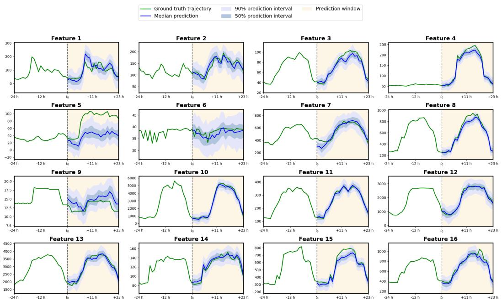  

Figure 6: Prediction intervals of Diffusion Forcing for the first prediction window of the test set in the Electricity time series dataset. Only the first 16 features out of 370 are plotted.

# D.9 Implementation Details of Timeseries Regression

We follow heplementation  pytorch- where the validation  is arandomsubse the training wih the same number  sequences as the test et. We use arly stopping whenvalidation cps-sum has'inces for 6 epochs. We leverage the same architecture (1 mlp and 4 grus) as well as a batch size of 32.

# D.10 Compute Resources

All of our experiments use $f p 1 6$ mixed precision training. Time series, maze planning, compositionally, and visual imitation experiments can be trained with a single $2 0 8 0 T i$ with 11GB of memory. We tune the batch sizsuch that we ully use the memory of GPUs.This translates to a batch sie f 2048 or maze planni and compositional experiments, and 32 for visual imitation learning. While we use early stopping on the validation set for time series experiments, we did not carefully search for the minimal number of training steps required, though the model usually converges between 50k to $1 0 0 k$ steps. The above environments thus usually take $4 - 8$ hours to train although there is without doubt a significant potential for speed up. Video prediction is GPU intensive. We use 8 A100 GPUs for both video prediction datasets. We train for $5 0 K$ steps with a batch size of $8 \times 1 6$ . It usually takes 12 hours to converge at $4 0 K$ steps of training (occasional validation time also included).

# E Additional Experiment Results

# E.1 Multivariate Probabilistic Time Series Forecasting

To illustrate Diffusion Forcing's new training objective does not degrade it as a generic sequence model, we evaluate Diffusion Forcing on high-dimensional and long-horizon sequence prediction tasks in time series prediction. We adopt multiple time series datasets with real-world applications from GluonTS [2] and evaluate Diion For with stonbaselines wistanarmetri thismai In this ecion,e aiy the results nd nalyisFor detaildesiptonataset and hemei eerhereaderppeF..

Problem Formulation Let ${ \cal X } ~ = ~ \{ { \bf x } _ { t } \} _ { t = 1 } ^ { T }$ iv $D$ dimensional observations $\mathbf { x } _ { t } \in \mathbb { R } ^ { D }$ of some underlying dynamical process, sampled in discrete time steps $t \in \{ 1 , \ldots , T \}$ , where $T \in \mathbb N$ . In the problem setting of probabilistic time series forecasting, the sequence $X = \{ X _ { c } , X _ { p } \}$ is $t _ { 0 } \in \mathbb { N }$ with $1 < t _ { 0 } \le T$ e ontext window $X _ { c } : = \{ \mathbf { x } _ { t } \} _ { t = 1 } ^ { t _ { 0 } - 1 }$ (aals call histry ech $t _ { 0 } - 1$ , and the prediction window $X _ { p } : = \left\{ \mathbf { x } _ { t } \right\} _ { t = t _ { 0 } } ^ { T }$ of length $T - t _ { 0 } + 1$ (als nown as the prediction horizon). Then, the task is to model the conditial joint probabiliy distrut over the samples in the prediction window. If we know the distribution in (E.1), we can sample forecast prediction sequences given some initial context from the evidence sequence. However, most time-dependent data generation proceses i ature hav complex dynamic and no tractable formulatin $q \big ( \mathbf { x } _ { t _ { 0 } : T } \mid \mathbf { x } _ { 1 : t _ { 0 } - 1 } \big )$ . Insteonstruc  atistilmode ha piatesheerai proces  (E.1n eate via Monte Carlo sampling of simulated trajectories. In this way, confidence levels or uncertainty measures can be calculated, and point forecasts can be produced as the mean or median trajectory [36].

$$
q ( \mathbf { x } _ { t _ { 0 } : T } \mid \mathbf { x } _ { 1 : t _ { 0 } - 1 } ) : = \prod _ { t = t _ { 0 } } ^ { T } q ( \mathbf { x } _ { t } \mid \mathbf { x } _ { 1 : t - 1 } )
$$

Table 2: Results for time series forecasting. We report the test set $\mathrm { C R P S _ { s u m } }$ (the lower, the better) of comparable methods on six time series datasets. We measure the mean and standard deviation of our method from five runs trained with different seeds.   

<table><tr><td>Method</td><td>Exchange</td><td>Solar</td><td>Electricity</td><td>Traffic</td><td>Taxi</td><td>Wikipedia</td></tr><tr><td>VES [36]</td><td>0.005 ± 0.000</td><td>0.900 ± 0.003</td><td>0.880 ± 0.004</td><td>0.350 ± 0.002</td><td></td><td></td></tr><tr><td>VAR [45]</td><td>0.005 ± 0.000</td><td>0.830 ± 0.006</td><td>0.039 ± 0.001</td><td>0.290 ± 0.001</td><td></td><td></td></tr><tr><td>VAR-Lasso [45]</td><td>0.012 ± 0.000</td><td>0.510 ± 0.006</td><td>0.025 ± 0.000</td><td>0.150 ± 0.002</td><td></td><td>3.100 ± 0.004</td></tr><tr><td>GARCH [62]</td><td>0.023 ± 0.000</td><td>0.880 ± 0.002</td><td>0.190 ± 0.001</td><td>0.370 ± 0.001</td><td></td><td></td></tr><tr><td>DeepAR [55]</td><td></td><td>0.336 ± 0.014</td><td>0.023 ± 0.001</td><td>0.055 ± 0.003</td><td></td><td>0.127 ± 0.042</td></tr><tr><td>LSTM-Copula [54]</td><td>0.007 ± 0.000</td><td>0.319 ± 0.011</td><td>0.064 ± 0.008</td><td>0.103 ± 0.006</td><td>0.326 ± 0.007</td><td>0.241 ± 0.033</td></tr><tr><td>GP-Copula [54]</td><td>0.007 ± 0.000</td><td>0.337 ± 0.024</td><td>0.025 ± 0.002</td><td>0.078 ± 0.002</td><td>0.208 ± 0.183</td><td>0.086 ± 0.004</td></tr><tr><td>KVAE [41]</td><td>0.014 ± 0.002</td><td>0.340 ± 0.025</td><td>0.051 ± 0.019</td><td>0.100 ± 0.005</td><td></td><td>0.095 ± 0.012</td></tr><tr><td>NKF [14]</td><td></td><td>0.320 ± 0.020</td><td>0.016 ± 0.001</td><td>0.100 ± 0.002</td><td></td><td>0.071 ± 0.002</td></tr><tr><td>Transformer-MAF [51]</td><td>0.005 ± 0.003</td><td>0.301 ± 0.014</td><td>0.021 ± 0.000</td><td>0.056 ± 0.001</td><td>0.179 ± 0.002</td><td>0.063 ± 0.003</td></tr><tr><td>TimeGrad [50]</td><td>0.006 ± 0.001</td><td>0.287 ± 0.020</td><td>0.021 ± 0.001</td><td>0.044 ± 0.006</td><td>0.114 ± 0.020</td><td>0.049 ± 0.002</td></tr><tr><td>ScoreGrad sub-VP SDE [68]</td><td>0.006 ± 0.001</td><td>0.256 ± 0.015</td><td>0.019 ± 0.001</td><td>0.041 ± 0.004</td><td>0.101 ± 0.004</td><td>0.043 ± 0.002</td></tr><tr><td>Ours</td><td>0.003 ± 0.001</td><td>0.289 ± 0.002</td><td>0.023 ± 0.001</td><td>0.040 ± 0.004</td><td>0.075 ± 0.002</td><td>0.085 ± 0.007</td></tr></table>

Results. We evaluate the effectiveness of Diffusion Forcing as a sequence model on the canonical task of multivariate time series forecasting by following the experiment setup of [54, 51, 50, 59, 68] Concretely, we benmar Diffusion Forcion the atasets Solar, Electricity, Trac, Taxi an WikipeiaThesatases ave diferent dimensionality, domains, and samplingfrequencis, nd captureesnal patterns  different enghs. The features of each dataset are detailed in Table 3.We access the datasets from GluonTS [2], and set the context and prediction windows to the same length or each dataset. Additionally, we employ the same covariates as [50]. We evaluate the performance of the model quantitatively by estimating the Summed Continuous Ranked Probability Score $\mathrm { C R P S _ { s u m } }$ via quantiles. As a metric, $\mathrm { C R P S _ { s u m } }$ measures how well a forecast distribution matches the ground truth distribution. We provide detailed descriptions of the metric in Appendix F.4. We benchmark with other diffusion-based methods in time series forecastings, such as TimeGrad [50] and the transorm-based Transormer-MAF [51]. In particular, the main baseline interest, TmeGrad [50], is a exttoken diffusion sequence model trained with teacher forcing. We track the $\mathrm { C R P S _ { s u m } }$ metric on the validation set and use early stopping when the metric has not improved for 6 consecutive epochs, while all epochs are fixed to 100 batches across datasets. We then measure the $\mathrm { C R P S _ { s u m } }$ on the test set at the end of the training, which we report in Table . We use the exact same architecture and hyperparameters or al time series datasets and experiments. Diffusion Forcing outperorms all prior methods except for [68] with which Diffusion Forcing is overall tied, except for the Wikipedia dataset, on which Diffusion Forcing takes fourth place. Note that time seri is nothe coreapplication  Diffuin Forci, and that w merel seek todemnstrate that h Diffsn Forig objective is applicable to diverse domains with o apparent trade-off in performance over baseline objectives.

# E.2 Additional results in compositional generation

Since Diffusion Forcing models the joint distribution of any subset o a sequence, we can leverage thisnique property  achievecomposiional behavior i Diffusio Forci can samplfromthe stribution  s of the trajectory and compose these sub-trajectories into new trajectories. In particular, we show that we can also have flexible control over how compositional Diffusion Forcing is. As show cnsieratase rajecoriesn D suare plane wherltrajcori tartrome and end up in the opposite corner, forming a cross shape. When no compositional behavior is desired one can let the models replicate the cross-shaped distribution by allowing full memory of the HMM model. When one desire compositional suc as enerating aVshaped trajectory whic stitches twosub-rajectoris together,e can let the model generate shorter plans with no-memory context using MPC. (Add figures).

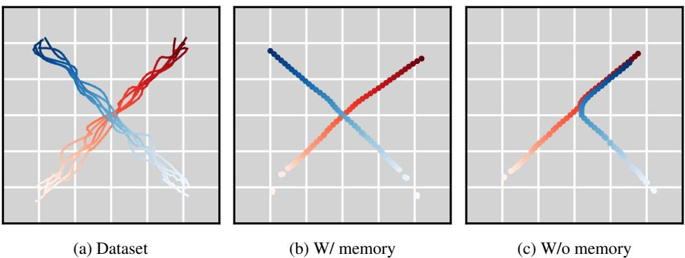  

Figure 7: Given a dataset of trajectories (a), Diffusion Forcing models the joint distribution of all subsequences of arbitrary length. At sampling time, we can sample from the trajectory distribution by sampling Diffusion Forcing with full horizon (b) or recover Markovian dynamics by disregarding previous states (c).

# E.3 Additional results in video prediction (wo/ cherry picking)

Infinite Rollout without sliding window Diffusion Forcing can rollout longer than maximum training hozoihout id indow.Tha is, we Diffusion For'R cntuusy hout vereinlz $\mathbf { z } _ { 0 }$ .This is a surprising effect we observed from the rollout stabilization property of Diffusion Forcing. In Figure 8, 10, we use Diffusion Forcing to generate video sequences of length 180 and visualize subsampled sequences. Notably, Diffusion Forcing used in these visualizations is trained with a maximum length of 72 frames for Minecraft and 36 frames for DMLab, illustrating it can rollout $2 \mathbf { X } ^ { - 5 \mathbf { X } }$ times longer than it's trained on without sliding window. In ddition, we also tried rollig these modes out or 0 frames and without seei the model blowing up on both datasets. There are ccasional cases where the Minecraft agent gets stuck and the e turns around.

  

Figure 8: Visualization shows Diffusion Forcing trained on 72 frames is able to rollout 180 frames on Minecraft dataset without sliding window. The visualization shows a non-cherry-picked subsampling of these 180 frames, although Diffusion Forcing can roll out much longer (such as 2000 frames) on this dataset.

Consistency We also present additional results where we only generate within our maximum training length.   
As shown in figure 13 12, Diffusion Forcing can generate consistent videos. Results are not cherry-picked.

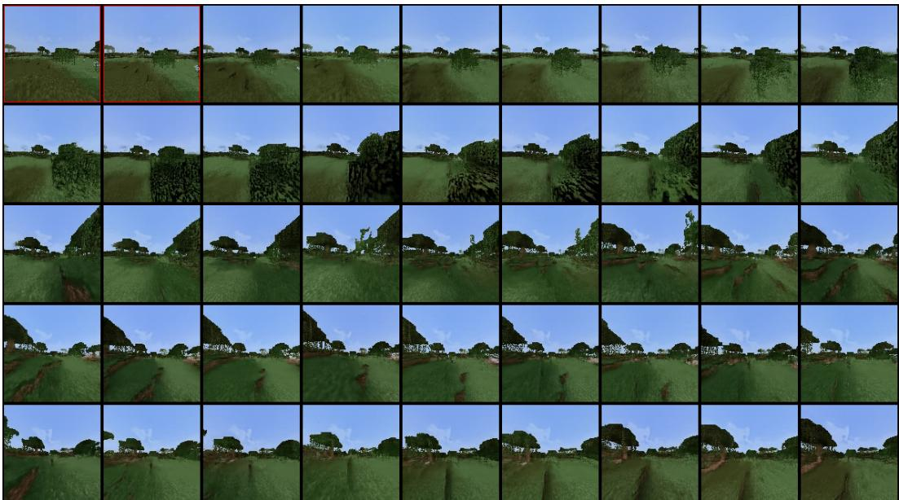  

Figure 9: Diffusion Forcing trained on 72 frames is able to rollout 180 frames on Minecraft dataset without sliding window. The visualization shows a non-cherry-picked subsampling of these 180 frames, although Diffusion Forcing can roll out much longer (such as 2000 frames) on this dataset. The first fewrames marked in red are the round truthimages of the dataset usedor conditnin.

# E.4 Additional results in planning

We provide some additional visualizations of causal planning in1. Wealso present additional visualization Diffusion Forcing performing model predictive control in action. As shown in figure 14, Diffusion Forcing can generate plans of shorter horizons since it's flexible horizon.

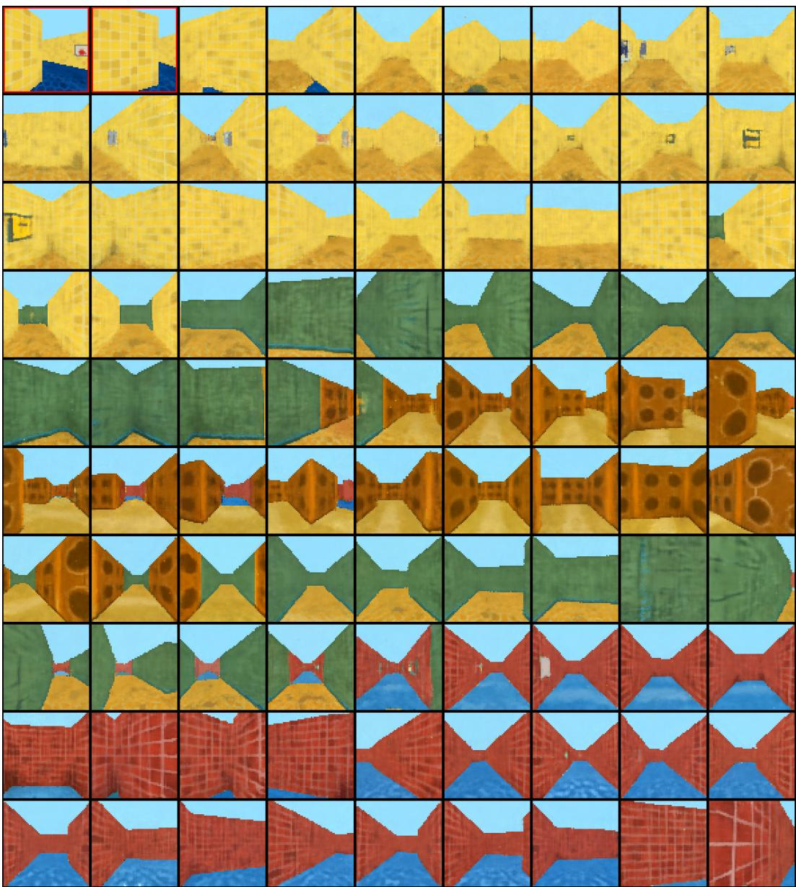  

Figure 10: Visualization shows Diffusion Forcing trained on 36 frames is able to rollout 180 frames on DMLab dataset without sliding window. The visualization shows a non-cherry-picked subsampling of these 180 frames, although Diffusion Forcing can roll out almost infinitely on this dataset. The first few frames marked in red are the ground truth images of the dataset used for conditioning.

# E.5 Real robot experiment setup

In Figure 16 we visualize ur robot experiment setup with corruption n observation. The dataset is collected ho eent w servati couptThe ypil iluemod is henherobot oon eacts heal clus of the randomized location o objects. We didn bserve the robot act wildly due to visual distractors.

# F Additional details about datasets

# F.1 Dataset for video diffusion

We adopt the video prediction dataset Minecraft and DMlab used by TECO[69].

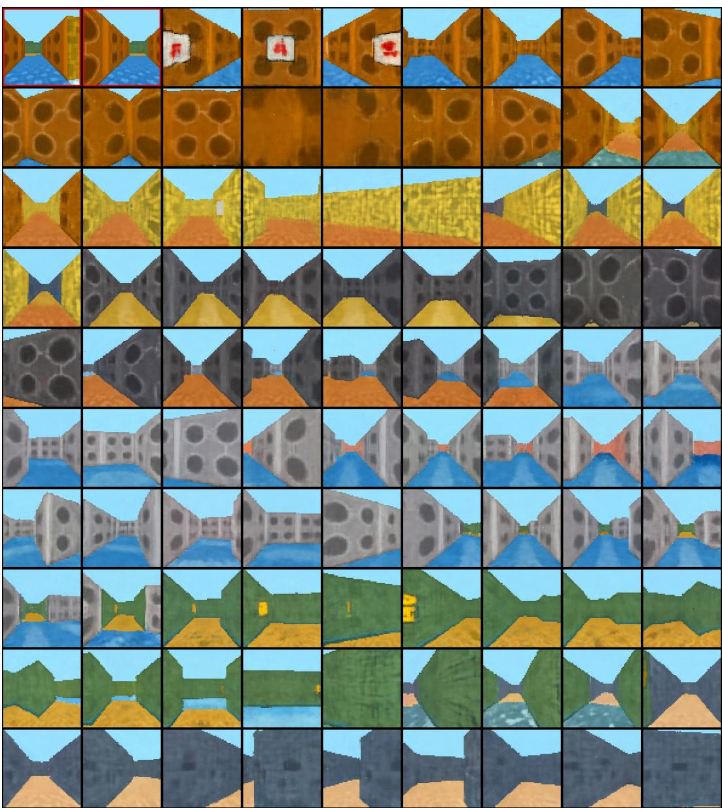  

Figure 11: Visualization shows Diffusion Forcing trained on 36 frames is able to rollout 180 frames on DMLab dataset without sliding window. The visualization shows a non-cherry-picked subsampling of these 180 frames, although Diffusion Forcing can roll out almost infinitely on this dataset. The first few frames marked in red are the ground truth images of the dataset used for conditioning.

Minecraft Navigation The Minecraft navigation dataset consists of first-person-view videos of random wak in the Minera wa'bioeThe agent walks vi  tenique calle prt jupwhic allws it to jup aross blocks without gettig stuck at 1 block obstaces. The agent walks straight most of the time, small chan o turnig l r iht.The heiht and width of thevideo s 8 pixels and we trim on videos o susequences of 72 rames. Thedataset comes with paire action data but we discard them o more stochasticity to the prediction task. Due to limited compute, we only train on about $1 0 \%$ of the total subsequences. One problem we noticed about the dataset is when the agent runs into obstacles with a height of 2 blocks or In hisahen   sucn heii onyn pat brown dirty patterns. This leads to a huge amount of frames with these patterns, making video models predic meaningless frames. Yet, we deem this as a problem of this dataset itself.

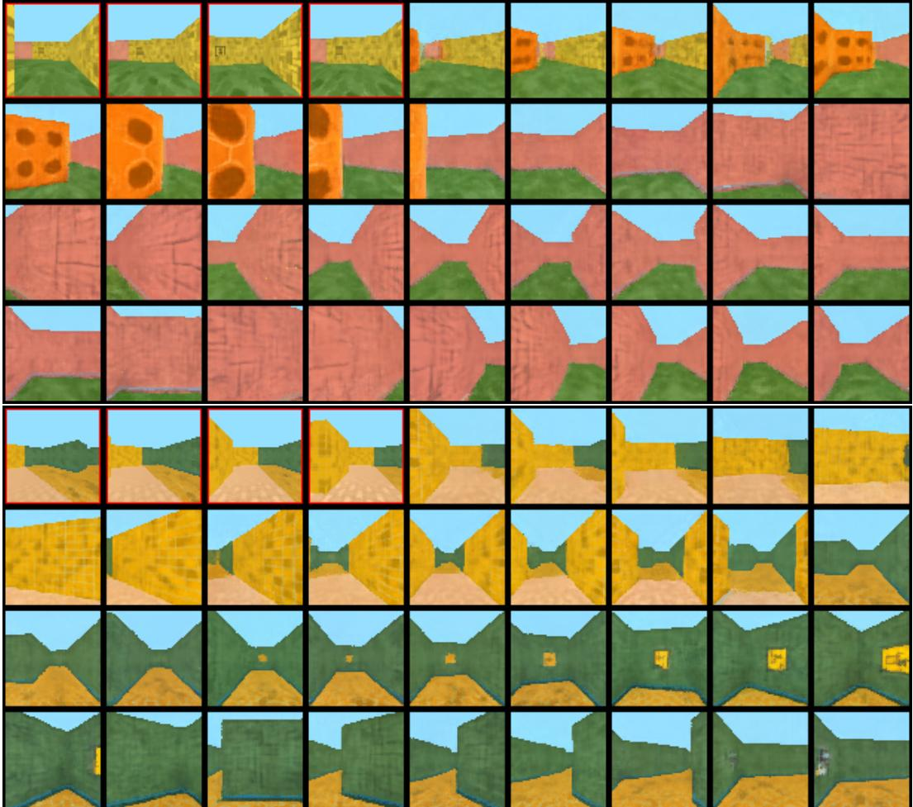  

Figure 12: Additional non-cherry-picked video prediction results on DMLab dataset, generated within maximum training length. The first few frames marked in red are the ground truth images of the dataset used for conditioning.

DMLab Navigation Deepmind Lab navigation dataset consists of random walks in a 3D maze environment For DMLab, the resolution is 64 pixels and we use subsequences of 48 frames. We also disregard the provided actions due to training. We note that the VQ-VAE latent that stable video diffusion [4] diffuses is also only $1 2 8 \times 1 2 8 \times 3$ ,indicating Diffusion Forcinghas the potential to scale up to higher resolutionmages with pre-raine image encoer and r D   ee z tetas e y $1 0 \%$ o tol dat sq a due to limited computing, as we observe that doing so already allows us to make good generations from iniial frames from the test set.

# F.2 Dataset for planning

D4RL [18] is a standard offline RL benchmark featuring a wide range of reinforcement learning environments. Eac environments associated with a provideddatase of offnenteractions with the environment eturin state, action, and reward trajectories. Like Diffuer [37], we choose the 3 maze environments as they arechallenging long-horizon, multi-modal, sparse reward problems uniquely suited for visualization and evaluating planning algorithms. The IDs for the 3 used environments are "maze2d-medium-v1, "maze2d-large-v1", "maze2d-umaze-v1" In each environment, one cols he ratin  obo o wal t owars  The sati spac  disinal, locaton and velocity The actin space is D acceleration. The agent always receives arandom sart laton and the oal is o reach afd gal positnor each maze.The agent reivesa reward   it is ha circle of radius 0.5 centered at the goal state, and 0 otherwise.

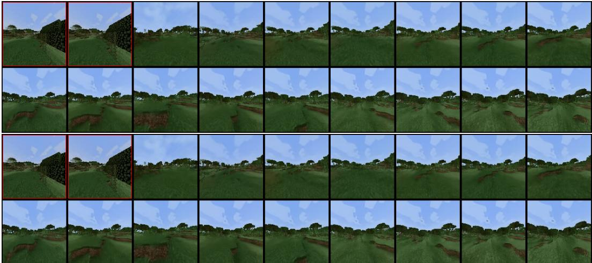  

Figure 13: Additional non-cherry-picked video prediction results on the Minecraft dataset, generated within maximum training length. The first few frames marked in red are the ground truth images of the dataset used for conditioning.

The offline RL dataset for the maze environments consists of random walks in the maze. Specifically, the atten d tuez i n  en ava waypoints with some randomization. As a result, the random walks are generated in a way that the path is collision-free with the walls. The random walks introduce stochasticity to the dataset, as trajectories in the dataset are never towards a specific goal. The  oi doptor a ase Df [7] werearheewar he at nd plan wih goals ly.Wealso evaluateamult-ol variant ach evirment labele as mul Ta, where the goal is randomized just like the starting position.

# F.3 Dataset for robot learning

Wechoose a long horizon robotic manipulation task as described in Section 4.4Consider a tabletop with three slots where we an place bjects.One places an apple at slot A or sot andomly, and then places the other sot between A andBA robot is hallenged to swaphe positino twofruits usng the third slot C. Ta  n y uit  ty o   to  we e ps t ot e is at sot  it may ove he appe o slot , leavi slot A mpty Then ove he range tosot A and fnllymove eapp rom sot tosot B. Inurwe illusrat e on-arkovin property  te sk: When the apple is at slot B and the orange is at slot C, one cannot tell what the immediate action is without knowing the initial positions of objects. We pu ie   tab  r e  or   de beaout double the iameter fruit.To makesure the taskrequires visalfeedback, wealso randmiz the locaion  ruiinside the ot.Weclecte10 exper demstrations  Frankarobot perorminh task using VR teleoperation and impedancecontrol. Among them, each initial slot configuration makes up hal f the dataset. We record videos from two camera views, one from a hand camera and one in the front capturing all three slots. Each demonstration also comes with 6 dof actions of the robot hand. During the data collection, since one successful demonstration wil swap the position of two objects, its end configuration will naturally serve as the starting configuration of the other randomized location, which we leverage to save time. Each demonstration comprises $5 0 0 - 6 0 0$ frames and actions. We train Diffusion Forcing on the entire sequence However, since adjacent frames are visually lose, we pad and downsample thevideos to 40 frames where each frame is bundled with 15 actions.

# F.4 Dataset for time series

We use a set of time series datasets accessible via GluonTS [2], which are adopted from prior works like [72, 42, 56]. These datasets capture real-world data of high-dimensional dynamics like monetary exchange rates or theelectricity grid. In Table , we provide  smary o the eature o thesedatasets, such s the naliy i, t pleq   heuliva hea, an the predicton lengh.Weaccess he dtasets inTabl vi GluonT and wrap hedata processig c implemented in GluonTS in our own dataloaders. Each dataset consists of one long multivariate sequence, which W sam cardinaliy  the el-out test e s arandomly ample subse usequencs rom the trainin t.All splits are normalized by the mean and the standard deviation of the features in the training split.

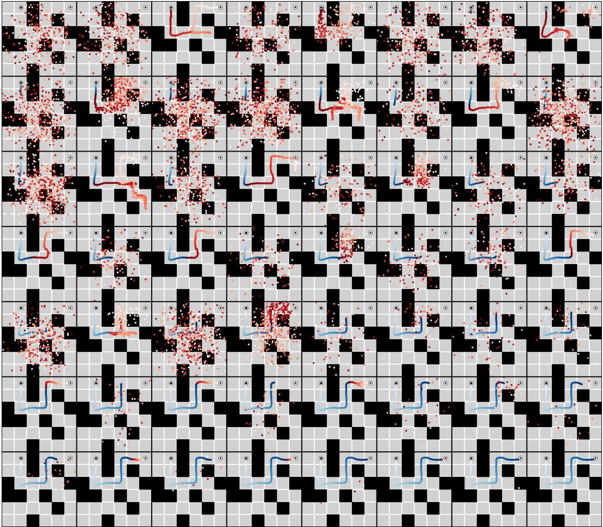  

Figure 14: Example MPC planning for maze medium environment. Blue indicated trajectories actually executed already. Red is the plan.

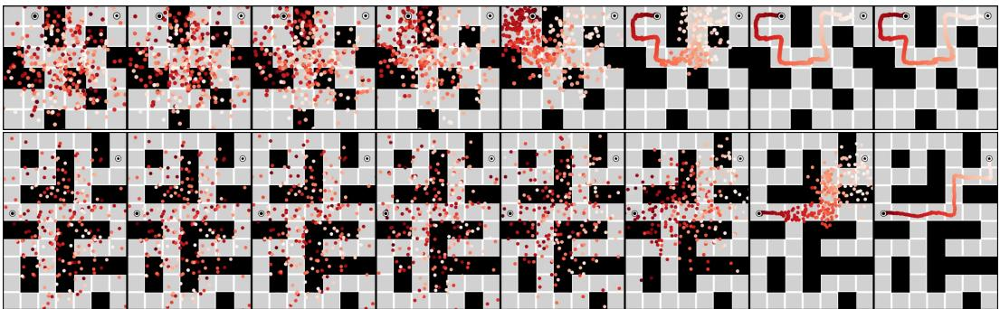  

Figure 15: Example plans generated for maze medium (above) and maze large (below) environments.

COe saslmols ha)be flly uue $C = \left\{ \mathbf { c } _ { t } \right\} _ { t = 1 } ^ { T }$ seasonal patterns and other temporal dependencies. We follow the implementation in [51] to construct the corateqec ctieeen  ataseTas su urovariat of lagge inputs, as wel as learnedembeddings and handrafted temporal features that encode information such asou y  eeeahe pr being modeled. Therefore, covariates are known for the entire interval $[ 1 , T ]$ , even at inference. We can easily incorporate covariates into the probabilistic framework as

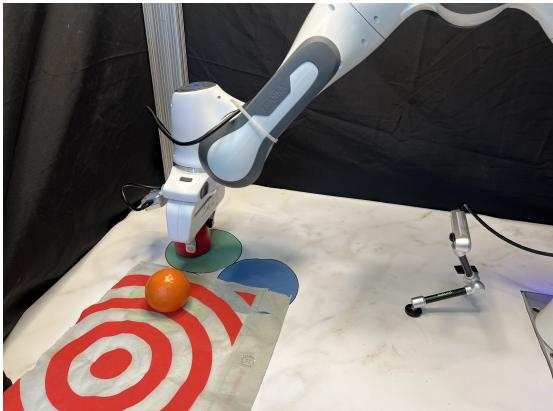  

Figure 16: We randomly throw a target bag on the table as a strong visual distractor. Diffusion Forcing can be prompted to treat observation as corrupted rather than ground truth.

Table 3: Characteristics of the GluonTS datasets used to benchmark Diffusion Forcing in the domain of time series forecasting.   

<table><tr><td>Dataset</td><td>Dimension</td><td>Domain</td><td>Frequency</td><td>Steps</td><td>Prediction length</td></tr><tr><td>Exchange</td><td>8</td><td>R+</td><td>BUSINESS DAY</td><td>6,071</td><td>30</td></tr><tr><td>Solar</td><td>137</td><td>R+</td><td>HOUR</td><td>7,009</td><td>24</td></tr><tr><td>Electricity</td><td>370</td><td>R+</td><td>HOUR</td><td>5,833</td><td>24</td></tr><tr><td>Traffic</td><td>963</td><td>(0,1)</td><td>HOUR</td><td>4,001</td><td>24</td></tr><tr><td>Taxi</td><td>1,214</td><td>N</td><td>30-MIN</td><td>1,488</td><td>24</td></tr><tr><td>Wikipedia</td><td>2,000</td><td>N</td><td>DAY</td><td>792</td><td>30</td></tr></table>

$$
q ( \mathbf { x } _ { t _ { 0 } : T } \mid \mathbf { x } _ { 1 : t _ { 0 } - 1 } , \mathbf { c } _ { 1 : T } ) : = \prod _ { t = t _ { 0 } } ^ { T } q ( \mathbf { x } _ { t } \mid \mathbf { x } _ { 1 : t _ { 0 } - 1 } , \mathbf { c } _ { 1 : T } ) .
$$

The bene btaine fo covariates is higl dependent nhe haracteristi both thatase and thee used, as well as the feature engineering practices followed. Metric The Continuous Ranked Probability Score (CRPS) [46] is a scoring function that measures how well the forecast distribution matches the ground truth distribution:

$$
\mathrm { C R P S } ( F , x ) = \int _ { \mathbb { R } } \left( F ( z ) - \mathbb { I } \left\{ x \leq z \right\} \right) ^ { 2 } \mathrm { d } z ,
$$

where $F ( z )$ is the univariate cumulative distribution function (CDF) over the predicted value, $x$ is a ground truth observation, and $\mathbb { I } \left\{ x \leq z \right\}$ is the indicator function that is one if $x \leq z$ and zero otherwise. By summing the $D$ -dimensional time series along the feature dimension for simulated samples (resulting in $\hat { F } _ { \mathrm { s u m } } ( t ) )$ and ground truth data (as $\textstyle \sum _ { i } x _ { i , t } ^ { 0 } )$ , we can report the $\mathrm { C R P S _ { s u m } }$ as the average over the prediction window. The lower the $\mathrm { C R P S _ { s u m } }$ value, the better the predicted distribution match the data distribution.

$$
\mathrm { C R P S } _ { \mathrm { s u m } } = \mathbb { E } _ { t \sim \mathcal { U } ( t _ { 0 } , T ) } \left[ \mathrm { C R P S } \left( \hat { F } _ { \mathrm { s u m } } ( t ) , \sum _ { i } x _ { i , t } ^ { 0 } \right) \right]
$$

First, we manually sum the time series along the feature dimension and estimate the CDF $\hat { F } _ { \mathrm { s u m } } ( t )$ via 19 quantile levels at each time step $t$ from 100 sampled trajectories. We then use the implementation in GluonTs [2] to compute the CRPS, which we report as $\mathrm { C R P S _ { s u m } }$ in Table 2. While we aggregate the data manually, we verify that the numerical ero elativ he GluonT plementatin emais rde magnitude belowhe prsn threshold of the reported metric.