# WorldPlay: Towards Long-Term Geometric Consistency for Real-Time Interactive World Modeling

Wenqiang $\mathrm { S u n ^ { * 1 , 3 } }$ , Haiyu Zhang\* 2,3, Haoyuan Wang\* 3, Junta $\mathrm { { W u ^ { 3 } } }$ , Zehan Wang3, Zhenwei Wang3, Yunhong Wang2, Jun Zhang† 1, Tengfei Wang†3, Chunchao Guo3 1Hong Kong University of Science and Technology 2Beihang University 3 Tencent Hunyuan

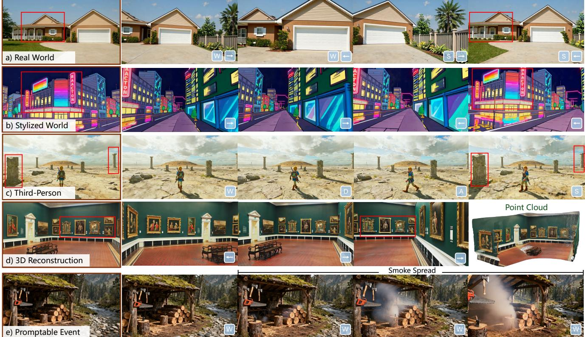

# Abstract

This paper presents WorldPlay, a streaming video diffusion model that enables real-time, interactive world modeling with long-term geometric consistency, resolving the tradeoff between speed and memory that limits current methods. WorldPlay draws power from three key innovations. 1) We use a Dual Action Representation to enable robust action control in response to the user's keyboard and mouse inputs. 2) To enforce long-term consistency, our Reconstituted Context Memory dynamically rebuilds context from past frames and uses temporal reframing to keep geometrically important but long-past frames accessible, effectively alleviating memory attenuation. 3) We also propose Context Forcing, a novel distillation method designed for memory-aware model. Aligning memory context between the teacher and student preserves the student's capacity to use long-range information, enabling real-time speeds while preventing error drift. Taken together, WorldPlay generates long-horizon streaming 720p video at 24 FPS with superior consistency, comparing favorably with existing techniques and showing strong generalization across diverse scenes. Project page and online demo can be found: https://3d-models.hunyuan.tencent.com/world/ and https://3d.hunyuan.tencent.com/sceneTo3D.

# 1. Introduction

World models are driving a pivotal shift in computational intelligence, moving beyond language-centric tasks towards visual and spatial reasoning. By simulating dynamic 3D environments, these models empower agents to perceive and interact with complex surroundings, opening up new possibilities for embodied robotics and game development. At the forefront of world modeling is real-time interactive video generation, which aims at autoregressively predicting future video frames (or chunks) to deliver instant visual feedback in response to every user's keyboard command. Despite significant progress, a fundamental challenge persists: how to simultaneously achieve real-time generation (speed) and long-term geometric consistency (memory) in interactive world modeling. One class of methods [9, 17, 49] prioritizes speed with distillation but neglects memory, resulting in inconsistency where scenes change upon revisit. The other class preserves consistency with explicit [32, 52] or implicit [67, 74] memory, but complex memory makes distillation non-trivial (Sec. 3.4). As summarized in Table 1, the simultaneous achievement of both low latency and high consistency remains an open problem. To tackle this challenge, we develop WorldPlay, a realtime and long-term consistent world model for general scenes. We consider this problem as a next chunk (16 frames) prediction task for generating streaming videos conditioned on action from users. Building upon autoregressive diffusion models, WorldPlay draws power from the model's three key ingredients below. The first is Dual Action Representation for control over agent and camera movement. Previous works [9, 17, 49] typically rely on discrete keyboard inputs (e.g., W, A, S, D) as action signals, which afford plausible, scale-adaptive movement but suffer from ambiguity for memory retrieval that requires revisiting exact locations. Conversely, continuous camera poses $( R , T )$ provide spatial locations but cause training instability due to scene scale variance in training data. To combine the best of both worlds, we convert action signals into continuous camera poses and discrete keys, achieving robust control and accurate location caching. The second key design is Reconstituted Context Memory for maintaining long-term geometric consistency. We actively reconstitute the memory through a two-stage process, moving beyond simple retrieval [67, 74]. It first dynamically rebuilds a context set by querying past frames based on spatial and temporal proximity. To overcome the long-range decay (the fading influence of distant tokens in Transformers [58]), we propose temporal reframing to rewrite positional embeddings of these retrieved frames. This operation effectively "pulls" geometrically important but long-past memories closer in time, forcing the model to treat them as recent. This process keeps the influence of relevant long-range information preserved, enabling robust free extrapolation with strong geometric consistency. The final key ingredient is Context Forcing, a novel distillation method designed for memory-aware models to enable real-time generation. Existing distillation methods [6, 21, 70] fail to keep long-term memory as there is a fundamental distribution mismatch: training a memoryaware autoregressive student to mimic a memory-less bidirectional teacher. Even when augmenting teacher with memory, mismatched memory context will cause distribution diverge. We solve this by aligning the memory context for teacher and student during distillation. This alignment facilitates effective distribution matching, enabling real-time speed without eroding the memory while alleviating error accumulation over long sequences. Taken together, WorldPlay achieves real-time, interactive video generation at 24 FPS (720p) while maintaining long-term geometric consistency under streaming user control. The model is built on a large-scale, curated dataset of 320K real and synthetic videos with a custom rendering and processing platform. As shown in Fig. 1, WorldPlay shows superior generation quality and remarkable generalization across diverse scenes including first- and third-person real and stylized worlds, and supports applications ranging from 3D reconstruction and promptable events.

# 2. Related Work

Video Generation. Diffusion models [19, 41, 57] have emerged as the state-of-the-art approach in video generative modeling. [7, 15, 69] adopt the latent diffusion model (LDM) [53] to learn video distribution in the latent space, achieving efficient video generation. Recently, autoregressive video generation models [6, 18, 26] theoretically enable one to generate unlimited length videos, laying the foundation for world models. With the advancement of powerful architectures [50] and sophisticated data pipelines, [10, 13, 28, 30, 47, 62], which are trained on web-scale datasets, have demonstrated emergent zero-shot capabilities to perceive, model, and manipulate the visual world [65], making it feasible to simulate the physical world.

Interactive and Consistent World Models. World models aim to predict future states based on current and past observations and actions. Studies such as [13, 16, 29, 31, 33, 46, 48, 5961, 64, 75] adopt discrete or continuous action signals to enable agents to navigate and interact with virtual environments. Subsequent works that aim to achieve geometric consistency can be categorized into two types: explicit 3D reconstruction and implicit conditioning. [4, 32, 42, 52, 73, 76, 77] try to ensure spatial consistency by explicitly reconstructing 3D representations and rendering condition frames from these representations. However, they heavily rely on reconstruction quality, making it challenging to maintain long-term consistency. Other recent works [23] construct 3D world models explicitly, without relying on video generation models. Although achieving promising 3D generation results, these lines of methods can not be performed in real-time usage cases. In contrast, [67, 74] achieve implicit conditioning by leveraging field-of-view (FOV) to retrieve relevant context from historical frames, demonstrating strong scalability. However, developing a real-time world model that maintains geometric consistency remains an open question.

<table><tr><td rowspan=1 colspan=1></td><td rowspan=1 colspan=1>Oasis [9]</td><td rowspan=1 colspan=1>Matrix-Game2.0 [17]</td><td rowspan=1 colspan=1>GameGenX [5]</td><td rowspan=1 colspan=1>GameCraft [31]</td><td rowspan=1 colspan=1>WorldMem [67]</td><td rowspan=1 colspan=1>VMem [32]</td><td rowspan=1 colspan=1>WorldPlay</td></tr><tr><td rowspan=1 colspan=1>Resolution</td><td rowspan=1 colspan=1>360P</td><td rowspan=1 colspan=1>360p</td><td rowspan=1 colspan=1>720p</td><td rowspan=1 colspan=1>720p</td><td rowspan=1 colspan=1>360P</td><td rowspan=1 colspan=1>576p</td><td rowspan=1 colspan=1>720p</td></tr><tr><td rowspan=1 colspan=1>Action Space</td><td rowspan=1 colspan=1>Discrete</td><td rowspan=1 colspan=1>Discrete</td><td rowspan=1 colspan=1>Discrete</td><td rowspan=1 colspan=1>Continuous</td><td rowspan=1 colspan=1>Discrete</td><td rowspan=1 colspan=1>Continuous</td><td rowspan=1 colspan=1>Continuous +Discrete</td></tr><tr><td rowspan=1 colspan=1>Real-time</td><td rowspan=1 colspan=1>V</td><td rowspan=1 colspan=1>V</td><td rowspan=1 colspan=1>X</td><td rowspan=1 colspan=1>X</td><td rowspan=1 colspan=1>X</td><td rowspan=1 colspan=1>X</td><td rowspan=1 colspan=1>v</td></tr><tr><td rowspan=1 colspan=1>Long-termConsistency</td><td rowspan=1 colspan=1>X</td><td rowspan=1 colspan=1>X</td><td rowspan=1 colspan=1>X</td><td rowspan=1 colspan=1>X</td><td rowspan=1 colspan=1></td><td rowspan=1 colspan=1>v</td><td rowspan=1 colspan=1></td></tr><tr><td rowspan=1 colspan=1>Long-Horizon</td><td rowspan=1 colspan=1>X</td><td rowspan=1 colspan=1>V</td><td rowspan=1 colspan=1>V</td><td rowspan=1 colspan=1>X</td><td rowspan=1 colspan=1>X</td><td rowspan=1 colspan=1>X</td><td rowspan=1 colspan=1>v</td></tr><tr><td rowspan=1 colspan=1>Domain</td><td rowspan=1 colspan=1>Minecraft</td><td rowspan=1 colspan=1>General</td><td rowspan=1 colspan=1>General</td><td rowspan=1 colspan=1>General</td><td rowspan=1 colspan=1>Minecraft</td><td rowspan=1 colspan=1>Static Scene</td><td rowspan=1 colspan=1>General</td></tr></table>

T Distillation. Real-time capability is also an essential property for world models. For video diffusion models, existing approaches typically employ distillation [12, 14, 35, 54, 78] to achieve few-step inference, thereby achieving real-time generation. For instance, [24, 3739, 55, 56] adopt adversarial training strategies to enable few-step inference, however, they often suffer from training instability and mode collapse. [45, 70, 71] utilize Variational Score Distillation (VSD) [63] to achieve outstanding few-step generation performance. In addition, CausVid [72] proposes distilling a causal student model from a bidirectional teacher diffusion model to achieve real-time autoregressive generation. Furthermore, Self-Forcing [21] addresses exposure bias by refining the rollout strategy of CausVid. Our method proposes context forcing to preserve both the interactivity and geometric consistency while achieving real-time generation.

# 3. Method

Our goal is to construct a geometry-consistent and realtime interactive world model $N _ { \theta } ( x _ { t } | O _ { t - 1 } , A _ { t - 1 } , a _ { t } , c )$ parameterized by $\theta$ , which can generate next chunk $x _ { t }$ (a chunk is a few frames) based on past observations $O _ { t - 1 } =$ $\{ x _ { t - 1 } , . . . , x _ { 0 } \}$ , action sequences $A _ { t - 1 } ~ = ~ \{ a _ { t - 1 } , . . . , a _ { 0 } \}$ , and current action $a _ { t }$ .Here, $c$ is a text prompt or image that describes the world. For simplicity of notation, we omit $A , a , c$ in following sections. We first introduce the relevant preliminaries in Sec. 3.1. In Sec. 3.2, we discuss the action representation for control. Sec. 3.3 describes our reconstituted context memory to ensure long-term geometric consistency, followed by Sec. 3.4 covering our context forcing, which mitigates exposure bias and enables few-step generation while maintaining long-term consistency. Finally, Sec. 3.5 details additional optimizations for real-time streaming generation. The pipeline is shown in Fig. 2.

# 3.1. Preliminaries

Full-sequence Video Diffusion Model. Current video diffusion models [28, 62] typically consist of a causal 3D VAE [27] and a Diffusion Transformer (DiT) [50], where each DiT block is composed of 3D self-attention, crossattention, and feedforward network (FFN). The diffusion timestep is processed by positional embedding (PE) and a Multi-Layer Perceptron (MLP) to modulate the DiT blocks. The model is trained using flow matching [41]. Specifically, given a video latent $z _ { \mathrm { 0 } }$ encoded by the 3D VAE, a random noise $z _ { 1 } ~ \sim ~ \mathcal { N } ( 0 , I )$ , and a diffusion timestep $k ~ \in ~ [ 0 , 1 ]$ , an intermediate latent $z _ { k }$ is obtained through linear interpolation. The model is trained to predict the velocity $v _ { k } = z _ { 0 } - z _ { 1 }$ ,

$$
\mathcal { L } _ { \mathrm { F M } } ( \theta ) = \mathbb { E } _ { k , z _ { 0 } , z _ { 1 } } \bigg \| N _ { \theta } ( z _ { k } , k ) - v _ { k } \bigg \| ^ { 2 } .
$$

Chunk-wise Autoregressive Generation. However, the full-sequence video diffusion model is a non-causal architecture, which limits its ability for infinite-length interactive generation. Inspired by Diffusion Forcing [6], we finetune it into a chunk-wise autoregressive video generation model. Specifically, for video latent $z _ { 0 } \in \mathbb { R } ^ { C \times T \times H \times W }$ ,we divide i t into $\textstyle { \frac { T } { 4 } }$ chunks $\{ z _ { 0 } ^ { i } \in \mathbb { R } ^ { C \times 4 \times H \times W } | i = 0 , . . . , \frac { T } { 4 } - 1 \}$ and thus each chunk (4 latents) can be decoded into 16 frames. During training, we add different noise levels $k _ { i }$ for each chunk and modify the full-sequence self-attention to block causal attention. The training loss is similar to Eq. 1.

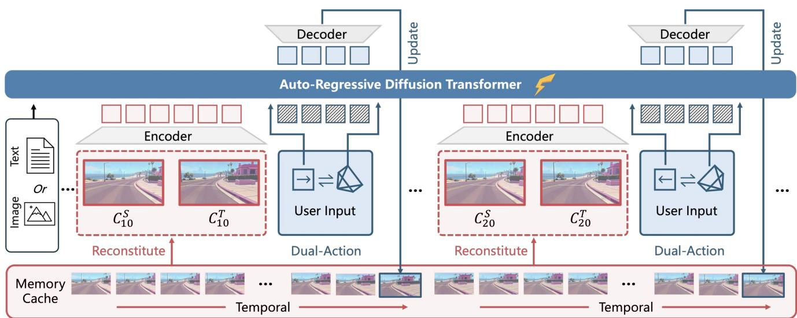  
context memory from past chunks to enforce long-term temporal and geomeric consistency.

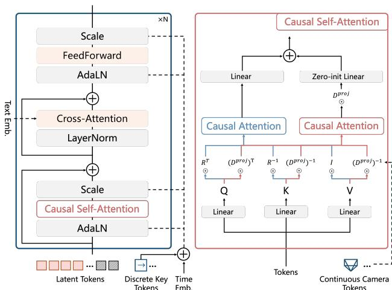  
Figure 3. Detailed architecture of our autoregressive diffusion transformer. The discrete key is incorporated with time embedding, while the continuous camera pose is injected into causal selfattention through PRoPE [33].

# 3.2. Dual Action Representation for Control

Existing methods use keyboard and mouse inputs as action signals and inject the action control via MLP [9, 67] or attention blocks [17, 74]. This enables the model to learn physically plausible movements across scenes with diverse scales (e.g. very large and small scenes). However, they struggle to provide precise previous locations for spatial memory retrieval. In contrast, camera poses (rotation matrix and translation vector) provide accurate spatial locations that facilitate precise control and memory retrieval, but training only with camera poses faces challenges in training stability due to the scale variance in the training data. To address this, we propose a dual action representation that combines the best of both worlds as shown in Fig. 3. This design not only caches spatial locations for our memory module in Sec. 3.3, but also enables robust and precise control. Specifically, we employ PE and a zero-initialized MLP to encode discrete keys and incorporate it into the timestep embedding, which is then used to modulate the DiT blocks. For continuous camera pose, we leverage relative positional encoding, i.e., PRoPE [33], which offers greater generalizability than commonly used raymaps, to inject complete camera frustums into self-attention blocks. The original selfattention computation is as follows, where $R$ represents the 3D rotary PE (RoPE) [58] for video latents. To encode frustum relationships between cameras, we utilize an additional attention computation, here, $D ^ { p r o j }$ is derived from the camera's intrinsic and extrinsic parameters, as described in [33]. Finally, the result of each self-attention block is $A t t n _ { 1 } + z e r o \_ i n i t ( A t t n _ { 2 } )$ .

$$
A t t n _ { 1 } = A t t n ( R ^ { \top } \odot Q , R ^ { - 1 } \odot K , V ) ,
$$

$$
\begin{array} { c } { A t t n _ { 2 } = D ^ { p r o j } \odot A t t n ( ( D ^ { p r o j } ) ^ { \top } \odot Q , } \\ { ( D ^ { p r o j } ) ^ { - 1 } \odot K , ( D ^ { p r o j } ) ^ { - 1 } \odot V ) , } \end{array}
$$

# 3.3. Reconstituted Context Memory for Consistency

Maintaining long-term geometric consistency requires recalling past frames, ensuring content remains unchanged when revisiting to a previous location. However, naively using all past frames as context (Fig. 4a) is computationally intractable and redundant for long sequences. To address this, we rebuild a memory context $C _ { t }$ from past chunks $O _ { t - 1 }$ for each new chunk $x _ { t }$ . Our approach advances beyond prior work [67, 74] by combining both shortterm temporal cues and long-range spatial references: 1) A temporal memory $( C _ { t } ^ { T } )$ comprises $L$ most recent chunks $\{ x _ { t - L } , . . . , x _ { t - 1 } \}$ to ensure short-term motion smoothness. 2) A spatial memory $( C _ { t } ^ { S } )$ samples from non-adjacent past frames to prevent geometric drift over long sequences, where $C _ { t } ^ { S } \subseteq O _ { t - 1 } - C _ { t } ^ { T }$ This sampling is guided by geometric relevance scores that incorporate both FOV overlap and camera distance.

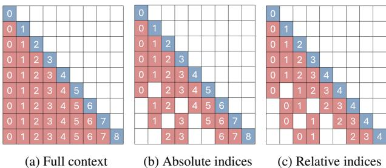  
Figure 4. Memory mechanism comparisons. The red and blue blocks represent the memory and current chunk, respectively. The number in each block represents the temporal index in RoPE. For simplicity of illustration, each chunk only contains one frame.

Once memory context is rebuilt, the challenge shifts to applying them to enforce consistency. Effectively using retrieved context requires overcoming a fundamental flaw in positional encodings. With standard RoPE (Fig.4b), the distance between the current chunk and past memory grows unbounded over time. This growing relative distance can eventually exceed the trained interpolation range in RoPE, causing extrapolation artifacts [58]. More critically, the growing perceived distance to these long-past spatial memory would weaken their influence on the current prediction. To resolve this, we propose Temporal Reframing (Fig.4c). We discard the absolute temporal indices, and dynamically re-assign new positional encodings to all context frames, establishing a fixed, small relative distance to the current, irrespective of their actual temporal gap. This operation effectively "pulls" important past frames closer in time, ensuring they remain influential and enabling robust extrapolation for long-term consistency.

# 3.4. Context Forcing

Autoregressive models often suffer from error accumulation during long video generation, leading to degraded visual quality over time [21, 72]. Moreover, the multi-step denoising of diffusion models is too slow for real-time interaction. Recent methods [8, 21, 43, 68] address these challenges by distilling a powerful bidirectional teacher diffusion model into a fast, few-step autoregressive student. These techniques force the student's output distribution $p _ { \theta } ( x _ { 0 : t } )$ to align with the teacher's, thereby improving generation quality by employing a distribution matching loss [70]:

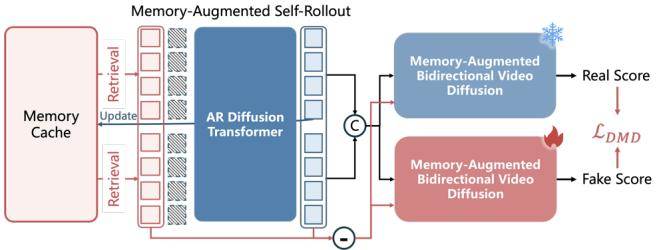  
Figure 5. Context forcing is a novel distillation method that employs memory-augmented self-rollout and memory-augmented bidirectional video diffusion to preserve long-term consistency, enable real-time interaction, and mitigate error accumulation.

$$
\nabla _ { \theta } \mathcal { L } _ { D M D } = \mathbb { E } _ { k } \big ( \nabla _ { \theta } \mathrm { K L } \big ( p _ { \theta } ( x _ { 0 : t } ) \big | \big | p _ { d a t a } ( x _ { 0 : t } ) \big ) \big ) ,
$$

where the gradient of the reverse $\mathrm { K L }$ can be approximated by the score difference derived from teacher model. However, these methods are incompatible with memoryaware models due to a critical distribution mismatch. Standard teacher diffusion models are trained on short clips and are inherently memory-less. Even if a teacher is augmented with memory, its bidirectional nature inevitably differs from the student's causal, autoregressive process. This means that without a meticulously designed memory context to mitigate this gap, the difference in memory context will make their conditional distributions $p ( x | C )$ misaligned, which in turn causes distribution matching to fail. We thus propose context forcing as shown in Fig. 5, which alleviates the memory context misalignment between teacher and student for distillation. For the student model, we self-rollouts 4 chunks conditioned on the memory context $p _ { \theta } ( x _ { j : j + 3 } | x _ { 0 : j - 1 } ) = \prod _ { i = j } ^ { j + 3 } p _ { \theta } ( x _ { i } | C _ { i } ) .$ To construct our teacher model $V _ { \beta }$ , we augment a standard bidirectional diffusion model with memory, and structure its context by masking $x _ { j : j + 3 }$ from student's memory context, where $C _ { j : j + 3 }$ denotes all context memory chunks corresponding to student's self-rollout $x _ { j : j + 3 }$ . By aligning the memory context with the student model, we enforce the distributions represented by the teacher to be as close as possible to the student model, which enables more effectively distribution matching. Moreover, this avoids training $V _ { \beta }$ on long videos and redundant context, facilitating the learning of long-term visual distribution. Through context forcing, we preserve long-term consistency in real-time generation with 4-denoising steps, and mitigate error accumulation.

$$
p _ { d a t a } ( x _ { j : j + 3 } | x _ { 0 : j - 1 } ) = p _ { \beta } ( x _ { j : j + 3 } | C _ { j : j + 3 } - x _ { j : j + 3 } ) ,
$$

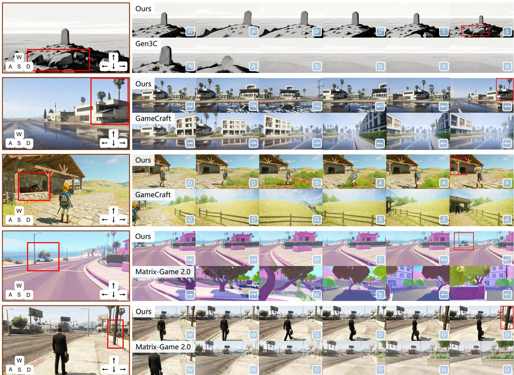  
F boxes) and visual qualityacross diverse scenes, icludingboth frstand thir-personreal and stylizedworlds.

# 3.5. Streaming Generation with Real-Time Latency

We augment context forcing with a suite of optimizations to minimize latency, unlocking an interactive streaming experience at $2 4 \mathrm { F P S }$ and $7 2 0 \mathrm { p }$ resolution on ${ 8 \times } \mathrm { H } 8 0 0$ GPUs. Mixed parallelism method for DiT and VAE. Unlike the conventional parallelism method that replicates the entire model or adapting sequence parallelism on the temporal dimension, our parallelism method combines sequence parallelism [34] and attention parallelism, which partitions the tokens of each entire chunk across devices. This design ensures that the computational workload for generating each chunk is distributed evenly, substantially reducing perchunk inference time while maintaining generation quality. Streaming deployment and progressive decoding. To minimize time-to-first-frame and enable seamless interaction, we adopt a streaming deployment architecture using NVIDIA Triton Inference Framework and implement a progressive multi-step VAE decoding strategy that decodes and streams frames in smaller batches. Upon generating latent representations from the DiT, frames are progressively decoded, allowing users to observe generated content while subsequent frames are still being processed. This streaming pipeline ensures smooth, low-latency interaction even under varying computational loads. Quantization and efficient attention. Furthermore, we employ a comprehensive suite of quantization strategies. Specifically, we adopt Sage Attention [79], float quantization, and matrix multiplication quantization to improve the inference performance. Additionally, we use KV-cache mechanisms for attention modules to eliminate redundant computations during autoregressive generation.

<table><tr><td></td><td colspan="6">Short-term (61 frames)</td><td colspan="4">Long-term (≥ 250 frames)</td><td></td></tr><tr><td></td><td>Real-time</td><td>PSNR ↑</td><td>SSIM ↑</td><td>LPIPS ↓</td><td>Rdist ↓</td><td>Tdist↓</td><td>PSNR ↑</td><td>SSIM ↑</td><td>LPIPS ↓</td><td>Rdist ↓</td><td>Tdist ↓</td></tr><tr><td>CameraCtrl [16]</td><td>X</td><td>17.93</td><td>0.569</td><td>0.298</td><td>0.037</td><td>0.341</td><td>10.09</td><td>0.241</td><td>0.549</td><td>0.733</td><td>1.117</td></tr><tr><td>SEVA [80]</td><td></td><td>19.84</td><td>0.598</td><td>0.313</td><td>0.047</td><td>0.223</td><td>10.51</td><td>0.301</td><td>0.517</td><td>0.721</td><td>1.893</td></tr><tr><td>ViewCrafter [77]</td><td>× ×</td><td>19.91</td><td>0.617</td><td>0.327</td><td>0.029</td><td>0.543</td><td>9.32</td><td>0.277</td><td>0.661</td><td>1.573</td><td>3.051</td></tr><tr><td>Gen3C [52]</td><td>X</td><td>21.68</td><td>0.635</td><td>0.278</td><td>0.024</td><td>0.477</td><td>15.37</td><td>0.431</td><td>0.483</td><td>0.357</td><td>0.979</td></tr><tr><td>VMem [64]</td><td>X</td><td>19.97</td><td>0.587</td><td>0.316</td><td>0.048</td><td>0219</td><td>12.77</td><td>0.335</td><td>0.542</td><td>0.748</td><td>1.547</td></tr><tr><td>Matrix-Game-2.0 [17]</td><td>v</td><td>17.26</td><td>0.505</td><td>0.383</td><td>0.287</td><td>0.843</td><td>9.57</td><td>0.205</td><td>0.631</td><td>2.125</td><td>2.742</td></tr><tr><td>GameCraft [31]</td><td>X</td><td>21.05</td><td>0.639</td><td>0.341</td><td>0.151</td><td>0.617</td><td>10.09</td><td>0.287</td><td>0.614</td><td>2.497</td><td>3.291</td></tr><tr><td>Ours (w/o Context Forcing)</td><td>X</td><td>21.27</td><td>0.669</td><td>0.261</td><td>0.033</td><td>0.157</td><td>16.27</td><td>0.425</td><td>0.495</td><td>0.611</td><td>0.991</td></tr><tr><td>Ours (full)</td><td>v</td><td>21.92</td><td>0.702</td><td>0.247</td><td>0.031</td><td>0.121</td><td>18.94</td><td>0.585</td><td>0.371</td><td>0.332</td><td>0.797</td></tr></table>

Tab uantive consWe c gaist h meth wtht memo Cmr [6],VA [80], Vraf [-Game.0 [ r   y  e3C  Me u u t

# 4. Experiments

Dataset. WorldPlay is trained on a comprehensive dataset comprising approximately 320K high-quality video samples derived from both real-world footage and synthetic environments. For real-world videos, we start with publicly available real video sources [36, 40] and remove short, lowquality clips, as well as samples containing watermarks, UI, dense crowds, or erratic camera movement. To mitigate the monotonous motion common in original videos, we adopt 3D Gaussian Splatting [25] for 3D reconstruction on curated videos. We then render customized videos from these 3D scenes using novel revisit trajectories. The renderings are further refined using Difix3D $^ +$ [66] to repair floating artifacts, yielding an additional 100K high-quality real video clips. For synthetic data, we collect hundreds of UE scenes and generate 50K video clips by rendering complex, customized trajectories. Also, we build a game recording platform and invite dozens of players to collect $1 7 0 \mathrm { k }$ samples from 1st/3rd-person AAA games with designed trajectories. We segment each video into clips and use a vision-language model [81] to generate text annotations. For videos without action annotations, we employ VIPE [20] to label. Evaluation Protocol. Our test set comprises 600 cases sourced from DL3DV, game videos, and AI-generated images spanning a range of styles. For the short-term setting, we utilize the camera trajectories from the test videos as the input pose. The generated video frames are directly compared against the Ground-Truth (GT) frames to assess visual quality and camera pose accuracy. For the long-term setting, we test the long-term consistency using various custom cycle camera trajectories designed to enforce revisiting. Each model generates frames along a customize trajectory and then returns along the same path, metrics are evaluated on the return path by comparing the generated frame to the corresponding frame generated during the initial pass. We employ LPIPS, PSNR, and SSIM to measure visual quality and $R _ { \mathrm { d i s t } }$ and $T _ { \mathrm { d i s t } }$ to quantify action accuracy. Baselines. We conduct comprehensive comparisons against various baselines, which mainly fall into two categories: 1) Action-controlled diffusion models without memory: CameraCtrl [16], SEVA [80], ViewCrafter [77], Matrix-Game 2.0 [17] and GameCraft [31]; 2) Action-controlled diffusion models with memory: Gen3C [52] and VMem [32]. More evaluation results can be found in our appendix.

# 4.1. Main Result

Quantitative Results. As shown in Table 2, in the shortterm regime, our approach achieves superior visual fidelity and maintains competitive control accuracy. Although methods leveraging explicit 3D representations (i.e. ViewCrafter [77], Gen3C [52]) realize more accurate rotation, they suffer from issues such as the inaccurate depth estimation and inconsistent scale when performing movement translations. For more challenging long-term scenarios, where action accuracy generally degrades, our method remains more stable and achieves the best performance. Regarding long-term geometric consistency, Matrix-Game2.0 [17] and GameCraft [31] exhibit poor performance due to the lack of memory mechanism. Although VMem [32] and Gen3C [52] employ explicit 3D cache to maintain consistency, they are constrained by depth accuracy and alignment, making it difficult to achieve robust long-term consistency. Benefiting from Reconstituted Context Memory, we achieve improved long-term consistency. Moreover, through context forcing, we further prevent error accumulation, resulting in better visual quality and action accuracy. Crucially, WorldPlay concurrently achieves the requisite real-time interactivity for immersive simulation. Qualitative Results. We provide qualitative comparisons with baselines in Fig. 6. The explicit 3D cache used in Gen3C [52] is highly sensitive to the quality of intermediate outputs and limited by the accuracy of depth estimation. Conversely, our reconstituted context memory guarantees long-term consistency with more robust implicit prior, achieving superior scene generalizability. Matrix-Game2.0 [17] and GameCraft [31] fail to support free exploration due to the lack of memory. Furthermore, they do not generalize well to third-person scenarios, making it difficult to control agents within the scene and limiting their applicability. In contrast, WorldPlay successfully extends its efficacy to these scenarios and maintains high visual fidelity and long-term geometric consistency.

Table 3. Ablation for action representation. We conduct validation using the bidirectional model.   

<table><tr><td>Action</td><td>PSNR↑</td><td>SSIM↑</td><td>LPIPS↓</td><td>Rdist ↓</td><td>Tdist </td></tr><tr><td>Discrete</td><td>21.47</td><td>0.661</td><td>0.248</td><td>0.103</td><td>0.615</td></tr><tr><td>Continuous</td><td>21.93</td><td>0.665</td><td>0.231</td><td>0.038</td><td>0.287</td></tr><tr><td>Full</td><td>22.09</td><td>0.687</td><td>0.219</td><td>0.028</td><td>0.113</td></tr></table>

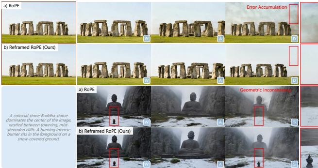  
Figure 7. RoPE design comparisons. Upper: Our reframed RoPE avoids exceeding the the positional range in standard RoPE, alleviating error accumulation. Bottom: By maintaining a small relative distance to long-range spatial memory, it achieves better long-term consistency.

# 4.2. Ablation

Action Representation. Table. 3 validates the effectiveness of the proposed dual-action representation. When using only discrete keys as action signals, the model struggles to achieve fine-grained control, such as the distance of movement or the degree of rotation, resulting in poor performance on $R _ { \mathrm { d i s t } }$ and $T _ { \mathrm { d i s t } }$ metrics. Using continuous camera poses yields better results but converges more difficult due to scale variance. By employing the dual-action representation, we achieve the best overall control performance.

RoPE Design. Table. 4 presents the quantitative results of different RoPE designs within the memory mechanism, showing that reframed rope outperforms naive counterparts, especially on visual metrics. As illustrated in the upper part of Fig. 7, RoPE is more prone to error accumulation. It also increases the distance between memory and predicted chunk due to absolute temporal indices, resulting in weaker geometric consistency, as shown in the lower part of Fig. 7. Context Forcing. To verify the importance of memory alignment, we train the teacher model following [74], where the memory is selected at latent level rather than at chunk level. Although this may reduce the number of memory context in the teacher model, it also introduce misaligned context between the teacher and student model, leading to collapsed results as shown in Fig. 8a. Additionally, for the past chunks $x _ { 0 : j - 1 }$ , we attempt to self-rollout historical chunks as context following the inference-time recipe as in [68]. However, this may cause the bidirectional diffusion model to provide inaccurate score estimation, as it is trained using clean chunks as memory. Consequently, this discrepancy introduces artifacts as illustrated in Fig. 8b. We obtain historical chunks by sampling from real videos, which yields superior results as shown in Fig. 8c.

Table 4. Ablation for positional encoding design in memory. The results are evaluated on the long-term test data.   

<table><tr><td></td><td>PSNR↑</td><td>SSIM↑</td><td>LPIPS↓</td><td>Rdist ↓</td><td>Tdist </td></tr><tr><td>RoPE</td><td>14.03</td><td>0.358</td><td>0.534</td><td>0.805</td><td>1.341</td></tr><tr><td>Reframed RoPE</td><td>16.27</td><td>0.425</td><td>0.495</td><td>0.611</td><td>0.991</td></tr></table>

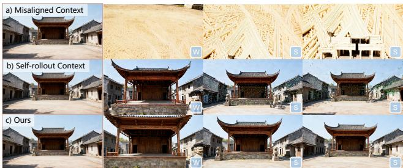  
Figure 8. Ablation for context forcing. a) When the teacher and student have misaligned context, it leads to distillation failure, resulting in collapsed outputs. b) Self-rollout historical context can introduce artifacts. Zoom in for details.

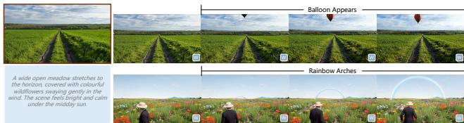  
Figure 9. Promptable event. Our method supports text-based manipulation during streaming.

# 4.3. Application

3D Reconstruction. Benefiting from the long-term geometric consistency, we can integrate a 3D reconstruction model [44] to produce high-quality point clouds, as presented in Fig. 1 (d). Promptable Event. Beyond navigation control, WorldPlay supports text-based interaction to trigger dynamic world events. As shown in Fig. 9 and Fig. 1 (e), users can prompt at any time to responsively alter the ongoing stream.

# 5. Conclusion

WorldPlay is a powerful world model with real-time interaction and long-term geometric consistency. It empowers users to customize unique worlds from a single image or text prompt. While focused on navigation control, its architecture has shown potential for richer interaction like dynamic, text-triggered events. By providing a systematic framework for control, memory, and distillation, WorldPlay marks a critical step toward creating consistent and interactive virtual worlds. Extending it to generate longer videos with multi-agent interaction and complex physical dynamics would be fruitful future directions.

# References

[1] Eloi Alonso, Adam Jelley, Vincent Micheli, Anssi Kanervisto, Amos J Storkey, Tim Pearce, and François Fleuret. Diffusion for world modeling: Visual details matter in atari. Advances in Neural Information Processing Systems, 37: 5875758791, 2024. 2   
[2] Sherwin Bahmani, Ivan Skorokhodov, Guocheng Qian, Aliaksandr Siarohin, Willi Menapace, Andrea Tagliasacchi, David B Lindell, and Sergey Tulyakov. Ac3d: Analyzing and improving 3d camera control in video diffusion transformers. In CVPR, pages 2287522889, 2025.   
[3] Amir Bar, Gaoyue Zhou, Danny Tran, Trevor Darrell, and Yann LeCun. Navigation world models. In CVPR, pages 1579115801, 2025. 2   
[4] Chenjie Cao, Jingkai Zhou, Shikai Li, Jingyun Liang, Chaohui Yu, Fan Wang, Xiangyang Xue, and Yanwei Fu. Uni3c: Unifying precisely 3d-enhanced camera and human motion controls for video generation. arXiv preprint arXiv:2504.14899, 2025. 2   
[5] Haoxuan Che, Xuanhua He, Quande Liu, Cheng Jin, and Hao Chen. Gamegen-x: Interactive open-world game video generation. arXiv preprint arXiv:2411.00769, 2024. 3   
[6] Boyuan Chen, Diego Martí Monsó, Yilun Du, Max Simchowitz, Russ Tedrake, and Vincent Sitzmann. Diffusion forcing: Next-token prediction meets full-sequence diffusion. Advances in Neural Information Processing Systems, 37:2408124125, 2024. 2, 3   
[7] Haoxin Chen, Yong Zhang, Xiaodong Cun, Menghan Xia, Xintao Wang, Chao Weng, and Ying Shan. Videocrafter2: Overcoming data limitations for high-quality video diffusion models. In CVPR, pages 73107320, 2024. 2   
[8] Justin Cui, Jie Wu, Ming Li, Tao Yang, Xiaojie Li, Rui Wang, Andrew Bai, Yuanhao Ban, and Cho-Jui Hsieh. Selfforcing $^ { + + }$ Towards minute-scale high-quality video generation. arXiv preprint arXiv:2510.02283, 2025. 5   
[9] Etched Decart. Oasis: A universe in a transformer. https : //oasis-model.github.io/,2024.2,3,4   
10] Google Deepmind. Veo3 video model, 2025. ht tps : / / deepmind.google/models/veo/.2   
11] Haoyi Duan, Hong-Xing Yu, Sirui Chen, Li Fei-Fei, and Jiajun Wu. Worldscore: A unified evaluation benchmark for world generation. arXiv preprint arXiv:2504.00983, 2025. 6   
12] Kevin Frans, Danijar Hafner, Sergey Levine, and Pieter Abbeel. One step diffusion via shortcut models. arXiv preprint arXiv:2410.12557, 2024. 3   
[15] ru Gao, Haoyuan Guo, 1uyen Hoang, wellin Huang, Lu Jiang, Fangyuan Kong, Huixia Li, Jiashi Li, Liang Li, Xiaojie Li, et al. Seedance 1.0: Exploring the boundaries of video generation models. arXiv preprint arXiv:2506.09113, 2025.2   
[14] Zhengyang Geng, Mingyang Deng, Xingjian Bai, J Zico Kolter, and Kaiming He. Mean flows for one-step generative modeling. arXiv preprint arXiv:2505.13447, 2025. 3   
[15] Yuwei Guo, Ceyuan Yang, Anyi Rao, Zhengyang Liang, Yaohui Wang, Yu Qiao, Maneesh Agrawala, Dahua Lin, and Bo Dai. Animatediff: Animate your personalized text-toimage diffusion models without specific tuning. In ICLR, 2024. 2   
[16] Hao He, Yinghao Xu, Yuwei Guo, Gordon Wetzstein, Bo Dai, Hongsheng Li, and Ceyuan Yang. Cameractrl: Enabling camera control for text-to-video generation. In ICLR, 2025. 2, 7   
[17] Xianglong He, Chunli Peng, Zexiang Liu, Boyang Wang, Yifan Zhang, Qi Cui, Fei Kang, Biao Jiang, Mengyin An, Yangyang Ren, et al. Matrix-game 2.0: An open-source, real-time, and streaming interactive world model. arXiv preprint arXiv:2508.13009, 2025. 2, 3, 4, 7   
[18] Roberto Henschel, Levon Khachatryan, Hayk Poghosyan, Daniil Hayrapetyan, Vahram Tadevosyan, Zhangyang Wang, Shant Navasardyan, and Humphrey Shi. Streamingt2v: Consistent, dynamic, and extendable long video generation from text. In CVPR, pages 25682577, 2025. 2   
[19] Jonathan Ho, Ajay Jain, and Pieter Abbeel. Denoising diffusion probabilistic models. Advances in neural information processing systems, 33:68406851, 2020. 2   
[20] Jiahui Huang, Qunjie Zhou, Hesam Rabeti, Aleksandr Korovko, Huan Ling, Xuanchi Ren, Tianchang Shen, Jun Gao, Dmitry Slepichev, Chen-Hsuan Lin, et al. Vipe: Video pose engine for 3d geometric perception. arXiv preprint arXiv:2508.10934, 2025. 7, 2   
[21] Xun Huang, Zhengqi Li, Guande He, Mingyuan Zhou, and Eli Shechtman. Self forcing: Bridging the traintest gap in autoregressive video diffusion. arXiv preprint arXiv:2506.08009, 2025. 2, 3, 5, 1   
[22] Ziqi Huang, Yinan He, Jiashuo Yu, Fan Zhang, Chenyang Si, Yuming Jiang, Yuanhan Zhang, Tianxing Wu, Qingyang Jin, Nattapol Chanpaisit, et al. Vbench: Comprehensive benchmark suite for video generative models. In Proceedings of the IEEE/CVF Conference on Computer Vision and Pattern Recognition, pages 2180721818, 2024. 5, 6   
[23] Team HunyuanWorld. Hunyuanworld 1.0: Generating immersive, explorable, and interactive 3d worlds from words or pixels. arXiv preprint, 2025. 3   
[24] Minguk Kang, Richard Zhang, Connelly Barnes, Sylvain Paris, Suha Kwak, Jaesik Park, Eli Shechtman, Jun-Yan Zhu, and Taesung Park. Distilling diffusion models into conditional gans. In ECCV, pages 428447. Springer, 2024. 3   
[25] Bernhard Kerbl, Georgios Kopanas, Thomas Leimkühler, and George Drettakis. 3d gaussian splatting for real-time radiance field rendering. ACM Trans. Graph., 42(4):1391, 2023. 7   
[26] Jihwan Kim, Junoh Kang, Jinyoung Choi, and Bohyung Han. Fifo-diffusion: Generating infinite videos from text without training. Advances in Neural Information Processing Systems, 37:8983489868, 2024. 2   
[27] Diederik P Kingma and Max Welling. Auto-encoding variational bayes. arXiv preprint arXiv:1312.6114, 2013. 3   
[28] Weijie Kong, Qi Tian, Zijian Zhang, Rox Min, Zuozhuo Dai, Jin Zhou, Jiangfeng Xiong, Xin Li, Bo Wu, Jianwei Zhang, et al. Hunyuanvideo: A systematic framework for large video generative models. arXiv preprint arXiv:2412.03603, 2024. 2, 3, 1   
[29] Xin Kong, Shikun Liu, Xiaoyang Lyu, Marwan Taher, Xiaojuan Qi, and Andrew J Davison. Eschernet: A generative model for scalable view synthesis. In CVPR, pages 9503 9513, 2024. 2   
[30] Kuaishou. Kling video model, 2024. https:// klingai.com/global/.2   
[31] Jiaqi Li, Junshu Tang, Zhiyong Xu, Longhuang Wu, Yuan Zhou, Shuai Shao, Tianbao Yu, Zhiguo Cao, and Qinglin Lu. Hunyuan-gamecraft: High-dynamic interactive game video generation with hybrid history condition. arXiv preprint arXiv:2506.17201, 2025. 2, 3, 7   
[32] Runjia Li, Philip Torr, Andrea Vedaldi, and Tomas Jakab. Vmem: Consistent interactive video scene generation with surfel-indexed view memory. In ICCV, 2025. 2, 3, 7   
[33] Ruilong Li, Brent Yi, Junchen Liu, Hang Gao, Yi Ma, and Angjoo Kanazawa. Cameras as relative positional encoding. arXiv preprint arXiv:2507.10496, 2025. 2, 4   
[34] Shenggui Li, Fuzhao Xue, Chaitanya Baranwal, Yongbin Li, and Yang You. Sequence parallelism: Long sequence training from system perspective. In Proceedings of the 61st Annual Meeting of the Association for Computational Linguistics (Volume 1: Long Papers), pages 23912404, Toronto, Canada, 2023. Association for Computational Linguistics. 6   
[35] Xinyang Li, Tengfei Wang, Zixiao Gu, Shengchuan Zhang, Chunchao Guo, and Liujuan Cao. Flashworld: Highquality 3d scene generation within seconds. arXiv preprint arXiv:2510.13678, 2025. 3   
[36] Zhen Li, Chuanhao Li, Xiaofeng Mao, Shaoheng Lin, Ming Li, Shitian Zhao, Zhaopan Xu, Xinyue Li, Yukang Feng, Jianwen Sun, et al. Sekai: A video dataset towards world exploration. arXiv preprint arXiv:2506.15675, 2025. 7, 2   
[37] Shanchuan Lin, Anran Wang, and Xiao Yang. Sdxllightning: Progressive adversarial diffusion distillation. arXiv preprint arXiv:2402.13929, 2024. 3   
[38] Shanchuan Lin, Xin Xia, Yuxi Ren, Ceyuan Yang, Xuefeng Xiao, and Lu Jiang. Diffusion adversarial post-training for one-step video generation. 2025.   
[39] Shanchuan Lin, Ceyuan Yang, Hao He, Jianwen Jiang, Yuxi Ren, Xin Xia, Yang Zhao, Xuefeng Xiao, and Lu Jiang. Autoregressive adversarial post-training for real-time interactive video generation. arXiv preprint arXiv:2506.09350, 2025. 3   
[40] Lu Ling, Yichen Sheng, Zhi Tu, Wentian Zhao, Cheng Xin, Kun Wan, Lantao Yu, Qianyu Guo, Zixun Yu, Yawen Lu, et al. D13dv-10k: A large-scale scene dataset for deep learning-based 3d vision. In CVPR, pages 2216022169, 2024. 7, 2   
[41] Yaron Lipman, Ricky TQ Chen, Heli Ben-Hamu, Maximilian Nickel, and Matt Le. Flow matching for generative modeling. In ICLR, 2023. 2, 3   
[42] Fangfu Liu, Wenqiang Sun, Hanyang Wang, Yikai Wang, Haowen Sun, Junliang Ye, Jun Zhang, and Yueqi Duan. Reconx: Reconstruct any scene from sparse views with video diffusion model. arXiv preprint arXiv:2408.16767, 2024. 2   
[43] Kunhao Liu, Wenbo Hu, Jiale Xu, Ying Shan, and Shijian Lu. Rolling forcing: Autoregressive long video diffusion in real time. arXiv preprint arXiv:2509.25161, 2025. 5   
[44] Yifan Liu, Zhiyuan Min, Zhenwei Wang, Junta Wu, Tengfei Wang, Yixuan Yuan, Yawei Luo, and Chunchao Guo. Worldmirror: Universal 3d world reconstruction with any-prior prompting. arXiv preprint arXiv:2510.10726, 2025. 8   
[45] Yanzuo Lu, Yuxi Ren, Xin Xia, Shanchuan Lin, Xing Wang, Xuefeng Xiao, Andy J Ma, Xiaohua Xie, and Jian-Huang Lai. Adversarial distribution matching for diffusion distillation towards efficient image and video synthesis. In ICCV, pages 1681816829, 2025. 3   
[46] Xiaofeng Mao, Shaoheng Lin, Zhen Li, Chuanhao Li, Wenshuo Peng, Tong He, Jiangmiao Pang, Mingmin Chi, Yu Qiao, and Kaipeng Zhang. Yume: An interactive world generation model. arXiv preprint arXiv:2507.17744, 2025. 2   
[47] Minimax. Hailuo video model, 2024. https : / / hailuoai.video.2   
[48] Takeru Miyato, Bernhard Jaeger, Max Welling, and Andreas Geiger. Gta: A geometry-aware attention mechanism for multi-view transformers. In ICLR, 2024. 2   
[49] Jack Parker-Holder, Philip Ball, Jake Bruce, Vibhavari Dasagi, Kristian Holsheimer, Christos Kaplanis, Alexandre Moufarek, Guy Scully, Jeremy Shar, Jimmy Shi, Stephen Spencer, Jessica Yung, Michael Dennis, Sultan Kenjeyev, Shangbang Long, Vlad Mnih, Harris Chan, Maxime Gazeau, Bonnie Li, Fabio Pardo, Luyu Wang, Lei Zhang, Frederic Besse, Tim Harley, Anna Mitenkova, Jane Wang, Jeff Clune, Demis Hassabis, Raia Hadsell, Adrian Bolton, Satinder Singh, and Tim Rocktäschel. Genie 2: A large-scale foundation world model. 2024. 2   
[50] William Peebles and Saining Xie. Scalable diffusion models with transformers. In ICCV, pages 41954205, 2023. 2, 3   
[51] Joseph Redmon, Santosh Divvala, Ross Girshick, and Ali Farhadi. You only look once: Unified, real-time object detection. In Proceedings of the IEEE Conference on Computer Vision and Pattern Recognition (CVPR), 2016. 2   
[52] Xuanchi Ren, Tianchang Shen, Jiahui Huang, Huan Ling, Yifan Lu, Merlin Nimier-David, Thomas Müller, Alexander Keller, Sanja Fidler, and Jun Gao. Gen3c: 3d-informed world-consistent video generation with precise camera control. In CVPR, pages 61216132, 2025. 2, 7   
[53] Robin Rombach, Andreas Blattmann, Dominik Lorenz, Patrick Esser, and Björn Ommer. High-resolution image synthesis with latent diffusion models. In CVPR, pages 10684 10695, 2022. 2   
[54] Tim Salimans and Jonathan Ho. Progressive distillation for fast sampling of diffusion models. arXiv preprint arXiv:2202.00512, 2022. 3   
[55] Axel Sauer, Frederic Boesel, Tim Dockhorn, Andreas Blattmann, Patrick Esser, and Robin Rombach. Fast highresolution image synthesis with latent adversarial diffusion distillation. In SIGGRAPH Asia, pages 111, 2024. 3   
[56] Axel Sauer, Dominik Lorenz, Andreas Blattmann, and Robin Rombach. Adversarial diffusion distillation. In ECCV, pages 87103. Springer, 2024. 3   
[57] Yang Song, Jascha Sohl-Dickstein, Diederik P Kingma, Abhishek Kumar, Stefano Ermon, and Ben Poole. Score-based generative modeling through stochastic differential equations. In ICLR, 2021. 2   
[58] Jianlin Su, Murtadha Ahmed, Yu Lu, Shengfeng Pan, Wen Bo, and Yunfeng Liu. Roformer: Enhanced transformer with rotary position embedding. Neurocomputing, 568:127063, 2024. 2, 4, 5   
[59] Wenqiang Sun, Shuo Chen, Fangfu Liu, Zilong Chen, Yueqi Duan, Jun Zhang, and Yikai Wang. Dimensionx: Create any 3d and 4d scenes from a single image with controllable video diffusion. arXiv preprint arXiv:2411.04928, 2024. 2   
[60] Wenqiang Sun, Fangyun Wei, Jinjing Zhao, Xi Chen, Zilong Chen, Hongyang Zhang, Jun Zhang, and Yan Lu. From virtual games to real-world play. arXiv preprint arXiv:2506.18901, 2025.   
[61] Dani Valevski, Yaniv Leviathan, Moab Arar, and Shlomi Fruchter. Diffusion models are real-time game engines. In ICLR, 2025. 2   
[62] Team Wan, Ang Wang, Baole Ai, Bin Wen, Chaojie Mao, Chen-Wei Xie, Di Chen, Feiwu Yu, Haiming Zhao, Jianxiao Yang, et al. Wan: Open and advanced large-scale video generative models. arXiv preprint arXiv:2503.20314, 2025. 2, 3, 1   
[63] Zhengyi Wang, Cheng Lu, Yikai Wang, Fan Bao, Chongxuan Li, Hang Su, and Jun Zhu. Prolificdreamer: High-fidelity and diverse text-to-3d generation with variational score distillation. Advances in neural information processing systems, 36: 84068441, 2023. 3   
[64] Zhouxia Wang, Ziyang Yuan, Xintao Wang, Yaowei Li, Tianshui Chen, Menghan Xia, Ping Luo, and Ying Shan. Motionctrl: A unified and flexible motion controller for video generation. In ACM SIGGRAPH, pages 111, 2024. 2,7   
[65] Thaddäus Wiedemer, Yuxuan Li, Paul Vicol, Shixiang Shane Gu, Nick Matarese, Kevin Swersky, Been Kim, Priyank Jaini, and Robert Geirhos. Video models are zero-shot learners and reasoners. arXiv preprint arXiv:2509.20328, 2025. 2   
[66] Jay Zhangjie Wu, Yuxuan Zhang, Haithem Turki, Xuanchi Ren, Jun Gao, Mike Zheng Shou, Sanja Fidler, Zan Gojcic, and Huan Ling. Difix3d+: Improving 3d reconstructions with single-step diffusion models. In CVPR, pages 26024 26035, 2025. 7, 2   
[67] Zeqi Xiao, Yushi Lan, Yifan Zhou, Wenqi Ouyang, Shuai Yang, Yanhong Zeng, and Xingang Pan. Worldmem: Longterm consistent world simulation with memory. arXiv preprint arXiv:2504.12369, 2025. 2, 3, 4, 5   
[68] Shuai Yang, Wei Huang, Ruihang Chu, Yicheng Xiao, Yuyang Zhao, Xianbang Wang, Muyang Li, Enze Xie, Yingcong Chen, Yao Lu, et al. Longlive: Real-time interactive long video generation. arXiv preprint arXiv:2509.22622, 2025. 5, 8, 6   
[69] Zhuoyi Yang, Jiayan Teng, Wendi Zheng, Ming Ding, Shiyu Huang, Jiazheng Xu, Yuanming Yang, Wenyi Hong, Xiaohan Zhang, Guanyu Feng, et al. Cogvideox: Text-to-video diffusion models with an expert transformer. In ICLR, 2024. 2   
[70] Tianwei Yin, Michaël Gharbi, Taesung Park, Richard Zhang, Eli Shechtman, Fredo Durand, and Bill Freeman. Improved distribution matching distillation for fast image synthesis. Advances in neural information processing systems, 37:4745547487, 2024. 2, 3, 5   
[71] Tianwei Yin, Michaël Gharbi, Richard Zhang, Eli Shechtman, Fredo Durand, William T Freeman, and Taesung Park. One-step diffusion with distribution matching distillation. In CVPR, pages 66136623, 2024. 3   
[72] Tianwei Yin, Qiang Zhang, Richard Zhang, William T Freeman, Fredo Durand, Eli Shechtman, and Xun Huang. From slow bidirectional to fast autoregressive video diffusion models. In CVPR, pages 2296322974, 2025. 3, 5   
[73] Hong-Xing Yu, Haoyi Duan, Charles Herrmann, William T Freeman, and Jiajun Wu. Wonderworld: Interactive 3d scene generation from a single image. In CVPR, pages 59165926, 2025.2   
[74] Jiwen Yu, Jianhong Bai, Yiran Qin, Quande Liu, Xintao Wang, Pengfei Wan, Di Zhang, and Xihui Liu. Context as memory: Scene-consistent interactive long video generation with memory retrieval. arXiv preprint arXiv:2506.03141, 2025. 2, 3, 4, 5, 8   
[75] Jiwen Yu, Yiran Qin, Xintao Wang, Pengfei Wan, Di Zhang, and Xihui Liu. Gamefactory: Creating new games with generative interactive videos. In ICCV, 2025. 2   
[76] Mark YU, Wenbo Hu, Jinbo Xing, and Ying Shan. Trajectorycrafter: Redirecting camera trajectory for monocular videos via diffusion models. In ICCV, 2025. 2   
[77] Wangbo Yu, Jinbo Xing, Li Yuan, Wenbo Hu, Xiaoyu Li, Zhipeng Huang, Xiangjun Gao, Tien-Tsin Wong, Ying Shan, and Yonghong Tian. Viewcrafter: Taming video diffusion models for high-fidelity novel view synthesis. arXiv preprint arXiv:2409.02048, 2024. 2, 7   
[78] Haiyu Zhang, Xinyuan Chen, Yaohui Wang, Xihui Liu, Yunhong Wang, and Yu Qiao. Accvideo: Accelerating video diffusion model with synthetic dataset. arXiv preprint arXiv:2503.19462, 2025. 3   
[79] Jintao Zhang, Jia Wei, Pengle Zhang, Jun Zhu, and Jianfei Chen. Sageattention: Accurate 8-bit attention for plug-andplay inference acceleration. In ICLR, 2025. 6   
[80] Jensen Zhou, Hang Gao, Vikram Voleti, Aaryaman Vasishta, Chun-Han Yao, Mark Boss, Philip Torr, Christian Rupprecht, and Varun Jampani. Stable virtual camera: Generative view synthesis with diffusion models. arXiv preprint arXiv:2503.14489, 2025. 7   
[81] Jinguo Zhu, Weiyun Wang, Zhe Chen, Zhaoyang Liu, Shenglong Ye, Lixin Gu, Hao Tian, Yuchen Duan, Weijie Su, Jie Shao, et al. Internv13: Exploring advanced training and test-time recipes for open-source multimodal models. arXiv preprint arXiv:2504.10479, 2025. 7

# WorldPlay: Towards Long-Term Geometric Consistency for Real-Time Interactive World Modeling

Supplementary Material

# A. Training and Inference Details

We adopt the pretrained DiT-based video diffusion models [28, 62] as the backbone. For the chunk-wise autoregressive diffusion transformer, we group 4 latents into a chunk. For the memory context, we set the temporal memory length to 3 chunks and the spatial memory length to 1 chunk. For the bidirectional teacher model $V _ { \beta }$ , we also adopt the dual-action representation and construct the memory context as described in Sec.3.4. The training consists of three stages. Stage One: Action Control. In the first stage, we focus on injecting action control into the pretrained model. We employ the dual action representation to the pretrained model and train the bidirectional action model for 30K iterations. Then, we replace the 3D self-attention with block causal attention and train for an additional 30K iterations as our AR action model. We find that this enables the AR action model to converge more easily. In this stage, the model is trained on 61 frames (4 chunks) using the Adam optimizer with a learning rate of $1 e - 5$ and a batch size of 64. Stage Two: Memory. In the second stage, we train the bidirectional action model and the AR action model with context memory as described in Sec.3.3 and Sec.3.4, respectively. The training is performed on longer videos, while other settings remain the same as in the first stage. Stage Three: Context Forcing. In the final stage, we use the bidirectional model as the teacher and the AR model as the student for distillation. To stabilize the distillation process, we employ a progressive training strategy that gradually increases the maximum length of the generated latents. For the student model, the learning rate is set to $1 e - 6$ , while for the bidirectional model, which is used to compute the fake score, the learning rate is set to $2 e - 7$ The models are trained for 2K iteration with a batch size of 64. All other hyperparameters follow [21]. For the details of context forcing, see Algorithm 1. Finally, our AR model can produce multiple chunks in a streaming fashion with KV cache as shown in Algorithm 2. When the user provides only camera poses, we first compute the relative translations and rotations between consecutive poses, and then apply a thresholding mechanism to identify and convert them into discrete actions. Conversely, when only discrete actions are available, we use the predefined relative translations and rotations associated with each action to convert them into camera poses.

# Algorithm 1 Context Forcing Training

Require: Number of denoising timesteps $d$ and chunks $n = 4$ Require: Dataset $D$ (encoded by 3D VAE) Require: AR diffusion model $N _ { \theta }$   

Require: Bidirectional diffusion model $V _ { \beta } ^ { f a k e }$ and Vreal 1: loop 2: Progressively increase maximum chunk length $m$ 3: Sample chunk length $j \sim \operatorname { U n i f o r m } ( 0 , 1 , \dots , m )$ 4: Sample context $x _ { 0 : j - 1 } \sim D$ 5: for $i = j , \ldots , j + n - 1$ do 6: Initialize $x _ { i } ^ { i n i t } \sim \mathcal { N } ( 0 , I )$ 7: Reconstitute context memory $C _ { i } \subseteq \{ x _ { 0 } , \ldots , x _ { i - 1 } \}$ 8: Sample $s \sim \mathrm { U n i f o r m } ( 1 , 2 , \dots , d )$   
9: Self-rollout $x _ { i }$ using $N _ { \theta }$ with $C _ { i }$ and $s$ denoising steps   
10: end for   
11: Align context memory $C ^ { t e a } \gets C _ { j : j + n - 1 } - x _ { j : j + n - 1 }$   
12: Sample diffusion timestep $k \sim [ 0 , 1 ]$   
13: $\hat { x } _ { j : j + n - 1 }  A d d N o i s e ( x _ { j : j + n - 1 , } k )$   
14: Compute fke score $S ^ { f a k e } \gets V _ { \beta } ^ { f a k e } ( \hat { x } _ { j : j + n - 1 } , C ^ { t e a } , k )$   
15: Compute real score $S ^ { f a k e } \gets V ^ { r e a l } ( \hat { x } _ { j : j + n - 1 } , C ^ { t e a } , k )$   
16: Update $\theta$ via distribution matching loss   
17: Update $\beta$ via flow matching loss as in [21]

# Algorithm 2 Inference with KV Cache

Require: Number of inference chunks $n _ { c }$ Require: Denoise timesteps $\{ k _ { 1 } , \ldots , k _ { d } \}$ Require: Number of inference chunks $n _ { c }$   

Require: AR diffusion model $N _ { \theta }$ (returns KV embeddings via $\mathsf { \bar { N } } _ { \theta } ^ { \mathrm { K V } } ,$   
1: Initialize model output $X _ { \theta } \gets [ ]$   
Initialize KV cache $\mathbf { K V } \gets [ ]$   
3: for $i = 0 , \ldots , n _ { c } - 1$ do   
4: Initialize $x _ { i } \sim \mathcal { N } ( 0 , I )$   
5: Reconstitute context memory $C _ { i } \subseteq \{ x _ { 0 } , \ldots , x _ { i - 1 } \}$   
6: for $s = d , \ldots , 1$ do   
7: if $s = d$ and $i > 1$ then   
8: Reset $\mathbf { K V }  N _ { \theta } ^ { \mathrm { K V } } ( C _ { i } , 0 )$   
9: end if   
10: Denoise $x _ { i } \gets N _ { \theta } ( x _ { i } , \mathbf { K } \mathbf { V } , k _ { s } )$   
11: end for   
12: Add output $X _ { \theta }$ .append $( x _ { i } )$   
13:end for   
14: return $X _ { \theta }$

# B. Dataset

Table 5 provides a comprehensive breakdown of our dataset. We deliberately curate a diverse and high-quality continuous), the number of clips, and their corresponding ratio in the final dataset.

<table><tr><td>Category</td><td>Data Source</td><td>Annotation (discrete, continuous)</td><td># Clips</td><td>Ratios</td></tr><tr><td>Real-World Dynamics</td><td>Sekai [36]</td><td>(x,x)</td><td>40K</td><td>12.5%</td></tr><tr><td>Real-World 3D Scene</td><td>DL3DV [40]</td><td>(V.v)</td><td>60K</td><td>18.75%</td></tr><tr><td>Synthetic 3D Scene</td><td>UE Rendering</td><td>(x,V)</td><td>50K</td><td>15.625%</td></tr><tr><td>Simulation Dynamics</td><td>Game Video Recordings</td><td>(v,x)</td><td>170K</td><td>53.125%</td></tr></table>

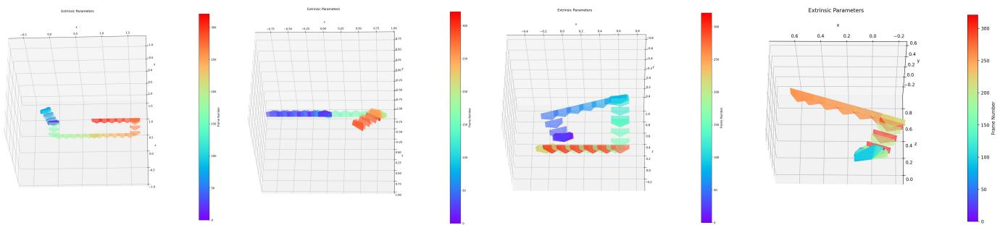  
Figure 10. Camera trajectories included in our collected dataset.

collection, encompassing data from the simulation engine and real world, as well as static and dynamic environments, to guarantee the strong generalization of our model. For Real-World Dynamics, we employ the Sekai dataset [36]. However, the original videos often suffer from scene clutter and high dynamics. To address these issues, we implement a rigorous filtering pipeline. Specifically, we apply a state-of-the-art object detection model (YOLO [51]) to identify the presence of crowds and vehicles. By setting an empirical threshold, we filter out clips with high densities of moving objects, thereby ensuring annotation accuracy and stable training. Regarding the Real-World 3D Scene data (DL3DV [40]), the original videos lack diversity in camera movement speed and trajectory complexity. To overcome this, we implement a sophisticated processing workflow: 3D Scene Reconstruction Customized Trajectory Rendering $ \mathrm { V i } \cdot$ . sual Quality Filtering Video Repair Post-processing (using Difix3D $^ +$ [66]). This procedure yields additional 60K high-quality real video clips featuring balanced movement speed. During the customized trajectory rendering stage, we deliberately design diverse revisit trajectories to facilitate the learning of long-term geometric consistency. The discrete actions and continuous camera poses in these rendered data are highly accurate, which helps the model learn well-structured action patterns. For Synthetic 3D Scene (UE Rendering) data, we collect hundreds of UE scenes and obtain 50K video clips by rendering complex, customized trajectories. For Simulation Dynamics (Game Video Recordings), we establish a dedicated game recording platform and invite players to record 170K video clips from 1st/3rd-person AAA games. We segment the original long videos into 30 to 40 seconds clips and employ a vision-language model to produce descriptive text annotations for every clip. Subsequently, we leverage VIPE [20] to generate high-quality camera poses for clips without camera annotations. However, given the long duration and high scene diversity of our dataset, we observe that pose estimation could be inaccurate, i.e., pose collapse. Therefore, we filter out videos whose adjacent frames exhibit erratic camera positions or rotation angles. Finally, for clips lacking discrete action annotations, we derive them from the continuous camera poses: we project the rotation and translation components onto the $x , y , z$ axes and apply a threshold to map these continuous values into corresponding discrete action states. Fig. 10 illustrates the camera trajectories. Our dataset contains complex and diverse trajectories, including a large number of revisit trajectories, which enables our model to learn precise action control and long-term geometric consistency.

# C. Additional Experimental Results

# C.1. More Qualitative Results

Fig. 11 illustrates the results of WorldPlay under various actions and virtual environments. As shown in the first three rows, we can interact with complex composite actions, e.g., various combinations of movements. Moreover, WorldPlay can follow intricate trajectories, such as complex rotations and alternating sequences of rotations and movements as demonstrated in the middle six rows. This enhanced control capability is enabled by our dual action representation, which allows for more precise and reliable action guidance.

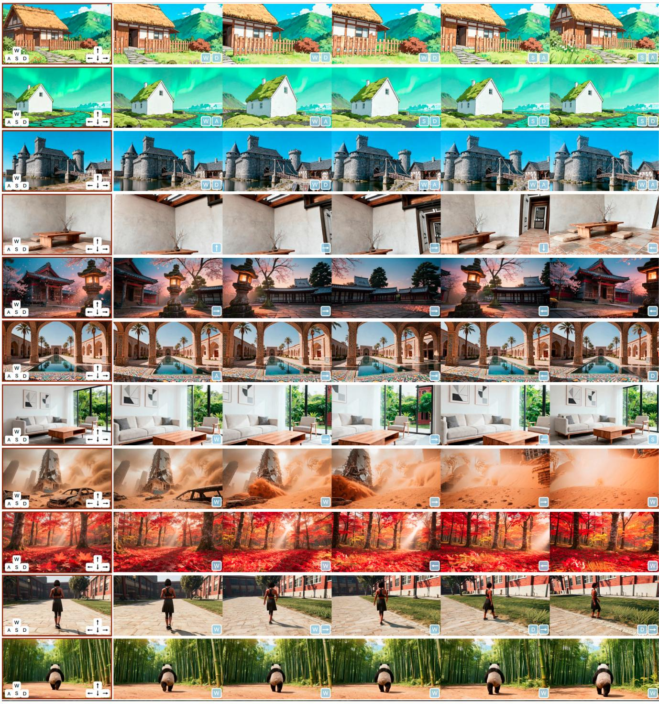  
Figure 11. More qualitative results.

Furthermore, WorldPlay exhibits strong generalization, enabling it to control different types of agents, e.g., human or animals, to roam within the scenes as shown in the last two rows. For more intuitive perspectives, please refer to the supplementary videos.

# C.2. Long Video Generation

Fig. 12 presents long video generation results from WorldPlay, we maintain long-term consistency, e.g., frame 1 and frame 252 in the top two examples, and preserve high visual quality throughout the entire sequence. Moreover, our

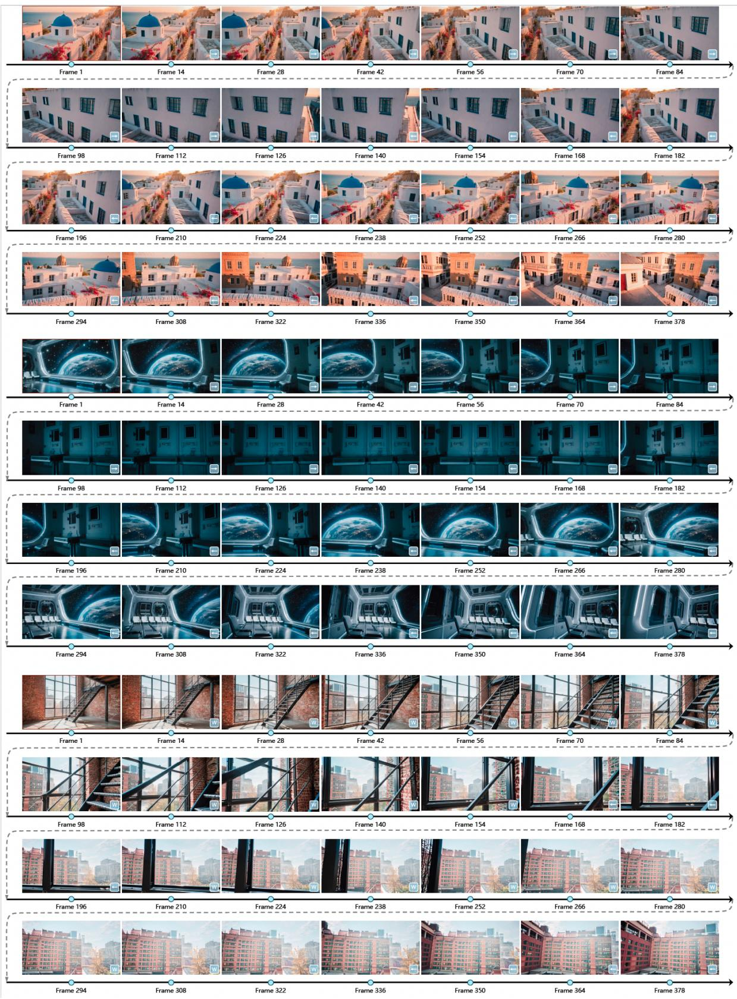  
Figure 12. Long video generation.

L context memory ensures that the generation time for each chunk remains constant and does not increase as the video length grows, enabling real-time interactivity and enhancing the user's immersive experience.

Figure 13. Visualization of different models under context forcing.   
Table 6. Comparison of Models under Context Forcing. The results are evaluated on the long-term test data. Student (AR) denotes the AR model before distillation, Teacher (bidirectional) refers to the memory-augmented bidirectional video diffusion model, and Final (distilled) represents the AR model after distillation. NFE denotes the number of function evaluations.   

<table><tr><td></td><td>NFE</td><td>PSNR↑</td><td>SSIM↑</td><td>LPIPS↓</td><td>Rdist ↓</td><td>Tdist ↓</td></tr><tr><td>Student (AR)</td><td>100</td><td>16.27</td><td>0.425</td><td>0.495</td><td>0.611</td><td>0.991</td></tr><tr><td>Teacher (Bidirectional)</td><td>100</td><td>19.31</td><td>0.599</td><td>0.383</td><td>0.209</td><td>0.717</td></tr><tr><td>Final (Distilled)</td><td>4</td><td>18.94</td><td>0.585</td><td>0.371</td><td>0.332</td><td>0.797</td></tr></table>

# C.3. Comparison of Models under Context Forcing

We provide a comprehensive comparison of different models under context forcing in Table 6 and Fig. 13. The teacher model exhibits better control capability and visual quality due to the bidirectional nature, which provides reliable guidance during distillation. However, this limits its realtime interactivity. Through context forcing, we mitigate error accumulation while maintaining and even surpassing long-term consistency of the student model, yielding improved overall performance. In addition, context forcing reduces the student model's inference steps, enabling realtime interaction.

# C.4. Ablation for Memory Size

Table 7 evaluates the effect of different memory sizes. Using a larger spatial memory size leads to slightly better PSNR metric, while a larger temporal memory size better preserves the pretrained model's temporal continuity, resulting in better overall performance. Moreover, a larger spatial memory size may significantly increase the teacher model's memory size, as the spatial memory of adjacent chunks may completely differ, while their temporal memory overlaps. This not only increases the difficulty of training the teacher model but also poses challenges for distillation.

# C.5. Evaluation on VBench

We evaluate our model on VBench [22] across diverse metrics. For each baseline, we provide the same image and action to generate long-horizon videos. The results presented in Fig. 14 demonstrate the superior performance of WorldPlay. Notably, our method achieves outstanding results in key aspects such as consistency, motion smoothness, and scene generalizability.

Table 7. Ablation for memory size. Spa. and Tem. denote the number of chunks in spatial memory and temporal memory, respectively.   

<table><tr><td>Spa.</td><td>Tem.</td><td>PSNR↑</td><td>SSIM↑</td><td>LPIPS↓</td><td>Rdist ↓</td><td>Tdist ↓</td></tr><tr><td>3</td><td></td><td>16.41</td><td>0.418</td><td>0.502</td><td>0.634</td><td>1.054</td></tr><tr><td></td><td>3</td><td>16.27</td><td>0.425</td><td>0.495</td><td>0.611</td><td>0.991</td></tr></table>

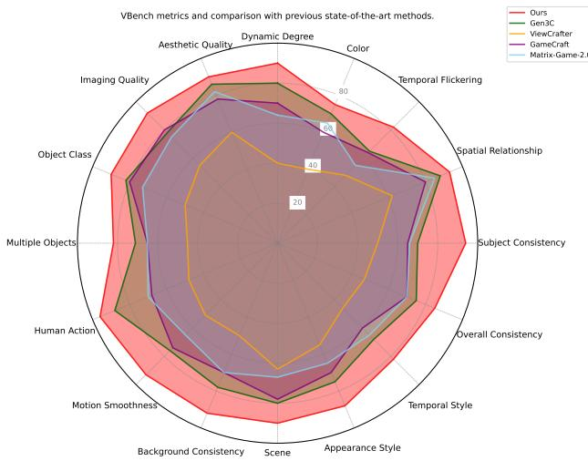  
Figure 14. VBench evaluation.

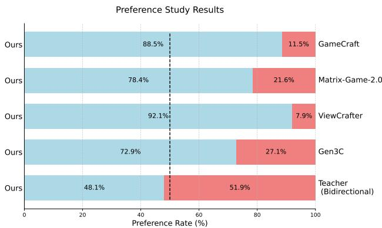  
Figure 15. Human evaluation.

# D. User Study

We conduct a comprehensive user study across multiple dimensions, including visual quality, control accuracy, and long-term consistency. In our setup, users are presented with two videos, generated from the same initial image and action inputs, and asked to select their preference based on the specified criteria. To ensure the robustness of our evaluation, we select 300 cases from diverse benchmarks such as VBench [22] and WorldScore [11], and 300 customized trajectories. The final results are then evaluated by a panel of 30 assessors. As shown in Fig. 15, compared to other baselines, our distilled model achieves superior generation quality across all aforementioned evaluation metrics, clearly demonstrating our model's capability for both realtime interaction and long-term consistency.

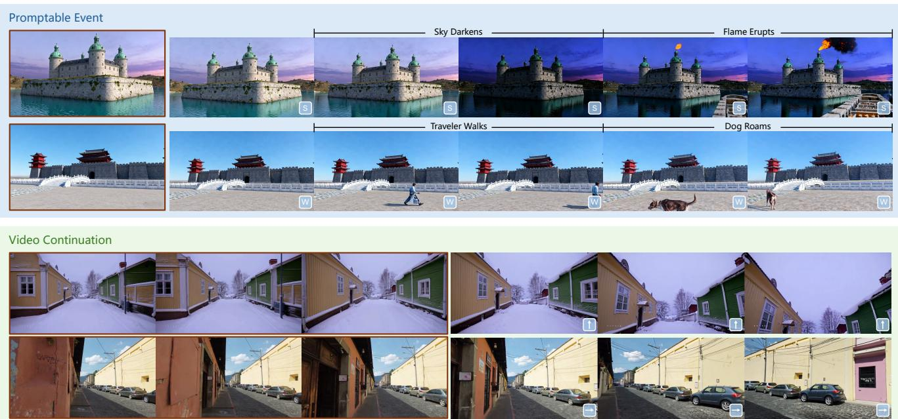  
Figure 16. Visualization of promptable event and video continuation.

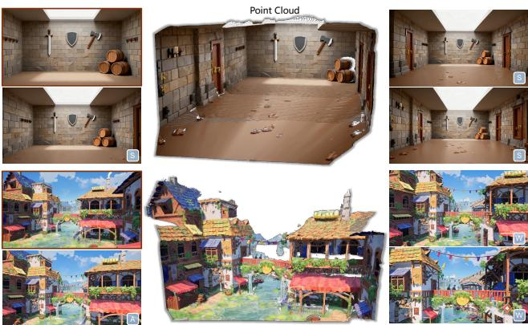  
Figure 17. 3D reconstruction results.

# E. Additional Applications

# E.1. 3D Reconstruction

Fig. 17 presents additional 3D reconstruction results. With our reconstituted context memory, we maintain temporal consistency and ensure long-term geometric consistency, which is essential for reliable 3D reconstruction. This is further validated by the consistency and compactness in the reconstructed point clouds. By generating diverse 3D scenes, this provides the potential to augment the scarce 3D datasets.

# E.2. Promptable Event

Due to the autoregressive nature of WorldPlay, we can modify the text prompt at any time to control the subsequent generated content. Specifically, inspired by LongLive [68], we employ a KV-recache technique to refresh the cached key—value states whenever the text prompt is modified. This effectively erases residual information from the previous prompt while preserving the motion and visual cues necessary to maintain temporal continuity. As shown in the upper part of Fig. 16, we can change the weather and trigger a fire eruption, or introduce new objects and characters. Through promptable event, we can generate various complex and uncommon scenarios, which can benefit agent learning by enabling agents to handle these unexpected situations.

# E.3. Video Continuation

As shown at the bottom of Fig. 16, WorldPlay can generate follow-up content that remains highly consistent with a given initial video clip in terms of motion, appearance, and lighting. This enables stable video continuation, effectively extending the original video while preserving spatialtemporal consistency and content coherence, which opens up new possibilities in creative video generation and virtual environment construction.

# F. Limitations

While WorldPlay demonstrates strong performance, extending the framework to generate videos with longer durations, multi-agent interactions, and more complex physical dynamics still requires further investigation. Moreover, Expanding the action types to a broader set is another promising direction. These challenges remain open for future research.