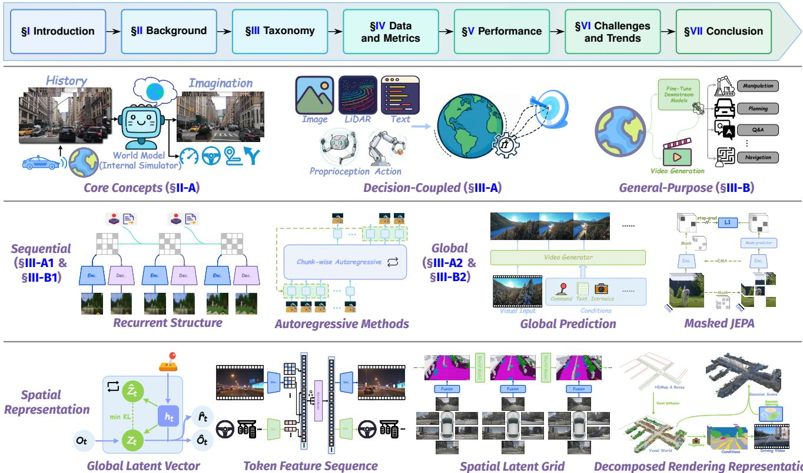

# 关于具身人工智能的世界模型的综合调查

李新晴，何鑫，张乐，IEEE 会员，吴敏，IEEE 高级会员，李晓丽，IEEE 会士，刘云

摘要——具身人工智能需要能够感知、行动，并预测行动如何重塑未来世界状态的智能体。世界模型充当内部模拟器，捕捉环境动态，支持前向推演和反事实推演，以促进感知、预测和决策。本调查提供了一个统一的具身人工智能世界模型框架。具体而言，我们形式化了问题设置和学习目标，并提出了一个三轴分类法，涵盖：（1）功能性，决策耦合 vs. 通用；（2）时间建模，序列模拟和推理 vs. 全局差分预测；（3）空间表征，全局潜在向量、词元特征序列、空间潜在网格和分解渲染表示。我们系统化了机器人技术、自动驾驶和一般视频环境中的数据资源和指标，涵盖像素预测质量、状态级理解和任务性能。此外，我们提供了最先进模型的定量比较，并提炼出关键开放挑战，包括统一数据集的稀缺性，以及需要评估物理一致性而非像素保真度的评价指标，模型性能与实时控制所需计算效率之间的权衡，以及在减轻误差积累的同时实现长期时间一致性的核心建模难题。最后，我们维护了一个策划的文献清单，链接为 https://github.com/Li-Zn-H/AwesomeWorldModels。关键词——世界模型，具身人工智能，时间建模，空间表征。

认知科学表明，人类通过整合感官输入构建对世界的内部模型。这些模型不仅预测和模拟未来事件，还塑造感知并引导行动。基于这一观点，早期的人工智能研究集中于世界模型，根植于基于模型的强化学习（RL），在其中使用潜在状态转移模型来提升样本效率和规划性能。Ha和Schmidhuber的开创性工作明确了“世界模型”这一术语，并启发了Dreamer系列，强调学习的动态如何驱动基于想象的策略优化。最近，大规模生成建模和多模态学习的进展将世界模型的焦点从政策学习扩展到通用环境模拟器，能够进行高保真未来预测，典型代表包括Sora和V-JEPA 2。这一扩展丰富了功能角色、时间建模策略和空间表示，同时在各个子社区之间引入术语和分类法的不一致性。忠实捕捉环境动态需要同时解决状态的时间演变和场景的空间编码问题。长时间跨度的推演容易出现误差积累，这使得一致性成为视频预测和策略想象中的一个核心挑战。类似地，粗糙或以2D为中心的布局在处理遮挡、物体永恒性和几何感知规划等挑战时提供的几何细节不足。相比之下，体积或3D占用表示（如神经场和结构化体素网格）提供更好的几何结构，从而更好地支持预测和控制。这些要点共同确立了时间建模和空间表示作为核心设计维度，根本上影响体现智能体的预测视野、物理保真度和下游性能。近年来的几项综述整理了迅速增长的世界模型文献。总体而言，这些综述采用两种主要方法。第一种是以功能为导向的视角。例如，Ding等人基于理解和预测这两个核心功能对相关工作进行了分类，而Zhu等人提出了基于世界模型核心能力的框架。第二种方法是以应用为驱动，专注于特定领域，如自动驾驶。值得注意的是，Guan等人和Feng等人提供了有关自动驾驶的世界模型技术综述。为了解决在体现智能体的背景下缺乏统一分类的问题，本文引入了一个以功能、时间建模和空间表示三条核心轴为中心的框架。在功能层面，该框架区分了决策相关模型和通用模型；在时间层面，区分了顺序模拟与推理和全局差异预测；最后，在空间层面，涵盖从潜在特征到显式几何和神经场的一系列表示。该框架为组织现有方法提供了统一结构，并整合了标准化的数据集和评估指标。该结构有助于定量比较，并为未来的研究提供全景式、可操作的知识地图。图1展示了本文的结构和分类法概述。我们在$\ S \amalg$中概述了世界模型的核心概念和理论基础。$\ S \mathrm { I I I }$介绍了我们的三轴分类法，并将代表性方法映射到该框架上。$\ S \mathrm { I V }$调查了用于训练和评估的数据集和评估指标。$\ S \mathrm { V }$提供了最先进模型的定量比较。$\ S \mathrm { V I }$讨论了开放挑战和有前景的研究方向，$\ S \ V \mathrm { I I }$总结了整个调查。

# II. 背景

# A. 核心概念

正如 $\ S \mathrm { I }$ 中讨论的，世界模型充当环境动态的内部模拟器。其功能基于三个方面： • simulations & planning（模拟与规划），利用学习到的动态生成可信的未来场景，使智能体能够通过想象评估潜在动作，而无需与现实世界互动。 • temporal evolution（时间演化），学习编码状态如何演变，从而实现时间上连贯的推演。 • spatial representation（空间表示），以适当的保真度编码场景几何，使用潜在词元或神经场等格式为控制提供上下文。 这三大支柱为 $\ S \mathrm { I I I }$ 中引入的分类法提供了概念基础，并在随后的数学框架中得以形式化。

# B. 世界模型的数学表述

我们将环境交互形式化为一个部分可观测马尔可夫决策过程（POMDP）[24]。为了符号的一致性，我们在 $t = 0$ 时定义一个空的初始动作 $a _ { 0 }$，这使得动态变化可以统一地表示。在每一步 $t \geq 1$，智能体接收一个观察 $o _ { t }$ 并采取一个动作 $a _ { t }$，而真实状态 $s _ { t }$ 仍然不可观察。为了处理这种部分可观测性，世界模型利用一步过滤后验推断一个学习到的潜在状态 $z _ { t }$，假设之前的潜在状态 $z _ { t - 1 }$ 可以总结相关的历史信息。最后，$z _ { t }$ 被用来重构 $o _ { t }$：

$$
\begin{array} { l l } { { \mathrm { D y n a m i c s ~ P r i o r : } \ } } & { { p _ { \theta } ( z _ { t } \mid z _ { t - 1 } , a _ { t - 1 } ) } } \\ { { \mathrm { F i l t e r e d ~ P o s t e r i o r : } \ } } & { { q _ { \phi } ( z _ { t } \mid z _ { t - 1 } , a _ { t - 1 } , o _ { t } ) } } \\ { { \mathrm { R e c o n s t r u c t i o n : } \ } } & { { p _ { \theta } ( o _ { t } \mid z _ { t } ) } } \end{array} .
$$

与马尔可夫结构一致，观察值和潜在状态的联合分布可分解为：

$$
p _ { \theta } \big ( o _ { 1 : T } , z _ { 0 : T } \mid a _ { 0 : T - 1 } \big ) = p _ { \theta } \big ( z _ { 0 } \big ) \prod _ { t = 1 } ^ { T } p _ { \theta } \big ( z _ { t } \mid z _ { t - 1 } , a _ { t - 1 } \big ) p _ { \theta } \big ( o _ { t } \mid z _ { t } \big ) .
$$

为了推断潜在状态，我们必须用时间因子的变分分布来近似不可处理的真实后验 $p _ { \theta } \big ( z _ { 0 : T } \ \big | \ o _ { 1 : T } , a _ { 0 : T - 1 } \big )$：

$$
q _ { \phi } ( z _ { 0 : T } | o _ { 1 : T } , a _ { 0 : T - 1 } ) = q _ { \phi } ( z _ { 0 } | o _ { 1 } ) \prod _ { t = 1 } ^ { T } q _ { \phi } ( z _ { t } | z _ { t - 1 } , a _ { t - 1 } , o _ { t } ) ,
$$

这确实在忽略 $a$ 输入时简化为无动作情况。直接最大化对数似然 $\log p _ { \theta } ( o _ { 1 : T } | a _ { 0 : T - 1 } )$ 是不可解的。相反，我们使用近似后验 $q _ { \phi }$ 优化 ELBO，这为学习模型参数提供了一个可解的目标：

$$
\begin{array} { r l r } & { } & { \log p _ { \theta } ( o _ { 1 : T } \mid a _ { 0 : T - 1 } ) = \log \int p _ { \theta } \big ( o _ { 1 : T } , z _ { 0 : T } \mid a _ { 0 : T - 1 } \big ) d z _ { 0 : T } } \\ & { } & { \geq \mathbb { E } _ { q _ { \phi } } \Big [ \log \frac { p _ { \theta } \big ( o _ { 1 : T } , z _ { 0 : T } \mid a _ { 0 : T - 1 } \big ) } { q _ { \phi } \big ( z _ { 0 : T } \mid o _ { 1 : T } , a _ { 0 : T - 1 } \big ) } \Big ] = : \mathcal { L } ( \theta , \phi ) . } \end{array}
$$

在对 $p _ { \theta }$ 和 $q _ { \phi }$ 假设马尔可夫分解的前提下，这个证据下界（ELBO）分解为重构目标和KL正则化项：

$$
\begin{array} { r l } {  { \mathcal { L } ( \theta , \phi ) = \sum _ { t = 1 } ^ { T } \mathbb { E } _ { q _ { \phi } ( z _ { t } ) } \bigl [ \log p _ { \theta } ( o _ { t } \mid z _ { t } ) \bigr ] } \quad } & { { } } \\ { - \ D _ { \mathrm { K L } } \bigl ( q _ { \phi } ( z _ { 0 : T } \mid o _ { 1 : T } , a _ { 0 : T - 1 } ) \parallel p _ { \theta } ( z _ { 0 : T } \mid a _ { 0 : T - 1 } ) \bigr ) . } \end{array}
$$

现代世界模型因此采用了重构正则化训练范式：似然项 $\log p _ { \theta } ( o _ { t } \quad | \quad z _ { t } )$ 促进了对观测的准确预测，而 $\mathrm { K L }$ 正则化项则将过滤后的后验分布 $q _ { \phi } ( z _ { t } \mid z _ { t - 1 } , a _ { t - 1 } , o _ { t } )$ 与动态先验分布 $p _ { \theta } ( z _ { t } \mid z _ { t - 1 } , a _ { t - 1 } )$ 对齐。这类世界模型可以通过递归模型 [25][27]、基于 Transformer 的架构 [28][30] 或扩散基解码器 [31][35] 来实现。在所有情况下，学习到的潜在轨迹 $z _ { 1 : T }$ 充当压缩的预测记忆，以支持下游策略优化、模型预测控制和具身人工智能中的反事实推理。

# III. 分类法

我们将世界模型分为三个核心维度，为本次调查的后续分析提供基础。第一个维度是决策耦合，区分了决策耦合模型和通用模型。决策耦合模型是特定于任务的，学习动态是为了优化特定决策任务。相对而言，通用模型是与任务无关的模拟器，专注于广泛的预测，能够实现跨各种下游应用的泛化。第二个维度是时间推理，划分了两种不同的预测范式。顺序模拟和推理模型以自回归的方式动态展开未来状态，逐步推演每一步。相反，全球差异预测则直接并行估计整个未来状态，提供更高的效率，但可能以降低时间一致性为代价。

  
the field. Figure design inspired in part by [12], [14], [22], [23].

第三维度，空间表示，包含当前研究中用于建模空间状态的四种主要策略：1) 全局潜在向量表示将复杂的世界状态编码为紧凑的向量，从而在物理设备上实现高效的实时计算。2) 词元特征序列表示将世界状态建模为词元序列，重点捕捉词元之间复杂的空间、时间和跨模态依赖关系。3) 空间潜在栅格表示通过利用几何先验（例如鸟瞰图 (BEV) 特征或体素网格）将空间归纳偏置纳入世界模型。4) 分解渲染表示涉及将3D场景分解为一组可学习的原始体，例如3D高斯溅射 (3DGS) 或神经辐射场 (NeRF)，然后使用可微分渲染实现高保真新视图合成。以下表格应用这一分类法对代表性作品进行分类。表 I 回顾了机器人领域的方法，而表 II 则侧重于自动驾驶。二者共同为后续部分的详细分析提供了路线图。

# A. 决策耦合世界模型

1) 顺序模拟与推理：全球潜在向量。早期的决策耦合世界模型将顺序推理与全局潜在状态相结合。这些方法主要使用递归神经网络（RNN）进行高效的实时和长时间预测。Ha 和 Schmidhuber [9] 提出了一个早期的世界模型，该模型将观测编码到潜在空间，并利用 RNN 来建模动态以进行策略优化。在此基础上，PlaNet [38] 引入了递归状态空间模型（RSSM），该模型将确定性记忆与随机成分融合，以实现强大的长时间想象能力。后续模型 Dreamer、DreamerV2 和 DreamerV3 [10] [12] 进一步推动了这一框架的发展，并激发了广泛的后续研究。在 RSSM 的基础上，一些变体修改或消除了解码器，以更好地捕捉动态。例如，Dreaming [110] 使用对比学习和线性方法来缓解状态转换，而 DreamerPro [111] 用原型替代了解码器，以抑制视觉干扰。为进一步增强鲁棒性，HRSSM [25] 被提出，其具有双分支架构，能够对齐潜在观测并在不重建的情况下共享信息。超越架构的改进，DisWM [112] 将语义知识与视频内容分离，提炼出一种世界模型，以实现跨领域泛化。

最近的RSSM扩展中，一个统一的主题是可转移性，这反映了在强健的现实世界机器人技术中，跨模态、任务和体现的泛化。在表征层面，PreLAR学习隐式动作抽象，以桥接视频预训练表征和控制微调。类似地，Wang等人使用光流作为与体现无关的动作表征，来优化行为克隆策略，从而促进不同体现之间的转移。SENSEI提炼了一种视觉-语言模型（VLM），以推导语义奖励，并采用一种RSSM来内部预测和传播这些奖励。在有限监督下，SR-AIF利用先前的偏好学习和自我修正，以支持在稀疏奖励、连续控制设置中的自适应学习。为缩小仿真与现实（S2R）之间的差距，ReDRAW在仿真中进行预训练，并通过有限数量的无奖励数据适应真实环境，应用残差校正到潜在动态上。为处理不匹配，AdaWM识别学习的动态与规划器之间的差异，并选择性地微调关键组件。其他方法如WMP解决了困难任务的S2R转移，DayDreamer展示了在物理机器人上的样本高效部署。为了拓宽转移，FOUNDER将基础模型的表征定位于世界模型状态空间，使用时间-距离预测来处理灵活目标，而LUMOS引入了一种语言条件模仿框架，在潜在空间中以内在奖励按策略运行，从而实现零样本转移到现实世界机器人技术。表 I 代表机器人和通用领域的世界模型摘要。

<table><tr><td></td><td></td><td></td><td></td><td colspan="6">Datasets Platform</td><td></td><td></td><td></td><td>Modality</td><td></td><td></td><td></td></tr><tr><td>Paper</td><td>Publication</td><td>Taxonomy1</td><td>Characteristics2</td><td>N0 </td><td>20</td><td>S</td><td>20 </td><td>Br I</td><td>0 (e</td><td></td><td></td><td>S</td><td>0</td><td>Poudod </td><td>aenee</td><td>(</td><td>Reality4</td></tr><tr><td></td><td></td><td></td><td></td><td></td><td></td><td></td><td></td><td></td><td></td><td></td><td></td><td></td><td></td><td></td><td></td><td></td><td></td></tr><tr><td>PlaNet [38]</td><td>ICML&#x27;19</td><td>Dec/Seq/GLV Dec/Seq/GLV</td><td>RSSM RSSM</td><td>✓</td><td></td><td></td><td></td><td></td><td>✓</td><td>1</td><td>✓</td><td></td><td>√</td><td></td><td></td><td></td><td></td></tr><tr><td>Dreamer [10]</td><td>ICLR&#x27;20 ICLR&#x27;21</td><td>Dec/Seq/GLV</td><td>IDM</td><td>✓ ✓</td><td>✓ ✓</td><td></td><td></td><td></td><td></td><td>3 2</td><td></td><td>✓</td><td>✓</td><td></td><td></td><td></td><td></td></tr><tr><td>GLAMOR [39]</td><td>ICLR&#x27;21</td><td>Dec/Seq/GLV</td><td>RSSM</td><td>✓</td><td>✓</td><td></td><td></td><td></td><td></td><td>2</td><td></td><td>✓</td><td>✓</td><td></td><td></td><td></td><td></td></tr><tr><td>DreamerV2 [11]</td><td>arXiv&#x27;22</td><td>Dec/Seq/GLV</td><td>TSSM</td><td>✓</td><td>✓</td><td></td><td></td><td></td><td>✓</td><td>4</td><td></td><td>✓</td><td>✓</td><td></td><td></td><td></td><td></td></tr><tr><td>TransDreamer [28]</td><td>NeurIPS&#x27;22</td><td>Dec/Seq/GLV</td><td>IDM</td><td>✓</td><td></td><td></td><td></td><td></td><td>✓</td><td>4</td><td></td><td>✓</td><td>✓</td><td></td><td></td><td></td><td></td></tr><tr><td>Iso-Dream [40]</td><td>CoRL&#x27;22</td><td>Dec/Seq/TFS</td><td>RSSM</td><td>✓</td><td>✓</td><td></td><td></td><td>√</td><td></td><td>3</td><td></td><td>✓</td><td>✓</td><td></td><td></td><td></td><td></td></tr><tr><td>MWM [41]</td><td>CoRL&#x27;22</td><td>Dec/Seq/TFS</td><td>CoT</td><td></td><td></td><td></td><td></td><td></td><td>✓</td><td>3</td><td>✓</td><td>✓</td><td>✓</td><td></td><td></td><td></td><td></td></tr><tr><td>Inner Monologue [42]</td><td>CoRL&#x27;22</td><td>Dec/Seq/GLV</td><td>RSSM</td><td></td><td></td><td></td><td></td><td></td><td>✓</td><td>4</td><td>✓</td><td></td><td>✓</td><td></td><td>✓</td><td></td><td>✓ ✓</td></tr><tr><td>DayDreamer [43]</td><td>ICLR&#x27;23</td><td>Dec/Seq/TFS</td><td>Transformer</td><td></td><td>✓</td><td></td><td></td><td></td><td></td><td>1</td><td></td><td></td><td>✓</td><td>✓ ✓</td><td></td><td></td><td></td></tr><tr><td>TWM [29]]</td><td>ICLR&#x27;23</td><td>Dec/Seq/TFS</td><td>Transformer</td><td></td><td>✓</td><td></td><td></td><td></td><td></td><td>1</td><td></td><td>✓</td><td>✓</td><td></td><td></td><td></td><td></td></tr><tr><td>IRIS [44]</td><td>arXiv&#x27;24</td><td>Gen/Glo/TFS</td><td>Transformer</td><td></td><td></td><td></td><td></td><td></td><td></td><td>✓ 4</td><td>✓</td><td>✓</td><td>✓</td><td></td><td></td><td></td><td></td></tr><tr><td>WorldDreamer [45]</td><td>ICRA&#x27;24</td><td>Dec/Seq/TFS</td><td>LLM</td><td></td><td></td><td></td><td></td><td></td><td></td><td>√ 2</td><td>√</td><td></td><td>✓</td><td></td><td>✓</td><td></td><td></td></tr><tr><td>Statler [46]</td><td>arXiv&#x27;24</td><td>Gen/Seq/TFS</td><td>Video Diffusion</td><td></td><td></td><td>✓</td><td></td><td></td><td></td><td>✓ 2</td><td>✓</td><td></td><td>✓</td><td>√</td><td>✓</td><td></td><td>√</td></tr><tr><td>Pandora [47]</td><td>RSS&#x27;24</td><td>Dec/Seq/GLV</td><td>MLP</td><td></td><td></td><td></td><td></td><td></td><td></td><td>✓ 4</td><td></td><td></td><td></td><td></td><td>✓</td><td></td><td></td></tr><tr><td>DWL [48]</td><td>ICML&#x27;24</td><td>Dec/Glo/TFS</td><td>IDM</td><td></td><td></td><td>✓</td><td></td><td></td><td>✓</td><td>2</td><td>✓</td><td></td><td>✓</td><td>✓</td><td></td><td>✓</td><td>✓</td></tr><tr><td>RoboDreamer [49] Genie [50]</td><td>ICML&#x27;24</td><td>Gen/Seq/TFS</td><td>Transformer</td><td></td><td></td><td></td><td></td><td></td><td>✓</td><td>✓ 3</td><td>✓</td><td></td><td>✓ ✓</td><td></td><td>✓</td><td>✓</td><td></td></tr><tr><td>V-JEPA [51]</td><td>TMLR&#x27;24</td><td>Gen/Glo/TFS</td><td>JEPA</td><td></td><td></td><td>✓</td><td></td><td></td><td></td><td>✓ 6</td><td>✓</td><td></td><td></td><td></td><td></td><td></td><td></td></tr><tr><td>PreLAR [52]</td><td>ECCV&#x27;24</td><td>Dec/Seq/GLV</td><td>RSSM</td><td></td><td></td><td>✓ ✓</td><td></td><td>✓</td><td></td><td>3</td><td>✓</td><td></td><td>✓</td><td></td><td></td><td></td><td></td></tr><tr><td>ManiGaussian [53]</td><td>ECCV&#x27;24</td><td>Dec/Seq/DRR</td><td>3DGS</td><td></td><td></td><td>✓</td><td></td><td></td><td></td><td>1</td><td>✓</td><td></td><td>✓</td><td>✓ ✓</td><td>✓</td><td></td><td></td></tr><tr><td>ECoT [54]</td><td>CoRL&#x27;24</td><td>Dec/Glo/TFS</td><td>CoT</td><td></td><td></td><td></td><td></td><td></td><td>✓</td><td>3</td><td>✓</td><td></td><td>✓</td><td></td><td>✓</td><td></td><td>✓</td></tr><tr><td>VidMan [55]</td><td>NeurIPS&#x27;24</td><td>Dec/Glo/TFS</td><td>IDM</td><td></td><td></td><td>✓</td><td>✓</td><td></td><td>✓</td><td>4</td><td>✓</td><td></td><td>✓</td><td>✓</td><td>✓</td><td></td><td></td></tr><tr><td>iVideoGPT [56]</td><td>NeurIPS&#x27;24</td><td>Gen/Seq/TFS Dec/Seq/SLG</td><td>Transformer Video Diffusion</td><td></td><td></td><td></td><td>√ √</td><td>✓</td><td>✓ ✓ ✓</td><td>6 4</td><td>✓</td><td></td><td>✓</td><td></td><td></td><td></td><td></td></tr><tr><td>EnerVerse [34] GLAM [57]</td><td>arXiv&#x27;25 AAAI&#x27;25</td></table>

1 分类：在 III 中定义的分类类别的缩写…… 基于 RSSM 的模型也已被开发用于自动驾驶。MILE [81] 利用离线专家数据来启用规划的想象未来状态。SEM2 [83] 结合语义过滤与多源采样，以提取与驾驶相关的特征并平衡数据分布。Popov 等 [121] 通过潜在生成世界模型解决协变量偏移，重新调整策略与专家状态的对齐。表 II 自动驾驶领域代表性世界模型的总结。

<table><tr><td></td><td></td><td>Taxonomy1</td><td>Characteristics2</td><td></td><td>Datasets Platform</td><td></td><td></td><td></td><td></td><td>Input Modality</td><td></td><td></td><td>en</td><td></td></tr><tr><td>Paper</td><td>Publication</td><td></td><td></td><td>00</td><td>nuetnes omm 20</td><td>Oud 0</td><td>()o</td><td>2</td><td>S</td><td>Wonow A</td><td>00</td><td>oq puno</td><td>Ooede</td><td>(o</td></tr><tr><td>MILE [81]</td><td>NeurIPS&#x27;22</td><td>Dec/Seq/GLV</td><td>RSSM</td><td>√</td><td></td><td></td><td>1</td><td></td><td>✓</td><td>✓ ✓</td><td></td><td></td><td></td><td></td></tr><tr><td>Copilot4D [82]</td><td>ICLR&#x27;24</td><td>Gen/Seq/SLG</td><td>Video Diffusion</td><td></td><td>✓</td><td></td><td>✓</td><td>3</td><td></td><td>✓</td><td>✓</td><td></td><td></td><td></td></tr><tr><td>SEM2 [83]</td><td>TITS&#x27;24</td><td>Dec/Seq/GLV</td><td>RSSM</td><td>✓</td><td></td><td></td><td></td><td>1</td><td>✓</td><td>✓ ✓</td><td>✓</td><td></td><td></td><td></td></tr><tr><td>MagicDrive3D [84]</td><td>arXiv&#x27;24</td><td>Gen/Glo/DRR</td><td>3DGS</td><td></td><td>✓</td><td></td><td></td><td>1</td><td>✓</td><td>✓ ✓</td><td></td><td>✓ ✓</td><td></td><td>✓</td></tr><tr><td>OccSora [85]</td><td>arXiv&#x27;24</td><td>Gen/Glo/SLG</td><td>Diffusion</td><td></td><td>✓</td><td>✓</td><td></td><td>2</td><td></td><td>✓</td><td></td><td></td><td>✓</td><td></td></tr><tr><td>Delphi [86]</td><td>arXiv&#x27;24</td><td>Gen/Seq/SLG</td><td>Video Diffusion</td><td></td><td>✓</td><td></td><td></td><td>1</td><td>✓</td><td></td><td>✓</td><td>✓</td><td>✓</td><td></td></tr><tr><td>DriveWorld [87]</td><td>CVPR&#x27;24</td><td>Dec/Seq/SLG</td><td>RSSM</td><td></td><td>✓</td><td></td><td>✓</td><td>2</td><td>✓</td><td>✓</td><td></td><td></td><td>✓ ✓</td><td></td></tr><tr><td>Drive-WM [88]</td><td>CVPR&#x27;24</td><td>Dec/Glo/SLG Gen/Seq/SLG</td><td>Video Diffusion</td><td></td><td>✓</td><td></td><td></td><td>1</td><td>✓</td><td>✓</td><td>✓</td><td>✓</td><td>✓</td><td>✓</td></tr><tr><td>ViDAR [89]</td><td>CVPR&#x27;24</td><td>Gen/Seq/TFS</td><td>Transformer Video Diffusion</td><td></td><td>✓ ✓</td><td>✓</td><td>✓</td><td>1</td><td>✓</td><td>✓</td><td>✓</td><td></td><td></td><td></td></tr><tr><td>GenAD [90]</td><td>CVPR&#x27;24</td><td>Dec/Seq/SLG</td><td>Transformer</td><td></td><td>✓ ✓ ✓</td><td>✓</td><td>✓</td><td>4</td><td>✓</td><td>✓</td><td></td><td></td><td>✓</td><td></td></tr><tr><td>OccLLaMA [18]</td><td>arXiv&#x27;24</td><td>Dec/Seq/SLG</td><td>GRU</td><td></td><td>✓</td><td></td><td></td><td>3 1</td><td>✓</td><td>✓</td><td></td><td></td><td>✓ ✓</td><td></td></tr><tr><td>DriveDreamer [91]</td><td>ECCV&#x27;24 ECCV&#x27;24</td><td>Dec/Seq/SLG</td><td>GRU</td><td></td><td>✓</td><td></td><td></td><td>1</td><td>√</td><td>✓</td><td>✓</td><td>✓</td><td>✓</td><td></td></tr><tr><td>GenAD [92]</td><td>ECCV&#x27;24</td><td>Dec/Seq/SLG</td><td>Transformer</td><td></td><td>✓</td><td>✓</td><td></td><td>2</td><td>✓ ✓</td><td></td><td></td><td></td><td></td><td></td></tr><tr><td>OccWorld [93] DOME [94]</td><td>arXiv&#x27;24</td><td>Gen/Seq/SLG</td><td>DiT</td><td></td><td>✓</td><td>✓</td><td></td><td>2</td><td>✓</td><td>✓ ✓</td><td>✓</td><td></td><td>✓</td><td></td></tr><tr><td>TOKEN [95]</td><td>CoRL&#x27;24</td><td>Dec/Glo/TFS</td><td>Transformer</td><td></td><td>✓</td><td></td><td>✓</td><td>2</td><td>✓</td><td>✓</td><td>✓</td><td></td><td>✓</td><td></td></tr><tr><td>Vista [96]</td><td>NeurIPS&#x27;24</td><td>Gen/Seq/SLG</td><td>Video Diffusion</td><td></td><td>√</td><td>✓ ✓</td><td>√</td><td>4</td><td>✓</td><td>✓</td><td></td><td></td><td>✓</td><td></td></tr><tr><td>DriveDreamer-2 [97]</td><td>AAAI&#x27;25</td><td>Gen/Glo/SLG</td><td>Video Diffusion</td><td></td><td>✓</td><td></td><td></td><td>1</td><td>✓</td><td>✓</td><td>✓</td><td>✓</td><td>✓ ✓</td><td></td></tr><tr><td>DTT [98]</td><td>arXiv&#x27;25</td><td>Dec/Seq/DRR</td><td>Transformer</td><td></td><td>✓</td><td>✓</td><td></td><td>2</td><td>✓</td><td>✓</td><td></td><td></td><td>✓ ✓</td><td></td></tr><tr><td>DynamicCity [99]</td><td>ICLR&#x27;25</td><td>Gen/Glo/SLG</td><td>DiT</td><td>✓</td><td>✓</td><td>✓ ✓</td><td></td><td>4</td><td>✓</td><td>✓</td><td></td><td></td><td>✓ ✓</td><td></td></tr><tr><td>LidarDM [100]</td><td>ICRA&#x27;25</td><td>Gen/Seq/SLG</td><td>Diffusion</td><td></td><td></td><td>✓</td><td>✓</td><td>3</td><td></td><td>✓</td><td>✓</td><td></td><td></td><td></td></tr><tr><td>FutureSightDrive [101]</td><td>arXiv&#x27;25</td><td>Dec/Seq/TFS</td><td>CoT(VLM)</td><td></td><td>✓</td><td></td><td>✓</td><td>3</td><td>✓</td><td>✓</td><td></td><td></td><td>✓</td><td></td></tr><tr><td>GEM [102]</td><td>CVPR&#x27;25</td><td>Gen/Seq/SLG</td><td>Video Diffusion</td><td></td><td>✓</td><td>✓</td><td></td><td>1</td><td>✓</td><td>✓</td><td></td><td></td><td></td><td>✓</td></tr><tr><td>GaussianWorld [103]</td><td>CVPR&#x27;25</td><td>Gen/Seq/DRR</td><td>Transformer</td><td></td><td>✓</td><td></td><td>✓</td><td>2</td><td>✓</td><td>✓</td><td></td><td></td><td></td><td></td></tr><tr><td>MaskGWM [104]</td><td>CVPR&#x27;25</td><td>Gen/Glo/TFS</td><td>DiT</td><td></td><td>✓</td><td>✓ ✓</td><td></td><td>3</td><td>✓</td><td>✓</td><td></td><td></td><td>✓</td><td></td></tr><tr><td>DriveDreamer4D [105]</td><td>CVPR&#x27;25</td><td>Gen/Glo/DRR</td><td>4DGS</td><td></td><td>✓ ✓</td><td>✓</td><td>3</td><td>✓</td><td></td><td>✓</td><td>✓ ✓</td><td>✓</td><td>✓</td><td>✓</td></tr><tr><td>ReconDreamer [106]</td><td>CVPR&#x27;25</td><td>Gen/Glo/DRR</td><td>3DGS</td><td></td><td>✓</td><td>✓</td><td>✓</td><td>3</td><td>✓</td><td>✓</td><td>✓ ✓</td><td>✓</td><td></td><td></td></tr><tr><td>WoTE [107]</td><td>ICCV&#x27;25</td><td>Dec/Seq/SLG</td><td>Transformer</td><td>✓</td><td>✓</td><td></td><td>✓</td><td>2 4</td><td>✓ ✓</td><td>✓ ✓</td><td>✓</td><td>✓</td><td></td><td></td></tr><tr><td>HERMES [108] InfiniCube [22]</td><td>ICCV&#x27;25 ICCV&#x27;25</td><td>Gen/Glo/SLG Gen/Seq/DRR</td><td>LLM 3DGS</td><td></td><td>✓</td></table>

1 分类法：在 $\ S \mathrm { I I I }$ 中定义的分类类别的缩写。为了安全起见，VL-SAFE [122] 使用从大语言模型（VLM）衍生的安全评分来监督世界模型以生成安全轨迹。最后，CALL [123] 通过引入以自我为中心的信息共享，将RSSM框架扩展到多智能体强化学习（MultiAgent RL），以增强规划能力。与RSSM相比，TransDreamer [28] 引入了一种变压器状态空间模型（TSSM），替代了Dreamer中的循环核心，从而显著提高了捕捉长时依赖性的能力。互补的OSVI-WM [124] 采用因果变压器进行单次模仿学习（IL），自回归预测未来潜在轨迹并将其解码为机器人控制的物理路径点。一些方法仍继续使用递归神经网络（RNN）来捕捉时间依赖性。在建模方面，RWM [125] 引入了一种双自回归、领域无关的神经模拟器用于长时预测。相对而言，X-MOBILITY [126] 将建模与策略学习解耦，使用多头解码器进行大规模预训练，随后进行监督微调以推导出强策略。针对类人步态，DWL [48] 和WMR [127] 采用端到端（E2E）框架。这些框架利用去噪或梯度屏蔽状态估计器从部分观察中重建状态，使得在复杂的现实世界地形中实现零样本迁移成为可能。最近，以Mamba为例的状态空间模型（SSMs）作为RNN和变压器的替代方案出现，结合了线性时间复杂度和长时建模能力。在此基础上，GLAM [57] 通过基于Mamba的并行框架提高了保真度和效率，整合了全局和局部模块以捕捉上下文和细粒度动态。除了前向时间建模，逆动态建模（IDM）是世界模型构建中的一个关键范式。IDM推断在初始状态和目标状态之间转换所需的动作。Agrawal等 [128] 将前向模型与IDM集成进行多步预测，为后续研究奠定了基础。最近的工作包括GLAMOR [39]，该模型训练一个基于对象的IDM，以预测实现指定目标所需的动作。在Dreamer风格的智能体中，Iso-Dream [40] 利用IDM将世界模型分解为可控和不可控组件，使用不可控状态的推演来指导策略学习。词元特征序列。词元特征序列范式集中于建模离散词元之间的依赖关系。这种表示支持因果推断、多模态融合和大型语言模型（LLM）的重用。

最近以RSSM为中心的研究开始利用词元级依赖性来增强表示学习和时间推理。例如，MWM通过一个遮蔽自编码器将视觉词元与基于RSSM的动态解耦，提高了性能和数据效率。NavMorph引入了一种自我演化的RSSM，结合了上下文演化记忆以实现在线适应。为实现时间抽象，WISTER采用基于动作的对比预测编码训练一个TSSM，以捕捉高级时间特征。类似地，TWM使用Transformer在训练过程中将多模态词元与历史状态对齐，同时在推理时依赖于轻量级策略。为了处理长时间范围任务，一些方法将LLM与RSSM集成，以将目标分解为子任务。例如，EvoAgent使用LLM指导低级动作并对RSSM更新进行正则化。相对而言，RoboHorizon通过丰富的奖励增强任务识别，并通过遮蔽自编码器利用关键任务片段。在自动驾驶领域，基于词元的序列表示越来越多地被采用，用于建模跨模态交互和时空结构。DrivingWorld将时间动态的下一状态预测与空间结构的下一词元预测结合起来。对于多模态控制，Doe-1将闭环驾驶表述为对感知-描述-动作词元的自回归预测，统一了感知、预测和规划，而DrivingGPT则交错使用视觉和动作词元，并将世界建模和轨迹规划视为下一词元预测。为了增强多样性和安全性，LatentDriver将未来动作建模为混合分布，并利用规划器采样的中间动作激活世界模型。同时，Vasudevan等人提出了一种自适应模型，预测周围智能体以实现安全导航。基于词元的范式也扩展到更广泛的机器人领域。在强化学习中，IRIS和TWM利用离散词元通过想象或混合推演来实现数据高效的策略学习。DyWA通过对轨迹动态进行条件处理，改进了动作学习，并与单视图点云及自我感知模态共同预测未来状态。EgoAgent在Transformer中交错状态-动作序列建模，实现了统一的感知、预测和动作推断。词元化表示统一了包括视觉、语言和动作（VLA）在内的多模态输入，使通用智能体具备跨域适应能力，正如WorldVLA所示。近期研究将环境状态编码为离散符号词元，并将下一词元预测条件化于动作，正如DCWM和TrajWorld所展示的那样。

最近的研究加强了标记化表示与规划之间的联系，特别是通过以对象为中心的方法。这些模型，如 CarFormer [142]、Jeong 等人的工作 [143] 和 Dyn-O [69]，将场景表示为一个槽的集合。CarFormer 自回归地建模这些槽在鸟瞰图中的关系。Jeong 等人添加了语言引导的操作，而 Dyn-O 使用具有丢弃调度的 Mamba 来进行时间建模，并将静态元素与动态元素分离。$\Delta$ -IRIS [144] 引入了一种混合 Transformer，结合了带有随机 $\Delta$ 令牌的令牌以捕捉动态。$\mathrm{D^{2}PO}$ [145] 采用偏好学习来联合优化状态预测和动作选择，增强了模型对潜在动态的理解。为提高效率，MineWorld [59] 通过并行预测序列加速了令牌生成，并引入了一种 IDM 作为可控性指标。同时，PIVOT-R [146] 和 ReOI [147] 将 VLMs 纳入控制中。PIVOT-R 解析指令以生成基于航路点的计划，随后由动作模块解码为低级控制，而 ReOI 检测不太可能的预测元素，重新构想干扰项，并重新整合修正后的内容。基于标记化，一些研究采用自回归扩散实现稳定生成和长时间规划。Epona [148] 将时空建模与通过轨迹和视觉扩散 Transformer（DiTs）实现的长时间多模态生成解耦。Goff 等人 [149] 使用 DiT 来实例化状态转移，这使得策略训练和多秒闭环推演成为可能。SceneDiffuser $^{++}$ [150] 进一步推进到城市规模的交通模拟，针对代理和交通灯应用多张量扩散以生成稳定的闭环推演。对于导航，NWM [66] 引入了一种高效的条件 DiT 来模拟视觉轨迹以实现零样本规划。另一个新兴方向是利用 LLMs 和思维链（CoT）将明确推理注入世界模型。NavCoT [58] 将导航分解为想象、过滤和预测，使得参数高效的领域内训练成为可能，ECoT [54] 利用基础模型的管道生成推理标签，以训练 VLA 政策。像 MineDreamer [79] 这样的变体引入了想象链（CoI），在其中多模态 LLM 想象未来观察以引导扩散和行动，FSDrive [101] 生成物理约束的未来场景，并将其视为 CoT 监督，使 VLMs 能够作为 IDM 进行规划。其他方法则直接将 LLM 与世界模型耦合，以实现规划和数据生成。Dyna-Think [151] 通过蒸馏的 LLM 融合了推理和行动，RIG [152] 统一了推理和想象的端到端通用策略。在明确动态和长远方面，Gkountouras 等人 [153] 训练了一种因果世界模型模拟器，使 LLM 可以在环境中执行因果推理和规划技能；Statler [46] 使 LLM 能够保持结构化的世界状态，使用读取器进行规划和写入器进行更新；Inner Monologue [42] 将闭环反馈纳入 LLM，使智能体更像人类思维那样进行推理和思考。最后，WoMAP [154] 合成了 3DGS 场景，并训练了一个世界模型，该模型细化 VLM 指令以实现精确执行。空间潜在网格。通过在几何对齐的网格上编码特征或纳入显式空间先验，该范例保持了局部性，使卷积或基于注意力的更新和流式推演高效实现。在自动驾驶领域，许多研究将基于 RNN 的动态与空间网格耦合，以指导规划。例如，DriveDreamer [91] 和 GenAD [92] 采用基于 GRU 的动态来预测运动并解码轨迹。相比之下，DriveWorld [87] 和 Raw2Drive [155] 在 BEV 令牌上实例化了 RSSM 动态。DriveWorld 针对令牌和动作进行联合预测，而 Raw2Drive 则采用双流设计用于时空学习。

许多研究集中于自回归预测未来的三维占用表示，以支持自动驾驶的运动规划。一种方法将场景离散化为占用词元进行顺序预测，例如 OccWorld 和 RenderWorld。另一种方法直接预测体积特征或嵌入，如 Drive-OccWorld 和 PreWorld。自监督变种根据当前线索预测未来表示。例如，LAW 以当前表示和轨迹为条件，SSR 将场景压缩为稀疏 BEV 词元以预测未来的 BEV 特征，而 NeMo 对多帧图像进行体素化并预测占用，以支持基于模仿的规划。在这些表示的基础上，FASTopoWM 采用统一解码器对车辆姿态进行快慢系统的对齐，从而实现车道拓扑推理，而 WoTE 在 BEV 中模拟候选轨迹，并通过奖励模型在其中进行选择。拓展这一范式，OccLLaMA 将占用、动作和文本统一于一个词元词汇中，并利用 LLaMA 进行下一个词元的预测、规划和问答。超越自动驾驶，类似的形式已扩展到更广泛的机器人领域。WMNav 利用视觉语言模型维护一个好奇驱动的价值地图，并采用阶段性决策以实现零-shot 的对象驱动导航。RoboOccWorld 针对室内机器人，通过预测细粒度的三维占用，使用基于姿态条件的自回归 Transformer，从而支持探索和决策。为了实现高保真动态，EnerVerse 采用块状自回归视频扩散和稀疏记忆机制生成 4D 潜在动态，并整合 4DGS 以减轻机器人执行中的 S2R 缺口。在操作层面，ParticleFormer 通过基于 Transformer 的粒子化动态模型预测未来点云，从而能够稳健处理多物体和多材料的交互。在表示层面，DINOWM 在 DINOv2 特征空间中学习动态并预测未来状态，以支持零-shot 规划。解构渲染表示。该范式使用显式可渲染原语（如 NeRFs 和 3DGS）表示场景，更新它们以模拟动态并渲染未来观察。它提供视图一致的预测、对象级组合性，并与物理先验和数字双胞胎无缝集成，从而支持长时间范围的展开。

基于 3DGS，GAF [74] 增强了 splats，增加可学习的运动属性以预测未来状态，并通过扩散方法细化初始动作。ManiGaussian [53] 预测每个点的变化，以生成在当前状态和动作下进行操作的未来高斯场景，而 ManiGaussian $^{++}$ [80] 则添加了一种分层的领导-跟随设计，结合面向任务的 splats，以建模多体和双手技能的原始变形。在仿真与数字双胞胎耦合的环境中，DreMa [60] 将 GS 与物理模拟器集成，以建立双胞胎进行模仿学习中的数据合成，Abou-Chakra 等 [166] 提出了双高斯粒子表示法，其中高斯点附着在受视觉损失力驱动的粒子上，DexSim2Real2 [167] 利用生成模型构建关节物体的双胞胎，并采用基于采样的规划进行精确操作，PIN-WM [168] 结合 3DGS 和可微物理从有限观察中估计物理参数，并生成数字表亲用于零样本 S2R 策略学习，PWTF [169] 构建了一个交互式双胞胎，模拟候选行动结果并使用 VLM 进行评估和选择。在表征层面，DTT [98] 采用一种三平面表示法，使用多尺度变换器自回归地捕捉增量变化，从而形成4D世界模型用于预测和规划。 2) 全球差异预测：令牌特征序列。紧凑的全球潜在向量表示舍弃了细粒度的时空细节，因此很少用于全球预测。相比之下，令牌特征序列并行预测未来序列，减少了误差累积，同时实现了多模态的多样性。

在表示方面，TOKEN [95] 将场景分解为对象级别的令牌，将世界表示与推理对齐，并利用大语言模型（LLMs）预测长尾场景的完整未来轨迹。GeoDrive [170] 提取三维表示，渲染轨迹条件视图，并编辑车辆位置以指导 DiT 生成可编辑的结果。在控制方面，FLARE [171] 将扩散策略与潜在未来表示对齐，避免在像素空间生成视频，并有效地从无动作视频中学习。同样，LaDi-WM [172] 通过与视觉基础模型对齐的潜在空间中的互动扩散预测未来状态，集成几何和语义特征，同时迭代地优化扩散策略以提高性能和泛化能力。villa-X [76] 和 VidMan [55] 都将基于扩散的模型与 IDM 结合以实现控制。villaX 推断潜在动作，将其与自我中心的前向动态对齐，并通过联合扩散进行映射，而 VidMan 则使用自注意适配器将预训练的视频扩散模型适配为 IDM，以实现准确的动作预测。空间潜在网格。空间网格模型从自我稳定的视图并行预测鸟瞰图（BEV）或体素地图，同时保持局部性和不确定性，并生成适合规划的地图以便于快速控制。基于扩散的世界模型通常用于并行生成。EmbodiedDreamer [173] 将可微分物理与视频扩散结合，以渲染逼真且物理一致的未来场景。TesserAct [78] 通过联合生成 RGB、深度和法线视频重建四维时空一致场景，供基于 IDM 的动作学习使用。DFIT-OccWorld [174] 将预测重新表述为解耦的体素扭曲，并采用图像辅助的单阶段训练以实现可靠且高效的动态场景建模。对于指令条件控制，RoboDreamer [49] 将指令分解为低级原件，指导视频扩散，合成超出训练分布的新型组合场景，同时通过 IDM 进行执行落实，ManipDreamer [175] 则在此设计基础上扩展了动作树先验，结合深度和语义指导，以提高指令遵循和时间一致性。在规划方面，3DFlowAction [176] 采用预训练的三维光流世界模型，将未来运动视作统一的动作线索，通过闭环优化实现无标签和跨机器人操作。Imagine-2-Drive [177] 将视频扩散与多模态扩散策略相结合，加速策略学习。Drive-WM [88] 使用多视角扩散和基于图像的奖励选择更安全的轨迹，而 World4Drive [178] 则利用基于视觉的先验构建意图感知世界模型，支持自监督的多意图想象。COMBO [179] 结合基于扩散的多智能体动作，利用 VLM 推断目的，并整合树搜索进行在线协作规划。

# B. 通用世界模型

1) 顺序仿真与推断：词元特征序列。通用模型预训练任务无关的动态，以捕捉环境物理并生成未来场景，优先考虑可迁移性而非特定任务。

一些通用世界模型越来越多地在未标记视频上进行预训练，并使用词元化的潜在空间进行稳健的预测和生成。iVideoGPT [56] 在大规模交互视频上进行了预训练，以实现无动作预测，随后适应下游控制。Genie [50] 学习了离散的潜在动作和时空词元，通过自回归动态实现了用户可控的交互环境。RoboScape [180] 共同学习了视频生成与时间深度和关键点动态，以改善物理真实感。PACT [181] 对多模态感知和动作进行了词元化，并训练了一个因果Transformer，以获得多样任务的统一表示，而DINO-world [182] 通过预测来自大规模未标记视频语料库的DINOv2特征的时间演变学习了一般化动态。基于语言先验，EVA [71] 引入了一种生成反射（RoG）策略，利用视觉语言模型（VLM）进行迭代自我修正，加强长期预期。同样，Owl-1 [183] 利用VLM预测基于当前状态和生成片段的世界动态，明确指导后续片段，并实现连贯的长期视频合成，而World4Omni [68] 采用反思世界模型，其中VLM从图像生成器中提炼子目标图像，并与预训练模块集成以实现零-shot机器人操作。近期工作将视频扩散模型调整为可控的世界模型，以自回归想象未来场景。AdaWorld [72] 引入了一种动作感知的预训练方案，通过提取相邻帧之间的自监督潜在动作来调节扩散，允许以最小互动进行高效转移。Vid2World [184] 通过因果化和因果动作引导机制将预训练的视频扩散模型调整为自回归交互世界模型。GenAD [90] 采用两阶段策略，将扩散调整为基于文本和动作的通用视频预测模型，支持大规模驾驶模拟和规划。Pandora [47] 使用经过指令调优的LLM自回归引导一个独立的视频扩散生成器，以实现明确的目标导向控制，而Yume [75] 将摄像机运动量化为文本词元，以指导一个掩膜视频DiT，实现动态3D探索世界的自回归合成。

为了保持几何保真性和长时间稳定性，最近的方法在基于扩散的世界模型中结合了显式三维先验和时间一致性模块。在几何层面上，Geometry Forcing 将潜在特征与几何基础模型对齐，以注入显式三维先验，改善几何一致性，而 DeepVerse 则整合了视觉和几何预测目标，并引入了一种几何感知记忆，以维持一致的长时间生成。为实现时间稳定性，VRAG 提出了一个视频检索增强生成（RAG）框架，通过全局状态检索历史帧以稳定自回归推理，StateSpaceDiffuser 将 Mamba 与扩散结合，以缓解短期上下文窗口下的长期记忆丧失和内容漂移，InfinityDrive 则在 DiT 内部注入记忆并采用自适应损失，生成具有高保真度、时间一致性和多样内容的分钟级驾驶视频。为了补充这些设计，LongDWM 通过蒸馏缓解长期视频生成中的误差积累——其中细粒度 DiT 学习连续运动来指导粗略模型，而 MiLA 采用从粗到细的策略，在插值过程中预测稀疏锚帧并对其进行细化，以提高时间一致性和长期保真性。最后，在动态和条件方面，Orbis 采用连续空间流匹配公式，表明相较于离散标记方案在长期推理中具有更强的鲁棒性，而 DriVerse 则利用具有潜在运动对齐的多模态轨迹提示，从单张图像和导航轨迹中合成长期驾驶视频。序列世界模型越来越成为学习的模拟器，为策略评估和训练提供行动条件的推理。WorldGym 和 WorldEval 生成行动条件的推理，并使用基于 VLM 的评估者进行评估，而 WorldEval 进一步利用潜在行动表示驱动基于 DiT 的合成器。RLVR-World 通过可验证奖励（RLVR）对世界模型进行强化学习微调，使用显式指标来缩小预训练任务目标的差距。对于安全风险预测，Guan 等人提出了一种增强数据的框架，结合领域信息的世界模型，利用图和时间卷积增强时空推理，以预测自动驾驶事故。超越扩散，序列模型扩展了长期一致性的能力。Po 等人整合了用于长期记忆的块状状态空间模型与短期一致性的局部注意力，从而实现了具有持续记忆和一致动态的视频生成。S2-SSM 通过 Mamba 层对物体槽进行独立演化建模，并使用稀疏正则化交叉注意力机制捕捉因果交互，实现了对环境的因果推理。空间潜在网格。通过自监督时空目标进行几何对齐的空间地图预训练，空间潜在网格范式保持了局部性，并使高效推理、多模态融合和可迁移的规划器准备地图成为可能。在此范式的基础上，结构网格和物理信息方法对几何和动态进行了编码，以实现可控推理。PhyDNet 将以偏微分方程形式表达的物理先验与视觉因素进行解耦，改善预测。ViDAR 通过点云预测的预训练任务和潜在渲染操作符融合了语义、几何和动态，为下游自动驾驶任务奠定了可扩展的基础。FOLIAGE 通过积累图网络和基于变压器的预测模型对动态进行建模，在模拟数据上执行推理。补充这些网格和物理方法，MindJourney 将 VLM 与可控的世界模型结合，沿着计划的相机轨迹渲染自我中心的推理，实现多视图推理。

基于网格表示的扩散预测方法已成为稳定长时间生成的主导技术。在以网格为中心的预测器中，DOME将观测编码到连续潜在空间，并应用时空判别网络进行场景预测；Copilot4D对点云进行词元化，并将时空Transformer与离散扩散相结合，以提高保真度和一致性；而LidarDM则生成布局条件下的静态场景，结合动态物体，并整合LiDAR仿真以生成可控的视频。针对长视频生成，Vista采用双阶段的大规模训练方案，生产可控的高保真驾驶视频；Delphi则通过共享噪声和特征对齐，及故障驱动框架，强制实现长时间视角的一致性，合成针对性数据以提升规划质量。为强化长时间的稳定性，GEM通过大规模训练及对运动、动态和姿态的精细控制，实现可控的自我视觉生成；Zhou等人保持持久的RGB-D 3D记忆图以指导后续帧；而STAGE则引入了分层时序特征转移和多阶段训练。 分解渲染表示。场景被分解为明确的基本元素，以合成视角一致的、可模拟的长时间轨迹。在这一范式下，GaussianWorld将场景演变建模为自我运动、物体动态和新观察区域，迭代更新3D高斯基元，以实现准确而高效的动态感知。InfiniCube则引入了一种混合流程，结合体素生成、视频合成和动态高斯重建，使得依赖于高清地图、边界框和文本的大规模动态3D驾驶场景生成成为可能。此外，Wu等人利用重建几何和情节记忆增强了视频世界模型的长期空间记忆，这二者共同为长期一致性条件下的序列生成提供支持。 全球差异预测：词元特征序列。对于通用世界模型，词元化特征序列通过掩蔽和生成建模支持全球预测，使得具有全球约束和多模态条件的平行长时间推演成为可能。在联合嵌入预测架构（JEPA）中，V-JEPA将这一架构扩展到视频，预测被遮挡时空区域的潜在特征，学习外观和运动的可推广表示，而无需像素重构或对比学习。在此基础上，V-JEPA 2将预训练规模扩展至大规模互联网视频，并结合有限的机器人交互数据进行后续训练，进而转移到机器人规划上。AD-L-JEPA将JEPA调整为BEV LiDAR，采用自我监督方式预测被掩蔽的嵌入。超越JEPA风格预测，WorldDreamer将世界建模视为被掩蔽的视觉序列预测，以学习物理和运动，支持多样化的视频生成与编辑；而MaskGWM将扩散与被掩蔽特征重构及双通道掩蔽策略相结合，以提高长时间一致性和泛化能力。

与此同时，基于扩散的方法已成为全球差异建模的核心。Sora [13] 将视频表示为统一的时空补丁，并使用 DiT 生成长而连贯的大规模序列。ForeDiff [202] 通过添加确定性的预测流并使用预训练预测器引导生成，实现了去噪与条件的解耦，提高了准确性和一致性。对于领域特定的合成，AirScape [203] 引入了一个空中视频意图数据集，应用监督微调以提高可控性，并利用 VLM 强加时空约束；MarsGen [204] 从 NASA 的稀疏探测器立体影像中构建了一个多模态火星数据集，随后训练一个可控生成器以生产视觉上逼真且几何一致的火星视频。在临床指导中，EchoWorld [205] 提出了一个运动感知世界模型，用于超声心动图探头控制，在区域和运动结果预测上进行预训练，并微调注意力融合视觉和运动线索，以实现精确指导。空间潜在网格。空间网格模型并行预测体素网格，并将多视角视觉特征融合为统一的地图，学习通用的世界模型。

最近的研究集中在统一场景理解和未来预测上。UniFuture [206] 结合了双重潜变量共享和多尺度潜变量交互，以共同建模未来驾驶场景中的外观和深度；HERMES [108] 将多视角鸟瞰视图特征整合到一个具有世界查询的 LLM 中，连接场景理解与未来预测于同一框架内。BEVWorld [207] 通过统一的标记器将图像和激光雷达映射到紧凑的鸟瞰视图潜在空间，并应用潜在鸟瞰视图扩散模型进行同步多模态预测。网格和占用预测的进展包括Khurana等人 [208], [209] 提出的可微射线投射与代理重构形式，用于传感器无关的运动学习，以及Mersch等人 [210] 的激光雷达到范围图像的三维时空卷积。Cam4DOcc [211] 建立了首个仅视觉的基准测试，采用了端到端的三维卷积神经网络基线，而刘等人 [212] 通过高比率压缩和潜在流匹配增强了跨任务传递能力。

在生成方面，四维标记表示允许可控场景合成。OccSora 使用四维标记器推导轨迹条件扩散的紧凑表示，DynamicCity 将四维占用编码为 HexPlanes 表示，使用变分自编码器（VAE）并采用条件性 DiT 实现高保真可控动态。在 COME 中通过将自我运动与场景演变解耦、在 DrivePhysica 中施加物理知识约束、在 Liu 等人的研究中使用交叉视角点图对齐，以及在 PosePilot 中基于光度变换的监督，提升了保真度和一致性。为了实现可控条件，DriveDreamer 2 将提示翻译为智能体轨迹和 HDMaps，以实现可定制的视频生成，EOT-WM 将自我轨迹和周围轨迹编码为轨迹视频，以便进行轨迹一致性合成，而 ORV 使用四维语义占用序列通过 S2R 转移来引导动作条件下的视频生成。AETHER 将动态四维重建、动作条件视频预测和基于视觉的规划统一在对合成四维数据的训练上，并在真实世界场景中实现零样本泛化。分解渲染表示。该范式通过结合显式三维结构与视频生成先验进行全局预测。一个趋势是将视频生成与高斯点渲染结合起来。DriveDreamer4D 利用复杂的驾驶轨迹，例如车道变换，引导视频合成并优化四维高斯（4DGS）模型，从新视点增强重建保真度和时空一致性。ReconDreamer 引入了一个在线恢复模块以及渐进式数据重用，以修正高斯渲染视图中的伪影，并实现大规模轨迹的可靠重建。MagicDrive3D 在 BEV 映射、三维框和文本的条件下生成多视角街景，并进一步通过容错高斯点渲染将输出转换为完整的三维环境。相比之下，隐式场方法用连续神经表示取代了高斯点渲染。UnO 利用未来的点云学习类似于 NeRF 的四维占用场，实现无标注预测，并在点云预测中取得超越监督基线的强大迁移性能。

# 四、数据资源与指标

在体现性人工智能中的世界模型需要解决涉及操控、导航和自动驾驶的多样化任务，这些任务要求异构资源和严格评估。因此，我们在$\ S _ { \mathrm { I V - A } }$中介绍数据资源，并在$\ S _ { \mathrm { I V - B } }$中介绍评估指标，重点关注最广泛采用的平台和评估措施，为跨域评估提供统一的基础。

# A. 数据资源

为了满足具身人工智能的多样化需求，我们将数据资源分为四类：仿真平台、互动基准、离线数据集和真实机器人平台，具体内容详见以下小节。表 III 提供了这些资源的综合概述。 1) 仿真平台：仿真平台提供可控和可扩展的虚拟环境，用于训练和评估世界模型。MuJoCo [218] 是一个可定制的物理引擎，因其在机器人和控制研究中对关节系统和接触动态的高效仿真而被广泛采用。• NVIDIA Isaac 是一个端到端、GPU加速的仿真栈，包括 Isaac Sim、Isaac Gym [221] 和 Isaac Lab [222]，它提供照片级真实感渲染和大规模强化学习能力。• CARLA [219] 是一个基于虚幻引擎的开放源代码模拟器，专用于城市自动驾驶，提供真实感渲染、多样化传感器和闭环评估协议。Habitat [220] 是一个高性能的具身人工智能仿真器，专注于照片级真实感的三维室内导航。 2) 互动基准：互动基准提供标准化的任务套件和协议，以实现可重复的闭环评估世界模型。• DeepMind Control (DMC) [224] 是一个基于 MuJoCo 的控制任务标准套件，为从状态或基于像素的观测中学习的智能体提供一致的比较基础。Atari [223] 是一套基于像素的离散动作游戏，用于评估智能体的性能。Atari100k [239] 特别通过限制互动到 100,000 步来评估样本效率。• Meta-World [225] 是一个多任务和元强化学习的基准，包含 50 个不同的机器人操作任务，使用 MuJoCo 中的 Sawyer 臂并遵循标准化评估协议。RLBench [226] 提供 100 个模拟的桌面操作任务，具有稀疏奖励和丰富的多模态观测，旨在测试复杂技能和快速适应能力。• LIBERO [228] 是一个终身机器人操作基准，提供 130 个程序生成的任务和人类演示，以评估样本高效性和持续学习。• nuPlan [227] 是一个针对自动驾驶的规划基准，使用轻量级闭环模拟器和超过 $1 500 \mathrm{h}$ 的真实世界驾驶日志来评估长时间范围内的性能。 3) 离线数据集：离线数据集是大规模、预先收集的轨迹，消除了互动推演，为可重复的评估和数据高效的世界模型预训练提供基础。• RT-1 [233] 是一个用于机器人学习的真实世界数据集，收集历时 17 个月，涉及 13 个日常机器人移动操作器。它包含 130,000 个示范，涵盖超过 700 个任务，将语言指令和图像观测与离散化的 11 自由度动作配对，适用于机器臂和移动底座。Open X-Embodiment (OXE) [235] 是一个汇聚自 21 个机构的 60 个来源的语料库，涵盖 22 种机器人具身表现、527 种技能和超过一百万条轨迹，以统一格式用于跨具身训练。在 OXE 上训练的模型展示了超越单机器人基线的强转移能力，凸显了跨平台数据共享的有效性。 表 III 具身世界模型训练与评估的数据资源概述。

<table><tr><td>Category</td><td>Name</td><td>Year</td><td>Task</td><td>Input</td><td>Domain</td><td>Scale</td><td>Protocol1</td></tr><tr><td rowspan="6">Ban</td><td>MuJoCo [218]</td><td>2012</td><td>Continuous control</td><td>Proprio.</td><td>Sim</td><td>-</td><td>-</td></tr><tr><td>CARLA [219]</td><td>2017</td><td>Driving simulation</td><td>RGB-D/Seg/LiDAR/Radar/GPS/IMU</td><td>Sim</td><td></td><td>✓</td></tr><tr><td>Habitat [220]</td><td>2019</td><td>Embodied navigation</td><td>RGB-D/Seg/GPS/Compass</td><td>Sim</td><td></td><td>✓</td></tr><tr><td>Isaac Gym [221]</td><td>2021</td><td>continuous control</td><td>Proprio.</td><td>Sim</td><td></td><td>-</td></tr><tr><td>Isaac Lab [222]</td><td>2023</td><td>Robot learning suites</td><td>RGB-D/Seg/LiDAR/Proprio.</td><td>Sim</td><td>-</td><td></td></tr><tr><td>Atari [223]</td><td>2013</td><td>Discrete-action game</td><td>RGB/State</td><td>Sim</td><td>55+ Games</td><td>✓</td></tr><tr><td rowspan="6">2</td><td>DMC [224]</td><td>2018</td><td>Continuous control</td><td>RGB/Proprio.</td><td>Sim</td><td>30+ Tasks</td><td>✓</td></tr><tr><td>Meta-World [225]</td><td>2019</td><td>Multi-task manipulation</td><td>RGB/Proprio.</td><td>Sim</td><td>50 tasks</td><td></td></tr><tr><td>RLBench [226]</td><td>2020</td><td>Robotic manipulation</td><td>RGB-D/Seg/Proprio.</td><td>Sim</td><td>100 tasks</td><td>✓</td></tr><tr><td>nuPlan [227]</td><td>2021</td><td>Driving planning</td><td>RGB/LiDAR/Map/Proprio.</td><td>Real</td><td>1.5k hours</td><td>✓</td></tr><tr><td>LIBERO [228]</td><td>2023</td><td>Lifelong manipulation</td><td>RGB/Text/Proprio.</td><td>Sim</td><td>130 tasks</td><td>✓</td></tr><tr><td>SSv2 [229]</td><td>2018</td><td>Video-action understanding</td><td>RGB/Text</td><td>Real</td><td>220k videos</td><td>169k/24k/27k</td></tr><tr><td rowspan="10">2</td><td>nuScenes [230]</td><td>2020</td><td>Driving perception</td><td>RGB/LiDAR/Radar/GPS/IMU</td><td>Real</td><td>1k scenes</td><td>700/150/150</td></tr><tr><td>Waymo [231]</td><td>2020</td><td>Driving perception</td><td>RGB/LiDAR</td><td>Real</td><td>1.15k scenes</td><td>798/202/150</td></tr><tr><td>HM3D [232]</td><td>2021</td><td>Indoor navigation</td><td>RGB-D</td><td>Real</td><td>1k scenes</td><td>800/100/100</td></tr><tr><td>RT-1 [233]</td><td>2022</td><td>Real-robot manipulation</td><td>RGB/Text</td><td>Real</td><td>130k+ trajectories</td><td></td></tr><tr><td>Occ3D [234]</td><td>2023</td><td>3D occupancy</td><td>RGB/LiDAR</td><td>Real</td><td>1.9k scenes</td><td>600/150/150; 798/202/-</td></tr><tr><td>OXE [235]</td><td>2024</td><td>Cross-embodiment pretraining</td><td>RGB-D/LiDAR/Text</td><td>Real</td><td>1M+ trajectories</td><td></td></tr><tr><td>OpenDV [90]</td><td>2024</td><td>Driving video pretraining</td><td>RGB/Text</td><td>Real</td><td>2k+ hours</td><td></td></tr><tr><td>VideoMix22M [14]</td><td>2025</td><td>Video pretraining</td><td>RGB</td><td>Real</td><td>22M+ samples</td><td></td></tr><tr><td>Franka Emika [236]</td><td>2022</td><td>Manipulation</td><td>Proprio.</td><td>Real</td><td></td><td></td></tr><tr><td></td><td></td><td></td><td></td><td></td><td></td><td></td></tr><tr><td>20</td><td>Unitree Go1 [237] Unitree G1 [238]</td><td>2021 2024</td><td>Quadruped locomotion Humanoid manipulation</td><td>RGB-D/LiDAR/Proprio. RGB-D/LiDAR/Proprio./Audio</td><td>Real Real</td><td></td><td></td></tr></table>

协议：对于交互式基准，勾号 $( \checkmark )$ 表示可用的评估协议。对于数据集，它表示提供了官方数据划分。• Habitat-Matterport 3D (HM3D) [232] 是一个大规模数据集，包含 1,000 个室内重建，具有 $1 1 2 5 0 0 \mathrm{m}^2$ 的可导航面积，显著扩展了具身人工智能仿真的范围和多样性。该数据集为 Habitat 平台发布，提供无缝使用所需的元数据和资源。• nuScenes [230] 是一个大规模多模态驾驶数据集，配备 360 度传感器套件，包括六个摄像头、五个雷达、一个激光雷达和 GPS/IMU。它包含在波士顿和新加坡收集的 1,000 个 20 秒场景，具有 23 类的密集 3D 注释和高清地图，为多模态融合和长时预测提供了核心基准。• Waymo [231] 是一个多模态自动驾驶基准，包含来自旧金山、凤凰城和山景城的 1,150 个 20 秒场景，采样率为 $1 0 \mathrm{Hz}$。它包括五个激光雷达和五个摄像头，约有 1200 万个 3D 和 2D 注释，使其成为建模交通动态的大规模资源。• Occ3D [234] 定义了从全景图像进行的 3D 占用预测，提供区分空闲、占用和未观察状态的体素标签。Occ3D-nuScenes 包含约 40,000 帧，分辨率为 $0 . 4 \mathrm{m}$，而 Occ3D-Waymo 提供约 200,000 帧，分辨率为 $0 . 0 5 \mathrm{m}$。这种体素级监督使得超越边界框的整体场景理解成为可能。• Something-Something v2 (SSv2) [229] 是一个用于细粒度动作理解的视频数据集。它包含跨越 174 个类别的 220,847 个剪辑，收集自遵循文本提示（例如“把某物放入某物”）的众包工人，划分为 168,913 个训练、24,777 个验证和 27,157 个测试视频。• OpenDV [90] 是由 GenAD 提出的最大规模视频-文本数据集，支持视频预测和世界模型预训练。它包含来自 YouTube 和七个公共数据集的 2059 小时和 6510 万帧，覆盖超过 40 个国家和 244 个城市。该数据集提供命令和上下文注释，以支持语言和动作条件下的预测与规划。• VideoMix22M [14] 是与 V-JEPA 2 一起引入的用于自我监督预训练的大规模数据集。它的规模从 200 万扩展到 2200 万个样本，来源包括 YT-Temporal1B [240]、HowTo100M [241]、Kinetics [242]、SSv2 和 ImageNet [243]。最大来源 YT-Temporal-1B 是通过基于检索的过滤进行策划，以抑制噪声，而 ImageNet 图像则被转换为静态视频剪辑以保持一致性。4) 真实世界机器人平台：真实世界机器人平台提供了物理体现用于交互，能够实现闭环评估、高保真数据收集和在真实世界约束下验证 S2R。• Franka Emika [236] 是一个具有 7 自由度的协作机器人臂，配备关节扭矩传感器以实现精确的力控制。通过控制接口，它支持针对接触丰富任务的 $1 \mathrm{kHz}$ 扭矩控制，同时其 ROS 集成使其成为一个多功能平台。• Unitree Go1 [237] 是一个经济高效且被广泛采用的四足机器人，配备全景深度传感器、1.5 TFLOPS 的车载计算能力和最高速度为 $4 . 7 \mathrm{m/s}$，使其成为步态和具身人工智能研究的标准平台。• Unitree G1 [238] 是一个紧凑型人形机器人，适用于研究，提供高达 43 自由度和 $1 2 0 ~ \mathrm{N \cdot m}$ 的膝关节扭矩，配备集成的 3D 激光雷达和深度摄像头。凭借多模态传感、车载计算、ROS 支持和可更换电池，这一低成本平台为训练和评估具身世界模型提供了实用的真实机器人测试环境。

# B. 评估指标

指标评估世界模型捕捉动态、推广到未见场景的能力以及随着资源增加的扩展能力。我们将这些指标组织成三个抽象层次：§IV-B1 像素预测质量，$S_{\mathrm{IV-B2}}$ 状态级理解，以及 §IV-B3 任务性能，这表示从低级信号保真度到高级目标达成的进展。1) 像素生成质量：在最基本的层面上，世界模型通过重建感官输入和生成逼真序列的能力进行评估。指标评估图像保真度、时间一致性和感知相似性，提供模型捕捉原始环境动态的程度的定量衡量。Fréchet Inception Distance (FID) [244]。FID 是评估生成图像的真实感和多样性的指标。它在 ImageNet 预训练的 Inception-v3 [245] 的特征空间中比较真实和生成图像的分布，将嵌入建模为具有均值 $\mu_{x}, \mu_{y}$ 和协方差 $\Sigma_{x}, \Sigma_{y}$ 的高斯分布。定义为较低的 FID 表示真实和生成分布之间的更紧密对齐。通过比较第一和第二动量，它惩罚保真度损失（均值漂移）和模式崩溃（协方差失配），提供了生成性能的全面度量。

$$
\begin{array} { r } { \mathrm { F I D } ( x , y ) = \| \pmb { \mu _ { x } } - \pmb { \mu _ { y } } \| _ { 2 } ^ { 2 } + \operatorname { T r } \left( \pmb { \Sigma _ { x } } + \pmb { \Sigma _ { y } } - 2 ( \pmb { \Sigma _ { x } } \pmb { \Sigma _ { y } } ) ^ { 1 / 2 } \right) , } \end{array}
$$

Fréchet 视频距离（FVD）[246]。FVD 将 FID 扩展到视频，评估每帧的质量和时间一致性。它用在 Kinetics-400 [248] 上预训练的 I3D [247] 替代基于图像的 Inception 网络。利用与公式 (6) 相同的弗雷歇距离在运动感知特征上，FVD 提供了一个整体视频质量评分。较低的值表明外观和动态分布的更紧密对齐，同时惩罚不自然的运动或闪烁等时间伪影。结构相似性指数测度（SSIM）[249]。SSIM 是一种用于图像质量的感知指标，它比较生成图像与参考图像之间的亮度、对比度和结构。对于两个补丁 $x$ 和 $y$，其均值为 $\mu _ { x } , \mu _ { y }$，方差为 $\Sigma _ { x } ^ { 2 } , \Sigma _ { y } ^ { 2 }$，协方差为 $\Sigma _ { x y }$，SSIM 定义为

$$
\mathrm { S S I M } ( x , y ) = \frac { ( 2 \pmb { \mu } _ { x } \pmb { \mu } _ { y } + C _ { 1 } ) ( 2 \pmb { \Sigma } _ { x y } + C _ { 2 } ) } { ( \pmb { \mu } _ { x } ^ { 2 } + \pmb { \mu } _ { y } ^ { 2 } + C _ { 1 } ) ( \pmb { \Sigma } _ { x } ^ { 2 } + \pmb { \Sigma } _ { y } ^ { 2 } + C _ { 2 } ) } .
$$

最终得分是通过对滑动窗口内的 SSIM 进行平均计算得到的，值越接近 1 表示相似度越高。峰值信噪比 (PSNR) [250]。PSNR 测量重建图像与其参考图像之间的逐像素失真。设 $N$ 个像素的均方误差 (MSE) 为，且令 MAX 表示可能的最大像素值（例如，对于 RGB 图像为 255，或对于归一化图像为 1）。那么

$$
\mathrm { M S E } = \frac { 1 } { N } \sum _ { i = 1 } ^ { N } \left( x _ { i } - y _ { i } \right) ^ { 2 } ,
$$

$$
\mathrm { P S N R } ( x , y ) = 1 0 \cdot \log _ { 1 0 } \left( \frac { \mathrm { M A X } ^ { 2 } } { \mathrm { M S E } } \right) .
$$

更高的峰值信噪比（PSNR）值表示更低的失真和更高的保真度。学习感知图像块相似性（LPIPS）[251]。LPIPS是一种与人类判断相关的度量，其中 $\tilde { f } _ { x } ^ { l }$ 和 $\hat { f } _ { y } ^ { l }$ 表示输入 $x$ 和 $y$ 在层 $l$ 的单位归一化激活，$w _ { l }$ 是通道权重。LPIPS 定义为

$$
\mathrm { L P I P S } ( x , y ) = \sum _ { l } \frac { 1 } { H _ { l } W _ { l } } \sum _ { h , w } \left\| w _ { l } \odot \left( \hat { f } _ { h , w , x } ^ { l } - \hat { f } _ { h , w , y } ^ { l } \right) \right\| _ { 2 } ^ { 2 } .
$$

较低的 LPIPS 值表示更大的相似性，相较于基于像素的度量，提供了更高的真实感和对失真更强的鲁棒性。VBench [252]。VBench 是一个全面的视频生成基准，评估在两个类别中分组的 16 个维度的性能：视频质量（例如，主题一致性、运动平滑性）和视频条件一致性（例如，物体类别、人类动作）。它提供精心策划的提示套件和大规模的人类偏好注释，以确保强大的感知对齐，从而能够对模型的能力和局限性进行细致的评估。2) 状态级理解：除了像素保真度，状态级理解评估模型是否捕捉到物体、布局和语义，并能预测其演变。指标涵盖语义、鸟瞰图（BEV）、三维分割、检测、占用、几何和轨迹准确性，强调超越外观的结构理解。平均交并比 (mIoU)。mIoU 通过对各类别的交并比 (IoU) 进行平均来评估语义分割。对于类别 $c$，其中 TP、FP 和 FN 分别表示真正例、假正例和假负例。IoU 量化与真实标注的重叠，同时对分割错误进行惩罚。数据集级得分为

$$
\mathrm { I o U } = \frac { \mathrm { T P } } { \mathrm { T P } + \mathrm { F P } + \mathrm { F N } } ,
$$

$$
\mathrm { m I o U } = { \frac { 1 } { | C | } } \sum _ { c \in C } \mathrm { I o U } _ { c } .
$$

更高的 mIoU 反映了更精确的语义场景理解。平均精度均值（mAP）。mAP 通过对每个类别的平均精度（AP）进行平均来评估检测和实例分割。对于 IoU 阈值 $\tau$ 下的类别 $c$，预测根据置信度进行排序，并在 $\mathrm{I o U} \geq \tau$ 时一对一匹配真实标注数据，未匹配的预测计为 FP，未匹配的真实标注数据计为 FN。精确率和召回率是

$$
\mathrm { P r e c i s i o n } = \frac { \mathrm { T P } } { \mathrm { T P } + \mathrm { F P } } , \quad \mathrm { R e c a l l } = \frac { \mathrm { T P } } { \mathrm { T P } + \mathrm { F N } } .
$$

令 $P _ { c , \tau } ( r )$ 表示通过单调插值获得的精度-召回包络。类别 $c$ 在阈值 $\tau$ 下的平均精度（AP）为 mAP，它在类别和阈值 $T$ 上对 AP 进行平均：

$$
\mathrm { A P } _ { c , \tau } = \int _ { 0 } ^ { 1 } P _ { c , \tau } ( r ) \mathrm { d } r .
$$

$$
\mathrm { m A P } = { \frac { 1 } { | C | } } \sum _ { c \in C } \left( { \frac { 1 } { | T | } } \sum _ { \tau \in T } { \mathrm { A P } } _ { c , \tau } \right) .
$$

更高的mAP值表明实例识别精度更高、定位更准确以及置信度估计更为可靠。位移误差。位移误差指标通过测量关键点、物体中心和轨迹关键点的空间准确性来评估状态级理解。L2轨迹误差计算预测关键点与真实关键点之间的欧几里得距离。常见变体包括平均位移误差（ADE），它计算平均位移；以及最终位移误差（FDE），它测量在最后一步的位移。较低的值表示定位更加准确。Chamfer距离（CD）[253]。CD通过对两个集合的平方最近邻距离求和来量化预测$S _ { 1 }$与真实值$S _ { 2 }$之间的几何相似性：

$$
\mathrm { C D } ( S _ { 1 } , S _ { 2 } ) = \sum _ { x \in S _ { 1 } } \operatorname* { m i n } _ { y \in S _ { 2 } } \left\| x - y \right\| _ { 2 } ^ { 2 } + \sum _ { y \in S _ { 2 } } \operatorname* { m i n } _ { x \in S _ { 1 } } \left\| x - y \right\| _ { 2 } ^ { 2 } .
$$

与像素级指标不同，CD 捕捉表面、占用情况、鸟瞰视图（BEV）和 3D 结构，其可微性使其既可以用作训练损失，也可以作为与 IoU 互补的评估指标。3）任务表现：最终，世界模型的价值在于支持有效决策，任务级指标评估在安全性和效率约束下的目标实现情况。成功率（SR）。SR 将表现量化为满足预定义成功条件的评估回合的比例。在导航和操作中，条件通常是二元的，例如到达目标或正确放置物体。在自动驾驶中，要求更加严格，要求在没有碰撞或重大违规的情况下完成路线。最终的 SR 报告为所有测试回合的二元结果的平均值。样本效率（SE）。SE 量化达到目标表现所需的样本数量。通过固定预算基准（例如，Atari-100k）、数据表现曲线或在机器人领域通过达成给定成功率所需的演示进行评估。表 IV 视频生成在 NUSCENES 上的性能比较。

<table><tr><td>Method</td><td>Pub.</td><td>Resolution</td><td>FID↓</td><td>FVD↓</td></tr><tr><td>MagicDrive3D [84]</td><td>arXiv&#x27;24</td><td>224 × 400</td><td>20.7</td><td>164.7</td></tr><tr><td>Delphi [86]</td><td>arXiv&#x27;24</td><td>512 × 512</td><td>15.1</td><td>113.5</td></tr><tr><td>Drive-WM [88]</td><td>CVPR&#x27;24</td><td>192 × 384</td><td>15.8</td><td>122.7</td></tr><tr><td>GenAD [90]</td><td>CVPR&#x27;24</td><td>256 × 448</td><td>15.4</td><td>184.0</td></tr><tr><td>DriveDreamer [91]</td><td>ECCV&#x27;24</td><td>128 × 192</td><td>52.6</td><td>452.0</td></tr><tr><td>Vista [96]</td><td>NeurIPS&#x27;24</td><td>576 × 1024</td><td>6.9</td><td>89.4</td></tr><tr><td>DrivePhysica [214]</td><td>arXiv&#x27;24</td><td>256 × 448</td><td>4.0</td><td>38.1</td></tr><tr><td>DrivingWorld [133]</td><td>arXiv&#x27;24</td><td>512 × 1024</td><td>7.4</td><td>90.9</td></tr><tr><td>DriveDreamer-2 [97]</td><td>AAAI&#x27;25</td><td>256 × 448</td><td>11.2</td><td>55.7</td></tr><tr><td>UniFuture [206]</td><td>arXiv&#x27;25</td><td>320 × 576</td><td>11.8</td><td>99.9</td></tr><tr><td>MiLA [189]</td><td>arXiv&#x27;25</td><td>360 × 640</td><td>4.1</td><td>14.9</td></tr><tr><td>GeoDrive [170]</td><td>arXiv&#x27;25</td><td>480 × 720</td><td>4.1</td><td>61.6</td></tr><tr><td>LongDWM [188]</td><td>arXiv&#x27;25</td><td>480 × 720</td><td>12.3</td><td>102.9</td></tr><tr><td>MaskGWM [104]</td><td>CVPR&#x27;25</td><td>288 × 512</td><td>8.9</td><td>65.4</td></tr><tr><td>GEM [102]</td><td>CVPR&#x27;25</td><td>576 × 1024</td><td>10.5</td><td>158.5</td></tr><tr><td>Epona [148]</td><td>ICCV&#x27;25</td><td>512 × 1024</td><td>7.5</td><td>82.8</td></tr><tr><td>STAGE [198]</td><td>IROS&#x27;25</td><td>512 × 768</td><td>11.0</td><td>242.8</td></tr><tr><td>DriVerse [109]</td><td>ACMMM&#x27;25</td><td>480 × 832</td><td>18.2</td><td>95.2</td></tr></table>

奖励。在强化学习中，奖励是在时间步 $t$ 的信号 $r _ { t }$，其累计回报为 $G _ { t } = \sum _ { k = 0 } ^ { \infty } \gamma ^ { k } r _ { t + k + 1}$，通常经过归一化以便于跨任务比较。碰撞。安全性通过基于碰撞的指标进行评估。主要指标是碰撞率，即至少发生一次碰撞的评估回合所占比例，这在室内导航中较为常见。在自动驾驶中，使用归一化的变体，例如每公里发生的碰撞数或每小时发生的碰撞数。

# V. 性能比较

鉴于世界模型变体和异构指标的激增，我们按任务目标组织比较，并依赖标准化基准，报告简明的表格，突出每种方法的优缺点。

# A. 像素生成

nuScenes上的生成任务。驾驶视频生成被视为一种世界建模任务，旨在合成固定长度片段中可信的场景动态。典型的协议生成短序列，并通过外观保真度的$F I D$和时间一致性的$F V D$来评估质量。为了在nuScenes验证集上进行公平比较，最近的方法取得了显著进展，如表IV所示。DrivePhysica提供了最佳的视觉保真度，而MiLA则实现了最强的时间一致性，两者共同建立了新的最先进的性能。

# B. 场景理解

在 Occ3D-nuScenes 上进行 4D 占用预测。4D 占用预测被视为一种代表性的世界建模任务。给定过去 $2 \mathrm{s}$ 的 3D 占用数据，模型预测随后 $3 \mathrm{s}$ 的场景动态。评估遵循 Occ3D-nuScenes 协议，并报告 mIoU 和每个时间层次的 IoU。如表 V 所总结，我们根据输入模态、辅助监督和自我轨迹使用情况比较方法，以揭示时空预测的设计选择。使用占用输入的方法优于仅使用摄像头的变体，并且添加带有 GT 自我轨迹的辅助监督进一步减轻了 $_{2-3 \mathrm{~s~}}$ 的性能下降。在所有方法中，COME（带 GT 自我轨迹）在平均 mIoU 和每个时间层次的 IoU 中取得了最佳表现。

# C. 控制任务

对DMC的评估。大多数研究探讨世界模型学习与控制相关动态的能力，通常采用基于像素的设置，观察维度为$64 \times 64 \times 3$。主要指标是回合收益（Episode Return），定义为在1000步中累积获得的奖励，理论最大值为1000，前提是$r_{t} \in [0, 1]$。为了可比性，表VI报告了步骤预算，并通过任务得分和任务数量总结了性能。结果表明数据效率得到了提升，最近的模型在更少的训练步骤中达到了强劲的性能。然而，不一致的评估协议和任务子集妨碍了对泛化能力的公平评估，构建一个在各任务、模态和数据集间广泛可转移的模型仍然是一个开放的挑战。 对RLBench的评估。RLBench使用7自由度的模拟Franka机械臂进行操控评估，广泛用于检测世界模型是否捕捉任务相关的动态并支持条件动作生成。主要指标是成功率（Success Rate），定义为在步骤限制内实现目标的回合所占的比例。表VII总结了实现之间在回合预算、分辨率和模态上的差异，这使得逐项比较变得复杂。尽管存在这种异质性，几种趋势仍然明显。最近的方法越来越多地利用多模态输入，并采用更强的主干网络，如3DGS和DiT。VidMan在最广泛的任务上达到了较高的平均成功率，揭示了IDM作为一个有前景的架构方向。 在nuScenes上的规划。开放环路规划被视为nuScenes验证集上的一种世界建模任务，在此模型使用有限的历史数据预测自我运动。方法观察$2 \mathrm{s}$的过去轨迹，并将接下来的$3 \mathrm{s}$预测为2D BEV路径点。评估报告在多个时间范围内的$L_{2}$误差和碰撞率，表VIII根据输入模态、辅助监督和指标设置总结了结果。在这个共享协议下，明显存在权衡关系。UniAD$^{+}$ DriveWorld在大量辅助监督下实现了最低的$L_{2}$，而SSR在没有额外监督的情况下达到了最佳的碰撞率并保持了竞争力的$L_{2}$。基于相机的方法现在超过了使用特权占用信息的模型，反映了端到端规划的日益成熟。

# VI. 挑战与趋势

本节回顾了在具身人工智能中世界模型面临的开放挑战和新兴方向。我们从三个维度进行讨论：$\ S \nabla \mathrm { I }$ - 数据与评估，$\ S \ V \mathbf { I - B }$ 计算效率，以及 $\ S \mathrm { V I - C }$ 建模策略。

# A. 数据与评估

挑战。从数据的角度来看，核心挑战在于现有语料库的稀缺性和异质性。尽管具身人工智能涵盖了导航、操控和自主驾驶等多个领域，但仍缺乏统一的大规模数据集。这种碎片化限制了世界模型的能力，并实质性地阻碍了它们的泛化能力。评估实践面临类似的限制。FID 和 FVD 等指标强调像素的保真度，而忽视了物理一致性、动态和因果关系。最近的基准测试，如 EWM-Bench [255]，引入了新的度量标准，但仍然是任务特定的，缺乏跨领域的标准。未来方向。最近的举措，如 OpenDV. 2K [90] 和 VideoMix22M [14]，强调了对大规模预训练和更广泛模态覆盖的日益重视，但资源仍然是碎片化和领域特定的。未来的工作应优先构建统一的多模态、跨领域数据集，以促进可转移的预训练，同时推进评估框架，超越感知现实，评估物理一致性、因果推理和长时间动态。

# B. 计算效率

挑战。体现人工智能任务在计算效率方面面临重大挑战，特别是在实时应用中。尽管像变换器和扩散网络这样的模型表现出色，但其高推理成本与机器人系统的实时控制需求相冲突。因此，传统方法如递归神经网络（RNN）和全局潜变量仍然被广泛使用，因为它们提供了更高的计算效率，尽管在捕捉长期依赖关系方面存在局限。未来方向。为了解决这一挑战，未来的研究应侧重于利用量化、剪枝和稀疏计算等技术优化模型架构，以降低推理延迟而不影响性能。此外，探索新颖的时间方法，如状态空间模型（SSM），可以增强长程推理，同时保持实时效率，为机器人系统提供有前景的解决方案。

# C. 建模策略

挑战。尽管取得了快速进展，世界模型在长期时间动态和高效空间表示方面仍面临困难。主要难点在于平衡递归模拟和全局预测：自回归设计紧凑且样本高效，但会随着时间的推移而累积误差，而全局预测在计算负担重和闭环交互性较弱的情况下改善多步一致性。在空间方面，效率仍然是瓶颈。潜在向量、词元序列和空间网格在效率和表达能力之间各自存在权衡，而分解渲染方法（例如NeRF和3DGS）虽然提供高保真度，但在动态场景中的扩展性较差。在闭环控制中引入这些方法仍具有挑战性。此外，一种有前景的方法是整合自回归和全局预测方法的优势。显式记忆或层次规划可以增强长期预测的稳定性，而受CoT启发的任务分解通过设定中间目标可以改善时间一致性。未来的框架应该优先优化长距离推理、计算效率和生成保真度，同时将时间和空间建模无缝集成到统一架构中，以实现效率、保真度和交互性之间的有效平衡。表V OCC3D-NUSCENES基准上4D占用预测的性能比较。

<table><tr><td rowspan="2">Method</td><td rowspan="2">Input</td><td rowspan="2">Aux. Sup</td><td rowspan="2">Ego traj.</td><td colspan="5">mIoU (%) ↑</td><td colspan="5">IoU (%) ↑</td></tr><tr><td>Recon.</td><td>1s</td><td>2s</td><td>3s</td><td>Avg.</td><td>Recon.</td><td>1s</td><td>2s</td><td>3s</td><td>Avg.</td></tr><tr><td>Copy &amp; Paste2</td><td>Occ</td><td>None</td><td>Pred.</td><td>66.38</td><td>14.91</td><td>10.54</td><td>8.52</td><td>11.33</td><td>62.29</td><td>24.47</td><td>19.77</td><td>17.31</td><td>20.52</td></tr><tr><td>OccWorld-O [93]</td><td>Occ</td><td>None</td><td>Pred.</td><td>66.38</td><td>25.78</td><td>15.14</td><td>10.51</td><td>17.14</td><td>62.29</td><td>34.63</td><td>25.07</td><td>20.18</td><td>26.63</td></tr><tr><td>OccLLaMA-O [18]</td><td>Occ</td><td>None</td><td>Pred.</td><td>75.20</td><td>25.05</td><td>19.49</td><td>15.26</td><td>19.93</td><td>63.76</td><td>34.56</td><td>28.53</td><td>24.41</td><td>29.17</td></tr><tr><td>RenderWorld-O [156]</td><td>Occ</td><td>None</td><td>Pred.</td><td>-</td><td>28.69</td><td>18.89</td><td>14.83</td><td>20.80</td><td>-</td><td>37.74</td><td>28.41</td><td>24.08</td><td>30.08</td></tr><tr><td>DTT-O [98]</td><td>Occ</td><td>None</td><td>Pred.</td><td>85.50</td><td>37.69</td><td>29.77</td><td>25.10</td><td>30.85</td><td>92.07</td><td>76.60</td><td>74.44</td><td>72.71</td><td>74.58</td></tr><tr><td>DFIT-OccWorld-O [174]</td><td>Occ</td><td>None</td><td>Pred.</td><td>-</td><td>31.68</td><td>21.29</td><td>15.18</td><td>22.71</td><td>-</td><td>40.28</td><td>31.24</td><td>25.29</td><td>32.27</td></tr><tr><td>COME-O [213]</td><td>Occ</td><td>None</td><td>Pred.</td><td>-</td><td>30.57</td><td>19.91</td><td>13.38</td><td>21.29</td><td></td><td>36.96</td><td>28.26</td><td>21.86</td><td>29.03</td></tr><tr><td>DOME-O [94]</td><td>Occ</td><td>None</td><td>GT</td><td>83.08</td><td>35.11</td><td>25.89</td><td>20.29</td><td>27.10</td><td>77.25</td><td>43.99</td><td>35.36</td><td>29.74</td><td>36.36</td></tr><tr><td>COME-O [213]</td><td>Occ</td><td>None</td><td>GT</td><td>-</td><td>42.75</td><td>32.97</td><td>26.98</td><td>34.23</td><td>-</td><td>50.57</td><td>43.47</td><td>38.36</td><td>44.13</td></tr><tr><td>OccWorld-T [93]</td><td>Camera</td><td>Semantic LiDAR</td><td>Pred.</td><td>7.21</td><td>4.68</td><td>3.36</td><td>2.63</td><td>3.56</td><td>10.66</td><td>9.32</td><td>8.23</td><td>7.47</td><td>8.34</td></tr><tr><td>OccWorld-S [93]</td><td>Camera</td><td>None</td><td>Pred.</td><td>0.27</td><td>0.28</td><td>0.26</td><td>0.24</td><td>0.26</td><td>4.32</td><td>5.05</td><td>5.01</td><td>4.95</td><td>5.00</td></tr><tr><td>RenderWorld-S [156]</td><td>Camera</td><td>None</td><td>Pred.</td><td>-</td><td>2.83</td><td>2.55</td><td>2.37</td><td>2.58</td><td>-</td><td>14.61</td><td>13.61</td><td>12.98</td><td>13.73</td></tr><tr><td>COME-S [213]</td><td>Camera</td><td>None</td><td>Pred.</td><td>-</td><td>25.57</td><td>18.35</td><td>13.41</td><td>19.11</td><td>-</td><td>45.36</td><td>37.06</td><td>30.46</td><td>37.63</td></tr><tr><td>OccWorld-D [93]</td><td>Camera</td><td>Occ</td><td>Pred.</td><td>18.63</td><td>11.55</td><td>8.10</td><td>6.22</td><td>8.62</td><td>22.88</td><td>18.90</td><td>16.26</td><td>14.43</td><td>16.53</td></tr><tr><td>OccWorld-F [93]</td><td>Camera</td><td>Occ</td><td>Pred.</td><td>20.09</td><td>8.03</td><td>6.91</td><td>3.54</td><td>6.16</td><td>35.61</td><td>23.62</td><td>18.13</td><td>15.22</td><td>18.99</td></tr><tr><td>OccLLaMA-F [18]</td><td>Camera</td><td>Occ</td><td>Pred.</td><td>37.38</td><td>10.34</td><td>8.66</td><td>6.98</td><td>8.66</td><td>38.92</td><td>25.81</td><td>23.19</td><td>19.97</td><td>22.99</td></tr><tr><td>DFIT-OccWorld-F [174]</td><td>Camera</td><td>Occ</td><td>Pred.</td><td>-</td><td>13.38</td><td>10.16</td><td>7.96</td><td>10.50</td><td>-</td><td>19.18</td><td>16.85</td><td>15.02</td><td>17.02</td></tr><tr><td>DTT-F [98]</td><td>Camera</td><td>Occ</td><td>Pred.</td><td>43.52</td><td>24.87</td><td>18.30</td><td>15.63</td><td>19.60</td><td>54.31</td><td>38.98</td><td>37.45</td><td>31.89</td><td>36.11</td></tr><tr><td>DOME-F [94]</td><td>Camera</td><td>Occ</td><td>GT</td><td>75.00</td><td>24.12</td><td>17.41</td><td>13.24</td><td>18.25</td><td>74.31</td><td>35.18</td><td>27.90</td><td>23.44</td><td>28.84</td></tr><tr><td>COME-F [213]</td><td>Camera</td><td>Occ</td><td>GT</td><td>-</td><td>26.56</td><td>21.73</td><td>18.49</td><td>22.26</td><td>-</td><td>48.08</td><td>43.84</td><td>40.28</td><td>44.07</td></tr></table>

表 VI DMC 基准测试的性能比较。

<table><tr><td rowspan="2">Method</td><td rowspan="2">Step</td><td colspan="4">Episode Return↑</td><td rowspan="2">Avg. / Total</td></tr><tr><td>Reacher Easy</td><td>Cheetah Run</td><td>Finger Spin</td><td>Walker Walk</td></tr><tr><td>PlaNet [38]</td><td>5M</td><td>469</td><td>496</td><td>495</td><td>945</td><td>333/20</td></tr><tr><td>Dreamer [10]</td><td>5M</td><td>935</td><td>895</td><td>499</td><td>962</td><td>823/20</td></tr><tr><td>Dreaming [110]</td><td>500k</td><td>905</td><td>566</td><td>762</td><td>469</td><td>610/12</td></tr><tr><td>TransDreamer [28]</td><td>2M</td><td>-</td><td>865</td><td>-</td><td>933</td><td>893/4</td></tr><tr><td>DreamerPro [111]</td><td>1M</td><td>873</td><td>897</td><td>811</td><td>-</td><td>857/6</td></tr><tr><td>MWM [41]</td><td>1M</td><td>-</td><td>670</td><td></td><td>-</td><td>690/7</td></tr><tr><td>HRSSM [25]</td><td>500k</td><td>910</td><td>-</td><td>960</td><td>-</td><td>938/3</td></tr><tr><td>DisWM [112]</td><td>1M</td><td>960</td><td>820</td><td>-</td><td>920</td><td>879/5</td></tr></table>

1 注意：在 DMC 上进行性能比较。下划线条目表示来自相应奖励曲线的近似得分。提供的平均得分（Avg.）作为粗略指示，考虑到任务之间的难度差异。表 VII 操作任务在 RLBench 上的性能比较。

<table><tr><td rowspan="2" colspan="2">Criteria</td><td colspan="5">Methods</td></tr><tr><td>VidMan [55]</td><td>ManiGaussian [53]</td><td>ManiGaussian++ [80]</td><td>DreMa [60]</td><td>TesserAct [78]</td></tr><tr><td rowspan="7">Segns</td><td>Episode</td><td>125</td><td>25</td><td>25</td><td>250</td><td>100</td></tr><tr><td>Pixel</td><td>224</td><td>128</td><td>256</td><td>128</td><td>512</td></tr><tr><td>Depth</td><td></td><td>✓</td><td>✓</td><td>✓</td><td>✓</td></tr><tr><td>Language</td><td>✓</td><td>✓</td><td>✓</td><td></td><td>✓</td></tr><tr><td>Proprioception</td><td>✓</td><td>✓</td><td>✓</td><td></td><td></td></tr><tr><td>Characteristic</td><td>IDM</td><td>GS</td><td>Bimanual</td><td>GS</td><td>DiT</td></tr><tr><td>Stack Blocks</td><td>48</td><td>12</td><td>-</td><td>12</td><td>-</td></tr><tr><td></td><td>Close Jar</td><td>88</td><td>28</td><td>-</td><td>51</td><td>44</td></tr><tr><td>() ee cn</td><td>Open Drawer</td><td>94</td><td>76</td><td>-</td><td>-</td><td>80</td></tr><tr><td></td><td>Sweep to Dustpan</td><td>93</td><td>64</td><td>92</td><td>-</td><td>56</td></tr><tr><td></td><td>Slide Block</td><td>98</td><td>24</td><td>-</td><td>62</td><td>-</td></tr><tr><td></td><td>Avg.1 / Total</td><td>67/18</td><td>45/10</td><td>35/10</td><td>25/9</td><td>63/10</td></tr></table>

平均分数仅作为粗略指标进行报告，因为任务难度的变化、时间和空间建模仍受限于结构性折衷，限制了可扩展性和适应性。未来方向。目前已经出现了一些有前景的途径来解决当前的瓶颈。序列建模系统（例如，Mamba）与自回归建模相结合，提供了线性时间的可扩展性和良好的长期推理潜力。相比之下，掩码方法（例如，JEPA）更接近于全局预测，改善了表示学习和效率，尽管其整合

# VII. 结论

本调查使用一种新颖的三部分框架组织了体现AI中的世界模型：功能性、时间建模和空间表示。在此基础上，我们回顾了现有的研究、数据集和评价指标，以建立比较标准。然而，仍然存在重大挑战，包括缺乏统一的数据集和评价方法，且这些方法忽视了物理因果关系。一个核心建模挑战是调和高效自回归方法与强健全局预测范式之间的权衡。未来的工作应通过创建统一的、基于物理的基准来解决这些差距，并探索高效的架构。开发平衡保真度、效率和交互性的混合方法至关重要，因为世界模型构成了下一代体现AI的基础，统一了感知、预测和决策。

# REFERENCES

[1] D. Batra, A. X. Chang, S. Chernova, A. J. Davison, J. Deng, V. Koltun, S. Levine, J. Malik, I. Mordatch, R. Mottaghi et al., "Rearrangement: A challenge for embodied AI," arXiv preprint arXiv:2011.01975, 2020. 1

TABLE VIIIPERFORMANCE COMPARISON FOR OPEN-LOOP PLANNING ON THE NUSCENES VALIDATION SPLIT1.  

<table><tr><td rowspan="2">Method</td><td rowspan="2">Input</td><td rowspan="2">Aux. Sup.2</td><td colspan="4">L2 (m) ↓</td><td colspan="4">Collision Rate (%) ↓</td></tr><tr><td>1s</td><td>2s</td><td>3s</td><td>Avg.</td><td>1s</td><td>2s</td><td>3s</td><td>Avg.</td></tr><tr><td>UniAD [254]</td><td>Camera</td><td>Map &amp; Box &amp; Motion &amp; Tracklets &amp; Occ</td><td>0.48</td><td>0.96</td><td>1.65</td><td>1.03</td><td>0.05</td><td>0.17</td><td>0.71</td><td>0.31</td></tr><tr><td>UniAD+DriveWorld [87]</td><td>Camera</td><td>Map &amp; Box &amp; Motion &amp; Tracklets &amp; Occ</td><td>0.34</td><td>0.67</td><td>1.07</td><td>0.69</td><td>0.04</td><td>0.12</td><td>0.41</td><td>0.19</td></tr><tr><td>GenAD [92]</td><td>Camera</td><td>Map &amp; Box &amp; Motion</td><td>0.36</td><td>0.83</td><td>1.55</td><td>0.91</td><td>0.06</td><td>0.23</td><td>1.00</td><td>0.43</td></tr><tr><td>FSDrive [101]</td><td>Camera</td><td>Map &amp; Box &amp; QA</td><td>0.40</td><td>0.89</td><td>1.60</td><td>0.96</td><td>0.07</td><td>0.12</td><td>1.02</td><td>0.40</td></tr><tr><td>OccWorld-T [93]</td><td>Camera</td><td>Semantic LiDAR</td><td>0.54</td><td>1.36</td><td>2.66</td><td>1.52</td><td>0.12</td><td>0.40</td><td>1.59</td><td>0.70</td></tr><tr><td>Doe-1 [134]</td><td>Camera</td><td>QA</td><td>0.50</td><td>1.18</td><td>2.11</td><td>1.26</td><td>0.04</td><td>0.37</td><td>1.19</td><td>0.53</td></tr><tr><td>SSR [160]</td><td>Camera</td><td>None</td><td>0.24</td><td>0.65</td><td>1.36</td><td>0.75</td><td>0.00</td><td>0.10</td><td>0.36</td><td>0.15</td></tr><tr><td>OccWorld-S [93]</td><td>Camera</td><td>None</td><td>0.67</td><td>1.69</td><td>3.13</td><td>1.83</td><td>0.19</td><td>1.28</td><td>4.59</td><td>2.02</td></tr><tr><td>Epona [148]</td><td>Camera</td><td>None</td><td>0.61</td><td>1.17</td><td>1.98</td><td>1.25</td><td>0.01</td><td>0.22</td><td>0.85</td><td>0.36</td></tr><tr><td>RenderWorld [156]</td><td>Camera</td><td>None</td><td>0.48</td><td>1.30</td><td>2.67</td><td>1.48</td><td>0.14</td><td>0.55</td><td>2.23</td><td>0.97</td></tr><tr><td>Drive-OccWorld [157]</td><td>Camera</td><td>None</td><td>0.32</td><td>0.75</td><td>1.49</td><td>0.85</td><td>0.05</td><td>0.17</td><td>0.64</td><td>0.29</td></tr><tr><td>OccWorld-D [93]</td><td>Camera</td><td>Occ</td><td>0.52</td><td>1.27</td><td>2.41</td><td>1.40</td><td>0.12</td><td>0.40</td><td>2.08</td><td>0.87</td></tr><tr><td>OccWorld-F [93]</td><td>Camera</td><td>Occ</td><td>0.45</td><td>1.33</td><td>2.25</td><td>1.34</td><td>0.08</td><td>0.42</td><td>1.71</td><td>0.73</td></tr><tr><td>OccLLaMA-F [18]</td><td>Camera</td><td>Occ</td><td>0.38</td><td>1.07</td><td>2.15</td><td>1.20</td><td>0.06</td><td>0.39</td><td>1.65</td><td>0.70</td></tr><tr><td>DTT-F [98]</td><td>Camera</td><td>Occ</td><td>0.35</td><td>1.01</td><td>1.89</td><td>1.08</td><td>0.08</td><td>0.33</td><td>0.91</td><td>0.44</td></tr><tr><td>DFIT-OccWorld-V [174]</td><td>Camera</td><td>Occ</td><td>0.42</td><td>1.14</td><td>2.19</td><td>1.25</td><td>0.09</td><td>0.19</td><td>1.37</td><td>0.55</td></tr><tr><td>NeMo [61]</td><td>Camera</td><td>Occ</td><td>0.39</td><td>0.74</td><td>1.39</td><td>0.84</td><td>0.00</td><td>0.09</td><td>0.82</td><td>0.30</td></tr><tr><td>OccWorld-O [93]</td><td>Occ</td><td>None</td><td>0.43</td><td>1.08</td><td>1.99</td><td>1.17</td><td>0.07</td><td>0.38</td><td>1.35</td><td>0.60</td></tr><tr><td>OccLLaMA-O [18]</td><td>Occ</td><td>None</td><td>0.37</td><td>1.02</td><td>2.03</td><td>1.14</td><td>0.04</td><td>0.24</td><td>1.20</td><td>0.49</td></tr><tr><td>RenderWorld-O [156]</td><td>Occ</td><td>None</td><td>0.35</td><td>0.91</td><td>1.84</td><td>1.03</td><td>0.05</td><td>0.40</td><td>1.39</td><td>0.61</td></tr><tr><td>DTT-O [98]</td><td>Occ</td><td>None</td><td>0.32</td><td>0.91</td><td>1.76</td><td>1.00</td><td>0.08</td><td>0.32</td><td>0.51</td><td>0.30</td></tr><tr><td>DFIT-OccWorld-O [174]</td><td>Occ</td><td>None</td><td>0.38</td><td>0.96</td><td>1.73</td><td>1.02</td><td>0.07</td><td>0.39</td><td>0.90</td><td>0.45</td></tr></table>

[2] T. Gupta, W. Gong, C. Ma, N. Pawlowski, A. Hilmkil, M. Scetbon, M. Rigter, A. Famoti, A. J. Llorens, J. Gao et al., "The essential role of causality in foundation world models for embodied AI," arXiv preprint arXiv:2402.06665, 2024. 1 [3] Y. Liu, W. Chen, Y. Bai, X. Lia, G. Li, W. Gao, and L. Lin, "Ali cyber space with physical world: A comprehensive survey on embodied AI," IEEE/ASME Transactions on Mechatronics, pp. 128, 2025. 1 [4] J. Ding, Y. Zhang, Y. Shang, Y. Zhang, Z. Zong, J. Feng, Y. Yuan, H. Su, N. Li, N. Sukiennik et al. "Understanding world or preditin future? S comprehensive survey of world models," ACM Computing Surveys, 2024. 1 [5] A. Clark, Being there: Putting brain, body, and world together again. MIT press, 1998. 1 [6] L. W. Barsalou, "Perceptions of perceptual symbols," Behavioral and brain sciences, vol. 22, no. 4, pp. 637660, 1999. 1 [7] K. Friston, "The free-energy principle: a unified brain theory?" Nature reviews neuroscience, vol. 11, no. 2, pp. 127138, 2010. 1 [8] P. Fu, Y. Bachrach, A. Celikyilma, K. Chauduri, D. Chen, W. Chung, E. Dupoux, H. Jégou, A. Lazaric, A. Majumdar et al., "Embodied AI agents: Modeling the world," arXiv preprint arXiv:2506.22355, 2025. 1 [9] D. Ha and J. Schmidhuber, "Recurrent world models facilitate policy evolution," in Annu. Conf. Neur. Inform. Process. Syst., 2018, pp. 2455   
2467. 1, 3 [10] D. Hafner, T. Lillicrap, J. Ba, and M. Norouzi, "Dream to Control: Learning behaviors by latent imagination," in Int. Conf. Learn. Represent., 2020, pp. 113. 1, 3, 4, 15 [11] D. Hafner, T. P. Lillicrap, M. Norouzi, and J. Ba, "Mastering atari with discrete world models," in Int. Conf. Learn. Represent., 2021, pp. 115.   
1, 3, 4 [12] D. Hafner, J. Pasukonis, J. Ba, and T. Lillicrap, "Mastering diverse col tasks throug word models," Nature, vol. 0, no. 8, pp.   
647653, 2025. 1, 3, 4 [13] OpenAI, "Video generation models as world simulators," 2024, accessed: 2025-09-14. [Online]. Available: https://openai.com/index/ video-generation-models-as-world-simulators/ 1, 9 [14] M. Assran, A. Bardes, D. Fan, Q. Garrido, R. Howes, M. Muckley, A. Rizvi, C. Roberts, K. Sinha, A. Zholus et al., "V-JEPA 2: Selfsupervised video models enable understanding, prediction and planning," arXiv preprint arXiv:2506.09985, 2025. 1, 3, 4, 9, 11, 14 [15] A. Venkatraman, M. Hebert, and J. Bagnell, "Improving multi-step prediction of learned time series models," in AAAI Conf. Artif. Intell., vol. 29, no. 1, 2015. 1 [16] K. Asadi, D. Misra, and M. Littman, "Lipschitz continuity in modelbased reinforcement learning," in Int. Conf. Mach. Learn., 2018, pp.   
264273. 1   
[17] B. Agro, Q. Sykora, S. Casas, T. Gilles, and R. Urtasun, "UnO: Unsupervised occupancy fields for perception and forecasting," in IEEE Conf. Comput. Vis. Pattern Recog., 2024, pp. 14 48714 496. 1, 10   
[18] J. Wei, S. Yuan, P. Li, Q. Hu, Z. Gan, and W. Ding, "OccLLaMA: An occupancy-language-action generative world model for autonomous driving," arXiv preprint arXiv:2409.03272, 2024. 1, 5, 7, 15, 16   
[19] Z. Zhu, X. Wang, W. Zhao, C. Min, N. Deng, M. Dou, Y. Wang, B. Shi, K. Wang, C. Zhang et al., "Is Sora a World Simulator? A comprehensive survey on general world models and beyond," arXiv preprint arXiv:2405.03520, 2024. 1   
[20] Y. Guan, H. Liao, Z. Li, J. Hu, R. Yuan, G. Zhang, and C. Xu, "World models for autonomous driving: An initial survey," IEEE Transactions on Intelligent Vehicles, pp. 117, 2024. 1   
[21] T. Feng, W. Wang, and Y. Yang, "A survey of world models for autonomous driving," arXiv preprint arXiv:2501.11260, 2025. 1   
[22] Y. Lu, X. Ren, J. Yang, T. Shen, Z. Wu, J. Gao, Y. Wang, S. Chen, M. Chen, S. Fidler et al., "InfiniCube: Unbounded and controllable dynamic 3D driving scene generation with world-guided video models," in Int. Conf. Comput. Vis., 2025. 3, 5, 9   
[23] Y. Chen, Y. Wang, and Z. Zhang, "DrivingGPT: Unifying driving world modeling and planning with multi-modal autoregressive transformers," arXiv preprint arXiv:2412.18607, 2024. 3, 6   
[24] R. D. Smallwood and E. J. Sondik, "The optimal control of partially observable Markov processes over a finite horizon," Operations research, vol. 21, no. 5, pp. 10711088, 1973. 2   
[25] R. Sun, H. Zang, X. Li, and R. Islam, "Learning latent dynamic robust representations for world models," in Int. Conf. Mach. Learn., 2024, pp. 47 23447 260. 2, 3, 15   
[26] G. Zhai, X. Zhang, and N. Navab, "Recurrent world model with tokenized latent states," in Int. Conf. Learn. Represent. Worksh., 2025, pp. 1-7. 2   
[27] E. Aljalbout, M. Krinner, A. Romero, and D. Scaramuzza, "Accelerating model-based reinforcement learning with state-space world models," in Int. Conf. Learn. Represent. Worksh., 2025. 2   
[28] C. Chen, Y.-F. Wu, J. Yoon, and S. Ahn, "TransDreamer: Reinforcement learning with transformer world models," arXiv preprint arXiv:2202.09481, 2022. 2, 4, 5, 15   
[29] J. Robine, M. Höftmann, T. Uelwer, and S. Harmeling, "Transformerbased world models are happy with 100k interactions," in Int. Conf. Learn. Represent., 2023, pp. 113. 2, 4, 6   
[30] W. Zhang, G. Wang, J. Sun, Y. Yuan, and G. Huang, "STORM: Efficient stochastic transformer based world models for reinforcement learning," in Annu. Conf. Neur. Inform. Process. Syst., 2023, pp. 27 14727 166. 2   
[31] C. Zhu, R. Yu, S. Feng, B. Burchfiel, P. Shah, and A. Gupta, "Unified World Models: Coupling video and action diffusion for pretraining on large robotic datasets," in Robotics: Science and Systems, 2025. 2   
H.  H. A.ZuY. u  H.Y i robot policies through predictive world modeling," arXiv preprint arXiv:2502.00622, 2025. 2   
[33] J. Guo, X. Ma, Y. Wang, M. Yang, H. Liu, and Q. Li, "FlowDreamer: A RGB-D world model with flow-based motion representations for robot manipulation," arXiv preprint arXiv:2505.10075, 2025. 2   
[34] S. Huang, L. Chen, P. Zhou, S. Chen, Z. Jiang, Y. Hu, Y. Liao, P. Gao, H. Li, M. Yao et al., "EnerVerse: Envisioning embodied future space for robotics manipulation," arXiv preprint arXiv:2501.01895, 2025. 2, 4, 7   
[35] H. A. Alhaija, J. Alvarez, M. Bala, T. Cai, T. Cao, L. Cha, J. Chen, M. Chen, F. Ferroni, S. Fidler et al., "Cosmos-Transfer1: Conditional world generation with adaptive multimodal control," arXiv preprint arXiv:2503.14492, 2025. 2   
[36] B. Kerbl, G. Kopanas, T. Leimkühler, and G. Drettakis, "3D Gaussian Splatting for real-time radiance field rendering," ACM Transactions on Graphics, vol. 42, no. 4, pp. 114, 2023. 3   
[37] B. Mildenhall, P. P. Srinivasan, M. Tancik, J. T. Barron, R. Ramamoorthi, and R. Ng, "NeRF: Representing scenes as Neural Radiance Fields for view synthesis," in Eur. Conf. Comput. Vis., 2020, pp. 405421. 3   
[38] D. Hafner, T. Lillicrap, I. Fischer, R. Villegas, D. Ha, H. Lee, and J. Davidson, "Learning latent dynamics for planning from pixels," in Int. Conf. Mach. Learn., 2019, pp. 25552565. 3, 4, 15   
.  . A.  . , "  ixe inverse dynamics models," in Int. Conf. Learn. Represent., 2021, pp. 112. 4, 5   
[40] M. Pan, X. Zhu, Y. Wang, and X. Yang, "Iso-Dream: Isolating and leveraging noncontrollable visual dynamics in world models," in Annu. Conf. Neur. Inform. Process. Syst., 2022, pp. 23 17823 191. 4, 5   
[41] Y. Seo, D. Hafner, H. Liu, F. Liu, S. James, K. Lee, and P. Abbeel, "Masked world models for visual control," in Conf. Robot. Learn., 2023, pp. 13321344. 4, 6, 15   
[42] W. Huang, F. Xia, T. Xiao, H. Chan, J. Liang, P. Florence, A. Zeng, J. Tompson, I. Mordatch, Y. Chebotar et al., "Inner Monologue: Embodied reasoning through planning with language models," in Conf. Robot. Learn., 2023, pp. 17691782. 4, 6   
[43] P. Wu, A. Ecoela, D. Hafer, P.Abeel, and K.Glg, "DayDreamer: World models for physical robot learning," in Conf. Robot. Learn., 2023, pp. 22262240. 4   
[44] V. Micheli, E. Alonso, and F. Fleuret, "Transformers are sample-efficient world models," in Int. Conf. Learn. Represent., 2023, pp. 114. 4, 6   
[45] X. Wang, Z. Zhu, G. Huang, B. Wang, X. Chen, and J. Lu, "WorldDreamer: Towards general world models for video generation via predicting masked tokens," arXiv preprint arXiv:2401.09985, 2024. 4, 9   
[6T. Yoneda, J. Fang, P. Li, H. Zhang, T. Jiang, S. Lin, B. Picker, D. Yunis, H. Mei, and M. R. Walter, "Statler: State-maintaining language models fo  ,"   . o. Roo. u  . 1508315 091. 4, 6   
[47] J. Xiang, G. Liu, Y. Gu, Q. Gao, Y. Ning, Y. Zha, Z. Feng, T. Tao, S. Hao, Y. Shi et al., "Pandora: Towards general world model with natural language actions and video states," arXiv preprint arXiv:2406.09455, 2024. 4, 8   
[48] X. Gu, Y.-J. Wang, X. Zhu, C. Shi, Y. Guo, Y. Liu, and J. Chen, "Advancing Humanoid Locomotion: Mastering challenging terrains with denoising world model learning," in Robotics: Science and Systems, 2024. 4, 5   
[49] S. Zhou, Y. Du, J. Chen, Y. Li, D.-Y. Yeung, and C. Gan, "RoboDreamer: Learning compositional world models for robot imagination," in Int. Conf. Mach. Learn., 2024, pp. 61 88561 896. 4, 7   
[50] J. Bruce, M. D. Dennis, A. Edwards, J. Parker-Holder, Y. Shi, E. Hughes, M. Lai, A. Mavalankar, R. Steigerwald, C. Apps et al., "Genie: Generative interactive environments," in Int. Conf. Mach. Learn., 2024, pp. 46034623. 4, 8   
[51] A. Bardes, Q. Garrido, J. Ponce, X. Chen, M. Rabbat, Y. LeCun, M. Assran, and N. Ballas, "Revisiting feature prediction for learning visual representations from video," Trans. Mach. Learn. Res., vol. 2024, pp. 114, 2024. 4, 9   
[52] L. Zhang, M. Kan, S. Shan, and X. Chen, "PreLAR: World model pre-training with learnable action representation," in Eur. Conf. Comput. Vis., 2024, pp. 185201. 3, 4   
[53] G. Lu, S. Zhang, Z. Wang, C. Liu, J. Lu, and Y. Tang, "ManiGaussian: Dynamic gaussian splatting for multi-task robotic manipulation," in Eur. Conf. Comput. Vis., 2024, pp. 349366. 4, 7, 15   
[54] M. Zawalski, W. Chen, K. Pertsch, O. Mees, C. Finn, and S. Levine, "Robotic control via embodied Chain-of-Thought reasoning," in Conf. Robot. Learn., 2025, pp. 31573181. 4, 6   
[55] Y. Wen, J. Lin, Y. Zhu, J. Han, H. Xu, S. Zhao, and X. Liang, "VidMan: Exploiting implicit dynamics from video diffusion model for effective robot manipulation," in Annu. Conf. Neur. Inform. Process. Syst., 2024, pp. 4105141075. 4, 7, 15   
[56] J. Wu, S. Yin, N. Feng, X. He, D. Li, J. Hao, and M. Long, "iVideoGPT: Interactive videoGPTs are scalable world models," in Annu. Conf. Neur. Inform. Process. Syst., 2024, pp. 68 08268 119. 4, 8   
[57] Q. He, W. Liang, C. Hao, G. Sun, and J. Tian, "GLAM: Global-local variation awareness in mamba-based world model," in AAAI Conf. Artif. Intell., 2025, pp. 17 10517 113. 4, 5   
[58] B. Lin, Y. Nie, Z. Wei, J. Chen, S. Ma, J. Han, H. Xu, X. Chang, and X. Liang, "NavCot: Boosting LLM-based Vision-and-Language navigation via learning disentangled reasoning," IEEE Trans. Pattern Anal. Mach. Intell, vol. 47, no. 7, pp. 59455945, 2025. 4, 6   
[59] J. Guo, Y. Ye, T. He, H. Wu, Y. Jiang, T. Pearce, and J. Bian, "MineWorld: A real-time and open-source interactive world model on minecraft," arXiv preprint arXiv:2504.08388, 2025. 4, 6   
[60] L. Barcellona, A. Zadaianchuk, D. Allegro, S. Papa, S. Ghidoni, and E. Gavves, "Dream to Manipulate: Compositional world models empowering robot imitation learning with imagination," in Int. Conf. Learn. Represent., 2025. 4, 7, 15   
[61] F. Petri, L. Asprino, and A. Gangemi, "Learning local causal world models with state space models and attention," arXiv preprint arXiv:2505.02074, 2025. 4, 8   
[62] J. Wu, S. Yin, N. Feng, and M. Long, "RLVR-World: Training world models with reinforcement learning," arXiv preprint arXiv:2505.13934, 2025. 4, 8   
[63] N. Savov, N. Kazemi, D. Zhang, D. P. Paudel, X. Wang, and L. Van Gool, "StateSpaceDiffuser: Bringing long context to diffusion world models," arXiv preprint arXiv:2505.22246, 2025. 4, 8   
[64] J. Chen, H. Zhu, X. He, Y. Wang, J. Zhou, W. Chang, Y. Zhou, Z. Li, Z. Fu, J. Pang et al., "DeepVerse: 4D autoregressive video generation as a world model," arXiv preprint arXiv:2506.01103, 2025. 4, 8   
[65] X. Yang, B. Li, S. Xu, N. Wang, C. Ye, Z. Chen, M. Qin, Y. Ding, X. Jin, H. Zhao et al., "ORV: 4D occupancy-centric robot video generation," arXiv preprint arXiv:2506.03079, 2025. 4, 10   
[66] A. Bar, G. Zhou, D. Tran, T. Darrell, and Y. LeCun, "Navigation world models," in IEEE Conf. Comput. Vis. Pattern Recog., 2025, pp. 15 79115 801. 4, 6   
[67] J. Cen, C. Yu, H. Yuan, Y. Jiang, S. Huang, J. Guo, X. Li, Y. Song, H. Luo, F. Wang et al., "WorldVLA: Towards autoregressive action world model," arXiv preprint arXiv:2506.21539, 2025. 4, 6   
[68] H. Chen, B. Wang, J. Guo, T. Zhang, Y. Hou, X. Huang, C. Tie, and L. Shao, "World4Omni: A zero-shot framework from image generation world model to robotic manipulation," arXiv preprint arXiv:2506.23919, 2025. 4, 8   
[69] Z. Wang, K. Wang, L. Zhao, P. Stone, and J. Bian, "Dyn-O: Building structured world models with object-centric representations," arXiv preprint arXiv:2507.03298, 2025. 4, 6   
[70] G. Zhou, H. Pan, Y. LeCun, and L. Pinto, "DINO-WM: World models on pre-trained visual features enable zero-shot planning," in Int. Conf. Mach. Learn., 2025. 4, 7   
[71] X. Chi, C.-K. Fan, H. Zhang, X. Qi, R. Zhang, A. Chen, C.-M. Chan, W. Xue, Q. Liu, S. Zhang et al., "Empowering world models with reflection for embodied video prediction," in Int. Conf. Mach. Learn., 2025. 4, 8   
. Go S. ou Y. Du, J. Z n C.n, "r adaptable world models with latent actions," in Int. Conf. Mach. Learn., 2025. 4, 8   
[73] Y. Yang, J. Liu, Z. Zhang, S. Zhou, R. Tan, J. Yang, Y. Du, and C. Gan, "MindJourney: Test-time scaling with world models for spatial reasoning," arXiv preprint arXiv:2507.12508, 2025. 4, 9   
[74] Y. Chai, L. Deng, R. Shao, J. Zhang, L. Xing, H. Zhang, and Y. Liu, "GAF: Gaussian action field as a dvnamic world model for robotic mlanipulation," arXiv preprint arXiv:2506.14135, 2025. 4, 7   
[75] X. Mao, S. Lin, Z. Li, C. Li, W. Peng, T. He, J. Pang, M. Chi, Y. Qiao, and K. Zhang, "Yume: An interactive world generation model," arXiv preprint arXiv:2507.17744, 2025. 4, 8   
X.C H.  P. Z .  . g Y.o , Y. Wang, X. Xiao, L. Zhao et al., "villa-X: Enhancing latent action modeling in Vision-Language-Action models," arXiv preprint arXiv:2507.23682. 2025. 4. 7   
[77] A. Team, H. Zhu, Y. Wang, J. Zhou, W. Chang, Y. Zhou, Z. Li, J. Chen, C. Shen, J. Pang et al., "Aether: Geometric-aware unified world modeling," in Int. Conf. Comput. Vis., 2025. 4, 10   
[78 H. Zhen, Q. Sun, H. Zhag, J. Li, S. Zhou, Y. Du, and C.Gan, TesserAct: Learning D embodied world models," in Int. Conf. Comput. Vis., 2025. 4, 7, 15   
[79] E. Zhou, Y. Qin, Z. Yin, Y. Huang, R. Zhang, L. Sheng, Y. Qiao, and J. Shao, "MineDreamer: Learning to follow instructions via Chain-ofImagination for simulated-world control," in Int. Conf. Intell. Robot. Syst., 2025. 4, 6   
[80] T. Yu, G. Lu, Z. Yang, H. Deng, S. S. Chen, J. Lu, W. Ding, G. Hu, Y. Tang, and Z. Wang, "ManiGaussian++: General robotic bimanual manipulation with hierarchical gaussian world model," in Int. Conf. Intell. Robot. Syst., 2025. 4, 7, 15   
[81] A. Hu, G. Corrado, N. Griffths, Z. Murez, C. Gurau, H. Yeo, A. Kendall, R. Cipolla, and J. Shotton, "Model-based imitation learning for urban driving," in Annu. Conf. Neur. Inform. Process. Syst., 2022, pp. 20703 20716. 4, 5   
[82] L. Zhang, Y. Xiong, Z. Yang, S. Casas, R. Hu, and R. Urtasun, Copilot4D: Learning unsupervised world models for autonomous driving via discrete diffusion," in Int. Conf. Learn. Represent., 2024. 5, 9   
[83] Z. Gao, Y. Mu, C. Chen, J. Duan, P. Luo, Y. Lu, and S. E. Li, "Enhace sample efficiency and robustness of End-to-End urban autonomous driving via semantic masked world model," IEEE Trans. Intell. Transp. Syst., vol. 25, no. 10, pp. 1306713079, 2024. 4, 5   
[84] R. Gao, K. Chen, Z. Li, L. Hong, Z. Li, and Q. Xu, "MagicDrive3D: Controllable 3D generation for any-view rendering in street scenes," arXiv preprint arXiv:2405.14475, 2024. 5, 10, 13   
[85] L. Wang, W. Zheng, Y. Ren, H. Jiang, Z. Cui, H. Yu, and J. Lu, "OccSora: 4D occupancy generation models as world simulators for autonomous driving," arXiv preprint arXiv:2405.20337, 2024. 5, 9   
[86] E. Ma, L. Zhou, T. Tang, Z. Zhang, D. Han, J. Jiang, K. Zhan, P. Jia, X. Lang, H. Sun et al., "Unleashing generalization of End-to-End autonomous driving with controllable long video generation," arXiv preprint arXiv:2406.01349, 2024. 5, 9, 13   
[87] C. Min, D. Zhao, L. Xiao, J. Zhao, X. Xu, Z. Zhu, L. Jin, J. Li, Y. Guo, J. Xing et al., "DriveWorld: 4D pre-trained scene understanding via world models for autonomous driving," in IEEE Conf. Comput. Vis. Pattern Recog., 2024, pp. 15 52215 533. 5, 6, 16   
[88] Y. Wang, J. He, L. Fan, H. Li, Y. Chen, and Z. Zhang, "Driving into the Future: Multiview visual forecasting and planning with world model i 2024, pp. 14 74914 759. 5, 8, 13   
[ . , L. h Y. Sn  . Li, "Vi enables scalable autonomous driving," in IEEE Conf. Comput. Vis. Pattern Recog., 2024, pp. 14 67314 684. 5, 9   
0 Y.  . P. L l "Generalize predicive odel oonomous diig." in IEEE Conf. Comput. Vis. Pattern Recog., 2024, pp. 14 66214672. 5, 8, 11, 13, 14   
[91] X. Wang, Z. Zhu, G. Huang, X. Chen, J. Zhu, and J. Lu, "DriveDreamer: Towards real-world-drive world models for autonomous driving," in Eur. Conf. Comput. Vis., 2024, pp. 5572. 5, 6, 13   
[92] W. Zheng, R. Song, X. Guo, C. Zhang, and L. Chen, "GenAD: Generative End-to-End autonomous driving," in Eur. Conf. Comput. Vis., 2024, pp. 87104. 5, 6, 16   
[93] W. Zheng, W. Chen, Y. Huang, B. Zhang, Y. Duan, and J. Lu, "OccWorld: L   " i Eur. Conf. Comput. Vis., 2024, pp. 5572. 5, 7, 15, 16   
[94] S. Gu, W. Yin, B. Jin, X. Guo, J. Wang, H. Li, Q. Zhang, and X. Long, "DOME: Taming diffusion model into high-fidelity controllable occupancy world model," arXiv preprint arXiv:2410.10429, 2024. 5, 9, 15   
[95] R. Tian, B. Li, X. Weng, Y. Chen, E. Schmerling, Y. Wang, B. Ivanovic, and M. Pavone, "Tokenize the world into object-level knowledge to ss ong-al vets iuoou rivg," Con Robot. Lear 2025, pp. 36563673. 5, 7   
[96] S. Gao, J. Yang, L. Chen, K. Chitta, Y. Qiu, A. Geiger, J. Zhang, and H. Li "Vista: A generalizable driving world model with high fideliy and versatile controllability," in Annu. Conf. Neur. Inform. Process. Syst., 2024, pp. 91 56091 596. 5, 9, 13   
[97] G. Zhao, X. Wang, Z. Zhu, X. Chen, G. Huang, X. Bao, and X. Wang, DriveDreamer-2: LLM-enhanced world models for diverse driving video generation," in AAAI Conf. Artif. Intell, 2025, pp. 1041210420. 5, io0 12   
[98] H. Xu, P. Peng, G. Tan, Y. Chang, Y. Zhao, and Y. Tian, "DeltaTriplane transformers as occupancy world models," arXiv preprint arXiv:2503.07338, 2025. 5, 7, 15, 16   
[9] H. Bian, L. Kong, H. Xie, L. Pan, Y. Qiao, and Z. Liu, "DynaicCiy: Large-scale 4D occupancy generation from dynamic scenes," in Int. Conf. Learn. Represent., 2025, pp. 114. 5, 10   
[100] V. Zyrianov, H. Che, Z. Liu, and S. Wang, "LidarDM: Generative LiDÁR simulation in a generated world," in IEEE Int. Conf. Robot. Autom., 2025. 5, 9   
[101] S. Zeng, X. Chang, M. Xie, X. Liu, Y. Bai, Z. Pan, M. Xu, and X. Wei, "FutureSightDrive: Thinking visually with spatio-temporal CoT for autonomous driving," arXiv preprint arXiv:2505.17685, 2025. 5, 6, 16   
[102] M. Hassan, S. Stapf, A. Rahimi, P. Rezende, Y. Haghighi, D. Brüggemann, I. Katircioglu, L. Zhang, X. Chen, S. Saha et al., "GEM: A generalizable ego-vision multimodal world model for fine-grained egomotion, object dynamics, and scene composition control," in EEE Conf. Comput. Vis. Pattern Recog., 2025, pp. 224042415. 5, , 13   
[103] S. Zuo, W. Zheng, Y. Huang, J. Zhou, and J. Lu, "GaussianWorld: Gaussian world model for streaming 3D occupancy prediction," in IEEE Conf. Comput. Vis. Pattern Recog., 2025, pp. 67726781. 5, 9   
[104] J. Ni, Y. Guo, Y. Liu, R. Chen, L. Lu, and Z. Wu, "MaskGWM: A generalizable driving world model with video mask reconstruction," in IEEE Conf. Comput. Vis. Pattern Recog., 2025, pp. 22 38122 391. 5, 9, 13   
[05] G. Zhao, C. Ni, X. Wang, Z. Zhu, X. Zhag, Y. Wang, G. Huang, X.Chen, B. Wang, Y. Zhang et al., "DriveDreamer4D: World models are effective data machines for 4D driving scene representation," in IEEE Conf. Comput. Vis. Pattern Recog., 2025, pp. 1201512026. 5, 10   
[106] C. Ni, G. Zhao, X. Wang, Z. Zhu, W. Qin, G. Huang, C. Liu, Y. Chen, Y. Wang, X. Zhang et al., "ReconDreamer: Crafting world models for driving scene reconstruction via online restoration," in IEEE Conf. Comput. Vis. Pattern Recog., 2025, pp. 15591569. 5, 10   
Y. LY. W Y. L J. He, L. Fan, and Z. Za "n-- driving with online trajectory evaluation via BEV world model," in Int. Conf. Comput. Vis., 2025. 5,7   
[108] X. Zhou, D. Liang, S. Tu, X. Chen, Y. Ding, D. Zhang, F. Tan, H. Zhao, and X. Bai, "HERMES: A unified self-driving world model for simultaneous 3D scene understanding and generation," in Int. Conf. Comput. Vis., 2025. 5, 9   
[109] X. Li, C. Wu, Z. Yang, Z. Xu, D. Liang, Y. Zhang, J. Wan, and J. Wang, "DriVerse: Navigation world model for driving simulation via multimodal trajectory prompting and motion alignment," in ACM Int. Conf. Multimedia, 2025. 5, 8, 13   
[110] M. Okada and T. Taniguchi, "Dreaming: Model-based reinforcement learning by latent imagination without reconstruction," in IEEE Int. Conf. Robot. Autom., 2021, pp. 42094215. 3, 15   
[111] F. Deng, I. Jang, and S. Ahn, "DreamerPro: Reconstruction-ree modelbased reinforcement learning with prototypical representations," in Int. Conf. Mach. Learn., 2022, pp. 49564975. 3, 15   
[112] Q. Wang, Z. Zhang, B. Xie, X. Jin, Y. Wang, S. Wang, L. Zheng, X. Yang, and W. Zeng, "Disentangled world models: Learning to transfer semantic knowledge from distracting videos for renorcement leaing." in Int. Conf. Comput. Vis., 2025. 3, 15   
[] Y. Wng, M. Verhee, and J. Scider, 'Ltet polic se with embodiment-agnostic pretrained world models," arXiv preprint arXiv:2507.13340, 2025. 3   
[114] C. Sancaktar, C. Gumbsch, A. Zadaianchuk, P. Kolev, and G. Martius, SENSEI: Semantic exploration guided by foundation models to learn versatile world models," in Int. Conf. Mach. Learn., 2025. 4   
[115] V. D. Nguyen, Z. Yang, C. L. Buckley, and A. Ororbia, "SR-AIF: Solving sparse-reward robotic tasks from pixels with active inference and world models," in IEEE Int. Conf. Robot. Autom., 2025, pp. 6510 6518. 4   
[116] J. Lanier, K. Kim, A. Karamzade, Y. Liu, A. Sinha, K. He, D. Corsi, and R. Fox, "Adapting world models with latent-state dynamics residuals," arXiv preprint arXiv:2504.02252, 2025. 4   
[117] H. Wang, X. Ye, F. Tao, C. Pan, A. Mallik, B. Yaman, L. Ren, and J. Zhang, "AdaWM: Adaptive world model based planning for autonomous driving," in Int. Conf. Learn. Represent., 2025, pp. 113. 4   
H. J.Cao, J Xu, H. u Y.  T. Y.Yu., "World model-based perception for visual legged locomotion," in IEEE Int. Conf. Robot. Autom., 2025. 4   
[119] Y. Wang, R. Yu, S. Wan, L. Gan, and D.-C. Zhan, "FOUNDER: Grounding foundation models in world models for open-ended embodied decision making." in Int. Conf. Mach. Learn.. 2025. 4   
[120] I. Nematollahi, B. DeMoss, A. L. Chandra, N. Hawes, W. Burgard, and I. Posner, "LUMOS: Language-conditioned imitation learning with world models," in IEEE Int. Conf. Robot. Autom., 2025. 4   
[121] A. Popov, A. Degirmenci, D. Wehr, S. Hegde, R. Oldja, A. Kamenev, B. Douillard, D. Nistér, U. Muller, R. Bhargava et al., "Mitigatin covariate shift in imitation learning for autonomous vehicles using latent space generative world models," in IEEE Int. Conf. Robot. Autom., 2025. 4   
[122] Y. Qu, Z. Huang, Z. Sheng, J. Chen, S. Chen, and S. Labi, "VL-SAFE: Vnmodels for autonomous driving," arXiv preprint arXiv:2505.16377, 2025. 5   
[] H. Wang, D. Go, and J. Zhang, "Ego-cenric learning of communitive world models for autonomous driving," arXiv preprint arXiv:2506.08149, 2025.5   
[124] R. G. Goswami, P. Krishnamurthy, Y. LeCun, and F. Khorrami, "OSVIWM: One-shot visual imitation for unseen tasks using world-modelguided trajectory generation," arXiv preprint arXiv:2505.20425, 2025. 5   
[125] C. Li, A. Krause, and M. Hutter, "Robotic world model: A neural network simulator for robust policy optimization in robotics," arXiv preprint arXiv:2501.10100, 2025. 5   
[126] W. Liu, H. Zhao, C. Li, J. Biswas, B. Okal, P. Goyal, Y. Chang, and S. Pouya, "X-MOBILITY: End-to-end generalizable navigation via world modeling," in IEEE Int. Conf. Robot. Autom., 2025. 5   
[ W. Sun, L. Chen, Y. Su, B. Cao, Y. Liu, and Z. Xie, "Leari humanoid locomotion with world model reconstruction," arXiv preprint arXiv:2502.16230, 2025. 5   
.    e J  . to Poke by Poking: Experiential learning of intuitive physics," in Annu. Conf. Neur. Inform. Process. Syst., 2016. 5   
[129] X. Yao, J. Gao, and C. Xu, "NavMorph: A self-evolving world model for vision-and-language navigation in continuous environments," in Int. Conf. Comput. Vis., 2025. 6   
[130] M. Burchi and R. Timofte, "Learning transformer-based world models with contrastive predictive coding," in Int. Conf. Learn. Represent., 2025, pp. 114.6   
[131] T. Feng, X. Wang, Z. Zhou, R. Wang, Y. Zhan, G. Li, Q. Li, and W. Zhu, "EvoAgent: Agent autonomous evolution with continual world model for long-horizon tasks," arXiv preprint arXiv:2502.05907, 2025. 6   
[132] Z. Chen, J. Huo, Y. Chen, and Y. Gao, "RoboHorizon: An LLM-assisted multi-view world model for long-horizon robotic manipulation," arXiv preprint arXiv:2501.06605, 2025. 6   
[13] X. Hu, W. Yin, M. Jia, J. Deng, X. Guo, Q. Zhang, X. Long, and P. Tan, video gpt," arXiv preprint arXiv:2412.19505, 2024. 6, 13   
[134] W. Zheng, Z. Xia, Y. Huang, S. Zuo, J. Zhou, and J. Lu, "Doe-1: Closed-loop autonomous driving with large world model," arXiv preprint arXiv:2412.09627, 2024. 6, 16   
Xi JJ.  S.  X.  X. e .Y  J , "Learning multiple probabilistic decisions from latent world model in autonomous driving," in IEEE Int. Conf. Robot. Autom., 2025. 6   
[136] A. B. Vasudevan, N. Peri, J. Schneider, and D. Ramanan, "Planning with adaptive world models for autonomous driving," in IEEE Int. Conf. Robot. Autom., 2025, pp. 1493814 945. 6   
[137] A. Dedieu, J. Ortiz, X. Lou, C. Wendelken, J. S. Guntupalli, W. Lehrach, M. Lazaro-Gredilla, and K. P. Murphy, "Improving transformer world models for data-efficient RL," in Int. Conf. Mach. Learn., 2025. 6   
[138] J. Lyu, Z. Li, X. Shi, C. Xu, Y. Wang, and H. Wang, "DyWA: Dynamics-adaptive world action model for generalizable non-prehensile manipulation," in Int. Conf. Comput. Vis., 2025. 6   
[139] L. Chen, Y. Wang, S. Tang, Q. Ma, T. He, W. Ouyang, X. Zhou, H. Bao, and S. Peng, "EgoAgent: A joint predictive agent model in egocentric worlds," in Int. Conf. Comput. Vis., 2025.   
[140] A. Scannell, M. Nakhaeinezhadfard, K. Kujanpää, Y. Zhao, K. S. Luck, A. Solin, and J. Pajarinen, "Discrete codebook world models for continuous control," in Int. Conf. Learn. Represent., 2025, pp. 116.6   
[141] S. Yin, J. Wu, S. Huang, X. Su, X. He, J. HAO, and M. Long, "Trajectory world models for heterogeneous environments," in Int. Conf. Mach. Learn., 2025. 6   
[142] S. Hamdan and F. Güney, "CarFormer: Self-driving with learned objectcentric representations," in Eur. Conf. Comput. Vis., 2024, pp. 177193. 6   
[143] Y. Jeong, J. Chun, S. Cha, and T. Kim, "Object-centric world model for language-guided manipulation," in Int. Conf. Learn. Represent. Worksh., 2025 nn 113 6   
[144] V. Micheli, E. Alonso, and F. Fleuret, "Efficient world models with n . 35 62335 638. 6   
[145] S. Wang, Z. Fei, Q. Cheng, S. Zhang, P. Cai, J. Fu, and X. Qiu, "World Modeling Makes a Better Planner: Dual preference optimization for embodied task planning," in Annu. Meet. Assoc. Comput. Linguistics, 2025.6   
[146 K. Zhang, P. Ren, B. Lin, J. Lin, S. Ma, H. Xu, and X. Liang, "PIVOT-R: Primitive-driven waypoint-aware world model for robotic manipulation," in Annu. Conf. Neur. Inform. Process. Syst., 2024, pp. 54 10554 136.6   
[147] Y. Chen, J. Wei, C. Xu, B. Li, M. Tomizuka, A. Bajsy, and R. Tian, "Reimagination with Test-time Observation Interventions: Distractorrobust world model predictions for visual model predictive control," in Robotics: Science and Systems Worksh., 2025. 6   
[148] K. Zhang, Z. Tang, X. Hu, X. Pan, X. Guo, Y. Liu, J. Huang, L. Yuan, Q. Zhang, X.-X. Long et al., "Epona: Autoregressive diffusion world model for autonomous driving," in Int. Conf. Comput. Vis., 2025. 6, 13, 16   
[149] M. Goff, G. Hogan, G. Hotz, A. du Parc Locmaria, K. Raczy, H. Schäfer, A. Shihadeh, W. Zhang, and Y. Yousfi, "Learning to drive from a world . 19641973. 6   
[150] S. Tan, J. Lambert, H. Jeon, S. Kulshrestha, Y. Bai, J. Luo, D. Anguelov, M. Tan, and C. M. Jiang, "SceneDiffuser++: City-scale traffic simulation via a generative world model," in IEEE Conf. Comput. Vis. Pattern Recog., 2025, pp. 15701580.6   
[151] X. Yu, B. Peng, R. Xu, M. Galley, H. Cheng, S. Nath, J. Gao, and Z. Yu, "Dyna-Think: Synergizing reasoning, acting, and world model simulation in AI agents," arXiv preprint arXiv:2506.00320, 2025. 6   
[152] Z. Zhao, W. Zhang, H. Huang, K. Liu, J. Gao, G. Wang, and K. Chen, RIG Synergizing reasoning and imagination in End-to-End generalist policy," arXiv preprint arXiv:2503.24388, 2025. 6   
[153] J. Gkountouras, M. Lindemann, P. Lippe, E. Gavves, and I. Titov, "Language agents meet causalitybridging llms and causal world models," in Int. Conf. Learn. Represent., 2025, pp. 115. 6   
[4]T. Yin, Z. Mei, T. Sun, L. Zha, E. Zhou, J. Bo, M. Yamane, O. Sho, and A. Majumdar, "WoMAP: World models for embodied open-vocabulary object localization," in Robotics: Science and Systems Worksh., 2025. 6   
[155] Z. Yang, X. Jia, Q. Li, X. Yang, M. Yao, and J. Yan, "Raw2Drive: Reinforcement learning with aligned world models for End-to-End autonomous driving (in CARLA v2)," arXiv preprint arXiv:2505.16394, 2025.6   
Z. n .   .  H   H.  . , Y. Wang, F. Remondino et al., "RenderWorld: World model with selfsupervised 3D label," in IEEE Int. Conf. Robot. Autom., 2025. 7, 15, 16   
[157] Y. Yang, J. Mei, Y. Ma, S. Du, W. Chen, Y. Qian, Y. Feng, and Y. Liu, "Driving in the Occupancy World: Vision-Centric 4D occupancy forecasting and planning via world models for autonomous driving," in AAAI Conf. Artif. Intell., 2025, pp. 93279335. 7, 16   
[158] X. Li, P. Li, Y. Zheng, W. Sun, Y. Wang, and Y. Chen, "Semi-supervised vision-centric 3D occupancy world model for autonomous driving," in Int. Conf. Learn. Represent., 2025, pp. 113. 7   
JHY. End-to-End autonomous driving with latent world model," in Int. Conf. Learn. Represent., 2025, pp. 114. 7   
[160] P. Li and D. Cui, "Navigation-guided sparse scene representation for End-to-End autonomous driving," in Int. Conf. Learn. Represent., 2024, pp. 113. 7, 16   
[161] Z. Huang, J. Zhang, and E. Ohn-Bar, "Neural volumetric world models for autonomous driving," in Eur. Conf. Comput. Vis., 2024, pp. 195213. 7, 16   
. .F  X. , S. Cui, and Z. Li, "FASTopoWM: Fast-slow lane segment topology reasoning with latent world models," arXiv preprint arXiv:2507.23325, 2025.7   
X. Y.  .  n, vision-language models into world models for object goal navigation," in Int. Conf. Intell. Robot. Syst., 2025.7   
[164] Z. Zhang, Q. Zhang, W. Cui, S. Shi, Y. Guo, G. Han, W. Zhao, J. Sun, J. Cao, J. Wang et al., "Occupancy world model for robots," arXiv preprint arXiv:2505.05512, 2025. 7   
.H . X. J. ., " A 3D point cloud world model for multi-object, multi-material robotic manipulation," in Conf. Robot. Learn., 2025.   
[166] J. Abou-Chakra, K. Rana, F. Dayoub, and N. Sünderhauf, "Physically Embodied Gaussian Splatting: A realtime correctable world model for robotics," in Conf. Robot. Learn., 2025, pp. 513530. 7   
[167] T. Jiang, Y. Guan, L. Ma, J. Xu, J. Meng, W. Chen, Z. Zeng, L. Li, .Rl B p p tilatje exteu anulation," Tans. R vol. 41, pp. 43604379, 2025. 7   
[168] W. Li, H. Zhao, Z. Yu, Y. Du, Q. Zou, R. Hu, and K. Xu, "PINWM: Learning physics-informed world models for non-prehensile manipulation," in Robotics: Science and Systems, 2025. 7   
[169] C. Ning, K. Fang, and W.-C. Ma, "Prompting with the Future: Openworld model predictive control with interactive digital twins," in Robotics: Science and Systems, 2025. 7   
0h . ZY. a X.  . a .a .r, and S. Zhang, "GeoDrive: 3D geometry-informed driving world model with precise action control," arXiv preprint arXiv:2505.22421, 2025. 7, 13   
[171] R. Zheng, J. Wang, S. Reed, J. Bjorck, Y. Fang, F. Hu, J. Jang, K. Kundalia, Z. Lin, L. Magne et al., "FLARE: Robot learning with implicit world modeling," in Robotics: Science and Systems, 2025. 7   
[172] Y. Huang, J. Zhang, S. Zou, X. Liu, R. Hu, and K. Xu, "LaDi-WM: A latent diffusion-based world model for predictive manipulation," in Conf. Robot. Learn., 2025. 7   
[173] B. Wang, X. Meng, X. Wang, Z. Zhu, A. Ye, Y. Wang, Z. Yang, C. Ni, G. Huang, and X. Wang, "EmbodieDreamer: Advancing real2sim2real traner or poliytrai vi bodid worldmodeling," arXipret arXiv:2507.05198, 2025. 7   
[174] H. Zhang, Y. Xue, X. Yan, J. Zhang, W. Qiu, D. Bai, B. Liu, S. Cui, and Z. Li, "An efficient occupancy world model via decoupled dynamic flow and image-assisted training," arXiv preprint arXiv:2412.13772, 2024. 7, 15, 16   
[175] Y. Li, X. Wei, X. Chi, Y. Li, Z. Zhao, H. Wang, N. Ma, M. Lu, and S. Zhang, "ManipDreamer: Boosting robotic manipulation world model with action tree and visual guidance," arXiv preprint arXiv:2504.16464, 2025. 7   
[176] H. Zhi, P. Chen, S. Zhou, Y. Dong, Q. Wu, L. Han, and M. Tan, "3DFlowAction: Learning cross-embodiment manipulation from 3D flow world model," arXiv preprint arXiv:2506.06199, 2025. 8   
[177] A. Garg and K. Madhava Krishna, "Imagine-2-Drive: High-fidelity world modeling in carla for autonomous vehicles," in Int. Conf. Intell. Robot. Syst., 2025. 8   
. X Y. Y.   , Xia Ji l"Woi nd-on via intention-aware physical latent world model," in Int. Conf. Comput. Vis., 2025. 8   
[179] H. Zhang, Z. Wang, Q. Lyu, Z. Zhang, S. Chen, T. Shu, B. Dariush, K. Lee, Y. Du, and C. Gan, "COMBO: Compositional world models for embodied multi-agent cooperation," in Int. Conf. Learn. Represent., 2025, pp. 116. 8   
[180] Y. Shang, X. Zhang, Y. Tang, L. Jin, C. Gao, W. Wu, and Y. Li, "RoboScape: Physics-informed embodied world model," arXiv preprint arXiv:2506.23135, 2025. 8   
[181] R. Bonatti, S. Vemprala, S. Ma, F. Frujeri, S. Chen, and A. Kapoor, AC pre-training," in Int. Conf. Intell. Robot. Syst., 2023, pp. 36213627. 8   
[182] F. Baldassarre, M. Szafraniec, B. Terver, V. Khalidov, F. Massa, Y. LeCun, P. Labatut, M. Seitzer, and P. Bojanowski, "Back to the Features: DINO as a foundation for video world models," arXiv preprint arXiv:2507.19468, 2025. 8   
[183] Y. Huang, W. Zheng, Y. Gao, X. Tao, P. Wan, D. Zhang, J. Zhou, and J. Lu, "Owl-: Omni world model for consistent long video generation," arXiv preprint arXiv:2412.09600, 2024. 8   
[184] S. Huang, J. Wu, Q. Zhou, S. Miao, and M. Long, "Vid2World: Crafting video diffusion models to interactive world models," arXiv preprint arXiv:2505.14357, 2025. 8   
[85 H. Wu, D. Wu, T. He, J. Guo, Y. Ye, Y. Duan, and J. Bian, "Geory Forcing: Marrying video diffusion and 3D representation for consistent world modeling," arXiv preprint arXiv:2507.07982, 2025. 8   
[186] T. Chen, X. Hu, Z. Ding, and C. Jin, "Learning world models for interactive vide0 generation," arXiv preprint arXiv:2505.21996, 2025. 8   
[187] X. Guo, C. Ding, H. Dou, X. Zhang, W. Tang, and W. Wu, "InfinityDrive: Breaking time limits in driving world models," arXiv preprint arXiv:2412.01522, 2024. 8   
[188] X. Wang, Z. Wu, and P. Peng, "Longdwm: Cross-granularity distilo    ,   
H, . , H. Xi, H. , E. a, K.Yu, L   B. , "MiLA: Multi-view intensive-fidelity long-term video generation world model for autonomous driving," arXiv preprint arXiv:2503.15875, 2025. 8, 13   
[190] A. Mousakhan, S. Mittal, S. Galesso, K. Farid, and T. Brox, "Orbis: Overcoming challenges of long-horizon prediction in driving world models," arXiv preprint arXiv:2507.13162, 2025. 8   
[191] J. Quevedo, S. Ansh Kumar, Y. Sun, V. Suryavanshi, P. Liang, and S. Yang, "WorldGym: World model as an environment or policy evaluation," arXiv preprint arXiv:2506.00613, 2025. 8   
[192] Y. Li, Y. Zhu, J. Wen, C. Shen, and Y. Xu, "WorldEval: World model as real-world robot policies evaluator," arXiv preprint arXiv:2505.19017, 2025.8   
[193] Y. Guan, H. Liao, C. Wang, X. Liu, J. Zhang, and Z. Li, "World model-based End-to-End scene generation for accident anticipation in iCo  o  . 144, 2025. 8   
[194] R. Po, Y. Nitzan, R. Zhang, B. Chen, T. Dao, E. Shechtman, G. Wetzstein, and X. Huang, "Long-Context State-Space video world models," in Int. Conf. Comput. Vis., 2025. 8   
[195] V. L. Guen and N. Thome, "Disentangling physical dynamics from unknown factors for unsupervised video prediction," in IEEE Conf. Comput. Vis. Pattern Recog., 2020, pp. 11 47411 484. 9   
[196] X. Liu and H. Tang, "FOLIAGE: Towards physical intelligence world models via unbounded surface evolution," arXiv preprint arXiv:2506.03173, 2025. 9   
[197] S. Zhou, Y. Du, Y. Yang, L. Han, P. Chen, D.-Y. Yeung, and C. Gan, "Learning 3D persistent embodied world models," arXiv preprint arXiv:2505.05495, 2025. 9   
[198] J. Wang, Y. Yao, X. Feng, H. Wu, Y. Wang, Q. Huang, Y. Ma, and X. Zhu, "STAGE: A stream-centric generative world model for lonhorizon driving-scene simulation," in Int. Conf. Intell. Robot. Syst., 2025. 9, 13   
[199] T. Wu, S. Yang, R. Po, Y. Xu, Z. Liu, D. Lin, and G. Wetzstein, "Video world models with long-term spatial memory," arXiv preprint arXiv:2506.05284, 2025. 9   
[200] Y. LeCun, "A path towards autonomous machine intelligence," ver..o pape. va: https://openreview.net/pdf?id=BZ5a1r-kVsf9   
[201] H. Zhu, Z. Dong, K. Topollai, and A. Choromanska, "AD-L-JEPA: Self-supervised spatial world models with joint embedding predictive architecture for autonomous driving with LiDAR data," arXiv preprint arXiv:2501.04969, 2025. 9   
[202] Y. Zhang, X. Guo, H. Xu, and M. Long, "Consistent world models via foresight diffusion," arXiv preprint arXiv:2505.16474, 2025. 9   
[] B. Z R. Tag, M. , Z. Wg FMa, X. Z Y. Sh, W. Zhang, C. Gao, W. Wu et al., "AirScape: An aerial generative world model with motion controllability," arXiv preprint arXiv:2507.08885, 2025. 9   
[204] L. Li, Z. Fan, W. Cong, X. Liu, Y. Yin, M. Foutter, P. Pan, C. You, Y. Wang, Z. Wang et al., "Martian World Models: Controllable video synthesis with physically accurate 3D reconstructions," arXiv preprint arXiv:2507.07978, 2025. 9   
Y. Yue, Y. W H. Jiag P. Lu,S. S an G. Hu "EcW: Learning motion-aware world models for echocardiography probe guidance," in IEEE Conf. Comput. Vis. Pattern Recog., 2025, pp. 25 993 26003.9   
[206] D. Liang, D. Zhang, X. Zhou, S. Tu, T. Feng, X. Li, Y. Zhang, M. Du, X. Tan, and X. Bai, "Seeing the Future, Perceiving the Future: A unified driving world model for future generation and perception," arXiv preprint arXiv:2503.13587, 2025. 9, 13   
[207] Y. Zhang, S. Gong, K. Xiong, X. Ye, X. Tan, F. Wang, J. Huang, H. Wu, and H. Wang, "BEVWorld: A multimodal world model for autonomous driving via unified BEV latent space," arXiv e-prints, pp. arXiv2407, 2024. 9   
[208] T. Khurana, P. Hu, A. Dave, J. Ziglar, D. Held, and D. Ramanan, Differentiable raycasting for self-supervised occupancy forecasting," in Eur. Conf. Comput. Vis., 2022, pp. 353369. 9   
[209] T. Khurana, P. Hu, D. Held, and D. Ramanan, "Point cloud forecasting as a proxy for 4D occupancy forecasting," in IEEE Conf. Comput. Vis. Pattern Recog., 2023, pp. 11161124. 9   
[210] B. Mersch, X. Chen, J. Behley, and C. Stachniss, "Self-supervised point cloud prediction using 3D spatio-temporal convolutional networks," in Conf. Robot. Learn., 2022, pp. 14441454. 9   
[211] J. Ma, X. Chen, J. Huang, J. Xu, Z. Luo, J. Xu, W. Gu, R. Ai, and H. Wang, "Cam4DOcc: Benchmark for camera-only 4D occupancy forecasting in autonomous driving applications," in IEEE Conf. Comput. Vis. Pattern Recog., 2024, pp. 21 48621 495. 9   
[212] T. Liu, S. Zhao, and N. Rhinehart, "Towards foundational LiDAR world models with efficient latent flow matching," arXiv preprint arXiv:2506.23434, 2025. 9   
[213] Y. Shi, K. Jiang, Q. Meng, K. Wang, J. Wang, W. Sun, T. Wen, M. Yang, and D. Yang, "COME: Adding scene-centric forecasting control to occupancy world model," arXiv preprint arXiv:2506.13260, 2025. 10, 15   
[214] Z. Yang, X. Guo, C. Ding, C. Wang, and W. Wu, "Physical informed driving world model," arXiv preprint arXiv:2412.08410, 2024. 10, 13   
[215] Z. Liu, S. Li, E. Cousineau, S. Feng, B. Burchfiel, and S. Song, "Geometry-aware 4D video generation for robot manipulation," arXiv preprint arXiv:2507.01099, 2025. 10   
[216] B. Jin, W. Li, B. Yang, Z. Zhu, J. Jiang, H.-a. Gao, H. Sun, K. Zhan, H. Hu, X. Zhang et al., "PosePilo: Steering camera pose for generative world models with self-supervised depth," in Int. Conf. Intell. Robot. Syst., 2025. 10   
[217] J. Zhu, Z. Jia, T. Gao, J. Deng, S. Li, F. Liu, P. Jia, X. Lang, and X. Sun, "Other Vehicle Trajectories Are Also Needed: A driving world model unifies ego-other vehicle trajectories in video latent space," arXiv preprint arXiv:2503.09215, 2025. 10   
[218] E. Todorov, T. Erez, and Y. Tassa, "MuJoCo: A physics engine for mode-based control," in Int. Conf. Intell. Robot. Syst., 2012, pp. 5026 5033. 10, 11   
[219] A. Dosovitskiy, G. Ros, F. Codevilla, A. Lopez, and V. Koltun, "CARLA: An open urban driving simulator," in Conf. Robot. Learn., 2017. 10, 11   
[220] M. Savva, A. Kadian, O. Maksymets, Y. Zhao, E. Wijmans, B. Jain, JStraub, J. Li V. Koltun, J. Malik et al. "Habita: plator o embodied AI research," in Int. Conf. Comput. Vis., 2019, pp. 93399347. 10, 11   
[221] V. Makoviychuk, L. Wawrzyniak, Y. Guo, M. Lu, K. Storey, M. Macklin, D.Heller, N. Rudin, A. Allshire, A. Handa, and G. State, "Isaac Gym: H    " in Annu. Conf. Neur. Inform. Process. Syst. Worksh., 2021. 10, 11   
[222] M. Mittal, C. Yu, Q. Yu, J. Liu, N. Rudin, D. Hoeller, J. L. Yuan, R. Singh, Y. Guo, H. Mazhar et al., "Orbit: A unified simulation framework for interactive robot learning environments," IEEE Robot. Autom. Lett., vol. 8, no. 6, pp. 37403747, 2023. 10, 11   
[223] M. G. Bellemare, Y. Naddaf, J. Veness, and M. Bowling, "The arcade learning environment: An evaluation platform for general agents," Journal of artificial intelligence research, vol. 47, pp. 253279, 2013. 10, 11   
[224] Y. Tassa, Y. Doron, A. Muldal, T. Erez, Y. Li, D. d. L. Casas, D. Budden, A. Abdolmaleki, J. Merel, A. Lefrancq et al., "Deepmind control suite.," arXiv preprint arXiv:1801.00690, 2018. 10, 11   
[25] T. Yu, D. Quillen, Z. He, R. Julian, K. Hausman, C. Finn, and S. Levine, Meta-World: A benchmark and evaluation for multi-task and meta reinforcement learning," in Conf. Robot. Learn., 2020, pp. 10941100. 10, 11   
[226] S. James, Z. Ma, D. R. Arrojo, and A. J. Davison, "RLBench: The robot learning benchmark & learning environment," IEEE Robot. Autom. Lett, vol. 5, no. 2, pp. 30193026, 2020. 10, 11   
[] H. Ce, J. Kabzn, . S. Tan, W. K. Fog, E. Wol A. Lag, L. Fletcher, O. Beijbom, and S. Omari, "NuPlan: A closed-loop MLbased planning benchmark for autonomous vehicles," arXiv preprint arXiv:2106.11810, 2021. 10, 11   
[8 B. Liu, Y. Zhu, C. Gao, Y. Feng, Q. Liu, Y. Zhu, and P. Stone, "LIBERO: Benchmarking knowledge transfer for lifelong robot learning," in Annu. Conf. Neur. Inform. Process. Syst., 2023, pp. 44 77644 791. 10, 11   
[229] R. Goyal, S. Ebrahimi Kahou, V. Michalski, J. Materzynska, S. Westphal, H.Ki V. Haeel, I. Frund, P. Yanios, M. Mueller-Freitag l "The "Something Something" video database for learning and evaluating visual common sense," in Int. Conf. Comput. Vis., 2017, pp. 58425850. 11   
[230] H. Caesar, V. Bankiti, A. H. Lang, S. Vora, V. E. Liong, Q. Xu, A. Krishnan, Y. Pan, G. Baldan, and O. Beijbom, "nuScenes: A multimodal dataset for autonomous driving," in IEEE Conf. Comput. Vis. Pattern Recog., 2020, pp. 11 62111 631. 11   
[1] P. Sun, H. Kretzschmar, X. Dotiwalla, A. Chouard, V. Patnaik, P. Tsui, J.Guo Y. Zhou, Y.Chai B.Caine et l "Scalability in Perceptin or Autonomous Driving: Waymo Open Dataset," in IEEE Conf. Comput. Vis. Pattern Recog., 2020, pp. 24462454. 11   
.. A. E.  . A. .  .  . .X. M.Savva, Y. Zhao, and D. Batra, "Habitat-Matterport 3D Dataset (HM3D): 1000 large-scale 3D environments for embodied AI," in Annu. Conf. Neur. Inform. Process. Syst. Worksh., 2021. 11   
[233] A. Brohan, N. Brown, J. Carbajal, Y. Chebotar, J. Dabis, C. Finn, K. Gopalakrishnan, K. Hausman, A. Herzog, J. Hsu et al., "RT-1: Robotics transformer for real-world control at scale," arXiv preprint arXiv:2212.06817, 2022. 10, 11   
[234] X. Tian, T. Jiang, L. Yun, Y. Mao, H. Yang, Y. Wang, Y. Wang, and H. Zhao, "Occ3D: A large-scale 3D occupancy prediction benchmark for autonomous driving," in Annu. Conf. Neur. Inform. Process. Syst., 2023, pp. 64 31864 330. 11   
[235] A. O'Neill, A. Rehman, A. Maddukuri, A. Gupta, A. Padalkar, A. Lee, A. Pooley, A. Gupta, A. Mandlekar, A. Jain et al., "Open X-Embodiment: Robotic learning datasets and RT-X models : Open X-embodiment collaboration," in IEEE Int. Conf. Robot. Autom., 2024, pp. 68926903. 10, 11   
[36] S. Haddadin, S. Parusel, L. Johannsmeier, S. Golz, S. Gabl, F. Walch, M. Sabaghian, C. Jähne, L. Hausperger, and S. Haddadin, "The Franka Emika Robot: A reference platform for robotics research and education," IEEE Robotics & Automation Magazine, vol. 29, no. 2, pp. 4664, 2022. 11   
[237] Unitree Robotics, "Unitree Go1," 2021, accessed: 2025-09-25. [Online]. Available:https://www.unitree.com/cn/go111   
[238] Unitree G1," 2024, accessed: 2025-09-25. [Online]. Available: https://www.unitree.com/cn/g111   
[239] L. Kaiser, M. Babaeizadeh, P. Milos, B. Osiski, R. H. Campbell, K. Czechowski, D. Erhan, C. Finn, P. Kozakowski, S. Levine et al., Model based reinforcement learning for atari," in Int. Conf. Learn. Represent., 2020, pp. 114. 10   
[240] R. Zellers, J. Lu, X. Lu, Y. Yu, Y. Zhao, M. Salehi, A. Kusupati, J. Hessel, A. Farhadi, and Y. Choi, "MERLOT Reserve: Neural script kolee roug ion nd ngg nd und,"   Co. Comput. Vis. Pattern Recog., 2022, pp. 1637516 387. 11   
[241] A. Miech, D. Zhukov, J.-B. Alayrac, M. Tapaswi, I. Laptev, and J. Sivic, "HowTo100M: Learning a text-video embedding by watching hundred million narraed video clips,"in Int.Con.Comput. s.  pp. 26302640. 11   
[242] J. Carreira, E. Noland, C. Hillier, and A. Zisserman, "A short note on the kinetics-700 human action dataset," arXiv preprint arXiv:1907.06987, 2019. 11   
[243] J. Deng, W. Dong, R. Socher, L.-J. Li, K. Li, and L. Fei-Fei, "ImageNet: A large-scale hierarchical image database," in IEEE Conf. Comput. Vis. Pattern Recog., 2009, pp. 248255. 11   
[244] M. Heusel, H. Ramsauer, T. Unterthiner, B. Nessler, and S. Hochreiter, "GANs trained by a two time-scale update rule converge to a local nash equilibrium," in Annu. Conf. Neur. Inform. Process. Syst., 2017. 12   
..o J . the inception architecture for computer vision," in IEEE Conf. Comput. Vis. Pattern Recog., 2016, pp. 28182826. 12   
[246] T. Unterthiner, S. Van Steenkiste, K. Kurach, R. Marinier, M. Michalski, and S. Gelly, "Towards Accurate Generative Models of Video: A new metric & challenges," arXiv preprint arXiv:1812.01717, 2018. 12   
[247] J. Carreira and A. Zisserman, "Quo Vadis, Action Recognition? A new model and the kinetics dataset," in IEEE Conf. Comput. Vis. Pattern Recog., 2017, pp. 62996308. 12   
[248] W. Kay, J. Carreira, K. Simonyan, B. Zhang, C. Hillier, S. Vijayanarasimhan, F. Viola, T. Green, T. Back, P. Natsev et al., "The Kinetics human action video dataset," arXiv preprint arXiv:1705.06950, 2017. 12   
[249] Z. Wang, A. C. Bovik, H. R. Sheikh, and E. P. Simoncelli, "Image quality assessment: from error visibility to structural similarity," IEEE Trans. Image Process., vol. 13, no. 4, pp. 600612, 2004. 12   
[250] A. Hore and D. Ziou, "Image quality metrics: PSNR vs. SSIM," in Int. Conf. Pattern Recog., 2010, pp. 23662369. 12   
[251] R. Zhang, P. Isola, A. A. Efros, E. Shechtman, and O. Wang, "The unreasonable effectiveness of deep features as a perceptual metric," in IEEE Conf. Comput. Vis. Pattern Recog., 2018, pp. 586595. 12   
[252] Z. Huang, Y. He, J. Yu, F. Zhang, C. Si, Y. Jiang, Y. Zhang, T. Wu, Q. Jin, N. Chanpaisit et al., "VBench: Comprehensive benchmark suite for video generative models," in IEEE Conf. Comput. Vis. Pattern Recog., 2024, pp. 21 80721 818. 12   
[253] H. Fan, H. Su, and L. J. Guibas, "A point set generation network for 3D object reconstruction from a single image," in IEEE Conf. Comput. Vis. Pattern Recog., 2017, pp. 605613. 13   
[254] Y. Hu, J. Yang, L. Chen, K. Li, C. Sima, X. Zhu, S. Chai, S. Du, T. Lin, W. Wang et al., "Planning-Oriented autonomous driving," in CVPR, 2023, pp. 17 85317 862. 16

[255] H. Yue, S. Huang, Y. Liao, S. Chen, P. Zhou, L. Chen, M. Yao, and G. Ren, "EWMBench: Evaluating scene, motion, and semantic quality in embodied world models," arXiv preprint arXiv:2505.09694, 2025. 14