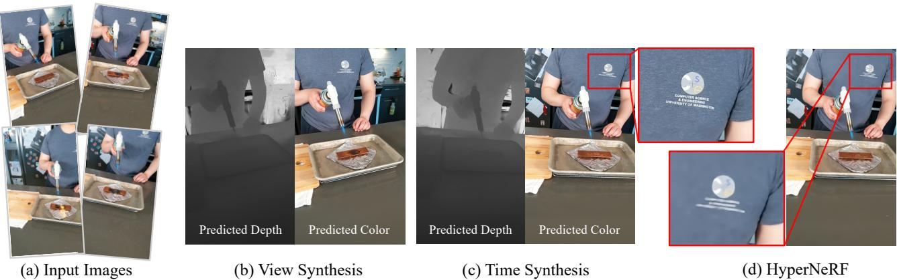
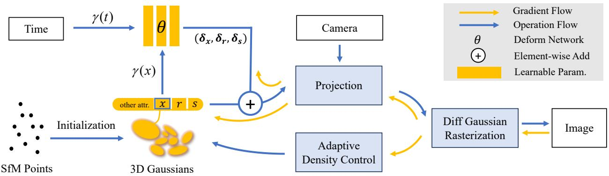
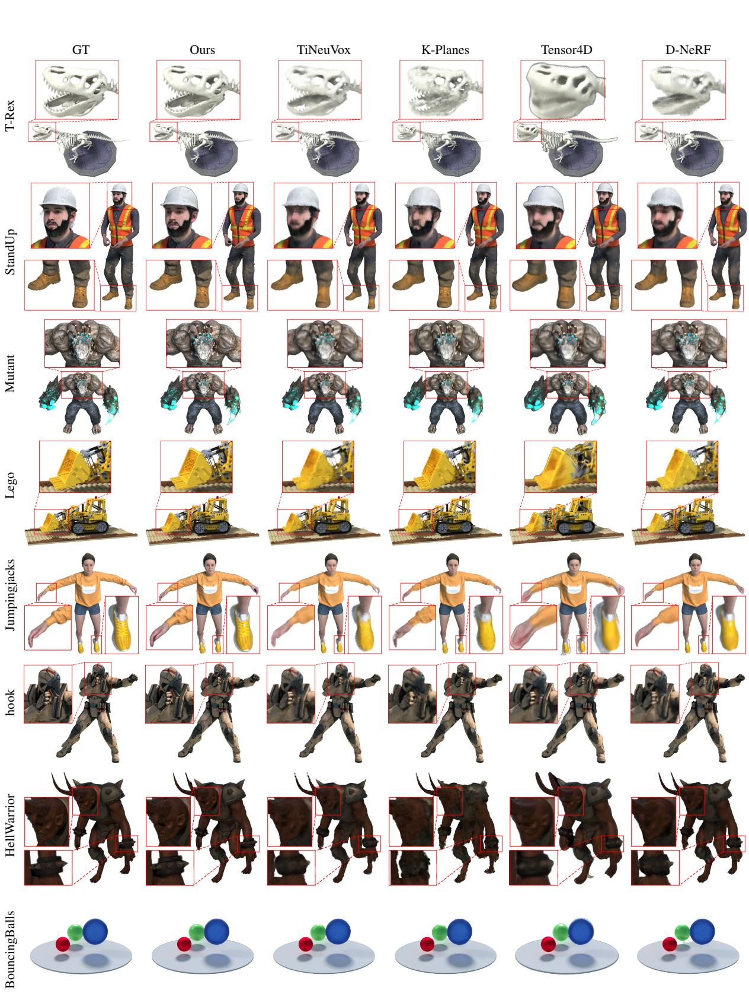
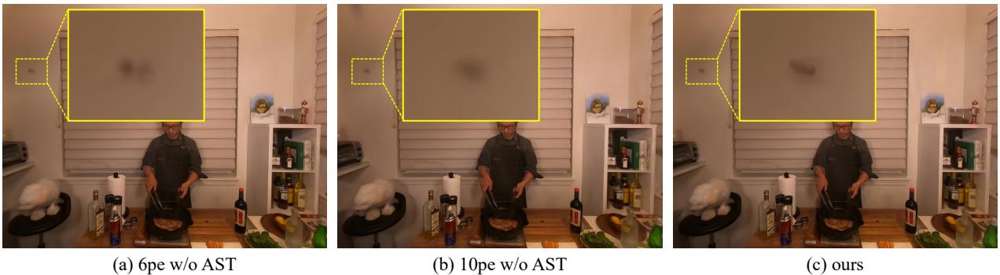
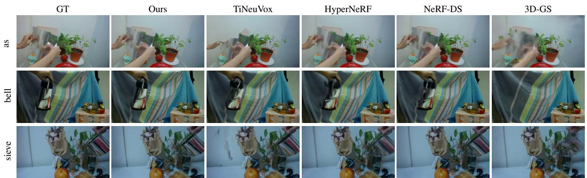
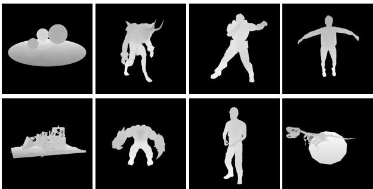
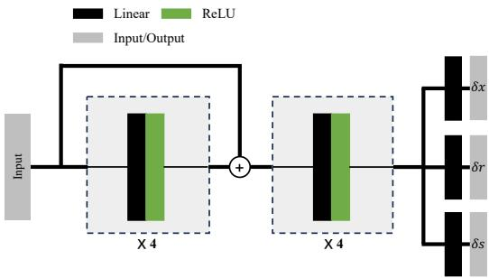
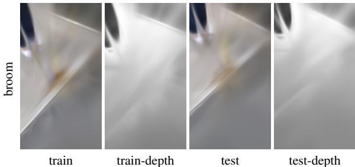
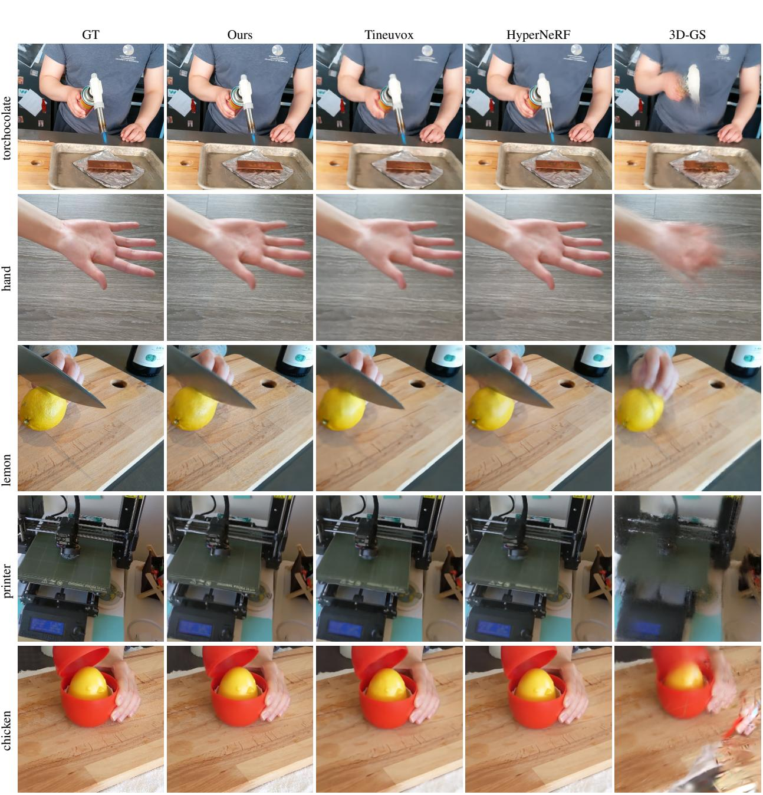
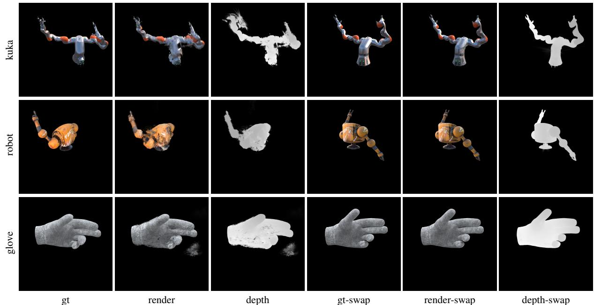

# 可变形 3D 高斯体用于高保真单目动态场景重建

杨子怡¹², 高欣宇¹, 周闻², 饶绍辉², 张宇清¹, 金晓刚¹† ¹浙江大学CAD&CG国家重点实验室 ²字节跳动公司

  
inriatedetails, our method utpeorms HyperNeR [1] (d in terms  renderng qualityand time perforae.

# 摘要

隐式神经表示为动态场景重建和渲染开辟了新的方法。然而，最先进的动态神经渲染方法在很大程度上依赖于这些隐式表示，这些表示通常难以捕捉场景中物体的复杂细节。此外，隐式方法在一般动态场景中很难实现实时渲染，这限制了它们在各种任务中的应用。为了解决这些问题，我们提出了一种可变形3D高斯点云方法，该方法使用3D高斯重建场景，并通过变形场在典范空间中对其进行学习，以建模单目动态场景。我们还引入了一种无额外开销的退火平滑训练机制，可以减轻不准确姿态对真实世界数据集中时间插值任务平滑性的影响。通过差分高斯光栅化器，可变形3D高斯不仅实现了更高的渲染质量，还达到了实时渲染速度。实验表明，我们的方法在渲染质量和速度方面显著优于现有方法，非常适合于新视图合成、时间插值和实时渲染等任务。我们的代码可在 https://github.com/ingra14m/Deformable-3DGaussians 找到。

# 1. 引言

从一组输入图像中高质量重建和照片级真实感渲染动态场景对增强现实/虚拟现实（AR/VR）、3D内容制作和娱乐等多种应用至关重要。之前用于建模这些动态场景的方法重度依赖基于网格的表示，如[9, 14, 18, 40]中所述的方法。然而，这些策略经常面临固有的局限性，例如缺乏细节和真实感、缺乏语义信息，以及难以适应拓扑变化。随着神经渲染技术的引入，这一范式发生了重大转变。隐式场景表示，特别是NeRF [28]的实现，在新视角合成、场景重建和光照分解等任务中表现出了卓越的效果。为了提高基于NeRF的静态场景的推理效率，研究人员开发了多种加速方法，包括基于网格的结构[7, 46]和预计算策略[44, 52]。特别是，通过引入哈希编码，Instant-NGP [29]实现了快速训练。在质量提升方面，mipNeRF [2]率先提出了一种有效的抗混叠方法，随后zipNeRF [4]将其纳入了基于网格的方法中。3D-GS [15]最近将点基渲染扩展到基于CUDA的高效实现，采用了3D高斯，从而实现了实时渲染，其质量与Mip-NeRF [2]相匹配甚至超越。然而，该方法旨在表示静态场景，其高度定制的CUDA光栅化管道降低了其可扩展性。

隐式表示越来越多地被用于动态场景建模。为处理动态场景中的运动部分，纠缠方法[43, 49]将NeRF与时间变量结合。相反，解耦方法[23, 30, 31, 34, 39]通过在典范空间中使用变形场来建模场景，将给定时间的点坐标映射到该空间。这种解耦建模方法能够有效地表示具有非剧烈动作变化的场景。然而，无论分类如何，采用隐式表示进行动态场景建模通常被证明既低效又无效，表现为收敛速度慢并伴随明显的过拟合倾向。受到开创性NeRF加速研究的启发，许多动态场景建模的研究整合了离散结构，如体素网格[11, 38]或平面[6, 36]。这种整合提高了训练速度和建模精度。然而，挑战仍然存在。利用离散结构的技术仍然面临实现实时渲染速度与生成具有充分细节的高质量输出的双重约束。这些挑战的多个方面支撑着：首先，光线投射作为渲染方式，尤其在提升到更高分辨率时，常常变得低效。其次，基于网格的方法依赖于低秩假设。与静态场景相比，动态场景表现出更高的秩，这限制了此类方法所能达到的质量上限。本文为了应对上述挑战，扩展了静态3D-GS，提出了一种变形3D高斯框架用于动态场景建模。为了增强模型的适用性，我们特别关注单目动态场景的建模。我们不是逐帧重建场景[26]，而是将3D高斯与时间条件化，并在典范空间中联合训练一个纯隐式变形场与可学习的3D高斯。这两个组件的梯度来自一个定制的差分高斯光栅化管道。此外，为了解决重建过程中由于不准确姿态导致的时间序列抖动问题，我们融入了一种退火平滑训练（AST）机制。这一策略不仅提高了时间插值任务中帧与帧之间的平滑度，还允许渲染更细致的细节。总之，我们工作的主要贡献包括：•一个用于单目动态场景建模的可变形3D-GS框架，能够实现实时渲染和高保真场景重建。•一种新的退火平滑训练机制，确保时间上的平滑性，同时在不增加计算复杂性的情况下保留动态细节。•第一个通过变形场扩展3D-GS以适应动态场景的框架，使得在典范空间中学习3D高斯成为可能。

# 2. 相关工作

# 2.1. 动态场景的神经渲染

神经渲染因其生成摄影真实图像的独特能力，受到了越来越多的学术关注。最近，NeRF [28] 通过使用多层感知机（MLP）实现了摄影真实的新视图合成。后续研究扩展了 NeRF 的应用范围，包括从图像集合进行网格重建 [20, 45]、逆向渲染 [5, 25, 54]、相机参数优化 [21, 47, 48] 以及小样本学习 [10, 51] 等任务。

构建动态场景的辐射场是NeRF进展中的一个关键分支，对现实世界的应用具有重要意义。渲染这些动态场景的一大挑战在于对时间信息的编码与有效利用，尤其是在处理单目动态场景重建时，这一任务本质上涉及从单一视角进行稀疏重建。一类动态NeRF方法通过将时间$t$作为辐射场的附加输入来建模场景变形。然而，这种策略将由时间变化引起的位置变动与辐射场耦合在一起，缺乏关于时间对场景影响的几何先验信息。因此，需要大量正则化来确保渲染结果的时间一致性。另一类方法引入变形场，以解耦时间与辐射场，通过变形场将点坐标映射到与时间$t$对应的标准空间。这种解耦方法有利于学习明显的刚性运动，并且足够灵活以处理经历拓扑变化的场景。其他方法则从各个方面寻求提升动态神经渲染的质量，包括在场景中分离静态和动态物体，结合深度信息引入几何先验，采用2D卷积神经网络编码场景先验，以及利用多视角视频中的冗余信息设置关键帧压缩存储，从而加快渲染速度。

  
F $\gamma ( \mathrm { s g } ( \pmb { x } ) )$ and time $\gamma ( t )$ with positional encoding as input to a deformation MLP network to obtain the offset $( \delta \pmb { x } , \delta \pmb { r } , \delta \pmb { s } )$ of dynamic 3D Gaussians 3D Gaussians, as well as to adaptively control the density of the set of Gaussians.

然而，现有基于多层感知器（MLP）的动态场景建模的渲染质量仍然不理想。在本研究中，我们将重点关注单目动态场景的重建。我们继续解耦变形场和辐射场。为了增强动态场景中中间状态的可编辑性和渲染质量，我们将这一建模方法适配于可微分点渲染框架。

# 2.2. 神经渲染加速

实时渲染一直是计算机图形领域的一个关键目标，这一目标在神经渲染领域也得到了追求。许多针对NeRF加速的研究细致地探讨了空间效率和时间效率之间的权衡。预计算方法利用空间加速结构，如球谐系数和特征向量，这些结构是从隐式神经表示中缓存或提取的，而不是直接使用神经表示本身。这一类别中的一种突出技术将NeRF场景转化为粗糙网格和特征纹理的组合，从而提高现代移动图形管线中的渲染速度。然而，这种预计算方法可能需要为单个场景分配大量存储空间。尽管它在推理速度上提供了优势，但却需要较长的训练时间，并且表现出相当大的开销。混合方法在显式网格中结合了神经组件。混合方法的双重优势在于加快训练和推理阶段，同时产生的结果与先进框架相当。这主要归功于网格的强大表征能力。基于网格或平面的策略已扩展到动态场景建模中的时序条件4D特征的加速或表示。近期，几项研究将连续辐射场从隐式表示演化为可微分的点基辐射场，显著提高了渲染速度。3D-GS进一步通过引入定制的基于CUDA的可微分高斯栅格化管线创新了点基渲染。这种方法不仅在新视角合成和场景建模等任务中取得了优越的效果，而且还支持分钟级的快速训练时间，并能实现超过100帧每秒的实时渲染。然而，该方法采用了定制的微分高斯栅格化管线，使得其直接扩展到动态场景变得复杂。受到此启发，我们的工作将利用点基渲染框架3D-GS，加快动态场景建模的训练和渲染速度。

# 3. 方法

我们方法的概述如图2所示。我们方法的输入是一组单目动态场景的图像，连同时间标签和通过结构从运动（SfM）校准的相机位姿[37]，它还生成一个稀疏点云。根据这些点，我们创建了一组3D高斯 $G ( { \pmb x } , { \pmb r } , s , \sigma )$，由中心位置 $_ { \textbf { \em x } }$、不透明度 $\sigma$ 和从四元数 $\pmb { r }$ 和缩放 $\pmb { s }$ 获得的3D协方差矩阵 $\Sigma$ 定义。每个3D高斯的视图依赖外观通过球谐（SH）表示。为了建模随时间变化的动态3D高斯，我们将3D高斯和变形场解耦。变形场以3D高斯的位置和当前时间 $t$ 作为输入，输出 $\delta \pmb { x } , \delta \pmb { r }$ 和 $\delta \boldsymbol { s }$。随后，我们将变形后的3D高斯 $G ( { \pmb x } + \delta { \pmb x } , { \pmb r } + \delta { \pmb r } , { \pmb s } + \delta { \pmb s } , \sigma )$ 放入高效的微分高斯光栅化管道，这是一种基于瓦片的光栅器，允许各向异性斑点的 $\alpha$ 混合。通过跟踪累积的 $\alpha$ 值，以及高斯密度的自适应控制，3D高斯和变形网络共同优化，通过快速的反向传播实现。实验结果表明，在经过 $30\,k$ 次训练迭代后，3D高斯的形状稳定下来，规范空间也稳定，这间接证明了我们设计的有效性。

# 3.1. 通过标准空间中的三维高斯点云进行可微渲染

为了优化典型空间中 3D 高斯分布的参数，必须从这些 3D 高斯分布中差分渲染 2D 图像。在本研究中，我们采用了 [15] 提出的差分高斯光栅化管线。根据 [55]，可以将 3D 高斯分布投影到 2D 并使用以下 2D 协方差矩阵 $\Sigma ^ { \prime }$ 为每个像素进行渲染：

$$
\Sigma ^ { \prime } = J V \Sigma V ^ { T } J ^ { T } ,
$$

其中 $J$ 是投影变换的仿射近似的雅可比矩阵，$V$ 表示从世界坐标到相机坐标的视图矩阵，$\Sigma$ 表示三维协方差矩阵。为了使学习三维高斯分布更容易，$\Sigma$ 被分为两个可学习的组件：四元数 $\mathbfit { \Delta } \mathbf { r }$ 表示旋转，三维向量 $\pmb { s }$ 表示缩放。这些组件随后被转换为对应的旋转矩阵和缩放矩阵 $R$ 和 $S$。最终的 $\Sigma$ 可以表示为：

$$
\Sigma = R S S ^ { T } R ^ { T } .
$$

图像平面上像素的颜色，记作 $\mathbf { p }$，是通过逐点体积渲染技术逐步渲染的：

$$
\begin{array} { c } { { \displaystyle C ( { \bf p } ) = \sum _ { i \in N } T _ { i } \alpha _ { i } c _ { i } , } } \\ { { \displaystyle \alpha _ { i } = \sigma _ { i } e ^ { - \frac 1 2 ( { \bf p } - { \boldsymbol \mu } _ { i } ) ^ { T } } \sum ^ { \prime } ( { \bf p } - { \boldsymbol \mu } _ { i } ) } , } \end{array}
$$

其中 $T _ { i }$ 是透射率，定义为 $\Pi _ { j = 1 } ^ { i - 1 } ( 1 - \alpha _ { j } )$，$c _ { i }$ 表示光线沿途的高斯分布的颜色，而 $\mu _ { i }$ 表示投影到 2D 图像平面的 3D 高斯分布的 uv 坐标。

在优化过程中，自适应密度控制作为关键组成部分，促使3D高斯分布的渲染以实现理想的效果。该控制具有双重功能：首先，它要求根据 $\sigma$ 剔除透明高斯分布。其次，它需要对高斯分布进行密集化。这种密集化填补了缺乏几何细节的区域，同时细分高斯较大且重叠显著的区域。值得注意的是，这些区域通常会展现出明显的位置信息梯度。根据 [15]，我们识别出需要调整的3D高斯分布，并使用阈值 $t_{pos} = 0.0002$。对于那些无法捕捉几何细节的小型高斯分布，我们会克隆这些高斯，并将它们沿着位置信息梯度的方向移动一定距离。相反，对于那些显著大且重叠的高斯分布，我们则将其拆分，并通过超参数 $\xi = 1.6$ 来降低其尺度。显然，3D高斯分布仅适用于静态场景的表示。为每个3D高斯应用时间条件的可学习参数不仅与可微高斯光栅化管道的原始意图相悖，还会导致运动的时空连续性丧失。为了使3D高斯能够在保持各个可学习组件实际物理意义的同时表示动态场景，我们决定在标准空间中学习3D高斯，并使用额外的形变场来学习3D高斯的位移和形状变化。

# 3.2. 变形三维高斯分布

一种直观的解决方案是使用 3D 高斯模型化动态场景，通过在每个时间依赖的视图集合中分别训练 3D-GS 集合，然后在后处理步骤中在这些集合之间进行插值。虽然这种方法对于离散时间的多视图立体（MVS）捕获是可行的，但对于时间序列内的连续单目捕获则显得不足。为了解决后者这一更一般的情况，我们联合学习一个形变场以及 3D 高斯。我们通过利用形变网络和 3D 高斯将运动和几何结构解耦，将学习过程转换到一个标准空间中，以获得时间无关的 3D 高斯。这种解耦方法引入了场景的几何先验，将 3D 高斯位置变化与时间和坐标相联系。形变网络的核心是一个多层感知机（MLP）。在我们的研究中，我们没有采用静态 NeRF 中应用的网格/平面结构，这些结构可以加速渲染并提高其质量。这是因为这些方法是在低秩假设下运作，而动态场景具有更高的秩。显式基于点的渲染进一步提升了场景的秩。T [34]、TiNeuVox [11]、Tensor4D [38] 和 K-Planes [36] 在全分辨率 $(800 \mathrm{x} 800)$ 测试图像上进行。这可能导致某些方法的性能下降。

<table><tr><td colspan="4">Hell Warrior</td><td colspan="3">Mutant</td><td colspan="2">Hook</td><td colspan="3">Bouncing Balls</td></tr><tr><td>Method</td><td>PSNR↑</td><td>SSIM↑</td><td>LPIPS↓</td><td>PSNR↑</td><td>SSIM↑</td><td>LPIPS↓</td><td>PSNR↑</td><td>SSIM↑</td><td>LPIPS↓ PSNR↑</td><td>SSIM ↑</td><td>LPIPS↓</td></tr><tr><td>3D-GS</td><td>29.89</td><td>0.9155</td><td>0.1056</td><td>24.53</td><td>0.9336</td><td>0.0580</td><td>21.71</td><td>0.8876 0.1034</td><td>23.20</td><td>0.9591</td><td>0.0600</td></tr><tr><td>D-NeRF</td><td>24.06</td><td>0.9440</td><td>0.0707</td><td>30.31</td><td>0.9672</td><td>0.0392</td><td>29.02 0.9595</td><td>0.0546</td><td>38.17</td><td>0.9891</td><td>0.0323</td></tr><tr><td>TiNeuVox</td><td>27.10</td><td>0.9638</td><td>0.0768</td><td>31.87</td><td>0.9607</td><td>0.0474</td><td>30.61</td><td>0.9599 0.0592</td><td>40.23</td><td>0.9926</td><td>0.0416</td></tr><tr><td>Tensor4D</td><td>31.26</td><td>0.9254</td><td>0.0735</td><td>29.11</td><td>0.9451</td><td>0.0601</td><td>28.63</td><td>0.9433 0.0636</td><td>24.47</td><td>0.9622</td><td>0.0437</td></tr><tr><td>K-Planes</td><td>24.58</td><td>0.9520</td><td>0.0824</td><td>32.50</td><td>0.9713</td><td>0.0362</td><td>28.12</td><td>0.9489 0.0662</td><td>40.05</td><td>0.9934</td><td>0.0322</td></tr><tr><td>Ours</td><td>41.54</td><td>0.9873</td><td>0.0234</td><td>42.63</td><td>0.9951</td><td>0.0052</td><td>37.42</td><td>0.9867 0.0144</td><td>41.01</td><td>0.9953</td><td>0.0093</td></tr><tr><td></td><td></td><td>Lego</td><td></td><td></td><td>T-Rex</td><td></td><td></td><td>Stand Up</td><td></td><td>Jumping Jacks</td><td></td></tr><tr><td>Method</td><td>PSNR↑</td><td>SSIM</td><td>LPIPS↓</td><td>PSNR↑</td><td>SSIM↑</td><td>LPIPS↓</td><td>PSNR↑</td><td>SSIM LPIPS↓</td><td>PSNR↑</td><td>SIM</td><td>LPIPS↓</td></tr><tr><td>3D-GS</td><td>22.10</td><td>0.9384</td><td>0.0607</td><td>21.93</td><td>0.9539</td><td>0.0487</td><td>21.91</td><td>0.9301 0.0785</td><td>20.64</td><td>0.9297</td><td>0.0828</td></tr><tr><td>D-NeRF</td><td>25.56</td><td>0.9363</td><td>0.0821</td><td>30.61</td><td>0.9671</td><td>0.0535</td><td>33.13</td><td>0.9781 0.0355</td><td>32.70</td><td>0.9779</td><td>0.0388</td></tr><tr><td>TiNeuVox</td><td>26.64</td><td>0.9258</td><td>0.0877</td><td>31.25</td><td>0.9666</td><td>0.0478</td><td>34.61</td><td>0.9797 0.0326</td><td>33.49</td><td>0.9771</td><td>0.0408</td></tr><tr><td>Tensor4D</td><td>23.24</td><td>0.9183</td><td>0.0721</td><td>23.86</td><td>0.9351</td><td>0.0544</td><td>30.56</td><td>0.9581 0.0363</td><td>24.20</td><td>0.9253</td><td>0.0667</td></tr><tr><td>K-Planes</td><td>28.91</td><td>0.9695</td><td>0.0331</td><td>30.43</td><td>0.9737</td><td>0.0343</td><td>33.10</td><td>0.9793 0.0310</td><td>31.11</td><td>0.9708</td><td>0.0468</td></tr><tr><td>Ours</td><td>33.07</td><td>0.9794</td><td>0.0183</td><td>38.10</td><td>0.9933</td><td>0.0098</td><td>44.62</td><td>0.9951 0.0063</td><td>37.72</td><td>0.9897</td><td>0.0126</td></tr></table>

给定时间 $t$ 和 3D 高斯分布的中心位置 $_ { \textbf { \em x } $ 作为输入，变形多层感知器（MLP）生成偏移量，随后将典型的 3D 高斯分布转换到变形空间：

$$
( \delta \mathbf { } x , \delta \pmb { r } , \delta \pmb { s } ) = \mathcal { F } _ { \boldsymbol { \theta } } ( \gamma ( \mathrm { s g } ( \pmb { x } ) ) , \gamma ( t ) ) ,
$$

其中 $\operatorname{s g}(\cdot)$ 表示停止梯度操作，$\gamma$ 表示位置编码：

$$
\gamma ( p ) = ( s i n ( 2 ^ { k } \pi p ) , c o s ( 2 ^ { k } \pi p ) ) _ { k = 0 } ^ { L - 1 } ,
$$

在合成场景中，$L = 10$ 表示 $x$，$L = 6$ 表示 $t$；而在真实场景中，$L = 10$ 对于 $x$ 和 $t$ 都适用。我们将变形网络的深度设置为 $D = 8$，隐藏层的维度设置为 $W := 256$。实验表明，将位置编码应用于变形网络的输入可以增强渲染结果中的细节。

# 3.3. 退火平滑训练

许多实际数据集面临的一个普遍挑战是姿态估计的不准确性，这种现象在动态场景中尤为明显。在不精确的姿态下训练可能导致对训练数据的过拟合。此外，正如 HyperNeRF [31] 中提到的，从 colmap 获得的真实数据集的不精确姿态可能导致每帧相对于测试集或训练集的空间抖动，从而在渲染测试图像时与真实标注数据之间产生明显偏差。之前使用隐式表示的方法受益于多层感知机的内在平滑性，使得此类小偏差对最终渲染结果的影响相对不显著。然而，显式基于点的渲染往往会放大这种效应。对于单目动态场景，在固定时间的新视角渲染不会受到影响。然而，涉及插值时间的任务中，不同时间下的不一致场景可能导致不规则的渲染抖动。为了解决这个问题，我们提出了一种专门为现实世界单目动态场景设计的新型退火平滑训练（AST）机制：

$$
\begin{array} { r } { \Delta = \mathcal { F } _ { \theta } \left( \gamma ( \mathrm { s g } ( \pmb { x } ) ) , \gamma ( t ) + \mathcal { X } ( i ) \right) , } \\ { \mathcal { X } ( i ) = \mathbb { N } ( 0 , 1 ) \cdot \beta \cdot \Delta t \cdot ( 1 - i / \tau ) , } \end{array}
$$

其中，$\mathcal { X } ( i )$ 表示第 $i$ 次训练迭代时的线性衰减高斯噪声，$\mathbb { N } ( 0 , 1 )$ 表示标准高斯分布，$\beta$ 是通过经验确定的缩放因子，其值为 0.1，$\Delta t$ 表示平均时间间隔，$\tau$ 是用于退火平滑训练的阈值迭代（经验设定为 $2 0 k$）。与文献 [34, 38] 中引入的平滑损失相比，我们的方法不增加额外的计算开销。它可以在训练的早期阶段增强模型的时间泛化能力，并防止在后期阶段出现过度平滑，从而保留动态场景中物体的细节。同时，它减少了在时间插值任务中观察到的真实数据集中的抖动现象。

# 4. 实验

在本节中，我们展示了我们方法的实验评估。为了证明其有效性，我们在基准测试上评估了我们的方法，该基准测试由D-NeRF [34]的合成数据集和来自HyperNeRF [31]与NeRF-DS [50]的真实数据集组成。训练和测试部分的划分以及图像分辨率与原始论文完全一致。

  
Deformation Field can further assist the 3D Gaussians in achieving better densification in dynamic regions.

  
wherein $p e$ Simultaneously, it mitigates the temporal overfitting challenges instigated by imprecise pose estimations.

  
ormethod anachive superor enderi quali  eal-worldatasets wherehe poss ot solutely pre.

# 4.1. 实现细节

我们使用PyTorch [32] 实现了我们的框架，并通过结合深度可视化来修改可微分高斯光栅化。在训练过程中，我们进行了总共40,000次迭代。在初始的3,000次迭代中，我们仅训练3D高斯，以获得相对稳定的位置和形状。随后，我们同时训练3D高斯和变形场。在优化过程中，使用了一个单一的Adam优化器 [17]，但每个组件的学习率不同：3D高斯的学习率与官方实现完全相同，而变形网络的学习率则经历指数衰减，从8e-4降至1.6e-6。Adam的$\beta$值范围设定为(0.9, 0.999)。所有合成数据集的实验均在黑色背景下进行，并且分辨率为$800 \mathrm{x} 800$。所有实验均在NVIDIA RTX 3090上完成。

# 4.2. 结果与比较

在合成数据集上的比较。我们的实验中，基于 D-NeRF [34] 提出的单目合成数据集对我们的方法进行了多项基线的基准测试。定量评估如表 1 所示，充分证明了我们的方法在性能上优于当前最先进的技术。特别是在结构一致性相关的指标上，如 LPIPS 和 SSIM，显示出我们方法的显著优势。为了进行更直观的评估，我们在图 3 中提供了定性结果。这些视觉比较强调了我们方法在高保真动态场景建模中的能力。从结果中可以明显看出，我们的方法确保了增强的一致性，并捕捉到了新视图渲染中的复杂渲染细节。 在现实世界数据集上的比较。我们使用 NeRF-DS [50] 和 HyperNeRF [31] 提供的单目现实世界数据集，将我们的方法与基线进行比较。需要注意的是，某些 HyperNeRF 数据集的摄像机姿态非常不准确。鉴于 PSNR 等用于评估图像渲染质量的指标倾向于对轻微偏差给予比模糊更严厉的惩罚，我们在定量分析中没有包含 HyperNeRF。有关 HyperNeRF 的定性分析，请参阅补充材料。NeRF-DS 数据集的定量和定性评估分别详见表 2 和图 5。这些结果证明了我们的方法在应用于现实世界场景时的鲁棒性，即使关联的姿态并不完全准确。 渲染效率。渲染速度与 3D 高斯的数量相关。总体上，当 3D 高斯的数量低于 25 万时，我们的方法能够在 NVIDIA RTX 3090 上实现超过 30 FPS 的实时渲染。详细结果可在补充材料中找到。 深度可视化。我们在图 6 中可视化了合成数据集场景的深度，以证明我们的变形网络非常适合生成时间变换，而不是依赖基于颜色的硬编码。精确的深度强调了我们几何重建的准确性，这对于新视图合成任务极为有利。

# 4.3. 消融研究

退火平滑训练。如图4和表2所示，该机制促进了对复杂区域的更好收敛，有效减轻了真实世界数据集的过拟合倾向。此外，从我们的观察中明确可以看出，这一策略显著增强了变形场的时间平滑性。更多消融实验详见补充材料。

# 5. 限制因素

通过我们的实验评估，我们观察到3D高斯分布的收敛深受视角多样性的影响。因此，特征稀疏视点和有限视角覆盖的数据集可能导致我们的方法面临过拟合挑战。此外，我们的方法的有效性依赖于姿态估计的准确性。当我们的算法在Nerfies/HyperNeRF数据集上未能实现最佳PSNR值时，这种依赖性显而易见，这归因于通过COLMAP的姿态估计偏差。此外，我们的方法的时间复杂度与3D高斯的数量成正比。在拥有大量3D高斯的场景中，训练时长和内存消耗可能会增加。最后，我们的评估主要集中在具有中等运动动态的场景上。方法处理复杂人类运动的能力，例如细微的面部表情，仍然是一个悬而未决的问题。我们认为这些限制为后续研究工作提供了有前景的方向。

<table><tr><td></td><td>PSNR ↑</td><td>SSIM ↑</td><td>LPIPS ↓</td></tr><tr><td>3D-GS</td><td>20.29</td><td>0.7816</td><td>0.2920</td></tr><tr><td>TiNeuVox</td><td>21.61</td><td>0.8234</td><td>0.2766</td></tr><tr><td>HyperNeRF</td><td>23.45</td><td>0.8488</td><td>0.1990</td></tr><tr><td>NeRF-DS</td><td>23.60</td><td>0.8494</td><td>0.1816</td></tr><tr><td>Ours (w/o AST)</td><td>23.97</td><td>0.8346</td><td>0.2037</td></tr><tr><td>Ours</td><td>24.11</td><td>0.8525</td><td>0.1769</td></tr></table>

Table 2. Metrics on NeRF-DS dataset. We computed the mean of the metrics across all seven scenes. Cells are highlighted as follows:best second best, andthird best. For individual metrics about each scene, please refer to the supplementary material.

  
Figure 6. Depth Visualization. We visualized the depth map of the D-NeRF dataset. The first row includes bouncing-balls, hellwarrior, hook, and jumping-jacks, while the second row includes lego, mutant, standup, and trex.

# 6. 结论

我们提出了一种新颖的可变形3D高斯溅射方法，专为单目动态场景建模而设计，在质量和速度上超越了现有的方法。通过在规范空间中学习3D高斯分布，我们增强了3D-GS可微渲染管道在动态捕捉的单目场景中的灵活性。需要特别指出的是，与隐式表示相比，基于点的方法更具可编辑性，更适合后期制作任务。此外，我们的方法还采用了退火平滑训练策略，旨在减少与时间编码相关的过拟合，同时保持复杂场景细节，无需增加额外的训练开销。实验结果表明，我们的方法不仅实现了卓越的渲染效果，还能够进行实时渲染。

# References

[1] Benjamin Attal, Eliot Laidlaw, Aaron Gokaslan, Changil Kim, Christian Richardt, James Tompkin, and Matthew O'Toole. Törf: Time-of-flight radiance fields for dynamic scene view synthesis. Advances in Neural Information Processing Systems, 34:2628926301, 2021. 2   
[2] Jonathan T. Barron, Ben Mildenhall, Matthew Tancik, Peter Hedman, Ricardo Martin-Brualla, and Pratul P. Srinivasan. Mip-nerf: A multiscale representation for anti-aliasing neural radiance fields. ICCV, 2021. 2, 3   
[3] Jonathan T. Barron, Ben Mildenhall, Dor Verbin, Pratul P. Srinivasan, and Peter Hedman. Mip-nerf 360: Unbounded anti-aliased neural radiance fields. CVPR, 2022. 3   
[4] Jonathan T. Barron, Ben Mildenhall, Dor Verbin, Pratul P. Srinivasan, and Peter Hedman. Zip-nerf: Anti-aliased gridbased neural radiance fields. ICCV, 2023. 2, 3   
[5] Mark Boss, Raphael Braun, Varun Jampani, Jonathan T. Barron, Ce Liu, and Hendrik P.A. Lensch. Nerd: Neural reflectance decomposition from image collections. In IEEE International Conference on Computer Vision (ICCV), 2021. 2   
[6] Ang Cao and Justin Johnson. Hexplane: A fast representation for dynamic scenes. CVPR, 2023. 2, 3   
[7] Anpei Chen, Zexiang Xu, Andreas Geiger, Jingyi Yu, and Hao Su. Tensorf: Tensorial radiance fields. In European Conference on Computer Vision (ECCV), 2022. 2, 3, 11   
[8] Zhiqin Chen, Thomas Funkhouser, Peter Hedman, and Andrea Tagliasacchi. Mobilenerf: Exploiting the polygon rasterization pipeline for efficient neural field rendering on mobile architectures. In Proceedings of the IEEE/CVF Conference on Computer Vision and Pattern Recognition, pages 1656916578, 2023. 3   
[9] Alvaro Collet, Ming Chuang, Pat Sweeney, Don Gillett, Dennis Evseev, David Calabrese, Hugues Hoppe, Adam Kirk, and Steve Sullivan. High-quality streamable free-viewpoint video. ACM Transactions on Graphics (ToG), 34(4):113, 2015. 1   
[10] Kangle Deng, Andrew Liu, Jun-Yan Zhu, and Deva Ramanan. Depth-supervised NeRF: Fewer views and faster training for free. In Proceedings of the IEEE/CVF Conference on Computer Vision and Pattern Recognition (CVPR), June 2022.2   
[11] Jiemin Fang, Taoran Yi, Xinggang Wang, Lingxi Xie, Xiaopeng Zhang, Wenyu Liu, Matthias NieBner, and Qi Tian. Fast dynamic radiance fields with time-aware neural voxels. In SIGGRAPH Asia 2022 Conference Papers, 2022. 2, 3, 5   
[12] Stephan J Garbin, Marek Kowalski, Matthew Johnson, Jamie Shotton, and Julien Valentin. Fastnerf: High-fidelity neural rendering at 200fps. In Proceedings of the IEEE/CVF International Conference on Computer Vision, pages 14346 14355, 2021. 3   
[13] Peter Hedman, Pratul P Srinivasan, Ben Mildenhall, Jonathan T Barron, and Paul Debevec. Baking neural radiance fields for real-time view synthesis. In Proceedings of the IEEE/CVF International Conference on Computer Vision, pages 58755884, 2021. 3   
[14] Takeo Kanade, Peter Rander, and PJ Narayanan. Virtualized reality: Constructing virtual worlds from real scenes. IEEE Multimedia, 4(1):3447, 1997. 1   
[15] Bernhard Kerbl, Georgios Kopanas, Thomas Leimkühler, and George Drettakis. 3d gaussian splatting for real-time radiance field rendering. ACM Transactions on Graphics, 42(4), July 2023. 2, 3, 4, 5, 11   
[16] Leonid Keselman and Martial Hebert. Approximate differentiable rendering with algebraic surfaces. In European Conference on Computer Vision (ECCV), 2022. 3   
[17] Diederik Kingma and Jimmy Ba. Adam: A method for stochastic optimization. In International Conference on Learning Representations (ICLR), 2015. 7   
[18] Hao Li, Linjie Luo, Daniel Vlasic, Pieter Peers, Jovan Popovi, Mark Pauly, and Szymon Rusinkiewicz. Temporally coherent completion of dynamic shapes. ACM Transactions on Graphics (T0G), 31(1):111, 2012. 1   
[19] Tianye Li, Mira Slavcheva, Michael Zollhoefer, Simon Green, Christoph Lassner, Changil Kim, Tanner Schmidt, Steven Lovegrove, Michael Goesele, Richard Newcombe, et al. Neural 3d video synthesis from multi-view video. In Proceedings of the IEEE/CVF Conference on Computer Vision and Pattern Recognition, pages 55215531, 2022. 3   
[20] Zhaoshuo Li, Thomas Müller, Alex Evans, Russell H Taylor, Mathias Unberath, Ming-Yu Liu, and Chen-Hsuan Lin. Neuralangelo: High-fidelity neural surface reconstruction. In IEEE Conference on Computer Vision and Pattern Recognition (CVPR), 2023. 2   
[21] Chen-Hsuan Lin, Wei-Chiu Ma, Antonio Torralba, and Simon Lucey. Barf: Bundle-adjusting neural radiance fields. In IEEE International Conference on Computer Vision (ICCV), 2021. 2   
[22] Haotong Lin, Sida Peng, Zhen Xu, Yunzhi Yan, Qing Shuai, Hujun Bao, and Xiaowei Zhou. Efficient neural radiance fields for interactive free-viewpoint video. In SIGGRAPH Asia Conference Proceedings, 2022. 3   
[23] Jia-Wei Liu, Yan-Pei Cao, Weijia Mao, Wenqiao Zhang, David Junhao Zhang, Jussi Keppo, Ying Shan, Xiaohu Qie, and Mike Zheng Shou. Devrf: Fast deformable voxel radiance fields for dynamic scenes. Advances in Neural Information Processing Systems, 35:3676236775, 2022. 2, 15   
[24] Lingjie Liu, Jiatao Gu, Kyaw Zaw Lin, Tat-Seng Chua, and Christian Theobalt. Neural sparse voxel fields. Advances in Neural Information Processing Systems, 33:1565115663, 2020.3   
[25] Yuan Liu, Peng Wang, Cheng Lin, Xiaoxiao Long, Jiepeng Wang, Lingjie Liu, Taku Komura, and Wenping Wang. Nero: Neural geometry and brdf reconstruction of reflective objects from multiview images. In SIGGRAPH, 2023. 2   
[26] Jonathon Luiten, Georgios Kopanas, Bastian Leibe, and Deva Ramanan. Dynamic 3d gaussians: Tracking by persistent dynamic view synthesis. preprint, 2023. 2   
[27] Julien N. P. Martel, David B. Lindell, Connor Z. Lin, Eric R. Chan, Marco Monteiro, and Gordon Wetzstein. Acorn: Adaptive coordinate networks for neural scene representation. ACM Transactions on Graphics (SIGGRAPH), 40(4), 2021. 3   
[28] Ben Mildenhall, Pratul P Srinivasan, Matthew Tancik, Jonathan T Barron, Ravi Ramamoorthi, and Ren Ng. Nerf: Representing scenes as neural radiance fields for view syn1. . c 101 (5(1.00 10c 001 2   
[29] Thomas Müller, Alex Evans, Christoph Schied, and Alexander Keller. Instant neural graphics primitives with a multiresolution hash encoding. ACM Transactions on Graphics, 41(4):102:1102:15, July 2022. 2   
[30] Keunhong Park, Utkarsh Sinha, Jonathan T Barron, Sofien Bouaziz, Dan B Goldman, Steven M Seitz, and Ricardo Martin-Brualla. Nerfies: Deformable neural radiance fields. In Proceedings of the IEEE/CVF International Conference on Computer Vision, pages 58655874, 2021. 2, 11, 14   
[31] Keunhong Park, Utkarsh Sinha, Peter Hedman, Jonathan T. Barron, Sofien Bouaziz, Dan B Goldman, Ricardo MartinBrualla, and Steven M. Seitz. Hypernerf: A higherdimensional representation for topologically varying neural radiance fields. ACM Transactions on Graphics, 40(6), dec 2021. 1, 2, 5, 7, 8, 11   
[32] Adam Paszke, Sam Gross, Francisco Massa, Adam Lerer, James Bradbury, Gregory Chanan, Trevor Killen, Zeming Lin, Natalia Gimelshein, Luca Antiga, et al. Pytorch: An imperative style, high-performance deep learning library. Advances in Neural Information Processing Systems, 32, 2019. 7   
[33] Sida Peng, Yunzhi Yan, Qing Shuai, Hujun Bao, and Xiaowei Zhou. Representing volumetric videos as dynamic mlp maps. In CVPR, 2023. 3   
[34] Albert Pumarola, Enric Corona, Gerard Pons-Moll, and Francesc Moreno-Noguer. D-nerf: Neural radiance fields for dynamic scenes. In Proceedings of the IEEE/CVF Conference on Computer Vision and Pattern Recognition, pages 1031810327, 2021. 2, 5, 7   
[35] Christian Reiser, Songyou Peng, Yiyi Liao, and Andreas Geiger. Kilonerf: Speeding up neural radiance fields with thousands of tiny mlps. In Proceedings of the IEEE/CVF International Conference on Computer Vision, pages 14335 14345, 2021. 3   
[36] Sara Fridovich-Keil and Giacomo Meanti, Frederik Rahbæk Warburg, Benjamin Recht, and Angjoo Kanazawa. K-planes: Explicit radiance fields in space, time, and appearance. In CVPR, 2023. 2, 3, 5   
[37] Johannes L Schonberger and Jan-Michael Frahm. Structurefrom-motion revisited. In Proceedings of the IEEE Conference on Computer Vision and Pattern recognition, pages 41044113, 2016. 3   
[38] Ruizhi Shao, Zerong Zheng, Hanzhang Tu, Boning Liu, Hongwen Zhang, and Yebin Liu. Tensor4d: Efficient neural 4d decomposition for high-fidelity dynamic reconstruction and rendering. In Proceedings of the IEEE Conference on Computer Vision and Pattern Recognition, 2023. 2, 3, 5   
[39] Liangchen Song, Anpei Chen, Zhong Li, Zhang Chen, Lele Chen, Junsong Yuan, Yi Xu, and Andreas Geiger. Nerfplayer: A streamable dynamic scene representation with decomposed neural radiance fields. IEEE Transactions on Visualization and Computer Graphics, 29(5):27322742, 2023. 2   
[40] Jonathan Starck and Adrian Hilton. Surface capture for performance-based animation. IEEE Computer Graphics and Applications, 27(3):2131, 2007. 1   
[41] Cheng Sun, Min Sun, and Hwann-Tzong Chen. Direct voxel grid optimization: Super-fast convergence for radiance fields reconstruction. In Proceedings of the IEEE/CVF Conference on Computer Vision and Pattern Recognition, pages 5459 5469, 2022. 3   
[42] Edgar Tretschk, Ayush Tewari, Vladislav Golyanik, Michael Zollhöfer, Christoph Lassner, and Christian Theobalt. Nonrigid neural radiance fields: Reconstruction and novel view synthesis of a dynamic scene from monocular video. In Proceedings of the IEEE/CVF International Conference on Computer Vision, pages 1295912970, 2021. 2   
[43] Chaoyang Wang, Ben Eckart, Simon Lucey, and Orazio Gallo. Neural trajectory fields for dynamic novel view synthesis. arXiv preprint arXiv:2105.05994, 2021. 2   
[44] Liao Wang, Jiakai Zhang, Xinhang Liu, Fuqiang Zhao, Yanshun Zhang, Yingliang Zhang, Minye Wu, Jingyi Yu, and Lan Xu. Fourier plenoctrees for dynamic radiance field rendering in real-time. In Proceedings of the IEEE/CVF Conference on Computer Vision and Pattern Recognition (CVPR), pages 1352413534, June 2022. 2   
[45] Peng Wang, Lingjie Liu, Yuan Liu, Christian Theobalt, Taku Komura, and Wenping Wang. Neus: Learning neural implicit surfaces by volume rendering for multi-view reconstruction. NeurIPS, 2021. 2   
[46] Peng Wang, Yuan Liu, Zhaoxi Chen, Lingjie Liu, Ziwei Liu, Taku Komura, Christian Theobalt, and Wenping Wang. F2- ne Fast neural radiancefeld training with free camera trajectories. CVPR, 2023. 2, 3   
[47] Peng Wang, Lingzhe Zhao, Ruijie Ma, and Peidong Liu. BAD-NeRF: Bundle Adjusted Deblur Neural Radiance Fields. In Proceedings of the IEEE/CVF Conference on Computer Vision and Pattern Recognition (CVPR), pages 41704179, June 2023. 2   
[48] Zirui Wang, Shangzhe Wu, Weidi Xie, Min Chen, and Victor Adrian Prisacariu. NeRF—-: Neural radiance fields without known camera parameters. arXiv preprint arXiv:2102.07064, 2021. 2   
[49] Wenqi Xian, Jia-Bin Huang, Johannes Kopf, and Changil Kim. Space-time neural irradiance fields for free-viewpoint video. In Proceedings of the IEEE/CVF Conference on Computer Vision and Pattern Recognition, pages 94219431, 2021. 2   
[50] Zhiwen Yan, Chen Li, and Gim Hee Lee. Nerf-ds: Neural radiance fields for dynamic specular objects. In Proceedings of the IEEE/CVF Conference on Computer Vision and Pattern Recognition, pages 82858295, 2023. 7, 8   
[51] Jiawei Yang, Marco Pavone, and Yue Wang. Freenerf: Improving few-shot neural rendering with free frequency regularization. In Proc. IEEE Conference on Computer Vision and Pattern Recognition (CVPR), 2023. 2   
[52] Alex Yu, Ruilong Li, Matthew Tancik, Hao Li, Ren Ng, and Angjoo Kanazawa. PlenOctrees for real-time rendering of neural radiance fields. In ICCV, 2021. 2, 3   
[53] Qiang Zhang, Seung-Hwan Baek, Szymon Rusinkiewicz, and Felix Heide. Differentiable point-based radiance fields for efficient view synthesis. arXiv preprint arXiv:2205.14330, 2022. 3   
[54] Xiuming Zhang, Pratul P Srinivasan, Boyang Deng, Paul Debevec, William T Freeman, and Jonathan T Barron. Nerfactor: Neural factorization of shape and reflectance under an unknown illumination. ACM Transactions on Granhics

# A. Overview

The appendix provides some implementation details and further results that accompany the paper.

•Section B introduces the implementation details of the network architecture in our approach. •Section C provides additional results, including more visualizations, rendering efficiency, more comparisons, and more ablations. Section D discusses the failure cases of our method.

# B. Implementation Details

# B.1. Network Architecture of the Deformation Field

We learn the deformation field with an MLP network $\mathcal { F } _ { \theta }$ : $( \gamma ( \mathbf { x } ) , \gamma ( t ) ) \ \to \ ( \delta x , \delta r , \delta s )$ , which maps from each coordinate of 3D Gaussians and time to their corresponding deviations in position, rotation, and scaling. The weights $\theta$ of the MLP are optimized through this mapping. As shown in Fig. 7, our MLP $\mathcal { F } _ { \theta }$ initially processes the input through eight fully connected layers that employ ReLU activations and feature 256-dimensional hidden layers, and outputs a 256-dimensional feature vector. This vector is subsequently passed through three additional fully connected layers (without activation) to separately output the offsets over time for position, rotation, and scaling. It should be noted that similar to NeRF, we concatenate the feature vector and the input in the fourth layer. Due to the compact structure of MLP, our additional storage compared to 3D Gaussians is only 2MB.

  
Figure 7. The architecture of our deformation MLP.

Our deformation field does not employ any grid/planebased structures which have been demonstrated to be superior in static scenes because these structures are predicated on a low-rank tensor assumption [7]. Dynamic scenes possess a higher rank compared to static scenes, and explicit point-based rendering exacerbates the rank of the scene.

  
Figure 8. Failure case on inaccurate pose. Excessively inaccurate poses can lead to the filureof the convergence on the traii set.

# B.2. Optimization Loss

During the training of our deformable Gaussians, we deform the 3D Gaussians at each timestep into the canonical space. We then optimize both the deformation network and the 3D Gaussians using a combination of $\mathcal { L } _ { 1 }$ loss and DSSIM loss [15]:

$$
\begin{array} { r } { \mathcal { L } = ( 1 - \lambda ) \mathcal { L } _ { 1 } + \lambda \mathcal { L } _ { \mathrm { D - S S I M } } , } \end{array}
$$

where $\lambda = 0 . 2$ is used in all our experiments.

# C. Additional Results

# C.1. Per-Scene Results on the NeRF-DS Dataset

In Tab. 3, we provide the results for individual scenes associated with Sec. 4 of the main paper. It can be observed that our method achieved superior metrics in almost every scene compared to those without AST, underscoring the generalizability of AST on real datasets where the pose is not perfectly accurate. Overall, our method outperforms baselines on the NeRF-DS Dataset.

# C.2. Results on the HyperNeRF Dataset

We visualize the results of the HyperNeRF dataset in Fig. 9. Notably, metrics designed to assess image rendering quality, such as PSNR, tend to penalize minor offsets more heavily than blurring. Therefore, for datasets with less accurate camera poses, like HyperNeRF, our method's quantitative metrics might not consistently outperform those of methods yielding blurred outputs when faced with imprecise camera poses. Despite this, our rendered images often exhibit fewer artifacts and greater clarity. This phenomenon aligns with observations reported in Nerfies [30] and HyperNeRF [31].

# C.3. Results on Rendering Efficiency

In our research, we present comprehensive Frames Per Second (FPS) testing results in Tab. 4. Tests were conducted on one NVIDIA RTX 3090. It is observed that when the number of point clouds remains below ${ \sim } 2 5 0 \mathrm { k }$ , our method can achieve real-time rendering at rates greater than 30 FPS.

TaQuntaive coprson e- dtaset pecee cooac end besh Our RF  HyreRF  S-SIMn LIPS .   

<table><tr><td></td><td></td><td>Sieve</td><td></td><td></td><td>Plate</td><td></td><td></td><td>Bell</td><td></td><td></td><td>Press</td><td></td></tr><tr><td>Method</td><td>PSNR↑</td><td>SSIM↑</td><td>LPIPS↓</td><td>PSNR↑</td><td>SSIM↑</td><td>LPIPS↓</td><td>PSNR↑</td><td>SSIM↑</td><td>LPIPS↓</td><td>PSNR↑</td><td>SSIM ↑</td><td>LPIPS↓</td></tr><tr><td>3D-GS</td><td>23.16</td><td>0.8203</td><td>0.2247</td><td>16.14</td><td>0.6970</td><td>0.4093</td><td>21.01</td><td>0.7885</td><td>0.2503</td><td>22.89</td><td>0.8163</td><td>0.2904</td></tr><tr><td>TiNeuVox</td><td>21.49</td><td>0.8265</td><td>0.3176</td><td>20.58</td><td>0.8027</td><td>0.3317</td><td>23.08</td><td>0.8242</td><td>0.2568</td><td>24.47</td><td>0.8613</td><td>0.3001</td></tr><tr><td>HyperNeRF</td><td>25.43</td><td>0.8798</td><td>0.1645</td><td>18.93</td><td>0.7709</td><td>0.2940</td><td>23.06</td><td>0.8097</td><td>0.2052</td><td>26.15</td><td>0.8897</td><td>0.1959</td></tr><tr><td>N RF-DS</td><td>25.78</td><td>0.8900</td><td>0.1472</td><td>20.54</td><td>0.8042</td><td>0.1996</td><td>23.19</td><td>0.8212</td><td>0.1867</td><td>25.72</td><td>0.8618</td><td>0.2047</td></tr><tr><td>Ours (w/o AST)</td><td>25.33</td><td>0.8620</td><td>0.1594</td><td>20.32</td><td>0.7173</td><td>0.3914</td><td>25.62</td><td>0.8498</td><td>0.1540</td><td>25.78</td><td>0.8613</td><td>0.1919</td></tr><tr><td>Ours</td><td>25.70</td><td>0.8715</td><td>0.1504</td><td>20.48</td><td>0.8124</td><td>0.2224</td><td>25.74</td><td>0.8503</td><td>0.1537</td><td>26.01</td><td>0.8646</td><td>0.1905</td></tr><tr><td></td><td></td><td>Cup</td><td></td><td></td><td>As</td><td></td><td></td><td>Basin</td><td></td><td></td><td>Mean</td><td></td></tr><tr><td>Method</td><td>PSNR↑</td><td>SSIM</td><td>LPIPS↓</td><td>PSNR↑</td><td>SSIM↑</td><td>LPIPS↓</td><td>PSNR↑</td><td>SSIM↑</td><td>LPIPS↓</td><td>PSNR↑</td><td>SSIM ↑</td><td>LPIPS↓</td></tr><tr><td>3D-GS</td><td>21.71</td><td>0.8304</td><td>0.2548</td><td>22.69</td><td>0.8017</td><td>0.2994</td><td>18.42</td><td>0.7170</td><td>0.3153</td><td>20.29</td><td>0.7816</td><td>0.2920</td></tr><tr><td>TiNeuVox</td><td>19.71</td><td>0.8109</td><td>0.3643</td><td>21.26</td><td>0.8289</td><td>0.3967</td><td>20.66</td><td>0.8145</td><td>0.2690</td><td>21.61</td><td>0.8234</td><td>0.2766</td></tr><tr><td>HyperNeRF</td><td>24.59</td><td>0.8770</td><td>0.1650</td><td>25.58</td><td>0.8949</td><td>0.1777</td><td>20.41</td><td>0.8199</td><td>0.1911</td><td>23.45</td><td>0.8488</td><td>0.1990</td></tr><tr><td>NRF-DS</td><td>24.91</td><td>0.8741</td><td>0.1737</td><td>25.13</td><td>0.8778</td><td>0.1741</td><td>19.96</td><td>0.8166</td><td>0.1855</td><td>23.60</td><td>0.8494</td><td>0.1816</td></tr><tr><td>Ours (w/o AST)</td><td>24.80</td><td>0.8848</td><td>0.1571</td><td>26.29</td><td>0.8800</td><td>0.1830</td><td>19.68</td><td>0.7869</td><td>0.1888</td><td>23.97</td><td>0.8346</td><td>0.2037</td></tr><tr><td>Ours</td><td>24.86</td><td>0.8908</td><td>0.1532</td><td>26.31</td><td>0.8842</td><td>0.1783</td><td>19.67</td><td>0.7934</td><td>0.1901</td><td>24.11</td><td>0.8524</td><td>0.1769</td></tr></table>

T is capable of real-time rendering on a 3090 GPU when the number of point clouds is less than $2 5 0 \mathrm { k }$ The excessively high number of 3D Gausian HyNeRlance ue en   

<table><tr><td colspan="3">D-NeRF Dataset</td><td colspan="3">NeRF-DS Dataset</td><td colspan="3">HyperNeRF Dataset</td></tr><tr><td>Scene</td><td>FPS</td><td>Num (k)</td><td>Scene</td><td>FPS</td><td>Num (k)</td><td>Scene</td><td>FPS</td><td>Num (k)</td></tr><tr><td>Lego</td><td>24</td><td>300</td><td>AS</td><td>48</td><td>185</td><td>Espresso</td><td>15</td><td>620</td></tr><tr><td>Jump</td><td>85</td><td>90</td><td>Basin</td><td>29</td><td>250</td><td>Americano</td><td>6</td><td>1300</td></tr><tr><td>Bouncing</td><td>38</td><td>170</td><td>Bell</td><td>18</td><td>400</td><td>Cookie</td><td>9</td><td>1080</td></tr><tr><td>T-Rex</td><td>30</td><td>220</td><td>Cup</td><td>35</td><td>200</td><td>Chicken</td><td>10</td><td>740</td></tr><tr><td>Mutant</td><td>40</td><td>170</td><td>Plate</td><td>31</td><td>230</td><td>Torchocolate</td><td>8</td><td>1030</td></tr><tr><td>Warrior</td><td>172</td><td>40</td><td>Press</td><td>48</td><td>185</td><td>Lemon</td><td>23</td><td>420</td></tr><tr><td>Standup</td><td>93</td><td>80</td><td>Sieve</td><td>35</td><td>200</td><td>Hand</td><td>6</td><td>1750</td></tr><tr><td>Hook</td><td>45</td><td>150</td><td></td><td></td><td></td><td>Printer</td><td>12</td><td>650</td></tr></table>

A point of note is that the point cloud count reconstructed from the HyperNeRF dataset significantly exceeds that of other datasets, reaching a level of $1 { , } 0 0 0 \mathrm { k }$ This excessive count is attributed to the highly inaccurate camera poses within the HyperNeRF dataset. In contrast, the NeRFDS dataset, while also being derived from the real world, exhibits more accurate poses, resulting in a reconstructed point cloud count within a reasonable range. This issue of an overabundant point cloud count occurs not only in scenes with inaccurate poses but also in those with sparse viewpoints, as evidenced in scenes like the D-NeRF's Lego scene, which was trained on merely 50 images.

# C.4. More Ablations

Network architecture. We present ablation experiments on the architecture of our purely implicit network, as shown in Tab. 7. The results of these experiments suggest that the structure within our pipeline is optimal. Notably, we did not adopt Grid/Plane-based structures because dynamic scenes do not conform to the low-rank assumption. Furthermore, the explicit point-based rendering of 3D-GS exacerbates the rank of dynamic scenes. Our early experimental validations have corroborated this assertion.

# C.5. Background color

In the research of Neural Rendering, it's common to use a black or white background for rendering scenes without a background. In our experiments, we found that the background color has an impact on certain scenes in the DNeRF dataset. The experimental results are shown in Tab. 8. Overall, a black background yields better rendering results. For the sake of consistency in our experiments, we uniformly used a black background in our main text experiments. However, for the bouncing and trex scenes, using a white background can produce better results.

  
F that our method can achieve superior enderig qualityn real datasets where he pos  ot absolutely pre.

Table 5. Comparison with SE(3) deformation field on the D-NeRF dataset.   

<table><tr><td></td><td>lego</td><td>jump</td><td>boungcing</td><td>trex</td><td>mutant</td><td>warrior</td><td>standup</td><td>hook</td><td>mean</td></tr><tr><td>ours</td><td>33.07</td><td>37.72</td><td>41.01</td><td>38.10</td><td>42.63</td><td>41.54</td><td>44.62</td><td>37.42</td><td>39.51</td></tr><tr><td>ours-SE(3)</td><td>32.91</td><td>37.60</td><td>41.05</td><td>38.29</td><td>42.83</td><td>41.73</td><td>44.68</td><td>37.60</td><td>39.58</td></tr></table>

Table 6. Comparison with SE(3) deformation field on the NeRF-DS dataset.   

<table><tr><td></td><td>as</td><td>basin</td><td>bell</td><td>cup</td><td>plate</td><td>press</td><td>sieve</td><td>mean</td></tr><tr><td>ours</td><td>26.31</td><td>19.67</td><td>25.74</td><td>24.86</td><td>20.48</td><td>26.01</td><td>25.70</td><td>24.11</td></tr><tr><td>ours-SE(3)</td><td>26.37</td><td>19.64</td><td>25.43</td><td>24.83</td><td>20.28</td><td>25.63</td><td>25.46</td><td>23.95</td></tr></table>

  
  
Table 7. Ablations on network architecture. We color each cell asbestandsecond best.δr and $\delta s$ denote the output components of L G.

<table><tr><td rowspan="2"></td><td colspan="4">Hell Warrior</td><td colspan="2">Mutant</td><td colspan="3">Hook</td></tr><tr><td>PSNR↑</td><td>SSIM↑</td><td>LPIPS↓</td><td>PSNR↑</td><td>SSIM↑</td><td>LPIPS↓</td><td>PSNR↑</td><td>SSIM↑</td><td>LPIPS↓</td></tr><tr><td>w/o δs</td><td>41.55</td><td>0.9878</td><td>0.0223</td><td>42.15</td><td>0.9949</td><td>0.0053</td><td>37.01</td><td>0.9859</td><td>0.0153</td></tr><tr><td>w/o δr</td><td>41.17</td><td>0.9866</td><td>0.0256</td><td>42.51</td><td>0.9950</td><td>0.0054</td><td>36.82</td><td>0.9852</td><td>0.0167</td></tr><tr><td>w r&amp;s</td><td>40.39</td><td>0.9833</td><td>0.0323</td><td>41.30</td><td>0.9934</td><td>0.0075</td><td>36.15</td><td>0.9818</td><td>0.0214</td></tr><tr><td>ours</td><td>41.54</td><td>0.9873</td><td>0.0234</td><td>42.63</td><td>0.9951</td><td>0.0052</td><td>37.42</td><td>0.9867</td><td>0.0144</td></tr><tr><td></td><td></td><td>Bouncing Balls</td><td></td><td></td><td>Lego</td><td></td><td></td><td>T-Rex</td><td></td></tr><tr><td></td><td>PSNR↑</td><td>SSIM↑</td><td>LPIPS↓</td><td>PSNR↑</td><td>SSIM↑</td><td>LPIPS↓</td><td>PSNR↑</td><td>SSIM↑</td><td>LPIPS↓</td></tr><tr><td>w/o δs</td><td>40.82</td><td>0.9952</td><td>0.0095</td><td>31.30</td><td>0.9705</td><td>0.0260</td><td>37.39</td><td>0.9928</td><td>0.0105</td></tr><tr><td>w/o δr</td><td>41.11</td><td>0.9953</td><td>0.0092</td><td>32.87</td><td>0.9783</td><td>0.0192</td><td>37.99</td><td>0.9931</td><td>0.0101</td></tr><tr><td>w r&amp;s</td><td>39.89</td><td>0.9945</td><td>0.0117</td><td>33.71</td><td>0.9798</td><td>0.0181</td><td>37.06</td><td>0.9923</td><td>0.0113</td></tr><tr><td>ours</td><td>41.01</td><td>0.9953</td><td>0.0093</td><td>33.07</td><td>0.9794</td><td>0.0183</td><td>38.10</td><td>0.9933</td><td>0.0098</td></tr><tr><td></td><td></td><td>Stand Up</td><td></td><td></td><td>Jumping Jacks</td><td></td><td></td><td>Mean</td><td></td></tr><tr><td></td><td>PSNR↑</td><td>SSIM↑</td><td>LPIPS↓</td><td>PSNR↑</td><td>SSIM↑</td><td>LPIPS↓</td><td>PSNR↑</td><td>SSIM↑</td><td>LPIPS↓</td></tr><tr><td>w/o δs</td><td>44.05</td><td>0.9946</td><td>0.0074</td><td>37.49</td><td>0.9895</td><td>0.0129</td><td>38.97</td><td>0.9889</td><td>0.0137</td></tr><tr><td>w/o δr</td><td>44.18</td><td>0.9946</td><td>0.0075</td><td>37.48</td><td>0.9893</td><td>0.0138</td><td>39.27</td><td>0.9897</td><td>0.0134</td></tr><tr><td>w r&amp;s</td><td>42.88</td><td>0.9932</td><td>0.0097</td><td>37.00</td><td>0.9878</td><td>0.0164</td><td>38.55</td><td>0.9883</td><td>0.0160</td></tr><tr><td>ours</td><td>44.62</td><td>0.9951</td><td>0.0063</td><td>37.72</td><td>0.9897</td><td>0.0126</td><td>39.51</td><td>0.9902</td><td>0.0124</td></tr></table>

# C.6. Deformation using SE(3) Field

Drawing inspiration from Nerfies [30], we applied a 6-DOF SE(3) field that accounts for rotation to the transformation of 3D Gaussian positions. The experimental results, presented in Tab. 5 and Tab. 6, indicate that this constraint offers a minor improvement on the D-NeRF dataset. However, it appears to diminish the quality on the more complex real-world NeRF-DS dataset. Moreover, the additional computational overhead introduced by the SE(3) Field approximately increases $50 \%$ of the training time and results in about a $20 \%$ decrease in FPS during rendering. Consequently, we opted to utilize a direct addition without imposing SE(3) constraints on the transformation of position.

Ta  a o t. c best metrics for a specific scene, one can refer to this table to adjust the background color.   

<table><tr><td></td><td>lego</td><td>jump</td><td>bouncing</td><td>trex</td><td>mutant</td><td>warrior</td><td>standup</td><td>hook</td><td>mean</td></tr><tr><td>ours</td><td>33.07</td><td>37.72</td><td>41.01</td><td>38.10</td><td>42.63</td><td>41.54</td><td>44.62</td><td>37.42</td><td>39.51</td></tr><tr><td>ours-white</td><td>32.03</td><td>36.87</td><td>43.52</td><td>38.57</td><td>42.11</td><td>32.75</td><td>42.40</td><td>36.60</td><td>38.10</td></tr><tr><td>ours-best</td><td>33.07</td><td>37.72</td><td>43.52</td><td>38.57</td><td>42.63</td><td>41.54</td><td>44.62</td><td>37.42</td><td>39.89</td></tr></table>

# D. Failure Cases

Inaccurate poses. In our research, we find that inaccurate poses can lead to the failure of the convergence of deformable-gs, as illustrated in Fig. 8. For implicit representations, their inherent smoothness can maintain robustness in the face of minor deviations in pose. However, for the explicit point-based rendering, such inaccuracies are particularly detrimental, resulting in inconsistencies in the scene at different moments.

Few training viewpoints. In our study, a notable scarcity of training views presents a dual challenge: both few-shot learning and a limited number of viewpoints. Either aspect can lead to overfitting in deformable-gs and even in 3D-GS on the training set. As demonstrated in Fig. 10, significant overfitting is evident in the DeVRF [23] dataset. The training set for this scene contains 100 images, but the viewpoints for training are limited to only four. However, by swapping the training and test sets, where the test set contained an equal number of 100 images and viewpoints, we obtained markedly better results.