# GaussianDreamer: Fast Generation from Text to 3D Gaussians by Bridging 2D and 3D Diffusion Models

Taoran $\mathrm { Y i ^ { 1 } }$ , Jiemin Fang2‡ Junjie Wang2, Guanjun $\mathrm { { W u ^ { 3 } } }$ , Lingxi Xie2, Xiaopeng Zhang2, Wenyu Liu1, Qi Tian2, Xinggang Wang1# 1School of EIC, Huazhong University of Science and Technology 2Huawei Inc. 3School of CS, Huazhong University of Science and Technology

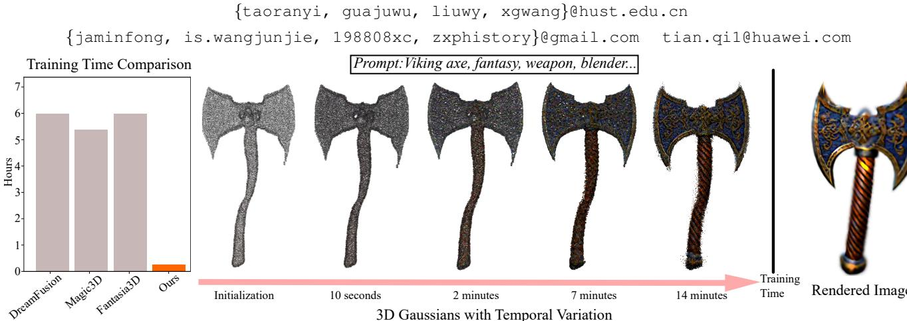  
F and achieve real-time rendering.

# Abstract

In recent times, the generation of 3D assets from text prompts has shown impressive results. Both 2D and 3D diffusion models can help generate decent 3D objects based on prompts. 3D diffusion models have good 3D consistency, but their quality and generalization are limited as trainable 3D data is expensive and hard to obtain. 2D diffusion models enjoy strong abilities of generalization and fine generation, but 3D consistency is hard to guarantee. This paper attempts to bridge the power from the two types of diffusion models via the recent explicit and efficient $3 D$ Gaussian splatting representation. A fast 3D object generation framework, named as GaussianDreamer, is proposed, where the 3D diffusion model provides priors for initialization and the 2D diffusion model enriches the geometry and appearance. Operations of noisy point growing and color perturbation are introduced to enhance the initialized Gaussians. Our GaussianDreamer can generate a highquality 3D instance or 3D avatar within 15 minutes on one GPU, much faster than previous methods, while the generated instances can be directly rendered in real time. Demos and code are available at https://taoranyi. com/ gaussiandreamer/.

# 1. Introduction

3D asset generation has been an expensive and professional work in conventional pipelines. Recently, diffusion models [62] have achieved great success in creating high-quality and realistic 2D images. Many research works [2, 6, 9, 12, 15, 25, 34, 51, 55, 72, 75, 81, 82, 86, 95] try to transfer the power of 2D diffusion models to the 3D field for easing and assisting the process of 3D assets creation, e.g. the most common text-to-3D task.

Here come two main streams for achieving this goal: (i) training a new diffusion model with 3D data [12, 15, 25, 51] (namely the 3D diffusion model) and (ii) lifting the 2D diffusion model to 3D [2, 6, 9, 34, 55, 62, 72, 75, 81, 82, 86, 95]. The former one is direct to implement and holds strong 3D consistency, but struggles to extend into a large generation domain as 3D data is usually hard and expensive to obtain. The scale of current 3D datasets is far smaller than 2D datasets. This results in the generated 3D assets falling short in dealing with complex text prompts and producing complex/fine geometry and appearance. The latter benefits from the large data domain of the 2D diffusion models, which can handle various text prompts and produce highly detailed and complex geometry and appearance. However, as 2D diffusion models are unaware of the camera view, the generated 3D assets are hard to form geometry consistency, especially for structure-complicated instances.

This paper proposes to use recent 3D Gaussian Splatting [26] to bridge the two aforementioned approaches, simultaneously having the geometry consistency from 3D diffusion models and rich details from 2D diffusion models. 3D Gaussians are one type of efficient and explicit representation, which intrinsically enjoys geometry priors due to the point-cloud-like structure. Specifically, we use one of two types of 3D diffusion models: text-to-3D and text-to-motion diffusion models, e.g. Shap-E [25] and MDM [77] in our implementation, to generate a coarse 3D instance. Based on the coarse 3D instance, a group of 3D Gaussians are initialized. We introduce two operations of noisy point growing and color perturbation to supplement the initialized Gaussians for follow-up enriching the 3D instance. Then the 3D Gaussians can be improved and optimized by interacting with the 2D diffusion model via the Score Distillation Sampling [55] (SDS) loss. Due to the geometry priors from both the 3D diffusion model and 3D Gaussian Splatting itself, the training process can be finished in a very short time. The generated 3D asset can be rendered in real time without transformation into structures like mesh via the splatting process. Our contributions can be summarized as follows. • We propose a text-to-3D method, named as GaussianDreamer which bridges the 3D and 2D diffusion models via Gaussian splitting, enjoying both 3D consistency and rich generation details. •Noisy point growing and color perturbation are introduced to supplement the initialized 3D Gaussians for further content enrichment. •The overall method is simple and quite effective. A 3D instance can be generated within 15 minutes on one GPU, much faster than previous methods, and can be directly rendered in real time.

# 2. Related Works

3D Pretrained Diffusion Models. Recently, text-to-3D asset generation using diffusion models has achieved great success. Currently, it is mainly divided into lifting 2D diffusion models to 3D and 3D pretrained diffusion models, the difference lies in whether the training data used is 2D or 3D. 3D pretrained diffusion models [12, 15, 25, 51], referred to as 3D diffusion models in our paper, are models pretrained on text-3D pairs. After pretraining, they can generate 3D assets through only inference, and models such as Point-E [51] and Shape-E [25] can generate 3D assets in minutes. In addition to generating 3D assets from text, there are methods where 3D diffusion models [1, 7, 10, 27, 58, 68, 77, 93, 94, 96] generate motion sequences based on text-motion data. By pretraining on textmotion pairs, these models can generate reasonable motion sequences for different texts. The generated motion sequences can be transformed into the SMPL (Skinned MultiPerson Linear) model [41] based on mesh representation, but texture information is not included. In our method, we can paint transformed SMPL by using different text prompts.

Lifting 2D Diffusion Models to 3D. In text-to-3D asset generation methods [8, 16, 21, 24, 42, 52, 53, 56, 61, 66, 67, 73, 78, 85, 90, 92, 97], in addition to using 3D pretrained diffusion models, lifting a 2D diffusion model to 3D is a training-free approach. Moreover, due to the abundance of 2D image data, this method produces assets with higher diversity and fidelity. Some single-image-to-3D methods [13, 19, 31, 3538, 40, 57, 64, 70, 71, 76, 83, 84, 87, 88] also employ similar ideas. DreamFusion [55] frst proposes SDS (Score Distillation Sampling) method, which is to update the 3D representation model using the 2D diffusion model. [81] proposes the method of SJC (Score Jacobian Chaining) to lift the 2D diffusion model to 3D. Later methods [6, 33, 34, 74, 82] build on DreamFusion and further improve the quality of 3D generation. Among them, generated 3D assets may suffer from multi-face problems. To address this issue, some methods strengthen the semantics of different views [2] and use multi-view information [72, 95] to alleviate such problems. There are also models [18, 23, 30, 46, 48, 63, 80, 86] which adopt CLIP [60] to align each view of the 3D representation model with the text. 3D Representation Methods. In recent times, neural radiance fields (NeRF) [47] have achieved impressive results in 3D representation, and many methods in text-to-3D asset generation have also adopted NeRF or its variants [3, 50] as the representation method. Some methods [6, 12, 33, 34] use explicit optimizable mesh representation methods like DMTET [69] to reduce rendering costs and further improve resolution. In addition to that, there are also generation methods that utilize point clouds [43, 51, 56, 79] and meshes [39] as 3D representations. Recently, 3D Gaussian Splatting [26] has been introduced as a representation method for 3D scenes, which can achieve rendering effects comparable to NeRF-based methods and enable real-time rendering. Two concurrent works [9, 75] also construct the 3D representation with 3D Gaussian Splatting [26]. DreamGaussian [75] uses a single image as a condition to generate 3D assets, while GS

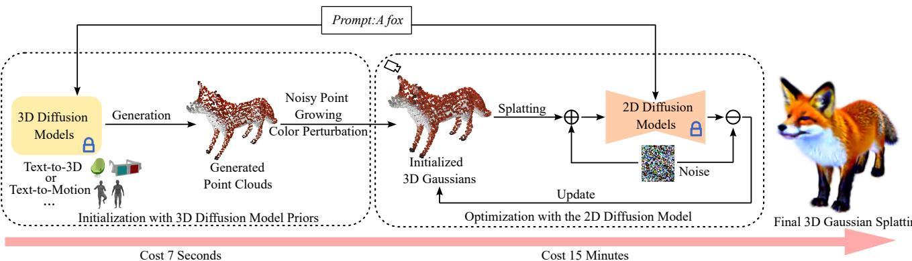  
F clouds. In this case, we take text-to-3D and text-to-motion diffusion models as examples.

GEN [9] implements high-quality generation from text to 3D. Our method shares a similar idea of using 3D Gaussian Splatting as the representation method, which significantly reduces the cost of improving resolution and achieving a much faster optimization speed compared to optimizable mesh representation methods. And we can generate detailed 3D assets based on prompt texts in a very short time.

# 3. Method

In this section, we first review 2D and 3D diffusion models and the 3D representation method  3D Gaussian Splatting [26]. We give an overview of the whole framework in Sec. 3.2. Then, in Sec. 3.3, we describe the process of initializing the 3D Gaussians with the assistance of 3D diffusion models. The further optimization of 3D Gaussians using the 2D diffusion model is described in Sec. 3.4.

# 3.1. Preliminaries

DreamFusion. DreamFusion [55] is one of the most representative methods to lift 2D diffusion models to 3D, which proposes to optimize the 3D representation with the score distillation sampling (SDS) loss via a pre-trained 2D diffusion model $\phi$ Specifically, it takes MipNeRF [3] as the 3D representation method, whose parameters $\theta$ are optimized. Taking the rendering method as $g$ , the rendered image results in $\textbf { x } = \ g ( \theta )$ . To make the rendered image $\mathbf { x }$ similar to the samples obtained from the diffusion model $\phi$ , DreamFusion uses a scoring estimation function: $\hat { \epsilon } _ { \phi } ( \mathbf { z } _ { t } ; y , t )$ , which predicts the sampled noise $\hat { \epsilon } _ { \phi }$ given the noisy image $\mathbf { z } _ { t }$ , text embedding $y$ , and noise level $t$ By measuring the difference between the Gaussian noise $\epsilon$ added to the rendered image $\mathbf { x }$ and the predicted noise $\hat { \epsilon } _ { \phi }$ this scoring estimation function can provide the direction for updating the parameter $\theta$ .The formula for computing the gradient is as where $w ( t )$ is a weighting function.

$$
\nabla _ { \boldsymbol { \theta } } \mathcal { L } _ { \mathrm { S D S } } ( \boldsymbol { \phi } , \mathbf { x } = g ( \boldsymbol { \theta } ) ) \triangleq \mathbb { E } _ { t , \epsilon } \left[ w ( t ) \left( \hat { \epsilon } _ { \boldsymbol { \phi } } ( \mathbf { z } _ { t } ; \boldsymbol { y } , t ) - \epsilon \right) \frac { \partial \mathbf { x } } { \partial \boldsymbol { \theta } } \right] ,
$$

3D Gaussian Splatting. 3D Gaussian Splatting [26] (3DGS) is a recent groundbreaking method for novel-view synthesis. Unlike implicit representation methods such as NeRF [47], which renders images based on volume rendering, 3D-GS renders images through splatting [89], achieving real-time speed. Specifically, 3D-GS represents the scene through a set of anisotropic Gaussians, defined with its center position $\mu \in \mathbb { R } ^ { 3 }$ , covariance $\Sigma \ \in \ \mathbb { R } ^ { 7 }$ ,color $c \in \mathbb { R } ^ { 3 }$ , and opacity $\boldsymbol { \alpha } \in \mathbb { R } ^ { 1 }$ . And the 3D Gaussians can be queried as follows:

$$
G ( x ) = e ^ { - \frac { 1 } { 2 } ( x ) ^ { T } \Sigma ^ { - 1 } ( x ) } ,
$$

where $x$ represents the distance between $\mu$ and the query point. For computing the color of each pixel, it uses a typical neural point-based rendering [28, 29]. A ray $r$ is cast from the center of the camera, and the color and density of the 3D Gaussians that the ray intersects are computed along the ray. The rendering process is as follows:

$$
C ( r ) = \sum _ { i \in \mathcal { N } } c _ { i } \sigma _ { i } \prod _ { j = 1 } ^ { i - 1 } ( 1 - \sigma _ { j } ) , \quad \sigma _ { i } = \alpha _ { i } G ( x _ { i } ) ,
$$

where $\mathcal { N }$ represents the number of sample points on the ray $r , c _ { i }$ and $\alpha _ { i }$ denote the color and opacity of the i-th Gaussian, and $x _ { i }$ is the distance between the point and the i-th Gaussian.

# 3.2. Overall Framework

Our overall framework consists of two parts, initialization with 3D diffusion model priors and optimization with the 2D diffusion model, as shown in Fig. 2. For initialization with 3D diffusion model priors, we use the 3D diffusion models $F _ { 3 D }$ , instantiated with the text-to-3D and textto-motion diffusion models, to generate the triangle mesh $m$ based on the text prompt $y$ , which can be denoted as $m = F _ { 3 D } ( y )$ . One set of generated point clouds is transformed from the mesh $m$ Then the 3D Gaussians $\theta _ { b }$ are initialized via the generated point clouds after noisy point growing and color perturbation. For better quality, we utilize the 2D diffusion model $F _ { 2 D }$ to further optimize the initialized 3D Gaussians $\theta _ { b }$ via SDS [55] with prompts $y$ , resulting in the final 3D Gaussians $\theta _ { f }$ . The target instance can be rendered in real time by splatting the generated Gaussians.

# 3.3. Gaussian Initialization with 3D Diffusion Model Priors

In this section, we mainly discuss how to initialize the 3D Gaussians with 3D diffusion model priors. First, we use the 3D diffusion model $F _ { 3 D }$ to generate 3D assets based on the prompts $y$ Then we convert the 3D assets into point clouds and use the transformed point clouds to initialize the 3D Gaussians. We have employed two types of 3D diffusion models to generate 3D assets. Below, we explain how to initialize the 3D Gaussians using each of these models.

# 3.3.1 Text-to-3D Diffusion Model

When using a text-based 3D generation model, generated 3D assets employ multi-layer perceptrons (MLPs) to predict SDF values and texture colors. To construct the triangle mesh $m$ , we query the SDF values at vertices along a regular grid with the size of $1 2 8 ^ { 3 }$ within the MLPs. Then we query the texture colors at each vertex of $m$ We convert the vertices and colors of $m$ into point clouds, denoted as $p t _ { m } ( p _ { m } , c _ { m } )$ $\pmb { p } _ { m } \in \mathbb { R } ^ { 3 }$ refers to the position of the point clouds, which equals to the vertice coordinated of $m$ $\boldsymbol { c } _ { m } \in \mathbb { R } ^ { 3 }$ refers to the color of the point clouds, which is the same as the color of $m$ .However, the obtained colors $c _ { m }$ are relatively simple, and the positions ${ \pmb p } _ { m }$ are sparse.

Noisy Point Growing and Color Perturbation. We do not use the generated point clouds ${ \pmb p } { \pmb t } _ { m }$ to directly initialize the 3D Gaussians. To improve the quality of initialization, we perform noisy point growing and color perturbation around point clouds ${ p t } _ { m }$ . First, we compute the bounding box (BBox) of the surface on ${ p t } _ { m }$ and then uniformly grow point clouds $p t _ { r } ( p _ { r } , c _ { r } )$ within the BBox. ${ \pmb p } _ { r }$ and $c _ { r }$ represent the positions and colors of ${ \mathbf { \Omega } } _ { p t _ { r } }$ . To enable fast searching, we construct a KDTree [4] $K _ { m }$ using the positions ${ \pmb p } _ { m }$ . Based on the distances between the positions $\pmb { p } _ { r }$ and the nearest points found in the KDTree $K _ { m }$ , we determine which points to keep. In this process, we select points within the (normalized) distance of 0.01. For the noisy point clouds, we make their colors $c _ { r }$ similar to $c _ { m }$ , and also add some perturbations:

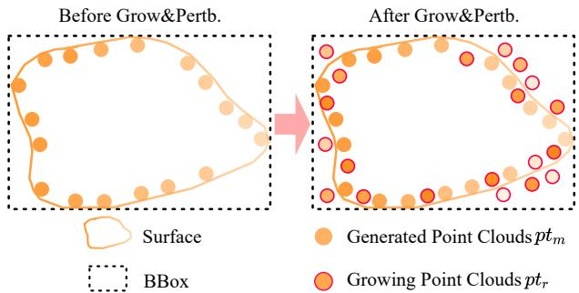  
Figure 3. The process of noisy point growing and color perturbation. "Grow&Pertb." denotes noisy point growing and color perturbation.

$$
\begin{array} { r } { \pmb { c } _ { r } = \pmb { c } _ { m } + \pmb { a } , } \end{array}
$$

where the values of $^ { a }$ are randomly sampled between 0 and 0.2. We merge the positions and colors of ${ p t } _ { m }$ and ${ p t } _ { r }$ to obtain the final point clouds.

$$
p t ( p _ { f } , c _ { f } ) = ( p _ { m } \oplus p _ { r } , c _ { m } \oplus c _ { r } ) ,
$$

where $\oplus$ is the concatenation operation. Fig. 3 illustrates the process of noisy point growing and color perturbation. Finally, we initialize the positions $\mu _ { b }$ and colors $c _ { b }$ of the 3D Gaussians $\theta _ { b } ( \mu _ { b } , c _ { b } , \Sigma _ { b } , \alpha _ { b } )$ using both the positions ${ \pmb p } _ { f }$ and colors $c _ { f }$ of final point clouds $_ { p t }$ The opacity $\alpha _ { b }$ of the 3D Gaussians is initialized to 0.1, and the covariance $\Sigma _ { b }$ is calculated as the distance between the nearest two points. Algorithm 1 shows the specific algorithm flowchart.

# 3.3.2 Text-to-Motion Diffusion Model

We generate a sequence of human body motions using text and select a human pose that best matches the given text. We then convert the keypoints of this human pose into the SMPL model [41], which is represented by a triangle mesh $m$ . We then convert the mesh $m$ into point clouds $p t _ { m } ( p _ { m } , c _ { m } )$ , where the position ${ \pmb p } _ { m }$ of each point in the point clouds corresponds to the vertices of $m$ As for the color $c _ { m }$ of ${ \pmb p } { \pmb t } _ { m }$ , since the SMPL model used here does not have textures, we randomly initialize $c _ { m }$ . To move ${ \pmb p } { \pmb t } _ { m }$ near the origin, we calculate the center point $\pmb { p } _ { c } \in \mathbb { R } ^ { 3 }$ of ${ \pmb p } _ { m }$ and subtract the position of point clouds ${ p t } _ { m }$ from the center point ${ \pmb p } _ { c }$ .

$$
\begin{array} { r } { p t ( { p } _ { f } , \pmb { c } _ { f } ) = p t _ { m } ( { p } _ { m } - { p } _ { c } , \pmb { c } _ { m } ) , } \end{array}
$$

Finally, we use the point clouds $_ { p t }$ to initialize the 3D Gaussians, similar to what is described in Sec. 3.3.1. To improve the generation of motion sequences, we simplify the text by retaining only the relevant parts related to the motion and add a subject. For example, if the text prompt is "Iron man kicks with his left leg", we transform it into "Someone kicks with the left leg" when generating the motion sequences.

<table><tr><td>Algorithm 1 The 3D Gaussian Initialization. ptm (pm, cm): Point clouds generated from F3D. ptr (pr, cr): Growing point clouds within the BBox. pt(pf , cf ): Point clouds used for initializing the 3D Gaus- sians. θb(µb, cb, ∑b, αb): Initialized 3D Gaussians.</td></tr><tr><td>Stage 1: Generate points in the BBox. Km ← BuildKDTree(pm) KDTree BBox ← pm Positions bounding box. Low, High ← BBox.MinBound, BBox.MaxBound Boundary of bounding box. psu ← Uniform(Low, High, size = (NumPoints, 3)) Points in the BBox.</td></tr><tr><td>Stage 2: Keep the points that meet the distance require- ment. pr, Cr = [], []</td></tr><tr><td>for all pu in psu do pun, i ← Km.SearchNearest(pu) Nearest point and its index in Km. if |pun − pu| &lt; 0.01 then pr.append(pu) c.append(cm [i] + 0.2×Random(size = 3)) Color of the nearest point plus perturbation. end if end for</td></tr></table>

# 3.4. Optimization with the 2D Diffusion Model

To enrich details and improve the quality of the 3D asset, we optimize the 3D Gaussians $\theta _ { b }$ with a 2D diffusion model $F _ { 2 D }$ after initializing them with 3D diffusion model priors. We employ the SDS (Score Distillation Sampling) loss to optimize the 3D Gaussians. First, we use the method of 3D Gaussian Splatting [26] to obtain the rendered image $\mathbf { x } = g ( \theta _ { i } )$ . Here, $g$ represents the splatting rendering method as in Eq. 3. Then, we use Eq. 1 to calculate the gradients for updating the Gaussian parameters $\theta _ { i }$ with the 2D diffusion model $F _ { 2 D }$ . After a short optimization period using the 2D diffusion model $F _ { 2 D }$ , the final generated 3D instance $\theta _ { f }$ achieves high quality and fidelity on top of the 3D consistency provided by the 3D diffusion model $F _ { 3 D }$ .

Table 1. Quantitative comparisons on $\mathrm { T } ^ { 3 }$ Bench [17].   

<table><tr><td>Method</td><td>Time†</td><td colspan="4">Single Obj. Single w/ Surr. Multi Obj. Average</td></tr><tr><td>SJC [81]</td><td></td><td>24.7</td><td>19.8</td><td>11.7</td><td>18.7</td></tr><tr><td>DreamFusion [55]</td><td>6 hours</td><td>24.4</td><td>24.6</td><td>16.1</td><td>21.7</td></tr><tr><td>Fantasia3D [6]</td><td>6 hours</td><td>26.4</td><td>27.0</td><td>18.5</td><td>24.0</td></tr><tr><td>LatentNeRF [45]</td><td>15 minutes</td><td>33.1</td><td>30.6</td><td>20.6</td><td>28.1</td></tr><tr><td>Magic3D [34]</td><td>5.3 hours</td><td>37.0</td><td>35.4</td><td>25.7</td><td>32.7</td></tr><tr><td>ProlificDreamer [82]</td><td>∼10 hours</td><td>49.4</td><td>44.8</td><td>35.8</td><td>43.3</td></tr><tr><td>Ours</td><td>15 minutes</td><td>54.0</td><td>48.6</td><td>34.5</td><td>45.7</td></tr></table>

Scores above are average of two metrics (quality and alignment). †GPU time counted in their papers.

# 4. Experiments

In this section, we first present the implementation details in Sec. 4.1. In Sec. 4.2, we show the quantitative comparison results. Then, in Sec. 4.3, we showcase the visualization results of our method and compare them with other methods. In Sec. 4.4, we conduct a series of ablation experiments to validate the effectiveness of our method. Finally, we discuss the limitations of our method.

# 4.1. Implementation Details

Our method is implemented in PyTorch [54], based on ThreeStudio [14]. The 3D diffusion models used in our method are Shap-E [25] and MDM [77], and we load the Shap-E model finetuned on Objaverse [11] in Cap3D [44]. For the 2D diffusion model, we use stabilityai/stablediffusion-2-1-base [62], with a guidance scale of 100. The timestamps we use are uniformly sampled from 0.02 to 0.98 before 500 iterations, and change to 0.02 to 0.55 after 500 iterations. For the 3D Gaussians, the learning rates of opacity $\alpha$ and position $\mu$ are $1 0 ^ { - 2 }$ and $5 \times 1 0 ^ { - 5 }$ . The color $c$ of the 3d Gaussians is represented by the sh coefficient, with the degree set to 0 and the learning rate set to $1 . 2 5 \times 1 0 ^ { - 2 }$ . The covariance of the 3D Gaussians is converted into scaling and rotation for optimization, with learning rates of $1 0 ^ { - 3 }$ and $1 0 ^ { - 2 }$ , respectively. The radius of the camera we use for rendering is from 1.5 to 4.0, with the azimuth in the range of -180 to 180 degrees and the elevation in the range of -10 to 60 degrees. The total training iterations are 1200. All our experiments can be completed within 15 minutes on a single RTX 3090 with a batch size of 4. The resolution we use for rendering is $1 0 2 4 \times 1 0 2 4$ ,which is scaled to 512 $\times 5 1 2$ when optimizing using the 2D diffusion model. We can render in real time at $5 1 2 \times 5 1 2$ resolution. And all our code will be released.

# 4.2. Quantitative Evaluation

We evaluate quality and consistency following $\mathrm { T ^ { 3 } }$ Bench [17], which provides a comprehensive benchmark for text-to-3D generation. Three text categories are designed for 3D generation with increasing complexity single objects, single objects with surroundings, and multi objects. In Tab. 1, our method outperforms the compared methods while enjoying a short generation time.

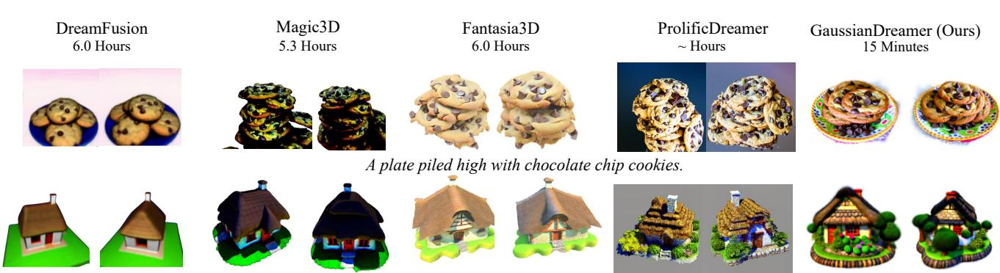  
A 3D model of an adorable cottage with a thatched roof.

  
Fi is measured on RTX 3090, and our method is measured on RTX 3090.   

Magic dagger, mistery, ancient.. A zoomed out DSLR photo of a lion's mane jell   
Figure 5. More generated samples by our GaussianDreamer. Two views of each sample are shown.

# 4.3. Visualization Results

In this section, we present the results of initializing the 3D Gaussians with two different 3D diffusion models: text-to3D and text-to-motion diffusion models.

Initialization with Text-to-3D Diffusion Model. We show the comparison results with DreamFusion [55], Magic3D [34], Fantasia3D [6] and ProlificDreamer [82] in Fig. 4. In addition to our method, the figures of other methods are downloaded from the paper of ProlificDreamer. When encountering prompts that involve the combination of multiple objects, such as the prompt "A plate piled high with chocolate chip cookies", the generated results from Magic3D, Fantasia3D, and ProlificDreamer do not include a plate. In contrast, our generated result can effectively combine a plate and chocolate chip cookies. Furthermore, compared to DreamFusion, the plate we generate has better patterns. Our method shows comparable quality while saving $2 1 - 2 4$ times the generation time compared to their methods. Moreover, the 3D Gaussians generated by our method can directly achieve real-time rendering without further transformation into mesh-like structures. Fig. 5 visualizes more samples generated by our GaussianDreamer from various prompts, which show good 3D consistency while having high-quality details.

Initialization with Text-to-Motion Diffusion Model. In Fig. 6, we present the comparison results with DreamFusion [55], DreamAvatar [5], DreamWaltz [20], and AvatarVerse [91]. In addition to our method, the figures of other methods are downloaded from the paper of AvatarVerse. It is worth noting that our prompt is "Spiderman/Stormtrooper stands with open arms", while the prompts for other methods are "Spiderman/Stormtrooper". This is because when generating motion using text-to-motion diffusion model as initialization, we require more specific action descriptions. Our method achieves a speedup of $4 - 2 4$ times compared to other methods, while maintaining comparable quality. Additionally, our method allows for generating 3D avatars with specified body poses. In Fig. 7, we provide more results generated with different human body poses. We first generate a sequence of motions that match the text prompt using a text-to-motion 3d diffusion model, and then initialize the 3d Gaussians with the SMPL of one selected pose in motions. Our method can generate 3D avatars in any desired pose.

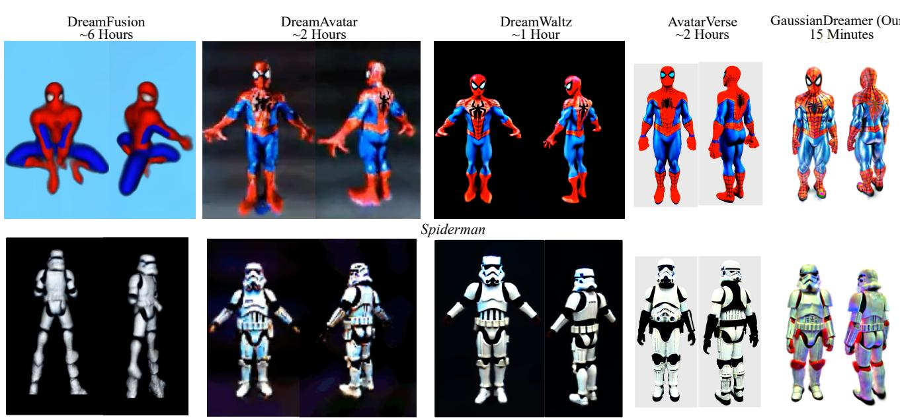  
Stormtrooper 0 .

  
Figure 7. More generated 3D avatars by our GaussianDreamer initialized with the different poses of SMPL [41]. Here, the different poses of SMPL are generated using a text-to-motion diffusion model.

# 4.4. Ablation Study and Analysis

The Role of Initialization. As shown in Fig. 8, we first conduct an ablation experiment on the initialization of the 3D Gaussians to validate that initialization can improve 3D consistency. The first column is the rendering result of Shap-E [25] with NeRF [47] as the 3D representation. The second column is the result of optimizing the 3D Gaussians randomly initialized within a cube using the SDS loss, and the third column is our method. We show the initialization effects on 3 samples. In the first and second rows, ShapE has good generation results while our method provides more complex geometries and more realistic appearances. Compared with random initialization, in the first row, details of our method are better. In the second row, the 3D assets generated by random initialization have the multi-head problem, which does not occur in our method. The initialization of the 3D diffusion model can avoid unreasonable geometry. In the third row, the generation result of Shap-E is far different from the given text prompt while our method makes the 3D assets closer to the prompt through the 2D diffusion model. Our method can expand the domain of Shap-E prompts, allowing for the generation of 3D assets based on a wider range of prompts. Noisy Point Growing and Color Perturbation. Fig. 9 illustrates the ablation results of noisy point growing and color perturbation. With noisy point growing and color perturbation applied, the first row showcases improved details in the sniper rifle. Additionally, the second column generates an amigurumi motorcycle that better aligns with the style characteristics of amigurumi mentioned in the prompt, compared to the case without noisy point growing and color perturbation. Initialization with Different Text-to-3D Diffusion Models. We select two text-to-3D generation models, ShapE [25] and Point-E [51], to validate the effectiveness of our framework. We load the Point-E model finetuned on Objaverse [11] in Cap3D[44]. Fig. 10, we showcase the generated results after initializing the 3D Gaussians using one of two text-to-3D generation models. It can be seen that both initializations yield good generation results. However, considering that Shap-E generates 3D assets based on NeRF and SDF, which provide higher fidelity compared to the point cloud representation used by Point-E, the geometry of the airplane in the first row of Fig. 10 appears better when initialized using Shap-E.

  
ur Alai sudie  thelization f the  Gaussans. The Shap- [5] renerig roluton $2 5 6 \mathbf { x } 2 5 6 .$

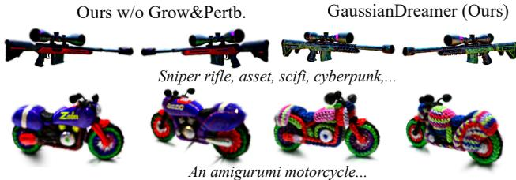  
Figure 9. Ablation studies of noisy point growing and color perturbation. "Grow&Pertb." denotes noisy point growing and color perturbation.

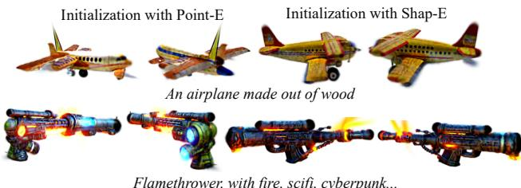  
Figure 10. Ablation studies of initialization with different text-to3D diffusion models: Point-E [51] and Shap-E [25].

# 4.5. Limitations

The edges of the 3D assets generated by our method are not always sharp, and there may be unnecessary 3D Gaussians around the object surface. How to filter these point clouds will be a possible direction for improvement. Our approach utilizes 3D diffusion model priors, which greatly alleviates the issue of multi-face problems. However, there is still a small chance of encountering the multi-face problems in scenes where there is minimal geometric difference but significant appearance discrepancy between the front and back of objects such as a backpack. Utilizing 3D-aware diffusion models [37, 72, 95] may be able to solve this problem. Additionally, our method has limited effectiveness in generating large-scale scenes, such as indoor scenes.

# 5. Conclusion

We propose a fast text-to-3D method GaussianDreamer by bridging the abilities of 3D and 2D diffusion models via the Gaussian splatting representation. GaussianDreamer can generate detailed and realistic geometry and appearance while maintaining 3D consistency. The 3D diffusion model priors and geometry priors from the 3D Gaussians effectively promote the convergence speed. Each sample can be generated within 15 minutes on one GPU. We believe the approach of bridging 3D and 2D diffusion models could be a promising direction to generate 3D assets efficiently.

# Acknowledgments

This work was supported by the National Natural Science Foundation of China (No. 62376102).

# References

[1] Tenglong Ao, Zeyi Zhang, and Libin Liu. Gesturediffuclip: Gesture diffusion model with clip latents. arXiv preprint arXiv:2303.14613, 2023. 2   
[2] Mohammadreza Armandpour, Huangjie Zheng, Ali Sadeghian, Amir Sadeghian, and Mingyuan Zhou. Reimagine the negative prompt algorithm: Transform 2d diffusion into 3d, alleviate janus problem and beyond. arXiv preprint arXiv:2304.04968, 2023. 1, 2   
[3] Jonathan T Barron, Ben Mildenhall, Matthew Tancik, Peter Hedman, Ricardo Martin-Brualla, and Pratul P Srinivasan. Mip-nerf: A multiscale representation for anti-aliasing neural radiance fields. In ICCV, pages 58555864, 2021. 2, 3   
[4] Jon Louis Bentley. Multidimensional binary search trees used for associative searching. Communications of the ACM, 18(9):509517, 1975. 4   
[5] Yukang Cao, Yan-Pei Cao, Kai Han, Ying Shan, and KwanYee K Wong. Dreamavatar: Text-and-shape guided 3d human avatar generation via diffusion models. arXiv preprint arXiv:2304.00916, 2023. 6, 7   
[6] Rui Chen, Yongwei Chen, Ningxin Jiao, and Kui Jia. Fantasia3d: Disentangling geometry and appearance for high-quality text-to-3d content creation. arXiv preprint arXiv:2303.13873, 2023. 1, 2, 5, 6   
[7] Xin Chen, Biao Jiang, Wen Liu, Zilong Huang, Bin Fu, Tao Chen, and Gang Yu. Executing your commands via motion diffusion in latent space. In CVPR, pages 1800018010, 2023.2   
[8] Yiwen Chen, Chi Zhang, Xiaofeng Yang, Zhongang Cai, Gang Yu, Lei Yang, and Guosheng Lin. It3d: Improved textto-3d generation with explicit view synthesis. arXiv preprint arXiv:2308.11473, 2023. 2   
[9] Zilong Chen, Feng Wang, and Huaping Liu. Text-to-3d using gaussian splatting. arXiv preprint arXiv:2309.16585, 2023. 1, 2, 3   
[10] Rishabh Dabral, Muhammad Hamza Mughal, Vladislav Golyanik, and Christian Theobalt. Mofusion: A framework for denoising-diffusion-based motion synthesis. In CVPR, pages 97609770, 2023. 2   
[11] Matt Deitke, Dustin Schwenk, Jordi Salvador, Luca Weihs, Oscar Michel, Eli VanderBilt, Ludwig Schmidt, Kiana Ehsani, Aniruddha Kembhavi, and Ali Farhadi. Objaverse: A universe of annotated 3d objects. In CVPR, pages 13142 13153, 2023. 5, 7   
[12] Jun Gao, Tianchang Shen, Zian Wang, Wenzheng Chen, Kangxue Yin, Daiqing Li, Or Litany, Zan Gojcic, and Sanja Fidler. Get3d: A generative model of high quality 3d textured shapes learned from images. NeurIPS, 35:31841 31854, 2022. 1, 2   
[13] Jiatao Gu, Alex Trevithick, Kai-En Lin, Joshua M Susskind, Christian Theobalt, Lingjie Liu, and Ravi Ramamoorthi. Nerfdiff: Single-image view synthesis with nerf-guided distillation from 3d-aware diffusion. In ICML, pages 11808 11826. PMLR, 2023. 2, 14   
[14] Yuan-Chen Guo, Ying-Tian Liu, Ruizhi Shao, Christian Laforte, Vikram Voleti, Guan Luo, Chia-Hao Chen, ZiXin Zou. Chen Wang. Yan-Pei Cao. and Song-Hai Zhang. threestudio: A unified framework for 3d content generation. https://github.com/threestudio-project/ threestudio, 2023. 5, 12   
[15] Anchit Gupta, Wenhan Xiong, Yixin Nie, Ian Jones, and Barlas Ouz. 3dgen: Triplane latent diffusion for textured mesh generation. arXiv preprint arXiv:2303.05371, 2023. 1, 2   
[16] Xiao Han, Yukang Cao, Kai Han, Xiatian Zhu, Jiankang Deng, Yi-Zhe Song, Tao Xiang, and Kwan-Yee K Wong. Headsculpt: Crafting 3d head avatars with text. In NeurIPS, 2023.2   
[17] Yuze He, Yushi Bai, Matthieu Lin, Wang Zhao, Yubin Hu, Jenny Sheng, Ran Yi, Juanzi Li, and Yong-Jin Liu. T3bench: Benchmarking current progress in text-to-3d generation. arXiv preprint arXiv:2310.02977, 2023. 5   
[18] Fangzhou Hong, Mingyuan Zhang, Liang Pan, Zhongang Cai, Lei Yang, and Ziwei Liu. Avatarclip: Zero-shot textdriven generation and animation of 3d avatars. arXiv preprint arXiv:2205.08535, 2022. 2   
[19] Shoukang Hu, Fangzhou Hong, Tao Hu, Liang Pan, Haiyi Mei, Weiye Xiao, Lei Yang, and Ziwei Liu. Humanliff: Layer-wise 3d human generation with diffusion model. arXiv preprint arXiv:2308.09712, 2023. 2   
[20] Yukun Huang, Jianan Wang, Ailing Zeng, He Cao, Xianbiao Qi, Yukai Shi, Zheng-Jun Zha, and Lei Zhang. Dreamwaltz: Make a scene with complex 3d animatable avatars. arXiv preprint arXiv:2305.12529, 2023. 6, 7   
[21] Yangyi Huang, Hongwei Yi, Yuliang Xiu, Tingting Liao, Jiaxiang Tang, Deng Cai, and Justus Thies. Tech: Text-guided reconstruction of lifelike clothed humans. arXiv preprint arXiv:2308.08545, 2023. 2   
[22] Gabriel Ilharco, Mitchell Wortsman, Ross Wightman, Cade Gordon, Nicholas Carlini, Rohan Taori, Achal Dave, Vaishaal Shankar, Hongseok Namkoong, John Miller, Hannaneh Hajishirzi, Ali Farhadi, and Ludwig Schmidt. Openclip, 2021. If you use this software, please cite it as below. 12   
[23] Ajay Jain, Ben Mildenhall, Jonathan T Barron, Pieter Abbeel, and Ben Poole. Zero-shot text-guided object generation with dream fields. In CVPR, pages 867876, 2022. 2   
[24] Ruixiang Jiang, Can Wang, Jingbo Zhang, Menglei Chai, Mingming He, Dongdong Chen, and Jing Liao. Avatarcraft: Transforming text into neural human avatars with parameterized shape and pose control. arXiv preprint arXiv:2303.17606, 2023. 2   
[25] Heewoo Jun and Alex Nichol. Shap-e: Generating conditional 3d implicit functions. arXiv preprint arXiv:2305.02463, 2023. 1, 2, 5, 7, 8, 12, 13   
[26] Bernhard Kerbl, Georgios Kopanas, Thomas Leimkühler, and George Drettakis. 3d gaussian splatting for real-time radiance field rendering. ACM Transactions on Graphics, 42 (4), 2023. 2, 3, 5, 13   
[27] Jihoon Kim, Jiseob Kim, and Sungjoon Choi. Flame: Freeform language-based motion synthesis & editing. In AAAI, pages 82558263, 2023. 2   
[28] Georgios Kopanas, Julien Philip, Thomas Leimkühler, and George Drettakis. Point-based neural rendering with perview optimization. In Computer Graphics Forum, pages 29

43. Wiley Online Library, 2021. 3 [29] Georgios Kopanas, Thomas Leimkühler, Glles Rainer, Clément Jambon, and George Drettakis. Neural point catacaustics for novel-view synthesis of reflections. ACM Transactions on Graphics (T0G), 41(6):115, 2022. 3 [30] Jiabao Lei, Yabin Zhang, Kui Jia, et al. Tango: Text-driven photorealistic and robust 3d stylization via lighting decomposition. NeurIPS, 35:3092330936, 2022. 2 [31] Gang Li, Heliang Zheng, Chaoyue Wang, Chang Li, Changwen Zheng, and Dacheng Tao. 3ddesigner: Towards photorealistic 3d object generation and editing with text-guided diffusion models. arXiv preprint arXiv:2211.14108, 2022. 2,   
14 [32] Jiahao Li, Hao Tan, Kai Zhang, Zexiang Xu, Fujun Luan, Yinghao Xu, Yicong Hong, Kalyan Sunkavalli, Greg Shakhnarovich, and Sai Bi. Instant3d: Fast text-to-3d with sparse-view generation and large reconstruction model. arXiv preprint arXiv:2311.06214, 2023. 12, 13 [33] Weiyu Li, Rui Chen, Xuelin Chen, and Ping Tan. Sweetdreamer: Aligning geometric priors in 2d diffusion for consistent text-to-3d. arXiv preprint arXiv:2310.02596, 2023.   
2 [34] Chen-Hsuan Lin, Jun Gao, Luming Tang, Towaki Takikawa, Xiaohui Zeng, Xun Huang, Karsten Kreis, Sanja Fidler, Ming-Yu Liu, and Tsung-Yi Lin. Magic3d: High-resolution text-to-3d content creation. In CVPR, pages 300309, 2023.   
1, 2, 5, 6 [35] Yukang Lin, Haonan Han, Chaoqun Gong, Zunnan Xu, Yachao Zhang, and Xiu Li. Consistent123: One image to highly consistent 3d asset using case-aware diffusion priors. arXiv preprint arXiv:2309.17261, 2023. 2 [36] Minghua Liu, Chao Xu, Haian Jin, Linghao Chen, Zexiang Xu, Hao Su, et al. One-2-3-45: Any single image to 3d mesh in 45 seconds without per-shape optimization. arXiv preprint arXiv:2306.16928, 2023. [37] Ruoshi Liu, Rundi Wu, Basile Van Hoorick, Pavel Tokmakov, Sergey Zakharov, and Carl Vondrick. Zero-1-to  
3: Zero-shot one image to 3d object. arXiv preprint arXiv:2303.11328, 2023. 8 [38] Yuan Liu, Cheng Lin, Zijiao Zeng, Xiaoxiao Long, Lingjie Liu, Taku Komura, and Wenping Wang. Syncdreamer: Generating multiview-consistent images from a single-view image. arXiv preprint arXiv:2309.03453, 2023. 2 [39] Zhen Liu, Yao Feng, Michael J Black, Derek Nowrouzezahrai, Liam Paull, and Weiyang Liu. Meshdiffusion: Score-based generative 3d mesh modeling. arXiv preprint arXiv:2303.08133, 2023. 2 [40] Xiaoxiao Long, Yuan-Chen Guo, Cheng Lin, Yuan Liu, Zhiyang Dou, Lingjie Liu, Yuexin Ma, Song-Hai Zhang, Marc Habermann, Christian Theobalt, et al. Wonder3d: Single image to 3d using cross-domain diffusion. arXiv preprint arXiv:2310.15008, 2023. 2 [41] Matthew Loper, Naureen Mahmood, Javier Romero, Gerard Pons-Moll, and Michael J Black. Smpl: A skinned multiperson linear model. In Seminal Graphics Papers: Pushing the Roundaries Volume 2 nages 851866 2023 2 4 7   
[42] Jonathan Lorraine, Kevin Xie, Xiaohui Zeng, Chen-Hsuan Lin, Towaki Takikawa, Nicholas Sharp, Tsung-Yi Lin, Ming-Yu Liu, Sanja Fidler, and James Lucas. Att3d: Amortized text-to-3d object synthesis. arXiv preprint arXiv:2306.07349, 2023. 2   
[43] Shitong Luo and Wei Hu. Diffusion probabilistic models for 3d point cloud generation. In CVPR, pages 28372845, 2021.2   
[44] Tiange Luo, Chris Rockwell, Honglak Lee, and Justin Johnson. Scalable 3d captioning with pretrained models. arXiv preprint arXiv:2306.07279, 2023. 5, 7   
[45] Gal Metzer, Elad Richardson, Or Patashnik, Raja Giryes, and Daniel Cohen-Or. Latent-nerf for shape-guided generation of 3d shapes and textures. In CVPR, pages 1266312673, 2023. 5   
[46] Oscar Michel, Roi Bar-On, Richard Liu, Sagie Benaim, and Rana Hanocka. Text2mesh: Text-driven neural stylization for meshes. In CVPR, pages 1349213502, 2022. 2   
[47] Ben Mildenhall, Pratul P Srinivasan, Matthew Tancik, Jonathan T Barron, Ravi Ramamoorthi, and Ren $\mathrm { N g }$ Nerf: Representing scenes as neural radiance fields for view synthesis. In ECCV, pages 405421, 2020. 2, 3, 7   
[48] Nasir Mohammad Khalid, Tianhao Xie, Eugene Belilovsky, and Tiberiu Popa. Clip-mesh: Generating textured meshes from text using pretrained image-text models. In SIGGRAPH Asia 2022 conference papers, pages 18, 2022. 2   
[49] Norman Müller, Yawar Siddiqui, Lorenzo Porzi, Samuel Rota Bulo, Peter Kontschieder, and Matthias NieBner. Diffrf: Rendering-guided 3d radiance field diffusion. In Proceedings of the IEEE/CVF Conference on Computer Vision and Pattern Recognition, pages 43284338, 2023. 14   
[50] Thomas Müller, Alex Evans, Christoph Schied, and Alexander Keller. Instant neural graphics primitives with a multiresolution hash encoding. ACM Trans. Graph., 41(4):102:1 102:15, 2022. 2   
[51] Alex Nichol, Heewoo Jun, Prafulla Dhariwal, Pamela Mishkin, and Mark Chen. Point-e: A system for generating 3d point clouds from complex prompts. arXiv preprint arXiv:2212.08751, 2022. 1, 2, 7, 8   
[52] Yichen Ouyang, Wenhao Chai, Jiayi Ye, Dapeng Tao, Yibing Zhan, and Gaoang Wang. Chasing consistency in text-to-3d generation from a single image. arXiv preprint arXiv:2309.03599, 2023. 2   
[53] Jangho Park, Gihyun Kwon, and Jong Chul Ye. Ed-nerf: Efficient text-guided editing of 3d scene using latent space nerf. arXiv preprint arXiv:2310.02712, 2023. 2   
[54] Adam Paszke, Sam Gross, Francisco Massa, Adam Lerer, James Bradbury, Gregory Chanan, Trevor Killeen, Zeming Lin, Natalia Gimelshein, Luca Antiga, et al. Pytorch: An imperative style, high-performance deep learning library. NeurIPS, 32, 2019. 5   
[55] Ben Poole, Ajay Jain, Jonathan T Barron, and Ben Mildenhall. Dreamfusion: Text-to-3d using 2d diffusion. arXiv preprint arXiv:2209.14988, 2022. 1, 2, 3, 4, 5, 6, 7, 12, 13   
[56] Zekun Qi, Muzhou Yu, Runpei Dong, and Kaisheng Ma. Vpp: Efficient conditional 3d generation via voxel-point progressive representation. arXiv preprint arXiv:2307.16605, 2023. 2   
[57] Guocheng Qian, Jinjie Mai, Abdullah Hamdi, Jian Ren, Aliaksandr Siarohin, Bing Li, Hsin-Ying Lee, Ivan Skorokhodov, Peter Wonka, Sergey Tulyakov, et al. Magic123: One image to high-quality 3d object generation using both 2d and 3d diffusion priors. arXiv preprint arXiv:2306.17843, 2023.2   
[58] Sigal Raab, Inbal Leibovitch, Guy Tevet, Moab Arar, Amit H Bermano, and Daniel Cohen-Or. Single motion diffusion. arXiv preprint arXiv:2302.05905, 2023. 2   
[59] Alec Radford, Jong Wook Kim, Chris Hallacy, A. Ramesh, Gabriel Goh, Sandhini Agarwal, Girish Sastry, Amanda Askell Pamela Mishkin, Jack Clark, Gretchen Krueger, and Ilya Sutskever. Learning transferable visual models from natural language supervision. In ICML, 2021. 12   
[60] Alec Radford, Jong Wook Kim, Chris Hallacy, Aditya Ramesh, Gabriel Goh, Sandhini Agarwal, Girish Sastry, Amanda Askell, Pamela Mishkin, Jack Clark, et al. Learning transferable visual models from natural language supervision. In ICML, pages 87488763. PMLR, 2021. 2, 12, 13   
[61] Amit Raj, Srinivas Kaza, Ben Poole, Michael Niemeyer, Nataniel Ruiz, Ben Mildenhall, Shiran Zada, Kfir Aberman, Michael Rubinstein, Jonathan Barron, et al. Dreambooth3d: Subject-driven text-to-3d generation. arXiv preprint arXiv:2303.13508, 2023. 2   
[62] Robin Rombach, Andreas Blattmann, Dominik Lorenz, Patrick Esser, and Björn Ommer. High-resolution image synthesis with latent diffusion models. In CVPR, pages 10684 10695, 2022. 1, 5, 14   
[63] Aditya Sanghi, Hang Chu, Joseph G Lambourne, Ye Wang, Chin-Yi Cheng, Marco Fumero, and Kamal Rahimi Malekshan. Clip-forge: Towards zero-shot text-to-shape generation. In CVPR, pages 1860318613, 2022. 2   
[64] Kyle Sargent, Zizhang Li, Tanmay Shah, Charles Herrmann, Hong-Xing Yu, Yunzhi Zhang, Eric Ryan Chan, Dmitry Lagun, Li Fei-Fei, Deqing Sun, et al. Zeronvs: Zero-shot 360-degree view synthesis from a single real image. arXiv preprint arXiv:2310.17994, 2023. 2   
[65] Christoph Schuhmann, Romain Beaumont, Richard Vencu, Cade W Gordon, Ross Wightman, Mehdi Cherti, Theo Coombes, Aarush Katta, Clayton Mullis, Mitchell Wortsman, Patrick Schramowski, Srivatsa R Kundurthy, Katherine Crowson, Ludwig Schmidt, Robert Kaczmarczyk, and Jenia Jitsev. LAION-5b: An open large-scale dataset for training next generation image-text models. In Thirty-sixth Conference on Neural Information Processing Systems Datasets and Benchmarks Track, 2022. 12   
[66] Hoigi Seo, Hayeon Kim, Gwanghyun Kim, and Se Young Chun. Ditto-nerf: Diffusion-based iterative text to omnidirectional 3d model. arXiv preprint arXiv:2304.02827, 2023.2   
[67] Junyoung Seo, Wooseok Jang, Min-Seop Kwak, Jaehoon Ko, Hyeonsu Kim, Junho Kim, Jin-Hwa Kim, Jiyoung Lee, and Seungryong Kim. Let 2d diffusion model know 3dconsistency for robust text-to-3d generation. arXiv preprint -V:…2202 07027, 20222   
[68] Yonatan Shafir, Guy Tevet, Roy Kapon, and Amit H Bermano. Human motion diffusion as a generative prior. arXiv preprint arXiv:2303.01418, 2023. 2   
[69] Tianchang Shen, Jun Gao, Kangxue Yin, Ming-Yu Liu, and Sanja Fidler. Deep marching tetrahedra: a hybrid representation for high-resolution 3d shape synthesis. NeurIPS, 34: 60876101, 2021. 2   
[70] Ruoxi Shi, Hansheng Chen, Zhuoyang Zhang, Minghua Liu, Chao Xu, Xinyue Wei, Linghao Chen, Chong Zeng, and Hao Su. Zero $^ { 1 2 3 + + }$ a single image to consistent multi-view diffusion base model. arXiv preprint arXiv:2310.15110, 2023. 2   
[71] Yukai Shi, Jianan Wang, He Cao, Boshi Tang, Xianbiao Qi, Tanyu Yang, Yuku Huang, Shilong Lu, Lei Zhang, and Heung-Yeung Shum. Toss: High-quality text-guided novel view synthesis from a single image. arXiv preprint arXiv:2310.10644, 2023. 2   
[72] Yichun Shi, Peng Wang, Jianglong Ye, Mai Long, Kejie Li, and Xiao Yang. Mvdream: Multi-view diffusion for 3d generation. arXiv preprint arXiv:2308.16512, 2023. 1, 2, 8   
[73] Liangchen Song, Liangliang Cao, Hongyu Xu, Kai Kang, Feng Tang, Junsong Yuan, and Yang Zhao. Roomdreamer: Text-driven 3d indoor scene synthesis with coherent geometry and texture. arXiv preprint arXiv:2305.11337, 2023. 2   
[74] Jingxiang Sun, Bo Zhang, Ruizhi Shao, Lizhen Wang, Wen Liu, Zhenda Xie, and Yebin Liu. Dreamcraft3d: Hierarchical 3d generation with bootstrapped diffusion prior. arXiv preprint arXiv:2310.16818, 2023. 2   
[75] Jiaxiang Tang, Jiawei Ren, Hang Zhou, Ziwei Liu, and Gang Zeng. Dreamgaussian: Generative gaussian splatting for efficient 3d content creation. arXiv preprint arXiv:2309.16653, 2023. 1, 2, 14   
[76] Junshu Tang, Tengfei Wang, Bo Zhang, Ting Zhang, Ran Yi, Lizhuang Ma, and Dong Chen. Make-it-3d: High-fidelity 3d creation from a single image with diffusion prior. arXiv preprint arXiv:2303.14184, 2023. 2   
[77] Guy Tevet, Sigal Raab, Brian Gordon, Yonatan Shafir, Daniel Cohen-Or, and Amit H Bermano. Human motion diffusion model. arXiv preprint arXiv:2209.14916, 2022. 2, 5   
[78] Christina Tsalicoglou, Fabian Manhardt, Alessio Tonioni, Michael Niemeyer, and Federico Tombari. Textmesh: Generation of realistic 3d meshes from text prompts. arXiv preprint arXiv:2304.12439, 2023. 2   
[79] Arash Vahdat, Francis Williams, Zan Gojcic, Or Litany, Sanja Fidler, Karsten Kreis, et al. Lion: Latent point diffusion models for 3d shape generation. NeurIPS, 35:10021 10039, 2022. 2   
[80] Can Wang, Menglei Chai, Mingming He, Dongdong Chen, and Jing Liao. Clip-nerf: Text-and-image driven manipulation of neural radiance fields. In CVPR, pages 38353844, 2022. 2   
[81] Haochen Wang, Xiaodan Du, Jiahao Li, Raymond A Yeh, and Greg Shakhnarovich. Score jacobian chaining: Lifting pretrained 2d diffusion models for 3d generation. In CVPR, pages 1261912629, 2023. 1, 2, 5   
[82] Zhengyi Wang, Cheng Lu, Yikai Wang, Fan Bao, Chongxuan Li, Hang Su, and Jun Zhu. Prolificdreamer: High-fidelity and diverse text-to-3d generation with variational score distillation. arXiv preprint arXiv:2305.16213, 2023. 1, 2, 5, 6, 12, 13   
[83] Haohan Weng, Tianyu Yang, Jianan Wang, Yu Li, Tong Zhang, CL Chen, and Lei Zhang. Consistent123: Improve consistency for one image to 3d object synthesis. arXiv preprint arXiv:2310.08092, 2023. 2   
[84] Zhenzhen Weng, Zeyu Wang, and Serena Yeung. Zeroavatar: Zero-shot 3d avatar generation from a single image. arXiv preprint arXiv:2305.16411, 2023. 2   
[85] Jinbo Wu, Xiaobo Gao, Xing Liu, Zhengyang Shen, Chen Zhao, Haocheng Feng, Jingtuo Liu, and Errui Ding. Hdfusion: Detailed text-to-3d generation leveraging multiple noise estimation. arXiv preprint arXiv:2307.16183, 2023. 2   
[86] Jiale Xu, Xintao Wang, Weihao Cheng, Yan-Pei Cao, Ying Shan, Xiaohu Qie, and Shenghua Gao. Dream3d: Zero-shot text-to-3d synthesis using 3d shape prior and text-to-image diffusion models. In CVPR, pages 2090820918, 2023. 1, 2   
[87] Jiayu Yang, Ziang Cheng, Yunfei Duan, Pan Ji, and Hongdong Li. Consistnet: Enforcing 3d consistency for multiview images diffusion. arXiv preprint arXiv:2310.10343, 2023.2   
[88] Jianglong Ye, Peng Wang, Kejie Li, Yichun Shi, and Heng Wang. Consistent-1-to-3: Consistent image to 3d view synthesis via geometry-aware diffusion models. arXiv preprint arXiv:2310.03020, 2023. 2   
[89] Wang Yifan, Felice Serena, Shihao Wu, Cengiz Öztireli, and Olga Sorkine-Hornung. Differentiable surface splatting for point-based geometry processing. ACM Transactions on Graphics (TOG), 38(6):114, 2019. 3   
[90] Chaohui Yu, Qiang Zhou, Jingliang Li, Zhe Zhang, Zhibin Wang, and Fan Wang. Points-to-3d: Bridging the gap between sparse points and shape-controllable text-to-3d generation. In ACM MM, pages 68416850, 2023. 2   
[91] Huichao Zhang, Bowen Chen, Hao Yang, Liao Qu, Xu Wang, Li Chen, Chao Long, Feida Zhu, Kang Du, and Min Zheng. Avatarverse: High-quality & stable 3d avatar creation from text and pose. arXiv preprint arXiv:2308.03610, 2023. 6, 7   
[92] Longwen Zhang, Qiwei Qiu, Hongyang Lin, Qixuan Zhang, Cheng Shi, Wei Yang, Ye Shi, Sibei Yang, Lan Xu, and Jingyi Yu. Dreamface: Progressive generation of animatable 3d faces under text guidance. arXiv preprint arXiv:2304.03117, 2023. 2   
[93] Mingyuan Zhang, Xinying Guo, Liang Pan, Zhongang Cai, Fangzhou Hong, Huirong Li, Lei Yang, and Ziwei Liu. Remodiffuse: Retrieval-augmented motion diffusion model. arXiv preprint arXiv:2304.01116, 2023. 2   
[94] Mengyi Zhao, Mengyuan Liu, Bin Ren, Shuling Dai, and Nicu Sebe. Modiff: Action-conditioned 3d motion generation with denoising diffusion probabilistic models. arXiv preprint arXiv:2301.03949, 2023. 2   
[95] Minda Zhao, Chaoyi Zhao, Xinyue Liang, Lincheng Li, Zeng Zhao, Zhipeng Hu, Changjie Fan, and Xin Yu. Efficientdreamer: High-fidelity and robust 3d creation via orthogonal-view diffusion prior. arXiv preprint arXiv:2308 13223 2023 1 2 8   
[96] Zixiang Zhou and Baoyuan Wang. Ude: A unified driving engine for human motion generation. In CVPR, pages 5632 5641, 2023. 2   
[97] Joseph Zhu and Peiye Zhuang. Hifa: High-fidelity textto-3d with advanced diffusion guidance. arXiv preprint arXiv:2305.18766, 2023. 2

  
Figure 11. Visual comparisons with Instant3D [32].

# A. Appendix

# A.1. More Results

Quantitative Comparisons. In Tab. 2, we use CLIP [60] similarity to quantitatively evaluate our method. The results of other methods in the table come from the concurrent Instant3D [32] paper. The results of Shap-E [25] come from the official source, while DreamFusion [55] and ProlificDreamer [82] results come from implementation by threestudio [14]. The implementation version of DreamFusion is shorter in time than the official report we mention in the main text. During the evaluation, we use a camera radius of 4, an elevation of 15 degrees, and select 120 evenly spaced azimuth angles from -180 to 180 degrees, resulting in 120 rendered images from different viewpoints. We follow the Instant3D settings, randomly selecting 10 from the 120 rendered images. We calculate the similarity between each selected image and the text and then compute the average for 10 selected images. It's worth noting that when other methods are evaluated, 400 out of DreamFusion's 415 prompts are selected. This is because some generations failed, so our method is disadvantaged during evaluation on all 415 prompts from DreamFusion. We use two models, ViT-L/14 from OpenAI [59] 1 and ViT-bigG-14 from OpenCLIP [22, 65] 2, to calculate CLIP similarity. Our method is superior to all methods except ProlificDreamer, but it is 40 times faster than ProlificDreamer in generation speed. As shown in Fig 11, our method shows notably better quality and details than a concurrent work Instant3D but the CLIP similarity increases marginally.

Table 2. Quantitative comparisons on CLIP [60] similarity with other methods.   

<table><tr><td>Methods</td><td>ViT-L/14 ↑</td><td>ViT-bigG-14 ↑</td><td>Generation Time ↓</td></tr><tr><td>Shap-E [25]</td><td>20.51</td><td>32.21</td><td>6 seconds</td></tr><tr><td>DreamFusion [55]</td><td>23.60</td><td>37.46</td><td>1.5 hours</td></tr><tr><td>ProlificDreamer [82]</td><td>27.39</td><td>42.98</td><td>10 hours</td></tr><tr><td>Instant3D [32]</td><td>26.87</td><td>41.77</td><td>20 seconds</td></tr><tr><td>Ours</td><td>27.23 ± 0.06</td><td>41.88 ± 0.04</td><td>15 minutes</td></tr></table>

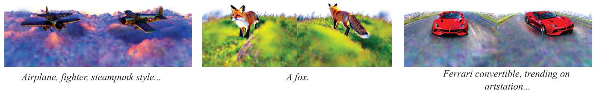  
Figure 12. Results of generation with ground.

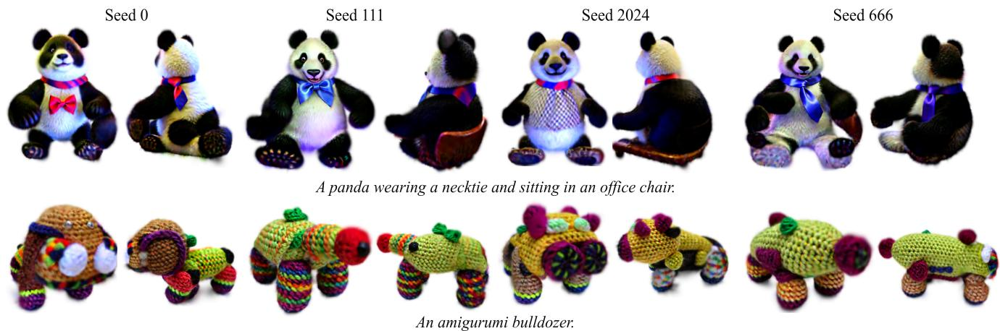  
Figure 13. Results of the diversity of our method.

Generation with Ground. When initializing, we add a layer of point clouds representing the ground at the bottom of the generated point clouds. The color of the ground is randomly initialized. Then, we use the point clouds with the added ground to initialize the 3D Gaussians. Fig. 12 shows the results of the final 3D Gaussian Splatting [26]. Diversity. In Fig. 13, we demonstrate the diversity of our method in generating 3D assets by using different random seeds for the same prompt. Generation with More Fine-grained Prompts. More refined prompts are used to generate 3D assets, as shown in Fig. 14. It can be seen that Shap-E [25] generates similar results when given different descriptions of the word "axe" in the prompt. However, our method produces 3D assets that better match the prompt. Automatically Select A Human Model. As shown in Fig 15, we attempt to use CLIP to guide the selection of the initialized human body model, by computing the similarities between images rendered from the generated SMPL models and the text prompt. We can achieve good rendering effects on various human body models. It would also be a promising direction to extend the assets to dynamic ones with the sequence of generated human body models.

  
Figure 14. Results of generation with more fine-grained prompts.

# A.2. More Ablation Studies

2D Diffusion Model During the process of optimizing 3D Gaussians with a 2D diffusion model, we perform ablation on the 2D diffusion models we use, specifically stabilityai/stable-diffusion-2-1-base [62] 3 and DeepFloyd/IF-I-XL-v1.0 4. Fig. 16 shows the results of the ablation experiment, where it can be seen that the 3D assets generated using the stabilityai/stable-diffusion-2-1- base have richer details. Box Size in Point Growth In Fig 17, we conduct an ablation experiment on the box size, where a larger box leads to a fatter asset along with a more blurry appearance.

# A.3. More Discussions

Limitations Introduced by the 3D Datasets. Fig 18 shows the generation results of complex prompts. The domain-limited 3D diffusion model can only generate parts of the desired object with rough appearances. Our method completes the remaining part and provides finer details by bridging the domain-abundant 2D diffusion model.

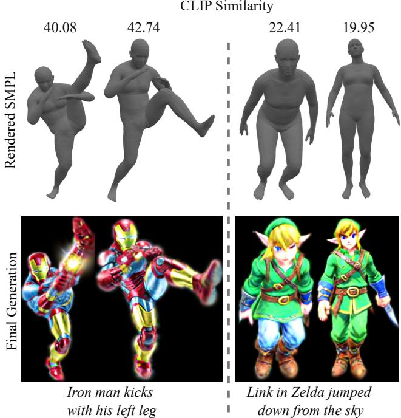  
Figure 15. Avatar generation.

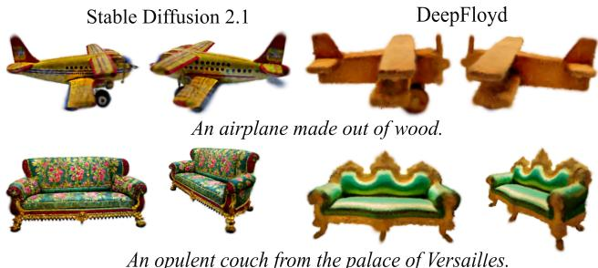  
Figure 16. Ablation studies of optimizing 3D Gaussians with different 2D diffusion models.

Recent Works. We discuss with more related work. Our focus is to connect the 3D and 2D diffusion models, fusing the data capacity from both types of diffusion models and generating 3DGS-based assets directly from text. DreamGaussian [75] finally generates mesh-based 3D assets from an image or an image generated from text, which can be orthogonal to our method. There is a possibility of a combination in the future. NerfDiff [13] uses a 3D-aware conditional diffusion to enhance details. DiffRF [49] employs 3D-Unet to operate directly on the radiation field, achieving truthful 3D geometry and image synthesis. 3DDesigner [31] proposes a two-stream asynchronous diffusion module, which can improve 3D consistency.

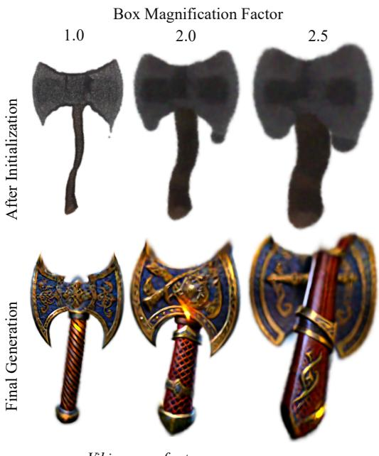  
Viking axe, fantasy, weapon...   
Figure 17. Ablation on the size of the box.

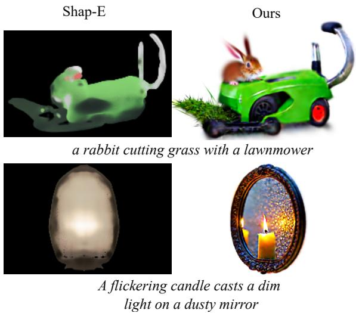  
Figure 18. Generation with complex prompts.