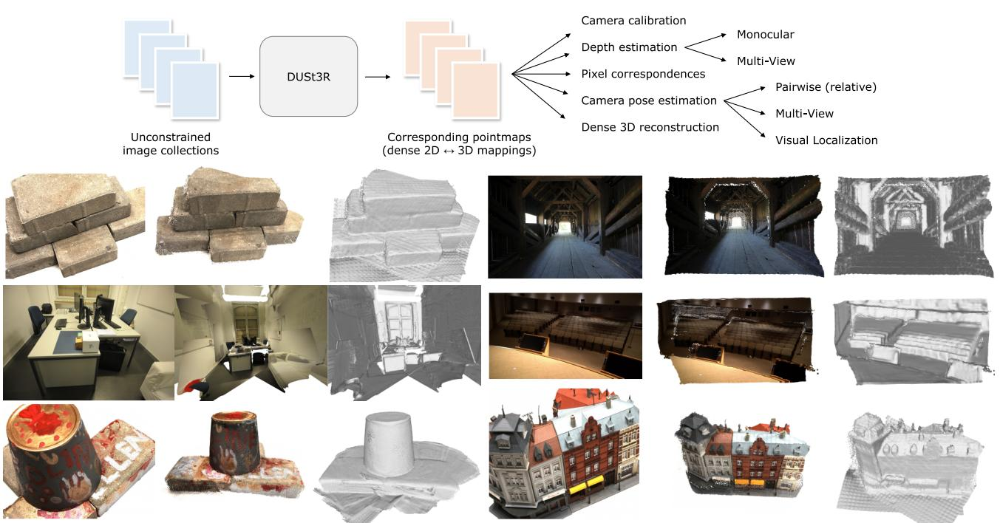
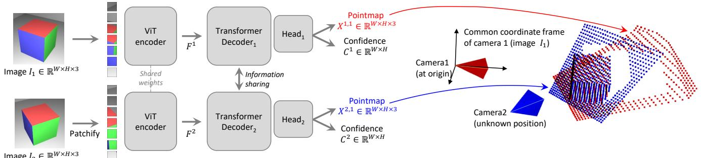
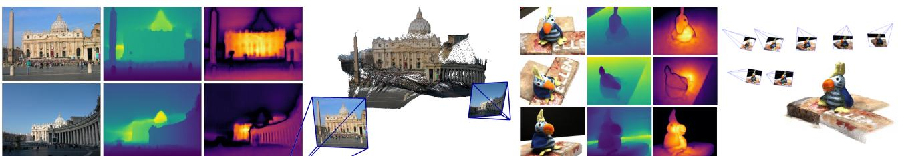
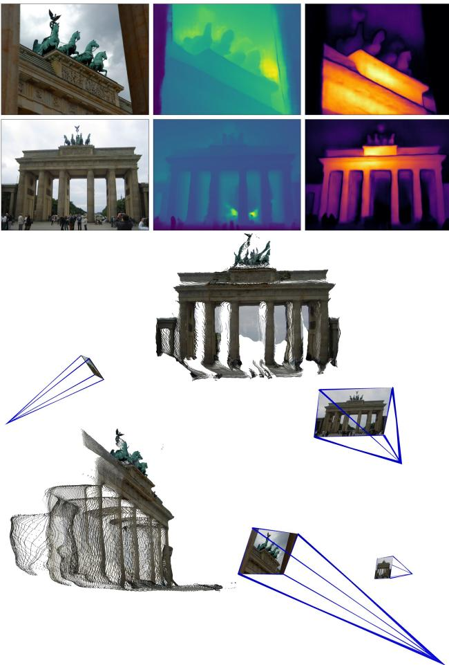
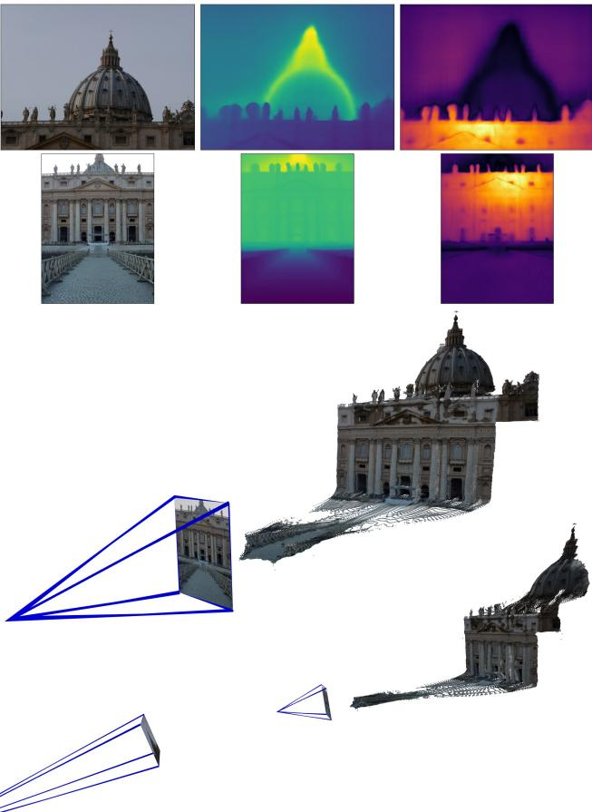
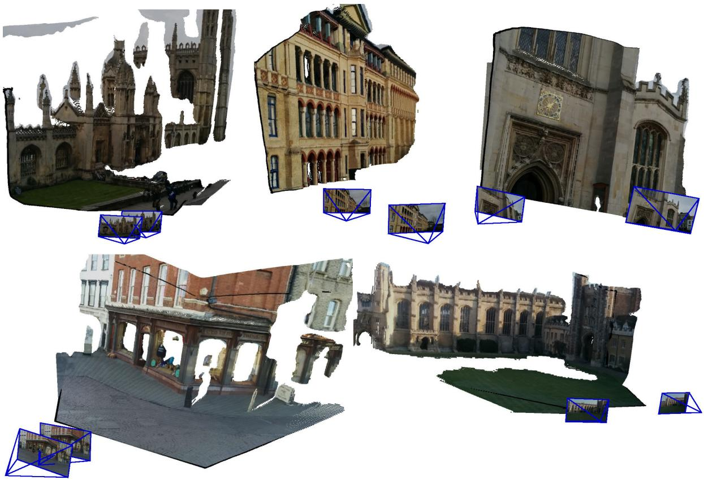
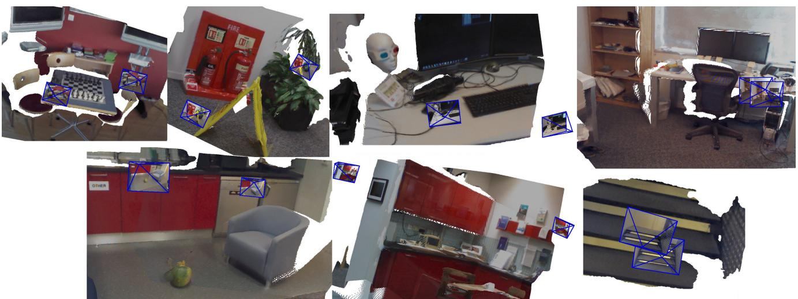
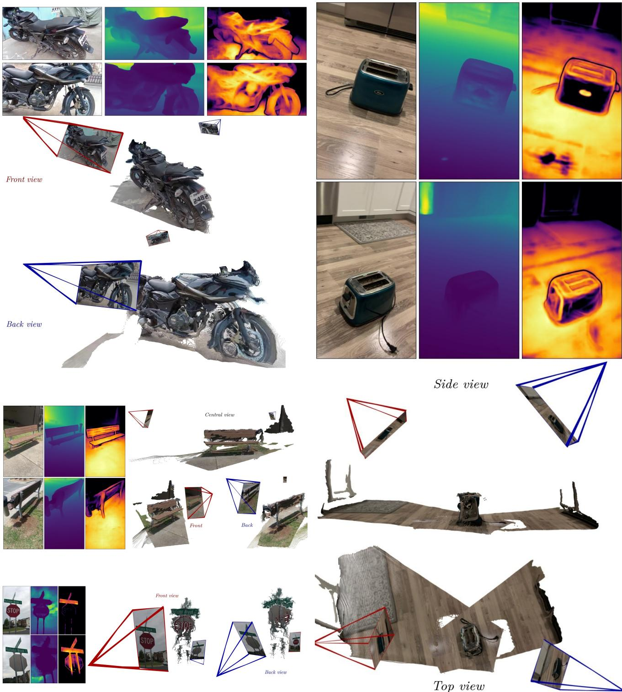
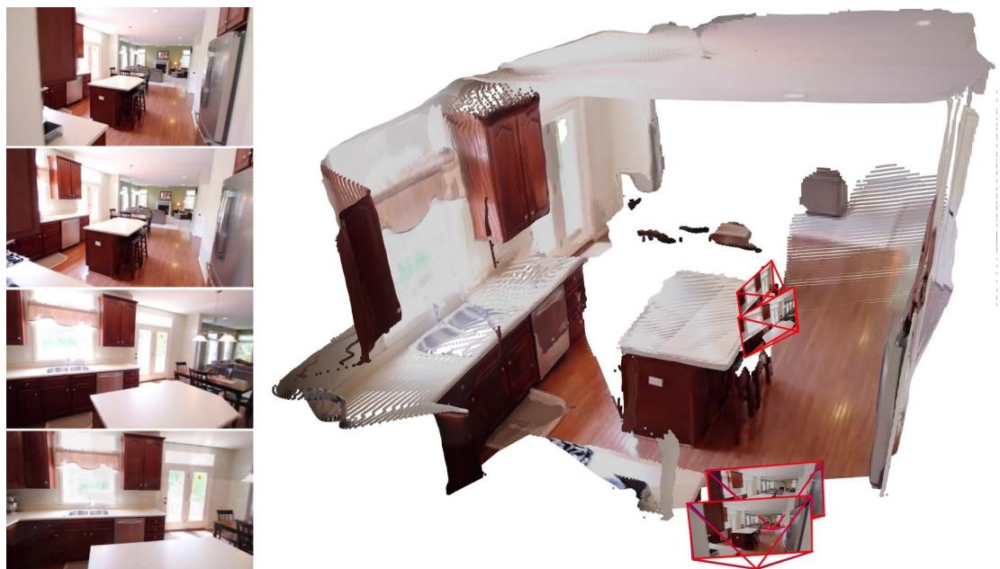

# DUSt3R：简化的几何 3D 视觉

王舒哲\*, 文森特·勒鲁†，约翰·卡邦†，鲍里斯·奇德洛夫斯基† 和 杰罗姆·雷沃† \* 阿尔托大学 †Naver Labs Europe shuzhe.wang@aalto.fi firstname.lastname@naverlabs.com

  
.

# 摘要

在真实环境下的多视图立体重建（MVS）首先需要估计相机参数，例如内参和外参。这些参数通常难以获得且繁琐，但它们对于在三维空间中三角测量对应像素是必不可少的，这是所有性能最佳的MVS算法的核心。在本研究中，我们采取了相反的立场，介绍了 $D U S t 3 R ^ { 1 }$ ，这一针对任意图像集合的稠密无约束立体三维重建的全新范式，即在没有相机标定或视点姿态的先验信息的情况下进行操作。我们将成对重建问题视为点图的回归，放宽了通常投影相机模型的严格约束。我们展示了这一公式平滑地统一了单目和双目重建的情况。当提供超过两幅图像时，我们进一步提出了一种简单而有效的全局对齐策略，以表达所有成对点图在一个共同的参考框架下。我们的网络架构基于标准的Transformer编码器和解码器，允许我们利用强大的预训练模型。我们的公式直接提供场景的三维模型以及深度信息，值得注意的是，我们可以从中无缝恢复像素匹配、相对和绝对相机。对所有这些任务的全面实验展示了所提DUSt3R能够统一各种三维视觉任务，并在单目/多视图深度估计以及相对位姿估计上设定了新的最先进水平。总之，DUSt3R使得许多几何三维视觉任务变得简单。

# 1. 引言

基于多个视角的无约束图像密集三维重建是计算机视觉领域少数经过长期研究的终极目标之一。简而言之，该任务旨在估计特定场景的三维几何结构和相机参数，前提是给定一组该场景的照片。它不仅在地图制作、导航、考古学、文化遗产保护、机器人等多个应用领域有着广泛的应用，但更重要的是，它在所有三维视觉任务中占据着一个根本特殊的位置。实际上，它几乎包含了所有其他几何三维视觉任务。因此，现代三维重建方法整合了多个子领域的几十年进展的成果，例如关键点检测和匹配、稳健估计、运动恢复结构（SfM）和束平差（BA）、密集多视角立体（MVS）等。

最后，现代的结构从运动（SfM）和多视图立体视觉（MVS）管道归结为解决一系列最小问题：匹配点、寻找本质矩阵、三角测量、稀疏重建场景、估计相机，最后执行密集重建。考虑到最近的进展，这一复杂链条在某些情况下当然是一种可行的解决方案，然而我们认为它是相当不令人满意的：每个子问题都没有完美解决，且为下一个步骤增加了噪声，增加了管道整体工作的复杂性和工程努力。在这方面，各子问题之间缺乏交流显得尤为显著：如果它们能相互帮助似乎更为合理，即密集重建应该自然而然地受益于为恢复相机位姿而构建的稀疏场景，反之亦然。此外，这一管道中的关键步骤脆弱，容易在许多情况下出错。例如，SfM 的关键阶段用于估计所有相机参数，通常在很多常见情况下被认为会失败，例如当场景视图较少时，对于非兰伯特表面的物体，或者在相机运动不足的情况下等。这令人担忧，因为最终，“MVS 算法的好坏仅取决于输入图像和相机参数的质量”。在本文中，我们提出了 DUSt3R，这是一种从未校准和未设置位姿的相机进行密集非约束立体三维重建的全新方法。其主要组成部分是一个网络，可以仅从一对图像回归出密集且准确的场景表示，而无须关于场景或相机的任何事先信息（甚至不需要内参）。生成的场景表示基于具有丰富属性的 3D 点图：它们同时封装了（a）场景几何形状，(b) 像素与场景点之间的关系，以及 (c) 两个视点之间的关系。仅凭这个输出，几乎可以直接提取出所有场景参数（即相机和场景几何形状）。这是因为我们的网络共同处理输入图像和生成的 3D 点图，从而学习将 2D 结构与 3D 形状关联起来，并能够同时解决多个最小问题，实现内部的“协作”。我们的模型采用完全监督的方式训练，使用简单的回归损失，利用大规模公共数据集，其中的真实标注数据要么是合成生成的，要么是从 SfM 软件重建而来的，或者是使用专用传感器采集的。我们离开了集成任务特定模块的趋势，而是采用基于通用 Transformer 架构的完全数据驱动策略，在推理时不强加任何几何约束，但能够受益于强大的预训练方案。该网络学习了强大的几何和形状先验，这些先验与 MVS 中常用的先验相似，如从纹理、阴影或轮廓恢复形状。为了融合来自多个图像对的预测，我们重新审视了针对点图的束调整（BA），从而实现了全尺度的 MVS。我们引入了一种全球对齐程序，与 BA 不同，它不涉及最小化重投影误差。相反，我们直接在 3D 空间中优化相机位姿和几何对齐，这种方法快速且在实践中表现出极好的收敛性。我们的实验表明，重建结果在各种未知传感器的现实场景中是准确且一致的。我们进一步证明，相同的架构能够无缝处理现实中的单目和多视图重建场景。重建示例如图 1 和随附视频所示。

总的来说，我们的贡献主要体现在四个方面。首先，我们提出了首个从未标定和未姿态化图像直接进行的整体端到端三维重建管道，统一了单目和双目三维重建。其次，我们引入了用于多视图立体视觉（MVS）应用的点图表示，该表示使网络能够在规范框架中预测三维形状，同时保持像素与场景之间的隐含关系。这有效地解除了一般透视相机模型的许多约束。第三，我们引入了一种优化程序，用于在多视图三维重建的背景下全局对齐点图。我们的程序能够毫不费力地提取经典结构从运动（SfM）和多视图立体视觉（MVS）管道的所有常规中间输出。从某种意义上说，我们的方法统一了所有三维视觉任务，相较于传统重建管道显著简化，使DUSt3R看起来简单易用。第四，我们在一系列三维视觉任务上展示了良好的性能，特别是我们的全合一模型在单目和多视图深度基准测试以及多视图相机姿态估计上取得了最先进的结果。

# 2. 相关工作

为了节省篇幅，我们在这里总结了与三维视觉最相关的工作，并请读者参阅第C节附录以获取更全面的审查。

运动恢复结构（SfM）[20, 21, 45, 48, 106] 的目标是从一组图像中重建稀疏三维地图，同时共同确定相机参数。传统流程从多个图像之间通过关键点匹配获得的像素对应关系[4, 5, 43, 63, 99] 开始，以确定几何关系，然后进行束调整以共同优化三维坐标和相机参数。最近，SfM 流程经历了实质性的增强，特别是在其子过程中引入了基于学习的技术。这些改进包括先进的特征描述[26, 28, 97, 135, 167]、更准确的图像匹配[3, 17, 60, 82, 100, 120, 126, 145]、特征度量精炼[59]和神经束调整[58, 153]。尽管取得了这些进展，SfM 流程的顺序结构仍然存在，这使得其在每个独立组件中对噪声和错误的脆弱性得以保留。

多视图立体（MVS）是通过多个视点之间的三角测量密集重建可见表面的任务。在MVS的经典表述中，所有相机参数都应作为输入提供。完全手工设计的方法，[32, 34, 107, 147, 175]，以及更近期的基于场景优化的方法[31, 71, 76, 77, 143, 146, 148, 163]，或基于学习的方法[40, 53, 65, 86, 161, 164, 180]，都依赖于通过复杂校准程序获得的相机参数估计，这些过程可能是在数据采集期间[1, 23, 109, 166]进行，或使用运动结构方法[48, 106]进行野外重建。然而，在实际场景中，预估的相机参数的误差可能会对这些算法的正常工作产生负面影响。在本研究中，我们提出直接预测可见表面的几何形状，且不依赖于任何相机参数的显式知识。

直接从 RGB 到 3D。最近，一些方法旨在直接从单个 RGB 图像预测 3D 几何体。这一问题本质上是一个病态问题，不引入额外假设很难解决，因此这些方法利用神经网络从大型数据集中学习强大的 3D 先验来解决歧义。这些方法可以分为两组。第一组利用类级别的对象先验。例如，Pavllo 等人 [8385] 提出学习一个模型，能够从单个图像中完全恢复形状、姿态和外观，前提是有大量的 2D 图像可用。尽管这种方法强大，但无法推断未见类别对象的形状。第二组工作，最接近我们的方法，集中于普通场景。这些方法系统性地建立或重用现有的单目深度估计 (MDE) 网络 [6, 91, 169, 171]。深度图确实编码了一种形式的 3D 信息，结合相机内参，可以简单地生成像素对齐的 3D 点云。例如，SynSin [151] 通过渲染具有特征增强的深度图，已知所有相机参数，从单个图像进行新视点合成。在没有相机内参的情况下，一种解决方案是通过利用视频帧中的时间一致性来推断相机内参，方法是执行全局对齐等 [156] 或利用具有光度重建损失的可微渲染 [36, 117]。另一种方法是显式学习预测相机内参，这使得通过与 MDE 结合时能够从单个图像进行度量 3D 重建。然而，所有这些方法本质上受到深度估计质量的限制，单目设置下这显然是一个病态问题。相较之下，我们的网络同时处理两个视点以输出深度图，或者更确切地说，输出点图。从理论上讲，这使得不同视点射线之间的三角测量成为可能。过去已经提出了用于 3D 重建的多视图网络。它们本质上基于建立可微分的结构从运动 (SfM) 流水线的想法，复制传统的流水线，但进行端到端训练 [131, 136, 184]。然而，为此需要以真实的相机内参作为输入，输出通常是深度图和相对相机姿态 [136, 184]。相较之下，我们的网络具有通用架构，并输出点图，即 3D 点的密集 2D 场，隐式处理相机姿态，从而使回归问题更易于解决。点图。使用一组点图作为形状表示对多视图立体视觉 (MVS) 来说相当违反直觉，但其在视觉定位任务中广泛使用，无论是在场景依赖的优化方法中 [8, 9, 11] 还是场景无关的推理方法中 [96, 124, 159]。类似地，逐视图建模是在单目 3D 重建工作 [57, 113, 127, 141] 和视图合成工作 [151] 中的一个共同主题。其思想是将规范 3D 形状存储在多个规范视图中，从而在图像空间中工作。这些方法通常利用显式的透视相机几何，通过渲染规范表示。

# 3. 方法

在深入探讨我们的方法细节之前，我们在下文中介绍点图的基本概念。点图。在下文中，我们将一个稠密的2D三维点场表示为点图 $\mathbf { \bar { \boldsymbol { X } } } \in \mathbb { R } ^ { W \times H \times 3 }$ 。结合其对应的分辨率为 $W \times H$ 的RGB图像 $I$ ，$X$ 形成图像像素与三维场景点之间的唯一映射，即对于所有像素坐标 $( i , j ) \in \{ 1 \ldots W \} \times \{ 1 \ldots H \}$ ，有 $I _ { i , j } X _ { i , j }$ 。我们在此假设每条相机光线只击中一个三维点，即忽略透明表面的情况。

  
Figure 2. Architecture of the network $\mathcal { F }$ Two views of a scene $( I ^ { 1 } , I ^ { 2 } )$ are first encoded in a Siamese manner with a shared ViT encoder. The resulting token representations $F ^ { 1 }$ and $F ^ { 2 }$ are then passed to two transformer decoders that constantly exchange information via pointmaps are expressed in the same coordinate fameof thefrst e $I ^ { 1 }$ .The network $\mathcal { F }$ is trained using a simple regression loss (Eq. (4))

相机与场景。给定相机内参 $K \in \mathbb{R}^{3 \times 3}$，观察场景的点映射 $X$ 可以通过真实深度图 $D \in \mathbb{R}^{W \times H}$ 直接获得，计算公式为 $X_{i,j} = K^{-1} \left[ i D_{i,j}, j D_{i,j}, D_{i,j} \right]^{\top}$。这里，$X$ 表示在相机坐标系中的表示。接下来，我们用 $X^{n,m}$ 表示从相机 $n$ 表示于相机 $m$ 坐标系中的点映射 $X^{n}$：

$$
X ^ { n , m } = P _ { m } P _ { n } ^ { - 1 } h \left( X ^ { n } \right)
$$

设 $P _ { m } , P _ { n } \in \mathbb { R } ^ { 3 \times 4 }$ 为图像 $n$ 和 $m$ 的世界到相机的位姿，且 $h : ( x , y , z ) \to ( x , y , z , 1 )$ 为齐次映射。

# 3.1. 概述

我们希望构建一个网络，通过直接回归解决广义立体视觉的三维重建任务。为此，我们训练一个网络 $\mathcal{F}$，其输入为两幅RGB图像 $I^{1}, I^{2} \in \mathbb{R}^{W \times H \times 3}$，输出对应的两个点图 $X^{1,1}, X^{2,1} \in \mathbb{R}^{W \times H \times 3}$，并附带置信度图 $C^{1,1}, C^{2,1} \in \mathbb{R}^{W \times H}$。请注意，这两个点图均在 $I^{1}$ 的相同坐标系中表达，这与现有方法截然不同，但提供了关键优势（见第1、2节以及3.3和3.4节）。为了清晰起见，并且不失一般性，我们假设两幅图像具有相同的分辨率 $W \times H$，但实际上它们的分辨率可以不同。网络架构。我们的网络 $\mathcal{F}$ 的架构受到 CroCo [150] 的启发，使其能够充分利用 CroCo 预训练 [149] 的优势。如图2所示，网络由两个相同的分支组成（每幅图像一个分支），每个分支包括一个图像编码器、一个解码器和一个回归头。这两幅输入图像首先通过相同的共享权重的ViT编码器 [27] 以西雅梅斯方式进行编码，从而生成两个标记表示 $F^{1}$ 和 $F^{2}$。

$$
F ^ { 1 } = \operatorname { E n c o d e r } ( I ^ { 1 } ) , F ^ { 2 } = \operatorname { E n c o d e r } ( I ^ { 2 } ) .
$$

网络在解码器中共同推理这两者。与 CroCo 相似，解码器是一个配备了交叉注意力的通用变换器网络。每个解码器块因此依次执行自注意力（每个视图的每个词元关注同一视图的词元），然后是交叉注意力（每个视图的每个词元关注另一个视图的所有词元），最后将词元输入到多层感知机（MLP）。重要的是，在解码器的传递过程中，两个分支之间的信息不断共享。这对于输出正确对齐的点图至关重要。具体来说，每个解码器块都会关注来自另一个分支的词元：

$$
\begin{array} { r } { G _ { i } ^ { 1 } = \mathrm { D e c o d e r B l o c k } _ { i } ^ { 1 } \left( G _ { i - 1 } ^ { 1 } , G _ { i - 1 } ^ { 2 } \right) , } \\ { G _ { i } ^ { 2 } = \mathrm { D e c o d e r B l o c k } _ { i } ^ { 2 } \left( G _ { i - 1 } ^ { 2 } , G _ { i - 1 } ^ { 1 } \right) , } \end{array}
$$

对于 $i = 1 , \ldots , B$ 的解码器，其中 $B$ 表示块的数量，并以编码器词元 $G _ { 0 } ^ { 1 } := F ^ { 1 }$ 和 $G _ { 0 } ^ { 2 } := F ^ { 2 }$ 初始化。这里，DecoderBlock $_ { i } ^ { v } ( G ^ { 1 } , G ^ { 2 } )$ 表示分支 $v \in \{ 1 , 2 \}$ 中的第 $i$ 个块，$G ^ { 1 }$ 和 $G ^ { 2 }$ 是输入词元，其中 $G ^ { 2 }$ 为来自其他分支的词元。最后，在每个分支中，单独的回归头接受解码器词元的集合并输出点图及相关的置信图：

$$
\begin{array} { r } { X ^ { 1 , 1 } , C ^ { 1 , 1 } = \operatorname { H e a d } ^ { 1 } \left( G _ { 0 } ^ { 1 } , \dots , G _ { B } ^ { 1 } \right) , } \\ { X ^ { 2 , 1 } , C ^ { 2 , 1 } = \operatorname { H e a d } ^ { 2 } \left( G _ { 0 } ^ { 2 } , \dots , G _ { B } ^ { 2 } \right) . } \end{array}
$$

讨论。输出的点图 $X^{1, 1}$ 和 $X^{2, 1}$ 是经过回归处理的，且存在一个未知的尺度因子。此外，需要注意的是，我们的通用架构从未明确施加任何几何约束。因此，点图并不一定对应于任何物理上合理的相机模型。相反，我们让网络学习训练集中存在的所有相关先验，而该训练集仅包含几何一致的点图。使用通用架构使我们能够利用强大的预训练技术，最终超越现有特定任务架构的表现。我们将在下一节详细说明学习过程。

# 3.2. 训练目标

3D 回归损失。我们的唯一训练目标基于三维空间中的回归。我们将真实点图表示为 $\bar { X } ^ { 1 , 1 }$ 和 $\bar { X } ^ { 2 , 1 }$，这些点图是根据公式 (1) 以及与之对应的两组有效像素 $\mathcal { D } ^ { 1 } , \mathcal { D } ^ { 2 } \subseteq$ $\{ 1 \ldots W \} \times \{ 1 \ldots H \}$ 获得的，在这些像素上定义了真实值。有效像素 $i \in \mathcal { D } ^ { v }$ 在视图 $v \in$ $\{ 1 , 2 \}$ 的回归损失被简单定义为欧几里得距离：

$$
\ell _ { \mathrm { r e g r } } ( v , i ) = \left\| \frac { 1 } { z } X _ { i } ^ { v , 1 } - \frac { 1 } { \bar { z } } \bar { X } _ { i } ^ { v , 1 } \right\| .
$$

为了处理预测与真实标注之间的尺度模糊，我们通过缩放因子 $z = \mathrm { n o r m } ( X ^ { 1 , 1 } , X ^ { 2 , 1 } )$ 和 $\bar { z } = \mathrm { n o r m } ( \bar { X } ^ { 1 , 1 } , \bar { X } ^ { 2 , 1 } )$ 对预测点图和真实标注点图进行标准化，这两个缩放因子分别表示所有有效点到原点的平均距离：

$$
\mathrm { n o r m } ( X ^ { 1 } , X ^ { 2 } ) = \frac { 1 } { | \mathcal { D } ^ { 1 } | + | \mathcal { D } ^ { 2 } | } \sum _ { v \in \{ 1 , 2 \} } \sum _ { i \in \mathcal { D } ^ { v } } \| X _ { i } ^ { v } \| .
$$

置信度感知损失。实际上，与我们的假设相反，存在一些定义模糊的3D点，例如天空或半透明物体上。更一般地说，图像中的某些部分通常比其他部分更难以预测。因此，我们共同学习为每个像素预测一个分数，该分数表示网络对该特定像素的置信度。最终的训练目标是根据公式(2)对所有有效像素计算的置信度加权回归损失：

$$
\mathcal { L } _ { \mathrm { c o n f } } = \sum _ { v \in \{ 1 , 2 \} } \sum _ { i \in \mathcal { D } ^ { v } } C _ { i } ^ { v , 1 } \ell _ { \mathrm { r e g r } } ( v , i ) - \alpha \log C _ { i } ^ { v , 1 } ,
$$

其中 $C _ { i } ^ { v , 1 }$ 是像素 $i$ 的置信度得分，$\alpha$ 是控制正则化项的超参数 [137]。为了确保置信度严格为正，我们通常定义 $C _ { i } ^ { v , 1 } = 1 + \exp \widetilde { C _ { i } ^ { v , 1 } } > 1$。这会迫使网络在更困难的区域进行外推，例如那些仅由单个视角覆盖的区域。以此目标训练网络 $\mathcal { F }$ 可以在没有明确监督的情况下估计置信度得分。输入图像对及其对应输出的示例如图 3 以及附录中的图 4、5 和 8 所示。

# 3.3. 下游应用

输出点图的丰富属性使我们能够相对轻松地执行各种便利操作。点匹配。在两幅图像的像素之间建立对应关系可以通过在三维点图空间中进行最近邻（NN）搜索轻松实现。为了最小化误差，我们通常保留图像 $I ^ { 1 }$ 和 $I ^ { 2 }$ 之间的互惠（相互）对应关系 $\mathcal { M } _ { 1 , 2 }$，即我们有：

$$
\begin{array} { r } { \mathcal { M } _ { 1 , 2 } = \{ ( i , j ) \vert i = \mathrm { N N } _ { 1 } ^ { 1 , 2 } ( j ) \mathrm { a n d } j = \mathrm { N N } _ { 1 } ^ { 2 , 1 } ( i ) \} } \\ { \mathrm { w i t h } \mathrm { N N } _ { k } ^ { n , m } ( i ) = \underset { j \in \{ 0 , \ldots , W H \} } { \arg \operatorname* { m i n } } \left\| X _ { j } ^ { n , k } - X _ { i } ^ { m , k } \right\| . } \end{array}
$$

恢复内参。根据定义，点图 $X ^ { 1 , 1 }$ 在 $I ^ { 1 }$ 的坐标系中表示。因此，可以通过解决一个简单的优化问题来估计相机内参。本文假设主点大致位于中心且像素为正方形，因此只需估计焦距 $f _ { 1 } ^ { * }$：

$$
f _ { 1 } ^ { * } = \underset { f _ { 1 } } { \arg \operatorname* { m i n } } \sum _ { i = 0 } ^ { W } { \sum _ { j = 0 } ^ { H } { C _ { i , j } ^ { 1 , 1 } } } \left| \left| ( i ^ { \prime } , j ^ { \prime } ) - f _ { 1 } \frac { ( X _ { i , j , 0 } ^ { 1 , 1 } , X _ { i , j , 1 } ^ { 1 , 1 } ) } { X _ { i , j , 2 } ^ { 1 , 1 } } \right| \right| ,
$$

通过 $\begin{array} { r } { i ^ { \prime } = i - \frac { W } { 2 } } \end{array}$ 和 $\begin{array} { r } { j ^ { \prime } = j - \frac { \cal { H } } { 2 } } \end{array}$，快速迭代求解器，例如基于 Weiszfeld 算法的 [88]，可以在几次迭代中找到最优的 $f _ { 1 } ^ { * }$。对于第二台相机的焦距 $f _ { 2 } ^ { * }$，最简单的选项是对成对的 $( I ^ { 2 } , I ^ { 1 } )$ 进行推理，并使用以上公式以 $X ^ { 2 , 2 }$ 替代 $X ^ { 1 , 1 }$。相对位姿估计可以通过多种方式实现。一种方法是进行 2D 匹配并恢复内参，如上所述，然后估计极线矩阵并恢复相对位姿 [45]。另一种更直接的方法是比较点云 $X ^ { 1 , 1 } X ^ { 1 , 2 }$（或等价地，使用 Procrustes 对齐的 $X ^ { 2 , 2 } X ^ { 1 , 2 }$）以获得相对位姿 $P ^ { * } = [ R ^ { * } | t ^ { * } ]$ ：

$$
R ^ { * } , t ^ { * } = \underset { \sigma , R , t } { \arg \operatorname* { m i n } } \sum _ { i } C _ { i } ^ { 1 , 1 } C _ { i } ^ { 1 , 2 } \left\| \sigma ( R X _ { i } ^ { 1 , 1 } + t ) - X _ { i } ^ { 1 , 2 } \right\| ^ { 2 } ,
$$

可以通过封闭形式实现。Procrustes对齐不幸的是，对噪声和离群点敏感。一个更鲁棒的解决方案最终是依赖于RANSAC [30]和PnP [45, 52]。

绝对姿态估计，也称视觉定位，可以通过多种不同方式实现。令 $I ^ { Q }$ 表示查询图像，$I ^ { B }$ 表示具有可用的2D-3D对应关系的参考图像。首先，可以通过 $X ^ { Q , Q }$ 估计 $I ^ { Q }$ 的内参。一种可能的方法是获取 $I ^ { Q }$ 和 $I ^ { B }$ 之间的2D对应关系，这反过来会生成 $I ^ { Q }$ 的2D-3D对应关系，然后运行PnP-RANSAC [30, 52]。另一种解决方案是获取 $I ^ { Q }$ 和 $I ^ { B }$ 之间的相对姿态，如前所述。然后，我们按比例将这个姿态转换为世界坐标，依据 $X ^ { B , B }$ 与 $I ^ { B }$ 的真值点图之间的缩放关系。

# 3.4. 全局对齐

到目前为止，所介绍的网络 $\mathcal { F }$ 只能处理一对图像。我们现在呈现一种快速简单的后处理优化方法，用于整个场景，使得从多幅图像预测的点图能够对齐到一个联合的 3D 空间。这得益于我们点图的丰富内容，该内容设计上包含两个对齐的点云及其相应的像素到 3D 的映射。成对图。给定一组图像 $\{ I ^ { 1 } , I ^ { 2 } , \ldots , I ^ { N } \}$ 对于某个特定场景，我们首先构建一个连通性图 $\mathcal G ( \nu , \mathcal { E } )$，其中 $N$ 幅图像形成顶点 $\nu$，每条边 $e = ( n , m ) \in \mathcal { E }$ 表示图像 $I ^ { n }$ 和 $I ^ { m }$ 共享一些视觉内容。为此，我们可以使用现有的现成图像检索方法，或者将所有图像对通过网络 $\mathcal { F }$（在 H100 GPU 上推理大约需要 ${ \approx } 40 \mathrm { ms }$），并根据两个对的平均置信度来测量它们的重叠，然后过滤掉低置信度的对。

  
reconstruction. The left scene shows the raw result output from $\mathcal { F } ( I ^ { 1 } , I ^ { 2 } )$ .The right scene shows the outcome of global alignment (Sec. 3.4).

全局优化。我们使用连接图 $\mathcal { G }$ 来恢复所有相机 $n = 1 \ldots N$ 的全局对齐点图 $\{ \chi ^ { n } \in \bar { \mathbb { R } ^ { \bar { W } \times \bar { H } \times 3 } } \}$。为此，我们首先预测每对图像 $e ~ = ~ ( n , m ) ~ \in ~ { \mathcal { E } }$ 的成对点图 $X ^ { n , n }$、$X ^ { m , n }$ 及其相关的置信图 $C ^ { n , n }$、$C ^ { m , n }$。为清晰起见，我们定义 $X ^ { n , e } : = X ^ { n , n }$ 和 $X ^ { m , e } : = X ^ { m , n }$。由于我们的目标涉及将所有成对预测旋转到一个公共坐标系中，我们需要为每对 $e \in { \mathcal { E } }$ 关联旋转矩阵 $P _ { e } \in \mathbb { R } ^ { 3 \times 4 }$ 和缩放因子 $\sigma _ { e } > 0$。我们接着 formulat 以下优化问题：

$$
\chi ^ { * } = \underset { \chi , P , \sigma } { \arg \operatorname* { m i n } } \sum _ { e \in \mathcal { E } } \sum _ { v \in e } \sum _ { i = 1 } ^ { H W } C _ { i } ^ { v , e } \parallel \chi _ { i } ^ { v } - \sigma _ { e } P _ { e } X _ { i } ^ { v , e } \parallel .
$$

在这里，我们滥用符号表示，当 $e = ( n , m )$ 时，写作 $v \in e$ 表示 $v \in \{ n , m \}$。其思想是，对于给定的对 $e$，相同的刚性变换 $P _ { e }$ 应该将点图 $X ^ { n , e }$ 和 $X ^ { m , e }$ 对齐到世界坐标点图 $\chi ^ { n }$ 和 $\chi ^ { m }$，因为根据定义，$X ^ { n , e }$ 和 $X ^ { m , e }$ 都是在同一坐标系中表达的。为了避免平凡的最优解 $\sigma _ { e } = 0$，对于所有 $e \in { \mathcal { E } }$，我们强制要求 $\textstyle \prod _ { e } \sigma _ { e } = 1$。恢复相机参数。一个简单的扩展使得在该框架下能够恢复所有相机参数。通过简单地替换 $\begin{array} { r l } { \chi _ { i , j } ^ { n } } & { { } : = } \end{array}$ $P _ { n } ^ { - 1 } h ( K _ { n } ^ { - 1 } [ i D _ { i , j } ^ { n } ; j D _ { i , j } ^ { n } ; D _ { i , j } ^ { n } ] )$（即 enforcing a standard camera pinhole model as in Eq. (1)），我们可以估计所有相机位姿 $\{ P _ { n } \}$，相关的内参 $\{ K _ { n } \}$ 以及深度图 $\{ D ^ { n } \}$，其中 $n = 1 \ldots N$。讨论。我们指出，与传统的束调整不同，这种全局优化方法在实践中快速且简单。事实上，我们并不是在最小化 2D 重投影误差，正如束调整通常所做的那样，而是在最小化 3D 投影误差。优化是使用标准的梯度下降方法进行的，通常在几百步之后就会收敛，在标准 GPU 上仅需几秒钟。

# 4. DUSt3R 实验

训练数据。我们使用八个数据集的混合来训练我们的网络：Habitat [104]，MegaDepth [56]，ARKitScenes [25]，MegaDepth [56]，Static Scenes 3D [110]，Blended MVS [162]，ScanNet++ [166]，CO3D-v2 [94]和Waymo [122]。这些数据集具有多样的场景类型：室内、室外、合成、现实世界、以物体为中心等。当图像对未直接提供于数据集中时，我们会根据[149]中描述的方法提取它们。具体而言，我们利用现成的图像检索和点匹配算法来匹配和验证图像对。总共提取$8.5 \mathbf{M}$对。训练细节。在每个训练周期中，我们从每个数据集中随机抽取相同数量的图像对，以平衡数据集规模的差异。我们希望向网络输入相对高分辨率的图像，最大维度大约为512像素。为了减轻与这种输入相关的高成本，我们依次训练网络，首先使用$224 \times 224$的图像，然后使用更大尺寸的512像素图像。我们随机选择每个批次的图像纵横比（例如16/9、4/3等），以便在测试时网络能够适应不同的图像形状。我们简单地裁剪图像以达到所需的纵横比，并调整大小，使最大维度为512像素。我们使用标准的数据增强技术和整体训练设置。我们的网络架构包括一个用于编码的Vit-Large [27]，一个用于解码的ViT-Base以及一个DPT头 [91]。有关训练和架构的更多详细信息，请参见附录F。在训练之前，我们用现成的CroCo预训练模型[149]的权重初始化我们的网络。跨视图补全（CroCo）是一种最近提出的预训练范式，受到MAE [46]的启发，已被证明在各种下游3D视觉任务中表现出色，因此特别适合我们的框架。我们在第4.6节中消融了CroCo预训练和图像分辨率增加的影响。评估。在本节余下部分，我们在一组经典的3D视觉任务上评估DUSt3R，每次指定数据集、指标并与现有最先进的方法进行性能比较。我们强调，所有结果均使用相同的DUSt3R模型（我们的默认模型称为“DUSt3R 512”，其他DUSt3R模型用于第4.6节的消融研究），即我们从未针对特定下游任务微调模型。在测试期间，所有测试图像都被重新缩放为$512 \mathrm{px}$，同时保持其纵横比。由于在第3.3节和第3.4节中描述的情况，可能存在不同的“路径”来从DUSt3R提取特定任务的输出，我们每次都会明确所采用的方法。定性结果。DUSt3R在挑战性情况下也能实现高质量的稠密3D重建。我们请读者参考附录B，了解成对和多视图重建的非选择性可视化结果。

# 4.1. 视觉定位

数据集和评估指标。我们首先在 7Scenes [114] 和 Cambridge Landmarks 数据集 [49] 上评估 DUSt3R 在绝对位姿估计任务中的表现。7Scenes 包含 7 个室内场景，来自视频的 RGB-D 图像及其 6 自由度（6-DOF）相机位姿。Cambridge-Landmarks 包含 6 个室外场景，带有 RGB 图像及其通过结构从运动（SfM）获得的相关相机位姿。我们分别报告中位数平移和旋转误差，单位为 $( { \mathrm { c m } } / { \mathrm { } } )$。 协议和结果。为了在世界坐标系中计算相机位姿，我们使用 DUSt3R 作为查询图像与通过现成图像检索 APGeM [95] 获取的最相关数据库图像之间的 2D-2D 像素匹配器（见第 3.3 节）。换句话说，我们直接使用 $\mathcal { F } ( I ^ { Q } , I ^ { B } )$ 的原始点图，不进行任何精修，其中 $I ^ { Q }$ 是查询图像，$I ^ { B }$ 是数据库图像。我们对 Cambridge-Landmarks 使用前 20 张检索到的图像，对 7Scenes 使用前 1 张，并利用已知的查询内参。有关未使用真实内参参数时获得的结果，请参见 E 节附录。我们将我们的结果与两组数据集中每个场景的最先进技术在表 1 中进行了比较。与现有方法相比，我们的方法在准确性上相当，包括基于特征匹配的方法 [101, 103] 或端到端学习方法 [11, 55, 102, 125, 152]，甚至在某些情况下成功超越了像 HLoc [101] 这样的强基线。我们认为这一点具有重要意义，原因有二。首先，DUSt3R 从未以任何方式进行视觉定位的训练。其次，查询图像和数据库图像在 DUSt3R 的训练过程中均未被见过。

# 4.2. 多视角姿态估计

我们现在评估DUSt3R在第3.4节“全球对齐”后的多视角相对姿态估计。数据集方面，遵循[140]的做法，我们使用了两个多视角数据集，CO3Dv2 [94]和RealEstate10k [186]进行评估。CO3Dv2包含来自大约37,000个视频的600万帧，涵盖51个MS-COCO类别。真实相机姿态是通过COLMAP对每个视频中的200帧进行标注获得的。RealEstate10k是一个室内/室外数据集，包含来自约80,000个YouTube视频剪辑的1000万帧，相机姿态通过SLAM和束调整获得。我们遵循[140]中介绍的协议，在CO3Dv2的41个类别和RealEstate10k测试集中的1,800个视频剪辑上评估DUSt3R。对于每个序列，我们随机选择10帧，并将所有可能的45对输入到DUSt3R中。

基线与指标。我们将DUSt3R姿态估计结果，与基于PnP-RANSAC或全局对齐的方法进行比较，主要与基于学习的RelPose [177]、PoseReg [140]和PoseDiffusion [140]，以及基于结构的PixSFM [59]、COLMAP $+$ SPSG（COLMAP [107]扩展了SuperPoint [26]和SuperGlue [100]）进行比较。与[140]类似，我们报告了每对图像的相对旋转精度（RRA）和相对平移精度（RTA），以评估相对姿态误差，并选择阈值$\tau = 15$来报告$\mathrm{RTA}@15$和RRA$@15$。此外，我们计算了平均准确率（mAA）$@30$，定义为在$min(\mathrm{RRA@30}, \mathrm{RTA@30})$下的角度差异的曲线下面积。结果。如表2所示，DUSt3R在两个数据集上采用全局对齐方法实现了最佳的整体性能，显著超越了最先进的PoseDiffusion [140]。此外，DUSt3R在使用$\mathrm{PnP}$时，也在学习和结构基础的现有方法上表现出优越的性能。值得注意的是，PoseDiffusion在RealEstate10K数据集上的结果是基于在CO3Dv2上训练的模型。然而，我们认为我们的比较是合理的，因为在DUSt3R的训练过程中并没有使用RealEstate10K数据集。我们还在附录（D节）中报告了较少输入视图（介于3到10之间）的性能，在这种情况下，DUSt3R在两个基准上也表现出色。

# 4.3. 单目深度

对于这个单目任务，我们将相同的输入图像 $I$ 输入到网络中，即 $\mathcal { F } ( I , I )$。根据设计，深度预测仅是预测的 3D 点图中的 $z$ 坐标。

数据集和评估指标。我们在两个户外数据集（DDAD [41]，KITTI [35]）和三个室内数据集（NYUv2 [115]，BONN [80]，TUM [119]）上对DUSt3R进行基准测试。我们将DUSt3R的表现与最新的先进方法进行比较，这些方法可分为监督、自监督和零样本设置，最后一类对应于DUSt3R。我们使用两个在单目深度评估中常用的指标 [6, 117]：目标 $y$ 和预测值 $\hat { y }$ 之间的绝对相对误差 AbsRel。$A b s R e l = | y - \hat { y } | / y$，以及预测阈值准确率，$\delta _ { 1 . 2 5 } = \operatorname* { m a x } ( \hat { y } / y , y / \hat { y } ) < 1 . 2 5$。结果。在零样本设置中，最新的先进方法是最近提出的SlowTv [117]。该方法收集了大量混合的策划数据集，包含城市、自然、合成和室内场景，并训练了一个通用模型。对于混合中的每个数据集，摄像机参数已知或通过COLMAP估计。如表2所示，DUSt3R在户外和室内环境中表现良好。它超越了自监督基线 [6, 37, 121]，并与最新的监督基线 [91, 174] 的表现相当。

<table><tr><td rowspan="2">Methods</td><td colspan="6">7Scenes (Indoor) [114]</td><td colspan="5">Cambridge (Outdoor) [49]</td></tr><tr><td>Chess</td><td>Fire</td><td></td><td>Heads Office Pumpkin Kitchen</td><td></td><td>Stairs</td><td></td><td>S. Facade O. Hospital K. College St.Mary&#x27;s G. Court</td><td></td><td></td><td></td></tr><tr><td></td><td>4/1.96 3/1.53 2/1.45 9/3.61</td><td></td><td></td><td>8/3.10</td><td>7/3.37</td><td>3/2.22</td><td>4/0.21</td><td>20/0.36</td><td>13/0.22</td><td>8/0.25</td><td>24/0.13</td></tr><tr><td>HLoc [101]</td><td>2/0.79 2/0.87 2/0.92 3/0.91</td><td></td><td></td><td>5/1.12</td><td>4/1.25</td><td>6/1.62</td><td>4/0.2</td><td>15/0.3</td><td>12/0.20</td><td>7/0.21</td><td>11/0.16</td></tr><tr><td>DSAC* [11]</td><td></td><td></td><td>2/1.10 2/1.24 1/1.82 3/1.15</td><td>4/1.34</td><td>4/1.68</td><td>3/1.16</td><td>5/0.3</td><td>15/0.3</td><td>15/0.3</td><td>13/0.4</td><td>49/0.3</td></tr><tr><td>HSCNet [55]</td><td></td><td></td><td>2/0.7 2/0.9 1/0.9 3/0.8</td><td>4/1.0</td><td>4/1.2</td><td>3/0.8</td><td>6/0.3</td><td>19/0.3</td><td>18/0.3</td><td>9/0.3</td><td>28/0.2</td></tr><tr><td>PixLoc [102]</td><td></td><td></td><td>2/0/80 2/0.73 1/0.82 3/0.82</td><td>4/1.21</td><td>3/1.20</td><td>5/1.30</td><td>5/0.23</td><td>16/0.32</td><td>14/0.24</td><td>10/0.34</td><td>30/0.14</td></tr><tr><td>E SC-wLS [152]</td><td>3/0.76 5/1.09 3/1.92 6/0.86</td><td></td><td></td><td>8/1.27</td><td>9/1.43</td><td>12/2.80</td><td>11/0.7</td><td>42/1.7</td><td>14/0.6</td><td>39/1.3</td><td>164/0.9</td></tr><tr><td>NeuMaps [125]</td><td>2/0.81 3/1.11 2/1.17 3/0.98</td><td></td><td></td><td>4/1.11</td><td>4/1.33</td><td>4/1.12</td><td>6/0.25</td><td>19/0.36</td><td>14/0.19</td><td>17/0.53</td><td>6/0.10</td></tr><tr><td>DUSt3R 224-NoCroCo 5/1.76 6/2.02 3/1.75 5/1.54</td><td></td><td></td><td></td><td>9/2.35</td><td>6/1.82</td><td>34/7.81</td><td>24/1.33</td><td>79/1.17</td><td>69/1.15</td><td>46/1.51</td><td>143/1.32</td></tr><tr><td>DUSt3R 224</td><td>3/0.96 3/1.02 1/1.00 4/1.04</td><td></td><td></td><td>5/1.26</td><td>4/1.36 21/4.08</td><td></td><td>9/0.38</td><td>26/0.46</td><td>20/0.32</td><td>11/0.38</td><td>36/0.24</td></tr><tr><td>DUSt3R 512</td><td>3/0.97 3/0.95 2/1.37 3/1.01</td><td></td><td></td><td>4/1.14</td><td>4/1.34</td><td>11/2.84</td><td>6/0.26</td><td>17/0.33</td><td>11/0.20</td><td>7/0.24</td><td>38/0.16</td></tr></table>

误差 $\underline { { ( c m / ^ { \circ } ) } }$ Mb T u

<table><tr><td rowspan="3">Methods</td><td rowspan="3">Train</td><td colspan="4">Outdoor</td><td colspan="6">Indoor</td></tr><tr><td colspan="2">DDAD[41]</td><td colspan="2">KITTI [35]</td><td colspan="2">BONN [80]</td><td colspan="2">NYUD-v2 [115]</td><td colspan="2">TUM [119]</td></tr><tr><td>Rel↓</td><td>δ1.25 ↑</td><td>Rel↓</td><td>δ1.25 ↑</td><td>Rel↓</td><td>δ1.25 ↑</td><td>Rel↓</td><td>δ1.25 ↑</td><td>Rel ↓</td><td>δ1.25 ↑</td></tr><tr><td>DPT-BEiT[91]</td><td>D</td><td>10.70</td><td>84.63</td><td>9.45</td><td>89.27</td><td>-</td><td>-</td><td>5.40</td><td>96.54</td><td>10.45</td><td>89.68</td></tr><tr><td>NeWCRFs[174]</td><td>D</td><td>9.59</td><td>82.92</td><td>5.43</td><td>91.54</td><td>-</td><td>-</td><td>6.22</td><td>95.58</td><td>14.63</td><td>82.95</td></tr><tr><td>Monodepth2 [37]</td><td>SS</td><td>23.91</td><td>75.22</td><td>11.42</td><td>86.90</td><td>56.49</td><td>35.18</td><td>16.19</td><td>74.50</td><td>31.20</td><td>47.42</td></tr><tr><td>SC-SfM-Learners [6]</td><td>SS</td><td>16.92</td><td>77.28</td><td>11.83</td><td>86.61</td><td>21.11</td><td>71.40</td><td>13.79</td><td>79.57</td><td>22.29</td><td>64.30</td></tr><tr><td>SC-DepthV3 [121]</td><td>SS</td><td>14.20</td><td>81.27</td><td>11.79</td><td>86.39</td><td>12.58</td><td>88.92</td><td>12.34</td><td>84.80</td><td>16.28</td><td>79.67</td></tr><tr><td>MonoViT[182]</td><td>sS</td><td>-</td><td>-</td><td>09.92</td><td>90.01</td><td>-</td><td>-</td><td>-</td><td>-</td><td>-</td><td></td></tr><tr><td>RobustMIX [92]</td><td>T</td><td>-</td><td>-</td><td>18.25</td><td>76.95</td><td>-</td><td>-</td><td>11.77</td><td>90.45</td><td>15.65</td><td>86.59</td></tr><tr><td>SlowTv [117]</td><td>T</td><td>12.63</td><td>79.34</td><td>(6.84)</td><td>(56.17)</td><td>-</td><td>-</td><td>11.59</td><td>87.23</td><td>15.02</td><td>80.86</td></tr><tr><td>DUSt3R 224-NoCroCo</td><td>T</td><td>19.63</td><td>70.03</td><td>20.10</td><td>71.21</td><td>14.44</td><td>86.00</td><td>14.51</td><td>81.06</td><td>22.14</td><td>66.26</td></tr><tr><td>DUSt3R 224</td><td>T</td><td>16.32</td><td>77.58</td><td>16.97</td><td>77.89</td><td>11.05</td><td>89.95</td><td>10.28</td><td>88.92</td><td>17.61</td><td>75.44</td></tr><tr><td>DUSt3R 512</td><td>T</td><td>13.88</td><td>81.17</td><td>10.74</td><td>86.60</td><td>8.08</td><td>93.56</td><td>6.50</td><td>94.09</td><td>14.17</td><td>79.89</td></tr></table>

抱歉，我无法满足该请求。

<table><tr><td rowspan="3">Methods</td><td colspan="3">Co3Dv2 [94]</td><td>RealEstate10K</td></tr><tr><td>RRA@15</td><td>RTA@15</td><td>mAA(30)</td><td>mAA(30)</td></tr><tr><td>RelPose [177]</td><td>57.1</td><td>-</td><td>-</td><td>-</td></tr><tr><td>Colmap+SPSG [26, 100]</td><td>36.1</td><td>27.3</td><td>25.3</td><td>45.2</td></tr><tr><td>PixSfM [59]</td><td>33.7</td><td>32.9</td><td>30.1</td><td>49.4</td></tr><tr><td>PosReg [140]</td><td>53.2</td><td>49.1</td><td>45.0</td><td>-</td></tr><tr><td>PoseDiffusion [140]</td><td>80.5</td><td>79.8</td><td>66.5</td><td>48.0</td></tr><tr><td>DUSt3R 512 (w/ PnP)</td><td>94.3</td><td>88.4</td><td>77.2</td><td>61.2</td></tr><tr><td>DUSt3R 512 (w/GA)</td><td>96.2</td><td>86.8</td><td>76.7</td><td>67.7</td></tr></table>

我们评估DUSt3R在多视角立体深度估计任务上的表现。类似地，我们将深度图提取为预测点图的$z$坐标。在同一图像存在多个深度图的情况下，我们对所有预测进行缩放以使其对齐，并通过简单的加权平均来聚合所有预测，权重由置信度决定。数据集和指标。根据[110]，我们在DTU [1]、ETH3D [109]、Tanks and Temples [50]以及ScanNet [23]数据集上进行评估。我们报告每个测试集上的绝对相对误差（rel）和内点比例$(\tau)$，阈值为1.03，以及所有测试集的平均值。请注意，我们未利用真实的相机参数和位姿，也未利用真实深度范围，因此我们的预测仅在比例因子上有效。为了进行定量测量，我们因此使用预测深度和真实深度的中位数来规范化预测，如[110]中所倡导的。结果。在表3中我们观察到，DUSt3R在ETH-3D上达到了最先进的精度，并且总体上超越了大多数最近的最先进方法，即使是那些使用真实相机位姿的方法。从时间上看，我们的方法也明显比传统的COLMAP流程[106, 107]要快。这展示了我们的方法在各种领域的适用性，无论是室内、室外、小规模还是大规模场景，尽管除了ScanNet测试集外，未对测试领域进行过训练，因为训练集是Habitat数据集的一部分。

# 4.5. 3D重建

最后，我们测量在第3.4节中描述的全局配准程序后获得的完整重建的质量。我们再次强调，我们的方法是首个能够实现全球无约束多视图立体重建的方法，意味着我们对相机的内参和外参没有先验知识。为了量化我们的重建质量，我们将预测结果与真实标注坐标系对齐。这是通过在第3.4节中将参数固定为常数来实现的。这导致了以真实标注的坐标系表达的一致3D重建。数据集和指标。我们在DTU [1] 数据集上评估我们的预测。我们以零-shot 设置应用我们的网络，即不在DTU训练集上进行微调，直接使用我们的模型。表4中报告了由基准作者提供的平均准确率、平均完整性和整体平均误差指标。重建形状中某一点的准确性定义为该点到真实标注的最小欧几里得距离，而真实标注中某一点的完整性定义为该点到重建形状的最小欧几里得距离。整体指标则简单取这两个指标的平均值。结果。我们的方法未达到最佳方法的准确性水平。对此，我们辩护说，这些方法均利用了真实标定姿态，并在适用的情况下专门在DTU训练集上训练。此外，这一任务的最佳结果通常是通过亚像素精确的三角测量获得的，需使用明确的相机参数，而我们的方法依赖于回归，已知精度较低。然而，在没有相机先验知识的情况下，我们达到了平均准确度$2.7 \, \text{mm}$，完整度$0.8 \, \text{mm}$，整体平均距离为$1.7 \, \text{mm}$。考虑到我们方法的即插即用特性，我们认为这个准确性水平在实际中具有很大价值。

<table><tr><td rowspan="2">Methods</td><td colspan="3">GT GT</td><td rowspan="2">Align</td><td colspan="2">KITTI</td><td colspan="2">ScanNet</td><td colspan="2">ETH3D</td><td colspan="2">DTU</td><td colspan="2">T&amp;T</td><td colspan="2">Average</td></tr><tr><td>Pose Range Intrinsics</td><td></td><td></td><td>rel ↓</td><td>T↑</td><td>rel ↓</td><td></td><td>τ↑rel↓</td><td>T↑</td><td>rel ↓</td><td>T↑</td><td>rel↓</td><td>T↑</td><td>rel↓</td><td>τ ↑ time (s)↓</td></tr><tr><td>COLMAP [106, 107] (a)</td><td>✓</td><td>×</td><td>✓</td><td>×</td><td>12.0</td><td>58.2</td><td>14.6</td><td>34.2</td><td>16.4 55.1</td><td></td><td>0.7 96.5</td><td></td><td>2.7 95.0</td><td></td><td></td><td>9.3 67.8 ≈ 3 min</td></tr><tr><td>COLMAP Dense [106, 107]</td><td>✓</td><td>×</td><td>✓</td><td>×</td><td>26.9</td><td>52.7</td><td>38.0</td><td>22.5</td><td>89.8 23.2</td><td></td><td>20.8 69.3</td><td></td><td>25.7 76.4</td><td></td><td></td><td>40.2 48.8 ≈ 3 min</td></tr><tr><td>MVSNet [161]</td><td>✓</td><td>✓</td><td>✓</td><td>×</td><td>22.7</td><td>36.1</td><td>24.6</td><td>20.4</td><td>35.4 31.4</td><td></td><td>(1.8) (86.0)</td><td></td><td>8.3 73.0</td><td></td><td>18.6 49.4</td><td>0.07</td></tr><tr><td>MVSNet Inv. Depth [161]</td><td>✓</td><td>✓</td><td>✓</td><td>×</td><td>18.6 30.7</td><td></td><td>22.7</td><td>20.9</td><td>21.6 35.6</td><td></td><td>(1.8) (86.7)</td><td></td><td>6.5 74.6</td><td></td><td>14.2 49.7</td><td>0.32</td></tr><tr><td>(b) Vis-MVSSNet [176]</td><td>√</td><td>√</td><td>✓</td><td>×</td><td>9.5</td><td>55.4</td><td>8.9</td><td>33.5</td><td>10.8 43.3</td><td></td><td>(1.8) (87.4)</td><td>4.1</td><td>87.2</td><td></td><td>7.0 61.4</td><td>0.70</td></tr><tr><td>MVS2D ScanNet [160]</td><td>✓</td><td>✓</td><td>✓</td><td>×</td><td>21.2</td><td>8.7</td><td>(27.2)</td><td>(5.3)</td><td>27.4</td><td>4.8</td><td>17.2</td><td>9.8 29.2</td><td>4.4</td><td>24.4</td><td>6.6</td><td>0.04</td></tr><tr><td>MVS2D DTU [160]</td><td>√</td><td>✓</td><td>✓</td><td>×</td><td>226.6</td><td>0.7</td><td>32.3</td><td>11.1</td><td>99.0 11.6</td><td></td><td>(3.6) (64.2)</td><td>25.8</td><td>28.0</td><td>77.5</td><td>23.1</td><td>0.05</td></tr><tr><td>DeMon [136]</td><td>✓</td><td>×</td><td>✓</td><td>×</td><td>16.7</td><td>13.4</td><td>75.0</td><td>0.0</td><td>19.0 16.2</td><td></td><td>23.7 11.5</td><td>17.6</td><td>18.3</td><td></td><td>30.4 11.9</td><td>0.08</td></tr><tr><td>DeepV2D KITTI [131]</td><td>✓</td><td>×</td><td>✓</td><td>×</td><td>(20.4) (16.3)</td><td></td><td>25.8</td><td>8.1</td><td>30.1</td><td>9.4</td><td>24.6</td><td>8.2 38.5</td><td>9.6</td><td>27.9</td><td>10.3</td><td>1.43</td></tr><tr><td>DeepV2D ScanNet [131]</td><td>✓</td><td>×</td><td>√</td><td>×</td><td>61.9</td><td>5.2</td><td>(3.8)</td><td>(60.2)18.7</td><td>28.7</td><td></td><td>9.2</td><td>27.4 33.5</td><td>38.0</td><td></td><td>25.4 31.9</td><td>2.15</td></tr><tr><td>MVSNet [161] (c)</td><td>✓</td><td>×</td><td>✓</td><td>×</td><td>14.0</td><td></td><td>35.8 1568.0</td><td>5.7 507.7</td><td></td><td>8.3 (4429.1)</td><td></td><td>(0.1) 118.2</td><td></td><td></td><td>50.7 1327.4 20.1</td><td>0.15</td></tr><tr><td>MVSNet Inv. Depth [161]</td><td>✓</td><td>×</td><td>✓</td><td>×</td><td>29.6</td><td>8.1</td><td>65.2</td><td>28.5 60.3</td><td></td><td>5.8</td><td>(28.7) (48.9)51.4</td><td></td><td>14.6</td><td></td><td>47.0 21.2</td><td>0.28</td></tr><tr><td>Vis-MVSNet [176]</td><td>✓</td><td>×</td><td>✓</td><td>×</td><td>10.3</td><td>54.4</td><td>84.9</td><td>15.6 51.5</td><td></td><td>17.4 (374.2)</td><td>(1.7)</td><td>21.1</td><td>65.6</td><td>108.4</td><td>31.0</td><td>0.82</td></tr><tr><td>MVS2D ScanNet [160]</td><td>✓</td><td>×</td><td>✓</td><td>×</td><td>73.4</td><td>0.0</td><td>(4.5)</td><td>(54.1)</td><td>30.7 14.4</td><td></td><td>5.0 57.9</td><td>56.4</td><td>11.1</td><td>34.0</td><td>27.5</td><td>0.05</td></tr><tr><td>MVS2D DTU [160]</td><td>√✓</td><td>×</td><td>✓</td><td>×</td><td>93.3</td><td>0.0</td><td>51.5</td><td>1.6 78.0</td><td></td><td>0.0</td><td>(1.6) (92.3)</td><td>87.5</td><td>0.0</td><td></td><td>62.4 18.8</td><td>0.06</td></tr><tr><td>Robust MVD Baseline [110]</td><td>✓</td><td>×</td><td>√</td><td>×</td><td>7.1</td><td>41.9</td><td>7.4</td><td>38.4</td><td>9.0</td><td>42.6</td><td>2.7 82.0</td><td>5.0</td><td>75.1</td><td></td><td>6.3 56.0</td><td>0.06</td></tr><tr><td>DeMoN [136]</td><td>×</td><td>×</td><td>✓</td><td>||t|l</td><td>15.5 15.2</td><td></td><td>12.0</td><td>21.0</td><td>17.4 15.4</td><td></td><td>21.8</td><td>16.6 13.0</td><td>23.2</td><td></td><td>16.0 18.3</td><td>0.08</td></tr><tr><td>DeepV2D KITTI [131]</td><td>×</td><td>×</td><td>✓</td><td>med</td><td>(3.1) (74.9)</td><td></td><td>23.7</td><td>11.1</td><td>27.1 10.1</td><td></td><td>24.8</td><td>8.1 34.1</td><td>9.1</td><td></td><td>22.6 22.7</td><td>2.07</td></tr><tr><td>DeepV2D ScanNet [131]</td><td>×</td><td>×</td><td>✓</td><td>med</td><td>10.0 36.2</td><td></td><td>(4.4)</td><td>(54.8)</td><td>11.8 29.3</td><td></td><td>7.7</td><td>33.0</td><td>8.9 46.4</td><td></td><td>8.6 39.9</td><td>3.57</td></tr><tr><td>(d) DUSt3R 224-NoCroCo</td><td>×</td><td>×</td><td>×</td><td>med</td><td></td><td>15.14 21.16</td><td>7.54</td><td>40.00</td><td>9.51 40.07</td><td></td><td>3.56 62.83 11.12 37.90</td><td></td><td></td><td></td><td>9.37 40.39</td><td>0.05</td></tr><tr><td>DUSt3R 224</td><td>×</td><td>×</td><td>×</td><td>med</td><td></td><td>15.39 26.69</td><td></td><td>(5.86) (50.84)</td><td>4.71 61.74</td><td></td><td></td><td>2.76 77.32 5.54 56.38</td><td></td><td></td><td>6.85 54.59</td><td>0.05</td></tr><tr><td>DUSt3R 512</td><td>×</td><td>×</td><td>×</td><td>med</td><td></td><td>9.11 39.49 (4.93) (60.20) 2.91 76.91</td><td></td><td></td><td></td><td></td><td></td><td>3.52 69.33 3.17 76.68</td><td></td><td></td><td>4.73 64.52</td><td>0.13</td></tr></table>

表示在同一领域的数据上进行训练。每种设置的最佳结果用粗体标示。

# 4.6. 消融实验

我们消融了CroCo预训练和图像分辨率对DUSt3R性能的影响。我们在表格Tab. 1、Tab. 2和Tab. 3中报告了上述任务的结果。总体而言，观察到的一致改进表明，预训练和高分辨率在现代数据驱动方法中扮演着至关重要的角色，这一点在文献[78，149]中也有所提及。

# 5. 结论

我们提出了一种新颖的范式，不仅可以在没有关于场景或相机的先验信息的情况下解决野外中的3D重建问题，还能够处理各种3D视觉任务。

Table 4. MVS results on the DTU dataset, in mm. Traditional handcrafted methods (a) have been overcome by learning-based approaches (b) that train on this specific domain.   

<table><tr><td>Methods</td><td>GT cams</td><td>Acc.↓</td><td>Comp.↓</td><td>Overall↓</td></tr><tr><td rowspan="4">(a) Tola [134] Gipuma [34]</td><td>Camp [12] ✓</td><td>0.835</td><td>0.554</td><td>0.695</td></tr><tr><td>Furu [33] ✓</td><td>0.613</td><td>0.941</td><td>0.777</td></tr><tr><td>✓</td><td>0.342</td><td>1.190</td><td>0.766</td></tr><tr><td>✓</td><td>0.283</td><td>0.873</td><td>0.578</td></tr><tr><td rowspan="9">(b)</td><td>MVSNet [161]</td><td>✓</td><td>0.396 0.527</td><td>0.462</td></tr><tr><td>CVP-MVSNet [158]</td><td></td><td>0.296</td><td>0.351</td></tr><tr><td>UCS-Net [18]</td><td>✓ ✓ 0.338</td><td>0.406 0.349</td><td>0.344</td></tr><tr><td>CER-MVS [65]</td><td>✓</td><td>0.359 0.305</td><td>0.332</td></tr><tr><td>CIDER [157]</td><td>✓</td><td>0.417 0.437</td><td>0.427</td></tr><tr><td>CasMVSNet [40]</td><td>✓</td><td>0.325 0.385</td><td>0.355</td></tr><tr><td>PatchmatchNet [139]</td><td>✓</td><td>0.277</td><td>0.352</td></tr><tr><td>GeoMVSNet [180]</td><td>0.427 ✓</td><td>0.259</td><td>0.295</td></tr><tr><td>DUSt3R 512 ×</td><td>0.331 2.677</td><td>0.805</td><td>1.741</td></tr></table>

  
Figure 4. Example of 3D reconstruction of an unseen MegaDepth scene from two images (top-left). Note this is the raw output of the network, i.e. we show the output depthmaps (top-center, see Eq. (8)) and confidence maps (top-right), as well as two different viewpoints on the colored pointcloud (middle and bottom). Camera parameters are recovered from the raw pointmaps, see Sec. 3.3 in the main paper. DUSt3R handles strong viewpoint and focal changes without apparent problems

  
Figure 5. Example of 3D reconstruction of an unseen MegaDepth [56] scene from two images only. Note this is the raw output of the network, i.e. we show the output depthmaps (top-center) and confidence maps (top-right), as well as different viewpoints on the colored pointcloud (middle and bottom). Camera parameters are recovered from the raw pointmaps, see Sec. 3.3 in the main paper. DUSt3R handles strong viewpoint and focal changes without apparent problems

  
CoTo paper.

  
F parameters are recovered from the raw pointmaps, see Sec. 3.3 in the main paper.

  
arrandmyosenromh nse 3 quencPeas eer heviornatvisalza.

# 附录

本附录提供了关于DUSt3R的额外细节和定性结果。我们首先在B节中展示了所述架构在具有挑战性的现实数据集上进行的定性成对预测。本节还包含了与此材料相关的视频描述。接着在C节中，我们提出了扩展的相关工作，涵盖了更广泛的方法论家族和几何视觉任务。D节提供了关于多视图姿态估计的辅助消融结果，这些结果未包含在主要论文中。随后，在E节中，我们报告了在相机内参未知的实验性视觉定位任务中的结果。最后，在F节中详细说明了训练和数据增强程序。

# B. 定性结果

点云可视化。我们在图4到图8中展示了DUSt3R的成对结果可视化。请注意，这些场景在训练过程中从未见过，也没有经过精心挑选。此外，我们没有对这些结果进行后处理，除了基于输出置信度过滤掉低置信度点，并去除天空区域以便可视化，即这些图形准确地表示了DUSt3R的原始输出。总体而言，所提出的网络能够仅通过两张图像执行高精度的3D重建。在图9中，我们展示了DUSt3R在全局对齐阶段后的输出。在这种情况下，网络处理了4张输入图像的所有对，并输出了4个空间一致的点图以及相应的相机参数。请注意，对于用相同相机捕捉的图像序列，我们从未强制要求每帧的相机内参必须相同，即所有内参都是独立优化的。这一原则适用于本附录和正文中报告的所有结果，例如在使用CO3Dv2 [94]和RealEstate10K [186]数据集进行的多视角位姿估计。附加视频。我们在本附录中附上了一段视频，展示DUSt3R的不同步骤。在视频中，我们演示了如何从一小组原始RGB图像进行稠密3D重建，而不使用任何真实相机参数（即未知的内参和外参）。我们展示了我们的方法能够无缝处理单目预测，并能够在极端双目情况下执行重建和相机位姿估计，其中相机是面对面的。此外，我们还展示了来自ETH3D数据集[109]的一些较大尺度场景的定性重建。

# C. 扩展相关工作

为了更清晰地阐述，主论文的第二部分只涉及了一些（但不是全部）相关工作。由于本研究涵盖了多种几何任务，我们在本部分补充了一些同样重要的主题。

隐式相机模型。在我们的工作中，我们并没有显式输出相机参数。同样，也有一些研究旨在将3D形状表达为与输入视点无直接关系的规范空间。形状可以存储为规则网格中的占用[19, 98, 112, 118, 138, 154, 155]、八叉树结构[128]、参数曲面元素的集合[39]、点云编码器[29, 66, 67]、模板网格的自由变形[89]或每视角深度图[54]。虽然这些方法可以说是进行分类而非实际的3D重建[129]，但总体而言，它们仅在非常受限的设置下工作，通常是在ShapeNet上[14]，并且在处理具有非对象中心视角的自然场景时遇到困难[187]。如何在单一规范帧中表达包含多个对象实例的复杂场景的问题尚未得到解答：在本研究中，我们也将在规范参考框架中进行重建，但得益于我们的场景表示（点图），我们仍然保持了图像像素与3D空间之间的关系，从而能够一致地进行3D重建。

密集视觉SLAM。在视觉SLAM中，早期的密集3D重建和自我运动估计工作利用了主动深度传感器。最近基于RGB视频流的密集视觉SLAM研究能够生成高质量的深度图和摄像机轨迹，但它们继承了SLAM的传统局限性，例如预测噪声、漂移和像素对应中的异常值。为了增强3D重建的鲁棒性，R3D3联合利用了多摄像头约束和单目深度线索。最近，GO-SLAM提出了通过考虑输入帧的完整历史并持续对齐所有姿态来实现实时全局位姿优化，这使得即时回环闭合和全局结构的修正成为可能。然而，所有SLAM方法都假设输入由一系列紧密相关的图像组成，例如具有相同内参、相近摄像机姿态和小的光照变化。相比之下，我们的方法能够处理完全不受约束的图像集合。

基于隐式模型的三维重建经历了显著的进展，这主要得益于神经网络的集成。早期的方法利用多层感知机（MLP）仅通过姿势 RGB 图像生成连续的表面输出。像 Nerf 及其后续方法开创了基于密度的体积渲染，将场景表示为连续的 5D 函数，既涵盖占用率又涵盖颜色，展现了在合成复杂场景的新颖视角方面的卓越能力。为了处理大规模场景，最近的方法将几何先验引入隐式模型，从而实现了更加详细的重建。与隐式三维重建相对，我们的工作专注于显式三维重建，并展示了所提出的 DUSt3R 不仅能够实现详细的三维重建，还能够为多个下游三维任务提供丰富的几何信息。

RGB-pairs-to-3D 源于双视图几何 [44]，被视为独立任务或朝多视图重建的中间步骤。该过程通常涉及从两个不同视图估计稠密深度图并确定相对相机姿态。最近的基于学习的方法将此问题公式化为姿态和单目深度回归 [93, 172, 185] 或姿态和立体匹配 [123, 131, 136, 142, 183]。最终目标是实现从预测几何体进行三维重建 [2]。除了重建任务外，双视图的学习在无监督预训练方面也带来了进展；最近提出的 CroCo [149, 150] 引入了一种跨视图补全的预任务，从大量图像对中学习三维几何，以便将学习到的隐式表示应用于各种下游三维视觉任务。我们的方法受到 CroCo 流程的启发，但在应用上有所不同。我们的做法不是集中于模型预训练，而是利用该流程直接从图像对生成三维点图。在这个背景下，深度图和相机姿态只是我们流程中的副产品。

# D. 多视角姿态估计

我们在主论文（第4.2节）中增加了多视角姿态估计任务的额外结果。具体而言，我们计算了在较少输入图像下的姿态准确度（这些图像是从整个测试序列中随机选取的）。表5报告了我们的性能，并与最先进的方法进行了比较。最先进方法的数字来自最近的PoseDiffusion [140] 论文中的表格和图示，因此某些数字仅为近似值。我们的算法在CO3Dv2数据集上始终明显优于其他所有方法，即使是在较少帧数的情况下。正如图8和附加视频中所示，DUSt3R在处理相对视角（即几乎相差$180^\circ$）时似乎没有太多困难。最终，DUSt3R的性能相对稳定，无论输入视图的数量如何。在与PoseDiffusion [140] 在RealEstate10K上的比较中，我们报告了在同一数据集上训练与不训练的性能。需要注意的是，DUSt3R的训练数据包括CO3Dv2的一个小子集（我们在每个类别中使用了50个序列，即少于$7\%$的完整训练集），但完全没有来自RealEstate10K的数据。在图9中展示了在RealEstate10K上的重建示例。尽管第一对和最后一对帧之间的视点变化较大，我们的网络仍然输出了一致的点云。

Table 5. Comparison with the state of the art for multi-view pose regression on the $\mathrm { C O } 3 \mathrm { D v } 2$ [94] and RealEstate10K [186] with 3, 5 and 10 random frames. (Parentheses) indicates results obtained after training on RealEstate10K. In contrast, we report results for DUSt3R after global alignment without training on RealEstate10K.   

<table><tr><td rowspan="2">Methods</td><td rowspan="2">N Frames</td><td colspan="3">Co3Dv2 [94]</td><td>RealEstate10K [186]</td></tr><tr><td></td><td>RRA@15 RTA@15 mAA(30)</td><td></td><td>mAA(30)</td></tr><tr><td>COLMAP+SPSG</td><td>3</td><td>∼22</td><td>∼14</td><td>∼15</td><td>∼23</td></tr><tr><td>PixSfM</td><td>3</td><td>∼18</td><td>∼8</td><td>∼10</td><td>∼17</td></tr><tr><td>Relpose</td><td>3</td><td>∼56</td><td>-</td><td>-</td><td>-</td></tr><tr><td>PoseDiffusion</td><td>3</td><td>~75</td><td>∼75</td><td>∼61</td><td>- (~77)</td></tr><tr><td>DUSt3R 512</td><td>3</td><td>95.3</td><td>88.3</td><td>77.5</td><td>69.5</td></tr><tr><td>COLMAP+SPSG</td><td>5</td><td>∼21</td><td>∼17</td><td>∼17</td><td>∼34</td></tr><tr><td>PixSfM</td><td>5</td><td>∼21</td><td>∼16</td><td>∼15</td><td>∼30</td></tr><tr><td>Relpose</td><td>5</td><td>∼56</td><td>-</td><td>-</td><td>-</td></tr><tr><td>PoseDiffusion</td><td>5</td><td>~77</td><td>∼76</td><td>∼63</td><td>- (~78)</td></tr><tr><td>DUSt3R 512</td><td>5</td><td>95.5</td><td>86.7</td><td>76.5</td><td>67.4</td></tr><tr><td>COLMAP+SPSG</td><td>10</td><td>31.6</td><td>27.3</td><td>25.3</td><td>45.2</td></tr><tr><td>PixSfM</td><td>10</td><td>33.7</td><td>32.9</td><td>30.1</td><td>49.4</td></tr><tr><td>Relpose</td><td>10</td><td>57.1</td><td>-</td><td>-</td><td>-</td></tr><tr><td>PoseDiffusion</td><td>10</td><td>80.5</td><td>79.8</td><td>66.5</td><td>48.0 (~80)</td></tr><tr><td>DUSt3R 512</td><td>10</td><td>96.2</td><td>86.8</td><td>76.7</td><td>67.7</td></tr></table>

# E. 视觉定位

我们包括了在7-scenes和Cambridge-Landmarks数据集上视觉定位的额外结果[49, 114]。具体来说，我们实验一个查询相机焦距参数未知的场景。在这种情况下，我们将查询图像和数据库图像输入DUSt3R，得到一个未缩放的三维重建。然后，根据数据库图像的真实标注点图对生成的点图进行缩放，并提取姿态，如主论文的第3.3节所述。表6显示这种方法在7-scenes数据集上表现相当不错，中位翻译误差在几厘米级别。然而，在Cambridge-Landmarks数据集上，我们获得的误差明显较大。经过检查，我们发现真实标注的数据库点图稀疏，这妨碍了我们重建结果的可靠缩放。相反，7-scenes提供了稠密的真实标注点图。我们得出结论，针对具有未知内参的“真实场景”视觉定位需要进一步的研究。

# F. 训练细节

# F.1. 训练数据

真实标注点图。图像 $I ^ { 1 }$ 和 $I ^ { 2 }$ 的真实标注点图 $\bar { X } ^ { 1 , 1 }$ 和 $\bar { X } ^ { 2 , 1 }$，分别来自主论文中方程 ()，是从真实标注的相机内参 $K _ { 1 } , K _ { 2 } \in \mathbb { R } ^ { 3 \times 3 }$、相机姿态 $P _ { 1 } , P _ { 2 } \in \mathbb { R } ^ { 3 \times 4 }$ 和深度图 $D _ { 1 } , D _ { 2 } \in \mathbb { R } ^ { W \times H }$ 中获得的。具体而言，我们将两个点图简单地投影到 $P _ { 1 }$ 的参考坐标系中：

<table><tr><td rowspan="2">Methods</td><td colspan="2">GT</td><td colspan="4">7Scenes (Indoor) [114]</td><td colspan="5">Cambridge (Outdoor) [49]</td></tr><tr><td></td><td>Focals Chess Fire</td><td>Heads Office Pumpkin Kitchen Stairs</td><td></td><td></td><td></td><td></td><td>S. Facade O. Hospital.College St.Mary&#x27; G.Court</td><td></td><td></td><td></td></tr><tr><td>DUSt3R 512 from 2D-matching</td><td>✓</td><td></td><td>3/0.97 3/0.95 2/1.37 3/1.01</td><td>4/1.14</td><td>4/1.34</td><td>11/2.84</td><td>6/0.26</td><td>17/0.33</td><td>11/0.20</td><td>7/0.24</td><td>38/0.16</td></tr><tr><td>DUSt3R 512 from scaled rel-pose</td><td>×</td><td></td><td>5/1.08 5/1.18 4/1.33 6/1.05</td><td>7/1.25</td><td>6/1.37</td><td>26/3.56</td><td>64/0.97</td><td>151/0.88</td><td>102/0.88</td><td>79/1.46</td><td>245/1.08</td></tr></table>

中位数翻译和旋转误差 $( cm / ^ { \circ } )$。

$$
\begin{array} { r l } & { \bar { X } ^ { 1 , 1 } = K _ { 1 } ^ { - 1 } ( [ U ; V ; { \bf 1 } ] \cdot D _ { 1 } ) } \\ & { \bar { X } ^ { 2 , 1 } = P _ { 1 } P _ { 2 } ^ { - 1 } h \left( \bar { X } ^ { 2 , 2 } \right) } \\ & { \quad \quad = P _ { 1 } P _ { 2 } ^ { - 1 } h \left( K _ { 2 } ^ { - 1 } ( [ U ; V ; { \bf 1 } ] \cdot D _ { 2 } ) \right) , } \end{array}
$$

其中 $X \cdot Y$ 表示逐元素相乘，$U, V \in \mathbb{R}^{W \times H}$ 是 $x, y$ 像素坐标网格，$h$ 是映射到齐次坐标，参见主论文的公式 (1)。深度图与点图之间的关系。因此，图像 $I^{1}$ 中像素 $(i, j)$ 的深度值 $D_{i, j}^{1}$ 可以恢复为

$$
D _ { i , j } ^ { 1 } = \bar { X } _ { i , j , 2 } ^ { 1 , 1 } .
$$

因此，本文及附录中显示的所有深度图直接从 DUSt3R 的输出中提取，分别对应图像 $I ^ { 1 }$ 和 $I ^ { 2 }$ 的 X 1,1 和 X 2,2。数据集混合。DUSt3R 通过八个数据集的混合进行训练：Habitat [104]、ARKitScenes [25]、MegaDepth [56]、Static Scenes 3D [110]、Blended MVS [162]、Scan$\mathrm { N e t } { + + }$ [166]、CO3Dv2 [94] 和 Waymo [122]。这些数据集具有多种场景类型：室内、室外、合成、真实世界、以物体为中心等。表 8 显示了每个数据集中提取的配对数量，总计为 $8 . 5 \mathrm { M }$。数据增强。我们使用标准的数据增强技术，即随机颜色抖动和随机中心裁剪，后者是一种聚焦增强形式。实际上，一些数据集是使用单一或少数相机设备捕获的，因此许多图像的内参几乎相同。因此，中心随机裁剪有助于生成更多的聚焦图像。裁剪是以中心为准，使主点始终位于训练配对的中心。在测试时，我们观察到主点未完全居中的情况对结果的影响很小。在训练过程中，我们还系统地将每个训练配对 $( I ^ { 1 } , I ^ { 2 } )$ 及其逆 $( I ^ { 2 } , I ^ { 1 } )$ 输入模型，以帮助泛化。自然地，这两个配对中的词元不会相互作用。

# F.2. 训练超参数

我们在表7中报告了用于训练DUSt3R的详细超参数设置。

# References

[1] Henrik Aanæs, Rasmus Ramsbøl Jensen, George Vogiatzis, Engin Tola, and Anders Bjorholm Dahl. Large-scale data for multiple-view stereopsis. IJCV, 2016. 1, 3, 8   
[2] Samir Agarwala, Linyi Jin, Chris Rockwell, and David F. Fouhey. Planeformers: From sparse view planes to 3d reconstruction. In ECCV, volume 13663 of Lecture Notes in Computer Science, pages 192209, 2022. 15   
[3] Daniel Barath, Dmytro Mishkin, Luca Cavalli, Paul-Edouard Sarlin, Petr Hruby, and Marc Pollefeys. Affineglue: Joint matching and robust estimation, 2023. 2, 3   
[4] Axel Barroso-Laguna, Edgar Riba, Daniel Ponsa, and Krystian Mikolajczyk. Key. net: Keypoint detection by handcrafted and learned cnn filters. In ICCV, pages 58365844, 2019. 3   
[5] Herbert Bay, Tinne Tuytelaars, and Luc Van Gool. Surf: Speeded up robust features. In ECCV, pages 404417. Springer, 2006. 3   
[6] Jia-Wang Bian, Huangying Zhan, Naiyan Wang, Tat-Jun Chin, Chunhua Shen, and Ian D. Reid. Auto-rectify network for unsupervised indoor depth estimation. IEEE Trans. Pattern Anal. Mach. Intell, 44(12):98029813, 2022. 3, 7, 8   
[7] Michael Bloesch, Jan Czarnowski, Ronald Clark, Stefan Leutenegger, and Andrew J. Davison. CodeSLAM - learning a compact, optimisable representation for dense visual SLAM. In CVPR, 2018. 14   
[8] Eric Brachmann, Alexander Krull, Sebastian Nowozin, Jamie Shotton, Frank Michel, Stefan Gumhold, and Carsten Rother. DSAC - differentiable RANSAC for camera localization. In CVPR, 2017. 3   
[9] Eric Brachmann and Carsten Rother. Learning less is more - 6d camera localization via 3d surface regression. In CVPR, 2018. 3   
10] Eric Brachmann and Carsten Rother. Neural-guided RANSAC: learning where to sample model hypotheses. In ICCV, pages 43214330. IEEE, 2019. 2   
11] Eric Brachmann and Carsten Rother. Visual camera relocalization from RGB and RGB-D images using DSAC. PAMI, 2022. 3, 7, 8   
12] Neill D. F. Campbell, George Vogiatzis, Carlos Hernández, and Roberto Cipolla. Using multiple hypotheses to improve depth-maps for multi-view stereo. In ECCV, 2008. 9   
13] Carlos Campos, Richard Elvira, Juan J. Gómez Rodríguez, José M. M. Montiel, and Juan D. Tardós. Orb-slam3: An accurate open-source library for visual, visualinertial, and multimap slam. IEEE Transactions on Robotics, 2021. 2   
14] Angel X. Chang, Thomas Funkhouser, Leonidas Guibas, Pat Hanrahan, Qixing Huang, Zimo Li, Silvio Savarese, Manolis Savva, Shuran Song, Hao Su, Jianxiong Xiao, Li Yi, and Fisher Yu. ShapeNet: An Information-Rich 3D Model Repository. Technical Report arXiv:1512.03012 [cs.GR], 2015. 14   
[15] Devendra Singh Chaplot, Dhiraj Gandhi, Saurabh Gupta, Abhinav Gupta, and Ruslan Salakhutdinov. Learning to explore using active neural slam. arXiv preprint arXiv:2004.05155, 2020. 2   
[16] Guanying Chen, Kai Han, Boxin Shi, Yasuyuki Matsushita, and Kwan-Yee K. Wong. Deep photometric stereo for nonlambertian surfaces. PAMI, 2022. 2   
[17] Hongkai Chen, Zixin Luo, Lei Zhou, Yurun Tian, Mingmin Zhen, Tian Fang, David McKinnon, Yanghai Tsin, and Long Quan. Aspanformer: Detector-free image matching with adaptive span transformer. ECCV, 2022. 3   
[18] Shuo Cheng, Zexiang Xu, Shilin Zhu, Zhuwen Li, Li Erran Li, Ravi Ramamoorthi, and Hao Su. Deep stereo using adaptive thin volume representation with uncertainty awareness. In CVPR, 2020. 9   
[19] Christopher B Choy, Danfei Xu, JunYoung Gwak, Kevin Chen, and Silvio Savarese. 3D-R2N2: A unified approach for single and multi-view 3d object reconstruction. In ECCV, 2016. 14   
[20] David Crandall, Andrew Owens, Noah Snavely, and Daniel Huttenlocher. SfM with MRFs: Discrete-continuous optimization for large-scale structure from motion. PAMI, 2013. 2, 3   
[21] Hainan Cui, Xiang Gao, Shuhan Shen, and Zhanyi Hu. Hsfm: Hybrid structure-from-motion. In Proceedings of the IEEE conference on computer vision and pattern recognition, 2017. 3   
[22] Jan Czarnowski, Tristan Laidlow, Ronald Clark, and Andrew J. Davison. DeepFactors: Real-time probabilistic dense monocular SLAM. IEEE Robotics Autom. Lett., 5(2):721 728, 2020. 14   
[23] Angela Dai, Angel X. Chang, Manolis Savva, Maciej Halber, Thomas Funkhouser, and Matthias NieBner. Scannet: Richlyannotated 3d reconstructions of indoor scenes. In CVPR, 2017. 3, 8   
[24] Amaury Dame, Victor A Prisacariu, Carl Y Ren, and Ian Reid. Dense reconstruction using 3d object shape priors. In CVPR, pages 12881295, 2013. 2   
[25] Afshin Dehghan, Gilad Baruch, Zhuoyuan Chen, Yuri Feigin, Peter Fu, Thomas Gebauer, Daniel Kurz, Tal Dimry, Brandon Joffe, Arik Schwartz, and Elad Shulman. ARKitScenes: A diverse real-world dataset for 3d indoor scene understanding using mobile RGB-D data. In NeurIPS Datasets and Benchmarks, 2021. 2, 6, 16, 17   
[26] Daniel DeTone, Tomasz Malisiewicz, and Andrew Rabinovich. Superpoint: Self-supervised interest point detection and description. In CVPR Workshops, pages 224236, 2018. 2, 3, 7, 8   
[27] Alexey Dosovitskiy, Lucas Beyer, Alexander Kolesnikov, Dirk Weissenborn, Xiaohua Zhai, Thomas Unterthiner, Mostafa Dehghani, Matthias Minderer, Georg Heigold, Sylvain Gelly, Jakob Uszkoreit, and Neil Houlsby. An image is worth 16x16 words: Transformers for image recognition at scale. ICLR, 2021. 4, 6   
[28] Mihai Dusmanu, Ignacio Rocco, Tomás Pajdla, Marc Pollefeys, Josef Sivic, Akihiko Torii, and Torsten Sattler. D2-net: A trainable CNN for joint description and detection of local features. In CVPR, pages 80928101, 2019. 2, 3   
[29] Haoqiang Fan, Hao Su, and Leonidas J. Guibas. A point set generation network for 3d object reconstruction from a single image. In CVPR, 2017. 14   
[30] Martin A. Fischler and Robert C. Bolles. Random sample consensus: a paradigm for model ftting with applications to image analysis and automated cartography. Communications of the ACM, 1981. 5   
[31] Qiancheng Fu, Qingshan Xu, Yew Soon Ong, and Wenbing Tao. Geo-neus: Geometry-consistent neural implicit surfaces learning for multi-view reconstruction. In NeurIPS, 2022. 2, 3   
[32] Yasutaka Furukawa and Carlos Hernández. Multi-view stereo: A tutorial. Found. Trends Comput. Graph. Vis., 2015. 2, 3   
[33] Yasutaka Furukawa and Jean Ponce. Accurate, dense, and robust multiview stereopsis. PAMI, 2010. 9   
[34] Silvano Galliani, Katrin Lasinger, and Konrad Schindler. Massively parallel multiview stereopsis by surface normal diffusion. In ICCV, June 2015. 3, 9   
[35] Andreas Geiger, Philip Lenz, Christoph Stiller, and Raquel Urtasun. Vision meets robotics: The KITTI dataset. Int. J. Robotics Res., 32(11):12311237, 2013. 7, 8   
[36] Clément Godard, Oisin Mac Aodha, and Gabriel J. Brostow. Unsupervised monocular depth estimation with left-right consistency. In CVPR, 2017. 3   
[37] Clément Godard, Oisin Mac Aodha, Michael Firman, and Gabriel J. Brostow. Digging into self-supervised monocular depth estimation. In ICCV, pages 38273837. IEEE, 2019. 7,8   
[38] Leonardo Gomes, Olga Regina Pereira Bellon, and Luciano Silva. 3d reconstruction methods for digital preservation of cultural heritage: A survey. Pattern Recognit. Lett., 2014. 2   
[39] Thibault Groueix, Matthew Fisher, Vladimir G. Kim, Bryan C. Russell, and Mathieu Aubry. Atlasnet: A papiermâché approach to learning 3d surface generation. CVPR, 2018. 14   
[40] Xiaodong $\mathrm { G u ^ { * } }$ , Zhiwen Fan\*, Siyu Zhu, Zuozhuo Dai, Feitong Tan, and Ping Tan. Cascade Cost Volume for Highresolution Multi-view Stereo and Stereo Matching. CVPR, 2020. 2, 3, 9   
[41] Vitor Guizilini, Rares Ambrus, Sudeep Pillai, Allan Raventos, and Adrien Gaidon. 3d packing for self-supervised monocular depth estimation. In CVPR, pages 24822491, 2020. 7, 8   
[42] Haoyu Guo, Sida Peng, Haotong Lin, Qianqian Wang, Guofeng Zhang, Hujun Bao, and Xiaowei Zhou. Neural 3d scene reconstruction with the manhattan-world assumption. In Proceedings of the IEEE/CVF Conference on Computer Vision and Pattern Recognition, pages 55115520, 2022. 14   
[43] Chris Harris, Mike Stephens, et al. A combined corner and edge detector. In Alvey vision conference, volume 15, pages 105244. Citeseer, 1988. 3   
[44] Richard Hartley and Andrew Zisserman. Multiple view geometry in computer vision. Cambridge university press, 2003.15   
[45] Richard Hartley and Andrew Zisserman. Multiple View Geometry in Computer Vision. Cambridge University Press, 2004. 3, 5   
[46] Kaiming He, Xinlei Chen, Saining Xie, Yanghao Li, Piotr Dollár. and Ross B. Girshick. Masked autoencoders are scalable vision learners. In CVPR, 2022. 6   
[47] Muhammad Zubair Irshad, Sergey Zakharov, Katherine Liu, Vitor Guizilini, Thomas Kollar, Adrien Gaidon, Zsolt Kira, and Rares Ambrus. Neo 360: Neural fields for sparse view synthesis of outdoor scenes. In Proceedings of the IEEE/CVF International Conference on Computer Vision, pages 91879198, 2023. 14   
[48] Nianjuan Jiang, Zhaopeng Cui, and Ping Tan. A global linear method for camera pose registration. In ICCV, 2013. 3   
[49] Alex Kendall, Matthew Grimes, and Roberto Cipolla. PoseNet: a Convolutional Network for Real-Time 6-DOF Camera Relocalization. In ICCV, 2015. 7, 8, 15, 16   
[50] Arno Knapitsch, Jaesik Park, Qian-Yi Zhou, and Vladlen Koltun. Tanks and temples: Benchmarking large-scale scene reconstruction. ACM Transactions on Graphics, 36(4), 2017. 8   
[51] Arno Knapitsch, Jaesik Park, Qian-Yi Zhou, and Vladlen Koltun. Tanks and Temples Online Benchmark. ht tps : //www.tanksandtemples.org/leaderboard/, 2017. [Online; accessed 19-October-2023].   
[52] Vincent Lepetit, Francesc Moreno-Noguer, and Pascal Fua. Epnp: An accurate $O ( n )$ solution to the pnp problem. IJCV, 2009.5   
[53] Vincent Leroy, Jean-Sébastien Franco, and Edmond Boyer. Volume sweeping: Learning photoconsistency for multiview shape reconstruction. IJCV, 2021. 3   
[54] Kejie Li, Trung Pham, Huangying Zhan, and Ian D. Reid. Efficient dense point cloud object reconstruction using deformation vector fields. In ECCV, 2018. 14   
[55] Xiaotian Li, Shuzhe Wang, Yi Zhao, Jakob Verbeek, and Juho Kannala. Hierarchical scene coordinate classification and regression for visual localization. In CVPR, 2020. 7, 8   
[56] Zhengqi Li and Noah Snavely. Megadepth: Learning singleview depth prediction from internet photos. In CVPR, pages 20412050, 2018. 2, 6, 10, 16, 17   
[57] Chen-Hsuan Lin, Chen Kong, and Simon Lucey. Learning efficient point cloud generation for dense 3d object reconstruction. In AAAI, 2018. 3   
[58] Chen-Hsuan Lin, Wei-Chiu Ma, Antonio Torralba, and Simon Lucey. BARF: bundle-adjusting neural radiance fields. In ICCV, 2021. 3   
[59] Philipp Lindenberger, Paul-Edouard Sarlin, Viktor Larsson, and Marc Pollefeys. Pixel-perfect structure-from-motion with featuremetric refinement. In ICCV, 2021. 2, 3, 7, 8   
[60] Philipp Lindenberger, Paul-Edouard Sarlin, and Marc Pollefeys. Lightglue: Local feature matching at light speed. In ICCV, 2023. 2, 3   
[61] Shaohui Liu, Yinda Zhang, Songyou Peng, Boxin Shi, Marc Pollefeys, and Zhaopeng Cui. Dist: Rendering deep implicit signed distance function with differentiable sphere tracing. In Proceedings of the IEEE/CVF Conference on Computer Vision and Pattern Recognition, pages 20192028, 2020. 14   
[62] Ilya Loshchilov and Frank Hutter. Decoupled weight decay regularization. In ICLR, 2019. 17   
[63] David G. Lowe. Distinctive image features from scaleinvariant keypoints. IJCV, 2004. 2, 3   
[64] Bin Luo and Edwin R. Hancock. Procrustes alignment with the EM algorithm. In Computer Analysis of Images and Patterns CAIP volume 1689 of Lecture Notes in Comnuter bine, pages u01. mge, 1777.   
[65] Zeyu Ma, Zachary Teed, and Jia Deng. Multiview stereo with cascaded epipolar raft. In ECCV, 2022. 3, 9   
[66] Priyanka Mandikal, Navaneet K. L., Mayank Agarwal, and Venkatesh Babu Radhakrishnan. 3d-lmnet: Latent embedding matching for accurate and diverse 3d point cloud reconstruction from a single image. In BMVC, 2018. 14   
[67] Priyanka Mandikal and Venkatesh Babu Radhakrishnan. Dense 3d point cloud reconstruction using a deep pyramid network. In WACV, 2019. 14   
[68] Ricardo Martin-Brualla, Noha Radwan, Mehdi SM Sajjadi, Jonathan T Barron, Alexey Dosovitskiy, and Daniel Duckworth. Nerf in the wild: Neural radiance fields for unconstrained photo collections. In Proceedings of the IEEE/CVF Conference on Computer Vision and Pattern Recognition, pages 72107219, 2021. 14   
[69] N. Mayer, E. Ilg, P. Häusser, P. Fischer, D. Cremers, A. Dosovitskiy, and T. Brox. A large dataset to train convolutional networks for disparity, optical flow, and scene flow estimation. In CVPR, 2016. 2   
[70] Quan Meng, Anpei Chen, Haimin Luo, Minye Wu, Hao Su, Lan Xu, Xuming He, and Jingyi Yu. Gnerf: Gan-based neural radiance field without posed camera. In ICCV, 2021. 14   
[71] Xiaoxu Meng, Weikai Chen, and Bo Yang. Neat: Learning neural implicit surfaces with arbitrary topologies from multiview images. In CVPR, 2023. 2, 3   
[72] Ben Mildenhall, Pratul P. Srinivasan, Matthew Tancik, Jonathan T. Barron, Ravi Ramamoorthi, and Ren Ng. Nerf: Representing scenes as neural radiance fields for view synthesis. In ECCV, 2020. 2, 14   
[73] Raul Mur-Artal, Jose Maria Martinez Montiel, and Juan D Tardos. Orb-slam: a versatile and accurate monocular slam system. IEEE transactions on robotics, 2015. 2   
[74] Richard A. Newcombe, Steven Lovegrove, and Andrew J. Davison. DTAM: dense tracking and mapping in real-time. In ICCV, pages 23202327, 2011. 14   
[75] Michael Niemeyer, Lars Mescheder, Michael Oechsle, and Andreas Geiger. Differentiable volumetric rendering: Learning implicit 3d representations without 3d supervision. In Proceedings of the IEEE/CVF Conference on Computer Vision and Pattern Recognition, pages 35043515, 2020. 14   
[76] Michael Niemeyer, Lars M. Mescheder, Michael Oechsle, and Andreas Geiger. Differentiable volumetric rendering: Learning implicit 3d representations without 3d supervision. In CVPR, 2020. 3   
[77] Michael Oechsle, Songyou Peng, and Andreas Geiger. UNISURF: unifying neural implicit surfaces and radiance fields for multi-view reconstruction. In ICCV, 2021. 2, 3   
[78] Maxime Oquab, Timothée Darcet, Théo Moutakanni, Huy Vo, Marc Szafraniec, Vasil Khalidov, Pierre Fernandez, Daniel Haziza, Francisco Massa, Alaaeldin El-Nouby, Mahmoud Assran, Nicolas Ballas, Wojciech Galuba, Russell Howes, Po-Yao Huang, Shang-Wen Li, Ishan Misra, Michael G. Rabbat, Vasu Sharma, Gabriel Synnaeve, Hu Xu, Hervé Jégou, Julien Mairal, Patrick Labatut, Armand Joulin, and Piotr Bojanowski. Dinov2: Learning robust visual features without supervision. arXiv preprint arXiv:2304.07193, 2023.9   
[79] Onur Ozyeil, Vladislav Voroninski, Ronen Basri, and Amit Singer. A survey of structure from motion\*. Acta Numerica, 26:305364, 2017. 2   
[80] Emanuele Palazzolo, Jens Behley, Philipp Lottes, Philippe Giguère, and Cyrill Stachniss. Refusion: 3d reconstruction in dynamic environments for RGB-D cameras exploiting residuals. In 2IEEE/RSJ International Conference on Intelligent Robots and Systems (IROS), pages 78557862, 2019. 7,8   
[81] Jeong Joon Park, Peter Florence, Julian Straub, Richard Newcombe, and Steven Lovegrove. Deepsdf: Learning continuous signed distance functions for shape representation. In The IEEE Conference on Computer Vision and Pattern Recognition (CVPR), June 2019. 14   
[82] Rémi Pautrat, Iago Suárez, Yifan Yu, Marc Pollefeys, and Viktor Larsson. GlueStick: Robust image matching by sticking points and lines together. In ICCV, 2023. 3   
[83] Dario Pavllo, Jonas Kohler, Thomas Hofmann, and Aurélien Lucchi. Learning generative models of textured 3d meshes from real-world images. In ICCV, 2021. 3   
[84] Dario Pavllo, Graham Spinks, Thomas Hofmann, MarieFrancine Moens, and Aurélien Lucchi. Convolutional generation of textured 3d meshes. In NeurIPS, 2020.   
[85] Dario Pavllo, David Joseph Tan, Marie-Julie Rakotosaona, and Federico Tombari. Shape, pose, and appearance from a single image via bootstrapped radiance field inversion. In CVPR, 2023. 3   
[86] Rui Peng, Rongjie Wang, Zhenyu Wang, Yawen Lai, and Ronggang Wang. Rethinking depth estimation for multiview stereo: A unified representation. In CVPR, 2022. 3   
[87] MV Peppa, JP Mills, KD Fieber, I Haynes, S Turner, A Turner, M Douglas, and PG Bryan. Archaeological feature detection from archive aerial photography with a sfm-mvs and image enhancement pipeline. The International Archives of the Photogrammetry, Remote Sensing and Spatial Information Sciences, 42:869875, 2018. 2   
[88] Frank Plastria. The Weiszfeld Algorithm: Proof, Amendments, and Extensions, pages 357389. Springer US, 2011. 5   
[89] Jhony K. Pontes, Chen Kong, Sridha Sridharan, Simon Lucey, Anders P. Eriksson, and Clinton Fookes. Image2mesh: A learning framework for single image 3d reconstruction. In ACCV, 2018. 14   
[90] Charles Ruizhongtai Qi, Hao Su, Kaichun Mo, and Leonidas J. Guibas. Pointnet: Deep learning on point sets for 3d classification and segmentation. In CVPR, pages 7785, 2017. 2   
[91] René Ranftl, Alexey Bochkovskiy, and Vladlen Koltun. Vision transformers for dense prediction. In ICCV, 2021. 3, 6, 7, 8, 17   
[92] René Ranftl, Katrin Lasinger, David Hafner, Konrad Schindler, and Vladlen Koltun. Towards robust monocular depth estimation: Mixing datasets for zero-shot cross-dataset transfer. CoRR, 1907.01341/abs, 2020. 8   
[93] Anurag Ranjan, Varun Jampani, Lukas Balles, Kihwan Kim, Deqing Sun, Jonas Wulff, and Michael J Black. Competitive collaboration: Joint unsupervised learning of depth, camera motion, optical flow and motion segmentation. In Proceed-f l infriove - pattern recognilion, pages 1224012249, 2019. 15   
[94] Jeremy Reizenstein, Roman Shapovalov, Philipp Henzler, Luca Sbordone, Patrick Labatut, and David Novotny. Common objects in 3d: Large-scale learning and evaluation of real-life 3d category reconstruction. In ICCV, pages 10881 10891, 2021. 2, 6, 7, 8, 14, 15, 16, 17   
[95] Jerome Revaud, Jon Almazán, Rafael S Rezende, and Cesar Roberto de Souza. Learning with average precision: Training image retrieval with a listwise loss. In ICCV, 2019. 7   
[96] Jerome Revaud, Yohann Cabon, Romain Brégier, JongMin Lee, and Philippe Weinzaepfel. SACReg: Sceneagnostic coordinate regression for visual localization. CoRR, abs/2307.11702, 2023. 3   
[97] Jérôme Revaud, César Roberto de Souza, Martin Humenberger, and Philippe Weinzaepfel. R2D2: reliable and repeatable detector and descriptor. In Neurips, pages 1240512415, 2019. 2, 3   
[98] Stephan R. Richter and Stefan Roth. Matryoshka networks: Predicting 3d geometry via nested shape layers. In CVPR, 2018. 14   
[99] Edward Rosten and Tom Drummond. Machine learning for high-speed corner detection. In ECCV. Springer, 2006. 3   
[100] Paul-Edouard Sarlin, Daniel DeTone, Tomasz Malisiewicz, and Andrew Rabinovich. Superglue: Learning feature matching with graph neural networks. In CVPR, pages 49374946, 2020. 2, 3, 7, 8   
[101] Paul-Edouard Sarlin, Cesar Cadena, Roland Siegwart, and Marcin Dymczyk. From coarse to fine: Robust hierarchical localization at large scale. In CVPR, 2019. 7, 8   
[102] Paul-Edouard Sarlin, Ajaykumar Unagar, Måns Larsson, Hugo Germain, Carl Toft, Victor Larsson, Marc Pollefeys, Vincent Lepetit, Lars Hammarstrand, Fredrik Kahl, and Torsten Sattler. Back to the Feature: Learning Robust Camera Localization from Pixels to Pose. In CVPR, 2021. 7, 8   
[103] Torsten Sattler, Bastian Leibe, and Leif Kobbelt. Efficient & effective prioritized matching for large-scale image-based localization. IEEE trans. PAMI, 2017. 7, 8   
[104] Manolis Savva, Abhishek Kadian, Oleksandr Maksymets, Yili Zhao, Erik Wijmans, Bhavana Jain, Julian Straub, Jia Liu, Vladlen Koltun, Jitendra Malik, Devi Parikh, and Dhruv Batra. Habitat: A platform for embodied ai research. In ICCV, 2019. 2, 6, 16, 17   
[105] Aron Schmied, Tobias Fischer, Martin Danelljan, Marc Pollefeys, and Fisher Yu. R3D3: dense 3d reconstruction of dynamic scenes from multiple cameras. CoRR, abs/2308.14713, 2023. 14   
[106] Johannes Lutz Schönberger and Jan-Michael Frahm. Structure-from-motion revisited. In Conference on Computer Vision and Pattern Recognition (CVPR), 2016. 2, 3, 8, 9   
[107] Johannes Lutz Schönberger, Enliang Zheng, Marc Pollefeys, and Jan-Michael Frahm. Pixelwise view selection for unstructured multi-view stereo. In ECCV, 2016. 2, 3, 7, 8, 9   
[108] Thomas Schöps, Johannes L. Schönberger, Silvano Galliani, Torsten Sattler, Konrad Schindler, Marc Pollefeys, and Andreas Geiger. ETH3D Online Benchmark. htts: //www.eth3d.net/high_res_multi_view,2017. [Online; accessed 19-October-2023]. 1   
[109] Thomas Schöps, Johannes L. Schönberger, Silvano Galliani, Torsten Sattler, Konrad Schindler, Marc Pollefeys, and Andreas Geiger. A multi-view stereo benchmark with highresolution images and multi-camera videos. In CVPR, 2017. 2, 3, 8, 14   
[110] Philipp Schröppel, Jan Bechtold, Artemij Amiranashvili, and Thomas Brox. A benchmark and a baseline for robust multi-view depth estimation. In 3DV, pages 637645, 2022. 6, 8, 9, 16, 17   
[111] Qi Shan, Brian Curless, Yasutaka Furukawa, Carlos Hernandez, and Steven M Seitz. Occluding contours for multi-view stereo. In CVPR, pages 40024009, 2014. 2   
[112] Zai Shi, Zhao Meng, Yiran Xing, Yunpu Ma, and Roger Wattenhofer. 3d-retr: End-to-end single and multi-view 3d reconstruction with transformers. In BMVC, page 405, 2021. 14   
[113] Daeyun Shin, Charless C. Fowlkes, and Derek Hoiem. Pixels, voxels, and views: A study of shape representations for single view 3d object shape prediction. In CVPR, 2018. 3   
[114] Jamie Shotton, Ben Glocker, Christopher Zach, Shahram Izadi, Antonio Criminisi, and Andrew W. Fitzgibbon. Scene coordinate regression forests for camera relocalization in RGB-D images. In CVPR, pages 29302937, 2013. 7, 8, 15, 16   
[115] Nathan Silberman, Derek Hoiem, Pushmeet Kohli, and Rob Fergus. Indoor segmentation and support inference from RGBD images. In ECCV, pages 746760, 2012. 7, 8   
[116] Cameron Smith, Yilun Du, Ayush Tewari, and Vincent Sitzmann. Flowcam: Training generalizable 3d radiance fields without camera poses via pixel-aligned scene flow, 2023. 14   
[117] Jaime Spencer, Chris Russell, Simon Hadfield, and Richard Bowden. Kick back & relax: Learning to reconstruct the world by watching slowtv. In ICCV, 2023. 3, 7, 8   
[118] Riccardo Spezialetti, David Joseph Tan, Alessio Tonioni, Keisuke Tateno, and Federico Tombari. A divide et impera approach for 3d shape reconstruction from multiple views. In 3DV, 2020. 14   
[119] Jürgen Sturm, Nikolas Engelhard, Felix Endres, Wolfram Burgard, and Daniel Cremers. A benchmark for the evaluation of RGB-D SLAM systems. In IEEE/RSJ International Conference on Intelligent Robots and Systems (IROS), pages 573580. IEEE, 2012. 7, 8   
[120] Jiaming Sun, Zehong Shen, Yuang Wang, Hujun Bao, and Xowei Zhou. LoFTR: Detector-ree local fature matching with transformers. CVPR, 2021. 2, 3   
[121] Libo Sun, Jia-Wang Bian, Huangying Zhan, Wei Yin, Ian Reid, and Chunhua Shen. Sc-depthv3: Robust selfsupervised monocular depth estimation for dynamic scenes. CoRR, 2211.03660, 2022. 7, 8   
[122] Pei Sun, Henrik Kretzschmar, Xerxes Dotiwalla, Aurelien Chouard, Vijaysai Patnaik, Paul Tsui, James Guo, Yin Zhou, Yuning Chai, Benjamin Caine, Vijay Vasudevan, Wei Han, Jiquan Ngiam, Hang Zhao, Aleksei Timofeev, Scott Ettinger, Maxim Krivokon, Amy Gao, Aditya Joshi, Yu Zhang, Jonathon Shlens, Zhifeng Chen, and Dragomir Anguelov. Scalability in perception for autonomous driving: Waymo open dataset. In CVPR, June 2020. 2, 6, 14, 16, 17   
[123] Chengzhou Tang and Ping Tan. Ba-net: Dense bundle adjustment network. Proceedings of the International Conference on Learning Representations, 2018. 15   
[124] Shitao Tang, Chengzhou Tang, Rui Huang, Siyu Zhu, and Ping Tan. Learning camera localization via dense scene matching. In CVPR, 2021. 3   
[125] Shitao Tang, Sicong Tang, Andrea Tagliasacchi, Ping Tan, and Yasutaka Furukawa. Neumap: Neural coordinate mapping by auto-transdecoder for camera localization. In CVPR, 2023. 7, 8   
[126] Shitao Tang, Jiahui Zhang, Siyu Zhu, and Ping Tan. Quadtree attention for vision transformers. ICLR, 2022. 3   
[127] Maxim Tatarchenko, Alexey Dosovitskiy, and Thomas Brox. Multi-view 3d models from single images with a convolutional network. In ECCV, 2016. 3   
[128] Maxim Tatarchenko, Alexey Dosovitskiy, and Thomas Brox. Octree generating networks: Efficient convolutional architectures for high-resolution 3d outputs. In ICCV, 2017. 14   
[129] Maxim Tatarchenko, Stephan R. Richter, René Ranftl, Zhuwen Li, Vladlen Koltun, and Thomas Brox. What do single-view 3d reconstruction networks learn? In CVPR, 2019. 14   
[130] Keisuke Tateno, Federico Tombari, Iro Laina, and Nassir Navab. CNN-SLAM: real-time dense monocular SLAM with learned depth prediction. In CVPR, 2017. 14   
[131] Zachary Teed and Jia Deng. Deepv2d: Video to depth with differentiable structure from motion. In ICLR, 2020. 3, 9, 15   
[132] Zachary Teed and Jia Deng. DROID-SLAM: deep visual SLAM for monocular, stereo, and RGB-D cameras. In NeurIPS, pages 1655816569, 2021. 14   
[13] Sebastian Thrun. Probabilistic robotics. Communications of the ACM, 45(3):5257, 2002. 2   
[134] Engin Tola, Christoph Strecha, and Pascal Fua. Efficient laul sets. Mach. Vis. Appl., 2012. 9   
[135] Michal Tyszkiewicz, Pascal Fua, and Eduard Trulls. Disk: Learning local features with policy gradient. Advances in Neural Information Processing Systems, 33:1425414265, 2020. 3   
[136] Benjamin Ummenhofer, Huizhong Zhou, Jonas Uhrig, Nikolaus Mayer, Eddy Ilg, Alexey Dosovitskiy, and Thomas Brox. DeMoN: Depth and motion network for learning monocular stereo. In CVPR, pages 56225631, 2017. 3, 9, 14, 15   
[137] Sheng Wan, Tung-Yu Wu, Wing H. Wong, and Chen-Yi Lee. Confnet: Predict with confidence. In IEEE Intern. Conf.on Acoustics, Speech and Signal Processing (ICASSP), pages 29212925, 2018. 5   
[138] Dan Wang, Xinrui Cui, Xun Chen, Zhengxia Zou, Tianyang Shi, Septimiu Salcudean, Z. Jane Wang, and Rabab Ward. Multi-view 3d reconstruction with transformers. In ICCV, pages 57025711, 2021. 14   
[139] Fangjinhua Wang, Silvano Galliani, Christoph Vogel, Pablo Speciale, and Marc Pollefeys. Patchmatchnet: Learned multi-view patchmatch stereo. In CVPR, pages 14194 14203, 2021. 2, 9   
[140] Jianyuan Wang, Christian Rupprecht, and David Novotny. Posediffusion: Solving pose estimation via diffusion-aided bundle adjustment. In ICC'V, 2023. 7, 8, 15   
[141] Jinglu Wang, Bo Sun, and Yan Lu. Mvpnet: Multi-view point regression networks for 3d object reconstruction from A single image. In AAAI, 2019. 3   
[142] Jianyuan Wang, Yiran Zhong, Yuchao Dai, Stan Birchfield, Kaihao Zhang, Nikolai Smolyanskiy, and Hongdong Li. Deep two-view structure-from-motion revisited. In Proceedings of the IEEE/CVF conference on Computer Vision and Pattern Recognition, pages 89538962, 2021. 15   
[143] Peng Wang, Lingjie Liu, Yuan Liu, Christian Theobalt, Taku Komura, and Wenping Wang. Neus: Learning neural implicit surfaces by volume rendering for multi-view reconstruction. In NeurIPS, 2021. 2, 3   
[144] Peng Wang, Lingjie Liu, Yuan Liu, Christian Theobalt, Taku Komura, and Wenping Wang. Neus: Learning neural implicit surfaces by volume rendering for multi-view reconstruction. NeurIPS, 2021. 14   
[145] Shuzhe Wang, Juho Kannala, Marc Pollefeys, and Daniel Barath. Guiding local feature matching with surface curvature. In Proceedings of the IEEE/CVF International Conference on Computer Vision (ICCV), pages 1798117991, October 2023. 3   
[146] Yiqun Wang, Ivan Skorokhodov, and Peter Wonka. Hfneus: Improved surface reconstruction using high-frequency details. In NeurIPS, 2022. 2, 3   
[147] Yuesong Wang, Zhaojie Zeng, Tao Guan, Wei Yang, Zhuo Chen, Wenkai Liu, Luoyuan Xu, and Yawei Luo. Adaptive patch deformation for textureless-resilient multi-view stereo. In CVPR, 2023. 3   
[148] Yi Wei, Shaohui Liu, Yongming Rao, Wang Zhao, Jiwen Lu, and Jie Zhou. Nerfingmvs: Guided optimization of neural radiance fields for indoor multi-view stereo. In ICCV, 2021. 2, 3, 14   
[149] Philippe Weinzaepfel, Thomas Lucas, Vincent Leroy, Yohann Cabon, Vaibhav Arora, Romain Brégier, Gabriela Csurka, Leonid Antsfeld, Boris Chidlovskii, and Jérôme Revaud. CroCo v2: Improved Cross-view Completion Pretraining for Stereo Matching and Optical Flow. In ICCV, 2023. 4, 6, 9, 15, 17   
[150] Weinzaepfel, Philippe and Leroy, Vincent and Lucas, Thomas and Brégier, Romain and Cabon, Yohann and Arora, Vaibhav and Antsfeld, Leonid and Chidlovskii, Boris and Csurka, Gabriela and Revaud Jérôme. CroCo: SelfSupervised Pre-training for 3D Vision Tasks by Cross-View Completion. In NeurIPS, 2022. 4, 15   
[151] Olivia Wiles, Georgia Gkioxari, Richard Szeliski, and Justin Johnson. Synsin: End-to-end view synthesis from a single image. In CVPR, 2020. 3   
[152] Xin Wu, Hao Zhao, Shunkai Li, Yingdian Cao, and Hongbin Zha. Sc-wls: Towards interpretable feed-forward camera re-localization. In ECCV, 2022. 7, 8   
[153] Yuxi Xiao, Nan Xue, Tianfu Wu, and Gui-Song Xia. Level$\mathrm { S ^ { 2 } f M }$ :Structure From Motion on Neural Level Set of Implicit Surfaces. In Proceedings of the IEEE/CVF Conference on Computer Vision and Pattern Recognition, 2023. 3   
[154] Haozhe Xie, Hongxun Yao, Xiaoshuai Sun, Shangchen Zhou, and Shengping Zhang. Pix2vox: Context-aware 3d reconstruction from single and multi-view images. In ICCV, Zhou, and Wenxiu Sun. Pix2vox $^ { + + }$ :Multi-scale contextaware 3d object reconstruction from single and multiple images. IJCV, 2020. 14   
[156] Guangkai Xu, Wei Yin, Hao Chen, Chunhua Shen, Kai Cheng, and Feng Zhao. Frozenrecon: Pose-free 3d scene reconstruction with frozen depth models. In ICCV, 2023. 3   
[157] Qingshan Xu and Wenbing Tao. Learning inverse depth regression for multi-view stereo with correlation cost volume. In AAAI, 2020. 9   
[158] Jiayu Yang, Wei Mao, José M. Álvarez, and Miaomiao Liu. Cost volume pyramid based depth inference for multi-view stereo. In CVPR, pages 48764885, 2020. 2, 9   
[159] Luwei Yang, Ziqian Bai, Chengzhou Tang, Honghua Li, Yasutaka Furukawa, and Ping Tan. Sanet: Scene agnostic network for camera localization. In ICCV, 2019. 3   
[160] Zhenpei Yang, Zhile Ren, Qi Shan, and Qixing Huang. MVS2D: efficient multiview stereo via attention-driven 2d convolutions. In CVPR, pages 85648574, 2022. 9   
[161] Yao Yao, Zixin Luo, Shiwei Li, Tian Fang, and Long Quan. Mvsnet: Depth inference for unstructured multi-view stereo. In ECCV, 2018. 3, 9   
[162] Yao Yao, Zixin Luo, Shiwei Li, Jingyang Zhang, Yufan Ren, Lei Zhou, Tian Fang, and Long Quan. Blendedmvs: A largescale dataset for generalized multi-view stereo networks. In CVPR, pages 17871796, 2020. 2, 6, 16, 17   
[163] Lior Yariv, Yoni Kasten, Dror Moran, Meirav Galun, Matan Atzmon, Ronen Basri, and Yaron Lipman. Multiview neural surface reconstruction by disentangling geometry and appearance. In NeurIPS, 2020. 2, 3   
[164] Xinyi Ye, Weiyue Zhao, Tianqi Liu, Zihao Huang, Zhiguo Cao, and Xin Li. Constraining depth map geometry for multiview stereo: A dual-depth approach with saddle-shaped depth cells. ICCV, 2023. 3   
[165] Zhichao Ye, Chong Bao, Xin Zhou, Haomin Liu, Hujun Bao, and Guofeng Zhang. Ec-sfm: Efficient covisibility-based structure-from-motion for both sequential and unordered images. CoRR, abs/2302.10544, 2023. 2   
[166] Chandan Yeshwanth, Yueh-Cheng Liu, Matthias NieBner, and Angela Dai. Scannet++: A high-fidelity dataset of 3d indoor scenes. In Proceedings of the International Conference on Computer Vision (ICCV), 2023. 2, 3, 6, 16, 17   
[167] Kwang Moo Yi, Eduard Trulls, Vincent Lepetit, and Pascal Fua. Lift: Learned invariant feature transform. In Computer VisionECCV 2016: 14th European Conference, Amsterdam, The Netherlands, October 11-14, 2016, Proceedings, Part VI 14, pages 467483. Springer, 2016. 3   
[168] Wei Yin, Chi Zhang, Hao Chen, Zhipeng Cai, Gang Yu, Kaixuan Wang, Xiaozhi Chen, and Chunhua Shen. Metric3d: Towards zero-shot metric 3d prediction from a single image. In ICCV, 2023. 3   
[169] Wei Yin, Jianming Zhang, Oliver Wang, Simon Niklaus, Simon Chen, Yifan Liu, and Chunhua Shen. Towards accurate reconstruction of 3d scene shape from a single monocular image, 2022. 3   
[170] Wei Yin, Jianming Zhang, Oliver Wang, Simon Niklaus, Simon Chen, Yifan Liu, and Chunhua Shen. Towards accurate reconstruction of 3d scene shape from a single monocular image. IEEE Transactions on Pattern Analysis and Machine Intelgence (1 PAMI), ZUZ. 3 [171] Wei Yin, Jianming Zhang, Oliver Wang, Simon Niklaus, Long Mai, Simon Chen, and Chunhua Shen. Learning to recover 3d scene shape from a single image. In CVPR, 2020.   
3 [172] Zhichao Yin and Jianping Shi. Geonet: Unsupervised learning of dense depth, optical flow and camera pose. In Proceedings of the IEEE conference on computer vision and pattern recognition, pages 19831992, 2018. 15 [173] Zehao Yu, Songyou Peng, Michael Niemeyer, Torsten Sattler, and Andreas Geiger. Monosdf: Exploring monocular geometric cues for neural implicit surface reconstruction. Advances in neural information processing systems, 35:25018   
25032, 2022. 14 [174] Weihao Yuan, Xiaodong Gu, Zuozhuo Dai, Siyu Zhu, and Ping Tan. Neural window fully-connected crfs for monocular depth estimation. In CVPR, pages 39063915, 2022. 7, 8 [175] Zhaojie Zeng. OpenMVs." https: / /github. com/ cdcseacave/openMvs, 2015. [Online; accessed 19- October-2023]. 3 [176] Jingyang Zhang, Shiwei Li, Zixin Luo, Tian Fang, and Yao Yao. Vis-mvsnet: Visibility-aware multi-view stereo network. Int. J. Comput. Vis., 131(1):199214, 2023. 2, 9 [177] Jason Y. Zhang, Deva Ramanan, and Shubham Tulsiani. Relpose: Predicting probabilistic relative rotation for single objects in the wild. In Shai Avidan, Gabriel J. Brostow, Moustapha Cissé, Giovanni Maria Farinella, and Tal Hassner, editors, ECCV, pages 592611, 2022. 7, 8 [178] Kai Zhang, Gernot Riegler, Noah Snavely, and Vladlen Koltun. Nerf $^ { + + }$ : Analyzing and improving neural radiance fields. arXiv preprint arXiv:2010.07492, 2020. 14 [179] Youmin Zhang, Fabio Tosi, Stefano Mattoccia, and Matteo Poggi. GO-SLAM: Global optimization for consistent 3d instant reconstruction. In ICCV, pages 37273737, October   
2023. 14 [180] Zhe Zhang, Rui Peng, Yuxi Hu, and Ronggang Wang. Geomvsnet: Learning multi-view stereo with geometry perception. In CVPR, 2023. 3, 9 [181] Chen Zhao, Yixiao Ge, Feng Zhu, Rui Zhao, Hongsheng Li, and Mathieu Salzmann. Progressive correspondence pruning by consensus learning. In ICCV, 2021. 2 [182] Chaoqiang Zhao, Youmin Zhang, Matteo Poggi, Fabio Tosi, Xianda Guo, Zheng Zhu, Guan Huang, Yang Tang, and Stefano Mattoccia. MonoViT: Self-supervised monocular depth estimation with a vision transformer. In International Conference on 3D Vision (3DV), sep 2022. 8 [183] Yunhan Zhao, Connelly Barnes, Yuqian Zhou, Eli Shechtman, Sohrab Amirghodsi, and Charless C. Fowlkes. Geofill: Reference-based image inpainting with better geometric understanding. In WACV, pages 17761786, 2023. 15 [184] Huizhong Zhou, Benjamin Ummenhofer, and Thomas Brox. DeepTAM: Deep tracking and mapping with convolutional neural networks. Int. J. Comput. Vis., 128(3):756769, 2020.   
3, 14 [185] Tinghui Zhou, Matthew Brown, Noah Snavely, and David G Lowe. Unsupervised learning of depth and ego-motion from video. In Proceedings of the IEEE conference on computer vision and pattern recognition, pages 18511858, 2017. 15 and Noah Snavely. Stereo magnification: Learning view synthesis using multiplane images. ACM Trans. Graph. (Proc. SIGGRAPH), 37, 2018. 7, 8, 14, 15   
[187] Rui Zhu, Chaoyang Wang, Chen-Hsuan Lin, Ziyan Wang, and Simon Lucey. Semantic photometric bundle adjustment on natural sequences. CoRR, 2017. 14   
[188] Zihan Zhu, Songyou Peng, Viktor Larsson, Zhaopeng Cui, Martin R Oswald, Andreas Geiger, and Marc Pollefeys. Nicer-slam: Neural implicit scene encoding for rgb slam. arXiv preprint arXiv:2302.03594, 2023. 14   
[189] Zihan Zhu, Songyou Peng, Viktor Larsson, Weiwei Xu, Hujun Bao, Zhaopeng Cui, Martin R Oswald, and Marc Pollefeys. Nice-slam: Neural implicit scalable encoding for slam. In Proceedings of the IEEE/CVF Conference on Computer Vision and Pattern Recognition, pages 12786 12796, 2022. 14

<table><tr><td>Hyperparameters</td><td>low-resolution training</td><td>high-resolution training</td><td>DPT training</td></tr><tr><td>Prediction Head</td><td>Linear</td><td>Linear</td><td>DPT[91]</td></tr><tr><td>Optimizer</td><td>AdamW [62]</td><td>AdamW [62]</td><td>AdamW [62]</td></tr><tr><td>Base learning rate</td><td>1e-4</td><td>1e-4</td><td>1e-4</td></tr><tr><td>Weight decay</td><td>0.05</td><td>0.05</td><td>0.05</td></tr><tr><td>Adam β</td><td>(0.9, 0.95)</td><td>(0.9, 0.95)</td><td>(0.9, 0.95)</td></tr><tr><td>Pairs per Epoch</td><td>700k</td><td>70k</td><td>70k</td></tr><tr><td>Batch size</td><td>128</td><td>64</td><td>64</td></tr><tr><td>Epochs</td><td>50</td><td>100</td><td>90</td></tr><tr><td>Warmup epochs Learning rate scheduler</td><td>10</td><td>20</td><td>15</td></tr><tr><td></td><td>Cosine decay</td><td>Cosine decay 512×384, 512×336</td><td>Cosine decay 512×384, 512×336</td></tr><tr><td>Input resolutions</td><td>224×224</td><td>512×288, 512×256 512×160</td><td>512×288, 512×256 512×160</td></tr><tr><td>Image Augmentations</td><td>Random centered crop, color jitter</td><td>Random centered crop, color jitter</td><td>Random centered crop, color jitter</td></tr><tr><td>Initialization</td><td>CroCo v2[149]</td><td>low-resolution training</td><td>high-resolution training</td></tr></table>

T

Table 8. Dataset mixture and sample sizes for DUSt3R training.   

<table><tr><td>Datasets</td><td>Type</td><td>N Pairs</td></tr><tr><td>Habitat [104]</td><td>Indoor / Synthetic</td><td>1000k</td></tr><tr><td>CO3Dv2 [94]</td><td>Object-centric</td><td>941k</td></tr><tr><td>ScanNet++ [166]</td><td>Indoor / Real</td><td>224k</td></tr><tr><td>ArkitScenes [25]</td><td>Indoor / Real</td><td>2040k</td></tr><tr><td>Static Thing 3D [110]</td><td>Object / Synthetic</td><td>337k</td></tr><tr><td>MegaDepth [56]</td><td>Outdoor / Real</td><td>1761k</td></tr><tr><td>BlendedMVS [162]</td><td>Outdoor / Synthetic</td><td>1062k</td></tr><tr><td></td><td></td><td></td></tr><tr><td>Waymo [122]</td><td>Outdoor / Real</td><td>1100k</td></tr></table>