# Grounding Image Matching in 3D with MASt3R

Vincent Leroy Yohann Cabon Jerome Revaud NAVER LABS Europe https://github.com/naver/mast3r

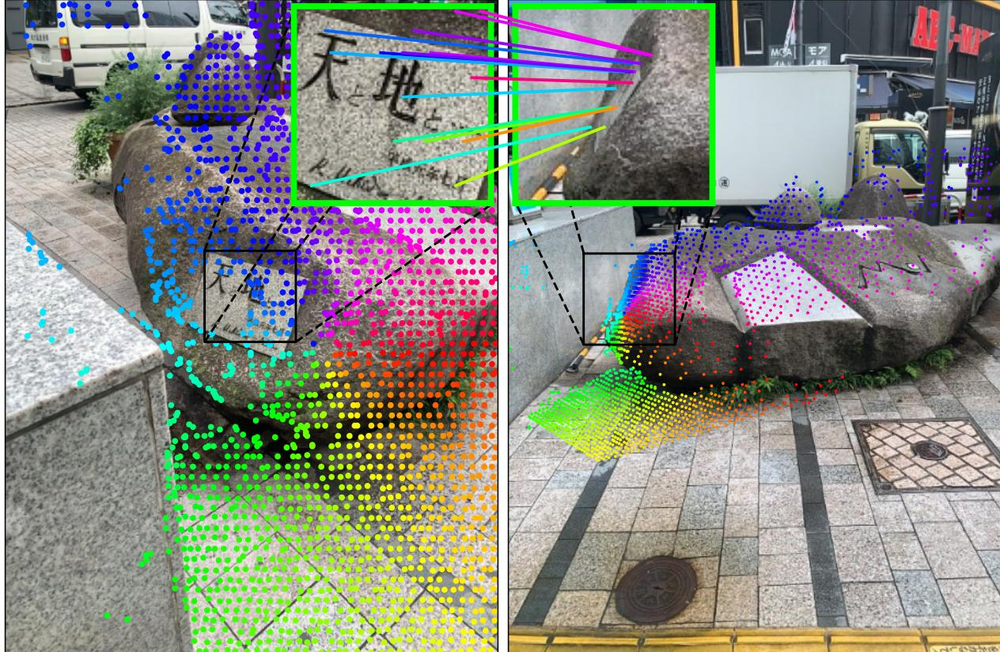  

Figure 1: Dense Correspondences. MASt3R extends DUSt3R as it predicts dense correspondences, even in regions where camera motion significantly degrades the visual similarity. Focal length can be derived from the predic 3geymakiu pr  adalonmethocmcaliratin, ce pos t an 3 heah challenging benchmarks.

# Abstract

Image Matching is a core component of all best-performing algorithms and pipelines in 3D vision. Yet despite matching being fundamentally a 3D problem, intrinsically linked to camera pose and scene geometry it is typically treated as a 2D problem. This makes sense as the goal of matching is to establish correspondences between 2D pixel fields, but also seems like a potentially hazardous choice. In this work, we take a different stance and propose to cast matching as a 3D task with DUSt3R, a recent and powerful 3D reconstruction framework based on Transformers. Based on pointmaps regression, this method displayed impressive robustness in matching views with extreme viewpoint changes, yet with limited accuracy. We aim here to improve the matching capabilities of such an approach while preserving its robustness. We thus propose to augment the DUSt3R network with a new head that outputs dense local features, trained with an additional matching loss. We further address the issue of quadratic complexity of dense matching, which becomes prohibitively slow for downstream applications if not carefully treated. We introduce a fast reciprocal matching scheme that not only accelerates matching by orders of magnitude, but also comes with theoretical guarantees and, lastly, yields improved results. Extensive experiments show that our approach, coined MASt3R, significantly outperforms the state of the art on multiple matching tasks. In particular, it beats the best published methods by $3 0 \%$ (absolute improvement) in VCRE AUC on the extremely challenging Map-free localization dataset.

# 1. Introduction

Being able to establish correspondences between pixels across different images of the same scene, denoted as image matching, constitutes a core component of all 3D vision applications, spanning mapping [14,61], localization [41,72], navigation [15], photogrammetry [34, 64] and autonomous robotics in general [63,87]. Stateof-the-art methods for visual localization, for instance, overwhelmingly rely upon image matching during the offline mapping stage, e.g. using COLMAP [75], as well as during the online localization step, typically using PnP [30]. In this paper, we focus on this core task and aim at producing, given two images, a list of pairwise correspondences, denoted as matches. In particular, we seek to output highly accurate and dense matches that are robust to viewpoint and illumination changes because these are, in the end, the limiting factor for real-world applications [36]. In the past, matching methods have traditionally been cast into a three-steps pipeline consisting of first extracting sparse and repeatable keypoints, then describing them with locally invariant features, and finally pairing the discrete set of keypoints by comparing their distance in the feature space. This pipeline has several merits: keypoint detectors are precise under low-to-moderate illumination and viewpoint changes, and the sparsity of keypoints makes the problem computationally tractable, enabling very precise matching in milliseconds whenever the images are viewed under similar conditions. This explains the success and persistence of SIFT [52] in 3D reconstruction pipelines like COLMAP [75].

Unfortunately, keypoint-based methods, by reducing matching to a bag-of-keypoint problem, discard the global geometric context of the correspondence task. This makes them especially prone to errors in situation with repetitive patterns or low-texture areas, which are in fact ill-posed for local descriptors. One way to remedy this is to introduce a global optimization strategy during the pairing step, typically leveraging some learned priors about matching, which SuperGlue and similar methods successfully implemented [51,72]. However, leveraging global context during matching might be too late, if keypoints and their descriptors do not already encode enough information. For this reason, another direction is to consider dense holistic matching, i.e. avoiding keypoints altogether, and matching the entire image at once. This recently became possible with the advent of mechanism for global attention [96]. Such approaches, like LoFTR [82], thus consider images as a whole and the resulting set of correspondences is dense and more robust to repetitive patterns and low-texture areas [43,68,69,82]. This led to new state-of-the-art results on the most challenging benchmarks, such as the Map-free localization benchmark [5].

Nevertheless, even a top-performing methods like LoFTR [82] score a relatively disappointing VCRE precision of $3 4 \%$ on the Map-free localization benchmark. We argue that this is because, so far, practically all matching approaches have been treating matching as a 2D problem in image space. In reality, the formulation of the matching task is intrinsically and fundamentally a 3D problem: pixels that correspond are pixels that observe the same 3D point. Indeed, 2D pixel correspondences and a relative camera pose in 3D space are two sides of the same coin, as they are directly related by the epipolar matrix [36]. Another evidence is that the current top-performer on the Map-free benchmark is DUSt3R [102], a method initially designed for 3D reconstruction rather than matching, and for which matches are only a by-product of the 3D reconstruction. Yet, correspondences obtained naively from this 3D output currently outperform all other keypoint- and matching-based methods on the Map-free benchmark. In this paper, we point out that, while DUSt3R [102] can indeed be used for matching, it is relatively imprecise, despite being extremely robust to viewpoint changes. To remedy this flaw, we propose to attach a second head that regresses dense local feature maps, and train it with an InfoNCE loss. The resulting architecture, called MASt3R for "Matching And Stereo 3D Reconstruction" outperforms DUSt3R on multiple benchmarks. To get pixel-accurate matches, we propose a coarse-to-fine matching scheme during which matching is performed at several scales. Each matching step involves extracting reciprocal matches from dense feature maps which, perhaps counter-intuitively, is by far more time consuming than computing the dense feature maps themselves. Our proposed solution is a faster algorithm for finding reciprocal matches that is almost two orders of magnitude faster while improving the pose estimation quality. To summarize, we claim three main contributions. First, we propose MASt3R, a 3D-aware matching approach building on the recently released DUSt3R framework. It outputs local feature maps that enable highly accurate and extremely robust matching. Second, we propose a coarse-to-fine matching scheme associated with a fast matching algorithm, enabling to work with high-resolution images. Third, MASt3R significantly outperform the state-of-the-art on several absolute and relative pose localization benchmarks.

# 2Related works

Keypoint-based matching has been a cornerstone of computer vision. Matching is carried out in three distinct stages: keypoint detection, locally invariant description and nearest-neighbor search in descriptor space. Departing from the former handcrafted methods like SIFT [52,71], modern approaches have been shifting towards learning-based data-driven schemes for detecting keypoints [8,60,97,117], describing them [7,33, 37,88] or both at the same time [10,21,53,54,70,98]. Overall, keypoint-based approaches are predominant in many benchmarks [7,35,44, 77], underscoring their enduring value in tasks requiring high precision and speed [19,77]. One notable issue, however, is they reduce matching to a local problem, i.e. discarding its holistic nature. SuperGlue and similar approaches [51, 72] thus propose to perform global reasoning in the last pairing step leveraging stronger priors to guide matching, yet leaving the detection and description local. While successful, it is still limited by the local nature of keypoints and their inability to remain invariant to strong viewpoint changes. Dense matching. In contrast to keypoint-based approaches, semi-dense [11,16,43,46,82,85] and dense approaches [27,28,29,58,92,93,94,122] offer a different paradigm for establishing image correspondences, considering all possible pixel associations. Very reminiscent of optical flow approaches [22, 40,42,79,80, 86], they are usually employing coarse-to-fine schemes to decrease computational complexity. Overall, these methods aim to consider matching from a global perspective, at the cost of increased computational resources. Dense matching has proven effective in scenarios where detailed spatial relationships and textures are critical for understanding scene geometry, leading to top performance on many benchmarks [4, 5, 6, 59, 72, 82] that are especially challenging for keypoints due to extreme changes in viewpoint or illumination. These approaches still cast matching as a 2D problem, which limits their usage for visual localization. Camera Pose estimation techniques vary widely, but the most successful strategies, for speed, accuracy and robustness trade-off, are fundamentally based on pixel matching [73, 75, 105]. The constant improvement of matching methods has fostered the introduction of more challenging camera pose estimation benchmarks, such as Aachen Day-Night, InLoc, CO3D or Map-free [5, 67, 84, 118], all featuring strong viewpoint and/or illumination changes. The most challenging of them is undoubtedly Map-free [5], a localization dataset for which a single reference image is provided but no map, with viewpoint changes up to $1 8 0 ^ { \circ }$ .

Grounding matching in 3D thus becomes a crucial necessity in these challenging conditions where classical 2D-based matching utterly falls short. Leveraging priors about the physical properties of the scene in order to improve accuracy or robustness has been widely explored in the past, but most previous works settle for leveraging epipolar constraints for semi-supervised learning of correspondences without any fundamental change [9,38, 47,101,108,111,114,120]. Toft et al. [89], on its part, propose to improve keypoint descriptors by rectifying images with perspective transformations obtained from an off-the-shelf monocular depth predictor. Recently, diffusion for pose [100] or rays [116], although not matching approaches strictly speaking, show promising performance by incorporating 3D geometric constraints into their pose estimation formulation. Finally, the recent DUSt3R [102] explore the possibility of recovering correspondences from the $a$ -priori harder task of 3D reconstruction from uncalibrated images. Despite not being trained explicitly for matching, this approach yields promising results, topping the Map-free leaderboard [5]. Our contribution is to pursue this idea, by regressing local features and explicitly training them for pairwise matching.

# 3. Method

Given two images $I ^ { 1 }$ and $I ^ { 2 }$ , respectively captured by two cameras $C ^ { 1 }$ and $C ^ { 2 }$ with unknown parameters, we wish to recover a set of pixel correspondences $\{ ( i , j ) \}$ where $i , j$ are pixels $i = ( u _ { i } , \nu _ { i } ) , j = ( u _ { j } , \nu _ { j } ) \in$ $\{ 1 , \dots , W \} \times \{ 1 , \dots , H \} , W ,$ $H$ being the respective width and height of the images. We assume they have the same resolution for the sake of simplicity, yet without loss of generality. The final network can handle pairs of variable aspect ratios. Our approach, illustrated in fig. 2, aims at jointly performing 3D scene reconstruction and matching given two input images. It is based on the DUSt3R framework recently proposed by Wang et al. [102], which we first review in section 3.1 before presenting our proposed matching head and its corresponding loss in section 3.2. We then introduce an optimized matching scheme specially devised to deal with dense feature maps in 3.3, that we use for coarse-to-fine matching in section 3.4.

# 3.1. The DUSt3R framework

DUSt3R [102] is a recently proposed approach that jointly solves the calibration and 3D reconstruction problems from images alone. A transformer-based network predicts a local 3D reconstruction given two input images, in the form of two dense 3D point-clouds $X ^ { 1 , 1 }$ and $X ^ { 2 , 1 }$ , denoted as pointmaps in the following.

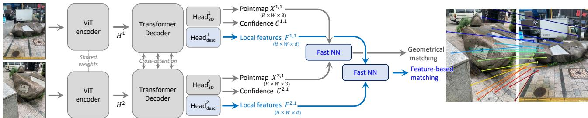  
Fiur  Overvi  the propos aproac.Given twoinput mages matc, ur network regresss image and eac input pixel a 3D point, a conidence value and a local feature. Plugging either 3D points or lol features into our fast reciprocal  matcer (3.3) yiels robust correspondences. Compared t the DUSt3R framework which we build upon, our contributions are highlighted in blue.

A pointmap $X ^ { a , b } \in \mathbb { R } ^ { H \times W \times 3 }$ represents a dense 2D-to-3D mapping between each pixel $i = ( u , \nu )$ of the image $I ^ { a }$ a i cn p $X _ { u , \nu } ^ { a , b } \in \mathbb { R } ^ { 3 }$ expressed in the coordinate system of camera $C ^ { b }$ .By regressing two pointmaps $X ^ { 1 , 1 }$ , $X ^ { 2 , 1 }$ expressed in the same coordinate system of camera $C ^ { 1 }$ , DUSt3R effectively solves the joint calibration and 3D reconstruction problem. In the case where more than two images are provided, a second step of global alignment merges all pointmaps in the same coordinate system. Note that, in this paper, we do not make use of this step and restrict ourselves to the binocular case. We now explain the inference in more details. Both images are first encoded in a Siamese manner with a ViT [23], yielding two representations $H ^ { 1 }$ and $H ^ { 2 }$ :

$$
\begin{array} { r } { \boldsymbol { H } ^ { 1 } = \operatorname { E n c o d e r } ( \boldsymbol { I } ^ { 1 } ) , } \\ { \boldsymbol { H } ^ { 2 } = \operatorname { E n c o d e r } ( \boldsymbol { I } ^ { 2 } ) . } \end{array}
$$

Then, two intertwined decoders process these representations jointly, exchanging information via crossattention to 'understand' the spatial relationship between viewpoints and the global 3D geometry of the scene. The new representations augmented with this spatial information are denoted as $H ^ { 1 }$ and $H ^ { 2 }$ :

$$
H ^ { \prime 1 } , H ^ { \prime 2 } = \operatorname { D e c o d e r } ( H ^ { 1 } , H ^ { 2 } ) .
$$

Finally, two prediction heads regress the final pointmaps and confidence maps from the concatenated representations output by the encoder and decoder:

$$
\begin{array} { r } { X ^ { 1 , 1 } , C ^ { 1 } = \mathrm { H e a d } _ { 3 \mathrm { D } } ^ { 1 } ( [ H ^ { 1 } , H ^ { \prime 1 } ] ) , } \\ { X ^ { 2 , 1 } , C ^ { 2 } = \mathrm { H e a d } _ { 3 \mathrm { D } } ^ { 2 } ( [ H ^ { 2 } , H ^ { \prime 2 } ] ) . } \end{array}
$$

Regression loss. DUSt3R is trained in a fully-supervised manner using a simple regression loss where $\upsilon \in \{ 1 , 2 \}$ is the view and i is a pixel for which the ground-truth 3D point $\hat { X } ^ { \nu , 1 } ~ \in ~ \mathbb { R } ^ { 3 }$ is defined. In the original formulation, normalizing factors $z , \hat { z }$ are introduced to make the reconstruction invariant to scale. These are simply defined as the mean distance of all valid 3D points to the origin.

$$
\ell _ { \mathrm { r e g r } } ( \nu , i ) = \left\| \frac { 1 } { z } X _ { i } ^ { \nu , 1 } - \frac { 1 } { \hat { z } } \hat { X } _ { i } ^ { \nu , 1 } \right\| ,
$$

Metric predictions. In this work, we note that scale invariance is not necessarily desirable, as some potential use-cases like map-free visual localization necessitates metric-scale predictions. Therefore, we modify the regression loss to ignore normalization for the predicted pointmaps when the ground-truth pointmaps are known to be metric. That is, we set $z \ : = \ \hat { z }$ whenever ground-truth is metric, so that $\ell _ { \mathrm { r e g r } } ( \nu , i ) =$ $| | X _ { i } ^ { \upsilon , 1 } - \hat { X } _ { i } ^ { \upsilon , 1 } | | / \hat { z }$ in this case. As in DUSt3R [102], the final confidence-aware regression loss is defined as

$$
\mathcal { L } _ { \mathrm { c o n f } } = \sum _ { \nu \in \{ 1 , 2 \} } \sum _ { i \in \mathcal { V } ^ { \nu } } C _ { i } ^ { \nu } \ell _ { \mathrm { r e g r } } ( \nu , i ) - \alpha \log C _ { i } ^ { \nu } .
$$

# 3.2. Matching prediction head and loss

To obtain reliable pixel correspondences from pointmaps, a standard solution is to look for reciprocal matches in some invariant feature space [26, 78, 102, 106]. While such a scheme works remarkably well with DUSt3R's regressed pointmaps (i.e. in a 3-dimensional space) even in presence of extreme viewpoint changes, we note that the resulting correspondences are rather imprecise, yielding suboptimal accuracy. This is a rather natural result as (i) regression is inherently affected by noise, and (ii) because DUSt3R was never explicitly trained for matching. Matching head. For these reasons, we propose to add a second head that outputs two dense feature maps $D ^ { 1 }$ and $D ^ { 2 } \in \mathbb { R } ^ { H \times W \times d }$ of dimensional $d$ :

$$
\begin{array} { l } { { D ^ { 1 } = \mathrm { H e a d } _ { \mathrm { d e s c } } ^ { 1 } ( [ H ^ { 1 } , H ^ { \prime 1 } ] ) , } } \\ { { D ^ { 2 } = \mathrm { H e a d } _ { \mathrm { d e s c } } ^ { 2 } ( [ H ^ { 2 } , H ^ { \prime 2 } ] ) . } } \end{array}
$$

We implement the head as a simple 2-layers MLP interleaved with a non-linear GELU activation function [39]. Lastly, we normalize each local feature to unit norm. More details can be found in the supplementary material. Matching objective. We wish to encourage each local descriptor from one image to match with at most a single descriptor from the other image that represents the same 3D point in the scene. To that aim, we leverage the infoNCE [95] loss over the set of ground-truth correspondences $\hat { \cal M } = \{ ( i , j ) | \hat { X } _ { i } ^ { 1 , 1 } = \hat { X } _ { j } ^ { 2 , 1 } \}$ .

$$
\mathcal { L } _ { \mathrm { m a t c h } } = - \sum _ { ( i , j ) \in \hat { \mathcal { M } } } \log \frac { s _ { \tau } ( i , j ) } { \sum _ { k \in \mathcal { P } ^ { 1 } } s _ { \tau } ( k , j ) } + \log \frac { s _ { \tau } ( i , j ) } { \sum _ { k \in \mathcal { P } ^ { 2 } } s _ { \tau } ( i , k ) } ,
$$

$$
\mathrm { w i t h } s _ { \tau } ( i , j ) = \mathrm { e x p } \left[ - \tau D _ { i } ^ { 1 \top } D _ { j } ^ { 2 } \right] .
$$

Here, $\mathcal { P } ^ { 1 } = \{ i | ( i , j ) \in \hat { \mathcal { M } } \}$ and $\mathcal { P } ^ { 2 } \ = \ \{ j | ( i , j ) \ \in \ \hat { M } \}$ denote the subset of considered pixels in each image and $\tau$ is a temperature hyper-parameter. Note that this matching objective is essentially a cross-entropy classification loss: contrary to regression in eq. (6), the network is only rewarded if it gets the correct pixel right, not a nearby pixel. This strongly encourages the network to achieve high-precision matching. Finally, both regression and matching losses are combined to get the final training objective:

$$
\mathcal { L } _ { \mathrm { t o t a l } } = \mathcal { L } _ { \mathrm { c o n f } } + \beta \mathcal { L } _ { \mathrm { m a t c h } }
$$

# 3.3. Fast reciprocal matching

Given two predicted feature maps $D ^ { 1 }$ $, D ^ { 2 } \in \mathbb { R } ^ { H \times W \times d }$ ,we aim to extract a set of reliable pixel correspondences, i.e. mutual nearest neighbors of each others:

$$
\begin{array} { r } { \mathcal { M } = \{ ( i , j ) \mid j = \mathrm { N N } _ { 2 } ( D _ { i } ^ { 1 } ) \mathrm { ~ a n d ~ } i = \mathrm { N N } _ { 1 } ( D _ { j } ^ { 2 } ) \} , } \\ { \mathrm { w i t h ~ N N } _ { A } ( D _ { j } ^ { B } ) = \arg \operatorname* { m i n } _ { i } \left\| D _ { i } ^ { A } - D _ { j } ^ { B } \right\| . } \end{array}
$$

Unfortunately, naive implementation of reciprocal matching has a high computational complexity of $O ( W ^ { 2 } H ^ { 2 } )$ , since every pixel from an image must be compared to every pixels in the other image. While optimizing the nearest-neighbor (NN) search is possible, e.g. using K-d trees [1], this kind of optimization becomes typically very inefficient in high dimensional feature space and, in all cases, orders of magnitude slower than the inference time of MASt3R to output $D ^ { 1 }$ and $D ^ { 2 }$ . Fast matching. We therefore propose a faster approach based on sub-sampling. It is based on an iterated process that starts from an initial sparse set of $k$ pixels $U ^ { 0 } = \{ U _ { n } ^ { 0 } \} _ { n = 1 } ^ { k }$ the first image $I ^ { 1 }$ . Each pixel is then mapped to its NN on $I ^ { 2 }$ , yielding $V ^ { 1 }$ , and the resulting pixels are mapped back again to $I ^ { 1 }$ in the same way:

$$
U ^ { t } \longmapsto [ \mathrm { N N } _ { 2 } ( D _ { u } ^ { 1 } ) ] _ { u \in U ^ { t } } \equiv V ^ { t } \longmapsto [ \mathrm { N N } _ { 1 } ( D _ { \nu } ^ { 2 } ) ] _ { v \in V ^ { t } } \equiv U ^ { t + 1 }
$$

The set of reciprocal matches (those which form a cycle, i.e. $\mathcal { M } _ { k } ^ { t } = \{ ( U _ { n } ^ { t } , V _ { n } ^ { t } ) \ | \ U _ { n } ^ { t } = U _ { n } ^ { t + 1 } \} )$ are then collected. For the next iteration, pixels that already converged are filtered out, i.e. updating $\boldsymbol { U } ^ { t + 1 } : = \boldsymbol { U } ^ { t + 1 } \setminus \boldsymbol { U } ^ { t }$ .Likewise, starting from $t = 1$ we also verify and filter $V ^ { t + 1 }$ , comparing it with $V ^ { t }$ in a similar fashion. As illustrated in fig. 3 (left), this process is then iterated a fixed number of times, until most correspondences converge to stable (reciprocal) pairs. In fig. 3 (center), we show that the number of un-converged point $| U ^ { t } |$ rapidly decreases to zero after a few iterations. Finally, the output set of correspondences consists of the concatenation of all reciprocal pairs $\textstyle \mathcal { M } _ { k } = \bigcup _ { t } \mathcal { M } _ { k } ^ { t }$ . Theoretical guarantees. The overall complexity of the fast matching is $O ( k W H )$ , which is $W H / k \gg 1$ times faster than the naive approach denoted $a l l$ , as illustrated in fig. 3 (right). It is worth pointing out that our fast matching algorithm extracts a subset of the full set $M$ which is bounded in size by $| { \mathcal { M } } _ { k } | \leq k$ . We study in the supplementary material the convergence guarantees of this algorithm and how it evinces outlier-filtering properties, which explains why the end accuracy is actually higher than when using the full correspondence set $M$ , see fig. 3 (right).

# 3.4. Coarse-to-fine matching

Due to the quadratic complexity of attention w.r.t. the input image area $( W \times H )$ , MASt3R only handles images of 512 pixels in their largest dimension. Larger images would require significantly more compute power to train, and ViTs do not generalize yet to larger test-time resolutions [62,65]. As a result, high-resolution images (e.g. 1M pixel) needs to be downscaled to be matched, afterwards the resulting correspondences are upscaled back to the original image resolution. This can lead to some performance loss, sometimes sufficient to cause substantial degradation in term of localization accuracy or reconstruction quality.

Coarse-to-fine matching is a standard technique to preserve the benefit of matching high-resolution images with a lower-resolution algorithm [66, 86]. We thus explore this idea for MASt3R. Our procedure starts with performing matching on downscaled versions of the two images. We denote the set of coarse correspondences obtained with subsampling $k$ as $\mathcal { M } _ { k } ^ { 0 }$ Next, we generate a grid of overlapping window crops $W ^ { 1 }$ and $W ^ { 2 } ~ \in ~ \mathbb { R } ^ { w \times 4 }$ on each full-resolution image independently. Each window crop measures 512 pixels in its largest dimension and contiguous windows overlap by $5 0 \%$ . We can then enumerate the set of all window pairs $( w _ { 1 } , w _ { 2 } ) \in W ^ { 1 } \times W ^ { 2 }$ , from which we select a subset covering most of the coarse correspondences $\mathcal { M } _ { k } ^ { 0 }$ .Specifically, we add window pairs one by one in a greedy fashion until $9 0 \%$ of correspondences are covered. Finally, we perform matching for each window pair independently:

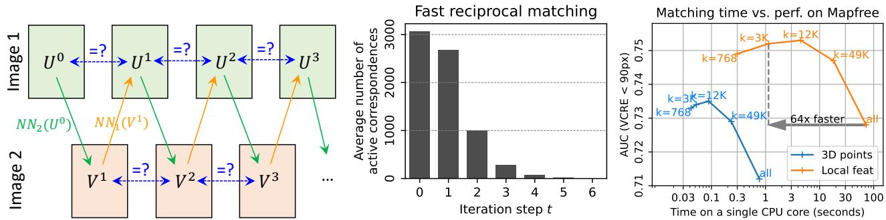  
lh of pixels $U ^ { 0 }$ and propagating it iteratively using NN search. Searching for cycles (blue arrows) detect reciprocal correspondences and allows to accelerate the subsequent steps, by removing points that converged. Center: Average number of remaining points in $U ^ { t }$ at iteration $t = 1 \ldots 6$ After only 5 iterations, nearly all points have yconverg t  reciproalmat.RighPeroraneversus-ime tadeofo the Maprea.

$$
\begin{array} { r l } & { D ^ { w _ { 1 } } , D ^ { w _ { 2 } } = \mathrm { M A S t 3 R } ( I _ { w _ { 1 } } ^ { 1 } , I _ { w _ { 2 } } ^ { 2 } ) } \\ & { \mathrm { ~ } \mathcal { M } _ { k } ^ { w _ { 1 } , w _ { 2 } } = \mathrm { f a s t } \underline { { \mathrm { ~ r e c i p r o c a l } \_ \mathrm { N N } ( D ^ { w _ { 1 } } , D ^ { w _ { 2 } } ) } } } \end{array}
$$

Correspondences obtained from each window pair are finally mapped back to the original image coordinates and concatenated, thus providing dense full-resolution matches.

# 4. Experimental results

We detail in section 4.1 the training procedure of MASt3R. Then, we evaluate on several tasks, each time comparing with the state of the art, starting with visual camera pose estimation on the Map-Free Relocalization Benchmark [5] (section 4.2), the CO3D and RealEstate datasets (section 4.3) and other standard Visual Localization benchmarks in section 4.4. Finally, we leverage MASt3R for Dense Multi-View Stereo (MVS) reconstruction in section 4.5.

# 4.1. Training

Training data . We train our network with a mixture of 14 datasets: Habitat [74], ARKitScenes [20], Blended MVS [112], MegaDepth [48], Static Scenes 3D [57], ScanNet $^ { + + }$ [113], CO3D-v2 [67], Waymo [83], Mapfree [5], WildRgb [2], VirtualKitti [12], Unreal4K [91], TartanAir [103] and an internal dataset. These datasets feature diverse scene types: indoor, outdoor, synthetic, real-world, object-centric, etc. Among them, 10 datasets have metric ground-truth. When image pairs are not directly provided with the dataset, we extract them based on the method described in [104]. Specifically, we utilize off-the-shelf image retrieval and point matching algorithms to match and verify image pairs.

Training. We base our model architecture on the public DUSt3R model [102] and use the same backbone (ViTLarge encoder and ViT-Base decoder). To benefit the most from DUSt3R's 3D matching abilities, we initialize the model weights to the publicly available DUSt3R checkpoint. During each epoch, we randomly sample $6 5 0 \mathrm { k }$ pairs equally distributed between all datasets. We train our network for 35 epoch with a cosine schedule and initial learning rate set to 0.0001. Similar to [102], we randomize the image aspect ratio at training time, ensuring that the largest image dimension is 512 pixels. We set the local feature dimension to $d = 2 4$ and the matching loss weight to $\beta = 1$ . It is important that the network sees different scales at training time, because coarse-to-fine matching starts from zoomed-out images to then zoom-in on details (see section 3.4). We therefore perform aggressive data augmentation during training in the form of random cropping. Image crops are transformed with a homography to preserve the central position of the principal point. Correspondence sampling. To generate ground-truth correspondences necessary for the matching loss (eq. (10)), we simply find reciprocal correspondences between on the ground-truth 3D pointmaps $\hat { X } ^ { 1 , 1 }  \hat { X } ^ { 2 , 1 }$ . We then randomly subsample 4096 correspondences per image pairs. If we cannot find enough correspondences, we pad with random false correspondences so that the likelihood of finding a true match remains constant. Fast nearest neighbors. For the fast reciprocal matching from section 3.3, we implement the nearest neighbor function $\operatorname { N N } ( x )$ from eq. (14) differently depending on the dimension of $x$ . When matching 3D points $x \in \mathbb { R } ^ { 3 }$ , we implement $\operatorname { N N } ( x )$ using K-d trees [56]. For matching local features with $d = 2 4$ , however, K-d trees become highly inefficient due to the curse of dimensionality [25]. Therefore, we rely on the optimized FAISS library [24, 45] in this case.

# 4.2. Map-free localization

Dataset description. We start our experiments with the Map-free relocalization benchmark [5], an extremely challenging dataset aiming at localizing the camera in metric space given a single reference image without any map. It comprises a training, validation and test sets of 460, 65 and 130 scenes resp., each featuring two video sequences. Following the benchmark, we evaluate in term of Virtual Correspondence Reprojection Error (VCRE) and camera pose accuracy, see [5] for details.

Impact of subsampling. We do not resort to coarse-tofine matching for this dataset, as the image resolution is already close to MASt3R working resolution $( 7 2 0 \times 5 4 0$ VS. $5 1 2 \times 3 8 4$ resp.). As mentioned in section 3.3, computing dense reciprocal matching is prohibitively slow even with optimized code for searching nearest neighbors. We therefore resort to subsampling the set of reciprocal correspondences, keeping at most $k$ correspondences from the complete set $M$ (eq. (13)). fig. 3 (right) shows the impact of subsampling in term of AUC (VCRE) performance and timing. Surprisingly, the performance significantly improves for intermediate values of subsampling. Using $k = 3 0 0 0$ , we can accelerate matching by a factor of 64 while significantly improving the performance. We provide insights in the supplementary material regarding this phenomenon. Unless stated otherwise, we keep $k = 3 0 0 0$ for subsequent experiments. Ablations on losses and matching modes. We report results on the validation set in table 1 for different variants of our approach: DUSt3R matching 3D points (I); MASt3R also matching 3D points (II) or local features (III, IV, V). For all methods, we compute the relative pose from the essential matrix [36] estimated with the set of predicted matches (PnP performs similarly). The metric scene scale is inferred from the depth extracted with an off-the-shelf DPT finetuned on KITTI [65] (I-IV) or from the depth directly output by MASt3R (V). First, we note that all proposed methods significantly outperforms the DUSt3R baseline, probably because MASt3R is trained longer and with more data. All other things being equal, matching descriptors perform significantly better than matching 3D points (II versus IV). This confirms our initial analysis that regression is inherently unsuited to compute pixel correspondences, see section 3.2.

We also study the impact of training only with a single matching objective $\scriptstyle \sum _ { \mathrm { m a t c h } }$ from eq. (10), III). In this case, the performance overall degrades compared to training with both 3D and matching losses (IV), in particular in term of pose estimation accuracy (e.g. median rotation of $1 0 . 8 ^ { \circ }$ for (III) compared to $3 . 0 ^ { \circ }$ for (IV)). We point out that this is in spite of the decoder now having more capacity to carry out a single task, instead of two when performing 3D reconstruction simultaneously, indicating that grounding matching in 3D is indeed crucial to improve matching. Lastly, we observe that, when using metric depth directly output by MASt3R, the performance largely improves. This suggests that, as for matching, the depth prediction task is largely correlated with 3D scene understanding, and that the two tasks strongly benefit from each other. Comparisons on the test set is reported in table 2. Overall, MASt3R outperforms all state-of-the-art approaches by a large margin, achieving more than $9 3 \%$ in VCRE AUC. This is a $3 0 \%$ absolute improvement compared to the second best published method, LoFTR $^ +$ KBR [81, 82], that get $6 3 . 4 \%$ in AUC. Likewise, the median translation error is vastly reduced to $3 6 \mathrm { c m }$ , compared to approx. $2 \mathrm { m }$ for the state-of-the-art methods. A large part of the improvement is of course due to MASt3R predicting metric depth, but note that our variant leveraging depth from DPT-KITTI (thus purely matching-based) outperforms all state-of-the-art approaches as well. We also provide the results of direct regression with MASt3R, i.e. without matching, simply using PnP on the pointmap $X ^ { 2 , 1 }$ of the second image. These results are surprisingly on par with our matching-based variant, even though the ground-truth calibration of the reference camera is not used. As we show below, this does not hold true for other localization datasets, and computing the pose via matching (e.g. with $\mathrm { P n P }$ or essential matrix) with known intrinsics seems safer in general. Qualitative results. We show in fig. 4 some matching results for pairs with strong viewpoint change (up to $1 8 0 ^ { \circ }$ . We also highlight with insets some specific regions that are correctly matched by MASt3R in spite of drastic appearance changes. We believe these correspondences to be nearly impossible to get with 2Dbased matching methods. In contrast, grounding the matching in 3D allows to solve the issue relatively straightforwardly.

Table 1: Results on the validation set of the Map-free dataset. (First and second best)   

<table><tr><td rowspan="2" colspan="2"></td><td rowspan="2">20</td><td rowspan="2">depth</td><td colspan="3">VCRE (&lt;90px)</td><td colspan="4">Pose Error</td></tr><tr><td>Reproj. ↓</td><td>Prec. ↑</td><td>AUC ↑</td><td>Med. Err. (m,) ↓</td><td></td><td>Precision ↑</td><td>AUC ↑</td></tr><tr><td>(I)</td><td>DUSt3R</td><td>3d</td><td>DPT</td><td>125.8 px</td><td>45.2%</td><td>0.704</td><td>1.10m</td><td>9.4°</td><td>17.0%</td><td>0.344</td></tr><tr><td>(II)</td><td>MASt3R</td><td>3d</td><td>DPT</td><td>112.0 px</td><td>49.9%</td><td>0.732</td><td>0.94m</td><td>3.6°</td><td>21.5%</td><td>0.409</td></tr><tr><td>(III)</td><td>MASt3R-M</td><td>feat</td><td>DPT</td><td>107.7 px</td><td>51.7%</td><td>0.744</td><td>1.10m</td><td>10.8°</td><td>19.3%</td><td>0.382</td></tr><tr><td>(IV)</td><td>MASt3R</td><td>feat</td><td>DPT</td><td>112.9 px</td><td>51.5%</td><td>0.752</td><td>0.93m</td><td>3.0°</td><td>23.2%</td><td>0.435</td></tr><tr><td>(V)</td><td>MASt3R</td><td>feat</td><td>(auto)</td><td>57.2 px</td><td>75.9%</td><td>0.934</td><td>0.46m</td><td>3.0°</td><td>51.7%</td><td>0.746</td></tr></table>

Table 2: Comparison with the state of the art on the test set of the Map-free dataset.   

<table><tr><td></td><td></td><td colspan="3">VCRE (&lt;90px)</td><td colspan="4">Pose Error</td></tr><tr><td></td><td>depth</td><td>Reproj. ↓</td><td>Prec. ↑</td><td>AUC ↑</td><td>Med. Err. (m,) ↓</td><td></td><td>Precision ↑</td><td>AUC ↑</td></tr><tr><td>RPR [5]</td><td>DPT</td><td>147.1 px</td><td>40.2%</td><td>0.402</td><td>1.68m</td><td>22.5°</td><td>6.0%</td><td>0.060</td></tr><tr><td>SIFT [52]</td><td>DPT</td><td>222.8 px</td><td>25.0%</td><td>0.504</td><td>2.93m</td><td>61.4°</td><td>10.3%</td><td>0.252</td></tr><tr><td>SP+SG [72]</td><td>DPT</td><td>160.3 px</td><td>36.1%</td><td>0.602</td><td>1.88m</td><td>25.4°</td><td>16.8%</td><td>0.346</td></tr><tr><td>LoFTR [82]</td><td>KBR</td><td>165.0 px</td><td>34.3%</td><td>0.634</td><td>2.23m</td><td>37.8°</td><td>11.0%</td><td>0.295</td></tr><tr><td>DUSt3R [102]</td><td>DPT</td><td>116.0 px</td><td>50.3%</td><td>0.697</td><td>0.97m</td><td>7.1°</td><td>21.6%</td><td>0.394</td></tr><tr><td>MASt3R</td><td>DPT</td><td>104.0 px</td><td>54.2%</td><td>0.726</td><td>0.80m</td><td>2.2°</td><td>27.0%</td><td>0.456</td></tr><tr><td>MASt3R</td><td>(auto)</td><td>48.7 px</td><td>79.3%</td><td>0.933</td><td>0.36m</td><td>2.2°</td><td>54.7%</td><td>0.740</td></tr><tr><td>MASt3R (direct reg.)</td><td></td><td>53.2 px</td><td>79.1%</td><td>0.941</td><td>0.42m</td><td>3.1°</td><td>53.0%</td><td>0.777</td></tr></table>

# 4.3. Relative pose estimation

Datasets and protocol. Next, we evaluate for the task of relative pose estimation on the CO3Dv2 [67] and RealEstate10k [121] datasets. CO3Dv2 contains 6 million frames extracted from approximately $3 7 \mathrm { k }$ videos, covering 51 MS-COCO categories. Groundtruth camera poses are obtained using COLMAP [75] from 200 frames in each video. RealEstate10k is an indoor/outdoor dataset that features 80K video clips on YouTube totalling 10 million frames, camera poses being obtained via SLAM with bundle adjustment. Following [100], we evaluate MASt3R on 41 categories from CO3Dv2 and 1.8K video clips from the test set of RealEstate10k. Each sequence is 10 frames long, we evaluate relative camera poses between all possible 45 pairs, not using ground-truth focals. Baselines and metrics. As before, matches obtained with MASt3R are used to estimate Essential Matrices and relative pose. Please note that our predictions are always done pairwise, contrary to all other methods that leverage multiple views (at the exception of DUSt3RPnP). We compare to recent data-driven approaches like RelPose [115], ${ \mathrm { R e l P o s e } } + +$ [115], PoseReg and PoseDiff [100], the recent RayDiff [116] and DUSt3R [102]. We also report results for more traditional SfM methods like PixSFM [50] and COLMAP [76] extended with SuperPoint [21] and SuperGlue [72] $\mathrm { ( C O L M A P + S P S G ) }$ . Similar to [100], we report the Relative Rotation Accuracy (RRA) and Relative Translation Accuracy (RTA) for each image pair to evaluate the relative pose error and select a threshold $\tau = 1 5$ to report $\mathrm { R T A @ 1 5 }$ and RRA $@ 1 5$ . Additionally, we calculate the mean Average Accuracy (mAA30), defined as the area under the accuracy curve of the angular differences at $m i n ( \mathrm { R R A @ 3 0 } , \mathrm { R T A @ 3 0 } )$ . Results. As shown in table 3, SfM approaches tend to perform significantly worse on this task, mainly due to the poor visual support. This because images usually observe a small object, combined with the fact that many pairs have a wide baseline, sometimes up to $1 8 0 ^ { \circ }$ . On the contrary, 3D grounded approaches like RayDiffusion, DUSt3R and MASt3R are the two most competitive methods on this dataset, the latter leading in translation and mAA on both datasets. Notably, on RealEstate our mAA score improves by at least 8.7 points over the best multi-view methods and 15.2 points over pairwise DUSt3R. This showcases the accuracy and robustness of our approach to few input view setups.

# 4.4. Visual localization

Datasets. We then evaluate MASt3R for the task of absolute pose estimation on the Aachen Day-Night[118] and InLoc[84] datasets. Aachen comprises 4,328 reference images taken with hand-held cameras, as well as 824 daytime and 98 nighttime query images taken with mobile phones in the old inner city of Aachen, Germany. InLoc[84] is an indoor dataset with challenging appearance variation between the $9 , 9 7 2 \mathrm { R G B - D } + 6 \mathrm { D O F }$ pose database images and the 329 query images taken from an iPhone 7.

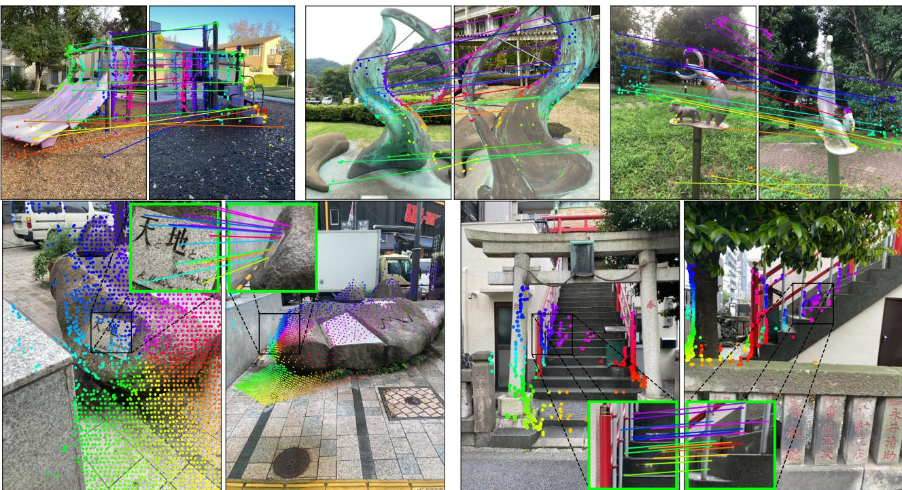  
ualiape heae atat.To air wi srvot hangs.Th spots in close-up. These regions could hardly be matched by local keypoints. See text for details.

Metrics. We report report the percentage of successfully localized images within three thresholds: $( 0 . 2 5 \mathrm { m } , 2 ^ { \circ } )$ , $( 0 . 5 \mathrm { m } , 5 ^ { \circ } )$ and (5m, $1 0 ^ { \circ }$ for Aachen and $( 0 . 2 5 \mathrm { m } , 1 0 ^ { \circ } )$ , $( 0 . 5 \mathrm { m } , 1 0 ^ { \circ } )$ , $( 1 \mathrm { m } , 1 0 ^ { \circ } )$ for InLoc. Results are reported in Table 4. We study the performance of MASt3R with variable number of retrieved images. As expected, a greater number of retrieved images (top40) yields better performance, achieving competitive performance on Aachen and significantly outperforming the state of the art on InLoc. Interestingly, our approach still performs very well even with a single retrieved image (top1), showcasing the robustness of 3D grounded matching. We also include direct regression results, which are rather poor, showing a striking impact of the dataset scale on the localization error, i.e. small scenes are much less affected (see results on Map-free in 4.2). This confirms the importance of feature matching to estimate reliable poses.

# 4.5. Multiview 3D reconstruction

We finally perform MVS by triangulating the obtained matches. Note that the matching is performed in full resolution without prior knowledge of cameras, and the latter are only used to triangulate matches in groundtruth reference frame. We remove spurious 3D points via geometric consistency post-processing [99]. Datasets and metrics. We evaluate our predictions on the DTU [3] dataset. Contrary to all competing learning methods, we apply our network in a zero-shot setting, i.e. we do not train nor finetune on the DTU train set and apply our model as is. In table 3 we report the average accuracy, completeness and Chamfer distances error metrics as provided by the authors of the benchmarks. The accuracy for a point of the reconstructed shape is defined as the smallest Euclidean distance to the ground-truth, and the completeness of a point of the ground-truth as the smallest Euclidean distance to the reconstructed shape. The overall Chamfer distance is the average of both previous metrics. Results. Data-driven approaches trained on this domain significantly outperform handcrafted ones, cutting the Chamfer error by half. To the best of our knowledge, we are the first to draw such conclusion in a zero-shot setting. MASt3R not only outperforms the DUSt3R baseline but also compete with the best methods, all without leveraging camera calibration nor poses for matching, neither having seen this camera setup before.

Table 3: Left: Multi-view pose regression on the CO3Dv2 [67] and RealEstate10K [121] with 10 random frames. Parthe denot etho that  ot report resul nhe 10viws , e report the bstrcmn (8 vis). We distinguish between (a) multi-view and (b) pairwise methods. Right: Dense MVS results on the DTUdatase, in m. Handcraftmethods () perfor wors than learnig-bas apprache () that trai th em  h e zhoet ht reasonable performance.   

<table><tr><td rowspan="2"></td><td rowspan="2">Methods</td><td colspan="3">Co3Dv2</td><td rowspan="2">RealEstate10K mAA(30)</td></tr><tr><td>RRA@15</td><td>RTA@15</td><td>mAA(30)</td></tr><tr><td rowspan="8">(a)</td><td>Colmap+SG [21,72]</td><td>36.1</td><td>27.3</td><td>25.3</td><td>45.2</td></tr><tr><td>PixSfM [50]</td><td>33.7</td><td>32.9</td><td>30.1</td><td>49.4</td></tr><tr><td>RelPose [115]</td><td>57.1</td><td>-</td><td>-</td><td>-</td></tr><tr><td>PosReg [100]</td><td>53.2</td><td>49.1</td><td>45.0</td><td>-</td></tr><tr><td>PoseDiff [100]</td><td>80.5</td><td>79.8</td><td>66.5</td><td>48.0</td></tr><tr><td>RelPose++ [49]</td><td>(85.5)</td><td>-</td><td>-</td><td>-</td></tr><tr><td>RayDiff [116]</td><td>(93.3)</td><td>-</td><td>-</td><td>-</td></tr><tr><td>DUSt3R-GA [102]</td><td>96.2</td><td>86.8</td><td>76.7</td><td>67.7</td></tr><tr><td rowspan="2">(b)</td><td>DUSt3R [102]</td><td>94.3</td><td>88.4</td><td>77.2</td><td>61.2</td></tr><tr><td>MASt3R</td><td>94.6</td><td>91.9</td><td>81.8</td><td>76.4</td></tr></table>

<table><tr><td></td><td>Methods</td><td>Acc.↓</td><td>Comp.↓</td><td>Overall↓</td></tr><tr><td rowspan="4">(c)</td><td>Camp [13]</td><td>0.835</td><td>0.554</td><td>0.695</td></tr><tr><td>Furu [31]</td><td>0.613</td><td>0.941</td><td>0.777</td></tr><tr><td>Tola [90]</td><td>0.342</td><td>1.190</td><td>0.766</td></tr><tr><td>Gipuma [32]</td><td>0.283</td><td>0.873</td><td>0.578</td></tr><tr><td rowspan="8">(d)</td><td>MVSNet [110]</td><td>0.396</td><td>0.527</td><td>0.462</td></tr><tr><td>CVP-MVSNet [109]</td><td>0.296</td><td>0.406</td><td>0.351</td></tr><tr><td>UCS-Net [17]</td><td>0.338</td><td>0.349</td><td>0.344</td></tr><tr><td>CER-MVS [55]</td><td>0.359</td><td>0.305</td><td>0.332</td></tr><tr><td>CIDER [107]</td><td>0.417</td><td>0.437</td><td>0.427</td></tr><tr><td>PatchmatchNet [99]</td><td>0.427</td><td>0.277</td><td>0.352</td></tr><tr><td>GeoMVSNet [119]</td><td>0.331</td><td>0.259</td><td>0.295</td></tr><tr><td></td><td></td><td></td><td>1.741</td></tr><tr><td rowspan="2">(e)</td><td>DUSt3R [102]</td><td>2.677</td><td>0.805</td><td></td></tr><tr><td>MASt3R</td><td>0.403</td><td>0.344</td><td>0.374</td></tr></table>

TablVisual localizaton result n ache Day-Night and InL. Wereportour results or diffeent ub retrieved database images (topN).

<table><tr><td rowspan="2">Methods</td><td colspan="2">AachenDayNight[118]</td><td colspan="2">InLoc[84]</td></tr><tr><td>Day</td><td>Night</td><td>DUC1</td><td>DUC2</td></tr><tr><td>Kapture+R2D2 [41]</td><td>91.3/97.0/99.5</td><td>78.5/91.6/100</td><td>41.4/60.1/73.7</td><td>47.3/67.2/73.3</td></tr><tr><td>SP+SuperGlue [72]</td><td>89.8/96.1/99.4</td><td>77.0/90.6/100</td><td>49.0/68.7/80.8</td><td>53.4/77.1/82.4</td></tr><tr><td>SP+LightGlue [51]</td><td>90.2/96.0/99.4</td><td>77.0/91.1/100</td><td>49.0/68.2/79.3</td><td>55.0/74.8/79.4</td></tr><tr><td>LoFTR [82]</td><td>88.7/95.6/99.0</td><td>78.5/90.6/99.0</td><td>47.5/72.2/84.8</td><td>54.2/74.8/85.5</td></tr><tr><td>DKM [27]</td><td></td><td></td><td>51.5/75.3/86.9</td><td>63.4/82.4/87.8</td></tr><tr><td>DUSt3R top1 [102]</td><td>72.7/89.6/98.1</td><td>59.7/80.1/93.2</td><td>36.4/55.1/66.7</td><td>27.5/42.7/49.6</td></tr><tr><td>DUSt3R top20 [102]</td><td>79.4/94.3/99.5</td><td>74.9/91.1/99.0</td><td>53.0/74.2/89.9</td><td>61.8/77.1/84.0</td></tr><tr><td>MASt3R top1</td><td>79.6/93.5/98.7</td><td>70.2/88.0/97.4</td><td>41.9/64.1/73.2</td><td>38.9/55.7/62.6</td></tr><tr><td>MASt3R top20</td><td>83.4/95.3/99.4</td><td>76.4/91.6/100</td><td>55.1/77.8/90.4</td><td>71.0/84.7/89.3</td></tr><tr><td>MASt3R top40</td><td>82.2/93.9/99.5</td><td>75.4/91.6/100</td><td>56.1/79.3/90.9</td><td>71.0/87.0/91.6</td></tr><tr><td>MASt3R direct reg. top1</td><td>1.5/4.5/60.7</td><td>1.6/4.2/47.6</td><td>13.1/32.3/58.1</td><td>10.7/26.0/38.2</td></tr></table>

# 5. Conclusion

Grounding image matching in 3D with MASt3R significantly raised the bar on camera pose and localization tasks on many public benchmarks. We successfully improved DUSt3R with matching, getting the best of both worlds: enhanced robustness, while attaining and even surpassing what could be done with pixel matching alone. We introduced a fast reciprocal matcher and a coarse to fine approach for efficient processing, allowing users to balance between accuracy and speed. MASt3R is able to perform in few-view regimes (even in top1), that we believe will greatly increase versatility of localization.

# Appendix

In this appendix, we first present additional qualitative examples on various tasks in appendix A, followed by a proof of convergence of the fast reciprocal matching algorithm and an in-depth study of the related performance gains in appendix B. We finally show an ablative study concerning the impact of coarse-to-fine matching in appendix C.

# A. Additional Qualitative Results

We provide here additional qualitative results on the DTU [3], InLoc [84], Aachen Day-Night datasets [118] and the Map-free benchmark [5]. MVS on DTU. We show in fig. 5 the output point clouds after post-processing, shaded with approximate normals from the tangent planes based on the 50 nearest neighbors. We wish to emphasize again that the point clouds are raw values obtained via triangulation of the coarse-to-fine matches of MASt3R. The matching was performed in an one-versus-all strategy, meaning that we did not leverage the epipolar constraints coming from the GT cameras, which is in stark contrast with all existing approaches for MVS. MASt3R is particularly precise and robust, giving sharp and dense details. The reconstructions are complete even in low-contrast homogeneous regions like the surfaces of the vegetables or the sides of the power supply. The matching is also robust to varied textures or materials, and also to violations of the Lambertian assumption, i.e. specularities on the vegetables, plastic surfaces or the white sculpture.

Qualitative matching results. We show a few examples of matches fig. 6 for the Map-free benchmark [5], in fig. 7 for the InLoc [84] dataset and in fig. 8 for the Aachen Day-Night dataset [118]. The proposed MASt3R approach is robust to extreme viewpoint changes, and still provides approximately correct correspondences in such cases (right-hand side pairs of Map-free in fig. 6), even for views facing each other (coffee tables or corridor pairs of InLoc 7). This is reminiscent of the capabilities of DUSt3R that provided an unprecedented robustness to such cases. Similarly, our approach handles large scale differences (e.g. on Mapfree in fig. 6) repetitive and ambiguous patterns, as well as environmental and day/night illuminations changes (fig. 8). Interestingly, the accuracy of correspondences output by MASt3R gracefully degrades when the viewpoint baseline increases. Even in extreme cases where correspondences get very coarsely estimated, approximately correct relative camera poses can still be recovered. Thanks to these capabilities, MASt3R reach state-of-the-art performance or close to it on several benchmarks in a zero-shot setting. We hope this work will foster research in the direction of pointmap regression for a multitude of vision tasks, where robustness and accuracy are critical.

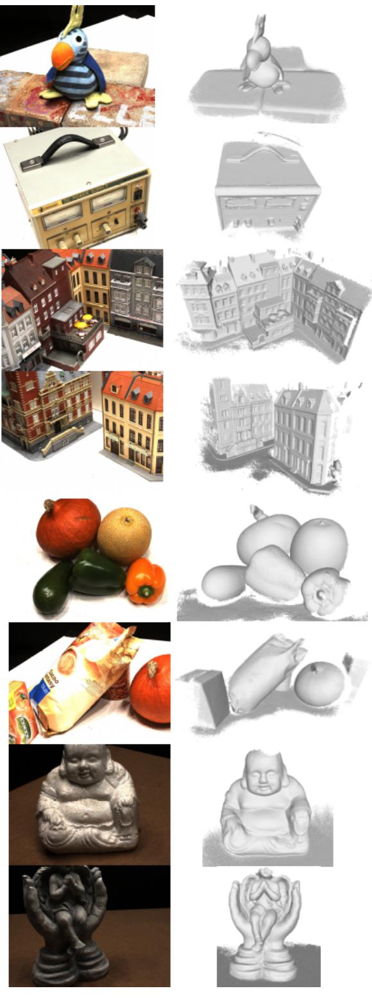  

Figure 5: Qualitative MVS results on the DTU dataset [3] simply obtained by triangulating the dense matches from MASt3R.

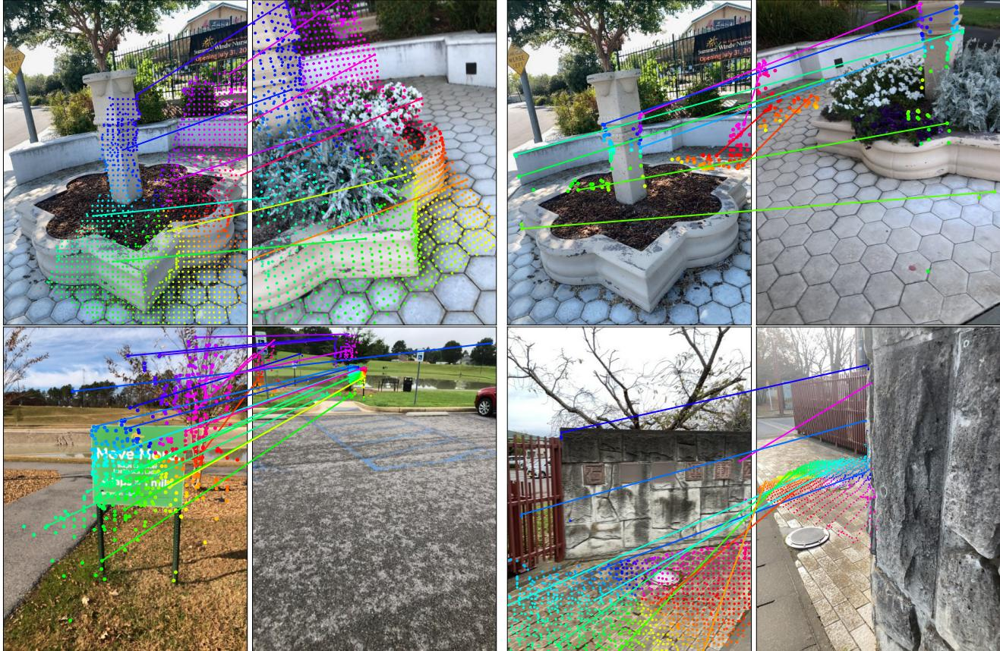  

Figure 6: Qualitative examples of matching on Map-free localization benchmark.

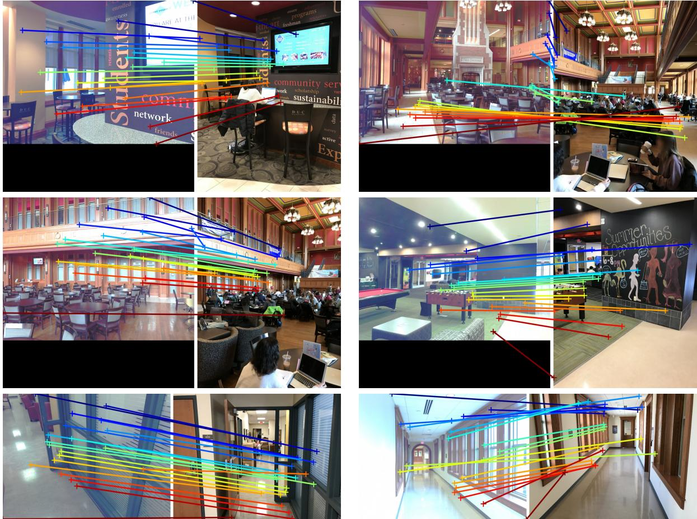  

Figure 7: Qualitative examples of matching on the InLoc localization benchmark.

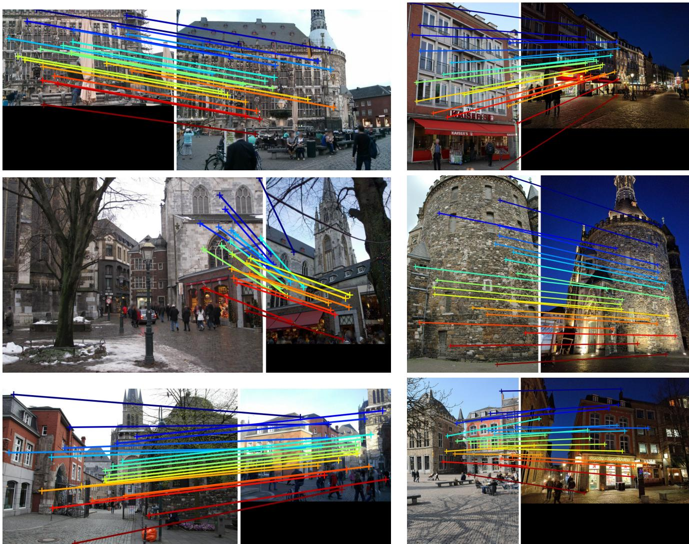  

Figure 8: Qualitative examples o matching onthe Aachen Day-Night localization benchmark. Pairs from the day subset are on the left column, and pairs from the night subset are on the right column.

# B. Fast Reciprocal Matching

# B.1. Theoretical study

We detail here the theoretical proofs of convergence of the Fast Reciprocal Matching algorithm presented in Sec.3.3 of the main paper. Contrary to the traditional bipartite graph matching formulation [18], where the complete graph is used for the matching, we wish to decrease the computational complexity by calculating only a smaller portion of it. As explained in equation (14) of the main paper, considering the two predicted sets of features $D ^ { 1 }$ , $D ^ { 2 } \in \mathbb { R } ^ { H \times W \times d }$ ,partial reciprocal matching boils down to finding a subset of the reciprocal correspondences, i.e. mutual Nearest Neighbors (NN):

$$
\begin{array} { r } { \mathcal { M } = \{ ( i , j ) \mid j = \mathrm { N N } _ { 2 } ( D _ { i } ^ { 1 } ) \mathrm { ~ a n d ~ } i = \mathrm { N N } _ { 1 } ( D _ { j } ^ { 2 } ) \} , } \\ { \mathrm { w i t h ~ N N } _ { A } ( D _ { j } ^ { B } ) = \arg \operatorname* { m i n } _ { i } \left\| D _ { i } ^ { A } - D _ { j } ^ { B } \right\| . } \end{array}
$$

We remind here the behavior of the algorithm: an initial s et of $k$ pixls of $I ^ { 1 }$ ${ \cal U } ^ { 0 } = \{ { \cal U } _ { n } ^ { 0 } \} _ { n = 1 } ^ { k }$ with $k \ll W H$ is mapped to their NN in $I ^ { 2 }$ , yielding $V ^ { 1 }$ , that are then mapped to their nearest neighbors back to $I ^ { 1 }$ :

$$
U ^ { t } \longmapsto [ \mathrm { N N } _ { 2 } ( D _ { u } ^ { 1 } ) ] _ { u \in U ^ { t } } \equiv V ^ { t } \longmapsto [ \mathrm { N N } _ { 1 } ( D _ { \nu } ^ { 2 } ) ] _ { v \in V ^ { t } } \equiv U ^ { t + 1 }
$$

After this back-and-forth mapping, the reciprocal matches (i.e. those which form a cycle) are recovered and removed from $U ^ { t + 1 }$ . The remaining "active" ones are mapped back to $I ^ { 2 }$ and reciprocity is checked again. We iterate this process for a few iterations. After enough iterations we discard any active sample remaining. It is important to note that the NN algorithm we use is deterministic and consistently returns the same index in the case where multiple descriptors in the other image share the same minimal distance (or maximal similarity), although this is very unlikely since descriptors are real-valued.

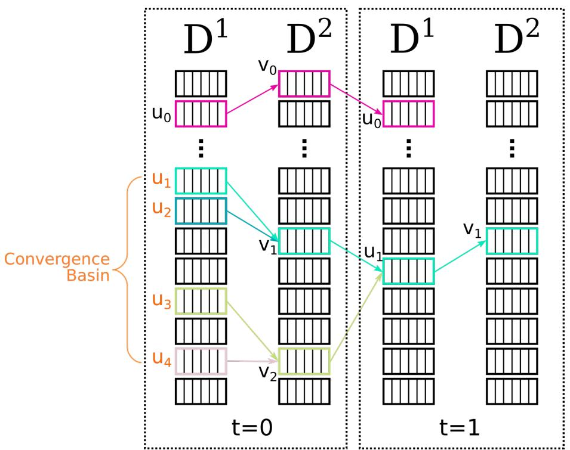  

Figure 9: Illustration of the iterative FRM algorithm. Starting from 5 pixels in $I ^ { 1 }$ at $t = 0$ , the FRM connects them to their Nearest Neighbors (NN) in $I ^ { 2 }$ , and maps them back to their NN in $I ^ { 1 }$ I they go back to their starting p  pk  elat) i eteOhe t)hr ieanetarmpehexala . We howang he art pointbas ioe urap whic te will converge towards the same cycle. For clarity, all edges of $\mathcal { G }$ were not drawn.

Proof of Convergence. By design, Fast Reciprocal Matching (FRM) operates on the directed bipartite graph $\mathcal { G }$ of nearest neighbors between $I ^ { 1 }$ and $I ^ { 2 }$ . $\mathcal { G }$ contains oriented edges $\varepsilon$ .All nodes, i.e. pixels, belong to $\mathcal { G }$ since we add an edge for each pixel's nearest neighbor, but note that all pixels cannot reach all other pixels. For example, two reciprocal pixels in $I ^ { 1 }$ and $I ^ { 2 }$ are only connected to each other and to no other pixels. This means $\mathcal { G }$ is composed of possibly multiple disjoint sub-graphs $\mathcal { G } ^ { i } , 1 \leq i \leq H W$ with directed edges $\mathcal { E } ^ { i }$ (see fig. 9). Proposition B.1. There can be only one cycle in each sub-graph $\mathcal { G } ^ { i }$ . Proof. This is a rather trivial fact, since we build $\mathcal { G }$ s.t. only one edge exits each node. If one were to follow the path of a sub-graph $\mathcal { G } ^ { i }$ , once a node that belongs to a cycle is reached, no edge can exit the cycle, for the only exiting edge is already part of the cycle. A second cycle (or more) thus cannot exist in $\mathcal { G } ^ { i }$ . Lemma B.2. Each of the subgraph $\mathcal { G } ^ { i }$ is either a single cycle or a special arborescence, i.e. a directed graph where, from any node there exist a single path towards a root cycle.

Proof. The former follows naturally from the previous explanation: since there can only be a single cycle in $\mathcal { G } ^ { i }$ , it can naturally be a cycle. We now demonstrate the latter, i.e. when $\mathcal { G } ^ { i }$ is not trivially a cycle. Let us march on $\mathcal { G } ^ { i }$ starting from an arbitrary node $a$ , to which is attached a descriptor $D _ { a } ^ { 1 }$ . The only edge exiting this node goes to its nearest neighbor $N N _ { 2 } ( D _ { a } ^ { 1 } ) = b$ .Now at node $b$ , we do the same and follow the only edge exiting back to $I ^ { 1 }$ : $N N _ { 1 } ( D _ { b } ^ { 2 } ) = c$ Alternating between $I ^ { 1 }$ and $I ^ { 2 }$ , we get $N N _ { 2 } ( D _ { c } ^ { 1 } ) = d$ , $N N _ { 1 } ( D _ { d } ^ { 2 } ) = e$ and so forth. We denote $s ( u , \nu ) = D _ { u } ^ { 1 \top } D _ { \nu } ^ { 2 }$ the similarity score of an edge between two nodes $u$ and $\nu$ , $( u , \nu ) \in \mathcal { E } ^ { i }$ .Because edges are nearest neighbors, we note that $s ( a , b ) \ \leq \ s ( c , b )$ This trivially stems from the fact that if $s ( c , b ) < s ( a , b )$ then the nearest neighbor of $b$ would no longer be $c$ but at least $a$ .Expanding this property to the path along $\mathcal { G } ^ { i }$ it follows that:

$$
s ( a , b ) \leq s ( c , b ) \leq s ( c , d ) \leq s ( e , d ) . . .
$$

Meaning that the similarity score monotonously increases as we walk along the graph. There is a finite number of nodes in $\mathcal { G } ^ { i }$ so this sequence reaches the upper-bound similarity value $s ( u , \upsilon )$ . Because $s ( u , \nu )$ is the maximal similarity in $\mathcal { G } ^ { i }$ , this ensures that $N N _ { 2 } ( D _ { u } ^ { 1 } ) = \nu$ and $N N _ { 1 } ( D _ { \nu } ^ { 2 } ) = u$ forming a cycle of at least two nodes. This means there is always a cycle in $\mathcal { G } ^ { i }$ , between the maximal similarity pair. Following proposition B.1, we can conclude that there is no other cycle in $\mathcal { G } ^ { i }$ and that each starting point is thus guaranteed to lead towards the root via a single path, forming an arborescence with a cycle at its root.

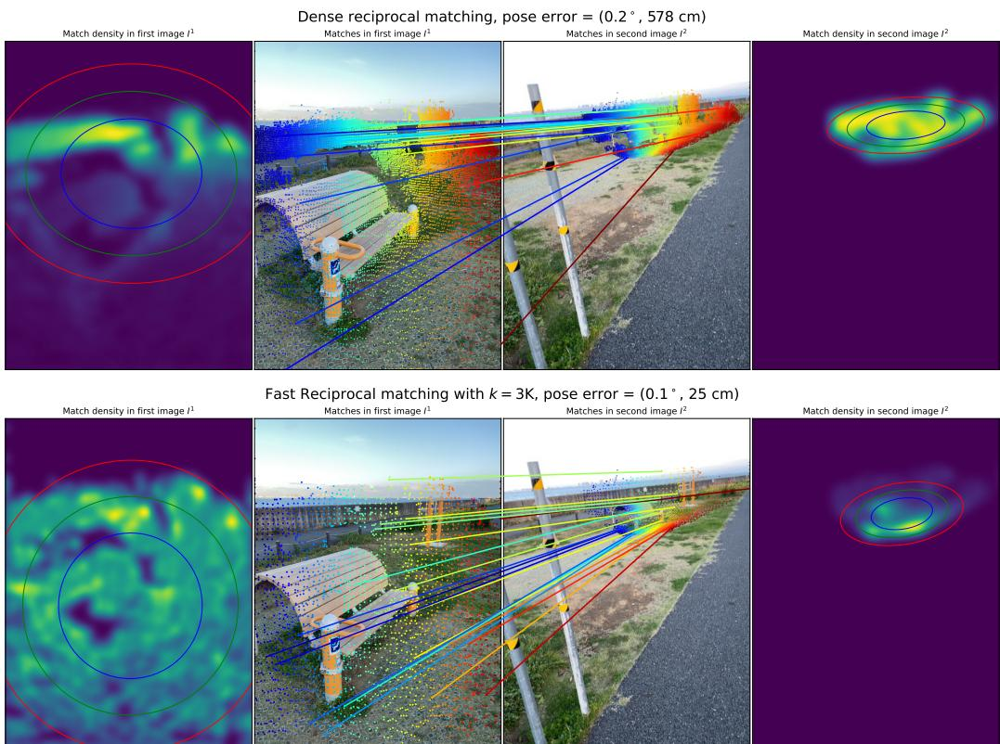  
FIlut theienca ensy wheusenemathisel fast reciprocal matching with $k = 3 0 0 0$ .Fast reciprocal matching samples correspondences with a bias for large convergence basins, resulting in a more unifor coverage of the mages.Coverage can be measured in ters the mean and standard deviation $\sigma$ of the point matches in each density map, plotted as colored ellipses (red, green and blue correspond respectively to $1 \sigma , 1 . 5 \sigma$ and $2 \sigma$ .

Note that the root cycle can be of more than two nodes if more than one greatest similarity of eq. (21) are perfectly equal and the NN algorithm creates a greater cycle. Because $\mathcal { G }$ is a bipartite graph, $\mathcal { G } ^ { i }$ is also bipartite, meaning the end-cycle is composed of an even number of nodes. In practice however, we work with floatingpoint descriptors of dimension 24. For greater cycles to exist, e.g. cycles of 4 nodes $a , b , c , d$ , the similarities must satisfy increasingly prohibitive constraints, e.g. $s ( a , b ) = s ( c , b ) = s ( c , d ) = s ( a , d )$ . This is extremely unlikely with real-valued distance and we consider it is negligible. Corollary B.3. Regardless of the starting point in $\mathcal { G } ^ { i }$ , the FRM algorithm always converges towards reciprocal matches. This follows naturally from the above: we did not make any assumption about the starting point of this walk nor about the sub-graph it belongs to. For any starting point in the graph, i.e. for all initial pixels $U$ , the FRM algorithm will by design follow the sub-graph of nearest neighbors that will ultimately lead to the root cycle, which is by definition a reciprocal match.

We illustrate this behavior in fig. 9. In the upper part (pink) the starting point $u _ { 0 }$ directly lies in a cycle containing two nodes $u _ { 0 }$ and $\upsilon _ { 0 }$ and the algorithm stops after the first cycle verification at step $t = 1$ The bottom part shows a more complex case of convergence basin, where several starting points $u _ { 1 } , u _ { 2 } , u _ { 3 } , u _ { 4 }$ lead to resp. two nodes $\upsilon _ { 1 }$ and $\upsilon _ { 2 }$ in $I ^ { 2 }$ . Following the path to the root of the arborescence, and updating $U$ and $V$ along the way, the algorithm finds a cycle between $u _ { 1 }$ and $\upsilon _ { 1 }$ at timestep $t = 1$ . From 5 initial pixel positions, the algorithm returned a unique reciprocal correspondence. Note that it is possible to artificially build a graph that maximizes the number of NN queries thus impacting the computational efficiency, but these are very unlikely in practice as seen in Figure 2 (center) of the main paper. The number of active samples, e.g. samples that did not reach a cycle, quickly drops to 0 after only 6 iterations, leading to a significant speed-up in computation (right).

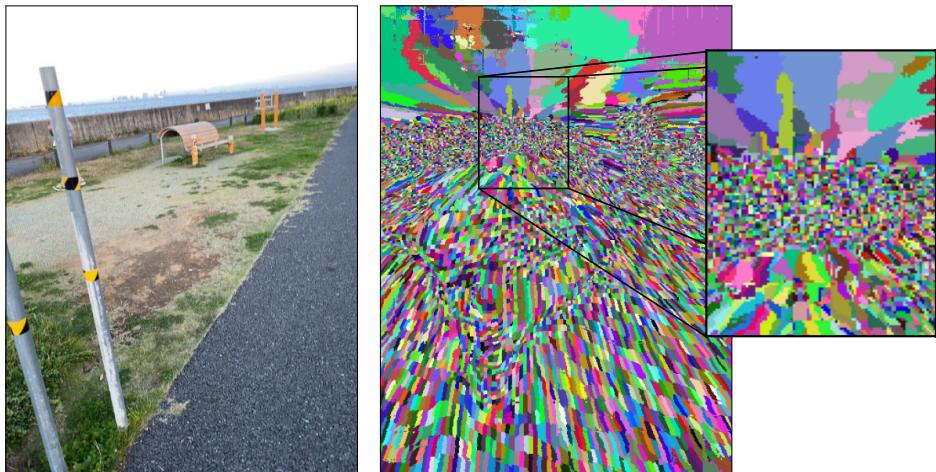  
ur Iratn ebass  theag .a basl wi (r eahi  ve when applying the fast reciprocal matching algorithm.

Proposition B.4. Starting from $k \ll H W$ samples, the FRM algorithm recovers a subset $\mathcal { M } _ { k }$ of all possible reciprocal correspondences of cardinality $| { \cal M } _ { k } | = j \le k$ . Proof. This fact comes trivially from the $k$ sparse initial samples $U$ . As explained before, $\mathcal { G }$ is composed of at most HW sub-graphs $\mathcal { G } ^ { i }$ . Because we initialize the algorithm with $k \ll H W$ seeds, these can at most span $k$ sub-graphs each leading to a single reciprocal match. Due to the potential presence of convergence basins, as seen in fig. 9, samples can merge along the paths to their root cycles, decreasing the final number of reciprocals and explaining the inequality $j \leq k$ .

# B.2. Performance improves with fast matching

As observed in Figure 2 of the main paper, FRM significantly improves the performance. In the minimal example we provide in fig. 9, it is clearly visible that the FRM provides a sampling biased towards finding reciprocal matches with large basins (bottom), since a greater number of initial samples can fall onto them compared to small basins (top). Note that the size of the basin is inversely proportional to the maximal density of reciprocal matches. Interestingly with the FRM, this results in a more homogeneous distribution (i.e. spatial coverage) of reciprocal matches than the full matching, as depicted in fig. 10. As a direct consequence of a more homogeneous spatial coverage, RANSAC is able to better estimate epipolar lines than when lots of points are packed together in a small image region, which in turn provides better and more stable pose estimates.

In order to demonstrate the effect of basin-biased sampling, we propose to compute the full correspondence set $M$ (eq. (18)) and to subsample it in two ways: first, we naively subsample it randomly to reach the same number of reciprocals as the FRM. Second, we compute the size of each basin (as shown in fig. 11) and we bias the subsampling using the sizes. We report the results of this experiment in fig. 12. While random subsampling results in catastrophic performance drops, basin-biased sampling actually increases the performance compared to using the full graph (rightmost datapoint). As expected, the FRM algorithm provides a performance that closely follows biased subsampling, yet by only a fraction of the compute compared to basin-biased sampling which requires to compute all reciprocal matches in order to measure basin sizes. Importantly, these observations hold for both reprojection error and pose accuracy, regardless of the variant of RANSAC used to estimate relative poses.

# C. Coarse-to-Fine

In this section, we showcase the important benefits of the coarse-to-fine strategy. We compare it to coarseonly matching, that simply computes correspondences on input images down-scaled to the resolution of the network.

Visual localization on Aachen Day-Night[118]. For this task, the input images are of resolution $1 6 0 0 \times 1 2 0 0$ and $1 0 2 4 \times 7 6 8$ , in both landscape and portrait are downscaled to $5 1 2 \times 3 8 4 / 3 8 4 \times 5 1 2$ We report the percentage of successfully localized images within three thresholds: $( 0 . 2 5 \mathrm { m } , 2 ^ { \circ } )$ , $( 0 . 5 \mathrm { m } , 5 ^ { \circ } )$ and $( 5 \mathrm { m } , 1 0 ^ { \circ } )$ in table 5 (left). We observe significant performance drops when using coarse matching only, by up to $1 5 \%$ in top1 on the Night split.

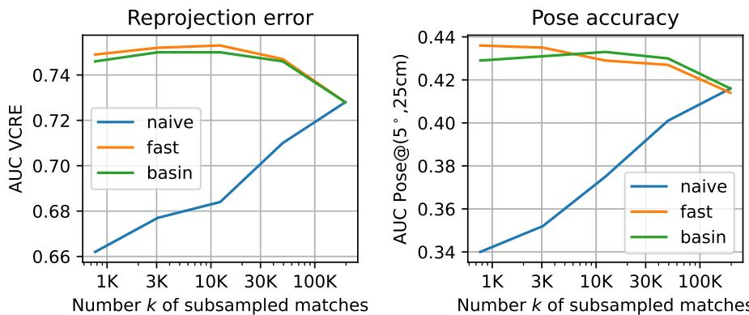  
Fr Compariso  the perforanc  the Map-ree bencmark validation ) or different subsaplig ae'ieoe enisi teial u  romate; ' denotes the proposed fast reciprocal matching; and 'basin'denotes random subsampling weighted by the size ocven asThe stn asrat peo lary hes aivspi catastrophic results.

Table 5:Coarse matching compared to Coarse-to-Fine for the tasksof visual localization on Aachen Day-Night (left) and MVS reconstruction on the DTU dataset (right).   

<table><tr><td>Methods</td><td>Coarse-to-Fine</td><td>Day</td><td>Night</td></tr><tr><td>MASt3R top1</td><td>×</td><td>74.9/90.3/98.5</td><td>55.5/82.2/95.8</td></tr><tr><td>MASt3R top1</td><td>✓</td><td>79.6/93.5/98.7</td><td>70.2/88.0/97.4</td></tr><tr><td>MASt3R top20</td><td>×</td><td>80.8/93.8/99.5</td><td>74.3/92.1/100</td></tr><tr><td>MASt3R top20</td><td>✓</td><td>83.4/95.3/99.4</td><td>76.4/91.6/100</td></tr></table>

MVS. The input images of the DTU dataset [3] are of resolution $1 2 0 0 \times 1 6 0 0$ downscaled to $3 8 4 \times 5 1 2$ . As in the main paper, we report here the accuracy, completeness and Chamfer distance of triangulated matches obtained with MASt3R, in the coarse-only and coarse-tofine settings in table 5 (right). While coarse matching still outperforms the direct regression of DUSt3R, we see a clear drop in reconstruction quality in all metrics, nearly doubling the reconstruction errors.

# D. Detailed experimental settings

In our experiments, we set the confidence loss weight $\alpha = 0 . 2$ as in [102], the matching loss weight $\beta = 1$ , local feature dimension $d = 2 4$ and the temperature in the InfoNCE loss to $\tau = 0 . 0 7$ .We report the detailed hyper-parameter settings we use for training MASt3R in Table 6.

# References

[1] Scipy. https://docs.scipy.org/doc/scipy. 5   
[2] RGBD Objects in the Wild: Scaling Real-World 3D Object Learning from RGB-D Videos, 2024. arXiv:2401.12592 [cs]. 6   
[3] Henrik Aanæs, Rasmus Ramsbøl Jensen, George Vogiatzis, Engin Tola, and Anders Bjorholm Dahl. Largescale data for multiple-view stereopsis. IJCV, 2016. 9, 11, 17

Table 6: Detailed hyper-parameters for the training   

<table><tr><td>Methods</td><td>Acc.↓</td><td>Comp.↓</td><td>Overall</td></tr><tr><td>DUSt3R [102]</td><td>2.677</td><td>0.805</td><td>1.741</td></tr><tr><td>MASt3R Coarse</td><td>0.652</td><td>0.592</td><td>0.622</td></tr><tr><td>MASt3R</td><td>0.403</td><td>0.344</td><td>0.374</td></tr></table>

<table><tr><td>Hyper-parameters</td><td>fine-tuning</td></tr><tr><td>Optimizer</td><td>AdamW</td></tr><tr><td>Base learning rate</td><td>1e-4</td></tr><tr><td>Weight decay</td><td>0.05</td></tr><tr><td>Adam β</td><td>(0.9, 0.95 )</td></tr><tr><td>Pairs per Epoch</td><td>650k</td></tr><tr><td>Batch size</td><td>64</td></tr><tr><td>Epochs</td><td>35</td></tr><tr><td>Warmup epochs</td><td>7</td></tr><tr><td>Learning rate scheduler</td><td>Cosine decay</td></tr><tr><td rowspan="3">Input resolutions</td><td>512×384, 512×336</td></tr><tr><td>512x288, 512x256</td></tr><tr><td>512×160</td></tr><tr><td>Image Augmentations</td><td>Random crop, color jitter</td></tr><tr><td>Initialization</td><td>DUSt3R [102]</td></tr></table>

[4] Howard Addison, Trulls Eduard, etru1927, Yi Kwang Moo, old ufo, Dane Sohier, and Jin Yuhe. Image matching challenge 2022, 2022. 3 [5] Eduardo Arnold, Jamie Wynn, Sara Vicente, Guillermo Garcia-Hernando, Áron Monszpart, Victor Adrian Prisacariu, Daniyar Turmukhambetov, and Eric Brachmann. Map-free visual relocalization: Metric pose relative to a single image. In ECCV, 2022. 2, 3, 6, 7, 8, 11 [6] Chow Ashley, Trulls Eduard, HCL-Jevster, Yi

Kwang Moo, lcmrll, old ufo, Dane Sohier, tanjigou, WastedCode, and Sun Weiwei. Image matching challenge 2023, 2023. 3 [7] Vassileios Balntas, Karel Lenc, Andrea Vedaldi, and Krystian Mikolajczyk. HPatches: A benchmark and evaluation andatd n earne ocal decp tors. In CVPR, 2017. 3 [8] Axel Barroso-Laguna, Edgar Riba, Daniel Ponsa, and Krystian Mikolajczyk. Key.Net: Keypoint Detection by Handcrafted and Learned CNN Filters. In ICCV, 2019. 3 [9] Yash Bhalgat, João F. Henriques, and Andrew Zisserman. A light touch approach to teaching transformers multi-view geometry. In IEEE/CVF Conference on Computer Vision and Pattern Recognition, CVPR 2023, Vancouver, BC, Canada, June 17-24, 2023, 2023. 3   
[10] Aritra Bhowmik, Stefan Gumhold, Carsten Rother, and Eric Brachmann. Reinforced feature points: Optimizing feature detection and description for a high-level task. In CVPR, 2020. 3   
[11] Georg Bökman and Fredrik Kahl. A case for using rotation invariant features in state of the art feature matchers. In CVPRW, 2022. 3   
[12] Yohann Cabon, Naila Murray, and Martin Humenberger. Virtual KITTI 2. CoRR, abs/2001.10773, 2020. 6   
[13] Neill D. F. Campbell, George Vogiatzis, Carlos Hernández, and Roberto Cipolla. Using multiple hypotheses to improve depth-maps for multi-view stereo. In ECCV, 2008. 10   
[14] Carlos Campos, Richard Elvira, Juan J. Gómez Rodríguez, José M. M. Montiel, and Juan D. Tardós. Orbslam3: An accurate open-source library for visual, visualinertial, and multimap slam. IEEE Transactions on Robotics, 2021. 2   
[15] Devendra Singh Chaplot, Dhiraj Gandhi, Saurabh Gupta, Abhinav Gupta, and Ruslan Salakhutdinov. Learning to explore using active neural slam. arXiv preprint arXiv:2004.05155, 2020. 2   
[16] Hongkai Chen, Zixin Luo, Lei Zhou, Yurun Tian, Mingmin Zhen, Tian Fang, David McKinnon, Yanghai Tsin, and Long Quan. Aspanformer: Detector-free image matching with adaptive span transformer. European Conference on Computer Vision (ECCV), 2022. 3   
[17] Shuo Cheng, Zexiang Xu, Shilin Zhu, Zhuwen Li, Li Erran Li, Ravi Ramamoorthi, and Hao Su. Deep stereo using adaptive thin volume representation with uncertainty awareness. In CVPR, 2020. 10   
[18] Minsu Cho, Jungmin Lee, and Kyoung Mu Lee. Reweighted random walks for graph matching. In ECCV, 2010. 13   
[19] Gabriela Csurka, Christopher R. Dance, and Martin Humenberger. From Handcrafted to Deep Local Invariant Features. arXiv, 1807.10254, 2018. 3   
[20] Afshin Dehghan, Gilad Baruch, Zhuoyuan Chen, Yuri Feigin, Peter Fu, Thomas Gebauer, Daniel Kurz, Tal Dimry, Brandon Joffe, Arik Schwartz, and Elad Shulman. ARKitScenes: A diverse real-world dataset for 3d indoor scene understanding using mobile RGB-D data. In NeurIPS Datasets and Benchmarks, 2021. 6   
[21] Daniel DeTone, Tomasz Malisiewicz, and Andrew Rabinovich. Superpoint: Self-supervised Interest Point Detection and Description. In CVPR, 2018. 3, 8, 10   
[22] Qiaole Dong, Chenjie Cao, and Yanwei Fu. Rethinking optical flow from geometric matching consistent perspective. In Proceedings of the IEEE/CVF Conference on Computer Vision and Pattern Recognition, 2023. 3   
[23] Alexey Dosovitskiy, Lucas Beyer, Alexander Kolesnikov, Dirk Weissenborn, Xiaohua Zhai, Thomas Unterthiner, Mostafa Dehghani, Matthias Minderer, Georg Heigold, Sylvain Gelly, Jakob Uszkoreit, and Neil Houlsby. An image is worth 16x16 words: Transformers for image recognition at scale. ICLR, 2021. 4   
[24] Matthijs Douze, Alexandr Guzhva, Chengqi Deng, Jeff Johnson, Gergely Szilvasy, Pierre-Emmanuel Mazaré, Maria Lomeli, Lucas Hosseini, and Hervé Jégou. The faiss library. 2024. 7   
[25] Richard Duda, Peter Hart, and David G.Stork. Pattern Classification. 2001. 7   
[26] Mihai Dusmanu, Ignacio Rocco, Tomás Pajdla, Marc Pollefeys, Josef Sivic, Akihiko Torii, and Torsten Sattler. D2-net: A trainable CNN for joint description and detection of local features. In IEEE Conference on Computer Vision and Pattern Recognition, CVPR 2019, Long Beach, CA, USA, June 16-20, 2019, pages 80928101. Computer Vision Foundation / IEEE, 2019. 4   
[27] Johan Edstedt, Ioannis Athanasiadis, Mårten Wadenbäck, and Michael Felsberg. DKM: Dense kernelized feature matching for geometry estimation. In IEEE Conference on Computer Vision and Pattern Recognition, 2023. 3, 10   
[28] Johan Edstedt, Qiyu Sun, Georg Bökman, Märten Wadenbäck, and Michael Felsberg. RoMa: Robust Dense Feature Matching. arXiv preprint arXiv:2305.15404, 2023. 3   
[29] Ufuk Efe, Kutalmis Gokalp Ince, and Aydin Alatan. Dfm: A performance baseline for deep feature matching. In CVPRW, 2021. 3   
[30] Martin A. Fischler and Robert C. Bolles. Random sample consensus: A paradigm for model fitting with applications to image analysis and automated cartography. Commun. ACM, 24(6):381395, 1981. 2   
[31] Yasutaka Furukawa and Jean Ponce. Accurate, dense, and robust multiview stereopsis. PAMI, 2010. 10   
[32] Silvano Galliani, Katrin Lasinger, and Konrad Schindler. Massively parallel multiview stereopsis by surface normal diffusion. In ICCV, 2015. 10   
[33] Hugo Germain, Guillaume Bourmaud, and Vincent Lepetit. S2DNet: Learning image features for accurate sparse-to-dense matching. In ECCV, 2020. 3   
[34] Leonardo Gomes, Olga Regina Pereira Bellon, and Luciano Silva. 3d reconstruction methods for digital preservation of cultural heritage: A survey. Pattern Recognit. Lett., 2014. 2   
[35] Lars Hammarstrand, Fredrik Kahl, Will Maddern, Tomas Pajdla, Marc Pollefeys, Torsten Sattler, Josef Sivic, Erik Stenborg, Carl Toft, and Akihiko Torii. Long-Term Visual Localization Benchmark. https : //www.visuallocalization.net/.3   
[36] Richard Hartley and Andrew Zisserman. Multiple View Geometry in Computer Vision. Cambridge University Press, 2004. 2, 7   
[37] Kun He, Yan Lu, and Stan Sclaroff. Local descriptors optimized for average precision. In CVPR, 2018. 3   
[38] Yihui He, Rui Yan, Katerina Fragkiadaki, and Shoou-I Yu. Epipolar transformers. In 2020 IEEE/CVF Conference on Computer Vision and Pattern Recognition, CVPR 2020, Seattle, WA, USA, June 13-19, 2020, 2020. 3   
[39] Dan Hendrycks and Kevin Gimpel. Bridging nonlinearities and stochastic regularizers with gaussian error linear units. CoRR, abs/1606.08415, 2016. 5   
[40] Zhaoyang Huang, Xiaoyu Shi, Chao Zhang, Qiang Wang, Ka Chun Cheung, Hongwei Qin, Jifeng Dai, and Hongsheng Li. Flowformer: A transformer architecture for optical flow. In ECCV, 2022. 3   
[41] Martin Humenberger, Yohann Cabon, Nicolas Guerin, Julien Morat, Jérôme Revaud, Philippe Rerole, Noé Pion, Cesar de Souza, Vincent Leroy, and Gabriela Csurka. Robust image retrieval-based visual localization using kapture, 2020. 2, 10   
[42] Shihao Jiang, Dylan Campbell, Yao Lu, Hongdong Li, and Richard I. Hartley. Learning to estimate hidden motions with global motion aggregation. 2021. 3   
[43] Wei Jiang, Eduard Trulls, Jan Hosang, Andrea Tagliasacchi, and Kwang Moo Yi. COTR: Correspondence Transformer for Matching Across Images. In ICCV, 2021. 2, 3   
[44] Yuhe Jin, Dmytro Mishkin, Anastasiia Mishchuk, Jií Matas, Pascal Fua, Kwang Moo Yi, and Eduard Trulls. Image Matching across Wide Baselines: From Paper to Practice. IJCV, 2020. 3   
[45] Jeff Johnson, Matthijs Douze, and Hervé Jégou. Billion-scale similarity search with GPUs. IEEE Transactions on Big Data, 7(3):535547, 2019. 7   
[46] Ni Junjie, Li Yijin, Huang Zhaoyang, Li Hongsheng, Bao Hujun, Cui Zhaopeng, and Zhang Guofeng. Pats: Patch area transportation with subdivision for local feature matching. In CVPR, 2023. 3   
[47] Dominik A. Kloepfer, João F. Henriques, and Dylan Campbell. SCENES: Subpixel Correspondence Estimation With Epipolar Supervision, 2024. 3   
[48] Zhengqi Li and Noah Snavely. Megadepth: Learning single-view depth prediction from internet photos. In CVPR, pages 20412050, 2018. 6   
[49] Amy Lin, Jason Y. Zhang, Deva Ramanan, and Shubham Tulsiani. Relpose $^ { + + }$ : Recovering 6d poses from sparse-view observations. CoRR, abs/2305.04926, 2023. 10   
[50] Philipp Lindenberger, Paul-Edouard Sarlin, Viktor Larsson, and Marc Pollefeys. Pixel-perfect structure-frommotion with featuremetric refinement. In ICCV, 2021. 8, 10 [51] Philipp Lindenberger, Paul-Edouard Sarlin, and Marc Pollefeys. Lightglue: Local feature matching at light speed. In ICCV, 2023. 2, 3, 10 [52] David G. Lowe. Distinctive Image Features from Scaleinvariant Keypoints. IJCV, 2004. 2, 3, 8 [53] Zixin Luo, Lei Zhou, Xuyang Bai, Hongkai Chen, Jiahui Zhang, Yao Yao, Shiwei Li, Tian Fang, and Long Quan. Aslfeat: Learning local features of accurate shape and localization. In CVPR, 2020. 3 [54] Jiayi Ma, Xingyu Jiang, Aoxiang Fan, Junjun Jiang, and Junchi Yan. Image matching from handcrafted to deep features: A survey. IJCV, 2021. 3 [55] Zeyu Ma, Zachary Teed, and Jia Deng. Multiview stereo with cascaded epipolar raft. In ECCV, 2022. 10 [56] Songrit Maneewongvatana and David M. Mount. Analysis of approximate nearest neighbor searching with clustered point sets. In DIMACS, 1999. 7 [57] N. Mayer, E. Ilg, P. Häusser, P. Fischer, D. Cremers, A. Dosovitskiy, and T. Brox. A large dataset to train convolutional networks for disparity, optical flow, and scene flow estimation. In CVPR, 2016. 6 [58] Iaroslav Melekhov, Aleksei Tiulpin, Torsten Sattler, Marc Pollefeys, Esa Rahtu, and Juho Kannala. DGCNet: Dense geometric correspondence network. In Proceedings of the IEEE Winter Conference on Applications of Computer Vision (WACV), 2019. 3 [59] Dmytro Mishkin, Jiri Matas, Michal Perdoch, and Karel Lenc. Wxbs: Wide baseline stereo generalizations. In BMVC, 2015. 3 [60] Dmytro Mishkin, Filip Radenovic, and Jiri Matas. Repeatability is not enough: Learning affine regions via discriminability. In ECCV, 2018. 3 [61] Raul Mur-Artal, Jose Maria Martinez Montiel, and Juan D Tardos. Orb-slam: a versatile and accurate monocular slam system. IEEE transactions on robotics,   
2015.2 [62] Maxime Oquab, Timothée Darcet, Théo Moutakanni, Huy Vo, Marc Szafraniec, Vasil Khalidov, Pierre Fernandez, Daniel Haziza, Francisco Massa, Alaaeldin El-Nouby, Mahmoud Assran, Nicolas Ballas, Wojciech Galuba, Russell Howes, Po-Yao Huang, Shang-Wen Li, Ishan Misra, Michael G. Rabbat, Vasu Sharma, Gabriel Synnaeve, Hu Xu, Hervé Jégou, Julien Mairal, Patrick Labatut, Armand Joulin, and Piotr Bojanowski. Dinov2: Learning robust visual features without supervision. arXiv preprint arXiv:2304.07193, 2023. 5 [63] Onur Özyeil, Vladislav Voroninski, Ronen Basri, and Amit Singer. A survey of structure from motion\*. Acta Numerica, 26:305364, 2017. 2 [64] MV Peppa, JP Mills, KD Fieber, I Haynes, S Turner, A Turner, M Douglas, and PG Bryan. Archaeological feature detection from archive aerial photography with a sfm-mvs and image enhancement pipeline. The International Archives of the Photogrammetry, Remote Sensing and Spatial Information Sciences, 42:869875,   
2018. 2   
[65] René Ranftl, Alexey Bochkovskiy, and Vladlen Koltun. Vision transformers for dense prediction. In ICCV, 2021. 5, 7   
[66] Anurag Ranjan and Michael J. Black. Optical flow estimation using a spatial pyramid network. In CVPR, 2017. 5   
[67] Jeremy Reizenstein, Roman Shapovalov, Philipp Henzler, Luca Sbordone, Patrick Labatut, and David Novotny. Common objects in 3d: Large-scale learning and evaluation of real-life 3d category reconstruction. In ICCV, 2021. 3, 6, 8, 10   
[68] Jerome Revaud, Philippe Weinzaepfel, Zaid Harchaoui, and Cordelia Schmid. EpicFlow: Edge-Preserving Interpolation of Correspondences for Optical Flow. In CVPR, 2015. 2   
[69] Jérôme Revaud, Philippe Weinzaepfel, Zaid Harchaoui, and Cordelia Schmid. DeepMatching: Hierarchical deformable dense matching. IJCV, 2016. 2   
[70] Jerome Revaud, Philippe Weinzaepfel, César Roberto de Souza, and Martin Humenberger. R2D2: repeatable and reliable detector and descriptor. In NIPS, 2019. 3   
[71] Ethan Rublee, Vincent Rabaud, Kurt Konolige, and Gary R. Bradski. ORB: an efficient alternative to SIFT or SURF. In ICCV, 2011. 3   
[72] Paul-Edouard Sarlin, Daniel DeTone, Tomasz Malisiewicz, and Andrew Rabinovich. SuperGlue: Learning feature matching with graph neural networks. In CVPR, 2020. 2, 3, 8, 10   
[73] Paul-Edouard Sarlin, Cesar Cadena, Roland Siegwart, and Marcin Dymczyk. From coarse to fine: Robust hierarchical localization at large scale. In CVPR, 2019. 3   
[74] Manolis Savva, Abhishek Kadian, Oleksandr Maksymets, Yili Zhao, Erik Wijmans, Bhavana Jain, Julian Straub, Jia Liu, Vladlen Koltun, Jitendra Malik, Devi Parikh, and Dhruv Batra. Habitat: A platform for embodied ai research. In ICCV, 2019. 6   
[75] Johannes Lutz Schönberger and Jan-Michael Frahm. Structure-from-motion revisited. In Conference on Computer Vision and Pattern Recognition (CVPR), 2016. 2, 3,8   
[76] Johannes Lutz Schönberger, Enliang Zheng, Marc Pollefeys, and Jan-Michael Frahm. Pixelwise view selection for unstructured multi-view stereo. In ECCV, 2016. 8   
[77] Johannes L. Schönberger, Hans Hardmeier, Torsten Sattler, and Marc Pollefeys. Comparative Evaluation of Hand-Crafted and Learned Local Features. In CVPR, 2017. 3   
[78] Ishwar K. Sethi and Ramesh C. Jain. Finding trajectories of feature points in a monocular image sequence. IEEE TPAMI, 1987. 4   
[79] Xiaoyu Shi, Zhaoyang Huang, Weikang Bian, Dasong Li, Manyuan Zhang, Ka Chun Cheung, Simon See, Hongwei Qin, Jifeng Dai, and Hongsheng Li. Videoflow: Exploiting temporal cues for multi-frame optical flow estimation. In ICCV, 2023. 3   
[80] Xiaoyu Shi, Zhaoyang Huang, Dasong Li, Manyuan Zhang, Ka Chun Cheung, Simon See, Hongwei Qin, Jifeng Dai, and Hongsheng Li. Flowformer $^ { + + }$ : Masked cost volume autoencoding for pretraining optical flow estimation. In CVPR, 2023. 3   
[81] Jaime Spencer, Chris Russell, Simon Hadfield, and Richard Bowden. Kick back & relax $^ { + + }$ : Scaling beyond ground-truth depth with slowtv & cribstv. In ArXiv Preprint, 2024. 7   
[82] Jiaming Sun, Zehong Shen, Yuang Wang, Hujun Bao, and Xiaowei Zhou. LoFTR: Detector-free local feature matching with transformers. CVPR, 2021. 2, 3, 7, 8, 10   
[83] Pei Sun, Henrik Kretzschmar, Xerxes Dotiwalla, Aurelien Chouard, Vijaysai Patnaik, Paul Tsui, James Guo, Yin Zhou, Yuning Chai, Benjamin Caine, Vijay Vasudevan, Wei Han, Jiquan Ngiam, Hang Zhao, Aleksei Timofeev, Scott Ettinger, Maxim Krivokon, Amy Gao, Aditya Joshi, Yu Zhang, Jonathon Shlens, Zhifeng Chen, and Dragomir Anguelov. Scalability in perception for autonomous driving: Waymo open dataset. In CVPR, 2020.6   
[84] H. Taira, M. Okutomi, T. Sattler, M. Cimpoi, M. Pollefeys, J. Sivic, T. Pajdla, and A. Torii. InLoc: Indoor Visual Localization with Dense Matching and View Synthesis. PAMI, 2019. 3, 8, 9, 10, 11   
[85] Shitao Tang, Jiahui Zhang, Siyu Zhu, and Ping Tan. Quadtree attention for vision transformers. ICLR, 2022. 3   
[86] Zachary Teed and Jia Deng. RAFT: recurrent all-pairs field transforms for optical flow. In ECCV, 2020. 3, 5   
[87] Sebastian Thrun. Probabilistic robotics. Communications of the ACM, 45(3):5257, 2002. 2   
[88] Yurun Tian, Xin Yu, Bin Fan, Fuchao Wu, Huub Heijnen, and Vassileios Balntas. Sosnet: Second order similarity regularization for local descriptor learning. In CVPR, 2019. 3   
[89] Carl Toft, Daniyar Turmukhambetov, Torsten Sattler, Fredrik Kahl, and Gabriel J. Brostow. Single-image depth prediction makes feature matching easier. In ECCV, 2020. 3   
[90] Engin Tola, Christoph Strecha, and Pascal Fua. Efficient large-scale multi-view stereo for ultra highresolution image sets. Mach. Vis. Appl., 2012. 10   
[91] Fabio Tosi, Yiyi Liao, Carolin Schmitt, and Andreas Geiger. Smd-nets: Stereo mixture density networks. In Conference on Computer Vision and Pattern Recognition (CVPR), 2021. 6   
[92] Prune Truong, Martin Danelljan, and Radu Timofte. GLU-Net: Global-local universal network for dense flow and correspondences. In CVPR, 2020. 3   
[93] Prune Truong, Martin Danelljan, Luc Van Gool, and Radu Timofte. Learning accurate dense correspondences and when to trust them. In CVPR, 2021. 3   
[94] Prune Truong, Martin Danelljan, Radu Timofte, and Luc Van Gool. Pdc-net+: Enhanced probabilistic dense correspondence network. IEEE TPAMI. 2023. 3 [95] Aäron van den Oord, Yazhe Li, and Oriol Vinyals. Representation learningwithcontrastive predictiv cding. CoRR, abs/1807.03748, 2018. 5 [96] Ashish Vaswani, Noam Shazeer, Niki Parmar, Jakob Uszkoreit, Llion Jones, Aidan N. Gomez, Lukasz Kaiser, and Illia Polosukhin. Attention is all you need. In NeurIPS, 2017. 2 [97] Yannick Verdie, Kwang Moo Yi, Pascal Fua, and Vincent Lepetit. TILDE: A temporally invariant learned detector. In CVPR, 2015. 3 [98] Bing Wang, Changhao Chen, Zhaopeng Cui, Jie Qin, Chris Xiaoxuan Lu, Zhengdi Yu, Peijun Zhao, Zhen Dong, Fan Zhu, Niki Trigoni, and Andrew Markham. P2-net: Joint description and detection of local features for pixel and point matching. In ICCV, 2021.   
3 [99] Fangjinhua Wang, Silvano Galliani, Christoph Vogel, Pablo Speciale, and Marc Pollefeys. Patchmatchnet: Learned multi-view patchmatch stereo. In CVPR, pages   
1419414203, 2021. 9, 10 [100] Jianyuan Wang, Christian Rupprecht, and David Novotny. PoseDiffusion: Solving pose estimation via diffusion-aided bundle adjustment. 2023. 3, 8, 10 [101] Qianqian Wang, Xiaowei Zhou, Bharath Hariharan, Noa Savly. La Feat Depor sn Camera Pose Supervision. In ECCV, 2020. 3 [102] Shuzhe Wang, Vincent Leroy, Yohann Cabon, Boris Chidlovskii, and Jerome Revaud. Dust3r: Geometric   
3d vision made easy, 2023. 2, 3, 4, 6, 8, 10, 17 [103] Wenshan Wang, Delong Zhu, Xiangwei Wang, Yaoyu Hu, Yuheng Qiu, Chen Wang, Yafei Hu, Ashish Kapoor, and Sebastian Scherer. Tartanair: A dataset to push the limits of visual slam. 2020.6 [104] Philippe Weinzaepfel, Thomas Lucas, Vincent Leroy, Yohann Cabon, Vaibhav Arora, Romain Brégier, Gabriela Csurka, Leonid Antsfeld, Boris Chidlovskii, and Jérôme Revaud. CroCo v2: Improved Cross-view Completion Pre-training for Stereo Matching and Op tical Flow. In ICCV, 2023. 6 [105] Changchang Wu. VisualSFM: A Visual Structure from Motion System. http://ccwu.me/vsfm/, 2011. 3 [106] Hao Wu, Aswin C. Sankaranarayanan, and Rama Chellappa. Cvpr. 2007. 4 [107] Qingshan Xu and Wenbing Tao. Learning inverse depth regression for multi-view stereo with correlation cost volume. In AAAI, 2020. 10 [108] Guandao Yang, Tomasz Malisiewicz, and Serge J. Belongie. Learning data-adaptive interest points through epipolar adaptation. In CVPR Workshops, 2019. 3 [109] Jiayu Yang, Wei Mao, José M. Álvarez, and Miaomiao Liu. Cost volume pyramid based depth inference for multi-view stereo. In CVPR, pages 48764885, 2020.   
10 [110] Yao Yao, Zixin Luo, Shiwei Li, Tian Fang, and Long Quan. Mvsnet: Depth inference for unstructured multiview stereo. In ECCV, 2018. 10   
[111] Yuan Yao, Yasamin Jafarian, and Hyun Soo Park. MONET: multiview semi-supervised keypoint detection via epipolar divergence. In ICCV, 2019. 3   
[112] Yao Yao, Zixin Luo, Shiwei Li, Jingyang Zhang, Yufan Ren, Lei Zhou, Tian Fang, and Long Quan. Blendedmvs: A large-scale dataset for generalized multi-view stereo networks. In CVPR, 2020. 6   
[113] Chandan Yeshwanth, Yueh-Cheng Liu, Matthias Niener, and Angela Dai. Scannet $^ { + + }$ : A high-fidelity dataset of 3d indoor scenes. In Proceedings of the International Conference on Computer Vision (ICCV), 2023. 6   
[114] Wang Yifan, Carl Doersch, Relja Arandjelovic, João Carreira, and Andrew Zisserman. Input-level inductive biases for 3d reconstruction. In IEEE/CVF Conference on Computer Vision and Pattern Recognition, CVPR 2022, New Orleans, LA, USA, June 18-24, 2022, 2022. 3   
[115] Jason Y. Zhang, Deva Ramanan, and Shubham Tulsiani. Relpose: Predicting probabilistic relative rotation for single objects in the wild. In ECCV, 2022. 8, 10   
[116] Jason Y Zhang, Amy Lin, Moneish Kumar, Tzu-Hsuan Yang, Deva Ramanan, and Shubham Tulsiani. Cameras as rays: Pose estimation via ray diffusion. In International Conference on Learning Representations (ICLR), 2024. 3, 8, 10   
[117] Xu Zhang, Felix X. Yu, Svebor Karaman, and Shih-Fu Chang. Learning discriminative and transformation covariant local feature detectors. In CVPR, 2017. 3   
[118] Zichao Zhang, Torsten Sattler, and Davide Scaramuzza. Reference pose generation for long-term visual localization via learned features and view synthesis. IJCV, 2021. 3, 8, 10, 11, 16   
[119] Zhe Zhang, Rui Peng, Yuxi Hu, and Ronggang Wang. Geomvsnet: Learning multi-view stereo with geometry perception. In CVPR, 2023. 10   
[120] Qunjie Zhou, Torsten Sattler, and Laura Leal-Taixe. Patch2pix: Epipolar-guided pixel-level correspondences. In CVPR, 2021. 3   
[121] Tinghui Zhou, Richard Tucker, John Flynn, Graham Fyffe, and Noah Snavely. Stereo magnification: Learning view synthesis using multiplane images. SIGGRAPH, 2018. 8, 10   
[122] Shengjie Zhu and Xiaoming Liu. Pmatch: Paired masked image modeling for dense geometric matching. In CVPR, 2023. 3