# PERCEIVER-ACTOR: A Multi-Task Transformer for Robotic Manipulation

Mohit Shridhar 1, \* Lucas Manuelli 2 Dieter Fox 1,2 1University of Washington 2NVIDIA mshr@cs.washington.edu lmanuelli@nvidia.com fox@cs.washington.edu peract.github.io

Abstract: Transformers have revolutionized vision and natural language processing with their ability to scale with large datasets. But in robotic manipulation, data is both limited and expensive. Can manipulation still benefit from Transformers with the right problem formulation? We investigate this question with PERACT, a language-conditioned behavior-cloning agent for multi-task 6-DoF manipulation. PERACT encodes language goals and RGB-D voxel observations with a Perceiver Transformer [1], and outputs discretized actions by "detecting the next best voxel action". Unlike frameworks that operate on 2D images, the voxelized 3D observation and action space provides a strong structural prior for efficiently learning 6-DoF actions. With this formulation, we train a single multi-task Transformer for 18 RLBench tasks (with 249 variations) and 7 real-world tasks (with 18 variations) from just a few demonstrations per task. Our results show that PERAcT significantly outperforms unstructured image-to-action agents and 3D ConvNet baselines for a wide range of tabletop tasks. Keywords: Transformers, Language Grounding, Manipulation, Behavior Cloning

# 1 Introduction

Transformers [2] have become prevalent in natural language processing and computer vision. By framing problems as sequence modeling tasks, and training on large amounts of diverse data, Transformers have achieved groundbreaking results in several domains [3, 4, 5, 6]. Even in domains that do not conventionally involve sequence modeling [7, 8], Transformers have been adopted as a general architecture [9]. But in robotic manipulation, data is both limited and expensive. Can we still bring the power of Transformers to 6-DoF manipulation with the right problem formulation?

Language models operate on sequences of tokens [10], and vision transformers operate on sequences of image patches [4]. While pixel transformers [11, 1] exist, they are not as data efficient as approaches that use convolutions or patches to exploit the 2D structure of images. Thus, while Transformers may be domain agnostic, they stillrequire the right problem formulation to be data efficient. A similar efficiency issue is apparent in behavior-cloning (BC) agents that directly map 2D images to 6-DoF actions. Agents like Gato [9] and BC-Z [12, 13] have shown impressive multi-task capabilities, but they require several weeks or even months of data collection. In contrast, recent works in reinforcement-learning like C2FARM [14] construct a voxelized observation and action space to efficiently learn visual representations of 3D actions with 3D ConvNets. Similarly, in this work, we aim to exploit the 3D structure of voxel patches for efficient 6-DoF behavior-cloning with Transformers (analogous to how vision transformers [4] exploit the 2D structure of image patches).

To this end, we present PERACT (short for PERCEIVER-ACTOR), a language-conditioned BC agent that can learn to imitate a wide variety of 6-DoF manipulation tasks with just a few demonstrations per task. PERACT encodes a sequence of RGB-D voxel patches and predicts discretized translations, rotations, and gripper actions that are executed with a motion-planner in an observe-act loop. PERACT is essentially a classifier trained with supervised learning to detect actions akin to prior work like CLIPort [16, 17], except our observations and actions are represented with 3D voxels instead of 2D image pixels. Voxel grids are less prevalent than images in end-to-end BC approaches often due to scaling issues with high-dimensional inputs. But in PERACT, we use a Perceiver2 Transformer [1] to encode very high-dimensional input of up to 1 million voxels with only a small set of latent vectors. This voxel-based formulation provides a strong structural prior with several benefits: a natural method for fusing multi-view observations, learning robust action-centric3 representations [18, 19], and enabling data augmentation in 6-DoF  all of which help learn generalizable skills by focusing on diverse rather than narrow multi-task data.

  
agent trained with just 53 demonstrations. See the supplementary video for simulated and real-world rollouts.

To study the effectiveness of this formulation, we conduct large-scale experiments in the RLBench [15] environment. We train a single multi-task agent on 18 diverse tasks with 249 variations that involve a range of prehensile and non-prehensile behaviors like placing wine bottles on a rack and dragging objects with a stick (see Figure 1 a-j). Each task also includes several pose and semantic variations with objects that differ in placement, color, shape, size, and category. Our results show that PERACT significantly outperforms image-to-action agents (by $3 4 \times$ and 3D ConvNet baselines (by $2 . 8 \times \phantom { }$ , without using any explicit representations of instance segmentations, object poses, memory, or symbolic states. We also validate our approach on a Franka Panda with a multi-task agent trained from scratch on 7 real-world tasks with a total of just 53 demonstrations (see Figure 1 k-o). In summary, our contributions are as follows: •A novel problem formulation for perceiving, acting, and specifying goals with Transformers.   
An efficient action-centric framework for grounding language in 6-DoF actions.   
Empirical results investigating multi-task agents on a range of simulated and real-world tasks. The code and pre-trained models will be made available at peract . github . io.

# 2 Related Work

Vision for Manipulation. Traditionally, methods in robot perception have used explicit "object" representations like instance segmentations, object classes, poses [20, 21, 22, 23, 24, 25]. Such methods struggle with deformable and granular items like cloths and beans that are hard to represent with geometric models or segmentations. In contrast, recent methods [26, 17, 16, 27] learn actioncentric representations without any "objectness" assumptions, but they are limited to top-down 2D settings with simple pick-and-place primitives. In 3D, James et al. proposed C2FARM [14], an action-centric reinforcement learning (RL) agent with a coarse-to-fine-grain 3D-UNet backbone. The coarse-to-fine-grain scheme has a limited receptive field that cannot look at the entire scene at the finest level. In contrast, PERACT learns action-centric representations with a global-receptive field through a Transformer backbone. Also, PERACT does BC instead of RL, which enables us to easily train a multi-task agent for several tasks by conditioning it with language goals.

End-to-End Manipulation approaches [28, 29, 30, 31] make the least assumptions about objects and tasks, but are often formulated as an image-to-action prediction task. Training directly on RGB images for 6-DoF tasks is often inefficient, generally requiring several demonstrations or episodes just to learn basic skills like rearranging objects. In contrast, PERACT uses a voxelized observation and action space, which is dramatically more efficient and robust in 6-DoF settings. While other works in 6-DoF grasping [32, 33, 34, 35, 36, 37] have used RGB-D and pointcloud input, they have not been applied to sequential tasks or used with language-conditioning. Another line of work tackles data inefficiency by using pre-trained image representations [16, 38, 39] to bootstrap BC. Although our framework is trained from scratch, such pre-training approaches could be integrated together in future works for even greater efficiency and generalization to unseen objects.

Transformers for Agents and Robots. Transformers have become the prevalent architecture in several domains. Starting with NLP [2, 3, 40], recently in vision [4, 41], and even RL [8, 42, 43]. In robotics, Transformers have been applied to assistive teleop [44], legged locomotion [45], pathplanning [46, 47], imitation learning [48, 49], morphology controllers [50], spatial rearrangement [51], and grasping [52]. Transformers have also achieved impressive results in multi-domain settings like in Gato [9] where a single Transformer was trained on 16 domains such as captioning, language-grounding, robotic control etc. However, Gato relies on extremely large datasets like 15K episodes for block stacking and 94K episodes for Meta-World [53] tasks. Our approach might complement agents like Gato, which could use our 3D formulation for greater efficiency and robustness.

Language Grounding for Manipulation. Several works have proposed methods for grounding language in robot actions [54, 55, 56, 57, 58, 59, 60, 61, 62, 63, 64, 65]. However, these methods use disentangled pipelines for perception and action, with the language primarily being used to guide perception [66]. Recently, a number of end-to-end approaches [13, 12, 67, 68, 69] have been proposed for conditioning BC agents with language instructions. These methods require thousands of human demos or autonomous episodes that are collected over several days or even months. In contrast, PERAcT can learn robust multi-task policies with just a few minutes of training data. For benchmarking, several simulation environments exist [70, 17, 53], but we use RLBench [15] for its diversity of 6-DoF tasks and ease of generating demonstrations with templated language goals.

# 3 PERCEIVER-ACTOR

PERACT is a language-conditioned behavior-cloning agent for 6-DoF manipulation. The key idea is to learn perceptual representations of actions conditioned on language goals. Given a voxelized reconstruction of a scene, we use a Perceiver Transformer [1] to learn per-voxel features. Despite the extremely large input space $( 1 0 0 ^ { 3 } )$ , Perceiver uses a small set of latent vectors to encode the input. The per-voxel features are then used to predict the next best action in terms of discretized translation, rotation, and gripper state at each timestep. PERACT relies purely on the current observation to determine what to do next in sequential tasks. See Figure 2 for an overview. Section 3.1 and Section 3.2 describe our dataset setup. Section 3.3 describes our problem formulation with PERACT, and Section 3.4 provides details on training PERACT. Further implementation details are presented in Appendix B.

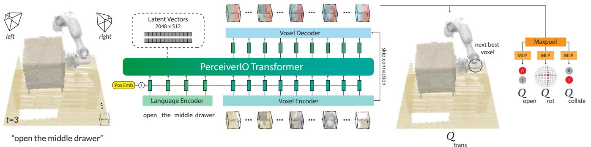  
.

# 3.1 Demonstrations

We assume access to a dataset $\mathcal { D } = \{ \zeta _ { 1 } , \zeta _ { 2 } , . . . , \zeta _ { n } \}$ of $n$ expert demonstrations, each paired with English language goals $\mathcal { G } = \{ \boldsymbol { \mathrm { l } } _ { 1 } , \boldsymbol { \mathrm { l } } _ { 2 } , \ldots , \boldsymbol { \mathrm { l } } _ { n } \}$ . These demonstrations are collected by an expert with the aid of a motion-planner to reach intermediate poses. Each demonstration $\zeta$ is a sequence of continuous actions $\bar { \mathcal { A } } = \{ a _ { 1 } , a _ { 2 } , . . . , a _ { t } \}$ paired with observations $\mathcal { O } = \{ \tilde { o } _ { 1 } , \tilde { o } _ { 2 } , \dots \tilde { o } _ { t } \}$ . An action $a$ consists of the 6-DoF pose, gripper open state, and whether the motion-planner used collision avoidance to reach an intermediate pose: $\boldsymbol { a } = \{ a _ { \mathrm { p o s e } } , a _ { \mathrm { o p e n } } , a _ { \mathrm { c o l l i d e } } \}$ . An observation $\tilde { o }$ consists of RGB-D images from any number of cameras. We use four cameras for simulated experiments $\tilde { \sigma } _ { \mathrm { s i m } } = \left\{ \sigma _ { \mathrm { f r o n t } } , o _ { \mathrm { l e f t } } , o _ { \mathrm { r i g h t } } , o _ { \mathrm { w r i s t } } \right\}$ , but just a single camera for real-world experiments $\tilde { o } _ { \mathrm { r e a l } } \stackrel { \sim } { = } \left\{ o _ { \mathrm { f r o n t } } \right\}$ .

# 3.2 Keyframes and Voxelization

Following prior work by James et al. [14], we construct a structured observation and action space through keyframe extraction and voxelization. Training our agent to directly predict continuous actions is inefficient and noisy. So instead, for each demonstration $\zeta$ , we extract a set of keyframe actions $\left\{ \mathbf { k } _ { 1 } , \mathbf { k } _ { 2 } , \ldots , \mathbf { k } _ { m } \right\} \subset { \mathcal { A } }$ that capture bottleneck end-effector poses [71] in the action sequence with a simple heuristic: an action is a keyframe if (1) the joint-velocities are near zero and (2) the gripper open state has not changed. Each datapoint in the demonstration $\zeta$ can then be cast as a "predict the next (best) keyframe action" task [14, 72, 73]. See Appendix Figure F for an illustration of this process.

To learn action-centric representations [18] in 3D, we use a voxel grid [74, 75] to represent both the observation and action space. The observation voxels $\mathbf { v }$ are reconstructed from RGB-D observations $\tilde { o }$ fused through triangulation $\tilde { o }  \mathbf { v }$ from known camera extrinsics and intrinsics. By default, we use a voxel grid of $1 \mathrm { { 0 0 ^ { 3 } } }$ , which corresponds to a volume of $\mathrm { 1 . 0 m ^ { 3 } }$ in metric scale. The keyframe actions $\mathbf { k }$ are discretized such that training our BC agent can be formulated as a "next best action" classification task [14]. Translation is simply the closest voxel to the center of the gripper fingers. Rotation is discretized into 5 degree bins for each of the three rotation axes. Gripper open state is a biary value.Collide is also a bnary value that idicates f the motion-planner should avoid everything in the voxel grid or nothing at al; switching between these two modes of collision avoidance is crucial as tasks often involve both contact based (e.g., pulling the drawer open) and non-contact based motions (e.g., reaching the handle without colliding into anything).

# 3.3 PERACT Agent

PERACT is a Transformer-based [2] agent that takes in a voxel observation and language goal $( \mathbf { v } , \mathbf { l } )$ , and outputs a discretized translation, rotation, and gripper open action. This action is executed with a motion-planner, after which this process is repeated until the goal is reached. The language goal 1 is encoded with a pre-trained language model. We use CLIP's [76] language encoder, but any pre-trained language model would suffice [13, 69]. Our choice of CLIP opens up possibilities for future work to use pre-trained vision features that are aligned with the language for better generalization to unseen semantic categories and instances [16]. The voxel observation v is split into 3D patches of size $5 ^ { 3 }$ (akin to vision-transformers like ViT [4]). In implementation, these patches are extracted with a 3D convolution layer with a kernel-size and stride of 5, and then flattened into a sequence of voxel encodings. The language encodings are finetuned with a linear layer and then appended with the voxel encodings to form the input sequence. We also add learned positional embeddings to the sequence to incorporate voxel and token positions.

The input sequence of language and voxel encodings is extremely long. A standard Transformer with $\bar { \mathcal { O } } ( n ^ { 2 } )$ self-attention connections and an input of $( 1 0 0 / 5 ) ^ { 3 } = \mathrm { \bar { 8 } 0 0 0 }$ patches is hard to fit on the memory of a commodity GPU. Instead, we use the Perceiver [1] Transformer. Perceiver is a latentspace Transformer, where instead of attending to the entire input, it first computes cross-attention between the input and a much smaller set of latent vectors (which are randomly initialized and trained). These latents are encoded with self-attention layers, and for the final output, the latents are again cross-attended with the input to match the input-size. See Appendix Figure 6 for an $5 1 2 : \mathbb { R } ^ { 2 0 4 8 \times 5 1 ^ { 2 } }$ ,but in Appendix G we experiment with different latent sizes. The Perceiver Transformer uses 6 self-attention layers to encode the latents and outputs a sequence of patch encodings from the output cross-attention layer. These patch encodings are upsampled with a 3D convolution layer and tri-linear upsampling to decode 64-dimensional voxel features. The decoder includes a skip-connection from the encoder (like in UNets [77]). The per-voxel features are then used to predict discretized actions [14]. For translation, the voxel features are reshaped into the original voxel grid $( 1 0 0 ^ { 3 } )$ to form a 3D $\mathcal { Q }$ -function of action-values. For rotation, gripper open, and collide, the features are max-pooled and then decoded with linear layers to form their respective $\mathcal { Q }$ -function. The best action $\tau$ is chosen by simply maximizing the $\mathcal { Q }$ -functions:

$$
\begin{array} { r l r } { \mathcal { T } _ { \mathrm { t r a n s } } = \underset { ( x , y , z ) } { \mathrm { a r g m a x } } \ Q _ { \mathrm { t r a n s } } ( ( x , y , z ) \mid \mathbf { v } , \mathbf { l } ) , } & { \quad } & { \mathcal { T } _ { \mathrm { r o t } } = \underset { ( \psi , \theta , \phi ) } { \mathrm { a r g m a x } } \ Q _ { \mathrm { r o t } } ( ( \psi , \theta , \phi ) \mid \mathbf { v } , \mathbf { l } ) , } \\ { \mathcal { T } _ { \mathrm { o p e n } } = \underset { \omega } { \mathrm { a r g m a x } } \ Q _ { \mathrm { o p e n } } ( \omega \mid \mathbf { v } , \mathbf { l } ) , } & { \quad } & { \mathcal { T } _ { \mathrm { c o l l i d e } } = \underset { \kappa } { \mathrm { a r g m a x } } \ Q _ { \mathrm { c o l l i d e } } ( \kappa \mid \mathbf { v } , \mathbf { l } ) , } \end{array}
$$

where $( x , y , z )$ is the voxel location in the grid, $( \psi , \theta , \phi )$ are discrete rotations in Euler angles, $\omega$ is the gripper open state and $\kappa$ is the collide variable. See Figure 5 for examples of $\mathcal { Q }$ predictions.

# 3.4 Training Details

PERAcT is trained through supervised learning with discrete-time input-action tuples from a dataset of demonstrations. These tuples are composed of voxel observations, language goals, and keyframe actions $\{ ( \mathbf { v } _ { 1 } , \mathbf { l } _ { 1 } , \mathbf { k } _ { 1 } ) , ( \mathbf { v } _ { 2 } , \mathbf { l } _ { 2 } ^ { - } , \mathbf { k } _ { 2 } ) , . . . \}$ . During training, we randomly sample a tuple and supervise the agent to predict the keyframe action $\mathbf { k }$ given the observation and goal $( \mathbf { v } , \mathbf { l } )$ For translation, $Y _ { \mathrm { t r a n s } } : \mathbb { R } ^ { \hat { H } \times \hat { W } \times D }$ Rotations are also represented with a one-hot encoding per rotation axis with $R$ rotation bins $Y _ { \mathrm { r o t } } : \mathbb { R } ^ { ( 3 6 0 / R ) \times 3 }$ $R = 5$ degrees for all experiments). Similarly, open and collide variables are binary one-hot vectors $Y _ { \mathrm { o p e n } } : \mathbb { R } ^ { 2 }$ ; $Y _ { \mathrm { c o l l i d e } } : \mathbb { R } ^ { 2 }$ .The agent is trained with cross-entropy loss like a classifier:

$$
\mathcal { L } _ { \mathrm { t o t a l } } = - \mathbb { E } _ { Y _ { \mathrm { t r a n s } } } [ \log \mathcal { V } _ { \mathrm { t r a n s } } ] - \mathbb { E } _ { Y _ { \mathrm { r o t } } } [ \log \mathcal { V } _ { \mathrm { r o t } } ] - \mathbb { E } _ { Y _ { \mathrm { o p e n } } } [ \log \mathcal { V } _ { \mathrm { o p e n } } ] - \mathbb { E } _ { Y _ { \mathrm { c o l i d e } } } [ \log \mathcal { V } _ { \mathrm { c o l l i d e } } ] ,
$$

where $\nu _ { \mathrm { t r a n s } } ~ = ~ \mathrm { s o f t m a x } { \left( \mathcal { Q } _ { \mathrm { t r a n s } } { \left( ( x , y , z ) | \mathbf { v } , \mathbf { l } \right) } \right) }$ , rot = softmax( $\mathcal { Q } _ { \mathrm { r o t } } \big ( \big ( \psi , \theta , \phi \big ) | { \bf v } , { \bf l } \big ) \big )$ , $\begin{array} { r l } { \mathcal { V } _ { \mathrm { o p e n } } } & { { } = } \end{array}$ softmax $\left( \mathcal { Q } _ { \mathrm { o p e n } } ( \omega | \mathbf { v } , \mathbf { l } ) \right)$ , $\mathcal { V } _ { \mathrm { c o l l i d e } } = \mathrm { s o f t m a x } ( \mathcal { Q } _ { \mathrm { c o l l i d e } } ( \kappa | \mathbf { v } , \mathbf { l } ) )$ respectively. For robustness, we also augment $\mathbf { v }$ and $\mathbf { k }$ with translation and rotation perturbations. See Appendix E for more details. By default, we use a voxel grid size of $1 0 0 ^ { 3 }$ . We conducted validation tests by replaying expert demonstrations with discretized actions to ensure that $1 0 0 ^ { 3 }$ is a sufficient resolution for execution. The agent was trained with a batch-size of 16 on 8 NVIDIA V100 GPUs for 16 days (600K iterations). We use the LAMB [78] optimizer following Perceiver [1]. For multi-task training, we simply sample input-action tuples from al tasks in the dataset. To ensure that tasks with longer horizons are not over-represented during sampling, each batch contains a uniform distribution of tasks. That is, we first uniformly sample a set of tasks of batch-size length, then pick a random input-action tuple for each of the sampled tasks. With this strategy, longerhorizon tasks need more training steps for full coverage of input-action pairs, but all tasks are given equal weighting during gradient updates.

# 4 Results

We perform experiments to answer the following questions: (1) How effective is PERACT compared to unstructured image-to-action frameworks and standard architectures like 3D ConvNets? And what are the factors that affect PERACT's performance? (2) Is the global receptive field of Transformers actually beneficial over methods with local receptive fields? (3) Can PERACT be trained on real-world tasks with noisy data?

# 4.1 Simulation Setup

Weu t lae kcb n b Environment. The simulation is set in CoppelaSim [79] and interfaced through PyRep [80]. All experiments use a Franka Panda robot with a parallel gripper. The input observations are captured from four RGB-D cameras positioned at the front, left shoulder, right shoulder, and on the wrist, as shown in Appendix Figure 7. All cameras are noiseless and have a resolution of $1 2 8 \times 1 2 8$ .

Language-Conditioned Tasks. We train and evaluate on 18 RLBench [15] tasks. See peract.github.io for examples and Appendix A for details on individual tasks. Each task includes several variations, ranging from 2-60 possibilities, e.g., in the stack blocks task, "stack 2 red blocks" and "stack 4 purple blocks" are two variants. These variants are randomly sampled during data generation, but kept consistent during evaluations for one-to-one comparisons. Some RLBench tasks were modified to include additional variations to stress-test multi-task and language-grounding capabilities. There are a total of 249 variations across 18 tasks, and the number of extracted keyframes range from 2-17. All keyframes from an episode have the same language goal, which is constructed from templates (but human-annotated for real-world tasks). Note that in all experiments, we do not test for generalization to unseen objects, i.e., our train and test objects are the same. However during test time, the agent has to handle novel object poses, randomly sampled goals, and randomly sampled scenes with different semantic instantiations of object colors, shapes, sizes, and categories. The focus here is to evaluate the performance of a single multi-task agent trained on all tasks and variants. Evaluation Metric. Each multi-task agent is evaluated independently on all 18 tasks. Evaluations are scored either 0 for failures or 100 for complete successes. There are no partial credits. We report average success rates on 25 evaluation episodes per task $( 2 5 \times 1 8 = 4 5 0$ total episodes) for agents trained with $n = 1 0$ , 100 demonstrations per task. During evaluation, an agent keeps taking actions until an oracle indicates task-completion or reaches a maximum of 25 steps.

# 4.2 Simulation Results

Table 1 reports success rates of multi-task agents trained on all 18 tasks. We could not investigate single-task agents due to resource constraints of training 18 individual agents.

Baseline Methods. We study the effectiveness of our problem formulation by benchmarking against two language-conditioned baselines: Image-BC and C2FARM-BC. Image-BC is an image-to-action agent similar to BC-Z [12]. Following BC-Z, we use FiLM [81] for conditioning with CLIP [76] language features, but the vision encoders take in RGB-D images instead of just RGB. We also study both CNN and ViT vision encoders. C2FARM-BC is a 3D fully-convolutional network by James et al. [14] that has achieved state-of-the-art results on RLBench tasks. Similar to our agent, C2FARMBC also detects actions in a voxelized space, however it uses a coarse-to-fine-grain scheme to detect actions at two-levels of voxelization: $\mathrm { \dot { 3 } 2 ^ { 3 } }$ voxels with a $1 ^ { 3 } \mathrm { m }$ grid, and $3 2 ^ { 3 }$ voxels with a $0 . 1 5 ^ { 3 } \mathrm { m }$ grid after "zooming in" from the first level. Note that at the finest level, C2FARM-BC has a higher resolution $\left( 0 . 4 7 \mathrm { c m } \right)$ than PERACT (1cm). We use the same 3D ConvNet architecture as James et al. [14], but instead of training it with RL, we do BC with cross-entropy loss (from Section 3.4). We also condition it with CLIP [76] language features at the bottleneck like in LingUNets [82, 16].

Multi-Task Performance. Table 1 compares the performance of Image-BC and C2FARMBC against PERACT. With insufficient demonstrations, Image-BC has near zero performance on most tasks. Image-BC is disadvantaged with single-view observations and has to learn hand-eye coordination from scratch. In contrast, PERACT's voxel-based formulation naturally allows for integrating multi-view observations, learning 6-DoF action representations, and data-augmentation in 3D, all of which are non-trivial to achieve in image-based methods. C2FARM-BC is the most competitive baseline, but it has a limited receptive field mostly because of the coarse-to-fine-grain scheme and partly due to the convolution-only architecture. PERACT outperforms C2FARM-BC in 25/36 evaluations in Table 1 with an average improvement of $\mathbf { 1 . 3 3 \times }$ with 10 demonstrations and $\mathbf { 2 . 8 3 \times }$ with 100 demonstrations. For a number of tasks, C2FARM-BC actually performs worse with more demonstrations, likely due to insufficient capacity. Since additional training demonstrations include additional task variants to optimize for, they might end up hurting performance.

<table><tr><td></td><td colspan="2">open drawer</td><td colspan="2">slide block</td><td colspan="2">sweep to dustpan</td><td colspan="2">meat off grill</td><td colspan="2">turn tap</td><td colspan="2">put in drawer</td><td colspan="2">close jar</td><td colspan="2">drag stick</td><td colspan="2">stack blocks</td></tr><tr><td>Method</td><td>10</td><td>100</td><td>10</td><td>100</td><td>10</td><td>100</td><td>10</td><td>100</td><td>10</td><td>100</td><td>10</td><td>100</td><td>10</td><td>100</td><td>10</td><td>100</td><td>10</td><td>100</td></tr><tr><td>Image-BC (CNN)</td><td>4</td><td>4</td><td>4</td><td>0</td><td>0</td><td>0</td><td></td><td>0</td><td>20</td><td>8</td><td>0</td><td>8</td><td>0</td><td>0</td><td>0</td><td>0</td><td>0</td><td>0</td></tr><tr><td>Image-BC (ViT</td><td>16</td><td>0</td><td>8</td><td>0</td><td></td><td>0</td><td></td><td></td><td>24</td><td>16</td><td>0</td><td>0</td><td>0</td><td>0</td><td>0</td><td>0</td><td>0</td><td>0</td></tr><tr><td>C2FARM-BC</td><td>28</td><td>20</td><td>12</td><td>16</td><td></td><td>0</td><td></td><td></td><td></td><td>68</td><td>12</td><td>4</td><td>28</td><td>24</td><td>72</td><td>24</td><td>4</td><td>0</td></tr><tr><td>PERACT (w/o Lang)</td><td>20</td><td>28</td><td>8</td><td>12</td><td>20</td><td>16</td><td>40 40</td><td>20 48</td><td>60 36</td><td>60</td><td>16</td><td>16</td><td>16</td><td>12</td><td>48</td><td>60</td><td>0</td><td>0</td></tr><tr><td>PERACT</td><td>68</td><td>80</td><td>32</td><td>72</td><td>72</td><td>56</td><td>68</td><td>84</td><td>72</td><td>80</td><td>16</td><td>68</td><td>32</td><td>60</td><td>36</td><td>68</td><td>12</td><td>36</td></tr><tr><td rowspan="3"></td><td colspan="2">screw</td><td colspan="2">put in</td><td colspan="2">place</td><td colspan="2">put in</td><td colspan="2">sort</td><td colspan="2">push</td><td colspan="2">insert</td><td colspan="2">stack</td><td colspan="2">place</td></tr><tr><td>bulb</td><td></td><td>safe</td><td></td><td>wine</td><td></td><td>cupboard</td><td></td><td>shape</td><td></td><td>buttons</td><td></td><td>peg</td><td></td><td>cups</td><td></td><td>cups</td><td></td></tr><tr><td>10</td><td>100</td><td>10</td><td>100</td><td>10</td><td>100</td><td>10</td><td>100 0</td><td>10</td><td>100</td><td>10</td><td>100</td><td>10</td><td>100</td><td>10</td><td>100</td><td>10</td><td>100</td></tr><tr><td>Image-BC (CNN)</td><td>0</td><td>0</td><td>0</td><td>4</td><td>0 4</td><td>0</td><td>0</td><td>0</td><td>0 0</td><td>0</td><td>4</td><td>0</td><td>0</td><td>0</td><td>0</td><td>0</td><td>0</td><td>0</td></tr><tr><td>Image-BC (ViT</td><td>0</td><td>0</td><td>0</td><td>0</td><td></td><td>0</td><td></td><td></td><td></td><td>0</td><td>16</td><td>0</td><td>0</td><td>0</td><td>0</td><td>0</td><td>0</td><td>0</td></tr><tr><td>C2FARM-BC</td><td>12</td><td>8</td><td>0</td><td>12</td><td>36</td><td>8</td><td></td><td></td><td></td><td>8</td><td>88</td><td>72</td><td>0</td><td>4</td><td>0</td><td>0</td><td>0</td><td>0</td></tr><tr><td>PERACT (w/o Lang)</td><td>0</td><td>24</td><td>8</td><td>20</td><td>8</td><td>20</td><td>0</td><td>0</td><td>0</td><td>0</td><td>60</td><td>68</td><td>4</td><td>0</td><td>0</td><td>0</td><td>0</td><td>0</td></tr><tr><td>PERACT</td><td>28</td><td>24</td><td>16</td><td>44</td><td>20</td><td>12</td><td>0</td><td>16</td><td>16</td><td>20</td><td>56</td><td>48</td><td>4</td><td>0</td><td>0</td><td>0</td><td>0</td><td>0</td></tr></table>

Table 1. Multi-Task Test Results. Success rates (mean $\%$ ) of various multi-task agents tasks trained with either 10 or 100 demonstrations per C2FARM-BC [14], the most competitive baseline, with an average improvement of $1 . 3 3 \times$ with 10 demos and $2 . 8 3 \times$ with 100 demos.

In general, 10 demonstrations are sufficient for PERACT to achieve $> 6 5 \%$ success on tasks with limited variations like open drawer (3 variations). But tasks with more variations like stack blocks (60 variations) need substantially more data, sometimes to simply cover all possible concepts like "teal color block" that might have not appeared in the training data. See the simulation rollouts in the supplementary video to get a sense of the complexity of these evaluations. For three tasks: insert peg, stack cups, and place cups, all agents achieve near zero success. These are very high-precision tasks where being off by a few centimeters or degrees could lead to unrecoverable failures. But in Appendix H we find that training single-task agents, specifically for these tasks, slightly alleviates this issue. Ablations. Table 1 reports PERACT w/o Lang, an agent without any language conditioning. Without a language goal, the agent does not know the underlying task and performs at chance. We also report additional ablation results on the open drawer task in Figure 3. To summarize these results: (1) the skip connection helps train the agent slightly faster, (2) the Perceiver Transformer is crucial for achieving good performance with the global receptive field, and (3) extracting good keyframes actions is essential for supervised training as randomly chosen or fixed-interval keyframes lead to zero-performance.

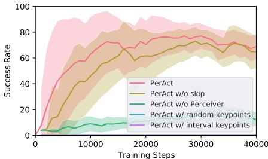  
Figure 3. Ablation Experiments. Success rate of PERACT after ablating key components.

Sensitivity Analysis. In Appendix G we investigate factors that affect PERACT's performance: the number of Perceiver latents, voxelization resolution, and data augmentation. We find that more latent vectors generally improve the capacity of the agent to model more tasks, but for simple shorthorizon tasks, fewer latents are sufficient. Similarly, with different voxelization resolutions, some tasks are solvable with coarse voxel grids like $3 2 ^ { 3 }$ , but some high-precision tasks require the full $1 0 0 ^ { 3 }$ grid. Finally, rotation perturbations in the data augmentation generally help in improving robustness essentially by exposing the agent to more rotation variations of objects.

# 4.3 Global vs. Local Receptive Fields

To further investigate our Transformer agent's global receptive field, we conduct additional experiments on the open drawer task. The open drawer task has three variants: "open the top drawer", "open the middle drawer", and "open the bottom drawer", and with a limited receptive field it is hard to distinguish the drawer handles, which are all visually identical. Figure 4 reports PERACT and C2FARM-BC agents trained with 100 demonstrations. Although the open drawer tasks can be solved with fewer demonstrations, here we want to ensure that insufficient data is not an issue. We include several versions of C2FARM-BC with different voxelization schemes. For instance, [16, 16] indicates two levels of $1 6 ^ { 3 }$ voxel grids at $\mathrm { 1 m ^ { 3 } }$ and $\mathrm { 0 . 1 5 m ^ { 3 } }$ , respectively. And [64] indicates a single level of a $6 4 ^ { 3 }$ voxel grid without the coarse-to-fine-grain scheme. PERAcT is the only agent that achieves $> 7 0 \%$ success, whereas all C2FARM-BC versions perform at chance with $\mathrm { \sim 3 3 \% }$ , indicating that the global receptive field of the Transformer is crucial for solving the task.

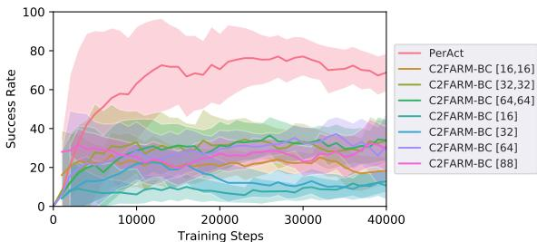  
Figure 4. Global vs. Local Receptive Field Experiments. Success rates of PERACT against various C2FARM-BC [14] baselines

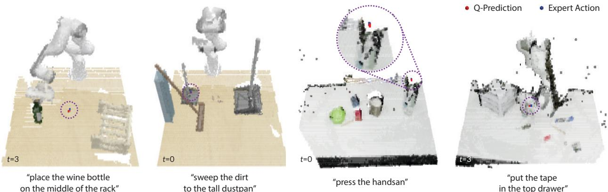  
Figure 5. Q-Prediction Examples: Qualitative examples of translation $\mathcal { Q }$ -Predictions from PERACT along with expert actions, highlighted

# 4.4 Real-Robot Results

We also validated our results with real-robot experiments on a Franka Emika Panda. See Appendix D for setup details. Without any sim-to-real transfer or pre-training, we trained a multi-task PERACT agent from scratch on 7 tasks (with 18 unique variations) from a total of just 53 demonstrations. See the supplementary video for qualitative results that showcase the diversity of tasks and robustness to scene changes. Table 2 reports success rates from smallscale evaluations. Similar to the simulation results, we find that PERACT is able to achieve $> 6 5 \%$ success on simple short-horizon tasks like pressing hand-sanitizers from just a handful number of demonstrations. The most common failures involved predicting incorrect gripper open actions, which often lead the agent into unseen states. This could be addressed in future works by using HG-DAgger style approaches to correct the agent [12]. Other issues included the agent exploiting biases in the dataset like in prior work [16]. This could be addressed by scaling up expert data with more diverse tasks and task variants.

<table><tr><td>Task</td><td># Train</td><td># Test</td><td>Succ. %</td></tr><tr><td>Press Handsan</td><td>5</td><td>10</td><td>90</td></tr><tr><td>Put Marker</td><td>8</td><td>10</td><td>70</td></tr><tr><td>Place Food</td><td>8</td><td>10</td><td>60</td></tr><tr><td>Put in Drawer</td><td>8</td><td>10</td><td>40</td></tr><tr><td>Hit Ball</td><td>8</td><td>10</td><td>60</td></tr><tr><td>Stack Blocks</td><td>10</td><td>10</td><td>40</td></tr><tr><td>Sweep Beans</td><td>8</td><td>5</td><td>20</td></tr></table>

Table 2. Success rates (mean $\%$ ) of a multitask model trained an evaluated 7 realworld tasks (see Figure 1).

# 5 Limitations and Conclusion

We presented PERACT, a Transformer-based multi-task agent for 6-DoF manipulation. Our experiments with both simulated and real-world tasks indicate that the right problem formulation, i.e., detecting voxel actions, makes a substantial difference in terms of data efficiency and robustness. While PERACT is quite capable, extending it to dexterous continuous control remains a challenge. PERACT is at the mercy of a sampling-based motion-planner to execute discretized actions, and is not easily extendable to N-DoF actuators like multi-fingered hands. See Appendix L for an extended discussion on PERACT's limitations. But overall, we are excited about scaling up robot learning with Transformers by focusing on diverse rather than narrow multi-task data for robotic manipulation.

# Acknowledgments

We thank Selest Nashef and Karthik Desingh for their help with the Franka setup at UW. We thank Stephen James for helping with RLBench and ARM issues. We are also grateful to Valts Blukis, Zoey Chen, Markus Grotz, Aaron Walsman, and Kevin Zakka, for providing feedback on the initial draft. And thanks to Shikhar Bahl for initial discussions. This work was funded in part by ONR under award #1140209-405780. Mohit Shridhar is supported by the NVIDIA Graduate Fellowship, and was also a part-time intern at NVIDIA throughout the duration of this project.

References [1] A. Jaegle, S. Borgeaud, J.-B. Alayrac, C. Doersch, C. Ionescu, D. Ding, S. Koppula, D. Zoran, outputs. arXiv preprint arXiv:2107.14795, 2021.   
[2] A. Vaswani, N. Shazeer, N. Parmar, J. Uszkoreit, L. Jones, A. N. Gomez, L. Kaiser, and IPolosukhin. Attention is all you need.In Advances in Neural Information rocessing Systems (NeuRIPS), 2017. [3] T. Brown, B. Mann, N. Ryder, M. Subbiah, J. D. Kaplan, P. Dhariwal, A. Neelakantan, P. Shyam, G. Sastry, A. Askell, et al. Language models are few-shot learners. Neural Information Processing Systems (NeurIPS), 2020.   
[4] A. Dosovitskiy, L. Beyer, A. Kolesnikov, D. Weissenborn, X. Zhai, T. Unterthiner, M. Dehghani, M. Minderer, G. Heigold, S. Gelly, et al. An image is worth 16x16 words: Transformers for image recognition at scale. In International Conference on Learning Representations (ICLR), 2020. [5] J. Jumper, R. Evans, A. Pritzel, T. Green, M. Figurnov, O. Ronneberger, K. Tunyasuvunakool, R. Bates, A. Zídek, A. Potapenko, et al. Highly accurate protein structure prediction with alphafold. Nature, 2021. [6] O. Vinyals, I. Babuschkin, J. Chung, M. Mathieu, M. Jaderberg, W. M. Czarnecki, A. Dudzik, AHuang P. Georgiev, R. Powel  alAlphastar:Masterig he real-time sratey me starcraft ii. DeepMind blog, 2, 2019.   
[7] T. Chen, S. Saxena, L. Li, D. J. Fleet, and G. Hinton. Pix2seq: A language modeling framework for object detection. arXiv preprint arXiv:2109.10852, 2021.   
[8] L. Chen, K. Lu, A. Rajeswaran, K. Lee, A. Grover, M. Laskin, P. Abbeel, A. Srinivas, and I. Mordatch. Decision transformer: Reinforcement learning via sequence modeling. In Neural Information Processing Systems (NeurIPS), 2021.   
[9] S. Reed, K. Zolna, E. Parisotto, S. G. Colmenarejo, A. Novikov, G. Barth-Maron, M. Gimenez, Y. Sulsky, J. Kay, J. T. Springenberg, et al. A generalist agent. arXiv preprint arXiv:2205.06175, 2022.   
[10] J. Devlin, M. W. Chang, K. Lee, and K. Toutanova. Bert: Pre-training of deep bidirectional transformers for language understanding. In Conference of the North American Chapter of the Association for Computational Linguistics (NAACL), 2018.   
[11] A. Jaegle, F. Gimeno, A. Brock, O. Vinyals, A. Zisserman, and J. Carreira. Perceiver: General perception with iterative attention. In International Conference on Machine Learning (ICML), 2021.   
[12] E. Jang, A. Irpan, M. Khansari, D. Kappler, F. Ebert, C. Lynch, S. Levine, and C. Finn. Bc-z: Zero-shot task generalization with robotic imitation learning. In Conference on Robot Learning (CoRL), 2021.   
[13] M. Ahn, A. Brohan, N. Brown, Y. Chebotar, O. Cortes, B. David, C. Finn, K. Gopalakrishnan, K. Hausman, A. Herzog, et al. Do as i can, not as i say: Grounding language in robotic affordances. arXiv preprint arXiv:2204.01691, 2022.   
[14] S. James, K. Wada, T. Laidlow, and A. J. Davison. Coarse-to-fine q-attention: Effcient learning for visual robotic manipulation via discretisation. In Computer Vision and Pattern Recognition (CVPR), 2022.   
[15] S. James, Z. Ma, D. R. Arrojo, and A. J. Davison. Rlbench: The robot learning benchmark & learning environment. IEEE Robotics and Automation Letters (RA-L), 2020.   
[ M. Shridhar, L. Manueli, and D. Fox. Cliport: What and where pathways or robotic manipulation. In In Conference on Robot Learning (CoRL), 2021.   
[17] A. Zeng, P. Florence, J. Tompson, S. Welker, J. Chien, M. Attarian, T. Armstrong, I. Krasin, D. Duong, V. Sindhwani, and J. Lee. Transporter networks: Rearranging the visual world for robotic manipulation. Conference on Robot Learning (CoRL), 2020.   
[18] J.J. Gibson. The ecological approach to visual perception: classic edition. Psychology Press, 2014.   
[19] R. A. Brooks. New approaches to robotics. Science, 1991.   
[20] K. He, G. Gkioxari, P. Dolár, and R. Girshick. Mask r-cnn. In Conference on Computer Vision and Pattern Recognition (CVPR), 2017.   
[21] Y. Xiang, T. Schmidt, V. Narayanan, and D. Fox. Posecnn: A convolutional neural network for 6d object pose estimation in cluttered scenes. In Robotics: Science and Systems (RSS), 2018.   
[22] M. Zhu, K. G. Derpanis, Y. Yang, S. Brahmbhatt, M. Zhang, C. Phillips, M. Lecce, and K. Danilidis. Single image 3d object detection and pose estimation for grasping. In 2014 IEEE International Conference on Robotics and Automation (ICRA), 2014.   
[23] A. Zeng, K.-T. Yu, S. Song, D. Suo, E. Walker, A. Rodriguez, and J. Xiao. Multi-view selfsupervised deep learning for 6d pose estimation in the amazon picking challenge. In 2017 IEEE international conference on robotics and automation (ICRA), 2017.   
[24] X. Deng, Y. Xiang, A. Mousavian, C. Eppner, T. Bretl, and D. Fox. Self-supervised 6d object pose estimation for robot manipulation. In 2020 IEEE International Conference on Robotics and Automation (ICRA), 2020.   
[ C. Xie, Y. Xiang, A. Mousavin, and D.Fox. The best f both modes: Separately leveraing rgb and depth for unseen object instance segmentation. In Conference on Robot Learning (CoRL), 2020.   
[26] A. Zeng, S. Song, K.-T. Yu, E. Donlon, F. R. Hogan, M. Bauza, D. Ma, O. Taylor, M. Liu, E. Romo, et al. Robotic pick-and-place of novel objects in clutter with multi-affordance grasping and cross-domain image matching. The International Journal of Robotics Research (IJRR), 2019.   
[27] E. Stengel-Eskin, A. Hundt, Z. He, A. Murali, N. Gopalan, M. Gombolay, and G. Hager. Guiding multi-step rearrangement tasks with natural language instructions. In Conference on Robot Learning (CoRL), 2022.   
[28] D. Kalashnikov, A. Irpan, P. Pastor, J. Ibarz, A. Herzog, E. Jang, D. Quillen, E. Holly, M. Kalakrishnan, V. Vanhoucke, et al. Qt-opt: Scalable deep reinforcement learning for vision-based robotic manipulation. Conference on Robot Learning (CoRL), 2018.   
[29] Y. Wu, W. Yan, T. Kurutach, L. Pinto, and P. Abbeel. Learning to Manipulate Deformable Objects without Demonstrations. In Robotics: Science and Systems (RSS), 2020.   
[30] S. Levine, C. Finn, T. Darrell, and P. Abbeel. End-to-end training of deep visuomotor policies. The Journal of Machine Learning Research, 17(1):13341373, 2016.   
[31] C. Finn and S. Levine. Deep visual foresight for planning robot motion. In 2017 IEEE International Conference on Robotics and Automation (ICRA), 2017.   
[32] S. Song, A. Zeng, J. Lee, and T. Funkhouser. Grasping in the wild: Learning 6dof closedloop grasping from low-cost demonstrations. IEEE Robotics and Automation Letters (RA-L), 2020.   
[33] A. Murali, A. Mousavian, C. Eppner, C. Paxton, and D. Fox. 6-dof grasping for targetdriven object manipulation in clutter. In International Conference on Robotics and Automation (ICRA), 2020.   
[34] A. Mousavian, C. Eppner, and D. Fox. 6-dof graspnet: Variational grasp generation for object manipulation. In International Conference on Computer Vision (ICCV), 2019.   
[35] Z. Xu, H. Zhanpeng, and S. Song. Umpnet: Universal manipulation policy network for articulated objects. Robotics and Automation Letters (RA-L), 2022.   
[36] S. Agrawal, Y. Li, J.-S. Liu, S. K. Feiner, and S. Song. Scene editing as teleoperation: A case study in 6dof kit assembly. arXiv preprint arXiv:21 10.04450, 2021.   
[37] A. Simeonov, Y. Du, A. Tagliasacchi, J. B. Tenenbaum, A. Rodriguez, P. Agrawal, and V. Sitzmann. Neural descriptor fields: Se (3)-equivariant object representations for manipulation. arXiv preprint arXiv:2112.05124, 2021.   
[38] S. Nair, A. Rajeswaran, V. Kumar, C. Finn, and A. Gupta. R3m: A universal visual representation for robot manipulation. arXiv preprint arXiv:2203.12601, 2022.   
[39] W. Yuan, C. Paxton, K. Desingh, and D. Fox. Sornet: Spatial object-centric representations for sequential manipulation. In In Conference on Robot Learning (CoRL). PMLR, 2021.   
[40] Y. Liu, M. Ott, N. Goyal, J. Du, M. Joshi, D. Chen, O. Levy, M. Lewis, L. Zettlemoyer, and V. Stoyanov. Roberta: A robustly optimized bert pretraining approach. arXiv preprint arXiv:1907.11692, 2019.   
[41] Z. Liu, Y. Lin, Y. Cao, H. Hu, Y. Wei, Z. Zhang, S. Lin, and B. Guo. Swin transformer: Hierarchical vision transformer using shifted windows. In In International Conference on Computer Vision (ICCV), 2021.   
[42] M. Janner, Q. Li, and S. Levine. Offline reinforcement learning as one big sequence modeling problem. Neural information processing systems (NeurIPS), 2021.   
[43] K.-H. Lee, O. Nachum, M. Yang, L. Lee, D. Freeman, W. Xu, S. Guadarrama, I. Fischer, E. Jang, H. Michalewski, et al. Multi-game decision transformers. arXiv preprint arXiv:2205.15241, 2022.   
[44] H. M. Clever, A. Handa, H. Mazhar, K. Parker, O. Shapira, Q. Wan, Y. Narang, I. Akinola, M. Cakmak, and D. Fox. Assistive tele-op: Leveraging transformers to collect robotic task demonstrations. arXiv preprint arXiv:2112.05129, 2021.   
[45] R. Yang, M. Zhang, N. Hansen, H. Xu, and X. Wang. Learning vision-guided quadrupedal locomotion end-to-end with cross-modal transformers. arXiv preprint arXiv:2107.03996, 2021.   
[46] D. S. Chaplot, D. Pathak, and J. Malik. Differentiable spatial planning using transformers. In International Conference on Machine Learning (ICML), 2021.   
[47] J. J. Johnson, L. Li, A. H. Qureshi, and M. C. Yip. Motion planning transformers: One model to plan them all. arXiv preprint arXiv:2106.02791, 2021.   
[48] S. Dasari and A. Gupta. Transformers for one-shot visual imitation. arXiv preprint arXiv:2011.05970, 2020.   
[49] H. Kim, Y. Ohmura, and Y. Kuniyoshi. Transformer-based deep imitation learning for dualarm robot manipulation. In International Conference on Intelligent Robots and Systems (IROS). IEEE, 2021.   
[50] A. Gupta, L. Fan, S. Ganguli, and L. Fei-Fei. Metamorph: Learning universal controllers with transformers. arXiv preprint arXiv:2203.11931, 2022.   
[51] W. Liu, C. Paxton, T. Hermans, and D. Fox. Structformer: Learning spatial structure for language-guided semantic rearrangement of novel objects. In International Conference on Robotics and Automation (ICRA), 2022.   
[52] Y. Han, R. Batra, N. Boyd, T. Zhao, Y. She, S. Hutchinson, and Y. Zhao. Learning generalizable vision-tactile robotic grasping strategy for deformable objects via transformer. arXiv preprint arXiv:2112.06374, 2021.   
[53] T. Yu, D. Quillen, Z. He, R. Julian, K. Hausman, C. Finn, and S. Levine. Meta-world: A benchmark and evaluation for multi-task and meta reinforcement learning. In Conference on Robot Learning (CoRL), 2020.   
[54] M. Shridhar and D. Hsu. Interactive visual grounding of referring expressions for humanrobot interaction. In Robotics: Science and Systems (RSS), 2018.   
[55] C. Matuszek, L. Bo, L. Zettlemoyer, and D. Fox. Learning from unscripted deictic gesture and language orhuman-robot interactions.In AAAI Conference on Artificial Intellience, volume 28, 2014.   
[56] M. Bollini, S. Tellex, T. Thompson, N. Roy, and D. Rus. Interpreting and executing recipes with a cooking robot. In Experimental Robotics, pages 481495. Springer, 2013.   
[57] D. K. Misra, J. Sung, K. Lee, and A. Saxena. Tell me dave: Context-sensiive grounding of natural language to manipulation instructions. The International Journal of Robotics Research (IJRR), 2016.   
[58] Y. Bisk, D. Yuret, and D. Marcu. Natural language communication with robots. In North American Chapter of the Association for Computational Linguistics (NAACL), 2016.   
[] J. Thoaon, S. Zhang, R. J. Mooey, and P.Stoe. Lear o interpt atural anae commands through human-robot dialog. In Twenty-Fourth International Joint Conferenceon Artificial Intelligence (IJCAI), 2015.   
[60] J. Hatori, Y. Kikuchi, S. Kobayashi, K. Takahashi, Y. Tsuboi, Y. Unno, W. Ko, and J. Tan. Interactively picking real-world objects with unconstrained spoken language instructions. In International Conference on Robotics and Automation (ICRA), 2018.   
[61] Y. Chen, R. Xu, Y. Lin, and P. A. Vela. A Joint Network for Grasp Detection Conditioned on Natural Language Commands. arXiv:2104.00492 [cs], Apr. 2021.   
[62] V. Blukis, R. A. Knepper, and Y. Artzi. Few-shot object grounding for mapping natural language instructions to robot control. In Conference on Robot Learning (CoRL), 2020.   
[63] C. Paxton, Y. Bisk, J. Thomason, A. Byravan, and D. Fox. Prospection: Interpretable plans from language by predicting the future. In International Conference on Robotics and Automation (ICRA), 2019.   
[64] S. Tellex, T. Kollar, S. Dickerson, M. Walter, A. Banerjee, S. Teller, and N. Roy. Understanding natural language commands for robotic navigation and mobile manipulation. In AAAI Conference on Artificial Intelligence (AAAI), 2011.   
[65] T. Nguyen, N. Gopalan, R. Patel, M. Corsaro, E. Pavlick, and S. Tellex. Robot object retrieval with contextual natural language queries. arXiv preprint arXiv:2006.13253, 2020.   
[66] Y. Bisk, A. Holtzman, J. Thomason, J. Andreas, Y. Bengio, J. Chai, M. Lapata, A. Lazaridou, J. May, A. Nisnevich, N. Pinto, and J. Turian. Experience grounds language. In Empirical Methods in Natural Language Processing (EMNLP), 2020.   
[67] S. Nair, E. Mitchell, K. Chen, S. Savarese, C. Finn, et al. Learning language-conditioned robot behavior from offline data and crowd-sourced annotation. In Conference on Robot Learning (CoRL), 2022.   
[68] O. Mees, L. Hermann, and W. Burgard. What matters in language conditioned robotic imitation learning over unstructured data. IEEE Robotics and Automation Letters (RA-L), 2022.   
[69] C. Lynch and P. Sermanet. Grounding language in play. arXiv preprint arXiv:2005.07648, 2020.   
[70] O. Mees, L. Hermann, E. Rosete-Beas, and W. Burgard. Calvin: A benchmark for languageconditioned policy learning for long-horizon robot manipulation tasks. arXiv preprint arXiv:2112.03227, 2021.   
[71] E. Johns. Coarse-to-fine imitation learning: Robot manipulation from a single demonstration. In International Conference on Robotics and Automation (ICRA), 2021.   
[72] S. James and A. J. Davison. Q-attention: Enabling efficient learning for vision-based robotic manipulation. IEEE Robotics and Automation Letters (RA-L), 7(2):16121619, 2022.   
[73] S. Liu, S. James, A. J. Davison, and E. Johns. Auto-lambda: Disentangling dynamic task relationships. Transactions on Machine Learning Research, 2022.   
[74] H. Moravec. Robot spatial perceptionby stereoscopic vision and 3d evidence grids. Perception, 1996.   
[75] Y. Roth-Tabak and R. Jain. Building an environment model using depth information. Computer, 22(6):8590, 1989.   
[76] A. Radford, J. W. Kim, C. Hallacy, A. Ramesh, G. Goh, S. Agarwal, G. Sastry, A. Askell, P. Mishkin, J. Clark, G. Krueger, and I. Sutskever. Learning Transferable Visual Models From Natural Language Supervision. arXiv:2103.00020, 2021.   
[77] O. Ronneberger, P. Fischer, and T. Brox. U-net: Convolutional networks for biomedical image segmentation. In International Conference on Medical image computing and computerassisted intervention, pages 234241. Springer, 2015.   
78.Yu,J.Li . Ri J Hse S. S.Bhp X., J.  ., and C.-J. Hsieh. Large batch optimization for deep learning: Training bert in 76 minutes. arXiv preprint arXiv:1904.00962, 2019.   
[79] E. Rohmer, S. P. N. Singh, and M. Freese. V-rep: A versatile and scalable robot simulation framework. In International Conference on Intelligent Robots and Systems (IROS), 2013.   
[80] S. James, M. Freese, and A. J. Davison. Pyrep: Bringing v-rep to deep robot learning. arXiv preprint arXiv:1906.11176, 2019.   
[81] E. Perez, F. Strub, H. De Vries, V. Dumoulin, and A. Courvill. Film: Visual reasoning with a general conditioning layer. In AAAI Conference on Artificial Intelligence, 2018.   
[82] D. Misra, A. Bennett, V. Blukis, E. Niklasson, M. Shatkhin, and Y. Artzi. Mapping instructions to actions in 3d environments with visual goal prediction. In 2019 Conference on Empirical Methods in Natural Language Processing (EMNLP), 2018.   
[83] Z. Mandi, P. Abbeel, and S. James. On the effectiveness of fine-tuning versus metareinforcement learning. arXiv preprint arXiv:2206.03271, 2022.   
[84] S. Sodhani, A. Zhang, and J. Pineau. Multi-task reinforcement learning with context-based representations. In M. Meila and T. Zhang, editors, International Conference on Machine Learning (ICML), 2021.   
[85] M. Shridhar, X. Yuan, M.-A. Côté, Y. Bisk, A. Trischler, and M. Hausknecht. ALFWorld: Aligning Text and Embodied Environments for Interactive Learning. In International Conference on Learning Representations (ICLR), 2021.   
[86] A. Zeng, A. Wong, S. Welker, K. Choromanski, F. Tombari, A. Purohit, M. Ryoo, V. Sindhwani, J. Lee, V. Vanhoucke, et al. Socratic models: Composing zero-shot multimodal reasoning with language. arXiv preprint arXiv:2204.00598, 2022.   
[87] W. Huang, P. Abbeel, D. Pathak, and I. Mordatch. Language models as zero-shot planners: Extracting actionable knowledge for embodied agents. arXiv preprint arXiv:2201.07207, 2022.   
[88] L. P. Kaelbling and T. Lozano-Pérez. Integrated task and motion planning in belief space. The International Journal of Robotics Research, 2013.   
[89] C. R. Garrett, R. Chitnis, R. Holladay, B. Kim, T. Silver, L. P. Kaelbling, and T. Lozano-Pérez. Integrated task and motion planning. Annual review of control, robotics, and autonomous systems, 2021.   
[90] G. Konidaris, L. P. Kaelbling, and T. Lozano-Perez. From skills to symbols: Learning symbolic representations for abstract high-level planning. Journal of Artificial Intelligence Research, 2018.   
[91] J. Mao, Y. Xue, M. Niu, H. Bai, J. Feng, X. Liang, H. Xu, and C. Xu. Voxel transformer for 3d object detection. In International Conference on Computer Vision (ICCV), 2021.   
[92] C. He, R. Li, S. Li, and L. Zhang. Voxel set transformer: A set-to-set approach to 3d object detection from point clouds. In Computer Vision and Pattern Recognition (CVPR), pages 84178427, 2022.   
[93] K. Zheng, R. Chitnis, Y. Sung, G. Konidaris, and S. Tellex. Towards optimal correlational object search. In International Conference on Robotics and Automation (ICRA), 2022.   
[94] V. Blukis, C. Paxton, D. Fox, A. Garg, and Y. Artzi. A persistent spatial semantic representai-veaal ngtuci eti. I CoecRoboL pages 706717. PMLR, 2022.   
[95] R. Corona, S. Zhu, D. Klein, and T. Darrell. Voxel-informed language grounding. In Association for Computational Linguistics (ACL), 2022.   
[96] V. Sitzmann, J. Thies, F. Heide, M. NieBner, G. Wetzstein, and M. Zollhofer. Deepvoxels: Learning persistent 3d feature embeddings. In Conference on Computer Vision and Pattern Recognition (CVPR), 2019.   
[97] T. Müller, A. Evans, C. Schied, and A. Keller. Instant neural graphics primitives with a multiresolution hash encoding. ACM Transactions on Graphics (ToG), 2022.   
[98] Sara Fridovich-Keil and Alex Yu, M. Tancik, Q. Chen, B. Recht, and A. Kanazawa. Plenoxels: Radiance fields without neural networks. In CVPR, 2022.   
[99] S. Lal, M. Prabhudesai, I. Mediratta, A. W. Harley, and K. Fragkiadaki. Coconets: Continuous contrastive 3d scene representations. In Proceedings of the IEEE/CVF Conference on Computer Vision and Pattern Recognition, 2021.   
[100] H.-Y. F. Tung, Z. Xian, M. Prabhudesai, S. Lal, and K. Fragkiadaki. 3d-oes: Viewpointinvariant object-factorized environment simulators. arXiv preprint arXiv:2011.06464, 2020.   
[101] M. NieBner, M. Zollhöfer, S. Izadi, and M. Stamminger. Real-time 3d reconstruction at scale using voxel hashing. ACM Transactions on Graphics (ToG), 2013.   
[102] Y. Tay, M. Dehghani, D. Bahri, and D. Metzler. Efficient transformers: A survey. ACM Computing Surveys (CSUR), 2020.   
[103] A. Goyal, A. R. Didolkar, A. Lamb, K. Badola, N. R. Ke, N. Rahaman, J. Binas, C. Blundell, M. C. Mozer, and Y. Bengio. Coordination among neural modules through a shared global workspace. In International Conference on Learning Representations (ICLR), 2021.   
[104] N. Carion, F. Massa, G. Synnaeve, N. Usunier, A. Kirillov, and S. Zagoruyko. End-to-end object detection with transformers. In European conference on computer vision (ECCV), 2020.   
[105] F. Locatello, D. Weissenborn, T. Unterthiner, A. Mahendran, G. Heigold, J. Uszkoreit, A. Dosovitskiy, and T. Kipf. Object-centric learning with slot attention. Neural Information Processing Systems (NeurIPs), 2020.   
[106] R. Ranftl, A. Bochkovskiy, and V. Koltun. Vision transformers for dense prediction. In International Conference on Computer Vision (ICCV), pages 1217912188, 2021.   
[107] D. P. Kingma and J. Ba. Adam: A method for stochastic optimization. arXiv preprint arXiv:1412.6980, 2014.   
[108] S. James and P. Abbeel. Coarse-to-fine q-attention with learned path ranking. arXiv preprint arXiv:2204.01571, 2022.   
[109] A. Zeng, S. Song, J. Lee, A. Rodriguez, and T. Funkhouser. Tossingbot: Learning to throw arbitrary objects with residual physics. IEEE Transactions on Robotics (T-RO), 2020.   
[110] A. Kamath, M. Singh, Y. LeCun, I. Misra, G. Synnaeve, and N. Carion. Mdetrmodulated detection for end-to-end multi-modal understanding. arXiv preprint arXiv:2104.12763, 2021.   
[] A. Birhane, V. U. Prabhu, and E. Kahembwe. Multimodal datasets: misogyny, pornography, and malignant stereotypes. arXiv preprint arXiv:2110.01963, 2021.   
[112] E. M. Bender, T. Gebru, A. McMillan-Major, and S. Shmitchell. On the dangers of stochastic parrots: Can language models be too big? In 2021 ACM Conference on Fairness, Accountability, and Transparency, pages 610623, 2021.   
[113] Y. LeCun, S. Chopra, R. Hadsell, M. Ranzato, and F. Huang. A tutorial on energy-based learning. Predicting structured data, 1(0), 2006.   
[114] P. Florence, C. Lynch, A. Zeng, O. A. Ramirez, A. Wahid, L. Downs, A. Wong, J. Lee, I. Mordatch, and J. Tompson. Implicit behavioral cloning. In Conference on Robot Learning (CoRL), 2022.

# A Task Details

Table 3. Language-Conditioned Tasks in RLBench [15].   

<table><tr><td>Task</td><td>Variation Type</td><td># of Variations</td><td>Avg. Keyframes</td><td>Language Template</td></tr><tr><td>open drawer</td><td>placement</td><td>3</td><td>3.0</td><td>&quot;open the — drawer&quot;</td></tr><tr><td>slide block</td><td>color</td><td>4</td><td>4.7</td><td>&quot;slide the block to — target&quot;</td></tr><tr><td>sweep to dustpan</td><td>size</td><td>2</td><td>4.6</td><td>&quot;sweep dirt to the — dustpan&quot;</td></tr><tr><td>meat off grill</td><td>category</td><td>2</td><td>5.0</td><td>&quot;take the — off the grill&quot;</td></tr><tr><td>turn tap</td><td>placement</td><td>2</td><td>2.0</td><td>&quot;turn — tap&quot;</td></tr><tr><td>put in drawer</td><td>placement</td><td>3</td><td>12.0</td><td>&quot;put the item in the — drawer&quot;</td></tr><tr><td>close jar</td><td>color</td><td>20</td><td>6.0</td><td>&quot;close the _— jar&quot;</td></tr><tr><td>drag stick</td><td>color</td><td>20</td><td>6.0</td><td>&quot;use the stick to drag the cube onto the — target&quot;</td></tr><tr><td>stack blocks</td><td>color, count</td><td>60</td><td>14.6</td><td>&quot;stack — — blocks&quot;</td></tr><tr><td>screw bulb</td><td>color</td><td>20</td><td>7.0</td><td>&quot;screw in the — light bulb&quot;</td></tr><tr><td>put in safe</td><td>placement</td><td>3</td><td>5.0</td><td>&quot;put the money away in the safe on the — shelf&quot;</td></tr><tr><td>place wine</td><td>placement</td><td>3</td><td>5.0</td><td>&quot;stack the wine bottle to the — of the rack&quot;</td></tr><tr><td>put in cupboard</td><td>category</td><td>9</td><td>5.0</td><td>&quot;put the — in the cupboard&quot;</td></tr><tr><td>sort shape</td><td>shape</td><td>5</td><td>5.0</td><td>&quot;put the — in the shape sorter&quot;</td></tr><tr><td>push buttons</td><td>color</td><td>50</td><td>3.8</td><td>&quot;push the — button, [then the — button]&quot;</td></tr><tr><td>insert peg</td><td>color</td><td>20</td><td>5.0</td><td>&quot;put the ring on the — spoke&quot;</td></tr><tr><td>stack cups</td><td>color</td><td>20</td><td>10.0</td><td>&quot;stack the other cups on top of the — cup&quot;</td></tr><tr><td>place cups</td><td>count</td><td>3</td><td>11.5</td><td>&quot;place — cups on the cup holder&quot;</td></tr></table>

Setup. Our simulated experiments are set in RLBench [15]. We select 18 out of 100 tasks that involve at least two or more variations to evaluate the multi-task capabilities of agents. While PERACT could be easily applied to more RLBench tasks, in our experiments, we were specifically interested grounding diverse language instructions, rather than learning one-off policies for singlevariation tasks like "[always] take off the saucepan lid". Some tasks were modified to include additional variations. See Table 3 for an overview. We report average keyframes extracted from the method described in Section 3.2.

Variations. Task variations include randomly sampled colors, sizes, shapes, counts, placements, and categories of objects. The set of colors include 20 instances: colors $= \{ { \bf r } { \tt e d }$ , maroon, lime, green, blue, navy, yellow, cyan, magenta, silver, gray, orange, olive, purple, teal, azure, violet, rose, black, white}. The set of sizes include 2 instances: $\mathsf { s i z e s } = \{ \mathsf { s h o r t } , \mathsf { t a l l } \}$ .The set of shapes include 5 instances: shapes $=$ {cube, cylinder, triangle, star,moon}. The set of counts include 3 instances: counts $= \{ 1 , 2 , 3 \}$ . The placements and object categories are specific to each task. For instance, open drawer has 3 placement locations: top, middle, and bottom, and put in cupboard includes 9 YCB objects. In addition to these semantic variations, objects are placed on the tabletop at random poses. Some large objects like drawers have constrained pose variations [15] to ensure that manipulating them is kinematically feasible with the Franka arm. In the following sections, we describe each of 18 tasks in detail. We highlight tasks that were modified from the original RLBench [15] codebase4 and describe what exactly was modified.

# A.1 Open Drawer

Filename: open_drawer.py Task: Open one of the three drawers: top, middle, or bottom. Modified: No. Objects: 1 drawer. Success Metric: The prismatic joint of the specified drawer is fully extended.

# A.2 Slide Block

Filename: slide_block_to_color_target.py Task: Slide the block on to one of the colored square targets. The target colors are limited to red, blue, pink, and yellow. Modified: Yes. The original slide_block_to_target .py task contained only one target. Three other targets were added to make a total of 4 variations. Objects: 1 block and 4 colored target squares. Success Metric: Some part of the block is inside the specified target area.

# A.3 Sweep to Dustpan

Filename: sweep_to_dustpan_of_size.py Task: Sweep the dirt particles to either the short or tall dustpan. Modified: Yes. The original sweep_to_dustpan.py task contained only one dustpan. One other dustpan was added to make a total of 2 variations. Objects: 5 dirt particles and 2 dustpans. Success Metric: All 5 dirt particles are inside the specified dustpan.

# A.4 Meat Off Grill

Filename: meat_off_grill.py Task: Take either the chicken or steak off the grill and put it on the side. Modified: No. Objects: 1 piece of chicken, 1 piece of steak, and 1 grill Success Metric: The specified meat is on the side, away from the grill.

# A.5 Turn Tap

Filename: turn_tap.py Task: Turn either the left or right handle of the tap. Left and right are defined with respect to the faucet orientation. Modified: No. Objects: 1 faucet with 2 handles. Success Metric: The revolute joint of the specified handle is at least $9 0 ^ { \circ }$ off from the starting position.

# A.6 Put in Drawer

Filename: put_item_in_drawer.py Task: Put the block in one of the three drawers: top, middle, or bottom. Modified: No. Objects: 1 block and 1 drawer. Success Metric: The block is inside the specified drawer. A.7 Close Jar Filename: close_jar.py Task: Put the lid on the jar with the specified color and screw the lid in. The jar colors are sampled from the full set of 20 color instances. Modified: No. Objects: 1 block and 2 colored jars. Sus MetThe is   thesec j andtheraipes ot asyh.

# A.8 Drag Stick

Filename: reach and_drag.py Task: Grab the stick and use it to drag the cube on to the specified colored target square. The target colors are sampled from the full set of 20 color instances. Modified: Yes. The original reach_and _drag.py task contained only one target. Three other targets were added with randomized colors. Objects: 1 block, 1 stick, and 4 colored target squares. Success Metric: Some part of the block is inside the specified target area.

# A.9 Stack Blocks

Filename: stack_blocks.py Task: Stack $N$ blocks of the specified color on the green platform. There are always 4 blocks of the specified color, and 4 distractor blocks of another color. The block colors are sampled from the full set of 20 color instances. Modified: No. Objects: 8 color blocks (4 are distractors), and 1 green platform. Success Metric: $N$ blocks are inside the area of the green platform.

# A.10 Screw Bulb

Filename: light_bulb_in.py Task: Pick up the light bulb from the specified holder, and screw it into the lamp stand. The colors of holder are sampled from the full set of 20 color instances. There are always two holders in the scene  one specified and one distractor holder. Modified: No. Objects: 2 light bulbs, 2 holders, and 1 lamp stand. Success Metric: The bulb from the specified holder is inside the lamp stand dock.

# A.11 Put in Safe

Filename: put money_in_safe.py Task: Pick up the stack of money and put it inside the safe on the specified shelf. The shelf has three placement locations: top, middle, bottom. Modified: No. Objects: 1 stack of money, and 1 safe. Success Metric: The stack of money is on the specified shelf inside the safe.

# A.12 Place Wine

Filename: place_wine_at_rack_location.py Task: Grab the wine bottle and put it on the wooden rack at one of the three specified locations: left, middle, right. The locations are defined with respect to the orientation of the wooden rack. Modified: Yes. The original stack_wine.py task had only one placement location. Two other locations were added to make a total of 3 variations. Objects: 1 wine bottle, and 1 wooden rack. Success Metric: The wine bottle is at the specified placement location on the wooden rack.

# A.13 Put in Cupboard

Filename: put_groceries_in_cupboard.py Task: Grab the specified object and put it in the cupboard above. The scene always contains 9 YCB objects that are randomly placed on the tabletop. Modified: No. Objects: 9 YCB objects, and 1 cupboard (that hovers in the air like magic). Success Metric: The specified object is inside the cupboard.

# A.14 Sort Shape

Filename: place_shape_in_shape_sorter.py Task: Pick up the specified shape and place it inside the correct hole in the sorter. There are always 4 distractor shapes, and 1 correct shape in the scene. Modified: Yes. The sizes of the shapes and sorter were enlarged so that they are distinguishable in the RGB-D input. Objects: 5 shapes, and 1 sorter. Success Metric: The specified shape is inside the sorter.

# A.15 Push Buttons

Filename: push_buttons.py Task: Push the colored buttons in the specified sequence. The button colors are sampled from the full set of 20 color instances. There are always three buttons in scene. Modified: No. Objects: 3 buttons. Success Metric: All the specified buttons were pressed.

# A.16 Insert Peg

Filename: insert_onto_square_peg.py Task: Pick up the square and put it on the specified color spoke. The spoke colors are sampled from the full set of 20 color instances. Modified: No. Objects: 1 square, and 1 spoke platform with three color spokes. Success Metric: The square is on the specified spoke.

# A.17 Stack Cups

Filename: stack_cups.py Task: Stack all cups on top of the specified color cup. The cup colors are sampled from the full set of 20 color instances. The scene always contains three cups. Modified: No. Objects: 3 tall cups. Success Metric: All other cups are inside the specified cup.

# A.18 Place Cups

Filename: place_cups.py Task: Place $N$ cups on the cup holder. This is a very high precision task where the handle of the cup has to be exactly aligned with the spoke of the cup holder for the placement to succeed. Modified: No. Objects: 3 cups with handles, and 1 cup holder with three spokes. Success Metric: $N$ cups are on the cup holder, each on a separate spoke.

# B PERACT Details

In this section, we provide implementation details for PERACT. See this Colab tutorial for a PyTorch implementation.

Input Observation. Following James et al. [14], our input voxel observation is a $1 0 0 ^ { 3 }$ voxel grid with 10 channels: $\mathbb { R } ^ { 1 0 0 \times 1 0 0 \times 1 \mathbf { \breve { 0 } } 0 \times 1 0 }$ T  l PyTorch's scatter_ function5. The 10 channels are composed of: 3 RGB, 3 point, 1 occupancy, and 3 position index values. The RGB values are normalized to a zero-mean distribution. The point values are Cartesian coordinates in the robot's coordinate frame. The occupancy value indicates if a voxel is occupied or empty. The position index values represent the 3D location of the voxel with respect to the $1 0 0 ^ { 3 }$ grid. In addition to the voxel observation, the input also includes proprioception data with 4 scalar values: gripper open, left finger joint position, right finger joint position, and timestep (of the action sequence). Input Language. The language goals are encoded with CLIP's language encoder [76]. We use CLIP's tokenizer to preprocess the sentence, which always results in an input sequence of 77 tokens (with zero-padding). These tokens are encoded with the language encoder to produce a sequence of dimensions R77×512.

Preprocessing. The voxel grid is encoded with a 3D convolution layer with a $1 \times 1$ kernel to upsample the channel dimension from 10 to 64. Similarly, the proprioception data is encoded with a linear layer to upsample the input dimension from 4 to 64. The encoded voxel grid is split into $5 ^ { 3 }$ patches through a 3D convolution layer with a kernel-size and stride of 5, which results in a patch tensor of dimensions $\mathbb { R } ^ { 2 0 \times 2 0 \times 2 0 \times 6 \mathbf { \bar { 4 } } }$ T $\mathbb { R } ^ { 2 0 \times 2 0 \times 2 0 \times 1 2 8 }$ $\mathbb { R } ^ { 8 0 0 0 \times 1 2 8 }$ Thi mmangsioans features are downsampled with a linear layer from 512 to 128 dimensions, and then appended to the tensor to form the final input sequence to the Perceiver Transformer, which of dimensions $\mathbb { R } ^ { 8 0 7 7 \times 1 2 8 }$ . We also add learned positional embeddings to the input sequence. These embeddings are represented with trainable nn. Parameter(s) in PyTorch.

Perceiver Transformer is a latentspace Transformer [1] that uses a small set of latent vectors to encode extremely long input sequences. See Figure 6 for an illustration of this process. Perceiver first computes crossattention between the input sequence and the set of latent vectors of dimensions $\mathbb { R } ^ { 2 0 4 8 \times 5 1 2 }$ .These latents are randomly initialized and trained end-to-end. The latents are encoded with 6 self-attention layers, and then cross-attended with the input to out put a sequence that matches the input-dimensions. This output is upsampled with a 3D convolution layer and tri-linear upsampling to form a voxel feature grid with 64 channels: $\mathbb { R } ^ { 1 0 0 \times 1 0 0 \times 1 0 0 \times 6 4 }$ . This feature grid is concatenated with the initial 64-dimensional feature grid from the processing stage as a skip connection to the encoding layers. Finally, a 3D convolution layer with a $1 \times 1$ kernel downsamples the channels from 128 back to 64 dimensions. Our implementation of Perceiver is based on an existing open-source repository6.

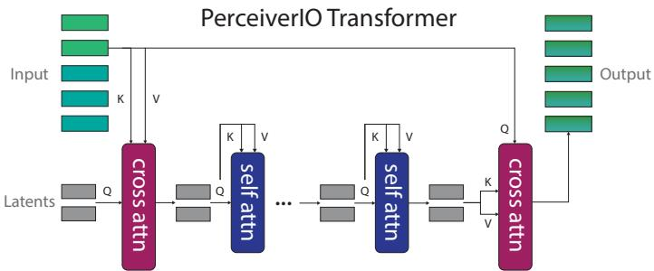  
Figure 6. Perceiver Transformer Architecture. Perceiver is a latent-space transformer. Q, K, V represent queries, keys, and values, respectively. We use 6 selfattention layers in our implementation.

Decoding. For translation, the voxel feature grid is decoded with a 3D convolution layer with a $1 \times 1$ kernel to downsample the channel dimension from 64 to 1. This tensor is the translation $\mathcal { Q }$ -function of dimensions $\mathbb { R } ^ { 1 0 \mathbf { \dot { 0 } } \times 1 0 0 \times 1 0 0 \times 1 }$ voxel feature grid is max-pooled along the 3D dimensions to form a vector of dimensions $\mathbb { R } ^ { 1 \times 6 4 }$ . This vector is decoded with three independent linear layers to form the respective $\mathcal { Q }$ -functions for rotation, gripper open, and collision avoidance. The rotation linear layer outputs logits of dimensions $\mathbb { R } ^ { 2 1 6 }$ layers output logits of dimensions $\mathbb { R } ^ { 2 }$ . Our codebase is built on the ARM repository7 by James et al. [14].

# C Evaluation Workflow

# C.1 Simulation

Simulated experiments in Section 4.2 follow a four-phase workflow: (1) generate a dataset with train, validation, and test sets, each containing 100, 25, and 25 demonstrations, respectively. (2) Train an agent on the train set and save checkpoints at intervals of 10K iterations. (3) Evaluate all saved checkpoints on the validation set, and mark the best performing checkpoint. (4) Evaluate the best performing checkpoint on the test set. While this workflow follows a standard train-val-test paradigm from supervised learning, it is not the most feasible workflow for real-robot settings. With real-robots, collecting a validation set and evaluating all checkpoints could be very expensive.

# C.2 Real-Robot

For real-robot experiments in Section 4.4, we simply pick the last checkpoint from training. We check if the agent has been sufficiently trained by visualizing $\mathcal { Q }$ -predictions on training examples with swapped or modified language goals. While evaluating a trained agent, the agent keeps acting until a human user stops the execution. We also visualize the $\mathcal { Q }$ -predictions live to ensure that the agent's upcoming action is safe to execute.

# D Robot Setup

# D.1 Simulation

All simulated experiments use the four camera setup illustrated in Figure 7. The front, left shoulder, and right shoulder cameras, are static, but the wrist camera moves with the endeffector. We did not modify the default camera poses from RLBench [15]. These poses maximize coverage of the tabletop, while minimizing occlusions caused by the moving arm. The wrist camera in particular is able to provide high-resolution observations of small objects like handles.

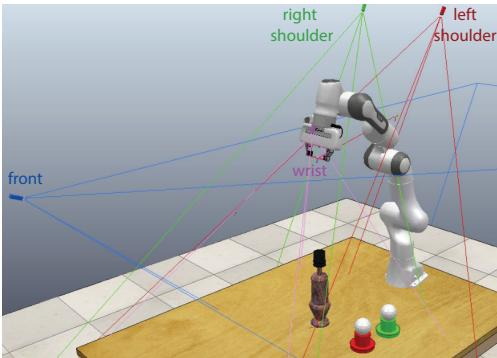  
Figure 7. Simulated Setup. The four camera setup: front, left shoulder, right shoulder, and on the wrist.

# D.2 Real-Robot

Hardware Setup. The real-robot experiments use a Franka Panda manipulator with a parallelgripper. For perception, we use a Kinect-2 RGB-D camera mounted on a tripod, at an angle, pointing towards the tabletop. See Figure D for reference. We tried setting-up multiple Kinects for multiview observations, but we could not fix the interference issue caused by multiple Time-of-Flight sensors. The Kinect-2 provides RGB-D images of resolution $5 1 2 \times 4 2 4$ at $3 0 \mathrm { H z }$ The extrinsics between the camera and robot base-frame are calibrated with the easy handeye package8. We use an ARUCO9 AR marker mounted on the gripper to aid the calibration process. Data Collection. We collect demonstrations with an HTC Vive controller. The controller is a 6-DoF tracker that provides accurate poses with respect to a static base-station. These poses are displayed as a marker on $\mathbf { R } \mathbf { V i z } ^ { 1 0 }$ along with the real-time RGB-D pointcloud from the Kinect2. A user specifies target poses by using the marker and pointcloud as reference. These target poses are executed with a motion-planner. We use Franka ROS and MoveIt, which by default uses an RRT-Connect planner. Training and Execution. We train a PERACT agent from scratch with 53 demonstrations. The training samples are augmented with $\pm 0 . 1 2 5 \mathrm { m }$ translation perturbations and $\pm 4 5 ^ { \circ }$ yaw rotation perturbations. We train on 8 NVIDIA P100 GPUs for 2 days. During evaluation, we simply chose the last checkpoint from training (since we did not collect a validation set for optimization). Inference is done on a single Titan X GPU.

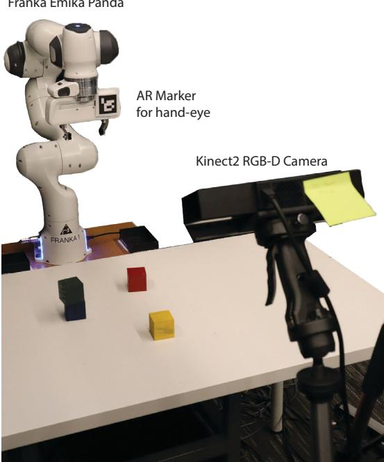  
Figure 8. Real-Robot Setup with Kinect-2 and Franka Panda.

# E Data Augmentation

PERACT's voxel-based formulation naturally allows for data augmentation with SE(3) transformations. During training, samples of voxelized observations $\mathbf { v }$ and their corresponding keyframe actions $\mathbf { k }$ are perturbed with random translations and rotations. Translation perturbations have a range of $[ \pm 0 . 1 2 5 \mathrm { { \bar { m } } , \pm 0 . 1 2 5 \mathrm { { m } , \pm 0 . 1 2 5 \mathrm { { m } } ] } }$ . Rotation perturbations are limited to the yaw axis and have a range of $[ 0 ^ { \circ } , 0 ^ { \circ } , \pm 4 5 ^ { \circ } ]$ .The $4 5 ^ { \circ }$ limit ensures that the perturbed rotations do not go beyond what is kinematically reachable for the Franka arm. We did experiment with pitch and roll perturbations, but they substantially lengthened the training time. Any perturbation that pushed the discretized action outside the observation voxel grid was discarded. See the bottom row of Figure 10 for examples of data augmentation.

# F Demo Augmentation

Following James et al. [15], we cast every datapoint in a demonstration as a "predict the next (best) keyframe action" task. See Figure 9 for an illustration of this process. In this illustration, $\mathbf { k } _ { 1 }$ and $\mathbf { k } _ { 2 }$ are two keyframes that were extracted from the method described in Section 3.2. The orange circles indicate datapoints whose RGB-D observations are paired with the next keyframe action.

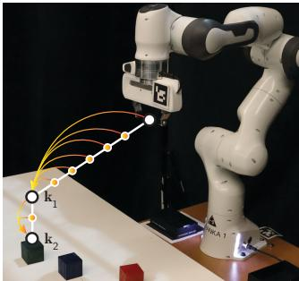  
Figure 9. Keyframes and Demo Augmentation.

# G Sensitivity Analysis

In Table 4, we investigate three factors that affect PERACT's performance: rotation data augmentation, number of Perceiver latents, and voxelization resolution. All multi-task agents were trained with 100 demonstrations per task and evaluated on 25 episodes per task. To briefly summarize these results: (1) $4 5 ^ { \circ }$ yaw perturbations improve performance on tasks with lots of rotation variations like stack blocks, but also worsen performance on tasks with constrained rotations like place wine. (2) PERACT with just 512 latents is competitive with (and sometimes even better than) the default agent with 2048 latents, which showcases the compression capability of the Perceiver architecture. (3) Coarse grids like $3 2 ^ { 3 }$ are sufficient for some tasks, but high-precision tasks like sort shape need higher resolution voxelization. (4) Large patch-sizes reduce memory usage, but they might affect tasks that need sub-patch precision.

Table 4. Sensitivity Analysis. Success rates (mean $\%$ ) of various PERACT agents trained with 100 demonstrations per task. We   

<table><tr><td></td><td></td><td>open drawer</td><td>slide block</td><td>Sweep to dustpan</td><td>meat off grill</td><td>turn tap</td><td>put in drawer</td><td>close jar</td><td>drag stick</td><td>stack blocks</td></tr><tr><td>PERACT</td><td></td><td>80</td><td>72</td><td>56</td><td>84</td><td>80</td><td>68</td><td>60</td><td>68</td><td>36</td></tr><tr><td></td><td>PeRACT w/o Rot Aug</td><td>92</td><td>72</td><td>56</td><td>92</td><td>96</td><td>60</td><td>56</td><td>100</td><td>8</td></tr><tr><td>PERACT</td><td>4096 latents</td><td>84</td><td>88</td><td>44</td><td>68</td><td>84</td><td>48</td><td>48</td><td>84</td><td>12</td></tr><tr><td>PERACT</td><td>1024 latents</td><td>84</td><td>48</td><td>52</td><td>84</td><td>84</td><td>52</td><td>32</td><td>92</td><td>12</td></tr><tr><td>PERACT</td><td>512 latents</td><td>92</td><td>84</td><td>48</td><td>100</td><td>92</td><td>32</td><td>32</td><td>100</td><td>20</td></tr><tr><td>PERACT</td><td>643 voxels</td><td>88</td><td>72</td><td>80</td><td>60</td><td>84</td><td>36</td><td>40</td><td>84</td><td>32</td></tr><tr><td>PERACT</td><td>323 voxels</td><td>28</td><td>44</td><td>100</td><td>60</td><td>72</td><td>24</td><td>0</td><td>24</td><td>0</td></tr><tr><td>PERACT</td><td>73 patches</td><td>72</td><td>48</td><td>96</td><td>92</td><td>76</td><td>76</td><td>36</td><td>96</td><td>32</td></tr><tr><td>PERACT</td><td>93 patches</td><td>68</td><td>64</td><td>56</td><td>52</td><td>96</td><td>56</td><td>36</td><td>92</td><td>20</td></tr><tr><td></td><td></td><td>screw bulb</td><td>put in safe</td><td>place wine</td><td>put in cupboard</td><td>sort shape</td><td>push buttons</td><td>insert peg</td><td>stack cups</td><td>place cups</td></tr><tr><td>PERACT</td><td></td><td>24</td><td>44</td><td>12</td><td>16</td><td>20</td><td>48</td><td>0</td><td>0</td><td>0</td></tr><tr><td></td><td>PerAct w/o Rot Aug</td><td>20</td><td>32</td><td>48</td><td>8</td><td>8</td><td>56</td><td>8</td><td>4</td><td>0</td></tr><tr><td>PERACT</td><td>4096 latents</td><td>32</td><td>44</td><td>52</td><td>8</td><td>12</td><td>72</td><td>4</td><td>4</td><td>0</td></tr><tr><td>PERACT</td><td>1024 latents</td><td>24</td><td>32</td><td>36</td><td>8</td><td>20</td><td>40</td><td>8</td><td>4</td><td>0</td></tr><tr><td>PERACT</td><td>512 latents</td><td>48</td><td>40</td><td>36</td><td>24</td><td>16</td><td>32</td><td>12</td><td>0</td><td>4</td></tr><tr><td>PERACT</td><td>643 voxels</td><td>24</td><td>48</td><td>44</td><td>12</td><td>4</td><td>32</td><td>0</td><td>4</td><td>0</td></tr><tr><td>PERACT</td><td>323 voxels</td><td>12</td><td>20</td><td>52</td><td>0</td><td>0</td><td>60</td><td>0</td><td>0</td><td>0</td></tr><tr><td>PERACT</td><td>73 patches</td><td>8</td><td>48</td><td>76</td><td>0</td><td>12</td><td>16</td><td>0</td><td>0</td><td>0</td></tr></table>

# H High-Precision Tasks

In Table 1, PERACT achieves zero performance on three highprecision tasks: place cups, stack cups, and insert peg. To investigate if multi-task optimization is itself one of the factors affecting performance, we train 3 separate single-task agents for each task. We find that single-task agents are able to achieve non-zero performance, indicating that better multi-task optimization methods might improve performance on certain tasks.

Table 5. Success rates (mean $\%$ of multi-task and single-task PERACT agents trained with 100 demos and evaluated on 25 episodes.   

<table><tr><td></td><td>Multi</td><td>Single</td></tr><tr><td>place cups</td><td>0</td><td>24</td></tr><tr><td>stack cups</td><td>0</td><td>32</td></tr><tr><td>insert peg</td><td>0</td><td>16</td></tr></table>

# I Additional Related Work

In this section, we briefly discuss additional works that were not mentioned in Section 2. Concurrent Work. Recently, Mandi et al. [83] found that pre-training and fine-tuning on new tasks is competitive, or even better, than meta-learning approaches for RLBench tasks in multi-task (but single-variation) settings. This pre-training and fine-tuning paradigm might be directly applicable to PERACT, where a pre-trained PERACT agent could be quickly adapted to new tasks without the explicit use of meta-learning algorithms. Multi-Task Learning. In the context of RLBench, Auto- $\lambda$ [73] presents a multi-task optimization framework that goes beyond uniform task weighting from Section 3.4. The method dynamically tunes task weights based on the validation loss. Future works with PERACT could replace uniform task weighting with Auto- $\lambda$ for better multi-task performance. In the context of Meta-World [53], Sodhani et al. [84] found that language-conditioning leads to performance gains for multi-task RL on 50 task variations. Language-based Planning. In this paper, we only investigated single-goal settings where the language instruction does not change throughout the episode. However, language-conditioning natural allows for composing several instructions in a sequential manner [69]. As such, several prior works [85, 13, 86, 87] have used language as medium for planning high-level actions, which can then be executed with pre-trained low-level skills. Future works could incorporate language-based planning for grounding more abstract goals like "make dinner". Task and Motion Planning. In the sub-field of Task and Motion Planning (TAMP) [88, 89], Konidaris et al. [90] present an action-centric approach to symbolic planning. Given a set of predefined action-skills, an agent interacts with its environment to construct a set of symbols, which can then be used for planning.

Voxel Representations. Voxel-based representations have been used in several domains that specifically benefit from 3D understanding. Like in object detection [91, 92], object search [93], and vision-language grounding [94, 95], voxel maps have been used to build persistent scene representations [96]. In Neural Radiance Fields (NeRFs), voxel feature grids have dramatically reduced training and rendering times [97, 98]. Similarly, other works in robotics have used voxelized representations to embed viewpoint-invariance for driving [99] and manipulation [100]. The use of latent vectors in Perceiver [1] is broadly related to voxel hashing [101] from computer graphics. Instead of using a location-based hashing function to map voxels to fixed size memory, PerceiverIO uses cross attention to map the input to fixed size latent vectors, which are trained end-to-end. Another major difference is the treatment of unoccupied space. In graphics, unoccupied space does not affect rendering, but in PERACT, unoccupied space is where a lot of "action detections" happen. Thus the relationship between unoccupied and occupied space, i.e., scene, objects, robot, is crucial for learning action representations. Long-Context and Latent-Space Transformers. Several approaches have been proposed for extending Transformers to longer context lengths [102]. Latent-space Transformers that use fixed-size latents instead of the full context, are one such approach [1, 103]. There is no clear winner in terms of trade-offs between speed, memory, and performance. However, latent-space methods have achieved compelling results in object detection [104] and slot-attention based object discovery [105].

# J Additional Q-Prediction Examples

Figure 10 showcases additional $\mathcal { Q }$ -prediction examples from trained PERACT agents. Traditional object-centric representations like poses and instance-segmentations struggle to represent piles of beans or tomato vines with high-precision. Whereas action-centric agents like PERACT focus on learning perceptual representations of actions, which elevates the need for practitioners to define what should be an object (which is a harder problem and often specific to tasks and embodiments).

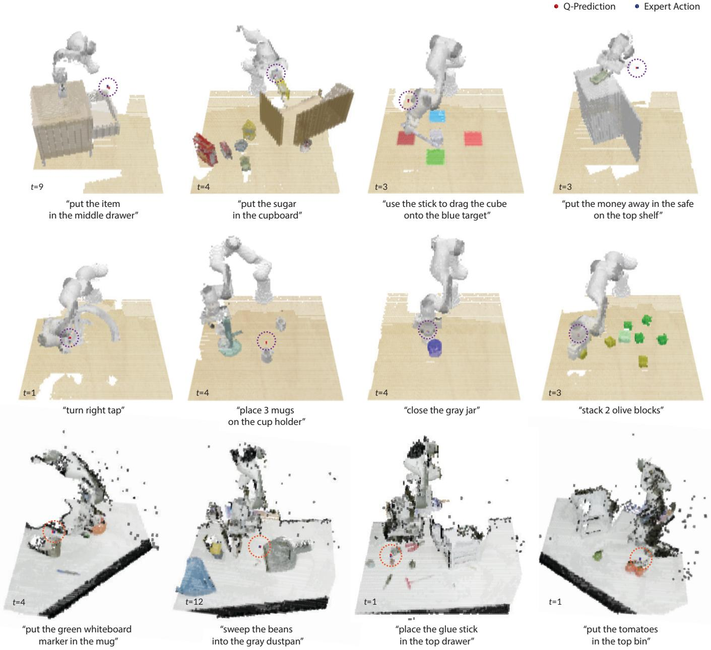  
Figure 10. Additional Q-Prediction Examples. Translation $\mathcal { Q }$ -Prediction examples from PERACT. The top two rows are from simulated

# K Things that did not work

In this section, we describe things we tried, but did not work or caused issues in practice. Real-world multi-camera setup. We tried setting up multiple Kinect-2s for real-world multi-view observations, but we could not solve interference issues with multiple Time-of-Flight sensors. Particlarly, the depth frames became vey noisy and had lots of holes. Future works could ty turni the cameras on-and-off in a rapid sequence, or use better Time-of-Flight cameras with minimal interference. Fourier features for positional embeddings. Instead of the learned positional embeddings, we also experimented with concatenating Fourier features to the input sequence like in some Perceiver models [1]. The Fourier features led to substantially worse performance. Pre-trained vision features. Following CLIPort [16], we tried using pre-trained vision features from CLIP [76], instead of raw RGB values, to bootstrap learning and also to improve generalization to unseen objects. We ran CLIP's ResNet50 on each of the 4 RGB frames, and upsampled features with shared decoder layers in a UNet fashion. But we found this to be extremely slow, especially since the ResNet50 and decoder layers need to be run on 4 independent RGB frames. With this additional overhead, training multi-task agents would have taken substantially longer than 16 days. Future works could experiment with methods for pre-training the decoder layers on auxiliary tasks, and pre-extracting features for faster training. Upsampling at multiple self-attention layers. Inspired by Dense Prediction Transformers (DPT) [106], we tried upsampling features at multiple self-attention layers in the Perceiver Transformer. But this did not work at all; perhaps the latent-space self-attention layers of Perceiver are substantially different to the full-input self-attention layers of ViT [4] and DPT [106]. Extreme rotation augmentation. In addition to yaw rotation perturbations, we also tried perturbing the pitch and roll. While PERACT was still able to learn policies, it took substantially longer to train. I $\mathbb { R } ^ { 2 0 4 8 \times 5 1 2 }$ is p -DoF o h such extreme rotation perturbations. Using Adam instead of LAMB. We tried training PERACT with the Adam [107] optimizer instead of LAMB [78], but this led to worse performance in both simulated and real-world experiments.

# L Limitations and Risks

While PERACT is quite capable, it is not without limitations. In the following sections, we discuss some of these limitations and potential risks for real-world deployment. Sampling-Based Motion Planner. PERACT relies on a sampling-based motion planner to execute discretized actions. This puts PERACT at the mercy of randomized planner to reach poses. While this issue did not cause any major problems with the tasks in our experiments, a lot of other tasks are sensitive to the paths taken to reach poses. For instance, pouring water into a cup would require a smooth path for tilting the water container appropriately. This could be addressed in future works by using a combination of learned and sampled motion paths [108]. Dynamic Manipulation. Another issue with discrete-time discretized actions is that they are not easily applicable to dynamic tasks that require real-time closed-loop maneuvering. This could be addressed with a separate visuo-servoing mechanism that can reach target poses with closed-loop control. Alternatively, instead of predicting just one action, PERACT could be extended to predict a sequence of discretized actions. Here, the Transformer-based architecture could be particularly advantageous. Also, instead of just predicting poses, the agent could also be trained to predict other physical parameters like target velocities [109]. Dexterous Manipulation. Using discretized actions with N-DoF robots like multi-fingered hands is also non-trivial. Specifically for multi-fingered hands, PERACT could be modified to predict fingertip poses that can be reached with an IK (Inverse Kinematics) solver. But it is unclear how feasible or robust such an approach would be with under-actuated systems like multi-fingered hands. Generlization to Novel Instances and Objects. In Figure 11, we report results from small-scale perturbation experiments on the open drawer task. We observe that changing the shape of the handles does not affect performance. However, handles with randomized textures and colors confuse the agent since it has only seen one type of drawer color and texture during training. Going beyond this one-shot setting, and training on several instances of drawers might improve generalization performance. Although we did not explicitly study generalization to unseen objects, it might be feasible to train PERAcT's action-detector on a broad range of objects and evaluate its ability to handle novel objects, akin to how language-conditioned instance-segmentors and object-detectors are used [110]. Alternatively, pre-trained vision features from multi-modal encoders like CLIP [76] or R3M [38] could be used to boostrap learning.

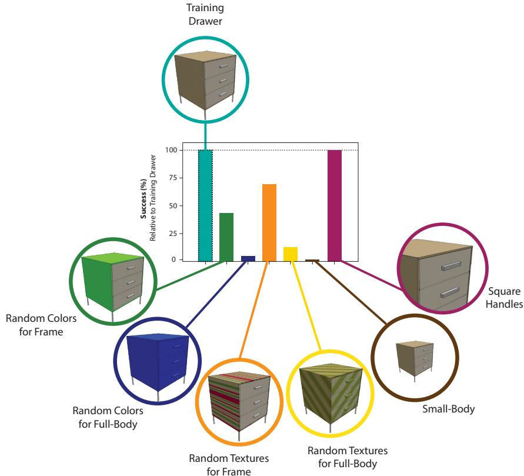

Scope of Language Grounding. Like with prior work [16], PERACT's understanding of verb-noun phrases is closely grounded in demonstrations and tasks. For example, "cleaning" in "clean the beans on the table with a dustan" is specifically associat with the action sequence of puhi beans on to a dustpan, and not "cleaning" in general, which could be applied to other tasks like cleaning the table with a cloth. Predicting Task Completion. For both real-world and simulated evaluations, an oracle indicates whether the desired goal has been reached. This oracle could be replaced with a success classifier that can be pre-trained to predict task completion from RGB-D observations. History and Partial Observability. PERACT relies purely on the current observation to predict the next action. As such, tasks that require history like counting or ordering are not feasible, unless accompanied by a task-completion predictor. Similarly, for tasks involving partial observability e.g., looking through drawers one-by-one for a specific object, PERAcT does not keep track of what was seen before. Future works could include observations from previous timesteps, or append Perceiver latents, or train a Recurrent Neural Network to encode latents across timesteps. Data Augmentation with Kinematic Feasibility. The data augmentation method described in Section E does not consider the kinematic feasibility of reaching perturbed actions with the Franka arm. Future works could pre-compute unreachable poses in the discretized action space, and discard any augmentation perturbations that push actions into unreachable zones. Balanced Datasets. Since PERACT is trained with just a few demonstrations, it occassionally tends to exploit biases in the training data. For instance, PERACT might have a tendency to always "place blue blocks on yellow blocks" if such an example is over-represented in the training data. Such issues could be potentially fixed by scaling datasets to include more diverse examples of objects and attributes. Additionally, data visualization methods could be used to identify and fix these biases. Multi-Task Optimization. The uniform task sampling strategy presented in Section 3.4 might sometimes hurt performance. Since all tasks are weighted equally, optimizing for certain tasks with common elements (e.g., moving blocks), might adversarial affect the performance on other dissimilar tasks (e.g., turning taps). Future works, could use dynamic task-weighting methods like Auto $\lambda$ [73] for better multi-task optimization. Deployment Risks. PERACT is an end-to-end framework for 6-DoF manipulation. Unlike some methods in Task-and-Motion-Planning that can sometimes provide theoretical guarantees on task completion, PERACT is a purely reactive system whose performance can only be evaluated through empirical means. Also, unlike prior works [16], we do not use internet pre-trained vision encoders that might contain harmful biases [111, 112]. Even so, it is prudent to thoroughly study and mitigate any biases before deployment. As such, for real-world applications, keeping humans in the loop both during training and testing, might help. Usage with unseen objects and observations with people is not recommended for safety critical systems.

# M Emergent Properties

In this section, we present some preliminary findings on the emergent properties of PERACT.

# M.1 Object Tracking

Although PERACT was not explicitly trained for 6-DoF object-tracking, our action detection framework can be used to localize objects in cluttered scenes. In this video, we show an agent that was trained with one hand sanitizer instance on just 5 "press the handsan" demos, and then evaluated on tracking an unseen sanitizer instance. PERACT does not need to build a complete representation of hand sanitizers, and only has to learn where to press them. Our implementation runs at an inference speed of 2.23 FPS (or 0.45 seconds per frame), allowing for near real-time closed-loop behaviors.

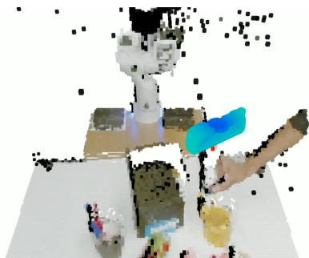

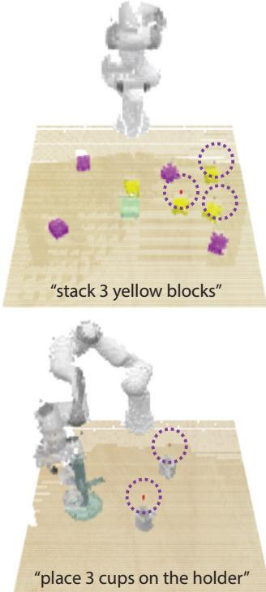  
Figure 12. Object Tracker. Tracking an unseen hand sanitizer instance.   
Figure 13. Examples of Multi-Modal Predictions.

# M.2 Multi-Modal Actions

PERAcT's problem formulation allows for modeling multi-modal action distributions, i.e., scenarios where multiple actions are valid given a specific goal. Figure 13 presents some selected examples of multi-modal action predictions from PERACT. Since there are several "yellow blocks" and "cups" to choose from, the $\mathcal { Q }$ . prediction distributions have several modes. In practice, we observe that the agent has a tendency to prefer certain object instances over others (like the front mug in Figure 13) due to preference biases in the training dataset. We also note that the cross-entropy based training method from Section 3.4 is closely related to Energy-Based Models (EBMs) [113, 114]. In a way, the cross-entropy loss is pulling up expert 6-DoF actions, while pushing-down every other action in the discretized action space. At test time, we simply maximize the learned $\mathcal { Q }$ -predictions, instead of minimizing an energy function with optimization. Future works could look into EBM [114] training and inference methods for better generalization and execution performance.