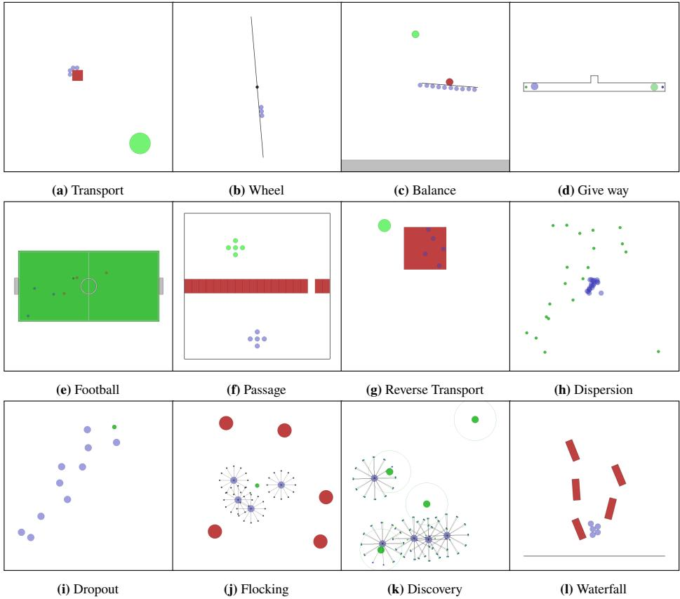
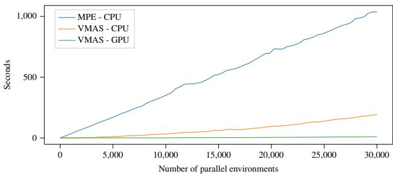
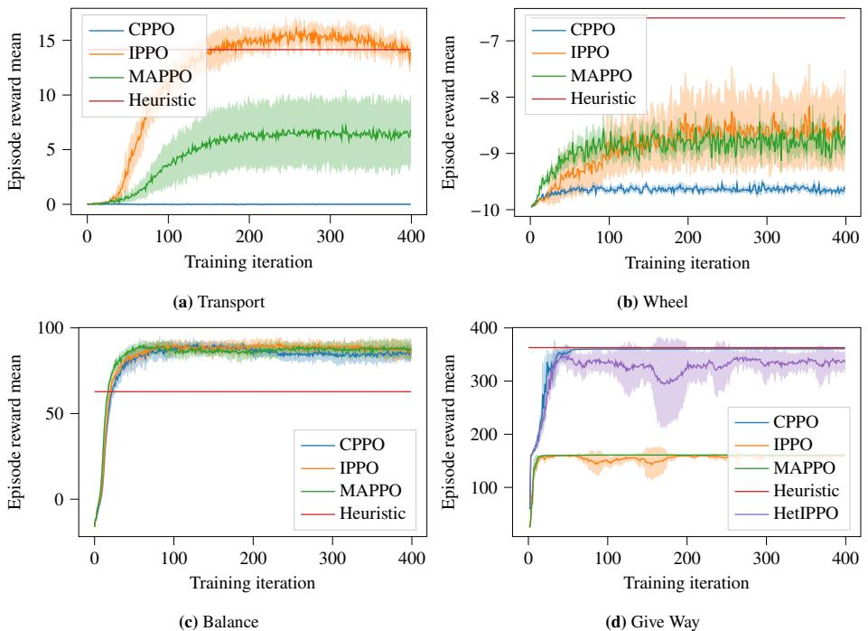

# VMAS: A Vectorized Multi-Agent Simulator for Collective Robot Learning

Matteo Bettini, Ryan Kortvelesy, Jan Blumenkamp, and Amanda Prorok Department of Computer Science and Technology, University of Cambridge, Cambridge, UK, {mb2389,rk627,jb2270,asp45}@cl.cam.ac.uk

Abstract. While many multi-robot coordination problems can be solved optimally by exact algorithms, solutions are often not scalable in the number of robots. Multi-Agent Reinforcement Learning (MARL) is gaining increasing attention in the robotics community as a promising solution to tackle such problems. Nevertheless, we still lack the tools that allow us to quickly and efficiently find solutions to large-scale collective learning tasks. In this work, we introduce the Vectorized Multi-Agent Simulator (VMAS). VMAS is an open-source framework designed for efficient MARL benchmarking. It is comprised of a vectorized 2D physics engine written in PyTorch and a set of twelve challenging multi-robot scenarios. Additional scenarios can be implemented through a simple and modular interface. We demonstrate how vectorization enables parallel simulation on accelerated hardware without added complexity. When comparing VMAS to OpenAI MPE, we show how MPE's execution time increases linearly in the number of simulations while VMAS is able to execute 30,000 parallel simulations in under 10s, proving more than $1 0 0 \times$ faster. Using VMAS's RLlib interface, we benchmark our multi-robot scenarios using various Proximal Policy Optimization (PPO)-based MARL algorithms. VMAS's scenarios prove challenging in orthogonal ways for state-of-the-art MARL algorithms. The VMAS framework is available at: https://github.com/proroklab/VectorizedMultiAgentSimulator. A video of VMAS scenarios and experiments is available here1 Keywords: simulator, multi-robot learning, vectorization

# 1 Introduction

Many real-world problems require coordination of multiple robots to be solved. However, coordination problems are commonly computationally hard. Examples include pathplanning [14], task assignment [25], and area coverage [39]. While exact solutions exist, their complexity grows exponentially in the number of robots [3]. Metaheuristics [6] provide a fast and scalable solutions, but lack in optimality. Multi-Agent Reinforcement Learning (MARL) can be used as a scalable approach to find near-optimal solutions to these problems [34]. In MARL, agents trained in simulation collect experiences by interacting with the environment, and train their policies (typically represented with deep neural networks) through a reward signal.

  
Fig.1: Multi-robot scenarios introduced in VMAS. Robots (blue shapes) interact among each other and with landmarks (green, red, and black shapes) to solve a task.

However, current MARL approaches present several issues. Firstly, the training phase can require significant time to converge to optimal behavior. This is partially due to the sample efficiency of the algorithm, and partially to the computational complexity of the simulator. Secondly, current benchmarks are specific to a predefined task and mostly tackle unrealistic videogame-like scenarios [28,31], far from real-world multirobot problems. This makes research in this area fragmented, with a new simulation framework being implemented for each new task introduced. Multi-robot simulators, on the other hand, prove to be more general, but their high fidelity and full-stack simulation results in slow performance, preventing their applicability to MARL. Fullstack learning can significantly hinder training performance. Learning can be made more sample-efficient if simulation is used to solve high-level multi-robot coordination problems, while leaving low-level robotic control to first-principles-based methods.

Motivated by these reasons, we introduce VMAS, a vectorized multi-agent simulator. VMAS is a vectorized 2D physics simulator written in PyTorch [22], designed for efficient MARL benchmarking. It simulates agents and landmarks of different shapes and supports torque, elastic collisions and custom gravity. Holonomic motion models are used for the agents to simplify simulation. Vectorization in PyTorch allows VMAS to perform simulations in a batch, seamlessly scaling to tens of thousands of parallel environments on accelerated hardware. With the term GPU vectorization we refer to the Single Instruction Multiple Data (SIMD) execution paradigm available inside a GPU warp. This paradigm permits to execute the same instruction on a set of parallel simulations in a batch. VMAS has an interface compatible with OpenAI Gym [7] and with the RLlib library [15], enabling out-of-the-box integration with a wide range of RL algorithms. VMAS also provides a framework to easily implement custom multi-robot scenarios. Using this framework, we introduce a set of 12 multi-robot scenarios representing difficult learning problems. Additional scenarios can be implemented through a simple and modular interface. We vectorize and port all scenarios from OpenAI MPE [16] in VMAS. We benchmark four of VMAS's new scenarios using three MARL algorithms based on Proximal Policy Optimization (PPO) [29]. We show the benefits of vectorization by benchmarking our scenarios in the RLlib [15] library. Our scenarios prove to challenge state-of-the-art MARL algorithms in complementary ways. Contributions. We now list the main contributions of this work: We introduce the VMAS framework. A vectorized multi-agent simulator which enables MARL training at scale. VMAS supports inter-agent communication and customizable sensors, such as LIDARs. We implement a set of twelve multi-robot scenarios in VMAS, which focus on testing different collective learning challenges including: behavioural heterogeneity, coordination through communication, and adversarial interaction. We port and vectorize all scenarios from OpenAI MPE [16] into VMAS and run a performance comparison between the two simulators. We demonstrate the benefits of vectorization in terms of simulation speed, showing that VMAS is up to $1 0 0 \times$ faster than MPE. The VMAS codebase is available here2.

# 2 Related work

In this section, we review the related literature in the fields of multi-agent and multirobot simulation, highlighting the core gaps of each field. Furthermore, we compare the most relevant simulation frameworks with VMAS in Tab. 1.

Multi-agent reinforcement learning environments. A significant amount of work exists in the context of MARL to address the issues of multi-robot simulation for learning hard coordination strategies. Realistic GPU-accelerated simulators and engines have been proposed. Isaac [17] is a proprietary NVIDIA simulator used for realistic robotic simulation in reinforcement learning. Instead of using environment vectorization to accelerate learning, it uses concurrent execution of multiple training environments in the same simulation instance. Despite of this, its high-fidelity simulation makes it computationally expensive for high-level MARL problems. Brax [8] is a vectorized 3D physics engine introduced by Google. It uses the Jax [5] library to achieve environment batching and full-differentiability. However, computational issues occur when scaling the number of simulated agents, leading to stalled environments with just 20 agents. There also exist projects for single-agent vectorized environments [13,35], but the complexity of extending these to the multi-agent domain is non-trivial.

The core benchmark environments of the MARL literature focus on high-level inter-robot learning. Multiagent Particle Environments (MPE) [16] are a set of enviroments created by OpenAI. They share VMAS's principles of modularity and ease of new scenario creation, without providing environment vectorization. MAgent [38] is a discrete-world environment supporting a high number of agents. Multi-AgentLearning-Environments [10] is another simplified discrete-world set of environments with a range of different multi-robot tasks. Multi-Agent-Emergence-Environments [2] is a customizable OpenAI 3D simulator for hide-and-seek style games. Pommerman [26] is a discretized playground for learning multi-agent competitive strategies. SMAC [28] is a very popular MARL benchmark based on the Starcraft 2 videogame. Neural-MMO [31] is another videogame-like set of environments where agents learn to survive in large populations. Google Research Football [12] is a football simulation with a suite of scenarios that test different aspects of the game. Gym-pybullet-drones [21] is a realistic PyBullet simulator for multi-quadricopters control. Particle Robots Simulator [30] is a simulator for particle robots, which require high coordination strategies to overcome actuation limitations and achieve high-level tasks. Multi-Agent Mujoco [23] consists in multiple agents controlling different body parts of a single Mujoco [32] agent. While all these environments provide interesting MARL benchmarks, most of them focus on specific tasks. Furthermore, none of these environments provide GPU vectorization, which is key for efficient MARL training. We present a comparison between VMAS and all the aforementioned environments in Tab. 1. Multi-robot simulators. Video-game physics engines such as Unity and Unreal Engine grant realistic simulation that can be leveraged for multi-agent robotics. Both make use of the GPU-accelerated NVIDIA PhysX. However, their generality causes high overheads when using them for robotics research. Other popular physics engines are Bullet, Chipmunk, Box2D, and ODE. These engines are all similar in their capabilities and prove easier to adopt due to the availability of Python APIs. Thus, they are often the tool of choice for realistic robotic simulation. However, because they do not leverage GPU-accelerated batched simulation, these tools lead to performance bottlenecks in MARL training.

The most widely known robotic simulators are Gazebo [11] and Webots [18]. Their engines are based on the ODE 3D dynamics library. These simulators support a wide range of robot models, sensors, and actuators, but suffer from significant performance loss when scaling in the number of agents. Complete simulation stall is shown to occur with as few as 12 robots [20]. For this reason, Argos [24] has been proposed as a scalable multi-robot simulator. It is able to simulate swarms in the thousands of agents by assigning parts of the simulation space to different physics engines with different simulation goals and fidelity. Furthermore, it uses CPU parallelization through multithreading. Despite these features, none of the simulators described are fast enough to be usable in MARL training. This is because they prioritize realistic full-stack multirobot simulation over speed, and they do not leverage GPU acceleration for parallel simulations. This focus on realism is not always necessary in MARL. In fact, most collective coordination problems can be decoupled from low-level problems relating to sensing and control. When these problems can be efficiently solved independently without loss of generality, fast high-level simulation provides an important tool. This insight is the key factor motivating the holonomicity assumption in VMAS.

Table 1: Comparison of multi-agent and multi-robot simulators and environments.   

<table><tr><td colspan="10">Vectora Stateb Comm Actiond PhysEnge #Agentsf Gen8 Exth MRobi MARL RLlibk</td></tr><tr><td>Brax [8]</td><td>✓</td><td>C</td><td>X</td><td>C</td><td>3D</td><td>&lt; 10</td><td>✓</td><td></td><td></td><td></td><td>X</td></tr><tr><td>MPE [16]</td><td>X</td><td>C</td><td>C+D</td><td>C+D</td><td>2D</td><td>&lt; 100</td><td>✓</td><td>:</td><td>*</td><td>×&gt;&gt;</td><td>✓</td></tr><tr><td>MAgent [38]</td><td>X</td><td>D</td><td>X</td><td>D</td><td>X</td><td>&gt; 1000</td><td>X</td><td></td><td></td><td></td><td>✓</td></tr><tr><td>MA-Learning-Environments [10]</td><td>X</td><td>D</td><td>X</td><td>D</td><td>X</td><td>&lt; 10</td><td>✓</td><td>×</td><td>✓</td><td>✓</td><td>X</td></tr><tr><td>MA-Emergence-Environments [2]</td><td>X</td><td>C</td><td>X</td><td>C+D</td><td>3D</td><td>&lt; 10</td><td>X</td><td>✗</td><td>X</td><td></td><td>X</td></tr><tr><td>Pommerman [26]</td><td>X</td><td>D</td><td>X</td><td>D</td><td>X</td><td>&lt; 10</td><td>X</td><td></td><td>X</td><td>✓</td><td>X</td></tr><tr><td>SMAC [28]</td><td>X</td><td>C</td><td>X</td><td>D</td><td>X</td><td>&lt; 100</td><td>X</td><td>✗</td><td>✗</td><td></td><td></td></tr><tr><td>Neural-MMO [31]</td><td>X</td><td>C</td><td>X</td><td>C+D</td><td>X</td><td>&lt; 1000</td><td>X</td><td>✓</td><td>X</td><td>✓</td><td>✓</td></tr><tr><td>Google research football [12]</td><td>X</td><td>C</td><td>X</td><td>D</td><td>2D</td><td>&lt; 100</td><td>X</td><td>✓</td><td>X</td><td>✓</td><td></td></tr><tr><td>gym-pybullet-drones [21]</td><td>X</td><td>C</td><td>X</td><td>C</td><td>3D</td><td>&lt; 100</td><td>X</td><td>✓</td><td>✓</td><td>✓</td><td>✓</td></tr><tr><td>Particle robots simulator [30]</td><td>X</td><td>C</td><td>X</td><td>C+D</td><td>2D</td><td>&lt; 100</td><td>X</td><td>✓</td><td>✓</td><td>✓</td><td>X</td></tr><tr><td>MAMujoco [23]</td><td>X</td><td>C</td><td>X</td><td>C</td><td>3D</td><td>&lt; 10</td><td>X</td><td>X</td><td>X</td><td>✓</td><td>X</td></tr><tr><td></td><td>X</td><td>C</td><td>C+D</td><td>C+D</td><td>3D</td><td>&lt; 10</td><td>✓</td><td>✓</td><td></td><td></td><td></td></tr><tr><td>Gazebo [11] Webots [18]</td><td>X</td><td>C</td><td>C+D</td><td>C+D</td><td>3D</td><td>&lt; 10</td><td>✓</td><td>✓</td><td>✓ ✓</td><td>X X</td><td>X X</td></tr><tr><td>ARGOS [24]</td><td>X</td><td>C</td><td>C+D</td><td>C+D</td><td>2D&amp;3D</td><td>&lt; 1000</td><td>✓</td><td>✓</td><td>✓</td><td>X</td><td>X</td></tr><tr><td>VMAS</td><td>✓</td><td>C</td><td>C+D</td><td>C+D</td><td>2D</td><td>&lt; 100</td><td>✓</td><td>✓</td><td>✓</td><td>✓</td><td>✓</td></tr></table>

a Vectorized Conus sate )or icte state/rid wor ) cContinuous communication (C) or discrete communication (D) inside the simulator d Continuous actions (C) or discrete actions (D) e Type of physics engine $f$ Number of agents supported 8 General purpose simulator: any type of task can be created h Extensibility (API for creating new scenarios) i Contains multi-robot tasks $j$ Made for Multi-Agent Reinforcement Learning (MARL) Compatible with RLlib framework [15]

# 3 The VMAS platform

The unique characteristic that makes VMAS different from the related works compared in Tab. 1 is the fact that our platform brings together multi-agent learning and environment vectorization. Vectorization is a key component to speed-up MARL training. In fact, an on-policy training iteration3 is comprised of simulated team rollouts and a policy update. During the rollout phase of iteration $k$ , simulations are performed to collect experiences from the agents' interactions with the environment according to their policy $\pi _ { k }$ . The collected experiences are then used to update the team policy. The new policy $\pi _ { k + 1 }$ will be employed in the rollout phase of the next training iteration. The rollout phase usually constitutes the bottleneck of this process. Vectorization allows parallel simulation and helps alleviate this issue. Inspired by the modularity of some existing solutions, like MPE [16], we created our framework as a new scalable platform for running and creating MARL benchmarks. With this goal in mind, we developed VMAS following a set of tenets:

Vectorized. VMAS vectorization can step any number of environments in parallel. This significantly reduces the time needed to collect rollouts for training in MARL.   
Simple. Complex vectorized physics engines exist (e.g., Brax [8]), but they do not scale efficiently when dealing with multiple agents. This defeats the computational speed goal set by vectorization. VMAS uses a simple custom 2D dynamics engine written in PyTorch to provide fast simulation. General. The core of VMAS is structured so that it can be used to implement general high-level multi-robot problems in 2D. It can support adversarial as well as cooperative scenarios. Holonomic robot simulation shifts focus to high-level coordination, obviating the need to learn low-level controls using MARL. Extensible. VMAS is not just a simulator with a set of environments. It is a framework that can be used to create new multi-agent scenarios in a format that is usable by the whole MARL community. For this purpose, we have modularized our framework to enable new task creation and introduced interactive rendering to debug scenarios.   
Compatible. VMAS has multiple wrappers which make it directly compatible with different MARL interfaces, including RLlib [15] and Gym [7]. RLlib has a large number of already implemented RL algorithms. Let us break down VMAS's structure in depth. Interface. The structure of VMAS is illustrated in Fig. 2. It has a vectorized interface, which means that an arbitrary number of environments can be stepped in parallel in a batch. In Sec. 5, we demonstrate how vectorization grants important speed-ups on the CPU and seamless scaling on the GPU. While the standard simulator interface uses PyTorch [22] to enable feeding tensors directly as input/output, we provide wrappers for the standard non-vectorized OpenAI Gym [7] interface and for the vectorized interface of the RLlib [15] framework. This enables users to effortlessly access the range of RL training algorithms already available in RLlib. Actions for all environments and agents are fed to VMAS for every simulation step. VMAS supports movement and inter-agent communication actions, both of which can be either continuous or discrete. The interface of VMAS provides rendering through Pyglet [1]. Scenario. Scenarios encode the multi-agent task that the team is trying to solve. Custom scenarios can be implemented in a few hours and debugged using interactive rendering. Interactive rendering is a feature where agents in scenarios can be controlled by users in a videogame-like fashion and all environment-related data is printed on screen. To implement a scenario, it is sufficient to define a few functions: make_world creates the agents and landmarks for the scenario and spawns them in the world, reset_world_at resets a specific environment in the batch or all environments at the same time, reward returns the reward for one agent for all environments, observation returns the agent's observations for all environments. Optionally, done and info can be implemented to provide an ending condition and extra information. Further documentation on how to create new scenarios is available in the repository2 and in the code.

  
Fig. 2: VMAS structure. VMAS has a vectorized MARL interface (left) with wrappers for compatibility with OpenAI Gym [7] and the RLlib RL library [15]. The default VMAS interface uses PyTorch [22] and can be used for feeding input already on the GPU. Multi-agent tasks in VMAS are defined as scenarios (center). To define a scenario, it is sufficient to implement the listed functions. Scenarios access the VMAS core (right), where agents and landmarks are simulated in the world using a 2D custom written physics module.

Core. Scenarios interact with the core. This is where the world simulation is stepped. The world contains $n$ entities, which can be agents or landmarks. Entities have a shape (sphere, box, or line) and a vectorized state $( \mathbf { x } _ { i } , \dot { \mathbf { x } } _ { i } , \theta _ { i } , \dot { \theta } _ { i } )$ , $\forall i \in [ 1 . . n ] \ \equiv \ N$ ,which contains their position $\mathbf { x } _ { i } \in \mathbb { R } ^ { 2 }$ , velocity $\dot { \bf x } _ { i } \in { \mathbb { R } ^ { 2 } }$ , rotation $\theta _ { i } \in \mathbb { R }$ , and angular velocity $\dot { \theta } _ { i } \in \mathbb { R }$ for all environments. Entities have a mass $m _ { i } \in \mathbb { R }$ and a maximum speed and can be customized to be movable, rotatable, and collidable. Agents' actions consist of physical actions, represented as forces $\mathbf { f } _ { i } ^ { a } \in \mathbb { R } ^ { 2 }$ , and optional communication actions. In the current state of the simulator, agents cannot control their orientation. Agents can either be controlled from the interface or by an "action script" defined in the scenario. Optionally, the simulator can introduce noise to the actions and observations. Custom sensors can be added to agents. We currently support LIDARs. The world has a simulation step $\delta t$ , velocity damping coefficient $\zeta$ , and customizable gravity $\mathbf { g } \in \mathbb { R } ^ { 2 }$ . VMAS has a force-based physics engine. Therefore, the simulation step uses the forces at time $t$ to integrate the state by using a semi-implicit Euler method [19]:

$$
\begin{array} { r } { \left\{ \begin{array} { l l } { { \bf f } _ { i } ( t ) = { \bf f } _ { i } ^ { a } ( t ) + { \bf f } _ { i } ^ { g } + \sum _ { j \in N \backslash \{ i \} } { \bf f } _ { i j } ^ { e } ( t ) } \\ { \dot { \bf x } _ { i } ( t + 1 ) = ( 1 - \zeta ) \dot { \bf x } _ { i } ( t ) + \frac { { \bf f } _ { i } ( t ) } { m _ { i } } \delta t } \\ { { \bf x } _ { i } ( t + 1 ) = { \bf x } _ { i } ( t ) + \dot { \bf x } _ { i } ( t + 1 ) \delta t } \end{array} \right. \quad , } \end{array}
$$

where $\mathbf { f } _ { i } ^ { a }$ is the agent action force, $\mathbf { f } _ { i } ^ { g } = m _ { i } \mathbf { g }$ is the force deriving from gravity and $\mathbf { f } _ { i j } ^ { e }$ is the environmental force used to simulate collisions between entities $i$ and $j$ It has the following form:

$$
\mathbf { f } _ { i j } ^ { e } ( t ) = \left\{ \begin{array} { l l } { c \frac { \mathbf { x } _ { i j } ( t ) } { \left\| \mathbf { x } _ { i j } ( t ) \right\| } k \log \left( 1 + e ^ { - \left( \left\| \mathbf { x } _ { i j } ( t ) \right\| - d _ { \operatorname* { m i n } } \right) } \right) \quad } & { \mathrm { ~ i f ~ } \left\| \mathbf { x } _ { i j } ( t ) \right\| \leqslant d _ { \operatorname* { m i n } } } \\ { 0 \quad } & { \mathrm { ~ o t h e r w i s e } } \end{array} \right. .
$$

Here, $c$ is a parameter regulating the force intensity. $\mathbf { x } _ { i j }$ is the relative position between the closest points on the shapes of the two entities. $d _ { \mathrm { m i n } }$ is the minimum distance allowable between them. The term inside the logarithm computes a scalar proportional to the penetration of the two entities, parameterized by a coefficient $k$ . This term is then multiplied by the normalized relative position vector. Collision intensity and penetration can be tuned by regulating $c$ and $k$ . This is the same collision system used in OpenAI MPE [16]. The simulation step used for the linear state is also applied to the angular state:

$$
\begin{array} { r } { \left\{ \begin{array} { l l } { \tau _ { i } ( t ) = \sum _ { j \in N \backslash \{ i \} } \left\| \mathbf { r } _ { i j } ( t ) \times \mathbf { f } _ { i j } ^ { e } ( t ) \right\| } \\ { \dot { \theta } _ { i } ( t + 1 ) = ( 1 - \zeta ) \dot { \theta } _ { i } ( t ) + \frac { \tau _ { i } ( t ) } { I _ { i } } \delta t } \\ { \theta _ { i } ( t + 1 ) = \theta _ { i } ( t ) + \dot { \theta } _ { i } ( t + 1 ) \delta t } \end{array} \right. . } \end{array}
$$

Here, $\mathbf { r } _ { i j } \in \mathbb { R } ^ { 2 }$ is the vector from the center of the entity to the colliding point, $\tau _ { i }$ is the torque, and $I _ { i }$ is the moment of inertia of the entity. The rules regulating the physics simulation in the core are basic 2D dynamics implemented in a vectorized manner using PyTorch. They simulate holonomic (unconstrained motion) entities only.

# 4 Multi-robot scenarios

Alongside VMAS, we introduce a set of 12 multi-robot scenarios. These scenarios contain various multi-robot problems, which require complex coordination—like leveraging heterogeneous behaviour and inter-agent communication—to be solved. While the ability to send communication actions is not used in these scenarios, communication can be used in the policy to improve performance. For example, Graph Neural Networks (GNNs) can be used to overcome partial observability through information sharing [4]. Each scenario delimits the agents' input by defining the set of their observations. This set typically contains the minimum observation needed to solve the task (e.g., position, velocity, sensory input, goal position). Scenarios can be made arbitrarily harder or easier by modifying these observations. For example, if the agents are trying to transport a package, the precise relative distance to the package can be removed from the agent inputs and replaced with LIDAR measurements. Removing global observations from a scenario is a good incentive for inter-agent communication. All tasks contain numerous parametrizable components. Every scenario comes with a set of tests, which run a local heuristic on all agents. Furthermore, we vectorize and port all 9 scenarios from MPE [16] to VMAS. In this section, we give a brief overview of our new scenarios. For more details (e.g., observation space, reward, etc.) you can find in-depth descriptions in the VMAS repository2. Transport (Fig. 1a). $N$ agents have to push $M$ packages to a goal. Packages have a customizable mass and shape. Single agents are not able to move a high-mass package by themselves. Cooperation with teammates is thus needed to solve the task. Wheel (Fig. 1b). $N$ agents have to collectively rotate a line. The line is anchored to the origin and has a parametrizable mass and length. The team's goal is to bring the line to a desired angular velocity. Lines with a high mass are impossible to push for single agents. Therefore, the team has to organize with agents on both sides to increase and reduce the line's velocity. Balance (Fig. 1c). $N$ agents are spawned at the bottom of a world with vertical gravity. A line is spawned on top of them. The agents have to transport a spherical package, positioned randomly on top of the line, to a given goal at the top. The package has a parametrizable mass and the line can rotate. Give Way (Fig. 1d). Two agents start in front of each other's goals in a symmetric environment. To solve the task, one agent has to give way to the other by using a narrow space in the middle of the environment. Football (Fig. 1e). A team of $N$ blue agents competes against a team of $M$ red agents to score a goal. By default, red agents are controlled by a heuristic AI, but self-play is also possible. Cooperation among teammates is required to coordinate attacking and defensive maneuvers. Agents need to communicate and assume different behavioural roles in order to solve the task. Passage (Fig. 1f). 5 agents, starting in a cross formation, have to reproduce the same formation on the other side of a barrier. The barrier has $M$ passages $M = 1$ in the figure). Agents are penalized for colliding amongst each other and with the barrier. This scenario is a generalization of the one considered in [4]. Reverse transport (Fig. 1g). This task is the same as Transport, except only one package is present. Agents are spawned inside of it and need to push it to the goal. Dispersion (Fig. 1h). There are $N$ agents and $N$ food particles. Agents start in the same position and need to cooperatively eat all food. Most MARL algorithms cannot solve this task (without communication or observations from other agents) as they are constrained by behavioural homogeneity deriving from parameter sharing. Heterogeneous behaviour is thus needed for each agent to tackle a different food particle. Dropout (Fig. 1i). $N$ agents have to collectively reach one goal. To complete the task, it is enough for only one agent to reach the goal. The team receives an energy penalty proportional to the sum of all the agents' controls. Therefore, agents need to organize themselves to send only the closest robot to the goal, saving as much energy as possible. Flocking (Fig. 1j). $N$ agents have to flock around a target without colliding among each other and $M$ obstacles. Flocking has been an important benchmark in multi-robot coordination for years, with first solutions simulating behaviour according to local rules [27], and more recent work using learning-based approaches [33]. In contrast to related work, our flocking environment contains static obstacles. Discovery (Fig. 1k). $N$ agents have to coordinate to cover $M$ targets as quickly as possible while avoiding collisions. A target is considered covered if $K$ agents have approached a target at a distance of at least $D$ . After a target is covered, the $K$ covering agents each receive a reward and the target is re-spawned at a random position. This scenario is a variation of the Stick Pulling Experiment [9] and while it can be solved without communication, it has been shown that communication significantly improves performance for $N < M$ . Waterfall (Fig. 11). $N$ agents move from top to bottom through a series of obstacles.   
This is a testing scenario that can be used to discover VMAS's functionalities.

# 5 Comparison with MPE

In this section, we compare the scalability of VMAS and MPE [16]. Given that we vectorize and port all the MPE scenarios in VMAS, we can compare the two simulators on the same MPE task. The task chosen is "simple_spread", as it contains multiple collidable agents in the same environment. VMAS and MPE use two completely different execution paradigms: VMAS, being vectorized, leverages the Single Instruction Multiple Data (SIMD) paradigm, while MPE uses the Single Instruction Single Data (SISD) paradigm. Therefore, it is sufficient to report the benefits of this paradigm shift on only one task, as the benefits are task-independent.

In Fig. 3, we can see the growth in execution time with respect to the number of environments stepped in parallel for the two simulators. MPE runs only on the CPU, while VMAS, using PyTorch, runs both on the CPU and on the GPU. In this experiment, we compare the two simulators on an Intel(R) Xeon(R) Gold 6248R CPU $\textcircled { a } \ 3 . 0 0 \mathrm { G H z }$ and we also run VMAS on an NVIDIA GeForce RTX 2080 Ti. The results show the impact of vectorization on simulation speed. On the CPU, VMAS is up to ${ 5 } \mathbf { x }$ faster than MPE. On the GPU, the simulation time for VMAS is independent of the number of environments, and runs up to $1 0 0 \times$ faster. The same results can be reproduced on different hardware. In the VMAS's repository2 we provide a script to repeat this experiment.

# 6 Experiments and benchmarks

We run a set of training experiments to benchmark the performance of MARL algorithms on four VMAS scenarios. Thanks to VMAS's vectorization, we are able to perform a training iteration (comprised of 60,000 environment interactions and deep neural network training) in 25s on average. The runs reported in this section all took under 3 hours to complete. The models compared are all based on Proximal Policy Optimization [29], an actor-critic RL algorithm. The actor is a Deep Neural Network (DNN) which outputs actions given the observations and the critic is a DNN (used only during training) which, given the observations, outputs a value representing the goodness of the current state and action. We refer to the actor and critic as centralized when they have access to all the agents' observations and output all the agent's actions/values and we call them decentralized when they only map one agent's observations to its action/value. The models compared are:

  
Fig. 3: Comparison of the scalability of VMAS and MPE [16] in the number of parallel environments. In this plot, we show the execution time of the "simple_spread" scenario for 100 steps. MPE does not support vectorization and thus cannot be run on a GPU.

CPPO: This model uses a centralized critic and actor. It treats the multi-agent problem as a single-agent problem with one super-agent. MAPPO [37]: This model uses a centralized critic and a decentralized actor. Therefore, the agents act independently, with local decentralized policies, but are trained with centralized information. IPPO [36]: This model uses a decentralized critic and actor. Every agent learns and acts independently. Model parameters are shared among agents so they can benefit from each other's experiences. HetIPPO: We customize IPPO to disable parameter sharing, making each agent's model unique. Heuristic: This is a hand-designed decentralized heuristic different for each task. Experiments are run in RLlib [15] using the vectorized interface. We run all algorithms for 400 training iterations. Each training iteration is performed over 60,000 environment interactions. We plot the mean and standard deviation of the mean episode reward4 over 10 runs with different seeds. The model used for all critics and actors is a two layer Multi Layer Perceptron (MLP) with hyperbolic tangent activations. A video of the learned policies is available at this link1. In the following, we discuss the results for the trained scenarios. Transport (Fig. 4a). In the Transport environment, only IPPO is able to learn the optimal policy. This is because the other models, which have centralized components, have an input space consisting of the concatenation of all the agents' observations. Consequently, centralized architectures fail to generalize in environments requiring a high initial exploration like this one, where there is a high variance in possible joint states (and therefore there is a low probability that a similar state will be encountered).

  
Fig.4: Benchmark performance of different PPO-based MARL algorithms in four VMAS scenarios. Experiments are run in RLlib [15]. Each training iteration is performed over 60,000 environment interactions. We plot the mean and standard deviation of the mean episode reward4 over 10 runs with different seeds.

Wheel (Fig. 4b). The Wheel environment proved to be a hard task for MARL algorithms.   
Here, all models were not able to solve the task and performed worse than the heuristic. Balance (Fig. 4c). In Balance, all models were able to solve the task and outperform the heuristic. However, this is largely due to the use of a big observation space containing global information. The task can be made arbitrarily harder by removing part of the observation space and thus increasing partial observability. Give Way (Fig. 4d). In the Give Way scenario, it is shown that only algorithms able to develop heterogeneous agent behaviour can solve the environment. In fact, IPPO and MAPPO, which use parameter sharing and decentralized actors, fail this scenario. On the other hand, it is shown that the scenario can be solved either through a centralized actor (CPPO) or by disabling parameter sharing and allowing agent policies to be heterogeneous (HetIPPO). The experimental results confirm that VMAS proposes a selection of scenarios which prove challenging in orthogonal ways for current state-of-the-art MARL algorithms. We show that there exists no one-fits-all solution and that our scenarios can provide a valuable benchmark for new MARL algorithms. In addition, vectorization enables faster training, which is key to a wider adoption of multi-agent learning in the robotics community.

# 7 Conclusion

In this work, we introduced VMAS, an open-source vectorized simulator for multirobot learning. VMAS uses PyTorch and is composed of a core vectorized 2D physics simulator and a set of multi-robot scenarios, which encode hard collective robotic tasks. The focus of this framework is to act as a platform for MARL benchmarking. Therefore, to incentivize contributions from the community, we made implementing new scenarios as simple and modular as possible. We showed the computational benefits of vectorization with up to 30,000 parallel simulations executed in under 10s on a GPU. We benchmarked the performance of MARL algorithms on our scenarios. During our training experiments, we were able to collect 60,000 environment steps and perform a training iteration in under 25s. Experiments also showed how VMAS scenarios prove difficult in orthogonal ways for state-of-the-art MARL algorithms. In the future, we plan to extend the features of VMAS to widen its adoption, continuing to implement new scenarios and benchmarks. We are also interested in modularizing the physics engine, enabling users to swap vectorized engines with different fidelities and computational demands.

# Acknowledgements

This work was supported by ARL DCIST CRA W911NF-17-2-0181 and European Research Council (ERC) Project 949940 (gAIa). R. Kortvelesy was supported by Nokia Bell Labs through their donation for the Centre of Mobile, Wearable Systems and Augmented Intelligence to the University of Cambridge. J. Blumenkamp acknowledges the support of the 'Studienstiftung des deutschen Volkes' and an EPSRC tuition fee grant.

# References

1. Pyglet. https://pyglet.org/

2. Baker, B., Kanitscheider, I., Markov, T., Wu, Y., Powell, G., McGrew, B., Mordatch, I.: Emergent tool use from multi-agent autocurricula. In: International Conference on Learning Representations (2019)   
3Bernstein, D.S., Givan, R., Immerman, N., Zilberstein, S.: The complexity of decentralized control of markov decision processes. Mathematics of operations research 27(4), 819840 (2002)   
.Blumenkamp, J., Morad, S., Gielis, J., Li, Q., Prorok, A.: A framework for real-world multirobot systems running decentralized gnn-based policies. arXiv preprint arXiv:2111.01777 (2021)   
5.Bradbury, J., Frostig, R., Hawkins, P., Johnson, M.J., Leary, C., Maclaurin, D., Necula, G., Paszke, A., VanderPlas, J., Wanderman-Milne, S., Zhang, Q.: JAX: composable transformations of Python+NumPy programs (2018). URL http://github.com/google/jax   
6.Bräysy, O., Gendreau, M.: Vehicle routing problem with time windows, part i: Metaheuristics. Transportation science 39(1), 119139 (2005)   
7.Brockman, G., Cheung, V., Pettersson, L., Schneider, J., Schulman, J., Tang, J., Zaremba, W.: Openai gym. arXiv preprint arXiv:1606.01540 (2016) 8. Freeman, C.D., Frey, E., Raichuk, A., Girgin, S., Mordatch, I., Bachem, O.: Brax - a differentiable physics engine for large scale rigid body simulation (2021). URL http: //github.com/google/brax   
9Ijspeert, A.J., Martinoli, A., Billard, A., Gambardella, L.M.: Collaboration through the exploitation of local interactions in autonomous collective robotics: The stick pulling experiment. Autonomous Robots 11(2), 149171 (2001) 10. Jiang, S., Amato, C.: Multi-agent reinforcement learning with directed exploration and selective memory reuse. In: Proceedings of the 36th Annual ACM Symposium on Applied Computing, pp. 777784 (2021) 11. Koenig, N., Howard, A.: Design and use paradigms for gazebo, an open-source multi-robot simulator. In: 2004 IEEE/RSJ International Conference on Intelligent Robots and Systems (IROS)(IEEE Cat. No. 04CH37566), pp. 21492154. IEEE (2004) 12. Kurach, K., Raichuk, A., Staczyk, P., Zajac, M., Bachem, O., Espeholt, L., Riquelme, C., Vincent, D., Michalski, M., Bousquet, O., et al.: Google research football: A novel reinforcement learning environment. In: Proceedings of the AAAI Conference on Artificial Intelligence, pp. 45014510 (2020) 13. Lange, R.T.: gymnax: A JAX-based reinforcement learning environment library (2022). URL http://github.com/RobertTLange/gymnax 14. Li, Q., Gama, F., Ribeiro, A., Prorok, A.: Graph neural networks for decentralized multirobot path planning. In: 2020 IEEE/RSJ International Conference on Intelligent Robots and Systems (IROS), pp. 11,78511,792. IEEE (2020) 15. Liang, E., Liaw, R., Nishihara, R., Moritz, P., Fox, R., Goldberg, K., Gonzalez, J., Jordan, M., Stoica, I.: Rllib: Abstractions for distributed reinforcement learning. In: International Conference on Machine Learning, pp. 30533062. PMLR (2018) 16. Lowe, R., Wu, Y.I., Tamar, A., Harb, J., Pieter Abbeel, O., Mordatch, I.: Multi-agent actorcritic for mixed cooperative-competitive environments. Advances in neural information processing systems (2017) 17. Makoviychuk, V., Wawrzyniak, L., Guo, Y., Lu, M., Storey, K., Mackin, M., Hoeller, D., Ru N., Allhire A. Handa A., et al.: Isaacgym: High perr gu bas pys latno oot ear. I Thiry- Cee  Neural Inoaion o Systems Datasets and Benchmarks Track (Round 2) (2021) 18. Michel, O.: Cyberbotics ltd. webotsTM: professional mobile robot simulation. International Journal of Advanced Robotic Systems p. 5 (2004)   
1Niiranen, J.: Fast and accurate symmetric euler algorithm for electromechanical simulations. In: Electrimacs 99 (modelling and simulation of electric machines converters an& systems), pp. I71 (1999) 20. Noori, F.M., Portugal, D., Rocha, R.P., Couceiro, M.S.: On 3d simulators for multi-robot systems in ros: Morse or gazebo? In: 2017 IEEE International Symposium on Safety, Security and Rescue Robotics (SSRR), pp. 1924 (2017) 21. Panerati, J., Zheng, H., Zhou, S., Xu, J., Prorok, A., Schoellig, A.P.: Learning to fly—a gym environment with pybullet physics for reinforcement learning of multi-agent quadcopter control. In: 2021 IEEE/RSJ International Conference on Intelligent Robots and Systems (IROS), pp. 75127519. IEEE (2021)   
PkeA.Gros . assaF Lrer BraryJhan GKile T. Li Gielshein, N., Antiga, L., et al.: Pytorch: An imperative style, high-performance deep learning library. Advances in neural information processing systems (2019) 23. Peng, B., Rashid, T., Schroeder de Witt, C., Kamienny, P.A., Torr, P., Böhmer, W., Whiteson, S.: Facmac: Factored multi-agent centralised policy gradients. Advances in Neural Information Processing Systems pp. 12,20812,221 (2021)   

24. Pinciroli, C., Trianni, V., O'Grady, R., Pini, G., Brutschy, A., Brambilla, M., Mathews, N., Ferrante, E., Di Caro, G., Ducatelle, F., Birattari, M., Gambardella, L.M., Dorigo, M.: ARGoS: u. 271295 (2012)   
Prorok, A.Robust assigment using redundant robots on transport networks with uncertain travel time. IEEE Transactions on Automation Science and Engineering pp. 20252037 (2020)   
2Resnick, C., Eldridge, W., Ha, D., Britz, D., Foerster, J., Togelius, J., Cho, K., Bruna, J.: Pommerman: A multi-agent playground. CoRR (2018)   
Reynolds, C.W. Flocks, herds and schools: A distributed behavioral model. In: Proceeings of the 14th annual conference on Computer graphics and interactive techniques, pp. 2534 (1987)   
Samvelyan, M., Rashid, T. de Witt C.S., Farquhar, G., Nardelli, N., Rudner, T.G.J. Hug, C.M., Torr, P.H.S., Foerster, J., Whiteson, S.: The StarCraft Multi-Agent Challenge. CoRR (2019)   
Suan, J.Wolski F aral ord A.Ko, Poial polii algorithms. arXiv preprint arXiv:1707.06347 (2017) 30. Shen, J., Xiao, E., Liu, Y., Feng, C.: A deep reinforcement learning environment for particle robot navigation and object manipulation. arXiv preprint arXiv:2203.06464 (2022)   
3Suarez, J., Du, Y., Isola, P. Mordatch, I.: Neural mmo: A massively multiagent game environment for training and evaluating intelligent agents. arXiv preprint arXiv:1903.00784 (2019)   

32. Todorov, E., Erez, T., Tassa, Y.: Mujoco: A physics engine for model-based control. In: 2012 IEEE/RSJ international conference on intelligent robots and systems, pp. 50265033. IEEE (2012)   
Tolstaya, E., Gama, F., Paulos, J., Pappas, G., Kumar, V., Ribeiro A.: Learnig decentralzed controllers for robot swarms with graph neural networks. In: L.P. Kaelbling, D. Kragic, K. Sugiura (eds.) Proceedings of the Conference on Robot Learning, Proceedings of Machine Learning Research, vol. 100, pp. 671682. PMLR (2020). URL https://proceedings.mlr. press/v100/tolstaya20a.html   
34.Wang, B., Liu, Z., Li, Q., Prorok, A.: Mobile robot path planning in dynamic environments b   . 69326939 (2020)   
Weg J., Lin M. Hua, S., Liu B. Mauk, D. aichuk, V., Liu . S, Y. Luo T. JY. Xu Z.Yan S.Eol: pa environment execution engine. arXiv preprint arXiv:2206.10558 (2022)   
3de Witt, C.S., Gupta, T. Makovichuk, D., Makoviychuk, V., Torr, P.H. Sun, M., Whiteon, S.: Iidepen l you nee inhear ulgnt hallege?rXi e arXiv:2011.09533 (2020)   
37Yu, C., Velu, A., Vinitsky, E., Wang, Y., Bayen, A., Wu, Y.: The urprising effectiveness of ppo in cooperative, multi-agent games. arXiv preprint arXiv:2103.01955 (2021)   
8Zheg, L Yang, J., Cai, H., Zhou, M., Zhang, W. Wang, J., Yu, Y.: Magent: Amat reinforcement learning platform for artificial collective intelligence. In: Proceedings of the AAAI conference on artificial intelligence (2018) 39. Zheng, X., Koenig, S., Kempe, D., Jain, S.: Multirobot forest coverage for weighted and unweighted terrain. IEEE Transactions on Robotics pp. 10181031 (2010)