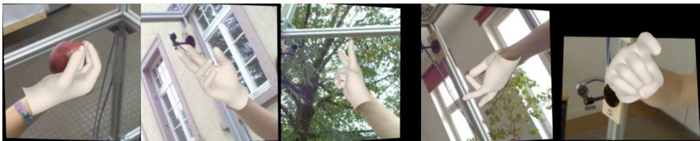
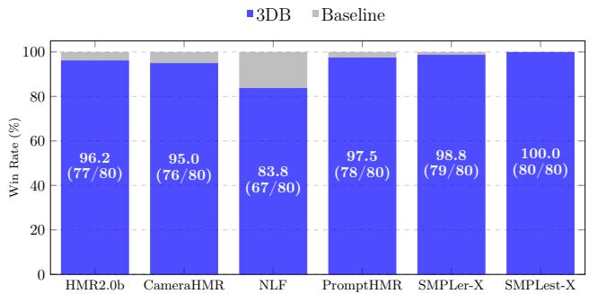

# 1. 论文基本信息

## 1.1. 标题
SAM 3D Body: Robust Full-Body Human Mesh Recovery

## 1.2. 作者
X Ynge ukreoPinksukaSagaThaFanJi ar SinkaoJiawei LiuNicolasUgrivicatFeizlJitena MaliPiotrDollarKri (来自 Meta Superintelligence Labs)

**隶属机构:** Meta Superintelligence Labs

**作者角色:** $\star$ 核心贡献者 (Core Contributor)，实习生 (Intern)，$\dagger$ 项目负责人 (Project Lead)。

## 1.3. 发表期刊/会议
论文以预印本 (arXiv Preprint) 形式发布，标识符待添加。通常这类工作最终会提交至顶级计算机视觉或机器学习会议，如 ICCV, CVPR, NeurIPS 等。Meta 的研究通常具有前沿性和影响力。

## 1.4. 发表年份
2025年

## 1.5. 摘要
本文介绍了 **SAM 3D Body (3DB)**，一个用于单图像全身 3D 人体网格恢复 (HMR) 的可提示模型。该模型在各种“野外 (in-the-wild)”条件下展现了最先进的 (state-of-the-art) 性能、强大的泛化能力和一致的准确性。3DB 能够估计身体、脚部和手部的人体姿态。它是第一个使用新参数化网格表示 **Momentum Human Rig (MHR)** 的模型，该模型将骨骼结构与表面形状解耦。3DB 采用编码器-解码器架构，并支持辅助提示 (auxiliary prompts)，包括 2D 关键点 (2D keypoints) 和掩码 (masks)，从而实现了类似于 SAM 系列模型的用户引导推理 (user-guided inference)。作者通过一个多阶段标注流程 (multi-stage annotation pipeline) 获得了高质量的标注数据，该流程结合了手动关键点标注 (manual keypoint annotation)、可微分优化 (differentiable optimization)、多视角几何 (multi-view geometry) 和密集关键点检测 (dense keypoint detection) 等多种技术。作者的数据引擎 (data engine) 有效地选择和处理数据以确保数据多样性，从而收集了不寻常的姿态 (unusual poses) 和罕见的成像条件 (rare imaging conditions)。此外，论文提出了一个按姿态和外观类别组织的新评估数据集，实现了对模型行为的细致分析。实验证明，与现有方法相比，3DB 在定性用户偏好研究 (qualitative user preference studies) 和传统定量分析 (traditional quantitative analysis) 中均展现出卓越的泛化能力和显著的性能提升。3DB 和 MHR 都将开源。

## 1.6. 原文链接
https://scontent-nrt6-1.xx.fbcdn.net/v/t39.2365-6/584770213_869757652066297_8126547710241554369_n.pdf?_nc_cat=105&ccb=1-7&_nc_sid=3c67a6&_nc_ohc=ZmNbFv4T68QQ7kNvwF6JIN_&_nc_oc=AdmB9NMjrvHzw1HG0Gpy637M-mnoRcRu8qNYaEme62Ct1Z-0043FbOb_3hDS7BUjc3o&_nc_zt=14&_nc_ht=scontent-nrt6-1.xx&_nc_gid=tfY0qv0G6y0gbe8eiTRZIj&oh=00_AfmVZomQLlVmiQXiGbAoXFijdhM-Y15eZWaNm1MEeQFZcw&oe=694D4BD8

**发布状态:** 预印本 (arXiv preprint)，标识符待补充。

# 2. 整体概括

## 2.1. 研究背景与动机
**核心问题:** 从图像中估计 3D 人体姿态 (skeleton pose and structure) 和形状 (soft body tissue) 是计算机视觉和具身智能 (embodied AI) 系统理解和与人交互的基础能力。尽管在人体网格恢复 (HMR) 领域取得了显著进展，现有方法在应用于“野外”图像时仍表现出不尽人意的鲁棒性 (robustness)，这限制了它们在机器人学 (robotics) 和生物力学 (biomechanics) 等现实场景中的应用。

**具体挑战或空白:**
*   **鲁棒性不足:** 当前模型在处理具有挑战性姿态 (challenging poses)、严重遮挡 (severe occlusion) 或非常规视角 (uncommon viewpoints) 的个体时，往往会失败。
*   **细节估计不足:** 它们难以可靠地同时估计整体身体姿态和手部、脚部等细节。
*   **数据质量与多样性:** 收集大规模、多样化且具有高质量网格标注的人体姿态数据集本身就非常困难且计算成本高昂。现有数据集要么因在实验室捕获导致多样性低，要么因伪标注 (pseudo-labeling) 导致网格质量低。
*   **模型架构限制:** 当前 HMR 架构未能充分解决身体和手部姿态估计所需的独特优化机制，也没有整合有效的训练策略来处理单目图像 (monocular images) 带来的不确定性和歧义。

    **论文切入点/创新思路:** 本文提出 SAM 3D Body (3DB)，旨在通过以下两个主要方面解决上述挑战：
1.  **新型数据引擎与高质量标注:** 开发一个大规模、高质量的人体姿态数据引擎，利用多阶段标注流程和 VLM 驱动的数据挖掘策略，主动选择并标注多样化、有挑战性的“野外”图像。
2.  **鲁棒的全身体 HMR 模型:** 设计一个可提示 (promptable) 的编码器-解码器架构，使用新型的 Momentum Human Rig (MHR) 参数化网格表示，并采用双向解码器 (two-way decoder) 设计来有效处理身体和手部姿态估计的冲突。

## 2.2. 核心贡献/主要发现
本文的主要贡献体现在数据、模型和评估三个方面：

1.  <strong>新型参数化网格表示 Momentum Human Rig (MHR):</strong> 首次在 HMR 模型中采用 MHR，它明确地将骨骼结构和身体形状解耦 (decouples skeletal structure and body shape)，提供了更丰富的控制和可解释性。
2.  **可提示的编码器-解码器模型架构:**
    *   提出了一个新颖的可提示编码器-解码器架构，允许模型根据可选的 2D 关键点、掩码或相机信息进行条件化 (condition on auxiliary prompts)，实现可控的姿态估计和用户引导推理。
    *   采用共享图像编码器 (shared image encoder) 和独立的身体与手部解码器 (separate decoders for body and hands) 的“双向解码器”设计，有效缓解了身体和手部姿态估计优化目标之间的冲突。
3.  **大规模、高质量的数据引擎与标注流程:**
    *   设计了新颖的数据引擎，利用视觉-语言模型 (VLM) 挖掘策略，从海量图像中主动选择具有挑战性的“野外”图像进行标注，确保了数据多样性 (data diversity)。
    *   构建了多阶段标注流程，结合手动 2D 关键点标注、密集关键点检测、多视角几何和鲁棒优化方法，生成高质量的 3D 网格伪真值 (pseudo-ground truth)。
    *   收集了包含 700 万张图像的大规模高质量标注数据集。
4.  **新颖的评估数据集与分析:**
    *   提出了一个按姿态和外观类别组织的新评估数据集 (SA1B-Hard)，实现了对模型行为的细致分析，揭示了模型在特定挑战场景下的性能。
    *   进行了大规模用户偏好研究 (human preference study)，结果显示 3DB 在视觉质量上以显著优势 (`5:1` 胜率) 优于现有最先进方法。
5.  **卓越的性能与泛化能力:**
    *   3DB 在身体和手部姿态估计方面均达到最先进的性能，在标准基准测试中持续优于现有 HMR 方法。
    *   在未见过的数据集上表现出更好的泛化能力，尤其是在“野外”和复杂姿态场景下。
6.  **开源:** 3DB 和 MHR 都将开源，促进社区发展。

# 3. 预备知识与相关工作

## 3.1. 基础概念
*   <strong>3D 人体网格恢复 (3D Human Mesh Recovery, HMR):</strong> 指从 2D 图像中估计 3D 人体姿态和形状参数，并生成可渲染的 3D 网格模型的过程。这通常涉及回归骨骼关节位置、身体形状参数和相机参数。
*   <strong>参数化网格模型 (Parametric Mesh Model):</strong> 一种通过少量参数（如姿态参数、形状参数）来生成和控制复杂 3D 网格的模型。
    *   **SMPL (Skinned Multi-Person Linear Model):** 最广泛使用的参数化人体网格模型之一，通过姿态和形状参数来描述人体。它将骨骼结构和软组织质量耦合在形状空间中。
    *   **SMPL-X:** SMPL 的扩展，进一步包含了手部 (基于 MANO 模型) 和面部 (基于 FLAME 模型) 的详细建模。
    *   **MANO (Modelling and Animating N-sided Objects):** 一个参数化手部模型，用于捕捉手部姿态和形状的复杂性。
    *   **FLAME (Facial Landmark Annotations for Mesh-based Expressions):** 一个参数化面部模型，用于表示面部形状和表情。
    *   **Momentum Human Rig (MHR):** 本文采用的一种新参数化网格模型，是 ATLAS (31) 的增强版。其关键特点是<strong>显式地解耦 (explicitly decouples) 骨骼结构和身体形状</strong>，从而提供更丰富的控制和可解释性。
*   <strong>编码器-解码器架构 (Encoder-Decoder Architecture):</strong> 一种常见的神经网络架构，编码器 (encoder) 负责将输入数据（如图像）压缩成低维特征表示，解码器 (decoder) 则负责将这些特征解码成所需的输出（如网格参数）。
*   <strong>可提示模型 (Promptable Models):</strong> 类似于 Segment Anything Model (SAM) 系列模型，允许用户或系统提供额外信息（如 2D 关键点、掩码）作为“提示 (prompts)”来指导模型的预测，从而实现交互式推理 (interactive inference) 和更精确的控制。
*   <strong>伪标注数据 (Pseudo-ground-truth, pGT):</strong> 通过某种算法或模型自动生成的标注数据，通常用于弥补真实标注数据稀缺的问题。其质量可能低于人工标注的真实标注数据 (Ground Truth)。
*   <strong>L1/L2 损失 (L1/L2 Loss):</strong> 常见的回归损失函数，用于衡量预测值与真实值之间的差异。$L_1$ 损失（平均绝对误差）对异常值不敏感；$L_2$ 损失（均方误差）对异常值更敏感。
*   <strong>GIoU 损失 (Generalized Intersection over Union Loss):</strong> 一种用于目标检测中边界框回归的损失函数，相比 IoU 损失，它在两个边界框不重叠时也能提供梯度。
*   **Vision-Language Model (VLM):** 视觉-语言模型，能够理解和处理图像和文本两种模态信息，通常用于图像描述、图像检索和视觉问答等任务。

## 3.2. 前人工作
### 人体网格模型 (Human Mesh Models)
*   <strong>SMPL (26) 及其变体 SMPL-X (34):</strong> 大多数现有 HMR 方法基于 SMPL 或 SMPL-X 模型。SMPL 将人体参数化为姿态和形状，而 SMPL-X 则进一步包含手部 (MANO (40)) 和面部 (FLAME (21))。这些模型的一个局限性在于骨骼结构和软组织质量在形状空间中是交织在一起的，这可能限制了其可解释性（例如，参数不总是直接映射到骨长）和可控性。
*   **ATLAS (31):** MHR 的前身，开始探索解耦骨骼和形状参数。
*   **MHR (8):** 本文采用的模型，是 ATLAS 的增强，显式地将骨骼结构和身体形状解耦，提供了更丰富的控制和可解释性。

### 人体网格恢复 (Human Mesh Recovery, HMR)
*   <strong>早期 HMR 方法 (9; 7; 33; 50; 51):</strong> 早期方法如 HMR 2.0 (9) 主要关注身体部分，不包括手脚。
*   <strong>全身 HMR 方法 (2; 5; 41; 3; 51):</strong> 近期研究开始转向估计全身（身体+手部+脚部）。
*   <strong>部分特定 HMR 方法 (35; 38):</strong> 仅估计手部姿态和形状，通常比全身方法更准确。
*   **3DB 的定位:** 3DB 属于全身 HMR 方法，但通过其独特架构和训练策略，在手部估计方面能达到与手部专属方法相当的准确性。
*   <strong>Transformer 在 HMR 中的应用 (7; 9):</strong> 近年来，Transformer 架构也被引入 HMR 任务，用于建模复杂的人体姿态和形状。

### 可提示推理 (Promptable Inference)
*   <strong>SAM 系列模型 (17; 39):</strong> 由 SAM (Segment Anything Model) 普及，允许用户或系统提供的提示（如 2D 关键点或掩码）来引导模型预测。
*   **PromptHMR (51):** 早期探索将可提示机制引入 HMR 的工作。
*   **3DB 的扩展:** 3DB 延续了这一范式，支持多种提示类型，并通过将提示令牌直接整合到 Transformer 架构中，实现用户引导的网格恢复。

### 数据质量与标注流程 (Data Quality and Annotation Pipelines)
*   **现有挑战:** HMR 领域的一个主要瓶颈是训练数据的质量。许多数据集依赖于通过单目拟合 (monocular fitting) 获得的伪真值网格 (18; 14)，这些网格通常在姿态、形状和相机参数方面存在系统性误差。
*   <strong>多视角数据集 (28; 16; 30) 和合成数据 (synthetic data):</strong> 被用于提供更高保真度的监督。
*   **3DB 的创新:** 3DB 在此基础上，通过可伸缩数据引擎 (scalable data engine) 挖掘挑战性案例，并利用多阶段标注流程（结合密集关键点检测、强参数先验和鲁棒优化）进一步提升了标注质量和多样性。

## 3.3. 技术演进
HMR 领域经历了从仅估计身体姿态到全身姿态，再到融合手部和面部细节的演进。模型表示从最初简单的骨架模型到参数化网格（如 SMPL 系列），再到如今更具可解释性和可控性的解耦模型（如 MHR）。数据方面，从实验室采集的小规模数据集到依赖伪标注的大规模“野外”数据集，再到通过多视角几何、合成数据和智能数据挖掘技术生成高质量、多样化标注数据的阶段。模型架构也从传统的回归网络演变为更复杂的基于 Transformer 的编码器-解码器结构，并引入了“可提示”机制以增强交互性和鲁棒性。

## 3.4. 差异化分析

| 特征/方面           | 传统 HMR 方法                                  | 3DB (本文方法)                                   |
| :------------------ | :--------------------------------------------- | :----------------------------------------------- |
| **网格表示**        | 主要使用 SMPL/SMPL-X，骨骼和形状耦合。         | 首次使用 **MHR**，明确解耦骨骼结构与身体形状，提供更强的可控性和可解释性。 |
| **模型架构**        | 通常为单一体模型，对身体和手部处理不区分。     | **编码器-解码器**架构，共享图像编码器，但有**独立的身体和手部解码器**，有效处理不同粒度的优化目标。 |
| **交互性/控制**     | 通常为端到端预测，用户引导能力有限。           | <strong>可提示 (Promptable)</strong>，支持 2D 关键点、掩码等辅助提示，实现用户引导的网格恢复。 |
| **数据质量与多样性**| 依赖伪标注或实验室数据，多样性与质量受限。     | **VLM 驱动的数据引擎**主动挖掘挑战性“野外”图像，结合多阶段标注流程，生成大规模、高质量、多样化的标注数据。 |
| **手部估计**        | 全身模型手部精度通常低于手部专用模型。         | 具有独立的手部解码器和灵活的训练设计，手部估计精度可与最先进的手部专用模型媲美。 |
| **泛化能力**        | 在未见过的数据集和挑战性场景下鲁棒性较差。     | 在 OOD (Out-of-Domain) 数据集和各种挑战性类别（如遮挡、截断、极端姿态）上展现出显著增强的泛化能力和鲁棒性。 |
| **评估**            | 主要依赖定量指标。                             | 除了定量指标，还进行了大规模**用户偏好研究**，证明了其在感知质量上的优势。 |

# 4. 方法论

本文的目标是从单张图像中准确、鲁棒且交互式地恢复 3D 人体网格（即 MHR 参数）。为此，3DB 被设计为一个可提示的 (promptable) 编码器-解码器架构，并具有丰富的提示令牌 (prompt tokens)。3DB 支持交互式操作，可以接受 2D 关键点或分割掩码作为输入，以允许用户或下游系统引导推理。

## 4.1. 方法原理
3DB 的核心思想是利用一个灵活的编码器-解码器架构来处理复杂的 3D 人体网格恢复任务，并通过引入“提示”机制来增强模型的控制性和鲁棒性。它特别关注身体和手部估计的差异，并使用一种新颖的参数化模型 MHR 来解耦骨骼和形状，以提供更精细的控制。其训练过程也通过多任务损失和随机提示采样来模拟交互式场景，提高模型的泛化能力。

## 4.2. 核心方法详解

### 4.2.1. 图像编码器 (Image Encoder)
输入的裁剪后的人体图像 $I$ 经过归一化处理，然后送入一个视觉骨干网络 (vision backbone) 以生成密集的特征图 $F$。此外，可选地，也可以提供一组手部裁剪图像 $I_{\mathrm{hand}}$ 来获得手部裁剪特征图 $F_{\mathrm{hand}}$。

$$
\begin{array}{r}
F = \mathrm{ImgEncoder}(I), \phantom{xxxxxxxxxxxxxxxxxxxxxxxxxxxxxxxxxxxxxxxx} \\
F_{\mathrm{hand}} = \mathrm{ImgEncoder}(I_{\mathrm{hand}}).
\end{array}
$$

**符号解释:**
*   $I$: 输入的裁剪后的人体图像。
*   $F$: 由 `ImgEncoder` 生成的密集特征图。
*   $I_{\mathrm{hand}}$: 可选的输入手部裁剪图像。
*   $F_{\mathrm{hand}}$: 由 `ImgEncoder` 生成的手部裁剪特征图。
*   $\mathrm{ImgEncoder}(\cdot)$: 视觉骨干网络，负责从图像中提取特征。

    3DB 考虑两种可选的提示 (prompts)：2D 关键点 (2D keypoints) 和分割掩码 (segmentation masks)。
*   <strong>关键点提示 (Keypoint Prompts):</strong> 通过位置编码 (positional encodings) 与学习到的嵌入 (learned embeddings) 相加进行编码，并作为额外的令牌 (tokens) 提供给姿态解码器。
*   <strong>掩码提示 (Mask Prompts):</strong> 使用卷积 (convolutions) 进行嵌入，并与图像嵌入 (image embedding) 进行逐元素相加。

### 4.2.2. 解码器令牌 (Decoder Tokens)
3DB 具有两个解码器：身体解码器 (body decoder) 输出全身人体骨架 (full-body human rig)，以及一个可选的手部解码器 (hand decoder) 可以提供增强的手部姿态结果。姿态解码器 (pose decoders) 接收一组查询令牌 (query tokens) 作为输入，以预测 MHR 的参数和相机参数。共有四种类型的查询令牌：MHR+相机令牌、2D 关键点提示令牌、辅助 2D/3D 关键点令牌和可选的手部位置令牌。

#### MHR+相机令牌 (MHR+Camera Token)
MHR 和（可选地）相机参数的初始估计被嵌入为一个可学习的令牌，用于 MHR 参数估计：

$$
\begin{array}{r l}
& T_{\mathrm{pose}} = \mathrm{RigEncoder}(E_{\mathrm{init}}) \in \mathbb{R}^{1 \times D}, \\
& E_{\mathrm{init}} \in \mathbb{R}^{d_{\mathrm{init}}}.
\end{array}
$$

**符号解释:**
*   $T_{\mathrm{pose}}$: MHR 和相机参数的姿态令牌。
*   $\mathrm{RigEncoder}(\cdot)$: 一个编码器，将初始估计 $E_{\mathrm{init}}$ 转换为姿态令牌。
*   $E_{\mathrm{init}}$: MHR 和相机参数的初始估计向量。
*   $\mathbb{R}^{1 \times D}$: 姿态令牌的维度，其中 $D$ 是令牌的嵌入维度。
*   $\mathbb{R}^{d_{\mathrm{init}}}$: 初始估计向量 $E_{\mathrm{init}}$ 的维度。

#### 2D 关键点提示令牌 (2D Keypoint Prompt Tokens)
如果提供了 2D 关键点提示 $K$（例如，来自用户或检测器），它们被编码为：

$$
\begin{array}{r l}
& T_{\mathrm{prompt}} = \mathrm{PromptEncoder}(K) \in \mathbb{R}^{N \times D}, \\
& \qquad K \in \mathbb{R}^{N \times 3},
\end{array}
$$

**符号解释:**
*   $T_{\mathrm{prompt}}$: 2D 关键点提示令牌。
*   $\mathrm{PromptEncoder}(\cdot)$: 一个编码器，将 2D 关键点提示 $K$ 转换为提示令牌。
*   $K$: 2D 关键点提示，每个关键点由 $(x, y, \mathrm{label})$ 表示。
*   $N$: 关键点的数量。
*   $\mathbb{R}^{N \times D}$: 提示令牌的维度。

#### 手部位置令牌 (Hand Position Tokens)
手部令牌 $T_{\mathrm{hand}}$ 用于身体解码器定位人体图像中的手部位置。这组令牌是可选的；即使没有它们，3DB 仍然可以生成全身人体骨架，因为身体解码器的输出已经包含了手部信息。

$$
T_{\mathrm{hand}} \in \mathbb{R}^{2 \times D}
$$

**符号解释:**
*   $T_{\mathrm{hand}}$: 手部位置令牌。
*   $\mathbb{R}^{2 \times D}$: 手部令牌的维度，表示左右手各一个令牌。

#### 辅助关键点令牌 (Auxiliary Keypoint Tokens)
为了增强交互性和模型能力，模型包含了所有 2D 和 3D 关键点的可学习令牌。

$$
\begin{array}{r}
T_{\mathrm{keypoint2D}} \in \mathbb{R}^{J_{2D} \times D}, \\
T_{\mathrm{keypoint3D}} \in \mathbb{R}^{J_{3D} \times D}.
\end{array}
$$

**符号解释:**
*   $T_{\mathrm{keypoint2D}}$: 辅助 2D 关键点令牌。
*   $J_{2D}$: 2D 关键点的数量。
*   $T_{\mathrm{keypoint3D}}$: 辅助 3D 关键点令牌。
*   $J_{3D}$: 3D 关键点的数量。
*   这些令牌允许模型对特定关节进行推理，并支持下游任务，如关键点预测或不确定性估计。

### 4.2.3. MHR 解码器 (MHR Decoder)
所有令牌被连接起来形成完整的查询集：

$$
T = [ T_{\mathrm{pose}}, T_{\mathrm{prompt}}, T_{\mathrm{keypoint2D}}, T_{\mathrm{keypoint3D}}, T_{\mathrm{hand}} ]
$$

这种灵活的组合使得模型能够在完全自动化和用户引导模式下运行，适应可用的提示信息。身体解码器 (body decoder) 同时关注查询令牌 $T$ 和全身图像特征 $F'$。

$$
O = \mathrm{Decoder}(T, F') \in \mathbb{R}^{(3 + N + J_{2D} + J_{3D}) \times D}.
$$

**符号解释:**
*   $T$: 连接后的所有查询令牌。
*   $F'$: 全身图像特征（可能经过掩码提示嵌入）。
*   $\mathrm{Decoder}(\cdot)$: 身体解码器。
*   $O$: 解码器的输出令牌。
*   $3 + N + J_{2D} + J_{3D}$: 输出令牌的数量，表示 MHR+相机、提示、2D 关键点和 3D 关键点令牌的总和。

    通过交叉注意力 (cross-attention)，身体解码器将提示信息与视觉上下文融合，实现鲁棒且可编辑的网格恢复。可选地，手部解码器 (hand decoder) 可以接收相同的提示信息，同时关注手部裁剪特征 $F_{\mathrm{hand}}$，以提供另一个输出令牌 $O_{\mathrm{hand}}$。

$O$ 的第一个输出令牌 $O_0$ 经过一个多层感知机 (MLP) 以回归最终的网格参数：

$$
\boldsymbol{\theta} = \mathrm{MLP}(O_0) \in \mathbb{R}^{d_{\mathrm{out}}},
$$

其中 $\boldsymbol{\theta} = \{ \mathbf{P}, \mathbf{S}, \mathbf{C}, \mathbf{S}_k \}$ 是预测的 MHR 参数：姿态 (pose)、形状 (shape)、相机姿态 (camera pose) 和骨架 (skeleton)。另一组输出可以从 $O_{\mathrm{hand}}$ 计算，用于一对 MHR 手部，这些手部可以与身体输出合并以改进手部估计。

### 4.2.4. 模型训练和推理 (Model Training and Inference)

#### 模型训练 (Model Training)
3DB 使用全面的多任务损失项进行训练：

$$
\mathcal{L}_{\mathrm{train}} = \sum_i \lambda_i \mathcal{L}_i
$$

**符号解释:**
*   $\mathcal{L}_{\mathrm{train}}$: 总的训练损失。
*   $\mathcal{L}_i$: 第 $i$ 个任务特定的损失项，针对特定的预测头部或解剖结构。
*   $\lambda_i$: 超参数，通过经验设置，用于平衡不同损失项的权重。

    为了稳定训练，某些损失项（例如 3D 关键点损失）以预热调度 (warm-up schedule) 的方式引入，在训练过程中逐渐增加其权重。模型还通过在每个样本中随机采样多轮提示来模拟交互式设置进行训练。这种多任务、提示感知的损失设计为所有输出提供了强有力的监督。

**损失项详细说明:**
*   <strong>2D/3D 关键点损失 (2D/3D Keypoint Loss):</strong> 使用 $L_1$ 损失监督 2D/3D 关节位置，并结合可学习的每关节不确定性 (learnable per-joint uncertainty) 来根据预测置信度调整损失。
    *   3D 身体和手部关键点：在计算损失前，使用各自的骨盆和手腕位置进行归一化。
    *   手部关键点：根据标注可用性进行加权。
    *   2D 关键点：在裁剪后的图像空间中进行监督，并对用户提供的关键点损失进行加权，以在关键点提示可用时鼓励提示一致性。
*   <strong>参数损失 (Parameter Losses):</strong> MHR 参数（姿态、形状）通过 $L_2$ 回归损失进行监督，并施加关节限制惩罚 (joint limit penalties) 以阻止解剖学上不合理的姿态。
*   <strong>手部检测损失 (Hand Detection Loss):</strong> 3DB 可以通过内置的手部检测器定位手部位置。模型应用 GIoU 损失和 $L_1$ 损失来监督手部边界框回归 (hand box regression)。模型还预测手部边界框的不确定性，并在推理过程中对存在手部遮挡的样本关闭手部解码器。

#### 模型推理 (Model Inference)
在模型推理阶段，默认使用身体解码器的输出。然而，如果手部检测器头部在输入图像中检测到手部，可以选择将手部解码器的输出与身体输出合并，以增强手部姿态估计质量。在此阶段，通常使用手部解码器和身体解码器分别估计的手腕和肘部关键点作为提示关键点，以对齐和组合两个解码器的预测。最后，预测的局部 MHR 参数按照网格模型的运动学树 (kinematic tree) 合并为完整的全身配置。

# 5. 实验设置

## 5.1. 数据集
为了确保训练数据的质量、数量和多样性，模型在单视角 (single-view)、多视角 (multi-view) 和合成 (synthetic) 数据集的混合上进行训练，涵盖了通用身体姿态、手部、交互和“野外”条件。

**以下是原文 Table 1 列表的 3DB 训练数据集：**

<table><tr><td>Dataset</td><td># Images/Frames</td><td># Subjects</td><td># Views</td></tr><tr><td>MPII human pose (1)</td><td>5K</td><td>5K+</td><td>1</td></tr><tr><td>MS COCO (25)</td><td>24K</td><td>24K+</td><td>1</td></tr><tr><td>3DPW (48)</td><td>17K</td><td>7</td><td>1</td></tr><tr><td>AIChallenger (53)</td><td>172K</td><td>172K+</td><td>1</td></tr><tr><td>SA-1B (17)</td><td>1.65M</td><td>1.65M+</td><td>1</td></tr><tr><td>Ego-Exo4D (10)</td><td>1.08M</td><td>740</td><td>4+</td></tr><tr><td>DexYCB (4)</td><td>291K</td><td>10</td><td>8</td></tr><tr><td>EgoHumans (15)</td><td>272K</td><td>50+</td><td>15</td></tr><tr><td>Harmony4D (16)</td><td>250K</td><td>24</td><td>20</td></tr><tr><td>InterHand (30)*</td><td>1.09M</td><td>27</td><td>66</td></tr><tr><td>Re:Interhand (29)*</td><td>1.50M</td><td>10</td><td>170</td></tr><tr><td>Goliath (28)*</td><td>966K</td><td>120+</td><td>500+</td></tr><tr><td>Synthetic*</td><td>1.63M</td><td></td><td></td></tr></table>

**数据集分类及特点:**
*   <strong>单视角“野外”数据集 (Single-view in-the-wild):</strong> 包含在非受限环境中捕获的具有多样化外观、姿态和场景条件的人。使用了 AIChallenger (53)、MS COCO (25)、MPII (1)、3DPW (48) 和 SA-1B (17) 的一个子集。
*   <strong>多视角一致性数据集 (Multi-view consistent):</strong> 为引入几何一致性以获得更可靠的标注，使用了 Ego-Exo4D (10)、Harmony4D (16)、EgoHumans (15)、InterHand2.6M (30)、DexYCB (4) 和 Goliath (28) 的多视角数据。
*   <strong>高保真合成数据集 (High-fidelity synthetic):</strong> 使用了 Goliath 数据集 (28) 的逼真合成扩展，提供了数百万帧具有真实标注 (Ground-truth) MHR 参数的图像，涵盖了不同的身份、服装和上下文。合成数据确保了人体网格恢复的准确监督，补充了侧重多样性而非质量的真实世界数据集。
*   <strong>手部数据集 (Hand datasets):</strong> 标有 $\star$ 的数据集，如 Re:Interhand (29)，用于训练身体和手部解码器。为了训练手部解码器，提供了手腕截断 (wrist-truncated) 的手部样本。

**数据集示例:**
*   **SA-1B (17):** SAM (Segment Anything) 模型中使用的大规模数据集，包含大量通用图像，其中一部分被用于 3DB 的训练。
*   **Ego-Exo4D (10):** 包含 egocentric (第一视角) 和 exocentric (第三视角) 视图下人类进行各种技能活动的视频，有助于学习复杂的人体运动和交互。
*   **Re:Interhand (29):** 专门用于手部姿态估计的数据集，包含多视角下复杂的双手交互。

## 5.2. 评估指标
本文遵循以往 HMR 工作，报告标准的姿态和形状评估指标。为了在基于 SMPL 的数据集上进行评估，MHR 网格被映射到 SMPL 网格格式。

*   <strong>平均关节位置误差 (Mean Per-Joint Position Error, MPJPE):</strong>
    *   **概念定义:** 衡量预测的 3D 关节位置与真实 3D 关节位置之间的平均欧几里得距离。它直接反映了模型在估计关节位置方面的准确性。
    *   **数学公式:**
        $$
        \mathrm{MPJPE} = \frac{1}{N \cdot J} \sum_{i=1}^{N} \sum_{j=1}^{J} \| \mathbf{p}_{i,j}^{\mathrm{pred}} - \mathbf{p}_{i,j}^{\mathrm{gt}} \|_2
        $$
    *   **符号解释:**
        *   $N$: 样本数量。
        *   $J$: 关节数量。
        *   $\mathbf{p}_{i,j}^{\mathrm{pred}}$: 第 $i$ 个样本中第 $j$ 个关节的预测 3D 坐标。
        *   $\mathbf{p}_{i,j}^{\mathrm{gt}}$: 第 $i$ 个样本中第 $j$ 个关节的真实 3D 坐标。
        *   $\| \cdot \|_2$: 欧几里得范数（L2 范数）。

*   <strong>姿态对齐的平均关节位置误差 (Procrustes-Aligned Mean Per-Joint Position Error, PA-MPJPE):</strong>
    *   **概念定义:** 在计算 MPJPE 之前，通过 Procrustes 分析 (Procrustes analysis) 对预测的 3D 关节进行刚性对齐（包括旋转、平移和缩放），以消除由于相机视角或全局姿态差异导致的误差。这使得评估更侧重于局部姿态和关节相对位置的准确性，而不是全局的对齐问题。
    *   **数学公式:**
        $$
        \mathrm{PA-MPJPE} = \frac{1}{N \cdot J} \sum_{i=1}^{N} \sum_{j=1}^{J} \| \mathcal{P}(\mathbf{p}_{i,j}^{\mathrm{pred}}) - \mathcal{P}(\mathbf{p}_{i,j}^{\mathrm{gt}}) \|_2
        $$
        其中 $\mathcal{P}(\cdot)$ 表示 Procrustes 对齐操作。
    *   **符号解释:**
        *   $N$: 样本数量。
        *   $J$: 关节数量。
        *   $\mathbf{p}_{i,j}^{\mathrm{pred}}$: 第 $i$ 个样本中第 $j$ 个关节的预测 3D 坐标。
        *   $\mathbf{p}_{i,j}^{\mathrm{gt}}$: 第 $i$ 个样本中第 $j$ 个关节的真实 3D 坐标。
        *   $\mathcal{P}(\cdot)$: Procrustes 对齐函数，它找到一个最佳的刚性变换（旋转 $R$、平移 $t$ 和缩放 $s$），使得 $\sum_{j=1}^{J} \| s R \mathbf{p}_{i,j}^{\mathrm{pred}} + t - \mathbf{p}_{i,j}^{\mathrm{gt}} \|_2^2$ 最小。
        *   $\| \cdot \|_2$: 欧几里得范数。

*   <strong>每顶点误差 (Per-Vertex Error, PVE):</strong>
    *   **概念定义:** 衡量预测的 3D 网格顶点与真实 3D 网格顶点之间的平均欧几里得距离。这个指标直接评估了整个 3D 形状恢复的准确性，比仅关注关节位置更全面。
    *   **数学公式:**
        $$
        \mathrm{PVE} = \frac{1}{N \cdot V} \sum_{i=1}^{N} \sum_{v=1}^{V} \| \mathbf{v}_{i,v}^{\mathrm{pred}} - \mathbf{v}_{i,v}^{\mathrm{gt}} \|_2
        $$
    *   **符号解释:**
        *   $N$: 样本数量。
        *   $V$: 网格顶点数量。
        *   $\mathbf{v}_{i,v}^{\mathrm{pred}}$: 第 $i$ 个样本中第 $v$ 个顶点的预测 3D 坐标。
        *   $\mathbf{v}_{i,v}^{\mathrm{gt}}$: 第 $i$ 个样本中第 $v$ 个顶点的真实 3D 坐标。
        *   $\| \cdot \|_2$: 欧几里得范数。

*   <strong>正确关键点百分比 (Percentage of Correct Keypoints, PCK):</strong>
    *   **概念定义:** 在 2D 姿态估计中常用，衡量在给定阈值下，预测关键点与真实关键点之间的距离小于该阈值的关键点所占的百分比。PCK@0.05 意味着阈值是人体边界框尺寸的 5%。
    *   **数学公式:**
        $$
        \mathrm{PCK}@\tau = \frac{1}{N \cdot J} \sum_{i=1}^{N} \sum_{j=1}^{J} \mathbb{I}(\| \mathbf{k}_{i,j}^{\mathrm{pred}} - \mathbf{k}_{i,j}^{\mathrm{gt}} \|_2 < \tau \cdot S_i)
        $$
    *   **符号解释:**
        *   $N$: 样本数量。
        *   $J$: 关键点数量。
        *   $\mathbf{k}_{i,j}^{\mathrm{pred}}$: 第 $i$ 个样本中第 $j$ 个关键点的预测 2D 坐标。
        *   $\mathbf{k}_{i,j}^{\mathrm{gt}}$: 第 $i$ 个样本中第 $j$ 个关键点的真实 2D 坐标。
        *   $\mathbb{I}(\cdot)$: 指示函数，当条件为真时为 1，否则为 0。
        *   $\tau$: 阈值比例因子（例如 0.05）。
        *   $S_i$: 第 $i$ 个样本中人体边界框的尺寸（通常是长或短边）。
        *   $\| \cdot \|_2$: 欧几里得范数。

## 5.3. 对比基线
论文将 3DB 与多种最先进 (state-of-the-art) 的人体网格恢复方法进行了比较：
*   **HMR2.0b (9):** 早期且有影响力的 HMR 方法。
*   **CameraHMR (33):** 关注相机参数估计的 HMR 方法。
*   **PromptHMR (51):** 引入可提示机制的 HMR 方法。
*   **SMPLerX-H (3):** 基于 SMPL-X 模型的全身姿态和形状估计方法。
*   **NLF-L+ft* (43):** 一种神经人体场 (Neural Human Fields) 方法。
*   **WHAM (44):** 重建世界坐标系下人体运动的方法。
*   **TRAM (52):** 专注于从“野外”视频中进行 3D 人体网格恢复。
*   **GENMO (19):** 人体运动的生成模型。
*   **LookMa (11), METRO (24), HaMeR (35), MaskHand (42), WiLoR (38):** 专门用于手部姿态估计的方法，用于手部性能对比。

    这些基线模型代表了 HMR 领域从身体姿态到全身姿态、从传统回归到基于 Transformer 和神经场方法的演进，以及特定于手部估计的最新技术。

# 6. 实验结果与分析

## 6.1. 核心结果分析

### 6.1.1. 在常见数据集上的性能评估
论文首先在五个标准基准数据集上评估了 3DB，并与各种最先进的网格恢复方法进行了比较。结果展示了 3DB 的两个变体：3DB-H（使用 ViT-H 骨干网络）和 3DB-DINOv3（使用 DINOv3 编码器）。模型使用了现成的视野 (FOV) 估计器来提供相机内参。

以下是原文 Table 2 的结果：

<table><tr><td rowspan="2"></td><td rowspan="2">Models</td><td colspan="3">3DPW (14)</td><td colspan="3">EMDB (24)</td><td colspan="3">RICH (24)</td><td>COCO</td><td>LSPET</td></tr><tr><td>PA-MPJPE ↓</td><td>MPJPE ↓</td><td>PVE↓</td><td>PA-MPJPE ↓</td><td>MPJPE↓</td><td>PVE↓</td><td>PA-MPJPE↓</td><td>MPJPE ↓</td><td>PVE ↓</td><td>PCK@0.05 ↑</td><td>PCK@0.05 ↑</td></tr><tr><td></td><td>HMR2.0b (9)</td><td>54.3</td><td>81.3</td><td>93.1</td><td>79.2</td><td>118.5</td><td>140.6</td><td>48.1†</td><td>96.0†</td><td>110.9†</td><td>86.1</td><td>53.3</td></tr><tr><td>0</td><td>CameraHMR (33)</td><td>35.1</td><td>56.0</td><td>65.9</td><td>43.3</td><td>70.3</td><td>81.7</td><td>34.0</td><td>55.7</td><td>64.4</td><td>80.5†</td><td>49.1†</td></tr><tr><td></td><td>PromptHMR (51)</td><td>36.1</td><td>58.7</td><td>69.4</td><td>41.0</td><td>71.7</td><td>84.5</td><td>37.3</td><td>56.6</td><td>65.5</td><td>79.2†</td><td>55.6†</td></tr><tr><td></td><td>SMPLerX-H (3)</td><td>46.6†</td><td>76.7†</td><td>91.8†</td><td>64.5†</td><td>92.7†</td><td>112.0†</td><td>37.4†</td><td>62.5†</td><td>69.5†</td><td>—</td><td></td></tr><tr><td></td><td>NLF-L+ft* (43)</td><td>33.6</td><td>54.9</td><td>63.7</td><td>40.9</td><td>68.4</td><td>80.6</td><td>28.7†</td><td>51.0†</td><td>58.2†</td><td>74.9†</td><td>54.9†</td></tr><tr><td>0</td><td>WHAM (44)</td><td>35.9</td><td>57.8</td><td>68.7</td><td>50.4</td><td>79.7</td><td>94.4</td><td>−</td><td></td><td>—</td><td>−</td><td>−</td></tr><tr><td></td><td>TRAM (52)</td><td>35.6</td><td>59.3</td><td>69.6</td><td>45.7</td><td>74.4</td><td>86.6</td><td>−</td><td>−</td><td>−</td><td></td><td></td></tr><tr><td></td><td>GENMO (19)</td><td>34.6</td><td>53.9</td><td>65.8</td><td>42.5</td><td>73.0</td><td>84.8</td><td>39.1</td><td>66.8</td><td>75.4</td><td></td><td></td></tr><tr><td></td><td>3DB-H (Ours)</td><td>33.2</td><td>54.8</td><td>64.1</td><td>38.5</td><td>62.9</td><td>74.3</td><td>31.9</td><td>55.0</td><td>61.7</td><td>86.8</td><td>68.9</td></tr><tr><td></td><td>3DB-DINOv3 (Ours)</td><td>33.8</td><td>54.8</td><td>63.6</td><td>38.2</td><td>61.7</td><td>72.5</td><td>30.9</td><td>53.7</td><td>60.3</td><td>86.5</td><td>67.8</td></tr></table>

**分析:**
*   **3DB 的卓越性能:** 3DB 在大多数 3D 指标（PA-MPJPE、MPJPE、PVE）上均优于所有其他单图像方法。其性能甚至能与利用时间信息的视频基方法相媲美。
*   **泛化能力:** 特别是在 EMDB 和 RICH 数据集上，3DB 取得了卓越的成果。这些数据集是域外 (out-of-domain) 数据集（未包含在训练集中），这表明 3DB 相比现有最先进方法具有更强的泛化能力。
*   **例外情况:** NLF 在 RICH 数据集上表现最好，但这是因为它在训练中使用了 RICH 数据集，而 3DB 未使用。即便如此，3DB 的结果也极具竞争力。
*   **2D 性能:** 3DB 在 COCO 和 LSPET 数据集的 PCK 指标上也达到了最先进水平，表明其 2D 对齐能力也很强。

### 6.1.2. 在新数据集上的性能评估
为了理解模型在新的、未见过的数据分布上的表现，论文在五个新数据集（38.6K 图像）上进行了额外评估。这些新数据集包括 Ego-Exo4D、Harmony4D、Goliath、内部合成数据和 SA1B-Hard。这些数据集共同构成了具有挑战性的新基准。

以下是原文 Table 3 的结果：

<table><tr><td>Models</td><td colspan="2">EE4D-Phy</td><td colspan="2">EE4D-Proc</td><td colspan="2">Harmony4D</td><td colspan="2">Goliath</td><td colspan="2">Synthetic</td><td>SA1B-Hard</td></tr><tr><td></td><td>PVE↓</td><td>MPJPE↓</td><td>PVE ↓</td><td>MPJPE ↓</td><td>PVE↓</td><td>MPJPE ↓</td><td>PVE ↓</td><td>MPJPE ↓</td><td>PVE ↓</td><td>MPJPE ↓</td><td>Avg-PCK ↑</td></tr><tr><td>CameraHMR (33)</td><td>71.1</td><td>58.8</td><td>70.3</td><td>60.2</td><td>84.6</td><td>70.8</td><td>66.7</td><td>54.5</td><td>102.8</td><td>87.2</td><td>63.0</td></tr><tr><td>PromptHMR (51)</td><td>74.6</td><td>63.4</td><td>72.0</td><td>62.6</td><td>91.9</td><td>78.0</td><td>67.2</td><td>56.5</td><td>92.7</td><td>80.7</td><td>59.0</td></tr><tr><td>NLF (43)</td><td>75.9</td><td>68.5</td><td>85.4</td><td>77.7</td><td>97.3</td><td>84.9</td><td>66.5</td><td>58.0</td><td>97.6</td><td>86.5</td><td>66.5</td></tr><tr><td>3DB-H Leave-one-out (Ours)</td><td>49.7</td><td>44.3</td><td>52.9</td><td>47.4</td><td>63.5</td><td>54.0</td><td>54.2</td><td>46.5</td><td>85.6</td><td>75.5</td><td>73.1</td></tr><tr><td>3DB-H Full dataset (Ours)</td><td>37.0</td><td>31.6</td><td>41.9</td><td>36.3</td><td>41.0</td><td>33.9</td><td>34.5</td><td>28.8</td><td>55.2</td><td>47.2</td><td>76.6</td></tr></table>

**分析:**
*   **基线模型的局限性:** 尽管基线方法在大量数据集上进行训练，但在这些新域上的性能显著下降，表明它们在泛化方面存在局限性。
*   **3DB 的强大泛化能力:** 3DB-H 的“留一法” (Leave-one-out) 训练变体（即在训练中未见过这些特定数据集）仍然展示出强大的泛化能力，其性能远优于所有基线方法。这归因于 3DB 更多样化的数据分布和更强的训练框架。
*   **领域适应性:** 3DB-H 的“完整数据集”训练变体（即训练数据中包含了这些新数据集的样本）显示出更优越的性能，这作为域内 (in-domain) 性能的上限比较。
*   **基线模型的偏见:** 现有方法在不同数据集上表现第二名的模型不断变化，这反映出它们对特定数据集存在很强的偏差，表明每个基线模型都过度拟合了底层数据分布的狭窄部分。

### 6.1.3. 手部姿态估计性能评估
3DB 的一个显著特点是其在估计手部形状和姿态方面的强大性能。

以下是原文 Table 4 的结果：

<table><tr><td>Method</td><td>PA-MPVPE ↓</td><td>PA-MPJPE ↓</td><td>F@5 ↑</td><td>F@15 ↑</td></tr><tr><td>LookMa (11)</td><td>8.1</td><td>8.6</td><td>0.653</td><td>-</td></tr><tr><td>METRO (24)†</td><td>6.3</td><td>6.5</td><td>0.731</td><td>0.984</td></tr><tr><td>HaMeR (35)†</td><td>5.7</td><td>6.0</td><td>0.785</td><td>0.990</td></tr><tr><td>MaskHand (42)†</td><td>5.4</td><td>5.5</td><td>0.801</td><td>0.991</td></tr><tr><td>WiLoR (38)†</td><td>5.1</td><td>5.5</td><td>0.825</td><td>0.993</td></tr><tr><td>3DB-H (Ours)</td><td>6.3</td><td>5.5</td><td>0.735</td><td>0.988</td></tr><tr><td>3DB-DINOv3 (Ours)</td><td>6.2</td><td>5.5</td><td>0.737</td><td>0.988</td></tr></table>

**分析:**
*   **全身与手部专用模型的差距缩小:** 传统上，全身 HMR 方法在手部精度上与手部专用方法存在显著差距。3DB 通过其灵活的模型训练设计（结合手部和身体数据）和手部解码器缩小了这一差距。
*   **竞争力:** 尽管 3DB 未在 FreiHand 数据集上进行训练（这通常会带来强烈的域内提升），但其手部姿态估计精度已与包含 FreiHand 和许多其他手部中心数据集的现有最先进手部姿态估计方法（如 WiLoR）相媲美。在 PA-MPJPE 指标上，3DB 甚至达到了与 MaskHand 和 WiLoR 相同的最佳表现。
*   **可提示机制的优势:** 3DB 的可提示性也提供了一种将身体预测的手腕与手部预测对齐的自然机制。

### 6.1.4. 2D 分类性能评估
为了更好地理解模型在各种图像类型上的优势和劣势，论文比较了 SA1B-Hard 数据集上定义的 24 个类别（包括身体形状、相机视角、手部、多人、姿态和可见性）的性能。使用 PCK 指标（17 个身体关键点和 6 个脚部关键点），并报告了 Avg-PCK。

以下是原文 Table 5 的结果：

<table><tr><td rowspan="2"></td><td colspan="2">CameraHMR (33)</td><td colspan="2">PromptHMR (51)</td><td colspan="2">3DB</td></tr><tr><td>APCK(body)</td><td>APCK(feet)</td><td>APCK(body)</td><td>APCK(feet)</td><td>APCK(body)</td><td>APCK(feet)</td></tr><tr><td>Body _shape - In-the-wild</td><td>87.64</td><td>78.56</td><td>85.73</td><td>77.87</td><td>90.76</td><td>92.12</td></tr><tr><td>Camera_view - Back or side view</td><td>59.69</td><td>46.64</td><td>61.92</td><td>47.74</td><td>76.27</td><td>66.81</td></tr><tr><td>Camera_view - Bottom-up view</td><td>55.18</td><td>34.84</td><td>46.56</td><td>29.25</td><td>69.62</td><td>55.35</td></tr><tr><td>Camera _ view - Others</td><td>51.48</td><td>33.80</td><td>54.39</td><td>38.55</td><td>76.62</td><td>71.52</td></tr><tr><td>Camera _ view - Overhead view</td><td>55.08</td><td>39.46</td><td>43.65</td><td>24.63</td><td>73.33</td><td>66.94</td></tr><tr><td>Hand - Crossed or overlapped fingers</td><td>73.20</td><td>62.85</td><td>72.48</td><td>62.43</td><td>81.36</td><td>84.04</td></tr><tr><td>Hand - Holding objects</td><td>76.73</td><td>72.11</td><td>73.57</td><td>68.92</td><td>83.40</td><td>85.92</td></tr><tr><td>Hand - Self-occluded hands</td><td>73.22</td><td>58.06</td><td>72.43</td><td>56.19</td><td>80.07</td><td>80.82</td></tr><tr><td>Multi_people - Contact or interaction</td><td>63.23</td><td>51.65</td><td>61.77</td><td>47.60</td><td>74.81</td><td>69.92</td></tr><tr><td>Multi_people - Overlapped</td><td>53.11</td><td>41.88</td><td>57.17</td><td>41.43</td><td>70.82</td><td>64.71</td></tr><tr><td>Pose - Contortion or bending</td><td>47.08</td><td>32.78</td><td>42.61</td><td>20.98</td><td>65.20</td><td>53.04</td></tr><tr><td>Pose - Crossed legs</td><td>63.95</td><td>32.24</td><td>56.15</td><td>27.35</td><td>76.40</td><td>58.80</td></tr><tr><td>Pose - Inverted body</td><td>46.12</td><td>30.01</td><td>39.83</td><td>24.64</td><td>78.18</td><td>72.19</td></tr><tr><td>Pose - Leg or arm splits</td><td>57.51</td><td>31.43</td><td>54.76</td><td>33.11</td><td>83.69</td><td>72.49</td></tr><tr><td>Pose - Lotus pose</td><td>63.19</td><td>14.38</td><td>54.85</td><td>12.87</td><td>74.53</td><td>57.97</td></tr><tr><td>Pose - Lying down</td><td>51.29</td><td>35.88</td><td>44.59</td><td>26.88</td><td>71.35</td><td>66.53</td></tr><tr><td>Pose - Sitting on or riding</td><td>79.66</td><td>71.65</td><td>70.15</td><td>61.16</td><td>84.85</td><td>81.51</td></tr><tr><td>Pose - Sports or athletic activities</td><td>78.93</td><td>69.34</td><td>73.62</td><td>60.37</td><td>85.10</td><td>82.80</td></tr><tr><td>Pose - Squatting or crouching or kneeling</td><td>62.74</td><td>41.47</td><td>54.41</td><td>33.84</td><td>72.85</td><td>61.85</td></tr><tr><td>Visibility - Occlusion (foot cues)</td><td>62.93</td><td>26.83</td><td>58.00</td><td>30.81</td><td>75.43</td><td>54.74</td></tr><tr><td>Visibility - Occlusion (hand cues)</td><td>61.01</td><td>53.89</td><td>58.55</td><td>51.13</td><td>76.04</td><td>72.01</td></tr><tr><td>Visibility - Truncation (lower-body truncated)</td><td>39.27</td><td></td><td>46.50</td><td>-</td><td>61.95</td><td></td></tr><tr><td>Visibility - Truncation (others)</td><td>79.18</td><td>74.82</td><td>77.06</td><td>74.99</td><td>84.23</td><td>86.72</td></tr><tr><td>Visibility - Truncation (upper-body truncated)</td><td>62.37</td><td>54.90</td><td>56.01</td><td>49.28</td><td>64.49</td><td>70.99</td></tr></table>

**分析:**
*   **3DB 全面领先:** 3DB 在所有 24 个类别上均优于所有基线模型。
*   **显著提升的类别:** 在某些类别中，3DB 表现出尤其显著的改进。例如，在<strong>“可见性 - 截断 (Visibility - Truncation)”</strong>类别中，3DB 比 CameraHMR 或 PromptHMR 有了显著提升，这表明模型在处理身体截断图像时学习到了更强的姿态先验。
*   **挑战性姿态的改进:** 在<strong>“姿态 - 倒立身体 (Pose - Inverted body)”</strong>和<strong>“姿态 - 劈腿或手臂劈开 (Pose - Leg or arm splits)”</strong>等挑战性姿态类别中，3DB 也取得了大幅改进。这主要归因于数据引擎选择的硬姿态分布增加。

### 6.1.5. 3D 分类性能评估
为了对 HMR 方法进行更详细的分类分析，论文构建了一个评估数据集，其中包含来自多视角数据集（超过 100 个相机）的合成和真实数据。定义了 34 个独特的类别，基于可解释的上下文和主题属性，如遮挡、截断、视角、姿态难度、形状和交互。这些 3D 类别是使用基于规则的标准自动生成的。

以下是原文 Table 6 的结果：

<table><tr><td rowspan="2"></td><td colspan="3">CameraHMR (33)</td><td colspan="3">PromptHMR (51)</td><td colspan="3">3DB</td></tr><tr><td>PVE</td><td>MPJPE</td><td>PA-MPJPE</td><td>PVE</td><td>MPJPE</td><td>PA-MPJPE</td><td>PVE</td><td>MPJPE</td><td>PA-MPJPE</td></tr><tr><td>aux:depth _ambiguous</td><td>126.25</td><td>102.25</td><td>81.33</td><td>109.58</td><td>91.77</td><td>69.24</td><td>64.38</td><td>52.72</td><td>39.85</td></tr><tr><td>aux:orient_ambiguous</td><td>84.26</td><td>71.77</td><td>45.07</td><td>83.79</td><td>72.93</td><td>46.17</td><td>42.35</td><td>36.64</td><td>25.16</td></tr><tr><td>aux:scale _ ambiguous</td><td>118.18</td><td>104.77</td><td>50.93</td><td>112.95</td><td>102.28</td><td>47.26</td><td>58.64</td><td>51.16</td><td>27.67</td></tr><tr><td>fov:medium</td><td>82.88</td><td>68.81</td><td>46.86</td><td>76.31</td><td>64.84</td><td>42.85</td><td>43.58</td><td>36.97</td><td>25.57</td></tr><tr><td>fov:narrow</td><td>82.15</td><td>69.82</td><td>49.73</td><td>90.41</td><td>77.95</td><td>53.49</td><td>52.14</td><td>43.89</td><td>36.18</td></tr><tr><td>fov:wide</td><td>71.55</td><td>60.05</td><td>38.66</td><td>74.98</td><td>64.55</td><td>42.87</td><td>37.97</td><td>33.06</td><td>22.44</td></tr><tr><td>interaction:close_interaction</td><td>107.59</td><td>90.95</td><td>57.62</td><td>115.19</td><td>98.12</td><td>64.87</td><td>54.23</td><td>44.98</td><td>29.76</td></tr><tr><td>interaction:mild_interaction</td><td>89.98</td><td>75.28</td><td>52.93</td><td>106.55</td><td>90.38</td><td>62.74</td><td>42.63</td><td>34.65</td><td>27.16</td></tr><tr><td>pose_2d:hard</td><td>117.91</td><td>107.74</td><td>77.16</td><td>117.73</td><td>110.64</td><td>79.16</td><td>62.93</td><td>57.50</td><td>45.58</td></tr><tr><td>pose_2d:very_hard</td><td>150.20</td><td>140.61</td><td>92.66</td><td>150.15</td><td>145.07</td><td>95.40</td><td>62.22</td><td>56.84</td><td>42.39</td></tr><tr><td>pose−3d:hard</td><td>133.89</td><td>121.11</td><td>84.21</td><td>129.30</td><td>118.59</td><td>81.82</td><td>71.42</td><td>63.68</td><td>49.10</td></tr><tr><td>pose_3d:very_hard</td><td>213.66</td><td>206.34</td><td>143.23</td><td>186.35</td><td>179.46</td><td>129.51</td><td>114.20</td><td>110.62</td><td>86.43</td></tr><tr><td>pose_prior:average_pose</td><td>68.52</td><td>56.70</td><td>37.22</td><td>70.32</td><td>59.73</td><td>39.42</td><td>36.06</td><td>30.95</td><td>21.35</td></tr><tr><td>pose_prior:easy_pose</td><td>57.83</td><td>47.31</td><td>29.92</td><td>62.85</td><td>53.58</td><td>32.80</td><td>29.53</td><td>24.66</td><td>17.20</td></tr><tr><td>pose_prior:hard_pose</td><td>94.64</td><td>80.04</td><td>54.53</td><td>88.12</td><td>76.19</td><td>51.15</td><td>51.65</td><td>44.24</td><td>31.09</td></tr><tr><td>shape:average_bmi</td><td>70.35</td><td>58.07</td><td>38.08</td><td>71.01</td><td>60.25</td><td>39.90</td><td>36.58</td><td>31.41</td><td>21.31</td></tr><tr><td>shape:high_bmi</td><td>84.52</td><td>69.96</td><td>47.55</td><td>79.49</td><td>67.83</td><td>43.04</td><td>43.33</td><td>36.49</td><td>22.45</td></tr><tr><td>shape:low_bmi</td><td>80.93</td><td>65.70</td><td>42.71</td><td>69.92</td><td>58.76</td><td>37.30</td><td>38.74</td><td>32.73</td><td>21.82</td></tr><tr><td>shape:very_high_bmi</td><td>87.18</td><td>72.91</td><td>47.54</td><td>81.17</td><td>69.05</td><td>44.03</td><td>48.51</td><td>41.11</td><td>24.80</td></tr><tr><td>shape:very_low_bmi</td><td>108.16</td><td>91.25</td><td>47.26</td><td>94.16</td><td>81.12</td><td>38.64</td><td>51.76</td><td>45.69</td><td>22.97</td></tr><tr><td>truncation:left_body</td><td>135.30</td><td>113.17</td><td>87.98</td><td>127.53</td><td>110.67</td><td>91.33</td><td>91.28</td><td>76.46</td><td>62.23</td></tr><tr><td>truncation:lower _body</td><td>127.81</td><td>97.84</td><td>75.82</td><td>151.52</td><td>118.65</td><td>83.79</td><td>92.87</td><td>67.10</td><td>60.77</td></tr><tr><td>truncation:right _body</td><td>110.28</td><td>91.58</td><td>71.17</td><td>115.71</td><td>98.43</td><td>72.15</td><td>75.04</td><td>62.84</td><td>50.62</td></tr><tr><td>truncation:severe</td><td>230.51</td><td>213.64</td><td>124.01</td><td>186.57</td><td>168.22</td><td>122.70</td><td>126.53</td><td>113.66</td><td>88.42</td></tr><tr><td>truncation:upper _body</td><td>85.59</td><td>79.68</td><td>56.36</td><td>86.06</td><td>80.88</td><td>56.94</td><td>50.83</td><td>48.79</td><td>38.39</td></tr><tr><td>viewpoint:average _view</td><td>75.61</td><td>62.69</td><td>41.90</td><td>74.17</td><td>62.80</td><td>41.81</td><td>41.25</td><td>35.22</td><td>24.41</td></tr><tr><td>viewpoint:bottomup_view</td><td>89.83</td><td>72.25</td><td>53.00</td><td>95.46</td><td>78.87</td><td>55.57</td><td>56.50</td><td>47.07</td><td>34.03</td></tr><tr><td>viewpoint:topdown_view</td><td>101.69</td><td>91.13</td><td>59.15</td><td>104.29</td><td>97.92</td><td>63.39</td><td>42.84</td><td>38.78</td><td>27.90</td></tr></table>

**分析:**
*   **挑战性场景的卓越性能:** 3DB 在挑战性场景中表现出卓越的性能，尤其是在 $pose_2d:very_hard$ 和 $pose_3d:very_hard$ 等极难姿态类别中，始终优于 CameraHMR 和 PromptHMR。这表明 3DB 在最困难的条件下准确估计姿态方面具有内在优势。
*   **遮挡和截断处理:** 3DB 在处理 `truncation:severe` 场景时相比 CameraHMR 具有显著优势，并在 `viewpoint:topdown_view` 类别中优于 PromptHMR。这些改进再次归因于数据引擎收集的更广泛的硬姿态分布。
*   **几何和相机歧义:** 在如 `aux:depth_ambiguous`, `aux:orient_ambiguous`, `aux:scale_ambiguous` 等类别中，3DB 的 PVE、MPJPE、PA-MPJPE 指标均大幅降低，这说明其在处理深度、方向和尺度歧义方面能力显著优于其他基线。

## 6.2. 定性结果
除了定量上的提升，3DB 在定性方面也展现出明显优于基线模型的改进。

下图（原文 Figure 6）展示了 SAM 3D Body 与六种最先进 HMR 方法的定性比较。

**分析:**

*   上图展示了 SAM 3D Body 与其他 HMR 方法在 SA1B-Hard 数据集上的定性比较，突出了具有复杂姿态、形状和遮挡的挑战性案例。
*   3DB 始终能更准确地恢复身体姿态和形状，尤其是在肢体和手部等精细细节上。
*   图像中的 2D 叠加进一步说明了其与输入图像更好的对齐效果，即使在困难条件下也展示了其鲁棒性。

    下图（原文 Figure 7）展示了使用 3DB 手部解码器进行手部估计的定性结果。

    
    **分析:**

*   上图展示了 3DB 手部解码器在 Freihand 数据集上的手部估计定性结果。
*   即使在人体身体不可见或被截断的情况下，模型也能有效地估计手部网格。为了简化和清晰，此处仅可视化了手部解码器输出的网格。

## 6.3. 人类偏好研究
论文进行了一项大规模用户偏好研究，以评估 3DB 相比现有方法在 SA1B-Hard 数据集上生成的人体重建的感知质量。

下图（原文 Figure 8）展示了 3DB 胜率与基线模型在人类偏好研究中的比较。

**分析:**

*   **研究设计:** 该研究涵盖 7,800 名独立参与者（每项比较 1,300 名），总计超过 20,000 次响应。参与者被展示一个视频刺激，左右两侧显示两种方法的重建结果，并被要求选择哪个 3D 重建与原始图像匹配度更高。
*   **3DB 持续优胜:** 3DB 持续优于所有基线模型。
*   **显著优势:** 对比最强的基线 NLF，3DB 取得了 83.8% 的胜率。这表明尽管定量指标重要，但人类感知往往能捕捉到模型在视觉质量上的更细微差异，而 3DB 在此方面表现出色。

# 7. 总结与思考

## 7.1. 结论总结
本文介绍了 SAM 3D Body (3DB)，一个用于身体和手部姿态估计的鲁棒人体网格恢复 (HMR) 模型。该方法利用了 Momentum Human Rig (MHR) 参数化身体模型，该模型能够解耦骨骼结构和表面形状。3DB 采用了灵活的编码器-解码器架构，并支持可选的提示（如 2D 关键点或掩码）来引导推理。该工作的核心突破在于其监督流程：它不依赖于噪声较大的单目伪真值，而是利用多视角捕获系统、合成数据源以及一个可伸缩的数据引擎，该引擎主动挖掘并标注具有挑战性的样本。这种策略带来了更干净、更多样化的训练信号，从而支持模型在超出常规基准测试范围的场景中实现泛化。同时，3DB 采用了一个单独的手部解码器，以手部裁剪图像作为输入来增强手部姿态估计，使其性能可与最先进的手部姿态估计方法相媲美。

## 7.2. 局限性与未来工作
论文本身并未在“局限性”或“未来工作”部分明确列出自身的局限性。然而，从其方法论和实验结果中可以推断出一些潜在的局限性和可能的未来研究方向：

**潜在局限性:**
*   **数据依赖性:** 尽管数据引擎提高了数据质量和多样性，但高质量的 3D 伪标注数据获取仍然是一个耗时且资源密集的过程。模型性能仍可能受限于数据集中未覆盖的极端情况或高度复杂场景。
*   **计算成本:** 使用大型视觉骨干网络 (如 ViT-H, DINOv3) 以及多阶段标注流程，意味着训练和数据准备的计算成本较高。
*   **MHR 的复杂性:** 虽然 MHR 解耦了骨骼和形状，提供了更强的可控性，但其内在的复杂性可能会增加模型学习和优化的难度，或者在某些特定场景下（例如非人体的软体变形）不如通用网格模型灵活。
*   **实时性能:** 论文未明确讨论模型的推理速度，对于某些实时应用（如 AR/VR、机器人交互），模型可能需要进一步优化以满足速度要求。
*   **语义理解:** 虽然使用了 VLM 进行数据挖掘，但模型本身主要关注几何和姿态恢复，对高层次语义理解（如人体意图、动作识别）的集成可能仍有提升空间。

<strong>未来研究方向 (可推断):</strong>
*   **更高效的数据挖掘:** 进一步优化 VLM 驱动的数据引擎，使其能更智能地识别和处理数据偏差，减少对人工介入的需求。
*   **实时推理优化:** 探索模型压缩、量化或更轻量级的架构，以实现更快的推理速度，满足实时应用需求。
*   **多模态融合:** 将更多模态信息（如音频、文本描述）融入模型，以增强对人体行为和环境的理解。
*   **动态场景建模:** 将时间信息更深入地集成到模型中，以更好地处理视频序列中的人体动态，超越单帧处理的限制。
*   **更细粒度的控制:** 探索 MHR 模型和提示机制的潜力，实现对人体姿态和形状更细粒度的交互式编辑和生成。
*   **开放世界泛化:** 进一步提升模型在完全未见过、极端“野外”场景下的泛化能力，例如在恶劣天气、极端光照或高度抽象的艺术作品中的人体恢复。

## 7.3. 个人启发与批判
*   **数据为王，且要“聪明”地收集数据:** 这篇论文最启发人的一点是其对数据质量和多样性的极致追求。通过 VLM 驱动的数据引擎来主动挖掘“硬样本 (hard samples)”进行标注，而不是被动地依赖现有数据集，是解决 HMR 泛化性问题的关键。这提示我们在其他计算机视觉或机器学习任务中，也应考虑更智能、更有策略地进行数据收集和标注，而非简单追求数量。
*   **解耦的参数化模型优势:** Momentum Human Rig (MHR) 显式解耦骨骼和形状的思路非常重要。在复杂系统建模中，如果能将不同层面的参数进行有效解耦，往往能带来更好的可解释性、可控性和泛化能力。这对于理解和控制复杂的人体模型尤为关键，也可能启发其他领域（如动物建模、机器人形态学）的设计。
*   <strong>“可提示”</strong>的强大潜力: SAM 系列模型普及了“可提示 (promptable)”这一概念，3DB 成功将其引入 HMR 领域。这种用户引导的交互方式极大地增强了模型的可用性和灵活性，使得模型不仅能自动化工作，也能在需要时接受人类的修正或引导。这对于构建人机协作系统具有普遍的指导意义。
*   **细致的评估体系:** 论文构建了按姿态和外观类别组织的新评估数据集，并进行了详尽的 2D 和 3D 分类性能分析，这对于理解模型的优势和劣势至关重要。一个好的评估体系能更好地指导模型改进，避免“一刀切”的指标掩盖模型在特定场景下的表现。
*   **批判性思考:**
    *   **MHR 的通用性挑战:** 尽管 MHR 提供了更好的可解释性，但其是否能像 SMPL 那样被广泛接受和应用于各种下游任务，仍需时间验证。例如，与物理引擎的集成、与其他数据集的兼容性等。
    *   **标注成本与可扩展性:** 即使有了数据引擎，高精度的 3D 标注成本依然巨大。如何进一步降低标注成本，或发展出更强大的自监督/半监督方法，以在更少标注下达到同等甚至更优性能，是仍需解决的问题。
    *   <strong>“野外”</strong>条件的多样性: 即使数据引擎努力捕捉多样性，现实世界的“野外”条件仍是无限的。例如，极端天气、水下、黑暗环境等，这些可能仍然是现有模型难以处理的。
    *   **实时性未详述:** 对于需要快速响应的应用，推理速度是关键。论文中未对推理速度进行详细讨论，这可能是一个潜在的瓶颈。

        总的来说，SAM 3D Body 在 HMR 领域取得了显著进展，尤其是在数据驱动、模型架构创新和评估方法上提供了宝贵的经验。