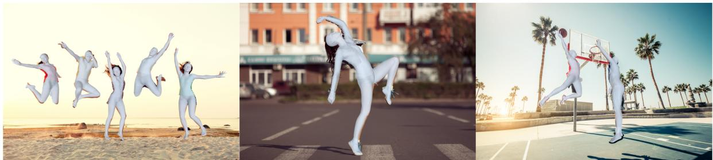
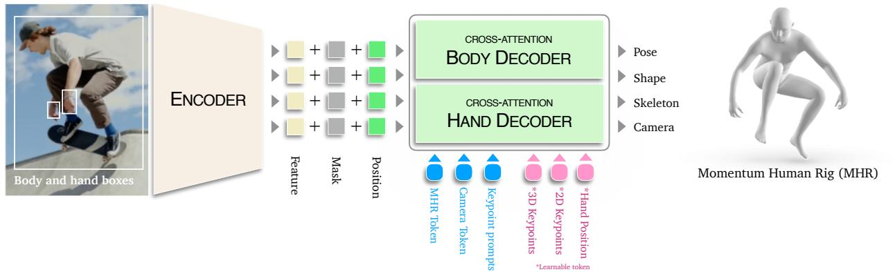
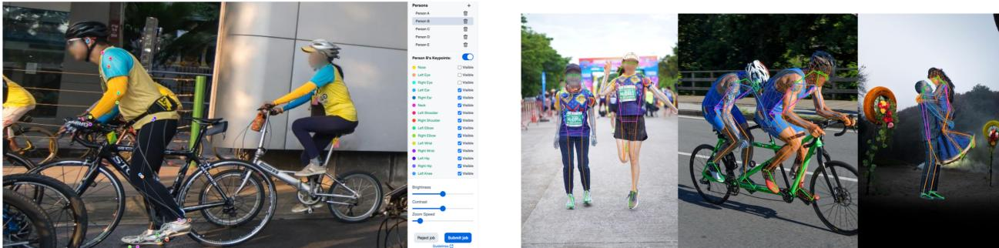
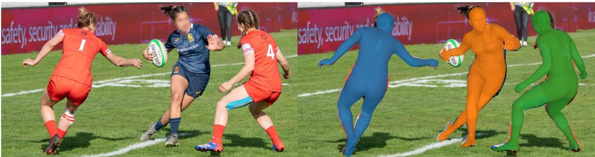
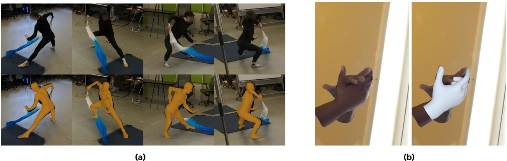

# SAM 3D 人体：鲁棒的全身人类网格恢复

X Ynge ukreoPinksukaSagaThaFanJi ar SinkaoJiawei LiuNicolasUgrivicatFeizlJitena MaliPiotrDollarKri Meta 超智能实验室 $\star$ 核心贡献者，实习生，$^ \dagger$ 项目负责人

我们介绍了SAM 3D Body（3DB），这是一个可提示模型，用于单幅图像的全身3D人类网格恢复（HMR），展现了最先进的性能，在多种实际场景中具有强大的泛化能力和一致的准确性。3DB可以估计身体、脚和手的姿态。它是第一个使用新参数化网格表示方法动力人类骨架（MHR）的模型，该方法将骨架结构与表面形状解耦。3DB采用编码器-解码器架构，并支持辅助提示，包括2D关键点和掩膜，使得用户引导的推断类似于SAM系列模型。我们通过多阶段标注流程导出高质量的标注，该流程使用手动关键点标注、可微优化、多视角几何和密集关键点检测的多种组合。我们的数据引擎高效地选择和处理数据，以确保数据多样性，收集不寻常的姿势和稀有的成像条件。我们提供了一个新的评估数据集，按姿势和外观类别组织，以便对模型行为进行细致分析。我们的实验展示了超凡的泛化能力，并在定性用户偏好研究和传统定量分析中取得了显著的进步。3DB和MHR均为开源项目。

  
Figure 1 Human mesh recovery results using SAM 3D Body (3DB). Our model demonstrates robust performance in esati hallengi oscivervwoint nd produ crae od nd han pstiations a unified framework.

# 1 引言

从图像中估计三维人类姿态（骨架姿态和结构）和形状（软体组织）是视觉和具身人工智能系统理解和与人交互的基本能力。尽管在人类网格恢复（HMR）方面取得了显著进展，现有方法在应用于真实环境图像时仍表现出令人不满的鲁棒性，这限制了它们在机器人技术和生物力学等现实场景中的适用性。特别是，当前模型在呈现挑战性姿势、严重遮挡或从不常见角度捕获的个体上常常失效。它们在可靠地估计整体姿势和全身网格方面也面临困难。我们认为，开发一个鲁棒的全身人类网格恢复模型的主要挑战来源于数据和模型两个方面。首先，收集大规模、多样化的人类姿态数据集，并获得高质量网格注释，本质上是困难且计算成本高的。大多数现有数据集要么由于实验室捕获设定而导致多样性不足，要么由于伪标签生成而导致网格质量低下。其次，当前HMR架构没有充分解决身体和手部姿态估计所需的不同优化机制，也没有结合有效的训练策略来处理单目图像中的不确定性和模糊性。在本工作中，我们提出了SAM 3D Body（3DB），这是一种强大的全身HMR模型，基于我们数据引擎策划的大规模、高质量的人类姿态数据。

稳健的全身HMR模型。我们做出了三个主要贡献，以提高模型在身体和手部姿态估计上的性能。 (i) 我们提出了一种新颖的可提示编码器-解码器架构，能够使模型基于可选的2D关键点、掩码或相机信息进行可控的姿态估计。这样的可提示设计自然促进了在训练过程中于模糊或困难情景下的互动指导，并提供了一种将手部和身体预测整合的连贯方法。 (ii) 我们的模型使用一个共享的图像编码器和两个独立的身体和手部解码器。这种双向解码器设计有效减少了优化身体和手部姿态估计时出现的冲突，这些冲突源于输入分辨率、相机估计和监督目标的差异。 (iii) 与大多数依赖SMPL人类网格模型的先前工作不同，我们基于新的参数化网格表示MHR构建3DB，该表示将骨骼姿态和身体形状解耦，提供了更丰富的控制和全身重建的可解释性。

多样化人类姿态和高质量标注的数据引擎。HMR 方法越来越依赖于大规模训练数据以提高性能。然而，高质量的 3D 监督仍然稀缺，现有的真实场景数据集在规模和多样性上仍然有限。因此，我们设计了一种新的数据创建流程，特点如下：（i）数据质量：我们的标注流程结合了几何约束、参数先验和稠密关键点回归等多种组成部分的组合，能够自动生成高质量的 3D 人体网格标注。（ii）数据数量：我们从大型授权库存照片库、多个多视角捕获数据集和合成数据中整理数据，创建了 700 万张高质量标注的图像。（iii）数据多样性：我们的数据通过基于视觉语言模型（VLM）的数据引擎进行多样化，这个引擎挖掘具有挑战性的真实场景图像并将其路由至标注。这确保了对稀有姿态、困难视角和不同外观的覆盖，为监督提供了更具多样性的数据集。结合数据引擎和全身 HMR 模型，3DB 能够从单张图像恢复高保真的全身人类网格。3DB 在身体和手部姿态估计上均实现了最先进的性能。大量实验表明，3DB 在标准指标上始终超过先前的 HMR 方法，对未见数据集更具泛化能力，并在 7,800 名参与者的研究中受到用户的偏爱，达到 5:1 的视觉质量胜率。据我们所知，这是第一个单一模型能够不可比拟地超越先前模型，同时在具有挑战性的姿态和真实场景下提供交互控制和强大的鲁棒性。

# 2 相关工作

人类网格模型：最广泛使用的人类网格模型是 SMPL（26），它将人体参数化为姿势和形状。SMPL-X（34）进一步包括手（MANO（40））和面部（FLAME（21））。SMPL 模型在形状空间中将骨骼结构与软组织质量交织在一起，可能限制可解释性（例如，参数并不总是直接映射到骨骼长度）和可控性。相对而言，Momentum 人体骨架（8）作为 ATLAS（31）的增强版，明确解耦了骨骼结构与身体形状，我们采用它作为人体的表示。人体网格恢复（HMR）：早期的 HMR 方法，如 HMR 2.0（9），仅是针对身体的模型，预测的是没有关节运动的手或脚（18；22；7）。相对而言，3DB 遵循了更近期的全身方法范式（2；5；41；3；51），评估身体+手+脚。此外，还有一些特定于部件的手网格恢复方法（35；38），仅估计手的姿势和形状，通常比全身方法具有更准确的性能。与此不同的是，3DB 在手部和全身估计方面都表现出色。

  
Figure2 SAM 3D Body Model Architecture. We employ a promptable encoder-decoder architecture with a shared image encoder and separate decoders for body and hand pose estimation.

可提示推断：可提示推断，由SAM系列推广，允许用户或系统提供提示（如2D关键点或掩膜）来引导模型预测。与之前的方法类似，我们的方法支持多种提示类型，包括2D关键点和掩膜，并通过将提示词元直接集成到变换器架构中，使用户能够指导网格恢复。数据质量与标注流程：人机重建中的主要瓶颈是训练数据的质量。许多数据集依赖于从单目拟合得到的伪真实网格（pGT），这些网格通常在姿态、形状和相机参数上存在系统性错误。近期的研究强调了标注噪声对报告指标和泛化能力的影响。为了应对这一问题，我们的工作使用了多视角数据集和合成数据，以提供更高保真度的监督。我们的方法基于这些见解，采用了可扩展的数据引擎，通过视觉-语言模型挖掘挑战性案例，并利用多阶段标注流程，结合密集关键点检测、强参数先验和稳健优化。

# 3 SAM 3D身体模型架构

我们的目标是从单幅图像中准确、稳健和交互式地恢复 3D 人体网格（即 MHR 参数）。为此，我们设计了 3DB，这是一个可提示的编码解码器架构（见图 2），具有丰富的提示词元集合。3DB 旨在具有交互性，因为它可以接受 2D 关键点或掩码，允许用户或下游系统引导推理。

# 3.1 图像编码器

人类裁剪的图像 $I$ 被归一化并通过视觉主干网络生成稠密特征图 $F$ 。可选的手工裁剪集 $I _ { \mathrm { h a n d } }$ 也可以提供，以获取手工裁剪特征图 $F _ { \mathrm { h a n d } }$ 。

$$
\begin{array} { r } { F = \mathrm { I m g E n c o d e r } ( I ) , \phantom { x x x x x x x x x x x x x x x x x x x x x x x x x x x x x x x x x x x x } } \\ { F _ { \mathrm { h a n d } } = \mathrm { I m g E n c o d e r } ( I _ { \mathrm { h a n d } } ) . } \end{array}
$$

3DB 考虑了两种可选提示：2D 关键点和分割掩码。关键点提示通过位置编码与学习到的嵌入相加编码，并作为附加词元提供给姿态解码器。掩码提示则使用卷积嵌入，并与图像嵌入逐元素相加 (17)。

# 3.2 解码器词元

3DB 有两个解码器：身体解码器输出完整的人体骨骼，而可选的手部解码器可以提供增强的手部姿势结果。姿势解码器以一组查询词元为输入，以预测 MHR 参数和相机参数。有四种类型的查询词元：MHR+相机、2D 关键点提示、辅助 2D/3D 关键点词元和可选的手部位置词元。MHR+相机词元：MHR 和（可选的）相机参数的初始估计作为可学习词元嵌入，用于 MHR 参数估计：

$$
\begin{array} { r l } & { T _ { \mathrm { p o s e } } = \mathrm { R i g E n c o d e r } ( E _ { \mathrm { i n i t } } ) \in \mathbb { R } ^ { 1 \times D } , } \\ & { E _ { \mathrm { i n i t } } \in \mathbb { R } ^ { d _ { \mathrm { i n i t } } } . } \end{array}
$$

2D关键点提示词元：如果提供了2D关键点提示$K$（例如，来自用户或检测器），它们被编码为：

$$
\begin{array} { r l } & { T _ { \mathrm { p r o m p t } } = \mathrm { P r o m p t E n c o d e r } ( K ) \in \mathbb { R } ^ { N \times D } , } \\ & { \qquad K \in \mathbb { R } ^ { N \times 3 } , } \end{array}
$$

每个关键点由 $( x , y , \mathrm{label} )$ 表示。手部位置标记：手部标记 $T_{\mathrm{hand}} \in \mathbb{R}^{2 \times D}$ 用于体形解码器在人体图像中定位手部位置。这组标记是可选的，即使没有它，3DB 仍然可以生成完整的人体模型，因为体形解码器的输出已经包含了手部信息。为了增强关键点的交互性和模型能力，我们包括了所有 2D 和 3D 关键点的可穿戴标记。

$$
\begin{array} { r } { T _ { \mathrm { k e y p o i n t 2 D } } \in \mathbb { R } ^ { J _ { 2 D } \times D } , } \\ { T _ { \mathrm { k e y p o i n t 3 D } } \in \mathbb { R } ^ { J _ { 3 D } \times D } . } \end{array}
$$

这些词元使模型能够推理特定关节，并支持下游任务，如关键点预测或不确定性估计。

# 3.3 MHR 解码器

所有词元被连接在一起以形成完整的查询集：

$$
T = [ T _ { \mathrm { p o s e } } , T _ { \mathrm { p r o m p t } } , T _ { \mathrm { k e y p o i n t 2 D } } , T _ { \mathrm { k e y p o i n t 3 D } } , T _ { \mathrm { h a n d } } ]
$$

这个灵活的组装使得模型能够在完全自动和用户引导模式下运行，适应可用的提示。主体解码器关注查询词元 $T$ 和全身图像特征 $F ^ { \prime }$。

$$
O = \mathrm { D e c o d e r } ( T , F ) \in \mathbb { R } ^ { ( 3 + N + J _ { 2 D } + J _ { 3 D } ) \times D } .
$$

通过交叉注意机制，身体解码器将提示信息与视觉上下文融合，从而实现稳健且可编辑的网格恢复。可选地，手部解码器可以利用相同的提示信息，同时关注手部裁剪特征 $F _ { \mathrm { h a n d } }$ 提供另一个输出令牌 $O _ { \mathrm { h a n d } }$ 。输出令牌 $O$ 的第一个令牌通过多层感知机（MLP）传递，以回归最终的网格参数：$\theta = \mathrm { M L P } ( O _ { 0 } ) \in \mathbb { R } ^ { d _ { \mathrm { o u t } } }$，其中 $\boldsymbol { \theta } = \{ { \bf P } , { \bf S } , { \bf C } , { \bf S } _ { k } \}$ 是预测的 MHR 参数：姿态、形状、相机姿态和骨架。另一组输出可以从 $O _ { \mathrm { h a n d } }$ 计算得到，用于一对 MHR 手部，可以与身体输出合并，以提高手部的估计精度。

# 4 模型训练与推理

模型训练。3DB通过综合的多任务损失项进行训练，$\begin{array} { r } { \mathcal { L } _ { \mathrm { t r a i n } } = \sum _ { i } \lambda _ { i } \mathcal { L } _ { i } } \end{array}$，其中每个$\mathcal { L } _ { i }$是针对特定预测头或解剖结构的任务特定损失。$\lambda _ { i }$是超参数。为了稳定训练，某些损失项（例如3D关键点）引入了升温策略，逐步增加其在训练过程中的权重。我们还通过为每个样本随机采样提示，多轮模拟交互设置（17; 46）进行训练。这种多任务、提示感知的损失设计为所有输出提供了强大的监督。我们在下面详细描述这些损失。2D/3D关键点损失：我们使用$L _ { 1 }$损失对2D/3D关节位置进行监督，结合可学习的每个关节不确定性，以根据预测置信度调整损失。对于3D身体和手部关键点，在计算损失之前，我们分别用其对应的骨盆和腕部位置进行归一化。手部关键点根据标注的可用性进行加权。2D关键点在裁剪图像空间中进行监督，当有关键点提示可用时，我们会加大用户提供的关键点损失的权重，以鼓励提示一致性。参数损失：MHR参数（姿势、形状）使用$L _ { 2 }$回归损失进行监督，并施加关节限制惩罚以避免解剖上不合理的姿势。手部检测损失：3DB可以通过内置的手部检测器定位手部位置。我们应用GIoU损失和$L _ { 1 }$损失来监督手部框回归。我们还预测手部框的不确定性，并在推理期间关闭手部解码器以避免手部被遮挡的样本。模型推理。对于模型推理，我们使用身体解码器的输出作为默认值。然而，如果手部检测头在输入图像中发现手部，我们可以选择将手部解码器的输出与身体输出合并，以提高手部姿态估计的质量。在这个阶段，我们通常独立使用手部解码器和身体解码器的腕部和肘部关键点估计作为提示关键点，以对齐并结合两个解码器的预测。最后，预测的局部MHR参数按照网格模型的运动学树合并为全身配置。

# 5 数据引擎以实现多样性

获得与图像配对的高精度人类网格标注可能会耗费大量计算资源。一般的策略是对大量视频集进行注释，并利用时间约束来生成更可靠的伪标注。虽然可以从视频中获取大量训练图像，但姿势、外观、成像条件和背景可能非常相似。为增加我们的训练数据集的多样性，我们实施了一个自动化数据引擎，能够选择性地将困难图像进行标注，从而实现高效且可扩展的数据集整理。我们数据引擎的核心是一个由视觉语言模型（VLM）驱动的挖掘策略。我们不仅依赖简单的启发式方法或随机采样，而是利用VLM自动生成和更新挖掘规则，以识别高价值的图像或标注。VLM识别出展示挑战性场景的图像，包括遮挡（人类主体部分被物体或其他人隐藏）、异常姿势（稀有或复杂的身体配置，如杂技或舞蹈）、互动（人与物体或人与人之间的活动，如握工具或群体行为）、极端尺度（受试者与相机的距离异常）、低可见性（照明差、运动模糊或部分可见）以及手体协调（手与身体姿势紧密耦合，如手语或运动）。挖掘规则会根据当前模型的失败分析进行自动迭代更新，使引擎能够自适应地专注于最具挑战性或最具信息量的样本。失败分析是半手动进行的，通过评估当前已标注图像集上的3DB，使用关键点位置误差可视化最具挑战性的图像，然后用几个词手动标注这些图像。这些词和图像用于为VLM创建文本提示。VLM挑选的新图像随后被路由进行手动标注。通过将标注努力集中在最具信息量的样本上，我们的数据引擎能够高效地在数千万图像中进行搜索，同时最大化每个标注图像的价值和多样性。通过收集高度多样化的数据集，它为构建在各种真实环境图像上有效的稳健HMR模型提供了基础。

  
Fiur Let:GUI ofour annotation tool or annotating 2 keypoints.Right:Comparison f the dense (thi) and sparse (thick) keypoints for pseudo annotation.

  
Figure 4 Example of single-image MHR mesh fitting for ITW datasets. Source: SA-1B (17).

# 6 数据标注与网格拟合

除了我们数据引擎所赋予的数据多样性带来的鲁棒性，我们模型的准确性在很大程度上依赖于标注的质量。为此，我们设计了一个多阶段标注流程，该流程利用各种手动二维关键点标注、稀疏和密集关键点检测、几何约束、时序约束、强参数先验和鲁棒优化方法的组合，从野外单幅图像数据集和多视角数据集中生成精确的3D网格伪真值。

# 6.1 手动标注

根据数据引擎选择的一组图像，我们使用当前版本的3DB来估计初始2D关节位置。然后，由经过培训的标注员对估计的关节位置进行审查，并根据需要手动进行更正，如图3(a)所示。标注员还根据严格的标准为每个关节分配可见性标签。对于因重大遮挡或其他因素（例如50%的遮挡、运动模糊）而无法精确放置的关节，将标记为不可见。

# 6.2 单图像网格拟合

对于每个图像，我们使用高容量关键点检测器预测595个密集的二维关键点，该检测器依赖于从上述手动标注步骤获得的稀疏二维关键点，如图3(b)所示。在之前的密集关键点检测框架基础上（33; 11; 6），我们的方案通过联合利用图像线索和稀疏关键点引导，从野外图像中准确预测二维密集关键点（图5b）。然后，我们使用3DB当前版本的姿态、形状和相机内参预测初始化MHR，该预测作为网格优化的初始化。然后，通过对模型参数进行基于梯度的细化，执行MHR拟合，最小化复合拟合损失 $\begin{array} { r } { \mathcal { L } _ { \mathrm { f i t } } = \sum _ { j } \lambda _ { j } \mathcal { L } _ { j } } \end{array}$ ，其中每个 ${ \mathcal { L } } _ { j }$ 是特定任务的损失，包括二维关键点损失、初始化锚定正则化和先验。超参数 $\lambda _ { j }$ 通过交叉验证设置。我们应用多个损失项和先验，使拟合目标：二维关键点损失是投影和检测到的密集二维关键点之间的L2距离，以确保最小的二维重投影误差。初始化锚定正则化通过对动量人形装置参数及其对应的三维关键点施加L2损失，从而惩罚偏离初始预测，防止模型漂移。姿态和形状先验通过学习的高斯混合先验和L2正则化强制生物解剖的合理性。按照上述流程，我们从图像到MHR的拟合中获得训练监督，如图4所示。

  
u5Exampl f MHR mesh fitting results.) Multi-view esh fttiSource:EgoExo4 (0). Scaase mesh fitting. Source: Re:Interhand (29).

# 6.3 多视图网格拟合

尽管单视图网格拟合在大型多样化图像集上有效，但由于深度歧义和自然遮挡，标注质量往往较低。因此，我们还在适当的数据集中利用多视图网格拟合。对于多视图视频数据集，我们进一步扩展了管道，以在所有帧和相机视角上联合拟合网格，利用空间和时间线索。为每个相机和帧提取同步的二维关键点，然后进行三角化以获得稀疏的三维关键点。

meshmode通过初始化这些三角化点、命名参数和二阶优化算法的基于更新的模型参数，最小化合成拟合损失，$\begin{array} { r } { \mathcal { L } _ { \mathrm { m u l t i } } = \sum _ { k } \lambda _ { k } \mathcal { L } _ { k } } \end{array}$，其中每个$\mathcal { L } _ { k }$是特定任务的损失，包括2D关键点损失、正则化和单视图网格拟合的先验，另外还包括3D关键点损失和时间平滑性：3D关键点损失是网格关节和从多视角几何中获得的三角化3D关键点之间的L2距离，提供强大的空间监督。时间平滑损失鼓励估计的姿态参数在时间上保持平滑，惩罚运动中的突然变化，并促进真实的时间动态。$\lambda _ { k }$通过交叉验证设置。优化交替进行，更新相机参数、形状、骨架和姿态，同时进行稳健的关键点过滤（例如，稳健损失、RANSAC、平滑）。身体特定参数（例如，形状、骨架参数）在帧之间联合优化。网格拟合在全身数据和手部数据上进行，如图5所示。

# 7 训练数据集

我们在表1中列出的单视图、多视图和合成数据集的混合上训练我们的模型，涵盖了一般的人体姿态、手部、交互以及“真实场景”条件，以确保训练数据的质量、数量和多样性。单视图真实场景：我们利用捕捉人在无约束环境中、具有多样的外观、姿态和场景条件的数据集。为此，我们使用了AIChallenger (53)、MS COCO (25)、MPII (1)、3DPW (48)和SA-1B的一个子集(17)。多视图一致性：为了结合几何一致性以获得更可靠的标注，我们使用来自Ego-Exo4D (10)、Harmony4D (16)、EgoHumans (15)、InterHand2.6M (30)、DexYCB (4)和Goliath (28)的多视图数据。表1 3DB训练数据集列表。$\star$表示提供样本以训练手部解码器的数据集。

<table><tr><td>Dataset</td><td># Images/Frames</td><td># Subjects</td><td># Views</td></tr><tr><td>MPII human pose (1)</td><td>5K</td><td>5K+</td><td>1</td></tr><tr><td>MS COCO (25)</td><td>24K</td><td>24K+</td><td>1</td></tr><tr><td>3DPW (48)</td><td>17K</td><td>7</td><td>1</td></tr><tr><td>AIChallenger (53)</td><td>172K</td><td>172K+</td><td>1</td></tr><tr><td>SA-1B (17)</td><td>1.65M</td><td>1.65M+</td><td>1</td></tr><tr><td>Ego-Exo4D (10)</td><td>1.08M</td><td>740</td><td>4+</td></tr><tr><td>DexYCB (4)</td><td>291K</td><td>10</td><td>8</td></tr><tr><td>EgoHumans (15)</td><td>272K</td><td>50+</td><td>15</td></tr><tr><td>Harmony4D (16)</td><td>250K</td><td>24</td><td>20</td></tr><tr><td>InterHand (30)*</td><td>1.09M</td><td>27</td><td>66</td></tr><tr><td>Re:Interhand (29)*</td><td>1.50M</td><td>10</td><td>170</td></tr><tr><td>Goliath (28)*</td><td>966K</td><td>120+</td><td>500+</td></tr><tr><td>Synthetic*</td><td>1.63M</td><td></td><td></td></tr></table>

高保真合成数据：我们使用了Goliath数据集的照片级真实合成扩展（28）。该数据集提供了数百万帧的真实标注MHR参数，涵盖了多样化的人物身份、服装和环境。合成数据确保了人类网格恢复的精确监督，补充了优先考虑多样性的现实世界数据集，但后者的质量可能不足。手部数据集：这些数据集（在表1中标记为$\star$），如Re:Interhand（29），用于训练身体和手部解码器。我们提供了手腕截断的手部样本以训练手部解码器。

# 8 评估

我们遵循先前的 HMR 研究并报告标准的姿态和形状评估指标：MPJPE（27）、PA-MPJPE（55）、PVE（20）和 PCK（55）。为了在基于 SMPL 的数据集上进行评估，MHR 网格被映射到 SMPL 网格格式。

# 8.1 在常见数据集上评估性能

我们首先在表2中对五个标准基准数据集评估3DB，比较各种最先进的（SoTA）网格恢复方法。我们展示了两种模型变体的结果；3DB-H利用了常用的ViT-H（632M）主干网络，而3DB-DINOv3使用了近期的DINOv3（840M）编码器。我们使用现成的视场（FOV）估计器提供相机内参用于模型推理。3DB在所有其他单图像方法中表现优异，甚至在利用时间信息的视频基础方法中也具有竞争力。特别是，我们的模型在EMDB和RICH数据集上取得了优异的结果，这些数据集属于域外（即未包含在训练集中），表明其泛化能力优于之前的SoTA方法。在所有数据集中，3DB在3D指标上超过了第二名模型NLF，除了RICH数据集，因为NLF在训练中使用了该数据集，而我们的模型没有。3DB在COCO和LSPET数据集上对于2D评估的PCK指标也达到了最先进水平，展示了强大的2D对齐能力。

# 8.2 在新数据集上评估性能

在我们的实验中，我们发现网格恢复模型在域外设置中特别脆弱，这主要是由于相机、外观和姿态的差异。为了了解方法在新的、未见过的数据分布上的表现，我们还在表3中评估了五个新数据集（38.6K图像）。这五个新数据集包括（1）Ego-Ex04D（10），（2）Harmony4D（16），（3）Goliath（28），（4）内部合成数据和（5）SA1B-Hard。Ego-Exo4D捕捉了人在多样化、专业的活动中的表现，分为物理（EE4D-Phys）和程序（EE4D-Proc）两个领域。Harmony4D专注于动态体育环境中的近距离多人的互动。Goliath在一个精确的工作室环境中提供多样化的动作。合成数据集包含具有不同相机角度和参数的单人图像。SA1B-Hard是从SA1B中提取的2.6K图像的子集，使用我们的数据引擎。综上所述，这五个新数据集为网格恢复方法提供了一个具有挑战性的测试平台。表2 比较五个常见基准的结果。最佳结果以粗体突出显示，第二好的结果用\*表示。

<table><tr><td rowspan="2"></td><td rowspan="2">Models</td><td colspan="3">3DPW (14)</td><td colspan="3">EMDB (24)</td><td colspan="3">RICH (24)</td><td>COCO</td><td>LSPET</td></tr><tr><td>PA-MPJPE ↓</td><td>MPJPE ↓</td><td>PVE↓</td><td>PA-MPJPE ↓</td><td>MPJPE↓</td><td>PVE↓</td><td>PA-MPJPE↓</td><td>MPJPE ↓</td><td>PVE ↓</td><td>PCK@0.05 ↑</td><td>PCK@0.05 ↑</td></tr><tr><td></td><td>HMR2.0b (9)</td><td>54.3</td><td>81.3</td><td>93.1</td><td>79.2</td><td>118.5</td><td>140.6</td><td>48.1†</td><td>96.0†</td><td>110.9†</td><td>86.1</td><td>53.3</td></tr><tr><td>0</td><td>CameraHMR (33)</td><td>35.1</td><td>56.0</td><td>65.9</td><td>43.3</td><td>70.3</td><td>81.7</td><td>34.0</td><td>55.7</td><td>64.4</td><td>80.5†</td><td>49.1†</td></tr><tr><td></td><td>PromptHMR (51)</td><td>36.1</td><td>58.7</td><td>69.4</td><td>41.0</td><td>71.7</td><td>84.5</td><td>37.3</td><td>56.6</td><td>65.5</td><td>79.2†</td><td>55.6†</td></tr><tr><td></td><td>SMPLerX-H (3)</td><td>46.6†</td><td>76.7†</td><td>91.8†</td><td>64.5†</td><td>92.7†</td><td>112.0†</td><td>37.4†</td><td>62.5†</td><td>69.5†</td><td>—</td><td></td></tr><tr><td></td><td>NLF-L+ft* (43)</td><td>33.6</td><td>54.9</td><td>63.7</td><td>40.9</td><td>68.4</td><td>80.6</td><td>28.7†</td><td>51.0t</td><td>58.2t</td><td>74.9†</td><td>54.9†</td></tr><tr><td>0</td><td>WHAM (44)</td><td>35.9</td><td>57.8</td><td>68.7</td><td>50.4</td><td>79.7</td><td>94.4</td><td>−</td><td></td><td>—</td><td>−</td><td>−</td></tr><tr><td></td><td>TRAM (52)</td><td>35.6</td><td>59.3</td><td>69.6</td><td>45.7</td><td>74.4</td><td>86.6</td><td>−</td><td>−</td><td>−</td><td></td><td></td></tr><tr><td></td><td>GENMO (19)</td><td>34.6</td><td>53.9</td><td>65.8</td><td>42.5</td><td>73.0</td><td>84.8</td><td>39.1</td><td>66.8</td><td>75.4</td><td></td><td></td></tr><tr><td></td><td>3DB-H (Ours)</td><td>33.2</td><td>54.8</td><td>64.1</td><td>38.5</td><td>62.9</td><td>74.3</td><td>31.9</td><td>55.0</td><td>61.7</td><td>86.8</td><td>68.9</td></tr><tr><td></td><td>3DB-DINOv3 (Ours)</td><td>33.8</td><td>54.8</td><td>63.6</td><td>38.2</td><td>61.7</td><td>72.5</td><td>30.9</td><td>53.7</td><td>60.3</td><td>86.5</td><td>67.8</td></tr></table>

表格比较新的基准数据集。最佳结果以粗体突出显示，而次佳结果则以下划线标记。MPJPE 是基于 24 个 SMPL 关键点计算的。

<table><tr><td>Models</td><td colspan="2">EE4D-Phy</td><td colspan="2">EE4D-Proc</td><td colspan="2">Harmony4D</td><td colspan="2">Goliath</td><td colspan="2">Synthetic</td><td>SA1B-Hard</td></tr><tr><td></td><td>PVE↓</td><td>MPJPE↓</td><td>PVE ↓</td><td>MPJPE ↓</td><td>PVE↓</td><td>MPJPE ↓</td><td>PVE ↓</td><td>MPJPE ↓</td><td>PVE ↓</td><td>MPJPE ↓</td><td>Avg-PCK ↑</td></tr><tr><td>CameraHMR (33)</td><td>71.1</td><td>58.8</td><td>70.3</td><td>60.2</td><td>84.6</td><td>70.8</td><td>66.7</td><td>54.5</td><td>102.8</td><td>87.2</td><td>63.0</td></tr><tr><td>PromptHMR (51)</td><td>74.6</td><td>63.4</td><td>72.0</td><td>62.6</td><td>91.9</td><td>78.0</td><td>67.2</td><td>56.5</td><td>92.7</td><td>80.7</td><td>59.0</td></tr><tr><td>NLF (43)</td><td>75.9</td><td>68.5</td><td>85.4</td><td>77.7</td><td>97.3</td><td>84.9</td><td>66.5</td><td>58.0</td><td>97.6</td><td>86.5</td><td>66.5</td></tr><tr><td>3DB-H Leave-one-out (Ours)</td><td>49.7</td><td>44.3</td><td>52.9</td><td>47.4</td><td>63.5</td><td>54.0</td><td>54.2</td><td>46.5</td><td>85.6</td><td>75.5</td><td>73.1</td></tr><tr><td>3DB-H Full dataset (Ours)</td><td>37.0</td><td>31.6</td><td>41.9</td><td>36.3</td><td>41.0</td><td>33.9</td><td>34.5</td><td>28.8</td><td>55.2</td><td>47.2</td><td>76.6</td></tr></table>

由于由于数据使用许可证的限制、训练数据描述的不明确以及缺乏训练代码（CameraHMR、PromptHMR 和 NLF 分别在 6、9 和 48 个数据集上训练），因此很难使用完全相同的训练数据和方法来比较方法，我们通过使用留一法训练程序公平地测试 3DB 的泛化能力。这确保了与之前工作之间的公平比较，后者同样没有见过这些数据集。为了作为一种领域内的上限比较，我们还展示了 3DB 在全部数据集上训练时的表现（即，训练数据同样是从这些新数据集中抽样）。对于基准和我们的模型，我们在所有 3D 数据集上使用真实标定的相机内参进行模型推断，SA1B-Hard 除外，我们使用了 MoGe-2 估计的视场角（FOV）。我们在表 3 中呈现结果。尽管在大量数据集上进行训练，我们发现之前的工作在这五个领域仍然面临困难，表现显著下降。相比之下，我们的留一法模型展现出强大的泛化能力，这归功于我们更为多样的数据分布和更强的训练框架。有趣的是，我们注意到现有方法在不同数据集之间不断交替第二名，这反映了样本特定的偏差。这表明每个基准模型都适应了潜在数据分布的一个特定切片。表 4 比较了 Freihand 在手部姿势估计中的应用。使用 Freihand 进行训练的方法用标记表示。

<table><tr><td>Method</td><td>PA-MPVPE ↓</td><td>PA-MPJPE ↓</td><td>F@5 ↑</td><td>F@15 ↑</td></tr><tr><td>LookMa (11)</td><td>8.1</td><td>8.6</td><td>0.653</td><td>-</td></tr><tr><td>METRO (24)†</td><td>6.3</td><td>6.5</td><td>0.731</td><td>0.984</td></tr><tr><td>HaMeR (35)†</td><td>5.7</td><td>6.0</td><td>0.785</td><td>0.990</td></tr><tr><td>MaskHand (42)†</td><td>5.4</td><td>5.5</td><td>0.801</td><td>0.991</td></tr><tr><td>WiLoR (38)†</td><td>5.1</td><td>5.5</td><td>0.825</td><td>0.993</td></tr><tr><td>3DB-H (Ours)</td><td>6.3</td><td>5.5</td><td>0.735</td><td>0.988</td></tr><tr><td>3DB-DINOv3 (Ours)</td><td>6.2</td><td>5.5</td><td>0.737</td><td>0.988</td></tr></table>

表 5 SA-1B Hard 数据集上的 2D 分类性能分析。

<table><tr><td rowspan="2"></td><td colspan="2">CameraHMR (33)</td><td colspan="2">PromptHMR (51)</td><td colspan="2">3DB</td></tr><tr><td>APCK(body)</td><td>APCK(feet)</td><td>APCK(body)</td><td>APCK(feet)</td><td>APCK(body)</td><td>APCK(feet)</td></tr><tr><td>Body _shape - In-the-wild</td><td>87.64</td><td>78.56</td><td>85.73</td><td>77.87</td><td>90.76</td><td>92.12</td></tr><tr><td>Camera_view - Back or side view</td><td>59.69</td><td>46.64</td><td>61.92</td><td>47.74</td><td>76.27</td><td>66.81</td></tr><tr><td>Camera_view - Bottom-up view</td><td>55.18</td><td>34.84</td><td>46.56</td><td>29.25</td><td>69.62</td><td>55.35</td></tr><tr><td>Camera_view - Others</td><td>51.48</td><td>33.80</td><td>54.39</td><td>38.55</td><td>76.62</td><td>71.52</td></tr><tr><td>Camera _ view - Overhead view</td><td>55.08</td><td>39.46</td><td>43.65</td><td>24.63</td><td>73.33</td><td>66.94</td></tr><tr><td>Hand - Crossed or overlapped fingers</td><td>73.20</td><td>62.85</td><td>72.48</td><td>62.43</td><td>81.36</td><td>84.04</td></tr><tr><td>Hand - Holding objects</td><td>76.73</td><td>72.11</td><td>73.57</td><td>68.92</td><td>83.40</td><td>85.92</td></tr><tr><td>Hand - Self-occluded hands</td><td>73.22</td><td>58.06</td><td>72.43</td><td>56.19</td><td>80.07</td><td>80.82</td></tr><tr><td>Multi_people - Contact or interaction</td><td>63.23</td><td>51.65</td><td>61.77</td><td>47.60</td><td>74.81</td><td>69.92</td></tr><tr><td>Multi_people - Overlapped</td><td>53.11</td><td>41.88</td><td>57.17</td><td>41.43</td><td>70.82</td><td>64.71</td></tr><tr><td>Pose - Contortion or bending</td><td>47.08</td><td>32.78</td><td>42.61</td><td>20.98</td><td>65.20</td><td>53.04</td></tr><tr><td>Pose - Crossed legs</td><td>63.95</td><td>32.24</td><td>56.15</td><td>27.35</td><td>76.40</td><td>58.80</td></tr><tr><td>Pose - Inverted body</td><td>46.12</td><td>30.01</td><td>39.83</td><td>24.64</td><td>78.18</td><td>72.19</td></tr><tr><td>Pose - Leg or arm splits</td><td>57.51</td><td>31.43</td><td>54.76</td><td>33.11</td><td>83.69</td><td>72.49</td></tr><tr><td>Pose - Lotus pose</td><td>63.19</td><td>14.38</td><td>54.85</td><td>12.87</td><td>74.53</td><td>57.97</td></tr><tr><td>Pose - Lying down</td><td>51.29</td><td>35.88</td><td>44.59</td><td>26.88</td><td>71.35</td><td>66.53</td></tr><tr><td>Pose - Sitting on or riding</td><td>79.66</td><td>71.65</td><td>70.15</td><td>61.16</td><td>84.85</td><td>81.51</td></tr><tr><td>Pose - Sports or athletic activities</td><td>78.93</td><td>69.34</td><td>73.62</td><td>60.37</td><td>85.10</td><td>82.80</td></tr><tr><td>Pose - Squatting or crouching or kneeling</td><td>62.74</td><td>41.47</td><td>54.41</td><td>33.84</td><td>72.85</td><td>61.85</td></tr><tr><td>Visibility - Occlusion (foot cues)</td><td>62.93</td><td>26.83</td><td>58.00</td><td>30.81</td><td>75.43</td><td>54.74</td></tr><tr><td>Visibility - Occlusion (hand cues)</td><td>61.01</td><td>53.89</td><td>58.55</td><td>51.13</td><td>76.04</td><td>72.01</td></tr><tr><td>Visibility - Truncation (lower-body truncated)</td><td>39.27</td><td></td><td>46.50</td><td>-</td><td>61.95</td><td></td></tr><tr><td>Visibility - Truncation (others)</td><td>79.18</td><td>74.82</td><td>77.06</td><td>74.99</td><td>84.23</td><td>86.72</td></tr><tr><td>Visibility - Truncation (upper-body truncated)</td><td>62.37</td><td>54.90</td><td>56.01</td><td>49.28</td><td>64.49</td><td>70.99</td></tr></table>

# 8.3 手势姿态估计性能评估

3DB的一大显著特点是其在估计手形状和姿态方面的强大表现。以往的全身人体姿态估计方法（3; 2; 23）显示出与手部姿态估计方法（35; 38）相比，手部姿态准确性存在显著差距。该性能差距主要源于两个因素。一方面，手部专用方法可以利用大规模的手部姿态数据集，而全身方法无法利用这些数据集，原因在于缺乏全身图像和标注。另一方面，自由移动的腕部使得手部姿态模型能够更容易地与二维和三维对齐手指姿态，而全身方法的腕部旋转和位置受限于身体的姿态和位置。尽管存在这些挑战，3DB在手部姿态准确性上表现出色。3DB得益于灵活的模型训练设计，该设计融合了手部和身体数据，以及手部解码器。此外，3DB具备可提示性，提供了一种自然机制来对齐身体预测与手部的腕部。我们在表4中对3DB在代表性FreiHand（56）基准上的手部估计进行了评估。为了与手部专用模型进行公平比较，我们使用了来自手部解码器的输出进行评估。尽管并未在Freihand数据集上进行训练，该数据集带来了显著的领域内提升，3DB的手部姿态估计准确性已与包括Freihand在内的多种手部专注数据集的最先进手部姿态估计方法相媲美。

# 8.4 评估 2D 类别性能

为了更好地理解模型在多种图像类型上的优缺点，我们比较了在SA1B-Hard（17）上定义的24个类别的性能。我们提出的评估集旨在捕捉图像中人类外观和活动的广泛谱系，确保在真实场景中的稳健评估。该评估集由24个类别组成，按照几个高层次组别组织：身体形态、相机视角、手、多人、姿态和可见性。我们使用PCK（正确关键点百分比）度量17个身体关键点和6个脚部关键点。结果使用Avg-PCK报告，即在一系列阈值（即0.01、0.025、0.05、0.075、0.1的人体边界框大小）上平均的PCK。表5的结果显示，3DB在所有类别上都超越了所有基线。图6给出了定性示例。在可见性方面，模型在与CameraHMR或PromptHMR的比较中显示出显著的改进。本质上，3DB在处理图像中的身体截断时学习到了更强的姿态先验。其他有显著改进的行包括姿态 - 倒置身体和姿态 - 腿部或臂部分裂。我们主要将这些改进归因于数据引擎选择的困难姿态的分布增加。表6提供了3D类别性能分析。

<table><tr><td rowspan="2"></td><td colspan="3">CameraHMR (33)</td><td colspan="3">PromptHMR (51)</td><td colspan="3">3DB</td></tr><tr><td>PVE</td><td>MPJPE</td><td>PA-MPJPE</td><td>PVE</td><td>MPJPE</td><td>PA-MPJPE</td><td>PVE</td><td>MPJPE</td><td>PA-MPJPE</td></tr><tr><td>aux:depth _ambiguous</td><td>126.25</td><td>102.25</td><td>81.33</td><td>109.58</td><td>91.77</td><td>69.24</td><td>64.38</td><td>52.72</td><td>39.85</td></tr><tr><td>aux:orient_ambiguous</td><td>84.26</td><td>71.77</td><td>45.07</td><td>83.79</td><td>72.93</td><td>46.17</td><td>42.35</td><td>36.64</td><td>25.16</td></tr><tr><td>aux:scale _ ambiguous</td><td>118.18</td><td>104.77</td><td>50.93</td><td>112.95</td><td>102.28</td><td>47.26</td><td>58.64</td><td>51.16</td><td>27.67</td></tr><tr><td>fov:medium</td><td>82.88</td><td>68.81</td><td>46.86</td><td>76.31</td><td>64.84</td><td>42.85</td><td>43.58</td><td>36.97</td><td>25.57</td></tr><tr><td>fov:narrow</td><td>82.15</td><td>69.82</td><td>49.73</td><td>90.41</td><td>77.95</td><td>53.49</td><td>52.14</td><td>43.89</td><td>36.18</td></tr><tr><td>fov:wide</td><td>71.55</td><td>60.05</td><td>38.66</td><td>74.98</td><td>64.55</td><td>42.87</td><td>37.97</td><td>33.06</td><td>22.44</td></tr><tr><td>interaction:close_interaction</td><td>107.59</td><td>90.95</td><td>57.62</td><td>115.19</td><td>98.12</td><td>64.87</td><td>54.23</td><td>44.98</td><td>29.76</td></tr><tr><td>interaction:mild_interaction</td><td>89.98</td><td>75.28</td><td>52.93</td><td>106.55</td><td>90.38</td><td>62.74</td><td>42.63</td><td>34.65</td><td>27.16</td></tr><tr><td>pose_2d:hard</td><td>117.91</td><td>107.74</td><td>77.16</td><td>117.73</td><td>110.64</td><td>79.16</td><td>62.93</td><td>57.50</td><td>45.58</td></tr><tr><td>pose_2d:very_hard</td><td>150.20</td><td>140.61</td><td>92.66</td><td>150.15</td><td>145.07</td><td>95.40</td><td>62.22</td><td>56.84</td><td>42.39</td></tr><tr><td>pose−3d:hard</td><td>133.89</td><td>121.11</td><td>84.21</td><td>129.30</td><td>118.59</td><td>81.82</td><td>71.42</td><td>63.68</td><td>49.10</td></tr><tr><td>pose_3d:very_hard</td><td>213.66</td><td>206.34</td><td>143.23</td><td>186.35</td><td>179.46</td><td>129.51</td><td>114.20</td><td>110.62</td><td>86.43</td></tr><tr><td>pose_prior:average_pose</td><td>68.52</td><td>56.70</td><td>37.22</td><td>70.32</td><td>59.73</td><td>39.42</td><td>36.06</td><td>30.95</td><td>21.35</td></tr><tr><td>pose_prior:easy_pose</td><td>57.83</td><td>47.31</td><td>29.92</td><td>62.85</td><td>53.58</td><td>32.80</td><td>29.53</td><td>24.66</td><td>17.20</td></tr><tr><td>pose_prior:hard_pose</td><td>94.64</td><td>80.04</td><td>54.53</td><td>88.12</td><td>76.19</td><td>51.15</td><td>51.65</td><td>44.24</td><td>31.09</td></tr><tr><td>shape:average_bmi</td><td>70.35</td><td>58.07</td><td>38.08</td><td>71.01</td><td>60.25</td><td>39.90</td><td>36.58</td><td>31.41</td><td>21.31</td></tr><tr><td>shape:high_bmi</td><td>84.52</td><td>69.96</td><td>47.55</td><td>79.49</td><td>67.83</td><td>43.04</td><td>43.33</td><td>36.49</td><td>22.45</td></tr><tr><td>shape:low_bmi</td><td>80.93</td><td>65.70</td><td>42.71</td><td>69.92</td><td>58.76</td><td>37.30</td><td>38.74</td><td>32.73</td><td>21.82</td></tr><tr><td>shape:very_high_bmi</td><td>87.18</td><td>72.91</td><td>47.54</td><td>81.17</td><td>69.05</td><td>44.03</td><td>48.51</td><td>41.11</td><td>24.80</td></tr><tr><td>shape:very_low_bmi</td><td>108.16</td><td>91.25</td><td>47.26</td><td>94.16</td><td>81.12</td><td>38.64</td><td>51.76</td><td>45.69</td><td>22.97</td></tr><tr><td>truncation:left_body</td><td>135.30</td><td>113.17</td><td>87.98</td><td>127.53</td><td>110.67</td><td>91.33</td><td>91.28</td><td>76.46</td><td>62.23</td></tr><tr><td>truncation:lower _body</td><td>127.81</td><td>97.84</td><td>75.82</td><td>151.52</td><td>118.65</td><td>83.79</td><td>92.87</td><td>67.10</td><td>60.77</td></tr><tr><td>truncation:right _body</td><td>110.28</td><td>91.58</td><td>71.17</td><td>115.71</td><td>98.43</td><td>72.15</td><td>75.04</td><td>62.84</td><td>50.62</td></tr><tr><td>truncation:severe</td><td>230.51</td><td>213.64</td><td>124.01</td><td>186.57</td><td>168.22</td><td>122.70</td><td>126.53</td><td>113.66</td><td>88.42</td></tr><tr><td>truncation:upper _body</td><td>85.59</td><td>79.68</td><td>56.36</td><td>86.06</td><td>80.88</td><td>56.94</td><td>50.83</td><td>48.79</td><td>38.39</td></tr><tr><td>viewpoint:average _view</td><td>75.61</td><td>62.69</td><td>41.90</td><td>74.17</td><td>62.80</td><td>41.81</td><td>41.25</td><td>35.22</td><td>24.41</td></tr><tr><td>viewpoint:bottomup_view</td><td>89.83</td><td>72.25</td><td>53.00</td><td>95.46</td><td>78.87</td><td>55.57</td><td>56.50</td><td>47.07</td><td>34.03</td></tr><tr><td>viewpoint:topdown_view</td><td>101.69</td><td>91.13</td><td>59.15</td><td>104.29</td><td>97.92</td><td>63.39</td><td>42.84</td><td>38.78</td><td>27.90</td></tr></table>

# 8.5 评估 3D 类别性能

使用现有的单视角数据集进行分类3D分析具有挑战性，因为潜在的伪真值只是对真实几何的低保真近似。为了对HMR方法进行更详细的分类分析，我们构建了一个评估数据集，该数据集结合了来自多视角数据集的合成数据和实时数据，且相机数量超过100台。为了全面评估HMR的3D人类网格重建性能，我们定义了一组34个可解释的类别属性，包括姿态难度、形状和交互。与用于2D类别的手动分类不同，这些3D类别是通过基于规则的标准对元数据和几何线索进行自动生成的。这种系统化的方法使得在多样化的现实世界条件下能够对模型性能进行一致、可扩展和客观的分析。根据表6的结果，3DB在挑战场景中表现出优越的性能。尤其是在非常困难的姿态类别中，3DB在pose_3d:very_hard类别和pose_2d:very_hard类别中始终超过CameraHMR和PromptHMR。这些结果表明，3DB在最具挑战条件下准确估计姿态方面具有固有优势。此外，3DB在处理截断:严重场景时显示出明显的优势，相较于CameraHMR，在视角:自上而下的视图类别中表现也优于PromptHMR。

# 8.6 定性结果

除了定量提升，我们的模型在质量上也明显优于基线。图6比较了SAM 3D Body与六种最先进的方法在SA1B-Hard数据集上的表现，突出显示了复杂姿态、形状和遮挡的具有挑战性的案例。如图所示，SAM 3D Body在身体姿势和形状恢复方面始终能够实现更高的准确性，尤其是在四肢和手部等细节方面。图中的二维叠加进一步说明了在困难条件下的改进。当我们聚焦于手部裁剪图像时，人体不可见或被截断，从而展示了模型的有效性，如图7所示。在这里，为了简洁明了，我们仅可视化由手部解码器输出的网格。

  
Figure 6 Qualitative comparison of 3DB against state-of-the-art HMR methods. Source: SA-1B (17).

  
Figure 7 Qualitative results of hand estimation using the hand decoder of 3DB. Source: Freihand (56).

# 8.7 人类偏好研究

我们进行了一项大规模用户偏好研究，评估3DB生成的人类重建的感知质量，与现有方法在SA1B-Hard数据集上的表现进行比较。虽然定量指标可以捕捉几何和数值的准确性，但它们并不总是与人类感知的准确性一致。

我们设计了六个独立的成对比较研究，每个研究将3DB与一种基准方法进行比较：HMR2.0b (9)、CameraHMR (33)、NLF (43)、PromptHMR (51)、SMPLer-X (3)和SMPLest-X (54)。该研究涵盖了7,800名独特参与者（每个比较中有1,300名独特参与者），共计收到超过20,000个反馈。每位参与者均被展示一个视频刺激。视频的左侧和右侧展示了两种方法的重建结果，并采用视频过渡效果将重建结果逐渐呈现在图像上。参与者被指示选择哪种3D重建更好地匹配原始图像，回答：“哪个人的3D模型更好地匹配原始图像，左边还是右边？”我们使用胜率和投票份额量化结果。胜率是3DB获得的票数超过基准的刺激百分比。如图8所示，3DB始终优于所有基准。关注最强的基准NLF，3DB的胜率达到了83.8%。

  
Figure 8 Comparison of 3DB win rate against baselines for human preference study. Win rate ( $\%$ ) and number of wins out of 80.

# 9 结论

我们提出了3DB，一个用于人体和手部的稳健HMR模型。我们的方法利用了动量人类模型参数化身体模型，采用灵活的编码器-解码器架构，并支持可选提示，如2D关键点或掩码，以指导推理。我们工作的一个核心进展在于监督管道。我们不再依赖于噪声单目伪真实标注数据，而是利用多视角捕捉系统、合成源以及一个可扩展的数据引擎，主动挖掘和标注具有挑战性的样本。这一策略产生了更干净和更多样化的训练信号，支持超越精准基准的泛化。同时，3DB采用了一个独立的手部解码器，以增强手部姿态估计，输入为手部裁剪图像，使其可与最先进的手部姿态估计方法相媲美。

# 致谢

我们衷心感谢以下个人的贡献与支持：Vivian Lee, Gorge Orlin, Nikhila Ravi, Andrew Westbury, Jyun-Ting Song, Zejia Weng, Xizi Zhang, Yuting Ye, Federica Bogo, Ronald Mallet, Ahmed Osman, Rawal Khirodkar, Javier Romero, Carsten Stoll, Shunsuke Saito, Jean-Charles Bazin, Sofien Bouaziz, Yuan Dong, Su Zhaoen, Alexander Richard, Michael Zollhoefer, Roman Radle, Sasha Mitts, Michelle Chan, Yael Yungster, Azita Shokrpour, Helen Klein, Mallika Malhotra, Ia Cheng, Eva Galper。

参考文献 [1] Mykhaylo Andriluka, Leonid Pishchulin, Peter Gehler 和 Bernt Schiele。2D人类姿态估计：新的基准和最先进的分析。在计算机视觉与模式识别会议（CVPR），2014。 [2] Fabien Baradel, Matthieu Armando, Thomas Lucas, Romain Brégier, Philippe Weinzaepfel 和 Grégory Rogez。Multi-HMR：一次性恢复多人的全身人类网格。在欧洲计算机视觉大会（ECCV），2024。 [3] Zhongang Cai, Wanqi Yin, Ailing Zeng, Chen Wei, Qingping Sun, Wang Yanjun, Hui En Pang, Haiyi Mei, Mingyuan Zhang, Lei Zhang, Chen Change Loy, Lei Yang 和 Ziwei Liu。SMPLer-X：扩展表达性人类姿态和形状估计。在神经信息处理系统进展（NeurIPS），2023。 [4] Yu-Wei Chao, Wei-Cheng Yang, Yu Xiang 等。DexYCB：捕捉物体手抓的基准。在计算机视觉与模式识别会议（CVPR），2021。 [5] Vasileios Choutas, Georgios Pavlakos, Timo Bolkart, Dimitrios Tzionas 和 Michael J. Black。通过身体驱动的关注进行单目表达式身体回归（ExPose）。在欧洲计算机视觉大会（ECCV），2020。 [6] Hanz Cuevas-Velasquez, Anastasios Yiannakidis, Soyong Shin, Giorgio Becherini, Markus Höschle, Joachim Tesch, Taylor Obersat, Tsvetelina Alexiadis 和 Michael J. Black。Mamma：无标记的自动多人人体运动捕捉，2025。 [7] Sai Kumar Dwivedi, Yu Sun, Priyanka Patel, Yao Feng 和 Michael J. Black。TokenHMR：通过分词化的姿态表示推进人体网格恢复。在计算机视觉与模式识别会议（CVPR），2024。 [8] Aaron Ferguson, Ahmed A. A. Osman, Berta Bescos, Carsten Stoll, Chris Twigg, Christoph Lassner, David Otte, Eric Vignola, Federica Bogo, Igor Santesteban, Javier Romero, Jenna Zarate, Jeongseok Lee, Jinhyung Park, Jinlong Yang, John Doublestein, Kishore Venkateshan, Kris Kitani, Ladislav Kavan, Marco Dal Farra, Matthew Hu, Matthew Cioffi, Michael Fabris, Michael Ranieri, Mohammad Modarres, Petr Kadlecek, Rinat Abdrashitov, Romain Prévost, Roman Rajbhandari, Ronald Mallet, Russel Pearsall, Sandy Kao, Sanjeev Kumar, Scot Parrish, Te-Li Wang, Tony Tung, Yuan Dong, Yuhua Chen, Yuanlu Xu, Yuting Ye 和 Zhongshi Jiang。Mhr：动量人类控制。arXiv 预印本，2025。arXiv 预印本；标识符待添加。 [9] Shubham Goel, Georgios Pavlakos, Jathushan Rajasegaran, Angjoo Kanazawa 和 Jitendra Malik。人类在4D：使用变换器重建和跟踪人类。在国际计算机视觉大会（ICCV），2023。包括HMR 2.0。 [10] Kristen Graum a l. Ego-Ex4D：理解技能流动性和第三人称视角。在计算机视觉与模式识别会议（CVPR），2024。 [11] Charlie Hewitt, Fatemeh Saleh, Sadeg Aliakbarian, Lohit Petikam, Shidh Rezaeiar, Louis Florentin, Zafiah Hosenie, Thomas J Cashman, Julien Valentin, Darren Cosker 和 Tadas Baltruaitis。看，妈，没有标记：无烦恼的整体性能捕捉。ACM图形学交易（TOG），43(6)，2024。 [12] Catalin Ionescu, Dragos Papava, Vlad Olaru 和 Cristian Sminhisescu。Human3.6m：用于自然环境中 3D 人体传感的大规模数据集和预测方法。IEEE模式分析与机器智能杂志，2014。 [13] Hanbyul Joo, Tomas Simon, Xulong Li, Hao Liu, Lei Tan, Lin Gui, Sean Banerjee, Timothy Scot Godisart, Bart Nabbe, Iain Matthews, Takeo Kanade, Shohei Nobuhara 和 Yaser Sheikh。全景工作室：一个大规模的多视角系统用于社交互动捕捉。IEEE模式分析与机器智能杂志，2017。 [14] Ang Kanazawa, Michael J. Black, Davi W Jacobs 和 Jitendra Malik。端到端恢复人类形状与姿态。在计算机视觉与模式识别会议（CVPR），第7122-7131页，2018。 [15] Rawal Khirodkar, Aayush Bansal, Lingni Ma, Richard Newcombe, Minh Vo 和 Kris Kitani。EgoHumans：一个自我中心的 3D 多人基准。在国际计算机视觉大会（ICCV），第4015-4026页，2023。 [16] Rawal Khirokar, Jyun-Ting Song, Jinkun Cao, Zhengyi Luo 和 Kris Kitani。Harmony4D：一个用于野外接近人类交互的视频数据集。NeurIPS 数据集和基准，2024。 [17] Alexander Kirilov, Eric Mintu, Nikil Ravi, Hanzi Mao, Chloe Rolland, Lur Gustafson, Tte Xio, Spencer Whitehead, Alexander C. Berg, Wan-Yen Lo, Piotr Dollár 和 Ross Girshick。分割任何事物。在国际计算机视觉大会（ICCV），第4015-4026页，2023年10月。 [18] Nikos Kolotouros, Georgios Pavlakos, Michel Black 和 Kostas Daniilidis。通过循环模型拟合学习重建 3D 姿态和形状。在IEEE/CVF国际计算机视觉会议论文集中，第2252-2261页，2019。 [19] Jiefeng Li, Jinkuao, Haoi Zhang, Davis Rempe, Jan Kautz, Umar Ibal 和 eYuan。Geno：针对人类运动的真实模型。在国际计算机视觉大会（ICCV），2025。 [20] Jie Li, Cha Xu, Zhic Chen, Syn Bian, Lixin Yang 和 Cew Lu。Hybrik：用于3D人类姿态和形状估计的混合分析-自然反向运动学解决方案。在计算机视觉与模式识别会议（CVPR），第3383-3393页，2021。 [21] Tianye Li, Timo Bolkart, Michael J. Black, Hao Li 和 Javier Romero。学习面部形状和表情模型（FLAME）来自4D扫描。在ACM图形学交易（TOG），SIGGRAPH亚洲，2017。 [22] Zhi J Lu, Zhe ZhnS Xu 和 Yoln。将完整帧传递到人类姿态和形状估计中。在欧洲计算机视觉会议，第590-606页。Springer，2022。 [23] Jing Lin, Ailing Zeng, Haoqian Wang, Lei Zhang 和 Yu Li。使用组件感知变换器的一阶段3D全身网格恢复。在计算机视觉与模式识别会议（CVPR），第2115-921168页，2023。 [24] Kevin Lin, Ljuan Wang 和 Zicheng Lu。使用变换器的端到端人类姿态和网格重建。在计算机视觉与模式识别会议（CVPR），第1954-1963页，2021。 [25] Tung-Yi Lin, Michel Maire, Serge Belongie, Lubor Bourdev, Ross Girshick, James Hays, Pietro Perona, Deva Ramanan, C. Lawrence Zitnick 和 Piotr Dollár。Microsoft COCO：上下文中的常见物体。在欧洲计算机视觉会议（ECCV），2014。 [26] Matthew Loper, Naureen Mahmood, Javier Romero, Gerard Pons-Mol 和 Michael J. Black。SMPL：一个皮肤多人人体线性模型。在ACM图形学交易（TOG），SIGGRAPH亚洲，第248:1-248:16页，2015。 [27] JulMarRaya H. JavRo 和 Jame Litip 进行姿态估计。在IEEE国际计算机视觉会议论文集，第2640-2649页，2017。 [28] Meta。Goliath数据集，2025。部分发布。 [29] Gyeongsik Moon, Shunsuke Saito, Weipeng Xu, Rohan Joshi, Julia Bufalini, Harley Bellan, Nicholas Matthew Rosen, Jesse Richardson, Mallorie Mize, Philippe De Bree 等。重光照的 3D 交互手数据集。在NeurIPS 2023 数据集和基准追踪中，2023。 [30] Gyeongsik Moon, Shoou-i Yu, He Wen, Takaaki Shiratori 和 Kyoung Mu Lee。Interhand2.6M：一个用于从单个RGB图像进行3D交互手姿态估计的数据集和基线。在欧洲计算机视觉会议（ECCV），2020。 [31] Jinhyung Park, Javier Romero, Shunsuke Saito, Fabian Prada, Takaaki Shiratori, Yichen Xu, Federica Bogo, Shoou-I Yu, Kris Kitani 和 Rawal Khirodkar。Atlas：解耦骨骼和形状参数用于表现性参数化人类建模。在国际计算机视觉大会（ICCV），第6508-6518页，2025。 [32] use W Rc Jie Mal。互联网视频。arXiv 预印本 arXiv:2211.13225，2022。 [33] Priyanka Patel 和 Michael J. Black。Camerahmr：对齐具有透视效果的人。在2025年国际3D视觉大会（3DV），第1562-1571页。IEEE，2025。 [34] Georgios Pavlakos, Vasileios Choutas, Nima Ghorbani, Timo Bolkart, Ahmed A. A. Osman, Dimitrios Tzionas 和 Michael J. Black。表现性身体捕捉：从单幅图像（SMPL-X）获取3D手、脸和身体。在计算机视觉与模式识别会议（CVPR），2019。 [35] Georgios Pavlakos, Dandan Shan, Iija Radosavovic, Angjoo Kanazawa, David Fouhey 和 Jitendra Malik。使用变换器重建3D手。在计算机视觉与模式识别会议（CVPR），2024。 [36] r Syog hi Gou Sar Beri an Hall。通过动态优化生物力学模型获取音乐数据。生物力学杂志，155：111617，2023。 [37] X in eg, A Kanazawa, Jitendra Malik, Priebe 和 Sergey Levie v。通过视频强化物理技能。ACM图形学交易（TOG），37(6)：114，2018。 [38] Rolandos Alexandros Potamias, Jinglei Zhang, Jiankang Deng 和 Stefanos Zafeiriou。Wilor：端到端的3D手定位和重建。在计算机视觉与模式识别会议（CVPR），第12242-12254页，2025。 [39] Nikhila Ravi, Valentin Gabeur, Yuan-Ting Hu, Ronghang Hu, Chaitanya Ryali, Tengyu Ma, Haitham Khedr, Roman Rädle, Chloe Rolland, Laura Gustafson, Eric Mintun, Junting Pan, Kalyan Vasudev Alwala, Nicolas Carion, Chao-Yuan Wu, Ross Girshick, Piotr Dollár 和 Christoph Feichtenhofer。SAM 2：在图像和视频中分割任何物体。在国际表示学习大会（ICLR），2025。口头报告。 [40] Javier Romero, Dimitrios Tzionas 和 Michael J. Black。模型和捕捉手和身体（MANO）。在ACM图形学交易（TOG），SIGGRAPH亚洲，2017。 [41] Yu Rong, Takaaki Shiratori 和 Hanbyul Joo。FrankMocap：通过回归和集成的单目3D全身姿态估计系统。在国际计算机视觉大会（ICCV）研讨会，2021。 [42] Muhammad Usama Saleem, Ekkasit Pinyoanuntapong, Mayur Jagdishbhai Patel, Hongfei Xue, Ahmed Helmy, Srijan Das 和 Pu Wang。Maskhand：生成性遮蔽建模以进行稳健的手网格重建。在计算机视觉与模式识别会议（CVPR），第8372-8383页，2025。 [43] ItSnd Ger ons-Mol Neualcalir el oru 3 psen hapetn。在神经信息处理系统进展（NeurIPS），2024。 [44] Syong Shin, Juyong Kim, Eni Halila 和 Michael J. Black。WHAM：通过准确的3D运动重建世界中立的人的姿态。在计算机视觉与模式识别会议（CVPR），第2070-2080页，2024年6月。 [45] Oriane Siéoni, Huy V Vo, Maximilan Seitzer, Federico Baldassarre, Maxie Oquab, Cijo Jose, Vasil Khaliov, Marc Szafraniec, Seungeun Yi, Michaël Ramamonjisoa 等。Dinov3。arXiv 预印本 arXiv:2508.10104，2025。 [46] Konstantin Sfiuk, Iya A Petrov 和 Anton Konushin。通过掩码引导复兴迭代训练以实现交互式分割。在2022年IEEE国际图像处理会议（ICIP），第3141-3145页。IEEE，2022。 [47] Vasilis Vasiopoulos, Georgios Pavlakos, Sean Bowan, ieo Caporale, Kostas Daniilidis, George Pappas 和 Danil E Koditschek。在未探索的语义环境中利用深度感知反馈进行反应语义规划。IEEE机器人与自动化通讯，5(3)：4455-4462，2020。 [48] Timo von Marcar, Gerar ons-MoMicha J. Black。使用IMU和移动相机在野外准确恢复3D人类姿态。在欧洲计算机视觉会议（ECCV），2018。 [49] Ruicheng Wang, Sicheng Xu, Yue Dong, Yu Deng, Jianfeng Xiang, Zelong Lv, Guangzhong Sun, Xin Tong 和 Jiolong Yang。Moge-2：具有度量尺度和清晰细节的准确单目几何。arXiv 预印本 arXiv:2507.02546，2025。 [50] Shenze Wang, Jiefeng Li, Tianye Li, Ye Yuan, Henry Fuchs, Koki Nagano, Shalini De Mello 和 Michael tengel。BLADE：通过准确的深度估计进行单视图身体网格估计。在计算机视觉与模式识别会议（CVPR），第2199-22000页，2025。 [51] Yufu Wang, Yu Sun, Priyana Patel, Kostas Daniilidis, Michael J. Black 和 Muham Kocabas。PromptHMR：可提示的人体网格恢复。在计算机视觉与模式识别会议（CVPR），2025。 [52] Wag, Z Wag Lg Li, Kostas Daniilidis。TRAM：从野外视频中获取全球3D姿态。 在欧洲计算机视觉会议（ECCV），2024。 [53] Jiahong Wu, He Zheng, Bo Zhao, Yixin Li, Baoming Yan, Rui Liang, Wenjia Wang, Shipei Zhou, Guosen Lin 和 Yanw Fu 等。大规模数据集以深入理解图像。在国际多媒体与博览会议（ICME），第1480-1485页。IEEE，2019。 [54] Wanqi Yin, Zhongang Cai, Ruisi Wang, Ailing Zeng, Chen Wei, Qingping Sun, Haiyi Mei, Yanju Wang, Hui En Pang, Mingyuan Zhang, Lei Zhang, Chen Change Loy, Atsushi Yamashita, Lei Yang 和 Ziwei Liu。SMPLest-x：表现性人类姿态和形状估计的终极扩展。IEEE模式分析与机器智能杂志，第117，2025。 [55] Jianeg Zhang, Xuecheng Ji 和 Jishi Feng。推理阶段的共同3D姿态估计。神经信息处理系统进展（NeurIPS），33：2408-2419，2020。