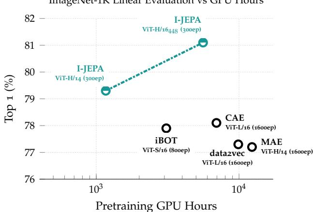
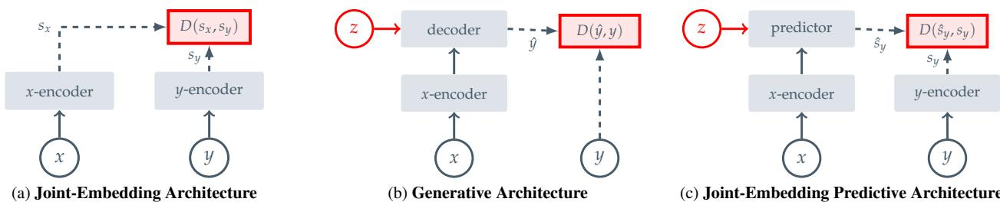
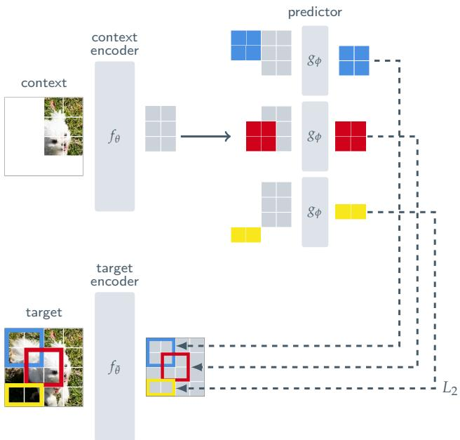
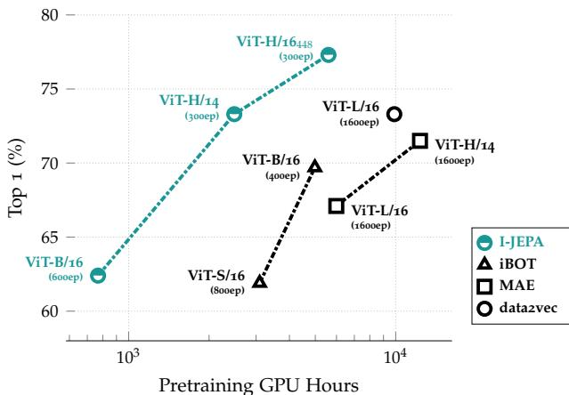
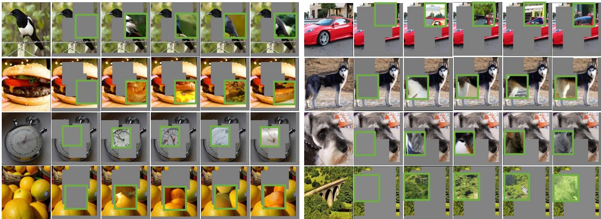
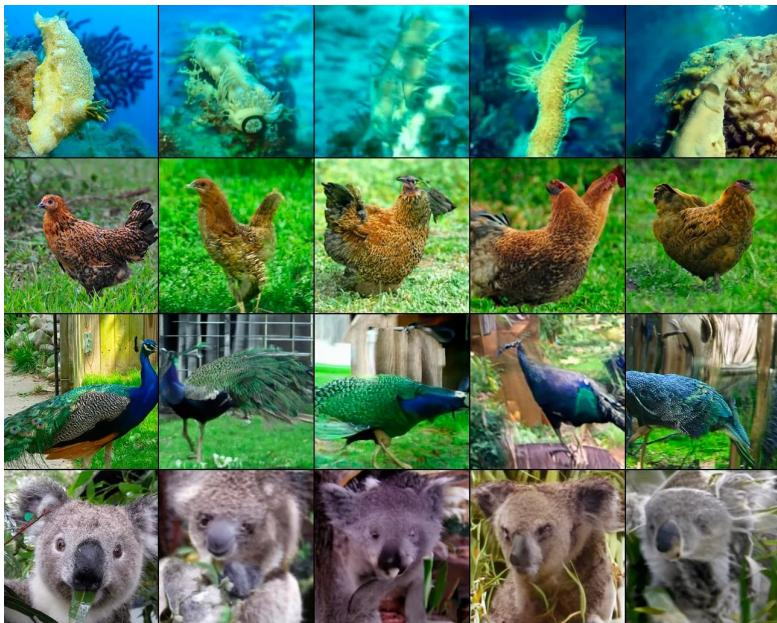

# 基于联合嵌入预测架构的图像自监督学习

马哈穆德·阿斯蘭1,2,3\* 昆廷·杜瓦1 伊香·米斯拉1 皮奥特·博亚诺夫斯基1 巴斯卡尔·文森特1 迈克尔·拉巴特1,3 扬·勒昆1,4 尼古拉斯·巴拉斯1 1Meta AI（FAIR） 2麦吉尔大学 3米拉·魁北克人工智能研究所 4纽约大学

# 摘要

本文展示了一种不依赖手工设计的数据增强方法来学习高度语义化的图像表示。我们引入了图像基础联合嵌入预测架构（I-JEPA），这是一种非生成性的自监督图像学习方法。I-JEPA 背后的理念很简单：从单个上下文块预测同一图像中多个目标块的表示。引导 I-JEPA 生成语义表示的核心设计选择是掩蔽策略；具体来说，关键在于 (a) 采样具有足够大规模（语义）的目标块，以及 (b) 使用足够信息量（空间分布）的上下文块。通过实验，当与视觉变换器结合时，我们发现 I-JEPA 具有很高的可扩展性。例如，我们在 ImageNet 上使用 16 个 A100 GPU 训练了一个 ViT-Huge/14，时长不足 72 小时，获得了在多个任务中良好的下游性能，从线性分类到目标计数和深度预测。

# 1. 引言

  
ImageNet-1K Linear Evaluation vs GPU Hours   
Figure 1. ImageNet Linear Evaluation. The I-JEPA method learns semantic image representations without using any view data augmentations during pretraining. By predicting in representation space, I-JEPA produces semantic representations while using less compute than previous methods.

在计算机视觉中，从图像进行自监督学习的两类常见方法是基于不变性的方法和生成方法。基于不变性的预训练方法通过优化编码器，使同一图像的两个或多个视图产生相似的嵌入，图像视图通常通过一组手工设计的数据增强技术构建，例如随机缩放、剪裁和颜色抖动等。这些预训练方法能够生成高语义层次的表示，但也会引入强偏差，这可能对某些下游任务或甚至具有不同数据分布的预训练任务有害。通常情况下，如何将这些偏差推广到需要不同抽象层次的任务上并不明确。例如，图像分类和实例分割不需要相同的不变性。此外，将这些图像特定的增强方法推广到音频等其他模态并不简单。

认知学习理论表明，生物系统中表征学习的驱动机制是内部模型的适应，以预测感官输入的响应。这个想法是自监督生成方法的核心，这些方法通过移除或破坏输入的一部分并学习预测被破坏的内容来进行学习。特别是，掩码去噪方法通过重建输入中随机掩盖的补丁来学习表征，无论是在像素级还是词元级。掩码预训练任务所需的先验知识少于视图不变性方法，并且能够较好地泛化到图像模式之外。然而，所得到的表征通常语义水平较低，并且在现成评估（例如，线性探测）和有限监督的语义分类任务的迁移设置中，表现不如基于不变性的方法。因此，需要一个更复杂的适应机制（例如，端到端微调）以充分利用这些方法的优势。

  
F. ible inputs. (a) Joint-Embedding Architectures learn to output similar embeddings for compatible inputs $x , y$ and dissimilar embeddings for incompatible inputs. (b) Generative Architectures learn to directly reconstruct a signal $_ y$ from a compatible signal $x$ , using a decoder network that is conditioned on additional (possibly latent) variables $z$ to facilitate reconstruction. (c) Joint-Embedding Predictive Architectures learn to predict the embeddings of a signal $y$ from a compatible signal $x$ , using a predictor network that is conditioned on additional (possibly latent) variables $z$ to facilitate prediction.

在本工作中，我们探讨如何提高自监督表示的语义水平，而不使用通过图像变换编码的额外先验知识。为此，我们引入了一种用于图像的联合嵌入预测架构（I-JEPA）。方法的示意图见图3。I-JEPA背后的思想是在抽象表示空间中预测缺失的信息；例如，给定单个上下文块，预测同一图像中各种目标块的表示，其中目标表示是通过学习的目标编码网络计算得到的。与在像素/词元空间中进行预测的生成方法相比，I-JEPA利用抽象预测目标，从而潜在地消除不必要的像素级细节，进而促使模型学习更具语义特征的表示。指导I-JEPA生成语义表示的另一个核心设计选择是提出的多块掩蔽策略。具体而言，我们展示了使用信息丰富（空间分布）上下文块预测足够大的目标块在图像中的重要性。通过广泛的实证评估，我们证明了： • I-JEPA在不使用手工设计的视图增强的情况下学习到强大的现成表示（见图1）。I-JEPA在ImageNet-1K线性探测、半监督$1\%$ ImageNet-1K和语义迁移任务中表现优于像素重建方法，如MAE [36]。I-JEPA在语义任务上与视图不变预训练方法具有竞争力，并在对象计数和深度预测等低层视觉任务中实现了更好的性能（见第5和第6节）。通过使用具有较少刚性归纳偏置的简单模型，I-JEPA可应用于更广泛的任务集。 • I-JEPA还具有可扩展性和高效性（见第7节）。在ImageNet上预训练ViT-H/14需要的GPU小时数少于1200小时，比使用iBOT [79] 预训练的ViT-S/16快超过$2.5\times$，比使用MAE预训练的ViT-H/14高效超过$10\times$。在表示空间中预测显著减少了自监督预训练所需的总计算量。

# 2. 背景

自监督学习是一种表示学习的方法，其中系统学习捕捉输入之间的关系。这个目标可以用能量基础模型（EBMs）框架来描述，其中自监督目标是为不兼容的输入分配高能量，为兼容的输入分配低能量。许多现有的自监督学习的生成和非生成方法确实可以归入这一框架；见图2。联合嵌入架构。在变不变性预训练中，可以使用联合嵌入架构（JEA）将其归入EBMs框架，该架构学习为兼容输入输出相似的嵌入 $\mathbf { \nabla } _ { \mathbf { x } , \mathbf { y } }$ ，为不兼容输入输出不相似的嵌入；见图2a。在基于图像的预训练上下文中，兼容的 $\mathbf { \nabla } _ { \mathbf { x } , \mathbf { y } }$ 对通常通过随机应用手工制作的数据增强到同一输入图像来构建 [20]。JEAs面临的主要挑战是表征崩溃，其中能量景观变得平坦（即编码器的输出保持恒定，无论输入如何）。在过去几年中，已经研究了几种防止表征崩溃的方法，例如明确拉开负样本嵌入的对比损失 [15,24,37]、最小化嵌入之间信息冗余的非对比损失 [10, 74]，以及最大化平均嵌入熵的基于聚类的方法 [4, 5, 18]。还有一些启发式方法利用 $x$ -编码器和 $y$ -编码器之间的不对称架构设计来避免崩溃 [8, 24, 35]。

生成架构。基于重建的方法可以在能量基模型（EBMs）的框架内通过生成架构进行自监督学习；见图 2b。生成架构直接学习从兼容信号 $_ { \textbf { \em x } }$ 重建信号 $\textbf { { y } }$，使用条件在额外（可能是潜在）变量 $_ z$ 上的解码器网络来促进重建。在基于图像的预训练上下文中，计算机视觉中的一种常见方法是通过掩码生成兼容的 $\mathbf { \nabla } _ { \mathbf { x } , \mathbf { y } }$ 对，其中 $_ { \textbf { \em x } }$ 是图像 $\textbf { { y } }$ 的副本，但一些区域被掩蔽。条件变量 $_ z$ 对应于一组（可能可学习的）掩码和位置标记，指定给解码器哪些图像块需要重建。在这些架构中，只要 $_ z$ 的信息容量相对于信号 $\textbf { { y } }$ 较低，表示崩溃并不是一个问题。 联合嵌入预测架构。如图 2c 所示，联合嵌入预测架构（JEPAs）在概念上与生成架构相似；然而，一个关键区别在于损失函数是应用在嵌入空间，而不是输入空间。JEPAs 学习从兼容信号 $_ { \textbf { \em x } }$ 预测信号 $\textbf { { y } }$ 的嵌入，使用条件在额外（可能是潜在）变量 $_ z$ 上的预测网络来促进预测。我们提出的 I-JEPA 在图像上下文中使用掩码提供了该架构的实例；见图 3。与联合嵌入架构相比，JEPAs 并不寻求对一组手工设计的数据增强不变的表示，而是寻求在条件于额外信息 $_ { z }$ 时彼此可预测的表示。然而，与联合嵌入架构一样，JEPAs 也面临表示崩溃的问题；我们利用 $_ { \textbf { \em x } }$ 和 $\textbf { { y } }$ 编码器之间的不对称架构来避免表示崩溃。

# 3. 方法

我们现在描述所提出的基于图像的联合嵌入预测架构（I-JEPA），如图3所示。整体目标如下：给定一个上下文块，预测同一图像中各种目标块的表示。我们使用视觉变换器（ViT）架构作为上下文编码器、目标编码器和预测器。ViT由一系列变换器层组成，每层包含自注意力操作，后接全连接的多层感知机（MLP）。我们的编码器/预测器架构类似于生成式掩蔽自编码器（MAE）方法。然而，一个关键的区别在于，I-JEPA方法是非生成性的，预测是在表示空间中进行的。

  
Figure 3. I-JEPA. The Image-based Joint-Embedding Predictive Architecture uses a single context block to predict the representations of various target blocks originating from the same image. The context encoder is a Vision Transformer (ViT), which only processes the visible context patches. The predictor is a narrow ViT that takes the context encoder output and, conditioned on positional tokens (shown in color), predicts the representations of a target block at a specific location. The target representations correspond to the outputs of the target-encoder, the weights of which are updated at each iteration via an exponential moving average of the context encoder weights.

目标。我们首先描述如何在 I-JEPA 框架中生成目标：在 I-JEPA 中，目标对应于图像块的表示。给定输入图像 $\textbf { { y } }$，我们将其转换为 $N$ 个不重叠补丁的序列，并通过目标编码器 $f _ { \bar { \theta } }$ 生成相应的补丁级表示 $\begin{array} { r l } { s _ { y } } & { { } = } \end{array}$ $\{ \pmb { s } _ { y _ { 1 } } , \dotsc , \pmb { s } _ { y _ { N } } \}$，其中 $\boldsymbol { s } _ { y _ { k } }$ 是与第 $k ^ { \mathrm { { t h } } }$ 补丁相关的表示。为了获得我们的损失函数的目标，我们随机从目标表示 $s _ { y }$ 中采样 $M$ 个（可能重叠的）块。我们用 $B _ { i }$ 来表示第 $i ^ { \mathrm { { t h } } }$ 块对应的掩码，并用 $\pmb { s } _ { y } ( i ) = \{ \pmb { s } _ { y _ { j } } \} _ { j \in B _ { i } }$ 表示其补丁级表示。通常，我们将 $M$ 设置为 4，并以随机长宽比（范围为 (0.75, 1.5)）和随机缩放（范围为 (0.15, 0.2)）来采样这些块。请注意，目标块是通过掩蔽目标编码器的输出而获得，而不是输入。这一区别对于确保高语义级别的目标表示至关重要；详见，例如 [8]。

  
Figure 4. Examples of our context and target-masking strategy. Given an image, we randomly sample 4 target blocks with scale in the range (0.15, 0.2) and aspect ratio in the range (0.75, 1.5). Next, we randomly sample a context block with scale in the range (0.85, 1.0) and remove any overlapping target blocks. Under this strategy, the target-blocks are relatively semantic, and the contextblock is informative, yet sparse (efficient to process).

背景。在 I-JEPA 中，目标是从单个上下文块预测目标块表示。为了获得 I-JEPA 中的上下文，我们首先从图像中以随机比例（范围为 0.85 到 1.0）和单位纵横比采样一个单独的块 $_ { \textbf { \em x } }$ 。我们用 $B _ { x }$ 表示与上下文块 $_ { \textbf { \em x } }$ 相关联的掩码。由于目标块是独立于上下文块进行采样的，因此可能存在显著的重叠。为了确保任务具有非平凡的预测性，我们从上下文块中去除任何重叠区域。图 4 展示了实际中各种上下文块和目标块的示例。接下来，将被掩蔽的上下文块 $_ { \textbf { \em x } }$ 传入上下文编码器 $f _ { \theta }$，以获得相应的补丁级表示 $\pmb { s } _ { x } = \{ \pmb { s } _ { x _ { j } } \} _ { j \in B _ { x } }$ 。

预测。给定上下文编码器的输出 ${ \pmb s } _ { x }$，我们希望预测 $M$ 个目标块表示 $\pmb { s } _ { y } ( 1 ) , \dots , \pmb { s } _ { y } ( M )$。为此，对于给定的目标块 $\begin{array} { r } { { \pmb s } _ { y } ( i ) } \end{array}$，对应于目标掩模 $B _ { i }$，预测器 $g _ { \phi } ( \cdot , \cdot )$ 以上下文编码器的输出 ${ \pmb s } _ { x }$ 和我们希望预测的每个补丁的掩模标记 $\{ m _ { j } \} _ { j \in B _ { i } }$ 为输入，并输出补丁级别的预测 $\begin{array} { r } { \hat { s } _ { y } ( i ) = } \end{array}$ $\{ \hat { s } _ { y _ { j } } \} _ { j \in B _ { i } } = g _ { \phi } ( \pmb { s } _ { x } , \{ m _ { j } \} _ { j \in B _ { i } } )$。掩模标记由一个共享的可学习向量参数化，并且添加了位置嵌入。由于我们希望为 $M$ 个目标块进行预测，因此我们将预测器应用 $M$ 次，每次以对应于我们希望预测的目标块位置的掩模标记为条件，并获得预测 $\hat { \pmb { s } } _ { y } ( 1 ) , \dots , \hat { \pmb { s } } _ { y } ( M )$。损失。损失简单地是预测的补丁级别表示 $\hat { s } _ { y } ( i )$ 和目标补丁级别表示 $\begin{array} { r } { { \pmb s } _ { y } ( i ) } \end{array}$ 之间的平均 $L _ { 2 }$ 距离；即，

$$
\frac { 1 } { M } \sum _ { i = 1 } ^ { M } D \left( \hat { \pmb { s } } _ { y } ( i ) , { \pmb { s } } _ { y } ( i ) \right) = \frac { 1 } { M } \sum _ { i = 1 } ^ { M } \sum _ { j \in B _ { i } } \| \hat { \pmb { s } } _ { y _ { j } } - { \pmb { s } } _ { y _ { j } } \| _ { 2 } ^ { 2 } .
$$

预测器的参数 $\phi$ 和上下文编码器的参数 $\theta$ 是通过基于梯度的优化学习的，而目标编码器 $\bar { \theta }$ 的参数则是通过上下文编码器参数的指数移动平均来更新的。使用指数移动平均的目标编码器对于使用视觉变换器训练 JEA 至关重要，我们发现 I-JEPA 同样适用这一点。

# 4. 相关工作

大量研究探讨了通过预测缺失或损坏的感官输入值来进行视觉表征学习。去噪自编码器使用随机噪声作为输入损坏。上下文编码器根据周围环境回归整个图像区域。其他研究将图像着色视为去噪任务。

图像去噪的思想最近在掩蔽图像建模的背景下得到了重新审视，其中使用视觉变换器（Vision Transformer）重建缺失的输入片段。关于掩蔽自编码器（Masked Autoencoders, MAE）的研究提出了一种高效的架构，仅需编码器处理可见的图像片段。通过在像素空间重建缺失的片段，MAE在大型标注数据集上进行端到端微调时表现出色，并展现出良好的扩展性能。BEiT预测缺失片段在词元化空间中的值；具体而言，使用在包含2.5亿幅图像的数据集上训练的冻结离散变分自编码器（discrete VAE）对图像片段进行词元化。然而，像素级预训练已被证明在微调中优于BEiT。另一项研究，SimMIM，探索了基于经典梯度直方图特征空间的重建目标，并在像素空间重建中表现出一定的优势。与这些研究不同，我们的表征空间是在训练过程中通过联合嵌入预测架构学习的。我们的目标是学习不需要大量微调下游任务的语义表征。与我们工作最接近的是data2vec和上下文自编码器（Context Autoencoders）。data2vec方法学习预测通过在线目标编码器计算的缺失片段的表征；通过避免手工设计的数据增强，该方法可以应用于多种模态，并在视觉、文本和语音中取得了良好的效果。上下文自编码器使用编码器/解码器架构，通过重建损失和对齐约束的和进行优化，该约束强制确保缺失片段在表征空间中的可预测性。与这些方法相比，I-JEPA在计算效率上表现出显著提升，并学习到更多语义的现成表征。在我们工作进行的同时，data2vec-v2探索了用于多种模态学习的高效架构。

Table 1. ImageNet. Linear-evaluation on ImageNet-1k (the ViT$\mathrm { H } / 1 6 _ { 4 4 8 }$ is pretrained at at a resolution of $4 4 8 \times 4 4 8 )$ . I-JEPA improves linear probing performance compared to other methods that do not rely on hand-crafted view data-augmentations during pretraining. Moreover, I-JEPA demonstrates good scalability — the larger I-JEPA model matches the performance of view-invariance approaches without requiring view data-augmentations.   

<table><tr><td>Method</td><td>Arch.</td><td>Epochs</td><td>Top-1</td></tr><tr><td colspan="3">Methods without view data augmentations</td><td></td></tr><tr><td>data2vec [8]</td><td>ViT-L/16</td><td>1600</td><td>77.3</td></tr><tr><td rowspan="3">MAE [36]</td><td>ViT-B/16</td><td>1600</td><td>68.0</td></tr><tr><td>ViT-L/16</td><td>1600</td><td>76.0</td></tr><tr><td>ViT-H/14</td><td>1600</td><td>77.2</td></tr><tr><td rowspan="2">CAE [22]</td><td>ViT-B/16</td><td>1600</td><td>70.4</td></tr><tr><td>ViT-L/16</td><td>1600</td><td>78.1</td></tr><tr><td rowspan="4">I-JEPA</td><td>ViT-B/16</td><td>600</td><td>72.9</td></tr><tr><td>ViT-L/16</td><td>600</td><td>77.5</td></tr><tr><td>ViT-H/14</td><td>300</td><td>79.3</td></tr><tr><td>ViT-H/16448</td><td>300</td><td>81.1</td></tr><tr><td colspan="4">Methods using extra view data augmentations</td></tr><tr><td>SimCLR v2 [21]</td><td>RN152 (2×)</td><td>800</td><td>79.1</td></tr><tr><td>DINO [18]</td><td></td><td>300</td><td>80.1</td></tr><tr><td></td><td>ViT-B/8</td><td></td><td></td></tr><tr><td>iBOT [79]</td><td>ViT-L/16</td><td>250</td><td>81.0</td></tr></table>

我们还将 I-JEPA 与基于联合嵌入架构的各种方法进行比较，例如 DINO [18]、MSN [4] 和 iBOT [79]。这些方法在预训练期间依赖于手工设计的数据增强以学习语义图像表示。MSN [4] 的研究使用掩码作为预训练期间的一种额外数据增强，而 iBOT 将数据2vec风格的补丁级重建损失与 DINO 的视图不变性损失结合在一起。以上方法的共同点在于需要处理每个输入图像的多个用户生成视图，这在一定程度上阻碍了可扩展性。相比之下，I-JEPA 只需处理每个图像的单一视图。我们发现，使用 I-JEPA 训练的 ViT-Huge/14 所需的计算资源少于使用 iBOT 训练的 ViT-Small/16。

<table><tr><td>Method</td><td>Arch.</td><td>Epochs</td><td>Top-1</td></tr><tr><td colspan="4">Methods without view data augmentations</td></tr><tr><td>data2vec [8]</td><td>ViT-L/16</td><td>1600</td><td>73.3</td></tr><tr><td>MAE [36]</td><td>ViT-L/16 ViT-H/14</td><td>1600 1600</td><td>67.1 71.5</td></tr><tr><td>I-JEPA</td><td>ViT-L/16 ViT-H/14 ViT-H/16448</td><td>600 300 300</td><td>69.4 73.3 77.3</td></tr><tr><td colspan="4">Methods using extra view data augmentations iBOT [79] ViT-B/16 400 69.7</td></tr><tr><td>DINO [18] SimCLR v2 [35]</td><td>ViT-B/8 RN151 (2×)</td><td>300</td><td>70.0 70.2</td></tr><tr><td>BYOL [35]</td><td>RN200 (2×)</td><td>800 800</td><td>71.2</td></tr><tr><td></td><td></td><td></td><td></td></tr><tr><td>MSN [4]</td><td>ViT-B/4</td><td>300</td><td>75.7</td></tr></table>

Table 2. ImageNet $1 \%$ . Semi-supervised evaluation on ImageNet-1K using only $1 \%$ of the available labels. Models are adapted via fine-tuning or linear-probing, depending on whichever works best for each respective method. $\mathrm { V i T - H } / 1 6 _ { 4 4 8 }$ is pretrained at at a resolution of $4 4 8 \times 4 4 8$ I-JEPA pretraining outperforms MAE which also does not rely on hand-crafted data-augmentations during pretraining. Moreover, I-JEPA benefits from scale. A ViT$_ { \mathrm { H } / 1 6 }$ trained at resolution 448 surpasses previous methods including methods that leverage extra hand-crafted data-augmentations.

# 5. 图像分类

为了证明 I-JEPA 在不依赖手工设计的数据增强的情况下学习高层次表示，我们报告了使用线性探测和部分微调协议在各种图像分类任务上的结果。在本节中，我们考虑在 ImageNet-1K 数据集上进行预训练的自监督模型。预训练和评估的实现细节在附录 A 中描述。所有 I-JEPA 模型均在 $224 \times 224$ 像素的分辨率下训练，除非另有说明。

ImageNet-1K。表1显示了在通用的ImageNet-1K线性评估基准上的性能。经过自监督预训练后，模型权重被冻结，并在完整的ImageNet-1K训练集上训练线性分类器。与其他流行的方法，如遮挡自编码器（MAE）、上下文自编码器（CAE）和data2vec，这些方法在预训练过程中也不依赖广泛的手工数据增强，我们看到I-JEPA显著提高了线性探测性能，同时使用了更少的计算资源（见第7节）。通过利用I-JEPA提高的效率，我们可以训练更大的模型，这些模型在使用少量计算的情况下超越了最佳CAE模型。I-JEPA也受益于规模；特别是，以分辨率$4 4 8 \times 4 4 8$像素训练的ViT-H/16的性能与视图不变的方法（如iBOT）相匹配，尽管避免使用手工数据增强。

Table 3. Linear-probe transfer for image classification. Linearevaluation on downstream image classification tasks. I-JEPA significantly outperforms previous methods that also do not use augmentations (MAE and data2vec), and decreases the gap with the best view-invariance-based methods that leverage hand-crafted data augmentations during pretraining.   

<table><tr><td>Method</td><td>Arch.</td><td>CIFAR100</td><td>Places205</td><td>iNat18</td></tr><tr><td colspan="5">Methods without view data augmentations</td></tr><tr><td>data2vec [8]</td><td>ViT-L/16</td><td>81.6</td><td>54.6</td><td>28.1</td></tr><tr><td>MAE [36]</td><td>ViT-H/14</td><td>77.3</td><td>55.0</td><td>32.9</td></tr><tr><td>I-JEPA</td><td>ViT-H/14</td><td>87.5</td><td>58.4</td><td>47.6</td></tr><tr><td colspan="5">Methods using extra view data augmentations</td></tr><tr><td>DINO [18]</td><td>ViT-B/8</td><td>84.9</td><td>57.9</td><td>55.9</td></tr><tr><td>iBOT [79]</td><td>ViT-L/16</td><td>88.3</td><td>60.4</td><td>57.3</td></tr></table>

低样本量 ImageNet-1K。表 2 显示了在 $1 \%$ ImageNet 基准上的表现。这里的想法是仅使用 $1 \%$ 可用的 ImageNet 标签来调整预训练模型以进行 ImageNet 分类，这大约对应于每个类别 12 或 13 张图像。模型通过微调或线性探测进行调整，具体取决于每种方法中哪个效果更佳。I-JEPA 在使用相似的编码器架构时，性能超过 MAE，同时所需的预训练轮次更少。I-JEPA 使用 ViT$\mathrm { H } / 1 4$ 架构，其性能与使用 data2vec 预训练的 ViT-L/16 相匹配，同时计算开销显著减少（见第 7 节）。通过提高图像输入分辨率，I-JEPA 超越了以往的方法，包括在预训练期间利用额外手工数据增强的联合嵌入方法，如 MSN [4]、DINO [17] 和 iBOT [79]。迁移学习。表 3 显示了使用线性探测在各类下游图像分类任务上的表现。I-JEPA 显著超过了不使用数据增强的以前方法（MAE 和 data2vec），并缩小了与最佳基于视图不变性方法的差距，这些方法在预训练期间利用了手工数据增强，甚至在 CIFAR100 和 Place205 上通过线性探测超过了流行的 DINO [18]。

# 6. 本地预测任务

如第5节所示，I-JEPA学习的语义图像表示显著提高了之前方法（例如MAE和data2vec）的下游图像分类性能。此外，I-JEPA受益于规模，并能缩小甚至超越依赖额外手工数据增强的视图不变性方法。在本节中，我们发现I-JEPA还学习了局部图像特征，并在低层次和密集预测任务（如目标计数和深度预测）上超过了视图不变性方法。

Table 4. Linear-probe transfer for low-level tasks. Linearevaluation on downstream low-level tasks consisting of object counting (Clevr/Count) and depth prediction (Clevr/Dist). The IJEPA method effectively captures low-level image features during pretraining and outperforms view-invariance based methods on tasks such object counting and depth prediction.   

<table><tr><td>Method</td><td>Arch.</td><td>Clevr/Count</td><td>Clevr/Dist</td></tr><tr><td>Methods without view data augmentations</td><td></td><td></td><td></td></tr><tr><td>data2vec [8]</td><td>ViT-L/16</td><td>85.3</td><td>71.3</td></tr><tr><td>MAE [36]</td><td>ViT-H/14</td><td>90.5</td><td>72.4</td></tr><tr><td>I-JEPA</td><td>ViT-H/14</td><td>86.7</td><td>72.4</td></tr><tr><td>Methods using extra data augmentations</td><td></td><td></td><td></td></tr><tr><td>DINO [18]</td><td>ViT-B/8</td><td>86.6</td><td>53.4</td></tr><tr><td>iBOT [79]</td><td>ViT-L/16</td><td>85.7</td><td>62.8</td></tr></table>

表4展示了使用线性探测器在各种低级任务上的表现。在预训练之后，编码器权重被冻结，并在其上训练线性模型，以在Clevr数据集上执行物体计数和深度预测。与视图不变的方法如DINO和iBOT相比，I-JEPA方法在预训练期间有效捕捉了低级图像特征，并在物体计数（Clevr/Count）和深度预测（Clevr/Dist）上优于它们（幅度较大）。

# 7. 可扩展性

模型效率。与之前的方法相比，I-JEPA 具有很高的可扩展性。图 5 显示了在 $1 \%$ ImageNet-1K 上的半监督评估与 GPU 小时数的关系。与以前的方法相比，I-JEPA 需要更少的计算资源，并且在不依赖于手工设计的数据增强的情况下实现了强大的性能。与基于重建的方法（如 MAE）直接使用像素作为目标相比，I-JEPA 在表示空间中计算目标引入了额外的开销（每次迭代约慢 $7 \%$）。然而，由于 I-JEPA 以大约 $5 \times$ 更少的迭代次数收敛，因此在实践中我们仍然看到了显著的计算节省。与基于视图不变性的方法（如 iBOT）相比，后者依赖于手工设计的数据增强来创建和处理每个图像的多个视图，I-JEPA 的运行速度也显著更快。特别是，巨大的 I-JEPA 模型（ViT-H/14）所需的计算资源少于小型 iBOT 模型（ViT-S/16）。数据规模的扩展。我们还发现 I-JEPA 从使用更大数据集的预训练中受益。表 5 显示了迁移

<table><tr><td>Pretrain</td><td>Arch.</td><td>CIFAR100</td><td>Place205</td><td>INat18</td><td>Clevr/Count</td><td>Clevr/Dist</td></tr><tr><td>IN1k</td><td>ViT-H/14</td><td>87.5</td><td>58.4</td><td>47.6</td><td>86.7</td><td>72.4</td></tr><tr><td>IN22k</td><td>ViT-H/14</td><td>89.5</td><td>57.8</td><td>50.5</td><td>88.6</td><td>75.0</td></tr><tr><td>IN22k</td><td>ViT-G/16</td><td>89.5</td><td>59.1</td><td>55.3</td><td>86.7</td><td>73.0</td></tr></table>

T 100 ViT-H/16 的训练相当于 600 个 IN1k 的 epochs。

  
Semi-Supervised ImageNet-1K $\mathbf { { T } ^ { o } } \%$ Evaluation vs GPU Hours   
Figure 5. Scaling. Semi-supervised evaluation on ImageNet-1K $1 \%$ as a function of pretraining GPU hours. I-JEPA requires less compute than previous methods to achieve strong performance. Compared to MAE and data2vec, I-JEPA obtains a significant speedup by requiring fewer pretraining epochs. Compared to iBOT, which relies on hand-crafted data-augmentations, a huge IJEPA model (ViT-H/14) requires less compute than their smallest model (ViT-S/16).

在增加预训练数据集规模（IN1K 与 IN22K）时，语义和低层次任务的学习性能。预训练在更大更丰富的数据集上时，这些概念上不同的任务的迁移学习性能都有所提升。模型规模的扩展。表5还显示，当在IN22K上进行预训练时，I-JEPA 从更大的模型规模中受益。与ViT-H/14模型相比，预训练一个ViT-G/16显著提高了下游任务在图像分类任务（如Place205和INat18）上的表现，但对低层次下游任务的表现没有提升——ViT-G/16使用了更大的输入块，这对局部预测任务可能是有害的。

# 8. 预测器可视化

I-JEPA 中预测器的角色是接收上下文编码器的输出，并根据位置掩膜令牌预测掩膜令牌指定位置的目标黑块的表示。一个自然的问题是，基于位置掩膜令牌的预测器是否学会正确捕捉目标的位置信息不确定性。为定性研究这个问题，我们可视化了预测器的输出。我们采用以下可视化方法，以使研究社区能够独立重现我们的研究结果。在预训练后，我们冻结上下文编码器和预测器的权重，并依据 RCDM 框架训练解码器[13]，将预测器输出的平均池映射回像素空间。图 6 显示了不同随机种子的解码器输出。样本中常见的特征代表了包含在平均池预测器表示中的信息。I-JEPA 预测器正确捕捉到位置信息的不确定性，并生成具有正确姿态的高层次物体部件（例如，鸟的背部和汽车的顶部）。

# 9. 消融实验

在表示空间中的预测。表7比较了在使用线性探测器时，损失在像素空间计算与在表示空间计算的情况下，在$1\%$ ImageNet-1K上的低样本性能。我们推测I-JEPA的一个关键组件是损失完全在表示空间中计算，从而使目标编码器能够生成抽象的预测目标，消除与像素级细节无关的信息。从表7可以明显看出，在像素空间中进行预测会显著降低线性探测性能。遮罩策略。表6比较了我们的多块遮罩与其他遮罩策略，如光栅化遮罩，其中图像被分为四个大象限，目标是使用一个象限作为上下文以预测其他三个象限，以及传统的块遮罩和在基于重建的方法中通常使用的随机遮罩。在块遮罩中，目标是一个单独的图像块，上下文是

<table><tr><td rowspan="2">Mask</td><td colspan="2">Targets</td><td colspan="2">Context</td><td rowspan="2">Top-1</td></tr><tr><td>Type</td><td>Freq.</td><td>Type</td><td>Avg. Ratio*</td></tr><tr><td>multi-block</td><td>Block(0.15, 0.2)</td><td>4</td><td>Block(0.85, 1.0) × Complement</td><td>0.25</td><td>54.2</td></tr><tr><td>rasterized</td><td>Quadrant</td><td>3</td><td>Complement</td><td>0.25</td><td>15.5</td></tr><tr><td>block</td><td>Block(0.6)</td><td>1</td><td>Complement</td><td>0.4</td><td>20.2</td></tr><tr><td>random</td><td>Random(0.6)</td><td>1</td><td>Complement</td><td>0.4</td><td>17.6</td></tr></table>

图像补全。在随机遮挡中，目标是一组随机补丁，背景是图像补全。请注意，在所有考虑的策略中，背景和目标块之间没有重叠。我们发现多块遮挡有助于指导 I-JEPA 学习语义表示。关于多块遮挡的更多消融实验可以在附录 C 中找到。

Table 6. Ablating masking strategy. Linear evaluation on ImageNet-1K using only $1 \%$ of the available labels after I-JEPA pretraining of / sE.

Table 7. Ablating targets. Linear evaluation on ImageNet-1K using only $1 \%$ of the available labels. The semantic level of the I-JEPA representations degrades significantly when the loss is applied in pixel space, rather than representation space, highlighting the importance of the target-encoder during pretraining.   

<table><tr><td>Targets</td><td>Arch.</td><td>Epochs</td><td>Top-1</td></tr><tr><td>Target-Encoder Output</td><td>ViT-L/16</td><td>500</td><td>66.9</td></tr><tr><td>Pixels</td><td>ViT-L/16</td><td>800</td><td>40.7</td></tr></table>

# 10. 结论

我们提出了I-JEPA，一种简单高效的方法，用于学习语义图像表示，而无需依赖手工设计的数据增强。我们展示了通过在表示空间中进行预测，I-JEPA收敛速度快于像素重建方法，并学习到高语义水平的表示。与基于视图不变性的方法不同，I-JEPA强调了一条通过联合嵌入架构学习通用表示的路径，而不依赖于手工设计的视图增强。

# References

[1] Yuki Markus Asano, Christian Rupprecht, and Andrea Vedaldi. Self-labelling via simultaneous clustering and representation learning. Internatinoal Conference on Learning Representations, 2020. 1   
[2] Mahmoud Assran, Randall Balestriero, Quentin Duval, Florian Bordes, Ishan Misra, Piotr Bojanowski, Pascal Vincent, Michael Rabbat, and Nicolas Ballas. The hidden uniform cluster prior in self-supervised learning. International Conference on Learning Representations, 2023. 1, 13   
[3] Mahmoud Assran, Nicolas Ballas, Lluis Castrejon, and Michael Rabbat. Supervision accelerates pre-training in contrastive semi-supervised learning of visual representations. NeurIPS Workshop on Self-Supervised Learning, 2020. 13   
[4] Mahmoud Assran, Mathilde Caron, Ishan Misra, Piotr Bojanowski, Florian Bordes, Pascal Vincent, Armand Joulin, Michael Rabbat, and Nicolas Ballas. Masked siamese networks for label-efficient learning. European Conference on Computer Vision, 2022. 1, 2, 3, 5, 6, 12, 13, 16, 17   
[5] Mahmoud Assran, Mathilde Caron, Ishan Misra, Piotr Bojanowski, Armand Joulin, Nicolas Ballas, and Michael Rabbat. Semi-supervised learning of visual features by nonparametrically predicting view assignments with support samples. IEEE/CVF International Conference on Computer Vision, 2021. 3, 13   
[6] Philip Bachman, R Devon Hjelm, and William Buchwalter. Learning representations by maximizing mutual information across views. Advances in neural information processing systems, 32, 2019. 13   
[7] Alexei Baevski, Arun Babu, Wei-Ning Hsu, and Michael Auli. Efficient self-supervised learning with contextualized target representations for vision, speech and language. arXiv preprint arXiv:2212.07525, 2022. 5   
[8] Alexei Baevski, Wei-Ning Hsu, Qiantong Xu, Arun Babu, Jiatao Gu, and Michael Auli. Data2vec: A general framework for self-supervised learning in speech, vision and language. arXiv preprint arXiv:2202.03555, 2022. 1, 3, 4, 5, 6, 13   
[9] Hangbo Bao, Li Dong, and Furu Wei. Beit: Bert pre-training of image transformers. arXiv preprint arXiv:2106.08254, 2021. 1, 3, 4, 13   
[10] Adrien Bardes, Jean Ponce, and Yann LeCun. Vicreg: Variance-invariance-covariance regularization for selfsupervised learning. arXiv preprint arXiv:2105.04906, 2021. 1, 3, 13   
[11] Adrien Bardes, Jean Ponce, and Yann LeCun. Vicregl: Selfsupervised learning of local visual features. arXiv preprint arXiv:2210.01571, 2022. 1, 13   
[12] Florian Bordes, Randall Balestriero, Quentin Garrido, Adrien Bardes, and Pascal Vincent. Guillotine regularization: Improving deep networks generalization by removing their head. arXiv preprint arXiv:2206.13378, 2022. 13   
[13] Florian Bordes, Randall Balestriero, and Pascal Vincent. High fidelity visualization of what your self-supervised representation knows about. Transactions on Machine Learning Research, 2022. 7, 16   
[14] John Bridle, Anthony Heading, and David MacKay. Unsupervised classifiers, mutual information and'phantom targets. Advances in neural information processing systems, 4, 1991. 13   
[15] Jane Bromley, James W Bentz, Léon Bottou, Isabelle Guyon, Yann LeCun, Cliff Moore, Eduard Säckinger, and Roopak Shah. Signature verification using a "siamese" time delay neural network. International Journal of Pattern Recognition and Artificial Intelligence, 7(04):669688, 1993. 1, 3   
[16] Zhaowei Cai, Avinash Ravichandran, Paolo Favaro, Manchen Wang, Davide Modolo, Rahul Bhotika, Zhuowen Tu, and Stefano Soatto. Semi-supervised vision transformers at scale. arXiv preprint arXiv:2208.05688, 2022. 13   
[17] Mathilde Caron, Ishan Misra, Julien Mairal, Priya Goyal, Piotr Bojanowski, and Armand Joulin. Unsupervised learning of visual features by contrasting cluster assignments. arXiv preprint arXiv:2006.09882, 2020. 1, 6   
[18] Mathilde Caron, Hugo Touvron, Ishan Misra, Hervé Jégou, Julien Mairal, Piotr Bojanowski, and Armand Joulin. Emerging properties in self-supervised vision transformers. arXiv preprint arXiv:2104.14294, 2021. 1, 3, 4, 5, 6, 12, 13   
[19] Mark Chen, Alec Radford, Rewon Child, Jeffrey Wu, Heewoo Jun, David Luan, and Ilya Sutskever. Generative pretraining from pixels. In International Conference on Machine Learning, pages 16911703. PMLR, 2020. 13   
[20] Ting Chen, Simon Kornblith, Mohammad Norouzi, and Geoffrey Hinton. A simple framework for contrastive learning of visual representations. preprint arXiv:2002.05709, 2020. 1, 2, 13   
[21] Ting Chen, Simon Kornblith, Kevin Swersky, Mohammad Norouzi, and Geoffrey Hinton. Big self-supervised models are strong semi-supervised learners. arXiv preprint arXiv:2006.10029, 2020. 5   
[22] Xiaokang Chen, Mingyu Ding, Xiaodi Wang, Ying Xin, Shentong Mo, Yunhao Wang, Shumin Han, Ping Luo, Gang Zeng, and Jingdong Wang. Context autoencoder for self-supervised representation learning. arXiv preprint arXiv:2202.03026, 2022. 5   
[23] Xinlei Chen, Haoqi Fan, Ross Girshick, and Kaiming He. Improved baselines with momentum contrastive learning. arXiv preprint arXiv:2003.04297, 2020. 12, 13   
[24] Xinlei Chen and Kaiming He. Exploring simple siamese representation learning. arXiv preprint arXiv:2011.10566, 2020. 1, 3, 13   
[25] Xinlei Chen, Saining Xie, and Kaiming He. An empirical study of training self-supervised vision transformers. arXiv preprint arXiv:2104.02057, 2021. 4   
[26] Yubei Chen, Adrien Bardes, Zengyi Li, and Yann LeCun. Intra-instance vicreg: Bag of self-supervised image patch embedding. arXiv preprint arXiv:2206.08954, 2022. 13   
[27] Navneet Dalal and Bill Triggs. Histograms of oriented gradients for human detection. In 2005 IEEE computer society conference on computer vision and pattern recognition (CVPR'05), volume 1, pages 886893. Ieee, 2005. 4   
[28] Jacob Devlin, Ming-Wei Chang, Kenton Lee, and Kristina Toutanova. Bert: Pre-training of deep bidirectional transformers for language understanding. arXiv preprint arXiv:1810.04805, 2018. 1 Dirk Weissenborn, Xiaohua Zhai, Thomas Unterthiner, Mostafa Dehghani, Matthias Minderer, Georg Heigold, Sylvain Gelly, et al. An image is worth 16x16 words: Transformers for image recognition at scale. arXiv preprint arXiv:2010.11929, 2020. 3, 4, 12, 13   
[30] Alaaeldin El-Nouby, Gautier Izacard, Hugo Touvron, Ivan Laptev, Hervé Jegou, and Edouard Grave. Are large-scale datasets necessary for self-supervised pre-training? arXiv preprint arXiv:2112.10740, 2021. 13   
[31] Karl Friston. A theory of cortical responses. Philosophical transactions of the Royal Society B: Biological sciences, 360(1456):815836, 2005. 1   
[32] Spyros Gidaris, Andrei Bursuc, Nikos Komodakis, Patrick Pérez, and Matthieu Cord. Learning representations by predicting bags of visual words. In Proceedings of the IEEE/CVF Conference on Computer Vision and Pattern Recognition, pages 69286938, 2020. 13   
[33] Ian Goodfellow, Yoshua Bengio, and Aaron Courville. Deep learning. MIT press, 2016. 13   
[34] Priya Goyal, Quentin Duval, Jeremy Reizenstein, Matthew Leavitt, Min Xu, Benjamin Lefaudeux, Mannat Singh, Vinicius Reis, Mathilde Caron, Piotr Bojanowski, Armand Joulin, and Ishan Misra. Vissl. https : / /github. com/ facebookresearch/vissl,2021. 12   
[35] Jean-Bastien Grill, Florian Strub, Florent Altché, Corentin Tallec, Pierre H Richemond, Elena Buchatskaya, Carl Doersch, Bernardo Avila Pires, Zhaohan Daniel Guo, Mohammad Gheshlaghi Azar, et al. Bootstrap your own latent: A new approach to self-supervised learning. arXiv preprint arXiv:2006.07733, 2020. 1, 3, 5, 12, 13   
[36] Kaiming He, Xinlei Chen, Saining Xie, Yanghao Li, Piotr Dollár, and Ross Girshick. Masked autoencoders are scalable vision learners. IEEE/CVF Conference on Computer Vision and Pattern Recognition, 2022. 1, 2, 3, 4, 5, 6, 12, 13, 15, 16   
[37] Kaiming He, Haoqi Fan, Yuxin Wu, Saining Xie, and Ross Girshick. Momentum contrast for unsupervised visual representation learning. arXiv preprint arXiv:1911.05722, 2019. 1, 3, 12, 13   
[38] Kaiming He, Xiangyu Zhang, Shaoqing Ren, and Jian Sun. Deep residual learning for image recognition. In Proceedings of the IEEE Conference on Computer Vision and Pattern Recognition, pages 770778, 2016. 3   
[39] Olivier Henaff. Data-efficient image recognition with contrastive predictive coding. In International conference on machine learning, pages 41824192. PMLR, 2020. 13   
[40] R Devon Hjelm, Alex Fedorov, Samuel Lavoie-Marchildon, Karan Grewal, Phil Bachman, Adam Trischler, and Yoshua Bengio. Learning deep representations by mutual information estimation and maximization. arXiv preprint arXiv:1808.06670, 2018. 13   
[41] Weihua Hu, Takeru Miyato, Seiya Tokui, Eiichi Matsumoto, and Masashi Sugiyama. Learning discrete representations via information maximizing self-augmented training. In International conference on machine learning, pages 1558 1567. PMLR, 2017. 13   
[42] Justin Johnson, Bharath Hariharan, Laurens Van Der Maaten, Li Fei-Fei, C Lawrence Zitnick, and Ross Girshick. Clevr: A diagnostic dataset for compositional language and elementary visual reasoning. In Proceedings of the IEEE conference on computer vision and pattern recognition, pages 29012910, 2017. 12 [43] Justin Johnson, Bharath Hariharan, Laurens van der Maaten, Li Fei-Fei, C Lawrence Zitnick, and Ross Girshick. Clevr: A diagnostic dataset for compositional language and elementary visual reasoning. In CVPR, 2017. 6 [44] Andreas Krause, Pietro Perona, and Ryan Gomes. Discriminative clustering by regularized information maximization. Advances in neural information processing systems, 23,   
2010. 13 [45] Alex Krizhevsky, Geoffrey Hinton, et al. Learning multiple layers of features from tiny images. 2009. 12 [46] Gustav Larsson, Michael Maire, and Gregory Shakhnarovich. Learning representations for automatic colorization. 2016. 4 [47] Gustav Larsson, Michael Maire, and Gregory Shakhnarovich. Colorization as a proxy task for visual understanding. 2017. 4 [48] Yann LeCun. A path towards autonomous machine intelligence version 0.9. 2, 2022-06-27. 2022. 2, 3 [49] Yann LeCun, Sumit Chopra, Raia Hadsell, M Ranzato, and Fujie Huang. A tutorial on energy-based learning. Predicting structured data, 1(0), 2006. 2 [50] Ralph Linsker. Self-organization in a perceptual network. Computer, 21(3):105117, 1988. 13 [51] Ilya Loshchilov and Frank Hutter. Decoupled weight decay regularization. arXiv preprint arXiv:1711.05101, 2017. 12 [52] Yi Ma, Doris Tsao, and Heung-Yeung Shum. On the principles of parsimony and self-consistency for the emergence of intelligence. Frontiers of Information Technology & Electronic Engineering, pages 126, 2022. 13 [53] Ishan Misra and Laurens van der Maaten. Self-supervised learning of pretext-invariant representations. In Proceedings of the IEEE Conference on Computer Vision and Pattern Recognition, pages 67076717, 2020. 13 [54] Jovana Mitrovic, Brian McWilliams, Jacob Walker, Lars Buesing, and Charles Blundell. Representation learning via invariant causal mechanisms. International Conference on Learning Representations, 2021. 13 [55] Aaron van den Oord, Yazhe Li, and Oriol Vinyals. Representation learning with contrastive predictive coding. arXiv preprint arXiv:1807.03748, 2018. 13 [56] Adam Paszke, Sam Gross, Francisco Massa, Adam Lerer, James Bradbury, Gregory Chanan, Trevor Killeen, Zeming Lin, Natalia Gimelshein, Luca Antiga, et al. Pytorch: An imperative style, high-performance deep learning library. Advances in neural information processing systems, 32, 2019.   
12 [57] Deepak Pathak, Philipp Krahenbuhl, Jeff Donahue, Trevor Darrell, and Alexei A Efros. Context encoders: Feature learning by inpainting. In Proceedings of the IEEE conference on computer vision and pattern recognition, pages   
25362544, 2016. 1, 4 [58] Aditya Ramesh, Mikhail Pavlov, Gabriel Goh, Scott Gray, Chelsea Voss, Alec Radford, Mark Chen, and Ilya Sutskever. Zero-shot text-to-image generation. In International Conference on Machine Learning, pages 88218831. PMLR, 2021.   
4 [59] Rajesh PN Rao and Dana H Ballard. Predictive coding in the visual cortex: a functional interpretation of some extra-classical receptive-field effects. Nature neuroscience,   
2(1):7987, 1999. 1 [60] Olga Russakovsky, Jia Deng, Hao Su, Jonathan Krause, Sanjeev Satheesh, Sean Ma, Zhiheng Huang, Andrej Karpathy, Aditya Khosla, Michael Bernstein, Alexander C. Berg, and Li Fei-Fei. Imagenet large scale visual recognition challenge. International Journal of Computer Vision, 115(3):211252,   
2015. 5, 12 [61] Antti Tarvainen and Harri Valpola. Mean teachers are better role models: Weight-averaged consistency targets improve semi-supervised deep learning results.arXiv preprint arXiv:1703.01780, 2017. 12 [62] Yuandong Tian, Xinlei Chen, and Surya Ganguli. Understanding self-supervised learning dynamics without contrastive pairs. In International Conference on Machine Learning, pages 1026810278. PMLR, 2021. 13 [63] Hugo Touvron, Matthieu Cord, Matthijs Douze, Francisco Massa, Alexandre Sablayrolles, and Hervé Jégou. Training data-efficient image transformers & distillation through attention. In International Conference on Machine Learning, pages 1034710357. PMLR, 2021. 3 [64] Michael Tschannen, Josip Djolonga, Paul K Rubenstein, Sylvain Gelly, and Mario Lucic. On mutual information maximization for representation learning. arXiv preprint arXiv:1907.13625, 2019. 13 [65] Grant Van Horn, Oisin Mac Aodha, Yang Song, Yin Cui, Chen Sun, Alex Shepard, Hartwig Adam, Pietro Perona, and Serge Belongie. The inaturalist species classification and detection dataset. In Proceedings of the IEEE conference on computer vision and pattern recognition, pages 87698778,   
2018. 12 [66] Ashish Vaswani, Noam Shazeer, Niki Parmar, Jakob Uszkoreit, Llion Jones, Aidan N Gomez, Lukasz Kaiser, and Illia Polosukhin. Attention is all you need. In Advances in neural information processing systems, pages 59986008, 2017. 3 [67] Pascal Vincent, Hugo Larochelle, Isabelle Lajoie, Yoshua Bengio, Pierre-Antoine Manzagol, and Léon Bottou. Stacked denoising autoencoders: Learning useful representations in a deep network with a local denoising criterion. Journal of machine learning research, 11(12), 2010. 1, 4, 13 [68] Chen Wei, Haoqi Fan, Saining Xie, Chao-Yuan Wu, Alan Yuille, and Christoph Feichtenhofer. Masked feature prediction for self-supervised visual pre-training. arXiv preprint arXiv:2112.09133, 2021. 1, 13 [69] Zhirong Wu, Yuanjun Xiong, Stella X Yu, and Dahua Lin. Unsupervised feature learning via non-parametric instance discrimination. In Proceedings of the IEEE conference on computer vision and pattern recognition, pages 37333742,   
2018. 13 [70] Qizhe Xie, Zihang Dai, Eduard Hovy, Minh-Thang Luong, and Quoc V Le. Unsupervised data augmentation. arXiv preprint arXiv:1904.12848, 2019. 13   
[71] Zhenda Xie, Zheng Zhang, Yue Cao, Yutong Lin, Jianmin Bao, Zhuliang Yao, Qi Dai, and Han Hu. Simmim: A simple framework for masked image modeling. arXiv preprint arXiv:2111.09886, 2021. 1, 4   
[72] Yang You, Igor Gitman, and Boris Ginsburg. Large batch training of convolutional networks, 2017. 12   
[73] Sangdoo Yun, Dongyoon Han, Seong Joon Oh, Sanghyuk Chun, Junsuk Choe, and Youngjoon Yoo. Cutmix: Regularization strategy to train strong classifiers with localizable features. In Proceedings of the IEEE/CVF International Conference on Computer Vision, pages 60236032, 2019. 16   
[74] Jure Zbontar, Li Jing, Ishan Misra, Yann LeCun, and Stéphane Deny. Barlow twins: Self-supervised learning via redundancy reduction. arXiv preprint arXiv:2103.03230, 2021. 1, 3, 13   
[75] Xiaohua Zhai, Joan Puigcerver, Alexander Kolesnikov, Pierre Ruyssen, Carlos Riquelme, Mario Lucic, Josip Djolonga, Andre Susano Pinto, Maxim Neumann, Alexey Dosovitskiy, Lucas Beyer, Olivier Bachem, Michael Tschannen, Marcin Michalski, Olivier Bousquet, Sylvain Gelly, and Neil Houlsby. A large-scale study of representation learning with the visual task adaptation benchmark, 2019. 12   
[76] Hongyi Zhang, Moustapha Cisse, Yann N Dauphin, and David Lopez-Paz. mixup: Beyond empirical risk minimization. Internatinoal Conference on Learning Representations, 2018. 16   
[77] Richard Zhang, Phillip Isola, and Alexei A Efros. Colorful image colorization. 2016. 4   
[78] Bolei Zhou, Agata Lapedriza, Jianxiong Xiao, Antonio Torralba, and Aude Oliva. Learning deep features for scene recognition using places database. Advances in neural information processing systems, 27, 2014. 12   
[79] Jinghao Zhou, Chen Wei, Huiyu Wang, Wei Shen, Cihang Xie, Alan Yuille, and Tao Kong. Ibot: Image bert pretraining with online tokenizer. International Conference on Learning Representations, 2022. 2, 4, 5, 6, 12, 13

# A. Implementation Details

# A.1. Pretraining

eicereonnr r  nahely hee l salT-B/e    ephe ecr Fo T-1T-1an VT-/- eJ representation.

uatc and the learning rate is linearly increased from $1 0 ^ { - 4 }$ to $1 0 ^ { - 3 }$ during the first 15 epochs of pretraining, and decayed to $1 0 ^ { - 6 }$ .0 p 9 value to 1.0 throughout pretraining, following [4, 18].

yu .1 mskTet-bloskblsk eetheT patch indices to keep for the context and target views.

# A.2. Downstream Tasks

Lnr evaluan.Whe evaluati methos suc as OT [79], DINO [18] or MAE [6], which leverae Visn Tranfo [] i  a  eu  ] he aa18 [65], CIFAR100 [5],Clevr/Count [2,75],ClevrDis [2,5], an Pac205 [78We e he L []n eico nd holp ih e except Cler/Count n Cevr wh estimating distance, removing critical objects from the scene. For CIFAR100, we resize the images to $2 2 4 \times 2 2 4$ pixels, so as to keep the number of patches equal to that used during pretraining.

B -panuVisohiu ihukap VISp y veo p e linear-probing recipe identical.

e vaT  JEAet [60]  p  I   o kFo MAE 36] wes heAR [72 wibai e   [0.010.0.001d   l [0.0.

Low-shot evaluation. To evaluate our model on the ImageNet- $1 \%$ low-shot task, we adapt the fine-tuning protocol of MAE [36].We fine-tune our ViT-L/H models for 50 epochs on ImageNet- $1 \%$ with the AdamW optimizer and a cosine learning s o random erasing or drop path. For the I-JEPA, we use a learning rate /weight decay of $3 \mathrm { e } ^ { - 5 } / 5 \mathrm { e } ^ { - 2 }$ for the ViT-L/16, $3 \mathrm { e } ^ { - 5 } / 4 \mathrm { e } ^ { - 1 }$ for the ViT-H/14 and $3 \mathrm { e } ^ { - 5 } / 4 \mathrm { e } ^ { - 1 }$ for the $\mathrm { V i T - H } / 1 6 _ { 4 4 8 }$ .Similar fine-tuning strategy for low-shot learning has been explored by Semi-VIT in the context of semi-supervised learning [16].

# B. Broader Related Work

Seupeias  jev [, ,3,p m e  ma pgil sun, ma popur epe [,0 0  a [,ve aseual an [0, he ee [ [  [    - embedding methods with architectural constraints avoid representation collapse without explicit regularization.

Tpilzatbaetu uy t   - [, alu 1 with the highest marginal entropy (maximal information content).

, [ - , o joint-embedding approaches [4].

Mo o - - , iv olueo tapp aereaso this local-to-local regi featuemappinand lears t corretl apture positinalnctainty thee

Table 8. Ablation of the target block size for multi-block masking. Linear evaluation on $1 \%$ ImageNet-1K (using only $1 \%$ of the blocks improves the low-shot accuracy as long as the context is sufficiently informative.   

<table><tr><td colspan="2">Targets</td><td>Context</td><td></td></tr><tr><td>Scale</td><td>Freq.</td><td>Scale</td><td>Top-1</td></tr><tr><td>(0.075, 0.2)</td><td>4</td><td>(0.85, 1.0)</td><td>19.2</td></tr><tr><td>(0.1, 0.2)</td><td>4</td><td>(0.85, 1.0)</td><td>39.2</td></tr><tr><td>(0.125, 0.2)</td><td>4</td><td>(0.85, 1.0)</td><td>42.4</td></tr><tr><td>(0.15, 0.2)</td><td>4</td><td>(0.85, 1.0)</td><td>54.2</td></tr><tr><td>(0.2, 0.25)</td><td>4</td><td>(0.85, 1.0)</td><td>38.9</td></tr><tr><td>(0.2, 0.3)</td><td>4</td><td>(0.85, 1.0)</td><td>33.6</td></tr></table>

Table 9. Ablation of the context size for multi-block masking. Linear evaluation on $1 \%$ ImageNet-1K (using only $1 \%$ of the available degrades the low-shot performance.   

<table><tr><td colspan="2">Targets</td><td>Context</td><td></td></tr><tr><td>Scale</td><td>Freq.</td><td>Scale</td><td>Top-1</td></tr><tr><td>(0.15, 0.2)</td><td>4</td><td>(0.40, 1.0)</td><td>31.2</td></tr><tr><td>(0.15, 0.2)</td><td>4</td><td>(0.65, 1.0)</td><td>47.1</td></tr><tr><td>(0.15, 0.2)</td><td>4</td><td>(0.75, 1.0)</td><td>49.3</td></tr><tr><td>(0.15, 0.2)</td><td>4</td><td>(0.85, 1.0)</td><td>54.2</td></tr></table>

<table><tr><td colspan="2">Targets</td><td>Context</td><td></td></tr><tr><td>Scale</td><td>Freq.</td><td>Scale</td><td>Top-1</td></tr><tr><td>(0.15, 0.2)</td><td>1</td><td>(0.85, 1.0)</td><td>9.0</td></tr><tr><td>(0.15, 0.2)</td><td>2</td><td>(0.85, 1.0)</td><td>22.0</td></tr><tr><td>(0.15, 0.2)</td><td>3</td><td>(0.85, 1.0)</td><td>48.5</td></tr><tr><td>(0.15, 0.2)</td><td>4</td><td>(0.85, 1.0)</td><td>54.2</td></tr></table>

# C. Additional Ablations

T c   eal po  c er  eulr ro backbone, trained on the low-shot $1 \%$ ImageNet-1K benchmark.

Mulsk   tlaask h T Ta for 300 epochs using I-JEPA with various multi-block settings and compare performance on the $1 \%$ ImageNet-1K blocks, and to use a sufficiently informative (spatially distributed) context block.

Ms huh ha vehe  he - s- 0 eos performance.

Table 11. Ablating masking output of target encoder. Linear evaluation on ImageNet-1K using only $1 \%$ oftheavailable labels; ablai ta    .   

<table><tr><td>Target Masking</td><td> Arch.</td><td>Epochs</td><td>s Top-1</td></tr><tr><td>Output</td><td>ViT-H/16</td><td>300</td><td>67.3</td></tr><tr><td>Input</td><td>ViT-H/16</td><td>300</td><td>56.1</td></tr></table>

ricor eWahe preichewtm ohot peoT W pra-00 e usth a peor eeor prraiseee reic ownproveme osemowho peoaar model pretrained with a shallower predictor.

<table><tr><td>Predictor Depth</td><td>Arch.</td><td>Epochs</td><td>Top-1</td></tr><tr><td>6</td><td>ViT-L/16</td><td>500</td><td>64.0</td></tr><tr><td>12</td><td>ViT-L/16</td><td>500</td><td>66.9</td></tr></table>

Table 12. Ablating the predictor depth. Linear evaluation on ImageNet-1K using only $1 \%$ of the available labels; ablating the effect of the linear probe performance of the pretrained representations.

Wi dyIn ab1 we valua e pac  weidecy uri preaiW explre o wegh .0 decay during pretraining improves the downstream performance on ImageNet- $1 \%$ when fine-tuning. However, this also leads the performances in linear evaluation downstream tasks.

<table><tr><td>Weight Decay Arch.</td><td></td><td></td><td></td><td>Epochs ImageNet-1% ImageNet Linear-Eval</td></tr><tr><td>0.04 → 0.4</td><td>ViT-L/16</td><td>600</td><td>69.4</td><td>77.8</td></tr><tr><td>0.05</td><td>ViT-L/16</td><td>600</td><td>70.7</td><td>76.4</td></tr></table>

T fine-tuning performance on ImageNet $1 \%$ , However, it also leads to a drop of performance in linear evaluation.

i. eploec he ei ibW Jsan peicor  es ic eohat 1024 channels. Using a bottleneck in the predictor width improves the downstream performance on ImageNet $1 \%$ .

<table><tr><td>Predictor Width</td><td>Arch.</td><td>Epochs</td><td>Top-1</td></tr><tr><td>384</td><td>ViT-L/16</td><td>600</td><td>70.7</td></tr><tr><td>1024</td><td>ViT-L/16</td><td>600</td><td>68.4</td></tr></table>

Table 14. Ablating the predictor width. We reports results on ImageNet-1K $1 \%$ using fine-tuning. We compare two predictors having a the downstream performances.

# D. Finetuning on the full ImageNet

In t cn  or e -heu  e ull  ta.Wu $\mathrm { H } / 1 6 _ { 4 4 8 }$ as this architecture achieves state-of-art performance with MAE [36].

Weus ne-tuni protool similar t MAE. Specfically wene-une ur model or 50 epochs usiAdamW nd a cosine learning rate schedule. The base learning rate is set to $1 0 ^ { - 4 }$ and the batch size to 528. We train using mixup [76] set .      . 0.75. Finally, we use the same rand-augment data-augmentations as MAE,

Table 15 reports the fine-tuning results. I-JEPA achieves 87.1 top-1 accuracy. Its performance is less than $1 \%$ away from A -J   AJ is competitive when fine-tuning on the full ImageNet dataset.

<table><tr><td>Method</td><td>Arch.</td><td>Epochs</td><td>Top-1</td></tr><tr><td>MAE [36]</td><td>ViT-H/14448</td><td>1600</td><td>87.8</td></tr><tr><td>I-JEPA</td><td>ViT-H/16448</td><td>300</td><td>87.1</td></tr></table>

I-JEPA being trained for 5.3 times less epochs than MAE.

# E. RCDM Visualizations

Tialize he eretatns  pretraie neural networ  piel space e usheRCDM aewrk [ The RCDM framework trains a decoder network $h _ { \omega }$ , comprising a generative diffusion model, to reconstruct an image $_ { \textbf { \em x } }$ from the representation vector of that image ${ \pmb s } _ { x }$ and a noisy version of that image ${ \hat { \pmb x } } : = { \pmb x } + { \epsilon }$ ,where $\epsilon$ is an additive noise vector. Concretely, the decoder objective is to minimize the loss function $\| h _ { \omega } ( \hat { \pmb x } , \pmb s _ { x } ) - \epsilon \|$ .We train each RCDM network for 300,000 vector of an unseen test image $s _ { y }$ into the decoder along with various random noise vectors to generate several pixel-level ruali o m re other hand, qualities that varyacross samples represent iformation that is not containedin therepresentations

I p noise vectors.

# E.1. Encoder Visualization

JE low-level image details and background information.

Fgure 8 shows similar visualizations, but when using n MSN [4] pretrained VT-L7 targe-encoder  copute he imrepreentations.Themethod tains context-nd target-ncoder usg a Join-mbeddinrchiteu vae v I retains information about much of the local structure in the input image.

  
t in the representation. I-JEPA encoder discards he precise low-level details as wel as background information.

  
c it discards global structure information such as the object pose or even number of instances.