# V-JEPA 2: Self-Supervised Video Models Enable Understanding, Prediction and Planning

Mahmoud Assran1,, Adrien Bardes1 David Fan1\* Quentin Garrido1, Russell Howes1Mojtaba Komeili1Matthew MuckleyAmmar Rizvi,Claire Roberts1Koustuv Sinha1,Artem Zholus1,2, Sergio Arnaud1,\*, Abha Geji1,\*, Ada Martin1\*, Francois Robert Hogan $^ { 1 , * }$ , Daniel Dugas1,\*, Piotr Bojanowski1, Vasil Khalidov1, Patrick Labatut1, Francisco Massa1, Marc Szafraniec1, Kapil Krishnakumar1, Yong Li1, Xiaodong $\mathsf { M } \mathsf { a } ^ { 1 }$ , Sarath Chandar2, Franziska Meier $^ { 1 , * }$ , Yann LeCun $^ { 1 , * }$ , Michael Rabbat $^ { 1 , * }$ , Nicolas Ballas1,\* 1FAIR at Meta, $^ 2$ Mila  Quebec AI Institute and Polytechnique Montréal \*Core Team

A major challenge for modern AI is to learn to understand the world and learn to act largely by observation (LeCun, 2022). This paper explores a self-supervised approach that combines internet-scale video data with a small amount of interaction data (robot trajectories), to develop models capable of understanding, predicting, and planning in the physical world. We first pre-train an action-free jointembedding-predictive architecture, V-JEPA 2, on a video and image dataset comprising over 1 million hours of internet video. V-JEPA 2 achieves strong performance on motion understanding (77.3 top-1 accuracy on Something-Something v2) and state-of-the-art performance on human action anticipation (39.7 recall-at-5 on Epic-Kitchens-100) surpassing previous task-specific models. Additionally, after aligning V-JEPA 2 with a large language model, we demonstrate state-of-the-art performance on multiple video question-answering tasks at the 8 billion parameter scale (e.g., 84.0 on PerceptionTest, 76.9 on TempCompass). Finally, we show how self-supervised learning can be applied to robotic planning tasks by post-training a latent action-conditioned world model, V-JEPA 2-AC, using less than 62 hours of unlabeled robot videos from the Droid dataset. We deploy V-JEPA 2-AC zero-shot on Franka arms in two different labs and enable picking and placing of objects using planning with image goals. Notably, this is achieved without collecting any data from the robots in these environments, and without any task-specific training or reward. This work demonstrates how self-supervised learning from web-scale data and a small amount of robot interaction data can yield a world model capable of planning in the physical world. Date: June 13, 2025 Correspondence: Nicolas Ballas <ballasn@meta.com> and Michael Rabbat <mikerabbat@meta.com> Code: https://github.com/facebookresearch/vjepa2 Blogpost: https://ai.meta.com/blog/v-jepa-2-world-model-benchmarks

# 1 Introduction

Humans have the ability to adapt and generalize when taking on new tasks and operating in unfamiliar environments. Several cognitive learning theories suggest that humans learn an internal model of the world by integrating low-level sensory inputs to represent and predict future states (Craik, 1967; Rao and Ballard, 1999), and they further posit that this world model shapes our perception at any given moment, playing a crucial role in informing our understanding of reality (Friston, 2010; Clark, 2013; Nortmann et al., 2015). Moreover, our ability to predict the efects of our actions on future states of the world is also essential for goal-oriented planning (Sutton and Barto, 1981, 1998; Ha and Schmidhuber, 2018; Wolpert and Ghahramani, 2000). Building artificial agents that learn a world model from sensory data, such as video, could enable them to understand the physical world, predict future states, and effectively —like humans — plan in new situations, resulting in systems capable of tackling tasks that have not been encountered before.

Previous works have explored the development of predictive world models from interaction data consisting of state-action sequences, often also relying on explicit reward feedback from the environment to infer goals (Sutton and Barto, 1981; Fragkiadaki et al., 2015; Ha and Schmidhuber, 2018; Hafner et al., 2019b; HansealHowever themiteavaiabiltyr-worlinteaction data constrainsthe cably of these methods. To address this limitation, more recent works have leveraged both internet-scale video and interaction data towards training action-conditioned video generation models for robot control, but only demonstratelimited results in robot execution using model-based control (Hu etal., 2023; Yang et al., 2024b; Brt al 202;Agarwal l 02.In particular, this ne researoten ephasizsthe evaluai of the faithfulnes of the predictions and visual quality instead of planning capabilities, perhaps due to the computational cost of planning by generating video.

  
Figure1 V-JEPA 2 Overview. Leveraging 1hours of internet-scale vido and 1M images, we pretrain the V-JEPA 2 videmodel usinga visual mask denoising objective (Bardes et al., 2024; Assran et al, 2023), and leverage this ml orwstrem task su sacti aation, jerenition,actantipation, an Vid Qu Answering by aligning the model with an LLM backone.After pretraining, we can als freeze the video encoder and train a new action-conditioned predictor with asmall amount of robot interaction data n top thelarned representations, and leverage this action-conditioned model, V-JEPA 2-AC, for downstream robot manipulation tasks using planning within a model predictive control loop.

In this work, we build upon the self-supervised hypothesis as a means to learn world models that capture background knowledge of the world largely from observation. Specificaly, we leverage the joint-embedding predictive architecture (JEPA) (LeCun, 2022), which learns by making predictions in a learned representation spa. In cntrast t appraches that focusn learnientirey rom iteraction data, selsupervise lr enables us to make useof internet-scale video —depicting sequences of states without direct observations of the actions — to learn to both represent video observations and learn a predictive model for world dynamics in this learned representation space. Furthermore, in contrast to approaches based on video generation, the JEPA approach focuses on learning representations for predictable aspects f a scene (e.g. the trajectory o an object in motion) while ignoring unpredictable details that generative objectives emphasize, since they make pixel-level predictions (e.g, the precise location of each blade of grass in a field, or each leaf on a tree). By scaling JEPA pretraining, we demonstrate that it yields video representations with state-of-the-art understanding and prediction capabilities, and that such representations can be leveraged as a basis for action-conditioned predictive models and enable zero-shot planning.

Our approach, V-JEPA 2, utilizes a stage-wise training procedure, beginning with action-free pre-training on internet-scale video, followed by post-training with a small amount of interaction data (see Figure 1). In the first stage, we use a mask-denoising feature prediction objective (Assran et al., 2023; Bardes et al, 2024), where the model predicts masked segments of a video in a learned representation space. We train the V-JEPA 2 encoder with up to 1 billion parameters and with more than 1 million hours of video. Our experiments confirm that scaling self-supervised vido pretraining enhances the encoder's ability to achieve visual understanding, including broad motion and appearance recognition capabilities, through probe-based evaluations and by aligning the encoder with a language model for video question-answering (Krojer et al, 2024; Ptrucean et al., 2023; Liu et al., 2024c; Cai et al., 2024; Shangguan et al., 2024). Following pretraining on internet-scale video, we train an action-conditioned world model, V-JEPA 2-AC, on a small set of interaction data using the representations learned in the frst stage. Our action-conditioned world model is a 300M-parameter transformer network employing a block-causal attention mechanism, which autoregressively predicts the representation of the next video frame conditioned on an action and previous states. With as lile as 62 hours of unlabeled interaction data from the Droid dataset (Khazatsky et al, 204 weemtrat hefeasibility trailatent wormoel that,given sub-goalcn be levege to plan actions on a Franka robot arm and perform prehensile manipulation tasks from a monocular RGB camera zero-shot in a new environment. To summarize, we show that joint-embedding predictive architectures learning from videos can be used to build a world model that enables understanding the physical world, predicting future states, and effectively plane situations;th is achieve bylevergnginterne-cal ideoanda mall montintec data. Specifically: Understanding — Probe-based Classification: Scaling self-supervised video pretraining results in video representations applicable to many tasks. V-JEPA 2 excels at encoding fine-grained motion information, achieving strong performance on tasks requiring motion understanding, such as Something-Something v2, with 77.3 top-1 accuracy using an attentive probe. •Understanding — Video Question-Answering: V-JEPA 2 encoder can be used to train a multi-modal large language model, to tackle video-question answering tasks. We observe state-of-the-art performance on 8B language model class on multiple benchmarks that require physical world understanding and temporal reasoning, such as MVP (44.5 paired accuracy), PerceptionTest (84.0 test set accuracy), TempCompass (76.9 multi-choice accuracy), TemporalBench (36.7 multi-binary short-QA accuracy) and TOMATO (40.3 accuracy). In particular, we show that a video encoder pre-trained without language supervision can be aligned with a language model and achieve state-of-the-art performance, contrary to conventional wisdom (Yuan et al., 2025; Wang et al., 2024b). Prediction: Large-scale self-supervised video pretraining enhances prediction capabilities. V-JEPA 2 achieves state-of-the-art performance on the Epic-Kitchens-100 human-action anticipation task using an attentive probe, with 39.7 recall-at-5, which is a 44% relative improvement over the previous best model. •Planning: We demonstrate that V-JEPA 2-AC, obtained by post-training V-JEPA 2 with only 62 hours of unlabeled robot manipulation data from the popular Droid dataset, can be deployed in new environments to solve prehensile manipulation tasks using planning with given subgoals. Without training on any additional data from robots in our labs, and without any task-specific training or reward, the model successfully handles prehensile manipulation tasks, such as Grasp and Pick-and-Place with novel objects and in new environments.

The remainder of this paper is organized as follows.Section 2 describes the V-JEPA 2 pretraining procedure, including the key ingredients enabling scaling beyond the original V-JEPA recipe of Bardes et al. (2024). Section 3 then introduces our approach to training a task-agnostic action-conditioned world model, V-JEPA 2- AC, leveraging the pretrained V-JEPA 2 model. Section 4 demonstrates using V-JEPA 2-AC for robot control via model-based planning. Because V-JEPA 2-AC models world dynamics in a learned representation space, its capabilities fundamentally depend on the information captured in the V-JEPA 2 representation space, and so we further explore the performance of V-JEPA 2 for video understanding in Section 5 and prediction tasks in Section 6. Finally, in Section 7 we show that V-JEPA 2 can be aligned with a language model for video question answering. Section 8 discusses related work, and we conclude in Section 9.

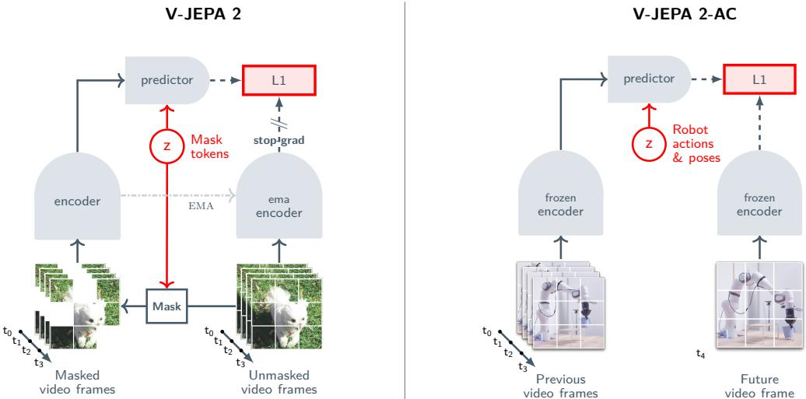  
Figure2 Multistage training. (Left) We first pretrain the V-JEPA 2 vido encoder on internet-scale image and atiea ioe nask s pl yopi se theoesTheerh pr mask viduc nutputs  bedivectorornu token. Next, theutput  thenc cntenate wise learnable mask tokenshat spehe posiithe aske pat, n subsey processed by the predictor. The outputs of the predictor are then regressed t the prediction targets using an L1 loss. The prediction targets are computed by an ema-encoder, the weights of which are defined as an exponential moving averageof the encoder weights. (Right) After pretraining, we freeze the video encoder and learn a new action-conditioned predictor, V-JEPA 2-AC, on top of the learned representation. We leverage an autoregressive faprcijecivavol riciherationsuimntine p vi cnsann-fat.Our-cpeorublc-cualtnpt a p  ne a from current and previous time steps.

# 2 V-JEPA 2: Scaling Self-Supervised Video Pretraining

We pretrain V-JEPA 2 on a visual dataset that includes over 1 million hours of video. The self-supervised trainin taskis basedon mask denoisin inrepresentation space and builds upon the V-JEPA framework (Bardes et al 2024). In this paper, we extend the V-JEPA framework by exploring larger-scale models, increasing the size of the pretraining data, and introducing a spatial and temporal progresive resolution training strategy that enables us to efficiently pretrain models beyond short 16-frame video clips.

# 2.1 Methodology

Mask-Denoising in Representation Space. The V-JEPA objective aims to predict the learned representation of a video $y$ from a view $x$ of that video that has been masked, i.e., from which patches have been randomly dropped (Figure 2, left). The task meta-architecture consists of an encoder, $E _ { \theta } ( \cdot )$ , which extracts video representations, and a predictor, $P _ { \phi } ( \cdot )$ , which predicts the representation of masked video parts. The encoder and predictor are trained simultaneously using the objective, where $\Delta _ { y }$ is a learnable mask token that indicates the locations of the dropped patches. The loss uses a stop-gradient operation, $\operatorname { s g } ( \cdot )$ , and an exponential moving average, $\overline { { \theta } }$ , of the weights $\theta$ of the encoder network to prevent representation collapse. The loss is applied only to the predictions of the masked patches.

$$
\begin{array} { r l } { \operatorname * { m i n i m i z e } _ { \theta , \phi , \Delta _ { y } } } & { { } \parallel P _ { \phi } ( \Delta _ { y } , E _ { \theta } ( x ) ) - \mathrm { s g } ( E _ { \overline { { \theta } } } ( y ) ) \parallel _ { 1 } , } \end{array}
$$

Architecture. The encoder, $E _ { \theta } ( \cdot )$ , and predictor, $P _ { \phi } ( \cdot )$ , are each parameterized as a vision transformer (Dosovitskiy et al, 2020) (or ViT). To encode relative position information in the vision transformer, we leverage RoPE (Rotary Position Embedding) instead of the absolute sincos position embedding used in Bardes et al. (2024) We use a 3D extension of traditional 1D-RoPE (Su et al., 2024) by partitioning the feature dimension into three approximately equal segments (for the temporal, height, and width axes) and applying the 1D rotations separately to the segment for each axis. We found that using 3D-RoPE instead of absolute sincos position embeddings (Vaswani et al., 2017) helps stabilize training for the largest models.To process a video with our transformer encoder, we first patchify it as a sequence of tubelets of size $2 \times 1 6 \times 1 6$ $( T \times H \times W )$ and employ the same multiblock masking strategy as in Bardes et al. (2024). Key Scaling Ingredients. In this section we introduce and study four additional key ingredients which :nable scaling the V-JEPA pre-training principle to obtain our V-JEPA 2 model. 1Data scaling: We increase the dataset size from 2 million to 2 million videos by leveraging and curating additional data sources. 2. Model scaling: We scale the encoder architecture from 300 million to over 1 billion parameters, going from a ViT-L to a ViT-g (Zhai et al., 2022). 3. Longer training: Adopting a warmup-constant-decay learning rate schedule simplifies hyperparameter tuning and enables us to extend training from 90 thousand up to 252 thousand iterations, effectively leveraging the additional data. 4. Higher resolution: We leverage the warmup-constant-decay schedule to efficiently scale to higher resolution video and longer video clips by training on shorter, lower-resolution clips during the warmup and constant phases, and then increasing resolution and/or clip-length during the final decay phase. The remainder of this section describes each of these ingredients in further detail and also quantifies the impact of each ingredient using the evaluation protocol described next. Evaluation Protocol. Our goal with model pretraining is to infuse general visual understanding into our encoder. We therefore evaluate our model and data design choices by assessing the quality of the model's learned representation on a set of six motion and appearance classification tasks: Something-Something v2 (Goyal et al., 2017), Diving-48 (Li et al., 2018), Jester (Materzynska et al., 2019), Kinetics (Kay et al., 2017), COIN (Tang et al., 2019), and ImageNet (Deng et al., 2009). We use a frozen evaluation protocol: we freeze the encoder weights and train a task-specific 4-layers attentive probe on its representation to output a predicted class. In this section, we focus mainly on the average accuracy across the six understanding tasks. Refer to Section 5 for additional details about the tasks, evaluation protocol, and results.

# 2.2 Scaling Self-Supervised Video Learning

We first present a summary of the key findings of our scaling analysis, where we investigate the impact of the four key ingredients on downstream task average performance. Figure 3 illustrates the effects of these scaling interventions on average accuracy across 6 classification tasks, using a ViT-L/16 model pretrained on 2 million videos with the V-JEPA objective as our baseline. Increasing the dataset from 2 million to 22 million videos (VM22M) yields a 1.0-point improvement. Scaling the model from 300 million to 1 billion parameters (ViT-g/16) provides an additional 1.5-point gain. Extending training from 90K to 252K iterations contributes another 0.8-point improvement. Finally, enhancing both spatial resolution ( $2 5 6 \to 3 8 4$ ) and temporal duration ( $1 6  6 4$ frames), during both pretraining and evaluation, boosts performance to $8 8 . 2 \%$ , representing a umulative 4.0-point improvement over the ViT-L/16 baseline. Each individual change provides a positive mpact, confirming the potential of scaling in video self-supervised learning (SSL).

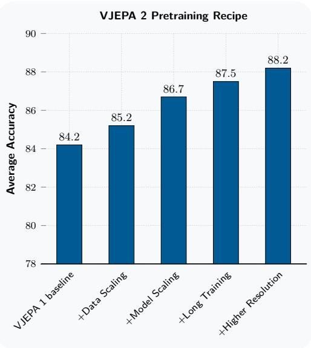  
Figure 3 Scaling Ingredients. The effects of scaling interventions on average accuracy across 6 image and video classification tasks (SSv2, Diving-48, Jester, Kinetics, COIN, ImageNet) using a ViT-L/16 model as baseline.

TablVideix2( rtraiDatat.Tbuilserat preraidatae,  b our y retrieval-based curation on YT1B to reduce noisy content (e.g., cartoon- or clipart-style).

<table><tr><td>Source</td><td>Samples</td><td>Type</td><td>Total Hours</td><td>Apply Curation</td><td>Weight</td></tr><tr><td>SSv2 (Goyal et al., 2017)</td><td>168K</td><td>EgoVideo</td><td>168</td><td>No</td><td>0.056</td></tr><tr><td>Kinetics (Carreira et al., 2019)</td><td>733K</td><td>ExoVideo</td><td>614</td><td>No</td><td>0.188</td></tr><tr><td>Howto100M (Miech et al., 2019)</td><td>1.1M</td><td>ExoVideo</td><td>134K</td><td>No</td><td>0.318</td></tr><tr><td>YT-Temporal-1B (Zellers et al., 2022)</td><td>19M</td><td>ExoVideo</td><td>1.6M</td><td>Yes</td><td>0.188</td></tr><tr><td>ImageNet (Deng et al., 2009)</td><td>1M</td><td>Images</td><td>n/a</td><td>No</td><td>0.250</td></tr></table>

# 2.3 Pretraining Dataset

Next, we describe the sources of videos and images that make up our pretraining dataset, and our approach to curating the dataset.

Scaling Dataset Size. We construct a large-scale video dataset by combining publicly available data sources. Using publicly-available sources in this work enables other researchers to reproduce these results. The overall dataset includes ego-centric videos from the Something-Something v2 dataset (SSv2) introduced in Goyal et al. (2017), exo-centric action videos from the Kinetics 400, 600, and 700 datasets (Kay et al., 2017; Carreira et al., 2018, 2019), YouTube tutorial videos from HowTo10oM (Miech et al., 2019), and general YouTube videos from YT-Temporal-1B (Zellers et al., 2022), which we refer to as YT1B. We also include images from the ImageNet dataset (Deng et al, 2009) toincrease the visual coverage of the pretrainin data. To enable joint image and video pretraining, we duplicate an image temporally and treat it as a 16-frame video where all frames are identical. During training, we sample from each data source with a weighting coefficient that we determined empirically via manual tuning. The resulting dataset, which we refer to as VideoMix22M (or VM22M), consists of 22 million samples. Table 1 lists these data sources and their weights. Figure 4 (Left) compares the performance of a ViT-L/16 pretrained on VM22M with a similar model trained on the smaller (2 million) VideoMix2M dataset from Bardes et al. (2024). Training on VM22M leads to a $+ 1$ point improvement on average performance on visual understanding tasks, compared to VM2M. Performance improvement is more prominent on appearance-based tasks such as Kinetics-400, COIN, and ImageNet, showing the importance of increasing visual coverage for those tasks.

Data Curation. YT1B is a large video dataset, consisting of 1.4 millon video-hours, with no curation and minimal fltering compared to smaller video datasets (like Kinetics and Something-Something v2). Because uncurated and unbalanced data can hinder model performance (Assran et al., 2022; Oquab et al., 2023), we flter T1Bby adapting a existigretrievalbas curatin pipeline to handlvideosSpeciicaly, weextrc scenes from YT1B videos, compute an embedding vector for each scene, and then use a cluster-based retrieval process (Oquab et al., 2023) to select video scenes according to a target distribution, which is composed of the Kinetics, Something-Something v2, COIN and EpicKitchen training datasets. We describe the details of the dataset construction procedure in Appendix A.2. Similar to Oquab et al. (2023), we ensure that none of the videos from the target validation sets are contained in the initial, uncurated data pool. In Figure 4 (Right), we compare the average performance on visual understanding evaluations between a ViT-L model pretrained on uncurated YT-1B data and a comparable model trained on our Curated-YT-1B dataset. Training with the curated dataset yields a +1.4 point average performance improvement over the uncurated baseline. Notably, the Curated-YT-1B-trained model achieves competitive performance relative to the full VM22M dataset at the ViT-L scale. However, larger-scale models benefit more from VM22M training (see Appendix A.2), suggesting that combining Curated-YT-1B with other data sources enhances scalability.

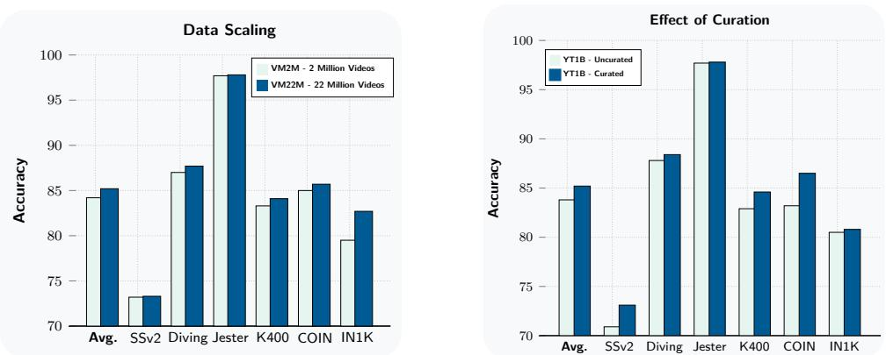  
Figure4 Data Scaling & Curation. We train and compare models on different data-mixes. Models are ViT-L/16 trai for90K iterations using a cosie learni schedule followiBardes al. (024).(Let) We compare the performance of a ViT-L/16 model pretrained on the VM2M dataset and our VM22M dataset. Training on the VM22M dataset leads to a $+ 1$ point improvement in average performance. Performance improvement is more pronounced on appearance-based tasks such as Kinetics-400, COIN, and ImageNet (Right) We compare the performance of a ViT-L/16 model pretrained on YT1B and a model pretrained on our Curated-YT1B dataset, which leverages our clustr-base cration.Trainnhe curatedataset lea . po provementaverg perr, showing the effectiveness of data-curation.

# 2.4 Pretraining Recipe

Scaling Model Size. To explore the scaling behavior of our model, we trained a family of encoder models with parameter counts ranging from 300 million (ViT-L) to 1 billion (ViT-g) parameters. All encoder architecture details are provided in Table 12 in the appendix. Note that each encoder uses the same predictor architecture, similar to a ViT-small. We report the average performance of these encoders on visual understanding tasks in Figure 5 (Left). Scaling the model size from 300 million (ViT-L) to 1 billion (ViT $^ \mathrm { g }$ ) parameters yields a +1.5 points average performance improvement. Both motion and appearance understanding tasks benefit from scaling, with SSv2 improving by $+ 1 . 6$ points and Kinetics by $+ 1 . 5$ points (cf.Table 4). These results confirm that self-supervised video pretraining effectively leverages larger model capacities, up to the 1B-parameter ViT-g.

Training Schedule. V-JEPA 2 model training employs a warmup-constant learning rate schedule followed by a cooldown phase (Zhai et al., 2022; Hägele et al., 2024). Similarly to Hägele et al. (2024), we found that this schedule performs comparably to a half-cosine schedule (Loshchilov and Hutter, 2016); it also makes eploring long training runs more cost-effective, since multiple cooldown runs can be started from differnt checkpoints of the constant phase. We simplified the recipe from Bardes et al. (2024) by maintaining fixed teacher EMA and weight decay coefficients instead of using ramp-up schedule, as these variations showed minimal impact on downstream understanding tasks. Figure 3 shows that extending the training schedule from 90K to 252K iterations yields a +0.8 average performance improvement with ViT-g models, validating thebenetsextenderaing urations.This hedulelsofaclitate progressiveraiing ycrealy increasing video resolution during the cooldown phase.

Efficient Progressive-Resolution Training. While most previous video encoders focus on short clips of 16 frames (roughly seconds) (Bardes et al., 2024; Wang et al., 2024b, 2023), we explore training with longer clips of up to 64 frames (16 seconds) at higher spatial resolutions. However, training time increases dramatically with longer durations and higher resolutions — training our ViT-g model on $6 4 \times 3 8 4 \times 3 8 4$ inputs would require roughly 60 GPU-years (see Figure 5, Middle). To reduce this, we adopt a progressive downstream performance. Our training process begins with a warmup phase where we train on 16-frame, $2 5 6 \times 2 5 6$ -resolution videos with linear learning rate warmup over 12K iterations, followed by a main training phase with a constant learning rate for 228K iterations. Then, during the cooldown phase, we increase video duration and resolution while linearly decaying the learning rate over 12K iterations. Hence the additional computational overhead associated with training on longer-duration, higher-resolution videos is onlyincurred durng thenal coldown phaseThisapprac enable effient hig-eolutin rainng:s shown in Figure (Middle), we achieve an $8 . 4 \times$ reduction in GPU time for a model that can ingest 64-frame, $3 8 4 \times 3 8 4$ resolution inputs, compared to directly training such a model from scratch at full resolution throughout all phases of training. Furthermore, we still observe the benefits of a model that can process longer-duration and higher-resolution inputs as discussed next.

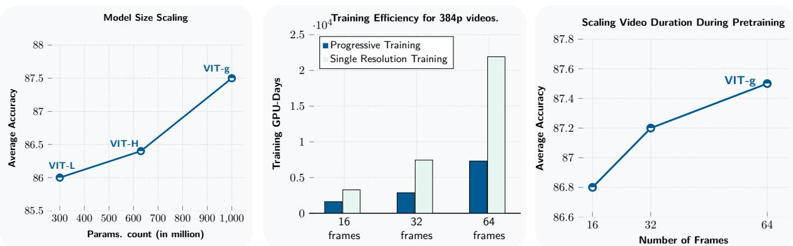  
Fiure5 Model Scaling.We explore the impact of scaling model size and input videoresolution.All models are traie on the VideoMix22M pretrainigdataset.(Left) Average performance across ix understanding tasks as a fnomo slMol rai wnsan ar teun pplatus tasks. We then cool down the model using 64 frames at $2 5 6 \times 2 5 6$ resolution and report post-cooldown performance. Scaling the model size from 300M to 1B parameters yields a $+ 1 . 7$ point average improvement. (Middle) Training times (GPU-days) for ViT $\mathbf { g }$ on A100 GPUs when training videos at $3 8 4 \times 3 8 4$ resolution with different numbers of frames per clip. We compare progressive resolution training (252K iterations at 16 frames / $2 5 6 \times 2 5 6$ resolution, followed by 12K cooldown iterations at $3 8 4 \times 3 8 4$ resolution) to the projected time for full-resolution training. Progressive training provides up to $8 \times$ speedup, significantly reducing the pretraining compute requirement. (Right) Effect of inscreasing vide duration at cooldown on downstream performance or ViT-gEven when onlyusing 16-frameclips uealatincsviratidurhecolo hasraprovver performance by $+ 0 . 7$ points.

Scaling temporal and spatial video resolution. Figure 5 examines how input video resolution affects downstream task performance. When increasing clip duration from 16 to 64 frames during pretraining while maintaining a fixed 16-frame evaluation duration, we observe a $+ 0 . 7$ percentage point average performance improvement (Figure 5, Right). Additionally, we see that increasing the vido duration and resolution during evaluation leads to a significant improvement across the tasks (refer to Table 4 and Appendix A.4.2). These results demonstrate that video self-supervised pretraining benefits from increased temporal resolution during both training and evaluation. Although we experimented with scaling to even longer video clips (128 and 256 frames), we did not observe any further improvement beyond 64 frames on this set of understanding tasks.

# 3 V-JEPA 2-AC: Learning an Action-Conditioned World Model

After pre-training, the V-JEPA 2 model can make predictions about missing part in videos. However, these predictions do not direcly take into account the causal eect  actions that an agent might take. In the next stage of training, described in this section, we focus on making the model useful for planning by leveraging a small amount of interaction data. To that end, we learn a frame-causal action-conditioned predictor on top of the frozen V-JEPA 2 video encoder (Figure 2, right). We train our model on data from the Droid dataset (Khazatsky et al., 2024) consisting of data from experiments with a table-top Franka Panda robot arm collected through teleoperation. We refer to the resulting action-conditioned model as V-JEPA 2-AC, and in Section 4 we show that V-JEPA 2-AC can be used within a model-predictive control planning loop to plan actions in new environments.

# 3.1 Action-Conditioned World Model Training

Our goal is to take the V-JEPA 2 model after pre-training and obtain a latent world model that can be used for control of an embodied agentic system via closed-loop model-predictive control To achieve this, wetrain V-JEPA 2-AC, an autoregressive model that predicts representations of future video observations conditioned on control actions and proprioceptive observations. In this section we describe a concrete instantiation of this framework for a tabletop arm with a fixed exocentric camera, and where control actions correspond to end-effector commands. The model is trained using approximately 62 hours of unlabeled video from the raw Droid dataset, which consists of short videos, typically 34 seconds long, of a 7-DoF Franka Emika Panda arm equipped with a two-finger gripper. Here, unlabeled video refers to the fact that we do not use additional meta-data indicating any reward, what type of task was being performed in each demonstration, or whether the demonstration was successful or not in completing the task being attempted. Rather, we only use the raw video and end-effector state signals from the dataset (each video in the dataset is accompanied by meta-data indicating the end-effector state in each frame — three dimensions for position, three for orientation, and one for the gripper state).

Model inputs. In each iteration of training we randomly sample a mini-batch of 4 second video clips from the Droid dataset, and, for simplicity, discard any videos shorter than 4 seconds, leaving us with a smaller subset of the dataset comprising under 62 hours of video. The video clips are sampled with resolution $2 5 6 \times 2 5 6$ and a frame-rate of 4 frames-per-second (fps), yielding 16 frame clips denoted by $( x _ { k } ) _ { k \in [ 1 6 ] }$ , where each $x _ { k }$ represents a single video frame. The robot's end-effector state in each observation is denoted by the sequence $( s _ { k } ) _ { k \in [ 1 6 ] }$ , where $s _ { k }$ is a real-valued 7D vector defined relative to the base of the robot. The first three dimensions of $s _ { k }$ encode the cartesian position of the end-effector, the next three dimensions encode its orientation in the form of extrinsic Euler angles, and the last dimension encodes the gripper state. We construct a sequence of actions $( a _ { k } ) _ { k \in [ 1 5 ] }$ by computing the change in end-effector state between adjacent frames. Specifically, each action $a _ { k }$ is a real-valued 7-dimensional vector representing the change in end-effector state between frames $k$ and $k + 1$ . We apply random-resize-crop augmentations to the sampled video clips with the aspect-ratio sampled in the range (0.75, 1.35).

Loss function. We use V-JEPA 2 encoder $E ( \cdot )$ as an image encoder and encode each frame independently in a given clip to obtain a sequence of feature maps $( z _ { k } ) _ { k \in [ 1 6 ] }$ , where $z _ { k } : = E ( x _ { k } ) \in \mathbb { R } ^ { H \times W \times D }$ with $H \times W$ denoting the spatial resolution of the feature map, and $D$ the embedding dimension. In practice, our feature maps are encoded using the ViT-g encoder and have the shape $1 6 \times 1 6 \times 1 4 0 8$ . Note that the encoder is kept frozen during this post-training phase. The sequence of feature maps, end-effector states, and actions are temporally interleaved as $( a _ { k } , s _ { k } , z _ { k } ) _ { k \in [ 1 5 ] }$ and processed with the transformer predictor network $P _ { \phi } ( \cdot )$ to obtain a sequence of next state representation predictions $\left( \hat { z } _ { k + 1 } \right) _ { k \in [ 1 5 ] }$ . The scalar-valued teacher-forcing loss function is finally computed as with $T = 1 5$ . We also compute a two-step rollout loss to improve the model's ability to perform autoregressive rollouts at inference time. For simplicity of exposition and with slight overloading of notation, let $P _ { \phi } ( \hat { a } _ { 1 : T } ; s _ { k } , z _ { k } ) \in \mathbb { R } ^ { H \times W \times D }$ denote the fnal predict staterepreentation btained byutoregressively running V-JEPA 2-AC with an action sequence $( \hat { a } _ { i } ) _ { i \in [ T ] }$ , starting from $\left( \boldsymbol { s } _ { k } , ~ \boldsymbol { z } _ { k } \right)$ . We can now denote the rollout loss as:

$$
\mathcal { L } _ { \mathrm { t e a c h e r - f o r c i n g } } ( \phi ) : = \frac { 1 } { T } \sum _ { k = 1 } ^ { T } \lVert \hat { z } _ { k + 1 } - z _ { k + 1 } \rVert _ { 1 } = \frac { 1 } { T } \sum _ { k = 1 } ^ { T } \left. P _ { \phi } \left( \left( a _ { t } , s _ { t } , E ( x _ { t } ) \right) _ { t \leq k } \right) - E ( x _ { k + 1 } ) \right. _ { 1 } ,
$$

$$
\mathcal { L } _ { \mathrm { r o l l o u t } } ( \phi ) : = \| P _ { \phi } ( a _ { 1 : T } , s _ { 1 } , z _ { 1 } ) - z _ { T + 1 } \| _ { 1 } .
$$

In practice we use $T = 2$ for computing the rollout loss, such that we only differentiate the predictor through one recurrent step. The overall training objective is thus given by and is minimized with respect to the predictor weights $\phi$ . For illustrative purposes, the training procedure is depicted in Figure 6 with $T = 4$ for both the teacher forcing and rollout loss.

$$
L ( \phi ) : = \mathcal { L } _ { \mathrm { t e a c h e r - f o r c i n g } } ( \phi ) + \mathcal { L } _ { \mathrm { r o l l o u t } } ( \phi ) ,
$$

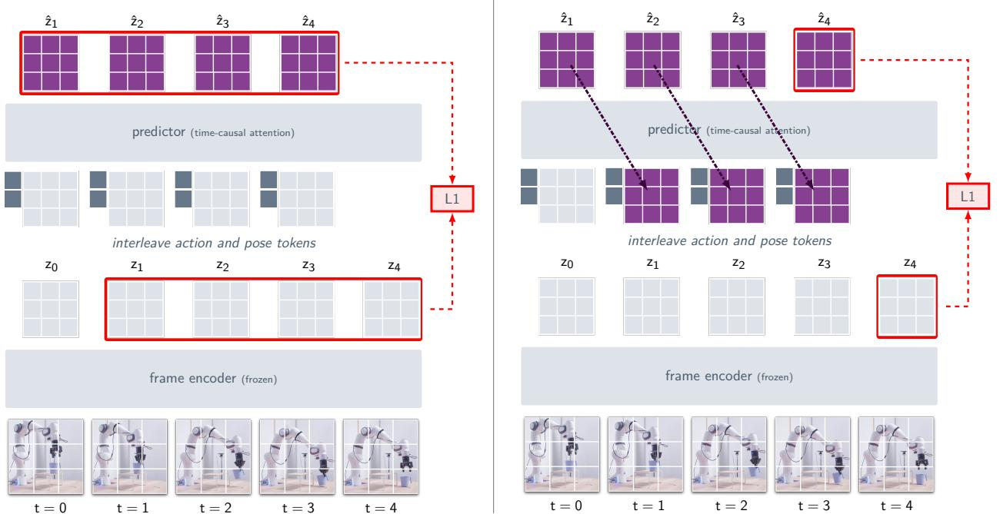  
VJEPA 2-AC Teacher Forcing Loss   
VJEPA 2-AC Rollout Loss   
Figue 6 V-JEPA 2-AC training.V-JEPA 2-AC is trained in a autorressive fshion, utilizing a teachr rci lo n aolout osLe) I thetea r os the preicr akes edin  the  me rerai unar echeathexte.R)Theolou f error accumulation during rollouts.

Architecture. The predictor network $P _ { \phi } ( \cdot )$ is a $\mathrm { \sim 3 0 0 M }$ parameter transformer network with 24-layers, 16 heads, 1024 hidden dimension, and GELU activations. The action, end-effector state, and fattened feature maps input to the predictor are processed with separate learnable affine transformations to map them to the hidden dimension of the predictor. Similarly, the outputs of the last attention block of the predictor go through a learnable affine transformation to map them back to the embedding dimension of the encoder. We use our 3D-RoPE implementation to represent the spatiotemporal position of each video patch in the fattened feature map, while only applying the temporal rotary positional embeddings to the action and pose tokens. We use a block-causal attention pattern in the predictor so that each patch feature at a given time step can attend to the action, end-effector state, and other patch features from the same timestep, as well as those from previous time steps.

# 3.2 Inferring Actions by Planning

Energy minimization. Given an image of the goal state, we leverage V-JEPA 2-AC for downstream tasks by planning. Specifically, at each time step, we plan an action sequence for a fixed time horizon by minimizing a goal-conditioned energy function. We then execute the first action, observe the new state, and repeat the process. Let $s _ { k }$ denote the current end-effector state, and $x _ { k }$ and $x _ { g }$ denote the current observed frame and goal image, respectively, which are separately encoded with the video encoder to obtain the feature maps $z _ { k }$ and . Given a planning horizon, $T$ , we optimize a sequence of robot actions, $( a _ { i } ^ { \star } ) _ { i \in [ T ] }$ , by minimizing a $z _ { g }$   
goal-conditioned energy function, such that $\begin{array} { r } { ( a _ { i } ^ { \star } ) _ { i \in [ T ] } : = \operatorname * { a r g m i n } _ { \hat { a } _ { 1 : T } } \mathcal { E } ( \hat { a } _ { 1 : T } ; \ z _ { k } , s _ { k } , z _ { g } ) } \end{array}$ . As illustrated in Figure 7, the model infers an action sequence $( a _ { i } ^ { \star } ) _ { i \in [ T ] }$ by selecting a trajectory that minimizes the L1 distance between the world model's imagined state representation $T$ steps into the future and its goal representation. In practice, we minimize (5) in each planning step using the Cross-Entropy Method (Rubinstein, 1997), and only execute the first action on the robot before re-planning, as in receding horizon control.

$$
\mathcal { E } ( \hat { a } _ { 1 : T } ; \ z _ { k } , s _ { k } , z _ { g } ) : = \| P ( \hat { a } _ { 1 : T } ; s _ { k } , z _ { k } ) - z _ { g } \| _ { 1 } ,
$$

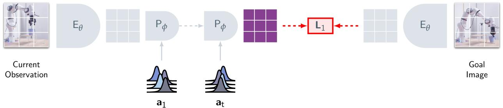  
Figure 7 Planning. We plan an action sequence for a fixed time horizon $T$ by minimizing the L1 distance between the world model's imagined state representation $T$ steps into the future and its goal representation. The L1 loss is optimized with respect to the actions $( a _ { k } ) _ { k \in [ T ] }$ using the cross-entropy method (Rubinstein, 1997). Specifically, in each pla epe samle het corat   pon he plahoi omq Gu isulzzan The atiaheo-r T pv before finally returning the mean of the sequence of Gaussians as the selected action trajectory.

# 4 Planning: Zero-shot Robot Control

In this section we demonstrate how V-JEPA 2-AC can be used to implement basic robot skill like reaching, grasping, and pick-and-place via model-predictive control. We focus on tasks with visual goal specification and show that V-JEPA 2-AC generalizes zero-shot to new environments.

# 4.1 Experimental Setup

Baselines. We compare the performance of V-JEPA 2-AC with two baselines, one vision-language-action model trained with behavior cloning, and one video generation-based world model.

The first baseline is based on the Octo video-language-action model that allows for goal-image conditioning (Octo Mode Team et al., 2024). We start from the open-source weights of the octo-base-1.5 version o the model, which is pretrained on the Open-X Embodiment dataset containing over 1M trajectories.1 We fine-tune the Octo model with behaviour cloning on the entire Droid dataset using hindsight relabeling (Andrychowicz et al, 2017; Ghosh et al., 2019) with image goals and end-effector states. In particular, we sample random segments of trajectories from the Droid dataset during training, and uniformly sample goal images up to 20 te arherjyWeuheloru ci Droid optimization hyperparameters, and leverage single side image view inputs at $2 5 6 \times 2 5 6$ resolution, a context of two previous frames, and a horizon of 4 future actions.

The second baseline we compare with is based on the Cosmos video generation model (Agarwal et al., 2025). We start with the open-source weights for the action-free Cosmos model (latent diffusion-7B with continuous tokenizer), which was trained on 20M hours of video, and we fine-tune the model on Droid using the offcially-released action-conditioned fne-tuning code. To improve performance when training on Droid, we (i) lowered the learning rate to match that used in the video-conditioned Cosmos recipe, (i) removed the dropout in the video conditioning to improve the training dynamics, and (ii) increased the noise level by a factor of $e ^ { 2 }$ , as we observed that the model trained with a lower noise factor struggled to leverage the information in the conditioning frame. Although the Cosmos technical report (Agarwal et al., 2025) mentions using world models for planningor model-predictive control s a future application, to the best o our knowledge this is the first reported attempt using Cosmos models for robot control.

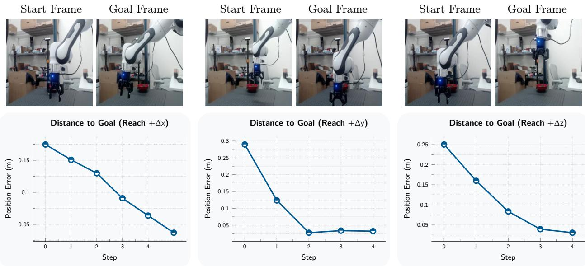  
Figure 8 Single-Goal Reaching.Single-goal reaching involves moving the end-effector to a desired location in sabasn  sg lageThis tasasuresor basdeandictins as we  3 understanding f the scene including depth,from the onocular RGB camera In each step, we use V-JEPA 2-ACto plan ie san tweodeatur aeere an  ereati the al amThe s ct h ee boe -pan he ex im e. Duri plani w smle dividalctons he LBalrads 0.07 ctere at the rTu h maximum achievable decrease in cartesian distance to the goal in a single step is 0.13 (\~13 cm).

Robot deployment. All models are deployed zero-shot on Franka Emika Panda arms with RobotiQ grippers, located in twodifferent labs, neither  whic appears in the Droid dataset.isual input is provided through an uncalibrated low-resolution monocular RGB camera. The robots use the same exact model weights and inference code, and similar low-level controllers based on operational space control. We use blocking control for both the V-JEPA 2-AC world model and Cosmos world model (i.e., the system waits for the last commanded action to be completed before sending a new action to the controller) and experiment with both blocking and non-blocking control for Octo, and report the best performance across the two options. When planning with V-JEPA 2-AC and Cosmos, we constrain each sampled action to the L1-Ball of radius 0.075 centered at the origin, which corresponds to a maximum end-effector displacement of approximately 13 cm for each individual action, since large actions are relatively out-of-distribution for the models.

# 4.2 Results

Single-goal reaching. First, we evaluate on the task of single-goal reaching, which involves moving the end-effector to a desired location in space based on a single goal image. This task measures for a basic understanding of actions as well as a 3D spatial understanding of the scene (including depth) from the monocular RGB camera. Figure 8 shows the Euclidean distance between the end-effector and its goal position during robot execution for three different single-goal reaching tasks. In all cases, the model is able to move the end-effector within less than 4 cmof its goal position, and select actions that lead to a monotonic decrease in the error. This can be seen as a form of visual servoing (Hill, 1979), wherein visual feedback from a camera is used to control a robot's motion. However, unlike classical approaches in visual servoing, V-JEPA 2-AC achieves this by training on unlabeled, real-world video data. In Figure 9, we visualize the V-JEPA 2-AC energy landscape from equation (5) for the $\Delta y$ reaching task as a function fa single cartesian-control action swepig $\Delta x$ and $\Delta y$ while holding $\Delta z = 0$ fixed. The energy function achieves its minimum near the ground-truth action, providing further evidence that the model has learned to reasonably infer the efect of actions without requiring precision sensing It is also interesting to observe that the energy landscape induced by V-JEPA 2-AC is relatively smooth and locally convex, which should facilitate planning.

Prehensile manipulation. Next, we evaluate all models on more challenging prehensile object manipulation tasks, namely grasp, reach with object, and pick-and-place. Success rates are reported in Table 2 and Table 3, and averaged across 10 trials with various permutations to the task across trials (e.g., object location, starting pose, etc.). For the grasp and reach with object tasks the model is shown a single goal image. For the pick-and-place tasks we present two sub-goal images to the model in addition to the final goal. The first goal image shows the object being grasped, the second goal image shows the object in the vicinity of the goal position. The model first optimizes actions with respect to the first sub-goal for 4 time-steps before automatically switching to the second sub-goal for the next 10 time-steps, and finally the third goal for the last 4 time-steps. Examples of robot execution for the pick-and-place task are shown in Figure 10. Start and goal frames for all individual tasks in Lab 1 are shown in Appendix B.2. The grasp task requires precise control from visual feedback to correctly grip the object. The reach with object task requires the model to navigate while holding an object, which necessitates a basic understanding of intuitive physics to avoid dropping the object. Finally, the pick-and-place task tests for the ability to compose these atomic skills.

While all models achieve a high success-rate on reach, differences in performance are more apparent on tasks involving object interaction. We observe that the success-rate for all models depends on the type of object being manipulated. For instance, we find that the cup is mostly easily grasped by placione fngernsidethe ject andgripiaround the rim, however  the contro actions producd by the model are not accurate enough, the robot wil mis the rim of the cup and fil to grasp the object. When manipulating the box, there are many more feasible grasping confgurations, however, the model requires more pregipper contrl t esur that the ngers are open wideenough to grasp the jec.Weee that, fo al models, the variation i success-rate with respect to the object type is due to the combination of sub-optimal actions and the unique challenges associated with manipulating each respective object. Nonetheless, we see that the V-JEPA 2-AC model achieves the highest success-rate across al tasks, highlighting the feasibility latent planning for robot manipulation.

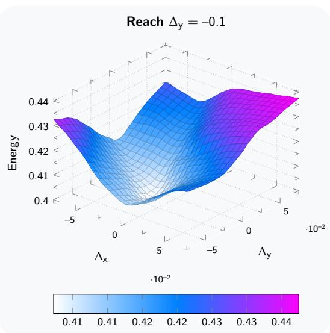  
Figure 9 V-JEPA 2-AC Energy Landscape. Energy landscape for single-goal reaching task with respect to end-effector cartesian-control action (sweeping $\Delta x$ and $\Delta y$ while holding $\Delta z = 0$ fixed); ground truth action relating goal image to start frame is located at $( \Delta x , \Delta y ) = ( 0 , - 0 . 1 )$ . We see that the energy function achieves its minimum around $( \Delta x , \Delta y ) \approx ( 0 , - 0 . 0 5 )$ , indicating that the model has learned to reasonably infer the effect of actions without requiring precision sensing.

In Table 3, we compare planning performance when using V-JEPA 2-AC versus the Cosmos action-conditioned video generation model based on latent diffusion. In both cases we leverage the cross-entropy method (Rubinstein, 1997) for optimizing the sequence of actions using a single NVIDIA RTX 4090 GPU, and construct the energy function by encoding the goal frame in the latent space of the model, as in equation (5). With 80 samples, 10 refinement steps, and a planning horizon of 1, it takes 4 minutes to compute a single action in each planning step with Cosmos. While we achieve a high success rate of 80% on the reach tasks when using Cosmos, performance on object interaction tasks is weaker. Note that under a planning time of 4 minutes per action, a full pick & place trajectory requires over one hour of robot execution. By contrast, with $1 0 \times$ more samples in each refinement step, the V-JEPA 2-AC world model requires only 16 seconds per action and leads to higher performance across all considered robot skills. We can potentially reduce the planning time for both models in future work by leveraging additional computing resources for planning, reducing the number

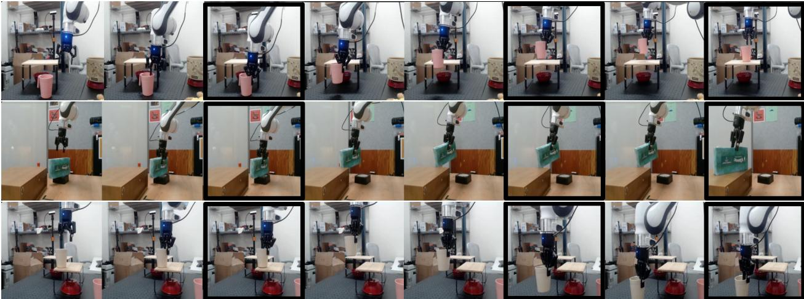  
Figure 10 Pick- $\&$ -Place. Closed-loop robot execution of V-JEPA 2-AC for multi-goal pick-&-place tasks. Highlighted frame idicate when the modelchieves a sub-goal and switcheso the next gl. The rst gal age shows the o biaspe the oglhowshejctheiy  thedes can nd thh gl image shows the object placed i the desired positonThe model frst optimize actions with respect t the frst su-goal or 4 timestes beoeutatialy itchinthesecon su-goal o the ext 10 timestes an fnally the thir gl orthe last 4timsteps.Robo actions ar eretro gal-condite planninThe V-JEPA-ACmode is ble peroze-shot pick-place sk twFrank arms iffet as wit u object configurations and cluttered environments.

Table2 Zero-Shot Robot Manipulation. All models are deployed zero-shot on two Franka arms with RobotiQ procatfnt absGivegegoals reacderaskl moels u cose l seqchive  aoriv et task across trials (e.g., object location, starting pose, etc.).

<table><tr><td rowspan="2">Method</td><td rowspan="2">Reach</td><td rowspan="2"></td><td colspan="2">Grasp</td><td colspan="2">Reach w/ Obj.</td><td colspan="2">Pick-&amp;-Place</td></tr><tr><td>Cup</td><td>Box</td><td>Cup</td><td>Box</td><td>Cup</td><td>Box</td></tr><tr><td rowspan="3">Octo (Octo Model Team et al., 2024)</td><td>Lab 1</td><td>100%</td><td>20%</td><td>0%</td><td>20%</td><td>70%</td><td>20%</td><td>10%</td></tr><tr><td>Lab 2</td><td>100%</td><td>10%</td><td>0%</td><td>10%</td><td>70%</td><td>10%</td><td>10%</td></tr><tr><td>Avg</td><td>100%</td><td>15%</td><td>0%</td><td>15%</td><td>70%</td><td>15%</td><td>10%</td></tr><tr><td rowspan="3">V-JEPA 2-AC (ours)</td><td>Lab 1</td><td>100%</td><td>70%</td><td>30%</td><td>90%</td><td>80%</td><td>80%</td><td>80%</td></tr><tr><td>Lab 2</td><td>100%</td><td>60%</td><td>20%</td><td>60%</td><td>70%</td><td>80%</td><td>50%</td></tr><tr><td>Avg</td><td>100%</td><td>65%</td><td>25%</td><td>75%</td><td>75%</td><td>80%</td><td>65%</td></tr></table>

of samples and refinement steps used at each time step, training a feed-froward policy in the world-models' imagination to initialize the planning problem, or potentially leveraging gradient-based planning in the case of V-JEPA 2-AC.

# 4.3 Limitations

Sensitivity to camera positioning. Since the V-JEPA 2-AC model is trained to predict representations of the next video frame given an end-effector Cartesian control action, without anyexplicit camera calibration, it must therefore implicitly infer the action coordinate axis from the monocular RGB camera input. However, in many cass, the robot base is not visible n the camer frame, and thus the problem  inferring thectn coordinate axis is not well defined, leading to errors in the world model. In practice, we manually tried different camera positions before settling on one that worked wel across all of our experiments. We conduct a quantitative analysis of the V-JEPA 2-AC world model's sensitivity to camera position in Appendix B.4. Long horizon planning. Long horizon planning with world models is limited by a number of factors. First, autoregressive prediction suffers from error accumulation: the accuracy of the representation-space Table 3 Planning Performance. Comparing closed-loop robot manipulation using MPC with V-JEPA 2-AC world mel n Css worl mode. Inboh ca e leve hecoss-tro metho (Rubisi 97or tzi the cs us  ig NVIDIA RTX 90 GPU.For  rbo sk wevalatemode ac 10 sk anveehe esulsWispls re tepsan  plhorzo   it ak compute a single action n eac planing step with Cosmos, which is an action-conditionedvidogeneration model boha n  n  p over one hour. By contrast, with $1 0 \times$ more samples in each refinement step, the V-JEPA 2-AC world model requires only 16 seconds per action and leads to higher performance across all considered robot skills.

<table><tr><td>Lab 2</td><td colspan="5">Planning Details</td><td colspan="2">Grasp</td><td colspan="2">Pick-&amp;-Place</td></tr><tr><td>Method</td><td>#Samples</td><td>Iter.</td><td>Horizon</td><td>Time</td><td>Reach</td><td>Cup</td><td>Box</td><td>Cup</td><td>Box</td></tr><tr><td>Cosmos (Agarwal et al., 2025)</td><td>80</td><td>10</td><td>1</td><td>4 min.</td><td>80%</td><td>0%</td><td>20%</td><td>0%</td><td>0%</td></tr><tr><td>V-JEPA 2-AC (ours)</td><td>800</td><td>10</td><td>1</td><td>16 sec.</td><td>100%</td><td>60%</td><td>20%</td><td>80%</td><td>50%</td></tr></table>

predictions decreases with longer autoregressive rollouts, thereby making it more diffult to reliably plan over long horizons. Second, long-horizon planning increases the size of the search space: the number of possible action trajectories increases exponentially given a linear increase in the planning horizon, thereby makng it computationally challenging to plan over long horizons.On the other hand, long-horizon planning is necessary for solving non-greedy prediction tasks, e.g., pick-and-place without mage sub-goals. Future work exploring world models for long-horizon planning will enable the solution of many more complex and interesting tasks. Image goals. Following many previous works in goal-conditioned robot manipulation (Finn and Levine, 21; Lynch et al., 2020;Chebotar et al 2021; Jang et al 2022; Liuet al 2022;Guptaet al 2022), u current formulation of the optimization target assumes that we have access to visual goals. However, when deploying robots in-the-wild, it may be more natural to epress goals in otherforms, such s with langge. Future work that aligns latent action-conditioned world models with language models will step towards more general task specification via natural language.

# 5 Understanding: Probe-based Classification

The capabilities of a representation-space world model, such as V-JEPA 2-AC discussed above, are inherently limited by the stateinformation encoded in the learned representation space. In this section and subsequent sections, we probe the representations learned by V-JEPA 2 and compare the V-JEPA 2 encoder to other vision encoders on visual classification. Visual classification tasks can focus either on appearance understanding or motion understanding. While appearance understanding tasks can generally be solved using information visible in a single frame of an input video clip (even when the classification labels describe actions), motion understanding tasks require several frames to correctly classify a video (Goyal et al, 2017).To ensure a balanced evaluation of both motion and appearance, we have selected three motion understanding tasks, namely Something-Something v2 (SSv2), Diving-48, and Jester, which require the model to understand human gestures and movements. For appearance understanding, we have chosen Kinetics400 (K400), COIN, and ImageNet (IN1K), which involve recognizing actions, scenes, and objects. Empirically, we show that V-JEPA 2 outperforms state-of-the-art visual encoders on motion understanding tasks, while being competitive on appearance understanding tasks. Attentive Probe. We train an 4-layers attentive probe on top of the frozen encoder output using the training data from each task. Our attentive probe is composed of four transformer blocks, the last of which replaces standard self-attention with a cross-attention layer using a learnable query token. Follwing standard practice, several clips with a fixed number of frames are sampled from a video during inference. The classification logits are then averaged across clips. We keep the resolution similar to the one used for V-JEPA 2 pretraining. We ablate the number of layers of our attentive probe in Appendix C.2, and also provide ull details on the number of clips, clip size, andother hyperparameters used in the downstream tasks.

Table4 Action and Object Classification.We report the classification performance f VJEPA 2 models pretaie on 64 frames at resolution $2 5 6 \times 2 5 6$ for all models, except V-JEPA 2 ViT-g384 which was pretrained at resolution $3 8 4 \times 3 8 4$ , on action and object classification, and compare their performance with state-of-art image and video encoders. All models follow the same evaluation protocol except for V-JEPA 2 ViT-g384. We use $2 5 6 \times 2 5 6$ resolution with $1 6 \times 2 \times 3$ inputs for SSv2 (16 frames clip, 2 temporal crops, 3 spatial crops), $1 6 \times 8 \times 3$ for K400, $3 2 \times 8 \times 3$ for COIN and $3 2 \times 4 \times 3$ for Diving-48 and Jester. V-JEPA 2 ViT-g384 uses a higher resolution of $3 8 4 \times 3 8 4$ for all six tasks, and additionally uses $6 4 \times 2 \times 3$ inputs for SSv2 and 32x8x3 inputs for COIN. Our V-JEPA 2 ViT-g significantly ouerfors hr sn encoern motin understandiasks nd is petitivn pearance asks. Itve the be pe 87.nncerJEAViT-8rtpv ul consistently across tasks, reaching 88.2 average performance. $* \colon \mathrm { P E } _ { \mathrm { c o r e } } \mathbf { G }$ achieves an accuracy $8 9 . 8 \%$ on ImageNet u different probe architecture in our case.

<table><tr><td colspan="4"></td><td colspan="3">Motion Understanding</td><td colspan="3">Appearance Understanding</td></tr><tr><td colspan="2">Method</td><td>Param.</td><td>Avg.</td><td>SSv2</td><td>Diving-48</td><td>3 Jester</td><td>K400</td><td>COIN</td><td>IN1K</td></tr><tr><td colspan="10">Results Reported in the Literature</td></tr><tr><td colspan="10">VideoMAEv2 (Wang et al., 2023) 1B</td></tr><tr><td>InternVideo2-1B(Wang et al., 2024b)</td><td></td><td>1B</td><td></td><td>56.1 67.3</td><td></td><td></td><td>82.8 87.9</td><td></td><td>71.4</td></tr><tr><td>InternVideo2-6B (Wang et al., 2024b)</td><td></td><td>6B</td><td></td><td>67.7</td><td></td><td></td><td>88.8</td><td></td><td></td></tr><tr><td>VideoPrism (Zhao et al., 2024)</td><td></td><td>1B</td><td></td><td>68.5</td><td>71.3</td><td></td><td>87.6</td><td></td><td></td></tr><tr><td colspan="10">Image Encoders Evaluated Using the Same Protocol</td></tr><tr><td colspan="10"></td></tr><tr><td>DINOv2 (Darcet et al., 2024)</td><td></td><td>1.1B 1.9B</td><td>81.1</td><td>50.7</td><td>82.5</td><td>93.4</td><td>83.6</td><td>90.7</td><td>86.1</td></tr><tr><td>PEcoreG (Bolya et al., 2025) SigLIP2 (Tschannen et al., 2025)</td><td></td><td>1.2B</td><td>82.3 81.1</td><td>55.4 49.9</td><td>76.9 75.3</td><td>90.0 91.0</td><td>88.5 87.3</td><td>95.3 95.1</td><td>87.6* 88.0</td></tr><tr><td colspan="10">Video Encoders Evaluated Using the Same Protocol</td></tr><tr><td colspan="10"></td></tr><tr><td>V-JEPA ViT-H (Bardes et al., 2024) InternVideo2s2-1B(Wang et al., 2024b)</td><td>600M 1B</td><td>85.2 87.0</td><td></td><td>74.3</td><td>87.9</td><td>97.7 97.0</td><td>84.5</td><td>87.1</td><td>80.0</td></tr><tr><td></td><td></td><td></td><td></td><td>69.7</td><td>86.4</td><td></td><td>89.4</td><td>93.8</td><td>85.8</td></tr><tr><td>V-JEPA 2 ViT-L</td><td>300M</td><td>86.0 86.4</td><td></td><td>73.7</td><td>89.0</td><td>97.6 97.7</td><td>85.1</td><td>86.8</td><td>83.5</td></tr><tr><td>V-JEPA 2 ViT-H V-JEPA 2 ViT-g</td><td>600M 1B</td><td>87.5</td><td></td><td>74.0</td><td>89.8</td><td>97.7</td><td>85.3</td><td>87.9</td><td>83.8</td></tr><tr><td>V-JEPA 2 ViT-g384</td><td>1B</td><td>88.2</td><td></td><td>75.3</td><td>90.1</td><td>97.8</td><td>86.6</td><td>90.7</td><td>84.6</td></tr><tr><td></td><td></td><td></td><td></td><td>77.3</td><td>90.2</td><td></td><td>87.3</td><td>91.1</td><td>85.1</td></tr></table>

Evaluation protocol. We compare the performance of V-JEPA 2 on motion and appearance tasks with several othervisual encodersDNOv2 with registers (Darcet e al 2024)isthe current state-of-the-art model for self-supervised learning with images, while SigLIP2 (Tschannen et al., 2025) and the Perception Encoder PE $\mathrm { c o r e }$ G (Bolya et al., 2025) are two state-of-the-art models for image-text contrastive pretraining. We also coider two video encoders:the self-supervised JEPA (Bardes et al. 2024), and InternVid2 $s 2$ 1B (Wang et al., 2024b) which relies primarily on vision-text contrastive pretraining.

We use the same evaluation protocol for every baseline and for V-JEPA 2, learning an attentive probe on top of the frozen encoder, similar to Bardes et al. (2024). We adapt image-based models to video following the procedure used in Oquab et al. (2023), concatenating the features of each input frame. For InternVideo2 $s 2$ -1B, we use its image positional embedding for the ImageNet task, and for video tasks we interpolate its positional embedding from 4 frames to 8, producing a token count similar to V-JEPA 2. Despite using a common evaluation protocol, the baseline encoders are trained on different data (e.g., DINOv2 on LVD-142M, PE $\mathbf { c o r e }$ G on MetaCLIP) and are thus not directly comparable. We can therefore only compare different approaches at asystem level;i with aconsistent evaluatin protocol despitedifferencesn trainin protocol and data We alsoinclude existing results from the literature using a similar frozen protocol, but with potentially diffeent attentive head architecture. In particular, we share reported results of VideoMAEv2 (Wang et al., 2023), InternVideo-1B and 6B (Wang et al., 2024b), and VideoPrism (Zhang et al., 2024c) on the classification tasks we consider, when available. We provide complete evaluation and hyperparameters in Appendix C.1. Results. Table 4 reports the classification performance of V-JEPA 2, the other encoders we evaluated, and other notable results reported in the literature.V-JEPA 2 ViT-g (at 256 resolution) significantly outperforms other vision encoders on motion understanding tasks. It achieves a top-1 accuracy of 75.3 on SSv2 compared to Table 5 Prediction: Human Action Anticipation. Comparison with the state-of-the-art on the EK100 Action Anticipation benchmark.Wereport mean-class recalat or ver, noun and actio n the vlidation se  EK100. VJEPA ez ahe.   

<table><tr><td rowspan="2">Method</td><td rowspan="2">Param.</td><td colspan="3">Action Anticipation</td></tr><tr><td>Verb</td><td>Noun</td><td>Action</td></tr><tr><td>InAViT (Roy et al., 2024)</td><td>160M</td><td>51.9</td><td>52.0</td><td>25.8</td></tr><tr><td>Video-LLaMA (Zhang et al., 2023)</td><td>7B</td><td>52.9</td><td>52.0</td><td>26.0</td></tr><tr><td>PlausiVL (Mittal et al., 2024)</td><td>8B</td><td>55.6</td><td>54.2</td><td>27.6</td></tr><tr><td>Frozen Backbone</td><td></td><td></td><td></td><td></td></tr><tr><td>V-JEPA 2 ViT-L</td><td>300M</td><td>57.8</td><td>53.8</td><td>32.7</td></tr><tr><td>V-JEPA 2 ViT-H</td><td>600M</td><td>59.2</td><td>54.6</td><td>36.5</td></tr><tr><td>V-JEPA 2 ViT-g</td><td>1B</td><td>61.2</td><td>55.7</td><td>38.0</td></tr><tr><td>V-JEPA 2 ViT-g384</td><td>1B</td><td>63.6</td><td>57.1</td><td>39.7</td></tr></table>

69.7 for InternVideo and 55.4 for PE $C o r e$ G. V-JEPA 2 is also competitive on appearance tasks, reaching 84.6 on ImageNet (a +4.6 point improvement over V-JEPA). Overall V-JEPA 2 obtains the best average performance across all six tasks, compared to other video and image encoders. The higher-resolution, longer-duration V-JEPA 2 ViT-g384 shows further improvement across all tasks, reaching 88.2 average performance.

# 6 Prediction: Probe-based Action Anticipation

Action anticipation consists in predicting the future action given a contextual video clip leading up to some time before the action. Using the Epic-Kitchens-100 (EK100) benchmark (Damen et al, 2022), we demonstrate that V-JEPA 2 action anticipation performance increases consistently with model size. Furthermore, despite only using an attentive probetrained on top of V-JEPA 2 representations, we show that V-JEPA 2 signiicantly outperforms prior state-of-the-art approaches that were specifically designed for this task.

Task. The EK100 dataset is comprised of 100 hours of cooking activities recorded from an egocentric perspective across 45 kitchen environments. Each video in EK100 is annotated with action segments, which include a start timestamp, an end timestamp, and an action label. There are 3,568 unique action labels, each consisting of a verb and a noun category, with a total of 97 verb categories and 300 noun categories. The EK100 action anticipation task involves predicting noun, verb, and action (i.e., predicting verb and noun jointly)froma video clip, referred to as context, that occurs before the start timestamp o an action sement. The interval between the end f the context and the begining of the action segment is the anticipation time, whic is set to 1 second by default. Given that different future actions may be possible from a given context, mean-class recall-at-5 is used as the metric to measure performance (Damen et al., 2022).

Anticipation Probe. An attentive probe is trained on top of the frozen V-JEPA 2 encoder and predictor to anticipate future actions. Specifically, we sample a video clip that ends 1 second before an action starts. This video context is fed to the V-JEPA 2 encoder. The predictor takes the encoder representation, along with the mask tokens corresponding to the frame 1 second into the future, and predicts the representation of the future video frame. The outputs of the predictor and encoder are concatenated along the token dimension and fed to an attentive probe with a similar architecture to those used in Section 5, with the difference being that the anticipation probe's final cross-attention layer learns three query tokens (as opposed to one), and eac query output is fed to a different linear classifer to predict the action category, the verb category, and the noun category respectively. A focal loss (Lin et al., 2017) is applied to each classifer independently and then summed before backpropagating through the shared atention blocks of the probe. We provide additional details and evaluation hyperparameters in Appendix D.1. Baselines. We compare our model with three baselines that are trained specifically for action anticipation: InAViT (Roy et al, 2024) is a a supervised approach that leverages explicit hand-object interaction modeling, and Video-LLaMA (Zhang et al, 2023) and PlausiVL (Mittal et al, 2024) are both approaches that leverage a large language model, with up to 7 billion parameters.

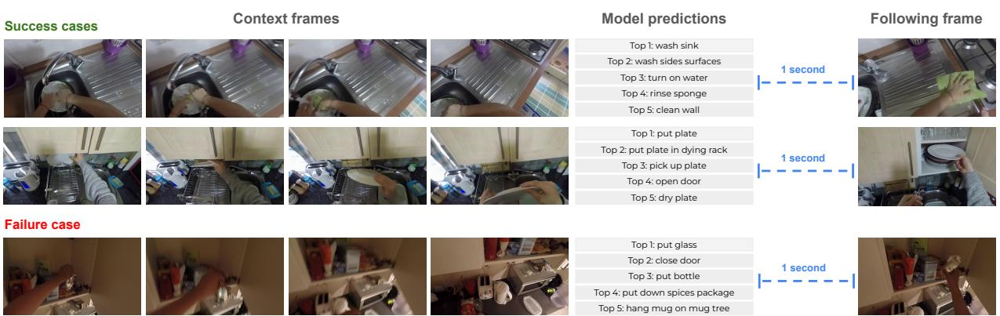  
Figure11 Visualization of EK100 prediction. (Left): four selected frames from the context frames. (Middle): m predictions ordered b lkeiod.Right):owrameter hesecoantipationtimeWe sho w examples where the model is successful and one example where the model fails.

Results. Table 5 summarizes the results on the EK100 action anticipation benchmark. We compare V-JEPA 2 ViT-L, ViT-H and ViT-g encoders, increasing parameter count from 300 millions to 1 billion. All three leverage 32 frames with 8 frames per second at resolution $2 5 6 \times 2 5 6$ as video context. We also report results of ViT-g384 which uses a resolution of $3 8 4 \times 3 8 4$ . V-JEPA 2 demonstrates a linear scaling behavior with respect to model size, in terms of action prediction recall-at-5. V-JEPA 2 ViT-L with 300 million parameters achieves 32.7 recal-at-5. Increasing the size of the model to 1 billon parameters leads to a $+ 5 . 3$ point improvement with an action recall-at-5 of 38.0. Furthermore, V-JEPA 2 benefits from using a context with higher resolution, and V-JEPA 2 ViT-g384 at resolution $3 8 4 \times 3 8 4$ improves recall-at-5 by an additional +1.7 points over the other models using $2 5 6 \times 2 5 6$ resolution. V-JEPA 2 outperforms the previous state-of-the-art model PlausiVL by a significant margin, even with its 300 million parameters compared to the 8 billion parameters used in PlausiVL. In particular, V-JEPA 2 ViT $\mathrm { 8 3 8 4 }$ demonstrates a $+ 1 2 . 1$ points improvement over PlausiVL on action recall-at-5, corresponding to a $4 4 \%$ relative improvement. In Figure 11 we visualize V-JEPA 2 predictions on three samples from the EK100 validation set, two where the model is successful and one where the model fails. For both succesful examples, V-JEPA 2 not only retrieves the correct action correctly with top 1 confidence, but also proposes coherent top 2 to 5 actions, based on the given context. For example, in the top row, the correct action is "wash sink", but "turn on wateror "clean wall would both have been valid actions given the preence o a tap and a walThe model also predicts "rinse sponge, which is the current action being performed, probably assuming that this action could still be going on after 1 second. For the failure case, V-JEPA 2 still proposes coherent actions such as "close door" and "put down spices package", but misses the exact nature of the object: "tea package". Limitations. V-JEPA 2 and the EK100 benchmark have several limitations. First, V-JEPA 2 does not fully solve EK100, there are failure cases where the modeleither gets the verb, the noun, or both wrong. We study the distribution of these failures in Appendix D.. Second, we focus here on predicting actions with a 1 second anticipation time. The accuracy of V-JEPA 2 degrades when predicting at longer time horizons, see Appendix D.2. Third, the EK100 benchmark is limited to kitchen environments, with a closed well-defined vocabulary, and we do not know how well V-JEPA 2 generalizes to other environments. This limits the utlity and applicability of models trained on EK100. Lastly, actions in EK100 are chosen from a fxed set of categories, making it impossible to generalize to action categories not present in the training set.

# 7 Understanding : Video Question Answering

In this section, we explore V-JEPA 2's ability to perform open-language video question answering (VidQA). To enable language capabilities, we train a Multimodal Large Language Model (MLLM) using V-JEPA 2 as the visual encoder in the non-tokenized early fusion (Wadekar et al., 2024) setup popularized by the LLaVA family of models (Li et al, 2024b). In this family of MLLMs, a visualencoder is aliged with a large language model by projecting the output patch embeddings of the vision encoder to the input embedding space of the LLM. The MLLM is then trained either end-to-end, or with a frozen vision encoder. The majority of the encoders used in MLLMs for VidQA are typically image encoders, which are applied independently per-frame for video inputs (Qwen Team et al, 2025; Zhang et al., 2024b). Popular instances of such encoders are CLIP (Radford et al, 2021), SigLIP (Tschannen et al., 2025), and Perception Encoder (Bolya et al., 2025), which are chosen primarily due to their semantic alignment with language, obtained by pretraining with image-caption pairs. To the best of our knowledge, our work is the first to use a video encoder that is pretrained without any language supervision, to train an MLLM for VidQA.

MLLM performance on downstream tasks is also highly dependent on the alignment data. In these experiments we use a dataset of 88.5 millon image- and video-text pairs, similar to what was used to train PerceptionLM (Cho et al., 2025). To demonstrate the effectiveness of the V-JEPA 2 encoder, first we compare V-JEPA 2 wit other state-o-the-art vision encoders in a cntrolled data setup in Section7.2, using asubse o 18 millon samples. Then, in the same controlled setup, we show that scaling the vision encoder and input resolution size both consistently improve VidQA performance in Section 7.3. Finaly, we scale the alignment data, using the ull885 million samples to test the limits o languagealignment with VJEPA  in Sectn7.4. Our results demonstrate that in a controlled data setup, V-JEPA 2 obtains competitive performance on open-ended VidQA tasks compared to other vision encoders. Upon scaling the alignment data, V-JEPA 2 achieves state-of-the-art performance on several VidQA benchmarks.

# 7.1 Experiment Setup

Video Question Answering Tasks. We evaluate on PerceptionTest (Ptrucean et al., 2023), which assesses model performance across different skills such as memory, abstraction, physics, and semantics. Additionally, we evaluate on the MVP dataset (Krojer et al, 2024) for physical world understanding, which uilizs a minimal-video pair evaluation ramework to mitigate text and appearance biases. We also evaluate on TempCompass, TemporalBench and TOMATO (Liu et al., 2024c; Cai et al., 2024; Shangguan et al., 2024) to investigate temporal understanding, and memory capabilities of models. Finally, we report results on general understanding ability using MVBench (Li et al., 2024c), which has a bias towards single-frame appearance features (Krojer et al., 2024; Cores et al., 2024), and TVBench (Cores et al, 2024), which is proposed in the literature as an alternative for general and temporal understanding, mitigating those biases.

Visual Instruction Tuning. To evaluate the V-JEPA 2 representations on visual-question answering tasks, we align V-JEPA 2 with an LLM using the visual instruction tuning procedure from the LLaVA framework (Liu etal., 2024a). This process involves converting the visual encoder outputs (or visual tokens) into LLM inputs using a learnable projector module, which is typically an MLP. We train MLLMs through a prgressive three-stage process following Liu et al. (2024b): Stage 1, where we train the projector solely on image captioning data; Stage 2, where we train the full model on large-scale image question answering, and Stage 3, where we further train the model on large-scale video captioning and question answering. Through this staged training approach, the LLM incrementally improves its understanding of visual tokens. The vision encoder can either be frozen or finetuned along with the rest of the MLLM. We explore both settings as frezing the vision encoder gives a cleaner signal about the quality of the visual features, while finetuning the vision encoder yields better overall performance.Further details of the visual instruction training are described in Appendix E.

# 7.2 Comparing with Image Encoders

To isolate the contribution of vision encoders to MLLM performance and compare with V-JEPA 2, we introduce a controlled setup: we train individual MLLMs with diferent state-of-the-art encoders using the same LLM backbone and training setup. In this controlled setup, we use Qwen2-7B-Instruct (Yang et al., 2024a) and freeze the vision encoder. We use 18 million image and video-text aligned samples. We first compare V-JEPA 2, pretrained at resolution $5 1 2 \times 5 1 2$ with DINOv2 (Oquab et al., 2023), SigLIP-2 (Tschannen et al., 2025), and Perception Encoder (Bolya et al., 2025). Table 6 Comparison between of-the-shelf image encoders and V-JEPA 2 in frozen encoder setting. All ee ushesameLM backoneQwen27B-Instrucdata nrai setup wit ozvise. PerceptionTest accuracy is reported on the validation set post SFT.   

<table><tr><td>Method</td><td>Params Enc / LLM</td><td>Avg.</td><td>Preeot 2</td><td>20 MA</td><td>Sadwodess 20</td><td>Teugcn 20</td><td>Mh B</td><td>OOOAAO Ae</td><td>Nc B</td></tr><tr><td colspan="10">Off-the-shelf image encoders</td></tr><tr><td>DINOv2 ViT-g518</td><td>1.1B/7B</td><td>45.7</td><td>67.1</td><td>22.4</td><td>62.3</td><td>26.8</td><td>47.6</td><td>32.0</td><td>61.8</td></tr><tr><td>SigLIP2 ViT-g384</td><td>1.1B/7B</td><td>48.1</td><td>72.4</td><td>26.2</td><td>66.8</td><td>25.7</td><td>48.7</td><td>33.2</td><td>64.0</td></tr><tr><td>PE ViT-G/14448</td><td>1.9B/7B</td><td>49.1</td><td>72.3</td><td>26.7</td><td>67.0</td><td>27.5</td><td>51.6</td><td>34.0</td><td>64.7</td></tr><tr><td>V-JEPA 2 ViT-g512</td><td>1B/7B</td><td>52.3</td><td>72.0</td><td>31.1</td><td>69.2</td><td>33.3</td><td>55.9</td><td>37.0</td><td>67.7</td></tr></table>

Table7 Scaling Vision Encoder Size and Resolution. We scale the vision encoder from 300 mllion to 1 billion parameters and input resolution from 256 pixels to 512 pixls.All xperiments use the same LLM backbone (Qwen2- Instno  uPTee the validation set post SFT. Increasing V-JEPA 2 encoder scale and resolution improve average performances on VidQA tasks.

<table><tr><td>Method</td><td>Params Enc / LLM</td><td>Avg.</td><td>20 1</td><td>ba-cec N0</td><td>Sadwodwss wt-ctce</td><td>20 20</td><td>Mh Ae</td><td>0 </td><td>Mnc </td></tr><tr><td></td><td></td><td></td><td></td><td></td><td></td><td></td><td></td><td></td><td></td></tr><tr><td>End-to-end Evaluation</td><td></td><td></td><td></td><td></td><td></td><td></td><td></td><td></td><td></td></tr><tr><td>V-JEPA 2 ViT-L256</td><td>300M/7B</td><td>51.7</td><td>74.6</td><td>32.3</td><td>70.1 70.9</td><td>30.2 29.8</td><td>50.9 54.6</td><td>36.5 35.1</td><td>67.1 68.0</td></tr><tr><td>V-JEPA 2 ViT-H256</td><td>0M/7B</td><td>52.0 52.3</td><td>74.7 75.5</td><td>30.6 31.9</td><td>70.7</td><td>28.3</td><td>54.2</td><td>37.3</td><td>68.3</td></tr><tr><td>V-JEPA 2 ViT-g256</td><td>1B/7B</td><td>54.0</td><td>76.5</td><td>33.0</td><td>71.7</td><td>33.1</td><td>56.5</td><td>39.0</td><td>68.5</td></tr><tr><td>V-JEPA 2 ViT-g384 V-JEPA 2 ViT-g512</td><td>1B/7B 1B/7B</td><td>54.4</td><td>77.7</td><td>33.7</td><td>71.6</td><td>32.3</td><td>57.5</td><td>38.5</td><td>69.5</td></tr></table>

We observe that V-JEPA 2 exhibits competitive performance in the frozen setup, outperforming DINOv2, SigLIP, and Perception Encoder (PE) in all of the tested benchmarks (Table 6) except PerceptionTest where V-JEPA 2 slightly underperforms SigLIP and PE. The improvement is especially noticeable on MVP, TemporalBench, and TVBench — benchmarks that are primarily focused on temporal understanding. Additionally, since we only change the vision encoder, we provide evidence that a video encoder trained without language supervision can outperform encoders trained with language supervision, in contrast to conventional wisdom (Tong et al., 2024; Li et al., 2024b; Liu et al., 2024d; Yuan et al., 2025). The results also indicate that using a video encoder instead of an image encoder for VidQA improves spatiotemporal understanding, highlighting the need to develop better video encoders.

# 7.3 Scaling Vision Encoder Size and Input Resolution

Prior work (Fan et al., 2025) suggests that scaling the vision encoder and input resolution significantly improves VQA performance for self-supervised image encoders. Thus, we scale V-JEPA 2 from 300M to 1B parameters and the input resolution from 256 to 512 pixels, and show the results in Table 7. When increasing vision encoder capacity from 300M to 1B parameters for a fixed input resolution of 256 pixels, we observe improvements of 0.9 points on PerceptionTest, 3.3 points on TVBench, and 1.2 points on MVBench. Additionall, increasing the input resolution to 512 pixels yields further improvements across all downstream tasks, such as an improvement of 2.2 points on PerceptionTest, 4.0 points on TemporalBench, and 3.3 points on TVBench. These results suggest that further scaling the vision encoder and input resolution is a promising Table omparison with state-of-the-art.We use the full 88.5M-sample alignmet dataset and train using the same methodology as PLM 8B Choe al. (2025), usin a Llama 3.1 backbone We observe snificant mprovements in vaia ather esulhmoaPtonTe on the test set with SFT for V-JEPA 2; all other results are zero-shot.   

<table><tr><td>Method</td><td>Params Enc / LLM</td><td>Peeot Avg.</td><td>20 20 NA</td><td>Paedwodess</td><td>Tugec 20</td><td>2</td><td>TOAAAO Ae</td><td>20 A</td><td>20 </td></tr><tr><td colspan="10">≤ 8B Video Language Models Results Reported in the Literature</td></tr><tr><td>InternVL-2.5 (Chen et al., 2024)</td><td>300M/7B</td><td>52.1</td><td>68.9</td><td>39.9</td><td>68.3</td><td>24.3</td><td>29.4</td><td>61.6</td><td>72.6</td></tr><tr><td>Qwen2VL (Wang et al., 2024a)</td><td>675M/7B</td><td>47.0</td><td>66.9</td><td>29.2</td><td>67.9</td><td>20.4</td><td>31.5</td><td>46.0</td><td>67.0</td></tr><tr><td>Qwen2.5VL (Qwen Team et al., 2025)</td><td>1B/7B</td><td>49.7</td><td>70.5</td><td>36.7</td><td>71.7</td><td>24.5</td><td>24.6</td><td>50.5</td><td>69.6</td></tr><tr><td>PLM 8B (Cho et al., 2025)</td><td>1B/8B</td><td>56.7</td><td>82.7</td><td>39.7</td><td>72.7</td><td>28.3</td><td>33.2</td><td>63.5</td><td>77.1</td></tr><tr><td>V-JEPA 2 ViT-g384 LLama 3.1 8B</td><td>1B/8B</td><td>59.5</td><td>84.0</td><td>44.5</td><td>76.9</td><td>36.7</td><td>40.3</td><td>60.6</td><td>73.5</td></tr></table>

direction for improving VidQA performance.

# 7.4 Improving the State-of-the-art by Scaling Data

Aftr deveopin betterunderstanding fhe apabilit  V-JEPA 2 forraiing nMLLM i thecnrolle setup, we study the effectof increasing alignment dataset size to improve the state-of-the-art of VidQA. Step changes on downstream task performance are often achieved by increasing the scale of the training data, as observed by Cho et al. (2025). To that end, we increase the scale of MLLM training data from 18 million to the full 88.5 million $( 4 . 7 \times )$ . While increasing the model resolution helps in downstream performance, it comes with the challenge of accommodating a large number of visual tokens in the LLM input. We therefore choose V-JEPA 2 ViT-g384, leading to 288 visual tokens per frame. We follow the same recipe as Cho et al. (2025) to train V-JEPA 2 ViT-g384, using Llama 3.1 as the backbone. To simplify the training process, we use an MLP projector without pooling. Details on the scaling training setup are described in Appendix E.

Scaling the data uniformly improves the downstream benchmark performance, resulting in state-of-the-art results (Table 8) on multiple benchmarks — PerceptionTest, MVP, TempCompass, TemporalBench and TOMATO. Compared to the current state-of-the-art PerceptionLM 8B (Cho et al., 2025), we observe an increase o 1.3 points n accuracy or PerceptionTest test set, 4.8 points on paire accuracy or MVP, 4.2 points on accuracy for TempCompass, 8.4 points on Multi-binary accuracy for short-QA segment for TemporalBench and 7.1 points on accuracy for TOMATO. V-JEPA 2 does not outperform PerceptionLM on TVBench and MVBench, however it still significantly outperforms other related baselines (InternVL 2.5, Qwen2VL and Qwen2.5VL). These results underscore the need to scale training data for vision-language alignment and provide evidence that an encoder pretrained without language supervision, such as V-JEPA 2, can achieve state-of-the-art results with sufficient scale.

# 8 Related Work

World models and planning. As early as the work of Sutton and Barto (1981) and Chatila and Laumond (1985), AI researchers have sought to build agents that use internal models of the world — modeling both dynamics of the world, as well as mapping the static environment — to enable eicient planning and control. Previous work has investigated world models in simulated tasks (Fragkiadaki et al., 2015; Ha and Schmidhuber, 201; Hafner e al, 2019b,a; Hansen et al, 2022, 2023; Hafer et al., 2023; Schrittwieser et al 2020; Samsami et al, 2024), as well as real-world locomotion and manipulation tasks (Lee et al., 2020; Nagabandi et al., Finn et al., 2016; Ebert et al 2017, 2018; Yen-Chen et al. 2020.World model approaches either learn preiciveode directl i pixel-spaceFinnet l, 016;Ebert etal 2017, 201;Yen-Che et al, 020, in a learned representation space (Watter et al., 2015; Agrawal et al, 2016; Ha and Schmidhuber, 2018; Hafner eal 2019b;Nairet al 202;Wu et al 2023b; Toma et al 2024;Hu etal 2024;Lanster et al 024, or utilizing more structured representation spaces such as keypoint representations (Manueli et al., 2020; Das et al., 2020). Previous approaches that have demonstrated real world performance on robotics tasks have trained task-speciic world models, and they rely on interaction data from the environment in which the robot is deployed. Evaluation is focused on demonstrating performance of world modeling approaches within the explored task space, instead of generalization to new environments or unseen objects. In this work we train a task-agnostic world model, and demonstrate generalization to new environments and objects. Some recent works leverage both internet-scale video and interaction data towards training general purpose (task-agnostic) action-conditioned video generation models for autonomous robots (Bruce et al, 2024; Agarwal e al 202; Russel et al, 2025) However, thus ar hese approaches only demonstrate theability to generate visually valid-looking plans given actions of the robot, but they have not demonstrated the ability to use those models to actually control the robot.

Other works have explored the integration of generative modeling into policy learning (Du et al., 2024; Wu e al. 2023a; Zhao et al., 2025; Zhu et al., 2025; Du et al., 2023; Zheng et al., 2025; Rajasegaran et al, 2025). Differently from this line of work, our goal is to leverage a world model through model-predictive control instead of policy learning to avoid the imitation learning phase that requires expert trajectories. Both approaches are orthogonal and could be combined in future works. Closest to our work, Zhou et al. (2024); Sobal etal. (2025) show that you can learna world model stage-wise  end-to-end and use it to solve plannig tasks zero-shot. While those previous works focus on small-scale planning evaluation, we show that similar principles can be scaled and used to solve real-world robotic tasks.

Vision-Language-Action models for Robotic Control. Recent imitation learning approaches in realworld robotic control have made significant progress towards learning policies that show increasingly good generalization capabilities.This is achieved by leveraging video-languange models that have been pre-trained oninternet scale video and text data, which are then fine-tuned (or adapted) to also predict actions by using behavior cloning from expert demonstrations (Driess et al., 2023; Brohan et al, 2023; Black et al., 2024; Kim e al 2024; Bjorck et al., 2025; Black et al., 2025).Although these approaches show promising generalization results,it is unclear whether they will be able to learn to predict behaviors that were not demonstratedin the training data since they lack an explicit predictive model of the world and do leverage inference-time computation for planning. They require high-quality large scale teleoperation data, and can only utilize successful trajectories. In contrast, we focus on leveraging any interaction data whether it comes from a successful or failed interaction with the environment.

Vision Foundation Models. Video foundation models in computer vision have shown that large-scale observation datasets comprised of images and/or videos can be leveraged to learn generalist vision encoders that perform wel along a wide range of downstream tasks using self-supervised learning approaches from ims (Grillet al 2020;Assra e al 2023;Oquabet l 023; Fan et al 205, vid (Bardes e al ; Carreira et al., 2024; Wang et al., 2023; Rajasegaran et al., 2025), with weak language supervision (Wang l 202b;Boly al 2025, rcatithere Tscha t al20; Fi l 024re works, however, tend to focus on understanding evaluation using probe-based evaluation or visual question answering tasks after aligning with a large-anguage model.While such tasks have served to drive progress, it remains an important goal of a visual system to enable an agent to interact with the physical world (Gibson, 1979). Beyond results on visual understanding tasks, we investigate how large-scale self-supervised learning from video can enable solving planning tasks in new environments in a zero-shot manner.

# 9 Conclusion

This study demonstrates how joint-embedding predictive architectures, learning in a self-supervised manner from web-scale data and a small amount of robot interaction data, can yield a world model capable of understanding, predicting, and planning in the physical world. V-JEPA 2 achieves state-of-art performances on action classification requiring motion understanding and human action anticipation. V-JEPA 2 also outperforms previous vision encoders on video questions-answering tasks when aligned with a large-language model. Additionally, post-training an action-conditioned world model, V-JEPA 2-AC, using V-JEPA 2's representation, enables successful zero-shot prehensile manipulation tasks, such as Pick-and-Place, with real-world robots. These findings indicate V-JEPA 2 is a step towards developing advanced AI systems that can effectively perceive and act in their environment. Future work. There are several important avenues for future work to address limitations of V-JEPA 2. First in this work we have focuse n tasks requirig preictions upto roughly 16 seconds into the futureThis enables planning for simpler manipulation tasks, like grasp and reac-with-object, from a single goalmage. However, to extend this to longer-horizon tasks such as pick-and-place or even more complex tasks, without requiring sub-oals wil require further innovations in modeling.Developing approaches for hierarchical models capable makig predicionsacross multiple spatial and temporal scales, at diferent leve abstractin, is a promising direction. Second, as mentioned in Section 4, V-JEPA 2-AC currently relies upon tasks specified as image goals. Although this may be natural for some tasks, there are other situations where language-based goal specification may be preferable. Extending the V-JEPA 2-AC to accept language-based goals, e.g., by having a model that can embed language-based goals into the V-JEPA 2-AC representation space, is another important direction for future work. The results described in Section 7, aligning V-JEPA 2 with a language model, may serve as a starting point. Finally, in this work we scaled V-JEPA 2 models up to a modest 1B parameters. The results in Section 2 demonstrated consistent performance improvements while scaling to this level. Previous work has investigated scaling vision encoders to as large as 20B parameters (Zhai et al., 2022; Carreira et al., 2024). Additional work is needed in this direction to develop scalable pre-training recipes that lead to sustained performance improvements with scale.

# Acknowledgements

We thank Rob Fergus, Joelle Pineau, Stephane Kasriel, Naila Murray, Mrinal Kalakrishnan, Jitendra Malik, Randal Balestriero, Julen Urain, Gabriel Synnaeve, Michel Meyer, Pascale Fung, Justine Kao, Florian Bordes, Aaron Foss, Nikhil Gupta, Cody Ohlsen, Kalyan Saladi, Ananya Saxena, Mack Ward, Parth Malani, Shubho Sengupta, Leo Huang, Kamila Benzina, Rachel Kim, Ana Paula Kirschner Mofarrej, Alyssa Newcomb, Nisha Deo, Yael Yungster, Kenny Lehmann, Karla Martucci, and the PerceptionLM team, including Christoph Feichtenhofer, Andrea Madotto, Tushar Nagarajan, and Piotr Dollar for their feedback and support of this project.

References   
NikAgaralArslnAli Macie Bla,Ygeh Balajri Barkr, Tiny ai Prihvtatay, oi Chen, Yin Cui, Yifan Ding, Daniel Dworakowski, Jiojiao Fan, Michele Fenzi, Francesco Ferroni, Sanja Fidler, Dieter Fox, Songwei Ge, Yunhao Ge, Jinwei Gu, Siddharth Gururani, Ethan He, Jiahui Huang, Jacob Huffman, Pooya Jannaty, Jingyi Jin, Seung Wook Kim, Gergely Klár, Grace Lam, Shiyi Lan, Laura Leal-Taixe, Anqi Li, Zhaoshuo Li, Chen-Hsuan Lin, Tsung-Yi Lin, Huan Ling, Ming-Yu Liu, Xian Lu, Alice Luo, Qianli Ma, Hanzi Mo, Kaichun Mo, Arsalan Mousavian, Seungjun Nah, Siharsha Niverty, David Page, Despoina Paschalidou, Zeeshan Patel, Lindsey Pavao, Morteza Ramezanali, Fitsum Reda, Xiaowei Ren, Vasanth Rao Naik Sabavat, Ed Schmering, Stela Shi, Bartosz Stefaniak, Shitao Tang, LyneTchapmi, Przemek Tredak, Wei-Cheng Tseng, Jibin Varghese, Ha Wang, Haoxiang Wang, Heng Wang, Ting-Chun Wang, Fangyin Wei, Xinyue Wei, Jay Zhangjie Wu, Jiashu Xu, Wei Yang, Lin Yen-Chen, Xiaohui Zeng, Yu Zeng, Jing Zhang, Qinsheng Zhang, Yuxuan Zhang, Qingqing Zhao, and Artur Zolkowski. Cosmos world foundation model platform fr physical AI. arXiv preprint arXiv:2501.03575, 2025.

Pulkit Agrawal, Ashvin V Nair, Pieter Abbeel, Jitendra Malik, and Sergey Levine Learning to poke by pokin: Experiential learning of intuitive physics. Advances in Neural Information Processing Systems, 29, 2016.   
Marcin Andrychowicz, Filip Wolski, Alex Ray, Jonas Schneider, Rachel Fong, Peter Welinder, Bob McGrew, Josh Tobin, OpenAI Pieter Abbeel, and Wojiech Zaremba. Hindsight experience replay.Advances in Neural Inforation Processing Systems, 30, 2017.   
Mahmoud ssran, Randal Balestriro, Quenti Duval, Florian Bordes, Ihan Misra,Pior Bojanowski Pascal Vncent, Michael Rabbat, and Nicolas Ballas.The hiddenunifor cluster prior in self-supervised learning.arXiv preit arXiv:2210.07277, 2022.   
MahmoudAssran, Quentin Duval, IshanMisra, Piotr Bojanowski, ascal Vincent, MichaelRabbat, Yan LeCun, and Nicolas BallasSesupervis arning fomaes wih  jint-bedin predictivritecture. In ro of the IEEE/CVF Conference on Computer Vision and Pattern Recognition, pages 15619-15629, 2023.   
ArinBardes, Quenti Garrio, Jean Ponce,Xinlei Chen MichaelRabbat,Yan LeCun, MahmoAssran,and Nicolas BasReviatu pic   is a Xi eXiv:20, 2024.   
Johan Bjorck, Fernando Castaea, Nikita hernidev, Xingye Da, Runyu Ding, Lixi "Jim" Fan, Yu Fang, Dieter Fox, Fengyuan Hu, Spencer Huang, Joel Jang, Zhenyu Jiang, Jan Kautz, Kaushil Kundalia, Lawrence Lao, Zhiqi Li, Zongyu Lin, Kevin Lin, Guilin Liu, Edith Llontop, Loic Magne, Ajay Mandlekar, Avnish Narayan, Soroush Nasiriany, Scott Reed, You Liang Tan, Guanzhi Wang, Zu Wang, Jing Wang, Qi Wang, Jiannan Xiang, Yuqi Xie, Yinze Xu, Zhenjia Xu, Seongyeon Ye, Zhiding Yu, Ao Zhang, Hao Zhang, Yizhou Zhao, Ruijie Zheng, and Yuke Zhu. Gr00t n1: An open foundation model for generalist humanoid robots. arXiv preprint arXiv:2503.14734, 2025.   
Kevin Black, Noah Brown, Danny Driess, Adnan Esmail, Michael Equi, Chelsea Finn, Niccolo Fusai, Lachy Groom, Karol Hausman, Brian Ichter, Szymon Jakubczak, Tim Jones, Liyiming Ke, Sergey Levine, Adrian Li-Bell, Mohith Mothukuri, Suraj Nair, Karl Pertsch, Lucy Xiaoyang Shi, James Tanner, Quan Vuong, Anna Walling, Haohuan Wang, and Ury Zhilinsky. 0: A vision-language-action fow model for general robot control, 2024.arXiv preprint arXiv:2410.24164, 2024.   
Kevin Black, Noah Brown, James Darpinian, Karan Dhabalia, Danny Driess, Adnan Esmail, Michael Equi, Chelsea Finn, Niccolo Fusai, Manuel Y. Galliker, Dibya Ghosh, Lachy Groom, Karol Hausman, Brian Ichter, Szymon Jakubczak, Tim Jones, Liyiming Ke, Devin LeBlanc, Sergey Levine, Adrian Li-Bell, Mohith Mothukuri, Suraj Nair, Karl Pertsch, Allen Z. Ren, Lucy Xiaoyang Shi, Laura Smith, Jost Tobias Springenberg, Kyle Stachowicz, James Tanner, Quan Vuong, Homer Walke, Anna Walling, Haohuan Wang, Lili Yu, and Ury Zhilinsky. $\pi _ { 0 . 5 }$ : a vision-language-action model with open-world generalization. arXiv preprint arXiv:2504.16054, 2025.   
Dnel Bolyao-Yo Hua, eizun, Jang Hyun ho, AndrMado, Chen Wei Teny a, Jiale Zhi, Jatuha Rajasegaran, Hanoona Rasheed, Junke Wang, Marco Monteiro, Hu Xu, Shiyu Dong, Nikhila Ravi, Daniel Li, Piotr Dolár, and Christop Feichtenhoer Perception encoder:The best visual embedings are ot at the utpu the network. arXiv preprint arXiv:2504.13181, 2025.   
Anthony Brohan, Noah Brown, Justice Carbajal, Yevgen Chebotar, Xi Chen, Krzysztof Choromanski, Tianli Ding, Danny Driess, Avinava Dubey, Chelsea Finn, Pete Florence, Chuyuan Fu, Montse Gonzalez Arenas, Keerthana Gopalakrishnan, Kehang Han, Karol Hausman, Alexander Herzog, Jasmine Hsu, Brian Ichter, Alex Irpan, Nikhil Joshi, Ryan Julian, Dmitry Kalashnikov, Yuheng Kuang, Isabel Leal, Lisa Lee, Tsang-Wei Edward Lee, Sergey Levine, Yao Lu, Henryk Michalewski, Igor Mordatch, Karl Pertsch, Kanishka Rao, Krista Reymann, Michael Ryoo, Greci Salazar, Pannag Sankei, Perre Sermane, JaspiarSing, Anikait Singh, Radu Soricut, Huong Tran, Vincnt Vanhoucke, Quan Vuong, Ayzaan Wahid, Stefan Welker, Paul Wohlhart, Jialin Wu, Fei Xia, Ted Xiao, Peng Xu, Sicun Xu, Tianhe Yu, and Briana Zitkovich. Rt-2: Vision-language-action models transfer web knowledge to robotic control. arXiv preprint arXiv:2307.15818, 2023.   
Jake Bruce, Michael Dennis, Ashley Edwards, Jack Parker-Holder, Yuge Shi, Edward Hughes, Matthew Lai, Aditi Mavalankar, Richie Steigerwald, Chris Apps, Yusuf Aytar, Sarah Bechtle, Feryal Behbahani, Stephanie Chan, Nicolas Heess, Lucy Gonzalez, Simon Osindero, Sherjil Ozair, Scott Reed, Jingwei Zhang, Konrad Zolna, Jeff Clune, Nando de Freitas, Satinder Singh, and Tim Rocktäschel. Genie: Generative interactive environments. In International Conference on Machine Learning, 2024.   
Muai Reube Tan, Jiai Zhang, Bocheg Zou, Kai Zhang, Fng Yao, Fangi Zhu, Jing G, Yi Zhong, uza Shang, Yao Dou, Jaden Park, Jianfeng Gao, Yong Jae Lee, and Jianwei Yang. Temporalbenc: Benchmarking fine-grained temporal understanding for multimodal video models. arXiv preprint arXiv:2410.10818, 2024.   
Joao Carreira, Eric Noland, Andras Banki-Horvath, Chloe Hiller, and Andrew Zisserman. A short note about kinetics-600. arXiv preprint arXiv:1808.01340, 2018.   
JoCarreira, Eric Noland, Chle Hillier, and Andrew Zisserman.A short note n the kinetics-700human action dataset. arXiv preprint arXiv:1907.06987, 2019.   
JoCarreia, Dilara Gokay, Michael King Chuhan Zhang, Iacio Rocco, Aravindh Mahendran, Thomas Abert Keck, Joseph Heyward, Skanda Koppula, Etienne Pot, Goker Erdogan, Yana Hasson, Yi Yang, Klaus Gre, Gullaume Le Moing, Sjerd van Steenkiste, Daniel Zoran, Drew A. Hudson, Pedro Vélez, Luisa Polanía, Luke Friedman, Chris Duvarney, Ross Goroshin, Kelsey Alln, Jacob Walker, Rishabh Kabra, Eric Aboussouan, Jennifer Sun, Thomas Kipf, Carl Doersch, Viorica Ptrucean, Dima Damen, Pauline Luc, Mehdi S. M. Sajjadi, and Andrew Zisserman. Scaling 4d representations. arXiv preprint arXiv:2412.15212, 2024.   
Raja Chatila and Jean-Paul Laumond. Position referencing and consistent world modeling for mobile robots. In Proceedings of the IEEE International Conference on Robotics and Automation, volume 2, pages 138145, 1985.

Yevgen Chebotar, Karol Hausman, Yao Lu, Ted Xiao, Dmitry Kalashnikov, Jake Varley, Alex Irpan, Benjamin Eysenbach, Ryan Julian, Chelsea Finn, and Sergey Levine Actionable models: Unsupervised offine reinforcement learning of robotic skills. arXiv preprint arXiv:2104.07749, 2021.   
Zhe Chen, Weiyun Wang, Yue Cao, Yangzhou Liu, Zhangwei Gao, Erfei Cui, Jinguo Zhu, Shenglong Ye, Hao Tian, Zhaoyang Liu, Lixin Gu, Xuehui Wang, Qingyun Li, Yimin Ren, Zixuan Chen, Jiapeng Luo, Jiahao Wang, Tan Jiang, Bo Wang, Conghui He, Botian Shi, Xingcheng Zhang, Han Lv, Yi Wang, Wenqi Shao, Pei Chu, Zhongying Tu, Tong He, Zhiyong Wu, Huipeng Deng, Jiaye Ge, Kai Chen, Kaipeng Zhang, Limin Wang, Min Dou, Lewei Lu, Xizhou Zhu, Tong Lu, Dahua Lin, Yu Qiao, Jifeng Dai, and Wenhai Wang. Expanding performance boundaries of open-source multimodal models with model, data, and test-time scaling.arXiv preprint arXiv:2412.05271, 2024.   
Jang Hyun Cho, Andrea Madotto, Efrosyni Mavroudi, Triantafyllos Afouras, Tushar Nagarajan, Muhammad Maaz, Yale Song, Tengyu Ma, Shuming Hu, Suyog Jain, Miguel Martin, Huiyu Wang, Hanoona Rasheed, Peize Sun, Po-Yao Huang, Daniel Bolya, Nikhila Ravi, Shashank Jain, Tammy Stark, Shane Moon, Babak Damavandi, Vivian Lee, Andrew Westbury, Salman Khan, Philipp Krähenbühl, Piotr Dolár, Lorenzo Torresani, Kristen Grauman, and Christoph Feichtenhofer. Perceptionlm: Open-access data and models for detailed visual understanding. arXiv preprint arXiv:2504.13180, 2025.   
AnyClarWhateverextprediciv brais suat agets,andhefutur cgitiv scincBehavil brain sciences, 36(3):181204, 2013.   
Daniel Cores, Michael Dorkenwald, Manuel Mucientes, Cees GM Snoek, and Yuki M Asano. Tvbench: Redesigning video-language evaluation. arXiv preprint arXiv:2410.07752, 2024.   
Kenneth James Williams Craik. The Nature of Explanation, volume 445. CUP Archive, 1967.   
Dima Damen, Hazel Doughty, Giovanni Maria Farinella, Antonino Furnari, Jian Ma, Evangelos Kazakos, Davide Moltisanti, Jonathan Muro, Toby Perrett, Will Price, and Michael Wray. Rescalig egocentricvision:Collection, pipeline and challenges for epic-kitchens-100.International Journal of Computer Vision (IJCV), 130:3355, 2022. https://doi.org/10.1007/s11263-021-01531-2.   
Timothée Darcet, Maxime Oquab, Julien Mairal, and Piotr Bojanowski.Vision transormers need registers. In The Twelfth International Conference on Learning Representations, 2024.   
Neha Das, Sarah Bechtle, Todor Davchev, Dinesh Jayaraman, Akshara Rai, and Franziska Meier. Model-based invers reinforcement learning from visual demonstration. In Conference on Robot Learning (CoRL), 2020. JaDeng Wei Don, Richar Socher, Li-Ja Li, Kai L, and Li Fei-Fei.Imageet:A large-scale hierarchical e database. In Proceedings of the IEEE Conference on Computer Vision and Pattern Recognition, pages 248255, 2009. Alexey Dosovitskiy, Lucas Beyer, Alexander Kolesnikov, Dirk Weissenborn, Xiaohua Zhai, Thomas Unterthiner Mostaa Dehghani, Matthias Minderer, Georg Heigold, Sylvain Gelly, Jakob Uszkoreit, and Neil Houlsby.An image is worth 16x16 words: Transformers for image recognition at scale. arXiv preprint arXiv:2010.11929, 2020. Danny Driess, Fei Xia, Mehdi S. M. Sajjadi, Corey Lynch, Aakanksha Chowdhery, Brian Ichter, Ayzaan Wahid, Jonathan Tompson, Quan Vuong, TianheYu, Wenlong Huang, Yevgen Chebotar, Pierre Sermanet, Daniel Duckworth, Sergey Levine, Vincent Vanhoucke, Karol Hausman, Marc Toussaint, Klaus Gref, Andy Zeng, Igor Mordatch, and Pete Florence. PaLM-E: An embodied multimodal language model. arXiv preprint arXiv:2023.03378, 2023. Yilun Du, Sherry Yang, Bo Dai, Hanjun Dai, Ofir Nachum, Josh Tenenbaum, Dale Schuurmans, and Pieter Abbeel. Learning universal policies via text-guided videogeneration.Advances inNeural Information Processing Systems, 36:91569172, 2023. Ylun Du, Sherry Yang, Pete Florence, Fei Xia, Ayzaan Wahid, Brian Ichter, Pierre Seranet, Tianhe Yu, Piter Abbe, Joshua B. Tenenbaum, Lesle Pack Kaelbling, Andy Zeng, and Jonathan Tompson.Video language plannng. ICLR, 2024. Frederik Ebert, Chelsea Finn, Alex X Lee, and Sergey Levine.Self-supervised visual planning with temporal skip connections. CoRL, 12(16):23, 2017. Frerik EbertChelseaFin, Sudee DasarAnie Xie, Alex Lee, and Sergey Levineisaloreight:Modebd deep reinforcement learning for vision-based robotic control. arXiv preprint arXiv:1812.00568, 2018. David an, Shengang Tong, Jiachen Zhu, Koustu Sinha, Zhuang Liu, Xinli Chen, MichaelRabbat, Nicolas Ballas, Yann LeCun, Amir Bar, and Saining Xie. Scaling language-free visual representation learning. arXiv preprint arXiv:2504.01017, 2025. Enrico Fini, Mustafa Shukor, Xiujun Li, Philipp Dufter, Michal Klein, David Haldimann, Sai Aitharaju, Victor Guilherme Turrisi da Costa, Louis Béthune, Zhe Gan, Alexander T Toshev, Marcin Eichner, Moin Nabi, Yinfei Yan JoshuSuskianAleldin-NoubyMultialutoeressi pre-rai rge ii encers. arXiv preprint arXiv:2411.14402, 2024. Chelsea Finn and Sergey Levine. Deep visual foresight for planning robot motion. In 2017 IEEE international conference on robotics and automation (ICRA), pages 27862793. IEEE, 2017. ChelseaFinn, Ian Goodfellow, and Sergey Levine.Unsupervised learning for physical interaction throug vido prediction. Advances in Neural Information Processing Systems, 29, 2016. Kateakakukawaler Leven tenMalisualpeicivode for playing billiards. arXiv preprint arXiv:1511.07404, 2015. Karl Friston. The fre-energy principle:a unified brain theoryNatureReviws Neuroscince, 11(2):12738, 2010. Lo Go, JonathanTow, Baber Abbasi, StellBiderman, Sid Black, Anthony Dio CharFoster, Laure Gold, Jeffrey Hsu, Alain Le Noac'h, Haonan Li, Kyle McDonel, Niklas Muennighoff, Chris Ociepa, Jason Phang, Laria Reynolds, Hailey Schoelkopf, Aviya Skowron, Lintang Sutawika, EricTang, Anish Thite, Ben Wang, Kevin Wang, and Andy Zou. A framework for few-shot language model evaluation, 07 2024. https://zenodo.org/records/1260602. Dibya Ghosh, Abhishek Gupta, Ashwin Reddy, Justin Fu, Coline Devin, Benjamin Eysenbach, and Sergey Levine Learning to reach goals via iterated supervised learning. arXiv preprint arXiv:1912.06088, 2019. James J Gibson. The ecological approach to visual perception: classic edition. Psychology press, 1979. Raghav Goyal, Samira Ebrahimi Kahou, Vincent Michalski, Joanna Materzyíska, Susanne Westphal, Heuna Kim, Valentin Haenel, Ingo Fruend Peter Yianilos, Moritz Muelr-Freitag, Florian Hoppe,Cristian Thurau, IngoBax, and Roland Memisevic. The "something something" video database for learning and evaluating visual common sense. In Proceedings of the IEEE international conference on computer vision, pages 58425850, 2017. Aaron Grattafori Abhimany Dubey, Abhinav Jauhri, Abhinav Pandey, Abhishe Kadian, Ahmad Al-Dahle, Aiesha Letman, Akhil Mathur, Alan Schelten, Alex Vaughan, et al. The llama 3 herd of models. arXiv preprint arXiv:2407.21783, 2024. JeanBastie Gril, Florian Strub, Florent Altcé, Corentin Tallec, Pierre H. Richemond, ElenaBuchatskaya, Car Doersch, Bernardo Avila Pires, Zhaohan Daniel Guo, Mohammad Gheshlaghi Azar, Bilal Piot, Koray Kavukcuoglu, RéMuos, an Michal ValkBootstrap your o latent new pprac  selsupervise learninAdvci Neural Information Processing Systems, 33:2127121284, 2020. Agri Gupta, Stephen Tian, Yunzhi Zhang, Jiajun Wu, Roberto Marín-Martn, and LiFei-Fei. Maskvit:Masked visual pre-training for video prediction. arXiv preprint arXiv:2206.11894, 2022. David Ha and Jürgen Schmidhuber. World models. arXiv preprint arXiv:1803.10122, 2018. Danijar Hafner, Timothy Lillicrap, Jimmy Ba, and Mohammad Norouzi. Dream to control: Learning behaviors by latent imagination. arXiv preprint arXiv:1912.01603, 2019a. Daar Har, Tiy Lilica, an ischer Rube Villeas David Ha, Hongak Lee andJame avo Lar latent dynamics for planning from pixels. In International conference nmachine learning, pages 25552565. PMLR, 2019b. Danar Hafer Jurgis Pasukis, Jimy B, and Timothy Licap.Masteri ivema hrog worels. arXiv preprint arXiv:2301.04104, 2023. Ale Hägele, ElieBakouh, Atli Kosson, Loua Ben Alll, Leandro Von Werra,and Marti Jggicaling lws an compute-optimaltraiin beyondfixedtrainidurations.Advance inNeuralInormation rocessin Systems, 37: 7623276264, 2024. Nicas Hansen, Xiolg Wang nd HauTemal r oel preicv cntrolrXi arXiv:2203.04955, 2022. Nicklas Hansen, Ho Su, and Xiaolng Wang. Td-mpc:Scalable, robust worldmodels for continuou controlarXi preprint arXiv:2310.16828, 2023. Jon HilReal time control arobot wit a mobil camera. InProc.9th Int.Symp.nIndstrial Robots, paes 233245, 1979. Anthony Hu, Loyd Russel Hudson Yeo, Zak Murez, George Fedoseev, Alex Kendall, Jamie Shotton, and Gianluca Corrado. Gaia-1: A generative world model for autonomous driving. arXiv preprint arXiv:2309.17080, 2023. Edward S Hu, Kwangjun Ahn, Qinghua Liu, Haoran Xu, Manan Tomar, Ada Langford, Dinesh Jayaraman, Alex Lamb, an John Langor.Leari  achieve gals with bel state ranormersrXiprerint arXiv:2410.23506, 224 Andrew Jaegle, Sebastian Borgeaud, Jean-Baptiste Alayrac, Carl Doersch, Catalin Ionescu, David Ding, Skanda Koppula, Daniel Zoran, Andrew Brock, Evan Shelhamer, Olivier Hénaff, Matthew M. Botvinick, Andrew Zisserman, Oriol Vinyals, and Joo Carreira.Perceiver io:A general architecture for structured inputs &outputs.arXiv preprint arXiv:2107.14795, 2021. Eric Jang, Alex Irpan, Mohi Khansari, Daniel Kappler, Frederik Ebert, Corey Lynch, Sergey Levine, and Chelsea Fi Bc-z: Zero-shot task generlization with robotic imitation learnng. In Conferencon Robot Learni, pages 9911002. PMLR, 2022. Will Kay, JoaoCarrira, Karen Simonyan, Brian Zhang, Chloe Hillier, SudheendraVijayanarasimhan, Fabio Viola, Tim Green, Trevor Back, Paul Natsev, Mustafa Suleyman, and Andrew Zisserman. The kinetics human actionvideo dataset. arXiv preprint arXiv:1705.06950, 2017.

exander Khazatsky, Kar Pertsch, Suraj Nair, Ashwi Balakrishna, Sudeep Dasari, Siddharth Karamcheti, Soroush Nasiriany, Mohan Kumar Srirama, Lawrence Yunliang Chen, Kirsty Ellis, Peter David Fagan, Joey Hejna, Masha Itkia, Marion Lepert, Yecheng Jason Ma, Patrick Tree Miller, Jimmy Wu, Suneel Belkhale, Shivin Dass, Huy Ha, Arhan Jain, Abraham Lee, Youngwon Lee, Marius Memmel, Sungjae Park, Iija Radosavovic, Kaiyuan Wang, Albert Zhan, Kevin Black, Cheng Chi, Kyle Beltran Hatch, Shan Lin, Jingpei Lu, Jean Mercat, Abdul Rehman, Pannag R Sanketi, Archit Sharma, Cody Simpson, Quan Vuong, Homer Rich Walke, Blake Wulfe, Ted Xiao, Jonathan Heewon Yang, Arefeh Yavary, Tony Z. Zhao, Christopher Agia, Rohan Baijal, Mateo Guaman Castro, Daphne Chen, Qiuyu Chen, Trinity Chung, Jaimyn Drake, Ethan Paul Foster, Jensen Gao, Vitor Guizilini, David Antonio Herrera, Minho Heo, Kyle Hsu, Jiaheng Hu, Muhammad Zubair Irshad, Donovon Jackson, Charlotte Le, Yunshuang Li, Kevin Lin, Roy Lin, Zehan Ma, Abhiram Maddukuri, Suvir Mirchandani, Daniel Morton, Tony Nguyen, Abigail ONeil, Rosario Scalise, Derick Seale, Victor Son, Stephen Tian, Emi Tran, Andrew E. Wang, Yilin Wu, Annie Xie, Jin Yang PatrickYin, Yunchu Zhan, Osbert Bastani, Glen Bersth, Jeannette Bohg, Ken Goldberg, Abhi Gupta, Abhishek Gupta, Dinesh Jayaraman, Joseph J Lim, Jitendra Malik, Roberto Martín-Martín, Subramanian Ramamoorthy, Dorsa Sadigh, Shuran Song, Jiajun Wu, Michael C. Yip, Yuke Zhu, Thomas Kollar, Sergey Levine, and Chelsea Finn. Droid:A large-scale in-the-wild robot manipulation dataset.arXiv preprint arXiv:2403.12945, 2024. Moo Jin Kim, Karl Pertsch, Siddharth Karacheti, Ted Xiao, Ashwin Balakrishna, Suraj Nair, Rafael Rafailov, Ethan Foster, Grace Lam, Pannag Sanketi, Quan Vuong, Thomas Kollar, Benjamin Burchfel, Russ Tedrake, Dorsa Sadigh, Sergey Levine, Percy Liang, and Chelsea Finn. Openvla: An open-source vision-language-action model. arXiv preprint arXiv:2406.09246, 2024. Benn Krojer, MojtabaKomeil, Candace Ross, Quenti Garrido, Koustuv Sinha, Nicolas Ballas, and MidoAssran.A shortcut-aware video-qa benchmark for physical understanding via minimal video pairs. preprint, 2024. Patrick Lancaster, Nicklas Hansen, Aravind Rajeswaran, and Vikash Kumar. Modem-v2 Visuo-motor world models for real-world robot manipulation. In IEEE International Conference on Robotics and Automation (ICRA), pages 75307537, 2024. Yann LeCun. A path towards autonomous machine inteligence version 0.9.2, 2022-06-27. Open Review, 62(1):162 2022. JoLee, Jmi Hwang, Lorez Welusen, VadKoltunand MarcHutter. Lear qadupealc over challenging terrain. Science Robotics, 5(47):eabc5986, 2020. Bo Li, Peiyuan Zhang, Kaichen Zhang, Fanyi Pu, Xinrun Du, Yuhao Dong, Hotian Liu, Yuanhan Zhang, Ge Zhang, Chunyuan Li, and Ziwei Liu. Lmms-eval: Accelerating the development of large multimoal models, March 2024a. https://github.com/EvolvingLMMs-Lab/lmms-eval. Bo Li, Yuanhan Zhang, Dong Guo, Renrui Zhang, Feng Li, Hao Zhang, Kaichen Zhang, Peiyuan Zhang, Yanwei Li, Ziwei Liu, and Chunyuan Li. Llava-onevision: Easy visual task transfer.arXiv preprint arXiv:2408.03326, 2024b. Kuncang Li, Yali Wang, Yinan He, Yizhu Li, Yi Wang, Yi Liu, Zun Wang, Jilan Xu, Guo Chen, Ping Luo,Limin Wang, and Yu Qiao. Mvbench: A comprehensive multi-modal video understanding benchmark. In Proceedings of the IEEE/CVF Conference on Computer Vision and Pattern Recognition, pages 2219522206, 2024c. Yingwei Li, Yi Li, and Nuno Vasconcelos.Resound:Towards action recognition without representation bias. In Proceedings of the European Conference on Computer Vision (ECCV), pages 513528, 2018. su-Yi Lin, PriyGoyalRoss Girshick,Kaimng He and PiotrDollárFocals rdensebjecdetectin.In Proceedings of the IEEE international conference on computer vision, pages 29802988, 2017. Fanen L Hao LudyGrove andPiebeeMasktding r calable nalizable making. Advances in Neural Information Processing Systems, 35:1260812618, 2022. Haotian Liu, Chunyuan Li, Yuheng Li and Yong Jae Lee.Improved baselines withvisual instruction tunin.In Proceedings of the IEEE/CVF Conference on Computer Vision and Pattern Recognition, pages 2629626306, 2024a. Ho Li uan i YuhengLi, Bo Li, Yuann Zhang, Sheng Shen,andYng Jae L.Llavaex:v reasoingcr andworldknowledge January202bhttps://llava-vl.ithub.o/blog/20240130-avaext/. Yuanxin Liu, Shicheng Li, Yi Liu, Yuxiang Wang, Shuhuai Ren, Lei Li, Sishuo Chen, Xu Sun, and Lu Hou TempCompass: Do video LLMs really understand videos? arXiv preprint arXiv:2403.00476, 2024c. Zhij Lu, Ligng Zhu, Baifen Shi, Zhuag Zhan, Yumig Lou, ShangYang, Haocheng Xi, Shiyao, YuxiGu, Dacheng Li, Xiuyu Li, Yunhao Fang, Yukang Chen, Cheng-Yu Hsieh, De-An Huang, An-Chieh Cheng, Vishwesh Nath, Jinyi Hu, Sifei Lu, Ranjay Krishna Daguang Xu, Xiaolong Wang, Pavlo Molchanov, Jan Kautz, Hongu Yin, Son Han, and Yao Lu. NVILA: Efficient frontier visual language models. arXiv preprint arXiv:2412.04468, 2024d. Ilya Loshchilov and Frank Hutter. SGDR: Stochastic gradient descent with warm restarts. arXiv preprint arXiv:1608.03983, 2016. Ilya Loshchilov and Frank Hutter. Decoupled weight decay regularization.arXiv preprint arXiv:1711.05101, 2017. Corey Lynch, Mohi Khansari, Ted Xiao, Vikash Kumar, Jonathan Tompson, Sergey Levine, and Pierre Sermane Learning latent plans from play. In Conference on Robot Learning, pages 11131132. PMLR, 2020. uu in model-based reinforcement learning. arXiv preprint arXiv:2009.05085, 2020. Joanna Materzynska, Guillaume Berger, Ingo Bax, and Roland Memisevic. The jester dataset:A large-scale video datase  human gestures. In Procdins f the IEEE/CVFinternational conferenceon cmpuer visin workshops, pages 00, 2019. Ant Mich, Dimi Zhukov, Jean-BaptisteAlayrac Makrd Tapaswi, IvanLaptevandJose SivicHowTo10m: Learin atext-video mbeding by watchinghundre milonarrate video clips. In Procdings the IEEE/CVF International Conference on Computer Vision, pages 26302640, 2019. Himangi Mittal, Nakul Agarwal, Shao-Yuan Lo, and Kwonjoon Lee. Can't make an omelete without breaking some e Plausible action anticpation usin large video-language models. In Procedings f the IEEE/CV Conference on Computer Vision and Pattern Recognition, pages 1858018590, 2024. Anusha Nagabandi, Kurt Konolige, Sergey Levine, and Vikash Kumar. Deep dynamics models for learning dexterou manipulation. In Conference on robot learning, pages 11011112. PMLR, 2020. Suraj Nair, Aravind Rajeswaran, Vikash Kumar, Chelsea Finn, and Abhinav Gupta. R3m: A universal visual representation for robot manipulation. In Conference on Robot Learning (CoRL), 2022. Nora Nortmann, Sascha Rekauzke, Selim Onat, Peter König, and Dirk Jancke. Primary visual cortex represents the difference between past and present. Cerebral Cortex, 25(6):14271440, 2015. Octo Model Team, Dibya Ghosh, Homer Walke, Karl Pertsch, Kevin Black, Oier Mees, Sudeep Dasari, Joey Hejna, Tobias Kreiman, Charles Xu, Janlan Luo, You Liang Tan, Lawrence Yunliang Chen, Pannag Sanketi, Quan Vuong, Ted Xiao, Dorsa Sadigh, Chelsea Finn, and Sergey Levine. Octo: An open-source generalist robot policy. arXiv preprint arXiv:2405.12213, 2024. Maxime Oquab, Timothée Darcet, Théo Moutakanni, Huy Vo, Marc Szafraniec, Vasil Khalidov, Piere Fernandez, Daniel Haziza, Francisco Massa, Alaaeldin El-Nouby, Mahmoud Assran, Nicolas Ballas, Wojciech Galuba, Russell Howes, Po-Yao Huang, Shang-Wen Li, Ishan Misra, Michael Rabbat, Vasu Sharma, Gabriel Synnaeve, Hu Xu, Hervé Jég, Julien Mairal, Patrick Labatut, Armand Joulin, and Piotr Bojanowski. DINOv2: Learning robust visual features without supervision. arXiv preprint arXiv:2304.07193, 2023. Viorica Ptrucean, Lucas Smaira, Ankush Gupta, Adrià Recasens Continente, Larisa Markeeva, Dylan Banarse, Skanda Koppula, Joseph Heyward, Mateusz Malinowski, Yi Yang, Carl Doersch, Tatiana Matejovicova, Yury Sulsky, Antoine Miech, Alex Frechette, Hanna Klimczak, Raphael Koster, Junlin Zhang, Stephanie Winkler, Yusu Aytar, Simon Osindero, Dima Damen, Andrew Zisserman, and Jão Carreira. Perception test:A diagnostic benchmark for multimodal video models. Advances in Neural Information Processing Systems, 36:4274842761, 2023.

Qwen Team, Shuai Bai, Keqin Chen, Xuejing Liu, Jialin Wang, Wenbin Ge, Sibo Song, Kai Dang, Peng Wang, Shijie Wang, Jun Tang, Humen Zhong, Yuanzhi Zhu, Mingkun Yang, Zhaohai Li, Jianqiang Wan, Pengfei Wang, Wei Ding, Zheren Fu, Yiheng Xu, Jiabo Ye, Xi Zhang, Tianbao Xie, Zesen Cheng, Hang Zhang, Zhibo Yang, Haiyang Xu, Junyang Lin, An Yang, Binyuan Hui, Bowen Yu, Chen Cheng, Dayiheng Liu, Fan Hong, Fei Huang, Jiawei Lu Jin Xu, Jianhong Tu, Jiayn Zeng, Jie Zhang, Jinki Wang Jianwi Zhan, Jingren Zhou, Kexin Yang, Mei Li, Ming Yan, Na Ni, Rui Men, Songtao Jiang, Xiaodong Deng, Xiaoming Huang, Ximing Zhou, Xingzhang Ren, Yang Fan, Yichang Zhang, Yiki Zhu, Yuqiong Liu, and Zhifang Guo. Qwen2.5-vl technical report.arXiv prerint arXiv:2502.13923, 2025. AlecRadford, Jong Wook Kim, Chris Hallacy, AdityaRamesh, Gabriel Goh, SandhiniAgarwal, Girish Sastry, Amanda Aske, Pamela Mishkin, Jack Clark, Gretchen Krueger, and IyaSutskever. Learning transferable visual models from natural language supervision. In International Conference on Machine Learning, pages 87488763, 2021. Jathushan Rajasegaran, lija Radosavovic, Rahul Ravishankar, Yossi Gandelsman, Christoph Feichtenhofer, and Jitendra Malik. An empirical study of autoregressive pre-training from videos. arXiv preprint arXiv:2501.05453. 2025. Rajeh PN Rao and Dana HBallard.Predictive coding in the visual cortex:a functional interpretation of some extra-classical receptive-field effects. Nature Neuroscience, 2(1):7987, 1999. DebadityaRoy, RamanathanRajendiran, andBasuraFernando. Interaction region visual transformer or eocenric action anticipation. In Proceedings of the IEEE/CVF Winter Conference on Applications of Computer Vision, pages 67406750, 2024. Reuve.RubinstOptimizatio  cmpuer ulatio model wit rare events.Europea Joural Opens Research, 99:89112, 1997. LoyRussel Anthony Hu, Lorenzo Bertoni, GeorgeFedoseev, Jamie Shotton, ElaheArani, and GianlucaCorrad. Gaia-:A controllable multi-view generative world model r autonomous drivin.arXiv preprint arXiv:2503.20523, 2025.

Mohammad Reza Samsami, Artem Zholus, Janarthanan Rajendran, and Sarath Chandar. Mastering memory tasks with world models. In International Conference on Learning Representations, 2024.   
Julian Schrittwieser, Ioannis Antonoglou, Thomas Hubert, Karen Simonyan, Laurent Sifre, Simon Schmitt, Arthur Gu, Edward Lockhart, Demis Hassabis, Thore Graepel, Timothy Lillrap, and David Silver.Masterng atari, o, chess and shogi by planning with a learned model. Nature, 588(7839):604609, 2020.   
Ziya Shangguan, Chuhan Li, Yuxuan Ding, Yanan Zheng, Yilun Zhao, Tesca Fitzgerald, and Arman Cohan.Tomato: Assessing visual temporal reasning capabilitie inmultimodal foundation models.arXiv preprint arXiv:2410.3266, 2024.   
Vlad Sobal, Wancong Zhang, Kynghyun Cho, Randall Balestriero, Tim GJ Rudner, and Yann LeCun. Learning from rewar-reeoffine data:A case for planing with latent dynamics models.arXiv preprint arXiv:2502.14819, 2025.   
Janlin Su, Murtada Ahmed, Yu Lu, Shengfeng Pan, Wen Bo, and Yunfeng Liu. Roformer: Enhanced transormer with rotary position embedding. Neurocomputing, 568:127063, 2024.   
RrBrv l Cognition and Brain Theory, 4(3):217246, 1981.   
Richard  Sutton and Andrew GBarto. Reinforcement learning:An introduction, volume 1. MIT Press, Camrige, USA, 1998.   
Yansong Tang, Dajun Ding, Yongming Rao, Yu Zheng, Danyang Zhang, Lili Zhao, Jiwen Lu, and Jie Zhou. CoIN: A large-scale dataset for comprehensive instructional video analysis. In Proceedings of the IEEE/CVF Conferenc Computer Vision and Pattern Recognition, pages 12071216, 2019.   
Manan Tomar, Philippe Hansen-Estruch, Philip Bachman, Alex Lam, John Langford MatthewTaylr, and Srgey Levine. Video occupancy models. arXiv preprint arXiv:2407.09533, 2024.   
Shengbang Tong, Elis Brown, Penghao Wu, Sanghyun Woo, Manoj Middepogu, Sai Charitha Akula, Jihan Yang, Shusheng Yang, Adithya Iyer, Xichen Pan, Ziteng Wang, Rob Fergus, Yann LeCun, and Saining Xie. Cambrian-1: Afully penvisn-centricexploration multimoal sAdvceinNeural Inormation rocesi Syste, 37: 8731087356, 2024.   
Hugo Touvron, Andrea Vedaldi, Matthijs Douze, and Hervé Jégou.Fixing the train-test resolution discrepancy. Advances in Neural Information Processing Systems, 32, 2019.   
Michael Tschannen, Alexey Gritsenko, Xiao Wang, Muhammad Ferjad Naeem, Ibrahim Alabdulmohsin, Nikhil Parthasarathy, Talfan Evans, Lucas Beyer, Ye Xia, Basil Mustafa, Olivier Héna, Jeremiah Harmsen, Andreas Steiner, and Xiaohua Zhai.SigLIP : Multilingual vision-language encoders with improved semanticunderstandin, localization, and dense features. arXiv preprint arXiv:2502.14786, 2025.   
Ashish Vaswani, NoamShazeer, Niki Parmar, JakobUzkoret, Llion Jones, AidaGome, Lukasz Kaiser, an Ia Polosukhin. Attention is all you need. Advances in Neural Information Processing Systems, 30, 2017.   
MaturVideau, BadrYoubidriss Danel Haziza, LucaWehrstet, Jd Copet, OliverTeytau, and Davi LopePaz. Meta Lingua: A minimal PyTorch LLM training library, 2024.https://github.com/facebookreserch/lingua.   
Shakt Wadekar, Abhishek Chaurasia, Aman Chadha, and Eugenio Culurciello.The evolution f multimodal model architectures. arXiv preprint arXiv:2405.17927, 2024.   
Limin Wang, Bingkun Huang, Zhiyu Zhao, Zhan Tong, Yinan He, Yi Wang, Yali Wang, and Yu Qiao. Videomae v2: Scaling video masked autoencoders with dual masking. In Proceedings of the IEEE/CVF conference on computer vision and pattern recognition, pages 1454914560, 2023.   
Wang ShuiBaiSinaan SijWa Zhian JizBai KeqihenXueu JaWaW Ge, Yang Fan, Kai Dang, Mengfei Du, Xuancheng Ren, Rui Men, Dayiheng Liu, Chang Zhou, Jingren Zhou, and Junng Li Qwen2-vEhanc visin-angue mode's percepion the wor a any reoluti.rXiv re arXiv:2409.12191, 2024a.   
Y Wang, Kunchang Li, Xinhao Li, JiashuoYu, Yinan He, Chenti Wang, Guo Chen, Baoqi Pei, Ziang Yn, Ronku Zheng Jilan Xu,Zun Wang, Yanog Shi, Tiaiang Jiang, Songze Li, Honge Zhang, Yifi Huang, Yu Qia, Yali Wang, and Limn Wang. Internvideo:Scalig foundation models for multimodal video understanding. In European Conference on Computer Vision, pages 396416. Springer, 2024b.   
Manuel Watter, Jost Springenberg, JoschkaBoedecker, and Martin Riedmier.Embed tocontrol:A locally linear latent dynamics model for control from raw images. Advances in Neural Information Procesing Systems, 28, 2015.   
Daniel MWolpert and Zoubin Ghahramani Computational principles of movement neuroscience. Natureneuroscience, 3(11):12121217, 2000.   
Hongtao Wu, Ya Jing, Chilam Cheang, Guangzeng Chen, Jiafeng Xu, Xinghang Li, Minghuan Liu, Hang Li, and Tao Kong. Unleashing large-scale video generative pre-training for visual robot manipulation. arXiv preprint arXiv:2312.13139, 2023a.

Philpp Wu, AlejandroEscontrela, Daniar Hafner, PieterAbbeel, and Ken Goldberg Daydreamer: World modes for physical robot learning. In Conference on robot learning, pages 22262240. PMLR, 2023b.   
An Yang, Baosong Yang, Binyuan Hui, Bo Zheng, Bowen Yu, Chang Zhou, Chengpeng Li, Chengyuan Li, Dayiheng L F HuGu og Ho i Huan in JalTanJia WanJanYa JTu, J Zhan, Jiaxi Ma, Jiani Yang, Jin Xu, Jing Zhou, Jinze Bai, Jinzeg He, Junag Lin, Kai Dang, Kemi Lu, Keqin Chen, Kexin Yang, Mei Li, Mingfeng Xue, Na Ni, Pei Zhang, Peng Wang, Ru Peng, Rui Men, Ruize G Runji Lin, Shije Wang, Shuai Bai, Sinan Tan, Tianhang Zhu, Tianhao Li, Tianyu Liu, Wenbin Ge, Xidong Deng, Xiaohuan Zhou, Xingzhang Ren, Xinyu Zhang, Xipin Wei, Xuancheng Ren, Xuejing Liu, Yang Fan, Yang Yo, Yichang Zhang, u Wan, Yunfei hu, Yuqiong Liu, Zeyu Cui, Zhenru Zhang, Zhifang Guo, and ZhihaoFan. Qwen2 technical report. arXiv preprint arXiv:2407.10671, 2024a.   
Mengo Yang, Yilun Du, Kamyr Ghasemipour, Jnathan Tompson, Dale Schuurmans, and Pieter Abbee Learnig interactive real-world simulators. In International Conference on Learning Representations, 2024b.   
Yen-Chen MarBuzaan hil Isolxpebevisal eh.IcRoot L pages 10151024. PMLR, 2020.   
Lpi Yuan, Jiawei Wang, Haomi Sun, Yuchen Zhang, and Yuan Lin.Tarsier:Advancig large vision-anguage models from detailed video description to comprehensive video understanding. arXiv preprint arXiv:2501.07888, 2025.   
Rowan Zellrs, Jiasen Lu, Ximing Lu, Youngjae Yu, Yanpeng Zhao, Mohammadreza Salehi, Aditya Kusupati, Jack Heel A FarhadnYehoMeroervNeuralri owlrovisnngn. In Proceedings of the IEEE/CVF Conference on Computer Vision and Pattern Recognition, pages 1637516387, 2022.   
Xiaohua Zhai, Alexander Kolesnikov, Neil Houlsby, and Lucas Beyer. Scaling vision transformers. In Proceeding the IEEE/CVF conference on computer vision and pattern recognition, pages 1210412113, 2022.   
Hang Zhang, Xin Li, and Lidong BingVideo-ama:An instruction-tuned audio-visuallanguage model or video understanding. arXiv preprint arXiv:2306.02858, 2023.   
Kaichen Zhang, Bo Li, Peiyuan Zhang, Fany Pu, JoshuaAdrian Cahyono, Kairui Hu, Shuai Liu, Yuanhan Zhang, Jingkang Yang, Chunyuan Li, and Ziwei Liu. Lmms-eval: Reality check on the evaluation of large multimodal models. arXiv preprint arXiv:2407.12772, 2024a.   
Yuanan Zhang, Bo Li, Haotian Liu, Yong jae Lee, Liangke Gui, Di Fu, Jiashi Feng, Ziwei Liu, and Chunyuan Li. LLaVA-NeXT: A strong zero-shot video understanding model, April 2024b.https://llava-vl.github.io/blog/ 2024-04-30-llava-next-video/.   
Yuann Zhang Jinmi Wu, Wei Li, BoLi, Zejun Ma,Ziwei Liu, and Chuyuan LiVideoistrucitun synthetic data. arXiv preprint arXiv:2410.02713, 2024c.   
Lo Zhao, Nitesh B.Gundavarapu, Liange Yuan, Hao Zhou, Shen Yan, Jennir JSun, Luke Friedman, Rui Qan, Tobias Weyand, Yue Zhao, Rachel Hornung, Florian Schrof, Ming-Hsuan Yang, David A. Ross, Huisheng Wang, Hartwig Adam, Mikhail Sirotenko, Ting Liu, and Boqing Gong. VideoPrism: A foundational visual encoder for video understanding. arXiv preprint arXiv:2402.13217, 2024.   
Qinqig Zhao, Yo Lu, Moo Jin Kim, Zipeng Fu, Zhuoyang Zhang, Yecheng Wu, Zhaoshuo Li, Qianli Ma, Song Han, Chelsea Finn, Ankur Handa, Ming-Yu Liu, Donglai Xiang, Gordon Wetzstein, and Tsung-Yi Lin. CoT-VLA: Visual chain-of-thought reasoning for vision-language-action models. arXiv preprint arXiv:2503.22020, 2025.   
Rui Zheng, JingWang Scott Ree Johan BorckYu Fang Fng Hu, Jel Jang Kauhi Kundala, ZonLin, LoicMagne, Avnish Narayan, You Liang Tan, Guanzhi Wang, Qi Wang, Jiannan Xiang, Yinzhen Xu, Seonghyeon Ye, Jan Kautz, Furong Huang, Yuke Zhu, and Linxi Fan. FLARE: Robot learning with implicit world modeling. arXiv preprint arXiv:2505.15659, 2025.   
Ga Zhou, Hengkai Pan, Yann LeCun, and Lerrel Pinto. DINO-WM: World models on pre-trained visual fatures enable zero-shot planning. arXiv preprint arXiv:2411.04983, 2024.

# Appendix

# A V-JEPA 2 Pretraining

# A.1 Pretraining Hyperparameters

As detailed in Section .,our training pipeline consisted o tw phases a constant learnig rate phaseand a cooldown phase.For a models, we trained in the frst phase until we observed plateauing or diminishing performance on the IN1K, COIN, and SSv2 tasks. At this point, we initiated the cooldown phase. Table 9 Pretraining Hyperparameters. Common parameters for pretraining large computer vision models. We report these parameters for both the primary training phase and the cooldown phase.

<table><tr><td>Parameter</td><td>Primary Phase</td><td>Cooldown Phase</td></tr><tr><td>Number of frames</td><td>16</td><td>64</td></tr><tr><td>Frames per Second</td><td>4.0</td><td>4.0</td></tr><tr><td>Crop Size</td><td>256</td><td>[256, 384, 512]</td></tr><tr><td>Random Resize Aspect Ratio</td><td>[0.75 1.35]</td><td>[0.75, 1.35]</td></tr><tr><td>Random Resize Scale</td><td>[0.3, 1.0]</td><td>[0.3, 1.0]</td></tr><tr><td>Steps</td><td>Variable</td><td>12000</td></tr><tr><td>Warmup Steps</td><td>12000</td><td>N/A</td></tr><tr><td>Batch Size (global)</td><td>3072</td><td>3072</td></tr><tr><td>Starting Learning Rate</td><td>1e-4</td><td>5.25e-4</td></tr><tr><td>Final Learning Rate</td><td>5.25e-4</td><td>1e-6</td></tr><tr><td>Weight Decay</td><td>0.04</td><td>0.04</td></tr><tr><td>EMA</td><td>0.99925</td><td>0.99925</td></tr><tr><td>Spatial Mask Scale</td><td>[0.15, 0.7]</td><td>[0.15, 0.7]</td></tr><tr><td>Temporal Mask Scale</td><td>[1.0, 1.0]</td><td>[1.0, 1.0]</td></tr><tr><td>Mask Aspect Ratio</td><td>[0.75 1.5]</td><td>[0.75, 1.5]</td></tr><tr><td>Tubelet Size</td><td>2</td><td>2</td></tr><tr><td>Patch Size</td><td>16</td><td>16</td></tr></table>

Training in the first phase began with a learning rate warup for 2,000 steps followed by a constant learning rate for the rest of the phase. We checked evaluations every 60,000 steps. The cooldown phase began with a learning rate at 5.25e-4, which was linearly ramped down to the final learning rate. Throughout both phases, all other hyperparameters were kept constant. In the cooldown phase we increased the number of frames per clip while keeping the frames-per-second constant, as we saw a substantial benefit from feeding the model more frames (see Figure 5). In addition, we also increased the crop size of the model in this phase, which gave a substantial benefit to tasks like IN1K, which goes from 84.6 at a 256 crop to 85.1 at a 384 crop. Hyperparameters for both phases are summarized in Table 9. Throughout the Appendix, we refer to a "abbreviated" training recipe that corresponds to a 90,000-step trainin following the procedure of Bardes et al. (2024). There are a few key differences with the abbreviated recipeThefrstis thelearig rate:the abeiate recipebegns wit anear warmufollowed by csine decay. The second are the schedules for weight decay and EMA, which are linearly ramped from a starting to a final value. The last is the total number of steps, which is restricted to 90,000. We use the abbreviated schedule for several of our ablations on data mixtures, as this allows us to interrogate the efects of data curation on a shorter compute budget.

# A.2 Pretraining data

We began curation of YT1B by applying scene extraction via the PySceneDetect library,3 which splits videos into clips at scene transitions. We discard scenes shorter than 4 seconds, retaining 316 million scenes. The Table 10 Abbreviated Pretraining Hyperparameters. Common parameters for pretraining large computer visior models, targeting our abbreviated recipe.   

<table><tr><td>Parameter</td><td>Abbreviated Recipe</td></tr><tr><td>Number of frames</td><td>16</td></tr><tr><td>Frames per Second</td><td>4.0</td></tr><tr><td>Crop Size</td><td>256</td></tr><tr><td>Random Resize Aspect Ratio</td><td>[0.75 1.35]</td></tr><tr><td>Random Resize Scale</td><td>[0.3, 1.0]</td></tr><tr><td>Steps</td><td>90000</td></tr><tr><td>Warmup Steps</td><td>12000</td></tr><tr><td>Batch Size (global)</td><td>3072</td></tr><tr><td>Starting Learning Rate</td><td>2e-4</td></tr><tr><td>Larning Rate</td><td>6.25e-4</td></tr><tr><td>Final Learning Rate</td><td>1e-6</td></tr><tr><td>Starting Weight Decay</td><td>0.04</td></tr><tr><td>Final Weight Decay</td><td>0.4</td></tr><tr><td>Starting EMA</td><td>0.999</td></tr><tr><td>Final EMA</td><td>1.0</td></tr><tr><td>Spatial Mask Scale</td><td>[0.15, 0.7]</td></tr><tr><td>Temporal Mask Scale</td><td>[1.0, 1.0]</td></tr><tr><td>Mask Aspect Ratio</td><td>[0.75 1.5]</td></tr><tr><td>Tubelet Size</td><td>2</td></tr><tr><td>Patch Size</td><td>16</td></tr></table>

DINOv2 ViT-L model is then applied on the middle frame of each clip to extract scene embeddings. YT1B embeddings are then clustered into 1.5 million clusters, using the same clustering strategy as Oquab et al. (2023). Embeddings are also extracted in the same manner for all videos in the target distribution, then assigned to the closest YT1B cluster. We only keep those clusters to which at least one target video was assigned—about 210k clusters out of the original 1.5 million. The retained clusters contain 115 million scenes.

Cluster-based retrieval matches the support, but not the weighting, of the target distribution. We use a che ted sampli schan to rtalue the ds $\begin{array} { r } { w _ { c } = \sum _ { d = 1 } ^ { D } w _ { d } \times \frac { N _ { d , c } } { N _ { d } } } \end{array}$ $w _ { c }$ is tbio, miple fron the $c$ $w _ { d }$ $d$ th target dataset (from Table 11, $N _ { d , c }$ of samples from the $d$ th dataset in the $c$ th cluster, $N _ { d }$ is the total number of samples in the $d$ th dataset, and $D$ is the total count of target datasets. We assigned the retrieval weights approximately based on how many scenes were retrieved by each target dataset, with some extra weighting assigned to EpicKitchen. This gave a final curated dataset with statistics more closely matching those of handcrafted datasets from the literature. We found that inisolation,usi curated YT1B in placeof its uncuratecounterpart gavemuc better results on downstream understanding tasks (see Figure 4). TabatCuraSaetrac nhouri cs extracted from YT1B. The final line includes duplicates among retrievals of K710, SSv2, COIN, and EpicKitchen.   

<table><tr><td>Retrieval Target</td><td>Cluster Count</td><td>Number of Scenes</td><td>Retrieval Weight</td></tr><tr><td>Uncurated YT1B</td><td>1.5M</td><td>316M</td><td></td></tr><tr><td>K710</td><td>170k</td><td>100M</td><td>0.7</td></tr><tr><td>SSv2</td><td>41k</td><td>19M</td><td>0.125</td></tr><tr><td>COIN</td><td>37k</td><td>21M</td><td>0.125</td></tr><tr><td>EpicKitchen</td><td>4k</td><td>13k</td><td>0.05</td></tr><tr><td>Final Curated (includes duplicates)</td><td>210k</td><td>115M</td><td></td></tr></table>

The overall statistics from how many clusters and scenes were retrieved with this strategy are summarized in Table 11. The overall dataset is weighted towards clusters retrieved with K710. This, combined with its retrieval weight of 0., gives the overall curated dataset a heavy Kinetic weighting that we saw refectedin K400 performance for our ablation experiments (see Appendix A.4.1). As shown in Table 1 in the main body, we combined this Curated YT1B with SSv2, Kinetics, HowTo100M, and ImageNet to create our final VM22M dataset.

# A.3 Scaling Model Size

Details of the model architecture are shown in Table 1. All models are parameterized as vision transformers Dosovitskiy et al. (2020), using the standard $1 6 \times 1 6$ patch size. When scaling model size, we increase the encoder from a ViT-L (300M parameters) to a ViT-g (1B parameters), while the predictor size is kept fixed across all pre-training experiments. a     u with some of the major parameters.   

<table><tr><td>Model</td><td>Params</td><td>Width</td><td>Depth</td><td>Heads</td><td>MLP</td><td>Embedder</td></tr><tr><td>Encoders: Eθ(·)</td><td></td><td></td><td></td><td></td><td></td><td></td></tr><tr><td>ViT-L</td><td>300M</td><td>1024</td><td>24</td><td>16</td><td>4096</td><td>2 × 16 × 16 strided conv</td></tr><tr><td>ViT-H</td><td>600M</td><td>1280</td><td>32</td><td>16</td><td>5120</td><td>2 × 16 × 16 strided conv</td></tr><tr><td>ViT-g</td><td>1B</td><td>1408</td><td>40</td><td>22</td><td>6144</td><td>2 × 16 × 16 strided conv</td></tr><tr><td>Predictor: Pφ(·)</td><td></td><td></td><td></td><td></td><td></td><td></td></tr><tr><td>ViT-s</td><td>22M</td><td>384</td><td>12</td><td>12</td><td>1536</td><td>N.A.</td></tr></table>

# A.4 Additional Results

# A.4.1 Effect of Data Curation

Table 13 shows the results of data curation on a subset of downstream classification tasks. For this table, we trained models at the ViT-L and ViT-g scale using the abbreviated training recipe of the original VJEPA (Bardes et al., 2024). When training smaller scale models (ViT-L), training a model on the curated variant of YT1B leads to across-the-board improvements over the uncurated variant. However, when moving to amixed data setting (i.e, ading images and hand-selected videos), perormanceactually drops for a subset of tasks when using curated data, with performance on SSv2 at 72.8 for VM22M (Mixed+Curated YT1B) vs. 73.3 for Mixed $^ +$ Uncurated YT1B. In some cases, the model trained with Curated YT1B alone is better than the one with mixed data, such as on the COIN (86.5 vs. 86.25) and K400 (84.6 vs. 83.7) evaluation tasks. This result is somewhat surprising, as despite including the K710 training data in the Mixed setting, we find that it does not improve performance over Curated YT1B for the K400 evaluation task. Ta . Models at both scales were pretrained using the abbreviated schedule of Bardes et al. (2024).   

<table><tr><td>Training Data</td><td>IN1K</td><td>COIN</td><td>SSv2</td><td>K400</td></tr><tr><td>ViT-L</td><td></td><td></td><td></td><td></td></tr><tr><td>Uncurated YT1B</td><td>80.6</td><td>83.2</td><td>70.9</td><td>82.9</td></tr><tr><td>Curated YT1B</td><td>80.8</td><td>86.5</td><td>73.1</td><td>84.6</td></tr><tr><td>Mixed+Uncurated YT1B</td><td>82.9</td><td>86.25</td><td>73.3</td><td>83.0</td></tr><tr><td>VM22M</td><td>82.9</td><td>86.0</td><td>72.8</td><td>83.7</td></tr><tr><td>ViT-g</td><td></td><td></td><td></td><td></td></tr><tr><td>Uncurated YT1B</td><td>81.8</td><td>86.4</td><td>73.6</td><td>85.1</td></tr><tr><td>Curated YT1B</td><td>81.7</td><td>88.4</td><td>74.8</td><td>86.5</td></tr><tr><td>Mixed+Uncurated YT1B</td><td>83.7</td><td>88.5</td><td>75.5</td><td>85.9</td></tr><tr><td>VM22M</td><td>83.9</td><td>89.2</td><td>75.6</td><td>86.2</td></tr></table>

However, this behavior is not constant across scales. At the ViT-g scale, VM22M (Mixed+Curated YT1B) outperforms Mixed+Uncurated YT1B on all tasks.

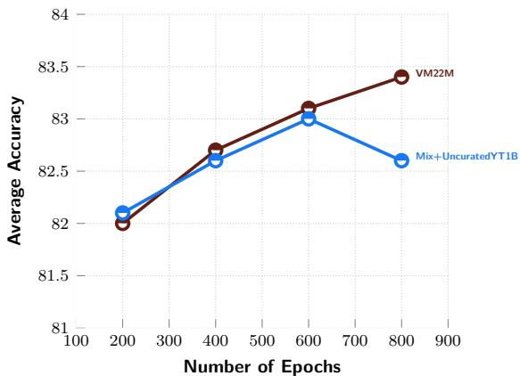  
Curated vs.Uncurated (Long Training w/ViT-g)   
Figure 12 Effect of data curation for V-JEPA 2 pre-training. We show model performance averaged across the IN1K, COI, SSv, and K400 tasks as a function of pre-rainin "epochs" (equivalent to 300 optiizatio eps). Models trained with and without uncurated data achieve similar performance until epoch 600, at which point the performance of the model trained with uncurated YT1B beings degrading.

When following these tasks with the long training schedule, we continue to see differences between VM22M and Mixed+Uncurated YT1B at the ViT-g model scale, as shown in Figure 12, which compares the performance of the models while averaging across the IN1K, COIN, SSv2, and K400 image understanding tasks. Initially, the two models improve at roughly the same rate, but their performance diverges after epoch 600 where the model using uncurated data fails to continue improving.

# A.4.2 Effect of Long Training Schedule and cooldown

In Table 14 we demonstrate the efects of the two-stage training process. When comparing to the ViT-g results in Table 13, we see that the abbreviated schedule is superior to the constant learning rate schedule prior to the cooldown phase. The primary benefits are achieved during the cooldown phase, which uses 64 frames for pretraining in combination with aramped down learning rate. This leads to a large benefit o over a full point across all evaluations. Tau   

<table><tr><td>Training Stage</td><td>IN1K</td><td>COIN</td><td>SSv2</td><td>K400</td></tr><tr><td>Phase 1 (epoch 800, no cooldown)</td><td>83.8</td><td>89.1</td><td>75.1</td><td>85.8</td></tr><tr><td>Phase 2 (annealed, 256 × 256 resolution)</td><td>84.6</td><td>90.7</td><td>75.3</td><td>86.6</td></tr><tr><td>Phase 2 (annealed, 384 × 384 resolution)</td><td>85.1</td><td>90.2</td><td>76.5</td><td>87.3</td></tr></table>

# A.4.3 Effect of Video Length at Evaluation.

Figure 13 examines how input video duration affects downstream task performance during evaluation. Using a model pretrained on 64-frame clips, we observe a $+ 9 . 7$ percentage point average improvement when increasing thevideoduration fom1 to4 rame durinevaluation.Note that thisablation uses siglep evalti proo (i we sampleonly ne cip per video instead the standard multicipevaluations due to memoy constraints.

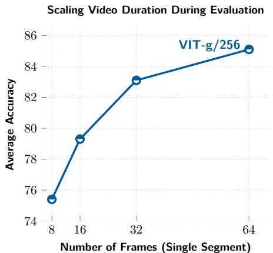  
Fu Ec  viuration durevaluation.Task peroran urteprov y une longer video clips. All evaluations use ViT-g models that were annealed with 64 frames at resolution $2 5 6 \times 2 5 6$ . Due tmrnueorsa oe processed at inference time boosts average performance by up to $+ 9 . 7$ points.

# B V-JEPA 2-AC Post-training

# B.1 Post-Training Hyperparameters

The V-JEPA 2-AC model is trained with the AdamW (Loshchilov and Hutter, 2017) optimizer using a warmup-constant-decay learning-rate schedule, and a constant weight-decay of 0.04. We linearly warmup the learning rate from $7 . 5 \times 1 0 ^ { - 5 }$ to $4 . 2 5 \times 1 0 ^ { - 4 }$ over 4500 iterations, then hold it constant for 85500 iterations, and finally decay it to 0 over 4500 iterations. We use a batch size of 256 comprising 4 second video clips sampled randomly from trajectories in the Droid raw dataset at a frame rate of 4 fps. We train on the left extrinsic camera views from Droid — one could also train on videos from right camera views, however we found that training on both left and right camera views, without additionally conditioning on the camera position, degraded performance. For simplicity, we discard any videos shorter than 4 seconds, leaving us with less than 62 hours of video for training. We apply random-resize-crop augmentations to the sampled video clips with the aspect-ratio sampled in the range (0.75, 1.35).

# B.2 Robot Task Definitions

Figure 14 shows examples of start and goal frames for prehensile manipulation task with a cup in Lab 1. For the grasp and reach with object tasks the model is shown a single goal image. For the pick-and-place tasks we present two sub-goal images to the model in addition to the final goal. The first goal image shows the objec being grasped, the second goal image shows the object in the vicinity of the goal position. The model first optimizes actions with respect to the first sub-goal for 4 time-steps before automatically switching to the second sub-goal for the next 10 time-steps, and finally the third goal for the last 4 time-steps. When planning with V-JEPA 2-AC, we use 800 samples, 10 refinement steps based on the top 10 samples from the previous iteration, and a planning horizon of 1.Since al considered tasks are relatively greedy, we found a short planning horizon to be sufficient for our setup. While longer planning horizons also worked reasonably well, they require more planning time.

# B.3 Visualizing World Model Predictions

To visualize the model's predictions, we train a frame decoder on the Droid dataset that maps the V-JEPA 2 repreentations to human-interpretable pixelsSpecifically we proces 4 frame clips with the frozen V-JEPA2 video encoder, decode each frame separately using our decoder network, and then update the weights of the decoder using a mean-squared error (L2) pixel reconstruction loss. The decoder is a feedforward network (fuly deterministic regression model that does not use any sampling internally) with output dimension $2 5 6 \times 2 5 6 \times 3$ , parameterized as a ViT-L. We train the decoder for 150000 optimization steps using AdamW with a fixed w dey a cpi .0,aba z 04m.We wa e rate for 2000 steps to a peak value of $5 \times 1 0 ^ { - 4 }$ and then decay it following a cosine schedule. For inference, we take the decoder trained on the V-JEPA 2 encoder and apply it off-the-shelf to the representations produced by the V-JEPA 2-AC predictor. The decision to only use use a simple feedforward architecture and

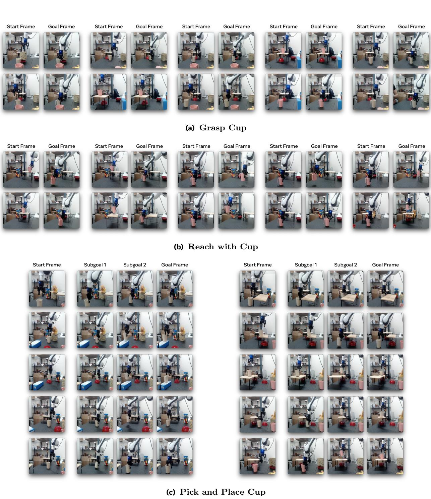  
Figure 14 Prehensile Manipulation Task Definition. Start and goal frames for prehensile manipulation tasks with a cup in Lab.For the grasp and reach with oject tasks the odel s shown a single goal mage.For the pplacasks  e ulheet he alThe s  T f  ipeeleely ihe sub-goal for the next 10 time-steps, and finally the third goal for the last 4 time-steps.

Robot observations Reconstructions   
from   
V-JEPA 2

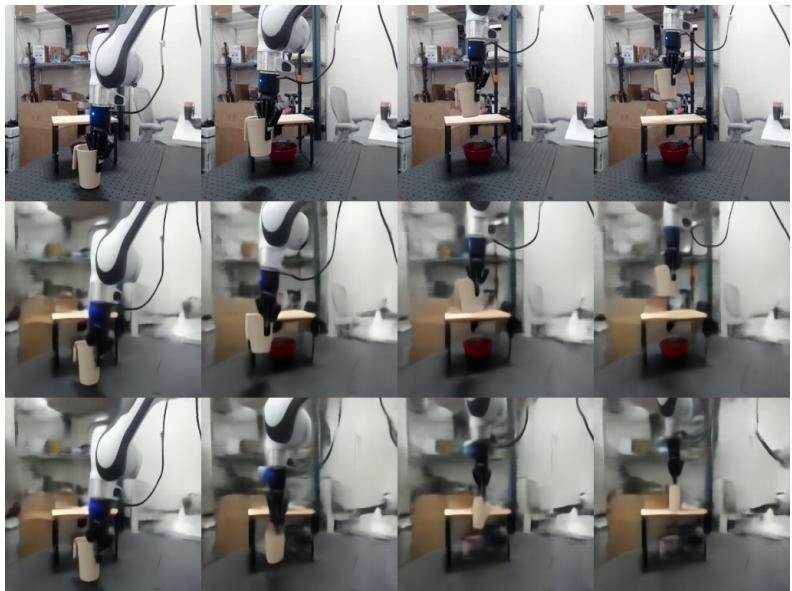

Reconstructions from V-JEPA 2-AC (a) Comparing accuracy of predictions to ground truth trajectory. (Top Row) Video frames of a ground-truth y bo .ie r    yn he the feorwar framedecoder. Recnstructions f the-JEPA  repreentations show hat the ncoder capture the the low-capacity  our eedforwardframedecoder. (Bottom Row) Autoreressiverollout produced by V-JEPA2-AC wormeushu ivm n neu framedecode. Recnsructions  the V-JEPA -ACrolout how that theacin-conditine worldmode succsfully anaebo wheiebacno-je e heH, eahe oeehee h the real trajectory in the final frame. V-JEPA 2-AC imagination: move with closed gripper V-JEPA 2-AC imagination: move with open gripper (b) Ablating predictions with open versus closed gripper. We explore how the V-JEPA 2-AC predictions chan whenivheode enil c q   ussiosi op o in theother wit a pen gripper ottom ro.The wor model predic he lcation  thec  benan acros ime steps when usigan pengripper actin sequence sggesting reasonable undertanding  ituiive physics (e.g., object constancy, shape constancy, and gravity).

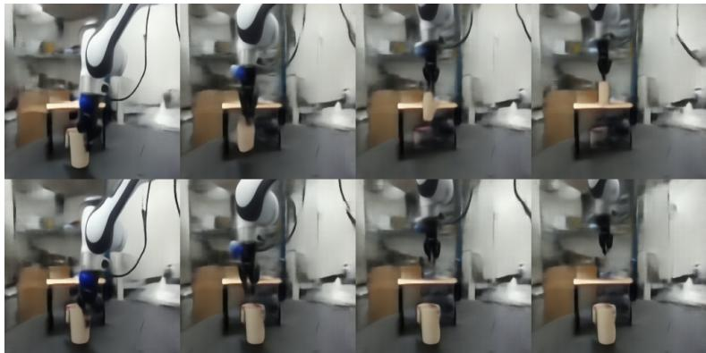

Figure Decoding representations.To visualize the model's predictions, wetrain aframe decoder nthe Droid dataehat maps heJEAernations u-terpretable pis.Thedecderorr (fully determiniticeession model that es ot use y saplninterally) traie wit a mean-quar pe rensruction ss.Byapplyin theframedecodr, traine  the -JEPA 2 encoder,  therepreenati produced by the V-JEPA 2-AC predictor, we can visualize world model rollouts for various action sequences.

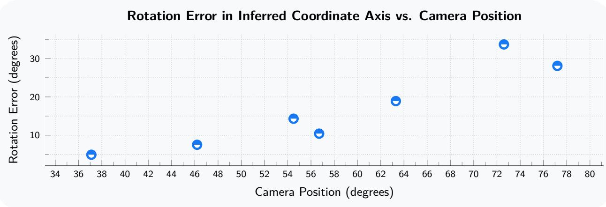  
FSensitiviy to cama position.Rotationeror  the -y plane) the action cordinate xi erd b V-JEPA ACsnction me posin,wi 0de oondng mlcate at herobo se, an90aheo Whee u camera position.

decode representations at the frame level (as opposed to video level), is to better leverage the decoder as an interpretability tool to analyze the V-JEPA 2-AC rollouts for a set of robot action sequences.

In Figure 15a, we show the video frames of a ground-truth trajectory from a robot in our lab (top row), the decoded V-JEPA 2 encoder representations of each frame (middle row), and the decoded V-JEPA 2-AC world model rollout using the ground-truth action sequence and a single starting frame as context (bottom row). Reconstructions of the V-JEPA 2 representations (middle row) show that the encoder captures the salient parts of the scene necessary for vision-based control; blurry background generation can be partially attributed to the low-capacity of our feedforward frame decoder. Reconstructions of the V-JEPA 2-AC rolout show that the action-conditioned world model successfully animates the robot while keeping the background andnon-interacate objects e.., the shel unaffected.We lso see that, with a closed gripper, themodel correctly predicts the movement of the cup with the arm, suggesting a reasonable understanding of intuitive physics (e.g., object constancy, shape constancy, and gravity), but we do observe error accumulation as the world model predicts the location o the cup to be slightly lower than thatof the real trajectory in the nal frame. In Figure 15b we explore how the V-JEPA 2-AC predictions change when driving the model with identical action sequences, but in one cause using a closed gripper (top row) and in the other with an open gripper (bottom row). The world model predicts the location of the cup to be unchanged across time steps when using an open gripper action sequence.

# B.4 Assessing Sensitivity to Camera Position

In practice, we manually tried different camera positions before settling on one that worked best for our eperiments; then the camera is kept in the same location oral experiments, across all tasks. In this sectin, we conduct a quantitative analysis of the V-JEPA 2-AC world model's sensitivity to camera position. While ideally, the mode's inferred coordinate axis would be invariant to camera position, here we observe that the mode's inferred coordinate axis is sensitive to the camera position; this is problematic as large errors in the inferred coordinate axis can degrade success rate on downstream tasks.

We sweep several camera positions around the robot base, which we describe as a clockwise angular position around the center of the table, with 0 degrees being located at the robot base, and 90 degrees being left of the robot base. Since we train on the left exocentric camera views from the Droid dataset, we sweep camera positions between roughly 35 degrees and 85 degrees. Next, for each camera position, we collect a 201 step trajectory of random robot movements within the horizontal x-y plane. For each pair of adjacent frames in this 201 step trajectory, we compute the optimal action inferred by V-JEPA 2-AC, i.e., the action that minimizes the energy function in eq. (5) given a 1-step rollout. This allows us to construct a dataset for each camera position consisting of real action versus inferred action pairs. We only focus on the $\Delta x$ and $\Delta y$ cartesian control actions (frst two dimensions of the action vector) for our analysis. Let $A \in \mathbb { R } ^ { 2 0 0 \times 2 }$ denote the inferred actions and $B \in \mathbb { R } ^ { 2 0 0 \times 2 }$ denote the ground truth actions. Based on this, we can solve a lner least squares problem to identify the linear transformation $W ^ { \star } \in \mathbb R ^ { 2 \times 2 }$ that maps inferred actions $A$ to real actions $B$ ,

$$
\begin{array} { r } { W ^ { \star } = \underset { W \in \mathbb { R } ^ { 2 \times 2 } } { \mathrm { a r g m i n } } ~ \| A W - B \| _ { 2 } . } \end{array}
$$

The mean absolute prediction error for al camera position is roughly 1.6cm (compared to a ground truth delta pose of roughly 5cm), suggesting that the error is systematic. In addition, we observe that for each camera position, the matrix $W ^ { \star }$ has condition number $\approx 1 . 5$ , i.e., modulo a fixed scalar coefficient, $W ^ { \star }$ is approximately a rotation matrix, and thus we can compute the rotation error in the inferred coordinate axis by using with $\overline { { W } } ^ { \star } : = U V ^ { \top }$ where $U$ and $V$ are the left and right singular vectors of $W ^ { \star }$ , respectively.

$$
\begin{array} { r } { W ^ { \star } \approx \overline { { W } } ^ { \star } = \left[ \begin{array} { l l } { \cos \theta } & { - \sin \theta } \\ { \sin \theta } & { \cos \theta } \end{array} \right] , } \end{array}
$$

Figure 16 shows the camera position plotted against the rotation error in the V-JEPA 2-AC inferred coordinate axis. We observe that the rotation error in the inferred coordinate axis is almost a lnear functionof the camera position.We can most cleary see theefct o rotatin errors in theinferred coordinate axis o single-goal reaching experiments in Figure 8. While the model is always able to move the arm within 4 cm of the goal based on visual feedback from the monocular RGB camera, rotation errors in the inferred coordinate axis result in relatively suboptimal actions at each planning step, yielding a non-maximal, albeit monotonic, decrease in the distance to goal at each step. Interestingly, since errors in the inferred coordinate axis are primarily rotation-based, one can use this approach to "calibrate" their world model by simply rotating all inferred actions by $W ^ { \star }$ , and thereby introduce the desired invariance to camera position. Such an unsupervised calibration phase would involve the robot performing random actions, solving a linear least squares problem by comparing its inferred optimal actions to theactual actions it executed and thenmultiplying its inferred actions by the rotation matri beforesndin them to the controller during task execution. While such an approach is interesting, we emphasize that we do no such calibration in our experiments.

# C Visual Classification

We describe in more detail the evaluation procedure used for the classification tasks described in Section 5.

# C.1 Hyperparameters

Probe Architecture.We train an attentive probe on top of the frozen encoder output using the training data from each downstream task. Our attentive probe is composed of four transformer blocks, each using 16heads in the attention layer. The first three blocks use standard self-attention; the final block uses a cros-attentionayer w aale queytokeTheoutpu  thecss-attentonlayerthenal bl is added back to the query token as a residual connection before applying the rest of the block (LayerNorm, followed by MLP with a single GeLU activation). The transformer blocks are followed by a final linear classifier layer.

Evaluation setup parameters. All models follow the same evaluation protocol and use a resolution of $2 5 6 \times 2 5 6$ , except our V-JEPA 2 ViT-g384. For video evaluations, we sampled multiple clip segments from eac input video. During validation, we also extracted three spatial views from each segment (instead of one view during training). The number of clip segments, frame step parameter, and global batch size vary for each eval; parameters used for each evaluation can be found in Table 15. By default, we use $1 6 \times 2 \times 3$ inputs for SSv2 (16 frames clip, 2 temporal crops, 3 spatial crops), $1 6 \times 8 \times 3$ for K400, $3 2 \times 8 \times 3$ for COIN, and $3 2 \times 4 \times 3$ for Diving-48 and Jester. V-JEPA 2 ViT-g384 uses a higher resolution of $3 8 4 \times 3 8 4$ for K400, COIN, Diving-48, and Jester, $5 1 2 \times 5 1 2$ for ImageNet and $3 8 4 \times 3 8 4$ with $6 4 \times 2 \times 3$ inputs for SSv2. TableVisual Classiationeval params.Defaul paraeers useor hevisual classification evaluatios non-default values for each eval ( $^ *$ denotes default). All attentive probes use 4 transformer blocks with 16 heads.   

<table><tr><td>Parameter</td><td>Default (K400)</td><td>ImageNet</td><td>SSv2</td><td>COIN</td><td>Jester/Diving-48</td></tr><tr><td>Number of frames</td><td>16</td><td>16</td><td>16</td><td>32</td><td>32</td></tr><tr><td>Segments / Clip</td><td>8</td><td>1</td><td>2</td><td>8</td><td>4</td></tr><tr><td>Views / Segment</td><td>3</td><td>1</td><td>*</td><td>*</td><td>*</td></tr><tr><td>Frame Step</td><td>4</td><td>n/a</td><td>*</td><td>*</td><td>2</td></tr><tr><td>Epochs</td><td>20</td><td>*</td><td>*</td><td>*</td><td>100</td></tr><tr><td>Batch Size (global)</td><td>256</td><td>1024</td><td>*</td><td>128</td><td>128</td></tr><tr><td>Resolution</td><td>256 × 256</td><td>*</td><td>*</td><td>*</td><td>*</td></tr><tr><td>Classifier Heads</td><td>20 (4x5)</td><td>*</td><td>*</td><td>*</td><td>3 (3x1)</td></tr><tr><td>Classifier Learning Rates</td><td>[5e-3 3e-3 1e-3 3e-4 1e-4]</td><td>*</td><td>*</td><td>*</td><td>[1e-3 3e-4 1e-4]</td></tr><tr><td>Classifier Weight Decay</td><td>[.8 .4 .1 .01]</td><td>*</td><td>*</td><td>*</td><td>[.8]</td></tr></table>

Tabl1 Input layers or Jester/Diving-48.For ach encor ize, indice f the our encoer lyer whosetkens are used as input to the linear classifier in the Jester and Diving-48 evaluations.

<table><tr><td>Encoder</td><td># Layers</td><td>Attended Layers</td></tr><tr><td>ViT-L</td><td>24</td><td>17, 19, 21, 23</td></tr><tr><td>ViT-H</td><td>32</td><td>25, 27, 29, 31</td></tr><tr><td>ViT-g</td><td>40</td><td>24, 29, 34, 39</td></tr></table>

ImageNet evaluation. For ImageNet, we repeat each input image to produce a 16-frame video clip. We also use a larger global batch size (1024 instead of 256 or 128), and do not use multiple clips or views per sample. Jester and Diving-48 evaluation. Our Jester and Diving-48 action classification evaluation tasks differ from the other understanding evaluations in several ways, primarily in that we employ a multilayer strategy. Insteadattending to thetokens fromonlythe last layer theencoder, weextract tokens from fourencoer layers (the last layer and threeintermediate layers) and attend to alof them. (Table 16 shows the layers we used for each encoder size.) We also train the probes for these two evaluations with only three classification heads (instead of 20 for the other evaluations), but train for 100 epochs (instead of 20) as these evaluations benefit from longer training. We use a global batch size of 128 for both evaluations. Optimization. For each evaluation, we simultaneously train multiple classifier heads with different hyperparameters (learning rate and weight decay), reporting the accuracy of the best-performing classifer. For most of our evaluations (Kinetics, SSv2, COIN, and ImageNet), we train for 20 epochs and use 20 heads, each usi ne ffvelearnig rate values andfour weiht decy values, and the learng rate decays accordin o a cosine schedule. We provide a summary of all hyperparameters in Table 15.

# C.2 Additional Results

Probe Size. Since we use a four-layer attentive probe for these evaluations, we investigate whether using a smaller probe impacts evaluation performance. We re-run our six understanding evaluations (for two model sizes, ViT-L and ViT-g) with a smaller probe consisting of a single cross-attention block using 16 attention heads. Unlike in Section 5, we use 16 frames for al evaluations, including Diving-48 and Jester. See Table 18 for classification perforance—w confirm that ur four-ayer probeoutperfors singlelayerattentive probe across all understanding evaluations (except for Jester), by an average of +1.4 points accuracy for ViT-L and $+ 1 . 0$ points for ViT-g. Impact of encoder multilayer. We study the impact of feeding tokens from multiple layers from the encoder to the attentive probe during evaluation. Table 17 shows that Diving-48 and Jester strongly benet from information from deeper layers of the encoder. Table Encoder MultilayerAblation.We vary he number ncder layers  otheattentiv probe.Werepor the classification performances of attentive probes trained on top of V-JEPA 2 with 16 frames at $2 5 6 \times 2 5 6$ resolution.   

<table><tr><td>Model</td><td>Encoder Layers</td><td>Diving-48</td><td>Jester</td></tr><tr><td>ViT-g</td><td>1</td><td>82.9</td><td>96.1</td></tr><tr><td>ViT-g</td><td>4</td><td>86.7</td><td>97.6</td></tr></table>

Tab1 robe izAblation.We vary henumber ayers  theattentive proeWe report he cass performances of attentive probes trained on top of V-JEPA 2 with 16 frames at $2 5 6 \times 2 5 6$ resolution.

<table><tr><td></td><td></td><td></td><td colspan="3">Motion Understanding</td><td colspan="3">Appearance Understanding</td></tr><tr><td>Model</td><td>Probe Layers</td><td>Avg.</td><td>SSv2</td><td>Diving-48</td><td>Jester</td><td>K400</td><td>COIN</td><td>IN1K</td></tr><tr><td>ViT-L</td><td>1</td><td>84.0</td><td>72.0</td><td>83.2</td><td>97.7</td><td>83.3</td><td>85.9</td><td>81.8</td></tr><tr><td>ViT-L</td><td>4</td><td>85.6</td><td>73.6</td><td>87.1</td><td>97.7</td><td>85.1</td><td>86.8</td><td>83.5</td></tr><tr><td>ViT-g</td><td>1</td><td>86.0</td><td>74.8</td><td>85.3</td><td>97.8</td><td>85.6</td><td>88.9</td><td>83.5</td></tr><tr><td>ViT-g</td><td>4</td><td>87.0</td><td>75.6</td><td>86.7</td><td>97.6</td><td>86.6</td><td>90.7</td><td>84.6</td></tr></table>

# D Action Anticipation

We provide additional details, results, and ablations related to the Epic-Kitchen 100 action anticipation evaluation of Section 6.

# D.1 Hyperparameters

Probe Architecture. Our probe architecture for action anticipation follows the architecture of our classification probe described in Appendix C.1, consisting of four transformer blocks, including a last crossattention layer with a set of learnable query tokens, followed by a fnal linear classifer layer for each query token.

Evaluation setup parameters. We use a focal loss (Lin et al., 2017) with a $\alpha = 0 . 2 5$ and $\gamma = 2 . 0$ when traing the probe;thislos i more suitedorraining ith long-tailedibalance cas distributions.We use a context of 32 frames with a frame-rate of 8 frames per second at resolution $2 5 6 \times 2 5 6$ for V-JEPA 2 ViT-L, ViT-H, and ViT-g; and resolution $3 8 4 \times 3 8 4$ for V-JEPA 2 ViT- $\mathrm { 8 3 8 4 }$ . During probe training, we randomly sample an anticipation time between 0.25 and 1.75 seconds, and an anticipation point between 0.0 and 0.25. The anticipation point identifies a point in the action segment from which to perform anticipation; i.e., an anticipation point of 0 means that we predict the representation of the first frame in the action segment using our V-JEPA 2 predictor before feeding it to the probe, whereas an anticipation point of 1 means that we predict the representation of the last frame in the action segment before feeding it to the probe. The validation anticipation time is set to 1 second and the validation anticipation point is set to 0. We provide a summary of the hyperparameters, including the optimization parameters in Table 19.

# D.2 Additional results

Impaco ArchitectureTable 20invetigates the pac  proviig the utputf the-JEPA  eer, predictor, or both, to the action anticipation probe. Using encoder outputs already leads to competitive performance on the EK100 task. Adding the predictor provides a small but consistent improvement across action, ver, andobject categories. In addition,using predictor outputs yields anon-trivial performance, but still at a much lower point compared to using the encoder, showing that the EK100 task mostly requires strong semantic understanding, as opposed to forecasting capabilities. Impact of Input Resolution. We report in Figure 17, the impact of input resolution and frame sampling parameters. In summary, V-JEPA 2 benefits from a longer context, a higher frame rate, and higher resolution, up to a point where the performance saturates or slightly decreases. The optimal performance is obtained by training with a 32-frames context length, a frame rate of 8 and a resolution of $3 8 4 \times 3 8 4$ . Table 19 Action Anticipation Evaluation params. Default parameters used for the EK100 Action Anticipatior evaluation.   

<table><tr><td>Parameter</td><td>EK100</td></tr><tr><td>Train Anticipation time</td><td>0.25s - 1.75s</td></tr><tr><td>Train Anticipation point</td><td>0.0 - 0.25</td></tr><tr><td>Val Anticipation time</td><td>1s</td></tr><tr><td>Val Anticipation point</td><td>0.0</td></tr><tr><td>Number of frames</td><td>32</td></tr><tr><td>Frames per second</td><td>8</td></tr><tr><td>Epochs</td><td>20</td></tr><tr><td>Warmup epochs</td><td>0</td></tr><tr><td>Batch Size (global)</td><td>128</td></tr><tr><td>Classifier Heads</td><td>20 (4x5)</td></tr><tr><td>Classifier Learning Rates Classifier Weight Decay</td><td>[5e-3 3e-3 1e-3 3e-4 1e-4] [1e-4 1e-3 1e-2 1e-1]</td></tr></table>

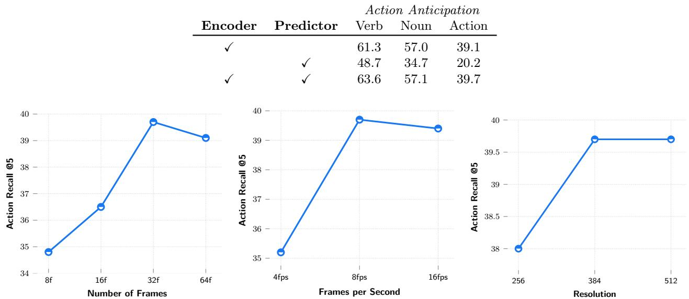  
Table0 EK100:Impact of Anticipation Probe Inputs.Weinvestigate the impac of providing theoutputs the VJPA ncer, predicor, r both, tthe actinantipatin probeUsiencoeroutput already l competitive perormancen the EK100 task.Adding the predicor provide small but consistent mprovementaoss action, verb and object categories.   
Figure17 Protocol ablation for action anticipation on EK100. (Left) Performance with respect to the number xt ames use oracion nticipati.Mid) Perormac with respec the ramerate s)us fo ie; um cnte amefixe (Rih Peornwirepec the pat reoluti and width) of the context frames used for action anticipation.

Longer-term Prediction. We report in Figure 18 (Left), the impact of predicting at a longer horizon, by varying the anticipation time between (1s, 2s, 4s, 10s). For each anticipation time, we report recall at several values (1, 5, 10, 20). The results show that the performance sharply decreases as the anticipation time increases, which is expected since forecasting the future in EK100 is a non-deterministic task. Analysis of Failure Cases. We report in Figure 18 (Right), the distribution of failure and success prediction, on the EK100 validation set, between each configuration of success/failure for verb, noun, and action. The model performs very well, and the most represented configuration is, therefore, a full success across verb noun and action. The most represented failure configurations all include a failure to find the action.

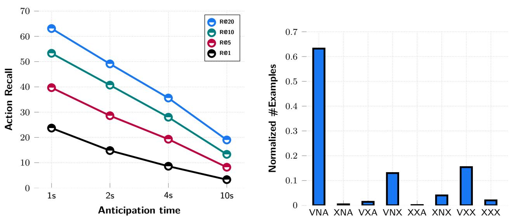  

Figure 18 (Left): Impact of longer-term anticipation times. Performance on EK100 action anticipation, at several recal values and anticipation times.(Right):Distribution of success and failure cases o V-JEPA 2. Calculatehe valiatin   EK1NAmeans that ver,nou and actionare cey cassife y the mlX symomesthat the ceonittru s otcore  ythemo oh e ie  ne eeav for the action and for the verb/noun pair.

# E Video Question Answering

In this section, we provide details on training a V-JEPA 2 Multi-modal Large Language Model (MLLM). We follow the LLaVA framework (Liu et al., 2024a) to train the MLLM, where the vision backbone is using V-JEPA 2, and the LLM backbone can be any off-the-shelf pretrained LLM, akin to the non-tokenized early fusion (Wadekar et al., 2024) setup. The MLLM ingests the output embeddings of the vision encoder, which are projected to the hidden dimension of the LLM backbone using a projector module. The projector is typically a 2-layer MLP. The MLLM is trained using a mix of image-text and video-text paired data, in a series of progressive training steps.

To understand the impact of data scale, we use a dataset of 88.5 million image-text and video-text pairs, similar to what was used for training PerceptionLM (Cho et al., 2025). As mentioned in Section 7, we investigate two setups: (a) controlled, where we train with 18M image and video-text pairs, and we evaluate V-JEPA 2 and other encoders on the exact same MLLM training setup, and (b) scaling, where we take V-JEPA 2 VITg384 and use the ful aligment dataset. To further test the versatility of V-JEPA 2, we use Qwen2-7B-Instruct (Yang et al., 2024a) as the language backbone for the controlled experiments, and Llama 3.1 8B Instruct (Grattafiori et al., 2024) for the scaling experiments. We describe the training details in the following sections.

# E.1 Processing Images and Videos as Input

Sincevideo question answering uses videinstead  mage inputs, thenumber  utputvisual tokensincreas significantly compared to image question answering. If required, we can use pooling methods to reduce the number o visual tokens. Popular pooling methods involve adaptive 2x2 pooling (Cho et al., 2025), Perceiver Sampler (Jaegle et al., 2021), Attentive Pooling (Bardes et al., 2024), etc.

Additionally, we observed that learning from image-text pairs is crucial for high performance in downstream benchmarks. In order to train with images, a simple approach is to repeat the given image for $k$ frames, where $k$ is the maximum amount of frames supported by V-JEPA 2. However, during our initial experiments we find this strategy is ineffective at improving downstream performance, as it does not allow the model to extract fine-grained information. Therefore, we employ a modified Dynamic $S ^ { 2 }$ strategy introduced by Liu et al. (2024d) to provide V-JEPA 2 higher resolution granularity during training. This method adaptively prcesses an imageat native resolution with diferent aspec ratios to preserve thei original resolution, by creating a sequence of tiles of maximum size supported by V-JEPA 2. In case of videos, we choose to train with a fixed number of frames $f _ { n }$ , by balancing the number of visual tokens with compute budget.

# E.2 Controlled Setup

Training details For the controlled setup, we follow the LLaVA-NEXT framework (Liu et al., 2024a; Zhang et al, 2024b), where we use Qwen2-7B-Instruct (Yang et al., 2024a) as the base LLM for all encoders. To reduce the number of visual tokens, we employ an attentive pooler with a factor of 4-16, depending on the compute budget and the number of visual patches. See Table 21 for more details. Our training setup follows the LLaVA-NeXT pipeline (Li et al., 2024b), which consists of multiple staged traii phase.Concretely,he stages consisto)aligning the attentive pooler wit image captionin data (Stage1), b) training the full model on high quality image captioning (Stage 1.5), and c) training the full model on large scale image question answering (Stage ). We add an extra stage to train on large scale video captioning and question answering (Stage 3). We use 18 million image and video-text aligned data. The LLM progressively improves its understanding of the visual tokens after multiple staged training, with the biggest improvement in video question answering tasks after Stage 3.

We explore frozen and finetuned encoder alignment setups. In both setups, full parameters of the LLM and projector are trained, and in the latter, the V-JEPA 2 parameters are additionally unfrozen. To reduce the number of visual tokens and keep the MLLM context length fixed, we employ an attentive pooler as the projectorto reduce the number fvisual tokens by actor  4, unle otherwis denote.The plementation used for this controlled study is based on the Llava-NExT codebase,4 and uses Pytorch 2.5.1, Transformers 4.46.0, Flash attention 2 and DeepSpeed 0.14.4 for model implementation, faster training and multi-gpu model sharding respectively. We train al models using 128 H100 GPUs with an effective batch size of 256 across all stages. We perform al optimizations using AdamW with 0 weight decay. For Stages 1 and 1.5, we use learning rate of 1e-5 with cosine decay, and for Stages 2 and 3 we use constant learning rate of 5e-6. In all stages, we use linear warmup for the first 3% of training steps. Training hyperparameters are listed in Table 21. Baselines. To assess the ability of V-JEPA 2 to capture spatiotemporal details for VidQA, we compare to leading off-shelf image encoders. Specifically, we compare to DINOv2 (Oquab et al., 2023), SigLIP2 (Tschannen et al, 2025), and Perception Encoder (Bolya et al., 2025). DINOv2 is a self-supervised image model, while SigLIP2 and Perception Encoder are both trained with language supervision using noisy image-text captions. We apply all image encoders at their "native" pretrained resolution, which is 518px, 384px, and 448px, respectively, on each video frame independently. We keep all training details the same, except that we increase the attentive pooling ratio to 16 to keep the number of image tokens relatively similar among models. See Table 21 for details. Evaluation. To evaluate the capability of V-JEPA 2 to understand the world through video and language, we selec popular evaluation datasets built to test spatio-temporal reasoning abilities.To ensure reproducile evaluatn eutilize he valbray (Li a 202; Zhan  024)cndcrexperets, which is a vision model enabled fork of llm-eval-harness (Gao et al., 2024), which is a popular evaluation library for evaluating LLMs on text-based tasks. In the controlled setup, for each model and dataset, we evaluate by using uniform frame sampling mechanism, and choosing 128 frames during inference. For PerceptionTest, we further train the model for 5 epochs on the training set. Fable 21 Hyperparameters for controlled comparison of vision encoders. We use each vision encode with its native pretrained input resolution.   

<table><tr><td>Model</td><td>Pooling Ratio</td><td>Vision Tokens</td><td>BS</td><td>Stage 1/1.5 LR</td><td>Stage 2/3 LR</td><td>WD</td><td>Frames</td></tr><tr><td>V-JEPA 2 ViT-L256</td><td>4</td><td>4096</td><td>256</td><td rowspan="6">1e-5</td><td rowspan="6">5e-6</td><td rowspan="6"></td><td rowspan="6">128</td></tr><tr><td>V-JEPA 2 ViT-H256</td><td>4</td><td>4096</td><td>256</td></tr><tr><td>V-JEPA 2 ViT-g256</td><td>4</td><td>4096</td><td>256</td></tr><tr><td>V-JEPA 2 ViT-g384</td><td>4 8</td><td>9216</td><td>256</td></tr><tr><td>V-JEPA 2 ViT-g512</td><td></td><td>8192</td><td>256</td></tr><tr><td>DINOv2518</td><td></td><td>10952</td><td>256</td></tr><tr><td>SigLIP2384</td><td>16 16</td><td>5832</td><td>256</td><td rowspan="3">1e-5</td><td rowspan="3">5e-6</td><td rowspan="3">0.0</td><td rowspan="3">128</td></tr><tr><td>T E48</td><td>16</td><td></td><td></td></tr><tr><td></td><td></td><td>8192</td><td>256</td></tr></table>

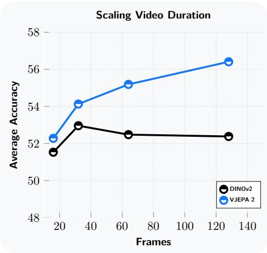  
Fiur Impactof videoduration durinvisual instruction tuninWeinvestigate he efec increasn a V-JEPA2 perormanceinearlyncreasescompared o DINOv2, an SL-base image encoder, howing the potental V-JEPA 2 to scale with more frames.

Impact of Video Duration In the controlled setup, we perform an analysis to understand V-JEPA 2's capability in long-form video understanding. We train MLLMs on V-JEPA 2 and DINOv2, keeping the encoders frozen, and by increasing the number of frames we use in training and testing. We observe as the number of frames increases, performance on downstream tasks linearly improves for V-JEPA 2, but decreases and remains flat in case of DINOv2 (Figure 19). This highlights the potential of video encoders such as V-JEPA 2 to understand long-form videos with natural language queries, via adapting an LLM using V-JEPA 2 as the visual encoder.

# E.3 Data scaling setup

Traig detailsIn the scaling setup, wefollow the ramework u by Cho e al(5)to train Perion LM 8B. Specifically, we utilize the released codebase, which is based on Lingua (Videau et al., 2024). We modiy the code to use V-JEPA 2 encoder, and we use the Llama 3.1 8B Instruct (Grattafiori et al., 2024) as the backone LLM.Unlike Cho et al. (2025), we o not use poolig, istead we train V-JEPA 2 VIT-384 using MLP projector, leading to 288 tokens per frame. The training setup also consists of three progressive stae Stage aligning the MLP pooler with image captioning data; Stage :training na mi image-text captioning and QA data; and Stage 3) training on video-text captioning and QA data. We scale up the data size to 88.5 million samples. Our setup uses Pytorch 2.5.1 and Perception LM training code,5 modified with the V-JEPA 2 encoder. We train on 512 H100 GPUs for Stage 2 and Stage 3 with a global batch size of 2048 and 1024 respectively. Details of the training hyperparams are provided in Table 22. Table 22 Data scaling training parameters.   

<table><tr><td>Parameter</td><td>Values</td></tr><tr><td>Common parameters</td><td></td></tr><tr><td>Crop Size</td><td>384</td></tr><tr><td>Video Frames per Second</td><td>1</td></tr><tr><td>Sampling method</td><td>Uniform</td></tr><tr><td>Seed</td><td>777</td></tr><tr><td>Stage 1</td><td></td></tr><tr><td>Steps</td><td>16000</td></tr><tr><td>Warmup Steps</td><td>96</td></tr><tr><td>Batch Size (global)</td><td>128</td></tr><tr><td>Learning Rate</td><td>1e-4</td></tr><tr><td>Final Learning Rate</td><td>1e-6</td></tr><tr><td>Weight Decay</td><td>0.05</td></tr><tr><td>Max sequence length Stage 2</td><td>1920</td></tr><tr><td>Steps</td><td>35000</td></tr><tr><td></td><td>200</td></tr><tr><td>Warmup Steps</td><td></td></tr><tr><td>Batch Size (global)</td><td>2048</td></tr><tr><td>Learning Rate</td><td>4e-5</td></tr><tr><td>Final Learning Rate</td><td>4e-7</td></tr><tr><td>Weight Decay</td><td>0.05</td></tr><tr><td>Max sequence length</td><td>6400</td></tr><tr><td>Image tiles</td><td>16</td></tr><tr><td>Video frames</td><td>16</td></tr><tr><td>Stage 3</td><td></td></tr><tr><td>Steps</td><td>28000</td></tr><tr><td>Early stopping step</td><td>22000</td></tr><tr><td>Warmup Steps</td><td>168</td></tr><tr><td>Batch Size (global)</td><td>2048</td></tr><tr><td>Learning Rate</td><td>1e-5</td></tr><tr><td>Final Learning Rate</td><td>1e-7</td></tr><tr><td>Weight Decay</td><td>0.05</td></tr><tr><td>Max sequence length</td><td>12800</td></tr><tr><td>Image tiles</td><td>32</td></tr><tr><td>Video frames</td><td>32</td></tr></table>

Baselines. We compare our scaling runs with Qwen2VL (Wang et al., 2024a), Qwen2.5VL (Qwen Team et al 2025), InternVL-2.5 (Chen et al., 2024), and PerceptionLM 8B (Cho et al., 2025). Baseline numbers are sourced directly from the papers, except for MVP which we run ourselves. Evaluation. We follow similar evaluation pipeline as reported in the controlled setup, using lmms-eval library. We report our model evaluations on 32 frames.