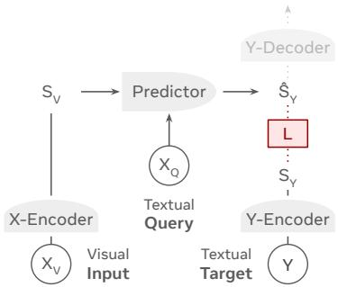
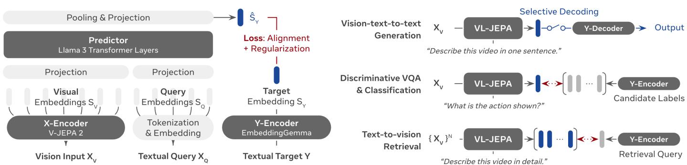
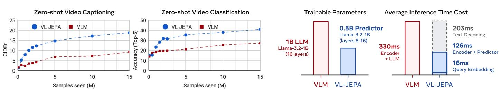
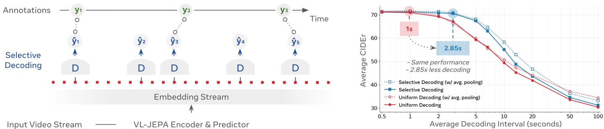

# VL-JEPA：用于视觉-语言的联合嵌入预测架构

Delong Chen1,2 \* Mustafa Shukor1,3 \* Théo Moutakanni1,\* Willy Chung1,3 \* Jade $\mathrm { Y u ^ { 1 } }$ , Tejaswi Kasarla1, Allen Bolourchi1, Yann LeCun1,4, Pascale Fung1,2 1 Meta FAIR 2 香港科技大学 3 索邦大学 4 纽约大学 \* 同等贡献 delong.chen@connect.ust.hk

我们介绍了 VL-JEPA，这是一种基于联合嵌入预测架构（EPA）的视觉-语言模型。与传统的 VLM 通过自回归生成词元不同，VL-JEPA 预测目标文本的连续嵌入。通过学习表示空间，模型能够在任务相关的句子中进行抽象，同时保持其表示的可变性。与在相同编码器和训练数据上训练的标准词元空间 VLM 相比，VL-JEPA 以 $5 0 \%$ 更少的可训练参数实现了更强的性能。在推理时，仅在需要时调用轻量级文本解码器，将 VL-JEPA 预测的嵌入转换为文本。我们展示了 VL-JEPA 原生支持选择性解码，这减少了约 ${ \sim } 2 . 8 5 \times$ 的解码操作数量，同时保持与非自适应均匀解码相似的性能。除了生成之外，VL-JEPA 的嵌入空间自然支持开放词汇分类、文本到视频检索，并且具备不需要修改的直观 VA。在八个视频分类和八个视频检索数据集中， VL-JEPA 的平均性能超越了 CLIP、SigLIP2 和 Perception Encoder。同时，该模型在四个 VQA 数据集（GQA、TallyQA、POPE 和 POPEv2）上与传统 VLM（如 InstructBLIP 和 QwenVL）达到了相当的性能，尽管它只有 1.6B 的参数。

# 1 引言

先进机器智能最重要的方面之一是理解我们周围物理世界的能力。这一能力使得人工智能系统能够学习、推理、计划和在现实世界中行动，以帮助人类。需要在现实世界中行动的智能系统包括可穿戴设备和机器人。构成这一能力的机器学习任务包括图像描述、检索、视觉问答、动作跟踪、推理和规划等。用于此类现实世界应用的系统必须具备实时响应能力，具有低延迟和低推理成本。

目前，实现这些任务的常见方法是使用大型词元生成的视觉语言模型（VLMs）[Liu et al., 2023，Dai et al., 2023，Alayrac et al., 2022，Chen et al., 2024b，Cho et al., 2025，Chen et al., 2022]，该模型以视觉输入 $X _ { V }$ 和文本查询 $X _ { Q }$ 为基础，在词元空间中自回归地生成期望的文本响应 $Y$，即 $( X _ { V } , X _ { Q } ) \mapsto Y$。这种方法虽然简单，但存在两个主要不足。首先，VLMs 开发成本高，因为它们需要通过捕捉任务相关的语义和任务无关的表面语言特征（如词汇选择、风格或释义）来生成响应 $Y$。在训练过程中，VLMs 必须同时建模这两个方面，这导致花费不必要的计算努力来生成多样化的词元序列，而这些序列最终对输出的正确性并无影响。其次，涉及实时流媒体视频的实时任务（例如实时行动跟踪）需要稀疏和选择性的解码（例如，仅在发生新事件时发出描述）[Zhou et al., 2024]。然而，VLMs 依赖于逐词的自回归解码，这必须在揭示 $Y$ 的潜在语义之前完成。这一过程引入了不必要的延迟，并阻碍了动态实时更新语义的能力。

  
Figure 1. VL-JEPA model architecture

本论文介绍了用于视觉-语言的联合嵌入预测架构（VL-JEPA），将昂贵的数据空间标记生成学习转变为更高效的潜在空间语义预测。如图1所示，该模型采用 $\mathbf { x }$ 编码器将视觉输入 $X _ { V }$ 映射为嵌入 $S _ { V }$，采用 $y$ 编码器将文本目标 $Y$ 映射为嵌入 $S _ { Y }$，并采用预测器学习映射 $( S _ { V } , X _ { Q } ) \mapsto S _ { Y }$，其中 $X _ { Q }$ 是文本查询（即提示）。训练目标在嵌入空间中定义为 $\mathcal { L } _ { \mathtt { V L - } \mathtt { J E P A } } = D ( \hat { \hat { S } } _ { Y } , S _ { Y } )$，而不是在数据空间 $\mathcal { L } _ { \mathtt { V L M } } = D ( \hat { Y } , Y )$ 中。在推理过程中，当需要时，$y$ 解码器读取预测的嵌入 $\hat { S } _ { Y }$ 并转换为文本空间 $\hat { Y }$。由于其非生成特性，VL-JEPA 不必在标记空间中重建 $Y$ 的每一个表面细节；相反，它只需在嵌入空间中预测抽象表示 $S _ { Y }$。在原始的一热标记空间中，对于相同输入，不同的合理 $Y$ 输出如果不共享重叠标记，通常表现得几乎正交。然而，在嵌入空间中，这些多样化的目标可以映射到共享相似语义的邻近点。这简化了目标分布，从而提高了学习过程的效率。此外，与VLM不同，该方法在训练期间消除了使用重型解码器进行语言生成学习的必要性，从而带来了显著的效率提升。得益于其非自回归特性，VL-JEPA 可以在滑动窗口内以最小延迟生成连续的目标语义嵌入流，因为它只需一次前向传播，而无需自回归解码。这对于实时在线应用（如实时动作跟踪、场景识别或规划）特别有利，其中嵌入流可以由轻量级的 $y$ 解码器选择性解码，从而实现高效和及时的更新。在本工作中，我们实证验证了 VL-JEPA 的优势。我们对经典的标记生成 VLM [Liu et al., 2023, Cho et al., 2025] 进行了严格控制的比较：两种设置使用相同的视觉编码器、空间分辨率、帧率、训练数据、批大小和迭代次数等，唯一的区别在于标记空间或嵌入空间中的目标。在这种匹配的训练条件下，VL-JEPA 在零-shot 标记和分类上始终表现出更高的性能，同时使用大约一半的可训练参数，表明嵌入空间监督提高了学习效率。超出训练阶段，VL-JEPA 通过选择性解码显著提高推理时间效率，其中解码仅在预测嵌入流发生显著变化时发生。实证结果表明，这一策略在保持整体输出质量（通过平均CIDEr得分度量）的同时，将解码操作的数量减少了 ${ \sim } 2 . 8 5 \times$。

我们最终的VL-JEPA模型分为两个阶段进行训练：1）使用字幕数据进行预训练阶段，以建立稳健的视觉-语言对齐；2）监督微调（SFT）阶段，使模型具备视觉问答（VQA）能力。从第一阶段得到的模型称为VL-JEPABase，在零样本分类和文本到视频检索方面进行评估。VL-JEPABase在8个数据集上的平均分类准确率和检索召回率$@ 1$方面超越了CLIP [Radford et al., 2021]、SigLIP2 [Tschannen et al., 2025]和Perception Encoder [Bolya et al., 2025]模型。在第二阶段之后，得到的VL-JEPAsFT由于接触了领域内的训练数据，分类性能显著提升。作为一个统一的通用模型，VL-JEPAsFT的性能接近为单独基准优化的专用模型。同时，VL-JEPAsFT表现出有效的VQA能力，在处理组合视觉推理 [Hudson and Manning, 2019]、复杂物体计数 [Acharya et al., 2019]和物体幻觉 [Li et al., 2023b, 2025b]等四个数据集时，其性能与已有的视觉语言模型（VLM）家族，如InstructBLIP [Dai et al., 2023]和Qwen-VL [Bai et al., 2023]相当。总之，本文的贡献如下：我们介绍了VL-JEPA，这是第一个基于联合嵌入预测架构的非生成模型，可以实时执行通用领域的视觉语言任务。•我们在受控实验中证明，采用潜在空间嵌入预测训练的VL-JEPA优于依赖数据空间词元预测的VLM。•我们展示了VL-JEPA在在线视频流应用中，相较于VLM提供了显著的效率提升，这得益于其非自回归设计和本地支持的选择性解码。•我们强调，我们的VL-JEPAsFT模型具有统一的模型架构，能够有效处理广泛的分类、检索和VQA任务。

# 2 方法学

我们提出了 VL-JEPA（图 1），一种用于视觉语言任务的联合嵌入预测架构（JEPA）模型。VL-JEPA 使用三元组 $\langle X _ { V } , X _ { Q } , Y \rangle$ 进行训练，其中 $X _ { V }$ 表示视觉输入（单张图像或一系列视频帧），$X _ { Q }$ 是文本查询（即问题），而 $Y$ 是需要预测的文本目标（即答案）。VL-JEPA 包括四个组成部分：

# VL-JEPA：视觉-语言联合嵌入预测架构 | 引言 | 方法 | 实现 | 实验 | 相关工作 | 结论 |

  
Figure 2. Left: VL-JEPA Architecture. It learns to predict the target embedding $S _ { Y }$ , instead of reconstructing the raw target Yin token space as in retrieval tasks using a single unified model architecture.

1. X-编码器 $( X _ { V } \mapsto S _ { V }$) 将高容量的视觉输入压缩为紧凑的视觉嵌入，形成一系列连续的向量，类似于传统视觉语言模型中的“视觉词元”。 2. 预测器 $( \langle S _ { V } , X _ { Q } \rangle \mapsto \hat { S } _ { Y } )$ 是 VL-JEPA 的核心组件。它将视觉嵌入映射为目标嵌入的预测，并以文本查询作为条件。 3. Y-编码器 $( Y \mapsto S _ { Y }$) 将文本目标嵌入到一个连续的潜在空间中，作为预测目标。目标嵌入被期望能抽象出与任务无关的信息。 4. Y-解码器 $( \hat { S } _ { Y } \mapsto \hat { Y } )$ 在 VL-JEPA 的主要训练阶段并不参与。在推理时，它在必要时将预测嵌入转换为人类可读的文本。图 2 说明了我们在本文中如何实例化 VL-JEPA 架构。对于 X-编码器，我们选择了 V-JEPA 2 [Assran et al., 2025]，这是一种视觉变换器，可输出一系列视觉词元，随后这些词元被投影并输入到使用 Llama 3 变换器层初始化的预测器中。查询条件通过对文本查询进行分词和嵌入实现，将得到的文本词元嵌入与视觉嵌入一同输入到预测器中。Llama 3 变换器层的输出经过池化并投影到由 Y-编码器产生的目标嵌入空间，该 Y-编码器由 EmbeddingGemma-300M [Vera et al., 2025] 初始化。我们将在 $\ S ? ?$ 中提供更多技术细节。训练目标。JEPA 模型通常联合优化两个目标：1) 嵌入空间中的预测误差，以及 2) 避免表示崩溃的额外正则化 [Bardes et al., 2021, Balestriero 和 LeCun, 2025]。任何实现这两个属性的损失都可以应用于 VL-JEPA。或者，正则化项可以被替换为其他防止崩溃的策略，例如对 Y-编码器使用指数移动平均（EMA） [Assran et al., 2025] 或冻结 Y-编码器 [Zhou et al., 2025]。在这项工作中，我们采用 InfoNCE 损失 [Radford et al., 2021]，因为它在视觉语言领域具有成熟性。更高级的非样本对比正则化，例如 VICReg [Bardes et al., 2021] 和 SIGReg [Balestriero 和 LeCun, 2025] 也可以应用，但我们将这一探索留给未来的工作。InfoNCE 损失可以数学上分解为 [Wang 和 Isola, 2020]：1) 一个表示对齐项，最小化归一化预测与目标嵌入之间的距离；2) 一个均匀性正则化项，使批次中的嵌入彼此远离，从而避免表示崩溃。我们通过双向 InfoNCE 损失共同训练预测器和 Y-编码器，使它们能够相互学习。与生成式 VLMs 使用的词元空间损失相比，在嵌入空间中计算训练损失是有益的，因为目标分布被简化。具体而言，许多现实世界的预测任务固有上都是不适定的：对于同一输入 X，可能存在多个合理的目标 $Y$，这些目标都是可以接受的。例如，考虑查询“如果我把这个灯开关往下拨，会发生什么？”，同时“灯被关掉”和“房间会变暗”都是有效答案。然而，在原始的一热编码词元空间中，这两个序列是正交的，因为它们没有重叠的词元。但是，当 VL-JEPA 的 Y-编码器将它们嵌入到相邻的点时（理想情况下产生紧凑的单模态分布），学习任务变得容易得多：模型不再需要在稀疏的词元空间中拟合多个不相交的高密度区域，而只需在连续的嵌入空间中拟合一个一致的模态。多任务处理。VL-JEPA 使用单一统一的架构支持多样化任务（图 2）。对于视觉-文本到文本生成任务，例如图像描述或开放式 VQA，查询 $X _ { Q }$ 是图像描述提示或问题，预测器学习预测目标输出的嵌入 $\hat { S } _ { Y }$，然后将其解码为文本。VL-JEPA 还支持 CLIP 风格的开放词汇分类和区分性 VQA，其中候选标签文本被编码为嵌入，并与预测 $\hat { S } _ { Y }$ 比较，以选择最近的匹配。对于文本到视频检索，候选视频通过检索一个图像描述提示映射到其预测嵌入 $\hat { S } _ { Y }$，然后根据与编码的文本检索查询的相似性进行排名。选择性解码。现实世界的视频应用通常需要在线流式推理，例如在智能眼镜中跟踪用户动作以进行过程辅助 [Chen et al., $2 0 2 4 \mathrm { c l } ,$ 监测世界状态以进行在线规划、导航和机器人 [Shukor et al., 2025, Black et al., 2025, Song et al., 2025]。一个核心挑战是平衡两个相互竞争的需求：模型必须随着新帧的到达不断更新语义，但计算效率和延迟至关重要。现有 VLMs 通常依赖于显式内存机制 [Zhou et al., 2024, Qian et al., 2024] 来决定何时解码，或复杂的 KV 缓存优化 [Di et al., 2025] 来提高效率，因为自回归语言模型的持续运行成本较高。而 VL-JEPA 则可原生支持选择性解码。由于它以非自回归的方式预测语义答案嵌入，模型提供了可实时监测的连续语义流 $\bar { S } _ { Y } ^ { ^ { \dag } }$。这个流可以通过简单的平滑（例如平均池化）进行稳定，并仅在检测到显著的语义变化时解码，例如当局部窗口方差超过阈值时。通过这种方式，VL-JEPA 实现了始终在线的语义监测，同时避免了不必要的解码，达成了响应性和效率的平衡。

# 3 VL-JEPA 的实现

# 3.1 模型架构

X-编码器。除非另有说明，我们使用一个冻结的 V-JEPA 2 ViT-L [Assran et al., 2025]，其参数量为 3.04 亿，是一个在图像和视频任务中表现出色的自监督视觉模型。每个视频输入被统一采样为 $2 5 6 ^ { 2 }$ 分辨率的帧。对于图像输入，使用相同的图像进行复制以匹配输入形状。预测器。预测器初始化为 Llama-3.2-1B 的最后 8 层 Transformer，产生 4.9 亿个可训练参数。文本分词器和词嵌入也来自 Llama-3.2-1B。我们允许最多 512 个查询词元，并为短查询添加 [PAD] 词元。我们禁用因果注意力掩码，以便视觉和查询嵌入可以共同关注。线性映射连接预测器与视觉和文本嵌入，并对非 [PAD] 词元应用平均池化，以获得预测的目标嵌入。Y-编码器。我们使用 EmbeddingGemma-300m [Vera et al., 2025] 作为 Y-编码器的初始化。我们将最大上下文长度设置为 512，以处理详细的说明。我们发现将学习率乘数设置为 $\times 0 . 0 5$ 可以提高所有文本编码器参数的性能，因为在训练初期嵌入预测的质量可能不理想。线性映射头应用于预测器和 Y-编码器，获得一个共享的 1536 维嵌入空间，在该空间中计算损失。

# 3.2 两阶段训练

大规模预训练。VL-JEPA 采用两个阶段进行训练。第一个查询无关的预训练阶段旨在利用大量的标注数据建立稳健的视觉-语言对齐。我们使用 PLM-Image-Auto [Cho 等，2025]、Datacomp [Gadre 等，2023] 和 YFCC-100M [Thomee 等，2016] 作为图像-文本数据。对于视频-文本数据，我们包括 PLM-Video-Auto [Cho 等，2025]、Ego4D 原子动作描述 [Grauman 等，2022]，以及一个内部数据集 Action100M，该数据集包含在 HowTo100M 视频上生成的标注 [Chen 等，2025b]。我们首先在 Datacomp 和 YFCC100M 上进行仅图像训练，每个视觉输入仅使用 1 帧，这使我们能够使用较大的批量大小 $2 4 \mathrm { k }$。经过 $1 0 0 \mathrm { k }$ 次迭代后，模型已见过 20 亿个样本，并达到了 $6 1 . 6 \%$ 的 ImageNet 零-shot 精度（不使用提示组合）。接着，我们继续进行联合图像-视频预训练，每个输入使用 16 帧。预训练过程持续 2 周，使用 24 个节点，每个节点配备 $8 \times$ NVIDIA H200 GPU。我们采用恒定学习率 $5 { \times } 1 0 ^ { - 5 }$ 以方便延续训练。我们将得到的模型称为 VL-JEPABase，并用该模型测量零-shot 分类和检索性能。监督微调。第二个查询条件监督微调（SFT）阶段增强了 VL-JEPA 的 VQA 能力，同时保持预训练的视觉-语言对齐用于分类和检索。训练数据从 PLM 数据混合中选择 [Cho 等，2025]，包括 2500 万个 VQA 样本、280 万个标注样本、180 万个分类样本，并对预训练阶段数据进行了下采样，以避免灾难性遗忘。我们以 6k 的批量大小训练模型 $3 5 \mathrm { k }$ 步，持续约 2 天（使用 24 个节点），并应用余弦学习率退火以改善收敛性。由于在此 SFT 数据混合中包含了大量人类标注数据，因此我们不再强调此阶段得到的 VL-JEPAsFT 的零-shot 评估。相反，我们评估 VQA 能力并与最先进的专业模型进行比较。$=$ 训练步数 $\times$ 有效批量大小。

<table><tr><td></td><td></td><td>20</td><td>20</td><td>Cenot iert</td><td></td><td></td><td></td><td></td><td>20</td><td></td><td></td><td></td><td></td><td></td><td></td><td></td><td></td><td></td><td></td><td></td><td></td><td></td><td></td><td></td><td>20</td><td></td><td></td><td></td><td>20</td><td></td></tr><tr><td></td><td>Model</td><td></td><td></td><td>20</td><td></td><td>AAare</td><td>A</td><td></td><td>N</td><td>20</td><td></td><td>(S) IO)</td><td></td><td>N0</td><td>20</td><td>20</td><td>Aae</td><td></td><td>2</td><td>20</td><td>ccao</td><td></td><td>2</td><td>20</td><td></td><td></td><td></td><td></td><td></td></tr><tr><td>CLIP</td><td>RN50 ViT-B</td><td>75M 124M</td><td>12.8B 12.8B</td><td>✓</td><td>✓</td><td>21.8 25.3</td><td>2.1 3.1</td><td>1.5</td><td>1.9</td><td></td><td>41.4 49.5</td><td>8.6 11.2</td><td>39.0</td><td></td><td>10.9</td><td>68.7</td><td>28.3 29.3</td><td>28.7 31.0</td><td>17.7 19.5</td><td></td><td>24.7 25.7</td><td>29.7 34.0</td><td>5.1 6.1</td><td></td><td>27.6 27.0</td><td>47.2 48.5</td><td>46.0</td><td>42.9</td></tr><tr><td></td><td>ViT-L</td><td>389M</td><td>12.8B</td><td></td><td></td><td>30.9</td><td>3.8</td><td></td><td>1.3 3.7</td><td>2.4 3.6</td><td>58.3</td><td>14.7</td><td></td><td>47.3 63.5</td><td>16.2 20.8</td><td>71.5 78.5</td><td>35.3</td><td>35.9</td><td></td><td>23.4</td><td>30.7</td><td>41.9</td><td></td><td>7.9</td><td>36.7</td><td></td><td>56.8</td><td>49.3</td></tr><tr><td></td><td>ViT-B</td><td>375M</td><td></td><td>40B</td><td></td><td>33.9</td><td>5.2</td><td></td><td>2.3</td><td>4.9</td><td>57.8</td><td>20.6</td><td></td><td>69.9</td><td>27.7</td><td>82.9</td><td>39.6</td><td>40.2</td><td>25.0</td><td></td><td>32.1</td><td>48.6</td><td></td><td>13.8</td><td>52.1</td><td></td><td>60.9</td><td>43.7</td></tr><tr><td>SigLIP2</td><td>ViT-L</td><td>882M</td><td></td><td>40B</td><td>✓</td><td>38.7</td><td></td><td>5.9</td><td>4.5</td><td>7.0</td><td>63.6</td><td>24.2</td><td>78.5</td><td></td><td>35.1</td><td>90.8</td><td>45.4</td><td>41.6</td><td>32.7</td><td></td><td>35.1</td><td>53.5</td><td>19.0</td><td></td><td>59.2</td><td>71.6</td><td></td><td>50.9</td></tr><tr><td></td><td>Vi-g</td><td>1.9B</td><td>40B</td><td></td><td></td><td>39.9</td><td>6.1</td><td></td><td>6.1</td><td>6.4</td><td>68.0</td><td>26.0</td><td>80.4</td><td></td><td>35.1</td><td>90.8</td><td>47.5</td><td>43.4</td><td>33.9</td><td></td><td>38.9</td><td>56.0</td><td>22.2</td><td></td><td>60.4</td><td>73.0</td><td></td><td>52.5</td></tr><tr><td>PE-Core</td><td>ViT-B</td><td>448M</td><td>58B</td><td></td><td></td><td>37.3</td><td>5.8</td><td></td><td>3.3</td><td>6.3</td><td>65.4</td><td>21.5</td><td>77.1</td><td></td><td>26.9</td><td>91.8</td><td>44.9</td><td>46.5</td><td>35.4</td><td>35.3</td><td></td><td>49.1</td><td>15.2</td><td></td><td>59.8</td><td>68.7</td><td></td><td>49.2</td></tr><tr><td></td><td>ViT-L</td><td>671M 2.3B</td><td>58B 86B</td><td>✓</td><td></td><td>42.8 44.6</td><td>9.0</td><td>9.3</td><td>6.0 6.4</td><td>10.9 13.0</td><td>73.4 76.4</td><td>27.1 29.0</td><td>83.3 86.0</td><td>40.3</td><td>37.5</td><td>95.3 97.2</td><td>50.2 58.1</td><td>48.9 51.6</td><td>41.7 49.1</td><td>40.8</td><td>44.5</td><td>56.2 58.7</td><td>22.5 26.0</td><td></td><td>64.7 77.0</td><td>75.9</td><td></td><td>51.0 68.5</td></tr><tr><td></td><td>ViT-G</td><td>1.6B</td><td></td><td></td><td>✓</td><td></td><td></td><td></td><td></td><td></td><td></td><td></td><td></td><td></td><td></td><td></td><td></td><td>37.6</td><td></td><td></td><td></td><td>47.9</td><td>23.1</td><td></td><td></td><td>89.2</td><td></td><td></td></tr><tr><td>VL-JEPABASE</td><td>ViT-L</td><td></td><td>2.0B</td><td>✓</td><td></td><td>46.4 16.1</td><td></td><td></td><td>13.3</td><td>21.1</td><td>57.8 39.8</td><td></td><td></td><td>74.4 60.5</td><td>88.0</td><td></td><td>58.4</td><td></td><td>55.4 49.2</td><td></td><td></td><td></td><td></td><td></td><td>78.2</td><td>88.8</td><td></td><td>87.2</td></tr><tr><td>VL-JEPASFT</td><td>ViT-L</td><td>1.6B</td><td>2.5B</td><td></td><td>x √</td><td>|70.7</td><td></td><td>68.2</td><td>38.8 59.5</td><td></td><td>81.4</td><td>60.3</td><td>86.8</td><td>77.1</td><td>93.0</td><td></td><td>59.5</td><td>|43.7</td><td>53.8</td><td>46.2</td><td></td><td>49.1</td><td>28.8</td><td></td><td>81.1</td><td>86.4</td><td></td><td>86.7</td></tr><tr><td>SoTA (including specialist models)</td><td></td><td></td><td></td><td></td><td>× ×</td><td>-</td><td></td><td></td><td>| 77.5 56.4 47.8</td><td>92.1</td><td></td><td></td><td>67.3 95.3</td><td></td><td>64.5 96.0</td><td></td><td>-</td><td></td><td>62.8 74.1 74.2</td><td></td><td></td><td>61.4 28.9</td><td></td><td></td><td></td><td></td><td></td><td>77.0 89.2 68.5</td></tr></table>

# 4 实验

# 4.1 分类与检索

我们首先在§4.1中评估VL-JEPA的分类和检索性能，并在§4.2中对VL-JEPA在VQA数据集上进行基准测试。在§4.3中，我们展示VL-JEPA在理解世界状态变化与动作概念（即逆动态）之间关系的应用。在§4.4中，我们通过在严格控制的环境下与基于词元预测的VLM基线进行比较，展示嵌入预测的优势。在§4.5中，我们评估VL-JEPA的选择性解码效果，并表明它在保持性能的同时减少了解码成本。接下来，我们在§4.6中分析VL-JEPA的Y编码器。评估设置。我们按照CLIP风格的评估协议评估VL-JEPA（见图2和§2“多任务”）。我们在广泛的基准测试套件上评估VL-JEPA，包括8个分类数据集和8个检索数据集。对于零样本评估，我们与通用基础模型CLIP [Radford等，2021]、SigLIP2 [Tschannen等，2025]和感知编码器（PE-Core）[Bolya等，2025]进行比较。我们还报告针对每个基准单独优化的专业模型的参考数据（总结于附录??）。

结果。表1总结了结果。在严格的零样本设置下，VL-JEPABAsE在8个分类数据集上的平均准确率更高（46.4 vs 44.6），在8个检索数据集上的平均召回率 $@ 1$ 也更高（58.4 vs 58.1），超越了最佳基线模型PE-Core-G。每个数据集的评分显示，VL-JEPABase在以运动为中心的基准上表现尤为出色（SSv2、EK-100、EgoExo4D，以及COIN和CrossTask上的步态识别），而在以外观为中心的基准（Kinetics-400以及COIN和CrossTask上的任务识别）上相对较弱。这是因为VL-JEPABase所见的视觉-语言对数量显著较少（仅2B，而PE-Core-G为86B）。在经过监督微调后，$\mathrm { \Delta V L - J E P A _ { S F T } }$较VL-JEPABAsE有显著提升，因为模型见到了领域内的训练数据。作为一个通用模型，VL-JEPAsFT的表现接近于为每个数据集单独优化的专业模型。

# 4.2 视觉问答

评估设置。我们在辨别性视觉问答任务上评估 VL-JEPAsFT。推理过程包括使用 Y-编码器对候选答案进行编码，并选择与预测嵌入距离最小的答案（见图 2）。我们选择四个优先考虑视觉感知而非知识和推理的基准。我们在 GQA 数据集 [Hudson and Manning, 2019] 上进行评估，该数据集用于现实世界的视觉推理和组合式问答，并报告在 testdev 平衡拆分上的准确率。对于针对复杂计数的 TallyQA [Acharya et al., 2019]，我们遵循 Chen 等人 [2022] 的方法，报告“简单”和“复杂”拆分的加权平均准确率。最后，为了评估物体幻觉，我们利用 POPE [Li et al., 2023b] 和 POPEv2 [Li et al., 2025b]。对于 POPE，我们报告在 MS-COCO 上“随机”、“流行”和“对抗”设置下的平均准确率。

结果。表4.2将VL-JEPAsFT与已建立的视觉语言模型（VLM）系列进行了比较，包括BLIP-2、InstructBLIP、Qwen-VL、InternVL、Llava-1.5、SmolVLM、PaLI、PaliGemma和Video-LLaVA。尽管VL-JEPAsFT所需的计算资源明显较少，但它在多个基准测试中仍超越了许多这些基线。经典的VLM依赖于广泛预训练的CLIP主干网络，结合多阶段视觉指令调优。相比之下，VL-JEPAsFT采用统一架构和单一嵌入空间，能够无缝处理视觉问答（VQA）、分类和检索（见表1）。文献中报告了GQA：组成视觉推理。

<table><tr><td>Model</td><td>Accuracy</td></tr><tr><td>BLIP-2 (OPT-2.7B)</td><td>33.9</td></tr><tr><td>BLIP-2 (FlanT5XXL)</td><td>41.0</td></tr><tr><td>InstructBLIP (FlanT5XL)</td><td>48.4</td></tr><tr><td>InstructBLIP (Vicuna-13B)</td><td>49.5</td></tr><tr><td>Qwen-VL-Chat-7B</td><td>57.5</td></tr><tr><td>Qwen-VL-7B</td><td>59.3</td></tr><tr><td>InternVL-Chat (Vicuna-7B)</td><td>59.5</td></tr><tr><td>LLaVA-1.5 (Vicuna-7B)</td><td>62.0</td></tr><tr><td>InternVL-Chat (Vicuna-13B)</td><td>66.6</td></tr><tr><td>VL-JEPASFT (1.6B)</td><td>60.8</td></tr></table>

TallyQA: 复杂物体计数

<table><tr><td>Model</td><td>Accuracy</td></tr><tr><td>SmolVLM-256M</td><td>32.3</td></tr><tr><td>SmolVLM-500M</td><td>44.8</td></tr><tr><td>PaLI-700M</td><td>62.3</td></tr><tr><td>SmolVLM-2B</td><td>64.7</td></tr><tr><td>PaLI-3B</td><td>65.8</td></tr><tr><td>InstructBLIP (Vicuna-13B) PaLI-17B</td><td>68.0</td></tr><tr><td>LLaVA-1.5 (Vicuna-13B)</td><td>71.9</td></tr><tr><td>PaliGemma (3B)</td><td>72.3</td></tr><tr><td></td><td>76.8</td></tr><tr><td>VL-JEPASFT (1.6B)</td><td>67.4</td></tr></table>

物体幻觉

<table><tr><td>Model</td><td>Accuracy</td></tr><tr><td>SmolVLM2-256M</td><td>56.4</td></tr><tr><td>SmolVLM-256M</td><td>57.9</td></tr><tr><td>LLaVA-7B</td><td>72.9</td></tr><tr><td>InstructBLIP (Vicuna-13B)</td><td>79.0</td></tr><tr><td>Video-LLaVA (7B)</td><td>83.4</td></tr><tr><td>SmolVLM-500M</td><td>85.8</td></tr><tr><td>LLaVA-1.5-7B</td><td>85.9</td></tr><tr><td>LLaVA-1.5-13B-HD</td><td>86.3</td></tr><tr><td>SmolVLM-2B</td><td>87.5</td></tr><tr><td>VL-JEPASFT (1.6B)</td><td>84.2</td></tr></table>

POPEv2：目标幻觉在 $65.7\%$ 达到了新的最先进水平。

<table><tr><td>Model</td><td>Accuracy</td></tr><tr><td>SmolVLM-256M</td><td>62.3</td></tr><tr><td>LLaVA-1.5-13B</td><td>72.7</td></tr><tr><td>InternVL2-8B</td><td>74.5</td></tr><tr><td>InternVL2-26B</td><td>76.1</td></tr><tr><td>Qwen2-VL-72B</td><td>79.4</td></tr><tr><td>SmolVLM-500M</td><td>83.8</td></tr><tr><td>Qwen2-VL-7B</td><td>87.0</td></tr><tr><td>SmolVLM-2B</td><td>88.8</td></tr><tr><td>Qwen2-VL-2B</td><td>91.3</td></tr><tr><td>VL-JEPASFT (1.6B)</td><td>82.2</td></tr></table>

<table><tr><td colspan="8">Vision Language Models</td><td colspan="10">Socratic LLMs (w / Qwen2.5-VL-72B captions)</td><td colspan="2">VL-JEPA</td></tr><tr><td></td><td colspan="2">InternVL2.5</td><td></td><td></td><td></td><td>Qwen2.5-VL</td><td></td><td></td><td>Llama-3.1</td><td></td><td>Llama-4</td><td></td><td></td><td>Qwen2.5</td><td>GPT-40</td><td>Claude-3.5</td><td></td><td>Gemini-2</td><td>BASE SFT</td></tr><tr><td>2B</td><td>4B −</td><td>26B</td><td>38B</td><td>3B</td><td>7B</td><td>32B</td><td>72B</td><td>8B</td><td>70B</td><td>109B 400B</td><td></td><td>3B</td><td>7B</td><td>72B</td><td>N/A</td><td>N/A</td><td>N/A</td><td>1.6B</td><td>1.6B</td></tr><tr><td>20.0</td><td>29.8</td><td>30.2</td><td>50.3</td><td>21.6</td><td>45.5</td><td>49.0</td><td>57.0</td><td>48.7</td><td>49.8</td><td>52.7</td><td>53.6</td><td>44.0</td><td>49.1</td><td>48.5</td><td>52.0</td><td>53.3</td><td>55.6</td><td>63.9</td><td>65.7</td></tr></table>

# 4.3 世界预测-WM

评估设置。我们在WoRLDPrEDICTIon [Chen et al., 2025a] 基准上评估VL-JEPA的“世界建模”任务，其中模型提供了两幅图像，分别表示初始和最终世界状态，并且必须在四个候选视频片段中识别出解释观察到的过渡的动作。为了适应VL-JEPA，我们复制并串联初始和最终状态图像以提取状态嵌入，并将每个动作候选编码为动作嵌入。然后，模型选择与状态嵌入最接近的候选嵌入。结果。表3展示了准确率比较。VL$\mathrm { J E P A _ { B A S E } }$在WoRLDPrEDICTIon-WM上达到${ \bf 63.9\% }$，而VL-JEPAsFT达到$65.7\%$的top-1准确率，建立了新的最先进水平。我们的VL-JEPA模型不仅显著超越了现有的同类或更大规模的视觉语言模型（VLM），还超越了前沿大型语言模型（LLM）的表现，如GPT-4o、Claude-3.5-sonnet和Gemini-2.0。

# 4.4 嵌入预测与词元预测：一个受控比较

评估设置。在本节中，我们在严格对齐的训练条件下将VL-JEPA与一个基于令牌生成的视觉语言模型基准进行比较。两个模型使用相同的感知体系。

编码器 [Bolya 等, 2025]（冻结的 ViT-L-14，分辨率为 $3 3 6 ^ { 2 }$，无分块，每个视频 16 帧）用于视觉输入。我们使用相同的训练迭代次数，保持有效批量大小为 128，学习率调度器与上述相同的预训练数据混合（§3）。唯一的不同在于预测任务：VL-JEPA 使用 0.5B 预测器预测目标嵌入 [Duquenne 等, 2023]，而 VLM 基准则执行使用 1B LLM 的交叉熵下一个标记预测。对于 VLM，我们使用 PerceptionLM [Cho 等, 2025] 的标准训练配方和代码库，将冻结的视觉编码器与仅文本的 LLM Llama-3 .2-1B 对齐。对于 VL-JEPA，我们从 Llama-3 .2-1B 的第 8 到第 16 层初始化预测器。我们在训练期间定期评估两个模型，检查点跨越从 50 万到 1500 万样本。在每个检查点上，我们测量视频标注和视频分类的性能。对于视频标注，我们报告在 YouCook2 [Zhou 等, 2018]、MSR-VTT [Xu 等, 2016] 和 PVD-Bench [Bolya 等, 2025] 上的 CIDEr 分数平均值。VL-JEPA 解码预测的嵌入，而 VLM 直接生成标记。对于视频分类，我们报告在 CrossTask-Step、CrossTask-Task [Zhukov 等, 2019] 和 EgoExo4D [Grauman 等, 2024] 上的 top-5 准确率平均值。对于 VL-JEPA，我们选择与预测嵌入的余弦距离最小的候选项，而对于 VLM，我们选择困惑度最低的类别。结果。如图 3 所示，在两个任务中，当看到 50 万个样本后，两个模型的性能可比较，视频标注的 CIDEr 分别为 1.23 和 1.35，VL-JEPA 和 VLM 的 top-5 准确率分别为 $1 4 . 9 \%$ 和 $1 4 . 0 \%$。

  
selective decoding (blue). Performance is measured by the average CIDEr score between each annotation $y$ and its closest decoded output $\hat { y }$ Right: R fewer decoding operations.

VLM。在经过几次迭代后，我们发现VL-JEPA的性能提升相比于VLM更为明显，在看到500万样本后达到了14.7 CIDEr和$3 5 . 3 \%$的top-5准确率。随着训练规模扩大到1500万样本，VL-JEPA的CIDEr达到了14.8和$4 1 . 0 \%$的top-5准确率，而VLM基准分别为7.1 CIDEr和$2 7 . 2 \%$的top-5准确率。这一受控比较突显了预测嵌入而非词元的优势，显示了更高的样本效率和更强的绝对性能。我们通过将64帧视频预加载到内存中，反复用相同的提示解码文本100次，比较上述VL-JEPA和VLM的推理成本，测量每个样本的平均时间。如图3所示（最右侧），两种模型在生成文本时展现了可比的延迟。我们模型与传统VLM的区别在于提示处理（“查询嵌入”）和视频编码器（“编码器$^ +$预测器”）与文本生成模块（“解码器”）之间的解耦。这使我们只需使用模型的前半部分进行检索，并在需要时再解码文本（见下面的第4.5节），从而使我们的模型在在线视频推理中更具可扩展性。

# 4.5 选择性解码的有效性

评估设置。我们评估 VLJEPA 的嵌入引导选择性解码在长格式视频流中的有效性。为此，我们设计了一个基准任务，目标是恢复时间序列标注，同时最小化文本解码操作的次数，因为这些操作主导了推理成本。如图 4（左）所示，解码仅在 VL-JEPA 嵌入流的选定点上执行，从而生成 $N$ 个解码输出序列 $[ ( \hat { t } _ { 1 } , \hat { y } _ { 1 } ) , ( \hat { t } _ { 2 } , \hat { y } _ { 2 } ) , \dots , ( \hat { t } _ { N } , \hat { y } _ { N } ) ]$ 。每个真实标注 $[ ( t _ { 1 } , y _ { 1 } ) , ( t _ { 2 } , y _ { 2 } ) , \dots , ( t _ { T } , y _ { T } ) ]$ 然后与其在时间上最近的解码输出对齐（如图 4 中的 $\circ \cdots \circ$ 所示），并计算匹配对之间的 CIDEr。我们使用 EgoExo4D [Grauman 等, 2024] 验证集，该数据集涵盖程序活动领域，包含 218 个视频，平均时长 6 分钟，每个视频约有 $T = 1 4 3$ 个原子行动标注。作为基线，我们考虑均匀采样，其中解码点以固定间隔设置，而不考虑底层视频内容。标准流式 VLM 限于这种策略，而 VL-JEPA 支持更有效的替代方案：通过其预测的嵌入自适应选择解码点。我们应用具有时间连通性约束的聚合聚类 [Murtagh 和 Contreras, 2012] 将嵌入序列划分为 $N$ 个高内部单一语义性的段 [Chen 等, 2024a]，这一点通过方差（即沃德距离）来衡量。直觉是，在一个语义一致的段内，解码输出高度相似，因此每个段解码一次可以捕捉关键信息，同时大大减少整体解码成本。然后选择每个段的中点作为解码点，并从精确的嵌入或段内的平均池化嵌入进行解码。 VL-JEPA：用于视觉-语言的联合嵌入预测架构。 表 4：文本编码器性能比较。我们报告了在 SugarCrepe $^ { + + }$ 和 VISLA 数据集上的三元组准确率 $( \% )$。

<table><tr><td rowspan="2" colspan="2">Model</td><td rowspan="2"># Params. (total)</td><td rowspan="2"># Params. (text encoder)</td><td colspan="5">SugarCrepe++ [Dumpala et al., 2024a] Replace Replace</td><td rowspan="2">Swap</td><td colspan="3">VISLA [Dumpala et al., 2024b]</td></tr><tr><td>Average</td><td>Replace Attribute</td><td>Object</td><td>Relation</td><td>Swap Attribute Object</td><td>Average</td><td>Generic</td><td>Spatial</td></tr><tr><td>CLIP</td><td>ViT-L</td><td>389M</td><td>85M</td><td>44.5</td><td>56.7</td><td>83.0</td><td>42.5</td><td>27.0</td><td>13.5</td><td>34.5</td><td>37.6</td><td>31.3</td></tr><tr><td>SigLIP2</td><td>ViT-g</td><td>1.9B</td><td>708M</td><td>56.5</td><td>66.9</td><td>74.4</td><td>52.1</td><td>58.4</td><td>30.6</td><td>40.4</td><td>48.7</td><td>32.1</td></tr><tr><td>PE-Core</td><td>ViT-G</td><td>2.3B</td><td>537M</td><td>58.6</td><td>73.6</td><td>90.6</td><td>48.9</td><td>53.2</td><td>26.5</td><td>38.3</td><td>45.2</td><td>31.4</td></tr><tr><td>VL-JEPABASE</td><td>ViT-L</td><td>1.6B</td><td>300M</td><td>63.9</td><td>72.2</td><td>90.1</td><td>52.2</td><td>62.9</td><td>42.0</td><td>42.9</td><td>49.8</td><td>35.9</td></tr><tr><td>VL-JEPASFT</td><td>ViT-L</td><td>1.6B</td><td>300M</td><td>58.4</td><td>68.5</td><td>90.9</td><td>47.4</td><td>55.4</td><td>29.8</td><td>39.5</td><td>44.8</td><td>34.2</td></tr></table>

表 . 消融研究结果。VL-JEPA 采用的默认设置以蓝色标记。我们计算了与默认设置相比，每组消融实验中的 $\pm$ 偏差。

<table><tr><td></td><td colspan="2">Classification (Accuracy)</td><td colspan="2">Retrieval (Recall@1)</td><td colspan="2">VQA (Accuracy)</td></tr><tr><td>VL-JEPAsFT</td><td>59.1</td><td></td><td>70.6</td><td></td><td>53.2</td><td></td></tr><tr><td colspan="7">(a) Effectiveness of pretraining stage on caption data</td></tr><tr><td>w/ Pretraining</td><td>49.0</td><td></td><td>47.5</td><td></td><td>46.1</td><td></td></tr><tr><td>w/o Pretraining</td><td>27.3</td><td>(-21.7)</td><td>30.2</td><td>(-17.3)</td><td>42.5</td><td>(-3.6)</td></tr><tr><td colspan="7">(b) Learning rate multiplier for Y-Encoder</td></tr><tr><td>multiplier = 0.05</td><td>27.3</td><td></td><td>30.2</td><td></td><td>42.5</td><td></td></tr><tr><td>multiplier = 1.00</td><td>23.7</td><td>(-3.6)</td><td>28.8</td><td>(-1.4)</td><td>40.7</td><td>(-1.8)</td></tr><tr><td>multiplier = 0.10</td><td>26.9</td><td>(-0.4)</td><td>30.2</td><td>(-0.0)</td><td>42.9</td><td>(+0.4)</td></tr><tr><td>multiplier = 0.01</td><td>25.6</td><td>(-1.7)</td><td>27.7</td><td>(-2.5)</td><td>41.0</td><td>(-1.5)</td></tr><tr><td>multiplier = 0.00</td><td>20.0</td><td>(-7.3)</td><td>25.9</td><td>(-4.3)</td><td>41.4</td><td>(-1.1)</td></tr><tr><td colspan="7">(c) Loss function (with no projection head on top frozen text encoder)</td></tr><tr><td>InfoNCE</td><td>23.3</td><td></td><td>30.3</td><td></td><td>44.3</td><td></td></tr><tr><td>Cosine</td><td>16.5</td><td>(-6.8)</td><td>20.2</td><td>(-10.1)</td><td>46.6</td><td>(+2.3)</td></tr><tr><td>L1</td><td>14.8</td><td>(-8.5)</td><td>15.5</td><td>(-14.8)</td><td>41.9</td><td>(-2.4)</td></tr><tr><td>L2</td><td>13.5</td><td>(-9.8)</td><td>11.7</td><td>(-18.6)</td><td>43.7</td><td>(-0.6)</td></tr></table>

<table><tr><td></td><td colspan="2">Classification (Accuracy)</td><td colspan="2">Retrieval (Recall@1)</td><td colspan="2">VQA (Accuracy)</td></tr><tr><td colspan="7">(d) Predictor architecture and initialization</td></tr><tr><td>Layer 8-16</td><td>27.3</td><td></td><td>30.2</td><td></td><td>42.5</td><td></td></tr><tr><td>Layer 0-2</td><td>24.3</td><td>(-3.0)</td><td>27.8</td><td>(-2.4)</td><td>40.1</td><td>(-2.4)</td></tr><tr><td>Layer 0-4</td><td>25.1</td><td>(-2.2)</td><td>28.9</td><td>(-1.3)</td><td>43.6</td><td>(+1.1)</td></tr><tr><td>Layer 0-8</td><td>27.2</td><td>(-0.1)</td><td>29.3</td><td>(-0.9)</td><td>43.4</td><td>(+0.9)</td></tr><tr><td>Layer 0-16</td><td>27.4</td><td>(+0.1)</td><td>31.0</td><td>(+0.8)</td><td>45.5</td><td>(+3.0)</td></tr><tr><td>w/o Bi-direction Attention</td><td>26.7</td><td>(-0.6)</td><td>31.2</td><td>(+1.0)</td><td>40.6</td><td>(-1.9)</td></tr><tr><td>w/o Llama-3 Initialization</td><td>28.1</td><td>(+0.8)</td><td>30.4</td><td>(+0.2)</td><td>40.6</td><td>(-1.9)</td></tr><tr><td colspan="7">(e) Y-Encoder (trainable linear projection on top of frozen text encoder)</td></tr><tr><td>EmbeddingGemma-300M</td><td>19.5</td><td></td><td>24.1</td><td></td><td>42.5</td><td></td></tr><tr><td>Qwen3-Embedding-0.6B</td><td>24.5</td><td>(+5.0)</td><td>24.5</td><td>(+0.4)</td><td>41.5</td><td>(-1.0)</td></tr><tr><td>Qwen3-Embedding-4B</td><td>27.7</td><td>(+8.2)</td><td>26.6</td><td>(+2.5)</td><td>38.1</td><td>(-4.4)</td></tr><tr><td>Qwen3-Embedding-8B</td><td>29.6</td><td>(+10.1)</td><td>29.5</td><td>(+5.4)</td><td>41.9</td><td>(-0.6)</td></tr><tr><td>PEcore-B (356M)</td><td>29.4</td><td>(+9.9)</td><td>34.5</td><td>(+10.4)</td><td>35.9</td><td>(-6.6)</td></tr><tr><td>PEcore-L (356M)</td><td>29.0</td><td>(+9.5)</td><td>34.2</td><td>(+10.1)</td><td>42.9</td><td>(+0.4)</td></tr><tr><td>PEcore-G (539M)</td><td>33.9</td><td>(+14.4)</td><td>32.0</td><td>(+7.9)</td><td>41.8</td><td>(-0.7)</td></tr></table>

结果。如图4（右）所示，我们通过调整均匀采样的步幅或自适应选择中的聚类数量，将平均解码频率从 $2 . 0 \ : \mathrm { H z }$ 降至 $0 . 0 1 \ : \mathrm { H z }$ （即连续解码操作之间的平均间隔从0.5秒到100秒）。在整个范围内，自适应选择始终优于均匀采样。特别是在 $0 . 3 5 \mathrm { H z }$ （即 ${ \sim } 2 . 8 5秒$间隔）下的选择性解码，其性能与 $1 \ : \mathrm { H z }$ 下的均匀解码相匹配，解码成本降低了 ${ \sim } 2 . 8 5 \times$。我们进一步观察到，平均池化为两种策略提供了稳定的增益，因为它在输入解码器之前对嵌入进行了去噪和平滑。

# 4.6 Y-编码器的评估

评估设置。我们通过采用单模态纯文本（TOT）评估设置，评估JEPA架构是否改善了Y-Encoder。我们使用难负样本基准SugarCrepe $^{++}$ [Dumpala等, 2024a] 和VISLA [Dumpala等, 2024b]。这些数据集测试在图像描述中的语义和词汇变化的敏感性。每个数据集包含三元组：两个语义上相似的同一图像的描述（$p_{1}$ 和 $p_{2}$），以及一个通过改变属性、关系或物体生成的负描述$(n)$。我们通过计算所有描述对之间的余弦相似度来比较不同模型的Y-Encoder。我们检查正样本之间的相似度$s_{im}(p_{1}, p_{2})$是否高于每个正样本与负样本之间的相似度$s_{im}(p_{1}, n)$ 和 $s_{im}(p_{2}, n)$。我们报告所有样本的准确率（%）。结果。表4显示了不同模型在文本难负样本基准上的表现。VL-JEPABASE在SugarCrepe $^{++}$ 上达到了63.9%的微平均准确率，在VISLA上达到了42.9%。这高于其他最佳模型：PE-Core在SugarCrepe $^{++}$ 上得分58.6%，SigLIP2在VISLA上得分40.4%。微调后的VL-JEPASFT模型也取得了有竞争力的结果，在SugarCrepe $^{++}$ 上得分58.4%，在VISLA上得分39.5%。这些结果表明，VL-JEPABASE的Y-Encoder对文本难负样本具有更强的韧性。

# 4.7 消融研究

评估设置。我们研究了 VL-JEPA 的不同设计选择。在此，我们在 SFT 阶段数据上对所有消融模型进行训练，训练时间为 10K 步，批量大小为 512（共计处理 500 万样本），并使用恒定的学习率。我们报告了 8 个数据集的平均分类 top-1 精度（表 1）、8 个数据集的文本到视频检索召回率 $@ 1$（表 1），以及 4 个数据集（CLEVR、GQA、TallyQA 简单和复杂）的平均视觉问答（VQA）精度。我们在表 5 中报告了结果。

结果。(a) 预训练。删除首个无查询的图像和视频标题预训练阶段显著降低了性能，尤其是在分类（-21.7）和检索（-17.3）任务上。(b) 学习率乘子。Y-编码器的学习率乘子的最佳范围在0.05到0.10之间。无论是快速还是缓慢的学习都会降低性能。(c) 损失函数。相比于余弦损失、L1损失和L2损失，InfoNCE一般能提供更优的性能，唯一的例外是余弦损失在VQA任务上优于InfoNCE。然而，只有InfoNCE具有抗崩溃正则化，并且可以与未冻结的Y-编码器一起使用。(d) 预测器。在预测器的尺寸方面，更多的层数能够带来更好的性能，尤其是在VQA任务上。我们还观察到，如果使用原始的因果注意力，而不是更新为双向注意力，会导致VQA性能下降（-1.9），因为查询词元是在视觉词元之后添加的，并且视觉词元无法再关注查询词元。最后，我们还发现LLama-3的初始化对VQA性能是有利的，尽管在视觉-语言对齐（分类和检索）方面，相比于随机初始化的Transformer层，其性能稍差。(e) Y-编码器。我们尝试了不同的文本编码器作为Y-编码器，并确认VL-JEPA与除了EmbeddingGemma-300M之外的其他嵌入模型效果良好。一般来说，更大的编码器会带来更好的性能，而视觉对齐的文本编码器（PE模型）在分类和检索方面具有显著优势。

# 5 相关工作

JEPA模型。JEPA模型通过预测目标输入Y的表示来学习，该表示来自上下文输入X的表示。早期实例包括用于图像编码的I-JEPA [Assran等，2023]和用于视频编码的V-JEPA [Bardes等，2023]，它们展示了这一目标在各自模态中相较于像素重建方法的有效性。最近的JEPA研究分为两个类别。一类工作强调更好的单模态表示学习 [Assran等，2023，Bardes等，2023，Fei等，2023]或跨模态对齐 [Lei等，2025，Jose等，2025]。另一方向关注世界建模，在这一方向上，预训练编码器被冻结，并训练基于动作的预测器用于状态表示的条件预测 [Zhou等，2025，Baldassarre等，2025，Assran等，2025]。这显示出了良好的结果，但仍然限于诸如迷宫或机器人抓取与放置等狭窄领域。我们提出的VL-JEPA是第一个专门为通用视觉语言任务设计的模型。它对视觉和文本进行条件潜在预测，同时保持高效性，并支持灵活的多任务架构。

视觉语言模型。现有的视觉语言模型主要分为两类：（1）CLIP风格模型，采用非预测性联合嵌入架构（JEA）[Radford et al., 2021, Zhai et al., 2023, Bolya et al., 2025, Liu et al., 2024, Chen et al., 2023]，将图像和文本分别编码到共同的潜在空间中，$X _ { V } \mapsto S _ { V }$ 和 $Y \mapsto S _ { Y }$。通过最小化 $\mathcal { L } _ { \mathtt { C L I P } } \ = \ D ( S _ { V } , S _ { Y } )$ 采用对比损失（例如，InfoNCE），CLIP 学习对齐表示，支持零-shot 分类和视觉语言检索；（2）生成式 VLMs [Liu et al., 2023, Chen et al., 2022, Dai et al., 2023, Alayrac et al., 2022, Chen et al., 2024b, Cho et al., 2025, Beyer et al., 2024] 将视觉编码器 [Radford et al., 2021, Fini et al., 2025] 与语言模型（例如，LLM）连接。它们通常通过 $\mathcal { L } _ { \mathtt { V L M } } = D ( \hat { Y } , Y )$ 进行训练，即使用交叉熵损失的下一个词预测，并能够处理各种视觉文本到文本的生成任务，如 VQA。

Table 6. Task coverage comparison.   

<table><tr><td colspan="2">CLIP</td><td colspan="2">VLM</td></tr><tr><td>Generation</td><td></td><td></td><td>VL-JEPA</td></tr><tr><td>Retrieval</td><td>✗</td><td>X</td><td>:</td></tr></table>

我们提出的 VL-JEPA 整合了 CLIP 和 VLM 的架构优势和任务覆盖（见表 6）。由于 VL-JEPA 在嵌入空间中进行学习，它可以利用网络规模的噪声图像-文本对[Jia et al., 2021]，从而产生强大的开放域特征。另一方面，VL-JEPA 支持具有读出文本解码器的条件生成任务。与直接在数据空间优化的生成型 VLM 相比，VL-JEPA 在潜在空间中的学习效率更高。此外，它在在线推理方面也更高效，因为它允许自然选择性解码。

高效视觉语言模型。视觉语言模型（VLM）的规模不断扩大和训练成本的增加促使了提升效率的努力。在训练方面，通过仅更新一部分参数（例如视觉语言连接器）可以实现强大的性能 [Tsimpoukelli et al., 2021, Alayrac et al., 2022, Vallaeys et al., 2024, Shukor et al., 2023, Koh et al., 2023, Merullo et al., 2022, Dai et al., 2023]。在推理过程中，通过剪枝参数或视觉词元来追求效率 [Cao et al., 2023, Shukor and Cord, 2024, Vasu et al., 2025]。对于实时应用，近期的研究探索了小型视觉语言模型 [Yao et al., 2024, Marafioti et al., 2025] 和启发式方法，以减少异步推理中的查询频率 [Shukor et al., 2025]。

潜在空间语言建模。目前最先进的语言模型（LLMs）是通过自回归生成和思维链提示进行训练，以便在文本空间中解码和推理 [Wei et al., 2022]。文本空间的 LLM 发展迅速，并在广泛的基准测试中取得了优秀的成绩。然而，它们推理轨迹的离散特性可能在长期内限制速度和性能。一些研究探索了在潜在空间中处理或推理的潜在空间 LLM，例如大型概念模型 [Barrault et al., 2024] 和 COCONUT [Hao et al., 2024]。这些模型专注于单模态潜在空间推理。通过 VL-JEPA，我们的目标是将视觉和文本表示对齐到共享的多模态潜在空间中。这种方法旨在实现更好的抽象，并提高视觉语言模型（VLMs）的性能和速度。我们希望 VL-JEPA 能为未来的多模态潜在空间推理工作奠定基础，包括视觉思维链方法 [Li et al., 2025a]。

# 6 结论

我们提出了 VL-JEPA，这是一个基于联合嵌入预测架构的新型视觉—语言模型。通过将监督从离散的词元空间转移到连续的语义嵌入空间，VL-JEPA 简化了学习目标，避免了表面语言变异的冗余建模，并实现了非自回归预测。通过控制实验，我们展示了在相匹配的训练数据预算下，VL-JEPA 的表现优于使用交叉熵损失训练的生成 VLM，同时在训练效率和推理延迟方面显著提升。除了生成任务，基于嵌入的设计进一步允许 VL-JEPA 在单一统一架构中处理开放词汇分类和跨模态检索。其能够发出连续语义嵌入的能力，使其特别适合实时视频应用，在这些应用中，选择性解码能够改善响应性和效率。在这项工作中，我们展示了 VL-JEPA 在计算效率、流媒体应用和视频语言任务方面相较于标准 VLM 的优势。我们目前的目标并不是提出 VLM 的通用替代方案，因为这需要在推理、工具使用和智能行为等任务上进行更广泛的评估，而这些任务是当前生成性 VLM 的强项。最后，尽管我们的结果显示了参数和数据集规模扩大所带来的明显好处，但我们并未对此方向进行充分探索，留待未来的工作。

# 致谢

我们感谢 Yejin Bang、Adrien Bardes、Loic Barrault、Lucas Beyer、Quentin Garrido、João Maria Janeiro、Yifu Qiu、Koustuv Sinha、Basile Terver 和 François Yvon 对本项工作的宝贵反馈和支持。

# References

Manoj Acharya, Kushal Kafle, and Christopher Kanan. Tallyqa: Answering complex counting questions. In Proceedings of the AAAI conference on artificial intelligence, volume 33, pages 80768084, 2019.

Jean-Baptiste Alayrac, Jeff Donahue, Pauline Luc, Antoine Miech, Iain Barr, Yana Hasson, Karel Lenc, Arthur Mensch, Katherine Millican, Malcolm Reynolds, et al. Flamingo: a visual language model for few-shot learning. Advances in neural information processing systems, 35: 2371623736, 2022.

Mahmoud Assran, Quentin Duval, Ishan Misra, Piotr Bojanowski, Pascal Vincent, Michael Rabbat, Yann LeCun, and Nicolas Ballas. Self-supervised learning from images with a joint-embedding predictive architecture. In Proceedings of the IEEE/CVF Conference on Computer Vision and Pattern Recognition, pages 1561915629, 2023.

Mido Assran, Adrien Bardes, David Fan, Quentin Garrido, Russell Howes, Matthew Muckley, Ammar Rizvi, Claire Roberts, Koustuv Sinha, Artem Zholus, et al. V-jepa 2: Self-supervised video models enable understanding, prediction and planning. arXiv preprint arXiv:2506.09985, 2025.

Jinze Bai, Shuai Bai, Yunfei Chu, Zeyu Cui, Kai Dang, Xiaodong Deng, Yang Fan, Wenbin Ge, Yu Han, Fei Huang, et al. Qwen technical report. arXiv preprint arXiv:2309.16609, 2023.

Federico Baldassarre, Marc Szafraniec, Basile Terver, Vasil Khalidov, Francisco Massa, Yann LeCun, Patrick Labatut, Maximilian Seitzer, and Piotr Bojanowski. Back to the features: Dino as a foundation for video world models. arXiv preprint arXiv:2507.19468, 2025.

Randall Balestriero and Yann LeCun. Lejepa: Provable and scalable self-supervised learning without the heuristics. arXiv preprint arXiv:2511.08544, 2025.

Adrien Bardes, Jean Ponce, and Yann LeCun. Vicreg: Variance-invariance-covariance regularization for selfsupervised learning. arXiv preprint arXiv:2105.04906, 2021.

Adrien Bardes, Quentin Garrido, Jean Ponce, Xinlei Chen, Michael Rabbat, Yann LeCun, Mido Assran, and Nicolas Ballas. V-jepa: Latent video prediction for visual representation learning. 2023.

Loïc Barrault, Paul-Ambroise Duquenne, Maha Elbayad, Artyom Kozhevnikov, Belen Alastruey, Pierre Andrews, Mariano Coria, Guillaume Couairon, Marta R Costajussà, David Dale, et al. Large concept models: Language modeling in a sentence representation space. arXiv preprint arXiv:2412.08821, 2024.

Lucas Beyer, Andreas Steiner, André Susano Pinto, Alexander Kolesnikov, Xiao Wang, Daniel Salz, Maxim Neumann, Ibrahim Alabdulmohsin, Michael Tschannen, Emanuele Bugliarello, et al. Paligemma: A versatile 3b vlm for transfer. arXiv preprint arXiv:2407.07726, 2024.

Kevin Black, Manuel Y Galliker, and Sergey Levine. Realtime execution of action chunking flow policies. arXiv preprint arXiv:2506.07339, 2025.

Daniel Bolya, Po-Yao Huang, Peize Sun, Jang Hyun Cho, Andrea Madotto, Chen Wei, Tengyu Ma, Jiale Zhi, Jathushan Rajasegaran, Hanoona Rasheed, et al. Perception encoder: The best visual embeddings are not at the output of the network. arXiv preprint arXiv:2504.13181, 2025.

Florian Bordes, Richard Yuanzhe Pang, Anurag Ajay, Alexander C Li, Adrien Bardes, Suzanne Petryk, Oscar Mañas, Zhiqiu Lin, Anas Mahmoud, Bargav Jayaraman, et al. An introduction to vision-language modeling. arXiv preprint arXiv:2405.17247, 2024.

Qingqing Cao, Bhargavi Paranjape, and Hannaneh Hajishirzi. Pumer: Pruning and merging tokens for efficient vision language models. arXiv preprint arXiv:2305.17530, 2023.

Delong Chen, Zhao Wu, Fan Liu, Zaiquan Yang, Shaoqiu Zheng, Ying Tan, and Erjin Zhou. Protoclip: Prototypical contrastive language image pretraining. IEEE Transactions on Neural Networks and Learning Systems, 2023.

Delong Chen, Samuel Cahyawijaya, Jianfeng Liu, Baoyuan Wang, and Pascale Fung. Subobject-level image tokenization. arXiv preprint arXiv:2402.14327, 2024a.

Delong Chen, Jianfeng Liu, Wenliang Dai, and Baoyuan Wang. Visual instruction tuning with polite flamingo. In Proceedings of the aaai conference on artificial intelligence, volume 38, pages 1774517753, 2024b.

Delong Chen, Willy Chung, Yejin Bang, Ziwei Ji, and Pascale Fung. Worldprediction: A benchmark for high-level world modeling and long-horizon procedural planning. arXiv preprint arXiv:2506.04363, 2025a.

Delong Chen, Theo Moutakanni, Willy Chung, Yejin Bang, Ziwei Ji, Allen Bolourchi, and Pascale Fung. Planning with reasoning using vision language world model. arXiv preprint arXiv:2509.02722, 2025b.

Joya Chen, Zhaoyang Lv, Shiwei Wu, Kevin Qinghong Lin, Chenan Song, Difei Gao, Jia-Wei Liu, Ziteng Gao, Dongxing Mao, and Mike Zheng Shou. Videollm-online: Online video large language model for streaming video. In Proceedings of the IEEE/CVF Conference on Computer Vision and Pattern Recognition, pages 1840718418, 2024c.

Xi Chen, Xiao Wang, Soravit Changpinyo, Anthony J Piergiovanni, Piotr Padlewski, Daniel Salz, Sebastian Goodman, Adam Grycner, Basil Mustafa, Lucas Beyer, et al. Pali: A jointly-scaled multilingual language-image model. arXiv preprint arXiv:2209.06794, 2022.

Zhe Chen, Jiannan Wu, Wenhai Wang, Weijie Su, Guo Chen, Sen Xing, Muyan Zhong, Qinglong Zhang, Xizhou Zhu, Lewei Lu, et al. Internvl: Scaling up vision foundation models and aligning for generic visual-linguistic tasks. In Proceedings of the IEEE/CVF conference on computer vision and pattern recognition, pages 2418524198, 2024d.

Jang Hyun Cho, Andrea Madotto, Effrosyni Mavroudi, Triantafyllos Afouras, Tushar Nagarajan, Muhammad Maaz, Yale Song, Tengyu Ma, Shuming Hu, Suyog Jain, et al. Perceptionlm: Open-access data and models for detailed visual understanding. arXiv preprint arXiv:2504.13180, 2025.

Wenliang Dai, Junnan Li, Dongxu Li, Anthony Tiong, Junqi Zhao, Weisheng Wang, Boyang Li, Pascale N Fung, and Steven Hoi. Instructblip: Towards generalpurpose vision-language models with instruction tuning. Advances in neural information processing systems, 36:49250 49267, 2023.

Shangzhe Di, Zhelun Yu, Guanghao Zhang, Haoyuan Li, Tao Zhong, Hao Cheng, Bolin Li, Wanggui He, Fangxun Shu, and Hao Jiang. Streaming video questionanswering with in-context video kv-cache retrieval. arXiv preprint arXiv:2503.00540, 2025.

Sri Harsha Dumpala, Aman Jaiswal, Chandramouli Sastry, Evangelos Milios, Sageev Oore, and Hassan Sajad. Sugarcrepe $^ { + + }$ dataset: vision-language model sensitivity to semantic and lexical alterations. In Proceedings of the 38th International Conference on Neural Information Processing Systems, NIPS '24, Red Hook, NY, USA, 2024a. Curran Associates Inc. ISBN 9798331314385.

Sri Harsha Dumpala, Aman Jaiswal, Chandramouli Sastry, Evangelos Milios, Sageev Oore, and Hassan Sajjad. Visla benchmark: Evaluating embedding sensitivity to semantic and lexical alterations. arXiv preprint arXiv:2404.16365, 2024b.

Paul-Ambroise Duquenne, Holger Schwenk, and Benoit Sagot. Sonar: sentence-level multimodal and languageagnostic representations. arXiv preprint arXiv:2308.11466, 2023.

Zhengcong Fei, Mingyuan Fan, and Junshi Huang. A-jepa: Joint-embedding predictive architecture can listen. arXiv preprint arXiv:2311.15830, 2023.

Enrico Fini, Mustafa Shukor, Xiujun Li, Philipp Dufter, Michal Klein, David Haldimann, Sai Aitharaju, Victor G Turrisi da Costa, Louis Béthune, Zhe Gan, et al. Multimodal autoregressive pre-training of large vision encoders. In Proceedings of the Computer Vision and Pattern Recognition Conference, pages 96419654, 2025.

Pascale Fung, Yoram Bachrach, Asli Celikyilmaz, Kamalika Chaudhuri, Delong Chen, Willy Chung, Emmanuel Dupoux, Hongyu Gong, Hervé Jégou, Alessandro Lazaric, et al. Embodied ai agents: Modeling the world. arXiv preprint arXiv:2506.22355, 2025.

Samir Yitzhak Gadre, Gabriel Ilharco, Alex Fang, Jonathan Hayase, Georgios Smyrnis, Thao Nguyen, Ryan Marten, Mitchell Wortsman, Dhruba Ghosh, Jieyu Zhang, et al. Datacomp: In search of the next generation of multimodal datasets. Advances in Neural Information Processing Systems, 36:2709227112, 2023.

Kristen Grauman, Andrew Westbury, Eugene Byrne, Zachary Chavis, Antonino Furnari, Rohit Girdhar, Jackson Hamburger, Hao Jiang, Miao Liu, Xingyu Liu, et al. Ego4d: Around the world in 3,000 hours of egocentric video. In Procedings of the IEEE/CVF conference on computer vision and pattern recognition, pages 1899519012, 2022.

Kristen Grauman, Andrew Westbury, Lorenzo Torresani, Kris Kitani, Jitendra Malik, Triantafyllos Afouras, Kumar Ashutosh, Vijay Baiyya, Siddhant Bansal, Bikram Boote, et al. Ego-exo4d: Understanding skilled human activity from first-and third-person perspectives. In Proceedings of the IEEE/CVF Conference on Computer Vision and Pattern Recognition, pages 1938319400, 2024.

Shibo Hao, Sainbayar Sukhbaatar, DiJia Su, Xian Li, Zhiting Hu, Jason Weston, and Yuandong Tian. Training large language models to reason in a continuous latent space. arXiv preprint arXiv:2412.06769, 2024.

Drew A Hudson and Christopher D Manning. Gqa: A new dataset for real-world visual reasoning and compositional question answering. In Proceedings of the IEEE/CVF conference on computer vision and pattern recognition, pages 67006709, 2019.

Chao Jia, Yinfei Yang, Ye Xia, Yi-Ting Chen, Zarana Parekh, Hieu Pham, Quoc Le, Yun-Hsuan Sung, Zhen Li, and

Tom Duerig. Scaling up visual and vision-language representation learning with noisy text supervision. In International conference on machine learning, pages 4904 4916. PMLR, 2021.

Cijo Jose, Théo Moutakanni, Dahyun Kang, Federico Baldassarre, Timothée Darcet, Hu Xu, Daniel Li, Marc Szafraniec, Michaël Ramamonjisoa, Maxime Oquab, et al. Dinov2 meets text: A unified framework for image-and pixel-level vision-language alignment. In Proceedings of the Computer Vision and Pattern Recognition Conference, pages 2490524916, 2025.

Jing Yu Koh, Ruslan Salakhutdinov, and Daniel Fried. Grounding language models to images for multimodal inputs and outputs. In International Conference on Machine Learning, pages 1728317300. PMLR, 2023.

Yann LeCun. A path towards autonomous machine intelligence. Open Review, 62(1):162, 2022.

Hongyang Lei, Xiaolong Cheng, Qi Qin, Dan Wang, Huazhen Huang, Qingqing Gu, Yetao Wu, and Luo Ji. M3-jepa: Multimodal alignment via multi-gate moe based on the joint-embedding predictive architecture. In Forty-second International Conference on Machine Learning, 2025.

Chengzu Li, Wenshan Wu, Huanyu Zhang, Yan Xia, Shaoguang Mao, Li Dong, Ivan Vuli, and Furu Wei. Imagine while reasoning in space: Multimodal visualization-of-thought. arXiv preprint arXiv:2501.07542, 2025a.

Junnan Li, Dongxu Li, Silvio Savarese, and Steven Hoi. Blip-2: Bootstrapping language-image pre-training with frozen image encoders and large language models. In International conference on machine learning, pages 19730 19742. PMLR, 2023a.

Yifan Li, Yifan Du, Kun Zhou, Jinpeng Wang, Wayne Xin Zhao, and Ji-Rong Wen. Evaluating object hallucination in large vision-language models. arXiv preprint arXiv:2305.10355, 2023b.

Yifan Li, Kun Zhou, Wayne Xin Zhao, Lei Fang, and Ji-Rong Wen. Analyzing and mitigating object hallucination: A training bias perspective. arXiv preprint arXiv:2508.04567, 2025b.

Bin Lin, Yang Ye, Bin Zhu, Jiaxi Cui, Munan Ning, Peng Jin, and Li Yuan. Video-llava: Learning united visual representation by alignment before projection. In Proceedings of the 2024 Conference on Empirical Methods in Natural Language Processing, pages 59715984, 2024.

Fan Liu, Delong Chen, Zhangqingyun Guan, Xiaocong Zhou, Jiale Zhu, Qiaolin Ye, Liyong Fu, and Jun Zhou. Remoteclip: A vision language foundation model for remote sensing. IEEE Transactions on Geoscience and Remote Sensing, 62:116, 2024.

Haotian Liu, Chunyuan Li, Qingyang Wu, and Yong Jae Lee. Visual instruction tuning. Advances in neural information processing systems, 36:3489234916, 2023.

Andrés Marafioti, Orr Zohar, Miquel Farré, Merve Noyan, Elie Bakouch, Pedro Cuenca, Cyril Zakka, Loubna Ben Allal, Anton Lozhkov, Nouamane Tazi, et al. Smolvlm: Redefining small and efficient multimodal models. arXiv preprint arXiv:2504.05299, 2025.

Jack Merullo, Louis Castricato, Carsten Eickhoff, and Ellie Pavlick. Linearly mapping from image to text space. arXiv preprint arXiv:2209.15162, 2022.

Fionn Murtagh and Pedro Contreras. Algorithms for hierarchical clustering: an overview. Wiley interdisciplinary reviers: data mining and knowledge discovery, 2(1):8697, 2012.

Rui Qian, Xiaoyi Dong, Pan Zhang, Yuhang Zang, Shuangrui Ding, Dahua Lin, and Jiaqi Wang. Streaming long video understanding with large language models. Advances in Neural Information Processing Systems, 37:119336 119360, 2024.

Alec Radford, Jong Wook Kim, Chris Hallacy, Aditya Ramesh, Gabriel Goh, Sandhini Agarwal, Girish Sastry, Amanda Askell, Pamela Mishkin, Jack Clark, et al. Learning transferable visual models from natural language supervision. In International conference on machine learning, pages 87488763. PmLR, 2021.

Mustafa Shukor and Matthieu Cord. Skipping computations in multimodal llms. arXiv preprint arXiv:2410.09454, 2024.

Mustafa Shukor, Corentin Dancette, and Matthieu Cord. ep-alm: Efficient perceptual augmentation of language models. In Proceedings of the IEEE/CVF International Conference on Computer Vision, pages 2205622069, 2023.

Mustafa Shukor, Dana Aubakirova, Francesco Capuano, Pepijn Kooijmans, Steven Palma, Adil Zouitine, Michel Aractingi, Caroline Pascal, Martino Russi, Andres Marafioti, et al. Smolvla: A vision-language-action model for affordable and efficient robotics. arXiv preprint arXiv:2506.01844, 2025.

Wenxuan Song, Jiayi Chen, Pengxiang Ding, Han Zhao, Wei Zhao, Zhide Zhong, Zongyuan Ge, Jun Ma, and Haoang Li. Accelerating vision-language-action model

integrated with action chunking via parallel decoding.   
arXiv preprint arXiv:2503.02310, 2025.

Bart Thomee, David A Shamma, Gerald Friedland, Benjamin Elizalde, Karl Ni, Douglas Poland, Damian Borth, and Li-Jia Li. Yfcc100m: The new data in multimedia research. Communications of the ACM, 59(2):6473, 2016.

Michael Tschannen, Alexey Gritsenko, Xiao Wang, Muhammad Ferjad Naeem, Ibrahim Alabdulmohsin, Nikhil Parthasarathy, Talfan Evans, Lucas Beyer, Ye Xia, Basil Mustafa, et al. Siglip 2: Multilingual vision-language encoders with improved semantic understanding, localization, and dense features. arXiv preprint arXiv:2502.14786, 2025.

Maria Tsimpoukelli, Jacob L Menick, Serkan Cabi, SM Eslami, Oriol Vinyals, and Felix Hill. Multimodal few-shot learning with frozen language models. Advances in Neural Information Processing Systems, 34:200212, 2021.

Théophane Vallaeys, Mustafa Shukor, Matthieu Cord, and Jakob Verbeek. Improved baselines for data-efficient perceptual augmentation of llms. In European Conference on Computer Vision, pages 369387. Springer, 2024.

Pavan Kumar Anasosalu Vasu, Fartash Faghri, Chun-Liang Li, Cem Koc, Nate True, Albert Antony, Gokula Santhanam, James Gabriel, Peter Grasch, Oncel Tuzel, et al. Fastvlm: Efficient vision encoding for vision language models. In Proceedings of the Computer Vision and Pattern Recognition Conference, pages 1976919780, 2025.

Henrique Schechter Vera, Sahil Dua, Biao Zhang, Daniel Salz, Ryan Mullins, Sindhu Raghuram Panyam, Sara Smoot, Iftekhar Naim, Joe Zou, Feiyang Chen, et al. Embeddinggemma: Powerful and lightweight text representations. arXiv preprint arXiv:2509.20354, 2025.

Tongzhou Wang and Phillip Isola. Understanding contrastive representation learning through alignment and uniformity on the hypersphere. In International conference on machine learning, pages 99299939. PMLR, 2020.

Jason Wei, Xuezhi Wang, Dale Schuurmans, Maarten Bosma, Fei Xia, Ed Chi, Quoc V Le, Denny Zhou, et al. Chain-of-thought prompting elicits reasoning in large language models. Advances in neural information processing systems, 35:2482424837, 2022.

Jun Xu, Tao Mei, Ting Yao, and Yong Rui. Msr-vtt: A large video description dataset for bridging video and language. In Proceedings of the IEEE conference on computer vision and pattern recognition, pages 52885296, 2016.

Yuan Yao, Tianyu Yu, Ao Zhang, Chongyi Wang, Junbo Cui, Hongji Zhu, Tianchi Cai, Haoyu Li, Weilin Zhao,

Zhihui He, et al. Minicpm-v: A gpt-4v level mllm on your phone. arXiv preprint arXiv:2408.01800, 2024.

Xiaohua Zhai, Basil Mustafa, Alexander Kolesnikov, and Lucas Beyer. Sigmoid loss for language image pretraining. In Proceedings of the IEEE/CVF international conference on computer vision, pages 1197511986, 2023.

Gaoyue Zhou, Hengkai Pan, Yann LeCun, and Lerrel Pinto. Dino-wm: World models on pre-trained visual features enable zero-shot planning. In Forty-second International Conference on Machine Learning, 2025.

Luowei Zhou, Chenliang Xu, and Jason Corso. Towards automatic learning of procedures from web instructional videos. In Proceedings of the AAAI conference on artificial intelligence, volume 32, 2018.

Xingyi Zhou, Anurag Arnab, Shyamal Buch, Shen Yan, Austin Myers, Xuehan Xiong, Arsha Nagrani, and Cordelia Schmid. Streaming dense video captioning. In Proceedings of the IEEE/CVF Conference on Computer Vision and Pattern Recognition, pages 1824318252, 2024.

Dimitri Zhukov, Jean-Baptiste Alayrac, Ramazan Gokberk Cinbis, David Fouhey, Ivan Laptev, and Josef Sivic. Cross-task weakly supervised learning from instructional videos. In Proceedings of the IEEE/CVF Conference on Computer Vision and Pattern Recognition, pages 3537 3545, 2019.