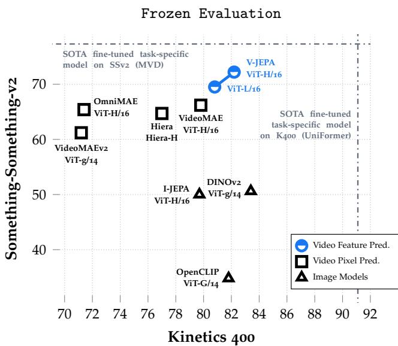
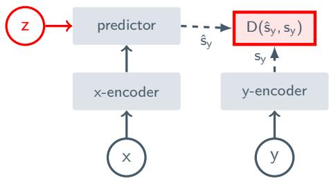
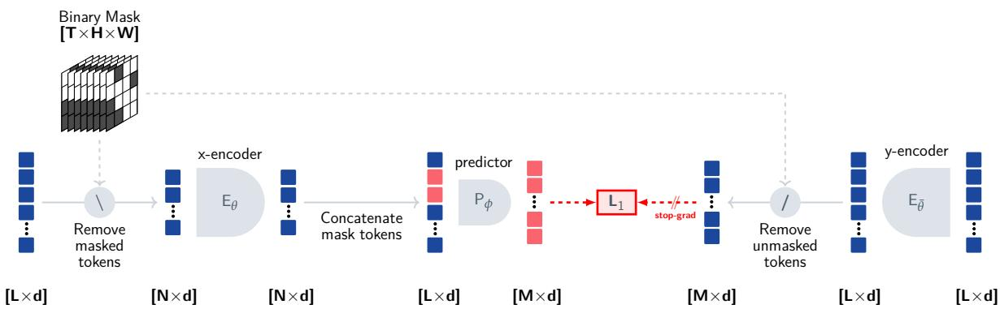
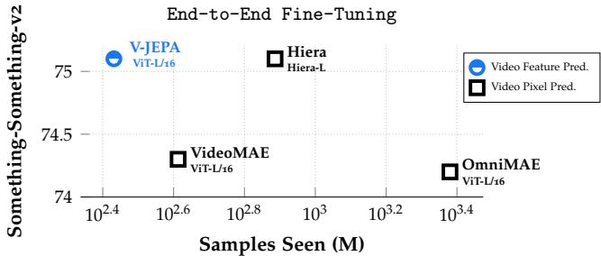
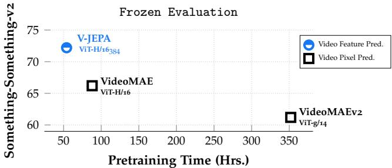
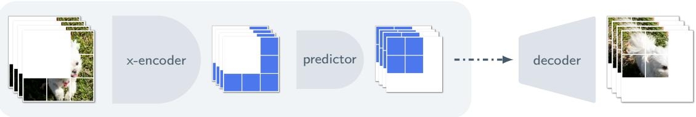
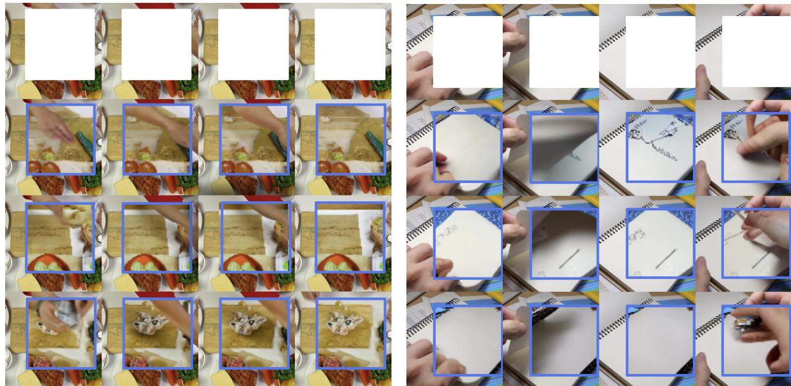
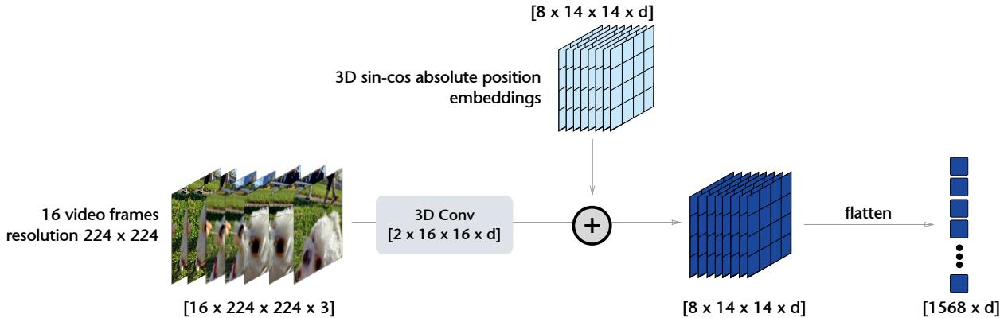
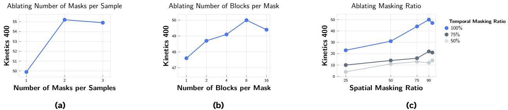
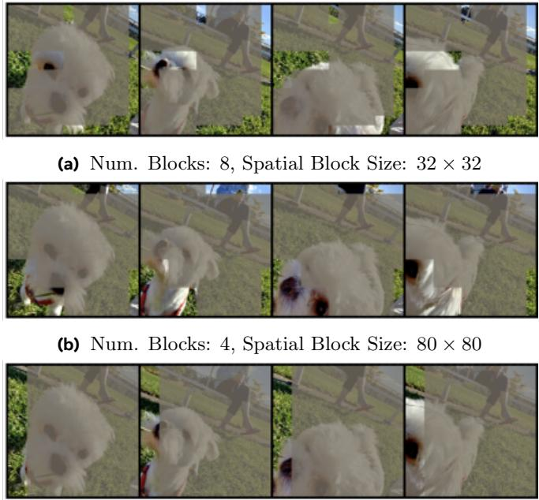

# 重访视频中学习视觉表征的特征预测

Ain Bardes、Quentin Garrido、Jean Ponce、Xinlei Chen、Micael Rabbat、Yann $^{1, 5, 6}$、Mahmoud Assran、Nicolas Ballas$^1$ 1FAIR, Meta；2Inria；$^3$ 法国高等师范学校、国家科学研究中心、巴黎大学研究所；$^4$ 古斯塔夫·埃菲尔大学、国家科学研究中心、LIGM；$^5$ 纽约大学Courant研究所；$^6$ 纽约大学数据科学中心 共同最后作者 本文探讨了将特征预测作为一种独立目标，用于从视频中进行无监督学习。我们收集了来自公共数据集的200万个视频，并在下游图像和视频任务上进行了评估。我们的结果表明，通过预测视频特征学习能够产生通用的视觉表示，这些表示在运动和外观相关的任务上均表现良好，而无需调整模型参数；例如，使用固定的主干网络。我们最大的模型ViT-H/16仅基于视频训练，在Kinetics-400上获得了$81.9\%$，在Something-Something-v2上获得了$72.2\%$，在ImageNet1K上获得了$77.9\%$。 日期：2024年4月15日 联系方式：{abardes, massran, ballasn}@meta.com 代码： [https://github.com/facebookresearch/jepa](https://github.com/facebookresearch/jepa) 博客文章：点击这里

# 1 引言

人类具备将来自视网膜的低级信号映射成对世界的语义时空理解的非凡能力；综合了诸如物体和全局运动等概念（Spelke等，1995）。机器学习社区一个长期以来的目标是识别可能指导人类此类无监督学习的原则或目标（Field，1994；Berkes和Wiskott，2005；Hinton，1989）。一个相关的假设基于预测特征原则（Rao和Ballard，1999），该原则认为时间上相邻的感官刺激的表征应该彼此具有预测性。

在本研究中，我们重新审视了将特征预测作为从视频中进行视觉表征无监督学习的独立目标。该领域的众多进展，例如在视觉中标准化使用变换器架构（Dosovitskiy et al., 2020）、掩膜自编码框架的成熟（Xie et al., 2021；Bao et al., 2021；He et al., 2021）、基于查询的特征池化（Chen et al., 2022）、联合嵌入预测架构（JEPA）（LeCun, 2022；Assran et al., 2023；Baevski et al., 2022b）以及更大规模的数据集，构成了一套独特的工具组合。我们将这些工具整合成一种现代且概念上简单的方法，即视频联合嵌入预测架构（V-JEPA），该方法完全基于特征预测，而不使用预训练的图像编码器、文本、负样本、人类注释或像素级重建。

  
Figure 1 V-JEPA models pretrained on video learn versatile visual representations. It performs well on motion-based tasks (Something-Something-v2) and appearance-based tasks (Kinetics 400) without adaptation of the model's parameters, i.e., using the same frozen backbone for both tasks.

我们寻求回答一个简单的问题：作为无监督视频学习的独立目标，特征预测有多有效？为此，我们在一个包含200万段从公开数据集中收集的视频的数据集上预训练了一系列V-JEPA模型，通过结合掩码建模预测任务与联合嵌入预测架构（见图2）。我们在多个下游图像和视频任务上测量性能，使用冻结评估和端到端微调。我们的研究发现，特征预测确实可以作为无监督视频学习的有效独立目标，同时使用的训练周期显著短于像素预测方法。具体而言： • 特征预测导致灵活的视觉表征，在无需调整模型权重的情况下，在多个下游图像和视频任务中表现良好；即，使用冻结的主干网络。V-JEPA在我们考虑的方法中实现了最佳性能（准确率提高6%），在SomethingSomething-v2任务上，该任务要求细致的时间理解。V-JEPA在Kinetics400等任务上也具有竞争力，后者对外观特征的要求足够，因此像DINOv2这样的最先进的图像模型表现优异（见图1和表6）。 • 在冻结评估协议（细致探测）下，使用特征预测训练的模型优于像素预测方法，并且在全面微调的情况下与像素预测相当，同时所需的训练周期显著更短（见表5和表6）。变差并通过掩码建模探讨特征预测。

预测特征。超越局部不变性，一系列研究训练预测器网络，将某一时间步的帧或剪辑表示映射到另一时间步的不同表示。Srivastava等（2015）；Vondrick等（2016）；Wang等（2023b）在一个冻结的预训练图像或视频编码器上训练这种视频特征预测器网络。解冻目标特征提取器后，一些方法通过使用监督动作预测损失（Girdhar和Grauman，2021）或通过在对比损失中使用远程剪辑的表示作为负样本（Han等，2019，2020；Tan等，2023）来同时训练视频编码器和预测器网络，常常侧重于小型卷积编码器（Han等，2019，2020）。通过在特征空间中预测缺失信息来学习表示的想法也是联合嵌入预测架构（JEPA）（LeCun，2022）的核心，该架构将一个连体编码器与一个预测器网络相结合。JEPA已在多个模态中成功实现，例如音频数据（Baevski等，2022b）和图像数据（Zhou等，2021；Oquab等，2023；Assran等，2023）。在这项工作中，我们通过利用自监督学习的最新进展，将这一范式扩展到视频数据。• 与像素预测方法相比，使用特征预测训练的模型在标签效率上更高。减少可用的标记样本数量会导致V-JEPA与像素重建模型之间的性能差距增加（表7）。

# 2 相关工作

慢特征。鼓励时间上相邻的表征相互预测的一种方法是确保它们随着时间的推移变化缓慢。早期针对预测特征的研究鼓励单个视频帧的表征在局部上是时间不变的，同时通过使用光谱方法来防止表征崩溃，例如在 SFA（Wiskott 和 Sejnowski，2002）、SSA（Kayser 等，2001）和模拟注视（Zou 等，2012）中。最近，Goroshin 等（2015）；Wang 等（2010）训练了一种孪生卷积网络，将两个后续帧的表征映射到同一点，同时通过成对边际损失和三元组损失分别鼓励远处帧具有多样化的表征。其他研究（Oord 等，2018；Surís 等，2021；Feichtenhofer 等，2021）则使用噪声对比估计（Gutmann 和 Hyvärinen，2012）实现时间不变性。我们在本文中的探索超越了时间上的不变性。

自监督学习的进展。视觉变换器的使用(Dosovitskiy et al., 2020; Li et al., 2022)已成为自监督学习中联合嵌入架构的标准做法(Chen et al., 2021; Caron et al., 2021; Oquab et al., 2023; Zhou et al., 2021; Assran et al., 2022)，并通过将像素解码器参数化为具有可学习掩码标记的变换器，解锁了像素空间中的掩码图像建模(Dosovitskiy et al., 2020; Xie et al., 2021; He et al., 2021; Bao et al., 2021)，显示出自编码方法的表示质量发生了重大变化(Vincent et al., 2010)。这一系列生成方法随后被扩展到视频数据，使用时空掩码(Tong et al., 2022; Feichtenhofer et al., 2022; Wang et al., 2023a; Kalluri et al., 2023; Gupta et al., 2023)。最近还显示，通过使用基于交叉注意力的可学习池化机制，可以显著改善掩码图像自编码器的表示(Chen et al., 2022)。最后，通过仔细选择设计选择，非对比崩溃防止策略在BYOL中(Grill et al., 2020)最近得以与图像特征预测方法结合使用(Baevski et al., 2022b; Assran et al., 2023)，这证明了能够学习可用于各种下游任务的表示，而不依赖于对手工设计的图像变换的不变性。

# 特征预测与像素重建

在像素空间进行预测的方法必须投入大量的模型能力和计算资源，以捕捉视觉输入中的所有低级细节。相比之下，在潜在空间进行预测的方法具有灵活性，可以从目标表示中排除无关或不可预测的像素级细节（Vondrick 等，2016）。在表示空间中进行预测已被证明能够产生多功能的表示，这些表示在通过线性探测或少样本适应等多种下游任务中表现良好（Assran 等，2023；Oquab 等，2023；Assran 等，2022），并且在预训练期间相比于像素级重建表现出更高的效率（Assran 等，2023；Baevski 等，2022b,a）。Baevski 等（2022a,b）的研究还表明，在表示空间中进行预测可以在图像、音频和文本领域实现具有竞争力的端到端微调性能。在本研究中，我们将这些发现扩展到视频模态。

# 3 方法论：视频-JEPA

  
Figure 2 Joint-Embedding Predictive Architectures are trained to predict the representation of an input $_ y$ from the representation of another input $x$ . The additional variable $z$ provides the predictor with information about the transformation that computes $_ y$ from $_ x$ .

我们的目标是探讨特征预测作为从视频学习视觉表示的独立目标的有效性。为此，我们采用了一种联合嵌入预测架构（JEPA）（LeCun, 2022）；见图2。JEPA背后的主要思想是通过预测输入$x$的表示来学习输入$y$的表示。基本架构由一个编码器$E_{ \theta }( \cdot )$组成，该编码器计算输入的表示，以及一个预测器$P_{ \phi }( \cdot )$，该预测器根据变量$z$（表示$x$与$y$之间的变换或损坏）从$x$的表示预测$y$的表示。对$z$进行条件化使得能够针对$x$的各种变换生成不同的预测。

# 3.1 训练目标

我们训练我们的视觉编码器 $E _ { \theta } ( \cdot )$，以满足一个约束，即从视频的一个部分计算出的表示 $y$ 应该可以从另一个部分计算出的表示 $x$ 中进行预测。预测网络 $P _ { \phi } ( \cdot )$ 将 $x$ 的表示映射到 $y$ 的表示，它与编码器同时训练，并通过条件变量 $z \Delta _ { y }$ 提供 $y$ 的时空位置规格信息。

天真地使用回归来实现目标会导致一个平凡解，即编码器输出一个恒定的表示，无论输入如何。实际上，我们使用以下修改后的目标来防止表示崩溃，其中 $\operatorname { s g } ( \cdot )$ 表示停止梯度操作，不会通过其参数进行反向传播，而 $\overline { { E } } _ { \theta } ( \cdot )$ 是网络 $E _ { \theta } ( \cdot )$ 的指数移动平均。使用指数移动平均特征提取器结合停止梯度和预测器，已被作为防止崩溃的策略用于图像预训练（Grill et al., 2020），并进行了实证研究（Xie et al., 2021）和理论研究（Tian et al., 2021）。事实上，方程（1）中的目标与 Assran et al.（2023）用于图像预训练的损失相似，但我们修改为使用 $\ell _ { 1 }$ 回归，我们发现这种方法更为稳定。

$$
\begin{array} { r l } { \operatornamewithlimits { m i n i m i z e } _ { \theta , \phi } } & { { } \| P _ { \phi } ( E _ { \theta } ( x ) , \Delta _ { y } ) - E _ { \theta } ( y ) \| _ { 1 } , } \end{array}
$$

$$
\begin{array} { r l } { \operatorname * { m i n i m i z e } _ { \boldsymbol { \theta } , \boldsymbol { \phi } } } & { { } \| P _ { \boldsymbol { \phi } } ( E _ { \boldsymbol { \theta } } ( \boldsymbol { x } ) , \Delta _ { \boldsymbol { y } } ) - \mathrm { s g } ( \overline { { E } } _ { \boldsymbol { \theta } } ( \boldsymbol { y } ) ) \| _ { 1 } , } \end{array}
$$

理论动机。Grill 等人（2020）为 BYOL 方法提出了一种此坍缩预防策略有效性的理论动机。我们为我们的 $\ell _ { 1 }$ 损失提供了他们分析的简单调整。为了便于说明，我们将忽略条件变量 $z$ 的影响，并考虑一维表示。用随机变量 $Y$ 表示表示 $\overline { { E } } _ { \theta } ( y )$。根据方程 (1)，最优预测器由以下函数表达式给出，

$$
\begin{array} { r l } & { P ^ { \star } ( E _ { \theta } ( x ) ) = \operatorname * { a r g m i n } _ { P } \| P ( E _ { \theta } ( x ) ) - Y \| _ { 1 } } \\ & { \qquad = \operatorname * { m e d i a n } ( Y | E _ { \theta } ( x ) ) . } \end{array}
$$

将此最优预测器的表达式代入损失函数并评估编码器的期望梯度得到，其中 MAD(. $| E _ { \theta } ( x ) )$ 是条件于 $E _ { \theta } ( x )$ 的随机变量的中位数绝对偏差。因此，在预测器是最优的情况下，编码器必须学习捕捉尽可能多的视频信息，以最小化目标的偏差。假设引入指数移动平均来计算 $y$ 的表示能够确保预测器的发展速度快于编码器，并保持接近最优，从而防止崩溃。

$$
\nabla _ { \boldsymbol { \theta } } \mathbb { E } \| P ^ { \star } ( E _ { \boldsymbol { \theta } } ( \boldsymbol { x } ) ) - Y \| _ { 1 } = \nabla _ { \boldsymbol { \theta } } \mathrm { M A D } ( Y | E _ { \boldsymbol { \theta } } ( \boldsymbol { x } ) ) ,
$$

  
Figure 3 V-JEPA. Training operates on a video clip of $T$ frames with spatial resolution $H \times W$ , flattened into a sequence of $L$ tokens. (Left to right): We first obtain the input of the $x$ -encoder by dropping tokens from the video clip. The $x$ r he pro he ask i ntpu  e vororu tokeNex te outputs of the $x$ -encoder are concatenated with a set of learnable mask tokens containing positional embeddings of the masked T each mask token. The outputs of the predictor are then regressed to the prediction targets using an $L _ { 1 }$ loss. The prediction targets correspond to the output of the $_ y$ -encoder.

# 3.2 预测任务：从 $x$ 预测 $y$

特征预测任务基于蒙版建模形式（He等，2021；Tong等，2022）；即，从视频中使用蒙版采样区域 $x$ 和 $y$。为了从视频中采样 $y$，我们采样多个（可能重叠的）空间连续块，具有不同的纵横比，并在视频的整个时间维度上重复这些空间块；$x$ 被视为其补集。覆盖整个时间维度的大连续块的蒙版可以限制由于视频的空间和时间冗余而导致的信息泄漏，从而使预测任务变得更加困难（Tong等，2022）。我们利用两种类型的蒙版：短程蒙版，其中我们取8个随机采样的目标块的并集，覆盖每帧的 $15\%$，和长程蒙版，其中我们取2个随机采样的目标块的并集，覆盖每帧的 $70\%$。在这两种情况下，所有采样块的纵横比在范围 (0.75, 1.5) 内随机选择。鉴于短程和长程蒙版都是通过采样多个块并取它们的并集产生的，结果是一个平均蒙版比例约为 $90\%$。我们将我们的蒙版策略称为多块蒙版，并在第4节中将其与其他可能的蒙版策略进行比较。

# 3.3 网络参数化

我们使用视觉变换器（ViT）作为视频主干网络。为了处理视频与变换器网络，我们将视频剪辑划分为一个由 $L$ 个时空补丁组成的 3D 网格，其中每个补丁由一个 $16 \times 16$ 像素块组成，跨越两个连续的帧；我们将这些时空补丁称为词元。这个词元序列随后直接由变换器块堆栈处理。输入 $x$ 和 $y$ 对应于视频的掩蔽区域，我们通过简单地丢弃部分词元来应用视频掩蔽。我们在 $x$ 编码器的输入处应用掩蔽，并在 $y$ 编码器的输出处应用掩蔽，以构建上下文化目标。编码器使用标准的 ViT 网络进行参数化，而预测器则是一个狭窄的变换器，实现了 12 个块，嵌入维度为 384。受掩蔽自编码器的启发，我们的预测器以 $x$ 编码器生成的嵌入序列作为输入，以及一组可学习的掩蔽词元序列，后者的位置信息嵌入指示 $y$ 词元的时空位置。预测器的输出是每个掩蔽词元的嵌入向量；请参见图 3 并参考附录 B 以获取更多详细信息。

# 3.4 预训练数据和评估设置

预训练。我们结合多个公共数据集构建了一个无监督视频预训练数据集，称为 VideoMix2M。具体而言，我们结合了来自 HowTo100M (HT)（Miech 等，2019）、Kinetics-400/600/700 (K710)（Kay 等，2017）和 Something-Something-v2 (SSv2)（Goyal 等，2017）的视频，并移除了与 Kinetics-400/600/700 和 Something-Something-v2 验证集的重叠，最终得到大约 200 万个视频。我们在 VideoMix2M 上训练了 ViT-L/16、ViT-H/16 和 ViT-H/16384 三种变换器模型。ViT-L/16 和 ViT-H/16 模型的批量大小为 3072，而 ViT-H/16384 模型的批量大小为 2400。每个模型的输入为一个包含 16 帧的视频片段，采用间隔为 4 的帧采样，平均时长约为 3 秒。ViT-L/16 和 ViT-H/16 在 224 的空间分辨率下处理视频，而 ViT-H/16384 使用的输入分辨率为 384；详见附录 C。m Vix0 ba0ulo 在像素空间预测上表现出一致的改善。

<table><tr><td></td><td></td><td colspan="3">Frozen Evaluation</td><td>Fine-Tuning</td></tr><tr><td>Target</td><td>Arch.</td><td>K400 (16×1×1)</td><td>SSv2 (16×1×1)</td><td>IN1K</td><td>K400-ft (16×5×3)</td></tr><tr><td>Pixels</td><td>ViT-L/16</td><td>68.6</td><td>66.0</td><td>73.3</td><td>85.4</td></tr><tr><td>Features</td><td>ViT-L/16</td><td>73.7</td><td>66.2</td><td>74.8</td><td>85.6</td></tr></table>

在预训练数据集规模增加的情况下，跨任务的 ab o 也会增加。

<table><tr><td></td><td></td><td></td><td colspan="3">Frozen Evaluation</td><td></td></tr><tr><td>Arch.</td><td>Data</td><td>#Samples</td><td>K400 (16×1×1)</td><td>SSv2 (16×1×1)</td><td>IN1K</td><td>Avg.</td></tr><tr><td rowspan="4">ViT-L/16</td><td>K710</td><td>700K</td><td>75.8</td><td>63.2</td><td>73.7</td><td>70.9</td></tr><tr><td>K710+SSv2</td><td>900K</td><td>72.9</td><td>67.4</td><td>72.8</td><td>71.0</td></tr><tr><td>K710+HT</td><td>1900K</td><td>74.5</td><td>64.2</td><td>74.8</td><td>71.1</td></tr><tr><td>VideoMix2M</td><td>2000K</td><td>73.7</td><td>66.2</td><td>74.8</td><td>71.5</td></tr><tr><td rowspan="2">ViT-H/16</td><td>K710+SSv2</td><td>900K</td><td>75.7</td><td>66.8</td><td>73.7</td><td>72.0</td></tr><tr><td>VideoMix2M</td><td>2000K</td><td>74.0</td><td>68.5</td><td>75.9</td><td>72.8</td></tr></table>

评估。预训练模型在下游的视频和图像任务上进行评估。在视频任务中，我们使用 VideoGLUE 基准（Yuan 等，2023）的一个子集来测试各项能力；具体而言，我们研究在 Kinetics400 (K400)（Kay 等，2017）上的动作识别、在 Something-Something-v2 (SSv2)（Goyal 等，2017）上的动作分类，以及在 AVA（Gu 等，2018）上的动作定位。Kinetics 上的动作分类评估模型基于外观的理解，因为数据集中许多动作类别可以通过视频中特定物体的存在推断得到（Sevilla-Lara 等，2021）。在 Something-Something-v2 上的动作分类评估模型的时间理解，因为数据集中的动作类别与视频中具体物体的外观/存在脱钩（Goyal 等，2017）。最后，AVA 上的动作定位评估模型理解和定位视频中动作的能力。我们遵循标准做法，并通过抽样多个空间和时间视图，报告 K400 和 SSv2 的准确性。对于静态图像任务，我们探讨在 ImageNet（Russakovsky 等，2015）上的物体识别，在 Places205（Zhou 等，2014）上的场景分类，以及在 iNaturalist 2021（Van Horn 等，2018）上的细粒度识别。

# 4 从视频中学习表示的关键因素是什么？

在本节中，我们隔离了几项设计选择的贡献，包括：a) 使用特征预测与像素预测的目标，b) 预训练数据分布的构建，c) 在下游任务中利用模型表征的特征池化策略，以及 d) 掩码策略，以确定：从什么预测什么？

# 4.1 预测表示与像素

我们首先消融了在表征空间中计算预测损失的效果。我们训练了一对 ViT-L/16 模型，使用 V-JEPA 特征预测损失，或采用与遮罩自编码器（He et al., 2021）中相同的归一化像素值均方误差损失，并对这两种方法的学习率和权重衰减策略进行了筛选。所有模型在 VideoMix2M 上进行了 90K 次迭代的预训练，批量大小为 3072，采用多块遮罩。我们使用带有关注探测器的冻结主干网络，在 Kinetics-400 (K400)、Something-Something-v2 (SSv2) 和 ImageNet-1K (IN1K) 上检查性能，并报告单中心视图下的 top-1 准确率。我们还检查了模型在 Kinetics-400 上的端到端微调性能。这一比较的结果在表 1 中报告，表明在特征空间中进行预测在视频主干网络的冻结评估以及端到端微调中，相较于像素空间预测提供了一致的性能提升。

# 4.2 预训练数据分布

接下来，我们研究表2中预训练数据分布的影响。大规模数据集的利用对其他模态（如文本和图像）的快速进展至关重要（Kaplan 等，2020；Cherti 等，2023）。我们探讨这一趋势是否同样适用于视频数据。为了控制可能影响计算预算的混杂变量，我们对表2中的所有模型进行了90K次迭代的预训练，使用批量大小为3072。我们在K400、SSv2和IN1K上报告下游结果，采用带有注意力探针的冻结主干网络，并使用单个中心视图报告顶级-1准确率。表3 平均池化与自适应池化。我们使用注意力探针对冻结的V-JEPA编码器输出的特征图进行池化，然后将其输入线性分类器以进行下游监督任务（K400和SSv2）。我们评估了两种池化策略：1) 平均池化（Avg.），和注意力池化（Att.）。结果使用单个中心视图进行报告。使用带有交叉注意力层的自适应池化在K400上提高了$+ 1 7 . 3$点，在SSv2上提高了$+ 1 6 . 1$点。

<table><tr><td></td><td></td><td colspan="4">Frozen Evaluation</td></tr><tr><td></td><td></td><td colspan="2">K400</td><td colspan="2">SSv2</td></tr><tr><td>Method</td><td>Arch.</td><td>(16×1×1) Avg.</td><td>Att.</td><td>(16×1×1)</td><td>Att.</td></tr><tr><td>V-JEPA</td><td>ViT-L/16</td><td>56.7</td><td>73.7</td><td>Avg. 50.1</td><td>66.2</td></tr></table>

表2显示，随着预训练数据集规模的增加，任务平均性能单调上升，但最佳特定任务性能是在为每个特定下游任务独立选择预训练数据时获得的。例如，L/16在预训练于K710+SSv2时获得最佳SSv2性能，在仅预训练于K710时获得最佳K400性能，而在仅预训练于K710+HT时获得最佳IN1K性能。所有任务的最佳平均性能是通过对VideoMix2M进行预训练实现的，该模型结合了所有数据源。同样，在K710+SSv2上预训练的H/16获得的K400得分高于在VideoMix2M上预训练的H/16，然而，平均性能最佳的H/16是在VideoMix2M上进行预训练的。

# 4.3 评估：关注式探测

接下来，我们探讨特征池化策略，以在下游任务中应用模型的表示。由于公式（1）中的预测目标是未归一化的，因此没有理由预计编码器会产生线性可分的子空间（Chen et al., 2020）。因此，我们不采用线性操作（平均）来对冻结主干网络输出的特征进行池化，而是探索一种可学习的非线性池化策略。具体而言，在评估冻结的预训练主干网络在下游任务上的表现时，我们学习了一个带有可学习查询词元的交叉注意力层。然后，交叉注意力层的输出被加回到查询词元中（残差连接），接着送入一个具有单个GeLU激活的两层多层感知机，之后进行层归一化，最后接入一个线性分类器。

<table><tr><td></td><td colspan="3">Frozen Evaluation</td></tr><tr><td>Masking</td><td>K400 (16×1×1)</td><td>SSv2 (16×1× 1)</td><td>IN1K</td></tr><tr><td>random-tube[0.9]</td><td>51.5</td><td>46.4</td><td>55.6</td></tr><tr><td>causal multi-block[6]</td><td>61.3</td><td>49.8</td><td>66.9</td></tr><tr><td>causal multi-block[12]</td><td>71.9</td><td>63.6</td><td>72.2</td></tr><tr><td>multi-block</td><td>72.9</td><td>67.4</td><td>72.8</td></tr></table>

在表3中，我们可以看到，使用带有可学习交叉注意力层的自适应池化在K400上带来了显著的提升，达到+17分，而在SSv2上则达到了+$16.1$分。使用注意力探测器对其他基线模型也有益，如附录E所报告。

# 4.4 预测任务：从 $x$ 预测 $y$

我们对 V-JEPA 预训练中使用的掩蔽策略进行了消融实验。我们考察了以下掩蔽策略：随机管道（random-tube），其中 $x$ 是通过从视频中移除一随机比例 $r$ 的管道（跨越整个时间段的空间补丁）获得的；因果多块（causal multi-block），在该策略中 $x$ 限制在 16 帧视频的前 $p$ 帧，这些帧随后用随机的一组时空块进行掩蔽；以及多块（multi-block），其 $x$ 是通过从整个视频中掩蔽随机的一组时空块获得的。时空块是使用第 3.2 节中描述的参数进行采样的；关于掩蔽的时空块大小和数量的消融实验见附录 E.4。表 4 显示，使用多块策略采样 $x$ 可以获得最佳结果，此时网络被迫在删除视频中的大连续块后进行预测。当 $x$ 仅从视频的前几帧中采样时，如因果多块策略所示，我们观察到下游性能的下降。最后，随机管道策略，其中视频中 90% 的管道被随机掩蔽，与我们的特征预测目标结合时导致了低语义质量的特征。表 [与像素预测方法的比较] 中，我们将 V-JEPA 与 mniMA（Girdhar 等，2023）、VideoMA 以及其他方法进行了比较。在所有任务中，除了 ImageNet，模型 achieve 的 $74.8\%$ 表现相比直接在 mNeJEP 上训练的 OmniMAE 模型的 $75.1\%$ 略有下降。V-JEPA 的结果是在预训练中处理的样本明显较少的情况下取得的。

<table><tr><td rowspan="2"></td><td rowspan="2">#Samples</td><td rowspan="2"></td><td rowspan="2"></td><td colspan="6">Frozen Evaluation w/ Att. Pooling</td><td colspan="2">Fine-Tuning</td></tr><tr><td>K400 (16×8×3)</td><td>SSv2 (16×2×3)</td><td>AVA</td><td>IN1K</td><td>Places205</td><td>iNat21</td><td>K400-ft (16×5× 3)</td><td>SSv2-ft (16×2× 3)</td></tr><tr><td>Methods pretrained using pixel prediction</td><td></td><td></td><td></td><td></td><td></td><td></td><td></td><td></td><td></td><td></td><td></td></tr><tr><td>OmniMAE</td><td>ViT-L/16</td><td>2400M</td><td>1170K</td><td>65.6</td><td>60.6</td><td>14.4</td><td>75.1</td><td>59.8</td><td>66.1</td><td>84.0</td><td>74.2</td></tr><tr><td>VideomMAE</td><td> ViT-L/16</td><td>410M</td><td>400K</td><td>77.8</td><td>65.5</td><td>21.6</td><td>71.1</td><td>59.3</td><td>64.6</td><td>85.4</td><td>74.3</td></tr><tr><td>Hiera</td><td>iera-L</td><td>770M</td><td>500K</td><td>755</td><td>64.2</td><td>15.8</td><td>68.9</td><td>558.5</td><td>56.9</td><td>87.3</td><td>75.1</td></tr><tr><td>V-JEPA</td><td>ViT-L/16</td><td>270M</td><td>90K</td><td>80.8</td><td>69.5</td><td>25.6</td><td>74.8</td><td>60.3</td><td>67.8</td><td>85.6</td><td>75.1</td></tr></table>

我们遵循标准实践，从多个空间和时间视角报告准确性，以在 K400 和 Sv2 上进行比较。在需要运动理解的任务中（在 SSv2 上加 21 分），并缩小了视频模型和图像模型在需要静态外观特征的任务之间的差距。

<table><tr><td></td><td></td><td></td><td></td><td colspan="3">Video Tasks</td><td colspan="3">Image Tasks</td></tr><tr><td>Method</td><td>Arch.</td><td>Params.</td><td>Data</td><td>K400 (16×8×3)</td><td>SSv2 (16×2×3)</td><td>AVA</td><td>IN1K</td><td>Places205</td><td>iNat21</td></tr><tr><td colspan="10">Methods pretrained on Images</td></tr><tr><td>I-JEPA</td><td>ViT-H/16512</td><td>630M</td><td>IN22K</td><td>79.7</td><td>50.0</td><td>19.8</td><td>84.4</td><td>66.5</td><td>85.7</td></tr><tr><td>OpenCLIP</td><td>Vi-G/14</td><td>1800M</td><td>LAION</td><td>81.8</td><td>34.8</td><td>23.2</td><td>85.3</td><td>70.2</td><td>83.6</td></tr><tr><td>DINOv2</td><td>ViT-g/14</td><td>1100M</td><td>LVD-142M</td><td>83.4</td><td>50.6</td><td>24.3</td><td>86.2</td><td>68.4</td><td>88.8</td></tr><tr><td colspan="10">Methods pretrained on Videos</td></tr><tr><td></td><td></td><td></td><td></td><td></td><td></td><td></td><td></td><td></td><td></td></tr><tr><td>MVD</td><td>ViT-L/16</td><td>200M</td><td>IN1K+K400</td><td>79.4</td><td>66.5</td><td>19.7</td><td>73.3</td><td>59.4 660.6</td><td>65.7 72.4</td></tr><tr><td>OmniMAE</td><td>ViT-H/16 ViIT-H/16</td><td>630M 630M</td><td>IN1K+SSv2 K400</td><td>71.4 79.8</td><td>65.4 66.2</td><td>16.0 20.7</td><td>76.3 72.3</td><td>59.1</td><td>65.5</td></tr><tr><td>VideoMAE VideoMAEv2</td><td>ViT-g/14</td><td>1100M</td><td>Un.Hybrid</td><td>71.2</td><td>61.2</td><td>12.9</td><td>71.4</td><td>60.6</td><td>68.3</td></tr><tr><td>Hiera</td><td>Hiera-H</td><td>670M</td><td>K400</td><td>77.0</td><td>64.7</td><td>17.5</td><td>71.4</td><td>59.5</td><td>61.7</td></tr><tr><td rowspan="3">V-JEPA</td><td></td><td>200M</td><td></td><td>80.8</td><td>69.5</td><td>25.6</td><td>74.8</td><td>60.3</td><td>67.8</td></tr><tr><td>ViT-L/16 ViIT-H/16</td><td>630M</td><td>VideoMix2M</td><td>82.0</td><td>71.4</td><td>25.8</td><td>75.9</td><td>61.7</td><td>67.9</td></tr><tr><td>ViT-H/16384</td><td>630M</td><td></td><td>81.9</td><td>72.2</td><td>25.0</td><td>77.4</td><td>62.8</td><td>72.6</td></tr></table>

# 5 与前人工作的比较

在5.1节中，我们通过比较V-JEPA与依赖像素预测的视频方法来研究特征预测的影响，同时对所有基线使用相似的架构。随后，在5.2节中，我们去除架构限制，报告自监督视频和图像预训练方法在不同架构下的最佳性能。最后，在5.3节中，我们探讨V-JEPA相对于其他自监督视频预训练方法的标签效率。我们在附录D中进一步详细说明评估设置。

# 5.1 与像素预测的比较

为了调查特征预测预训练的有效性，我们首先将 V-JEPA 与依赖像素预测损失的视频掩蔽建模模型进行比较。我们通过使用 ViT-L/16 编码器或具有相似参数数量的 Hiera-L 编码器来控制模型架构的潜在混杂因素。对于像素预测基线，我们考虑 VideoMAE（Tong et al., 2022; Wang et al., 2023a），该模型专门在视频上训练视觉变换器自编码器；Hiera（Ryali et al., 2023），该模型在视频上训练分层变换器自编码器；以及 OmniMAE（Girdhar et al., 2023），该模型同时在静态图像和视频上训练视觉变换器自编码器。表 5 检查了在下游视频和图像任务上使用注意探测器的冻结评估，以及端到端的微调。在冻结评估中，V-JEPA 在所有下游任务上均优于基线，唯一例外是 ImageNet，在该任务上我们获得了 $74.8\%$ 的准确率，而 OmniMAE 模型直接在 ImageNet 上训练的准确率为 $75.1\%$；因此，尽管 V-JEPA 仅在视频上进行预训练，但仍然在 ImageNet 上获得了相当的性能。

  
Figure 4 SSv2 fine-tuning performance vs. Samples Seen. We report SSv2 fine-tuning for V-JEPA and pixel-reconstruction baselines using a ViT-L/16 or Hiera-L architecture. V-JEPA outperforms all pixel-reconstruction methods using a ViTL/16 and matches the Hiera-L performance while seeing significantly less samples during pretraining.

在微调协议下，V-JEPA 同样在使用 ViT-L/16 训练的模型中实现了最佳性能，并且在 SSv2 上的表现与 Hiera-L 相匹配，后者受益于层次性先验（Ryali et al., 2023）。V-JEPA 模型在预训练过程中处理的样本数量显著较少（图 4），这展示了特征预测作为学习原则的高效性。

# 5.2 与最先进技术的比较

接下来，在表 6 中，我们检查了在视频上进行预训练的 V-JEPA 模型与当前最大最先进的自监督图像和视频模型的对比，具体是在冻结主干编码器并在其上训练一个注意力探测器时。我们的图像预训练基准包括 OpenCLIP（Cherti 等，2023）、DINOv2（Oquab 等，2023）和 I-JEPA（Assran 等，2023）。OpenCLIP 模型是通过对比的图像-文本对齐目标进行训练的，而 DINOv2 和 I-JEPA 则采用自监督的方法进行训练。这些模型在冻结评估性能上表现优异（Oquab 等，2023）；即它们能够产生可以同时应用于许多下游任务的视觉特征，而无需端到端微调，因此提供了高度竞争的基准。我们的 视频预训练基准包括 VideoMAE（Tong 等，2022）、OmniMAE（Girdhar 等，2023）、Hiera（Ryali 等，2023）、VideoMAEv2（Wang 等，2023a）和 MVD（Wang 等，2023b）。OpenCLIP、DINOv2 和 VideoMAEv2 模型被参数化为包含超过 10 亿参数的巨型/巨大视觉变换器架构，这些架构是在大规模图像或视频数据集上进行训练的。

与视频模型的比较。与大规模视频基线相比，V-JEPA模型在所有下游视频和图像任务上都以显著的优势超越了所有之前的模型（见表6）。我们的H/16模型在运动理解（Something-Something-v2）上比现有最大的公开模型VideoMAE、VideoMAEv2、OmniMAE、MVD和Hiera至少高出5个百分点，在动作识别（Kinetics-400）上高出2个百分点，在动作检测（AVA）上高出5个百分点，在物体识别（ImageNet-1K）上高出1个百分点，在场景识别（Places205）上高出2个百分点，在细粒度识别（iNaturalist）上高出0.2个百分点。此外，在图5中比较预训练的实际时间时，我们可以看到，V-JEPA在与大型像素预测模型相比时，性能实现了大约2倍的加速。

  
Figure 5 SSv2 frozen-evaluation performance vs. Pretraining Time. Wallclock times for all methods are measured on a single GPU with a batch size of 10 clips, using the official codebases for VideoMAE and VideoMAEv2, and linearly extrapolated assuming a global batch size of 2400 samples. However, note that the SSv2 accuracies of video pixel prediction methods are actually obtained with small batch sizes and significantly longer training schedules. V-JEPA outperforms pixel-reconstruction methods while training significantly faster.

与图像模型的比较。在需要精细理解运动的任务（如SomethingSomething-v2）中，V-JEPA模型相比于大型图像基线模型（如DINOv2、OpenCLIP和IJEPA）提供了显著的改进（提高超过21个百分点）。基于视频的自监督预训练使得能够建模一些不易通过静态图像数据集学习的动态概念。同样地，我们观察到V-JEPA模型在动作定位任务上超越了基于图像的预训练。在Kinetics-400上，我们发现图像模型表现良好；例如，虽然DINOv2（Oquab等，2023）之前在K400上报告了$78.4\%$的线性探测结果，但我们通过使用一个关注探测器将g/14模型的冻结评估提升至$83.4\%$。在这种情况下，我们的H/16模型实现了82.0%的top-1准确率。值得注意的是，许多Kinetics视频的标签可以通过基于外观的线索推断出来，而无需理解运动（Sevilla-Lara等，2021）。V-JEPA模型在图像分类任务中缩小了与图像模型之间的差距。特别是，V-JEPA在ImageNet上使用一个单层关注探测器获得了$77.4\%$的分数，使用一个双层关注探测器可以进一步提高至$\mathbf{77.9\%}$。更一般而言，我们假设用于训练V-JEPA和其他视频模型的数据集过于受限，缺乏图像模型所使用的互联网规模预训练数据的视觉多样性；因此，未来的工作应着重于构建多样化的公开可用视频数据集。我们在几种低样本设置中训练探测器：使用$5\%$、$10\%$或$50\%$的训练集，并进行随机取样以验证V-JEPA与基线模型之间的表现差异。

<table><tr><td></td><td>K400</td><td colspan="6">Frozen Evaluation</td></tr><tr><td></td><td colspan="5">(16×8×3)</td><td colspan="3">SSv2 (16×2× 3)</td></tr><tr><td>Method</td><td>Arch.</td><td>5% (∼29 samples per class)</td><td>10% (∼58 samples per class)</td><td>50% (∼287 samples per class)</td><td>5% (∼48 samples per class)</td><td>10% (∼96 samples per class)</td><td>50% (~440 samples per class)</td></tr><tr><td></td><td></td><td></td><td></td><td></td><td></td><td></td><td></td></tr><tr><td>MVD VideoMAE</td><td>ViT-L/16 ViT-H/16</td><td>62.6 ± 0.2 62.3 ± 0.3</td><td>68.3 ± 0.2 68.5 ± 0.2</td><td>77.2 ± 0.3 78.2 ± 0.1</td><td>42.9 ± 0.8 41.4 ± 0.8</td><td>49.5 ± 0.6 48.1 ± 0.2</td><td>61.0 ± 0.2 60.5 ± 0.4</td></tr><tr><td>VideoMAEv2</td><td>ViT-g/14</td><td>37.0 ± 0.3</td><td>48.8 ± 0.4</td><td>67.8 ± 0.1</td><td>28.0 ± 1.0</td><td>37.3 ± 0.3</td><td>54.0 ± 0.3</td></tr><tr><td>V-JEPA</td><td>ViT-H/16</td><td>67.0 ± 0.2</td><td>72.1 ± 0.1</td><td>80.2 ± 0.2</td><td>51.9 ± 0.3</td><td>57.5 ± 0.4</td><td>67.3 ± 0.2</td></tr><tr><td></td><td>ViT-H/16384</td><td>68.2 ± 0.2</td><td>72.8 ± 0.2</td><td>80.6 ± 0.2</td><td>54.0 ± 0.2</td><td>59.3 ± 0.5</td><td>67.9 ± 0.2</td></tr></table>

# 5.3 标签效率

我们通过测量预训练主干网络在有限标签下适应下游任务的能力，来比较 V-JEPA 与其他自监督视频模型的标签效率。具体地，我们调查冻结模型在 Kinetics-400 和 Something-Something-v2 上的表现，并在训练注意力探测器时改变每个数据集中可用的标记示例的百分比。我们在几种低样本设置中训练探测器：使用 $5 \%$ 的训练集，$10 \%$ 或 $50 \%$，并在每个设置中进行 3 次随机划分，以获得更稳健的度量，最终为每个模型提供 9 个不同的评估实验。表 7 报告了使用 K400 和 SSv2 验证集的平均表现和标准差。

我们发现 V-JEPA 在标签效率方面优于其他自监督视频模型：减少用于训练注意力探针的标签样本数量会导致 V-JEPA 与其他模型之间的性能差距加大。特别是，当我们将标签样本数量减少 $10 \times$（从大约每个类别 287 个样本减少到每个类别 29 个样本）时，最大的 V-JEPA 模型在 K400 上的性能下降了 $1.2\%$，降至 $68.2\%$ 的 top-1 准确率。相比之下，VideoMAEv2 的下降幅度为 $30\%$，降至 $37.0\%$ 的 top-1，VideoMAE 的下降幅度为 $15.9\%$，降至 $62.3\%$ 的 top-1，而 MVD 的下降幅度为 $14.6\%$，降至 $62.6\%$ 的 top-1。在 SSv2 上也观察到了类似的现象。当我们将标签样本数量减少 $10 \times$（从大约每个类别 440 个样本减少到每个类别 48 个样本）时，最大的 V-JEPA 模型在 SSv2 上的性能下降了 $13.9\%$，降至 $54.0\%$ 的 top-1。相比之下，VideoMAEv2 的下降幅度为 $26\%$，降至 $28.0\%$ 的 top-1，VideoMAE 的下降幅度为 $19.1\%$，降至 $41.4\%$ 的 top-1，而 MVD 的下降幅度为 $18.1\%$，降至 $42.9\%$ 的 top-1。

# 6 评估预测器

接下来，我们寻求对 V-JEPA 模型进行定性检验。回顾一下，V-JEPA 中的预测器网络基于已知的掩码时空区域 $y$ 和可见区域 $x$ 的位置位置信息，预测掩码区域的表示（见第 3 节）。为定性分析特征空间预测的结合，我们冻结了预训练的编码器和预测器网络，并训练了一个条件扩散解码器，将 V-JEPA 的预测映射到可解释的像素。值得注意的是，解码器仅接收针对视频缺失区域的预测表示，而无法访问视频中未被遮挡的区域（见图 6a）。给定一个被遮挡的视频，我们使用 V-JEPA 预训练模型预测缺失区域的表示，然后使用解码器将这些表示投影到像素空间。图 6b 展示了不同随机种子的解码器输出。样本中共享的特性表示了预测者表示中包含的信息。图 6b 显示 V-JEPA 的特征预测确实是有依据的，并与视频中未遮挡区域展示了时空一致性。具体而言，图 6b 中的样本表明 V-JEPA 预测器能够正确捕捉位置的不确定性，并在不同位置产生各种视觉对象，且表现出一致的运动。一些样本还展示了对物体持久性的理解，因为视觉对象在部分遮挡后仍保持一致性。

# 冷冻

视频中的 Vzy z。

iszatisrsRowMaski 使用 putheVJEPAmodel 进行 T-/c cnd rork。OhBo nv mpy oh t 视频。预测也捕捉到了时间上的一致运动。图 6 定性分析。V-JEPA 特征空间预测的离线可视化结果。

# 7 结论

在本研究中，我们探讨了特征预测作为视频无监督学习独立目标的有效性，并引入了V-JEPA，这是一组仅通过自监督特征预测目标训练的视觉模型。V-JEPA模型展示了在不调整模型参数的情况下解决各种下游图像和视频任务的能力，并在冻结评估中超越了以往视频表示学习方法，包括动作识别、时空动作检测和图像分类任务。此外，我们展示了在视频上进行V-JEPA预训练对于解决需要细粒度运动理解的下游任务特别有效，而在互联网规模数据集上训练的大规模图像模型在这类任务上表现不佳。最后，我们通过实证观察到V-JEPA模型是标签高效学习者，即使在仅有少量标注样本的情况下，也能在下游任务中表现出良好的性能。

# References

Hassan Akbari, Liangzhe Yuan, Rui Qian, Wei-Hong Chuang, Shih-Fu Chang, Yin Cui, and Boqing Gong. Vatt: Transformers for multimodal self-supervised learning from raw video, audio and text. Advances in Neural Information Processing Systems, 34:2420624221, 2021.

Anurag Arnab, Mostafa Dehghani, Georg Heigold, Chen Sun, Mario Lucic, and Cordelia Schmid. Vivit: A video vision transformer. In Proceedings of the IEEE international conference on computer vision, 2021.

Mahmoud Assran, Mathilde Caron, Ishan Misra, Piotr Bojanowski, Florian Bordes, Pascal Vincent, Armand Joulin, Michael Rabbat, and Nicolas Ballas. Masked siamese networks for label-efficient learning. arXiv preprint arXiv:2204.07141, 2022.

Mahmoud Assran, Quentin Duval, Ishan Misra, Piotr Bojanowski, Pascal Vincent, Michael Rabbat, Yann LeCun, and Nicolas Ballas. Self-supervised learning from images with a joint-embedding predictive architecture. In Proceedings of the IEEE/CVF Conference on Computer Vision and Pattern Recognition, pages 1561915629, 2023.

Alexei Baevski, Arun Babu, Wei-Ning Hsu, and Michael Auli. Efficient self-supervised learning with contextualized target representations for vision, speech and language. arXiv preprint arXiv:2212.07525, 2022a.

Alexei Baevski, Wei-Ning Hsu, Qiantong Xu, Arun Babu, Jiatao Gu, and Michael Auli. Data2vec: A general framework for self-supervised learning in speech, vision and language. arXiv preprint arXiv:2202.03555, 2022b.

Hangbo Bao, Li Dong, and Furu Wei. Beit: Bert pre-training of image transformers. arXiv preprint arXiv:2106.08254, 2021.

Pietro Berkes and Laurenz Wiskott. Slow feature analysis yields a rich repertoire of complex cell properties. Journal of vision, 5(6):99, 2005.

Mathilde Caron, Ishan Misra, Julien Mairal, Priya Goyal, Piotr Bojanowski, and Armand Joulin. Unsupervised learning of visual features by contrasting cluster assignments. arXiv preprint arXiv:2006.09882, 2020.

Mathilde Caron, Hugo Touvron, Ishan Misra, Hervé Jé- gou, Julien Mairal, Piotr Bojanowski, and Armand Joulin. Emerging properties in self-supervised vision transformers. arXiv preprint arXiv:2104.14294, 2021.

Ting Chen, Simon Kornblith, Mohammad Norouzi, and Geoffrey Hinton. A simple framework for contrastive learning of visual representations. preprint arXiv:2002.05709, 2020.

Xiaokang Chen, Mingyu Ding, Xiaodi Wang, Ying Xin, Shentong Mo, Yunhao Wang, Shumin Han, Ping Luo, Gang Zeng, and Jingdong Wang. Context autoencoder for self-supervised representation learning. arXiv preprint arXiv:2202.03026, 2022.

Xinlei Chen, Saining Xie, and Kaiming He. An empirical study of training self-supervised vision transformers. arXiv preprint arXiv:2104.02057, 2021.

Mehdi Cherti, Romain Beaumont, Ross Wightman, Mitchell Wortsman, Gabriel Ilharco, Cade Gordon, Christoph Schuhmann, Ludwig Schmidt, and Jenia Jitsev. Reproducible scaling laws for contrastive language-image learning. In Proceedings of the IEEE/CVF Conference on Computer Vision and Pattern Recognition, pages 28182829, 2023.

Ekin Dogus Cubuk, Barret Zoph, Vijay Mane, Dandelion andVasudevan, and Quoc V. Le. Autoaugment: Learning augmentation policies from data. In Proceedings of the IEEE Conference on Computer Vision and Pattern Recognition, 2019.

Alexey Dosovitskiy, Lucas Beyer, Alexander Kolesnikov, Dirk Weissenborn, Xiaohua Zhai, Thomas Unterthiner, Mostafa Dehghani, Matthias Minderer, Georg Heigold, Sylvain Gelly, et al. An image is worth 16x16 words: Transformers for image recognition at scale. arXiv preprint arXiv:2010.11929, 2020.

Christoph Feichtenhofer, Haoqi Fan, Bo Xiong, Ross Girshick, and Kaiming He. A large-scale study on unsupervised spatiotemporal representation learning. Proceedings of the IEEE conference on computer vision and pattern recognition, 2021.

Christoph Feichtenhofer, Yanghao Li, Kaiming He, et al. Masked autoencoders as spatiotemporal learners. Advances in neural information processing systems, 35:3594635958, 2022.

David J Field. What is the goal of sensory coding? Neural computation, 6(4):559601, 1994.

Spyros Gidaris, Andrei Bursuc, Nikos Komodakis, Patrick Pérez, and Matthieu Cord. Learning representations by predicting bags of visual words. In Proceedings of the IEEE/CVF Conference on Computer Vision and Pattern Recognition, pages 69286938, 2020.

Rohit Girdhar and Kristen Grauman. Anticipative video transformer. In Proceedings of the IEEE/CVF international conference on computer vision, pages 1350513515, 2021.

Rohit Girdhar, Alaaeldin El-Nouby, Mannat Singh, Kalyan Vasudev Alwala, Armand Joulin, and Ishan Misra. Omnimae: Single model masked pretraining on images and videos. In Proceedings of the IEEE/CVF Conference on Computer Vision and Pattern Recognition, pages 1040610417, 2023.

Ross Goroshin, Joan Bruna, Jonathan Tompson, David Eigen, and Yann LeCun. Unsupervised learning of spatiotemporally coherent metrics. In Proceedings of the IEEE international conference on computer vision, pages 40864093, 2015.

Raghav Goyal, Samira Ebrahimi Kahou, Vincent Michalski, Joanna Materzynska, Susanne Westphal, Heuna Kim, Valentin Haenel, Ingo Fruend, Peter Yianilos, Moritz Mueller-Freitag, et al. The" something something" video database for learning and evaluating visual common sense. In Proceedings of the IEEE international conference on computer vision, pages 58425850, 2017.

Jean-Bastien Grill, Florian Strub, Florent Altché, Corentin Tallec, Pierre H Richemond, Elena Buchatskaya, Carl Doersch, Bernardo Avila Pires, Zhaohan Daniel Guo, Mohammad Gheshlaghi Azar, et al. Bootstrap your own latent: A new approach to self-supervised learning. arXiv preprint arXiv:2006.07733, 2020.

Chunhui Gu, Chen Sun, David A Ross, Carl Vondrick, Caroline Pantofaru, Yeqing Li, Sudheendra Vijayanarasimhan, George Toderici, Susanna Ricco, Rahul Sukthankar, et al. Ava: A video dataset of spatio-temporally localized atomic visual actions. In Proceedings of the IEEE conference on computer vision and pattern recognition, pages 60476056, 2018.

Agrim Gupta, Jiajun Wu, Jia Deng, and Li Fei-Fei. Siamese masked autoencoders. arXiv preprint arXiv:2305.14344, 2023.

Michael U Gutmann and Aapo Hyvärinen. Noise-contrastive estimation of unnormalized statistical models, with applications to natural image statistics. Journal of machine learning research, 13(2), 2012.

Tengda Han, Weidi Xie, and Andrew Zisserman. Video representation learning by dense predictive coding. In Proceedings of the IEEE/CVF International Conference on Computer Vision Workshops, pages 00, 2019.

Tengda Han, Weidi Xie, and Andrew Zisserman. Memoryaugmented dense predictive coding for video representation learning. In European conference on computer vision, pages 312329. Springer, 2020.

Kaiming He, Xinlei Chen, Saining Xie, Yanghao Li, Piotr Dollár, and Ross Girshick. Masked autoencoders are scalable vision learners. arXiv preprint arXiv:2111.06377, 2021.

Geoffrey E Hinton. Connectionist learning procedures. In Machine learning, pages 555610. Elsevier, 1989.

Tarun Kalluri, Deepak Pathak, Manmohan Chandraker, and Du Tran. Flavr: Flow-agnostic video representations for fast frame interpolation. In Proceedings of the IEEE/CVF Winter Conference on Applications of Computer Vision, pages 20712082, 2023.

Jared Kaplan, Sam McCandlish, Tom Henighan, Tom B Brown, Benjamin Chess, Rewon Child, Scott Gray, Alec Radford, Jeffrey Wu, and Dario Amodei. Scaling laws for neural language models. arXiv preprint arXiv:2001.08361, 2020.

Will Kay, Joao Carreira, Karen Simonyan, Brian Zhang, Chloe Hillier, Sudheendra Vijayanarasimhan, Fabio Viola, Tim Green, Trevor Back, Paul Natsev, et al. The kinetics human action video dataset. arXiv preprint arXiv:1705.06950, 2017.

Christoph Kayser, Wolfgang Einhäuser, Olaf Dümmer, Peter König, and Konrad Körding. Extracting slow subspaces from natural videos leads to complex cells. In Artificial Neural Networks—ICANN 2001: International Conference Vienna, Austria, August 2125, 2001 Proceedings 11, pages 10751080. Springer, 2001.

Gustav Larsson, Michael Maire, and Gregory Shakhnarovich. Learning representations for automatic colorization. 2016.

Gustav Larsson, Michael Maire, and Gregory Shakhnarovich. Colorization as a proxy task for visual understanding. 2017.

Yann LeCun. A path towards autonomous machine intelligence version 0.9. 2, 2022-06-27. 2022.

Hsin-Ying Lee, Jia-Bin Huang, Maneesh Singh, and MingHsuan Yang. Unsupervised representation learning by sorting sequences. In Proceedings of the IEEE international conference on computer vision, pages 667676, 2017.

Kunchang Li, Yali Wang, Peng Gao, Guanglu Song, Yu Liu, Hongsheng Li, and Yu Qiao. Uniformer: Unified transformer for efficient spatiotemporal representation learning. arXiv preprint arXiv:2201.04676, 2022.

Ilya Loshchilov and Frank Hutter. Decoupled weight decay regularization. arXiv preprint arXiv:1711.05101, 2017.

Antoine Miech, Dimitri Zhukov, Jean-Baptiste Alayrac, Makarand Tapaswi, Ivan Laptev, and Josef Sivic. Howto100m: Learning a text-video embedding by watching hundred million narrated video clips. In Proceedings of the IEEE/CVF international conference on computer vision, pages 26302640, 2019.

Mehdi Noroozi and Paolo Favaro. Unsupervised learning of visual representations by solving jigsaw puzzles. In European conference on computer vision, pages 6984. Springer, 2016.

Aaron van den Oord, Yazhe Li, and Oriol Vinyals. Representation learning with contrastive predictive coding. arXiv preprint arXiv:1807.03748, 2018.

Maxime Oquab, Timothée Darcet, Théo Moutakanni, Huy Vo, Marc Szafraniec, Vasil Khalidov, Pierre Fernandez, Daniel Haziza, Francisco Massa, Alaaeldin El-Nouby, et al. Dinov2: Learning robust visual features without supervision. arXiv preprint arXiv:2304.07193, 2023.

Nikhil Parthasarathy, SM Eslami, João Carreira, and Olivier J Hénaff. Self-supervised video pretraining yields strong image representations. arXiv preprint arXiv:2210.06433, 2022.

Deepak Pathak, Philipp Krahenbuhl, Jeff Donahue, Trevor Darrell, and Alexei A Efros. Context encoders: Feature learning by inpainting. In Proceedings of the IEEE conference on computer vision and pattern recognition, pages 25362544, 2016.

Silvia L Pintea, Jan C van Gemert, and Arnold WM Smeulders. Déja vu: Motion prediction in static images. In Computer Vision-ECCV 2014: 13th European Conference, Zurich, Switzerland, September 6-12, 2014, Proceedings, Part III 13, pages 172187. Springer, 2014.

Alec Radford, Jong Wook Kim, Chris Hallacy, Aditya Ramesh, Gabriel Goh, Sandhini Agarwal, Girish Sastry, Amanda Askell, Pamela Mishkin, Jack Clark, et al. Learning transferable visual models from natural language supervision. In International conference on machine learning, pages 87488763. PMLR, 2021.

Rajesh PN Rao and Dana H Ballard. Predictive coding in the visual cortex: a functional interpretation of some extra-classical receptive-field effects. Nature neuroscience, 2(1):7987, 1999.

Olga Russakovsky, Jia Deng, Hao Su, Jonathan Krause, Sanjeev Satheesh, Sean Ma, Zhiheng Huang, Andrej Karpathy, Aditya Khosla, Michael Bernstein, Alexander C. Berg, and

Li Fei-Fei. Imagenet large scale visual recognition challenge. International Journal of Computer Vision, 115(3): 211252, 2015.

Chaitanya Ryali, Yuan-Ting Hu, Daniel Bolya, Chen Wei, Haoqi Fan, Po-Yao Huang, Vaibhav Aggarwal, Arkabandhu Chowdhury, Omid Poursaeed, Judy Hoffman, et al. Hiera: A hierarchical vision transformer without the bellsand-whistles. arXiv preprint arXiv:2306.00989, 2023.

Laura Sevilla-Lara, Shengxin Zha, Zhicheng Yan, Vedanuj Goswami, Matt Feiszli, and Lorenzo Torresani. Only time can tell: Discovering temporal data for temporal modeling. In Proceedings of the IEEE/CVF winter conference on applications of computer vision, pages 535544, 2021.

Elizabeth S Spelke, Peter Vishton, and Claes Von Hofsten. Object perception, object-directed action, and physical knowledge in infancy. 1995.

Nitish Srivastava, Elman Mansimov, and Ruslan Salakhudinov. Unsupervised learning of video representations using lstms. In International conference on machine learning, pages 843852. PMLR, 2015.

Chen Sun, Austin Myers, Carl Vondrick, Kevin Murphy, and Cordelia Schmid. Videobert: A joint model for video and language representation learning. In Proceedings of the IEEE/CVF international conference on computer vision, pages 74647473, 2019.

Dídac Surís, Ruoshi Liu, and Carl Vondrick. Learning the predictability of the future. In Proceedings of the IEEE/CVF Conference on Computer Vision and Pattern Recognition, pages 1260712617, 2021.

Reuben Tan, Matthias De Lange, Michael Iuzzolino, Bryan A Plummer, Kate Saenko, Karl Ridgeway, and Lorenzo Torresani. Multiscale video pretraining for long-term activity forecasting. arXiv preprint arXiv:2307.12854, 2023.

Antti Tarvainen and Harri Valpola. Mean teachers are better role models: Weight-averaged consistency targets improve semi-supervised deep learning results. arXiv preprint arXiv:1703.01780, 2017.

Yuandong Tian, Xinlei Chen, and Surya Ganguli. Understanding self-supervised learning dynamics without contrastive pairs. In International Conference on Machine Learning, pages 1026810278. PMLR, 2021.

Zhan Tong, Yibing Song, Jue Wang, and Limin Wang. Videomae: Masked autoencoders are data-efficient learners for self-supervised video pre-training. Advances in neural information processing systems, 35:1007810093, 2022.

Grant Van Horn, Oisin Mac Aodha, Yang Song, Yin Cui, Chen Sun, Alex Shepard, Hartwig Adam, Pietro Perona, and Serge Belongie. The inaturalist species classification and detection dataset. In Proceedings of the IEEE conference on computer vision and pattern recognition, pages 87698778, 2018.

Pascal Vincent, Hugo Larochelle, Yoshua Bengio, and PierreAntoine Manzagol. Extracting and composing robust features with denoising autoencoders. In Proceedings of the 25th International Conference on Machine Learning, ICML '08, page 10961103, 2008.

Pascal Vincent, Hugo Larochelle, Isabelle Lajoie, Yoshua Bengio, Pierre-Antoine Manzagol, and Léon Bottou. Stacked denoising autoencoders: Learning useful representations in a deep network with a local denoising criterion. Journal of machine learning research, 11(12), 2010.

Carl Vondrick, Hamed Pirsiavash, and Antonio Torralba. Anticipating visual representations from unlabeled video. In Proceedings of the IEEE conference on computer vision and pattern recognition, pages 98106, 2016.

Fei Wang, Ping Li, and Arnd Christian Konig. Learning a bi-stochastic data similarity matrix. In 2010 IEEE International Conference on Data Mining, pages 551560. IEEE, 2010.

Limin Wang, Bingkun Huang, Zhiyu Zhao, Zhan Tong, Yinan He, Yi Wang, Yali Wang, and Yu Qiao. Videomae v2: Scaling video masked autoencoders with dual masking. In Proceedings of the IEEE/CVF Conference on Computer Vision and Pattern Recognition, pages 1454914560, 2023a.

Rui Wang, Dongdong Chen, Zuxuan Wu, Yinpeng Chen, Xiyang Dai, Mengchen Liu, Lu Yuan, and Yu-Gang Jiang. Masked video distillation: Rethinking masked feature modeling for self-supervised video representation learning. In Proceedings of the IEEE/CVF Conference on Computer Vision and Pattern Recognition, pages 63126322, 2023b.

Yi Wang, Kunchang Li, Yizhuo Li, Yinan He, Bingkun Huang, Zhiyu Zhao, Hongjie Zhang, Jilan Xu, Yi Liu, Zun Wang, et al. Internvideo: General video foundation models via generative and discriminative learning. arXiv preprint arXiv:2212.03191, 2022.

Laurenz Wiskott and Terrence J Sejnowski. Slow feature analysis: Unsupervised learning of invariances. Neural computation, 14(4):715770, 2002.

Zhirong Wu, Yuanjun Xiong, Stella X Yu, and Dahua Lin. Unsupervised feature learning via non-parametric instance discrimination. In Proceedings of the IEEE conference on computer vision and pattern recognition, pages 37333742, 2018.

Zhenda Xie, Zheng Zhang, Yue Cao, Yutong Lin, Jianmin Bao, Zhuliang Yao, Qi Dai, and Han Hu. Simmim: A simple framework for masked image modeling. arXiv preprint arXiv:2111.09886, 2021.

Dejing Xu, Jun Xiao, Zhou Zhao, Jian Shao, Di Xie, and Yueting Zhuang. Self-supervised spatiotemporal learning via video clip order prediction. In Proceedings of the IEEE/CVF Conference on Computer Vision and Pattern Recognition, pages 1033410343, 2019.

Hu Xu, Gargi Ghosh, Po-Yao Huang, Dmytro Okhonko, Armen Aghajanyan, Florian Metze, Luke Zettlemoyer, and Christoph Feichtenhofer. Videoclip: Contrastive pretraining for zero-shot video-text understanding. arXiv preprint arXiv:2109.14084, 2021.

Jiahui Yu, Zirui Wang, Vijay Vasudevan, Legg Yeung, Mojtaba Seyedhosseini, and Yonghui Wu. Coca: Contrastive captioners are image-text foundation models. arXiv preprint arXiv:2205.01917, 2022.

Liangzhe Yuan, Nitesh Bharadwaj Gundavarapu, Long Zhao, Hao Zhou, Yin Cui, Lu Jiang, Xuan Yang, Menglin Jia, Tobias Weyand, Luke Friedman, et al. Videoglue: Video general understanding evaluation of foundation models. arXiv preprint arXiv:2307.03166, 2023.

Rowan Zellers, Jiasen Lu, Ximing Lu, Youngjae Yu, Yanpeng Zhao, Mohammadreza Salehi, Aditya Kusupati, Jack Hessel, Ali Farhadi, and Yejin Choi. Merlot reserve: Neural script knowledge through vision and language and sound. In Proceedings of the IEEE/CVF Conference on Computer Vision and Pattern Recognition, pages 1637516387, 2022.

Bolei Zhou, Agata Lapedriza, Jianxiong Xiao, Antonio Torralba, and Aude Oliva. Learning deep features for scene recognition using places database. In Z. Ghahramani, M. Welling, C. Cortes, N. Lawrence, and K.Q. Weinberger, editors, Advances in Neural Information Processing Systems, volume 27. Curran Associates, Inc., 2014. https://proceedings.neurips.cc/paper/2014/file/ 3fe94a002317b5f9259f82690aeea4cd-Paper.pdf.

Jinghao Zhou, Chen Wei, Huiyu Wang, Wei Shen, Cihang Xie, Alan Yuille, and Tao Kong. Ibot: Image bert pre-training with online tokenizer. arXiv preprint arXiv:2111.07832, 2021.

Will Zou, Shenghuo Zhu, Kai Yu, and Andrew Ng. Deep learning of invariant features via simulated fixations in video. Advances in neural information processing systems, 25, 2012.

# Appendix

# A Extended Related Works

e rst evpes rlari isal eption om statiage boisusi atgor rom video.

# Weakly-Supervised Learning from Static Images

One family  appraches orlearning visual perception fromstaticmages trains  visualencoder to predict the reprnatins text aptinste upanyafomheWe,  LIP(Raor 02 C (Yu t al., 2022). The largest open source LIP model to date, numbering 2B parameters and trainedn over 2B web-scrapeimages (Chert al 023) demonstrate ipressive performance n a widerange ownsrem iniotasksotabyh sievusihegh-weaptatiskspeche referre s oze-evaluatin,an ds ot reqiexpensiventoene-tuning  the prtainmoe.

# Self-Supervised Learning from Static Images

Ohc staavesjcvInl ork eu aas aia exsk u 1, rotatio prediction (Gidaris e al, 2020), and jgsaws (Norozi and Favaro, 2016). More recent appraches leverage ivnbecivaiiscervnthanraansW et al., 2018; Chen et al., 2020).

Anormi meho lreretai usisuce Vicnl 08); popur sti  thi e (athak l01 Mont maskersHe train an encoder-decoder transormerto predict missing pixe famaskeimage.Followup work adresses the indeeri peetruction  explornsantiaion maskmaemodelinlatensa (Bk et al 2022b; Assran et al, 2023; Baevski et al., 2022a).These approaches can be seen as applications  the predictive feature principle in the image modality.

Thereare alsovarius methods that combine bothmaske image modeing an invariancecriter tolearvisual repreentations from statiages, such as iBOT (Zhou e al 2021) and DINOv2 Zhou et al, 2021; Oquabl, hiv to a model with over 1.1B parameters trained on a curated dataset of 142M images.

# Weakly-Supervised Learning from Videos

Onfamipoisu petios wakl-eio captioning, often computed from an ASRtranscription of audio data accompanying internet videos. For instance, ViBERT Su 01; Xu al 021)traivier  preic mask spans  hetextualc captions.Similarly, VideoCLIP (Xu et al, 2021) trains a video encoder to predict the representation of video capns cputed by text ncoder. Folow-up work such as MERLOT Zeers et al 2022), VATT (Akbarl, an InternVidWang 0extendeVidCLIP yncoratidiialnsupervisejeive.

# Self-Supervised Learning from Videos

Similar ounsupervis larningfrommage,  family  unsupervisvidoreprentationlearng ppe enforces a spatio-temporal representation of a video clip to be invariant to hand-crafted spatio-temporaldata aumetations (Parthasarathy  al 02 However, nebvious insights that the temporal rderinsal i sh onunsupervised video learning.Toward leveraging temporalinformation as supervision, some approaches train a visl encoder by predictin thetemporalrderin f frames (Xu al, 2019; Lee  al 017 Othe ppres se  c v til l 0  ei in viams ushamenteolati jciv (Kall )enstnr To et al., 2022; Feichtenhofer et al., 2022; Wang et al., 2023a).

# B Extended Description of V-JEPA

In this section, we provide an in-depth description of our approach V-JEPA that is illustrated in Figure 3.

Inpu.Unls state herwise, duriduri pretraining we lways randomly sample a cip  16frame from ipu wioal sritwmpamepuidoheeover intoalouy   ivvi at3a peseconWetheresz heid dimensions to $2 2 4 \times 2 2 4$ , resulting in an overall shape of $1 6 \times 2 2 4 \times 2 2 4 \times 3$ for the entire clip. Since ViT networks p   toes v  uvo   tk T  e 3D convolution comprising $d$ filters of size $2 \times 1 6 \times 1 6$ with a temporal stride of 2 and a spatial stride of 16, resulting in a tensor of shape $8 \times 1 4 \times 1 4 \times d$ . Next we add absolute 3D sin-cos positional embeddings to the spatio-temporal feature map and fatten it, resulting in a 1D token sequence of shape $1 5 6 8 \times d$ . This process is demonstrated in Figure 7.

  
JAenese $1 6 \times 2 2 4 \times 2 2 4 \times 3$ into a 1D token sequence, we apply a 3D convolution comprising $d$ filters of size $2 \times 1 6 \times 1 6$ with a temporal stride of 2 and a spatial stride of 16, resulting in a tensor of shape $8 \times 1 4 \times 1 4 \times d$ . Next we add absolute 3D sin-cos positional embeddings to the spatio-temporal feature map and flatten it, resulting in a 1D token sequence of shape $1 5 6 8 \times d$ .

V-JEPA.We sample bot a video cp, and a video mask in each iteration We denotea video p repreented as a 1D token sequence of length $L = 1 5 6 8$ by $x _ { L } = ( x _ { 1 } , \dots , x _ { L } )$ . Similarly, given a mask of $M < L$ patches, leaving $N = L - M$ patches unmasked, we denote the indices of masked patches by $( i _ { 1 } , \dots , i _ { M } )$ and its complement (the indices of unmasked patches) by $( j _ { 1 } , \dots , j _ { N } )$ .

Computing the $x$ -representations. To compute the V-JEPA loss, we first produce the $x$ -representations by masking the video clip and feeding it into the $x$ -encoder; we denote the masked video by $x _ { N } = ( x _ { j _ { 1 } } , \dots , x _ { j _ { N } } )$ . Applying the $x$ . encoder $E _ { \theta } ( \cdot )$ to the masked clip gives a sequence of patch representations, denoted as $z _ { N } = E _ { \theta } ( x _ { N } ) = ( z _ { j _ { 1 } } , . . . , z _ { j _ { N } } )$ .

Predicting the target. Next, the V-JEPA predictor network $P _ { \phi } ( \cdot , \cdot )$ takes as input the tokens produced by the $x$ nr nd predicts he missiregions  the video cp, whicare specfed by  se of learable masktkens. Specifically, the mask tokens are parameterized as the sum of a shared learnable vector and an absolute 3D sin-cos positional embedding, denoted by $m _ { M } = ( m _ { i _ { 1 } } , \dots , m _ { i _ { M } } )$ . The output of the predictor is thus given by, $\hat { s } _ { M } = P _ { \phi } ( z _ { N } , m _ { M } ) = ( \hat { s } _ { i _ { 1 } } , \dots , \hat { s } _ { i _ { M } } )$ , corresponding to a $d$ -dimensional output for each of the $M$ masked patches.

Computing the $y$ -representations. Finally to compute the prediction targets, the entire unmasked video clip is processed by the $y$ -encoder to obtain a set of target representations, denoted by $s _ { L } = \overline { { { E } } } _ { \theta } ( x _ { L } ) = ( s _ { 1 } , \dots , s _ { L } )$ The V-JEPA loss is now computed as

$$
\mathrm { L o s s } = \frac { 1 } { M } \sum _ { k \in ( i _ { 1 } , \ldots , i _ { M } ) } \lVert \hat { s } _ { k } - s _ { k } \rVert _ { 1 } ,
$$

which is simply the average $L _ { 1 }$ distance between the output of the predictor and the $y$ -encoder. We then compute a gradient update with respect to the parameters of the $x$ -encoder, $\theta$ , and the predictor, $\phi$ , and subsequently update the parameters of the $y$ -encoder as an exponential moving average of the context encoder weights (Polyak average).

Table 8 pretraining hyper-parameters for V-JEPA.   

<table><tr><td>Hyper-parameter</td><td>ViT-L/16224 ViT-H/16224</td><td></td><td>ViT-H/16384</td></tr><tr><td colspan="4">data</td></tr><tr><td>datasets</td><td>VideoMix2M VideoMix2M VideoMix2M</td><td></td><td></td></tr><tr><td>resolution</td><td>224</td><td>224</td><td>384</td></tr><tr><td>num frames</td><td>16</td><td>16</td><td>16</td></tr><tr><td>temporal_stride</td><td>4</td><td>4</td><td>4</td></tr><tr><td>horizontaI_flip</td><td>true</td><td>true</td><td>true</td></tr><tr><td>random_resize _scale</td><td>(0.3, 1.0)</td><td>(0.3, 1.0)</td><td>(0.3, 1.0)</td></tr><tr><td>random resize aspect _ratio</td><td>(0.75, 1.35)</td><td>(0.75, 1.35)</td><td>(0.75, 1.35)</td></tr><tr><td colspan="4">masking</td></tr><tr><td>block_aspect _ratio</td><td>(0.75, 1.5)</td><td>(0.75, 1.5)</td><td>(0.75, 1.5)</td></tr><tr><td>shortrange_mask _num_blocks</td><td>8</td><td>8</td><td>8</td></tr><tr><td>shortrange ∞ mask spatial_scale</td><td>0.15</td><td>0.15</td><td>0.15</td></tr><tr><td>longrange mask _num_blocks</td><td>2</td><td>2</td><td>2</td></tr><tr><td>longrange mask_spatial_scale</td><td>0.7</td><td>0.7</td><td>0.7</td></tr><tr><td colspan="4">optimization</td></tr><tr><td>batch_size</td><td>3072</td><td>3072</td><td>2400</td></tr><tr><td>total ¯number of iterations</td><td>90000</td><td>90000</td><td>90000</td></tr><tr><td>warmup_iterations</td><td>12000</td><td>12000</td><td>12000</td></tr><tr><td>br</td><td>6.25e-4</td><td>6.25×10−4</td><td>6.25×10−4</td></tr><tr><td>start lr</td><td>2×10−4</td><td>2×10-4</td><td>2×10−4</td></tr><tr><td>final_lr</td><td>1×10-6</td><td>1×10-6</td><td>1×10−6</td></tr><tr><td>start momentum</td><td>0.998</td><td>0.998</td><td>0.998</td></tr><tr><td>final momentum</td><td>1.0</td><td>1.0</td><td>1.0</td></tr><tr><td>start_weight _decay</td><td>0.04</td><td>0.04</td><td>0.04</td></tr><tr><td>final_weight_decay</td><td>0.4</td><td>0.4</td><td>0.4</td></tr><tr><td>scheduler_scale _factor</td><td>1.25</td><td>1.25</td><td>1.25</td></tr><tr><td colspan="4">architecture</td></tr><tr><td>patch _size</td><td>16</td><td>16</td><td>16</td></tr><tr><td>tubelet _size</td><td>2</td><td>2</td><td>2</td></tr><tr><td>pred_depth</td><td>12</td><td>12</td><td>12</td></tr><tr><td>pred_embed_dim</td><td>384</td><td>384</td><td>384</td></tr><tr><td colspan="4">hardware</td></tr><tr><td>dtype</td><td>bfloat16 A100 80G</td><td>bfloat16 A100 80G</td><td>bfloat16 A100 80G</td></tr><tr><td>accelerator</td><td></td><td></td><td></td></tr></table>

Multi-Mask Prediction.To increase the efficiency of V-JEPA, we use a multi-masking strategy (Caron  al, 2020; Baevski et al., 2022a), which enables us to amortize the cost of the target computation.As mentionedin Sc   iv video  wep  ft mask, rtagend -angeWhil  e propagate the $x$ -encoder and predictor separately for each mask, we only need to compute the $y$ -representation once.

# C Pretraining details

n section, we report V-JEPA pretraining details. Table 8 summarizes the main hyperparameters used during pretraining.

Architectures. We use Vision Transformer (Dosovitskiy et al., 2020) (ViT) architectures for the $x$ -encoder and $y$ -encder. We train three V-JEPA encoders: a ViT-L/16224, a ViT-H/16224 and a ViT-H/16384. Allthree encders korl The 224 and 384, indicate the spatial resolution f the video clp.-JEPAfattes the vido cip into sequ non-overlapping spatio-temporal patches of size $1 6 \times 1 6 \times 2$ (see Figure 7). For all three models, the predictor is designed as a narrow ViT architecture, consistin of 12 transformer blocks wit anmbedding dimension of 38.For simpliciy wekeep the number  selattentin head  the predicr equal tothat thebackone use  the context-encoder/target-encoder. V-JEPA is pretrained without using a [cls] token.

Optimization. We use AdamW (Loshchilov and Hutter, 2017) to optimize the $x$ -encoder and predictor weights. The ViT-L/ $1 6 _ { 2 2 4 }$ and ViT-H/16224 models use a batch size of 3072 while the ViT-H/16384 uses a batch size of 2400. Models are trained for a total of 90,000 iterations. The learning rate is linearly increased from $2 \times 1 0 ^ { - 4 }$ to $6 . 2 5 \times 1 0 ^ { - 4 }$ during the first $1 2 , 0 0 0$ iterations of pretraining, and decayed to $1 0 ^ { - 6 }$ following a cosine schedule.

Table 9 Frozen Evaluation hyper-parameters.   

<table><tr><td>Hyper-parameter</td><td>K400</td><td>SSv2</td><td>IN1K</td><td>Place205</td><td>iNat21</td></tr><tr><td>data</td><td></td><td></td><td></td><td></td><td></td></tr><tr><td>clips num</td><td>8</td><td>1</td><td>N.A.</td><td>N.A.</td><td>N.A.</td></tr><tr><td>num frames</td><td>16</td><td>16</td><td>N.A.</td><td>N.A.</td><td>N.A.</td></tr><tr><td>temporal_stride</td><td>4</td><td>4</td><td>N.A.</td><td>N.A.</td><td>N.A.</td></tr><tr><td>horizontal_flip random resize scale</td><td>true (0.08, 1.0)</td><td>true (0.08, 1.0)</td><td>true (0.08, 1.0)</td><td>true (0.08, 1.0)</td><td>true (0.08, 1.0)</td></tr><tr><td>random resize auto augment</td><td>false</td><td>false</td><td>_aspect_ratio (0.75, 1.33) (0.75, 1.33) (0.75, 1.33) true</td><td>(0.75, 1.33) true</td><td>(0.75, 1.33)</td></tr><tr><td></td><td></td><td></td><td></td><td></td><td>true</td></tr><tr><td>optimization</td><td></td><td></td><td></td><td></td><td></td></tr><tr><td>batch _size</td><td>256</td><td>256</td><td>1024</td><td>1024</td><td>1024</td></tr><tr><td></td><td>20</td><td>20</td><td>20</td><td>20</td><td>20</td></tr><tr><td>epochs</td><td>1e-3</td><td>1e-3</td><td>1e-3</td><td>1e-3</td><td></td></tr><tr><td>lr</td><td></td><td></td><td></td><td></td><td>1e-3</td></tr><tr><td>final lr weight_decay</td><td>0 0.01</td><td>0 0.01</td><td>0 0.01</td><td>0 0.01</td><td>0 0.01</td></tr></table>

Weight-decay is also linearly increased from 0.04 to 0.4 throughout pretraining. The $y$ -encoder weights are initialized identically to the $x$ -encoder, and subsequently updated as an exponential moving average (EMA) (Tarvainen and Valpola, 2017) of the $x$ -encoder weights using a momentum value which starts at 0.998 and is linearly increased to 1.0 during training (Caron et al., 2021; Assran et al., 2022). We scale all hyper-parameter schedules $2 5 \%$ beyond the actualtraini schedule.Specificaly the learning rate chedule, wight-decay schedule, and EMA sheule are computed assuming atraining length of112,500 iterations even though we nly train ur model for90,00 iterations. We found the last $2 5 \%$ of the default scheduler period to update hyper-parameters too aggressively, and simply truncating the schedulers improved performance.

Masking. As described in Section 3, we propose a 3D Multi-Block masking strategy. We use two type of masks: shor-rangemasks, wherew takethenion  8 randomly sampledtaret blocks wia spatial scale 0.1an loragmaskshereakheionany mpareblocks wispatl sale .In cases, the aspect ratio for all sampled blocks is randomly chosen in the range (0.75, 1.5).

# D Evaluation details

# D.1 Frozen classification

Attentive Probing. Given an input video, $x _ { L }$ , the V-JEPA target encoder $\overline { { E } } _ { \theta } ( \cdot )$ outputs a sequence of $L$ tokens, $E _ { \theta } ( x _ { L } ) = ( s _ { 1 } , . . . , s _ { L } )$ , where $s _ { i } \in \mathbb { R } ^ { d }$ . To pool this sequence of tokens into a single feature vector, we apply a liwe o-iossattntblwhiclacheeattenieatirnorl cross attention. Specifically, the cross-attention performs the following computation:

$$
\sum _ { i = 1 } ^ { L } \frac { \exp (  { \boldsymbol { q } } ^ { \top } \mathbf { W } _ { \mathbf { k } } s _ { i } ) } { \sum _ { j } \exp (  { \boldsymbol { q } } ^ { \top } \mathbf { W } _ { \mathbf { k } } s _ { j } ) } \mathbf { W } _ { \mathbf { v } } s _ { i } ,
$$

where $\mathbf { W _ { k } } , \mathbf { W _ { v } } \in \mathbf { R ^ { d \times d } }$ are the key and value matrices, and $q \in R ^ { d }$ is a learnable query token. The output of the cr-attenion s then aded backthe quey k (reiuaceion, nd then intowo-ayer L GeL vaiLaeNordfasThe he bloc are jointly leared with that the near classierorthe ownstream task, while the encoder parameers ar kept oz Note that, i pratic wectualuentive probe wi1head, mnsion In Appendix $\mathrm { E }$ we show that baselines benefit from the attentive probing protocol.

Optimization. For al the tasks, we use AdamW optimizer with a cosine scheduler (no warmup) that decays the learnng rate from 0.001 to 0. We use a fixed weight-decay of 0.01 and apply simple dataaugmentations (random resizcrops andhorizontal is)duritraiing  the ttentiv probe except  agetasks, wherewpy AutoAugment (Dogus Cubuk et al., 2019). Table 9 reports the hyperparameters for each downstream evaluation.

Extension tmultpleclis.Unles state herwise,ourattentive probe takes 8 cps of 16frames s iu Kinetics, and 2 clips of 16 frames on Something-Somethingv2 to increase the temporal coverage of the videc

Table 10 Frozen Detection hyper-parameters.   

<table><tr><td>Hyper-parameter</td><td>ViT-L/16</td><td>ViT-H/16</td></tr><tr><td>out layers</td><td>[18, 20, 22, 24] [26, 28, 30, 32]</td><td></td></tr><tr><td>batch size</td><td>64</td><td>64</td></tr><tr><td>epochs</td><td>30</td><td>30</td></tr><tr><td>opt</td><td>AdamW</td><td>AdamW</td></tr><tr><td>opt_eps</td><td>0.00000001</td><td>0.00000001</td></tr><tr><td>momentum</td><td>0.9</td><td>0.9</td></tr><tr><td>weight _decay</td><td>0.05</td><td>0.05</td></tr><tr><td>br</td><td>0.0001</td><td>0.0001</td></tr><tr><td>warmup_lr</td><td>0.000001</td><td>0.000001</td></tr><tr><td>min lr</td><td>0.000001</td><td>0.000001</td></tr><tr><td>warmup epochs</td><td>2</td><td>2</td></tr><tr><td>warmup steps</td><td>1</td><td>1</td></tr></table>

Specifically, we first divide a video in 8 (or 2) equal-length temporal segments, and sample 1 clip at random per segment. The video encoder $\overline { { E } } _ { \theta }$ processes each clip separately and produces a clip-level feature map. The feature maps for each clip are then concatenated together and fed to the attentive probe. At test time, we average the prediction of 3 spatial views following standard practice in video classification.

Application of video models to images.To evaluate the video models on image tasks, we simply duplicate input imag to generate stivideo clips f 1frames.We perform this duplication operation simply r convenienin evaluation of the video models, however we find this step to be unnecessary in general.Given a vido tokenizer implemented s3-co wi temporal srid  i suent sipl uplicate heage int video cp.This would resul n the sameumber  input token  that produced by  tatimage model w a 2D-conv tokenizer.

Application of image models to videos.To evaluate image models such as DINOv2 and OpenCLIP on video tasks, we simply process each frame independently with the image encoder to produce frame-level feature map. The fapsenhe r  ieve feature maps when evaluating video models.

# D.2 Frozen detection

WaA l rai nd lt ietsolloe pel poool Feto, and use precomputed masks from a pretrained Faster-RCNN adapted to videos, which uses a ResNeXt-101-FPN ban a to classify the extracted regions of interest and report mean Average Precision (mAP) on the 60 most common class. Hypepreerse provideTabeurozatur aine nnatihe o theransormerencoder i thretermediate layers.Weus batch siz 4and pretrain or 30 epocs wh AdamW using a learning rate of 0.0001 with 2 epochs of warmup and a weight decay of 0.05.

# D.3 Finetuning

o Ton ( wenetuenear aye  oprmode usi ayr dey hend as the data augmentation pipeline. We provide all hyper-parameters for both K400 and SSv2 in Table 11.

# E Extra Results

# E.1 Frozen Evaluation.

Linear vs.Attentive probe Table 12 shows that V-JEPA and VideoMAE benefit from using a non-inear attentive probe and multiple clips on the K400 and SSv2 downstream tasks. Additionally, Table 13 shows that attentive probing leads to better performance on average or DINOv2 and OpenCLIP models. Since atentive probing and multiclips eval iproves the perormanceof all models, we uset as our default protocol infrozen evaluation.

Table 11 Finetuning Evaluation hyper-parameters.   

<table><tr><td>Hyper-parameter</td><td colspan="4">K400</td></tr><tr><td>data</td><td colspan="4"></td></tr><tr><td>num segments</td><td colspan="4">1 16</td></tr><tr><td>num frames</td><td colspan="4"></td></tr><tr><td>sampling_rate</td><td colspan="4">4</td></tr><tr><td>resolution</td><td colspan="4">224</td></tr><tr><td>model</td><td></td><td></td><td></td><td></td></tr><tr><td>model_name</td><td colspan="4">ViT-L/16 ViT-H/16</td></tr><tr><td>drop_path</td><td>0.1</td><td>0.2</td><td>ViT-L/16 ViT-H/16 0.2</td><td>0.2</td></tr><tr><td>head_drop</td><td>0.</td><td>0.</td><td>0.5</td><td>0.5</td></tr><tr><td>_rate</td><td></td><td></td><td></td><td></td></tr><tr><td>optimization</td><td></td><td></td><td></td><td>256</td></tr><tr><td>batch_size</td><td>256 35</td><td>1024 25</td><td>256</td><td>15</td></tr><tr><td>epochs</td><td></td><td></td><td>15</td><td></td></tr><tr><td>opt</td><td colspan="4">adamw</td></tr><tr><td>opt_eps</td><td colspan="4">0.00000001 0.9</td></tr><tr><td>momentum</td><td colspan="4"></td></tr><tr><td>weight _decay</td><td></td><td>0.05</td><td></td><td></td></tr><tr><td>lr</td><td>0.002</td><td>0.0005</td><td>0.0005</td><td>0.0005</td></tr><tr><td>layer _decay</td><td>0.75</td><td>0.75</td><td>0.75</td><td>0.75 1e-6</td></tr><tr><td>warmup_lr</td><td>1e-6</td><td>1e-8</td><td>1e-6</td><td></td></tr><tr><td>min_lr</td><td>1e-6</td><td>1e-5</td><td>1.5e-4</td><td>1.5e-3</td></tr><tr><td>warmup_epochs</td><td></td><td>5</td><td></td><td></td></tr><tr><td>augmentations</td><td></td><td></td><td></td><td></td></tr><tr><td>color_jitter horizontal_flip</td><td>True</td><td>0.4</td><td></td><td>False</td></tr><tr><td></td><td></td><td>True</td><td>False</td><td></td></tr><tr><td>num_sample</td><td></td><td>2</td><td></td><td></td></tr><tr><td>aa</td><td></td><td>rand-m7-n4-mstd0.5-inc1</td><td></td><td></td></tr><tr><td>smoothing</td><td></td><td>0.1</td><td></td><td></td></tr><tr><td>train</td><td></td><td>bicubic</td><td></td><td></td></tr><tr><td>interpolation</td><td></td><td></td><td></td><td>2</td></tr><tr><td>test_ num _segment crop</td><td>5 3</td><td>5</td><td>2</td><td></td></tr><tr><td>test num</td><td></td><td>3</td><td>3</td><td>3</td></tr><tr><td>erase</td><td></td><td></td><td></td><td></td></tr><tr><td>prob mode</td><td></td><td>0.25</td><td></td><td></td></tr><tr><td>count</td><td></td><td>pixel</td><td></td><td></td></tr><tr><td></td><td></td><td>1</td><td></td><td></td></tr><tr><td>split</td><td></td><td>False</td><td></td><td></td></tr><tr><td>mixup</td><td></td><td></td><td></td><td></td></tr><tr><td>mixup</td><td></td><td></td><td></td><td></td></tr><tr><td>cutmix</td><td></td><td></td><td></td><td></td></tr><tr><td>mixup_prob</td><td></td><td></td><td>1.0</td><td></td></tr><tr><td></td><td></td><td></td><td>1.0 0.5</td><td></td></tr><tr><td>mixup_switch_prob</td><td></td><td></td><td></td><td></td></tr><tr><td>mixup _mode</td><td></td><td>batch</td><td></td><td></td></tr></table>

Tab  inear Attentiv robvaluatio or-JEan VideoMA.Weevalahe efr i and attentive (Att.) probing when adapting V-JEPA to the K400 ( $1 6 \times 5 \times 3 .$ and SSv2( $1 6 \times 2 \times 2$ tasks. V-JEPA and VideoMAE benefit from using a non-linear attentive probe.   

<table><tr><td rowspan="2">Method Arch.</td><td rowspan="2"></td><td colspan="2">K400</td><td colspan="2">SSv2</td></tr><tr><td>Lin.</td><td>Att.</td><td>Lin.</td><td>Att.</td></tr><tr><td>VideoMAE</td><td>ViT-L/16</td><td>52.5</td><td>77.8</td><td>41.3</td><td>61.2</td></tr><tr><td>V-JEPA</td><td>ViT-L/16</td><td>56.7</td><td>80.8</td><td>50.1</td><td>69.5</td></tr></table>

Tabinearttentiv robevaluaion orINOv2 n OpenCLP.Weevaluatheecnri iv iv strategy. Results shown ingrayare reported from the linear probe evaluation in Oquab et al. (2023).   

<table><tr><td></td><td></td><td colspan="2">K400</td><td colspan="2">SSv2</td><td colspan="2">IN1K</td><td colspan="2">Place205</td><td colspan="2">iNat21</td></tr><tr><td>Method</td><td>Arch.</td><td>Lin.</td><td>Att.</td><td>Lin.</td><td>Att.</td><td>Lin.</td><td>Att.</td><td>Lin.</td><td>Att.</td><td>Lin.</td><td>Att.</td></tr><tr><td>DINOv2</td><td>ViT-g/14</td><td>78.4</td><td>83.4</td><td>38.3</td><td>50.0</td><td>86.5</td><td>86.2</td><td>67.5</td><td>68.4</td><td>85.7</td><td>88.8</td></tr><tr><td>OpenCLIP</td><td>ViT-G/14</td><td>78.3</td><td>81.8</td><td>35.8</td><td>34.8</td><td>86.2</td><td>85.3</td><td>69.8</td><td>70.2</td><td>76.0</td><td>83.6</td></tr></table>

OCi MuplsWeehepa anheoalcovemor evaluation n K400action classification. In Table 1, we evaluate VideoMAE and VJEPA models using anatteniv proe wia the the atue maprnd mpefomhevidrthe tenat map o 8 clips randomly sampled from the video.To sample 8 clips from a video, we first divide thevideo into8 equal length temporal segments, and sample 1 clip at random from each segment. A single clip corresponds to $\approx 2$ seconds of a video on average, while 8 clips correspond to $\approx 1 6$ seconds. The video encoders processes each clip separatelyproduc-evl atue map whic rethen onatenateat heput theentive pbe

Incrasing the temporal coverage from 1 clip per video to 8 clips improves the performance of both V-JEPA and VideoMAE on K400 action classification. We therefore use the multiclip attentive probing setup as our default evaluation pipeline.

# E.2 Finetuning

In Table 15, we evaluate V-JEPA using finetuning (separately) on K400 and SSv2. We compare V-JEPA with VidoMAEv2 (Wang e al., 2023a), VideoMAE (Tong etal., 2022) and MVD (Wang et al., 2023b) using a ViT-L/16 o  ViT-/16 architecture.V-JEPA obtains competitive performance using afnetuning protocol With a ViTiH/16 architecture, V-JEPA outperforms by 1.2% VideoMAE and $+ 0 . 3 \%$ VideoMAEv2 on the SSv2 dataset, while obtaining comparable performance on K400. V-JEPA also obtains performance similar to MVD on the SSv2 dataset. The MVD model achieves the best performance across models on the K400 dataset, and is trained using the image dataset ImageNet1K, i contrast to theother methods in the table which only use videodataAdditionally MVD reqes the procesing  snicanty more sample duri pretrainigdue to the cost  training the tacer encoder networks in a pre-pre-training step.

# E.3 Sample Efficiency of pretraining

We compare the sample eficiency  pretraini varius stateo-the-art mageand videomodels.Specifically, we look at the number  samples imager video cips) processe by the network durig pretraini, whic iarer than the iz  the preri ataset r uli-epoc tainiNotablyur sults with VJEPA area while processing a rder magnitude ewer samples han previous method, and notably twoorders magnitude fewer samples than OpenCLIP. We believe that further investment towards improving the vido pretraining data distribution could lead to substantial gains in downstream image and video tasks.

# E.4 Masking Strategy

An iportant component of the V-JEPA pretraini strategy is the 3D clip masking strategy. In this sectin, we detail 26 ablation experients exploring dfferent masks. Forll the experiments, we pretrain aViT-B/16 preaie on K400. Figure 8 presents a summary of those results.

Fgureshows the efec f changing the spatial and temporal masking ratiFigure  ablates the nube sampled blocks used to construct the asks given aixed effective masking ratio o 90%. Finally, inFigure  w a ulask rateyndn that smplimasksoc  onrangen hort-ang t oe more effective than sampling just a single mask for each clip.

TaboviWvaalve probe on K400 using either 1 clip ( $\approx 2$ seconds of a video) or 8 clips ( $\approx 1 6$ seconds of a video). To sample $N$ clips, we first divide a video in $N$ equal-length temporal segments and sample one clip at random per segment. The video encoder processes t e and V-JEPA.   

<table><tr><td>Method</td><td>Arch.</td><td>1 Clip</td><td>8 Clips</td></tr><tr><td>VideoMAE</td><td>ViT-L/16</td><td>69.4</td><td>77.8</td></tr><tr><td>V-JEPA</td><td>ViT-L/16</td><td>73.7</td><td>80.9</td></tr></table>

Tab5Fnun resultsWealuateVJEAmode wi he e proocol  he K400 and Sv ats using 16 frames per clip and multi-view fusion ( $5 \times 3$ or $2 \times 3$ ) for inference. The #Samples Seen entry corresponds to the o Avu finetuning protocol.   

<table><tr><td>Method</td><td>Arch.</td><td>Pretraining Data</td><td>#Samples Seen</td><td>K400 (16×5×3)</td><td>SSv2 (16×2×3)</td></tr><tr><td>VideoMAEv1</td><td>ViT-L/16</td><td>K400|SSv2</td><td>380M|410M</td><td>85.4</td><td>74.3</td></tr><tr><td rowspan="3">VideoMAEv2</td><td>ViT-H/16</td><td>K400SSv2</td><td>380M|410M</td><td>86.6</td><td>74.8</td></tr><tr><td>ViT-H/16</td><td>Un.Hybrid</td><td>1600M</td><td>86.9</td><td>76.8</td></tr><tr><td>ViT-L/16</td><td>K400+IN1K</td><td>2400M</td><td>86.4</td><td>76.7</td></tr><tr><td>MVD</td><td>ViT-H/16</td><td>K400+IN1K</td><td>2400M</td><td>87.2</td><td>77.3</td></tr><tr><td rowspan="2">V-JEPA</td><td>ViT-L/16</td><td>VideoMix2M</td><td>270M</td><td>85.6</td><td>75.1</td></tr><tr><td>ViT-H/16</td><td>VideoMix2M</td><td>270M</td><td>86.6</td><td>77.0</td></tr></table>

In Figurec, we explore differet average spatial and temporal maskig rati, ithe spatil/temporal rat the area that is covered b  mask  averageora cp.Recll that each mask isconstructedby smplievral (pyoverlapiblocks n taki theWe hangehe verespatlrtmpoalmaskira y changing a block spatial r temporal size, as well as the overall numberof blocks.We found that low spatial or temporal coverage results in a trivial prediction task, which degrades downstream performance. Basedon those results, we sample masks that remove roughly 90% of the frame and exten along the enti temporaldimensio f the clip by default.

In Figure 8b , we explore different block size given an effective spatial masking ratio of $9 0 \%$ and temporal ratio of $1 0 0 \%$ . We keep the masking ratio approximately constant by changing the block size and the number of block at the same time. We find that sampling several blocks to perform better than sampling a single large block.Figure9 visually illustrates the effect of sampling several smaller blocks to construct a mask.

In Figure a, we explore the effect of sampling various number of masks per samples. We fnd that samplng two msk    beiv. We hypothesize that this masking strategy induces complementary tasks. In our experiment, we use this as our default masks sampling.

a. T S paper are obtained while processing an order of magnitude fewer samples than previous methods.   

<table><tr><td>Method</td><td>Arch.</td><td>Data</td><td>#Samples Seen</td></tr><tr><td>OpenCLIP</td><td>ViT-G/14</td><td>LAION-2B</td><td>39000M</td></tr><tr><td>DINOv2</td><td>ViT-g/14</td><td>LVD 142M</td><td>1900M</td></tr><tr><td>VideoMAEv2</td><td>ViT-g/14</td><td>UnlabeledHybrid</td><td>1600M</td></tr><tr><td>V-JEPA</td><td>ViT-H/16384</td><td>VideoMix2M</td><td>210M</td></tr></table>

  
Figue8 Masking StrategyAblation. Evaluating alnear probe on aViT-B/16 pretrained with V-JEPAn K400under ulBaskt lsk sk $1 0 0 \%$ masking ratio during pretraining.

  
(c) Num. Blocks: 2, Spatial Block Size: $1 6 0 \times 1 6 0$

overlapping) blocks and taking their union.