# SpecPrune-VLA: 通过动作感知自我推测剪枝加速视觉-语言-动作模型

王汉真1\*，徐佳铭$\mathbf { X } \mathbf { u } ^ { 1 , 3 ^ { * } }$，潘嘉怡$\mathbf { P a n } ^ { 1 , 2 }$，周永康1.3，戴国豪1,2,3† 1上海交通大学，2无穷智能科技，3系统集成与创新 \*这些作者贡献相同。†通讯作者：daiguohao@sjtu.edu.cn

# 摘要

剪枝是一种典型的加速方法，针对计算密集型问题，通过有效减少计算量实现加速。最近，剪枝被应用于视觉-语言-动作（VLA）模型，并作为一种有前景的加速方法，通过驱逐不重要的词元来实现。然而，现有的剪枝方法只关注当前动作生成中的局部信息，而忽视了之前动作中的全局信息，这导致成功率下降超过$20\%$，在某些场景中加速效果有限。本文指出，连续动作之间的信息表现出高度的相似性，因此提出了一种新的观点，将当前动作生成中的局部信息与之前生成中的全局信息结合进行词元选择。基于这一观点，我们进一步提出了SpecPrune-VLA，一种无训练的剪枝方法，包括两级词元剪枝，结合启发式控制。（1）动作级静态词元剪枝。我们通过前一个动作中的全局信息与当前动作生成中的局部信息，探索词元的冗余性，静态地减少动作级的视觉词元数量。（2）层级动态词元剪枝。我们利用词元与模型层之间的相关性，基于其层特定的重要性在层级动态剪枝中进行剪枝。（3）轻量级动作感知控制器。我们指出生成的动作可以根据速度分为粗粒度和细粒度，其中细粒度动作对剪枝带来的错误高度敏感。因此，我们引入了一个轻量级控制器，能够识别当前动作的粒度并相应调整剪枝策略。大量实验表明，与高性能的VLA模型OpenVLA-OFT相比，SpecPrune-VLA在NVIDIA A800 GPU上实现了平均$1.46\times$的加速，在NVIDIA GeForce RTX 3090 GPU上实现了$1.57\times$的加速，且在LIBERO仿真基准测试中任务成功率损失可以忽略不计。

# 1 引言

视觉-语言-动作（VLA）模型基于大型语言模型（LLM），因其理解多模态信息和生成机器人动作的能力而受到广泛关注。之前的研究，如 RT-1（Brohan 等，2022）和 OpenVLA（Kim 等，2024），通过从真实世界的机器人交互中学习，展现出在跨任务泛化和指令遵循方面的卓越性能。随后的一些研究（Team 等，2024；Li 等，2024；Black 等）

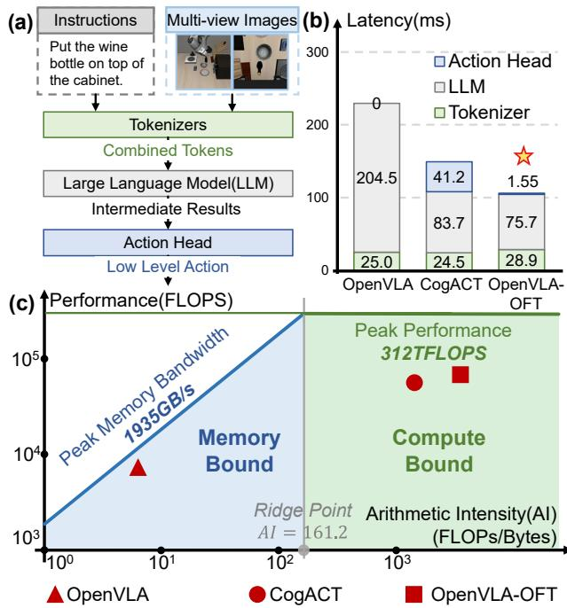  

Figure 1: (a) The mainstream inference dataflow of VLA models. (b) Latency breakdown in three typical VLA models in the LIBERO benchmark during each action generation. (c) The practical arithmetic intensity of three models in the roofline model of NVIDIA A800 GPU.

2024；Kim、Finn 和 Liang 2025 进一步提出了更精细的模型结构，实现了实时性能和效率的提升。图 1(a) 显示了 VLA 模型的主流推理数据流，由三个部分组成：（1）将多模态输入转换为词元的分词器（例如，图像和文本编码器），（2）理解多模态输入并生成中间结果的 LLM 主干网络，以及（3）根据中间结果生成连续低级动作的行动头。我们进一步选择了三个具有代表性的 VLA 模型，OpenVLA（Kim et al. 2024）、CogACT（Li et al. 2024）和 OpenVLA-OFT（Kim、Finn 和 Liang 2025），以分析在图 1(b) 所示的 LIBERO 基准测试中每个动作生成过程中这三个组件的延迟分解。统计数据显示，OpenVLA-OPT 是迄今为止在推理效率方面表现最佳的模型，而 LLM 的可扩展瓶颈大约占整个端到端推理延迟的 $70 \%$。

  
ve

因此，VLA模型加速的大多数研究集中在LLM主干网络的加速上，探索了量化（Park et al. 2024）、早期退出（Yue et al. 2024）和缓存（Xu et al. 2025b）等技术以加速VLA模型推理。然而，它们忽视了VLA模型的独特计算特性，导致性能和有效性有限。目前，最新的VLA模型（例如CogACT和OpenVLA-OPT）采用单步推理范式，即模型通过单个LLM前向直接预测一系列低级动作，处理数百个多模态词元。因此，从硬件屋顶线模型的算力密度（即每字节的计算量）来看，VLA模型推理主要受计算限制，如图1(c)所示，延迟主要由计算量决定，而非内存访问。剪枝是解决计算受限问题的一种典型加速方法，通过有效减少计算量来实现。然而，现有的VLA模型中的词元剪枝方法仅考虑局部信息（例如当前动作生成中的层结果），忽略了整个模型中的全局信息，这在某些场景中导致成功率损失超过$> 20 \%$或加速效果有限。本文观察到，在连续的动作生成中，由于二者之间的短时间间隔，输入图像表现出高度相似性。因此，我们认为可以利用来自前一次推理步骤的全局信息，实现更可靠和高效的词元剪枝。基于上述见解，我们提出了SpecPruneVLA，一种通过动作感知自我推测剪枝加速视觉-语言-动作模型的方法。SpecPrune-VLA的技术可以总结为以下三点：(1) 动作级的静态词元剪枝。基于这一见解，我们指出连续动作生成之间的词元高度重叠（例如环境图像中的背景），导致显著冗余。因此，我们重用上一次生成的注意力信息来剪枝不重要的词元，保留全球加权高的词元集。然后，通过基于速度的帧比较和自我推测词元选择，增强动态元素和任务相关词元。通过融合来自局部和全局层面的选择词元，我们可以在LLM前向开始时剪枝超过$50 \%$到$70 \%$的视觉词元。(2) 层级动态词元剪枝。随着输入特征通过LLM主干传播，每个词元的局部上下文由更深的层逐渐丰富。因此，我们引入逐层剪枝，通过动态更新词元的重要性分数并在不同深度重新评估词元重要性。这使模型能够适应性地细化其计算重点，随着上下文理解的成熟去除冗余词元。(3) 轻量级的动作感知控制器。我们提出并非所有动作对词元剪枝都同样敏感。因此，我们将动作分为粗颗粒（例如，大幅度平移或旋转）和细颗粒（例如，抓取）类型，并设计一个控制器，根据末端执行器的速度确定动作粒度并自适应调整剪枝策略。这在不同的机器人任务中实现了速度和精度之间的稳健权衡。我们在NVIDIA A800-80GB和NVIDIA GeForce RTX 3090 GPU上实现了SpecPrune-VLA以评估其性能。与高性能模型OpenVLA-OFT相比，我们的方法在A800上实现了平均$1.46 \times$的加速，在RTX 3090上实现了$1.57 \times$的加速，同时在LIBERO仿真基准测试中任务成功率几乎没有下降。在两个平台上的一致加速收益表明SpecPrune。

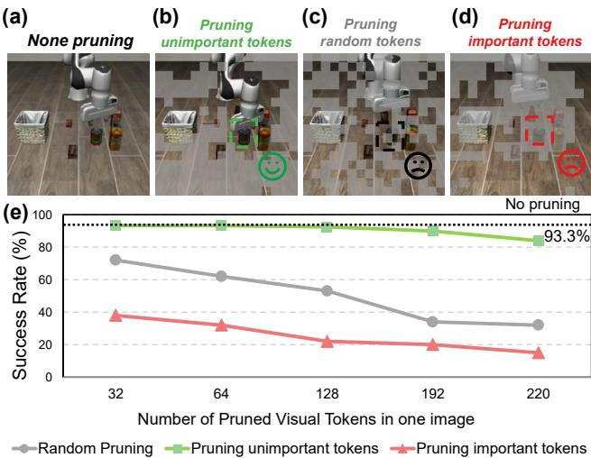  

Figure 3: (a) The original image the model sees; (b) The images where unimportant tokens are pruned; (c) The tokens are randomly pruned, some important tokens are pruned; (d) Important tokens(e.g., the tomato sauce) are pruned. (e) The influence of different pruning strategies and pruning numbers of tokens on performance.

VLA 能够很好地推广到不同的硬件架构。

# 2 相关工作

# 2.1 视觉-语言-动作（VLA）模型

VLA模型通常基于大型语言模型（LLM）结构（Zitkovich等，2023；Liu等，2023b；Wang等，2024），并在来自模拟（Liu等，2023a）和真实世界（O'Neill等，2024）机器人环境的大规模数据集上进一步微调。该模型接收多模态信息（例如，图像和文本），并生成低级机器人动作。研究表明，连续行动空间在操作精度上表现更佳（Liu等，2025）。因此，引入了一种行动头，例如轻量级多层感知器（MLP）和扩散模型（Liu等，2024；Wen等，2025），用于将行动隐藏状态转换为连续动作。此外，为了实现高控制频率和动作一致性，现代VLA模型利用ACT（Zhao等，2023）、扩散模型（Peebles和Xie，2023）或并行解码来生成动作块。

# 2.2 面向 VLA 模型的词元级加速

现有研究探讨了对 VLA 模型进行词元缓存或剪枝。例如，VLA-Cache（Xu 等，2025b）缓存来自上一次生成的相似和不重要词元的键和值，并在下次推理中重用它们。然而，由于仅能减少 $50 \%$ 到 $75 \%$ 的注意力矩阵计算的 FLOPs，约占 LLM 所有 FLOPs 的 $17 \%$ 到 $25 \%$，因此效果有限。视觉词元剪枝方法如 EfficientVLA（Yang 等，2025）提出利用单个 LLM 层的注意力图来识别与任务相关的词元，并通过视觉多样化的补丁来补充保留的词元，以保持覆盖范围。然而，这种方法依赖于单层启发式，可能无法反映全球上下文信息，且多样性驱动的补充可能无意中引入与任务无关的内容，限制了其在多样化环境中的可靠性。此外，（Li 等，2025）旨在通过保留视觉编码器中具有高特征显著性的词元，来保留空间信息和语义内容。虽然这提高了结构完整性，但并未明确区分语义丰富和与任务无关的词元，仍然导致不必要的计算负担。

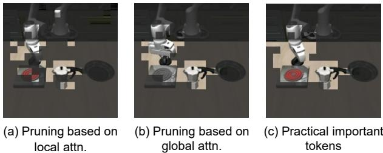  

Figure 4: For the task "turn on the oven and put the bottle on it. (a) Prune the tokens relying on local information(e.g., attention scores from one LLM layer). (b) Prune the tokens relying on the global attention of the LLM in the last action generation. (c) The practically important tokens after inference completion.

# 2.3 自我推测解码与轻量级预测器

标准的推测解码（Leviathan、Kalman 和 Matias 2023）需要一个额外的草稿模型来生成候选词元。相比之下，LayerSkip（Elhoushi 等 2024）提出了一种自我推测方法，利用同一模型的早期层作为草稿模型，从而消除了对外部模型的需求；剩余的层用于验证和修正，从而降低内存占用并提高推理效率。此外，草稿模型还可以作为预测器，提供有用信息的估计。在 SpecEE（$\mathrm { { X u } }$ 等 2025a）中，使用一个小模型作为预测器来缩小候选词汇范围。预测器筛选出不太可能的候选项，使得模型在一个更小的词汇中进行搜索。这显著降低了计算开销。

# 3 个关键见解

# 3.1 图像中真正重要的内容

我们首先对 VLA 模型图像的关键组件进行系统研究。我们的重点是确保模型能够有效识别任务相关的对象和动态元素，以准确感知目标的空间上下文。对这一感知做出显著贡献的词元被称为重要词元。

为了验证我们想法的有效性，我们针对一些任务进行了简单实验。我们让模型完成一次生成，但不在环境中执行；然后我们利用最后一层的输出注意力分数来修剪低分数的不重要词元。随后，我们将修剪后的图像输入模型，让其重新生成动作并在环境中执行。图3(e)显示，随机修剪少量词元对性能影响最小，这表明图像中存在冗余词元。然而，随着修剪的词元数量增加，模型的性能急剧下降。值得注意的是，超过一半的不重要词元可以被修剪，而成功率不过明显下降（与未修剪情况的$9 3 . 3 \%$相比）。这一实验结果为修剪方法的可靠性提供了强有力的支持。此外，当重要词元被修剪时，模型的性能急剧下降（成功率下降最多达$80 \%$），进一步强调了需要保留重要词元。

# 3.2 连续推理图像中的冗余大部分重叠

除重要词元外，其他词元被视为冗余。识别冗余词元在模型完成当前推理之前是具有挑战性的。目前的方法，如（Li et al. 2025; Yang et al. 2025），利用了一层LLM或视觉编码器的注意力分数等局部信息。然而，它们未能利用整个模型的全局信息，因此可靠性不足，如图4(a)和(c)所示。这两种情况下的重要词元明显不同。本文强调，在VLA模型中，整体任务目标在整个执行过程中保持不变，并且视觉场景的大部分在连续帧之间保持不变。因此，在前一代中被模型识别为冗余的词元在当前步骤中很可能依然是冗余的，如图4(b)和(c)所示。这种时间一致性启发我们在时间上重用全局注意力。

# 4 行动级静态词元修剪

# 4.1 观察与洞察

由于子目标的变化和动态视觉元素，有必要纳入当前生成的信息。我们使用方程（1）分析基于注意力的重要性，并观察到在前两层中，大约 $8 5 \% - 9 5 \%$ 的顶级 $\mathbf { \nabla \cdot k }$ 词元在最终层的顶级 $\mathbf { \nabla } \cdot \mathbf { k }$ 中重新出现，如图5所示，其中顶级 $\mathbf { \nabla } \cdot \mathbf { k }$ 等于20。我们将这种重叠定义为命中率。高命中率表明早期层的注意力为重要词元的选择提供了可靠的局部指导。此外，单独的第一层显示出较低的命中率，而同时考虑第二层和第三层仅提供了边际的命中率增益，并且引入了额外的延迟。因此，我们选择前两层进行推测。

# 4.2 方法

基于全局信息的剪枝 注意力分数反映了其他词元对给定词元的关注程度，我们可以使用注意力分数来过滤掉不重要的视觉词元。给定层中，视觉词元 $V_{i}$ 对任务的注意力分数计算如下：设 $T = \{ t_{1}, t_{2}, \dots, t_{m} \}$ 为描述任务的文本序列集合，则在层 $l$ 中，$V_{i}$ 的任务注意力分数为：

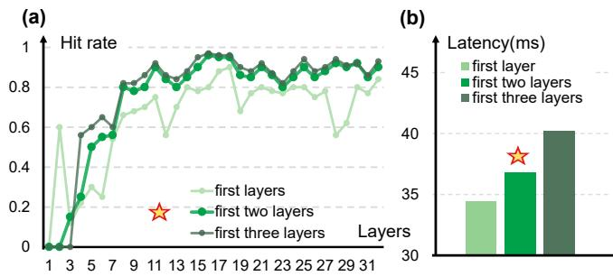  

Figure 5: (a) Comparison of the hitrate between leveraging the first one, two, and three layers. (b) LLM latency comparison between leveraging the first one, two, and three layers.

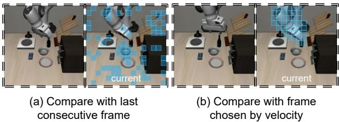  

Figure 6: The selection strategy for frame comparison.

$$
\mathrm { S c o r e } _ { l } ( V _ { i } ) = \frac { 1 } { H \cdot m } \sum _ { h = 1 } ^ { H } \sum _ { j = 1 } ^ { m } A _ { l } ^ { h } ( V _ { i } , t _ { j } ) ,
$$

其中 $A _ { l } ^ { h } ( V _ { i } , t _ { j } )$ 表示从视觉信息 $V _ { i }$ 到文本标记 $t _ { j }$ 的跨注意力（或自注意力）机制中第 $l$ 层第 $h$ 头的注意力权重，$H$ 是注意力头的数量，$M$ 是与任务相关的文本标记的数量。我们将 $V _ { \mathbf { g l o b a l } }$ 定义为从先前推理中具有最高全局注意力得分的前 $K _ { G }$ 个重要标记的集合。动态标记的补充 视觉标记在推理步骤之间发生重大变化，因此无法仅根据上一次推理的全局信息进行准确的剪枝。因此，在当前的推理步骤中，我们明确识别并保留这些动态标记，以确保在标记剪枝过程中保留最新信息。对于两个图像 $I _ { 1 }$ 和 $I _ { 2 }$ ，我们首先根据视觉标记的大小将图像划分为 $N \times N$ 的补丁。然后，让 $\mathbf { P } _ { t } ^ { i , j }$ 表示在帧 $I _ { n }$ 中位置 $( i , j )$ 的补丁特征向量。我们计算对应补丁之间的余弦相似度如下：

$$
\mathrm { S i m } ( \mathbf { P } _ { m } ^ { i , j } , \mathbf { P } _ { n } ^ { i , j } ) = \frac { \mathbf { P } _ { m } ^ { i , j } \cdot \mathbf { P } _ { n } ^ { i , j } } { \| \mathbf { P } _ { m } ^ { i , j } \| _ { 2 } \| \mathbf { P } _ { n } ^ { i , j } \| _ { 2 } } ,
$$

其中 $\| \cdot \| _ { 2 }$ 表示欧几里得范数。为了识别动态标记，我们首先筛选出相似度分数低于阈值 $\tau$ 的补丁，然后从剩余候选中选择相似度分数最低的前 $k$ 个补丁。形式上，设 $\mathcal { P } _ { n } = \mathbf { \bar { \{ P } } _ { n } ^ { i , j } \mid 1 \leq i , j \leq N \}$ 为帧 $I _ { n }$ 中所有补丁的集合。我们将显著变化的补丁定义为候选动态补丁：

$$
\mathcal { C } _ { n } = \left\{ \mathbf { P } _ { n } ^ { i , j } \in \mathcal { P } _ { n } \left| \mathrm { S i m } ( \mathbf { P } _ { m } ^ { i , j } , \mathbf { P } _ { n } ^ { i , j } ) < \tau \right. \right\} .
$$

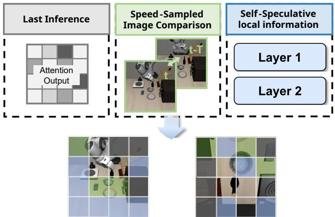  

Figure 7: Detailed implementation of static token pruning. We prune the tokens based on the global information from the attention scores in the last action generation, the input image comparison, and the local information from the selfspeculative results in the first two layers.

最具动态性的 $K _ { D }$ 词元由下式给出：

$$
V _ { \mathrm { d y n a m i c } } = \mathrm { L o w } { - } K _ { D } \left( \{ \mathrm { S i m } _ { i , j } \ | \ \mathbf { P } _ { t } ^ { i , j } \in \mathcal { C } _ { t } \} \right) ,
$$

此外，如图 6(a) 所示，直接比较相邻帧可能导致不准确的结果。为了减轻这些干扰并增强对动态词元的敏感性，我们提出了一种基于速度的帧采样策略。该方法选择一个历史参考帧，该帧为当前帧之前的 T 帧，其中 $\mathrm { T }$ 根据平均运动速度确定，公式为 $\begin{array} { r } { T = \left[ \frac { - 1 6 } { 3 } \cdot \frac { v } { 6 } + \frac { 2 2 } { 3 } \right] + 4 } \end{array}$，其中 $v _ { t }$ 表示末端执行器的运动速度。速度的计算在第 6 节中讨论。这种自适应策略确保我们能够有效识别动态词元，同时最小化无关变化的影响，保持时间精度。基于局部信息的剪枝 我们的观察和见解表明，前两层可以作为可靠的预测器，以过滤当前步骤的任务相关词元。对于前两层解码器，我们计算所有视觉词元的任务注意力分数，如公式 (1) 所定义。在每一层中，我们分别选择 $K _ { b a s e }$ 个具有最高注意力的视觉词元 $V _ { ( 1 ) }$ 和 $V _ { ( 2 ) }$，并将这两个集合的并集作为局部信息表示：

$$
V _ { \mathrm { l o c a l } } = V _ { ( 1 ) } \cup V _ { ( 2 ) }
$$

最后，所有的剪枝词元集是：

$$
V _ { \mathrm { p r u n e } } = U - V _ { \mathrm { g l o b a l } } \cup V _ { \mathrm { d y n a m i c } } \cup V _ { \mathrm { l o c a l } }
$$

$U$ 是所有词元的集合。

# 5 层级动态词元剪枝 5.1 方法

为了在层中保留最重要的词元，我们提出了一种重要性评分机制，该机制利用注意力得分和跨变换层的层置信度来修剪层内的词元。重要性评分公式在静态词元修剪后，为剩余的视觉词元初始化词元重要性评分，并随后在目标变换器中更新。$s _ { i } ^ { ( l )}$ 考虑了词元的相对重要性权重和层的贡献。因此，我们基于两个关键组成部分计算剩余视觉词元集 $T$ 中每个词元 $t _ { i }$ 的重要性评分 $s _ { i } ^ { ( l )}$：

$$
s _ { i } ^ { ( l ) } = \omega _ { \mathrm { r a n k } , i } ^ { ( l ) } \times \omega _ { \mathrm { c o n f } } ^ { ( l ) }
$$

其中 ωrank,i 表示基于排名的权重，反映了词元在注意力排名中的相对重要性，表示层置信度分数，用于衡量层的可靠性。基于排名的权重 对于每个注意力头，词元根据其注意力分数进行排名。为了强调最重要词元的贡献，同时保持影响力的平滑衰减，我们引入了一种基于排名的加权方案。该权重定义为：

$$
\omega _ { \mathrm { r a n k } , i } ^ { ( l ) } = \frac { \sigma ( - k \cdot \mathrm { r a n k } _ { i } ^ { ( l ) } ) } { \sum _ { j } \sigma ( - k \cdot \mathrm { r a n k } _ { j } ^ { ( l ) } ) }
$$

其中 $\mathrm { r a n k } _ { i } ^ { ( l ) }$ 是层 $l$ 中令牌 $t _ { i }$ 的注意力排名，$\sigma ( x )$ 表示 sigmoid 函数，用于放大令牌排名之间的差异，将其映射到平滑范围内，确保排名较高的令牌获得显著的重视。层置信度得分并非所有层对全局重要性的贡献都是相等的。层置信度衡量每一层中注意力模式的可靠性：

$$
\omega _ { \mathrm { c o n f } } ^ { ( l ) } = \frac { \mu _ { \mathrm { a t t n } } ^ { ( l ) } } { \sigma _ { \mathrm { a t t n } } ^ { ( l ) } + \epsilon }
$$

在第 $l$ 层，$\mu_{\text{attn}}$ 和 $\sigma_{\text{attn}}^{(l)}$ 分别表示注意力权重。注意力权重的均值反映了该层的整体注意力强度，而标准差则指示了注意力模式的一致性。通过结合两者，置信度得分对注意力强大且稳定的层给予奖励，同时对高度变动或响应较弱的层施加惩罚。动态更新机制 每个词元 $t_{i}$ 的最终重要性得分 $S_{i}$ 通过层间的指数移动平均进行维护：

$$
S _ { i } ^ { ( l ) } = ( 1 - \beta ) \cdot S _ { i } ^ { ( l - 1 ) } + \beta \cdot s _ { i } ^ { ( l ) }
$$

其中 $\beta$ 是控制更新速度的学习率，设置为 0.2，且初始化时设定 $S _ { i } ^ { ( 0 ) } = 0$。

# 6 轻量级动作感知控制器 1 观察与洞察

在我们的实验中，当我们修剪更多的词元时，成功率出现下降。我们观察了每一帧，发现失败案例发生在涉及物体接触的交互中，例如图8(a)中的物体操作或放置，当这些动作成功执行时，任务就会失败。因此，我们强调任务成功高度依赖于细粒度的动作，这些动作需要高精度并对执行错误敏感。相比之下，粗粒度的动作（例如，移动到一般位置）对不准确性更具有容忍度。

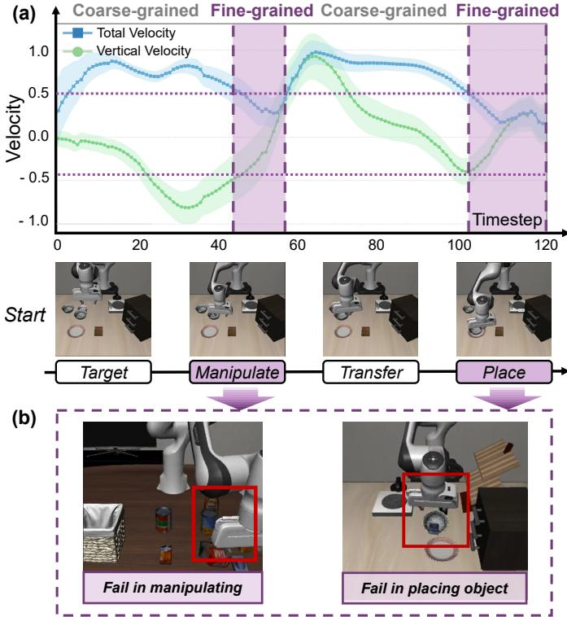  

Figure 8: (a) The task process consists of four stages, which can be categorized into coarse-grained and fine-grained actions depending on their respective velocity. (b) Typical failure cases in two fine-grained stages.

具体而言，当机器人接近一个物体时，随后的互动通常需要精细控制以确保稳定接触和成功操控。因此，动作的粒度——无论是精细还是粗糙——在确定所需的准确性水平中起着关键作用。受到这一观察的启发，我们提出了一种基于动作的剪枝策略。通过识别某一步骤是需要精细控制还是粗糙控制，我们的方法可以在精细阶段选择性地保留更多候选项，而在粗糙阶段则允许进行激进剪枝，从而提高效率和成功率。

# 6.2 方法

在机器人任务执行中，我们将整体过程分为四个阶段：目标定位、接近、转移和放置。在这些阶段中，目标接近和放置阶段涉及高精度操作，因此被归类为精细操作阶段。在这些阶段，夹爪的平移和旋转速度通常保持在较低水平，同时沿着输入的完整词元集 $V$ 的修剪比率参数为 $\alpha$，速度阈值为 $v _ { t } ^ { t h } , v _ { r } ^ { t h }$。

保留的词元集合 $V _ { r e t a i n }$ 1: 动作感知控制器 2: 计算平移速度和旋转速度 $v _ { t }$ 和 $v _ { r }$ 3: 如果 $v _ { t } < v _ { t } ^ { t h }$ 且 $v _ { r } < v _ { r } ^ { t h }$ 且 $\Delta z \le 0$ 则 4: 设置细粒度动作模式且 $K _ { b a s e } = \alpha \times 4 0$ 5: 否则 6: 设置粗粒度动作模式且 $K _ { b a s e } = \alpha \times 2 4$ 7: 结束条件 8: 静态词元修剪在动作级别 9: $V _ { g l o b a l } \mathrm { t o p } { - } K _ { G }$ 个词元来自上一个动作的注意力分数 10: $S i m ( P _ { t } , P _ { t - 1 } )$ 计算 $I _ { t }$ 和 $I _ { t - T }$ 设 $\begin{array} { r } { T = \bar { \lfloor } - \frac { 1 6 } { 3 } \cdot v _ { t } + \frac { 2 2 } { 3 } \rfloor + 4 } \end{array}$ 11: $V _ { d y n a m i c } \gets \mathrm { L o w } – K _ { D }$ 个相似度 $< \tau$ 的补丁 12: $V _ { l o c a l } V _ { t o p - K _ { b a s e } } ^ { ( 1 ) } \cup V _ { t o p - K _ { b a s e } } ^ { ( 2 ) }$ 无层 $V _ { r e t a i n } V _ { g l o b a l } \cup V _ { d y n a m i c } \cup V _ { l o c a l }$ 15: 动态词元修剪在层级别 16: 如果当前层 $\mathrm { L }$ 在集合 $L _ { u p d a t e }$ 中则 17: $\begin{array} { r } { \omega _ { r a n k , i } ^ { ( l ) } \frac { \sigma ( - k \cdot \operatorname { r a n k } _ { i } ^ { ( l ) } ) } { \sum _ { j } \sigma ( - k \cdot \operatorname { r a n k } _ { j } ^ { ( l ) } ) } } \end{array}$ {基于排名的权重} 18: $\omega _ { c o n f } ^ { ( l ) } \mu _ { a t t n } ^ { ( l ) } / ( \sigma _ { a t t n } ^ { ( l ) } + \epsilon )$ {层置信度} 19: 重要性分数 $s _ { i } ^ { ( l ) } = \omega _ { r a n k , i } ^ { ( l ) } \times \omega _ { c o n f } ^ { ( l ) }$ 20: 更新词元分数: S(l) $S _ { i } ^ { ( l ) } = ( 1 - \beta ) \cdot S _ { i } ^ { ( l - 1 ) } + \beta \cdot s _ { i } ^ { ( l ) }$ 21: 结束条件 22: 如果当前层 $\mathrm { L }$ 在集合 $L _ { p r u n e }$ 中则 23: $V _ { r e t a i n } $ 词元中前 $\alpha \times Q \% S _ { i } ^ { ( l ) }$ 24: 结束条件 25: 返回 $V _ { r e t a i n }$ $z$ 轴通常为负或小于一个小的正值，以确保稳定性和准确性。由于每个动作对应一个固定的单位时间持续，机器人的策略通过这些相对位移有效输出归一化的速度指令。我们使用每步的位移大小作为瞬时速度的代理。平移速度 $v _ { t }$ 定义为每步由策略输出的夹爪三维相对位移向量的欧几里得范数：

$$
v _ { t } = \| \Delta x , \Delta y , \Delta z \| _ { 2 } = \sqrt { ( \Delta x ) ^ { 2 } + ( \Delta y ) ^ { 2 } + ( \Delta z ) ^ { 2 } } .
$$

旋转速度 \( v_{r} \) 被计算为角位移的大小：

$$
v _ { r } = \| \Delta \alpha , \Delta \beta , \Delta \gamma \| _ { 2 } = \sqrt { ( \Delta \alpha ) ^ { 2 } + ( \Delta \beta ) ^ { 2 } + ( \Delta \gamma ) ^ { 2 } } ,
$$

以弧度表示。$z$ 轴速度由垂直位移分量 $\Delta z$ 表示。为正式化这种行为，我们定义三个阈值：平移位移阈值 $v _ { t } ^ { \mathrm { t h } }$、旋转位移阈值 $v _ { r } ^ { \mathrm { t h } }$ 和 $z$ 轴位移阈值 $v _ { z } ^ { \mathrm { t h } }$，当满足 $\bar { v } _ { t } < v _ { t } ^ { \mathrm { t h } }$、$v _ { r } < v _ { r } ^ { \mathrm { t h } }$ 且 $\Delta z \le 0$ 时。

Table 1: Performance Evaluation   

<table><tr><td rowspan="2">Method</td><td colspan="4">Success Rate (%) / Latency (ms) (Speedup)</td><td rowspan="2">Average Speedup</td><td rowspan="2">FLOPs</td></tr><tr><td>Spatial</td><td>Object</td><td>Goal</td><td>Long</td></tr><tr><td>OpenVLA-OFT</td><td>97.6 / 109 (1.00×)</td><td>96.5 / 109 (1.00×)</td><td>97.9 / 109 (1.00×)</td><td>94.5 / 109 (1.00×)</td><td>1.00×</td><td>100%</td></tr><tr><td>SparseVLM</td><td>96.8 / 85.3 (1.28 ×)</td><td>94.2 / 85.3 (1.28×)</td><td>97.6 / 85.3 (1.28×)</td><td>93.6 / 85.3 (1.28×)</td><td>1.28×</td><td>77%</td></tr><tr><td>VLA-Cache</td><td>99.0 / 101 (1.08×)</td><td>97.7 / 102 (1.07×)</td><td>97.4 / 102 (1.07×)</td><td>93.6 / 102 (1.07×)</td><td>1.07×</td><td>83%</td></tr><tr><td>EfficientVLA</td><td>96.5 / 68.8 (1.58×)</td><td>91.1 / 71.4 (1.53×)</td><td>96.0 / 73.7 (1.48×)</td><td>72.1 / 68.6 (1.59×)</td><td>1.55×</td><td>35%</td></tr><tr><td>Ours</td><td>98.2 / 72.4 (1.51 ×)</td><td>96.3 / 76.2 (1.43× )</td><td>97.7 / 73.6 (1.48×)</td><td>94.0 / 78.1 (1.40×)</td><td>1.46×</td><td>43%</td></tr></table>

Table 2: Ablation Study on LIBERO-Spatial   

<table><tr><td></td><td>SR (%)</td><td>Latency (ms)</td><td>Speedup</td></tr><tr><td>None</td><td>97.6</td><td>109</td><td>1.00×</td></tr><tr><td>Tech.1</td><td>97.6</td><td>76.6</td><td>1.42×</td></tr><tr><td>Tech.1&amp;2</td><td>96.8</td><td>70.8</td><td>1.54×</td></tr><tr><td>Tech.1&amp;2&amp;3</td><td>98.2</td><td>72.4</td><td>1.51×</td></tr></table>

相反，当 $v _ { t } \mathrm { ~ \textbf ~ { ~ } ~ } >$ $v _ { t } ^ { \mathrm { t h } }$ 或 $v _ { r } \ > \ v _ { r } ^ { \mathrm { t h } }$ 时，系统将退出该模式，这通常发生在物体提升过程中。该策略确保在接触之前早期激活精确控制，并在接触后及时停用，从而在动态操作场景中有效地平衡操作精度与任务效率。该策略确保机器人在接近阶段的早期开始精细操作模式，在与目标物体物理接触之前。这一早期激活为精确的位置和方向调整提供了充足的时间，以最小化定位误差。在成功接触和提升物体后，随之而来的 z 轴速度增加将立即触发从精细模式中退出。具体的控制流程在算法 1 中展示，该算法演示了 LLM 内一层的处理过程。

# 7 实验

# 7.1 实验设置

基准测试和平台。我们在LIBERO模拟基准（Liu et al. 2023a）上进行评估，该基准利用模拟的Franka Emika Panda机器人臂。我们采用四个任务套件，分别是LIBERO-Spatial、LIBERO-Object、LIBERO-Goal和LIBERO-Long，以评估模型在空间推理、物体理解、目标导向规划与执行以及长时间任务完成方面的能力。每个任务套件由十个不同的任务组成。所有主要实验均在配备NVIDIA A800-80GB GPU的Linux工作站上进行。实施细节。我们选择OpenVLAOFT（Kim, Finn, and Liang 2025）作为我们技术实现的代码基础。由于每个任务套件的难度和重点不同，我们采用不同的整体剪枝比率$\alpha$来平衡准确性和推理速度。具体而言，LIBERO-Spatial的$\alpha$设置为1.0，LIBERO-Goal为0.8，LIBERO-Object和LIBERO-Long为0.6。我们还探索了不同比率在设计空间探索（DSE）中的影响，见表3。我们对每个任务套件中的每个任务重复实验40到50次，以减小随机误差的影响。这里的延迟定义为模型接收输入到生成动作的时间持续。我们报告每个任务套件中十个任务的平均推理时间。基线我们选择OpenVLA-OFT作为我们的目标模型。它利用DINOv2（Oquab et al. 2023）和SigLIP（Zhai et al. 2023）作为视觉编码器来提取视觉特征，Llama2-7B作为主干LLM，四层MLP作为动作头以生成连续动作。该模型接收两种视图的图像：第三人称视角和手腕视角。我们还考虑了三种优化方法：SparseVLM（Zhang et al. 2024），一种自适应稀疏不重要视觉词元并回收其信息以最小化性能损失的框架；EfficientVLA（Yang et al. 2025），一种针对VLA模型的视觉剪枝方法；以及VLA-Cache（Xu et al. 2025b），利用图像相似性在时间步之间缓存特征。

# 7.2 关于加速和成功率的评估

表1显示了在四个LIBERO数据集上的端到端评估，包括成功率(SR)、延迟和加速比。SpecPrune-VLA的平均加速比为$1 . 4 6 \times$，成功率损失可以忽略不计($( < ~ 0 . 7 \% )$)。加速比略有波动，因为不同数据集的任务难度和环境各不相同。VLA-Cache在四个数据集上达到了较高的成功率，但加速比有限。这与我们的分析一致，VLA-Cache减少了有限的计算。此外，它还引入了KV缓存访问延迟。EfficientVLA( $_ { \mathrm { L } = 2 8 }$ $_ { \mathrm { T } = 1 1 2 }$ )通过跳过四个固定层和积极修剪词元实现了更高的加速比；然而，这在某些场景中导致成功率显著下降，因为重要的词元和隐藏状态中的关键动作相关信息受到了影响。值得注意的是，该方法最初是针对具有扩散动作专家的VLA模型，这可能对输出动作隐藏状态的变化更具容忍性。

# 7.3 消融研究

为了评估我们提出的方法的有效性，我们在LIBERO-Spatial数据集上进行了消融研究。我们的完整模型达到了$98.2\%$的成功率（SR），优于基线的$97.6\%$，并且将延迟显著降低从109毫秒到72.4毫秒，相较于OpenVLA实现了$1.51\times$的加速。

Table 3: Design Space Exploration on Pruning Ratio   

<table><tr><td>Prune Ratio (α)</td><td>Pruned Tokens</td><td>SR (%)</td><td>Latency(ms) / Speedup</td></tr><tr><td>1.0</td><td>346</td><td>83.7</td><td>71.9 / 1.52×</td></tr><tr><td>0.8</td><td>329</td><td>95.2</td><td>74.8 / 1.46×</td></tr><tr><td>0.6</td><td>318</td><td>96.3</td><td>76.2 / 1.43 ×</td></tr></table>

  

Figure 9: Evaluation on NVIDIA GeForce RTX 3090

OFT。这证明了我们方法在效率上的提升，同时保持了竞争性准确性。消融研究进一步突出了每个组件的重要性：静态剪枝（技术 1）和动态剪枝（技术 2）对成功率（$ 9 6 . 8 \% $）有轻微影响，但将延迟减少至 70.8 毫秒，表明剪枝有助于整体延迟的降低。动作适配器的引入提高了成功率并几乎不增加延迟（1.6 毫秒）。这表明动作适配器在保持高准确性方面起着关键作用。

# 7.4 设计空间探索

我们对LIBEROObject进行了设计空间探索。为了在保持准确性的同时减少模型延迟，我们重点关注剪枝的词元数量。我们设置了剪枝比例 $\alpha$ 来调整静态词元剪枝和动态词元剪枝。剪枝比例越大，剪枝的词元越多，导致成功率下降而加速提升。为了平衡准确性和速度，我们将LIBERO-Object的剪枝比例设置为0.6。

# 7.5 在各种计算平台上的评估

为了验证我们的方法在不同设备上的适用性，我们在 NVIDIA GeForce RTX 3090 上进行实验。如图 9 所示，我们的方法在 LLM 推理时间上平均实现了 $2.09 \times$ 的加速，在端到端延迟上实现了 $1.57 \times$ 的加速，使用的参数与表 1 中相同。结果一致显示出推理效率的提升，凸显了我们的方法在不同计算条件下的可扩展性和有效性。

# 7.6 实验可视化

为了理解模型在完成任务时实际观察到了什么，我们可视化了保留的视觉词元。彩色块是保留的词元。我们在图10中展示了三个任务的可视化结果。结果表明，保留的词元是之前部分讨论过的重要词元。此外，该方法在处理来自不同视角的图像时仍然有效，证明其捕捉视角不变表示的能力。任务：捡起字母汤并将其放入篮子中。

  

Figure 10: Retained tokens during tasks

# 8 结论

在本文中，我们提出了一种新的见解，结合当前动作生成中的局部信息和先前动作中的全局信息进行词元选择，并呈现了SpecPrune-VLA，一种无训练的剪枝方法，包括具有启发式控制的两级词元剪枝。实验表明，SpecPrune-VLA在NVIDIA A800-80GB上实现了平均$1.46\times$的加速，在NVIDIA GeForce RTX 3090上实现了$1.57\times$的加速，同时在LIBERO模拟基准测试中的任务成功率几乎没有下降。评估结果表明，我们的方法在不同硬件平台上具有良好的泛化能力。

# 9 限制

本研究的一项局限性是所有实验均在模拟环境中进行。虽然模拟能够实现可控和可扩展的评估，但在现实世界中的部署可能会带来额外挑战，如传感器噪声、环境动态和硬件延迟。我们意识到这一差距，并计划在未来有机会时，将我们的方法部署在物理平台上，以验证其在现实场景中的有效性。

参考文献 Black, K.; Brown, N.; Driess, D.; Esmail, A.; Equi, M.; Finn, C.; Fusai, N.; Groom, L.; Hausman, K.; Ichter, B.; 等. 2024. $\pi _ { 0 }$ : 一种用于通用机器人控制的视觉-语言-行动流模型. arXiv 预印本 arXiv:2410.24164. Brohan, A.; Brown, N.; Carbajal, J.; Chebotar, Y.; Dabis, J.; Finn, C.; Gopalakrishnan, K.; Hausman, K.; Herzog, A.; Hsu, J.; 等. 2022. Rt-1: 用于大规模现实世界控制的机器人变换器. arXiv 预印本 arXiv:2212.06817. Dong, Y.; Miao, Y.; Li, W.; Zheng, X.; Wang, C.; 和 Lyu, F. 2025. 通过异步键值缓存预取加速大语言模型推理吞吐量. arXiv 预印本 arXiv:2504.06319. Elhoushi, M.; Shrivastava, A.; Liskovich, D.; Hosmer, B.; Wasti, B.; Lai, L.; Mahmoud, A.; Acun, B.; Agarwal, S.; Roman, A.; 等. 2024. LayerSkip: 启用早期退出推理和自我推测解码. arXiv 预印本 arXiv:2404.16710. He, Z.; Yao, Y.; Zuo, P.; Gao, B.; Li, Q.; Zheng, Z.; 和 Wu, F. 2025. Adaskip: 自适应子层跳过加速长上下文大语言模型推理. 在人工智能AAA会议论文集中，卷39, 2405024058. Kim, M. J.; Finn, C.; 和 Liang, P. 2025. 微调视觉-语言-行动模型: 优化速度和成功. arXiv 预印本 arXiv:2502.19645. Kim, M. J.; Pertsch, K.; Karamcheti, S.; Xiao, T.; Balakrishna, A.; Nair, S.; Rafailov, R.; Foster, E.; Lam, G.; Sanketi, P. 等. 2024. OpenVLA: 一个开源视觉-语言-行动模型. arXiv 预印本 arXiv:2406.09246. Leviathan, Y.; Kalman, M.; 和 Matias, Y. 2023. 通过推测解码实现快速的变换器推理. 在国际机器学习会议上，1927419286. PMLR. Li, Q.; Liang, Y.; Wang, Z.; Luo, L.; Chen, X.; Liao, M.; Wei, F.; Deng, Y.; Xu, S.; Zhang, Y.; 等. 2024. CogACT: 一种基础的视觉-语言-行动模型，用于协同认知和机器人操作中的行动. arXiv 预印本 arXiv:2411.19650. Li, Y.; Meng, Y.; Sun, Z.; Ji, K.; Tang, C.; Fan, J.; Ma, X.; Xia, S.; Wang, Z.; 和 Zhu, W. 2025. SP-VLA: 一种联合模型调度与词元剪枝的视觉-语言-行动模型加速方法. arXiv 预印本 arXiv:2506.12723. L B. ZuY.; Gao, C.; FengY.; Liu Q.; ZhuY. 和 Stone, P. 2023a. Libero: 终身机器人学习的知识迁移基准测试. 神经信息处理系统进展, 36: 4477644791. Liu, H.; Li, C.; Wu, Q.; 和 Lee, Y. J. 2023b. 视觉指令调优. 神经信息处理系统进展, 36: 3489234916. Liu, H.; Li, X.; Li, P.; Liu, M.; Wang, D.; Liu, J.; Kang, B.; Ma, X.; Kong, T.; 和 Zhang, H. 2025. 朝向通用机器人策略: 构建视觉-语言-行动模型中的关键因素. L J.; Liu M. Wa Z.; Lee, L ZuK. An, P S.; Zhang, R.; Guo, Y.; 和 Zhang, S. 2024. Robomamba: 多模型左手操作和操控. arXiv 电子印刷, arXiv2406. Oquab, M.; Darcet, T.; Moutakanni, T.; Vo, H.; Szafraniec, M.; Khalidov, V.; Fernandez, P.; Haziza, D.; Massa, F.; ElNouby, A.; 等. 2023. DinoV2: 无监督学习稳健的视觉特征. arXiv 预印本 arXiv:2304.07193. O'Neill, A.; Rehman, A.; Maddukuri, A.; Gupta, A.; Paakar, A.; Lee A.; Pooley, A.; Gupta A.; Madekar A.; Ji A.; 等. 2024. OpenX-ODIMET: 机器人领域数据集与RT-X模型: 开放的X-表现协作. 在2024年IEEE国际机器人与自动化会议(ICRA)上, 68926903. IEEE. Park, S.; Kim, H.; Jeon, W.; Yang, J.; Jeon, B.; Oh, Y.; 和 Choi, J. 2024. 量化感知模仿学习以实现资源高效的机器人控制. arXiv 预印本 arXiv:2412.01034. Peebles, W.; 和 Xie, S. 2023. 基于变换器的可扩展扩散模型. 在IEEE/CVF国际计算机视觉会议论文集中, 41954205. Sapkota, R.; Cao, Y.; Roumeliotis, K. I.; 和 Karkee, M. 2025. 视觉-语言-行动模型: 概念、进展、应用与挑战. arXiv 预印本 arXiv:2505.04769. Team, O. M.; Ghosh, D.; Walke, H.; Pertsch, K.; Black, K.; Mees, O.; Dasari, S.; Hejna, J.; Kreiman, T.; Xu, C.; 等. 2024. Octo: 一个开源的通用机器人策略. arXiv 预印本 arXiv:2405.12213. Vaswani, A.; Shazeer, N.; Parmar, N.; Uszkoreit, J.; Jones, L.; Gomez, A. N.; Kaiser, L.; 和 Polosukhin, I. 2023. 注意力机制是你所需要的一切. arXiv:1706.03762. Wang, P.; Bai, S.; Tan, S.; Wang, S.; Fan, Z.; Bai, J.; Chen, K.; Liu, X.; Wang, J.; Ge, W.; Fan, Y.; Dang, K.; Du, M.; Ren, X.; Men, R.; Liu, D.; Zhou, C.; Zhou, J. 和 Lin, J. 2024. Qwen2-VL: 提升视觉-语言模型在任意分辨率下对世界的感知. arXiv:2409.12191. We, J.; Zhu, Y.; ZhuM. Tng Z.; Li J.; ZouZ. Lu, X.; Shen, C.; Peng, Y.; 和 Feng, F. 2025. DiffusionVLA: 通过统一扩散和自回归扩展机器人基础模型. 在第四十二届国际机器学习会议上. Xu, J.; Pan, J.; Zhou, Y.; Chen, S.; Li, J.; Lian, Y.; Wu, J.; 和 Dai, G. 2025a. Specee: 通过推测性早期退出加速大语言模型推理. 在第五十二届国际计算机架构年会论文集中, 467481. Xu, S.; Wang, Y.; Xia, C.; Zhu, D.; Huang, T.; 和 Xu, C. 2025b. VLA-cache: 通过自适应令牌缓存实现高效的视觉-语言-行动模型在机器人操控中的应用. arXiv 预印本 arXiv:2502.02175. Ya Y.; Wang Y.; Wen, Z. Zhi, L; Zou, C.; Zh, Z. Wen, C.; 和 Zhang, L. 2025. EfficLA: 无训练加速和压缩视觉-语言-行动模型. arXiv 预印本 arXiv:2506.10100. Yue, Y.; Wang, Y.; Kang, B.; Han, Y.; Wang, S.; Song, S.; Feng, J.; 和 Huang, G. 2024. Deer-vla: 多模态大语言模型的动态推理以实现高效的机器人执行. 神经信息处理系统进展, 37: 5661956643. Zhai, X.; Mustafa, B.; Kolesnikov, A.; 和 Beyer, L. 2023. 用于语言图像预训练的Sigmoid损失. 在IEEE/CVF国际计算机视觉会议论文集中, 1197511986. Zhang, Y.; Fan, C.-K.; Ma, J.; Zheng, W.; Huang, T.; Cheng, K.; Gudovskiy, D.; Okuno, T.; Nakata, Y.; Keutzer, K.; 等. 2024. SparseVLM: 用于高效视觉-语言模型推理的视觉令牌稀疏化. arXiv 预印本 arXiv:2410.04417. Zhao, T. Z.; Kumar, V.; Levine, S.; 和 Finn, C. 2023. 学习精细的双手操控技术，使用低成本硬件. arXiv 预印本 arXiv:2304.13705. Zitkovich, B.; Yu, T.; Xu, S.; Xu, P.; Xiao, T.; Xia, F.; Wu, J.; Wohlhart, P.; Welker, S.; Wahid, A.; 等. 2023. Rt-2: 视觉-语言-行动模型将网络知识转移至机器人控制. 在机器人学习会议上, 2165 2183. PMLR.

# 10 附录

# 10.1 复杂性分析

考虑一个具有 $N$ 层的 Transformer 模型。在处理 $L$ 个标记时，每层的计算成本（以 FLOPs 计）大约为：

$$
\mathrm { F L O P s } _ { \mathrm { l a y e r } } ( L ) = 4 L D ^ { 2 } + 2 L ^ { 2 } D + 2 L D M
$$

其中：- $L$ : 序列长度（词元数量） - $D$ : 隐藏维度 - $M$ : 注意力头数 静态词元裁剪 静态词元裁剪策略平均减少原始约600个词元中的315个，令 $L _ { r } = \alpha \cdot L$ 表示保留的词元数量，其中 $\alpha = 0 . 4 8$ 。

<table><tr><td>Benchmark</td><td></td><td></td><td></td><td></td><td>Spatial Goal Object Long Average</td></tr><tr><td>Pruned tokens</td><td>333</td><td>326</td><td>318</td><td>304</td><td>315</td></tr></table>

Table 4: Number of pruned tokens across different LIBERO datasets under static pruning. The pruned number slightly changes as the environment changes.

因此，对于大多数层，FLOPs 变为 $\mathrm { F L O P s } ( L _ { r } )$ 。动态词元剪枝我们在目标层上额外应用 $10\%$ 的剪枝：

$$
\mathcal { S } = \{ 5 , 1 0 , 1 5 , 2 0 \}
$$

因此，经过这些层后的保留词元数量变为 $L _ { r ^ { \prime } } = 0 . 9 \cdot L _ { r }$。平均而言，这在所有层中减少了 $19\%$ 的词元数。整体 FLOPs 减少因此，整体 FLOPs 减少为：

$$
\Delta \mathrm { F L O P s } = ( 1 - \frac { 3 0 } { 3 2 } \times 0 . 4 8 \times 0 . 8 1 ) \times \mathrm { F L O P s } \approx 0 . 6 3 \mathrm { F L O P s }
$$

# 10.2 实验细节

# 比较方法的实现

我们提供了基线和比较方法实施的详细信息。所有模型均在一台 A800 GPU 上实现。OpenVLA-OFT 在四个数据集上的延迟和成功率与原始论文中的数据相似。VLA-Cache 尽管原始方法是基于 OpenVLA 模型开发的，其作者对其进行了适配和扩展，以适应 OpenVLA-OFT。我们实验中报告的所有结果均使用作者的官方实现，以确保可重复性。EfficientVLA 该方法专注于具有扩散动作专家的 VLA 模型，并且还优化了动作专家。此外，该方法尚未开源。因此，我们根据原始论文中提供的视觉令牌剪枝和层剪枝的细节进行了重新实现。按照报告的设置，我们在推理过程中保留了 28 个变换器层和 56 个视觉令牌。

# 实验设置

在静态词元剪枝阶段，从全局前 $K$ 个词元（来自上一步推理）和当前前 $K$ 个词元中保留的词元数量由基础阈值控制。我们将基础阈值设置为 $K _ { c \mathrm { ~ } } = \mathrm { \ A T T N _ { - } T O P K ~ = ~ 2 4 ~ }$，用于粗粒度模式；对于细粒度模式，则设置为 $K _ { p } = \mathrm { A T T N \mathrm { { . T O P K } \mathrm { { . P R E C I S E } = 4 0 } } }$。实际保留的词元数量按剪枝率 $\alpha$ 进行缩放，公式为：

$$
K _ { \mathrm { r e t a i n } } = \alpha \times { \left\{ \begin{array} { l l } { K _ { c } , } & { { \mathrm { c o a r s e - g r a i n e d ~ m o d e } } , } \\ { K _ { p } , } & { { \mathrm { f i n e - g r a i n e d ~ m o d e } } . } \end{array} \right. }
$$

我们根据数据集应用不同的 $\alpha$ 值，以平衡效率和性能： - LIBERO-Long: $\alpha = 1.0$ - LIBERO-Goal: $\alpha = 0.8$ - LIBERO-Object: $\alpha = 0.6$ - LIBERO-Spatial: $\alpha = 0.6$

# 实验可视化

为了理解模型在完成任务时实际观察到了什么，我们可视化了保留的视觉词元。彩色补丁是保留的词元。我们在图11中展示了四个LIBERO数据集上四项任务的可视化结果。结果显示，保留的词元是与任务相关且具有动态性的词元。

# 10.3 进一步分析

不同的相机视角呈现出不同的特征。在本节中，我们系统地阐述第一个关键见解。在固定的第三人称视角中，机器人手臂及其接触的物体是动态组件，而与任务相关的区域（例如桌子上的物体）则相对静态，如图11所示。因此，关键在于提取二者的交集——涉及动态和任务相关像素的区域。在手腕-mounted 摄像头视角中，尽管所有物体都在运动，但沿物体边界的像素块显示出更显著的变化。我们使用傅里叶变换处理和解释像素块的时间信号：

$$
P ( f ) = \int _ { - \infty } ^ { \infty } p ( t ) e ^ { - j 2 \pi f t } d t
$$

在这里，$p(t)$表示时间$t$处的像素强度，$P(f)$表示信号的频域表示，$f$代表频率。由于物体的颜色与背景不同，边界区域会在某一时刻改变颜色。因此，在这些区域，生成的信号$p(t)$包含更多突变，这对应于$P(f)$高频分量中的更高能量。这表明边界区域承载着更丰富的时间动态。因此，任务相关的区域和动态区域在某种程度上可以互补，它们的交集也可以用来识别最重要的区域。

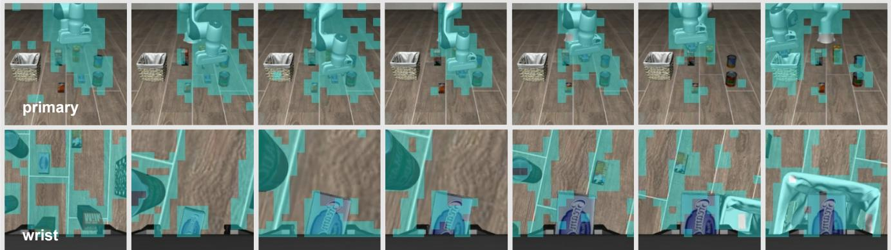  

在盘子和烤盅之间拿起黑色碗，并将其放置在盘子上。

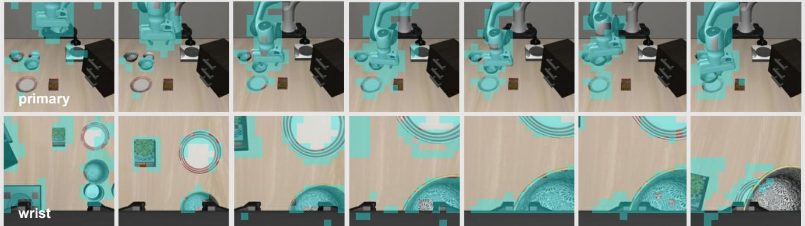  

打开LIBERO-Goal柜子的中间抽屉

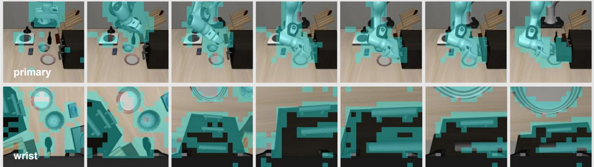  

将黄色和白色的马克杯放入微波炉，并关闭门。

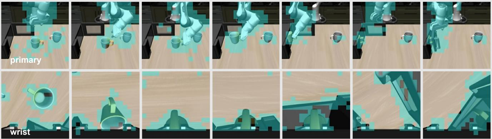  
LIBERO-Long   

Figure 11: Retained tokens during tasks across four datasets and different views.