# Scaling Rectified Flow Transformers for High-Resolution Image Synthesis

Patrick Esser\* Sumith Kulal Andreas Blattmann Rahim Entezari Jonas Müllr Harry Saini Yam Levi Dominik Lorenz Axel Sauer Frederic Boesel Dustin Podell Tim Dockhorn Zion English Kyle Lacey Alex Goodwin Yannik Marek Robin Rombach \* Stability AI

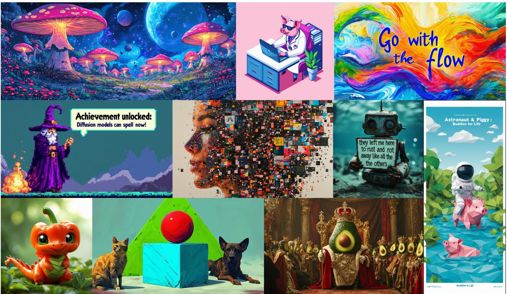  
and spatial reasoning, attention to fine details, and high image quality across a wide variety of styles.

# Abstract

Diffusion models create data from noise by inverting the forward paths of data towards noise and have emerged as a powerful generative modeling technique for high-dimensional, perceptual data such as images and videos. Rectified flow is a recent generative model formulation that connects data and noise in a straight line. Despite its better theoretical properties and conceptual simplicity, it is not yet decisively established as standard practice. In this work, we improve existing noise sampling techniques for training rectified flow models by biasing them towards perceptually relevant scales. Through a large-scale study, we demonstrate the superior performance of this approach compared to established diffusion formulations for high-resolution text-to-image synthesis. Additionally, we present a novel transformer-based architecture for text-to-image generation that uses separate weights for the two modalities and enables a bidirectional flow of information between image and text tokens, improving text comprehension, typography, and human preference ratings. We demonstrate that this architecture follows predictable scaling trends and correlates lower validation loss to improved text-to-image synthesis as measured by various metrics and human evaluations. Our largest models outperform state-of-theart models, and we will make our experimental data, code, and model weights publicly available.

# 1. Introduction

Diffusion models create data from noise (Song et al., 2020). They are trained to invert forward paths of data towards random noise and, thus, in conjunction with approximation and generalization properties of neural networks, can be used to generate new data points that are not present in the training data but follow the distribution of the training data (Sohl-Dickstein et al., 2015; Song & Ermon, 2020). This generative modeling technique has proven to be very effective for modeling high-dimensional, perceptual data such as images (Ho et al., 2020). In recent years, diffusion models have become the de-facto approach for generating high-resolution images and videos from natural language inputs with impressive generalization capabilities (Saharia et al., 2022b; Ramesh et al., 2022; Rombach et al., 2022; Podell et al., 2023; Dai et al., 2023; Esser et al., 2023; Blattmann et al., 2023b; Betker et al., 2023; Blattmann et al., 2023a; Singer et al., 2022). Due to their iterative nature and the associated computational costs, as well as the long sampling times during inference, research on formulations for more efficient training and/or faster sampling of these models has increased (Karras et al., 2023; Liu et al., 2022). While specifying a forward path from data to noise leads to efficient training, it also raises the question of which path to choose. This choice can have important implications for sampling. For example, a forward process that fails to remove all noise from the data can lead to a discrepancy in training and test distribution and result in artifacts such as gray image samples (Lin et al., 2024). Importantly, the choice of the forward process also influences the learned backward process and, thus, the sampling efficiency. While curved paths require many integration steps to simulate the process, a straight path could be simulated with a single step and is less prone to error accumulation. Since each step corresponds to an evaluation of the neural network, this has a direct impact on the sampling speed. A particular choice for the forward path is a so-called Rectified Flow (Liu et al., 2022; Albergo & Vanden-Eijnden, 2022; Lipman et al., 2023), which connects data and noise on a straight line. Although this model class has better theoretical properties, it has not yet become decisively established in practice. So far, some advantages have been empirically demonstrated in small and medium-sized experiments (Ma et al., 2024), but these are mostly limited to class-conditional models. In this work, we change this by introducing a re-weighting of the noise scales in rectified flow models, similar to noise-predictive diffusion models (Ho et al., 2020). Through a large-scale study, we compare our new formulation to existing diffusion formulations and demonstrate its benefits. We show that the widely used approach for text-to-image synthesis, where a fixed text representation is fed directly into the model (e.g., via cross-attention (Vaswani et al., 2017; Rombach et al., 2022)), is not ideal, and present a new architecture that incorporates learnable streams for both image and text tokens, which enables a two-way flow of information between them. We combine this with our improved rectified flow formulation and investigate its scalability. We demonstrate a predictable scaling trend in the validation loss and show that a lower validation loss correlates strongly with improved automatic and human evaluations. Our largest models outperform state-of-the art open models such as SDXL (Podell et al., 2023), SDXL-Turbo (Sauer et al., 2023), Pixart- $\alpha$ (Chen et al., 2023), and closed-source models such as DALL-E 3 (Betker et al., 2023) both in quantitative evaluation (Ghosh et al., 2023) of prompt understanding and human preference ratings.

The core contributions of our work are: (i) We conduct a large-scale, systematic study on different diffusion model and rectified flow formulations to identify the best setting. For this purpose, we introduce new noise samplers for rectified flow models that improve performance over previously known samplers. (ii) We devise a novel, scalable architecture for text-to-image synthesis that allows bi-directional mixing between text and image token streams within the network. We show its benefits compared to established backbones such as UViT (Hoogeboom et al., 2023) and DiT (Peebles & Xie, 2023). Finally, we (iii) perform a scaling study of our model and demonstrate that it follows predictable scaling trends. We show that a lower validation loss correlates strongly with improved text-to-image performance assessed via metrics such as T2I-CompBench (Huang et al. 2023), GenEval (Ghosh et al., 2023) and human ratings. We make results, code, and model weights publicly available.

# 2. Simulation-Free Training of Flows

We consider generative models that define a mapping between samples $x _ { 1 }$ from a noise distribution $p _ { 1 }$ to samples $x _ { 0 }$ from a data distribution $p _ { 0 }$ in terms of an ordinary differential equation (ODE), where the velocity $v$ is parameterized by the weights $\Theta$ of a neural network. Prior work by Chen et al. (2018) suggested to directly solve Equation (1) via differentiable ODE solvers. However, this process is computationally expensive, especially for large network architectures that parameterize $v _ { \Theta } ( y _ { t } , t )$ . A more efficient alternative is to directly regress a vector field $u _ { t }$ that generates a probability path between $p _ { 0 }$ and $p _ { 1 }$ . To construct such a $u _ { t }$ , we define a forward process, corresponding to a probability path $p _ { t }$ between $p _ { 0 }$ and $p _ { 1 } = \mathcal { N } ( 0 , 1 )$ , as

$$
d y _ { t } = v _ { \Theta } ( y _ { t } , t ) d t \ ,
$$

$$
z _ { t } = a _ { t } x _ { 0 } + b _ { t } \epsilon \quad \mathrm { w h e r e } \ \epsilon \sim { \mathcal N } ( 0 , I ) .
$$

For $a _ { 0 } = 1 , b _ { 0 } = 0 , a _ { 1 } = 0$ and $b _ { 1 } = 1$ , the marginals, are consistent with the data and noise distribution.

$$
p _ { t } ( z _ { t } ) = \mathbb { E } _ { \epsilon \sim \mathcal { N } ( 0 , I ) } p _ { t } ( z _ { t } | \epsilon ) ~ ,
$$

To express the relationship between $z _ { t } , x _ { 0 }$ and $\epsilon$ , we introduce $\psi _ { t }$ and $u _ { t }$ as

$$
\begin{array} { r } { \psi _ { t } ( \cdot | \epsilon ) : x _ { 0 } \mapsto a _ { t } x _ { 0 } + b _ { t } \epsilon } \\ { u _ { t } ( z | \epsilon ) : = \psi _ { t } ^ { \prime } ( \psi _ { t } ^ { - 1 } ( z | \epsilon ) | \epsilon ) } \end{array}
$$

Since $z _ { t }$ can be written as solution to the ODE $z _ { t } ^ { \prime } = u _ { t } ( z _ { t } | \epsilon )$ , with initial value $z _ { 0 } ~ = ~ x _ { 0 }$ , $u _ { t } ( \cdot | \epsilon )$ generates $p _ { t } ( \cdot | \epsilon )$ . Remarkably, one can construct a marginal vector field $u _ { t }$ which generates the marginal probability paths $p _ { t }$ (Lipman et al., 2023) (see B.1), using the conditional vector fields $u _ { t } ( \cdot | \epsilon )$ :

$$
u _ { t } ( z ) = \mathbb { E } _ { \epsilon \sim \mathcal { N } ( 0 , I ) } u _ { t } ( z | \epsilon ) \frac { p _ { t } ( z | \epsilon ) } { p _ { t } ( z ) }
$$

While regressing $u _ { t }$ with the Flow Matching objective directly is intractable due to the marginalization in Equation 6, Conditional Flow Matching (see B.1), with the conditional vector fields $u _ { t } ( z | \epsilon )$ provides an equivalent yet tractable objective.

$$
\mathcal { L } _ { F M } = \mathbb { E } _ { t , p _ { t } ( z ) } | | v _ { \Theta } ( z , t ) - u _ { t } ( z ) | | _ { 2 } ^ { 2 } .
$$

$$
\mathcal { L } _ { C F M } = \mathbb { E } _ { t , p _ { t } ( z | \epsilon ) , p ( \epsilon ) } | | v _ { \Theta } ( z , t ) - u _ { t } ( z | \epsilon ) | | _ { 2 } ^ { 2 } ,
$$

To convert the loss into an explicit form we insert $\psi _ { t } ^ { \prime } ( x _ { 0 } | \epsilon ) = a _ { t } ^ { \prime } x _ { 0 } + b _ { t } ^ { \prime } \epsilon$ and $\begin{array} { r } { \psi _ { t } ^ { - 1 } ( z | \dot { \epsilon } ) = \frac { z - b _ { t } \epsilon } { a _ { t } } } \end{array}$ z-btinto (5)

$$
z _ { t } ^ { \prime } = u _ { t } ( z _ { t } | \epsilon ) = \frac { a _ { t } ^ { \prime } } { a _ { t } } z _ { t } - \epsilon b _ { t } ( \frac { a _ { t } ^ { \prime } } { a _ { t } } - \frac { b _ { t } ^ { \prime } } { b _ { t } } ) .
$$

Now conderal $\begin{array} { r } { \lambda _ { t } : = \log { \frac { a _ { t } ^ { 2 } } { b _ { t } ^ { 2 } } } } \end{array}$ With $\begin{array} { r } { \lambda _ { t } ^ { \prime } = 2 ( \frac { a _ { t } ^ { \prime } } { a _ { t } } - \frac { b _ { t } ^ { \prime } } { b _ { t } } ) } \end{array}$ w n ie quai (

$$
u _ { t } ( z _ { t } | \epsilon ) = \frac { a _ { t } ^ { \prime } } { a _ { t } } z _ { t } - \frac { b _ { t } } { 2 } \lambda _ { t } ^ { \prime } \epsilon
$$

Next, we use Equation (10) to reparameterize Equation (8) as a noise-prediction objective:

$$
\begin{array} { r } { \mathcal { L } _ { C F M } = \mathbb { E } _ { t , p _ { t } ( z | \epsilon ) , p ( \epsilon ) } | | v _ { \Theta } ( z , t ) - \frac { a _ { t } ^ { \prime } } { a _ { t } } z + \frac { b _ { t } } { 2 } \lambda _ { t } ^ { \prime } \epsilon | | _ { 2 } ^ { 2 } } \\ { = \mathbb { E } _ { t , p _ { t } ( z | \epsilon ) , p ( \epsilon ) } \left( - \frac { b _ { t } } { 2 } \lambda _ { t } ^ { \prime } \right) ^ { 2 } | | \epsilon _ { \Theta } ( z , t ) - \epsilon | | _ { 2 } ^ { 2 } } \end{array}
$$

where we defined $\begin{array} { r } { \epsilon _ { \Theta } : = \frac { - 2 } { \lambda _ { t } ^ { \prime } b _ { t } } ( v _ { \Theta } - \frac { a _ { t } ^ { \prime } } { a _ { t } } z ) } \end{array}$ one can derive various weighted loss functions that provide a signal towards the desired solution but might affect the optimization trajectory. For a unified analysis of different approaches, including classic diffusion formulations, we can write the objective in the following form (following Kingma & Gao (2023)):

$$
\mathcal { L } _ { w } ( x _ { 0 } ) = - \frac { 1 } { 2 } \mathbb { E } _ { t \sim \mathcal { U } ( t ) , \epsilon \sim \mathcal { N } ( 0 , I ) } \left[ w _ { t } \lambda _ { t } ^ { \prime } \| \epsilon _ { \Theta } ( z _ { t } , t ) - \epsilon \| ^ { 2 } \right] ,
$$

where $w _ { t } = - \textstyle { \frac { 1 } { 2 } } \lambda _ { t } ^ { \prime } b _ { t } ^ { 2 }$ corresponds to $\mathcal { L } _ { C F M }$ .

# 3. Flow Trajectories

In this work, we consider different variants of the above formalism that we briefly describe in the following. Rectified Flow Rectified Flows (RFs) (Liu et al., 2022; Albergo & Vanden-Eijnden, 2022; Lipman et al., 2023) define the forward process as straight paths between the data distribution and a standard normal distribution, i.e. and uses $\mathcal { L } _ { C F M }$ which then corresponds to $\begin{array} { r } { w _ { t } ^ { \mathrm { R F } } = \frac { t } { 1 - t } } \end{array}$ The network output directly parameterizes the velocity $v _ { \Theta }$ .

$$
z _ { t } = ( 1 - t ) x _ { 0 } + t \epsilon ,
$$

EDM EDM (Karras et al., 2022) uses a forward process of the form where (Kingma & Gao, 2023) $b _ { t } = \exp { F _ { \mathcal { N } } ^ { - 1 } ( t | P _ { m } , P _ { s } ^ { 2 } ) }$ with $F _ { \mathcal { N } } ^ { - 1 }$   
tion with mean $P _ { m }$ and variance $P _ { s } ^ { 2 }$ .Note that this choice results in

$$
z _ { t } = x _ { 0 } + b _ { t } \epsilon
$$

Note that the optimum of the above objective does not change when introducing a time-dependent weighting. Thus,

$$
\lambda _ { t } \sim \mathcal { N } ( - 2 P _ { m } , ( 2 P _ { s } ) ^ { 2 } ) \quad \mathrm { f o r } t \sim \mathcal { U } ( 0 , 1 )
$$

The network is parameterized through an $\mathbf { F }$ -prediction (Kingma & Gao, 2023; Karras et al., 2022) and the loss can be written as $\mathcal { L } _ { w _ { t } ^ { \mathrm { E D M } } }$ with

$$
w _ { t } ^ { \mathrm { E D M } } = \mathcal { N } ( \lambda _ { t } | - 2 P _ { m } , ( 2 P _ { s } ) ^ { 2 } ) ( e ^ { - \lambda _ { t } } + 0 . 5 ^ { 2 } )
$$

Cosine (Nichol & Dhariwal, 2021) proposed a forward process of the form

$$
z _ { t } = \cos \big ( { \frac { \pi } { 2 } } t \big ) x _ { 0 } + \sin \big ( { \frac { \pi } { 2 } } t \big ) \epsilon \ .
$$

In combination with an $\epsilon$ -parameterization and loss, this corresponds to a weighting $w _ { t } = \mathrm { s e c h } ( \lambda _ { t } / 2 )$ . When combined with a $\mathbf { v }$ -prediction loss (Kingma & Gao, 2023), the weighting is given by $w _ { t } = e ^ { - \lambda _ { t } / 2 }$ .

(LDM-)Linear LDM (Rombach et al., 2022) uses a modification of the DDPM schedule (Ho et al., 2020). Both are variance preserving schedules, i.e. $b _ { t } = \sqrt { 1 - a _ { t } ^ { 2 } }$ , and define $a _ { t }$ for discrete timesteps $t = 0 , \ldots , T - 1$ in terms of diffusion coefficients $\beta _ { t }$ as $\begin{array} { r } { a _ { t } \ = \ ( \prod _ { s = 0 } ^ { t } ( 1 - \beta _ { s } ) ) ^ { \frac { 1 } { 2 } } } \end{array}$ For given boundary values $\beta _ { 0 }$ and $\beta _ { T - 1 }$ , DDPM uses $\begin{array} { r c l } { \beta _ { t } } & { = } & { \beta _ { 0 } + \frac { t } { T - 1 } ( \beta _ { T - 1 } - \beta _ { 0 } ) } \end{array}$ and LDM uses $\begin{array} { r l } { \beta _ { t } } & { { } = } \end{array}$ $\begin{array} { r } { \left( \sqrt { \beta _ { 0 } } + \frac { t } { T - 1 } ( \sqrt { \beta _ { T - 1 } } - \sqrt { \beta _ { 0 } } ) \right) ^ { : 2 } } \end{array}$ .

# 3.1. Tailored SNR Samplers for RF models

The RF loss trains the velocity $v _ { \Theta }$ uniformly on all timesteps in $[ 0 , 1 ]$ . Intuitively, however, the resulting velocity prediction target $\epsilon - x _ { 0 }$ is more difficult for $t$ in the middle of $[ 0 , 1 ]$ , since for $t = 0$ , the optimal prediction is the mean of $p _ { 1 }$ , and for $t = 1$ the optimal prediction is the mean of $p _ { 0 }$ . In general, changing the distribution over $t$ from the commonly used uniform distribution $\mathcal { U } ( t )$ to a distribution with density $\pi ( t )$ is equivalent to a weighted loss $\mathcal { L } _ { w _ { t } ^ { \pi } }$ with

$$
w _ { t } ^ { \pi } = \frac { t } { 1 - t } \pi ( t )
$$

Thus, we aim to give more weight to intermediate timesteps by sampling them more frequently. Next, we describe the timestep densities $\pi ( t )$ that we use to train our models. Logit-Normal Sampling One option for a distribution that puts more weight on intermediate steps is the logitnormal distribution (Atchison & Shen, 1980). Its density, where $\textstyle \log \mathrm { i t } ( t ) = \log { \frac { t } { 1 - t } }$ has a location parameter, $m$ , and a scale parameter, $s$ . The location parameter enables us to bias the training timesteps towards either data $p _ { 0 }$ (negative $m _ { \cdot }$ )or noise $p _ { 1 }$ (positive $m$ ). As shown in Figure 11, the scale parameters controls how wide the distribution is.

$$
\pi _ { \ln } ( t ; m , s ) = \frac { 1 } { s \sqrt { 2 \pi } } \frac { 1 } { t ( 1 - t ) } \exp \Bigl ( - \frac { ( \mathrm { l o g i t } ( t ) - m ) ^ { 2 } } { 2 s ^ { 2 } } \Bigr ) ,
$$

In practice, we sample the random variable $u$ from a normal distribution $u \sim \mathcal { N } ( u ; m , s )$ and map it through the standard logistic function. Mode Sampling with Heavy Tails The logit-normal density always vanishes at the endpoints 0 and 1. To study whether this has adverse effects on the performance, we also use a timestep sampling distribution with strictly positive density on $[ 0 , 1 ]$ . For a scale parameter $s$ , we define

$$
f _ { \mathrm { m o d e } } ( u ; s ) = 1 - u - s \cdot \Bigl ( \cos ^ { 2 } \bigl ( \frac { \pi } { 2 } u \bigr ) - 1 + u \Bigr ) .
$$

For $\begin{array} { r } { - 1 \le s \le \frac { 2 } { \pi - 2 } } \end{array}$ , this function is monotonic, and we can use it to sample from the implied density $\pi _ { \mathrm { m o d e } } ( t ; s ) =$ $\textstyle { \left| { \frac { d } { d t } } f _ { \mathrm { m o d e } } ^ { - 1 } ( t ) \right| }$ controls the degree to which either the midpoint (positive $s \mathrm { \lrcorner }$ or the endpoints (negative $s { \dot { } }$ ) are favored during sampling. This formulation also includes a uniform weighting $\pi _ { \mathrm { m o d e } } ( t ; s = 0 ) = \mathcal { U } ( t )$ for $s = 0$ , which has been used widely in previous works on Rectified Flows (Liu et al., 2022; Ma et al., 2024). CosMap Finally, we also consider the cosine schedule (Nichol & Dhariwal, 2021) from Section 3 in the RF setting. In particular, we are looking for a mapping $f : u \mapsto f ( u ) =$ $t$ , $u \in [ 0 , 1 ]$ , such that the log-snr matches that of the cosine schedule: $\begin{array} { r } { 2 \log { \frac { \cos ( { \frac { \pi } { 2 } } u ) } { \sin ( { \frac { \pi } { 2 } } u ) } } = 2 \log { \frac { 1 - f ( u ) } { f ( u ) } } } \end{array}$ Solving for f, we obtain for $u \sim \mathcal { U } ( u )$ from which we obtain the density

$$
t = f ( u ) = 1 - \frac { 1 } { \tan ( \frac { \pi } { 2 } u ) + 1 } ,
$$

$$
\pi _ { \mathrm { C o s M a p } } ( t ) = \left| { \frac { d } { d t } } f ^ { - 1 } ( t ) \right| = { \frac { 2 } { \pi - 2 \pi t + 2 \pi t ^ { 2 } } } .
$$

# 4. Text-to-Image Architecture

For text-conditional sampling of images, our model has to take both modalities, text and images, into account. We use pretrained models to derive suitable representations and then describe the architecture of our diffusion backbone. An overview of this is presented in Figure 2. Our general setup follows LDM (Rombach et al., 2022) for training text-to-image models in the latent space of a pretrained autoencoder. Similar to the encoding of images to latent representations, we also follow previous approaches (Saharia et al., 2022b; Balaji et al., 2022) and encode the text conditioning $c$ using pretrained, frozen text models. Details can be found in Appendix B.2. Multimodal Diffusion Backbone Our architecture builds upon the DiT (Peebles & Xie, 2023) architecture. DiT only considers class conditional image generation and uses a modulation mechanism to condition the network on both the timestep of the diffusion process and the class label. Similarly, we use embeddings of the timestep $t$ and $c _ { \mathrm { v e c } }$ as inputs to the modulation mechanism. However, as the pooled text representation retains only coarse-grained information about the text input (Podell et al., 2023), the network also requires information from the sequence representation $c _ { \mathrm { c t x t } }$ . We construct a sequence consisting of embeddings of the text and image inputs. Specifically, we add positional encodings and flatten $2 \times 2$ patches of the latent pixel representation $\boldsymbol { x } \in \mathbb { R } ^ { h \times w \times c }$ to a patch encoding sequence of length $\textstyle { \frac { 1 } { 2 } } \cdot h \cdot { \frac { 1 } { 2 } } \cdot w$ . After embedding this patch encoding and the text encoding $c _ { \mathrm { c t x t } }$ to a common dimensionality, we concatenate the two sequences. We then follow DiT and apply a sequence of modulated attention and MLPs.

  
Figure 2. Our model architecture. Concatenation is indicated by $\odot$ and element-wise multiplication by $^ *$ The RMS-Norm for $Q$ and $K$ can be added to stabilize training runs. Best viewed zoomed in.

Since text and image embeddings are conceptually quite different, we use two separate sets of weights for the two modalities. As shown in Figure 2b, this is equivalent to having two independent transformers for each modality, but joining the sequences of the two modalities for the attention operation, such that both representations can work in their own space yet take the other one into account. For our scaling experiments, we parameterize the size of the model in terms of the model's depth $d$ ,i.e. the number of attention blocks, by setting the hidden size to $6 4 \cdot d$ (expanded to $4 \cdot 6 4 \cdot d$ channels in the MLP blocks), and the number of attention heads equal to $d$ . addition, the losses of different approaches are incomparable and also do not necessarily correlate with the quality of output samples; hence we need evaluation metrics that allow for a comparison between approaches. We train models on ImageNet (Russakovsky et al., 2014) and CC12M (Changpinyo et al., 2021), and evaluate both the training and the EMA weights of the models during training using validation losses, CLIP scores (Radford et al., 2021; Hessel et al., 2021), and FID (Heusel et al., 2017) under different sampler settings (different guidance scales and sampling steps). We calculate the FID on CLIP features as proposed by (Sauer et al., 2021). All metrics are evaluated on the COCO-2014 validation split (Lin et al., 2014). Full details on the training and sampling hyperparameters are provided in Appendix B.3.

# 5.1.1. RESULTS

# 5. Experiments

# 5.1. Improving Rectified Flows

We aim to understand which of the approaches for simulation-free training of normalizing flows as in Equation 1 is the most efficient. To enable comparisons across different approaches, we control for the optimization algorithm, the model architecture, the dataset and samplers. In We train each of 61 different formulations on the two datasets. We include the following variants from Section 3: Both $\epsilon \mathrm { - }$ and $\mathbf { v }$ prediction loss with linear (eps/linear, v/linear) and cosine $\mathtt { ( e p s / c o s }$ $\scriptstyle { \mathtt { V } } / \subset \bigcirc { S } )$ schedule. RF loss with $\pi _ { \mathrm { m o d e } } ( t ; s )$ (rf/mode(s)) with 7 values for $s$ chosen uniformly between $- 1$ and 1.75, and additionally for $s = 1 . 0$ and $s = 0$ which corresponds to uniform timestep sampling $( \tt r f / m o d e )$ .

Table 1. Global ranking of variants. For this ranking, we apply non-dominated sorting averaged over EMA and non-EMA weights, two datasets and different sampling settings.   

<table><tr><td rowspan="2"></td><td colspan="3">rank averaged over</td></tr><tr><td>all</td><td>5 steps</td><td>50 steps</td></tr><tr><td>variant rf/lognorm(0.00, 1.00)</td><td>1.54</td><td>1.25</td><td>1.50</td></tr><tr><td>rf/lognorm(1.00, 0.60)</td><td>2.08</td><td>3.50</td><td>2.00</td></tr><tr><td>rf/lognorm(0.50, 0.60)</td><td>2.71</td><td>8.50</td><td>1.00</td></tr><tr><td>rf/mode(1.29)</td><td>2.75</td><td>3.25</td><td>3.00</td></tr><tr><td>rf/lognorm(0.50, 1.00)</td><td>2.83</td><td>1.50</td><td>2.50</td></tr><tr><td>eps/linear</td><td>2.88</td><td>4.25</td><td>2.75</td></tr><tr><td>rf/mode(1.75)</td><td>3.33</td><td>2.75</td><td>2.75</td></tr><tr><td>rf/cosmap</td><td>4.13</td><td>3.75</td><td>4.00</td></tr><tr><td>edm(0.00, 0.60)</td><td>5.63</td><td>13.25</td><td>3.25</td></tr><tr><td>rf</td><td>5.67</td><td>6.50</td><td>5.75</td></tr><tr><td>v/linear</td><td>6.83</td><td></td><td>7.75</td></tr><tr><td></td><td></td><td>5.75</td><td></td></tr><tr><td>edm(0.60, 1.20)</td><td>9.00</td><td>13.00</td><td>9.00</td></tr><tr><td>v/cos</td><td>9.17</td><td>12.25</td><td>8.75</td></tr><tr><td>edm/cos</td><td>11.04</td><td>14.25</td><td>11.25</td></tr><tr><td>edm/rf</td><td>13.04</td><td>15.25</td><td>13.25</td></tr><tr><td>edm(-1.20, 1.20)</td><td>15.58</td><td>20.25</td><td>15.00</td></tr></table>

Table 2. Metrics for different variants. FID and CLIP scores of different variants with 25 sampling steps. We highlight the best, second best, and third best entries.   

<table><tr><td rowspan="2">variant</td><td colspan="2">ImageNet</td><td colspan="2">CC12M</td></tr><tr><td>CLIP</td><td>FID</td><td>CLIP</td><td>FID</td></tr><tr><td>rf</td><td>0.247</td><td>49.70</td><td>0.217</td><td>94.90</td></tr><tr><td>edm(-1.20, 1.20)</td><td>0.236</td><td>63.12</td><td>0.200</td><td>116.60</td></tr><tr><td>eps/linear</td><td>0.245</td><td>48.42</td><td>0.222</td><td>90.34</td></tr><tr><td>v/cos</td><td>0.244</td><td>50.74</td><td>0.209</td><td>97.87</td></tr><tr><td>v/linear</td><td>0.246</td><td>51.68</td><td>0.217</td><td>100.76</td></tr><tr><td>rf/lognorm(0.50, 0.60)</td><td>0.256</td><td>80.41</td><td>0.233</td><td>120.84</td></tr><tr><td>rf/mode(1.75)</td><td>0.253</td><td>44.39</td><td>0.218</td><td>94.06</td></tr><tr><td>rf/lognorm(1.00, 0.60)</td><td>0.254</td><td>114.26</td><td>0.234</td><td>147.69</td></tr><tr><td>rf/lognorm(-0.50, 1.00)</td><td>0.248</td><td>45.64</td><td>0.219</td><td>89.70</td></tr><tr><td>rf/lognorm(0.00, 1.00)</td><td>0.250</td><td>45.78</td><td>0.224</td><td>89.91</td></tr></table>

RF loss with $\pi _ { \mathrm { l n } } ( t ; m , s )$ (rf/lognorm $( \mathfrak { m } , \mathrm { ~ \textbf ~ { ~ s ~ } ~ } )$ ) with 30 values for $( m , s )$ in the grid with $m$ uniform between $- 1$ and 1, and $s$ uniform between 0.2 and 2.2. RF loss with $\pi _ { \mathrm { C o s M a p } } ( t )$ (rf/cosmap). • EDM (edm $( P _ { m } , P _ { s } )$ ) with 15 values for $P _ { m }$ chosen uniformly between $- 1 . 2$ and 1.2 and $P _ { s }$ uniform between 0.6 and 1.8. Note that $P _ { m } , P _ { s } = ( - 1 . 2 , 1 . 2 )$ corresponds to the parameters in (Karras et al., 2022). EDM with a schedule such that it matches the log-SNR weighting of $: \pm \ : ( \mathrm { e d m } / \mathrm { r f } )$ and one that matches the log-SNR weighting of v /cos (edm/ cos). For each run, we select the step with minimal validation loss when evaluated with EMA weights and then collect CLIP scores and FID obtained with 6 different sampler settings both with and without EMA weights. For all 24 combinations of sampler settings, EMA weights, and dataset choice, we rank the different formulations using a non-dominated sorting algorithm. For this, we repeatedly compute the variants that are Pareto optimal according to CLIP and FID scores, assign those variants the current iteration index, remove those variants, and continue with the remaining ones until all variants get ranked. Finally, we average those ranks over the 24 different control settings. We present the results in Tab. 1, where we only show the two best-performing variants for those variants that were evaluated with different hyperparameters. We also show ranks where we restrict the averaging over sampler settings with 5 steps and with 50 steps. We observe that rf/lognorm(0.00, 1.00) consistently achieves a good rank. It outperforms a rectified flow formulation with uniform timestep sampling (r f) and thus confirms our hypothesis that intermediate timesteps are more important. Among all the variants, only rectified flow formulations with modified timestep sampling perform better than the LDM-Linear (Rombach et al., 2022) formulation (eps/linear) used previously. We also observe that some variants perform well in some settings but worse in others, e.g. rf/lognorm (0 .50, 0.60 ) is the best-performing variant with 50 sampling steps but much worse (average rank 8.5) with 5 sampling steps. We observe a similar behavior with respect to the two metrics in Tab. 2. The first group shows representative variants and their metrics on both datasets with 25 sampling steps. The next group shows the variants that achieve the best CLIP and FID scores. With the exception of rf /mode (1. 75 ) , these variants typically perform very well in one metric but relatively badly in the other. In contrast, we once again observe that rf/lognorm (0 . 00, 1.00) achieves good performance across metrics and datasets, where it obtains the third-best scores two out of four times and once the second-best performance. Finally, we illustrate the qualitative behavior of different formulations in Figure 3, where we use different colors for different groups of formulations (edm, rf, eps and v). Rectified flow formulations generally perform well and, compared to other formulations, their performance degrades less when reducing the number of sampling steps.

# 5.2. Improving Modality Specific Representations

Having found a formulation in the previous section that allows rectified flow models to not only compete with established diffusion formulations such as LDM-Linear (Rombach et al., 2022) or EDM (Karras et al., 2022), but even outperforms them, we now turn to the application of our formulation to high-resolution text-to-image synthesis. Accordingly, the final performance of our algorithm depends not only on the training formulation, but also on the parameterization via a neural network and the quality of the image and text representations we use. In the following sections, we describe how we improve all these components before scaling our final method in Section 5.3.

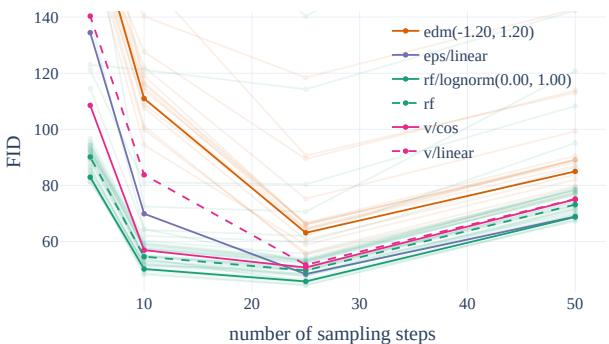  
Figure 3. Rectified flows are sample efficient. Rectified Flows perform better then other formulations when sampling fewer steps. For 25 and more steps, only rf/1ognorm (0.00, 1.00) remains competitive to eps/linear.

Table 3. Improved Autoencoders. Reconstruction performance metrics for different channel configurations. The downsampling factor for all models is $f = 8$ .   

<table><tr><td>Metric</td><td>4 chn</td><td>8 chn</td><td>16 chn</td></tr><tr><td>FID (↓)</td><td>2.41</td><td>1.56</td><td>1.06</td></tr><tr><td>Perceptual Similarity (↓)</td><td>0.85</td><td>0.68</td><td>0.45</td></tr><tr><td>SSIM(↑)</td><td>0.75</td><td>0.79</td><td>0.86</td></tr><tr><td>PSNR(↑)</td><td>25.12</td><td>26.40</td><td>28.62</td></tr></table>

# 5.2.1. IMPROVED AUTOENCODERS

Latent diffusion models achieve high efficiency by operating in the latent space of a pretrained autoencoder (Rombach et al., 2022), which maps an input RGB $X \in \mathbb { R } ^ { H \times W \times 3 }$ into a lower-dimensional space $x = E ( X ) \in \mathbb { R } ^ { h \times w \times d }$ .The reconstruction quality of this autoencoder provides an upper bound on the achievable image quality after latent diffusion training. Similar to Dai et al. (2023), we find that increasing the number of latent channels $d$ significantly boosts reconstruction performance, see Table 3. Intuitively, predicting latents with higher $d$ is a more difficult task, and thus models with increased capacity should be able to perform better for larger $d$ , ultimately achieving higher image quality. We confirm this hypothesis in Figure 10, where we see that the $d = 1 6$ autoencoder exhibits better scaling performance in terms of sample FID. For the remainder of this paper, we thus choose $d = 1 6$ .

# 5.2.2. IMPROVED CAPTIONS

Betker et al. (2023) demonstrated that synthetically generated captions can greatly improve text-to-image models trained at scale. This is due to the oftentimes simplistic nature of the human-generated captions that come with large-scale image datasets, which overly focus on the image subject and usually omit details describing the background or composition of the scene, or, if applicable, displayed text (Betker et al., 2023). We follow their approach and use an off-the-shelf, state-of-the-art vision-language model, $C o g V L M$ (Wang et al., 2023), to create synthetic annotations for our large-scale image dataset. As synthetic captions may cause a text-to-image model to forget about certain concepts not present in the VLM's knowledge corpus, we use a ratio of $50 \%$ original and $50 \%$ synthetic captions.

Table 4. Improved Captions. Using a 50/50 mixing ratio of synthetic (via $\mathrm { C o g V L M }$ (Wang et al., 2023)) and original captions improves text-to-image performance. Assessed via the GenEval (Ghosh et al., 2023) benchmark.   

<table><tr><td rowspan="2"></td><td>Original Captions</td><td>50/50 Mix</td></tr><tr><td>success rate [%]</td><td>success rate [%]</td></tr><tr><td>Color Attribution</td><td>11.75</td><td>24.75</td></tr><tr><td>Colors</td><td>71.54</td><td>68.09</td></tr><tr><td>Position</td><td>6.50</td><td>18.00</td></tr><tr><td>Counting</td><td>33.44</td><td>41.56</td></tr><tr><td>Single Object</td><td>95.00</td><td>93.75</td></tr><tr><td>Two Objects</td><td>41.41</td><td>52.53</td></tr><tr><td>Overall score</td><td>43.27</td><td>49.78</td></tr></table>

To assess the effect of training on this caption mix, we train two $d = 1 5 M M { - } D i T$ models for 250k steps, one on only original captions and the other on the $5 0 / 5 0 \mathrm { m i x }$ . We evaluate the trained models using the GenEval benchmark (Ghosh et al., 2023) in Table 4. The results demonstrate that the model trained with the addition of synthetic captions clearly outperforms the model that only utilizes original captions. We thus use the 50/50 synthetic/original caption mix for the remainder of this work.

# 5.2.3. ImPROVED TEXT-TO-ImAGE BACKBONES

In this section, we compare the performance of existing transformer-based diffusion backbones with our novel multimodal transformer-based diffusion backbone, MM-DiT, as introduced in Section 4. MM-DiT is specifically designed to handle different domains, here text and image tokens, using (two) different sets of trainable model weights. More specifically, we follow the experimental setup from Section 5.1 and compare text-to-image performance on CC12M of DiT, CrossDiT (DiT but with cross-attending to the text tokens instead of sequence-wise concatenation (Chen et al., 2023)) and our MM-DiT. For MM-DiT, we compare models with two sets of weights and three sets of weights, where the latter handles the CLIP (Radford et al., 2021) and T5 (Raffel et al., 2019) tokens ( $\cdot c . f .$ Section 4) separately. Note that DiT (w/ concatenation of text and image tokens as in Section 4) can be interpreted as a special case of MM-DiT with one shared set of weights for all modalities. Finally, we consider the UViT (Hoogeboom et al., 2023) architecture as a hybrid between the widely used UNets and transformer variants.

  
a space elevator, cinematic scifi art

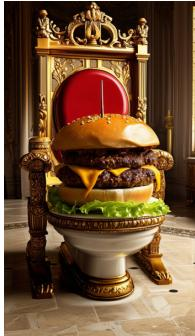  
A cheeseburger with juicy beef patties and melted cheese sits on top of a toilet that looks like a throne and stands in the middle of the royal chamber.

  
a hole in the floor of my bathroom with small gremlins living in it

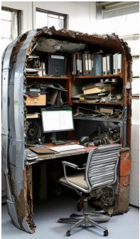  
a small office made out of car parts

  
This dreamlike digital art captures a vibrant, kaleidoscopic bird in a lush rainforest.

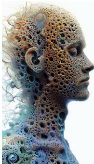  
human life depicted entirely out of fractals

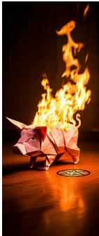  
an origami pig on fire in the middle of a dark room with a pentagram on the floor

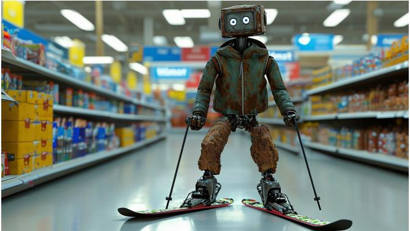  
an old rusted robot wearing pants and a jacket riding skis in a supermarket.

  
smiling cartoon dog sits at a table, coffee mug on hand, as a room goes up in fames. "This is fine," the dog assures himself.

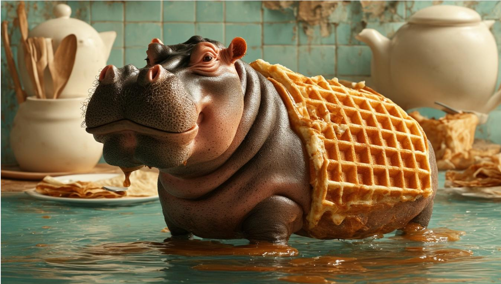  
Awhisica fantasy.

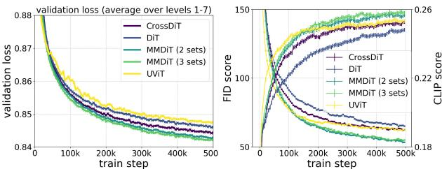  
Figure 4. Training dynamics of model architectures. Comparative analysis of DiT, CrossDiT, UViT, and MM-DiT on CC12M, focusing on validation loss, CLIP score, and FID. Our proposed MM-DiT performs favorably across all metrics.

We analyze the convergence behavior of these architectures in Figure 4: Vanilla DiT underperforms UViT. The crossattention DiT variant CrossDiT achieves better performance than UViT, although UViT seems to learn much faster initially. Our MM-DiT variant significantly outperforms the cross-attention and vanilla variants. We observe only a small gain when using three parameter sets instead of two (at the cost of increased parameter count and VRAM usage), and thus opt for the former option for the remainder of this work.

# 5.3. Training at Scale

Before scaling up, we filter and preencode our data to ensure safe and efficient pretraining. Then, all previous considerations of diffusion formulations, architectures, and data culminate in the last section, where we scale our models up to 8B parameters.

# 5.3.1. DATA PREPROCESSING

Pre-Training Mitigations Training data significantly impacts a generative model's abilities. Consequently, data filtering is effective at constraining undesirable capabilities (Nichol, 2022). Before training at sale, we filter our data for the following categories: (i) Sexual content: We use NSFW-detection models to filter for explicit content. (ii) Aesthetics: We remove images for which our rating systems predict a low score. (iii) Regurgitation: We use a cluster-based deduplication method to remove perceptual and semantic duplicates from the training data; see Appendix E.2. Precomputing Image and Text Embeddings Our model uses the output of multiple pretrained, frozen networks as inputs (autoencoder latents and text encoder representations). Since these outputs are constant during training, we precompute them once for the entire dataset. We provide a detailed discussion of our approach in Appendix E.1.

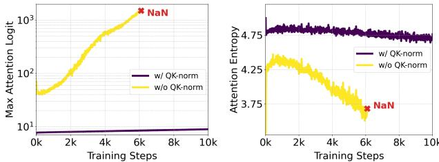  
Figure 5. Effects of QK-normalization. Normalizing the Q- and K-embeddings before calculating the attention matrix prevents the attention-logit growth instability (left), which causes the attention entropy to collapse (right) and has been previously reported in the discriminative ViT literature (Dehghani et al., 2023; Wortsman et al., 2023). In contrast with these previous works, we observe this instability in the last transformer blocks of our networks. Maximum attention logits and attention entropies are shown averaged over the last 5 blocks of a 2B $\mathrm { \Delta } \mathrm { d } = 2 4$ model.

# 5.3.2. Finetuning on High Resolutions

QK-Normalization In general, we pretrain all of our models on low-resolution images of size $2 5 6 ^ { 2 }$ pixels. Next, we finetune our models on higher resolutions with mixed aspect ratios (see next paragraph for details). We find that, when moving to high resolutions, mixed precision training can become unstable and the loss diverges. This can be remedied by switching to full precision training — but comes with $_ { 1 } \sim 2 \times$ performance drop compared to mixedprecision training. A more efficient alternative is reported in the (discriminative) ViT literature: Dehghani et al. (2023) observe that the training of large vision transformer models diverges because the attention entropy grows uncontrollably. To avoid this, Dehghani et al. (2023) propose to normalize Q and K before the attention operation. We follow this approach and use RMSNorm (Zhang & Sennrich, 2019) with learnable scale in both streams of our MMDiT architecture for our models, see Figure 2. As demonstrated in Figure 5, the additional normalization prevents the attention logit growth instability, confirming findings by Dehghani et al. (2023) and Wortsman et al. (2023) and enables efficient training at bf16-mixed (Chen et al., 2019) precision when combined with $\epsilon = 1 0 ^ { - 1 5 }$ in the AdamW (Loshchilov & Hutter, 2017) optimizer. This technique can also be applied on pretrained models that have not used qk-normalization during pretraining: The model quickly adapts to the additional normalization layers and trains more stably. Finally, we would like to point out that although this method can generally help to stabilize the training of large models, it is not a universal recipe and may need to be adapted depending on the exact training setup. Positional Encodings for Varying Aspect Ratios After training on a fixed $2 5 6 \times 2 5 6$ resolution we aim to (i) increase the resolution and resolution and (ii) enable inference with flexible aspect ratios. Since we use 2d positional frequency embeddings we have to adapt them based on the resolution. In the multi-aspect ratio setting, a direct interpolation of the embeddings as in (Dosovitskiy et al., 2020) would not reflect the side lengths correctly. Instead we use a combination of extended and interpolated position grids which are subsequently frequency embedded.

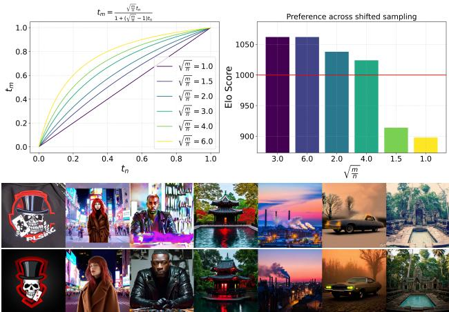  
Figure 6. Timestep shifting at higher resolutions. Top right: Human quality preference rating when applying the shifting based on Equation (23). Bottom row: A $5 1 2 ^ { 2 }$ model trained and sampled with $\sqrt { m / n } = 1 . 0$ (top) and $\sqrt { m / n } = 3 . 0$ (bottom). See Section 5.3.2.

For a target resolution of $S ^ { 2 }$ pixels, we use bucketed sampling (NovelAI, 2022; Podell et al., 2023) such that that each batch consists of images of a homogeneous size $H \times W$ , where ${ \cal H } \cdot { \cal W } \approx S ^ { 2 }$ . For the maximum and minimum training aspect ratios, this results in the maximum values for width, $W _ { \mathrm { m a x } }$ , and height, $H _ { \mathrm { m a x } }$ , that will be encountered. Let $h _ { \operatorname* { m a x } } = H _ { \operatorname* { m a x } } / 1 6 , w _ { \operatorname* { m a x } } = W _ { \operatorname* { m a x } } / 1 6$ and $s = S / 1 6$ be the corresponding sizes in latent space (a factor 8) after patching (a factor 2). Based on these values, we construct a vertical position grid with the values ((p  hmax−s) $\begin{array} { r l } {  { \big ( \big ( p - \frac { h _ { \operatorname* { m a x } } - s } { 2 } \big ) \cdot \frac { 2 5 6 } { S } \big ) _ { p = 0 } ^ { h _ { \operatorname* { m a x } } - 1 } } } \end{array}$ and correspondingly for the horizontal positions. We then centercrop from the resulting positional 2d grid before embedding it.

Resolution-dependent shifting of timestep schedules Intuitively, since higher resolutions have more pixels, we need more noise to destroy their signal. Assume we are working in a resolution with $n = H \cdot W$ pixels. Now, consider a "constant" image, i.e. one where every pixel has the value $c$ The forward process produces $z _ { t } = ( 1 - t ) c \mathbb { 1 } + t \epsilon .$ where both 1 and $\epsilon \in \mathbb { R } ^ { n }$ .Thus, $z _ { t }$ provides $n$ observations of the random variable $Y = ( 1 - t ) c + t \eta$ with $c$ and $\eta$ in $\mathbb { R }$ , and $\eta$ follows a standard normal distribution. Thus, $\mathbb { E } ( Y ) = ( 1 - t ) c$ and $\sigma ( Y ) = t$ .We can therefore recover c via c = −t , and the error between $c$ and its sample estimate $\textstyle { \hat { c } } = { \frac { 1 } { 1 - t } } \sum _ { i = 1 } ^ { n } z _ { t , i }$ has a standard deviation of $\textstyle \sigma ( t , n ) = { \frac { t } { 1 - t } } { \sqrt { \frac { 1 } { n } } }$ ( for $Y$ has deviation ${ \frac { t } { \sqrt { n } } } )$ image $z _ { \mathrm { 0 } }$ was constant across its pixels, $\sigma ( t , n )$ represents the degree of uncertainty about $z _ { \mathrm { 0 } }$ . For example, we immediately see that doubling the width and height leads to half the uncertainty at any given time $0 < t < 1$ But, we can now map a timestep $t _ { n }$ at resolution $n$ to a timestep $t _ { m }$ at resolution $m$ that results in the same degree of uncertainty via the ansatz $\sigma ( t _ { n } , n ) = \sigma ( t _ { m } , m )$ .Solving for $t _ { m }$ gives

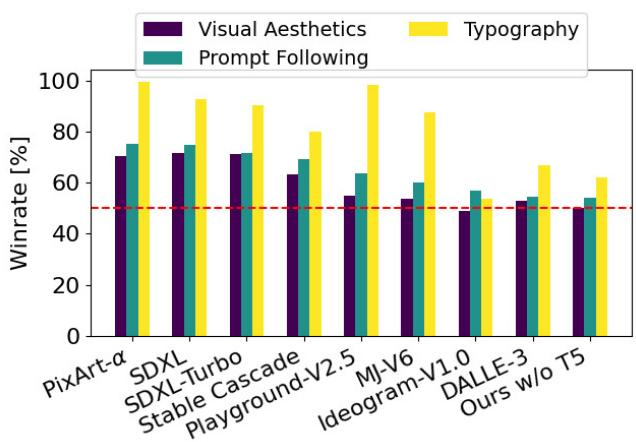  
Figure 7. Human Preference Evaluation against currrent closed and open SOTA generative image models. Our 8B model compares favorable against current state-of-the-art text-to-image models when evaluated on the parti-prompts (Yu et al., 2022) across the categories visual quality, prompt following and typography generation.

$$
t _ { m } = \frac { \sqrt { \frac { m } { n } } t _ { n } } { 1 + ( \sqrt { \frac { m } { n } } - 1 ) t _ { n } }
$$

We visualize this shifting function in Figure 6. Note that the assumption of constant images is not realistic. To find good values for the shift value $\alpha : = \sqrt { \frac { m } { n } }$ during inference, we apply them to the sampling steps of a model trained at resolution $1 0 2 4 \times 1 0 2 4$ and run a human preference study. The results in Figure 6 show a strong preference for samples with shifts greater than 1.5 but less drastic differences among the higher shift values. In our subsequent experiments, we thus use a shift value of $\alpha = 3 . 0$ both during training and sampling at resolution $1 0 2 4 \times 1 0 2 4$ .A qualitative comparison between samples after 8k training steps with and without such a shift can be found in Figure 6. Finally, note that Equation 23 implies a log-SNR shi of $\log { \frac { n } { m } }$ similar to (Hoogeboom et al., 2023):

$$
\begin{array} { l } { { \lambda _ { t _ { m } } = 2 \log \displaystyle \frac { 1 - t _ { n } } { \sqrt { \frac { m } { n } } t _ { n } } } } \\ { { = \lambda _ { t _ { n } } - 2 \log \alpha = \lambda _ { t _ { n } } - \log \displaystyle \frac { m } { n } \ : . } } \end{array}
$$

After the shifted training at resolution $1 0 2 4 \times 1 0 2 4$ , we align the model using Direct Preference Optimization (DPO) as described in Appendix C.

# 5.3.3. RESULTS

In Figure 8, we examine the effect of training our MM-DiT at scale. For images, we conduct a large scaling study and train models with different numbers of parameters for $5 0 0 \mathrm { k }$ steps on $2 5 6 ^ { 2 }$ pixels resolution using preencoded data, $c . f$ Appendix E.1, with a batch size of 4096. We train on $2 \times 2$ patches (Peebles & Xie, 2023), and report validation losses on the CoCo dataset (Lin et al., 2014) every 50k steps. In particular, to reduce noise in the validation loss signal, we sample loss levels equidistant in $t \in ( 0 , 1 )$ and compute validation loss for each level separately. We then average the loss across all but the last $\mathit { t } = 1$ levels.

Similarly, we conduct a preliminary scaling study of our MM-DiT on videos. To this end we start from the pretrained image weights and additionally use a $2 \mathbf { x }$ temporal patching. We follow Blattmann et al. (2023b) and feed data to the pretrained model by collapsing the temporal into the batch axis. In each attention layer we rearrange the representation in the visual stream and add a full attention over all spatiotemporal tokens after the spatial attention operation before the final feedforward layer. Our video models are trained for $1 4 0 \mathrm { k }$ steps with a batch size of 512 on videos comprising 16 frames with $2 5 6 ^ { 2 }$ pixels. We report validation losses on the Kinetics dataset (Carreira & Zisserman, 2018) every $5 \mathrm { k }$ steps. Note that our reported FLOPs for video training in Figure 8 are only FLOPs from video training and do not include the FLOPs from image pretraining. For both the image and video domains, we observe a smooth decrease in the validation loss when increasing model size and training steps. We find the validation loss to be highly correlated to comprehensive evaluation metrics (CompBench (Huang et al., 2023), GenEval (Ghosh et al., 2023)) and to human preference. These results support the validation loss as a simple and general measure of model performance. Our results do not show saturation neither for image not for video models. Figure 12 illustrates how training a larger model for longer impacts sample quality. Tab. 5 shows the results of GenEval in full. When applying the methods presented in Section 5.3.2 and increasing training image resolution, our biggest model excels in most categories and outperforms DALLE 3 (Betker et al., 2023), the current state of the art in prompt comprehension, in overall score. Our $d = 3 8$ model outperforms current proprietary (Betker et al., 2023; ide, 2024) and open (Sauer et al., 2023; pla, 2024; Chen et al., 2023; Pernias et al., 2023) SOTA generative image models in human preference evaluation on the

Table 5. GenEval comparisons. Our largest model (depth $^ { 1 = 3 8 }$ ) outperforms all current open models and DALLE-3 (Betker et al., 2023) on GenEval (Ghosh et al., 2023). We highlight the best, second best, and third best entries. For DPO, see Appendix C.   

<table><tr><td></td><td colspan="2">Objects</td><td colspan="2"></td><td></td><td></td><td>Color</td></tr><tr><td>Model</td><td>Overall</td><td>Single Two</td><td></td><td>Counting</td><td></td><td></td><td>Colors Position Attribution</td></tr><tr><td>minDALL-E</td><td>0.23</td><td>0.73</td><td>0.11</td><td>0.12</td><td>0.37</td><td>0.02</td><td>0.01</td></tr><tr><td>SD v1.5</td><td>0.43</td><td>0.97</td><td>0.38</td><td>0.35</td><td>0.76</td><td>0.04</td><td>0.06</td></tr><tr><td>PixArt-alpha</td><td>0.48</td><td>0.98</td><td>0.50</td><td>0.44</td><td>0.80</td><td>0.08</td><td>0.07</td></tr><tr><td>SD v2.1</td><td>0.50</td><td>0.98</td><td>0.51</td><td>0.44</td><td>0.85</td><td>0.07</td><td>0.17</td></tr><tr><td>DALL-E 2</td><td>0.52</td><td>0.94</td><td>0.66</td><td>0.49</td><td>0.77</td><td>0.10</td><td>0.19</td></tr><tr><td>SDXL</td><td>0.55</td><td>0.98</td><td>0.74</td><td>0.39</td><td>0.85</td><td>0.15</td><td>0.23</td></tr><tr><td>SDXL Turbo</td><td>0.55</td><td>1.00</td><td>0.72</td><td>0.49</td><td>0.80</td><td>0.10</td><td>0.18</td></tr><tr><td>IF-XL</td><td>0.61</td><td>0.97</td><td>0.74</td><td>0.66</td><td>0.81</td><td>0.13</td><td>0.35</td></tr><tr><td>DALL-E 3</td><td>0.67</td><td>0.96</td><td>0.87</td><td>0.47</td><td>0.83</td><td>0.43</td><td>0.45</td></tr><tr><td>Ours (depth=18), 5122</td><td>0.58</td><td>0.97</td><td>0.72</td><td>0.52</td><td>0.78</td><td>0.16</td><td>0.34</td></tr><tr><td>Ours (depth=24), 5122</td><td>0.62</td><td>0.98</td><td>0.74</td><td>0.63</td><td>0.67</td><td>0.34</td><td>0.36</td></tr><tr><td>Ours (depth=30), 5122</td><td>0.64</td><td>0.96</td><td>0.80</td><td>0.65</td><td>0.73</td><td>0.33</td><td>0.37</td></tr><tr><td>Ours (depth=38), 5122</td><td>0.68</td><td>0.98</td><td>0.84</td><td>0.66</td><td>0.74</td><td>0.40</td><td>0.43</td></tr><tr><td>Ours (depth=38), 5122 w/DPO</td><td>0.71</td><td>0.98</td><td>0.89</td><td>0.73</td><td>0.83</td><td>0.34</td><td>0.47</td></tr><tr><td>Ours (depth=38), 10242 w/DPO</td><td>0.74</td><td>0.99</td><td>0.94</td><td>0.72</td><td>0.89</td><td>0.33</td><td>0.60</td></tr></table>

<table><tr><td rowspan="3"></td><td colspan="4">relative CLIP score decrease [%]</td></tr><tr><td>5/50 steps</td><td>10/50 steps</td><td>20/50 steps</td><td>path length</td></tr><tr><td>depth=15</td><td>4.30</td><td>0.86</td><td>0.21</td><td>191.13</td></tr><tr><td>depth=30</td><td>3.59</td><td>0.70</td><td>0.24</td><td>187.96</td></tr><tr><td>depth=38</td><td>2.71</td><td>0.14</td><td>0.08</td><td>185.96</td></tr></table>

Table 6. Impact of model size on sampling efficiency. The table shows the relative performance decrease relative to CLIP scores evaluated using 50 sampling steps at a fixed seed. Larger models can be sampled using fewer steps, which we attribute to increased robustness and better fitting the straight-path objective of rectified flow models, resulting in shorter path lengths. Path length is calculated by summing up $\| v _ { \theta } \cdot d t \|$ over 50 steps.

Parti-prompts benchmark (Yu et al., 2022) in the categories visual aesthetics, prompt following and typography generation, $c . f$ .Figure 7. For evaluating human preference in these categories, raters were shown pairwise outputs from two models, and asked to answer the following questions: Prompt following: Which image looks more representative to the text shown above and faithfully follows it? Visual aesthetics: Given the prompt, which image is of higher-quality and aesthetically more pleasing? Typography: Which image more accurately shows/displays the text specified in the above description? More accurate spelling is preferred! Ignore other aspects. Lastly, Table 6 highlights an intriguing result: not only do bigger models perform better, they also require fewer steps to reach their peak performance.

Flexible Text Encoders While the main motivation for using multiple text-encoders is boosting the overall model performance (Balaji et al., 2022), we now show that this choice additionally increases the flexibility of our MM-DiTbased rectified flow during inference. As described in Appendix B.3 we train our model with three text encoders, with an individual drop-out rate of $4 6 . 3 \%$ . Hence, at inference time, we can use an arbitrary subset of all three text encoders. This offers means for trading off model performance for improved memory efficiency, which is particularly relevant for the 4.7B parameters of T5-XXL (Raffel et al., 2019) that require significant amounts of VRAM. Interestingly, we observe limited performance drops when using only the two CLIP-based text-encoders for the text prompts and replacing the T5 embeddings by zeros. We provide a qualitative visualization in Figure 9. Only for complex prompts involving either highly detailed descriptions of a scene or larger amounts of written text do we find significant performance gains when using all three text-encoders. These observations are also verified in the human preference evaluation results in Figure 7 (Ours w/o T5). Removing T5 has no effect on aesthetic quality ratings $5 0 \%$ win rate), and only a small impact on prompt adherence ( $4 6 \%$ win rate), whereas its contribution to the capabilities of generating written text are more significant ( $3 8 \%$ win rate).

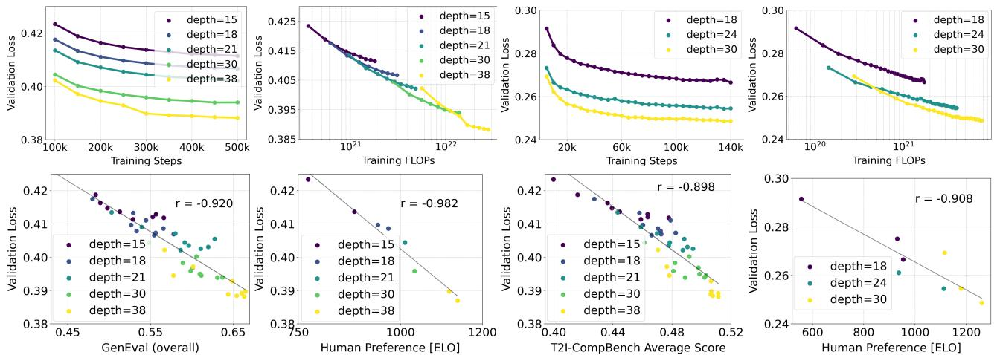  
hyperparameters throughout. An exception is depth $^ { 1 = 3 8 }$ , where learning rate adjustments at $3 \times 1 0 ^ { 5 }$ steps were necessary to prevent c validation loss and human preference, column 4. .

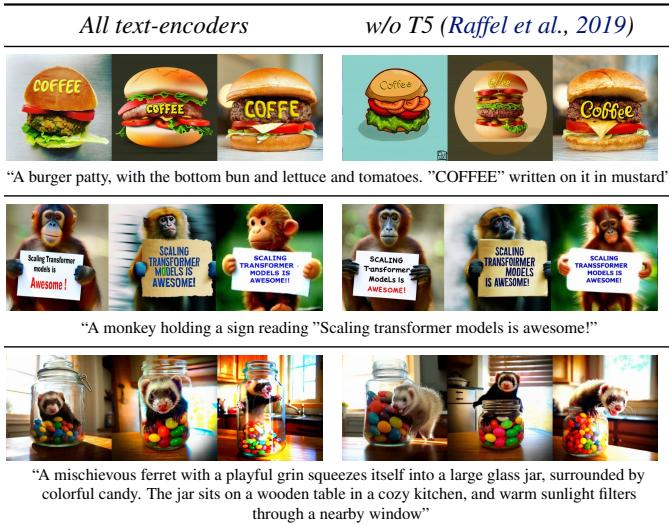  
Figure 9. Impact of T5. We observe T5 to be important for complex prompts e.g. such involving a high degree of detail or longer spelled text (rows 2 and 3). For most prompts, however, we find that removing T5 at inference time still achieves competitive performance.

# 6. Conclusion

In this work, we presented a scaling analysis of rectified flow models for text-to-image synthesis. We proposed a novel timestep sampling for rectified flow training that improves over previous diffusion training formulations for latent diffusion models and retains the favourable properties of rectified flows in the few-step sampling regime. We also demonstrated the advantages of our transformer-based MM-DiT architecture that takes the multi-modal nature of the text-to-image task into account. Finally, we performed a scaling study of this combination up to a model size of 8B parameters and $5 \times 1 0 ^ { 2 2 }$ training FLOPs. We showed that validation loss improvements correlate with both existing text-to-image benchmarks as well as human preference evaluations. This, in combination with our improvements in generative modeling and scalable, multimodal architectures achieves performance that is competitive with state-of-theart proprietary models. The scaling trend shows no signs of saturation, which makes us optimistic that we can continue to improve the performance of our models in the future.

# Broader Impact

This paper presents work whose goal is to advance the field of machine learning in general and image synthesis in particular. There are many potential societal consequences of our work, none of which we feel must be specifically highlighted here. For an extensive discussion of the general ramifications of diffusion models, we point interested readers towards (Po et al., 2023).

# References

Ideogram v1.0 announcement, 2024. URL ht tps : / / ab out.ideogram.ai/1.0. Playground v2.5 announcement, 2024. URL ht t ps : / /b1 og.playgroundai.com/playground-v2-5/. Albergo, M. S. and Vanden-Eijnden, E. Building normalizing flows with stochastic interpolants, 2022. Atchison, J. and Shen, S. M. Logistic-normal distributions: Some properties and uses. Biometrika, 67(2):261272, 1980. autofaiss. autofaiss, 2023. URL https: / /github.c om/criteo/autofaiss. Balaji, Y., Nah, S., Huang, X., Vahdat, A., Song, J., Zhang, Q., Kreis, K., Aittala, M., Aila, T., Laine, S., Catanzaro, B., Karras, T., and Liu, M.-Y. ediff-i: Text-to-image diffusion models with an ensemble of expert denoisers, 2022. Betker, J., Goh, G., Jing, L., Brooks, T., Wang, J., Li, L., Ouyang, L., Zhuang, J., Lee, J., Guo, Y., et al. Improving image generation with better captions. Computer Science. https://cdn. openai. com/papers/dall-e-3. pdf, 2(3), 2023. Blattmann, A., Dockhorn, T., Kulal, S., Mendelevitch, D., Kilian, M., Lorenz, D., Levi, Y., English, Z., Voleti, V., Letts, A., et al. Stable video diffusion: Scaling latent video diffusion models to large datasets. arXiv preprint arXiv:2311.15127, 2023a. Blattmann, A., Rombach, R., Ling, H., Dockhorn, T., Kim, S. W., Fidler, S., and Kreis, K. Align your latents: Highresolution video synthesis with latent diffusion models, 2023b. Brooks, T., Holynski, A., and Efros, A. A. Instructpix2pix: Learning to follow image editing instructions. In Proceedings of the IEEE/CVF Conference on Computer Vision and Pattern Recognition, pp. 1839218402, 2023. Carlini, N., Hayes, J., Nasr, M., Jagielski, M., Sehwag, V., Tramer, F., Balle, B., Ippolito, D., and Wallace, E. Extracting training data from diffusion models. In 32nd USENIX Security Symposium (USENIX Security 23), pp.   
52535270, 2023. Carreira, J. and Zisserman, A. Quo vadis, action recognition? a new model and the kinetics dataset, 2018. Changpinyo, S., Sharma, P. K., Ding, N., and Soricut, R. Conceptual $1 2 \mathrm { m }$ : Pushing web-scale image-text pretraining to recognize long-tail visual concepts. 2021 IEEE/CVF Conference on Computer Vision and Pattern Recognition (CVPR), pp. 35573567, 2021. URL https://api.semanticscholar.org/Corp usID:231951742. Chen, D., Chou, C., Xu, Y., and Hseu, J. Bfloat16: The secret to high performance on cloud tpus, 2019. URL https://cloud.google.com/blog/produc ts/ai-machine-learning/bfloat16-the-s ecret-to-high-performance-on-cloud-t pus?hl $=$ en. Chen, J., Yu, J., Ge, C., Yao, L., Xie, E., Wu, Y., Wang, Z., Kwok, J., Luo, P., Lu, H., and Li, Z. Pixart-a: Fast training of diffusion transformer for photorealistic textto-image synthesis, 2023. Chen, T. Q., Rubanova, Y., Bettencourt, J., and Duvenaud, D. K. Neural ordinary differential equations. In Neural Information Processing Systems, 2018. URL https : //api.semanticscholar.org/CorpusID:49 310446. Cherti, M., Beaumont, R., Wightman, R., Wortsman, M., Ilharco, G., Gordon, C., Schuhmann, C., Schmidt, L., and Jitsev, J. Reproducible scaling laws for contrastive language-image learning. In 2023 IEEE/CVF Conference on Computer Vision and Pattern Recognition (CVPR). IEEE, 2023. doi: 10.1109/cvpr52729.2023.00276. URL http://dx.doi.org/10.1109/CVPR52729.2 023.00276. Dai, X., Hou, J., Ma, C.-Y., Tsai, S., Wang, J., Wang, R., Zhang, P., Vandenhende, S., Wang, X., Dubey, A., Yu, M., Kadian, A., Radenovic, F., Mahajan, D., Li, K., Zhao, Y. Petrovic, V., Singh, M. K., Motwani, S., Wen, Y., Song, Y., Sumbaly, R., Ramanathan, V., He, Z., Vajda, P., and Parikh, D. Emu: Enhancing image generation models using photogenic needles in a haystack, 2023. Dao, Q., Phung, H., Nguyen, B., and Tran, A. Flow matching in latent space, 2023. Dehghani, M., Djolonga, J., Mustafa, B., Padlewski, P., Heek, J., Gilmer, J., Steiner, A., Caron, M., Geirhos, R., Alabdulmohsin, I., Jenatton, R., Beyer, L., Tschannen, M., Arnab, A., Wang, X., Riquelme, C., Minderer, M., Puigcerver, J., Evci, U., Kumar, M., van Steenkiste, S., Elsayed, G. F., Mahendran, A., Yu, F., Oliver, A., Huot, F., Bastings, J., Collier, M. P., Gritsenko, A., Birodkar, V., Vasconcelos, C., Tay, Y., Mensink, T., Kolesnikov, A., Paveti, F., Tran, D., Kipf, T., Lui, M., Zhai, X., Keysers, D., Harmsen, J., and Houlsby, N. Scaling vision transformers to 22 billion parameters, 2023. Dhariwal, P. and Nichol, A. Diffusion models beat gans on image synthesis, 2021. Dockhorn, T., Vahdat, A., and Kreis, K. Score-based generative modeling with critically-damped langevin diffusion. arXiv preprint arXiv:2112.07068, 2021. Dockhorn, T., Vahdat, A., and Kreis, K. Genie: Higherorder denoising diffusion solvers, 2022. Dosovitskiy, A., Beyer, L., Kolesnikov, A., Weissenborn, D., Zhai, X., Unterthiner, T., Dehghani, M., Minderer, M., Heigold, G., Gelly, S., et al. An image is worth 16x16 words: Transformers for image recognition at scale. ICLR, 2020. Esser, P., Chiu, J., Atighehchian, P., Granskog, J., and Germanidis, A. Structure and content-guided video synthesis with diffusion models, 2023. Euler, L. Institutionum calculi integralis. Number Bd. 1 in Institutionum calculi integralis. imp. Acad. imp. Saènt. 1768. URL https://books.google.de/book s?id $\underline { { \underline { { \mathbf { \Pi } } } } } =$ Vg8OAAAAQAAJ. Fischer, J. S., Gui, M., Ma, P., Stracke, N., Baumann, S. A., and Ommer, B. Boosting latent diffusion with flow matching. arXiv preprint arXiv:2312.07360, 2023. Ghosh, D., Hajishirzi, H., and Schmidt, L. Geneval: An object-focused framework for evaluating text-to-image alignment. arXiv preprint arXiv:2310.11513, 2023. Gupta, A., Yu, L., Sohn, K., Gu, X., Hahn, M., Fei-Fei, L., Essa, I., Jiang, L., and Lezama, J. Photorealistic video generation with diffusion models, 2023. Hessel, J., Holtzman, A., Forbes, M., Le Bras, R., and Choi, Y. Clipscore: A reference-free evaluation metric for image captioning. In Proceedings of the 2021 Conference on Empirical Methods in Natural Language Processing. Association for Computational Linguistics, 2021. doi: 10.18653/v1/2021.emnlp-main.595. URL ht tp : / / dx .doi.org/10.18653/v1/2021.emnlp-main. 595. Heusel, M., Ramsauer, H., Unterthiner, T., Nessler, B., and Hochreiter, S. Gans trained by a two time-scale update rule converge to a local nash equilibrium, 2017. Ho, J. and Salimans, T. Classifier-free diffusion guidance, 2022. Ho, J., Jain, A., and Abbeel, P. Denoising diffusion probabilistic models, 2020. Ho, J., Chan, W., Saharia, C., Whang, J., Gao, R., Gritsenko, A., Kingma, D. P., Poole, B., Norouzi, M., Fleet, D. J., and Salimans, T. Imagen video: High definition video generation with diffusion models, 2022. Hoogeboom, E., Heek, J., and Salimans, T. Simple diffusion: End-to-end diffusion for high resolution images, 2023. Huang, K., Sun, K., Xie, E., Li, Z., and Liu, X. T2icompbench: A comprehensive benchmark for open-world compositional text-to-image generation. arXiv preprint arXiv:2307.06350, 2023. Hyvärinen, A. Estimation of non-normalized statistical models by score matching. J. Mach. Learn. Res., 6:695 709,2005.URL https://api.semanticschola r.org/CorpusID:1152227. Kaplan, J., McCandlish, S., Henighan, T., Brown, T. B., Chess, B., Child, R., Gray, S., Radford, A., Wu, J., and Amodei, D. Scaling laws for neural language models, 2020. Karras, T., Aittala, M., Aila, T., and Laine, S. Elucidating the design space of diffusion-based generative models. ArXiv, abs/2206.00364, 2022. URL https : / / api . se manticscholar.org/CorpusID:249240415. Karras, T., Aittala, M., Lehtinen, J., Hellsten, J., Aila, T., and Laine, S. Analyzing and improving the training dynamics of diffusion models. arXiv preprint arXiv:2312.02696, 2023. Kingma, D. P. and Gao, R. Understanding diffusion objectives as the elbo with simple data augmentation. In Thirty-seventh Conference on Neural Information Processing Systems, 2023. Lee, K., Ippolito, D., Nystrom, A., Zhang, C., Eck, D., Callison-Burch, C., and Carlini, N. Deduplicating training data makes language models better. arXiv preprint arXiv:2107.06499, 2021. Lee, S., Kim, B., and Ye, J. C. Minimizing trajectory curvature of ode-based generative models, 2023. Lin, S., Liu, B., Li, J., and Yang, X. Common diffusion noise schedules and sample steps are flawed. In Proceedings of the IEEE/CVF Winter Conference on Applications of Computer Vision, pp. 54045411, 2024. Lin, T.-Y., Maire, M., Belongie, S., Hays, J., Perona, P., Ramanan, D., Dollár, P., and Zitnick, C. L. Microsoft COCO: Common Objects in Context, pp. 740755. Springer International Publishing, 2014. ISBN 9783319106021. doi: 10.1007/978-3-319-10602-1_48. URL http : / /dx . d oi.0rg/10.1007/978-3-319-10602-1_48. Lipman, Y., Chen, R. T. Q., Ben-Hamu, H., Nickel, M., and Le, M. Flow matching for generative modeling. In The Eleventh International Conference on Learning Representations, 2023. URL https://openreview.net /forum?id $\underline { { \underline { { \mathbf { \Pi } } } } } =$ PqvMRDCJT9t. Liu, X., Gong, C., and Liu, Q. Flow straight and fast: Learning to generate and transfer data with rectified flow, 2022. Liu, X., Zhang, X., Ma, J., Peng, J., and Liu, Q. Instaflow: One step is enough for high-quality diffusion-based textto-image generation, 2023. Loshchilov, I. and Hutter, F. Fixing weight decay regularization in adam. ArXiv, abs/1711.05101, 2017. URL https://api.semanticscholar.org/Corp usID:3312944. Lu, C., Zhou, Y., Bao, F., Chen, J., Li, C., and Zhu, J. Dpmsolver $^ { + + }$ : Fast solver for guided sampling of diffusion probabilistic models, 2023. Ma, N., Goldstein, M., Albergo, M. S., Boffi, N. M., VandenEijnden, E., and Xie, S. Sit: Exploring flow and diffusionbased generative models with scalable interpolant transformers, 2024. Nichol, A. Dall-e 2 pre-training mitigations. ht t ps : //openai.com/research/dall-e-2-pre-t raining-mitigations,2022. Nichol, A. and Dhariwal, P. Improved denoising diffusion probabilistic models, 2021. NovelAI. Novelai improvements on stable diffusion, 2022. URL https://blog.novelai.net/novelai -improvements-on-stable-diffusion-e10 d38db82ac. Peebles, W. and Xie, S. Scalable diffusion models with transformers. In 2023 IEEE/CVF International Conference on Computer Vision (ICCV). IEEE, 2023. doi: 10.1109/iccv51070.2023.00387. URL http : / / dx. d oi.0rg/10.1109/ICCV51070.2023.00387. Pernias, P., Rampas, D., Richter, M. L., Pal, C. J., and Aubreville, M. Wuerstchen: An efficient architecture for large-scale text-to-image diffusion models, 2023. Pizzi, E., Roy, S. D., Ravindra, S. N., Goyal, P., and Douze, M. A self-supervised descriptor for image copy detection. In Proceedings of the IEEE/CVF Conference on Computer Vision and Pattern Recognition, pp. 1453214542, 2022. Po, R., Yifan, W., Golyanik, V., Aberman, K., Barron, J. T., Bermano, A. H., Chan, E. R., Dekel, T., Holynski, A. Kanazawa, A., et al. State of the art on diffusion models for visual computing. arXiv preprint arXiv:2310.07204, 2023. Podell, D., English, Z., Lacey, K., Blattmann, A., Dockhorn, T., Müller, J., Penna, J., and Rombach, R. Sdxl: Improving latent diffusion models for high-resolution image synthesis, 2023. Pooladian, A.-A., Ben-Hamu, H., Domingo-Enrich, C., Amos, B., Lipman, Y., and Chen, R. T. Q. Multisample flow matching: Straightening flows with minibatch couplings, 2023. Radford, A., Kim, J. W., Hallacy, C., Ramesh, A., Goh, G., Agarwal, S., Sastry, G., Askell, A., Mishkin, P., Clark, J., Krueger, G., and Sutskever, I. Learning transferable visual models from natural language supervision, 2021. Rafailov, R., Sharma, A., Mitchell, E., Ermon, S., Manning, C. D., and Finn, C. Direct Preference Optimization: Your Language Model is Secretly a Reward Model. arXiv:2305.18290, 2023. Raffel, C., Shazeer, N., Roberts, A., Lee, K., Narang, S., Matena, M., Zhou, Y., Li, W., and Liu, P. J. Exploring the limits of transfer learning with a unified text-to-text transformer, 2019. Ramesh, A., Dhariwal, P., Nichol, A., Chu, C., and Chen, M. Hierarchical text-conditional image generation with clip latents, 2022.

Rombach, R., Blattmann, A., Lorenz, D., Esser, P., and Ommer, B. High-resolution image synthesis with latent diffusion models. In 2022 IEEE/CVF Conference on Computer Vision and Pattern Recognition (CVPR). IEEE, 2022. doi: 10.1109/cvpr52688.2022.01042. URL http://dx.doi.org/10.1109/CVPR52688.2 022.01042. Ronneberger, O., Fischer, P., and Brox, T. U-Net: Convolutional Networks for Biomedical Image Segmentation, pp. 234241. Springer International Publishing, 2015. ISBN 9783319245744. doi: 10.1007/978-3-319-24574-4_28. URLhttp://dx.doi.org/10.1007/978-3-3 19-24574-4_28. Russakovsky, O., Deng, J., Su, H., Krause, J., Satheesh, S., Ma, S., Huang, Z., Karpathy, A., Khosla, A., Bernstein, M. S., Berg, A. C., and Fei-Fei, L. Imagenet large scale visual recognition challenge. International Journal of Computer Vision, 115:211 - 252, 2014. URL https : //api.semanticscholar.org/CorpusID:29 30547. Saharia, C., Chan, W., Chang, H., Lee, C., Ho, J., Salimans, T. Fleet, D., and Norouzi, M. Palette: Image-to-image diffusion models. In ACM SIGGRAPH 2022 Conference Proceedings, pp. 110, 2022a. Saharia, C., Chan, W., Saxena, S., Li, L., Whang, J., Denton, E., Ghasemipour, S. K. S., Ayan, B. K., Mahdavi, S. S., Lopes, R. G., Salimans, T., Ho, J., Fleet, D. J., and Norouzi, M. Photorealistic text-to-image diffusion models with deep language understanding, 2022b. Saharia, C., Ho, J., Chan, W., Salimans, T., Fleet, D. J., and Norouzi, M. Image super-resolution via iterative refinement. IEEE Transactions on Pattern Analysis and Machine Intelligence, 45(4):47134726, 2022c. Sauer, A., Chitta, K., Müller, J., and Geiger, A. Projected gans converge faster. Advances in Neural Information Processing Systems, 2021. Sauer, A., Lorenz, D., Blattmann, A., and Rombach, R. Adversarial diffusion distillation. arXiv preprint arXiv:2311.17042, 2023. Sheynin, S., Polyak, A., Singer, U., Kirstain, Y., Zohar, A., Ashual, O., Parikh, D., and Taigman, Y. Emu edit: Precise image editing via recognition and generation tasks. arXiv preprint arXiv:2311.10089, 2023. Singer, U., Polyak, A., Hayes, T., Yin, X., An, J., Zhang, S., Hu, Q., Yang, H., Ashual, O., Gafni, O., Parikh, D., Gupta, S., and Taigman, Y. Make-a-video: Text-to-video generation without text-video data, 2022. Sohl-Dickstein, J. N., Weiss, E. A., Maheswaranathan, N., and Ganguli, S. Deep unsupervised learning using nonequilibrium thermodynamics. ArXiv, abs/1503.03585, 2015. URL https://api.semanticscholar. org/CorpusID:14888175. Somepalli, G., Singla, V., Goldblum, M., Geiping, J., and Goldstein, T. Diffusion art or digital forgery? investigating data replication in diffusion models. In Proceedings of the IEEE/CVF Conference on Computer Vision and Pattern Recognition, pp. 60486058, 2023a. Somepalli, G., Singla, V., Goldblum, M., Geiping, J., and Goldstein, T. Understanding and mitigating copying in diffusion models. arXiv preprint arXiv:2305.20086, 2023b. Song, J., Meng, C., and Ermon, S. Denoising diffusion implicit models, 2022. Song, Y. and Ermon, S. Generative modeling by estimating gradients of the data distribution, 2020. Song, Y., Sohl-Dickstein, J. N., Kingma, D. P., Kumar, A., Ermon, S., and Poole, B. Score-based generative modeling through stochastic differential equations. ArXiv, abs/2011.13456, 2020. URL https : / /api . semant icscholar.org/CorpusID:227209335. Tong, A., Malkin, N., Huguet, G., Zhang, Y., Rector-Brooks, J., Fatras, K., Wolf, G., and Bengio, Y. Improving and generalizing flow-based generative models with minibatch optimal transport, 2023. Vaswani, A., Shazeer, N., Parmar, N., Uszkoreit, J., Jones, L., Gomez, A. N., Kaiser, L., and Polosukhin, I. Attention is all you need, 2017. Villani, C. Optimal transport: Old and new. 2008. URL https://api.semanticscholar.org/Corp usID:118347220. Vincent, P. A connection between score matching and denoising autoencoders. Neural Computation, 23:1661 1674,2011. URL https://api.semanticscho lar.org/CorpusID:5560643. Wallace, B., Dang, M., Rafailov, R., Zhou, L., Lou, A., Purushwalkam, S., Ermon, S., Xiong, C., Joty, S., and Naik, N. Diffusion Model Alignment Using Direct Preference Optimization. arXiv:2311.12908, 2023. Wang, W., Lv, Q., Yu, W., Hong, W., Qi, J., Wang, Y., Ji, J., Yang, Z., Zhao, L., Song, X., et al. Cogvlm: Visual expert for pretrained language models. arXiv preprint arXiv:2311.03079, 2023. Wortsman, M., Liu, P. J., Xiao, L., Everett, K., Alemi, A., Adlam, B., Co-Reyes, J. D., Gur, I., Kumar, A., Novak, R., Pennington, J., Sohl-dickstein, J., Xu, K., Lee, J., Gilmer, J., and Kornblith, S. Small-scale proxies for large-scale transformer training instabilities, 2023. Yu, J., Xu, Y., Koh, J. Y., Luong, T., Baid, G., Wang, Z., Vasudevan, V., Ku, A., Yang, Y., Ayan, B. K., et al. Scaling Autoregressive Models for Content-Rich Text-to-Image Generation. arXiv:2206.10789, 2022. Zhai, X., Kolesnikov, A., Houlsby, N., and Beyer, L. Scaling vision transformers. In CVPR, pp. 1210412113, 2022. Zhang, B. and Sennrich, R. Root mean square layer normalization, 2019.

# Supplementary

# A. Background

Mo Dick l So l 00Hl e ata y ha  hTvn ivehaal&Nic  Shl a  ; a  H Ba 2015and scorematching Hyvärinen, 2005;Vincent, 201 Song &Ermon, 2020), variusformulations  forwarand v  So00Dc 0 at Ho  00H&S ; a  H   ; themial workKin&Go (203)and Karras l. (20)have prooniulans nt l However, despit thes provements, the trajectoricomon ODE involve partlysgifiant mont e l  E trajectories. RFlowMoel u l 0;Albergo&Vane-Ejnen, 0; Li al, 0 eiv aas  olzo el018s  s. CopareFsRectFlows nd ochastcnterolants havevantage hat hey ot reqi te uraidelhe nesul E ta te pbil owODE Son 20ass wioelsNeveheles, heyonot resul x e improved performance. NLP (Kapla al00)ancviiask Dsk al00 Zhaial .Forife, U-N eeoH e al 2.Whil e ret works xploiffuirar bacoes Peeble& Xie 0Chel ; Ma et al., 2024), scaling laws for text-to-image diffusion models remain unexplored.

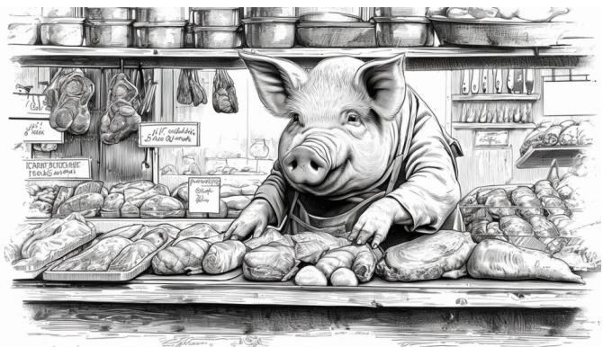  
Detailed pen and ink drawing of a happy pig butcher selling meat in its shop.

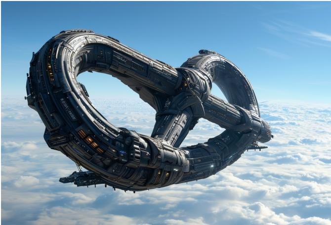  
a massive alien space ship that is shaped like a pretzel.

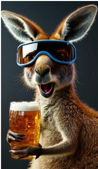  
A kangaroo holding a beer, wearing ski goggles and passionately singing silly songs.

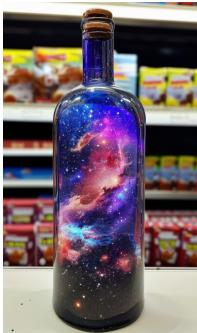  
An entire universe inside a bottle sitting on the shelf at walmart on sale.

  
A cheesburger surfing the vibe wave at night

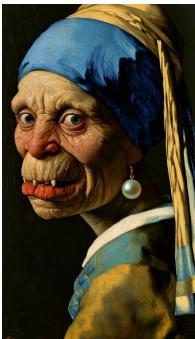  
A swamp ogre with a pearl earring by Johannes Vermeer

  
A car made out of vegetables.

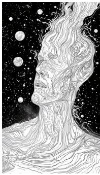  
heat death of the universe, line art

  
A crab made of cheese on a plate

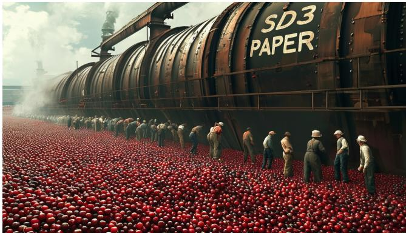  
Dystopia of thousand of workers picking cherries and feeding them into a machine that runs on steam and is as large as a skyscraper. Written on the side of the machine: "SD3 Paper"

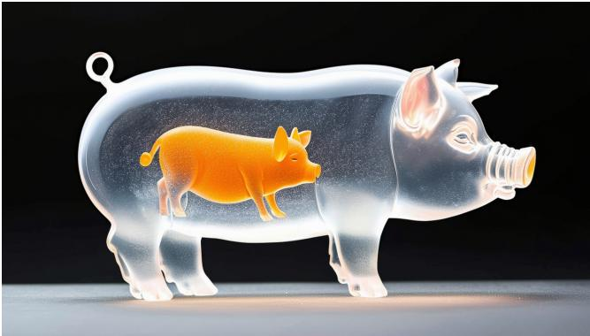  
translucent  sd  all .

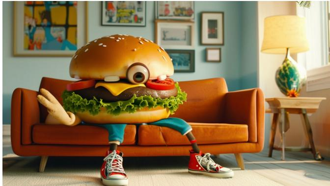  
Film still of a long-legged cute big-eye anthropomorphic cheeseburger wearing sneakers relaxing on the couch in a sparsely decorated living room.

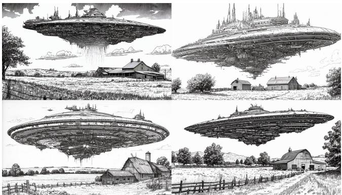  
detailed pen and ink drawing of a massive complex alien space ship above a farm in the middle of nowhere.

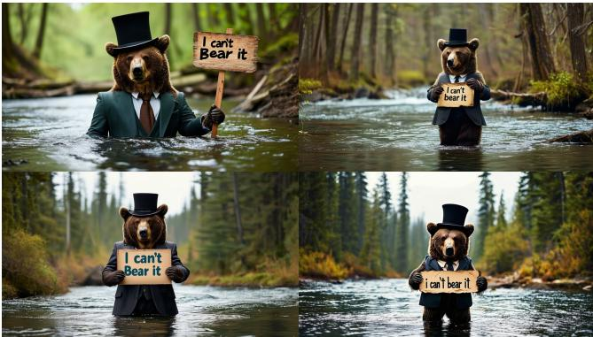  
photo of a bear wearing a suit and tophat in a river in the middle of a forest holding a sign that says "I cant bear it".

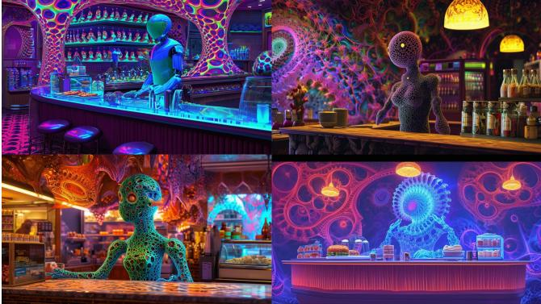  

an anthropomorphic fractal person behind the counter at a fractal themed restaurant

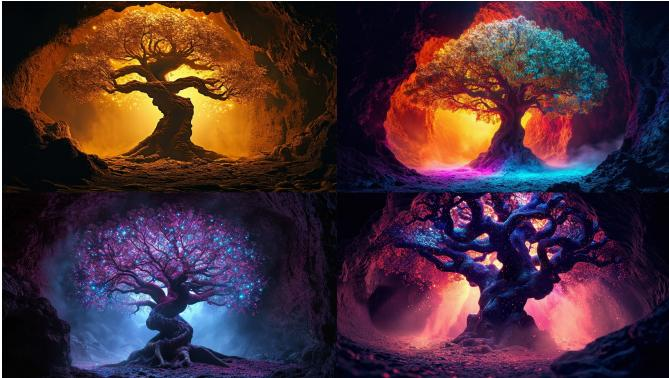  
drn elu ysv

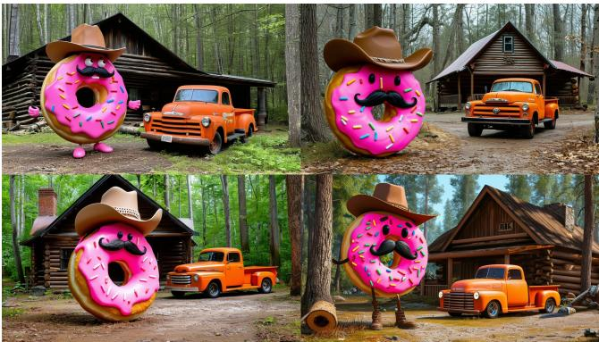  
an anthopomorphic pink donut with a mustache and cowboy hat standing by a log cabin in a forest with an old 1970s orange truck in the driveway

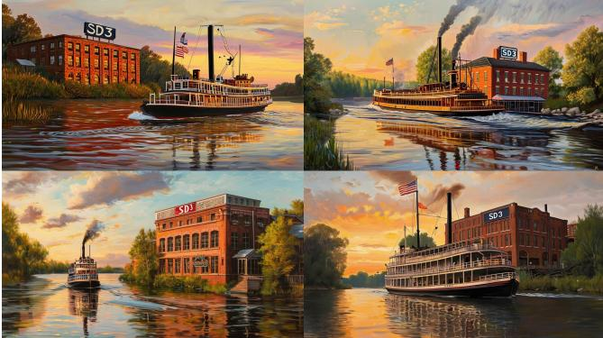

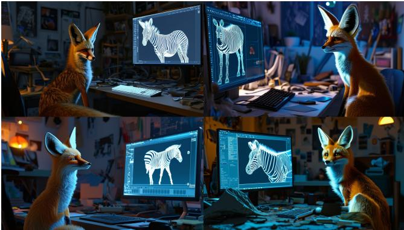  
beautiful oil painting of a steamboat in a river in the afternoon. On the side of the river is a large brick building with a sign on top that says D3.   
fox sitting in front of a computer in a messy room at night. On the screen is a 3d modeling program with a line render of a zebra.

# B. On Flow Matching

# B.1. Details on Simulation-Free Training of Flows

Following (Lipman et al., 2023), to see that $u _ { t } ( z )$ generates $p _ { t }$ we no hatent proviy and sufficient condition (Villani, 2008): Therefore it suffices to show that /here we used the continuity equation Equation (2) fr $u _ { t } ( z | \epsilon )$ in line Equation (28) to Equation (29) since $u _ { t } ( z | \epsilon )$ enerates $p _ { t } ( z | \epsilon )$ and the definition of Equation (6) in line Equation (27)

$$
\begin{array} { r l } { - \nabla \cdot [ u _ { t } ( z ) p _ { t } ( z ) ] = - \nabla \cdot [ \mathbb { E } _ { \epsilon \sim \mathcal { N } ( 0 , I ) } u _ { t } ( z | \epsilon ) \frac { p _ { t } ( z | \epsilon ) } { p _ { t } ( z ) } p _ { t } ( z ) ] } & { } \\ { = \mathbb { E } _ { \epsilon \sim \mathcal { N } ( 0 , I ) } - \nabla \cdot [ u _ { t } ( z | \epsilon ) p _ { t } ( z | \epsilon ) ] } & { } \\ { = \mathbb { E } _ { \epsilon \sim \mathcal { N } ( 0 , I ) } \frac { d } { d t } p _ { t } ( z | \epsilon ) = \frac { d } { d t } p _ { t } ( z ) , } \end{array}
$$

The equivalence of objectives $\mathcal { L } _ { F M } \backslash = \mathcal { L } _ { C F M }$ (Lipman et al., 2023) follows from where $c , c ^ { \prime }$ do not depend on $\Theta$ and line Equation (31) to line Equation (32) follows from:

$$
\begin{array} { r l } & { \mathcal { L } _ { F M } ( \Theta ) = \mathbb { E } _ { t , p _ { t } ( z ) } | | v _ { \Theta } ( z , t ) - u _ { t } ( z ) | | _ { 2 } ^ { 2 } } \\ & { \qquad = \mathbb { E } _ { t , p _ { t } ( z ) } | | v _ { \Theta } ( z , t ) | | _ { 2 } ^ { 2 } - 2 \mathbb { E } _ { t , p _ { t } ( z ) } \langle v _ { \Theta } ( z , t ) | u _ { t } ( z ) \rangle + c } \\ & { \qquad = \mathbb { E } _ { t , p _ { t } ( z ) } | | v _ { \Theta } ( z , t ) | | _ { 2 } ^ { 2 } - 2 \mathbb { E } _ { t , p _ { t } ( z | \epsilon ) , p ( \epsilon ) } \langle v _ { \Theta } ( z , t ) | u _ { t } ( z | \epsilon ) \rangle + c } \\ & { \qquad = \mathbb { E } _ { t , p _ { t } ( z | \epsilon ) , p ( \epsilon ) } | | v _ { \Theta } ( z , t ) - u _ { t } ( z | \epsilon ) | | _ { 2 } ^ { 2 } + c ^ { \prime } = \mathcal { L } _ { C F M } ( \Theta ) + c ^ { \prime } } \end{array}
$$

$$
\begin{array} { r l } { \mathbb { E } _ { p _ { t } ( z | \epsilon ) , p ( \epsilon ) } \langle v _ { \Theta } ( z , t ) | u _ { t } ( z | \epsilon ) \rangle = \displaystyle \int \mathrm { d } z \displaystyle \int \mathrm { d } \epsilon p _ { t } ( z | \epsilon ) p ( \epsilon ) \langle v _ { \Theta } ( z , t ) | u _ { t } ( z | \epsilon ) \rangle } & { { } } \\ { \displaystyle } & { { } = \displaystyle \int \mathrm { d } z p _ { t } ( z ) \langle v _ { \Theta } ( z , t ) | \displaystyle \int \mathrm { d } \epsilon \frac { p _ { t } ( z | \epsilon ) } { p _ { t } ( z ) } p ( \epsilon ) u _ { t } ( z | \epsilon ) \rangle } \\ { \displaystyle } & { { } = \displaystyle \int \mathrm { d } z p _ { t } ( z ) \langle v _ { \Theta } ( z , t ) | u _ { t } ( z ) \rangle = \mathbb { E } _ { p _ { t } ( z ) } \langle v _ { \Theta } ( z , t ) | u _ { t } ( z ) \rangle } \end{array}
$$

where we extended with pt(z) qu qqu Equation (36).

# B.2. Details on Image and Text Representations

Lat ImageRepreentation Wfollo LDM (Rombac  l 22)andus  prtrautcderrepretRGB images $X \in \mathbb { R } ^ { H \times W \times 3 }$ in a smaller latent space $x = E ( X ) \in \mathbb { R } ^ { h \times w \times d }$ Weus  spatial downsampig cor  8, u that $\begin{array} { r } { h = \frac { H } { 8 } } \end{array}$ and $\begin{array} { r } { w = \frac { W } { 8 } } \end{array}$ $d$ from Equation 2 in the latent space, and when sampling a representation via Equation 1, we decode it back into pixel space $X = D ( x )$ via the decoder $D$ . We follow Rombach et al. (2022) and normalize the latents by their mean and standard for different $d$ evolves as a function of model capacity, as discussed in Section 5.2.1.

Tex Repreentation Smilr the ecodin  mag latent epreentations welsofollow previus appe (Saharia et al., 2022b; Balaji et al., 2022) and encode the text conditioning $c$ using pretrained, frozen text models. In p Specifically, we encode $c$ with the text encoders of both a CLIP L/14 model of Radford et al. (2021) as well as an OpenCLIP bmoeCelae he pouus 768peivey a vector conditioning $c _ { \mathrm { v e c } } \in \mathbb { R } ^ { 2 0 4 8 }$ W ceh puthitat haeLIP context conitioning $c _ { \mathrm { c t x t } } ^ { \mathrm { C L I P } } \in \mathbb { R } ^ { 7 7 \times 2 0 4 8 }$ Next, we encode $c$ $c _ { \mathrm { c t x t } } ^ { \mathrm { T 5 } } \in \mathbb { R } ^ { 7 7 \times 4 0 9 6 }$ ,of the $c _ { \mathrm { c t x t } } ^ { \mathrm { C L I P } }$ $c _ { \mathrm { c t x t } } ^ { \mathrm { T 5 } }$ $c _ { \mathrm { c t x t } } \in \mathbb { R } ^ { 1 5 4 \times 4 0 9 6 }$ $c _ { \mathrm { v e c } }$ and $c _ { \mathrm { c t x t } }$

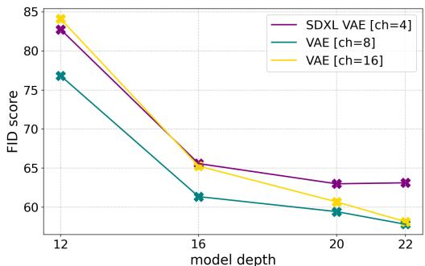  
16-channel autoencoder space needs more model capacity to achieve similar performance. At depth $d = 2 2$ , the gap between 8-chn and 16-cn becomes negligibleWe opt for the 16-chn model as we ultimately aim to scale to much larger model sizes.

# B.3. Preliminaries for the Experiments in Section 5.1.

aW e ea uosk  tabexo captns of the form  photo of aclassname"to mages, whereasnameis randomly chosen fromne te roir eas labsoealext--ta euh (Changpinyo et al., 2021) for training. Optization In this experiment, we trainl moels using a global batch siz  1024 using theAdamWotizer (Loshchilov & Hutter, 2017) with a learning rate of $1 0 ^ { - 4 }$ and 1000 linear warmup steps. We use mixed-precision training and keee hi  aae  o (A of the three text encoders independently to zero with a probability of $4 6 . 4 \%$ , such that we roughly train an unconditional model in $1 0 \%$ of all steps. va e. eLI o aoale y luring training on the C0CO-2014 validation split (Lin et al., 2014). ight equally spaced values in the time interval [0, 1]. Toanalyzeowfet pes behavnder ifft sp sett we pro smp o e s LIP L Ror l 021neCLP L1e u

# B.4. Improving SNR Samplers for Rectified Flow Models

As described in Section 2, we introduce novel densities $\pi ( t )$ for the timesteps that we use to train our rectified flow models. 0t a ucDM(Kar0nDM l.

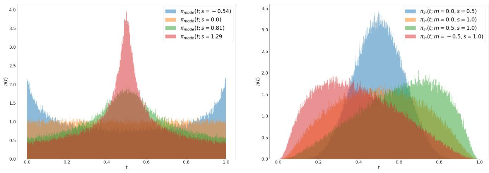  
.

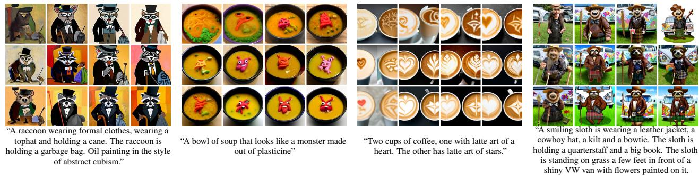  
200k, 350k, 500k) and model sizes (top to bottom: depth $_ { = 1 5 }$ ,30, 38) on PartiPrompts, highlighting the influence of training duration and model complexity.

# C. Direct Preference Optimization , thismeas beeapt preexifo Wal lIn Wl   aR  e learble Low-Ranaptain (LoRAmari rank1) r llearayers  is  praciWeee e Figure 13 shows samples of the respective base models and DPO-finetuned models.

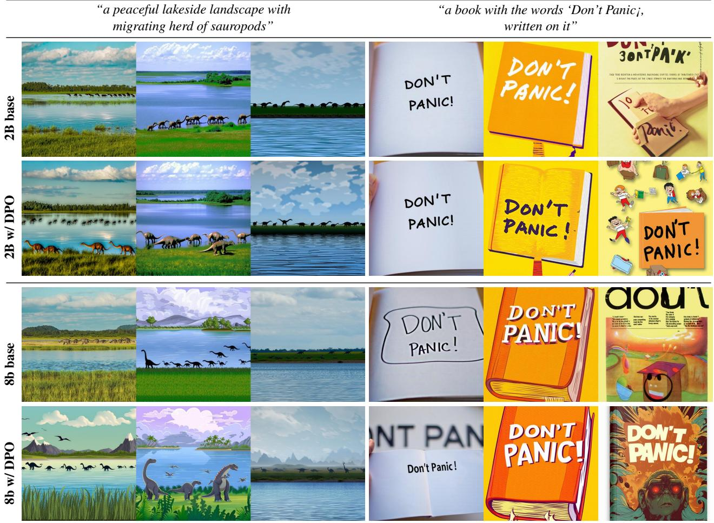  
samples with better spelling

# D. Finetuning for instruction-based image editing

Ac prcorraistr basmdinealimage-to-mgeifusn moels  t f he au e paha

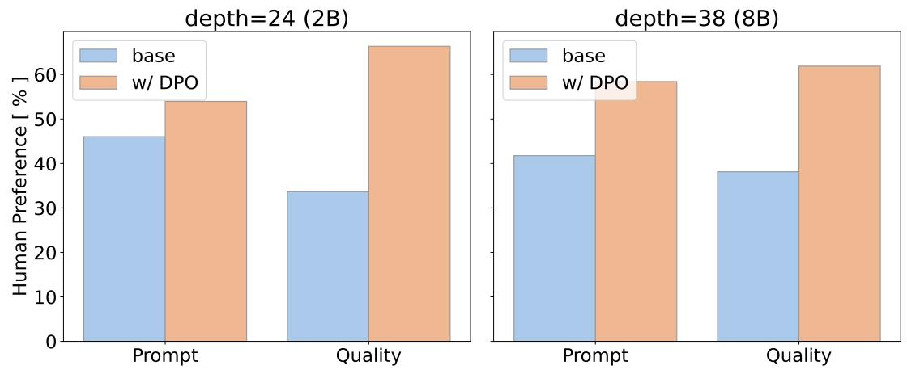  
models for both prompt following and general quality.

<table><tr><td>Model</td><td>Mem [GB]</td><td>FP [ms]</td><td>Storage [kB]</td><td>Delta [%]</td></tr><tr><td>VAE (Enc)</td><td>0.14</td><td>2.45</td><td>65.5</td><td>13.8</td></tr><tr><td>CLIP-L</td><td>0.49</td><td>0.45</td><td>121.3</td><td>2.6</td></tr><tr><td>CLIP-G</td><td>2.78</td><td>2.77</td><td>202.2</td><td>15.6</td></tr><tr><td>T5</td><td>19.05</td><td>17.46</td><td>630.7</td><td>98.3</td></tr></table>

T $[ \% ]$ is how much longer a training step takes, when adding this into the loop for the 2B MMDiT-Model (568ms/it). t  u training a SDXL-based (Podell et al., 2023) editing model on the same data.

# E. Data Preprocessing for Large-Scale Text-to-Image Training

# E.1. Precomputing Image and Text Embeddings

Ou epoch, see Tab. 7. T   o during training $_ { c , f }$ Tab. 7). We save the embeddings of the language models in half precision, as we do not observe a deterioration in performance in practice.

# E.2. Preventing Image Memorization

In y scan our training dataset for duplicated examples and remove them.

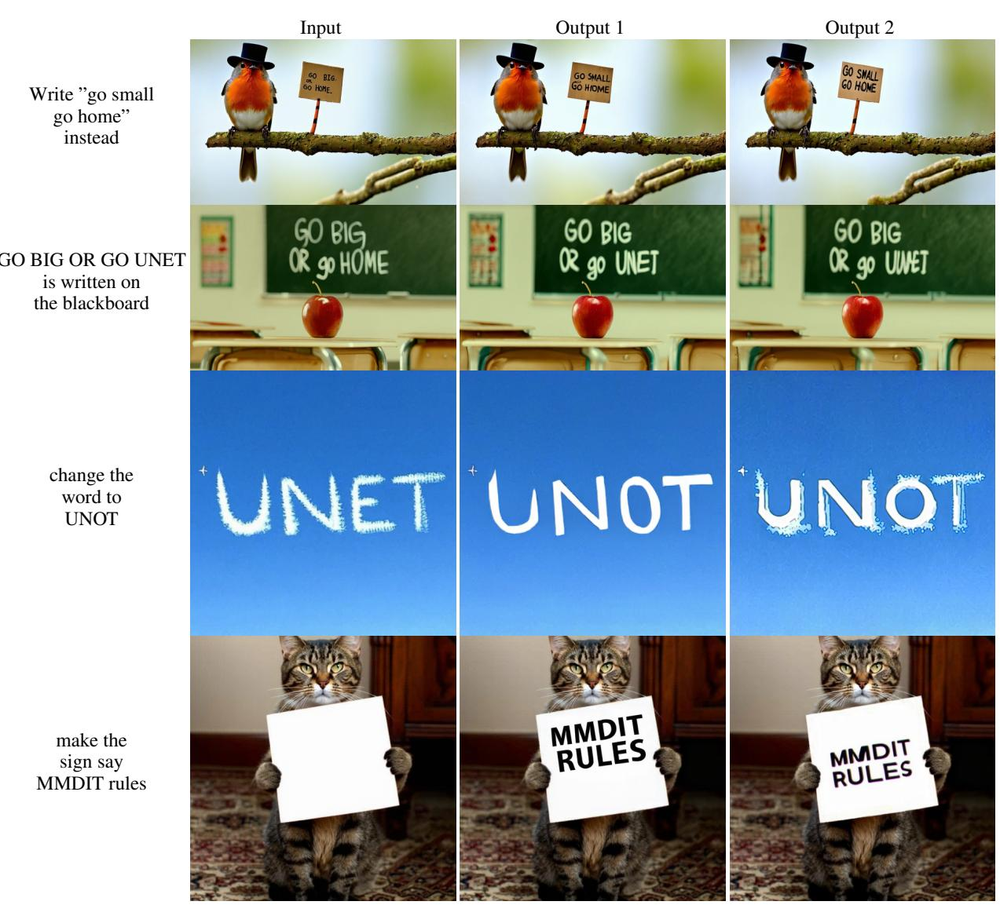  
Figure 15. Zero Shot Text manipulation and insertion with the 2B Edit model

r , clustering and otherdownstream tasks.We also decided to follow Nichol (2022) to decide on a number of clusters $N$ .For our experiments, we use $N = 1 6 , 0 0 0$ . W data, such as image embeddings. Altra pW eento  ve f C hreshol s owngu1Base  theseresults weelece fourhrehol o heal u igu

# E.3. Assessing the Efficacy of our Deduplication Efforts

C t taamp bu heremanit rkeyemeoiz han o-uplicatexale (Somepalli et al., 2023a;a; Lee et al., 2021). To e rk  r0 a uG tsehicrao (2023). Note that we run this techniques two times; one for $\mathrm { S D } { - 2 . 1 }$ model with only exact dedup removal as baseline, and fom wie .uutaixacupneauplatsC et al., 2022).

W0ua o.a00aa xt op c kendzatT intuition is that for diffusion models, with high probability $G e n ( p ; r _ { 1 } ) \approx _ { d } G e n ( p ; r _ { 2 } )$ for two different random initial seeds $r _ { 1 } , r _ { 2 }$ . On the other hand, if $G e n ( p ; r _ { 1 } ) \approx _ { d } G e n ( p ; r _ { 2 } )$ under some distance measure d, it is likely that these generated samples are memorized examples. To compute the distance measure $d$ between two images, we use a modified Euclidean $l _ { 2 }$ dia.In parlar,  nd at may is w  surs mr $l _ { 2 }$ distance (e.g., they all had gray backgrounds). We therefore instead divide each image into 16 non-overlapping $1 2 8 \times 1 2 8$ tiles and measure the maximum of the $l _ { 2 }$ distance between any pair of image tiles between the two images. Figure 17 shows the comparison betweenumber f memorized sample, before and after using D with the threshold of 0.5 to oe -uplicat sampes.Car  al. (0 markimages withi clique iz 0 a memoriz samples. e we alep iz  qorqreolblantuhe at ${ \mathrm { S S C D } } { = } 0 . 5$ show a $5 \times$ reduction in potentially memorized examples.

# Algorithm 1 Finding Duplicate Items in a Cluster

Ris  gusLis   AI   
for similarity search within the cluster, thresh  Threshold for determining duplicates

Output: dups  Set of duplicate item IDs   
1: dups new set()   
2: for $i \gets 0$ to length(vecs) − 1 do   
3: $\mathsf { q s } \gets \mathsf { v e c s } [ i ]$ {Current vector}   
4: qid items[] {Current item ID}   
5: lims, $D , I $ index.range_search(qs, thresh)   
6: if qid $\in$ dups then   
7: continue   
8: end if   
9: start ← lims[0]   
10: end lims[1]   
11: duplicate_indices $ I [ s t a r t : e n d ]$   
12: duplicate_ids new list()   
13: for $j$ in duplicate_indices do   
14: if items $[ j ] \neq$ qid then   
15: duplicate_ids.append(items[j])   
16: end if   
17: end for   
18: dups.update(duplicate_ids)   
19end for   
20: Return dups {Final set of duplicate $\mathrm { I D s } \}$ (a) Final result of SSCD deduplication over the entire dataset

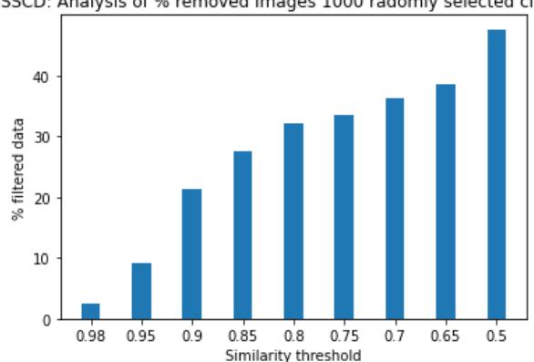  

SSCD: Analysis of % removed images 1000 radomly selected clusters

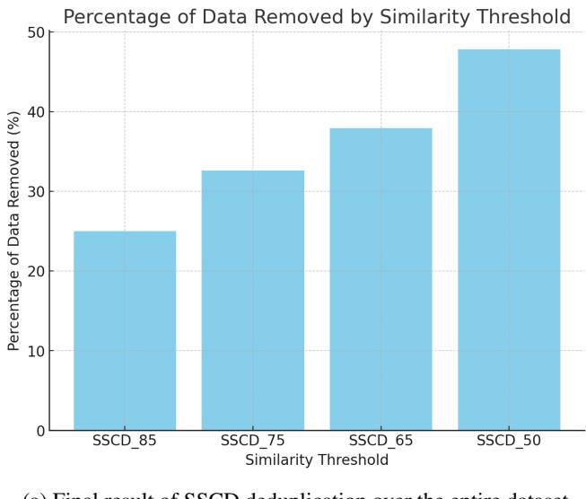  
(b) Result of SSCD deduplication with various thresholds over 1000 random clusters   
Figure 16. Results of deduplicating our training datasets for various filtering thresholds.

# Algorithm 2 Detecting Memorization in Generated Images

Require: Set of prompts $P$ , Number of generations per prompt $N$ , Similarity threshold $\epsilon = 0 . 1 5$ , Memorization threshold   
T

Ensure: Detection of memorized images in generated samples   
1: Initialize $D$ to the set of most-duplicated examples   
: for each prompt $p \in P$ do   
3: for $i = 1$ to $N$ do   
4: Generate image ${ \mathrm { G e n } } ( p ; r _ { i } )$ with random seed $r _ { i }$   
5: end for   
6end for   
7 for each pair of generated images $x _ { i } , x _ { j }$ do   
8: if distance $d ( x _ { i } , x _ { j } ) < \epsilon$ then   
9: Connect $x _ { i }$ and $x _ { j }$ in graph $G$   
10: end if   
11end for   
12: for each node in $G$ do   
13: Find largest clique containing the node   
14: if size of clique $\geq T$ then   
15: Mark images in the clique as memorized   
16: end if   
17: end for

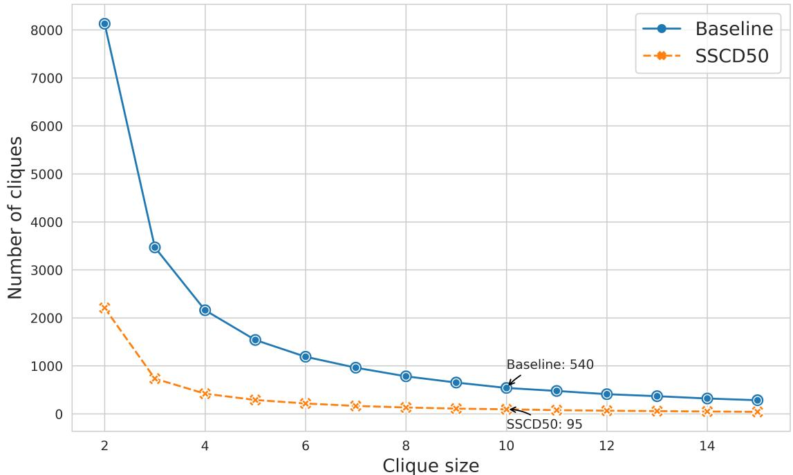  
F ba lipevza o Cok models on the deduplicated training samples cut off at ${ \mathrm { S S C D } } { = } 0 . 5$ show a $5 \times$ reduction in potentially memorized examples.